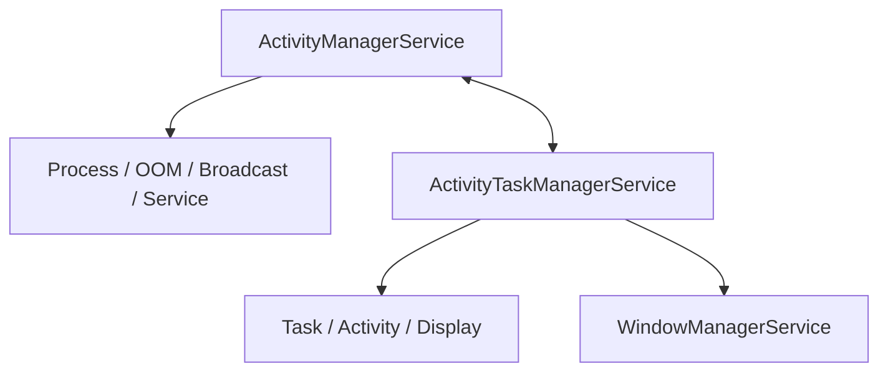

# 第 22 章：Activity 与 Window 管理概览

Android 的 Activity 和 Window 管理系统横跨 `ActivityManagerService`、`ActivityTaskManagerService`、`WindowManagerService`、`ActivityRecord`、`Task`、`DisplayContent`、`WindowState`、`ProcessList` 等多个核心组件。它负责 Activity 启动、任务栈组织、进程优先级调整、窗口添加、焦点与可见性计算、多窗口、配置变更和 ANR 检测。本章从 AOSP 源码视角梳理 AMS/ATMS/WMS 的协同机制与常见调试路径。

---

## Source Files Referenced in This Chapter

本章重点涉及的源码通常集中在以下路径：

| 路径 | 作用 |
|------|------|
| `frameworks/base/services/core/java/com/android/server/am/` | AMS、进程与 OOM 管理 |
| `frameworks/base/services/core/java/com/android/server/wm/` | ATMS、WMS、Task、ActivityRecord、DisplayContent |
| `frameworks/base/core/java/android/app/` | Activity 启动客户端接口与 AIDL |
| `frameworks/base/core/java/android/view/` | WindowManager 客户端接口 |
| `frameworks/base/core/java/android/window/` | 新式窗口与过渡相关 API |

---

## 22.1 AMS 与 ATMS 架构

### 22.1.1 历史背景：大拆分

早期 Android 中，Activity 与 task 相关逻辑更多集中在 AMS。随着窗口、多任务、多显示和过渡系统复杂度上升，Activity/Task 管理逻辑逐步拆分到 `ActivityTaskManagerService`，形成 AMS 与 ATMS 分工协作的架构。

### 22.1.2 类声明与继承

AMS 主要管理进程、服务、广播、provider 和系统级应用生命周期；ATMS 更专注于 Activity、Task、WindowContainer 树与启动决策。

### 22.1.3 双锁架构

AMS 与 ATMS/WM 各自拥有关键锁域。为了避免死锁，Android 明确划分了 AMS 锁与 `WindowManagerGlobalLock` 所代表的窗口层锁域。

### 22.1.4 AMS 中的关键字段

AMS 常见关键字段包括：进程列表、广播队列、服务映射、provider 映射、OOM 调整器、使用统计和用户状态。

### 22.1.5 ATMS 中的关键字段

ATMS 关键字段包括：`RootWindowContainer`、`ActivityTaskSupervisor`、`ActivityStartController`、recent tasks、全局窗口锁和任务/显示根结构。

### 22.1.6 AMS-ATMS 关系图



### 22.1.7 职责矩阵

| 组件 | 主要职责 |
|------|----------|
| AMS | 进程管理、OOM、广播、服务、provider |
| ATMS | Activity 启动、Task、TaskFragment、多窗口、用户前台界面 |
| WMS | 窗口、显示、布局、焦点、输入窗口、动画 |

### 22.1.8 `WindowManagerGlobalLock`

这是窗口与 task 层关键的全局锁，用于保护 `WindowContainer` 树及相关可见性、层级和过渡状态。

---

## 22.2 从 Framework 视角看 Activity 生命周期

### 22.2.1 `ActivityRecord` 状态机

`ActivityRecord` 是系统服务侧对一个 Activity 实例的核心建模。它维护从 launching、resumed、paused、stopped 到 destroyed 等状态转换。

### 22.2.2 `ActivityRecord` 关键字段

关键字段包括 intent、token、task 归属、进程关联、窗口 token、可见性、配置状态和生命周期阶段。

### 22.2.3 `startActivity()` 流程

典型启动路径为：

1. 应用调用 `startActivity()`。
2. Binder 进入 ATMS。
3. `ActivityStartController` / `ActivityStarter` 构造启动请求。
4. 解析 intent、选择目标 task、检查限制。
5. 必要时启动进程。
6. 创建或复用 `ActivityRecord`。
7. 推进 pause/resume 及窗口显示流程。

### 22.2.4 `execute()` 内部

`ActivityStarter.execute()` 负责整体启动控制流，是启动请求进入实际决策逻辑的第一站。

### 22.2.5 `executeRequest()` 内部

该阶段会执行权限、分辨率、任务栈、用户状态和 BAL 等约束检查。

### 22.2.6 `startActivityInner()` 内部

此阶段做更接近最终执行的 task 选择、flag 处理、复用逻辑和状态推进。

### 22.2.7 生命周期回调机制

系统通过 `ClientTransaction`、`TransactionExecutor` 与 `IApplicationThread` 把生命周期回调发送到 app 进程。

---

## 22.3 Task 与 ActivityRecord 层级

### 22.3.1 `WindowContainer` 层级

Activity/Task/Window 系统围绕 `WindowContainer` 树组织，是 Android 窗口与任务管理最核心的结构模式之一。

### 22.3.2 完整层级

从上到下通常包括：

- `RootWindowContainer`
- `DisplayContent`
- `TaskDisplayArea` / DisplayArea
- `Task`
- `TaskFragment`
- `ActivityRecord`
- `WindowState`

### 22.3.3 层级实践

在实际运行中，一个 Activity 既是生命周期实体，也是窗口树中的 token/container 节点。

### 22.3.4 `Task`（返回栈）内部

Task 维护一组 Activity 的历史栈、affinity、windowing mode、task id 和持久化信息。

### 22.3.5 `ActivityRecord` 作为 `WindowToken`

ActivityRecord 同时扮演窗口令牌角色，使其能直接参与窗口层级与显示策略。

### 22.3.6 `WindowState` 核心字段

WindowState 保存实际窗口参数、surface、布局属性、输入特性、可见性和 owner 信息。

### 22.3.7 `DisplayContent` 与显示区域

`DisplayContent` 表示某个显示设备上的窗口根容器，并管理显示区域、焦点和布局策略。

### 22.3.8 `RootWindowContainer`

RootWindowContainer 是整个窗口/任务树的顶层根节点。

---

## 22.4 窗口添加流程

### 22.4.1 客户端侧：从 View 到 Session

应用通过 `WindowManagerGlobal`、`ViewRootImpl` 和 `IWindowSession` 发起 `addView` / `addWindow` 流程。

### 22.4.2 服务端侧：`WMS.addWindow()`

WMS 在服务端接收窗口添加请求，执行 token 校验、权限检查、窗口对象创建和容器插入。

### 22.4.3 `addWindow()` 分步流程

主要步骤包括：

1. 获取全局窗口锁。
2. 校验 display 与 token。
3. 创建 `WindowState`。
4. 插入层级结构。
5. 更新焦点、布局与 surface 计划。

### 22.4.4 Token 校验逻辑

系统通过不同 token 类型限制哪些窗口可添加到哪个上下文，防止越权创建窗口。

### 22.4.5 `WindowState` 创建

窗口创建时会绑定 `Session`、`WindowToken`、LayoutParams 与显示上下文。

### 22.4.6 `addWindowInner()` 方法

这是窗口加入容器树、更新可见性与输入/布局状态的关键内部步骤。

### 22.4.7 `Session` Binder 对象

`Session` 表示单个客户端与 WMS 的 Binder 会话，是权限与资源归属的重要边界。

---

## 22.5 `WindowManagerService` 架构

### 22.5.1 类概览

WMS 负责窗口树、布局、显示策略、焦点、输入窗口协同、动画与 surface 管理。

### 22.5.2 核心数据结构

包括 `WindowState`、`DisplayContent`、`WindowToken`、`RootWindowContainer`、`WindowSurfacePlacer` 等。

### 22.5.3 关键组件引用

WMS 与 InputManager、DisplayManager、ATMS、SurfaceControl 和 Policy 组件紧密协作。

### 22.5.4 常量与配置

大量窗口行为由常量、flag、window type、layer policy 和系统配置控制。

### 22.5.5 WMS 线程模型

WMS 主要依赖 system_server 的主线程与专用动画/显示线程，并与 SurfaceFlinger 通过事务边界协作。

### 22.5.6 `WindowSurfacePlacer`

它负责统一执行窗口布局和 surface 放置，是窗口变更后的关键提交器。

### 22.5.7 焦点管理

WMS 负责决定当前聚焦窗口，并向输入系统同步焦点变化。

### 22.5.8 `PriorityDumper`

PriorityDumper 允许按调试优先级过滤 dump 输出，是复杂 WMS 状态转储的重要工具。

---

## 22.6 Intent 解析与 Activity 启动

### 22.6.1 显式 vs 隐式 Intent

显式 intent 直接指定目标组件；隐式 intent 需通过 PackageManager/ATMS 解析后再决定启动目标。

### 22.6.2 解析管线

启动前会经过分辨组件、用户/权限/BAL 检查、task 复用决策和启动 flag 处理。

### 22.6.3 `ActivityStarter` 管线阶段

`ActivityStarter` 把单次启动请求拆解为多个阶段处理，是 activity 启动系统的关键调度器。

### 22.6.4 `computeLaunchingTaskFlags()`

该方法根据 launchMode、现有 task、intent flags 与调用上下文推导最终 task 行为。

### 22.6.5 `computeTargetTask()`

系统会决定是复用现有 task、把目标插入已有栈，还是新建 task。

### 22.6.6 Launch Modes 解释

`standard`、`singleTop`、`singleTask`、`singleInstance` 等 launchMode 会显著影响 task 与 ActivityRecord 重用策略。

### 22.6.7 后台 Activity 启动（BAL）限制

Android 对后台启动 activity 有严格限制，以保护用户体验和安全边界。

### 22.6.8 Activity 拦截器链

启动流程中可插入拦截器，对某些请求执行额外验证或重写逻辑。

### 22.6.9 Task 权重限制

系统会避免 task 树无限膨胀，并结合 recent tasks、窗口模式与资源限制维护结构稳定。

---

## 22.7 进程管理

### 22.7.1 `ProcessList` 与 OOM 调整

AMS 使用 `ProcessList` 和 OOM adjustment 体系动态评估进程重要性。

### 22.7.2 OOM 调整值

不同进程状态对应不同 OOM adj，前台可见进程优先保活，缓存进程更容易被杀。

### 22.7.3 调度组

系统还会根据进程状态把进程分配到不同 scheduling group，影响 CPU 调度优先级。

### 22.7.4 `ProcessRecord` 结构

ProcessRecord 保存应用进程的运行时状态、绑定组件、优先级、PID/UID 和生命周期信息。

### 22.7.5 通过 Zygote 启动进程

当目标 activity 所在进程不存在时，AMS 会通过 Zygote 启动对应应用进程。

### 22.7.6 Zygote 策略标志

不同进程启动场景会携带不同 policy flags，用于控制调试、ABI、隔离与运行模式。

### 22.7.7 `ProcessList` 与 LMKD 通信

ProcessList 会把进程重要性变化同步给 LMKD，以便内存压力场景下做更合理的杀进程决策。

### 22.7.8 `OomAdjuster`

OomAdjuster 负责重新计算进程 adj 和相关状态，是内存管理与进程保活策略的关键实现。

### 22.7.9 进程状态

进程状态比 OOM adj 更细，用于表达前台可见、服务、后台、缓存等运行层级。

### 22.7.10 `CachedAppOptimizer`（Freezer）

系统可冻结长期缓存应用，以减少 CPU 占用和后台唤醒成本。

### 22.7.11 进程 LRU 列表

AMS 使用 LRU 列表维护缓存进程顺序，为 LMKD 与内部回收策略提供依据。

---

## 22.8 动手实践：Tracing 与调试

### 22.8.1 Exercise 1：用 Perfetto 追踪 Activity 启动

```bash
# On the device, start a trace capturing the relevant categories
# In another terminal, launch an activity
# Open in https://ui.perfetto.dev/
```

### 22.8.2 Exercise 2：用 `dumpsys` 检查窗口层级

```bash
# Full window dump
# More concise -- just the hierarchy
# Activity-focused dump
# Dump details for a specific package
```

### 22.8.3 Exercise 3：监控 Activity 生命周期事件

```bash
# Monitor ActivityManager events
# Or use the more detailed WM tags
```

### 22.8.4 Exercise 4：检查进程优先级

```bash
# View all processes and their OOM adj
# Or get the raw values from procfs
```

### 22.8.5 Exercise 5：强制配置变更

```bash
# Rotate the screen
# Watch the logs
```

### 22.8.6 Exercise 6：用 `am` 命令检查 Task 状态

```bash
# List all tasks
# Get task details
# Start an activity in a specific task
# Move a task to front
# Remove a task
```

### 22.8.7 Exercise 7：使用 `wm` 命令做窗口检查

```bash
# Get display info
# Override display size (useful for testing)
# Reset overrides
# Get surface flinger state
```

### 22.8.8 面向 Framework 开发者的调试提示

优先结合 `dumpsys activity`、`dumpsys window`、Perfetto、WMS 日志和 AMS/ATMS 源码共同定位问题。

---

## 22.9 深入解析：`setState()` 方法与状态转换

### 22.9.1 `setState()` 实现

`ActivityRecord.setState()` 是生命周期状态推进的关键方法，会同步统计、可见性和调试信息。

### 22.9.2 状态转换触发器

触发器包括启动、pause/resume、配置变化、用户切换、进程死亡与任务重排。

### 22.9.3 电池与使用统计集成

状态变化常与 usage stats、电池统计与事件日志联动。

---

## 22.10 高级主题：`resumeTopActivity` 管线

### 22.10.1 递归 Resume 模式

ATMS 在某些层级结构中会递归寻找和恢复最顶层可 resume 的 activity。

### 22.10.2 Pause-Before-Resume 协议

Android 通常先确保当前 resumed activity 完成 pause，再继续 resume 下一个 activity，以维持生命周期一致性。

### 22.10.3 Idle Timeout

当 activity 在预期时间内未进入 idle/resumed 等状态，系统会用 timeout 机制防止启动流程卡死。

---

## 22.11 高级主题：`recycleTask()` 与 Intent Flag 处理

### 22.11.1 `recycleTask()` 逻辑

该逻辑涉及 task 复用与 ActivityRecord 重排，是 launch flags 生效的重要环节。

### 22.11.2 Flag 处理：`CLEAR_TOP` 与 `SINGLE_TOP`

这些 flag 决定是重用栈顶、清理上层 activity，还是投递 `onNewIntent()`。

### 22.11.3 `deliverNewIntent` 机制

在可复用情况下，系统不会重建 activity，而是通过 `deliverNewIntent()` 把新的 intent 投递给现有实例。

---

## 22.12 高级主题：多窗口与 TaskFragment 架构

### 22.12.1 `TaskFragment`：嵌入容器

TaskFragment 是 modern window embedding 体系中的容器抽象，可在单个 task 内组织更细粒度的 activity 布局。

### 22.12.2 `TaskFragmentOrganizer`

Organizer 允许系统或可信组件管理 TaskFragment 生命周期和布局行为。

### 22.12.3 Embedding 检查结果

系统会验证嵌入是否合法，例如窗口模式、尺寸、兼容性和组织者权限。

### 22.12.4 分屏与自由窗

多窗口系统最终都建立在 task/container/display 层级与 WMS 约束之上。

---

## 22.13 高级主题：Starting Window（启动窗口 / Splash Screen）

### 22.13.1 目的与类型

Starting window 为应用第一帧真正可见前提供即时视觉占位，减少启动空白感。

### 22.13.2 Starting Window 流程

系统会在 activity 启动早期根据主题和场景添加 starting window，等到应用真实窗口 ready 后再移除。

### 22.13.3 `addWindowInner()` 中的 Starting Window

启动窗口本质仍是 WMS 窗口添加路径中的特定分支逻辑。

---

## 22.14 高级主题：窗口布局引擎

### 22.14.1 `WindowSurfacePlacer`

它负责触发布局遍历和窗口表面放置，是 WMS 更新窗口几何与层级的关键入口。

### 22.14.2 Display Policy

Display policy 会根据状态栏、导航栏、cutout、旋转和系统 UI 规则影响窗口布局。

---

## 22.15 高级主题：配置变更传播

### 22.15.1 配置层级

配置从 display、task、activity 到 app 逐层合并，形成最终交付给应用的 `Configuration`。

### 22.15.2 合并配置

Merged configuration 把全局和局部约束统一成对 activity 可见的最终结果。

### 22.15.3 Activity 重建决策

系统根据哪些配置项变化、manifest 声明和兼容行为决定是直接回调 `onConfigurationChanged()` 还是重启 activity。

---

## 22.16 高级主题：Activity 系统中的 ANR 检测

### 22.16.1 ANR 触发器

ANR 可由输入事件超时、广播超时、service 超时或 activity 生命周期卡住触发。

### 22.16.2 输入 ANR 流程

输入子系统发现窗口无响应后会回调到 AMS/ATMS 的 ANR 路径，由 system_server 决定处理动作。

### 22.16.3 `AnrController`

AnrController 负责组织 ANR 报告、线程栈收集和最终用户可见行为。

---

## 22.17 高级主题：Lock Task Mode

### 22.17.1 Overview

Lock Task Mode 用于 kiosk/企业场景，把任务栈限制在受控范围内。

### 22.17.2 Lock Task 级别

不同级别决定用户能否退出、切换任务或访问系统 UI。

### 22.17.3 Lock Task 强制执行

ATMS/WMS 会共同限制任务切换、返回行为和某些系统交互。

---

## 22.18 高级主题：Recent Tasks 系统

### 22.18.1 `RecentTasks` 管理器

负责维护最近任务列表、排序、清理和持久化。

### 22.18.2 Task 持久化

Recent task 元数据可持久化到磁盘，以支持重启后恢复。

### 22.18.3 Task Snapshots

任务快照为 Recents 提供缩略图和快速视觉恢复能力。

---

## 22.19 高级主题：可见性计算

### 22.19.1 `ensureActivitiesVisible()`

该方法会遍历容器树，决定哪些 activity 应该可见、停止或隐藏，是任务显示逻辑的关键点。

### 22.19.2 `occludesParent()` 检查

某些窗口/容器是否完全遮挡父级，会影响后方 activity 的可见性和生命周期推进。

### 22.19.3 TaskFragment 的可见性状态

TaskFragment 引入了更细粒度的局部可见性与嵌入场景管理。

---

## 22.20 性能考量

### 22.20.1 Activity 启动时间预算

启动预算横跨 intent 解析、task 决策、进程启动、应用 bind、首帧渲染和 starting window 切换。

### 22.20.2 锁竞争

AMS/ATMS/WMS 的全局锁竞争会显著影响启动与交互时延。

### 22.20.3 进程启动优化

通过 Zygote 预加载、进程复用、冷启动预优化和启动窗口机制降低启动延迟。

---

## 22.21 关键接口与 AIDL 契约

### 22.21.1 `IActivityManager`

AMS 的核心 Binder 接口，暴露进程、广播、服务和部分活动管理能力。

### 22.21.2 `IActivityTaskManager`

ATMS 的核心 Binder 接口，面向 activity 和 task 管理。

### 22.21.3 `IWindowManager`

WMS 的 Binder 接口，提供窗口、显示与部分全局 UI 控制能力。

### 22.21.4 `IApplicationThread`

system_server 通过该接口回调应用进程，驱动生命周期和事务执行。

---

## 22.22 常见调试模式

### 22.22.1 诊断慢 Activity 启动

重点观察 intent 解析、task 复用、进程创建、应用 attach、首帧绘制与 `reportFullyDrawn` 时序。

### 22.22.2 诊断窗口添加失败

重点检查 token、display、权限、window type 和 WMS 返回的错误码。

### 22.22.3 诊断 Activity 状态问题

```bash
# Check current activity state
# Look for stuck transitions
# Check for pending operations
```

### 22.22.4 诊断 OOM Kill

```bash
# Check recent kills
# Check current process priorities
# Check LMKD statistics
```

## Cross-References

本章与 Intent 系统、system_server、Window 系统、Input 系统、SurfaceFlinger、Animation 与进程管理章节强相关。

---

## 22.23 高级主题：Transition 系统

### 22.23.1 Shell Transitions（Android 13+）

现代 activity / task 切换越来越依赖 Shell transition 统一组织窗口变化与动画控制。

### 22.23.2 `TransitionInfo`

TransitionInfo 描述过渡中涉及的容器变化、模式、bounds 和表面信息。

### 22.23.3 过渡类型

包括 open、close、change、to-front、to-back、rotation 等。

### 22.23.4 动画控制器

Shell 与 WMS 通过动画控制器把 transition 描述转为实际 surface 动画。

---

## 22.24 高级主题：Activity Client Controller

### 22.24.1 `IActivityClientController` 接口

该接口承载 system_server 对客户端 activity 某些控制能力和回调链路。

### 22.24.2 回调流

系统通过 controller 和 `IApplicationThread` 一起协调客户端可见活动行为。

---

## 22.25 高级主题：`ActivityTaskSupervisor`

### 22.25.1 角色与职责

ATS 负责监督 Activity/Task 启动、切换、idle 状态、超时和部分恢复逻辑。

### 22.25.2 Idle 队列

Idle queue 用于在活动进入空闲后继续推进等待中的工作，例如启动后续 activity。

### 22.25.3 Handler

Supervisor 自身拥有用于超时和异步状态推进的 Handler。

---

## 22.26 高级主题：`ActivityStartController`

### 22.26.1 Factory 与池模式

启动控制器通常复用 `ActivityStarter` 实例池，减少频繁分配开销。

### 22.26.2 Builder 模式用法

Builder 风格有助于把复杂启动参数组织得更可读和可扩展。

---

## 22.27 高级主题：`DisplayContent` 内部

### 22.27.1 DisplayContent 结构

DisplayContent 是单显示设备上的窗口与 task 根节点。

### 22.27.2 关键字段

包含 display id、配置、旋转、显示区域、焦点窗口和策略引用。

### 22.27.3 多显示支持

Android 的多显示支持建立在多个 DisplayContent 并存与任务/窗口跨显示迁移能力之上。

---

## 22.28 高级主题：输入分发连接

### 22.28.1 Input Channels

每个窗口与输入系统之间通过 InputChannel 建立连接，用于事件传输与 ANR 监控。

### 22.28.2 输入焦点与窗口排序

输入焦点依赖于窗口排序、可见性、可交互性和 policy 决策。

### 22.28.3 Spy Windows 与输入特性

特殊窗口可监听输入流或具备额外输入行为特征，需要 WMS 与 InputDispatcher 协同处理。

---

## 22.29 Activity/Window 系统中的设计模式

### 22.29.1 容器树模式

WindowContainer 树是整个系统的基础设计模式。

### 22.29.2 Pool/Recycler 模式

如 ActivityStarter 池等对象复用模式，降低频繁分配开销。

### 22.29.3 两阶段提交模式

许多窗口与生命周期更新会先修改状态，再统一执行布局或事务提交。

### 22.29.4 延迟执行模式

系统常通过 handler、defer resume、defer surface placement 等方式延后复杂操作。

### 22.29.5 Token 模式

Activity token、window token、app token 等令牌模式是安全和身份建模核心。

---

## 22.30 关键术语表

| 术语 | 说明 |
|------|------|
| AMS | `ActivityManagerService` |
| ATMS | `ActivityTaskManagerService` |
| WMS | `WindowManagerService` |
| ActivityRecord | 服务端 Activity 实例模型 |
| Task | 返回栈/任务容器 |
| WindowState | 实际窗口状态对象 |
| DisplayContent | 单显示设备根容器 |
| RootWindowContainer | 全局根容器 |
| BAL | 后台 Activity 启动限制 |

---

## 22.31 源码导航指南

### 22.31.1 `am` 包

进程、广播、服务和 OOM 管理相关源码主要位于 `am` 包。

### 22.31.2 `wm` 包（Activity/Window）

Task、ActivityRecord、WMS、DisplayContent 和过渡系统主要位于 `wm` 包。

### 22.31.3 客户端代码

应用侧 Activity、Instrumentation、ActivityThread 和 View/Window 客户端代码位于 `android.app`、`android.view` 等包。

### 22.31.4 关键 AIDL 文件

`IActivityManager.aidl`、`IActivityTaskManager.aidl`、`IWindowManager.aidl`、`IApplicationThread.aidl` 等是核心跨进程契约。

### 22.31.5 面向新贡献者的阅读顺序

建议按以下顺序：

1. `SystemServer` 与 AMS/ATMS/WMS 入口
2. `ActivityStarter`
3. `ActivityRecord` / `Task`
4. `WindowState` / `DisplayContent`
5. `ClientTransaction` 与 app 侧回调

---

## 22.32 常见问题

### Q: 为什么 AMS 和 ATMS 要拆分成两个服务？

因为进程/服务/广播管理与窗口/任务/多显示管理的复杂度都很高，拆分后职责更清晰，演进空间更大。

### Q: 为什么 ATMS 位于 `wm` 包而不是 `am`？

因为它与窗口容器树、Task、DisplayContent 和 WMS 的耦合更强。

### Q: 系统如何决定创建新 Task 还是复用旧 Task？

取决于 intent flags、launchMode、task affinity、现有容器结构和当前窗口模式。

### Q: 如果 Activity 不响应 `onPause()` 会怎样？

系统会等待一定时间，必要时触发 timeout/ANR 或推进恢复逻辑，避免整个启动流程长时间卡死。

### Q: 系统如何决定在内存压力下杀死哪个进程？

AMS 依据 OOM adj、进程状态、可见性和 LRU 列表与 LMKD 协同作出决策。

### Q: 两个不同应用的 Activity 可以在同一个 Task 中吗？

可以，在某些共享 task affinity 或 document/task 重用场景下可能发生。

### Q: 一个 Task 中 Activity 数量有上限吗？

没有固定小常量上限，但系统会受内存、recent task 策略和用户行为约束。

### Q: `ActivityRecord` 与 `WindowState` 的关系是什么？

`ActivityRecord` 表示 Activity 生命周期与容器身份，`WindowState` 表示该 Activity 拥有的具体窗口实例；二者在容器树和可见性上紧密关联。

## Summary

## 总结

Android Activity 与 Window 管理系统的关键架构要点如下：

| 组件 | 核心职责 |
|------|----------|
| AMS | 进程、OOM、广播、服务与 provider 管理 |
| ATMS | Activity 启动、Task、TaskFragment、多窗口、生命周期协调 |
| WMS | 窗口树、显示、焦点、布局、surface 放置 |
| ActivityRecord | 服务端 Activity 核心模型 |
| Task / RootWindowContainer | 层级容器与任务组织 |
| ProcessList / OomAdjuster | 进程优先级与回收策略 |

这套系统的关键设计原则包括：

1. **Activity 与 Window 统一建模在容器树中**。
2. **AMS/ATMS/WMS 分工明确但深度协作**。
3. **生命周期推进与窗口显示是交错进行的双轨系统**。
4. **启动流程依赖任务复用、进程管理与客户端事务协同**。
5. **锁、线程和超时机制共同维持系统一致性与可恢复性**。

掌握本章后，可以沿着“Intent → ActivityStarter → Task/ActivityRecord → 进程启动 → Window 添加 → 可见性与焦点 → 调试与恢复”这条主线理解 Android 前台界面是如何被创建、管理和显示出来的。
