# Chapter 22: Activity and Window Management Overview

> *"The activity manager is to Android what the process scheduler is to Linux --
> it decides what runs, when it runs, and what resources it gets."*

The Activity and Window Management subsystem is the beating heart of
the Android user experience. Every tap that launches an app, every swipe that
switches tasks, every split-screen arrangement, and every floating
picture-in-picture window passes through the intricate machinery of
`ActivityManagerService` (AMS), `ActivityTaskManagerService` (ATMS), and
`WindowManagerService` (WMS). Together these three services -- all running
inside `system_server` -- manage the full lifecycle of activities, the
hierarchy of tasks and windows, the scheduling of process priorities, and the
choreography of visual transitions that the user sees on screen.

This chapter provides a comprehensive architectural overview. We will trace
real code paths through the AOSP source, examine class hierarchies with Mermaid
diagrams, and dissect the data structures that underpin every visible
interaction on Android. Chapters 16 and 17 will dive deeper into the Window
System internals and the Display/Compositor pipeline respectively; here we
establish the foundations.

---

## Source Files Referenced in This Chapter

Throughout this chapter we reference the following key source files (all paths
relative to the AOSP root):

| File | Lines | Role |
|------|------:|------|
| `frameworks/base/services/core/java/com/android/server/am/ActivityManagerService.java` | ~19,921 | Process management, broadcast, service lifecycle |
| `frameworks/base/services/core/java/com/android/server/wm/ActivityTaskManagerService.java` | ~8,130 | Activity/task lifecycle, startActivity entry point |
| `frameworks/base/services/core/java/com/android/server/wm/WindowManagerService.java` | ~10,983 | Window addition, layout, surface management |
| `frameworks/base/services/core/java/com/android/server/wm/ActivityStarter.java` | ~3,788 | Intent resolution, task targeting, launch pipeline |
| `frameworks/base/services/core/java/com/android/server/wm/ActivityRecord.java` | ~9,788 | Per-activity state: lifecycle, visibility, config |
| `frameworks/base/services/core/java/com/android/server/wm/Task.java` | ~7,190 | Task (back stack) management |
| `frameworks/base/services/core/java/com/android/server/wm/WindowState.java` | ~6,191 | Per-window state: frames, surfaces, input |
| `frameworks/base/services/core/java/com/android/server/wm/WindowContainer.java` | ~3,803 | Base of the window hierarchy tree |
| `frameworks/base/services/core/java/com/android/server/wm/RootWindowContainer.java` | ~3,972 | Root of the entire window hierarchy |
| `frameworks/base/services/core/java/com/android/server/am/ProcessList.java` | ~6,027 | OOM adj values, process start via Zygote |
| `frameworks/base/services/core/java/com/android/server/am/ProcessRecord.java` | ~1,783 | Per-process bookkeeping |
| `frameworks/base/services/core/java/com/android/server/am/OomAdjuster.java` | varies | OOM adjustment computation |

---

## 22.1 AMS and ATMS Architecture

### 22.1.1 Historical Context: The Great Split

Before Android 10 (API 29), `ActivityManagerService` was a single monolithic
class responsible for *everything*: process management, activity lifecycle,
task management, broadcast dispatch, service binding, content provider
tracking, and OOM adjustment. The file exceeded 30,000 lines and was one of
the most complex classes in all of AOSP.

Starting with Android 10, the AOSP team extracted activity-related and
task-related logic into a new service: `ActivityTaskManagerService`. This
separation reflects a fundamental architectural distinction:

- **AMS** (`com.android.server.am.ActivityManagerService`) -- Manages
  *processes*: lifecycle, priority (OOM adj), broadcasts, services, content
  providers, instrumentation, and the LRU process list.

- **ATMS** (`com.android.server.wm.ActivityTaskManagerService`) -- Manages
  *activities and tasks*: the startActivity pipeline, task stacks, activity
  lifecycle transitions, recents, lock task mode, and multi-window
  configuration.

Note the package difference: AMS lives in `com.android.server.am` while ATMS
lives in `com.android.server.wm` (window manager). This reflects how tightly
activities and windows are coupled -- ATMS was moved into the WM package to
share the same lock and reduce cross-lock contention.

### 22.1.2 Class Declaration and Inheritance

```java
// frameworks/base/services/core/java/com/android/server/am/ActivityManagerService.java, line 543
public class ActivityManagerService extends IActivityManager.Stub
        implements Watchdog.Monitor, BatteryStatsImpl.BatteryCallback,
                   ActivityManagerGlobalLock {
```

```java
// frameworks/base/services/core/java/com/android/server/wm/ActivityTaskManagerService.java, line 336
public class ActivityTaskManagerService extends IActivityTaskManager.Stub {
```

Both extend their respective AIDL Stub classes, meaning they handle Binder IPC
calls from client apps. AMS additionally implements `Watchdog.Monitor` (to
detect system hangs) and `BatteryStatsImpl.BatteryCallback` (for power
tracking).

### 22.1.3 The Two-Lock Architecture

AMS and ATMS use different global locks, which is a critical design decision
for concurrency:

```java
// In AMS (line 685):
final ActivityManagerGlobalLock mGlobalLock = ActivityManagerService.this;

// The process-specific lock (line 723):
final ActivityManagerGlobalLock mProcLock = ENABLE_PROC_LOCK
        ? new ActivityManagerProcLock() : mGlobalLock;
```

```java
// In ATMS (line 412):
final WindowManagerGlobalLock mGlobalLock = new WindowManagerGlobalLock();
```

ATMS shares its `WindowManagerGlobalLock` with WMS. This means that activity
operations and window operations are serialized under the same lock -- a
deliberate choice since activities and windows are so tightly coupled that
they almost always need to be modified together.

AMS, on the other hand, has its own `ActivityManagerGlobalLock` plus a
separate `mProcLock` for process-specific operations. The lock ordering
convention documented in the source (lines 698-724) specifies:

1. `mGlobalLock` (AMS) -- acquired first
2. `mProcLock` -- acquired second if needed
3. Other internal locks

The naming convention for methods reflects this:

- `-LOSP` -- Locked with any Of global am Service or Process lock
- `-LSP` -- Locked with both Service and Process lock
- `-Locked` -- Locked with global AM service lock alone
- `-LPr` -- Locked with Process lock alone

### 22.1.4 Key Fields in AMS

```java
// frameworks/base/services/core/java/com/android/server/am/ActivityManagerService.java
CachedAppOptimizer mCachedAppOptimizer;     // line 646 - freezer/compaction
OomAdjuster mOomAdjuster;                    // line 647 - OOM adjustment engine
BroadcastQueue mBroadcastQueue;              // line 738 - broadcast dispatch
BroadcastController mBroadcastController;    // line 742 - broadcast management
final IntentFirewall mIntentFirewall;        // line 680 - intent filtering
```

Important timing constants defined in AMS:

```java
// line 580: How long before a started process must attach
static final int PROC_START_TIMEOUT = 10 * 1000 * Build.HW_TIMEOUT_MULTIPLIER;

// line 583: How long for bindApplication to complete before ANR
static final int BIND_APPLICATION_TIMEOUT = 15 * 1000 * Build.HW_TIMEOUT_MULTIPLIER;

// line 587: Delay before killing an unused app zygote
static final int KILL_APP_ZYGOTE_DELAY_MS = 5 * 1000;

// line 596-597: Broadcast timeouts
static final int BROADCAST_FG_TIMEOUT = 10 * 1000 * Build.HW_TIMEOUT_MULTIPLIER;
static final int BROADCAST_BG_TIMEOUT = 60 * 1000 * Build.HW_TIMEOUT_MULTIPLIER;
```

### 22.1.5 Key Fields in ATMS

```java
// frameworks/base/services/core/java/com/android/server/wm/ActivityTaskManagerService.java
ActivityTaskSupervisor mTaskSupervisor;              // line 421
ActivityClientController mActivityClientController;  // line 422
RootWindowContainer mRootWindowContainer;            // line 423
WindowManagerService mWindowManager;                 // line 424

// Process tracking
final ProcessMap<WindowProcessController> mProcessNames = new ProcessMap<>();  // line 430
final WindowProcessControllerMap mProcessMap = new WindowProcessControllerMap<>();  // line 432
volatile WindowProcessController mHomeProcess;       // line 434
volatile WindowProcessController mTopApp;            // line 441
```

ATMS also manages app switching policy:

```java
// line 549-561
private volatile int mAppSwitchesState = APP_SWITCH_ALLOW;
static final int APP_SWITCH_DISALLOW = 0;
static final int APP_SWITCH_FG_ONLY = 1;
static final int APP_SWITCH_ALLOW = 2;
```

### 22.1.6 AMS-ATMS Relationship Diagram

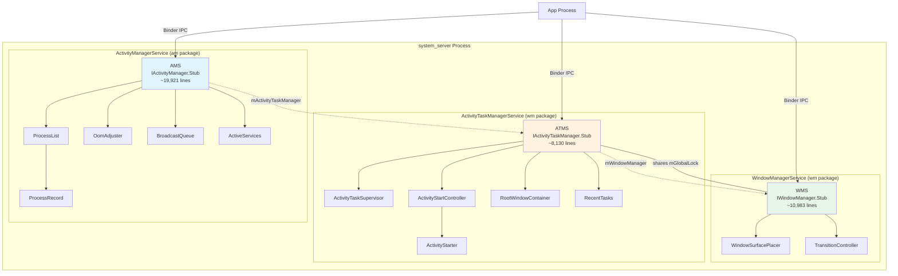

### 22.1.7 Responsibilities Matrix

| Responsibility | AMS | ATMS | WMS |
|----------------|:---:|:----:|:---:|
| Process start/stop | X | | |
| OOM adj computation | X | | |
| Broadcast dispatch | X | | |
| Service binding | X | | |
| Content provider tracking | X | | |
| Activity start pipeline | | X | |
| Task management | | X | |
| Recents list | | X | |
| Activity lifecycle callbacks | | X | |
| Lock task mode | | X | |
| Window add/remove | | | X |
| Window layout/positioning | | | X |
| Surface management | | | X |
| Input dispatch configuration | | | X |
| Display management | | | X |
| Activity visibility | | X | X |
| Configuration changes | | X | X |

### 22.1.8 The WindowManagerGlobalLock

The shared lock between ATMS and WMS deserves special attention. When ATMS
was created, the engineers chose to have it share the WM lock rather than
maintain a separate lock. This design means:

1. **Activity state changes and window state changes are atomic** -- When an
   activity transitions to RESUMED, the corresponding window visibility
   update happens under the same lock acquisition.

2. **No lock-ordering deadlocks between ATMS and WMS** -- Since they share
   the same lock, there is no possibility of A-holds-lock1-waiting-for-lock2
   while B-holds-lock2-waiting-for-lock1.

3. **Reduced concurrency** -- The downside is that activity operations and
   window operations cannot proceed in parallel. This is mitigated by keeping
   critical sections short and performing heavy work (like surface
   transactions) outside the lock.

The `WindowManagerThreadPriorityBooster` ensures that threads holding the WM
lock get a temporary priority boost to reduce priority inversion.

---

## 22.2 Activity Lifecycle from the Framework Perspective

### 22.2.1 The ActivityRecord State Machine

Every running activity is represented server-side by an `ActivityRecord`
instance. The lifecycle states are defined as an enum:

```java
// frameworks/base/services/core/java/com/android/server/wm/ActivityRecord.java, line 558
enum State {
    INITIALIZING,
    STARTED,
    RESUMED,
    PAUSING,
    PAUSED,
    STOPPING,
    STOPPED,
    FINISHING,
    DESTROYING,
    DESTROYED,
    RESTARTING_PROCESS
}
```

These states map to -- but are not identical to -- the client-side Activity
lifecycle callbacks. The server drives the client through these states via
the `ClientLifecycleManager` and `ClientTransaction` mechanism.

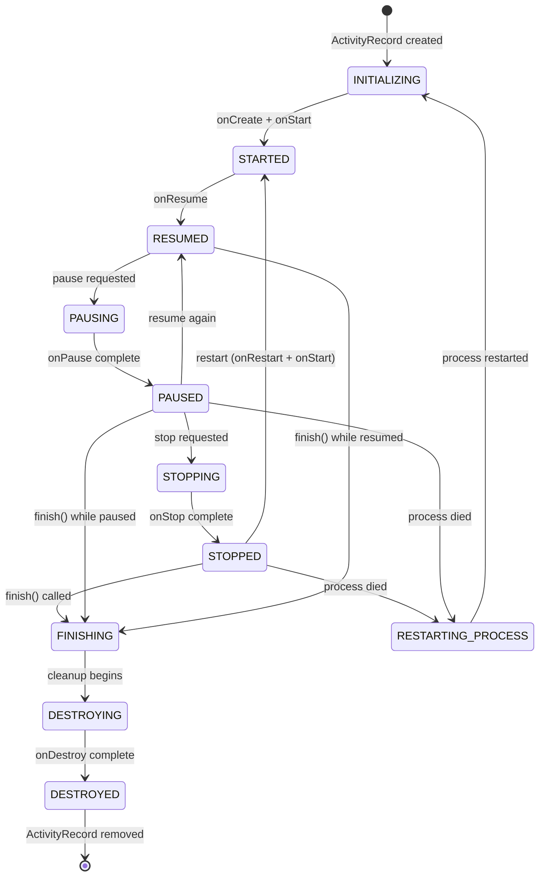

### 22.2.2 ActivityRecord Key Fields

The `ActivityRecord` class (declared at line 376) extends `WindowToken`,
making it simultaneously an activity representation and a window container:

```java
// frameworks/base/services/core/java/com/android/server/wm/ActivityRecord.java, line 376
final class ActivityRecord extends WindowToken {
```

Key fields include:

```java
// Identity and configuration
final ActivityTaskManagerService mAtmService;  // line 431
final ActivityInfo info;                        // line 434 - from AndroidManifest
final int mUserId;                             // line 436
final String packageName;                      // line 439
final ComponentName mActivityComponent;        // line 441
final Intent intent;                           // line 452
final String processName;                      // line 455
final String taskAffinity;                     // line 456

// State tracking
WindowProcessController app;                  // line 499 - hosting process
private State mState;                         // line 500 - current lifecycle state
private Task task;                            // line 468 - containing task

// Timing
long createTime = System.currentTimeMillis(); // line 469
long lastVisibleTime;                         // line 470
long pauseTime;                               // line 471

// Result handling
ActivityRecord resultTo;                      // line 480
final String resultWho;                       // line 481
final int requestCode;                        // line 482

// Lifecycle flags
boolean finishing;                            // line 515
boolean delayedResume;                        // line 514
int launchMode;                               // line 517
```

Timeout constants that protect against hung applications:

```java
// line 416: Pause must complete within 500ms
private static final int PAUSE_TIMEOUT = 500;

// line 425: Stop must complete within 11s (just before ANR at 10s)
private static final int STOP_TIMEOUT = 11 * 1000;

// line 429: Destroy must complete within 10s
private static final int DESTROY_TIMEOUT = 10 * 1000;
```

### 22.2.3 The startActivity() Flow

When an app calls `startActivity()`, the request travels through multiple
layers before an activity actually appears on screen. Here is the complete
flow:

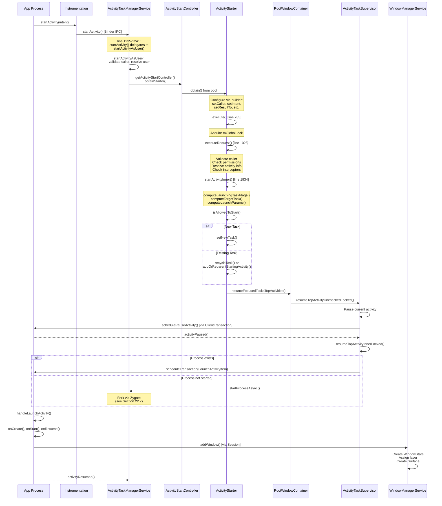

### 22.2.4 Inside execute()

The `ActivityStarter.execute()` method (line 785) is the main entry point.
Let us trace its logic:

```java
// frameworks/base/services/core/java/com/android/server/wm/ActivityStarter.java, line 785
int execute() {
    // ...
    try {
        onExecutionStarted();

        // Validate intent
        if (mRequest.intent != null) {
            if (mRequest.intent.hasFileDescriptors()) {
                throw new IllegalArgumentException("File descriptors passed in Intent");
            }
        }

        // Notify metrics logger of impending launch
        final LaunchingState launchingState;
        synchronized (mService.mGlobalLock) {
            final ActivityRecord caller = ActivityRecord.forTokenLocked(mRequest.resultTo);
            launchingState = mSupervisor.getActivityMetricsLogger()
                    .notifyActivityLaunching(mRequest.intent, caller, callingUid);
        }

        // Resolve activity if not already done
        if (mRequest.activityInfo == null) {
            mRequest.resolveActivity(mSupervisor);
        }

        int res = START_CANCELED;
        synchronized (mService.mGlobalLock) {
            // Check for global config changes
            // ...

            res = resolveToHeavyWeightSwitcherIfNeeded();
            if (res != START_SUCCESS) {
                return res;
            }

            res = executeRequest(mRequest);  // line 855 -- the real work
        }
        // ...
    }
}
```

### 22.2.5 Inside executeRequest()

The `executeRequest()` method (line 1028) performs extensive validation:

1. **Caller validation** (lines 1063-1074): Resolves the calling
   `WindowProcessController` and extracts PID/UID.

2. **Intent resolution** (lines 1145-1165): Checks if the target component
   exists. If not, checks for archived apps.

3. **Permission checks** (lines 1218-1223): Delegates to
   `ActivityTaskSupervisor.checkStartAnyActivityPermission()`.

4. **Activity interceptors** (various lines): A chain of
   `ActivityInterceptorCallback` instances can redirect or block the launch.
   These include the permissions review interceptor, the suspended-package
   interceptor, and others.

5. **Background Activity Launch (BAL) check**: Determines whether a
   background app is allowed to start an activity. The `BalVerdict` object
   encapsulates this decision.

6. **ActivityRecord creation**: A new `ActivityRecord` is constructed with
   all the resolved information.

7. **Delegation to `startActivityUnchecked()`** which calls
   `startActivityInner()`.

### 22.2.6 Inside startActivityInner()

This is the core method (line 1934) where the actual task targeting happens:

```java
// frameworks/base/services/core/java/com/android/server/wm/ActivityStarter.java, line 1934
int startActivityInner(final ActivityRecord r, ActivityRecord sourceRecord,
        IVoiceInteractionSession voiceSession, IVoiceInteractor voiceInteractor,
        int startFlags, ActivityOptions options, Task inTask,
        TaskFragment inTaskFragment, BalVerdict balVerdict,
        NeededUriGrants intentGrants, int realCallingUid) {

    setInitialState(r, options, inTask, inTaskFragment, startFlags,
            sourceRecord, voiceSession, voiceInteractor, balVerdict, realCallingUid);

    computeLaunchingTaskFlags();   // line 2897 - resolve FLAG_ACTIVITY_NEW_TASK, etc.
    mIntent.setFlags(mLaunchFlags);

    final Task reusedTask = resolveReusableTask(includeLaunchedFromBubble);
    final Task targetTask = reusedTask != null ? reusedTask : computeTargetTask();
    final boolean newTask = targetTask == null;
    // ...
```

The method then follows this decision tree:

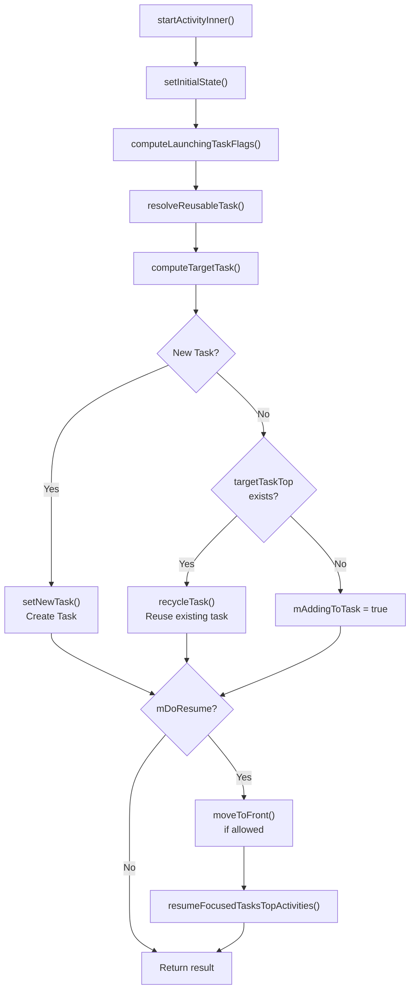

### 22.2.7 The Lifecycle Callback Mechanism

Android uses a transactional model to deliver lifecycle callbacks to client
apps. The `ClientLifecycleManager` in ATMS creates `ClientTransaction`
objects that bundle lifecycle state requests:

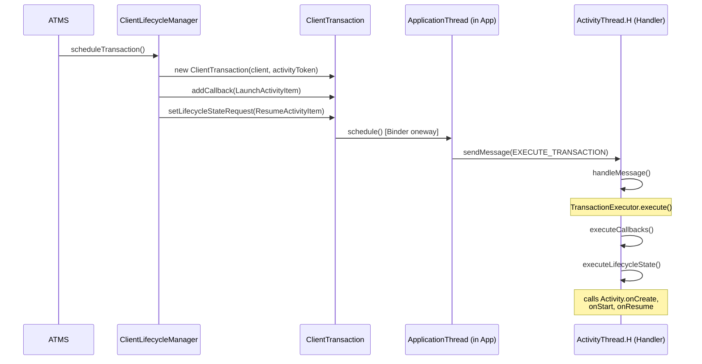

The transaction executor calculates the shortest path through the lifecycle
state machine. For example, if the current state is STOPPED and the requested
state is RESUMED, it will automatically execute onRestart -> onStart ->
onResume.

---

## 22.3 Task and ActivityRecord Hierarchy

### 22.3.1 The WindowContainer Hierarchy

The entire window/activity hierarchy in Android is built on a single base
class: `WindowContainer`. Understanding this hierarchy is essential for
understanding how the system manages windows, tasks, and displays.

```java
// frameworks/base/services/core/java/com/android/server/wm/WindowContainer.java, line 115
class WindowContainer<E extends WindowContainer> extends ConfigurationContainer<E>
        implements Comparable<WindowContainer>, Animatable {
```

`WindowContainer` provides:

- A parent-child tree structure (`mParent`, `mChildren`)
- Configuration propagation (screen size, orientation, etc.)
- Animation support
- Z-ordering via `Comparable<WindowContainer>`
- Surface management (each container can own a SurfaceControl)

### 22.3.2 The Complete Hierarchy

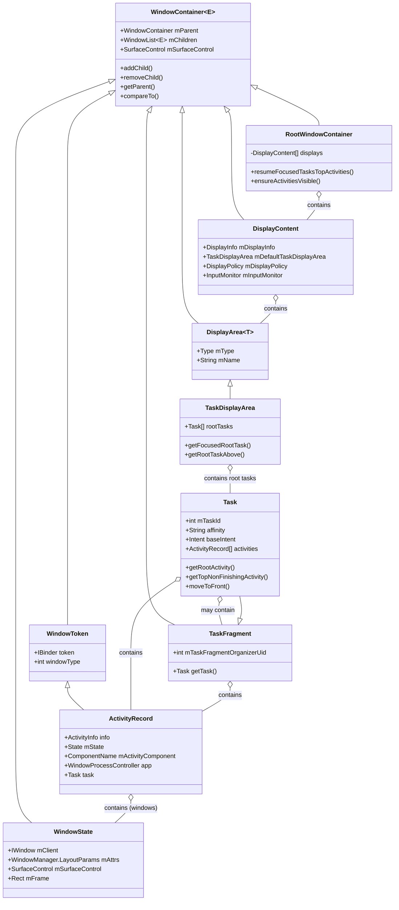

### 22.3.3 Hierarchy in Practice

In a real running system, the hierarchy typically looks like this:

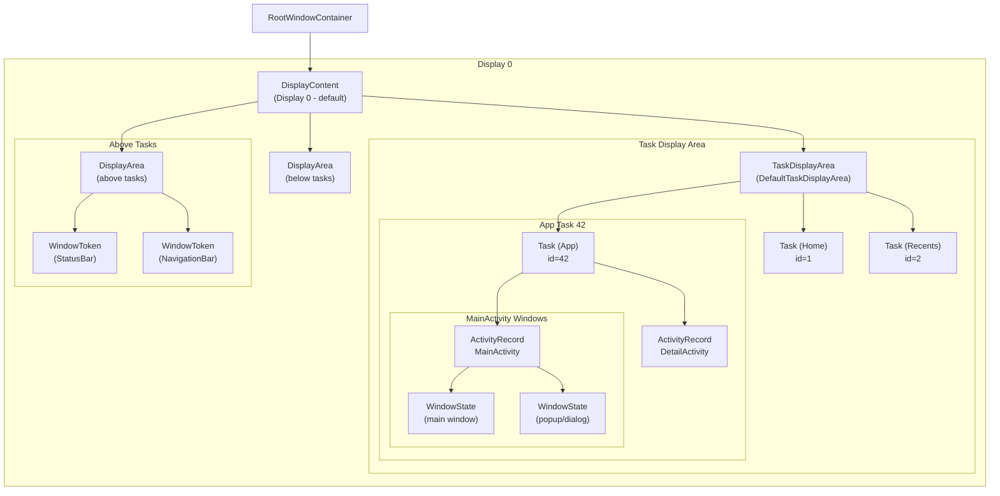

### 22.3.4 Task (Back Stack) Internals

The `Task` class (line 209) extends `TaskFragment`:

```java
// frameworks/base/services/core/java/com/android/server/wm/Task.java, line 209
class Task extends TaskFragment {
```

And `TaskFragment` extends `WindowContainer`:

```java
// frameworks/base/services/core/java/com/android/server/wm/TaskFragment.java, line 124
class TaskFragment extends WindowContainer<WindowContainer> {
```

Key Task attributes:

| Field | Purpose |
|-------|---------|
| `mTaskId` | Unique identifier for the task |
| `affinity` | Task affinity from AndroidManifest |
| `rootAffinity` | The affinity of the root activity at creation |
| `baseIntent` | The intent that started the root activity |
| `mCallingUid` | UID that created this task |
| `mResizeMode` | How this task can be resized |
| `mConfigWillChange` | Set when configuration update is pending |

Tasks also have a reparenting system with three modes:

```java
// frameworks/base/services/core/java/com/android/server/wm/Task.java, line 273-277
static final int REPARENT_MOVE_ROOT_TASK_TO_FRONT = 0;
static final int REPARENT_KEEP_ROOT_TASK_AT_FRONT = 1;
static final int REPARENT_LEAVE_ROOT_TASK_IN_PLACE = 2;
```

### 22.3.5 ActivityRecord as a WindowToken

A key architectural insight is that `ActivityRecord` extends `WindowToken`:

```java
// frameworks/base/services/core/java/com/android/server/wm/WindowToken.java, line 63
class WindowToken extends WindowContainer<WindowState> {

// frameworks/base/services/core/java/com/android/server/wm/ActivityRecord.java, line 376
final class ActivityRecord extends WindowToken {
```

This means an `ActivityRecord` *is* a `WindowToken`, and directly contains
`WindowState` children. When an app creates windows (via `WindowManager.addView()`),
those windows become children of the activity's `WindowToken`.

This design elegantly unifies the activity and window hierarchies. When an
activity is removed, all its windows are automatically cleaned up because they
are children in the container tree.

### 22.3.6 WindowState Core Fields

```java
// frameworks/base/services/core/java/com/android/server/wm/WindowState.java, line 274
class WindowState extends WindowContainer<WindowState>
        implements WindowManagerPolicy.WindowState, InsetsControlTarget, InputTarget {
```

A `WindowState` extends `WindowContainer<WindowState>`, meaning windows can
have sub-windows (like popup menus or dialog overlays).

Key fields of `WindowState`:

- `mClient` -- The `IWindow` Binder proxy back to the client process
- `mAttrs` -- `WindowManager.LayoutParams` defining type, flags, size
- `mToken` -- The `WindowToken` this window belongs to
- `mActivityRecord` -- The activity this window is part of (may be null for
  system windows)
- `mSurfaceControl` -- The SurfaceFlinger surface for rendering
- `mFrame` -- The computed screen-coordinate rectangle
- `mSession` -- The `Session` (per-process connection to WMS)
- `mWinAnimator` -- The animation controller for this window

### 22.3.7 DisplayContent and Display Areas

```java
// frameworks/base/services/core/java/com/android/server/wm/DisplayContent.java, line 288
class DisplayContent extends RootDisplayArea
        implements WindowManagerPolicy.DisplayContentInfo {
```

Each physical or virtual display is represented by a `DisplayContent`. It
contains a hierarchy of `DisplayArea` objects that organize windows into
layers:

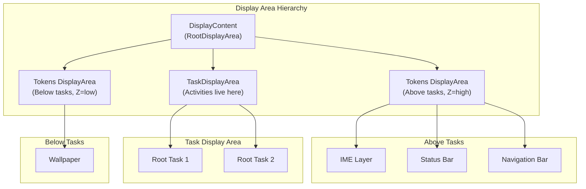

The `TaskDisplayArea` (line 74) is particularly important:

```java
// frameworks/base/services/core/java/com/android/server/wm/TaskDisplayArea.java, line 74
final class TaskDisplayArea extends DisplayArea<WindowContainer> {
```

It manages the set of root tasks on a display and provides methods like
`getFocusedRootTask()` and `getRootTaskAbove()` that are critical for
determining which activity is currently focused.

### 22.3.8 RootWindowContainer

The `RootWindowContainer` (line 171) is the apex of the entire hierarchy:

```java
// frameworks/base/services/core/java/com/android/server/wm/RootWindowContainer.java, line 171
class RootWindowContainer extends WindowContainer<DisplayContent>
        implements DisplayManager.DisplayListener {
```

It contains all `DisplayContent` objects and provides system-wide operations:

- `resumeFocusedTasksTopActivities()` -- Resumes the top activity across all
  displays
- `ensureActivitiesVisible()` -- Recalculates visibility for all activities
- `findActivity()` -- Searches all tasks on all displays for an activity
- `getDefaultTaskDisplayArea()` -- Returns the default display's task area
- `getTopDisplayFocusedRootTask()` -- Returns the focused task stack

---

## 22.4 Window Addition Flow

### 22.4.1 Client-Side: From View to Session

When an app calls `WindowManager.addView()`, the request starts on the client
side in `WindowManagerGlobal`:

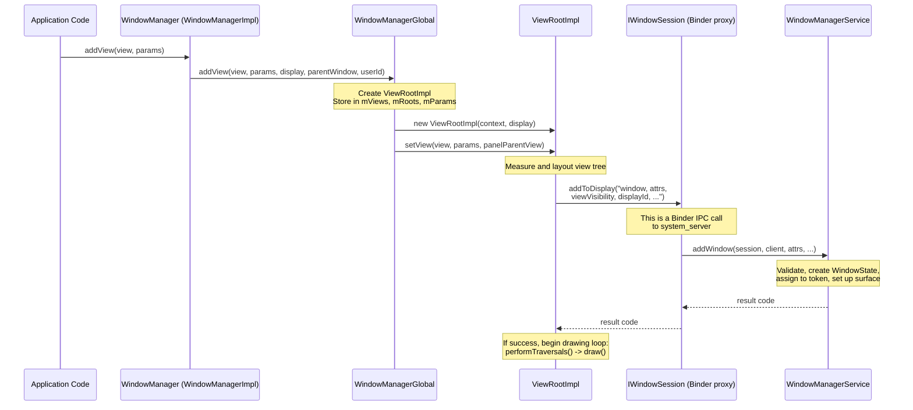

### 22.4.2 Server-Side: WMS.addWindow()

The `addWindow()` method in WMS (line 1626) is one of the most important
methods in the entire window management system. It performs extensive
validation and setup:

```java
// frameworks/base/services/core/java/com/android/server/wm/WindowManagerService.java, line 1626
public int addWindow(Session session, IWindow client, LayoutParams attrs,
        int viewVisibility, int displayId, int requestUserId,
        @InsetsType int requestedVisibleTypes,
        InputChannel outInputChannel, WindowRelayoutResult result) {
```

### 22.4.3 Step-by-Step addWindow() Flow

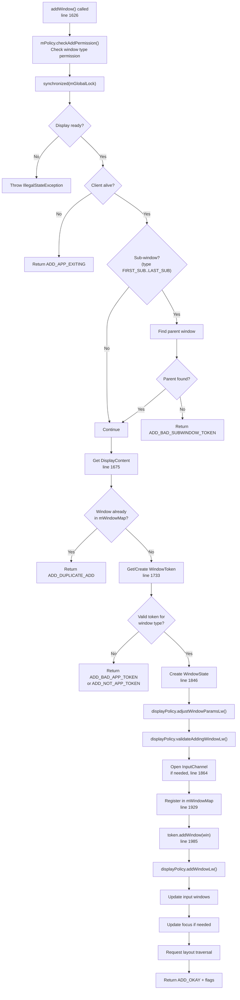

### 22.4.4 Token Validation Logic

The token validation in `addWindow()` is a critical security gate. The system
verifies that the window type matches the token:

```java
// line 1771-1825 (simplified)
if (rootType >= FIRST_APPLICATION_WINDOW && rootType <= LAST_APPLICATION_WINDOW) {
    activity = token.asActivityRecord();
    if (activity == null) {
        // Not an app token - reject
        return WindowManagerGlobal.ADD_NOT_APP_TOKEN;
    } else if (activity.getParent() == null) {
        // Activity is exiting - reject
        return WindowManagerGlobal.ADD_APP_EXITING;
    }
} else if (rootType == TYPE_INPUT_METHOD) {
    if (token.windowType != TYPE_INPUT_METHOD) {
        return WindowManagerGlobal.ADD_BAD_APP_TOKEN;
    }
} else if (rootType == TYPE_WALLPAPER) {
    if (token.windowType != TYPE_WALLPAPER) {
        return WindowManagerGlobal.ADD_BAD_APP_TOKEN;
    }
}
// ... similar checks for VOICE_INTERACTION, ACCESSIBILITY_OVERLAY, TOAST, etc.
```

This ensures that:

- Application windows can only be created with a valid `ActivityRecord` token
- System windows must have the correct token type
- No process can create a window type it is not authorized for

### 22.4.5 WindowState Creation

When validation passes, a new `WindowState` is created:

```java
// line 1846-1848
final WindowState win = new WindowState(this, session, client, token, parentWindow,
        appOp[0], attrs, viewVisibility, session.mUid, userId,
        session.mCanAddInternalSystemWindow);
```

After creation, the window goes through:

1. **Parameter adjustment** -- `displayPolicy.adjustWindowParamsLw()` may modify
   flags and attributes.

2. **Input channel setup** -- If the window accepts input, an `InputChannel`
   pair is created. One end stays in WMS (for the input dispatcher), the other
   is sent back to the client.

3. **Registration** -- The window is added to `mWindowMap` (keyed by Binder
   token) and to its `WindowToken`.

4. **Display policy** -- `displayPolicy.addWindowLw()` handles special window
   types (status bar, navigation bar).

5. **Layout request** -- A layout traversal is scheduled so the window can
   be positioned and sized.

### 22.4.6 The addWindowInner() Method

After the main validation, `addWindowInner()` (line 1977) handles type-specific
setup:

```java
// frameworks/base/services/core/java/com/android/server/wm/WindowManagerService.java, line 1977
private int addWindowInner(@NonNull WindowState win, @NonNull DisplayPolicy displayPolicy,
        @NonNull ActivityRecord activity, @NonNull DisplayContent displayContent,
        @NonNull IWindow client, @NonNull LayoutParams attrs, int uid,
        @NonNull WindowRelayoutResult result) {
    // ...
    win.mToken.addWindow(win);      // line 1985 - add to token
    displayPolicy.addWindowLw(win, attrs); // line 1986

    if (type == TYPE_APPLICATION_STARTING && activity != null) {
        activity.attachStartingWindow(win);   // Starting/splash window
    } else if (type == TYPE_INPUT_METHOD) {
        displayContent.setInputMethodWindowLocked(win);  // IME
    } else if (type == TYPE_INPUT_METHOD_DIALOG) {
        displayContent.computeImeLayeringTarget(true);
    } else {
        // Handle wallpaper window
        if (type == TYPE_WALLPAPER) {
            displayContent.mWallpaperController.clearLastWallpaperTimeoutTime();
        }
    }
    // ...
}
```

### 22.4.7 The Session Binder Object

Each app process that creates windows establishes a `Session` with WMS:

```java
// frameworks/base/services/core/java/com/android/server/wm/Session.java, line 104
class Session extends IWindowSession.Stub implements IBinder.DeathRecipient {
    final WindowManagerService mService;
    final int mUid;
    final int mPid;
```

The Session acts as a per-process proxy. The three key methods for window
management are:

```java
// line 258-279
public int addToDisplay(IWindow window, WindowManager.LayoutParams attrs,
        int viewVisibility, int displayId, ...) {
    return mService.addWindow(this, window, attrs, viewVisibility, displayId,
            UserHandle.getUserId(mUid), requestedVisibleTypes, outInputChannel, result);
}

public int addToDisplayAsUser(IWindow window, WindowManager.LayoutParams attrs,
        int viewVisibility, int displayId, int userId, ...) {
    return mService.addWindow(this, window, attrs, viewVisibility, displayId, userId,
            requestedVisibleTypes, outInputChannel, result);
}

public int addToDisplayWithoutInputChannel(IWindow window, ...) {
    return mService.addWindow(this, window, attrs, viewVisibility, displayId,
            UserHandle.getUserId(mUid), WindowInsets.Type.defaultVisible(),
            null /* outInputChannel */, result);
}
```

The `Session` also implements `IBinder.DeathRecipient`, so when a client
process dies, all its windows are automatically cleaned up.

---

## 22.5 WindowManagerService Architecture

### 22.5.1 Class Overview

```java
// frameworks/base/services/core/java/com/android/server/wm/WindowManagerService.java, line 408
public class WindowManagerService extends IWindowManager.Stub
        implements Watchdog.Monitor, WindowManagerPolicy.WindowManagerFuncs {
```

WMS implements three interfaces:

- `IWindowManager.Stub` -- Binder service for remote clients
- `Watchdog.Monitor` -- System health monitoring
- `WindowManagerPolicy.WindowManagerFuncs` -- Policy callbacks

### 22.5.2 Core Data Structures

```java
// Active sessions (one per client process)
final ArraySet<Session> mSessions = new ArraySet<>();      // line 630

// Master window map: IWindow Binder -> WindowState
final HashMap<IBinder, WindowState> mWindowMap = new HashMap<>(); // line 633

// Input token -> WindowState mapping
final HashMap<IBinder, WindowState> mInputToWindowMap = new HashMap<>(); // line 636

// The global lock (shared with ATMS)
final WindowManagerGlobalLock mGlobalLock;                 // line 639

// Windows currently being resized
final ArrayList<WindowState> mResizingWindows = new ArrayList<>(); // line 646

// Windows with changing frames
final ArrayList<WindowState> mFrameChangingWindows = new ArrayList<>(); // line 652
```

### 22.5.3 Key Component References

```java
// Policy and layout
WindowManagerPolicy mPolicy;                          // line 606
final WindowManagerFlags mFlags;                      // line 608
final WindowSurfacePlacer mWindowPlacerLocked;       // line 541
final StartingSurfaceController mStartingSurfaceController; // line 518

// External services
final IActivityManager mActivityManager;             // line 610
final ActivityManagerInternal mAmInternal;            // line 611
ActivityTaskManagerService mAtmService;              // (set during init)

// Display settings
final DisplayWindowSettings mDisplayWindowSettings;   // line 622
final DisplayAreaPolicy.Provider mDisplayAreaPolicyProvider; // line 487

// Tracing and debugging
final WindowTracing mWindowTracing;                  // line 484
final TransitionTracer mTransitionTracer;            // line 485
```

### 22.5.4 Constants and Configuration

```java
// Focus update modes (line 439-447)
static final int UPDATE_FOCUS_NORMAL = 0;
static final int UPDATE_FOCUS_WILL_ASSIGN_LAYERS = 1;
static final int UPDATE_FOCUS_PLACING_SURFACES = 2;
static final int UPDATE_FOCUS_WILL_PLACE_SURFACES = 3;
static final int UPDATE_FOCUS_REMOVING_FOCUS = 4;

// Timing constants
static final int MAX_ANIMATION_DURATION = 10 * 1000;          // line 418
static final int WINDOW_FREEZE_TIMEOUT_DURATION = 2000;       // line 421
static final int LAST_ANR_LIFETIME_DURATION_MSECS = 2 * 60 * 60 * 1000; // line 424

// Animation scales (line 474-478)
static final int WINDOW_ANIMATION_SCALE = 0;
static final int TRANSITION_ANIMATION_SCALE = 1;
private static final int ANIMATION_DURATION_SCALE = 2;
```

### 22.5.5 WMS Threading Model

WMS operations run on the `android.display` thread (also called the WM
thread). This is separate from the main thread to avoid blocking UI operations
with window management work.

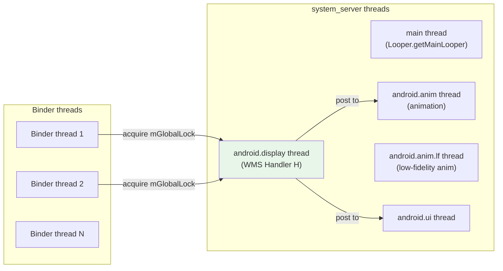

The key thread model rules:

1. **All WMS state modifications** happen while holding `mGlobalLock`
2. **Binder calls** arrive on binder threads but acquire `mGlobalLock`
3. **Handler H** processes deferred operations on the display thread
4. **Animation work** is dispatched to the animation thread
5. **SurfaceFlinger transactions** can be submitted from any thread (they are
   lock-free)

### 22.5.6 The Window Surface Placer

The `WindowSurfacePlacer` is responsible for triggering layout passes:

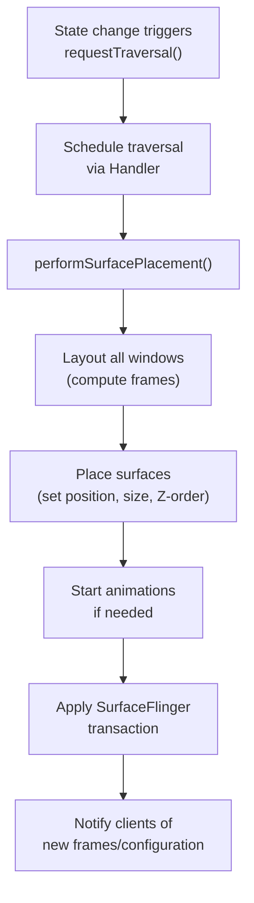

### 22.5.7 Focus Management

WMS maintains the concept of the "focused window" -- the window that receives
keyboard input. Focus updates happen through `updateFocusedWindowLocked()`:

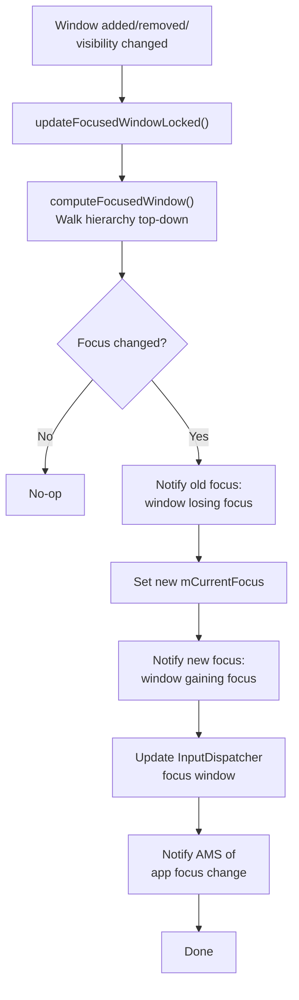

The focus computation walks the window hierarchy from top to bottom, looking
for the first window that:

1. Can receive focus (`FLAG_NOT_FOCUSABLE` is not set)
2. Is visible
3. Belongs to the current user (or is a system window)

### 22.5.8 The PriorityDumper

WMS provides diagnostic dumps at three priority levels:

```java
// line 543-572
private final PriorityDump.PriorityDumper mPriorityDumper = new PriorityDump.PriorityDumper() {
    @Override
    public void dumpCritical(...) {
        doDump(fd, pw, new String[] {"-a"}, asProto);
    }

    @Override
    public void dumpHigh(...) {
        // Dump visible activities and window clients
        mAtmService.dumpActivity(fd, pw, "all", ...);
        dumpVisibleWindowClients(fd, pw, timeoutMs);
    }

    @Override
    public void dump(...) {
        doDump(fd, pw, args, asProto);
    }
};
```

This three-tier approach ensures that critical diagnostic data can be
collected quickly (for ANR dumps), while full dumps are available for
deeper debugging.

---

## 22.6 Intent Resolution and Activity Startup

### 22.6.1 Explicit vs. Implicit Intents

When `startActivity()` is called, the system must determine which activity
should handle the intent. This is done through the `ResolveInfo` lookup.

**Explicit intents** specify the exact component:
```java
// Component is set -- resolution is direct
Intent intent = new Intent(context, DetailActivity.class);
```

**Implicit intents** describe an action and let the system find matches:
```java
// No component -- PackageManager resolves
Intent intent = new Intent(Intent.ACTION_VIEW, uri);
```

### 22.6.2 The Resolution Pipeline

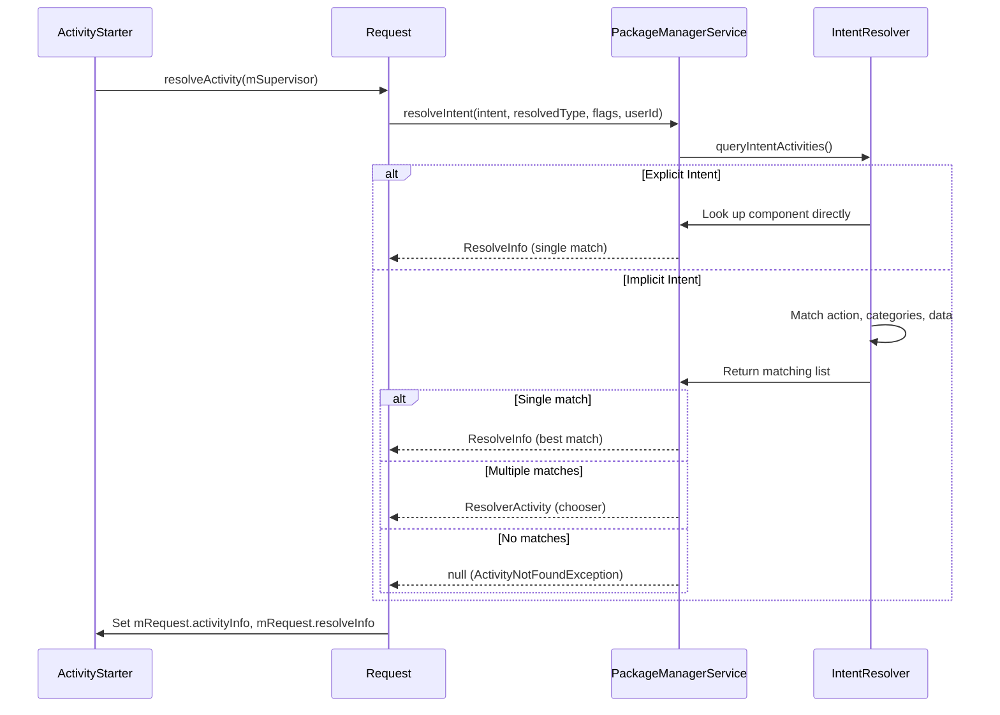

### 22.6.3 ActivityStarter Pipeline Stages

The `ActivityStarter` (line 169) processes each start request through a
well-defined pipeline:

```java
// frameworks/base/services/core/java/com/android/server/wm/ActivityStarter.java, line 169
class ActivityStarter {
    private final ActivityTaskManagerService mService;           // line 188
    private final RootWindowContainer mRootWindowContainer;     // line 189
    private final ActivityTaskSupervisor mSupervisor;           // line 190
    private final ActivityStartInterceptor mInterceptor;        // line 191
    private final ActivityStartController mController;          // line 192
```

The ActivityStarter uses a **pool** pattern to avoid allocation:

```java
// line 323-345
static class DefaultFactory implements Factory {
    private final int MAX_STARTER_COUNT = 3;
    private SynchronizedPool<ActivityStarter> mStarterPool =
            new SynchronizedPool<>(MAX_STARTER_COUNT);

    @Override
    public ActivityStarter obtain() {
        ActivityStarter starter = mStarterPool.acquire();
        if (starter == null) {
            starter = new ActivityStarter(mController, mService, mSupervisor, mInterceptor);
        }
        return starter;
    }
}
```

The pool holds at most 3 instances because at most 3 can be active
simultaneously: the last completed starter (for logging), the current
starter, and a re-entrant starter from the current one.

### 22.6.4 computeLaunchingTaskFlags()

This method (line 2897) determines which task the activity will land in by
adjusting the intent flags:

```java
// frameworks/base/services/core/java/com/android/server/wm/ActivityStarter.java, line 2897
private void computeLaunchingTaskFlags() {
```

Key rules implemented:

1. **No source + no explicit task** -- Forces `FLAG_ACTIVITY_NEW_TASK`:
   ```java
   // line 2954-2962
   if (mSourceRecord == null) {
       if ((mLaunchFlags & FLAG_ACTIVITY_NEW_TASK) == 0 && mInTask == null) {
           Slog.w(TAG, "startActivity called from non-Activity context; forcing "
                   + "Intent.FLAG_ACTIVITY_NEW_TASK for: " + mIntent);
           mLaunchFlags |= FLAG_ACTIVITY_NEW_TASK;
       }
   }
   ```

2. **Source is singleInstance** -- New activity must go in its own task:
   ```java
   // line 2963-2967
   } else if (mSourceRecord.launchMode == LAUNCH_SINGLE_INSTANCE) {
       mLaunchFlags |= FLAG_ACTIVITY_NEW_TASK;
   }
   ```

3. **Target is singleInstance/singleTask** -- Always gets its own task:
   ```java
   // line 2968-2972
   } else if (isLaunchModeOneOf(LAUNCH_SINGLE_INSTANCE, LAUNCH_SINGLE_TASK)) {
       mLaunchFlags |= FLAG_ACTIVITY_NEW_TASK;
   }
   ```

4. **LAUNCH_ADJACENT** -- Requires both `NEW_TASK` and a source record:
   ```java
   // line 2975-2989
   if ((mLaunchFlags & FLAG_ACTIVITY_LAUNCH_ADJACENT) != 0) {
       final boolean hasNewTaskFlag = (mLaunchFlags & FLAG_ACTIVITY_NEW_TASK) != 0;
       if (!hasNewTaskFlag || mSourceRecord == null) {
           mLaunchFlags &= ~FLAG_ACTIVITY_LAUNCH_ADJACENT;
       }
   }
   ```

### 22.6.5 computeTargetTask()

This method (line 2211) determines the existing task to reuse (or null for a
new task):

```java
// frameworks/base/services/core/java/com/android/server/wm/ActivityStarter.java, line 2211
private Task computeTargetTask() {
    if (mStartActivity.resultTo == null && mInTask == null && !mAddingToTask
            && (mLaunchFlags & FLAG_ACTIVITY_NEW_TASK) != 0) {
        // A new task should be created instead of using existing one.
        return null;
    } else if (mSourceRecord != null) {
        return mSourceRecord.getTask();        // Same task as caller
    } else if (mInTask != null) {
        // Explicit task specified (from AppTaskImpl)
        if (!mInTask.isAttached()) {
            getOrCreateRootTask(mStartActivity, mLaunchFlags, mInTask, mOptions);
        }
        return mInTask;
    } else {
        // Fallback: use the top task of a new/existing root task
        final Task rootTask = getOrCreateRootTask(mStartActivity, mLaunchFlags,
                null, mOptions);
        final ActivityRecord top = rootTask.getTopNonFinishingActivity();
        if (top != null) {
            return top.getTask();
        } else {
            rootTask.removeIfPossible("computeTargetTask");
        }
    }
    return null;
}
```

Decision tree:

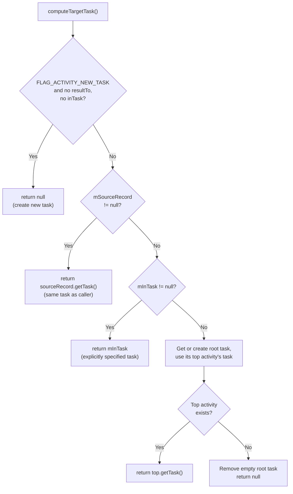

### 22.6.6 Launch Modes Explained

The launch mode (from `AndroidManifest.xml`) fundamentally affects how
activities are placed in tasks:

| Launch Mode | Flag | Behavior |
|-------------|------|----------|
| `standard` | Default | New instance in caller's task |
| `singleTop` | `LAUNCH_SINGLE_TOP` | Reuse if already at top of task (calls `onNewIntent()`) |
| `singleTask` | `LAUNCH_SINGLE_TASK` | One instance per task; brings task to front |
| `singleInstance` | `LAUNCH_SINGLE_INSTANCE` | One instance in its own exclusive task |
| `singleInstancePerTask` | `LAUNCH_SINGLE_INSTANCE_PER_TASK` | One instance per task, but multiple tasks allowed |

```mermaid
graph TB
    subgraph "standard"
        S_T1["Task"]
        S_A["Activity A"]
        S_B["Activity B"]
        S_A2["Activity A (new)"]
        S_T1 --> S_A
        S_A --> S_B
        S_B --> S_A2
    end

    subgraph "singleTop"
        ST_T1["Task"]
        ST_A["Activity A"]
        ST_B["Activity B &#9888;"]
        ST_T1 --> ST_A
        ST_A --> ST_B
        ST_B -.->|"if B at top:<br/>onNewIntent()"| ST_B
    end

    subgraph "singleTask"
        STK_T1["Task"]
        STK_A["Activity A &#9888;"]
        STK_B["Activity B"]
        STK_T1 --> STK_A
        STK_A --> STK_B
        STK_A -.->|"clear above,<br/>onNewIntent()"| STK_A
    end

    subgraph "singleInstance"
        SI_T1["Task 1"]
        SI_A["Activity A"]
        SI_T2["Task 2 (exclusive)"]
        SI_B["Activity B"]
        SI_T1 --> SI_A
        SI_T2 --> SI_B
    end
```

### 22.6.7 Background Activity Launch (BAL) Restrictions

Starting with Android 10, apps cannot start activities from the background
unless they meet specific criteria. The `BackgroundActivityStartController`
evaluates a `BalVerdict`:

```java
// ActivityStarter.java, line 202-205
@VisibleForTesting(visibility = VisibleForTesting.Visibility.PRIVATE)
BalVerdict mBalVerdict;
```

The BAL check happens in `isAllowedToStart()` (line 2263):

```java
// line 2283-2291
boolean blockBalInTask = (newTask
        || !targetTask.isUidPresent(mCallingUid)
        || (LAUNCH_SINGLE_INSTANCE == mLaunchMode
            && targetTask.inPinnedWindowingMode()));

if (mBalVerdict.blocks() && blockBalInTask
        && handleBackgroundActivityAbort(r)) {
    Slog.e(TAG, "Abort background activity starts from " + mCallingUid);
    return START_ABORTED;
}
```

BAL is allowed when:

- The calling app has a visible window
- The calling app has a pending activity result
- The calling app recently had a visible activity
- The calling app is bound by a system service with `BIND_ALLOW_BACKGROUND_ACTIVITY_STARTS`
- The caller is a device owner or profile owner
- The caller has the `START_ACTIVITIES_FROM_BACKGROUND` permission

### 22.6.8 The Activity Interceptor Chain

Before an activity is actually started, a chain of interceptors can modify
or block the launch:

```java
// ATMS fields (line 520-521)
private SparseArray<ActivityInterceptorCallback> mActivityInterceptorCallbacks =
        new SparseArray<>();
```

Interceptor ordering is defined by ranges:

```java
// From ActivityInterceptorCallback.java
// SYSTEM_FIRST_ORDERED_ID through SYSTEM_LAST_ORDERED_ID for system
// MAINLINE_FIRST_ORDERED_ID through MAINLINE_LAST_ORDERED_ID for mainline
```

Common interceptors include:

1. **Permissions Review** -- Shows runtime permission dialog if needed
2. **Suspended App** -- Blocks launches of suspended apps
3. **Confirm Credentials** -- Handles work profile unlock
4. **Dream** -- Handles launching during dream/screensaver
5. **Harmfull App Warning** -- Shows warning for sideloaded apps

### 22.6.9 The Task Weight Limit

An important safety mechanism prevents apps from creating too many activities
in a single task:

```java
// ActivityStarter.java, line 182
private static final long MAX_TASK_WEIGHT_FOR_ADDING_ACTIVITY = 300;

// line 1978-1985 (in startActivityInner)
if (targetTask != null) {
    if (targetTask.getTreeWeight() > MAX_TASK_WEIGHT_FOR_ADDING_ACTIVITY) {
        Slog.e(TAG, "Remove " + targetTask + " because it has contained too many"
                + " activities or windows (abort starting " + r
                + " from uid=" + mCallingUid);
        targetTask.removeImmediately("bulky-task");
        return START_ABORTED;
    }
}
```

The "tree weight" counts all activities and windows in the task hierarchy. If
it exceeds 300, the entire task is forcibly removed. This prevents malicious
or buggy apps from exhausting system resources (particularly SurfaceFlinger
surfaces).

---

## 22.7 Process Management

### 22.7.1 ProcessList and OOM Adjustment

The `ProcessList` class (line 184) manages all application processes and
their priority levels:

```java
// frameworks/base/services/core/java/com/android/server/am/ProcessList.java, line 184
public final class ProcessList implements ProcessStateController.ProcessLruUpdater {
```

### 22.7.2 OOM Adjustment Values

The OOM adjustment (oom_adj) value determines how aggressively the Low Memory
Killer Daemon (LMKD) will terminate a process. Lower values mean higher
priority:

```java
// frameworks/base/services/core/java/com/android/server/am/ProcessList.java
// line 295: System process
public static final int SYSTEM_ADJ = -900;

// line 292: Persistent system services
public static final int PERSISTENT_PROC_ADJ = -800;

// line 288: Persistent service bindings
public static final int PERSISTENT_SERVICE_ADJ = -700;

// line 284: Current foreground app
public static final int FOREGROUND_APP_ADJ = 0;

// line 280: Recently top, now FGS
public static final int PERCEPTIBLE_RECENT_FOREGROUND_APP_ADJ = 50;

// line 271: Visible but not foreground
public static final int VISIBLE_APP_ADJ = 100;

// line 267: Perceptible (e.g., background music)
public static final int PERCEPTIBLE_APP_ADJ = 200;

// line 262: Perceptible medium
public static final int PERCEPTIBLE_MEDIUM_APP_ADJ = 225;

// line 257: Perceptible low
public static final int PERCEPTIBLE_LOW_APP_ADJ = 250;

// line 253: Backup in progress
public static final int BACKUP_APP_ADJ = 300;

// line 249: Heavy-weight app
public static final int HEAVY_WEIGHT_APP_ADJ = 400;

// line 244: Background service
public static final int SERVICE_ADJ = 500;

// line 240: Home app
public static final int HOME_APP_ADJ = 600;

// line 234: Previous app (for quick switch)
public static final int PREVIOUS_APP_ADJ = 700;

// line 226: Old service (B list)
public static final int SERVICE_B_ADJ = 800;

// line 213: Cached app (invisible)
public static final int CACHED_APP_MIN_ADJ = 900;
public static final int CACHED_APP_MAX_ADJ = 999;
```

This forms a priority ladder:

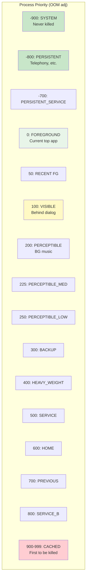

### 22.7.3 Scheduling Groups

In addition to OOM adj, processes are assigned scheduling groups that affect
CPU allocation:

```java
// line 305-319
public static final int SCHED_GROUP_UNDEFINED = Integer.MIN_VALUE;
public static final int SCHED_GROUP_BACKGROUND = 0;
static final int SCHED_GROUP_RESTRICTED = 1;
static final int SCHED_GROUP_DEFAULT = 2;
public static final int SCHED_GROUP_TOP_APP = 3;
static final int SCHED_GROUP_TOP_APP_BOUND = 4;
static final int SCHED_GROUP_FOREGROUND_WINDOW = 5;
```

The scheduling group maps directly to Linux cgroup settings:

- `SCHED_GROUP_BACKGROUND` -> `background` cgroup (limited CPU)
- `SCHED_GROUP_DEFAULT` -> `foreground` cgroup (normal CPU)
- `SCHED_GROUP_TOP_APP` -> `top-app` cgroup (priority CPU, potentially FIFO scheduling)

### 22.7.4 ProcessRecord Structure

Each running process is tracked by a `ProcessRecord`:

```java
// frameworks/base/services/core/java/com/android/server/am/ProcessRecord.java, line 85
class ProcessRecord extends ProcessRecordInternal implements WindowProcessListener {
    final ActivityManagerService mService;       // line 88
    volatile ApplicationInfo info;               // line 95
    final ProcessInfo processInfo;               // line 96
    final boolean appZygote;                     // line 97

    private UidRecord mUidRecord;                // line 106
    private final PackageList mPkgList;          // line 111
```

ProcessRecord fields track:

- **Identity**: UID, PID, process name, application info
- **State**: current process state, OOM adj, scheduling group
- **Components**: running activities, services, providers, receivers
- **Resource usage**: CPU time, memory, battery consumption
- **Lifecycle**: start time, death callbacks, crash history

### 22.7.5 Process Start via Zygote

When a new activity needs to be launched in a process that does not yet exist,
the system forks it from the Zygote. The flow goes through `ProcessList.startProcess()`:

```java
// frameworks/base/services/core/java/com/android/server/am/ProcessList.java, line 2453
private Process.ProcessStartResult startProcess(HostingRecord hostingRecord,
        String entryPoint, ProcessRecord app, int uid, int[] gids,
        int runtimeFlags, int zygotePolicyFlags, int mountExternal,
        String seInfo, String requiredAbi, String instructionSet,
        String invokeWith, long startTime) {
```

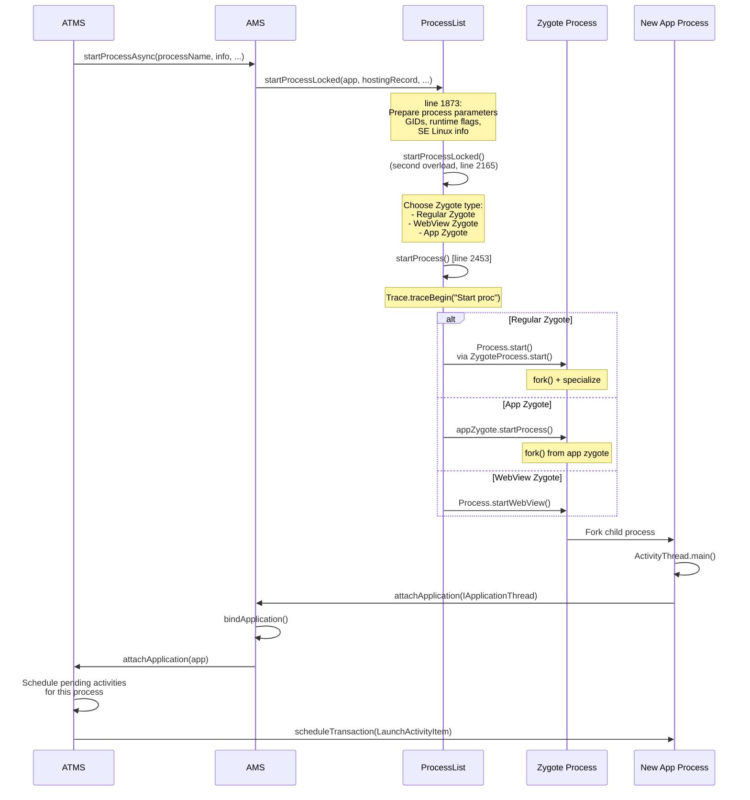

### 22.7.6 Zygote Policy Flags

The `startProcessLocked()` method uses policy flags to hint to the Zygote
about process priority:

```java
// Referenced from ActivityManagerService.java imports
static final int ZYGOTE_POLICY_FLAG_EMPTY = 0;
static final int ZYGOTE_POLICY_FLAG_LATENCY_SENSITIVE = 1;   // Top app
static final int ZYGOTE_POLICY_FLAG_SYSTEM_PROCESS = 2;      // System server
static final int ZYGOTE_POLICY_FLAG_BATCH_LAUNCH = 4;        // Boot-time batch
```

When launching the top app's process, `ZYGOTE_POLICY_FLAG_LATENCY_SENSITIVE`
is used to signal that this fork should be prioritized.

### 22.7.7 ProcessList and LMKD Communication

ProcessList communicates with the Low Memory Killer Daemon through a local
socket using a binary protocol:

```java
// line 372-383
static final byte LMK_TARGET = 0;          // Set kill thresholds
static final byte LMK_PROCPRIO = 1;        // Set process priority
static final byte LMK_PROCREMOVE = 2;      // Process removed
static final byte LMK_PROCPURGE = 3;       // Purge all entries
static final byte LMK_GETKILLCNT = 4;      // Get kill count
static final byte LMK_SUBSCRIBE = 5;       // Subscribe to events
static final byte LMK_PROCKILL = 6;        // Kill notification (unsolicited)
static final byte LMK_UPDATE_PROPS = 7;    // Update properties
static final byte LMK_KILL_OCCURRED = 8;   // Kill event to subscribers
static final byte LMK_START_MONITORING = 9; // Start delayed monitoring
static final byte LMK_BOOT_COMPLETED = 10; // Boot completion signal
static final byte LMK_PROCS_PRIO = 11;     // Batch priority update
```

When OOM adj changes, ProcessList sends `LMK_PROCPRIO` commands to LMKD, which
writes the values to `/proc/<pid>/oom_score_adj`. When memory is low, LMKD
kills processes with the highest oom_score_adj first.

### 22.7.8 The OomAdjuster

The `OomAdjuster` (line 168) is an abstract class that computes the OOM
adjustment for every process:

```java
// frameworks/base/services/core/java/com/android/server/am/OomAdjuster.java, line 168
public abstract class OomAdjuster {
```

The computation considers:

1. **Top activity** -- The process running the top-most visible activity gets
   `FOREGROUND_APP_ADJ`
2. **Visible activities** -- Processes with visible-but-not-top activities get
   `VISIBLE_APP_ADJ`
3. **Service bindings** -- Client importance propagates to service processes
4. **Foreground services** -- Get `PERCEPTIBLE_APP_ADJ` or similar
5. **Recent use** -- The previous app gets `PREVIOUS_APP_ADJ`
6. **Home app** -- Gets `HOME_APP_ADJ` (special protection)
7. **Cached** -- Everything else falls into the cached range (900-999)

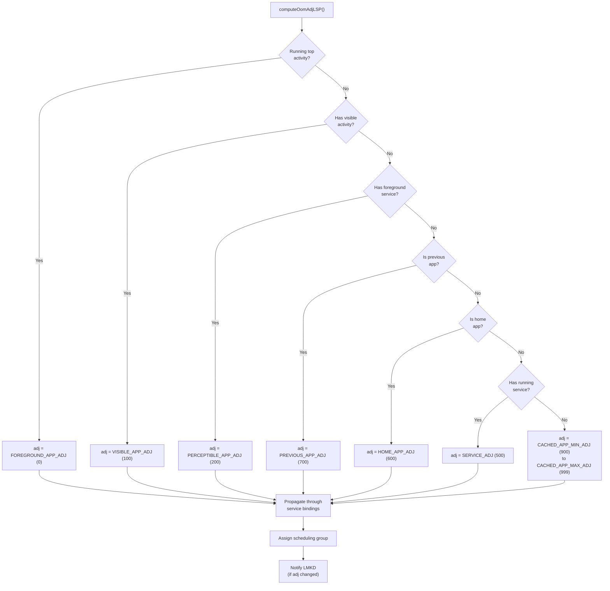

### 22.7.9 Process States

Beyond OOM adj, each process has a "process state" that is reported to apps
via `ActivityManager.RunningAppProcessInfo`:

```java
// From ActivityManager.java (not in our files, but referenced)
PROCESS_STATE_TOP = 2;                    // Running the foreground activity
PROCESS_STATE_BOUND_TOP = 3;              // Bound to a top app
PROCESS_STATE_FOREGROUND_SERVICE = 4;     // Running a foreground service
PROCESS_STATE_BOUND_FOREGROUND_SERVICE = 5;
PROCESS_STATE_IMPORTANT_FOREGROUND = 6;   // Important foreground work
PROCESS_STATE_IMPORTANT_BACKGROUND = 7;   // Important background work
PROCESS_STATE_TRANSIENT_BACKGROUND = 8;   // Transient background
PROCESS_STATE_BACKUP = 9;                 // Backup operation
PROCESS_STATE_SERVICE = 10;               // Running a service
PROCESS_STATE_RECEIVER = 11;              // Executing a broadcast receiver
PROCESS_STATE_TOP_SLEEPING = 12;          // Top app while screen off
PROCESS_STATE_HEAVY_WEIGHT = 13;          // Heavy-weight process
PROCESS_STATE_HOME = 14;                  // Home process
PROCESS_STATE_LAST_ACTIVITY = 15;         // Has a recently-used activity
PROCESS_STATE_CACHED_ACTIVITY = 16;       // Cached with activity
PROCESS_STATE_CACHED_ACTIVITY_CLIENT = 17;
PROCESS_STATE_CACHED_RECENT = 18;         // Cached, in recents
PROCESS_STATE_CACHED_EMPTY = 19;          // Cached, no content
```

### 22.7.10 CachedAppOptimizer (Freezer)

Modern Android (11+) uses the CachedAppOptimizer to freeze cached processes:

```java
// ActivityManagerService.java, line 646
CachedAppOptimizer mCachedAppOptimizer;
```

When a process becomes cached, the optimizer can:

1. **Compact** its memory (RSS compaction using `process_madvise`)
2. **Freeze** it using cgroup freezer v2, stopping all threads
3. **Unfreeze** it when needed (e.g., broadcast received, service bind)

This significantly reduces power consumption by preventing cached apps from
consuming CPU cycles.

### 22.7.11 The Process LRU List

AMS maintains a Least Recently Used (LRU) list of all processes. This list
is used when the system needs to determine which processes to kill:

The LRU list is divided into sections:

1. **Activities** -- Processes with activities (front of list = most recent)
2. **Services** -- Processes running services
3. **Other** -- Everything else (back of list = least recent)

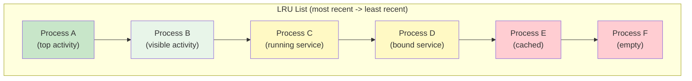

---

## 22.8 Try It: Tracing and Debugging

This section provides hands-on exercises for observing the activity and
window management system in action.

### 22.8.1 Exercise 1: Trace an Activity Launch with Perfetto

**Objective**: Capture a system trace of an activity launch and identify the
key framework events.

**Step 1: Set up Perfetto tracing**

```bash
# On the device, start a trace capturing the relevant categories
adb shell perfetto \
  -c - --txt \
  -o /data/misc/perfetto-traces/activity_launch.perfetto-trace \
<<EOF
buffers: {
    size_kb: 63488
    fill_policy: RING_BUFFER
}
data_sources: {
    config {
        name: "linux.ftrace"
        ftrace_config {
            ftrace_events: "sched/sched_switch"
            ftrace_events: "sched/sched_wakeup"
            ftrace_events: "power/suspend_resume"
            atrace_categories: "am"
            atrace_categories: "wm"
            atrace_categories: "view"
            atrace_categories: "gfx"
            atrace_categories: "dalvik"
            atrace_apps: "*"
        }
    }
}
duration_ms: 10000
EOF
```

**Step 2: Launch an activity during the trace**

```bash
# In another terminal, launch an activity
adb shell am start -W -n com.android.settings/.Settings
```

The `-W` flag makes the command wait until the launch completes, printing
timing information:

```
Starting: Intent { cmp=com.android.settings/.Settings }
Status: ok
LaunchState: COLD
Activity: com.android.settings/.Settings
TotalTime: 412
WaitTime: 415
```

**Step 3: Pull and analyze the trace**

```bash
adb pull /data/misc/perfetto-traces/activity_launch.perfetto-trace .
# Open in https://ui.perfetto.dev/
```

**What to look for in the trace**:

```mermaid
gantt
    title Activity Launch Timeline (approximate)
    dateFormat X
    axisFormat %L ms

    section system_server
    startActivity IPC         :s1, 0, 5
    executeRequest            :s2, 5, 20
    startActivityInner        :s3, 20, 35
    resumeTopActivity         :s4, 35, 45
    Pause previous activity   :s5, 45, 80

    section Previous App
    onPause                   :p1, 50, 75

    section Zygote
    Fork process              :z1, 80, 100

    section New App
    bindApplication           :a1, 100, 150
    handleLaunchActivity      :a2, 150, 200
    onCreate                  :a3, 155, 175
    onStart + onResume        :a4, 175, 195
    First draw                :a5, 200, 300
    reportFullyDrawn          :a6, 300, 350

    section SurfaceFlinger
    First frame committed     :sf1, 310, 320
```

Key trace slices to identify:

1. `"Start proc: <processName>"` -- Zygote fork
2. `"bindApplication"` -- Application initialization
3. `"activityStart"` -- Activity creation in the framework
4. `"traversal"` -- First measure/layout/draw pass
5. `"Choreographer#doFrame"` -- First frame dispatch

### 22.8.2 Exercise 2: Inspect Window Hierarchy with dumpsys

**Objective**: Examine the live window hierarchy to understand the container
tree.

**Step 1: Dump the window hierarchy**

```bash
# Full window dump
adb shell dumpsys window windows

# More concise -- just the hierarchy
adb shell dumpsys window containers
```

**Step 2: Understand the output**

The `dumpsys window containers` output shows the WindowContainer tree
indented by depth. Here is an annotated example:

```
ROOT type=undefined mode=fullscreen override-mode=undefined
  #0 Display 0 name="Built-in Screen"
    #2 Leaf:36:36 type=undefined
      #0 WindowToken{...} type=2024        <-- Navigation bar
    #1 DefaultTaskDisplayArea type=undefined
      #2 Task=1 type=home mode=fullscreen   <-- Home task
        #0 Task=7 type=home
          #0 ActivityRecord{... com.android.launcher3/.Launcher}
            #1 Window{... com.android.launcher3/...Launcher}
      #1 Task=42 type=standard             <-- App task
        #0 ActivityRecord{... com.android.settings/.Settings}
          #0 Window{... com.android.settings/.Settings}
      #0 Task=2 type=recents                <-- Recents
    #0 Leaf:0:1 type=undefined
      #0 WindowToken{...} type=2013        <-- Wallpaper
```

**Step 3: Dump activity stacks**

```bash
# Activity-focused dump
adb shell dumpsys activity activities
```

This shows:

- All display areas and their task stacks
- Each task with its activities
- Activity states (RESUMED, PAUSED, STOPPED, etc.)
- Activity flags and launch modes

**Step 4: Inspect a specific activity**

```bash
# Dump details for a specific package
adb shell dumpsys activity activities | grep -A 20 "com.android.settings"
```

### 22.8.3 Exercise 3: Monitor Activity Lifecycle Events

**Objective**: Watch lifecycle transitions in real-time.

```bash
# Monitor ActivityManager events
adb logcat -s ActivityManager:I ActivityTaskManager:I

# Or use the more detailed WM tags
adb logcat -s "WindowManager:V" "ActivityTaskManager:V"
```

Launch an activity and observe the log output:

```
I ActivityTaskManager: START u0 {cmp=com.android.settings/.Settings} from uid 2000
I ActivityTaskManager: Displayed com.android.settings/.Settings: +412ms
```

### 22.8.4 Exercise 4: Inspect Process Priorities

**Objective**: Observe OOM adj values for running processes.

```bash
# View all processes and their OOM adj
adb shell dumpsys activity oom

# Or get the raw values from procfs
adb shell cat /proc/<pid>/oom_score_adj
```

The `dumpsys activity oom` output groups processes by their OOM adj bucket:

```
  FOREGROUND (0):
    proc #0: fore  T/A/T  trm: 0 12345:com.android.launcher3/u0a54 (top-activity)

  VISIBLE (100):
    proc #1: vis   A/S/-  trm: 0 12346:com.android.systemui/u0a38 (vis-activity)

  PERCEPTIBLE (200):
    proc #2: prcp  S/-/-  trm: 0 12347:com.android.music/u0a67 (fg-service)

  CACHED (900+):
    proc #5: cch+5 B/-/-  trm: 0 12350:com.example.app/u0a94 (cch-activity)
```

### 22.8.5 Exercise 5: Force a Configuration Change

**Objective**: Observe how the framework handles configuration changes.

```bash
# Rotate the screen
adb shell settings put system accelerometer_rotation 0
adb shell settings put system user_rotation 1  # landscape

# Watch the logs
adb logcat -s ActivityManager:I | grep -i config
```

You will see:

1. Configuration change detected
2. Activities being destroyed and recreated (unless they handle the change)
3. Window layout recalculation

### 22.8.6 Exercise 6: Examine Task State with am Commands

```bash
# List all tasks
adb shell am stack list

# Get task details
adb shell dumpsys activity recents

# Start an activity in a specific task
adb shell am start --task <taskId> -n com.android.settings/.Settings

# Move a task to front
adb shell am task focus <taskId>

# Remove a task
adb shell am task remove <taskId>
```

### 22.8.7 Exercise 7: Window Inspector with wm Commands

```bash
# Get display info
adb shell wm size
adb shell wm density

# Override display size (useful for testing)
adb shell wm size 1080x1920
adb shell wm density 480

# Reset overrides
adb shell wm size reset
adb shell wm density reset

# Get surface flinger state
adb shell dumpsys SurfaceFlinger --list
```

### 22.8.8 Debugging Tips for Framework Developers

1. **Enable verbose WM logging**:
   ```bash
   adb shell wm logging enable-text WM_DEBUG_ADD_REMOVE
   adb shell wm logging enable-text WM_DEBUG_FOCUS
   adb shell wm logging enable-text WM_DEBUG_STARTING_WINDOW
   ```

2. **Capture a bug report with all state**:
   ```bash
   adb bugreport > bugreport.zip
   ```
   The bug report contains complete `dumpsys` output for all relevant
   services.

3. **Use `am monitor` for lifecycle events**:
   ```bash
   adb shell am monitor
   ```
   This opens an interactive monitor that shows activity lifecycle events
   and allows blocking activities (useful for testing ANR handling).

4. **Trace specific Binder calls**:
   ```bash
   adb shell atrace -t 5 am wm view > trace.txt
   ```

5. **Examine the surface hierarchy**:
   ```bash
   adb shell dumpsys SurfaceFlinger
   ```
   This shows all surface layers, their Z-order, and buffer state.

---

## 22.9 Deep Dive: The setState() Method and State Transitions

Understanding how `ActivityRecord.setState()` works is critical because
every lifecycle transition flows through it.

### 22.9.1 setState() Implementation

```java
// frameworks/base/services/core/java/com/android/server/wm/ActivityRecord.java, line 5704
void setState(State state, String reason) {
    ProtoLog.v(WM_DEBUG_STATES, "State movement: %s from:%s to:%s reason:%s",
            this, mState, state, reason);

    if (state == mState) {
        ProtoLog.v(WM_DEBUG_STATES, "State unchanged from:%s", state);
        return;
    }

    final State prevState = mState;
    mState = state;

    if (getTaskFragment() != null) {
        getTaskFragment().onActivityStateChanged(this, state, reason);
    }
    // ...
```

The method performs these key actions after updating the state:

1. **Notifies the TaskFragment** -- The containing task fragment needs to know
   about state changes to manage its own visibility and lifecycle.

2. **Updates service connection visibility** -- via `updateVisibleForServiceConnection()`.

3. **Triggers process state recalculation** -- via
   `mTaskSupervisor.onProcessActivityStateChanged(app, false)`.

4. **State-specific side effects** (lines 5736-5783):

```java
switch (state) {
    case RESUMED:
        mAtmService.updateBatteryStats(this, true);
        mAtmService.updateActivityUsageStats(this, Event.ACTIVITY_RESUMED);
        // Fall through to STARTED
    case STARTED:
        // Update process info to foreground
        if (app != null) {
            app.updateProcessInfo(false, true, true, true);
        }
        break;
    case PAUSED:
        mAtmService.updateBatteryStats(this, false);
        mAtmService.updateActivityUsageStats(this, Event.ACTIVITY_PAUSED);
        break;
    case STOPPED:
        mAtmService.updateActivityUsageStats(this, Event.ACTIVITY_STOPPED);
        // Remove from unknown app visibility controller
        break;
    case DESTROYED:
        if (app != null && (mVisible || mVisibleRequested)) {
            mAtmService.updateBatteryStats(this, false);
        }
        mAtmService.updateActivityUsageStats(this, Event.ACTIVITY_DESTROYED);
        break;
}
```

### 22.9.2 State Transition Triggers

Each state transition is triggered by a specific event:

```mermaid
graph TD
    subgraph "Transition Triggers"
        T1["INITIALIZING -> STARTED<br/>Trigger: realStartActivityLocked()"]
        T2["STARTED -> RESUMED<br/>Trigger: completeResumeLocked()"]
        T3["RESUMED -> PAUSING<br/>Trigger: startPausingLocked()"]
        T4["PAUSING -> PAUSED<br/>Trigger: completePauseLocked()"]
        T5["PAUSED -> STOPPING<br/>Trigger: stopIfPossible()"]
        T6["STOPPING -> STOPPED<br/>Trigger: activityStopped()"]
        T7["* -> FINISHING<br/>Trigger: finishActivityLocked()"]
        T8["FINISHING -> DESTROYING<br/>Trigger: destroyIfPossible()"]
        T9["DESTROYING -> DESTROYED<br/>Trigger: destroyed()"]
    end
```

### 22.9.3 Battery and Usage Stats Integration

Notice how `setState()` updates battery stats on every RESUMED/PAUSED
transition. This is how Android tracks per-app power consumption for
activities. The call to `updateBatteryStats(this, true)` on RESUMED marks
the beginning of foreground usage, and `updateBatteryStats(this, false)` on
PAUSED marks the end.

Similarly, `updateActivityUsageStats()` feeds data to the UsageStatsManager,
which apps can query to understand usage patterns.

---

## 22.10 Advanced: The resumeTopActivity Pipeline

### 22.10.1 The Recursive Resume Pattern

Resuming activities is one of the most complex operations in the framework.
The entry point is `Task.resumeTopActivityUncheckedLocked()`:

```java
// frameworks/base/services/core/java/com/android/server/wm/Task.java, line 5240
boolean resumeTopActivityUncheckedLocked(ActivityRecord prev, ActivityOptions options,
        boolean deferPause) {
```

This method has re-entrancy protection:

```java
// line 299: Guard against recursive calls
boolean mInResumeTopActivity = false;
```

The flow descends through the task hierarchy:

```mermaid
sequenceDiagram
    participant RWC as RootWindowContainer
    participant DC as DisplayContent
    participant TDA as TaskDisplayArea
    participant Task as Task (root)
    participant LeafTask as Task (leaf)
    participant TF as TaskFragment
    participant AR as ActivityRecord

    RWC->>DC: resumeFocusedTasksTopActivities()
    DC->>TDA: getFocusedRootTask()
    TDA->>Task: resumeTopActivityUncheckedLocked()
    Note over Task: Check mInResumeTopActivity guard
    Task->>Task: resumeTopActivityInnerLocked()
    Task->>LeafTask: iterate children
    LeafTask->>TF: resumeTopActivity()
    TF->>AR: Find topRunningActivity()
    alt Activity already resumed
        TF-->>Task: false (nothing to do)
    else Activity needs resume
        TF->>AR: Check if process exists
        alt Process alive
            TF->>AR: makeActiveIfNeeded()
            TF->>AR: scheduleResumeTransaction()
        else Process dead
            TF->>RWC: startSpecificActivity(r, ...)
            Note over RWC: Will fork via Zygote
        end
    end
```

### 22.10.2 Pause-Before-Resume Protocol

Before a new activity can resume, the currently resumed activity must be
paused. This is the "pause-before-resume" protocol:

```mermaid
sequenceDiagram
    participant Framework as Framework (system_server)
    participant OldApp as Old Activity (App Process A)
    participant NewApp as New Activity (App Process B)

    Framework->>OldApp: schedulePauseActivity(token, finishing, ...)
    Note over OldApp: Activity.onPause() executes
    OldApp->>Framework: activityPaused(token)
    Note over Framework: completePauseLocked()<br/>Old activity now PAUSED

    Framework->>Framework: resumeTopActivityInnerLocked()
    alt New process exists
        Framework->>NewApp: scheduleResumeActivity(token, ...)
        Note over NewApp: Activity.onResume() executes
        NewApp->>Framework: activityResumed(token)
    else New process needs start
        Framework->>Framework: startSpecificActivity()
        Note over Framework: Fork process via Zygote<br/>Wait for attachApplication()<br/>Then schedule launch
    end
```

The pause timeout is critical: if the old activity does not respond to
`activityPaused()` within `PAUSE_TIMEOUT` (500ms), the framework forcibly
completes the pause and proceeds. This prevents a hung app from blocking
all task switches.

### 22.10.3 The Idle Timeout

After an activity launches, the framework waits for it to report idle. The
`ActivityTaskSupervisor` manages this:

```java
// frameworks/base/services/core/java/com/android/server/wm/ActivityTaskSupervisor.java, line 194
private static final int IDLE_TIMEOUT = 10 * 1000 * Build.HW_TIMEOUT_MULTIPLIER;
```

If an activity does not report idle within 10 seconds, the framework proceeds
without it. This timeout is the backstop that prevents a misbehaving app from
permanently blocking the activity lifecycle.

---

## 22.11 Advanced: recycleTask() and Intent Flag Processing

### 22.11.1 recycleTask() Logic

When `startActivityInner()` finds an existing task to reuse (via
`resolveReusableTask()` or `computeTargetTask()`), it calls `recycleTask()`:

```java
// frameworks/base/services/core/java/com/android/server/wm/ActivityStarter.java, line 2384
int recycleTask(Task targetTask, ActivityRecord targetTaskTop, Task reusedTask,
        NeededUriGrants intentGrants) {
    // Should not recycle task from a different user
    if (targetTask.mUserId != mStartActivity.mUserId) {
        mTargetRootTask = targetTask.getRootTask();
        mAddingToTask = true;
        return START_SUCCESS;
    }

    if (reusedTask != null) {
        if (targetTask.intent == null) {
            // Assign base intent from affinity-based movement
            targetTask.setIntent(mStartActivity);
        }
        // Handle FLAG_ACTIVITY_TASK_ON_HOME
    }
```

Key operations in `recycleTask()`:

1. **User check** -- Rejects cross-user task recycling (line 2388)
2. **Intent assignment** -- Sets the task's base intent if it was moved by affinity
3. **Power mode** -- Starts power mode for the launch (line 2411)
4. **Target root task** -- Positions the task in the hierarchy
5. **`START_FLAG_ONLY_IF_NEEDED`** -- Short-circuits if the activity is
   already at the top
6. **Flag compliance** -- Processes `CLEAR_TOP`, `SINGLE_TOP`, etc.
7. **Starting window** -- Shows splash screen if the task moved to front
8. **Dream dismissal** -- Wakes the screen if launching over a dream

The return value indicates what happened:

```java
// line 2473
return mMovedToFront ? START_TASK_TO_FRONT : START_DELIVERED_TO_TOP;
```

### 22.11.2 Flag Processing: CLEAR_TOP and SINGLE_TOP

The `complyActivityFlags()` method processes the rich set of Intent flags.
The most commonly encountered combinations:

| Flags | Effect |
|-------|--------|
| `NEW_TASK` | Create or find a task with matching affinity |
| `NEW_TASK + CLEAR_TASK` | Clear the task and start fresh |
| `NEW_TASK + CLEAR_TOP` | Remove everything above the target activity |
| `SINGLE_TOP` | Reuse if already at top, call onNewIntent() |
| `REORDER_TO_FRONT` | Move existing activity to top of task |
| `NEW_DOCUMENT` | Create a new document task (multi-instance) |
| `MULTIPLE_TASK` | Always create a new task (with NEW_TASK) |
| `LAUNCH_ADJACENT` | Launch in adjacent split-screen window |
| `NO_ANIMATION` | Suppress transition animation |

### 22.11.3 The deliverNewIntent Mechanism

When an existing activity receives a new intent (e.g., singleTop or
singleTask re-delivery), the framework uses `deliverNewIntent()`:

```mermaid
sequenceDiagram
    participant AS as ActivityStarter
    participant AR as ActivityRecord
    participant CLM as ClientLifecycleManager
    participant App as App Process

    AS->>AR: deliverNewIntent(callingUid, intent, intentGrants)
    AR->>AR: Check mIntentDelivered flag
    AR->>AR: addNewIntentLocked(intent)
    AR->>CLM: scheduleTransaction(NewIntentItem)
    CLM->>App: schedule(ClientTransaction)
    App->>App: Activity.onNewIntent(intent)
```

The `mIntentDelivered` flag (line 274) ensures the intent is delivered at
most once, even if multiple code paths converge on `deliverNewIntent()`.

---

## 22.12 Advanced: Multi-Window and TaskFragment Architecture

### 22.12.1 TaskFragment: The Embedding Container

Modern Android supports activity embedding, where multiple activities can
be displayed side-by-side within a single task. This is managed through
`TaskFragment`:

```java
// frameworks/base/services/core/java/com/android/server/wm/TaskFragment.java, line 124
class TaskFragment extends WindowContainer<WindowContainer> {
```

A `TaskFragment` is positioned between `Task` and `ActivityRecord` in the
hierarchy. A single `Task` can contain multiple `TaskFragment` objects, each
hosting one or more activities:

```mermaid
graph TB
    Task["Task"]
    TF1["TaskFragment (Left)"]
    TF2["TaskFragment (Right)"]
    Task --> TF1
    Task --> TF2
    AR1["ActivityRecord A"]
    AR2["ActivityRecord B"]
    TF1 --> AR1
    TF2 --> AR2
```

### 22.12.2 The TaskFragmentOrganizer

Third-party libraries (like the AndroidX Activity Embedding library) interact
with the framework through the `TaskFragmentOrganizer` API. This allows apps
to:

1. Create `TaskFragment` containers within their tasks
2. Specify how activities should be distributed across fragments
3. Define split ratios and layout rules
4. Handle configuration changes in the embedding layout

```mermaid
sequenceDiagram
    participant App as App (Jetpack Library)
    participant TFO as TaskFragmentOrganizer
    participant WME as WindowOrganizerController
    participant Task as Task

    App->>TFO: registerOrganizer()
    TFO->>WME: Register via Binder
    App->>TFO: createTaskFragment(token, ...)
    TFO->>WME: applyTransaction(WindowContainerTransaction)
    WME->>Task: Create TaskFragment as child
    App->>TFO: startActivityInTaskFragment(tf, intent)
    TFO->>WME: OP_TYPE_START_ACTIVITY_IN_TASK_FRAGMENT
    WME->>Task: Start activity in specified TaskFragment
```

### 22.12.3 Embedding Check Results

When starting an activity in a TaskFragment, the system checks compatibility:

```java
// TaskFragment.java
static final int EMBEDDING_ALLOWED = 0;
static final int EMBEDDING_DISALLOWED_MIN_DIMENSION_VIOLATION = 1;
static final int EMBEDDING_DISALLOWED_NEW_TASK = 2;
static final int EMBEDDING_DISALLOWED_UNTRUSTED_HOST = 3;
```

These checks prevent:

- Activities from being embedded in containers too small for their minimum
  dimensions
- Activities that require `NEW_TASK` from being embedded
- Untrusted apps from embedding activities from other packages

### 22.12.4 Split-Screen and Freeform Windows

Split-screen mode is implemented using the windowing mode system:

```java
// WindowConfiguration windowing modes
WINDOWING_MODE_UNDEFINED = 0;
WINDOWING_MODE_FULLSCREEN = 1;
WINDOWING_MODE_PINNED = 2;         // Picture-in-Picture
WINDOWING_MODE_FREEFORM = 5;       // Desktop-like floating
WINDOWING_MODE_MULTI_WINDOW = 6;   // Generic multi-window
```

Each task has a windowing mode that determines how it is laid out on screen.
The system coordinates these modes through the `TaskDisplayArea`:

```mermaid
graph TB
    TDA["TaskDisplayArea"]

    subgraph "Fullscreen Tasks"
        T1["Task 1 (FULLSCREEN)"]
    end

    subgraph "Split Tasks"
        T2["Task 2 (MULTI_WINDOW)"]
        T3["Task 3 (MULTI_WINDOW)"]
    end

    subgraph "Floating"
        T4["Task 4 (FREEFORM)"]
        T5["Task 5 (PINNED/PiP)"]
    end

    TDA --> T1
    TDA --> T2
    TDA --> T3
    TDA --> T4
    TDA --> T5
```

---

## 22.13 Advanced: The Starting Window (Splash Screen)

### 22.13.1 Purpose and Types

When an activity is being launched but has not yet drawn its first frame, the
system can display a "starting window" (splash screen) to provide immediate
visual feedback. There are two types:

```java
// frameworks/base/services/core/java/com/android/server/wm/ActivityRecord.java, lines 407-409
static final int STARTING_WINDOW_TYPE_NONE = 0;
static final int STARTING_WINDOW_TYPE_SNAPSHOT = 1;
static final int STARTING_WINDOW_TYPE_SPLASH_SCREEN = 2;
```

- **SNAPSHOT** -- Uses a cached screenshot of the activity from a previous
  run. This provides the most seamless experience for task switches.
- **SPLASH_SCREEN** -- Shows a themed splash screen based on the activity's
  theme colors and icon.

### 22.13.2 Starting Window Flow

```mermaid
sequenceDiagram
    participant AS as ActivityStarter
    participant AR as ActivityRecord
    participant SSC as StartingSurfaceController
    participant Shell as SystemUI/Shell
    participant WMS as WMS

    AS->>AR: showStartingWindow(taskSwitch)
    AR->>AR: Decide: snapshot or splash?
    AR->>SSC: createStartingSurface(activityRecord)

    alt Snapshot available
        SSC->>Shell: Request snapshot window
        Shell->>WMS: addWindow(TYPE_APPLICATION_STARTING)
        WMS->>WMS: activity.attachStartingWindow(win)
    else Splash screen
        SSC->>Shell: Request splash screen
        Shell->>Shell: Inflate themed splash layout
        Shell->>WMS: addWindow(TYPE_APPLICATION_STARTING)
    end

    Note over AR: App process starts, draws first frame
    AR->>AR: onFirstWindowDrawn()
    AR->>SSC: removeStartingWindow()
    SSC->>WMS: Remove starting window
```

### 22.13.3 Starting Window in addWindowInner()

When the starting window is added to WMS, it gets special handling:

```java
// WindowManagerService.java, line 1988-1991
if (type == TYPE_APPLICATION_STARTING && activity != null) {
    activity.attachStartingWindow(win);
    ProtoLog.v(WM_DEBUG_STARTING_WINDOW, "addWindow: %s startingWindow=%s",
            activity, win);
}
```

The `attachStartingWindow()` method stores the reference in `mStartingWindow`
on the `ActivityRecord`, and the window is removed once the real content
window has drawn.

---

## 22.14 Advanced: The Window Layout Engine

### 22.14.1 WindowSurfacePlacer

The `WindowSurfacePlacer` is the engine that drives window layout:

```java
// frameworks/base/services/core/java/com/android/server/wm/WindowSurfacePlacer.java, line 112
final void performSurfacePlacement() {
    performSurfacePlacement(false /* force */);
}
```

The layout loop:

```mermaid
flowchart TD
    Request["requestTraversal()"] --> Schedule["Post to Handler"]
    Schedule --> Check["performSurfacePlacementIfScheduled()"]
    Check --> Loop["performSurfacePlacementLoop()"]
    Loop --> BeginTrace["Trace: performSurfacePlacement"]

    BeginTrace --> RootPerform["mService.mRoot.performSurfacePlacement()"]
    RootPerform --> LayoutAll["Layout all DisplayContent"]
    LayoutAll --> ApplyChanges["Apply surface transactions"]
    ApplyChanges --> CheckPending{"Pending changes?"}
    CheckPending -->|Yes| Loop
    CheckPending -->|No| Done["Layout complete"]

    Done --> EndTrace["End trace"]
```

The loop repeats up to `LAYOUT_REPEAT_THRESHOLD` (4) times to handle
cascading layout changes, where updating one window's layout triggers changes
in another.

### 22.14.2 Display Policy

Each `DisplayContent` has a `DisplayPolicy` that enforces platform-specific
layout rules:

- Status bar position and size
- Navigation bar position and size
- System gesture regions
- Cutout/notch avoidance zones
- IME (Input Method Editor) placement

The `DisplayPolicy` is consulted during `addWindow()`:

```java
// WMS.addWindow(), line 1850
displayPolicy.adjustWindowParamsLw(win, win.mAttrs);
// ...
res = displayPolicy.validateAddingWindowLw(attrs, callingPid, callingUid);
```

And during layout:

```java
// line 1986
displayPolicy.addWindowLw(win, attrs);
```

---

## 22.15 Advanced: Configuration Change Propagation

### 22.15.1 Configuration Hierarchy

Configuration changes (screen rotation, font scale, locale, density, etc.)
propagate through the `WindowContainer` hierarchy using the
`ConfigurationContainer` base class:

```mermaid
graph TB
    Global["Global Configuration<br/>(device-level)"]
    Display["Display Override Config<br/>(per-display density, etc.)"]
    Task["Task Config<br/>(windowing bounds)"]
    Activity["Activity Config<br/>(theme, local overrides)"]

    Global --> Display
    Display --> Task
    Task --> Activity

    Note1["Each level can override<br/>specific config fields"]
```

When the global configuration changes (e.g., screen rotation), the change
propagates top-down through the hierarchy:

```mermaid
sequenceDiagram
    participant WMS
    participant RWC as RootWindowContainer
    participant DC as DisplayContent
    participant Task
    participant AR as ActivityRecord
    participant App as App Process

    WMS->>RWC: updateConfiguration(newConfig)
    RWC->>DC: onConfigurationChanged()
    DC->>Task: onConfigurationChanged()
    Task->>AR: onConfigurationChanged()
    AR->>AR: shouldRelaunchLocked()?

    alt Activity handles config change
        AR->>App: scheduleTransaction(ActivityConfigurationChangeItem)
        App->>App: onConfigurationChanged(newConfig)
    else Activity needs relaunch
        AR->>App: scheduleTransaction(DestroyActivityItem)
        Note over App: onDestroy()
        AR->>App: scheduleTransaction(LaunchActivityItem)
        Note over App: onCreate() with saved state
    end
```

### 22.15.2 Merged Configuration

Each `WindowContainer` computes a "merged configuration" that combines
its parent's configuration with its own overrides:

```java
// ConfigurationContainer.java
Configuration getMergedOverrideConfiguration() {
    // Returns the combination of all ancestor overrides + this container's overrides
}
```

This allows each level to customize specific fields:

- **Display**: May override density for external displays
- **Task**: Overrides bounds for freeform/split windows
- **Activity**: May override orientation, smallest screen width

### 22.15.3 Activity Relaunch Decision

The `shouldRelaunchLocked()` check compares the old and new configurations
to determine if the activity can handle the change:

```java
// Simplified logic
int changes = oldConfig.diff(newConfig);
int handledChanges = activityInfo.getRealConfigChanged();
boolean needsRelaunch = (changes & ~handledChanges) != 0;
```

If the activity declared `android:configChanges` in its manifest for the
changed configuration fields, it receives `onConfigurationChanged()` instead
of being destroyed and recreated.

---

## 22.16 Advanced: ANR Detection in the Activity System

### 22.16.1 ANR (Application Not Responding) Triggers

ANR detection in the activity system occurs at several points:

1. **Input dispatch timeout** -- Default 5 seconds for focused window
2. **Broadcast timeout** -- 10s foreground, 60s background
3. **Service timeout** -- 20s foreground, 200s background
4. **Content provider timeout** -- Published within 10s of process start

For activities specifically, the key timeouts are:

```java
// ActivityRecord.java
private static final int PAUSE_TIMEOUT = 500;      // ms
private static final int STOP_TIMEOUT = 11 * 1000;  // ms
private static final int DESTROY_TIMEOUT = 10 * 1000; // ms

// ActivityManagerService.java
static final int PROC_START_TIMEOUT = 10 * 1000;    // ms
static final int BIND_APPLICATION_TIMEOUT = 15 * 1000; // ms

// ActivityTaskManagerService.java
static final long INSTRUMENTATION_KEY_DISPATCHING_TIMEOUT_MILLIS = 60 * 1000;

// ActivityTaskSupervisor.java
private static final int IDLE_TIMEOUT = 10 * 1000;  // ms
```

### 22.16.2 Input ANR Flow

```mermaid
sequenceDiagram
    participant Input as InputDispatcher (native)
    participant WMS
    participant AMS
    participant App

    Input->>App: Dispatch input event
    Note over Input: Start 5s timer
    Input->>Input: Wait for finish signal

    alt App responds in time
        App->>Input: finishInputEvent()
        Note over Input: Cancel timer
    else Timeout (5s)
        Input->>WMS: notifyANR(windowToken)
        WMS->>AMS: inputDispatchingTimedOut()
        AMS->>AMS: Collect stack traces
        AMS->>AMS: Show ANR dialog
        Note over AMS: User can: Wait / Close / Report
    end
```

### 22.16.3 The AnrController

ATMS uses `AnrController` objects to manage ANR handling:

```java
// ActivityTaskManagerService.java, line 578
@GuardedBy("itself")
private final List<AnrController> mAnrController = new ArrayList<>();
```

Multiple controllers can be registered, allowing different parts of the
system to customize ANR behavior (e.g., the instrumentation framework
extends timeouts during testing).

---

## 22.17 Advanced: Lock Task Mode

### 22.17.1 Overview

Lock Task Mode restricts the device to a set of whitelisted tasks. This is
used for kiosk-mode applications, enterprise device management, and
educational deployments.

```java
// ActivityTaskManagerService.java, line 518
private LockTaskController mLockTaskController;
```

### 22.17.2 Lock Task Levels

```java
// ActivityManager.java
LOCK_TASK_MODE_NONE = 0;     // Normal operation
LOCK_TASK_MODE_LOCKED = 1;   // Task is locked (started by app)
LOCK_TASK_MODE_PINNED = 2;   // Screen pinning (started by user)
```

### 22.17.3 Lock Task Enforcement

The `LockTaskController` enforces restrictions at multiple points:

1. **Activity start** -- `isAllowedToStart()` checks
   `isLockTaskModeViolation()`:
   ```java
   // ActivityStarter.java, line 2299-2309
   if (!newTask) {
       if (mService.getLockTaskController().isLockTaskModeViolation(
               targetTask, isNewClearTask)) {
           return START_RETURN_LOCK_TASK_MODE_VIOLATION;
       }
   } else {
       if (mService.getLockTaskController().isNewTaskLockTaskModeViolation(r)) {
           return START_RETURN_LOCK_TASK_MODE_VIOLATION;
       }
   }
   ```

2. **Task removal** -- Prevents removing locked tasks from recents
3. **Navigation** -- Disables Home and Recents buttons
4. **Status bar** -- Disables notification shade and quick settings

---

## 22.18 Advanced: The Recent Tasks System

### 22.18.1 RecentTasks Manager

```java
// ActivityTaskManagerService.java, line 473
private RecentTasks mRecentTasks;
```

The `RecentTasks` class maintains the ordered list of tasks shown in the
Recents (Overview) screen. It handles:

- Adding tasks when they move to the background
- Removing tasks when the user dismisses them
- Persisting tasks across reboots (for cold-start recents)
- Enforcing per-user task limits
- Managing task thumbnails (screenshots)

### 22.18.2 Task Persistence

Tasks with `FLAG_ACTIVITY_RETAIN_IN_RECENTS` are persisted to disk as XML
in `/data/system_ce/<userId>/recent_tasks/`. The persistence format includes:

```xml
<task
    task_id="42"
    real_activity="com.example.app/.MainActivity"
    affinity="com.example.app"
    user_id="0"
    effective_uid="10094"
    last_time_moved="1679012345678">
    <intent .../>
    <activity id="0" ...>
        <intent .../>
    </activity>
</task>
```

### 22.18.3 Task Snapshots

The system captures screenshots of tasks as they move to the background.
These snapshots are used for:

1. The Recents carousel thumbnails
2. Starting window snapshots (for fast task switching)
3. Splash screen alternatives

---

## 22.19 Advanced: Visibility Computation

### 22.19.1 ensureActivitiesVisible()

One of the most critical operations in the system is determining which
activities should be visible. This is driven by
`RootWindowContainer.ensureActivitiesVisible()`:

```mermaid
flowchart TD
    Trigger["Activity state changed"] --> EAV["ensureActivitiesVisible()"]
    EAV --> ForEachDisplay["For each DisplayContent"]
    ForEachDisplay --> ForEachTask["For each root Task"]
    ForEachTask --> Walk["Walk task from top to bottom"]
    Walk --> CheckOcclusion{"Activity occludes<br/>below?"}
    CheckOcclusion -->|Yes| HideBelow["Make activities below invisible"]
    CheckOcclusion -->|No| ShowBelow["Activities below remain visible"]
    HideBelow --> UpdateVis["Update visibility state"]
    ShowBelow --> UpdateVis
    UpdateVis --> NotifyApps["Notify affected apps"]
```

An activity "occludes" those below it if:

- It is fullscreen (not translucent)
- It is not finishing
- It fills the entire task bounds

Translucent activities (dialogs, floating windows) allow activities behind
them to remain visible.

### 22.19.2 The occludesParent() Check

```java
// ActivityRecord.java, line 665
private boolean mOccludesParent;
```

This field is set based on:

- The activity's theme (transparent vs. opaque)
- Whether it fills the parent bounds
- Whether it has the `windowIsFloating` style attribute

### 22.19.3 Visibility States for TaskFragment

```java
// TaskFragment.java
static final int TASK_FRAGMENT_VISIBILITY_VISIBLE = 0;
static final int TASK_FRAGMENT_VISIBILITY_VISIBLE_BEHIND_TRANSLUCENT = 1;
static final int TASK_FRAGMENT_VISIBILITY_INVISIBLE = 2;
```

---

## 22.20 Performance Considerations

### 22.20.1 Activity Launch Time Budget

A well-optimized cold app launch should complete within these budgets:

| Phase | Budget | Measured By |
|-------|--------|-------------|
| Intent resolution | < 5ms | Perfetto: `resolveActivity` |
| startActivityInner() | < 10ms | Perfetto: `startActivityInner` |
| Process fork (cold) | < 100ms | Perfetto: `Start proc` |
| bindApplication | < 200ms | Perfetto: `bindApplication` |
| Activity.onCreate() | < 200ms | Perfetto: `performCreate` |
| First frame draw | < 300ms | Perfetto: `Choreographer#doFrame` |
| **Total cold start** | **< 500ms** | `adb shell am start -W` |
| **Total warm start** | **< 200ms** | `adb shell am start -W` |

### 22.20.2 Lock Contention

The `WindowManagerGlobalLock` is one of the most contended locks in the
system. Every Binder call to WMS and ATMS must acquire it. Strategies to
minimize contention:

1. **Keep critical sections short** -- Perform heavy computation outside the
   lock
2. **Batch surface transactions** -- Submit multiple changes in a single
   `SurfaceControl.Transaction`
3. **Defer layout** -- The `WindowSurfacePlacer` batches layout requests
4. **Lock-free reads** -- Some fields (like `mCurrentFocus`) use volatile
   for lock-free reads in common cases

### 22.20.3 Process Start Optimization

Android uses several techniques to speed up process creation:

1. **Zygote pre-fork** -- The Zygote preloads common classes and resources
2. **USAP (Unspecialized App Process)** -- Pre-forked processes waiting to
   be specialized
3. **App Zygote** -- Per-app zygotes that cache app-specific resources
4. **WebView Zygote** -- Specialized zygote for WebView processes
5. **Process pools** -- Cached app processes can be reused

---

## 22.21 Key Interfaces and AIDL Contracts

### 22.21.1 IActivityManager

The AIDL interface that apps use to communicate with AMS:

| Method | Purpose |
|--------|---------|
| `startService()` | Start a background service |
| `bindService()` | Bind to a service |
| `broadcastIntent()` | Send a broadcast |
| `getRunningAppProcesses()` | Query running processes |
| `getMemoryInfo()` | Query system memory |
| `setProcessImportant()` | Mark process importance |
| `killBackgroundProcesses()` | Kill cached processes |

### 22.21.2 IActivityTaskManager

The AIDL interface for activity and task operations:

| Method | Purpose |
|--------|---------|
| `startActivity()` | Start an activity |
| `startActivities()` | Start multiple activities |
| `finishActivity()` | Finish an activity |
| `moveTaskToFront()` | Bring a task to front |
| `removeTask()` | Remove a task |
| `getRecentTasks()` | Get recent tasks list |
| `setLockTaskMode()` | Enable lock task mode |
| `enterPictureInPictureMode()` | Enter PiP |
| `requestStartTransition()` | Start window transition |

### 22.21.3 IWindowManager

The AIDL interface for window management:

| Method | Purpose |
|--------|---------|
| `openSession()` | Create a new Session |
| `addWindow()` | (via Session) Add a window |
| `removeWindow()` | (via Session) Remove a window |
| `relayoutWindow()` | (via Session) Update window layout |
| `setFocusedApp()` | Set the focused app |
| `screenshotDisplay()` | Capture display screenshot |
| `freezeRotation()` | Lock screen rotation |
| `setScreenCaptureDisabled()` | Disable screen capture |

### 22.21.4 IApplicationThread

The callback interface that the system uses to drive the app process:

| Method | Purpose |
|--------|---------|
| `scheduleTransaction()` | Execute lifecycle transaction |
| `scheduleTrimMemory()` | Request memory trim |
| `scheduleBindService()` | Bind to a service |
| `scheduleReceiver()` | Deliver a broadcast |
| `dumpActivity()` | Dump activity state |
| `scheduleSuicide()` | Force process exit |
| `scheduleCreateService()` | Create a service |

---

## 22.22 Common Debugging Patterns

### 22.22.1 Diagnosing Slow Activity Launches

1. **Check Perfetto trace** for which phase is slow:
   ```
   adb shell am start -W -S <component>
   ```
   The `-S` flag force-stops the app first for a consistent cold start.

2. **Check for lock contention** in the trace:
   Look for long `monitor contention` slices in system_server.

3. **Check process start time**:
   ```bash
   adb logcat -s ActivityManager | grep "Start proc"
   ```
   If fork time is high, check if USAP pool is configured.

4. **Check Application.onCreate()**:
   Many apps do heavy initialization here. Look for `bindApplication` duration.

### 22.22.2 Diagnosing Window Addition Failures

The `addWindow()` return codes indicate what went wrong:

| Return Code | Constant | Meaning |
|-------------|----------|---------|
| 0 | `ADD_OKAY` | Success |
| -1 | `ADD_BAD_APP_TOKEN` | Invalid token for window type |
| -2 | `ADD_BAD_SUBWINDOW_TOKEN` | Bad parent window token |
| -3 | `ADD_NOT_APP_TOKEN` | Non-activity token for app window |
| -4 | `ADD_APP_EXITING` | Activity is being removed |
| -5 | `ADD_DUPLICATE_ADD` | Window already registered |
| -6 | `ADD_STARTING_NOT_NEEDED` | Starting window not needed |
| -7 | `ADD_MULTIPLE_SINGLETON` | Multiple singletons |
| -8 | `ADD_PERMISSION_DENIED` | Insufficient permissions |
| -9 | `ADD_INVALID_DISPLAY` | Display does not exist |
| -10 | `ADD_INVALID_TYPE` | Invalid window type |
| -11 | `ADD_INVALID_USER` | Invalid user ID |

### 22.22.3 Diagnosing Activity State Issues

```bash
# Check current activity state
adb shell dumpsys activity activities | grep -E "state=|State="

# Look for stuck transitions
adb shell dumpsys activity transitions

# Check for pending operations
adb shell dumpsys activity starter
```

### 22.22.4 Diagnosing OOM Kills

```bash
# Check recent kills
adb logcat -b events | grep "am_kill"

# Check current process priorities
adb shell dumpsys activity oom

# Check LMKD statistics
adb shell dumpsys activity lmk
```

---

## Cross-References

This chapter provides the architectural overview. The following chapters
build on these foundations:

- **Chapter 23: The Window System Deep Dive** -- Covers window layout
  computation, surface management, the ViewRootImpl rendering pipeline,
  insets handling, and the shell transitions system introduced in Android 13+.

- **Chapter 24: Display and Compositor Pipeline** -- Covers SurfaceFlinger
  internals, hardware composition, multi-display support, virtual displays,
  and the HWC (Hardware Composer) HAL interface.

The relationship between these three chapters:

```mermaid
graph TB
    Ch22["Chapter 22<br/>Activity & Window Overview<br/>(This chapter)"]
    Ch23["Chapter 23<br/>Window System Deep Dive"]
    Ch24["Chapter 24<br/>Display & Compositor"]

    Ch22 -->|"Window hierarchy,<br/>addWindow flow"| Ch23
    Ch22 -->|"DisplayContent,<br/>surface basics"| Ch24
    Ch23 -->|"Surface transactions"| Ch24

    subgraph "Coverage"
        Ch15a["AMS/ATMS architecture<br/>Activity lifecycle<br/>Task hierarchy<br/>Process management<br/>startActivity pipeline"]
        Ch16a["Window layout engine<br/>ViewRootImpl<br/>Insets<br/>Shell transitions<br/>Input dispatch"]
        Ch17a["SurfaceFlinger<br/>HWC HAL<br/>VSync<br/>Buffer management<br/>Multi-display"]
    end

    Ch22 --- Ch15a
    Ch23 --- Ch16a
    Ch24 --- Ch17a

    style Ch22 fill:#e1f5fe
    style Ch23 fill:#fff3e0
    style Ch24 fill:#e8f5e9
```

---

## 22.23 Advanced: The Transition System

### 22.23.1 Shell Transitions (Android 13+)

Modern Android uses "Shell Transitions" to coordinate visual transitions
between activities, tasks, and windows. This replaced the legacy
`AppTransition` system.

```mermaid
sequenceDiagram
    participant WMCore as WM Core
    participant TC as TransitionController
    participant Shell as SystemUI Shell
    participant SF as SurfaceFlinger

    WMCore->>TC: requestStartTransition(transition)
    TC->>TC: Collect participants<br/>(opening, closing, changing)
    TC->>TC: setReady() when all collected
    TC->>Shell: onTransitionReady(TransitionInfo)
    Note over Shell: Shell decides animation type:<br/>- open/close<br/>- task switch<br/>- PiP<br/>- split-screen
    Shell->>Shell: Create and run animation
    Shell->>SF: Apply surface changes via Transaction
    Shell->>TC: finishTransition(token)
    TC->>WMCore: Clean up transition state
```

### 22.23.2 TransitionInfo

The `TransitionInfo` object passed to Shell contains:

- **Type**: OPEN, CLOSE, TO_FRONT, TO_BACK, CHANGE, PIP
- **Flags**: KEYGUARD_GOING_AWAY, IS_RECENTS, etc.
- **Changes**: List of `TransitionInfo.Change` objects, each describing
  a container that changed (with before/after state)

Each `Change` includes:

- The `WindowContainerToken`
- Start and end bounds
- Start and end rotation
- Window configuration
- Leash (SurfaceControl for the animation)

### 22.23.3 Transition Types

```java
// WindowManager.java transit types
TRANSIT_OPEN = 1;          // Activity/task opening
TRANSIT_CLOSE = 2;         // Activity/task closing
TRANSIT_TO_FRONT = 3;      // Existing task coming to front
TRANSIT_TO_BACK = 4;       // Task going to back
TRANSIT_CHANGE = 6;        // Config change (rotation, bounds)
TRANSIT_PIP = 8;           // PiP transition
TRANSIT_START_LOCK_TASK_MODE = 14; // Entering lock task mode
```

### 22.23.4 Animation Controllers

Shell provides different animation controllers for different scenarios:

```mermaid
graph TB
    Trans["Transition Ready"]
    Trans --> Type{"Transition Type?"}

    Type -->|"Open/Close"| Default["DefaultTransitionHandler<br/>Fade + scale animations"]
    Type -->|"Task Switch"| Recents["RecentsTransitionHandler<br/>Recents animation"]
    Type -->|"PiP"| PiP["PipTransitionHandler<br/>Shrink/grow to PiP window"]
    Type -->|"Split"| Split["SplitTransitionHandler<br/>Split-screen animations"]
    Type -->|"Keyguard"| KG["KeyguardTransitionHandler<br/>Lock/unlock animations"]
    Type -->|"Unfold"| Unfold["UnfoldTransitionHandler<br/>Foldable unfold animation"]
```

---

## 22.24 Advanced: Activity Client Controller

### 22.24.1 The IActivityClientController Interface

The `ActivityClientController` is the server-side endpoint for activity-level
operations initiated by the client process:

```java
// ActivityTaskManagerService.java, line 422
ActivityClientController mActivityClientController;
```

This controller handles operations like:

- `activityPaused()` -- Client reports pause completion
- `activityStopped()` -- Client reports stop completion
- `activityDestroyed()` -- Client reports destroy completion
- `activityResumed()` -- Client reports resume completion
- `reportSizeConfigurations()` -- Client reports supported size ranges
- `setRequestedOrientation()` -- Client requests orientation lock
- `convertToTranslucent()` -- Client becomes translucent
- `convertFromTranslucent()` -- Client becomes opaque
- `enterPictureInPictureMode()` -- Client enters PiP

### 22.24.2 The Callback Flow

```mermaid
sequenceDiagram
    participant App as App Process
    participant ACC as ActivityClientController (system_server)
    participant AR as ActivityRecord
    participant ATMS

    Note over App: Activity.onPause() completes
    App->>ACC: activityPaused(token)
    ACC->>AR: activityPaused(false /* timeout */)
    AR->>AR: setState(PAUSED, "activityPaused")
    AR->>ATMS: completePauseLocked(...)
    ATMS->>ATMS: resumeTopActivity(...)
```

This shows how the client-driven lifecycle callbacks feed back into the
server-side state machine to trigger the next state transition.

---

## 22.25 Advanced: The ActivityTaskSupervisor

### 22.25.1 Role and Responsibilities

The `ActivityTaskSupervisor` (line 185) acts as a coordination layer between
ATMS and the container hierarchy:

```java
// frameworks/base/services/core/java/com/android/server/wm/ActivityTaskSupervisor.java, line 185
public class ActivityTaskSupervisor implements RecentTasks.Callbacks {
```

Key responsibilities:

- Managing the activity idle queue
- Starting specific activities in processes
- Handling waiting activities (waiting for process start)
- Managing sleep/wake state for activities
- Coordinating with RecentTasks callbacks

### 22.25.2 The Idle Queue

After an activity starts, it must report idle within `IDLE_TIMEOUT` (10s):

```java
// line 194
private static final int IDLE_TIMEOUT = 10 * 1000 * Build.HW_TIMEOUT_MULTIPLIER;
```

The idle queue manages activities that have been launched but not yet finished
their initialization. When all activities report idle, the system can:

- Remove activities that were stopped during the launch
- Finish pending transitions
- Trim memory for backgrounded processes

### 22.25.3 The Handler

`ActivityTaskSupervisor` has its own handler for deferred operations:

```java
// line 2823
private final class ActivityTaskSupervisorHandler extends Handler {
    @Override
    public void handleMessage(Message msg) {
        synchronized (mService.mGlobalLock) {
            if (handleMessageInner(msg)) {
                return;
            }
        }
    }
}
```

Message types include:

- `IDLE_TIMEOUT_MSG` -- Activity failed to report idle
- `IDLE_NOW_MSG` -- Force idle processing
- `SLEEP_TIMEOUT_MSG` -- Sleep timeout for activities
- `LAUNCH_TIMEOUT_MSG` -- Activity failed to launch

---

## 22.26 Advanced: The ActivityStartController

### 22.26.1 Factory and Pool Pattern

The `ActivityStartController` manages the creation and recycling of
`ActivityStarter` instances:

```java
// ActivityTaskManagerService.java, line 519
private ActivityStartController mActivityStartController;
```

It provides the `obtainStarter()` method that apps interact with through
the builder pattern:

```mermaid
graph LR
    ATMS["ATMS.startActivityAsUser()"]
    ASC["ActivityStartController"]
    Factory["ActivityStarter.DefaultFactory"]
    Pool["SynchronizedPool (max 3)"]
    Starter["ActivityStarter instance"]

    ATMS -->|"getActivityStartController()"| ASC
    ASC -->|"obtainStarter()"| Factory
    Factory -->|"acquire()"| Pool
    Pool -->|"existing or new"| Starter
    Starter -->|"after execute()"| Pool
```

### 22.26.2 Builder Pattern Usage

The `ActivityStarter` uses a fluent builder pattern for configuration:

```java
// Typical usage in ATMS (simplified)
getActivityStartController().obtainStarter(intent, "startActivityAsUser")
    .setCaller(caller)
    .setCallingUid(callingUid)
    .setCallingPid(callingPid)
    .setCallingPackage(callingPackage)
    .setRealCallingUid(realCallingUid)
    .setRealCallingPid(realCallingPid)
    .setResultTo(resultTo)
    .setResultWho(resultWho)
    .setRequestCode(requestCode)
    .setStartFlags(startFlags)
    .setActivityOptions(options)
    .setUserId(userId)
    .execute();
```

Each setter returns the `ActivityStarter` instance, allowing chaining. The
`execute()` call at the end triggers the full startup pipeline.

---

## 22.27 Advanced: DisplayContent Internals

### 22.27.1 Display Content Structure

Each `DisplayContent` manages a complete display with its own:

- Window hierarchy (organized into DisplayAreas)
- Input dispatcher configuration
- Focus tracking
- Wallpaper controller
- IME controller
- Rotation controller

```java
// frameworks/base/services/core/java/com/android/server/wm/DisplayContent.java, line 288
class DisplayContent extends RootDisplayArea
        implements WindowManagerPolicy.DisplayContentInfo {
```

### 22.27.2 Key DisplayContent Fields

| Field | Purpose |
|-------|---------|
| `mDisplayInfo` | Physical display properties (size, density, refresh rate) |
| `mDefaultTaskDisplayArea` | The primary area for app tasks |
| `mDisplayPolicy` | Platform-specific layout policy |
| `mInputMonitor` | Manages input window list for InputDispatcher |
| `mCurrentFocus` | Currently focused WindowState |
| `mWallpaperController` | Wallpaper positioning and animation |
| `mImeWindowsContainer` | IME (keyboard) window management |
| `mPinnedTaskController` | PiP window management |
| `mWinAddedSinceNullFocus` | Windows added when no focus existed |

### 22.27.3 Multi-Display Support

Android supports multiple displays through multiple `DisplayContent` objects:

```mermaid
graph TB
    RWC["RootWindowContainer"]
    DC0["DisplayContent 0<br/>(Built-in screen)"]
    DC1["DisplayContent 1<br/>(HDMI output)"]
    DC2["DisplayContent 2<br/>(Virtual display)"]

    RWC --> DC0
    RWC --> DC1
    RWC --> DC2

    subgraph "Display 0 (Phone)"
        TDA0["TaskDisplayArea"]
        TDA0 --> T0["Home Task"]
        TDA0 --> T1["App Task"]
    end

    subgraph "Display 1 (External)"
        TDA1["TaskDisplayArea"]
        TDA1 --> T2["Presentation Task"]
    end

    subgraph "Display 2 (Virtual)"
        TDA2["TaskDisplayArea"]
        TDA2 --> T3["Cast Task"]
    end

    DC0 --> TDA0
    DC1 --> TDA1
    DC2 --> TDA2
```

Virtual displays are created for:

- Screen casting (Miracast, Chromecast)
- Media projection (screen recording)
- Virtual device testing
- Presentation mode

---

## 22.28 Advanced: The Input Dispatch Connection

### 22.28.1 Input Channels

When a window is added with `addWindow()`, an `InputChannel` is created if
the window accepts input:

```java
// WMS.addWindow(), line 1861-1864
final boolean openInputChannels = (outInputChannel != null
        && (attrs.inputFeatures & INPUT_FEATURE_NO_INPUT_CHANNEL) == 0);
if (openInputChannels) {
    win.openInputChannel(outInputChannel);
}
```

The `InputChannel` is a pair of Unix domain socket endpoints:

- **Server side** -- Held by the InputDispatcher in system_server
- **Client side** -- Sent back to the app process via the Binder call

```mermaid
graph LR
    subgraph "App Process"
        VRI["ViewRootImpl"]
        IC_C["InputChannel<br/>(client end)"]
        IER["InputEventReceiver"]
        VRI --> IC_C --> IER
    end

    subgraph "system_server"
        ID["InputDispatcher"]
        IC_S["InputChannel<br/>(server end)"]
        ID --> IC_S
    end

    IC_S <-.->|"Unix domain socket"| IC_C

    subgraph "InputFlinger (native)"
        IR["InputReader"]
        IR --> ID
    end
```

### 22.28.2 Input Focus and Window Ordering

The InputDispatcher needs to know which windows are on screen and in what
order. This is communicated through the `InputMonitor`:

```java
// Called after window changes
displayContent.getInputMonitor().setUpdateInputWindowsNeededLw();
```

The `InputMonitor` collects all visible windows and their bounds, then
sends this to the native `InputDispatcher` via `InputManagerService`.

### 22.28.3 Spy Windows and Input Features

Windows can have special input features:

```java
// WindowManager.LayoutParams
INPUT_FEATURE_NO_INPUT_CHANNEL = 0x0002;      // No input
INPUT_FEATURE_SPY = 0x0020;                    // Spy on input (see events but don't consume)
INPUT_FEATURE_SENSITIVE_FOR_PRIVACY = 0x0040;  // Mark as sensitive
INPUT_FEATURE_DISPLAY_TOPOLOGY_AWARE = 0x0100; // Cross-display topology
```

Spy windows are used by SystemUI for gesture detection (edge swipes,
notification pulldown) -- they see all input events without consuming them.

---

## 22.29 Design Patterns in the Activity/Window System

### 22.29.1 The Container Tree Pattern

The entire window hierarchy uses a tree pattern where each node:

- Has exactly one parent (except the root)
- Can have multiple children
- Propagates configuration changes top-down
- Aggregates state bottom-up (e.g., visibility)
- Owns a SurfaceControl for compositing

### 22.29.2 The Pool/Recycler Pattern

`ActivityStarter` uses object pooling to avoid allocation overhead:
```java
private SynchronizedPool<ActivityStarter> mStarterPool =
        new SynchronizedPool<>(MAX_STARTER_COUNT);
```

Similarly, `ClientTransaction` objects and various other framework objects
use recycling.

### 22.29.3 The Two-Phase Commit Pattern

Activity launches use a two-phase approach:

1. **Prepare phase**: Validate, resolve, check permissions (can fail)
2. **Commit phase**: Create task, add activity, schedule resume (should not fail)

The comment "From now on, no exceptions or errors allowed!" at line 1923 in
`addWindow()` marks the boundary between these phases.

### 22.29.4 The Deferred Execution Pattern

Many operations in WMS are deferred rather than executed immediately:

- Layout is deferred and batched via `WindowSurfacePlacer.requestTraversal()`
- Focus updates are deferred during surface placement
- Surface transactions are batched and submitted atomically

This batching improves performance by avoiding redundant work when multiple
changes happen in quick succession.

### 22.29.5 The Token Pattern

Android uses tokens extensively for security:

- **Activity tokens** -- IBinder references that prove an activity exists
- **Window tokens** -- Prove that a process is authorized to create a window
- **Session tokens** -- Per-process connection identity
- **Transition tokens** -- Track ongoing window transitions

Tokens are unforgeable Binder objects -- a process cannot create a valid token
without the system having created it first.

---

## 22.30 Glossary of Key Terms

| Term | Definition |
|------|-----------|
| **AMS** | ActivityManagerService -- manages processes, broadcasts, services |
| **ATMS** | ActivityTaskManagerService -- manages activities, tasks, recents |
| **WMS** | WindowManagerService -- manages windows, surfaces, layout |
| **ActivityRecord** | Server-side representation of a running activity |
| **Task** | A stack of activities (the "back stack") |
| **TaskFragment** | A sub-container within a task for activity embedding |
| **WindowState** | Server-side representation of a window |
| **WindowToken** | A grouping of windows belonging to the same logical entity |
| **DisplayContent** | Representation of a physical or virtual display |
| **DisplayArea** | A region within a display for organizing windows |
| **TaskDisplayArea** | The display area where app tasks live |
| **RootWindowContainer** | The root of the entire window/display hierarchy |
| **Session** | Per-process connection to WMS |
| **OOM adj** | Out-Of-Memory adjustment -- process priority for LMKD |
| **LMKD** | Low Memory Killer Daemon |
| **BAL** | Background Activity Launch -- restrictions on bg starts |
| **ProcessRecord** | AMS's per-process bookkeeping structure |
| **WindowProcessController** | ATMS's per-process tracking structure |
| **ClientTransaction** | Bundle of lifecycle callbacks sent to app process |
| **Shell Transitions** | Modern animation system for window transitions |
| **PiP** | Picture-in-Picture mode |
| **Lock Task Mode** | Kiosk mode restricting device to whitelisted tasks |
| **SurfaceControl** | Handle to a compositing surface in SurfaceFlinger |
| **InputChannel** | Socket pair for delivering input events |
| **ViewRootImpl** | Client-side root of the view/window system |
| **Zygote** | Parent process from which all app processes are forked |
| **USAP** | Unspecialized App Process -- pre-forked process pool |

---

## 22.31 Source Code Navigation Guide

For readers who want to explore the source code themselves, here is a guided
map of the key directories and their contents.

### 22.31.1 The `am` Package

```
frameworks/base/services/core/java/com/android/server/am/
    ActivityManagerService.java    -- Main AMS class (~19,921 lines)
    ProcessList.java               -- Process management + OOM adj values
    ProcessRecord.java             -- Per-process bookkeeping
    OomAdjuster.java               -- OOM adjustment computation (abstract)
    CachedAppOptimizer.java        -- Freezer + compaction
    ActiveServices.java            -- Service lifecycle management
    BroadcastQueue.java            -- Broadcast dispatch
    BroadcastController.java       -- Broadcast coordination
    ContentProviderHelper.java     -- Content provider tracking
    ActivityManagerDebugConfig.java -- Debug flag configuration
    ActivityManagerConstants.java  -- Tunable constants
    UidRecord.java                 -- Per-UID state tracking
    PendingIntentRecord.java       -- Pending intent storage
    HostingRecord.java             -- Process hosting information
```

### 22.31.2 The `wm` Package (Activity/Window)

```
frameworks/base/services/core/java/com/android/server/wm/
    ActivityTaskManagerService.java  -- Main ATMS class (~8,130 lines)
    WindowManagerService.java        -- Main WMS class (~10,983 lines)
    ActivityStarter.java             -- Activity launch pipeline
    ActivityRecord.java              -- Per-activity state
    Task.java                        -- Task (back stack)
    TaskFragment.java                -- Activity embedding container
    WindowState.java                 -- Per-window state
    WindowContainer.java             -- Base hierarchy class
    WindowToken.java                 -- Window grouping token
    RootWindowContainer.java         -- Hierarchy root
    DisplayContent.java              -- Per-display state
    DisplayArea.java                 -- Display area abstraction
    TaskDisplayArea.java             -- App task area
    ActivityTaskSupervisor.java      -- Activity coordination
    ActivityStartController.java     -- Starter factory
    ActivityStartInterceptor.java    -- Launch interception
    BackgroundActivityStartController.java -- BAL enforcement
    RecentTasks.java                 -- Recent tasks list
    LockTaskController.java          -- Lock task mode
    KeyguardController.java          -- Lock screen interaction
    Session.java                     -- Per-process WMS connection
    DisplayPolicy.java               -- Display layout policy
    WindowSurfacePlacer.java         -- Layout engine
    InputMonitor.java                -- Input dispatch configuration
    TransitionController.java        -- Shell transitions
    BackNavigationController.java    -- Predictive back gesture
    ClientLifecycleManager.java      -- Lifecycle callback dispatch
    WindowManagerConstants.java      -- Tunable WM constants
    SensitiveContentPackages.java    -- Privacy-sensitive content tracking
    StartingSurfaceController.java   -- Splash screen management
    AppCompatController.java         -- App compatibility
    LaunchParamsController.java      -- Launch positioning
    WindowProcessController.java     -- ATMS's per-process state
```

### 22.31.3 Client-Side Code

```
frameworks/base/core/java/android/app/
    Activity.java                    -- The Activity base class
    ActivityThread.java              -- Main thread of app process
    Instrumentation.java             -- Activity instrumentation
    ClientTransactionHandler.java    -- Handles lifecycle transactions
    servertransaction/
        ClientTransaction.java       -- Transaction container
        LaunchActivityItem.java      -- Launch callback
        ResumeActivityItem.java      -- Resume request
        PauseActivityItem.java       -- Pause request
        StopActivityItem.java        -- Stop request
        DestroyActivityItem.java     -- Destroy request
        NewIntentItem.java           -- New intent delivery
        TransactionExecutor.java     -- Executes transactions

frameworks/base/core/java/android/view/
    WindowManager.java               -- Window management API
    WindowManagerGlobal.java         -- Global window tracking (client)
    WindowManagerImpl.java           -- Per-context implementation
    ViewRootImpl.java                -- Root of client view hierarchy
    IWindowManager.aidl              -- WMS Binder interface
    IWindowSession.aidl              -- Session Binder interface
    IWindow.aidl                     -- Client window callback
    SurfaceControl.java              -- Surface management API
```

### 22.31.4 Key AIDL Files

```
frameworks/base/core/java/android/app/
    IActivityManager.aidl            -- AMS interface
    IActivityTaskManager.aidl        -- ATMS interface
    IApplicationThread.aidl          -- Callback to app process

frameworks/base/core/java/android/view/
    IWindowManager.aidl              -- WMS interface
    IWindowSession.aidl              -- Per-process session
    IWindow.aidl                     -- Per-window callback
```

### 22.31.5 Reading Order for New Contributors

If you are new to this codebase, we recommend reading files in this order:

1. **Start with the hierarchy**: `WindowContainer.java` (base class) ->
   `WindowToken.java` -> `ActivityRecord.java` (the key entity)

2. **Understand the container tree**: `RootWindowContainer.java` ->
   `DisplayContent.java` -> `TaskDisplayArea.java` -> `Task.java`

3. **Follow a startActivity call**: `ActivityTaskManagerService.java`
   (`startActivityAsUser`) -> `ActivityStarter.java` (`execute()` ->
   `executeRequest()` -> `startActivityInner()`)

4. **Follow a window addition**: `Session.java` (`addToDisplay()`) ->
   `WindowManagerService.java` (`addWindow()`)

5. **Understand process management**: `ProcessList.java` (OOM adj values,
   `startProcessLocked()`) -> `ProcessRecord.java`

---

## 22.32 Frequently Asked Questions

### Q: Why are AMS and ATMS separate services instead of one?

**A**: The split serves both software engineering and runtime goals. The
monolithic AMS was over 30,000 lines and mixed concerns: process lifetime
management (CPU, memory, OOM) with UI-centric activity management (tasks,
stacks, transitions). Separating them:

- Reduces complexity of each individual class
- Allows ATMS to share the WM lock (eliminating cross-lock deadlocks)
- Makes the activity/window coupling explicit in the package structure
- Enables independent testing of process vs. activity management

### Q: Why does ATMS live in the `wm` package instead of `am`?

**A**: ATMS must hold the same lock as WMS because activity and window
operations are tightly coupled. Placing ATMS in the `wm` package makes this
coupling explicit and avoids unnecessary cross-package dependencies.

### Q: How does the system decide whether to create a new task or reuse one?

**A**: The decision tree in `ActivityStarter.startActivityInner()` considers:

1. The `FLAG_ACTIVITY_NEW_TASK` flag
2. The activity's `launchMode` (standard, singleTop, singleTask, singleInstance)
3. The source activity's launch mode
4. Whether an explicit `inTask` was specified
5. Task affinity matching (via `resolveReusableTask()`)
6. The `FLAG_ACTIVITY_CLEAR_TOP` and `FLAG_ACTIVITY_CLEAR_TASK` flags

### Q: What happens if an activity does not respond to `onPause()`?

**A**: The `PAUSE_TIMEOUT` (500ms) fires. The framework calls
`completePauseLocked()` with `resumeNext=true`, which forcibly considers
the pause complete and proceeds to resume the next activity. The slow app
may later receive an ANR if it is also not responding to input events.

### Q: How does the system decide which process to kill under memory pressure?

**A**: The `OomAdjuster` computes an `oom_score_adj` for each process based on
what it is doing (running a foreground activity, a visible activity, a service,
nothing). This value is written to `/proc/<pid>/oom_score_adj`. When memory
is low, the Linux kernel's OOM killer (or LMKD) kills the process with the
highest `oom_score_adj` first. The range is -1000 (never kill) to 1000 (kill
first), with app values typically ranging from 0 (foreground) to 999 (cached).

### Q: Can two activities from different apps be in the same task?

**A**: Yes. If App A starts an activity in App B without `FLAG_ACTIVITY_NEW_TASK`,
and App B's activity has a matching `taskAffinity`, the new activity joins
App A's task. This is the default behavior for explicit intents. It is how
the share sheet, browser, and many other cross-app flows work.

### Q: What is the maximum number of activities in a task?

**A**: There is no strict maximum count, but `ActivityStarter` enforces a
"tree weight" limit of 300 (`MAX_TASK_WEIGHT_FOR_ADDING_ACTIVITY`). This
counts all activities and windows in the task. If exceeded, the entire task
is removed to prevent resource exhaustion.

### Q: How does the ActivityRecord relate to the WindowState?

**A**: `ActivityRecord` extends `WindowToken`, which extends
`WindowContainer<WindowState>`. This means an ActivityRecord IS a
WindowToken and directly contains WindowState children. When an activity
creates windows (its main window, dialogs, popups), those windows become
children of the ActivityRecord in the container tree. This gives the system
automatic cleanup: removing an ActivityRecord removes all its windows.

---

## Summary

In this chapter we explored the three pillars of Android's activity and
window management:

1. **AMS and ATMS Architecture (Section 22.1)**: The historical split between
   process management (AMS, ~19,921 lines in `com.android.server.am`) and
   activity/task management (ATMS, ~8,130 lines in `com.android.server.wm`).
   AMS uses its own `ActivityManagerGlobalLock` plus `mProcLock`, while ATMS
   shares the `WindowManagerGlobalLock` with WMS. This shared lock eliminates
   deadlocks between activity and window operations while ensuring atomicity
   of coupled state changes.

2. **Activity Lifecycle (Section 22.2)**: The `ActivityRecord.State` enum
   with 11 states from `INITIALIZING` through `DESTROYED` plus
   `RESTARTING_PROCESS`. The `ClientLifecycleManager` drives state transitions
   in client processes via `ClientTransaction` objects. Framework-side
   timeouts protect against hung applications: 500ms pause, 11s stop,
   10s destroy, 10s idle.

3. **The Container Hierarchy (Section 22.3)**: Built on `WindowContainer`
   (line 115), the unified tree extends from `RootWindowContainer` through
   `DisplayContent` (inherits from `RootDisplayArea`), `DisplayArea`,
   `TaskDisplayArea`, `Task` (extends `TaskFragment`), `TaskFragment`
   (extends `WindowContainer`), `ActivityRecord` (extends `WindowToken`),
   down to `WindowState`. This elegant design means activities ARE window
   tokens, and removing a container automatically removes all descendants.

4. **Window Addition Flow (Section 22.4)**: The path from
   `WindowManager.addView()` through `ViewRootImpl.setView()`,
   `Session.addToDisplay()` (Binder IPC), to `WMS.addWindow()` (line 1626)
   with its extensive 350-line validation (token checks for each window type,
   permission verification, display access control, duplicate detection) and
   setup (`WindowState` creation, `InputChannel` pair, surface allocation,
   policy configuration).

5. **WMS Architecture (Section 22.5)**: The ~10,983-line service with its
   `mWindowMap` (global window registry), `mSessions` (per-process
   connections), display-thread model, five focus update modes, the
   `WindowSurfacePlacer` layout engine, and the `PriorityDumper` for
   diagnostic data collection at critical/high/normal priorities.

6. **Intent Resolution and Launch Pipeline (Section 22.6)**: From
   `ATMS.startActivityAsUser()` (line 1280) through the `ActivityStarter`
   pipeline: `execute()` (line 785, metrics + HeavyWeight check) ->
   `executeRequest()` (line 1028, validation + permissions + interceptors +
   BAL check + ActivityRecord creation) -> `startActivityInner()` (line 1934,
   `computeLaunchingTaskFlags()` + `computeTargetTask()` + task reuse/creation
   + resume). Five launch modes, the 300-weight task limit, the interceptor
   chain, and the move-to-front decision logic.

7. **Process Management (Section 22.7)**: The OOM adj ladder from
   `SYSTEM_ADJ` (-900) through `FOREGROUND_APP_ADJ` (0) to
   `CACHED_APP_MAX_ADJ` (999), with 16 named levels. Six scheduling groups
   mapping to Linux cgroups. Process start via `ProcessList.startProcess()`
   (line 2453) which forks from Zygote (regular, app, or WebView).
   Communication with LMKD via 12 binary protocol commands over a local
   socket. The `CachedAppOptimizer` freezer for cached process power savings.

8. **Advanced Topics (Sections 15.9-15.30)**: The `setState()` side effects
   and battery/usage stats integration. The recursive `resumeTopActivity`
   pipeline and pause-before-resume protocol. The `recycleTask()` mechanism
   and intent flag processing. Multi-window/TaskFragment architecture. The
   starting window (splash screen) system. The `WindowSurfacePlacer` layout
   loop. Configuration change propagation. ANR detection timeouts. Lock task
   mode enforcement. The recent tasks persistence system. Visibility
   computation via `ensureActivitiesVisible()`. Shell transitions (Android 13+)
   and their animation controllers. The input dispatch connection via
   `InputChannel` socket pairs. And the design patterns that recur throughout
   the system: container trees, object pools, two-phase commits, deferred
   execution, and unforgeable Binder tokens.

The next chapter will take a deep dive into the window system mechanics --
how frames are computed, how surfaces are managed, and how the new shell
transitions system orchestrates smooth animations between activities and
tasks.
