# Chapter 23: Window System

> *"The Window Manager is the brain of the Android user experience -- it decides what you see, where you see it, and how it moves."*

The Android window system is a multi-layered architecture that spans from native composition (SurfaceFlinger) through Java framework services (WindowManagerService) to a presentation library (WM Shell) that orchestrates animations and feature UIs. This chapter provides a comprehensive analysis of the window management layer -- the policy engine that sits between applications requesting screen real estate and the compositor that paints pixels to the display.

Chapter 9 (Graphics & Render Pipeline) covered how buffers flow from application through HWUI to SurfaceFlinger. This chapter covers the layer above that: how windows are created, tracked, organized into a hierarchy, animated through transitions, and managed across multiple displays and windowing modes. A companion three-part detailed report (referenced in section 16.11) provides a 100-section deep dive; this chapter provides the architectural foundation needed to read that report productively.

**Source directories central to this chapter:**

| Component | Path |
|-----------|------|
| WM Core (server-side) | `frameworks/base/services/core/java/com/android/server/wm/` |
| WM Shell (presentation) | `frameworks/base/libs/WindowManager/Shell/src/com/android/wm/shell/` |
| Window Manager API | `frameworks/base/core/java/android/view/WindowManager.java` |
| WindowConfiguration | `frameworks/base/core/java/android/app/WindowConfiguration.java` |
| SurfaceControl API | `frameworks/base/core/java/android/view/SurfaceControl.java` |
| Window policy constants | `frameworks/base/core/java/android/view/WindowManagerPolicyConstants.java` |

---

## 23.1 Window Management Architecture

### 23.1.1 Architectural Overview

The window management system is organized into four distinct layers, each with a clear separation of concerns:

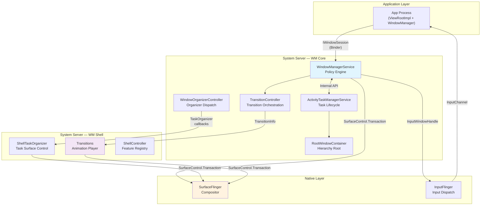

The key insight is that all three Java layers (App, WM Core, WM Shell) can issue `SurfaceControl.Transaction` commands directly to SurfaceFlinger. This is not a strict pipeline but a collaborative model: WM Core sets policy, Shell sets presentation, and both push surface operations to the compositor.

### 23.1.2 WindowManagerService

`WindowManagerService` (WMS) is the central policy engine of the window system. Located at:

```
frameworks/base/services/core/java/com/android/server/wm/WindowManagerService.java
```

At 10,983 lines, it is one of the largest classes in the Android framework. WMS extends `IWindowManager.Stub` and implements `Watchdog.Monitor` and `WindowManagerPolicy.WindowManagerFuncs`:

```java
public class WindowManagerService extends IWindowManager.Stub
        implements Watchdog.Monitor, WindowManagerPolicy.WindowManagerFuncs {
```

WMS is responsible for:

1. **Window lifecycle management** -- Adding, removing, and relaying out windows via `IWindowSession`
2. **Focus management** -- Determining which window receives input focus, with five update modes (`UPDATE_FOCUS_NORMAL`, `UPDATE_FOCUS_WILL_ASSIGN_LAYERS`, `UPDATE_FOCUS_PLACING_SURFACES`, `UPDATE_FOCUS_WILL_PLACE_SURFACES`, `UPDATE_FOCUS_REMOVING_FOCUS`)
3. **Policy enforcement** -- Window type permissions, secure content flags, overlay restrictions
4. **Surface synchronization** -- The global lock (`mGlobalLock`) that protects all window state, shared with `ActivityTaskManagerService`
5. **Display configuration** -- DPI overrides, forced scaling modes, display settings
6. **Animation coordination** -- Window animation scales, transition timeouts

Key constants define the operational boundaries:

```java
static final int MAX_ANIMATION_DURATION = 10 * 1000;           // 10 seconds
static final int WINDOW_FREEZE_TIMEOUT_DURATION = 2000;        // 2 seconds
static final int LAST_ANR_LIFETIME_DURATION_MSECS = 2 * 60 * 60 * 1000; // 2 hours
```

WMS holds references to critical subsystem controllers:

- `mDisplayAreaPolicyProvider` -- Controls how `DisplayArea` hierarchies are constructed per display
- `mWindowTracing` / `mTransitionTracer` -- Debugging infrastructure
- `mConstants` -- Runtime-configurable parameters via `WindowManagerConstants`

### 23.1.3 The WindowContainer Hierarchy

The window system models all window-related objects as a tree of `WindowContainer` nodes. Every node maintains a parent reference, a list of children in z-order, and a 1:1 mapping to a `SurfaceControl` in the SurfaceFlinger layer tree.

**Source file:** `frameworks/base/services/core/java/com/android/server/wm/WindowContainer.java` (3,803 lines)

```java
class WindowContainer<E extends WindowContainer> extends ConfigurationContainer<E>
        implements Comparable<WindowContainer>, Animatable {

    private WindowContainer<WindowContainer> mParent = null;
    protected final ArrayList<E> mChildren = new ArrayList<E>();
    protected SurfaceControl mSurfaceControl;
    protected final SurfaceAnimator mSurfaceAnimator;
    final TransitionController mTransitionController;
}
```

Key properties of `WindowContainer`:

- **Children are z-ordered**: The `mChildren` list is maintained in z-order, with the top-most child at the tail (highest index). The `POSITION_TOP` and `POSITION_BOTTOM` constants (`Integer.MAX_VALUE` and `Integer.MIN_VALUE`) enable explicit ordering.

- **Surface 1:1 mapping**: `mSurfaceControl` mirrors this node in the SurfaceFlinger layer tree. Every hierarchy change (reparent, reorder) produces a corresponding `SurfaceControl.Transaction`.

- **Animation via leash**: `mSurfaceAnimator` manages a separate `SurfaceControl` (the "leash") that is interposed between this node and its parent during animations. All children are reparented to the leash so animations can transform the entire subtree.

- **Sync state machine**: `mSyncState` tracks whether this container is participating in a BLAST sync group (`SYNC_STATE_NONE`, `SYNC_STATE_WAITING_FOR_DRAW`, `SYNC_STATE_READY`).

- **Configuration propagation**: Extends `ConfigurationContainer`, so configuration changes (rotation, density, windowing mode) cascade down the tree.

### 23.1.4 Complete Class Hierarchy

The following diagram shows the complete inheritance hierarchy from `WindowContainer` down to concrete leaf types:

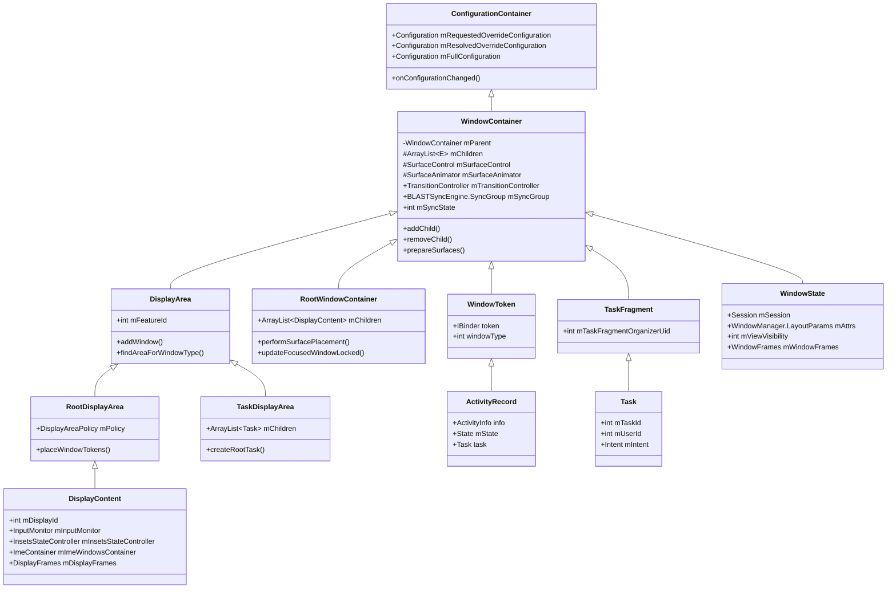

The hierarchy from root to leaf for a typical display is:

```
RootWindowContainer
  └── DisplayContent (display 0)
        └── DisplayArea.Root
              ├── DisplayArea (HideDisplayCutout)
              │     ├── DisplayArea (OneHanded)
              │     │     ├── DisplayArea (Magnification)
              │     │     │     ├── TaskDisplayArea (DefaultTaskDisplayArea)
              │     │     │     │     ├── Task (root task)
              │     │     │     │     │     ├── Task (leaf task)
              │     │     │     │     │     │     ├── ActivityRecord
              │     │     │     │     │     │     │     └── WindowState (main window)
              │     │     │     │     │     │     │           └── WindowState (sub-window)
              │     │     │     │     │     │     └── ActivityRecord
              │     │     │     │     │     └── Task (leaf task)
              │     │     │     │     └── Task (root task - PiP)
              │     │     │     └── WindowToken (TYPE_WALLPAPER)
              │     │     │           └── WindowState (wallpaper)
              │     │     └── WindowToken (TYPE_STATUS_BAR)
              │     │           └── WindowState (status bar)
              │     └── DisplayArea (AppZoomOut)
              ├── ImeContainer
              │     └── WindowToken (TYPE_INPUT_METHOD)
              │           └── WindowState (IME)
              ├── WindowToken (TYPE_NAVIGATION_BAR)
              │     └── WindowState (nav bar)
              └── WindowToken (TYPE_NOTIFICATION_SHADE)
                    └── WindowState (shade)
```

### 23.1.5 WindowState

`WindowState` is the server-side representation of a single window. It extends `WindowContainer<WindowState>`, meaning its children are sub-windows (TYPE_APPLICATION_PANEL, TYPE_APPLICATION_MEDIA, etc.).

**Source file:** `frameworks/base/services/core/java/com/android/server/wm/WindowState.java` (6,191 lines)

```java
class WindowState extends WindowContainer<WindowState>
        implements WindowManagerPolicy.WindowState,
                   InputTarget,
                   InsetsControlTarget {
```

WindowState implements three critical interfaces:

- `WindowManagerPolicy.WindowState` -- Policy queries about window attributes
- `InputTarget` -- Input dispatch targeting
- `InsetsControlTarget` -- Insets animation control

Key fields:

| Field | Type | Purpose |
|-------|------|---------|
| `mSession` | `Session` | Binder connection to the client process |
| `mAttrs` | `WindowManager.LayoutParams` | Window type, flags, soft input mode |
| `mViewVisibility` | `int` | Client-requested visibility (VISIBLE/INVISIBLE/GONE) |
| `mWindowFrames` | `WindowFrames` | Computed frame, display frame, content frame |
| `mRequestedWidth/Height` | `int` | Client's requested dimensions |
| `mGlobalScale` | `float` | Compatibility scaling factor |
| `mInsetsSourceProviders` | `SparseArray` | Insets this window provides to others |
| `mWinAnimator` | `WindowStateAnimator` | Legacy animation state |

### 23.1.6 DisplayContent

`DisplayContent` represents one logical display in the window hierarchy. It extends `RootDisplayArea`, which itself extends `DisplayArea.Dimmable`, which extends `DisplayArea`, which extends `WindowContainer`.

**Source file:** `frameworks/base/services/core/java/com/android/server/wm/DisplayContent.java` (7,311 lines)

```java
class DisplayContent extends RootDisplayArea
        implements WindowManagerPolicy.DisplayContentInfo {

    final int mDisplayId;
    @Nullable String mCurrentUniqueDisplayId;
    private SurfaceControl mOverlayLayer;
    private SurfaceControl mInputOverlayLayer;
    private final ImeContainer mImeWindowsContainer;
    int mMinSizeOfResizeableTaskDp;
}
```

DisplayContent maintains several special surface layers:

- `mOverlayLayer` -- Always-on-top surfaces (strict mode flash, magnification overlay)
- `mInputOverlayLayer` -- Input-related overlay surfaces
- `mPointerEventDispatcherOverlayLayer` -- Receives all pointer input on the display
- `mA11yOverlayLayer` -- Accessibility overlay surfaces

Each DisplayContent creates its own `InsetsStateController` to manage system bar insets, its own `InputMonitor` for input dispatch, and its own `DisplayFrames` for layout computation.

### 23.1.7 RootWindowContainer

`RootWindowContainer` is the absolute root of the window hierarchy. It is a direct child of `WindowManagerService` and contains all `DisplayContent` instances.

**Source file:** `frameworks/base/services/core/java/com/android/server/wm/RootWindowContainer.java`

Its primary responsibilities are:

- `performSurfacePlacement()` -- The main layout pass that computes window positions and pushes surface transactions
- `updateFocusedWindowLocked()` -- Determines the globally focused window across all displays
- Managing display addition/removal as displays connect/disconnect
- Routing intents and activities to appropriate displays

### 23.1.8 The Surface Placement Cycle

Window layout follows a cyclic pattern driven by `RootWindowContainer.performSurfacePlacement()`:

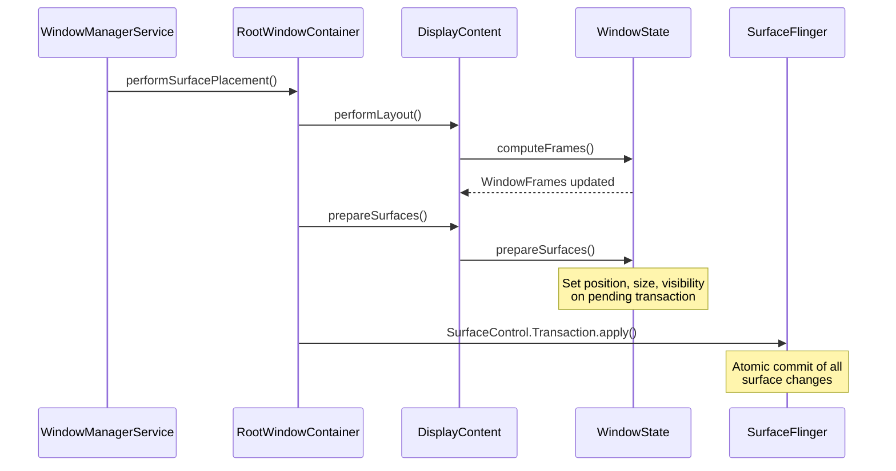

The `LAYOUT_REPEAT_THRESHOLD` (4) limits how many times the layout pass can re-run within a single placement cycle to prevent infinite loops when layout changes trigger further layout changes.

### 23.1.9 WMS Internal Data Structures

WindowManagerService maintains several critical collections that enable fast window lookup and lifecycle management:

```java
// Active client sessions (one per connected process)
final ArraySet<Session> mSessions = new ArraySet<>();

// Fast lookup: IWindow binder token → WindowState
final HashMap<IBinder, WindowState> mWindowMap = new HashMap<>();

// Fast lookup: InputWindowHandle token → WindowState
final HashMap<IBinder, WindowState> mInputToWindowMap = new HashMap<>();

// Windows currently being resized (need client notification after transaction)
final ArrayList<WindowState> mResizingWindows = new ArrayList<>();

// Windows with frame changes pending
final ArrayList<WindowState> mFrameChangingWindows = new ArrayList<>();

// Windows whose surfaces should be destroyed
final ArrayList<WindowState> mDestroySurface = new ArrayList<>();

// Emergency: force-remove windows when out of memory
final ArrayList<WindowState> mForceRemoves = new ArrayList<>();

// Callbacks for "all windows drawn" events
final ArrayMap<WindowContainer<?>, Message> mWaitingForDrawnCallbacks = new ArrayMap<>();

// Windows that hide non-system overlay windows (FLAG_HIDE_NON_SYSTEM_OVERLAY_WINDOWS)
private ArrayList<WindowState> mHidingNonSystemOverlayWindows = new ArrayList<>();

// Key interception info for each input token
final Map<IBinder, KeyInterceptionInfo> mKeyInterceptionInfoForToken =
        Collections.synchronizedMap(new ArrayMap<>());

// IME display policy cache (accessed without lock)
volatile Map<Integer, Integer> mDisplayImePolicyCache =
        Collections.unmodifiableMap(new ArrayMap<>());
```

The `mGlobalLock` (`WindowManagerGlobalLock`) is the central synchronization primitive shared between WMS and `ActivityTaskManagerService`. All window hierarchy modifications must hold this lock.

### 23.1.10 Window Session

Each application process that creates windows establishes a `Session` with WMS via `IWindowSession`. The session is a per-process Binder connection that provides the API for:

- Adding windows (`addToDisplayAsUser`)
- Removing windows (`remove`)
- Relayout (size/position changes) (`relayout`)
- Finishing drawing (`finishDrawing`)
- Window positioning updates
- Input event delivery setup

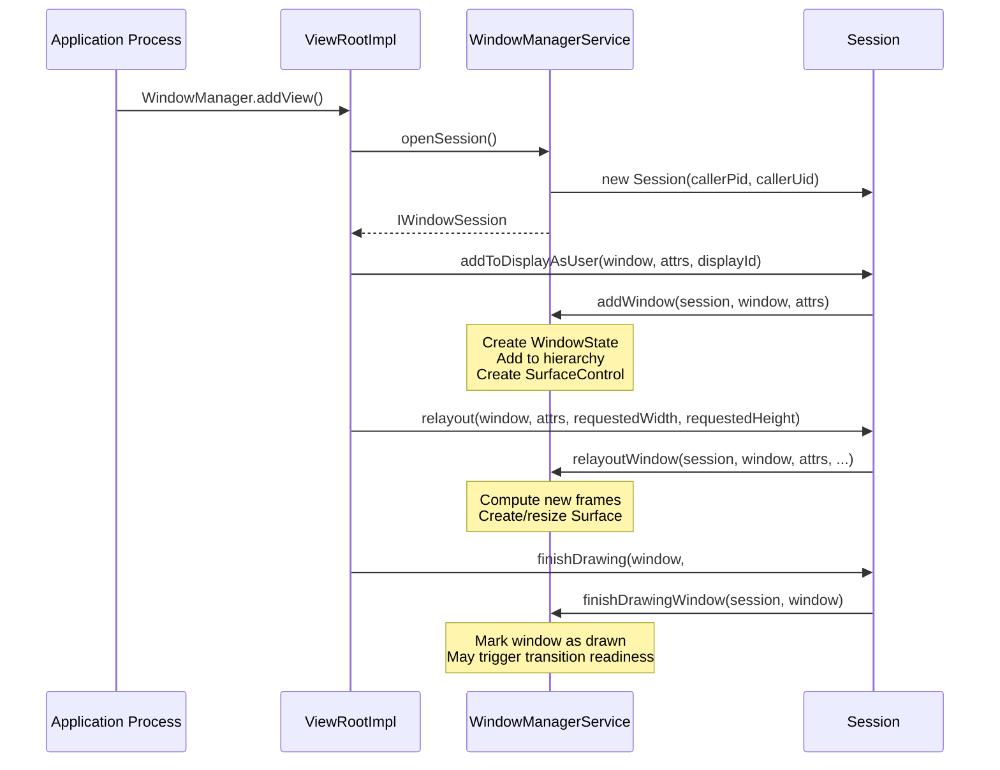

### 23.1.11 The Global Lock and Thread Safety

The `WindowManagerGlobalLock` (`mGlobalLock`) is one of the most contended locks in the system server. It protects:

- All `WindowContainer` hierarchy operations
- Window state changes (visibility, focus, configuration)
- Surface transaction preparation
- Display configuration changes

The lock is shared between WMS and ATMS to avoid deadlocks when operations span both services. In the animation system, a separate `SurfaceAnimationThread` is used for posting animation callbacks to avoid holding `mGlobalLock` during frame callbacks.

WMS also uses several specialized mechanisms to reduce lock contention:

1. **Volatile caches**: `mDisplayImePolicyCache` is a volatile `Map` that can be read without the lock
2. **Handler posting**: Operations that need the lock but are not urgent are posted to the `WindowManagerService.H` handler
3. **Read-only snapshots**: `InsetsState`, `TransitionInfo`, and `TaskInfo` are snapshot objects that can be sent to other threads/processes without holding the lock

### 23.1.12 BLASTSyncEngine

**Source file:** `frameworks/base/services/core/java/com/android/server/wm/BLASTSyncEngine.java`

`BLASTSyncEngine` is the synchronization mechanism that ensures all windows participating in a transition have redrawn their content before the transition animates. Its name comes from "Buffer Layered Ahead of SurfaceFlinger Transaction" (BLAST), the buffer delivery mechanism that replaced the legacy `BufferQueue` consumer-side model.

The sync engine operates in five steps, as documented in the source:

1. **Open sync set**: `startSyncSet(TransactionReadyListener)` -- returns an ID
2. **Add participants**: `addToSyncSet(id, WindowContainer)` -- registers containers
3. **Apply changes**: Configuration changes, reparents, visibility changes
4. **Mark ready**: `setReady(id)` -- signals that all changes have been made
5. **Wait for draw**: Each participant redraws; when all are done, `transactionReady` fires

Sync methods:
```java
METHOD_UNDEFINED = -1; // No method specified
METHOD_NONE = 0;       // Apps draw internally, just report completion
METHOD_BLAST = 1;      // Apps send buffers to be applied in sync
```

The parallel sync system prevents dependency cycles: if sync B depends on sync A and a container is added to A that is already watched by B, the container is moved from B to A rather than creating a cycle.

### 23.1.13 DisplayContent Internals

`DisplayContent` (7,311 lines) maintains extensive state for its display. Key internal structures beyond those already discussed:

```java
// Display metrics and configuration
int mInitialDisplayWidth, mInitialDisplayHeight;
int mInitialDisplayDensity;
float mInitialPhysicalXDpi, mInitialPhysicalYDpi;
DisplayCutout mInitialDisplayCutout;
RoundedCorners mInitialRoundedCorners;
DisplayShape mInitialDisplayShape;

// Overridable metrics (via adb shell wm size/density)
int mBaseDisplayWidth, mBaseDisplayHeight;
int mBaseDisplayDensity;
boolean mIsSizeForced, mIsDensityForced;

// Display policy and rotation
final DisplayPolicy mDisplayPolicy;
final DisplayRotation mDisplayRotation;
DisplayFrames mDisplayFrames;

// Token registry (IBinder → WindowToken)
private final HashMap<IBinder, WindowToken> mTokenMap = new HashMap();

// Gesture exclusion zones
private final Region mSystemGestureExclusion = new Region();
private int mSystemGestureExclusionLimit;

// Keep-clear areas (for PiP avoidance, etc.)
Set<Rect> mRestrictedKeepClearAreas = new ArraySet<>();
Set<Rect> mUnrestrictedKeepClearAreas = new ArraySet<>();

// Layout state
private boolean mLayoutNeeded;
int pendingLayoutChanges;
boolean mWaitingForConfig;

// PiP task controller
final PinnedTaskController mPinnedTaskController;

// Display area policy (controls DisplayArea hierarchy)
final DisplayAreaPolicy mDisplayAreaPolicy;

// Content recording (screen capture/mirror)
@Nullable ContentRecorder mContentRecorder;
```

The `mDisplayAreaPolicy` is critical: it is created by the `DisplayAreaPolicy.Provider` (configured in WMS) and determines how the `DisplayArea` hierarchy is structured for this display. Different device types can provide different policies.

The display tracks rotation through `mDisplayRotation` and maintains rotation-dependent caches for:

- Display cutout geometry (`mDisplayCutoutCache`)
- Rounded corner geometry (`mRoundedCornerCache`)
- Privacy indicator bounds (`mPrivacyIndicatorBoundsCache`)
- Display shape (`mDisplayShapeCache`)

These caches use `RotationCache` to avoid recomputing geometry on every rotation change, only recalculating when the rotation actually differs.

---

## 23.2 WM Shell Library

### 23.2.1 Shell vs Core: The Architectural Split

The window system is split into two halves:

| Aspect | WM Core | WM Shell |
|--------|---------|----------|
| **Location** | `frameworks/base/services/core/.../server/wm/` | `frameworks/base/libs/WindowManager/Shell/` |
| **Process** | System server (main WM thread) | System server (SystemUI / Shell thread) |
| **Role** | Policy engine -- decides *what* happens | Presentation engine -- decides *how* it looks |
| **API Surface** | Internal to system server | Exports via AIDL to SystemUI and Launcher |
| **Window access** | Direct WindowState/Task manipulation | TaskOrganizer callbacks, SurfaceControl |
| **Animation** | Triggers transitions, manages sync | Receives TransitionInfo, animates surfaces |

The split was introduced to allow OEMs and system components (SystemUI, Launcher) to customize window behavior without modifying core WM policy. WM Core signals intent ("this task is entering PiP"), and Shell decides presentation ("animate with this curve to this corner").

### 23.2.2 Shell Directory Structure

The Shell library is organized into feature modules:

```
frameworks/base/libs/WindowManager/Shell/src/com/android/wm/shell/
├── ShellTaskOrganizer.java          — Central task lifecycle listener
├── RootTaskDisplayAreaOrganizer.java — Display area management
├── RootDisplayAreaOrganizer.java     — Root display area control
├── WindowManagerShellWrapper.java    — WMS API wrapper
├── dagger/                           — Dependency injection modules
│   ├── WMShellModule.java           — Phone-specific providers
│   ├── WMShellBaseModule.java       — Shared providers
│   ├── WMShellConcurrencyModule.java — Threading configuration
│   ├── TvWMShellModule.java         — TV-specific providers
│   ├── WMComponent.java            — Dagger component definition
│   └── WMSingleton.java            — Scope annotation
├── transition/                       — Transition animation system
│   ├── Transitions.java             — Master transition player
│   ├── DefaultTransitionHandler.java — Default animations
│   ├── MixedTransitionHandler.java  — Cross-feature transitions
│   └── RemoteTransitionHandler.java — Launcher remote transitions
├── splitscreen/                      — Split-screen feature
│   ├── StageCoordinator.java        — Split layout management
│   ├── SplitScreenController.java   — API surface
│   └── SplitScreenTransitions.java  — Split-specific animations
├── pip/                              — Picture-in-Picture
│   ├── PipTaskOrganizer.java        — PiP task management
│   ├── PipTransition.java           — PiP transition handler
│   └── PipAnimationController.java  — PiP animation logic
├── bubbles/                          — Bubble notifications
│   ├── BubbleController.java        — Bubble lifecycle
│   ├── BubbleStackView.java         — Bubble UI
│   └── BubbleTransitions.java       — Bubble animations
├── desktopmode/                      — Desktop windowing
│   ├── DesktopTasksController.kt    — Desktop task management
│   ├── DesktopTasksLimiter.kt       — Task count limits
│   └── WindowDragTransitionHandler.kt — Drag-to-move
├── freeform/                         — Freeform windowing
│   ├── FreeformTaskListener.java    — Freeform task events
│   └── FreeformTaskTransitionHandler.java — Freeform animations
├── back/                             — Predictive back gestures
│   ├── BackAnimationController.java — Back gesture handling
│   └── CrossTaskBackAnimation.java  — Cross-task animations
├── windowdecor/                      — Window decorations (caption bars)
├── onehanded/                        — One-handed mode
├── unfold/                           — Foldable unfold animation
├── recents/                          — Recent apps integration
├── fullscreen/                       — Fullscreen task listener
├── keyguard/                         — Keyguard transition handler
├── common/                           — Shared utilities
├── sysui/                            — SystemUI integration
├── animation/                        — Animation utilities
└── protolog/                         — ProtoLog configuration
```

### 23.2.3 ShellTaskOrganizer

`ShellTaskOrganizer` is the central hub through which Shell receives task lifecycle events from WM Core. It extends `TaskOrganizer` and dispatches events to registered listeners based on windowing mode.

**Source file:** `frameworks/base/libs/WindowManager/Shell/src/com/android/wm/shell/ShellTaskOrganizer.java`

The listener type system routes tasks to the appropriate feature module:

```java
// Listener types registered with ShellTaskOrganizer
TASK_LISTENER_TYPE_FULLSCREEN  → FullscreenTaskListener
TASK_LISTENER_TYPE_MULTI_WINDOW → StageCoordinator (split-screen)
TASK_LISTENER_TYPE_PIP         → PipTaskOrganizer
TASK_LISTENER_TYPE_FREEFORM    → FreeformTaskListener
TASK_LISTENER_TYPE_DESKTOP_MODE → DesktopTasksController
```

When WM Core changes a task's windowing mode, `ShellTaskOrganizer` automatically reroutes the task to the appropriate listener. This is the mechanism by which, for example, entering PiP transfers task management from the fullscreen listener to `PipTaskOrganizer`.

### 23.2.4 Dependency Injection Architecture

Shell uses Dagger 2 for dependency injection, organized into a layered module hierarchy:

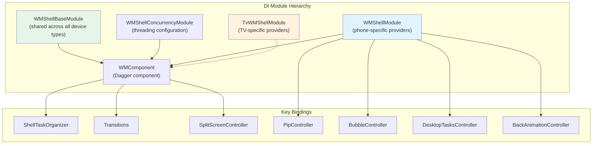

**Source files:**

- `WMShellBaseModule.java` -- Provides components shared across all variants (ShellTaskOrganizer, Transitions, DisplayController, SyncTransactionQueue)
- `WMShellModule.java` -- Phone/tablet-specific components (PIP phone implementation, Bubbles, Desktop mode, Split-screen)
- `TvWMShellModule.java` -- TV-specific components (PIP TV implementation, no Bubbles)
- `WMShellConcurrencyModule.java` -- Threading infrastructure

The `@WMSingleton` scope annotation ensures that components like `ShellTaskOrganizer` and `Transitions` are singletons within the Shell component:

```java
@WMSingleton
@Component(modules = {
    WMShellBaseModule.class,
    WMShellConcurrencyModule.class,
    WMShellModule.class,          // or TvWMShellModule for TV
    ShellBackAnimationModule.class,
    PipModule.class,
    PinnedLayerModule.class,
})
public interface WMComponent { ... }
```

Per-variant customization is achieved by swapping the device-specific module. For example, TV replaces `WMShellModule` with `TvWMShellModule`, which provides a TV-specific PIP implementation and omits Bubbles entirely.

### 23.2.5 Shell Communication Model

Shell communicates with external components via multiple channels:

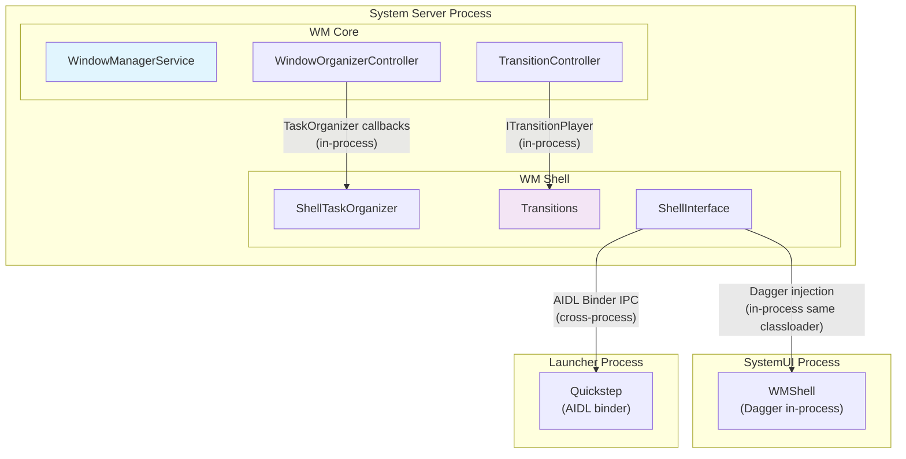

**In-process communication (Shell to WM Core)**:

- Shell calls WM Core APIs (e.g., `TaskOrganizer.applyTransaction()`) directly since they share the system server process
- WM Core calls Shell via organizer callbacks (`TaskOrganizer.onTaskAppeared()`, `ITransitionPlayer.onTransitionReady()`)
- These calls cross thread boundaries (WM thread to Shell thread) via Handler posting

**In-process communication (Shell to SystemUI)**:

- SystemUI loads Shell as a Dagger component within its process
- Shell provides interfaces (e.g., `Pip`, `SplitScreen`, `Bubbles`) via Dagger injection
- Communication is direct Java method calls with thread annotations (`@ExternalThread`, `@ShellMainThread`)

**Cross-process communication (Shell to Launcher)**:

- Launcher communicates via AIDL binder interfaces (`IShellTransitions`, `ISplitScreen`, `IBackAnimation`, etc.)
- Shell provides binder implementations via `ExternalInterfaceBinder` pattern
- Calls are dispatched from the binder thread to the Shell main thread

### 23.2.6 Threading Model

Shell uses a multi-threaded architecture with explicit thread annotations and executor-based dispatch:

**Source file:** `frameworks/base/libs/WindowManager/Shell/src/com/android/wm/shell/dagger/WMShellConcurrencyModule.java`

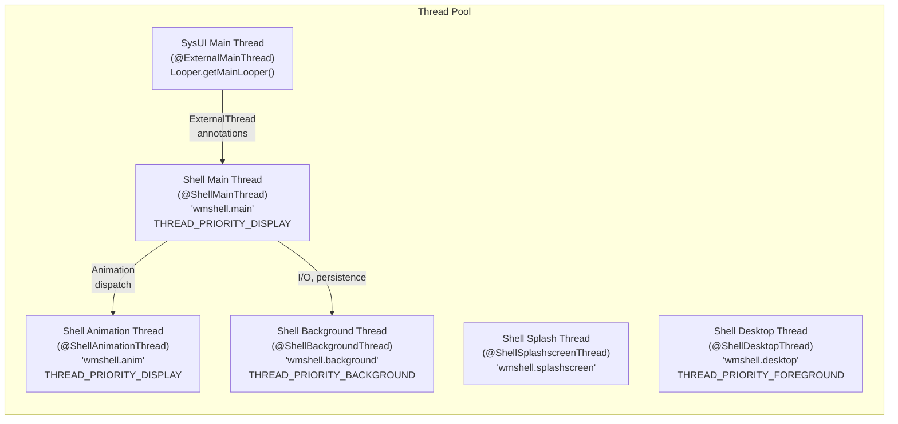

The `@ShellMainThread` is the primary execution thread for Shell components. It runs at `THREAD_PRIORITY_DISPLAY` priority, the same as the SurfaceFlinger and RenderThread, ensuring that window management operations are not preempted by lower-priority work.

The threading model enforces a strict contract:

- Shell components execute on `@ShellMainThread`
- SystemUI calls into Shell via `@ExternalMainThread` executors that post to the Shell thread
- Launcher calls into Shell via AIDL binder, which also dispatches to the Shell thread
- Animations that need frame-perfect timing use `@ShellAnimationThread`
- Heavy operations (snapshot capture, persistence) use `@ShellBackgroundThread`

The `enableShellMainThread()` configuration check determines whether a dedicated Shell thread is created, or whether Shell reuses the SysUI main thread:

```java
public static boolean enableShellMainThread(Context context) {
    return context.getResources().getBoolean(R.bool.config_enableShellMainThread);
}
```

Message queue monitoring thresholds are set at 30ms for both delivery and dispatch, enabling detection of thread contention in debug builds:

```java
private static final int MSGQ_SLOW_DELIVERY_THRESHOLD_MS = 30;
private static final int MSGQ_SLOW_DISPATCH_THRESHOLD_MS = 30;
```

---

## 23.3 Transition System

### 23.3.1 Overview: From Legacy AppTransition to Shell Transitions

The transition system manages how window changes (opening, closing, resizing, rotating) are animated. Android has evolved from a legacy `AppTransition` system (where WM Core both decided and animated transitions) to a "Shell Transitions" architecture where WM Core collects participating windows and Shell drives the animation.

The Shell Transitions system (`ENABLE_SHELL_TRANSITIONS = true`) is now the primary path. The key benefit is that Shell can orchestrate complex multi-window animations (e.g., entering split-screen with two tasks simultaneously) that the legacy system could not handle.

### 23.3.2 TransitionController (WM Core Side)

**Source file:** `frameworks/base/services/core/java/com/android/server/wm/TransitionController.java` (2,049 lines)

`TransitionController` manages the collection and synchronization phases of transitions on the WM Core side. Its Javadoc provides the key architectural insight:

> *"Currently, only 1 transition can be the primary 'collector' at a time. However, collecting can actually be broken into two phases: (1) Actually making WM changes and recording the participating containers. (2) Waiting for the participating containers to become ready (eg. redrawing content). Because (2) takes most of the time AND doesn't change WM, we can actually have multiple transitions in phase (2) concurrently with one in phase (1). We refer to this arrangement as 'parallel' collection."*

Key design points:

- **Parallel collection**: Multiple transitions can wait for readiness simultaneously, but only one can actively collect participants
- **Track assignment**: When a transition moves to "playing", it is checked against all other playing transitions. If it does not overlap, it gets a new "track" for parallel animation. If it overlaps with transitions in more than one track, it is marked SYNC and waits for all prior animations to finish.
- **Timeout management**: `DEFAULT_TIMEOUT_MS` (5000ms) for transitions involving app startup; `CHANGE_TIMEOUT_MS` (2000ms) for configuration changes

```java
class TransitionController {
    private static final int DEFAULT_TIMEOUT_MS = 5000;
    private static final int CHANGE_TIMEOUT_MS = 2000;

    static final int SYNC_METHOD =
            SystemProperties.getBoolean("persist.wm.debug.shell_transit_blast", false)
                    ? BLASTSyncEngine.METHOD_BLAST : BLASTSyncEngine.METHOD_NONE;
}
```

### 23.3.3 Transition (WM Core Side)

**Source file:** `frameworks/base/services/core/java/com/android/server/wm/Transition.java` (4,587 lines)

Each `Transition` instance represents a single transition from creation through collection, readiness, playing, and completion. The transition types are defined in `WindowManager`:

| Constant | Value | Description |
|----------|-------|-------------|
| `TRANSIT_OPEN` | 1 | Window/task appearing |
| `TRANSIT_CLOSE` | 2 | Window/task disappearing |
| `TRANSIT_TO_FRONT` | 3 | Existing task moving to front |
| `TRANSIT_TO_BACK` | 4 | Task moving to back |
| `TRANSIT_CHANGE` | 6 | Configuration change (rotation, bounds) |
| `TRANSIT_PIP` | 8 | Entering Picture-in-Picture |
| `TRANSIT_SLEEP` | 9 | Display going to sleep |
| `TRANSIT_WAKE` | 10 | Display waking up |

The `Transition` class tracks:

- **Participants**: Which `WindowContainer` nodes are participating
- **Changes**: What changed for each participant (open, close, change, etc.)
- **Animation options**: Per-activity animation overrides, cross-profile animations
- **Sync state**: Whether all participants have redrawn their content

### 23.3.4 Transitions (Shell Side -- The Animation Player)

**Source file:** `frameworks/base/libs/WindowManager/Shell/src/com/android/wm/shell/transition/Transitions.java`

The Shell-side `Transitions` class is the master animation orchestrator. It implements `ITransitionPlayer` and manages the lifecycle of transitions from the Shell perspective:

```
--start--> PENDING --onTransitionReady--> READY --play--> ACTIVE --finish--> |
                                                --merge--> MERGED --^
```

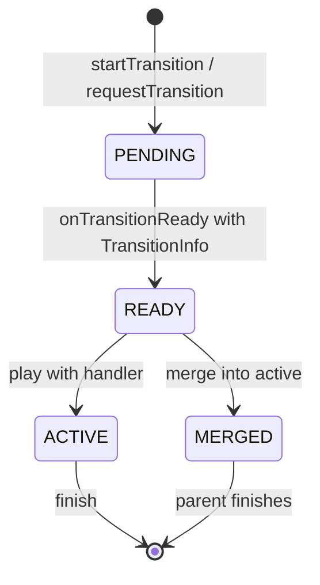

Shell defines custom transition types beyond the core types for feature-specific transitions:

```java
// Shell-specific custom transition types (TRANSIT_FIRST_CUSTOM + N)
TRANSIT_EXIT_PIP              = TRANSIT_FIRST_CUSTOM + 1;
TRANSIT_EXIT_PIP_TO_SPLIT     = TRANSIT_FIRST_CUSTOM + 2;
TRANSIT_REMOVE_PIP            = TRANSIT_FIRST_CUSTOM + 3;
TRANSIT_SPLIT_SCREEN_PAIR_OPEN = TRANSIT_FIRST_CUSTOM + 4;
TRANSIT_SPLIT_SCREEN_OPEN_TO_SIDE = TRANSIT_FIRST_CUSTOM + 5;
TRANSIT_SPLIT_DISMISS_SNAP    = TRANSIT_FIRST_CUSTOM + 6;
TRANSIT_SPLIT_DISMISS         = TRANSIT_FIRST_CUSTOM + 7;
TRANSIT_MAXIMIZE              = TRANSIT_FIRST_CUSTOM + 8;
TRANSIT_RESTORE_FROM_MAXIMIZE = TRANSIT_FIRST_CUSTOM + 9;
TRANSIT_PIP_BOUNDS_CHANGE     = TRANSIT_FIRST_CUSTOM + 16;
TRANSIT_MINIMIZE              = TRANSIT_FIRST_CUSTOM + 20;
```

### 23.3.5 Transition Handler Chain

Shell uses a handler chain to dispatch transitions to the appropriate feature module:

```mermaid
graph TB
    subgraph "Transition Handler Chain"
        TI["TransitionInfo from WM Core"]
        TI --> MH["MixedTransitionHandler<br/>(cross-feature transitions)"]
        MH -->|"not handled"| KH["KeyguardTransitionHandler<br/>(keyguard occlude/unocclude)"]
        KH -->|"not handled"| SH["SleepHandler<br/>(sleep/wake transitions)"]
        SH -->|"not handled"| PT["PipTransition<br/>(PiP enter/exit)"]
        PT -->|"not handled"| SCT["SplitScreenTransitions<br/>(split enter/exit)"]
        SCT -->|"not handled"| FTH["FreeformTaskTransitionHandler<br/>(freeform bounds changes)"]
        FTH -->|"not handled"| RTH["RemoteTransitionHandler<br/>(Launcher remote transitions)"]
        RTH -->|"not handled"| DTH["DefaultTransitionHandler<br/>(standard open/close/change)"]
    end

    style TI fill:#e1f5fe
    style DTH fill:#e8f5e9
```

Each handler in the chain implements `TransitionHandler` and can either:

1. **Claim** the transition by returning `true` from `startAnimation()`, taking responsibility for calling `finishTransition()` when done
2. **Decline** by returning `false`, passing it to the next handler
3. **Request merging** with a currently playing transition if the transitions are compatible

The `MixedTransitionHandler` is special: it handles transitions that involve multiple features simultaneously (e.g., entering split-screen while another window is entering PiP).

### 23.3.6 Transition Lifecycle: End-to-End Flow

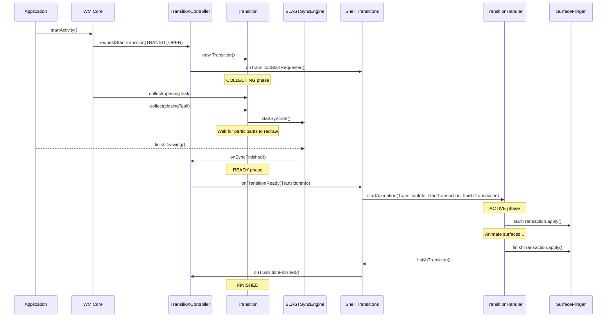

The two SurfaceControl.Transactions -- `startTransaction` and `finishTransaction` -- are critical:

- **startTransaction**: Applied at animation start; sets up the initial animation state (may show/hide surfaces, set initial positions)
- **finishTransaction**: Applied at animation end; sets the final state (final positions, final visibility). This is the "ground truth" that persists after the animation.

### 23.3.7 TransitionInfo: The Data Contract

`TransitionInfo` is the data object passed from WM Core to Shell that describes everything Shell needs to animate a transition:

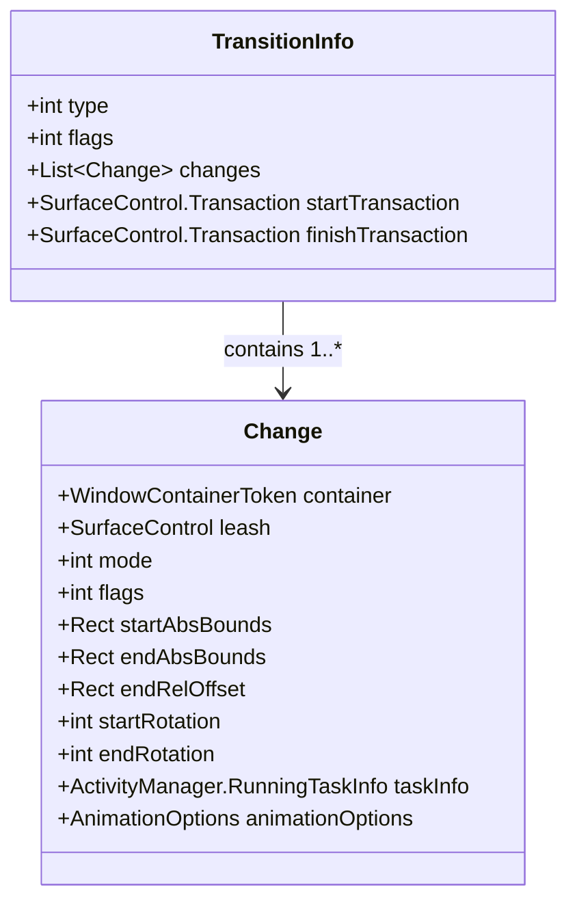

Each `Change` in the `TransitionInfo` represents one participating container with:

- Its `mode` (OPEN, CLOSE, TO_FRONT, TO_BACK, CHANGE)
- Its `flags` (IS_WALLPAPER, IS_INPUT_METHOD, IS_DISPLAY, FILLS_TASK, TRANSLUCENT, etc.)
- Start and end bounds for interpolation
- Start and end rotation for rotation animations
- A `leash` SurfaceControl that Shell can animate

Flags on individual changes provide Shell with enough context to decide animations:

```java
FLAG_IS_WALLPAPER            // This change is a wallpaper
FLAG_IS_INPUT_METHOD         // This change is the IME
FLAG_IS_DISPLAY              // This change represents a display-level transition
FLAG_FILLS_TASK              // Activity fills its task bounds
FLAG_TRANSLUCENT             // Activity has translucent windows
FLAG_SHOW_WALLPAPER          // Activity shows wallpaper behind
FLAG_NO_ANIMATION            // Suppress animation for this change
FLAG_IS_BEHIND_STARTING_WINDOW // Hidden behind splash screen
FLAG_MOVED_TO_TOP            // Container moved to top of z-order
FLAG_IN_TASK_WITH_EMBEDDED_ACTIVITY // Container in embedded activity task
FLAG_DISPLAY_HAS_ALERT_WINDOWS // Display has visible alert windows
FLAG_TASK_LAUNCHING_BEHIND   // Task launching behind current
FLAG_IS_VOICE_INTERACTION    // Voice interaction window
FLAG_IS_OCCLUDED             // Occluded by keyguard
FLAG_CONFIG_AT_END           // Configuration applies at animation end
FLAG_WILL_IME_SHOWN          // IME will be shown after transition
```

### 23.3.8 Transition Merging

When multiple transitions are ready concurrently within the same track, the system attempts to **merge** them. Merging combines a new transition into an already-playing transition, allowing the animation to smoothly incorporate additional changes without restarting.

The merge flow:

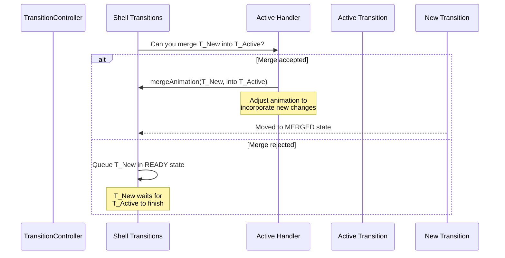

Common merge scenarios:

- Opening multiple activities in rapid succession (second merge into first)
- Configuration change while an app transition is animating
- IME show/hide during an app transition

### 23.3.9 Parallel Tracks

The track system enables true parallel animation. When WM Core determines that a new transition does not overlap with any currently playing transitions, it assigns the transition to a new track:

```
Track 0: [Transition A: Task 1 open] → [Transition C: Task 1 close]
Track 1: [Transition B: Task 2 change] → [Transition D: Task 2 PiP]
```

Transitions within a track are serialized. Transitions across tracks play simultaneously.

If a transition overlaps with more than one track (e.g., it involves containers from both Track 0 and Track 1), it is marked as SYNC. A SYNC transition blocks until all active tracks finish their current animations, then plays exclusively.

### 23.3.10 DefaultTransitionHandler

`DefaultTransitionHandler` is the fallback handler that provides standard Android window animations. It handles:

- **Open/close**: Fade in/out with optional scale
- **To front/back**: Existing window moving in z-order
- **Change**: Bounds change, rotation change
- **Wallpaper transitions**: Parallax and cross-fade with wallpaper

**Source file:** `frameworks/base/libs/WindowManager/Shell/src/com/android/wm/shell/transition/DefaultTransitionHandler.java`

The `DefaultTransitionHandler` creates `SurfaceControl.Transaction` frame callbacks via `ValueAnimator` to smoothly interpolate surface properties (position, size, alpha, corner radius) from start to end state.

### 23.3.11 RemoteTransitionHandler

`RemoteTransitionHandler` enables external components (primarily Launcher/Quickstep) to register `RemoteTransition` objects that handle specific transitions. This is how Launcher provides its custom recents animation, app-to-home animation, and app launch animation.

**Source file:** `frameworks/base/libs/WindowManager/Shell/src/com/android/wm/shell/transition/RemoteTransitionHandler.java`

Remote transitions use `TransitionFilter` to match specific transition patterns (e.g., "closing an app to show home"). When a match is found, the remote handler forwards the `TransitionInfo` to the remote component via AIDL.

---

## 23.4 Multi-Window Architecture

### 23.4.1 Windowing Modes

Android defines five windowing modes in `WindowConfiguration`:

**Source file:** `frameworks/base/core/java/android/app/WindowConfiguration.java`

```java
public static final int WINDOWING_MODE_UNDEFINED   = 0;
public static final int WINDOWING_MODE_FULLSCREEN  = 1;
public static final int WINDOWING_MODE_PINNED      = 2;  // Picture-in-Picture
public static final int WINDOWING_MODE_FREEFORM    = 5;  // Freely resizable
public static final int WINDOWING_MODE_MULTI_WINDOW = 6; // Split-screen
```

The windowing mode determines a task's layout behavior:

| Mode | Bounds | User Resizable | Z-Order | Use Case |
|------|--------|----------------|---------|----------|
| FULLSCREEN | Fills display | No | Normal stacking | Default phone mode |
| PINNED | Small fixed rect | Limited | Always on top | Video PiP |
| FREEFORM | User-defined rect | Yes (drag edges) | Normal stacking | Desktop mode |
| MULTI_WINDOW | Half/portion of display | Via divider | Side by side | Split screen |

The `tasksAreFloating()` helper method identifies which modes produce floating windows:

```java
// WindowConfiguration.java
public boolean tasksAreFloating() {
    return mWindowingMode == WINDOWING_MODE_FREEFORM
            || mWindowingMode == WINDOWING_MODE_MULTI_WINDOW;
}
```

### 23.4.2 Split Screen Architecture

Split screen divides the display into two stages, each hosting one or more tasks. The architecture spans both WM Core and Shell.

**Key source files:**

- `frameworks/base/libs/WindowManager/Shell/src/com/android/wm/shell/splitscreen/StageCoordinator.java`
- `frameworks/base/libs/WindowManager/Shell/src/com/android/wm/shell/splitscreen/SplitScreenController.java`
- `frameworks/base/libs/WindowManager/Shell/src/com/android/wm/shell/splitscreen/StageTaskListener.java`

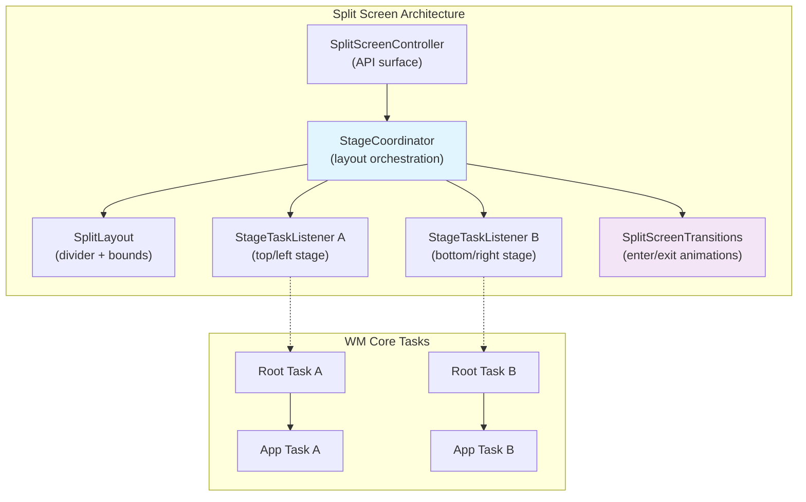

The `StageCoordinator` manages the spatial relationship between stages. Split positions are defined as constants:

```java
SPLIT_POSITION_TOP_OR_LEFT     // First stage
SPLIT_POSITION_BOTTOM_OR_RIGHT // Second stage
SPLIT_POSITION_UNDEFINED       // Not in split
```

Snap positions define the divider ratios:

```java
SNAP_TO_2_50_50  // Equal split
SNAP_TO_2_10_90  // First stage small
SNAP_TO_2_90_10  // First stage large
```

Split screen can also operate in "flexible" mode (`enableFlexibleSplit` flag) where more than two tasks can participate, and the divider positions are more fluid.

Exit reasons are enumerated to track why split screen was dismissed:

```java
EXIT_REASON_APP_DOES_NOT_SUPPORT_MULTIWINDOW
EXIT_REASON_APP_FINISHED
EXIT_REASON_CHILD_TASK_ENTER_PIP
EXIT_REASON_CHILD_TASK_ENTER_BUBBLE
EXIT_REASON_DESKTOP_MODE
EXIT_REASON_DEVICE_FOLDED
EXIT_REASON_DRAG_DIVIDER
EXIT_REASON_FULLSCREEN_REQUEST
EXIT_REASON_FULLSCREEN_SHORTCUT
EXIT_REASON_RETURN_HOME
EXIT_REASON_ROOT_TASK_VANISHED
EXIT_REASON_SCREEN_LOCKED_SHOW_ON_TOP
EXIT_REASON_UNKNOWN
```

### 23.4.3 Picture-in-Picture (PiP)

PiP allows a task to shrink to a small floating overlay window while the user interacts with other apps.

**Key source files:**

- `frameworks/base/libs/WindowManager/Shell/src/com/android/wm/shell/pip/PipTaskOrganizer.java`
- `frameworks/base/libs/WindowManager/Shell/src/com/android/wm/shell/pip/PipTransition.java`
- `frameworks/base/libs/WindowManager/Shell/src/com/android/wm/shell/pip/PipAnimationController.java`

`PipTaskOrganizer` extends the task organizer pattern to manage the PiP task's surface directly:

```java
// Registered as TASK_LISTENER_TYPE_PIP with ShellTaskOrganizer
```

PiP animation directions define the transition phases:

```java
TRANSITION_DIRECTION_TO_PIP                  // Entering PiP
TRANSITION_DIRECTION_LEAVE_PIP               // Expanding back to fullscreen
TRANSITION_DIRECTION_LEAVE_PIP_TO_SPLIT_SCREEN // Expanding into split
TRANSITION_DIRECTION_EXPAND_OR_UNEXPAND      // User expand/collapse gesture
TRANSITION_DIRECTION_REMOVE_STACK            // Dismissing PiP entirely
TRANSITION_DIRECTION_SNAP_AFTER_RESIZE       // Snapping to edge after resize
TRANSITION_DIRECTION_USER_RESIZE             // User pinch-to-resize
TRANSITION_DIRECTION_SAME                    // No direction change
TRANSITION_DIRECTION_NONE                    // No transition
```

The PiP animation can be of two types:

- `ANIM_TYPE_BOUNDS` -- Bounds change animation (move, resize)
- `ANIM_TYPE_ALPHA` -- Alpha fade animation (enter, exit)

### 23.4.4 Freeform Mode

Freeform mode (`WINDOWING_MODE_FREEFORM`) enables desktop-style freely resizable windows. This mode is the foundation for Android's desktop windowing experience.

**Key source files:**

- `frameworks/base/libs/WindowManager/Shell/src/com/android/wm/shell/freeform/FreeformTaskListener.java`
- `frameworks/base/libs/WindowManager/Shell/src/com/android/wm/shell/freeform/FreeformTaskTransitionHandler.java`

`FreeformTaskListener` handles task appearance/vanish events and manages window decorations (caption bars) for freeform windows. `FreeformTaskTransitionHandler` animates transitions involving freeform tasks, such as entering freeform from fullscreen or resizing.

### 23.4.5 Desktop Mode

Desktop mode is an evolution of freeform that adds a full desktop windowing experience with task management, window limits, and multi-desk support.

**Key source files:**

- `frameworks/base/libs/WindowManager/Shell/src/com/android/wm/shell/desktopmode/DesktopTasksController.kt`
- `frameworks/base/libs/WindowManager/Shell/src/com/android/wm/shell/desktopmode/DesktopTasksLimiter.kt`
- `frameworks/base/libs/WindowManager/Shell/src/com/android/wm/shell/desktopmode/WindowDragTransitionHandler.kt`

The desktop mode directory contains a substantial number of components (50+ files), reflecting the complexity of a full desktop windowing experience:

```
desktopmode/
├── DesktopTasksController.kt          — Central controller
├── DesktopTasksLimiter.kt            — Enforces max open task count
├── WindowDragTransitionHandler.kt     — Drag-to-move transitions
├── DragToDesktopTransitionHandler.kt  — Drag from dock to desktop
├── DesktopImeHandler.kt              — IME integration for freeform
├── DesktopImmersiveController.kt     — Immersive mode in desktop
├── DesktopDisplayEventHandler.kt     — Display connect/disconnect
├── DisplayFocusResolver.kt           — Per-display focus for desktop
├── DesktopPipTransitionController.kt — PiP within desktop mode
├── DesktopTaskPosition.kt            — Window position management
├── DesktopWallpaperActivity.kt       — Desktop wallpaper surface
├── DesktopModeVisualIndicator.java   — Drag visual indicator
├── multidesks/                        — Multi-desk support
├── minimize/                          — Task minimization
├── education/                         — User onboarding
├── animation/                         — Desktop-specific animations
├── data/                              — Desktop state persistence
├── common/                            — Shared utilities
└── desktopfirst/                      — Desktop-first experience
```

Desktop mode introduces transition types specific to windowing operations:

```java
TRANSIT_MAXIMIZE              // Freeform → maximized
TRANSIT_RESTORE_FROM_MAXIMIZE // Maximized → freeform
TRANSIT_MINIMIZE              // Task minimization
```

### 23.4.6 Multi-Window Task Flow

The following diagram shows how a task transitions between windowing modes:

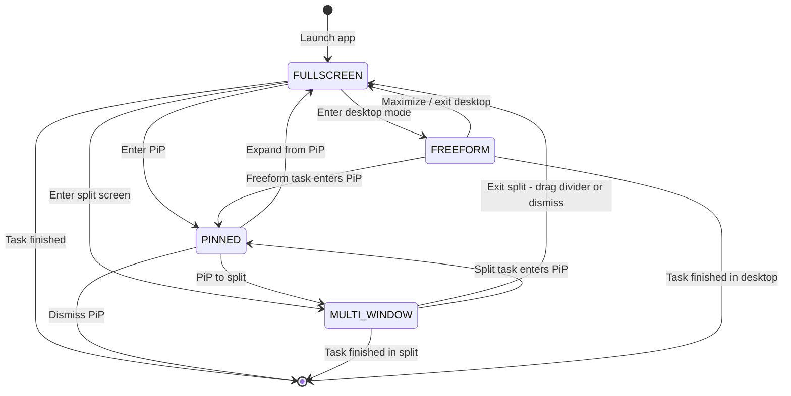

Each transition between modes involves:

1. WM Core updating the task's `WindowConfiguration.windowingMode`
2. A transition being created and collected by `TransitionController`
3. The old Shell listener releasing the task and the new listener acquiring it (via `ShellTaskOrganizer`)
4. Shell animating the transition through the appropriate `TransitionHandler`

### 23.4.7 WindowContainerTransaction

`WindowContainerTransaction` (WCT) is the atomic operation mechanism that Shell uses to make changes to the window hierarchy. Rather than making individual calls to WM Core, Shell batches changes into a single WCT:

```java
WindowContainerTransaction wct = new WindowContainerTransaction();
wct.setBounds(taskToken, newBounds);           // Change bounds
wct.setWindowingMode(taskToken, FREEFORM);     // Change windowing mode
wct.reorder(taskToken, true /* onTop */);      // Reorder in z-stack
wct.reparent(taskToken, newParentToken, true); // Move to different parent

// Apply atomically via the organizer
shellTaskOrganizer.applyTransaction(wct);
```

WCT operations include:

- `setBounds()` -- Change task bounds
- `setWindowingMode()` -- Change windowing mode
- `reorder()` -- Move in z-order
- `reparent()` -- Move to different parent container
- `setFocusable()` -- Set focus policy
- `setHidden()` -- Hide/show container
- `startTask()` -- Start a pending intent in context of this transaction
- `sendPendingIntent()` -- Launch via pending intent

WCTs can be submitted with or without an associated transition. When submitted with a transition, the WCT changes are collected as part of the transition and animated by Shell.

### 23.4.8 Task and TaskFragment Hierarchy

Within the multi-window system, the task hierarchy is:

```
TaskDisplayArea
  └── Task (root task, often windowing-mode-specific)
        ├── Task (leaf task, holds activities)
        │     ├── TaskFragment (optional, for activity embedding)
        │     │     └── ActivityRecord
        │     │           └── WindowState
        │     └── ActivityRecord
        │           └── WindowState
        └── Task (another leaf task)
```

The `Task` class (7,190 lines) extends `TaskFragment`:

```java
class Task extends TaskFragment { ... }
```

And `TaskFragment` extends `WindowContainer`:

```java
class TaskFragment extends WindowContainer<WindowContainer> { ... }
```

This hierarchy enables:

- **Root tasks** for windowing mode grouping (e.g., a split-screen root task contains two leaf tasks)
- **Leaf tasks** for individual activities
- **TaskFragments** for activity embedding (side-by-side activities within a single task, used by Jetpack WindowManager)

### 23.4.9 Activity Record and the Window-Activity Relationship

`ActivityRecord` extends `WindowToken`, which extends `WindowContainer<WindowState>`:

```java
final class ActivityRecord extends WindowToken { ... }
class WindowToken extends WindowContainer<WindowState> { ... }
```

This means an `ActivityRecord` directly contains `WindowState` children. A single activity may have multiple windows:

- The main application window (`TYPE_BASE_APPLICATION`)
- A starting/splash window (`TYPE_APPLICATION_STARTING`)
- Sub-windows (panels, media surfaces)
- Dialog windows

The `ActivityRecord` manages the activity lifecycle states (INITIALIZING, STARTED, RESUMED, PAUSED, STOPPED, FINISHING, DESTROYED), and these states influence window visibility and transition behavior.

### 23.4.10 Bounds Computation

Multi-window bounds are computed through a cascade:

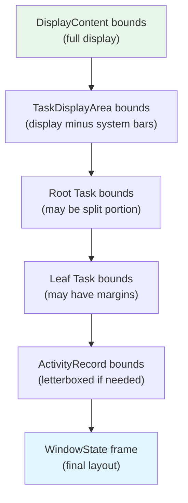

Each level can constrain or transform the bounds:

- **DisplayContent**: Full display dimensions minus notch/cutout if applicable
- **TaskDisplayArea**: Display area after subtracting persistent system UI
- **Root Task**: In split mode, this is half (or a portion) of the task display area
- **Leaf Task**: May have additional constraints (minimum size, aspect ratio)
- **ActivityRecord**: May be letterboxed if the activity does not support the available bounds
- **WindowState**: Final frame computed by layout, accounting for insets and compatibility scaling

---

## 23.5 Multi-Display

### 23.5.1 DisplayContent and the Display Model

Each connected display (physical or virtual) is represented by a `DisplayContent` instance in the window hierarchy. The `RootWindowContainer` at the top of the hierarchy contains one `DisplayContent` child per display.

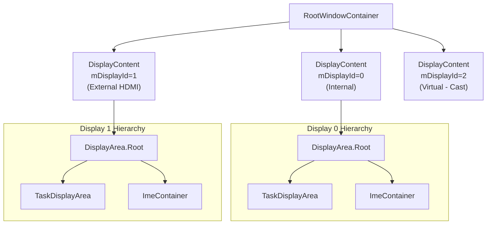

Each `DisplayContent` is self-contained with its own:

- `DisplayArea` hierarchy (configured by `DisplayAreaPolicy`)
- `InsetsStateController` (system bar insets are per-display)
- `InputMonitor` (input window list is per-display)
- `DisplayFrames` (screen bounds, cutout, insets)
- Focus tracking (per-display focused window)
- IME container (IME can be local or fallback to default display)

### 23.5.2 Display Identification

Displays use two identification schemes:

| Identifier | Type | Stability | Source |
|-----------|------|-----------|--------|
| `mDisplayId` | `int` | Stable within boot | Assigned by `DisplayManagerService` |
| `mCurrentUniqueDisplayId` | `String` | Can change at runtime | Physical display EDID or virtual display token |

The `mCurrentUniqueDisplayId` can change if the underlying physical display hardware changes (e.g., hot-plugging a different monitor), while `mDisplayId` remains stable for the lifetime of the `DisplayContent`.

### 23.5.3 Virtual Displays

Virtual displays are created via `DisplayManagerService` and backed by a `Surface` rather than physical hardware. They are used for:

- **Screen casting/mirroring** -- Content is rendered to a virtual display, captured, and sent over network
- **Presentation API** -- `android.app.Presentation` renders to a virtual display for secondary screens
- **Companion devices** -- Virtual device framework creates virtual displays for remote devices
- **Testing** -- Instrumentation creates virtual displays for multi-display tests

Virtual display flags control behavior:

| Flag | Effect |
|------|--------|
| `FLAG_PRIVATE` | Content only visible to creating process |
| `FLAG_SHOULD_SHOW_SYSTEM_DECORATIONS` | Display gets status/navigation bars |
| `FLAG_CAN_SHOW_WITH_INSECURE_KEYGUARD` | Can show content when keyguard is active |
| `FLAG_ALLOWS_CONTENT_MODE_SWITCH` | Display content mode can change |

### 23.5.4 Cross-Display Window Movement

Tasks can be moved between displays via several mechanisms:

1. **WindowContainerTransaction**: Shell issues a `WindowContainerTransaction` that reparents a task to a different display's `TaskDisplayArea`
2. **Activity launch targeting**: An activity can be launched targeting a specific display via `ActivityOptions.setLaunchDisplayId()`
3. **Display disconnect**: When a display is removed, its tasks must be migrated to a surviving display

The cross-display movement process:

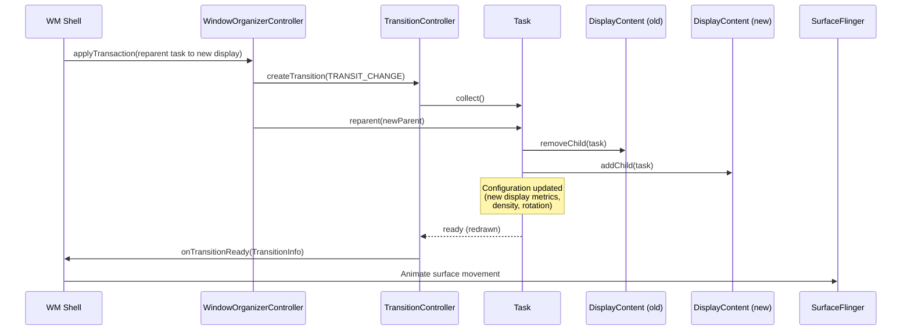

The `DisplayContent` class tracks several key settings that affect cross-display behavior:

- `mMinSizeOfResizeableTaskDp` -- Minimum task size on this display
- IME policy (`DISPLAY_IME_POLICY_LOCAL` vs `DISPLAY_IME_POLICY_FALLBACK_DISPLAY`) -- Whether the IME appears on this display or on the default display
- Display content mode management (enabled via `ENABLE_DISPLAY_CONTENT_MODE_MANAGEMENT` flag)

### 23.5.5 Per-Display Focus

The window system maintains focus at two levels:

1. **Per-display focus** -- Each `DisplayContent` tracks its own focused window
2. **Global focus** -- `RootWindowContainer` determines which display's focused window is the "top" focus (receives key events)

This dual-level system is essential for multi-display scenarios where the user might interact with different displays simultaneously (e.g., typing on one display while watching a video on another).

### 23.5.6 Display Groups and Topology

Displays can be organized into groups for coordinated behavior. Display groups affect:

- **Wallpaper sharing**: Displays in the same group may share wallpaper
- **Configuration inheritance**: Group-level configuration overrides
- **Focus behavior**: Focus policies may be group-aware

The display topology system manages spatial relationships between displays:

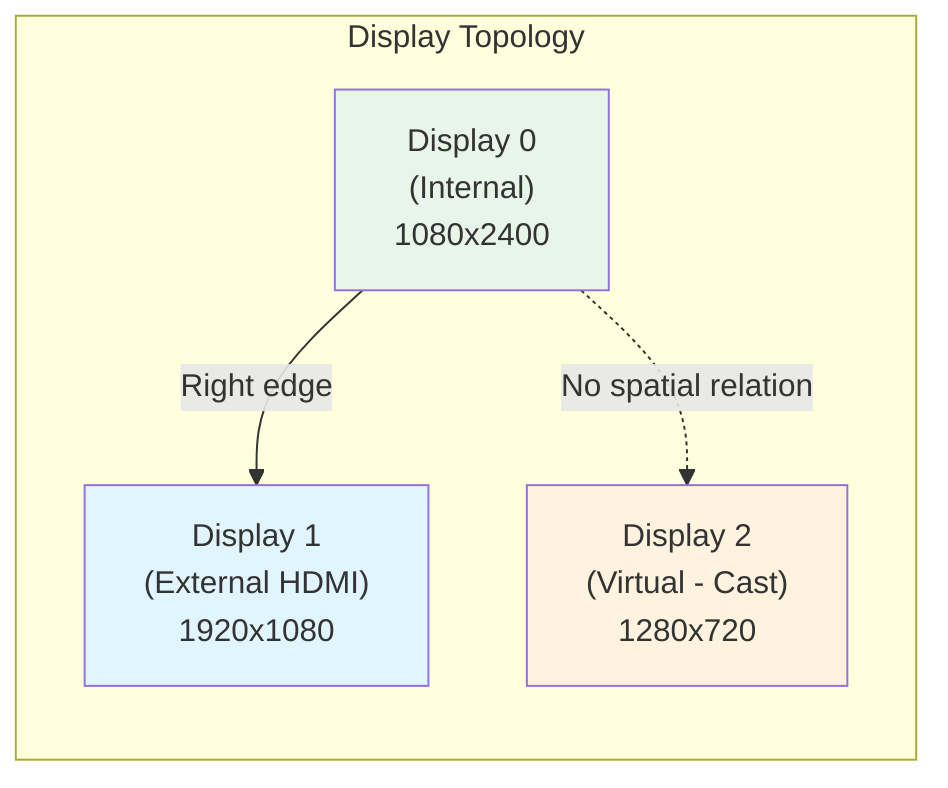

Spatial relationships enable:

- Cursor movement across adjacent display edges
- Drag-and-drop between displays
- Window drag-to-move between displays

### 23.5.7 IME Policy Per Display

Each display has an IME (Input Method Editor) policy that determines where the software keyboard appears:

```java
DISPLAY_IME_POLICY_LOCAL           // IME shows on this display
DISPLAY_IME_POLICY_FALLBACK_DISPLAY // IME shows on default display
```

The policy is cached in WMS at the volatile `mDisplayImePolicyCache` map for lock-free access. Virtual displays and some secondary displays use `FALLBACK_DISPLAY` policy because they may not have appropriate system decorations or touch input for IME interaction.

The `ImeContainer` within each `DisplayContent` manages the IME window's z-ordering. The IME needs special z-ordering logic because it must appear:

- Above the target window (the window requesting input)
- Below system overlays and the navigation bar
- In the correct position relative to the `DisplayArea` hierarchy

### 23.5.8 Display Configuration and Overrides

Each `DisplayContent` tracks both initial and overridden display metrics. These can be modified via:

- **adb shell**: `wm size`, `wm density`, `wm scaling` commands
- **Settings**: User-accessible display size/density settings
- **System server**: Programmatic display configuration changes

The override system maintains a ratio (`mForcedDisplayDensityRatio`) between the forced density and the initial density. When the display resolution changes (e.g., on a device with variable resolution support), this ratio is used to scale the density proportionally, preserving the user's chosen display size.

```java
// DisplayContent fields for override tracking
int mBaseDisplayWidth = 0;     // May differ from mInitialDisplayWidth
int mBaseDisplayHeight = 0;    // May differ from mInitialDisplayHeight
int mBaseDisplayDensity = 0;   // May differ from mInitialDisplayDensity
boolean mIsSizeForced = false;
boolean mIsDensityForced = false;
float mForcedDisplayDensityRatio = 0.0f;
```

---

## 23.6 Input System Integration

### 23.6.1 InputFlinger to WMS Pipeline

The input system and window system are tightly coupled: InputFlinger needs to know the window layout to route touch events to the correct window, and WMS needs to track focus for keyboard input routing.

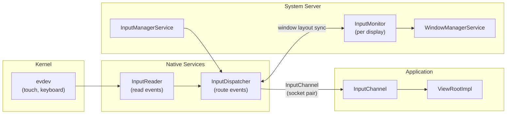

### 23.6.2 InputMonitor

**Source file:** `frameworks/base/services/core/java/com/android/server/wm/InputMonitor.java`

`InputMonitor` is instantiated per-display (`DisplayContent` creates one) and is responsible for updating InputFlinger with the current window layout. When windows change, `InputMonitor` walks the window hierarchy and builds an ordered list of `InputWindowHandle` structures that tell InputFlinger:

- The bounds of each window
- Whether it is touchable (`FLAG_NOT_TOUCHABLE`)
- Whether it is touch-modal (`FLAG_NOT_TOUCH_MODAL`)
- Whether it should receive input at all (`INPUT_FEATURE_NO_INPUT_CHANNEL`)
- The input channel to dispatch events through
- Trusted overlay status (`PRIVATE_FLAG_TRUSTED_OVERLAY`)
- SPY flag for input monitoring (`INPUT_FEATURE_SPY`)

Special input consumers are registered for system-level input interception:

```java
INPUT_CONSUMER_PIP              // PiP gesture handling
INPUT_CONSUMER_RECENTS_ANIMATION // Recents swipe gesture
INPUT_CONSUMER_WALLPAPER        // Wallpaper touch forwarding
```

### 23.6.3 Window Targeting

When a touch event arrives, InputDispatcher resolves the target window through these steps:

1. **Find the display**: Map the event coordinates to a display via display topology
2. **Walk the window list**: Top-to-bottom through the display's window list
3. **Hit test**: Check if the event coordinates fall within a window's touchable region
4. **Check flags**: Skip windows with `FLAG_NOT_TOUCHABLE`; pass through windows without `FLAG_NOT_TOUCH_MODAL`
5. **Trusted overlay check**: Special handling for trusted overlays that should intercept but not consume input
6. **Deliver**: Send the event through the window's `InputChannel`

For keyboard/key events, the dispatch is simpler: events go to the focused window (determined by `DisplayContent.mCurrentFocus`).

### 23.6.4 Focus Management

Focus management is a multi-step process triggered by `WindowManagerService.updateFocusedWindowLocked()`:

```java
static final int UPDATE_FOCUS_NORMAL = 0;
static final int UPDATE_FOCUS_WILL_ASSIGN_LAYERS = 1;
static final int UPDATE_FOCUS_PLACING_SURFACES = 2;
static final int UPDATE_FOCUS_WILL_PLACE_SURFACES = 3;
static final int UPDATE_FOCUS_REMOVING_FOCUS = 4;
```

The five modes control when during the surface placement cycle focus is updated:

| Mode | When Used | Behavior |
|------|-----------|----------|
| `UPDATE_FOCUS_NORMAL` | General focus update | Triggers layout redo if focus changed |
| `UPDATE_FOCUS_WILL_ASSIGN_LAYERS` | Before layer assignment | Layers assigned after focus update |
| `UPDATE_FOCUS_PLACING_SURFACES` | During surface placement | Layout already in progress |
| `UPDATE_FOCUS_WILL_PLACE_SURFACES` | Layout will follow | Defers layout to upcoming pass |
| `UPDATE_FOCUS_REMOVING_FOCUS` | Focus window being removed | Cleans up outgoing focus |

Focus is determined by walking the window hierarchy top-to-bottom and finding the first window that:

- Is visible (or becoming visible)
- Is focusable (not `FLAG_NOT_FOCUSABLE`)
- Is not behind the keyguard (unless `FLAG_SHOW_WHEN_LOCKED`)
- Has the `mIsFocusable` property set (not explicitly unfocusable)

### 23.6.5 Input and Display Topology

For multi-display scenarios, the input system must handle display topology -- knowing which displays are adjacent and how to route events that cross display boundaries. `DisplayContent` maintains:

```java
private SurfaceControl mInputOverlayLayer;
private SurfaceControl mPointerEventDispatcherOverlayLayer;
```

The `INPUT_FEATURE_DISPLAY_TOPOLOGY_AWARE` flag on a window's layout params indicates that it should receive input events with display topology awareness, enabling seamless cursor movement across displays.

### 23.6.6 InputChannel: The Event Delivery Mechanism

`InputChannel` is a pair of Unix domain sockets that connects InputDispatcher (native) to the application's `ViewRootImpl` (Java). Each `WindowState` that can receive input gets an `InputChannel`:

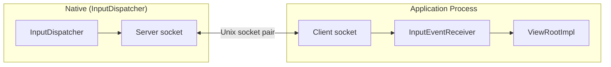

The socket pair is created during `addWindow()` and the server-side socket is registered with `InputDispatcher` via the `InputWindowHandle`. The client-side socket is returned to the application through the `IWindowSession`.

Events flow as serialized `InputMessage` structures through the socket. The application reads them in its `InputEventReceiver` (attached to the Looper), processes them through the `ViewRootImpl` InputStage chain, and sends a finished signal back through the socket.

### 23.6.7 Window Input Flags

Window input behavior is controlled by several flags:

| Flag | Effect |
|------|--------|
| `FLAG_NOT_FOCUSABLE` | Window cannot receive keyboard focus |
| `FLAG_NOT_TOUCHABLE` | Touch events pass through this window |
| `FLAG_NOT_TOUCH_MODAL` | Touch events outside window bounds pass to windows behind |
| `FLAG_SLIPPERY` | Touch can slip to adjacent windows |
| `INPUT_FEATURE_NO_INPUT_CHANNEL` | Window has no input channel (invisible to input) |
| `INPUT_FEATURE_SPY` | Window receives copies of all input events (monitoring) |
| `INPUT_FEATURE_SENSITIVE_FOR_PRIVACY` | Window content is privacy-sensitive |
| `INPUT_FEATURE_DISPLAY_TOPOLOGY_AWARE` | Handles cross-display pointer movement |
| `PRIVATE_FLAG_TRUSTED_OVERLAY` | Overlay is trusted (system-signed) |

The `FLAG_NOT_TOUCH_MODAL` flag is particularly important for multi-window scenarios: without it, a window would consume all touch events within the display bounds, even those outside the window's visible area.

### 23.6.8 Input Consumers

WMS can register special "input consumers" that intercept input before it reaches normal windows:

```java
INPUT_CONSUMER_PIP              // Intercepts gestures for PiP manipulation
INPUT_CONSUMER_RECENTS_ANIMATION // Intercepts swipe-up for recents gesture
INPUT_CONSUMER_WALLPAPER        // Forwards touch to wallpaper for parallax
```

Input consumers are implemented as `InputConsumerImpl` objects that have their own `InputChannel` and `SurfaceControl`. They are inserted into the input window list at specific z-order positions to intercept events before they reach app windows.

### 23.6.9 Spy Windows

The `INPUT_FEATURE_SPY` flag allows a window to receive copies of input events without consuming them. This is used by:

- System gestures (edge swipe detection)
- Accessibility overlays
- Input monitoring for analytics

Spy windows do not affect event dispatch to normal windows -- they only observe.

---

## 23.7 Surface and Leash

### 23.7.1 The SurfaceControl Hierarchy

Every `WindowContainer` in the WM hierarchy has a corresponding `SurfaceControl` in SurfaceFlinger. This creates a parallel tree:

```mermaid
graph TB
    subgraph "WM Hierarchy (Java)"
        RWC_J["RootWindowContainer"]
        DC_J["DisplayContent"]
        DA_J["DisplayArea"]
        TDA_J["TaskDisplayArea"]
        T_J["Task"]
        AR_J["ActivityRecord"]
        WS_J["WindowState"]
    end

    subgraph "Surface Hierarchy (SurfaceFlinger)"
        RWC_S["SurfaceControl<br/>(root)"]
        DC_S["SurfaceControl<br/>(display)"]
        DA_S["SurfaceControl<br/>(display area)"]
        TDA_S["SurfaceControl<br/>(task display area)"]
        T_S["SurfaceControl<br/>(task)"]
        AR_S["SurfaceControl<br/>(activity)"]
        WS_S["SurfaceControl<br/>(window buffer layer)"]
    end

    RWC_J -.->|"1:1"| RWC_S
    DC_J -.->|"1:1"| DC_S
    DA_J -.->|"1:1"| DA_S
    TDA_J -.->|"1:1"| TDA_S
    T_J -.->|"1:1"| T_S
    AR_J -.->|"1:1"| AR_S
    WS_J -.->|"1:1"| WS_S

    RWC_S --> DC_S
    DC_S --> DA_S
    DA_S --> TDA_S
    TDA_S --> T_S
    T_S --> AR_S
    AR_S --> WS_S
```

This 1:1 mapping is a fundamental invariant of the system. Every time a child is added to or removed from a `WindowContainer`, a corresponding `SurfaceControl` reparent operation is issued to SurfaceFlinger via a `SurfaceControl.Transaction`.

The `prepareSurfaces()` method, called during the surface placement pass, allows each `WindowContainer` to update its `SurfaceControl` properties (position, size, alpha, visibility, layer order) before the transaction is committed.

### 23.7.2 Animation Leash Mechanism

The animation leash is the key mechanism that enables smooth animations of window containers. The `SurfaceAnimator` class manages this:

**Source file:** `frameworks/base/services/core/java/com/android/server/wm/SurfaceAnimator.java` (647 lines)

From the source Javadoc:

> *"We do this by reparenting all child surfaces of an object onto a new surface, called the 'Leash'. The Leash gets attached in the surface hierarchy where the children were attached to. We then hand off the Leash to the component handling the animation. When the animation is done, our callback to finish the animation will be invoked, at which we reparent the children back to the original parent."*

```mermaid
graph TB
    subgraph "Before Animation"
        P1["Parent SurfaceControl"]
        C1["Container SurfaceControl"]
        CH1["Child Surface A"]
        CH2["Child Surface B"]
        P1 --> C1
        C1 --> CH1
        C1 --> CH2
    end

    subgraph "During Animation"
        P2["Parent SurfaceControl"]
        L2["LEASH SurfaceControl<br/>(animation target)"]
        C2["Container SurfaceControl"]
        CH3["Child Surface A"]
        CH4["Child Surface B"]
        P2 --> L2
        L2 --> C2
        C2 --> CH3
        C2 --> CH4
    end

    subgraph "After Animation"
        P3["Parent SurfaceControl"]
        C3["Container SurfaceControl"]
        CH5["Child Surface A"]
        CH6["Child Surface B"]
        P3 --> C3
        C3 --> CH5
        C3 --> CH6
    end

    style L2 fill:#fff3e0
```

The leash creation flow:

```java
void startAnimation(Transaction t, AnimationAdapter anim, boolean hidden,
        @AnimationType int type, ...) {
    cancelAnimation(t, true /* restarting */, true /* forwardCancel */);
    mAnimation = anim;
    mAnimationType = type;
    SurfaceControl surface = mAnimatable.getSurfaceControl();
    if (mLeash == null) {
        mLeash = createAnimationLeash(mAnimatable, surface, t, type,
                mAnimatable.getSurfaceWidth(), mAnimatable.getSurfaceHeight(),
                0, 0, hidden, mService.mTransactionFactory);
        mAnimatable.onAnimationLeashCreated(t, mLeash);
    }
    mAnimatable.onLeashAnimationStarting(t, mLeash);
    mAnimation.startAnimation(mLeash, t, type, mInnerAnimationFinishedCallback);
}
```

### 23.7.3 Animation Types

The `SurfaceAnimator` defines animation types that categorize different uses of the leash mechanism:

```java
ANIMATION_TYPE_NONE           = 0;       // No animation
ANIMATION_TYPE_APP_TRANSITION = 1;       // App open/close/change
ANIMATION_TYPE_SCREEN_ROTATION = 1 << 1; // Screen rotation
ANIMATION_TYPE_DIMMER         = 1 << 2;  // Background dimming
ANIMATION_TYPE_RECENTS        = 1 << 3;  // Recents gesture
ANIMATION_TYPE_WINDOW_ANIMATION = 1 << 4; // Per-window animation
ANIMATION_TYPE_INSETS_CONTROL = 1 << 5;  // Insets show/hide
ANIMATION_TYPE_TOKEN_TRANSFORM = 1 << 6; // Fixed rotation
ANIMATION_TYPE_STARTING_REVEAL = 1 << 7; // Starting window reveal
ANIMATION_TYPE_PREDICT_BACK   = 1 << 8;  // Predictive back gesture
ANIMATION_TYPE_ALL            = -1;      // Match any type
```

These are bit flags, enabling queries like "is any animation of type X running on this container or its children?"

### 23.7.4 Layer Assignment and Leash Interaction

When a leash is present, layer operations must target the leash rather than the underlying surface. `SurfaceAnimator` handles this transparently:

```java
void setLayer(Transaction t, int layer) {
    t.setLayer(mLeash != null ? mLeash : mAnimatable.getSurfaceControl(), layer);
}

void setRelativeLayer(Transaction t, SurfaceControl relativeTo, int layer) {
    t.setRelativeLayer(mLeash != null ? mLeash : mAnimatable.getSurfaceControl(),
            relativeTo, layer);
}
```

### 23.7.5 Animation Transfer

Animations can be transferred between `SurfaceAnimator` instances without visual interruption. This is used when a window is reparented during an active animation:

```java
void transferAnimation(SurfaceAnimator from) {
    // Steal the leash, animation, and callbacks from the source
    mLeash = from.mLeash;
    mAnimation = from.mAnimation;
    mAnimationType = from.mAnimationType;
    mSurfaceAnimationFinishedCallback = from.mSurfaceAnimationFinishedCallback;

    // Cancel source without forwarding to the animation adapter
    from.cancelAnimation(t, false, false /* forwardCancel */);

    // Reparent our surface to the stolen leash
    t.reparent(surface, mLeash);
    t.reparent(mLeash, parent);

    // Register in the transfer map for callback routing
    mService.mAnimationTransferMap.put(mAnimation, this);
}
```

The `mAnimationTransferMap` in `WindowManagerService` ensures that when the animation adapter fires its completion callback, it is routed to the correct (new) `SurfaceAnimator` rather than the original.

### 23.7.6 The Animatable Interface

The `SurfaceAnimator.Animatable` interface defines the contract that any animatable container must implement:

```java
interface Animatable {
    // The transaction that will be used for pending surface operations
    Transaction getPendingTransaction();
    Transaction getSyncTransaction();
    void commitPendingTransaction();

    // Surface control management
    SurfaceControl getSurfaceControl();
    SurfaceControl getAnimationLeashParent();
    SurfaceControl getParentSurfaceControl();

    // Surface dimensions
    int getSurfaceWidth();
    int getSurfaceHeight();

    // Leash lifecycle callbacks
    void onAnimationLeashCreated(Transaction t, SurfaceControl leash);
    void onAnimationLeashLost(Transaction t);
    void onLeashAnimationStarting(Transaction t, SurfaceControl leash);

    // Builder for creating the leash surface
    Builder makeAnimationLeash();
}
```

`WindowContainer` implements `Animatable`, which means every node in the hierarchy can be animated via the leash mechanism. This is used for:

- App transitions (open, close, change)
- Window animations (enter, exit)
- Screen rotation
- Insets animations (status bar hide/show)
- Recents gesture animation
- Predictive back gesture

### 23.7.7 Leash Creation Details

The `createAnimationLeash()` static method in `SurfaceAnimator` constructs the leash surface:

```java
static SurfaceControl createAnimationLeash(Animatable animatable,
        SurfaceControl surface, Transaction t, @AnimationType int type,
        int width, int height, int x, int y, boolean hidden,
        Supplier<Transaction> transactionFactory) {

    SurfaceControl leash = animatable.makeAnimationLeash()
            .setName(surface + " - animation-leash of " + typeToString(type))
            .setHidden(hidden)
            .setEffectLayer()
            .setCallsite("SurfaceAnimator.createAnimationLeash")
            .build();

    // Reparent the leash to where the surface was
    t.reparent(leash, animatable.getAnimationLeashParent());
    // Reparent the surface under the leash
    t.reparent(surface, leash);
    // Position and size the leash
    t.setPosition(leash, x, y);
    t.setWindowCrop(leash, width, height);
    // Transfer layer assignment
    t.setAlpha(leash, hidden ? 0 : 1);

    return leash;
}
```

The leash is created as an `EffectLayer` (a container-only surface with no buffer), which means it does not consume GPU memory or affect composition performance -- it only provides a transform node in the surface tree.

### 23.7.8 Transaction Batching and Atomic Apply

All surface changes during a placement cycle are accumulated into a single `SurfaceControl.Transaction` and applied atomically:

```mermaid
sequenceDiagram
    participant WMS as WindowManagerService
    participant WC as WindowContainers
    participant TX as SurfaceControl.Transaction
    participant SF as SurfaceFlinger

    WMS->>WC: performSurfacePlacement()
    loop For each container
        WC->>TX: setPosition(...)
        WC->>TX: setLayer(...)
        WC->>TX: setVisibility(...)
        WC->>TX: setCrop(...)
        WC->>TX: setAlpha(...)
        WC->>TX: setMatrix(...)
    end

    WMS->>TX: apply()
    TX->>SF: Atomic transaction commit
    Note over SF: All changes visible<br/>in a single frame
```

This atomic commit ensures that users never see intermediate states where some windows have moved but others have not. The atomicity is guaranteed by SurfaceFlinger's transaction system, which processes all operations in a single commit before the next frame.

### 23.7.9 Sync Transaction vs Pending Transaction

`WindowContainer` maintains two transaction objects with different semantics:

- **`mPendingTransaction`** (`getPendingTransaction()`): Accumulated changes that will be applied during the next `performSurfacePlacement()`. This is the normal path for layout changes.

- **`mSyncTransaction`** (`getSyncTransaction()`): Used during BLAST sync. When a container is part of a sync group, its surface changes are redirected to the sync transaction, which is held until all participants are ready, then applied atomically with the synced buffer deliveries.

The distinction is critical for transitions: during a transition, participants redirect their surface changes to the sync transaction so that the visual update (surfaces move) is synchronized with the content update (surfaces show new content).

---

## 23.8 Window Types and Z-Order

### 23.8.1 Window Type Ranges

Android organizes window types into three ranges, defined in `WindowManager.LayoutParams`:

**Source file:** `frameworks/base/core/java/android/view/WindowManager.java`

```java
// Application windows: 1-99
public static final int FIRST_APPLICATION_WINDOW = 1;
public static final int LAST_APPLICATION_WINDOW  = 99;

// Sub-windows (attached to an application window): 1000-1999
public static final int FIRST_SUB_WINDOW = 1000;
public static final int LAST_SUB_WINDOW  = 1999;

// System windows (special purpose): 2000-2999
public static final int FIRST_SYSTEM_WINDOW = 2000;
public static final int LAST_SYSTEM_WINDOW  = 2999;
```

### 23.8.2 Application Window Types

| Constant | Value | Description |
|----------|-------|-------------|
| `TYPE_BASE_APPLICATION` | 1 | Base window for an activity |
| `TYPE_APPLICATION` | 2 | Normal application window |
| `TYPE_APPLICATION_STARTING` | 3 | Starting/splash screen window |
| `TYPE_DRAWN_APPLICATION` | 4 | Variant that waits for first draw |
| `TYPE_APPLICATION_OVERLAY` | 2038 | App overlay (needs SYSTEM_ALERT_WINDOW) |

Application windows (1-99) are the most common. The `TYPE_BASE_APPLICATION` is created automatically for each `ActivityRecord`.

### 23.8.3 Sub-Window Types

| Constant | Value | Description |
|----------|-------|-------------|
| `TYPE_APPLICATION_PANEL` | 1000 | Panel on top of application |
| `TYPE_APPLICATION_MEDIA` | 1001 | Media surface (e.g., video) |
| `TYPE_APPLICATION_SUB_PANEL` | 1002 | Sub-panel |
| `TYPE_APPLICATION_ATTACHED_DIALOG` | 1003 | Dialog attached to app |
| `TYPE_APPLICATION_MEDIA_OVERLAY` | 1004 | Media overlay |
| `TYPE_APPLICATION_ABOVE_SUB_PANEL` | 1005 | Above sub-panel |

Sub-windows are children of an application window in the `WindowState` hierarchy. They are z-ordered relative to their parent.

### 23.8.4 System Window Types

System windows form the largest category. They are ordered by type value, which maps to relative z-order:

| Constant | Offset | Description |
|----------|--------|-------------|
| `TYPE_STATUS_BAR` | +0 | Status bar |
| `TYPE_SEARCH_BAR` | +1 | Search bar |
| `TYPE_PHONE` | +2 | Phone call window |
| `TYPE_SYSTEM_ALERT` | +3 | System alert dialog |
| `TYPE_KEYGUARD` | +4 | Keyguard (deprecated) |
| `TYPE_TOAST` | +5 | Toast notification |
| `TYPE_SYSTEM_OVERLAY` | +6 | System overlay |
| `TYPE_PRIORITY_PHONE` | +7 | Priority phone call |
| `TYPE_SYSTEM_DIALOG` | +8 | System dialog |
| `TYPE_KEYGUARD_DIALOG` | +9 | Keyguard dialog |
| `TYPE_SYSTEM_ERROR` | +10 | System error |
| `TYPE_INPUT_METHOD` | +11 | Input method (keyboard) |
| `TYPE_INPUT_METHOD_DIALOG` | +12 | IME candidate picker |
| `TYPE_WALLPAPER` | +13 | Wallpaper |
| `TYPE_STATUS_BAR_PANEL` | +14 | Status bar panel |
| `TYPE_SECURE_SYSTEM_OVERLAY` | +15 | Secure overlay |
| `TYPE_DRAG` | +16 | Drag surface |
| `TYPE_STATUS_BAR_SUB_PANEL` | +17 | Status bar sub-panel |
| `TYPE_POINTER` | +18 | Pointer |
| `TYPE_NAVIGATION_BAR` | +19 | Navigation bar |
| `TYPE_VOLUME_OVERLAY` | +20 | Volume control |
| `TYPE_BOOT_PROGRESS` | +21 | Boot progress |
| `TYPE_INPUT_CONSUMER` | +22 | Input consumer |
| `TYPE_NAVIGATION_BAR_PANEL` | +24 | Navigation bar panel |
| `TYPE_DISPLAY_OVERLAY` | +26 | Display overlay |
| `TYPE_MAGNIFICATION_OVERLAY` | +27 | Magnification overlay |
| `TYPE_PRIVATE_PRESENTATION` | +30 | Private presentation |
| `TYPE_VOICE_INTERACTION` | +31 | Voice interaction |
| `TYPE_ACCESSIBILITY_OVERLAY` | +32 | Accessibility overlay |
| `TYPE_VOICE_INTERACTION_STARTING` | +33 | Voice interaction starting |
| `TYPE_DOCK_DIVIDER` | +34 | Split-screen divider |
| `TYPE_QS_DIALOG` | +35 | Quick settings dialog |
| `TYPE_SCREENSHOT` | +36 | Screenshot window |
| `TYPE_PRESENTATION` | +37 | Presentation display |
| `TYPE_APPLICATION_OVERLAY` | +38 | Application overlay |
| `TYPE_ACCESSIBILITY_MAGNIFICATION_OVERLAY` | +39 | Accessibility magnification |
| `TYPE_NOTIFICATION_SHADE` | +40 | Notification shade |
| `TYPE_STATUS_BAR_ADDITIONAL` | +41 | Additional status bar |

### 23.8.5 Z-Order Layer Assignment

The `DisplayAreaPolicy` framework organizes windows into `DisplayArea` zones based on their type. Within each zone, layer assignment follows the `TYPE_LAYER_MULTIPLIER` system:

**Source file:** `frameworks/base/core/java/android/view/WindowManagerPolicyConstants.java`

```java
int TYPE_LAYER_MULTIPLIER = 10000;  // Layer spacing between types
int TYPE_LAYER_OFFSET     = 1000;   // Sub-layer offset within a type

int WATERMARK_LAYER       = TYPE_LAYER_MULTIPLIER * 100;
int STRICT_MODE_LAYER     = TYPE_LAYER_MULTIPLIER * 101;
int WINDOW_FREEZE_LAYER   = TYPE_LAYER_MULTIPLIER * 200;
int SCREEN_FREEZE_LAYER_BASE = WINDOW_FREEZE_LAYER + TYPE_LAYER_MULTIPLIER;
```

Each window type gets a base layer of `type * TYPE_LAYER_MULTIPLIER`, with `TYPE_LAYER_OFFSET` providing room for sub-windows within that type. This guarantees that system windows (type 2000+) are always above application windows (type 1-99) in the z-order.

### 23.8.6 DisplayArea-Based Z-Ordering

The modern z-ordering system uses `DisplayArea` hierarchy rather than raw layer numbers. The `DisplayAreaPolicy.DefaultProvider` builds a hierarchy that groups windows by feature:

```mermaid
graph TB
    ROOT["DisplayArea.Root<br/>(z-order root)"]

    subgraph "Below Apps"
        WALL["Wallpaper (TYPE_WALLPAPER)"]
    end

    subgraph "App Zone"
        HCT["HideDisplayCutout"]
        OH["OneHanded"]
        MAG["Magnification"]
        AZO["AppZoomOut"]
        TDA["DefaultTaskDisplayArea<br/>(all app tasks here)"]
    end

    subgraph "Above Apps"
        SBAR["StatusBar (TYPE_STATUS_BAR)"]
        NAV["NavigationBar (TYPE_NAVIGATION_BAR)"]
        IME["ImeContainer (TYPE_INPUT_METHOD)"]
        SHADE["NotificationShade (TYPE_NOTIFICATION_SHADE)"]
    end

    subgraph "Overlay Zone"
        ACC["AccessibilityOverlay"]
        MGOV["MagnificationOverlay"]
    end

    ROOT --> WALL
    ROOT --> HCT
    HCT --> OH
    OH --> MAG
    MAG --> TDA
    MAG --> AZO
    ROOT --> SBAR
    ROOT --> NAV
    ROOT --> IME
    ROOT --> SHADE
    ROOT --> ACC
    ROOT --> MGOV
```

Features like `FEATURE_HIDE_DISPLAY_CUTOUT`, `FEATURE_ONE_HANDED`, and `FEATURE_FULLSCREEN_MAGNIFICATION` are implemented as `DisplayArea` nodes that wrap sections of the hierarchy. When a feature is active, it transforms all surfaces in its subtree (e.g., `OneHanded` translates the entire app zone downward).

### 23.8.7 DisplayAreaPolicy and DisplayAreaPolicyBuilder

**Source file:** `frameworks/base/services/core/java/com/android/server/wm/DisplayAreaPolicy.java`

`DisplayAreaPolicy` is an abstract class that defines how the `DisplayArea` hierarchy is constructed for a display:

```java
public abstract class DisplayAreaPolicy {
    protected final WindowManagerService mWmService;
    protected final RootDisplayArea mRoot;

    // Attach a WindowToken to the appropriate DisplayArea
    public abstract void addWindow(WindowToken token);

    // Find the DisplayArea for a given window type
    public abstract DisplayArea.Tokens findAreaForWindowType(int type,
            Bundle options, boolean ownerCanManageAppTokens,
            boolean roundedCornerOverlay);

    // Get DisplayAreas for a given feature
    public abstract List<DisplayArea<? extends WindowContainer>>
            getDisplayAreas(int featureId);
}
```

The `DisplayAreaPolicyBuilder` constructs the hierarchy using a feature-based approach:

```java
// Feature IDs from DisplayAreaOrganizer
FEATURE_DEFAULT_TASK_CONTAINER = 1;   // Where apps go
FEATURE_WINDOWED_MAGNIFICATION = 4;   // Windowed magnification
FEATURE_FULLSCREEN_MAGNIFICATION = 5; // Fullscreen magnification
FEATURE_ONE_HANDED = 6;               // One-handed mode
FEATURE_HIDE_DISPLAY_CUTOUT = 7;      // Display cutout hiding
FEATURE_IME_PLACEHOLDER = 8;          // IME positioning
FEATURE_APP_ZOOM_OUT = 9;             // App zoom out
```

Features are configured in the policy by specifying which window types they apply to. The builder then generates a tree of `DisplayArea` nodes that group window types under the appropriate feature nodes. This is an automatic process -- the builder determines the minimum set of `DisplayArea` nodes needed to satisfy all feature requirements.

### 23.8.8 DisplayArea Variants

`DisplayArea` has several subclasses for different purposes:

```mermaid
classDiagram
    class DisplayArea~T~ {
        +int mFeatureId
        +String mName
        +boolean mOrganized
    }

    class RootDisplayArea {
        +DisplayAreaPolicy mPolicy
    }

    class DisplayArea_Tokens {
        +addChild(WindowToken)
    }

    class DisplayArea_Dimmable {
        +Dimmer mDimmer
    }

    class TaskDisplayArea {
        +createRootTask()
        +getRootHomeTask()
        +getRootPinnedTask()
    }

    DisplayArea <|-- RootDisplayArea
    DisplayArea <|-- DisplayArea_Tokens
    DisplayArea <|-- DisplayArea_Dimmable
    DisplayArea_Dimmable <|-- TaskDisplayArea
```

- **`DisplayArea.Tokens`**: A leaf `DisplayArea` that holds `WindowToken` instances directly (e.g., for wallpaper, status bar)
- **`DisplayArea.Dimmable`**: A `DisplayArea` that supports dimming its content (used as a base for task areas)
- **`TaskDisplayArea`**: The primary area where application tasks are placed
- **`RootDisplayArea`**: The root of the hierarchy for a display (or a sub-root for display area groups)

### 23.8.9 DisplayAreaOrganizer

Just as `TaskOrganizer` lets Shell control tasks, `DisplayAreaOrganizer` lets Shell control `DisplayArea` nodes. This is used for:

- `RootTaskDisplayAreaOrganizer` -- Controls the root task display area for features like one-handed mode
- `RootDisplayAreaOrganizer` -- Controls the root display area for display-level effects

Organizers receive callbacks when their `DisplayArea` is created or removed, and can apply surface transformations (scale, position, crop) to affect all content within the area.

### 23.8.10 Window Type to DisplayArea Mapping

When a new window is added to the system, `DisplayAreaPolicy.addWindow()` is called to find the correct `DisplayArea` for the window's type. The policy walks the feature tree and places the window in the most specific `DisplayArea.Tokens` node that covers its type.

For example:

- `TYPE_WALLPAPER` (2013) goes to the wallpaper `DisplayArea.Tokens` below the app zone
- `TYPE_STATUS_BAR` (2000) goes to the status bar `DisplayArea.Tokens` above apps but below overlays
- `TYPE_BASE_APPLICATION` (1) goes to the `TaskDisplayArea` via its containing `Task`
- `TYPE_NAVIGATION_BAR` (2019) goes to the navigation bar `DisplayArea.Tokens`
- `TYPE_NOTIFICATION_SHADE` (2040) goes above the navigation bar

This type-based routing is what creates the z-ordering guarantee: system windows above apps, overlays above system windows, and so on.

---

## 23.9 Insets System

### 23.9.1 What Are Insets?

Insets represent regions of the screen that are occupied by system UI (status bar, navigation bar, IME) or display features (cutouts, rounded corners). Windows must account for these regions when laying out their content.

The insets system evolved from legacy `fitSystemWindows()` to the modern `WindowInsets` API with `InsetsController`.

### 23.9.2 InsetsStateController

**Source file:** `frameworks/base/services/core/java/com/android/server/wm/InsetsStateController.java`

`InsetsStateController` is instantiated per-`DisplayContent` and manages the global insets state for that display:

```java
class InsetsStateController {
    private final InsetsState mState = new InsetsState();
    private final DisplayContent mDisplayContent;
    private final SparseArray<InsetsSourceProvider> mProviders = new SparseArray<>();
    private final ArrayMap<InsetsControlTarget, ArrayList<InsetsSourceProvider>>
            mControlTargetProvidersMap = new ArrayMap<>();
}
```

Key concepts:

- **InsetsState**: A snapshot of all insets sources on the display. Each `WindowState` gets a customized `InsetsState` based on its position in the z-order (via `mAboveInsetsState`).

- **InsetsSourceProvider**: Each window that provides insets (status bar, navigation bar, IME) has an `InsetsSourceProvider` registered with the controller.

- **InsetsControlTarget**: Windows that control insets visibility (typically the focused app window). The control target can show/hide system bars with animation.

### 23.9.3 InsetsSource Types

The `WindowInsets.Type` class defines the insets categories:

| Type | Bitmask | Source |
|------|---------|--------|
| `statusBars()` | `1 << 0` | Status bar window |
| `navigationBars()` | `1 << 1` | Navigation bar window |
| `captionBar()` | `1 << 2` | Caption/title bar |
| `ime()` | `1 << 3` | Input method (keyboard) |
| `systemGestures()` | `1 << 4` | System gesture exclusion zones |
| `mandatorySystemGestures()` | `1 << 5` | Mandatory gesture zones |
| `tappableElement()` | `1 << 6` | Tappable system UI elements |
| `displayCutout()` | `1 << 7` | Display cutout regions |

### 23.9.4 Insets Flow: Provider to Consumer

```mermaid
sequenceDiagram
    participant SB as Status Bar Window (InsetsSourceProvider)
    participant ISC as InsetsStateController
    participant FW as Focused App Window (InsetsControlTarget)
    participant IC as InsetsController (client-side)

    Note over SB: Status bar visible,<br/>provides TOP insets

    SB->>ISC: Register InsetsSource(statusBars, frame)
    ISC->>ISC: Update InsetsState
    ISC->>FW: notifyInsetsChanged()
    FW->>IC: WindowInsets dispatched

    Note over IC: App receives insets,<br/>adjusts content area

    IC->>ISC: requestControl(statusBars)
    ISC->>FW: InsetsSourceControl granted

    Note over IC: User swipes to hide status bar

    IC->>ISC: hide(statusBars)
    ISC->>SB: Animate status bar out
```

### 23.9.5 Local Insets Sources

`WindowContainer` supports local insets sources (`mLocalInsetsSources`) that apply only to a subtree of the hierarchy, not the entire display:

```java
// WindowContainer.java
@Nullable
SparseArray<InsetsSource> mLocalInsetsSources = null;
```

These are used for features like caption bars in freeform/desktop mode, where the inset should only apply to windows within a specific task. The `addLocalInsetsFrameProvider()` method supports two frame sources:

- `SOURCE_ARBITRARY_RECTANGLE`: A fixed rectangle defines the insets
- `SOURCE_ATTACHED_CONTAINER_BOUNDS`: The container's own bounds define the insets

Local insets propagate down the hierarchy through `updateAboveInsetsState()`, which merges parent and local insets sources when visiting child containers.

### 23.9.6 Excluded Insets Types

`WindowContainer` also supports insets type exclusion:

```java
protected @InsetsType int mMergedExcludeInsetsTypes = 0;
private @InsetsType int mExcludeInsetsTypes = 0;
```

This allows specific containers to opt out of receiving certain insets types, which is useful for edge-to-edge rendering and custom system UI configurations.

### 23.9.7 IME Insets

The IME (input method editor) is a special insets source (`ID_IME`) with unique handling:

- **IME policy per display**: `DISPLAY_IME_POLICY_LOCAL` means the IME appears on the same display as the focused window; `DISPLAY_IME_POLICY_FALLBACK_DISPLAY` routes IME to the default display
- **Empty control target**: When no window wants IME control, the `mEmptyImeControlTarget` hides the IME:

```java
private final InsetsControlTarget mEmptyImeControlTarget = new InsetsControlTarget() {
    @Override
    public void notifyInsetsControlChanged(int displayId) {
        InsetsSourceControl[] controls = getControlsForDispatch(this);
        for (InsetsSourceControl control : controls) {
            if (control.getType() == WindowInsets.Type.ime()) {
                mDisplayContent.mWmService.mH.post(() ->
                        InputMethodManagerInternal.get().removeImeSurface(displayId));
            }
        }
    }
};
```

### 23.9.8 Insets Animation

The insets system supports animated show/hide of system bars. When the user swipes to hide the navigation bar, or when the IME slides up, the animation is driven by the `InsetsController` on the client side with coordination from `InsetsStateController` on the server side.

The animation flow:

```mermaid
sequenceDiagram
    participant App as InsetsController (client)
    participant ISC as InsetsStateController (server)
    participant SB as System Bar Window
    participant SF as SurfaceFlinger

    App->>ISC: show(navigationBars())
    ISC->>ISC: Grant InsetsSourceControl to App
    ISC-->>App: InsetsSourceControl (leash + initial state)

    loop Animation frames
        App->>SF: setPosition(leash, interpolatedY)
        App->>SF: setAlpha(leash, interpolatedAlpha)
    end

    App->>ISC: insetsAnimationFinished()
    ISC->>SB: Update visible state
```

The `InsetsSourceControl` includes a leash `SurfaceControl` that the client can animate directly, enabling frame-perfect animations without round-trips to the system server.

### 23.9.9 Edge-to-Edge and Insets Consumption

With Android 15's edge-to-edge enforcement, the insets system becomes even more important. Apps that opt into edge-to-edge rendering (or are forced into it) must explicitly handle insets:

```java
// LayoutParams flags
PRIVATE_FLAG_OPT_OUT_EDGE_TO_EDGE  // App explicitly opts out
```

The `FLAG_FORCE_CONSUMING` on `InsetsSource` forces certain insets to be consumed by the window framework even if the app does not handle them, preventing content from rendering behind system bars.

### 23.9.10 Safe Region Bounds

`WindowContainer` supports safe region bounds that constrain where content can appear:

```java
@Nullable
private Rect mSafeRegionBounds;
```

These bounds are used by `AppCompatSafeRegionPolicy` to ensure that content on devices with unusual display shapes (foldables, round displays) remains within the usable area. Safe region bounds propagate down the hierarchy -- a parent's bounds apply to all descendants unless overridden.

---

## 23.10 Shell Features

Shell features are the user-facing window management capabilities built on top of the Shell infrastructure. Each feature is implemented as a module with its own task listener, transition handler, and sometimes dedicated surface management.

### 23.10.1 Picture-in-Picture (PiP)

**Directory:** `frameworks/base/libs/WindowManager/Shell/src/com/android/wm/shell/pip/`

PiP allows a video or communication activity to continue in a small floating window. The implementation has phone-specific and TV-specific variants:

- `pip/phone/` -- Phone implementation with drag-to-dismiss, double-tap to resize
- `pip/tv/` -- TV implementation with remote-control navigation

Core components:

- `PipTaskOrganizer` -- Manages the PiP task surface, bounds, and windowing mode changes
- `PipTransition` -- Handles enter/exit PiP transitions via Shell Transitions
- `PipAnimationController` -- Controls animation curves (bounds, alpha, rotation)
- `PipTransitionState` -- State machine tracking the PiP lifecycle

PiP transitions integrate with the broader Shell transition system through custom transition types (`TRANSIT_EXIT_PIP`, `TRANSIT_REMOVE_PIP`, `TRANSIT_PIP_BOUNDS_CHANGE`).

The PiP-to-split-screen flow (`TRANSIT_EXIT_PIP_TO_SPLIT`) demonstrates the cross-feature transition handling: a PiP window expanding into one side of a split-screen layout requires coordinating both the PiP and split-screen modules.

**Cross-reference:** The detailed PiP analysis is in the companion report, Part 2, section 66.

### 23.10.2 Bubbles

**Directory:** `frameworks/base/libs/WindowManager/Shell/src/com/android/wm/shell/bubbles/`

Bubbles present notification content as floating, draggable circles that expand into a task-backed UI:

Core components:

- `BubbleController` (30+ supporting classes) -- Central lifecycle management
- `BubbleStackView` -- The floating stack of bubble circles
- `BubbleExpandedView` -- The expanded content pane
- `BubbleData` -- Bubble ordering, overflow, persistence
- `BubbleTransitions` -- Enter/exit/expand/collapse animations
- `BubbleTaskView` -- Task-backed content rendering

Bubbles use `SurfaceControlViewHost` for embedded window rendering, which allows Shell to host a task's content within its own surface hierarchy without a traditional window.

**Cross-reference:** Detailed Bubbles analysis is in Part 2, section 67.

### 23.10.3 Split Screen

**Directory:** `frameworks/base/libs/WindowManager/Shell/src/com/android/wm/shell/splitscreen/`

Split screen divides the display into two (or more) stages:

Core components:

- `SplitScreenController` -- Public API surface, IPC interface
- `StageCoordinator` -- Orchestrates layout, bounds, divider position
- `StageCoordinator2.kt` -- Next-generation Kotlin coordinator
- `StageTaskListener` -- Per-stage task lifecycle listener
- `SplitScreenTransitions` -- Enter/exit/dismiss animations
- `SplitLayout` -- Divider geometry, snap points, parallax

Split screen supports multiple entry mechanisms:

- Drag from recents
- Launch-adjacent intent flag
- Long-press in recents for split-screen shortcut
- Desktop mode drag to screen edge

**Cross-reference:** Detailed split screen analysis is in Part 2, section 68.

### 23.10.4 Desktop Windowing

**Directory:** `frameworks/base/libs/WindowManager/Shell/src/com/android/wm/shell/desktopmode/`

Desktop windowing is the most complex Shell feature, providing a full desktop experience with:

- **Freeform windows** with title bars, resize handles, minimize/maximize/close buttons
- **Task limiting** (`DesktopTasksLimiter`) to manage resource usage
- **Window drag** (`WindowDragTransitionHandler`) for move/resize operations
- **Desktop wallpaper** (`DesktopWallpaperActivity`) as a background surface
- **Multi-desk support** (`multidesks/`) for virtual desktop switching
- **Display focus resolution** (`DisplayFocusResolver`) for multi-display desktop
- **Immersive mode** (`DesktopImmersiveController`) for fullscreen apps in desktop
- **IME handling** (`DesktopImeHandler`) for keyboard layout in freeform windows
- **Minimization** (`minimize/`) for task bar integration

The desktop mode directory alone contains 50+ files, reflecting the significant engineering investment in bringing desktop-class windowing to Android.

**Cross-reference:** Detailed desktop mode analysis is in Part 2, section 69.

### 23.10.5 Predictive Back

**Directory:** `frameworks/base/libs/WindowManager/Shell/src/com/android/wm/shell/back/`

Predictive back implements the Android 14+ back gesture system where swiping back shows a preview of the destination before committing:

Core components:

- `BackAnimationController` -- Gesture progress tracking, animation selection
- `CrossTaskBackAnimation` -- Animation between different tasks
- `CrossActivityBackAnimation.kt` -- Animation between activities in same task
- `DefaultCrossActivityBackAnimation.kt` -- Default cross-activity animation
- `CustomCrossActivityBackAnimation.kt` -- Custom animations (shared element, etc.)
- `ShellBackAnimationRegistry` -- Registration of back animation handlers

Predictive back uses `ANIMATION_TYPE_PREDICT_BACK` in the `SurfaceAnimator` system, allowing it to coexist with other animation types.

**Cross-reference:** Detailed predictive back analysis is in Part 2, section 70.

### 23.10.6 Additional Shell Features

| Feature | Directory | Purpose |
|---------|-----------|---------|
| Window Decorations | `windowdecor/` | Caption bars, resize handles for freeform/desktop windows |
| One-Handed Mode | `onehanded/` | Shifts display content down for one-hand use |
| Unfold Animation | `unfold/` | Foldable device unfold transition |
| App-to-Web | `apptoweb/` | Cross-context transitions between app and web content |
| App Zoom Out | `appzoomout/` | Display-level zoom out effect |
| Activity Embedding | `activityembedding/` | Embedded activities within tasks |
| Compat UI | `compatui/` | Letterboxing, size compatibility UI |
| Starting Surface | `startingsurface/` | Splash screen management |
| Fullscreen | `fullscreen/` | Default fullscreen task handling |
| Keyguard | `keyguard/` | Lock screen transition integration |
| Recents | `recents/` | Recent apps integration |
| Crash Handling | `crashhandling/` | App crash UX within windowed modes |
| Drag and Drop | `draganddrop/` | Cross-window drag and drop |
| Pinned Layer | `pinnedlayer/` | Pinned surface management |

### 23.10.7 Feature Module Pattern

All Shell features follow a consistent architectural pattern:

```mermaid
graph TB
    subgraph "Feature Module Pattern"
        IFACE["Feature Interface<br/>(e.g., Pip.java, SplitScreen.java)<br/>Public API for external callers"]
        CTRL["Feature Controller<br/>(e.g., PipController, SplitScreenController)<br/>External API implementation"]
        TASK["Feature TaskListener<br/>(e.g., PipTaskOrganizer, StageTaskListener)<br/>Task lifecycle management"]
        TRANS["Feature TransitionHandler<br/>(e.g., PipTransition, SplitScreenTransitions)<br/>Animation logic"]
        STATE["Feature State<br/>(e.g., PipTransitionState, SplitState)<br/>State tracking"]
    end

    IFACE --> CTRL
    CTRL --> TASK
    CTRL --> TRANS
    CTRL --> STATE
    TASK --> STATE
    TRANS --> STATE

    subgraph "Shell Infrastructure"
        STO["ShellTaskOrganizer"]
        TR["Transitions"]
        SC["ShellController"]
    end

    TASK -->|"registerTaskListener"| STO
    TRANS -->|"registerHandler"| TR
    CTRL -->|"registerFeature"| SC
```

Each feature module:

1. **Registers** a task listener with `ShellTaskOrganizer` for its windowing mode
2. **Registers** a transition handler with `Transitions` for its custom transition types
3. **Registers** itself with `ShellController` for lifecycle management
4. **Exposes** a public interface (AIDL or Java) for external callers (SystemUI, Launcher)

### 23.10.8 MixedTransitionHandler: Cross-Feature Coordination

The `MixedTransitionHandler` handles transitions that span multiple features simultaneously:

**Source file:** `frameworks/base/libs/WindowManager/Shell/src/com/android/wm/shell/transition/MixedTransitionHandler.java`

Mixed transitions arise in several scenarios:

| Scenario | Features Involved |
|----------|-------------------|
| Entering split while PiP is active | Split + PiP |
| PiP entering while keyguard shows | PiP + Keyguard |
| Desktop task moving while split is active | Desktop + Split |
| Recents gesture while PiP is visible | Recents + PiP |

The `MixedTransitionHandler` detects these scenarios by examining the `TransitionInfo` changes and delegates sub-animations to the appropriate feature handlers while coordinating their timing.

`DefaultMixedTransition` and `RecentsMixedTransition` are specific implementations for common mixed scenarios:

```
MixedTransitionHandler
├── DefaultMixedTransition    — General cross-feature handling
└── RecentsMixedTransition    — Recents + other feature handling
```

### 23.10.9 Window Decorations

**Directory:** `frameworks/base/libs/WindowManager/Shell/src/com/android/wm/shell/windowdecor/`

Window decorations provide title bars (caption bars) for freeform and desktop-mode windows. The implementation uses `SurfaceControlViewHost` to render the decoration views within Shell's surface hierarchy, above the task's content but below system overlays.

Key capabilities:

- **Drag-to-move**: Title bar serves as a drag handle for window positioning
- **Resize handles**: Edge and corner handles for window resizing
- **Window controls**: Minimize, maximize/restore, close buttons
- **Title display**: Shows the activity label
- **Theming**: Adapts to light/dark mode and accent colors
- **View host pooling**: Reuses `SurfaceControlViewHost` instances for efficiency

The caption bar system has evolved from a legacy `DecorView`-based approach (where the app process rendered its own title bar) to a Shell-based approach (where Shell renders the title bar externally). The Shell approach provides consistent styling, eliminates app-side rendering overhead, and enables system-level drag/resize handling.

### 23.10.10 Shell Initialization and Lifecycle

Shell features are initialized through `ShellInit`, which provides a deterministic initialization order:

```mermaid
sequenceDiagram
    participant SI as ShellInit
    participant SC as ShellController
    participant STO as ShellTaskOrganizer
    participant TR as Transitions
    participant PIP as PipController
    participant SPLIT as SplitScreenController
    participant DESK as DesktopTasksController
    participant BACK as BackAnimationController

    SI->>SC: init()
    SI->>STO: init()
    SI->>TR: init()
    SI->>PIP: init()
    SI->>SPLIT: init()
    SI->>DESK: init()
    SI->>BACK: init()

    Note over STO: Register with WM Core<br/>TaskOrganizer
    Note over TR: Register as ITransitionPlayer<br/>with WM Core
    Note over PIP: Register PIP listener<br/>with ShellTaskOrganizer
    Note over SPLIT: Register split listener<br/>with ShellTaskOrganizer
```

The initialization order matters because features depend on infrastructure components. `ShellTaskOrganizer` must register with WM Core before feature modules can register their listeners with it. `Transitions` must register as the transition player before feature modules can register their handlers.

### 23.10.11 Shell Error Handling

**Directory:** `frameworks/base/libs/WindowManager/Shell/src/com/android/wm/shell/crashhandling/`

`ShellCrashHandler` manages what happens when a Shell component encounters an unrecoverable error. Since Shell runs in the system server process, an unhandled exception could crash the entire system. The crash handler:

1. Catches exceptions from Shell components
2. Logs the error with full stack trace
3. Attempts graceful degradation (e.g., exiting split screen, exiting PiP)
4. Reports to telemetry for analysis

### 23.10.12 Performance Monitoring

**Directory:** `frameworks/base/libs/WindowManager/Shell/src/com/android/wm/shell/performance/`

Shell integrates with Android's `SystemPerformanceHinter` to provide performance hints during transitions:

- Transition start triggers a performance boost hint
- Heavy animations (split enter, desktop window drag) request sustained performance
- Animation completion releases the performance boost

The `InteractionJankMonitor` integration tracks frame drops during Shell-driven animations, enabling jank detection and reporting for transitions, PiP resize, split divider drag, and other interactive operations.

---

## 23.11 Detailed Reference

### 23.11.1 The Three-Part Companion Report

This chapter provides the architectural foundation for the window system. For a deep dive into every subsystem, consult the companion three-part report located in the book's supplementary materials:

| Part | Sections | Coverage |
|------|----------|----------|
| **Part 1: Foundations** | Sections 1-45 | Architecture overview, Android vs Linux graphics stack, Activity/Window/Task relationship, WM Core and Shell, transitions, animations, display system, multi-window, multi-display, rendering pipeline, input system |
| **Part 2: Features** | Sections 46-75 | SystemUI/Launcher integration, testing, caption bars, drag and drop, buffer management, virtual displays, companion devices, display refresh, rotation, foldables, keyguard, starting windows, app compatibility, wallpaper, color management, window types, accessibility, IME, PiP, Bubbles, split screen, desktop mode, predictive back, client-side architecture, configuration, multi-user, task snapshots, security |
| **Part 3: Platform** | Sections 76-100 | System UI windows, power/performance, task management, accessibility features, foldable shell, debugging, content protection, architectural evolution, display cutout, SurfaceFlinger FrontEnd, system keys, boot animation, atomic operations, display mirroring, automotive, TaskFragment, dreams, synchronization, TV WM, Wear OS WM, window decoration |

### 23.11.2 Quick Section Finder

For common topics, use this cross-reference to find the relevant section(s) in the companion report:

| Topic | Report Section(s) |
|-------|-------------------|
| How activities map to windows | Part 1, section 5 |
| Task and TaskFragment hierarchy | Part 1, sections 6, Part 3 section 95 |
| WM Core internals | Part 1, section 7 |
| WM Shell architecture | Part 1, section 8 |
| Shell DI and threading | Part 1, sections 10-11 |
| Transition animation framework | Part 1, sections 15-19 |
| Surface leash mechanism | Part 1, section 16 |
| DisplayArea hierarchy | Part 1, section 22 |
| Insets system | Part 1, section 23 |
| Multi-window modes | Part 1, sections 26-31 |
| Multi-display | Part 1, sections 32-35 |
| InputFlinger integration | Part 1, section 44 |
| PiP implementation | Part 2, section 66 |
| Bubbles implementation | Part 2, section 67 |
| Split screen implementation | Part 2, section 68 |
| Desktop windowing | Part 2, section 69 |
| Predictive back | Part 2, section 70 |
| ViewRootImpl client side | Part 2, section 71 |
| Buffer management | Part 2, sections 51-52 |
| HWUI and rendering | Part 1, section 37 |
| SurfaceFlinger composition | Part 3, section 89 |
| Window decoration (DecorView) | Part 3, section 100 |
| Debugging and tracing | Part 3, section 84 |

### 23.11.3 Key Source Files Reference

The following table lists the most important source files for each section of this chapter, with line counts to indicate complexity:

| File | Lines | Chapter Section |
|------|-------|-----------------|
| `WindowManagerService.java` | 10,983 | 16.1 (Architecture) |
| `WindowContainer.java` | 3,803 | 16.1 (Hierarchy) |
| `WindowState.java` | 6,191 | 16.1 (Window state) |
| `DisplayContent.java` | 7,311 | 16.1, 16.5 (Display) |
| `RootWindowContainer.java` | -- | 16.1 (Hierarchy root) |
| `Task.java` | 7,190 | 16.1, 16.4 (Tasks) |
| `ActivityRecord.java` | 9,788 | 16.1 (Activities) |
| `TaskFragment.java` | -- | 16.1 (Task fragments) |
| `DisplayArea.java` | -- | 16.8 (Z-order) |
| `DisplayAreaPolicy.java` | -- | 16.8 (Z-order policy) |
| `TransitionController.java` | 2,049 | 16.3 (Core transitions) |
| `Transition.java` | 4,587 | 16.3 (Transition state) |
| `Transitions.java` (Shell) | -- | 16.3 (Shell animation) |
| `SurfaceAnimator.java` | 647 | 16.7 (Leash mechanism) |
| `InsetsStateController.java` | -- | 16.9 (Insets) |
| `InputMonitor.java` | -- | 16.6 (Input) |
| `StageCoordinator.java` | -- | 16.4 (Split screen) |
| `PipTaskOrganizer.java` | -- | 16.4 (PiP) |
| `DesktopTasksController.kt` | -- | 16.4 (Desktop) |
| `BackAnimationController.java` | -- | 16.10 (Predictive back) |
| `WMShellModule.java` | -- | 16.2 (DI) |
| `WMShellConcurrencyModule.java` | -- | 16.2 (Threading) |

### 23.11.4 Debugging the Window System

The window system provides extensive debugging infrastructure:

**dumpsys commands:**

```bash
# Full WMS state dump
adb shell dumpsys window

# Windows only
adb shell dumpsys window windows

# Display state
adb shell dumpsys window displays

# Transitions
adb shell dumpsys window transitions

# Focused window
adb shell dumpsys window focus

# Window containers hierarchy
adb shell dumpsys window containers

# Display areas
adb shell dumpsys window display-areas

# Input dispatch state
adb shell dumpsys input
```

**Perfetto tracing:**

The window system integrates with Perfetto for production-quality tracing. Key trace categories:

- `TRACE_TAG_WINDOW_MANAGER` -- All WM operations
- Window state changes are logged as Perfetto trace events
- Transition lifecycle is traced from creation through finish
- `TransitionTracer` provides specialized transition tracing

**ProtoLog:**

WM Core uses ProtoLog for structured logging with per-group enable/disable:

```java
// Log groups (can be enabled/disabled at runtime)
WM_DEBUG_ADD_REMOVE         // Window add/remove operations
WM_DEBUG_FOCUS              // Focus changes (verbose)
WM_DEBUG_FOCUS_LIGHT        // Focus changes (brief)
WM_DEBUG_ANIM               // Animation events
WM_DEBUG_ORIENTATION        // Orientation changes
WM_DEBUG_WINDOW_TRANSITIONS_MIN // Transition events (minimal)
WM_DEBUG_SYNC_ENGINE        // BLAST sync engine events
WM_DEBUG_BOOT               // Boot sequence
WM_DEBUG_SCREEN_ON          // Screen on/off
WM_DEBUG_STARTING_WINDOW    // Starting window lifecycle
WM_DEBUG_WINDOW_MOVEMENT    // Window position changes
WM_ERROR                    // Error conditions
WM_SHOW_TRANSACTIONS        // Surface transactions
WM_SHOW_SURFACE_ALLOC       // Surface allocation/deallocation
```

Shell has its own ProtoLog groups (e.g., `WM_SHELL_TRANSITIONS`, `WM_SHELL_SPLIT_SCREEN`) for feature-specific logging.

**Window traces:**

`WindowTracing` captures periodic snapshots of the entire window hierarchy as Protocol Buffer messages, which can be analyzed with the Winscope tool for debugging layout, visibility, and z-order issues.

### 23.11.5 Architecture Cheat Sheet

For quick reference, the core architectural patterns:

1. **WindowContainer tree** -- All window entities form a single tree rooted at `RootWindowContainer`. Each node has a 1:1 `SurfaceControl`.

2. **Organizer pattern** -- `TaskOrganizer`, `DisplayAreaOrganizer`, `TaskFragmentOrganizer` allow Shell to subscribe to and control subsets of the hierarchy without modifying Core.

3. **Shell transitions** -- WM Core collects participating containers into a `Transition`, waits for readiness, then hands a `TransitionInfo` to Shell for animation. Shell returns control via `finishTransition()`.

4. **Leash animation** -- To animate a surface subtree, a new "leash" surface is interposed between the container and its parent. The animation target is the leash; children move with it.

5. **Insets contract** -- Windows that provide insets register `InsetsSourceProvider`s. Windows that consume insets receive `InsetsState` snapshots. The focused window can control insets visibility via `InsetsSourceControl`.

6. **Per-display isolation** -- Each `DisplayContent` has its own `InsetsStateController`, `InputMonitor`, focus tracking, and `DisplayArea` hierarchy. Cross-display operations require explicit reparenting.

7. **Dagger DI for variant customization** -- Phone, TV, and Auto swap Dagger modules to provide variant-specific Shell feature implementations (e.g., TV PiP vs Phone PiP).

---

## Summary

### Architecture Recap

The Android window system is a three-tier architecture:

- **WM Core** (system server) manages the `WindowContainer` hierarchy, enforces policy, coordinates transitions, and synchronizes with SurfaceFlinger
- **WM Shell** (Shell library) manages surface presentation, drives transition animations, and implements feature UIs (PiP, split screen, bubbles, desktop mode)
- **SurfaceFlinger** (native compositor) composites the surface tree onto physical and virtual displays

### Key Design Patterns

1. **WindowContainer hierarchy** -- All window entities form a single tree rooted at `RootWindowContainer`. Each node maintains a 1:1 `SurfaceControl` in SurfaceFlinger's layer tree. The tree is ordered bottom-to-top in the `mChildren` list.

2. **Organizer pattern** -- `TaskOrganizer`, `DisplayAreaOrganizer`, and `TaskFragmentOrganizer` allow Shell to subscribe to and control subsets of the hierarchy via callbacks, without modifying Core policy code.

3. **Shell transitions** -- WM Core collects participating containers into a `Transition`, waits for readiness via `BLASTSyncEngine`, then hands a `TransitionInfo` with surface leashes to Shell for animation. Shell returns control via `finishTransition()`. Multiple tracks enable parallel animations.

4. **Leash animation** -- To animate a surface subtree, a new "leash" `EffectLayer` is interposed between the container and its parent. The animation transforms the leash; children move with it. After animation, children are reparented back.

5. **Insets contract** -- Windows providing system UI register `InsetsSourceProvider`s. Consuming windows receive `InsetsState` snapshots. The focused window controls insets visibility via `InsetsSourceControl` with direct leash animation.

6. **Per-display isolation** -- Each `DisplayContent` has its own `InsetsStateController`, `InputMonitor`, focus tracking, `DisplayAreaPolicy`, and `DisplayArea` hierarchy. Cross-display operations require explicit reparenting with configuration updates.

7. **Dagger DI for variant customization** -- Phone, TV, and Auto swap Dagger modules (`WMShellModule`, `TvWMShellModule`) to provide variant-specific Shell feature implementations while sharing `WMShellBaseModule` infrastructure.

8. **Transaction atomicity** -- All surface changes within a placement cycle accumulate in a single `SurfaceControl.Transaction` and apply atomically, ensuring users never see intermediate states.

### Scale of the System

The window system is one of the largest subsystems in AOSP:

| Component | Approximate Lines | Files |
|-----------|-------------------|-------|
| WM Core (`server/wm/`) | 200,000+ | 250+ |
| WM Shell (`wm/shell/`) | 150,000+ | 400+ |
| Window API (`view/`) | 50,000+ | 50+ |
| Total | 400,000+ | 700+ |

The five largest individual source files -- `WindowManagerService.java` (10,983 lines), `ActivityRecord.java` (9,788 lines), `DisplayContent.java` (7,311 lines), `Task.java` (7,190 lines), and `WindowState.java` (6,191 lines) -- together exceed 41,000 lines of Java code, reflecting the deep complexity of window management.

### Evolution Direction

The window system is evolving in several clear directions:

1. **Desktop-first**: Over 50 files in the `desktopmode/` directory, plus feature flags for desktop windowing, multi-desk support, and display focus management, signal a strategic push toward desktop-class computing.

2. **Kotlin adoption**: New Shell components (like `StageCoordinator2.kt`, `DesktopTasksController.kt`, `WindowDragTransitionHandler.kt`) are written in Kotlin, while existing Java components are maintained.

3. **Parallel transitions**: The track-based parallel transition system continues to evolve with flags like `ENABLE_PARALLEL_CD_TRANSITIONS_DURING_RECENTS` for more concurrent animation support.

4. **Multi-display maturity**: Features like `ENABLE_PRESENTATION_FOR_CONNECTED_DISPLAYS`, `ENABLE_DISPLAY_CONTENT_MODE_MANAGEMENT`, and the `DisplayFocusResolver` indicate deepening multi-display support beyond mirroring toward true multi-display computing.

5. **Flexible split**: The `enableFlexibleSplit` and `enableFlexibleTwoAppSplit` flags suggest movement toward more dynamic multi-window layouts beyond the traditional two-pane split.

For the 100-section deep dive into every subsystem, implementation detail, and edge case, see the companion three-part report (Part 1: sections 1-45, Part 2: sections 46-75, Part 3: sections 76-100).
