# 第 24 章：显示系统

## 概述

Android 显示系统横跨三个主要进程，即 `system_server`、`surfaceflinger` 和客户端应用，同时也跨越两种语言边界，即框架侧的 Java 与原生合成器侧的 C++。它的职责覆盖从发现物理面板、按照精确的 VSYNC 节奏调度帧刷新，到把数百个图形图层合成为一张最终输出图像的全过程。本章将依次分析各个关键子系统：负责显示生命周期的 Java 侧 `DisplayManagerService`；组织窗口 Z 轴次序的 `DisplayArea` 层级；从硬件中断一直通到 `Choreographer` 的 VSYNC 管线；屏幕旋转与折叠屏显示管理；刘海与圆角处理；SurfaceFlinger 前端重构与 `CompositionEngine`；通过 `BLASTBufferQueue` 实现的缓冲区管理；虚拟显示与镜像；色彩管理；以及显示电源控制。

已经学习过第 9 章图形渲染管线和第 14 章 system_server 架构的读者，会发现本章是在这些基础之上，进一步进入显示子系统这一更具体的领域。

**本章关键源码文件：**

| 文件 | 说明 |
|------|------|
| `frameworks/base/services/core/java/com/android/server/display/DisplayManagerService.java` | 显示生命周期、适配器管理（6601 行） |
| `frameworks/base/services/core/java/com/android/server/display/LogicalDisplay.java` | 逻辑显示到物理显示的映射（1314 行） |
| `frameworks/base/services/core/java/com/android/server/display/DisplayDevice.java` | 物理显示抽象 |
| `frameworks/base/services/core/java/com/android/server/display/LogicalDisplayMapper.java` | 折叠屏显示切换 |
| `frameworks/base/services/core/java/com/android/server/display/DisplayPowerController.java` | 显示电源状态机（3507 行） |
| `frameworks/base/services/core/java/com/android/server/wm/DisplayArea.java` | DisplayArea 容器（882 行） |
| `frameworks/base/services/core/java/com/android/server/wm/DisplayAreaPolicyBuilder.java` | 层级构建（1052 行） |
| `frameworks/base/services/core/java/com/android/server/wm/DisplayRotation.java` | 旋转策略（2255 行） |
| `frameworks/base/services/core/java/com/android/server/wm/SeamlessRotator.java` | 零闪烁旋转变换 |
| `frameworks/base/services/core/java/com/android/server/wm/AsyncRotationController.java` | 非 Activity 窗口异步旋转 |
| `frameworks/native/services/surfaceflinger/Scheduler/Scheduler.h` | SurfaceFlinger 帧调度器 |
| `frameworks/native/services/surfaceflinger/Scheduler/RefreshRateSelector.h` | 刷新率选择策略 |
| `frameworks/native/services/surfaceflinger/Scheduler/VSyncPredictor.h` | VSYNC 时序模型 |
| `frameworks/native/services/surfaceflinger/Scheduler/EventThread.h` | VSYNC 事件分发 |
| `frameworks/native/services/surfaceflinger/FrontEnd/LayerLifecycleManager.h` | 前端图层生命周期 |
| `frameworks/native/services/surfaceflinger/FrontEnd/LayerSnapshotBuilder.h` | 用于合成的快照构建 |
| `frameworks/native/services/surfaceflinger/CompositionEngine/include/compositionengine/CompositionEngine.h` | 合成编排 |
| `frameworks/native/libs/gui/include/gui/BLASTBufferQueue.h` | BLAST 缓冲投递 |
| `frameworks/base/core/java/android/view/DisplayCutout.java` | 刘海区域几何模型 |
| `frameworks/base/services/core/java/com/android/server/display/color/ColorDisplayService.java` | 色彩变换管线 |
| `frameworks/base/services/core/java/com/android/server/display/color/DisplayTransformManager.java` | SurfaceFlinger 色彩矩阵下发 |
| `frameworks/base/services/core/java/com/android/server/devicestate/DeviceStateManagerService.java` | 折叠设备状态机 |

---

## 24.1 显示系统架构

### 24.1.1 三层模型

Android 的显示子系统可分为三个彼此独立的层次，每一层运行在不同的进程与地址空间中：

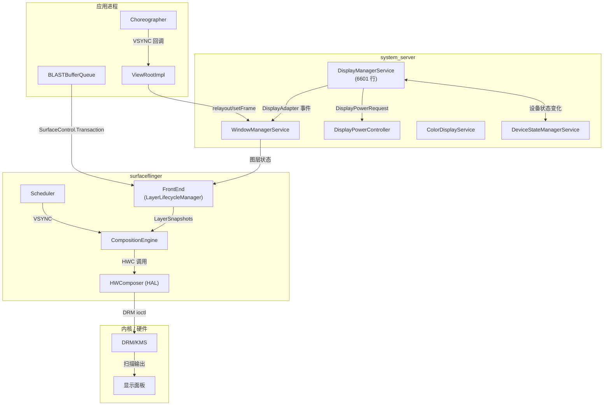

**第 1 层，Framework（system_server）。** `DisplayManagerService` 负责每一个显示设备的生命周期。它通过 `DisplayAdapter` 实现发现物理显示，创建映射到具体 `DisplayDevice` 的 `LogicalDisplay` 对象，并在显示新增、移除或配置变更时通知 `WindowManagerService`。

**第 2 层，原生合成器（surfaceflinger）。** SurfaceFlinger 通过 `SurfaceControl.Transaction` 接收缓冲区更新，在 VSYNC 上调度合成，并把真正的像素混合工作委托给 Hardware Composer HAL（覆盖层平面）或 GPU（通过 RenderEngine 进行客户端合成）。

**第 3 层，内核（DRM/KMS）。** Linux DRM 子系统负责管理显示硬件，包括 mode setting、CRTC/encoder/connector 拓扑，以及触发已合成 framebuffer 扫描输出的 page-flip ioctl。

### 24.1.2 DisplayManagerService

`DisplayManagerService`（DMS）是在 `system_server` 启动期间注册的一个 `SystemService`。它有 6601 行代码，是框架中规模最大的服务之一。其 Javadoc 对架构做了如下说明：

> DisplayManagerService 管理显示设备的全局生命周期，依据当前连接的物理显示设备决定如何配置逻辑显示，并在状态变化时向系统和应用发送通知。

DMS 使用 `DisplayThread` 作为主 Handler 所在线程，该线程是一个运行在 `THREAD_PRIORITY_DISPLAY` 优先级上的共享 `HandlerThread`。所有内部状态都由单一的 `SyncRoot` 锁保护，这个锁同时也被所有显示适配器和逻辑显示对象使用：

```java
// frameworks/base/services/core/java/com/android/server/display/DisplayManagerService.java
private final SyncRoot mSyncRoot = new SyncRoot();
```

锁顺序约束非常关键：DMS 可以在持有 `mSyncRoot` 时调用 SurfaceFlinger（通过 `SurfaceControl`），但绝不能在持有 `mSyncRoot` 时调用 `WindowManagerService`，因为 WMS 自身持有 `mGlobalLock`，并且可能回调 DMS。所有可能出现重入的外部调用都必须通过 handler 异步派发。

### 24.1.3 显示适配器架构

DMS 通过一组 `DisplayAdapter` 实现发现显示设备：

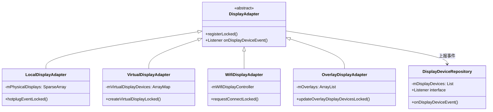

- **LocalDisplayAdapter** 负责处理物理显示设备，包括内置屏和外接屏。它接收来自 SurfaceFlinger 热插拔机制的 `EVENT_ADD`、`EVENT_REMOVE` 和 `EVENT_CHANGE` 通知，并创建由 SurfaceFlinger display token 支撑的 `LocalDisplayDevice` 实例。

- **VirtualDisplayAdapter** 代表应用创建虚拟显示，接收一个包含尺寸、密度、flags 等参数的 `VirtualDisplayConfig`，以及用于生命周期管理的 `IVirtualDisplayCallback`。

- **WifiDisplayAdapter** 通过 `WifiDisplayController` 管理 Miracast（Wi-Fi Display / WFD）连接。

- **OverlayDisplayAdapter** 根据 `persist.sys.overlay_display` 系统属性解析并创建开发者用的 overlay 显示。

所有适配器都向 `DisplayDeviceRepository` 上报，后者维护当前活动 `DisplayDevice` 的权威列表，并把变化通知给 DMS。

### 24.1.4 LogicalDisplay 与物理映射

`LogicalDisplay` 与 `DisplayDevice` 的分离是整个系统中的核心设计。`LogicalDisplay` 表示系统其余部分看到的显示设备，也就是窗口管理器和应用侧感知到的 display；`DisplayDevice` 则表示底层的物理或虚拟硬件。

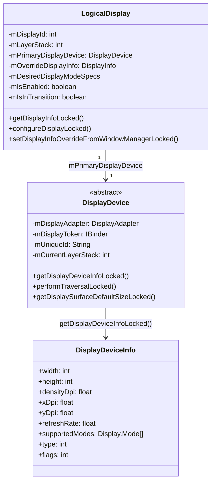

`LogicalDisplay` 的 Javadoc 中指出了这一设计的关键洞见：

> 逻辑显示和显示设备是正交概念。二者之间确实会存在映射关系，但这种关系可能是多对多，也可能彼此毫无对应。

在实践中，对单屏手机来说通常是 1:1 映射。对于折叠屏，这种映射则是动态的，即一个逻辑显示（默认显示，ID 为 0）会在折叠和展开过渡过程中，在内屏和外屏这两个物理显示设备之间切换。这个切换由 `LogicalDisplayMapper` 管理。

### 24.1.5 显示配置流

当一个显示设备第一次连接时，其配置会流经多个组件：

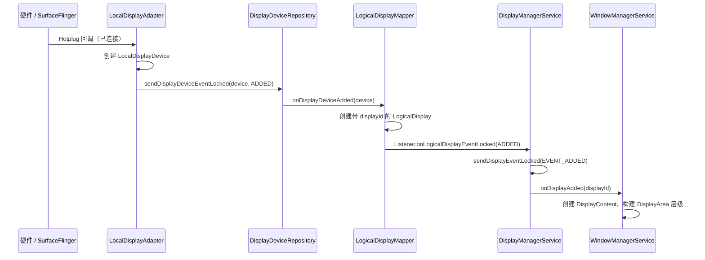

DMS 为事件投递维护了两个关键数据结构：

```java
// All callback records indexed by calling process id
private final SparseArray<CallbackRecord> mCallbacks = new SparseArray<>();
// All callback records indexed by [uid][pid]
private final SparseArray<SparseArray<CallbackRecord>> mCallbackRecordByPidByUid =
        new SparseArray<>();
```

事件通过投递到 handler 的 `MSG_DELIVER_DISPLAY_EVENT` 来发送，从而保证异步分发，不会在持有 `mSyncRoot` 时直接回调外部对象。

### 24.1.6 Display Groups

显示设备会被组织进 `DisplayGroup` 中，以共享电源状态和亮度。主显示组包含内置显示设备；虚拟显示既可以通过 `VIRTUAL_DISPLAY_FLAG_OWN_DISPLAY_GROUP` 创建自己的组，也可以通过 `VIRTUAL_DISPLAY_FLAG_DEVICE_DISPLAY_GROUP` 归入设备主显示组。`DisplayGroupAllocator` 负责分配 group ID：

```java
// LogicalDisplayMapper events related to groups
public static final int DISPLAY_GROUP_EVENT_ADDED = 1;
public static final int DISPLAY_GROUP_EVENT_CHANGED = 2;
public static final int DISPLAY_GROUP_EVENT_REMOVED = 3;
```

Display group 会直接影响电源管理。例如默认显示组进入休眠时，该组中的所有显示都会一起关闭。

### 24.1.7 DisplayInfo 与覆盖机制

应用可见的 `DisplayInfo` 对象是通过一套分层覆盖机制构造出来的：

1. **基础信息**。来自主 `DisplayDevice` 的 `DisplayDeviceInfo`，包括物理尺寸、密度、支持模式等。
2. **DMS 覆盖**。包括显示模式选择、用户禁用的 HDR 类型、帧率覆盖等。
3. **WMS 覆盖**。窗口管理器设置应用可见的 `DisplayInfo` 字段，例如考虑 overscan、cutout 和 rotation 后的逻辑尺寸。这些覆盖通过 `setDisplayInfoOverrideFromWindowManagerLocked()` 应用。

`DisplayInfoOverrides` 中的 `WM_OVERRIDE_FIELDS` 常量精确定义了 WMS 可以覆盖哪些字段，从而避免无意中覆盖由硬件导出的原始值。

### 24.1.8 DisplayBlanker：电源状态协调

`DisplayBlanker` 接口是 `DisplayPowerController` 与 SurfaceFlinger 之间用于协调显示电源状态变化的桥梁。DMS 通过一个匿名 `DisplayBlanker` 实现跨多个显示设备的状态协同：

```java
// frameworks/base/services/core/java/com/android/server/display/DisplayManagerService.java
private final DisplayBlanker mDisplayBlanker = new DisplayBlanker() {
    @Override
    public synchronized void requestDisplayState(int displayId, int state,
            float brightness, float sdrBrightness) {
        // Check if ALL displays are inactive or off
        boolean allInactive = true;
        boolean allOff = true;
        // ... iterate over mDisplayStates
        if (state == Display.STATE_OFF) {
            requestDisplayStateInternal(displayId, state, brightness, sdrBrightness);
        }
        if (stateChanged) {
            mDisplayPowerCallbacks.onDisplayStateChange(allInactive, allOff);
        }
        if (state != Display.STATE_OFF) {
            requestDisplayStateInternal(displayId, state, brightness, sdrBrightness);
        }
    }
};
```

这里的执行顺序至关重要：对于 OFF 过渡，会先设置显示状态，再通知 PowerManager；对于 ON 过渡，则先通知 PowerManager，再真正打开显示。这样可以避免系统认为屏幕已开、而硬件其实仍在关屏过程中的竞态条件。

### 24.1.9 Display Mode Director

`DisplayModeDirector` 位于 `DisplayManagerService` 和 `RefreshRateSelector` 之间，把来自多个上层来源的模式请求，例如应用、设置或性能提示，转换成 `DesiredDisplayModeSpecs`：

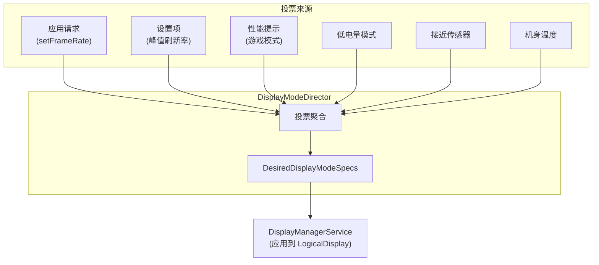

每个投票来源都有优先级，director 在冲突时会优先满足系统约束，例如温控和低功耗，而不是应用请求。

### 24.1.10 Handler 消息协议

DMS 使用基于 handler 的消息协议来处理异步操作：

| 消息 | 常量 | 作用 |
|------|------|------|
| 注册默认适配器 | `MSG_REGISTER_DEFAULT_DISPLAY_ADAPTERS` (1) | 启动期适配器初始化 |
| 注册附加适配器 | `MSG_REGISTER_ADDITIONAL_DISPLAY_ADAPTERS` (2) | 启动后适配器初始化 |
| 发送显示事件 | `MSG_DELIVER_DISPLAY_EVENT` (3) | 通知回调显示变化 |
| 请求 traversal | `MSG_REQUEST_TRAVERSAL` (4) | 触发 SurfaceFlinger 显示配置 |
| 更新 viewport | `MSG_UPDATE_VIEWPORT` (5) | 更新输入 viewport 映射 |
| 加载亮度配置 | `MSG_LOAD_BRIGHTNESS_CONFIGURATIONS` (6) | 加载亮度曲线 |
| 帧率覆盖事件 | `MSG_DELIVER_DISPLAY_EVENT_FRAME_RATE_OVERRIDE` (7) | 通知 FRO 变化 |
| 显示组事件 | `MSG_DELIVER_DISPLAY_GROUP_EVENT` (8) | 通知组新增或移除 |
| 收到设备状态 | `MSG_RECEIVED_DEVICE_STATE` (9) | 处理折叠设备状态变化 |
| 派发待处理事件 | `MSG_DISPATCH_PENDING_PROCESS_EVENTS` (10) | 批量事件投递 |

其中 `MSG_REQUEST_TRAVERSAL` 尤其重要：显示配置发生变化时，DMS 必须调度 SurfaceFlinger 执行一次 traversal，把新的显示参数真正应用下去，例如 layer stack 分配、display projection 和 display mode。

---

## 24.2 DisplayArea 层级

### 24.2.1 什么是 DisplayArea

在 `DisplayContent` 之下，也就是代表完整逻辑显示的那个 `WindowContainer` 之下，Android 会把窗口组织到一棵 `DisplayArea` 容器树中。每个 `DisplayArea` 都用于归类具有共同特征或共享某段 Z 轴区域的窗口。其类层级如下：

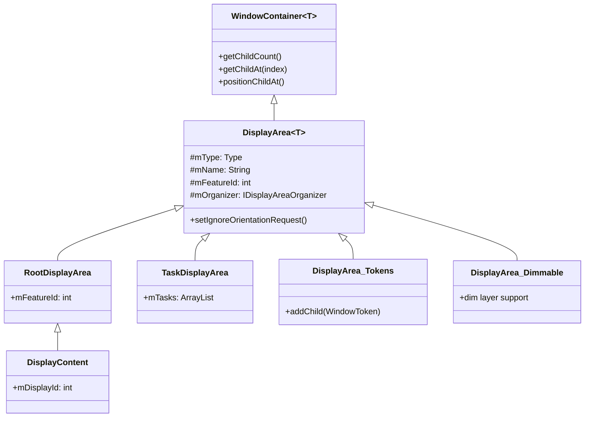

`DisplayArea` 的 Javadoc 对三种类型做了说明，这些类型共同保证了 Z 轴次序的正确性：

> DisplayArea 有三种形态：
> - BELOW_TASKS：只能包含 BELOW_TASK 的 DisplayArea，以及位于 task 之下的 WindowToken。
> - ABOVE_TASKS：只能包含 ABOVE_TASK 的 DisplayArea，以及位于 task 之上的 WindowToken。
> - ANY：可以包含任意类型的 DisplayArea、任意类型的 WindowToken，以及 Task 容器。

### 24.2.2 Feature ID

每个 `DisplayArea` 都带有一个标识自身用途的 `mFeatureId`。标准 feature ID 定义在 `DisplayAreaOrganizer` 中：

| Feature ID | 常量 | 值 | 作用 |
|-----------|------|----|------|
| `FEATURE_ROOT` | `FEATURE_SYSTEM_FIRST` | 0 | 层级根节点 |
| `FEATURE_DEFAULT_TASK_CONTAINER` | `FEATURE_SYSTEM_FIRST + 1` | 1 | Task 默认容器 |
| `FEATURE_WINDOW_TOKENS` | `FEATURE_SYSTEM_FIRST + 2` | 2 | 非 Task 窗口 token 容器 |
| `FEATURE_ONE_HANDED` | `FEATURE_SYSTEM_FIRST + 3` | 3 | 单手模式缩放 |
| `FEATURE_WINDOWED_MAGNIFICATION` | `FEATURE_SYSTEM_FIRST + 4` | 4 | 窗口化无障碍放大 |
| `FEATURE_FULLSCREEN_MAGNIFICATION` | `FEATURE_SYSTEM_FIRST + 5` | 5 | 全屏放大 |
| `FEATURE_HIDE_DISPLAY_CUTOUT` | `FEATURE_SYSTEM_FIRST + 6` | 6 | 刘海区下方内容 |
| `FEATURE_IME_PLACEHOLDER` | `FEATURE_SYSTEM_FIRST + 7` | 7 | IME 容器占位位置 |
| `FEATURE_IME` | `FEATURE_SYSTEM_FIRST + 8` | 8 | 真正的 IME 容器 |
| `FEATURE_WINDOWING_LAYER` | `FEATURE_SYSTEM_FIRST + 9` | 9 | 兜底窗口层 |
| `FEATURE_APP_ZOOM_OUT` | `FEATURE_SYSTEM_FIRST + 10` | 10 | App 缩小显示支持 |

厂商自定义 feature 使用 `FEATURE_VENDOR_FIRST`（10001）到 `FEATURE_VENDOR_LAST`（20001）这一范围，允许 OEM 定义自有的 DisplayArea 层级节点，例如汽车后排显示区域或双屏特性。

### 24.2.3 DisplayAreaPolicyBuilder

`DisplayAreaPolicyBuilder` 通过接收一组 `Feature` 定义，构建出满足 Z 轴顺序约束所需的中间 `DisplayArea` 节点，从而形成完整层级树。

典型的 AOSP `DefaultDisplayAreaPolicy` 会构建出如下层级：

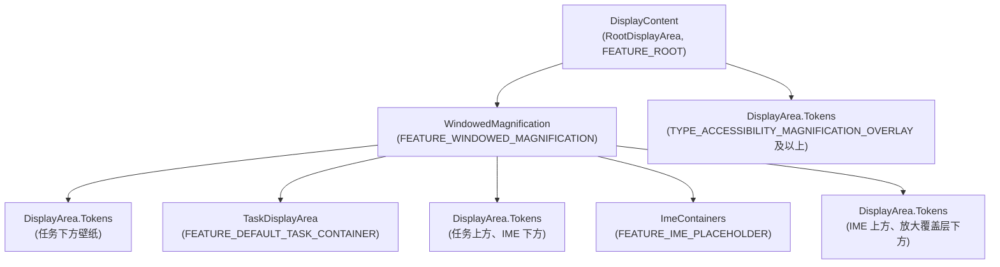

builder 的工作过程如下：

1. 收集所有 `Feature` 定义，每个 feature 对应一段窗口类型范围，例如 “WindowedMagnification 覆盖到 `TYPE_ACCESSIBILITY_MAGNIFICATION_OVERLAY` 为止”。
2. 对每个 Z 序槽位，也就是窗口类型常量所定义的 36 层模型中的每一层，判断哪些 feature 生效。
3. 当 feature 边界跨越 Z 轴边界时创建中间 `DisplayArea` 节点，从而切分树结构，保证次序正确。

### 24.2.4 用于多根层级的 DisplayAreaGroup

builder 通过 `DisplayAreaGroup` 支持多根层级，这对汽车和折叠设备非常关键。`DisplayAreaPolicyBuilder` 中的示例代码展示了如何为前后显示创建独立根节点：

```java
// Example from DisplayAreaPolicyBuilder Javadoc:
RootDisplayArea firstRoot = new RootDisplayArea(wmService, "FirstRoot",
        FEATURE_FIRST_ROOT);
DisplayAreaPolicyBuilder.HierarchyBuilder firstGroupHierarchy =
    new DisplayAreaPolicyBuilder.HierarchyBuilder(firstRoot)
        .setTaskDisplayAreas(firstTdaList);

return new DisplayAreaPolicyBuilder()
    .setRootHierarchy(rootHierarchy)
    .addDisplayAreaGroupHierarchy(firstGroupHierarchy)
    .setSelectRootForWindowFunc(selectRootForWindowFunc)
    .build(wmService, content);
```

这里的 `selectRootForWindowFunc` 是一个 `BiFunction<Integer, Bundle, RootDisplayArea>`，它根据窗口类型和启动选项，把每个 window token 路由到合适的 root。

### 24.2.5 层级校验规则

`DisplayAreaPolicyBuilder.validate()` 会对层级施加严格的结构约束：

1. **root 和 TDA 的 ID 必须唯一**。每个 `RootDisplayArea` 和 `TaskDisplayArea` 都必须拥有全局唯一的 feature ID。
2. **同一个 root 下 feature ID 不能重复**。位于同一个 `RootDisplayArea` 下的 `Feature` 节点必须唯一；不同 root 之间则可以复用同一个 ID，以支持跨 root 组织。
3. **必须且只能有一个 IME 容器**。IME 容器必须只存在于一个 hierarchy builder 中。
4. **必须且只能有一个默认 TDA**。必须有一个 `TaskDisplayArea` 的 ID 等于 `FEATURE_DEFAULT_TASK_CONTAINER`。
5. **ID 取值不得超界**。任何 ID 都不能超过 `FEATURE_VENDOR_LAST`（20001）。
6. **必须有有效的 windowing layer**。根层级必须在顶层包含一个窗口化层，即 `FEATURE_WINDOWED_MAGNIFICATION` 或 `FEATURE_WINDOWING_LAYER`。如果缺失，builder 会自动插入 `FEATURE_WINDOWING_LAYER`。

```java
// frameworks/base/services/core/java/com/android/server/wm/DisplayAreaPolicyBuilder.java
if (!mRootHierarchyBuilder.hasValidWindowingLayer()) {
    mRootHierarchyBuilder.mFeatures.add(0 /* top level index */,
        new Feature.Builder(wmService.mPolicy, "WindowingLayer",
            FEATURE_WINDOWING_LAYER)
            .setExcludeRoundedCornerOverlay(false).all().build());
}
```

### 24.2.6 Feature 定义与窗口类型覆盖

每个 `Feature` 都通过 builder 模式指定自己要覆盖的窗口类型集合，支持范围和例外：

```java
// Example: WindowedMagnification targets everything below
// the accessibility magnification overlay
new Feature.Builder(wmService.mPolicy, "WindowedMagnification",
        FEATURE_WINDOWED_MAGNIFICATION)
    .upTo(TYPE_ACCESSIBILITY_MAGNIFICATION_OVERLAY)
    .except(TYPE_ACCESSIBILITY_MAGNIFICATION_OVERLAY)
    .setNewDisplayAreaSupplier(DisplayArea.Dimmable::new)
    .build()
```

`Feature.Builder` 的常用方法包括：

- `all()`：覆盖所有窗口类型
- `upTo(type)`：覆盖到指定类型为止，包含该类型
- `except(type)`：从覆盖范围中排除某个具体类型
- `and(type)`：追加覆盖某个具体类型
- `setNewDisplayAreaSupplier()`：自定义 DisplayArea 工厂，例如为放大镜提供 `Dimmable`
- `setExcludeRoundedCornerOverlay()`：是否排除 rounded corner overlay 窗口

### 24.2.7 构建算法

`HierarchyBuilder.build()` 实现了生成 DisplayArea 树的核心算法：

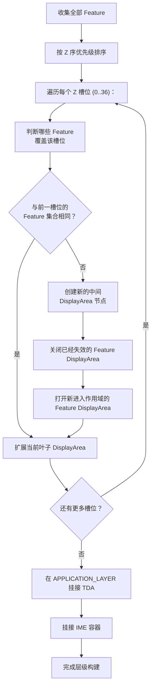

这个算法保证：

- 对于每一个拥有相同 feature 集合的连续 Z 序范围，都存在一个对应的 `DisplayArea`。
- 只覆盖部分 Z 轴范围的 feature 会拥有自己的嵌套 `DisplayArea` 节点。
- `TaskDisplayArea` 会被精确插入到 `APPLICATION_LAYER`，也就是位于 below-task 窗口与 above-task 窗口之间的那个位置。

### 24.2.8 DefaultSelectRootForWindowFunction

当存在多个 root 时，例如汽车前后屏，`DefaultSelectRootForWindowFunction` 负责为 window token 选择路由：

```java
// frameworks/base/services/core/java/com/android/server/wm/DisplayAreaPolicyBuilder.java
public RootDisplayArea apply(Integer windowType, Bundle options) {
    if (mDisplayAreaGroupRoots.isEmpty()) {
        return mDisplayRoot;
    }
    if (options != null) {
        final int rootId = options.getInt(KEY_ROOT_DISPLAY_AREA_ID, FEATURE_UNDEFINED);
        if (rootId != FEATURE_UNDEFINED) {
            for (RootDisplayArea root : mDisplayAreaGroupRoots) {
                if (root.mFeatureId == rootId) return root;
            }
        }
    }
    return mDisplayRoot;
}
```

这里使用的路由键是 `ActivityOptions` bundle 中的 `KEY_ROOT_DISPLAY_AREA_ID`，launcher 和系统组件可以借此把窗口明确放到指定 root 上。

### 24.2.9 DisplayArea Organizer

Shell 和 SystemUI 可以注册 `IDisplayAreaOrganizer` 实现，在特定 feature 的 DisplayArea 出现、变化或消失时接收回调。这一机制支撑了多类高级特性：

- **单手模式**：注册 `FEATURE_ONE_HANDED`，然后对该 DisplayArea 做缩放和平移。
- **窗口化放大**：注册 `FEATURE_WINDOWED_MAGNIFICATION`。
- **应用缩小显示**：注册 `FEATURE_APP_ZOOM_OUT`。

`DisplayAreaOrganizerController` 负责管理注册关系，并分发 `onDisplayAreaAppeared`、`onDisplayAreaInfoChanged` 和 `onDisplayAreaVanished` 回调。organizer 会拿到一个 `SurfaceControl` leash，用于执行 reparent 或变换操作。

### 24.2.10 DisplayArea 中的方向处理

`DisplayArea` 通过 `mSetIgnoreOrientationRequest` 标志在方向管理中扮演关键角色。当该标志为 true 时，DisplayArea 会忽略其下方应用发出的固定方向请求，不去旋转整个显示，而是以 letterbox 的形式展示应用：

```java
// frameworks/base/services/core/java/com/android/server/wm/DisplayArea.java
boolean setIgnoreOrientationRequest(boolean ignoreOrientationRequest) {
    if (mSetIgnoreOrientationRequest == ignoreOrientationRequest) {
        return false;
    }
    mSetIgnoreOrientationRequest = ignoreOrientationRequest;
    // Check whether we should notify Display to update orientation
    // ...
}
```

这一机制常见于大屏设备，例如平板和展开状态下的折叠屏。因为如果一个仅支持竖屏的应用要求旋转整个大屏显示，用户体验通常会很差。此时 DisplayArea 会压制方向请求，让应用在当前显示方向下以 letterbox 方式运行。

---

## 24.3 显示刷新与 VSYNC

### 24.3.1 VSYNC 管线

VSYNC（垂直同步）是显示系统的心跳。屏幕上显示的每一帧都始于来自显示硬件的一个 VSYNC 信号。Android 的 VSYNC 管线会把原始硬件中断转化为渲染链条上多个环节中的精确定时回调。

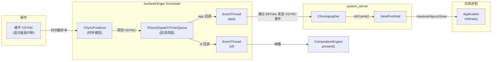

### 24.3.2 VSyncPredictor：时序模型

`VSyncPredictor` 维护了一个针对 VSYNC 时序的线性回归模型。它并不只依赖最新一次硬件时间戳，而是持续收集一段时间戳历史，并拟合出一条直线，即 slope 与 intercept，从而预测未来的 VSYNC 事件：

```cpp
// frameworks/native/services/surfaceflinger/Scheduler/VSyncPredictor.h
struct Model {
    nsecs_t slope;     // period between VSYNCs
    nsecs_t intercept; // phase offset
};
```

predictor 通过 `addVsyncTimestamp()` 接收时间戳，使用 `outlierTolerancePercent` 过滤离群值，并且至少需要收集 `minimumSamplesForPrediction` 个样本后，才开始给出预测结果。这种过滤很重要，因为硬件 VSYNC 时间戳会因为显示控制器粒度限制出现几十微秒级抖动。

`nextAnticipatedVSyncTimeFrom()` 会返回相对于指定时间点的下一个预测 VSYNC 时刻，随后被分发系统用于精确安排回调时间。

### 24.3.3 VSyncDispatchTimerQueue：回调调度

`VSyncDispatchTimerQueue` 负责把预测得到的 VSYNC 时刻转化成真正的定时器唤醒。每个注册回调都由一个 `VSyncDispatchTimerQueueEntry` 表示，并具有三种状态：

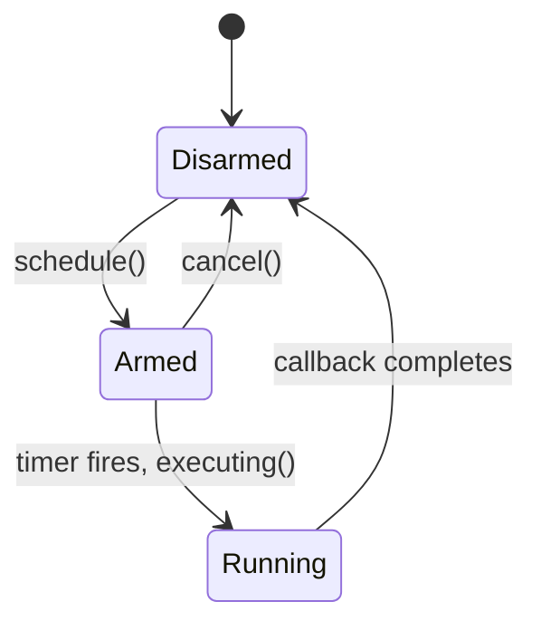

每个 entry 都持有一个 `ScheduleTiming`，指定：

- **workDuration**：回调需要在 VSYNC 之前提前多久被唤醒，例如应用渲染可能需要 16ms
- **readyDuration**：工作完成后到达 VSYNC 截止前还需预留的额外时间
- **earliestVsync**：该回调最早愿意消费的 VSYNC

timer queue 会把时间足够接近的多个回调合并为一次定时器唤醒，只要它们落在 `timerSlack` 范围内即可，这样可以减少上下文切换次数。

### 24.3.4 EventThread：向客户端分发 VSYNC

SurfaceFlinger 中运行着两个 `EventThread` 实例：

1. **sf EventThread**：唤醒 SurfaceFlinger 主循环进行合成。
2. **app EventThread**：通过 `IDisplayEventConnection` / `BitTube` 向应用分发 VSYNC 事件。

`EventThreadConnection` 对 `BitTube` 进行了封装，本质上是一对 socket，用于零拷贝投递 VSYNC 事件到客户端。连接支持三种请求模式：

```cpp
// frameworks/native/services/surfaceflinger/Scheduler/EventThread.h
enum class VSyncRequest {
    None = -2,        // No VSYNC events
    Single = -1,      // Wake for next two frames (avoid scheduler overhead)
    SingleSuppressCallback = 0,  // Wake for next frame only
    Periodic = 1,     // Continuous VSYNC delivery
    // Values > 1 specify a divisor (every Nth VSYNC)
};
```

### 24.3.5 Choreographer：Java 侧 VSYNC 消费

在 Java 侧，`Choreographer` 通过 `DisplayEventReceiver` 从 app EventThread 接收 VSYNC 事件，并按优先级依次分发给已注册回调：

1. **CALLBACK_INPUT**：输入事件处理
2. **CALLBACK_ANIMATION**：属性动画与 Transition
3. **CALLBACK_INSETS_ANIMATION**：WindowInsets 动画
4. **CALLBACK_TRAVERSAL**：View 的 measure/layout/draw
5. **CALLBACK_COMMIT**：绘制后的提交阶段

每个 Activity 的 `ViewRootImpl` 都会向 Choreographer 注册一个 `CALLBACK_TRAVERSAL`。当 `requestLayout()` 或 `invalidate()` 被调用时，ViewRootImpl 会把自身挂到 Choreographer 上，然后等待下一个 VSYNC 再执行 traversal。

### 24.3.6 RefreshRateSelector：显示模式选择

`RefreshRateSelector` 是选择最优显示刷新率的策略引擎，它会在硬件支持的多个 mode 之间作出决策，并综合考虑多个输入：

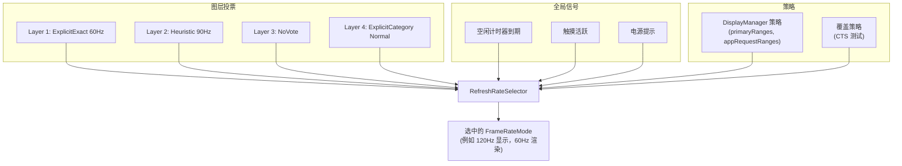

`LayerVoteType` 枚举描述了图层表达刷新率偏好的不同方式：

| 投票类型 | 说明 |
|---------|------|
| `NoVote` | 图层不关心刷新率 |
| `Min` | 请求最小可用刷新率（省电） |
| `Max` | 请求最大可用刷新率（流畅） |
| `Heuristic` | 平台根据内容分析得出的启发式刷新率 |
| `ExplicitDefault` | 应用请求刷新率，兼容性为 Default |
| `ExplicitExactOrMultiple` | 应用请求刷新率，要求精确值或整数倍 |
| `ExplicitExact` | 应用请求刷新率，只接受精确匹配 |
| `ExplicitGte` | 应用请求刷新率，大于等于即可 |
| `ExplicitCategory` | 应用请求帧率类别，例如 Normal / High |

selector 在一个 `Policy` 约束下运行，该策略定义了：

- `defaultMode`：没有强偏好时使用的 mode
- `primaryRanges`：物理刷新率和渲染 FPS 范围
- `appRequestRanges`：应用可见的 FPS 范围
- `allowGroupSwitching`：是否允许在 mode group 之间切换
- `idleScreenConfigOpt`：空闲屏幕配置

`kMinSupportedFrameRate` 的值是 20 Hz，低于这一阈值内容会明显卡顿。帧率类别也有阈值划分：Normal 从 60 Hz 开始，High 从 90 Hz 开始。

### 24.3.7 Scheduler：帧生产的总协调者

`Scheduler` 是把 VSYNC 预测、事件线程与 mode 选择串起来的顶层协调器。它同时继承 `IEventThreadCallback` 和 `MessageQueue`：

```cpp
// frameworks/native/services/surfaceflinger/Scheduler/Scheduler.h
class Scheduler : public IEventThreadCallback, android::impl::MessageQueue {
    // ...
};
```

关键概念包括：

- **Pacesetter display**：在多显示配置下，一个物理显示会被指定为 “节拍器”，驱动整个合成节奏。调度器可通过 `designatePacesetterDisplay()` 自动选择，也可通过 `forcePacesetterDisplay()` 强制指定。

- **VsyncModulator**：根据负载动态调整 VSYNC 偏移。当某一帧即将错过截止时间时，modulator 可以把 app VSYNC 相位提前，给渲染留下更多时间。

- **LayerHistory**：利用启发式方法跟踪每个图层的帧产出速率，为 `RefreshRateSelector` 提供 `LayerRequirement` 输入。

### 24.3.8 VsyncConfiguration：相位偏移

`VsyncConfiguration` 负责把刷新率映射为 VSYNC offset 配置。每份配置都定义了三种场景的时序：

```cpp
// frameworks/native/services/surfaceflinger/Scheduler/VsyncConfiguration.h
struct VsyncConfigSet {
    VsyncConfig early;     // During transaction processing
    VsyncConfig earlyGpu;  // During GPU composition
    VsyncConfig late;      // Normal steady-state
};
```

每个 `VsyncConfig` 包含：

- **sfOffset** / **sfWorkDuration**：SurfaceFlinger 相对 VSYNC 的唤醒时刻
- **appOffset** / **appWorkDuration**：应用相对 VSYNC 的唤醒时刻

偏移策略如下：

- **Late（正常）**：应用在 VSYNC 周期早期被唤醒完成渲染，之后 SF 在稍晚阶段唤醒并完成合成与 present。这种配置最大化了应用可用渲染时间。
- **Early（事务繁重）**：应用和 SF 都更早唤醒，以处理额外的 transaction 工作。
- **Early GPU（GPU 合成）**：由于 GPU 合成比 HWC overlay 合成耗时更长，SF 需要更早唤醒。

旧版 `PhaseOffsets` 实现使用固定纳秒偏移。现代的 `WorkDuration` 实现基于持续时间调度，能够更好地适配不同刷新率：

```mermaid
gantt
    title VSYNC 相位偏移（16.67ms 周期）
    dateFormat X
    axisFormat %sms

    section Late 配置
    App 工作         :app, 0, 10
    SF 工作          :sf, 10, 14
    HWC present      :hwc, 14, 16
    VSYNC            :milestone, 16, 16

    section Early 配置
    App 工作（提前） :app2, 0, 8
    SF 工作（提前）  :sf2, 6, 12
    HWC present      :hwc2, 12, 16
    VSYNC            :milestone, 16, 16
```

### 24.3.9 VsyncModulator：动态偏移切换

`VsyncModulator` 会根据运行时条件在 Early、EarlyGpu 和 Late 三种 VSYNC 配置之间切换：

```cpp
// frameworks/native/services/surfaceflinger/Scheduler/VsyncModulator.h
class VsyncModulator : public IBinder::DeathRecipient {
    static constexpr int MIN_EARLY_TRANSACTION_FRAMES = 2;
    static constexpr int MIN_EARLY_GPU_FRAMES = 2;
    // ...
};
```

modulator 内部维护若干帧计数器：

- **Early transaction frames**：当系统安排了一次 transaction 后，至少在 `MIN_EARLY_TRANSACTION_FRAMES`（2）帧内保持 early offset，同时还会叠加一个时间延迟 `MIN_EARLY_TRANSACTION_TIME`，以避免 transaction commit 竞态。
- **Early GPU frames**：在经历 GPU 合成后，至少在 `MIN_EARLY_GPU_FRAMES`（2）帧内保持 early GPU 配置，作为对交替合成策略的一种低通滤波。

其状态转换关系如下：

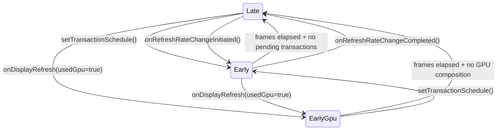

### 24.3.10 VsyncSchedule：按显示划分的 VSYNC 基础设施

`VsyncSchedule` 封装了单个物理显示所需的完整 VSYNC 基础设施：

- 一个 `VSyncTracker`，通常是 `VSyncPredictor`，用于建模时序
- 一个 `VSyncDispatch`，通常是 `VSyncDispatchTimerQueue`，用于调度回调
- 一个 `VSyncController`，用于接收硬件 VSYNC 时间戳

在多显示设备场景下，每个物理显示都有自己的 `VsyncSchedule`。节拍器显示对应的 schedule 驱动主合成循环，其他显示则主要使用各自的 schedule 进行 VSYNC 事件分发。

### 24.3.11 Frame Timeline

Android 的 `FrameTimeline` 位于 Scheduler 目录中，用于跟踪每一帧在系统中的完整生命周期，记录的信息包括：

- 应用渲染开始的预期时间与实际时间
- 预期呈现时间与实际呈现时间，也就是 VSYNC
- GPU 完成 fence
- 来自显示设备的 present fence

这些数据支撑了 `dumpsys SurfaceFlinger --frametimeline` 调试输出，也会进入 `perfetto` trace，用于性能分析。

### 24.3.12 空闲计时器与电源优化

`RefreshRateSelector` 支持 idle screen 配置，在显示内容静止时降低刷新率：

```cpp
// RefreshRateSelector.h
struct Policy {
    // ...
    std::optional<gui::DisplayModeSpecs::IdleScreenRefreshRateConfig>
        idleScreenConfigOpt;
};
```

Scheduler 中的 `OneShotTimer` 会在配置好的空闲时间后触发，通知 `RefreshRateSelector` 降低刷新率。任何新的内容更新，例如 buffer queue 活动或触摸事件，都会重置计时器。这是一项很重要的节能优化：手机在静态显示文档时，会在几秒无操作后从 120 Hz 降到 60 Hz，甚至更低。

### 24.3.13 SmallAreaDetection

`SmallAreaDetectionAllowMappings` 支持按 UID 配置小面积更新检测阈值。启用后，SurfaceFlinger 可以对只更新屏幕很小一部分区域的图层，例如闪烁光标，降低整体刷新率，避免这些局部变化强迫整个显示保持高刷新。`DisplayManagerService` 中的 `SmallAreaDetectionController` 负责管理允许列表。

---

## 24.4 屏幕旋转

### 24.4.1 DisplayRotation：策略引擎

`DisplayRotation`（2255 行）负责把应用请求的屏幕方向，也就是顶层 Activity 的 orientation 请求，映射成显示设备最终采用的物理旋转角度。它位于 `WindowManagerService` 中，并且针对每个 `DisplayContent` 各有一个实例：

```java
// frameworks/base/services/core/java/com/android/server/wm/DisplayRotation.java
public class DisplayRotation {
    private final WindowManagerService mService;
    private final DisplayContent mDisplayContent;
    private final DisplayPolicy mDisplayPolicy;
    private final FoldController mFoldController;
    private final DeviceStateController mDeviceStateController;
    private final DisplayRotationCoordinator mDisplayRotationCoordinator;
    // ...
}
```

旋转决策管线如下：

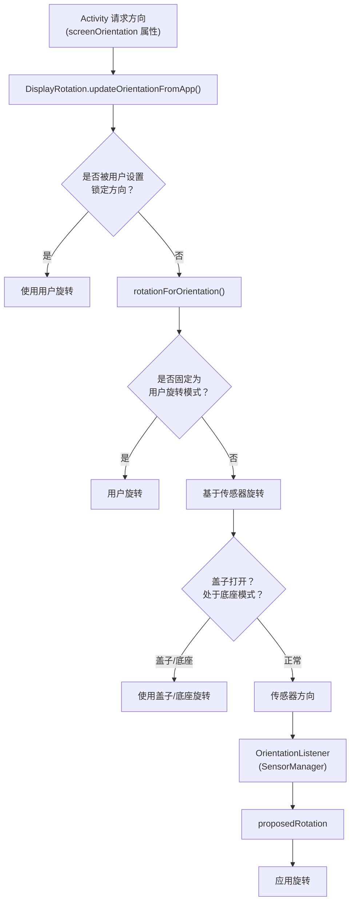

### 24.4.2 旋转生命周期

当旋转发生时，系统必须协调多个子系统：

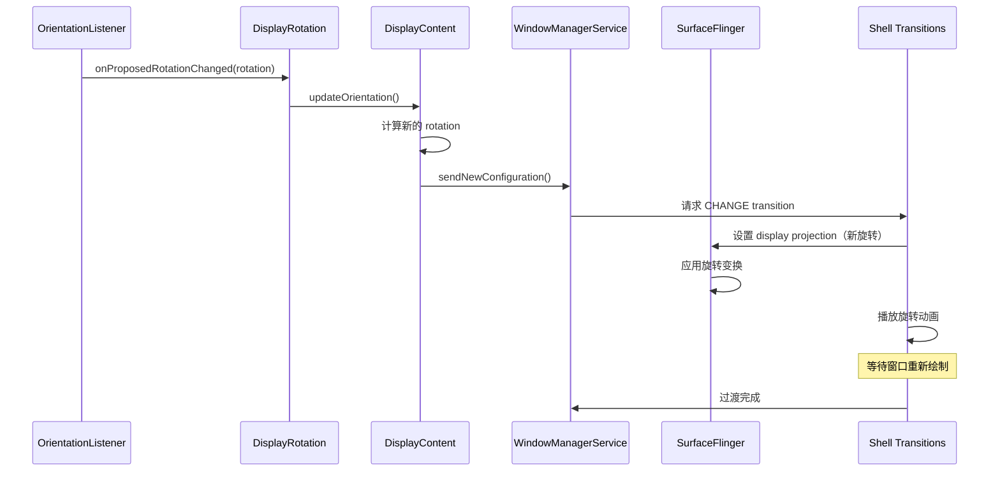

### 24.4.3 SeamlessRotator：零闪烁旋转

`SeamlessRotator` 通过对各个窗口施加反向变换，实现旋转期间不出现黑屏。所谓无缝旋转，本质上是在显示整体发生旋转时，对每个窗口的 `SurfaceControl` 施加抵消旋转的变换，因此从用户视角看，内容仿佛保持静止，而显示方向在底层完成了切换。

构造函数会计算出对应的变换矩阵：

```java
// frameworks/base/services/core/java/com/android/server/wm/SeamlessRotator.java
public SeamlessRotator(@Rotation int oldRotation, @Rotation int newRotation,
        DisplayInfo info, boolean applyFixedTransformationHint) {
    // Convert from old logical coords -> physical coords -> new logical coords
    CoordinateTransforms.transformLogicalToPhysicalCoordinates(
            oldRotation, pW, pH, mTransform);
    CoordinateTransforms.transformPhysicalToLogicalCoordinates(
            newRotation, pW, pH, tmp);
    mTransform.postConcat(tmp);
}
```

`unrotate()` 会把该变换应用到每个窗口的 `SurfaceControl` 上：

```java
public void unrotate(Transaction transaction, WindowContainer win) {
    applyTransform(transaction, win.getSurfaceControl());
    float[] winSurfacePos = {win.mLastSurfacePosition.x, win.mLastSurfacePosition.y};
    mTransform.mapPoints(winSurfacePos);
    transaction.setPosition(win.getSurfaceControl(), winSurfacePos[0], winSurfacePos[1]);
}
```

另外，`mApplyFixedTransformHint` 会为 SurfaceControl 设置一个 buffer transform hint，使图形生产者，例如应用侧 `Surface`，不会过早按新方向分配缓冲区。这个 hint 会把预期 buffer 方向固定在旧 rotation，直到生产者追上新的显示方向。

### 24.4.4 AsyncRotationController：非 Activity 窗口处理

虽然 Activity 窗口可以在新方向下重绘，但非 Activity 窗口，例如状态栏、导航栏和屏幕装饰 overlay，往往需要额外几帧才能更新。`AsyncRotationController` 负责在过渡期间管理它们的显示：

```java
// frameworks/base/services/core/java/com/android/server/wm/AsyncRotationController.java
class AsyncRotationController extends FadeAnimationController
        implements Consumer<WindowState> {
    private final ArrayMap<WindowToken, Operation> mTargetWindowTokens;
    // ...
}
```

控制器支持四种过渡操作：

| 操作 | 常量 | 行为 |
|------|------|------|
| `OP_LEGACY` | 0 | 传统非 transition 路径 |
| `OP_APP_SWITCH` | 1 | 带旋转的应用开关（先淡出，再淡入） |
| `OP_CHANGE` | 2 | 常规旋转（通过 parent leash 隐藏，重绘后淡入） |
| `OP_CHANGE_MAY_SEAMLESS` | 3 | 可能无缝，由 shell 决定 |

对于必须无缝旋转的系统窗口，例如 screen decor overlay，controller 会为每个 window token 请求独立同步事务，并对其应用 `SeamlessRotator` 的反向变换。

### 24.4.5 折叠屏旋转协调

`FoldController` 是 `DisplayRotation` 的内部类，负责折叠与展开过程中的旋转处理。它在设备折叠到闭合状态时引入一个 `FOLDING_RECOMPUTE_CONFIG_DELAY_MS`（800ms）延迟，从而避免在机械折叠动作尚未结束时就触发配置变化和视觉跳变。

`DisplayRotationCoordinator` 用于在多个显示之间同步旋转，例如折叠屏的内屏和外屏。当默认显示发生旋转时，它会通过回调机制通知其他显示，共同协调各自的旋转响应。

### 24.4.6 旋转历史与调试

`DisplayRotation` 内部维护了一个 `RotationHistory` 环形缓冲区，记录每次旋转变化的时间戳、来源，例如传感器、用户或策略，旧 rotation 和新 rotation。这对调试旋转问题非常有价值：

```shell
dumpsys window | grep -A 20 "RotationHistory"
```

类似地，`RotationLockHistory` 会跟踪旋转锁定在何时、由哪种机制切换，例如用户设置、设备状态或相机兼容模式。

### 24.4.7 DisplayRotationReversionController

`DisplayRotationReversionController` 处理那些需要临时覆盖当前显示旋转的场景：

| 回退类型 | 常量 | 触发条件 |
|---------|------|----------|
| 相机兼容 | `REVERSION_TYPE_CAMERA_COMPAT` | 相机应用要求特定方向 |
| 半折叠 | `REVERSION_TYPE_HALF_FOLD` | 设备处于 tabletop 姿态 |
| 无传感器 | `REVERSION_TYPE_NOSENSOR` | 传感器被禁用或不可用 |

当回退生效时，`DisplayRotation` 会使用回退后的 rotation，而不是传感器给出的 rotation。多个回退可以叠加，并按顺序撤销。

### 24.4.8 旋转与 Transition 集成

屏幕旋转与 Shell Transitions（第 16 章）深度集成。旋转发生时，transition 系统会：

1. **截取旋转前截图**，或者在可无缝时使用 `SeamlessRotator`。
2. **启动一个 CHANGE transition**，把 `DisplayContent` 纳入过渡。
3. **与 `AsyncRotationController` 协调**，处理非 Activity 窗口。
4. **播放旋转动画**，通常是从截图到实时内容的交叉淡入淡出。
5. **等待所有窗口按新方向重绘** 后，才结束过渡。

旧式旋转路径，也就是 Shell Transitions 之前的实现，使用 `ScreenRotationAnimation` 对旋转前截图做 GPU 加速动画。新路径则完全交给 Shell，从而可以使用更复杂的动画逻辑。

---

## 24.5 折叠屏显示支持

### 24.5.1 DeviceStateManagerService：状态机

`DeviceStateManagerService` 负责管理折叠屏这类可变形态设备的物理配置。它是回答 “设备当前处于什么姿态” 这一问题的中心权威。

```java
// frameworks/base/services/core/java/com/android/server/devicestate/
//     DeviceStateManagerService.java
public final class DeviceStateManagerService extends SystemService {
    private final DeviceStatePolicy mDeviceStatePolicy;
    private final BinderService mBinderService;
    // ...
}
```

该服务通过一组 property 定义设备状态：

| 属性 | 说明 |
|------|------|
| `PROPERTY_FOLDABLE_HARDWARE_CONFIGURATION_FOLD_IN_CLOSED` | 设备完全折叠 |
| `PROPERTY_FOLDABLE_HARDWARE_CONFIGURATION_FOLD_IN_HALF_OPEN` | 桌面式 / 帐篷式半开姿态 |
| `PROPERTY_FOLDABLE_HARDWARE_CONFIGURATION_FOLD_IN_OPEN` | 完全展开 |
| `PROPERTY_FOLDABLE_DISPLAY_CONFIGURATION_INNER_PRIMARY` | 内屏为主显示 |
| `PROPERTY_FOLDABLE_DISPLAY_CONFIGURATION_OUTER_PRIMARY` | 外屏为主显示 |
| `PROPERTY_FEATURE_DUAL_DISPLAY_INTERNAL_DEFAULT` | 双显示模式 |
| `PROPERTY_FEATURE_REAR_DISPLAY` | 后屏模式 |
| `PROPERTY_POWER_CONFIGURATION_TRIGGER_SLEEP` | 进入该状态时触发休眠 |
| `PROPERTY_POWER_CONFIGURATION_TRIGGER_WAKE` | 进入该状态时触发唤醒 |

### 24.5.2 Device State Provider

`DeviceStateProvider` 接口负责提供设备当前的物理状态。`FoldableDeviceStateProvider` 是标准实现，它会读取铰链角度传感器和霍尔传感器的状态来判断折叠姿态。provider 将状态变化上报给 `DeviceStateManagerService`，随后后者再咨询 `DeviceStatePolicy`，决定系统应采取什么响应。

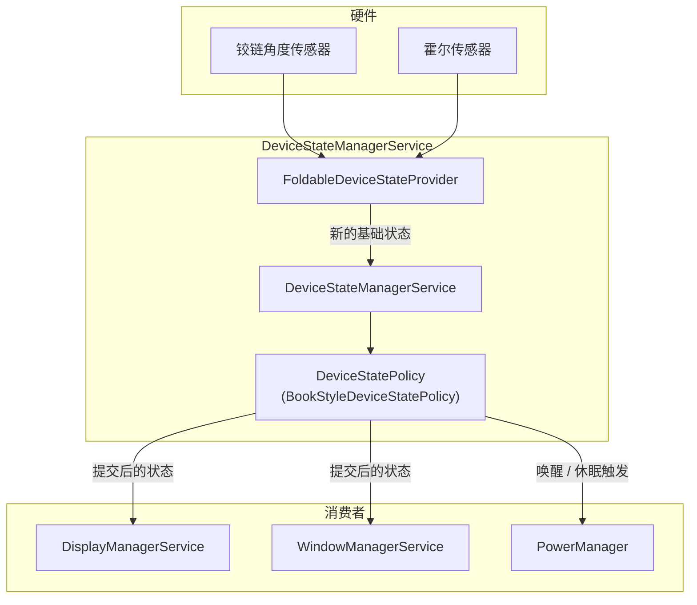

### 24.5.3 LogicalDisplayMapper：显示切换

`LogicalDisplayMapper` 是让折叠屏显示切换真正成立的关键组件。当设备在不同状态间转换，例如从 CLOSED 切到 OPEN 时，mapper 需要完成以下工作：

1. **根据新状态识别哪些物理显示被启用**。这依赖 `DeviceStateToLayoutMap`，也就是从设备状态标识到 `Layout` 对象的映射，后者描述了哪些显示激活以及它们的位置。

2. **为默认 `LogicalDisplay` 切换底层 `DisplayDevice`**。逻辑显示 ID，也就是 0，不变，但其底层物理显示会从外屏切到内屏，或者反向切换。

3. **管理过渡过程**。通过 `mIsInTransition` 标志以及超时 `TIMEOUT_STATE_TRANSITION_MILLIS = 500ms` 来保证过渡不会无限挂起。

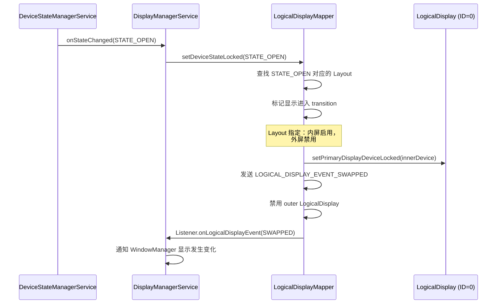

mapper 会针对不同场景发出专门事件：

```java
public static final int LOGICAL_DISPLAY_EVENT_SWAPPED = 1 << 3;
public static final int LOGICAL_DISPLAY_EVENT_DEVICE_STATE_TRANSITION = 1 << 5;
```

### 24.5.4 BookStyleDeviceStatePolicy

对于书本式折叠屏，也就是折叠轴像书脊那样垂直的设备，`BookStyleDeviceStatePolicy` 作为 `DeviceStatePolicy` 的实现，负责处理以下逻辑：

- **外屏到内屏切换**。当设备展开时，外屏内容会迁移到内屏。policy 会与 `DisplayManagerService` 和 `WindowManagerService` 协调，确保应用看到的是平滑过渡。

- **后屏模式**。在设备展开、内屏朝外背向用户时，允许外屏作为取景器或辅助显示使用。该模式由 `PROPERTY_FEATURE_REAR_DISPLAY` 启用。

- **双屏模式**。内屏与外屏同时激活，该模式由 `PROPERTY_FEATURE_DUAL_DISPLAY_INTERNAL_DEFAULT` 启用。

### 24.5.5 并发显示

现代折叠设备可以同时驱动两个屏幕。`DisplayTopologyCoordinator` 负责管理显示之间的空间关系，`DisplayTopologyStore` 则持久化拓扑配置。当并发显示启用时，系统会：

- 在不同显示承担不同用途时分配独立的 `DisplayGroup`
- 应用更严格的热限亮度节流，因为并发模式下 thermal data ID 会改变
- 根据触摸坐标把输入事件路由到正确的显示

### 24.5.6 DeviceStateToLayoutMap

`DeviceStateToLayoutMap` 负责把设备状态标识映射到 `Layout` 对象，后者描述哪些显示处于活动状态以及它们的位置。默认状态 `STATE_DEFAULT` 对应最初的布局，通常只有一个默认显示。每个 layout 会指定：

- 哪些 `DisplayDevice` 被启用
- 每个显示的位置，例如 front、rear、unknown
- 每个显示所属的 `DisplayGroup` 名称
- 显示之间的 lead/follower 关系，例如用于亮度同步

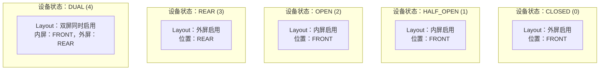

### 24.5.7 显示切换事件

在显示设备切换期间，`LogicalDisplayMapper` 会发出顺序精心安排的一组事件：

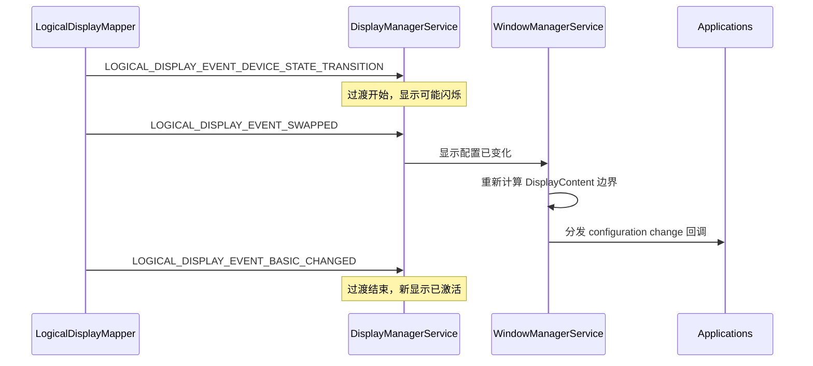

`TIMEOUT_STATE_TRANSITION_MILLIS`（500ms）这一保护超时可确保卡住的过渡不会把系统留在不确定状态。

### 24.5.8 FoldSettingProvider

`FoldSettingProvider` 负责管理用户对折叠设备行为的偏好设置，包括：

- 折叠后是否镜像默认显示
- 是否把默认显示纳入 display topology
- 每个显示的分辨率模式偏好

这些设置通过 `Settings.Secure` 读取，并影响 `LogicalDisplayMapper` 的 layout 决策。

---

## 24.6 刘海与圆角

### 24.6.1 DisplayCutout：非矩形屏幕建模

`DisplayCutout` 表示显示中不可用于内容展示的区域，典型例子是刘海、挖孔摄像头或者类似 dynamic island 的结构。它是不可变对象，会作为 `DisplayInfo` 与 `WindowInsets` 的一部分在系统中传播。

```java
// frameworks/base/core/java/android/view/DisplayCutout.java
public final class DisplayCutout {
    private final Rect mSafeInsets;
    private final Insets mWaterfallInsets;
    private final Rect[] mBounds;  // One rect per side (left, top, right, bottom)
    // ...
}
```

cutout 定义了三类信息：

- **安全 inset**：保证不存在 cutout 的矩形区域，以各边 inset 形式表达
- **边界矩形**：四个方向上 cutout 的精确边界
- **瀑布屏 inset**：针对曲面边缘显示，描述屏幕弯折离开平面的区域

### 24.6.2 CutoutSpecification：配置 DSL

cutout 形状由设备 overlay 资源 `R.string.config_mainBuiltInDisplayCutout` 指定，采用的是一种由 `CutoutSpecification` 解析的自定义描述语言：

```java
// frameworks/base/core/java/android/view/CutoutSpecification.java
```

该描述语言支持 SVG 风格的路径命令，例如 M、L、C、Q、Z 等，并以显示尺寸为参照描述 cutout 形状。解析器支持：

- **`@dp` 后缀**：以 dp 为单位
- **`@bottom`、`@right`、`@center_vertical`**：定位快捷标记
- **`@left` 关键字**：把路径绑定到屏幕左侧

一个居中打孔摄像头的典型定义可能如下：

```text
M 0,0
L -24,0
C -24,0 -24,24 0,24
L 0,48
C 0,48 24,48 24,24
L 24,0
C 24,0 0,0 0,0
@dp
@center_horizontal
```

### 24.6.3 Cutout 模式

应用通过 `WindowManager.LayoutParams.layoutInDisplayCutoutMode` 声明自己对 cutout 的处理偏好：

| 模式 | 常量 | 行为 |
|------|------|------|
| `LAYOUT_IN_DISPLAY_CUTOUT_MODE_DEFAULT` | 0 | 竖屏时避开 cutout，横屏时允许全屏 |
| `LAYOUT_IN_DISPLAY_CUTOUT_MODE_SHORT_EDGES` | 1 | 内容可以延伸到短边上的 cutout 区域 |
| `LAYOUT_IN_DISPLAY_CUTOUT_MODE_NEVER` | 2 | 内容绝不进入 cutout 区域 |
| `LAYOUT_IN_DISPLAY_CUTOUT_MODE_ALWAYS` | 3 | 内容始终允许进入 cutout 区域 |

窗口管理器会在 `DisplayPolicy` 中评估这些模式并计算窗口 frame。对于 `ALWAYS`，窗口拿到整个显示区域；对于 `NEVER`，窗口会按 cutout 安全 inset 被裁进去。

### 24.6.4 WmDisplayCutout

`WmDisplayCutout` 是窗口管理器内部对 `DisplayCutout` 的封装，它加入了对旋转的感知。显示旋转时，cutout 的边界也必须同步旋转。`WmDisplayCutout` 会缓存各个 rotation 下的变体，避免重复计算：

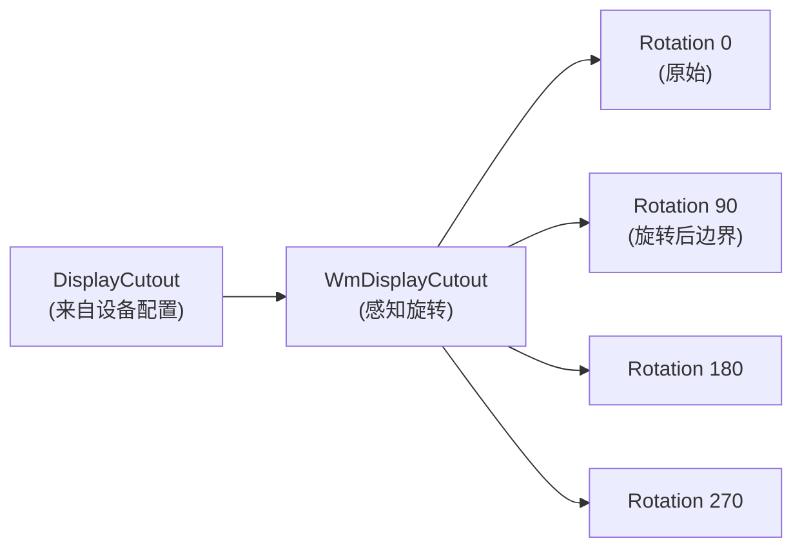

### 24.6.5 RoundedCorners 与 DisplayShape

现代显示通常具有圆角，这也必须被布局系统正确处理：

- **`RoundedCorners`** 用于描述四个角的半径，例如左上、右上、左下、右下。应用可以通过 `WindowInsets.getRoundedCorner()` 访问这些信息。

- **`DisplayShape`** 提供完整的显示轮廓路径，同时考虑 cutout 和 rounded corner。SystemUI 会使用它来绘制精确贴合显示边缘的装饰。

- **`PrivacyIndicatorBounds`** 定义保留给摄像头和麦克风隐私指示器的区域，这些区域可能与 cutout 相重叠。

框架还会通过 `WindowDecoration` 向 `DecorCaptionView` 暴露角半径信息，从而使自由窗口模式下的标题栏装饰与显示圆角保持一致。

### 24.6.6 Cutout 旋转

当显示发生旋转时，cutout 也必须同步旋转。`DisplayCutout` 通过 `CutoutPathParserInfo` 实现这一能力：

```java
// frameworks/base/core/java/android/view/DisplayCutout.java
private static final class CutoutPathParserInfo {
    final int displayWidth;
    final int physicalDisplayHeight;
    final int displayHeight;
    final float density;
    final String cutoutSpec;
    final int rotation;
    final float scale;
    final float physicalPixelDisplaySizeRatio;
}
```

在每次 rotation 下，路径都会被重新解析，解析器会把旋转变换应用到 SVG 路径坐标上。结果会按 `(spec, width, height, density, rotation)` 元组缓存，以避免重复解析：

```java
// Static cache fields in DisplayCutout
@GuardedBy("CACHE_LOCK")
private static String sCachedSpec;
@GuardedBy("CACHE_LOCK")
private static int sCachedDisplayWidth;
@GuardedBy("CACHE_LOCK")
private static int sCachedDisplayHeight;
@GuardedBy("CACHE_LOCK")
private static float sCachedDensity;
@GuardedBy("CACHE_LOCK")
private static Pair<Path, DisplayCutout> sCachedCutout = NULL_PAIR;
```

### 24.6.7 Side Override

对于多侧都有 cutout 的设备，例如顶部有摄像头凹槽、底部有传感器区域，`DisplayCutout` 支持通过 side override 把 cutout 边界重新映射到不同方向：

```java
@GuardedBy("CACHE_LOCK")
private static int[] sCachedSideOverrides;
```

side override 允许 OEM 在物理 cutout 位置与默认解析规则不一致时，修正 cutout 的归属边。

### 24.6.8 仿真 Overlay

为了开发和测试，AOSP 允许通过 Runtime Resource Overlay（RRO）在没有真实 cutout 的设备上模拟 cutout，其类别为 `com.android.internal.display_cutout_emulation`。AOSP 自带若干仿真 overlay，例如 tall cutout、wide cutout、corner cutout 和 double cutout，可以通过以下命令启用：

```shell
cmd overlay enable com.android.internal.display_cutout_emulation.tall
```

---

## 24.7 SurfaceFlinger 合成

### 24.7.1 架构概览

SurfaceFlinger 是 Android 的原生显示合成器。它作为独立服务运行，即 `/system/bin/surfaceflinger`，负责从所有应用收集图形图层，并把它们合成为最终显示输出。

合成架构近年经历了一次重要的 “前端重构”，将图层状态管理与合成流水线分离开来：

```mermaid
graph TD
    subgraph "前端（新）"
        TH["TransactionHandler<br/>(接收 SurfaceControl.Transaction)"]
        LLM["LayerLifecycleManager<br/>(图层创建/销毁)"]
        LH["LayerHierarchy<br/>(父子树结构)"]
        LSB["LayerSnapshotBuilder<br/>(不可变快照)"]
    end

    subgraph "Composition Engine"
        CE3["CompositionEngine::present()"]
        OUT["Output<br/>(按显示划分)"]
        OL["OutputLayer<br/>(按图层、按显示划分)"]
        RS["RenderSurface<br/>(framebuffer)"]
    end

    subgraph "硬件"
        HWC2["HWComposer"]
        RE["RenderEngine<br/>(GPU 兜底)"]
    end

    TH --> LLM
    LLM --> LH
    LH --> LSB
    LSB -->|"LayerSnapshots"| CE3
    CE3 --> OUT
    OUT --> OL
    OUT --> RS
    OL --> HWC2
    OL --> RE
```

### 24.7.2 LayerLifecycleManager

`LayerLifecycleManager` 持有所有 `RequestedLayerState` 对象，并管理它们的生命周期：

```cpp
// frameworks/native/services/surfaceflinger/FrontEnd/LayerLifecycleManager.h
class LayerLifecycleManager {
public:
    void addLayers(std::vector<std::unique_ptr<RequestedLayerState>>);
    void applyTransactions(const std::vector<QueuedTransactionState>&,
                           bool ignoreUnknownLayers = false);
    void onHandlesDestroyed(
            const std::vector<std::pair<uint32_t, std::string>>&,
            bool ignoreUnknownHandles = false);
    void commitChanges();
    // ...
};
```

其生命周期模型很清晰：

1. **addLayers**：把新图层及其初始 `RequestedLayerState` 加入系统。
2. **applyTransactions**：把队列中的 transaction 应用到图层属性上，例如位置、尺寸、buffer、alpha 等。
3. **onHandlesDestroyed**：当客户端释放图层句柄时，manager 会把图层标记为待销毁。没有 parent 且不再有句柄持有的图层，会在 `commitChanges()` 时真正销毁。
4. **commitChanges**：触发 `ILifecycleListener` 回调，例如 `onLayerAdded`、`onLayerDestroyed`，并清理变化标记。

manager 使用 `ftl::Flags<RequestedLayerState::Changes>` 跟踪提交间累积的变化，从而让 snapshot builder 可以走增量更新路径。

### 24.7.3 LayerSnapshotBuilder

`LayerSnapshotBuilder` 会遍历 `LayerHierarchy` 树，并输出一组适合交给 `CompositionEngine` 的有序 `LayerSnapshot`：

```cpp
// frameworks/native/services/surfaceflinger/FrontEnd/LayerSnapshotBuilder.h
class LayerSnapshotBuilder {
public:
    void update(const Args&);
    std::vector<std::unique_ptr<LayerSnapshot>>& getSnapshots();
    void forEachVisibleSnapshot(const ConstVisitor& visitor) const;
    // ...
};
```

builder 支持两种更新路径：

- **快速路径**（`tryFastUpdate`）：如果只有 buffer 更新，而没有层级或几何变化，则可以原地更新 snapshot，不必重新遍历整棵树。
- **完整更新**（`updateSnapshots`）：重新遍历层级树，把可见性、alpha、色彩变换和 crop 等属性自父节点向子节点传播并更新。

snapshot 在构建完成后即不可变，这让合成流水线能在不持锁的前提下使用一致的图层状态视图。

### 24.7.4 CompositionEngine

`CompositionEngine` 负责统筹真正的合成过程：

```cpp
// frameworks/native/services/surfaceflinger/CompositionEngine/include/
//     compositionengine/CompositionEngine.h
class CompositionEngine {
public:
    virtual std::shared_ptr<Display> createDisplay(const DisplayCreationArgs&) = 0;
    virtual void present(CompositionRefreshArgs&) = 0;
    virtual void preComposition(CompositionRefreshArgs&) = 0;
    virtual void postComposition(CompositionRefreshArgs&) = 0;
    virtual HWComposer& getHwComposer() const = 0;
    virtual renderengine::RenderEngine& getRenderEngine() const = 0;
};
```

一次合成周期如下：

```mermaid
sequenceDiagram
    participant S as Scheduler
    participant SF2 as SurfaceFlinger
    participant CE4 as CompositionEngine
    participant OUT2 as Output（按显示）
    participant HWC3 as HWComposer
    participant RE2 as RenderEngine

    S->>SF2: VSYNC 回调
    SF2->>SF2: 收集 transaction
    SF2->>SF2: 构建 LayerSnapshots
    SF2->>CE4: present(refreshArgs)
    CE4->>CE4: preComposition（处理 release fence）
    CE4->>OUT2: prepare() - 给 HWC 分配图层
    OUT2->>HWC3: validate()
    HWC3-->>OUT2: 返回合成策略
    alt 需要 client composition
        OUT2->>RE2: drawLayers()
        RE2-->>OUT2: client target buffer
    end
    OUT2->>HWC3: presentDisplay()
    HWC3-->>OUT2: present fence
    CE4->>CE4: postComposition（汇总 fence）
```

### 24.7.5 HWComposer 校验

Hardware Composer（HWC）HAL 决定哪些图层可以交由专用 overlay 硬件处理，哪些必须由 GPU 合成。整个校验过程如下：

1. **prepare / validate**：SurfaceFlinger 把全部图层提交给 HWC。
2. **HWC 返回每层合成类型**：
   - `DEVICE`：由 HWC 直接处理，例如 DMA overlay plane
   - `CLIENT`：必须由 SurfaceFlinger 通过 GPU 绘制
   - `SIDEBAND`：旁路流，例如硬件视频解码输出
   - `CURSOR`：鼠标指针 overlay plane
3. **acceptChanges**：SurfaceFlinger 接受 HWC 的决定。
4. **客户端合成**：标记为 `CLIENT` 的图层由 `RenderEngine` 画进 client target buffer。
5. **presentDisplay**：HWC 对所有平面完成最终合成并显示。

这种两阶段策略可最大限度减少 GPU 使用。在硬件能力足够的设备上，许多甚至全部图层都能走 overlay，从而节能并降低时延。

### 24.7.6 RequestedLayerState 与变化跟踪

每个图层的状态都保存在一个 `RequestedLayerState` 中，它基本映射了通过 `SurfaceControl.Transaction` 设置的那些属性：

```mermaid
classDiagram
    class RequestedLayerState {
        +layerId: uint32_t
        +name: string
        +parentId: uint32_t
        +relativeParentId: uint32_t
        +z: int32_t
        +position: vec2
        +bufferSize: Size
        +crop: Rect
        +alpha: float
        +color: half4
        +flags: uint32_t
        +transform: uint32_t
        +cornerRadius: float
        +backgroundBlurRadius: int
        +changes: Flags~Changes~
    }

    class Changes {
        <<flags>>
        Created
        Destroyed
        Hierarchy
        Geometry
        Content
        AffectsChildren
        FrameRate
        Visibility
        Buffer
    }

    RequestedLayerState --> Changes
```

`Changes` 标记对于 snapshot builder 的增量更新路径非常关键。如果变化只有 `Buffer`，而没有几何、层级或可见性变化，那么快速路径就只需要替换已有 snapshot 里的 buffer 引用，而不必重新遍历整棵图层树。

### 24.7.7 LayerHierarchy：父子图层树

`LayerHierarchy` 会从 `RequestedLayerState` 集合中构建一棵有序树：

```mermaid
graph TD
    ROOT["根节点"]
    ROOT --> D0["Display 0 Root"]
    D0 --> APP1["应用图层 (z=0)"]
    D0 --> APP2["应用图层 (z=1)"]
    D0 --> SYS["系统 Overlay (z=100)"]
    APP1 --> CHILD1["子 Surface (z=0)"]
    APP1 --> CHILD2["子 Surface (z=1)"]
    APP2 --> REL["相对图层<br/>(relativeParent=SYS)"]
```

它要处理的问题包括：

- **Z 顺序**：同一父节点下子节点按 Z 值排序
- **相对图层**：相对于非父节点图层定位的层，常见于 PopupWindow、tooltip
- **镜像图层**：引用另一棵图层子树，用于显示镜像
- **环路检测**：通过 `fixRelativeZLoop()` 检测并打破 relative-Z 回环

### 24.7.8 LayerSnapshot 属性

builder 计算出的每个 `LayerSnapshot` 都包含：

- 解析后的几何属性，也就是沿祖先链累计后的 transform、crop 与 position
- 解析后的可见性，包括父 alpha、flags 与 crop 的影响
- 解析后的颜色变换，即从祖先继承并合成后的色彩矩阵
- buffer 引用和 acquisition fence
- 阴影设置
- 每层色彩空间
- 圆角半径，即图层自身和父级影响后的结果
- 合成类型提示

这些 snapshot 会按 Z 序排序并经过可见性筛选，然后才交给 `CompositionEngine`。

### 24.7.9 Output 与 OutputLayer

对于每个显示，`CompositionEngine` 都会创建一个 `Output`，负责管理：

- 显示的 `RenderSurface`，也就是 framebuffer 或虚拟显示 surface
- `DisplayColorProfile`，描述原生色域和 HDR 能力
- `OutputLayer` 列表，即该显示上每一个可见图层对应的 per-display 状态

`OutputLayer` 会跟踪：

- HWC 合成类型，例如 `DEVICE`、`CLIENT`、`CURSOR`
- 显示局部几何信息，即经过 display projection 后的几何结果
- 当前输出对应的 buffer handle 与 fence
- 是否需要执行从 sRGB 到显示色域的转换

### 24.7.10 性能：GPU 合成 vs HWC 合成

GPU 合成和 HWC 合成在功耗与时延上的差异非常明显：

| 维度 | HWC（Overlay） | GPU（Client） |
|------|----------------|---------------|
| 功耗 | 低（DMA 直接扫描 buffer） | 高（需要 shader 执行） |
| 时延 | 1 个 VSYNC | 1 到 2 个 VSYNC（GPU + present） |
| 容量 | plane 数量有限（4 到 8） | 理论上不限 |
| 变换能力 | 有限，例如缩放、旋转、裁剪 | 几乎任意 |
| 混合能力 | 模式有限 | 可用完整 shader |
| 像素级 alpha | 有时支持 | 总是支持 |

HWC validate 负责在两者之间做最优划分。现代 SoC 往往暴露 4 到 8 个 overlay plane，可直接从不同 buffer 扫描输出。超过硬件 plane 容量、或者需要复杂变换，例如模糊效果的图层，就必须退回 GPU 合成。

---

## 24.8 BufferQueue 与 BLASTBufferQueue

### 24.8.1 BufferQueue：生产者-消费者模型

`BufferQueue` 是图形缓冲区在生产者（应用、相机、视频解码器）和消费者（SurfaceFlinger、ImageReader、视频编码器）之间流转的基础数据结构。它实现了一套基于 slot 的缓冲池：

```mermaid
stateDiagram-v2
    [*] --> FREE : Allocated
    FREE --> DEQUEUED : dequeueBuffer()
    DEQUEUED --> QUEUED : queueBuffer()
    DEQUEUED --> FREE : cancelBuffer()
    QUEUED --> ACQUIRED : acquireBuffer()
    ACQUIRED --> FREE : releaseBuffer()
```

每个 BufferQueue 都拥有固定数量的 slot，典型默认值是 3，对应三缓冲。其状态如下：

| 状态 | 所有者 | 说明 |
|------|--------|------|
| `FREE` | BufferQueue | 可供生产者 dequeue |
| `DEQUEUED` | 生产者 | 生产者正在向该 buffer 渲染 |
| `QUEUED` | BufferQueue | 等待消费者 acquire |
| `ACQUIRED` | 消费者 | 消费者正在读取或合成该 buffer |

### 24.8.2 三缓冲

Android 默认采用三缓冲：显示控制器正在扫描输出 buffer A 时，SurfaceFlinger 可以合成 buffer B，而应用则可以同时渲染 buffer C。这样可以最大化吞吐，但代价是增加一帧额外时延：

```mermaid
gantt
    title 三缓冲流水线
    dateFormat X
    axisFormat %s

    section Display
    Buffer A 扫描输出    :a1, 0, 16
    Buffer B 扫描输出    :b1, 16, 32
    Buffer C 扫描输出    :c1, 32, 48

    section SurfaceFlinger
    合成 B              :sf1, 0, 16
    合成 C              :sf2, 16, 32
    合成 A              :sf3, 32, 48

    section App
    渲染 C              :app1, 0, 16
    渲染 A              :app2, 16, 32
    渲染 B              :app3, 32, 48
```

buffer 数量也可以调整。双缓冲能降低时延，但如果渲染耗时超过一个 VSYNC 周期，就更容易掉帧。

### 24.8.3 BLASTBufferQueue：基于 Transaction 的投递

`BLASTBufferQueue`，全称 Buffer Lifecycle And Sync Transfer，取代了旧版由 SurfaceFlinger 直接从 `BufferLayer` 中获取 buffer 的方式。现在，客户端会从 `BufferItemConsumer` 获取 buffer，并通过 `SurfaceControl.Transaction` 把它投递给 SurfaceFlinger：

```mermaid
sequenceDiagram
    participant App as Application
    participant BBQ2 as BLASTBufferQueue
    participant BIC as BLASTBufferItemConsumer
    participant SC as SurfaceComposerClient
    participant SF3 as SurfaceFlinger

    App->>BBQ2: Surface.lockCanvas() / EGL swap
    BBQ2->>BBQ2: 从 IGraphicBufferProducer dequeueBuffer()
    App->>App: 渲染内容
    App->>BBQ2: queueBuffer()
    BBQ2->>BIC: onFrameAvailable()
    BIC->>BBQ2: acquireBuffer()
    BBQ2->>SC: Transaction.setBuffer(surfaceControl, buffer)
    BBQ2->>SC: Transaction.setBufferCrop(...)
    BBQ2->>SC: Transaction.apply()
    SC->>SF3: 通过 Binder 发送 transaction
    SF3->>SF3: 在下一次合成周期应用
    SF3-->>BBQ2: transactionCallback（latch 时间、present fence）
    BBQ2->>BIC: releaseBuffer（带 release fence）
```

BLAST 的关键优势有三点：

1. **原子更新**：buffer 提交可与几何变化，例如位置、裁剪和矩阵，打包进同一个 transaction，避免窗口位置与内容撕裂。
2. **客户端掌控提交时机**：客户端决定何时投递 buffer，因此可以与其他操作，例如 `SyncGroup`，同步。
3. **fence 管理更完善**：release fence 通过 transaction callback 回流，`ReleaseBufferCallback` 负责正确传播 fence。

### 24.8.4 BLASTBufferQueue 内部实现

`BLASTBufferQueue` 内部维护了几个关键 map：

```cpp
// frameworks/native/libs/gui/include/gui/BLASTBufferQueue.h
class BLASTBufferQueue : public ConsumerBase::FrameAvailableListener {
    sp<IGraphicBufferProducer> mProducer;
    sp<BLASTBufferItemConsumer> mConsumer;
    // Submitted buffers awaiting release
    // Size hint: kSubmittedBuffersMapSizeHint = 8
    ftl::SmallMap<...> mSubmitted;
    // Dequeue timestamps for frame timing
    // Size hint: kDequeueTimestampsMapSizeHint = 32
    ftl::SmallMap<...> mDequeueTimestamps;
};
```

`syncNextTransaction()` 允许调用者在下一笔 transaction 真正 apply 之前截获它，这对 `ViewRootImpl` 在 `relayout` 期间做同步 buffer 提交非常有用。`mergeWithNextTransaction()` 则可以把额外的 transaction 操作，例如位置变化，并入下一次 buffer 提交。

### 24.8.5 帧时间戳

`BLASTBufferItemConsumer` 在 `BufferItemConsumer` 基础上增加了 frame event history 跟踪。其 `updateFrameTimestamps()` 会记录：

- refresh 开始时间
- GPU composition 完成 fence
- present fence
- 上一帧 release fence
- compositor timing
- latch 时间
- dequeue ready 时间

这些时间戳会通过 `FrameEventHistoryDelta` 回传给应用，供 `EGL_ANDROID_get_frame_timestamps` 与 `Choreographer.FrameInfo` 使用。

### 24.8.6 Fence 同步

buffer 流水线通过 fence 对象，也就是基于 Linux sync file 的同步原语，在 CPU、GPU 和显示硬件之间协调访问：

```mermaid
sequenceDiagram
    participant App4 as Application (CPU)
    participant GPU as GPU
    participant BBQ3 as BLASTBufferQueue
    participant SF8 as SurfaceFlinger
    participant HWC4 as HWComposer

    App4->>GPU: 提交绘制命令
    GPU-->>BBQ3: Acquire fence（GPU 完成时发信号）
    BBQ3->>SF8: 发送带 buffer 和 acquire fence 的 transaction
    SF8->>SF8: 合成前等待 acquire fence
    SF8->>HWC4: presentDisplay()
    HWC4-->>SF8: Present fence（扫描输出开始时发信号）
    SF8->>BBQ3: 通过 release callback 返回 release fence
    BBQ3->>App4: Buffer 已释放，可安全复用
    Note over App4: 复用同一个 buffer 前<br/>必须等待 release fence
```

常见有三类 fence：

- **Acquire fence**：GPU 完成渲染后发信号。SurfaceFlinger 在读取该 buffer 前必须等待它。
- **Release fence**：SurfaceFlinger / HWC 用完该 buffer 后发信号。生产者复用该 buffer 前必须等待。
- **Present fence**：合成帧开始在屏幕上扫描输出时发信号，用于帧时序测量。

### 24.8.7 Gralloc Buffer 分配

buffer 内存通过 Gralloc HAL 分配，返回的是由硬件相关内存支撑的 `GraphicBuffer` 对象，例如适合 HWC 扫描输出的连续内存，或适合 GPU 的 tiled memory。

`IGraphicBufferProducer` 和 `IGraphicBufferConsumer` 接口通过 Binder 在生产者与消费者进程之间共享 `GraphicBuffer` handle，而实际的底层内存则通过文件描述符，例如 dmabuf，共享给双方映射，因此两边访问的是同一块物理内存。

### 24.8.8 BLAST 迁移的背景

在 BLAST 之前，SurfaceFlinger 会按照自己的时间线直接从 BufferQueue 中 acquire buffer，这带来了若干同步问题：

1. **buffer 与几何信息不同步**。应用可能在排队一个 800x600 buffer 的同时，请求把窗口 resize 到 1024x768。buffer 内容和窗口几何会在不同的 SurfaceFlinger 帧中生效，从而产生可见撕裂。

2. **无法原子更新**。多项相关变化，例如 buffer、位置、crop 和 alpha，不能作为一个不可分割的操作同时生效。

3. **消费者侧增加时延**。SurfaceFlinger 必须轮询各个 BufferQueue 是否有新 buffer，增加了系统时延。

BLAST 通过把 buffer acquire 动作迁移到客户端侧，并将 buffer 提交与几何变化打包进同一个 `SurfaceControl.Transaction`，彻底解决了这三类问题。迁移过程最初由 `BLASTBufferQueue` flag 控制，现已成为唯一受支持路径。

### 24.8.9 SyncGroup 与跨 Surface 同步

`BLASTBufferQueue.syncNextTransaction()` 支持跨 surface 同步。当 `ViewRootImpl` 需要把一次 buffer 提交与一个 `WindowContainerTransaction` 协调，例如在 `relayout` 期间，它会注册一个同步回调：

```java
// In ViewRootImpl
mBlastBufferQueue.syncNextTransaction(transaction -> {
    // Merge buffer transaction with the relayout transaction
    mergedTransaction.merge(transaction);
    mergedTransaction.apply();
});
```

这样就能确保新的 buffer 和新的窗口边界在同一个 SurfaceFlinger 帧里出现，从而避免 resize 时闪烁。

---

## 24.9 虚拟显示与镜像

### 24.9.1 创建虚拟显示

虚拟显示允许系统把内容渲染到离屏 surface，用于录屏、演示模式、Miracast 以及 Virtual Device Framework。它通过 `DisplayManager.createVirtualDisplay()` 创建，最终调用到 `DisplayManagerService`：

```mermaid
sequenceDiagram
    participant App2 as Application
    participant DM2 as DisplayManager
    participant DMS4 as DisplayManagerService
    participant VDA as VirtualDisplayAdapter
    participant SF4 as SurfaceFlinger

    App2->>DM2: createVirtualDisplay(config)
    DM2->>DMS4: createVirtualDisplay(config, callback)
    DMS4->>DMS4: 权限检查
    DMS4->>VDA: createVirtualDisplayLocked(callback, config, ...)
    VDA->>SF4: SurfaceControl.createDisplay(name, secure)
    SF4-->>VDA: Display token
    VDA->>VDA: 创建 VirtualDisplayDevice
    VDA->>DMS4: sendDisplayDeviceEventLocked(ADDED)
    DMS4-->>App2: 返回 displayId
```

### 24.9.2 虚拟显示 Flags

`VirtualDisplayConfig` 支持丰富的标志位来控制行为：

| Flag | 说明 |
|------|------|
| `VIRTUAL_DISPLAY_FLAG_PUBLIC` | 显示对所有应用可见 |
| `VIRTUAL_DISPLAY_FLAG_PRESENTATION` | 适合 Presentation API |
| `VIRTUAL_DISPLAY_FLAG_SECURE` | 受保护内容显示，需要 `CAPTURE_SECURE_VIDEO_OUTPUT` |
| `VIRTUAL_DISPLAY_FLAG_OWN_CONTENT_ONLY` | 永不镜像，只显示自己的内容 |
| `VIRTUAL_DISPLAY_FLAG_AUTO_MIRROR` | 在没有内容时镜像默认显示 |
| `VIRTUAL_DISPLAY_FLAG_OWN_DISPLAY_GROUP` | 使用自己的 DisplayGroup |
| `VIRTUAL_DISPLAY_FLAG_DEVICE_DISPLAY_GROUP` | 并入设备主 DisplayGroup |
| `VIRTUAL_DISPLAY_FLAG_OWN_FOCUS` | 自己维护焦点链 |
| `VIRTUAL_DISPLAY_FLAG_SHOULD_SHOW_SYSTEM_DECORATIONS` | 在该显示上显示状态栏和导航栏 |
| `VIRTUAL_DISPLAY_FLAG_TRUSTED` | 系统信任显示，需要 `INTERNAL_SYSTEM_WINDOW` |
| `VIRTUAL_DISPLAY_FLAG_ALWAYS_UNLOCKED` | 绕过该显示上的 keyguard |
| `VIRTUAL_DISPLAY_FLAG_STEAL_TOP_FOCUS_DISABLED` | 不从其他显示抢占顶层焦点 |

### 24.9.3 VirtualDisplaySurface 与三路 BufferQueue 路由

对于需要镜像或组合内容的虚拟显示，`VirtualDisplaySurface` 在 SurfaceFlinger 内部管理一套三 BufferQueue 路由系统：

```mermaid
graph LR
    subgraph "生产者侧"
        SF5["SurfaceFlinger<br/>(GPU 合成输出)"]
    end

    subgraph "VirtualDisplaySurface"
        SBQ["源 BufferQueue<br/>(来自 GPU 合成)"]
        SINK["目标 BufferQueue<br/>(通向消费者)"]
        VDS["路由逻辑"]
    end

    subgraph "消费者侧"
        ENC["MediaCodec / Consumer"]
    end

    SF5 -->|"client composition target"| SBQ
    SBQ --> VDS
    VDS -->|"路由后的 buffer"| SINK
    SINK --> ENC
```

其路由逻辑要处理三种情况：

1. **纯 GPU 合成**：GPU 合成输出直接从 source BQ 进入 sink BQ。
2. **纯 HWC 合成**：HWC 直接把内容写入 sink BQ。
3. **混合模式**：GPU 先把 client layer 合成到 source BQ，再由 HWC 将其与其他图层一并合成到 sink BQ。

`SinkSurfaceHelper` 负责 sink 侧 BufferQueue，包括 buffer 分配、格式协商以及与消费者之间的 fence 同步。

### 24.9.4 使用镜像图层实现显示镜像

SurfaceFlinger 中的显示镜像是通过 mirror layer 实现的。当一个虚拟显示镜像另一个显示时，SurfaceFlinger 会创建一个引用源显示 layer stack 的镜像图层：

```mermaid
graph TD
    subgraph "源显示（ID=0）"
        LS0["LayerStack 0"]
        L1["App Layer"]
        L2["StatusBar Layer"]
        L3["NavBar Layer"]
    end

    subgraph "SurfaceFlinger"
        ML["Mirror Layer<br/>(引用 LayerStack 0)"]
    end

    subgraph "虚拟显示（ID=2）"
        LS2["LayerStack 2"]
        ML2["LayerStack 0 的镜像"]
    end

    LS0 --> L1
    LS0 --> L2
    LS0 --> L3
    L1 -.->|"被镜像"| ML
    L2 -.->|"被镜像"| ML
    L3 -.->|"被镜像"| ML
    ML --> ML2
    ML2 --> LS2
```

`LayerLifecycleManager.updateDisplayMirrorLayers()` 会在图层层级变化时维护这些 mirror layer 的引用关系。

### 24.9.5 MediaProjection 集成

`MediaProjection` 是框架提供的录屏与截屏 API。它会创建一个带 `AUTO_MIRROR` flag 的虚拟显示，并把输出路由到 `MediaCodec` 编码器或 `ImageReader`：

```mermaid
sequenceDiagram
    participant App3 as Screen Recorder
    participant MP as MediaProjectionManager
    participant DMS5 as DisplayManagerService
    participant CR as ContentRecorder
    participant VD as Virtual Display

    App3->>MP: getMediaProjection(resultCode, data)
    MP-->>App3: MediaProjection token
    App3->>DMS5: createVirtualDisplay(surface, AUTO_MIRROR)
    DMS5->>VD: 创建虚拟显示
    DMS5->>CR: setContentRecordingSession(session)
    CR->>CR: 开始镜像源显示
    Note over VD: 把默认显示内容镜像到<br/>虚拟显示 surface
    App3->>App3: 通过 MediaCodec 从 Surface 读取
```

`WindowManagerService` 中的 `ContentRecorder` 负责管理持续中的录制 session，包括显示变化、旋转以及对 `FLAG_SECURE` 窗口的处理，后者在录制中会被显示为黑屏。

### 24.9.6 Virtual Device Framework 集成

Virtual Device Framework（VDF）在虚拟显示基础上进一步扩展出完整的 “虚拟设备” 语义。一个 `VirtualDeviceImpl` 可以管理：

- 一个或多个虚拟显示
- 虚拟输入设备，例如键盘、鼠标、触摸屏
- 虚拟音频设备
- 窗口策略控制器

`DisplayWindowPolicyController` 会被保存在 DMS 的 `mDisplayWindowPolicyControllers` 中，用于执行 per-display 窗口策略，例如哪些应用能运行、是否显示 keyguard、是否允许 activity 启动到该虚拟显示上。

```java
// DisplayManagerService.java
final SparseArray<Pair<IVirtualDevice, DisplayWindowPolicyController>>
        mDisplayWindowPolicyControllers = new SparseArray<>();
```

### 24.9.7 WifiDisplayAdapter 与 Miracast

`WifiDisplayAdapter` 负责 Wi-Fi Display，也就是 Miracast 连接管理：

```mermaid
sequenceDiagram
    participant User as User
    participant DMS7 as DisplayManagerService
    participant WDA as WifiDisplayAdapter
    participant WDC as WifiDisplayController
    participant Sink as Miracast Sink

    User->>DMS7: 连接 WFD 显示
    DMS7->>WDA: requestConnectLocked(address)
    WDA->>WDC: requestConnect(address)
    WDC->>Sink: RTSP 协商
    Sink-->>WDC: Connected
    WDC->>WDA: 创建 WifiDisplayDevice
    WDA->>DMS7: sendDisplayDeviceEventLocked(ADDED)
    DMS7->>DMS7: 创建 LogicalDisplay
    Note over DMS7: 虚拟显示把默认显示<br/>镜像到 WFD 接收端
```

WFD 连接使用 RTSP 进行会话管理，使用 RTP 传输视频流。视频源则来自标准虚拟显示 surface，经 H.264 编码后发送。

### 24.9.8 用于开发的 OverlayDisplayAdapter

`OverlayDisplayAdapter` 根据系统属性创建 overlay 显示：

```shell
setprop persist.sys.overlay_display "1920x1080/320"
```

这会创建一个显示窗口，它看起来像挂在主显示上的一个虚拟屏幕，对没有真实多显示硬件的开发调试非常有帮助。该属性也支持一次定义多个显示：

```shell
setprop persist.sys.overlay_display "1920x1080/320;1280x720/240"
```

### 24.9.9 外接显示策略

`ExternalDisplayPolicy` 负责管理 HDMI、USB-C、DisplayPort 等外接显示连接时的行为，并与 `DisplayManagerService` 协调完成：

- 决定采用镜像还是扩展模式
- 应用用户对该显示的偏好设置
- 处理 `DEVELOPMENT_FORCE_DESKTOP_MODE_ON_EXTERNAL_DISPLAYS` 选项
- 维护 `ExternalDisplayStatsService` 以记录外接显示使用遥测数据

---

## 24.10 显示色彩管理

### 24.10.1 ColorDisplayService

`ColorDisplayService` 通过一条按优先级排序的 `TintController` 管线来管理所有显示色彩变换：

```java
// frameworks/base/services/core/java/com/android/server/display/color/
//     ColorDisplayService.java
public final class ColorDisplayService extends SystemService {
    // Color modes
    static final int COLOR_MODE_NATURAL = 0;
    static final int COLOR_MODE_BOOSTED = 1;
    static final int COLOR_MODE_SATURATED = 2;
    static final int COLOR_MODE_AUTOMATIC = 3;
    // ...
}
```

### 24.10.2 TintController 层级

每一种色彩变换都由一个 `TintController` 子类实现：

```mermaid
classDiagram
    class TintController {
        <<abstract>>
        +getMatrix(): float[]
        +setMatrix(int cct)
        +isActivated(): boolean
    }

    class ColorTemperatureTintController {
        -mMatrix: float[16]
        +Night Display（暖色调）
    }

    class DisplayWhiteBalanceTintController {
        -mCurrentColorTemperature
        +环境白平衡
    }

    class GlobalSaturationTintController {
        -mMatrix: float[16]
        +显示饱和度级别
    }

    class ReduceBrightColorsTintController {
        -mMatrix: float[16]
        +降低亮色（无障碍）
    }

    class AppSaturationController {
        -mAppsMap: SparseArray
        +按应用饱和度（无障碍）
    }

    TintController <|-- ColorTemperatureTintController
    TintController <|-- DisplayWhiteBalanceTintController
    TintController <|-- GlobalSaturationTintController
    TintController <|-- ReduceBrightColorsTintController
    TintController <|-- AppSaturationController
```

### 24.10.3 DisplayTransformManager：优先级矩阵

`DisplayTransformManager` 内部维护一个按优先级排序的 4x4 色彩矩阵稀疏数组。所有矩阵会依次相乘，最终形成一个组合矩阵发送给 SurfaceFlinger：

```java
// frameworks/base/services/core/java/com/android/server/display/color/
//     DisplayTransformManager.java
public static final int LEVEL_COLOR_MATRIX_NIGHT_DISPLAY = 100;
public static final int LEVEL_COLOR_MATRIX_DISPLAY_WHITE_BALANCE = 125;
public static final int LEVEL_COLOR_MATRIX_SATURATION = 150;
public static final int LEVEL_COLOR_MATRIX_GRAYSCALE = 200;
public static final int LEVEL_COLOR_MATRIX_REDUCE_BRIGHT_COLORS = 250;
public static final int LEVEL_COLOR_MATRIX_INVERT_COLOR = 300;
```

这些 level 定义了变换组合顺序。当多个效果同时启用，例如 Night Display 加 Grayscale，矩阵会按 level 顺序相乘：

```mermaid
graph LR
    ND["Night Display<br/>(level 100)"] --> WB["White Balance<br/>(level 125)"]
    WB --> SAT["Saturation<br/>(level 150)"]
    SAT --> GRAY["Grayscale<br/>(level 200)"]
    GRAY --> RBC["Reduce Bright Colors<br/>(level 250)"]
    RBC --> INV["Invert Color<br/>(level 300)"]
    INV --> FINAL["组合矩阵<br/>(发送给 SurfaceFlinger)"]
```

最终矩阵通过 Binder transaction code 发送到 SurfaceFlinger：

```java
private static final int SURFACE_FLINGER_TRANSACTION_COLOR_MATRIX = 1015;
private static final int SURFACE_FLINGER_TRANSACTION_DALTONIZER = 1014;
private static final int SURFACE_FLINGER_TRANSACTION_SATURATION = 1022;
private static final int SURFACE_FLINGER_TRANSACTION_DISPLAY_COLOR = 1023;
```

### 24.10.4 Night Display

Night Display，也就是蓝光过滤，使用 `ColorTemperatureTintController` 把显示颜色偏向更暖的色调。它支持三种激活模式：

| 模式 | 常量 | 行为 |
|------|------|------|
| 禁用 | `AUTO_MODE_DISABLED` | 仅支持手动开关 |
| 自定义时间 | `AUTO_MODE_CUSTOM_TIME` | 用户自定义开始与结束时间 |
| 日落到日出 | `AUTO_MODE_TWILIGHT` | 根据日出日落自动切换 |

twilight 模式会与 `TwilightManager` 集成，根据设备当前位置计算当地日出和日落时间。

颜色温度会通过 CCT，也就是相关色温，到 RGB 的变换转成一个 4x4 矩阵。`CctEvaluator` 会使用对校准数据进行 `Spline` 插值的方式，把 CCT 值映射为矩阵系数。

### 24.10.5 Display White Balance

`DisplayWhiteBalanceTintController` 使用环境光传感器数据，让屏幕白色在不同环境光下看起来尽量一致。`DisplayWhiteBalanceController` 会从色温传感器，或由环境光推导的色温结果，计算修正矩阵，把显示白点向环境光方向校正。

### 24.10.6 SurfaceFlinger 色彩管线

在 SurfaceFlinger 一侧，色彩管理涉及：

1. **每图层色彩空间**。每个图层声明自己的色彩空间，例如 sRGB、Display P3、BT.2020。SurfaceFlinger 会在合成时将其转换到输出色彩空间。
2. **显示色彩配置**。`DisplayColorProfile` 描述显示的原生色域和支持的 HDR 类型。
3. **HDR 处理**。当显示不原生支持某种 HDR 格式时，HDR 内容，例如 HDR10、HLG、Dolby Vision，会通过 RenderEngine 做 tone mapping。
4. **色彩模式**。HAL 通常支持多个色彩模式，例如 sRGB、Display P3、Native。SurfaceFlinger 会依据内容需求切换。

### 24.10.7 HDR 输出控制

DMS 还提供 HDR 输出控制能力，允许用户禁用特定 HDR 类型：

```java
// DisplayManagerService.java
private int[] mUserDisabledHdrTypes = {};
private boolean mAreUserDisabledHdrTypesAllowed = true;
```

`HdrConversionMode` 则控制全局 HDR 格式转换策略：

- **Passthrough**：HDR 内容按原样输出到显示
- **System-selected**：系统选择最优输出格式
- **Force SDR**：所有内容都被 tone-map 到 SDR

### 24.10.8 按应用色彩变换

`AppSaturationController` 会为无障碍场景对单个应用应用降饱和度。当无障碍服务请求对特定应用降低饱和度时，controller 会维护一个按 UID 记录的饱和度等级：

```mermaid
graph LR
    A11Y["AccessibilityManager"] -->|"setAppSaturation(uid, level)"| ASC["AppSaturationController"]
    ASC -->|"per-layer colorTransform"| SF7["SurfaceFlinger<br/>(按图层矩阵)"]
```

与作用于全局内容的矩阵不同，按应用变换会以 per-layer 色彩矩阵的形式作用在 SurfaceFlinger 中，因此不同应用可以同时拥有不同的饱和度等级。

### 24.10.9 Daltonizer（色觉缺陷校正）

Daltonizer 用于为色觉缺陷用户施加颜色校正矩阵，支持三种类型：

- **Protanomaly**：红弱
- **Deuteranomaly**：绿弱
- **Tritanomaly**：蓝弱

校正矩阵通过 `SURFACE_FLINGER_TRANSACTION_DALTONIZER`（1014）下发给 SurfaceFlinger。它独立于普通色彩矩阵管线，在 SurfaceFlinger shader 中作为单独变换执行。

### 24.10.10 Even Dimmer

“Even Dimmer”，旧称 “Extra Dim”，是一项无障碍功能。它通过应用一个整体变暗的颜色矩阵，把显示亮度降低到硬件最小亮度以下。该功能由 `ReduceBrightColorsTintController` 生成矩阵，缩放所有颜色通道：

```java
// Maximum reduction allowed
private static final int EVEN_DIMMER_MAX_PERCENT_ALLOWED = 100;
```

百分比数值来自 `Settings.Secure.REDUCE_BRIGHT_COLORS_LEVEL`，并被转成对角线值小于 1.0 的矩阵。它与硬件亮度控制协同工作，而不是替代硬件亮度，因此显示效果可以比背光最低亮度还暗。

### 24.10.11 色彩模式选择

用户可在 “显示” 设置中选择色彩模式：

| 模式 | 常量 | 说明 |
|------|------|------|
| Natural | `COLOR_MODE_NATURAL` (0) | 校准后的 sRGB |
| Boosted | `COLOR_MODE_BOOSTED` (1) | 轻微增强的饱和度 |
| Saturated | `COLOR_MODE_SATURATED` (2) | 广色域，更鲜艳的颜色 |
| Automatic | `COLOR_MODE_AUTOMATIC` (3) | 按内容自动切换 |

在 `Automatic` 模式下，系统会依据当前可见内容的色彩空间，在 sRGB 与显示原生广色域之间自动切换。这一切换通过 `SURFACE_FLINGER_TRANSACTION_DISPLAY_COLOR`（1023）通知给 SurfaceFlinger。

---

## 24.11 显示电源

### 24.11.1 DisplayPowerController：状态机

`DisplayPowerController`（3507 行）负责管理单个显示的电源状态。它运行在自己的 handler 线程上，并通过 `DisplayPowerCallbacks` 与 `PowerManagerService` 异步通信，同时直接控制显示硬件。

```java
// frameworks/base/services/core/java/com/android/server/display/
//     DisplayPowerController.java
final class DisplayPowerController implements
        AutomaticBrightnessController.Callbacks,
        DisplayWhiteBalanceController.Callbacks {
    // Message types
    private static final int MSG_UPDATE_POWER_STATE = 1;
    private static final int MSG_SCREEN_ON_UNBLOCKED = 2;
    private static final int MSG_SCREEN_OFF_UNBLOCKED = 3;
    // ...
}
```

### 24.11.2 显示电源状态

显示遵循一个严格的状态机：

```mermaid
stateDiagram-v2
    [*] --> OFF
    OFF --> ON : POLICY_BRIGHT or POLICY_DIM
    ON --> DOZE : POLICY_DOZE
    ON --> OFF : POLICY_OFF
    DOZE --> DOZE_SUSPEND : timeout
    DOZE --> ON : user interaction
    DOZE_SUSPEND --> DOZE : proximity wakeup
    DOZE_SUSPEND --> OFF : POLICY_OFF
    DOZE --> OFF : POLICY_OFF
    ON --> ON_SUSPEND : suspend request

    state ON {
        BRIGHT --> DIM : timeout
        DIM --> BRIGHT : user interaction
    }
```

来自 `PowerManagerService` 的 `DisplayPowerRequest` 会指定目标策略：

| 策略 | 说明 |
|------|------|
| `POLICY_OFF` | 显示完全关闭 |
| `POLICY_DOZE` | 低功耗常亮显示（AOD） |
| `POLICY_DIM` | 屏幕调暗，接近休眠 |
| `POLICY_BRIGHT` | 正常亮度 |

### 24.11.3 亮度控制

`DisplayPowerController` 中的亮度管线涉及多种策略：

```mermaid
graph TD
    subgraph "亮度输入"
        USER["用户设置<br/>(亮度滑杆)"]
        AUTO["AutomaticBrightnessController<br/>(环境光传感器)"]
        CLAMP["BrightnessClamperController<br/>(温控、电源、HBM)"]
        TEMP["DisplayWhiteBalanceController"]
    end

    subgraph "DisplayBrightnessController"
        DBC["策略选择"]
        STRAT["DisplayBrightnessStrategy"]
    end

    subgraph "输出"
        ANIM["RampAnimator<br/>(平滑过渡)"]
        DPS["DisplayPowerState<br/>(屏幕亮度)"]
        SF6["SurfaceFlinger<br/>(setDisplayBrightness)"]
    end

    USER --> DBC
    AUTO --> DBC
    CLAMP --> DBC
    TEMP --> DBC
    DBC --> STRAT
    STRAT --> ANIM
    ANIM --> DPS
    DPS --> SF6
```

**AutomaticBrightnessController** 读取环境光传感器，并结合用户的亮度曲线配置，也就是 `BrightnessConfiguration`，计算目标亮度。它支持多种模式：

| 模式 | 常量 | 说明 |
|------|------|------|
| Default | `AUTO_BRIGHTNESS_MODE_DEFAULT` | 标准自动亮度 |
| Idle | `AUTO_BRIGHTNESS_MODE_IDLE` | 空闲时降低亮度 |
| Doze | `AUTO_BRIGHTNESS_MODE_DOZE` | AOD 亮度曲线 |
| Bedtime Wear | `AUTO_BRIGHTNESS_MODE_BEDTIME_WEAR` | Wear OS 睡眠模式 |

**BrightnessClamperController** 用于施加亮度上限，约束来源包括：

- 热节流，也就是设备发热时降低亮度
- High Brightness Mode（HBM）限制
- 省电模式约束
- Even Dimmer 无障碍特性

### 24.11.4 Always-On Display（AOD）

AOD 支持需要 `DisplayPowerController`、`DreamManagerService` 和 SurfaceFlinger 协同：

1. **DreamManagerService** 启动 AOD dream，也就是一个带 `ACTIVITY_TYPE_DREAM` 的 `DreamService`。
2. **DisplayPowerController** 切换到 `POLICY_DOZE`，把显示置于低功耗状态。
3. **SurfaceFlinger** 可以切到专门的显示模式，例如更低刷新率与更受限色深。
4. **DisplayPowerState** 把屏幕亮度控制到 AOD 对应水平。

关屏淡出效果 `ColorFade` 使用 OpenGL ES 渲染，用于构造平滑的 fade-to-black 或 fade-to-AOD 过渡。

### 24.11.5 Sleep Token

Sleep token 是显示电源状态与 Activity 生命周期交互的关键机制。当显示进入休眠时，`ActivityTaskManagerService` 会获取 sleep token，从而冻结该显示上的 activity 生命周期，也就是不再发生 activity resume 或 pause。

当 `DisplayPowerController` 触发熄屏时，会推动以下链路：

1. `PowerManager.goToSleep()`：启动休眠序列
2. `ActivityTaskManagerInternal.acquireSleepToken()`：冻结该显示上的 activity 生命周期
3. 当前处于 RESUMED 状态的 activity 被 pause
4. 窗口管理器应用 `DISPLAY_STATE_OFF` 标志

当显示重新唤醒时，sleep token 会被释放，前台 activity 随后恢复。

### 24.11.6 接近传感器

`DisplayPowerProximityStateController` 负责管理通话时熄屏所需的接近传感器：

```mermaid
stateDiagram-v2
    [*] --> Unknown
    Unknown --> Near : sensor reports NEAR
    Unknown --> Far : sensor reports FAR
    Near --> Far : sensor reports FAR
    Far --> Near : sensor reports NEAR
    Near --> Unknown : timeout / call ended
```

当接近状态为 NEAR 且电话通话正在进行时，显示会被强制关闭。系统还带有去抖逻辑，用于避免传感器读数抖动导致屏幕反复闪灭。

### 24.11.7 `updatePowerState()` 管线

`DisplayPowerController` 的核心在于 `updatePowerState()` 方法，它由 `MSG_UPDATE_POWER_STATE` 驱动，是一个大型单次遍历方法，用于评估当前状态并计算目标显示电源配置：

```mermaid
flowchart TD
    A["MSG_UPDATE_POWER_STATE"] --> B["读取待处理 power request"]
    B --> C["计算目标屏幕状态<br/>(ON、DOZE、OFF)"]
    C --> D["如果首次运行则初始化 display power state"]
    D --> E["处理接近传感器"]
    E --> F["确定亮度来源<br/>(用户、自动、override)"]
    F --> G["应用亮度钳制<br/>(热、HBM、RBC)"]
    G --> H["计算亮度渐变<br/>(用户调节更快，自动调节更慢)"]
    H --> I["应用 ColorFade 动画<br/>(开关屏效果)"]
    I --> J["通过 DisplayBlanker 设置显示亮度"]
    J --> K["向策略上报屏幕状态<br/>(TURNING_ON、ON 等)"]
    K --> L{"状态是否稳定？"}
    L -->|"否"| M["重新投递 MSG_UPDATE_POWER_STATE"]
    L -->|"是"| N["向 PowerManager 报告 ready"]
```

该方法还维护了一套用于上报屏幕开关状态的状态机：

| 状态 | 常量 | 含义 |
|------|------|------|
| 未上报 | `REPORTED_TO_POLICY_UNREPORTED` (-1) | 初始状态 |
| 屏幕关闭 | `REPORTED_TO_POLICY_SCREEN_OFF` (0) | 确认已熄屏 |
| 正在打开 | `REPORTED_TO_POLICY_SCREEN_TURNING_ON` (1) | 显示正在上电 |
| 屏幕开启 | `REPORTED_TO_POLICY_SCREEN_ON` (2) | 确认已亮屏 |
| 正在关闭 | `REPORTED_TO_POLICY_SCREEN_TURNING_OFF` (3) | 显示正在断电 |

### 24.11.8 亮度渐变动画

`DisplayPowerController` 使用 `DualRampAnimator`，它是 `RampAnimator` 的扩展，来平滑调节亮度。所谓 dual ramp，是同时处理 HDR 亮度和 SDR 亮度：

- **增亮斜坡**：最长耗时 `mBrightnessRampIncreaseMaxTimeMillis`，例如 2000ms，用于户外变亮时较柔和地提亮
- **降亮斜坡**：最长耗时 `mBrightnessRampDecreaseMaxTimeMillis`，例如 5000ms，用于室内渐暗时更平缓地减亮
- **空闲斜坡**：设备空闲时使用独立、通常更慢的 ramp 时长

`RAMP_STATE_SKIP_INITIAL` 与 `RAMP_STATE_SKIP_AUTOBRIGHT` 允许在亮屏初始阶段直接应用亮度，而不是做动画，这样可以避免屏幕刚亮起时出现明显的亮度爬升。

### 24.11.9 High Brightness Mode（HBM）

`HighBrightnessModeController` 负责管理显示的峰值亮度能力，而它通常受热限制约束：

```mermaid
stateDiagram-v2
    [*] --> Normal
    Normal --> HBM_SV : 检测到阳光（lux > 阈值）
    HBM_SV --> Normal : 阳光消失或达到热限制
    Normal --> HBM_HDR : 出现 HDR 内容
    HBM_HDR --> Normal : 没有 HDR 内容
    HBM_SV --> Throttled : 热告警
    Throttled --> Normal : 温度回落
```

与 HBM 相关的元数据 `HighBrightnessModeMetadata` 会由 `HighBrightnessModeMetadataMapper` 按显示维护，用于记录 HBM 累计使用时间，从而实施 time-in-state 限制以保护显示硬件。

### 24.11.10 亮度 Nit 范围

`DisplayPowerController` 支持按 nit 级别划分的详细亮度范围，用于统计和遥测，共有 37 个桶，从 0 到 1 nit 一直到 2750 到 3000 nits：

```java
private static final float[] BRIGHTNESS_RANGE_BOUNDARIES = {
    0, 1, 2, 3, 4, 5, 6, 7, 8, 9, 10, 20, 30, 40, 50, 60, 70, 80,
    90, 100, 200, 300, 400, 500, 600, 700, 800, 900, 1000, 1200,
    1400, 1600, 1800, 2000, 2250, 2500, 2750, 3000
};
```

同样，环境光也会被分桶成 14 个 lux 区间，从 0 到 0.1 一直到 30000 到 100000 lux，用于亮度事件追踪。这些统计会进入 `BrightnessTracker`，帮助改进自适应亮度模型，也会进入 `FrameworkStatsLog` 用于平台遥测。

### 24.11.11 主从亮度

对于需要共享亮度的多显示设备，例如折叠屏内外屏希望保持一致亮度，`DisplayPowerController` 支持 lead-follower 模式：

```java
private int mLeadDisplayId = Layout.NO_LEAD_DISPLAY;
```

一旦 `mLeadDisplayId` 被设置，从属显示就会镜像主显示的亮度决策，而不再运行自己的自动亮度算法。这个主从关系定义在 `DeviceStateToLayoutMap` 对应的 `Layout` 配置中。

### 24.11.12 Display Offload

`DisplayOffloadSession` 允许把显示更新卸载给协处理器，例如 Wear OS 上的表盘渲染。offload 开启后，主处理器可以进入更深睡眠，而协处理器负责处理诸如时间和 complication 之类的简单显示更新。该 session 通过 `DisplayManagerService` 中的 `DisplayOffloadSessionImpl` 管理。

当 offload 激活期间屏幕需要点亮，例如抬腕唤醒时，`MSG_OFFLOADING_SCREEN_ON_UNBLOCKED` 会协调从协处理器回切到主显示管线，其过程通过 `SCREEN_ON_BLOCKED_BY_DISPLAYOFFLOAD_TRACE_NAME` trace marker 跟踪。

---

## 24.12 详细参考

本章已经覆盖了 Android 显示管线中的主要子系统，从框架层的 `DisplayManagerService` 一直到原生层的 SurfaceFlinger 合成器与缓冲区管理。对于希望继续深挖的读者，配套报告提供了对本章各主题更细粒度、更穷尽的分析：

### 配套报告系列

AOSP Window and Display System Architecture Report 分为三部分，总计超过 100 个章节小节：

**Part 1：基础、架构与渲染管线（Sections 1-45）**

- WindowManagerService 架构与线程模型
- WindowContainer 层级与 Z 轴顺序
- Shell Transitions 与动画系统
- SurfaceFlinger 渲染管线
- Window insets 与系统栏

**Part 2：窗口特性与子系统（Sections 46-75）**

- Section 51：BufferQueue 与 BLASTBufferQueue 架构，包括 slot 状态机、三缓冲和 BLAST 的 transaction 投递模式
- Section 52：缓冲区共享架构与生命周期，包括 Gralloc HAL、fence 同步和跨进程共享
- Section 53：虚拟显示合成管线，包括 VirtualDisplaySurface、三路 BufferQueue 路由和 SinkSurfaceHelper
- Section 55：显示刷新架构，包括 VSYNC 管线、Choreographer、RefreshRateSelector、frame timeline 以及与 Linux DRM/KMS 的对比
- Section 56：屏幕旋转与方向管理，包括 DisplayRotation、SeamlessRotator、AsyncRotationController 和 FixedRotationTransformState
- Section 57：折叠屏显示支持，包括 DeviceStateManagerService、FoldableDeviceStateProvider 和 LogicalDisplayMapper 的显示切换
- Section 62：显示色彩管理，包括 ColorDisplayService、night display、white balance、saturation、daltonizer 以及 SurfaceFlinger 色彩管线

**Part 3：系统集成与平台变体（Sections 76-100）**

- Section 77：电源管理与窗口系统，包括 AWAKE 到 ASLEEP 状态、DreamManagerService、AOD、DisplayPowerController 和 sleep token
- Section 88：Display Cutout 与 Rounded Corners，包括 DisplayCutout、CutoutSpecification、WmDisplayCutout、cutout 模式、RoundedCorners 和 DisplayShape
- Section 89：SurfaceFlinger 前端重构与合成，包括 LayerLifecycleManager、LayerSnapshotBuilder 和 CompositionEngine
- Section 93：显示镜像与投屏，包括 mirror layer、MediaProjection、ContentRecorder、MediaRouter 和 WifiDisplayAdapter

### 快速参考：关键源码路径

| 组件 | 路径 |
|------|------|
| DisplayManagerService | `frameworks/base/services/core/java/com/android/server/display/DisplayManagerService.java` |
| LogicalDisplay | `frameworks/base/services/core/java/com/android/server/display/LogicalDisplay.java` |
| LogicalDisplayMapper | `frameworks/base/services/core/java/com/android/server/display/LogicalDisplayMapper.java` |
| DisplayPowerController | `frameworks/base/services/core/java/com/android/server/display/DisplayPowerController.java` |
| ColorDisplayService | `frameworks/base/services/core/java/com/android/server/display/color/ColorDisplayService.java` |
| DisplayTransformManager | `frameworks/base/services/core/java/com/android/server/display/color/DisplayTransformManager.java` |
| VirtualDisplayAdapter | `frameworks/base/services/core/java/com/android/server/display/VirtualDisplayAdapter.java` |
| DeviceStateManagerService | `frameworks/base/services/core/java/com/android/server/devicestate/DeviceStateManagerService.java` |
| DisplayArea | `frameworks/base/services/core/java/com/android/server/wm/DisplayArea.java` |
| DisplayAreaPolicyBuilder | `frameworks/base/services/core/java/com/android/server/wm/DisplayAreaPolicyBuilder.java` |
| DisplayAreaPolicy | `frameworks/base/services/core/java/com/android/server/wm/DisplayAreaPolicy.java` |
| DisplayRotation | `frameworks/base/services/core/java/com/android/server/wm/DisplayRotation.java` |
| SeamlessRotator | `frameworks/base/services/core/java/com/android/server/wm/SeamlessRotator.java` |
| AsyncRotationController | `frameworks/base/services/core/java/com/android/server/wm/AsyncRotationController.java` |
| DisplayCutout | `frameworks/base/core/java/android/view/DisplayCutout.java` |
| CutoutSpecification | `frameworks/base/core/java/android/view/CutoutSpecification.java` |
| Scheduler | `frameworks/native/services/surfaceflinger/Scheduler/Scheduler.h` |
| RefreshRateSelector | `frameworks/native/services/surfaceflinger/Scheduler/RefreshRateSelector.h` |
| VSyncPredictor | `frameworks/native/services/surfaceflinger/Scheduler/VSyncPredictor.h` |
| VSyncDispatchTimerQueue | `frameworks/native/services/surfaceflinger/Scheduler/VSyncDispatchTimerQueue.h` |
| EventThread | `frameworks/native/services/surfaceflinger/Scheduler/EventThread.h` |
| LayerLifecycleManager | `frameworks/native/services/surfaceflinger/FrontEnd/LayerLifecycleManager.h` |
| LayerSnapshotBuilder | `frameworks/native/services/surfaceflinger/FrontEnd/LayerSnapshotBuilder.h` |
| CompositionEngine | `frameworks/native/services/surfaceflinger/CompositionEngine/include/compositionengine/CompositionEngine.h` |
| BLASTBufferQueue | `frameworks/native/libs/gui/include/gui/BLASTBufferQueue.h` |

### 调试命令

| 命令 | 用途 |
|------|------|
| `dumpsys display` | 查看 DisplayManagerService 状态 |
| `dumpsys SurfaceFlinger` | 查看 SurfaceFlinger 图层树与合成统计 |
| `dumpsys SurfaceFlinger --frametimeline` | 查看帧时序数据 |
| `dumpsys SurfaceFlinger --list` | 列出所有图层 |
| `dumpsys window displays` | 查看 WindowManagerService 的显示信息 |
| `dumpsys window display-areas` | 查看 DisplayArea 层级 |
| `dumpsys color_display` | 查看 ColorDisplayService 状态 |
| `dumpsys device_state` | 查看 DeviceStateManagerService 状态 |
| `cmd display set-brightness <0.0-1.0>` | 设置显示亮度 |
| `cmd display reset-brightness-configuration` | 重置自动亮度配置 |
| `wm size` | 查看显示逻辑尺寸 |
| `wm density` | 查看显示密度 |
| `settings put system accelerometer_rotation 0/1` | 锁定 / 解锁旋转 |

---

## 24.13 动手实践（Try It）

可以在真实设备或模拟器上执行以下实验，以把本章内容和系统行为对应起来：

1. 运行 `dumpsys display`，观察逻辑显示、物理显示、DisplayGroup、刷新率与亮度相关字段。
2. 运行 `dumpsys window display-areas`，查看当前 `DisplayArea` 层级，并对照窗口类型理解 Z 序组织方式。
3. 运行 `dumpsys SurfaceFlinger --frametimeline`，在滚动列表或播放动画时观察 VSYNC 驱动下的帧时序与 deadline miss。
4. 运行 `cmd display set-brightness 0.2` 与 `cmd display set-brightness 0.8`，观察 DisplayPowerController 如何驱动亮度变化。
5. 运行 `wm size`、`wm density`，再结合旋转、分屏或外接显示，分析 `DisplayInfo` 与窗口可见尺寸如何变化。

---

## 总结（Summary）

Android 显示系统是一条纵向很深的技术栈，从硬件 VSYNC 中断开始，穿过原生 C++ 合成、Java 框架服务和应用层 API 一直到最终输出。定义这一系统的关键架构决策包括：

1. **逻辑与物理解耦**：`LogicalDisplay` 将系统可见的 display 概念与底层硬件解耦，从而支持折叠屏切换、虚拟显示以及未来多面板配置。
2. **DisplayArea 树**：`DisplayAreaPolicyBuilder` 创建灵活的容器层级，在保证 Z 轴顺序的同时，让放大、单手模式、隐藏 cutout 等功能可以精确作用于指定窗口类型范围。
3. **VSYNC 驱动管线**：每一帧都从 `VSyncPredictor` 的预测 VSYNC 开始，经由 `VSyncDispatchTimerQueue` 到 `EventThread`，再穿过 `Choreographer` 进入 Java 世界，最终在 `CompositionEngine::present()` 中收束。
4. **基于 transaction 的 buffer 投递**：`BLASTBufferQueue` 把 buffer 提交与几何变化打包进原子性的 `SurfaceControl.Transaction`，消除了过去 buffer 与几何不同步所导致的一整类问题。
5. **前后端分离**：SurfaceFlinger 重构后的架构把图层状态管理，即 `LayerLifecycleManager` 与 `LayerSnapshotBuilder`，同实际合成，即 `CompositionEngine` 与 `HWComposer`，明确拆开，从而带来更好的可测试性、增量更新能力和更低锁竞争。
6. **按优先级叠加的色彩变换**：`DisplayTransformManager` 按确定的优先级顺序组合多个 4x4 色彩矩阵，例如夜间模式、白平衡、饱和度和无障碍效果，最终生成单一矩阵发送给 SurfaceFlinger。
7. **状态驱动的折叠屏支持**：`DeviceStateManagerService` 为折叠姿态提供清晰的状态机抽象，而 `LogicalDisplayMapper` 则处理复杂的显示切换，让应用看来折叠与展开是连续且无缝的。

这些子系统在设备日常运行时始终紧密协作。单独一帧内容就会触及 VSYNC predictor、Choreographer、ViewRootImpl、BLASTBufferQueue、SurfaceFlinger 前端、CompositionEngine、HWComposer 以及内核 DRM 驱动。在 60 Hz 下，这条管线必须在 16ms 内完成；在 120 Hz 下，预算更缩短到 8ms。

### 端到端帧生命周期

为了说明这些子系统如何协作，下面以一帧从触摸到发光的全过程为例：

```mermaid
sequenceDiagram
    participant HW2 as Display Panel
    participant VP2 as VSyncPredictor
    participant VDT as VSyncDispatchTimerQueue
    participant ET2 as EventThread (app)
    participant CH2 as Choreographer
    participant VRI3 as ViewRootImpl
    participant APP2 as Application View
    participant BBQ4 as BLASTBufferQueue
    participant GPU2 as GPU (RenderThread)
    participant ET3 as EventThread (sf)
    participant SF9 as SurfaceFlinger
    participant CE5 as CompositionEngine
    participant HWC5 as HWComposer
    participant DRM2 as DRM/KMS

    HW2->>VP2: 硬件 VSYNC 时间戳
    VP2->>VP2: 更新线性模型
    VP2->>VDT: 预测下一次 VSYNC
    VDT->>ET2: 定时器触发（唤醒 app）
    ET2->>CH2: 通过 BitTube 投递 VSYNC 事件
    CH2->>CH2: CALLBACK_INPUT（处理触摸）
    CH2->>CH2: CALLBACK_ANIMATION
    CH2->>VRI3: CALLBACK_TRAVERSAL
    VRI3->>APP2: onMeasure/onLayout/onDraw
    APP2->>VRI3: Canvas 绘制命令
    VRI3->>GPU2: Flush 到 RenderThread
    GPU2->>BBQ4: queueBuffer（附 acquire fence）
    BBQ4->>SF9: Transaction.setBuffer(...)
    VDT->>ET3: 定时器触发（唤醒 sf）
    ET3->>SF9: VSYNC 回调
    SF9->>SF9: 应用待处理 transaction
    SF9->>SF9: 构建 LayerSnapshots
    SF9->>CE5: present(refreshArgs)
    CE5->>HWC5: validate() + presentDisplay()
    HWC5->>DRM2: Atomic commit（page flip）
    DRM2->>HW2: 扫描输出新帧
    HW2->>HW2: 光子到达用户眼睛
```

**典型时延分解（以 120 Hz，即 8.33ms 周期为例）：**

| 阶段 | 时长 | 说明 |
|------|------|------|
| VSYNC 到应用唤醒 | 0.5 到 1ms | 定时器调度开销 |
| 输入与动画 | 0.5 到 2ms | 取决于回调复杂度 |
| Measure / Layout / Draw | 1 到 4ms | 取决于 View 树复杂度 |
| GPU 渲染 | 1 到 3ms | 取决于 shader 复杂度与 overdraw |
| SurfaceFlinger 合成 | 0.5 到 2ms | 取决于 GPU 还是 HWC |
| HWC commit | 0.2 到 0.5ms | DRM atomic commit |
| **总计** | **3.7 到 12.5ms** | 对 120 Hz 而言必须尽量压进 8.33ms |

当总时长超过一个 VSYNC 周期时，该帧就会错过截止时间，并在下一个周期才显示，也就是常说的 jank。`FrameTimeline` 会记录这些超时，`perfetto` 和 `dumpsys SurfaceFlinger --frametimeline` 都能将其暴露出来用于性能分析。

### 源码规模统计

显示系统的代码规模相当可观：

| 组件 | 代码行数 |
|------|----------|
| DisplayManagerService.java | 6,601 |
| DisplayPowerController.java | 3,507 |
| DisplayRotation.java | 2,255 |
| LogicalDisplay.java | 1,314 |
| LogicalDisplayMapper.java | ~1,200 |
| DisplayAreaPolicyBuilder.java | 1,052 |
| DisplayArea.java | 882 |
| ColorDisplayService.java | ~1,800 |
| DeviceStateManagerService.java | ~1,500 |
| RefreshRateSelector.cpp/.h | ~2,000 |
| Scheduler.cpp/.h | ~1,500 |
| LayerLifecycleManager.cpp/.h | ~800 |
| LayerSnapshotBuilder.cpp/.h | ~1,200 |
| BLASTBufferQueue.cpp/.h | ~1,500 |
| **估算总计** | **约 25,000+** |

这还不包括 SurfaceFlinger 主循环、CompositionEngine 具体实现、HWComposer HAL 接口、RenderEngine 以及客户端侧 Surface / Canvas / OpenGL 栈，这些部分合起来还会再增加 50,000 行以上代码。
