# Chapter 24: Display System

## Overview

The Android display system spans three major processes -- `system_server`,
`surfaceflinger`, and client applications -- and bridges two languages
(Java in the framework, C++ in the native compositor). Its responsibilities
range from discovering physical panels, through scheduling frame refresh at
precise VSYNC intervals, to compositing hundreds of graphical layers into a
single output image. This chapter examines every major subsystem: the Java-side
`DisplayManagerService` that owns display lifecycle; the `DisplayArea`
hierarchy that organises window Z-ordering; the VSYNC pipeline from hardware
interrupts through `Choreographer`; screen rotation and foldable display
management; display cutout and rounded-corner handling; the SurfaceFlinger
front-end refactor and `CompositionEngine`; buffer management through
`BLASTBufferQueue`; virtual displays and mirroring; colour management; and
display power control.

Readers who have worked through the graphics rendering pipeline in Chapter 9
and the system_server architecture in Chapter 14 will find this chapter
naturally extends those foundations into the display-specific domain.

**Key source files for this chapter:**

| File | Description |
|------|-------------|
| `frameworks/base/services/core/java/com/android/server/display/DisplayManagerService.java` | Display lifecycle, adapter management (6601 lines) |
| `frameworks/base/services/core/java/com/android/server/display/LogicalDisplay.java` | Logical-to-physical mapping (1314 lines) |
| `frameworks/base/services/core/java/com/android/server/display/DisplayDevice.java` | Physical display abstraction |
| `frameworks/base/services/core/java/com/android/server/display/LogicalDisplayMapper.java` | Foldable display swapping |
| `frameworks/base/services/core/java/com/android/server/display/DisplayPowerController.java` | Display power state machine (3507 lines) |
| `frameworks/base/services/core/java/com/android/server/wm/DisplayArea.java` | DisplayArea container (882 lines) |
| `frameworks/base/services/core/java/com/android/server/wm/DisplayAreaPolicyBuilder.java` | Hierarchy construction (1052 lines) |
| `frameworks/base/services/core/java/com/android/server/wm/DisplayRotation.java` | Rotation policy (2255 lines) |
| `frameworks/base/services/core/java/com/android/server/wm/SeamlessRotator.java` | Zero-flicker rotation transform |
| `frameworks/base/services/core/java/com/android/server/wm/AsyncRotationController.java` | Async non-activity window rotation |
| `frameworks/native/services/surfaceflinger/Scheduler/Scheduler.h` | SurfaceFlinger frame scheduler |
| `frameworks/native/services/surfaceflinger/Scheduler/RefreshRateSelector.h` | Refresh rate selection policy |
| `frameworks/native/services/surfaceflinger/Scheduler/VSyncPredictor.h` | VSYNC timing model |
| `frameworks/native/services/surfaceflinger/Scheduler/EventThread.h` | VSYNC event distribution |
| `frameworks/native/services/surfaceflinger/FrontEnd/LayerLifecycleManager.h` | Front-end layer lifecycle |
| `frameworks/native/services/surfaceflinger/FrontEnd/LayerSnapshotBuilder.h` | Snapshot construction for composition |
| `frameworks/native/services/surfaceflinger/CompositionEngine/include/compositionengine/CompositionEngine.h` | Composition orchestration |
| `frameworks/native/libs/gui/include/gui/BLASTBufferQueue.h` | BLAST buffer delivery |
| `frameworks/base/core/java/android/view/DisplayCutout.java` | Cutout geometry |
| `frameworks/base/services/core/java/com/android/server/display/color/ColorDisplayService.java` | Colour transform pipeline |
| `frameworks/base/services/core/java/com/android/server/display/color/DisplayTransformManager.java` | SurfaceFlinger colour matrix dispatch |
| `frameworks/base/services/core/java/com/android/server/devicestate/DeviceStateManagerService.java` | Foldable device state machine |

---

## 24.1 Display System Architecture

### 24.1.1 The Three-Layer Model

Android's display subsystem is organised into three distinct layers, each
running in a different process and address space:

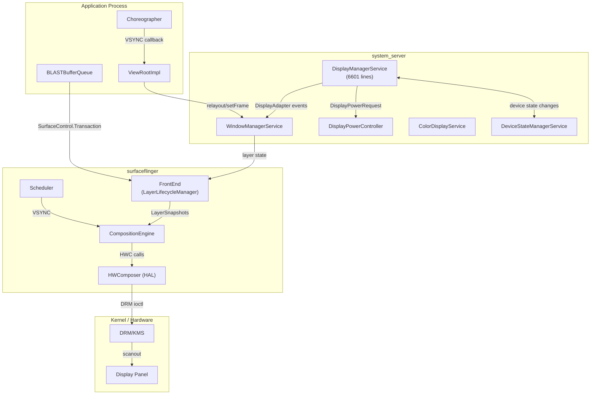

**Layer 1 -- Framework (system_server).** `DisplayManagerService` owns the
lifecycle of every display. It discovers physical displays through
`DisplayAdapter` implementations, creates `LogicalDisplay` objects that map
to physical `DisplayDevice` instances, and notifies `WindowManagerService`
of display additions, removals, and configuration changes.

**Layer 2 -- Native compositor (surfaceflinger).** SurfaceFlinger receives
buffer updates through `SurfaceControl.Transaction`, schedules composition
on VSYNC, and delegates the actual pixel blending to either the Hardware
Composer HAL (overlay planes) or the GPU (client composition via
RenderEngine).

**Layer 3 -- Kernel (DRM/KMS).** The Linux DRM subsystem manages display
hardware: mode setting, CRTC/encoder/connector topology, and page-flip
ioctls that trigger scanout of composed framebuffers.

### 24.1.2 DisplayManagerService

`DisplayManagerService` (DMS) is a `SystemService` registered during
`system_server` boot. At 6601 lines, it is one of the largest services in
the framework. Its Javadoc explains the architecture:

> The DisplayManagerService manages the global lifecycle of displays,
> decides how to configure logical displays based on the physical display
> devices currently attached, sends notifications to the system and to
> applications when the state changes.

DMS uses the `DisplayThread` (a shared `HandlerThread` at
`THREAD_PRIORITY_DISPLAY`) for its main handler. All internal state is
protected by a single `SyncRoot` lock -- the same lock used by all display
adapters and logical display objects:

```java
// frameworks/base/services/core/java/com/android/server/display/DisplayManagerService.java
private final SyncRoot mSyncRoot = new SyncRoot();
```

The lock ordering constraint is critical: DMS may hold `mSyncRoot` and call
into SurfaceFlinger (via `SurfaceControl`), but it must never call into
`WindowManagerService` while holding `mSyncRoot` because WMS holds its own
`mGlobalLock` and may call back into DMS. All potentially reentrant
out-calls are dispatched asynchronously through the handler.

### 24.1.3 Display Adapter Architecture

DMS discovers displays through a set of `DisplayAdapter` implementations:

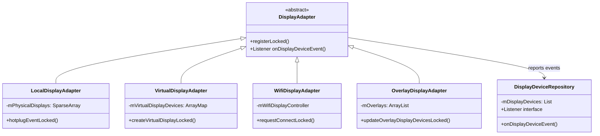

- **LocalDisplayAdapter** handles physical displays (built-in and external)
  reported by SurfaceFlinger's hotplug mechanism. It receives `EVENT_ADD`,
  `EVENT_REMOVE`, and `EVENT_CHANGE` notifications and creates
  `LocalDisplayDevice` instances backed by a SurfaceFlinger display token.

- **VirtualDisplayAdapter** creates virtual displays on behalf of
  applications, receiving a `VirtualDisplayConfig` with dimensions, density,
  flags, and an `IVirtualDisplayCallback` for lifecycle management.

- **WifiDisplayAdapter** manages Miracast (Wi-Fi Display / WFD)
  connections via `WifiDisplayController`.

- **OverlayDisplayAdapter** creates developer overlay displays parsed from
  the `persist.sys.overlay_display` system property.

All adapters report to `DisplayDeviceRepository`, which maintains the
canonical list of active `DisplayDevice` objects and notifies DMS of changes.

### 24.1.4 LogicalDisplay and Physical Mapping

The separation between `LogicalDisplay` and `DisplayDevice` is fundamental.
A `LogicalDisplay` represents a display as seen by the rest of the system
(window manager, applications), while a `DisplayDevice` represents the
underlying physical or virtual hardware.

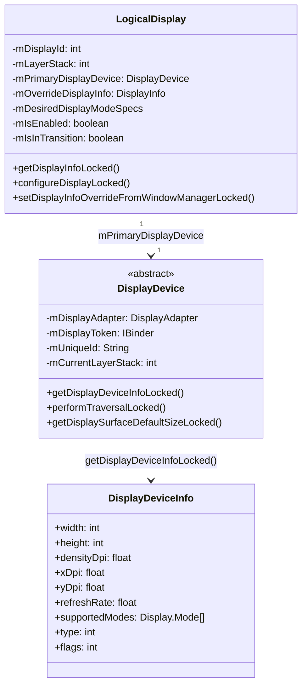

The key design insight, stated in the `LogicalDisplay` Javadoc:

> Logical displays and display devices are orthogonal concepts. Some mapping
> will exist between logical displays and display devices but it can be
> many-to-many and some might have no relation at all.

In practice, for single-display phones the mapping is 1:1. For foldables,
the mapping becomes dynamic -- a single logical display (the default display,
ID 0) can be swapped between the inner and outer physical display devices
during fold/unfold transitions. This swapping is managed by
`LogicalDisplayMapper`.

### 24.1.5 Display Configuration Flow

When a display is first connected, the configuration flows through multiple
components:

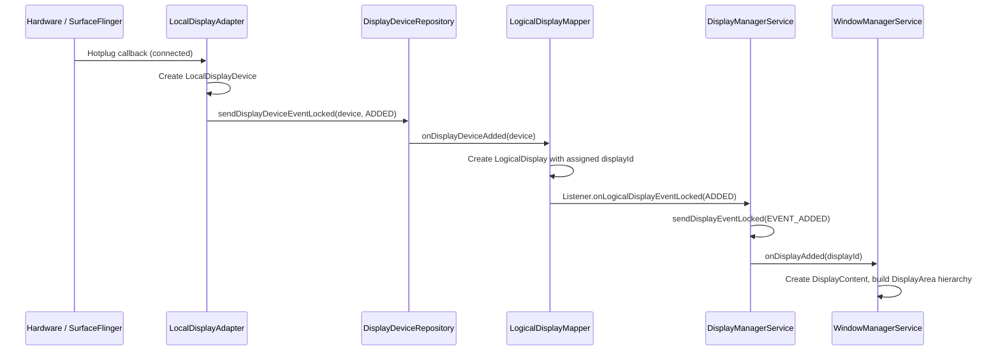

DMS maintains two critical data structures for event delivery:

```java
// All callback records indexed by calling process id
private final SparseArray<CallbackRecord> mCallbacks = new SparseArray<>();
// All callback records indexed by [uid][pid]
private final SparseArray<SparseArray<CallbackRecord>> mCallbackRecordByPidByUid =
        new SparseArray<>();
```

Events are delivered via `MSG_DELIVER_DISPLAY_EVENT` posted to the handler,
ensuring asynchronous delivery without holding `mSyncRoot`.

### 24.1.6 Display Groups

Displays are organised into `DisplayGroup` instances that share power state
and brightness. The primary display group contains the built-in display(s);
virtual displays may create their own groups using
`VIRTUAL_DISPLAY_FLAG_OWN_DISPLAY_GROUP` or be part of the device display
group using `VIRTUAL_DISPLAY_FLAG_DEVICE_DISPLAY_GROUP`. The
`DisplayGroupAllocator` assigns group IDs:

```java
// LogicalDisplayMapper events related to groups
public static final int DISPLAY_GROUP_EVENT_ADDED = 1;
public static final int DISPLAY_GROUP_EVENT_CHANGED = 2;
public static final int DISPLAY_GROUP_EVENT_REMOVED = 3;
```

Display groups affect power management -- when the default display group
goes to sleep, all displays in that group turn off together.

### 24.1.7 DisplayInfo and Overrides

The `DisplayInfo` object visible to applications is constructed through a
layered override mechanism:

1. **Base info** -- Derived from `DisplayDeviceInfo` of the primary
   display device (physical size, density, supported modes).
2. **DMS overrides** -- Display mode selection, user-disabled HDR types,
   frame rate overrides.
3. **WMS overrides** -- Window manager sets `DisplayInfo` fields for
   app-visible size (accounting for overscan, cutout, rotation). These are
   applied via `setDisplayInfoOverrideFromWindowManagerLocked()`.

The `WM_OVERRIDE_FIELDS` constant set in `DisplayInfoOverrides` defines
exactly which fields WMS is permitted to override, preventing accidental
clobbering of hardware-derived values.

### 24.1.8 DisplayBlanker: Power State Coordination

The `DisplayBlanker` interface provides the bridge between
`DisplayPowerController` and SurfaceFlinger for display power state
changes. DMS implements an anonymous `DisplayBlanker` that coordinates
state changes across multiple displays:

```java
// frameworks/base/services/core/java/com/android/server/display/DisplayManagerService.java
private final DisplayBlanker mDisplayBlanker = new DisplayBlanker() {
    @Override
    public synchronized void requestDisplayState(int displayId, int state,
            float brightness, float sdrBrightness) {
        // Check if ALL displays are inactive or off
        boolean allInactive = true;
        boolean allOff = true;
        // ... iterate over mDisplayStates
        if (state == Display.STATE_OFF) {
            requestDisplayStateInternal(displayId, state, brightness, sdrBrightness);
        }
        if (stateChanged) {
            mDisplayPowerCallbacks.onDisplayStateChange(allInactive, allOff);
        }
        if (state != Display.STATE_OFF) {
            requestDisplayStateInternal(displayId, state, brightness, sdrBrightness);
        }
    }
};
```

The ordering is critical: for OFF transitions, the display state is set
before notifying PowerManager; for ON transitions, PowerManager is notified
first. This prevents race conditions where the system thinks the display
is on while it is still powering down.

### 24.1.9 Display Mode Director

`DisplayModeDirector` sits between `DisplayManagerService` and
`RefreshRateSelector`, translating high-level mode requests from various
sources (app, settings, performance hints) into `DesiredDisplayModeSpecs`:

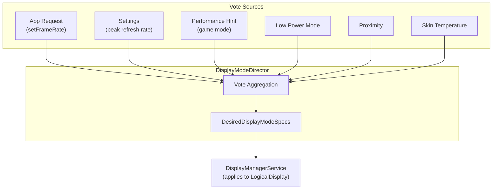

Each vote source has a priority, and the director resolves conflicts by
prioritising system constraints (thermal, low power) over app requests.

### 24.1.10 Handler Message Protocol

DMS uses a handler-based message protocol for asynchronous operations:

| Message | Constant | Purpose |
|---------|----------|---------|
| Register default adapters | `MSG_REGISTER_DEFAULT_DISPLAY_ADAPTERS` (1) | Boot-time adapter setup |
| Register additional adapters | `MSG_REGISTER_ADDITIONAL_DISPLAY_ADAPTERS` (2) | Post-boot adapter setup |
| Deliver display event | `MSG_DELIVER_DISPLAY_EVENT` (3) | Notify callbacks of display changes |
| Request traversal | `MSG_REQUEST_TRAVERSAL` (4) | Trigger SurfaceFlinger display configuration |
| Update viewport | `MSG_UPDATE_VIEWPORT` (5) | Update input viewport mappings |
| Load brightness configs | `MSG_LOAD_BRIGHTNESS_CONFIGURATIONS` (6) | Load brightness curves |
| Frame rate override event | `MSG_DELIVER_DISPLAY_EVENT_FRAME_RATE_OVERRIDE` (7) | Notify of FRO changes |
| Display group event | `MSG_DELIVER_DISPLAY_GROUP_EVENT` (8) | Notify of group additions/removals |
| Device state received | `MSG_RECEIVED_DEVICE_STATE` (9) | Process foldable state change |
| Dispatch pending events | `MSG_DISPATCH_PENDING_PROCESS_EVENTS` (10) | Batch event delivery |

The `MSG_REQUEST_TRAVERSAL` message is particularly important: when
display configuration changes, DMS must schedule a traversal in
SurfaceFlinger to apply the new display parameters (layer stack
assignment, display projection, display mode).

---

## 24.2 DisplayArea Hierarchy

### 24.2.1 What Is a DisplayArea?

Below `DisplayContent` (the `WindowContainer` that represents a full logical
display), Android organises windows into a tree of `DisplayArea` containers.
Each `DisplayArea` groups windows that share a common feature or Z-order
region. The class hierarchy is:

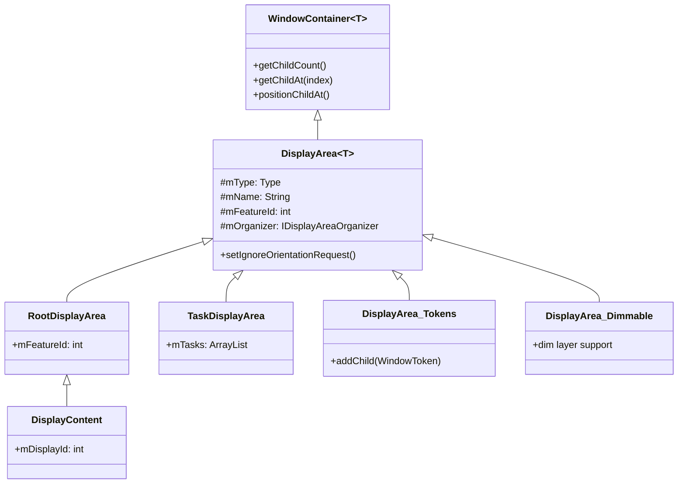

The Javadoc for `DisplayArea` explains the three flavours that enforce
Z-order correctness:

> DisplayAreas come in three flavors:
> - BELOW_TASKS: Can only contain BELOW_TASK DisplayAreas and WindowTokens
>   that go below tasks.
> - ABOVE_TASKS: Can only contain ABOVE_TASK DisplayAreas and WindowTokens
>   that go above tasks.
> - ANY: Can contain any kind of DisplayArea, and any kind of WindowToken
>   or the Task container.

### 24.2.2 Feature IDs

Each `DisplayArea` carries a `mFeatureId` that identifies its purpose. The
standard feature IDs are defined in `DisplayAreaOrganizer`:

| Feature ID | Constant | Value | Purpose |
|-----------|----------|-------|---------|
| `FEATURE_ROOT` | `FEATURE_SYSTEM_FIRST` | 0 | Root of the hierarchy |
| `FEATURE_DEFAULT_TASK_CONTAINER` | `FEATURE_SYSTEM_FIRST + 1` | 1 | Default container for Tasks |
| `FEATURE_WINDOW_TOKENS` | `FEATURE_SYSTEM_FIRST + 2` | 2 | Container for non-Task window tokens |
| `FEATURE_ONE_HANDED` | `FEATURE_SYSTEM_FIRST + 3` | 3 | One-handed mode scaling |
| `FEATURE_WINDOWED_MAGNIFICATION` | `FEATURE_SYSTEM_FIRST + 4` | 4 | Windowed accessibility magnification |
| `FEATURE_FULLSCREEN_MAGNIFICATION` | `FEATURE_SYSTEM_FIRST + 5` | 5 | Fullscreen magnification |
| `FEATURE_HIDE_DISPLAY_CUTOUT` | `FEATURE_SYSTEM_FIRST + 6` | 6 | Content below cutout |
| `FEATURE_IME_PLACEHOLDER` | `FEATURE_SYSTEM_FIRST + 7` | 7 | IME container position |
| `FEATURE_IME` | `FEATURE_SYSTEM_FIRST + 8` | 8 | Actual IME container |
| `FEATURE_WINDOWING_LAYER` | `FEATURE_SYSTEM_FIRST + 9` | 9 | Fallback windowing layer |
| `FEATURE_APP_ZOOM_OUT` | `FEATURE_SYSTEM_FIRST + 10` | 10 | App zoom-out support |

Vendor features use `FEATURE_VENDOR_FIRST` (10001) through
`FEATURE_VENDOR_LAST` (20001), allowing OEMs to define custom DisplayArea
hierarchy nodes (e.g., automotive rear-display areas, dual-screen features).

### 24.2.3 DisplayAreaPolicyBuilder

The `DisplayAreaPolicyBuilder` constructs the hierarchy tree by taking a set
of `Feature` definitions and building the necessary intermediate
`DisplayArea` nodes to satisfy the Z-ordering constraints.

A typical AOSP `DefaultDisplayAreaPolicy` builds this hierarchy:

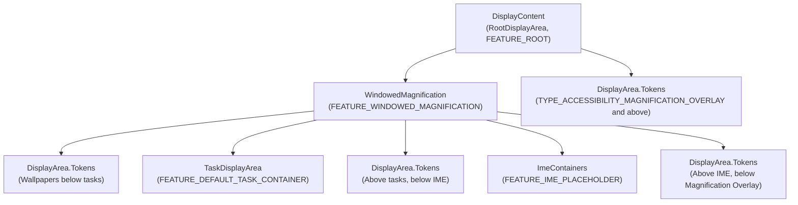

The builder works by:

1. Collecting all `Feature` definitions, each targeting a range of window
   types (e.g., "WindowedMagnification" covers everything up to
   `TYPE_ACCESSIBILITY_MAGNIFICATION_OVERLAY`).
2. For each Z-order slot (the 36-layer model from window type constants),
   determining which features apply.
3. Creating intermediate `DisplayArea` nodes wherever a feature boundary
   crosses a Z-order boundary, splitting the tree to maintain correct
   ordering.

### 24.2.4 DisplayAreaGroup for Multi-Root Hierarchies

The builder supports multiple root hierarchies through
`DisplayAreaGroup`, which is critical for automotive and foldable devices.
The code example in `DisplayAreaPolicyBuilder` shows how to create
separate roots for front and rear displays:

```java
// Example from DisplayAreaPolicyBuilder Javadoc:
RootDisplayArea firstRoot = new RootDisplayArea(wmService, "FirstRoot",
        FEATURE_FIRST_ROOT);
DisplayAreaPolicyBuilder.HierarchyBuilder firstGroupHierarchy =
    new DisplayAreaPolicyBuilder.HierarchyBuilder(firstRoot)
        .setTaskDisplayAreas(firstTdaList);

return new DisplayAreaPolicyBuilder()
    .setRootHierarchy(rootHierarchy)
    .addDisplayAreaGroupHierarchy(firstGroupHierarchy)
    .setSelectRootForWindowFunc(selectRootForWindowFunc)
    .build(wmService, content);
```

The `selectRootForWindowFunc` is a `BiFunction<Integer, Bundle,
RootDisplayArea>` that routes each window token to the appropriate root
based on window type and launch options.

### 24.2.5 Hierarchy Validation Rules

The `DisplayAreaPolicyBuilder.validate()` method enforces strict structural
constraints on the hierarchy:

1. **Unique IDs for roots and TDAs**: Every `RootDisplayArea` and
   `TaskDisplayArea` must have a globally unique feature ID.
2. **Unique feature IDs per root**: `Feature` nodes below the same
   `RootDisplayArea` must have unique IDs, but features below different
   roots may share IDs (enabling cross-root organizing).
3. **Exactly one IME container**: The IME container must exist in exactly
   one hierarchy builder.
4. **Exactly one default TDA**: One `TaskDisplayArea` must have the ID
   `FEATURE_DEFAULT_TASK_CONTAINER`.
5. **ID range limit**: No ID may exceed `FEATURE_VENDOR_LAST` (20001).
6. **Valid windowing layer**: The root hierarchy must contain a windowing
   layer (`FEATURE_WINDOWED_MAGNIFICATION` or `FEATURE_WINDOWING_LAYER`)
   at the top level. If absent, the builder automatically inserts a
   `FEATURE_WINDOWING_LAYER`.

```java
// frameworks/base/services/core/java/com/android/server/wm/DisplayAreaPolicyBuilder.java
if (!mRootHierarchyBuilder.hasValidWindowingLayer()) {
    mRootHierarchyBuilder.mFeatures.add(0 /* top level index */,
        new Feature.Builder(wmService.mPolicy, "WindowingLayer",
            FEATURE_WINDOWING_LAYER)
            .setExcludeRoundedCornerOverlay(false).all().build());
}
```

### 24.2.6 Feature Definition and Window Type Targeting

Each `Feature` targets a set of window types using a builder pattern
that supports ranges and exceptions:

```java
// Example: WindowedMagnification targets everything below
// the accessibility magnification overlay
new Feature.Builder(wmService.mPolicy, "WindowedMagnification",
        FEATURE_WINDOWED_MAGNIFICATION)
    .upTo(TYPE_ACCESSIBILITY_MAGNIFICATION_OVERLAY)
    .except(TYPE_ACCESSIBILITY_MAGNIFICATION_OVERLAY)
    .setNewDisplayAreaSupplier(DisplayArea.Dimmable::new)
    .build()
```

The `Feature.Builder` methods:

- `all()` -- Target all window types
- `upTo(type)` -- Target all types up to and including the given type
- `except(type)` -- Exclude a specific type from the range
- `and(type)` -- Add a specific type to the set
- `setNewDisplayAreaSupplier()` -- Custom DisplayArea factory (e.g.,
  `Dimmable` for magnification dimming support)
- `setExcludeRoundedCornerOverlay()` -- Whether to exclude rounded corner
  overlay windows

### 24.2.7 The Build Algorithm

The `HierarchyBuilder.build()` method implements the core algorithm for
generating the DisplayArea tree:

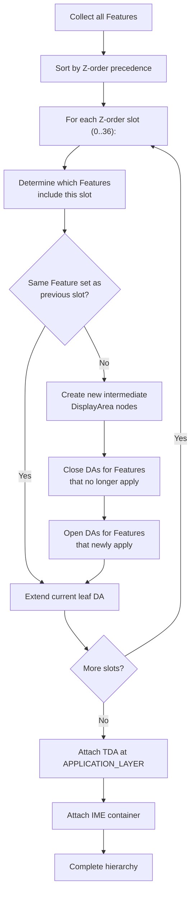

The algorithm ensures that:

- A `DisplayArea` exists for each contiguous range of Z-order slots that
  share the same Feature set.
- Features that span only a subset of the Z-order space get their own
  nested `DisplayArea` nodes.
- The `TaskDisplayArea` is inserted at exactly `APPLICATION_LAYER`
  (the Z-order position between below-task and above-task windows).

### 24.2.8 DefaultSelectRootForWindowFunction

When multiple roots exist (e.g., automotive front/rear displays), the
`DefaultSelectRootForWindowFunction` routes window tokens:

```java
// frameworks/base/services/core/java/com/android/server/wm/DisplayAreaPolicyBuilder.java
public RootDisplayArea apply(Integer windowType, Bundle options) {
    if (mDisplayAreaGroupRoots.isEmpty()) {
        return mDisplayRoot;
    }
    if (options != null) {
        final int rootId = options.getInt(KEY_ROOT_DISPLAY_AREA_ID, FEATURE_UNDEFINED);
        if (rootId != FEATURE_UNDEFINED) {
            for (RootDisplayArea root : mDisplayAreaGroupRoots) {
                if (root.mFeatureId == rootId) return root;
            }
        }
    }
    return mDisplayRoot;
}
```

The routing key is `KEY_ROOT_DISPLAY_AREA_ID` in the `ActivityOptions`
bundle, allowing launchers and system components to direct windows to
specific roots.

### 24.2.9 DisplayArea Organizers

Shell and SystemUI can register `IDisplayAreaOrganizer` implementations to
receive callbacks when specific feature DisplayAreas appear, change, or
vanish. This is the mechanism that enables:

- **One-handed mode**: Registers for `FEATURE_ONE_HANDED`, then scales and
  translates the DisplayArea.
- **Windowed magnification**: Registers for `FEATURE_WINDOWED_MAGNIFICATION`.
- **App zoom-out**: Registers for `FEATURE_APP_ZOOM_OUT`.

The `DisplayAreaOrganizerController` manages the registration and dispatches
`onDisplayAreaAppeared`, `onDisplayAreaInfoChanged`, and
`onDisplayAreaVanished` callbacks. The organizer receives a
`SurfaceControl` leash that it can reparent or transform.

### 24.2.10 Orientation Handling in DisplayAreas

`DisplayArea` has a critical role in orientation management through the
`mSetIgnoreOrientationRequest` flag. When set, the DisplayArea ignores
fixed-orientation requests from apps below it, showing them in letterbox
instead of rotating the entire display:

```java
// frameworks/base/services/core/java/com/android/server/wm/DisplayArea.java
boolean setIgnoreOrientationRequest(boolean ignoreOrientationRequest) {
    if (mSetIgnoreOrientationRequest == ignoreOrientationRequest) {
        return false;
    }
    mSetIgnoreOrientationRequest = ignoreOrientationRequest;
    // Check whether we should notify Display to update orientation
    // ...
}
```

This is used on large-screen devices (tablets, foldables in open posture)
where rotating the entire display for a portrait-only app would be
undesirable. The DisplayArea suppresses the orientation request, and the
app is shown letterboxed within the current display orientation.

---

## 24.3 Display Refresh and VSYNC

### 24.3.1 The VSYNC Pipeline

VSYNC (Vertical Synchronization) is the heartbeat of the display system.
Every frame displayed on screen begins with a VSYNC signal from the
display hardware. Android's VSYNC pipeline transforms raw hardware interrupts
into precisely timed callbacks at multiple points in the rendering chain.

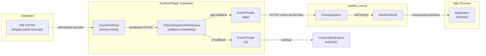

### 24.3.2 VSyncPredictor: The Timing Model

`VSyncPredictor` maintains a linear regression model of VSYNC timing.
Rather than relying solely on the latest hardware timestamp, it collects a
history of timestamps and fits a line (slope + intercept) to predict future
VSYNC events:

```cpp
// frameworks/native/services/surfaceflinger/Scheduler/VSyncPredictor.h
struct Model {
    nsecs_t slope;     // period between VSYNCs
    nsecs_t intercept; // phase offset
};
```

The predictor accepts timestamps via `addVsyncTimestamp()`, filters outliers
(using `outlierTolerancePercent`), and requires a minimum number of samples
(`minimumSamplesForPrediction`) before generating predictions. This
filtering is essential because hardware VSYNC timestamps can jitter by
tens of microseconds due to display controller timing granularity.

The `nextAnticipatedVSyncTimeFrom()` method returns the next predicted
VSYNC time from a given timepoint, which is used by the dispatch system to
schedule callbacks precisely.

### 24.3.3 VSyncDispatchTimerQueue: Callback Scheduling

`VSyncDispatchTimerQueue` translates predicted VSYNC times into actual
timer-based wakeups. Each registered callback is represented by a
`VSyncDispatchTimerQueueEntry` with three states:

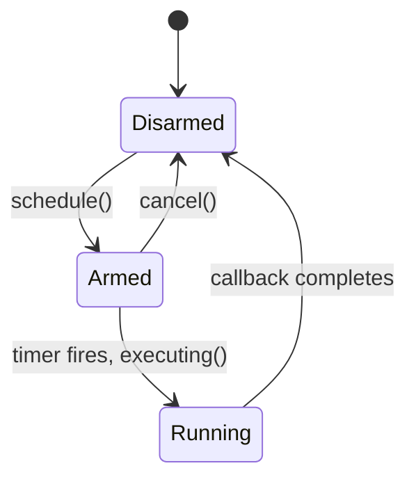

Each entry carries `ScheduleTiming` that specifies:

- **workDuration** -- how long before the VSYNC the callback needs to wake
  up (e.g., app rendering might need 16ms)
- **readyDuration** -- additional time needed after work completes before
  the VSYNC deadline
- **earliestVsync** -- the earliest VSYNC this callback is interested in

The timer queue coalesces callbacks that are close in time (within
`timerSlack`) into a single timer wakeup, reducing the number of context
switches.

### 24.3.4 EventThread: VSYNC Distribution to Clients

Two `EventThread` instances run in SurfaceFlinger:

1. **sf EventThread** -- Wakes SurfaceFlinger's main loop for composition.
2. **app EventThread** -- Distributes VSYNC events to applications via
   `IDisplayEventConnection` / `BitTube`.

`EventThreadConnection` wraps a `BitTube` (a socket pair) for zero-copy
VSYNC event delivery to the client. The connection supports three request
modes:

```cpp
// frameworks/native/services/surfaceflinger/Scheduler/EventThread.h
enum class VSyncRequest {
    None = -2,        // No VSYNC events
    Single = -1,      // Wake for next two frames (avoid scheduler overhead)
    SingleSuppressCallback = 0,  // Wake for next frame only
    Periodic = 1,     // Continuous VSYNC delivery
    // Values > 1 specify a divisor (every Nth VSYNC)
};
```

### 24.3.5 Choreographer: Java-Side VSYNC Consumption

On the Java side, `Choreographer` receives VSYNC events from the app
EventThread through a `DisplayEventReceiver` and dispatches them to
registered callbacks in priority order:

1. **CALLBACK_INPUT** -- Input event processing
2. **CALLBACK_ANIMATION** -- Property animations, Transitions
3. **CALLBACK_INSETS_ANIMATION** -- WindowInsets animations
4. **CALLBACK_TRAVERSAL** -- View measure/layout/draw
5. **CALLBACK_COMMIT** -- Post-draw commit

Each Activity's `ViewRootImpl` registers a `CALLBACK_TRAVERSAL` with
Choreographer. When `requestLayout()` or `invalidate()` is called, the
ViewRootImpl schedules itself with Choreographer, which waits for the next
VSYNC before executing the traversal.

### 24.3.6 RefreshRateSelector: Display Mode Selection

`RefreshRateSelector` is the policy engine that selects the optimal display
refresh rate from the modes supported by the hardware. It considers
multiple inputs:

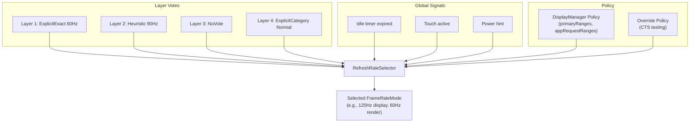

The `LayerVoteType` enum captures the different ways a layer can express
its refresh rate preference:

| Vote Type | Description |
|-----------|-------------|
| `NoVote` | Layer does not care about refresh rate |
| `Min` | Requests minimum available rate (power saving) |
| `Max` | Requests maximum available rate (smoothness) |
| `Heuristic` | Platform-calculated rate from content analysis |
| `ExplicitDefault` | App-requested rate with Default compatibility |
| `ExplicitExactOrMultiple` | App-requested rate, exact or integer multiple |
| `ExplicitExact` | App-requested rate, exact match only |
| `ExplicitGte` | App-requested rate, greater-than-or-equal |
| `ExplicitCategory` | App-requested frame rate category (Normal/High) |

The selector operates under a `Policy` that defines:

- `defaultMode` -- the mode to use when there are no strong preferences
- `primaryRanges` -- the physical and render FPS ranges
- `appRequestRanges` -- the app-visible FPS ranges
- `allowGroupSwitching` -- whether to switch between mode groups
- `idleScreenConfigOpt` -- idle timer configuration

The kMinSupportedFrameRate is 20 Hz -- below this, content would appear
visibly choppy. Frame rate categories define thresholds: Normal starts at
60 Hz, High starts at 90 Hz.

### 24.3.7 Scheduler: Orchestrating Frame Production

The `Scheduler` class is the top-level coordinator that ties together VSYNC
prediction, event threading, and mode selection. It inherits from both
`IEventThreadCallback` and `MessageQueue`:

```cpp
// frameworks/native/services/surfaceflinger/Scheduler/Scheduler.h
class Scheduler : public IEventThreadCallback, android::impl::MessageQueue {
    // ...
};
```

Key concepts:

- **Pacesetter display**: In multi-display configurations, one physical
  display is designated the "pacesetter" that drives the composition
  cadence. The scheduler uses `designatePacesetterDisplay()` to select it
  automatically, or `forcePacesetterDisplay()` to override.

- **VsyncModulator**: Adjusts VSYNC offsets dynamically based on workload.
  When a frame is about to miss its deadline, the modulator can advance
  the app VSYNC phase to give more rendering time.

- **LayerHistory**: Tracks per-layer frame production rates using heuristics
  to provide `LayerRequirement` inputs to `RefreshRateSelector`.

### 24.3.8 VsyncConfiguration: Phase Offsets

`VsyncConfiguration` maps refresh rates to VSYNC offset configurations.
Each configuration defines timing for three scenarios:

```cpp
// frameworks/native/services/surfaceflinger/Scheduler/VsyncConfiguration.h
struct VsyncConfigSet {
    VsyncConfig early;     // During transaction processing
    VsyncConfig earlyGpu;  // During GPU composition
    VsyncConfig late;      // Normal steady-state
};
```

Each `VsyncConfig` contains:

- **sfOffset** / **sfWorkDuration**: When SurfaceFlinger wakes relative
  to VSYNC
- **appOffset** / **appWorkDuration**: When apps wake relative to VSYNC

The offset strategy:

- **Late (normal)**: App wakes early in the VSYNC period, renders, then
  SF wakes later to composite and present. This maximises the time
  available for app rendering.
- **Early (transaction heavy)**: Both app and SF wake earlier to handle
  the extra transaction processing work.
- **Early GPU (GPU composition)**: SF wakes earlier because GPU composition
  takes longer than HWC overlay composition.

The legacy `PhaseOffsets` implementation used fixed nanosecond offsets.
The modern `WorkDuration` implementation uses duration-based scheduling
that adapts better to different refresh rates:

```mermaid
gantt
    title VSYNC Phase Offsets (16.67ms period)
    dateFormat X
    axisFormat %sms

    section Late Config
    App work         :app, 0, 10
    SF work          :sf, 10, 14
    HWC present      :hwc, 14, 16
    VSYNC            :milestone, 16, 16

    section Early Config
    App work (early) :app2, 0, 8
    SF work (early)  :sf2, 6, 12
    HWC present      :hwc2, 12, 16
    VSYNC            :milestone, 16, 16
```

### 24.3.9 VsyncModulator: Dynamic Offset Switching

`VsyncModulator` switches between Early, EarlyGpu, and Late VSYNC
configurations based on runtime conditions:

```cpp
// frameworks/native/services/surfaceflinger/Scheduler/VsyncModulator.h
class VsyncModulator : public IBinder::DeathRecipient {
    static constexpr int MIN_EARLY_TRANSACTION_FRAMES = 2;
    static constexpr int MIN_EARLY_GPU_FRAMES = 2;
    // ...
};
```

The modulator maintains frame counters:

- **Early transaction frames**: After a transaction is scheduled, keep
  early offsets for at least `MIN_EARLY_TRANSACTION_FRAMES` (2) frames
  plus a time delay (`MIN_EARLY_TRANSACTION_TIME`) to avoid races with
  transaction commit.
- **Early GPU frames**: After GPU composition is used, keep early GPU
  offsets for `MIN_EARLY_GPU_FRAMES` (2) frames as a low-pass filter
  against alternating composition strategies.

The state transitions:

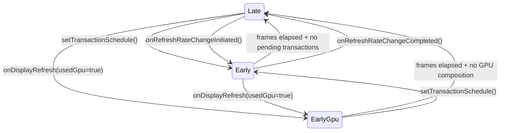

### 24.3.10 VsyncSchedule: Per-Display VSYNC

`VsyncSchedule` encapsulates the complete VSYNC infrastructure for a
single physical display:

- A `VSyncTracker` (usually `VSyncPredictor`) for timing model
- A `VSyncDispatch` (usually `VSyncDispatchTimerQueue`) for callback
  scheduling
- A `VSyncController` for receiving hardware VSYNC timestamps

In multi-display configurations, each physical display has its own
`VsyncSchedule`. The pacesetter display's schedule drives the main
composition loop, while secondary displays use their own schedules
for VSYNC event distribution.

### 24.3.11 Frame Timeline

Android's `FrameTimeline` (in the Scheduler directory) tracks the lifecycle
of every frame through the system, recording:

- Expected and actual app render start times
- Expected and actual presentation times (VSYNC)
- GPU completion fences
- Present fences from the display

This data powers the `dumpsys SurfaceFlinger --frametimeline` debugging
output and feeds into `perfetto` traces for performance analysis.

### 24.3.12 Idle Timer and Power Optimization

The `RefreshRateSelector` supports an idle screen configuration that
reduces refresh rate when the display content is static:

```cpp
// RefreshRateSelector.h
struct Policy {
    // ...
    std::optional<gui::DisplayModeSpecs::IdleScreenRefreshRateConfig>
        idleScreenConfigOpt;
};
```

The `OneShotTimer` in the Scheduler fires after a configurable idle
period, signalling the `RefreshRateSelector` to lower the refresh rate.
Any new content update (buffer queue activity, touch event) resets the
timer. This is a significant power optimization: a phone showing a
static document drops from 120 Hz to 60 Hz (or lower) after a few
seconds of inactivity.

### 24.3.13 SmallAreaDetection

`SmallAreaDetectionAllowMappings` enables per-UID small-area detection
thresholds. When enabled, SurfaceFlinger can reduce the refresh rate for
layers that update only a small percentage of the screen (e.g., a blinking
cursor), preventing those layers from forcing the entire display to run at
a high refresh rate. The `SmallAreaDetectionController` in
`DisplayManagerService` manages the allow-list of UIDs.

---

## 24.4 Screen Rotation

### 24.4.1 DisplayRotation: The Policy Engine

`DisplayRotation` (2255 lines) owns the mapping between the requested
orientation (from the topmost Activity) and the actual physical rotation
of the display. It resides in `WindowManagerService` and is instantiated
per-`DisplayContent`:

```java
// frameworks/base/services/core/java/com/android/server/wm/DisplayRotation.java
public class DisplayRotation {
    private final WindowManagerService mService;
    private final DisplayContent mDisplayContent;
    private final DisplayPolicy mDisplayPolicy;
    private final FoldController mFoldController;
    private final DeviceStateController mDeviceStateController;
    private final DisplayRotationCoordinator mDisplayRotationCoordinator;
    // ...
}
```

The rotation decision pipeline:

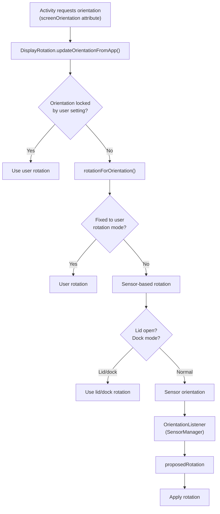

### 24.4.2 Rotation Lifecycle

When a rotation occurs, the system must coordinate multiple subsystems:

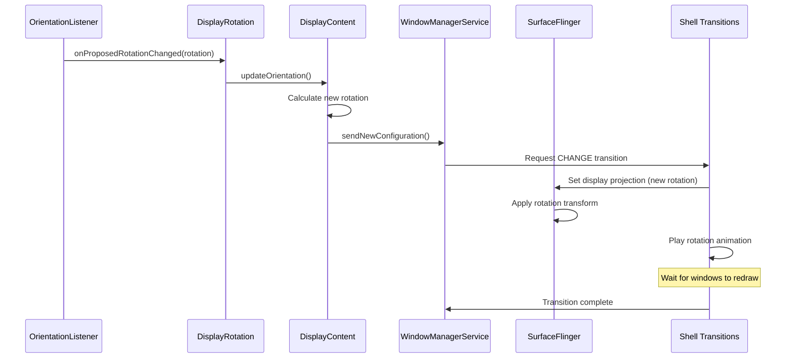

### 24.4.3 SeamlessRotator: Zero-Flicker Rotation

`SeamlessRotator` enables rotation without a blackout screen by applying
counter-transforms to individual windows. During seamless rotation, each
window's `SurfaceControl` is transformed to undo the display rotation,
so from the user's perspective, the content appears stationary while the
display orientation changes underneath.

The constructor computes the transform matrix:

```java
// frameworks/base/services/core/java/com/android/server/wm/SeamlessRotator.java
public SeamlessRotator(@Rotation int oldRotation, @Rotation int newRotation,
        DisplayInfo info, boolean applyFixedTransformationHint) {
    // Convert from old logical coords -> physical coords -> new logical coords
    CoordinateTransforms.transformLogicalToPhysicalCoordinates(
            oldRotation, pW, pH, mTransform);
    CoordinateTransforms.transformPhysicalToLogicalCoordinates(
            newRotation, pW, pH, tmp);
    mTransform.postConcat(tmp);
}
```

The `unrotate()` method applies this transform to each window's
`SurfaceControl`:

```java
public void unrotate(Transaction transaction, WindowContainer win) {
    applyTransform(transaction, win.getSurfaceControl());
    float[] winSurfacePos = {win.mLastSurfacePosition.x, win.mLastSurfacePosition.y};
    mTransform.mapPoints(winSurfacePos);
    transaction.setPosition(win.getSurfaceControl(), winSurfacePos[0], winSurfacePos[1]);
}
```

Additionally, `mApplyFixedTransformHint` sets a buffer transform hint on
the SurfaceControl so that graphic producers (e.g., the app's
`Surface`) do not allocate buffers in the new orientation prematurely --
the hint pins the expected buffer orientation to the old rotation until
the producer catches up.

### 24.4.4 AsyncRotationController: Non-Activity Windows

While activities can redraw in the new orientation, non-activity windows
(status bar, navigation bar, screen decor overlays) may take additional
frames to update. `AsyncRotationController` manages their appearance during
the transition:

```java
// frameworks/base/services/core/java/com/android/server/wm/AsyncRotationController.java
class AsyncRotationController extends FadeAnimationController
        implements Consumer<WindowState> {
    private final ArrayMap<WindowToken, Operation> mTargetWindowTokens;
    // ...
}
```

The controller supports four transition operations:

| Op | Constant | Behavior |
|----|----------|----------|
| `OP_LEGACY` | 0 | Legacy non-transition path |
| `OP_APP_SWITCH` | 1 | App open/close with rotation (fade out, then fade in) |
| `OP_CHANGE` | 2 | Normal rotation (hide via parent leash, fade in when redrawn) |
| `OP_CHANGE_MAY_SEAMLESS` | 3 | Potentially seamless (shell decides) |

For seamless rotation of system windows (e.g., screen decor overlays that
must be seamless), the controller requests individual sync transactions and
applies the `SeamlessRotator` counter-transform to each window token.

### 24.4.5 Foldable Rotation Coordination

The `FoldController` (inner class of `DisplayRotation`) handles rotation
during fold/unfold events. It introduces a `FOLDING_RECOMPUTE_CONFIG_DELAY_MS`
(800ms) delay when folding to closed state, preventing configuration
changes and visual jumps during the mechanical folding motion.

`DisplayRotationCoordinator` synchronises rotation across multiple displays
(e.g., inner and outer displays of a foldable). When the default display
changes rotation, it notifies other displays through a callback mechanism
so they can coordinate their own rotation responses.

### 24.4.6 Rotation History and Debugging

`DisplayRotation` maintains a `RotationHistory` ring buffer that records
every rotation change with timestamp, source (sensor, user, policy), old
rotation, and new rotation. This is invaluable for debugging rotation
issues:

```
dumpsys window | grep -A 20 "RotationHistory"
```

Similarly, `RotationLockHistory` tracks when rotation lock was toggled
and by which mechanism (user setting, device state, camera compat).

### 24.4.7 DisplayRotationReversionController

The `DisplayRotationReversionController` handles cases where the display
rotation should be temporarily overridden:

| Reversion Type | Constant | Trigger |
|---------------|----------|---------|
| Camera compat | `REVERSION_TYPE_CAMERA_COMPAT` | Camera app needs specific orientation |
| Half fold | `REVERSION_TYPE_HALF_FOLD` | Device in tabletop posture |
| No sensor | `REVERSION_TYPE_NOSENSOR` | Sensor disabled/unavailable |

When a reversion is active, `DisplayRotation` uses the reverted rotation
instead of the sensor-detected rotation. Reversions are stacked and
unwound in order.

### 24.4.8 Rotation and Transitions Integration

Screen rotation is deeply integrated with Shell Transitions (Chapter 16).
When rotation changes, the transition system:

1. **Captures a screenshot** of the pre-rotation state (or uses
   `SeamlessRotator` for seamless transitions).
2. **Starts a CHANGE transition** that includes the DisplayContent.
3. **Coordinates with `AsyncRotationController`** to handle non-activity
   windows.
4. **Plays the rotation animation** (usually a crossfade from screenshot
   to live content).
5. **Waits for all windows to redraw** in the new orientation before
   completing the transition.

The legacy rotation path (pre-Shell Transitions) used a
`ScreenRotationAnimation` that rendered a GPU-accelerated rotation
of the pre-rotation screenshot. The new path delegates this entirely
to Shell, which can apply more sophisticated animations.

---

## 24.5 Foldable Display Support

### 24.5.1 DeviceStateManagerService: The State Machine

`DeviceStateManagerService` manages the physical configuration of
variable-state devices like foldables. It is the central authority for
answering "what posture is the device in right now?"

```java
// frameworks/base/services/core/java/com/android/server/devicestate/
//     DeviceStateManagerService.java
public final class DeviceStateManagerService extends SystemService {
    private final DeviceStatePolicy mDeviceStatePolicy;
    private final BinderService mBinderService;
    // ...
}
```

The service defines device states using properties:

| Property | Description |
|----------|-------------|
| `PROPERTY_FOLDABLE_HARDWARE_CONFIGURATION_FOLD_IN_CLOSED` | Device is fully folded |
| `PROPERTY_FOLDABLE_HARDWARE_CONFIGURATION_FOLD_IN_HALF_OPEN` | Tabletop/tent posture |
| `PROPERTY_FOLDABLE_HARDWARE_CONFIGURATION_FOLD_IN_OPEN` | Fully unfolded |
| `PROPERTY_FOLDABLE_DISPLAY_CONFIGURATION_INNER_PRIMARY` | Inner display is primary |
| `PROPERTY_FOLDABLE_DISPLAY_CONFIGURATION_OUTER_PRIMARY` | Outer display is primary |
| `PROPERTY_FEATURE_DUAL_DISPLAY_INTERNAL_DEFAULT` | Dual display mode |
| `PROPERTY_FEATURE_REAR_DISPLAY` | Rear display mode |
| `PROPERTY_POWER_CONFIGURATION_TRIGGER_SLEEP` | This state triggers sleep |
| `PROPERTY_POWER_CONFIGURATION_TRIGGER_WAKE` | This state triggers wake |

### 24.5.2 Device State Providers

The `DeviceStateProvider` interface supplies the physical device state.
`FoldableDeviceStateProvider` is the standard implementation that reads
from the hinge angle sensor and hall effect sensor to determine the fold
posture. The provider reports state changes to `DeviceStateManagerService`,
which then consults the `DeviceStatePolicy` to determine the appropriate
system response.

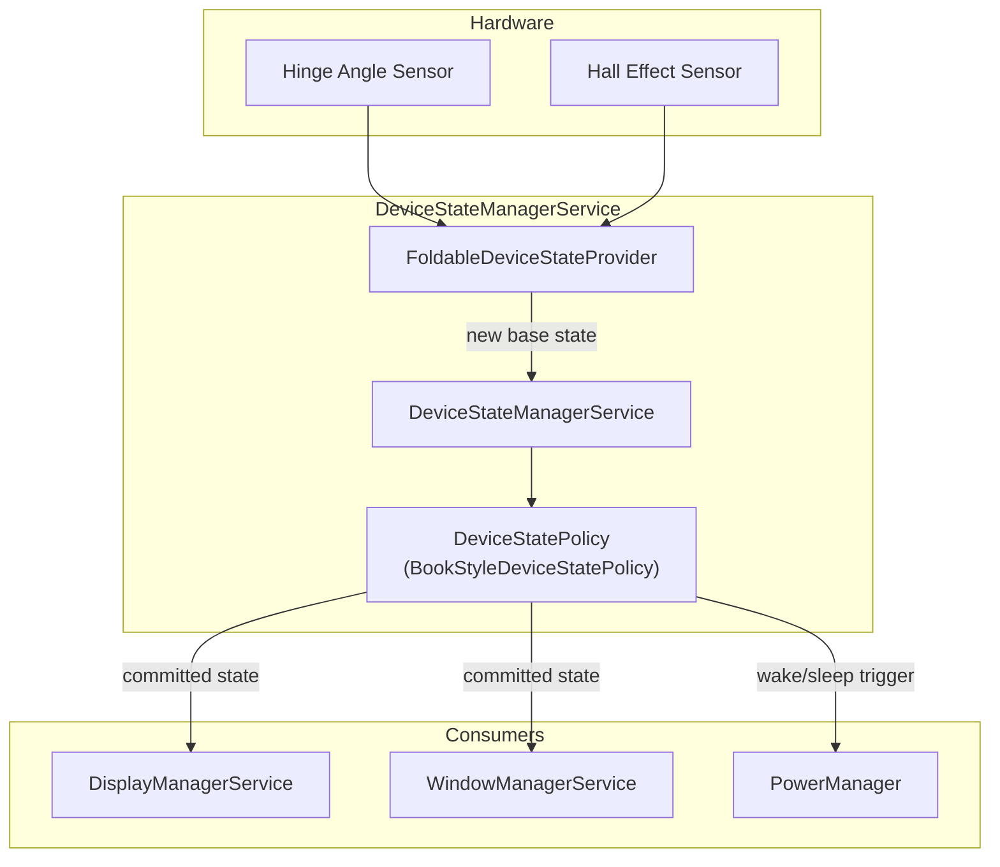

### 24.5.3 LogicalDisplayMapper: Display Swapping

`LogicalDisplayMapper` is the key component that makes foldable display
transitions work. When the device transitions between states (e.g., from
CLOSED to OPEN), the mapper must:

1. **Identify which physical displays are enabled** in the new state using
   `DeviceStateToLayoutMap` (a mapping from device state identifiers to
   `Layout` objects describing which displays are active and their
   positions).

2. **Swap the underlying `DisplayDevice`** for the default `LogicalDisplay`.
   The logical display ID (0) stays the same, but its backing physical
   display changes from outer to inner (or vice versa).

3. **Manage the transition** with `mIsInTransition` flags and a timeout
   (`TIMEOUT_STATE_TRANSITION_MILLIS = 500ms`) to handle cases where the
   transition takes too long.

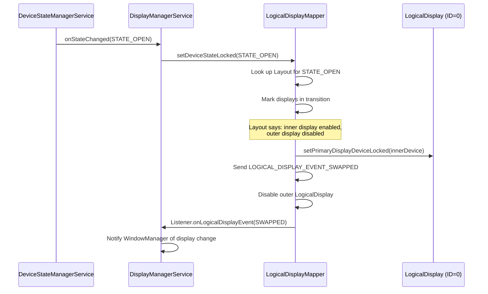

The mapper emits specific events for different scenarios:

```java
public static final int LOGICAL_DISPLAY_EVENT_SWAPPED = 1 << 3;
public static final int LOGICAL_DISPLAY_EVENT_DEVICE_STATE_TRANSITION = 1 << 5;
```

### 24.5.4 BookStyleDeviceStatePolicy

For book-style foldables (where the fold axis is vertical, like a book),
`BookStyleDeviceStatePolicy` implements `DeviceStatePolicy` to manage:

- **Outer-to-inner transitions**: When unfolding, the outer display content
  is migrated to the inner display. The policy coordinates with
  `DisplayManagerService` and `WindowManagerService` to ensure apps see
  a smooth transition.

- **Rear display mode**: Allows using the outer display as a viewfinder
  while the device is open, with the inner display facing away from the
  user. This mode is enabled by `PROPERTY_FEATURE_REAR_DISPLAY`.

- **Dual display mode**: Both inner and outer displays active simultaneously,
  enabled by `PROPERTY_FEATURE_DUAL_DISPLAY_INTERNAL_DEFAULT`.

### 24.5.5 Concurrent Displays

Modern foldables can run both displays simultaneously. The
`DisplayTopologyCoordinator` manages the spatial relationship between
displays, and `DisplayTopologyStore` persists the topology configuration.
When concurrent displays are active, the system:

- Assigns separate `DisplayGroup` instances if the displays serve
  different purposes
- Applies stricter thermal brightness throttling (the thermal data ID
  changes in concurrent mode)
- Routes input events to the correct display based on touch coordinates

### 24.5.6 DeviceStateToLayoutMap

`DeviceStateToLayoutMap` provides the mapping from device state identifiers
to `Layout` objects that describe which displays are active and their
positions. The default state `STATE_DEFAULT` maps to the initial layout
with a single default display. Each layout specifies:

- Which `DisplayDevice`s are enabled
- The position of each display (front, rear, unknown)
- The `DisplayGroup` name for each display
- Lead/follower relationships between displays (for brightness)

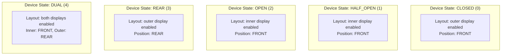

### 24.5.7 Display Swapping Events

During a display swap, the `LogicalDisplayMapper` emits a carefully
ordered sequence of events:

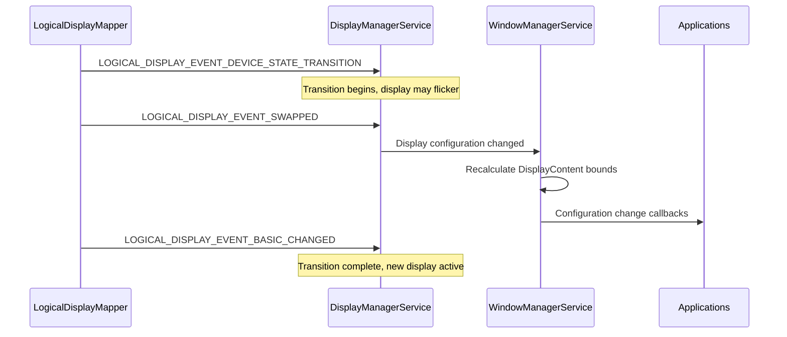

The `TIMEOUT_STATE_TRANSITION_MILLIS` (500ms) guard ensures that a stalled
transition does not leave the system in an indeterminate state.

### 24.5.8 FoldSettingProvider

`FoldSettingProvider` manages user preferences for foldable behavior:

- Whether to mirror the default display when folded
- Whether to include the default display in the display topology
- Resolution mode preferences per display

These settings are read through `Settings.Secure` and influence the
`LogicalDisplayMapper`'s layout decisions.

---

## 24.6 Display Cutout and Rounded Corners

### 24.6.1 DisplayCutout: Modelling Non-Rectangular Screens

`DisplayCutout` represents the area of the display that is not functional
for displaying content -- typically a notch, hole-punch camera, or dynamic
island. It is immutable and carried through the system as part of
`DisplayInfo` and `WindowInsets`.

```java
// frameworks/base/core/java/android/view/DisplayCutout.java
public final class DisplayCutout {
    private final Rect mSafeInsets;
    private final Insets mWaterfallInsets;
    private final Rect[] mBounds;  // One rect per side (left, top, right, bottom)
    // ...
}
```

The cutout defines:

- **Safe insets** -- the rectangular region that is guaranteed to be
  free of cutouts, expressed as insets from each edge
- **Bounding rectangles** -- the precise bounds of the cutout on each of
  the four sides
- **Waterfall insets** -- for curved-edge (waterfall) displays, the insets
  where the display curves away from the flat plane

### 24.6.2 CutoutSpecification: Configuration DSL

The cutout shape is defined in the device overlay resource
`R.string.config_mainBuiltInDisplayCutout` using a custom specification
language parsed by `CutoutSpecification`:

```java
// frameworks/base/core/java/android/view/CutoutSpecification.java
```

The specification supports SVG-like path commands (M, L, C, Q, Z, etc.)
that define the cutout shape relative to the display dimensions. The
parser handles:

- **`@dp` suffix**: Values in density-independent pixels
- **`@bottom`, `@right`, `@center_vertical`**: Positioning shortcuts
- **`@left` keyword**: Binds the path to the left side of the display

A typical specification for a centered punch-hole camera:

```
M 0,0
L -24,0
C -24,0 -24,24 0,24
L 0,48
C 0,48 24,48 24,24
L 24,0
C 24,0 0,0 0,0
@dp
@center_horizontal
```

### 24.6.3 Cutout Modes

Apps declare their cutout handling preference via
`WindowManager.LayoutParams.layoutInDisplayCutoutMode`:

| Mode | Constant | Behavior |
|------|----------|----------|
| `LAYOUT_IN_DISPLAY_CUTOUT_MODE_DEFAULT` | 0 | Content avoids cutout in portrait, uses full screen in landscape |
| `LAYOUT_IN_DISPLAY_CUTOUT_MODE_SHORT_EDGES` | 1 | Content extends into cutout on short edges |
| `LAYOUT_IN_DISPLAY_CUTOUT_MODE_NEVER` | 2 | Content never extends into cutout area |
| `LAYOUT_IN_DISPLAY_CUTOUT_MODE_ALWAYS` | 3 | Content always extends into cutout area |

The window manager evaluates these modes in `DisplayPolicy` when computing
window frames. For `ALWAYS`, the window receives the full display area;
for `NEVER`, the window is inset by the cutout safe insets.

### 24.6.4 WmDisplayCutout

`WmDisplayCutout` is the window-manager-internal wrapper that adds rotation
awareness to `DisplayCutout`. When the display rotates, the cutout bounds
must be rotated accordingly. `WmDisplayCutout` caches rotated variants to
avoid recomputation:

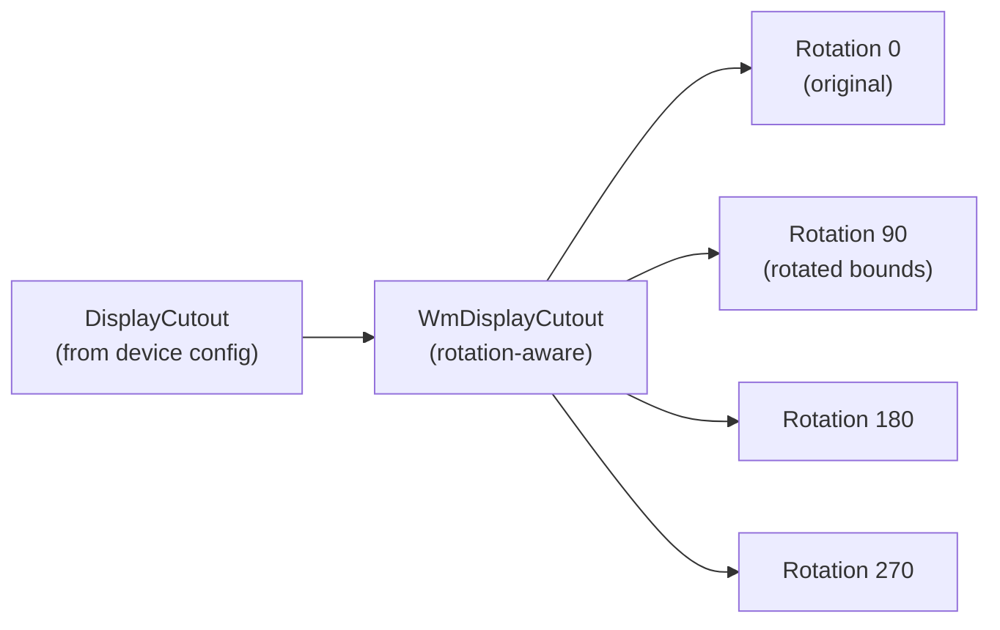

### 24.6.5 RoundedCorners and DisplayShape

Modern displays have rounded corners that must be accounted for in layout:

- **`RoundedCorners`** describes the radius of each corner (top-left,
  top-right, bottom-left, bottom-right). Apps access this through
  `WindowInsets.getRoundedCorner()`.

- **`DisplayShape`** provides the full outline path of the display,
  accounting for both cutouts and rounded corners. This is used by
  SystemUI to draw decorations that precisely follow the display edge.

- **`PrivacyIndicatorBounds`** defines the region reserved for privacy
  indicators (camera, microphone) that may overlap with the cutout area.

The framework provides `DecorCaptionView` corner radius information through
`WindowDecoration` so that window decorations (caption bars in freeform
mode) can match the display corner radius.

### 24.6.6 Cutout Rotation

When the display rotates, the cutout must rotate with it. The
`DisplayCutout` class provides rotation through `CutoutPathParserInfo`:

```java
// frameworks/base/core/java/android/view/DisplayCutout.java
private static final class CutoutPathParserInfo {
    final int displayWidth;
    final int physicalDisplayHeight;
    final int displayHeight;
    final float density;
    final String cutoutSpec;
    final int rotation;
    final float scale;
    final float physicalPixelDisplaySizeRatio;
}
```

The path is re-parsed at each rotation, with the parser applying the
rotation transform to the SVG path coordinates. The result is cached
per `(spec, width, height, density, rotation)` tuple to avoid repeated
parsing:

```java
// Static cache fields in DisplayCutout
@GuardedBy("CACHE_LOCK")
private static String sCachedSpec;
@GuardedBy("CACHE_LOCK")
private static int sCachedDisplayWidth;
@GuardedBy("CACHE_LOCK")
private static int sCachedDisplayHeight;
@GuardedBy("CACHE_LOCK")
private static float sCachedDensity;
@GuardedBy("CACHE_LOCK")
private static Pair<Path, DisplayCutout> sCachedCutout = NULL_PAIR;
```

### 24.6.7 Side Overrides

For devices with cutouts on multiple sides (e.g., a camera notch on top
and a sensor housing on the bottom), `DisplayCutout` supports side
overrides that remap cutout bounds to different sides:

```java
@GuardedBy("CACHE_LOCK")
private static int[] sCachedSideOverrides;
```

Side overrides allow OEMs to correct cutout positioning when the physical
cutout location does not match the default mapping assumed by the spec
parser.

### 24.6.8 Emulation Overlays

For development and testing, the cutout can be emulated on devices without
physical cutouts using Runtime Resource Overlays (RROs) in the category
`com.android.internal.display_cutout_emulation`. AOSP includes several
emulation overlays (tall cutout, wide cutout, corner cutout, double cutout)
that can be enabled through:

```shell
cmd overlay enable com.android.internal.display_cutout_emulation.tall
```

---

## 24.7 SurfaceFlinger Composition

### 24.7.1 Architecture Overview

SurfaceFlinger is Android's native display compositor. It runs as a
standalone service (`/system/bin/surfaceflinger`) and is responsible for
collecting graphical layers from all applications and compositing them
into the final display output.

The composition architecture has undergone a significant "front-end
refactor" that separated layer state management from the composition
pipeline:

```mermaid
graph TD
    subgraph "Front-End (New)"
        TH["TransactionHandler<br/>(receives SurfaceControl.Transaction)"]
        LLM["LayerLifecycleManager<br/>(layer creation/destruction)"]
        LH["LayerHierarchy<br/>(parent-child tree)"]
        LSB["LayerSnapshotBuilder<br/>(immutable snapshots)"]
    end

    subgraph "Composition Engine"
        CE3["CompositionEngine::present()"]
        OUT["Output<br/>(per-display)"]
        OL["OutputLayer<br/>(per-layer-per-display)"]
        RS["RenderSurface<br/>(framebuffer)"]
    end

    subgraph "Hardware"
        HWC2["HWComposer"]
        RE["RenderEngine<br/>(GPU fallback)"]
    end

    TH --> LLM
    LLM --> LH
    LH --> LSB
    LSB -->|"LayerSnapshots"| CE3
    CE3 --> OUT
    OUT --> OL
    OUT --> RS
    OL --> HWC2
    OL --> RE
```

### 24.7.2 LayerLifecycleManager

`LayerLifecycleManager` owns the collection of `RequestedLayerState`
objects and manages their lifecycle:

```cpp
// frameworks/native/services/surfaceflinger/FrontEnd/LayerLifecycleManager.h
class LayerLifecycleManager {
public:
    void addLayers(std::vector<std::unique_ptr<RequestedLayerState>>);
    void applyTransactions(const std::vector<QueuedTransactionState>&,
                           bool ignoreUnknownLayers = false);
    void onHandlesDestroyed(
            const std::vector<std::pair<uint32_t, std::string>>&,
            bool ignoreUnknownHandles = false);
    void commitChanges();
    // ...
};
```

The lifecycle model is straightforward:

1. **addLayers** -- New layers are added with their initial
   `RequestedLayerState`.
2. **applyTransactions** -- Queued transactions update layer properties
   (position, size, buffer, alpha, etc.).
3. **onHandlesDestroyed** -- When a client releases its layer handle,
   the manager marks the layer for destruction. Layers without a parent
   and without a handle are destroyed on `commitChanges()`.
4. **commitChanges** -- Invokes `ILifecycleListener` callbacks
   (`onLayerAdded`, `onLayerDestroyed`) and clears change flags.

The manager tracks changes through `ftl::Flags<RequestedLayerState::Changes>`
that accumulate between commits, enabling the snapshot builder to perform
incremental updates.

### 24.7.3 LayerSnapshotBuilder

`LayerSnapshotBuilder` walks the `LayerHierarchy` tree and produces an
ordered list of `LayerSnapshot` objects suitable for `CompositionEngine`:

```cpp
// frameworks/native/services/surfaceflinger/FrontEnd/LayerSnapshotBuilder.h
class LayerSnapshotBuilder {
public:
    void update(const Args&);
    std::vector<std::unique_ptr<LayerSnapshot>>& getSnapshots();
    void forEachVisibleSnapshot(const ConstVisitor& visitor) const;
    // ...
};
```

The builder implements two update paths:

- **Fast path** (`tryFastUpdate`): When only buffer updates have occurred
  (no hierarchy or geometry changes), the builder can update snapshots
  in-place without re-walking the tree.
- **Full update** (`updateSnapshots`): Re-walks the hierarchy, updating
  inherited properties (visibility, alpha, color transform, crop) from
  parent to child.

Snapshots are immutable once built, providing a consistent view of layer
state for the composition pipeline without holding locks.

### 24.7.4 CompositionEngine

`CompositionEngine` orchestrates the actual composition:

```cpp
// frameworks/native/services/surfaceflinger/CompositionEngine/include/
//     compositionengine/CompositionEngine.h
class CompositionEngine {
public:
    virtual std::shared_ptr<Display> createDisplay(const DisplayCreationArgs&) = 0;
    virtual void present(CompositionRefreshArgs&) = 0;
    virtual void preComposition(CompositionRefreshArgs&) = 0;
    virtual void postComposition(CompositionRefreshArgs&) = 0;
    virtual HWComposer& getHwComposer() const = 0;
    virtual renderengine::RenderEngine& getRenderEngine() const = 0;
};
```

The composition cycle:

```mermaid
sequenceDiagram
    participant S as Scheduler
    participant SF2 as SurfaceFlinger
    participant CE4 as CompositionEngine
    participant OUT2 as Output (per display)
    participant HWC3 as HWComposer
    participant RE2 as RenderEngine

    S->>SF2: VSYNC callback
    SF2->>SF2: Collect transactions
    SF2->>SF2: Build LayerSnapshots
    SF2->>CE4: present(refreshArgs)
    CE4->>CE4: preComposition (release fences)
    CE4->>OUT2: prepare() - assign layers to HWC
    OUT2->>HWC3: validate()
    HWC3-->>OUT2: composition strategy
    alt Client composition needed
        OUT2->>RE2: drawLayers()
        RE2-->>OUT2: client target buffer
    end
    OUT2->>HWC3: presentDisplay()
    HWC3-->>OUT2: present fence
    CE4->>CE4: postComposition (resolve fences)
```

### 24.7.5 HWComposer Validation

The Hardware Composer (HWC) HAL determines which layers can be handled by
dedicated overlay hardware and which must be composited by the GPU. The
validation cycle:

1. **prepare/validate**: SurfaceFlinger sends all layers to HWC.
2. **HWC returns per-layer composition type**:
   - `DEVICE` -- HWC handles this layer directly (DMA overlay plane)
   - `CLIENT` -- SurfaceFlinger must render this layer via GPU
   - `SIDEBAND` -- Sideband stream (e.g., hardware video decoder)
   - `CURSOR` -- Cursor overlay plane
3. **acceptChanges**: SurfaceFlinger accepts HWC's decisions.
4. **Client composition**: Layers marked `CLIENT` are drawn by
   `RenderEngine` into the client target buffer.
5. **presentDisplay**: HWC composites all planes and presents.

This two-pass strategy minimises GPU usage -- on capable hardware, many or
all layers can be handled by overlay planes, saving power and reducing
latency.

### 24.7.6 RequestedLayerState and Change Tracking

Each layer's state is captured in a `RequestedLayerState` that mirrors
the properties set through `SurfaceControl.Transaction`:

```mermaid
classDiagram
    class RequestedLayerState {
        +layerId: uint32_t
        +name: string
        +parentId: uint32_t
        +relativeParentId: uint32_t
        +z: int32_t
        +position: vec2
        +bufferSize: Size
        +crop: Rect
        +alpha: float
        +color: half4
        +flags: uint32_t
        +transform: uint32_t
        +cornerRadius: float
        +backgroundBlurRadius: int
        +changes: Flags~Changes~
    }

    class Changes {
        <<flags>>
        Created
        Destroyed
        Hierarchy
        Geometry
        Content
        AffectsChildren
        FrameRate
        Visibility
        Buffer
    }

    RequestedLayerState --> Changes
```

The `Changes` flags are critical for the snapshot builder's incremental
update path. When only `Buffer` has changed (no geometry, hierarchy, or
visibility changes), the fast path can update just the buffer reference
in existing snapshots without re-walking the hierarchy tree.

### 24.7.7 LayerHierarchy: Parent-Child Tree

`LayerHierarchy` builds an ordered tree from `RequestedLayerState` objects:

```mermaid
graph TD
    ROOT["Root"]
    ROOT --> D0["Display 0 Root"]
    D0 --> APP1["App Layer (z=0)"]
    D0 --> APP2["App Layer (z=1)"]
    D0 --> SYS["System Overlay (z=100)"]
    APP1 --> CHILD1["Child Surface (z=0)"]
    APP1 --> CHILD2["Child Surface (z=1)"]
    APP2 --> REL["Relative Layer<br/>(relativeParent=SYS)"]
```

The hierarchy handles:

- **Z-ordering**: Children sorted by Z within their parent
- **Relative layers**: Layers positioned relative to a non-parent layer
  (used for PopupWindows, tooltips)
- **Mirror layers**: Layers that reference another layer's subtree for
  display mirroring
- **Cycle detection**: The hierarchy builder detects and breaks relative-Z
  loops via `fixRelativeZLoop()`

### 24.7.8 LayerSnapshot Properties

Each `LayerSnapshot` computed by the builder contains:

- Resolved geometry (combined transform, crop, and position from all ancestors)
- Resolved visibility (taking parent alpha, flags, and crop into account)
- Resolved color transform (combined from all ancestors)
- Buffer reference and acquisition fence
- Shadow settings
- Per-layer color space
- Rounded corner radius (combining layer's own radius with parent's)
- Composition type hint

The snapshots are sorted in Z-order and filtered for visibility before
being passed to `CompositionEngine`.

### 24.7.9 Output and OutputLayer

For each display, `CompositionEngine` creates an `Output` that manages:

- The display's `RenderSurface` (framebuffer or virtual display surface)
- The `DisplayColorProfile` (native gamut, HDR capabilities)
- A list of `OutputLayer` objects (one per visible layer on this display)

`OutputLayer` tracks per-display composition state:

- The HWC composition type (`DEVICE`, `CLIENT`, `CURSOR`)
- The display-local geometry (after display projection)
- The buffer handle and fence for this output
- Whether the layer needs sRGB-to-display-gamut conversion

### 24.7.10 Performance: GPU vs HWC Composition

The choice between GPU and HWC composition has significant power and
latency implications:

| Aspect | HWC (Overlay) | GPU (Client) |
|--------|--------------|--------------|
| Power | Low (DMA from buffer) | High (shader execution) |
| Latency | 1 VSYNC | 1-2 VSYNC (GPU + present) |
| Capacity | Limited planes (4-8) | Unlimited |
| Transforms | Limited (scale, rotate, crop) | Arbitrary |
| Blending | Limited modes | Full shader support |
| Per-pixel alpha | Sometimes | Always |

The HWC validation determines the optimal split. Modern SoCs expose 4-8
overlay planes, each capable of scan-out from a different buffer. Layers
that exceed the hardware capacity, or that require unsupported transforms
(e.g., complex blur), fall back to GPU composition.

---

## 24.8 BufferQueue and BLASTBufferQueue

### 24.8.1 BufferQueue: The Producer-Consumer Model

`BufferQueue` is the fundamental data structure for passing graphical
buffers between producers (apps, camera, video decoder) and consumers
(SurfaceFlinger, ImageReader, video encoder). It implements a slot-based
buffer pool:

```mermaid
stateDiagram-v2
    [*] --> FREE : Allocated
    FREE --> DEQUEUED : dequeueBuffer()
    DEQUEUED --> QUEUED : queueBuffer()
    DEQUEUED --> FREE : cancelBuffer()
    QUEUED --> ACQUIRED : acquireBuffer()
    ACQUIRED --> FREE : releaseBuffer()
```

Each BufferQueue has a fixed number of slots (typically 3 for triple
buffering). The states:

| State | Owner | Description |
|-------|-------|-------------|
| `FREE` | BufferQueue | Available for producer to dequeue |
| `DEQUEUED` | Producer | Producer is rendering into this buffer |
| `QUEUED` | BufferQueue | Waiting for consumer to acquire |
| `ACQUIRED` | Consumer | Consumer is reading/compositing this buffer |

### 24.8.2 Triple Buffering

Android uses triple buffering by default: while the display is scanning
out buffer A and SurfaceFlinger is compositing buffer B, the application
can render into buffer C. This pipeline maximises throughput at the cost
of one additional frame of latency:

```mermaid
gantt
    title Triple Buffering Pipeline
    dateFormat X
    axisFormat %s

    section Display
    Buffer A scanout    :a1, 0, 16
    Buffer B scanout    :b1, 16, 32
    Buffer C scanout    :c1, 32, 48

    section SurfaceFlinger
    Compose B           :sf1, 0, 16
    Compose C           :sf2, 16, 32
    Compose A           :sf3, 32, 48

    section App
    Render C            :app1, 0, 16
    Render A            :app2, 16, 32
    Render B            :app3, 32, 48
```

The buffer count can be adjusted. Double buffering reduces latency but
risks frame drops when rendering takes longer than one VSYNC period.

### 24.8.3 BLASTBufferQueue: Transaction-Based Delivery

`BLASTBufferQueue` (Buffer Lifecycle And Sync Transfer) replaced the legacy
`BufferLayer` approach of having SurfaceFlinger directly acquire buffers.
Instead, the client acquires buffers from the `BufferItemConsumer` and
delivers them to SurfaceFlinger through `SurfaceControl.Transaction`:

```mermaid
sequenceDiagram
    participant App as Application
    participant BBQ2 as BLASTBufferQueue
    participant BIC as BLASTBufferItemConsumer
    participant SC as SurfaceComposerClient
    participant SF3 as SurfaceFlinger

    App->>BBQ2: Surface.lockCanvas() / EGL swap
    BBQ2->>BBQ2: dequeueBuffer() from IGraphicBufferProducer
    App->>App: Render content
    App->>BBQ2: queueBuffer()
    BBQ2->>BIC: onFrameAvailable()
    BIC->>BBQ2: acquireBuffer()
    BBQ2->>SC: Transaction.setBuffer(surfaceControl, buffer)
    BBQ2->>SC: Transaction.setBufferCrop(...)
    BBQ2->>SC: Transaction.apply()
    SC->>SF3: Binder call with transaction
    SF3->>SF3: Apply in next composition cycle
    SF3-->>BBQ2: transactionCallback (latch time, present fence)
    BBQ2->>BIC: releaseBuffer (with release fence)
```

Key advantages of BLAST:

1. **Atomic updates**: Buffer submission is bundled with geometry changes
   (position, crop, matrix) in a single transaction, eliminating tearing
   between buffer content and window position.
2. **Client-side control**: The client decides when to submit buffers,
   enabling synchronisation with other operations (e.g., `SyncGroup`).
3. **Fence management**: Release fences flow back through transaction
   callbacks, and the `ReleaseBufferCallback` ensures proper fence
   propagation.

### 24.8.4 BLASTBufferQueue Internals

The `BLASTBufferQueue` class manages several maps:

```cpp
// frameworks/native/libs/gui/include/gui/BLASTBufferQueue.h
class BLASTBufferQueue : public ConsumerBase::FrameAvailableListener {
    sp<IGraphicBufferProducer> mProducer;
    sp<BLASTBufferItemConsumer> mConsumer;
    // Submitted buffers awaiting release
    // Size hint: kSubmittedBuffersMapSizeHint = 8
    ftl::SmallMap<...> mSubmitted;
    // Dequeue timestamps for frame timing
    // Size hint: kDequeueTimestampsMapSizeHint = 32
    ftl::SmallMap<...> mDequeueTimestamps;
};
```

The `syncNextTransaction()` method allows callers to intercept the next
transaction before it is applied, enabling operations like
`ViewRootImpl`'s synchronised buffer submission during `relayout`.
`mergeWithNextTransaction()` allows merging additional transaction
operations (e.g., position changes) with the next buffer submission.

### 24.8.5 Frame Timestamps

`BLASTBufferItemConsumer` extends `BufferItemConsumer` with frame event
history tracking. The `updateFrameTimestamps()` method records:

- Refresh start time
- GPU composition done fence
- Present fence
- Previous release fence
- Compositor timing
- Latch time
- Dequeue ready time

These timestamps flow back to the application through
`FrameEventHistoryDelta` for `EGL_ANDROID_get_frame_timestamps` and
`Choreographer.FrameInfo`.

### 24.8.6 Fence Synchronization

The buffer pipeline uses fence objects (backed by Linux sync files) to
synchronize access between CPU, GPU, and display hardware:

```mermaid
sequenceDiagram
    participant App4 as Application (CPU)
    participant GPU as GPU
    participant BBQ3 as BLASTBufferQueue
    participant SF8 as SurfaceFlinger
    participant HWC4 as HWComposer

    App4->>GPU: Submit draw commands
    GPU-->>BBQ3: Acquire fence (GPU will signal when done)
    BBQ3->>SF8: Transaction with buffer + acquire fence
    SF8->>SF8: Wait for acquire fence before compositing
    SF8->>HWC4: presentDisplay()
    HWC4-->>SF8: Present fence (display will signal when scanout starts)
    SF8->>BBQ3: Release callback with release fence
    BBQ3->>App4: Buffer released, safe to draw again
    Note over App4: Wait for release fence before<br/>dequeuing same buffer
```

Three types of fences:

- **Acquire fence**: Signalled when the GPU finishes rendering. SurfaceFlinger
  must wait for this before reading the buffer.
- **Release fence**: Signalled when SurfaceFlinger/HWC is done with the
  buffer. The producer must wait for this before reusing the buffer.
- **Present fence**: Signalled when the composed frame starts scanning out
  on the display. Used for frame timing measurements.

### 24.8.7 Gralloc Buffer Allocation

Buffer memory is allocated through the Gralloc HAL (Graphics Allocator),
which returns `GraphicBuffer` objects backed by hardware-specific memory
(contiguous DRAM for HWC scanout, tiled memory for GPU, etc.).

The `IGraphicBufferProducer` and `IGraphicBufferConsumer` interfaces use
Binder to share `GraphicBuffer` handles between producer and consumer
processes. The actual buffer memory is shared via file descriptors (dmabuf),
so both processes map the same physical memory.

### 24.8.8 The BLAST Migration Story

Before BLAST, SurfaceFlinger directly acquired buffers from the
BufferQueue on its own timeline. This created synchronization problems:

1. **Buffer-geometry desync**: An app could queue a buffer at size 800x600
   while simultaneously requesting a window resize to 1024x768. The buffer
   and the window geometry would be applied in different SurfaceFlinger
   frames, causing visible tearing.

2. **No atomic updates**: Multiple related changes (buffer + position +
   crop + alpha) could not be applied atomically.

3. **Consumer-side latency**: SurfaceFlinger had to poll each BufferQueue
   for new buffers, adding latency.

BLAST solved all three by moving buffer acquisition to the client side
and bundling buffer submission with geometry changes in a single
`SurfaceControl.Transaction`. The migration was gradual, controlled by
the `BLASTBufferQueue` flag, and is now the only supported path.

### 24.8.9 SyncGroup and Cross-Surface Synchronization

`BLASTBufferQueue.syncNextTransaction()` supports cross-surface
synchronization. When `ViewRootImpl` needs to synchronize a buffer
submission with a `WindowContainerTransaction` (e.g., during
`relayout`), it registers a sync callback:

```java
// In ViewRootImpl
mBlastBufferQueue.syncNextTransaction(transaction -> {
    // Merge buffer transaction with the relayout transaction
    mergedTransaction.merge(transaction);
    mergedTransaction.apply();
});
```

This ensures that the new buffer and the new window bounds appear in
the same SurfaceFlinger frame, eliminating flicker during resizes.

---

## 24.9 Virtual Display and Mirroring

### 24.9.1 Creating Virtual Displays

Virtual displays enable rendering into an off-screen surface for screen
recording, presentation, Miracast, and the Virtual Device Framework.
They are created through `DisplayManager.createVirtualDisplay()`, which
calls into `DisplayManagerService`:

```mermaid
sequenceDiagram
    participant App2 as Application
    participant DM2 as DisplayManager
    participant DMS4 as DisplayManagerService
    participant VDA as VirtualDisplayAdapter
    participant SF4 as SurfaceFlinger

    App2->>DM2: createVirtualDisplay(config)
    DM2->>DMS4: createVirtualDisplay(config, callback)
    DMS4->>DMS4: Permission checks
    DMS4->>VDA: createVirtualDisplayLocked(callback, config, ...)
    VDA->>SF4: SurfaceControl.createDisplay(name, secure)
    SF4-->>VDA: Display token
    VDA->>VDA: Create VirtualDisplayDevice
    VDA->>DMS4: sendDisplayDeviceEventLocked(ADDED)
    DMS4-->>App2: displayId
```

### 24.9.2 Virtual Display Flags

`VirtualDisplayConfig` supports a rich set of flags that control behavior:

| Flag | Description |
|------|-------------|
| `VIRTUAL_DISPLAY_FLAG_PUBLIC` | Display visible to all apps |
| `VIRTUAL_DISPLAY_FLAG_PRESENTATION` | Suitable for Presentation API |
| `VIRTUAL_DISPLAY_FLAG_SECURE` | Content protected; requires CAPTURE_SECURE_VIDEO_OUTPUT |
| `VIRTUAL_DISPLAY_FLAG_OWN_CONTENT_ONLY` | Never mirrors; only shows own content |
| `VIRTUAL_DISPLAY_FLAG_AUTO_MIRROR` | Mirrors default display when no content |
| `VIRTUAL_DISPLAY_FLAG_OWN_DISPLAY_GROUP` | Own DisplayGroup for power management |
| `VIRTUAL_DISPLAY_FLAG_DEVICE_DISPLAY_GROUP` | Joins the device's primary DisplayGroup |
| `VIRTUAL_DISPLAY_FLAG_OWN_FOCUS` | Manages its own focus chain |
| `VIRTUAL_DISPLAY_FLAG_SHOULD_SHOW_SYSTEM_DECORATIONS` | StatusBar, NavBar on this display |
| `VIRTUAL_DISPLAY_FLAG_TRUSTED` | System-trusted display (requires INTERNAL_SYSTEM_WINDOW) |
| `VIRTUAL_DISPLAY_FLAG_ALWAYS_UNLOCKED` | Bypass keyguard on this display |
| `VIRTUAL_DISPLAY_FLAG_STEAL_TOP_FOCUS_DISABLED` | Do not steal focus from other displays |

### 24.9.3 VirtualDisplaySurface and Three-BQ Routing

For virtual displays that mirror or compose content, the `VirtualDisplaySurface`
manages a three-BufferQueue routing system within SurfaceFlinger:

```mermaid
graph LR
    subgraph "Producer Side"
        SF5["SurfaceFlinger<br/>(GPU composition output)"]
    end

    subgraph "VirtualDisplaySurface"
        SBQ["Source BQ<br/>(from GPU composition)"]
        SINK["Sink BQ<br/>(to consumer)"]
        VDS["Routing Logic"]
    end

    subgraph "Consumer Side"
        ENC["MediaCodec / Consumer"]
    end

    SF5 -->|"client composition target"| SBQ
    SBQ --> VDS
    VDS -->|"routed buffer"| SINK
    SINK --> ENC
```

The routing logic handles three cases:

1. **GPU composition only**: The GPU-composed output goes directly from the
   source BQ to the sink BQ.
2. **HWC composition only**: HWC writes directly to the sink BQ.
3. **Mixed**: GPU composes client layers into the source BQ, then HWC
   composites everything (including GPU output) into the sink BQ.

`SinkSurfaceHelper` manages the sink-side BufferQueue, handling buffer
allocation, format negotiation, and fence synchronization with the
consumer.

### 24.9.4 Display Mirroring with Mirror Layers

Display mirroring in SurfaceFlinger is implemented through mirror layers.
When a virtual display mirrors another display, SurfaceFlinger creates a
mirror layer that references the source display's layer stack:

```mermaid
graph TD
    subgraph "Source Display (ID=0)"
        LS0["LayerStack 0"]
        L1["App Layer"]
        L2["StatusBar Layer"]
        L3["NavBar Layer"]
    end

    subgraph "SurfaceFlinger"
        ML["Mirror Layer<br/>(references LayerStack 0)"]
    end

    subgraph "Virtual Display (ID=2)"
        LS2["LayerStack 2"]
        ML2["Mirror of LayerStack 0"]
    end

    LS0 --> L1
    LS0 --> L2
    LS0 --> L3
    L1 -.->|"mirrored"| ML
    L2 -.->|"mirrored"| ML
    L3 -.->|"mirrored"| ML
    ML --> ML2
    ML2 --> LS2
```

The `LayerLifecycleManager.updateDisplayMirrorLayers()` method manages
mirror layer references when layer hierarchy changes occur.

### 24.9.5 MediaProjection Integration

`MediaProjection` is the framework API for screen capture and recording.
It creates a virtual display with the `AUTO_MIRROR` flag and routes the
output to a `MediaCodec` encoder or `ImageReader`:

```mermaid
sequenceDiagram
    participant App3 as Screen Recorder
    participant MP as MediaProjectionManager
    participant DMS5 as DisplayManagerService
    participant CR as ContentRecorder
    participant VD as Virtual Display

    App3->>MP: getMediaProjection(resultCode, data)
    MP-->>App3: MediaProjection token
    App3->>DMS5: createVirtualDisplay(surface, AUTO_MIRROR)
    DMS5->>VD: Create virtual display
    DMS5->>CR: setContentRecordingSession(session)
    CR->>CR: Start mirroring source display
    Note over VD: Mirrors default display content<br/>to the virtual display surface
    App3->>App3: Read from Surface via MediaCodec
```

`ContentRecorder` in `WindowManagerService` manages the ongoing recording
session, handling display changes, rotation, and the `FLAG_SECURE`
exclusion (secure windows appear black in the recording).

### 24.9.6 Virtual Device Framework Integration

The Virtual Device Framework (VDF) extends virtual displays with full
device semantics. A `VirtualDeviceImpl` manages:

- One or more virtual displays
- Virtual input devices (keyboard, mouse, touchscreen)
- Virtual audio devices
- Window policy controllers

`DisplayWindowPolicyController` (stored in DMS's
`mDisplayWindowPolicyControllers`) enforces per-display window policies:
which apps can run, whether the keyguard is shown, whether activities
can be launched on the virtual display.

```java
// DisplayManagerService.java
final SparseArray<Pair<IVirtualDevice, DisplayWindowPolicyController>>
        mDisplayWindowPolicyControllers = new SparseArray<>();
```

### 24.9.7 WifiDisplayAdapter and Miracast

`WifiDisplayAdapter` manages Wi-Fi Display (Miracast) connections:

```mermaid
sequenceDiagram
    participant User as User
    participant DMS7 as DisplayManagerService
    participant WDA as WifiDisplayAdapter
    participant WDC as WifiDisplayController
    participant Sink as Miracast Sink

    User->>DMS7: Connect to WFD display
    DMS7->>WDA: requestConnectLocked(address)
    WDA->>WDC: requestConnect(address)
    WDC->>Sink: RTSP negotiation
    Sink-->>WDC: Connected
    WDC->>WDA: Create WifiDisplayDevice
    WDA->>DMS7: sendDisplayDeviceEventLocked(ADDED)
    DMS7->>DMS7: Create LogicalDisplay
    Note over DMS7: Virtual display mirrors<br/>default display to WFD sink
```

The WFD connection uses RTSP for session management and RTP for video
stream delivery. The video is captured through the standard virtual
display surface and encoded in H.264.

### 24.9.8 OverlayDisplayAdapter for Development

`OverlayDisplayAdapter` creates overlay displays from the system property:

```shell
setprop persist.sys.overlay_display "1920x1080/320"
```

This creates a virtual display that appears as a window on the primary
display. It is invaluable for multi-display development without physical
hardware. The format supports multiple displays:

```shell
setprop persist.sys.overlay_display "1920x1080/320;1280x720/240"
```

### 24.9.9 External Display Policy

`ExternalDisplayPolicy` manages the behavior when external displays
are connected (via HDMI, USB-C, DisplayPort). It coordinates with
`DisplayManagerService` to:

- Determine whether to mirror or extend
- Apply user preferences for the display
- Handle the `DEVELOPMENT_FORCE_DESKTOP_MODE_ON_EXTERNAL_DISPLAYS`
  setting
- Manage `ExternalDisplayStatsService` for tracking external display
  usage telemetry

---

## 24.10 Display Color Management

### 24.10.1 ColorDisplayService

`ColorDisplayService` manages all display color transforms through a
priority-ordered pipeline of `TintController` instances:

```java
// frameworks/base/services/core/java/com/android/server/display/color/
//     ColorDisplayService.java
public final class ColorDisplayService extends SystemService {
    // Color modes
    static final int COLOR_MODE_NATURAL = 0;
    static final int COLOR_MODE_BOOSTED = 1;
    static final int COLOR_MODE_SATURATED = 2;
    static final int COLOR_MODE_AUTOMATIC = 3;
    // ...
}
```

### 24.10.2 TintController Hierarchy

Each color transformation is implemented as a `TintController` subclass:

```mermaid
classDiagram
    class TintController {
        <<abstract>>
        +getMatrix(): float[]
        +setMatrix(int cct)
        +isActivated(): boolean
    }

    class ColorTemperatureTintController {
        -mMatrix: float[16]
        +Night Display (warm tint)
    }

    class DisplayWhiteBalanceTintController {
        -mCurrentColorTemperature
        +Ambient white balance
    }

    class GlobalSaturationTintController {
        -mMatrix: float[16]
        +Display saturation level
    }

    class ReduceBrightColorsTintController {
        -mMatrix: float[16]
        +Reduce bright colors (a11y)
    }

    class AppSaturationController {
        -mAppsMap: SparseArray
        +Per-app saturation (a11y)
    }

    TintController <|-- ColorTemperatureTintController
    TintController <|-- DisplayWhiteBalanceTintController
    TintController <|-- GlobalSaturationTintController
    TintController <|-- ReduceBrightColorsTintController
    TintController <|-- AppSaturationController
```

### 24.10.3 DisplayTransformManager: The Priority Matrix

`DisplayTransformManager` maintains a priority-ordered sparse array of
4x4 colour matrices that are multiplied together and sent to SurfaceFlinger
as a single combined transform:

```java
// frameworks/base/services/core/java/com/android/server/display/color/
//     DisplayTransformManager.java
public static final int LEVEL_COLOR_MATRIX_NIGHT_DISPLAY = 100;
public static final int LEVEL_COLOR_MATRIX_DISPLAY_WHITE_BALANCE = 125;
public static final int LEVEL_COLOR_MATRIX_SATURATION = 150;
public static final int LEVEL_COLOR_MATRIX_GRAYSCALE = 200;
public static final int LEVEL_COLOR_MATRIX_REDUCE_BRIGHT_COLORS = 250;
public static final int LEVEL_COLOR_MATRIX_INVERT_COLOR = 300;
```

The levels define the composition order. When multiple transforms are active
(e.g., Night Display + Grayscale), the matrices are multiplied in level
order:

```mermaid
graph LR
    ND["Night Display<br/>(level 100)"] --> WB["White Balance<br/>(level 125)"]
    WB --> SAT["Saturation<br/>(level 150)"]
    SAT --> GRAY["Grayscale<br/>(level 200)"]
    GRAY --> RBC["Reduce Bright Colors<br/>(level 250)"]
    RBC --> INV["Invert Color<br/>(level 300)"]
    INV --> FINAL["Combined Matrix<br/>(sent to SurfaceFlinger)"]
```

The combined matrix is sent to SurfaceFlinger via Binder transaction
codes:

```java
private static final int SURFACE_FLINGER_TRANSACTION_COLOR_MATRIX = 1015;
private static final int SURFACE_FLINGER_TRANSACTION_DALTONIZER = 1014;
private static final int SURFACE_FLINGER_TRANSACTION_SATURATION = 1022;
private static final int SURFACE_FLINGER_TRANSACTION_DISPLAY_COLOR = 1023;
```

### 24.10.4 Night Display

Night Display (blue light filter) uses `ColorTemperatureTintController` to
shift the display toward warmer tones. It supports three activation modes:

| Mode | Constant | Behavior |
|------|----------|----------|
| Disabled | `AUTO_MODE_DISABLED` | Manual on/off only |
| Custom schedule | `AUTO_MODE_CUSTOM_TIME` | User-defined start/end times |
| Twilight | `AUTO_MODE_TWILIGHT` | Automatic based on sunrise/sunset |

The twilight mode integrates with `TwilightManager` to compute local
sunrise and sunset times based on the device's location.

The colour temperature is converted to a 4x4 matrix using a CCT (Correlated
Colour Temperature) to RGB transform. The `CctEvaluator` class maps CCT
values to matrix coefficients using a `Spline` interpolation of calibration
data.

### 24.10.5 Display White Balance

`DisplayWhiteBalanceTintController` uses ambient light sensor data to
maintain consistent white appearance under different lighting conditions.
The `DisplayWhiteBalanceController` reads from the colour temperature
sensor (or derived from the ambient light sensor) and computes a correction
matrix that shifts the display white point to compensate for ambient
lighting.

### 24.10.6 SurfaceFlinger Color Pipeline

On the SurfaceFlinger side, color management involves:

1. **Per-layer color space**: Each layer declares its color space
   (sRGB, Display P3, BT.2020). SurfaceFlinger converts to the output
   color space during composition.

2. **Display color profiles**: `DisplayColorProfile` describes the
   display's native color gamut and supported HDR types.

3. **HDR handling**: HDR content (HDR10, HLG, Dolby Vision) receives
   tone-mapping through RenderEngine when the display does not natively
   support the HDR format.

4. **Color modes**: The HAL supports multiple color modes (e.g., sRGB,
   Display P3, Native) that SurfaceFlinger can switch between based on
   content requirements.

### 24.10.7 HDR Output Control

DMS provides HDR output control, allowing users to disable specific HDR
types:

```java
// DisplayManagerService.java
private int[] mUserDisabledHdrTypes = {};
private boolean mAreUserDisabledHdrTypesAllowed = true;
```

The `HdrConversionMode` controls system-wide HDR format conversion:

- **Passthrough**: HDR content sent to display as-is
- **System-selected**: System chooses optimal output format
- **Force SDR**: All content tone-mapped to SDR

### 24.10.8 Per-App Color Transforms

`AppSaturationController` applies per-app desaturation for accessibility.
When an accessibility service requests reduced saturation for specific
apps, the controller maintains a per-UID saturation level:

```mermaid
graph LR
    A11Y["AccessibilityManager"] -->|"setAppSaturation(uid, level)"| ASC["AppSaturationController"]
    ASC -->|"per-layer colorTransform"| SF7["SurfaceFlinger<br/>(per-layer matrix)"]
```

Unlike the global transforms that apply to all content, per-app transforms
are applied as per-layer colour matrices in SurfaceFlinger, allowing
different apps to have different saturation levels simultaneously.

### 24.10.9 Daltonizer (Color Blindness Correction)

The daltonizer applies a colour-correction matrix for users with colour
vision deficiency. It supports three types:

- **Protanomaly** -- Red-weak
- **Deuteranomaly** -- Green-weak
- **Tritanomaly** -- Blue-weak

The correction matrix is sent to SurfaceFlinger via the
`SURFACE_FLINGER_TRANSACTION_DALTONIZER` (1014) transaction code. It
operates independently of the colour matrix pipeline -- the daltonizer
is applied in SurfaceFlinger's shader as a separate transform.

### 24.10.10 Even Dimmer

"Even Dimmer" is an accessibility feature (formerly "Extra Dim") that
reduces display brightness below the minimum hardware brightness by
applying a dimming colour matrix. The
`ReduceBrightColorsTintController` generates a matrix that scales all
colour channels:

```java
// Maximum reduction allowed
private static final int EVEN_DIMMER_MAX_PERCENT_ALLOWED = 100;
```

The percentage is set through `Settings.Secure.REDUCE_BRIGHT_COLORS_LEVEL`
and converted to a matrix with diagonal values less than 1.0. This works
in conjunction with (not instead of) the hardware brightness control,
allowing the display to appear dimmer than the backlight minimum.

### 24.10.11 Color Mode Selection

The user-facing "Display" settings provide colour mode selection:

| Mode | Constant | Description |
|------|----------|-------------|
| Natural | `COLOR_MODE_NATURAL` (0) | Calibrated sRGB |
| Boosted | `COLOR_MODE_BOOSTED` (1) | Slightly enhanced saturation |
| Saturated | `COLOR_MODE_SATURATED` (2) | Wide gamut, vivid colours |
| Automatic | `COLOR_MODE_AUTOMATIC` (3) | Content-aware switching |

In `Automatic` mode, the system switches between sRGB and the display's
native wide gamut based on the colour space of the visible content. This
is communicated to SurfaceFlinger via the `SURFACE_FLINGER_TRANSACTION_DISPLAY_COLOR` (1023) transaction code.

---

## 24.11 Display Power

### 24.11.1 DisplayPowerController: The State Machine

`DisplayPowerController` (3507 lines) manages the power state of a single
display. It runs on its own handler and communicates asynchronously with
both `PowerManagerService` (via `DisplayPowerCallbacks`) and the display
hardware.

```java
// frameworks/base/services/core/java/com/android/server/display/
//     DisplayPowerController.java
final class DisplayPowerController implements
        AutomaticBrightnessController.Callbacks,
        DisplayWhiteBalanceController.Callbacks {
    // Message types
    private static final int MSG_UPDATE_POWER_STATE = 1;
    private static final int MSG_SCREEN_ON_UNBLOCKED = 2;
    private static final int MSG_SCREEN_OFF_UNBLOCKED = 3;
    // ...
}
```

### 24.11.2 Display Power States

The display follows a strict state machine:

```mermaid
stateDiagram-v2
    [*] --> OFF
    OFF --> ON : POLICY_BRIGHT or POLICY_DIM
    ON --> DOZE : POLICY_DOZE
    ON --> OFF : POLICY_OFF
    DOZE --> DOZE_SUSPEND : timeout
    DOZE --> ON : user interaction
    DOZE_SUSPEND --> DOZE : proximity wakeup
    DOZE_SUSPEND --> OFF : POLICY_OFF
    DOZE --> OFF : POLICY_OFF
    ON --> ON_SUSPEND : suspend request

    state ON {
        BRIGHT --> DIM : timeout
        DIM --> BRIGHT : user interaction
    }
```

The `DisplayPowerRequest` from `PowerManagerService` specifies the
desired policy:

| Policy | Description |
|--------|-------------|
| `POLICY_OFF` | Display completely off |
| `POLICY_DOZE` | Low-power always-on display (AOD) |
| `POLICY_DIM` | Display dimmed (approaching sleep) |
| `POLICY_BRIGHT` | Normal brightness |

### 24.11.3 Brightness Control

The brightness pipeline in `DisplayPowerController` involves multiple
strategies:

```mermaid
graph TD
    subgraph "Brightness Inputs"
        USER["User Setting<br/>(brightness slider)"]
        AUTO["AutomaticBrightnessController<br/>(light sensor)"]
        CLAMP["BrightnessClamperController<br/>(thermal, power, HBM)"]
        TEMP["DisplayWhiteBalanceController"]
    end

    subgraph "DisplayBrightnessController"
        DBC["Strategy Selection"]
        STRAT["DisplayBrightnessStrategy"]
    end

    subgraph "Output"
        ANIM["RampAnimator<br/>(smooth transitions)"]
        DPS["DisplayPowerState<br/>(screen brightness)"]
        SF6["SurfaceFlinger<br/>(setDisplayBrightness)"]
    end

    USER --> DBC
    AUTO --> DBC
    CLAMP --> DBC
    TEMP --> DBC
    DBC --> STRAT
    STRAT --> ANIM
    ANIM --> DPS
    DPS --> SF6
```

**AutomaticBrightnessController** reads from the ambient light sensor and
applies the user's brightness curve configuration (`BrightnessConfiguration`)
to determine the target brightness. It supports multiple modes:

| Mode | Constant | Description |
|------|----------|-------------|
| Default | `AUTO_BRIGHTNESS_MODE_DEFAULT` | Standard auto-brightness |
| Idle | `AUTO_BRIGHTNESS_MODE_IDLE` | Lower brightness when idle |
| Doze | `AUTO_BRIGHTNESS_MODE_DOZE` | AOD brightness curve |
| Bedtime Wear | `AUTO_BRIGHTNESS_MODE_BEDTIME_WEAR` | Wear OS bedtime mode |

**BrightnessClamperController** enforces brightness limits from:

- Thermal throttling (reduce brightness when device is hot)
- High Brightness Mode (HBM) restrictions
- Power saving mode constraints
- Even Dimmer accessibility feature

### 24.11.4 Always-On Display (AOD)

AOD support requires coordination between `DisplayPowerController`,
`DreamManagerService`, and SurfaceFlinger:

1. **DreamManagerService** starts the AOD dream (a `DreamService` with
   `ACTIVITY_TYPE_DREAM`).
2. **DisplayPowerController** transitions to `POLICY_DOZE`, setting the
   display to a low-power state.
3. **SurfaceFlinger** may switch to a special display mode with reduced
   refresh rate and limited colour depth.
4. **DisplayPowerState** manages the screen brightness to the AOD level.

The `ColorFade` animation (the screen-off effect) is rendered using
OpenGL ES, creating a smooth fade-to-black or fade-to-AOD transition.

### 24.11.5 Sleep Tokens

Sleep tokens are the mechanism by which display power state interacts with
the Activity lifecycle. `ActivityTaskManagerService` acquires sleep tokens
when displays go to sleep, which freezes the activity lifecycle -- no
activity resumes or pauses while the display is off.

When `DisplayPowerController` signals screen-off, it triggers:

1. `PowerManager.goToSleep()` -- Initiates the sleep sequence
2. `ActivityTaskManagerInternal.acquireSleepToken()` -- Freezes activity
   lifecycle for the display
3. Activities in the RESUMED state are paused
4. The window manager applies the `DISPLAY_STATE_OFF` flag

When the display wakes, the sleep token is released, and the foreground
activity is resumed.

### 24.11.6 Proximity Sensor

`DisplayPowerProximityStateController` manages the proximity sensor that
turns off the display during phone calls:

```mermaid
stateDiagram-v2
    [*] --> Unknown
    Unknown --> Near : sensor reports NEAR
    Unknown --> Far : sensor reports FAR
    Near --> Far : sensor reports FAR
    Far --> Near : sensor reports NEAR
    Near --> Unknown : timeout / call ended
```

When proximity is NEAR and a phone call is active, the display is forced
off. A debounce mechanism prevents flickering when the sensor reading
oscillates.

### 24.11.7 The updatePowerState() Pipeline

The core of `DisplayPowerController` is the `updatePowerState()` method,
triggered by `MSG_UPDATE_POWER_STATE`. This is a large, single-pass method
that evaluates the current state and computes the desired display power
configuration:

```mermaid
flowchart TD
    A["MSG_UPDATE_POWER_STATE"] --> B["Read pending power request"]
    B --> C["Compute desired screen state<br/>(ON, DOZE, OFF)"]
    C --> D["Initialize display power state<br/>if first time"]
    D --> E["Handle proximity sensor"]
    E --> F["Determine brightness source<br/>(user, auto, override)"]
    F --> G["Apply brightness clamping<br/>(thermal, HBM, RBC)"]
    G --> H["Compute brightness ramp<br/>(fast for user, slow for auto)"]
    H --> I["Apply color fade animation<br/>(screen on/off effect)"]
    I --> J["Set display brightness<br/>via DisplayBlanker"]
    J --> K["Report screen state<br/>to policy (TURNING_ON, ON, etc.)"]
    K --> L{"State settled?"}
    L -->|"No"| M["Re-post MSG_UPDATE_POWER_STATE"]
    L -->|"Yes"| N["Report ready to PowerManager"]
```

The method uses a state machine for tracking screen-on/off reporting:

| State | Constant | Meaning |
|-------|----------|---------|
| Unreported | `REPORTED_TO_POLICY_UNREPORTED` (-1) | Initial state |
| Screen off | `REPORTED_TO_POLICY_SCREEN_OFF` (0) | Display confirmed off |
| Turning on | `REPORTED_TO_POLICY_SCREEN_TURNING_ON` (1) | Display powering up |
| Screen on | `REPORTED_TO_POLICY_SCREEN_ON` (2) | Display confirmed on |
| Turning off | `REPORTED_TO_POLICY_SCREEN_TURNING_OFF` (3) | Display powering down |

### 24.11.8 Brightness Ramp Animations

`DisplayPowerController` uses `DualRampAnimator` (an extension of
`RampAnimator`) to smoothly transition brightness. The dual ramp handles
both the HDR brightness and SDR brightness simultaneously:

- **Increase ramp**: Maximum time `mBrightnessRampIncreaseMaxTimeMillis`
  (e.g., 2000ms for a gentle brightening when going outdoors)
- **Decrease ramp**: Maximum time `mBrightnessRampDecreaseMaxTimeMillis`
  (e.g., 5000ms for a gentle dimming when going indoors)
- **Idle ramps**: Separate, typically longer ramp times for when the
  device is idle

The ramp skipping logic (`RAMP_STATE_SKIP_INITIAL`,
`RAMP_STATE_SKIP_AUTOBRIGHT`) allows the initial brightness set on
screen-on to be applied instantly without animation, avoiding a visible
brightness ramp when the screen turns on.

### 24.11.9 High Brightness Mode (HBM)

`HighBrightnessModeController` manages the display's peak brightness
capability, which is typically limited by thermal constraints:

```mermaid
stateDiagram-v2
    [*] --> Normal
    Normal --> HBM_SV : Sunlight detected (lux > threshold)
    HBM_SV --> Normal : Sunlight absent or thermal limit
    Normal --> HBM_HDR : HDR content displayed
    HBM_HDR --> Normal : No HDR content
    HBM_SV --> Throttled : Thermal warning
    Throttled --> Normal : Temperature drops
```

HBM metadata (`HighBrightnessModeMetadata`) is maintained per-display by
`HighBrightnessModeMetadataMapper`, tracking running time in HBM to
enforce time-in-state limits that protect the display hardware.

### 24.11.10 Brightness Nit Ranges

`DisplayPowerController` supports a detailed nit-based brightness range
for telemetry, with 37 buckets from 0-1 nits through 2750-3000 nits:

```java
private static final float[] BRIGHTNESS_RANGE_BOUNDARIES = {
    0, 1, 2, 3, 4, 5, 6, 7, 8, 9, 10, 20, 30, 40, 50, 60, 70, 80,
    90, 100, 200, 300, 400, 500, 600, 700, 800, 900, 1000, 1200,
    1400, 1600, 1800, 2000, 2250, 2500, 2750, 3000
};
```

Similarly, ambient light levels are bucketed into 14 lux ranges from
0-0.1 through 30000-100000 lux for brightness event tracking. These
statistics feed into `BrightnessTracker` for adaptive brightness model
improvement and `FrameworkStatsLog` for platform telemetry.

### 24.11.11 Lead-Follower Brightness

For devices with multiple displays that should share brightness (e.g.,
a foldable where inner and outer displays should have consistent brightness),
`DisplayPowerController` supports a lead-follower model:

```java
private int mLeadDisplayId = Layout.NO_LEAD_DISPLAY;
```

When `mLeadDisplayId` is set, the follower display mirrors the leader's
brightness decisions rather than running its own auto-brightness
algorithm. The leader-follower relationship is defined in the `Layout`
configuration from `DeviceStateToLayoutMap`.

### 24.11.12 Display Offload

`DisplayOffloadSession` enables offloading display updates to a
co-processor (e.g., for watch faces on Wear OS). When offload is active,
the main processor can enter deep sleep while the co-processor handles
simple display updates (time, complications). The session is managed
through `DisplayOffloadSessionImpl` in `DisplayManagerService`.

When offloading is active and the screen needs to turn on (e.g., wrist
raise), the `MSG_OFFLOADING_SCREEN_ON_UNBLOCKED` message coordinates
the handoff from the co-processor back to the main display pipeline,
tracked via the `SCREEN_ON_BLOCKED_BY_DISPLAYOFFLOAD_TRACE_NAME`
trace marker.

---

## 24.12 Detailed Reference

This chapter has covered the major subsystems of Android's display pipeline,
from the framework-level `DisplayManagerService` down to the native-level
SurfaceFlinger compositor and buffer management. For readers seeking
additional depth, the companion reports provide exhaustive analysis of
every topic introduced here:

### Companion Report Series

The AOSP Window and Display System Architecture Report is a three-part
document totalling over 100 sections:

**Part 1: Foundations, Architecture, and Rendering Pipeline (Sections 1-45)**

- WindowManagerService architecture and threading model
- WindowContainer hierarchy and Z-ordering
- Shell Transitions and animation system
- SurfaceFlinger rendering pipeline
- Window insets and system bars

**Part 2: Window Features and Subsystems (Sections 46-75)**

- Section 51: BufferQueue and BLASTBufferQueue Architecture -- Slot state
  machine, triple buffering, BLAST transaction-based delivery
- Section 52: Buffer Sharing Architecture and Lifecycle -- Gralloc HAL, fence
  synchronization, cross-process sharing
- Section 53: Virtual Display Composition Pipeline -- VirtualDisplaySurface,
  three-BQ routing, SinkSurfaceHelper
- Section 55: Display Refresh Architecture -- VSYNC pipeline, Choreographer,
  RefreshRateSelector, frame timeline, Linux DRM/KMS comparison
- Section 56: Screen Rotation and Orientation -- DisplayRotation,
  SeamlessRotator, AsyncRotationController, FixedRotationTransformState
- Section 57: Foldable Display Support -- DeviceStateManagerService,
  FoldableDeviceStateProvider, LogicalDisplayMapper display swapping
- Section 62: Display Color Management -- ColorDisplayService, night display,
  white balance, saturation, daltonizer, SurfaceFlinger color pipeline

**Part 3: System Integration and Platform Variants (Sections 76-100)**

- Section 77: Power Management and Window System -- AWAKE through ASLEEP
  states, DreamManagerService, AOD, DisplayPowerController, sleep tokens
- Section 88: Display Cutout and Rounded Corners -- DisplayCutout,
  CutoutSpecification, WmDisplayCutout, cutout modes, RoundedCorners,
  DisplayShape
- Section 89: SurfaceFlinger Front-End Refactor and Composition --
  LayerLifecycleManager, LayerSnapshotBuilder, CompositionEngine
- Section 93: Display Mirroring and Screen Casting -- Mirror layers,
  MediaProjection, ContentRecorder, MediaRouter, WifiDisplayAdapter

### Quick Reference: Key Source Paths

| Component | Path |
|-----------|------|
| DisplayManagerService | `frameworks/base/services/core/java/com/android/server/display/DisplayManagerService.java` |
| LogicalDisplay | `frameworks/base/services/core/java/com/android/server/display/LogicalDisplay.java` |
| LogicalDisplayMapper | `frameworks/base/services/core/java/com/android/server/display/LogicalDisplayMapper.java` |
| DisplayPowerController | `frameworks/base/services/core/java/com/android/server/display/DisplayPowerController.java` |
| ColorDisplayService | `frameworks/base/services/core/java/com/android/server/display/color/ColorDisplayService.java` |
| DisplayTransformManager | `frameworks/base/services/core/java/com/android/server/display/color/DisplayTransformManager.java` |
| VirtualDisplayAdapter | `frameworks/base/services/core/java/com/android/server/display/VirtualDisplayAdapter.java` |
| DeviceStateManagerService | `frameworks/base/services/core/java/com/android/server/devicestate/DeviceStateManagerService.java` |
| DisplayArea | `frameworks/base/services/core/java/com/android/server/wm/DisplayArea.java` |
| DisplayAreaPolicyBuilder | `frameworks/base/services/core/java/com/android/server/wm/DisplayAreaPolicyBuilder.java` |
| DisplayAreaPolicy | `frameworks/base/services/core/java/com/android/server/wm/DisplayAreaPolicy.java` |
| DisplayRotation | `frameworks/base/services/core/java/com/android/server/wm/DisplayRotation.java` |
| SeamlessRotator | `frameworks/base/services/core/java/com/android/server/wm/SeamlessRotator.java` |
| AsyncRotationController | `frameworks/base/services/core/java/com/android/server/wm/AsyncRotationController.java` |
| DisplayCutout | `frameworks/base/core/java/android/view/DisplayCutout.java` |
| CutoutSpecification | `frameworks/base/core/java/android/view/CutoutSpecification.java` |
| Scheduler | `frameworks/native/services/surfaceflinger/Scheduler/Scheduler.h` |
| RefreshRateSelector | `frameworks/native/services/surfaceflinger/Scheduler/RefreshRateSelector.h` |
| VSyncPredictor | `frameworks/native/services/surfaceflinger/Scheduler/VSyncPredictor.h` |
| VSyncDispatchTimerQueue | `frameworks/native/services/surfaceflinger/Scheduler/VSyncDispatchTimerQueue.h` |
| EventThread | `frameworks/native/services/surfaceflinger/Scheduler/EventThread.h` |
| LayerLifecycleManager | `frameworks/native/services/surfaceflinger/FrontEnd/LayerLifecycleManager.h` |
| LayerSnapshotBuilder | `frameworks/native/services/surfaceflinger/FrontEnd/LayerSnapshotBuilder.h` |
| CompositionEngine | `frameworks/native/services/surfaceflinger/CompositionEngine/include/compositionengine/CompositionEngine.h` |
| BLASTBufferQueue | `frameworks/native/libs/gui/include/gui/BLASTBufferQueue.h` |

### Debugging Commands

| Command | Purpose |
|---------|---------|
| `dumpsys display` | DisplayManagerService state |
| `dumpsys SurfaceFlinger` | SurfaceFlinger layer tree, composition stats |
| `dumpsys SurfaceFlinger --frametimeline` | Frame timing data |
| `dumpsys SurfaceFlinger --list` | List all layers |
| `dumpsys window displays` | WindowManagerService display info |
| `dumpsys window display-areas` | DisplayArea hierarchy |
| `dumpsys color_display` | ColorDisplayService state |
| `dumpsys device_state` | DeviceStateManagerService state |
| `cmd display set-brightness <0.0-1.0>` | Set display brightness |
| `cmd display reset-brightness-configuration` | Reset auto-brightness |
| `wm size` | Display logical size |
| `wm density` | Display density |
| `settings put system accelerometer_rotation 0/1` | Lock/unlock rotation |

---

## Summary

The Android display system is a deep vertical stack that begins with
hardware VSYNC interrupts and extends through native C++ composition,
Java framework services, and application-level APIs. The key architectural
decisions that define this system are:

1. **Logical/Physical separation**: `LogicalDisplay` decouples the
   system-visible display from the underlying hardware, enabling foldable
   display swapping, virtual displays, and future multi-panel configurations.

2. **DisplayArea tree**: The `DisplayAreaPolicyBuilder` creates a flexible
   container hierarchy that enforces Z-ordering while allowing features
   (magnification, one-handed mode, cutout hiding) to target specific
   window-type ranges.

3. **VSYNC-driven pipeline**: Every frame starts with a predicted VSYNC
   from `VSyncPredictor`, flows through `VSyncDispatchTimerQueue` to
   `EventThread`, crosses into Java-land via `Choreographer`, and
   culminates in `CompositionEngine::present()`.

4. **Transaction-based buffer delivery**: `BLASTBufferQueue` bundles buffer
   submission with geometry changes in atomic `SurfaceControl.Transaction`
   operations, eliminating the class of bugs that arose from
   buffer-geometry desynchronisation.

5. **Front-end/back-end split**: SurfaceFlinger's refactored architecture
   separates layer state management (`LayerLifecycleManager`,
   `LayerSnapshotBuilder`) from composition (`CompositionEngine`,
   `HWComposer`), enabling better testing, incremental updates, and
   reduced lock contention.

6. **Priority-ordered colour transforms**: `DisplayTransformManager`
   composes multiple 4x4 colour matrices (night display, white balance,
   saturation, accessibility) in a defined priority order, producing a
   single combined transform for SurfaceFlinger.

7. **State-driven foldable support**: `DeviceStateManagerService` provides
   a clean state-machine abstraction for foldable postures, with
   `LogicalDisplayMapper` handling the complex display swapping that makes
   fold/unfold transitions appear seamless to applications.

These subsystems interact constantly during normal device operation.
A single frame touches the VSYNC predictor, Choreographer, ViewRootImpl,
BLASTBufferQueue, the SurfaceFlinger front-end, CompositionEngine,
HWComposer, and the kernel DRM driver -- a pipeline that completes in
under 16 milliseconds at 60 Hz, or under 8 milliseconds at 120 Hz.

### End-to-End Frame Lifecycle

To illustrate how these subsystems interact, consider the lifecycle of a
single frame from touch to photon:

```mermaid
sequenceDiagram
    participant HW2 as Display Panel
    participant VP2 as VSyncPredictor
    participant VDT as VSyncDispatchTimerQueue
    participant ET2 as EventThread (app)
    participant CH2 as Choreographer
    participant VRI3 as ViewRootImpl
    participant APP2 as Application View
    participant BBQ4 as BLASTBufferQueue
    participant GPU2 as GPU (RenderThread)
    participant ET3 as EventThread (sf)
    participant SF9 as SurfaceFlinger
    participant CE5 as CompositionEngine
    participant HWC5 as HWComposer
    participant DRM2 as DRM/KMS

    HW2->>VP2: HW VSYNC timestamp
    VP2->>VP2: Update linear model
    VP2->>VDT: Predicted next VSYNC
    VDT->>ET2: Timer fires (app wakeup)
    ET2->>CH2: VSYNC event via BitTube
    CH2->>CH2: CALLBACK_INPUT (process touch)
    CH2->>CH2: CALLBACK_ANIMATION
    CH2->>VRI3: CALLBACK_TRAVERSAL
    VRI3->>APP2: onMeasure/onLayout/onDraw
    APP2->>VRI3: Canvas draw commands
    VRI3->>GPU2: Flush to RenderThread
    GPU2->>BBQ4: queueBuffer (with acquire fence)
    BBQ4->>SF9: Transaction.setBuffer(...)
    VDT->>ET3: Timer fires (sf wakeup)
    ET3->>SF9: VSYNC callback
    SF9->>SF9: Apply pending transactions
    SF9->>SF9: Build LayerSnapshots
    SF9->>CE5: present(refreshArgs)
    CE5->>HWC5: validate() + presentDisplay()
    HWC5->>DRM2: Atomic commit (page flip)
    DRM2->>HW2: Scanout new frame
    HW2->>HW2: Photons reach user's eye
```

**Typical latency breakdown (at 120 Hz, 8.33ms period):**

| Phase | Duration | Notes |
|-------|----------|-------|
| VSYNC to app wakeup | 0.5-1ms | Timer scheduling overhead |
| Input + animation | 0.5-2ms | Depends on callback complexity |
| Measure/layout/draw | 1-4ms | View tree complexity |
| GPU render | 1-3ms | Shader complexity, overdraw |
| SurfaceFlinger compose | 0.5-2ms | Depends on GPU vs HWC |
| HWC commit | 0.2-0.5ms | DRM atomic commit |
| **Total** | **3.7-12.5ms** | Must fit in 8.33ms for 120Hz |

When the total exceeds the VSYNC period, the frame misses its deadline
and is presented one period late (a "jank" frame). The `FrameTimeline`
records these misses, and tools like `perfetto` and `dumpsys SurfaceFlinger
--frametimeline` expose them for performance analysis.

### Source Code Statistics

The display system codebase is substantial:

| Component | Lines of Code |
|-----------|--------------|
| DisplayManagerService.java | 6,601 |
| DisplayPowerController.java | 3,507 |
| DisplayRotation.java | 2,255 |
| LogicalDisplay.java | 1,314 |
| LogicalDisplayMapper.java | ~1,200 |
| DisplayAreaPolicyBuilder.java | 1,052 |
| DisplayArea.java | 882 |
| ColorDisplayService.java | ~1,800 |
| DeviceStateManagerService.java | ~1,500 |
| RefreshRateSelector.cpp/.h | ~2,000 |
| Scheduler.cpp/.h | ~1,500 |
| LayerLifecycleManager.cpp/.h | ~800 |
| LayerSnapshotBuilder.cpp/.h | ~1,200 |
| BLASTBufferQueue.cpp/.h | ~1,500 |
| **Estimated total** | **~25,000+** |

This does not include SurfaceFlinger's main loop, CompositionEngine
implementation, HWComposer HAL interface, RenderEngine, or the client-side
Surface/Canvas/OpenGL stack, which collectively add another 50,000+ lines.
