# 第 25 章：View 系统与输入分发

> *“View 层级就是每一个 Android 应用中每一个像素上演的舞台。理解 measure-layout-draw 管线，就等于理解用户真正看到的内容。”*

Android **View 系统** 是运行在应用进程内的客户端渲染与事件处理框架，它把声明式 XML，或者代码动态构建出来的界面，转化为屏幕上可交互的像素。与第 23 章和第 24 章分析的 WindowManagerService、DisplayManagerService 这类服务端系统组件不同，View 系统主要存在于应用进程内，并通过桥接对象 `ViewRootImpl` 与系统服务交互。

每一次按钮点击、滚动手势、键盘导航、无障碍查询，都会穿过 View 层级。每一帧动画都由 `Choreographer` 编排，经由 `ViewRootImpl.performTraversals()` 串起 measure、layout、draw 三阶段，最终由 HWUI 在独立渲染线程上完成光栅化与 GPU 提交。

本章将从源码层面对 View 系统做系统梳理：从 XML inflation 开始，一直跟到硬件加速渲染；精确拆解触摸分发算法；并考察焦点、无障碍、窗口 Insets、`LayoutInflater` 与自定义 View 的内部机制。

---

## 本章引用的源码文件

以下路径均相对于 AOSP 源码树根目录：

| 文件 | 规模 | 作用 |
|------|------|------|
| `frameworks/base/core/java/android/view/View.java` | ~34,918 行 | 所有 UI 组件的基类 |
| `frameworks/base/core/java/android/view/ViewGroup.java` | ~9,594 行 | 持有子 View 的容器基类 |
| `frameworks/base/core/java/android/view/ViewRootImpl.java` | ~13,827 行 | View 树与 WMS 之间的桥 |
| `frameworks/base/core/java/android/view/Choreographer.java` | ~1,714 行 | 帧调度与 VSYNC 协调 |
| `frameworks/base/core/java/android/view/LayoutInflater.java` | ~1,247 行 | XML 到 View 的实例化 |
| `frameworks/base/core/java/android/view/ThreadedRenderer.java` | ~928 行 | HWUI 硬件加速渲染代理 |
| `frameworks/base/core/java/android/view/WindowInsets.java` | varies | 系统栏、IME、cutout、圆角等 Insets |
| `frameworks/base/core/java/android/view/DisplayCutout.java` | varies | 屏幕刘海几何信息 |
| `frameworks/base/core/java/android/view/FocusFinder.java` | varies | 方向焦点搜索算法 |
| `frameworks/base/core/java/android/view/MotionEvent.java` | varies | 触摸/指针事件表示 |
| `frameworks/base/core/java/android/graphics/RenderNode.java` | varies | HWUI display list 节点 |

---

## 25.1 View 层级：View、ViewGroup、ViewRootImpl

### 25.1.1 三个基础支柱

Android View 系统建立在三个核心类之上：

1. **`View`**：原子构件。屏幕上的每一个可见元素，例如 `Button`、`TextView`、`ImageView` 以及自定义控件，最终都是 `View` 的子类。
2. **`ViewGroup`**：组合容器。`ViewGroup extends View`，可以持有有序的子 View 列表。`LinearLayout`、`FrameLayout`、`ConstraintLayout`、`RecyclerView` 都属于这一范畴。
3. **`ViewRootImpl`**：桥接层。每个窗口顶部只有一个 `ViewRootImpl`，负责把应用内的 View 树接到 `system_server` 中的 `WindowManagerService`，并驱动完整的 measure-layout-draw 周期。

```text
Source: frameworks/base/core/java/android/view/View.java (line 139 of ViewGroup.java)

    public abstract class ViewGroup extends View implements ViewParent, ViewManager {
        ...
        private View mFocused;
        private View mDefaultFocus;
        View mFocusedInCluster;
        ...
    }
```

### 25.1.2 类层级

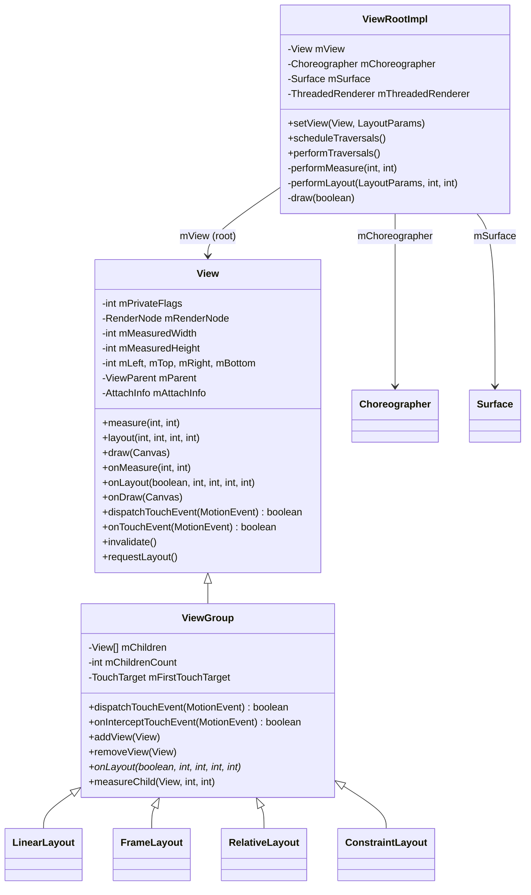

### 25.1.3 Window 与 View 的关系

在 Android 中，每一个窗口都对应一个 `ViewRootImpl`。当 `WindowManagerImpl.addView()` 被调用时，例如 Activity 首次显示 `DecorView`，链路如下：

```text
WindowManagerImpl.addView(decorView, layoutParams)
  -> WindowManagerGlobal.addView()
       -> new ViewRootImpl(context, display)
       -> viewRootImpl.setView(decorView, layoutParams, panelParent)
```

在 `ViewRootImpl.setView()` 中，可以看到几个关键点：

```text
Source: frameworks/base/core/java/android/view/ViewRootImpl.java

    public void setView(View view, WindowManager.LayoutParams attrs,
            View panelParentView, int userId) {
        synchronized (this) {
            if (mView == null) {
                mView = view;
                ...
                requestLayout();
                InputChannel inputChannel = null;
                if ((mWindowAttributes.inputFeatures
                        & WindowManager.LayoutParams.INPUT_FEATURE_NO_INPUT_CHANNEL) == 0) {
                    inputChannel = new InputChannel();
                }
                ...
```

- 根 View 被保存在 `mView` 中。
- `requestLayout()` 在窗口真正加入服务端之前就会触发，这保证了首帧 measure/layout 会先于输入事件到来。
- 会创建 `InputChannel`，用于从系统输入分发器接收输入事件。

### 25.1.4 AttachInfo 结构

当一个 `View` 被 attach 到窗口时，它会收到一个 `AttachInfo` 对象，里面保存了整个窗口级别共享的运行态信息：

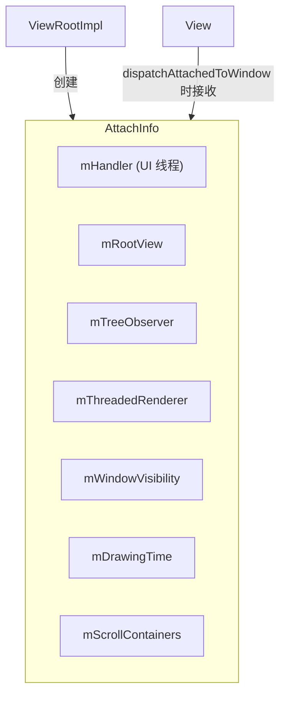

整棵 View 树中的每个 View 都共享这一个 `AttachInfo`，这使得它们可以访问 UI 线程 handler、硬件渲染器、窗口可见性状态以及 `ViewTreeObserver`。

### 25.1.5 View 身份与树结构

每个 View 都可以通过 `android:id` 或 `setId()` 获得一个数值 ID，还可以有一个临时名称。`findViewById()` 会对 View 树执行深度优先搜索：

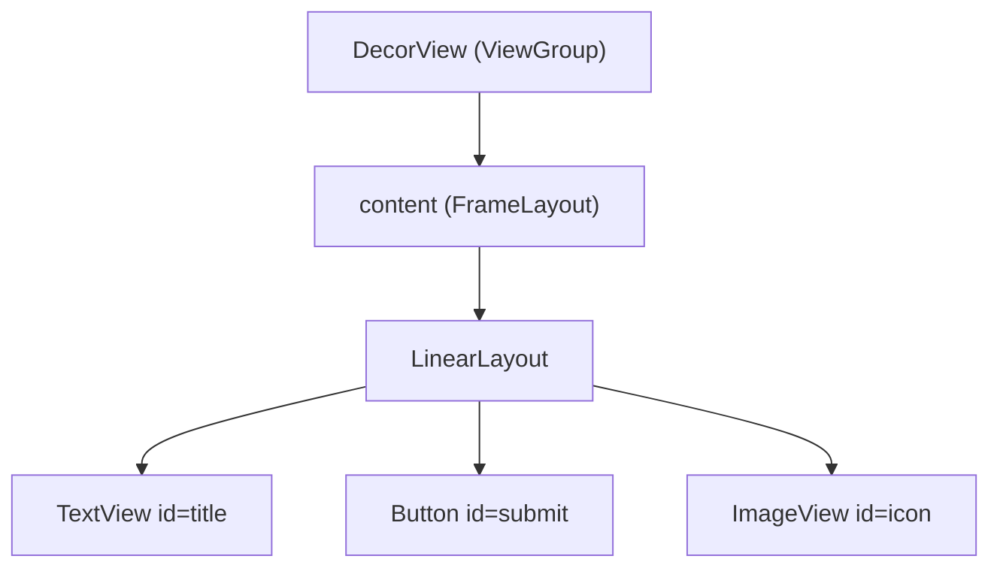

在 `ViewGroup` 内部，子节点的核心存储结构非常直接：

```text
Source: frameworks/base/core/java/android/view/ViewGroup.java

    private View[] mChildren;
    private int mChildrenCount;
```

默认情况下，子节点按数组顺序参与绘制与命中测试，后面的 child 通常显示在更上层；不过也可以通过 `getChildDrawingOrder()` 自定义绘制顺序。

### 25.1.6 Private Flags：内部状态机

`View` 通过 `mPrivateFlags`、`mPrivateFlags2`、`mPrivateFlags3`、`mPrivateFlags4` 这些位图维护内部状态。这些标志位贯穿了测量、布局、绘制、焦点、点击等几乎全部流程。

| Flag | 字段 | 十六进制 | 含义 |
|------|------|----------|------|
| `PFLAG_WANTS_FOCUS` | mPrivateFlags | `0x00000001` | 在布局中请求焦点 |
| `PFLAG_FOCUSED` | mPrivateFlags | `0x00000002` | 当前持有焦点 |
| `PFLAG_SELECTED` | mPrivateFlags | `0x00000004` | 已选中 |
| `PFLAG_HAS_BOUNDS` | mPrivateFlags | `0x00000010` | 已分配边界 |
| `PFLAG_DRAWN` | mPrivateFlags | `0x00000020` | 至少已绘制过一次 |
| `PFLAG_SKIP_DRAW` | mPrivateFlags | `0x00000080` | 自身无绘制内容 |
| `PFLAG_DRAWABLE_STATE_DIRTY` | mPrivateFlags | `0x00000400` | Drawable 状态需要刷新 |
| `PFLAG_MEASURED_DIMENSION_SET` | mPrivateFlags | `0x00000800` | 已调用 setMeasuredDimension |
| `PFLAG_FORCE_LAYOUT` | mPrivateFlags | `0x00001000` | 下一轮必须重新测量/布局 |
| `PFLAG_LAYOUT_REQUIRED` | mPrivateFlags | `0x00002000` | 测量后仍需要布局 |
| `PFLAG_PRESSED` | mPrivateFlags | `0x00004000` | 处于按压态 |
| `PFLAG_DIRTY` | mPrivateFlags | `0x00200000` | 需要重绘 |
| `PFLAG_INVALIDATED` | mPrivateFlags | `0x80000000` | 已被 invalidate |

一帧内这些标志位的大致演进如下：

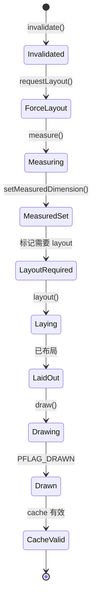

调试 View 不更新、不响应、不绘制时，这些 flag 往往能直接告诉你它停在了哪一个阶段。

### 25.1.7 View 坐标系

View 系统里同时存在多套坐标系，容易混淆：

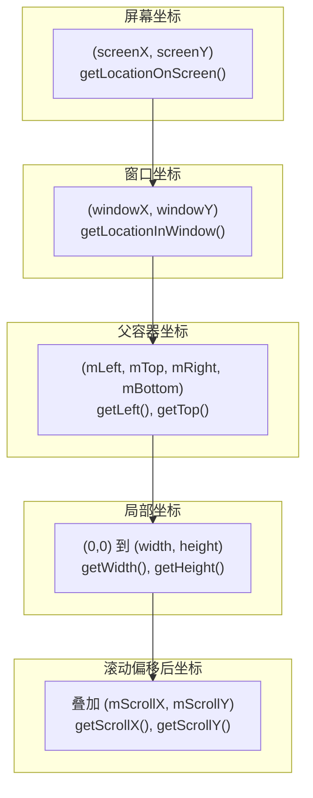

| 坐标系 | 原点 | 常见用途 |
|--------|------|----------|
| 屏幕坐标 | 物理屏幕左上角 | `getLocationOnScreen()`、无障碍 |
| 窗口坐标 | 窗口 surface 左上角 | `getLocationInWindow()`、输入 |
| 父容器坐标 | 父 ViewGroup 内的位置 | `mLeft`、`mTop`、`getLeft()` |
| 局部坐标 | View 自身内容区左上角 | `onDraw()`、`onTouchEvent()` |
| 滚动偏移坐标 | 局部坐标加 scroll 偏移 | Canvas 绘制 |

需要特别注意 `getX()` 与 `getLeft()` 的区别：`getX()` 返回视觉位置，等于 `mLeft + translationX`；而 `getLeft()` 返回布局位置。做属性动画时，这一差异尤其重要。

### 25.1.8 ViewTreeObserver

每棵 View 树都有一个 `ViewTreeObserver`，提供全局布局与绘制观察回调：

| 回调 | 触发时机 |
|------|----------|
| `OnGlobalLayoutListener` | 布局完成后 |
| `OnPreDrawListener` | 绘制前，可取消绘制 |
| `OnDrawListener` | 每次 draw 期间 |
| `OnScrollChangedListener` | 任一 View 滚动 |
| `OnGlobalFocusChangeListener` | 焦点在 View 间切换 |
| `OnWindowAttachListener` | attach/detach 窗口 |
| `OnWindowFocusChangeListener` | 窗口焦点变化 |
| `OnTouchModeChangeListener` | 触摸模式变化 |

`OnGlobalLayoutListener` 常用于在 View 真正测量完成后读取宽高：

```java
view.getViewTreeObserver().addOnGlobalLayoutListener(
    new ViewTreeObserver.OnGlobalLayoutListener() {
        @Override
        public void onGlobalLayout() {
            int width = view.getWidth();
            int height = view.getHeight();
            view.getViewTreeObserver()
                .removeOnGlobalLayoutListener(this);
        }
    });
```

---

## 25.2 Measure-Layout-Draw 周期

Android View 渲染的核心循环就是 **measure-layout-draw** 三阶段，由 `ViewRootImpl.performTraversals()` 统一驱动。只要 UI 需要更新，这一流程就会在下一个 VSYNC 上被调度执行。

### 25.2.1 三个阶段

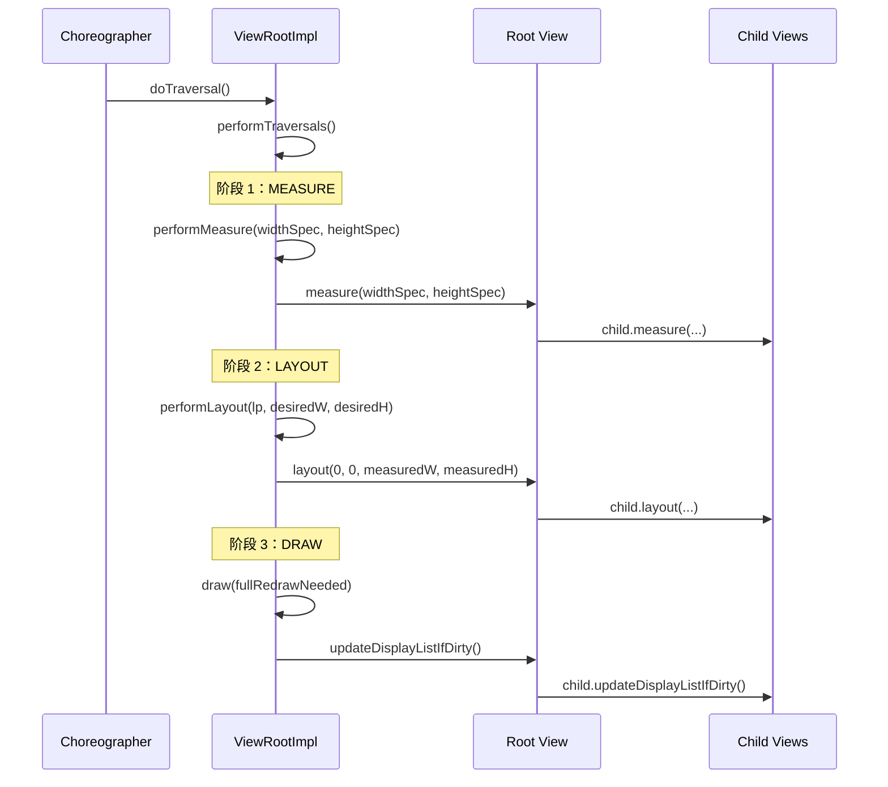

### 25.2.2 MeasureSpec：约束协议

父 View 通过 `MeasureSpec` 把约束条件传给子 View。它是一个压缩过的 32 位整数，同时包含 **mode** 和 **size**：

```text
Source: frameworks/base/core/java/android/view/View.java (line 31726)

    public static class MeasureSpec {
        private static final int MODE_SHIFT = 30;
        private static final int MODE_MASK  = 0x3 << MODE_SHIFT;

        public static final int UNSPECIFIED = 0 << MODE_SHIFT;
        public static final int EXACTLY     = 1 << MODE_SHIFT;
        public static final int AT_MOST     = 2 << MODE_SHIFT;
        ...
    }
```

| 模式 | 含义 | 常见来源 |
|------|------|----------|
| `EXACTLY` | 必须是这个尺寸 | 明确 dp/px、`match_parent` |
| `AT_MOST` | 最大不能超过这个尺寸 | `wrap_content` |
| `UNSPECIFIED` | 没有限制，子 View 自定 | 滚动容器测量内容 |

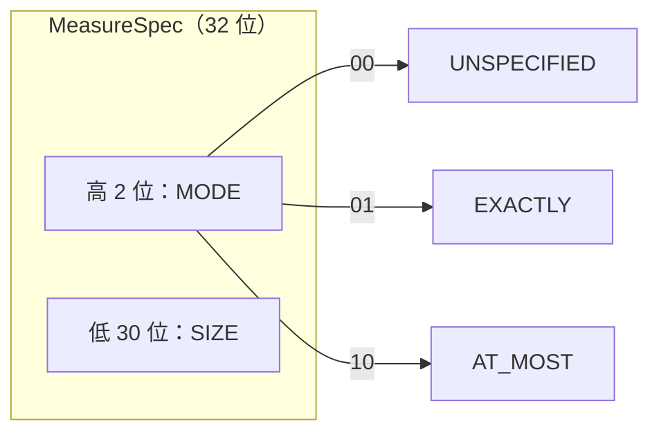

### 25.2.3 `View.measure()`：统一入口

`measure()` 是 `final` 方法，子类不能覆盖，而应覆盖 `onMeasure()`。`measure()` 负责处理：

1. **测量缓存**：相同 `MeasureSpec` 下可复用上次结果。
2. **强制重测**：`PFLAG_FORCE_LAYOUT` 会跳过缓存。
3. **RTL 与光学边界处理**：在调用 `onMeasure()` 前完成必要准备。

```text
Source: frameworks/base/core/java/android/view/View.java (line 28542)

    public final void measure(int widthMeasureSpec, int heightMeasureSpec) {
        ...
        final boolean forceLayout =
            (mPrivateFlags & PFLAG_FORCE_LAYOUT) == PFLAG_FORCE_LAYOUT;
        ...
        if (forceLayout || needsLayout) {
            mPrivateFlags &= ~PFLAG_MEASURED_DIMENSION_SET;
            resolveRtlPropertiesIfNeeded();
            ...
            onMeasure(widthMeasureSpec, heightMeasureSpec);
        }
        ...
    }
```

### 25.2.4 默认 `onMeasure()`

`View` 默认实现并不“聪明”，通常表现为：

- 如果背景带有最小尺寸，会优先考虑背景尺寸。
- `wrap_content` 在没有自定义测量逻辑时，往往只是使用最小建议尺寸。

因此几乎所有真正有尺寸语义的控件，都会重写 `onMeasure()`。

### 25.2.5 ViewGroup 测量

`ViewGroup` 的职责不是只测自己，还要决定如何把约束继续传给 child。常用辅助函数包括：

- `measureChild()`
- `measureChildWithMargins()`
- `getChildMeasureSpec()`

它们负责把父容器的 `MeasureSpec`、padding、margin 与 child 的布局参数综合起来，生成 child 最终看到的宽高约束。

### 25.2.6 `View.layout()`：位置确定

布局阶段使用的是**已经量好**的尺寸。`layout(l, t, r, b)` 同样是 `final`，内部会：

1. 检测边界是否变化。
2. 写入 `mLeft`、`mTop`、`mRight`、`mBottom`。
3. 调用 `onLayout()` 让子类布置子节点。

这意味着：**测量决定大小，布局决定位置**。

### 25.2.7 `View.draw()`：七步绘制

`View.draw()` 内部可概括为七个步骤：

1. 绘制背景
2. 保存图层/处理 fade 等准备工作
3. 调用 `onDraw()`
4. 调用 `dispatchDraw()` 绘制子 View
5. 绘制 fading edges 等修饰
6. 绘制装饰，如 scroll bars
7. 绘制前景与 overlay

对普通 `View` 来说，核心可定制点是 `onDraw()`；对 `ViewGroup` 来说，核心常在 `dispatchDraw()`。

### 25.2.8 `PFLAG_SKIP_DRAW` 优化

很多 `ViewGroup` 只是容器，没有背景、前景，也没有自定义绘制逻辑。此时框架会设置 `PFLAG_SKIP_DRAW`，直接跳过 `draw()`，只执行 `dispatchDraw()`：

```text
Source: frameworks/base/core/java/android/view/View.java (line 24116)

    if ((mPrivateFlags & PFLAG_SKIP_DRAW) == PFLAG_SKIP_DRAW) {
        dispatchDraw(canvas);
        ...
    } else {
        draw(canvas);
    }
```

这个优化对深层级布局尤其关键，因为中间层容器很多时候只是布局节点。

### 25.2.9 `requestLayout()` 与 `invalidate()`

这两个 API 都会导致后续某种“更新”，但语义截然不同：

- **`requestLayout()`**：尺寸或位置可能变化，需要重新 measure + layout + draw。
- **`invalidate()`**：只表示视觉内容变化，通常只需要 draw。

```text
Source: frameworks/base/core/java/android/view/View.java (line 28478)

    public void requestLayout() {
        if (mMeasureCache != null) mMeasureCache.clear();
        ...
        mPrivateFlags |= PFLAG_FORCE_LAYOUT;
        mPrivateFlags |= PFLAG_INVALIDATED;
        if (mParent != null && !mParent.isLayoutRequested()) {
            mParent.requestLayout();
        }
    }
```

```text
Source: frameworks/base/core/java/android/view/View.java (line 21249)

    public void invalidate() {
        invalidate(true);
    }
```

```mermaid
graph TB
    subgraph "requestLayout() 路径"
        RL1["View.requestLayout()"] --> RL2["parent.requestLayout()"]
        RL2 --> RL3["逐级向上"]
        RL3 --> RL4["ViewRootImpl.requestLayout()"]
        RL4 --> RL5["scheduleTraversals()"]
        RL5 --> RL6["MEASURE + LAYOUT + DRAW"]
    end

    subgraph "invalidate() 路径"
        INV1["View.invalidate()"] --> INV2["parent.invalidateChild(this, dirty)"]
        INV2 --> INV3["逐级向上汇总 dirty 区域"]
        INV3 --> INV4["ViewRootImpl"]
        INV4 --> INV5["scheduleTraversals()"]
        INV5 --> INV6["DRAW only"]
    end
```

### 25.2.10 `performTraversals()`：总编排器

`ViewRootImpl.performTraversals()` 是整个 View 系统里最大、也最重要的方法之一。它负责：

1. 计算窗口期望尺寸
2. 首次 attach View 树
3. 应用 insets
4. 触发 measure
5. 必要时向 WMS 发起 relayout
6. 执行 layout
7. 执行 draw

```text
Source: frameworks/base/core/java/android/view/ViewRootImpl.java

    private void performTraversals() {
        final View host = mView;
        if (host == null || !mAdded) return;
        ...
        if (mFirst) {
            host.dispatchAttachedToWindow(mAttachInfo, 0);
            dispatchApplyInsets(host);
        }
        ...
        if (layoutRequested) {
            windowSizeMayChange |= measureHierarchy(...);
        }
        ...
        if (windowShouldResize || ...) {
            relayoutResult = relayoutWindow(params, ...);
        }
        ...
        if (didLayout) {
            performLayout(lp, desiredWindowWidth, desiredWindowHeight);
        }
        ...
    }
```

一个重要细节是：如果窗口大小因为 relayout 发生变化，`performTraversals()` 可能会再次调用测量逻辑，让最终测量基于真实窗口尺寸完成。

### 25.2.11 `performMeasure()`、`performLayout()`、`draw()`

这三个方法是对根 View 三阶段调用的薄封装，同时加入 trace 打点。

`performMeasure()` 很直接：

```text
Source: frameworks/base/core/java/android/view/ViewRootImpl.java (line 5082)

    private void performMeasure(int childWidthMeasureSpec,
            int childHeightMeasureSpec) {
        if (mView == null) return;
        Trace.traceBegin(Trace.TRACE_TAG_VIEW, "measure");
        try {
            mView.measure(childWidthMeasureSpec, childHeightMeasureSpec);
        } finally {
            Trace.traceEnd(Trace.TRACE_TAG_VIEW);
        }
    }
```

`performLayout()` 会处理一个非常经典的边界场景：**layout 过程中又有人调用了 `requestLayout()`**。此时系统会尽量容忍，必要时做第二轮布局，以兼容旧代码。

---

## 25.3 触摸事件分发

触摸分发是 Android 框架中最微妙、也最容易误解的部分之一。要真正理解它，必须沿着完整路径追踪事件：从 `system_server` 中的 `InputDispatcher`，到 `ViewRootImpl`，再到最深的子 View。

### 25.3.1 MotionEvent 结构

`MotionEvent` 是承载触摸信息的核心对象：

```text
Source: frameworks/base/core/java/android/view/MotionEvent.java (line 197)

    public final class MotionEvent extends InputEvent implements Parcelable {
```

一个 `MotionEvent` 可以同时包含多个指针信息，每个 pointer 拥有：

- **Pointer ID**：一次触摸生命周期内稳定不变
- **Pointer Index**：当前事件数组中的下标，可能变化
- **X / Y**：坐标
- **Pressure / Size / Major / Minor**：压力与接触面积信息
- **Tool Type**：手指、手写笔、鼠标、橡皮擦、掌压等

常用 action：

| Action | 值 | 含义 |
|--------|----|------|
| `ACTION_DOWN` | 0 | 第一根手指落下 |
| `ACTION_UP` | 1 | 最后一根手指抬起 |
| `ACTION_MOVE` | 2 | 手指移动 |
| `ACTION_CANCEL` | 3 | 手势取消 |
| `ACTION_OUTSIDE` | 4 | 点击发生在窗口外 |
| `ACTION_POINTER_DOWN` | 5 + (index << 8) | 额外手指按下 |
| `ACTION_POINTER_UP` | 6 + (index << 8) | 非最后一根手指抬起 |
| `ACTION_HOVER_MOVE` | 7 | 悬停移动 |
| `ACTION_HOVER_ENTER` | 9 | 悬停进入 |
| `ACTION_HOVER_EXIT` | 10 | 悬停离开 |

多指场景中，应优先使用：

```java
int actionMasked = event.getActionMasked();
int pointerIndex = event.getActionIndex();
int pointerId = event.getPointerId(pointerIndex);
```

此外，MOVE 事件通常支持历史采样批处理，可通过 `getHistorySize()` 和 `getHistoricalX/Y()` 读取，以减少 VSYNC 之间的事件丢失。

### 25.3.2 ViewConfiguration 触摸常量

`ViewConfiguration` 提供了全局触摸手势阈值，且多数值会依据 density 缩放：

| 常量/方法 | 默认值 | 作用 |
|-----------|--------|------|
| `TAP_TIMEOUT` | 100ms | 区分点击与滚动 |
| `DOUBLE_TAP_TIMEOUT` | 300ms | 双击最大间隔 |
| `LONG_PRESS_TIMEOUT` | 400ms 左右 | 长按阈值 |
| `getScaledTouchSlop()` | 8dp | 识别拖动前的最小位移 |
| `getScaledDoubleTapSlop()` | 100dp | 双击最大位移 |
| `getScaledMinimumFlingVelocity()` | 50dp/s | fling 最小速度 |
| `getScaledMaximumFlingVelocity()` | 8000dp/s | fling 最大封顶速度 |
| `getScaledPagingTouchSlop()` | 16dp | 分页手势阈值 |

这些阈值会被 `View.onTouchEvent()`、`ScrollView`、`RecyclerView`、`ViewPager` 等广泛复用。

### 25.3.3 MotionEvent 的旅行路径

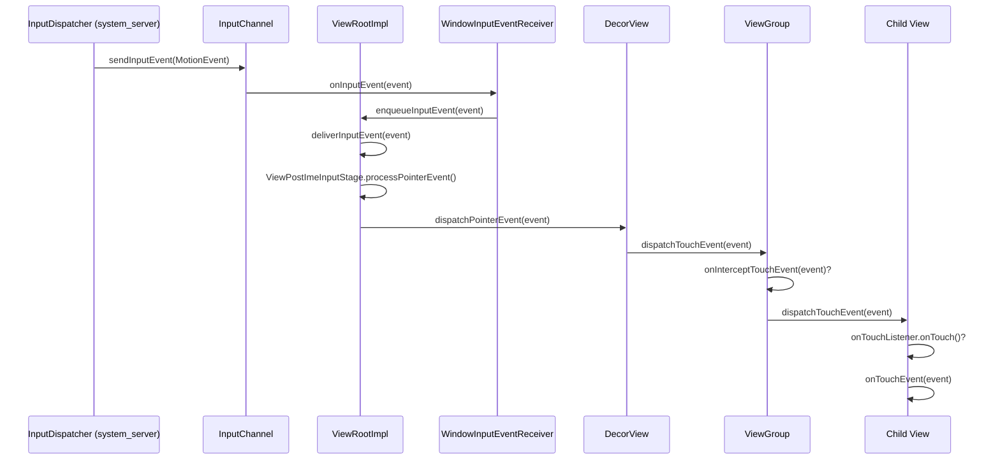

### 25.3.4 ViewRootImpl 输入管线

`ViewRootImpl` 不是拿到事件后立即丢给 View，而是让它通过一串 `InputStage`：

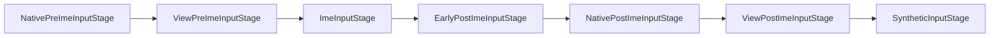

对触摸事件来说，最关键的是 `ViewPostImeInputStage`，它最终调用 `mView.dispatchPointerEvent(event)`，进入根 View 的分发逻辑。

### 25.3.5 `View.dispatchTouchEvent()`

对于普通叶子 View，分发逻辑相对简单：

```text
Source: frameworks/base/core/java/android/view/View.java (line 16750)

    public boolean dispatchTouchEvent(MotionEvent event) {
        ...
        if (onFilterTouchEventForSecurity(event)) {
            result = performOnTouchCallback(event);
        }
        ...
        return result;
    }
```

优先级顺序是：

1. 滚动条拖动处理
2. `OnTouchListener.onTouch()`
3. `onTouchEvent()`

也就是说，**监听器比默认点击逻辑优先**。如果 `onTouch()` 返回 `true`，则不会再进入 `onTouchEvent()`。

### 25.3.6 `ViewGroup.dispatchTouchEvent()`：完整算法

这是 Android 事件系统里最关键的代码之一。

**步骤 1：遇到 `ACTION_DOWN`，清理旧状态**

```text
if (actionMasked == MotionEvent.ACTION_DOWN) {
    cancelAndClearTouchTargets(ev);
    resetTouchState();
}
```

**步骤 2：判断是否拦截**

```text
if (actionMasked == MotionEvent.ACTION_DOWN || mFirstTouchTarget != null) {
    final boolean disallowIntercept =
        (mGroupFlags & FLAG_DISALLOW_INTERCEPT) != 0;
    if (!disallowIntercept) {
        intercepted = onInterceptTouchEvent(ev);
    } else {
        intercepted = false;
    }
} else {
    intercepted = true;
}
```

**步骤 3：如果未拦截，在 child 中寻找 touch target**

系统会从前向后扫描 child，但注意代码里通常是从数组尾部向前遍历，因为后加入的 child 往往视觉上在上层。

**步骤 4：将事件发给已建立的 touch target 链表**

多指场景下，不同 pointer 可以被不同 child 消费，因此 `ViewGroup` 使用 `TouchTarget` 链表保存 pointerId bitmask 到 child 的映射。

### 25.3.7 完整分发流程图

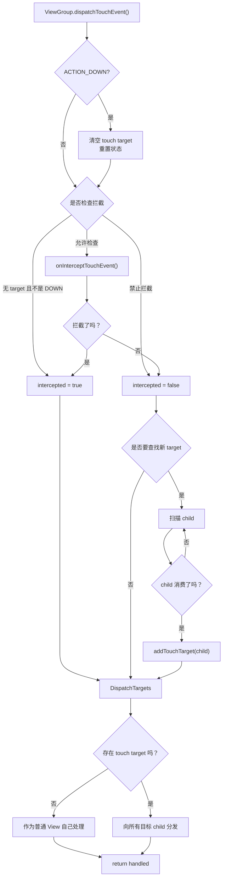

### 25.3.8 `onInterceptTouchEvent()`

默认 `ViewGroup` 实现几乎永远返回 `false`，只有一些特殊场景，例如鼠标点在 scrollbar thumb 上，才会返回 `true`。真正重写它的是 `ScrollView`、`RecyclerView` 等滚动容器。

### 25.3.9 `onTouchEvent()`：点击与长按

`View.onTouchEvent()` 负责系统默认点击、长按、pressed 态、tooltip 等逻辑：

- 在可点击的 View 上，`ACTION_DOWN` 会设置 pressed 并启动长按检测。
- 在滚动容器内部，会先进入 `PFLAG_PREPRESSED`，延迟显示 pressed 态，以避免误判滚动为点击。
- `ACTION_UP` 时，如果未触发长按，且仍处于可点击条件，就会安排 `performClick()`。
- `ACTION_CANCEL` 会清理全部状态。

点击通常不会“当场立刻执行”，而是通过 `PerformClick` Runnable post 出去，让 pressed 态和视觉反馈先完成。

### 25.3.10 多点触控与 pointer splitting

从 API 11 开始，默认启用 `FLAG_SPLIT_MOTION_EVENTS`。这意味着一个 `ViewGroup` 可以把不同 pointer 路由给不同 child：

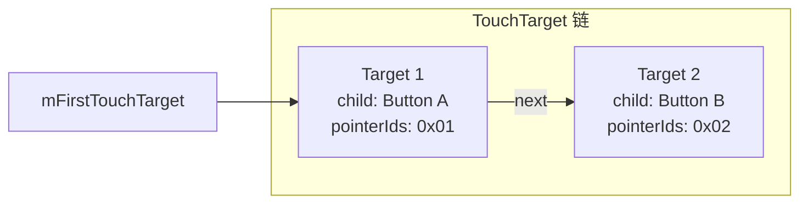

分发时，`dispatchTransformedTouchEvent()` 会对原始 `MotionEvent` 做拆分，只保留目标 child 关注的 pointer。

### 25.3.11 Nested Scrolling

现代 Android 的滚动协同依赖嵌套滚动协议：

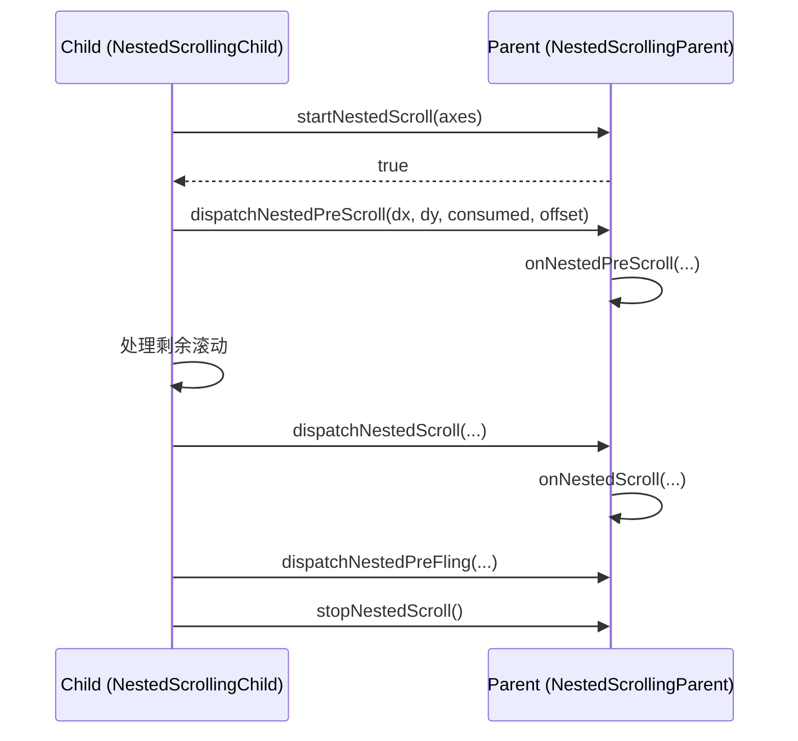

它让 `RecyclerView` 和 `AppBarLayout`、`CoordinatorLayout` 这类复杂父子滚动关系能正确协作。

---

## 25.4 ViewRootImpl：连接 WMS 的桥

`ViewRootImpl` 是客户端 View 系统中最重要的类。它既实现了 `ViewParent`，作为整棵 View 树的最终父节点，又通过 Binder 与 `WindowManagerService` 通信。

### 25.4.1 生命周期

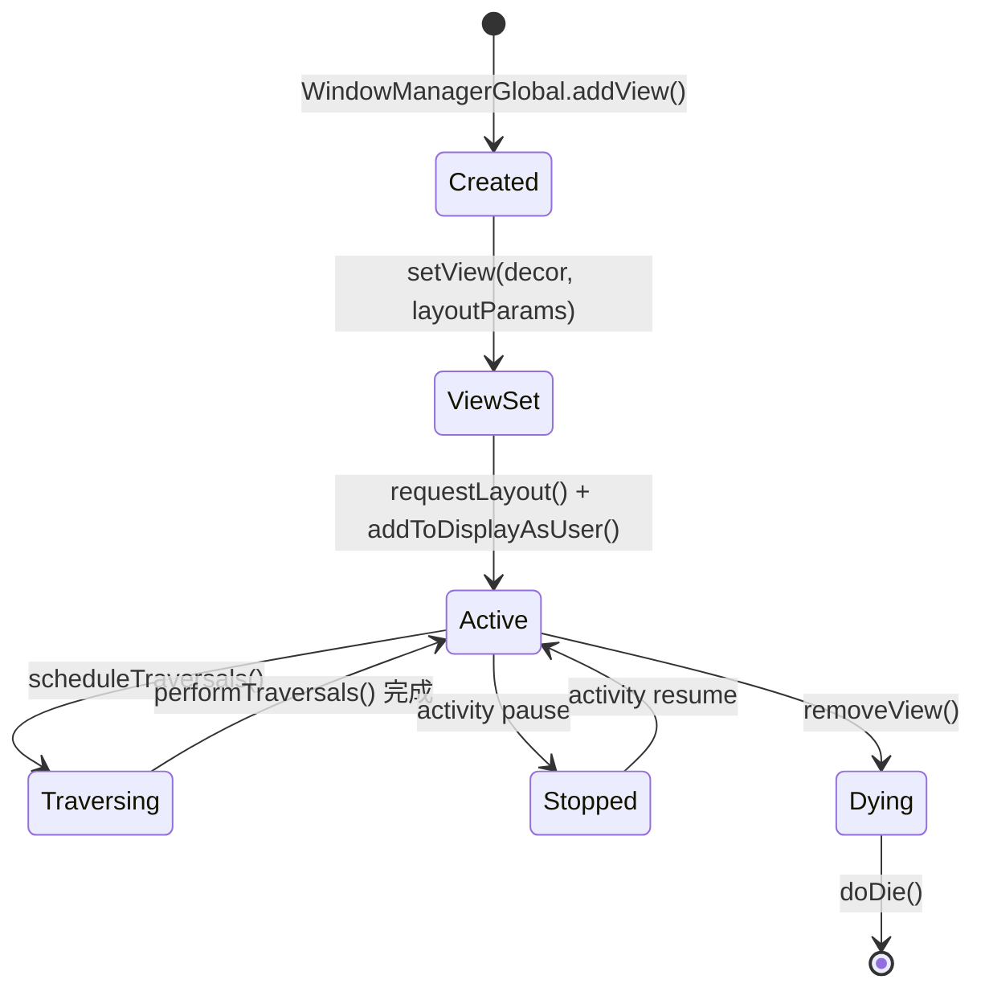

### 25.4.2 `scheduleTraversals()` 与 Choreographer

`scheduleTraversals()` 是进入渲染流水线的总入口：

```text
Source: frameworks/base/core/java/android/view/ViewRootImpl.java (line 3085)

    void scheduleTraversals() {
        if (!mTraversalScheduled) {
            mTraversalScheduled = true;
            mTraversalBarrier = mQueue.postSyncBarrier();
            mChoreographer.postCallback(
                    Choreographer.CALLBACK_TRAVERSAL,
                    mTraversalRunnable, null);
            notifyRendererOfFramePending();
            pokeDrawLockIfNeeded();
        }
    }
```

这里发生了三件关键事情：

1. **插入同步屏障**：阻止普通同步消息先于本轮 traversal 执行。
2. **注册 `CALLBACK_TRAVERSAL`**：由 `Choreographer` 在合适帧时机调用。
3. **通知硬件渲染器**：让 HWUI 为新一帧做准备。

### 25.4.3 Choreographer 帧处理顺序

`Choreographer` 每一帧会按严格顺序处理五类 callback：

```text
Source: frameworks/base/core/java/android/view/Choreographer.java (line 1156)

    doCallbacks(CALLBACK_INPUT, ...);
    doCallbacks(CALLBACK_ANIMATION, ...);
    doCallbacks(CALLBACK_INSETS_ANIMATION, ...);
    doCallbacks(CALLBACK_TRAVERSAL, ...);
    doCallbacks(CALLBACK_COMMIT, ...);
```

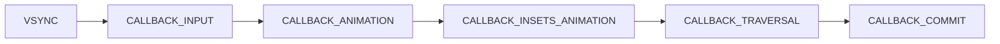

输入先于动画，动画先于 layout/draw，这样布局和绘制看到的是最新交互结果。

### 25.4.4 `doTraversal()`：从 callback 进入 traversal

当 `CALLBACK_TRAVERSAL` 到来时，`mTraversalRunnable` 最终调用 `doTraversal()`：

```text
Source: frameworks/base/core/java/android/view/ViewRootImpl.java (line 3123)

    void doTraversal() {
        if (mTraversalScheduled) {
            mTraversalScheduled = false;
            mQueue.removeSyncBarrier(mTraversalBarrier);
            performTraversals();
        }
    }
```

顺序也很讲究：会先移除 sync barrier，再执行 `performTraversals()`，从而保证 traversal 完成后其余正常消息可以继续流动。

### 25.4.5 Window relayout

如果 `performTraversals()` 发现窗口尺寸、insets 或 surface 状态发生变化，`ViewRootImpl` 会通过 Binder 调用 WMS 的 `relayoutWindow()`：

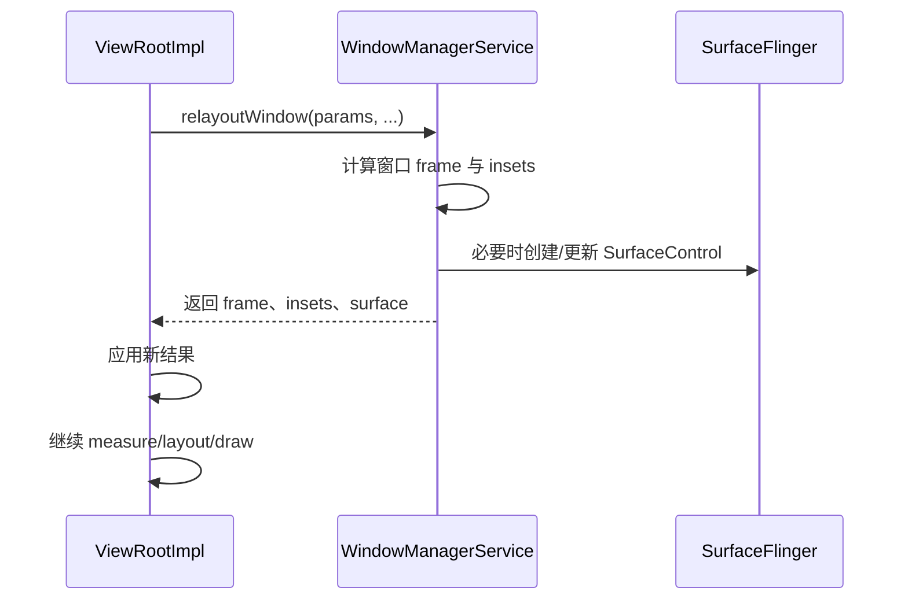

### 25.4.6 布局期间再次请求布局

如果某个 View 在 `onLayout()` 里又调用了 `requestLayout()`，`ViewRootImpl` 会把它加入 `mLayoutRequesters`，并在本轮布局后决定是否触发第二轮布局。这种行为虽不推荐，但为了兼容历史代码，框架会尽量容忍。

### 25.4.7 输入事件投递管线细节

`setView()` 时，`ViewRootImpl` 会构造完整的输入阶段链：

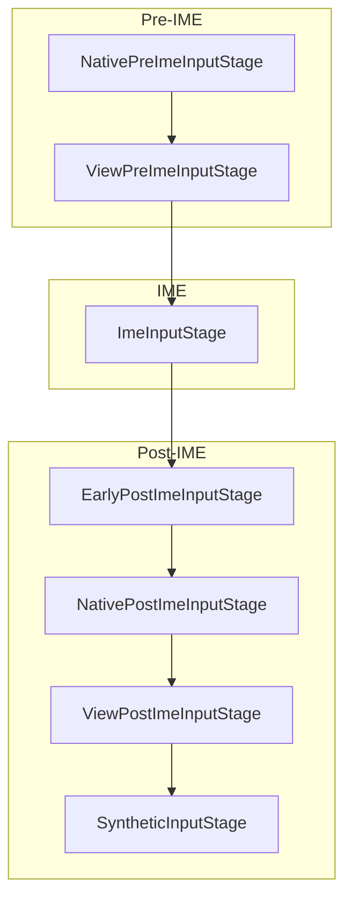

对 key event 来说，IME 有机会优先消费；对 touch event 来说，最终主要由 `ViewPostImeInputStage` 把事件交给 View 层级。

### 25.4.8 同步屏障机制

sync barrier 是一个很隐蔽但非常关键的设计。它保证在调用 `scheduleTraversals()` 之后，**后续普通同步消息不会先于 traversal 执行**。因此很多代码都依赖这个契约：先 `requestLayout()`，再 `post(Runnable)`，则这个 Runnable 通常会在 traversal 完成之后执行。

### 25.4.9 帧率投票

现代 `ViewRootImpl` 还参与可变刷新率（VRR）投票。View 可以通过 `setRequestedFrameRate()` 表达偏好，例如高帧率滚动或低帧率静态内容。`ViewRootImpl` 会汇总 View 树中的投票并上报给 SurfaceFlinger。

---

## 25.5 硬件加速：RenderNode 与 HWUI

从 Android 3.0 开始，系统逐步引入硬件加速渲染；到现代 Android，绝大多数窗口都默认走 HWUI。Java 侧最重要的两个角色是 `RenderNode` 与 `ThreadedRenderer`。

### 25.5.1 架构概览

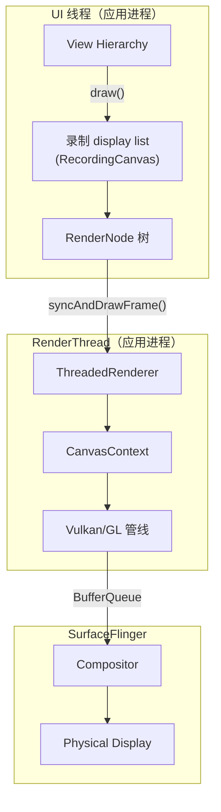

### 25.5.2 `RenderNode`：display list 节点

每个 `View` 都持有一个 `RenderNode`：

```text
Source: frameworks/base/core/java/android/view/View.java

    final RenderNode mRenderNode;
```

`RenderNode` 内部包含两类内容：

- **Display list**：录制下来的绘制命令，而不是直接画到位图上。
- **属性**：如 translation、rotation、scale、alpha、clip、elevation 等。

这带来的一个巨大好处是：**属性动画可以在不重新录制 display list 的情况下，只更新 RenderNode 属性**。

### 25.5.3 `updateDisplayListIfDirty()`

当 View 脏了，需要重录 display list 时，会走 `updateDisplayListIfDirty()`：

```text
Source: frameworks/base/core/java/android/view/View.java (line 24064)

    public RenderNode updateDisplayListIfDirty() {
        ...
        final RecordingCanvas canvas =
            renderNode.beginRecording(width, height);
        try {
            if ((mPrivateFlags & PFLAG_SKIP_DRAW) == PFLAG_SKIP_DRAW) {
                dispatchDraw(canvas);
            } else {
                draw(canvas);
            }
        } finally {
            renderNode.endRecording();
            setDisplayListProperties(renderNode);
        }
        ...
    }
```

这里的 `RecordingCanvas` 不是传统意义上的“立刻绘图”，而是在录制命令列表，稍后再由 RenderThread 重放执行。

### 25.5.4 无需重绘的属性动画

因为 `RenderNode` 把变换属性与绘制命令分离，所以：

- 平移
- 旋转
- 缩放
- alpha

这类动画很多时候只需要更新 `RenderNode` 属性，而不需要重新执行 View 的 `onDraw()`。这也是属性动画在现代 Android 中非常高效的重要原因。

### 25.5.5 ThreadedRenderer

`ThreadedRenderer` 是 Java 侧 HWUI 的入口代理，负责把 UI 线程录制下来的显示列表同步到 RenderThread：

```text
public final class ThreadedRenderer extends HardwareRenderer {
```

它体现了 View 系统的根本分工：

- **UI 线程**：measure、layout、录制 display list
- **RenderThread**：执行图形命令、驱动 GPU、交换 buffer

### 25.5.6 `ViewRootImpl.draw()`

`ViewRootImpl.draw()` 负责选择走硬件路径还是软件回退路径：

```text
Source: frameworks/base/core/java/android/view/ViewRootImpl.java

    private boolean draw(boolean fullRedrawNeeded, ...) {
        ...
        if (isHardwareEnabled()) {
            mAttachInfo.mThreadedRenderer.invalidateRoot();
            mAttachInfo.mThreadedRenderer.draw(mView, mAttachInfo, ...);
        } else {
            drawSoftware(surface, mAttachInfo, ...);
        }
    }
```

硬件路径中，根 `RenderNode` 会被标脏，然后 `ThreadedRenderer.draw()` 会触发根节点与其子树的 display list 更新，最后由 `syncAndDrawFrame()` 把它们同步到 RenderThread。

### 25.5.7 软件渲染回退

在少数情况下，系统会回退到软件绘制，例如关闭硬件加速、某些特殊 layer type 或不支持的绘制操作：

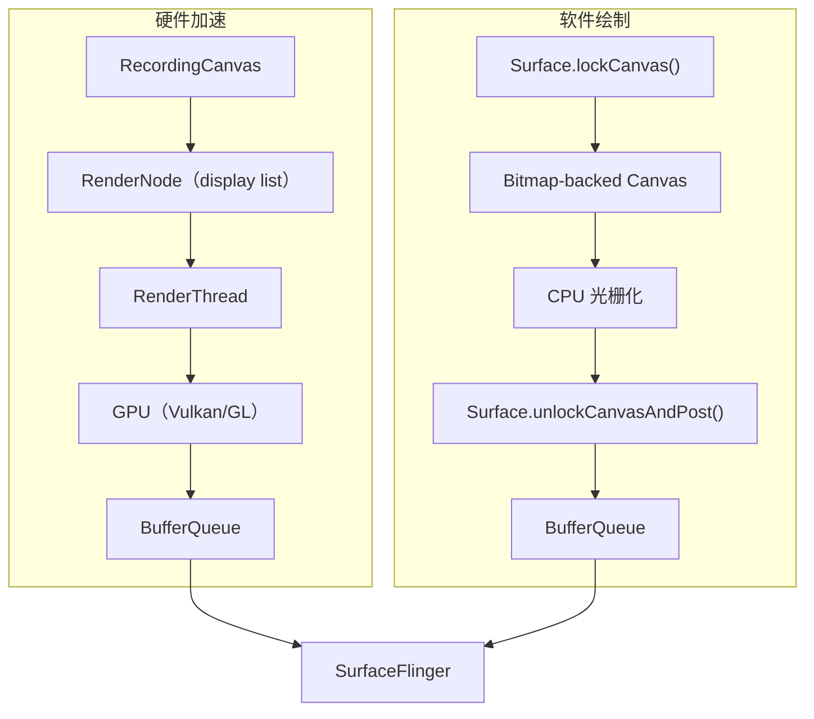

### 25.5.8 Layer Type

View 支持三种 layer type：

| Layer Type | 值 | 行为 |
|------------|----|------|
| `LAYER_TYPE_NONE` | 0 | 默认，不单独建离屏层 |
| `LAYER_TYPE_SOFTWARE` | 1 | 使用 CPU bitmap |
| `LAYER_TYPE_HARDWARE` | 2 | 使用 GPU texture |

对复杂但经常做变换动画的 View，临时设置 `LAYER_TYPE_HARDWARE` 往往能减少重复录制与重绘成本。

---

## 25.6 Window Insets 与 Cutout

### 25.6.1 WindowInsets

`WindowInsets` 用于描述窗口中被系统 UI 部分遮挡的区域，例如状态栏、导航栏、输入法、cutout、圆角和显示形状：

```text
Source: frameworks/base/core/java/android/view/WindowInsets.java (line 80)

    public final class WindowInsets {
        private final Insets[] mTypeInsetsMap;
        private final Insets[] mTypeMaxInsetsMap;
        private final boolean[] mTypeVisibilityMap;
        private final DisplayCutout mDisplayCutout;
        private final RoundedCorners mRoundedCorners;
        private final DisplayShape mDisplayShape;
        ...
    }
```

### 25.6.2 Insets 类型

`WindowInsets.Type` 以 bit flag 形式定义所有 inset 类别：

```text
Source: frameworks/base/core/java/android/view/WindowInsets.java

    public static final class Type {
        static final int STATUS_BARS = 1 << 0;
        static final int NAVIGATION_BARS = 1 << 1;
        static final int CAPTION_BAR = 1 << 2;
        static final int IME = 1 << 3;
        static final int SYSTEM_GESTURES = 1 << 4;
        static final int MANDATORY_SYSTEM_GESTURES = 1 << 5;
        static final int TAPPABLE_ELEMENT = 1 << 6;
        static final int DISPLAY_CUTOUT = 1 << 7;
        static final int SYSTEM_OVERLAYS = 1 << 8;
    }
```

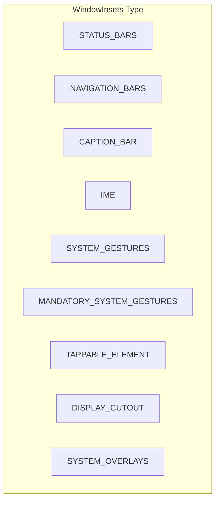

### 25.6.3 Insets 分发链

Insets 是从 `ViewRootImpl` 顶部一路向下分发的：

```mermaid
sequenceDiagram
    participant WMS as WindowManagerService
    participant VRI as ViewRootImpl
    participant DV as DecorView
    participant CFL as ContentFrameLayout
    participant AppView as App View

    WMS-->>VRI: 新的 insets 状态
    VRI->>VRI: dispatchApplyInsets(host)
    VRI->>DV: dispatchApplyWindowInsets(insets)
    DV->>DV: onApplyWindowInsets(insets)
    DV->>CFL: dispatchApplyWindowInsets(remaining)
    CFL->>AppView: dispatchApplyWindowInsets(remaining)
    AppView->>AppView: onApplyWindowInsets(remaining)
```

```text
Source: frameworks/base/core/java/android/view/View.java (line 12931)

    public WindowInsets dispatchApplyWindowInsets(WindowInsets insets) {
        ...
        if (mListenerInfo != null
                && mListenerInfo.mOnApplyWindowInsetsListener != null) {
            return mListenerInfo.mOnApplyWindowInsetsListener
                .onApplyWindowInsets(this, insets);
        } else {
            return onApplyWindowInsets(insets);
        }
    }
```

监听器优先于默认 `onApplyWindowInsets()`，这也是 AndroidX `ViewCompat.setOnApplyWindowInsetsListener()` 的底层基础。

### 25.6.4 Edge-to-Edge 与现代 Insets API

在现代 Android 中，应用应显式处理 edge-to-edge：

```java
ViewCompat.setOnApplyWindowInsetsListener(view, (v, insets) -> {
    Insets systemBars = insets.getInsets(
        WindowInsetsCompat.Type.systemBars());
    v.setPadding(systemBars.left, systemBars.top,
                 systemBars.right, systemBars.bottom);
    return WindowInsetsCompat.CONSUMED;
});
```

关键思路是：**不要再依赖过时的 `fitsSystemWindows` 猜测式行为，而应明确读取并消费各类 inset**。

### 25.6.5 DisplayCutout

`DisplayCutout` 描述屏幕上不可用于正常显示内容的区域，例如刘海、挖孔、岛状区域：

```mermaid
graph TD
    subgraph "带 Cutout 的显示"
        StatusBar["状态栏区域"]
        Cutout["Display Cutout<br/>(刘海 / 挖孔)"]
        Content["应用内容区"]
        NavBar["导航栏"]
    end

    subgraph "DisplayCutout API"
        SafeInsets["getSafeInsetTop/Bottom/Left/Right()"]
        BoundingRects["getBoundingRects()"]
        WaterfallInsets["getWaterfallInsets()"]
    end

    Cutout --> SafeInsets
    Cutout --> BoundingRects
    Cutout --> WaterfallInsets
```

窗口对 cutout 的处理受 `layoutInDisplayCutoutMode` 控制：

| 模式 | 行为 |
|------|------|
| `DEFAULT` | 竖屏默认避开 cutout |
| `SHORT_EDGES` | 短边允许进入 cutout |
| `NEVER` | 永不进入 cutout 区域 |
| `ALWAYS` | 始终允许延伸进 cutout |

### 25.6.6 WindowInsetsAnimation

当 inset 本身在变化时，例如 IME 显示与隐藏，View 可以通过 `WindowInsetsAnimation.Callback` 参与动画过程：

```mermaid
sequenceDiagram
    participant System as System / IME
    participant VRI as ViewRootImpl
    participant View as App View

    System->>VRI: Insets 变化（IME 显示）
    VRI->>View: onPrepare(animation)
    VRI->>View: onStart(animation, bounds)
    loop 每一帧
        VRI->>View: onProgress(insets, runningAnimations)
    end
    VRI->>View: onEnd(animation)
```

这使得应用内容可以与键盘、系统栏做同步动画，而不是“突然跳动”。

### 25.6.7 Rounded Corners 与 Display Shape

现代设备往往带有圆角屏幕。`WindowInsets` 中的 `RoundedCorners` 提供角半径信息，`DisplayShape` 提供更完整的显示轮廓路径。对于做边缘对齐动画、沉浸式 UI 和系统装饰布局时，这些数据都非常重要。

---

## 25.7 焦点与键盘导航

### 25.7.1 焦点模型

Android 的焦点系统主要支持两种模式：

1. **触摸模式**：通常没有明显焦点框，用户直接点击交互。只有 `focusableInTouchMode` 的 View 才能在该模式下获取焦点。
2. **非触摸模式**：例如 D-pad、键盘、轨迹球场景，会有一个明确的焦点 View，方向键用于移动焦点。

```mermaid
stateDiagram-v2
    [*] --> TouchMode: 屏幕被触摸
    [*] --> NonTouchMode: 键盘 / D-pad 输入
    TouchMode --> NonTouchMode: D-pad 输入
    NonTouchMode --> TouchMode: 屏幕被触摸

    state TouchMode {
        NoVisibleFocus: 无可见焦点环
        FocusableInTouchMode: 仅特定 View 可获焦
    }

    state NonTouchMode {
        VisibleFocus: 可见焦点
        ArrowNavigation: 方向键移动焦点
    }
```

### 25.7.2 FocusFinder 的焦点搜索

当用户按下方向键时，`View.focusSearch()` 最终会委托给 `FocusFinder`：

```text
Source: frameworks/base/core/java/android/view/View.java (line 14872)

    public View focusSearch(@FocusRealDirection int direction) {
        if (mParent != null) {
            return mParent.focusSearch(this, direction);
        } else {
            return null;
        }
    }
```

`FocusFinder` 的基本算法是：

1. 收集当前层级中的所有可聚焦 View。
2. 过滤出搜索方向上的候选项。
3. 使用 beam 与距离度量比较候选者。
4. 选择空间意义上最优的那个。

```mermaid
graph TB
    Current["当前焦点 View"] --> Beam["投影 beam"]
    Beam --> Candidates["收集候选 View"]
    Candidates --> Filter["筛选方向正确者"]
    Filter --> Closest["按距离/beam 优先级选最近者"]
```

### 25.7.3 焦点方向常量

| 常量 | 值 | 方向 |
|------|----|------|
| `FOCUS_LEFT` | 17 | 左 |
| `FOCUS_UP` | 33 | 上 |
| `FOCUS_RIGHT` | 66 | 右 |
| `FOCUS_DOWN` | 130 | 下 |
| `FOCUS_FORWARD` | 2 | Tab 下一个 |
| `FOCUS_BACKWARD` | 1 | Tab 上一个 |

### 25.7.4 ViewGroup 的焦点策略

`ViewGroup` 通过 `setDescendantFocusability()` 定义父子间争夺焦点的策略：

| 策略 | 含义 |
|------|------|
| `FOCUS_BEFORE_DESCENDANTS` | 父容器优先尝试获取焦点 |
| `FOCUS_AFTER_DESCENDANTS` | 先让子 View 尝试获取焦点（默认） |
| `FOCUS_BLOCK_DESCENDANTS` | 子 View 永远不参与焦点 |

### 25.7.5 Keyboard Navigation Cluster

从 API 26 开始，Android 引入 keyboard navigation cluster，用于把一组逻辑上相关的控件视为一个焦点簇。Tab 在簇之间跳转，方向键在簇内移动。

```mermaid
graph LR
    subgraph "Cluster A (Toolbar)"
        Back["Back"]
        Title["Title"]
        Menu["Menu"]
    end

    subgraph "Cluster B (Content)"
        Item1["Item 1"]
        Item2["Item 2"]
        Item3["Item 3"]
    end

    subgraph "Cluster C (FAB)"
        FAB["FAB Button"]
    end

    A["Cluster A"] -->|Tab| B["Cluster B"]
    B -->|Tab| C["Cluster C"]
    C -->|Tab| A
```

### 25.7.6 Default Focus

通过 `android:focusedByDefault="true"`，可以指定某个 View 作为焦点进入该 cluster 后的默认目标。对 TV、车机和键盘导航界面尤其重要。

---

## 25.8 无障碍集成

### 25.8.1 无障碍桥

Android 无障碍系统会从 View 树构建一棵并行的 `AccessibilityNodeInfo` 树。TalkBack、Switch Access 等服务读取并操作这棵树：

```mermaid
graph TB
    subgraph "应用进程"
        ViewTree["View Hierarchy"]
        ANI["AccessibilityNodeInfo tree"]
    end

    subgraph "system_server"
        AMS_a["AccessibilityManagerService"]
    end

    subgraph "无障碍服务进程"
        TalkBack["TalkBack / Switch Access"]
    end

    ViewTree -->|"createAccessibilityNodeInfo()"| ANI
    ANI -->|Binder| AMS_a
    AMS_a -->|Binder| TalkBack
    TalkBack -->|"performAction()"| AMS_a
    AMS_a -->|"performAccessibilityAction()"| ViewTree
```

### 25.8.2 `createAccessibilityNodeInfo()`

每个 View 在需要时按需创建自己的无障碍表示：

```text
Source: frameworks/base/core/java/android/view/View.java (line 9513)

    public AccessibilityNodeInfo createAccessibilityNodeInfo() {
        if (mAccessibilityDelegate != null) {
            return mAccessibilityDelegate
                .createAccessibilityNodeInfo(this);
        } else {
            return createAccessibilityNodeInfoInternal();
        }
    }
```

如果一个 View 提供了 `AccessibilityNodeProvider`，则可以暴露虚拟节点；否则就直接基于自身状态生成 `AccessibilityNodeInfo`。

### 25.8.3 `onInitializeAccessibilityNodeInfo()`

基础实现会从 View 状态填充大量信息，例如：

- parent
- bounds
- package/class
- content description
- enabled / clickable / focusable / focused
- selected / long-clickable / context-clickable

不同子类还会扩展更多语义：

- `TextView` 填入文本与选择状态
- `SeekBar` 填入范围信息
- `RecyclerView` 填入集合结构信息

### 25.8.4 AccessibilityNodeProvider

对复杂控件，例如自定义日历、图表、数值选择器，一个真实 `View` 往往需要映射成多个“虚拟子节点”，此时就要使用 `AccessibilityNodeProvider`：

```mermaid
graph TD
    subgraph "自定义 CalendarView"
        RealView["CalendarView (单个真实 View)"]
        VP1["虚拟节点：Day 1"]
        VP2["虚拟节点：Day 2"]
        VP3["虚拟节点：..."]
        VP30["虚拟节点：Day 30"]
    end

    RealView --> VP1
    RealView --> VP2
    RealView --> VP3
    RealView --> VP30
```

### 25.8.5 无障碍动作

View 可以暴露给无障碍服务的动作包括：

| Action | 含义 |
|--------|------|
| `ACTION_CLICK` | 点击 |
| `ACTION_LONG_CLICK` | 长按 |
| `ACTION_SCROLL_FORWARD` | 向前滚动 |
| `ACTION_SCROLL_BACKWARD` | 向后滚动 |
| `ACTION_SET_TEXT` | 设置文本 |
| `ACTION_SELECT` | 选中 |
| `ACTION_FOCUS` | 请求输入焦点 |
| `ACTION_ACCESSIBILITY_FOCUS` | 请求无障碍焦点 |

也可以加入自定义动作：

```java
info.addAction(new AccessibilityAction(
    R.id.action_archive, "Archive message"));
```

### 25.8.6 Content Description 与 Live Region

两个最重要的属性：

- **`contentDescription`**：对没有可见文本的控件提供读屏描述，例如 `ImageButton`。
- **`accessibilityLiveRegion`**：用于动态变化内容的播报策略。
  - `NONE`
  - `POLITE`
  - `ASSERTIVE`

### 25.8.7 Accessibility Event

状态变化发生时，View 会主动发送无障碍事件：

```mermaid
sequenceDiagram
    participant View
    participant VRI as ViewRootImpl
    participant AMgr as AccessibilityManager
    participant AMS_a as AccessibilityManagerService
    participant Service as TalkBack

    View->>AMgr: sendAccessibilityEvent(TYPE_VIEW_CLICKED)
    AMgr->>AMS_a: sendAccessibilityEvent(event)
    AMS_a->>Service: onAccessibilityEvent(event)
    Service->>Service: 播报控件变化
```

常见事件：

- `TYPE_VIEW_CLICKED`
- `TYPE_VIEW_FOCUSED`
- `TYPE_VIEW_TEXT_CHANGED`
- `TYPE_WINDOW_CONTENT_CHANGED`
- `TYPE_VIEW_SCROLLED`

---

## 25.9 LayoutInflater：从 XML 到 View

### 25.9.1 概览

`LayoutInflater` 负责把 `res/layout/` 中的 XML 资源转换为内存中的 View 树，是声明式 UI 与运行时对象之间的桥。

```text
Source: frameworks/base/core/java/android/view/LayoutInflater.java (line 74)

    public abstract class LayoutInflater {
        protected final Context mContext;
        private Factory mFactory;
        private Factory2 mFactory2;
        private Factory2 mPrivateFactory;
        ...
    }
```

### 25.9.2 Inflation 流程

```mermaid
sequenceDiagram
    participant App as App Code
    participant LI as LayoutInflater
    participant XML as XmlPullParser
    participant Factory as Factory / Factory2
    participant View as View instance

    App->>LI: inflate(R.layout.activity_main, root)
    LI->>LI: inflate(parser, root, attachToRoot)
    LI->>XML: 定位根节点
    LI->>XML: getName()

    alt 根节点是 <merge>
        LI->>LI: rInflate(parser, root, ...)
    else 普通节点
        LI->>LI: createViewFromTag(root, name, attrs)
        alt 设置了 Factory2
            LI->>Factory: onCreateView(parent, name, context, attrs)
        else 设置了 Factory
            LI->>Factory: onCreateView(name, context, attrs)
        else 默认路径
            LI->>LI: onCreateView() / createView()
        end
        LI->>LI: 递归 inflate children
    end

    LI-->>App: 返回 View 树
```

### 25.9.3 `inflate()` 方法

`inflate(XmlPullParser parser, ViewGroup root, boolean attachToRoot)` 的三个参数语义非常关键：

- `root != null` 且 `attachToRoot == true`：inflate 完后直接 `addView()` 到 root。
- `root != null` 且 `attachToRoot == false`：不 attach，但会利用 root 生成正确的 `LayoutParams`。
- `root == null`：不会生成父容器语义下的 `LayoutParams`，是很多布局 bug 的根源。

### 25.9.4 View 构造

`createViewFromTag()` 把 XML 标签解析为具体的 `View` 类。大致优先级是：

1. `Factory2.onCreateView()`
2. `Factory.onCreateView()`
3. `mPrivateFactory`
4. `onCreateView()`
5. `createView()` 走反射

`LayoutInflater` 内部有静态构造缓存：

```text
private static final HashMap<String, Constructor<? extends View>>
    sConstructorMap = new HashMap<>();
```

这意味着同一进程内后续 inflation 会更快。

### 25.9.5 特殊标签

| 标签 | 作用 |
|------|------|
| `<merge>` | 把子节点直接扁平插入父容器 |
| `<include>` | 内联引用另一个布局 |
| `<requestFocus>` | 请求父控件初始焦点 |
| `<tag>` | 给父 View 设置 tag |
| `<blink>` | 历史彩蛋标签 |

### 25.9.6 异步布局加载

AndroidX 提供 `AsyncLayoutInflater`，可在后台线程做部分 inflation 工作，再回到 UI 线程交付结果。它适合复杂布局，但有限制：

- 构造过程中不能依赖 Looper
- 不支持 `<merge>` 的典型 attach 语义
- 一些依赖 UI 线程工厂链的场景不适用

### 25.9.7 递归处理：`rInflate()`

```mermaid
flowchart TD
    Start["rInflateChildren(parser, parent, attrs)"] --> Loop{"还有子节点？"}
    Loop -->|是| ReadTag["读取 tag 名"]
    ReadTag --> IsRequestFocus{"requestFocus?"}
    IsRequestFocus -->|是| RF["restoreDefaultFocus()"]
    RF --> Loop
    IsRequestFocus -->|否| IsTag{"tag?"}
    IsTag -->|是| ParseTag["parseViewTag()"]
    ParseTag --> Loop
    IsTag -->|否| IsInclude{"include?"}
    IsInclude -->|是| ParseInclude["parseInclude()"]
    ParseInclude --> Loop
    IsInclude -->|否| IsMerge{"merge?"}
    IsMerge -->|是| Error["抛 InflateException"]
    IsMerge -->|否| CreateChild["createViewFromTag()"]
    CreateChild --> GenParams["generateLayoutParams()"]
    GenParams --> Recurse["递归 inflate 子节点"]
    Recurse --> AddChild["addView(child, params)"]
    AddChild --> Loop
    Loop -->|否| Done["return"]
```

### 25.9.8 `<include>`：布局复用

`<include>` 允许把另一个布局文件内联进当前布局。处理过程包括：

1. 读取 `layout` 资源 ID
2. 打开被 include 的 XML
3. 处理覆盖属性，例如新的 `layout_width`
4. 把其根节点直接替换 `<include>` 标签

它不会多生成一层无意义 View 节点。

### 25.9.9 `<merge>`：层级扁平化

`<merge>` 用于去掉多余根容器，减少 View 树深度：

```xml
<merge>
    <TextView ... />
    <Button ... />
</merge>
```

约束条件是：

- 只能作为布局文件根节点
- inflation 时必须有 `root`
- 通常要求 `attachToRoot=true`

### 25.9.10 Theme Overlay

布局中的某个节点可以指定 `android:theme`，在 inflation 时会为该子树包上一层 `ContextThemeWrapper`。这样同一个布局里就能出现不同主题风格的子树。

### 25.9.11 预编译布局

从 Android 10 开始，系统对部分布局支持预编译，加快系统关键界面的 inflation：

```mermaid
graph LR
    XML["XML Layout"] --> Compiler["Layout Compiler"]
    Compiler --> Bin["Compiled Layout"]
    Bin --> Inflater["LayoutInflater"]
    Inflater --> ViewTree["View Hierarchy"]

    XML -->|"fallback"| Parser["XmlPullParser"]
    Parser --> Inflater
```

### 25.9.12 View Binding 与 Data Binding

现代 Android 开发常用这两种编译期工具减少手写 `findViewById()`：

- **View Binding**：为每个布局生成类型安全 binding 类
- **Data Binding**：在 binding 基础上接入数据观察与自动更新

它们底层依然离不开 `LayoutInflater.inflate()`。

---

## 25.10 自定义 View

### 25.10.1 自定义 View 合约

创建一个合格的自定义 View，至少要理解以下入口：

```mermaid
graph TD
    subgraph "必须掌握"
        Constructor["构造函数(Context, AttributeSet)"]
        OnMeasure["onMeasure(widthSpec, heightSpec)"]
        OnDraw["onDraw(Canvas)"]
    end

    subgraph "常见重写"
        OnLayout["onLayout()（仅 ViewGroup）"]
        OnTouch["onTouchEvent(MotionEvent)"]
        OnSizeChanged["onSizeChanged(w, h, oldW, oldH)"]
        SaveRestore["onSaveInstanceState() / onRestoreInstanceState()"]
    end

    subgraph "性能接口"
        Invalidate["invalidate()：仅视觉变化"]
        RequestLayout["requestLayout()：尺寸/布局变化"]
    end
```

### 25.10.2 构造函数模式

为了同时支持代码创建与 XML inflation，自定义 View 至少应实现两到三个构造函数，并在内部统一到一个 `init()`：

```java
public class PieChart extends View {
    public PieChart(Context context) {
        this(context, null);
    }

    public PieChart(Context context, @Nullable AttributeSet attrs) {
        this(context, attrs, 0);
    }

    public PieChart(Context context, @Nullable AttributeSet attrs,
            int defStyleAttr) {
        super(context, attrs, defStyleAttr);
        init(context, attrs);
    }
}
```

### 25.10.3 自定义 `onMeasure()`

默认 `onMeasure()` 对很多控件并不合适。自定义 View 应根据自身内容尺寸语义合理处理三种 `MeasureSpec` 模式：

```java
@Override
protected void onMeasure(int widthMeasureSpec, int heightMeasureSpec) {
    int desiredWidth = 200;
    int desiredHeight = 200;
    int width = resolveSize(desiredWidth, widthMeasureSpec);
    int height = resolveSize(desiredHeight, heightMeasureSpec);
    setMeasuredDimension(width, height);
}
```

`resolveSize()` 的核心思想就是：

- `EXACTLY`：听父容器的
- `AT_MOST`：取不超过上限的最小值
- `UNSPECIFIED`：用自己想要的尺寸

### 25.10.4 自定义 `onDraw()`

`Canvas` 与 `Paint` 是最基础的绘图原语：

```java
@Override
protected void onDraw(Canvas canvas) {
    super.onDraw(canvas);
    int width = getWidth();
    int height = getHeight();
    int radius = Math.min(width, height) / 2;
    int cx = width / 2;
    int cy = height / 2;

    mPaint.setColor(Color.LTGRAY);
    mPaint.setStyle(Paint.Style.FILL);
    canvas.drawCircle(cx, cy, radius, mPaint);
}
```

### 25.10.5 Canvas 绘图原语

| 方法 | 作用 |
|------|------|
| `drawRect()` | 画矩形 |
| `drawCircle()` | 画圆 |
| `drawArc()` | 画弧 |
| `drawLine()` | 画线 |
| `drawPath()` | 画任意路径 |
| `drawText()` | 绘制文字 |
| `drawBitmap()` | 绘制位图 |
| `drawRoundRect()` | 绘制圆角矩形 |

### 25.10.6 Paint 配置

| 属性 | 影响 |
|------|------|
| `setColor()` | 颜色 |
| `setStyle()` | 填充/描边 |
| `setStrokeWidth()` | 线宽 |
| `setAntiAlias()` | 抗锯齿 |
| `setTextSize()` | 文字大小 |
| `setTypeface()` | 字体 |
| `setShader()` | 渐变或纹理 |
| `setMaskFilter()` | 模糊等滤镜 |
| `setPathEffect()` | 虚线、圆角路径效果 |
| `setShadowLayer()` | 阴影 |

### 25.10.7 `invalidate()` vs `requestLayout()`

这个选择直接影响性能：

```mermaid
graph TB
    Change{"变化类型是什么？"}
    Change -->|"只有视觉变化<br/>(颜色、文本动画等)"| INV["invalidate()"]
    Change -->|"尺寸或位置变化<br/>(文本长度、内容大小)"| RL["requestLayout()"]

    INV --> DrawOnly["只重绘"]
    RL --> FullCycle["重新 measure + layout + draw"]
```

最佳实践是把两类变化明确区分：

```java
public void setSweepAngle(float angle) {
    if (mSweepAngle != angle) {
        mSweepAngle = angle;
        invalidate();
    }
}

public void setLabel(String label) {
    if (!Objects.equals(mLabel, label)) {
        mLabel = label;
        requestLayout();
        invalidate();
    }
}
```

### 25.10.8 保存与恢复状态

自定义 View 应在旋转或进程恢复后正确恢复内部状态。最基本做法是重写：

- `onSaveInstanceState()`
- `onRestoreInstanceState()`

并在自定义状态对象中保留 super state。

### 25.10.9 自定义 ViewGroup

自定义布局容器需要自行实现子节点测量与摆放，例如 flow layout：

- `onMeasure()` 负责决定每个 child 的尺寸与整体容器尺寸
- `onLayout()` 负责给每个 child 分配最终位置

其本质和系统布局没有区别，只是把布局算法交给了开发者。

### 25.10.10 自定义属性

自定义 View 可在 `res/values/attrs.xml` 中声明属性：

```xml
<declare-styleable name="PieChart">
    <attr name="sliceColor" format="color" />
    <attr name="showLabel" format="boolean" />
    <attr name="labelText" format="string" />
    <attr name="sliceAngle" format="float" />
</declare-styleable>
```

并通过 `TypedArray` 读取，读取后必须 `recycle()`。

### 25.10.11 自定义触摸处理

如果自定义 View 要处理手势，通常有两种方式：

1. 自己重写 `onTouchEvent()`
2. 使用 `GestureDetector`、`VelocityTracker`、`ScaleGestureDetector` 等工具类

需要记住的规则：

1. `ACTION_DOWN` 必须返回 `true`，否则不会收到后续事件。
2. 如果要抢占手势，可调用 `requestDisallowInterceptTouchEvent(true)`。
3. 必须处理 `ACTION_CANCEL`。
4. fling 等速度型手势最好借助 `VelocityTracker`。

### 25.10.12 Drawable 与 View 的关系

View 与 Drawable 的关系是双向的：

```mermaid
graph LR
    View -->|"setBackground()"| Drawable
    Drawable -->|"setCallback(this)"| View
    Drawable -->|"invalidateSelf()"| View
    View -->|"invalidateDrawable()"| Redraw["触发重绘"]
```

如果一个会动画的 Drawable 没有 callback，它就无法驱动刷新；反之，如果 callback 指向已脱离窗口的 View，也可能引起泄漏。

### 25.10.13 Compound View vs Custom Layout

复杂 UI 常见两种做法：

- **Compound View**：继承现成布局容器，在构造函数里 inflate 一段 XML，对外暴露业务 API。
- **Custom Layout**：直接继承 `ViewGroup`，完全自己写布局算法。

| 维度 | Compound View | Custom Layout |
|------|---------------|---------------|
| 实现复杂度 | 低 | 高 |
| 灵活性 | 受限于内部 XML | 完全可控 |
| 性能 | 多一层嵌套 | 更优 |
| 适用场景 | 简单组合控件 | 复杂排布 |

### 25.10.14 自定义 View 性能最佳实践

1. **避免在 `onDraw()` 中分配对象**
2. **尽量减少 overdraw**
3. **动画期间可考虑硬件层**
4. **控制层级深度**
5. **使用 GPU profiling、Perfetto、`gfxinfo` 做性能验证**

---

## 25.11 动手实践（Try It）

### 实验 25.1：跟踪 Measure-Layout-Draw 周期

写一个简单的 `TracingView`，在 `onMeasure()`、`onLayout()`、`onDraw()` 中打印日志，观察首帧和刷新帧的执行顺序。把它放进 `ScrollView` 中，再比较高度 `MeasureSpec` 是否从 `AT_MOST` 或 `EXACTLY` 变为 `UNSPECIFIED`。

### 实验 25.2：观察触摸分发

构造 Outer -> Inner -> Button 的嵌套层级，在父容器里重写：

- `dispatchTouchEvent()`
- `onInterceptTouchEvent()`
- `onTouchEvent()`

打印日志，然后在不同事件上返回 `true` / `false`，观察 child 何时收到 `ACTION_CANCEL`、父何时接管手势。

### 实验 25.3：可视化硬件加速

实现一个在 `onDraw()` 中反复绘制大量圆形或路径的测试 View，比较：

- `LAYER_TYPE_NONE`
- `LAYER_TYPE_SOFTWARE`
- `LAYER_TYPE_HARDWARE`

三种情况下的帧耗时，并结合 `adb shell dumpsys gfxinfo <package>` 观察统计差异。

### 实验 25.4：Insets 处理

让 Activity 进入 edge-to-edge，给根 View 设置 `OnApplyWindowInsetsListener`，分别读取：

- `systemBars()`
- `ime()`
- `displayCutout()`

然后把这些 inset 体现在 padding 或 margin 上，观察系统栏与输入法显示隐藏时 UI 的变化。

### 实验 25.5：焦点导航

准备一个带方向键导航的布局，设置：

- `android:keyboardNavigationCluster="true"`
- `android:focusedByDefault="true"`
- `android:nextFocusDown`

再用键盘、TV 遥控器或 `adb shell input keyevent` 测试焦点跳转路径。

### 实验 25.6：实现一个自定义模拟时钟

综合使用本章内容，编写一个 `AnalogClockView`：

- 在 `onMeasure()` 中保持正方形
- 在 `onDraw()` 中绘制刻度与指针
- 在 `onAttachedToWindow()` 开始定时刷新
- 在 `onDetachedFromWindow()` 停止回调
- 在无障碍节点中暴露时间内容

这是把测量、绘制、生命周期与无障碍结合起来的一个很好的综合练习。

### 实验 25.7：Perfetto / Systrace 分析

对一个滚动中的 `RecyclerView` 录制 Perfetto trace，重点关注：

1. UI 线程上的 `measure` / `layout` / `draw`
2. RenderThread 上的 `DrawFrame`
3. `deliverInputEvent`
4. `Choreographer#doFrame`

故意在 `onBindViewHolder()` 里加一个 20ms 延迟，观察 jank，再把慢操作移到后台线程对比前后效果。

### 实验 25.8：LayoutInflater Factory

通过 `LayoutInflater.Factory2` 拦截所有 `Button` 创建，把它替换成统一风格的控件，理解：

- 为什么 AppCompat 可以把 XML 中的 `Button` 变成 `AppCompatButton`
- Factory 链与默认反射构造之间的优先级关系

### 实验 25.9：比较 View 层级性能

比较两种布局：

1. 深度嵌套的 `LinearLayout`
2. 更扁平的层级，例如 `ConstraintLayout`

在不同深度与节点数量下调用 `measure()`，记录耗时，观察层级复杂度对测量成本的影响。

### 实验 25.10：使用开发者选项调试绘制

启用以下开发者选项并观察界面：

1. `Show layout bounds`
2. `Profile GPU rendering`
3. `Debug GPU overdraw`

然后尝试通过移除多余背景、降低层级深度、自定义 View 里缩小绘制区域来优化。

### 实验 25.11：基于 VelocityTracker 实现 fling

实现一个可拖动并带惯性滑动的自定义 View，结合：

- `VelocityTracker`
- `Scroller` 或 `OverScroller`
- `computeScroll()`
- `postInvalidateOnAnimation()`

理解 View 手势系统和动画更新之间如何衔接。

### 实验 25.12：使用 ViewOverlay 做临时视觉效果

尝试在一个 View 顶层绘制一个短暂的高亮圆形或共享元素过渡效果，理解 `ViewOverlay` / `ViewGroupOverlay` 为什么适合做“临时视觉层”，而不需要修改真实层级。

### 实验 25.13：Window Insets Animation

让输入法弹出时，根布局或底部输入框同步执行平移动画与 padding 更新。重点观察：

- `onPrepare()`
- `onStart()`
- `onProgress()`
- `onEnd()`

以及 inset 动画与普通属性动画之间的协同。

---

## 总结（Summary）

本章从源码层系统梳理了 Android View System 的关键组成部分：

- **View 层级**：`View`、`ViewGroup`、`ViewRootImpl` 构成了每个 Android 界面的基本骨架。
- **Measure-Layout-Draw**：`performTraversals()` 驱动整套三阶段渲染管线，而 `MeasureSpec` 是父子之间尺寸约束的核心协议。
- **触摸分发**：`dispatchTouchEvent()`、`onInterceptTouchEvent()`、`onTouchEvent()` 共同构成事件分发算法，多指与嵌套滚动进一步增加了复杂度。
- **ViewRootImpl**：负责 Choreographer 集成、sync barrier、窗口 relayout、输入接收与整帧调度，是客户端 View 世界的总调度器。
- **硬件加速**：`RenderNode`、`ThreadedRenderer` 与 RenderThread 把 UI 线程的录制工作和 GPU 执行工作解耦，大幅提升动画与绘制效率。
- **Insets 与 Cutout**：现代 Android 的 edge-to-edge 布局离不开 typed insets、display cutout、rounded corners 和 inset animation。
- **焦点与导航**：从 `FocusFinder` 的空间搜索到 keyboard navigation cluster，焦点系统既服务手机，也支撑 TV、车机与键盘场景。
- **无障碍**：`AccessibilityNodeInfo`、`AccessibilityNodeProvider` 和无障碍事件机制让 View 树能够被读屏和辅助交互系统消费。
- **LayoutInflater**：XML inflation 不只是“解析标签”，还涉及工厂链、反射缓存、`<include>`、`<merge>` 和主题上下文切换。
- **自定义 View**：自定义控件的本质，是正确实现测量、绘制、事件与状态保存，并在性能上避免无谓的布局和重绘。

View 系统是 Android 应用层 UI 的真正执行现场。理解 `MeasureSpec` 的位打包、`Choreographer` 的 VSYNC 节奏、`ViewRootImpl` 的同步屏障、`RenderNode` 的 display list 录制方式，对于开发高性能 Android UI、排查布局异常、理解输入链路和提升动画流畅度都至关重要。

---

## 关键源码文件速查表

| 概念 | 主要文件 | 关键方法 / 类 |
|------|----------|----------------|
| View 测量 | `View.java:28542` | `measure()`、`onMeasure()` |
| View 布局 | `View.java:25798` | `layout()`、`onLayout()` |
| View 绘制 | `View.java:25251` | `draw()`、`onDraw()` |
| MeasureSpec | `View.java:31726` | `MeasureSpec` |
| View 触摸分发 | `View.java:16750` | `dispatchTouchEvent()` |
| ViewGroup 触摸分发 | `ViewGroup.java:2646` | `dispatchTouchEvent()` |
| 触摸拦截 | `ViewGroup.java:3311` | `onInterceptTouchEvent()` |
| 默认触摸处理 | `View.java:18265` | `onTouchEvent()` |
| Traversal 编排 | `ViewRootImpl.java:3574` | `performTraversals()` |
| 调度 Traversal | `ViewRootImpl.java:3085` | `scheduleTraversals()` |
| 根测量入口 | `ViewRootImpl.java:5082` | `performMeasure()` |
| 根布局入口 | `ViewRootImpl.java:5148` | `performLayout()` |
| 根绘制入口 | `ViewRootImpl.java:5767` | `draw()` |
| Display list 录制 | `View.java:24064` | `updateDisplayListIfDirty()` |
| 重绘触发 | `View.java:21249` | `invalidate()` |
| 重新布局触发 | `View.java:28478` | `requestLayout()` |
| Choreographer 帧处理 | `Choreographer.java:1157` | `doCallbacks()` |
| Insets | `WindowInsets.java:80` | `WindowInsets`、`Type` |
| Insets 分发 | `View.java:12931` | `dispatchApplyWindowInsets()` |
| 无障碍 | `View.java:9513` | `createAccessibilityNodeInfo()` |
| 布局加载 | `LayoutInflater.java:509` | `inflate()` |
| 硬件渲染代理 | `ThreadedRenderer.java:67` | `ThreadedRenderer` |
| 焦点搜索 | `FocusFinder.java:38` | `FocusFinder` |
| ViewRootImpl 初始化 | `ViewRootImpl.java:1511` | `setView()` |
