# Chapter 25: View System and Input Dispatch

> *"The view hierarchy is the stage on which every pixel of every Android app
> performs.  Understanding its measure-layout-draw pipeline is understanding
> what the user actually sees."*

The Android **View System** is the client-side rendering and event-handling
framework that transforms declarative XML (or programmatic construction) into
the interactive pixels on screen.  It occupies the application process -- in
contrast to the server-side WindowManagerService discussed in Chapter 16 --
and communicates with the server through the bridge object `ViewRootImpl`.

Every button press, scroll gesture, keyboard navigation event, and
accessibility query flows through the view hierarchy.  Every animation frame
is orchestrated by the `Choreographer`, funneled through `ViewRootImpl`'s
`performTraversals()`, and ultimately rasterized by HWUI on a dedicated
render thread.

This chapter provides an exhaustive, source-level tour of the view system.
We will trace the full lifecycle from XML inflation to hardware-accelerated
rendering, dissect the touch dispatch algorithm in exact detail, and examine
the machinery behind focus, accessibility, window insets, and custom views.

---

## Source Files Referenced in This Chapter

All paths are relative to the AOSP source tree root.

| File | Lines | Role |
|------|------:|------|
| `frameworks/base/core/java/android/view/View.java` | ~34,918 | Base class for all UI components |
| `frameworks/base/core/java/android/view/ViewGroup.java` | ~9,594 | Container that holds child views |
| `frameworks/base/core/java/android/view/ViewRootImpl.java` | ~13,827 | Bridge between view hierarchy and WMS |
| `frameworks/base/core/java/android/view/Choreographer.java` | ~1,714 | Frame timing and VSYNC coordination |
| `frameworks/base/core/java/android/view/LayoutInflater.java` | ~1,247 | XML-to-View instantiation |
| `frameworks/base/core/java/android/view/ThreadedRenderer.java` | ~928 | HWUI proxy for hardware-accelerated drawing |
| `frameworks/base/core/java/android/view/WindowInsets.java` | varies | System bar insets, cutouts, rounded corners |
| `frameworks/base/core/java/android/view/DisplayCutout.java` | varies | Display cutout geometry |
| `frameworks/base/core/java/android/view/FocusFinder.java` | varies | Directional focus search algorithm |
| `frameworks/base/core/java/android/view/MotionEvent.java` | varies | Touch/pointer event representation |
| `frameworks/base/core/java/android/graphics/RenderNode.java` | varies | Display list node for HWUI |

---

## 25.1 View Hierarchy: View, ViewGroup, ViewRootImpl

### 25.1.1 The Fundamental Classes

The Android view system is built on three pillars:

1. **`View`** -- the atomic building block.  Every visible element on screen
   (Button, TextView, ImageView, custom widgets) is a `View` subclass.  At
   ~34,918 lines, `View.java` is one of the largest files in the Android
   framework, handling measurement, layout, drawing, touch events, focus,
   accessibility, animations, and more.

2. **`ViewGroup`** -- the composite container.  `ViewGroup extends View` and
   can hold an ordered list of child `View` objects.  Layouts like
   `LinearLayout`, `FrameLayout`, `ConstraintLayout`, and `RecyclerView` are
   all `ViewGroup` subclasses.

3. **`ViewRootImpl`** -- the bridge.  A single `ViewRootImpl` instance sits
   at the top of each window's view hierarchy, connecting the application's
   view tree to the `WindowManagerService` in `system_server`.  It owns the
   `Surface`, manages the `Choreographer` callback, and drives the entire
   measure-layout-draw cycle through `performTraversals()`.

```
Source: frameworks/base/core/java/android/view/ViewGroup.java (line 139)

    public abstract class ViewGroup extends View implements ViewParent, ViewManager {
        ...
        private View mFocused;
        private View mDefaultFocus;
        View mFocusedInCluster;
        ...
    }
```

### 25.1.2 Class Hierarchy

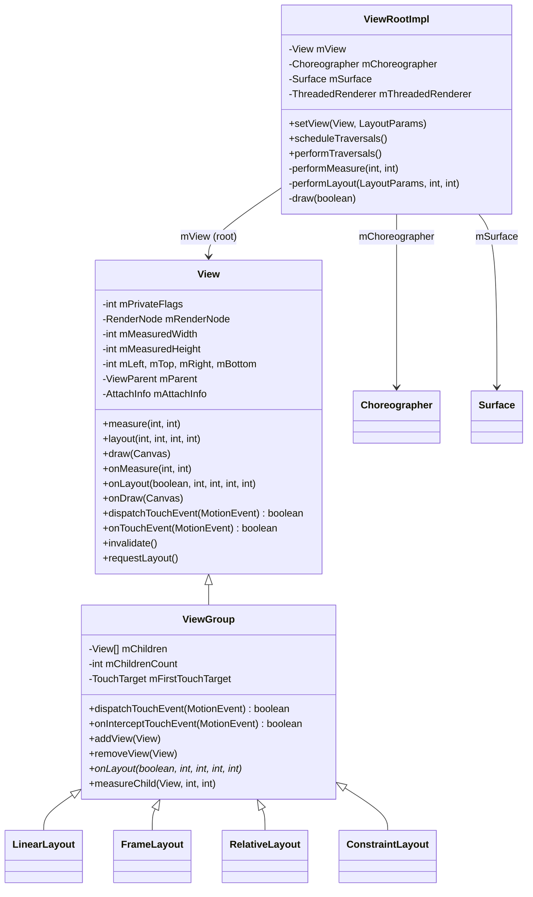

### 25.1.3 The Window-View Relationship

Each window in Android corresponds to exactly one `ViewRootImpl` instance.
When `WindowManagerImpl.addView()` is called (e.g., when an Activity's
`DecorView` is first displayed), the following chain executes:

```
WindowManagerImpl.addView(decorView, layoutParams)
  -> WindowManagerGlobal.addView()
       -> new ViewRootImpl(context, display)
       -> viewRootImpl.setView(decorView, layoutParams, panelParent)
```

Inside `ViewRootImpl.setView()` (line 1511):

```
Source: frameworks/base/core/java/android/view/ViewRootImpl.java

    public void setView(View view, WindowManager.LayoutParams attrs,
            View panelParentView, int userId) {
        synchronized (this) {
            if (mView == null) {
                mView = view;
                ...
                // Schedule the first layout -before- adding to the window
                // manager, to make sure we do the relayout before receiving
                // any other events from the system.
                requestLayout();
                InputChannel inputChannel = null;
                if ((mWindowAttributes.inputFeatures
                        & WindowManager.LayoutParams.INPUT_FEATURE_NO_INPUT_CHANNEL) == 0) {
                    inputChannel = new InputChannel();
                }
                ...
```

Key points from this code:

- The `ViewRootImpl` stores the root view in `mView`.
- `requestLayout()` is called *before* the window is added to the server, so
  the first measure/layout pass happens before any input events arrive.
- An `InputChannel` is created to receive input events from the
  `InputDispatcher` running in the system server.

### 25.1.4 The AttachInfo Structure

When a `View` is attached to a window, it receives an `AttachInfo` object that
contains per-window state shared by every view in the tree:

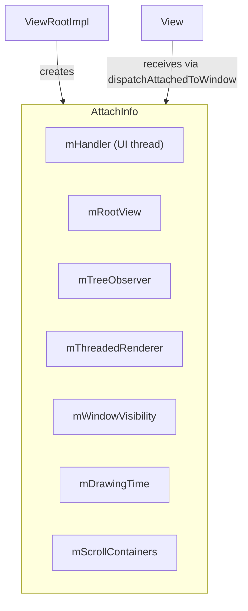

Each view in the hierarchy holds a reference to this single `AttachInfo`,
giving it access to the handler for posting messages, the renderer for
hardware acceleration, the window visibility state, and the tree observer
for layout-change callbacks.

### 25.1.5 View Identity and the View Tree

Every view has a numeric ID (set via `android:id` in XML or `setId()` in
code) and an optional transient name.  The `findViewById()` method performs
a depth-first search through the view tree to locate a view by ID:

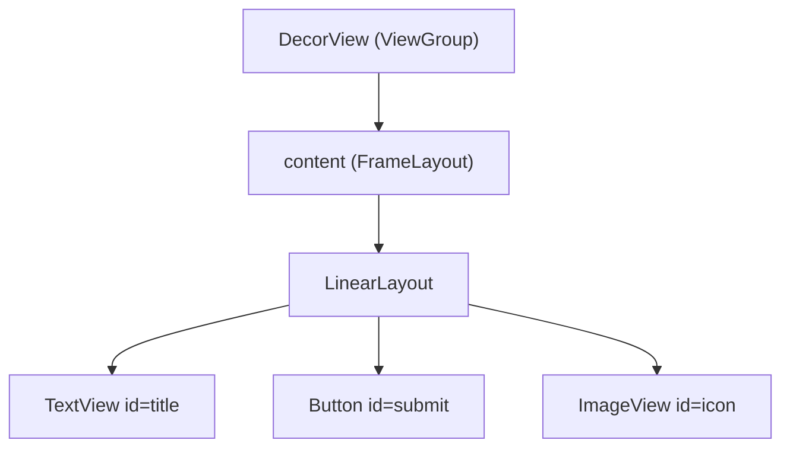

The tree is stored as an array inside each `ViewGroup`:

```
Source: frameworks/base/core/java/android/view/ViewGroup.java

    private View[] mChildren;
    private int mChildrenCount;
```

Children are drawn in array order (index 0 is drawn first, behind later
children), though `getChildDrawingOrder()` can customize this.

### 25.1.6 Private Flags: The Internal State Machine

`View` maintains its state through a set of private flag bitmasks stored in
`mPrivateFlags`, `mPrivateFlags2`, `mPrivateFlags3`, and `mPrivateFlags4`.
These flags control nearly every aspect of the view lifecycle:

| Flag | Field | Hex | Meaning |
|------|-------|-----|---------|
| `PFLAG_WANTS_FOCUS` | mPrivateFlags | `0x00000001` | View requested focus during layout |
| `PFLAG_FOCUSED` | mPrivateFlags | `0x00000002` | View currently has focus |
| `PFLAG_SELECTED` | mPrivateFlags | `0x00000004` | View is selected |
| `PFLAG_HAS_BOUNDS` | mPrivateFlags | `0x00000010` | View has been assigned bounds |
| `PFLAG_DRAWN` | mPrivateFlags | `0x00000020` | View has been drawn at least once |
| `PFLAG_DRAW_ANIMATION` | mPrivateFlags | `0x00000040` | View is being animated |
| `PFLAG_SKIP_DRAW` | mPrivateFlags | `0x00000080` | View has no drawing content |
| `PFLAG_REQUEST_TRANSPARENT_REGIONS` | mPrivateFlags | `0x00000200` | Requests transparent regions |
| `PFLAG_DRAWABLE_STATE_DIRTY` | mPrivateFlags | `0x00000400` | Drawable state needs refresh |
| `PFLAG_MEASURED_DIMENSION_SET` | mPrivateFlags | `0x00000800` | setMeasuredDimension() was called |
| `PFLAG_FORCE_LAYOUT` | mPrivateFlags | `0x00001000` | Force next measure/layout |
| `PFLAG_LAYOUT_REQUIRED` | mPrivateFlags | `0x00002000` | Layout needed after measure |
| `PFLAG_PRESSED` | mPrivateFlags | `0x00004000` | View is pressed (touch down) |
| `PFLAG_DRAWING_CACHE_VALID` | mPrivateFlags | `0x00008000` | Drawing cache is valid |
| `PFLAG_DIRTY` | mPrivateFlags | `0x00200000` | View needs redrawing |
| `PFLAG_INVALIDATED` | mPrivateFlags | `0x80000000` | View is invalidated |
| `PFLAG_PREPRESSED` | mPrivateFlags | `0x02000000` | Pre-pressed state (tap delay) |

The lifecycle of these flags during a single frame:

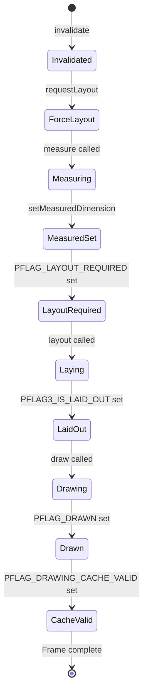

Understanding these flags is essential for debugging -- when a view refuses
to draw, the flags reveal exactly where in the pipeline it got stuck.  The
`View.toString()` method outputs a compact representation:

```
// Example output from View.toString() debug mode:
// V.E..... ........ 0,0-1080,1920 #7f080001 android:id/content
// | | flags: V=VISIBLE, E=ENABLED, F=FOCUSED, etc.
```

### 25.1.7 View Coordinate Systems

Views use multiple coordinate systems that can be confusing:

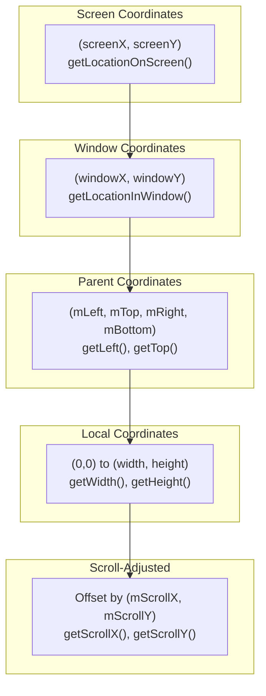

| Coordinate System | Origin | Used By |
|-------------------|--------|---------|
| Screen | Top-left of physical display | `getLocationOnScreen()`, accessibility |
| Window | Top-left of window surface | `getLocationInWindow()`, touch events |
| Parent | View's position in parent | `mLeft`, `mTop`, `getX()`, `getY()` |
| Local | Top-left of view's content area | `onDraw()`, `onTouchEvent()` |
| Scroll | Offset by scroll position | Canvas in `onDraw()` |

The `getX()` and `getY()` methods return the visual position including
translation: `getX() = mLeft + getTranslationX()`.  This is important for
views being animated -- `getLeft()` returns the layout position, while
`getX()` returns the actual visual position.

### 25.1.8 ViewTreeObserver

Each view hierarchy has a `ViewTreeObserver` that provides callbacks for
global layout events:

| Callback | When Fired |
|----------|------------|
| `OnGlobalLayoutListener` | After layout pass completes |
| `OnPreDrawListener` | Just before drawing; can cancel the draw |
| `OnDrawListener` | During each draw pass |
| `OnScrollChangedListener` | When any view scrolls |
| `OnGlobalFocusChangeListener` | When focus moves between views |
| `OnWindowAttachListener` | When view tree attaches/detaches from window |
| `OnWindowFocusChangeListener` | When window gains/loses focus |
| `OnTouchModeChangeListener` | When touch mode changes |

`OnGlobalLayoutListener` is commonly used to measure views after they have
been laid out, since `getWidth()` / `getHeight()` return 0 before layout:

```java
view.getViewTreeObserver().addOnGlobalLayoutListener(
    new ViewTreeObserver.OnGlobalLayoutListener() {
        @Override
        public void onGlobalLayout() {
            // View has been measured and laid out
            int width = view.getWidth();
            int height = view.getHeight();
            // Remove listener to avoid repeated calls
            view.getViewTreeObserver()
                .removeOnGlobalLayoutListener(this);
        }
    });
```

---

## 25.2 Measure-Layout-Draw Cycle

The core rendering loop of the Android view system is the
**measure-layout-draw** cycle, driven by `ViewRootImpl.performTraversals()`.
This method is called once per frame when the UI needs updating, triggered
by `Choreographer` on the next VSYNC.

### 25.2.1 The Three Phases

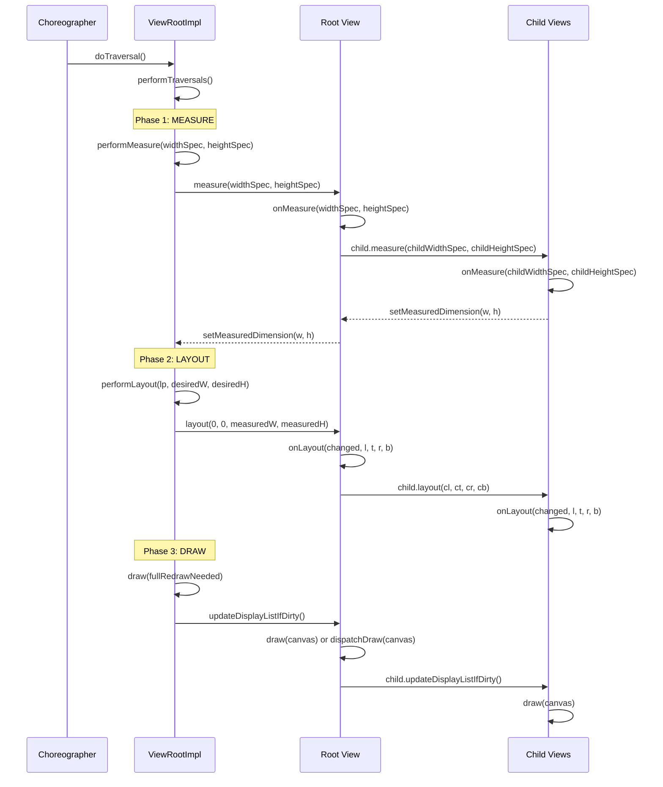

### 25.2.2 MeasureSpec: The Constraint Protocol

The measurement system communicates constraints from parent to child using
`MeasureSpec`, a packed 32-bit integer that encodes both a **mode** and a
**size** in a single `int`:

```
Source: frameworks/base/core/java/android/view/View.java (line 31726)

    public static class MeasureSpec {
        private static final int MODE_SHIFT = 30;
        private static final int MODE_MASK  = 0x3 << MODE_SHIFT;

        public static final int UNSPECIFIED = 0 << MODE_SHIFT;  // 0x00000000
        public static final int EXACTLY     = 1 << MODE_SHIFT;  // 0x40000000
        public static final int AT_MOST     = 2 << MODE_SHIFT;  // 0x80000000

        public static int makeMeasureSpec(int size, int mode) {
            return (size & ~MODE_MASK) | (mode & MODE_MASK);
        }

        public static int getMode(int measureSpec) {
            return (measureSpec & MODE_MASK);
        }

        public static int getSize(int measureSpec) {
            return (measureSpec & ~MODE_MASK);
        }
    }
```

The three modes and their meaning:

| Mode | Value | Meaning | Triggered by |
|------|-------|---------|-------------|
| `EXACTLY` | `0x40000000` | Child must be exactly this size | `match_parent` or explicit dp/px |
| `AT_MOST` | `0x80000000` | Child can be up to this size | `wrap_content` |
| `UNSPECIFIED` | `0x00000000` | No constraint; child decides | ScrollView measuring its child |

The two high bits store the mode and the remaining 30 bits store the size,
giving a maximum measurable dimension of 2^30 - 1 = 1,073,741,823 pixels.

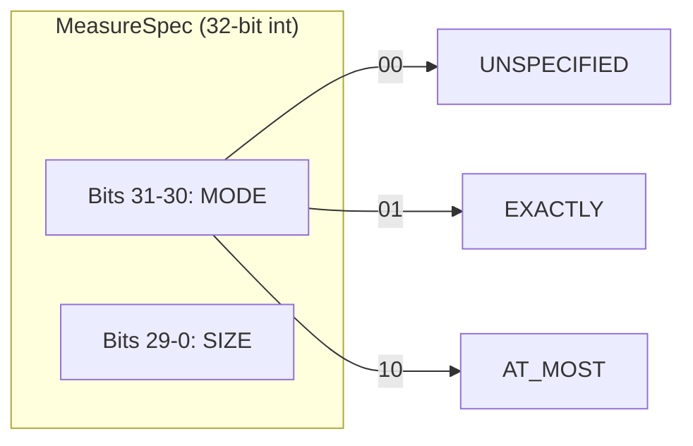

### 25.2.3 View.measure() -- The Entry Point

`View.measure()` is declared `final` -- subclasses cannot override it.
Instead they override `onMeasure()`.  The `measure()` method handles:

1. **Measure cache** -- a `LongSparseLongArray` keyed by the concatenation
   of width and height MeasureSpecs.  If the same constraints were used
   before and the view has not been force-laid-out, the cached dimensions
   are reused without calling `onMeasure()`.

2. **Force layout flag** -- `PFLAG_FORCE_LAYOUT` forces a new measurement
   regardless of cache state.

3. **Optical bounds** -- adjustments for views with optical insets (e.g.,
   shadows in 9-patch backgrounds).

```
Source: frameworks/base/core/java/android/view/View.java (line 28542)

    public final void measure(int widthMeasureSpec, int heightMeasureSpec) {
        ...
        long key = (long) widthMeasureSpec << 32 |
                   (long) heightMeasureSpec & 0xffffffffL;
        if (mMeasureCache == null) mMeasureCache = new LongSparseLongArray(2);

        final boolean forceLayout =
            (mPrivateFlags & PFLAG_FORCE_LAYOUT) == PFLAG_FORCE_LAYOUT;
        ...
        if (forceLayout || needsLayout) {
            mPrivateFlags &= ~PFLAG_MEASURED_DIMENSION_SET;
            resolveRtlPropertiesIfNeeded();
            int cacheIndex = ...;
            if (cacheIndex < 0) {
                onMeasure(widthMeasureSpec, heightMeasureSpec);
            } else {
                long value = mMeasureCache.valueAt(cacheIndex);
                setMeasuredDimensionRaw((int)(value >> 32), (int)value);
            }
            // Verify setMeasuredDimension() was called
            if ((mPrivateFlags & PFLAG_MEASURED_DIMENSION_SET)
                    != PFLAG_MEASURED_DIMENSION_SET) {
                throw new IllegalStateException(
                    getClass().getName() + "#onMeasure() did not set the "
                    + "measured dimension by calling setMeasuredDimension()");
            }
            mPrivateFlags |= PFLAG_LAYOUT_REQUIRED;
        }
        ...
    }
```

The contract is strict: if you override `onMeasure()`, you **must** call
`setMeasuredDimension()`.  Failure to do so throws an `IllegalStateException`.

### 25.2.4 The Default onMeasure()

The base `View.onMeasure()` simply picks the larger of the background size
and the minimum size:

```
Source: frameworks/base/core/java/android/view/View.java (line 28672)

    protected void onMeasure(int widthMeasureSpec, int heightMeasureSpec) {
        setMeasuredDimension(
            getDefaultSize(getSuggestedMinimumWidth(), widthMeasureSpec),
            getDefaultSize(getSuggestedMinimumHeight(), heightMeasureSpec));
    }
```

`getDefaultSize()` returns the spec size for EXACTLY and AT_MOST, and the
suggested minimum for UNSPECIFIED.  This is why a bare custom `View` with
`wrap_content` fills its parent unless `onMeasure()` is overridden.

### 25.2.5 ViewGroup Measurement

`ViewGroup` does not override `onMeasure()` directly -- it is abstract.
Instead it provides helper methods for subclasses:

- **`measureChild(child, parentWidthSpec, parentHeightSpec)`** -- creates
  child specs from parent specs minus padding, then calls `child.measure()`.
- **`measureChildWithMargins(child, parentWidthSpec, widthUsed,
  parentHeightSpec, heightUsed)`** -- like `measureChild` but also accounts
  for the child's margins and space already consumed by other children.
- **`getChildMeasureSpec(parentSpec, padding, childDimension)`** -- the
  core algorithm that combines a parent's constraint with a child's
  `LayoutParams` dimension to produce the child's `MeasureSpec`.

The spec-combination table:

| Parent Mode | Child LayoutParams | Result Mode | Result Size |
|-------------|-------------------|-------------|-------------|
| EXACTLY | exact dp | EXACTLY | child size |
| EXACTLY | match_parent | EXACTLY | parent size - padding |
| EXACTLY | wrap_content | AT_MOST | parent size - padding |
| AT_MOST | exact dp | EXACTLY | child size |
| AT_MOST | match_parent | AT_MOST | parent size - padding |
| AT_MOST | wrap_content | AT_MOST | parent size - padding |
| UNSPECIFIED | exact dp | EXACTLY | child size |
| UNSPECIFIED | match_parent | UNSPECIFIED | 0 |
| UNSPECIFIED | wrap_content | UNSPECIFIED | 0 |

### 25.2.6 View.layout() -- Positioning

After measurement, `performLayout()` positions the root view at (0, 0):

```
Source: frameworks/base/core/java/android/view/ViewRootImpl.java (line 5164)

    host.layout(0, 0, host.getMeasuredWidth(), host.getMeasuredHeight());
```

`View.layout()` (line 25798) stores the position and calls `onLayout()`:

```
Source: frameworks/base/core/java/android/view/View.java

    public void layout(int l, int t, int r, int b) {
        if ((mPrivateFlags3 & PFLAG3_MEASURE_NEEDED_BEFORE_LAYOUT) != 0) {
            onMeasure(mOldWidthMeasureSpec, mOldHeightMeasureSpec);
            mPrivateFlags3 &= ~PFLAG3_MEASURE_NEEDED_BEFORE_LAYOUT;
        }

        int oldL = mLeft;
        int oldT = mTop;
        int oldB = mBottom;
        int oldR = mRight;

        boolean changed = isLayoutModeOptical(mParent) ?
                setOpticalFrame(l, t, r, b) : setFrame(l, t, r, b);

        if (changed || (mPrivateFlags & PFLAG_LAYOUT_REQUIRED)
                == PFLAG_LAYOUT_REQUIRED) {
            onLayout(changed, l, t, r, b);
            ...
            // Notify OnLayoutChangeListeners
            if (li != null && li.mOnLayoutChangeListeners != null) {
                for (OnLayoutChangeListener listener : listenersCopy) {
                    listener.onLayoutChange(this, l, t, r, b,
                                            oldL, oldT, oldR, oldB);
                }
            }
        }
        mPrivateFlags &= ~PFLAG_FORCE_LAYOUT;
        mPrivateFlags3 |= PFLAG3_IS_LAID_OUT;
    }
```

Notice the re-measurement guard: if the view was served from the measure
cache (`PFLAG3_MEASURE_NEEDED_BEFORE_LAYOUT`), `onMeasure()` is called
again before layout to ensure a fresh measurement.

### 25.2.7 View.draw() -- The Seven Steps

`View.draw()` (line 25251) executes drawing in a precisely defined order:

```
Source: frameworks/base/core/java/android/view/View.java

    public void draw(@NonNull Canvas canvas) {
        /*
         * Draw traversal performs several drawing steps which must
         * be executed in the appropriate order:
         *
         *      1. Draw the background
         *      2. If necessary, save the canvas' layers to prepare
         *         for fading
         *      3. Draw view's content
         *      4. Draw children
         *      5. If necessary, draw the fading edges and restore layers
         *      6. Draw decorations (scrollbars for instance)
         *      7. If necessary, draw the default focus highlight
         */

        drawBackground(canvas);         // Step 1
        ...
        onDraw(canvas);                 // Step 3
        dispatchDraw(canvas);           // Step 4
        ...
        onDrawForeground(canvas);       // Step 6
        drawDefaultFocusHighlight(canvas); // Step 7
    }
```

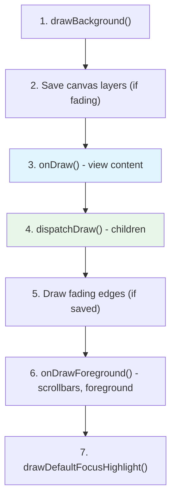

For `ViewGroup`, `dispatchDraw()` iterates over children and calls
`drawChild()` for each, which in turn calls `child.draw(canvas, this, ...)`.

### 25.2.8 The PFLAG_SKIP_DRAW Optimization

Many `ViewGroup` subclasses (like `LinearLayout`, `FrameLayout`) have no
custom drawing of their own -- they merely contain children.  When a
`ViewGroup` has no background, no foreground, and no custom drawing, the
framework sets `PFLAG_SKIP_DRAW`, and `updateDisplayListIfDirty()` bypasses
`draw()` entirely, calling `dispatchDraw()` directly:

```
Source: frameworks/base/core/java/android/view/View.java (line 24116)

    if ((mPrivateFlags & PFLAG_SKIP_DRAW) == PFLAG_SKIP_DRAW) {
        dispatchDraw(canvas);
        drawAutofilledHighlight(canvas);
        if (mOverlay != null && !mOverlay.isEmpty()) {
            mOverlay.getOverlayView().draw(canvas);
        }
    } else {
        draw(canvas);
    }
```

This optimization is significant: in a typical deep view hierarchy, many
intermediate `ViewGroup` nodes skip most of the draw pipeline.

### 25.2.9 requestLayout() and invalidate()

Two methods trigger re-rendering, but they serve different purposes:

**`requestLayout()`** -- signals that the view's dimensions or position may
have changed.  It walks up the parent chain, setting `PFLAG_FORCE_LAYOUT`
on each ancestor until reaching `ViewRootImpl`, which calls
`scheduleTraversals()`.  This triggers a full measure-layout-draw cycle.

```
Source: frameworks/base/core/java/android/view/View.java (line 28478)

    public void requestLayout() {
        if (mMeasureCache != null) mMeasureCache.clear();
        ...
        mPrivateFlags |= PFLAG_FORCE_LAYOUT;
        mPrivateFlags |= PFLAG_INVALIDATED;

        if (mParent != null && !mParent.isLayoutRequested()) {
            mParent.requestLayout();
        }
    }
```

**`invalidate()`** -- signals that the view's appearance has changed but its
size and position have not.  It propagates a dirty rectangle up to
`ViewRootImpl`, triggering only a draw pass (no measure or layout).

```
Source: frameworks/base/core/java/android/view/View.java (line 21249)

    public void invalidate() {
        invalidate(true);
    }

    void invalidateInternal(int l, int t, int r, int b,
            boolean invalidateCache, boolean fullInvalidate) {
        ...
        mPrivateFlags |= PFLAG_DIRTY;
        if (invalidateCache) {
            mPrivateFlags |= PFLAG_INVALIDATED;
            mPrivateFlags &= ~PFLAG_DRAWING_CACHE_VALID;
        }
        // Propagate the damage rectangle to the parent view.
        final ViewParent p = mParent;
        if (p != null && ai != null && l < r && t < b) {
            final Rect damage = ai.mTmpInvalRect;
            damage.set(l, t, r, b);
            p.invalidateChild(this, damage);
        }
    }
```

```mermaid
graph TB
    subgraph "requestLayout() path"
        RL1["View.requestLayout()"] --> RL2["parent.requestLayout()"]
        RL2 --> RL3["...ancestors..."]
        RL3 --> RL4["ViewRootImpl.requestLayout()"]
        RL4 --> RL5["scheduleTraversals()"]
        RL5 --> RL6["MEASURE + LAYOUT + DRAW"]
    end

    subgraph "invalidate() path"
        INV1["View.invalidate()"] --> INV2["parent.invalidateChild(this, dirty)"]
        INV2 --> INV3["...ancestors..."]
        INV3 --> INV4["ViewRootImpl.invalidateChildInParent()"]
        INV4 --> INV5["scheduleTraversals()"]
        INV5 --> INV6["DRAW only"]
    end
```

### 25.2.10 performTraversals() -- The Orchestrator

`ViewRootImpl.performTraversals()` (line 3574) is the single largest method
in the view system, spanning hundreds of lines.  It orchestrates the entire
rendering pipeline:

```
Source: frameworks/base/core/java/android/view/ViewRootImpl.java

    private void performTraversals() {
        final View host = mView;
        if (host == null || !mAdded) return;
        ...
        mIsInTraversal = true;
        mWillDrawSoon = true;
        ...
        // Phase 0: Determine desired window size
        if (mFirst) {
            desiredWindowWidth = ...;  // From display or frame
            desiredWindowHeight = ...;
            host.dispatchAttachedToWindow(mAttachInfo, 0);
            dispatchApplyInsets(host);
        }
        ...
        // Phase 1: MEASURE
        if (layoutRequested) {
            windowSizeMayChange |= measureHierarchy(host, lp,
                resources, desiredWindowWidth, desiredWindowHeight, ...);
        }
        ...
        // Phase 1.5: Relayout window if size changed
        if (windowShouldResize || ...) {
            relayoutResult = relayoutWindow(params, ...);
            ...
        }
        ...
        // Phase 2: LAYOUT
        if (didLayout) {
            performLayout(lp, desiredWindowWidth, desiredWindowHeight);
        }
        ...
        // Phase 3: DRAW
        if (!cancelAndRedraw) {
            ... // perform the draw
        }
        ...
        mIsInTraversal = false;
    }
```

The critical subtlety is that `performTraversals()` may call
`measureHierarchy()` *twice* -- once before relayout and once after -- if
the window size changed as a result of measurement.  This two-pass behavior
ensures that views see the final window dimensions during their last
measurement.

### 25.2.11 performMeasure, performLayout, and draw

These are thin wrappers that add tracing:

```
Source: frameworks/base/core/java/android/view/ViewRootImpl.java (line 5082)

    private void performMeasure(int childWidthMeasureSpec,
            int childHeightMeasureSpec) {
        if (mView == null) return;
        Trace.traceBegin(Trace.TRACE_TAG_VIEW, "measure");
        try {
            mView.measure(childWidthMeasureSpec, childHeightMeasureSpec);
        } finally {
            Trace.traceEnd(Trace.TRACE_TAG_VIEW);
        }
        mMeasuredWidth = mView.getMeasuredWidth();
        mMeasuredHeight = mView.getMeasuredHeight();
    }
```

```
Source: frameworks/base/core/java/android/view/ViewRootImpl.java (line 5148)

    private void performLayout(WindowManager.LayoutParams lp,
            int desiredWindowWidth, int desiredWindowHeight) {
        mInLayout = true;
        final View host = mView;
        ...
        host.layout(0, 0, host.getMeasuredWidth(),
                          host.getMeasuredHeight());
        mInLayout = false;
        // Handle requestLayout() calls that occurred during layout
        int numViewsRequestingLayout = mLayoutRequesters.size();
        if (numViewsRequestingLayout > 0) {
            // Second pass for views that called requestLayout during layout
            ...
            host.layout(0, 0, host.getMeasuredWidth(),
                              host.getMeasuredHeight());
        }
    }
```

The second layout pass handles the case where a view calls `requestLayout()`
during `onLayout()`.  This is logged as a warning but is tolerated for
backward compatibility.

---

## 25.3 Touch Event Dispatch

The touch dispatch mechanism in Android is one of the most nuanced parts of
the framework.  Understanding it requires following the event from the
`InputDispatcher` in the system server through `ViewRootImpl` to the
deepest child view.

### 25.3.1 MotionEvent Anatomy

Before tracing the dispatch chain, we must understand `MotionEvent` -- the
object that carries all touch information:

```
Source: frameworks/base/core/java/android/view/MotionEvent.java (line 197)

    public final class MotionEvent extends InputEvent implements Parcelable {
```

A single `MotionEvent` can contain data for **multiple pointers** (fingers)
simultaneously.  Each pointer has:

- **Pointer ID** -- stable identifier for the lifetime of the touch
  (persists across MOVE events).
- **Pointer Index** -- position in the current event's pointer array
  (can change between events).
- **X, Y coordinates** -- position in the receiving view's coordinate space.
- **Pressure, Size, Touch Major/Minor** -- physical characteristics.
- **Tool Type** -- `TOOL_TYPE_FINGER`, `TOOL_TYPE_STYLUS`, `TOOL_TYPE_MOUSE`,
  `TOOL_TYPE_ERASER`, or `TOOL_TYPE_PALM`.

**Action codes:**

| Action | Value | Meaning |
|--------|-------|---------|
| `ACTION_DOWN` | 0 | First finger touches the screen |
| `ACTION_UP` | 1 | Last finger lifts off |
| `ACTION_MOVE` | 2 | One or more fingers moved |
| `ACTION_CANCEL` | 3 | Gesture canceled (e.g., parent intercepted) |
| `ACTION_OUTSIDE` | 4 | Touch outside the window bounds |
| `ACTION_POINTER_DOWN` | 5 + (index << 8) | Additional finger touches |
| `ACTION_POINTER_UP` | 6 + (index << 8) | Non-last finger lifts off |
| `ACTION_HOVER_MOVE` | 7 | Pointer moved while not touching |
| `ACTION_HOVER_ENTER` | 9 | Pointer entered view bounds |
| `ACTION_HOVER_EXIT` | 10 | Pointer exited view bounds |

The `ACTION_POINTER_DOWN` and `ACTION_POINTER_UP` actions encode the pointer
index in the upper 8 bits.  Use `getActionMasked()` to strip the index, and
`getActionIndex()` to retrieve it:

```java
int actionMasked = event.getActionMasked();  // e.g., ACTION_POINTER_DOWN
int pointerIndex = event.getActionIndex();   // e.g., 1
int pointerId = event.getPointerId(pointerIndex);  // Stable ID
```

**Batching**: For efficiency, multiple `ACTION_MOVE` samples between VSYNC
frames are batched into a single `MotionEvent`.  The latest coordinates are
in the main event; historical samples are accessible via:

```java
int historySize = event.getHistorySize();
for (int h = 0; h < historySize; h++) {
    float historicalX = event.getHistoricalX(h);
    float historicalY = event.getHistoricalY(h);
    long historicalTime = event.getHistoricalEventTime(h);
}
```

### 25.3.2 ViewConfiguration Touch Constants

`ViewConfiguration` provides density-scaled constants that control touch
behavior throughout the framework:

```
Source: frameworks/base/core/java/android/view/ViewConfiguration.java (line 51)
```

| Constant | Default Value | Purpose |
|----------|:------------:|---------|
| `TAP_TIMEOUT` | 100 ms | Delay before confirming a tap (vs. scroll) |
| `DOUBLE_TAP_TIMEOUT` | 300 ms | Max interval between double-tap events |
| `DOUBLE_TAP_MIN_TIME` | 40 ms | Min interval (filter accidental double-taps) |
| `LONG_PRESS_TIMEOUT` | 400 ms | Duration before long-press fires |
| `PRESSED_STATE_DURATION` | 64 ms | Duration of pressed visual feedback |
| `MULTI_PRESS_TIMEOUT` | 300 ms | Interval for multi-press detection |
| `KEY_REPEAT_TIMEOUT` | 400 ms | Delay before key repeat starts |
| `KEY_REPEAT_DELAY` | 50 ms | Interval between key repeats |
| `SCROLL_BAR_FADE_DURATION` | 250 ms | Scrollbar fade-out animation time |
| `SCROLL_BAR_DEFAULT_DELAY` | 300 ms | Delay before scrollbar fades |

Scaled (density-dependent) constants:

| Method | Default (mdpi) | Purpose |
|--------|:--------------:|---------|
| `getScaledTouchSlop()` | 8 dp | Min movement before recognizing a drag |
| `getScaledDoubleTapSlop()` | 100 dp | Max distance between double-tap events |
| `getScaledMinimumFlingVelocity()` | 50 dp/s | Min velocity for a fling gesture |
| `getScaledMaximumFlingVelocity()` | 8000 dp/s | Max capped fling velocity |
| `getScaledOverscrollDistance()` | 0 dp | Overscroll distance |
| `getScaledOverflingDistance()` | 6 dp | Overfling distance |
| `getScaledPagingTouchSlop()` | 16 dp | Slop for paging gestures |

These constants are used throughout `View.onTouchEvent()`,
`ScrollView.onInterceptTouchEvent()`, `RecyclerView`, `ViewPager`, etc. to
make gesture recognition behave consistently across different screen densities.

### 25.3.3 The MotionEvent Journey

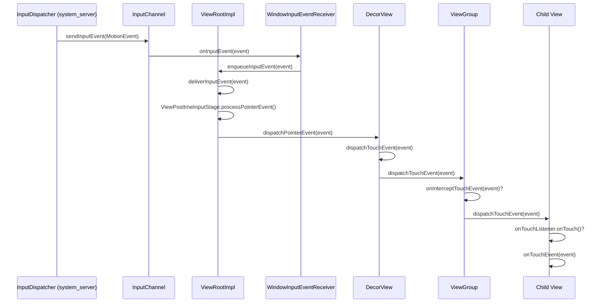

### 25.3.4 ViewRootImpl Input Pipeline

`ViewRootImpl` processes input events through a chain of **InputStage**
objects, each responsible for a different category:

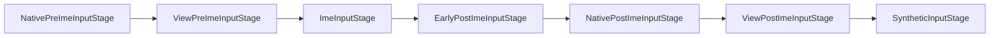

Touch events flow through `ViewPostImeInputStage`, which calls
`mView.dispatchPointerEvent(event)`, ultimately invoking the root view's
`dispatchTouchEvent()`.

### 25.3.5 View.dispatchTouchEvent()

For leaf `View` objects, the dispatch is straightforward:

```
Source: frameworks/base/core/java/android/view/View.java (line 16750)

    public boolean dispatchTouchEvent(MotionEvent event) {
        if (event.isTargetAccessibilityFocus()) {
            if (!isAccessibilityFocusedViewOrHost()) {
                return false;
            }
            event.setTargetAccessibilityFocus(false);
        }
        boolean result = false;
        ...
        if (onFilterTouchEventForSecurity(event)) {
            result = performOnTouchCallback(event);
        }
        ...
        return result;
    }
```

`performOnTouchCallback()` implements the priority chain:

1. **ScrollBar dragging** -- if the event is on a scrollbar, handle it.
2. **`OnTouchListener.onTouch()`** -- if set and the view is enabled, call
   the listener.  If it returns `true`, the event is consumed.
3. **`onTouchEvent()`** -- the default handling for clicks, long-presses,
   etc.

```
Source: frameworks/base/core/java/android/view/View.java (line 16796)

    private boolean performOnTouchCallback(MotionEvent event) {
        boolean handled = false;
        if ((mViewFlags & ENABLED_MASK) == ENABLED
                && handleScrollBarDragging(event)) {
            handled = true;
        }
        ListenerInfo li = mListenerInfo;
        if (li != null && li.mOnTouchListener != null
                && (mViewFlags & ENABLED_MASK) == ENABLED) {
            handled = li.mOnTouchListener.onTouch(this, event);
        }
        if (handled) return true;
        return onTouchEvent(event);
    }
```

### 25.3.6 ViewGroup.dispatchTouchEvent() -- The Full Algorithm

`ViewGroup.dispatchTouchEvent()` (line 2646) implements the complete touch
dispatch algorithm.  This is the most critical event-handling code in
Android:

**Step 1: Reset on ACTION_DOWN**

```
Source: frameworks/base/core/java/android/view/ViewGroup.java

    if (actionMasked == MotionEvent.ACTION_DOWN) {
        cancelAndClearTouchTargets(ev);
        resetTouchState();
    }
```

Every new gesture starts clean -- the old touch targets are cleared.

**Step 2: Check for interception**

```
    final boolean intercepted;
    if (actionMasked == MotionEvent.ACTION_DOWN
            || mFirstTouchTarget != null) {
        final boolean disallowIntercept =
            (mGroupFlags & FLAG_DISALLOW_INTERCEPT) != 0;
        if (!disallowIntercept) {
            intercepted = onInterceptTouchEvent(ev);
        } else {
            intercepted = false;
        }
    } else {
        // No touch targets and not a DOWN -- keep intercepting
        intercepted = true;
    }
```

The interception check only runs on `ACTION_DOWN` or when a child is
already receiving events.  The child can call
`parent.requestDisallowInterceptTouchEvent(true)` to prevent the parent
from intercepting (e.g., a horizontal `ViewPager` inside a vertical
`ScrollView`).

**Step 3: Find a touch target (on DOWN)**

```
    if (!canceled && !intercepted) {
        if (actionMasked == MotionEvent.ACTION_DOWN
                || (split && actionMasked == MotionEvent.ACTION_POINTER_DOWN)
                || actionMasked == MotionEvent.ACTION_HOVER_MOVE) {
            ...
            // Scan children from front to back
            for (int i = childrenCount - 1; i >= 0; i--) {
                final View child = ...;
                if (!child.canReceivePointerEvents()
                        || !isTransformedTouchPointInView(x, y, child, null)) {
                    continue;
                }
                ...
                if (dispatchTransformedTouchEvent(ev, false, child, idBits)) {
                    // Child wants the touch -- add to touch targets
                    newTouchTarget = addTouchTarget(child, idBitsToAssign);
                    alreadyDispatchedToNewTouchTarget = true;
                    break;
                }
            }
        }
    }
```

Children are scanned **front to back** (highest Z-order first, which is
the highest index in the children array).  The first child that returns
`true` from `dispatchTransformedTouchEvent()` becomes the touch target.

**Step 4: Dispatch to touch targets**

```
    if (mFirstTouchTarget == null) {
        // No child consumed it -- handle as ordinary view
        handled = dispatchTransformedTouchEvent(ev, canceled, null,
                TouchTarget.ALL_POINTER_IDS);
    } else {
        // Dispatch to existing touch targets
        TouchTarget target = mFirstTouchTarget;
        while (target != null) {
            final TouchTarget next = target.next;
            if (alreadyDispatchedToNewTouchTarget
                    && target == newTouchTarget) {
                handled = true;
            } else {
                final boolean cancelChild = ... || intercepted;
                if (dispatchTransformedTouchEvent(ev, cancelChild,
                        target.child, target.pointerIdBits)) {
                    handled = true;
                }
            }
            target = next;
        }
    }
```

The `TouchTarget` linked list allows multi-touch: different pointers can be
routed to different children.

### 25.3.7 The Complete Dispatch Flow

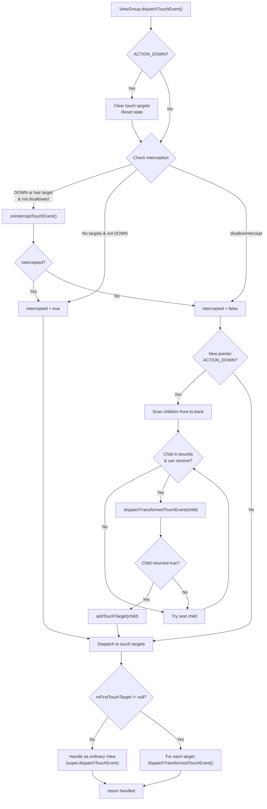

### 25.3.8 onInterceptTouchEvent()

The default `ViewGroup.onInterceptTouchEvent()` almost always returns
`false`:

```
Source: frameworks/base/core/java/android/view/ViewGroup.java (line 3311)

    public boolean onInterceptTouchEvent(MotionEvent ev) {
        if (ev.isFromSource(InputDevice.SOURCE_MOUSE)
                && ev.getAction() == MotionEvent.ACTION_DOWN
                && ev.isButtonPressed(MotionEvent.BUTTON_PRIMARY)
                && isOnScrollbarThumb(ev.getX(), ev.getY())) {
            return true;
        }
        return false;
    }
```

Scrolling containers like `ScrollView` and `RecyclerView` override this to
detect scroll gestures and intercept them from their children.

### 25.3.9 onTouchEvent() -- Click and Long-Press Handling

`View.onTouchEvent()` (line 18265) implements the built-in gesture
recognition for clicks, long-presses, and touch feedback:

```
Source: frameworks/base/core/java/android/view/View.java

    public boolean onTouchEvent(MotionEvent event) {
        final boolean clickable = ((viewFlags & CLICKABLE) == CLICKABLE
                || (viewFlags & LONG_CLICKABLE) == LONG_CLICKABLE)
                || (viewFlags & CONTEXT_CLICKABLE) == CONTEXT_CLICKABLE;

        if ((viewFlags & ENABLED_MASK) == DISABLED) {
            // A disabled view still consumes events if clickable
            return clickable;
        }

        if (mTouchDelegate != null) {
            if (mTouchDelegate.onTouchEvent(event)) return true;
        }

        if (clickable || (viewFlags & TOOLTIP) == TOOLTIP) {
            switch (action) {
                case MotionEvent.ACTION_UP:
                    // Check for tap, schedule performClick()
                    if (!mHasPerformedLongPress && !mIgnoreNextUpEvent) {
                        removeLongPressCallback();
                        if (!focusTaken) {
                            if (mPerformClick == null) {
                                mPerformClick = new PerformClick();
                            }
                            if (!post(mPerformClick)) {
                                performClickInternal();
                            }
                        }
                    }
                    break;

                case MotionEvent.ACTION_DOWN:
                    // Start long-press detection
                    if (isInScrollingContainer) {
                        mPrivateFlags |= PFLAG_PREPRESSED;
                        // Delayed pressed feedback
                        postDelayed(mPendingCheckForTap,
                            ViewConfiguration.getTapTimeout());
                    } else {
                        setPressed(true, x, y);
                        checkForLongClick(0, x, y, ...);
                    }
                    break;

                case MotionEvent.ACTION_CANCEL:
                    // Reset all state
                    ...
                    break;

                case MotionEvent.ACTION_MOVE:
                    // Check if still inside view bounds
                    ...
                    break;
            }
            return true;
        }
        return false;
    }
```

Key behaviors:

- **PREPRESSED** state: Inside a scrolling container, the pressed visual
  feedback is delayed by `ViewConfiguration.getTapTimeout()` (100ms) to
  distinguish taps from scroll starts.
- **Long-press** detection: A `CheckForLongPress` Runnable is posted with
  `ViewConfiguration.getLongPressTimeout()` (usually 500ms).
- **Click** is posted via `PerformClick` Runnable rather than called directly,
  allowing the view's visual state to update before the click handler runs.

### 25.3.10 Multi-Touch and Pointer Splitting

When `FLAG_SPLIT_MOTION_EVENTS` is set (the default since API 11),
`ViewGroup` can route different pointer IDs to different children.  The
`TouchTarget` linked list stores pointer ID bitmasks per target:

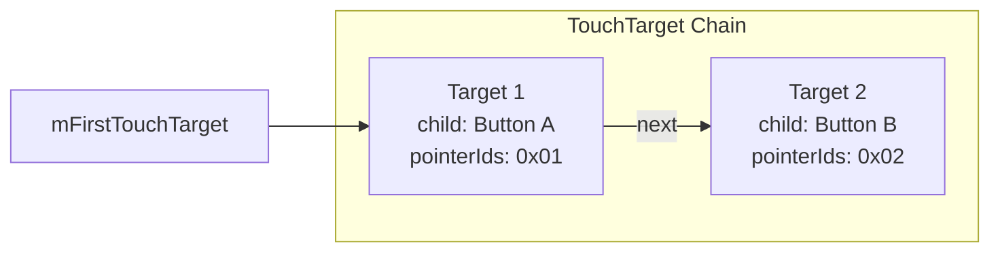

When dispatching, `dispatchTransformedTouchEvent()` splits the
`MotionEvent`, creating a new event with only the relevant pointers for
each target child.

### 25.3.11 Nested Scrolling

Modern Android uses the **nested scrolling** protocol for coordinating
scroll between parent and child:

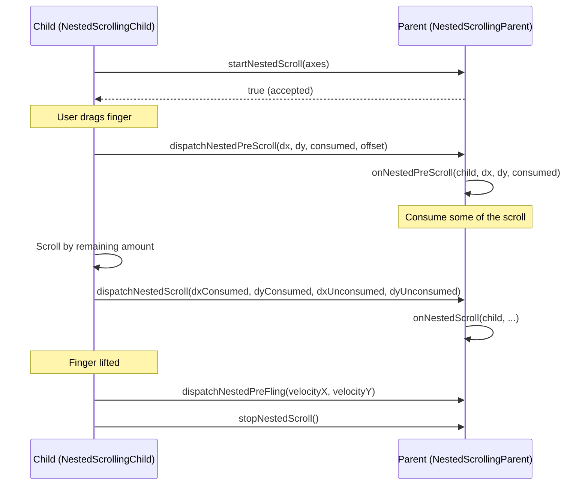

This protocol allows, for example, a `RecyclerView` inside a
`CoordinatorLayout` to share scroll with a collapsing toolbar.

---

## 25.4 ViewRootImpl: The Bridge to WMS

`ViewRootImpl` is the most important class in the client-side view system.
It implements `ViewParent`, serving as the ultimate parent of the view
hierarchy, and communicates with WindowManagerService through a Binder
interface.

### 25.4.1 Lifecycle

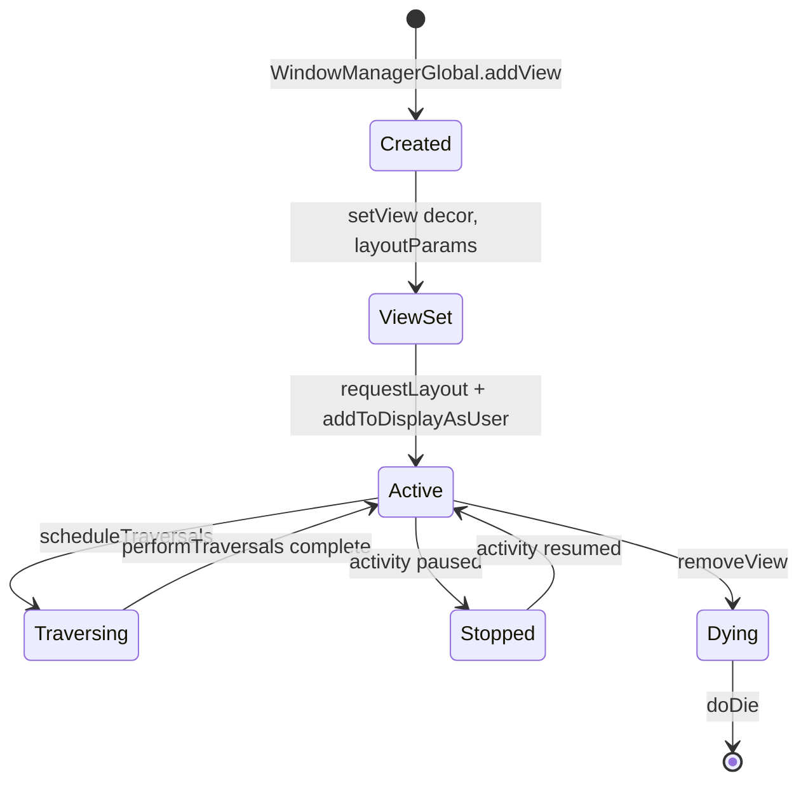

### 25.4.2 scheduleTraversals() and Choreographer

`scheduleTraversals()` is the gateway to the rendering pipeline:

```
Source: frameworks/base/core/java/android/view/ViewRootImpl.java (line 3085)

    void scheduleTraversals() {
        if (!mTraversalScheduled) {
            mTraversalScheduled = true;
            mTraversalBarrier = mQueue.postSyncBarrier();
            mChoreographer.postCallback(
                    Choreographer.CALLBACK_TRAVERSAL,
                    mTraversalRunnable, null);
            notifyRendererOfFramePending();
            pokeDrawLockIfNeeded();
        }
    }
```

Three critical actions happen here:

1. **Sync barrier** -- `mQueue.postSyncBarrier()` inserts a barrier into the
   `MessageQueue`, preventing synchronous messages from running.  Only
   asynchronous messages (like VSYNC callbacks) can proceed.  This ensures
   traversals happen before any other handler messages.

2. **Choreographer callback** -- The traversal is posted as a
   `CALLBACK_TRAVERSAL` type, which runs after input and animation callbacks
   in the Choreographer's frame processing.

3. **Renderer notification** -- `notifyRendererOfFramePending()` tells HWUI
   a frame is coming, allowing it to prepare.

### 25.4.3 Choreographer Frame Processing

The `Choreographer` coordinates all frame-related work through five callback
types, executed in strict order:

```
Source: frameworks/base/core/java/android/view/Choreographer.java (line 1156)

    mFrameInfo.markInputHandlingStart();
    doCallbacks(Choreographer.CALLBACK_INPUT, frameIntervalNanos);

    mFrameInfo.markAnimationsStart();
    doCallbacks(Choreographer.CALLBACK_ANIMATION, frameIntervalNanos);
    doCallbacks(Choreographer.CALLBACK_INSETS_ANIMATION, frameIntervalNanos);

    mFrameInfo.markPerformTraversalsStart();
    doCallbacks(Choreographer.CALLBACK_TRAVERSAL, frameIntervalNanos);

    doCallbacks(Choreographer.CALLBACK_COMMIT, frameIntervalNanos);
```

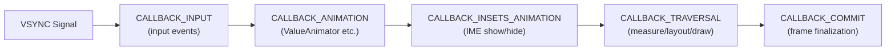

| Callback Type | Value | Purpose |
|---------------|-------|---------|
| `CALLBACK_INPUT` | 0 | Process pending input events |
| `CALLBACK_ANIMATION` | 1 | Run `ValueAnimator` frame updates |
| `CALLBACK_INSETS_ANIMATION` | 2 | Inset animation updates (e.g., IME transition) |
| `CALLBACK_TRAVERSAL` | 3 | `performTraversals()` -- measure, layout, draw |
| `CALLBACK_COMMIT` | 4 | Frame commit; jitter correction |

The ordering matters: input is processed first so animations and traversals
reflect the latest user interaction.

### 25.4.4 The doTraversal() Bridge

When the Choreographer fires `CALLBACK_TRAVERSAL`, it invokes
`mTraversalRunnable`:

```
Source: frameworks/base/core/java/android/view/ViewRootImpl.java (line 3123)

    void doTraversal() {
        if (mTraversalScheduled) {
            mTraversalScheduled = false;
            mQueue.removeSyncBarrier(mTraversalBarrier);
            performTraversals();
        }
    }
```

The sync barrier is removed *before* `performTraversals()` runs, allowing
normal messages to be processed once the traversal completes.

### 25.4.5 Window Relayout

During `performTraversals()`, if the window size has changed, ViewRootImpl
calls `relayoutWindow()`, which is a Binder call to `WindowManagerService`:

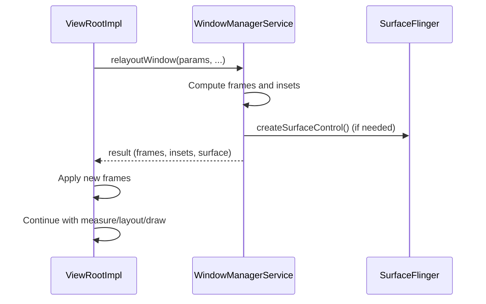

The result includes the new window frame, insets, and possibly a new
`Surface` if the window was newly created or recreated.

### 25.4.6 RequestLayout During Layout

`ViewRootImpl` handles the pathological case where `requestLayout()` is
called during an ongoing layout pass:

```
Source: frameworks/base/core/java/android/view/ViewRootImpl.java (line 5129)

    boolean requestLayoutDuringLayout(final View view) {
        if (!mLayoutRequesters.contains(view)) {
            mLayoutRequesters.add(view);
        }
        if (!mHandlingLayoutInLayoutRequest) {
            return true;  // First pass: let it proceed
        } else {
            return false;  // Second pass: post to next frame
        }
    }
```

In `performLayout()`, after the first `host.layout()` call, any views that
called `requestLayout()` during layout are collected and a **second layout
pass** is triggered.  If any *still* request layout during the second pass,
their requests are posted to the next frame to prevent infinite loops.

### 25.4.7 Input Event Delivery Pipeline in Detail

The input pipeline in `ViewRootImpl` deserves deeper examination.  When an
input event arrives from the `InputDispatcher`, it passes through a chain
of `InputStage` objects.  Each stage can:

1. **Forward** the event to the next stage.
2. **Finish** the event (mark as handled).

The stages are constructed in `setView()`:

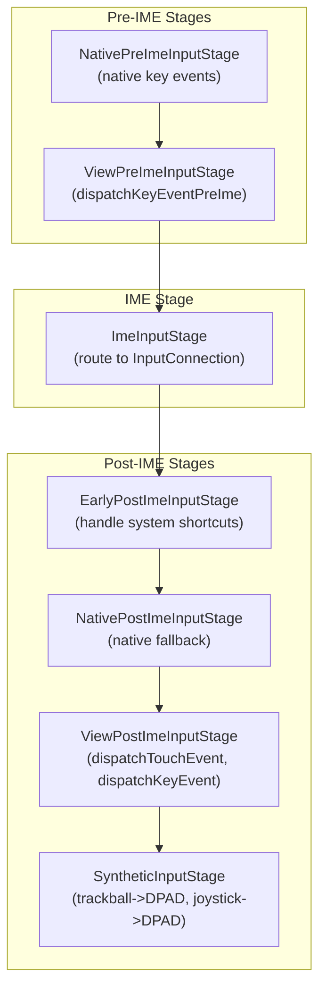

For touch events, `ViewPostImeInputStage` is the critical stage.  Its
`processPointerEvent()` method calls:

1. `mView.dispatchPointerEvent(event)` -- dispatches to the view hierarchy.
2. If the event is a `DOWN`, it schedules a check for potential pointer
   capture.
3. If hardware acceleration is enabled and the event involves drawing, it
   uses `mAttachInfo.mThreadedRenderer` to signal the render thread.

For key events, the pipeline allows the IME to consume keys before the view
hierarchy sees them.  This is why typing in an `EditText` does not trigger
`onKeyDown()` on the `Activity` -- the IME stage intercepts the key first.

### 25.4.8 Sync Barrier Mechanism

The sync barrier is a subtle but load-bearing mechanism.  Here is the
detailed timeline:

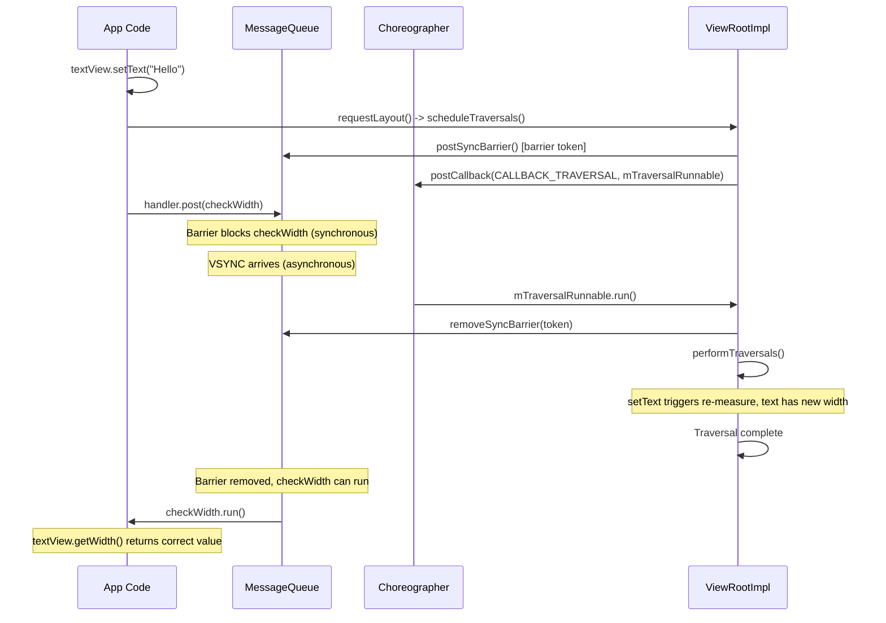

This guarantees that any `Runnable` posted to the handler *after*
`scheduleTraversals()` will execute *after* the traversal completes.  The
AOSP source contains a comment (line 3088) explicitly documenting this
guarantee as a public API contract.

### 25.4.9 Frame Rate Voting

Modern `ViewRootImpl` participates in frame rate voting for Variable Refresh
Rate (VRR) displays.  Views can influence the display refresh rate:

```java
// Request high frame rate for smooth scrolling
view.setRequestedFrameRate(120f);

// Let the system decide
view.setRequestedFrameRate(
    View.REQUESTED_FRAME_RATE_CATEGORY_DEFAULT);
```

During `performTraversals()`, `ViewRootImpl` collects frame rate votes from
all views in the hierarchy and reports the preferred category to
SurfaceFlinger.  Categories include:

| Category | Value | Typical Use |
|----------|-------|-------------|
| `FRAME_RATE_CATEGORY_HIGH` | 4 | Active scrolling, animation |
| `FRAME_RATE_CATEGORY_NORMAL` | 3 | General UI interaction |
| `FRAME_RATE_CATEGORY_LOW` | 1 | Static content, clock widgets |
| `FRAME_RATE_CATEGORY_NO_PREFERENCE` | 0 | No opinion |

This system reduces power consumption by lowering the refresh rate when the
screen content is static.

---

## 25.5 Hardware Acceleration: RenderNode and HWUI

Since Android 3.0 (and mandatory since 4.0 for most windows), Android uses
**hardware-accelerated rendering** via the **HWUI** library (written in C++
in `frameworks/base/libs/hwui/`).  The Java-side API is built around
`RenderNode` and `ThreadedRenderer`.

### 25.5.1 Architecture Overview

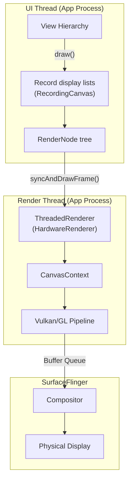

### 25.5.2 RenderNode -- The Display List Node

Each `View` has a `RenderNode` stored in `mRenderNode`.  A `RenderNode`
holds:

- A **display list** -- a recorded sequence of draw operations (draw rect,
  draw text, draw bitmap, etc.) captured by a `RecordingCanvas`.
- **Properties** -- transform (translation, rotation, scale), alpha, clip,
  elevation, pivot point, etc.  These can be changed *without* re-recording
  the display list.

```
Source: frameworks/base/core/java/android/view/View.java (line 5763, 5997)

    final RenderNode mRenderNode;

    // In constructor:
    mRenderNode = RenderNode.create(getClass().getName(),
        new ViewAnimationHostBridge(this));
```

### 25.5.3 updateDisplayListIfDirty() -- Recording Draw Commands

When a view needs redrawing, `updateDisplayListIfDirty()` re-records its
display list:

```
Source: frameworks/base/core/java/android/view/View.java (line 24064)

    public RenderNode updateDisplayListIfDirty() {
        final RenderNode renderNode = mRenderNode;
        if (!canHaveDisplayList()) return renderNode;

        if ((mPrivateFlags & PFLAG_DRAWING_CACHE_VALID) == 0
                || !renderNode.hasDisplayList()
                || mRecreateDisplayList) {

            if (renderNode.hasDisplayList() && !mRecreateDisplayList) {
                // Just need children to refresh their display lists
                mPrivateFlags |= PFLAG_DRAWN | PFLAG_DRAWING_CACHE_VALID;
                dispatchGetDisplayList();
                return renderNode;
            }

            mRecreateDisplayList = true;
            int width = mRight - mLeft;
            int height = mBottom - mTop;

            final RecordingCanvas canvas =
                renderNode.beginRecording(width, height);
            try {
                if ((mPrivateFlags & PFLAG_SKIP_DRAW) == PFLAG_SKIP_DRAW) {
                    dispatchDraw(canvas);
                } else {
                    draw(canvas);
                }
            } finally {
                renderNode.endRecording();
                setDisplayListProperties(renderNode);
            }
        }
        return renderNode;
    }
```

The key insight: `RecordingCanvas` does not actually draw to a bitmap.
Instead it records the draw commands into the `RenderNode`'s display list.
Later, on the render thread, HWUI replays these commands using
Vulkan or OpenGL.

### 25.5.4 Property Animations Without Redraw

Because `RenderNode` stores transform properties separately from the display
list, property animations can update translation, alpha, rotation, etc.
without re-recording the display list.  This is why
`View.setTranslationX()`, `View.setAlpha()`, `View.setRotation()`, etc. are
so efficient -- they update `RenderNode` properties directly, and the render
thread applies them during compositing.

```mermaid
graph LR
    subgraph "Invalidate path (re-record)"
        INV["View.invalidate()"] --> UDLID["updateDisplayListIfDirty()"]
        UDLID --> BEGIN["beginRecording()"]
        BEGIN --> DRAW["draw(canvas)"]
        DRAW --> END["endRecording()"]
    end

    subgraph "Property animation path (no re-record)"
        ANIM["setTranslationX(100)"] --> PROP["mRenderNode.setTranslationX(100)"]
        PROP --> DIRTY["damageInParent()"]
        DIRTY --> FRAME["Next frame: just replay with new transform"]
    end
```

### 25.5.5 ThreadedRenderer

`ThreadedRenderer` (line 67 of `ThreadedRenderer.java`) extends
`HardwareRenderer` and manages the render thread:

```
Source: frameworks/base/core/java/android/view/ThreadedRenderer.java

    /**
     * Threaded renderer that proxies the rendering to a render thread.
     *
     * The UI thread can block on the RenderThread, but RenderThread must
     * never block on the UI thread.
     *
     * ThreadedRenderer creates an instance of RenderProxy. RenderProxy in
     * turn creates and manages a CanvasContext on the RenderThread.
     */
    public final class ThreadedRenderer extends HardwareRenderer {
```

The separation is fundamental:

- **UI thread**: measures, lays out, records display lists.
- **Render thread**: executes OpenGL/Vulkan commands, manages the GPU.

### 25.5.6 The draw() Method in ViewRootImpl

`ViewRootImpl.draw()` (line 5767) decides between hardware and software
rendering:

```
Source: frameworks/base/core/java/android/view/ViewRootImpl.java

    private boolean draw(boolean fullRedrawNeeded, ...) {
        Surface surface = mSurface;
        if (!surface.isValid()) return false;
        ...
        if (!dirty.isEmpty() || mIsAnimating || accessibilityFocusDirty) {
            if (isHardwareEnabled()) {
                // Hardware path
                mAttachInfo.mThreadedRenderer.invalidateRoot();
                dirty.setEmpty();
                ...
                mAttachInfo.mThreadedRenderer.draw(mView, mAttachInfo, ...);
                ...
            } else {
                // Software path (fallback)
                drawSoftware(surface, mAttachInfo, ...);
            }
        }
    }
```

In the hardware-accelerated path:

1. The root `RenderNode` is invalidated.
2. `ThreadedRenderer.draw()` calls `updateRootDisplayList()`, which invokes
   `mView.updateDisplayListIfDirty()` to rebuild dirty display lists.
3. `syncAndDrawFrame()` syncs the display list tree to the render thread and
   kicks off GPU rendering.

### 25.5.7 Software Rendering Fallback

When hardware acceleration is unavailable (e.g., for `LAYER_TYPE_SOFTWARE`
views or certain canvas operations), `drawSoftware()` locks the `Surface`
to get a `Canvas` backed by a CPU-side bitmap buffer:

```mermaid
graph TB
    subgraph "Hardware Accelerated"
        HW1["RecordingCanvas"] --> HW2["RenderNode (display list)"]
        HW2 --> HW3["Render Thread"]
        HW3 --> HW4["GPU (Vulkan/GL)"]
        HW4 --> HW5["Buffer Queue"]
    end

    subgraph "Software Rendering"
        SW1["Surface.lockCanvas()"] --> SW2["Bitmap-backed Canvas"]
        SW2 --> SW3["CPU rasterization"]
        SW3 --> SW4["Surface.unlockCanvasAndPost()"]
        SW4 --> SW5["Buffer Queue"]
    end

    HW5 --> SF["SurfaceFlinger"]
    SW5 --> SF
```

### 25.5.8 Layer Types

Views support three layer types:

| Layer Type | Value | Behavior |
|------------|-------|----------|
| `LAYER_TYPE_NONE` | 0 | No off-screen buffer (default) |
| `LAYER_TYPE_SOFTWARE` | 1 | Rendered into a CPU bitmap |
| `LAYER_TYPE_HARDWARE` | 2 | Rendered into a GPU texture |

Hardware layers are useful for complex views that are animated (e.g., alpha
fade, translation) -- the view is rendered once into a texture, then the
texture is composited with different transform properties each frame, avoiding
re-recording the display list.

---

## 25.6 Window Insets and Cutouts

### 25.6.1 WindowInsets

`WindowInsets` encapsulates the areas of a window that are partially
obscured by system UI (status bar, navigation bar, IME, display cutout):

```
Source: frameworks/base/core/java/android/view/WindowInsets.java (line 80)

    public final class WindowInsets {
        private final Insets[] mTypeInsetsMap;
        private final Insets[] mTypeMaxInsetsMap;
        private final boolean[] mTypeVisibilityMap;
        private final DisplayCutout mDisplayCutout;
        private final RoundedCorners mRoundedCorners;
        private final DisplayShape mDisplayShape;
        ...
    }
```

### 25.6.2 Inset Types

The `WindowInsets.Type` class (line 1891) defines all inset categories as
bit flags:

```
Source: frameworks/base/core/java/android/view/WindowInsets.java

    public static final class Type {
        static final int STATUS_BARS           = 1 << 0;
        static final int NAVIGATION_BARS       = 1 << 1;
        static final int CAPTION_BAR           = 1 << 2;
        static final int IME                   = 1 << 3;
        static final int SYSTEM_GESTURES       = 1 << 4;
        static final int MANDATORY_SYSTEM_GESTURES = 1 << 5;
        static final int TAPPABLE_ELEMENT      = 1 << 6;
        static final int DISPLAY_CUTOUT        = 1 << 7;
        static final int SYSTEM_OVERLAYS       = 1 << 8;
    }
```

```mermaid
graph TD
    subgraph "WindowInsets Type Flags"
        SB["STATUS_BARS (bit 0)"]
        NB["NAVIGATION_BARS (bit 1)"]
        CB["CAPTION_BAR (bit 2)"]
        IME["IME (bit 3)"]
        SG["SYSTEM_GESTURES (bit 4)"]
        MSG["MANDATORY_SYSTEM_GESTURES (bit 5)"]
        TE["TAPPABLE_ELEMENT (bit 6)"]
        DC["DISPLAY_CUTOUT (bit 7)"]
        SO["SYSTEM_OVERLAYS (bit 8)"]
    end
```

### 25.6.3 Insets Dispatch Chain

Insets flow down the view hierarchy from `ViewRootImpl`:

```mermaid
sequenceDiagram
    participant WMS as WindowManagerService
    participant VRI as ViewRootImpl
    participant DV as DecorView
    participant CFL as ContentFrameLayout
    participant AppView as App View

    WMS-->>VRI: New insets state
    VRI->>VRI: dispatchApplyInsets(host)
    VRI->>DV: dispatchApplyWindowInsets(insets)
    DV->>DV: onApplyWindowInsets(insets)
    Note over DV: Consume status bar insets
    DV->>CFL: dispatchApplyWindowInsets(remaining)
    CFL->>AppView: dispatchApplyWindowInsets(remaining)
    AppView->>AppView: onApplyWindowInsets(remaining)
```

The dispatch uses `View.dispatchApplyWindowInsets()`:

```
Source: frameworks/base/core/java/android/view/View.java (line 12931)

    public WindowInsets dispatchApplyWindowInsets(WindowInsets insets) {
        try {
            mPrivateFlags3 |= PFLAG3_APPLYING_INSETS;
            if (mListenerInfo != null
                    && mListenerInfo.mOnApplyWindowInsetsListener != null) {
                return mListenerInfo.mOnApplyWindowInsetsListener
                    .onApplyWindowInsets(this, insets);
            } else {
                return onApplyWindowInsets(insets);
            }
        } finally {
            mPrivateFlags3 &= ~PFLAG3_APPLYING_INSETS;
        }
    }
```

The listener takes priority over the default `onApplyWindowInsets()`.  This
is the mechanism used by `ViewCompat.setOnApplyWindowInsetsListener()` from
the Jetpack library.

### 25.6.4 Edge-to-Edge and the Modern Insets API

Starting with Android 15, the system enforces edge-to-edge rendering.  Apps
must handle insets explicitly using the modern API:

```java
// Modern approach (API 30+)
ViewCompat.setOnApplyWindowInsetsListener(view, (v, insets) -> {
    Insets systemBars = insets.getInsets(
        WindowInsetsCompat.Type.systemBars());
    v.setPadding(systemBars.left, systemBars.top,
                 systemBars.right, systemBars.bottom);
    return WindowInsetsCompat.CONSUMED;
});
```

### 25.6.5 Display Cutout

`DisplayCutout` (defined in `DisplayCutout.java`, line 68) describes the
non-functional areas of a display where a camera notch, punch-hole, or other
hardware intrusion exists:

```mermaid
graph TD
    subgraph "Display with Cutout"
        StatusBar["Status Bar Area"]
        Cutout["Display Cutout<br/>(camera notch)"]
        Content["App Content Area"]
        NavBar["Navigation Bar"]
    end

    subgraph "DisplayCutout API"
        SafeInsets["getSafeInsetTop/Bottom/Left/Right()"]
        BoundingRects["getBoundingRects()"]
        WaterfallInsets["getWaterfallInsets()"]
    end

    Cutout --> SafeInsets
    Cutout --> BoundingRects
```

The `layoutInDisplayCutoutMode` attribute controls how windows interact with
cutouts:

| Mode | Behavior |
|------|----------|
| `DEFAULT` | Content is not laid out in cutout area in portrait |
| `SHORT_EDGES` | Content extends into cutout on short edges |
| `NEVER` | Content never extends into cutout area |
| `ALWAYS` | Content always extends into cutout area |

### 25.6.6 WindowInsetsAnimation

Inset changes (e.g., IME showing/hiding) can be animated.  Views register
`WindowInsetsAnimation.Callback` to participate:

```mermaid
sequenceDiagram
    participant System as System/IME
    participant VRI as ViewRootImpl
    participant View as App View

    System->>VRI: Insets changing (IME showing)
    VRI->>View: onPrepare(animation)
    Note over View: Snapshot current state

    VRI->>View: onStart(animation, bounds)
    Note over View: Prepare for animation

    loop Each frame
        VRI->>View: onProgress(insets, runningAnimations)
        Note over View: Interpolate layout
    end

    VRI->>View: onEnd(animation)
    Note over View: Finalize state
```

### 25.6.7 Rounded Corners and Display Shape

Modern devices have rounded display corners.  The `RoundedCorners` object
inside `WindowInsets` provides the corner radii, and `DisplayShape` provides
the actual shape path of the display:

```java
WindowInsets insets = view.getRootWindowInsets();
RoundedCorner topLeft = insets.getRoundedCorner(
    RoundedCorner.POSITION_TOP_LEFT);
if (topLeft != null) {
    int radius = topLeft.getRadius();
    Point center = topLeft.getCenter();
}
```

---

## 25.7 Focus and Keyboard Navigation

### 25.7.1 Focus Model

Android's focus system supports two modes:

1. **Touch mode** -- no view has visible focus; tapping directly activates
   views.  Only views that are `focusableInTouchMode` can gain focus.
2. **Non-touch mode** (D-pad, keyboard, trackball) -- a single view has
   visible focus, indicated by a highlight.  Arrow keys move focus between
   views.

```mermaid
stateDiagram-v2
    [*] --> TouchMode: Screen touched
    [*] --> NonTouchMode: D-pad/keyboard input

    TouchMode --> NonTouchMode: D-pad pressed
    NonTouchMode --> TouchMode: Screen touched

    state TouchMode {
        NoVisibleFocus: No visible focus ring
        FocusableInTouchMode: Only focusableInTouchMode views get focus
    }

    state NonTouchMode {
        VisibleFocus: Focus ring visible
        ArrowNavigation: D-pad moves focus
    }
```

### 25.7.2 Focus Search with FocusFinder

When the user presses a directional key, `View.focusSearch()` delegates to
`FocusFinder`, which implements a spatial algorithm to find the next
focusable view:

```
Source: frameworks/base/core/java/android/view/View.java (line 14872)

    public View focusSearch(@FocusRealDirection int direction) {
        if (mParent != null) {
            return mParent.focusSearch(this, direction);
        } else {
            return null;
        }
    }
```

`FocusFinder` (line 38 of `FocusFinder.java`) uses the following algorithm:

1. Collect all focusable views in the hierarchy.
2. For each candidate, compute a **distance metric** based on the spatial
   relationship to the currently focused view.
3. The metric considers:
   - Whether the candidate is in the search direction.
   - The "beam" -- the rectangle projected from the current focus in the
     search direction.
   - The distance between edges/centers of the two rectangles.
4. The nearest candidate wins.

```mermaid
graph TB
    subgraph "Focus Search Algorithm"
        Current["Currently focused view"]
        Beam["Project beam in direction"]
        Candidates["Collect focusable candidates"]
        InBeam["Filter: candidates in beam"]
        Closest["Select closest by weighted distance"]
    end

    Current --> Beam
    Beam --> Candidates
    Candidates --> InBeam
    InBeam --> Closest
```

### 25.7.3 Focus Direction Constants

| Constant | Value | Direction |
|----------|-------|-----------|
| `FOCUS_LEFT` | 17 | Left |
| `FOCUS_UP` | 33 | Up |
| `FOCUS_RIGHT` | 66 | Right |
| `FOCUS_DOWN` | 130 | Down |
| `FOCUS_FORWARD` | 2 | Next in tab order |
| `FOCUS_BACKWARD` | 1 | Previous in tab order |

### 25.7.4 ViewGroup Focus Strategy

`ViewGroup` provides three focus strategies via `setDescendantFocusability()`:

```
Source: frameworks/base/core/java/android/view/ViewGroup.java (line 3336)

    public boolean requestFocus(int direction,
            Rect previouslyFocusedRect) {
        int descendantFocusability = getDescendantFocusability();
        boolean result;
        switch (descendantFocusability) {
            case FOCUS_BLOCK_DESCENDANTS:
                result = super.requestFocus(direction, ...);
                break;
            case FOCUS_BEFORE_DESCENDANTS:
                result = super.requestFocus(direction, ...)
                    || onRequestFocusInDescendants(direction, ...);
                break;
            case FOCUS_AFTER_DESCENDANTS:
                result = onRequestFocusInDescendants(direction, ...)
                    || super.requestFocus(direction, ...);
                break;
        }
        return result;
    }
```

| Strategy | Behavior |
|----------|----------|
| `FOCUS_BEFORE_DESCENDANTS` | Parent tries to take focus before children |
| `FOCUS_AFTER_DESCENDANTS` | Children are offered focus first (default) |
| `FOCUS_BLOCK_DESCENDANTS` | Children never get focus |

### 25.7.5 Keyboard Navigation Clusters

API 26 introduced **keyboard navigation clusters** for grouping related
views.  When the user presses Tab, focus moves between clusters.  Within a
cluster, arrow keys navigate between individual views:

```mermaid
graph LR
    subgraph "Cluster A (Toolbar)"
        Back["Back"]
        Title["Title"]
        Menu["Menu"]
    end

    subgraph "Cluster B (Content)"
        Item1["Item 1"]
        Item2["Item 2"]
        Item3["Item 3"]
    end

    subgraph "Cluster C (FAB)"
        FAB["FAB Button"]
    end

    ClusterA -->|Tab| ClusterB
    ClusterB -->|Tab| ClusterC
    ClusterC -->|Tab| ClusterA
```

A `ViewGroup` becomes a cluster by setting
`android:keyboardNavigationCluster="true"`.

### 25.7.6 Default Focus

Within a cluster (or the entire hierarchy), a view can be marked as the
**default focus** with `android:focusedByDefault="true"`.  When focus enters
a cluster, it goes to the default-focus view first.

---

## 25.8 Accessibility Integration

### 25.8.1 The Accessibility Bridge

Android's accessibility system builds a parallel tree of
`AccessibilityNodeInfo` objects from the view hierarchy.  Accessibility
services (TalkBack, Switch Access, etc.) read and interact with this tree:

```mermaid
graph TB
    subgraph "App Process"
        ViewTree["View Hierarchy"]
        ANI["AccessibilityNodeInfo tree"]
    end

    subgraph "system_server"
        AMS_a["AccessibilityManagerService"]
    end

    subgraph "Accessibility Service Process"
        TalkBack["TalkBack / Switch Access"]
    end

    ViewTree -->|"createAccessibilityNodeInfo()"| ANI
    ANI -->|Binder| AMS_a
    AMS_a -->|Binder| TalkBack
    TalkBack -->|"performAction()"| AMS_a
    AMS_a -->|"performAccessibilityAction()"| ViewTree
```

### 25.8.2 createAccessibilityNodeInfo()

Each view creates its accessibility representation on demand:

```
Source: frameworks/base/core/java/android/view/View.java (line 9513)

    public AccessibilityNodeInfo createAccessibilityNodeInfo() {
        if (mAccessibilityDelegate != null) {
            return mAccessibilityDelegate
                .createAccessibilityNodeInfo(this);
        } else {
            return createAccessibilityNodeInfoInternal();
        }
    }

    public AccessibilityNodeInfo createAccessibilityNodeInfoInternal() {
        AccessibilityNodeProvider provider = getAccessibilityNodeProvider();
        if (provider != null) {
            return provider.createAccessibilityNodeInfo(
                AccessibilityNodeProvider.HOST_VIEW_ID);
        } else {
            AccessibilityNodeInfo info = AccessibilityNodeInfo.obtain(this);
            onInitializeAccessibilityNodeInfo(info);
            return info;
        }
    }
```

### 25.8.3 onInitializeAccessibilityNodeInfo()

The base implementation sets many properties from the view's state:

```
Source: frameworks/base/core/java/android/view/View.java (line 9569)

    @CallSuper
    public void onInitializeAccessibilityNodeInfo(
            AccessibilityNodeInfo info) {
        // Sets: parent, bounds, package, class, content description,
        // enabled, clickable, focusable, focused, long-clickable,
        // selected, context-clickable, etc.
    }
```

Subclasses override this to add domain-specific information:

- `TextView` adds text content, selection, input type.
- `SeekBar` adds range info (min, max, current).
- `RecyclerView` adds collection info (row/column counts).

### 25.8.4 AccessibilityNodeProvider

For views that represent complex virtual hierarchies (e.g., a custom
calendar grid, a custom number picker), `AccessibilityNodeProvider` allows
exposing virtual child nodes that do not correspond to real `View` objects:

```mermaid
graph TD
    subgraph "Custom Calendar View"
        RealView["CalendarView (single View)"]
        VP1["Virtual: Day 1"]
        VP2["Virtual: Day 2"]
        VP3["Virtual: ..."]
        VP30["Virtual: Day 30"]
    end

    RealView -->|AccessibilityNodeProvider| VP1
    RealView -->|AccessibilityNodeProvider| VP2
    RealView -->|AccessibilityNodeProvider| VP3
    RealView -->|AccessibilityNodeProvider| VP30
```

### 25.8.5 Accessibility Actions

Views expose actions that accessibility services can perform:

| Action | Description |
|--------|-------------|
| `ACTION_CLICK` | Performs a click |
| `ACTION_LONG_CLICK` | Performs a long-click |
| `ACTION_SCROLL_FORWARD` | Scrolls content forward |
| `ACTION_SCROLL_BACKWARD` | Scrolls content backward |
| `ACTION_SET_TEXT` | Sets text in an editable view |
| `ACTION_SELECT` | Selects the view |
| `ACTION_FOCUS` | Requests input focus |
| `ACTION_ACCESSIBILITY_FOCUS` | Requests accessibility focus |

Custom actions can be added for domain-specific interactions:

```java
info.addAction(new AccessibilityAction(
    R.id.action_archive, "Archive message"));
```

### 25.8.6 Content Descriptions and Live Regions

Two key accessibility attributes:

- **`contentDescription`** -- a text label for views without inherent text
  (e.g., ImageButton).  TalkBack reads this aloud.
- **`accessibilityLiveRegion`** -- marks views whose content changes
  dynamically and should be announced:
  - `ACCESSIBILITY_LIVE_REGION_NONE` (default) -- no announcements.
  - `ACCESSIBILITY_LIVE_REGION_POLITE` -- announced when idle.
  - `ACCESSIBILITY_LIVE_REGION_ASSERTIVE` -- announced immediately.

### 25.8.7 Accessibility Events

Views send accessibility events to notify services of state changes:

```mermaid
sequenceDiagram
    participant View
    participant VRI as ViewRootImpl
    participant AMgr as AccessibilityManager
    participant AMS_a as AccessibilityManagerService
    participant Service as TalkBack

    View->>AMgr: sendAccessibilityEvent(TYPE_VIEW_CLICKED)
    AMgr->>AMS_a: sendAccessibilityEvent(event)
    AMS_a->>Service: onAccessibilityEvent(event)
    Service->>Service: Announce "Button, double-tap to activate"
```

Common event types:

- `TYPE_VIEW_CLICKED` -- view was clicked.
- `TYPE_VIEW_FOCUSED` -- view gained focus.
- `TYPE_VIEW_TEXT_CHANGED` -- text in an editable view changed.
- `TYPE_WINDOW_CONTENT_CHANGED` -- the view hierarchy changed.
- `TYPE_VIEW_SCROLLED` -- a scrollable view was scrolled.

---

## 25.9 LayoutInflater: XML to Views

### 25.9.1 Overview

`LayoutInflater` converts XML layout resources into `View` objects at
runtime.  It is the bridge between the declarative XML files in `res/layout/`
and the programmatic view hierarchy in memory.

```
Source: frameworks/base/core/java/android/view/LayoutInflater.java (line 74)

    public abstract class LayoutInflater {
        protected final Context mContext;
        private Factory mFactory;
        private Factory2 mFactory2;
        private Factory2 mPrivateFactory;
        ...
    }
```

### 25.9.2 The Inflation Process

```mermaid
sequenceDiagram
    participant App as Application Code
    participant LI as LayoutInflater
    participant XML as XmlPullParser
    participant Factory as Factory/Factory2
    participant View as View instance

    App->>LI: inflate(R.layout.activity_main, root)
    LI->>LI: inflate(parser, root, attachToRoot)
    LI->>XML: advanceToRootNode()
    LI->>XML: getName() -> "LinearLayout"

    alt Is <merge> tag
        LI->>LI: rInflate(parser, root, ...)
    else Normal tag
        LI->>LI: createViewFromTag(root, name, attrs)
        alt Factory2 set
            LI->>Factory: onCreateView(parent, name, context, attrs)
        else Factory set
            LI->>Factory: onCreateView(name, context, attrs)
        else No factory
            LI->>LI: onCreateView(name, attrs) or createView(name, prefix, attrs)
        end
        Factory-->>LI: View or null
        LI->>LI: rInflateChildren(parser, temp, attrs, true)
        Note over LI: Recursively inflate children
    end

    LI->>LI: Apply LayoutParams from root if provided
    LI-->>App: Inflated View hierarchy
```

### 25.9.3 The inflate() Method

```
Source: frameworks/base/core/java/android/view/LayoutInflater.java (line 509)

    public View inflate(XmlPullParser parser, ViewGroup root,
            boolean attachToRoot) {
        synchronized (mConstructorArgs) {
            ...
            final String name = parser.getName();

            if (TAG_MERGE.equals(name)) {
                if (root == null || !attachToRoot) {
                    throw new InflateException(
                        "<merge /> can be used only with a valid "
                        + "ViewGroup root and attachToRoot=true");
                }
                rInflate(parser, root, inflaterContext, attrs, false);
            } else {
                final View temp = createViewFromTag(
                    root, name, inflaterContext, attrs);
                ViewGroup.LayoutParams params = null;
                if (root != null) {
                    params = root.generateLayoutParams(
                        inflaterContext, attrs);
                    if (!attachToRoot) {
                        temp.setLayoutParams(params);
                    }
                }
                rInflateChildren(parser, temp, attrs, true);
                if (root != null && attachToRoot) {
                    root.addView(temp, params);
                }
                if (root == null || !attachToRoot) {
                    result = temp;
                }
            }
            return result;
        }
    }
```

Key behaviors:

- If `root` is provided and `attachToRoot` is `true`, the inflated view is
  added to `root` via `addView()`.
- If `root` is provided but `attachToRoot` is `false`, `root` is used only
  to generate correct `LayoutParams`.
- If `root` is `null`, the inflated view gets no `LayoutParams` -- a common
  source of bugs.

### 25.9.4 View Construction

`createViewFromTag()` resolves a tag name to a `View` class and instantiates
it.  The resolution order:

1. **`Factory2.onCreateView()`** -- if a `Factory2` is set (e.g., by
   `AppCompatActivity`), it gets first chance.  This is how `<Button>` in
   XML becomes `AppCompatButton` at runtime.
2. **`Factory.onCreateView()`** -- legacy callback.
3. **`mPrivateFactory`** -- used by the system for internal views.
4. **`onCreateView()`** -- handles views without a package prefix by
   prepending `"android.view."` or `"android.widget."`.
5. **`createView()`** -- uses reflection to find a constructor matching
   `(Context, AttributeSet)` and caches it in `sConstructorMap`.

```
Source: frameworks/base/core/java/android/view/LayoutInflater.java

    static final Class<?>[] mConstructorSignature = new Class[] {
        Context.class, AttributeSet.class};

    private static final HashMap<String, Constructor<? extends View>>
        sConstructorMap = new HashMap<>();
```

The constructor cache (`sConstructorMap`) is static and shared across all
`LayoutInflater` instances in the process, making subsequent inflations
faster.

### 25.9.5 Special Tags

| Tag | Behavior |
|-----|----------|
| `<merge>` | Flattens children directly into the parent, avoiding an extra nesting level |
| `<include>` | Includes another layout file inline |
| `<requestFocus>` | Requests focus for the parent view |
| `<tag>` | Sets a tag on the parent view |
| `<blink>` | Easter egg from 1995 -- creates a blinking container |

### 25.9.6 Async Layout Inflation

`AsyncLayoutInflater` (from Jetpack) performs inflation on a background
thread, delivering the result to the UI thread via a callback.  This avoids
janking the main thread for complex layouts:

```java
AsyncLayoutInflater inflater = new AsyncLayoutInflater(this);
inflater.inflate(R.layout.complex_layout, container,
    (view, resId, parent) -> {
        parent.addView(view);
    });
```

Limitations: async inflation cannot be used with views that access the
`Looper` during construction, or with `<merge>` tags, or with layouts that
use `Factory` callbacks requiring the UI thread.

### 25.9.7 rInflate() and Recursive Processing

The recursive inflation is handled by `rInflate()` and `rInflateChildren()`:

```mermaid
flowchart TD
    Start["rInflateChildren(parser, parent, attrs)"] --> Loop{"More XML elements?"}
    Loop -->|Yes| ReadTag["Read tag name"]
    ReadTag --> IsRequestFocus{Is requestFocus?}
    IsRequestFocus -->|Yes| RF["parent.restoreDefaultFocus()"]
    RF --> Loop
    IsRequestFocus -->|No| IsTag{Is tag?}
    IsTag -->|Yes| ParseTag["parseViewTag(parent, child, attrs)"]
    ParseTag --> Loop
    IsTag -->|No| IsInclude{Is include?}
    IsInclude -->|Yes| ProcessInclude["parseInclude(parser, context, parent, attrs)"]
    ProcessInclude --> Loop
    IsInclude -->|No| IsMerge{Is merge?}
    IsMerge -->|Yes| Error["throw InflateException<br/>(merge only at root)"]
    IsMerge -->|No| CreateChild["createViewFromTag(parent, name, context, attrs)"]
    CreateChild --> GenParams["parent.generateLayoutParams(attrs)"]
    GenParams --> Recurse["rInflateChildren(parser, child, attrs)"]
    Recurse --> AddChild["parent.addView(child, params)"]
    AddChild --> Loop
    Loop -->|No| Done["return"]
```

Each child element triggers recursive descent.  The `XmlPullParser` tracks
depth automatically, so the recursion naturally matches the XML nesting.

### 25.9.8 The Include Tag and Layout Reuse

The `<include>` tag merges another layout file inline.  The include processing:

1. Read the `layout` attribute to get the referenced layout resource.
2. Obtain the `XmlResourceParser` for the included layout.
3. Apply any overriding attributes (e.g., `android:layout_width` on the
   `<include>` overrides the root element of the included layout).
4. Recursively inflate the included layout into the current parent.

```xml
<!-- main_layout.xml -->
<LinearLayout ...>
    <include
        layout="@layout/toolbar"
        android:layout_width="match_parent"
        android:layout_height="wrap_content" />
    <!-- More views -->
</LinearLayout>

<!-- toolbar.xml -->
<Toolbar
    android:layout_width="match_parent"
    android:layout_height="?attr/actionBarSize" />
```

Important: `<include>` does not create an extra view node -- the root of the
included layout replaces the `<include>` tag directly.

### 25.9.9 The Merge Tag and Hierarchy Flattening

The `<merge>` tag is used to eliminate an unnecessary root `ViewGroup` in
included layouts:

```xml
<!-- Without merge: adds extra FrameLayout -->
<FrameLayout>
    <TextView ... />
    <Button ... />
</FrameLayout>

<!-- With merge: children added directly to parent -->
<merge>
    <TextView ... />
    <Button ... />
</merge>
```

When a `<merge>` layout is included into a parent, its children are added
directly to the parent without an intermediate container.  This reduces the
depth of the view hierarchy and improves measure/layout performance.

Constraint: `<merge>` can only be used as the root tag of a layout file,
and it requires `attachToRoot=true` when inflating.

### 25.9.10 Theme Overlays During Inflation

Each view tag can specify a `android:theme` attribute that creates a
`ContextThemeWrapper` for that subtree:

```xml
<Button
    android:theme="@style/ThemeOverlay.AppCompat.Dark"
    android:text="Dark Button" />
```

During inflation, if a `theme` attribute is found, the inflater creates a
new `ContextThemeWrapper` and uses it for constructing the view.  This allows
different parts of the same layout to have different themes (e.g., a dark
toolbar in a light activity).

### 25.9.11 Precompiled Layouts

Starting with Android 10, the system can precompile commonly used layouts
during device boot.  The compiled format stores the view hierarchy as a
binary blob that can be deserialized faster than parsing XML:

```mermaid
graph LR
    XML["XML Layout Resource"] --> Compiler["Layout Compiler<br/>(build time)"]
    Compiler --> Dex["Compiled Layout<br/>(.dex or binary)"]
    Dex --> Inflater["LayoutInflater<br/>(runtime)"]
    Inflater --> ViewTree["View Hierarchy"]

    XML -->|"fallback"| Parser["XmlPullParser<br/>(runtime)"]
    Parser --> Inflater
```

This optimization is primarily used for system layouts (status bar,
notification shade, etc.) where inflation performance is critical.

### 25.9.12 View Binding and Data Binding

Modern Android development often avoids raw `findViewById()` by using:

- **View Binding** -- generates a binding class per layout file with typed
  references to all views with IDs.  No reflection, no runtime cost.
- **Data Binding** -- generates binding code that observes `LiveData` or
  `Observable` objects and updates views automatically.

Both compile-time tools generate code that calls `LayoutInflater.inflate()`
under the hood, then casts and caches view references.

---

## 25.10 Custom Views

### 25.10.1 The Custom View Contract

Creating a custom `View` requires understanding and implementing the
correct callbacks.  The minimal contract:

```mermaid
graph TD
    subgraph "Must Implement"
        Constructor["Constructor(Context, AttributeSet)"]
        OnMeasure["onMeasure(widthSpec, heightSpec)"]
        OnDraw["onDraw(Canvas)"]
    end

    subgraph "Often Override"
        OnLayout["onLayout() (ViewGroups only)"]
        OnTouch["onTouchEvent(MotionEvent)"]
        OnSizeChanged["onSizeChanged(w, h, oldW, oldH)"]
        SaveRestore["onSaveInstanceState() / onRestoreInstanceState()"]
    end

    subgraph "Performance"
        Invalidate["invalidate() for visual changes"]
        RequestLayout["requestLayout() for size changes"]
    end
```

### 25.10.2 Constructor Patterns

Custom views need at least two constructors for XML inflation to work:

```java
public class PieChart extends View {
    private Paint mPaint;
    private RectF mOvalBounds;

    // Programmatic construction
    public PieChart(Context context) {
        this(context, null);
    }

    // XML inflation
    public PieChart(Context context, @Nullable AttributeSet attrs) {
        this(context, attrs, 0);
    }

    // XML inflation with default style
    public PieChart(Context context, @Nullable AttributeSet attrs,
            int defStyleAttr) {
        super(context, attrs, defStyleAttr);
        init(context, attrs);
    }

    private void init(Context context, AttributeSet attrs) {
        mPaint = new Paint(Paint.ANTI_ALIAS_FLAG);
        mOvalBounds = new RectF();

        // Read custom attributes
        if (attrs != null) {
            TypedArray a = context.obtainStyledAttributes(
                attrs, R.styleable.PieChart);
            mPaint.setColor(a.getColor(
                R.styleable.PieChart_sliceColor, Color.RED));
            a.recycle();
        }
    }
}
```

### 25.10.3 Custom onMeasure()

The default `onMeasure()` makes a `wrap_content` view fill its parent.
Custom views should measure themselves properly:

```java
@Override
protected void onMeasure(int widthMeasureSpec, int heightMeasureSpec) {
    int desiredWidth = 200;  // Intrinsic size in pixels
    int desiredHeight = 200;

    int width = resolveSize(desiredWidth, widthMeasureSpec);
    int height = resolveSize(desiredHeight, heightMeasureSpec);

    setMeasuredDimension(width, height);
}
```

`View.resolveSize()` is a helper that returns:

- The spec size for `EXACTLY`.
- The smaller of desired size and spec size for `AT_MOST`.
- The desired size for `UNSPECIFIED`.

A more detailed implementation handling all three modes:

```java
private int measureDimension(int desiredSize, int measureSpec) {
    int result;
    int specMode = MeasureSpec.getMode(measureSpec);
    int specSize = MeasureSpec.getSize(measureSpec);

    switch (specMode) {
        case MeasureSpec.EXACTLY:
            result = specSize;  // Parent says exactly this size
            break;
        case MeasureSpec.AT_MOST:
            result = Math.min(desiredSize, specSize);  // Up to this size
            break;
        case MeasureSpec.UNSPECIFIED:
        default:
            result = desiredSize;  // Whatever you want
            break;
    }
    return result;
}
```

### 25.10.4 Custom onDraw()

The `Canvas` and `Paint` objects are the core drawing primitives:

```java
@Override
protected void onDraw(Canvas canvas) {
    super.onDraw(canvas);

    int width = getWidth();
    int height = getHeight();
    int radius = Math.min(width, height) / 2;
    int cx = width / 2;
    int cy = height / 2;

    // Draw background circle
    mPaint.setColor(Color.LTGRAY);
    mPaint.setStyle(Paint.Style.FILL);
    canvas.drawCircle(cx, cy, radius, mPaint);

    // Draw pie slice
    mPaint.setColor(mSliceColor);
    mOvalBounds.set(cx - radius, cy - radius,
                    cx + radius, cy + radius);
    canvas.drawArc(mOvalBounds, -90, mSweepAngle, true, mPaint);

    // Draw text label
    mPaint.setColor(Color.BLACK);
    mPaint.setTextSize(48);
    mPaint.setTextAlign(Paint.Align.CENTER);
    canvas.drawText(mLabel, cx, cy, mPaint);
}
```

### 25.10.5 Canvas Drawing Primitives

| Method | Description |
|--------|-------------|
| `drawRect(left, top, right, bottom, paint)` | Draw a rectangle |
| `drawCircle(cx, cy, radius, paint)` | Draw a circle |
| `drawArc(oval, startAngle, sweepAngle, useCenter, paint)` | Draw an arc |
| `drawLine(startX, startY, stopX, stopY, paint)` | Draw a line |
| `drawPath(path, paint)` | Draw an arbitrary path |
| `drawText(text, x, y, paint)` | Draw text |
| `drawBitmap(bitmap, left, top, paint)` | Draw a bitmap |
| `drawRoundRect(rect, rx, ry, paint)` | Draw a rounded rectangle |

### 25.10.6 Paint Configuration

`Paint` controls how drawing operations are rendered:

| Property | Effect |
|----------|--------|
| `setColor(int)` | Fill/stroke color |
| `setStyle(Style)` | `FILL`, `STROKE`, or `FILL_AND_STROKE` |
| `setStrokeWidth(float)` | Stroke width in pixels |
| `setAntiAlias(boolean)` | Enable anti-aliasing |
| `setTextSize(float)` | Text size in pixels |
| `setTypeface(Typeface)` | Font family |
| `setShader(Shader)` | Gradient or bitmap shader |
| `setMaskFilter(MaskFilter)` | Blur or emboss filter |
| `setPathEffect(PathEffect)` | Dash, corner, etc. |
| `setXfermode(Xfermode)` | Porter-Duff compositing mode |
| `setShadowLayer(radius, dx, dy, color)` | Drop shadow |

### 25.10.7 invalidate() vs requestLayout() for Custom Views

The choice between these two methods is critical for performance:

```mermaid
graph TB
    Change{"What changed?"}
    Change -->|"Only appearance<br/>(color, text, animation)"| INV["invalidate()"]
    Change -->|"Size or position<br/>(content length, visibility)"| RL["requestLayout()"]

    INV --> DrawOnly["Redraw only<br/>(fast)"]
    RL --> FullCycle["Measure + Layout + Draw<br/>(slower)"]
```

**Best practice**: In a custom view, when updating a property:

```java
public void setSweepAngle(float angle) {
    if (mSweepAngle != angle) {
        mSweepAngle = angle;
        invalidate();  // Only visual change -- no size change
    }
}

public void setLabel(String label) {
    if (!Objects.equals(mLabel, label)) {
        mLabel = label;
        requestLayout();  // Text might change measured size
        invalidate();
    }
}
```

### 25.10.8 Saving and Restoring State

Custom views should save their state across configuration changes:

```java
@Override
protected Parcelable onSaveInstanceState() {
    Parcelable superState = super.onSaveInstanceState();
    Bundle bundle = new Bundle();
    bundle.putParcelable("super", superState);
    bundle.putFloat("sweepAngle", mSweepAngle);
    return bundle;
}

@Override
protected void onRestoreInstanceState(Parcelable state) {
    Bundle bundle = (Bundle) state;
    super.onRestoreInstanceState(bundle.getParcelable("super"));
    mSweepAngle = bundle.getFloat("sweepAngle");
    invalidate();
}
```

### 25.10.9 Custom ViewGroup

Creating a custom `ViewGroup` requires implementing `onLayout()` to position
children:

```java
public class SimpleFlowLayout extends ViewGroup {

    @Override
    protected void onMeasure(int widthMeasureSpec, int heightMeasureSpec) {
        int maxWidth = MeasureSpec.getSize(widthMeasureSpec);
        int currentX = getPaddingLeft();
        int currentY = getPaddingTop();
        int lineHeight = 0;

        for (int i = 0; i < getChildCount(); i++) {
            View child = getChildAt(i);
            if (child.getVisibility() == GONE) continue;

            measureChild(child, widthMeasureSpec, heightMeasureSpec);
            int childWidth = child.getMeasuredWidth();
            int childHeight = child.getMeasuredHeight();

            if (currentX + childWidth > maxWidth - getPaddingRight()) {
                // Wrap to next line
                currentX = getPaddingLeft();
                currentY += lineHeight;
                lineHeight = 0;
            }

            currentX += childWidth;
            lineHeight = Math.max(lineHeight, childHeight);
        }

        int totalHeight = currentY + lineHeight + getPaddingBottom();
        setMeasuredDimension(
            resolveSize(maxWidth, widthMeasureSpec),
            resolveSize(totalHeight, heightMeasureSpec));
    }

    @Override
    protected void onLayout(boolean changed,
            int l, int t, int r, int b) {
        int maxWidth = r - l;
        int currentX = getPaddingLeft();
        int currentY = getPaddingTop();
        int lineHeight = 0;

        for (int i = 0; i < getChildCount(); i++) {
            View child = getChildAt(i);
            if (child.getVisibility() == GONE) continue;

            int childWidth = child.getMeasuredWidth();
            int childHeight = child.getMeasuredHeight();

            if (currentX + childWidth > maxWidth - getPaddingRight()) {
                currentX = getPaddingLeft();
                currentY += lineHeight;
                lineHeight = 0;
            }

            child.layout(currentX, currentY,
                         currentX + childWidth,
                         currentY + childHeight);
            currentX += childWidth;
            lineHeight = Math.max(lineHeight, childHeight);
        }
    }
}
```

### 25.10.10 Custom Attributes in attrs.xml

Custom views define their own XML attributes in `res/values/attrs.xml`:

```xml
<!-- res/values/attrs.xml -->
<declare-styleable name="PieChart">
    <attr name="sliceColor" format="color" />
    <attr name="showLabel" format="boolean" />
    <attr name="labelText" format="string" />
    <attr name="sliceAngle" format="float" />
    <attr name="animationDuration" format="integer" />
</declare-styleable>
```

Reading these in the constructor:

```java
private void init(Context context, AttributeSet attrs) {
    TypedArray a = context.obtainStyledAttributes(
        attrs, R.styleable.PieChart);
    try {
        mSliceColor = a.getColor(
            R.styleable.PieChart_sliceColor, Color.RED);
        mShowLabel = a.getBoolean(
            R.styleable.PieChart_showLabel, true);
        mLabelText = a.getString(
            R.styleable.PieChart_labelText);
        mSliceAngle = a.getFloat(
            R.styleable.PieChart_sliceAngle, 90f);
        mAnimDuration = a.getInteger(
            R.styleable.PieChart_animationDuration, 300);
    } finally {
        a.recycle();  // MUST recycle TypedArray
    }
}
```

Usage in XML:

```xml
<com.example.PieChart
    xmlns:app="http://schemas.android.com/apk/res-auto"
    android:layout_width="200dp"
    android:layout_height="200dp"
    app:sliceColor="#FF5722"
    app:showLabel="true"
    app:labelText="45%"
    app:sliceAngle="162" />
```

Supported attribute formats:

| Format | Example | Java Type |
|--------|---------|-----------|
| `boolean` | `true` / `false` | `boolean` |
| `color` | `#FF0000` / `@color/red` | `int` (ARGB) |
| `dimension` | `16dp` / `24sp` | `float` (pixels) |
| `float` | `0.5` | `float` |
| `fraction` | `50%` / `50%p` | `float` |
| `integer` | `42` | `int` |
| `string` | `"Hello"` | `String` |
| `reference` | `@drawable/icon` | resource ID (`int`) |
| `enum` | defined values | `int` |
| `flag` | combinable values | `int` (bitfield) |

### 25.10.11 Touch Handling in Custom Views

Custom views that need to handle touch gestures should use
`GestureDetector` or implement `onTouchEvent()` directly:

```java
public class SwipeView extends View {
    private GestureDetectorCompat mDetector;
    private float mOffsetX = 0;

    public SwipeView(Context context, AttributeSet attrs) {
        super(context, attrs);
        mDetector = new GestureDetectorCompat(context,
            new GestureDetector.SimpleOnGestureListener() {
                @Override
                public boolean onScroll(MotionEvent e1, MotionEvent e2,
                        float distanceX, float distanceY) {
                    mOffsetX -= distanceX;
                    invalidate();
                    return true;
                }

                @Override
                public boolean onFling(MotionEvent e1, MotionEvent e2,
                        float velocityX, float velocityY) {
                    // Start fling animation
                    return true;
                }

                @Override
                public boolean onDown(MotionEvent e) {
                    return true;  // Must return true to receive events
                }
            });
    }

    @Override
    public boolean onTouchEvent(MotionEvent event) {
        return mDetector.onTouchEvent(event);
    }

    @Override
    protected void onDraw(Canvas canvas) {
        canvas.translate(mOffsetX, 0);
        // Draw content at offset position
    }
}
```

Key rules for custom touch handling:

1. **Return `true` from `onDown()`** in `GestureDetector` or from
   `ACTION_DOWN` in `onTouchEvent()`.  Returning `false` means the view
   does not want subsequent events for this gesture.

2. **Call `parent.requestDisallowInterceptTouchEvent(true)`** when your
   view takes ownership of a gesture to prevent parents from stealing it.

3. **Handle `ACTION_CANCEL`** -- always reset your gesture state.  The
   parent can intercept at any time, sending a `CANCEL` to the child.

4. **Use `VelocityTracker`** for fling detection if not using
   `GestureDetector`:

```java
VelocityTracker tracker = VelocityTracker.obtain();
tracker.addMovement(event);
if (event.getAction() == MotionEvent.ACTION_UP) {
    tracker.computeCurrentVelocity(1000);  // pixels per second
    float vx = tracker.getXVelocity();
    float vy = tracker.getYVelocity();
    tracker.recycle();
}
```

### 25.10.12 Custom Drawables and the Drawable-View Relationship

Views can have a background `Drawable`, a foreground `Drawable`, and any
number of custom drawables drawn in `onDraw()`.  The relationship between
`View` and `Drawable` is bidirectional:

```mermaid
graph LR
    View -->|"setBackground()"| Drawable
    Drawable -->|"setCallback(this)"| View
    Drawable -->|"invalidateSelf()"| View
    View -->|"invalidateDrawable()"| Redraw
```

When a `Drawable` needs to redraw (e.g., an animation frame), it calls
`invalidateSelf()`, which calls `Drawable.Callback.invalidateDrawable()` on
the view.  The view then calls `invalidate()` to trigger a redraw.

This callback mechanism is important: if you hold a reference to a
`Drawable` without setting its callback to a view, animated drawables will
not update.  Conversely, if a drawable's callback references a view that has
been detached, it can leak the view.

### 25.10.13 Compound Views vs. Custom Layouts

There are two approaches to complex custom UI:

**Compound View** -- extends `LinearLayout` (or similar), inflates an XML
layout in the constructor, and exposes a high-level API:

```java
public class UserCard extends LinearLayout {
    private ImageView mAvatar;
    private TextView mName;

    public UserCard(Context context, AttributeSet attrs) {
        super(context, attrs);
        inflate(context, R.layout.user_card, this);
        mAvatar = findViewById(R.id.avatar);
        mName = findViewById(R.id.name);
    }

    public void setUser(String name, Bitmap avatar) {
        mName.setText(name);
        mAvatar.setImageBitmap(avatar);
    }
}
```

**Custom Layout** -- extends `ViewGroup` and implements `onMeasure()` /
`onLayout()` for full control over child positioning (as shown in the
`SimpleFlowLayout` example above).

| Aspect | Compound View | Custom Layout |
|--------|--------------|--------------|
| Complexity | Low | High |
| Flexibility | Limited to XML layout | Full control |
| Performance | Extra nesting layer | Optimal |
| Reusability | Good | Excellent |
| Use case | Simple combinations | Complex arrangements |

### 25.10.14 Performance Best Practices for Custom Views

1. **Avoid allocations in `onDraw()`** -- pre-create `Paint`, `Path`,
   `RectF` objects in the constructor or `init()`.

2. **Use `clipRect()` to limit drawing** -- when only a portion of the view
   is dirty, the canvas clip rect limits the area that needs rendering.

3. **Use hardware layers for animations** -- set
   `setLayerType(LAYER_TYPE_HARDWARE, null)` during animation, then
   `LAYER_TYPE_NONE` when done.

4. **Minimize overdraw** -- avoid stacking opaque backgrounds.  Use
   `canvas.clipRect()` or `RenderNode` clip to prevent drawing under
   opaque siblings.

5. **Profile with GPU rendering profiler** -- use "Profile GPU rendering"
   in Developer Options to identify slow frames.

6. **Avoid deep hierarchies** -- each level adds measure/layout cost.
   Prefer `ConstraintLayout` or flat custom layouts.

---

## 25.11 Try It: Hands-On Experiments

### Experiment 25.1: Trace the Measure-Layout-Draw Cycle

Create a custom `View` that logs each lifecycle callback:

```java
public class TracingView extends View {
    private static final String TAG = "TracingView";

    public TracingView(Context context, AttributeSet attrs) {
        super(context, attrs);
    }

    @Override
    protected void onMeasure(int widthMeasureSpec, int heightMeasureSpec) {
        Log.d(TAG, "onMeasure: width=" +
            MeasureSpec.toString(widthMeasureSpec) +
            " height=" + MeasureSpec.toString(heightMeasureSpec));
        super.onMeasure(widthMeasureSpec, heightMeasureSpec);
        Log.d(TAG, "  -> measured: " + getMeasuredWidth()
            + "x" + getMeasuredHeight());
    }

    @Override
    protected void onLayout(boolean changed,
            int left, int top, int right, int bottom) {
        Log.d(TAG, "onLayout: changed=" + changed +
            " l=" + left + " t=" + top +
            " r=" + right + " b=" + bottom);
    }

    @Override
    protected void onDraw(Canvas canvas) {
        Log.d(TAG, "onDraw: canvas=" + canvas.getWidth()
            + "x" + canvas.getHeight());
        canvas.drawColor(Color.CYAN);
    }
}
```

**Expected logcat output** (on first display):
```
D/TracingView: onMeasure: width=EXACTLY 1080 height=AT_MOST 1920
D/TracingView:   -> measured: 1080x1920
D/TracingView: onLayout: changed=true l=0 t=0 r=1080 b=1920
D/TracingView: onDraw: canvas=1080x1920
```

**Exercise**: Add the view to a `ScrollView` and observe how the measure
spec mode changes to `UNSPECIFIED` for the height.

---

### Experiment 25.2: Observe Touch Dispatch

Create a layout with nested `ViewGroup` interceptors:

```java
public class LoggingLinearLayout extends LinearLayout {
    private final String mName;

    public LoggingLinearLayout(Context context, String name) {
        super(context);
        mName = name;
    }

    @Override
    public boolean dispatchTouchEvent(MotionEvent ev) {
        Log.d("Touch", mName + ".dispatchTouchEvent: "
            + MotionEvent.actionToString(ev.getAction()));
        return super.dispatchTouchEvent(ev);
    }

    @Override
    public boolean onInterceptTouchEvent(MotionEvent ev) {
        Log.d("Touch", mName + ".onInterceptTouchEvent: "
            + MotionEvent.actionToString(ev.getAction()));
        return false;  // Change to true to see interception
    }

    @Override
    public boolean onTouchEvent(MotionEvent ev) {
        Log.d("Touch", mName + ".onTouchEvent: "
            + MotionEvent.actionToString(ev.getAction()));
        return false;
    }
}
```

Build a hierarchy: Outer -> Inner -> Button.  Observe the dispatch order:

```
D/Touch: Outer.dispatchTouchEvent: ACTION_DOWN
D/Touch: Outer.onInterceptTouchEvent: ACTION_DOWN
D/Touch: Inner.dispatchTouchEvent: ACTION_DOWN
D/Touch: Inner.onInterceptTouchEvent: ACTION_DOWN
D/Touch: [Button handles ACTION_DOWN]
D/Touch: Outer.dispatchTouchEvent: ACTION_UP
D/Touch: Outer.onInterceptTouchEvent: ACTION_UP
D/Touch: Inner.dispatchTouchEvent: ACTION_UP
D/Touch: Inner.onInterceptTouchEvent: ACTION_UP
D/Touch: [Button handles ACTION_UP -> onClick]
```

**Exercise**: Make the Outer `onInterceptTouchEvent()` return `true` on
`ACTION_MOVE` and observe how the child receives `ACTION_CANCEL`.

---

### Experiment 25.3: Visualize Hardware Acceleration

Compare software and hardware rendering of a complex path:

```java
public class PerformanceTestView extends View {
    private Path mComplexPath;
    private Paint mPaint;
    private long mLastDrawTimeNs;

    @Override
    protected void onDraw(Canvas canvas) {
        long start = System.nanoTime();

        // Draw 1000 circles
        for (int i = 0; i < 1000; i++) {
            float x = (float)(Math.random() * getWidth());
            float y = (float)(Math.random() * getHeight());
            mPaint.setColor(Color.argb(128,
                (int)(Math.random() * 255),
                (int)(Math.random() * 255),
                (int)(Math.random() * 255)));
            canvas.drawCircle(x, y, 20, mPaint);
        }

        mLastDrawTimeNs = System.nanoTime() - start;
        Log.d("Perf", "Draw time: " +
            (mLastDrawTimeNs / 1_000_000.0) + " ms" +
            " hardware=" + canvas.isHardwareAccelerated());
    }
}
```

**Exercise**: Toggle the layer type between `LAYER_TYPE_NONE`,
`LAYER_TYPE_SOFTWARE`, and `LAYER_TYPE_HARDWARE` and compare frame times.
Use `adb shell dumpsys gfxinfo <package>` to see the frame statistics.

---

### Experiment 25.4: Insets Handling

Build an edge-to-edge activity and handle insets:

```java
public class InsetsActivity extends Activity {
    @Override
    protected void onCreate(Bundle savedInstanceState) {
        super.onCreate(savedInstanceState);

        // Go edge-to-edge
        getWindow().setDecorFitsSystemWindows(false);

        View root = new View(this);
        root.setBackgroundColor(Color.WHITE);
        setContentView(root);

        root.setOnApplyWindowInsetsListener((v, insets) -> {
            Insets systemBars = insets.getInsets(
                WindowInsets.Type.systemBars());
            Insets ime = insets.getInsets(WindowInsets.Type.ime());
            Insets cutout = insets.getInsets(
                WindowInsets.Type.displayCutout());

            Log.d("Insets", "System bars: " + systemBars);
            Log.d("Insets", "IME: " + ime);
            Log.d("Insets", "Cutout: " + cutout);

            v.setPadding(
                Math.max(systemBars.left, cutout.left),
                Math.max(systemBars.top, cutout.top),
                Math.max(systemBars.right, cutout.right),
                Math.max(systemBars.bottom, Math.max(ime.bottom,
                         cutout.bottom)));

            return WindowInsets.CONSUMED;
        });
    }
}
```

**Exercise**: Show a soft keyboard and observe how the IME insets change.
Try animating the content in response using `WindowInsetsAnimation.Callback`.

---

### Experiment 25.5: Focus Navigation with Systrace

Test directional focus navigation:

```xml
<LinearLayout
    android:orientation="vertical"
    android:keyboardNavigationCluster="true">

    <Button android:id="@+id/btn1"
        android:text="Button 1"
        android:nextFocusDown="@+id/btn3" />

    <Button android:id="@+id/btn2"
        android:text="Button 2" />

    <Button android:id="@+id/btn3"
        android:text="Button 3"
        android:focusedByDefault="true" />
</LinearLayout>
```

**Exercise**: Connect a physical keyboard or use `adb shell input keyevent`
to send `KEYCODE_DPAD_DOWN` (20) and `KEYCODE_TAB` (61).  Observe focus
movement through logcat.  Use `adb shell dumpsys activity <package>` to
inspect the current focus state.

---

### Experiment 25.6: Build a Custom AnalogClock View

Combine all concepts into a custom analog clock:

```java
public class AnalogClockView extends View {
    private Paint mHourPaint, mMinutePaint, mSecondPaint, mTickPaint;
    private float mHour, mMinute, mSecond;
    private Handler mHandler = new Handler(Looper.getMainLooper());

    private Runnable mTickRunnable = new Runnable() {
        @Override
        public void run() {
            Calendar cal = Calendar.getInstance();
            mHour = cal.get(Calendar.HOUR_OF_DAY) % 12
                  + cal.get(Calendar.MINUTE) / 60f;
            mMinute = cal.get(Calendar.MINUTE)
                    + cal.get(Calendar.SECOND) / 60f;
            mSecond = cal.get(Calendar.SECOND)
                    + cal.get(Calendar.MILLISECOND) / 1000f;
            invalidate();  // Only visual change
            mHandler.postDelayed(this, 16);  // ~60fps
        }
    };

    public AnalogClockView(Context context, AttributeSet attrs) {
        super(context, attrs);
        initPaints();
    }

    private void initPaints() {
        mHourPaint = new Paint(Paint.ANTI_ALIAS_FLAG);
        mHourPaint.setStrokeWidth(8);
        mHourPaint.setStrokeCap(Paint.Cap.ROUND);

        mMinutePaint = new Paint(Paint.ANTI_ALIAS_FLAG);
        mMinutePaint.setStrokeWidth(4);
        mMinutePaint.setStrokeCap(Paint.Cap.ROUND);

        mSecondPaint = new Paint(Paint.ANTI_ALIAS_FLAG);
        mSecondPaint.setColor(Color.RED);
        mSecondPaint.setStrokeWidth(2);

        mTickPaint = new Paint(Paint.ANTI_ALIAS_FLAG);
        mTickPaint.setStrokeWidth(2);
    }

    @Override
    protected void onMeasure(int widthMeasureSpec, int heightMeasureSpec) {
        int desired = 400;
        int width = resolveSize(desired, widthMeasureSpec);
        int height = resolveSize(desired, heightMeasureSpec);
        int size = Math.min(width, height);
        setMeasuredDimension(size, size);
    }

    @Override
    protected void onDraw(Canvas canvas) {
        int cx = getWidth() / 2;
        int cy = getHeight() / 2;
        int radius = Math.min(cx, cy) - 10;

        // Draw tick marks
        for (int i = 0; i < 12; i++) {
            float angle = (float)(i * Math.PI / 6);
            float startR = radius * 0.85f;
            float endR = radius * 0.95f;
            canvas.drawLine(
                cx + startR * (float)Math.sin(angle),
                cy - startR * (float)Math.cos(angle),
                cx + endR * (float)Math.sin(angle),
                cy - endR * (float)Math.cos(angle),
                mTickPaint);
        }

        // Draw hour hand
        float hourAngle = (float)(mHour * Math.PI / 6);
        canvas.drawLine(cx, cy,
            cx + radius * 0.5f * (float)Math.sin(hourAngle),
            cy - radius * 0.5f * (float)Math.cos(hourAngle),
            mHourPaint);

        // Draw minute hand
        float minuteAngle = (float)(mMinute * Math.PI / 30);
        canvas.drawLine(cx, cy,
            cx + radius * 0.7f * (float)Math.sin(minuteAngle),
            cy - radius * 0.7f * (float)Math.cos(minuteAngle),
            mMinutePaint);

        // Draw second hand
        float secondAngle = (float)(mSecond * Math.PI / 30);
        canvas.drawLine(cx, cy,
            cx + radius * 0.8f * (float)Math.sin(secondAngle),
            cy - radius * 0.8f * (float)Math.cos(secondAngle),
            mSecondPaint);
    }

    @Override
    protected void onAttachedToWindow() {
        super.onAttachedToWindow();
        mHandler.post(mTickRunnable);
    }

    @Override
    protected void onDetachedFromWindow() {
        super.onDetachedFromWindow();
        mHandler.removeCallbacks(mTickRunnable);
    }

    // Accessibility: announce time
    @Override
    public void onInitializeAccessibilityNodeInfo(
            AccessibilityNodeInfo info) {
        super.onInitializeAccessibilityNodeInfo(info);
        info.setContentDescription(
            String.format("%d:%02d", (int)mHour, (int)mMinute));
    }
}
```

**Exercises**:

1. Add `onSaveInstanceState()` / `onRestoreInstanceState()` to preserve
   the display mode (analog/digital) across rotation.

2. Add custom XML attributes (`app:hourHandColor`, `app:showSeconds`) and
   read them in the constructor via `TypedArray`.

3. Make the view announce time changes via `ACCESSIBILITY_LIVE_REGION_POLITE`
   so TalkBack reads the time periodically.

4. Use `Choreographer.postFrameCallback()` instead of `Handler.postDelayed()`
   for smoother animation synchronized with VSYNC.

5. Profile the view using `adb shell dumpsys gfxinfo <package> framestats`
   and identify if any frames exceed the 16ms budget.

---

### Experiment 25.7: Systrace / Perfetto Analysis

Record a Perfetto trace while scrolling a `RecyclerView`:

```bash
# Record a 5-second trace with view-related categories
adb shell perfetto -o /data/misc/perfetto-traces/view_trace.perfetto-trace \
    -t 5s \
    --txt <<EOF
buffers: { size_kb: 65536 }
data_sources: {
    config {
        name: "linux.ftrace"
        ftrace_config {
            ftrace_events: "sched/sched_switch"
            ftrace_events: "power/suspend_resume"
            atrace_categories: "view"
            atrace_categories: "gfx"
            atrace_categories: "input"
            atrace_apps: "com.example.app"
        }
    }
}
EOF
```

Open the trace in `ui.perfetto.dev` and look for:

1. **measure** / **layout** / **draw** slices on the UI thread.
2. **DrawFrame** slices on the RenderThread.
3. **deliverInputEvent** showing input-to-display latency.
4. **Choreographer#doFrame** showing the frame callback execution order.

**Exercise**: Introduce a deliberate 20ms sleep in `onBindViewHolder()` and
observe the jank in the trace.  Then move the slow work to a background
thread and verify the jank disappears.

---

### Experiment 25.8: LayoutInflater Factory

Intercept view creation to replace all `Button` instances with custom
styled buttons:

```java
LayoutInflater inflater = getLayoutInflater();
inflater.setFactory2(new LayoutInflater.Factory2() {
    @Override
    public View onCreateView(View parent, String name,
            Context context, AttributeSet attrs) {
        if ("Button".equals(name)) {
            Log.d("Factory", "Intercepting Button creation");
            Button button = new Button(context, attrs);
            button.setAllCaps(false);
            button.setBackgroundColor(Color.MAGENTA);
            return button;
        }
        return null;  // Fall through to default
    }

    @Override
    public View onCreateView(String name, Context context,
            AttributeSet attrs) {
        return null;
    }
});
```

**Exercise**: Inspect how `AppCompatActivity` uses `Factory2` to replace
`Button` with `AppCompatButton`, `TextView` with `AppCompatTextView`, etc.
Read `AppCompatViewInflater.java` from the AndroidX source.

---

### Experiment 25.9: Measure Performance of View Hierarchies

Compare the performance of different layout strategies:

```java
public class MeasureBenchmark {
    // Strategy 1: Deep nested LinearLayouts
    private View createDeepHierarchy(Context ctx, int depth) {
        if (depth == 0) {
            TextView tv = new TextView(ctx);
            tv.setText("Leaf");
            return tv;
        }
        LinearLayout ll = new LinearLayout(ctx);
        ll.setOrientation(LinearLayout.VERTICAL);
        ll.addView(createDeepHierarchy(ctx, depth - 1));
        return ll;
    }

    // Strategy 2: Flat ConstraintLayout
    private View createFlatHierarchy(Context ctx, int count) {
        ConstraintLayout cl = new ConstraintLayout(ctx);
        for (int i = 0; i < count; i++) {
            TextView tv = new TextView(ctx);
            tv.setId(View.generateViewId());
            tv.setText("Item " + i);
            cl.addView(tv);
        }
        return cl;
    }

    public void benchmark(Context ctx) {
        // Measure a depth-20 hierarchy
        View deep = createDeepHierarchy(ctx, 20);
        long start = System.nanoTime();
        int wSpec = View.MeasureSpec.makeMeasureSpec(1080,
            View.MeasureSpec.EXACTLY);
        int hSpec = View.MeasureSpec.makeMeasureSpec(1920,
            View.MeasureSpec.EXACTLY);
        deep.measure(wSpec, hSpec);
        long deepTime = System.nanoTime() - start;

        // Measure a flat 20-child hierarchy
        View flat = createFlatHierarchy(ctx, 20);
        start = System.nanoTime();
        flat.measure(wSpec, hSpec);
        long flatTime = System.nanoTime() - start;

        Log.d("Benchmark", "Deep (20 levels): "
            + (deepTime / 1000) + " us");
        Log.d("Benchmark", "Flat (20 children): "
            + (flatTime / 1000) + " us");
    }
}
```

**Exercise**: Run this benchmark and compare.  Then increase the depth/count
to 50 and 100.  Graph the results to see how measure time scales linearly
with flat hierarchies but can grow exponentially with nested ones (especially
when `wrap_content` is used at each level).

---

### Experiment 25.10: Debug Drawing with Developer Options

Android provides several developer options for debugging the view system:

1. **Show layout bounds** (`Settings > Developer Options > Show layout bounds`):
   Draws magenta clip bounds, blue margins, and green padding for every view.

2. **Profile GPU rendering** (`Developer Options > Profile GPU rendering`):
   Shows a bar chart overlay with per-frame timing broken into:
   - **Blue**: Draw (recording display lists)
   - **Green**: Sync & upload (syncing display lists to render thread)
   - **Red**: Execute (GPU execution)
   - **Orange**: Process (swap buffers)

3. **Debug GPU overdraw** (`Developer Options > Debug GPU overdraw`):
   Colors pixels by how many times they are drawn:
   - **No color**: drawn once (optimal)
   - **Blue**: drawn twice (acceptable)
   - **Green**: drawn 3 times (concerning)
   - **Pink**: drawn 4 times (problematic)
   - **Red**: drawn 5+ times (critical)

```bash
# Enable layout bounds programmatically (for debugging)
adb shell setprop debug.layout true
adb shell service call activity 1599295570

# Capture a GPU rendering dump
adb shell dumpsys gfxinfo com.example.app framestats

# Enable overdraw debugging
adb shell setprop debug.hwui.overdraw show
```

**Exercise**: Run an app with complex layouts and identify overdraw hotspots.
Fix them by:

- Removing unnecessary backgrounds.
- Using `canvas.clipRect()` in custom views.
- Setting `android:background="@null"` on views that inherit unwanted
  backgrounds.

---

### Experiment 25.11: Implement a VelocityTracker-Based Fling

Build a view that tracks finger velocity and performs a fling animation:

```java
public class FlingView extends View {
    private float mPosX, mPosY;
    private VelocityTracker mVelocityTracker;
    private Scroller mScroller;
    private float mLastTouchX, mLastTouchY;

    public FlingView(Context context, AttributeSet attrs) {
        super(context, attrs);
        mScroller = new Scroller(context);
    }

    @Override
    public boolean onTouchEvent(MotionEvent event) {
        switch (event.getActionMasked()) {
            case MotionEvent.ACTION_DOWN:
                if (!mScroller.isFinished()) {
                    mScroller.abortAnimation();
                }
                if (mVelocityTracker == null) {
                    mVelocityTracker = VelocityTracker.obtain();
                } else {
                    mVelocityTracker.clear();
                }
                mVelocityTracker.addMovement(event);
                mLastTouchX = event.getX();
                mLastTouchY = event.getY();
                return true;

            case MotionEvent.ACTION_MOVE:
                mVelocityTracker.addMovement(event);
                float dx = event.getX() - mLastTouchX;
                float dy = event.getY() - mLastTouchY;
                mPosX += dx;
                mPosY += dy;
                mLastTouchX = event.getX();
                mLastTouchY = event.getY();
                invalidate();
                return true;

            case MotionEvent.ACTION_UP:
                mVelocityTracker.addMovement(event);
                mVelocityTracker.computeCurrentVelocity(1000);
                float vx = mVelocityTracker.getXVelocity();
                float vy = mVelocityTracker.getYVelocity();

                ViewConfiguration vc =
                    ViewConfiguration.get(getContext());
                if (Math.abs(vx) > vc.getScaledMinimumFlingVelocity()
                        || Math.abs(vy)
                            > vc.getScaledMinimumFlingVelocity()) {
                    mScroller.fling(
                        (int)mPosX, (int)mPosY,
                        (int)vx, (int)vy,
                        Integer.MIN_VALUE, Integer.MAX_VALUE,
                        Integer.MIN_VALUE, Integer.MAX_VALUE);
                    invalidate();
                }
                mVelocityTracker.recycle();
                mVelocityTracker = null;
                return true;

            case MotionEvent.ACTION_CANCEL:
                if (mVelocityTracker != null) {
                    mVelocityTracker.recycle();
                    mVelocityTracker = null;
                }
                return true;
        }
        return false;
    }

    @Override
    public void computeScroll() {
        if (mScroller.computeScrollOffset()) {
            mPosX = mScroller.getCurrX();
            mPosY = mScroller.getCurrY();
            invalidate();
        }
    }

    @Override
    protected void onDraw(Canvas canvas) {
        canvas.drawColor(Color.WHITE);
        Paint p = new Paint(Paint.ANTI_ALIAS_FLAG);
        p.setColor(Color.BLUE);
        canvas.drawCircle(mPosX + getWidth() / 2f,
                          mPosY + getHeight() / 2f, 50, p);
    }
}
```

**Exercises**:

1. Add friction by using `OverScroller` instead of `Scroller` and setting
   friction via `setFriction()`.

2. Add boundary constraints so the circle bounces off the view edges.

3. Log the velocity values and compare with
   `getScaledMinimumFlingVelocity()` and `getScaledMaximumFlingVelocity()`.

4. Use `postInvalidateOnAnimation()` instead of `invalidate()` in
   `computeScroll()` for VSYNC-synchronized updates.

---

### Experiment 25.12: ViewOverlay for Transient Effects

`ViewOverlay` allows drawing on top of a view without modifying the view
hierarchy.  This is useful for temporary visual effects:

```java
// Add a red circle overlay
Drawable circle = new ShapeDrawable(new OvalShape());
((ShapeDrawable) circle).getPaint().setColor(Color.RED);
circle.setBounds(100, 100, 200, 200);
view.getOverlay().add(circle);

// Animate and remove
ObjectAnimator fade = ObjectAnimator.ofInt(
    circle, "alpha", 255, 0);
fade.setDuration(1000);
fade.addListener(new AnimatorListenerAdapter() {
    @Override
    public void onAnimationEnd(Animator animation) {
        view.getOverlay().remove(circle);
    }
});
fade.start();
```

`ViewGroupOverlay` extends `ViewOverlay` to support adding entire `View`
objects.  This is used internally by the framework for shared element
transitions -- the transitioning view is reparented to the overlay of the
window's `DecorView` during the animation.

**Exercise**: Use `ViewGroupOverlay` to animate a `View` across two
different parent `ViewGroup` objects without re-parenting.

---

### Experiment 25.13: Window Insets Animation

Implement a synchronized keyboard animation:

```java
public class InsetsAnimActivity extends Activity {
    @Override
    protected void onCreate(Bundle savedInstanceState) {
        super.onCreate(savedInstanceState);

        getWindow().setDecorFitsSystemWindows(false);

        LinearLayout root = new LinearLayout(this);
        root.setOrientation(LinearLayout.VERTICAL);

        EditText editText = new EditText(this);
        editText.setHint("Type here...");

        View spacer = new View(this);
        spacer.setLayoutParams(new LinearLayout.LayoutParams(
            LinearLayout.LayoutParams.MATCH_PARENT, 0, 1f));

        root.addView(spacer);
        root.addView(editText);
        setContentView(root);

        // Animate content with keyboard
        root.setWindowInsetsAnimationCallback(
            new WindowInsetsAnimation.Callback(
                WindowInsetsAnimation.Callback
                    .DISPATCH_MODE_CONTINUE_ON_SUBTREE) {

                private int mStartBottom;
                private int mEndBottom;

                @Override
                public void onPrepare(
                        @NonNull WindowInsetsAnimation animation) {
                    mStartBottom = root.getPaddingBottom();
                }

                @NonNull
                @Override
                public WindowInsetsAnimation.Bounds onStart(
                        @NonNull WindowInsetsAnimation animation,
                        @NonNull WindowInsetsAnimation.Bounds bounds) {
                    mEndBottom = root.getRootWindowInsets()
                        .getInsets(WindowInsets.Type.ime()).bottom;
                    return bounds;
                }

                @NonNull
                @Override
                public WindowInsets onProgress(
                        @NonNull WindowInsets insets,
                        @NonNull List<WindowInsetsAnimation>
                            runningAnimations) {
                    WindowInsetsAnimation imeAnim = null;
                    for (WindowInsetsAnimation anim
                            : runningAnimations) {
                        if ((anim.getTypeMask()
                                & WindowInsets.Type.ime()) != 0) {
                            imeAnim = anim;
                            break;
                        }
                    }
                    if (imeAnim != null) {
                        float fraction =
                            imeAnim.getInterpolatedFraction();
                        int bottom = (int)(mStartBottom
                            + (mEndBottom - mStartBottom) * fraction);
                        root.setPadding(0, 0, 0, bottom);
                    }
                    return insets;
                }

                @Override
                public void onEnd(
                        @NonNull WindowInsetsAnimation animation) {
                    // Final state applied
                }
            });
    }
}
```

**Exercise**: Modify the animation to also translate the `EditText` upward
using `setTranslationY()` for a parallax effect as the keyboard appears.

---

## Summary

This chapter has provided a comprehensive source-level tour of the Android
View System, covering:

- **View Hierarchy** (Section 53.1): The `View` / `ViewGroup` / `ViewRootImpl`
  triad that forms the foundation of every Android UI.

- **Measure-Layout-Draw** (Section 53.2): The three-phase rendering pipeline
  driven by `performTraversals()`, with `MeasureSpec` as the constraint
  protocol and `requestLayout()` / `invalidate()` as the trigger mechanisms.

- **Touch Dispatch** (Section 53.3): The `dispatchTouchEvent()` /
  `onInterceptTouchEvent()` / `onTouchEvent()` chain that routes touch events
  through the hierarchy, with multi-touch splitting and nested scrolling.

- **ViewRootImpl** (Section 53.4): The bridge to `WindowManagerService`,
  managing `Choreographer` integration, sync barriers, window relayout, and
  the entire frame lifecycle.

- **Hardware Acceleration** (Section 53.5): `RenderNode` display lists,
  `ThreadedRenderer`, the UI thread / Render Thread split, and why property
  animations are fast.

- **Window Insets** (Section 53.6): The modern insets API with typed inset
  categories, display cutouts, rounded corners, and inset animations.

- **Focus Navigation** (Section 53.7): Touch mode vs. non-touch mode,
  `FocusFinder` spatial algorithm, keyboard clusters, and focus strategies.

- **Accessibility** (Section 53.8): `AccessibilityNodeInfo` tree generation,
  virtual node providers, actions, events, and content descriptions.

- **LayoutInflater** (Section 53.9): XML parsing, `Factory` / `Factory2`
  hooks, view construction via reflection caching, and special tags.

- **Custom Views** (Section 53.10): The complete custom view contract,
  `Canvas` / `Paint` primitives, performance best practices, and custom
  `ViewGroup` layout.

The view system is where every line of application UI code ultimately
executes.  Understanding its internals -- from the `MeasureSpec` bit packing
to the `Choreographer` VSYNC synchronization to the `RenderNode` display
list recording -- is essential for building high-performance Android
applications and for diagnosing the subtle layout and rendering issues that
arise in complex UIs.

---

## Key Source File Quick Reference

| Concept | Primary File | Key Method/Class |
|---------|-------------|-----------------|
| View measurement | `View.java:28542` | `measure()`, `onMeasure()` |
| View layout | `View.java:25798` | `layout()`, `onLayout()` |
| View drawing | `View.java:25251` | `draw()`, `onDraw()` |
| MeasureSpec | `View.java:31726` | `MeasureSpec` inner class |
| Touch dispatch (View) | `View.java:16750` | `dispatchTouchEvent()` |
| Touch dispatch (ViewGroup) | `ViewGroup.java:2646` | `dispatchTouchEvent()` |
| Touch interception | `ViewGroup.java:3311` | `onInterceptTouchEvent()` |
| Touch handling | `View.java:18265` | `onTouchEvent()` |
| Traversal orchestration | `ViewRootImpl.java:3574` | `performTraversals()` |
| Schedule traversals | `ViewRootImpl.java:3085` | `scheduleTraversals()` |
| Measure entry | `ViewRootImpl.java:5082` | `performMeasure()` |
| Layout entry | `ViewRootImpl.java:5148` | `performLayout()` |
| Draw entry | `ViewRootImpl.java:5767` | `draw()` |
| Display list recording | `View.java:24064` | `updateDisplayListIfDirty()` |
| Invalidation | `View.java:21249` | `invalidate()` |
| Layout request | `View.java:28478` | `requestLayout()` |
| Choreographer frame | `Choreographer.java:1157` | `doCallbacks()` |
| Window insets | `WindowInsets.java:80` | `WindowInsets`, `Type` |
| Insets dispatch | `View.java:12931` | `dispatchApplyWindowInsets()` |
| Accessibility | `View.java:9513` | `createAccessibilityNodeInfo()` |
| Layout inflation | `LayoutInflater.java:509` | `inflate()` |
| ThreadedRenderer | `ThreadedRenderer.java:67` | `ThreadedRenderer` |
| Focus search | `FocusFinder.java:38` | `FocusFinder` |
| ViewRootImpl setup | `ViewRootImpl.java:1511` | `setView()` |
