# 第 26 章：PackageManagerService

PackageManagerService（PMS）是 Android 中负责应用生命周期管理的核心系统服务。它负责发现、解析、校验、安装、更新与移除设备上的每一个 APK；维护已安装包的权威数据库；执行权限策略；把 Intent 解析到正确组件；协调 Overlay 系统；并为整个 Android 应用生态提供底座。仅从模块树规模来看，PMS 所在子系统就包含数千个源文件，是 Android Framework 中最复杂的子系统之一。

本章将按自底向上的顺序分析 PMS：先从 APK 结构入手，再进入服务架构、开机扫描、安装流水线、权限模型、Intent 解析、Split APK 与运行时资源 Overlay 系统。

> **本章源码根目录：**
> `frameworks/base/services/core/java/com/android/server/pm/`
> `frameworks/base/core/java/android/content/pm/`
> `frameworks/base/services/core/java/com/android/server/om/`

---

## 26.1 APK 结构

Android Package（APK）本质上是一个内部布局严格定义的 ZIP 归档文件。设备上的应用、系统服务、overlay 包、共享库几乎都以 APK，或者 split APK 集合的形式交付。理解 APK 的内部结构，是理解 PMS 所有工作流程的前提。

### 26.1.1 APK 的基本组成

APK 本质是扩展名为 `.apk` 的 ZIP 文件。典型 APK 解压后可见如下顶层条目：

```text
my-app.apk
  +-- AndroidManifest.xml          (二进制 XML，必需)
  +-- classes.dex                  (DEX 字节码，必需)
  +-- classes2.dex                 (可选的额外 DEX)
  +-- resources.arsc               (编译后的资源表)
  +-- res/                         (编译后的资源目录)
  +-- lib/                         (本地共享库)
  |     +-- armeabi-v7a/
  |     +-- arm64-v8a/
  |     +-- x86/
  |     +-- x86_64/
  +-- assets/                      (原始资源文件)
  +-- META-INF/                    (v1 签名方案信息)
  |     +-- MANIFEST.MF
  |     +-- CERT.SF
  |     +-- CERT.RSA
  +-- kotlin/                      (可选 Kotlin 元数据)
  +-- stamp-cert-sha256            (可选 source stamp 证书)
```

其中每一部分都直接影响 PMS 的解析、安装和运行时行为。

### 26.1.2 AndroidManifest.xml

Manifest 是 APK 中最关键的文件。它声明：

- 包名
- 版本号
- 组件，例如 activity、service、receiver、provider
- 权限声明与权限请求
- 最低与目标 SDK
- 硬件/软件特性要求
- 共享库与 split 依赖

Manifest 在 APK 中不是文本 XML，而是 **binary XML**。构建时 `aapt2` 会把开发者写的文本 XML 编译为紧凑的二进制表示，内部使用字符串池索引和扁平树结构，便于运行时快速解析。

对 PMS 来说，最关键的 manifest 字段包括：

| 属性 | 作用 |
|------|------|
| `package` | 包唯一标识，PMS 主键 |
| `android:versionCode` | 更新比较时使用的整型版本号 |
| `android:versionName` | 人类可读版本名 |
| `android:minSdkVersion` | 安装所需最低 API 级别 |
| `android:targetSdkVersion` | 应用适配的 API 级别 |
| `android:sharedUserId` | 包之间共享 UID（已废弃） |
| `<uses-permission>` | 声明请求的权限 |
| `<permission>` | 自定义权限定义 |
| `<application>` | 应用级元数据与组件容器 |
| `<activity>`、`<service>`、`<receiver>`、`<provider>` | 组件声明 |
| `<intent-filter>` | Intent 匹配规则 |
| `<uses-library>` | 共享库依赖 |
| `<uses-split>` | split 依赖关系 |

PMS 中的 `MIN_INSTALLABLE_TARGET_SDK` 还会控制一个包是否因为目标 SDK 过低而被拒绝安装：

```java
public static final int MIN_INSTALLABLE_TARGET_SDK =
        Flags.minTargetSdk24() ? Build.VERSION_CODES.N : Build.VERSION_CODES.M;
```

这属于安全措施，用于阻止通过声明过低 target SDK 来逃避现代安全与隐私限制的恶意应用。

### 26.1.3 classes.dex

DEX 文件包含应用编译后的 Dalvik/ART 字节码。一个 APK 可以包含多个 DEX 文件，例如 `classes.dex`、`classes2.dex` 到 `classesN.dex`，用于支持 multidex。

DEX 格式主要由以下部分组成：

- Header
- String IDs
- Type IDs
- Proto IDs
- Field IDs
- Method IDs
- Class Defs
- Data 区

安装时，PMS 会与 ART 子系统协同执行 **dexopt**，把 DEX 字节码转换为更适合运行的优化代码。PMS 侧负责协调这一过程的类是 `DexOptHelper`：

```java
/** Helper class for dex optimization operations in PackageManagerService. */
public final class DexOptHelper {
    @NonNull
    private static final ThreadPoolExecutor sDexoptExecutor =
            new ThreadPoolExecutor(1 /* corePoolSize */, 1 /* maximumPoolSize */,
                    60 /* keepAliveTime */, TimeUnit.SECONDS,
                    new LinkedBlockingQueue<Runnable>());
```

### 26.1.4 resources.arsc

`resources.arsc` 是编译后的资源表，负责把资源 ID 映射到实际值或 APK 内文件路径。每一个 `R.layout.*`、`R.string.*`、`R.drawable.*` 最终都要通过这里解析。

资源表内部大致包括：

1. 字符串池
2. Package chunk
3. Type spec chunk
4. Type chunk

这个文件也是后面 Overlay 系统的关键基础，因为 RRO 本质上就是对资源查找表的覆盖。

### 26.1.5 `lib/` 目录

`lib/` 目录保存本地共享库 `.so` 文件，按 ABI 分类组织：

| 目录 | 架构 | 说明 |
|------|------|------|
| `armeabi-v7a/` | 32 位 ARM | 常见 32 位 ARM |
| `arm64-v8a/` | 64 位 ARM | 常见 64 位 ARM |
| `x86/` | 32 位 x86 | 模拟器与部分设备 |
| `x86_64/` | 64 位 x86 | 模拟器与部分 Chromebook |
| `riscv64/` | 64 位 RISC-V | 新兴架构 |

安装时 PMS 会借助 `NativeLibraryHelper` 把对应 ABI 的本地库提取到应用最终目录。使用哪个 ABI，由设备支持列表和 APK 实际提供内容共同决定。

### 26.1.6 `META-INF/` 与 APK 签名

`META-INF/` 保存的是 v1（JAR 签名）方案相关信息。现代 Android 实际支持多代 APK 签名机制：

#### v1：JAR Signing

它会对 ZIP 内每个文件做摘要，记录在 `MANIFEST.MF` 中，再对 `MANIFEST.MF` 签名生成 `CERT.SF` 与 `CERT.RSA`。

缺陷是：它没有完整保护 ZIP 元数据，因此出现过 Janus 之类漏洞。

#### v2：Full APK Signing（Android 7.0+）

v2 签名对整个 APK 二进制 blob 做摘要和签名，把签名块插入 APK 中间位置。这使得几乎任何对 APK 内容或结构的修改都会破坏签名。

#### v3：Key Rotation（Android 9.0+）

v3 在 v2 的基础上加入 **签名密钥轮换** 支持，通过 proof-of-rotation 链保存旧证书到新证书的信任关系，从而允许开发者更换签名密钥后仍能继续更新已安装应用。

#### v4：Incremental（Android 11+）

v4 面向增量安装，生成单独 `.idsig` 文件，内部带有 Merkle Tree 哈希，允许系统边下载边校验 APK 数据块。

```java
private static final boolean DEFAULT_VERIFY_ENABLE = true;
private static final long DEFAULT_INTEGRITY_VERIFICATION_TIMEOUT = 30 * 1000;
```

各签名方案关系如下：

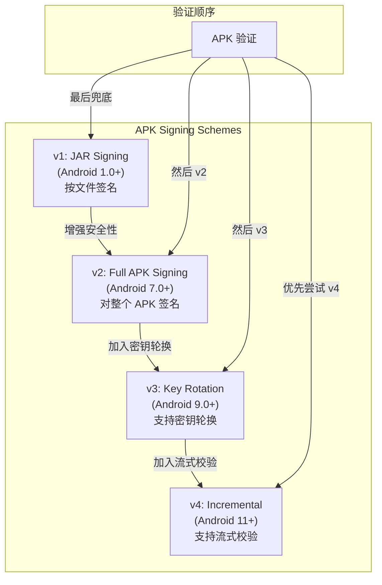

PMS 在安装期间使用 `ApkSignatureVerifier` 做验证，通常会优先尝试新方案，再向旧方案回退。

### 26.1.7 APK 对齐

`zipalign` 会保证 APK 中未压缩条目按适当边界对齐，从而允许系统直接 mmap 资源，而不是先提取到单独文件。Android 15 起，本地库还要求 16KB 页大小对齐：

```java
public static final int PAGE_SIZE_16KB = 16384;
```

对齐错误的 APK 要么安装失败，要么无法获得最佳性能。

### 26.1.8 APK 构建流水线

理解 APK 如何被构建，有助于理解其内部结构为什么长成现在这样：

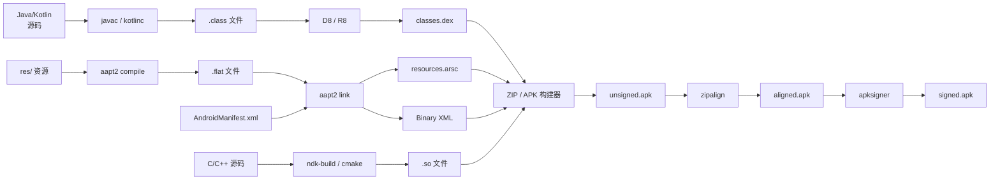

### 26.1.9 APK 压缩与 Stub Package

系统分区空间有限，因此部分系统 APK 会以压缩形式存在，例如 `.gz`。PMS 也支持所谓 stub package：

```java
public final static String COMPRESSED_EXTENSION = ".gz";
public final static String STUB_SUFFIX = "-Stub";
```

stub package 是系统分区中的最小占位 APK，真正完整包会在首次启动或 OTA 后解压到 `/data`。`InitAppsHelper` 会跟踪这些 stub 包：

```java
private final List<String> mStubSystemApps = new ArrayList<>();
```

### 26.1.10 APK 校验和

PMS 支持为 APK 请求和校验 checksum，常用于应用商店和企业设备管理：

```java
public void requestFileChecksums(@NonNull File file,
        @NonNull String installerPackageName,
        @Checksum.TypeMask int optional,
        @Checksum.TypeMask int required,
        @Nullable List trustedInstallers,
        @NonNull IOnChecksumsReadyListener onChecksumsReadyListener)
        throws FileNotFoundException {
```

支持的摘要类型包括 MD5、SHA-1、SHA-256、SHA-512 和 Merkle Root 等。

---

## 26.2 PackageManagerService 架构

PMS 是 Android 中架构最复杂的系统服务之一。它已经从早期的巨型单类，逐步重构为由多个 helper 组成、并使用 snapshot 并发模型的系统。

### 26.2.1 服务注册与入口

PMS 由 `SystemServer` 在开机期间启动，并以 `"package"` 服务名注册到 `ServiceManager`。应用通过 `PackageManager` API 间接访问它。

其核心类关系如下：

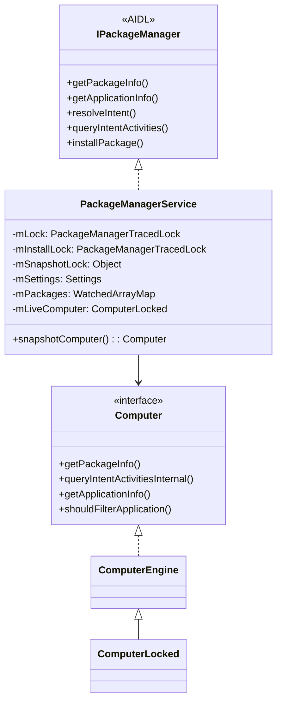

### 26.2.2 锁层级

PMS 主要有三把重要锁：

1. `mLock`：保护包解析结果与大部分内存态
2. `mInstallLock`：保护 `installd` 相关磁盘操作
3. `mSnapshotLock`：保护 snapshot 字段与版本状态

官方 Javadoc 特别强调顺序：

- 不应在持有 `mLock` 的同时再去做重磁盘操作
- 持有 `mInstallLock` 时短暂获取 `mLock` 通常是安全的

方法命名也编码了锁要求：

| 后缀 | 需要持有的锁 |
|------|--------------|
| `LI` | `mInstallLock` |
| `LIF` | `mInstallLock` 且包已冻结 |
| `LPr` | `mLock` 读 |
| `LPw` | `mLock` 写 |

### 26.2.3 Computer Snapshot 模式

现代 PMS 中最关键的架构特征，就是 **Computer snapshot 模式**。它的目标是缓解 `mLock` 极高的竞争。

基本思想是：

- 大多数 PMS 调用是**只读查询**
- 查询不应该总是抢全局锁
- 因此 PMS 用 snapshot 把“读”和“写”拆开

相关角色包括：

1. `Computer` 接口：定义所有只读查询能力
2. `ComputerEngine`：对 snapshot 数据执行查询
3. `ComputerLocked`：在 live 数据上加锁执行查询
4. `Snapshot`：打包保存当时的 PMS 状态

```java
public interface Computer extends PackageDataSnapshot {
    int getVersion();
    Computer use();
    @NonNull List<ResolveInfo> queryIntentActivitiesInternal(...);
    ActivityInfo getActivityInfo(ComponentName component, long flags, int userId);
    AndroidPackage getPackage(String packageName);
    ApplicationInfo getApplicationInfo(String packageName, long flags, int userId);
    PackageInfo getPackageInfo(String packageName, long flags, int userId);
}
```

调用 `snapshotComputer()` 时，大致策略是：

1. 如果当前线程已经持有 `mLock`，直接返回 live computer
2. 如果缓存 snapshot 版本没过期，直接复用
3. 否则在 `mSnapshotLock` 下重建 snapshot

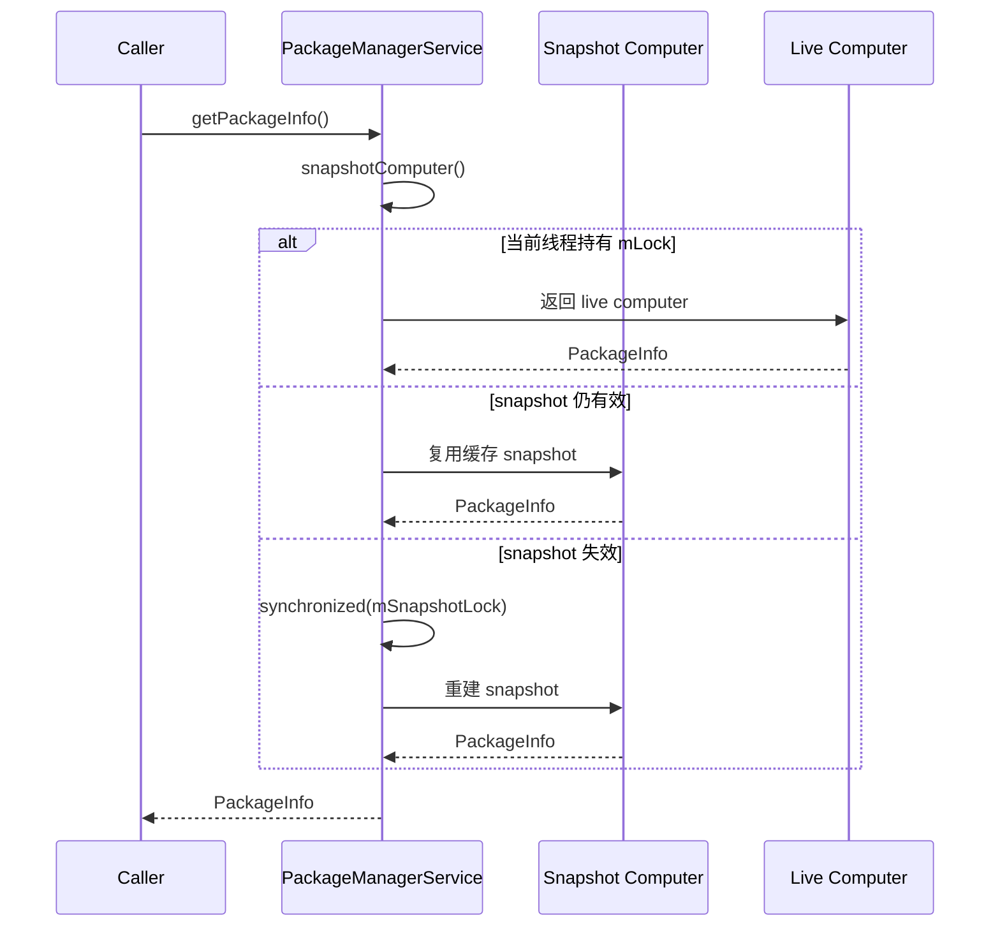

这让绝大多数读操作不必长期争用 `mLock`。

### 26.2.4 核心数据结构

PMS 维护若干关键结构，并用 `@Watched` 标注，配合 snapshot 失效机制：

```java
@Watched
@GuardedBy("mLock")
final WatchedArrayMap<String, AndroidPackage> mPackages = new WatchedArrayMap<>();

@Watched
@GuardedBy("mLock")
final Settings mSettings;

@Watched
final ComponentResolver mComponentResolver;

@Watched
final AppsFilterImpl mAppsFilter;
```

这些对象一旦发生变更，会通过 Watchable/Watcher 模式自动让 snapshot 失效。

### 26.2.5 PackageSetting

`PackageSetting` 是持久化的每包状态记录，实现 `PackageStateInternal`。它保存：

- 包名、code path、resource path
- 版本与签名信息
- 安装与更新时间
- installer 信息
- CPU ABI
- 每用户状态，例如启用/禁用、隐藏、停止、挂起
- 领域验证状态

它由 `Settings` 容器统一管理，并最终序列化到 `/data/system/packages.xml`。

### 26.2.6 Helper 类拆分

现代 PMS 已经拆分出大量 helper：

```java
private final BroadcastHelper mBroadcastHelper;
private final RemovePackageHelper mRemovePackageHelper;
private final DeletePackageHelper mDeletePackageHelper;
private final InitAppsHelper mInitAppsHelper;
private final AppDataHelper mAppDataHelper;
@NonNull private final InstallPackageHelper mInstallPackageHelper;
private final PreferredActivityHelper mPreferredActivityHelper;
private final ResolveIntentHelper mResolveIntentHelper;
private final DexOptHelper mDexOptHelper;
```

拆分的好处包括：

1. 可读性更好
2. 更容易单测
3. 锁要求更清晰
4. 更容易按模块分工维护

### 26.2.7 Handler 消息

PMS 在专用 `ServiceThread` 上使用 Handler 处理异步任务。常见消息包括：

| 消息常量 | 作用 |
|----------|------|
| `SEND_PENDING_BROADCAST` | 发送挂起广播 |
| `POST_INSTALL` | 安装后处理 |
| `WRITE_SETTINGS` | 写入 settings |
| `PACKAGE_VERIFIED` | 校验完成 |
| `CHECK_PENDING_VERIFICATION` | 检查待校验项 |
| `DOMAIN_VERIFICATION` | 域名验证 |
| `WRITE_USER_PACKAGE_RESTRICTIONS` | 写入用户级包限制 |

它的 watchdog 超时被设置为十分钟，说明 PMS 可能会执行相当重的操作：

```java
static final long WATCHDOG_TIMEOUT = 1000*60*10;
```

### 26.2.8 Watcher / Watchable 模式

`@Watched` 标注背后，是一个自定义观察者模型：

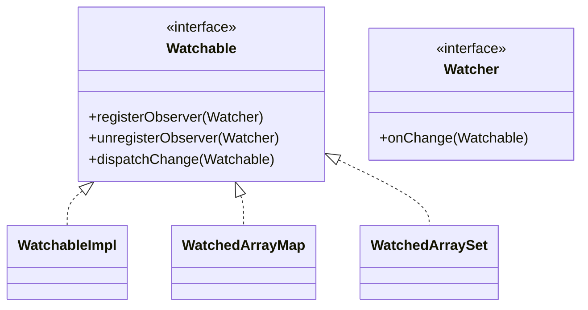

字段变化后，会触发：

1. `WatchedArrayMap` 检测到变更
2. 回调观察者
3. PMS 的总 watcher 收到通知
4. 调用 `PackageManagerService.onChange()`
5. 递增 `sSnapshotPendingVersion`
6. 下次查询重建 snapshot

### 26.2.9 Snapshot 重建性能

重建 snapshot 本身也有成本，所以 PMS 会记录统计信息，包括：

- 开始与结束时间
- 命中次数
- 当前包数量

这使开发者可以分析 snapshot 是否过于频繁失效。

### 26.2.10 PackageManagerServiceInjector

`PackageManagerServiceInjector` 负责为 PMS 提供依赖注入入口，例如获取上下文、服务句柄、本地辅助对象等，降低主类直接依赖过多构造细节。

### 26.2.11 系统分区

PMS 扫描的系统包来源并不只 `/system/app`，还包括：

| 分区 | Scan Flag | 权限级别 |
|------|-----------|----------|
| `/system/app` | `SCAN_AS_SYSTEM` | System |
| `/system/priv-app` | `SCAN_AS_SYSTEM | SCAN_AS_PRIVILEGED` | Privileged |
| `/vendor/app` | `SCAN_AS_SYSTEM | SCAN_AS_VENDOR` | Vendor |
| `/product/app` | `SCAN_AS_SYSTEM | SCAN_AS_PRODUCT` | Product |
| `/system_ext/app` | `SCAN_AS_SYSTEM | SCAN_AS_SYSTEM_EXT` | System Ext |
| `/odm/app` | `SCAN_AS_SYSTEM | SCAN_AS_ODM` | ODM |

---

## 26.3 包扫描

开机时，PMS 必须发现并解析设备上的所有 APK。这是影响开机性能的关键路径之一。

### 26.3.1 开机扫描总览

扫描由 `InitAppsHelper` 负责协调：

```java
final class InitAppsHelper {
    private final PackageManagerService mPm;
    private final List<ScanPartition> mDirsToScanAsSystem;
    private final int mScanFlags;
    private final int mSystemParseFlags;
    private final int mSystemScanFlags;
    private final InstallPackageHelper mInstallPackageHelper;
    private final ApexManager mApexManager;
    private final ExecutorService mExecutorService;
```

扫描顺序大致如下：

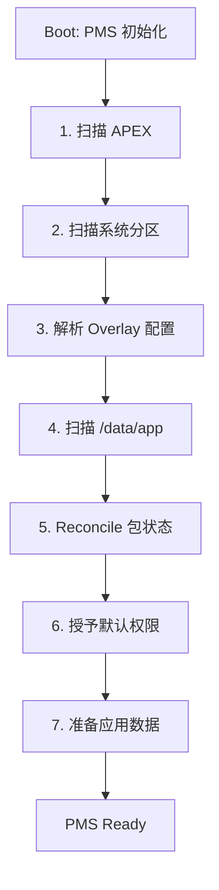

### 26.3.2 Scan Flags

PMS 使用大量 bit flag 控制扫描行为，例如：

- `SCAN_BOOTING`
- `SCAN_INITIAL`
- `SCAN_FIRST_BOOT_OR_UPGRADE`
- `SCAN_REQUIRE_KNOWN`
- `SCAN_AS_SYSTEM`
- `SCAN_AS_PRIVILEGED`
- `SCAN_AS_VENDOR`
- `SCAN_AS_PRODUCT`
- `SCAN_AS_APEX`

在首次开机或系统升级期间，通常会自动加上 `SCAN_FIRST_BOOT_OR_UPGRADE`。

### 26.3.3 APEX 包扫描

现代 Android 使用 APEX 交付可更新系统组件，APEX 里也可能带 APK。PMS 的扫描顺序通常是：

1. APEX
2. 系统分区 APK
3. `/data/app`

这确保 APEX 提供的内容能先进入系统视图。

### 26.3.4 PackageParser2

真正读取 APK、解析 binary manifest 和组件信息的是 `PackageParser2`。它会提取：

- 包名与版本
- 组件声明
- 权限定义与请求
- 库依赖
- 特性要求
- split 信息

为了加速开机，PMS 还会用 `ParallelPackageParser` 并行解析。

### 26.3.5 ScanPackageUtils

`ScanPackageUtils` 负责“扫描但不提交副作用”的逻辑。它接收 `ScanRequest`，返回 `ScanResult`，把解析与提交分离开。

`ScanRequest` 中通常包含：

- 解析后的 `ParsedPackage`
- 旧 `PackageSetting`
- parse flags / scan flags
- 用户信息
- shared user 信息

`ScanResult` 则包含后续 commit 阶段需要的产物。

### 26.3.6 `/data/app` 目录

用户安装应用位于 `/data/app`，目录通常带双层随机名，例如：

```text
/data/app/
  +-- ~~random1/
  |     +-- com.example.app1-random2/
  |           +-- base.apk
  |           +-- split_config.arm64_v8a.apk
  |           +-- split_config.en.apk
  |           +-- lib/
  |           +-- oat/
```

随机目录名用于降低路径预测与包名枚举风险。

### 26.3.7 包缓存

为了加速后续启动，PMS 使用 `PackageCacher` 缓存解析结果，通常存放在 `/data/system/package_cache/`。在首次启动或 OTA 后，该缓存通常会整体失效并重建。

### 26.3.8 系统目录扫描细节

`scanSystemDirs()` 能清楚看到扫描顺序：

1. 先收集 overlay 目录
2. 再扫描 `/system/framework`
3. 然后每个分区先扫 `priv-app`，再扫普通 `app`
4. 最后并行执行
5. 扫描结束后必须确认平台包 `android` 存在

这一顺序直接影响 overlay、生效优先级和平台包依赖。

### 26.3.9 非系统应用扫描

系统包扫描完成后，`initNonSystemApps()` 扫描 `/data/app`。这里通常带有 `SCAN_REQUIRE_KNOWN`，意味着只有已在 `packages.xml` 中注册的包才会被认为可信；未知目录可能被当作可疑状态处理。

### 26.3.10 开机性能指标

PMS 会记录系统应用和非系统应用的扫描耗时、包数量、单包平均耗时与缓存命中数，并上报到 `FrameworkStatsLog` 供 OTA 和性能分析使用。

### 26.3.11 “Expecting Better” 机制

当系统应用已被用户更新时，系统分区和 `/data/app` 中会同时存在两个版本。PMS 用 `mExpectingBetter` 协调两者：

1. 系统扫描时发现 `/data/app` 有更新版本
2. 记录该系统版本到 `mExpectingBetter`
3. 优先使用 `/data/app` 中的新版本
4. 如果用户卸载更新，再回退启用系统分区版本

### 26.3.12 目录权限修复

首次启动或升级后，PMS 会修正已安装应用目录的 mode，例如设为 `0771`，防止普通用户通过枚举目录推测设备已安装哪些包。

### 26.3.13 扫描流程图

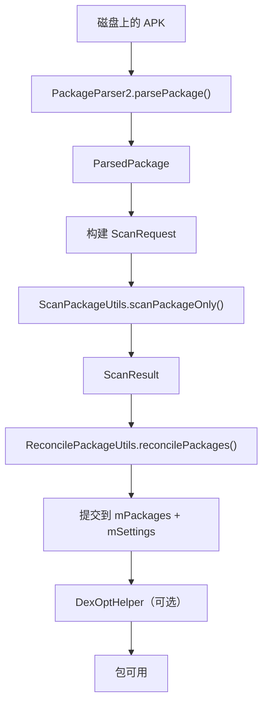

---

## 26.4 安装流水线

APK 安装并不是单一步骤，而是一条涉及校验、落盘、dex 优化和状态提交的多阶段流水线。

### 26.4.1 安装入口

常见入口包括：

1. `adb install`
2. Play Store 或其他应用商店
3. 系统 OTA
4. APEX 更新
5. 老式 `ACTION_INSTALL_PACKAGE` Intent

现代安装流程几乎都汇聚到 `PackageInstallerService`。

### 26.4.2 PackageInstallerSession

安装会话由 `PackageInstallerSession` 表示，生命周期如下：

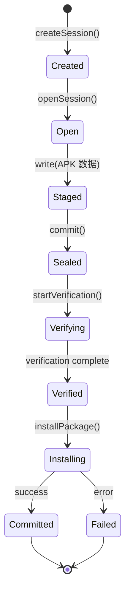

### 26.4.3 完整安装流水线

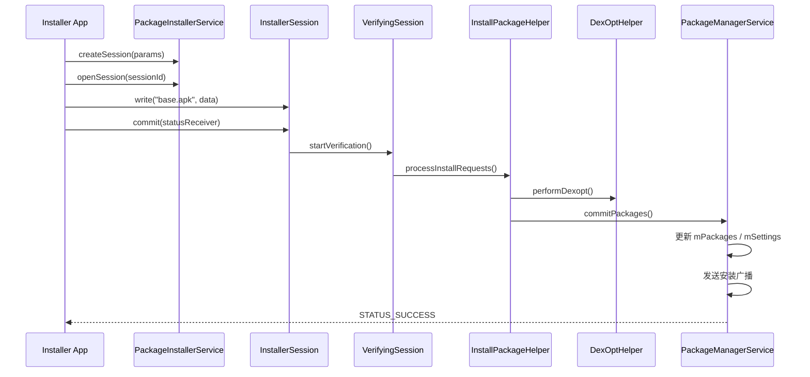

### 26.4.4 阶段 1：Staging

安装数据首先会被写入 staging 目录，例如：

```text
/data/app/vmdl<sessionId>.tmp/
  +-- base.apk
  +-- split_config.arm64_v8a.apk
```

需要重启生效的 staged install 则由 `StagingManager` 管理。

### 26.4.5 阶段 2：Verification

`VerifyingSession` 负责安装前校验，包括：

1. Required verifier，例如 Play Protect
2. Sufficient verifier
3. 完整性校验
4. Rollback 准备

默认超时允许策略和完整性超时都可配置：

```java
static final int DEFAULT_VERIFICATION_RESPONSE = PackageManager.VERIFICATION_ALLOW;
```

### 26.4.6 阶段 3：Installation

`InstallPackageHelper` 负责实际安装工作：

1. 验证 APK 合法性
2. 校验签名
3. 检查版本兼容
4. 与现有包状态 reconcile
5. 复制 APK 到最终位置
6. 提取本地库
7. 处理权限与 ABI

典型失败码包括：

- `INSTALL_FAILED_ALREADY_EXISTS`
- `INSTALL_FAILED_INVALID_APK`
- `INSTALL_FAILED_DUPLICATE_PACKAGE`
- `INSTALL_FAILED_UPDATE_INCOMPATIBLE`
- `INSTALL_FAILED_UID_CHANGED`
- `INSTALL_FAILED_DEPRECATED_SDK_VERSION`

### 26.4.7 阶段 4：DEX 优化

安装完成后，PMS 会触发 dexopt，交给 ART 完成实际编译。常见编译模式包括：

- `verify`
- `quicken`
- `speed-profile`
- `speed`

### 26.4.8 阶段 5：Commit

最终提交阶段包括：

1. 更新 `mPackages`
2. 更新 `mSettings`
3. 写入 `packages.xml`
4. 发出广播，例如：
   - `ACTION_PACKAGE_ADDED`
   - `ACTION_PACKAGE_REPLACED`
   - `ACTION_MY_PACKAGE_REPLACED`

### 26.4.9 Package Freezing

安装期间，PMS 会临时“冻结”包，防止 ActivityManager 启动它：

```java
@GuardedBy("mLock")
final WatchedArrayMap<String, Integer> mFrozenPackages = new WatchedArrayMap<>();
```

冻结能避免代码与数据正在变更时被运行。

### 26.4.10 InstallPackageHelper 的提交过程

`commitReconciledScanResultLocked()` 是真正让新包进入系统状态的关键函数。它会在持有 `mLock` 下原子更新：

1. `PackageSetting`
2. shared user 相关信息
3. shared library 状态
4. KeySet 数据
5. signing details
6. 最终包设置提交

### 26.4.11 Update Ownership

Android 14 引入 **update ownership**，允许某个应用商店声明某包的独占更新权。规则包括：

1. 初装时可声明 ownership
2. 已设 owner 后，只允许 owner 更新
3. 用户明确切换安装器时可清除 ownership
4. 还能受 sysconfig 和 denylist 控制

### 26.4.12 安装后广播

安装成功后 PMS 会通过 `BroadcastHelper` 发送系统广播。

**新安装：**

```text
ACTION_PACKAGE_ADDED
```

**更新：**

```text
ACTION_PACKAGE_REMOVED (EXTRA_REPLACING=true)
ACTION_PACKAGE_ADDED   (EXTRA_REPLACING=true)
ACTION_PACKAGE_REPLACED
ACTION_MY_PACKAGE_REPLACED
```

启动期间广播还会被故意延迟，避免开机阶段系统过载。

### 26.4.13 Install Observer 通知

安装方通过 `IPackageInstallObserver2` 获取结果回调。对于 no-kill install，通知甚至会被延后，以配合进程与文件清理时机。

### 26.4.14 Package Archival

Android 14+ 支持包归档。归档后 APK 本体被移除，但：

- 用户数据保留
- 启动器保留最小入口
- 重新点击时可按需重新下载

### 26.4.15 延迟删除

更新过程中，旧 APK 不会立即删除，而是延后清理。这为 rollback 提供了缓冲窗口。

### 26.4.16 增量安装

Android 12+ 支持基于 IncFS 的增量安装。APK 可在未完全下载时就进入可用状态，v4 签名为其提供块级校验能力。

---

## 26.5 权限模型

Android 权限模型是其安全体系的核心之一。PMS 与 `PermissionManagerService` 协同，负责定义、授予、撤销和检查权限。

### 26.5.1 PermissionManagerService

`PermissionManagerService` 是权限管理的中心服务：

```java
public class PermissionManagerService extends IPermissionManager.Stub {
    private final Object mLock = new Object();
    private final PackageManagerInternal mPackageManagerInt;
    private final AppOpsManager mAppOpsManager;
    private final Context mContext;
    private final PermissionManagerServiceInterface mPermissionManagerServiceImpl;
    private final AttributionSourceRegistry mAttributionSourceRegistry;
```

它以独立服务形式注册：

```java
ServiceManager.addService("permissionmgr", permissionService);
ServiceManager.addService("permission_checker",
        new PermissionCheckerService(context));
```

### 26.5.2 权限类型

权限内部表示由 `Permission` 类维护：

```java
public final class Permission {
    public static final int TYPE_MANIFEST = LegacyPermission.TYPE_MANIFEST;
    public static final int TYPE_CONFIG = LegacyPermission.TYPE_CONFIG;
    public static final int TYPE_DYNAMIC = LegacyPermission.TYPE_DYNAMIC;
```

按 protection level 划分，常见类型为：

- `normal`
- `dangerous`
- `signature`
- `internal`

同时还可以叠加保护 flag，例如：

- `privileged`
- `development`
- `appop`
- `pre23`
- `installer`
- `instant`
- `role`

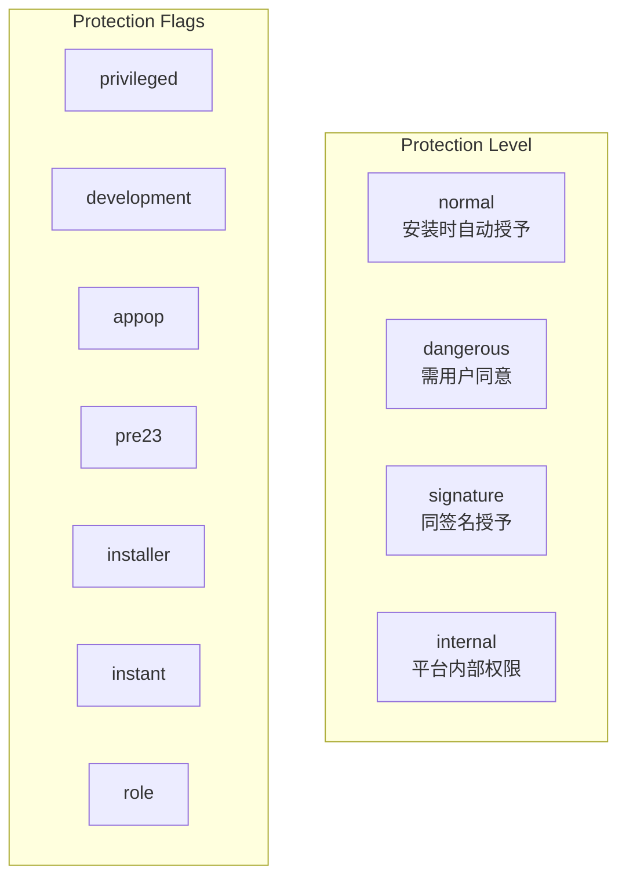

### 26.5.3 安装时权限（normal）

`normal` 权限风险较低，因此在安装时自动授予，无需用户弹窗。例如：

- `INTERNET`
- `VIBRATE`
- `ACCESS_NETWORK_STATE`

### 26.5.4 运行时权限（dangerous）

`dangerous` 权限必须由用户显式授予。它们通常按权限组组织，例如：

| 组 | 权限示例 |
|----|----------|
| `LOCATION` | `ACCESS_FINE_LOCATION`、`ACCESS_COARSE_LOCATION`、`ACCESS_BACKGROUND_LOCATION` |
| `CAMERA` | `CAMERA` |
| `MICROPHONE` | `RECORD_AUDIO` |
| `STORAGE` | `READ_MEDIA_*`、旧版存储权限 |
| `CONTACTS` | `READ_CONTACTS`、`WRITE_CONTACTS` |
| `PHONE` | `READ_PHONE_STATE`、`CALL_PHONE` |
| `SMS` | `SEND_SMS`、`READ_SMS` |

权限检查大致流程如下：

```java
@Override
public int checkPermission(String packageName, String permissionName,
        String persistentDeviceId, @UserIdInt int userId) {
    ...
    return mPermissionManagerServiceImpl.checkPermission(
            packageName, permissionName, persistentDeviceId, userId);
}
```

### 26.5.5 Signature 权限

`signature` 权限只会授予给与定义该权限的应用具有相同签名证书的包。这是同开发者应用之间安全通信的关键机制。平台包 `android` 就定义了大量 signature 权限。

### 26.5.6 Privileged 权限

`signature|privileged` 权限可以授予 `/system/priv-app` 下的特权应用，即便它们不一定与平台证书完全一致，但必须满足更严格的系统策略控制。

### 26.5.7 AppOp 权限

某些权限除了 PMS/PermissionManager 授权外，还叠加了 AppOps 控制层。即使权限名义上已授予，AppOps 仍可能阻止实际访问。

### 26.5.8 一次性权限

Android 支持一次性授予，例如只允许本次使用期间访问位置或麦克风。系统会在应用离开前台后自动回收。

### 26.5.9 Auto-Revoke（自动撤销）

长期未使用的应用，系统可以自动撤销其 runtime 权限。这与后面提到的 App Hibernation 在策略层上相关，但两者并不相同。

### 26.5.10 权限授予流程

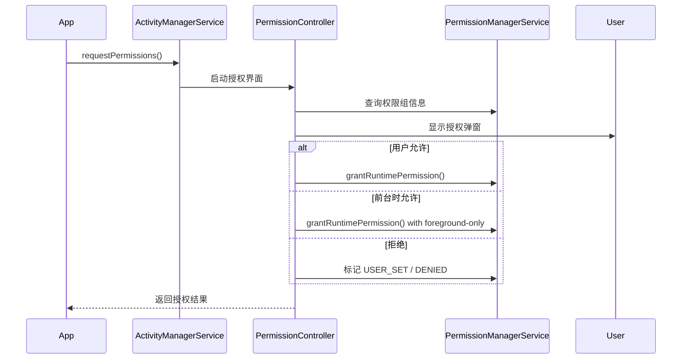

### 26.5.11 Split Permissions

随着 Android 平台演进，一些旧权限会在新版本中被拆分为更细粒度权限。系统会通过 split permission 机制在安装和升级时做兼容映射。

### 26.5.12 权限组与 UI

权限对用户不是单个字符串呈现，而通常按 group 展示。PermissionController 根据权限组、危险级别和场景决定弹窗文案与交互形式。

### 26.5.13 后台定位

从 Android 10 开始，后台定位需要单独授权，不能仅凭前台定位权限自动获得。

### 26.5.14 权限委托

`CheckPermissionDelegate` 允许某些系统组件拦截和修改权限判断结果，例如 Companion Device Manager 或 Virtual Device Manager。

### 26.5.15 虚拟设备权限

Android 14+ 支持按 device 维度管理权限状态，因此同一应用在默认设备和虚拟设备上的权限可能不同：

```java
public int checkPermission(String packageName, String permissionName,
        String persistentDeviceId, @UserIdInt int userId)
```

### 26.5.16 Attribution Source

Android 12+ 引入 `AttributionSource`，用于追踪 API 调用链上每一层代理方的身份，避免 A 调 B、B 再代 A 调系统接口时发生权限绕过。

### 26.5.17 权限持久化

权限状态会被持久化到不同位置：

1. 安装时权限：`/data/system/packages.xml`
2. 运行时权限：每用户 `runtime-permissions.xml`

---

## 26.6 Intent 解析

Intent 解析是 Android 将隐式 Intent 匹配到正确组件的机制。PMS 维护所有注册的 intent filter 数据，并执行匹配算法。

### 26.6.1 Intent Filter 注册

带有 `<intent-filter>` 的组件，在安装和扫描阶段会被注册进 `ComponentResolver`：

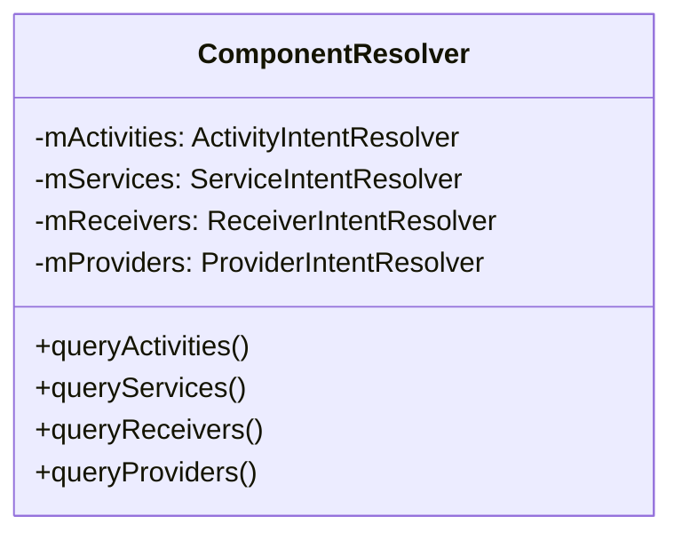

它内部针对 activity、service、receiver、provider 维护各自的 resolver。

### 26.6.2 Intent 匹配算法

隐式 Intent 匹配主要看四类信息：

1. **Action**
2. **Data**，包括 scheme、host、port、path、MIME type
3. **Category**
4. **Package**，如果显式指定则近似显式 Intent

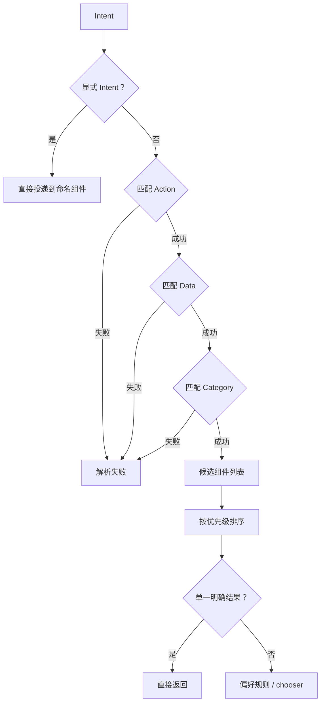

### 26.6.3 ResolveIntentHelper

`ResolveIntentHelper` 负责统筹整个解析流程，包括：

- 用户存在性校验
- cross-user 权限检查
- flags 更新
- 查询候选 activity
- 从候选中选出最佳结果

### 26.6.4 chooseBestActivity

当多个 activity 命中时，系统会综合以下因素决策：

1. `priority`
2. `preferredOrder`
3. `isDefault`
4. 已保存的 preferred activity
5. 域名验证（App Links）
6. 是否需要 chooser

### 26.6.5 Preferred Activities

用户在 chooser 中选“始终使用”后，PMS 会保存 `PreferredActivity` 记录，通常按用户存储在 `preferred-activities.xml`。

### 26.6.6 App Links 与域名验证

对于 HTTP/HTTPS 链接，Android 使用 App Links 机制，通过 Digital Asset Links 与域名验证状态自动把链接导向已验证应用。

### 26.6.7 跨 Profile Intent 解析

对于工作资料夹这类多 profile 场景，PMS 还支持 cross-profile intent forwarding，通过 `CrossProfileIntentFilter` 和相关 resolver 在个人与工作 profile 间转发。

### 26.6.8 Protected Actions

某些 action 被列为 protected，非系统应用不能声明过高优先级来抢占。例如：

- `ACTION_SEND`
- `ACTION_SENDTO`
- `ACTION_SEND_MULTIPLE`
- `ACTION_VIEW`

如果普通应用为这些 action 注册高优先级 filter，系统会把优先级静默压到 0。

### 26.6.9 Instant App 解析

Instant app 的解析有特殊规则，通常分两阶段：

1. 查询本地已安装 instant app
2. 进行云端或额外 resolver 查询

### 26.6.10 Safer Intent Utilities

Android 14+ 引入 `SaferIntentUtils`，用于在隐式解析时过滤不应被暴露的非导出组件，减少组件意外暴露风险。

### 26.6.11 相机 Intent 保护

从 Android 11 开始，相机相关隐式 Intent 通常需要优先匹配系统相机，除非 DPC 明确配置了替代默认项。

### 26.6.12 `queryIntentActivitiesInternal`

`Computer` 接口中存在多个重载版本，允许在不同粒度下控制：

- flags
- private resolve flags
- filterCallingUid
- callingPid
- resolveForStart
- allowDynamicSplits

这些参数直接影响可见性和候选过滤行为。

### 26.6.13 解析后过滤

初步命中候选后，系统仍会执行 post-resolution filtering，包括：

1. Instant app 可见性过滤
2. package visibility 过滤
3. dynamic split 相关处理
4. 用户与 profile 限制

### 26.6.14 Package Visibility Filtering

Android 11 起，应用默认看不到其他所有包，除非：

- 在 manifest 中声明 `<queries>`
- 拥有 `QUERY_ALL_PACKAGES`

PMS 通过 `AppsFilter` 实现这一层过滤。

---

## 26.7 Split APK 与 App Bundle

Split APK 允许应用由多个 APK 组成，而不是一个单体包。这也是 Google Play App Bundle 能降低下载体积的基础。

### 26.7.1 Split APK 架构

一个 split 安装通常包含：

1. **Base APK**
2. **配置 split**，例如 ABI、语言、密度
3. **功能 split**，即动态特性模块

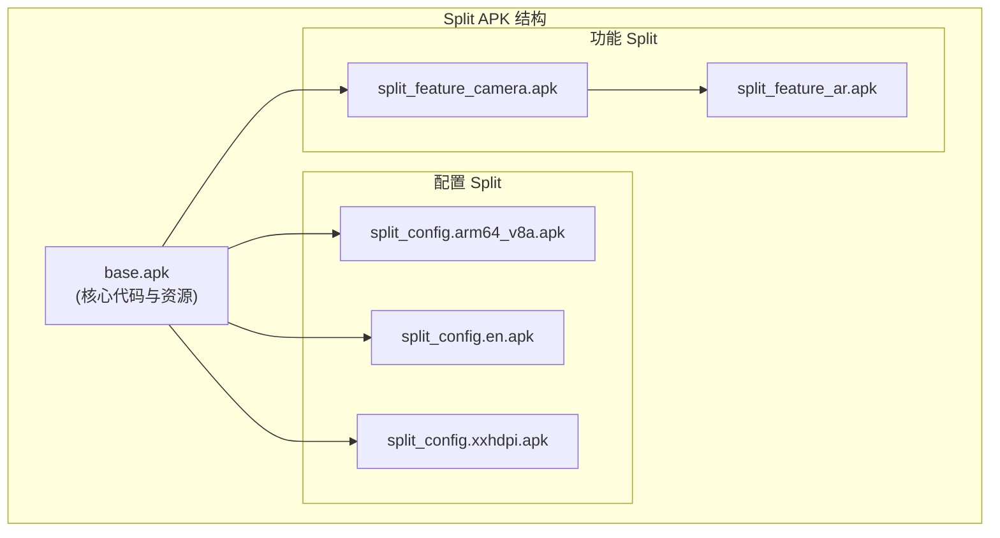

### 26.7.2 Split 依赖

功能 split 可通过 `<uses-split>` 声明依赖关系。`SplitDependencyLoader` 会负责按依赖树顺序进行加载，保证 root-to-leaf 构造顺序正确。

### 26.7.3 运行时 Split 加载

运行时由 `LoadedApk` 中的 `SplitDependencyLoaderImpl` 负责：

1. 检查 split 是否已缓存
2. 沿依赖树向上找到根
3. 再按根到叶顺序构造 ClassLoader 与 Resources
4. 最后缓存结果

### 26.7.4 Split 安装

Split APK 的安装常通过 `MODE_INHERIT_EXISTING` session 完成。其特点是：

1. 以现有安装为基础
2. 可追加新 split
3. 可移除旧 split
4. base APK 必须始终存在

### 26.7.5 磁盘布局

已安装 split APK 通常和 base APK 放在同一 code path 下：

```text
/data/app/~~random/com.example.app-random/
  +-- base.apk
  +-- split_config.arm64_v8a.apk
  +-- split_config.en.apk
  +-- split_feature_camera.apk
  +-- lib/
  +-- oat/
```

### 26.7.6 Split APK Manifest 声明

不同 split 在 manifest 中有不同角色声明：

- base APK：`split=""`
- feature split：`android:isFeatureSplit="true"`
- config split：`configForSplit=""`

关键字段包括：

| 属性 | 作用 |
|------|------|
| `split` | 当前 split 名称 |
| `android:isFeatureSplit` | 是否功能 split |
| `configForSplit` | 属于哪个 split 的配置 |
| `<uses-split>` | split 依赖 |
| `android:splitName` | 组件归属 split |

### 26.7.7 Split ClassLoader 架构

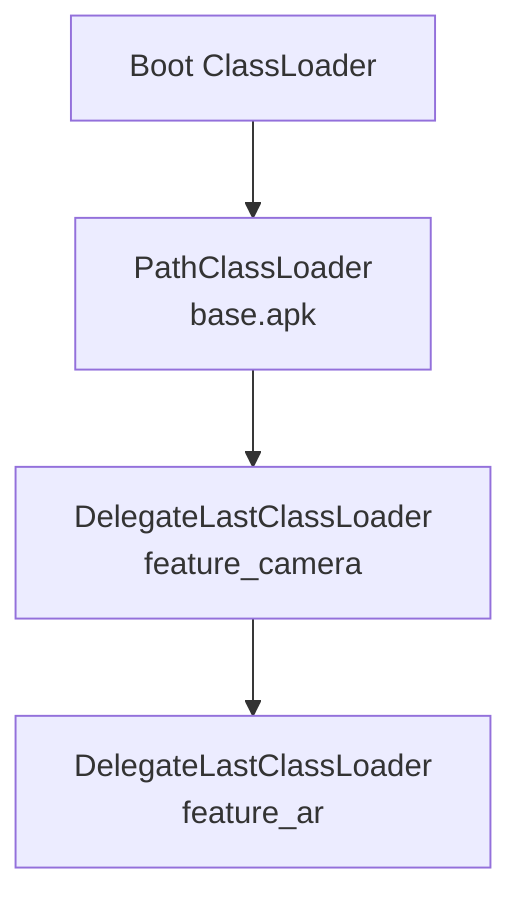

配置 split 通常与所属父 split 一起加载；功能 split 则常以独立 ClassLoader 参与链路。

### 26.7.8 Split 资源合并

split 加载后，资源会被合并进统一 `Resources` 视图，优先级通常遵循依赖和加载顺序。配置 split 会被识别为对应 feature 的附属资源集合。

### 26.7.9 动态交付

动态特性模块按需下载时，流程通常是：

1. 应用通过 Play Core 请求模块
2. 应用商店下载 split
3. PMS 以新增 split 形式安装
4. 应用被通知可加载新代码与资源

---

## 26.8 Overlay 系统

RRO（Runtime Resource Overlay）允许在不修改目标 APK 的情况下，于运行时覆盖其资源。这是主题换肤、运营商定制与 OEM 品牌定制的重要基础。

### 26.8.1 OverlayManagerService 架构

OMS（OverlayManagerService）负责管理整个 overlay 系统：

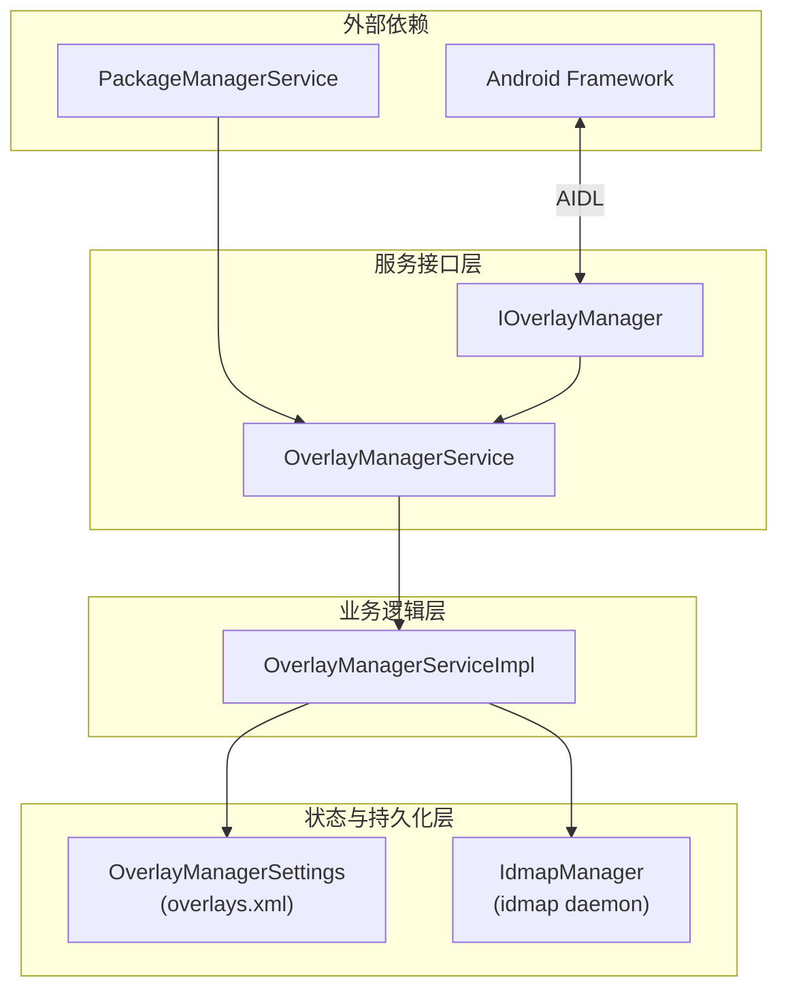

OMS 的输入来源通常有三类：

1. SystemService 生命周期事件
2. PMS 的包增删改广播
3. AIDL 请求，例如启用/禁用 overlay

### 26.8.2 RRO 工作原理

overlay APK 会声明目标包，并提供替换资源。启用后，资源查找顺序变成：

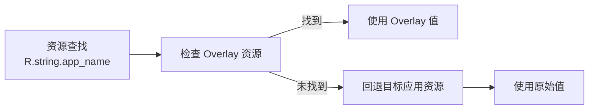

### 26.8.3 idmap 文件

`IdmapManager` 负责创建 idmap 文件，用于把 target package 的资源 ID 映射到 overlay package。这样运行时无需每次遍历 overlay APK，就能快速定位覆盖资源。

状态通常可分为：

```java
static final int IDMAP_NOT_EXIST = 0;
static final int IDMAP_IS_VERIFIED = 1;
static final int IDMAP_IS_MODIFIED = 2;
```

### 26.8.4 Overlay 状态

overlay 具有明确状态机：

- `STATE_DISABLED`
- `STATE_ENABLED`
- `STATE_MISSING_TARGET`
- `STATE_NO_IDMAP`
- `STATE_OVERLAY_IS_BEING_REPLACED`
- `STATE_TARGET_IS_BEING_REPLACED`

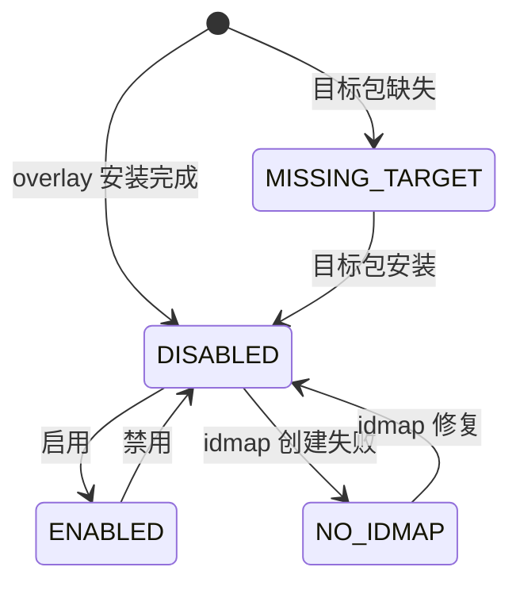

### 26.8.5 OverlayManagerServiceImpl

`OverlayManagerServiceImpl` 实现主要业务逻辑，负责把：

- overlay manager 从 `overlays.xml` 读到的状态
- PMS 从 manifest 解析到的事实状态

做 reconcile，特别是在 OTA 之后，这两个视角可能短暂不一致。

### 26.8.6 Overlay 持久化

overlay 状态通常持久化到：

```text
/data/system/overlays.xml
```

由 `OverlayManagerSettings` 负责读写。

### 26.8.7 Overlay 配置

系统 overlay 配置文件可能来自：

- `/product/overlay/config/config.xml`
- `/vendor/overlay/config/config.xml`
- `/system/overlay/config/config.xml`

其中定义：

- 默认启用状态
- 是否可变更
- 优先级

### 26.8.8 Fabricated Overlay

Android 12+ 支持 **fabricated overlay**，即无需物理 APK、在运行时动态构造的 overlay。这是 Material You 动态主题的关键机制。

### 26.8.9 Overlay 分类与策略

overlay 常按 category 分类，例如：

| Category | 作用 |
|----------|------|
| `android.theme.customization.accent_color` | 强调色 |
| `android.theme.customization.system_palette` | 系统色板 |
| `android.theme.customization.theme_style` | 主题风格 |
| `android.theme.customization.font` | 字体 |
| `android.theme.customization.icon_shape` | 图标形状 |
| `android.theme.customization.navbar` | 导航栏风格 |

分类用于组织 overlay，并避免同类冲突。

### 26.8.10 Overlay 安全模型

Overlay 安全由多层机制共同保障：

1. **签名检查**
2. **`<overlayable>` 声明**
3. **policy 类型**
4. **OverlayActorEnforcer**

常见 policy：

- `public`
- `system`
- `vendor`
- `product`
- `signature`
- `actor`

### 26.8.11 Overlay 与 PMS 的交互

OMS 强依赖 PMS 提供包状态。当 PMS 通知 overlay 包新增/更新时，OMS 会更新状态、创建 idmap，并在必要时刷新目标包 overlay paths：

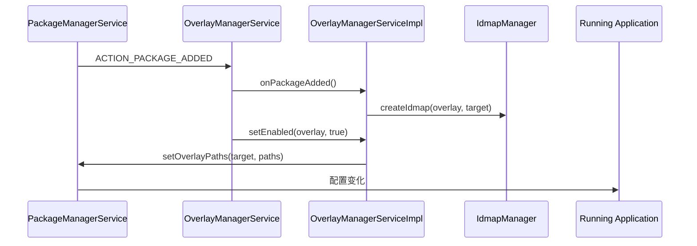

### 26.8.12 Overlay Paths

Overlay 启用后，PMS 会更新包的 overlay path 信息，资源系统随后在这些路径中优先查找覆盖条目。

### 26.8.13 idmap2d 守护进程内部

idmap 文件创建最终由原生守护进程 `idmap2d` 完成，`IdmapDaemon` 按需拉起，并在空闲约 10 秒后自动退出：

```java
private static final int SERVICE_TIMEOUT_MS = 10000;
private static final String IDMAP_DAEMON = "idmap2d";
```

为减少大量 Binder 往返，系统还支持批量 idmap 事务。

### 26.8.14 Overlay Policy Enforcement

`IdmapManager.calculateFulfilledPolicies()` 会计算 overlay 当前满足哪些 policy bitmask，例如：

- 同签名
- actor 签名
- system/vendor/product/odm/oem 分区来源

对 pre-Q overlay 还存在向后兼容分支。

### 26.8.15 OverlayActorEnforcer

`OverlayActorEnforcer` 用于验证调用者是否有权操作某个 overlayable。Actor 常以 `overlay://namespace/name` URI 表示，并通过系统配置映射到具体包名。

### 26.8.16 Fabricated Overlay 内部实现

Fabricated overlay 的注册流程大致是：

1. 客户端向 OMS 提交 `OverlayManagerTransaction`
2. `OverlayManagerServiceImpl` 校验 fabricated overlay 名称与目标
3. `IdmapManager` 调用 `idmap2d` 生成对应实体
4. 写入 overlay settings
5. 更新目标包 overlay paths
6. 广播 overlay 改变

### 26.8.17 RRO Constraints

在特性 flag 打开时，Android 还支持按运行时条件限制 overlay 启用，即 RRO constraints。其约束只能在 enable 时设置，disable 时会全部移除。

### 26.8.18 Overlay Settings 持久化

`OverlayManagerSettings` 内部使用有序 `SettingsItem` 列表保存 overlay 状态。顺序即优先级，低索引表示低优先级。

### 26.8.19 批量 idmap 事务

打开 `mergeIdmapBinderTransactions()` 后，OMS 会尽量合并多个 overlay 的 idmap 操作，减少 Binder 调用与开机成本。

### 26.8.20 OMS Shell 命令

常用命令：

```bash
adb shell cmd overlay list
adb shell cmd overlay enable com.example.overlay
adb shell cmd overlay disable com.example.overlay
adb shell dumpsys overlay
```

---

## 26.9 动手实践（Try It）

### 26.9.1 检查 APK 结构

使用 `unzip`、`aapt2`、`apksigner` 分析一个系统 APK：

```bash
$ unzip -l /system/app/Calculator/Calculator.apk
$ aapt2 dump xmltree /system/app/Calculator/Calculator.apk --file AndroidManifest.xml
$ aapt2 dump badging /system/app/Calculator/Calculator.apk
$ aapt2 dump resources /system/app/Calculator/Calculator.apk | head -50
```

### 26.9.2 查询包信息

```bash
$ adb shell pm list packages
$ adb shell pm list packages -s
$ adb shell pm list packages -3
$ adb shell pm dump com.android.settings | head -100
$ adb shell pm path com.android.settings
$ adb shell pm list permissions -g -d
```

### 26.9.3 安装与管理包

```bash
$ adb install app.apk
$ adb install -r app.apk
$ adb install -t test-app.apk
$ adb install-multiple base.apk split_config.arm64_v8a.apk split_config.en.apk
$ adb shell pm install-create
$ adb shell pm install-write 1234 base.apk /path/to/base.apk
$ adb shell pm install-commit 1234
```

卸载与清理：

```bash
$ adb shell pm uninstall com.example.app
$ adb shell pm uninstall -k com.example.app
$ adb shell pm clear com.example.app
```

### 26.9.4 权限操作

```bash
$ adb shell pm grant com.example.app android.permission.CAMERA
$ adb shell pm revoke com.example.app android.permission.CAMERA
$ adb shell dumpsys package com.example.app | grep "CAMERA"
$ adb shell pm reset-permissions com.example.app
```

### 26.9.5 Intent 解析检查

```bash
$ adb shell pm resolve-activity --brief "android.intent.action.VIEW" -d "https://www.example.com"
$ adb shell pm query-activities --brief "android.intent.action.SEND" -t "text/plain"
$ adb shell dumpsys package preferred-activities
```

### 26.9.6 Overlay 操作

```bash
$ adb shell cmd overlay list
$ adb shell cmd overlay enable com.example.overlay
$ adb shell cmd overlay disable com.example.overlay
$ adb shell cmd overlay dump
```

也可以手写一个最小 overlay APK，覆盖系统主题颜色并安装启用。

### 26.9.7 dumpsys 探索

```bash
$ adb shell dumpsys package > pms-dump.txt
$ adb shell dumpsys package com.android.settings
$ adb shell dumpsys package libraries
$ adb shell dumpsys package preferred
$ adb shell dumpsys overlay
```

### 26.9.8 Split APK 练习

```bash
$ bundletool build-apks --bundle=my-app.aab --output=my-app.apks --connected-device
$ bundletool install-apks --apks=my-app.apks
$ adb install-multiple base.apk split_config.arm64_v8a.apk split_config.en.apk
$ adb shell pm path com.example.app
```

也可通过 `--inherit` session 动态追加新的 feature split。

### 26.9.9 包数据库探索

如果设备可 root，可直接拉取和分析：

- `/data/system/packages.xml`
- `/data/system/users/0/package-restrictions.xml`
- runtime permissions XML

结合 `logcat -s PackageManager:I PackageInstaller:I` 可以实时观察安装和扫描日志。

### 26.9.10 性能分析

重点关注：

- 启动后的扫描耗时日志
- `dumpsys package snapshot`
- `dumpsys package checkin`
- Intent 解析的 verbose log

### 26.9.11 高级：追踪 PMS 行为

可以通过 trace 抓取 PMS 的关键阶段，例如：

- `scanApexPackages`
- `scanSystemDirs`
- `resolveIntent`
- `installPackage`

```bash
$ adb shell atrace --async_start -c -b 16384 pm
$ adb install large-app.apk
$ adb shell atrace --async_stop -z -c -b 16384 pm > trace.ctrace
```

### 26.9.12 高级：构建并测试 PMS 修改

在 AOSP 源码树中：

```bash
$ m services.core
$ m FrameworksServicesTests
$ atest FrameworksServicesTests:com.android.server.pm
$ atest CtsPackageInstallTestCases
```

也可以附加调试器到 `system_server`，对：

- `PackageManagerService.snapshotComputer()`
- `InstallPackageHelper.processInstallRequests()`
- `ResolveIntentHelper.resolveIntentInternal()`
- `PermissionManagerService.checkPermission()`

等入口打断点。

### 26.9.13 高级：Overlay 开发流程

完整流程通常包括：

1. 确认目标资源
2. 准备 overlay 项目结构
3. 编写 manifest
4. 覆盖资源
5. 用 `aapt2` 构建
6. 用 `apksigner` 签名
7. 安装并启用
8. 验证效果并清理

### 26.9.14 排查常见 PMS 问题

安装失败时，应优先关注：

- `INSTALL_FAILED_ALREADY_EXISTS`
- `INSTALL_FAILED_UPDATE_INCOMPATIBLE`
- `INSTALL_FAILED_DEPRECATED_SDK_VERSION`
- `INSTALL_FAILED_DUPLICATE_PERMISSION`
- `INSTALL_PARSE_FAILED_NO_CERTIFICATES`

并结合：

```bash
$ adb logcat -s PackageManager:E InstallPackageHelper:E
```

以及权限问题排查：

```bash
$ adb shell dumpsys package com.example.app | grep -A 5 "runtime permissions"
$ adb shell appops get com.example.app
```

---

## 26.10 App Hibernation

App hibernation 用于处理长期未使用应用。长期闲置的应用不仅占空间，还可能保留多余运行时权限。`AppHibernationService` 会和 `PermissionController`、PMS、AMS 协同，把闲置应用降到低资源状态，并回收部分资源。

> **源码根目录：**
> `frameworks/base/services/core/java/com/android/server/apphibernation/`

### 26.10.1 架构概览

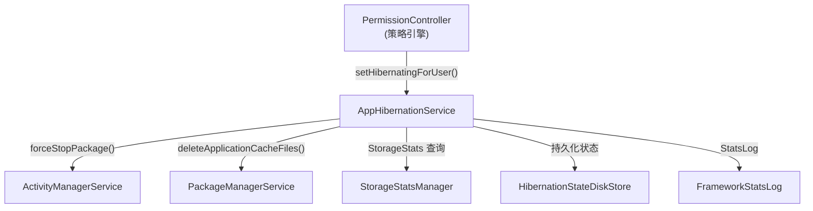

这里的重要设计点是：

- **策略** 主要由 `PermissionController` 决定
- **状态管理与执行** 由 `AppHibernationService` 完成

### 26.10.2 两级休眠状态

休眠状态有两层：

| 层级 | 类 | 范围 | 优化内容 |
|------|----|------|----------|
| 用户级 | `UserLevelState` | 每个 `(package, user)` | force-stop、缓存清理 |
| 全局级 | `GlobalLevelState` | 整个 package | OAT/编译产物级优化 |

只有当应用对**所有用户**都处于休眠状态时，才会进入全局级 hibernation。

### 26.10.3 休眠流程

当策略侧决定某应用应休眠时，服务会：

1. 通过 AMS `forceStopPackage()`
2. 通过 PMS 删除缓存文件
3. 查询 `StorageStatsManager` 记录节省字节数
4. 持久化状态
5. 上报指标

### 26.10.4 解除休眠与唤醒

当检测到用户再次使用休眠应用时，系统会：

1. 取消 hibernated 状态
2. 发送 `LOCKED_BOOT_COMPLETED`
3. 发送 `BOOT_COMPLETED`
4. 让应用重新注册 alarm、job、WorkManager 等任务

```mermaid
sequenceDiagram
    participant User
    participant USS as UsageStatsService
    participant AHS as AppHibernationService
    participant AMS as ActivityManagerService

    User->>USS: 使用应用
    USS->>AHS: onUsageEvent()
    AHS->>AHS: setHibernatingForUser(false)
    AHS->>AMS: broadcast LOCKED_BOOT_COMPLETED
    AHS->>AMS: broadcast BOOT_COMPLETED
```

### 26.10.5 与 Permission Auto-Revoke 的集成

App Hibernation 与权限自动撤销共享一套“长期未使用应用”策略来源，但它们不是同一个功能：

- Auto-Revoke：撤销运行时权限
- Hibernation：回收资源、降低活跃度

### 26.10.6 DeviceConfig 与特性开关

该服务受 `DeviceConfig` 特性位控制，例如：

```java
static final String KEY_APP_HIBERNATION_ENABLED = "app_hibernation_enabled";
```

关闭后，对外接口通常会直接返回默认结果。

### 26.10.7 持久化与开机流程

休眠状态通过 `HibernationStateDiskStore` 和 protobuf 结构持久化。全局状态通常在 `PHASE_BOOT_COMPLETED` 后异步恢复；用户级状态则常在用户解锁后懒加载。

### 26.10.8 包生命周期事件

服务会监听：

- `ACTION_PACKAGE_ADDED`
- `ACTION_PACKAGE_REMOVED`

以同步更新内部状态表：

- 新装包：创建默认非休眠状态
- 卸载包：清理状态
- 替换包：通常保留原休眠信息

### 26.10.9 调试 App Hibernation

```bash
# 查看应用是否休眠
adb shell cmd app_hibernation is-hibernating <package> --user 0

# 手动设置休眠
adb shell cmd app_hibernation set-hibernating <package> --user 0 true

# 查看节省空间统计
adb shell cmd app_hibernation get-hibernation-stats --user 0

# 查看 DeviceConfig 开关
adb shell device_config get app_hibernation app_hibernation_enabled
```

---

## 总结（Summary）

PMS 是 Android 应用生态的骨架。下面这个总图概括了它与其他子系统的关系：

```mermaid
graph TB
    subgraph "外部客户端"
        APPS["Applications<br/>(PackageManager API)"]
        ADB["adb / Shell"]
        STORE["App Stores<br/>(PackageInstaller API)"]
    end

    subgraph "PMS Core"
        PMS["PackageManagerService"]
        COMPUTER["Computer<br/>(Snapshot)"]
        SETTINGS["Settings<br/>(packages.xml)"]
    end

    subgraph "Helper"
        INSTALL["InstallPackageHelper"]
        INIT["InitAppsHelper"]
        RESOLVE["ResolveIntentHelper"]
        DELETE["DeletePackageHelper"]
        DEX["DexOptHelper"]
        BROADCAST["BroadcastHelper"]
        SCAN["ScanPackageUtils"]
    end

    subgraph "相关服务"
        PERM["PermissionManagerService"]
        OMS["OverlayManagerService"]
        INSTALLER["PackageInstallerService"]
        ART["ART Service"]
        STAGING["StagingManager"]
    end

    subgraph "存储"
        SYSTEM_PART["/system/app<br/>/system/priv-app"]
        DATA_PART["/data/app"]
        PKG_XML["/data/system/packages.xml"]
        PERM_XML["runtime-permissions.xml"]
        OVERLAY_XML["/data/system/overlays.xml"]
    end

    APPS --> PMS
    ADB --> PMS
    STORE --> INSTALLER

    PMS --> COMPUTER
    PMS --> SETTINGS
    PMS --> INSTALL
    PMS --> INIT
    PMS --> RESOLVE
    PMS --> DELETE
    PMS --> DEX
    PMS --> BROADCAST

    INSTALL --> SCAN
    INSTALLER --> PMS
    PMS --> PERM
    PMS --> OMS
    DEX --> ART
    INSTALLER --> STAGING

    SETTINGS --> PKG_XML
    PERM --> PERM_XML
    OMS --> OVERLAY_XML
    INIT --> SYSTEM_PART
    INSTALL --> DATA_PART
```

本章的关键点包括：

- **APK 结构**：Manifest、DEX、资源表、本地库、签名与对齐，共同定义了包管理的输入对象。
- **PMS 架构**：Computer snapshot 模式、三锁层级、helper 拆分，是现代 PMS 可维护性和并发性能的基础。
- **包扫描**：开机扫描系统分区、APEX 和 `/data/app`，直接决定设备启动速度与系统包状态。
- **安装流水线**：staging、verification、installation、dexopt、commit 五阶段串起了现代安装过程。
- **权限模型**：normal、dangerous、signature、privileged、appop 共同构成 Android 权限体系。
- **Intent 解析**：PMS 维护全局组件注册与 filter 匹配，是隐式 Intent 能正常工作的前提。
- **Split APK**：base、config、feature split 和依赖加载机制支撑了 App Bundle 与动态特性交付。
- **Overlay 系统**：OMS、idmap、overlayable 和 fabricated overlay 支撑了运行时主题与资源覆盖。

### 设计哲学与演进

PMS 并不是一开始就有今天的形态：

- **Android 1.0 到 4.x**：PMS 是一个超大单文件
- **Android 5.0**：ART 替代 Dalvik，dexopt 路径发生变化
- **Android 6.0**：运行时权限引入，权限模型重构
- **Android 8.0**：即时应用等新路径进入解析过程
- **Android 10 到 11**：包可见性与增量安装能力增强
- **Android 12**：Computer/Snapshot 模式显著降低锁竞争
- **Android 14**：update ownership、package archival、safer intent
- **Android 15**：16KB page 对齐与进一步模块拆分

### 与其他系统服务的关系

PMS 与几乎所有核心系统服务都有交互：

| 服务 | 交互点 |
|------|--------|
| `ActivityManagerService` | 更新时杀进程、冻结/启动控制 |
| `WindowManagerService` | 资源配置影响 |
| `UserManagerService` | 多用户包状态 |
| `StorageManagerService` | 卷与数据目录 |
| `RoleManager` | 默认应用角色 |
| `DevicePolicyManager` | 企业策略 |
| `AppOpsManager` | 精细权限控制 |
| `RollbackManager` | 回滚支持 |
| `ArtManagerLocal` | dexopt |
| `installd` | 底层文件与数据操作 |

### 常见调试技巧

最有用的调试入口通常是：

1. `dumpsys package <package>`
2. `dumpsys package snapshot`
3. `logcat -s PackageManager:V`
4. `atrace -c pm`
5. 直接查看 `packages.xml`
6. `cmd overlay` 与 `dumpsys overlay`

### 关键源码文件参考

| 文件 | 路径 | 作用 |
|------|------|------|
| `PackageManagerService.java` | `frameworks/base/services/core/java/com/android/server/pm/` | PMS 主类 |
| `Computer.java` | 同目录 | 只读查询接口 |
| `ComputerEngine.java` | 同目录 | Snapshot 实现 |
| `ComputerLocked.java` | 同目录 | live 锁包装实现 |
| `Settings.java` | 同目录 | 包状态持久化 |
| `PackageSetting.java` | 同目录 | 每包状态 |
| `InstallPackageHelper.java` | 同目录 | 安装逻辑 |
| `InitAppsHelper.java` | 同目录 | 开机扫描 |
| `ScanPackageUtils.java` | 同目录 | 扫描逻辑 |
| `ResolveIntentHelper.java` | 同目录 | Intent 解析 |
| `DexOptHelper.java` | 同目录 | DEX 优化 |
| `VerifyingSession.java` | 同目录 | 安装前校验 |
| `PackageInstallerService.java` | 同目录 | 安装会话管理 |
| `PermissionManagerService.java` | `.../pm/permission/` | 权限管理 |
| `ComponentResolver.java` | `.../pm/resolution/` | intent filter 匹配 |
| `OverlayManagerService.java` | `.../om/` | Overlay 管理 |
| `OverlayManagerServiceImpl.java` | `.../om/` | Overlay 业务逻辑 |
| `IdmapManager.java` | `.../om/` | idmap 管理 |
| `SplitDependencyLoader.java` | `frameworks/base/core/java/android/content/pm/split/` | split 依赖树 |

### 延伸阅读

若需要更深入研究 PMS，可继续跟进：

1. Domain Verification
2. Shared Libraries
3. KeySet Management
4. App Hibernation
5. SDK Sandbox
6. APEX 管理
