# Chapter 26: PackageManagerService

PackageManagerService (PMS) is the single most important system service for application
lifecycle management in Android. It is responsible for discovering, parsing, verifying,
installing, updating, and removing every APK on the device. It maintains the authoritative
database of installed packages, enforces permission policy, resolves intents to the
correct component, orchestrates the overlay system, and provides the backbone of the
entire app ecosystem. At over 6,000 source files in its module tree, PMS is arguably the
most complex subsystem in the entire Android framework.

This chapter dissects PMS from the ground up: starting with the structure of an APK
itself, then moving through the service architecture, boot-time scanning, the installation
pipeline, the permission model, intent resolution, split APKs, and the runtime resource
overlay system.

> **Source root for this chapter:**
> `frameworks/base/services/core/java/com/android/server/pm/`
> `frameworks/base/core/java/android/content/pm/`
> `frameworks/base/services/core/java/com/android/server/om/`

---

## 26.1 APK Structure

An Android Package (APK) is a ZIP archive with a well-defined internal layout. Every
application, system service, overlay, and shared library on the device is delivered as an
APK (or a collection of split APKs). Understanding the structure is the prerequisite for
understanding everything PMS does.

### 26.1.1 Anatomy of an APK

An APK file is fundamentally a ZIP file with the `.apk` extension. When you unzip a
typical APK, you find the following top-level entries:

```
my-app.apk
  +-- AndroidManifest.xml          (binary XML, required)
  +-- classes.dex                   (DEX bytecode, required)
  +-- classes2.dex                  (optional additional DEX files)
  +-- resources.arsc                (compiled resource table)
  +-- res/                          (compiled resources: layouts, drawables, etc.)
  +-- lib/                          (native shared libraries)
  |     +-- armeabi-v7a/
  |     +-- arm64-v8a/
  |     +-- x86/
  |     +-- x86_64/
  +-- assets/                       (raw asset files, accessed via AssetManager)
  +-- META-INF/                     (signing information for v1 scheme)
  |     +-- MANIFEST.MF
  |     +-- CERT.SF
  |     +-- CERT.RSA
  +-- kotlin/                       (Kotlin metadata, optional)
  +-- stamp-cert-sha256             (source stamp certificate, optional)
```

Each of these components plays a critical role.

### 26.1.2 AndroidManifest.xml

The manifest is the single most important file in the APK. It declares the application's
package name, version, components (activities, services, receivers, providers),
permissions, minimum/target SDK levels, hardware and software feature requirements,
and much more. During parsing, PMS reads this file to populate its internal data
structures.

The manifest is stored in **binary XML** format -- not the text XML that developers write.
The Android Asset Packaging Tool (aapt2) compiles the text XML into a compact binary
representation during the build process. The binary format uses integer pool indices for
string references and a flattened tree structure that can be parsed without building a
full DOM.

Key manifest attributes relevant to PMS:

| Attribute | Purpose |
|-----------|---------|
| `package` | Unique package identifier; primary key in PMS |
| `android:versionCode` | Integer version for update comparison |
| `android:versionName` | Human-readable version string |
| `android:minSdkVersion` | Minimum API level required to install |
| `android:targetSdkVersion` | API level the app was tested against |
| `android:sharedUserId` | (Deprecated) UID sharing between packages |
| `<uses-permission>` | Runtime or install-time permissions requested |
| `<permission>` | Custom permission definitions |
| `<application>` | Application-level metadata and component container |
| `<activity>`, `<service>`, `<receiver>`, `<provider>` | Component declarations |
| `<intent-filter>` | Intent matching rules for components |
| `<uses-library>` | Shared library dependencies |
| `<uses-split>` | Split APK dependency declarations |

The `MIN_INSTALLABLE_TARGET_SDK` constant in PMS controls the minimum target SDK
a package must declare to be installable. As defined in
`frameworks/base/services/core/java/com/android/server/pm/PackageManagerService.java`:

```java
public static final int MIN_INSTALLABLE_TARGET_SDK =
        Flags.minTargetSdk24() ? Build.VERSION_CODES.N : Build.VERSION_CODES.M;
```

This security measure blocks malware that targets old SDK versions to avoid modern
enforcement of privacy and security APIs.

### 26.1.3 classes.dex

The Dalvik Executable (DEX) files contain the compiled application bytecode. A single
APK can contain multiple DEX files (`classes.dex`, `classes2.dex`, ... `classesN.dex`)
when the app exceeds the 65,536-method limit of a single DEX file (multidex).

The DEX format is specified in the official Android documentation and consists of:

- **Header** -- magic number, checksum, SHA-1 signature, file size
- **String IDs** -- pool of all strings used in the file
- **Type IDs** -- references to all types (classes, primitives)
- **Proto IDs** -- method prototypes (return type + parameter types)
- **Field IDs** -- field references
- **Method IDs** -- method references
- **Class Defs** -- class definitions with access flags, superclass, interfaces
- **Data** -- the actual bytecode, debug info, annotations

During installation, PMS coordinates with the ART (Android Runtime) subsystem to
compile DEX files. This process, called **dexopt**, transforms DEX bytecode into
optimized native code. The `DexOptHelper` class in PMS manages this interaction.

From `frameworks/base/services/core/java/com/android/server/pm/DexOptHelper.java`:

```java
/** Helper class for dex optimization operations in PackageManagerService. */
public final class DexOptHelper {
    @NonNull
    private static final ThreadPoolExecutor sDexoptExecutor =
            new ThreadPoolExecutor(1 /* corePoolSize */, 1 /* maximumPoolSize */,
                    60 /* keepAliveTime */, TimeUnit.SECONDS,
                    new LinkedBlockingQueue<Runnable>());
```

### 26.1.4 resources.arsc

The compiled resource table maps resource IDs to their values. Every resource defined
in `res/` gets an integer ID (e.g., `R.layout.activity_main = 0x7f0b001a`). The
`resources.arsc` file contains the mapping from these IDs to actual values (strings,
dimensions, colors) or file paths within the APK (layouts, drawables).

The resource table is structured as:

1. **String Pool** -- all strings referenced by resources
2. **Package chunks** -- one per package (usually one)
3. **Type spec chunks** -- configuration-independent type info
4. **Type chunks** -- configuration-specific resource values

This file is central to the Runtime Resource Overlay (RRO) system discussed in
Section 18.8, which works by overlaying entries in this table.

### 26.1.5 lib/ Directory

The `lib/` directory contains native shared libraries (`.so` files) organized by ABI
(Application Binary Interface). PMS extracts native libraries during installation to
the app's native library directory.

Standard ABI subdirectories:

| Directory | Architecture | Notes |
|-----------|-------------|-------|
| `armeabi-v7a/` | 32-bit ARM | Most common 32-bit |
| `arm64-v8a/` | 64-bit ARM | Most common 64-bit |
| `x86/` | 32-bit x86 | Emulators, some tablets |
| `x86_64/` | 64-bit x86 | Emulators, some Chromebooks |
| `riscv64/` | 64-bit RISC-V | Emerging architecture |

PMS uses `NativeLibraryHelper` to copy native libraries from the APK to the
filesystem during installation. The ABI selection logic in `ScanPackageUtils`
determines which ABI directory to use based on the device's supported ABIs and
what the APK provides.

### 26.1.6 META-INF/ and APK Signing

The `META-INF/` directory contains JAR signing information (v1 signature scheme).
Modern Android uses multiple signature schemes that have evolved significantly.

#### APK Signature Scheme v1 (JAR Signing)

The original signing scheme, inherited from Java JAR signing. It works by:

1. Computing digests of every file in the ZIP
2. Recording these digests in `META-INF/MANIFEST.MF`
3. Signing `MANIFEST.MF` with the developer's key, producing `CERT.SF`
4. Embedding the certificate and signature in `CERT.RSA` (or `.DSA`/`.EC`)

**Weakness:** v1 signing does not protect the ZIP metadata (local file headers, central
directory). An attacker could modify the ZIP structure without invalidating the
signature, as demonstrated by the "Janus" vulnerability (CVE-2017-13156).

#### APK Signature Scheme v2 (Android 7.0+)

Introduced to address v1's weaknesses. v2 signs the **entire APK** as a binary blob:

1. The APK is treated as four sections:
   - Contents before the ZIP Central Directory
   - ZIP Central Directory
   - End of Central Directory
   - The signing block (inserted between sections 1 and 2)
2. A digest is computed over all sections except the signing block
3. The digest is signed and placed in the APK Signing Block

This makes it impossible to modify any part of the APK without invalidating the
signature.

#### APK Signature Scheme v3 (Android 9.0+)

Extends v2 with **key rotation** support. v3 introduces a "proof of rotation" structure
that chains old and new signing certificates together. This allows developers to
rotate their signing key without losing the ability to update existing installations.

The proof of rotation is a linked list of certificates where each certificate in the
chain signs the next one, establishing a trust chain from the original signing
certificate to the current one.

#### APK Signature Scheme v4 (Android 11+)

Designed for **incremental installation** (Incremental File System). v4 produces a
separate `.idsig` file that contains a Merkle tree hash over the APK's contents. This
allows the system to verify blocks of the APK as they are streamed to the device,
enabling installation before the entire APK has been downloaded.

From `VerifyingSession.java`:

```java
private static final boolean DEFAULT_VERIFY_ENABLE = true;
private static final long DEFAULT_INTEGRITY_VERIFICATION_TIMEOUT = 30 * 1000;
```

The following diagram shows the relationship between APK signing schemes:

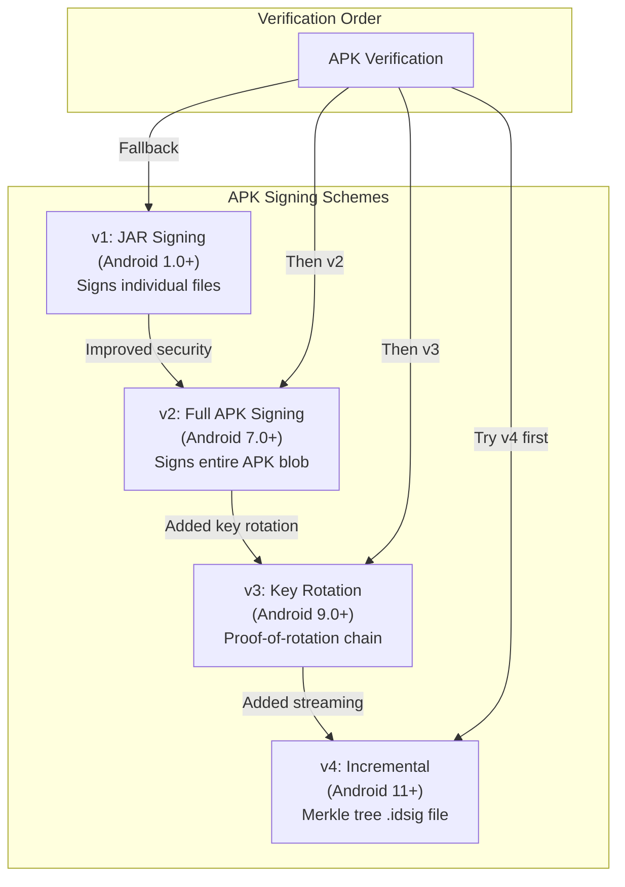
```mermaid
graph TD
    subgraph "APK Signing Schemes"
        V1["v1: JAR Signing<br/>(Android 1.0+)<br/>Signs individual files"]
        V2["v2: Full APK Signing<br/>(Android 7.0+)<br/>Signs entire APK blob"]
        V3["v3: Key Rotation<br/>(Android 9.0+)<br/>Proof-of-rotation chain"]
        V4["v4: Incremental<br/>(Android 11+)<br/>Merkle tree .idsig file"]
    end

    V1 -->|"Improved security"| V2
    V2 -->|"Added key rotation"| V3
    V3 -->|"Added streaming"| V4

    subgraph "Verification Order"
        Check["APK Verification"]
        Check -->|"Try v4 first"| V4
        Check -->|"Then v3"| V3
        Check -->|"Then v2"| V2
        Check -->|"Fallback"| V1
    end
```

PMS uses `ApkSignatureVerifier` to verify signatures during installation. The verifier
tries the newest scheme first and falls back to older schemes. All schemes present in
the APK must verify successfully -- you cannot strip a v2 signature and rely on v1 alone.

### 26.1.7 APK Alignment

APK files should be aligned to 4-byte boundaries for uncompressed entries. The
`zipalign` tool ensures this alignment, which allows the system to mmap resource files
directly from the APK without extracting them. Starting from Android 15, 16KB page
size alignment is enforced for native libraries:

From `ScanPackageUtils.java`:

```java
public static final int PAGE_SIZE_16KB = 16384;
```

The alignment requirement is enforced during both build time (by `zipalign`) and at
installation time by PMS. Misaligned APKs will either fail to install or suffer
performance degradation because the system must extract resources to a separate
file rather than mapping them directly from the APK.

### 26.1.8 The APK Build Pipeline

Understanding how APKs are built helps explain their structure:

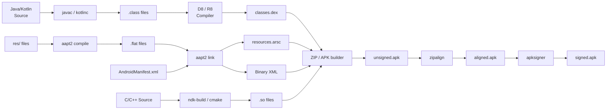
```mermaid
flowchart LR
    SRC["Java/Kotlin<br/>Source"] --> COMPILE["javac / kotlinc"]
    COMPILE --> CLASS[".class files"]
    CLASS --> D8["D8 / R8<br/>Compiler"]
    D8 --> DEX["classes.dex"]

    RES["res/ files"] --> AAPT2C["aapt2 compile"]
    AAPT2C --> FLAT[".flat files"]
    FLAT --> AAPT2L["aapt2 link"]
    AAPT2L --> ARSC["resources.arsc"]
    AAPT2L --> BXML["Binary XML"]

    MANIFEST["AndroidManifest.xml"] --> AAPT2L

    NDK["C/C++ Source"] --> NDK_BUILD["ndk-build / cmake"]
    NDK_BUILD --> SO[".so files"]

    DEX --> ZIP["ZIP / APK builder"]
    ARSC --> ZIP
    BXML --> ZIP
    SO --> ZIP
    ZIP --> UNSIGNED["unsigned.apk"]
    UNSIGNED --> ALIGN["zipalign"]
    ALIGN --> ALIGNED["aligned.apk"]
    ALIGNED --> SIGN["apksigner"]
    SIGN --> FINAL["signed.apk"]
```

Each tool contributes to specific parts of the APK:

| Tool | Input | Output | APK Component |
|------|-------|--------|---------------|
| javac / kotlinc | .java / .kt | .class | (intermediate) |
| D8 / R8 | .class | classes.dex | DEX bytecode |
| aapt2 compile | res/ | .flat | (intermediate) |
| aapt2 link | .flat + manifest | resources.arsc + binary XML | Resources |
| ndk-build / cmake | C/C++ source | .so | Native libraries |
| zipalign | unaligned APK | aligned APK | All (alignment fix) |
| apksigner | aligned APK | signed APK | META-INF / signing block |

### 26.1.9 APK Compression and Stub Packages

System partitions have limited space, so some system APKs are compressed. PMS
supports compressed packages with the `.gz` extension:

```java
public final static String COMPRESSED_EXTENSION = ".gz";
/** Suffix of stub packages on the system partition */
public final static String STUB_SUFFIX = "-Stub";
```

A stub package is a minimal APK that serves as a placeholder on the system partition.
When the device first boots (or after an OTA), PMS decompresses the full package
to `/data`. This allows the system partition to stay small while still providing full
apps.

The `InitAppsHelper` tracks stub packages:

```java
// Tracks of stub packages that must either be replaced with full
// versions in the /data partition or be disabled.
private final List<String> mStubSystemApps = new ArrayList<>();
```

And during system scanning:

```java
private void updateStubSystemAppsList(List<String> stubSystemApps) {
    final int numPackages = mPm.mPackages.size();
    for (int index = 0; index < numPackages; index++) {
        final AndroidPackage pkg = mPm.mPackages.valueAt(index);
        if (pkg.isStub()) {
            stubSystemApps.add(pkg.getPackageName());
        }
    }
}
```

### 26.1.10 APK Checksums

PMS supports computing and verifying checksums for APK files, which is used by
app stores and enterprise management systems:

```java
public void requestFileChecksums(@NonNull File file,
        @NonNull String installerPackageName,
        @Checksum.TypeMask int optional,
        @Checksum.TypeMask int required,
        @Nullable List trustedInstallers,
        @NonNull IOnChecksumsReadyListener onChecksumsReadyListener)
        throws FileNotFoundException {
```

Supported checksum types include MD5, SHA-1, SHA-256, SHA-512, and Merkle root
hashes. The `ApkChecksums` class handles the actual computation.

---

## 26.2 PackageManagerService Architecture

PMS is one of the largest and most architecturally complex system services in Android.
Over the years, it has been refactored from a monolithic class into a constellation
of helper classes with a snapshot-based concurrency model.

### 26.2.1 Service Registration and Entry Point

PMS is started during the boot sequence by `SystemServer`. It is registered as the
`"package"` service in `ServiceManager`, making it accessible to all processes
via `Context.getSystemService(Context.PACKAGE_SERVICE)` or
`PackageManager.getPackageManager()`.

The class hierarchy looks like this:

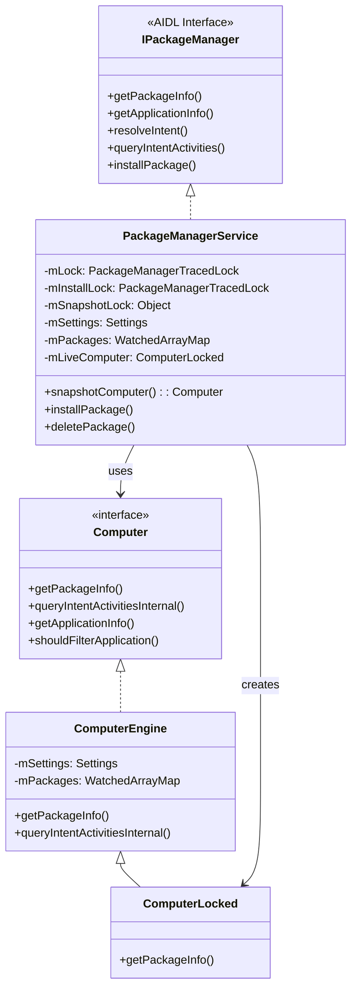
```mermaid
classDiagram
    class IPackageManager {
        <<AIDL Interface>>
        +getPackageInfo()
        +getApplicationInfo()
        +resolveIntent()
        +queryIntentActivities()
        +installPackage()
    }

    class PackageManagerService {
        -mLock: PackageManagerTracedLock
        -mInstallLock: PackageManagerTracedLock
        -mSnapshotLock: Object
        -mSettings: Settings
        -mPackages: WatchedArrayMap
        -mLiveComputer: ComputerLocked
        +snapshotComputer(): Computer
        +installPackage()
        +deletePackage()
    }

    class Computer {
        <<interface>>
        +getPackageInfo()
        +queryIntentActivitiesInternal()
        +getApplicationInfo()
        +shouldFilterApplication()
    }

    class ComputerEngine {
        -mSettings: Settings
        -mPackages: WatchedArrayMap
        +getPackageInfo()
        +queryIntentActivitiesInternal()
    }

    class ComputerLocked {
        +getPackageInfo()
    }

    IPackageManager <|.. PackageManagerService
    Computer <|.. ComputerEngine
    ComputerEngine <|-- ComputerLocked
    PackageManagerService --> Computer : uses
    PackageManagerService --> ComputerLocked : creates
```

### 26.2.2 The Lock Hierarchy

PMS uses three primary locks, and their ordering is critical to avoid deadlocks. The
class Javadoc in `PackageManagerService.java` documents this:

```java
/**
 * Internally there are three important locks:
 * <ul>
 * <li>{@link #mLock} is used to guard all in-memory parsed package details
 * and other related state. It is a fine-grained lock that should only be held
 * momentarily, as it's one of the most contended locks in the system.
 * <li>{@link #mInstallLock} is used to guard all {@code installd} access, whose
 * operations typically involve heavy lifting of application data on disk. Since
 * {@code installd} is single-threaded, and it's operations can often be slow,
 * this lock should never be acquired while already holding {@link #mLock}.
 * Conversely, it's safe to acquire {@link #mLock} momentarily while already
 * holding {@link #mInstallLock}.
 * <li>{@link #mSnapshotLock} is used to guard access to two snapshot fields:
 * the snapshot itself and the snapshot invalidation flag.
 * </ul>
 */
```

Method naming conventions enforce lock discipline:

| Suffix | Required Lock |
|--------|--------------|
| `LI` | Caller must hold `mInstallLock` |
| `LIF` | Caller must hold `mInstallLock` and package must be frozen |
| `LPr` | Caller must hold `mLock` for reading |
| `LPw` | Caller must hold `mLock` for writing |

### 26.2.3 The Computer Snapshot Pattern

The most significant architectural feature of modern PMS is the **Computer snapshot
pattern**. This was introduced to solve the severe lock contention problem: PMS's
`mLock` was one of the most contended locks in the system, causing jank and ANRs.

The key insight is that most PMS operations are **read-only** -- they query package
information but do not modify it. The snapshot pattern separates reads from writes:

1. **`Computer` interface** -- Defines all read-only query methods
   (`frameworks/base/services/core/java/com/android/server/pm/Computer.java`)

2. **`ComputerEngine`** -- Implements the `Computer` interface, operating on a
   snapshot of the PMS state

3. **`ComputerLocked`** -- Extends `ComputerEngine` to wrap calls in
   `synchronized(mLock)` blocks for live data access

4. **`Snapshot` inner class** -- A bundle of all PMS state fields, either live
   references or deep copies

The `Computer` interface is extensive, defining dozens of query methods:

```java
public interface Computer extends PackageDataSnapshot {
    int getVersion();
    Computer use();
    @NonNull List<ResolveInfo> queryIntentActivitiesInternal(
            Intent intent, String resolvedType, long flags,
            long privateResolveFlags, int filterCallingUid,
            int callingPid, int userId,
            boolean resolveForStart, boolean allowDynamicSplits);
    ActivityInfo getActivityInfo(ComponentName component, long flags, int userId);
    AndroidPackage getPackage(String packageName);
    ApplicationInfo getApplicationInfo(String packageName, long flags, int userId);
    PackageInfo getPackageInfo(String packageName, long flags, int userId);
    // ... dozens more query methods
}
```

The snapshot creation is managed by `snapshotComputer()`:

```java
public Computer snapshotComputer() {
    return snapshotComputer(true /*allowLiveComputer*/);
}

public Computer snapshotComputer(boolean allowLiveComputer) {
    var isHoldingPackageLock = Thread.holdsLock(mLock);
    if (allowLiveComputer) {
        if (isHoldingPackageLock) {
            // If the current thread holds mLock then it may have modified
            // state but not yet invalidated the snapshot.  Always give the
            // thread the live computer.
            return mLiveComputer;
        }
    }

    var oldSnapshot = sSnapshot.get();
    var pendingVersion = sSnapshotPendingVersion.get();

    if (oldSnapshot != null && oldSnapshot.getVersion() == pendingVersion) {
        return oldSnapshot.use();
    }
    // ... rebuild snapshot under mSnapshotLock
}
```

The `Snapshot` inner class captures all the mutable state:

```java
class Snapshot {
    public static final int LIVE = 1;
    public static final int SNAPPED = 2;

    public final Settings settings;
    public final WatchedSparseIntArray isolatedOwners;
    public final WatchedArrayMap<String, AndroidPackage> packages;
    public final WatchedArrayMap<ComponentName, ParsedInstrumentation> instrumentation;
    public final WatchedSparseBooleanArray webInstantAppsDisabled;
    public final ComponentName resolveComponentName;
    public final ActivityInfo resolveActivity;
    public final ActivityInfo instantAppInstallerActivity;
    public final ResolveInfo instantAppInstallerInfo;
    public final InstantAppRegistry instantAppRegistry;
    public final ApplicationInfo androidApplication;
    public final String appPredictionServicePackage;
    public final AppsFilterSnapshot appsFilter;
    public final ComponentResolverApi componentResolver;
    public final PackageManagerService service;
    public final WatchedArrayMap<String, Integer> frozenPackages;
    public final SharedLibrariesRead sharedLibraries;
    // ...
}
```

The versioning system uses two atomic variables: `sSnapshot` (the current snapshot)
and `sSnapshotPendingVersion` (bumped on every mutation). When a query arrives:

1. If the caller already holds `mLock`, return the live computer (it has direct access)
2. If the snapshot version matches the pending version, return the cached snapshot
3. Otherwise, take `mSnapshotLock`, rebuild the snapshot, and return it

This ensures lock-free reads for the vast majority of callers.

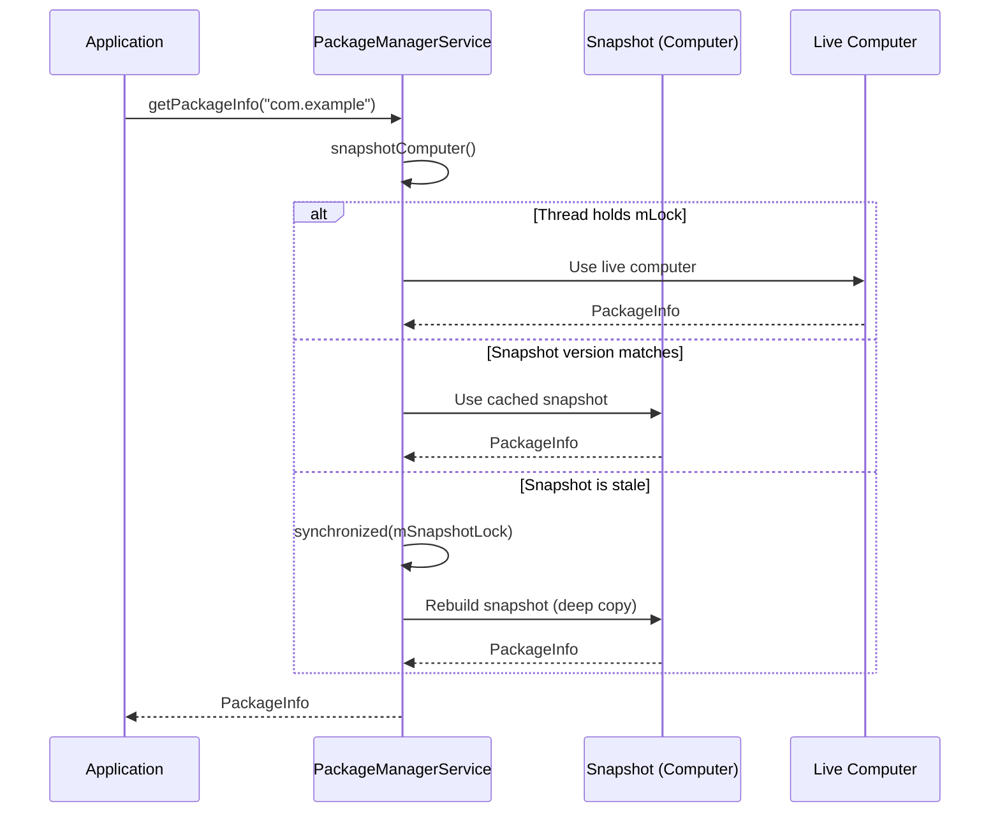
```mermaid
sequenceDiagram
    participant App as Application
    participant PMS as PackageManagerService
    participant Snap as Snapshot (Computer)
    participant Live as Live Computer

    App->>PMS: getPackageInfo("com.example")
    PMS->>PMS: snapshotComputer()

    alt Thread holds mLock
        PMS->>Live: Use live computer
        Live-->>PMS: PackageInfo
    else Snapshot version matches
        PMS->>Snap: Use cached snapshot
        Snap-->>PMS: PackageInfo
    else Snapshot is stale
        PMS->>PMS: synchronized(mSnapshotLock)
        PMS->>Snap: Rebuild snapshot (deep copy)
        Snap-->>PMS: PackageInfo
    end

    PMS-->>App: PackageInfo
```

### 26.2.4 Key Data Structures

PMS maintains several core data structures, all annotated with `@Watched` to trigger
snapshot invalidation on modification:

```java
// Keys are String (package name), values are Package.
@Watched
@GuardedBy("mLock")
final WatchedArrayMap<String, AndroidPackage> mPackages = new WatchedArrayMap<>();

// Package settings (persistent per-package state)
@Watched
@GuardedBy("mLock")
final Settings mSettings;

// Component resolver for intent matching
@Watched
final ComponentResolver mComponentResolver;

// App visibility filtering
@Watched
final AppsFilterImpl mAppsFilter;

// Shared libraries
@Watched
private final SharedLibrariesImpl mSharedLibraries;

// Frozen packages (undergoing surgery)
@GuardedBy("mLock")
final WatchedArrayMap<String, Integer> mFrozenPackages = new WatchedArrayMap<>();
```

The `@Watched` annotation, combined with the `Watchable`/`Watcher` pattern from
`com.android.server.utils`, means that any mutation to these structures automatically
increments `sSnapshotPendingVersion`, invalidating the cached snapshot.

### 26.2.5 PackageSetting

`PackageSetting` is the persistent per-package state record, implementing the
`PackageStateInternal` interface. It stores data that must survive reboots:

From `frameworks/base/services/core/java/com/android/server/pm/PackageSetting.java`:

```java
@DataClass(genGetters = true, genConstructor = false,
           genSetters = false, genBuilder = false)
public class PackageSetting extends SettingBase
        implements PackageStateInternal {
```

Key data stored in a `PackageSetting`:

- Package name, code path, resource path
- Version code and signing details
- Install time, update time, last modified time
- Installer package name and install source
- Primary and secondary CPU ABI
- Per-user state (enabled/disabled, stopped, hidden, suspended)
- Permission grant state (delegated to PermissionManagerService)
- Domain verification state
- First and last install times

The `Settings` class (`frameworks/base/services/core/java/com/android/server/pm/Settings.java`)
is the container for all `PackageSetting` instances. It handles serialization to and
deserialization from `/data/system/packages.xml`, which is the persistent store for all
package metadata.

### 26.2.6 Helper Class Decomposition

Modern PMS has been decomposed into many helper classes, each handling a distinct
responsibility. The main service creates and holds references to all of them:

```java
private final BroadcastHelper mBroadcastHelper;
private final RemovePackageHelper mRemovePackageHelper;
private final DeletePackageHelper mDeletePackageHelper;
private final InitAppsHelper mInitAppsHelper;
private final AppDataHelper mAppDataHelper;
@NonNull private final InstallPackageHelper mInstallPackageHelper;
private final PreferredActivityHelper mPreferredActivityHelper;
private final ResolveIntentHelper mResolveIntentHelper;
private final DexOptHelper mDexOptHelper;
private final SuspendPackageHelper mSuspendPackageHelper;
private final DistractingPackageHelper mDistractingPackageHelper;
private final StorageEventHelper mStorageEventHelper;
private final FreeStorageHelper mFreeStorageHelper;
```

This decomposition serves multiple purposes:

1. **Readability** -- Each helper file is 500-2000 lines instead of one 15,000-line monolith
2. **Testability** -- Helpers can be unit-tested in isolation
3. **Lock discipline** -- Each helper clearly documents which locks it requires
4. **Ownership** -- OWNERS files can assign different teams to different helpers

### 26.2.7 Handler Messages

PMS uses a `Handler` on a dedicated `ServiceThread` for asynchronous operations.
The message constants are defined in the main class:

```java
static final int SEND_PENDING_BROADCAST = 1;
static final int POST_INSTALL = 9;
static final int WRITE_SETTINGS = 13;
static final int WRITE_DIRTY_PACKAGE_RESTRICTIONS = 14;
static final int PACKAGE_VERIFIED = 15;
static final int CHECK_PENDING_VERIFICATION = 16;
static final int WRITE_PACKAGE_LIST = 19;
static final int INSTANT_APP_RESOLUTION_PHASE_TWO = 20;
static final int ENABLE_ROLLBACK_STATUS = 21;
static final int ENABLE_ROLLBACK_TIMEOUT = 22;
static final int DEFERRED_NO_KILL_POST_DELETE = 23;
static final int DEFERRED_NO_KILL_INSTALL_OBSERVER = 24;
static final int DOMAIN_VERIFICATION = 27;
static final int PRUNE_UNUSED_STATIC_SHARED_LIBRARIES = 28;
static final int DEFERRED_PENDING_KILL_INSTALL_OBSERVER = 29;
static final int WRITE_USER_PACKAGE_RESTRICTIONS = 30;
```

The watchdog timeout for the handler thread is set to 10 minutes, reflecting the
potentially long-running operations (like installing multi-gigabyte apps):

```java
static final long WATCHDOG_TIMEOUT = 1000*60*10;     // ten minutes
```

### 26.2.8 The Watcher / Watchable Pattern

The `@Watched` annotation is central to the snapshot invalidation mechanism. It is
part of a custom observer pattern defined in `com.android.server.utils`:

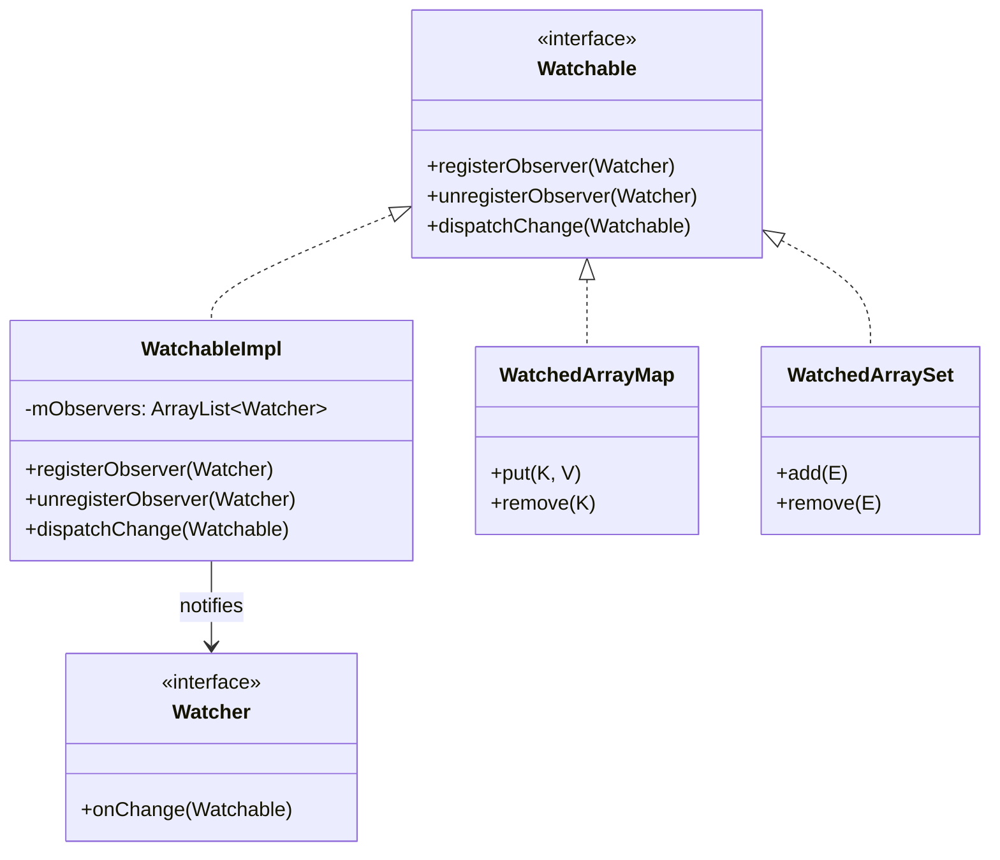
```mermaid
classDiagram
    class Watchable {
        <<interface>>
        +registerObserver(Watcher)
        +unregisterObserver(Watcher)
        +dispatchChange(Watchable)
    }

    class Watcher {
        <<interface>>
        +onChange(Watchable)
    }

    class WatchableImpl {
        -mObservers: ArrayList~Watcher~
        +registerObserver(Watcher)
        +unregisterObserver(Watcher)
        +dispatchChange(Watchable)
    }

    class WatchedArrayMap {
        +put(K, V)
        +remove(K)
    }

    class WatchedArraySet {
        +add(E)
        +remove(E)
    }

    Watchable <|.. WatchableImpl
    Watchable <|.. WatchedArrayMap
    Watchable <|.. WatchedArraySet
    WatchableImpl --> Watcher : notifies
```

When any `@Watched` field in PMS changes (e.g., a package is added to `mPackages`),
the Watchable pattern triggers:

1. The `WatchedArrayMap` detects the mutation
2. It calls `dispatchChange(this)` on its observer list
3. PMS's master `Watcher` receives the callback
4. It calls `PackageManagerService.onChange(what)`
5. Which increments `sSnapshotPendingVersion`
6. The next `snapshotComputer()` call detects the stale version and rebuilds

```java
private final Watcher mWatcher = new Watcher() {
        @Override
        public void onChange(@Nullable Watchable what) {
            PackageManagerService.onChange(what);
        }
    };
```

This pattern has several advantages:

- **Automatic invalidation** -- No manual bookkeeping; any data change auto-invalidates
- **Granular** -- Each field independently triggers invalidation
- **Debuggable** -- The `what` parameter identifies which field changed
- **Low overhead** -- Incrementing an AtomicInteger is essentially free

### 26.2.9 Snapshot Rebuild Performance

The snapshot rebuild process involves deep-copying all watched fields:

```java
@GuardedBy("mLock")
private Computer rebuildSnapshot(@Nullable Computer oldSnapshot,
        int newVersion) {
    var now = SystemClock.currentTimeMicro();
    var hits = oldSnapshot == null ? -1 : oldSnapshot.getUsed();
    var args = new Snapshot(Snapshot.SNAPPED);
    var newSnapshot = new ComputerEngine(args, newVersion);
    var done = SystemClock.currentTimeMicro();

    if (mSnapshotStatistics != null) {
        mSnapshotStatistics.rebuild(now, done, hits,
                newSnapshot.getPackageStates().size());
    }
    return newSnapshot;
}
```

The `SnapshotStatistics` class tracks rebuild frequency and latency, helping
identify performance regressions. On a typical device with 300+ packages, a
snapshot rebuild takes approximately 1-5 milliseconds.

The version check in `snapshotComputer()` uses a three-tier strategy:

```java
public Computer snapshotComputer(boolean allowLiveComputer) {
    var isHoldingPackageLock = Thread.holdsLock(mLock);

    // Tier 1: Caller already holds mLock, use live computer
    if (allowLiveComputer && isHoldingPackageLock) {
        return mLiveComputer;
    }

    // Tier 2: Cached snapshot is still valid
    var oldSnapshot = sSnapshot.get();
    var pendingVersion = sSnapshotPendingVersion.get();
    if (oldSnapshot != null
            && oldSnapshot.getVersion() == pendingVersion) {
        return oldSnapshot.use();
    }

    // Tier 3: Need to rebuild under mSnapshotLock
    synchronized (mSnapshotLock) {
        // Double-check: another thread may have rebuilt while we waited
        var rebuildSnapshot = sSnapshot.get();
        var rebuildVersion = sSnapshotPendingVersion.get();
        if (rebuildSnapshot != null
                && rebuildSnapshot.getVersion() == rebuildVersion) {
            return rebuildSnapshot.use();
        }
        // Rebuild under mLock
        synchronized (mLock) {
            var newSnapshot = rebuildSnapshot(rebuildSnapshot, rebuildVersion);
            sSnapshot.set(newSnapshot);
            return newSnapshot.use();
        }
    }
}
```

### 26.2.10 PackageManagerServiceInjector

PMS uses dependency injection via `PackageManagerServiceInjector` to support
testing and modular initialization. The injector provides all external dependencies:

- Context and system services
- ABI helpers
- Incremental manager
- APEX manager
- Background executors
- Component resolver factory
- Shared library implementation

This pattern allows test code to substitute mock implementations for any
dependency, enabling unit testing of PMS components in isolation.

### 26.2.11 System Partitions

PMS maintains an ordered list of system partitions where packages can reside:

```java
public static final List<ScanPartition> SYSTEM_PARTITIONS =
        Collections.unmodifiableList(
                PackagePartitions.getOrderedPartitions(ScanPartition::new));
```

The partitions are ordered by specificity:

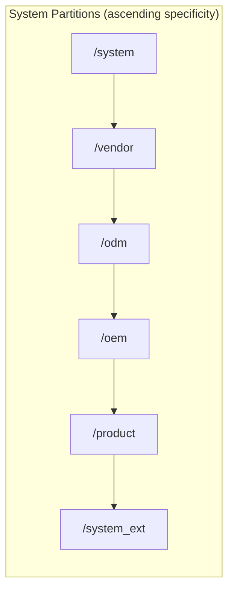
```mermaid
graph LR
    subgraph "System Partitions (ascending specificity)"
        SYSTEM["/system"]
        VENDOR["/vendor"]
        ODM["/odm"]
        OEM["/oem"]
        PRODUCT["/product"]
        SYSTEM_EXT["/system_ext"]
    end

    SYSTEM --> VENDOR
    VENDOR --> ODM
    ODM --> OEM
    OEM --> PRODUCT
    PRODUCT --> SYSTEM_EXT
```

Each partition has associated scan flags that determine how packages within it are
treated:

| Partition | Scan Flag | Privilege Level |
|-----------|-----------|----------------|
| `/system/app` | `SCAN_AS_SYSTEM` | System |
| `/system/priv-app` | `SCAN_AS_SYSTEM \| SCAN_AS_PRIVILEGED` | Privileged |
| `/vendor/app` | `SCAN_AS_SYSTEM \| SCAN_AS_VENDOR` | Vendor |
| `/product/app` | `SCAN_AS_SYSTEM \| SCAN_AS_PRODUCT` | Product |
| `/system_ext/app` | `SCAN_AS_SYSTEM \| SCAN_AS_SYSTEM_EXT` | System Ext |
| `/odm/app` | `SCAN_AS_SYSTEM \| SCAN_AS_ODM` | ODM |

---

## 26.3 Package Scanning

At boot time, PMS must discover and parse every APK on the device. This is one of
the most time-critical parts of the boot process -- scanning thousands of packages
can take tens of seconds and directly impacts the time from power-on to usable device.

### 26.3.1 Boot-Time Scanning Overview

The scanning process is orchestrated by `InitAppsHelper`
(`frameworks/base/services/core/java/com/android/server/pm/InitAppsHelper.java`):

```java
final class InitAppsHelper {
    private final PackageManagerService mPm;
    private final List<ScanPartition> mDirsToScanAsSystem;
    private final int mScanFlags;
    private final int mSystemParseFlags;
    private final int mSystemScanFlags;
    private final InstallPackageHelper mInstallPackageHelper;
    private final ApexManager mApexManager;
    private final ExecutorService mExecutorService;
    private long mSystemScanTime;
    private int mCachedSystemApps;
    private int mSystemPackagesCount;
    private final boolean mIsDeviceUpgrading;
    private final List<ScanPartition> mSystemPartitions;
```

The scanning proceeds in a specific order:

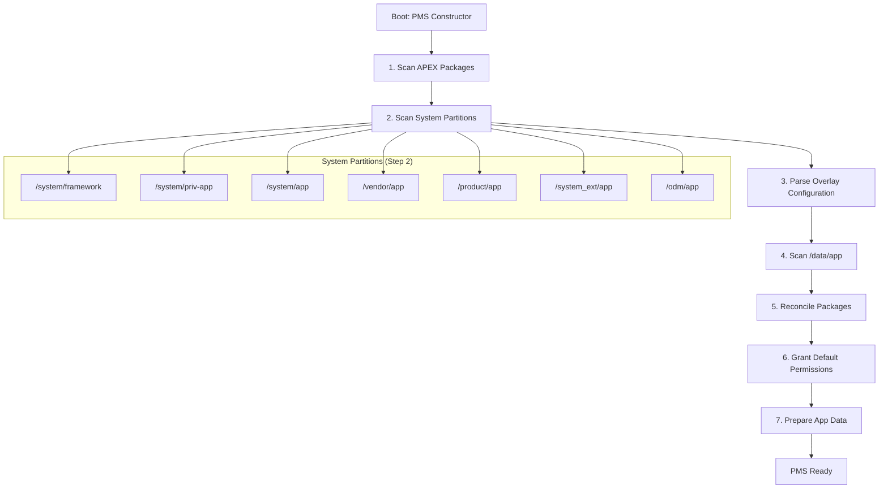
```mermaid
flowchart TD
    Start["Boot: PMS Constructor"] --> ScanAPEX["1. Scan APEX Packages"]
    ScanAPEX --> ScanSystem["2. Scan System Partitions"]
    ScanSystem --> OverlayConfig["3. Parse Overlay Configuration"]
    OverlayConfig --> ScanData["4. Scan /data/app"]
    ScanData --> Reconcile["5. Reconcile Packages"]
    Reconcile --> GrantPerms["6. Grant Default Permissions"]
    GrantPerms --> PrepareData["7. Prepare App Data"]
    PrepareData --> Ready["PMS Ready"]

    subgraph "System Partitions (Step 2)"
        S1["/system/framework"]
        S2["/system/priv-app"]
        S3["/system/app"]
        S4["/vendor/app"]
        S5["/product/app"]
        S6["/system_ext/app"]
        S7["/odm/app"]
    end

    ScanSystem --> S1
    ScanSystem --> S2
    ScanSystem --> S3
    ScanSystem --> S4
    ScanSystem --> S5
    ScanSystem --> S6
    ScanSystem --> S7
```

### 26.3.2 Scan Flags

PMS defines a comprehensive set of scan flags that control scanning behavior. These
are bit flags defined as constants in `PackageManagerService.java`:

```java
static final int SCAN_NO_DEX = 1 << 0;
static final int SCAN_UPDATE_SIGNATURE = 1 << 1;
static final int SCAN_NEW_INSTALL = 1 << 2;
static final int SCAN_UPDATE_TIME = 1 << 3;
static final int SCAN_BOOTING = 1 << 4;
static final int SCAN_REQUIRE_KNOWN = 1 << 7;
static final int SCAN_MOVE = 1 << 8;
static final int SCAN_INITIAL = 1 << 9;
static final int SCAN_DONT_KILL_APP = 1 << 10;
static final int SCAN_IGNORE_FROZEN = 1 << 11;
static final int SCAN_FIRST_BOOT_OR_UPGRADE = 1 << 12;
static final int SCAN_AS_INSTANT_APP = 1 << 13;
static final int SCAN_AS_FULL_APP = 1 << 14;
static final int SCAN_AS_VIRTUAL_PRELOAD = 1 << 15;
static final int SCAN_AS_SYSTEM = 1 << 16;
static final int SCAN_AS_PRIVILEGED = 1 << 17;
static final int SCAN_AS_OEM = 1 << 18;
static final int SCAN_AS_VENDOR = 1 << 19;
static final int SCAN_AS_PRODUCT = 1 << 20;
static final int SCAN_AS_SYSTEM_EXT = 1 << 21;
static final int SCAN_AS_ODM = 1 << 22;
static final int SCAN_AS_APK_IN_APEX = 1 << 23;
static final int SCAN_DROP_CACHE = 1 << 24;
static final int SCAN_AS_FACTORY = 1 << 25;
static final int SCAN_AS_APEX = 1 << 26;
static final int SCAN_AS_STOPPED_SYSTEM_APP = 1 << 27;
```

During boot, the initial flags are computed by `InitAppsHelper`:

```java
int scanFlags = SCAN_BOOTING | SCAN_INITIAL;
if (mIsDeviceUpgrading || mPm.isFirstBoot()) {
    mScanFlags = scanFlags | SCAN_FIRST_BOOT_OR_UPGRADE;
} else {
    mScanFlags = scanFlags;
}
mSystemParseFlags = mPm.getDefParseFlags() | ParsingPackageUtils.PARSE_IS_SYSTEM_DIR;
mSystemScanFlags = mScanFlags | SCAN_AS_SYSTEM;
```

### 26.3.3 APEX Package Scanning

Modern Android uses APEX (Android Pony EXpress) for updatable system components.
APEXes can contain APK packages, and PMS must scan these. The scanning order is:
APEX packages first, then system partitions, then data:

```java
public OverlayConfig initSystemApps(PackageParser2 packageParser,
        WatchedArrayMap<String, PackageSetting> packageSettings,
        int[] userIds, long startTime) {
    // Prepare apex package info before scanning APKs
    final List<ApexManager.ScanResult> apexScanResults =
            scanApexPackagesTraced(packageParser);
    mApexManager.notifyScanResult(apexScanResults);
    scanSystemDirs(packageParser, mExecutorService);
    // ...
}
```

APEX scan partitions are derived from active APEX modules:

```java
private List<ScanPartition> getApexScanPartitions() {
    final List<ScanPartition> scanPartitions = new ArrayList<>();
    final List<ApexManager.ActiveApexInfo> activeApexInfos =
            mApexManager.getActiveApexInfos();
    for (int i = 0; i < activeApexInfos.size(); i++) {
        final ScanPartition scanPartition =
                resolveApexToScanPartition(activeApexInfos.get(i));
        if (scanPartition != null) {
            scanPartitions.add(scanPartition);
        }
    }
    return scanPartitions;
}
```

### 26.3.4 PackageParser2

The actual parsing of APK files is done by `PackageParser2`
(`frameworks/base/core/java/com/android/internal/pm/parsing/PackageParser2.java`).
It reads the binary `AndroidManifest.xml`, extracting:

- Package name and version information
- All component declarations (activities, services, receivers, providers)
- Permission declarations and usage
- Library dependencies
- Feature requirements
- Split information

Parsing is parallelized using `ParallelPackageParser`, which distributes parsing
work across a thread pool:

```java
mExecutorService = ParallelPackageParser.makeExecutorService();
```

### 26.3.5 ScanPackageUtils

The `ScanPackageUtils` class
(`frameworks/base/services/core/java/com/android/server/pm/ScanPackageUtils.java`)
performs the actual scanning logic without side effects:

```java
/**
 * Just scans the package without any side effects.
 *
 * @param injector injector for acquiring dependencies
 * @param request Information about the package to be scanned
 * @param isUnderFactoryTest Whether or not the device is under factory test
 * @param currentTime The current time, in millis
 * @return The results of the scan
 */
@VisibleForTesting
@NonNull
public static ScanResult scanPackageOnly(@NonNull ScanRequest request,
        PackageManagerServiceInjector injector,
        boolean isUnderFactoryTest, long currentTime)
        throws PackageManagerException {
```

The `ScanRequest` contains all input parameters:

- `mParsedPackage` -- The parsed package data
- `mPkgSetting` -- Existing package setting (if updating)
- `mDisabledPkgSetting` -- Disabled system package (if any)
- `mOriginalPkgSetting` -- Original package setting (for renamed packages)
- `mParseFlags` -- Parse flags
- `mScanFlags` -- Scan flags
- `mRealPkgName` -- Real package name (for renamed packages)
- `mSharedUserSetting` -- Shared user setting (if applicable)
- `mUser` -- User handle
- `mIsPlatformPackage` -- Whether this is the platform ("android") package

The `ScanResult` contains all output data:

- Package settings to create/update
- Changed packages list
- Library information
- Dynamic code logging settings

### 26.3.6 The /data/app Directory

After system partitions are scanned, PMS scans `/data/app` for user-installed
applications. These are stored in randomized directories:

```
/data/app/
  +-- ~~random1/
  |     +-- com.example.app1-random2/
  |           +-- base.apk
  |           +-- split_config.arm64_v8a.apk
  |           +-- split_config.en.apk
  |           +-- lib/
  |           +-- oat/
  +-- ~~random3/
        +-- com.example.app2-random4/
              +-- base.apk
```

The double-tilde prefix (`~~`) and random suffixes prevent path prediction attacks:

```java
static final String RANDOM_DIR_PREFIX = "~~";
static final char RANDOM_CODEPATH_PREFIX = '-';
```

### 26.3.7 Package Caching

To speed up subsequent boots, PMS uses `PackageCacher` to cache parsed package
data. On first boot or after an OTA, the entire cache is invalidated and rebuilt.
The cache is stored in `/data/system/package_cache/`.

The caching statistics are tracked:

```java
/* Track of the number of cached system apps */
private int mCachedSystemApps;
/* Track of the number of system apps */
private int mSystemPackagesCount;
```

### 26.3.8 System Directory Scanning in Detail

The `scanSystemDirs()` method in `InitAppsHelper` reveals the precise scanning order:

```java
private void scanSystemDirs(PackageParser2 packageParser,
        ExecutorService executorService) {
    File frameworkDir = new File(Environment.getRootDirectory(), "framework");
    List<ScanParams> scanParamsList = new ArrayList<>();

    // Step 1: Collect overlay directories (reverse order for priority)
    for (int i = mDirsToScanAsSystem.size() - 1; i >= 0; i--) {
        final ScanPartition partition = mDirsToScanAsSystem.get(i);
        if (partition.getOverlayFolder() == null) continue;
        collectScanParams(scanParamsList, partition.getOverlayFolder(),
                mSystemParseFlags,
                mSystemScanFlags | partition.scanFlag,
                packageParser, executorService, partition.apexInfo);
    }

    // Step 2: Scan /system/framework (no dex, privileged)
    collectScanParams(scanParamsList, frameworkDir, mSystemParseFlags,
            mSystemScanFlags | SCAN_NO_DEX | SCAN_AS_PRIVILEGED,
            packageParser, executorService, null);

    // Step 3: Scan priv-app and app for each partition
    for (int i = 0, size = mDirsToScanAsSystem.size(); i < size; i++) {
        final ScanPartition partition = mDirsToScanAsSystem.get(i);
        if (partition.getPrivAppFolder() != null) {
            collectScanParams(scanParamsList, partition.getPrivAppFolder(),
                    mSystemParseFlags,
                    mSystemScanFlags | SCAN_AS_PRIVILEGED | partition.scanFlag,
                    packageParser, executorService, partition.apexInfo);
        }
        collectScanParams(scanParamsList, partition.getAppFolder(),
                mSystemParseFlags,
                mSystemScanFlags | partition.scanFlag,
                packageParser, executorService, partition.apexInfo);
    }

    // Step 4: Execute all scans in parallel
    parallelScanDirTracedLI(scanParamsList, packageParser, executorService);

    // Step 5: Verify the platform package exists
    if (!mPm.mPackages.containsKey("android")) {
        throw new IllegalStateException(
                "Failed to load frameworks package; check log for warnings");
    }
}
```

The scanning order is critical:

1. **Overlays first** -- So overlay configuration is available for subsequent packages
2. **Framework** -- The `android` platform package must be present
3. **Privileged apps** -- Higher privilege level, scanned before regular apps
4. **Regular apps** -- System apps without special privileges
5. **Parallel execution** -- All collected scan parameters run on the thread pool

### 26.3.9 Non-System App Scanning

After system apps are scanned, `initNonSystemApps()` handles user-installed apps:

```java
public void initNonSystemApps(PackageParser2 packageParser,
        @NonNull int[] userIds, long startTime) {
    EventLog.writeEvent(EventLogTags.BOOT_PROGRESS_PMS_DATA_SCAN_START,
            SystemClock.uptimeMillis());

    if ((mScanFlags & SCAN_FIRST_BOOT_OR_UPGRADE)
            == SCAN_FIRST_BOOT_OR_UPGRADE) {
        fixInstalledAppDirMode();
    }

    scanDirTracedLI(mPm.getAppInstallDir(), 0,
            mScanFlags | SCAN_REQUIRE_KNOWN,
            packageParser, mExecutorService, null);

    List<Runnable> unfinishedTasks = mExecutorService.shutdownNow();
    if (!unfinishedTasks.isEmpty()) {
        throw new IllegalStateException(
                "Not all tasks finished before calling close: "
                + unfinishedTasks);
    }
    fixSystemPackages(userIds);
    logNonSystemAppScanningTime(startTime);
    mExpectingBetter.clear();
    mPm.mSettings.pruneRenamedPackagesLPw();
}
```

The `SCAN_REQUIRE_KNOWN` flag means only packages already registered in
`packages.xml` will be accepted. Unknown packages in `/data/app` are treated
as suspicious and may be removed.

### 26.3.10 Boot Performance Metrics

PMS logs detailed scanning metrics to identify performance bottlenecks:

```java
Slog.i(TAG, "Finished scanning system apps. Time: " + mSystemScanTime
        + " ms, packageCount: " + mSystemPackagesCount
        + " , timePerPackage: "
        + (mSystemPackagesCount == 0 ? 0
                : mSystemScanTime / mSystemPackagesCount)
        + " , cached: " + mCachedSystemApps);
```

And for data apps:

```java
Slog.i(TAG, "Finished scanning non-system apps. Time: " + dataScanTime
        + " ms, packageCount: " + dataPackagesCount
        + " , timePerPackage: "
        + (dataPackagesCount == 0 ? 0
                : dataScanTime / dataPackagesCount)
        + " , cached: " + cachedNonSystemApps);
```

These metrics are also reported via `FrameworkStatsLog` for OTA analysis:

```java
FrameworkStatsLog.write(
    FrameworkStatsLog.BOOT_TIME_EVENT_DURATION_REPORTED,
    BOOT_TIME_EVENT_DURATION__EVENT__OTA_PACKAGE_MANAGER_SYSTEM_APP_AVG_SCAN_TIME,
    mSystemScanTime / mSystemPackagesCount);
```

### 26.3.11 The "Expecting Better" Mechanism

When a system app has been updated by the user (e.g., via Play Store), both the
system version and the updated version exist on disk. PMS must reconcile this:

```java
private final ArrayMap<String, File> mExpectingBetter = new ArrayMap<>();
private final List<String> mPossiblyDeletedUpdatedSystemApps
        = new ArrayList<>();
```

The logic works as follows:

1. During system scan, PMS detects that a system package has a newer version in
   `/data/app`
2. The system version is recorded in `mExpectingBetter`
3. The system version is disabled and the data version is used
4. If the data version is missing (e.g., user uninstalled the update), PMS re-enables
   the system version

This is handled by `fixSystemPackages()`:

```java
private void fixSystemPackages(@NonNull int[] userIds) {
    mInstallPackageHelper.cleanupDisabledPackageSettings(
            mPossiblyDeletedUpdatedSystemApps, userIds, mScanFlags);
    mInstallPackageHelper.checkExistingBetterPackages(
            mExpectingBetter, mStubSystemApps,
            mSystemScanFlags, mSystemParseFlags);
    mInstallPackageHelper.installSystemStubPackages(
            mStubSystemApps, mScanFlags);
}
```

### 26.3.12 Directory Mode Security Fix

On first boot or upgrade, PMS fixes the mode of installed app directories to prevent
package name enumeration:

```java
void fixInstalledAppDirMode() {
    try (var files = Files.newDirectoryStream(
            mPm.getAppInstallDir().toPath())) {
        files.forEach(dir -> {
            try {
                Os.chmod(dir.toString(), 0771);
            } catch (ErrnoException e) {
                Slog.w(TAG, "Failed to fix an installed app dir mode", e);
            }
        });
    } catch (Exception e) {
        Slog.w(TAG, "Failed to walk the app install directory", e);
    }
}
```

The `0771` mode ensures that non-system users cannot list the directory contents,
preventing them from discovering installed package names by directory enumeration.

### 26.3.13 Scan Flow Diagram

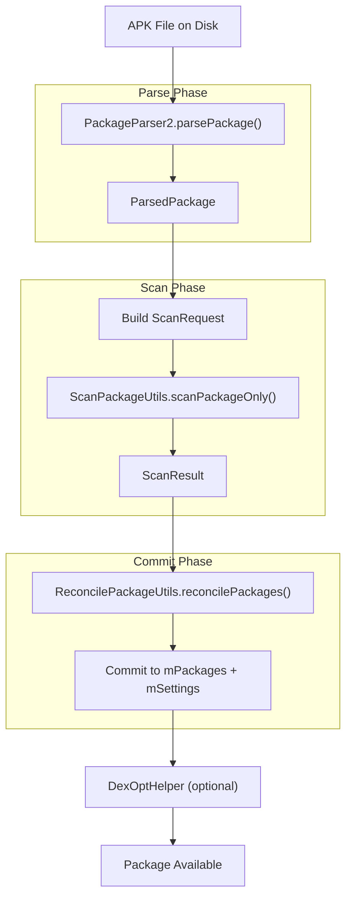
```mermaid
flowchart TD
    APK["APK File on Disk"] --> Parse["PackageParser2.parsePackage()"]
    Parse --> ParseResult["ParsedPackage"]
    ParseResult --> ScanReq["Build ScanRequest"]
    ScanReq --> ScanOnly["ScanPackageUtils.scanPackageOnly()"]
    ScanOnly --> ScanResult["ScanResult"]
    ScanResult --> Reconcile["ReconcilePackageUtils.reconcilePackages()"]
    Reconcile --> Commit["Commit to mPackages + mSettings"]
    Commit --> DexOpt["DexOptHelper (optional)"]
    DexOpt --> Done["Package Available"]

    subgraph "Parse Phase"
        Parse
        ParseResult
    end

    subgraph "Scan Phase"
        ScanReq
        ScanOnly
        ScanResult
    end

    subgraph "Commit Phase"
        Reconcile
        Commit
    end
```

---

## 26.4 Installation Pipeline

The installation of an APK is a multi-stage pipeline involving security verification,
disk operations, dex optimization, and state commitment. This section traces the
complete flow from when a user taps "Install" to when the app appears in the launcher.

### 26.4.1 Installation Entry Points

There are several entry points for package installation:

1. **`adb install`** -- Shell command that creates a session via `PackageInstallerService`
2. **Play Store / App stores** -- Use `PackageInstaller` API
3. **System OTA** -- Packages included in system images are scanned at boot
4. **APEX** -- Module updates that may contain APKs
5. **Intent-based** -- `ACTION_INSTALL_PACKAGE` intent (deprecated)

All modern installation flows go through `PackageInstallerService`:

```java
public class PackageInstallerService implements PackageSender,
        TestUtilityService {
```

### 26.4.2 PackageInstallerSession

The `PackageInstallerSession` is the central object for an active installation.
Sessions go through a well-defined lifecycle:

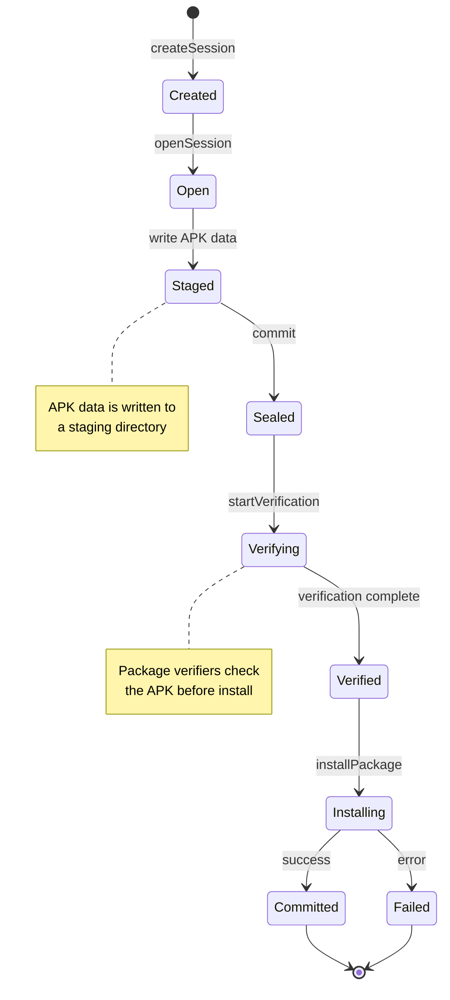
```mermaid
stateDiagram-v2
    [*] --> Created: createSession
    Created --> Open: openSession
    Open --> Staged: write APK data
    Staged --> Sealed: commit
    Sealed --> Verifying: startVerification
    Verifying --> Verified: verification complete
    Verified --> Installing: installPackage
    Installing --> Committed: success
    Installing --> Failed: error
    Committed --> [*]
    Failed --> [*]

    note right of Staged
        APK data is written to
        a staging directory
    end note

    note right of Verifying
        Package verifiers check
        the APK before install
    end note
```

Key session parameters (from `PackageInstaller.SessionParams`):

- `MODE_FULL_INSTALL` -- Complete replacement of the package
- `MODE_INHERIT_EXISTING` -- Update keeping existing splits
- `installLocation` -- Internal or external storage
- `abiOverride` -- Override ABI selection
- `installFlags` -- Various installation control flags

### 26.4.3 The Complete Installation Pipeline

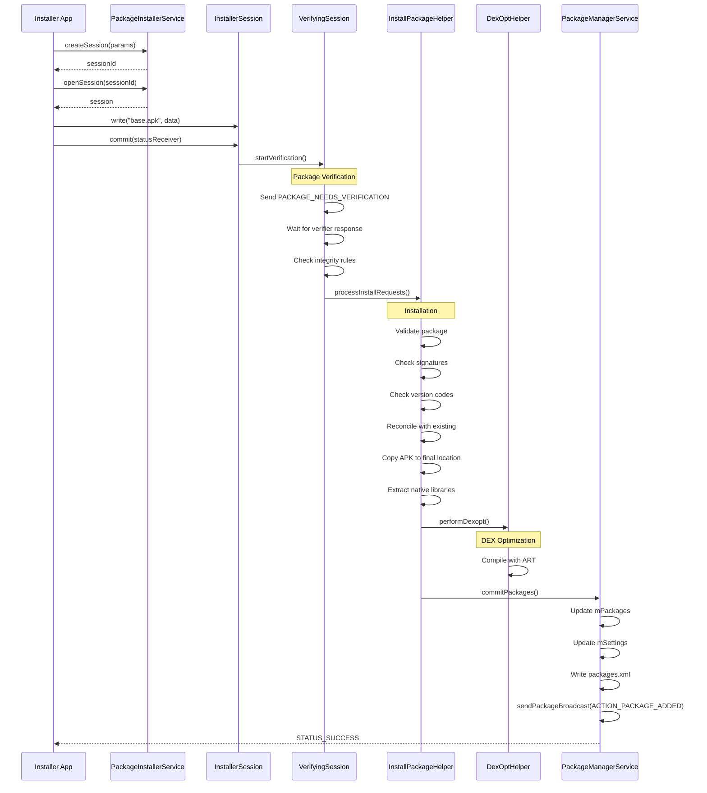
```mermaid
sequenceDiagram
    participant App as Installer App
    participant PIS as PackageInstallerService
    participant Session as InstallerSession
    participant Verify as VerifyingSession
    participant IPH as InstallPackageHelper
    participant Dex as DexOptHelper
    participant PMS as PackageManagerService

    App->>PIS: createSession(params)
    PIS-->>App: sessionId

    App->>PIS: openSession(sessionId)
    PIS-->>App: session

    App->>Session: write("base.apk", data)
    App->>Session: commit(statusReceiver)

    Session->>Verify: startVerification()

    Note over Verify: Package Verification
    Verify->>Verify: Send PACKAGE_NEEDS_VERIFICATION
    Verify->>Verify: Wait for verifier response
    Verify->>Verify: Check integrity rules

    Verify->>IPH: processInstallRequests()

    Note over IPH: Installation
    IPH->>IPH: Validate package
    IPH->>IPH: Check signatures
    IPH->>IPH: Check version codes
    IPH->>IPH: Reconcile with existing
    IPH->>IPH: Copy APK to final location
    IPH->>IPH: Extract native libraries

    IPH->>Dex: performDexopt()

    Note over Dex: DEX Optimization
    Dex->>Dex: Compile with ART

    IPH->>PMS: commitPackages()
    PMS->>PMS: Update mPackages
    PMS->>PMS: Update mSettings
    PMS->>PMS: Write packages.xml

    PMS->>PMS: sendPackageBroadcast(ACTION_PACKAGE_ADDED)
    PMS-->>App: STATUS_SUCCESS
```

### 26.4.4 Stage 1: Staging

When an installer creates a session and writes APK data, the data is staged to a
temporary directory under `/data/app/`:

```
/data/app/vmdl<sessionId>.tmp/
  +-- base.apk
  +-- split_config.arm64_v8a.apk
  +-- split_config.en.apk
```

The staging directory is managed by `StagingManager` for staged installs (those
requiring a reboot):

```java
public class StagingManager {
    private static final String TAG = "StagingManager";
    private final ApexManager mApexManager;
    private final PowerManager mPowerManager;
    private final Context mContext;
    private final File mFailureReasonFile =
            new File("/metadata/staged-install/failure_reason.txt");
```

### 26.4.5 Stage 2: Verification

Before installation proceeds, the package goes through verification. This is handled
by `VerifyingSession`
(`frameworks/base/services/core/java/com/android/server/pm/VerifyingSession.java`):

```java
final class VerifyingSession {
    private static final boolean DEFAULT_VERIFY_ENABLE = true;
    private static final long DEFAULT_INTEGRITY_VERIFICATION_TIMEOUT = 30 * 1000;
    private static final String PROPERTY_ENABLE_ROLLBACK_TIMEOUT_MILLIS =
            "enable_rollback_timeout";
```

The verification process involves:

1. **Required Verifier** -- Google Play Protect (or equivalent) checks the APK for
   malware. The system can have up to `REQUIRED_VERIFIERS_MAX_COUNT = 2` required
   verifiers.

2. **Sufficient Verifiers** -- Optional verifiers that can approve independently.

3. **Integrity Verification** -- Checks against integrity rules (blocklists, allowlists).

4. **Rollback Enablement** -- If rollback is configured, prepares rollback data.

The default response when verification times out is configurable:

```java
static final int DEFAULT_VERIFICATION_RESPONSE = PackageManager.VERIFICATION_ALLOW;
```

### 26.4.6 Stage 3: Installation

The `InstallPackageHelper`
(`frameworks/base/services/core/java/com/android/server/pm/InstallPackageHelper.java`)
performs the actual installation work:

1. **Validation** -- Check the APK is valid, version code is compatible, signatures match
2. **Signature Verification** -- Verify APK signatures using `ApkSignatureVerifier`
3. **Reconciliation** -- Compare with existing package state
4. **File Operations** -- Copy APK to final location, extract native libraries
5. **Permission Processing** -- Process permission declarations and grants
6. **ABI Selection** -- Determine the correct native ABI

Key error codes from `InstallPackageHelper`:

```java
INSTALL_FAILED_ALREADY_EXISTS
INSTALL_FAILED_INVALID_APK
INSTALL_FAILED_DUPLICATE_PACKAGE
INSTALL_FAILED_UPDATE_INCOMPATIBLE
INSTALL_FAILED_UID_CHANGED
INSTALL_FAILED_DEPRECATED_SDK_VERSION
INSTALL_FAILED_TEST_ONLY
INSTALL_FAILED_BAD_PERMISSION_GROUP
INSTALL_FAILED_DUPLICATE_PERMISSION
```

### 26.4.7 Stage 4: DEX Optimization

After the APK is in its final location, PMS triggers dex optimization:

```java
public final class DexOptHelper {
    @NonNull
    private static final ThreadPoolExecutor sDexoptExecutor =
            new ThreadPoolExecutor(1, 1,
                    60, TimeUnit.SECONDS,
                    new LinkedBlockingQueue<Runnable>());
```

The `DexOptHelper` delegates to `ArtManagerLocal` (the ART service) which performs
the actual compilation. Compilation strategies include:

- **verify** -- Only verify the DEX file
- **quicken** -- Quick optimizations
- **speed-profile** -- Compile hot methods based on profile data
- **speed** -- Compile everything (used for system apps at boot)

### 26.4.8 Stage 5: Commit

The final stage commits the installation to PMS's data structures:

1. **Update `mPackages`** -- Add the `AndroidPackage` to the main map
2. **Update `mSettings`** -- Create or update the `PackageSetting`
3. **Write `packages.xml`** -- Persist the settings to disk
4. **Send broadcasts** -- Notify the system of the new package:
   - `ACTION_PACKAGE_ADDED` (new install)
   - `ACTION_PACKAGE_REPLACED` (update)
   - `ACTION_MY_PACKAGE_REPLACED` (sent to the updated package itself)

### 26.4.9 Package Freezing

During installation, PMS "freezes" the package to prevent it from being launched:

```java
@GuardedBy("mLock")
final WatchedArrayMap<String, Integer> mFrozenPackages = new WatchedArrayMap<>();
```

The `PackageFreezer` class manages the freeze/thaw lifecycle. A frozen package
cannot be started by the Activity Manager, preventing race conditions during
code/data surgery:

```java
public static final int PACKAGE_STARTABILITY_FROZEN = 3;
```

### 26.4.10 The InstallPackageHelper Commit Process

The commit step in `InstallPackageHelper` is where the package becomes part of the
system state. The `commitReconciledScanResultLocked()` method performs this:

```java
@GuardedBy("mPm.mLock")
private AndroidPackage commitReconciledScanResultLocked(
        @NonNull ReconciledPackage reconciledPkg, int[] allUsers) {
    final InstallRequest request = reconciledPkg.mInstallRequest;
    ParsedPackage parsedPackage = request.getParsedPackage();

    // Special handling for the platform package
    if (parsedPackage != null
            && "android".equals(parsedPackage.getPackageName())) {
        parsedPackage.setVersionCode(mPm.getSdkVersion())
                .setVersionCodeMajor(0);
    }

    // Handle shared user setting changes
    final PackageSetting pkgSetting;
    // ... complex shared user reconciliation ...

    // Set the install source
    InstallSource installSource = request.getInstallSource();
    if (installSource != null) {
        pkgSetting.setInstallSource(installSource);
    }

    // Set the UID from the package setting
    parsedPackage.setUid(pkgSetting.getAppId());
    final AndroidPackage pkg = parsedPackage.hideAsFinal();

    // Reconcile shared libraries
    if (reconciledPkg.mCollectedSharedLibraryInfos != null) {
        mSharedLibraries.executeSharedLibrariesUpdate(
                pkg, pkgSetting, null, null,
                reconciledPkg.mCollectedSharedLibraryInfos, allUsers);
    }

    // Update KeySet data
    final KeySetManagerService ksms =
            mPm.mSettings.getKeySetManagerService();
    if (reconciledPkg.mRemoveAppKeySetData) {
        ksms.removeAppKeySetDataLPw(pkg.getPackageName());
    }

    // Update signing details
    pkgSetting.setSigningDetails(reconciledPkg.mSigningDetails);

    // Final commit
    commitPackageSettings(pkg, pkgSetting, oldPkgSetting, reconciledPkg);
    return pkg;
}
```

This method modifies multiple data structures atomically while holding `mLock`:

1. Updates or creates the `PackageSetting`
2. Updates shared user settings
3. Reconciles shared libraries
4. Updates KeySet data
5. Commits signing details
6. Calls `commitPackageSettings()` for the final state update

### 26.4.11 Update Ownership

Android 14+ introduced **update ownership**, which allows an app store to claim
exclusive update rights for a package. The `UpdateOwnershipHelper` manages this:

```java
private final UpdateOwnershipHelper mUpdateOwnershipHelper;
```

Rules for update ownership:

1. Ownership is set on initial installation if the installer requests it
2. Once set, only the update owner can update the package
3. If the user agrees to switch installers, the ownership is cleared
4. Ownership is also controlled via system configuration (sysconfig)
5. A deny list allows preventing ownership claims for certain packages

```java
final boolean isRequestUpdateOwnership = (request.getInstallFlags()
        & PackageManager.INSTALL_REQUEST_UPDATE_OWNERSHIP) != 0;
final boolean isSameUpdateOwner =
        TextUtils.equals(oldUpdateOwner,
                installSource.mInstallerPackageName);
```

### 26.4.12 Broadcast After Installation

After a successful installation, PMS sends system-wide broadcasts to notify
interested parties. The `BroadcastHelper` class manages this:

```java
private final BroadcastHelper mBroadcastHelper;
```

The broadcast sequence depends on the installation type:

**New installation:**
```
ACTION_PACKAGE_ADDED
  extras: EXTRA_UID (int), EXTRA_REPLACING (false)
```

**Update:**
```
ACTION_PACKAGE_REMOVED (with EXTRA_REPLACING = true)
ACTION_PACKAGE_ADDED (with EXTRA_REPLACING = true)
ACTION_PACKAGE_REPLACED
ACTION_MY_PACKAGE_REPLACED (sent to the updated app itself)
```

Broadcasts are delayed during startup to avoid overwhelming the system:

```java
private static final long BROADCAST_DELAY_DURING_STARTUP =
        10 * 1000L; // 10 seconds (in millis)
private static final long BROADCAST_DELAY =
        1 * 1000L;  // 1 second (in millis)
```

### 26.4.13 Install Observer Notification

The installer receives completion notification via `IPackageInstallObserver2`:

```java
void notifyInstallObserver(InstallRequest request) {
    if (request.getObserver() != null) {
        try {
            Bundle extras = extrasForInstallResult(request);
            request.getObserver().onPackageInstalled(
                    request.getName(),
                    request.getReturnCode(),
                    request.getReturnMsg(),
                    extras);
        } catch (RemoteException e) {
            Slog.i(TAG, "Observer no longer exists.");
        }
    }
}
```

For no-kill installs (updates that don't require process restart), the observer
notification is deferred:

```java
void scheduleDeferredNoKillInstallObserver(InstallRequest request) {
    String packageName = request.getPkg().getPackageName();
    mNoKillInstallObservers.put(packageName, request);
    Message message = mHandler.obtainMessage(
            DEFERRED_NO_KILL_INSTALL_OBSERVER, packageName);
    mHandler.sendMessageDelayed(message,
            DEFERRED_NO_KILL_INSTALL_OBSERVER_DELAY_MS);
}
```

### 26.4.14 Package Archival

Android 14+ introduces package archival, which allows uninstalling the APK while
preserving the user's data and a minimal launcher entry:

```java
ArchivedPackageParcel getArchivedPackageInternal(
        @NonNull String packageName, int userId) {
    // ... builds an ArchivedPackageParcel with:
    //   - packageName
    //   - signingDetails
    //   - versionCode
    //   - targetSdkVersion
    //   - archivedActivities (for launcher display)
}
```

Archived packages show a cloud icon in the launcher and can be reinstalled
on demand, downloading the APK again from the original installer.

### 26.4.15 Deferred Deletion

When a package is updated, the old APK files are not deleted immediately. Instead,
they are scheduled for deferred deletion:

```java
void scheduleDeferredNoKillPostDelete(CleanUpArgs args) {
    Message message = mHandler.obtainMessage(
            DEFERRED_NO_KILL_POST_DELETE, args);
    long deleteDelayMillis = DeviceConfig.getLong(
            NAMESPACE_PACKAGE_MANAGER_SERVICE,
            PROPERTY_DEFERRED_NO_KILL_POST_DELETE_DELAY_MS_EXTENDED,
            DEFERRED_NO_KILL_POST_DELETE_DELAY_MS_EXTENDED);
    Slog.w(TAG, "Delaying the deletion of <" + args.getCodePath()
            + "> by " + deleteDelayMillis + "ms or till the next reboot");
    mHandler.sendMessageDelayed(message, deleteDelayMillis);
}
```

The extended delay (up to 1 day) allows rollback if the new version causes issues.

### 26.4.16 Incremental Installation

Android 12+ supports incremental installation via the Incremental File System (IncFS).
This allows streaming installation where the APK becomes available before it is fully
downloaded:

```java
private static final String PROPERTY_INCFS_DEFAULT_TIMEOUTS =
        "incfs_default_timeouts";
```

The v4 signature scheme enables block-by-block verification of streamed content.

---

## 26.5 Permission Model

Android's permission model is one of its most important security features. PMS and
`PermissionManagerService` work together to define, grant, revoke, and enforce
permissions.

### 26.5.1 PermissionManagerService

The `PermissionManagerService`
(`frameworks/base/services/core/java/com/android/server/pm/permission/PermissionManagerService.java`)
is the central authority for permission management:

```java
/**
 * Manages all permissions and handles permissions related tasks.
 */
public class PermissionManagerService extends IPermissionManager.Stub {
    private static final String LOG_TAG =
            PermissionManagerService.class.getSimpleName();

    private final Object mLock = new Object();
    private final PackageManagerInternal mPackageManagerInt;
    private final AppOpsManager mAppOpsManager;
    private final Context mContext;
    private final PermissionManagerServiceInterface mPermissionManagerServiceImpl;
    private final AttributionSourceRegistry mAttributionSourceRegistry;
```

It is created as a separate service:

```java
public static PermissionManagerServiceInternal create(@NonNull Context context,
        ArrayMap<String, FeatureInfo> availableFeatures) {
    // ...
    permissionService = new PermissionManagerService(context, availableFeatures);
    ServiceManager.addService("permissionmgr", permissionService);
    ServiceManager.addService("permission_checker",
            new PermissionCheckerService(context));
    // ...
}
```

### 26.5.2 Permission Types

The `Permission` class
(`frameworks/base/services/core/java/com/android/server/pm/permission/Permission.java`)
defines the internal representation of a permission:

```java
public final class Permission {
    public static final int TYPE_MANIFEST = LegacyPermission.TYPE_MANIFEST;
    public static final int TYPE_CONFIG = LegacyPermission.TYPE_CONFIG;
    public static final int TYPE_DYNAMIC = LegacyPermission.TYPE_DYNAMIC;
```

Permissions are categorized by **protection level**:

```java
@IntDef({
        PermissionInfo.PROTECTION_DANGEROUS,
        PermissionInfo.PROTECTION_NORMAL,
        PermissionInfo.PROTECTION_SIGNATURE,
        PermissionInfo.PROTECTION_SIGNATURE_OR_SYSTEM,
        PermissionInfo.PROTECTION_INTERNAL,
})
public @interface ProtectionLevel {}
```

Each protection level has distinct grant semantics:

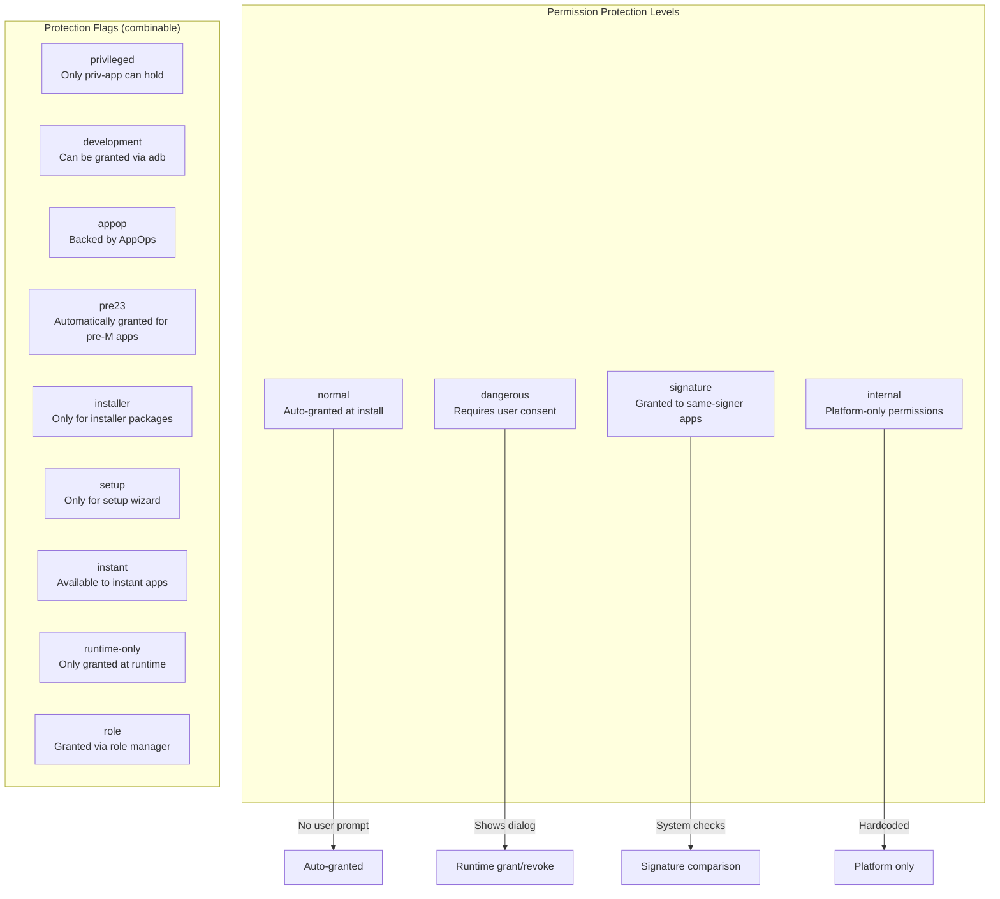
```mermaid
graph TD
    subgraph "Permission Protection Levels"
        NORMAL["normal<br/>Auto-granted at install"]
        DANGEROUS["dangerous<br/>Requires user consent"]
        SIGNATURE["signature<br/>Granted to same-signer apps"]
        INTERNAL["internal<br/>Platform-only permissions"]
    end

    subgraph "Protection Flags (combinable)"
        PRIV["privileged<br/>Only priv-app can hold"]
        DEV["development<br/>Can be granted via adb"]
        APPOP["appop<br/>Backed by AppOps"]
        PRE23["pre23<br/>Automatically granted for pre-M apps"]
        INSTALLER["installer<br/>Only for installer packages"]
        SETUP["setup<br/>Only for setup wizard"]
        INSTANT["instant<br/>Available to instant apps"]
        RUNTIME["runtime-only<br/>Only granted at runtime"]
        ROLE["role<br/>Granted via role manager"]
    end

    NORMAL --> |"No user prompt"| AUTO["Auto-granted"]
    DANGEROUS --> |"Shows dialog"| RUNTIME_GRANT["Runtime grant/revoke"]
    SIGNATURE --> |"System checks"| SIG_CHECK["Signature comparison"]
    INTERNAL --> |"Hardcoded"| PLATFORM["Platform only"]
```

### 26.5.3 Install-Time Permissions (normal)

Normal permissions are automatically granted at installation without user interaction.
They protect access to data or resources that pose minimal risk to the user's privacy
or device operation.

Examples: `INTERNET`, `VIBRATE`, `SET_WALLPAPER`, `ACCESS_NETWORK_STATE`

When PMS scans or installs a package, normal permissions declared in `<uses-permission>`
are automatically granted during the permission reconciliation phase.

### 26.5.4 Runtime Permissions (dangerous)

Dangerous permissions require explicit user consent via a runtime dialog. These
protect sensitive user data such as contacts, location, camera, and microphone.

Runtime permissions are organized into **permission groups**:

| Group | Permissions |
|-------|------------|
| `LOCATION` | `ACCESS_FINE_LOCATION`, `ACCESS_COARSE_LOCATION`, `ACCESS_BACKGROUND_LOCATION` |
| `CAMERA` | `CAMERA` |
| `MICROPHONE` | `RECORD_AUDIO` |
| `STORAGE` | `READ_EXTERNAL_STORAGE`, `WRITE_EXTERNAL_STORAGE`, `READ_MEDIA_IMAGES`, `READ_MEDIA_VIDEO`, `READ_MEDIA_AUDIO` |
| `CONTACTS` | `READ_CONTACTS`, `WRITE_CONTACTS`, `GET_ACCOUNTS` |
| `PHONE` | `READ_PHONE_STATE`, `CALL_PHONE`, `READ_CALL_LOG`, `WRITE_CALL_LOG` |
| `SMS` | `SEND_SMS`, `RECEIVE_SMS`, `READ_SMS`, `RECEIVE_MMS` |
| `CALENDAR` | `READ_CALENDAR`, `WRITE_CALENDAR` |
| `SENSORS` | `BODY_SENSORS`, `BODY_SENSORS_BACKGROUND` |
| `NEARBY_DEVICES` | `BLUETOOTH_CONNECT`, `BLUETOOTH_SCAN`, `BLUETOOTH_ADVERTISE`, `NEARBY_WIFI_DEVICES` |

The permission check flow:

```java
@Override
public int checkPermission(String packageName, String permissionName,
        String persistentDeviceId, @UserIdInt int userId) {
    if (packageName == null || permissionName == null) {
        return PackageManager.PERMISSION_DENIED;
    }
    final CheckPermissionDelegate checkPermissionDelegate;
    synchronized (mLock) {
        checkPermissionDelegate = mCheckPermissionDelegate;
    }
    if (checkPermissionDelegate == null) {
        return mPermissionManagerServiceImpl.checkPermission(
                packageName, permissionName, persistentDeviceId, userId);
    }
    return checkPermissionDelegate.checkPermission(packageName,
            permissionName, persistentDeviceId, userId,
            mPermissionManagerServiceImpl::checkPermission);
}
```

### 26.5.5 Signature Permissions

Signature permissions are granted only to apps signed with the same certificate as
the app that defined the permission. This is the primary mechanism for inter-app
communication between apps from the same developer.

The system platform package (`android`) defines many signature permissions. Any
app signed with the platform certificate automatically receives these.

The signature check uses `compareSignatures()`:

```java
import static com.android.server.pm.PackageManagerServiceUtils.compareSignatures;
```

### 26.5.6 Privileged Permissions

Privileged permissions (`protectionLevel="signature|privileged"`) can be granted to
apps in `/system/priv-app` even if they are not signed with the platform certificate.
This mechanism allows OEMs to grant elevated permissions to pre-installed apps.

The allowlist is maintained in XML files:

```
/system/etc/permissions/privapp-permissions-*.xml
/vendor/etc/permissions/privapp-permissions-*.xml
/product/etc/permissions/privapp-permissions-*.xml
```

The `PermissionAllowlist` class manages these files.

### 26.5.7 AppOp Permissions

Some permissions are backed by the AppOps system. The `appop` protection flag
indicates that even after a permission is granted, the AppOps framework can further
restrict access. This enables per-use permission dialogs and background access controls.

```java
private final AppOpsManager mAppOpsManager;
```

### 26.5.8 One-Time Permissions

Introduced in Android 11, one-time permissions allow granting access only for the
current session. They are managed by `OneTimePermissionUserManager`:

```java
@GuardedBy("mLock")
@NonNull
private final SparseArray<OneTimePermissionUserManager>
        mOneTimePermissionUserManagers = new SparseArray<>();
```

When the app goes to the background, the permission is automatically revoked after
a timeout.

### 26.5.9 Auto-Revoke (Permission Auto-Reset)

Permissions for apps that haven't been used for an extended period are automatically
revoked. The `setAutoRevokeExempted()` method allows apps to opt out:

```java
public boolean setAutoRevokeExempted(
        @NonNull String packageName, boolean exempted, int userId) {
    Objects.requireNonNull(packageName);
    final AndroidPackage pkg = mPackageManagerInt.getPackage(packageName);
    final int callingUid = Binder.getCallingUid();
    if (!checkAutoRevokeAccess(pkg, callingUid)) {
        return false;
    }
    return setAutoRevokeExemptedInternal(pkg, exempted, userId);
}
```

### 26.5.10 Permission Grant Flow

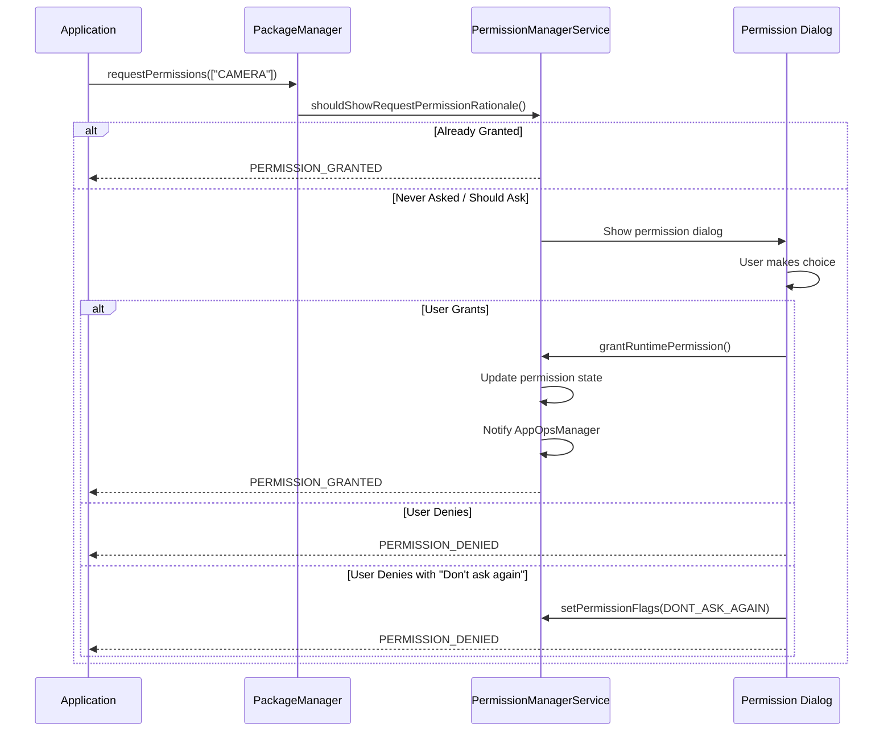
```mermaid
sequenceDiagram
    participant App as Application
    participant PM as PackageManager
    participant PMS as PermissionManagerService
    participant UI as Permission Dialog

    App->>PM: requestPermissions(["CAMERA"])
    PM->>PMS: shouldShowRequestPermissionRationale()

    alt Already Granted
        PMS-->>App: PERMISSION_GRANTED
    else Never Asked / Should Ask
        PMS->>UI: Show permission dialog
        UI->>UI: User makes choice

        alt User Grants
            UI->>PMS: grantRuntimePermission()
            PMS->>PMS: Update permission state
            PMS->>PMS: Notify AppOpsManager
            PMS-->>App: PERMISSION_GRANTED
        else User Denies
            UI-->>App: PERMISSION_DENIED
        else User Denies with "Don't ask again"
            UI->>PMS: setPermissionFlags(DONT_ASK_AGAIN)
            UI-->>App: PERMISSION_DENIED
        end
    end
```

### 26.5.11 Split Permissions

As Android evolves, some permissions are split into more granular ones. For example,
`READ_EXTERNAL_STORAGE` was split into `READ_MEDIA_IMAGES`, `READ_MEDIA_VIDEO`,
and `READ_MEDIA_AUDIO` in Android 13. The `SplitPermissionInfoParcelable` class
tracks these splits:

```java
import android.content.pm.permission.SplitPermissionInfoParcelable;
```

When an older app (targeting a pre-split SDK version) requests the original permission,
the system automatically considers the split permissions as well. This ensures
backward compatibility while allowing newer apps to request only the specific
access they need.

### 26.5.12 Permission Groups and UI

Permissions are organized into groups for the user-facing permission dialog. The
`PermissionGroupInfo` class describes a group, and the Permission Controller app
(com.android.permissioncontroller) handles the UI.

The permission dialog flow:

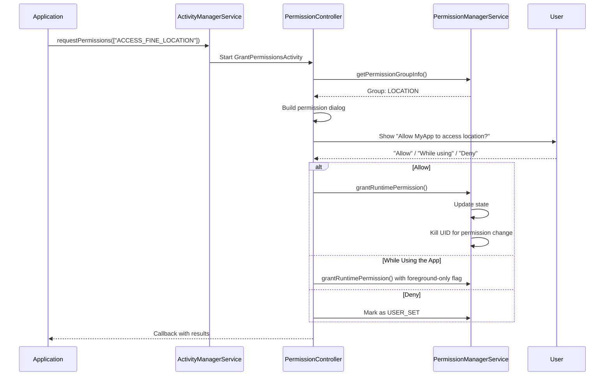
```mermaid
sequenceDiagram
    participant App as Application
    participant AMS as ActivityManagerService
    participant PC as PermissionController
    participant PMS2 as PermissionManagerService
    participant User as User

    App->>AMS: requestPermissions(["ACCESS_FINE_LOCATION"])
    AMS->>PC: Start GrantPermissionsActivity
    PC->>PMS2: getPermissionGroupInfo()
    PMS2-->>PC: Group: LOCATION
    PC->>PC: Build permission dialog

    PC->>User: Show "Allow MyApp to access location?"
    User-->>PC: "Allow" / "While using" / "Deny"

    alt Allow
        PC->>PMS2: grantRuntimePermission()
        PMS2->>PMS2: Update state
        PMS2->>PMS2: Kill UID for permission change
    else While Using the App
        PC->>PMS2: grantRuntimePermission() with foreground-only flag
    else Deny
        PC->>PMS2: Mark as USER_SET
    end

    PC-->>App: Callback with results
```

### 26.5.13 Background Location Access

Starting from Android 10, background location access requires separate approval.
The permission `ACCESS_BACKGROUND_LOCATION` is requested separately from
`ACCESS_FINE_LOCATION` / `ACCESS_COARSE_LOCATION`, and the user sees a
dedicated dialog.

### 26.5.14 Permission Delegation

The `CheckPermissionDelegate` interface allows components to intercept permission
checks:

```java
@GuardedBy("mLock")
private CheckPermissionDelegate mCheckPermissionDelegate;
```

This is used by the Companion Device Manager and Virtual Device Manager to modify
permission behavior for companion devices and virtual displays. The delegate can
override the standard permission check result.

### 26.5.15 Virtual Device Permissions

Android 14+ supports per-device permission state, where permissions can have
different grant states on the default device vs. virtual devices:

```java
@Override
public int checkPermission(String packageName, String permissionName,
        String persistentDeviceId, @UserIdInt int userId) {
```

The `persistentDeviceId` parameter identifies which device the permission check
is for:

```java
private String getPersistentDeviceId(int deviceId) {
    if (deviceId == Context.DEVICE_ID_DEFAULT) {
        return VirtualDeviceManager.PERSISTENT_DEVICE_ID_DEFAULT;
    }
    if (mVirtualDeviceManagerInternal == null) {
        mVirtualDeviceManagerInternal =
                LocalServices.getService(VirtualDeviceManagerInternal.class);
    }
    return mVirtualDeviceManagerInternal == null
            ? VirtualDeviceManager.PERSISTENT_DEVICE_ID_DEFAULT
            : mVirtualDeviceManagerInternal.getPersistentIdForDevice(deviceId);
}
```

### 26.5.16 Attribution Sources

Android 12+ introduced the `AttributionSource` system for tracking the chain of
apps that contributed to an API call. This enables more precise permission enforcement
for proxy APIs where app A calls app B which calls a system API on A's behalf:

```java
@NonNull
private final AttributionSourceRegistry mAttributionSourceRegistry;
```

The `AttributionSource` chain ensures that every app in the call chain has the
required permission, preventing privilege escalation through intermediary apps.

### 26.5.17 Permission Persistence

Permission state is persisted in two places:

1. **Install-time permissions** -- Stored in `/data/system/packages.xml`
2. **Runtime permissions** -- Stored per-user in
   `/data/misc_de/<userId>/apexdata/com.android.permission/runtime-permissions.xml`

The `RuntimePermissionsPersistence` class handles serialization:

```java
import com.android.permission.persistence.RuntimePermissionsPersistence;
import com.android.permission.persistence.RuntimePermissionsState;
```

---

## 26.6 Intent Resolution

Intent resolution is the mechanism by which Android matches an implicit intent to the
correct component. PMS maintains the database of all registered intent filters and
performs the matching algorithm.

### 26.6.1 Intent Filter Registration

Every component declared in an APK's manifest with `<intent-filter>` elements is
registered in PMS's `ComponentResolver`
(`frameworks/base/services/core/java/com/android/server/pm/resolution/ComponentResolver.java`):

```java
/** Resolves all Android component types
    [activities, services, providers and receivers]. */
public class ComponentResolver extends ComponentResolverLocked
        implements Snappable<ComponentResolverApi> {
    private static final boolean DEBUG = false;
    private static final String TAG = "PackageManager";
```

The `ComponentResolver` maintains four `IntentResolver` instances, one for each
component type:

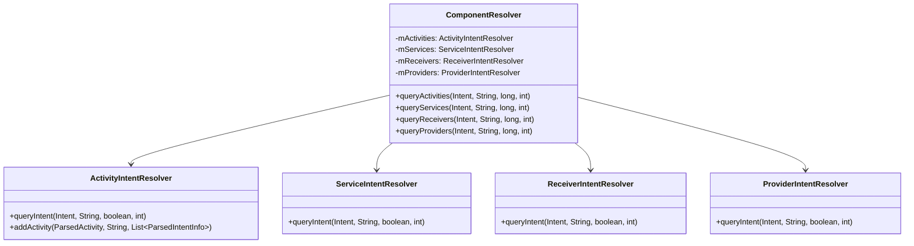
```mermaid
classDiagram
    class ComponentResolver {
        -mActivities: ActivityIntentResolver
        -mServices: ServiceIntentResolver
        -mReceivers: ReceiverIntentResolver
        -mProviders: ProviderIntentResolver
        +queryActivities(Intent, String, long, int)
        +queryServices(Intent, String, long, int)
        +queryReceivers(Intent, String, long, int)
        +queryProviders(Intent, String, long, int)
    }

    class ActivityIntentResolver {
        +queryIntent(Intent, String, boolean, int)
        +addActivity(ParsedActivity, String, List~ParsedIntentInfo~)
    }

    class ServiceIntentResolver {
        +queryIntent(Intent, String, boolean, int)
    }

    class ReceiverIntentResolver {
        +queryIntent(Intent, String, boolean, int)
    }

    class ProviderIntentResolver {
        +queryIntent(Intent, String, boolean, int)
    }

    ComponentResolver --> ActivityIntentResolver
    ComponentResolver --> ServiceIntentResolver
    ComponentResolver --> ReceiverIntentResolver
    ComponentResolver --> ProviderIntentResolver
```

The `IntentResolver` base class (`frameworks/base/services/core/java/com/android/server/IntentResolver.java`)
implements the core matching algorithm.

### 26.6.2 Intent Matching Algorithm

The Android intent matching algorithm considers these attributes in order:

1. **Action** -- The string action (e.g., `android.intent.action.VIEW`). If the intent
   specifies an action, the filter must include that action.

2. **Data** -- URI scheme, host, port, path, and MIME type. The matching rules are:
   - If the filter specifies a scheme, the intent's URI scheme must match
   - If the filter specifies a host, the intent's URI host must match
   - Path matching supports literal, prefix, and pattern matching

3. **Category** -- Categories the intent belongs to. The filter must include ALL
   categories specified in the intent. (The `DEFAULT` category is implicitly added
   for activities started with `startActivity()`.)

4. **Package** -- If the intent specifies a package, only components from that
   package are considered (explicit intent behavior).

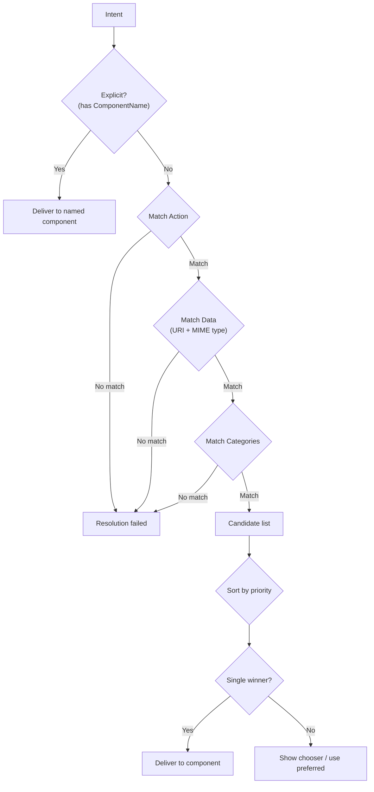
```mermaid
flowchart TD
    Intent["Intent"] --> CheckExplicit{"Explicit?<br/>(has ComponentName)"}
    CheckExplicit -->|"Yes"| Direct["Deliver to named component"]
    CheckExplicit -->|"No"| MatchAction{"Match Action"}
    MatchAction -->|"No match"| Fail["Resolution failed"]
    MatchAction -->|"Match"| MatchData{"Match Data<br/>(URI + MIME type)"}
    MatchData -->|"No match"| Fail
    MatchData -->|"Match"| MatchCategory{"Match Categories"}
    MatchCategory -->|"No match"| Fail
    MatchCategory -->|"Match"| Candidates["Candidate list"]
    Candidates --> Priority{"Sort by priority"}
    Priority --> SingleResult{"Single winner?"}
    SingleResult -->|"Yes"| Deliver["Deliver to component"]
    SingleResult -->|"No"| Chooser["Show chooser / use preferred"]
```

### 26.6.3 ResolveIntentHelper

The `ResolveIntentHelper` class
(`frameworks/base/services/core/java/com/android/server/pm/ResolveIntentHelper.java`)
orchestrates the intent resolution process:

```java
final class ResolveIntentHelper {
    @NonNull private final Context mContext;
    @NonNull private final PlatformCompat mPlatformCompat;
    @NonNull private final UserManagerService mUserManager;
    @NonNull private final PreferredActivityHelper mPreferredActivityHelper;
    @NonNull private final DomainVerificationManagerInternal mDomainVerificationManager;
    @NonNull private final UserNeedsBadgingCache mUserNeedsBadging;
    @NonNull private final Supplier<ResolveInfo> mResolveInfoSupplier;
    @NonNull private final Supplier<ActivityInfo> mInstantAppInstallerActivitySupplier;
```

The main resolution method:

```java
public ResolveInfo resolveIntentInternal(Computer computer, Intent intent,
        String resolvedType, long flags, long privateResolveFlags,
        int userId, boolean resolveForStart,
        int filterCallingUid, int callingPid) {
    try {
        Trace.traceBegin(TRACE_TAG_PACKAGE_MANAGER, "resolveIntent");

        if (!mUserManager.exists(userId)) return null;
        final int callingUid = Binder.getCallingUid();
        flags = computer.updateFlagsForResolve(flags, userId,
                filterCallingUid, resolveForStart,
                computer.isImplicitImageCaptureIntentAndNotSetByDpc(
                        intent, userId, resolvedType, flags));
        computer.enforceCrossUserPermission(callingUid, userId,
                false, false, "resolve intent");

        final List<ResolveInfo> query =
                computer.queryIntentActivitiesInternal(intent,
                        resolvedType, flags, privateResolveFlags,
                        filterCallingUid, callingPid, userId,
                        resolveForStart, true);
        // ...
        final ResolveInfo bestChoice = chooseBestActivity(computer,
                intent, resolvedType, flags, privateResolveFlags,
                query, userId, queryMayBeFiltered);
        return bestChoice;
    } finally {
        Trace.traceEnd(TRACE_TAG_PACKAGE_MANAGER);
    }
}
```

### 26.6.4 chooseBestActivity

When multiple activities match an intent, `chooseBestActivity()` determines which
one to use:

```java
private ResolveInfo chooseBestActivity(Computer computer, Intent intent,
        String resolvedType, long flags, long privateResolveFlags,
        List<ResolveInfo> query, int userId, boolean queryMayBeFiltered) {
    if (query != null) {
        final int n = query.size();
        if (n == 1) {
            return query.get(0);
        } else if (n > 1) {
            ResolveInfo r0 = query.get(0);
            ResolveInfo r1 = query.get(1);
            // If the first activity has a higher priority, or a different
            // default, then it is always desirable to pick it.
            if (r0.priority != r1.priority
                    || r0.preferredOrder != r1.preferredOrder
                    || r0.isDefault != r1.isDefault) {
                return query.get(0);
            }
            // If we have saved a preference for a preferred activity
            // for this Intent, use that.
            ResolveInfo ri = mPreferredActivityHelper
                    .findPreferredActivityNotLocked(computer, intent,
                            resolvedType, flags, query, true, false,
                            debug, userId, queryMayBeFiltered);
            if (ri != null) {
                return ri;
            }
            // ...check for instant apps, browser intents
```

The priority ordering is:

1. **Priority** -- Numeric priority from the intent filter (system apps can have
   higher priority)
2. **Preferred Order** -- User-set default via "Always use this app"
3. **Is Default** -- Whether the filter includes `CATEGORY_DEFAULT`
4. **Preferred Activity** -- Saved user preference
5. **Domain Verification** -- App Links verification state
6. **Chooser Dialog** -- When no clear winner, show the user a choice

### 26.6.5 Preferred Activities

When a user selects "Always" in the chooser dialog, PMS saves a `PreferredActivity`
record. The `PreferredActivityHelper` manages these records:

```java
private final PreferredActivityHelper mPreferredActivityHelper;
```

Preferred activities are stored per-user in `preferred-activities.xml`.

### 26.6.6 App Links and Domain Verification

For web intents (HTTP/HTTPS), Android uses **App Links** -- verified associations
between apps and web domains. The `DomainVerificationManagerInternal` handles:

1. **Digital Asset Links** -- Apps declare domain ownership via
   `/.well-known/assetlinks.json` on their website
2. **Automatic Verification** -- The system verifies these claims at install time
3. **Verified Status** -- Verified apps are automatically chosen for matching web URLs

```java
@NonNull
final DomainVerificationManagerInternal mDomainVerificationManager;
```

### 26.6.7 Cross-Profile Intent Resolution

PMS supports cross-profile intent resolution for managed profiles (work profiles).
The `CrossProfileIntentFilter` and `CrossProfileResolver` classes handle forwarding
intents between the personal and work profiles:

```java
List<CrossProfileIntentFilter> getMatchingCrossProfileIntentFilters(
        Intent intent, String resolvedType, int userId);
```

### 26.6.8 Protected Actions

Certain intent actions are "protected" -- only system apps can register high-priority
intent filters for them. This prevents third-party apps from intercepting critical
system intents:

From `ComponentResolver.java`:

```java
/**
 * The set of all protected actions [i.e. those actions for which a high
 * priority intent filter is disallowed].
 */
private static final Set<String> PROTECTED_ACTIONS = new ArraySet<>();
static {
    PROTECTED_ACTIONS.add(Intent.ACTION_SEND);
    PROTECTED_ACTIONS.add(Intent.ACTION_SENDTO);
    PROTECTED_ACTIONS.add(Intent.ACTION_SEND_MULTIPLE);
    PROTECTED_ACTIONS.add(Intent.ACTION_VIEW);
}
```

When a non-system app declares an intent filter with a priority higher than 0 for
a protected action, the priority is silently capped to 0. This ensures system apps
always win priority ties for these critical actions.

### 26.6.9 Instant App Resolution

Instant apps (apps that run without full installation) have special resolution rules.
They are only visible to the caller in specific circumstances:

```java
/**
 * Normally instant apps can only be resolved when they're visible to
 * the caller. However, if resolveForStart is true, all instant apps
 * are visible since we need to allow the system to start any installed
 * application.
 */
```

The two-phase instant app resolution works as:

1. **Phase 1** -- Check locally installed instant apps
2. **Phase 2** -- Query the instant app resolver (cloud-based) for matching apps

```java
static final int INSTANT_APP_RESOLUTION_PHASE_TWO = 20;
```

### 26.6.10 Safer Intent Utilities

Android 14+ introduced `SaferIntentUtils` to prevent non-exported components from
being resolved through implicit intents:

```java
if (resolveForStart) {
    var args = new SaferIntentUtils.IntentArgs(intent, resolvedType,
            false /* isReceiver */, true, filterCallingUid, callingPid);
    args.platformCompat = mPlatformCompat;
    SaferIntentUtils.filterNonExportedComponents(args, query);
}
```

This filters out any component that is not exported when the resolution is for
starting an activity, preventing unintended exposure of internal components.

### 26.6.11 Camera Intent Protection

Starting from Android 11, camera intents must match system apps unless a Device
Policy Controller (DPC) has explicitly set a different default:

```java
boolean isImplicitImageCaptureIntentAndNotSetByDpc(
        Intent intent, int userId, String resolvedType, long flags);
```

This prevents malware from intercepting camera intents.

### 26.6.12 Query Intent Activities Internal

The core query method `queryIntentActivitiesInternal` on the `Computer` interface
supports multiple overloads with different levels of control:

```java
// Full control version
@NonNull List<ResolveInfo> queryIntentActivitiesInternal(
        Intent intent, String resolvedType,
        @PackageManager.ResolveInfoFlagsBits long flags,
        @PackageManagerInternal.PrivateResolveFlags long privateResolveFlags,
        int filterCallingUid, int callingPid, int userId,
        boolean resolveForStart, boolean allowDynamicSplits);

// Simplified version with filtering UID
@NonNull List<ResolveInfo> queryIntentActivitiesInternal(
        Intent intent, String resolvedType,
        long flags, int filterCallingUid, int userId);

// Minimal version
@NonNull List<ResolveInfo> queryIntentActivitiesInternal(
        Intent intent, String resolvedType, long flags, int userId);
```

The `filterCallingUid` parameter is crucial -- it determines which packages are
visible to the caller. The `allowDynamicSplits` flag controls whether uninstalled
dynamic feature modules should be considered.

### 26.6.13 Post-Resolution Filtering

After initial matching, results go through post-resolution filtering:

```java
List<ResolveInfo> applyPostResolutionFilter(
        @NonNull List<ResolveInfo> resolveInfos,
        String ephemeralPkgName,
        boolean allowDynamicSplits,
        int filterCallingUid,
        boolean resolveForStart,
        int userId,
        Intent intent);
```

This filter:

1. Removes ephemeral (instant) apps that should not be visible
2. Applies package visibility rules
3. Handles dynamic split resolution
4. Enforces user-specific restrictions

### 26.6.14 Package Visibility Filtering

Starting from Android 11, apps cannot see other installed packages by default.
The `AppsFilter` mechanism implements this:

```java
@Watched
final AppsFilterImpl mAppsFilter;
```

Apps must declare `<queries>` elements in their manifest or hold
`QUERY_ALL_PACKAGES` permission to see other packages. The `Computer` interface
exposes this filtering:

```java
boolean shouldFilterApplication(@Nullable PackageStateInternal ps,
        int callingUid, @Nullable ComponentName component,
        @PackageManager.ComponentType int componentType, int userId);
```

---

## 26.7 Split APKs and App Bundles

Split APKs allow an application to be delivered as multiple APK files rather than
a single monolithic APK. This is a core feature enabling Google Play's App Bundle
format, which dramatically reduces download sizes.

### 26.7.1 Split APK Architecture

A split APK installation consists of:

1. **Base APK** (`base.apk`) -- Contains the manifest, core code, and base resources
2. **Configuration Splits** -- Device-specific resources:
   - `split_config.arm64_v8a.apk` -- Native libraries for arm64
   - `split_config.en.apk` -- English string resources
   - `split_config.xxhdpi.apk` -- XXHDPI density resources
3. **Feature Splits** -- Optional feature modules:
   - `split_feature1.apk` -- Dynamic feature module
   - `split_feature2.apk` -- Another feature module

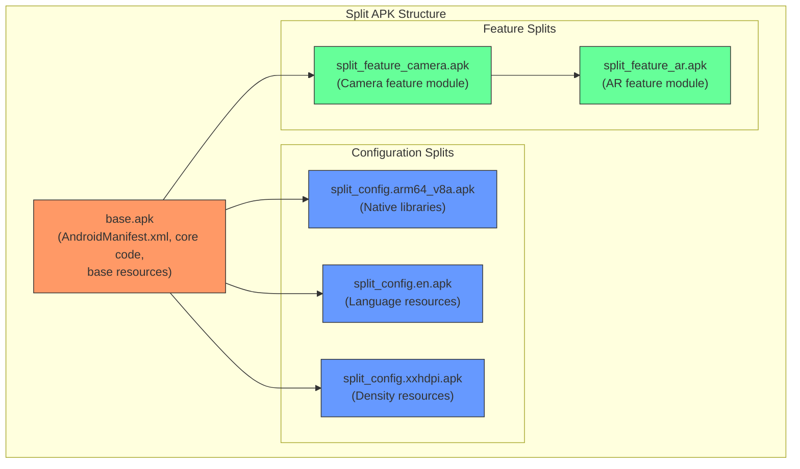
```mermaid
graph TD
    subgraph "Split APK Structure"
        BASE["base.apk<br/>(AndroidManifest.xml, core code,<br/>base resources)"]

        subgraph "Configuration Splits"
            ABI["split_config.arm64_v8a.apk<br/>(Native libraries)"]
            LANG["split_config.en.apk<br/>(Language resources)"]
            DPI["split_config.xxhdpi.apk<br/>(Density resources)"]
        end

        subgraph "Feature Splits"
            F1["split_feature_camera.apk<br/>(Camera feature module)"]
            F2["split_feature_ar.apk<br/>(AR feature module)"]
        end
    end

    BASE --> ABI
    BASE --> LANG
    BASE --> DPI
    BASE --> F1
    F1 --> F2

    style BASE fill:#f96,stroke:#333
    style ABI fill:#69f,stroke:#333
    style LANG fill:#69f,stroke:#333
    style DPI fill:#69f,stroke:#333
    style F1 fill:#6f9,stroke:#333
    style F2 fill:#6f9,stroke:#333
```

### 26.7.2 Split Dependencies

Feature splits can declare dependencies on other splits using the `<uses-split>`
manifest element. The `SplitDependencyLoader`
(`frameworks/base/core/java/android/content/pm/split/SplitDependencyLoader.java`)
manages the dependency tree:

```java
/**
 * A helper class that implements the dependency tree traversal for splits.
 * Callbacks are implemented by subclasses to notify whether a split has already
 * been constructed and is cached, and to actually create the split requested.
 *
 * All inputs and outputs are assumed to be indices into an array of splits.
 */
public abstract class SplitDependencyLoader<E extends Exception> {
    private final @NonNull SparseArray<int[]> mDependencies;

    protected SplitDependencyLoader(
            @NonNull SparseArray<int[]> dependencies) {
        mDependencies = dependencies;
    }
```

The dependency traversal algorithm is a bottom-up walk:

```java
protected void loadDependenciesForSplit(int splitIdx) throws E {
    if (isSplitCached(splitIdx)) {
        return;
    }

    // Special case the base, since it has no dependencies.
    if (splitIdx == 0) {
        final int[] configSplitIndices = collectConfigSplitIndices(0);
        constructSplit(0, configSplitIndices, -1);
        return;
    }

    // Build up the dependency hierarchy.
    final IntArray linearDependencies = new IntArray();
    linearDependencies.add(splitIdx);

    // Collect all the dependencies that need to be constructed.
    // They will be listed from leaf to root.
    while (true) {
        final int[] deps = mDependencies.get(splitIdx);
        if (deps != null && deps.length > 0) {
            splitIdx = deps[0];
        } else {
            splitIdx = -1;
        }
        if (splitIdx < 0 || isSplitCached(splitIdx)) {
            break;
        }
        linearDependencies.add(splitIdx);
    }

    // Visit each index, from right to left (root to leaf).
    int parentIdx = splitIdx;
    for (int i = linearDependencies.size() - 1; i >= 0; i--) {
        final int idx = linearDependencies.get(i);
        final int[] configSplitIndices = collectConfigSplitIndices(idx);
        constructSplit(idx, configSplitIndices, parentIdx);
        parentIdx = idx;
    }
}
```

### 26.7.3 Runtime Split Loading

At runtime, splits are loaded by `LoadedApk` which extends `SplitDependencyLoader`:

From `frameworks/base/core/java/android/app/LoadedApk.java`:

```java
private class SplitDependencyLoaderImpl
        extends SplitDependencyLoader<NameNotFoundException> {
```

This implementation:

1. Checks if a split's ClassLoader and Resources are already cached
2. Walks the dependency tree from the requested split to the base
3. Constructs ClassLoaders and Resources objects in root-to-leaf order
4. Caches the results for subsequent loads

### 26.7.4 Split Installation

Split APKs are installed using `MODE_INHERIT_EXISTING` sessions:

```java
static final int MODE_INHERIT_EXISTING = PackageInstaller.SessionParams.MODE_INHERIT_EXISTING;
```

When inheriting, the new session:

1. Starts with all existing splits
2. Can add new splits
3. Can remove existing splits
4. Must always include the base APK

### 26.7.5 On-Disk Layout

Installed split APKs are stored alongside the base APK:

```
/data/app/~~random/com.example.app-random/
  +-- base.apk
  +-- split_config.arm64_v8a.apk
  +-- split_config.en.apk
  +-- split_config.xxhdpi.apk
  +-- split_feature_camera.apk
  +-- lib/
  |     +-- arm64/
  |           +-- libnative.so
  +-- oat/
        +-- arm64/
              +-- base.odex
              +-- base.vdex
```

### 26.7.6 Split APK Manifest Declarations

Each split APK has its own `AndroidManifest.xml` that declares its role:

**Base APK manifest:**
```xml
<manifest xmlns:android="http://schemas.android.com/apk/res/android"
    package="com.example.app"
    android:versionCode="100"
    android:isFeatureSplit="false"
    split="">
    <application android:label="My App">
        <activity android:name=".MainActivity">
            <intent-filter>
                <action android:name="android.intent.action.MAIN" />
                <category android:name="android.intent.category.LAUNCHER" />
            </intent-filter>
        </activity>
    </application>
</manifest>
```

**Feature split manifest:**
```xml
<manifest xmlns:android="http://schemas.android.com/apk/res/android"
    package="com.example.app"
    split="feature_camera"
    android:isFeatureSplit="true">
    <uses-split android:name="feature_base" />
    <application>
        <activity android:name=".camera.CameraActivity"
            android:splitName="feature_camera" />
    </application>
</manifest>
```

**Configuration split manifest:**
```xml
<manifest xmlns:android="http://schemas.android.com/apk/res/android"
    package="com.example.app"
    split="config.arm64_v8a"
    android:isFeatureSplit="false"
    configForSplit="">
</manifest>
```

Key manifest attributes for splits:

| Attribute | Purpose |
|-----------|---------|
| `split` | Name of this split (empty for base) |
| `android:isFeatureSplit` | Whether this is a feature or config split |
| `configForSplit` | Which split this config applies to |
| `<uses-split>` | Dependency on another split |
| `android:splitName` | Links a component to its split |

### 26.7.7 Split ClassLoader Architecture

Each split gets its own ClassLoader entry, but they share a parent chain:

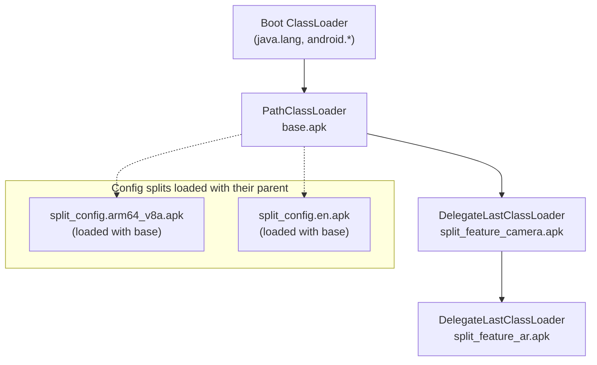
```mermaid
graph TD
    Boot["Boot ClassLoader<br/>(java.lang, android.*)"]
    Base["PathClassLoader<br/>base.apk"]
    F1["DelegateLastClassLoader<br/>split_feature_camera.apk"]
    F2["DelegateLastClassLoader<br/>split_feature_ar.apk"]

    Boot --> Base
    Base --> F1
    F1 --> F2

    subgraph "Config splits loaded with their parent"
        C1["split_config.arm64_v8a.apk<br/>(loaded with base)"]
        C2["split_config.en.apk<br/>(loaded with base)"]
    end

    Base -.-> C1
    Base -.-> C2
```

Feature splits use `DelegateLastClassLoader` to allow the feature's classes to
override the base's classes, enabling true modularity.

### 26.7.8 Resource Merging for Splits

When splits are loaded, their resources are merged into a single `Resources` object.
The merge order follows the split dependency tree, with later splits overriding
earlier ones for conflicting resources.

The `collectConfigSplitIndices()` method identifies which config splits belong to
a given feature split:

```java
private @NonNull int[] collectConfigSplitIndices(int splitIdx) {
    // The config splits appear after the first element.
    final int[] deps = mDependencies.get(splitIdx);
    if (deps == null || deps.length <= 1) {
        return EmptyArray.INT;
    }
    return Arrays.copyOfRange(deps, 1, deps.length);
}
```

### 26.7.9 Dynamic Delivery

The dynamic delivery system allows features to be delivered on-demand after initial
installation. When a feature module is requested:

1. The app requests the module via the Play Core library
2. Play Store downloads the split APK
3. PMS installs it as an additional split
4. The app is notified and can load the new code

PMS supports this through the `allowDynamicSplits` parameter in intent resolution:

```java
@NonNull List<ResolveInfo> queryIntentActivitiesInternal(
        Intent intent, String resolvedType, long flags,
        long privateResolveFlags, int filterCallingUid,
        int callingPid, int userId,
        boolean resolveForStart, boolean allowDynamicSplits);
```

---

## 26.8 Overlay System

The Runtime Resource Overlay (RRO) system allows modifying an application's
resources at runtime without changing the application itself. This is the foundation
for theming, carrier customization, and OEM branding.

### 26.8.1 OverlayManagerService Architecture

The overlay system is managed by `OverlayManagerService` (OMS)
(`frameworks/base/services/core/java/com/android/server/om/OverlayManagerService.java`):

```java
/**
 * Service to manage asset overlays.
 *
 * <p>Asset overlays are additional resources that come from apks loaded
 * alongside the system and app apks. This service, the OverlayManagerService
 * (OMS), tracks which installed overlays to use and provides methods to change
 * this. Changes propagate to running applications as part of the Activity
 * lifecycle. This allows Activities to reread their resources at a well
 * defined point.</p>
 */
```

The OMS architecture follows a layered design:

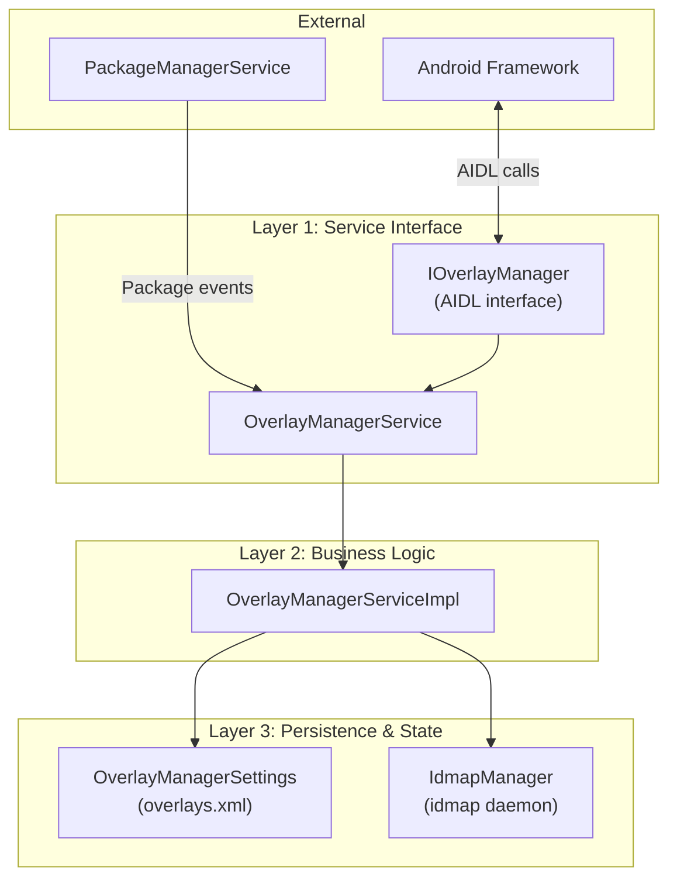
```mermaid
graph TB
    subgraph "Layer 1: Service Interface"
        OMS["OverlayManagerService"]
        AIDL["IOverlayManager<br/>(AIDL interface)"]
    end

    subgraph "Layer 2: Business Logic"
        IMPL["OverlayManagerServiceImpl"]
    end

    subgraph "Layer 3: Persistence & State"
        SETTINGS["OverlayManagerSettings<br/>(overlays.xml)"]
        IDMAP["IdmapManager<br/>(idmap daemon)"]
    end

    subgraph "External"
        FRAMEWORK["Android Framework"]
        PMS2["PackageManagerService"]
    end

    FRAMEWORK <-->|"AIDL calls"| AIDL
    PMS2 -->|"Package events"| OMS
    AIDL --> OMS
    OMS --> IMPL
    IMPL --> SETTINGS
    IMPL --> IDMAP
```

The Javadoc describes OMS's three input sources:

1. **SystemService callbacks** -- Boot and user switching events
2. **PMS intents** -- Package install/remove/update broadcasts
3. **AIDL interface** -- External requests to enable/disable overlays

### 26.8.2 How RRO Works

An overlay APK declares a target package and provides alternative resources:

```xml
<!-- Overlay AndroidManifest.xml -->
<manifest xmlns:android="http://schemas.android.com/apk/res/android"
    package="com.example.overlay"
    android:targetPackage="com.example.target"
    android:isResourceOverlay="true">
    <overlay
        android:category="theme"
        android:isStatic="false"
        android:priority="1" />
</manifest>
```

When an overlay is enabled, the resource lookup chain is modified:

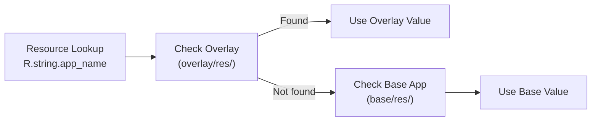
```mermaid
flowchart LR
    Lookup["Resource Lookup<br/>R.string.app_name"] --> Overlay["Check Overlay<br/>(overlay/res/)"]
    Overlay -->|"Found"| UseOverlay["Use Overlay Value"]
    Overlay -->|"Not found"| Base["Check Base App<br/>(base/res/)"]
    Base --> UseBase["Use Base Value"]
```

### 26.8.3 Idmap Files

The `IdmapManager` creates **idmap** files that map resource IDs from the target
package to the overlay package. Idmap files allow the resource system to quickly
look up overlay resources without scanning the overlay APK at runtime.

From `frameworks/base/services/core/java/com/android/server/om/IdmapManager.java`:

The idmap daemon (`idmap2d`) runs as a native service and handles:

1. Creating idmap files for overlay/target pairs
2. Verifying existing idmap files are still valid
3. Removing stale idmap files

Idmap states:

```java
static final int IDMAP_NOT_EXIST = 0;
static final int IDMAP_IS_VERIFIED = 1;
static final int IDMAP_IS_MODIFIED = 2;
```

### 26.8.4 Overlay States

Each overlay transitions through well-defined states:

```java
static final int STATE_DISABLED = OverlayInfo.STATE_DISABLED;
static final int STATE_ENABLED = OverlayInfo.STATE_ENABLED;
static final int STATE_MISSING_TARGET = OverlayInfo.STATE_MISSING_TARGET;
static final int STATE_NO_IDMAP = OverlayInfo.STATE_NO_IDMAP;
static final int STATE_OVERLAY_IS_BEING_REPLACED =
        OverlayInfo.STATE_OVERLAY_IS_BEING_REPLACED;
static final int STATE_SYSTEM_UPDATE_UNINSTALL =
        OverlayInfo.STATE_SYSTEM_UPDATE_UNINSTALL;
static final int STATE_TARGET_IS_BEING_REPLACED =
        OverlayInfo.STATE_TARGET_IS_BEING_REPLACED;
```

State transition diagram:

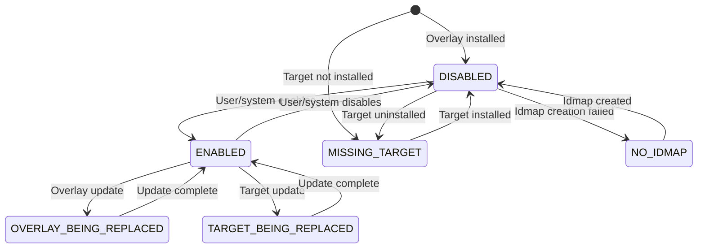
```mermaid
stateDiagram-v2
    [*] --> DISABLED: Overlay installed
    DISABLED --> ENABLED: User/system enables
    ENABLED --> DISABLED: User/system disables

    [*] --> MISSING_TARGET: Target not installed
    MISSING_TARGET --> DISABLED: Target installed
    DISABLED --> MISSING_TARGET: Target uninstalled

    DISABLED --> NO_IDMAP: Idmap creation failed
    NO_IDMAP --> DISABLED: Idmap created

    ENABLED --> OVERLAY_BEING_REPLACED: Overlay update
    OVERLAY_BEING_REPLACED --> ENABLED: Update complete

    ENABLED --> TARGET_BEING_REPLACED: Target update
    TARGET_BEING_REPLACED --> ENABLED: Update complete
```

### 26.8.5 OverlayManagerServiceImpl

The `OverlayManagerServiceImpl`
(`frameworks/base/services/core/java/com/android/server/om/OverlayManagerServiceImpl.java`)
implements the core business logic:

```java
/**
 * Internal implementation of OverlayManagerService.
 *
 * Methods in this class should only be called by the OverlayManagerService.
 * This class is not thread-safe; the caller is expected to ensure the
 * necessary thread synchronization.
 */
final class OverlayManagerServiceImpl {
    private final PackageManagerHelper mPackageManager;
    private final IdmapManager mIdmapManager;
    private final OverlayManagerSettings mSettings;
    private final OverlayConfig mOverlayConfig;
    private final String[] mDefaultOverlays;
```

It reconciles the overlay manager's state (from `overlays.xml`) with the package
manager's state (from AndroidManifest.xml parsing):

```java
/**
 * Helper method to merge the overlay manager's (as read from overlays.xml)
 * and package manager's (as parsed from AndroidManifest.xml files) views
 * on overlays.
 *
 * Both managers are usually in agreement, but especially after an OTA
 * things may differ. The package manager is always providing the truth;
 * the overlay manager has to adapt.
 */
```

### 26.8.6 Overlay Persistence

Overlay state is persisted in `/data/system/overlays.xml`. The
`OverlayManagerSettings` class handles reading and writing this file.

### 26.8.7 Overlay Configuration

System overlays are configured via `OverlayConfig`, which reads configuration from:

```
/product/overlay/config/config.xml
/vendor/overlay/config/config.xml
/system/overlay/config/config.xml
```

Configuration parameters include:

- **Default enabled state** -- Whether the overlay is on or off by default
- **Mutability** -- Whether the overlay can be enabled/disabled at runtime
- **Priority** -- Ordering when multiple overlays target the same resource

The overlay config is initialized during system scan:

```java
final OverlayConfig overlayConfig = OverlayConfig.initializeSystemInstance(
        consumer -> mPm.forEachPackageState(mPm.snapshotComputer(),
                packageState -> {
                    var pkg = packageState.getPkg();
                    if (pkg != null) {
                        consumer.accept(pkg, packageState.isSystem(),
                                apkInApexPreInstalledPaths.get(
                                        pkg.getPackageName()));
                    }
                }));
```

### 26.8.8 Fabricated Overlays

Android 12+ supports **fabricated overlays** -- overlays created at runtime without
a physical APK. These are used for dynamic theming (Material You):

```java
TYPE_REGISTER_FABRICATED
TYPE_UNREGISTER_FABRICATED
```

Fabricated overlays are created programmatically with `FabricatedOverlayInternal`
and registered through the OMS AIDL interface.

### 26.8.9 Overlay Categories and Policies

Overlays are organized by categories that define their purpose:

| Category | Purpose |
|----------|---------|
| `android.theme.customization.accent_color` | Material You accent color |
| `android.theme.customization.system_palette` | System color palette |
| `android.theme.customization.theme_style` | Overall theme style |
| `android.theme.customization.font` | System font |
| `android.theme.customization.icon_shape` | App icon mask shape |
| `android.theme.customization.signal_icon` | Signal strength icon |
| `android.theme.customization.wifi_icon` | WiFi icon |
| `android.theme.customization.navbar` | Navigation bar style |

Categories help the system organize overlays and prevent conflicts. Within a
category, overlays are ordered by priority, and only one overlay can be active
per category per target package.

### 26.8.10 Overlay Security Model

Overlay security is enforced at multiple levels:

1. **Signature check** -- Mutable overlays targeting system packages may require
   signature matching with the target or a privileged signature.

2. **Overlayable declarations** -- Target packages can declare which of their
   resources are overlayable using `<overlayable>` tags:

```xml
<!-- In the target package's res/values/overlayable.xml -->
<resources>
    <overlayable name="ThemeColors" actor="overlay://theme">
        <policy type="public">
            <item type="color" name="accent_device_default_light" />
            <item type="color" name="accent_device_default_dark" />
        </policy>
    </overlayable>
</resources>
```

3. **Policy types** -- Control who can overlay what:
   - `public` -- Any overlay can modify
   - `system` -- Only system overlays
   - `vendor` -- Only vendor overlays
   - `product` -- Only product overlays
   - `signature` -- Only overlays signed with the same key
   - `actor` -- Only the designated actor overlay

4. **The OverlayActorEnforcer** validates that the caller has the authority to modify
   overlays for a given overlayable.

### 26.8.11 Overlay and PMS Interaction

OMS relies heavily on PMS for package information. When PMS broadcasts package
events, OMS updates its state:

```mermaid
sequenceDiagram
    participant PMS as PackageManagerService
    participant OMS as OverlayManagerService
    participant IMPL as OverlayManagerServiceImpl
    participant IDMAP as IdmapManager
    participant APP as Running Application

    PMS->>OMS: ACTION_PACKAGE_ADDED (overlay)
    OMS->>IMPL: onPackageAdded()
    IMPL->>IMPL: updateState()
    IMPL->>IDMAP: createIdmap(overlay, target)
    IDMAP->>IDMAP: idmap2d: create idmap file
    IMPL->>IMPL: State = DISABLED (default)

    Note over OMS: User or system enables overlay

    OMS->>IMPL: setEnabled(overlay, true)
    IMPL->>IMPL: State = ENABLED
    IMPL->>IMPL: updateOverlayPaths()
    IMPL->>PMS: setOverlayPaths(target, paths)
    PMS->>APP: Configuration change
    APP->>APP: Reload resources with overlay
```

### 26.8.12 Overlay Paths

When overlays are enabled, PMS updates the package's overlay paths, which the
resource system uses during resource lookup:

```java
// Recorded overlay paths configuration for the Android app info.
private String[] mPlatformPackageOverlayPaths = null;
private String[] mPlatformPackageOverlayResourceDirs = null;
```

The `OverlayPaths` class encapsulates the path information:

```java
import android.content.pm.overlay.OverlayPaths;
```

### 26.8.13 Idmap Internals: idmap2d Daemon

The actual idmap file creation is delegated to `idmap2d`, a native daemon
managed by the `IdmapDaemon` class. The daemon uses a lazy lifecycle -- it
starts on demand and shuts down after 10 seconds of inactivity:

```java
// frameworks/base/services/core/java/com/android/server/om/IdmapDaemon.java
/**
 * To prevent idmap2d from continuously running, the idmap daemon will
 * terminate after 10 seconds without a transaction.
 **/
class IdmapDaemon {
    private static final int SERVICE_TIMEOUT_MS = 10000;
    private static final String IDMAP_DAEMON = "idmap2d";
```

The daemon communicates via the `IIdmap2` AIDL interface. Each connection is
tracked with reference counting -- the daemon only shuts down when all
connections are closed:

```mermaid
sequenceDiagram
    participant IM as IdmapManager
    participant ID as IdmapDaemon
    participant D as idmap2d (native)

    IM->>ID: createIdmap(target, overlay)
    ID->>ID: getIdmapService() [starts daemon if needed]
    ID->>D: IIdmap2.verifyIdmap()

    alt Already verified
        D-->>ID: true (verified)
        ID-->>IM: IDMAP_IS_VERIFIED
    else Needs creation
        D-->>ID: false
        ID->>D: IIdmap2.createIdmap()
        D-->>ID: idmap path
        ID-->>IM: IDMAP_IS_MODIFIED | IDMAP_IS_VERIFIED
    end

    Note over ID: Timer starts (10s)
    Note over ID: No more requests
    ID->>D: SystemService.stop("idmap2d")
```

For batch operations during boot (when many overlays need idmap creation
simultaneously), `IdmapManager` batches the requests through `createIdmaps()`,
splitting them by IPC size limits to avoid exceeding the Binder transaction
buffer:

```java
// frameworks/base/services/core/java/com/android/server/om/IdmapManager.java
private static final int MAX_IPC_SIZE = IBinder.getSuggestedMaxIpcSizeBytes();

// Split the input list of IdmapParams so we don't exceed the max IPC size.
private static List<List<IdmapParams>> splitIdmapParams(
        final List<IdmapParams> idmapParams) {
```

During batch idmap creation, the Watchdog is paused for the current thread
because the operation may be slow:

```java
Watchdog.getInstance().pauseWatchingCurrentThread("idmap creation may be slow");
```

### 26.8.14 Overlay Policy Enforcement

The `IdmapManager.calculateFulfilledPolicies()` method computes a bitmask
representing which overlay policies are satisfied by a given overlay package.
These policies correspond directly to the `<policy>` elements in
`overlayable.xml`:

```java
// frameworks/base/services/core/java/com/android/server/om/IdmapManager.java
int calculateFulfilledPolicies(@NonNull final AndroidPackage targetPackage,
        @NonNull PackageState overlayPackageState,
        @NonNull final AndroidPackage overlayPackage,
        @UserIdInt int userId) {
    int fulfilledPolicies = OverlayablePolicy.PUBLIC;

    // Overlay matches target signature
    if (mPackageManager.signaturesMatching(targetPackage.getPackageName(),
            overlayPackage.getPackageName(), userId)) {
        fulfilledPolicies |= OverlayablePolicy.SIGNATURE;
    }

    // Overlay matches actor signature
    if (matchesActorSignature(targetPackage, overlayPackage, userId)) {
        fulfilledPolicies |= OverlayablePolicy.ACTOR_SIGNATURE;
    }
```

The full policy bitmask includes partition-based policies:

| Policy | Condition |
|--------|-----------|
| `PUBLIC` | Always granted |
| `SIGNATURE` | Overlay signed with same key as target |
| `ACTOR_SIGNATURE` | Overlay signed with same key as the designated actor |
| `CONFIG_SIGNATURE` | Overlay matches the `overlay-config-signature` package |
| `SYSTEM_PARTITION` | Overlay is on `/system` or `/system_ext` |
| `VENDOR_PARTITION` | Overlay is on `/vendor` |
| `PRODUCT_PARTITION` | Overlay is on `/product` |
| `ODM_PARTITION` | Overlay is on `/odm` |
| `OEM_PARTITION` | Overlay is on `/oem` |

Pre-Android Q overlays receive special backward-compatibility treatment:

```java
// frameworks/base/services/core/java/com/android/server/om/IdmapManager.java
boolean enforceOverlayable(@NonNull PackageState overlayPackageState,
        @NonNull final AndroidPackage overlayPackage) {
    if (overlayPackage.getTargetSdkVersion() >= VERSION_CODES.Q) {
        return true; // Always enforce for Q+
    }
    // Pre-Q vendor overlays: enforce only if vendor partition is Q+
    if (overlayPackageState.isVendor()) {
        return VENDOR_IS_Q_OR_LATER;
    }
    // Pre-Q system/platform-signed overlays: don't enforce
    return !(overlayPackageState.isSystem()
            || overlayPackage.isSignedWithPlatformKey());
}
```

### 26.8.15 The OverlayActorEnforcer

The `OverlayActorEnforcer` validates that a calling UID has authority to
modify overlays for a given overlayable. Actors are identified by URIs
in the format `overlay://<namespace>/<name>`:

```java
// frameworks/base/services/core/java/com/android/server/om/OverlayActorEnforcer.java
/**
 * Performs verification that a calling UID can act on a target package's
 * overlayable.
 */
public class OverlayActorEnforcer {
    static Pair<String, ActorState> getPackageNameForActor(
            @NonNull String actorUriString,
            @NonNull Map<String, Map<String, String>> namedActors) {
        Uri actorUri = Uri.parse(actorUriString);
        String actorScheme = actorUri.getScheme();
        // Must be "overlay" scheme with exactly one path segment
        if (!"overlay".equals(actorScheme)
                || CollectionUtils.size(actorPathSegments) != 1) {
            return Pair.create(null, ActorState.INVALID_OVERLAYABLE_ACTOR_NAME);
        }
```

Named actors are defined in `SystemConfig` and map actor URIs to package names.
The enforcer checks if the calling UID matches the package that is the
designated actor for the target overlayable.

### 26.8.16 Fabricated Overlay Internals

Fabricated overlays -- created at runtime without physical APK files -- are
the mechanism behind Material You dynamic theming. The registration flow:

```mermaid
sequenceDiagram
    participant Client as SystemUI / ThemeManager
    participant OMS as OverlayManagerService
    participant IMPL as OverlayManagerServiceImpl
    participant IM as IdmapManager
    participant D as idmap2d

    Client->>OMS: commit(OverlayManagerTransaction)
    Note over OMS: Transaction contains<br/>TYPE_REGISTER_FABRICATED

    OMS->>IMPL: registerFabricatedOverlay(internal)
    IMPL->>IMPL: Validate overlay name<br/>(alphanumeric, _, .)
    IMPL->>IM: createFabricatedOverlay(internal)
    IM->>D: IIdmap2.createFabricatedOverlay()
    D-->>IM: FabricatedOverlayInfo
    IM-->>IMPL: info (path, target, etc.)

    IMPL->>IMPL: Init overlay in settings<br/>(isFabricated=true)
    IMPL->>IMPL: updateState()
    IMPL-->>OMS: updated targets
    OMS->>OMS: updateTargetPackagesLocked()
    OMS->>OMS: Broadcast ACTION_OVERLAY_CHANGED
```

`FabricatedOverlayInternal` contains the overlay definition -- resource type,
name, and value entries -- which idmap2d serializes to disk. Fabricated
overlays created by the shell package are wiped on every boot as a safety
measure:

```java
// frameworks/base/services/core/java/com/android/server/om/OverlayManagerService.java
// Wipe all shell overlays on boot, to recover from a potentially broken device
String shellPkgName = TextUtils.emptyIfNull(
        getContext().getString(android.R.string.config_systemShell));
mSettings.removeIf(overlayInfo -> overlayInfo.isFabricated
        && shellPkgName.equals(overlayInfo.packageName));
```

### 26.8.17 RRO Constraints

Android introduces RRO constraints (gated by the `Flags.rroConstraints()`
feature flag) that allow conditionally enabling overlays based on runtime
conditions. Constraints are passed through the `OverlayConstraint` class
and are evaluated by idmap2d during idmap creation:

```java
// frameworks/base/services/core/java/com/android/server/om/OverlayManagerServiceImpl.java
if (!Flags.rroConstraints() && hasConstraints) {
    throw new OperationFailedException("RRO constraints are not supported");
}
if (!enable && hasConstraints) {
    throw new OperationFailedException(
            "Constraints can only be set when enabling an overlay");
}
```

Constraints are only valid when enabling an overlay -- disabling always
removes all constraints.

### 26.8.18 Overlay Settings Persistence

`OverlayManagerSettings` stores overlay state as an ordered list of
`SettingsItem` objects. The order is significant -- items with a lower
index have lower priority:

```java
// frameworks/base/services/core/java/com/android/server/om/OverlayManagerSettings.java
/**
 * All overlay data for all users and target packages is stored in this list.
 * This keeps memory down, while increasing the cost of running queries or
 * mutating the data. This is ok, since changing of overlays is very rare
 * and has larger costs associated with it.
 *
 * The order of the items in the list is important, those with a lower
 * index having a lower priority.
 */
private final ArrayList<SettingsItem> mItems = new ArrayList<>();
```

The settings are serialized to `/data/system/overlays.xml` using Android's
`TypedXmlSerializer`. The `AtomicFile` wrapper ensures crash-safe writes.

### 26.8.19 Batched Idmap Transactions

When the `Flags.mergeIdmapBinderTransactions()` flag is enabled,
`OverlayManagerServiceImpl` collects all packages that need idmap operations
and processes them in a single batched call rather than individual IPC
transactions:

```java
// frameworks/base/services/core/java/com/android/server/om/OverlayManagerServiceImpl.java
if (Flags.mergeIdmapBinderTransactions()) {
    pkgs.add(pkg); // Collect packages
} else {
    // Individual processing (legacy path)
    updatePackageOverlays(pkg, newUserId, 0);
}

// After collection, batch process
if (Flags.mergeIdmapBinderTransactions()) {
    updateAllPackageOverlays(pkgs, newUserId, 0);
}
```

This optimization significantly reduces boot time on devices with many
overlays by minimizing the number of Binder transactions to idmap2d.

### 26.8.20 OMS Shell Commands

The `OverlayManagerShellCommand` class provides `cmd overlay` commands for
debugging and testing overlays from the command line:

```bash
# List all overlays
$ adb shell cmd overlay list

# Enable an overlay
$ adb shell cmd overlay enable --user current com.example.overlay

# Disable an overlay
$ adb shell cmd overlay disable --user current com.example.overlay

# Set an overlay as the exclusive enabled overlay in its category
$ adb shell cmd overlay enable-exclusive --category com.example.overlay

# Dump overlay state
$ adb shell dumpsys overlay
```

---

## 26.9 Try It -- Practical Exercises

This section provides hands-on exercises to explore PMS functionality using
common Android development tools.

### 26.9.1 Inspecting an APK

**Exercise 1: Examine APK structure**

Use `aapt2` to dump information from an installed system APK:

```bash
# List files in an APK
$ unzip -l /system/app/Calculator/Calculator.apk

# Dump the AndroidManifest.xml
$ aapt2 dump xmltree /system/app/Calculator/Calculator.apk --file AndroidManifest.xml

# Dump all badging information (package name, version, permissions)
$ aapt2 dump badging /system/app/Calculator/Calculator.apk

# Dump the resource table
$ aapt2 dump resources /system/app/Calculator/Calculator.apk | head -50
```

**Exercise 2: Inspect APK signatures**

```bash
# Check which signature schemes are present
$ apksigner verify --verbose --print-certs /data/app/~~*/com.example.app*/base.apk

# Check v1 (JAR) signature
$ apksigner verify -v1-scheme-only /path/to/app.apk

# Check v2 signature
$ apksigner verify -v2-scheme-only /path/to/app.apk

# Check v3 signature
$ apksigner verify -v3-scheme-only /path/to/app.apk
```

### 26.9.2 Querying Package Information

**Exercise 3: Use pm shell commands**

```bash
# List all installed packages
$ adb shell pm list packages

# List only system packages
$ adb shell pm list packages -s

# List third-party packages
$ adb shell pm list packages -3

# Get detailed package info
$ adb shell pm dump com.android.settings | head -100

# Get the path of an installed APK
$ adb shell pm path com.android.settings

# List all permissions
$ adb shell pm list permissions -g -d
```

**Exercise 4: Inspect package settings**

```bash
# View the packages.xml database (requires root)
$ adb shell cat /data/system/packages.xml | head -200

# View per-user package restrictions
$ adb shell cat /data/system/users/0/package-restrictions.xml

# View runtime permissions (requires root)
$ adb shell cat /data/misc_de/0/apexdata/com.android.permission/runtime-permissions.xml
```

### 26.9.3 Installing and Managing Packages

**Exercise 5: Install workflows**

```bash
# Standard install
$ adb install app.apk

# Install with replacement (update)
$ adb install -r app.apk

# Install as test-only
$ adb install -t test-app.apk

# Install on specific user
$ adb install --user 0 app.apk

# Install a split APK
$ adb install-multiple base.apk split_config.arm64_v8a.apk split_config.en.apk

# Install using streaming (incremental)
$ adb install --streaming app.apk

# Stage a session manually
$ adb shell pm install-create
# Returns: Success: created install session [1234]
$ adb shell pm install-write 1234 base.apk /path/to/base.apk
$ adb shell pm install-commit 1234
```

**Exercise 6: Uninstall workflows**

```bash
# Uninstall for current user (keeps data for other users)
$ adb shell pm uninstall com.example.app

# Uninstall keeping data
$ adb shell pm uninstall -k com.example.app

# Uninstall for all users
$ adb shell pm uninstall --user all com.example.app

# Clear app data without uninstalling
$ adb shell pm clear com.example.app
```

### 26.9.4 Working with Permissions

**Exercise 7: Permission operations**

```bash
# List permissions requested by an app
$ adb shell pm dump com.example.app | grep "permission"

# Grant a runtime permission
$ adb shell pm grant com.example.app android.permission.CAMERA

# Revoke a runtime permission
$ adb shell pm revoke com.example.app android.permission.CAMERA

# Check if a permission is granted
$ adb shell dumpsys package com.example.app | grep "CAMERA"

# List all dangerous permissions
$ adb shell pm list permissions -d -g

# Reset all runtime permissions for an app
$ adb shell pm reset-permissions com.example.app
```

### 26.9.5 Intent Resolution Inspection

**Exercise 8: Query intent resolution**

```bash
# Resolve an implicit intent
$ adb shell pm resolve-activity --brief "android.intent.action.VIEW" \
    -d "https://www.example.com"

# Query all activities matching an intent
$ adb shell pm query-activities --brief "android.intent.action.SEND" \
    -t "text/plain"

# List preferred activities (defaults)
$ adb shell dumpsys package preferred-activities

# Set a default app for a MIME type
$ adb shell pm set-home-activity com.example.launcher/.LauncherActivity

# Clear defaults for a package
$ adb shell pm clear-default-browser-status
```

### 26.9.6 Working with Overlays

**Exercise 9: Overlay management**

```bash
# List all registered overlays
$ adb shell cmd overlay list

# Enable an overlay
$ adb shell cmd overlay enable com.example.overlay

# Disable an overlay
$ adb shell cmd overlay disable com.example.overlay

# Set overlay priority
$ adb shell cmd overlay set-priority com.example.overlay \
    --highest com.android.systemui

# Show overlay info
$ adb shell cmd overlay dump
```

**Exercise 10: Create a simple overlay**

Create a minimal overlay APK that changes the system UI accent color:

```xml
<!-- AndroidManifest.xml -->
<manifest xmlns:android="http://schemas.android.com/apk/res/android"
    package="com.example.theme.overlay">
    <overlay
        android:targetPackage="android"
        android:category="android.theme.customization.accent_color"
        android:isStatic="false" />
</manifest>
```

```xml
<!-- res/values/colors.xml -->
<resources>
    <color name="accent_device_default_light">#FF6200EE</color>
    <color name="accent_device_default_dark">#FFBB86FC</color>
</resources>
```

Build and install:

```bash
# Build the overlay APK
$ aapt2 compile -o compiled/ res/values/colors.xml
$ aapt2 link -o overlay.apk --manifest AndroidManifest.xml \
    -I /path/to/android.jar compiled/values_colors.arsc.flat

# Sign the APK
$ apksigner sign --ks debug.keystore overlay.apk

# Install and enable
$ adb install overlay.apk
$ adb shell cmd overlay enable com.example.theme.overlay
```

### 26.9.7 Dumpsys Exploration

**Exercise 11: Comprehensive PMS dump**

```bash
# Full PMS dump (very large)
$ adb shell dumpsys package > pms-dump.txt

# Dump a specific package
$ adb shell dumpsys package com.android.settings

# Dump only features
$ adb shell dumpsys package features

# Dump shared libraries
$ adb shell dumpsys package libraries

# Dump package verifiers
$ adb shell dumpsys package verifiers

# Dump preferred activities
$ adb shell dumpsys package preferred

# Dump overlay information
$ adb shell dumpsys overlay
```

### 26.9.8 Split APK Exercises

**Exercise 13: Create and install split APKs**

```bash
# Step 1: Create a base APK and a feature split using bundletool
$ bundletool build-apks --bundle=my-app.aab --output=my-app.apks \
    --connected-device

# Step 2: Install all splits
$ bundletool install-apks --apks=my-app.apks

# Step 3: Or install manually with adb
$ adb install-multiple base.apk \
    split_config.arm64_v8a.apk \
    split_config.en.apk \
    split_config.xxhdpi.apk

# Step 4: Inspect the installed splits
$ adb shell pm path com.example.app
# Output shows all installed split paths:
#   package:/data/app/~~.../com.example.app-.../base.apk
#   package:/data/app/~~.../com.example.app-.../split_config.arm64_v8a.apk
#   package:/data/app/~~.../com.example.app-.../split_config.en.apk

# Step 5: List split names
$ adb shell dumpsys package com.example.app | grep -A 20 "splits="
```

**Exercise 14: Install a feature split dynamically**

```bash
# Create a session in inherit mode
$ adb shell pm install-create --inherit -p com.example.app
# Returns: Success: created install session [1234]

# Write the new feature split
$ adb push split_feature_camera.apk /data/local/tmp/
$ adb shell pm install-write 1234 split_feature_camera \
    /data/local/tmp/split_feature_camera.apk

# Commit the session
$ adb shell pm install-commit 1234

# Verify the new split is installed
$ adb shell pm path com.example.app
```

### 26.9.9 Package Database Exploration

**Exercise 15: Deep dive into packages.xml**

```bash
# Pull the packages database (requires root)
$ adb root
$ adb pull /data/system/packages.xml

# Examine a specific package entry
# The XML structure looks like:
# <package name="com.example.app"
#          codePath="/data/app/~~.../com.example.app-.../"
#          nativeLibraryPath="/data/app/.../lib/arm64"
#          publicFlags="805306372"
#          privateFlags="0"
#          ft="..."  (first install time)
#          it="..."  (install time)
#          ut="..."  (update time)
#          version="100"
#          userId="10123">
#     <sigs count="1" schemeVersion="3">
#         <cert index="0" key="..." />
#     </sigs>
#     <perms>
#         <item name="android.permission.INTERNET" granted="true" flags="0" />
#     </perms>
# </package>
```

**Exercise 16: Monitor package operations in real time**

```bash
# Watch for package events using logcat
$ adb logcat -s PackageManager:I PackageInstaller:I

# In another terminal, install an app and watch the log output:
# You'll see messages like:
#   PackageManager: Scanning package com.example.app
#   PackageManager: Package com.example.app codePath changed
#   PackageInstaller: Session 1234 sealed

# Watch for permission changes
$ adb logcat -s PermissionManagerService:D

# Watch for intent resolution
$ adb logcat -s PackageManager:V -e "resolve|intent"
```

### 26.9.10 Performance Analysis

**Exercise 17: Measure boot scanning time**

```bash
# After a reboot, check the boot log for scanning times
$ adb logcat -d | grep -E "Finished scanning|BOOT_PROGRESS"

# Look for entries like:
#   Finished scanning system apps. Time: 3456 ms, packageCount: 247
#   Finished scanning non-system apps. Time: 1234 ms, packageCount: 87

# Use dumpsys to get snapshot statistics
$ adb shell dumpsys package snapshot

# Check how long specific operations take
$ adb shell dumpsys package checkin
```

**Exercise 18: Profile intent resolution**

```bash
# Enable verbose intent matching logging
$ adb shell setprop log.tag.PackageManager VERBOSE

# Now resolve an intent and watch the detailed matching log
$ adb shell am start -a android.intent.action.VIEW \
    -d "https://www.example.com"

# Check logcat for resolution details
$ adb logcat -s PackageManager:V | grep -i "intent\|resolve\|match"

# Reset logging
$ adb shell setprop log.tag.PackageManager INFO
```

### 26.9.11 Advanced: Tracing PMS Behavior

**Exercise 12: System trace analysis**

```bash
# Capture a system trace during installation
$ adb shell atrace --async_start -c -b 16384 pm
$ adb install large-app.apk
$ adb shell atrace --async_stop -z -c -b 16384 pm > trace.ctrace

# View the trace in Perfetto UI
# Upload trace.ctrace to https://ui.perfetto.dev/
```

PMS traces use the `TRACE_TAG_PACKAGE_MANAGER` tag:

```java
import static android.os.Trace.TRACE_TAG_PACKAGE_MANAGER;
```

Key trace sections to look for:

- `scanApexPackages` -- APEX package scanning time
- `scanSystemDirs` -- System partition scanning time
- `resolveIntent` -- Intent resolution time
- `queryIntentActivities` -- Activity query time
- `installPackage` -- Full installation time

### 26.9.12 Advanced: Building and Testing PMS Changes

**Exercise 19: Build the PMS module**

```bash
# Navigate to the AOSP source tree
$ cd $AOSP_ROOT

# Build only the services.core module (contains PMS)
$ m services.core

# Or build the specific PMS-related test targets
$ m FrameworksServicesTests

# Run the PMS unit tests
$ atest FrameworksServicesTests:com.android.server.pm

# Run a specific test class
$ atest FrameworksServicesTests:com.android.server.pm.PackageManagerServiceTest

# Run CTS package manager tests
$ atest CtsPackageInstallTestCases
$ atest CtsAppSecurityHostTestCases
```

**Exercise 20: Debug PMS with breakpoints**

```bash
# Attach a debugger to system_server
$ adb forward tcp:8700 jdwp:$(adb shell pidof system_server)

# In Android Studio, create a "Remote JVM Debug" configuration
# pointing to localhost:8700

# Set breakpoints in:
# - PackageManagerService.snapshotComputer()
# - InstallPackageHelper.processInstallRequests()
# - ResolveIntentHelper.resolveIntentInternal()
# - PermissionManagerService.checkPermission()

# Trigger the breakpoint by installing an app or launching an activity
```

### 26.9.13 Advanced: Overlay Development Workflow

**Exercise 21: Full overlay development cycle**

```bash
# Step 1: Identify target resources
$ adb shell cmd overlay dump com.android.systemui
# Lists all overlayable resources in SystemUI

# Step 2: Create overlay project structure
$ mkdir -p my-overlay/res/values
$ mkdir -p my-overlay/res/drawable

# Step 3: Create the overlay manifest
# (See Exercise 10 for manifest content)

# Step 4: Override specific resources
# In my-overlay/res/values/strings.xml:
# <resources>
#     <string name="quick_settings_wifi_label">WiFi Override</string>
# </resources>

# Step 5: Build with aapt2
$ aapt2 compile -o compiled/ my-overlay/res/values/strings.xml
$ aapt2 link -o my-overlay.apk \
    --manifest my-overlay/AndroidManifest.xml \
    -I $ANDROID_HOME/platforms/android-34/android.jar \
    compiled/*.flat

# Step 6: Sign and install
$ apksigner sign --ks debug.keystore my-overlay.apk
$ adb install my-overlay.apk

# Step 7: Enable and verify
$ adb shell cmd overlay enable --user current com.example.my.overlay
$ adb shell cmd overlay list | grep com.example.my.overlay
# Should show [x] com.example.my.overlay (enabled)

# Step 8: Disable and remove
$ adb shell cmd overlay disable --user current com.example.my.overlay
$ adb uninstall com.example.my.overlay
```

### 26.9.14 Troubleshooting Common PMS Issues

**Exercise 22: Diagnose installation failures**

```bash
# Get detailed error information
$ adb install -r problematic.apk 2>&1
# Common errors and their meanings:

# INSTALL_FAILED_ALREADY_EXISTS
#   Another package with the same name exists
#   Fix: Use -r flag or uninstall first

# INSTALL_FAILED_UPDATE_INCOMPATIBLE
#   Signatures don't match the existing install
#   Fix: Uninstall existing, then install new

# INSTALL_FAILED_DEPRECATED_SDK_VERSION
#   targetSdkVersion is too low
#   Fix: Update targetSdkVersion to >= MIN_INSTALLABLE_TARGET_SDK

# INSTALL_FAILED_DUPLICATE_PERMISSION
#   A permission is already defined by another package
#   Fix: Use unique permission names

# INSTALL_PARSE_FAILED_NO_CERTIFICATES
#   APK is not signed
#   Fix: Sign with apksigner

# Check the system log for detailed failure reason
$ adb logcat -s PackageManager:E InstallPackageHelper:E
```

**Exercise 23: Debug permission issues**

```bash
# Check why a permission is denied
$ adb shell dumpsys package com.example.app | grep -A 5 "requested permissions"
$ adb shell dumpsys package com.example.app | grep -A 5 "install permissions"
$ adb shell dumpsys package com.example.app | grep -A 5 "runtime permissions"

# Check if the permission is a runtime permission that needs granting
$ adb shell pm list permissions -g | grep PERMISSION_NAME

# Check AppOps override state
$ adb shell appops get com.example.app

# Reset all permissions for debugging
$ adb shell pm reset-permissions -p com.example.app

# Check the permission controller UI
$ adb shell am start -a android.intent.action.MANAGE_APP_PERMISSIONS \
    -d "package:com.example.app"
```

---

## Summary

PackageManagerService is the backbone of Android's application ecosystem. The
following master architecture diagram shows how all the subsystems relate to each
other:

```mermaid
graph TB
    subgraph "External Clients"
        APPS["Applications<br/>(PackageManager API)"]
        ADB["adb / Shell"]
        STORE["App Stores<br/>(PackageInstaller API)"]
    end

    subgraph "PackageManagerService Core"
        PMS["PackageManagerService"]
        COMPUTER["Computer<br/>(Snapshot)"]
        SETTINGS["Settings<br/>(packages.xml)"]
    end

    subgraph "Helper Classes"
        INSTALL["InstallPackageHelper"]
        INIT["InitAppsHelper"]
        RESOLVE["ResolveIntentHelper"]
        DELETE["DeletePackageHelper"]
        DEX["DexOptHelper"]
        BROADCAST["BroadcastHelper"]
        SCAN["ScanPackageUtils"]
    end

    subgraph "Related Services"
        PERM["PermissionManagerService"]
        OMS["OverlayManagerService"]
        INSTALLER["PackageInstallerService"]
        ART["ART Service"]
        STAGING["StagingManager"]
    end

    subgraph "Storage"
        SYSTEM_PART["/system/app<br/>/system/priv-app"]
        DATA_PART["/data/app"]
        PKG_XML["/data/system/<br/>packages.xml"]
        PERM_XML["runtime-<br/>permissions.xml"]
        OVERLAY_XML["/data/system/<br/>overlays.xml"]
    end

    APPS --> PMS
    ADB --> PMS
    STORE --> INSTALLER

    PMS --> COMPUTER
    PMS --> SETTINGS
    PMS --> INSTALL
    PMS --> INIT
    PMS --> RESOLVE
    PMS --> DELETE
    PMS --> DEX
    PMS --> BROADCAST

    INSTALL --> SCAN
    INSTALLER --> PMS
    PMS --> PERM
    PMS --> OMS
    DEX --> ART
    INSTALLER --> STAGING

    SETTINGS --> PKG_XML
    PERM --> PERM_XML
    OMS --> OVERLAY_XML
    INIT --> SYSTEM_PART
    INSTALL --> DATA_PART
```

This chapter covered its critical subsystems:

- **APK Structure** (Section 18.1): The internal layout of Android packages, including
  the manifest, DEX files, resources, native libraries, and the evolution of APK
  signing from v1 JAR signing to v4 incremental signatures.

- **PMS Architecture** (Section 18.2): The Computer snapshot pattern that enables
  lock-free reads, the three-lock hierarchy, the helper class decomposition, and the
  core data structures including `PackageSetting` and `Settings`.

- **Package Scanning** (Section 18.3): The boot-time scanning process that discovers
  packages across system partitions, APEX modules, and user-installed apps, using
  parallel parsing and caching for performance.

- **Installation Pipeline** (Section 18.4): The five-stage installation process from
  staging through verification, installation, dex optimization, and final commit,
  including incremental installation support.

- **Permission Model** (Section 18.5): The layered permission system encompassing
  normal, dangerous, signature, privileged, and appop permissions, with runtime
  grant/revoke, one-time permissions, and auto-revoke.

- **Intent Resolution** (Section 18.6): The algorithm for matching implicit intents
  to components, including the role of priority, preferred activities, App Links,
  cross-profile resolution, and package visibility filtering.

- **Split APKs** (Section 18.7): The split APK architecture with base, configuration,
  and feature splits, including the `SplitDependencyLoader` tree traversal algorithm
  and dynamic delivery.

- **Overlay System** (Section 18.8): The Runtime Resource Overlay system managed by
  `OverlayManagerService`, including idmap files, overlay states, fabricated overlays,
  and overlay configuration.

### Design Philosophy and Evolution

PMS has evolved significantly across Android versions. Understanding this evolution
helps explain why the codebase looks the way it does:

**Android 1.0-4.x (Pre-Lollipop):** PMS was a single monolithic Java file, over
10,000 lines long. All scanning, installation, permission, and resolution logic
was in one class.

**Android 5.0 (Lollipop):** Introduction of ART replaced Dalvik, changing the
dexopt pipeline. PMS began the long process of decomposition.

**Android 6.0 (Marshmallow):** Runtime permissions fundamentally changed the
permission model. `PermissionManagerService` was extracted.

**Android 8.0 (Oreo):** Package parser was rewritten. Instant apps added new
resolution paths.

**Android 10 (Q):** Package visibility (scoped storage companion) began restricting
what apps could see.

**Android 11 (R):** Package visibility enforcement (`<queries>` element). Incremental
installation support.

**Android 12 (S):** The Computer/Snapshot pattern was introduced, eliminating most
lock contention. Fabricated overlays enabled Material You theming.

**Android 13 (T):** Further helper class decomposition. Permission model refinements.

**Android 14 (U):** Update ownership, package archival, safer intent utilities.

**Android 15 (V):** 16KB page size alignment. Continued decomposition and cleanup.

This evolution explains several aspects of the current codebase:

- The `@Watched` annotation and Snapshot pattern are relatively recent, so some
  older code paths may not fully use them
- Helper classes like `InstallPackageHelper` still have TODO comments about further
  decomposition
- The `Computer` interface is large because it encompasses all read-only operations
  that were once scattered across PMS

### Relationship to Other System Services

PMS interacts with nearly every major system service:

| Service | Interaction |
|---------|------------|
| ActivityManagerService | Process management for packages, kill on update |
| WindowManagerService | Display configuration for resource selection |
| UserManagerService | Multi-user package state management |
| StorageManagerService | Volume mounting, app data directories |
| RoleManager | Default app role management |
| DevicePolicyManager | Enterprise app restrictions |
| AppOpsManager | Fine-grained permission enforcement |
| BackupManagerService | App data backup/restore |
| RollbackManager | Update rollback support |
| ArtManagerLocal | DEX optimization (dexopt) |
| Installd | Native daemon for file operations |

### Common Debugging Techniques

When investigating PMS issues, these techniques are most useful:

1. **`dumpsys package <package-name>`** -- Complete state dump for a package
2. **`dumpsys package snapshot`** -- Snapshot rebuild statistics
3. **`logcat -s PackageManager:V`** -- Verbose PMS logging
4. **`atrace -c pm`** -- System trace for PMS operations
5. **`packages.xml`** -- Direct inspection of persisted state
6. **`pm dump <package>`** -- Shell-level package inspection

### Key Source Files Reference

| File | Path | Purpose |
|------|------|---------|
| `PackageManagerService.java` | `frameworks/base/services/core/java/com/android/server/pm/` | Main PMS class with locks, state, handler |
| `Computer.java` | Same directory | Read-only query interface |
| `ComputerEngine.java` | Same directory | Snapshot-based implementation |
| `ComputerLocked.java` | Same directory | Lock-wrapped live implementation |
| `Settings.java` | Same directory | Package settings persistence |
| `PackageSetting.java` | Same directory | Per-package state record |
| `InstallPackageHelper.java` | Same directory | Installation logic |
| `InitAppsHelper.java` | Same directory | Boot-time scanning |
| `ScanPackageUtils.java` | Same directory | Package scan logic |
| `ResolveIntentHelper.java` | Same directory | Intent resolution |
| `DexOptHelper.java` | Same directory | DEX optimization |
| `VerifyingSession.java` | Same directory | Package verification |
| `PackageInstallerService.java` | Same directory | Installation session management |
| `StagingManager.java` | Same directory | Staged installs |
| `PermissionManagerService.java` | `frameworks/base/services/core/java/com/android/server/pm/permission/` | Permission management |
| `Permission.java` | Same directory | Permission definition |
| `ComponentResolver.java` | `frameworks/base/services/core/java/com/android/server/pm/resolution/` | Intent filter matching |
| `OverlayManagerService.java` | `frameworks/base/services/core/java/com/android/server/om/` | Overlay management |
| `OverlayManagerServiceImpl.java` | Same directory | Overlay business logic |
| `IdmapManager.java` | Same directory | Idmap file management |
| `SplitDependencyLoader.java` | `frameworks/base/core/java/android/content/pm/split/` | Split dependency tree |
| `AppsFilterImpl.java` | `frameworks/base/services/core/java/com/android/server/pm/` | Package visibility filtering |
| `PackageInstallerSession.java` | Same directory | Individual install session |
| `BroadcastHelper.java` | Same directory | Package broadcast management |
| `DeletePackageHelper.java` | Same directory | Package uninstall logic |
| `ReconcilePackageUtils.java` | Same directory | Package reconciliation |
| `SELinuxMMAC.java` | Same directory | SELinux MAC policy for packages |
| `PackageAbiHelper.java` | Same directory | ABI selection logic |
| `OverlayManagerSettings.java` | `frameworks/base/services/core/java/com/android/server/om/` | Overlay state persistence |
| `OverlayConfig.java` | `frameworks/base/core/java/com/android/internal/content/om/` | System overlay configuration |
| `LoadedApk.java` | `frameworks/base/core/java/android/app/` | Runtime split loading |
| `ParallelPackageParser.java` | `frameworks/base/services/core/java/com/android/server/pm/` | Parallel APK parsing |
| `PackageCacher.java` | `frameworks/base/services/core/java/com/android/server/pm/parsing/` | Parse result caching |
| `ApkSignatureVerifier.java` | `frameworks/base/core/java/android/util/apk/` | Signature verification |

### Further Reading

For deeper exploration of PMS internals, the following areas deserve additional study:

1. **Domain Verification** -- The `DomainVerificationService` at
   `frameworks/base/services/core/java/com/android/server/pm/verify/domain/`
   implements the App Links verification protocol.

2. **Shared Libraries** -- `SharedLibrariesImpl` manages the complex dependency
   graph of shared Java libraries that apps can declare as dependencies.

3. **KeySet Management** -- `KeySetManagerService` tracks which signing keys are
   associated with which packages, supporting key rotation and upgrade policies.

4. **App Hibernation** -- `AppHibernationManagerInternal` interacts with PMS to
   manage apps that have been idle for extended periods.

5. **SDK Sandbox** -- `SdkSandboxManagerLocal` manages the isolated sandbox
   environment for advertising SDKs.

6. **APEX Management** -- `ApexManager` handles the lifecycle of updatable
   platform modules delivered as APEX packages.

---

## 26.10 App Hibernation

App hibernation is Android's mechanism for handling unused applications.
When users install apps and then stop using them, those apps continue
consuming storage (cached data, OAT/dex artifacts) and may retain runtime
permissions that pose privacy risks. The `AppHibernationService` coordinates
with `PermissionController`, `PackageManagerService`, and
`ActivityManagerService` to put idle apps into a low-resource state and
reclaim the resources they hold.

> **Source root:**
> `frameworks/base/services/core/java/com/android/server/apphibernation/`

### 26.10.1 Architecture Overview

```mermaid
graph TD
    PC["PermissionController<br/>(policy engine)"] -->|"setHibernatingForUser()"| AHS["AppHibernationService"]
    AHS -->|"forceStopPackage()"| AMS["ActivityManagerService"]
    AHS -->|"deleteApplicationCacheFiles()"| PMS["PackageManagerService"]
    AHS -->|"StorageStats queries"| SSM["StorageStatsManager"]
    AHS -->|"persist state"| Disk["HibernationStateDiskStore"]
    AHS -->|"StatsLog"| Stats["FrameworkStatsLog"]
    AHS -->|"internal API"| AHMI["AppHibernationManagerInternal"]
    AHMI --> PMS

    style AHS fill:#f9f,stroke:#333
    style PC fill:#bbf,stroke:#333
```

The key architectural decision is that `AppHibernationService` manages the
*state* of hibernation, but the *policy* (which apps should hibernate) lives
in `PermissionController`, which runs in a separate process. This separation
allows Google to update hibernation policy through Play Services without
modifying the framework.

### 26.10.2 Two-Level Hibernation State

Hibernation operates at two levels, tracked by separate data classes:

| Level | Class | Scope | Optimizations |
|-------|-------|-------|---------------|
| **User-level** | `UserLevelState` | Per (package, user) | Force-stop, cache deletion |
| **Global-level** | `GlobalLevelState` | Per package (all users) | OAT artifact deletion, APK-level optimization |

```java
// AppHibernationService.java, line 119-125
@GuardedBy("mLock")
private final SparseArray<Map<String, UserLevelState>> mUserStates = new SparseArray<>();
@GuardedBy("mLock")
private final Map<String, GlobalLevelState> mGlobalHibernationStates = new ArrayMap<>();
```

A package is globally hibernated only when it is hibernated for *all* users.
Global hibernation enables more aggressive optimizations like deleting
ahead-of-time compilation artifacts.

Each state object tracks:

```java
// UserLevelState.java / GlobalLevelState.java
public String packageName;
public boolean hibernated;
public long savedByte;         // bytes reclaimed
public long lastUnhibernatedMs; // timestamp of last wake-up
```

### 26.10.3 Hibernation Process

When `PermissionController` determines an app should hibernate, it calls
`setHibernatingForUser()`. The service then:

1. **Force-stops the package** via `ActivityManagerService.forceStopPackage()`,
   killing all processes and canceling alarms/jobs
2. **Deletes cached files** via `PackageManagerService.deleteApplicationCacheFilesAsUser()`
3. **Records bytes saved** from `StorageStatsManager.queryStatsForPackage()`
4. **Persists state** to disk via `HibernationStateDiskStore`
5. **Logs metrics** via `FrameworkStatsLog.USER_LEVEL_HIBERNATION_STATE_CHANGED`

```java
// AppHibernationService.java, line 455-484
private void hibernatePackageForUser(String packageName, int userId, UserLevelState state) {
    Trace.traceBegin(Trace.TRACE_TAG_SYSTEM_SERVER, "hibernatePackage");
    try {
        ApplicationInfo info = mIPackageManager.getApplicationInfo(
                packageName, PACKAGE_MATCH_FLAGS, userId);
        StorageStats stats = mStorageStatsManager.queryStatsForPackage(
                info.storageUuid, packageName, new UserHandle(userId));
        mIActivityManager.forceStopPackage(packageName, userId);
        mIPackageManager.deleteApplicationCacheFilesAsUser(packageName, userId,
                null /* observer */);
        synchronized (mLock) {
            state.savedByte = stats.getCacheBytes();
        }
    } catch (RemoteException e) { /* ... */ }
}
```

### 26.10.4 Unhibernation and Wake-Up

When a hibernated app is used again (detected via `UsageEventsListener`),
the service restores it:

```java
// AppHibernationService.java, line 490-546
private void unhibernatePackageForUser(String packageName, int userId) {
    // Deliver LOCKED_BOOT_COMPLETED and BOOT_COMPLETE broadcasts
    // so the app can re-register alarms, jobs, etc.
    Intent lockedBcIntent = new Intent(Intent.ACTION_LOCKED_BOOT_COMPLETED)
            .setPackage(packageName);
    mIActivityManager.broadcastIntentWithFeature(/* ... */);

    Intent bcIntent = new Intent(Intent.ACTION_BOOT_COMPLETED)
            .setPackage(packageName);
    mIActivityManager.broadcastIntentWithFeature(/* ... */);
}
```

The boot-completed broadcasts are critical: they allow the app to re-register
its `AlarmManager` alarms, `JobScheduler` jobs, `WorkManager` tasks, and
Firebase Cloud Messaging tokens that were lost when the app was force-stopped.

```mermaid
sequenceDiagram
    participant User
    participant USS as UsageStatsService
    participant AHS as AppHibernationService
    participant AMS as ActivityManagerService
    participant PMS as PackageManagerService

    Note over User: User opens hibernated app
    USS->>AHS: UsageEventListener.onUsageEvent()
    AHS->>AHS: setHibernatingForUser(pkg, false)
    AHS->>AMS: broadcastIntent(LOCKED_BOOT_COMPLETED)
    AHS->>AMS: broadcastIntent(BOOT_COMPLETED)
    Note over AHS: App re-registers alarms/jobs
    AHS->>AHS: Persist updated state to disk
```

### 26.10.5 Integration with Permission Auto-Revoke

The connection between hibernation and permission revocation is subtle but
important. `PermissionController` handles both:

1. **Permission auto-revoke**: Revokes runtime permissions for unused apps
   (introduced Android 11)
2. **App hibernation**: Puts unused apps in hibernation state, reclaiming
   storage (introduced Android 12)

These are separate features that share the same policy signal: "this app
has not been used recently." The `PermissionController` uses
`UsageStatsManager` to determine app usage and then invokes both permission
revocation and hibernation APIs.

### 26.10.6 Device Config and Feature Gating

The service is gated by a `DeviceConfig` flag:

```java
// AppHibernationConstants.java
static final String KEY_APP_HIBERNATION_ENABLED = "app_hibernation_enabled";

// AppHibernationService.java, line 188
sIsServiceEnabled = isDeviceConfigAppHibernationEnabled();
```

Every public API method checks `sIsServiceEnabled` before proceeding,
returning empty or false values when disabled. This allows the feature to be
remotely toggled without a system update.

### 26.10.7 Persistence and Boot Sequence

Hibernation state is persisted to disk via `HibernationStateDiskStore`,
which uses protocol buffer serialization (`GlobalLevelHibernationProto`,
`UserLevelHibernationProto`). State is loaded during
`PHASE_BOOT_COMPLETED` on a background executor:

```java
// AppHibernationService.java, line 177-186
@Override
public void onBootPhase(int phase) {
    if (phase == PHASE_BOOT_COMPLETED) {
        mBackgroundExecutor.execute(() -> {
            List<GlobalLevelState> states =
                    mGlobalLevelHibernationDiskStore.readHibernationStates();
            synchronized (mLock) {
                initializeGlobalHibernationStates(states);
            }
        });
    }
}
```

User-level states are loaded lazily when a user is unlocked, using
per-user `HibernationStateDiskStore` instances stored in the `mUserDiskStores`
`SparseArray`.

### 26.10.8 Package Lifecycle Events

The service registers a broadcast receiver for `ACTION_PACKAGE_ADDED` and
`ACTION_PACKAGE_REMOVED` to keep its state maps in sync:

- **Package added**: Creates a new `UserLevelState` and `GlobalLevelState`
  entry with `hibernated = false`
- **Package removed**: Cleans up state from both user and global maps
- **Package replaced**: The `EXTRA_REPLACING` flag distinguishes updates
  from fresh installs; updates preserve the existing hibernation state

### 26.10.9 Debugging App Hibernation

```bash
# Check if a package is hibernated
adb shell cmd app_hibernation is-hibernating <package> --user 0

# Manually hibernate a package
adb shell cmd app_hibernation set-hibernating <package> --user 0 true

# Get hibernation stats (saved bytes)
adb shell cmd app_hibernation get-hibernation-stats --user 0

# Check DeviceConfig flag
adb shell device_config get app_hibernation app_hibernation_enabled
```
