# 第 27 章：Content Providers

Content Provider 是 Android 四大组件之一，但它和 Activity、Service、BroadcastReceiver 不同，并不面向界面或生命周期交互，而是专门负责在进程边界之间暴露结构化数据。无论是电话应用读取联系人、相册枚举图片，还是系统读取亮度配置，背后通常都要经过 Provider 这一层。本章从 `ContentResolver` 到 Binder 传输、从 URI 路由到系统内置 Provider 的具体实现，结合 AOSP 源码分析 Android 数据共享框架的完整工作方式。

---

## 27.1 ContentProvider 架构

### 27.1.1 全景图

Content Provider 本质上是宿主进程内的一个对象，对外暴露类关系型的数据接口。调用方不会直接 new 一个 Provider，而是统一通过 `ContentResolver`，由它根据 authority 查找目标 Provider、获取 Binder 句柄并完成参数编组。

相关源码：

```text
frameworks/base/core/java/android/content/ContentProvider.java
frameworks/base/core/java/android/content/ContentResolver.java
frameworks/base/core/java/android/content/ContentProviderNative.java
frameworks/base/core/java/android/content/IContentProvider.java
```

下面的图展示了 Content Provider 的典型调用链。

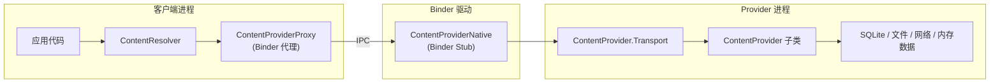

关键类分工如下：

| 类 | 作用 |
|----|------|
| `ContentResolver` | 客户端统一入口，负责 authority 解析和 Provider 获取 |
| `ContentProviderProxy` | Binder 代理，打包跨进程请求 |
| `ContentProviderNative` | Binder stub，负责反序列化事务 |
| `ContentProvider.Transport` | 在真正调用 Provider 之前做 URI 校验与权限检查 |
| `ContentProvider` | Provider 作者继承的抽象基类 |
| `IContentProvider` | 手写 IPC 接口定义，不是 AIDL 自动生成 |

### 27.1.2 `IContentProvider` 接口

`IContentProvider` 是一个手写的 `IInterface`，而不是常见的 `.aidl` 文件生成物。现代版本里，读写接口都会显式携带 `AttributionSource`，这样系统可以知道请求不仅来自哪个 UID，还可能知道调用链中的上游来源。

```java
// frameworks/base/core/java/android/content/IContentProvider.java
public interface IContentProvider extends IInterface {
    Cursor query(@NonNull AttributionSource attributionSource, Uri url,
            @Nullable String[] projection,
            @Nullable Bundle queryArgs,
            @Nullable ICancellationSignal cancellationSignal)
            throws RemoteException;

    Uri insert(@NonNull AttributionSource attributionSource,
            Uri url, ContentValues initialValues, Bundle extras)
            throws RemoteException;

    int delete(@NonNull AttributionSource attributionSource,
            Uri url, Bundle extras)
            throws RemoteException;

    int update(@NonNull AttributionSource attributionSource,
            Uri url, ContentValues values, Bundle extras)
            throws RemoteException;
}
```

### 27.1.3 URI 方案

Provider 统一通过 `content://` URI 寻址：

```text
content://authority/path/to/resource
  ^         ^          ^
  |         |          +-- 由 Provider 自己解释的路径段
  |         +------------- 全局唯一 authority
  +----------------------- 固定 scheme：content
```

常见示例：

```text
content://media/external/images/media/42
content://com.android.contacts/contacts/lookup/0n3A.../5
content://settings/system/screen_brightness
content://com.android.externalstorage.documents/document/primary%3ADownload%2Ffile.pdf
```

`ContentResolver` 中固定定义了：

```java
public static final String SCHEME_CONTENT = "content";
```

### 27.1.4 `UriMatcher`

大多数 Provider 会用 `UriMatcher` 把 URI 模式映射成整型 code，再在 `query()` / `insert()` / `update()` / `delete()` 里统一 `switch` 分发。MediaProvider 的 `LocalUriMatcher` 是最典型的例子，里面为图片、音频、视频、下载、picker 等 URI 注册了大量 code。

通配规则：

- `*`：匹配单个路径段
- `#`：匹配数值型路径段

### 27.1.5 CRUD 操作

Provider 的四个基本接口与 SQL 语义一一对应：

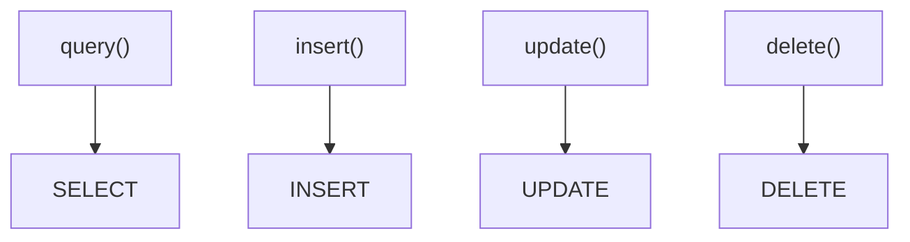

Android O 之后，系统更鼓励使用 `Bundle` 风格的结构化查询参数，而不是裸拼 SQL 字符串。`ContentResolver` 中提供了诸如 `QUERY_ARG_SQL_SELECTION`、`QUERY_ARG_SQL_LIMIT`、`QUERY_ARG_SORT_COLUMNS` 等常量，便于 Provider 做统一解析。

### 27.1.6 `call()` 方法

除了标准 CRUD，`ContentProvider.call()` 还允许 Provider 暴露任意 RPC 风格接口。调用方只需要给出 `method`、`arg` 和 `extras`，Provider 返回一个 `Bundle` 即可。

```java
public @Nullable Bundle call(@NonNull String authority, @NonNull String method,
        @Nullable String arg, @Nullable Bundle extras) {
    return call(method, arg, extras);
}
```

`SettingsProvider` 大量使用这条路径，因为它比 `query()` + `Cursor` 的方式更轻量。

### 27.1.7 Binder 传输细节

真正的跨进程入口并不是 Provider 子类本身，而是 `ContentProvider.Transport`。它继承 `ContentProviderNative`，在每次请求进来时先做 URI 清理和权限检查，再把请求转交给真正的 Provider。

```java
class Transport extends ContentProviderNative {
    @Override
    public Cursor query(@NonNull AttributionSource attributionSource, Uri uri,
            @Nullable String[] projection, @Nullable Bundle queryArgs,
            @Nullable ICancellationSignal cancellationSignal) {
        uri = validateIncomingUri(uri);
        uri = maybeGetUriWithoutUserId(uri);
        if (enforceReadPermission(attributionSource, uri)
                != PermissionChecker.PERMISSION_GRANTED) {
            if (projection != null) {
                return new MatrixCursor(projection, 0);
            }
        }
        // delegate to provider
    }
}
```

调用链如下：

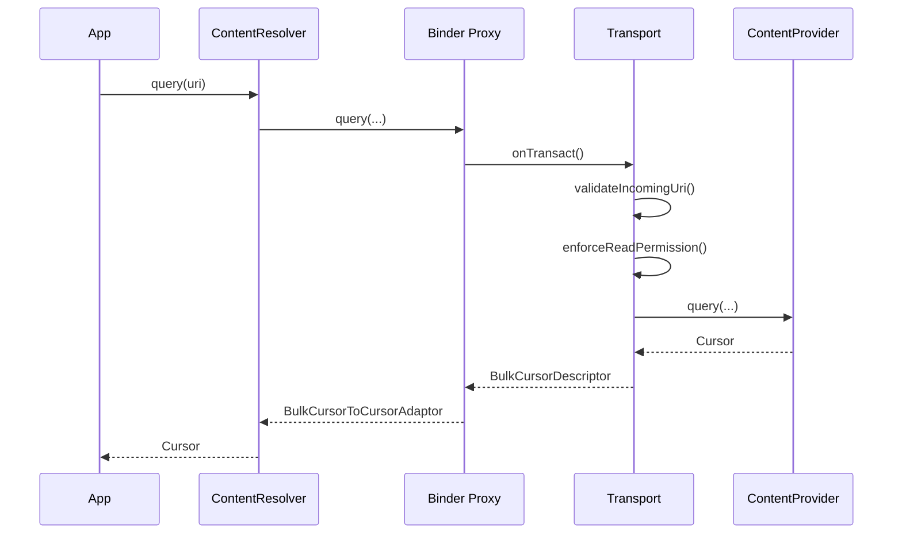

### 27.1.8 Stable 与 Unstable Provider 引用

`ContentResolver` 区分两种 Provider 引用：

- `acquireUnstableProvider()`：Provider 死掉后，客户端不会跟着被杀，只会在下次使用时报 `DeadObjectException`
- `acquireProvider()`：更强绑定，早期语义里 Provider 崩溃可能连带影响客户端

框架通常会先拿 unstable 引用；如果远端死掉，再回退为 stable 引用并重试。

### 27.1.9 `ContentProviderClient`

如果一个调用方要反复访问同一个 authority，使用 `ContentProviderClient` 可以避免每次都重新做 authority 解析和 Provider 查找。

```java
ContentProviderClient client = resolver.acquireContentProviderClient("media");
try {
    Cursor c = client.query(uri, null, null, null);
} finally {
    client.close();
}
```

### 27.1.10 批量操作

`ContentProviderOperation` 与 `applyBatch()` 允许把多个 CRUD 操作打包成一次 IPC。Provider 可以把整批操作放进同一个 SQLite 事务里执行，这对联系人同步等大批量场景尤其关键。

### 27.1.11 文件描述符传递

Provider 不仅能返回结构化数据，也能通过 `openFile()` / `openAssetFile()` 把底层文件描述符跨进程传过去。MediaProvider 读取图片、视频、音频时就是这样做的，避免大量字节经过 Binder 复制。

`ContentResolver.openInputStream()` 会自动处理三类 URI：

| Scheme | 处理方式 |
|--------|----------|
| `content://` | 通过 Provider 的 `openAssetFile()` 获取 FD |
| `android.resource://` | 读取 APK 内资源 |
| `file://` | 直接打开本地路径 |

常用模式：

| 模式 | 含义 |
|------|------|
| `"r"` | 只读 |
| `"w"` | 只写 |
| `"wt"` | 只写并截断 |
| `"wa"` | 追加 |
| `"rw"` | 读写 |
| `"rwt"` | 读写并截断 |

### 27.1.12 `CursorWindow` 与共享内存

跨进程 `Cursor` 并不会把结果整包塞进 Parcel。框架用 `CursorWindow` 把结果页映射到共享内存，Provider 侧通过 `CursorToBulkCursorAdaptor` 导出，客户端再用 `BulkCursorToCursorAdaptor` 包装为标准 `Cursor`。

下面的图展示了共享窗口模型。


默认窗口大小约 2 MB。结果过大时会自动分页填充窗口。

### 27.1.13 `ContentValues`

`ContentValues` 是标准列值容器，用于 `insert()` 和 `update()`。它本质上类似可序列化的 `Map<String, Object>`，支持 `String`、整数、浮点、布尔、`byte[]` 等多种类型。

### 27.1.14 `ContentUris`

`ContentUris` 用于处理结尾带整型 ID 的内容 URI：

```java
Uri item = ContentUris.withAppendedId(baseUri, 42);
long id = ContentUris.parseId(item);
```

### 27.1.15 线程安全

`ContentProvider` 的数据访问接口可能同时被多个 Binder 线程调用，因此 `query()`、`insert()`、`update()`、`delete()` 必须线程安全。使用 SQLite 的 Provider 通常借助 SQLite 锁；维护内存结构的 Provider 则必须自己做同步。

## 27.2 ContentProvider 生命周期

### 27.2.1 Provider 声明

每个 Provider 都必须在 `AndroidManifest.xml` 中声明，例如：

```xml
<provider
    android:name=".MyContentProvider"
    android:authorities="com.example.myprovider"
    android:exported="true"
    android:readPermission="com.example.READ_DATA"
    android:writePermission="com.example.WRITE_DATA"
    android:multiprocess="false" />
```

关键属性：

| 属性 | 作用 |
|------|------|
| `authorities` | 一个或多个 authority，分号分隔 |
| `exported` | 是否允许其他应用访问 |
| `readPermission` | 读权限 |
| `writePermission` | 写权限 |
| `grantUriPermissions` | 是否允许临时 URI 授权 |
| `multiprocess` | 是否在每个客户端进程内各自实例化 |
| `initOrder` | 同一进程内 Provider 初始化顺序 |

### 27.2.2 Authority 注册

安装时，PMS 会解析 manifest，把 authority 到 Provider 的映射写入包管理状态。运行时 `ContentResolver` 会向 AMS 请求 `getContentProvider(authority)`，AMS 再向 PMS 解析 authority，必要时拉起目标进程。

### 27.2.3 进程启动与 Provider 初始化

`ActivityThread.handleBindApplication()` 在调用 `Application.onCreate()` 之前，就会先安装当前进程内声明的所有 Provider：

```text
handleBindApplication()
  -> installContentProviders()
       -> installProvider()
            -> attachInfo()
            -> onCreate()
  -> callApplicationOnCreate()
```

这个顺序很重要，意味着应用的 `Application.onCreate()` 已经可以访问同进程 Provider。

### 27.2.4 `attachInfo()` 方法

`attachInfo()` 是框架初始化 Provider 的核心入口，用来把 `ProviderInfo` 中的 authority、权限、path 权限、多用户标记等写入实例，然后再调用子类的 `onCreate()`。

### 27.2.5 Provider 生命周期状态

Provider 生命周期远比 Activity 简单。实例一旦创建并成功 `onCreate()`，就会一直存活到宿主进程被杀为止，不存在 pause / resume / stop 这类中间态。

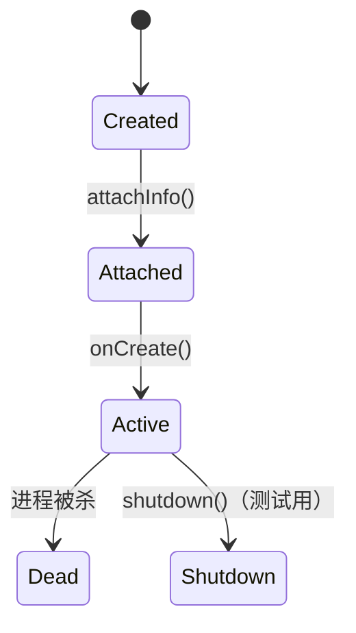

### 27.2.6 多 Authority Provider

一个 Provider 可以通过分号声明多个 authority。框架内部同时保存 `String` 和 `String[]` 两种形式，既兼顾常见单 authority 场景，也支持多 authority Provider。

### 27.2.7 Single-User 与 System-User-Only Provider

`ProviderInfo` 中有两个多用户相关标志：

- `FLAG_SINGLE_USER`：Provider 只在 user 0 的进程中运行，但可服务其他用户
- `FLAG_SYSTEM_USER_ONLY`：只对 system user 可见

MediaProvider 就属于前一种设计思路。

### 27.2.8 `initOrder` 与启动顺序

同一进程内如果多个 Provider 互相依赖，`android:initOrder` 可以控制初始化顺序。值越大，越先初始化。

### 27.2.9 Provider 死亡与重启

Provider 宿主进程被 OOM 杀死或崩溃后，客户端下一次访问通常会收到 `DeadObjectException`。`ContentResolver` 会执行 `unstableProviderDied()`，重新向 AMS 请求该 Provider，必要时拉起新进程并重试。

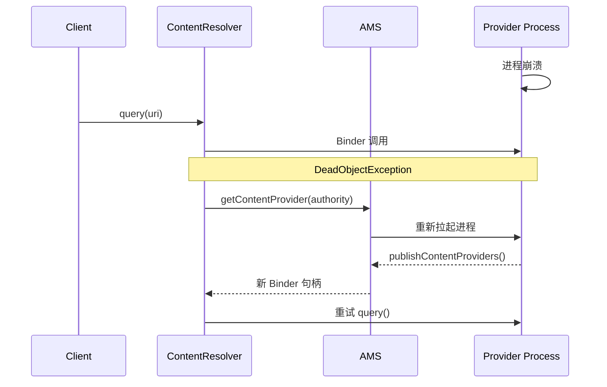

### 27.2.10 多进程 Provider

`android:multiprocess="true"` 会让每个客户端进程都拥有 Provider 的一个本地实例，从而避开 IPC，但会引入数据状态分裂和文件锁竞争。现代 Android 中这种模式已很少见，主要适用于只读或极轻量的场景。

## 27.3 MediaStore 与 MediaProvider

### 27.3.1 概览

MediaProvider 是 AOSP 中最复杂的 Provider 之一，负责管理设备上的图片、视频、音频、下载以及与媒体访问相关的大量策略。它还是一个 Mainline 模块，可以独立于系统版本更新。

核心源码：

```text
packages/providers/MediaProvider/src/com/android/providers/media/MediaProvider.java
```

### 27.3.2 Authority 与内容 URI

MediaProvider 的 authority 是 `media`，URI 结构通常为：

```text
content://media/<volume>/<media-type>/<table>[/<id>]
```

典型模式：

| URI | 含义 |
|-----|------|
| `content://media/*/images/media` | 某卷上的全部图片 |
| `content://media/*/images/media/#` | 单张图片 |
| `content://media/*/audio/media` | 全部音频 |
| `content://media/*/video/media` | 全部视频 |
| `content://media/*/file` | 所有文件 |
| `content://media/*/downloads` | 下载文件 |

### 27.3.3 卷系统

MediaProvider 对不同存储卷维护独立数据库。`MediaVolume` 描述卷名称、用户、挂载路径、ID 等信息，而 `VolumeCache` 负责追踪当前已挂载卷及其数据库映射关系。

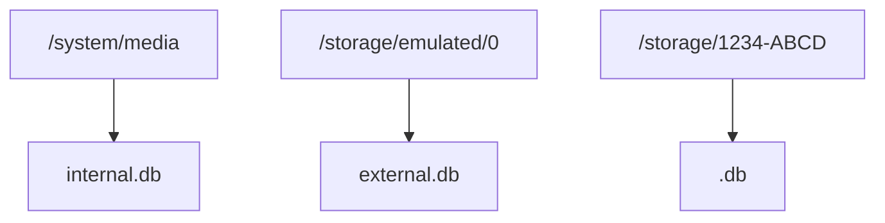

### 27.3.4 数据库模式

核心表是 `files`，记录几乎所有媒体与文件条目。重要字段包括：

| 字段 | 说明 |
|------|------|
| `_id` | 主键 |
| `_data` | 绝对路径，现代版本通常已被废弃化处理 |
| `_display_name` | 显示文件名 |
| `_size` | 文件大小 |
| `mime_type` | MIME 类型 |
| `media_type` | 图片、音频、视频等分类 |
| `relative_path` | 相对卷根目录的路径 |
| `owner_package_name` | 创建该文件的包名 |
| `is_pending` | 文件是否仍在写入 |
| `is_trashed` | 是否在回收站 |
| `is_favorite` | 是否收藏 |

### 27.3.5 媒体扫描

`ModernMediaScanner` 负责扫描文件系统、提取元数据并批量更新数据库。它已取代早期 native scanner，成为纯 Java 路径。

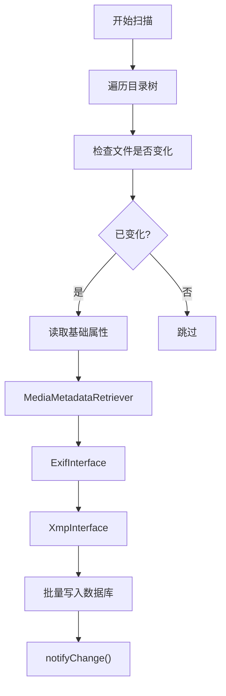

扫描原因一般包括挂载触发、显式扫描请求、空闲维护等。AOSP 中默认批量写入大小为 32。

### 27.3.6 FUSE 集成

从 Android 11 开始，MediaProvider 与 FUSE 层紧密集成。应用即使通过传统文件路径访问 `/storage/emulated/0/...`，也会先经过 FUSE，再由 MediaProvider 做权限和策略判断。

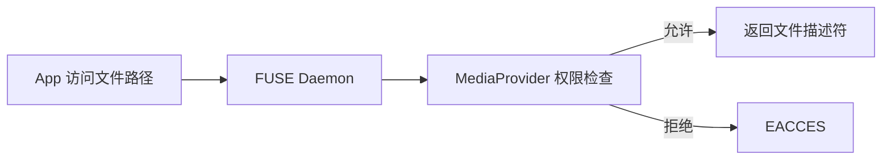

### 27.3.7 Scoped Storage 与访问模式

MediaProvider 会根据调用方 targetSdk、权限和身份决定可见范围。常见权限层级如下：

| 访问级别 | 获得方式 | 范围 |
|----------|----------|------|
| 自有文件 | 无需权限 | `owner_package_name` 为自身的文件 |
| `READ_MEDIA_IMAGES` | 运行时权限 | 全部图片 |
| `READ_MEDIA_VIDEO` | 运行时权限 | 全部视频 |
| `READ_MEDIA_AUDIO` | 运行时权限 | 全部音频 |
| `ACCESS_MEDIA_LOCATION` | 运行时权限 | EXIF GPS 信息 |
| `MANAGE_EXTERNAL_STORAGE` | 特殊权限 | 几乎全部文件 |
| Photo Picker | 用户选择 | 仅被选中的条目 |

### 27.3.8 Photo Picker

Android 13 起，MediaProvider 内置 Photo Picker 路径，允许用户只把选中的图片/视频暴露给应用，而不授予大范围媒体读取权限。它还能整合云媒体提供者的数据。

### 27.3.9 转码

MediaProvider 可以在文件描述符层做透明转码。例如旧应用读取 HEVC 视频时，系统可能把它转成 AVC/H.264。内部通过 `FLAG_TRANSFORM_TRANSCODING` 等位标记控制。

### 27.3.10 Redacted URI

如果调用方没有 `ACCESS_MEDIA_LOCATION`，MediaProvider 可以返回“去隐私化”的图像内容，把 EXIF 中的 GPS 信息擦除。实现上会走 redacted URI 与特殊 synthetic path。

### 27.3.11 Idle Maintenance

设备空闲时，MediaProvider 会做后台维护：

- 重新扫描陈旧元数据
- 清理磁盘上已不存在的孤儿数据库记录
- 更新特殊格式识别结果
- 处理回收站过期文件

默认按 1000 行为一个批次，避免单次任务过重。

### 27.3.12 `DatabaseHelper`

`DatabaseHelper` 继承 `SQLiteOpenHelper`，负责每个 volume 的建库、升级和迁移。常见数据库名包括 `internal.db` 与 `external.db`。

### 27.3.13 备份与恢复

MediaProvider 有稳定 URI 备份恢复机制，会利用扩展属性保存 row ID 映射，这样数据库重建后，旧 URI 仍尽量保持可解析。

### 27.3.14 `_data` 列废弃

历史上应用通过 `_data` 直接得到真实文件路径，但从 Android 11 起，这条路被逐步弃用。框架使用：

```java
public static final boolean DEPRECATE_DATA_COLUMNS = true;
public static final String DEPRECATE_DATA_PREFIX = "/mnt/content/";
```

返回的更像是一个由系统接管的伪路径，真正访问时仍会回到受控的 ContentResolver / FUSE 权限模型。

## 27.4 ContactsProvider

### 27.4.1 概览

ContactsProvider 管理设备上的联系人数据，是另一个复杂度极高的系统 Provider。它不仅维护联系人、原始联系人、数据项三层模型，还支持自动聚合、同步适配器、企业目录和 vCard 导出。

### 27.4.2 三层数据模型

联系人模型由三层组成：

- `Contacts`：聚合后的联系人视图
- `RawContacts`：按账号拆分的原始联系人
- `Data`：电话、邮箱、姓名、地址等细粒度数据行

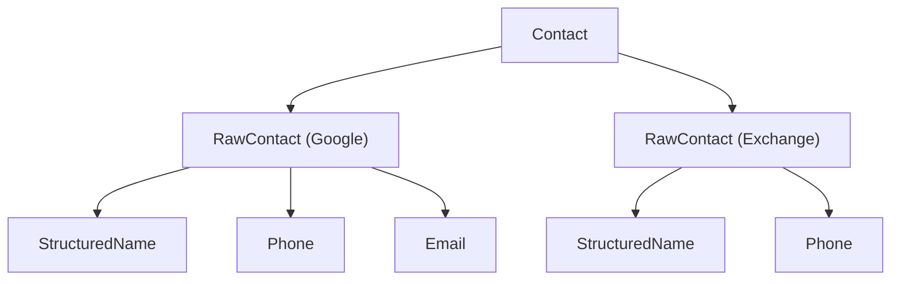

### 27.4.3 数据行类型

`Data` 表里每一行都通过 `mimetype` 指示自己的真实类型。ContactsProvider 内部有 `DataRowHandlerForPhoneNumber`、`DataRowHandlerForEmail`、`DataRowHandlerForStructuredName` 等一整套 handler 层级，分别负责校验、规范化和索引。

### 27.4.4 联系人聚合

多个账号里的 `RawContact` 可以被系统自动聚合成一个 `Contact`。聚合算法会综合姓名、手机号、邮箱、身份标识、昵称等因素打分，并允许用户通过 `AggregationExceptions` 手动要求“强制合并”或“永不合并”。

### 27.4.5 URI 匹配

ContactsProvider2 维护了大量 URI code，例如：

```java
public static final int CONTACTS = 1000;
public static final int CONTACTS_LOOKUP = 1002;
public static final int RAW_CONTACTS = 2002;
public static final int DATA = 3000;
public static final int PHONES = 3002;
public static final int EMAILS = 3005;
```

这使它能在同一 authority 下支持非常丰富的查询入口。

### 27.4.6 Lookup Key

联系人对外推荐使用 lookup key，而不是数据库 `_id`。因为聚合/拆分后 row ID 可能变化，而 lookup key 编码了联系人所包含的底层原始联系人集合，更稳定。

### 27.4.7 企业联系人

ContactsProvider 可以跨 profile 查询工作资料中的联系人，通过 `EnterpriseContactsCursorWrapper` 等组件把工作配置文件中的结果合并到查询视图中。

### 27.4.8 权限

核心权限为：

```text
android.permission.READ_CONTACTS
android.permission.WRITE_CONTACTS
```

另外还有 `MANAGE_SIM_ACCOUNTS`、`SET_DEFAULT_ACCOUNT` 等更专用的权限。

### 27.4.9 `ContactsDatabaseHelper`

联系人数据库非常复杂，关键表包括：

| 表 | 作用 |
|----|------|
| `contacts` | 聚合联系人 |
| `raw_contacts` | 每账号原始联系人 |
| `data` | 数据项 |
| `mimetypes` | MIME 类型表 |
| `accounts` | 账号信息 |
| `name_lookup` | 姓名索引 |
| `phone_lookup` | 电话索引 |
| `groups` | 联系人分组 |
| `directories` | 目录源 |
| `search_index` | 搜索索引 |

### 27.4.10 搜索索引

ContactsProvider 通过 `SearchIndexManager` 维护全文搜索索引，使“边输边搜”能快速命中姓名、电话、邮箱等字段。

### 27.4.11 Directory 支持

Directory 代表远程联系人源，比如企业 GAL。查询 `Contacts.CONTENT_FILTER_URI` 时，Provider 可以把请求分发给多个目录源，再统一合并结果。

### 27.4.12 Sync Adapter 集成

同步适配器可以使用 `caller_is_syncadapter=true` 查询参数进入特殊路径。此时 Provider 会跳过某些普通应用路径中的自动聚合、软删除、dirty 标志处理等逻辑，以适应同步框架的需求。

### 27.4.13 Profile 联系人

设备所有者自己有一个特殊的 profile contact，对应 `content://com.android.contacts/profile` 路径，并由独立的 profile 聚合逻辑处理。

### 27.4.14 VCard 导出

ContactsProvider 支持通过 `openAssetFile()` 以 `text/x-vcard` 导出联系人，内部依赖 `VCardComposer` 等类完成序列化。

## 27.5 CalendarProvider

### 27.5.1 概览

`CalendarProvider2` 管理日历、事件、参与者、提醒、实例展开等数据，继承自 `SQLiteContentProvider`，因此天然适合事务化操作。

### 27.5.2 日历数据模型

核心实体关系如下：

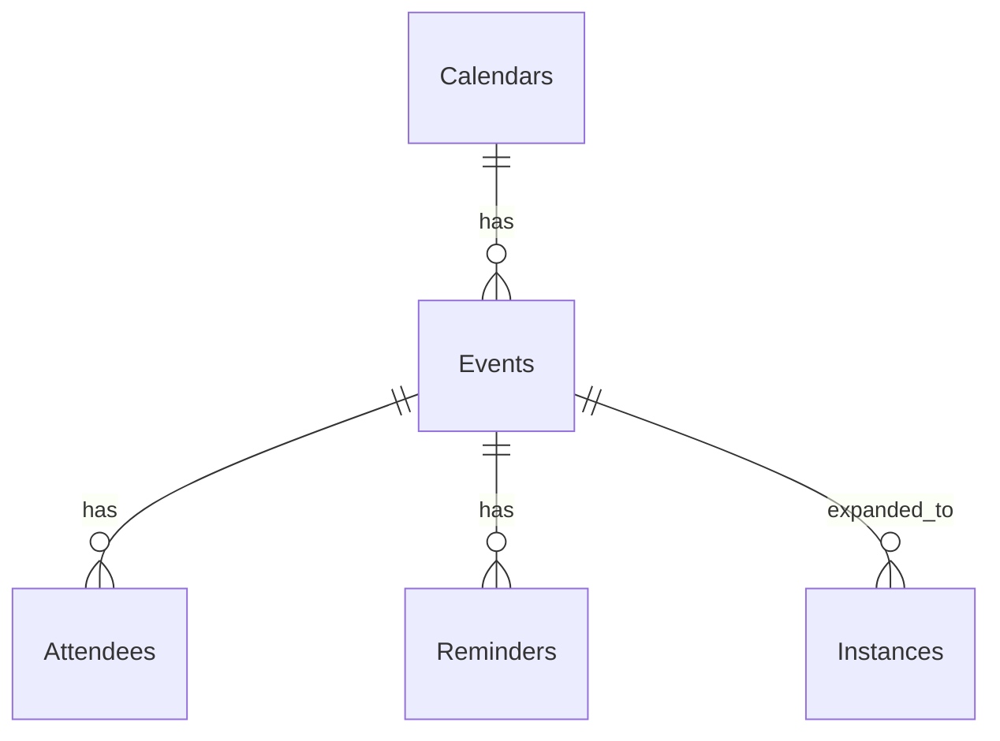

其中：

- `Calendars`：日历账号
- `Events`：事件定义
- `Instances`：展开后的具体发生实例
- `Attendees`：参与者
- `Reminders`：提醒

### 27.5.3 内容 URI

常见 URI：

| URI | 含义 |
|-----|------|
| `content://com.android.calendar/calendars` | 日历账号 |
| `content://com.android.calendar/events` | 事件 |
| `content://com.android.calendar/instances/when/<start>/<end>` | 时间范围内展开后的实例 |
| `content://com.android.calendar/attendees` | 参与者 |
| `content://com.android.calendar/reminders` | 提醒 |

### 27.5.4 重复事件展开

CalendarProvider 最复杂的任务之一，是把 RRULE / RDATE 描述的重复事件展开成具体实例。它依赖 `calendarcommon2` 库中的 `RecurrenceProcessor` 等组件，在查询 `Instances` URI 时按需补足展开窗口。

### 27.5.5 Alarm 管理

`CalendarAlarmManager` 负责为提醒注册系统 alarm。当提醒时间到达时，Provider 会写入 `CalendarAlerts`，再触发系统通知路径。

### 27.5.6 跨 Profile 日历

`CrossProfileCalendarHelper` 用于在企业策略允许时，把工作 profile 的日历数据共享给个人 profile 视图。

### 27.5.7 权限

CalendarProvider 的主要权限是：

```text
android.permission.READ_CALENDAR
android.permission.WRITE_CALENDAR
```

### 27.5.8 `CalendarDatabaseHelper`

主要表包括：

| 表 | 作用 |
|----|------|
| `Calendars` | 日历账号 |
| `Events` | 事件定义 |
| `Instances` | 已展开实例 |
| `Attendees` | 参与者 |
| `Reminders` | 提醒 |
| `CalendarAlerts` | 已触发提醒 |
| `Colors` | 颜色 |
| `SyncState` | 同步状态 |

### 27.5.9 实例展开细节

对一个每周重复的会议，数据库不会存 52 行独立事件，而是存一条带 RRULE 的事件定义。客户端查询某个时间窗时，`CalendarInstancesHelper` 才会把落在该时间窗内的 occurrences 展开进 `Instances` 表。AOSP 中定义了最小展开跨度，避免频繁小窗口重复计算。

### 27.5.10 `CalendarContract` URI 匹配

`CalendarProvider2` 也维护大规模 `UriMatcher`，例如：

```java
private static final int CALENDARS = 1;
private static final int INSTANCES = 3;
private static final int EVENTS = 7;
private static final int ATTENDEES = 9;
private static final int REMINDERS = 15;
private static final int COLORS = 25;
private static final int SYNCSTATE = 28;
```

### 27.5.11 事件变更跟踪

事件被修改时，Provider 会设置 `DIRTY=1` 并记录 `MUTATORS`，供同步适配器识别“是谁修改了这条事件”，以避免自己同步自己导致循环。

### 27.5.12 搜索

CalendarProvider 支持对标题、描述、地点、参与者邮箱和姓名做搜索，内部使用 SQL `LIKE` 并对特殊字符做转义。

## 27.6 SettingsProvider

### 27.6.1 概览

SettingsProvider 与大多数 Provider 不同。它的主数据路径并不依赖 SQLite，而是把设置持久化为系统目录下的 XML 文件，由 `SettingsState` 统一管理。

### 27.6.2 三大设置命名空间

系统设置大致分三类：

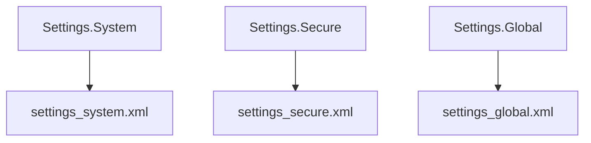

| 命名空间 | 权限级别 | 是否按用户隔离 | 例子 |
|----------|----------|----------------|------|
| `System` | `WRITE_SETTINGS` 等危险权限 | 是 | 亮度、字体、铃声 |
| `Secure` | 签名级 | 是 | 输入法、辅助功能 |
| `Global` | 签名级 | 否 | ADB、设备初始化状态、飞行模式 |

另外还有内部使用的 `ssaid` 和 `config` 命名空间。

### 27.6.3 `call()` 快路径优化

SettingsProvider 把绝大部分读写都放进 `call()`，而不是标准 CRUD 路径。原因很直接：返回单个值时，用 `Bundle` 比构造 `Cursor` 更轻、更快。

```java
@Override
public Bundle call(String method, String name, Bundle args) {
    switch (method) {
        case Settings.CALL_METHOD_GET_GLOBAL -> { /* ... */ }
        case Settings.CALL_METHOD_GET_SECURE -> { /* ... */ }
        case Settings.CALL_METHOD_GET_SYSTEM -> { /* ... */ }
        case Settings.CALL_METHOD_PUT_GLOBAL -> { /* ... */ }
        case Settings.CALL_METHOD_PUT_SECURE -> { /* ... */ }
        case Settings.CALL_METHOD_PUT_SYSTEM -> { /* ... */ }
    }
}
```

### 27.6.4 代际跟踪

SettingsProvider 为每个命名空间维护 generation。客户端通过 `Settings` API 读取时会做本地缓存；generation 没变化时可以完全不走 IPC。

### 27.6.5 设置项在命名空间间迁移

历史版本里，很多设置项曾在 `System`、`Secure`、`Global` 之间迁移。Provider 内部维护多个 moved set，当客户端从旧 namespace 读取时，会自动重定向到新位置。

### 27.6.6 校验

target API 22 及以上的应用不能随意往 `System` 里塞任意 key。Provider 会通过一组 validator 校验值是否合法，例如整数范围、离散枚举、组件名列表格式等。

### 27.6.7 系统服务

SettingsProvider 还会注册两个系统服务：

```java
ServiceManager.addService("settings", new SettingsService(this));
ServiceManager.addService("device_config", new DeviceConfigService(this));
```

其中 `device_config` 直接服务于特性开关和服务器下发配置。

### 27.6.8 虚拟设备支持

在虚拟设备或伴生显示场景中，SettingsProvider 可以先查虚拟设备专属设置；若不存在，再回退到默认设备的配置值。

### 27.6.9 `SettingsState`

`SettingsState` 是真正负责内存态与 XML 持久化的组件。每个命名空间对应一个 `SettingsState` 实例，内部通常维护 `HashMap<String, Setting>`。写入采用“先更新内存，再异步落盘”的 write-behind 模式，但像 `DEVICE_PROVISIONED`、`USER_SETUP_COMPLETE` 等关键项会同步写入。

### 27.6.10 设置 Key 派生

设置项内部由 `(type, userId, deviceId)` 组合键标识。这样同一套 `SettingsRegistry` 就能统一管理多用户和多虚拟设备场景。

### 27.6.11 `SettingsRegistry`

`SettingsRegistry` 负责：

- 为新用户/新设备创建对应的 `SettingsState`
- 处理旧版 SQLite 设置迁移
- 确保 settings 目录存在
- 管理备份和恢复

### 27.6.12 DeviceConfig

`TABLE_CONFIG` 支撑 `android.provider.DeviceConfig`，主要用于服务器下发实验开关和运行时配置。它可设置多种 sync disabled 模式，例如重启前禁用、永久禁用等。

### 27.6.13 Fallback 文件

SettingsProvider 会周期性生成 settings 文件副本，便于在配置 XML 损坏后恢复。AOSP 中有定时 Job 每天执行一次 fallback 写入。

### 27.6.14 Instant App 设置访问

Instant App 只能访问 allowlist 中的一小部分 settings，限制集合可由 overlay 资源配置。

## 27.7 DocumentsProvider 与存储访问框架

### 27.7.1 概览

Storage Access Framework（SAF）引入于 Android 4.4，目的是让应用以统一方式访问本地文件、云盘、USB 存储或网络共享。它的核心抽象就是 `DocumentsProvider`。

### 27.7.2 URI 结构

DocumentsProvider 使用层级化 URI：

```text
content://<authority>/root
content://<authority>/root/<rootId>
content://<authority>/root/<rootId>/recent
content://<authority>/document/<documentId>
content://<authority>/document/<documentId>/children
content://<authority>/tree/<treeId>/document/<docId>
```

框架在 `registerAuthority()` 中集中注册这些模式。

### 27.7.3 Root 与 Document

SAF 有两个核心概念：

- Root：顶层入口，例如某个下载目录、某个网盘账号、某张 SD 卡
- Document：具体文档或目录

`Root` 关心标题、图标、能力、可用空间；`Document` 关心 `documentId`、MIME 类型、文件名、能力 flag、大小、修改时间等。

### 27.7.4 安全模型

DocumentsProvider 的安全约束非常严格：

1. Provider 必须受 `MANAGE_DOCUMENTS` 保护
2. 普通应用不能直接自由查询，而是通过 `ACTION_OPEN_DOCUMENT`、`ACTION_CREATE_DOCUMENT`、`ACTION_OPEN_DOCUMENT_TREE` 等 Intent 走系统文档选择器
3. 真正拥有高权限的是系统 DocumentsUI，它再把最小化 URI 授权发给请求应用

### 27.7.5 Tree URI

`ACTION_OPEN_DOCUMENT_TREE` 允许用户一次授权整个目录树。之后应用可通过 tree URI 枚举子节点、读取、写入、创建文档。Provider 必须正确实现 `isChildDocument()` 等校验逻辑，防止越权逃逸出已授权目录。

### 27.7.6 抽象方法

子类至少要实现：

| 方法 | 作用 |
|------|------|
| `queryRoots()` | 列出所有根 |
| `queryDocument()` | 查询单个文档元数据 |
| `queryChildDocuments()` | 查询子文档 |
| `openDocument()` | 打开文档 |
| `createDocument()` | 新建文档 |
| `deleteDocument()` | 删除文档 |
| `renameDocument()` | 重命名 |

### 27.7.7 内置 DocumentsProvider

AOSP 自带几个典型实现：

- `ExternalStorageProvider`
- `MediaDocumentsProvider`
- `DownloadStorageProvider`

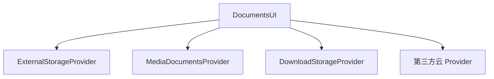

### 27.7.8 文档能力 Flag

Document 和 Root 都会用 flags 暴露能力，例如：

- `FLAG_SUPPORTS_WRITE`
- `FLAG_SUPPORTS_DELETE`
- `FLAG_DIR_SUPPORTS_CREATE`
- `FLAG_SUPPORTS_THUMBNAIL`
- `FLAG_VIRTUAL_DOCUMENT`
- `FLAG_SUPPORTS_SEARCH`
- `FLAG_SUPPORTS_RECENTS`

### 27.7.9 虚拟文档

虚拟文档没有真实的底层文件形态，只能在需要时转换输出。例如云文档可被导出成 PDF 或 DOCX，但并不存在一个原生本地文件可直接下载。

### 27.7.10 `DocumentsContract`

`DocumentsContract` 提供大量静态辅助方法，如构造 document URI、tree URI、child URI，以及从 URI 中提取 `documentId` / `treeDocumentId`。

### 27.7.11 最近文档

支持 `Root.FLAG_SUPPORTS_RECENTS` 的 Provider 需要实现 `queryRecentDocuments()`。DocumentsUI 会聚合所有 Provider 的 recent 结果。

### 27.7.12 DocumentsUI 系统应用

DocumentsUI 是用户真正交互的标准文件选择器。它负责：

1. 枚举所有已注册 Provider 的 root
2. 提供统一浏览和搜索界面
3. 代替普通应用持有 `MANAGE_DOCUMENTS`
4. 把精确到 URI 的授权回传给请求应用

## 27.8 `ContentObserver` 与变更通知

### 27.8.1 观察者模式

Android 的内容共享框架内建了观察者模式。一个组件可以注册对某个 URI 的观察，Provider 或其他写入方在数据变化后调用 `notifyChange()`，系统就会把通知分发给匹配的观察者。

### 27.8.2 `ContentObserver`

`ContentObserver` 是抽象类，提供多个层层委托的 `onChange()` 重载。新版本可带 `Uri`、flags、URI 集合等附加信息。

```java
public abstract class ContentObserver {
    public void onChange(boolean selfChange) { }
    public void onChange(boolean selfChange, @Nullable Uri uri) {
        onChange(selfChange);
    }
    public void onChange(boolean selfChange, @NonNull Collection<Uri> uris,
            @NotifyFlags int flags) { }
}
```

### 27.8.3 注册

通过 `ContentResolver.registerContentObserver(uri, notifyForDescendants, observer)` 注册。`notifyForDescendants=true` 时，子 URI 变化也会命中。

### 27.8.4 发送通知

通知接口包括单 URI 和多 URI 两种形式：

```java
notifyChange(uri, observer, flags);
notifyChange(uris, observer, flags);
```

典型 flags：

| Flag | 含义 |
|------|------|
| `NOTIFY_SYNC_TO_NETWORK` | 触发同步框架 |
| `NOTIFY_INSERT` | 插入 |
| `NOTIFY_UPDATE` | 更新 |
| `NOTIFY_DELETE` | 删除 |
| `NOTIFY_NO_DELAY` | 尽快派发 |

### 27.8.5 通知流

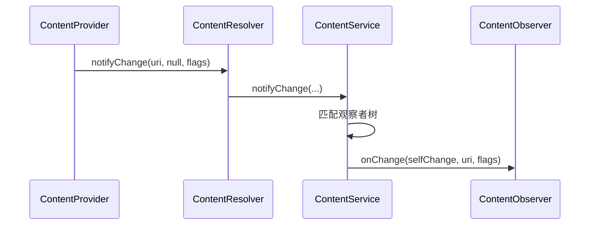

### 27.8.6 批量通知

Android 11 起支持一次性传递多个变更 URI，减少大量批量操作时的通知风暴。

### 27.8.7 传输层

`ContentObserver` 内部有 `Transport`，实现了 Binder 接口 `IContentObserver`。这使观察者通知能跨进程送达，并保证最终回调落在注册时指定的 `Handler` 或 `Executor` 上。

### 27.8.8 常见用法

典型模式：

- 观察联系人、媒体、设置等表变化后刷新 UI
- `CursorLoader` 自动监听 URI 并在变化时重新查询
- Provider 在 `insert()` / `update()` / `delete()` 后显式 `notifyChange()`

### 27.8.9 同步到网络 Flag

`NOTIFY_SYNC_TO_NETWORK` 会告诉同步框架“本地变化需要向服务端上传”。同步适配器自己写回本地时通常会省略这个 flag，避免无限同步循环。

### 27.8.10 `ContentService` 架构

`ContentService` 位于 `system_server`，负责全局观察者树。它处理：

- 观察者注册
- URI 匹配和通知分发
- 按用户维度隔离通知
- 需要时触发 sync adapter

### 27.8.11 通知合并

批量插入 100 条联系人时，如果每条都单独通知，UI 可能会刷新 100 次。因此 Provider 往往会采用：

- 完整 batch 结束后统一通知父 URI
- 使用 `notifyChange(Collection<Uri>)`
- 像 CalendarProvider 那样做短时间窗口 debounce

### 27.8.12 `setNotificationUri()` 与 Cursor 自动刷新

Provider 返回 `Cursor` 时应调用：

```java
Cursor c = db.query(...);
c.setNotificationUri(getContext().getContentResolver(), uri);
return c;
```

这样当对应 URI 被 `notifyChange()` 后，Cursor 自带观察者会被触发，进而让 `CursorLoader` 等机制重新查询，实现“加载一次，自动刷新”的经典模式。

## 27.9 跨进程数据共享

### 27.9.1 权限模型

Content Provider 采用分层权限模型：

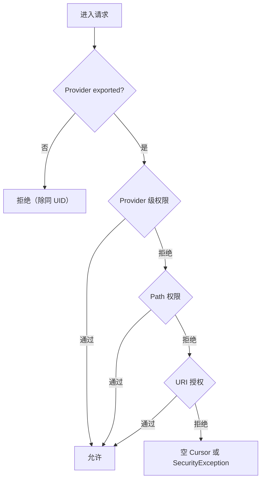

### 27.9.2 Provider 级权限

最简单的模型就是在 manifest 上直接声明统一的 `readPermission` 和 `writePermission`。拥有这些权限的调用方即可访问整个 Provider。

### 27.9.3 Path 权限

`<path-permission>` 允许对某一段 URI 路径单独赋予不同权限。例如 `/private/` 需要更高读写权限，而其他路径则使用默认 Provider 权限。

### 27.9.4 URI 授权

URI grant 是最灵活的权限机制。它允许应用不持有长期权限，也能临时访问某个具体 URI。可以通过两种方式授予：

- 用 Intent 附带 `FLAG_GRANT_READ_URI_PERMISSION` / `FLAG_GRANT_WRITE_URI_PERMISSION`
- 调用 `grantUriPermission()`

前提是 Provider 在 manifest 中允许 `grantUriPermissions`，或者存在匹配路径的 `<grant-uri-permission>`。

### 27.9.5 URI 授权管理

系统通过 `UriGrantsManagerService` 维护当前生效的 URI grant，记录授予给哪个 UID、对应什么 URI、拥有哪些 mode。查询权限时，Provider 的 `Transport` 会向该服务确认 grant 是否存在。

### 27.9.6 可持久化 URI 权限

若应用需要长期保留访问权，例如通过 SAF 选中的文档，可调用：

```java
takePersistableUriPermission(uri, Intent.FLAG_GRANT_READ_URI_PERMISSION);
```

这类授权可跨重启保留，并能通过 `getPersistedUriPermissions()` 查询。

### 27.9.7 跨用户访问

系统组件可以在 URI 中显式嵌入 userId，例如：

```text
content://10@com.android.contacts/contacts
```

`ContentProvider.Transport` 会在剥离 userId 前检查调用方是否拥有 `INTERACT_ACROSS_USERS` 或 `INTERACT_ACROSS_USERS_FULL`。

### 27.9.8 `AttributionSource` 调用链

现代 Provider IPC 不只知道“谁直接调用”，还会携带一条 attribution chain，用于描述一层层代理或转发调用。这对安全审计和细粒度授权非常关键。

### 27.9.9 AppOps 集成

除了静态权限，Provider 还与 `AppOpsManager` 集成。即使应用 manifest 权限仍在，只要用户在设置中关闭相关访问，AppOps 也可以实时阻断数据读取。

### 27.9.10 权限检查全流程

`Transport` 内部完整检查顺序大致是：

1. 是否测试模式
2. 是否同 UID
3. Provider 是否 exported
4. Provider 级读写权限
5. Path 权限
6. URI grant
7. AppOps

需要注意的是：

- `query()` 权限失败时，很多情况下返回的是空 `Cursor`
- `insert()` / `update()` / `delete()` 权限失败时通常抛 `SecurityException`

### 27.9.11 URI Grant 持久化

URI grant 分临时与持久两种。临时授权通常随着目标 Activity 结束而失效；持久授权需要接收方主动 `takePersistableUriPermission()`，并受系统数量上限约束。

### 27.9.12 `grantUriPermission()` 栈

授予 URI 时，系统会校验：

1. 调用方是否拥有该 URI 或有额外授权能力
2. Provider 是否允许 URI grant
3. URI 是否匹配允许授权的路径规则
4. 目标包是否存在
5. 最后再由 `UriGrantsManagerService` 记账并持久化

### 27.9.13 `ContentProviderOperation` 安全性

`applyBatch()` 的权限模型和单次操作一致，只是多条操作复用了一次外层 IPC。Provider 通常假定进入 batch 的调用已经通过了写权限校验。

### 27.9.14 `DEPRECATE_DATA_COLUMNS` 机制

MediaStore 为兼容依赖 `_data` 的旧应用，提供了 `/mnt/content/...` 形式的过渡路径。应用看起来像拿到了文件路径，实际上最终打开时仍会被重定向到受控的 ContentResolver / FUSE 路径，从而继续执行正确的权限判断。

## 27.10 动手实践（Try It）

本节用一组实际命令帮助你从 shell 角度理解 Provider 的行为。

### 27.10.1 从 Shell 查询 MediaStore

```bash
# 列出外部存储上的全部图片
adb shell content query --uri content://media/external/images/media \
    --projection _id:_display_name:mime_type:_size

# 查询指定图片
adb shell content query --uri content://media/external/images/media/42

# 列出全部音频
adb shell content query --uri content://media/external/audio/media \
    --projection _id:title:artist:album:duration

# 查看已挂载 volume
adb shell content query --uri content://media/external/fs_id
```

### 27.10.2 读取与写入 Settings

```bash
# 读取 system 设置
adb shell settings get system screen_brightness

# 写入 system 设置
adb shell settings put system screen_brightness 128

# 读取 secure 设置
adb shell settings get secure default_input_method

# 读取 global 设置
adb shell settings get global airplane_mode_on

# 列出命名空间中的全部设置
adb shell settings list system
adb shell settings list secure
adb shell settings list global
```

### 27.10.3 查询联系人

```bash
# 列出联系人
adb shell content query --uri content://com.android.contacts/contacts \
    --projection display_name

# 列出 raw contacts
adb shell content query --uri content://com.android.contacts/raw_contacts \
    --projection _id:display_name_primary:account_name:account_type

# 列出手机号数据行
adb shell content query --uri content://com.android.contacts/data \
    --where "mimetype='vnd.android.cursor.item/phone_v2'"
```

### 27.10.4 查询日历事件

```bash
# 列出日历账号
adb shell content query --uri content://com.android.calendar/calendars \
    --projection _id:name:account_name:account_type

# 列出事件
adb shell content query --uri content://com.android.calendar/events \
    --projection _id:title:dtstart:dtend:calendar_id
```

### 27.10.5 插入与删除内容

```bash
# 插入一个 raw contact
adb shell content insert --uri content://com.android.contacts/raw_contacts \
    --bind account_type:s: --bind account_name:s:

# 返回类似 content://com.android.contacts/raw_contacts/1
# 再插入 name 数据行
adb shell content insert --uri content://com.android.contacts/data \
    --bind raw_contact_id:i:1 \
    --bind mimetype:s:vnd.android.cursor.item/name \
    --bind data1:s:"Test User"

# 删除联系人
adb shell content delete --uri content://com.android.contacts/raw_contacts/1
```

### 27.10.6 观察内容变化

```bash
# 观察媒体数据库变化
adb shell content observe --uri content://media/external

# 另一个终端触发扫描
adb shell screencap /sdcard/Pictures/test_observe.png
adb shell am broadcast -a android.intent.action.MEDIA_SCANNER_SCAN_FILE \
    -d file:///sdcard/Pictures/test_observe.png
```

### 27.10.7 Dump Provider 状态

```bash
# Dump MediaProvider
adb shell dumpsys activity provider com.android.providers.media.MediaProvider

# Dump SettingsProvider
adb shell dumpsys activity provider com.android.providers.settings/.SettingsProvider

# Dump ContactsProvider
adb shell dumpsys activity provider com.android.providers.contacts/.ContactsProvider2
```

### 27.10.8 查看 SAF

```bash
# 列出 DocumentsProvider roots
adb shell content query \
    --uri content://com.android.externalstorage.documents/root

# 查看 root 下的 children
adb shell content query \
    --uri content://com.android.externalstorage.documents/document/primary%3A/children
```

### 27.10.9 编写最小 Provider

下面这个最小示例足以演示 Provider 的生命周期、URI 路由和通知机制：

```java
public class NoteProvider extends ContentProvider {
    private static final String AUTHORITY = "com.example.notes";
    private static final Uri CONTENT_URI = Uri.parse("content://" + AUTHORITY + "/notes");
    private static final int NOTES = 1;
    private static final int NOTES_ID = 2;

    private static final UriMatcher sMatcher = new UriMatcher(UriMatcher.NO_MATCH);
    static {
        sMatcher.addURI(AUTHORITY, "notes", NOTES);
        sMatcher.addURI(AUTHORITY, "notes/#", NOTES_ID);
    }

    private SQLiteDatabase mDb;

    @Override
    public boolean onCreate() {
        SQLiteOpenHelper helper = new SQLiteOpenHelper(getContext(), "notes.db", null, 1) {
            @Override
            public void onCreate(SQLiteDatabase db) {
                db.execSQL("CREATE TABLE notes (_id INTEGER PRIMARY KEY, title TEXT, body TEXT)");
            }
            @Override
            public void onUpgrade(SQLiteDatabase db, int old, int neo) { }
        };
        mDb = helper.getWritableDatabase();
        return mDb != null;
    }

    @Override
    public Cursor query(Uri uri, String[] proj, String sel, String[] args, String order) {
        SQLiteQueryBuilder qb = new SQLiteQueryBuilder();
        qb.setTables("notes");
        switch (sMatcher.match(uri)) {
            case NOTES_ID:
                qb.appendWhere("_id=" + uri.getLastPathSegment());
                break;
        }
        Cursor c = qb.query(mDb, proj, sel, args, null, null, order);
        c.setNotificationUri(getContext().getContentResolver(), uri);
        return c;
    }

    @Override
    public Uri insert(Uri uri, ContentValues values) {
        long id = mDb.insert("notes", null, values);
        Uri result = ContentUris.withAppendedId(CONTENT_URI, id);
        getContext().getContentResolver().notifyChange(result, null);
        return result;
    }

    @Override
    public int update(Uri uri, ContentValues values, String sel, String[] args) {
        int count;
        switch (sMatcher.match(uri)) {
            case NOTES_ID:
                count = mDb.update("notes", values, "_id=" + uri.getLastPathSegment(), null);
                break;
            default:
                count = mDb.update("notes", values, sel, args);
        }
        getContext().getContentResolver().notifyChange(uri, null);
        return count;
    }

    @Override
    public int delete(Uri uri, String sel, String[] args) {
        int count;
        switch (sMatcher.match(uri)) {
            case NOTES_ID:
                count = mDb.delete("notes", "_id=" + uri.getLastPathSegment(), null);
                break;
            default:
                count = mDb.delete("notes", sel, args);
        }
        getContext().getContentResolver().notifyChange(uri, null);
        return count;
    }

    @Override
    public String getType(Uri uri) {
        switch (sMatcher.match(uri)) {
            case NOTES:    return "vnd.android.cursor.dir/vnd.example.note";
            case NOTES_ID: return "vnd.android.cursor.item/vnd.example.note";
            default:       return null;
        }
    }
}
```

对应 manifest 声明：

```xml
<provider
    android:name=".NoteProvider"
    android:authorities="com.example.notes"
    android:exported="true"
    android:readPermission="com.example.READ_NOTES"
    android:writePermission="com.example.WRITE_NOTES"
    android:grantUriPermissions="true" />
```

### 27.10.10 跟踪 Provider IPC

```bash
# 采集 activity manager 和 binder trace
adb shell atrace -t 10 -b 4096 am binder_driver -o /data/local/tmp/cp_trace.ctrace

# 采集期间执行一个查询
adb shell content query --uri content://settings/system/screen_brightness

# 拉回 trace 并打开
adb pull /data/local/tmp/cp_trace.ctrace
```

可以在 Perfetto 中观察到：

1. 调用线程上的 `query` 事务
2. Provider Binder 线程上的 `onTransact`
3. 底层 SQLite 查询
4. Cursor 结果返回过程

### 27.10.11 检查 Provider 数据库

在 userdebug / eng 构建上，可直接查看数据库：

```bash
# MediaProvider
adb shell sqlite3 /data/data/com.android.providers.media.module/databases/external.db \
    ".schema files"

# ContactsProvider
adb shell sqlite3 /data/data/com.android.providers.contacts/databases/contacts2.db \
    ".tables"

# CalendarProvider
adb shell sqlite3 /data/data/com.android.providers.calendar/databases/calendar.db \
    "SELECT name FROM sqlite_master WHERE type='table'"
```

### 27.10.12 性能测试

```bash
# 测量 MediaStore 查询时延
adb shell "time content query --uri content://media/external/images/media \
    --projection _id --sort '_id ASC LIMIT 100'"

# 基准 SettingsProvider 快路径
adb shell "time settings get system screen_brightness"

# 与 query 路径对比
adb shell "time content query --uri content://settings/system \
    --where 'name=\"screen_brightness\"'"
```

通常会看到 `settings get` 比通用 query 路径明显更快，这正是 `call()` 设计的直接收益。

---

## 总结（Summary）

Content Provider 是 Android 进程间结构化数据共享的基础设施。它不是单纯的“数据库包装层”，而是一套完整的寻址、Binder 传输、权限控制、文件描述符转交和变更通知框架。

本章关键点如下：

1. **Provider 本质上是 Binder 服务**：真正对外暴露的是 `ContentProvider.Transport`，而不是 Provider 子类本身。
2. **`ContentResolver` 是唯一统一入口**：authority 解析、Provider 获取、稳定/不稳定引用管理、通知注册都在这里汇聚。
3. **`content://` URI 是寻址模型**：authority 决定归属，路径段决定具体资源，构成 Android 统一的数据访问命名空间。
4. **共享内存是跨进程 Cursor 的性能关键**：`CursorWindow` 避免了把整批查询结果复制进 Binder Parcel。
5. **系统 Provider 都是高度领域化实现**：MediaProvider 处理卷、扫描、FUSE、转码和隐私；ContactsProvider 处理聚合与索引；CalendarProvider 处理重复事件展开；SettingsProvider 处理 XML 持久化和快路径读取。
6. **权限模型是分层叠加的**：Provider 权限、路径权限、URI grant、AppOps、跨用户检查和 `AttributionSource` 共同决定访问是否被允许。
7. **`ContentObserver` 是响应式数据流基础**：Provider 的 `notifyChange()` 驱动 Cursor、Loader、同步框架和 UI 自动刷新。
8. **SAF 把“文件访问”统一成了“受控文档访问”**：DocumentsProvider 与 DocumentsUI 组合，既支持本地和云文档，又保持精细授权。

### 关键源码文件参考

| 文件 | 作用 |
|------|------|
| `frameworks/base/core/java/android/content/ContentProvider.java` | Provider 抽象基类与 `Transport` |
| `frameworks/base/core/java/android/content/ContentResolver.java` | 客户端统一入口 |
| `frameworks/base/core/java/android/content/ContentProviderNative.java` | Binder stub |
| `frameworks/base/core/java/android/content/IContentProvider.java` | Provider IPC 接口 |
| `frameworks/base/core/java/android/database/ContentObserver.java` | 观察者机制 |
| `frameworks/base/core/java/android/provider/DocumentsProvider.java` | SAF 基类 |
| `frameworks/base/core/java/android/provider/DocumentsContract.java` | SAF 协议常量 |
| `packages/providers/MediaProvider/src/com/android/providers/media/MediaProvider.java` | MediaStore 核心实现 |
| `packages/providers/MediaProvider/src/com/android/providers/media/LocalUriMatcher.java` | Media URI 路由 |
| `packages/providers/MediaProvider/src/com/android/providers/media/MediaVolume.java` | 媒体卷表示 |
| `packages/providers/MediaProvider/src/com/android/providers/media/scan/ModernMediaScanner.java` | 新媒体扫描器 |
| `packages/providers/ContactsProvider/src/com/android/providers/contacts/ContactsProvider2.java` | 联系人实现 |
| `packages/providers/ContactsProvider/src/com/android/providers/contacts/aggregation/ContactAggregator2.java` | 联系人聚合算法 |
| `packages/providers/CalendarProvider/src/com/android/providers/calendar/CalendarProvider2.java` | 日历实现 |
| `frameworks/base/packages/SettingsProvider/src/com/android/providers/settings/SettingsProvider.java` | 设置实现 |
| `frameworks/base/packages/SettingsProvider/src/com/android/providers/settings/SettingsState.java` | 设置状态持久化 |
| `frameworks/base/packages/SettingsProvider/src/com/android/providers/settings/GenerationRegistry.java` | 设置缓存失效机制 |
