# Chapter 27: Content Providers

Content providers are one of Android's four foundational application components,
yet unlike activities, services, and broadcast receivers, they exist purely to
broker structured data across process boundaries.  Every time a dialer app looks
up a phone number, a gallery app enumerates photos, or the system reads a
brightness setting, a content provider mediates the transaction.  This chapter
walks through the framework machinery that makes content providers work --
from the Binder transport layer and URI routing to the concrete implementations
that ship with every Android device -- referencing the actual AOSP source at
every step.

---

## 27.1 ContentProvider Architecture

### 27.1.1 The Big Picture

A content provider is an in-process object that exposes a relational (or
relational-like) data interface to other processes.  Callers never instantiate a
provider directly; instead, they go through `ContentResolver`, which resolves
an authority string, acquires a Binder handle to the remote provider, and
marshals arguments over IPC.

```
frameworks/base/core/java/android/content/ContentProvider.java
frameworks/base/core/java/android/content/ContentResolver.java
frameworks/base/core/java/android/content/ContentProviderNative.java
frameworks/base/core/java/android/content/IContentProvider.java
```

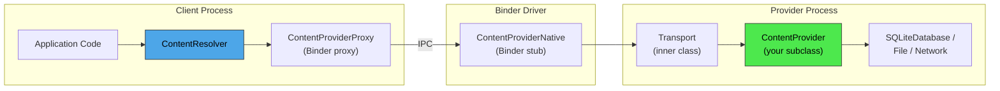

The critical classes in this path are:

| Class | Role | Source |
|-------|------|--------|
| `ContentResolver` | Client-side facade; resolves authorities, acquires providers | `frameworks/base/core/java/android/content/ContentResolver.java` |
| `ContentProviderProxy` | Auto-generated Binder proxy inside `ContentProviderNative` | `frameworks/base/core/java/android/content/ContentProviderNative.java` |
| `ContentProviderNative` | Binder stub that dispatches incoming Parcel transactions | Same file |
| `ContentProvider.Transport` | Inner class extending `ContentProviderNative`; enforces permissions before delegating | `frameworks/base/core/java/android/content/ContentProvider.java` |
| `ContentProvider` | The abstract base class that provider authors subclass | Same file |
| `IContentProvider` | The IPC interface definition (hand-written, not AIDL) | `frameworks/base/core/java/android/content/IContentProvider.java` |

### 27.1.2 The IContentProvider Interface

Unlike most Android IPC interfaces, `IContentProvider` is not generated from
an `.aidl` file.  It is a hand-written Java interface extending `IInterface`:

```java
// frameworks/base/core/java/android/content/IContentProvider.java
public interface IContentProvider extends IInterface {
    Cursor query(@NonNull AttributionSource attributionSource, Uri url,
            @Nullable String[] projection,
            @Nullable Bundle queryArgs,
            @Nullable ICancellationSignal cancellationSignal)
            throws RemoteException;

    Uri insert(@NonNull AttributionSource attributionSource,
            Uri url, ContentValues initialValues, Bundle extras)
            throws RemoteException;

    int delete(@NonNull AttributionSource attributionSource,
            Uri url, Bundle extras)
            throws RemoteException;

    int update(@NonNull AttributionSource attributionSource,
            Uri url, ContentValues values, Bundle extras)
            throws RemoteException;

    // ... plus getType, openFile, openAssetFile, call, etc.
}
```

Each method carries an `AttributionSource` that chains the calling UID,
package name, and any downstream attribution.  This replaced the older
`callingPkg` string parameter to support attribution chains across multiple
hops.

### 27.1.3 The URI Scheme

Every content provider is addressed through a `content://` URI:

```
content://authority/path/to/resource
  ^         ^          ^
  |         |          +-- Provider-interpreted path segments
  |         +------------- Registered authority (unique per provider)
  +----------------------- Scheme (always "content")
```

For example:

```
content://media/external/images/media/42
content://com.android.contacts/contacts/lookup/0n3A.../5
content://settings/system/screen_brightness
content://com.android.externalstorage.documents/document/primary%3ADownload%2Ffile.pdf
```

`ContentResolver` declares the scheme constant:

```java
// frameworks/base/core/java/android/content/ContentResolver.java (line 262)
public static final String SCHEME_CONTENT = "content";
```

### 27.1.4 The UriMatcher

Providers use `android.content.UriMatcher` to map incoming URI patterns to
integer codes.  This is particularly visible in the `LocalUriMatcher` inside
MediaProvider:

```java
// packages/providers/MediaProvider/src/com/android/providers/media/LocalUriMatcher.java
static final int IMAGES_MEDIA        = 1;
static final int IMAGES_MEDIA_ID     = 2;
static final int AUDIO_MEDIA         = 100;
static final int AUDIO_MEDIA_ID      = 101;
static final int VIDEO_MEDIA         = 200;
static final int VIDEO_MEDIA_ID      = 201;
static final int FILES               = 700;
static final int FILES_ID            = 701;
static final int DOWNLOADS           = 800;
static final int DOWNLOADS_ID        = 801;
static final int PICKER_ID           = 901;
```

The matcher is populated with URI patterns containing wildcards (`*` for a
single segment, `#` for a numeric segment):

```java
mPublic.addURI(authority, "*/images/media",   IMAGES_MEDIA);
mPublic.addURI(authority, "*/images/media/#",  IMAGES_MEDIA_ID);
mPublic.addURI(authority, "*/audio/media",     AUDIO_MEDIA);
```

At query time, `matchUri()` returns the appropriate integer constant, and a
large `switch` statement in `MediaProvider.query()` dispatches to the correct
query logic.

### 27.1.5 CRUD Operations

The four primary operations map directly to SQL semantics:

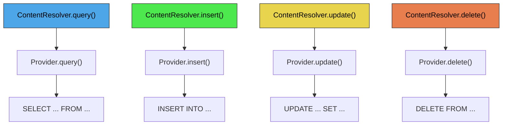

Starting with Android O, the framework encourages structured query arguments
(key-value Bundles) over raw SQL strings.  The relevant constants in
`ContentResolver`:

```java
// frameworks/base/core/java/android/content/ContentResolver.java
public static final String QUERY_ARG_SQL_SELECTION = "android:query-arg-sql-selection";
public static final String QUERY_ARG_SQL_SELECTION_ARGS = "android:query-arg-sql-selection-args";
public static final String QUERY_ARG_SQL_SORT_ORDER = "android:query-arg-sql-sort-order";
public static final String QUERY_ARG_SQL_GROUP_BY = "android:query-arg-sql-group-by";
public static final String QUERY_ARG_SQL_LIMIT = "android:query-arg-sql-limit";
public static final String QUERY_ARG_SORT_COLUMNS = "android:query-arg-sort-columns";
public static final String QUERY_ARG_SORT_DIRECTION = "android:query-arg-sort-direction";
```

### 27.1.6 The call() Method

Beyond CRUD, `ContentProvider.call()` provides an escape hatch for arbitrary
RPC-style interactions.  The provider interprets the method name and returns a
`Bundle`:

```java
// frameworks/base/core/java/android/content/ContentProvider.java (line 2744)
public @Nullable Bundle call(@NonNull String authority, @NonNull String method,
        @Nullable String arg, @Nullable Bundle extras) {
    return call(method, arg, extras);
}
```

This pattern is used heavily by `SettingsProvider` (see Section 42.6), which
routes nearly all reads and writes through `call()` instead of the standard
CRUD methods, for performance reasons.

### 27.1.7 Binder Transport Details

The `ContentProvider.Transport` inner class extends `ContentProviderNative`
(the Binder stub) and wraps every incoming call with permission enforcement:

```java
// frameworks/base/core/java/android/content/ContentProvider.java (line 236)
class Transport extends ContentProviderNative {
    @Override
    public Cursor query(@NonNull AttributionSource attributionSource, Uri uri,
            @Nullable String[] projection, @Nullable Bundle queryArgs,
            @Nullable ICancellationSignal cancellationSignal) {
        uri = validateIncomingUri(uri);
        uri = maybeGetUriWithoutUserId(uri);
        if (enforceReadPermission(attributionSource, uri)
                != PermissionChecker.PERMISSION_GRANTED) {
            // Return empty cursor with correct columns
            if (projection != null) {
                return new MatrixCursor(projection, 0);
            }
            // ...
        }
        // ... delegate to mInterface.query()
    }
}
```

Key points about the transport:

1. **URI validation** -- `validateIncomingUri()` strips user IDs from cross-user
   URIs unless the caller has `INTERACT_ACROSS_USERS`.
2. **Permission enforcement** -- `enforceReadPermission()` and
   `enforceWritePermission()` check the provider's declared read/write
   permissions, path-level permissions, and AppOps.
3. **Cursor adaptation** -- For cross-process queries, the resulting `Cursor` is
   wrapped in a `CursorToBulkCursorAdaptor` that shares a `CursorWindow`
   (backed by shared memory) with the client.  The client receives a
   `BulkCursorDescriptor` containing the window's file descriptor.

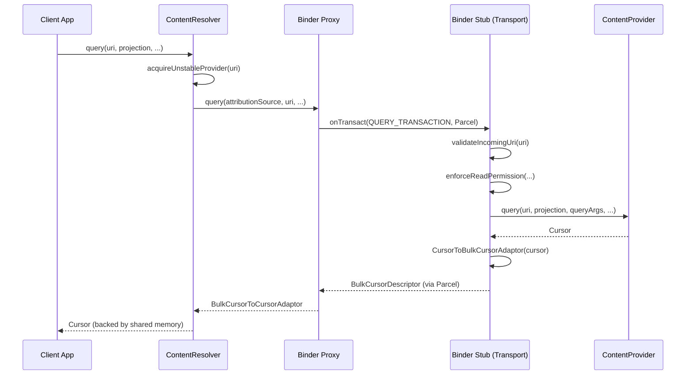

### 27.1.8 Stable vs. Unstable Provider References

`ContentResolver` distinguishes between two kinds of provider references:

- **Unstable** (`acquireUnstableProvider`) -- If the provider crashes, the
  reference becomes invalid, but the client process is not killed.
- **Stable** (`acquireProvider`) -- A stronger binding; historically, a
  provider crash would also kill the client.

The resolver first tries an unstable reference.  If the provider dies
(`DeadObjectException`), it calls `unstableProviderDied()`, then retries with a
stable reference:

```java
// frameworks/base/core/java/android/content/ContentResolver.java (around line 2050)
try {
    fd = unstableProvider.openTypedAssetFile(...);
} catch (DeadObjectException e) {
    unstableProviderDied(unstableProvider);
    stableProvider = acquireProvider(uri);
    fd = stableProvider.openTypedAssetFile(...);
}
```

### 27.1.9 ContentProviderClient

For repeated calls to the same authority, `ContentProviderClient` avoids
repeated provider lookups:

```java
ContentProviderClient client = resolver.acquireContentProviderClient("media");
try {
    Cursor c = client.query(uri, null, null, null);
    // ... use cursor
} finally {
    client.close();
}
```

The client holds either a stable or unstable reference and implements the same
`ContentInterface` as `ContentResolver`, but shortcuts the authority resolution
step.

### 27.1.10 Batch Operations

`ContentProviderOperation` allows multiple CRUD operations to be sent as a
single IPC call, which the provider can execute inside a transaction:

```java
// frameworks/base/core/java/android/content/ContentProvider.java (line 2708)
public @NonNull ContentProviderResult[] applyBatch(@NonNull String authority,
        @NonNull ArrayList<ContentProviderOperation> operations)
        throws OperationApplicationException {
    final int numOperations = operations.size();
    final ContentProviderResult[] results = new ContentProviderResult[numOperations];
    for (int i = 0; i < numOperations; i++) {
        results[i] = operations.get(i).apply(this, results, i);
    }
    return results;
}
```

Providers like `ContactsProvider2` override `applyBatch()` to wrap the entire
set in a SQLite transaction, dramatically improving performance for bulk
contact syncs.

### 27.1.11 File Descriptor Passing

Content providers can pass raw file descriptors across process boundaries using
`openFile()` and `openAssetFile()`.  This is how MediaProvider delivers actual
media data without copying bytes through Binder:

```java
// ContentResolver.java (line 1511)
public final @Nullable InputStream openInputStream(@NonNull Uri uri)
        throws FileNotFoundException {
    String scheme = uri.getScheme();
    if (SCHEME_ANDROID_RESOURCE.equals(scheme)) {
        OpenResourceIdResult r = getResourceId(uri);
        return r.r.openRawResource(r.id);
    } else if (SCHEME_FILE.equals(scheme)) {
        return new FileInputStream(uri.getPath());
    } else {
        AssetFileDescriptor fd = openAssetFileDescriptor(uri, "r", null);
        return fd != null ? fd.createInputStream() : null;
    }
}
```

The `openInputStream()` / `openOutputStream()` convenience methods handle three
URI schemes:

| Scheme | Resolution |
|--------|-----------|
| `content://` | Opens via `ContentProvider.openAssetFile()` over Binder |
| `android.resource://` | Opens a raw resource from the named package |
| `file://` | Opens the local filesystem path directly |

For `content://` URIs, the provider returns a `ParcelFileDescriptor` (which
wraps a Linux file descriptor that can cross process boundaries via Binder).
The file descriptor modes supported are:

| Mode | Meaning |
|------|---------|
| `"r"` | Read-only |
| `"w"` | Write-only (truncation behavior is provider-specific) |
| `"wt"` | Write-only with truncation |
| `"wa"` | Write-only append |
| `"rw"` | Read-write |
| `"rwt"` | Read-write with truncation |

### 27.1.12 The CursorWindow and Shared Memory

When a `Cursor` travels across process boundaries, the actual data is not
serialized into a Parcel.  Instead, the framework uses a `CursorWindow` --
a chunk of shared memory (via `ashmem` / `memfd`) -- that both processes can
read:

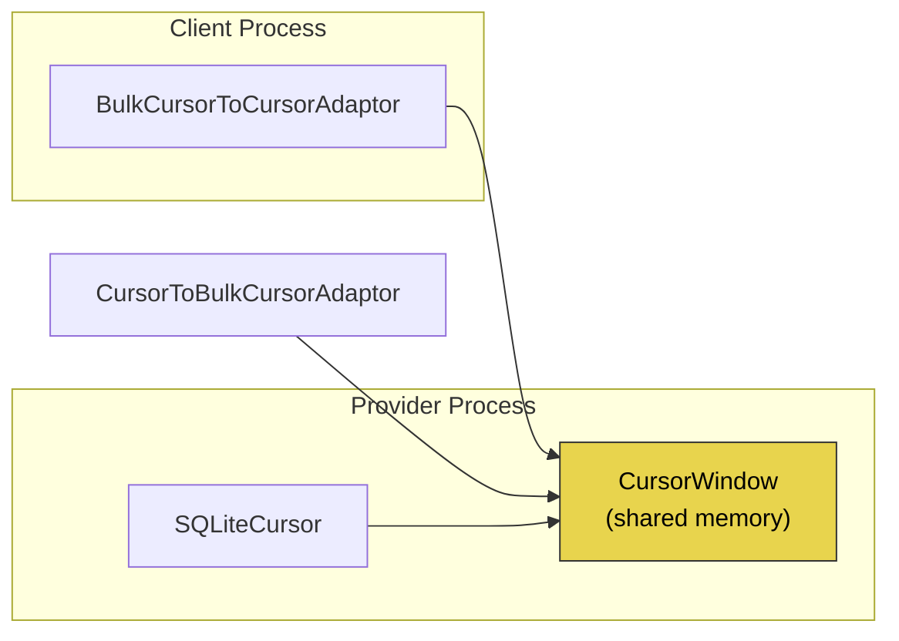

The `CursorToBulkCursorAdaptor` (provider side) wraps the cursor and exposes
it through the `IBulkCursor` Binder interface.  The `BulkCursorToCursorAdaptor`
(client side) provides a standard `Cursor` interface backed by the shared
memory window.

The default `CursorWindow` size is 2 MB.  If a query result exceeds this,
the cursor automatically paginates by filling the window on demand as the
client iterates.

### 27.1.13 ContentValues

`ContentValues` is the standard container for column-value pairs passed to
`insert()` and `update()`.  It is essentially a `HashMap<String, Object>`
that implements `Parcelable`:

```java
ContentValues values = new ContentValues();
values.put(MediaStore.MediaColumns.DISPLAY_NAME, "photo.jpg");
values.put(MediaStore.MediaColumns.MIME_TYPE, "image/jpeg");
values.put(MediaStore.MediaColumns.RELATIVE_PATH, "DCIM/Camera");
Uri uri = resolver.insert(MediaStore.Images.Media.EXTERNAL_CONTENT_URI, values);
```

Values are type-safe: the `put()` method is overloaded for `String`, `Byte`,
`Short`, `Integer`, `Long`, `Float`, `Double`, `Boolean`, and `byte[]`.

### 27.1.14 ContentUris Utility

The `ContentUris` utility class provides helper methods for working with
content URIs that end in a numeric ID:

```java
// Append an ID to a base URI
Uri itemUri = ContentUris.withAppendedId(
    MediaStore.Images.Media.EXTERNAL_CONTENT_URI, 42);
// Result: content://media/external/images/media/42

// Parse the ID from a URI
long id = ContentUris.parseId(itemUri);
// Result: 42
```

### 27.1.15 Thread Safety

Content provider methods (`query`, `insert`, `update`, `delete`) can be called
from multiple Binder threads concurrently.  The Javadoc in `ContentProvider`
explicitly states this:

```
Data access methods (such as insert and update) may be called from many
threads at once, and must be thread-safe.  Other methods (such as onCreate)
are only called from the application main thread.
```

Providers backed by SQLite benefit from SQLite's built-in locking.  Providers
with in-memory data structures must use their own synchronization.

---

## 27.2 ContentProvider Lifecycle

### 27.2.1 Provider Declaration

Every content provider must be declared in `AndroidManifest.xml`:

```xml
<provider
    android:name=".MyContentProvider"
    android:authorities="com.example.myprovider"
    android:exported="true"
    android:readPermission="com.example.READ_DATA"
    android:writePermission="com.example.WRITE_DATA"
    android:multiprocess="false" />
```

Key attributes:

| Attribute | Purpose |
|-----------|---------|
| `authorities` | Semicolon-separated list of authority strings |
| `exported` | Whether other apps can access this provider |
| `readPermission` | Permission required for read operations |
| `writePermission` | Permission required for write operations |
| `grantUriPermissions` | Whether temporary URI permission grants are allowed |
| `multiprocess` | If true, instantiated in each client process (rare) |
| `initOrder` | Relative ordering among providers in the same process |

### 27.2.2 Authority Registration

At install time, `PackageManagerService` parses the manifest and records the
authority-to-provider mapping.  When `ContentResolver` receives a URI, it asks
`ActivityManagerService` to resolve the authority:

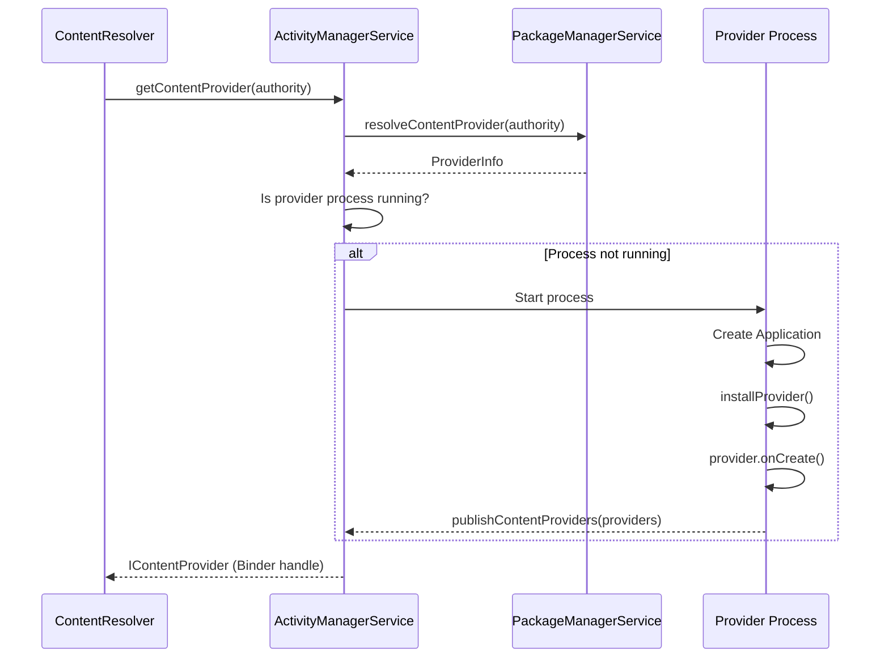

### 27.2.3 Process Start and Provider Initialization

When `ActivityThread` creates an application, it installs all providers declared
for that process *before* calling `Application.onCreate()`:

```
ActivityThread.handleBindApplication()
  -> installContentProviders(app, providers)
       -> for each ProviderInfo:
            installProvider(context, holder, info, ...)
              -> provider = instantiate via reflection
              -> provider.attachInfo(context, info)
                   -> set authority, permissions, flags
                   -> provider.onCreate()
  -> mInstrumentation.callApplicationOnCreate(app)
```

This ordering is critical: providers are available before the app's `onCreate()`
runs, which means any initialization in `Application.onCreate()` can already
use content providers.

### 27.2.4 The attachInfo() Method

`ContentProvider.attachInfo()` is the framework's initialization hook:

```java
// frameworks/base/core/java/android/content/ContentProvider.java (line 2658)
private void attachInfo(Context context, ProviderInfo info, boolean testing) {
    mNoPerms = testing;
    mCallingAttributionSource = new ThreadLocal<>();

    if (mContext == null) {
        mContext = context;
        if (context != null && mTransport != null) {
            mTransport.mAppOpsManager = (AppOpsManager) context.getSystemService(
                    Context.APP_OPS_SERVICE);
        }
        mMyUid = Process.myUid();
        if (info != null) {
            setReadPermission(info.readPermission);
            setWritePermission(info.writePermission);
            setPathPermissions(info.pathPermissions);
            mExported = info.exported;
            mSingleUser = (info.flags & ProviderInfo.FLAG_SINGLE_USER) != 0;
            mSystemUserOnly = (info.flags & ProviderInfo.FLAG_SYSTEM_USER_ONLY) != 0;
            setAuthorities(info.authority);
        }
        ContentProvider.this.onCreate();
    }
}
```

Key observations:

1. `attachInfo()` can only be called once (guarded by `mContext == null`).
2. Permission strings, path permissions, and export status come from the
   `ProviderInfo` parsed from the manifest.
3. `onCreate()` is called at the end -- this is where subclasses perform
   database initialization.

### 27.2.5 Provider Lifecycle States

Unlike activities, content providers have a simple lifecycle:

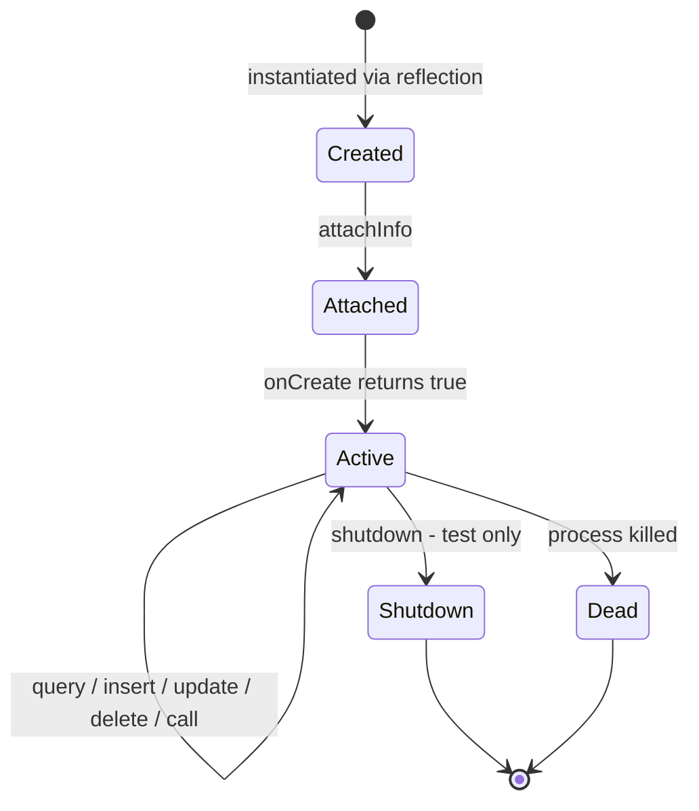

Providers do not have pause/resume/stop states.  Once created, they remain
active for the entire lifetime of their hosting process.  The system may kill
the process at any time (based on OOM-adj scores), which implicitly destroys
all providers within it.

### 27.2.6 Multi-Authority Providers

A single `ContentProvider` subclass can declare multiple authorities separated
by semicolons.  Internally, `setAuthorities()` splits the string:

```java
// frameworks/base/core/java/android/content/ContentProvider.java
private String mAuthority;
private String[] mAuthorities;
```

Since most providers have only one authority, both a `String` and a `String[]`
field are maintained for performance.

### 27.2.7 Single-User and System-User-Only Providers

Two special flags in `ProviderInfo` control multi-user behavior:

- `FLAG_SINGLE_USER` -- The provider runs in user 0's process and serves all
  users.  MediaProvider uses this pattern: there is one process, but it
  handles URIs that embed a user ID.
- `FLAG_SYSTEM_USER_ONLY` -- The provider is only available to the system user
  (user 0).

### 27.2.8 initOrder and Provider Ordering

When multiple providers share the same process, `android:initOrder` controls
their initialization sequence.  Higher values are initialized first.  This is
important when one provider depends on another being available during its
`onCreate()`.

### 27.2.9 Provider Death and Restart

When a provider's process dies (OOM kill, crash, etc.), the system handles
recovery automatically:

1. Clients holding unstable references get `DeadObjectException` on the next
   call.  `ContentResolver` catches this and transparently re-acquires the
   provider (which may trigger a new process start).

2. Clients holding stable references historically were killed along with the
   provider.  Modern Android is more lenient, but the framework still
   distinguishes between the two reference types.

3. `ContentObserver` registrations are maintained by `ContentService` in
   `system_server`, so they survive provider restarts.  However, any pending
   cursor data in shared memory is lost.

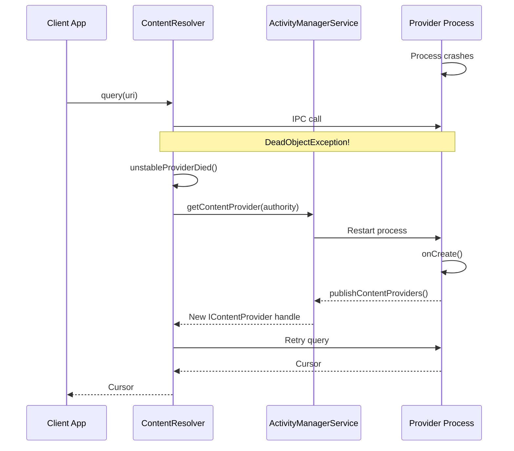

### 27.2.10 Multi-Process Providers

Setting `android:multiprocess="true"` causes the provider to be instantiated
in each client process instead of the provider's own process.  This eliminates
IPC overhead but means:

- Each instance operates on its own copy of data structures.
- File-based databases may cause locking contention.
- The provider must be safe for use across multiple independent instances.

In practice, `multiprocess` providers are rare.  They are mainly useful for
read-only providers or those backed by in-memory data.

---

## 27.3 MediaStore and MediaProvider

### 27.3.1 Overview

MediaProvider is the most complex content provider in AOSP.  It manages every
image, video, audio file, and download on the device.  The provider is
delivered as a Mainline module (`com.google.android.providers.media.module`),
meaning it can be updated independently of the base system.

```
packages/providers/MediaProvider/src/com/android/providers/media/MediaProvider.java
```

At 13,000+ lines, `MediaProvider.java` is one of the largest single source
files in AOSP.  It extends `ContentProvider` directly:

```java
// packages/providers/MediaProvider/.../MediaProvider.java (line 401)
public class MediaProvider extends ContentProvider {
```

### 27.3.2 Authority and Content URIs

MediaProvider registers the authority `media`.  Its URIs follow a structured
pattern:

```
content://media/<volume>/<media-type>/<table>[/<id>]
```

| URI Pattern | Match Code | Description |
|-------------|-----------|-------------|
| `content://media/*/images/media` | `IMAGES_MEDIA` (1) | All images on a volume |
| `content://media/*/images/media/#` | `IMAGES_MEDIA_ID` (2) | Single image by ID |
| `content://media/*/audio/media` | `AUDIO_MEDIA` (100) | All audio files |
| `content://media/*/audio/media/#` | `AUDIO_MEDIA_ID` (101) | Single audio by ID |
| `content://media/*/video/media` | `VIDEO_MEDIA` (200) | All video files |
| `content://media/*/video/media/#` | `VIDEO_MEDIA_ID` (201) | Single video by ID |
| `content://media/*/file` | `FILES` (700) | All files (any type) |
| `content://media/*/file/#` | `FILES_ID` (701) | Single file by ID |
| `content://media/*/downloads` | `DOWNLOADS` (800) | Downloaded files |
| `content://media/*/downloads/#` | `DOWNLOADS_ID` (801) | Single download by ID |

The `*` volume segment is typically `internal` or `external_primary`, but can
also be a UUID for removable storage.

### 27.3.3 The Volume System

`MediaVolume` represents a storage volume within MediaProvider:

```java
// packages/providers/MediaProvider/.../MediaVolume.java (line 45)
public final class MediaVolume implements Parcelable {
    private final @NonNull String mName;      // e.g., "external_primary"
    private final @Nullable UserHandle mUser; // null for public volumes
    private final @Nullable File mPath;       // mount point
    private final @Nullable String mId;       // e.g., "external;0"
    private final boolean mExternallyManaged; // managed outside Android
    private final boolean mPublicVolume;      // accessible to all users
}
```

MediaProvider maintains separate SQLite databases per volume:

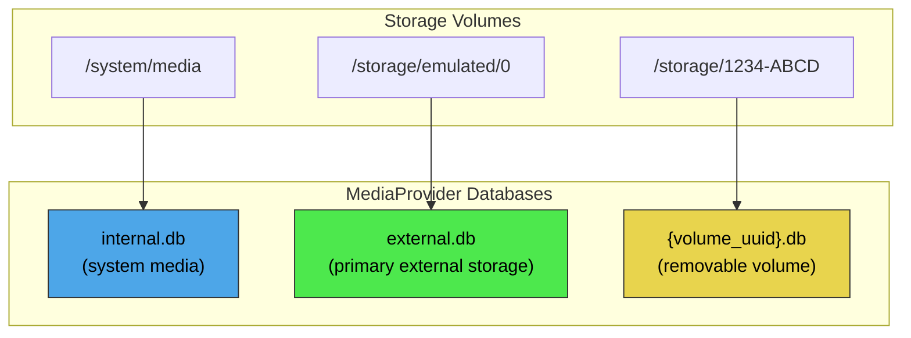

The `VolumeCache` class tracks mounted volumes and maps volume names to
their paths and databases.

### 27.3.4 Database Schema

The `DatabaseHelper` class manages the SQLite schema.  The primary table is
`files`, which stores metadata for all media:

| Column | Type | Description |
|--------|------|-------------|
| `_id` | INTEGER | Primary key |
| `_data` | TEXT | Absolute file path |
| `_display_name` | TEXT | User-visible filename |
| `_size` | INTEGER | File size in bytes |
| `mime_type` | TEXT | MIME type |
| `media_type` | INTEGER | 0=None, 1=Image, 2=Audio, 3=Video |
| `title` | TEXT | Media title |
| `artist` | TEXT | Artist name |
| `album` | TEXT | Album name |
| `duration` | INTEGER | Duration in ms (audio/video) |
| `width` | INTEGER | Image/video width |
| `height` | INTEGER | Image/video height |
| `date_added` | INTEGER | Insertion timestamp |
| `date_modified` | INTEGER | Modification timestamp |
| `date_taken` | INTEGER | Capture timestamp (EXIF) |
| `owner_package_name` | TEXT | Package that created the file |
| `volume_name` | TEXT | Volume name |
| `relative_path` | TEXT | Path relative to volume root |
| `is_pending` | INTEGER | 1 if file is still being written |
| `is_trashed` | INTEGER | 1 if file is in trash |
| `is_favorite` | INTEGER | 1 if user-marked favorite |

### 27.3.5 Media Scanning

The media scanner discovers files on storage, extracts metadata, and inserts
or updates rows in the `files` table.

```
packages/providers/MediaProvider/src/com/android/providers/media/scan/ModernMediaScanner.java
```

```java
// ModernMediaScanner.java (line 183)
public class ModernMediaScanner implements MediaScanner {
```

`ModernMediaScanner` replaced the legacy native scanner with a pure-Java
implementation.  The scanner operates in stages:

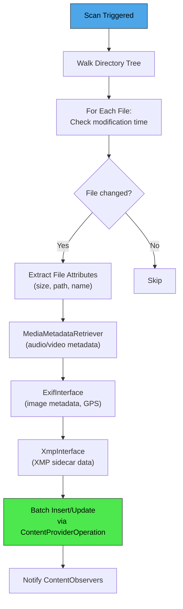

Scan reasons are encoded as integer constants:

```java
// MediaScanner.java
public static final int REASON_UNKNOWN = 0;
public static final int REASON_MOUNTED = 1;
public static final int REASON_DEMAND  = 2;   // explicit scan request
public static final int REASON_IDLE    = 3;   // idle maintenance
```

The batch size for operations is 32 items:

```java
// ModernMediaScanner.java (line 207)
private static final int BATCH_SIZE = 32;
```

Metadata extraction follows a trust hierarchy: file attributes have the lowest
trust, then `MediaMetadataRetriever`, then `ExifInterface`, and finally
`XmpInterface` has the highest trust level.  Each layer can overwrite values
from the previous layer.

### 27.3.6 FUSE Integration

Since Android 11, MediaProvider integrates with a FUSE filesystem layer.
When apps access files through the filesystem (instead of content URIs),
the FUSE daemon intercepts the access and routes it through MediaProvider for
permission checking:

```
packages/providers/MediaProvider/src/com/android/providers/media/fuse/FuseDaemon.java
packages/providers/MediaProvider/src/com/android/providers/media/fuse/ExternalStorageServiceImpl.java
```

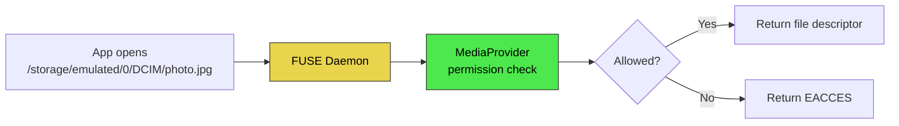

### 27.3.7 Scoped Storage and Access Patterns

MediaProvider enforces different access patterns depending on the calling app's
target SDK and permissions:

| Access Level | How Obtained | Scope |
|-------------|-------------|-------|
| Own files | No permission needed | Files where `owner_package_name` matches caller |
| `READ_MEDIA_IMAGES` | Runtime permission | All images |
| `READ_MEDIA_VIDEO` | Runtime permission | All video |
| `READ_MEDIA_AUDIO` | Runtime permission | All audio |
| `ACCESS_MEDIA_LOCATION` | Runtime permission | GPS data in EXIF |
| `MANAGE_EXTERNAL_STORAGE` | Special permission | All files (broad) |
| Photo Picker | User selection | Selected items only |

The `AccessChecker` class and `LocalCallingIdentity` encode these permission
states as bit flags:

```java
// packages/providers/MediaProvider/.../LocalCallingIdentity.java
public static final int PERMISSION_IS_SELF          = 1 << 0;
public static final int PERMISSION_IS_SHELL         = 1 << 1;
public static final int PERMISSION_IS_MANAGER       = 1 << 2;
public static final int PERMISSION_IS_SYSTEM_GALLERY = 1 << 3;
public static final int PERMISSION_READ_IMAGES      = 1 << 8;
public static final int PERMISSION_READ_VIDEO       = 1 << 9;
public static final int PERMISSION_IS_REDACTION_NEEDED = 1 << 10;
```

### 27.3.8 Photo Picker

Starting with Android 13, MediaProvider includes a Photo Picker that allows
users to grant access to specific photos/videos without giving the app broad
media permissions:

```
packages/providers/MediaProvider/src/com/android/providers/media/photopicker/
```

Picker URIs use a different path segment:

```java
// LocalUriMatcher.java
static final int PICKER_ID = 901;
static final int PICKER_GET_CONTENT_ID = 906;
static final int PICKER_TRANSCODED_ID = 907;
static final int PICKER_INTERNAL_V2 = 908;
```

The picker can also surface items from cloud media providers (Google Photos,
etc.) through the `CloudMediaProviderContract`.

### 27.3.9 Transcoding

MediaProvider includes video transcoding support.  When an app that targets an
older SDK opens a HEVC video file, the provider can transparently transcode it
to AVC (H.264) for compatibility:

```
packages/providers/MediaProvider/src/com/android/providers/media/TranscodeHelper.java
packages/providers/MediaProvider/src/com/android/providers/media/TranscodeHelperImpl.java
```

Transcoding is handled transparently at the file descriptor level.  The
`FLAG_TRANSFORM_TRANSCODING` bit flag indicates that a file access requires
transcoding:

```java
// MediaProvider.java (line 410)
private static final int FLAG_TRANSFORM_TRANSCODING = 1 << 0;
```

### 27.3.10 Redacted URIs

For privacy, MediaProvider can issue redacted URIs that strip location metadata
(GPS coordinates) from images.  When an app without `ACCESS_MEDIA_LOCATION`
opens a photo, it receives a redacted file descriptor with EXIF location data
removed:

```java
// MediaProvider.java (line 413)
private static final int FLAG_TRANSFORM_REDACTION = 1 << 1;
```

Redacted URIs use a special synthetic path prefix and a unique hash-based
identifier:

```java
// SyntheticPathUtils.java
public static final String REDACTED_URI_ID_PREFIX = "REDACTED_URI_";
public static final int REDACTED_URI_ID_SIZE = 36;
```

### 27.3.11 Idle Maintenance

MediaProvider performs background maintenance during device idle periods.  The
`IdleService` handles tasks like:

- Re-scanning files whose metadata may be stale
- Cleaning up orphaned database rows (files that no longer exist on disk)
- Updating special format detection results
- Processing trash expiration (trashed files are auto-deleted after 30 days)

```java
// MediaProvider.java (line 466)
private static final int IDLE_MAINTENANCE_ROWS_LIMIT = 1000;
```

Maintenance operates in batches of 1,000 rows to avoid long-running operations
that could be interrupted.

### 27.3.12 The DatabaseHelper

`DatabaseHelper` extends `SQLiteOpenHelper` and manages schema creation,
upgrades, and per-volume database instances:

```java
// packages/providers/MediaProvider/.../DatabaseHelper.java (line 107)
public class DatabaseHelper extends SQLiteOpenHelper implements AutoCloseable {
```

Key constants:

```java
static final String INTERNAL_DATABASE_NAME = "internal.db";
static final String EXTERNAL_DATABASE_NAME = "external.db";
```

The helper implements `OnFilesChangeListener` and `OnLegacyMigrationListener`
interfaces to coordinate with the provider during schema changes and data
migrations from older Android versions.

### 27.3.13 Backup and Recovery

MediaProvider includes a database backup and recovery mechanism that uses
extended attributes (xattrs) on the filesystem to store row ID mappings.  This
ensures that stable URIs survive database recreation after a factory reset or
device migration:

```
packages/providers/MediaProvider/src/com/android/providers/media/DatabaseBackupAndRecovery.java
packages/providers/MediaProvider/src/com/android/providers/media/stableuris/dao/BackupIdRow.java
```

### 27.3.14 The `_data` Column Deprecation

Historically, apps could read the `_data` column to get the absolute filesystem
path of a media file.  Starting with Android 11 (API 30), this column returns
a fake path that the system intercepts via FUSE:

```java
// ContentResolver.java (line 114)
public static final boolean DEPRECATE_DATA_COLUMNS = true;
public static final String DEPRECATE_DATA_PREFIX = "/mnt/content/";
```

Apps should use `ContentResolver.openFileDescriptor()` or
`ContentResolver.openInputStream()` instead of reading the `_data` column.

---

## 27.4 ContactsProvider

### 27.4.1 Overview

The Contacts content provider manages all contact data on the device.  It is
one of the most complex providers, implementing a three-tier data model
(contacts, raw contacts, and data rows), automatic aggregation, sync adapter
integration, and enterprise contact access.

```
packages/providers/ContactsProvider/src/com/android/providers/contacts/ContactsProvider2.java
```

```java
// ContactsProvider2.java (line 244)
public class ContactsProvider2 extends AbstractContactsProvider
        implements OnAccountsUpdateListener {
```

### 27.4.2 The Three-Tier Data Model

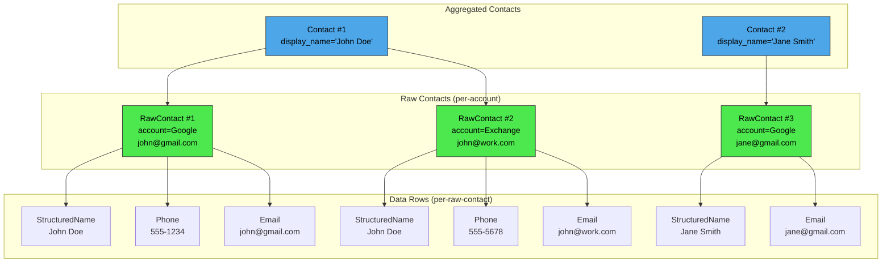

The contract is defined in `android.provider.ContactsContract`:

| Table | URI | Description |
|-------|-----|-------------|
| `Contacts` | `content://com.android.contacts/contacts` | Aggregated contacts |
| `RawContacts` | `content://com.android.contacts/raw_contacts` | Per-account raw contacts |
| `Data` | `content://com.android.contacts/data` | Individual data items |

### 27.4.3 Data Row Types

Each data row has a `mimetype` column that determines its kind.  The
`DataRowHandler` hierarchy dispatches CRUD operations based on MIME type:

```
packages/providers/ContactsProvider/src/com/android/providers/contacts/
  DataRowHandlerForStructuredName.java
  DataRowHandlerForPhoneNumber.java
  DataRowHandlerForEmail.java
  DataRowHandlerForPhoto.java
  DataRowHandlerForOrganization.java
  DataRowHandlerForNickname.java
  DataRowHandlerForNote.java
  DataRowHandlerForStructuredPostal.java
  DataRowHandlerForGroupMembership.java
  DataRowHandlerForIdentity.java
  DataRowHandlerForIm.java
  DataRowHandlerForCustomMimetype.java
```

Each handler knows how to validate, normalize, and index its specific data
type.  For example, `DataRowHandlerForPhoneNumber` normalizes phone numbers
for consistent lookup.

### 27.4.4 Contact Aggregation

Aggregation is the process of merging raw contacts from different accounts
into unified contacts.  Two aggregator implementations exist:

```
packages/providers/ContactsProvider/src/com/android/providers/contacts/aggregation/
  AbstractContactAggregator.java     -- Base class
  ContactAggregator.java              -- Original algorithm (v4)
  ContactAggregator2.java             -- Newer algorithm (v5)
```

The aggregation algorithm:

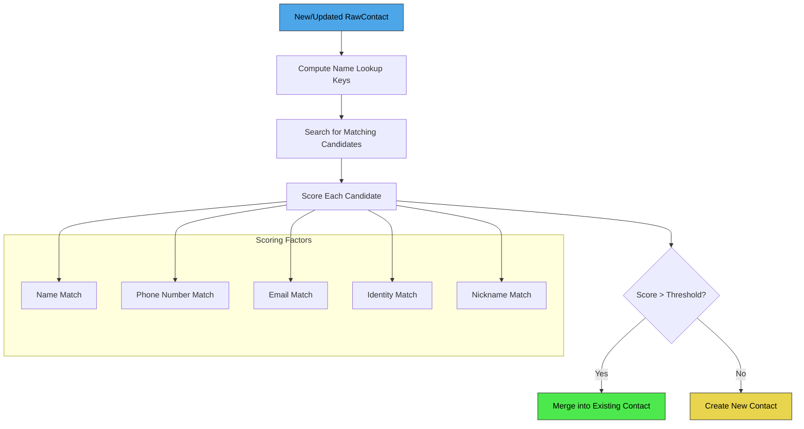

The `ContactMatcher` utility class computes match scores between raw contacts.
Users can also manually control aggregation through
`AggregationExceptions` (keep-together / keep-apart).

### 27.4.5 URI Matching

ContactsProvider2 defines an extensive set of URI codes:

```java
// ContactsProvider2.java (line 344)
public static final int CONTACTS                    = 1000;
public static final int CONTACTS_ID                 = 1001;
public static final int CONTACTS_LOOKUP             = 1002;
public static final int CONTACTS_LOOKUP_ID          = 1003;
public static final int CONTACTS_ID_DATA            = 1004;
public static final int CONTACTS_FILTER             = 1005;

public static final int RAW_CONTACTS                = 2002;
public static final int RAW_CONTACTS_ID             = 2003;
public static final int RAW_CONTACTS_ID_DATA        = 2004;

public static final int DATA                        = 3000;
public static final int DATA_ID                     = 3001;
public static final int PHONES                      = 3002;
public static final int EMAILS                      = 3005;
public static final int POSTALS                     = 3009;
```

### 27.4.6 Contact Lookup Keys

Contacts are uniquely identified by lookup keys rather than row IDs, because
IDs can change during aggregation.  The lookup key encodes the constituent
raw contacts:

```
content://com.android.contacts/contacts/lookup/0n3A412B507430/5
                                                ^^^^^^^^^^^^^  ^
                                                lookup_key     contact_id (hint)
```

The `ContactLookupKey` class parses this key to locate the contact even after
re-aggregation.

### 27.4.7 Enterprise Contacts

`ContactsProvider2` supports cross-profile (work profile) contact lookup
through the `EnterpriseContactsCursorWrapper` and `EnterprisePolicyGuard`.
When querying `Contacts.ENTERPRISE_CONTENT_URI`, the provider transparently
queries the work profile's contacts provider and merges results.

### 27.4.8 Permissions

```java
// ContactsProvider2.java (line 247-248)
private static final String READ_PERMISSION = "android.permission.READ_CONTACTS";
private static final String WRITE_PERMISSION = "android.permission.WRITE_CONTACTS";
```

Additionally, `MANAGE_SIM_ACCOUNTS` and `SET_DEFAULT_ACCOUNT` permissions
control SIM contact management and default account configuration.

### 27.4.9 The ContactsDatabaseHelper

The contacts database schema is one of the most complex in AOSP:

```
packages/providers/ContactsProvider/src/com/android/providers/contacts/ContactsDatabaseHelper.java
```

Key tables defined in `ContactsDatabaseHelper.Tables`:

| Table | Purpose |
|-------|---------|
| `contacts` | Aggregated contacts |
| `raw_contacts` | Per-account raw contacts |
| `data` | Data items (phone, email, etc.) |
| `mimetypes` | MIME type registry |
| `accounts` | Account name/type pairs |
| `name_lookup` | Normalized name indexes for aggregation |
| `phone_lookup` | Normalized phone number indexes |
| `groups` | Contact groups |
| `agg_exceptions` | Manual aggregation overrides |
| `settings` | Per-account settings |
| `directories` | Contact directories (GAL, etc.) |
| `search_index` | Full-text search index |
| `deleted_contacts` | Tombstones for sync |
| `presence` | IM presence status |
| `photo_files` | Photo file metadata |

Views defined in `ContactsDatabaseHelper.Views`:

| View | Purpose |
|------|---------|
| `view_contacts` | Denormalized contact view |
| `view_data` | Data joined with raw contacts and contacts |
| `view_raw_contacts` | Raw contacts with account info |
| `view_entities` | Entity view for sync |
| `view_stream_items` | Social stream data |

### 27.4.10 Search Index

`ContactsProvider2` maintains a full-text search index for fast contact lookup.
The `SearchIndexManager` populates the `search_index` table with tokenized
versions of all searchable contact data:

```
packages/providers/ContactsProvider/src/com/android/providers/contacts/SearchIndexManager.java
```

The search index supports both prefix matching (for real-time search-as-you-type)
and token matching.  The `FtsQueryBuilder` constructs SQLite FTS queries from
user input.

### 27.4.11 Directory Support

Contacts directories represent remote contact sources, such as a corporate
Global Address List (GAL).  When an app queries `Contacts.CONTENT_FILTER_URI`,
the provider can fan out the query to all registered directories and merge
results:

```java
// ContactsProvider2.java
private ContactDirectoryManager mContactDirectoryManager;
```

The `ContactDirectoryManager` discovers directory providers by querying all
installed packages for providers that advertise directory support.

### 27.4.12 Sync Adapter Integration

Contacts supports the Android sync framework.  Sync adapters (e.g., Google
Contacts sync, Exchange ActiveSync) write to `RawContacts` and `Data` tables
with special permissions.  The `CALLER_IS_SYNCADAPTER` query parameter
modifies behavior:

- When set, the provider skips aggregation (the sync adapter manages it)
- When set, deletes are hard deletes instead of soft deletes
- The `dirty` flag is not automatically set on mutations

This is indicated in URIs:

```
content://com.android.contacts/raw_contacts?caller_is_syncadapter=true
    &account_name=user@gmail.com&account_type=com.google
```

### 27.4.13 Profile Contact

A special "profile" contact represents the device owner.  It is stored
separately and has its own `ProfileProvider` (internally part of
`ContactsProvider2`).  Profile URIs use a different path:

```
content://com.android.contacts/profile
content://com.android.contacts/profile/raw_contacts
content://com.android.contacts/profile/data
```

The `ProfileAggregator` handles aggregation for profile contacts separately
from regular contacts.

### 27.4.14 VCard Export

`ContactsProvider2` supports exporting contacts as vCards through the
`openAssetFile()` method.  When an app opens a contact URI with the
`text/x-vcard` MIME type, the provider serializes the contact using the
`VCardComposer`:

```java
// ContactsProvider2.java imports
import com.android.vcard.VCardComposer;
import com.android.vcard.VCardConfig;
```

---

## 27.5 CalendarProvider

### 27.5.1 Overview

`CalendarProvider2` manages calendar events, attendees, reminders, and
recurring event instances.

```
packages/providers/CalendarProvider/src/com/android/providers/calendar/CalendarProvider2.java
```

```java
// CalendarProvider2.java (line 103)
public class CalendarProvider2 extends SQLiteContentProvider
        implements OnAccountsUpdateListener {
```

Note that `CalendarProvider2` extends `SQLiteContentProvider`, a convenience
base class that wraps operations in SQLite transactions automatically.

### 27.5.2 Calendar Data Model

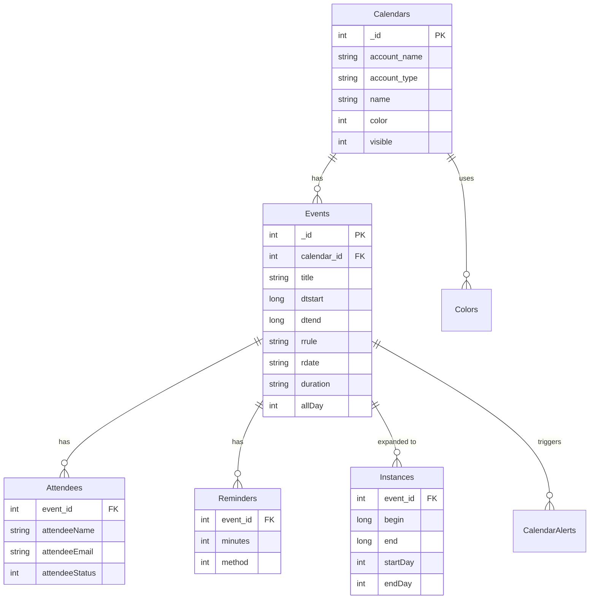

### 27.5.3 Content URIs

The contract is defined in `android.provider.CalendarContract`:

| URI | Description |
|-----|-------------|
| `content://com.android.calendar/calendars` | Calendar accounts |
| `content://com.android.calendar/events` | Calendar events |
| `content://com.android.calendar/instances/when/<start>/<end>` | Expanded instances in range |
| `content://com.android.calendar/attendees` | Event attendees |
| `content://com.android.calendar/reminders` | Event reminders |
| `content://com.android.calendar/calendar_alerts` | Triggered alerts |
| `content://com.android.calendar/colors` | Calendar/event colors |
| `content://com.android.calendar/syncstate` | Sync adapter state |

### 27.5.4 Recurrence Expansion

One of CalendarProvider's most complex responsibilities is expanding recurring
events (iCalendar RRULE/RDATE) into concrete instances.  The
`CalendarInstancesHelper` class computes the expansion window and generates
rows in the `Instances` table:

```java
// CalendarProvider2.java
private CalendarInstancesHelper mInstancesHelper;
```

The expansion relies on the `calendarcommon2` library:

```java
// Imports in CalendarProvider2.java
import com.android.calendarcommon2.EventRecurrence;
import com.android.calendarcommon2.RecurrenceProcessor;
import com.android.calendarcommon2.RecurrenceSet;
```

When a query hits the `Instances` URI, CalendarProvider checks whether the
expansion window covers the requested time range, expanding further if needed.

### 27.5.5 Alarm Management

`CalendarAlarmManager` schedules Android alarms for event reminders.  When an
event's reminder time arrives, the alarm fires, and `CalendarProvider` writes
an entry to the `CalendarAlerts` table, which in turn triggers a notification.

### 27.5.6 Cross-Profile Calendar

The `CrossProfileCalendarHelper` enables managed profiles (work profiles) to
share calendar data with the personal profile, subject to enterprise policy:

```java
// CalendarProvider2.java (line 199)
protected CrossProfileCalendarHelper mCrossProfileCalendarHelper;
```

### 27.5.7 Permissions

Calendar data is protected by:

```
android.permission.READ_CALENDAR
android.permission.WRITE_CALENDAR
```

### 27.5.8 CalendarDatabaseHelper

The calendar database schema includes the following tables:

```
packages/providers/CalendarProvider/src/com/android/providers/calendar/CalendarDatabaseHelper.java
```

| Table (from CalendarDatabaseHelper.Tables) | Purpose |
|--------------------------------------------|---------|
| `Calendars` | Calendar accounts |
| `Events` | Event definitions |
| `Instances` | Expanded event instances |
| `Attendees` | Event attendees |
| `Reminders` | Event reminders |
| `CalendarAlerts` | Triggered calendar alerts |
| `Colors` | Calendar and event colors |
| `ExtendedProperties` | Sync adapter extensions |
| `EventsRawTimes` | Raw time values for events |
| `CalendarCache` | Cached timezone data |
| `SyncState` | Sync adapter state |

Views provide pre-joined data:

| View (from CalendarDatabaseHelper.Views) | Contents |
|------------------------------------------|----------|
| `view_events` | Events joined with Calendars |

### 27.5.9 Instance Expansion Details

The instance expansion algorithm is critical for recurring events.  Consider
a weekly meeting that repeats every Monday from January to December.  Rather
than storing 52 separate events, the calendar stores one event with an RRULE:

```
RRULE:FREQ=WEEKLY;BYDAY=MO;UNTIL=20261231T235959Z
```

When a client queries the `Instances` table for a time range (say, March 2026),
the `CalendarInstancesHelper` computes which occurrences of the recurring event
fall within that range using the `RecurrenceProcessor`:

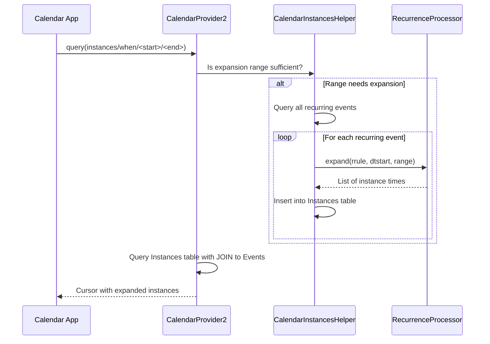

The expansion maintains a cached window.  If a query falls within the already-
expanded window, no new expansion is needed.  The minimum expansion span is
two months:

```java
// CalendarProvider2.java (line 274)
private static final long MINIMUM_EXPANSION_SPAN =
        2L * 31 * 24 * 60 * 60 * 1000;
```

### 27.5.10 CalendarContract URI Matching

`CalendarProvider2` uses an extensive `UriMatcher`.  Selected URI patterns and
their match codes:

```java
private static final int CALENDARS                    = 1;
private static final int CALENDARS_ID                 = 2;
private static final int INSTANCES                    = 3;
private static final int INSTANCES_BY_DAY             = 4;
private static final int EVENTS                       = 7;
private static final int EVENTS_ID                    = 8;
private static final int ATTENDEES                    = 9;
private static final int ATTENDEES_ID                 = 10;
private static final int REMINDERS                    = 15;
private static final int REMINDERS_ID                 = 16;
private static final int CALENDAR_ALERTS              = 17;
private static final int CALENDAR_ALERTS_ID           = 18;
private static final int CALENDARS_ID_EVENTS          = 21;
private static final int EVENTS_ID_EXCEPTIONS         = 23;
private static final int COLORS                       = 25;
private static final int SYNCSTATE                    = 28;
```

### 27.5.11 Event Mutation Tracking

CalendarProvider tracks mutations for sync purposes.  When an event is modified,
the provider marks it as dirty and records which sync adapter last mutated it:

```java
// CalendarProvider2.java (line 212)
private static final String SQL_UPDATE_EVENT_SET_DIRTY_AND_MUTATORS = "UPDATE " +
        Tables.EVENTS + " SET " +
        Events.DIRTY + "=1," +
        Events.MUTATORS + "=? " +
        " WHERE " + Events._ID + "=?";
```

The `MUTATORS` column allows sync adapters to filter out changes they
themselves made, preventing infinite sync loops.

### 27.5.12 Search

CalendarProvider supports full-text search across event titles, descriptions,
locations, and attendee names/emails.  The search query is tokenized and
each token is matched against these fields:

```java
// CalendarProvider2.java (line 365)
private static final String[] SEARCH_COLUMNS = new String[] {
    CalendarContract.Events.TITLE,
    CalendarContract.Events.DESCRIPTION,
    CalendarContract.Events.EVENT_LOCATION,
    ATTENDEES_EMAIL_CONCAT,
    ATTENDEES_NAME_CONCAT
};
```

The search uses SQL `LIKE` with a custom escape character (`#`) to handle
special characters in queries:

```java
// CalendarProvider2.java (line 341)
private static final String SEARCH_ESCAPE_CHAR = "#";
private static final Pattern SEARCH_ESCAPE_PATTERN =
    Pattern.compile("([%_" + SEARCH_ESCAPE_CHAR + "])");
```

---

## 27.6 SettingsProvider

### 27.6.1 Overview

`SettingsProvider` is unlike other content providers.  It does not use SQLite
for its primary data path (though a legacy migration path exists).  Instead,
it stores settings as XML files in the device's system directory, managed by
the `SettingsState` class.

```
frameworks/base/packages/SettingsProvider/src/com/android/providers/settings/SettingsProvider.java
```

```java
// SettingsProvider.java (line 197)
public class SettingsProvider extends ContentProvider {
```

### 27.6.2 The Three Settings Namespaces

Settings are divided into three namespaces with different security levels:

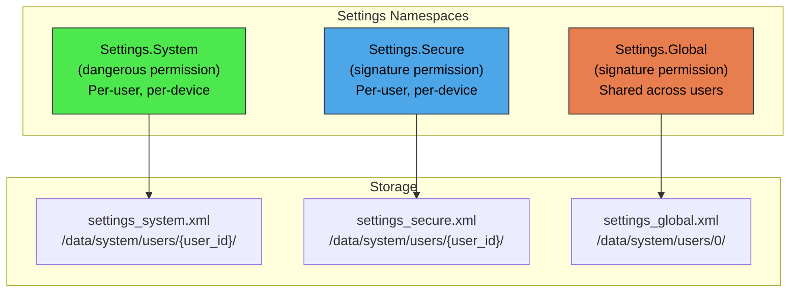

| Namespace | Permission Level | Per-User? | Typical Settings |
|-----------|-----------------|-----------|-----------------|
| `System` | Dangerous (`WRITE_SETTINGS`) | Yes | Screen brightness, font size, ringtone |
| `Secure` | Signature | Yes | Default input method, accessibility settings |
| `Global` | Signature | No (shared) | ADB enabled, device provisioned, airplane mode |

Additionally, two internal namespaces exist:

```java
// SettingsProvider.java (line 204-208)
public static final String TABLE_SYSTEM = "system";
public static final String TABLE_SECURE = "secure";
public static final String TABLE_GLOBAL = "global";
public static final String TABLE_SSAID  = "ssaid";   // Android ID per app
public static final String TABLE_CONFIG = "config";   // DeviceConfig flags
```

### 27.6.3 The call() Method Optimization

`SettingsProvider` routes all reads and writes through the `call()` method
rather than through `query()`/`insert()`/`update()`.  This is a significant
performance optimization because `call()` avoids the overhead of cursor
creation and Binder marshaling of result sets:

```java
// SettingsProvider.java (line 446)
@Override
public Bundle call(String method, String name, Bundle args) {
    final int requestingUserId = getRequestingUserId(args);
    final int callingDeviceId = getDeviceId();
    switch (method) {
        case Settings.CALL_METHOD_GET_CONFIG -> {
            Setting setting = getConfigSetting(name);
            return packageValueForCallResult(...);
        }
        case Settings.CALL_METHOD_GET_GLOBAL -> {
            Setting setting = getGlobalSetting(name);
            return packageValueForCallResult(...);
        }
        case Settings.CALL_METHOD_GET_SECURE -> {
            Setting setting = getSecureSetting(name, requestingUserId, callingDeviceId);
            // ...
        }
        case Settings.CALL_METHOD_GET_SYSTEM -> {
            Setting setting = getSystemSetting(name, requestingUserId, callingDeviceId);
            // ...
        }
        case Settings.CALL_METHOD_PUT_GLOBAL -> { /* ... */ }
        case Settings.CALL_METHOD_PUT_SECURE -> { /* ... */ }
        case Settings.CALL_METHOD_PUT_SYSTEM -> { /* ... */ }
        // ... RESET, SET_ALL, etc.
    }
}
```

On the client side, `Settings.System.getString()`, `Settings.Secure.getInt()`,
etc., all call through `ContentResolver.call()` with the appropriate method
name, completely bypassing the query/cursor path.

### 27.6.4 Generation Tracking

SettingsProvider implements a generation-based caching protocol.  Each setting
namespace has a generation counter that increments on every mutation.  Clients
(via the `Settings` class) cache values locally and only re-fetch when the
generation changes:

```
frameworks/base/packages/SettingsProvider/src/com/android/providers/settings/GenerationRegistry.java
```

This means that reading a setting that has not changed since the last read
requires zero IPC calls.

### 27.6.5 Settings Moved Between Namespaces

Over Android's history, settings have been moved between namespaces.  The
provider maintains migration tables:

```java
// SettingsProvider.java (line 300-327)
static final Set<String> sSecureMovedToGlobalSettings = new ArraySet<>();
static final Set<String> sSystemMovedToGlobalSettings = new ArraySet<>();
static final Set<String> sSystemMovedToSecureSettings = new ArraySet<>();
static final Set<String> sGlobalMovedToSecureSettings = new ArraySet<>();
static final Set<String> sGlobalMovedToSystemSettings = new ArraySet<>();
```

When a client queries a setting in the wrong namespace, the provider
transparently redirects to the correct one.

### 27.6.6 Validation

Apps targeting API 22 and above cannot add arbitrary keys to the System
namespace.  The provider validates values against a set of registered
validators:

```
frameworks/base/packages/SettingsProvider/src/android/provider/settings/validators/
  SystemSettingsValidators.java
  SecureSettingsValidators.java
  GlobalSettingsValidators.java
  Validator.java
  InclusiveIntegerRangeValidator.java
  InclusiveFloatRangeValidator.java
  DiscreteValueValidator.java
  ComponentNameListValidator.java
```

### 27.6.7 System Services

SettingsProvider also registers two system services:

```java
// SettingsProvider.java (line 440-441)
ServiceManager.addService("settings", new SettingsService(this));
ServiceManager.addService("device_config", new DeviceConfigService(this));
```

The `device_config` service exposes the `TABLE_CONFIG` namespace, used by
feature flags and server-pushed configuration.

### 27.6.8 Virtual Device Support

SettingsProvider supports per-virtual-device settings overrides.  When the
calling context is associated with a virtual device (e.g., a companion display),
the provider first checks for a device-specific setting, then falls back to the
default device's setting:

```java
// SettingsProvider.java (line 468-471)
if (callingDeviceId != Context.DEVICE_ID_DEFAULT
        && (setting == null || setting.isNull())) {
    setting = getSecureSetting(name, requestingUserId, Context.DEVICE_ID_DEFAULT);
}
```

### 27.6.9 The SettingsState Class

Each settings namespace is backed by a `SettingsState` instance that handles
in-memory storage and XML persistence:

```
frameworks/base/packages/SettingsProvider/src/com/android/providers/settings/SettingsState.java
```

```java
// SettingsState.java (line 97)
public class SettingsState {
```

`SettingsState` stores settings as a `HashMap<String, Setting>` in memory.
Each `Setting` encapsulates the name, value, default value, package name, tag,
and whether it is preserved during restore.

The persistence model is write-behind: mutations are recorded in memory
immediately and asynchronously flushed to XML.  However, for critical settings
(like `DEVICE_PROVISIONED`), writes are synchronous:

```java
// SettingsProvider.java (line 289)
private static final Set<String> CRITICAL_GLOBAL_SETTINGS = new ArraySet<>();
static {
    CRITICAL_GLOBAL_SETTINGS.add(Settings.Global.DEVICE_PROVISIONED);
}

private static final Set<String> CRITICAL_SECURE_SETTINGS = new ArraySet<>();
static {
    CRITICAL_SECURE_SETTINGS.add(Settings.Secure.USER_SETUP_COMPLETE);
}
```

### 27.6.10 Settings Key Derivation

Settings are identified by a composite key that includes the settings type,
user ID, and device ID:

```java
// SettingsState.java
public static int makeKey(int type, int userId, int deviceId) { ... }
public static boolean isGlobalSettingsKey(int key) { ... }
public static boolean isSecureSettingsKey(int key) { ... }
public static boolean isSystemSettingsKey(int key) { ... }
public static boolean isConfigSettingsKey(int key) { ... }
```

This allows the same `SettingsRegistry` to manage settings for all users and
virtual devices through a unified key space.

### 27.6.11 The SettingsRegistry

The `SettingsRegistry` (an inner class of `SettingsProvider`) manages all
`SettingsState` instances.  It handles:

- Creating settings states for new users and devices
- Migration of legacy (SQLite-based) settings to the XML format
- Ensuring settings directories exist
- Managing backup and restore of settings

```java
// SettingsProvider.java
@GuardedBy("mLock")
private SettingsRegistry mSettingsRegistry;
```

### 27.6.12 DeviceConfig (Config Namespace)

The `TABLE_CONFIG` namespace powers `android.provider.DeviceConfig`, which
provides server-pushed feature flags and experiment configuration.  This
namespace is not directly accessible to apps; only system components and
the server push mechanism can read/write it.

Sync modes for DeviceConfig:

```java
// SettingsProvider.java (line 520)
case Settings.CALL_METHOD_SET_SYNC_DISABLED_MODE_CONFIG -> {
    final int mode = getSyncDisabledMode(args);
    setSyncDisabledModeConfig(mode);
}
```

The three sync modes are:

- `SYNC_DISABLED_MODE_NONE` -- Normal operation
- `SYNC_DISABLED_MODE_UNTIL_REBOOT` -- Disabled until next reboot
- `SYNC_DISABLED_MODE_PERSISTENT` -- Disabled persistently

### 27.6.13 Settings Fallback Files

SettingsProvider creates fallback copies of settings files for crash recovery:

```java
// SettingsProvider.java (line 264)
public static final int WRITE_FALLBACK_SETTINGS_FILES_JOB_ID = 1;
public static final long ONE_DAY_INTERVAL_MILLIS = 24 * 60 * 60 * 1000L;
```

The `WriteFallbackSettingsFilesJobService` runs daily and copies the current
settings files to fallback locations.  If a settings file becomes corrupted,
the system can recover from the fallback.

### 27.6.14 Instant App Settings

Instant Apps (apps that run without installation) have restricted access to
settings.  Only an allowlisted subset of settings is readable:

```java
// SettingsProvider.java (line 268-284)
private static final Set<String> OVERLAY_ALLOWED_GLOBAL_INSTANT_APP_SETTINGS = new ArraySet<>();
private static final Set<String> OVERLAY_ALLOWED_SYSTEM_INSTANT_APP_SETTINGS = new ArraySet<>();
private static final Set<String> OVERLAY_ALLOWED_SECURE_INSTANT_APP_SETTINGS = new ArraySet<>();
```

These allowlists are populated from overlay-configurable resource arrays.

---

## 27.7 DocumentsProvider and the Storage Access Framework

### 27.7.1 Overview

The Storage Access Framework (SAF), introduced in Android 4.4, provides a
unified API for accessing documents from any source -- local storage, cloud
drives, USB devices, or network shares.  At its center is
`DocumentsProvider`, an abstract subclass of `ContentProvider`:

```
frameworks/base/core/java/android/provider/DocumentsProvider.java
frameworks/base/core/java/android/provider/DocumentsContract.java
```

```java
// DocumentsProvider.java (line 149)
public abstract class DocumentsProvider extends ContentProvider {
```

### 27.7.2 URI Structure

DocumentsProvider uses a hierarchical URI scheme:

```
content://<authority>/root                          -- All roots
content://<authority>/root/<rootId>                  -- Single root
content://<authority>/root/<rootId>/recent           -- Recent documents
content://<authority>/root/<rootId>/search           -- Search results
content://<authority>/document/<documentId>          -- Single document
content://<authority>/document/<documentId>/children -- Children of a directory
content://<authority>/tree/<treeId>/document/<docId> -- Document within a tree
```

These patterns are registered in `registerAuthority()`:

```java
// DocumentsProvider.java (line 196)
private void registerAuthority(String authority) {
    mAuthority = authority;
    mMatcher = new UriMatcher(UriMatcher.NO_MATCH);
    mMatcher.addURI(mAuthority, "root",                    MATCH_ROOTS);
    mMatcher.addURI(mAuthority, "root/*",                  MATCH_ROOT);
    mMatcher.addURI(mAuthority, "root/*/recent",           MATCH_RECENT);
    mMatcher.addURI(mAuthority, "root/*/search",           MATCH_SEARCH);
    mMatcher.addURI(mAuthority, "document/*",              MATCH_DOCUMENT);
    mMatcher.addURI(mAuthority, "document/*/children",     MATCH_CHILDREN);
    mMatcher.addURI(mAuthority, "tree/*/document/*",       MATCH_DOCUMENT_TREE);
    mMatcher.addURI(mAuthority, "tree/*/document/*/children", MATCH_CHILDREN_TREE);
    mMatcher.addURI(mAuthority, "trash",                   MATCH_TRASH);
}
```

### 27.7.3 Roots and Documents

The SAF model has two main concepts:

**Roots** represent top-level entry points (an SD card, a Google Drive account,
a Downloads folder):

```java
// DocumentsContract.Root columns
Root.COLUMN_ROOT_ID       // Unique ID for this root
Root.COLUMN_FLAGS         // Capabilities (create, search, etc.)
Root.COLUMN_ICON          // Root icon resource
Root.COLUMN_TITLE         // Display title
Root.COLUMN_SUMMARY       // One-line summary
Root.COLUMN_DOCUMENT_ID   // ID of the root directory document
Root.COLUMN_AVAILABLE_BYTES // Free space
```

**Documents** are either files (with a specific MIME type) or directories
(with MIME type `Document.MIME_TYPE_DIR`):

```java
// DocumentsContract.Document columns
Document.COLUMN_DOCUMENT_ID  // Stable unique ID
Document.COLUMN_MIME_TYPE    // MIME type or vnd.android.document/directory
Document.COLUMN_DISPLAY_NAME // User-visible name
Document.COLUMN_FLAGS        // Capabilities per-document
Document.COLUMN_SIZE         // File size
Document.COLUMN_LAST_MODIFIED // Modification timestamp
```

### 27.7.4 Security Model

DocumentsProvider enforces a strict security model:

1. The provider must require `android.permission.MANAGE_DOCUMENTS`:

```java
// DocumentsProvider.java (line 170)
@Override
public void attachInfo(Context context, ProviderInfo info) {
    // ...
    if (!android.Manifest.permission.MANAGE_DOCUMENTS.equals(info.readPermission)
            || !android.Manifest.permission.MANAGE_DOCUMENTS.equals(info.writePermission)) {
        throw new SecurityException("Provider must be protected by MANAGE_DOCUMENTS");
    }
    // ...
}
```

2. Apps cannot query the provider directly.  They must use intents:
   - `Intent.ACTION_OPEN_DOCUMENT` -- Pick an existing document
   - `Intent.ACTION_CREATE_DOCUMENT` -- Create a new document
   - `Intent.ACTION_OPEN_DOCUMENT_TREE` -- Pick a directory

3. The system's document picker UI (DocumentsUI) holds `MANAGE_DOCUMENTS`
   and mediates all access.  It grants narrow URI permissions to the
   requesting app.

### 27.7.5 Tree URIs

`ACTION_OPEN_DOCUMENT_TREE` grants access to an entire directory subtree.  The
resulting tree URI allows the app to enumerate, read, write, and create
documents within the tree:

```java
// DocumentsProvider.java (line 222)
public boolean isChildDocument(String parentDocumentId, String documentId) {
    return false;  // Subclasses must implement for tree access
}
```

The `enforceTree()` method validates that document URIs accessed through a
tree grant are actually descendants of the granted tree root.

### 27.7.6 Abstract Methods

Subclasses of `DocumentsProvider` must implement:

| Method | Purpose |
|--------|---------|
| `queryRoots()` | Return all available roots |
| `queryDocument()` | Return metadata for a single document |
| `queryChildDocuments()` | List children of a directory |
| `openDocument()` | Return a `ParcelFileDescriptor` for reading/writing |
| `createDocument()` | Create a new document in a directory |
| `deleteDocument()` | Remove a document |
| `renameDocument()` | Rename a document |

Newer optional methods include `trashDocument()`, `restoreDocumentFromTrash()`,
and `findDocumentPath()`.

### 27.7.7 Built-in DocumentsProviders

AOSP ships with several DocumentsProvider implementations:

- **ExternalStorageProvider** -- Exposes `/storage/*` volumes
- **MediaDocumentsProvider** -- Exposes media files categorized by type
  (images, videos, audio)
- **DownloadStorageProvider** -- Exposes downloaded files

```
packages/providers/MediaProvider/src/com/android/providers/media/MediaDocumentsProvider.java
```

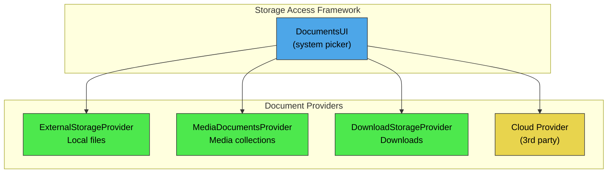

### 27.7.8 Document Capabilities (Flags)

Each document advertises its capabilities through flags:

```java
// DocumentsContract.Document
public static final int FLAG_SUPPORTS_THUMBNAIL    = 1;
public static final int FLAG_SUPPORTS_WRITE        = 1 << 1;
public static final int FLAG_SUPPORTS_DELETE        = 1 << 2;
public static final int FLAG_DIR_SUPPORTS_CREATE    = 1 << 3;
public static final int FLAG_DIR_PREFERS_GRID       = 1 << 4;
public static final int FLAG_DIR_PREFERS_LAST_MODIFIED = 1 << 5;
public static final int FLAG_VIRTUAL_DOCUMENT       = 1 << 9;
public static final int FLAG_SUPPORTS_COPY          = 1 << 10;
public static final int FLAG_SUPPORTS_MOVE          = 1 << 11;
public static final int FLAG_SUPPORTS_REMOVE        = 1 << 12;
public static final int FLAG_SUPPORTS_RENAME        = 1 << 13;
public static final int FLAG_SUPPORTS_SETTINGS      = 1 << 17;
```

Root capabilities use their own set of flags:

```java
// DocumentsContract.Root
public static final int FLAG_LOCAL_ONLY     = 1 << 1;
public static final int FLAG_SUPPORTS_CREATE = 1 << 2;
public static final int FLAG_SUPPORTS_RECENTS = 1 << 3;
public static final int FLAG_SUPPORTS_SEARCH  = 1 << 4;
public static final int FLAG_SUPPORTS_IS_CHILD = 1 << 5;
public static final int FLAG_SUPPORTS_EJECT   = 1 << 6;
```

### 27.7.9 Virtual Documents

A "virtual document" (flagged with `FLAG_VIRTUAL_DOCUMENT`) is one that does
not have a native file representation but can be converted on demand.  For
example, a Google Docs document stored in the cloud might be virtual -- it
can be opened as a PDF or DOCX through `openTypedDocument()`, but there is no
raw file to download.

### 27.7.10 The DocumentsContract Helper

`DocumentsContract` provides static helper methods for working with documents
URIs.  These are the primary API that apps and the system picker use:

```java
// Key methods in DocumentsContract
public static Uri buildDocumentUri(String authority, String documentId) { ... }
public static Uri buildTreeDocumentUri(String authority, String treeDocumentId) { ... }
public static Uri buildChildDocumentsUri(String authority, String parentDocumentId) { ... }
public static String getDocumentId(Uri documentUri) { ... }
public static String getTreeDocumentId(Uri treeUri) { ... }
public static boolean isTreeUri(Uri uri) { ... }
```

### 27.7.11 Recent Documents

Providers that support `Root.FLAG_SUPPORTS_RECENTS` must implement
`queryRecentDocuments()`, which returns recently modified or accessed
documents.  The system's "Recents" view in DocumentsUI aggregates recent
documents from all providers.

### 27.7.12 The DocumentsUI System App

The `DocumentsUI` system app (in `packages/apps/DocumentsUI`) is the standard
file picker that users interact with.  It:

1. Queries all registered `DocumentsProvider` implementations for their roots
2. Presents a unified navigation UI across all roots
3. Handles search delegation to providers
4. Grants URI permissions to the requesting app

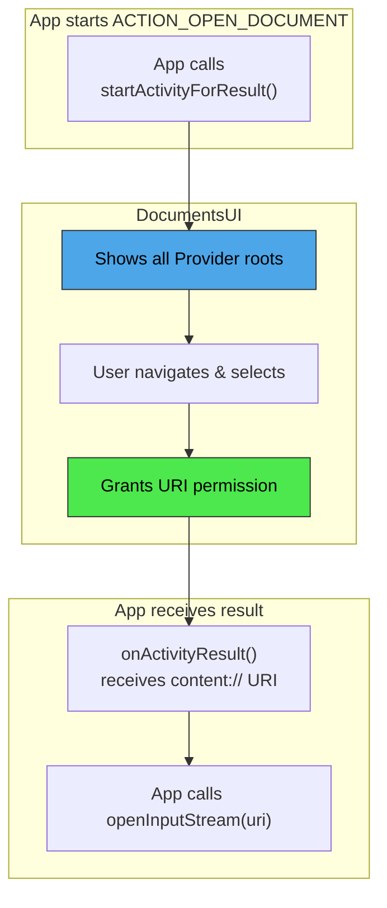

---

## 27.8 ContentObserver and Change Notifications

### 27.8.1 The Observer Pattern

Android's content provider framework includes a built-in observer pattern that
allows components to receive notifications when data changes.  This is
implemented through three cooperating classes:

```
frameworks/base/core/java/android/database/ContentObserver.java
frameworks/base/core/java/android/content/ContentResolver.java  (registerContentObserver / notifyChange)
```

### 27.8.2 ContentObserver

`ContentObserver` is an abstract class that receives change callbacks:

```java
// frameworks/base/core/java/android/database/ContentObserver.java (line 41)
public abstract class ContentObserver {
    public ContentObserver(Handler handler) {
        mHandler = handler;
        mExecutor = null;
    }

    // Override progression (oldest to newest):
    public void onChange(boolean selfChange) { }

    public void onChange(boolean selfChange, @Nullable Uri uri) {
        onChange(selfChange);
    }

    public void onChange(boolean selfChange, @Nullable Uri uri, @NotifyFlags int flags) {
        onChange(selfChange, uri);
    }

    public void onChange(boolean selfChange, @NonNull Collection<Uri> uris,
            @NotifyFlags int flags) {
        for (Uri uri : uris) {
            onChange(selfChange, uri, flags);
        }
    }
}
```

The multiple `onChange()` overloads form a delegation chain.  Newer overloads
provide more information (URIs, flags, user handle) and delegate to older ones
for backward compatibility.

### 27.8.3 Registration

Observers register through `ContentResolver`:

```java
// ContentResolver.java (line 2674)
public final void registerContentObserver(@NonNull Uri uri,
        boolean notifyForDescendants, @NonNull ContentObserver observer) {
    // ...
}
```

The `notifyForDescendants` parameter controls whether the observer is notified
for changes to URIs that are descendants of the registered URI.  For example,
registering for `content://media/external` with `notifyForDescendants=true`
will fire when `content://media/external/images/media/42` changes.

### 27.8.4 Notification

Providers (or any code with access to `ContentResolver`) fire notifications:

```java
// ContentResolver.java (line 2774)
public void notifyChange(@NonNull Uri uri, @Nullable ContentObserver observer) {
    notifyChange(uri, observer, true /* sync to network */);
}

public void notifyChange(@NonNull Uri uri, @Nullable ContentObserver observer,
        @NotifyFlags int flags) {
    // ...
}

public void notifyChange(@NonNull Collection<Uri> uris,
        @Nullable ContentObserver observer, @NotifyFlags int flags) {
    // ...
}
```

Notification flags:

```java
// ContentResolver.java
public static final int NOTIFY_SYNC_TO_NETWORK = 1 << 0;  // Trigger sync
public static final int NOTIFY_SKIP_NOTIFY_FOR_DESCENDANTS = 1 << 1;
public static final int NOTIFY_INSERT = 1 << 2;
public static final int NOTIFY_UPDATE = 1 << 3;
public static final int NOTIFY_DELETE = 1 << 4;
public static final int NOTIFY_NO_DELAY = 1 << 5;
```

### 27.8.5 The Notification Flow

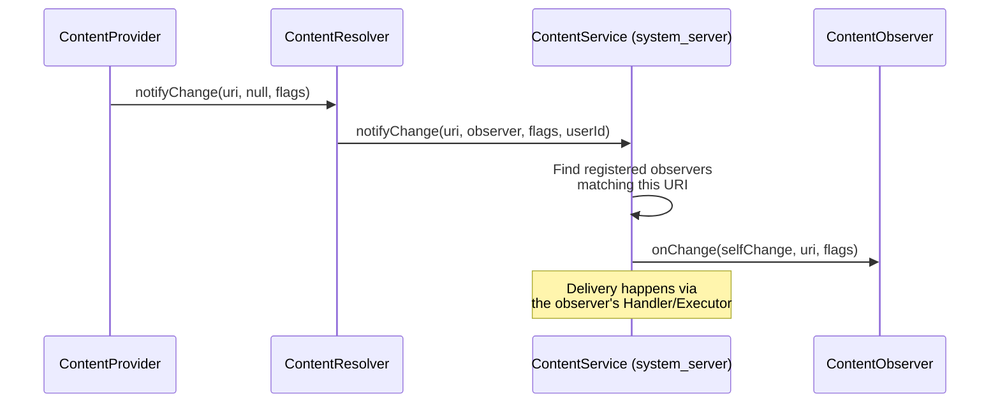

The `ContentService` (running in `system_server`) maintains a tree structure
of registered observers per URI.  When `notifyChange()` is called, it walks
the tree to find all matching observers, accounting for the
`notifyForDescendants` flag.

### 27.8.6 Batch Notifications

Since Android 11, providers can batch multiple URI changes into a single
notification:

```java
getContext().getContentResolver().notifyChange(
    List.of(uri1, uri2, uri3),
    null,  // observer
    ContentResolver.NOTIFY_INSERT
);
```

This reduces the overhead of observers being called multiple times during
a batch operation.

### 27.8.7 The Transport Layer

`ContentObserver` has an inner `Transport` class that implements
`IContentObserver` -- the Binder interface used by `ContentService` to deliver
notifications across process boundaries:

```java
// ContentObserver.java
public IContentObserver getContentObserver() {
    synchronized (mLock) {
        if (mTransport == null) {
            mTransport = new Transport(this);
        }
        return mTransport;
    }
}
```

The transport ensures that `onChange()` is dispatched on the correct thread
(the `Handler` or `Executor` specified at construction time).

### 27.8.8 Common Usage Patterns

**Pattern 1: Observing Contacts Changes**

```java
ContentObserver observer = new ContentObserver(new Handler(Looper.getMainLooper())) {
    @Override
    public void onChange(boolean selfChange, @Nullable Uri uri) {
        // Refresh contacts list
    }
};
getContentResolver().registerContentObserver(
    ContactsContract.Contacts.CONTENT_URI,
    true,  // notify for descendants
    observer
);
```

**Pattern 2: CursorLoader Auto-Refresh**

`CursorLoader` automatically registers a `ContentObserver` on the URI it
queries.  When the provider calls `notifyChange()`, the loader re-queries and
delivers a fresh cursor to `onLoadFinished()`.  This is why providers must
call `notifyChange()` after mutations -- it drives the UI refresh cycle.

**Pattern 3: Provider-Side Notification**

```java
// Inside a ContentProvider subclass:
@Override
public Uri insert(Uri uri, ContentValues values) {
    long id = db.insert(TABLE, null, values);
    Uri insertedUri = ContentUris.withAppendedId(uri, id);
    getContext().getContentResolver().notifyChange(insertedUri, null);
    return insertedUri;
}
```

### 27.8.9 Sync-to-Network Flag

The `NOTIFY_SYNC_TO_NETWORK` flag tells the sync framework that the change
should be propagated to the network (i.e., trigger an upload sync):

```java
// ContentResolver.java
public static final int NOTIFY_SYNC_TO_NETWORK = 1 << 0;
```

When a sync adapter makes local changes, it typically omits this flag to
avoid triggering another sync cycle.  When a user makes a local change, the
flag is set to ensure the change reaches the server.

### 27.8.10 ContentService Architecture

`ContentService` runs in `system_server` and manages the global registry of
content observers:

```
frameworks/base/services/core/java/com/android/server/content/ContentService.java
```

Its responsibilities include:

1. **Observer registration** -- Maintaining the URI-to-observer mapping tree
2. **Change notification dispatch** -- Walking the observer tree on
   `notifyChange()` and calling `onChange()` on each matching observer
3. **Sync scheduling** -- Triggering sync adapter runs when
   `NOTIFY_SYNC_TO_NETWORK` is set
4. **Cross-user notification** -- Ensuring that observers registered for
   specific users only receive notifications for that user

The observer tree is organized hierarchically by URI segments, allowing
efficient prefix matching for the `notifyForDescendants` feature.

### 27.8.11 Notification Coalescing

Providers often perform multiple mutations in a single batch (e.g., inserting
100 contacts during sync).  Without coalescing, this would fire 100 separate
observer notifications, causing the UI to refresh 100 times.

Two strategies address this:

1. **Batch notification** -- The provider delays calling `notifyChange()` until
   the batch is complete, then fires a single notification on the parent URI.

2. **Collection-based notification** -- Using the `notifyChange(Collection<Uri>,
   ...)` overload to deliver all changed URIs in a single callback.

CalendarProvider uses a debounce strategy with a broadcast timeout:

```java
// CalendarProvider2.java (line 384)
private static final long UPDATE_BROADCAST_TIMEOUT_MILLIS =
    DateUtils.SECOND_IN_MILLIS;
```

Any change notifications within a 1-second window are collapsed into a single
broadcast.

### 27.8.12 Cursor Auto-Refresh via setNotificationUri

When a provider returns a `Cursor` from `query()`, it should call
`setNotificationUri()` on the cursor:

```java
Cursor c = db.query(...);
c.setNotificationUri(getContext().getContentResolver(), uri);
return c;
```

This causes the cursor to register a `ContentObserver` on the specified URI.
When `notifyChange()` is called for that URI, the cursor's `onChange()` fires,
which in turn signals any `CursorLoader` watching it to re-query.

This mechanism is what makes the "load data, observe changes, auto-refresh"
pattern work without any explicit polling:

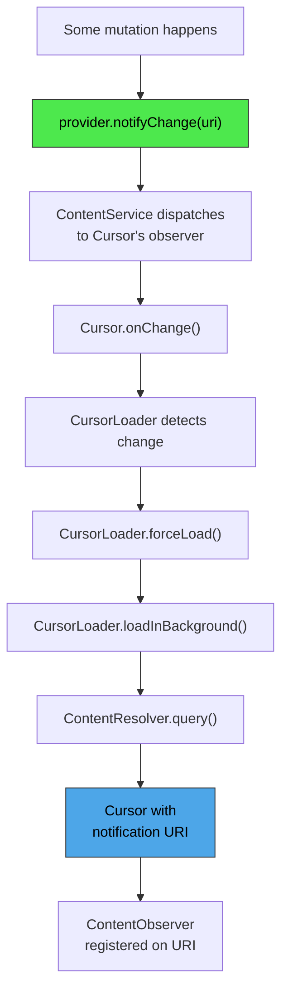

---

## 27.9 Cross-Process Data Sharing

### 27.9.1 Permission Model

Content providers use a layered permission model:

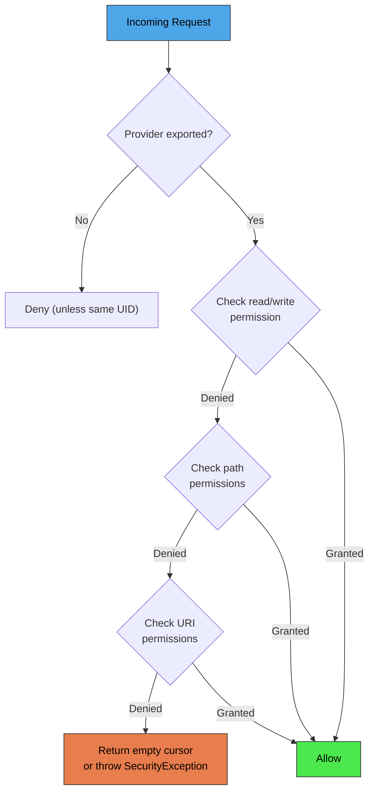

### 27.9.2 Provider-Level Permissions

The simplest permission model uses the provider's declared read and write
permissions:

```xml
<provider
    android:readPermission="com.example.READ"
    android:writePermission="com.example.WRITE"
    ... />
```

Any caller with the appropriate permission gets full access to the provider.

### 27.9.3 Path Permissions

`PathPermission` allows finer-grained control over specific URI paths:

```xml
<provider ...>
    <path-permission
        android:pathPrefix="/private/"
        android:readPermission="com.example.READ_PRIVATE"
        android:writePermission="com.example.WRITE_PRIVATE" />
</provider>
```

Path permissions are checked in `ContentProvider.Transport` after the
provider-level check fails:

```java
// ContentProvider.java -- inside Transport
private int enforceReadPermission(...) {
    // 1. Check provider-level readPermission
    // 2. Check each PathPermission that matches the URI
    // 3. Check URI permission grants
}
```

### 27.9.4 URI Permission Grants

URI grants are the most flexible permission mechanism.  They allow temporary
access to specific URIs without requiring the caller to hold any permanent
permission.

**Granting via Intent:**

```java
Intent intent = new Intent(Intent.ACTION_VIEW);
intent.setData(contentUri);
intent.addFlags(Intent.FLAG_GRANT_READ_URI_PERMISSION);
startActivity(intent);
```

**Granting programmatically:**

```java
grantUriPermission("com.example.other",
    contentUri,
    Intent.FLAG_GRANT_READ_URI_PERMISSION);
```

**Provider must declare support:**

```xml
<provider
    android:grantUriPermissions="true"
    ... />
```

Or for specific paths:

```xml
<provider ...>
    <grant-uri-permission android:pathPrefix="/shared/" />
</provider>
```

### 27.9.5 URI Grant Management

The `UriGrantsManager` system service tracks active URI permission grants:

```java
// frameworks/base/core/java/android/app/UriGrantsManager.java
```

Grants are stored persistently by the `UriGrantsManagerService` and can survive
across reboots (for grants with `FLAG_GRANT_PERSISTABLE_URI_PERMISSION`).

```mermaid
sequenceDiagram
    participant App1 as App A (sender)
    participant AMS as ActivityManagerService
    participant UGM as UriGrantsManager
    participant App2 as App B (receiver)
    participant CP as ContentProvider

    App1->>AMS: startActivity(intent + FLAG_GRANT_READ_URI_PERMISSION)
    AMS->>UGM: grantUriPermission(appB, uri, READ)
    UGM->>UGM: Record grant: {uid, uri, mode, time}
    AMS->>App2: Launch activity with data=uri

    App2->>CP: query(uri)
    CP->>CP: Transport.enforceReadPermission()
    CP->>UGM: checkUriPermission(uri, callingUid, READ)
    UGM-->>CP: GRANTED
    CP-->>App2: Cursor
```

### 27.9.6 Persistable URI Permissions

For long-lived access (e.g., a user picks a file via SAF), apps can take
persistable permissions:

```java
getContentResolver().takePersistableUriPermission(uri,
    Intent.FLAG_GRANT_READ_URI_PERMISSION);
```

These survive reboots and are tracked by the system.  The app can query its
persisted permissions:

```java
List<UriPermission> perms = getContentResolver().getPersistedUriPermissions();
```

### 27.9.7 Cross-User Access

Content providers support cross-user URI access for system components.
A URI can embed a user ID:

```
content://10@com.android.contacts/contacts
```

The `ContentProvider.Transport` strips this user ID prefix and validates that
the caller has `INTERACT_ACROSS_USERS` or `INTERACT_ACROSS_USERS_FULL`
permission.

For clone profiles, certain authorities are redirected.  MediaProvider is
explicitly handled:

```java
// ContentProvider.java (line 159)
public static boolean isAuthorityRedirectedForCloneProfile(String authority) {
    return MediaStore.AUTHORITY.equals(authority);
}
```

### 27.9.8 The AttributionSource Chain

Modern content provider IPC carries an `AttributionSource` that describes
not just the immediate caller, but the entire chain of callers:

```java
// IContentProvider interface
Cursor query(@NonNull AttributionSource attributionSource, Uri url, ...)
```

This is critical for scenarios where App A delegates access to App B, which
then calls the provider.  The provider can see both apps in the attribution
chain and verify that the original caller is authorized.

### 27.9.9 AppOps Integration

Beyond static permissions, content providers integrate with `AppOpsManager`
for runtime permission enforcement.  The `Transport` class checks AppOps
before delegating to the provider:

```java
// ContentProvider.java (Transport inner class)
volatile AppOpsManager mAppOpsManager = null;
volatile int mReadOp = AppOpsManager.OP_NONE;
volatile int mWriteOp = AppOpsManager.OP_NONE;
```

This allows the system to revoke access at runtime (e.g., when a user
disables a permission via Settings) without requiring a process restart.

### 27.9.10 Permission Enforcement Flow in Detail

The complete permission enforcement flow within `ContentProvider.Transport`
follows this decision tree:

```mermaid
flowchart TD
    A["Incoming Request"] --> B{Is testing mode?}
    B -- Yes --> Z["Allow (no checks)"]
    B -- No --> C{"Same UID<br/>as provider?"}
    C -- Yes --> Z
    C -- No --> D{Provider exported?}
    D -- No --> E["SecurityException"]
    D -- Yes --> F{"Check provider-level<br/>permission"}
    F -- Granted --> Z
    F -- Not Granted --> G{"Check path-level<br/>permissions"}
    G -- Granted --> Z
    G -- Not Granted --> H{"Check URI<br/>permission grants"}
    H -- Granted --> Z
    H -- Not Granted --> I{Check AppOps}
    I -- Allowed --> Z
    I -- Denied --> J["For query: return empty cursor<br/>For others: SecurityException"]

    style Z fill:#4de84d,stroke:#333,color:#000
    style E fill:#e87d4d,stroke:#333,color:#000
    style J fill:#e87d4d,stroke:#333,color:#000
```

For `query()` operations, permission denial does not throw an exception.
Instead, an empty cursor is returned with the correct column names.  This
preserves API compatibility and prevents apps from crashing when permissions
are revoked at runtime.

For `insert()`, `update()`, and `delete()`, permission denial throws a
`SecurityException`.

### 27.9.11 URI Grant Persistence

URI permission grants can be either temporary or persistent:

**Temporary grants** last until the receiving component (Activity) is finished,
or until the system revokes them due to memory pressure.  They are created by:

```java
intent.addFlags(Intent.FLAG_GRANT_READ_URI_PERMISSION
              | Intent.FLAG_GRANT_WRITE_URI_PERMISSION);
```

**Persistent grants** survive reboots and must be explicitly taken by the
receiver:

```java
intent.addFlags(Intent.FLAG_GRANT_READ_URI_PERMISSION
              | Intent.FLAG_GRANT_PERSISTABLE_URI_PERMISSION);
// ...
// In the receiving Activity:
getContentResolver().takePersistableUriPermission(uri,
    Intent.FLAG_GRANT_READ_URI_PERMISSION);
```

The system limits the number of persisted URI permissions per app (typically
512) to prevent unbounded growth.

### 27.9.12 The grantUriPermission Stack

When `grantUriPermission()` is called, the following validation occurs:

1. The calling UID must own the URI or have `GRANT_URI_PERMISSION` permission
2. The provider must have `grantUriPermissions="true"` or a matching
   `<grant-uri-permission>` element
3. The target package must exist
4. The grant is recorded in `UriGrantsManagerService`

```mermaid
sequenceDiagram
    participant App as Source App
    participant AMS as ActivityManagerService
    participant UGM as UriGrantsManagerService
    participant CP as ContentProvider

    App->>AMS: grantUriPermission(targetPkg, uri, flags)
    AMS->>CP: checkGrantUriPermission()
    CP->>CP: Does provider allow URI grants?
    CP->>CP: Does URI match grant patterns?
    CP-->>AMS: Permission check result
    AMS->>UGM: grantUriPermissionUnchecked()
    UGM->>UGM: Record: {sourceUid, targetUid, uri, flags}
    UGM->>UGM: If persistent: write to XML
```

### 27.9.13 ContentProviderOperation Security

Batch operations via `applyBatch()` inherit the same permission model as
individual calls.  Each operation in the batch is checked independently.
However, since the entire batch goes through a single IPC call, the permission
check happens once for the outer `applyBatch()` call, and individual operations
within the batch are trusted.

This means that if an app has permission to write to the provider, it can
perform any mix of inserts, updates, and deletes in a single batch.

### 27.9.14 The DEPRECATE_DATA_COLUMNS Mechanism

The `DEPRECATE_DATA_COLUMNS` mechanism in `ContentResolver` transforms file
paths into content URIs transparently:

```java
// ContentResolver.java (line 114)
public static final boolean DEPRECATE_DATA_COLUMNS = true;
public static final String DEPRECATE_DATA_PREFIX = "/mnt/content/";
```

When an app reads the `_data` column from MediaStore and gets a path like
`/mnt/content/0@media/external/images/media/42`, the FUSE layer intercepts
any attempt to open this path and redirects it to
`ContentResolver.openFileDescriptor()`, which performs proper permission
checking.

This migration path allows legacy apps that relied on file paths to continue
working while still enforcing scoped storage permissions.

---

## 27.10 Try It Yourself

This section provides hands-on exercises for exploring content providers
on an AOSP build or emulator.

### 27.10.1 Querying MediaStore from the Shell

Use `content` shell command to query MediaProvider:

```bash
# List all images on external storage
adb shell content query --uri content://media/external/images/media \
    --projection _id:_display_name:mime_type:_size

# Query a specific image by ID
adb shell content query --uri content://media/external/images/media/42

# List all audio files
adb shell content query --uri content://media/external/audio/media \
    --projection _id:title:artist:album:duration

# List mounted volumes
adb shell content query --uri content://media/external/fs_id
```

### 27.10.2 Reading and Writing Settings

```bash
# Read a system setting
adb shell settings get system screen_brightness

# Write a system setting
adb shell settings put system screen_brightness 128

# Read a secure setting
adb shell settings get secure default_input_method

# Read a global setting
adb shell settings get global airplane_mode_on

# List all settings in a namespace
adb shell settings list system
adb shell settings list secure
adb shell settings list global
```

### 27.10.3 Querying Contacts

```bash
# List all contacts
adb shell content query --uri content://com.android.contacts/contacts \
    --projection display_name

# List raw contacts
adb shell content query --uri content://com.android.contacts/raw_contacts \
    --projection _id:display_name_primary:account_name:account_type

# List all phone numbers
adb shell content query --uri content://com.android.contacts/data \
    --where "mimetype='vnd.android.cursor.item/phone_v2'"
```

### 27.10.4 Querying Calendar Events

```bash
# List all calendars
adb shell content query --uri content://com.android.calendar/calendars \
    --projection _id:name:account_name:account_type

# List events
adb shell content query --uri content://com.android.calendar/events \
    --projection _id:title:dtstart:dtend:calendar_id
```

### 27.10.5 Inserting and Deleting Content

```bash
# Insert a new contact (raw contact + data)
adb shell content insert --uri content://com.android.contacts/raw_contacts \
    --bind account_type:s: --bind account_name:s:

# The above returns a URI like content://com.android.contacts/raw_contacts/1
# Then insert a name data row:
adb shell content insert --uri content://com.android.contacts/data \
    --bind raw_contact_id:i:1 \
    --bind mimetype:s:vnd.android.cursor.item/name \
    --bind data1:s:"Test User"

# Delete a contact
adb shell content delete --uri content://com.android.contacts/raw_contacts/1
```

### 27.10.6 Observing Content Changes

```bash
# Watch for changes to the media database
# (This starts a persistent process that logs changes)
adb shell content observe --uri content://media/external

# In another terminal, take a screenshot to trigger a media scan:
adb shell screencap /sdcard/Pictures/test_observe.png
adb shell am broadcast -a android.intent.action.MEDIA_SCANNER_SCAN_FILE \
    -d file:///sdcard/Pictures/test_observe.png

# The first terminal should show a notification
```

### 27.10.7 Dumping Provider State

```bash
# Dump MediaProvider state
adb shell dumpsys activity provider com.android.providers.media.MediaProvider

# Dump SettingsProvider state
adb shell dumpsys activity provider com.android.providers.settings/.SettingsProvider

# Dump ContactsProvider state
adb shell dumpsys activity provider com.android.providers.contacts/.ContactsProvider2
```

### 27.10.8 Examining the SAF

```bash
# List DocumentsProvider roots
adb shell content query \
    --uri content://com.android.externalstorage.documents/root

# List children of a root
adb shell content query \
    --uri content://com.android.externalstorage.documents/document/primary%3A/children
```

### 27.10.9 Writing a Minimal ContentProvider

Create a simple provider to understand the lifecycle:

```java
public class NoteProvider extends ContentProvider {
    private static final String AUTHORITY = "com.example.notes";
    private static final Uri CONTENT_URI = Uri.parse("content://" + AUTHORITY + "/notes");
    private static final int NOTES = 1;
    private static final int NOTES_ID = 2;

    private static final UriMatcher sMatcher = new UriMatcher(UriMatcher.NO_MATCH);
    static {
        sMatcher.addURI(AUTHORITY, "notes", NOTES);
        sMatcher.addURI(AUTHORITY, "notes/#", NOTES_ID);
    }

    private SQLiteDatabase mDb;

    @Override
    public boolean onCreate() {
        SQLiteOpenHelper helper = new SQLiteOpenHelper(getContext(), "notes.db", null, 1) {
            @Override
            public void onCreate(SQLiteDatabase db) {
                db.execSQL("CREATE TABLE notes (_id INTEGER PRIMARY KEY, title TEXT, body TEXT)");
            }
            @Override
            public void onUpgrade(SQLiteDatabase db, int old, int neo) { }
        };
        mDb = helper.getWritableDatabase();
        return mDb != null;
    }

    @Override
    public Cursor query(Uri uri, String[] proj, String sel, String[] args, String order) {
        SQLiteQueryBuilder qb = new SQLiteQueryBuilder();
        qb.setTables("notes");
        switch (sMatcher.match(uri)) {
            case NOTES_ID:
                qb.appendWhere("_id=" + uri.getLastPathSegment());
                break;
        }
        Cursor c = qb.query(mDb, proj, sel, args, null, null, order);
        c.setNotificationUri(getContext().getContentResolver(), uri);
        return c;
    }

    @Override
    public Uri insert(Uri uri, ContentValues values) {
        long id = mDb.insert("notes", null, values);
        Uri result = ContentUris.withAppendedId(CONTENT_URI, id);
        getContext().getContentResolver().notifyChange(result, null);
        return result;
    }

    @Override
    public int update(Uri uri, ContentValues values, String sel, String[] args) {
        int count;
        switch (sMatcher.match(uri)) {
            case NOTES_ID:
                count = mDb.update("notes", values,
                    "_id=" + uri.getLastPathSegment(), null);
                break;
            default:
                count = mDb.update("notes", values, sel, args);
        }
        getContext().getContentResolver().notifyChange(uri, null);
        return count;
    }

    @Override
    public int delete(Uri uri, String sel, String[] args) {
        int count;
        switch (sMatcher.match(uri)) {
            case NOTES_ID:
                count = mDb.delete("notes",
                    "_id=" + uri.getLastPathSegment(), null);
                break;
            default:
                count = mDb.delete("notes", sel, args);
        }
        getContext().getContentResolver().notifyChange(uri, null);
        return count;
    }

    @Override
    public String getType(Uri uri) {
        switch (sMatcher.match(uri)) {
            case NOTES:    return "vnd.android.cursor.dir/vnd.example.note";
            case NOTES_ID: return "vnd.android.cursor.item/vnd.example.note";
            default:       return null;
        }
    }
}
```

Register in AndroidManifest.xml:

```xml
<provider
    android:name=".NoteProvider"
    android:authorities="com.example.notes"
    android:exported="true"
    android:readPermission="com.example.READ_NOTES"
    android:writePermission="com.example.WRITE_NOTES"
    android:grantUriPermissions="true" />
```

### 27.10.10 Tracing Provider IPC

Use system tracing to observe content provider Binder calls:

```bash
# Start a trace capturing activity manager and binder tags
adb shell atrace -t 10 -b 4096 am binder_driver -o /data/local/tmp/cp_trace.ctrace

# While tracing, perform some queries:
adb shell content query --uri content://settings/system/screen_brightness

# Pull and open the trace
adb pull /data/local/tmp/cp_trace.ctrace
# Open in https://ui.perfetto.dev/
```

In the trace, you will see:

1. The `query` transaction on the caller's thread
2. The corresponding `onTransact(QUERY_TRANSACTION)` on the provider's Binder
   thread
3. The actual SQLite query (if the provider uses SQLite)
4. The cursor serialization back across Binder

### 27.10.11 Inspecting Provider Databases

On a userdebug/eng build, you can directly examine provider databases:

```bash
# MediaProvider database
adb shell sqlite3 /data/data/com.android.providers.media.module/databases/external.db \
    ".schema files"

# ContactsProvider database
adb shell sqlite3 /data/data/com.android.providers.contacts/databases/contacts2.db \
    ".tables"

# CalendarProvider database
adb shell sqlite3 /data/data/com.android.providers.calendar/databases/calendar.db \
    "SELECT name FROM sqlite_master WHERE type='table'"
```

### 27.10.12 Performance Testing

Measure content provider query latency:

```bash
# Time a MediaStore query
adb shell "time content query --uri content://media/external/images/media \
    --projection _id --sort '_id ASC LIMIT 100'"

# Benchmark SettingsProvider (call-based fast path)
adb shell "time settings get system screen_brightness"

# Compare with a direct ContentResolver query (much slower for Settings)
adb shell "time content query --uri content://settings/system \
    --where 'name=\"screen_brightness\"'"
```

You will observe that `settings get` (which uses the `call()` path) is
significantly faster than the query path, validating SettingsProvider's
architectural choice.

---

## Summary

This chapter traced the content provider mechanism from its architectural
foundations to its concrete implementations.  The key takeaways:

1. **ContentProvider is a Binder service** -- The `Transport` inner class
   extends `ContentProviderNative`, making every provider a Binder stub that
   handles IPC transparently.

2. **ContentResolver is the single entry point** -- All data access goes
   through `ContentResolver`, which resolves authorities, manages provider
   lifecycles, and handles stable/unstable references.

3. **The URI scheme is the addressing model** -- The `content://` URI scheme
   with authorities and path segments provides a uniform way to address any
   data source, from SQLite databases to cloud storage.

4. **Change notifications are built in** -- The `ContentObserver` mechanism
   provides efficient, URI-scoped change notifications that drive reactive
   UI patterns through `CursorLoader` and similar constructs.

5. **System providers are highly specialized** -- MediaProvider (13,000+ lines),
   ContactsProvider (three-tier aggregation model), CalendarProvider (recurrence
   expansion), and SettingsProvider (call-based fast path with generation
   tracking) each solve distinct domain problems while sharing the common
   ContentProvider framework.

6. **The permission model is layered** -- Provider-level permissions, path
   permissions, URI grants, AppOps, and attribution sources work together to
   provide both broad and fine-grained access control.

### Key Source Files Referenced

| File | Description |
|------|-------------|
| `frameworks/base/core/java/android/content/ContentProvider.java` | Abstract base class (3,006 lines) |
| `frameworks/base/core/java/android/content/ContentResolver.java` | Client-side facade (4,268 lines) |
| `frameworks/base/core/java/android/content/ContentProviderNative.java` | Binder stub (974 lines) |
| `frameworks/base/core/java/android/content/IContentProvider.java` | IPC interface |
| `frameworks/base/core/java/android/database/ContentObserver.java` | Change observer |
| `frameworks/base/core/java/android/provider/DocumentsProvider.java` | SAF base class |
| `frameworks/base/core/java/android/provider/DocumentsContract.java` | SAF contract constants |
| `packages/providers/MediaProvider/src/.../MediaProvider.java` | MediaStore implementation (13,027 lines) |
| `packages/providers/MediaProvider/src/.../LocalUriMatcher.java` | Media URI routing |
| `packages/providers/MediaProvider/src/.../MediaVolume.java` | Volume representation |
| `packages/providers/MediaProvider/src/.../scan/ModernMediaScanner.java` | Media file scanner |
| `packages/providers/ContactsProvider/src/.../ContactsProvider2.java` | Contacts implementation |
| `packages/providers/ContactsProvider/src/.../aggregation/AbstractContactAggregator.java` | Contact aggregation base |
| `packages/providers/ContactsProvider/src/.../aggregation/ContactAggregator2.java` | Modern aggregation algorithm |
| `packages/providers/CalendarProvider/src/.../CalendarProvider2.java` | Calendar implementation |
| `frameworks/base/packages/SettingsProvider/src/.../SettingsProvider.java` | Settings implementation |
| `frameworks/base/packages/SettingsProvider/src/.../SettingsState.java` | Settings persistence |
| `frameworks/base/packages/SettingsProvider/src/.../GenerationRegistry.java` | Cache invalidation |
