# 第 28 章：通知系统

Android 通知系统是平台中最复杂的子系统之一。应用侧一次简单的 `notify()` 调用，到了系统端会依次触发权限校验、通知渠道解析、信号提取、排序、勿扰模式过滤、监听器分发，以及最终在 SystemUI 中的界面渲染。仅 `NotificationManagerService.java` 本身就已经是一个超大体量的核心服务。本章从 SDK API 开始，沿着服务端管线、排序引擎、Attention Effects、SystemUI 展示层一路向下，梳理通知从“发出”到“显示”的完整生命周期。

---

## 28.1 通知架构

### 28.1.1 高层概览

通知子系统横跨四层：

```text
应用
  |
  v
NotificationManager（SDK API）
  |
  v
NotificationManagerService（system_server）
  |
  +-- RankingHelper
  +-- PreferencesHelper
  +-- ZenModeHelper
  +-- NotificationAttentionHelper
  +-- GroupHelper
  +-- SnoozeHelper
  +-- ShortcutHelper
  +-- NotificationListeners
  +-- NotificationAssistants
  |
  v
SystemUI（通知栏、通知抽屉、Heads-Up、Bubble、状态栏图标）
```

应用与系统服务之间通过 `INotificationManager.aidl` 做 Binder IPC。所有 `notify()`、`cancel()`、channel 管理和 DND 操作，最终都会进入 `system_server` 中的 `NotificationManagerService`。

关键源码：

| 组件 | 路径 |
|------|------|
| `NotificationManager` | `frameworks/base/core/java/android/app/NotificationManager.java` |
| `INotificationManager` | `frameworks/base/core/java/android/app/INotificationManager.aidl` |
| `NotificationManagerService` | `frameworks/base/services/core/java/com/android/server/notification/NotificationManagerService.java` |
| `Notification` | `frameworks/base/core/java/android/app/Notification.java` |
| `NotificationChannel` | `frameworks/base/core/java/android/app/NotificationChannel.java` |
| `StatusBarNotification` | `frameworks/base/core/java/android/service/notification/StatusBarNotification.java` |

### 28.1.2 `Notification` 对象

`Notification` 是应用侧最核心的数据对象。它通常包含：

- 小图标：必须提供，用于状态栏和通知头部
- 标题与正文：主要文本内容
- Channel ID：API 26 之后必填
- `PendingIntent`：点击行为与删除行为
- Action：按钮与快捷操作
- Style：`BigTextStyle`、`BigPictureStyle`、`InboxStyle`、`MessagingStyle`、`MediaStyle`、`CallStyle` 等
- `extras`：扩展数据
- `BubbleMetadata`：Bubble 展示元信息
- flags：如 `FLAG_FOREGROUND_SERVICE`、`FLAG_AUTO_CANCEL`、`FLAG_GROUP_SUMMARY`、`FLAG_BUBBLE`、`FLAG_ONGOING_EVENT`

### 28.1.3 关键常量与限制

NMS 中有几个非常重要的系统限制：

```java
static final int MAX_PACKAGE_NOTIFICATIONS = 50;
static final float DEFAULT_MAX_NOTIFICATION_ENQUEUE_RATE = 5f;
```

含义：

- 单个包最多保留 50 条活跃通知
- 默认每秒最多允许 5 次入队，防止通知风暴

`PreferencesHelper` 还限制了 channel 和 group 数量：

```java
static final int NOTIFICATION_CHANNEL_COUNT_LIMIT = 5000;
static final int NOTIFICATION_CHANNEL_GROUP_COUNT_LIMIT = 6000;
```

### 28.1.4 架构图

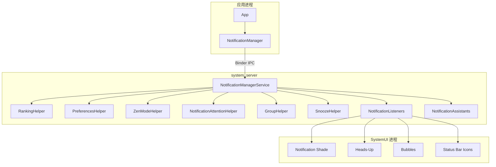

### 28.1.5 线程模型

来自应用的 Binder 调用落在 Binder 线程池上，但真正的通知处理大多会被投递到 NMS 自己的 handler 线程执行。除此之外，还有一条专门用于 ranking reconsideration 的排序线程。

最重要的锁是 `mNotificationLock`。以下核心集合的读写都必须持有它：

- `mNotificationList`
- `mNotificationsByKey`
- `mSummaryByGroupKey`
- `mEnqueuedNotifications`

### 28.1.6 Signal Extractor 管线

通知排序不是单步完成的，而是由一串 `NotificationSignalExtractor` 依次处理。其顺序由资源配置 `config_notificationSignalExtractors` 决定，例如：

```xml
<string-array name="config_notificationSignalExtractors">
    <item>com.android.server.notification.NotificationChannelExtractor</item>
    <item>com.android.server.notification.NotificationAdjustmentExtractor</item>
    <item>com.android.server.notification.BubbleExtractor</item>
    <item>com.android.server.notification.ValidateNotificationPeople</item>
    <item>com.android.server.notification.PriorityExtractor</item>
    <item>com.android.server.notification.ZenModeExtractor</item>
    <item>com.android.server.notification.ImportanceExtractor</item>
    <item>com.android.server.notification.VisibilityExtractor</item>
    <item>com.android.server.notification.BadgeExtractor</item>
    <item>com.android.server.notification.CriticalNotificationExtractor</item>
</string-array>
```

每个 extractor 都会对 `NotificationRecord` 写入一部分信号。若返回 `RankingReconsideration`，则说明还要在后台线程做延迟复评，例如联系人解析。

```mermaid
graph LR
    NR["NotificationRecord"] --> E1["ChannelExtractor"]
    E1 --> E2["AdjustmentExtractor"]
    E2 --> E3["BubbleExtractor"]
    E3 --> E4["ValidateNotificationPeople"]
    E4 --> E5["PriorityExtractor"]
    E5 --> E6["ZenModeExtractor"]
    E6 --> E7["ImportanceExtractor"]
    E7 --> E8["VisibilityExtractor"]
    E8 --> E9["BadgeExtractor"]
    E9 --> E10["CriticalNotificationExtractor"]
```

### 28.1.7 `NotificationRecord`

`NotificationRecord` 是服务端围绕 `StatusBarNotification` 的包装对象，保存排序和策略决策过程中的中间状态，例如：

- `mChannel`
- `mImportance`
- `mSystemImportance`
- `mAssistantImportance`
- `mContactAffinity`
- `mIntercept`
- `mRankingScore`
- `mCriticality`
- `mAllowBubble`
- `mShowBadge`
- `mSuppressedVisualEffects`
- `mShortcutInfo`
- `mUserSentiment`
- `mIsInterruptive`

它的线程规则很严格：修改 `NotificationRecord` 时必须在 `mNotificationLock` 下进行，修改后通常还要触发重新排序。

## 28.2 NotificationManagerService：入队、发布、取消

### 28.2.1 通知生命周期概览

服务端大致分三个阶段：

1. 入队：校验、查 channel、限流、创建 `NotificationRecord`
2. 发布：跑 extractor、排序、触发 attention effects、分发给监听器
3. 取消：从列表移除、通知监听器、归档历史

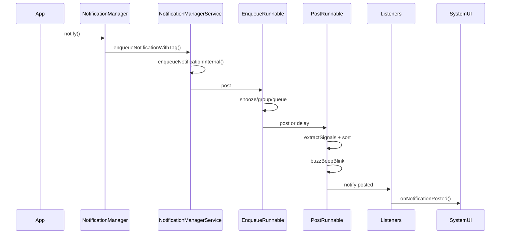

### 28.2.2 阶段 1：入队

`enqueueNotificationInternal()` 是最核心的入口之一。它大致会执行：

1. 参数校验：`pkg`、`notification` 不能为空
2. user 解析：通过 `ActivityManager.handleIncomingUser()` 归一到实际 userId
3. UID 与包名校验：防止一个应用伪装成另一个包发通知
4. 前台服务策略检查：FGS 通知有特殊约束
5. `fixNotification()`：裁剪不合法 action、限制文本长度、补齐 channel、给 FGS 加 `FLAG_NO_CLEAR` 等
6. 查找 channel：不存在就直接失败
7. 创建 `NotificationRecord`
8. 为 FGS / UIJ 通知应用最小重要性下限
9. 获取 wakelock，并调度 `EnqueueNotificationRunnable`

FGS 有一个很重要的兜底规则：如果其 channel importance 是 `MIN` 或 `NONE`，系统会把它抬到 `LOW`。

### 28.2.3 `EnqueueNotificationRunnable`

这个 runnable 运行在 NMS 的 handler 线程上，并在 `mNotificationLock` 下执行。它的关键职责包括：

- 检查这条通知是否仍处于 snooze 状态
- 如果是更新通知，从旧记录中拷贝排序信息
- 放入 `mEnqueuedNotifications`
- 交给 `TimeToLiveHelper` 安排超时
- 更新 bubble flags
- 处理 group 关系
- 如果 NAS 启用，则先通知 NAS，再延迟约 200ms 进入 post 阶段

### 28.2.4 `PostNotificationRunnable`

这一步才是真正让通知“可见”。关键步骤：

1. 从 `mEnqueuedNotifications` 找到记录
2. 检查应用是否被禁用通知、channel 是否被屏蔽
3. 插入或更新 `mNotificationList`
4. 更新 `mNotificationsByKey`
5. 调用 `GroupHelper` 处理自动分组
6. 执行 `mRankingHelper.extractSignals(r)` 和 `sort()`
7. 交给 `NotificationAttentionHelper` 做 `buzzBeepBlink`
8. 如果有小图标，就分发给监听器；没有则拒绝发布
9. 从 `mEnqueuedNotifications` 移除

通知必须有 small icon，这是系统硬性要求。

### 28.2.5 阶段 3：取消

通知取消来源很多：

| 原因 | 常量 | 场景 |
|------|------|------|
| 点击 | `REASON_CLICK` | 用户点开通知 |
| 滑动清除 | `REASON_CANCEL` | 用户左滑/右滑 |
| 清空全部 | `REASON_CANCEL_ALL` | 用户点“全部清除” |
| 应用取消 | `REASON_APP_CANCEL` | app 调 `cancel()` |
| 监听器取消 | `REASON_LISTENER_CANCEL` | NLS 主动取消 |
| 包被禁用 | `REASON_PACKAGE_BANNED` | 关闭了整包通知 |
| Channel 被禁用 | `REASON_CHANNEL_BANNED` | importance 设为 `NONE` |
| Snooze | `REASON_SNOOZED` | 用户稍后提醒 |
| 超时 | `REASON_TIMEOUT` | TTL 到期 |

取消时 NMS 会做：

1. 发送 `deleteIntent`
2. 通知 listeners 被移除
3. 更新分组状态
4. 清理 sound/vibrate/LED 等 effect
5. 更新 summary 追踪
6. 写入 archive / history

### 28.2.6 TTL 与通知超时

默认 TTL 是 3 天：

```java
static final long NOTIFICATION_TTL = Duration.ofDays(3).toMillis();
```

而“发布时间已经老到不合理”的通知，如果超过 14 天，还会在发出时直接被拒绝。

### 28.2.7 速率限制

系统默认每个包每秒最多 5 条入队。Toast 的限制更严格，采用了多段时间窗限流。

### 28.2.8 完整发布流程图

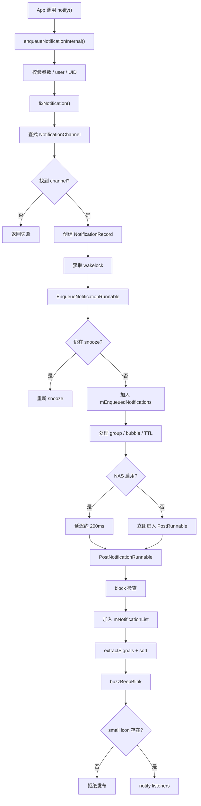

## 28.3 Notification Channels 与 Groups

### 28.3.1 Channels 简介

从 Android 8.0 开始，每条通知都必须落到某个 `NotificationChannel`。Channel 把“通知行为控制权”交给了用户：重要性、声音、震动、灯光、角标、锁屏可见性等都由用户最终拥有。

一旦 channel 创建完成，应用不能再随意覆盖用户改过的行为配置。

### 28.3.2 Channel 属性

常见属性：

| 属性 | 说明 |
|------|------|
| ID | 不可变标识 |
| Name | 显示名称 |
| Description | 说明文字 |
| Importance | 中断等级 |
| Sound | 声音 URI |
| Vibration Pattern | 震动模式 |
| Light Color | 灯光颜色 |
| Show Badge | 是否允许角标 |
| Bypass DND | 是否可绕过 DND |
| Lockscreen Visibility | 锁屏显示级别 |
| Conversation ID | 对话子 channel 关联 |
| Allow Bubbles | 是否允许 Bubble |

### 28.3.3 重要性等级

| 级别 | 常量 | 值 | 行为 |
|------|------|----|------|
| None | `IMPORTANCE_NONE` | 0 | 完全阻止 |
| Min | `IMPORTANCE_MIN` | 1 | 静默，不显示状态栏图标 |
| Low | `IMPORTANCE_LOW` | 2 | 静默，显示在抽屉 |
| Default | `IMPORTANCE_DEFAULT` | 3 | 可发声 |
| High | `IMPORTANCE_HIGH` | 4 | 发声并可 Heads-Up |
| Max | `IMPORTANCE_MAX` | 5 | 最紧急，可配合全屏 Intent |

### 28.3.4 Channel Groups

`NotificationChannelGroup` 用于把 channel 组织成逻辑组。用户可以直接禁用整个 group，间接阻止其中所有 channel。

### 28.3.5 系统保留 Channel

`NotificationChannel.SYSTEM_RESERVED_IDS` 保护系统保留的 channel ID，第三方应用试图创建这些 ID 时会被忽略。

### 28.3.6 Channel 存储：`PreferencesHelper`

服务端 channel 管理由 `PreferencesHelper` 负责。它会把 per-user 的 channel / group 状态序列化到 XML。删除的 channel 不会立刻物理清除，而是 soft-delete 一段时间，默认保留 30 天，便于应用重建时恢复用户配置。

### 28.3.7 `NotificationChannelExtractor`

排序管线的第一个 extractor 就是 `NotificationChannelExtractor`。它先从 `PreferencesHelper` 查出 channel，再挂到 `NotificationRecord` 上。后续 extractor 的大部分行为都依赖这个结果。

### 28.3.8 分类 Channel

新版系统引入了按类型分类的 channel，例如：

- `news`
- `promotions`
- `recommendations`
- `social_media`

当 NAS 把通知归类后，系统可以把它重映射到更合适的分类 channel，帮助用户统一管理通知类别。

### 28.3.9 Channel 生命周期图

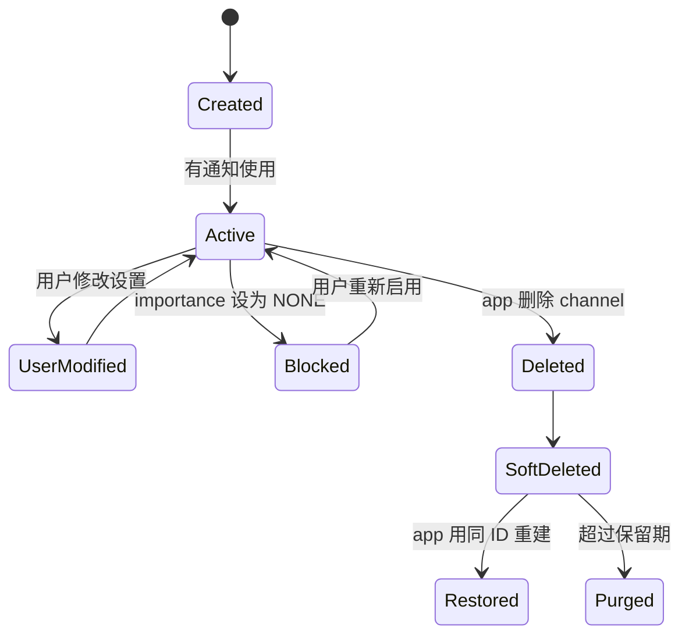

## 28.4 通知排序

### 28.4.1 概览

排序分成两个阶段：

1. 信号提取：每个 extractor 把自己的结果写到 `NotificationRecord`
2. 排序：比较器根据这些信号产出最终顺序

### 28.4.2 `RankingHelper`

`RankingHelper` 是编排器。`extractSignals()` 按顺序执行全部 extractor；若某个 extractor 返回 `RankingReconsideration`，则交给 ranking thread 处理。`sort()` 则先做 prelim 排序，再生成全局排序键，最后完成最终排序。

### 28.4.3 `NotificationTimeComparator`

初步排序按 `rankingTime` 降序，也就是通常越新的通知越靠前。

### 28.4.4 全局排序键

全局排序键编码了多维度信息，大意包括：

- 是否最近打断过用户
- group 排名
- 是否 group summary
- group 内排序 key
- authoritative rank

这样可以保证：

- 最近、重要、打断性强的通知更靠前
- 分组通知保持聚合
- summary 与 children 顺序稳定

### 28.4.5 各 Extractor 细节

`NotificationChannelExtractor`
: 解析 channel，是后续所有决策的基础。

`NotificationAdjustmentExtractor`
: 应用 NAS 调整，可改 importance、people、smart replies、smart actions、classification、ranking score 等。

`BubbleExtractor`
: 评估 Bubble 资格。要求设备支持 bubbles、非低内存设备、通知是 conversation、有合法 shortcut，不是 FGS/UIJ。

`ValidateNotificationPeople`
: 解析联系人 URI、手机号、邮箱，计算 contact affinity。`0f` 表示无联系人，`0.5f` 表示有效联系人，`1f` 表示 starred 联系人。

`PriorityExtractor`
: 提取 package/channel 优先级。

`ZenModeExtractor`
: 调 `ZenModeHelper.shouldIntercept()`，决定是否被 DND 拦截，并设置 suppressed visual effects。

`ImportanceExtractor`
: 综合 channel、系统 override、assistant override 得出最终 importance。

`VisibilityExtractor`
: 计算锁屏可见性。

`BadgeExtractor`
: 决定是否显示 launcher badge。

`CriticalNotificationExtractor`
: 标记关键系统/车机场景通知，使其能排在顶端。

### 28.4.6 Ranking Reconsideration

某些计算不能同步完成，例如联系人解析。这时 extractor 可以返回 `RankingReconsideration`。它会在 ranking 线程异步跑完，再触发重新排序和排名更新通知。

### 28.4.7 排序管线图

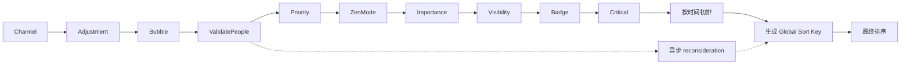

### 28.4.8 Interruptiveness

如果通知是新发出的，或更新时标题、正文、进度、大图标等关键信息有显著变化，系统会把它标记为 visually interruptive，并重置 ranking time，使其重新上浮。

## 28.5 勿扰模式：`ZenModeHelper` 与 `ZenPolicy`

### 28.5.1 概览

Android 的勿扰模式由 `ZenModeHelper` 管理。它不只是一个开关，而是一个规则引擎：多个 rule 可同时生效，每个 rule 都可能带独立策略，最后由 `ZenModeHelper` 合并成统一的 effective policy。

关键文件：

| 文件 | 作用 |
|------|------|
| `ZenModeHelper.java` | DND 主状态机 |
| `ZenModeFiltering.java` | 拦截决策 |
| `ZenModeConditions.java` | 条件评估 |
| `ZenModeExtractor.java` | 排序管线入口 |
| `ZenModeConfig.java` | 配置数据模型 |
| `ZenPolicy.java` | 每条规则的细粒度策略 |
| `ConditionProviders.java` | 管理条件服务 |

### 28.5.2 Zen 模式

四个基础模式：

```text
0 = OFF
1 = IMPORTANT_INTERRUPTIONS
2 = NO_INTERRUPTIONS
3 = ALARMS
```

### 28.5.3 `ZenModeHelper` 架构

`ZenModeHelper` 内部维护：

- `ZenModeFiltering`
- `ZenModeConditions`
- 按用户分的 `ZenModeConfig`
- 当前 `mZenMode`
- 合并后的 `NotificationManager.Policy`
- 合并后的 `ZenDeviceEffects`

### 28.5.4 `ZenModeConfig` 与规则

`ZenModeConfig` 包含：

- 手动规则
- 自动规则 map（`AutomaticZenRule`）
- 规则条件与策略

每个 rule 典型包含：

- 所属包
- `ConditionProvider` 组件
- `ZenPolicy`
- 触发说明

系统对每个包能创建的 rule 数量也有限制。

### 28.5.5 自动 DND 规则与条件

内置条件提供者包括：

| 提供者 | 类 | 触发条件 |
|--------|----|----------|
| Schedule | `ScheduleConditionProvider` | 时间表 |
| Event | `EventConditionProvider` | 日历事件 |
| Countdown | `CountdownConditionProvider` | 倒计时 |

第三方应用也可实现 `ConditionProviderService` 提供自定义条件。

### 28.5.6 `ZenPolicy`

`ZenPolicy` 允许每条 rule 单独控制：

- 允许的类别：电话、消息、conversation 等
- 允许的发送者范围：任何人、联系人、收藏联系人
- 视觉效果抑制项：全屏、peek、状态栏、badge、ambient、通知列表等

### 28.5.7 过滤决策

`ZenModeFiltering.shouldIntercept()` 是核心函数。它大致按下面逻辑走：

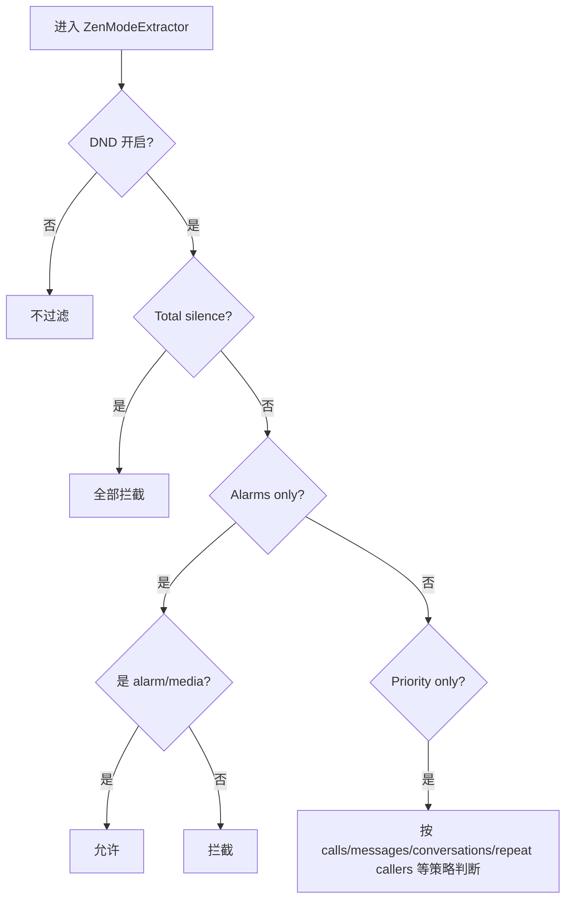

### 28.5.8 重复来电识别

允许 repeat callers 时，系统会在一段时间窗口内记录来电者。如果同一号码再次呼叫，即使普通优先级规则本来不允许，也能被放行。

### 28.5.9 Device Effects

Android 15 起，DND 规则还可附带 `ZenDeviceEffects`，比如：

- 灰度显示
- 抑制 ambient display
- 调暗壁纸
- 覆盖夜间模式

真正应用这些 effect 的通常是 SystemUI 侧注入的 `DeviceEffectsApplier`。

### 28.5.10 隐式规则（Android 15+）

新版本中，应用调用 `setInterruptionFilter()`、`setNotificationPolicy()` 不再是直接改全局状态，而是创建隐式 `AutomaticZenRule`。这样系统能知道到底是哪一个应用打开了 DND，也避免应用互相覆盖。

### 28.5.11 被抑制的视觉效果

即使通知被允许存在，也能进一步抑制某些视觉展示：

| 效果 | 常量 | 含义 |
|------|------|------|
| Screen off | `SUPPRESSED_EFFECT_SCREEN_OFF` | 息屏场景抑制 |
| Screen on | `SUPPRESSED_EFFECT_SCREEN_ON` | 亮屏场景抑制 |
| Full-screen | `SUPPRESSED_EFFECT_FULL_SCREEN_INTENT` | 禁止 FSI |
| Peek | `SUPPRESSED_EFFECT_PEEK` | 禁止 Heads-Up |
| Status bar | `SUPPRESSED_EFFECT_STATUS_BAR` | 不显示状态栏图标 |
| Badge | `SUPPRESSED_EFFECT_BADGE` | 不显示角标 |
| Ambient | `SUPPRESSED_EFFECT_AMBIENT` | 不走 ambient display |
| Notification list | `SUPPRESSED_EFFECT_NOTIFICATION_LIST` | 从列表隐藏 |
| Lights | `SUPPRESSED_EFFECT_LIGHTS` | 不闪灯 |

## 28.6 通知监听器：`NotificationListenerService`

### 28.6.1 概览

`NotificationListenerService` 是通知事件外发机制。SystemUI 本身就是一个通知监听器，第三方被授权的通知管理应用也是。NMS 通过 `ManagedServices` 统一绑定、重连和管理它们。

### 28.6.2 `ManagedServices` 框架

`NotificationListeners` 继承自 `ManagedServices`，负责：

- 用 `PackageManager` 发现服务
- 绑定 / 解绑
- 处理多用户与 profile
- 持久化启用状态到 secure settings

### 28.6.3 绑定标志

通知监听器绑定时会带一系列 flags，其中比较关键的是：

- `BIND_AUTO_CREATE`
- `BIND_FOREGROUND_SERVICE`
- `BIND_NOT_PERCEPTIBLE`
- `BIND_ALLOW_WHITELIST_MANAGEMENT`

`BIND_NOT_PERCEPTIBLE` 表示第三方监听器不应因数量过多而挤占系统关键进程的内存优先级。

### 28.6.4 监听器回调

核心回调：

```java
onNotificationPosted(StatusBarNotification sbn, RankingMap rankingMap)
onNotificationRemoved(StatusBarNotification sbn, RankingMap rankingMap, int reason)
onNotificationRankingUpdate(RankingMap rankingMap)
onListenerConnected()
onListenerDisconnected()
onNotificationChannelModified(...)
```

### 28.6.5 过滤类型

监听器可声明只关心部分通知类型，如：

- conversations
- alerting
- silent
- ongoing

### 28.6.6 Trim Levels

为减少 IPC 负载，监听器可请求不同 trim 级别：

- `TRIM_FULL`：完整内容
- `TRIM_LIGHT`：裁掉 extras、大图等重负载内容

SystemUI 必须使用 `TRIM_FULL`，第三方通常更适合 `TRIM_LIGHT`。

### 28.6.7 Trusted 与 Untrusted Listener

较新的系统区分 trusted listener 与 untrusted listener。若启用了敏感内容脱敏策略，未被信任的监听器会收到 redacted 通知内容。SystemUI 由于权限更高，始终是 trusted。

### 28.6.8 Notification Assistant Service

NAS 是增强型监听器，能在通知真正发布前修改它。典型能力包括：

- 修改 importance
- 附加 people
- 附加 smart replies / smart actions
- 写 ranking score
- 标记是否 sensitive
- 强制不是 conversation
- 类型分类（news、promotions 等）
- 生成 summarization

NMS 在 enqueue 阶段通知 NAS，并故意延迟约 200ms，给它时间写回 adjustment。

### 28.6.9 监听器生命周期图

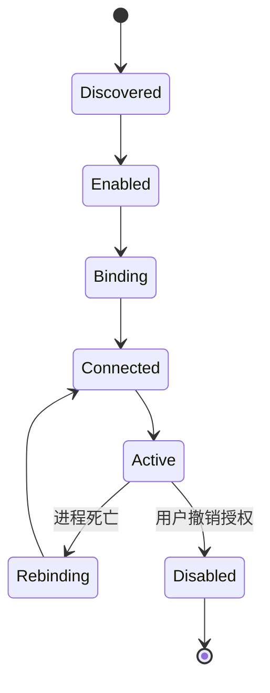

## 28.7 Conversation Notifications

### 28.7.1 概览

Conversation 通知在 SystemUI 中有一等公民待遇：独立 section、更丰富的展示、可变成 bubble。一个通知要成为 conversation，通常要满足：

1. 使用 `MessagingStyle`
2. 通过 `setShortcutId()` 绑定 sharing shortcut
3. shortcut 携带 `Person` 数据

### 28.7.2 `ShortcutInfo` 集成

`ShortcutHelper` 负责管理通知引用的 shortcut，并在通知发布时向 shortcut service 查询：

- `FLAG_GET_PERSONS_DATA`
- `FLAG_MATCH_CACHED`
- `FLAG_MATCH_DYNAMIC`
- `FLAG_MATCH_PINNED_BY_ANY_LAUNCHER`

它也会监听 shortcut 被删除的事件，以便清理对应 bubble。

### 28.7.3 `ValidateNotificationPeople`

这个 extractor 会把 people 引用映射到联系人数据库，并做 LRU 缓存。结果既影响排序，也影响 DND 放行策略。

### 28.7.4 `NotificationRecord` 中的会话识别

通知是否被当作 conversation，会综合以下字段：

- `mShortcutInfo`
- `mIsNotConversationOverride`
- `mPkgAllowedAsConvo`
- `mHasSentValidMsg`
- `mAppDemotedFromConvo`

也就是说，即使是 `MessagingStyle`，如果 assistant 或用户策略把它降级，也未必还被视为 conversation。

### 28.7.5 Conversation Channels

每个 conversation 都能派生自己的子 channel。用户对某个具体对话单独改声音、震动或优先级时，系统会创建一个带 `conversationId` 的 child channel，而不是改整个父 channel。

### 28.7.6 `MessagingStyle` 要求

想获得最佳 conversation 展示效果，`MessagingStyle` 最好包含：

- 发送者 `Person`
- 对话标题
- 消息时间戳
- 群聊标记
- 头像、联系人 URI、稳定 key

### 28.7.7 Conversation 优先区块

SystemUI 通常会把通知分为几类区块：

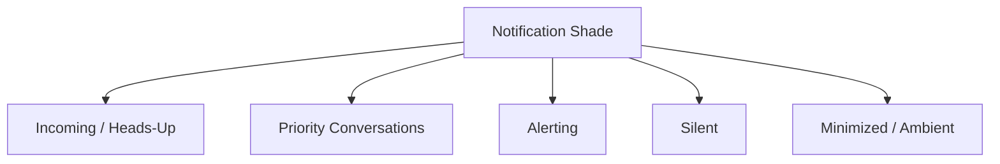

被用户标记为 priority 的 conversation，会排在更高的 section。

## 28.8 Bubble Notifications

### 28.8.1 概览

Bubble 把 conversation 通知提升为悬浮图标与迷你窗口。它横跨三个层次：

1. NMS：判断资格
2. SystemUI：桥接通知与 shell
3. WM Shell：真正管理 bubble UI 与 task 生命周期

### 28.8.2 Bubble 资格：`BubbleExtractor`

Bubble 要求大致包括：

- 设备支持 bubble
- 非 low-RAM 设备
- 通知是 conversation
- 拥有有效 `ShortcutInfo`
- 不是 FGS / UIJ
- 用户全局允许
- 应用级 bubble 偏好允许
- channel 级 bubble 允许

应用级与 channel 级组合大致如下：

| App Pref | Channel Pref | 结果 |
|----------|--------------|------|
| ALL | ON 或默认 | 允许 |
| ALL | OFF | 拒绝 |
| SELECTED | ON | 允许 |
| SELECTED | OFF 或默认 | 拒绝 |
| NONE | 任意 | 拒绝 |

### 28.8.3 `BubbleMetadata`

应用通过 `Notification.BubbleMetadata` 指定：

- 打开 bubble 时启动的 `PendingIntent`
- bubble 图标
- 期望高度
- 是否自动展开
- 是否隐藏原通知

### 28.8.4 WM Shell `BubbleController`

真正的 bubble UI 位于 WM Shell。核心类包括：

- `BubbleController`
- `BubbleData`
- `Bubble`
- `BubbleExpandedView`
- `BubbleTaskView`
- `BubblePositioner`
- `BubbleDataRepository`

### 28.8.5 Bubble 生命周期

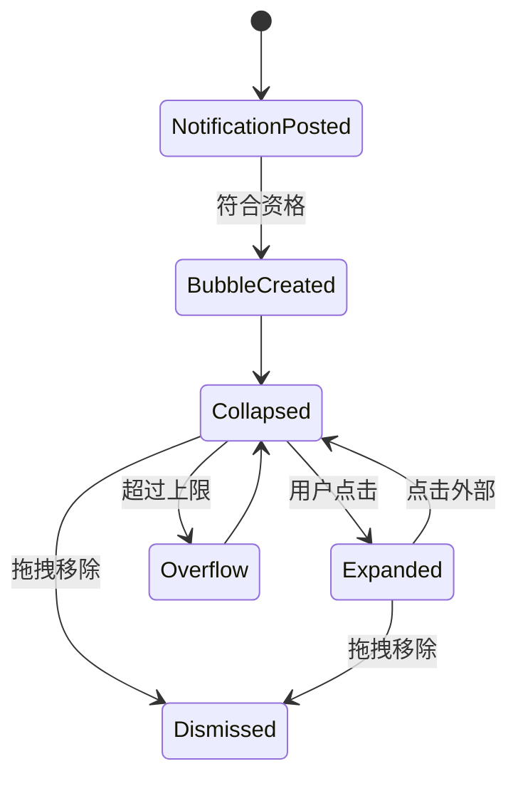

### 28.8.6 Bubble 到 Task 的映射

展开态 bubble 并不是简单弹层，而是承载一个真正的 Activity task。`BubbleTaskView` 负责把 Activity 嵌入 bubble 展开视图中。

### 28.8.7 Bubble 持久化

`BubbleDataRepository` 会把持续性的 bubble 状态存起来，使某些 ongoing conversation 在重启后仍能恢复。

### 28.8.8 Bubble 集成流

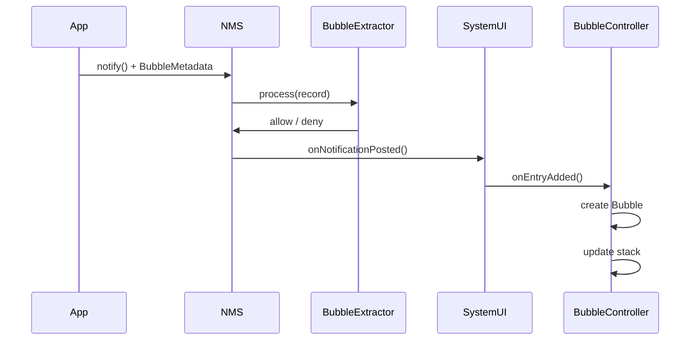

## 28.9 SystemUI 中的通知界面

### 28.9.1 概览

SystemUI 是通知系统的主要消费者。它实现了 `NotificationListenerService`，接收所有通知回调，并负责渲染：

- 通知抽屉
- Heads-Up
- 状态栏图标
- 锁屏通知
- Bubble 桥接

### 28.9.2 SystemUI 中的通知管线

现代 SystemUI 使用一条较清晰的通知 pipeline：

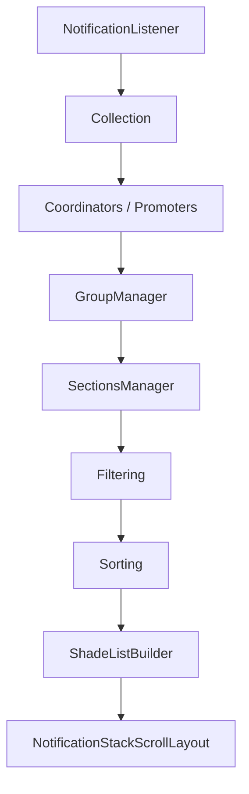

### 28.9.3 `NotificationStackScrollLayout`

这是通知抽屉的主滚动容器，负责：

- 展开/折叠动画
- 滑动删除
- overscroll 效果
- shade 展开状态
- section header
- 分组通知布局

### 28.9.4 `StackScrollAlgorithm`

它计算每条通知在当前滚动与展开状态下的：

- 位置
- 缩放
- 透明度
- section 间距
- 圆角边界

### 28.9.5 通知 Sections

SystemUI 会把通知按 bucket 分区：

1. Heads-Up / Incoming
2. Priority Conversations
3. Alerting
4. Silent
5. Minimized

### 28.9.6 通知行视图

每条通知通常对应一个 `ExpandableNotificationRow`，内部再分：

- collapsed content view
- expanded content view
- heads-up content view
- guts（设置面板）
- children container（分组子通知）

### 28.9.7 通知 Style 与模板

不同 `Notification.Style` 最终都会生成对应的 `RemoteViews` 模板，例如：

- `BigTextStyle`
- `BigPictureStyle`
- `InboxStyle`
- `MessagingStyle`
- `MediaStyle`
- `CallStyle`
- `DecoratedCustomViewStyle`

### 28.9.8 Heads-Up Notifications

importance `HIGH` 及以上的通知通常可触发 heads-up。它会受多种条件抑制：

- 通知抽屉已经展开
- DND 抑制了 `SUPPRESSED_EFFECT_PEEK`
- 配置要求前台应用不弹 HUN
- 当前设备/系统状态不允许

### 28.9.9 锁屏通知

锁屏通知显示受三层控制：

1. 全局设置：显示全部 / 隐藏敏感内容 / 全部不显示
2. channel 级 visibility：`PUBLIC` / `PRIVATE` / `SECRET`
3. 工作资料策略：管理员可强制隐藏

### 28.9.10 通知 Inflation

`RemoteViews` 的 inflation 通常异步完成，以免阻塞 UI 线程。若自定义通知视图过大或膨胀失败，SystemUI 会回退到最小可展示布局。

### 28.9.11 滑动删除

`NotificationSwipeHelper` 负责 swipe 手势。普通通知可滑动移除；FGS 与 ongoing 通知通常更抗拒被清除，或直接不可清除。

### 28.9.12 通知抽屉架构图

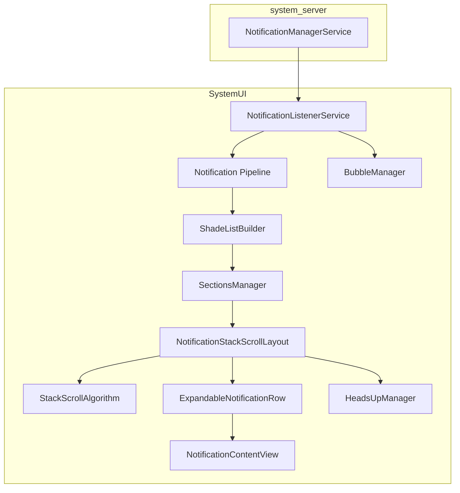

## 28.10 动手实践（Try It）

### 28.10.1 用 ADB 查看活跃通知

```bash
adb shell dumpsys notification
```

若只想看通知记录：

```bash
adb shell dumpsys notification --noredact | grep -A 5 "NotificationRecord"
```

### 28.10.2 导出通知渠道

```bash
adb shell dumpsys notification channels

# 指定包名
adb shell dumpsys notification channels com.example.myapp
```

### 28.10.3 查看 DND 状态

```bash
adb shell dumpsys notification zen

adb shell settings get global zen_mode
# 0 = off, 1 = priority, 2 = total silence, 3 = alarms
```

### 28.10.4 使用通知 shell 命令

```bash
# 列出某包的 channels
adb shell cmd notification list_channels com.example.myapp 0

# 发一条测试通知
adb shell cmd notification post -t "Test" "tag" "Hello from shell"

# snooze 一条通知
adb shell cmd notification snooze --for 60000 <key>

# 取消 snooze
adb shell cmd notification unsnooze <key>
```

### 28.10.5 从代码发送通知

```java
NotificationChannel channel = new NotificationChannel(
        "demo_channel",
        "Demo Channel",
        NotificationManager.IMPORTANCE_DEFAULT);

NotificationManager nm = getSystemService(NotificationManager.class);
nm.createNotificationChannel(channel);

Notification notification = new Notification.Builder(this, "demo_channel")
        .setSmallIcon(R.drawable.ic_notification)
        .setContentTitle("Hello")
        .setContentText("This is a test notification")
        .setAutoCancel(true)
        .build();

nm.notify(1, notification);
```

### 28.10.6 发送 Conversation 通知

```java
ShortcutInfo shortcut = new ShortcutInfo.Builder(context, "contact_jane")
        .setLongLived(true)
        .setShortLabel("Jane")
        .setPerson(new Person.Builder()
                .setName("Jane")
                .setKey("jane_key")
                .build())
        .setIntent(new Intent(Intent.ACTION_DEFAULT))
        .build();

ShortcutManager sm = getSystemService(ShortcutManager.class);
sm.addDynamicShortcuts(List.of(shortcut));

NotificationChannel channel = new NotificationChannel(
        "messages", "Messages", NotificationManager.IMPORTANCE_HIGH);
nm.createNotificationChannel(channel);

Person sender = new Person.Builder()
        .setName("Jane")
        .setKey("jane_key")
        .setIcon(Icon.createWithResource(context, R.drawable.avatar_jane))
        .build();

Notification.MessagingStyle style = new Notification.MessagingStyle(me)
        .addMessage("Hey, are you free tonight?", System.currentTimeMillis(), sender);

Notification notification = new Notification.Builder(this, "messages")
        .setSmallIcon(R.drawable.ic_message)
        .setShortcutId("contact_jane")
        .setStyle(style)
        .setCategory(Notification.CATEGORY_MESSAGE)
        .build();

nm.notify(100, notification);
```

### 28.10.7 创建 Bubble 通知

```java
Intent bubbleIntent = new Intent(context, ChatActivity.class)
        .putExtra("contact", "jane");
PendingIntent bubblePendingIntent = PendingIntent.getActivity(
        context, 0, bubbleIntent,
        PendingIntent.FLAG_MUTABLE | PendingIntent.FLAG_UPDATE_CURRENT);

Notification.BubbleMetadata bubble = new Notification.BubbleMetadata.Builder(
        bubblePendingIntent,
        Icon.createWithResource(context, R.drawable.avatar_jane))
    .setDesiredHeight(600)
    .setAutoExpandBubble(false)
    .setSuppressNotification(false)
    .build();

Notification notification = new Notification.Builder(this, "messages")
        .setSmallIcon(R.drawable.ic_message)
        .setShortcutId("contact_jane")
        .setStyle(style)
        .setBubbleMetadata(bubble)
        .build();
```

### 28.10.8 实现 `NotificationListenerService`

```java
public class MyNotificationListener extends NotificationListenerService {

    @Override
    public void onNotificationPosted(StatusBarNotification sbn) {
        Log.d("NLS", "Posted: " + sbn.getKey()
                + " pkg=" + sbn.getPackageName());
    }

    @Override
    public void onNotificationRemoved(StatusBarNotification sbn,
            RankingMap rankingMap, int reason) {
        Log.d("NLS", "Removed: " + sbn.getKey() + " reason=" + reason);
    }

    @Override
    public void onNotificationRankingUpdate(RankingMap rankingMap) {
        Log.d("NLS", "Ranking update");
    }
}
```

对应 manifest：

```xml
<service
    android:name=".MyNotificationListener"
    android:permission="android.permission.BIND_NOTIFICATION_LISTENER_SERVICE"
    android:exported="true">
    <intent-filter>
        <action android:name=
            "android.service.notification.NotificationListenerService" />
    </intent-filter>
</service>
```

### 28.10.9 以代码控制 DND

```java
NotificationManager nm = getSystemService(NotificationManager.class);

if (nm.isNotificationPolicyAccessGranted()) {
    nm.setInterruptionFilter(NotificationManager.INTERRUPTION_FILTER_PRIORITY);

    NotificationManager.Policy policy = new NotificationManager.Policy(
            NotificationManager.Policy.PRIORITY_CATEGORY_CALLS
                | NotificationManager.Policy.PRIORITY_CATEGORY_MESSAGES,
            NotificationManager.Policy.PRIORITY_SENDERS_CONTACTS,
            NotificationManager.Policy.PRIORITY_SENDERS_CONTACTS);
    nm.setNotificationPolicy(policy);
}
```

### 28.10.10 跟踪通知管线

```bash
adb shell setprop log.tag.NotificationService VERBOSE
adb shell setprop log.tag.NotificationRecord DEBUG
adb shell setprop log.tag.ZenModeHelper DEBUG
adb shell setprop log.tag.NotifAttentionHelper DEBUG
adb shell setprop log.tag.RankingHelper DEBUG

adb logcat -s NotificationService NotificationRecord ZenModeHelper \
    NotifAttentionHelper RankingHelper
```

### 28.10.11 查看通知历史

```bash
adb shell dumpsys notification history
```

### 28.10.12 测试 Snooze

```bash
# snooze 60 秒
adb shell cmd notification snooze --for 60000 "0|com.example.app|1|null|10088"

# 查看 snoozed 列表
adb shell dumpsys notification snoozed
```

### 28.10.13 调试 Bubble

```bash
# 全局开关
adb shell settings get global notification_bubbles

# 查看应用 bubble 偏好
adb shell dumpsys notification | grep -A 3 "bubble"

# 打开 bubble 日志
adb shell setprop log.tag.BubbleExtractor DEBUG
adb shell setprop log.tag.Bubbles DEBUG
```

### 28.10.14 观察 Attention Effects

```bash
adb shell setprop log.tag.NotifAttentionHelper VERBOSE
adb logcat -s NotifAttentionHelper
```

### 28.10.15 探索通知源码结构脚本

```bash
#!/bin/bash
NOTIF_DIR="frameworks/base/services/core/java/com/android/server/notification"

echo "=== Core Service Files ==="
wc -l $NOTIF_DIR/NotificationManagerService.java
wc -l $NOTIF_DIR/NotificationRecord.java
wc -l $NOTIF_DIR/PreferencesHelper.java
wc -l $NOTIF_DIR/ZenModeHelper.java
wc -l $NOTIF_DIR/RankingHelper.java

echo ""
echo "=== Signal Extractors ==="
grep -l "implements NotificationSignalExtractor" $NOTIF_DIR/*.java

echo ""
echo "=== All Files ==="
ls $NOTIF_DIR/*.java | wc -l
```

### 28.10.16 核心源码文件速览

| 文件 | 作用 |
|------|------|
| `NotificationManagerService.java` | 中央服务 |
| `NotificationRecord.java` | 服务端通知包装 |
| `PreferencesHelper.java` | channel/group 存储 |
| `ZenModeHelper.java` | DND 状态机 |
| `ZenModeFiltering.java` | DND 拦截逻辑 |
| `RankingHelper.java` | extractor 编排 |
| `NotificationAttentionHelper.java` | 声音、震动、灯光 |
| `GroupHelper.java` | 自动分组 |
| `SnoozeHelper.java` | snooze 管理 |
| `ShortcutHelper.java` | conversation shortcut |
| `ManagedServices.java` | listener / assistant 生命周期 |
| `ValidateNotificationPeople.java` | 联系人解析 |
| `BubbleExtractor.java` | bubble 资格判断 |
| `NotificationShellCmd.java` | shell 接口 |
| `NotificationStackScrollLayout.java` | SystemUI 通知列表容器 |
| `BubbleController.java` | WM Shell 气泡控制器 |

### 28.10.17 监控自动分组

```bash
adb shell setprop log.tag.GroupHelper DEBUG
adb logcat -s GroupHelper
```

传统 auto-grouping 常见阈值是 2 条未分组通知；force grouping 则会关注“很多稀疏 group”的情况。

### 28.10.18 校验 Channel 配置

```bash
# 查看指定包和用户的全部 channels
adb shell cmd notification list_channels <package_name> <user_id>

# 例如
adb shell cmd notification list_channels com.google.android.gm 0
```

也可以结合 `dumpsys notification` 看 importance、block 状态和用户修改痕迹。

### 28.10.19 用自定义 Extractor 测试完整管线

第三方应用无法扩展 signal extractor，但在 eng build 上可改系统配置：

```xml
<string-array name="config_notificationSignalExtractors">
    <item>com.android.server.notification.NotificationChannelExtractor</item>
    <item>com.example.MyCustomExtractor</item>
</string-array>
```

前提是自定义 extractor 位于 `system_server` classpath 中，并实现 `NotificationSignalExtractor`。

### 28.10.20 前台服务通知约束

```bash
# 查看 FGS 通知标记
adb shell dumpsys notification | grep "FLAG_FOREGROUND_SERVICE"
```

FGS 通知的关键规则：

- 通常不能被用户直接清除
- importance 低于 `LOW` 时会被系统抬升
- 服务还在运行时，应用不能随意撤掉通知
- Android 14 起，如果 FGS 通知不可见，前台服务启动可能直接失败

### 28.10.21 通知权限（Android 13+）

```bash
# 查看某包是否拥有 POST_NOTIFICATIONS
adb shell dumpsys notification permissions | grep "com.your.package"
```

面向 API 33+ 的应用需要显式申请 `POST_NOTIFICATIONS`。

## 28.11 Notification Attention Effects

### 28.11.1 概览

通知发布后，系统会决定是否：

- 播放声音
- 震动
- 闪灯
- 触发 Heads-Up
- 触发全屏 Intent

这部分集中在 `NotificationAttentionHelper`。

### 28.11.2 `buzzBeepBlink` 决策

`buzzBeepBlinkLocked()` 会综合考虑：

1. 是否被 DND 拦截
2. 是否已经提醒过，且带 `FLAG_ONLY_ALERT_ONCE`
3. group alert 行为
4. listener hints 是否要求禁用效果
5. 当前是否正在通话
6. importance 是否足够高

### 28.11.3 声音

声音通常经 `IRingtonePlayer` 播放。以下情况会被抑制：

- importance 低于 `DEFAULT`
- `FLAG_ONLY_ALERT_ONCE` 且已提醒过
- DND 拦截
- 特定 screen-off / listener hints 抑制
- 某些通话场景下被禁止

### 28.11.4 震动

震动优先从 channel 配置中解析：

1. channel vibration effect
2. channel vibration pattern
3. 默认震动

带 `FLAG_INSISTENT` 的通知可让震动重复直到用户确认。

### 28.11.5 LED

LED 通过 `LightsManager` 控制。许多现代设备已没有 LED，但 API 和服务端逻辑仍然保留。

### 28.11.6 Full-Screen Intent

importance `HIGH` 或 `MAX` 的通知可以请求 FSI，例如来电或闹钟。设备活跃使用时，系统可能把它降级为普通 Heads-Up。Android 14 起还需要 `USE_FULL_SCREEN_INTENT` 权限。

### 28.11.7 Attention Effects 流程

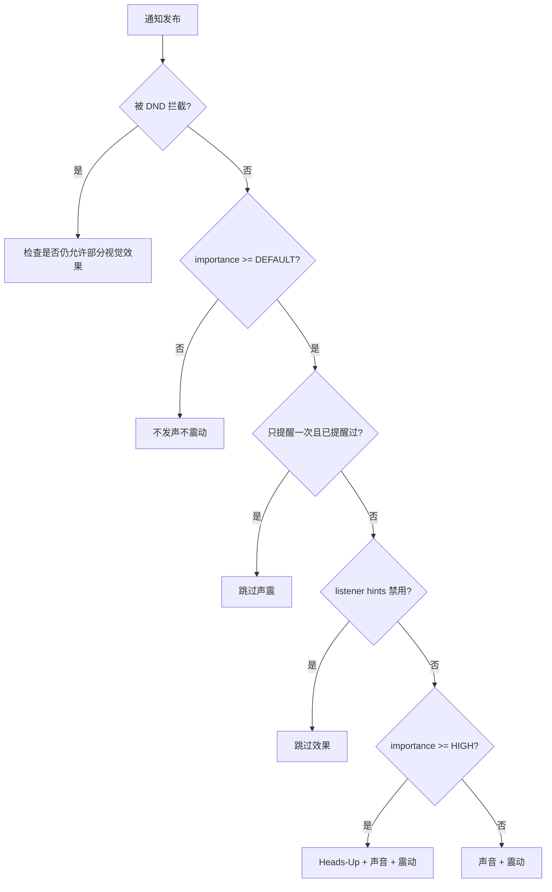

## 28.12 通知历史与持久化

### 28.12.1 Notification History

NMS 维护了一个内存中的 `Archive` 环形缓冲，用于短期历史查询，例如 `getHistoricalNotifications()` 背后的数据来源。

### 28.12.2 `NotificationHistoryManager`

除了内存 archive，系统还维护持久化的 SQLite 通知历史数据库，供设置中的 notification history 界面使用。它会保存：

- 包名
- channel ID
- 标题与内容
- 图标
- 发布时间
- conversation shortcut ID

### 28.12.3 策略文件持久化

NMS 会把政策与配置写到 XML policy file 中，内容包括：

- DND 配置和规则
- channel / group 偏好
- listener / assistant 启用状态
- condition provider 启用状态
- snoozed 通知状态
- 锁屏敏感通知偏好

系统启动时会读取这份 policy XML 恢复状态。

### 28.12.4 备份与恢复

通知相关配置支持参与 Android 备份恢复，包括：

1. policy XML
2. per-app channel 设置
3. DND 规则
4. listener / assistant 配置

## 28.13 Notification Snooze

### 28.13.1 概览

snooze 是“暂时隐藏，稍后再回来”的机制，由 `SnoozeHelper` 管理。

### 28.13.2 Snooze 机制

有两类：

1. 按时长：过一段时间重新出现
2. 按条件：满足某个 criterion 再出现

### 28.13.3 入队阶段的 Snooze 检查

通知在 enqueue 时，系统会先查该 key 是否仍在 snoozed 状态。如果还未到解冻时间，就直接再次 snooze，避免通知短暂闪现。

### 28.13.4 Snooze 持久化

snoozed 状态会写入 XML，因此可跨重启保留。系统开机时会把尚未到期的 snooze 重新恢复并重设 Alarm。

## 28.14 自动分组与强制分组

### 28.14.1 传统 Auto-Grouping

当应用发出多条未显式分组的通知时，NMS 会自动给它们挂到一个系统生成的 summary 下，常见 key 是：

```java
protected static final String AUTOGROUP_KEY = "ranker_group";
```

传统 auto-grouping 通常在未分组通知数达到阈值时触发。

### 28.14.2 Force Grouping（Android 16+）

force grouping 是更激进的 regroup 机制，使用：

```java
protected static final String AGGREGATE_GROUP_KEY = "Aggregate_";
```

它会把大量稀疏小 group 合并成 aggregate group，并在通知刚发出或移除后延迟约 3 秒，再决定是否强制 regroup。

### 28.14.3 Auto-Group Summary 属性

系统生成的 auto-group summary 会带：

- `FLAG_AUTOGROUP_SUMMARY`
- `FLAG_GROUP_SUMMARY`
- `FLAG_LOCAL_ONLY`

如果全部 children 都带 `FLAG_AUTO_CANCEL`，summary 也会继承；若任一 child 带 `FLAG_ONGOING_EVENT` 或 `FLAG_NO_CLEAR`，summary 也可能继承相应不可清除属性。

### 28.14.4 基于分类的重新分组

当 NAS 把通知分类为 news、promotions 等，系统也可能按分类重新 regroup。这类能力通常受实验 flag 控制。

### 28.14.5 分组决策图

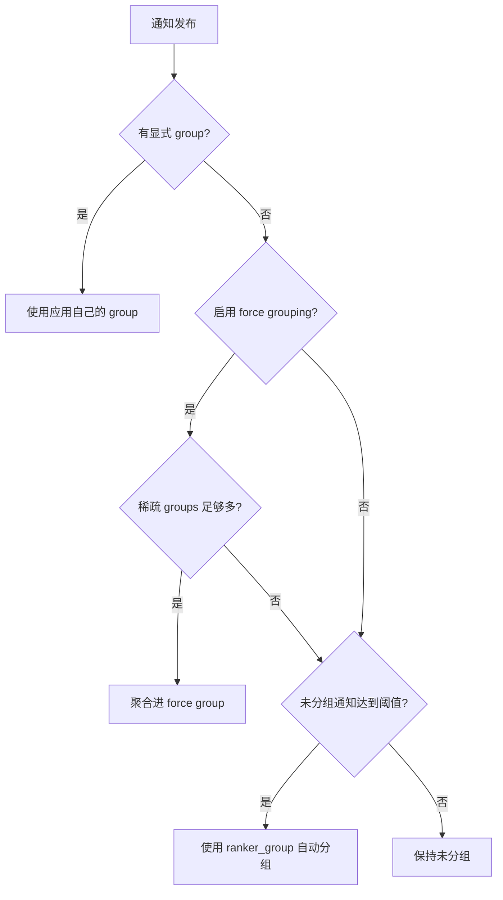

## 28.15 关键数据结构

### 28.15.1 NMS 核心集合

最重要的服务端集合包括：

- `mNotificationList`：全部活跃通知的权威有序列表
- `mNotificationsByKey`：按 key 快速查找
- `mEnqueuedNotifications`：还处于 enqueue 阶段的通知
- `mAutobundledSummaries`：每用户、每包的自动 summary 跟踪
- `mSummaryByGroupKey`：group summary 索引

### 28.15.2 Notification Key 格式

通知 key：

```text
<userId>|<packageName>|<id>|<tag>|<uid>
```

示例：

```text
0|com.example.app|1|null|10088
```

### 28.15.3 Group Key 格式

group key：

```text
<userId>|<packageName>|<groupId>
```

若通知没有显式 `setGroup()`，那它自己就是单独一组。

### 28.15.4 `NotificationRecord` 字段映射

| 字段 | 来源 | 由谁写入 | 被谁使用 |
|------|------|----------|----------|
| `mChannel` | `PreferencesHelper` | `NotificationChannelExtractor` | importance、声震灯 |
| `mContactAffinity` | 联系人库 | `ValidateNotificationPeople` | DND、排序 |
| `mIntercept` | DND policy | `ZenModeExtractor` | 拦截分发 |
| `mImportance` | channel + system + assistant | `ImportanceExtractor` | 排序与 attention |
| `mPackagePriority` | channel | `PriorityExtractor` | DND bypass |
| `mAllowBubble` | 用户/应用/channel 偏好 | `BubbleExtractor` | Bubble 展示 |
| `mShowBadge` | channel | `BadgeExtractor` | launcher badge |
| `mPackageVisibility` | channel | `VisibilityExtractor` | 锁屏 |
| `mCriticality` | 系统策略 | `CriticalNotificationExtractor` | 顶层排序 |
| `mRankingScore` | NAS | `NotificationAdjustmentExtractor` | 排序 |
| `mUserSentiment` | NAS | `NotificationAdjustmentExtractor` | 智能建议 |
| `mShortcutInfo` | `ShortcutHelper` | 后处理 | conversation、bubble |
| `mSuppressedVisualEffects` | DND policy | `ZenModeExtractor` | attention effects |

---

## 总结（Summary）

Android 通知系统本质上是一条多层、多阶段、强策略化的服务端流水线。一个 `notify()` 调用最终会经历校验、channel 解析、signal extraction、排序、勿扰过滤、attention 决策、监听器分发以及 SystemUI 渲染。

本章的关键结论如下：

1. **`NotificationManagerService` 是绝对中枢**：权限、channel、排序、DND、attention、listener、history 都围绕它展开。
2. **Extractor 管线是模块化核心**：每个 extractor 只负责一个维度，最终共同塑造 `NotificationRecord` 的排序与展示结果。
3. **通知渠道把行为控制权交给了用户**：应用只能创建默认行为，用户一旦修改，系统就以用户设置为准。
4. **DND 是规则引擎而不是简单开关**：多条 rule、不同 sender、conversation policy、visual effects suppression 会一起参与判断。
5. **Conversation 通知获得了特权路径**：`MessagingStyle`、shortcut 与 `Person` 数据共同驱动会话通知、优先分区和 bubble。
6. **Bubble 连接了通知系统与窗口系统**：资格判断在 NMS，真正 UI 生命周期由 WM Shell 托管。
7. **SystemUI 有自己的一套通知管线**：原始 `StatusBarNotification` 还要经过 collection、group、section、filter、sort、shade list 才会真正被渲染。
8. **线程模型非常谨慎**：Binder 线程只做入口，核心处理放在 handler 线程，延迟排序放在 ranking 线程，以降低死锁和卡顿风险。
9. **自动分组与强制分组是系统兜底机制**：即使应用分组做得很差，系统也会尽量保证通知抽屉可读。
10. **Attention effects 是复杂决策树**：importance、DND、listener hints、group alert behavior、`FLAG_ONLY_ALERT_ONCE` 会共同决定是否发声、震动、弹 HUN。
11. **通知历史同时存在内存档案与持久化数据库**：既能服务 API 查询，也能支撑设置界面的历史记录。

## 附录 A：完整 Extractor 管线参考

| # | Extractor | 依赖 | 修改字段 | 可能延迟 |
|---|-----------|------|----------|----------|
| 1 | `NotificationChannelExtractor` | 无 | `mChannel` | 否 |
| 2 | `NotificationAdjustmentExtractor` | Channel | `mImportance`、`mRankingScore`、`mUserSentiment`、smart actions/replies、classification | 否 |
| 3 | `BubbleExtractor` | Channel、Adjustment | `mAllowBubble` | 否 |
| 4 | `ValidateNotificationPeople` | Adjustment | `mContactAffinity`、people 相关字段 | 是 |
| 5 | `PriorityExtractor` | Channel | `mPackagePriority` | 否 |
| 6 | `ZenModeExtractor` | Priority | `mIntercept`、`mSuppressedVisualEffects` | 否 |
| 7 | `ImportanceExtractor` | Channel、System、Assistant | `mImportance` | 否 |
| 8 | `VisibilityExtractor` | Importance | `mPackageVisibility` | 否 |
| 9 | `BadgeExtractor` | ZenMode | `mShowBadge` | 否 |
| 10 | `CriticalNotificationExtractor` | 无 | `mCriticality` | 否 |

## 附录 B：通知 Flags 参考

| Flag | 值 | 说明 |
|------|----|------|
| `FLAG_SHOW_LIGHTS` | `0x00000001` | 旧式闪灯请求 |
| `FLAG_ONGOING_EVENT` | `0x00000002` | 用户不能清除 |
| `FLAG_INSISTENT` | `0x00000004` | 一直重复声震直到确认 |
| `FLAG_ONLY_ALERT_ONCE` | `0x00000008` | 仅首次提醒 |
| `FLAG_AUTO_CANCEL` | `0x00000010` | 点击后自动取消 |
| `FLAG_NO_CLEAR` | `0x00000020` | “全部清除”不会清掉 |
| `FLAG_FOREGROUND_SERVICE` | `0x00000040` | 与前台服务关联 |
| `FLAG_HIGH_PRIORITY` | `0x00000080` | 旧式高优先级 |
| `FLAG_LOCAL_ONLY` | `0x00000100` | 不桥接到远端设备 |
| `FLAG_GROUP_SUMMARY` | `0x00000200` | 这是组摘要 |
| `FLAG_AUTOGROUP_SUMMARY` | `0x00000400` | 系统生成的组摘要 |
| `FLAG_BUBBLE` | `0x00001000` | 可气泡展示 |
| `FLAG_NO_DISMISS` | `0x00002000` | 完全不可 dismiss |
| `FLAG_FSI_REQUESTED_BUT_DENIED` | `0x00004000` | 请求了 FSI 但被拒绝 |
| `FLAG_USER_INITIATED_JOB` | `0x00008000` | 与用户发起任务关联 |
| `FLAG_PROMOTED_ONGOING` | `0x00010000` | 升级为 ongoing |
| `FLAG_LIFETIME_EXTENDED_BY_DIRECT_REPLY` | `0x00020000` | 直接回复后延长寿命 |
| `FLAG_SILENT` | `0x00040000` | 强制静默 |

## 附录 C：取消原因常量

| 常量 | 值 | 说明 |
|------|----|------|
| `REASON_CLICK` | 1 | 用户点击 |
| `REASON_CANCEL` | 2 | 用户滑动移除 |
| `REASON_CANCEL_ALL` | 3 | 用户点全部清除 |
| `REASON_ERROR` | 4 | 通知无效 |
| `REASON_PACKAGE_CHANGED` | 5 | 包更新 |
| `REASON_USER_STOPPED` | 6 | 用户停止 |
| `REASON_PACKAGE_BANNED` | 7 | 包通知被禁用 |
| `REASON_APP_CANCEL` | 8 | app 调 `cancel()` |
| `REASON_APP_CANCEL_ALL` | 9 | app 调 `cancelAll()` |
| `REASON_LISTENER_CANCEL` | 10 | listener 取消 |
| `REASON_LISTENER_CANCEL_ALL` | 11 | listener 取消全部 |
| `REASON_GROUP_SUMMARY_CANCELED` | 12 | group summary 被移除 |
| `REASON_GROUP_OPTIMIZATION` | 13 | regroup 优化 |
| `REASON_PACKAGE_SUSPENDED` | 14 | 包被暂停 |
| `REASON_PROFILE_TURNED_OFF` | 15 | profile 关闭 |
| `REASON_UNAUTOBUNDLED` | 16 | 退出 auto-bundle |
| `REASON_CHANNEL_BANNED` | 17 | channel importance 为 NONE |
| `REASON_SNOOZED` | 18 | 用户 snooze |
| `REASON_TIMEOUT` | 19 | TTL 到期 |
| `REASON_CHANNEL_REMOVED` | 20 | channel 被删 |
| `REASON_CLEAR_DATA` | 21 | app 数据清空 |
| `REASON_ASSISTANT_CANCEL` | 22 | NAS 取消 |
| `REASON_LOCKDOWN` | 23 | 进入 lockdown |
| `REASON_BUNDLE_DISMISSED` | 24 | bundle 被 dismiss |

## 附录 D：Importance 行为矩阵

| Importance | 声音 | 震动 | Heads-Up | 状态栏图标 | 抽屉 | Badge | Full-Screen Intent |
|------------|------|------|----------|------------|------|-------|--------------------|
| NONE | 否 | 否 | 否 | 否 | 否 | 否 | 否 |
| MIN | 否 | 否 | 否 | 否 | 是 | 否 | 否 |
| LOW | 否 | 否 | 否 | 是 | 是 | 是 | 否 |
| DEFAULT | 是 | 是 | 否 | 是 | 是 | 是 | 否 |
| HIGH | 是 | 是 | 是 | 是 | 是 | 是 | 若被允许 |
| MAX | 是 | 是 | 是 | 是 | 是 | 是 | 是 |

说明：

- 震动仍受系统震动总开关与 channel 配置影响
- Heads-Up 仍可能被 DND、listener hints 或 shade 展开状态抑制
- Android 14+ 上 FSI 还需要 `USE_FULL_SCREEN_INTENT`

## 附录 E：通知系统演进

| Android 版本 | 关键变化 |
|-------------|----------|
| 1.0 | 基础通知能力 |
| 3.0 | `Notification.Builder` |
| 4.1 | 可展开通知、`BigTextStyle`、`InboxStyle` |
| 4.3 | `NotificationListenerService` |
| 5.0 | Heads-Up、锁屏通知、`CATEGORY_*`、visibility |
| 7.0 | inline reply、bundled notifications、`MessagingStyle` |
| 8.0 | Notification Channels、dots、snooze |
| 9.0 | `Person` 与 `MessagingStyle` 增强 |
| 10 | Bubble、`ZenPolicy`、conversation shortcuts |
| 11 | conversation section、conversation channels、notification history |
| 12 | 限制自定义样式、阻止 trampoline |
| 13 | `POST_NOTIFICATIONS` 运行时权限 |
| 14 | `USE_FULL_SCREEN_INTENT`、FGS 类型约束 |
| 15 | implicit zen rules、`ZenDeviceEffects`、敏感内容脱敏 |
| 16 | force grouping、通知分类、AI summarization |

## 附录 F：源码索引

**服务端（system_server）：**

```text
frameworks/base/services/core/java/com/android/server/notification/
    NotificationManagerService.java
    NotificationRecord.java
    PreferencesHelper.java
    RankingHelper.java
    RankingConfig.java
    RankingHandler.java
    ZenModeHelper.java
    ZenModeFiltering.java
    ZenModeConditions.java
    ZenModeExtractor.java
    ZenModeEventLogger.java
    NotificationAttentionHelper.java
    GroupHelper.java
    SnoozeHelper.java
    ShortcutHelper.java
    ManagedServices.java
    ConditionProviders.java
    ValidateNotificationPeople.java
    NotificationSignalExtractor.java
    NotificationChannelExtractor.java
    NotificationAdjustmentExtractor.java
    BubbleExtractor.java
    ImportanceExtractor.java
    PriorityExtractor.java
    VisibilityExtractor.java
    BadgeExtractor.java
    CriticalNotificationExtractor.java
    NotificationTimeComparator.java
    GlobalSortKeyComparator.java
    NotificationShellCmd.java
    NotificationHistoryManager.java
    NotificationHistoryDatabase.java
    NotificationUsageStats.java
    NotificationBackupHelper.java
    PermissionHelper.java
    AlertRateLimiter.java
    TimeToLiveHelper.java
    VibratorHelper.java
```

**SDK API（应用侧）：**

```text
frameworks/base/core/java/android/app/
    Notification.java
    NotificationManager.java
    NotificationChannel.java
    NotificationChannelGroup.java
    INotificationManager.aidl

frameworks/base/core/java/android/service/notification/
    NotificationListenerService.java
    NotificationAssistantService.java
    ConditionProviderService.java
    StatusBarNotification.java
    ZenPolicy.java
    ZenModeConfig.java
    Adjustment.java
```

**SystemUI：**

```text
frameworks/base/packages/SystemUI/src/com/android/systemui/statusbar/notification/
    stack/NotificationStackScrollLayout.java
    stack/StackScrollAlgorithm.java
    stack/NotificationSectionsManager.kt
    stack/NotificationPriorityBucket.kt
    stack/NotificationSwipeHelper.java
    ConversationNotifications.kt
    DynamicPrivacyController.java
```

**WM Shell Bubbles：**

```text
frameworks/base/libs/WindowManager/Shell/src/com/android/wm/shell/bubbles/
    BubbleController.java
    BubbleData.java
    Bubble.java
    BubbleExpandedView.java
    BubbleTaskView.kt
    BubblePositioner.java
    BubbleDataRepository.kt
```

**配置：**

```text
frameworks/base/core/res/res/values/config.xml
    config_notificationSignalExtractors
```
