# Chapter 28: Notification System

The Android notification system is one of the platform's most complex subsystems.
A single `notify()` call from an application triggers a cascade of permission checks,
channel lookups, signal extraction, ranking, Do Not Disturb filtering, listener
dispatch, and finally UI rendering inside SystemUI. At the time of writing, the core
service `NotificationManagerService.java` alone exceeds 15,500 lines of code and
coordinates with over 70 helper classes. This chapter traces the full lifecycle of a
notification from the public API down through the server-side pipeline, ranking
engine, attention effects, and into the SystemUI shade.

---

## 28.1 Notification Architecture

### 28.1.1 High-Level Overview

Android's notification subsystem spans four distinct layers:

```
Applications
    |
    v
NotificationManager (android.app.NotificationManager)      <-- public SDK API
    |  (Binder IPC)
    v
NotificationManagerService (system_server)                  <-- policy engine
    |
    +---> RankingHelper           (signal extraction & sort)
    +---> PreferencesHelper       (channels, groups, per-app prefs)
    +---> ZenModeHelper           (Do Not Disturb)
    +---> NotificationAttentionHelper  (sound, vibration, LED)
    +---> GroupHelper             (auto-grouping)
    +---> SnoozeHelper            (timed snooze)
    +---> ShortcutHelper          (conversation shortcuts)
    +---> NotificationListeners   (listener dispatch)
    +---> NotificationAssistants  (NAS adjustments)
    |
    v
SystemUI (notification shade, heads-up, bubbles, status bar icons)
```

The Binder interface that connects apps to the service is defined as
`INotificationManager.aidl`. Every `notify()` and `cancel()` call from
`NotificationManager` crosses the Binder into `system_server` where
`NotificationManagerService` runs.

Source files:

| Component | Path |
|-----------|------|
| `NotificationManager` | `frameworks/base/core/java/android/app/NotificationManager.java` |
| `INotificationManager` | `frameworks/base/core/java/android/app/INotificationManager.aidl` |
| `NotificationManagerService` | `frameworks/base/services/core/java/com/android/server/notification/NotificationManagerService.java` |
| `Notification` | `frameworks/base/core/java/android/app/Notification.java` |
| `NotificationChannel` | `frameworks/base/core/java/android/app/NotificationChannel.java` |
| `StatusBarNotification` | `frameworks/base/core/java/android/service/notification/StatusBarNotification.java` |

### 28.1.2 The Notification Object

A `Notification` object is the core data structure. It carries:

- **Small icon** (mandatory) -- displayed in the status bar and the shade header.
- **Content title and text** -- the primary textual content.
- **Channel ID** (mandatory since API 26) -- the channel that governs behavior.
- **PendingIntent** -- the tap action (`contentIntent`) and optionally a `deleteIntent`.
- **Actions** -- up to three buttons (including inline reply).
- **Style** -- one of `BigTextStyle`, `BigPictureStyle`, `InboxStyle`, `MessagingStyle`,
  `MediaStyle`, `CallStyle`, `DecoratedCustomViewStyle`, or `DecoratedMediaCustomViewStyle`.
- **Extras** -- a `Bundle` for arbitrary key-value pairs.
- **BubbleMetadata** -- optional metadata for bubble presentation.
- **Flags** -- bit flags like `FLAG_FOREGROUND_SERVICE`, `FLAG_AUTO_CANCEL`,
  `FLAG_GROUP_SUMMARY`, `FLAG_BUBBLE`, `FLAG_ONGOING_EVENT`, `FLAG_NO_CLEAR`.

### 28.1.3 Key Constants and Limits

From `NotificationManagerService`:

```java
// frameworks/base/services/core/java/com/android/server/notification/
//   NotificationManagerService.java (lines 473-474)
static final int MAX_PACKAGE_NOTIFICATIONS = 50;
static final float DEFAULT_MAX_NOTIFICATION_ENQUEUE_RATE = 5f;
```

A single package may have at most 50 active notifications. The enqueue rate is
limited to 5 notifications per second to prevent flooding.

Additional limits enforced by `PreferencesHelper`:

```java
// frameworks/base/services/core/java/com/android/server/notification/
//   PreferencesHelper.java (lines 141-142)
static final int NOTIFICATION_CHANNEL_COUNT_LIMIT = 5000;
static final int NOTIFICATION_CHANNEL_GROUP_COUNT_LIMIT = 6000;
```

### 28.1.4 Architecture Diagram

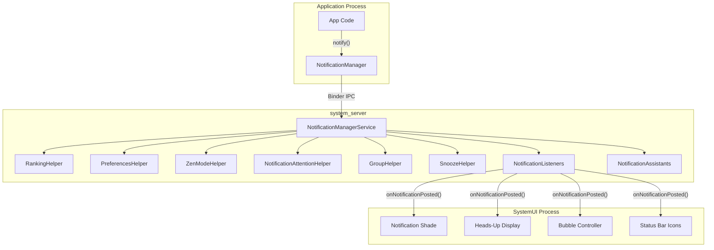

### 28.1.5 Threading Model

`NotificationManagerService` uses a dedicated worker thread for most operations.
The Binder calls from apps arrive on the Binder thread pool, but the actual
processing is posted to a handler thread:

```java
// NotificationManagerService.java (lines 480-486)
// message codes
static final int MESSAGE_DURATION_REACHED = 2;
static final int MESSAGE_SEND_RANKING_UPDATE = 4;
static final int MESSAGE_LISTENER_HINTS_CHANGED = 5;
static final int MESSAGE_LISTENER_NOTIFICATION_FILTER_CHANGED = 6;
static final int MESSAGE_FINISH_TOKEN_TIMEOUT = 7;
static final int MESSAGE_ON_PACKAGE_CHANGED = 8;
```

There is also a separate ranking thread:

```java
// NotificationManagerService.java (lines 491-492)
// ranking thread messages
private static final int MESSAGE_RECONSIDER_RANKING = 1000;
private static final int MESSAGE_RANKING_SORT = 1001;
```

The critical synchronization primitive is `mNotificationLock`:

```java
// All reads/writes to mNotificationList, mNotificationsByKey, mSummaryByGroupKey,
// and mEnqueuedNotifications must hold mNotificationLock.
```

### 28.1.6 Signal Extractor Pipeline

The ranking pipeline is driven by a chain of `NotificationSignalExtractor`
implementations, configured in XML and loaded reflectively:

```xml
<!-- frameworks/base/core/res/res/values/config.xml (line 3740) -->
<string-array name="config_notificationSignalExtractors">
    <item>com.android.server.notification.NotificationChannelExtractor</item>
    <item>com.android.server.notification.NotificationAdjustmentExtractor</item>
    <item>com.android.server.notification.BubbleExtractor</item>
    <item>com.android.server.notification.ValidateNotificationPeople</item>
    <item>com.android.server.notification.PriorityExtractor</item>
    <item>com.android.server.notification.ZenModeExtractor</item>
    <item>com.android.server.notification.ImportanceExtractor</item>
    <item>com.android.server.notification.VisibilityExtractor</item>
    <item>com.android.server.notification.BadgeExtractor</item>
    <item>com.android.server.notification.CriticalNotificationExtractor</item>
</string-array>
```

The interface is minimal:

```java
// frameworks/base/services/core/java/com/android/server/notification/
//   NotificationSignalExtractor.java
public interface NotificationSignalExtractor {
    public void initialize(Context context, NotificationUsageStats usageStats);
    public RankingReconsideration process(NotificationRecord notification);
    void setConfig(RankingConfig config);
    void setZenHelper(ZenModeHelper helper);
}
```

Each extractor runs in sequence on every notification. If an extractor returns a
non-null `RankingReconsideration`, it is posted to the ranking thread for deferred
re-evaluation (used by `ValidateNotificationPeople` for asynchronous contact lookup).

```mermaid
graph LR
    NR[NotificationRecord] --> E1[ChannelExtractor]
    E1 --> E2[AdjustmentExtractor]
    E2 --> E3[BubbleExtractor]
    E3 --> E4[ValidateNotificationPeople]
    E4 --> E5[PriorityExtractor]
    E5 --> E6[ZenModeExtractor]
    E6 --> E7[ImportanceExtractor]
    E7 --> E8[VisibilityExtractor]
    E8 --> E9[BadgeExtractor]
    E9 --> E10[CriticalNotificationExtractor]
    E10 --> SORTED[Sorted NotificationList]
```

### 28.1.7 The NotificationRecord

`NotificationRecord` is the server-side wrapper around `StatusBarNotification`.
It holds all the intermediate state produced by the signal extractors:

```java
// frameworks/base/services/core/java/com/android/server/notification/
//   NotificationRecord.java (lines 108-248, summarized)
public final class NotificationRecord {
    private final StatusBarNotification sbn;
    private float mContactAffinity;
    private boolean mIntercept;          // suppressed by DND
    private long mRankingTimeMs;
    private int mImportance;
    private int mSystemImportance;
    private int mAssistantImportance;
    private float mRankingScore;
    private int mCriticality;
    private NotificationChannel mChannel;
    private ShortcutInfo mShortcutInfo;
    private boolean mAllowBubble;
    private boolean mShowBadge;
    private int mSuppressedVisualEffects;
    private ArrayList<Notification.Action> mSystemGeneratedSmartActions;
    private ArrayList<CharSequence> mSmartReplies;
    private int mUserSentiment;
    private boolean mIsInterruptive;
    // ... many more fields
}
```

The Javadoc on the class states the critical threading rule:

> These objects should not be mutated unless the code is synchronized on
> `NotificationManagerService.mNotificationLock`, and any modification should
> be followed by a sorting of that list.

---

## 28.2 NotificationManagerService: Enqueue, Post, Cancel

### 28.2.1 Overview of the Notification Lifecycle

A notification goes through three distinct phases in the server:

1. **Enqueue** -- validation, channel lookup, rate limiting, `NotificationRecord` creation.
2. **Post** -- signal extraction, ranking sort, attention effects, listener dispatch.
3. **Cancel** -- removal from the list, listener notification, history archival.

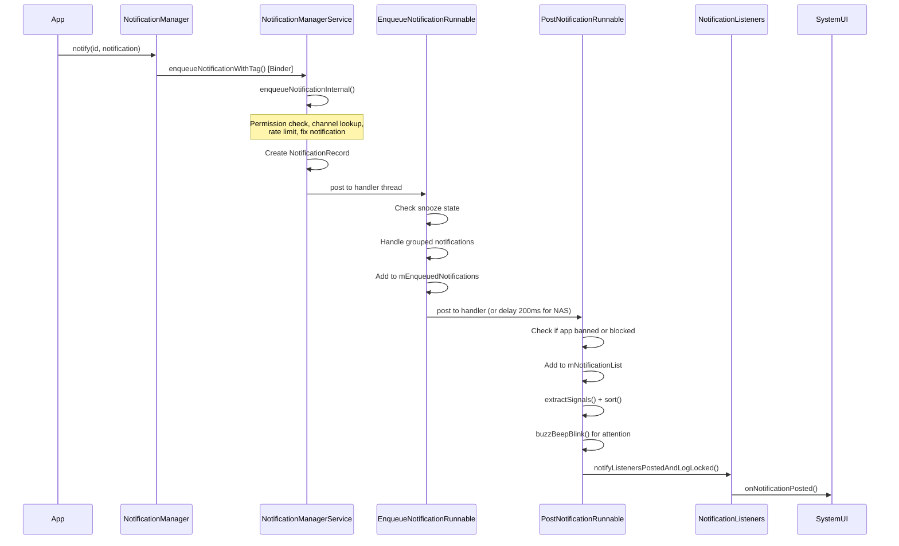

### 28.2.2 Phase 1: Enqueue

The entry point for the Binder call is the inner `INotificationManager.Stub`:

```java
// NotificationManagerService.java (line 4405)
public void enqueueNotificationWithTag(String pkg, String opPkg, String tag,
        int id, Notification notification, int userId) throws RemoteException {
    enqueueNotificationInternal(pkg, opPkg, Binder.getCallingUid(),
            Binder.getCallingPid(), tag, id, notification, userId,
            /* byForegroundService= */ false, /* isAppProvided= */ true);
}
```

The private `enqueueNotificationInternal()` method (starting at line 8747) performs
the following steps:

**Step 1 -- Validation:**
```java
if (pkg == null || notification == null) {
    throw new IllegalArgumentException("null not allowed: pkg=" + pkg
            + " id=" + id + " notification=" + notification);
}
```

**Step 2 -- User resolution:**
```java
final int userId = ActivityManager.handleIncomingUser(callingPid,
        callingUid, incomingUserId, true, false, "enqueueNotification", pkg);
```

**Step 3 -- UID resolution and security check:**
```java
notificationUid = resolveNotificationUid(opPkg, pkg, callingUid, userId);
if (notificationUid == INVALID_UID) {
    throw new SecurityException("Caller " + opPkg + ":" + callingUid
            + " trying to post for invalid pkg " + pkg);
}
```

**Step 4 -- Foreground service policy check:**
```java
final ServiceNotificationPolicy policy = mAmi.applyForegroundServiceNotification(
        notification, tag, id, pkg, userId);
```

**Step 5 -- Fix the notification:**
The `fixNotification()` method sanitizes the notification by:

- Stripping invalid actions.
- Enforcing maximum text lengths.
- Setting the `FLAG_NO_CLEAR` flag for foreground service notifications.
- Ensuring the notification has a valid channel ID.

**Step 6 -- Channel lookup:**
```java
final NotificationChannel channel = getNotificationChannelRestoreDeleted(
        pkg, callingUid, notificationUid, channelId, shortcutId);
if (channel == null) {
    // ... toast warning, return false
}
```

**Step 7 -- Create NotificationRecord:**
```java
final NotificationRecord r = new NotificationRecord(getContext(), n, channel);
r.setIsAppImportanceLocked(mPermissionHelper.isPermissionUserSet(pkg, userId));
r.setPostSilently(postSilently);
r.setFlagBubbleRemoved(false);
r.setPkgAllowedAsConvo(mMsgPkgsAllowedAsConvos.contains(pkg));
```

**Step 8 -- FGS importance floor:**
If the notification belongs to a foreground service or user-initiated job and
the channel importance is MIN or NONE, it is elevated to LOW:

```java
if (notification.isFgsOrUij()) {
    if (r.getImportance() == IMPORTANCE_MIN || r.getImportance() == IMPORTANCE_NONE) {
        channel.setImportance(IMPORTANCE_LOW);
        r.setSystemImportance(IMPORTANCE_LOW);
    }
}
```

**Step 9 -- Acquire wake lock and schedule EnqueueNotificationRunnable:**
```java
PostNotificationTracker tracker = acquireWakeLockForPost(pkg, callingUid);
```

The wake lock timeout is 30 seconds (`POST_WAKE_LOCK_TIMEOUT`), ensuring the
device stays awake long enough to complete posting.

### 28.2.3 The EnqueueNotificationRunnable

Source: `NotificationManagerService.java`, line 10054.

This runnable executes on the handler thread, under `mNotificationLock`:

```java
protected class EnqueueNotificationRunnable implements Runnable {
    private final NotificationRecord r;
    private final int userId;
    // ...
```

Key operations:

1. **Snooze check** -- If the notification key was previously snoozed and the
   snooze timer has not elapsed, re-snooze it immediately:
   ```java
   final long snoozeAt = mSnoozeHelper.getSnoozeTimeForUnpostedNotification(
           r.getUser().getIdentifier(), r.getSbn().getPackageName(), r.getSbn().getKey());
   if (snoozeAt > currentTime) {
       (new SnoozeNotificationRunnable(r.getSbn().getKey(),
               snoozeAt - currentTime, null)).snoozeLocked(r);
       return false;
   }
   ```

2. **Copy ranking from existing record** -- If this is an update to an existing
   notification, ranking information is preserved:
   ```java
   NotificationRecord old = mNotificationsByKey.get(n.getKey());
   if (old != null) {
       r.copyRankingInformation(old);
   }
   ```

3. **Add to enqueue list:**
   ```java
   mEnqueuedNotifications.add(r);
   mTtlHelper.scheduleTimeoutLocked(r, SystemClock.elapsedRealtime());
   ```

4. **Bubble flags update:**
   ```java
   updateNotificationBubbleFlags(r, isAppForeground);
   ```

5. **Group handling:**
   ```java
   handleGroupedNotificationLocked(r, old, callingUid, callingPid);
   ```

6. **Dispatch to PostNotificationRunnable**, either immediately or with a
   200 ms delay if the Notification Assistant Service (NAS) is enabled:
   ```java
   if (mAssistants.isEnabled()) {
       mAssistants.onNotificationEnqueuedLocked(r);
       mHandler.postDelayed(
               new PostNotificationRunnable(r.getKey(), ...),
               DELAY_FOR_ASSISTANT_TIME);   // 200ms
   } else {
       mHandler.post(new PostNotificationRunnable(r.getKey(), ...));
   }
   ```

### 28.2.4 The PostNotificationRunnable

Source: `NotificationManagerService.java`, line 10209.

This is where the notification becomes visible. Under `mNotificationLock`:

**Step 1 -- Find the enqueued record:**
```java
NotificationRecord r = findNotificationByListLocked(mEnqueuedNotifications, key);
if (r == null) {
    Slog.i(TAG, "Cannot find enqueued record for key: " + key);
    return false;
}
```

**Step 2 -- Block check:**
```java
if (!(notification.isMediaNotification() || isCallNotificationAndCorrectStyle)
        && (appBanned || isRecordBlockedLocked(r))) {
    mUsageStats.registerBlocked(r);
    return false;
}
```
Media and call-style notifications bypass the block check. All others are
suppressed if the app's notifications are disabled or the channel is blocked.

**Step 3 -- Add to the main notification list:**
```java
int index = indexOfNotificationLocked(n.getKey());
if (index < 0) {
    mNotificationList.add(r);           // new notification
    mUsageStats.registerPostedByApp(r);
} else {
    old = mNotificationList.get(index);  // update existing
    mNotificationList.set(index, r);
    mUsageStats.registerUpdatedByApp(r, old);
}
mNotificationsByKey.put(n.getKey(), r);
```

**Step 4 -- Auto-grouping:**
The `GroupHelper.onNotificationPosted()` method decides whether to auto-group:
```java
boolean willBeAutogrouped = mGroupHelper.onNotificationPosted(
        r, hasAutoGroupSummaryLocked(r));
if (willBeAutogrouped) {
    addAutogroupKeyLocked(key, autogroupName, /*requestSort=*/false);
}
```

**Step 5 -- Signal extraction and sort:**
```java
mRankingHelper.extractSignals(r);
mRankingHelper.sort(mNotificationList);
```

**Step 6 -- Attention effects (buzz-beep-blink):**
```java
buzzBeepBlinkLoggingCode = mAttentionHelper.buzzBeepBlinkLocked(r,
        new NotificationAttentionHelper.Signals(
                mUserProfiles.isCurrentProfile(r.getUserId()),
                mListenerHints));
```

**Step 7 -- Listener dispatch:**
```java
if (notification.getSmallIcon() != null) {
    notifyListenersPostedAndLogLocked(r, old, mTracker, maybeReport);
    posted = true;
} else {
    Slog.e(TAG, "Not posting notification without small icon: " + notification);
}
```

A notification *must* have a small icon to be posted. Without one, it is rejected
at this stage.

**Step 8 -- Clean up enqueue list:**
```java
for (int i = 0; i < N; i++) {
    final NotificationRecord enqueued = mEnqueuedNotifications.get(i);
    if (Objects.equals(key, enqueued.getKey())) {
        mEnqueuedNotifications.remove(i);
        break;
    }
}
```

### 28.2.5 Phase 3: Cancel

Cancellation can originate from many sources:

| Cancel Reason | Constant | Trigger |
|---------------|----------|---------|
| `REASON_CLICK` | 1 | User taps the notification |
| `REASON_CANCEL` | 2 | User swipes to dismiss |
| `REASON_CANCEL_ALL` | 3 | User taps "Clear all" |
| `REASON_APP_CANCEL` | 8 | App calls `cancel()` |
| `REASON_APP_CANCEL_ALL` | 9 | App calls `cancelAll()` |
| `REASON_LISTENER_CANCEL` | 10 | `NotificationListenerService.cancelNotification()` |
| `REASON_PACKAGE_BANNED` | 7 | Notifications disabled for package |
| `REASON_CHANNEL_BANNED` | 17 | Channel importance set to NONE |
| `REASON_SNOOZED` | 18 | User snoozes the notification |
| `REASON_TIMEOUT` | 19 | TTL expired (3-day default) |
| `REASON_GROUP_OPTIMIZATION` | 22 | Notification re-grouped |

The main cancel entry point:

```java
// NotificationManagerService.java (line 11608)
void cancelNotification(final int callingUid, final int callingPid,
        final String pkg, final String tag, final int id,
        final int mustHaveFlags, final int mustNotHaveFlags,
        final boolean sendDelete, final int userId, final int reason,
        int rank, int count, final ManagedServiceInfo listener) {
    mHandler.scheduleCancelNotification(new CancelNotificationRunnable(...));
}
```

The private `cancelNotificationLocked()` method (line 11300) performs:

1. **Send delete intent** if the notification has a `deleteIntent`:
   ```java
   if (sendDelete) {
       sendDeleteIntent(r.getNotification().deleteIntent, r.getSbn().getPackageName());
   }
   ```

2. **Notify listeners** of the removal:
   ```java
   mListeners.notifyRemovedLocked(r, reason, r.getStats());
   ```

3. **Notify GroupHelper** for potential un-grouping:
   ```java
   mGroupHelper.onNotificationRemoved(r, mNotificationList, sendDelete);
   ```

4. **Clear attention effects:**
   ```java
   mAttentionHelper.clearEffectsLocked(canceledKey);
   ```

5. **Update group summary tracking:**
   ```java
   if (groupSummary != null && groupSummary.getKey().equals(canceledKey)) {
       mSummaryByGroupKey.remove(groupKey);
   }
   ```

6. **Archive for history:**
   ```java
   if (reason != REASON_CHANNEL_REMOVED) {
       mArchive.record(getSbnForArchive(r, reason), reason);
   }
   ```

### 28.2.6 TTL and Notification Timeout

Notifications have a 3-day time-to-live by default:

```java
// NotificationManagerService.java (line 666)
static final long NOTIFICATION_TTL = Duration.ofDays(3).toMillis();
```

Notifications older than 14 days at the time of posting are rejected:

```java
// NotificationManagerService.java (line 668)
static final long NOTIFICATION_MAX_AGE_AT_POST = Duration.ofDays(14).toMillis();
```

The `TimeToLiveHelper` class schedules an alarm to cancel each notification after
its TTL expires. This prevents zombie notifications from lingering indefinitely.

### 28.2.7 Rate Limiting

The service enforces per-package rate limiting to prevent notification storms:

```java
static final float DEFAULT_MAX_NOTIFICATION_ENQUEUE_RATE = 5f;
```

Toast posting has even stricter rate limits:

```java
// NotificationManagerService.java (lines 543-547)
private static final MultiRateLimiter.RateLimit[] TOAST_RATE_LIMITS = {
    MultiRateLimiter.RateLimit.create(3, Duration.ofSeconds(20)),
    MultiRateLimiter.RateLimit.create(5, Duration.ofSeconds(42)),
    MultiRateLimiter.RateLimit.create(6, Duration.ofSeconds(68)),
};
```

### 28.2.8 The Full Post Flow Diagram

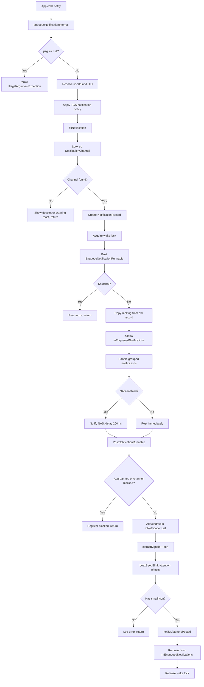

---

## 28.3 Notification Channels and Groups

### 28.3.1 Introduction to Channels

Since Android 8.0 (API 26), every notification must be assigned to a
`NotificationChannel`. Channels give users fine-grained control over notification
behavior -- importance, sound, vibration, lights, and badge visibility can all
be configured per-channel. Once created, the channel's behavioral settings
become user-owned: the app cannot programmatically change them.

Source:
`frameworks/base/core/java/android/app/NotificationChannel.java`

### 28.3.2 Channel Properties

A `NotificationChannel` has these key properties:

| Property | Method | Description |
|----------|--------|-------------|
| ID | `getId()` | Immutable string identifier |
| Name | `getName()` | User-visible name |
| Description | `getDescription()` | User-visible description |
| Importance | `getImportance()` | Controls interruption level |
| Sound | `getSound()` | Custom notification sound URI |
| Vibration pattern | `getVibrationPattern()` | Custom vibration |
| Light color | `getLightColor()` | LED color |
| Show badge | `canShowBadge()` | App icon badge |
| Bypass DND | `canBypassDnd()` | Override Do Not Disturb |
| Lockscreen visibility | `getLockscreenVisibility()` | PUBLIC / PRIVATE / SECRET |
| Conversation ID | `getConversationId()` | Links to a parent channel for conversations |
| Bubble preference | `getAllowBubbles()` | Whether bubbles are allowed |

### 28.3.3 Importance Levels

Importance is the single most consequential property:

| Level | Constant | Value | Behavior |
|-------|----------|-------|----------|
| None | `IMPORTANCE_NONE` | 0 | Blocked -- not shown anywhere |
| Min | `IMPORTANCE_MIN` | 1 | Silent, no status bar icon |
| Low | `IMPORTANCE_LOW` | 2 | Silent, shown in shade |
| Default | `IMPORTANCE_DEFAULT` | 3 | Makes sound |
| High | `IMPORTANCE_HIGH` | 4 | Makes sound, heads-up display |
| Max | `IMPORTANCE_MAX` | 5 | Urgent, full-screen intent allowed |

### 28.3.4 Channel Groups

`NotificationChannelGroup` lets apps organize related channels. Each group can
be independently blocked by the user, which blocks all channels within it.

```java
// App code
NotificationChannelGroup group = new NotificationChannelGroup(
        "social", "Social Notifications");
notificationManager.createNotificationChannelGroup(group);

NotificationChannel channel = new NotificationChannel(
        "chat", "Chat Messages", NotificationManager.IMPORTANCE_HIGH);
channel.setGroup("social");
notificationManager.createNotificationChannel(channel);
```

### 28.3.5 System Reserved Channels

The `NotificationChannel.SYSTEM_RESERVED_IDS` set prevents apps from creating
channels with IDs that the system itself uses. Attempting to create a channel
with a reserved ID is silently ignored.

### 28.3.6 Channel Storage: PreferencesHelper

Server-side channel management lives in `PreferencesHelper`:

```java
// frameworks/base/services/core/java/com/android/server/notification/
//   PreferencesHelper.java (line 128)
public class PreferencesHelper implements RankingConfig {
    private static final String TAG = "NotificationPrefHelper";
    private final int XML_VERSION;
    static final int NOTIFICATION_CHANNEL_COUNT_LIMIT = 5000;
    static final int NOTIFICATION_CHANNEL_GROUP_COUNT_LIMIT = 6000;
    private static final int NOTIFICATION_CHANNEL_DELETION_RETENTION_DAYS = 30;
    // ...
}
```

Channel preferences are serialized to XML and stored per-user. When a channel
is deleted, it is retained (soft-deleted) for 30 days to preserve user settings
in case the app re-creates it.

### 28.3.7 The NotificationChannelExtractor

The first extractor in the pipeline is `NotificationChannelExtractor`. It looks
up the channel from `PreferencesHelper` and attaches it to the `NotificationRecord`:

```java
// frameworks/base/services/core/java/com/android/server/notification/
//   NotificationChannelExtractor.java
public class NotificationChannelExtractor implements NotificationSignalExtractor {
    // Sets r.mChannel from PreferencesHelper lookup
}
```

This must run first because all subsequent extractors depend on channel properties
(importance, DND bypass, visibility, etc.).

### 28.3.8 Classification Channels

Recent AOSP versions introduce automatic classification channels for bundling
notifications by type:

```java
// NotificationChannel.java
public static final String NEWS_ID = "news";
public static final String PROMOTIONS_ID = "promotions";
public static final String RECS_ID = "recommendations";
public static final String SOCIAL_MEDIA_ID = "social_media";
```

When the Notification Assistant Service classifies a notification (e.g., as
news or promotions), the system may reassign it to one of these channels for
more consistent user control.

### 28.3.9 Channel Lifecycle Diagram

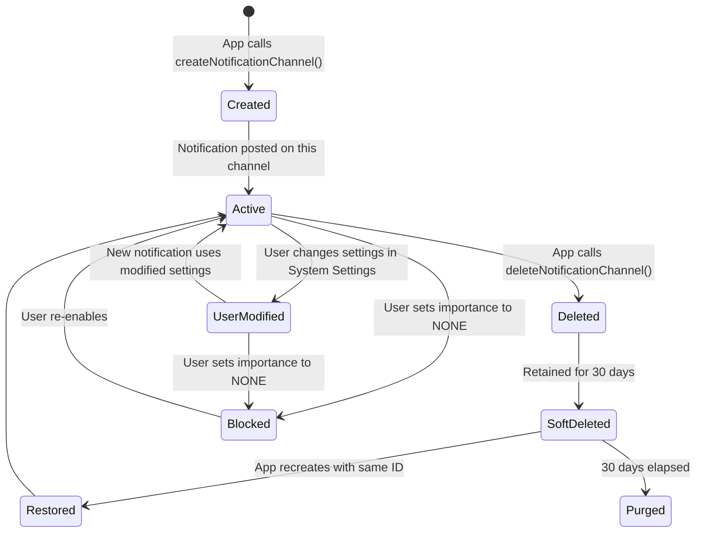

---

## 28.4 Notification Ranking

### 28.4.1 Overview

Notification ranking determines the order in which notifications appear in the
shade and which ones get to interrupt the user. The ranking pipeline has two
stages:

1. **Signal extraction** -- Each `NotificationSignalExtractor` writes signals
   onto the `NotificationRecord`.
2. **Sorting** -- The comparator uses these signals to produce a final ordering.

Source: `frameworks/base/services/core/java/com/android/server/notification/RankingHelper.java`

### 28.4.2 RankingHelper: The Orchestrator

```java
// RankingHelper.java (line 37)
public class RankingHelper {
    private final NotificationSignalExtractor[] mSignalExtractors;
    private final Comparator mPreliminaryComparator;
    private final GlobalSortKeyComparator mFinalComparator = new GlobalSortKeyComparator();
```

The `extractSignals()` method runs every extractor in order:

```java
// RankingHelper.java (line 98)
public void extractSignals(NotificationRecord r) {
    final int N = mSignalExtractors.length;
    for (int i = 0; i < N; i++) {
        NotificationSignalExtractor extractor = mSignalExtractors[i];
        try {
            RankingReconsideration recon = extractor.process(r);
            if (recon != null) {
                mRankingHandler.requestReconsideration(recon);
            }
        } catch (Throwable t) {
            Slog.w(TAG, "NotificationSignalExtractor failed.", t);
        }
    }
}
```

The `sort()` method performs a two-pass sort:

```java
// RankingHelper.java (line 113)
public void sort(ArrayList<NotificationRecord> notificationList) {
    // Pass 1: Preliminary sort by ranking time
    notificationList.sort(mPreliminaryComparator);

    // Pass 2: Assign global sort keys with group awareness
    for (int i = 0; i < N; i++) {
        record.setAuthoritativeRank(i);
        // Nominate group proxies (prefer children over summaries)
    }

    // Global sort key format:
    //   is_recently_intrusive:group_rank:is_group_summary:group_sort_key:rank
}
```

### 28.4.3 NotificationTimeComparator

The preliminary comparator sorts by ranking time (most recent first):

```java
// frameworks/base/services/core/java/com/android/server/notification/
//   NotificationTimeComparator.java
public class NotificationTimeComparator implements Comparator<NotificationRecord> {
    @Override
    public int compare(NotificationRecord left, NotificationRecord right) {
        return -1 * Long.compare(left.getRankingTimeMs(), right.getRankingTimeMs());
    }
}
```

### 28.4.4 Global Sort Key

After preliminary sorting, `RankingHelper.sort()` assigns a global sort key to
each notification. The key encodes multiple dimensions:

```
is_recently_intrusive : group_rank : is_group_summary : group_sort_key : rank
```

This multi-level key ensures:

- Recently-interrupted notifications appear at the top.
- Grouped notifications stay together.
- Within a group, the summary appears before children.
- Within children, the developer-provided sort key is honored.

### 28.4.5 The Extractors in Detail

#### NotificationChannelExtractor
Resolves the `NotificationChannel` from `PreferencesHelper` and sets it on the
record. All downstream extractors depend on this.

#### NotificationAdjustmentExtractor
Applies adjustments from the Notification Assistant Service (NAS). Adjustments
can modify importance, people references, smart actions, smart replies, and
classification type.

```java
// Adjustment keys supported (NotificationManagerService.java, line 510)
static final String[] DEFAULT_ALLOWED_ADJUSTMENTS = new String[] {
    Adjustment.KEY_PEOPLE,
    Adjustment.KEY_SNOOZE_CRITERIA,
    Adjustment.KEY_USER_SENTIMENT,
    Adjustment.KEY_CONTEXTUAL_ACTIONS,
    Adjustment.KEY_TEXT_REPLIES,
    Adjustment.KEY_IMPORTANCE,
    Adjustment.KEY_IMPORTANCE_PROPOSAL,
    Adjustment.KEY_SENSITIVE_CONTENT,
    Adjustment.KEY_RANKING_SCORE,
    Adjustment.KEY_NOT_CONVERSATION,
    Adjustment.KEY_TYPE,
    Adjustment.KEY_SUMMARIZATION
};
```

#### BubbleExtractor
Determines whether a notification can be presented as a bubble. Requirements:

- Device supports bubbles (`config_supportsBubble`).
- Not a low-RAM device.
- The notification is a conversation.
- It has a valid `ShortcutInfo`.
- It is not a foreground service or user-initiated job notification.
- User has enabled bubbles globally and per-app.

```java
// BubbleExtractor.java (line 86)
boolean notifCanPresentAsBubble = canPresentAsBubble(record)
        && !mActivityManager.isLowRamDevice()
        && record.isConversation()
        && record.getShortcutInfo() != null
        && !record.getNotification().isFgsOrUij();
```

#### ValidateNotificationPeople
Resolves people references (URIs, phone numbers, email addresses) against the
Contacts database. Sets the `contactAffinity` on the record:

```java
// ValidateNotificationPeople.java (lines 83-95)
static final float NONE = 0f;
static final float VALID_CONTACT = 0.5f;
static final float STARRED_CONTACT = 1f;
```

This extractor can return a `RankingReconsideration` for asynchronous contact
resolution, which re-sorts notifications once the lookup completes.

#### PriorityExtractor
Sets the package priority based on channel configuration.

#### ZenModeExtractor
Consults `ZenModeHelper.shouldIntercept()` to determine if the notification
should be suppressed by DND. Sets `mIntercept` and `mSuppressedVisualEffects`
on the record.

#### ImportanceExtractor
Calls `record.calculateImportance()`, which resolves the final importance from
the channel importance, system importance override, and assistant importance:

```java
// ImportanceExtractor.java (line 44)
record.calculateImportance();
```

#### VisibilityExtractor
Sets the lockscreen visibility based on channel settings and system-wide
sensitive content policies.

#### BadgeExtractor
Determines whether the notification should produce an app icon badge, consulting
the channel's `canShowBadge()` setting and DND suppression.

#### CriticalNotificationExtractor
Marks automotive and critical system notifications for priority placement above
all other notifications.

### 28.4.6 Ranking Reconsideration

Some extractors cannot complete synchronously. The `RankingReconsideration`
mechanism allows deferred re-evaluation:

```java
// RankingHelper.java (line 104)
if (recon != null) {
    mRankingHandler.requestReconsideration(recon);
}
```

The reconsideration runs on the ranking thread (`MESSAGE_RECONSIDER_RANKING = 1000`).
After it completes, a sort update (`MESSAGE_RANKING_SORT = 1001`) is triggered
and listeners are notified of the ranking change.

### 28.4.7 Ranking Pipeline Diagram

```mermaid
flowchart LR
    subgraph Extractors
        CE[ChannelExtractor] --> AE[AdjustmentExtractor]
        AE --> BE[BubbleExtractor]
        BE --> VNP[ValidateNotificationPeople]
        VNP --> PE[PriorityExtractor]
        PE --> ZME[ZenModeExtractor]
        ZME --> IE[ImportanceExtractor]
        IE --> VE[VisibilityExtractor]
        VE --> BADGE[BadgeExtractor]
        BADGE --> CRIT[CriticalNotificationExtractor]
    end

    subgraph Sorting
        CRIT --> PRELIM["Preliminary Sort<br/>by RankingTime"]
        PRELIM --> GSK["Assign Global Sort Keys<br/>with group proxy"]
        GSK --> FINAL["Final Sort<br/>by GlobalSortKey"]
    end

    subgraph Output
        FINAL --> RANKING["Ranking Update<br/>sent to Listeners"]
    end

    VNP -.->|async| RECON["RankingReconsideration<br/>on ranking thread"]
    RECON -.->|re-sort| GSK
```

### 28.4.8 Interruptiveness

A notification is considered "visually interruptive" if it is new or if its
content has changed meaningfully. The `isVisuallyInterruptive()` method
(line 10480) compares old and new extras for changes in title, text, progress,
and large icon. Interruptive notifications get their ranking time reset, pushing
them to the top of the shade.

---

## 28.5 Do Not Disturb (ZenModeHelper and ZenPolicy)

### 28.5.1 Overview

Do Not Disturb (DND) in Android is managed by `ZenModeHelper`, which maintains
the DND state machine, evaluates rules, and tells the notification pipeline which
notifications to intercept. DND is not a simple on/off switch -- it supports
multiple simultaneous rules, each with its own policy.

Source files:

| File | Role |
|------|------|
| `ZenModeHelper.java` | Central DND state management |
| `ZenModeFiltering.java` | Notification intercept logic |
| `ZenModeConditions.java` | Rule condition evaluation |
| `ZenModeExtractor.java` | Signal extractor integration |
| `ZenModeConfig.java` | Configuration data model |
| `ZenPolicy.java` | Per-rule policy specification |
| `ConditionProviders.java` | Manages condition provider services |

### 28.5.2 Zen Modes

```java
// Settings.Global
ZEN_MODE_OFF = 0;                    // DND off
ZEN_MODE_IMPORTANT_INTERRUPTIONS = 1; // Priority only
ZEN_MODE_NO_INTERRUPTIONS = 2;       // Total silence
ZEN_MODE_ALARMS = 3;                 // Alarms only
```

### 28.5.3 ZenModeHelper Architecture

```java
// ZenModeHelper.java (lines 175-211, summarized)
public class ZenModeHelper {
    private final ZenModeFiltering mFiltering;
    private final ZenModeConditions mConditions;
    private final SparseArray<ZenModeConfig> mConfigs;  // per-user
    protected int mZenMode;
    protected NotificationManager.Policy mConsolidatedPolicy;
    private ZenDeviceEffects mConsolidatedDeviceEffects;
    private DeviceEffectsApplier mDeviceEffectsApplier;
}
```

The `mConsolidatedPolicy` merges all active rules into a single effective policy.
This consolidated policy is what `ZenModeFiltering` uses to make intercept
decisions.

### 28.5.4 ZenModeConfig and Rules

The `ZenModeConfig` holds:

- The manual rule (user-activated DND).
- A map of `AutomaticZenRule` objects keyed by rule ID.
- Per-rule conditions (time-based, event-based, driving, etc.).

Each `AutomaticZenRule` has:

- An owner package.
- A `ConditionProvider` component.
- A `ZenPolicy` that describes what the rule allows.
- A trigger description.

Rule limit per package:
```java
// ZenModeHelper.java (line 154)
static final int RULE_LIMIT_PER_PACKAGE = 100;
```

### 28.5.5 Automatic Zen Rules and Conditions

Automatic rules are activated by `ConditionProvider` services. Built-in providers:

| Provider | Class | Trigger |
|----------|-------|---------|
| Schedule | `ScheduleConditionProvider` | Time-of-day schedules |
| Event | `EventConditionProvider` | Calendar events |
| Countdown | `CountdownConditionProvider` | Timed DND (e.g., "1 hour") |

Apps can register their own `ConditionProviderService` to create custom rules
(e.g., "DND when driving").

### 28.5.6 ZenPolicy

`ZenPolicy` (API 29+) gives fine-grained control per rule:

```java
// android.service.notification.ZenPolicy
public final class ZenPolicy {
    // People categories
    int mPriorityCategories;     // calls, messages, conversations, etc.
    int mPriorityCallSenders;    // anyone, contacts, starred, none
    int mPriorityMessageSenders;
    int mConversationSenders;

    // Visual effects
    int mVisualEffects;          // full-screen intents, lights, peek,
                                 // status bar, badge, ambient, notification list
}
```

### 28.5.7 The Filtering Decision

`ZenModeFiltering.shouldIntercept()` is the core decision function. It is called
from `ZenModeExtractor.process()` during signal extraction:

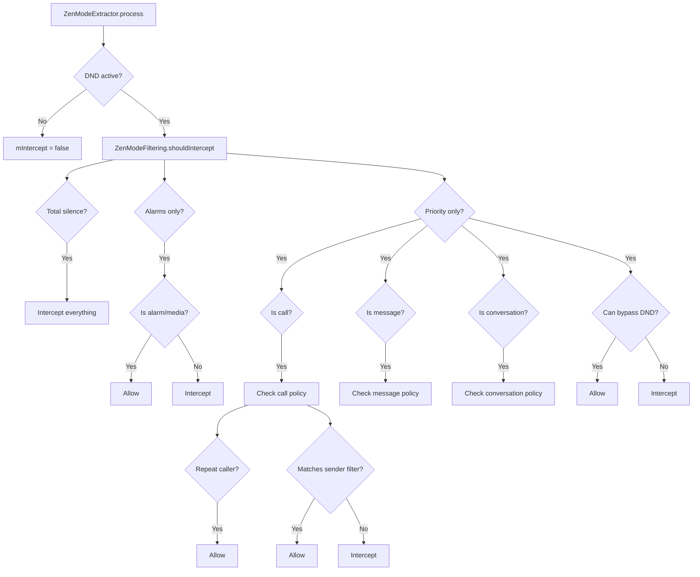

### 28.5.8 Repeat Caller Detection

When DND allows repeat callers, the system tracks recent calls:

```java
// ZenModeFiltering.java (line 48)
static final RepeatCallers REPEAT_CALLERS = new RepeatCallers();
```

If the same caller calls twice within a threshold period (default 15 minutes),
the second call is allowed through even if the caller does not match the
priority filter.

### 28.5.9 Device Effects

Since Android 15, DND rules can specify `ZenDeviceEffects`:

```java
// ZenModeHelper.java (line 196)
private ZenDeviceEffects mConsolidatedDeviceEffects;
```

Device effects include:

- Grayscale display.
- Suppress ambient display.
- Dim wallpaper.
- Night mode override.

These are applied through a `DeviceEffectsApplier`, which is set by SystemUI:

```java
// ZenModeHelper.java (line 329)
void setDeviceEffectsApplier(@NonNull DeviceEffectsApplier deviceEffectsApplier) {
    mDeviceEffectsApplier = deviceEffectsApplier;
    applyConsolidatedDeviceEffects(ORIGIN_INIT);
}
```

### 28.5.10 Implicit Rules (Android 15+)

Starting with Android V (API 35), app calls to `setInterruptionFilter()` and
`setNotificationPolicy()` create implicit `AutomaticZenRule` objects instead of
directly modifying the global DND state:

```java
// NotificationManagerService.java (line 660)
@ChangeId
@EnabledSince(targetSdkVersion = Build.VERSION_CODES.VANILLA_ICE_CREAM)
static final long MANAGE_GLOBAL_ZEN_VIA_IMPLICIT_RULES = 308670109L;
```

This change allows the system to properly track which app activated DND and
prevents apps from accidentally overriding each other's DND settings.

### 28.5.11 Suppressed Visual Effects

DND can suppress specific visual effects while still allowing the notification
to exist. The suppressed effects bitmap:

| Effect | Constant | Description |
|--------|----------|-------------|
| Screen off effects | `SUPPRESSED_EFFECT_SCREEN_OFF` | Suppress when screen off |
| Screen on effects | `SUPPRESSED_EFFECT_SCREEN_ON` | Suppress when screen on |
| Full-screen intent | `SUPPRESSED_EFFECT_FULL_SCREEN_INTENT` | Block FSI |
| Peek (heads-up) | `SUPPRESSED_EFFECT_PEEK` | No heads-up |
| Status bar | `SUPPRESSED_EFFECT_STATUS_BAR` | No status bar icon |
| Badge | `SUPPRESSED_EFFECT_BADGE` | No app badge |
| Ambient | `SUPPRESSED_EFFECT_AMBIENT` | No ambient display |
| Notification list | `SUPPRESSED_EFFECT_NOTIFICATION_LIST` | Hide from shade |
| Lights | `SUPPRESSED_EFFECT_LIGHTS` | No LED |

---

## 28.6 Notification Listeners (NotificationListenerService)

### 28.6.1 Overview

`NotificationListenerService` is the mechanism by which apps (including SystemUI)
receive notification events. It is a bound service managed by the
`ManagedServices` framework. When a listener is enabled, NMS binds to it and
dispatches notification posted, removed, and ranking update events.

Source files:

| File | Role |
|------|------|
| `NotificationListenerService.java` | SDK API (app-side) |
| `ManagedServices.java` | Service lifecycle management |
| `NotificationListeners` (inner class in NMS) | Server-side dispatch |

### 28.6.2 The ManagedServices Framework

`NotificationListeners` extends `ManagedServices`, which handles:

- Service discovery via `PackageManager` queries.
- Binding and unbinding.
- User profile awareness (which users the listener serves).
- Persistent configuration in Secure settings.

```java
// NotificationManagerService.java (line 13756)
public class NotificationListeners extends ManagedServices {
    static final String TAG_ENABLED_NOTIFICATION_LISTENERS = "enabled_listeners";
    // ...
}
```

The config for listeners:

```java
// NotificationListeners (line 13886)
protected Config getConfig() {
    Config c = new Config();
    c.caption = "notification listener";
    c.serviceInterface = NotificationListenerService.SERVICE_INTERFACE;
    c.secureSettingName = Secure.ENABLED_NOTIFICATION_LISTENERS;
    c.bindPermission =
            android.Manifest.permission.BIND_NOTIFICATION_LISTENER_SERVICE;
    c.settingsAction = Settings.ACTION_NOTIFICATION_LISTENER_SETTINGS;
    return c;
}
```

### 28.6.3 Binding Flags

Notification listeners use specific binding flags to manage memory pressure:

```java
// NotificationListeners (line 13881)
protected long getBindFlags() {
    return BIND_AUTO_CREATE
         | BIND_FOREGROUND_SERVICE
         | BIND_NOT_PERCEPTIBLE       // reduce memory pressure
         | BIND_ALLOW_WHITELIST_MANAGEMENT
         | freezeFlags;               // BIND_ALLOW_FREEZE for idle NLS
}
```

The `BIND_NOT_PERCEPTIBLE` flag is notable: it tells the system that too many
third-party listeners could cause memory pressure, so they should be treated
as lower priority for OOM adjustment purposes.

### 28.6.4 Listener Callbacks

The listener receives these key callbacks:

```java
// NotificationListenerService.java (SDK API)
public void onNotificationPosted(StatusBarNotification sbn, RankingMap rankingMap);
public void onNotificationRemoved(StatusBarNotification sbn, RankingMap rankingMap,
        int reason);
public void onNotificationRankingUpdate(RankingMap rankingMap);
public void onListenerConnected();
public void onListenerDisconnected();
public void onNotificationChannelModified(String pkg, UserHandle user,
        NotificationChannel channel, int modificationType);
```

### 28.6.5 Filter Types

Listeners can request to receive only specific categories of notifications:

```java
// NotificationListenerService.java
static final int FLAG_FILTER_TYPE_CONVERSATIONS = 1;
static final int FLAG_FILTER_TYPE_ALERTING = 2;
static final int FLAG_FILTER_TYPE_SILENT = 4;
static final int FLAG_FILTER_TYPE_ONGOING = 8;
```

### 28.6.6 Trim Levels

To reduce IPC overhead, listeners can request trimmed notification data:

```java
static final int TRIM_FULL = 0;   // all data
static final int TRIM_LIGHT = 1;  // no extras, no large icon
```

SystemUI uses `TRIM_FULL` because it needs all notification content for rendering.
Third-party listeners typically use `TRIM_LIGHT`.

### 28.6.7 Trusted vs. Untrusted Listeners

Recent AOSP versions introduce the concept of "trusted" listeners for sensitive
content redaction:

```java
// NotificationListeners (line 13788)
@GuardedBy("mTrustedListenerUids")
private final ArraySet<Integer> mTrustedListenerUids = new ArraySet<>();
```

When the `redactSensitiveNotificationsFromUntrustedListeners` flag is enabled,
listeners not in the trusted set receive redacted notification content. SystemUI
is always trusted due to its `STATUS_BAR_SERVICE` permission.

### 28.6.8 The Notification Assistant Service (NAS)

`NotificationAssistantService` is a special type of listener that can modify
notifications before they are posted. Only one NAS can be active at a time
(typically the system-provided intelligence service).

The NAS flow:

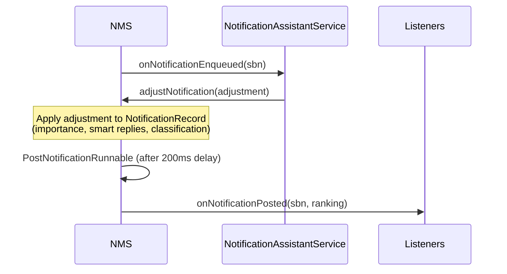

Supported adjustment keys:

| Key | Effect |
|-----|--------|
| `KEY_IMPORTANCE` | Override importance |
| `KEY_IMPORTANCE_PROPOSAL` | Suggest importance (user can override) |
| `KEY_PEOPLE` | Attach people references |
| `KEY_SNOOZE_CRITERIA` | Suggest snooze options |
| `KEY_USER_SENTIMENT` | Set user sentiment (positive/neutral/negative) |
| `KEY_CONTEXTUAL_ACTIONS` | Add smart actions |
| `KEY_TEXT_REPLIES` | Add smart replies |
| `KEY_RANKING_SCORE` | Set ranking score |
| `KEY_SENSITIVE_CONTENT` | Mark as sensitive |
| `KEY_NOT_CONVERSATION` | Override conversation detection |
| `KEY_TYPE` | Classify (news, promotions, recommendations) |
| `KEY_SUMMARIZATION` | AI-generated summary |

### 28.6.9 Listener Lifecycle Diagram

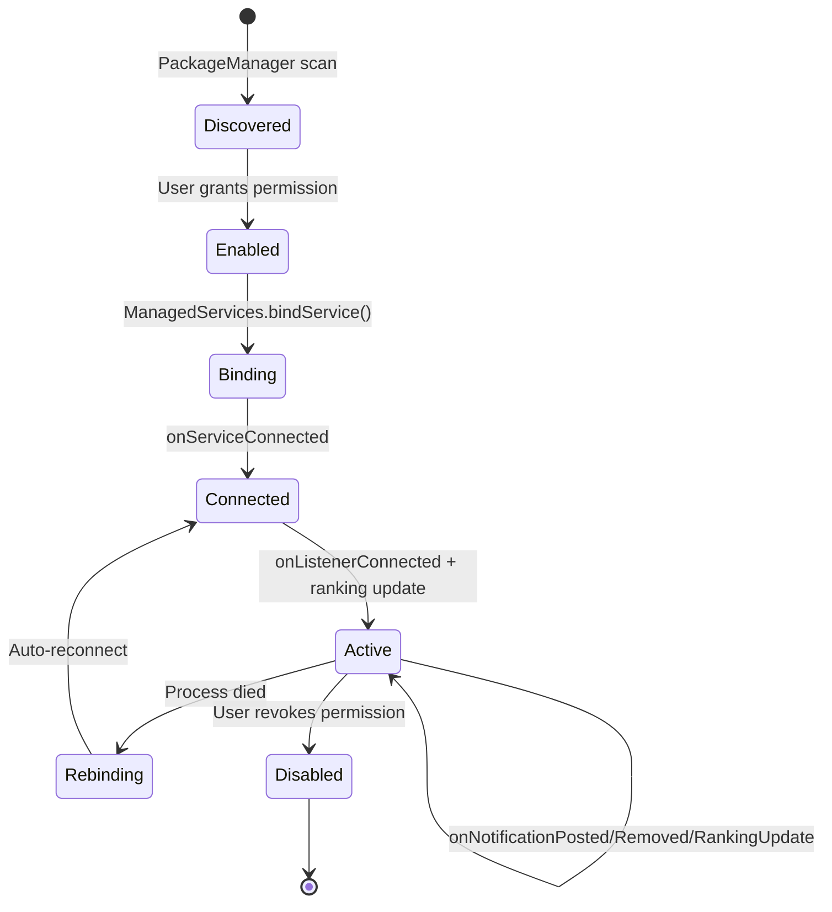

---

## 28.7 Conversation Notifications

### 28.7.1 Overview

Conversation notifications represent messages from real people. They receive
special treatment in the notification shade: a dedicated section, the ability
to become bubbles, and richer presentation including the sender's avatar.

A notification qualifies as a conversation if:

1. It uses `MessagingStyle`.
2. It references a valid sharing shortcut via `setShortcutId()`.
3. The shortcut has `Person` data attached.

### 28.7.2 ShortcutInfo Integration

The `ShortcutHelper` class manages the lifecycle of shortcuts referenced by
notifications:

```java
// frameworks/base/services/core/java/com/android/server/notification/
//   ShortcutHelper.java (line 48)
public class ShortcutHelper {
    private final HashMap<String, HashMap<String, String>> mActiveShortcutBubbles;
    private final LauncherApps.ShortcutChangeCallback mShortcutChangeCallback;
}
```

When a notification is posted, `ShortcutHelper` queries the shortcut service:

```java
// ShortcutHelper uses these query flags:
FLAG_GET_PERSONS_DATA     // include Person objects
FLAG_MATCH_CACHED         // match cached shortcuts
FLAG_MATCH_DYNAMIC        // match dynamic shortcuts
FLAG_MATCH_PINNED_BY_ANY_LAUNCHER  // match pinned shortcuts
```

The helper also listens for shortcut removal events to clean up associated
bubbles.

### 28.7.3 ValidateNotificationPeople

The `ValidateNotificationPeople` extractor resolves people references against
the contacts database. It uses an LRU cache for performance:

```java
// ValidateNotificationPeople.java (lines 73-74)
private static final int MAX_PEOPLE = 10;
private static final int PEOPLE_CACHE_SIZE = 200;
```

Contact affinity levels:

- `NONE (0f)` -- no valid contact reference.
- `VALID_CONTACT (0.5f)` -- references a real contact.
- `STARRED_CONTACT (1f)` -- references a starred/favorite contact.

These affinity values feed into DND filtering decisions (starred contacts
can bypass DND) and ranking.

### 28.7.4 Conversation Detection in NotificationRecord

```java
// NotificationRecord.java (relevant fields)
private ShortcutInfo mShortcutInfo;
private boolean mIsNotConversationOverride;
private boolean mPkgAllowedAsConvo;
private boolean mHasSentValidMsg;
private boolean mAppDemotedFromConvo;
```

A notification is considered a conversation when:

- It has `MessagingStyle`.
- It has a valid shortcut.
- The NAS has not overridden it with `KEY_NOT_CONVERSATION`.
- The app has not been demoted from conversation status.

### 28.7.5 Conversation Channels

Each conversation can have its own derived channel. When a user customizes a
conversation's notification settings, the system creates a child channel
linked to the parent via `conversationId`:

```java
// NotificationChannel.java
public NotificationChannel getConversationId();
public NotificationChannel getParentChannelId();
```

This allows per-conversation customization (different sound for different
contacts) without affecting the parent channel.

### 28.7.6 MessagingStyle Requirements

For optimal conversation display, `MessagingStyle` should include:

```java
Notification.MessagingStyle style = new Notification.MessagingStyle(sender)
    .setConversationTitle("Group Chat Name")
    .addMessage("Hello!", timestamp, sender)
    .setGroupConversation(true);  // for group chats
```

The `Person` objects must have:

- A name.
- Optionally an icon (avatar).
- Optionally a URI pointing to a contact.
- A unique key for identity tracking.

### 28.7.7 Conversation Priority Sections

In SystemUI, the notification shade divides notifications into sections:

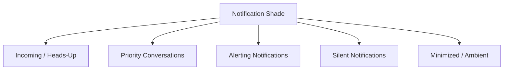

Priority conversations (those the user has marked as "priority" in settings)
appear above all other notifications. This is controlled by the
`NotificationSectionsManager` in SystemUI.

---

## 28.8 Bubble Notifications

### 28.8.1 Overview

Bubble notifications allow conversation notifications to float as circular
icons on the screen, expanding into a mini-window when tapped. The bubble
system spans three layers:

1. **NMS** -- `BubbleExtractor` determines eligibility.
2. **SystemUI** -- Bridges notification events to the shell bubble controller.
3. **WM Shell** -- `BubbleController` manages the bubble UI and task lifecycle.

### 28.8.2 Bubble Eligibility (BubbleExtractor)

The `BubbleExtractor` (a `NotificationSignalExtractor`) evaluates:

```java
// BubbleExtractor.java (line 86)
boolean notifCanPresentAsBubble = canPresentAsBubble(record)
        && !mActivityManager.isLowRamDevice()
        && record.isConversation()
        && record.getShortcutInfo() != null
        && !record.getNotification().isFgsOrUij();
```

Additional checks:

- `userEnabledBubbles` -- global setting.
- `appPreference` -- per-app bubble preference (NONE, SELECTED, ALL).
- Channel-level `getAllowBubbles()` setting.

The decision matrix:

| App Pref | Channel Pref | Result |
|----------|-------------|--------|
| ALL | ON or default | Allowed |
| ALL | OFF | Denied |
| SELECTED | ON | Allowed |
| SELECTED | OFF or default | Denied |
| NONE | any | Denied |

### 28.8.3 BubbleMetadata

Apps specify bubble behavior through `Notification.BubbleMetadata`:

```java
Notification.BubbleMetadata metadata = new Notification.BubbleMetadata.Builder(
        pendingIntent, icon)
    .setDesiredHeight(600)
    .setAutoExpandBubble(true)
    .setSuppressNotification(true)
    .build();
```

Key properties:

- `PendingIntent` -- the activity to launch inside the bubble.
- `Icon` -- the bubble icon.
- `desiredHeight` -- preferred expanded height.
- `autoExpandBubble` -- expand immediately on creation.
- `suppressNotification` -- hide from the shade (show only as bubble).

### 28.8.4 WM Shell BubbleController

The actual bubble UI lives in the WindowManager Shell module:

```
frameworks/base/libs/WindowManager/Shell/src/com/android/wm/shell/bubbles/
```

Key classes:

| Class | Role |
|-------|------|
| `BubbleController.java` | Main coordinator |
| `BubbleData.java` | Data model for active bubbles |
| `Bubble.java` | Single bubble state |
| `BubbleExpandedView.java` | Expanded view with embedded task |
| `BubbleTaskView.kt` | Task view for the embedded activity |
| `BubblePositioner.java` | Position calculations |
| `BubbleDataRepository.kt` | Persistence |
| `BubbleStackViewManager.kt` | Stack UI management |
| `BubbleBarLayerView.java` | Bubble bar for launcher integration |

### 28.8.5 Bubble Lifecycle

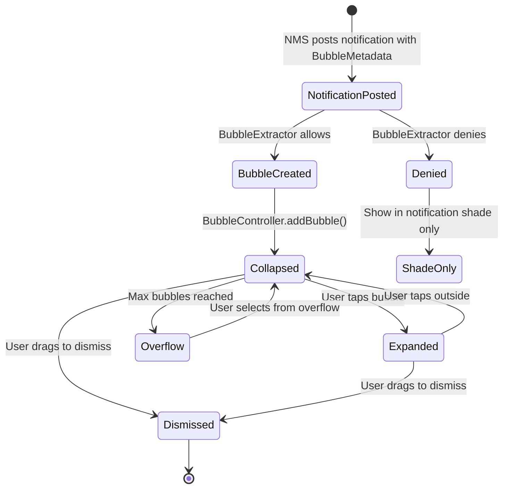

### 28.8.6 Bubble-to-Task Mapping

Each expanded bubble hosts an embedded `Activity` in a task. The `BubbleTaskView`
creates a virtual display or uses task embedding to render the activity within
the bubble's expanded view:

```java
// BubbleExpandedView.java
// Creates a TaskView that hosts the bubble's activity
// The activity is launched with ActivityOptions specifying the
// bubble display.
```

The bubble activity must:

- Be declared `resizeableActivity="true"`.
- Allow embedding.
- Have a valid `PendingIntent` that resolves to an activity.

### 28.8.7 Bubble Persistence

The `BubbleDataRepository` persists bubble state across reboots for ongoing
conversations. This allows bubbles to reappear after a device restart without
the app needing to re-post the notification.

### 28.8.8 Bubble Integration Flow

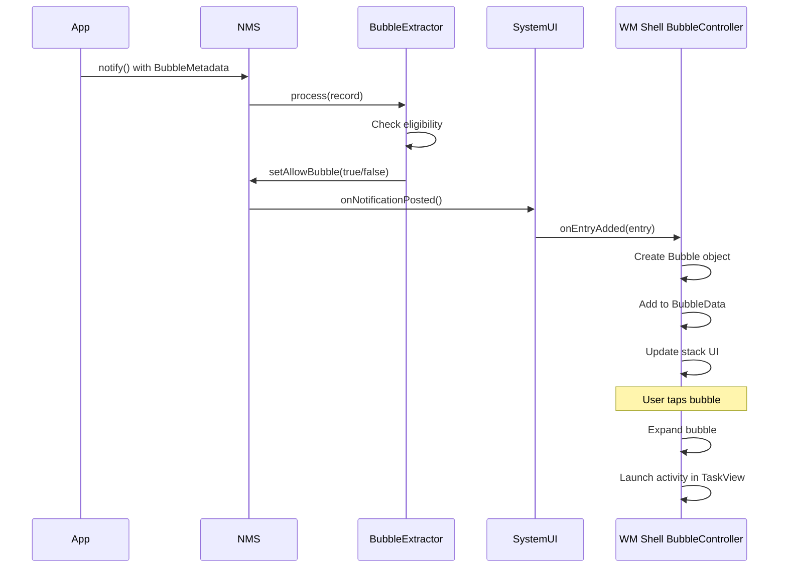

---

## 28.9 Notification UI in SystemUI

### 28.9.1 Overview

SystemUI is the primary consumer of notification events. It implements a
`NotificationListenerService` that receives all notification posted, removed,
and ranking update callbacks. The notification shade, heads-up display, status
bar icons, and lock screen notifications are all rendered by SystemUI.

Key directories:

```
frameworks/base/packages/SystemUI/src/com/android/systemui/statusbar/notification/
frameworks/base/packages/SystemUI/src/com/android/systemui/statusbar/notification/stack/
frameworks/base/packages/SystemUI/src/com/android/systemui/statusbar/notification/row/
frameworks/base/packages/SystemUI/src/com/android/systemui/statusbar/notification/collection/
```

### 28.9.2 The Notification Pipeline in SystemUI

SystemUI uses a modern notification pipeline (sometimes called "new pipeline"
or "notif pipeline") for processing notifications. The pipeline stages are:

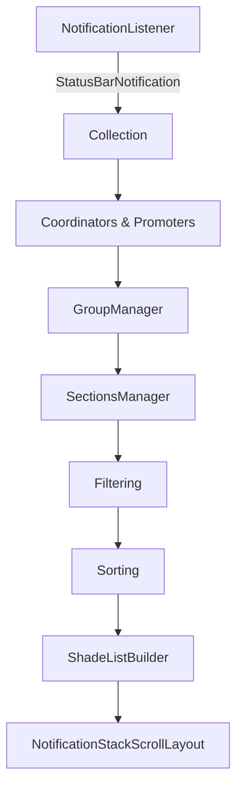

### 28.9.3 NotificationStackScrollLayout

The `NotificationStackScrollLayout` is the main scrollable container for
notifications in the shade:

```java
// frameworks/base/packages/SystemUI/src/com/android/systemui/statusbar/
//   notification/stack/NotificationStackScrollLayout.java
public class NotificationStackScrollLayout extends ViewGroup {
    // Custom scrollable ViewGroup that handles:
    // - Notification expansion/collapse animation
    // - Swipe-to-dismiss gestures
    // - Overscroll effects
    // - Shade expansion tracking
    // - Section headers
    // - Grouped notification rendering
}
```

Its controller:

```java
// NotificationStackScrollLayoutController.java
// Bridges the view with the notification pipeline data
```

### 28.9.4 StackScrollAlgorithm

The `StackScrollAlgorithm` computes the position, scale, and alpha of each
notification row based on the current scroll position and shade expansion:

```java
// frameworks/base/packages/SystemUI/src/com/android/systemui/statusbar/
//   notification/stack/StackScrollAlgorithm.java
```

This algorithm handles:

- Stacking effect where partially-hidden notifications peek from behind.
- Smooth transitions during shade expansion.
- Gap calculations between sections.
- Rounded corner management for top and bottom items.

### 28.9.5 Notification Sections

Notifications are divided into sections (priority buckets):

```kotlin
// frameworks/base/packages/SystemUI/src/com/android/systemui/statusbar/
//   notification/stack/NotificationPriorityBucket.kt
```

The sections in order from top to bottom:

1. **Heads-Up / Incoming** -- currently alerting notifications.
2. **People (Priority Conversations)** -- conversations marked as priority.
3. **Alerting** -- importance HIGH and DEFAULT.
4. **Silent** -- importance LOW and MIN.
5. **Minimized** -- rarely shown.

### 28.9.6 Notification Row Views

Each notification is rendered as an `ExpandableNotificationRow`:

```
ExpandableNotificationRow
    |
    +-- NotificationContentView (collapsed)
    |       +-- RemoteViews rendered content
    |
    +-- NotificationContentView (expanded)
    |       +-- RemoteViews rendered content
    |
    +-- NotificationContentView (heads-up)
    |       +-- RemoteViews rendered content
    |
    +-- NotificationGuts (settings panel)
    |
    +-- NotificationChildrenContainer (for grouped notifications)
            +-- child ExpandableNotificationRows
```

### 28.9.7 Notification Styles and Templates

The `Notification.Style` subclasses produce different `RemoteViews` layouts:

| Style | Collapsed | Expanded | Heads-Up |
|-------|-----------|----------|----------|
| Default | Title + text | Same | Title + text |
| BigTextStyle | Title + text | Full text | Title + text |
| BigPictureStyle | Title + text | Large image | Title + text |
| InboxStyle | Title + text | Multi-line list | Title + text |
| MessagingStyle | Last message | Conversation history | Last message |
| MediaStyle | Title + text | Up to 5 actions | Title + text |
| CallStyle | Caller info | Call controls | Caller info |
| DecoratedCustomViewStyle | Custom view | Custom view | Custom view |

### 28.9.8 Heads-Up Notifications

Notifications with importance HIGH or above trigger heads-up display. The
heads-up manager handles:

- Display duration (typically 5 seconds).
- Multiple heads-up queueing.
- Touch interaction (expand, dismiss).
- Auto-dismiss on user interaction with the device.

Heads-up display is suppressed when:

- The notification shade is already expanded.
- DND suppresses the `SUPPRESSED_EFFECT_PEEK` effect.
- The app is in the foreground (configurable).
- The device is in "do not disturb" mode.

### 28.9.9 Lock Screen Notifications

On the lock screen, notification visibility is controlled by:

1. **Global setting**: Show all, hide sensitive, or show none.
2. **Per-channel visibility**: PUBLIC, PRIVATE, or SECRET.
3. **Work profile policy**: Admin can force-hide work notifications.

When content is hidden, the notification shows a generic "Contents hidden"
message. `DynamicPrivacyController` in SystemUI manages the transition
between public and private content as the user unlocks.

### 28.9.10 Notification Inflation

Notification `RemoteViews` are inflated asynchronously to avoid janking the
UI thread. The inflation process:

1. `RemoteViews` are extracted from the notification.
2. An async task inflates the views off the main thread.
3. The inflated views are applied to the `NotificationContentView`.
4. If inflation fails (e.g., custom view too large), a fallback minimal
   layout is shown.

Memory limits for custom views are enforced to prevent malicious apps from
causing OOM in SystemUI:

```kotlin
// CustomViewMemorySizeExceededException.kt
// Thrown when a custom RemoteViews exceeds the memory limit
```

### 28.9.11 Swipe to Dismiss

The `NotificationSwipeHelper` handles swipe gestures:

- Horizontal swipe dismisses the notification.
- The dismiss sends a `REASON_CANCEL` back to NMS.
- Grouped notifications can be dismissed individually or as a group.
- Ongoing and foreground service notifications resist dismissal.

### 28.9.12 Notification Shade Architecture Diagram

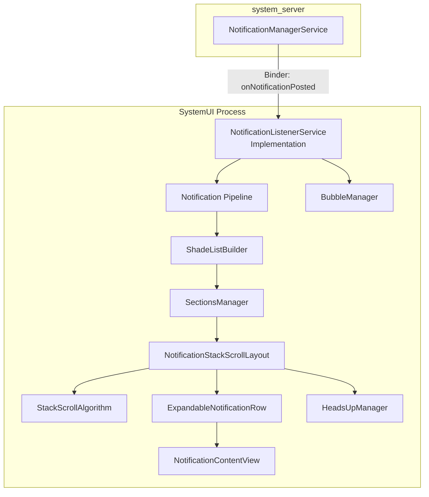

---

## 28.10 Try It

### 28.10.1 Inspecting Active Notifications via ADB

Dump the current notification state:

```bash
adb shell dumpsys notification
```

This produces extensive output including:

- All active notifications with their keys, channels, and importance.
- Ranking information.
- Listener state.
- DND configuration.
- Snooze state.

To see just the notification list:

```bash
adb shell dumpsys notification --noredact | grep -A 5 "NotificationRecord"
```

### 28.10.2 Dumping Notification Channels

```bash
adb shell dumpsys notification channels
```

Or for a specific package:

```bash
adb shell dumpsys notification channels com.example.myapp
```

### 28.10.3 Inspecting Do Not Disturb State

```bash
adb shell dumpsys notification zen
```

Or through the settings command:

```bash
adb shell settings get global zen_mode
# 0 = off, 1 = priority, 2 = total silence, 3 = alarms
```

### 28.10.4 Using the Notification Shell Command

NMS includes a shell command interface:

```bash
# List all notification channels for a package
adb shell cmd notification list_channels com.example.myapp 0

# Post a test notification
adb shell cmd notification post -t "Test" "tag" "Hello from shell"

# Snooze a notification
adb shell cmd notification snooze --for 60000 <key>

# Unsnooze a notification
adb shell cmd notification unsnooze <key>
```

Source: `frameworks/base/services/core/java/com/android/server/notification/NotificationShellCmd.java`

### 28.10.5 Posting a Notification from Code

```java
// Minimal notification with a channel
NotificationChannel channel = new NotificationChannel(
        "demo_channel",
        "Demo Channel",
        NotificationManager.IMPORTANCE_DEFAULT);
NotificationManager nm = getSystemService(NotificationManager.class);
nm.createNotificationChannel(channel);

Notification notification = new Notification.Builder(this, "demo_channel")
        .setSmallIcon(R.drawable.ic_notification)
        .setContentTitle("Hello")
        .setContentText("This is a test notification")
        .setAutoCancel(true)
        .build();
nm.notify(1, notification);
```

### 28.10.6 Posting a Conversation Notification

```java
// 1. Create a sharing shortcut
ShortcutInfo shortcut = new ShortcutInfo.Builder(context, "contact_jane")
        .setLongLived(true)
        .setShortLabel("Jane")
        .setPerson(new Person.Builder()
                .setName("Jane")
                .setKey("jane_key")
                .build())
        .setIntent(new Intent(Intent.ACTION_DEFAULT))
        .build();
ShortcutManager sm = getSystemService(ShortcutManager.class);
sm.addDynamicShortcuts(List.of(shortcut));

// 2. Create channel
NotificationChannel channel = new NotificationChannel(
        "messages", "Messages", NotificationManager.IMPORTANCE_HIGH);
nm.createNotificationChannel(channel);

// 3. Build conversation notification
Person sender = new Person.Builder()
        .setName("Jane")
        .setKey("jane_key")
        .setIcon(Icon.createWithResource(context, R.drawable.avatar_jane))
        .build();

Notification.MessagingStyle style = new Notification.MessagingStyle(me)
        .addMessage("Hey, are you free tonight?", System.currentTimeMillis(), sender);

Notification notification = new Notification.Builder(this, "messages")
        .setSmallIcon(R.drawable.ic_message)
        .setShortcutId("contact_jane")
        .setStyle(style)
        .setCategory(Notification.CATEGORY_MESSAGE)
        .build();
nm.notify(100, notification);
```

### 28.10.7 Creating a Bubble Notification

```java
// Build upon the conversation notification above
Intent bubbleIntent = new Intent(context, ChatActivity.class)
        .putExtra("contact", "jane");
PendingIntent bubblePendingIntent = PendingIntent.getActivity(
        context, 0, bubbleIntent,
        PendingIntent.FLAG_MUTABLE | PendingIntent.FLAG_UPDATE_CURRENT);

Notification.BubbleMetadata bubble = new Notification.BubbleMetadata.Builder(
        bubblePendingIntent,
        Icon.createWithResource(context, R.drawable.avatar_jane))
    .setDesiredHeight(600)
    .setAutoExpandBubble(false)
    .setSuppressNotification(false)
    .build();

Notification notification = new Notification.Builder(this, "messages")
        .setSmallIcon(R.drawable.ic_message)
        .setShortcutId("contact_jane")
        .setStyle(style)
        .setBubbleMetadata(bubble)
        .build();
nm.notify(100, notification);
```

### 28.10.8 Implementing a NotificationListenerService

```java
public class MyNotificationListener extends NotificationListenerService {

    @Override
    public void onNotificationPosted(StatusBarNotification sbn) {
        Log.d("NLS", "Posted: " + sbn.getKey()
                + " pkg=" + sbn.getPackageName()
                + " title=" + sbn.getNotification().extras
                        .getString(Notification.EXTRA_TITLE));
    }

    @Override
    public void onNotificationRemoved(StatusBarNotification sbn,
            RankingMap rankingMap, int reason) {
        Log.d("NLS", "Removed: " + sbn.getKey() + " reason=" + reason);
    }

    @Override
    public void onNotificationRankingUpdate(RankingMap rankingMap) {
        Log.d("NLS", "Ranking update received");
    }
}
```

AndroidManifest.xml:
```xml
<service
    android:name=".MyNotificationListener"
    android:permission="android.permission.BIND_NOTIFICATION_LISTENER_SERVICE"
    android:exported="true">
    <intent-filter>
        <action android:name=
            "android.service.notification.NotificationListenerService" />
    </intent-filter>
</service>
```

The user must manually enable the listener in **Settings > Notifications >
Notification access**.

### 28.10.9 Programmatically Managing DND

```java
NotificationManager nm = getSystemService(NotificationManager.class);

// Check if the app has DND access
if (nm.isNotificationPolicyAccessGranted()) {
    // Set DND to priority-only
    nm.setInterruptionFilter(
            NotificationManager.INTERRUPTION_FILTER_PRIORITY);

    // Configure DND policy
    NotificationManager.Policy policy = new NotificationManager.Policy(
            NotificationManager.Policy.PRIORITY_CATEGORY_CALLS
                | NotificationManager.Policy.PRIORITY_CATEGORY_MESSAGES,
            NotificationManager.Policy.PRIORITY_SENDERS_CONTACTS,
            NotificationManager.Policy.PRIORITY_SENDERS_CONTACTS);
    nm.setNotificationPolicy(policy);
}
```

### 28.10.10 Tracing the Notification Pipeline

Enable verbose logging for the notification service:

```bash
adb shell setprop log.tag.NotificationService VERBOSE
adb shell setprop log.tag.NotificationRecord DEBUG
adb shell setprop log.tag.ZenModeHelper DEBUG
adb shell setprop log.tag.NotifAttentionHelper DEBUG
adb shell setprop log.tag.RankingHelper DEBUG
```

Then monitor with:

```bash
adb logcat -s NotificationService NotificationRecord ZenModeHelper \
    NotifAttentionHelper RankingHelper
```

### 28.10.11 Inspecting Notification History

Android 11+ stores notification history:

```bash
adb shell dumpsys notification history
```

Or via the Settings UI: **Settings > Notifications > Notification history**.

### 28.10.12 Testing Snooze Behavior

```bash
# Snooze a notification for 60 seconds
adb shell cmd notification snooze --for 60000 "0|com.example.app|1|null|10088"

# List snoozed notifications
adb shell dumpsys notification snoozed
```

### 28.10.13 Debugging Bubble Issues

```bash
# Check if bubbles are enabled globally
adb shell settings get global notification_bubbles

# Check per-app bubble preference
adb shell dumpsys notification | grep -A 3 "bubble"

# Enable bubble logging
adb shell setprop log.tag.BubbleExtractor DEBUG
adb shell setprop log.tag.Bubbles DEBUG
```

### 28.10.14 Observing Attention Effects

To debug why a notification does or does not make sound/vibrate:

```bash
adb shell setprop log.tag.NotifAttentionHelper VERBOSE
adb logcat -s NotifAttentionHelper
```

The attention helper logs detailed reasons for its buzz-beep-blink decisions,
including DND suppression, listener hints, and "alert once" flags.

### 28.10.15 Notification Architecture Exploration Script

```bash
#!/bin/bash
# Explore the notification subsystem source structure
NOTIF_DIR="frameworks/base/services/core/java/com/android/server/notification"

echo "=== Core Service Files ==="
wc -l $NOTIF_DIR/NotificationManagerService.java
wc -l $NOTIF_DIR/NotificationRecord.java
wc -l $NOTIF_DIR/PreferencesHelper.java
wc -l $NOTIF_DIR/ZenModeHelper.java
wc -l $NOTIF_DIR/RankingHelper.java

echo ""
echo "=== Signal Extractors ==="
grep -l "implements NotificationSignalExtractor" $NOTIF_DIR/*.java

echo ""
echo "=== All Files ==="
ls $NOTIF_DIR/*.java | wc -l
echo "files in the notification server package"
```

### 28.10.16 Summary of Key Source Files

| File | Lines | Role |
|------|-------|------|
| `NotificationManagerService.java` | ~15,500 | Central service |
| `NotificationRecord.java` | ~1,200 | Server-side notification wrapper |
| `PreferencesHelper.java` | ~2,800 | Channel and group storage |
| `ZenModeHelper.java` | ~2,500 | DND state machine |
| `ZenModeFiltering.java` | ~600 | DND intercept decisions |
| `RankingHelper.java` | ~250 | Signal extraction orchestrator |
| `NotificationAttentionHelper.java` | ~1,500 | Sound, vibration, LED |
| `GroupHelper.java` | ~1,400 | Auto-grouping logic |
| `SnoozeHelper.java` | ~600 | Snooze state management |
| `ShortcutHelper.java` | ~350 | Conversation shortcut queries |
| `ManagedServices.java` | ~2,200 | Listener/assistant lifecycle |
| `ValidateNotificationPeople.java` | ~700 | Contact resolution |
| `BubbleExtractor.java` | ~250 | Bubble eligibility |
| `ImportanceExtractor.java` | ~58 | Importance calculation |
| `ZenModeExtractor.java` | ~50 | DND intercept signal |
| `NotificationShellCmd.java` | ~400 | ADB shell interface |
| `NotificationStackScrollLayout.java` | ~5,000+ | SystemUI shade container |
| `BubbleController.java` | ~2,000+ | WM Shell bubble management |

---

### 28.10.17 Monitoring Auto-Grouping

Auto-grouping bundles notifications from the same package when there are too
many individual groups. To observe this:

```bash
adb shell setprop log.tag.GroupHelper DEBUG
adb logcat -s GroupHelper
```

Auto-grouping triggers when a package has more than
`AUTOGROUP_SPARSE_GROUPS_AT_COUNT` (6) sparse groups each with fewer than 3
children. The auto-group summary uses the key `"ranker_group"` (or an
aggregate group key with the prefix `"Aggregate_"` when force grouping is
active).

### 28.10.18 Verifying Channel Configuration

To verify that your app's notification channels are correctly configured, use
the Settings shell command:

```bash
# List all channels for a package and user
adb shell cmd notification list_channels <package_name> <user_id>

# Example
adb shell cmd notification list_channels com.google.android.gm 0
```

You can also check channel importance directly:

```bash
adb shell dumpsys notification | grep -A 10 "com.your.package"
```

### 28.10.19 Testing the Full Pipeline with a Custom Extractor

While the signal extractor pipeline is not extensible by third-party apps, you
can modify the configuration for testing purposes on an eng build:

```xml
<!-- Modify frameworks/base/core/res/res/values/config.xml -->
<string-array name="config_notificationSignalExtractors">
    <!-- Add your custom extractor here -->
    <item>com.android.server.notification.NotificationChannelExtractor</item>
    <!-- ... existing extractors ... -->
    <item>com.example.MyCustomExtractor</item>
</string-array>
```

Your custom extractor must implement `NotificationSignalExtractor` and live in
the `system_server` classpath.

### 28.10.20 Foreground Service Notification Constraints

Foreground service (FGS) notifications have special constraints:

```bash
# Check FGS notification flags
adb shell dumpsys notification | grep "FLAG_FOREGROUND_SERVICE"
```

Key behaviors:

- FGS notifications cannot be dismissed by the user (they get `FLAG_NO_CLEAR`).
- If the channel importance is MIN or NONE, it is elevated to LOW.
- FGS notifications cannot be cancelled by the app while the service runs.
- Starting from Android 14, the system enforces that FGS notifications must
  be visible (importance > NONE) or the FGS start is rejected.

### 28.10.21 Notification Permission (Android 13+)

Since Android 13 (API 33), posting notifications requires the
`POST_NOTIFICATIONS` runtime permission. The `PermissionHelper` tracks this:

```bash
# Check if a package has notification permission
adb shell dumpsys notification permissions | grep "com.your.package"
```

Apps targeting API 33+ must request this permission at runtime. Pre-existing
apps (upgraded from older API levels) get the permission granted automatically
if they had existing notification channels.

---

## 28.11 Notification Attention Effects

### 28.11.1 Overview

When a notification is posted, the system decides whether to play a sound,
vibrate the device, or flash the LED. This logic lives in
`NotificationAttentionHelper`:

Source: `frameworks/base/services/core/java/com/android/server/notification/NotificationAttentionHelper.java`

### 28.11.2 The buzzBeepBlink Decision

The `buzzBeepBlinkLocked()` method is the central decision point. It evaluates
many conditions:

1. **Is the notification intercepted by DND?** If intercepted, most effects
   are suppressed.
2. **Has the notification already alerted?** The `FLAG_ONLY_ALERT_ONCE` flag
   prevents re-alerting on updates.
3. **Is the notification in a group?** Group alert behavior can delegate
   alerting to the summary or children.
4. **What are the listener hints?** SystemUI can disable effects via
   `HINT_HOST_DISABLE_EFFECTS`.
5. **Is the phone in a call?** Call notifications may suppress other alerts.
6. **What is the importance?** Only HIGH and above trigger heads-up; only
   DEFAULT and above trigger sound.

### 28.11.3 Sound

Sound playback uses the `IRingtonePlayer` service:

```java
// NotificationAttentionHelper uses:
// - Channel's sound URI
// - Channel's audio attributes
// - System default notification sound as fallback
```

Sound is suppressed when:

- Importance is below DEFAULT.
- The notification has `FLAG_ONLY_ALERT_ONCE` and has already alerted.
- DND suppresses the notification.
- The screen is off and `SUPPRESSED_EFFECT_SCREEN_OFF` is active.
- A phone call is active and listener hints disable notification effects.

### 28.11.4 Vibration

Vibration follows a similar decision tree. The vibration pattern comes from
the `NotificationRecord`, which resolves it from the channel:

```java
// NotificationRecord.java (line 338)
private VibrationEffect getVibrationForChannel(
        NotificationChannel channel, VibratorHelper helper, boolean insistent) {
    if (!channel.shouldVibrate()) return null;

    // Priority: channel vibration effect > channel pattern > sound URI vibration > default
    final VibrationEffect vibration = channel.getVibrationEffect();
    if (vibration != null) return vibration;

    final long[] vibrationPattern = channel.getVibrationPattern();
    if (vibrationPattern != null)
        return helper.createWaveformVibration(vibrationPattern, insistent);

    return helper.createDefaultVibration(insistent);
}
```

The `FLAG_INSISTENT` flag causes the vibration to repeat indefinitely until the
user acknowledges it.

### 28.11.5 LED

LED notification lights are controlled through the `LightsManager` service:

```java
// NotificationRecord.java (line 308)
private Light calculateLights() {
    int channelLightColor = getChannel().getLightColor() != 0
            ? getChannel().getLightColor() : defaultLightColor;
    Light light = getChannel().shouldShowLights()
            ? new Light(channelLightColor, defaultLightOn, defaultLightOff) : null;
    // ... pre-channel legacy handling
}
```

Many modern devices no longer have LED indicators, but the API persists for
devices that do support them (and for custom ROM developers).

### 28.11.6 Full-Screen Intent

Notifications with importance HIGH or MAX can include a full-screen intent:

```java
notification.setFullScreenIntent(pendingIntent, true /* highPriority */);
```

Full-screen intents launch an activity over the lock screen (e.g., for incoming
calls or alarms). The system may suppress the full-screen intent and show a
heads-up notification instead if the user is actively using the device.

Starting from Android 14, the `USE_FULL_SCREEN_INTENT` permission is required
and can be revoked by the user.

### 28.11.7 Attention Effects Flow

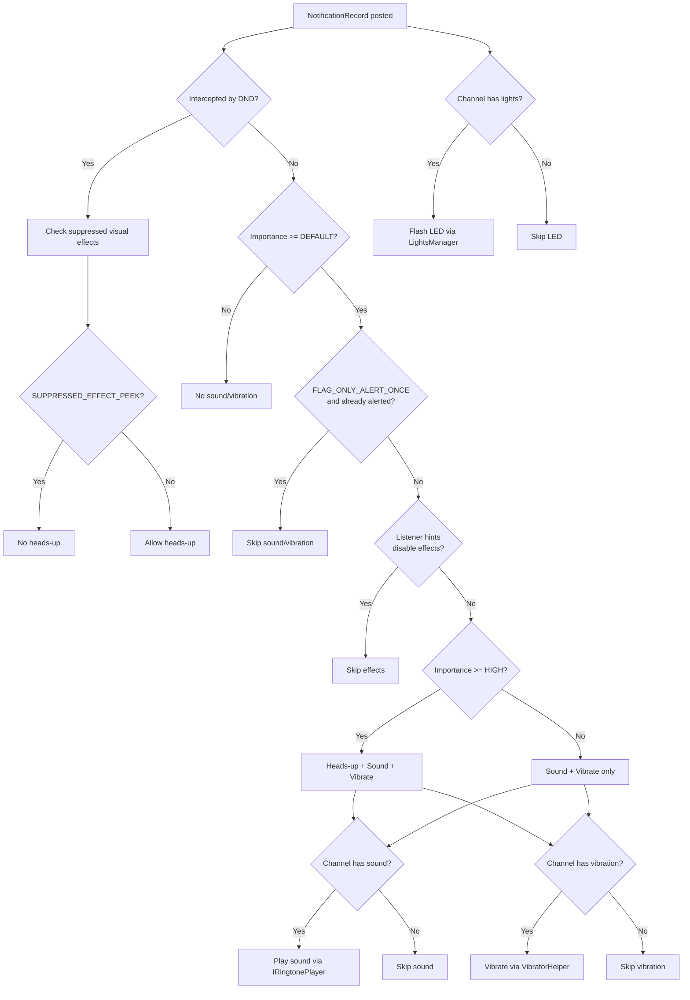

---

## 28.12 Notification History and Persistence

### 28.12.1 Notification History

Android maintains a history of dismissed and cancelled notifications:

```java
// NotificationManagerService.java (line 762)
private Archive mArchive;
```

The `Archive` class maintains a bounded ring buffer:

```java
// NotificationManagerService.java (line 840)
static class Archive {
    final SparseArray<Boolean> mEnabled;
    final int mBufferSize;
    final LinkedList<Pair<StatusBarNotification, Integer>> mBuffer;
}
```

When a notification is cancelled, it is recorded in the archive:

```java
// cancelNotificationLocked (line 11408)
if (reason != REASON_CHANNEL_REMOVED) {
    mArchive.record(getSbnForArchive(r, reason), reason);
}
```

### 28.12.2 NotificationHistoryManager

Beyond the in-memory archive, `NotificationHistoryManager` provides persistent
history using a SQLite database:

```java
// frameworks/base/services/core/java/com/android/server/notification/
//   NotificationHistoryManager.java
//   NotificationHistoryDatabase.java
```

The history database stores:

- Package name
- Channel ID
- Notification title and text
- Icons (as bitmaps, with a cleanup job)
- Post time
- Conversation shortcut ID

The `NotificationHistoryJobService` runs periodic cleanup to remove old entries
and reclaim storage.

### 28.12.3 Policy File Persistence

NMS persists its configuration to an XML policy file:

```java
// NotificationManagerService.java (line 765)
private AtomicFile mPolicyFile;
```

The policy file contains:

- Zen mode configuration (DND rules, policies).
- Channel and group preferences (via `PreferencesHelper`).
- Enabled notification listeners.
- Enabled notification assistant.
- Enabled condition providers.
- Snoozed notification state.
- Lockscreen secure notification preference.

The file is loaded during boot:

```java
// NotificationManagerService.java (line 1278)
protected void loadPolicyFile() {
    synchronized (mPolicyFile) {
        InputStream infile = mPolicyFile.openRead();
        readPolicyXml(infile, false /*forRestore*/, USER_ALL, null);
    }
}
```

### 28.12.4 Backup and Restore

Notification settings participate in Android's backup/restore framework. When
a user sets up a new device from backup:

1. The policy XML is restored.
2. Channel preferences are restored per-app.
3. DND rules are restored.
4. Listener and assistant permissions are restored.
5. Managed services are re-enabled.

The `NotificationBackupHelper` coordinates this process, and
`BackupRestoreEventLogger` tracks success/failure metrics.

---

## 28.13 Notification Snooze

### 28.13.1 Overview

Snoozing temporarily removes a notification and re-posts it after a delay.
The `SnoozeHelper` manages this:

```java
// frameworks/base/services/core/java/com/android/server/notification/
//   SnoozeHelper.java (line 57)
public final class SnoozeHelper {
    static final int CONCURRENT_SNOOZE_LIMIT = 500;
    static final int MAX_STRING_LENGTH = 1000;
}
```

### 28.13.2 Snooze Mechanisms

There are two types of snooze:

1. **Duration-based**: The notification re-appears after a specified time.
2. **Criterion-based**: The notification re-appears when a condition is met
   (e.g., arriving at a location).

```java
// SnoozeHelper manages:
// - AlarmManager alarms for timed snooze
// - SnoozeContext for criterion-based snooze
// - Persistence across reboots via XML
```

### 28.13.3 Snooze during Enqueue

When a notification is enqueued, the system checks if it was previously snoozed:

```java
// EnqueueNotificationRunnable (line 10093)
final long snoozeAt = mSnoozeHelper.getSnoozeTimeForUnpostedNotification(
        r.getUser().getIdentifier(),
        r.getSbn().getPackageName(), r.getSbn().getKey());
if (snoozeAt > currentTime) {
    (new SnoozeNotificationRunnable(r.getSbn().getKey(),
            snoozeAt - currentTime, null)).snoozeLocked(r);
    return false;
}
```

This prevents a notification from appearing briefly before being re-snoozed.

### 28.13.4 Snooze Persistence

Snoozed notifications survive reboots. The `SnoozeHelper` persists state to XML:

```java
protected static final String XML_TAG_NAME = "snoozed-notifications";
```

On boot, the snoozed notification data is read from the policy file, and alarms
are re-scheduled for any still-pending snoozes.

---

## 28.14 Auto-Grouping and Force Grouping

### 28.14.1 Traditional Auto-Grouping

When an app posts multiple notifications without explicitly grouping them,
NMS auto-groups them under a synthetic group summary. The `GroupHelper` decides:

```java
// GroupHelper.java (line 75)
protected static final String AUTOGROUP_KEY = "ranker_group";
```

Auto-grouping triggers when a package has more than `AUTOGROUP_AT_COUNT_DEFAULT`
(2) ungrouped notifications.

### 28.14.2 Force Grouping (Android 16+)

Force grouping is a newer mechanism (behind the `notificationForceGrouping` flag)
that aggressively bundles notifications:

```java
// GroupHelper.java (line 87)
protected static final String AGGREGATE_GROUP_KEY = "Aggregate_";
```

Force grouping:

- Groups sparse groups (packages with many small groups) into aggregate groups.
- Triggers when a package has more than
  `AUTOGROUP_SPARSE_GROUPS_AT_COUNT` (6) sparse groups.
- Uses a 3-second delay after posting/removing to let apps complete their
  group structure before regrouping.

```java
// NotificationManagerService.java (line 571)
private static final long DELAY_FORCE_REGROUP_TIME = 3000;
```

### 28.14.3 Auto-Group Summary Properties

The auto-group summary inherits properties from its children:

```java
// GroupHelper.java (lines 79-85)
// Flags that all autogroup summaries have
protected static final int BASE_FLAGS =
        FLAG_AUTOGROUP_SUMMARY | FLAG_GROUP_SUMMARY | FLAG_LOCAL_ONLY;
// Flag that autogroup summaries inherits if all children have the flag
private static final int ALL_CHILDREN_FLAG = FLAG_AUTO_CANCEL;
// Flags that autogroup summaries inherits if any child has them
private static final int ANY_CHILDREN_FLAGS = FLAG_ONGOING_EVENT | FLAG_NO_CLEAR;
```

### 28.14.4 Classification-Based Regrouping

When the NAS classifies notifications (as news, promotions, etc.), the system
may regroup them into classification-specific bundles. This is controlled by
the `notificationRegroupOnClassification` flag.

### 28.14.5 Grouping Decision Diagram

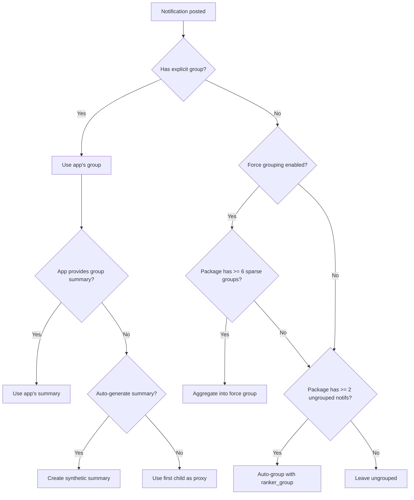

---

## 28.15 Key Data Structures

### 28.15.1 Core Collections in NMS

```java
// NotificationManagerService.java (lines 731-746)

// The definitive list of all active notifications, sorted by rank
final ArrayList<NotificationRecord> mNotificationList;

// Fast lookup by key (pkg|uid|id|tag)
final ArrayMap<String, NotificationRecord> mNotificationsByKey;

// Notifications in the enqueue phase (not yet posted)
final ArrayList<NotificationRecord> mEnqueuedNotifications;

// Auto-bundled summary keys per userId per package/groupKey
final ArrayMap<Integer, ArrayMap<String, String>> mAutobundledSummaries;

// Group summary records by groupKey
final ArrayMap<String, NotificationRecord> mSummaryByGroupKey;
```

### 28.15.2 Notification Key Format

The notification key uniquely identifies a notification:

```
<userId>|<packageName>|<id>|<tag>|<uid>
```

For example: `0|com.example.app|1|null|10088`

### 28.15.3 Group Key Format

The group key uniquely identifies a notification group:

```
<userId>|<packageName>|<groupId>
```

If the notification has an explicit group set via `setGroup()`, `groupId` is that
string. Otherwise, it is the notification key itself (each notification is its
own group of one).

### 28.15.4 The NotificationRecord Field Map

| Field | Source | Extractor | Used By |
|-------|--------|-----------|---------|
| `mChannel` | `PreferencesHelper` | `NotificationChannelExtractor` | Importance, sound, vibration |
| `mContactAffinity` | Contacts DB | `ValidateNotificationPeople` | DND filtering, ranking |
| `mIntercept` | DND policy | `ZenModeExtractor` | Listener dispatch |
| `mImportance` | Channel + system + assistant | `ImportanceExtractor` | Ranking, attention |
| `mPackagePriority` | Channel | `PriorityExtractor` | DND bypass |
| `mAllowBubble` | User + app + channel prefs | `BubbleExtractor` | Bubble presentation |
| `mShowBadge` | Channel | `BadgeExtractor` | App icon badge |
| `mPackageVisibility` | Channel | `VisibilityExtractor` | Lockscreen |
| `mCriticality` | System policy | `CriticalNotificationExtractor` | Top-of-shade placement |
| `mRankingScore` | NAS | `NotificationAdjustmentExtractor` | Ranking |
| `mUserSentiment` | NAS | `NotificationAdjustmentExtractor` | Smart actions |
| `mShortcutInfo` | `ShortcutHelper` | Post processing | Conversations, bubbles |
| `mSuppressedVisualEffects` | DND policy | `ZenModeExtractor` | Attention effects |

---

## Summary

The Android notification system is a deeply layered pipeline that transforms a
simple `notify()` call into a carefully ranked, policy-filtered, attention-managed
user experience. The key architectural insights from this chapter:

1. **NotificationManagerService** is the central hub. At over 15,500 lines, it
   coordinates permission checks, channel lookups, signal extraction, ranking,
   DND filtering, attention effects, and listener dispatch.

2. **The signal extractor pipeline** provides a modular, extensible architecture.
   Each extractor writes a specific signal onto the `NotificationRecord`, and the
   system can be extended by adding new extractors to the XML configuration.

3. **Notification channels** shift control to users. Once created, channel settings
   are user-owned, and apps cannot programmatically override them.

4. **Do Not Disturb** is not a single switch but a rule engine. Multiple
   `AutomaticZenRule` objects can be active simultaneously, each with its own
   `ZenPolicy`. The `ZenModeHelper` consolidates them into a single effective policy.

5. **Conversation notifications** receive first-class treatment through
   `MessagingStyle` + sharing shortcuts + `Person` data, enabling features like
   priority sections and bubbles.

6. **Bubbles** bridge the notification system and the window manager. Eligibility
   is determined in NMS, but the UI lifecycle is managed by WM Shell's
   `BubbleController`.

7. **SystemUI's notification pipeline** transforms raw `StatusBarNotification`
   objects into a rendered shade through a series of coordinators, filters,
   sorters, and the `NotificationStackScrollLayout`.

8. **The threading model** is carefully designed: Binder calls arrive on the
   Binder pool, processing happens on the handler thread under `mNotificationLock`,
   and ranking reconsideration runs on a separate thread. This prevents the
   notification system from blocking the main thread or causing deadlocks.

9. **Auto-grouping** and **force grouping** ensure a clean notification shade
   even when apps do not properly group their notifications. The `GroupHelper`
   handles both traditional auto-grouping (2+ ungrouped notifications) and
   aggressive force-grouping (6+ sparse groups).

10. **Attention effects** (sound, vibration, LED, heads-up) are determined by
    a complex decision tree in `NotificationAttentionHelper` that considers
    importance, DND state, listener hints, group alert behavior, and the
    `FLAG_ONLY_ALERT_ONCE` flag.

11. **Notification history** is maintained at two levels: an in-memory ring
    buffer archive for `getHistoricalNotifications()` and a persistent SQLite
    database for the Settings notification history UI.

---

## Appendix A: Complete Extractor Pipeline Reference

The following table documents every signal extractor, its dependencies, and
the fields it modifies on `NotificationRecord`:

| # | Extractor | Depends On | Modifies | May Defer |
|---|-----------|------------|----------|-----------|
| 1 | `NotificationChannelExtractor` | None | `mChannel` | No |
| 2 | `NotificationAdjustmentExtractor` | Channel | `mImportance`, `mRankingScore`, `mUserSentiment`, smart actions/replies, classification | No |
| 3 | `BubbleExtractor` | Channel, Adjustment | `mAllowBubble` | No |
| 4 | `ValidateNotificationPeople` | Adjustment (for people overrides) | `mContactAffinity`, `mPeopleOverride`, phone numbers | Yes (async contact lookup) |
| 5 | `PriorityExtractor` | Channel | `mPackagePriority` | No |
| 6 | `ZenModeExtractor` | Priority | `mIntercept`, `mSuppressedVisualEffects` | No |
| 7 | `ImportanceExtractor` | Channel, System, Assistant | `mImportance` (final) | No |
| 8 | `VisibilityExtractor` | Importance | `mPackageVisibility` | No |
| 9 | `BadgeExtractor` | ZenMode | `mShowBadge` | No |
| 10 | `CriticalNotificationExtractor` | None | `mCriticality` | No |

---

## Appendix B: Notification Flags Reference

| Flag | Value | Description |
|------|-------|-------------|
| `FLAG_SHOW_LIGHTS` | 0x00000001 | Legacy: request LED |
| `FLAG_ONGOING_EVENT` | 0x00000002 | Cannot be cleared by user |
| `FLAG_INSISTENT` | 0x00000004 | Repeat sound/vibration until acknowledged |
| `FLAG_ONLY_ALERT_ONCE` | 0x00000008 | Alert only on first post, not updates |
| `FLAG_AUTO_CANCEL` | 0x00000010 | Cancel on tap |
| `FLAG_NO_CLEAR` | 0x00000020 | Cannot be cleared by "Clear all" |
| `FLAG_FOREGROUND_SERVICE` | 0x00000040 | Associated with a foreground service |
| `FLAG_HIGH_PRIORITY` | 0x00000080 | Legacy: high priority (use importance instead) |
| `FLAG_LOCAL_ONLY` | 0x00000100 | Do not bridge to remote devices |
| `FLAG_GROUP_SUMMARY` | 0x00000200 | This is a group summary |
| `FLAG_AUTOGROUP_SUMMARY` | 0x00000400 | System-generated group summary |
| `FLAG_BUBBLE` | 0x00001000 | Eligible for bubble presentation |
| `FLAG_NO_DISMISS` | 0x00002000 | Cannot be dismissed at all |
| `FLAG_FSI_REQUESTED_BUT_DENIED` | 0x00004000 | Full-screen intent was requested but denied |
| `FLAG_USER_INITIATED_JOB` | 0x00008000 | Associated with a user-initiated job |
| `FLAG_PROMOTED_ONGOING` | 0x00010000 | Promoted to ongoing status |
| `FLAG_LIFETIME_EXTENDED_BY_DIRECT_REPLY` | 0x00020000 | Kept alive after user reply |
| `FLAG_SILENT` | 0x00040000 | Forced silent (no sound/vibration) |

---

## Appendix C: Cancel Reason Constants

| Constant | Value | Description |
|----------|-------|-------------|
| `REASON_CLICK` | 1 | User tapped the notification |
| `REASON_CANCEL` | 2 | User swiped to dismiss |
| `REASON_CANCEL_ALL` | 3 | User tapped "Clear all" |
| `REASON_ERROR` | 4 | Notification was invalid |
| `REASON_PACKAGE_CHANGED` | 5 | Package was updated |
| `REASON_USER_STOPPED` | 6 | User was stopped |
| `REASON_PACKAGE_BANNED` | 7 | Package notifications disabled |
| `REASON_APP_CANCEL` | 8 | App called `cancel()` |
| `REASON_APP_CANCEL_ALL` | 9 | App called `cancelAll()` |
| `REASON_LISTENER_CANCEL` | 10 | Listener cancelled the notification |
| `REASON_LISTENER_CANCEL_ALL` | 11 | Listener cancelled all |
| `REASON_GROUP_SUMMARY_CANCELED` | 12 | Group summary removed |
| `REASON_GROUP_OPTIMIZATION` | 13 | Regrouping optimization |
| `REASON_PACKAGE_SUSPENDED` | 14 | Package was suspended |
| `REASON_PROFILE_TURNED_OFF` | 15 | User profile turned off |
| `REASON_UNAUTOBUNDLED` | 16 | Removed from auto-bundle |
| `REASON_CHANNEL_BANNED` | 17 | Channel importance set to NONE |
| `REASON_SNOOZED` | 18 | User snoozed the notification |
| `REASON_TIMEOUT` | 19 | TTL expired |
| `REASON_CHANNEL_REMOVED` | 20 | Channel was deleted |
| `REASON_CLEAR_DATA` | 21 | App data was cleared |
| `REASON_ASSISTANT_CANCEL` | 22 | NAS cancelled the notification |
| `REASON_LOCKDOWN` | 23 | Device entered lockdown mode |
| `REASON_BUNDLE_DISMISSED` | 24 | Bundle was dismissed |

---

## Appendix D: Importance Level Behavioral Matrix

| Importance | Sound | Vibration | Heads-Up | Status Bar Icon | Shade | Badge | Full-Screen Intent |
|-----------|-------|-----------|----------|----------------|-------|-------|-------------------|
| NONE (0) | No | No | No | No | No | No | No |
| MIN (1) | No | No | No | No | Yes (collapsed) | No | No |
| LOW (2) | No | No | No | Yes | Yes | Yes | No |
| DEFAULT (3) | Yes | Yes | No | Yes | Yes | Yes | No |
| HIGH (4) | Yes | Yes | Yes | Yes | Yes | Yes | If granted |
| MAX (5) | Yes | Yes | Yes | Yes | Yes | Yes | Yes |

Notes:

- Vibration follows the system vibration setting and channel configuration.
- Heads-up may be suppressed by DND, listener hints, or active shade expansion.
- Full-screen intent requires the `USE_FULL_SCREEN_INTENT` permission on
  Android 14+.
- Badge visibility also depends on the launcher implementation.

---

## Appendix E: Evolution of the Notification System

| Android Version | Key Changes |
|----------------|-------------|
| 1.0 (API 1) | Basic notifications with icon, title, text |
| 3.0 (API 11) | `Notification.Builder` introduced |
| 4.1 (API 16) | Expandable notifications, `BigTextStyle`, `InboxStyle` |
| 4.3 (API 18) | `NotificationListenerService` API |
| 5.0 (API 21) | Heads-up notifications, lockscreen notifications, `CATEGORY_*`, visibility |
| 7.0 (API 24) | Inline reply, bundled notifications, `MessagingStyle` |
| 8.0 (API 26) | **Notification Channels** (mandatory), notification dots, snooze |
| 9.0 (API 28) | `MessagingStyle` improvements, `Person` class |
| 10 (API 29) | Bubble notifications, `ZenPolicy`, conversation shortcuts |
| 11 (API 30) | Conversation section in shade, conversation channels, notification history |
| 12 (API 31) | Custom notification styles restricted, notification trampoline blocked |
| 13 (API 33) | `POST_NOTIFICATIONS` runtime permission |
| 14 (API 34) | `USE_FULL_SCREEN_INTENT` permission, FGS type requirements |
| 15 (API 35) | Implicit zen rules, `ZenDeviceEffects`, sensitive content redaction |
| 16 (API 36) | Force grouping, notification classification, AI summarization |

---

## Appendix F: Source File Index

For quick reference, the complete set of source files discussed in this chapter:

**Server-side (system_server):**
```
frameworks/base/services/core/java/com/android/server/notification/
    NotificationManagerService.java        -- Central service (15,500+ lines)
    NotificationRecord.java               -- Server-side notification wrapper
    PreferencesHelper.java                -- Channel and group storage
    RankingHelper.java                    -- Signal extraction orchestrator
    RankingConfig.java                    -- Ranking configuration interface
    RankingHandler.java                   -- Ranking thread handler
    ZenModeHelper.java                    -- DND state machine
    ZenModeFiltering.java                 -- DND intercept logic
    ZenModeConditions.java                -- DND rule conditions
    ZenModeExtractor.java                 -- DND signal extractor
    ZenModeEventLogger.java               -- DND metrics
    NotificationAttentionHelper.java      -- Sound, vibration, LED
    GroupHelper.java                       -- Auto-grouping
    SnoozeHelper.java                     -- Snooze management
    ShortcutHelper.java                   -- Conversation shortcuts
    ManagedServices.java                  -- Listener/assistant lifecycle
    ConditionProviders.java               -- DND condition providers
    ValidateNotificationPeople.java       -- Contact resolution
    NotificationSignalExtractor.java      -- Extractor interface
    NotificationChannelExtractor.java     -- Channel resolution
    NotificationAdjustmentExtractor.java  -- NAS adjustments
    BubbleExtractor.java                  -- Bubble eligibility
    ImportanceExtractor.java              -- Importance calculation
    PriorityExtractor.java               -- Priority extraction
    VisibilityExtractor.java              -- Lockscreen visibility
    BadgeExtractor.java                   -- App badge control
    CriticalNotificationExtractor.java    -- Critical notification detection
    NotificationTimeComparator.java       -- Time-based sorting
    GlobalSortKeyComparator.java          -- Final sort by global key
    NotificationShellCmd.java             -- ADB shell interface
    NotificationHistoryManager.java       -- Persistent history
    NotificationHistoryDatabase.java      -- SQLite history storage
    NotificationUsageStats.java           -- Usage statistics
    NotificationBackupHelper.java         -- Backup/restore
    PermissionHelper.java                 -- POST_NOTIFICATIONS permission
    AlertRateLimiter.java                 -- Rate limiting
    TimeToLiveHelper.java                 -- TTL management
    VibratorHelper.java                   -- Vibration effect creation
```

**SDK API (app-side):**
```
frameworks/base/core/java/android/app/
    Notification.java                     -- Notification data model
    NotificationManager.java              -- Public API
    NotificationChannel.java              -- Channel configuration
    NotificationChannelGroup.java         -- Channel grouping
    INotificationManager.aidl             -- Binder interface

frameworks/base/core/java/android/service/notification/
    NotificationListenerService.java      -- Listener API
    NotificationAssistantService.java     -- Assistant API
    ConditionProviderService.java         -- DND condition API
    StatusBarNotification.java            -- Parcelable wrapper
    ZenPolicy.java                        -- Per-rule DND policy
    ZenModeConfig.java                    -- DND configuration
    Adjustment.java                       -- NAS adjustment data
```

**SystemUI:**
```
frameworks/base/packages/SystemUI/src/com/android/systemui/statusbar/notification/
    stack/NotificationStackScrollLayout.java   -- Main shade container
    stack/StackScrollAlgorithm.java            -- Position calculation
    stack/NotificationSectionsManager.kt       -- Section management
    stack/NotificationPriorityBucket.kt        -- Priority buckets
    stack/NotificationSwipeHelper.java         -- Swipe-to-dismiss
    ConversationNotifications.kt               -- Conversation handling
    DynamicPrivacyController.java              -- Lockscreen privacy
```

**WM Shell Bubbles:**
```
frameworks/base/libs/WindowManager/Shell/src/com/android/wm/shell/bubbles/
    BubbleController.java                      -- Main bubble coordinator
    BubbleData.java                            -- Bubble data model
    Bubble.java                                -- Single bubble state
    BubbleExpandedView.java                    -- Expanded bubble view
    BubbleTaskView.kt                          -- Embedded activity
    BubblePositioner.java                      -- Position calculations
    BubbleDataRepository.kt                    -- Persistence
```

**Configuration:**
```
frameworks/base/core/res/res/values/config.xml
    config_notificationSignalExtractors     -- Extractor pipeline order
```
