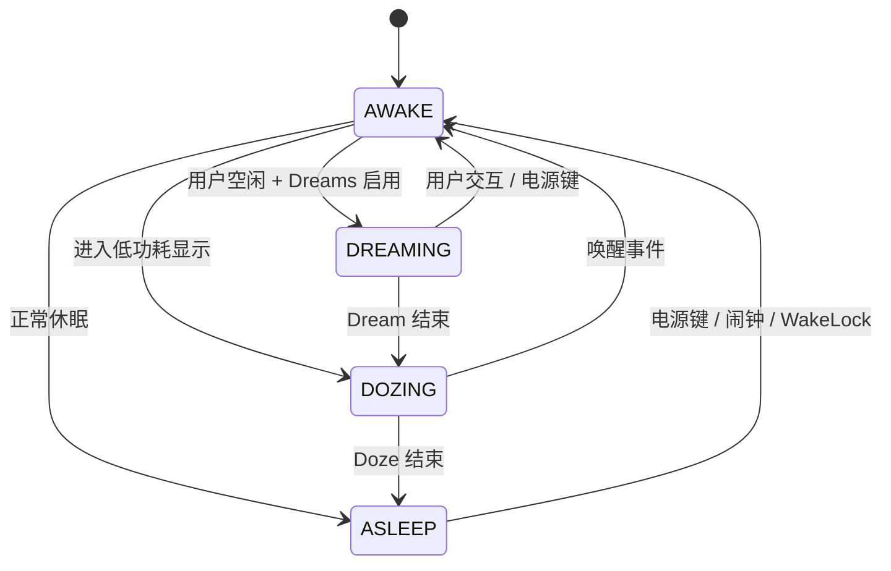
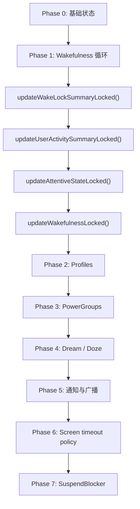
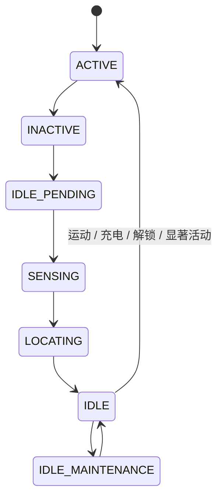
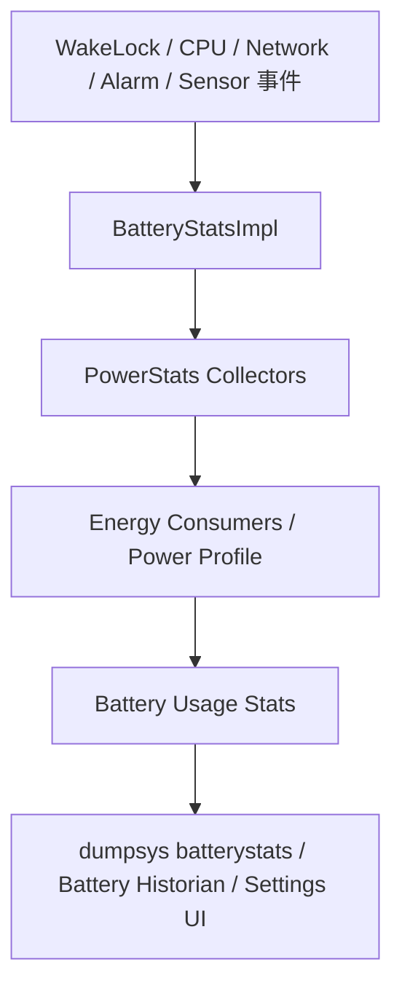
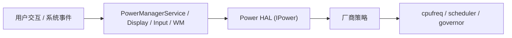
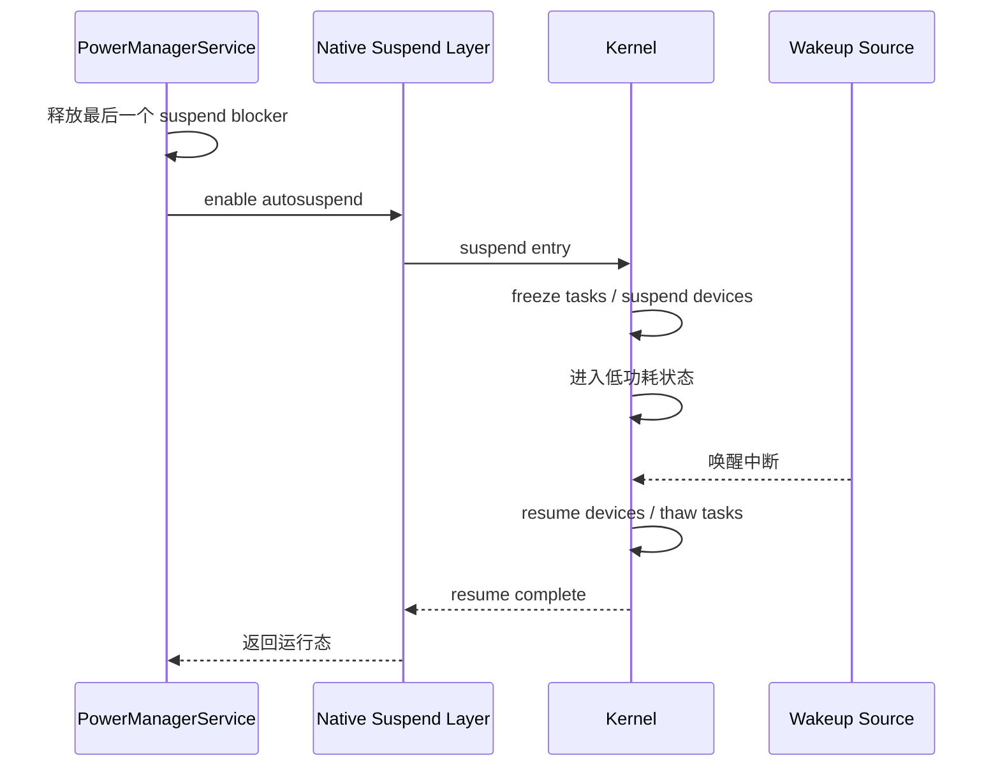
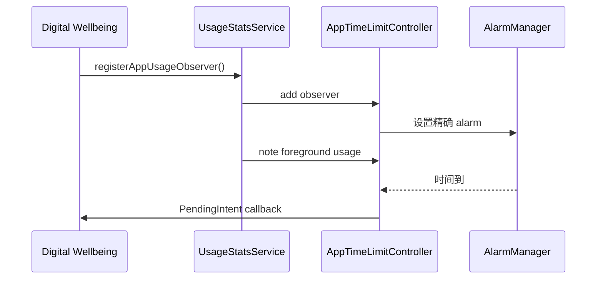

# 第 29 章：电源管理

电源管理是 Android 中最关键的系统子系统之一。手机要在有限电池容量下撑过整天使用，靠的不是单一模块，而是一整套从 Linux suspend、内核唤醒源、Power HAL、Thermal HAL，到 framework 层 WakeLock、Doze、App Standby、Battery Stats 与热管理的多层协同。本章以 AOSP 源码为主线，梳理 Android 如何在“响应性”和“续航”之间持续做权衡。

---

## 29.1 电源管理架构

### 29.1.1 高层概览

Android 电源管理是内核、厂商 HAL 与 framework 的协作结果。最高层的关系如下：

```text
应用
  |
  v
PowerManager (android.os.PowerManager)
  |
  v
PowerManagerService (system_server)
  |
  +-- Notifier
  +-- PowerGroup
  +-- SuspendBlocker
  |
  v
Power HAL (IPower)
  |
  v
Linux kernel (cpufreq / suspend / wakeup_sources)
```

`PowerManagerService` 位于中心位置。应用通过它申请 WakeLock、上报用户活动、请求休眠/唤醒；系统再综合显示、电池优化、Doze、热状态、Battery Saver 等策略，把最终动作落实到 HAL 与内核。

### 29.1.2 关键组件

| 组件 | 路径 | 作用 |
|------|------|------|
| `PowerManagerService` | `frameworks/base/services/core/java/com/android/server/power/PowerManagerService.java` | 中央策略引擎 |
| `PowerGroup` | `frameworks/base/services/core/java/com/android/server/power/PowerGroup.java` | 每个显示组的 wakefulness 状态 |
| `Notifier` | `frameworks/base/services/core/java/com/android/server/power/Notifier.java` | 广播与 battery stats 通知桥 |
| `SuspendBlocker` | `frameworks/base/services/core/java/com/android/server/power/SuspendBlocker.java` | 防止内核 suspend |
| `WakeLockLog` | `frameworks/base/services/core/java/com/android/server/power/WakeLockLog.java` | WakeLock 压缩环形日志 |
| `DeviceIdleController` | `frameworks/base/apex/jobscheduler/service/java/com/android/server/DeviceIdleController.java` | Doze 状态机 |
| `AppStandbyController` | `frameworks/base/apex/jobscheduler/service/java/com/android/server/usage/AppStandbyController.java` | App Standby Buckets |
| `ThermalManagerService` | `frameworks/base/services/core/java/com/android/server/power/thermal/ThermalManagerService.java` | 热事件管理 |
| `BatteryStatsImpl` | `frameworks/base/services/core/java/com/android/server/power/stats/BatteryStatsImpl.java` | 功耗归因与统计 |
| `IPower` HAL | `hardware/interfaces/power/aidl/android/hardware/power/IPower.aidl` | 厂商功耗提示接口 |
| `IThermal` HAL | `hardware/interfaces/thermal/aidl/android/hardware/thermal/IThermal.aidl` | 温度与热限制接口 |

### 29.1.3 Wakefulness 状态

Android 用四态 wakefulness 模型描述设备当前“清醒程度”：

| 状态 | 值 | 说明 |
|------|----|------|
| `WAKEFULNESS_ASLEEP` | 0 | 屏幕关闭，CPU 可能进入 suspend |
| `WAKEFULNESS_AWAKE` | 1 | 正常亮屏交互状态 |
| `WAKEFULNESS_DREAMING` | 2 | Dream / 屏保状态 |
| `WAKEFULNESS_DOZING` | 3 | AOD / 低功耗展示状态 |



### 29.1.4 Dirty Bits 机制

`PowerManagerService` 使用 `mDirty` 位图跟踪“哪些状态发生了变化”。这避免了每次小事件都重新计算所有电源逻辑。常见 dirty bit 包括：

- `DIRTY_WAKE_LOCKS`
- `DIRTY_WAKEFULNESS`
- `DIRTY_USER_ACTIVITY`
- `DIRTY_SETTINGS`
- `DIRTY_BATTERY_STATE`
- `DIRTY_ATTENTIVE`
- `DIRTY_DISPLAY_GROUP_WAKEFULNESS`

每当相关属性变化，就 OR 对应 bit，并调用 `updatePowerStateLocked()`。

### 29.1.5 Power State 更新循环

`updatePowerStateLocked()` 是整个电源系统的心跳。它大致分 7 个阶段：

1. 基础状态更新：充电、stay-on、亮度 boost
2. Wakefulness 循环：更新 WakeLock summary、用户活动 summary、attentive 状态，并可能反复迭代
3. 更新用户 profile 锁定状态
4. 更新所有 `PowerGroup`
5. 更新 dream/doze
6. 发送必要通知
7. 最后才更新 suspend blocker



### 29.1.6 完整 Update Flow 细节

这个多阶段设计的关键在于依赖顺序：

- WakeLock summary 会影响是否允许休眠
- 用户活动 summary 会影响 dim/screen off 计时
- wakefulness 改变后，前两者本身又可能失效
- suspend blocker 必须最后释放，否则可能在系统状态未收敛时就进入 suspend

### 29.1.7 `PowerGroup` Wakefulness 切换

多显示设备场景中，Android 不再只维护全局一个亮灭状态，而是通过 `PowerGroup` 维护每个 display group 的 wakefulness。这样主屏、外接显示、折叠态子屏可以有不同电源状态与用户活动 summary。

### 29.1.8 `PowerManagerService` 初始化

PMS 启动时会：

- 初始化 native suspend blocker
- 注册电池、设置、显示、dock、dream 等监听
- 读取 settings
- 初始化 `Notifier`
- 建立 `PowerGroup`
- 接入 Battery Saver、Attention Detector、FaceDown detector、Wireless charger detector 等可选组件

## 29.2 `PowerManagerService`

### 29.2.1 服务架构

`PowerManagerService` 对外提供 Binder 接口，对内则维护一整套 power state、wake lock 列表、显示组、通知器、setting observers 和 native suspend blocker。

### 29.2.2 Wake Lock Summary Bits

PMS 不会每次都遍历所有 WakeLock 直接做原始判断，而是先汇总成 summary bits，例如：

- CPU 是否需要保持运行
- 是否需要 bright screen / dim screen
- 是否存在 proximity 相关锁
- 是否存在 doze 相关保持

这些 summary bits 会喂给显示策略与 suspend 判定。

### 29.2.3 用户活动与超时

用户活动通过 `userActivity()` 上报。PMS 会记录最近用户交互时间，然后根据 screen-off timeout、sleep timeout、attentive timeout 等规则推导：

- 是否 dim
- 是否 dream
- 是否进入 doze / sleep

### 29.2.4 睡眠与唤醒

睡眠与唤醒入口通常包括：

- `goToSleepInternal()`
- `wakeUpInternal()`
- `napInternal()`

触发源可能是：

- 电源键
- 接近传感器
- 盖合/姿态变化
- 充电器插入
- 闹钟、来电等唤醒事件

### 29.2.5 Power Groups

每个 `PowerGroup` 都有自己的：

- wakefulness
- wake lock summary
- user activity summary
- 最后唤醒/休眠时间

这套设计是多显示与折叠设备支持的基础。

### 29.2.6 显示电源集成

PMS 并不直接驱动面板，而是与显示电源控制链协作。它把“该亮、该暗、该 doze”的决策交给 display power controller 去异步完成，再在回调中通过 dirty bit 触发下一轮收敛。

### 29.2.7 `Notifier`

`Notifier` 负责把电源状态变化向系统其他部分广播，例如：

- 亮灭屏广播
- dream / wakefulness 通知
- BatteryStats 事件
- Input/Window 相关联动

### 29.2.8 消息处理

PMS 内部通过 handler 处理各种超时与状态转移消息，例如：

- 用户活动超时
- attentive 超时
- 梦境切换
- wireless charger 检测
- face-down / undim 相关事件

### 29.2.9 Settings Observers

PMS 会观察多项设置，包括：

- 屏幕超时
- Stay awake while plugged in
- Dreams 相关开关
- Battery saver 配置
- DND 与 AOD 相关联动项

### 29.2.10 Battery Saver 集成

Battery Saver 会影响：

- CPU 频率与 governor 行为
- 后台网络限制
- Job / Alarm 宽限
- 动画与亮度策略

PMS 需要把 Battery Saver 状态纳入整体 power policy 中。

### 29.2.11 Quiescent 模式

Quiescent 模式是一种“开机后保持静默/不点亮显示”的特殊路径，常见于某些恢复、工厂、电视或特定设备启动场景。

### 29.2.12 Face-Down Detection

设备扣放在桌面上时，系统可根据加速度/姿态检测辅助尽快灭屏，降低误触与续航消耗。

### 29.2.13 Attention Detection

Attention detector 用于判断用户是否仍在看屏幕。若系统检测到用户仍在关注设备，可以延长亮屏时间，避免机械地按 timeout 熄屏。

### 29.2.14 Screen Undim Detection

当屏幕从 dim 回到亮时，系统会做额外检测，以避免某些异常应用或场景不断反复“快熄屏又拉亮”，导致体验差和耗电。

### 29.2.15 Wireless Charger Detection

无线充电器接入会触发特殊逻辑，例如亮屏提示、充电动画、特定唤醒路径和 policy 调整。

## 29.3 WakeLocks

### 29.3.1 Wake Lock 等级

WakeLock 是 framework 暴露给应用与系统服务的核心保活机制。常见等级包括：

- `PARTIAL_WAKE_LOCK`：保持 CPU 运行，不要求屏幕常亮
- 旧式 screen wake lock（现代多已不鼓励直接使用）
- doze / proximity 相关系统内部锁

最常用、也是最危险的，是 `PARTIAL_WAKE_LOCK`。

### 29.3.2 Wake Lock Flags

常见附加 flag 包括：

- `ACQUIRE_CAUSES_WAKEUP`
- `ON_AFTER_RELEASE`
- 与 proximity / doze 相关的内部标志

### 29.3.3 `WakeLock` 内部类

PMS 内部的 `WakeLock` 记录会保存：

- binder token
- flags / level
- tag / package
- owner uid / pid
- `WorkSource`
- acquire 时间
- 是否已 disabled

### 29.3.4 获取 WakeLock

获取流程大致是：

1. Binder 调用进入 PMS
2. 校验调用方与 flags
3. 根据 token 查旧锁或新建锁
4. 写入 `mWakeLocks`
5. 标记 `DIRTY_WAKE_LOCKS`
6. 触发 `updatePowerStateLocked()`

### 29.3.5 Wake Lock 禁用

系统可在特定策略下临时禁用某些锁，例如后台限制、设备 idle、uid 状态变化等，从而避免应用无限制持锁。

### 29.3.6 长时 WakeLock 检测

长时间持有 WakeLock 会被系统记录并在 dumpsys / stats 中暴露，便于发现耗电异常。

### 29.3.7 WakeLock 日志

`WakeLockLog` 使用压缩环形缓冲记录 acquire/release 事件，既保留调试价值，又避免日志本身占用过多内存。

### 29.3.8 屏幕锁分类

系统会区分“保持 CPU 运行的锁”和“影响屏幕状态的锁”，因为两者对功耗和用户体验的影响完全不同。

### 29.3.9 电池影响跟踪

WakeLock 会被 BatteryStats 统计并按 UID / package 归因，是 Android 耗电分析中最重要的数据来源之一。

### 29.3.10 `WorkSource` 归因

`WorkSource` 允许系统服务把某个实际由系统持有的 WakeLock 归因给真正触发工作的 app/uid，避免把全部耗电都算到 system_server 头上。

### 29.3.11 WakeLock 最佳实践

原则很简单：

1. 能不用就不用
2. 优先用高层 API（JobScheduler、WorkManager、AlarmManager）
3. 必须用时尽量短持有
4. 始终配超时
5. 做好异常 release

### 29.3.12 调试 WakeLocks

常用调试入口：

```bash
adb shell dumpsys power
adb shell dumpsys batterystats
adb shell dumpsys batterystats --history
```

### 29.3.13 UidState 跟踪

PMS 会根据 UID 前后台状态决定某些锁是否该更积极地限制或统计，从而和 App Standby、battery attribution 等模块联动。

### 29.3.14 `Constants` 类

WakeLock 与 power policy 中的一系列阈值、超时与 debug 选项，通常集中在 `Constants` 内部类中，方便动态调参与设备定制。

## 29.4 Doze 模式

### 29.4.1 概览

Doze 是 Android 最重要的整机待机省电机制之一，分为：

- Deep Doze
- Light Doze

由 `DeviceIdleController` 管理。

### 29.4.2 Deep Doze 状态机

Deep Doze 的状态机会在“设备静止、息屏、未充电”等条件成立后逐步进入更深 idle 状态。



### 29.4.3 Light Doze 状态机

Light Doze 更轻量、更早触发，主要限制后台活动但不一定进入最深层 idle。

### 29.4.4 Maintenance Windows

Doze 并不是完全封死系统，而是周期性打开 maintenance window，让：

- Alarm
- Job
- 同步
- 网络访问

在短窗口中集中放行。

### 29.4.5 Deep Doze 步进实现

`DeviceIdleController` 会逐步：

1. 等待不活动
2. 传感器确认
3. 可选定位确认
4. 进入 idle
5. 周期性 maintenance
6. 下次 idle 时延进一步拉长

### 29.4.5.1 Doze 定时常量

Doze 里有大量时间常量控制 idle 延迟、maintenance 时长、重试窗口、最大间隔等，设备厂商也常通过 overlay 或 config 做调优。

### 29.4.6 Active Reasons

设备从 Doze 退出的原因可能包括：

- 运动
- 充电状态变化
- 屏幕点亮
- 网络/定位/策略条件变化
- 显式 shell 命令

### 29.4.7 Power Save Whitelist / Allowlist

系统维持多类 allowlist：

- 系统 allowlist
- 用户 allowlist
- 临时 allowlist

被允许的应用可在 Doze 下保留更多能力。

### 29.4.8 Doze 下的限制

Doze 会收紧：

- 网络访问
- wakelock 行为
- 后台 job
- alarm 触发
- sync 频率

### 29.4.9 与 `PowerManagerService` 的集成

Doze 并不是和 PMS 平行的孤立系统。PMS 会把 wakefulness、battery saver、display state 与 device idle 状态结合起来做整体决策。

### 29.4.10 Constraint System

新版本 DeviceIdleController 引入了更显式的 constraint 模型，把“是否能进 deep idle”的判断拆成多个条件项，便于扩展和调试。

### 29.4.11 Quick Doze

Quick Doze 是更快触发的一条路径，针对某些设备和场景能更积极地提前进入限制状态。

### 29.4.12 与 Network Policy 的交互

Doze 会通知网络策略层收紧后台网络权限，因此真正阻断数据包的不只是 DeviceIdleController，还包括下层 network policy enforcement。

### 29.4.13 与 AlarmManager / JobScheduler 的交互

Alarm 和 Job 在 Doze 下会被推迟或重排，只有 allowlist、exact alarm 特例或 maintenance window 才能得到放行。

### 29.4.14 运动检测

运动传感器是 Doze 能否深睡的重要输入之一。只要设备被移动，系统通常就会退出当前 idle 或回到浅层状态。

## 29.5 App Standby Buckets

### 29.5.1 概览

App Standby Buckets 用于按“最近是否被用户使用”给应用分层，从而差异化限制资源。

### 29.5.2 Bucket 等级

常见 bucket：

| Bucket | 含义 |
|--------|------|
| `ACTIVE` | 正活跃使用 |
| `WORKING_SET` | 常用 |
| `FREQUENT` | 偶尔用 |
| `RARE` | 很少用 |
| `RESTRICTED` | 受强限制 |

### 29.5.3 对系统资源的影响

bucket 越靠后，系统对以下资源限制越严：

- JobScheduler
- AlarmManager
- 网络
- 后台执行
- FGS 机会

### 29.5.4 Bucket 分配原因

分桶原因可能来自：

- 用户交互
- 通知交互
- widget/shortcut 使用
- 系统预测
- 显式管理策略

### 29.5.5 升桶与降桶

应用被打开、点击通知、前台活跃时会升桶；长期未使用则会随时间降桶。

### 29.5.6 豁免应用

系统 app、设备管理者、关键服务、特定 allowlist app 通常不会被正常降桶。

### 29.5.7 与 `UsageStatsService` 的集成

App StandbyController 很大程度依赖 `UsageStatsService` 的事件流判断应用活跃度。

### 29.5.8 `AppIdleHistory`

应用使用历史与 bucket 变化会持久化到 `AppIdleHistory`，便于跨重启保持状态。

### 29.5.9 Restricted Bucket

`RESTRICTED` 是最强约束层，常用于电量异常、后台滥用严重或系统策略明确降级的应用。

### 29.5.10 基于 ML 的预测

新系统会借助预测模型推断“哪些应用最近可能会被打开”，从而影响 bucket 与预热策略。

### 29.5.11 Bucket 变更通知

当 bucket 变化时，系统会向监听方广播或回调，便于依赖资源配额的子系统做出相应调整。

### 29.5.12 基于超时的降级

长期无使用行为时，系统会按时间阈值自动从 `ACTIVE` 逐级降到 `WORKING_SET`、`FREQUENT`、`RARE` 甚至 `RESTRICTED`。

### 29.5.13 跨 Profile 支持

工作资料、克隆 profile 等场景下，应用活跃度与 bucket 判断会考虑 profile 维度，避免不同用户空间互相污染。

### 29.5.14 Low Power Standby

这是更激进的低功耗待机策略，在某些深度待机场景下甚至进一步限制网络与唤醒能力。

## 29.6 Battery Stats

### 29.6.1 概览

Battery Stats 是 Android 的功耗记账系统。它的目标不是精确等于电池化学真实放电曲线，而是尽可能合理地把耗电归因到：

- UID / app
- 子系统（CPU、屏幕、网络、蓝牙、GPS、传感器）
- 唤醒源与后台执行

### 29.6.2 跟踪内容

BatteryStats 会跟踪：

- WakeLock
- Job / Alarm
- CPU 时间
- 网络流量
- 蓝牙 / Wi-Fi / Radio 活跃度
- 屏幕亮度与显示时间
- 传感器使用
- 热与功耗模型输入

### 29.6.3 功耗模型

Android 同时依赖：

- 基于 profile 的 power model
- 直接硬件能量计数（energy consumers）

Profile model 依赖设备 power profile 常量；energy consumer 路径则更接近真实硬件计量。

### 29.6.4 Power Stats Collectors

新版系统用多个 collector 周期性拉取不同子系统的统计数据，再汇总为 battery usage stats。

### 29.6.5 Battery Stats 数据流



### 29.6.6 Energy Consumers

如果设备 HAL 支持 energy consumer 计量，系统能直接读取屏幕、CPU、GPU、modem 等模块的真实能量消耗估计。

### 29.6.7 Battery Historian

`dumpsys batterystats --history` 或 checkin 输出可以导入 Battery Historian，做长时间电量事件可视化分析。

### 29.6.8 Kernel Wakelock 读取

BatteryStats 会读取内核 wakelock/wakeup source 数据，与 framework WakeLock 一起拼出“是谁阻止了 suspend”。

### 29.6.9 持久化统计

Battery stats 会周期性持久化，以防重启丢失全部历史。

### 29.6.10 Battery Usage Stats Provider

系统设置中“电池用量”界面的上层 API，通常来自 Battery Usage Stats Provider，而不是直接把 `BatteryStatsImpl` 暴露给 UI。

### 29.6.11 Power Attributor

Power attribution 会尽量把系统组件代持资源消耗还原给真实发起方，例如通过 `WorkSource`、UID state、kernel counter 等。

### 29.6.12 Wakeup Stats

系统也会记录“是谁触发了设备唤醒”，帮助排查夜间掉电、频繁亮屏与异常中断 suspend 的问题。

### 29.6.13 Battery Stats Dump 格式

常见格式包括：

- 普通文本 `dumpsys batterystats`
- history
- checkin

不同格式分别适合人工阅读、时间线分析和工具导入。

### 29.6.14 与 statsd 的集成

功耗相关事件也会进入 statsd，用于长期监控、指标采集与异常检测。

## 29.7 热管理

### 29.7.1 概览

热管理的目标不是“看到高温就关机”，而是尽量在用户体验、性能与硬件安全之间分级退让：先降频、限亮、限帧、限充，再在极端情况下触发热关机。

### 29.7.2 Thermal HAL 接口

framework 通过 `IThermal` HAL 获取：

- 当前温度
- 温度阈值
- cooling device 状态
- 热严重级别变化回调

### 29.7.3 温度类型

系统区分多种温度源，如：

- CPU
- GPU
- 电池
- skin / shell
- USB / BCL / PMIC 等平台相关类型

### 29.7.4 Throttling Severity 等级

典型等级包括：

- `NONE`
- `LIGHT`
- `MODERATE`
- `SEVERE`
- `CRITICAL`
- `EMERGENCY`
- `SHUTDOWN`

### 29.7.5 `Temperature` 数据结构

一条温度记录通常包含：

- 类型
- 当前值
- 名称
- throttling status

### 29.7.6 Cooling Devices

Cooling device 可以是风扇、降频器、充电限制器、面板亮度限制器等，具体能力高度依赖平台。

### 29.7.7 `ThermalManagerService`

`ThermalManagerService` 是 framework 热管理中枢，负责：

- 订阅 HAL 回调
- 缓存当前热状态
- 向 app / system service 分发事件
- 提供 binder / shell 查询接口

### 29.7.8 Thermal Headroom API

Thermal headroom 让上层知道“距离触发限制还剩多少余量”，便于游戏、相机、ADPF 等在真正 throttling 前先做自适应。

### 29.7.9 Thermal Headroom Listener

系统和应用可注册 headroom 监听，在热余量变化时做动态降载或体验降级。

### 29.7.10 Thermal Shutdown

当到达 shutdown 级别时，系统会直接执行热关机，保护电池与硬件。

### 29.7.11 Framework 热动作

framework 层常见热响应包括：

- 降亮度
- 降帧率
- 通知 Power HAL 降性能
- 触发 UI 或策略层提醒

### 29.7.12 Thermal HAL 版本演进

HAL 从早期 HIDL 到 AIDL 逐步演进，接口稳定性、扩展能力和回调模型都在增强。

### 29.7.13 `TemperatureThreshold` 结构

该结构用于表达不同温度源在不同严重级别上的阈值，供 framework 预测与展示使用。

### 29.7.14 Thermal Service Shell 命令

```bash
# 覆盖 thermal status 便于测试
adb shell cmd thermalservice override-status 3

# 重置为真实 thermal status
adb shell cmd thermalservice reset
```

### 29.7.15 Thermal Mitigation Policy

真正的 mitigation 往往是多层联动：HAL、kernel、scheduler、surfaceflinger、power policy 共同决定“降到什么程度”。

## 29.8 Power HAL

### 29.8.1 概览

Power HAL 是 framework 向厂商功耗/性能控制逻辑发 hints 的入口。它本质上是一个 vendor plugin。

### 29.8.2 HAL 接口

核心接口通常包括：

- `setMode()`
- `isModeSupported()`
- `setBoost()`
- `isBoostSupported()`
- 与 ADPF session 相关的一组接口

### 29.8.3 Power Modes

常见 mode：

- `INTERACTIVE`
- `LAUNCH`
- `LOW_POWER`
- `SUSTAINED_PERFORMANCE`
- 设备厂商自定义扩展模式

### 29.8.4 Power Boosts

Boost 用于短时间性能拉升，例如：

- 点击触摸
- 应用启动
- 滚动
- 相机 / 游戏关键帧

### 29.8.5 Framework 到 HAL 的流程



### 29.8.6 ADPF（Android Dynamic Performance Framework）

ADPF 允许应用与系统建立 hint session，把每帧或每个工作周期的耗时目标回报给 HAL，让 HAL 动态做性能/能耗平衡。这对游戏、渲染和高性能交互尤为重要。

### 29.8.7 CPU 与 GPU Headroom

Headroom API 让调用方知道还有多少性能余量，帮助避免“总是顶满频率”的粗暴做法。

### 29.8.8 Composition Data

系统也会把图形合成相关数据作为性能提示输入之一，用于更精准地调度 display / render 负载。

### 29.8.9 Session Tags 与 Modes

ADPF session 支持不同 tag 与 mode，让厂商策略知道“当前这条性能请求是游戏渲染、动画、UI 还是别的工作负载”。

### 29.8.10 WorkDuration 上报

ADPF 的一个关键输入是 work duration。应用持续上报实际完成耗时，HAL 才能做闭环调节。

### 29.8.11 `SupportInfo`

framework 需要先知道 HAL 支持哪些 mode/boost/headroom 能力，再决定暴露哪些 API 与走哪些策略路径。

### 29.8.12 Composition Data 集成

图形合成数据与 ADPF / Power HAL 集成后，可让系统更早预判 UI 帧压力。

### 29.8.13 CPU 与 GPU Headroom API

这些 API 允许上层拿到相对抽象的“余量”指标，而不是直接接触底层频率表。

### 29.8.14 HAL 演进

Power HAL 从简单 mode/boost 接口发展到支持 ADPF session、headroom 和 composition 数据，体现了 Android 从“静态省电”走向“动态性能调节”的趋势。

## 29.9 CPU 频率与调度

### 29.9.1 EAS

Energy-Aware Scheduling 在调度任务时不仅看性能，还看能效，把任务尽量放到合适的 CPU cluster 上。

### 29.9.2 `schedutil` governor

现代 Android 常依赖 `schedutil` 根据调度器负载信号动态调整频率，而不是完全由传统 userspace/ondemand 路径控制。

### 29.9.3 Capacity-Aware Scheduling

big.LITTLE / heterogeneous CPU 系统中，不同核心容量不同。调度器会根据 capacity 把前台重任务往大核放，把轻任务往小核放。

### 29.9.4 Uclamp

Uclamp（utilization clamping）允许系统给任务或 cgroup 设置利用率上下限，从而更稳定地控制调度和频率行为。

### 29.9.5 CPU Idle States

CPU 除了频率变化，还可进入不同 idle state。state 越深，省电越多，但唤醒延迟也越大。

### 29.9.6 SchedTune / CGroup 集成

Android 通过 cgroup / schedtune / task profile 等机制，把前台、后台、top-app、system-background 等工作负载分层调优。

### 29.9.7 进程优先级组

进程优先级组会影响：

- 调度倾向
- CPU 资源竞争优先级
- power/perf hints 的应用方式

### 29.9.8 PELT

PELT（Per-Entity Load Tracking）是 Linux 调度器的负载追踪机制，为 `schedutil`、EAS 和 capacity-aware 决策提供基础信号。

### 29.9.9 PM QoS

Power Management QoS 允许系统对延迟、性能或电源状态提出约束，避免平台一味进入过深省电状态导致体验下降。

### 29.9.10 GPU 电源管理

GPU 同样有 DVFS、idle state 与热/功耗限制路径，且与 SurfaceFlinger、RenderThread、游戏和 ADPF 紧密相关。

### 29.9.11 内存子系统功耗

DRAM 带宽、cache flush、memory controller 状态同样显著影响功耗，尤其在高刷与大模型工作负载下更明显。

### 29.9.12 Thermal Pressure 与 CPU Capacity

热压力会降低 CPU 的“有效容量”，调度器需要在排序任务时把热降频带来的 capacity shrink 一并考虑。

### 29.9.13 CGroup v2 与 Freezer

新系统逐步拥抱 cgroup v2，并把 freezer 等机制纳入后台冻结与省电控制框架。

## 29.10 Suspend 与 Resume

### 29.10.1 Linux Suspend 机制

系统进入 suspend 时，CPU 停止执行大多数工作，只保留 wakeup source 监控路径。

### 29.10.2 Suspend Blockers

Android framework 的 suspend blocker 对应的是“此刻绝不能让内核进 suspend”的约束。只要还有 blocker，设备就不能进入真正 suspend。

### 29.10.3 Native Suspend Blocker 实现

PMS 会通过 native/JNI 路径把 framework blocker 映射到底层内核/系统 suspend 控制。

### 29.10.4 Suspend 决策

要进入 suspend，系统必须满足：

- 没有活跃 suspend blocker
- 没有待处理的关键工作
- 内核 wakeup_count 检查通过
- 驱动 prepare/suspend 过程不报错

### 29.10.5 Auto-Suspend

auto-suspend 是 Android 的常规工作模式：系统在条件满足时自动进入 suspend。

### 29.10.6 Force Suspend

某些测试或异常恢复场景下，可以尝试强制 suspend，但风险更高。

### 29.10.7 Wakeup Sources

能把设备从 suspend 拉回来的来源包括：

- 电源键
- RTC alarm
- modem / network
- 传感器
- 充电器
- GPIO / 外设中断

### 29.10.8 Suspend/Resume 时间线



### 29.10.9 Early Suspend（Legacy）

旧 Android 曾使用 early suspend 路径，现代系统已基本被标准 suspend + display power policy 替代。

### 29.10.10 Wakeup Count 机制

进入 suspend 前，系统会读写 wakeup_count，确保“准备进睡眠”和“真正进睡眠”之间没有漏掉新的唤醒事件。

### 29.10.11 Suspend 统计

```bash
# 查看 suspend 统计
adb shell cat /sys/power/suspend_stats
```

常见字段：

- `success`
- `fail`
- `failed_freeze`
- `failed_prepare`
- `failed_suspend`
- `failed_suspend_late`
- `last_failed_dev`
- `last_failed_errno`
- `last_failed_step`

### 29.10.12 Display State 与 System Suspend

屏幕熄灭不等于系统已经 suspend。很多“黑屏但耗电仍高”的问题，本质上是 display off 后 CPU 仍被 blocker、wakelock 或 wakeup 源频繁拉起。

### 29.10.13 Runtime PM

除了整机 suspend，设备驱动自身还可做 runtime PM，在整机清醒期间让单个设备进入低功耗状态。

### 29.10.14 平台特定 Suspend

厂商平台通常还有额外低功耗岛、modem 协处理器、电源域策略等实现细节。

### 29.10.15 调试 Suspend 问题

常用命令：

```bash
# 看 suspend 为什么失败
adb shell cat /sys/power/suspend_stats

# 看当前活跃唤醒源
adb shell cat /sys/kernel/debug/wakeup_sources

# 看 framework wakelock
adb shell dumpsys power

# 观察 suspend / resume 日志
adb logcat | grep -i suspend
```

## 29.11 动手实践（Try It）

### 29.11.1 实验 1：观察 WakeLocks

```bash
# 在设备上
adb shell dumpsys power
adb shell dumpsys batterystats | grep Wake
```

### 29.11.2 实验 2：监控电源状态切换

```bash
# 终端 1
adb logcat -s PowerManagerService DisplayPowerController

# 终端 2
# 按电源键观察状态切换
```

### 29.11.3 实验 3：强制 Device Idle（Doze）

```bash
# 保证屏幕熄灭且未充电
adb shell dumpsys deviceidle step
adb shell dumpsys deviceidle get deep
adb shell dumpsys deviceidle unforce
```

### 29.11.4 实验 4：查看 App Standby Buckets

```bash
# 列出全部 app bucket
adb shell am get-standby-bucket

# 查看指定包
adb shell am get-standby-bucket com.example.app

# 强制设置 bucket
adb shell am set-standby-bucket com.example.app rare
```

### 29.11.5 实验 5：检查 Battery Stats

```bash
# 重置统计
adb shell dumpsys batterystats --reset

# 使用设备一段时间后导出
adb shell dumpsys batterystats

# 生成 Battery Historian 用 checkin 格式
adb shell dumpsys batterystats --checkin
```

### 29.11.6 实验 6：监控 Thermal 状态

```bash
adb shell dumpsys thermalservice
adb shell cmd thermalservice override-status 3
adb shell cmd thermalservice reset
```

### 29.11.7 实验 7：Power HAL 交互

```bash
# dump power HAL
adb shell dumpsys android.hardware.power.IPower/default
```

### 29.11.8 实验 8：查看 Suspend Blockers

```bash
adb shell dumpsys power
adb shell cat /sys/kernel/debug/wakeup_sources
```

### 29.11.9 实验 9：ADPF Hint Session

```bash
adb shell dumpsys android.hardware.power.IPower/default
adb logcat | grep -i adpf
```

### 29.11.10 实验 10：观察 CPU 频率

```bash
# 查看所有 CPU 当前频率
adb shell cat /sys/devices/system/cpu/cpu*/cpufreq/scaling_cur_freq

# 观察频率变化
adb shell watch -n 0.5 cat /sys/devices/system/cpu/cpu*/cpufreq/scaling_cur_freq

# 查看 governor
adb shell cat /sys/devices/system/cpu/cpu0/cpufreq/scaling_governor
```

### 29.11.11 实验 11：追踪 Power 事件

```bash
adb shell atrace -c -b 4096 power sched freq idle
```

### 29.11.12 实验 12：模拟电池条件

```bash
adb shell dumpsys battery unplug
adb shell dumpsys battery set level 15
adb shell dumpsys battery set status 3
adb shell dumpsys battery reset
```

### 29.11.13 实验 13：Battery Saver 测试

```bash
adb shell settings put global low_power 1
adb shell settings put global low_power 0
adb shell settings put global low_power_trigger_level 20
adb shell settings get global low_power
```

### 29.11.14 实验 14：Kernel Wakelock 分析

```bash
# framework wakelock
adb shell dumpsys power

# kernel wakelock / wakeup source
adb shell cat /sys/kernel/debug/wakeup_sources
adb shell cat /d/wakeup_sources
```

### 29.11.15 实验 15：显示电源状态

```bash
adb shell dumpsys display
adb shell settings get system screen_off_timeout
```

### 29.11.16 实验 16：Power Groups（多显示）

```bash
adb shell dumpsys power
```

关注其中每个 group 的：

- group ID
- wakefulness
- last wake/sleep time
- wake lock summary
- user activity summary

### 29.11.17 实验 17：探索 `DeviceIdleController`

```bash
adb shell dumpsys deviceidle
adb shell dumpsys deviceidle force-idle deep
adb shell dumpsys deviceidle unforce
adb shell dumpsys deviceidle whitelist
```

### 29.11.18 实验 18：监控 Power HAL 交互

```bash
adb logcat | grep -i powerhal
adb shell dumpsys android.hardware.power.IPower/default
```

### 29.11.19 实验 19：监控 ADPF Session

```bash
adb logcat | grep -i adpf
```

### 29.11.20 实验 20：综合电源审计

```bash
#!/bin/bash
echo "=== power ==="
adb shell dumpsys power
echo "=== batterystats ==="
adb shell dumpsys batterystats | head -200
echo "=== thermal ==="
adb shell dumpsys thermalservice
echo "=== deviceidle ==="
adb shell dumpsys deviceidle
echo "=== standby buckets ==="
adb shell am get-standby-bucket
```

## 29.12 UsageStats 与 Screen Time

### 29.12.1 架构概览

`UsageStatsService` 虽然不总被直觉地归入“电源管理”，但它为 App Standby、Screen Time、Digital Wellbeing、App launch prediction 等策略提供关键输入，因此它与续航治理密不可分。

### 29.12.2 服务初始化

服务初始化时会：

- 为每个用户加载 usage 数据库
- 连接 `AppStandbyController`
- 初始化 `AppTimeLimitController`
- 注册 package、time change、user 切换等监听

### 29.12.3 Usage 事件类型

常见事件包括：

- app 前台/后台切换
- 配置变化
- 通知交互
- standby bucket 变化
- 用户交互

这些事件最终既可供应用查询，也会反哺系统策略。

### 29.12.4 Usage Source 配置

系统支持多种 usage source 配置，决定 bucket 和 usage 统计更依赖 task root 还是 component 级别事件。

### 29.12.5 按用户存储 Usage 数据

Usage 数据是 per-user 存储的，数据库分时间粒度维护多个 interval 文件。系统会定期 flush 到磁盘，避免频繁 I/O。

### 29.12.6 `AppTimeLimitController`

这是 Digital Wellbeing “应用计时器”的核心。它跟踪 app 前台时长，并在预算耗尽时通过回调触发“时间到了”。



### 29.12.7 内核集成

UsageStatsService 还会通过 `/proc/uid_procstat/set` 等路径把 UID 前后台状态回写内核计数器，以帮助 battery attribution 更准确地区分 foreground / background CPU 时间。

### 29.12.8 Standby Bucket 变更监听

当 app idle/bucket 变化时，UsageStats 会记录专门事件，既可供查询，也用于系统策略追踪。

### 29.12.9 应用启动预测

系统会维护近期组件使用时间与全局最近使用图，用于预测 app 可能的下次启动时间，帮助 standby 优化与潜在预热。

### 29.12.10 查询 Usage 数据

主要接口包括：

| 方法 | 返回 | 用途 |
|------|------|------|
| `queryUsageStats()` | `List<UsageStats>` | 指定时段 app 使用汇总 |
| `queryEvents()` | `UsageEvents` | 原始事件流 |
| `queryEventsForSelf()` | `UsageEvents` | 仅查询自身 |
| `queryConfigurationStats()` | `List<ConfigurationStats>` | 配置变化历史 |
| `queryEventStats()` | `List<EventStats>` | 事件统计 |
| `getAppStandbyBucket()` | `int` | 当前 app bucket |

### 29.12.11 Digital Wellbeing 集成

Digital Wellbeing 是 UsageStats API 的主要消费者之一。它负责：

1. 注册 app usage observer
2. 查询每日 screen time
3. 统计通知数量与解锁次数
4. 提供 app timer、专注模式等 UI

### 29.12.12 时间变更校正

系统时间跳变会破坏 usage 统计的一致性。UsageStatsService 会同时参考 `elapsedRealtime()` 与 `currentTimeMillis()`，在时间变化超过阈值时做校正，避免事件序列错乱。

---

## 总结（Summary）

Android 电源管理不是单点优化，而是一套跨越 framework、HAL、kernel 与统计系统的完整治理链路。它既要保证用户按下电源键、点亮屏幕、来电唤醒时足够灵敏，也要保证设备在口袋里、桌面上、夜间待机时尽可能深睡。

本章关键点如下：

1. **`PowerManagerService` 是 framework 电源中枢**：WakeLock、用户活动、显示状态、dream/doze、suspend blocker 最终都在这里收敛。
2. **Dirty bits + update loop 是 PMS 的核心设计**：通过按位标记增量变化，系统避免了每次事件都做全量重算。
3. **WakeLock 是最直接也最危险的保活手段**：它既是功能保障工具，也是功耗事故高发点，因此必须依赖 BatteryStats、WorkSource 和日志体系做强归因。
4. **Doze 与 App Standby 是两条互补的省电策略**：前者面向整机待机，后者面向单 app 活跃度分层。
5. **Battery Stats 负责功耗记账与归因**：它连接 framework 事件、kernel counters、power profile 和 energy consumers。
6. **热管理与性能管理已经深度耦合**：Thermal HAL、Power HAL、ADPF 与调度器共同决定“能跑多快”和“何时该退让”。
7. **Suspend 才是最省电状态，但最难稳定进入**：任何 WakeLock、suspend blocker、活跃唤醒源或驱动问题都可能让系统黑屏但不睡。
8. **UsageStats 虽然位于使用统计域，但直接影响电源策略**：它为 Screen Time、App Standby、预测与后台资源配额提供关键输入。

### 关键源码文件参考

| 文件 | 作用 |
|------|------|
| `frameworks/base/services/core/java/com/android/server/power/PowerManagerService.java` | framework 电源核心服务 |
| `frameworks/base/services/core/java/com/android/server/power/PowerGroup.java` | 多显示 power group |
| `frameworks/base/services/core/java/com/android/server/power/Notifier.java` | 电源事件广播与上报 |
| `frameworks/base/services/core/java/com/android/server/power/SuspendBlocker.java` | suspend blocker 抽象 |
| `frameworks/base/services/core/java/com/android/server/power/WakeLockLog.java` | WakeLock 环形日志 |
| `frameworks/base/apex/jobscheduler/service/java/com/android/server/DeviceIdleController.java` | Doze 状态机 |
| `frameworks/base/apex/jobscheduler/service/java/com/android/server/usage/AppStandbyController.java` | App Standby 控制器 |
| `frameworks/base/services/core/java/com/android/server/power/stats/BatteryStatsImpl.java` | 电池统计主实现 |
| `frameworks/base/services/core/java/com/android/server/power/thermal/ThermalManagerService.java` | 热管理服务 |
| `hardware/interfaces/power/aidl/android/hardware/power/IPower.aidl` | Power HAL AIDL |
| `hardware/interfaces/thermal/aidl/android/hardware/thermal/IThermal.aidl` | Thermal HAL AIDL |
| `frameworks/base/apex/jobscheduler/service/java/com/android/server/usage/UsageStatsService.java` | UsageStats 服务 |
| `frameworks/base/apex/jobscheduler/service/java/com/android/server/usage/AppTimeLimitController.java` | Screen Time / App Timer |

### 架构决策记录

本章涉及的关键架构取舍可以概括为：

1. **用 WakeLock 而不是直接禁止 sleep**：把保活粒度下沉到可归因的应用和工作单元。
2. **把整机待机与应用活跃度分成两套策略**：Doze 解决“设备整体空闲”，App Standby 解决“某个 app 很久没用”。
3. **将性能控制接口抽象为 Power HAL / ADPF**：framework 只表达意图，厂商决定如何落地到底层频率和调度。
4. **把统计与策略解耦**：BatteryStats、UsageStats、Thermal 与 PMS 互相提供输入，但不强耦合为一个巨型状态机。
