# Chapter 29: Power Management

Power management is one of the most critical subsystems in Android. Every milliampere
matters when a phone must survive a full day of use. Android achieves its battery life
through a deeply layered architecture that spans from Linux kernel suspend mechanisms,
through hardware abstraction layers for power and thermal control, up into framework
services that track wake locks, enforce Doze and App Standby policies, and attribute
energy consumption to individual UIDs. This chapter dissects each of those layers using
the actual AOSP source code as the primary reference.

---

## 29.1 Power Management Architecture

### 29.1.1 High-Level Overview

Android's power management is a collaboration between the Linux kernel, vendor-specific
HALs, and the Android framework. At the highest level, the architecture looks like this:

```
Applications
    |
    v
PowerManager (android.os.PowerManager)     <-- public API
    |
    v
PowerManagerService  (system_server)       <-- policy engine
    |
    +---> Notifier  (broadcasts, battery stats)
    +---> PowerGroup (per-display-group state)
    +---> SuspendBlocker (prevent kernel suspend)
    |
    v
Power HAL (IPower)                         <-- vendor plugin
    |
    v
Linux kernel (cpufreq, suspend, wakeup_sources)
```

The framework service, `PowerManagerService`, sits at the center. It receives requests
from applications (wake locks, user activity events), consults with policy modules (Doze,
battery saver, display controller), and drives the hardware through the Power HAL and
native JNI calls into the kernel.

Source file:
`frameworks/base/services/core/java/com/android/server/power/PowerManagerService.java`

### 29.1.2 Key Components

| Component | Location | Role |
|-----------|----------|------|
| `PowerManagerService` | `frameworks/base/services/core/java/com/android/server/power/PowerManagerService.java` | Central policy engine |
| `PowerGroup` | `frameworks/base/services/core/java/com/android/server/power/PowerGroup.java` | Per-display-group wakefulness |
| `Notifier` | `frameworks/base/services/core/java/com/android/server/power/Notifier.java` | Broadcast sender for power events |
| `SuspendBlocker` | `frameworks/base/services/core/java/com/android/server/power/SuspendBlocker.java` | Low-level CPU keep-alive |
| `WakeLockLog` | `frameworks/base/services/core/java/com/android/server/power/WakeLockLog.java` | Compressed ring-buffer log |
| `DeviceIdleController` | `frameworks/base/apex/jobscheduler/service/java/com/android/server/DeviceIdleController.java` | Doze (light + deep) state machine |
| `AppStandbyController` | `frameworks/base/apex/jobscheduler/service/java/com/android/server/usage/AppStandbyController.java` | App Standby Buckets |
| `ThermalManagerService` | `frameworks/base/services/core/java/com/android/server/power/thermal/ThermalManagerService.java` | Thermal event dispatch |
| `BatteryStatsImpl` | `frameworks/base/services/core/java/com/android/server/power/stats/BatteryStatsImpl.java` | Energy accounting |
| `IPower` HAL | `hardware/interfaces/power/aidl/android/hardware/power/IPower.aidl` | Vendor power hints |
| `IThermal` HAL | `hardware/interfaces/thermal/aidl/android/hardware/thermal/IThermal.aidl` | Temperature monitoring |

### 29.1.3 Wakefulness States

Android tracks device wakefulness as a four-state machine. The constants are defined
in `PowerManagerInternal`:

```java
// frameworks/base/services/core/java/com/android/server/power/PowerManagerService.java
import static android.os.PowerManagerInternal.WAKEFULNESS_ASLEEP;
import static android.os.PowerManagerInternal.WAKEFULNESS_AWAKE;
import static android.os.PowerManagerInternal.WAKEFULNESS_DOZING;
import static android.os.PowerManagerInternal.WAKEFULNESS_DREAMING;
```

The four states are:

| State | Value | Description |
|-------|-------|-------------|
| `WAKEFULNESS_AWAKE` | 1 | Display on, user interacting |
| `WAKEFULNESS_DREAMING` | 2 | Screen saver (Dream) active |
| `WAKEFULNESS_DOZING` | 3 | Low-power ambient display (AOD) |
| `WAKEFULNESS_ASLEEP` | 0 | Display off, CPU may suspend |

The state diagram:

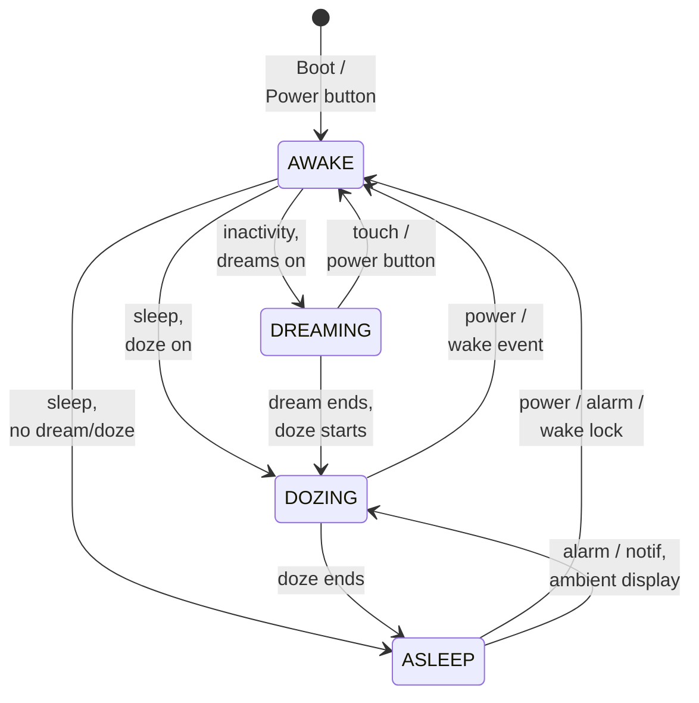

### 29.1.4 The Dirty Bits Mechanism

`PowerManagerService` uses a bitfield called `mDirty` to track which aspects of the
power state have changed and require recalculation. This is a core optimization: rather
than re-evaluating every aspect of power policy on every tiny event, only the dirty
portions are recalculated.

```java
// PowerManagerService.java, lines 201-232
// Dirty bit: mWakeLocks changed
private static final int DIRTY_WAKE_LOCKS = 1 << 0;
// Dirty bit: mWakefulness changed
private static final int DIRTY_WAKEFULNESS = 1 << 1;
// Dirty bit: user activity was poked or may have timed out
private static final int DIRTY_USER_ACTIVITY = 1 << 2;
// Dirty bit: actual display power state was updated asynchronously
private static final int DIRTY_ACTUAL_DISPLAY_POWER_STATE_UPDATED = 1 << 3;
// Dirty bit: mBootCompleted changed
private static final int DIRTY_BOOT_COMPLETED = 1 << 4;
// Dirty bit: settings changed
private static final int DIRTY_SETTINGS = 1 << 5;
// Dirty bit: mIsPowered changed
private static final int DIRTY_IS_POWERED = 1 << 6;
// Dirty bit: mStayOn changed
private static final int DIRTY_STAY_ON = 1 << 7;
// Dirty bit: battery state changed
private static final int DIRTY_BATTERY_STATE = 1 << 8;
// Dirty bit: proximity state changed
private static final int DIRTY_PROXIMITY_POSITIVE = 1 << 9;
// Dirty bit: dock state changed
private static final int DIRTY_DOCK_STATE = 1 << 10;
// Dirty bit: brightness boost changed
private static final int DIRTY_SCREEN_BRIGHTNESS_BOOST = 1 << 11;
// Dirty bit: sQuiescent changed
private static final int DIRTY_QUIESCENT = 1 << 12;
// Dirty bit: attentive timer may have timed out
private static final int DIRTY_ATTENTIVE = 1 << 14;
// Dirty bit: display group wakefulness has changed
private static final int DIRTY_DISPLAY_GROUP_WAKEFULNESS = 1 << 16;
// Dirty bit: device postured state has changed
private static final int DIRTY_POSTURED_STATE = 1 << 17;
```

When any property changes, the corresponding dirty bit is set with an OR operation,
and `updatePowerStateLocked()` is called to re-evaluate all dirty portions.

### 29.1.5 The Power State Update Loop

The core of `PowerManagerService` is the `updatePowerStateLocked()` method. It runs
in a multi-phase loop each time any power-related state changes:

```java
// PowerManagerService.java, line 2689
private void updatePowerStateLocked() {
    if (!mSystemReady || mDirty == 0 || mUpdatePowerStateInProgress) {
        return;
    }

    Trace.traceBegin(Trace.TRACE_TAG_POWER, "updatePowerState");
    mUpdatePowerStateInProgress = true;
    try {
        // Phase 0: Basic state updates.
        updateIsPoweredLocked(mDirty);
        updateStayOnLocked(mDirty);
        updateScreenBrightnessBoostLocked(mDirty);

        // Phase 1: Update wakefulness.
        // Loop because the wake lock and user activity computations are
        // influenced by changes in wakefulness.
        final long now = mClock.uptimeMillis();
        int dirtyPhase2 = 0;
        for (;;) {
            int dirtyPhase1 = mDirty;
            dirtyPhase2 |= dirtyPhase1;
            mDirty = 0;

            updateWakeLockSummaryLocked(dirtyPhase1);
            updateUserActivitySummaryLocked(now, dirtyPhase1);
            updateAttentiveStateLocked(now, dirtyPhase1);
            if (!updateWakefulnessLocked(dirtyPhase1)) {
                break;
            }
        }

        // Phase 2: Lock profiles that became inactive/not kept awake.
        updateProfilesLocked(now);

        // Phase 3: Update power state of all PowerGroups.
        final boolean powerGroupsBecameReady = updatePowerGroupsLocked(dirtyPhase2);

        // Phase 4: Update dream state (depends on power group ready signal).
        updateDreamLocked(dirtyPhase2, powerGroupsBecameReady);

        // Phase 5: Send notifications, if needed.
        finishWakefulnessChangeIfNeededLocked();

        // Phase 6: Notify screen timeout policy changes if needed.
        notifyScreenTimeoutPolicyChangesLocked();

        // Phase 7: Update suspend blocker.
        // Because we might release the last suspend blocker here, we need
        // to make sure we finished everything else first!
        updateSuspendBlockerLocked();
    } finally {
        Trace.traceEnd(Trace.TRACE_TAG_POWER);
        mUpdatePowerStateInProgress = false;
    }
}
```

The seven phases form the heartbeat of Android's power management. Phase 1 loops
internally because a wakefulness change may invalidate wake lock or user activity
summaries, requiring another iteration.

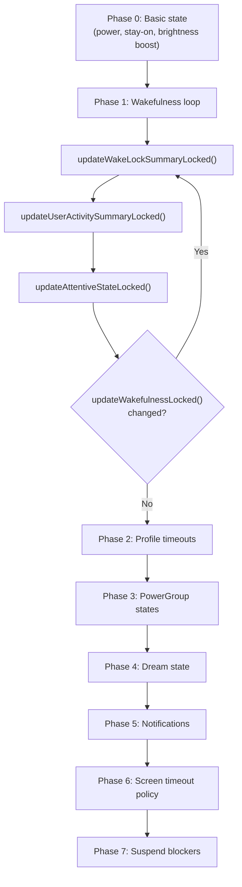

### 29.1.6 The Complete Update Flow in Detail

To see how the phases work together, let us trace a concrete scenario: the user
presses the power button to turn off the screen.

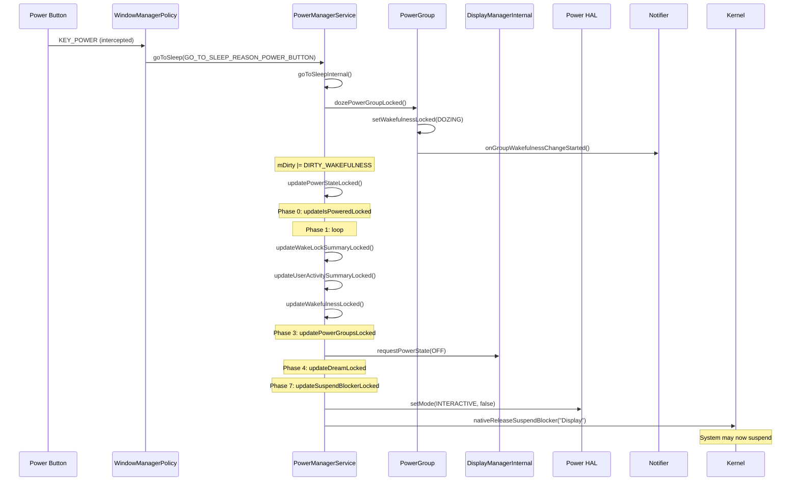

The `goToSleepInternal()` method iterates through power groups in reverse order
so that non-default groups transition before the default group:

```java
// PowerManagerService.java, line 7561
private void goToSleepInternal(IntArray groupIds, long eventTime,
        int reason, int flags) {
    // ...
    synchronized (mLock) {
        // Iterate from the end so that the wakefulness of all non-default
        // power groups is updated before default group.
        for (int i = groupIds.size() - 1; i >= 0; i--) {
            int groupId = groupIds.get(i);
            PowerGroup powerGroup = mPowerGroups.get(groupId);
            if ((flags & PowerManager.GO_TO_SLEEP_FLAG_SOFT_SLEEP) != 0) {
                if (!powerGroup.hasWakeLockKeepingScreenOnLocked()) {
                    mNotifier.showDismissibleKeyguard();
                }
                continue;
            }
            if (isNoDoze) {
                sleepPowerGroupLocked(powerGroup, eventTime, reason, uid);
            } else {
                dozePowerGroupLocked(powerGroup, eventTime, reason, uid,
                        false);
            }
        }
    }
}
```

Note the `GO_TO_SLEEP_FLAG_SOFT_SLEEP` path -- this shows a dismissible keyguard
instead of actually turning off the screen, used by certain accessibility flows.

### 29.1.7 PowerGroup Wakefulness Transitions

Each `PowerGroup` implements the actual wakefulness state transitions. The
`wakePowerGroupLocked()` method handles waking:

```java
// PowerManagerService.java, line 2315
private void wakePowerGroupLocked(final PowerGroup powerGroup, long eventTime,
        @WakeReason int reason, String details, int uid,
        String opPackageName, int opUid) {
    if (mForceSuspendActive || !mSystemReady || (powerGroup == null)
            || hasWakeLockKeepingGroupAsleep(
                    powerGroup.getWakeLockSummaryLocked())) {
        return;
    }
    powerGroup.wakeUpLocked(eventTime, reason, details, uid,
            opPackageName, opUid, LatencyTracker.getInstance(mContext));
}
```

The doze transition includes special logic for multi-display scenarios. If
the default group has adjacent display groups that are still interactive,
the default group sleeps instead of dozing:

```java
// PowerManagerService.java, line 2363
private boolean dozePowerGroupLocked(final PowerGroup powerGroup,
        long eventTime, @GoToSleepReason int reason, int uid,
        boolean allowSleepToDozeTransition) {
    if (powerGroup.getGroupId() != Display.DEFAULT_DISPLAY_GROUP) {
        return sleepPowerGroupLocked(powerGroup, eventTime, reason, uid);
    }
    // For foldable/multi-display: if adjacent groups still interactive,
    // the default group sleeps instead of dozing
    if (com.android.server.display.feature.flags.Flags.separateTimeouts()) {
        boolean shouldSleep =
            (isDefaultAdjacentGroupInteractiveLocked())
            || (powerGroup.getWakefulnessLocked() == WAKEFULNESS_ASLEEP
                && !doAnyAdjacentGroupsExistLocked());
        if (shouldSleep && powerGroup.isDefaultOrAdjacentGroup()) {
            return sleepPowerGroupLocked(powerGroup, eventTime, reason, uid);
        }
    }
    return powerGroup.dozeLocked(eventTime, uid, reason,
            allowSleepToDozeTransition);
}
```

### 29.1.8 PowerManagerService Initialization

`PowerManagerService` is constructed and registered during system server boot.
Its constructor creates the handler thread, suspend blockers, and the native
wrapper:

```java
// PowerManagerService.java, line 1216
public PowerManagerService(Context context) {
    this(context, new Injector());
}
```

The `Injector` pattern enables testing by allowing substitution of real
implementations with mocks. Key initialization steps:

1. **Handler thread** created at `THREAD_PRIORITY_DISPLAY` priority
2. Three **suspend blockers** created: Booting, WakeLocks, and Display
3. **Native init** called via JNI (`nativeInit()`), which connects to the Power HAL
4. Auto-suspend disabled and interactive mode enabled as the boot default
5. `sQuiescent` flag read from `ro.boot.quiescent` system property

```java
// PowerManagerService.java, line 1304
synchronized (mLock) {
    mBootingSuspendBlocker =
            mInjector.createSuspendBlocker(this, "PowerManagerService.Booting");
    mWakeLockSuspendBlocker =
            mInjector.createSuspendBlocker(this, "PowerManagerService.WakeLocks");
    mDisplaySuspendBlocker =
            mInjector.createSuspendBlocker(this, "PowerManagerService.Display");
    // ...
    mNativeWrapper.nativeInit(this);
    mNativeWrapper.nativeSetAutoSuspend(false);
    mNativeWrapper.nativeSetPowerMode(Mode.INTERACTIVE, true);
    mNativeWrapper.nativeSetPowerMode(Mode.DOUBLE_TAP_TO_WAKE, false);
}
```

During `systemReady()`, the service connects to `DisplayManagerInternal`,
`DreamManagerInternal`, `WindowManagerPolicy`, and `BatteryManagerInternal`.
It also creates the default `PowerGroup` for the default display group and
registers a `DisplayGroupListener` to track dynamic display additions.

---

## 29.2 PowerManagerService

### 29.2.1 Service Architecture

`PowerManagerService` extends `SystemService` and implements `Watchdog.Monitor`.
It publishes two service interfaces:

1. **Binder service** (`Context.POWER_SERVICE`) -- the `IPowerManager` AIDL interface
   accessible to applications
2. **Local service** (`PowerManagerInternal`) -- in-process API for other system services

```java
// PowerManagerService.java, line 1361
@Override
public void onStart() {
    publishBinderService(Context.POWER_SERVICE, mBinderService,
            /* allowIsolated= */ false, DUMP_FLAG_PRIORITY_CRITICAL);
    publishLocalService(PowerManagerInternal.class, mLocalService);
    Watchdog.getInstance().addMonitor(this);
    Watchdog.getInstance().addThread(mHandler);
}
```

The Watchdog registration is critical: if `PowerManagerService` deadlocks, the
Watchdog will kill and restart `system_server`.

### 29.2.2 Wake Lock Summary Bits

Internally, `PowerManagerService` maintains a summary of all active wake locks as
a bitfield. This avoids iterating the full wake lock list for each decision:

```java
// PowerManagerService.java, lines 234-244
// Summarizes the state of all active wakelocks.
static final int WAKE_LOCK_CPU = 1 << 0;
static final int WAKE_LOCK_SCREEN_BRIGHT = 1 << 1;
static final int WAKE_LOCK_SCREEN_DIM = 1 << 2;
static final int WAKE_LOCK_BUTTON_BRIGHT = 1 << 3;
static final int WAKE_LOCK_PROXIMITY_SCREEN_OFF = 1 << 4;
static final int WAKE_LOCK_STAY_AWAKE = 1 << 5;
static final int WAKE_LOCK_DOZE = 1 << 6;
static final int WAKE_LOCK_DRAW = 1 << 7;
static final int WAKE_LOCK_SCREEN_TIMEOUT_OVERRIDE = 1 << 8;
static final int WAKE_LOCK_PARTIAL_SLEEP = 1 << 9;
```

Similarly, user activity is summarized:

```java
// Summarizes the user activity state.
static final int USER_ACTIVITY_SCREEN_BRIGHT = 1 << 0;
static final int USER_ACTIVITY_SCREEN_DIM = 1 << 1;
static final int USER_ACTIVITY_SCREEN_DREAM = 1 << 2;
```

### 29.2.3 User Activity and Timeout

User activity is the mechanism that keeps the screen on. Touch events, key presses,
and other interactions call `userActivity()`, which resets the inactivity timer.
The screen timeout is determined by the `Settings.System.SCREEN_OFF_TIMEOUT` setting.

The user activity flow:

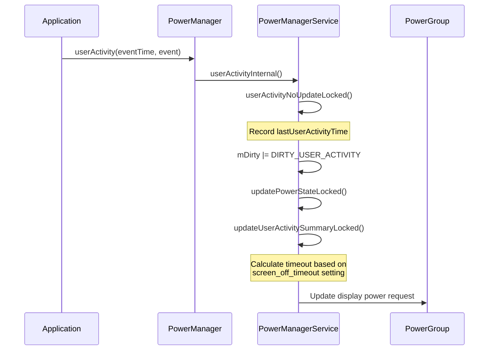

### 29.2.4 Go-to-Sleep and Wake-Up

The `goToSleep()` and `wakeUp()` methods drive the device between wakefulness states.
These can be triggered by the power button, a timeout, or programmatically.

**Go-to-Sleep reasons** (from `PowerManager`):

- `GO_TO_SLEEP_REASON_APPLICATION` -- App requested sleep
- `GO_TO_SLEEP_REASON_DEVICE_ADMIN` -- Device admin forced sleep
- `GO_TO_SLEEP_REASON_TIMEOUT` -- User inactivity timeout
- `GO_TO_SLEEP_REASON_LID_SWITCH` -- Laptop lid closed
- `GO_TO_SLEEP_REASON_POWER_BUTTON` -- User pressed power button
- `GO_TO_SLEEP_REASON_HDMI` -- HDMI removed
- `GO_TO_SLEEP_REASON_SLEEP_BUTTON` -- Dedicated sleep button
- `GO_TO_SLEEP_REASON_ACCESSIBILITY` -- Accessibility action
- `GO_TO_SLEEP_REASON_FORCE_SUSPEND` -- Forced suspend
- `GO_TO_SLEEP_REASON_DISPLAY_GROUPS_TURNED_OFF` -- All display groups off
- `GO_TO_SLEEP_REASON_DISPLAY_GROUP_REMOVED` -- Display group removed
- `GO_TO_SLEEP_REASON_QUIESCENT` -- Quiescent boot mode

**Wake-up reasons** (from `PowerManager`):

- `WAKE_REASON_POWER_BUTTON` -- Power button press
- `WAKE_REASON_APPLICATION` -- App request
- `WAKE_REASON_PLUGGED_IN` -- Charger connected
- `WAKE_REASON_GESTURE` -- Gesture detected
- `WAKE_REASON_WAKE_KEY` -- Wake key pressed
- `WAKE_REASON_WAKE_MOTION` -- Motion detected
- `WAKE_REASON_DREAM_FINISHED` -- Dream completed
- `WAKE_REASON_DISPLAY_GROUP_ADDED` -- New display connected
- `WAKE_REASON_DISPLAY_GROUP_TURNED_ON` -- Display turned on

### 29.2.5 Power Groups

Starting in Android 12, `PowerManagerService` manages power state per-display-group
through `PowerGroup` objects. Each `DisplayGroup` (a set of displays that share power
state) has a corresponding `PowerGroup`.

```java
// PowerGroup.java, line 61
public class PowerGroup {
    private final int mGroupId;
    private int mWakefulness;
    private int mWakeLockSummary;
    private int mUserActivitySummary;
    private long mLastWakeTime;
    private long mLastSleepTime;
    final DisplayPowerRequest mDisplayPowerRequest = new DisplayPowerRequest();
    // ...
}
```

The default display group always exists. Additional groups are created dynamically
when external or virtual displays are connected. Non-default groups can be flagged
as "default-group-adjacent," meaning they share power-button and lock behavior
with the default group:

```java
// PowerManagerService.java, line 872
private boolean isDefaultGroupAdjacent(int groupId) {
    long flags = mDisplayManagerInternal.getDisplayGroupFlags(groupId);
    return (flags & DisplayGroup.FLAG_DEFAULT_GROUP_ADJACENT) != 0;
}
```

The `PowerGroupWakefulnessChangeListener` handles wakefulness transitions:

```java
// PowerManagerService.java, line 729
private final class PowerGroupWakefulnessChangeListener implements
        PowerGroup.PowerGroupListener {
    @Override
    public void onWakefulnessChangedLocked(int groupId, int wakefulness,
            long eventTime, int reason, int uid, int opUid,
            String opPackageName, String details) {
        mWakefulnessChanging = true;
        mDirty |= DIRTY_WAKEFULNESS;
        // ...
        mDirty |= DIRTY_DISPLAY_GROUP_WAKEFULNESS;
        mNotifier.onGroupWakefulnessChangeStarted(groupId, wakefulness,
                reason, eventTime);
        updateGlobalWakefulnessLocked(eventTime, reason, uid, opUid,
                opPackageName, details);
        updatePowerStateLocked();
    }
}
```

### 29.2.6 Display Power Integration

`PowerManagerService` drives the display power state through
`DisplayManagerInternal`. Each `PowerGroup` maintains a `DisplayPowerRequest` that
specifies the desired display state (ON, OFF, DOZE, etc.) and brightness level.

The display power request is computed during `updatePowerGroupsLocked()` (Phase 3
of the power state update) and applied via:

```
mDisplayManagerInternal.requestPowerState(groupId, mDisplayPowerRequest)
```

The display power controller asynchronously applies the state and notifies back
via `mDisplayPowerCallbacks`, which sets `DIRTY_ACTUAL_DISPLAY_POWER_STATE_UPDATED`
to trigger another round of power state evaluation.

### 29.2.7 The Notifier

The `Notifier` class handles broadcasting power state changes to the rest of the
system. It sends broadcasts like:

- `ACTION_SCREEN_ON` / `ACTION_SCREEN_OFF`
- `ACTION_DREAMING_STARTED` / `ACTION_DREAMING_STOPPED`
- `ACTION_DEVICE_IDLE_MODE_CHANGED`

The Notifier runs on the main looper (not the power manager handler thread) to
avoid interference with critical power management timing:

```java
// PowerManagerService.java, line 1420
mNotifier = mInjector.createNotifier(Looper.getMainLooper(), mContext,
        mBatteryStats,
        mInjector.createSuspendBlocker(this,
                "PowerManagerService.Broadcasts"),
        mPolicy, mFaceDownDetector, mScreenUndimDetector,
        BackgroundThread.getExecutor(), mFeatureFlags);
```

### 29.2.8 Message Handling

`PowerManagerService` uses message-based processing for deferred operations:

```java
// PowerManagerService.java, lines 182-199
private static final int MSG_USER_ACTIVITY_TIMEOUT = 1;
private static final int MSG_SANDMAN = 2;
private static final int MSG_SCREEN_BRIGHTNESS_BOOST_TIMEOUT = 3;
private static final int MSG_CHECK_FOR_LONG_WAKELOCKS = 4;
private static final int MSG_ATTENTIVE_TIMEOUT = 5;
private static final int MSG_RELEASE_ALL_OVERRIDE_WAKE_LOCKS = 6;
private static final int MSG_PROCESS_FROZEN_STATE_CHANGED = 7;
private static final int MSG_FORCE_DISABLE_WAKELOCKS = 8;
```

The `MSG_SANDMAN` message is particularly interesting -- it is the mechanism that
triggers dream and doze transitions. When the user activity timer expires, the
system schedules `MSG_SANDMAN`, which eventually calls into `DreamManagerService`
to start or stop the screen saver / ambient display.

### 29.2.9 Settings Observers

`PowerManagerService` registers content observers for many system settings that
affect power behavior:

- `SCREENSAVER_ENABLED` -- Whether dreams are enabled
- `SCREENSAVER_ACTIVATE_ON_SLEEP` -- Start dream when going to sleep
- `SCREENSAVER_ACTIVATE_ON_DOCK` -- Start dream when docked
- `SCREEN_OFF_TIMEOUT` -- Screen timeout duration
- `SLEEP_TIMEOUT` -- Additional sleep timeout
- `ATTENTIVE_TIMEOUT` -- Attentive (inattentive sleep warning) timeout
- `STAY_ON_WHILE_PLUGGED_IN` -- Keep screen on while charging
- `DOZE_ALWAYS_ON` -- Always-on display
- `DOUBLE_TAP_TO_WAKE` -- Double-tap gesture
- `THEATER_MODE_ON` -- Theater mode

### 29.2.10 Battery Saver Integration

Battery Saver mode is tightly integrated with `PowerManagerService` through the
battery saver subsystem:

```
frameworks/base/services/core/java/com/android/server/power/batterysaver/
    BatterySaverController.java
    BatterySaverPolicy.java
    BatterySaverStateMachine.java
    BatterySavingStats.java
```

The `BatterySaverStateMachine` is conditionally created based on device support:

```java
// PowerManagerService.java, line 1247
mBatterySaverSupported = mContext.getResources().getBoolean(
        com.android.internal.R.bool.config_batterySaverSupported);
mBatterySaverStateMachine =
        mBatterySaverSupported
            ? mInjector.createBatterySaverStateMachine(mLock, mContext)
            : null;
```

`BatterySaverPolicy` defines which restrictions are applied when battery saver
is active:

```java
// BatterySaverPolicy.java
static final String KEY_LOCATION_MODE = "location_mode";
static final String KEY_DISABLE_VIBRATION = "disable_vibration";
static final String KEY_DISABLE_ANIMATION = "disable_animation";
static final String KEY_SOUNDTRIGGER_MODE = "soundtrigger_mode";
static final String KEY_ENABLE_FIREWALL = "enable_firewall";
static final String KEY_ENABLE_BRIGHTNESS_ADJUSTMENT =
        "enable_brightness_adjustment";
static final String KEY_ENABLE_DATASAVER = "enable_datasaver";
```

When battery saver activates, `PowerManagerService` notifies the Power HAL:

```java
nativeSetPowerMode(Mode.LOW_POWER, true);
```

This allows the vendor HAL to reduce CPU frequencies, disable big cores, lower
GPU clocks, and take other power-saving actions.

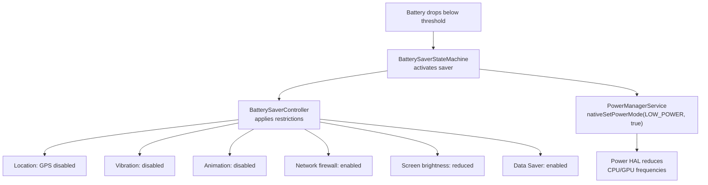

### 29.2.11 Quiescent Mode

Quiescent mode is a special boot mode where the screen stays off after boot.
This is used for headless devices or during factory testing:

```java
// PowerManagerService.java, line 263
private static final String SYSTEM_PROPERTY_QUIESCENT = "ro.boot.quiescent";

// Constructor:
sQuiescent = mSystemProperties.get(SYSTEM_PROPERTY_QUIESCENT, "0").equals("1");

// After boot completes:
if (sQuiescent) {
    sleepPowerGroupLocked(
            mPowerGroups.get(Display.DEFAULT_DISPLAY_GROUP),
            mClock.uptimeMillis(),
            PowerManager.GO_TO_SLEEP_REASON_QUIESCENT,
            Process.SYSTEM_UID);
}
```

### 29.2.12 Face-Down Detection

`PowerManagerService` includes a `FaceDownDetector` that uses the accelerometer
to detect when the device is placed face-down. When detected, the screen
timeout is shortened:

```java
// PowerManagerService.java, line 1333
private void onFlip(boolean isFaceDown) {
    synchronized (mLock) {
        mIsFaceDown = isFaceDown;
        if (isFaceDown) {
            final long currentTime = mClock.uptimeMillis();
            mLastFlipTime = currentTime;
            // Trigger user activity to start the shorter timeout
            userActivityInternal(Display.DEFAULT_DISPLAY, currentTime,
                    PowerManager.USER_ACTIVITY_EVENT_FACE_DOWN,
                    PowerManager.USER_ACTIVITY_FLAG_NO_CHANGE_LIGHTS,
                    Process.SYSTEM_UID);
        }
    }
    if (isFaceDown) {
        mFaceDownDetector.setMillisSaved(millisUntilNormalTimeout);
    }
}
```

### 29.2.13 Attention Detection

The `AttentionDetector` uses the device's attention detection service (often
camera-based) to determine if the user is looking at the screen. If the user
is attentive, the screen timeout is extended:

```java
// PowerManagerService.java, line 1243
mAttentionDetector = new AttentionDetector(this::onUserAttention, mLock);
```

This prevents the annoying case where the screen turns off while the user is
reading without touching the screen.

### 29.2.14 Screen Undim Detection

`ScreenUndimDetector` tracks when the screen undims due to user interaction during
the dim period before screen off. If the user frequently undims, the system can
learn and extend the timeout.

### 29.2.15 Wireless Charger Detection

The `WirelessChargerDetector` uses sensors to confirm wireless charging dock
placement. This prevents false wake-ups when the device is removed from the
charger, and enables proper wake behavior when docked:

```java
// PowerManagerService.java, line 1439
mWirelessChargerDetector = mInjector.createWirelessChargerDetector(
        sensorManager,
        mInjector.createSuspendBlocker(this,
                "PowerManagerService.WirelessChargerDetector"),
        mHandler);
```

---

## 29.3 WakeLocks

### 29.3.1 Wake Lock Levels

Wake locks are the fundamental mechanism applications use to keep the device
(or parts of it) from sleeping. Each wake lock has a level and optional flags.

The wake lock levels are defined in `android.os.PowerManager`:

```java
// frameworks/base/core/java/android/os/PowerManager.java
public static final int PARTIAL_WAKE_LOCK = 0x00000001;
public static final int SCREEN_DIM_WAKE_LOCK = 0x00000006;      // @Deprecated
public static final int SCREEN_BRIGHT_WAKE_LOCK = 0x0000000a;   // @Deprecated
public static final int FULL_WAKE_LOCK = 0x0000001a;            // @Deprecated
public static final int PROXIMITY_SCREEN_OFF_WAKE_LOCK = 0x00000020;
public static final int DOZE_WAKE_LOCK = 0x00000040;            // @SystemApi
public static final int DRAW_WAKE_LOCK = 0x00000080;            // @SystemApi
```

| Level | CPU | Screen | Keyboard | Notes |
|-------|-----|--------|----------|-------|
| `PARTIAL_WAKE_LOCK` | On | -- | -- | Most common. CPU stays on, screen may turn off. |
| `SCREEN_DIM_WAKE_LOCK` | On | Dim | -- | Deprecated. Use `FLAG_KEEP_SCREEN_ON`. |
| `SCREEN_BRIGHT_WAKE_LOCK` | On | Bright | -- | Deprecated. |
| `FULL_WAKE_LOCK` | On | Bright | Bright | Deprecated. |
| `PROXIMITY_SCREEN_OFF_WAKE_LOCK` | On | Off/On | -- | Screen off when face is near sensor. |
| `DOZE_WAKE_LOCK` | On | -- | -- | System-only. Keeps doze alive. |
| `DRAW_WAKE_LOCK` | On | -- | -- | System-only. Allows drawing during doze. |

### 29.3.2 Wake Lock Flags

Optional flags modify wake lock behavior:

```java
// PowerManager.java
public static final int ACQUIRE_CAUSES_WAKEUP = 0x10000000;
public static final int ON_AFTER_RELEASE = 0x20000000;
```

- **`ACQUIRE_CAUSES_WAKEUP`** -- Acquiring the wake lock also turns on the screen.
  Apps targeting Android V+ must hold the `TURN_SCREEN_ON` permission.
- **`ON_AFTER_RELEASE`** -- When the wake lock is released, poke user activity to
  keep the screen on a bit longer.

### 29.3.3 The WakeLock Inner Class

Inside `PowerManagerService`, each acquired wake lock is tracked by a `WakeLock`
object:

```java
// PowerManagerService.java, line 5704
/* package */ final class WakeLock implements IBinder.DeathRecipient,
        IBinder.FrozenStateChangeCallback {
    public final IBinder mLock;
    public final int mDisplayId;
    public int mFlags;
    public String mTag;
    public final String mPackageName;
    public WorkSource mWorkSource;
    public String mHistoryTag;
    public final int mOwnerUid;
    public final int mOwnerPid;
    public final UidState mUidState;
    public long mAcquireTime;
    public boolean mNotifiedAcquired;
    public boolean mNotifiedLong;
    public boolean mDisabled;
    private boolean mIsFrozen;
    public IWakeLockCallback mCallback;
    // ...
}
```

The `WakeLock` implements `IBinder.DeathRecipient` -- if the owning process dies,
the wake lock is automatically released via `binderDied()`:

```java
@Override
public void binderDied() {
    unlinkToDeath();
    PowerManagerService.this.handleWakeLockDeath(this);
}
```

It also implements `IBinder.FrozenStateChangeCallback`. When a process is frozen
by the system (cached), its wake locks can be automatically disabled:

```java
@Override
public void onFrozenStateChanged(IBinder who, int state) {
    if (mFeatureFlags.isDisableFrozenProcessWakelocksEnabled()) {
        Message msg = mHandler.obtainMessage(MSG_PROCESS_FROZEN_STATE_CHANGED,
                state, /* arg2= */ 0, mLock);
        mHandler.sendMessageAtTime(msg, mClock.uptimeMillis());
    }
}
```

### 29.3.4 Acquiring Wake Locks

The acquisition flow:

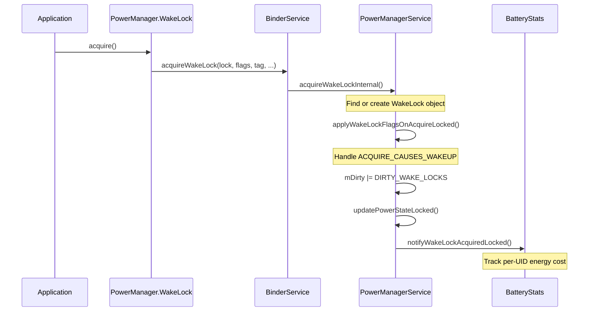

The internal acquisition in `PowerManagerService`:

```java
// PowerManagerService.java, line 1676
private void acquireWakeLockInternal(IBinder lock, int displayId, int flags,
        String tag, String packageName, WorkSource ws, String historyTag,
        int uid, int pid, @Nullable IWakeLockCallback callback) {
    synchronized (mLock) {
        // ...
        WakeLock wakeLock;
        int index = findWakeLockIndexLocked(lock);
        boolean notifyAcquire;
        if (index >= 0) {
            wakeLock = mWakeLocks.get(index);
            if (!wakeLock.hasSameProperties(flags, tag, ws, uid, pid, callback)) {
                notifyWakeLockChangingLocked(wakeLock, flags, tag, packageName,
                        uid, pid, ws, historyTag, callback);
                wakeLock.updateProperties(flags, tag, packageName, ws,
                        historyTag, uid, pid, callback);
            }
            notifyAcquire = false;
        } else {
            UidState state = mUidState.get(uid);
            if (state == null) {
                state = new UidState(uid);
                state.mProcState = ActivityManager.PROCESS_STATE_NONEXISTENT;
                mUidState.put(uid, state);
            }
            state.mNumWakeLocks++;
            wakeLock = new WakeLock(lock, displayId, flags, tag, packageName,
                    ws, historyTag, uid, pid, state, callback);
            mWakeLocks.add(wakeLock);
            setWakeLockDisabledStateLocked(wakeLock);
            notifyAcquire = true;
        }

        applyWakeLockFlagsOnAcquireLocked(wakeLock);
        addFrozenStateChangeCallbacksLocked(wakeLock);
        mDirty |= DIRTY_WAKE_LOCKS;
        updatePowerStateLocked();
        if (notifyAcquire) {
            notifyWakeLockAcquiredLocked(wakeLock);
        }
    }
}
```

Key points:

- Wake locks are identified by their `IBinder` token, not by tag
- If a wake lock with the same token already exists, its properties are updated
- `UidState` tracks per-UID wake lock counts
- `setWakeLockDisabledStateLocked()` may disable the lock if the UID is in
  device idle whitelist, low power standby, or the process is cached

### 29.3.5 Wake Lock Disabling

`PowerManagerService` can disable wake locks in several situations:

1. **Device Idle Mode**: When the device is in deep or light doze, only wake locks
   from whitelisted apps are honored:
   ```java
   int[] mDeviceIdleWhitelist = new int[0];
   int[] mDeviceIdleTempWhitelist = new int[0];
   ```

2. **Low Power Standby**: A separate allowlist controls which UIDs can hold wake
   locks during low power standby:
   ```java
   int[] mLowPowerStandbyAllowlist = new int[0];
   ```

3. **Cached Processes**: When `NO_CACHED_WAKE_LOCKS` is true (the default), wake
   locks from processes in cached state are disabled.

4. **Frozen Processes**: Starting with the `isDisableFrozenProcessWakelocksEnabled`
   feature flag, wake locks from frozen (cgroup-frozen) processes are disabled.

### 29.3.6 Long Wake Lock Detection

`PowerManagerService` periodically checks for wake locks held longer than expected:

```java
// PowerManagerService.java, line 257
static final long MIN_LONG_WAKE_CHECK_INTERVAL = 60*1000;
```

A `MSG_CHECK_FOR_LONG_WAKELOCKS` message is scheduled, and when it fires, any
wake lock held for more than the threshold is flagged via `mNotifiedLong = true`
and reported to battery stats.

### 29.3.7 Wake Lock Log

The `WakeLockLog` provides a compressed, in-memory ring buffer for wake lock
events. It uses several optimizations to minimize memory:

```java
// WakeLockLog.java, line 40
// The main log is basically just a sequence of the two wake lock events
// (ACQUIRE and RELEASE). Each entry in the log stores:
//   event type (RELEASE | ACQUIRE),
//   time (64-bit from System.currentTimeMillis()),
//   wake-lock ID {ownerUID (int) + tag (String)},
//   wake-lock flags
```

Optimizations include:

- **Relative time**: 8-bit deltas instead of 64-bit timestamps
- **Tag database**: 7-bit indexes into a tag table instead of full strings
- **TIME_RESET events**: When the delta is too large for 8 bits

### 29.3.8 Screen Lock Classification

`PowerManagerService` classifies wake locks as "screen locks" if they affect
the display:

```java
// PowerManagerService.java, line 1748
public static boolean isScreenLock(int flags) {
    switch (flags & PowerManager.WAKE_LOCK_LEVEL_MASK) {
        case PowerManager.FULL_WAKE_LOCK:
        case PowerManager.SCREEN_BRIGHT_WAKE_LOCK:
        case PowerManager.SCREEN_DIM_WAKE_LOCK:
            return true;
    }
    return false;
}
```

Screen locks prevent the display from turning off, while `PARTIAL_WAKE_LOCK`
only prevents the CPU from sleeping.

### 29.3.9 Battery Impact Tracking

Every wake lock acquire and release is reported to `BatteryStatsService`, which
attributes the energy cost of keeping the CPU alive to the holding UID. This
data is visible in the battery usage UI and through `dumpsys batterystats`.

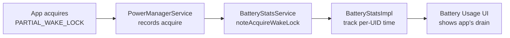

### 29.3.10 WorkSource Attribution

Wake locks support `WorkSource` attribution, which allows a system service
to attribute a wake lock to a different UID than the one actually holding it.
This is critical for accurate battery attribution:

```java
// WakeLock inner class fields
public WorkSource mWorkSource;
```

For example, when `SyncManager` executes a sync adapter on behalf of an app,
it acquires a wake lock with the app's UID as the `WorkSource`. This ensures
the battery cost is charged to the app, not to the system.

`WorkSource` also supports `WorkChain`, which models chains of work attribution:

```java
// PowerManagerService.java
private static WorkChain getFirstNonEmptyWorkChain(WorkSource workSource) {
    if (workSource.getWorkChains() == null) {
        return null;
    }
    for (WorkChain workChain : workSource.getWorkChains()) {
        if (workChain.getSize() > 0) {
            return workChain;
        }
    }
    return null;
}
```

### 29.3.11 Wake Lock Best Practices

From the framework implementation, several best practices emerge:

1. **Always use PARTIAL_WAKE_LOCK**: The screen-level wake locks are deprecated.
   Use `FLAG_KEEP_SCREEN_ON` on your window instead.

2. **Always release in a finally block**: Since wake locks track the owning
   binder, a leaked wake lock will be released on process death, but the battery
   drain until then can be significant.

3. **Use timeouts**: `WakeLock.acquire(timeout)` automatically releases after
   the specified duration, providing a safety net.

4. **Use WorkSource for attribution**: If your system service does work on behalf
   of an app, set the WorkSource to the app's UID.

5. **Minimize hold time**: Acquire late, release early. The longer a wake lock
   is held, the more battery it consumes.

### 29.3.12 Debugging Wake Locks

The `dumpsys power` command provides comprehensive wake lock information:

```
Wake Locks: size=3
  PARTIAL_WAKE_LOCK    'AlarmManager' pkg=android  uid=1000  pid=1234
    flags=0x0  acq=2024-01-15 10:30:00.000 (age=5s)
  PARTIAL_WAKE_LOCK    '*sync*/com.google...' pkg=com.google...  uid=10045
    flags=0x0  acq=2024-01-15 10:30:02.000 (age=3s)  ws=WorkSource{10045}
  PROXIMITY_SCREEN_OFF 'ProximityLock'  pkg=com.android.phone  uid=1001
    flags=0x0  acq=2024-01-15 10:29:55.000 (age=10s)
```

The wake lock summary shows the current combined state:

```
mWakeLockSummary=0x1  (WAKE_LOCK_CPU)
```

And the suspend blocker state:

```
Suspend Blockers: size=3
  PowerManagerService.Booting: ref count=0
  PowerManagerService.WakeLocks: ref count=1
  PowerManagerService.Display: ref count=0
```

### 29.3.13 UidState Tracking

`PowerManagerService` maintains per-UID state for efficient wake lock management:

```java
// PowerManagerService.java
private final SparseArray<UidState> mUidState = new SparseArray<>();
```

Each `UidState` tracks:

- Number of wake locks held by the UID
- Process state (foreground, background, cached)
- Whether the UID is active or idle

When a UID transitions to cached state and `NO_CACHED_WAKE_LOCKS` is enabled
(the default), all its wake locks are disabled. This prevents cached apps from
draining battery through orphaned wake locks.

### 29.3.14 The Constants Class

`PowerManagerService` contains a `Constants` inner class that reads configuration
from `Settings.Global.POWER_MANAGER_CONSTANTS`:

```java
// PowerManagerService.java, line 928
private final class Constants extends ContentObserver {
    private static final String KEY_NO_CACHED_WAKE_LOCKS = "no_cached_wake_locks";
    private static final boolean DEFAULT_NO_CACHED_WAKE_LOCKS = true;
    public boolean NO_CACHED_WAKE_LOCKS = DEFAULT_NO_CACHED_WAKE_LOCKS;
    // ...
}
```

This allows runtime tuning of power management behavior without code changes.

---

## 29.4 Doze Mode

### 29.4.1 Overview

Doze mode (known internally as "Device Idle") is Android's most aggressive
battery-saving mechanism for idle devices. It restricts network access, defers
jobs, alarms, and sync operations, and disables most wake locks.

The `DeviceIdleController` manages two independent state machines:

- **Light Doze** -- Entered relatively quickly, with lighter restrictions
- **Deep Doze** -- Entered after prolonged inactivity with motion detection

Source file:
`frameworks/base/apex/jobscheduler/service/java/com/android/server/DeviceIdleController.java`

### 29.4.2 Deep Doze State Machine

The deep doze state machine has the following states:

```java
// DeviceIdleController.java, lines 412-438
static final int STATE_ACTIVE = 0;
static final int STATE_INACTIVE = 1;
static final int STATE_IDLE_PENDING = 2;
static final int STATE_SENSING = 3;
static final int STATE_LOCATING = 4;
static final int STATE_IDLE = 5;
static final int STATE_IDLE_MAINTENANCE = 6;
static final int STATE_QUICK_DOZE_DELAY = 7;
```

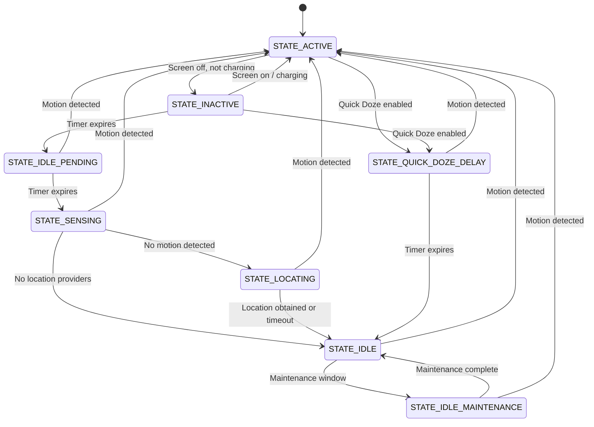

The progression is:

1. **ACTIVE**: Device is being used (screen on, charging, or motion)
2. **INACTIVE**: Screen turned off and not charging. Timer starts.
3. **IDLE_PENDING**: Initial waiting period expires. Significant motion sensor enabled.
4. **SENSING**: Actively monitoring for any motion.
5. **LOCATING**: Getting a location fix while continuing motion monitoring.
6. **IDLE**: Deep doze engaged. Restrictions applied. Maintenance windows periodic.
7. **IDLE_MAINTENANCE**: Brief maintenance window for deferred work.

Each time the device enters `STATE_IDLE`, the duration before the next
maintenance window doubles (exponential backoff), up to a configured maximum.

### 29.4.3 Light Doze State Machine

Light doze is simpler and faster to enter:

```java
// DeviceIdleController.java, lines 468-485
static final int LIGHT_STATE_ACTIVE = 0;
static final int LIGHT_STATE_INACTIVE = 1;
static final int LIGHT_STATE_IDLE = 4;
static final int LIGHT_STATE_WAITING_FOR_NETWORK = 5;
static final int LIGHT_STATE_IDLE_MAINTENANCE = 6;
static final int LIGHT_STATE_OVERRIDE = 7;
```

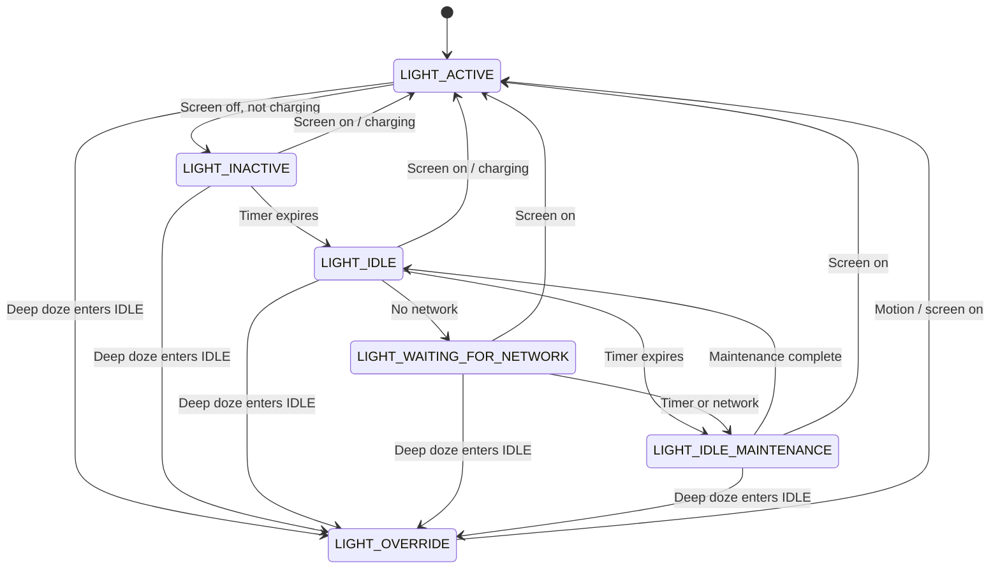

When deep doze enters `STATE_IDLE`, light doze transitions to `LIGHT_STATE_OVERRIDE`
and stops managing its own state -- deep doze takes full control.

### 29.4.4 Maintenance Windows

During `STATE_IDLE`, the device periodically enters maintenance windows
(`STATE_IDLE_MAINTENANCE` or `LIGHT_STATE_IDLE_MAINTENANCE`) where deferred work
can execute:

- Pending alarms fire
- Deferred sync adapters run
- Deferred JobScheduler jobs execute
- Network access is briefly restored

The maintenance window budget is tracked:

```java
// DeviceIdleController.java
@GuardedBy("this")
private long mCurLightIdleBudget;

@GuardedBy("this")
private long mMaintenanceStartTime;
```

The duration between maintenance windows increases with each cycle, up to
a configured maximum. This prevents the device from spending too much time
in maintenance as it sits idle longer.

### 29.4.5 Deep Doze Step Implementation

The `stepIdleStateLocked()` method is the core of the deep doze state machine.
It advances the state one step at a time:

```java
// DeviceIdleController.java, line 3894
void stepIdleStateLocked(String reason) {
    // Safety: abort if in emergency call
    if (mEmergencyCallListener.isEmergencyCallActive()) {
        becomeActiveLocked("emergency", Process.myUid());
        return;
    }

    // Don't go idle if an alarm is about to fire
    if (isUpcomingAlarmClock()) {
        mActiveReason = ACTIVE_REASON_ALARM;
        becomeActiveLocked("alarm", Process.myUid());
        becomeInactiveIfAppropriateLocked();
        return;
    }

    // Check for blocking constraints
    if (mNumBlockingConstraints != 0 && !mForceIdle) {
        return;
    }

    switch (mState) {
        case STATE_INACTIVE:
            startMonitoringMotionLocked();
            scheduleAlarmLocked(mConstants.IDLE_AFTER_INACTIVE_TIMEOUT);
            moveToStateLocked(STATE_IDLE_PENDING, reason);
            break;

        case STATE_IDLE_PENDING:
            cancelLocatingLocked();
            mLocated = false;
            moveToStateLocked(STATE_SENSING, reason);
            if (mUseMotionSensor && mAnyMotionDetector.hasSensor()) {
                scheduleSensingTimeoutAlarmLocked(mConstants.SENSING_TIMEOUT);
                mNotMoving = false;
                mAnyMotionDetector.checkForAnyMotion();
                break;
            }
            // Fall through if no motion sensor

        case STATE_SENSING:
            cancelSensingTimeoutAlarmLocked();
            moveToStateLocked(STATE_LOCATING, reason);
            if (mIsLocationPrefetchEnabled) {
                scheduleAlarmLocked(mConstants.LOCATING_TIMEOUT);
                // Request location from fused and GPS providers
                // ...
                if (mLocating) break;
            }
            // Fall through if no location providers

        case STATE_LOCATING:
            cancelAlarmLocked();
            cancelLocatingLocked();
            mAnyMotionDetector.stop();
            // Fall through

        case STATE_QUICK_DOZE_DELAY:
            mNextIdlePendingDelay = mConstants.IDLE_PENDING_TIMEOUT;
            mNextIdleDelay = mConstants.IDLE_TIMEOUT;
            // Fall through

        case STATE_IDLE_MAINTENANCE:
            moveToStateLocked(STATE_IDLE, reason);
            scheduleAlarmLocked(mNextIdleDelay);
            // Exponential backoff for next idle period
            mNextIdleDelay = (long)(mNextIdleDelay * mConstants.IDLE_FACTOR);
            mNextIdleDelay = Math.min(mNextIdleDelay,
                    mConstants.MAX_IDLE_TIMEOUT);
            // Override light doze
            if (mLightState != LIGHT_STATE_OVERRIDE) {
                moveToLightStateLocked(LIGHT_STATE_OVERRIDE, "deep");
                cancelLightAlarmLocked();
            }
            mGoingIdleWakeLock.acquire();
            mHandler.sendEmptyMessage(MSG_REPORT_IDLE_ON);
            break;

        case STATE_IDLE:
            // Maintenance window: allow deferred work
            mActiveIdleOpCount = 1;
            mActiveIdleWakeLock.acquire();
            moveToStateLocked(STATE_IDLE_MAINTENANCE, reason);
            scheduleAlarmLocked(mNextIdlePendingDelay);
            // ...
            break;
    }
}
```

The exponential backoff is a key design choice. After entering `STATE_IDLE`,
the delay before the next maintenance window increases by `IDLE_FACTOR` (default
2.0), up to `MAX_IDLE_TIMEOUT`. This means the first idle period might be 60
minutes, the next 120, then 240, up to the configured maximum.

### 29.4.5.1 Doze Timing Constants

The `DeviceIdleController.Constants` class defines the timing parameters. These
can be overridden via `DeviceConfig` or `Settings.Global`:

| Constant | Default | Description |
|----------|---------|-------------|
| `INACTIVE_TIMEOUT` | 30 min | Time from ACTIVE to INACTIVE |
| `SENSING_TIMEOUT` | 4 min | Max time in SENSING state |
| `LOCATING_TIMEOUT` | 30 sec | Max time getting a location fix |
| `IDLE_AFTER_INACTIVE_TIMEOUT` | 30 min | Time in IDLE_PENDING |
| `IDLE_PENDING_TIMEOUT` | 5 min | Maintenance window duration |
| `IDLE_TIMEOUT` | 60 min | First idle period duration |
| `MAX_IDLE_TIMEOUT` | 6 hours | Maximum idle period duration |
| `IDLE_FACTOR` | 2.0 | Exponential backoff multiplier |
| `LIGHT_IDLE_TIMEOUT` | 5 min | First light idle period |
| `LIGHT_MAX_IDLE_TIMEOUT` | 15 min | Maximum light idle period |
| `LIGHT_IDLE_MAINTENANCE_MIN_BUDGET` | 1 min | Min light maintenance window |
| `LIGHT_IDLE_MAINTENANCE_MAX_BUDGET` | 5 min | Max light maintenance window |

### 29.4.6 Active Reasons

The device transitions back to `STATE_ACTIVE` for specific reasons:

```java
// DeviceIdleController.java, lines 440-450
private static final int ACTIVE_REASON_UNKNOWN = 0;
private static final int ACTIVE_REASON_MOTION = 1;
private static final int ACTIVE_REASON_SCREEN = 2;
private static final int ACTIVE_REASON_CHARGING = 3;
private static final int ACTIVE_REASON_UNLOCKED = 4;
private static final int ACTIVE_REASON_FROM_BINDER_CALL = 5;
private static final int ACTIVE_REASON_FORCED = 6;
private static final int ACTIVE_REASON_ALARM = 7;
private static final int ACTIVE_REASON_EMERGENCY_CALL = 8;
private static final int ACTIVE_REASON_MODE_MANAGER = 9;
private static final int ACTIVE_REASON_ONBODY = 10;
```

### 29.4.7 Power Save Whitelist / Allowlist

`DeviceIdleController` maintains multiple allowlist tiers:

```java
// System allowlist: apps exempt from power save (except idle modes)
private final ArrayMap<String, Integer> mPowerSaveWhitelistAppsExceptIdle;

// System allowlist: apps exempt from ALL power save restrictions
private final ArrayMap<String, Integer> mPowerSaveWhitelistApps;

// User-configured allowlist
private final ArrayMap<String, Integer> mPowerSaveWhitelistUserApps;

// Temporary allowlist (e.g., high-priority FCM messages)
final SparseArray<Pair<MutableLong, String>> mTempWhitelistAppIdEndTimes;
```

The allowlists are resolved to app ID arrays that are shared with
`PowerManagerService`, `NetworkPolicyManager`, `AlarmManager`, and
`JobSchedulerService`:

```java
int[] mPowerSaveWhitelistAllAppIdArray = new int[0];
int[] mPowerSaveWhitelistExceptIdleAppIdArray = new int[0];
int[] mTempWhitelistAppIdArray = new int[0];
```

### 29.4.8 Restrictions Applied During Doze

When deep doze is active (`STATE_IDLE`):

| Restriction | Effect |
|-------------|--------|
| Network | Blocked for non-whitelisted apps |
| Wake locks | Disabled for non-whitelisted apps |
| Alarms | Deferred until maintenance window (except exact alarms from whitelisted apps) |
| Jobs | Deferred until maintenance window |
| Sync adapters | Deferred until maintenance window |
| GPS | Blocked |
| Wi-Fi scans | Blocked |

Light doze applies a subset of these restrictions, primarily affecting network
and sync.

### 29.4.9 Doze Integration with PowerManagerService

`DeviceIdleController` communicates doze state to `PowerManagerService` via the
internal `PowerManagerInternal` interface. `PowerManagerService` tracks both
deep and light idle modes:

```java
// PowerManagerService.java, lines 662-667
// True if we are currently in device idle mode.
@GuardedBy("mLock")
private boolean mDeviceIdleMode;

// True if we are currently in light device idle mode.
@GuardedBy("mLock")
private boolean mLightDeviceIdleMode;
```

When doze activates, `PowerManagerService` calls
`nativeSetPowerMode(Mode.DEVICE_IDLE, true)` to inform the Power HAL, which can
reduce clock frequencies and take other power-saving actions.

### 29.4.10 Constraint System

`DeviceIdleController` supports a constraint system that allows other parts of
the system to prevent doze state transitions. This is used by the TV implementation
and other form factors:

```java
// DeviceIdleController.java
private final ArrayMap<IDeviceIdleConstraint, DeviceIdleConstraintTracker>
        mConstraints = new ArrayMap<>();
private ConstraintController mConstraintController;
private int mNumBlockingConstraints = 0;
```

When a constraint is active (`mNumBlockingConstraints > 0`) and `mForceIdle` is
false, `stepIdleStateLocked()` returns without advancing the state machine.

The TV constraint controller (`TvConstraintController`) keeps the device awake
during TV input sessions:

```
frameworks/base/apex/jobscheduler/service/java/com/android/server/deviceidle/
    TvConstraintController.java
    ConstraintController.java
    DeviceIdleConstraintTracker.java
    IDeviceIdleConstraint.java
```

### 29.4.11 Quick Doze

Quick Doze is a fast path to deep doze that skips the motion detection and
location phases. It is used when battery saver is active:

```java
// DeviceIdleController.java
@GuardedBy("this")
private boolean mQuickDozeActivated;
```

When Quick Doze is activated:

1. Device goes from ACTIVE directly to `STATE_QUICK_DOZE_DELAY`
2. After a short delay, transitions directly to `STATE_IDLE`
3. Motion and location monitoring are skipped

This provides immediate doze benefits when the user explicitly enables
battery saver mode.

### 29.4.12 Interaction with Network Policy

When doze activates, `DeviceIdleController` notifies `NetworkPolicyManager`
to apply network restrictions:

```java
// DeviceIdleController: MSG_REPORT_IDLE_ON handler
mNetworkPolicyManager.setDeviceIdleMode(true);
```

This triggers the network firewall to block background network access for
non-whitelisted apps. During maintenance windows, the firewall is temporarily
relaxed.

### 29.4.13 Interaction with AlarmManager and JobScheduler

Both `AlarmManager` and `JobScheduler` listen for doze state changes:

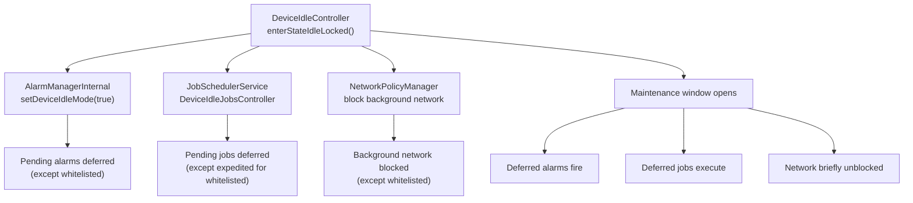

### 29.4.14 Motion Detection

Deep doze uses motion sensors to decide whether the device is stationary:

```java
// DeviceIdleController.java
private SensorManager mSensorManager;
private final boolean mUseMotionSensor;
private Sensor mMotionSensor;
private AnyMotionDetector mAnyMotionDetector;
```

The `AnyMotionDetector` uses the accelerometer to detect any movement. If motion
is detected, the device returns to `STATE_ACTIVE`. The significant motion sensor
is used during `STATE_IDLE_PENDING` for a lower-power detection mode.

---

## 29.5 App Standby Buckets

### 29.5.1 Overview

App Standby Buckets (introduced in Android 9) assign each app to one of several
priority buckets based on usage patterns. The bucket determines how aggressively
the system restricts the app's background work.

Source file:
`frameworks/base/apex/jobscheduler/service/java/com/android/server/usage/AppStandbyController.java`

### 29.5.2 Bucket Levels

```java
// UsageStatsManager.java (imported by AppStandbyController.java)
STANDBY_BUCKET_EXEMPTED   // System apps, carrier apps
STANDBY_BUCKET_ACTIVE     // Currently or very recently used
STANDBY_BUCKET_WORKING_SET // Used regularly but not currently active
STANDBY_BUCKET_FREQUENT   // Used often but not daily
STANDBY_BUCKET_RARE       // Rarely used
STANDBY_BUCKET_RESTRICTED // Very rarely used, manually restricted
STANDBY_BUCKET_NEVER      // Never used
```

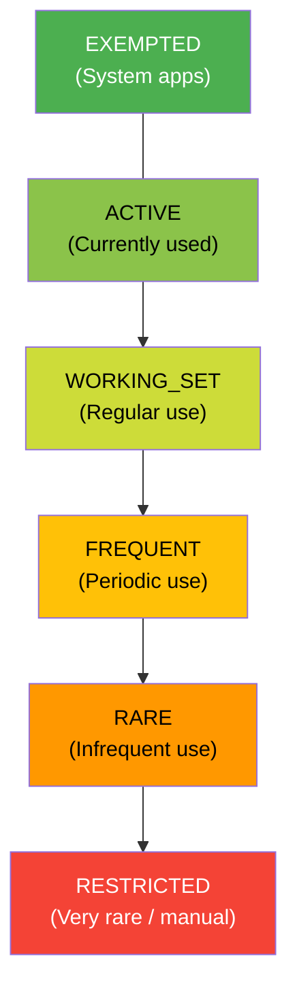

### 29.5.3 Impact on System Resources

| Bucket | Jobs | Alarms | Network | FCM high-priority |
|--------|------|--------|---------|-------------------|
| ACTIVE | No restrictions | No restrictions | No restrictions | Yes |
| WORKING_SET | Deferred up to 2h | Deferred up to 6m | No restrictions | Yes |
| FREQUENT | Deferred up to 8h | Deferred up to 30m | No restrictions | Yes |
| RARE | Deferred up to 24h | Deferred up to 2h | No restrictions | Yes |
| RESTRICTED | Max 1/day | Max 1/day | Restricted | Yes |

### 29.5.4 Bucket Assignment Reasons

`AppStandbyController` uses multiple signals to determine bucket placement:

```java
// AppStandbyController.java imports
REASON_MAIN_DEFAULT        // Initial bucket
REASON_MAIN_TIMEOUT        // Timeout-based demotion
REASON_MAIN_USAGE          // Usage-based promotion
REASON_MAIN_PREDICTED      // ML-based prediction
REASON_MAIN_FORCED_BY_USER // User forced restriction
REASON_MAIN_FORCED_BY_SYSTEM // System forced restriction
```

Sub-reasons provide more granularity:

```java
REASON_SUB_USAGE_MOVE_TO_FOREGROUND    // App moved to foreground
REASON_SUB_USAGE_MOVE_TO_BACKGROUND    // App moved to background
REASON_SUB_USAGE_SYSTEM_INTERACTION    // System used the app
REASON_SUB_USAGE_USER_INTERACTION      // User interacted with app
REASON_SUB_USAGE_NOTIFICATION_SEEN     // User saw notification
REASON_SUB_USAGE_SLICE_PINNED          // Slice pinned
REASON_SUB_USAGE_SYNC_ADAPTER          // Sync adapter ran
REASON_SUB_USAGE_FOREGROUND_SERVICE_START // FGS started
REASON_SUB_USAGE_ACTIVE_TIMEOUT        // Active timeout reached
REASON_SUB_DEFAULT_APP_UPDATE          // App updated
REASON_SUB_DEFAULT_APP_RESTORED        // App restored
REASON_SUB_PREDICTED_RESTORED          // Prediction restored
REASON_SUB_FORCED_SYSTEM_FLAG_BUGGY    // System flagged as buggy
REASON_SUB_FORCED_USER_FLAG_INTERACTION // User flag interaction
```

### 29.5.5 Bucket Promotion and Demotion

Apps are **promoted** (moved to a higher-priority bucket) when:

- The user opens the app (-> ACTIVE)
- The user sees a notification from the app (-> WORKING_SET)
- The app has a foreground service (-> ACTIVE)
- A sync adapter runs (-> WORKING_SET)
- The ML predictor suggests a higher bucket

Apps are **demoted** (moved to a lower-priority bucket) when:

- Usage timers expire without interaction
- The ML predictor suggests a lower bucket
- The system detects abusive behavior (-> RESTRICTED)

### 29.5.6 Exempted Apps

Certain apps are exempt from standby bucket restrictions:

- Active device admin apps
- Carrier-privileged apps
- The default dialer, SMS handler, and launcher
- Apps currently playing audio or in a foreground service
- Apps on the device idle allowlist
- Persistent system apps

### 29.5.7 Integration with UsageStatsService

`AppStandbyController` leverages `UsageStatsService` to track app usage events:

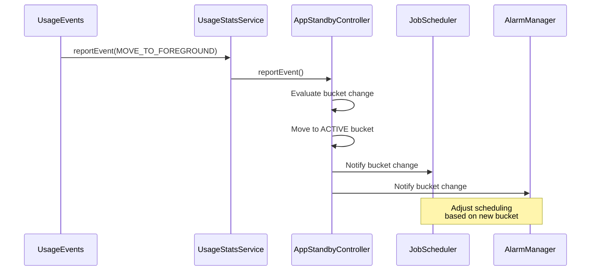

### 29.5.8 AppIdleHistory

`AppStandbyController` uses `AppIdleHistory` to persist bucket assignments and
usage history to disk. The history survives reboots and is stored per-user in:

```
/data/system/users/<userId>/app_idle_stats.xml
```

### 29.5.9 Restricted Bucket

The RESTRICTED bucket (introduced in Android 12) is the most aggressive standby
level. Apps in this bucket are limited to:

- At most 1 job per day
- At most 1 alarm per day
- No expedited jobs
- No foreground service starts from the background

Apps can enter RESTRICTED state through:

- System detection of excessive resource usage
- User manually restricting the app in Settings
- Long period without any user interaction

### 29.5.10 ML-Based Prediction

On devices with a prediction service (typically from the app intelligence module),
bucket assignments can be made based on machine learning predictions of future
app usage:

```java
// AppStandbyController.java imports
REASON_MAIN_PREDICTED  // ML-based prediction
REASON_SUB_PREDICTED_RESTORED  // Prediction restored after reboot
```

The prediction service provides a bucket suggestion, and `AppStandbyController`
applies it if the predicted bucket is different from the current one. Predictions
cannot promote an app above ACTIVE or demote below the timeout-based bucket.

### 29.5.11 Bucket Change Notifications

When an app's bucket changes, `AppStandbyController` notifies all registered
listeners. The key consumers are:

1. **JobScheduler**: Adjusts job scheduling delays based on new bucket
2. **AlarmManager**: Adjusts alarm delivery windows
3. **NetworkPolicyManager**: May restrict network access for restricted apps
4. **SyncManager**: Adjusts sync adapter scheduling

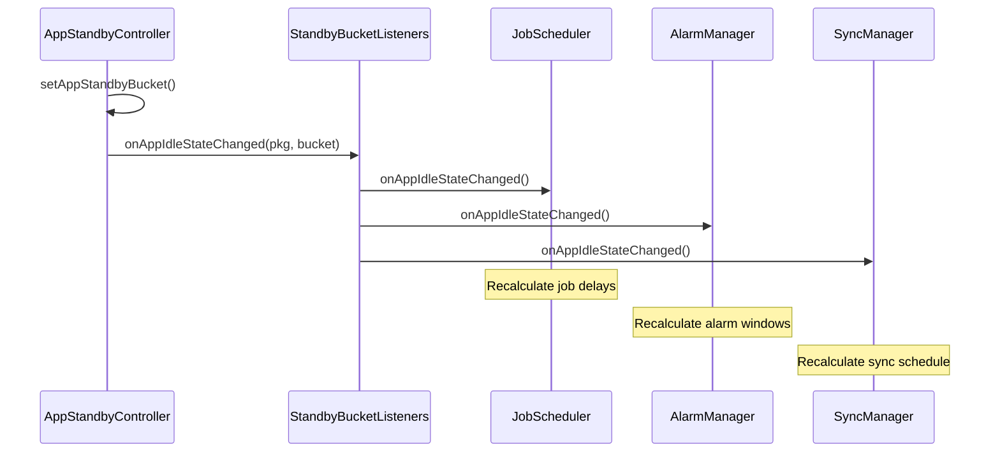

### 29.5.12 Timeout-Based Demotion

When an app has not been used for a configurable duration, it is demoted to the
next lower bucket. The typical timeout schedule:

| From Bucket | Timeout to Next | Demoted To |
|-------------|----------------|------------|
| ACTIVE | 12 hours | WORKING_SET |
| WORKING_SET | 2 days | FREQUENT |
| FREQUENT | 8 days | RARE |
| RARE | 30 days | RESTRICTED |

These timeouts are configurable via `DeviceConfig` and may vary by device.

### 29.5.13 Cross-Profile Support

`AppStandbyController` handles cross-profile scenarios. Apps that are shared
between work and personal profiles maintain separate bucket states for each
profile:

```java
// AppStandbyController.java
CrossProfileAppsInternal crossProfileAppsInternal = ...;
```

### 29.5.14 Low Power Standby

In addition to App Standby Buckets, Android has a `LowPowerStandbyController`
that provides an additional layer of standby restrictions:

```java
// PowerManagerService.java, line 1253
mLowPowerStandbyController = mInjector.createLowPowerStandbyController(
        mContext, Looper.getMainLooper());
```

Low Power Standby is managed through:
```
frameworks/base/services/core/java/com/android/server/power/
    LowPowerStandbyController.java
    LowPowerStandbyControllerInternal.java
```

This controller maintains its own allowlist of UIDs that may hold wake locks
during standby:

```java
// PowerManagerService.java
int[] mLowPowerStandbyAllowlist = new int[0];
private boolean mLowPowerStandbyActive;
```

---

## 29.6 Battery Stats

### 29.6.1 Overview

`BatteryStatsService` and `BatteryStatsImpl` form Android's comprehensive
power accounting system. They track every power-consuming activity and attribute
it to the responsible UID (application).

Source files:

- `frameworks/base/services/core/java/com/android/server/power/stats/BatteryStatsImpl.java`
- `frameworks/base/services/core/java/com/android/server/am/BatteryStatsService.java`

### 29.6.2 What Gets Tracked

`BatteryStatsImpl` tracks hundreds of metrics, grouped by category:

| Category | Metrics |
|----------|---------|
| **CPU** | Per-UID CPU time (user + system), per-frequency cluster time |
| **Wake locks** | Per-UID wake lock hold time, count |
| **Network** | Per-UID bytes sent/received (Wi-Fi, mobile), packet counts |
| **Screen** | Screen-on time, brightness levels |
| **Radio** | Signal strength, active radio time |
| **Sensors** | Per-sensor usage time per UID |
| **GPS** | Per-UID GPS usage time |
| **Audio/Video** | Per-UID audio/video playback time |
| **Camera** | Per-UID camera usage time |
| **Bluetooth** | Per-UID BT scan/connect time |
| **Foreground** | Per-UID foreground activity time |
| **Jobs** | Per-UID job execution time |

### 29.6.3 Power Model

Android uses a power profile (`power_profile.xml`) that defines the milliamp
draw of each hardware component at each operating level. The battery stats
system multiplies usage time by the power draw to estimate energy consumption.

Example entries from a typical power profile:

```xml
<!-- power_profile.xml (device-specific) -->
<item name="screen.on">100</item>         <!-- mA when screen on at min brightness -->
<item name="screen.full">250</item>       <!-- mA at max brightness -->
<item name="wifi.on">2</item>             <!-- mA when Wi-Fi is on -->
<item name="wifi.active">120</item>       <!-- mA during Wi-Fi transfer -->
<item name="gps.on">50</item>             <!-- mA when GPS active -->
<item name="bluetooth.active">10</item>   <!-- mA during BT transfer -->
<item name="cpu.active">100</item>        <!-- mA when CPU active (base) -->
<array name="cpu.clusters.cores">
    <value>4</value>                      <!-- Little cores -->
    <value>4</value>                      <!-- Big cores -->
</array>
<array name="cpu.core_speeds.cluster0">
    <value>300000</value>
    <value>576000</value>
    <value>1017600</value>
</array>
<array name="cpu.core_power.cluster0">
    <value>10</value>
    <value>20</value>
    <value>50</value>
</array>
```

### 29.6.4 Power Stats Collectors

The `stats` subdirectory contains specialized collectors:

```
frameworks/base/services/core/java/com/android/server/power/stats/
    BatteryStatsImpl.java
    BatteryExternalStatsWorker.java
    CpuPowerStatsCollector.java
    ScreenPowerStatsCollector.java
    WifiPowerStatsCollector.java
    BluetoothPowerStatsCollector.java
    MobileRadioPowerStatsCollector.java
    CameraPowerStatsCollector.java
    GnssPowerStatsCollector.java
    WakelockPowerStatsCollector.java
    EnergyConsumerPowerStatsCollector.java
    CustomEnergyConsumerPowerStatsCollector.java
    PowerStatsCollector.java
    PowerStatsStore.java
    PowerStatsScheduler.java
    PowerStatsSpan.java
    PowerStatsUidResolver.java
    PowerAttributor.java
    UsageBasedPowerEstimator.java
    KernelWakelockReader.java
```

Each collector is responsible for gathering data from a specific subsystem
and presenting it in a format that can be attributed to UIDs.

### 29.6.5 Battery Stats Data Flow

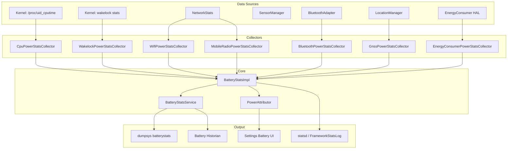

### 29.6.6 Energy Consumers

Modern devices provide hardware-level energy consumption data through the
`IEnergyConsumer` HAL interface. This provides ground-truth millijoule
measurements from fuel gauge hardware, rather than estimates based on
the power profile.

The `EnergyConsumerPowerStatsCollector` reads these measurements and
attributes them to UIDs using activity data (CPU time, sensor usage, etc.)
as a distribution key.

### 29.6.7 Battery Historian

`BatteryStatsService` generates a "checkin" format output that the open-source
Battery Historian tool can parse and visualize. The command:

```bash
adb shell dumpsys batterystats --checkin > batterystats.txt
```

This produces a detailed timeline of every power event: wake lock acquires,
screen state changes, network transfers, sensor activations, and more.

### 29.6.8 Kernel Wakelock Reading

`KernelWakelockReader` reads kernel-level wakelock statistics from:

- `/proc/wakelocks` (older kernels)
- `/d/wakeup_sources` (modern kernels)

These kernel wakelocks are separate from Android framework wakelocks and
represent the lowest level of suspend-prevention tracking.

### 29.6.9 Persisting Stats

Battery stats are persisted periodically and across reboots. The data is stored
in `/data/system/batterystats.bin` (binary) and managed by `BatteryStatsImpl`.

The `BatteryHistoryDirectory` class manages the on-disk storage format, which
includes both summary data and per-step history entries.

### 29.6.10 Battery Usage Stats Provider

The `BatteryUsageStatsProvider` computes per-app battery consumption estimates
that power the Settings battery usage UI:

```
frameworks/base/services/core/java/com/android/server/power/stats/
    BatteryUsageStatsProvider.java
    BatteryUsageStatsSection.java
    AccumulatedBatteryUsageStatsSection.java
```

The provider uses both the power profile model and hardware energy consumer
data (when available) to compute usage statistics.

### 29.6.11 Power Attributor

The `PowerAttributor` is a newer component that attributes power consumption
to UIDs using a combination of activity data and energy measurements:

```
frameworks/base/services/core/java/com/android/server/power/stats/
    PowerAttributor.java
```

It distributes the measured energy among UIDs proportionally to their activity
(e.g., CPU time, screen time, network bytes).

### 29.6.12 Wakeup Stats

The `wakeups` subdirectory tracks what wakes the device from suspend:

```
frameworks/base/services/core/java/com/android/server/power/stats/wakeups/
```

This helps identify which subsystems and UIDs are most responsible for
preventing deep sleep.

### 29.6.13 Battery Stats Dump Format

The `dumpsys batterystats` output is organized into several sections:

```
  Estimated power use (mAh):
    Capacity: 4000, Computed drain: 450, actual drain: 480
    Screen: 120
    Uid 10045: 85.2 (cpu=45.0 wifi=20.0 wake=10.0 sensor=10.2)
    Uid 10089: 42.1 (cpu=30.0 mobile-radio=12.1)
    ...

  Per-app mobile data:
    Uid 10045: 15.2 MB sent, 142.5 MB received
    ...

  Wake lock stats:
    Uid 10045:
      Wake lock *job*/com.example.MyJobService: 15m 30s
      Wake lock *alarm*: 2m 15s
    ...
```

### 29.6.14 Statsd Integration

Battery stats data is also reported to `statsd` via `FrameworkStatsLog` for
server-side analysis. This enables Google to track aggregate power consumption
patterns across the device fleet.

Key atoms include:

- `BatteryUsageStatsPerApp` -- Per-app energy consumption
- `WakelockStateChanged` -- Wake lock acquire/release events
- `ScreenStateChanged` -- Screen on/off transitions
- `DeviceIdleModeStateChanged` -- Doze state transitions
- `BatterySaverModeStateChanged` -- Battery saver on/off

---

## 29.7 Thermal Management

### 29.7.1 Overview

Android's thermal management system monitors device temperatures through the
Thermal HAL, triggers throttling actions when temperatures rise, and notifies
applications so they can reduce their workload.

The framework service `ThermalManagerService` sits between the HAL and
applications:

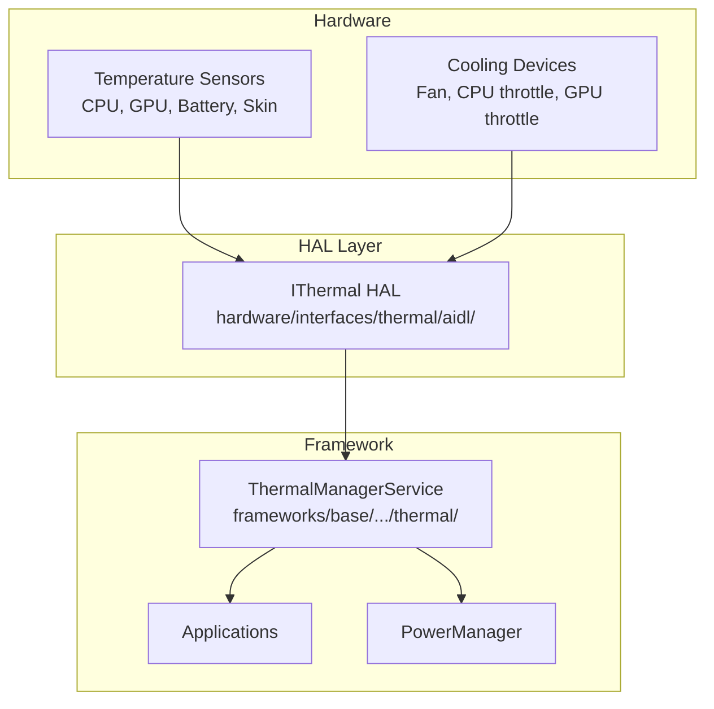

### 29.7.2 Thermal HAL Interface

The Thermal HAL (`IThermal.aidl`) provides a comprehensive interface for
temperature monitoring:

```
hardware/interfaces/thermal/aidl/android/hardware/thermal/IThermal.aidl
```

Key methods:

```java
// IThermal.aidl
interface IThermal {
    // Query current temperatures
    Temperature[] getTemperatures();
    Temperature[] getTemperaturesWithType(in TemperatureType type);

    // Query static thresholds
    TemperatureThreshold[] getTemperatureThresholds();
    TemperatureThreshold[] getTemperatureThresholdsWithType(
            in TemperatureType type);

    // Query cooling devices
    CoolingDevice[] getCoolingDevices();
    CoolingDevice[] getCoolingDevicesWithType(in CoolingType type);

    // Register for thermal change callbacks
    void registerThermalChangedCallback(in IThermalChangedCallback callback);
    void unregisterThermalChangedCallback(in IThermalChangedCallback callback);

    // Register for cooling device change callbacks
    void registerCoolingDeviceChangedCallbackWithType(
            in ICoolingDeviceChangedCallback callback, in CoolingType type);

    // Forecast skin temperature
    float forecastSkinTemperature(in int forecastSeconds);
}
```

### 29.7.3 Temperature Types

The HAL reports temperatures for many component types:

```java
// TemperatureType.aidl
enum TemperatureType {
    UNKNOWN = -1,
    CPU = 0,
    GPU = 1,
    BATTERY = 2,
    SKIN = 3,          // Most important for user-facing throttling
    USB_PORT = 4,
    POWER_AMPLIFIER = 5,
    BCL_VOLTAGE = 6,   // Battery Current Limit
    BCL_CURRENT = 7,
    BCL_PERCENTAGE = 8,
    NPU = 9,           // Neural Processing Unit
    TPU = 10,
    DISPLAY = 11,
    MODEM = 12,
    SOC = 13,
    WIFI = 14,
    CAMERA = 15,
    FLASHLIGHT = 16,
    SPEAKER = 17,
    AMBIENT = 18,
    POGO = 19,
}
```

The `SKIN` temperature is the most critical for user experience. It represents
the external surface temperature that the user can feel. The thermal framework
primarily keys its throttling decisions on skin temperature.

### 29.7.4 Throttling Severity Levels

```java
// ThrottlingSeverity.aidl
enum ThrottlingSeverity {
    NONE = 0,       // Not under throttling
    LIGHT,          // Light throttling, UX not impacted
    MODERATE,       // Moderate throttling, UX not largely impacted
    SEVERE,         // Severe throttling, UX largely impacted
    CRITICAL,       // Platform has done everything to reduce power
    EMERGENCY,      // Key components shutting down
    SHUTDOWN,       // Need shutdown immediately
}
```

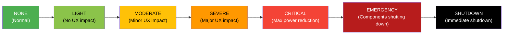

### 29.7.5 Temperature Data Structure

Each temperature reading contains:

```java
// Temperature.aidl
parcelable Temperature {
    TemperatureType type;          // Component type (CPU, GPU, SKIN, etc.)
    String name;                   // Unique name (e.g., "cpu0", "battery")
    float value;                   // Temperature in Celsius (or mV/mA/% for BCL)
    ThrottlingSeverity throttlingStatus;  // Current throttling level
}
```

### 29.7.6 Cooling Devices

The HAL also reports cooling device states:

```java
// CoolingDevice.aidl
parcelable CoolingDevice {
    CoolingType type;      // CPU, GPU, BATTERY, FAN, etc.
    String name;           // Unique name
    long value;            // Current throttle state (0 = no throttling)
    long powerLimitMw;     // Power budget in milliwatts
    long powerMw;          // Actual average power
    long timeWindowMs;     // Averaging window for power measurement
}
```

Cooling device types:

```java
// CoolingType.aidl
enum CoolingType {
    FAN, BATTERY, CPU, GPU, MODEM, NPU, COMPONENT,
    TPU, POWER_AMPLIFIER, DISPLAY, SPEAKER, WIFI,
    CAMERA, FLASHLIGHT, USB_PORT,
}
```

### 29.7.7 ThermalManagerService

The framework service dispatches thermal events to registered listeners:

```java
// ThermalManagerService.java, line 103
public class ThermalManagerService extends SystemService {
    // Registered observers of thermal events
    private final RemoteCallbackList<IThermalEventListener> mThermalEventListeners;

    // Registered observers of thermal status
    private final RemoteCallbackList<IThermalStatusListener> mThermalStatusListeners;

    // Registered observers of thermal headroom
    private final RemoteCallbackList<IThermalHeadroomListener> mThermalHeadroomListeners;
    // ...
}
```

Applications can monitor thermal status through:

- `PowerManager.getThermalHeadroom(forecastSeconds)` -- Estimate of thermal margin
- `PowerManager.addThermalStatusListener()` -- Callbacks on throttling changes
- `PowerManager.getCurrentThermalStatus()` -- Current throttling severity

### 29.7.8 Thermal Headroom API

The `getThermalHeadroom(forecastSeconds)` API allows apps to proactively reduce
workload before throttling occurs. The returned value represents the available
thermal margin:

- **< 1.0**: Headroom available (no throttling expected)
- **>= 1.0**: Device is at or beyond throttling threshold

The HAL supports forecasting through `forecastSkinTemperature()`:

```java
// IThermal.aidl
float forecastSkinTemperature(in int forecastSeconds);
```

The forecast range must support at least 0 to 60 seconds, with a default of
10 seconds.

### 29.7.9 Thermal Headroom Listener

For more efficient monitoring, apps can register a thermal headroom listener
instead of polling:

```java
// ThermalManagerService.java
public static final int HEADROOM_CALLBACK_MIN_INTERVAL_MILLIS = 5000;
public static final float HEADROOM_CALLBACK_MIN_DIFFERENCE = 0.03f;
```

The callback fires at most every 5 seconds and only when the headroom changes
by at least 0.03 (equivalent to about 0.9 degrees Celsius difference).

### 29.7.10 Thermal Shutdown

At the `SHUTDOWN` severity level, `PowerManagerService` initiates an orderly
device shutdown. The shutdown reason is recorded:

```java
// PowerManagerService.java, line 276
private static final String REASON_THERMAL_SHUTDOWN = "shutdown,thermal";
private static final String REASON_BATTERY_THERMAL_STATE = "shutdown,thermal,battery";
```

### 29.7.11 Framework Thermal Actions

When thermal throttling reaches certain severity levels, the framework takes
automatic actions:

| Severity | Framework Action |
|----------|-----------------|
| LIGHT | Log event, notify listeners |
| MODERATE | Reduce background work, log warning |
| SEVERE | Reduce screen brightness, limit CPU-intensive operations |
| CRITICAL | Aggressive throttling, kill background processes |
| EMERGENCY | Force-stop non-essential services |
| SHUTDOWN | Initiate device shutdown |

These actions are coordinated between `ThermalManagerService`,
`PowerManagerService`, and `ActivityManagerService`.

### 29.7.12 Thermal HAL Versions

The Thermal HAL has evolved through multiple versions:

| Version | Interface | Key Features |
|---------|-----------|-------------|
| 1.0 (HIDL) | `IThermal` | Basic temperature query |
| 1.1 (HIDL) | `IThermalCallback` | Asynchronous callbacks |
| 2.0 (HIDL) | `IThermal` | Throttling severity, cooling devices |
| AIDL | `IThermal` | Skin temperature forecasting, cooling device callbacks |

The current AIDL version adds critical features like `forecastSkinTemperature()`
for proactive thermal management and `registerCoolingDeviceChangedCallbackWithType()`
for monitoring cooling device state changes.

### 29.7.13 Temperature Threshold Structure

The HAL provides static temperature thresholds for each severity level:

```java
// TemperatureThreshold.aidl
parcelable TemperatureThreshold {
    TemperatureType type;
    String name;
    float[] hotThrottlingThresholds;  // One per ThrottlingSeverity level
    float[] coldThrottlingThresholds; // One per ThrottlingSeverity level
}
```

These thresholds are reported to apps through
`PowerManager.getThermalHeadroomThresholds()`, enabling apps to make
proactive decisions about workload reduction.

### 29.7.14 Thermal Service Shell Commands

`ThermalManagerService` supports shell commands for testing:

```bash
# Override thermal status for testing
adb shell cmd thermalservice override-status <level>

# Where <level> is: 0=NONE, 1=LIGHT, 2=MODERATE, 3=SEVERE,
#                    4=CRITICAL, 5=EMERGENCY, 6=SHUTDOWN

# Reset to real thermal status
adb shell cmd thermalservice reset
```

### 29.7.15 Thermal Mitigation Policy

The actual thermal mitigation policy (deciding which components to throttle
and by how much at each severity level) is implemented in the vendor's
Thermal HAL, not in the framework. The framework provides the monitoring
and notification infrastructure, while the vendor controls the hardware-level
response.

A typical vendor thermal mitigation policy might include:

- **LIGHT**: Reduce background CPU frequency by 20%
- **MODERATE**: Cap GPU frequency to 70%, reduce big core max frequency
- **SEVERE**: Disable big cores entirely, reduce GPU to 50%
- **CRITICAL**: All cores at minimum frequency, GPU at minimum
- **EMERGENCY**: Shut down modem, camera, reduce display brightness
- **SHUTDOWN**: Orderly device shutdown

---

## 29.8 Power HAL

### 29.8.1 Overview

The Power HAL (`IPower`) is the primary interface between the Android framework
and vendor-specific power management hardware. It allows the framework to
communicate power hints, modes, and performance requirements to the underlying
hardware.

Source file:
`hardware/interfaces/power/aidl/android/hardware/power/IPower.aidl`

### 29.8.2 HAL Interface

```java
// IPower.aidl
@VintfStability
interface IPower {
    // Mode control
    oneway void setMode(in Mode type, in boolean enabled);
    boolean isModeSupported(in Mode type);

    // Boost control
    oneway void setBoost(in Boost type, in int durationMs);
    boolean isBoostSupported(in Boost type);

    // Hint sessions (ADPF)
    IPowerHintSession createHintSession(
            in int tgid, in int uid, in int[] threadIds,
            in long durationNanos);
    long getHintSessionPreferredRate();
    IPowerHintSession createHintSessionWithConfig(in int tgid, in int uid,
            in int[] threadIds, in long durationNanos,
            in SessionTag tag, out SessionConfig config);

    // FMQ channel for efficient updates
    ChannelConfig getSessionChannel(in int tgid, in int uid);
    oneway void closeSessionChannel(in int tgid, in int uid);

    // Support information
    SupportInfo getSupportInfo();

    // Headroom APIs
    CpuHeadroomResult getCpuHeadroom(in CpuHeadroomParams params);
    GpuHeadroomResult getGpuHeadroom(in GpuHeadroomParams params);

    // Composition data for surface-attached sessions
    oneway void sendCompositionData(in CompositionData[] data);
    oneway void sendCompositionUpdate(in CompositionUpdate update);
}
```

### 29.8.3 Power Modes

Power modes communicate long-duration state changes to the HAL:

```java
// Mode.aidl
enum Mode {
    DOUBLE_TAP_TO_WAKE,      // Enable double-tap gesture
    LOW_POWER,               // Battery saver active
    SUSTAINED_PERFORMANCE,   // Consistent perf for extended period
    FIXED_PERFORMANCE,       // Fixed clocks for benchmarking
    VR,                      // Virtual Reality mode
    LAUNCH,                  // App being launched
    EXPENSIVE_RENDERING,     // Heavy rendering upcoming
    INTERACTIVE,             // Screen on/off state
    DEVICE_IDLE,             // Doze mode active
    DISPLAY_INACTIVE,        // Display off or low-power
    AUDIO_STREAMING_LOW_LATENCY,  // Low-latency audio active
    CAMERA_STREAMING_SECURE, // Secure camera stream
    CAMERA_STREAMING_LOW,    // Low-res camera stream
    CAMERA_STREAMING_MID,    // Mid-res camera stream
    CAMERA_STREAMING_HIGH,   // High-res camera stream
    GAME,                    // User playing a game
    GAME_LOADING,            // Game loading screen
    DISPLAY_CHANGE,          // Rotation or fold/unfold
    AUTOMOTIVE_PROJECTION,   // Android Auto projection
}
```

Key mode behaviors:

| Mode | Typical HAL Response |
|------|---------------------|
| `INTERACTIVE` | Enable/disable interactive governor, adjust wake latency |
| `LOW_POWER` | Reduce max CPU freq, disable big cores, reduce GPU freq |
| `SUSTAINED_PERFORMANCE` | Cap frequencies to thermally sustainable level |
| `LAUNCH` | Boost CPU/GPU for fast app launch |
| `DEVICE_IDLE` | Minimize power, reduce polling rates |
| `GAME` | Optimize for gaming (higher GPU priority) |

### 29.8.4 Power Boosts

Boosts communicate short-duration performance needs:

```java
// Boost.aidl
enum Boost {
    INTERACTION,             // Touch event -- brief CPU boost
    DISPLAY_UPDATE_IMMINENT, // New frame coming -- wake display path
    ML_ACC,                  // ML accelerator needed
    AUDIO_LAUNCH,            // Audio stream starting
    CAMERA_LAUNCH,           // Camera app launching
    CAMERA_SHOT,             // Photo capture in progress
}
```

The `INTERACTION` boost is the most frequently sent. Every touch event
triggers it, giving the vendor HAL an opportunity to briefly raise CPU
frequencies for responsive touch handling.

### 29.8.5 Framework to HAL Flow

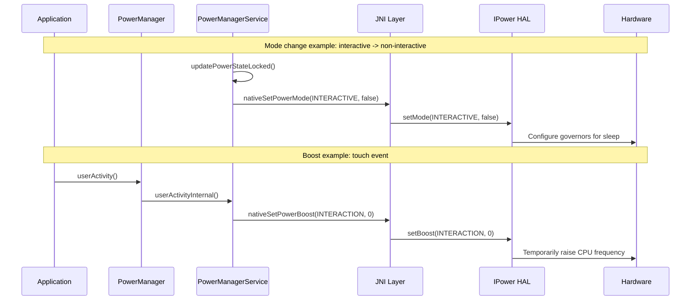

### 29.8.6 ADPF (Android Dynamic Performance Framework)

ADPF, introduced in Android 12 and significantly expanded since, provides
a performance hint session mechanism that allows apps (especially games and
media applications) to communicate their performance requirements directly
to the Power HAL.

#### Hint Session Model

```java
// IPowerHintSession.aidl
interface IPowerHintSession {
    oneway void updateTargetWorkDuration(long targetDurationNanos);
    oneway void reportActualWorkDuration(in WorkDuration[] durations);
    oneway void pause();
    oneway void resume();
    oneway void close();
    oneway void sendHint(SessionHint hint);
    void setThreads(in int[] threadIds);
    oneway void setMode(SessionMode type, boolean enabled);
    SessionConfig getSessionConfig();
}
```

The session lifecycle:

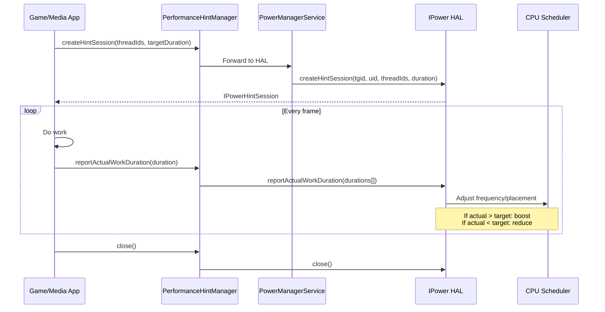

#### Session Hints

`SessionHint` values provide additional context beyond work duration:

```java
// SessionHint.aidl
enum SessionHint {
    CPU_LOAD_UP = 0,        // Workload increasing
    CPU_LOAD_DOWN = 1,      // Workload decreasing
    CPU_LOAD_RESET = 2,     // Unknown new workload
    CPU_LOAD_RESUME = 3,    // Resuming after idle
    POWER_EFFICIENCY = 4,   // Prefer efficiency over perf
    GPU_LOAD_UP = 5,        // GPU workload increasing
    GPU_LOAD_DOWN = 6,      // GPU workload decreasing
    GPU_LOAD_RESET = 7,     // Unknown new GPU workload
    CPU_LOAD_SPIKE = 8,     // Abnormal CPU spike (ignore)
    GPU_LOAD_SPIKE = 9,     // Abnormal GPU spike (ignore)
}
```

#### FMQ Channel

For high-frequency updates, ADPF supports Fast Message Queue (FMQ) channels
to avoid the overhead of Binder calls:

```java
// IPower.aidl
ChannelConfig getSessionChannel(in int tgid, in int uid);
```

The channel is per-process and reused across hint sessions.

### 29.8.7 CPU and GPU Headroom

The Power HAL can report available CPU and GPU headroom, allowing apps to
adaptively adjust their workload:

```java
// IPower.aidl
CpuHeadroomResult getCpuHeadroom(in CpuHeadroomParams params);
GpuHeadroomResult getGpuHeadroom(in GpuHeadroomParams params);
```

These APIs complement the thermal headroom API by providing performance-domain
(rather than thermal-domain) headroom estimates.

### 29.8.8 Composition Data

The latest Power HAL versions support composition data reporting, where
SurfaceFlinger sends frame timing information to the HAL:

```java
// IPower.aidl
oneway void sendCompositionData(in CompositionData[] data);
oneway void sendCompositionUpdate(in CompositionUpdate update);
```

This allows the HAL to correlate power/performance decisions with actual
display output, enabling more precise power management.

### 29.8.9 Session Tags and Modes

ADPF hint sessions can be tagged to indicate their purpose:

```java
// SessionTag.aidl
enum SessionTag {
    OTHER,
    SURFACEFLINGER,
    HWUI,
    GAME,
    APP,
}
```

Sessions can also have modes set that modify their behavior:

```java
// SessionMode.aidl
enum SessionMode {
    POWER_EFFICIENCY,  // Prefer efficiency over performance
}
```

The `POWER_EFFICIENCY` mode tells the HAL to prefer energy-efficient scheduling
for the session's threads. This is used by background tasks that need to complete
but are not latency-sensitive.

### 29.8.10 WorkDuration Reporting

The `WorkDuration` structure provides detailed timing information to the HAL:

```java
// WorkDuration.aidl
parcelable WorkDuration {
    long timeStampNanos;       // When the work completed
    long durationNanos;        // Total work duration
    long workPeriodStartTimestampNanos;  // When the work period started
    long cpuDurationNanos;     // CPU time consumed
    long gpuDurationNanos;     // GPU time consumed
}
```

The separate CPU and GPU duration fields allow the HAL to independently adjust
CPU and GPU frequencies for optimal power/performance balance.

### 29.8.11 SupportInfo

The `getSupportInfo()` method provides detailed information about what the HAL
supports:

```java
// IPower.aidl
SupportInfo getSupportInfo();
```

This allows the framework to adapt its behavior based on HAL capabilities,
avoiding calls that would just be no-ops on simpler implementations.

### 29.8.12 Composition Data Integration

The latest Power HAL versions integrate with SurfaceFlinger to receive
per-frame composition timing data:

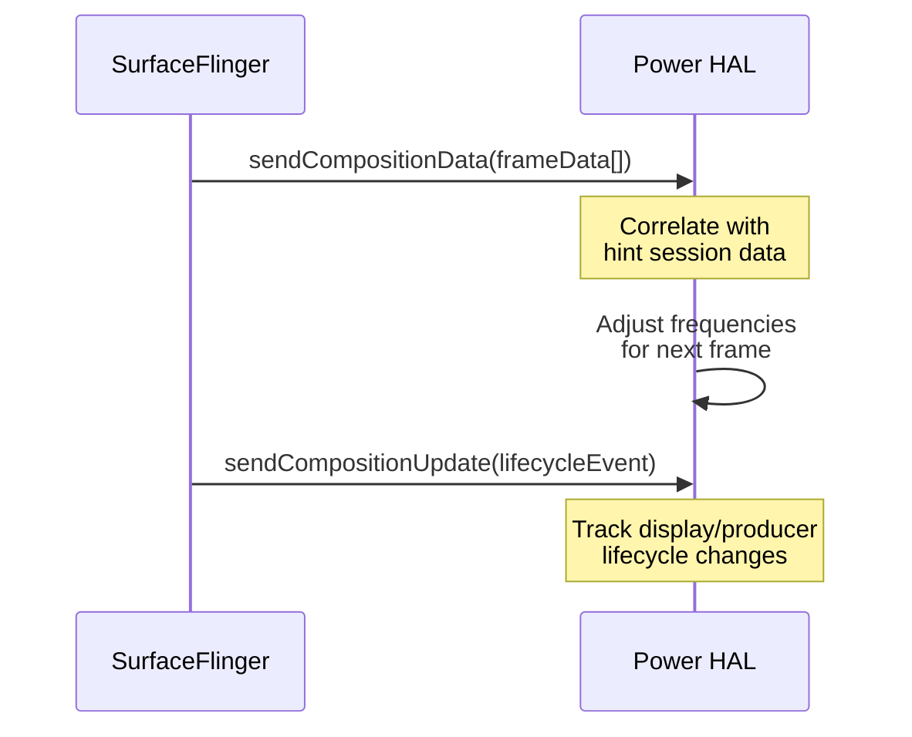

This enables the HAL to see the complete picture of display workload,
not just individual session work durations.

### 29.8.13 CPU and GPU Headroom APIs

The headroom APIs allow the framework and applications to query available
performance capacity:

```java
// IPower.aidl
CpuHeadroomResult getCpuHeadroom(in CpuHeadroomParams params);
GpuHeadroomResult getGpuHeadroom(in GpuHeadroomParams params);
```

Headroom is expressed as a value where:

- **1.0** means the hardware is at full capacity (no headroom)
- **< 1.0** means there is room for more work
- **> 1.0** means the hardware is overloaded

Apps can use these values to dynamically adjust their quality settings:

- Rendering resolution
- Effect complexity
- Frame rate target

### 29.8.14 HAL Evolution

The Power HAL has evolved significantly:

| Version | Key Features |
|---------|-------------|
| `1.0` (HIDL) | Basic `setInteractive()` and `powerHint()` |
| `1.1` (HIDL) | Added `getSubsystemLowPowerStats()` |
| `1.2` (HIDL) | Added `powerHintAsync_1_2()` |
| `1.3` (HIDL) | Added `setMode()` and `setBoost()` |
| AIDL v1 | Migrated to AIDL, added `createHintSession()` |
| AIDL v2 | Added `SessionHint`, `SessionMode` |
| AIDL v3 | Added FMQ channels, `createHintSessionWithConfig()` |
| AIDL v4 | Added headroom APIs, composition data |

```
hardware/interfaces/power/
    1.0/     (HIDL)
    1.1/     (HIDL)
    1.2/     (HIDL)
    1.3/     (HIDL)
    aidl/    (Current)
```

---

## 29.9 CPU Frequency and Scheduling

### 29.9.1 Energy-Aware Scheduling (EAS)

Modern Android devices use Energy-Aware Scheduling (EAS), which is part of
the mainline Linux kernel. EAS extends the Completely Fair Scheduler (CFS)
to consider energy costs when making task placement decisions.

EAS requires an energy model that describes the relationship between
CPU frequency, performance, and power consumption for each CPU cluster.
This model is typically provided through Device Tree:

```
// Example Device Tree energy model
cpu0 {
    capacity-dmips-mhz = <1024>;
    dynamic-power-coefficient = <100>;
};
```

### 29.9.2 The schedutil Governor

The `schedutil` CPU frequency governor is tightly integrated with the
scheduler and is the default on Android devices. Unlike traditional
governors (like `ondemand`) that sample utilization periodically,
`schedutil` uses the scheduler's own utilization tracking (PELT --
Per-Entity Load Tracking) to make frequency decisions.

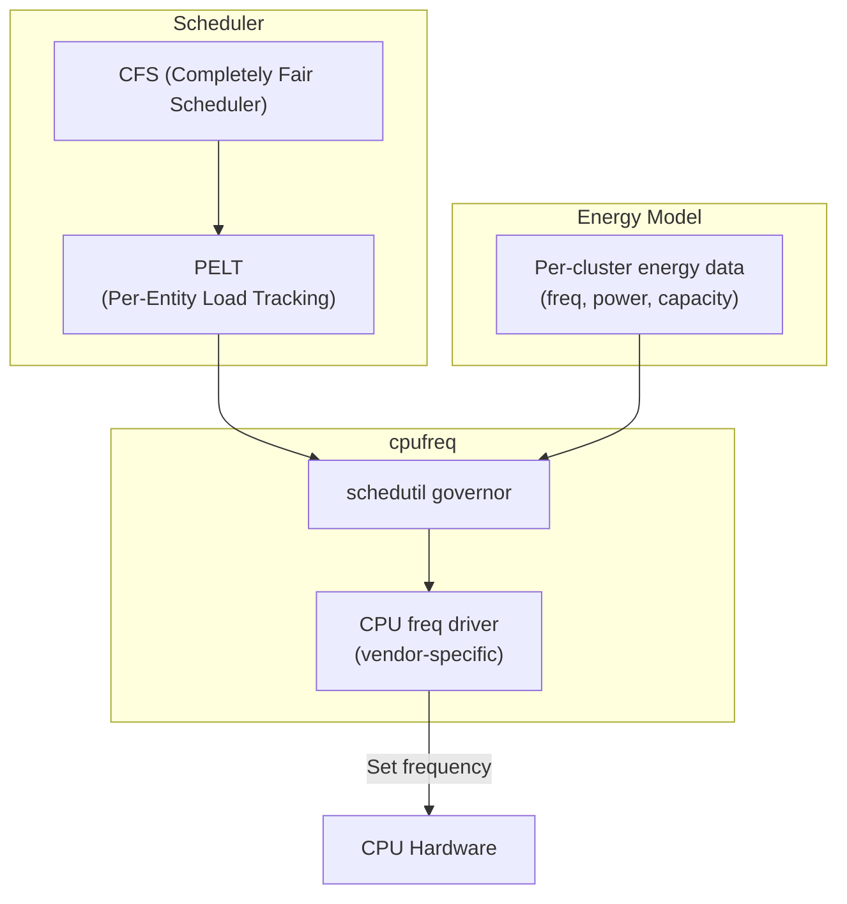

The flow:

1. **PELT** continuously tracks per-task and per-CPU utilization
2. **schedutil** reads PELT data at scheduling events (task wake, migration)
3. The governor selects the lowest frequency that satisfies the utilization
   requirement, considering the energy model
4. The cpufreq driver applies the new frequency

### 29.9.3 Capacity-Aware Scheduling

On heterogeneous (big.LITTLE / big.mid.LITTLE) processors, the scheduler
must consider CPU capacity when placing tasks:

- **Little cores**: Low power, low performance. Good for background tasks.
- **Mid cores**: Medium power and performance. For typical workloads.
- **Big cores**: High power, high performance. For latency-sensitive work.

The scheduler uses the `capacity` metric (0-1024, where 1024 = most capable
core at max frequency) to match tasks to appropriate cores.

Task placement heuristics:

1. If a task's utilization fits on a little core, place it there (energy savings)
2. If the task needs more capacity, migrate to a bigger core
3. Consider thermal pressure: reduce effective capacity under thermal throttling
4. Consider ADPF hints: if the Power HAL requests specific thread placement,
   respect those preferences

### 29.9.4 Uclamp (Utilization Clamping)

Uclamp allows the system to set minimum and maximum utilization values for
tasks, overriding PELT tracking:

- `uclamp_min`: Minimum utilization floor. Forces the scheduler to place the
  task on a core with sufficient capacity and use a sufficiently high frequency.
- `uclamp_max`: Maximum utilization ceiling. Caps the performance allocated to
  the task.

Android uses uclamp extensively:

- The Power HAL uses it to implement boost and power-efficiency modes
- `PerformanceHintSession` sets uclamp values based on target vs actual duration
- Battery saver can set `uclamp_max` on background tasks to limit CPU usage

```mermaid
flowchart LR
    A["ADPF Session:\nactual > target"] --> B["Increase uclamp_min\nfor session threads"]
    B --> C["schedutil selects\nhigher frequency"]
    C --> D["Task meets\ntarget duration"]

    E["Battery Saver:\nLOW_POWER mode"] --> F["Set uclamp_max\non background tasks"]
    F --> G["schedutil caps\nfrequency"]
    G --> H["Reduced power\nconsumption"]
```

### 29.9.5 CPU Idle States

The Linux kernel uses `cpuidle` to manage CPU power-down states when cores
are unused:

| State | Latency | Power | Description |
|-------|---------|-------|-------------|
| WFI (C0) | ~1 us | Lowest savings | Wait for interrupt |
| Clock gating (C1) | ~10 us | Low savings | Core clock stopped |
| Power collapse (C2) | ~100 us | Medium savings | Core powered down |
| Cluster off (C3) | ~1 ms | High savings | Cluster powered down |
| SoC deep sleep | ~10 ms | Maximum savings | Most subsystems off |

The trade-off is always between power savings and wakeup latency. The kernel's
`cpuidle` governor (typically `menu` or `teo`) predicts the idle duration and
selects the deepest state the system can afford.

### 29.9.6 SchedTune / CGroup Integration

Android configures task groups via cgroups to set scheduling priorities:

```
/dev/cpuctl/
    foreground/       -- Interactive apps
    background/       -- Background apps
    top-app/          -- Currently visible app
    rt/               -- Real-time tasks
    system-background/ -- System background tasks
```

Each group can have different uclamp settings, CPU affinity preferences,
and scheduling priorities. The `ActivityManagerService` moves processes
between groups based on their lifecycle state.

### 29.9.7 Process Priority Groups

Android maintains several cgroup hierarchies for process power management.
The mapping between process lifecycle state and cgroup:

```mermaid
flowchart LR
    subgraph "Process States"
        TA["Top App\n(visible)"]
        FG["Foreground\n(services)"]
        BG["Background\n(cached)"]
        SBG["System Background"]
        RT["Real-Time\n(audio)"]
    end

    subgraph "CGroup Settings"
        TA --> TA_CG["cpuctl/top-app\nuclamp_min=varies\nuclamp_max=1024"]
        FG --> FG_CG["cpuctl/foreground\nuclamp_min=0\nuclamp_max=1024"]
        BG --> BG_CG["cpuctl/background\nuclamp_min=0\nuclamp_max=varies"]
        SBG --> SBG_CG["cpuctl/system-background\nuclamp_min=0\nuclamp_max=512"]
        RT --> RT_CG["cpuctl/rt\nSCHED_FIFO"]
    end
```

When battery saver is active, the `uclamp_max` for background groups is reduced,
capping the CPU frequency available to background tasks.

### 29.9.8 PELT (Per-Entity Load Tracking)

PELT is the scheduler's mechanism for tracking task utilization. It maintains
exponentially weighted moving averages of task running time:

```
utilization(t) = utilization(t-1) * decay + running(t) * scale
```

The decay factor is tuned so that ~50% of the signal comes from the last 32ms
of history. This provides a balance between responsiveness (reacting to load
changes) and stability (not oscillating on bursty workloads).

Key PELT metrics visible in `/proc/<pid>/sched`:

```
se.avg.util_avg       -- Task utilization (0-1024)
se.avg.runnable_avg   -- Runnable but not running time
se.avg.load_avg       -- Load contribution
```

These metrics directly feed into schedutil's frequency selection and EAS's
task placement decisions.

### 29.9.9 Power Management QoS

The Linux kernel's PM QoS (Quality of Service) framework allows components to
specify latency and throughput constraints that must be met even during power
management transitions:

```
/dev/cpu_dma_latency    -- Maximum acceptable DMA latency
/sys/devices/system/cpu/cpu*/power/pm_qos_resume_latency_us
```

Android's audio system, for example, uses PM QoS to ensure that audio playback
can meet its real-time deadlines even when other parts of the system are in
power-saving modes.

### 29.9.10 GPU Power Management

The GPU has its own power management, typically controlled through the GPU
driver's internal frequency governor (similar to cpufreq for CPUs). The Power HAL
can influence GPU frequency through:

- `setMode(GAME, true)` -- Optimize GPU for gaming
- `setMode(EXPENSIVE_RENDERING, true)` -- High GPU load expected
- ADPF hint sessions with GPU-related hints (`GPU_LOAD_UP`, `GPU_LOAD_DOWN`)

### 29.9.11 Memory Subsystem Power

The memory subsystem (DRAM) consumes significant power. Modern SoCs support
multiple memory frequency levels:

| State | Frequency | Bandwidth | Power |
|-------|-----------|-----------|-------|
| Active high | 3200 MHz | Full | High |
| Active low | 1600 MHz | Half | Medium |
| Self-refresh | N/A | None | Low |
| Deep self-refresh | N/A | None | Minimal |

The memory frequency is typically managed by the SoC's power controller in
coordination with CPU and GPU load.

### 29.9.12 Thermal Pressure and CPU Capacity

When a CPU cluster is thermally throttled, the kernel reduces its effective
capacity. The scheduler sees this reduced capacity and avoids placing heavy
workloads on throttled cores:

```
Effective capacity = base capacity * (1 - thermal_pressure)
```

This feedback loop prevents the scheduler from continuously overloading
already-hot cores, which would cause further throttling and worse performance.

### 29.9.13 CGroup v2 and Freezer

Android uses cgroup v2 for process management, including the freezer controller
that can freeze entire process groups:

```
/sys/fs/cgroup/uid_<uid>/cgroup.freeze
```

When a process is frozen:

1. All threads are stopped at the kernel level
2. Wake locks from the frozen process can be automatically disabled
3. The process consumes zero CPU time
4. Memory pages remain resident but are eligible for reclaim

This is more efficient than the old "cached process" approach because frozen
processes cannot run at all, even if they have pending timers or wake locks.

`PowerManagerService` integrates with this through the frozen state callback:

```java
// PowerManagerService.java
private static final int MSG_PROCESS_FROZEN_STATE_CHANGED = 7;
```

---

## 29.10 Suspend and Resume

### 29.10.1 Linux Suspend Mechanism

Android's suspend mechanism builds on the Linux kernel's suspend framework.
When no suspend blockers are held, Android enters the system suspend path.

The kernel supports two suspend states relevant to Android:

| State | sysfs value | Description |
|-------|------------|-------------|
| Freeze | `freeze` | All user processes frozen, CPUs remain on |
| Memory (S2RAM) | `mem` | CPU state saved to RAM, most power rails off |

Modern SoCs typically use suspend-to-idle (s2idle), which is similar to
freeze but also engages platform-specific low-power states.

### 29.10.2 Suspend Blockers

Suspend blockers are the lowest-level mechanism that prevents the system
from entering suspend. They map directly to kernel wakelock files.

```java
// SuspendBlocker.java
interface SuspendBlocker {
    void acquire();
    void acquire(String id);
    void release();
    void release(String id);
}
```

`PowerManagerService` uses three suspend blockers:

```java
// PowerManagerService.java, lines 1305-1310
mBootingSuspendBlocker =
        mInjector.createSuspendBlocker(this, "PowerManagerService.Booting");
mWakeLockSuspendBlocker =
        mInjector.createSuspendBlocker(this, "PowerManagerService.WakeLocks");
mDisplaySuspendBlocker =
        mInjector.createSuspendBlocker(this, "PowerManagerService.Display");
```

| Blocker | Held When |
|---------|-----------|
| `Booting` | From boot until `PHASE_BOOT_COMPLETED` |
| `WakeLocks` | Any CPU-level wake lock is active |
| `Display` | Display is on, transitioning, or user activity is recent |

### 29.10.3 Native Suspend Blocker Implementation

The `SuspendBlockerImpl` inner class translates Java suspend blocker operations
to native calls:

```java
// PowerManagerService.NativeWrapper
public void nativeAcquireSuspendBlocker(String name) {
    PowerManagerService.nativeAcquireSuspendBlocker(name);
}

public void nativeReleaseSuspendBlocker(String name) {
    PowerManagerService.nativeReleaseSuspendBlocker(name);
}
```

These JNI methods write to `/sys/power/wake_lock` and `/sys/power/wake_unlock`
in the kernel, or use the `wakeup_count` mechanism on modern kernels.

### 29.10.4 The Suspend Decision

The suspend decision is made in `updateSuspendBlockerLocked()` (Phase 7 of the
power state update). The logic is:

```
Need WakeLock suspend blocker if:
    - Any PARTIAL_WAKE_LOCK is active AND not disabled
    - OR mForceDisableWakelocks is false and any CPU wake lock is held

Need Display suspend blocker if:
    - Any display group is powered on
    - OR display state is transitioning
    - OR there are pending brightness changes
```

If neither suspend blocker is needed, both are released, and the kernel is
free to enter suspend.

### 29.10.5 Auto-Suspend

When `config_useAutoSuspend` is true (default on most devices), the system
uses Linux's auto-suspend mechanism. In this mode:

1. Framework releases all suspend blockers
2. Kernel auto-suspend writes to `/sys/power/state`
3. Device enters deepest available sleep state
4. Wakeup source (alarm, modem, etc.) triggers wakeup
5. Kernel resumes
6. Framework re-acquires needed suspend blockers

```java
// PowerManagerService.java, line 1264
mUseAutoSuspend = mContext.getResources().getBoolean(
        com.android.internal.R.bool.config_useAutoSuspend);
```

### 29.10.6 Force Suspend

`PowerManagerService` supports a force-suspend mechanism that bypasses normal
wake lock checks:

```java
// PowerManagerService.NativeWrapper
public boolean nativeForceSuspend() {
    return PowerManagerService.nativeForceSuspend();
}
```

This is used in rare cases such as forced sleep from device admin policies or
specific hardware requirements.

### 29.10.7 Wakeup Sources

Linux kernel wakeup sources are registered by drivers that can wake the device
from suspend. Common wakeup sources in Android:

| Source | Description |
|--------|-------------|
| `alarm` | RTC alarm timer |
| `modem` | Incoming phone call or SMS |
| `wifi` | Wi-Fi wake-on-WLAN |
| `power_key` | Power button press |
| `usb` | USB cable plugged in |
| `sensor` | Significant motion or tilt sensor |
| `bt_host_wake` | Bluetooth wake event |
| `proximity` | Proximity sensor event |

Each wakeup source maintains statistics that are visible in:
```bash
adb shell cat /d/wakeup_sources
```

### 29.10.8 Suspend and Resume Timeline

```mermaid
sequenceDiagram
    participant APP as Applications
    participant PMS as PowerManagerService
    participant KER as Kernel

    Note over APP,KER: Going to sleep
    APP->>PMS: All wake locks released
    PMS->>PMS: updateSuspendBlockerLocked()
    PMS->>KER: nativeReleaseSuspendBlocker("WakeLocks")
    PMS->>KER: nativeReleaseSuspendBlocker("Display")
    PMS->>KER: nativeSetAutoSuspend(true)
    Note over KER: Freeze userspace processes
    Note over KER: Suspend devices (late_suspend)
    Note over KER: Enter low-power state

    Note over APP,KER: Wakeup event (e.g., alarm)
    KER->>KER: Wakeup source triggers IRQ
    Note over KER: Resume devices (early_resume)
    Note over KER: Thaw userspace processes
    KER->>PMS: Wakeup complete
    PMS->>PMS: nativeAcquireSuspendBlocker()
    PMS->>PMS: updatePowerStateLocked()
    PMS->>APP: Screen on / alarm delivery
```

### 29.10.9 Early Suspend (Legacy)

Early suspend was a pre-Android Marshmallow mechanism where display and
other user-facing subsystems would power down before full system suspend.
It has been replaced by the standard Linux runtime PM framework and
the display power controller in `DisplayManagerService`.

The modern equivalent is the display power state machine, which can turn
off the display while the CPU remains active (for background work) or
simultaneously with system suspend.

### 29.10.10 Wakeup Count Mechanism

Modern kernels use the wakeup_count mechanism to avoid the race condition
between checking for pending wakeups and entering suspend:

1. Read `/sys/power/wakeup_count` -- get current count
2. Write the same count back -- kernel verifies no new wakeups arrived
3. Write `mem` to `/sys/power/state` -- enter suspend

If a wakeup arrived between step 1 and 2, the write in step 2 fails,
preventing the system from sleeping through a pending wakeup event.

### 29.10.11 Suspend Statistics

The kernel maintains suspend statistics that are useful for debugging power
issues:

```bash
# View suspend statistics
adb shell cat /sys/kernel/debug/suspend_stats

# Key fields:
# success: number of successful suspends
# fail: number of failed suspend attempts
# failed_freeze: failures during process freezing
# failed_prepare: failures during device prepare
# failed_suspend: failures during device suspend
# failed_suspend_late: failures during late suspend
# last_failed_dev: name of last device that failed suspend
# last_failed_errno: error code of last failure
# last_failed_step: step at which last failure occurred
```

### 29.10.12 Display State vs System Suspend

An important distinction in Android power management is between display state
and system suspend state. They are independent:

| Display | CPU | Scenario |
|---------|-----|----------|
| On | Active | Normal usage |
| Off | Active | Music playback, downloads |
| Off | Suspended | True idle (deepest power saving) |
| Doze | Active | AOD with notifications |
| Doze | Suspended | AOD idle (doze-suspend) |

The display state is controlled by `DisplayManagerInternal`, while system
suspend is controlled by suspend blockers. A device can have its display off
but CPU active (e.g., during a background download), or display in doze mode
with the CPU suspended (AOD in doze-suspend state).

### 29.10.13 Runtime PM

In addition to system-wide suspend, individual devices (peripherals) can
enter low-power states independently through Linux runtime PM:

```
/sys/devices/.../power/
    runtime_status      -- active, suspended, suspending, error
    runtime_enabled     -- enabled, disabled, forbidden
    autosuspend_delay_ms -- delay before auto-suspend
```

Runtime PM allows unused peripherals (camera, NFC, BT) to power down while
the CPU remains active.

### 29.10.14 Platform-Specific Suspend

Different SoC vendors implement suspend differently:

**Qualcomm (RPM/AOSS)**:

- Uses a co-processor (RPM or AOSS) for power rail management
- Supports multiple low-power modes (XO shutdown, VDDMIN, VDDCX)
- Resource Power Manager arbitrates between processor power states

**Samsung (Exynos)**:

- Uses ACPM (Active Clock Power Management) firmware
- Supports cluster power down, L2 retention, full SOC power down

**MediaTek**:

- Uses SPM (System Power Manager) for suspend management
- Supports multiple suspend levels with different latency/power trade-offs

**Google Tensor**:

- Uses Mali GPU power management
- Integrates with Pixel-specific thermal management
- Custom power profiles for Pixel devices

### 29.10.15 Debugging Suspend Issues

Common suspend debugging techniques:

```bash
# Check why suspend failed
adb shell dmesg | grep -i "suspend\|wakeup\|PM:"

# See which wakeup sources are active
adb shell cat /sys/kernel/debug/wakeup_sources | sort -k7 -n -r | head -20

# Check for active wake locks preventing suspend
adb shell dumpsys power | grep "mHoldingWakeLockSuspendBlocker"
adb shell dumpsys power | grep "mHoldingDisplaySuspendBlocker"

# Monitor suspend/resume events
adb shell dmesg -w | grep "PM: suspend\|PM: resume"
```

---

## 29.11 Try It

### Experiment 1: Observe Wake Locks

List all currently held wake locks:

```bash
# On device (via adb shell)
dumpsys power | grep -A 100 "Wake Locks:"
```

This shows each wake lock's level, tag, owning package, and duration.

To see the wake lock log (recent acquire/release events):

```bash
dumpsys power | grep -A 200 "Wake Lock Log"
```

### Experiment 2: Monitor Power State Transitions

Watch power state changes in real-time:

```bash
# In one terminal
adb logcat -s PowerManagerService

# In another terminal, press the power button to see transitions
```

Look for log entries like:

- `Going to sleep` (with reason)
- `Waking up` (with reason)
- `Sandman` (dream/doze transitions)

### Experiment 3: Force Device Idle (Doze)

Manually trigger Doze mode without waiting for natural idle detection:

```bash
# Ensure screen is off and device is not charging
adb shell dumpsys deviceidle enable

# Step through doze states
adb shell dumpsys deviceidle step

# Check current state
adb shell dumpsys deviceidle get deep
adb shell dumpsys deviceidle get light

# Return to normal
adb shell dumpsys deviceidle disable
```

Each `step` command advances the state machine one step:
ACTIVE -> INACTIVE -> IDLE_PENDING -> SENSING -> LOCATING -> IDLE

### Experiment 4: Check App Standby Buckets

View the standby bucket for each app:

```bash
# List all apps and their buckets
adb shell am get-standby-bucket

# Check a specific package
adb shell am get-standby-bucket com.example.myapp

# Force an app to a specific bucket
adb shell am set-standby-bucket com.example.myapp rare
```

### Experiment 5: Examine Battery Stats

Generate a battery stats report:

```bash
# Reset stats
adb shell dumpsys batterystats --reset

# Use the device normally for a while, then dump
adb shell dumpsys batterystats > batterystats.txt

# Generate checkin format for Battery Historian
adb shell dumpsys batterystats --checkin > checkin.txt
```

Key sections to look for in the dump:

- **Per-UID wake lock time**: Shows which apps hold wake locks longest
- **Per-UID CPU time**: Shows CPU usage per app
- **Screen on time**: Total screen-on duration
- **Signal strength**: Time at each signal level

### Experiment 6: Monitor Thermal Status

Check current thermal status:

```bash
# Dump thermal service state
adb shell dumpsys thermalservice

# Check current temperatures
adb shell dumpsys thermalservice | grep -A 5 "Temperature"

# Monitor thermal status changes
adb logcat -s ThermalManagerService
```

In an app, you can register for thermal callbacks:

```java
PowerManager pm = getSystemService(PowerManager.class);

// Get current status
int status = pm.getCurrentThermalStatus();

// Get headroom (0.0 = max throttling, 1.0 = no margin)
float headroom = pm.getThermalHeadroom(10); // 10-second forecast

// Register listener
pm.addThermalStatusListener(executor, status -> {
    Log.d(TAG, "Thermal status changed to: " + status);
    if (status >= PowerManager.THERMAL_STATUS_SEVERE) {
        reduceWorkload();
    }
});
```

### Experiment 7: Power HAL Interaction

Check what power modes and boosts the HAL supports:

```bash
# Dump the power HAL service
adb shell dumpsys android.hardware.power.IPower/default
```

Force specific modes via the shell:

```bash
# Check current interactive state
adb shell dumpsys power | grep "mHalInteractiveModeEnabled"

# The power button toggles INTERACTIVE mode in the HAL
```

### Experiment 8: Examine Suspend Blockers

See which suspend blockers are currently held:

```bash
adb shell dumpsys power | grep -A 20 "Suspend Blockers"
```

Check kernel wakeup sources:

```bash
adb shell cat /sys/kernel/debug/wakeup_sources
```

Or on newer kernels:

```bash
adb shell cat /sys/power/wakeup_count
```

### Experiment 9: ADPF Hint Session

Create a performance hint session in your app:

```java
PerformanceHintManager hintManager =
        getSystemService(PerformanceHintManager.class);

int[] threadIds = { android.os.Process.myTid() };
long targetDurationNs = 16_666_666; // 16.6ms for 60fps

PerformanceHintManager.Session session =
        hintManager.createHintSession(threadIds, targetDurationNs);

// In your render loop:
long startTime = System.nanoTime();
doRenderWork();
long actualDuration = System.nanoTime() - startTime;

session.reportActualWorkDuration(actualDuration);

// If workload is about to increase:
session.sendHint(PerformanceHintManager.Session.CPU_LOAD_UP);

// When done:
session.close();
```

### Experiment 10: CPU Frequency Observation

Monitor CPU frequency in real-time:

```bash
# Show current frequency for all CPUs
for cpu in /sys/devices/system/cpu/cpu*/cpufreq/scaling_cur_freq; do
    echo "$cpu: $(cat $cpu)";
done

# Watch frequency changes
watch -n 0.5 "cat /sys/devices/system/cpu/cpu*/cpufreq/scaling_cur_freq"

# Check available governors
cat /sys/devices/system/cpu/cpu0/cpufreq/scaling_available_governors

# Check current governor
cat /sys/devices/system/cpu/cpu0/cpufreq/scaling_governor
```

### Experiment 11: Trace Power Events

Use `atrace` to capture power management traces:

```bash
# Capture power traces
adb shell atrace --async_start -c -b 65536 power

# Wait for events, then stop
adb shell atrace --async_stop -c -b 65536 power > power_trace.txt
```

Or use Perfetto for more comprehensive tracing:

```bash
# Create trace config
cat > /tmp/power_trace.cfg << 'EOF'
buffers: {
    size_kb: 65536
    fill_policy: RING_BUFFER
}
data_sources: {
    config {
        name: "linux.ftrace"
        ftrace_config {
            ftrace_events: "power/cpu_frequency"
            ftrace_events: "power/cpu_idle"
            ftrace_events: "power/suspend_resume"
            ftrace_events: "power/wakeup_source_activate"
            ftrace_events: "power/wakeup_source_deactivate"
        }
    }
}
duration_ms: 10000
EOF

adb push /tmp/power_trace.cfg /data/local/tmp/
adb shell perfetto -c /data/local/tmp/power_trace.cfg -o /data/local/tmp/power.pb
adb pull /data/local/tmp/power.pb
```

Open the resulting trace in [Perfetto UI](https://ui.perfetto.dev/) to visualize
CPU frequency transitions, idle states, and suspend/resume events.

### Experiment 12: Simulate Battery Conditions

Test your app's behavior under different battery conditions:

```bash
# Unplug (simulate battery)
adb shell dumpsys battery unplug

# Set battery level
adb shell dumpsys battery set level 15

# Set charging state
adb shell dumpsys battery set status 2  # BATTERY_STATUS_CHARGING

# Reset to real values
adb shell dumpsys battery reset
```

This triggers all the power management responses as if the battery were
actually at the specified level, including battery saver activation and
low battery warnings.

### Experiment 13: Battery Saver Testing

Control battery saver mode programmatically:

```bash
# Enable battery saver
adb shell settings put global low_power 1

# Disable battery saver
adb shell settings put global low_power 0

# Set battery saver trigger level (percentage)
adb shell settings put global low_power_trigger_level 20

# Check battery saver state
adb shell dumpsys power | grep -i "battery saver"
```

Observe the effects:

```bash
# Before enabling: note CPU frequencies
adb shell cat /sys/devices/system/cpu/cpu7/cpufreq/scaling_cur_freq

# Enable battery saver
adb shell settings put global low_power 1

# After enabling: CPU frequencies should drop
adb shell cat /sys/devices/system/cpu/cpu7/cpufreq/scaling_cur_freq
```

### Experiment 14: Kernel Wakelock Analysis

Compare framework and kernel wakelocks:

```bash
# Framework wake locks
adb shell dumpsys power | grep "Wake Locks:" -A 50

# Kernel wake locks (two possible paths)
adb shell cat /sys/kernel/debug/wakeup_sources 2>/dev/null || \
adb shell cat /proc/wakelocks

# The kernel output shows:
# name, active_count, event_count, wakeup_count, expire_count,
# active_since, total_time, max_time, last_change, prevent_suspend_time
```

### Experiment 15: Display Power State

Inspect display power state transitions:

```bash
# Show display power state
adb shell dumpsys display | grep -A 5 "mDisplayPowerRequest"

# Watch display state changes
adb logcat -s DisplayPowerController

# Force display brightness
adb shell settings put system screen_brightness 128

# Check display timeout
adb shell settings get system screen_off_timeout
```

### Experiment 16: Power Groups (Multi-Display)

On devices with multiple displays or virtual displays:

```bash
# List all power groups
adb shell dumpsys power | grep "Power Group" -A 10

# Each group shows:
# - Group ID
# - Wakefulness state
# - Last wake/sleep time
# - Wake lock summary
# - User activity summary
```

### Experiment 17: Explore DeviceIdleController Internals

Deep-dive into doze state:

```bash
# Full DeviceIdleController dump
adb shell dumpsys deviceidle

# Key sections:
# mState -- current deep doze state
# mLightState -- current light doze state
# mNextAlarmTime -- when next maintenance window opens
# mNextIdleDelay -- duration of next idle period
# mPowerSaveWhitelistApps -- system allowlist
# mPowerSaveWhitelistUserApps -- user allowlist
# mTempWhitelistAppIdEndTimes -- temporary allowlist

# Force a specific deep state
adb shell dumpsys deviceidle force-idle

# Exit forced idle
adb shell dumpsys deviceidle unforce

# Add/remove app from allowlist
adb shell dumpsys deviceidle whitelist +com.example.myapp
adb shell dumpsys deviceidle whitelist -com.example.myapp

# Show allowlist
adb shell dumpsys deviceidle whitelist
```

### Experiment 18: Monitor Power HAL Interactions

Trace Power HAL calls:

```bash
# Enable power HAL tracing (if supported)
adb shell atrace --async_start power hal

# Perform actions (touch screen, launch app, etc.)

# Stop and read trace
adb shell atrace --async_stop power hal

# Alternative: check Power HAL service dump
adb shell dumpsys android.hardware.power.IPower/default 2>/dev/null
```

### Experiment 19: ADPF Session Monitoring

Monitor active hint sessions:

```bash
# Check for active ADPF sessions (if exposed in dump)
adb shell dumpsys power | grep -i "hint"

# Monitor session-related logs
adb logcat -s PowerHAL PerformanceHintManager

# Check preferred update rate
adb shell dumpsys power | grep "preferred rate"
```

### Experiment 20: Comprehensive Power Audit

Perform a complete power audit of a running device:

```bash
#!/bin/bash
# power_audit.sh -- Run via: bash power_audit.sh

echo "=== Power State ==="
adb shell dumpsys power | head -50

echo -e "\n=== Wake Locks ==="
adb shell dumpsys power | sed -n '/Wake Locks:/,/^$/p'

echo -e "\n=== Suspend Blockers ==="
adb shell dumpsys power | sed -n '/Suspend Blockers:/,/^$/p'

echo -e "\n=== Doze State ==="
adb shell dumpsys deviceidle get deep
adb shell dumpsys deviceidle get light

echo -e "\n=== Thermal Status ==="
adb shell dumpsys thermalservice | head -30

echo -e "\n=== Battery Stats Summary ==="
adb shell dumpsys batterystats | head -30

echo -e "\n=== CPU Frequencies ==="
for cpu in /sys/devices/system/cpu/cpu*/cpufreq/scaling_cur_freq; do
    echo "$cpu: $(adb shell cat $cpu 2>/dev/null)"
done

echo -e "\n=== Battery Level ==="
adb shell dumpsys battery | grep level

echo -e "\n=== Top Wake Lock Holders ==="
adb shell dumpsys batterystats | grep "Wake lock" | head -20
```

This audit script provides a snapshot of the entire power management state
of the device.

---

## Summary

Android's power management is a multi-layered system that balances user
experience against battery life:

| Layer | Key Components | Responsibility |
|-------|---------------|----------------|
| **Application** | `PowerManager`, `PerformanceHintManager` | Wake locks, ADPF sessions |
| **Framework** | `PowerManagerService`, `DeviceIdleController`, `AppStandbyController` | Policy enforcement |
| **System Services** | `ThermalManagerService`, `BatteryStatsService` | Monitoring and accounting |
| **HAL** | `IPower`, `IThermal` | Vendor hardware abstraction |
| **Kernel** | suspend, cpufreq, cpuidle, EAS | Hardware control |

The key architectural decisions that make this work:

1. **Dirty-bit update loop**: Only recalculate what changed
2. **Multi-level suspend prevention**: Suspend blockers -> wake locks -> user activity
3. **Aggressive idle policies**: Doze and App Standby restrict background work
4. **Per-UID attribution**: Every milliamp is charged to the responsible app
5. **Cooperative hint system**: ADPF lets apps and HAL collaborate on performance
6. **Thermal feedback loop**: Proactive throttling before the user feels the heat

Understanding these mechanisms is essential for building power-efficient
applications and for anyone modifying the Android platform.

### Key Source Files Reference

For quick reference, here are the most important source files covered in this
chapter:

**Framework Services:**

- `frameworks/base/services/core/java/com/android/server/power/PowerManagerService.java`
  -- Central power management policy engine
- `frameworks/base/services/core/java/com/android/server/power/PowerGroup.java`
  -- Per-display-group wakefulness management
- `frameworks/base/services/core/java/com/android/server/power/Notifier.java`
  -- Power state broadcast dispatcher
- `frameworks/base/services/core/java/com/android/server/power/SuspendBlocker.java`
  -- Low-level suspend prevention interface
- `frameworks/base/services/core/java/com/android/server/power/WakeLockLog.java`
  -- Compressed wake lock event log
- `frameworks/base/services/core/java/com/android/server/power/ShutdownThread.java`
  -- Device shutdown/reboot implementation

**Doze and Standby:**

- `frameworks/base/apex/jobscheduler/service/java/com/android/server/DeviceIdleController.java`
  -- Doze mode state machine (light + deep)
- `frameworks/base/apex/jobscheduler/service/java/com/android/server/usage/AppStandbyController.java`
  -- App Standby Bucket management

**Battery Saver:**

- `frameworks/base/services/core/java/com/android/server/power/batterysaver/BatterySaverController.java`
  -- Battery saver restriction enforcement
- `frameworks/base/services/core/java/com/android/server/power/batterysaver/BatterySaverPolicy.java`
  -- Battery saver policy configuration
- `frameworks/base/services/core/java/com/android/server/power/batterysaver/BatterySaverStateMachine.java`
  -- Battery saver activation state machine

**Battery Stats:**

- `frameworks/base/services/core/java/com/android/server/power/stats/BatteryStatsImpl.java`
  -- Comprehensive power accounting
- `frameworks/base/services/core/java/com/android/server/power/stats/CpuPowerStatsCollector.java`
  -- Per-UID CPU power consumption tracking
- `frameworks/base/services/core/java/com/android/server/power/stats/PowerAttributor.java`
  -- Energy attribution to UIDs

**Thermal:**

- `frameworks/base/services/core/java/com/android/server/power/thermal/ThermalManagerService.java`
  -- Framework thermal event dispatcher

**Power HAL:**

- `hardware/interfaces/power/aidl/android/hardware/power/IPower.aidl`
  -- Power HAL AIDL interface
- `hardware/interfaces/power/aidl/android/hardware/power/Mode.aidl`
  -- Power mode enumeration
- `hardware/interfaces/power/aidl/android/hardware/power/Boost.aidl`
  -- Power boost enumeration
- `hardware/interfaces/power/aidl/android/hardware/power/IPowerHintSession.aidl`
  -- ADPF hint session interface
- `hardware/interfaces/power/aidl/android/hardware/power/SessionHint.aidl`
  -- Hint session hint types

**Thermal HAL:**

- `hardware/interfaces/thermal/aidl/android/hardware/thermal/IThermal.aidl`
  -- Thermal HAL AIDL interface
- `hardware/interfaces/thermal/aidl/android/hardware/thermal/ThrottlingSeverity.aidl`
  -- Throttling severity levels
- `hardware/interfaces/thermal/aidl/android/hardware/thermal/TemperatureType.aidl`
  -- Temperature sensor types
- `hardware/interfaces/thermal/aidl/android/hardware/thermal/Temperature.aidl`
  -- Temperature data structure
- `hardware/interfaces/thermal/aidl/android/hardware/thermal/CoolingDevice.aidl`
  -- Cooling device data structure
- `hardware/interfaces/thermal/aidl/android/hardware/thermal/CoolingType.aidl`
  -- Cooling device types

**Public API:**

- `frameworks/base/core/java/android/os/PowerManager.java`
  -- Application-facing power management API

### Architecture Decision Records

Several architectural decisions in Android's power management are worth noting:

**ADR-1: Why dirty bits instead of event-driven updates?**
The dirty-bit mechanism avoids redundant work when multiple properties change
simultaneously. For example, when the charger is plugged in, `DIRTY_IS_POWERED`,
`DIRTY_BATTERY_STATE`, and potentially `DIRTY_STAY_ON` all change. Rather than
running three separate update cycles, the dirty bits coalesce them into a single
`updatePowerStateLocked()` call.

**ADR-2: Why separate Display and WakeLock suspend blockers?**
Display and wake lock suspend blockers serve different purposes. The display
blocker prevents suspend while the screen is transitioning or while user activity
is ongoing, even if no application wake lock is held. The wake lock blocker
prevents suspend only when applications explicitly request it. Keeping them
separate allows fine-grained control and debugging.

**ADR-3: Why per-display-group power state?**
With foldable devices and external displays, different displays may need
different power states. The inner display of a foldable might be off while
the outer display is active. Per-group power state enables this without
complex special-casing.

**ADR-4: Why does Doze have two state machines?**
Light Doze provides quick battery savings without motion detection, making it
suitable for brief idle periods (e.g., pocket time). Deep Doze requires
extended stationary idle and provides more aggressive savings. Having two
independent machines allows the system to save power gradually: light doze
activates first, and deep doze kicks in only after the device has been truly
idle.

**ADR-5: Why ADPF instead of simple power hints?**
Simple power hints (boost/mode) are coarse-grained. ADPF's hint sessions
provide fine-grained, per-thread, per-frame performance management. By
reporting target and actual work durations, the HAL can make precise frequency
adjustments rather than blanket boosts, resulting in better power efficiency
for the same performance level.

---

## 29.12 UsageStats and Screen Time

The `UsageStatsService` is Android's comprehensive app usage tracking system.
It records every foreground transition, configuration change, notification
interaction, standby bucket change, and user interaction event. This data
powers the App Standby Buckets system (covered in section 39.5), the
Digital Wellbeing app time limits, and the system's ability to predict which
app the user will launch next.

> **Source root:**
> `frameworks/base/services/usage/java/com/android/server/usage/`

### 29.12.1 Architecture Overview

```mermaid
graph TD
    AMS["ActivityManagerService"] -->|"reportUsageEvent()"| USS["UsageStatsService"]
    NMS["NotificationManagerService"] -->|"NOTIFICATION_INTERRUPTION"| USS
    WMS["WindowManagerService"] -->|"CONFIGURATION_CHANGE"| USS

    USS --> UUSS["UserUsageStatsService<br/>(per-user)"]
    USS --> ASI["AppStandbyInternal<br/>(standby buckets)"]
    USS --> ATLC["AppTimeLimitController<br/>(screen time limits)"]
    USS --> BRST["BroadcastResponseStatsTracker"]

    UUSS --> USDB["UsageStatsDatabase<br/>(protobuf persistence)"]
    USDB --> Disk["usagestats/<br/>daily/ weekly/ monthly/ yearly/"]

    Apps["Digital Wellbeing /<br/>Settings App"] -->|"IUsageStatsManager"| USS

    style USS fill:#f9f,stroke:#333
    style ATLC fill:#bbf,stroke:#333
```

### 29.12.2 Service Initialization

`UsageStatsService` extends `SystemService` and initializes a rich set of
subcomponents on start:

```java
// UsageStatsService.java, line 357-423
@Override
public void onStart() {
    mAppOps = getContext().getSystemService(Context.APP_OPS_SERVICE);
    mUserManager = getContext().getSystemService(Context.USER_SERVICE);
    mHandler = getUsageEventProcessingHandler();
    mIoHandler = new Handler(IoThread.get().getLooper(), mIoHandlerCallback);

    mAppStandby = mInjector.getAppStandbyController(getContext());
    mResponseStatsTracker = new BroadcastResponseStatsTracker(mAppStandby, getContext());

    mAppTimeLimit = new AppTimeLimitController(getContext(),
            new AppTimeLimitController.TimeLimitCallbackListener() {
                @Override
                public void onLimitReached(int observerId, int userId,
                        long timeLimit, long timeElapsed, PendingIntent callbackIntent) {
                    // Deliver callback to Digital Wellbeing app
                    Intent intent = new Intent();
                    intent.putExtra(UsageStatsManager.EXTRA_OBSERVER_ID, observerId);
                    intent.putExtra(UsageStatsManager.EXTRA_TIME_LIMIT, timeLimit);
                    intent.putExtra(UsageStatsManager.EXTRA_TIME_USED, timeElapsed);
                    callbackIntent.send(getContext(), 0, intent);
                }
                // ...
            }, mHandler.getLooper());

    mAppStandby.addListener(mStandbyChangeListener);
    publishLocalService(UsageStatsManagerInternal.class, new LocalService());
    publishLocalService(AppStandbyInternal.class, mAppStandby);
    publishBinderService(Context.USAGE_STATS_SERVICE, new BinderService());
}
```

The service publishes three interfaces:

- `IUsageStatsManager` (Binder) -- for external apps to query usage data
- `UsageStatsManagerInternal` (local) -- for system services to report events
- `AppStandbyInternal` (local) -- for App Standby Bucket management

### 29.12.3 Usage Event Types

Every interaction with the system generates a `UsageEvents.Event` with a
specific event type:

| Event Type | Constant | Trigger |
|-----------|----------|---------|
| Activity moved to foreground | `ACTIVITY_RESUMED` | AMS reports activity lifecycle |
| Activity moved to background | `ACTIVITY_PAUSED` | AMS reports activity lifecycle |
| Activity stopped | `ACTIVITY_STOPPED` | AMS reports activity lifecycle |
| Configuration change | `CONFIGURATION_CHANGE` | Screen rotation, locale change |
| User interaction | `USER_INTERACTION` | Direct user interaction with app |
| Standby bucket changed | `STANDBY_BUCKET_CHANGED` | App moved between standby buckets |
| Notification interruption | `NOTIFICATION_INTERRUPTION` | Notification posted |
| Shortcut invocation | `SHORTCUT_INVOCATION` | Launcher shortcut used |
| Chooser action | `CHOOSER_ACTION` | Share/intent chooser selection |
| Locus ID set | `LOCUS_ID_SET` | Deep link / content ID association |
| Device shutdown | `DEVICE_SHUTDOWN` | Clean shutdown |
| Flush to disk | `FLUSH_TO_DISK` | Periodic persistence |

Events are processed on a dedicated handler thread:

```java
// Handler message types
static final int MSG_REPORT_EVENT = 0;
static final int MSG_FLUSH_TO_DISK = 1;
static final int MSG_REMOVE_USER = 2;
static final int MSG_UID_STATE_CHANGED = 3;
static final int MSG_REPORT_EVENT_TO_ALL_USERID = 4;
static final int MSG_UNLOCKED_USER = 5;
static final int MSG_PACKAGE_REMOVED = 6;
```

### 29.12.4 Usage Source Configuration

The service supports two strategies for attributing foreground usage:

```java
// UsageStatsService.java, line 30-31
import static android.app.usage.UsageStatsManager.USAGE_SOURCE_CURRENT_ACTIVITY;
import static android.app.usage.UsageStatsManager.USAGE_SOURCE_TASK_ROOT_ACTIVITY;
```

- `USAGE_SOURCE_CURRENT_ACTIVITY`: Usage is attributed to the currently
  visible activity's package. If app A launches an activity in app B, usage
  is attributed to B while B's activity is in the foreground.

- `USAGE_SOURCE_TASK_ROOT_ACTIVITY`: Usage is attributed to the package
  that started the task. If app A launches app B's activity, usage is still
  attributed to A because A is the task root.

The default is `USAGE_SOURCE_CURRENT_ACTIVITY`. The choice affects which
apps accumulate screen time in Digital Wellbeing.

### 29.12.5 Per-User Usage Data Storage

Each user gets a `UserUsageStatsService` that manages the actual stats:

```java
// UsageStatsService.java, line 232-233
private final SparseArray<UserUsageStatsService> mUserState = new SparseArray<>();
private final CopyOnWriteArraySet<Integer> mUserUnlockedStates = new CopyOnWriteArraySet<>();
```

Data is stored in protobuf format under
`/data/system_ce/<userId>/usagestats/` in four interval buckets:

| Interval | Directory | Max Files | Retention |
|----------|-----------|-----------|-----------|
| Daily | `daily/` | 100 | ~100 days |
| Weekly | `weekly/` | 50 | ~350 days |
| Monthly | `monthly/` | 12 | ~12 months |
| Yearly | `yearly/` | 10 | ~10 years |

The `UsageStatsDatabase` manages persistence with a protobuf format
(version 5, upgraded from XML in version 4):

```java
// UsageStatsDatabase.java, line 92-102
public class UsageStatsDatabase {
    private static final int DEFAULT_CURRENT_VERSION = 5;
    public static final int BACKUP_VERSION = 4;

    static final int[] MAX_FILES_PER_INTERVAL_TYPE = new int[]{100, 50, 12, 10};
}
```

Data is flushed to disk every 20 minutes:

```java
// UsageStatsService.java, line 164
private static final long FLUSH_INTERVAL = COMPRESS_TIME ? TEN_SECONDS : TWENTY_MINUTES;
```

### 29.12.6 AppTimeLimitController

The `AppTimeLimitController` is the core component that powers Digital
Wellbeing's "app timer" feature. It monitors foreground app usage and
fires callbacks when configured time limits are exceeded.

```java
// AppTimeLimitController.java, line 49-85
public class AppTimeLimitController {
    private static final long MAX_OBSERVER_PER_UID = 1000;
    private static final long ONE_MINUTE = 60_000L;

    @GuardedBy("mLock")
    private final SparseArray<UserData> mUsers = new SparseArray<>();
    @GuardedBy("mLock")
    private final SparseArray<ObserverAppData> mObserverApps = new SparseArray<>();
}
```

The controller manages two types of data structures:

- **`UserData`** -- Per-user tracking of currently active entities (apps in
  the foreground) and their associated observer groups
- **`ObserverAppData`** -- Per-observing-app data (the Digital Wellbeing app
  registers as an observer)

The flow when a time limit is reached:

```mermaid
sequenceDiagram
    participant DW as Digital Wellbeing
    participant USS as UsageStatsService
    participant ATLC as AppTimeLimitController
    participant AM as AlarmManager

    DW->>USS: registerAppUsageObserver(observerId, packages, timeLimit, callback)
    USS->>ATLC: addAppUsageObserver(uid, observerId, packages, timeLimit, callback)
    ATLC->>AM: setExact(triggerTime = now + remainingTime)

    Note over ATLC: User opens observed app
    USS->>ATLC: noteUsageStart(packageName)
    ATLC->>ATLC: Track elapsed time

    AM-->>ATLC: Alarm fires (time limit reached)
    ATLC->>USS: onLimitReached(observerId, timeLimit, timeElapsed)
    USS->>DW: PendingIntent callback
    DW->>DW: Show "Time's up" dialog
```

The controller uses `AlarmManager` for precise timing. When an observed app
enters the foreground, the controller calculates the remaining time budget
and sets an alarm. When the app goes to the background, the elapsed time is
accumulated and the alarm is canceled.

### 29.12.7 Kernel Integration

For process state tracking, the service updates a kernel counter file:

```java
// UsageStatsService.java, line 173-174
private static final boolean ENABLE_KERNEL_UPDATES = true;
private static final File KERNEL_COUNTER_FILE = new File("/proc/uid_procstat/set");
```

When a UID's process state changes, the I/O handler writes to this file:

```java
// UsageStatsService.java, line 300-316
case MSG_UID_STATE_CHANGED: {
    final int uid = msg.arg1;
    final int procState = msg.arg2;
    final int newCounter = (procState <= ActivityManager.PROCESS_STATE_TOP) ? 0 : 1;
    synchronized (mUidToKernelCounter) {
        final int oldCounter = mUidToKernelCounter.get(uid, 0);
        if (newCounter != oldCounter) {
            mUidToKernelCounter.put(uid, newCounter);
            FileUtils.stringToFile(KERNEL_COUNTER_FILE, uid + " " + newCounter);
        }
    }
}
```

This enables the kernel to account for CPU time differently based on whether
a process is in the foreground (counter 0) or background (counter 1),
feeding into the battery stats attribution system covered in section 39.6.

### 29.12.8 Standby Bucket Change Listener

The service listens for standby bucket changes and records them as usage
events:

```java
// UsageStatsService.java, line 279-290
private AppIdleStateChangeListener mStandbyChangeListener =
        new AppIdleStateChangeListener() {
            @Override
            public void onAppIdleStateChanged(String packageName, int userId,
                    boolean idle, int bucket, int reason) {
                Event event = new Event(Event.STANDBY_BUCKET_CHANGED,
                        SystemClock.elapsedRealtime());
                event.mBucketAndReason = (bucket << 16) | (reason & 0xFFFF);
                event.mPackage = packageName;
                reportEventOrAddToQueue(userId, event);
            }
        };
```

The bucket and reason are packed into a single 32-bit integer: the upper 16
bits hold the bucket (ACTIVE, WORKING_SET, FREQUENT, RARE, RESTRICTED) and
the lower 16 bits hold the reason code.

### 29.12.9 App Launch Prediction

`UsageStatsService` maintains a component usage map for predicting when apps
will be launched next:

```java
// UsageStatsService.java, line 240
private final Map<String, Long> mLastTimeComponentUsedGlobal = new ArrayMap<>();
```

The `LaunchTimeAlarmQueue` schedules alarms based on predicted launch times.
When a user unlocks, the service calculates estimated launch times for all
recently used packages and notifies interested listeners
(`EstimatedLaunchTimeChangedListener`). Apps that have not been used
recently get a default prediction of 365 days in the future:

```java
// UsageStatsService.java, line 170
private static final long UNKNOWN_LAUNCH_TIME_DELAY_MS = 365 * ONE_DAY;
```

This prediction data is used by the `AppStandbyController` to optimize
standby bucket assignments and by the system to pre-warm likely-to-be-used
apps.

### 29.12.10 Querying Usage Data

The `BinderService` exposes the `IUsageStatsManager` AIDL interface.
Callers need one of:

- `android.permission.PACKAGE_USAGE_STATS` (signature-level, granted via
  AppOps in Settings)
- The app must be a device or profile owner (DevicePolicyManager)
- The calling UID must match the queried user's UID

Available query methods:

| Method | Returns | Use case |
|--------|---------|----------|
| `queryUsageStats()` | `List<UsageStats>` | Per-app usage summaries over a time range |
| `queryEvents()` | `UsageEvents` | Raw event stream within a time range |
| `queryEventsForSelf()` | `UsageEvents` | Events for the calling package only (no permission) |
| `queryConfigurationStats()` | `List<ConfigurationStats>` | Configuration change history |
| `queryEventStats()` | `List<EventStats>` | Event type aggregations |
| `getAppStandbyBucket()` | `int` | Current standby bucket for calling app |
| `getAppStandbyBuckets()` | `List<AppStandbyInfo>` | Buckets for all apps |
| `isAppStandbyEnabled()` | `boolean` | Whether App Standby is active |

### 29.12.11 Digital Wellbeing Integration

Google's Digital Wellbeing app (package `com.google.android.apps.wellbeing`)
is the primary consumer of the UsageStats APIs. It:

1. **Registers usage observers** via `registerAppUsageObserver()` for app
   timers set by the user
2. **Queries daily stats** via `queryUsageStats()` to display the dashboard
   with per-app screen time
3. **Tracks notification counts** using notification usage events
4. **Displays unlock counts** by tracking `USER_INTERACTION` events

The separation between the framework service (UsageStatsService) and the
app (Digital Wellbeing) means that the framework provides data collection
and enforcement, while the app provides the user-facing UI and policy
configuration.

```mermaid
graph LR
    USS["UsageStatsService<br/>(data collection)"] -->|"queryUsageStats()"| DW["Digital Wellbeing<br/>(UI + policy)"]
    DW -->|"registerAppUsageObserver()"| USS
    USS -->|"onLimitReached()"| DW
    DW -->|"shows"| UI["Screen time dashboard<br/>App timers<br/>Focus mode"]
```

### 29.12.12 Time Change Correction

The service handles system time changes that could corrupt usage data:

```java
// UsageStatsService.java, line 153-154
public static final boolean ENABLE_TIME_CHANGE_CORRECTION
        = SystemProperties.getBoolean("persist.debug.time_correction", true);

static final long TIME_CHANGE_THRESHOLD_MILLIS = 2 * 1000; // Two seconds
```

When the system clock changes by more than 2 seconds, the service records
the delta between `SystemClock.elapsedRealtime()` (which is monotonic and
not affected by time changes) and `System.currentTimeMillis()`. Usage event
timestamps are adjusted to maintain consistency across the time change
boundary.
