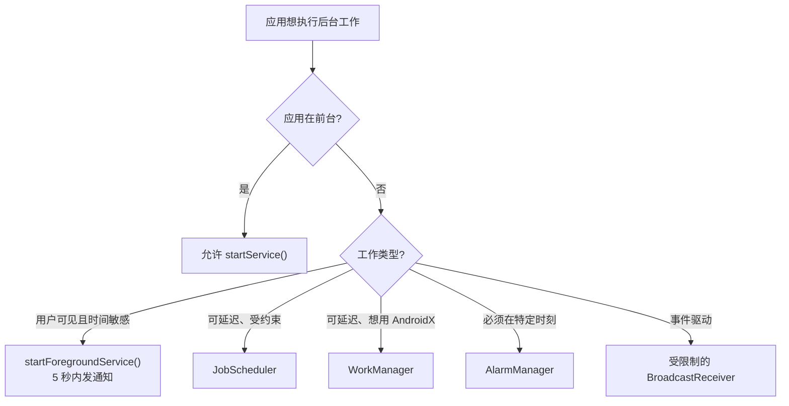
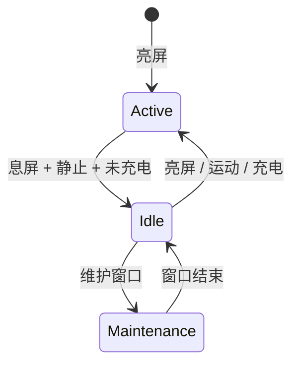
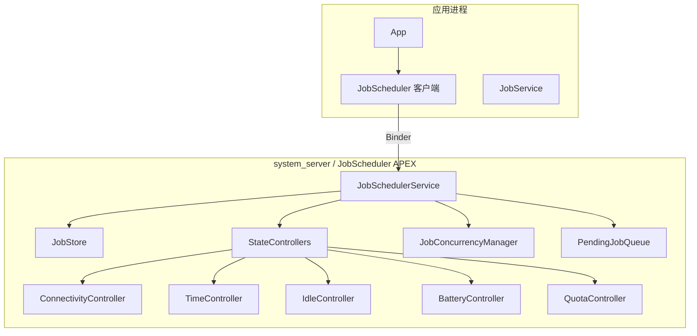
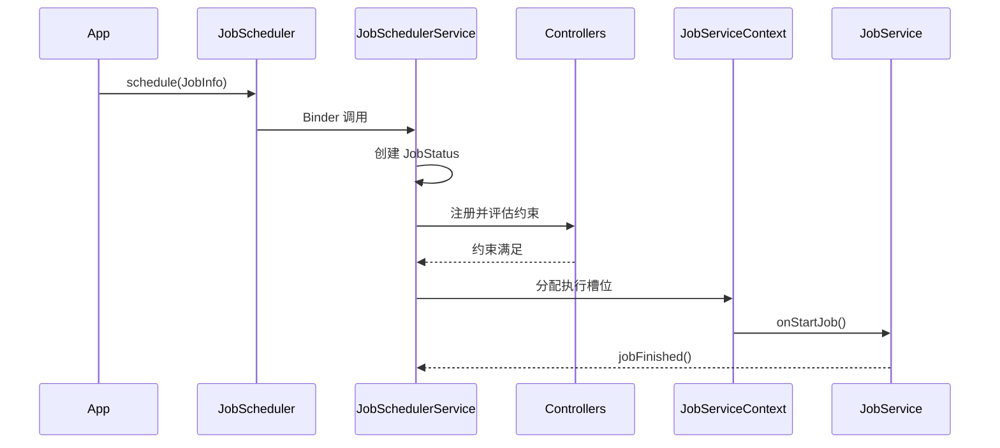
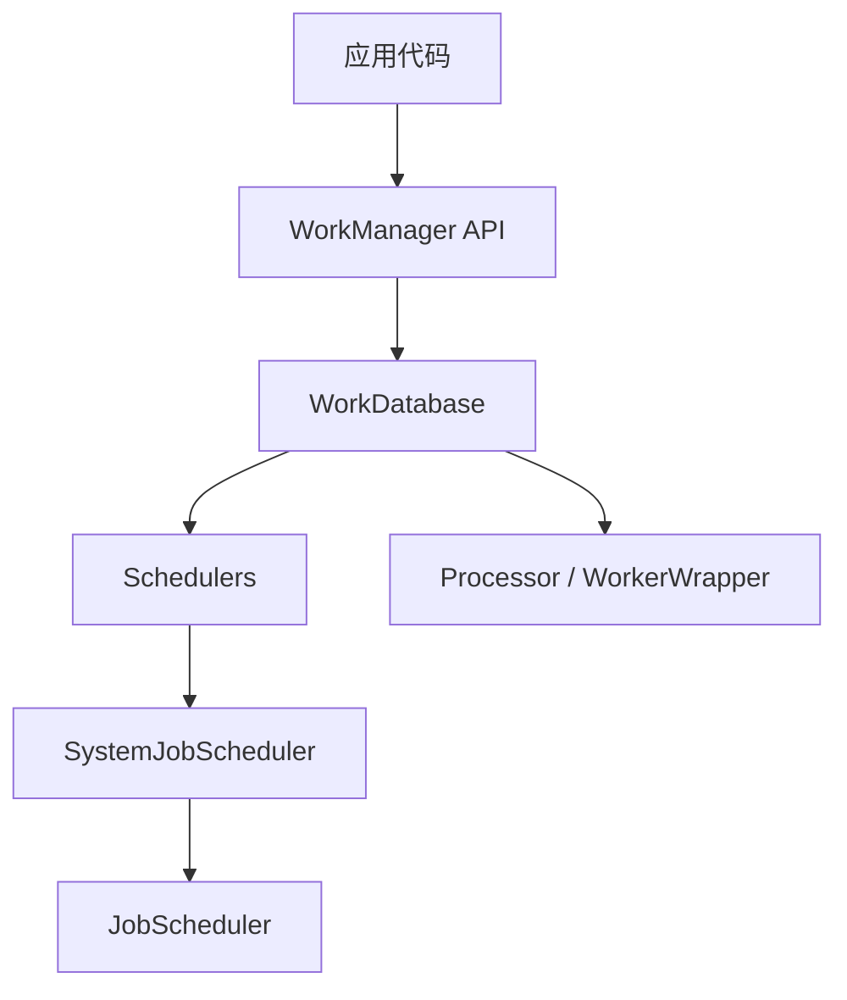
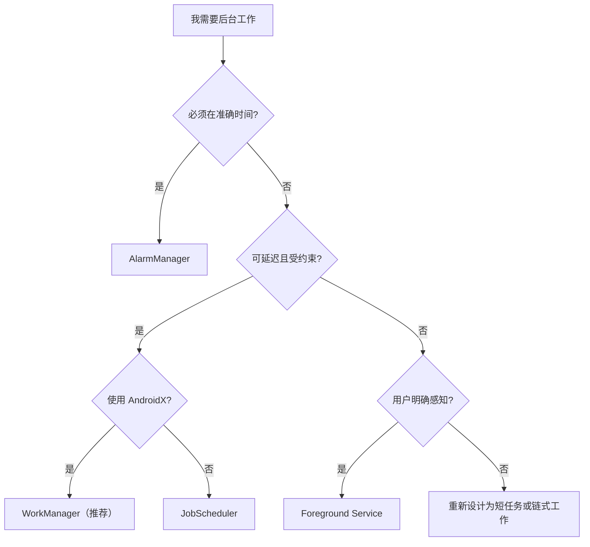

# 第 30 章：后台任务调度

> *“最便宜、最可靠、最省电的计算，是根本没有执行的那一次计算。”*
> 
> Android Performance Team

---

后台任务是移动操作系统中最典型的矛盾之一。用户希望邮件能及时同步、照片能自动备份、内容能后台刷新、通知能准时送达；但每一次后台计算都会消耗电量、占用网络、争抢 CPU 和内存。单个应用这么做似乎都合理，但上百个应用叠加起来，就会迅速演化成典型的“公地悲剧”。Android 过去十年的背景执行设计，本质上就是不断把这种失控状态收回系统调度权。本章围绕后台执行限制、JobScheduler、AlarmManager、WorkManager、前台服务和广播限制，梳理 Android 如何把“后台任务”从应用自管，逐步转变为系统统一治理。

---

## 30.1 后台执行限制

### 30.1.1 Oreo 之前的问题

Android 8.0 之前，后台执行约束很弱，问题非常集中：

- 应用可以无限期启动长生命周期后台 Service
- 大量应用共同监听隐式广播，导致一次系统事件唤醒许多进程
- 后台网络、CPU、内存消耗几乎没有统一协调
- 用户很难知道到底是谁在后台持续耗电

### 30.1.2 后台 Service 限制

从 Android 8.0 开始，target API 26+ 的应用不能在后台随意 `startService()`。如果应用不在前台状态，直接启动普通服务会抛 `IllegalStateException`。

系统鼓励的替代路径有三类：

- `startForegroundService()`：面向用户可感知、必须立即开始的工作
- `JobScheduler.schedule()`：面向可延迟、可约束的后台工作
- `WorkManager.enqueue()`：面向现代 AndroidX 应用的统一抽象



### 30.1.3 前台状态定义

系统通常把以下情况视为“前台”：

| 条件 | 例子 |
|------|------|
| 有可见 Activity | 应用正在屏幕上 |
| 有前台服务 | 音乐、导航、上传 |
| 被前台应用绑定使用 | 前台应用在访问其 ContentProvider |
| 位于临时 allowlist | 刚收到高优先级 FCM 等 |

最终状态由 `ActivityManagerService` 及其 `UidRecord` 维护。

### 30.1.4 App Standby Buckets

Android 9 引入 App Standby Buckets，根据用户最近是否使用应用对后台预算分层：

| Bucket | 含义 | Job 调度频率 | Alarm 调度频率 |
|--------|------|--------------|----------------|
| `Active` | 正在用或刚用过 | 基本不限制 | 基本不限制 |
| `Working Set` | 经常用 | 延迟可到数小时级 | 可有分钟级延迟 |
| `Frequent` | 偶尔用 | 延迟更大 | 延迟更大 |
| `Rare` | 很少用 | 可能一天级延迟 | 可能小时级延迟 |
| `Restricted` | 低使用且高耗电 | 最严格 | 最严格 |

JobSchedulerService 内部也把这些 bucket 映射成对应 index，用于 quota 与执行预算控制。

### 30.1.5 Doze 与 App Standby

Doze 解决的是“整机空闲”问题，而 App Standby 解决的是“单个 app 长期不活跃”问题。Doze 典型触发条件是：

- 屏幕关闭
- 设备静止
- 未充电
- 空闲持续一段时间



Doze 期间通常会：

- 推迟大多数 alarm
- 阻断后台网络
- 暂停 jobs 与 sync
- 忽略普通 wakelock
- 周期性打开 maintenance windows

### 30.1.6 Battery Saver

Battery Saver 会进一步加强后台限制：

- 减少后台网络机会
- 推迟 jobs 和 alarms
- 降低位置精度
- 收紧 CPU 与视觉效果策略

### 30.1.7 历史演进

| Android 版本 | 关键变化 |
|-------------|----------|
| 6.0 | Doze、App Standby |
| 7.0 | 移动中 Doze、部分隐式广播限制 |
| 8.0 | 后台服务限制、广播限制 |
| 9.0 | App Standby Buckets |
| 10 | 后台拉起 Activity 限制 |
| 11 | 前台服务类型要求增强 |
| 12 / 12L | 后台启动前台服务限制增强、精确闹钟限制 |
| 13 | 权限与后台行为继续细化 |
| 14 | 前台服务类型强校验、精确闹钟权限更收紧 |
| 15 | 后台任务策略继续收紧 |

## 30.2 JobScheduler

### 30.2.1 架构概览

JobScheduler 是 Android 背景任务调度的核心平台原语。应用描述“要做什么”和“需要满足什么条件”，系统决定“什么时候跑”。



### 30.2.2 `JobSchedulerService`

`JobSchedulerService` 是服务端核心，负责：

- 接收 schedule / cancel 请求
- 存储 Job
- 管理控制器
- 判断约束何时满足
- 决定并发执行哪些 job
- 把 job 绑定到应用的 `JobService`

### 30.2.3 `JobInfo`：声明工作与约束

应用通过 `JobInfo.Builder` 描述 job，包括：

- jobId
- 目标 `ComponentName`
- 最小延迟 / 截止时间
- 网络条件
- 充电要求
- idle 要求
- 电量不低 / 存储不低
- 周期性 / 一次性
- backoff 策略
- extras / transient extras

### 30.2.4 约束类型

常见 constraint 包括：

- 网络类型
- `requiresCharging`
- `requiresDeviceIdle`
- `requiresBatteryNotLow`
- `requiresStorageNotLow`
- timing delay / deadline
- content URI 变化触发

### 30.2.5 `StateController` 架构

JobScheduler 的扩展性来自一组 controller。每个 controller 只关心自己这一维：

- 是否满足
- 何时变化
- 变化后通知 JSS 重评估

### 30.2.6 `JobStatus`

`JobStatus` 是服务端真正的内部 job 表示，包含：

- 原始 `JobInfo`
- 来源 UID / package / user
- 约束满足位
- 运行次数与失败信息
- standby bucket 信息
- quota / timing / enqueue 元数据

### 30.2.7 Job 调度流程

典型流程：

1. app 调 `schedule()`
2. Binder 进入 `JobSchedulerService`
3. 构造 `JobStatus`
4. 交给各 controller 注册与评估
5. 若约束满足，进入 pending queue
6. 并发管理器决定何时真正运行
7. 绑定 app 的 `JobService`
8. app 调 `jobFinished()`，服务端更新状态



### 30.2.8 `JobStore`：持久化

`JobStore` 负责把可持久化 job 写入 XML/磁盘，在重启后恢复。

### 30.2.9 `ConnectivityController`

该控制器负责处理网络约束，如：

- 任意连接
- 未计费网络
- 非漫游
- 带宽估计需求

### 30.2.10 `QuotaController`

QuotaController 是现代 JobScheduler 的关键部分。它根据 standby bucket 控制每个 app 的执行预算，防止冷门应用在后台无限占用机会。

### 30.2.11 `FlexibilityController`

该控制器让系统在满足 deadline 之前拥有更灵活的调度空间，以便更好地批处理任务。

### 30.2.12 `JobConcurrencyManager`

即使很多 job 同时可运行，系统也不会全放。并发管理器会综合：

- 当前运行 job 数
- UID 优先级
- 系统负载
- 热状态与电量状态

来决定本轮到底启动哪些 job。

### 30.2.13 `JobService`：应用侧实现

应用通过继承 `JobService` 实现工作逻辑：

```java
public class SyncJobService extends JobService {
    @Override
    public boolean onStartJob(JobParameters params) {
        // 启动异步工作
        return true;
    }

    @Override
    public boolean onStopJob(JobParameters params) {
        // 清理并决定是否重试
        return true;
    }
}
```

`onStartJob()` 返回 `true` 代表异步工作尚未完成，之后必须调用 `jobFinished()`。

### 30.2.14 限制与热降频

热状态、电池 saver、standby bucket、device idle、后台限制等都会影响 job 能否启动和能跑多久。

### 30.2.15 调试 JobScheduler

```bash
# 导出全部 jobs
adb shell dumpsys jobscheduler

# 查看某个包
adb shell dumpsys jobscheduler <package>

# 强制执行某个 job
adb shell cmd jobscheduler run -f <package> <jobId>

# 查看执行历史
adb shell cmd jobscheduler get-job-state <package> <jobId>

# 查看 / 设置 standby bucket
adb shell am get-standby-bucket <package>
adb shell am set-standby-bucket <package> rare
```

## 30.3 AlarmManager

### 30.3.1 架构

AlarmManager 面向“在某个时间点附近触发”的工作，不像 JobScheduler 那样以约束和批处理为主。它主要由 `AlarmManagerService` 驱动，底层依赖 kernel alarm / RTC / elapsed realtime 定时机制。

### 30.3.2 Alarm 类型

四类基础类型：

| 类型 | 时钟基准 | 是否唤醒设备 |
|------|----------|--------------|
| `RTC` | 墙钟时间 | 否 |
| `RTC_WAKEUP` | 墙钟时间 | 是 |
| `ELAPSED_REALTIME` | 开机后 elapsed 时间 | 否 |
| `ELAPSED_REALTIME_WAKEUP` | elapsed 时间 | 是 |

### 30.3.3 精确与非精确闹钟

Android 长期鼓励 inexact alarms，以便系统批处理与省电。exact alarm 会强行在更窄时间窗触发，因此对续航冲击更大。

### 30.3.4 精确闹钟限制（API 31+）

Android 12 之后，精确闹钟受更严格限制。很多场景需要 `SCHEDULE_EXACT_ALARM` 或特殊豁免。平台目的很明确：阻止应用把 AlarmManager 当做“变相后台执行器”。

### 30.3.5 Alarm 批处理

AlarmManagerService 会把接近的 alarms 合并成 batch，一次性唤醒处理，尽量减少频繁唤醒设备。

### 30.3.6 Idle Dispatch

设备 idle / Doze 时，大多数 alarm 会被推迟，只在维护窗口或允许的特殊路径下放行。

### 30.3.7 Alarm 传递策略

系统会根据：

- exact / inexact
- allow while idle
- alarm clock
- standby bucket
- battery saver / doze

决定 alarm 的真实触发时间。

### 30.3.8 基于 Listener 的 Alarm

除了 `PendingIntent`，AlarmManager 也支持 listener callback 形式，适合进程仍在、无需跨进程拉起的场景。

### 30.3.9 AlarmManager vs JobScheduler

简单区分：

- 必须在某个时间点触发：AlarmManager
- 可以等条件满足、可被系统调度：JobScheduler

### 30.3.10 调试 AlarmManager

```bash
# 全部待处理 alarm
adb shell dumpsys alarm

# 某个包的 alarm
adb shell dumpsys alarm <package>

# 查看精确闹钟权限
adb shell appops get <package> SCHEDULE_EXACT_ALARM

# 查看统计
adb shell dumpsys alarm | grep -i stats
```

## 30.4 WorkManager

### 30.4.1 为什么需要 WorkManager

开发者长期面临一个现实：

- 直接用 JobScheduler 代码较底层
- API 级别差异很多
- 需要链式任务、唯一任务、观察状态、重试、持久化

WorkManager 就是为这些需求提供统一抽象。

### 30.4.2 核心概念

WorkManager 的核心对象包括：

- `Worker` / `CoroutineWorker`
- `WorkRequest`
- `OneTimeWorkRequest`
- `PeriodicWorkRequest`
- `Constraints`
- `Data`
- `WorkInfo`
- unique work

### 30.4.3 架构

WorkManager 本质上维护自己的数据库与状态机，在现代 Android 上大多数时候通过 JobScheduler 真正落地执行。



### 30.4.4 WorkManager 与 JobScheduler 集成

在新系统上，WorkManager 通常用 JobScheduler 作为后端，因此它本质上是在平台约束之上提供更好的开发体验，而不是绕开系统限制。

### 30.4.5 Work 状态

常见状态：

- `ENQUEUED`
- `RUNNING`
- `SUCCEEDED`
- `FAILED`
- `BLOCKED`
- `CANCELLED`

### 30.4.6 Unique Work

unique work 允许你给一条逻辑工作流起唯一名字，并选择：

- `KEEP`
- `REPLACE`
- `APPEND`

避免重复入队。

### 30.4.7 Expedited Work

expedited work 面向“想尽快跑，但仍希望通过 WorkManager 管理”的场景。不过它仍受系统 quota 约束，超额时可降级为普通 work。

### 30.4.8 Long-Running Work

真正长时间、用户可感知的工作通常还是要结合前台服务；WorkManager 可以通过 `setForeground()` 等方式与 FGS 协作。

## 30.5 前台服务

### 30.5.1 创建前台服务

前台服务的核心要求：

1. 调 `startForegroundService()`
2. 在限定时间内调用 `startForeground()`
3. 立即展示持续通知

### 30.5.2 前台服务类型（API 29+）

新版本要求应用声明前台服务类型，例如：

- data sync
- location
- media playback
- connected device
- phone call
- camera
- microphone

这样系统才能更准确地审计和约束前台服务用途。

### 30.5.3 前台服务生命周期

FGS 生命周期既受 Service 生命周期约束，也受通知展示与类型合规约束。服务若未及时进入 foreground，系统会直接杀掉或触发异常。

### 30.5.4 后台启动限制（API 31+）

Android 12 起，从后台直接拉起前台服务也变得受限。很多以前“后台收到事件就起 FGS”的路径已不再可靠。

### 30.5.5 Short Service（API 34+）

Android 14 引入 short service 概念，强调某些前台服务应该是短时、快速完成的，而不是用 FGS 长期驻留。

### 30.5.6 Data Sync FGS 超时（API 35+）

Android 15 对 data sync 类前台服务进一步引入更明确超时约束，防止其长期霸占前台执行权。

### 30.5.7 前台服务 ANR

FGS 若没按时发通知、没及时进入前台，或在主线程执行阻塞逻辑，都可能引发 ANR 或系统强制停止。

### 30.5.8 通知要求

每个前台服务都必须有可见通知，这是系统要求“用户可知晓”的核心手段。

### 30.5.9 用户可见前台服务通知

系统不断强化一个原则：既然应用想获得前台执行特权，就必须让用户清楚看到它正在运行什么。

## 30.6 广播限制

### 30.6.1 隐式广播问题

早期 Android 最大的后台性能问题之一就是隐式广播风暴。例如一次网络变化会把一大批 app 一起唤醒。

### 30.6.2 广播限制时间线

从 Android 7 开始，manifest 注册的隐式广播逐步被限制；到 8.0 以后，大量常见隐式广播已经不能再靠静态注册接收。

### 30.6.3 显式 vs 隐式广播

| 类型 | 特征 |
|------|------|
| 显式广播 | 指向特定组件或包，影响可控 |
| 隐式广播 | 任意匹配 receiver 都会被唤醒，成本高 |

### 30.6.4 豁免广播

仍有少数系统认为“必须保留”的隐式广播属于豁免列表，例如一些与时钟、时区、用户切换或关键系统状态有关的广播。

### 30.6.5 隐式广播替代方案

Android 鼓励替代路径：

- `JobScheduler` content trigger
- `ConnectivityManager.NetworkCallback`
- context-registered receiver
- 前台组件内监听

### 30.6.6 Context 注册 Receiver

动态注册 receiver 只在进程活着且上下文存在时有效，更符合“谁活跃谁监听”的原则。

### 30.6.7 Ordered 与 Sticky Broadcast

这两类广播仍存在，但使用范围越来越收窄。系统整体方向是减少广播在后台调度中的中心地位。

### 30.6.8 Protected Broadcasts

部分广播被系统保护，第三方应用不能随意发送，避免伪造系统事件扰乱后台策略。

## 30.7 动手实践（Try It）

### 30.7.1 练习：检查 JobScheduler 状态

```bash
# 导出全部 jobs
adb shell dumpsys jobscheduler

# 输出通常包括：
# - 已注册 jobs
# - 当前运行 jobs
# - pending 队列
# - controller 状态
# - standby bucket 配额
# - 最近执行历史

# 查看某个包
adb shell dumpsys jobscheduler <package>

# 查看全部 app 的 standby bucket
adb shell am get-standby-bucket

# 查看 job 执行时间线
adb shell cmd jobscheduler monitor-battery on
```

### 30.7.2 练习：调度并监控一个 Job

```java
JobInfo info = new JobInfo.Builder(
        1,
        new ComponentName(context, SyncJobService.class))
        .setRequiredNetworkType(JobInfo.NETWORK_TYPE_ANY)
        .setRequiresBatteryNotLow(true)
        .build();

JobScheduler js = context.getSystemService(JobScheduler.class);
js.schedule(info);
```

```bash
# 强制立即执行
adb shell cmd jobscheduler run -f <package> 1

# 观察日志
adb logcat | grep SyncJobService

# 查看当前状态
adb shell cmd jobscheduler get-job-state <package> 1
```

### 30.7.3 练习：测试 Alarm 调度

```java
AlarmManager am = context.getSystemService(AlarmManager.class);
PendingIntent pi = PendingIntent.getBroadcast(context, 0, intent,
        PendingIntent.FLAG_UPDATE_CURRENT | PendingIntent.FLAG_IMMUTABLE);
am.setExactAndAllowWhileIdle(
        AlarmManager.ELAPSED_REALTIME_WAKEUP,
        SystemClock.elapsedRealtime() + 60_000,
        pi);
```

```bash
# 查看全部 alarm
adb shell dumpsys alarm

# 查看自己包的 alarm
adb shell dumpsys alarm <package>

# 查看统计
adb shell dumpsys alarm | grep -i stats
```

### 30.7.4 练习：WorkManager 链式任务

```java
OneTimeWorkRequest download = new OneTimeWorkRequest.Builder(DownloadWorker.class).build();
OneTimeWorkRequest process = new OneTimeWorkRequest.Builder(ProcessWorker.class).build();
OneTimeWorkRequest upload = new OneTimeWorkRequest.Builder(UploadWorker.class).build();

WorkManager.getInstance(context)
        .beginWith(download)
        .then(process)
        .then(upload)
        .enqueue();
```

### 30.7.5 练习：测试 Doze

```bash
# 设备需息屏
adb shell dumpsys deviceidle force-idle light
adb shell dumpsys deviceidle force-idle deep
adb shell dumpsys deviceidle get deep
adb shell dumpsys deviceidle step

# 观察：jobs 与 alarms 会被推迟

# 退出 Doze
adb shell dumpsys deviceidle unforce

# 查看 allowlist
adb shell dumpsys deviceidle whitelist
```

### 30.7.6 练习：测试 App Standby Buckets

```bash
# 查看当前 bucket
adb shell am get-standby-bucket <package>

# 强制设为 rare
adb shell am set-standby-bucket <package> rare

# 观察对 job 的影响

# 恢复自动分桶
adb shell am set-standby-bucket <package> active
```

### 30.7.7 练习：测试后台限制

```bash
# 模拟对 app 的后台限制
adb shell cmd appops set <package> RUN_ANY_IN_BACKGROUND ignore

# 观察：后台 service 停止、job 推迟

# 恢复
adb shell cmd appops set <package> RUN_ANY_IN_BACKGROUND allow

# 模拟 Battery Saver
adb shell settings put global low_power 1
adb shell settings put global low_power 0
```

### 30.7.8 练习：带类型的前台服务

```xml
<service
    android:name=".SyncForegroundService"
    android:foregroundServiceType="dataSync"
    android:exported="false" />
```

```bash
# 查看运行中的前台服务
adb shell dumpsys activity services | grep fg

# 详细服务信息
adb shell dumpsys activity service <package>/<service>
```

### 30.7.9 练习：观察广播限制

```java
ConnectivityManager cm = getSystemService(ConnectivityManager.class);
cm.registerDefaultNetworkCallback(new ConnectivityManager.NetworkCallback() {
    @Override
    public void onAvailable(Network network) {
        Log.d("Network", "Connected: " + network);
    }

    @Override
    public void onLost(Network network) {
        Log.d("Network", "Disconnected: " + network);
    }
});
```

### 30.7.10 练习：构建完整后台任务方案

下面是一个较完整的同步方案：用 WorkManager 做周期与立即任务，必要时配合前台信息与进度上报。

```java
public class DataSyncWorker extends CoroutineWorker {

    @Override
    public ForegroundInfo getForegroundInfo() {
        return createForegroundInfo("Syncing data...");
    }

    @Override
    public Result doWork() {
        setProgress(new Data.Builder().putInt("progress", 0).build());
        try {
            List<Update> updates = downloadUpdates();
            setProgress(new Data.Builder().putInt("progress", 33).build());

            applyUpdates(updates);
            setProgress(new Data.Builder().putInt("progress", 66).build());

            uploadChanges();
            setProgress(new Data.Builder().putInt("progress", 100).build());
            return Result.success();
        } catch (IOException e) {
            if (getRunAttemptCount() < 3) {
                return Result.retry();
            }
            return Result.failure(new Data.Builder()
                    .putString("error", e.getMessage())
                    .build());
        }
    }
}
```

```java
public class SyncScheduler {
    public static void schedulePeriodicSync(Context context) {
        Constraints constraints = new Constraints.Builder()
                .setRequiredNetworkType(NetworkType.CONNECTED)
                .setRequiresBatteryNotLow(true)
                .build();

        PeriodicWorkRequest syncRequest =
                new PeriodicWorkRequest.Builder(
                        DataSyncWorker.class,
                        1, TimeUnit.HOURS,
                        15, TimeUnit.MINUTES)
                .setConstraints(constraints)
                .setBackoffCriteria(
                        BackoffPolicy.EXPONENTIAL,
                        WorkRequest.MIN_BACKOFF_MILLIS,
                        TimeUnit.MILLISECONDS)
                .addTag("periodic-sync")
                .build();

        WorkManager.getInstance(context).enqueueUniquePeriodicWork(
                "data-sync",
                ExistingPeriodicWorkPolicy.KEEP,
                syncRequest);
    }

    public static void syncNow(Context context) {
        OneTimeWorkRequest syncRequest =
                new OneTimeWorkRequest.Builder(DataSyncWorker.class)
                .setExpedited(OutOfQuotaPolicy.RUN_AS_NON_EXPEDITED_WORK_REQUEST)
                .setConstraints(new Constraints.Builder()
                        .setRequiredNetworkType(NetworkType.CONNECTED)
                        .build())
                .addTag("immediate-sync")
                .build();

        WorkManager.getInstance(context).enqueueUniqueWork(
                "immediate-sync",
                ExistingWorkPolicy.REPLACE,
                syncRequest);
    }
}
```

### 30.7.11 小结：如何选 API



### 30.7.12 关键源码路径汇总

| 组件 | 路径 |
|------|------|
| `JobSchedulerService` | `frameworks/base/apex/jobscheduler/service/java/com/android/server/job/JobSchedulerService.java` |
| `JobStore` | `frameworks/base/apex/jobscheduler/service/java/com/android/server/job/JobStore.java` |
| `JobConcurrencyManager` | `frameworks/base/apex/jobscheduler/service/java/com/android/server/job/JobConcurrencyManager.java` |
| `JobServiceContext` | `frameworks/base/apex/jobscheduler/service/java/com/android/server/job/JobServiceContext.java` |
| `StateController` | `frameworks/base/apex/jobscheduler/service/java/com/android/server/job/controllers/StateController.java` |
| `JobStatus` | `frameworks/base/apex/jobscheduler/service/java/com/android/server/job/controllers/JobStatus.java` |
| `ConnectivityController` | `frameworks/base/apex/jobscheduler/service/java/com/android/server/job/controllers/ConnectivityController.java` |
| `TimeController` | `frameworks/base/apex/jobscheduler/service/java/com/android/server/job/controllers/TimeController.java` |
| `QuotaController` | `frameworks/base/apex/jobscheduler/service/java/com/android/server/job/controllers/QuotaController.java` |
| `FlexibilityController` | `frameworks/base/apex/jobscheduler/service/java/com/android/server/job/controllers/FlexibilityController.java` |
| `BatteryController` | `frameworks/base/apex/jobscheduler/service/java/com/android/server/job/controllers/BatteryController.java` |
| `IdleController` | `frameworks/base/apex/jobscheduler/service/java/com/android/server/job/controllers/IdleController.java` |
| `BackgroundJobsController` | `frameworks/base/apex/jobscheduler/service/java/com/android/server/job/controllers/BackgroundJobsController.java` |
| `DeviceIdleJobsController` | `frameworks/base/apex/jobscheduler/service/java/com/android/server/job/controllers/DeviceIdleJobsController.java` |
| `ContentObserverController` | `frameworks/base/apex/jobscheduler/service/java/com/android/server/job/controllers/ContentObserverController.java` |
| `ThermalStatusRestriction` | `frameworks/base/apex/jobscheduler/service/java/com/android/server/job/restrictions/ThermalStatusRestriction.java` |
| `AlarmManagerService` | `frameworks/base/apex/jobscheduler/service/java/com/android/server/alarm/AlarmManagerService.java` |
| `JobSchedulerInternal` | `frameworks/base/apex/jobscheduler/framework/java/com/android/server/job/JobSchedulerInternal.java` |

---

## 总结（Summary）

Android 的后台任务调度体系，本质上是在“应用希望随时做事”和“系统必须统一管理续航”之间建立秩序。今天的 Android 已经不再允许应用随意常驻后台，而是要求应用把后台工作交给系统调度器，根据优先级、时机、约束和用户可见性来决定执行方式。

本章关键点如下：

1. **后台限制是现代 Android 的前提条件**：从 Android 8.0 开始，后台服务、隐式广播、后台拉起和精确闹钟都被持续收紧。
2. **JobScheduler 是平台级后台任务原语**：约束控制器、quota 和并发管理共同决定任务什么时候真正运行。
3. **AlarmManager 只适合时间点强相关任务**：它不是通用后台执行器，尤其 exact alarm 在新版本上限制很严。
4. **WorkManager 是应用开发的首选抽象层**：它在 JobScheduler 之上补齐了持久化、链式任务、状态观察与兼容性。
5. **前台服务是后台执行特权，不是逃逸通道**：新版本要求类型声明、通知可见、启动时机合规，并不断加强超时与审计。
6. **广播限制解决的是系统级唤醒风暴问题**：manifest 静态隐式广播大幅收缩后，Android 把事件监听导向更精确、更按需的机制。
7. **App Standby Bucket 决定后台预算**：应用最近是否被用户使用，直接影响其 job、alarm 和后台执行配额。

### 关键源码文件参考

| 文件 | 作用 |
|------|------|
| `frameworks/base/apex/jobscheduler/service/java/com/android/server/job/JobSchedulerService.java` | JobScheduler 服务端核心 |
| `frameworks/base/apex/jobscheduler/service/java/com/android/server/job/JobStore.java` | Job 持久化 |
| `frameworks/base/apex/jobscheduler/service/java/com/android/server/job/JobConcurrencyManager.java` | Job 并发调度 |
| `frameworks/base/apex/jobscheduler/service/java/com/android/server/job/JobServiceContext.java` | Job 与应用 `JobService` 执行上下文 |
| `frameworks/base/apex/jobscheduler/service/java/com/android/server/job/controllers/JobStatus.java` | Job 内部状态表示 |
| `frameworks/base/apex/jobscheduler/service/java/com/android/server/job/controllers/StateController.java` | 控制器基类 |
| `frameworks/base/apex/jobscheduler/service/java/com/android/server/alarm/AlarmManagerService.java` | AlarmManager 服务端 |
| `frameworks/base/core/java/android/app/job/JobInfo.java` | Job 声明模型 |
| `frameworks/base/core/java/android/app/job/JobScheduler.java` | JobScheduler 客户端 API |
| `frameworks/base/core/java/android/app/AlarmManager.java` | AlarmManager API |
| `androidx.work` 相关源码（外部库） | WorkManager 实现 |
