# Chapter 30: Background Task Scheduling

> *"The cheapest, most reliable, and most power-efficient computation is the one
> you never perform."*
> -- Android Performance Team

---

Background work is the eternal tension in mobile operating systems. Users want
their email synced, their photos backed up, their news feeds refreshed, and
their notifications delivered promptly. But every background operation drains
battery, consumes network bandwidth, and competes for CPU and memory with the
foreground application. Multiply this by the hundreds of apps installed on a
typical device, and you have a tragedy of the commons: each app's background
work is individually reasonable but collectively devastating to battery life.

Android's answer has evolved over a decade of increasingly aggressive
restrictions. This chapter traces the entire background execution infrastructure:
the execution limits introduced in Android 8.0, the JobScheduler that replaced
ad hoc background work with a constraint-aware scheduler, the AlarmManager that
handles time-based wakeups, the WorkManager abstraction layer, foreground
services and their evolving requirements, and broadcast restrictions that limit
implicit wakeups.

---

## 30.1 Background Execution Limits

Android 8.0 (Oreo, API 26) introduced the most significant restrictions on
background execution in the platform's history. Prior to Oreo, any application
could start services, register broadcast receivers, and perform work in the
background with minimal restrictions. The result was poor battery life and
degraded system performance.

### 30.1.1 The Pre-Oreo Problem

Before Android 8.0, background abuse was rampant:

- Apps started long-running services that persisted indefinitely
- Dozens of apps registered for the same implicit broadcasts (e.g.,
  `CONNECTIVITY_CHANGED`), causing broadcast storms that woke every registered
  app
- Background services consumed CPU, memory, and network with no coordination
- Users had no visibility into which apps were consuming resources in the
  background

### 30.1.2 Background Service Limitations

Starting with Android 8.0, apps targeting API 26+ are subject to:

1. **Background service restrictions**: An app in the background cannot freely
   call `startService()`. If the app is not in the foreground (no visible
   activities, no foreground service running), calling `startService()` throws
   an `IllegalStateException`.

2. **Allowed alternatives**:
   - `startForegroundService()` -- starts a service that must post a
     notification within 5 seconds
   - `JobScheduler.schedule()` -- schedules constraint-aware work
   - `WorkManager.enqueue()` -- schedules deferrable work (AndroidX)

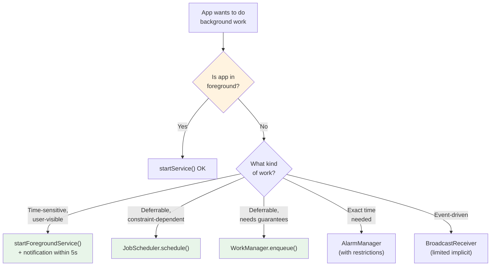

### 30.1.3 Foreground State Definition

The system defines an app as "in the foreground" if any of the following are
true:

| Condition | Example |
|-----------|---------|
| Has a visible Activity | App is open and on screen |
| Has a foreground Service | Music player, navigation, file upload |
| Connected via a foreground app | ContentProvider being used by a foreground app |
| Is in a temporary allowlist | Just received a high-priority FCM message |

The precise foreground/background state is tracked by `ActivityManagerService`
and its `UidRecord` for each application UID.

### 30.1.4 App Standby Buckets

Android 9.0 (Pie, API 28) introduced **App Standby Buckets**, which further
tiered background restrictions based on how recently and frequently the user
interacted with each app:

| Bucket | Criteria | Job Frequency | Alarm Frequency |
|--------|----------|--------------|-----------------|
| **Active** | Currently in use or very recently used | No restrictions | No restrictions |
| **Working Set** | Used regularly, not currently active | Up to 2 hours deferred | Up to 6 minutes deferred |
| **Frequent** | Used often but not daily | Up to 8 hours deferred | Up to 30 minutes deferred |
| **Rare** | Rarely used | Up to 24 hours deferred | Up to 2 hours deferred |
| **Restricted** | Minimal user interaction, high battery use | Up to 24 hours, 1 job/day | Up to 24 hours deferred |

The bucket assignments are managed by `UsageStatsManagerInternal` and
`AppStandbyInternal`:

```java
// Bucket indices defined in JobSchedulerService
// frameworks/base/apex/jobscheduler/service/java/com/android/server/job/
//     JobSchedulerService.java
public static final int ACTIVE_INDEX = 0;
public static final int WORKING_INDEX = 1;
public static final int FREQUENT_INDEX = 2;
public static final int RARE_INDEX = 3;
public static final int NEVER_INDEX = 4;
public static final int RESTRICTED_INDEX = 5;
public static final int EXEMPTED_INDEX = 6;
```

### 30.1.5 Doze Mode and App Standby

Android 6.0 introduced **Doze mode**, which restricts background activity when
the device is stationary, unplugged, and the screen is off for an extended
period. Android 7.0 added a lighter "Doze on the go" that activates when the
screen is off (even if the device is moving).

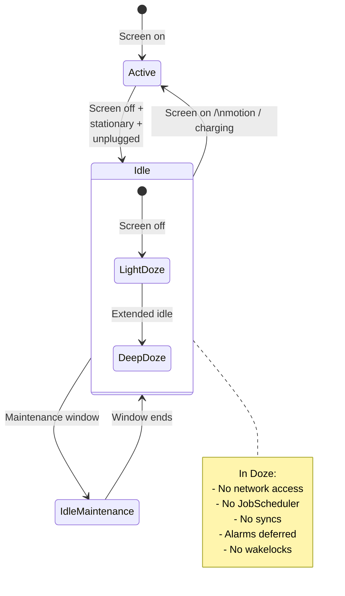

During Doze, the system:

- Defers all alarms (except `setAlarmClock()` and allowlisted exact alarms)
- Blocks network access
- Suspends jobs and syncs
- Ignores wakelocks
- Periodically opens **maintenance windows** where deferred work can execute

### 30.1.6 Battery Saver

Battery Saver mode (user-activated or auto-triggered at low battery) adds
further restrictions:

- Reduces background network access
- Defers jobs and alarms
- Reduces location accuracy
- Limits background CPU usage
- Restricts visual effects (animations, live wallpapers)

### 30.1.7 Historical Evolution of Background Restrictions

| Android Version | API | Key Restriction |
|----------------|-----|-----------------|
| 6.0 (Marshmallow) | 23 | Doze mode, App Standby |
| 7.0 (Nougat) | 24 | Doze on the go, limited implicit broadcasts |
| 8.0 (Oreo) | 26 | Background service limits, broadcast limits |
| 9.0 (Pie) | 28 | App Standby Buckets |
| 10 (Q) | 29 | Background activity launch restrictions |
| 11 (R) | 30 | Foreground service type requirements |
| 12 (S) | 31 | Exact alarm restrictions, foreground service launch from background |
| 12L | 32 | Further foreground service restrictions |
| 13 (T) | 33 | Per-app language, refined runtime permissions |
| 14 (U) | 34 | Foreground service types enforced, SCHEDULE_EXACT_ALARM restricted |
| 15 (V) | 35 | Further tightening of background task policies |

---

## 30.2 JobScheduler

JobScheduler is Android's primary mechanism for scheduling deferrable
background work. Introduced in Android 5.0 (API 21), it allows apps to declare
*what* work needs to be done and *under what conditions*, and the system decides
*when* to run it. This enables the system to batch work, defer it to optimal
times (e.g., when charging and on Wi-Fi), and enforce standby bucket quotas.

### 30.2.1 Architecture Overview

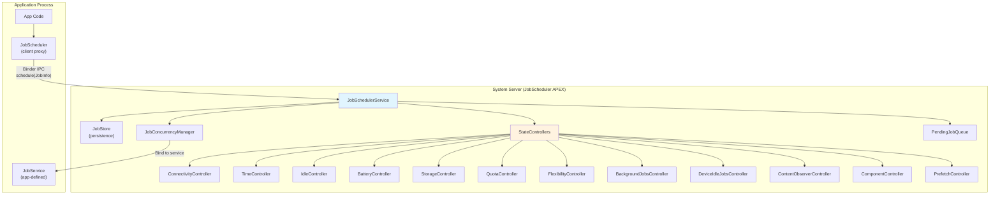

The key components all live in the JobScheduler APEX module:

**Source path**: `frameworks/base/apex/jobscheduler/service/java/com/android/server/job/`

### 30.2.2 JobSchedulerService

`JobSchedulerService` is the central coordinator. It extends `SystemService`
and implements two listener interfaces:

```java
// frameworks/base/apex/jobscheduler/service/java/com/android/server/job/
//     JobSchedulerService.java
public class JobSchedulerService extends com.android.server.SystemService
        implements StateChangedListener, JobCompletedListener {

    public static final String TAG = "JobScheduler";

    /** The maximum number of jobs that we allow an app to schedule */
    private static final int MAX_JOBS_PER_APP = 150;

    /** Master list of jobs. */
    final JobStore mJobs;

    /** List of controllers that will notify this service of updates to jobs. */
    final List<StateController> mControllers;

    /** Queue of pending jobs ready to execute. */
    private final PendingJobQueue mPendingJobQueue = new PendingJobQueue();

    /** Manages concurrent job execution slots. */
    final JobConcurrencyManager mConcurrencyManager;

    // ...
}
```

Key constants and limits:

- **MAX_JOBS_PER_APP = 150**: Each app can have at most 150 scheduled jobs
- **NUM_COMPLETED_JOB_HISTORY = 20**: The system keeps track of the 20 most
  recently completed jobs for debugging

### 30.2.3 JobInfo: Declaring Work and Constraints

Applications describe their jobs using `JobInfo.Builder`:

```java
JobInfo jobInfo = new JobInfo.Builder(JOB_ID,
        new ComponentName(context, MyJobService.class))
    // Constraints
    .setRequiredNetworkType(JobInfo.NETWORK_TYPE_UNMETERED)
    .setRequiresCharging(true)
    .setRequiresDeviceIdle(true)
    .setRequiresBatteryNotLow(true)
    .setRequiresStorageNotLow(true)

    // Timing
    .setMinimumLatency(15 * 60 * 1000)     // Don't run for at least 15 min
    .setOverrideDeadline(60 * 60 * 1000)    // Must run within 1 hour
    .setPeriodic(24 * 60 * 60 * 1000)       // Repeat every 24 hours

    // Persistence
    .setPersisted(true)  // Survive reboots

    // Content triggers
    .addTriggerContentUri(
        new JobInfo.TriggerContentUri(
            MediaStore.Images.Media.EXTERNAL_CONTENT_URI,
            JobInfo.TriggerContentUri.FLAG_NOTIFY_FOR_DESCENDANTS))

    // Backoff policy
    .setBackoffCriteria(30_000, JobInfo.BACKOFF_POLICY_EXPONENTIAL)

    // Expedited job (API 31+)
    .setExpedited(true)

    // Estimated network usage
    .setEstimatedNetworkBytes(
        5 * 1024 * 1024,   // 5 MB download
        1024 * 1024)        // 1 MB upload

    .build();

// Schedule the job
JobScheduler scheduler = context.getSystemService(JobScheduler.class);
int result = scheduler.schedule(jobInfo);
// result == JobScheduler.RESULT_SUCCESS or RESULT_FAILURE
```

### 30.2.4 Constraint Types

The constraint system is the core of JobScheduler's value. Each constraint is
managed by a dedicated `StateController`:

| Constraint | Controller | Source File |
|-----------|-----------|------------|
| Network type/connectivity | `ConnectivityController` | `controllers/ConnectivityController.java` |
| Timing (delay, deadline, periodic) | `TimeController` | `controllers/TimeController.java` |
| Device idle | `IdleController` | `controllers/IdleController.java` |
| Charging / battery not low | `BatteryController` | `controllers/BatteryController.java` |
| Storage not low | `StorageController` | `controllers/StorageController.java` |
| Content URI changes | `ContentObserverController` | `controllers/ContentObserverController.java` |
| Quota enforcement | `QuotaController` | `controllers/QuotaController.java` |
| Flexibility | `FlexibilityController` | `controllers/FlexibilityController.java` |
| Background restrictions | `BackgroundJobsController` | `controllers/BackgroundJobsController.java` |
| Doze mode | `DeviceIdleJobsController` | `controllers/DeviceIdleJobsController.java` |
| App component enabled | `ComponentController` | `controllers/ComponentController.java` |
| Prefetch timing | `PrefetchController` | `controllers/PrefetchController.java` |

All controller source files are at:

**Source path**: `frameworks/base/apex/jobscheduler/service/java/com/android/server/job/controllers/`

### 30.2.5 StateController Architecture

All controllers extend the abstract `StateController` base class:

```java
// frameworks/base/apex/jobscheduler/service/java/com/android/server/job/
//     controllers/StateController.java
public abstract class StateController {
    protected final JobSchedulerService mService;
    protected final StateChangedListener mStateChangedListener;
    protected final Context mContext;
    protected final Object mLock;

    /**
     * Implement the logic here to decide whether a job should be
     * tracked by this controller.
     */
    public abstract void maybeStartTrackingJobLocked(
            JobStatus jobStatus, JobStatus lastJob);

    /**
     * Remove job from this controller's tracking.
     */
    public abstract void maybeStopTrackingJobLocked(
            JobStatus jobStatus, JobStatus lastJob);

    /**
     * Called when a controller's state changes to evaluate
     * which jobs are now ready.
     */
    public void evaluateStateLocked(JobStatus jobStatus) {}
}
```

Each controller tracks a set of jobs and maintains satisfaction bits on the
`JobStatus` object. When a controller's state changes (e.g., the device
connects to Wi-Fi), it notifies `JobSchedulerService` through the
`StateChangedListener` interface, which triggers a re-evaluation of pending
jobs.

### 30.2.6 JobStatus: Internal Job Representation

`JobStatus` is the internal representation of a scheduled job. It aggregates
the original `JobInfo` with runtime state tracked by the controllers:

```java
// frameworks/base/apex/jobscheduler/service/java/com/android/server/job/
//     controllers/JobStatus.java

/**
 * Uniquely identifies a job internally.
 * Created from the public JobInfo object when it lands on the scheduler.
 * Contains current state of the requirements of the job, as well as a
 * function to evaluate whether it's ready to run.
 */
public final class JobStatus {
    // Constraint satisfaction bits
    static final int CONSTRAINT_CHARGING = 1 << 0;
    static final int CONSTRAINT_BATTERY_NOT_LOW = 1 << 1;
    static final int CONSTRAINT_STORAGE_NOT_LOW = 1 << 2;
    static final int CONSTRAINT_TIMING_DELAY = 1 << 3;
    static final int CONSTRAINT_DEADLINE = 1 << 4;
    static final int CONSTRAINT_IDLE = 1 << 5;
    static final int CONSTRAINT_CONNECTIVITY = 1 << 6;
    static final int CONSTRAINT_CONTENT_TRIGGER = 1 << 7;
    // ... more constraints

    // The job is ready when all required constraints are satisfied
    public boolean isReady() {
        return isConstraintsSatisfied() && !isPending() && !isActive();
    }
}
```

### 30.2.7 Job Scheduling Flow

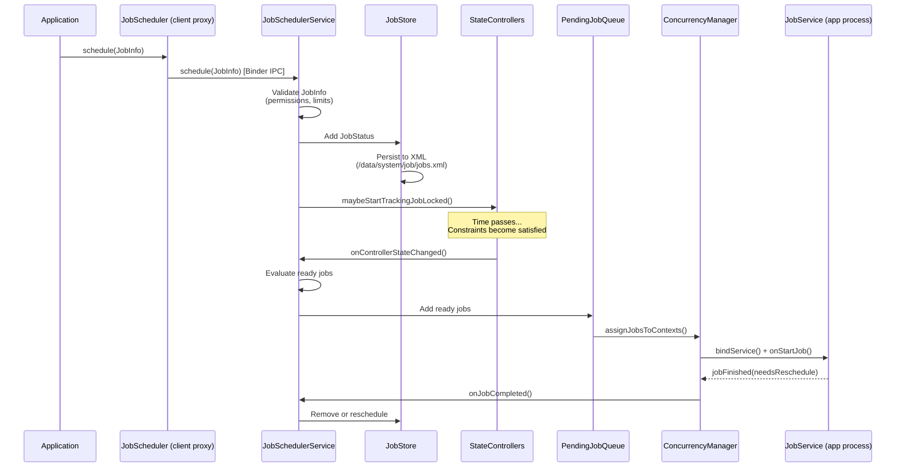

### 30.2.8 JobStore: Persistence

`JobStore` persists scheduled jobs to XML so they survive reboots:

**Source path**: `frameworks/base/apex/jobscheduler/service/java/com/android/server/job/JobStore.java`

```java
// frameworks/base/apex/jobscheduler/service/java/com/android/server/job/
//     JobStore.java
package com.android.server.job;

// Jobs are stored at /data/system/job/jobs.xml
// The format is XML with each job's constraints, timing, and metadata
```

The file is written atomically using `AtomicFile` to prevent corruption during
unexpected shutdowns. At boot, `JobStore` reads this file to restore all
persisted jobs (those created with `setPersisted(true)`).

### 30.2.9 ConnectivityController: Network Constraints

The `ConnectivityController` tracks network state and evaluates whether each
job's network constraint is satisfied:

**Source path**: `frameworks/base/apex/jobscheduler/service/java/com/android/server/job/controllers/ConnectivityController.java`

```java
// frameworks/base/apex/jobscheduler/service/java/com/android/server/job/
//     controllers/ConnectivityController.java
package com.android.server.job.controllers;

// Tracks network types: NONE, ANY, UNMETERED, NOT_ROAMING, CELLULAR
// Uses ConnectivityManager.NetworkCallback to monitor changes
// Evaluates NetworkCapabilities for each job's requirements
```

The controller registers a `NetworkCallback` with `ConnectivityManager` and
re-evaluates all tracked jobs whenever the network state changes. It also
considers the app's data saver status and metered network policy.

### 30.2.10 QuotaController: Execution Quotas

The `QuotaController` enforces per-app execution time quotas based on standby
bucket assignments:

```java
// frameworks/base/apex/jobscheduler/service/java/com/android/server/job/
//     controllers/QuotaController.java

// Quota windows and limits per standby bucket:
// Active:     10 min / 10 min window  (effectively unlimited)
// Working:    10 min / 2 hour window
// Frequent:   10 min / 8 hour window
// Rare:       10 min / 24 hour window
// Restricted: 10 min / 24 hour window, max 1 job
```

The quota system tracks cumulative job execution time within rolling windows.
When an app exceeds its quota, its jobs are deferred until the window rolls
forward enough to make quota available again.

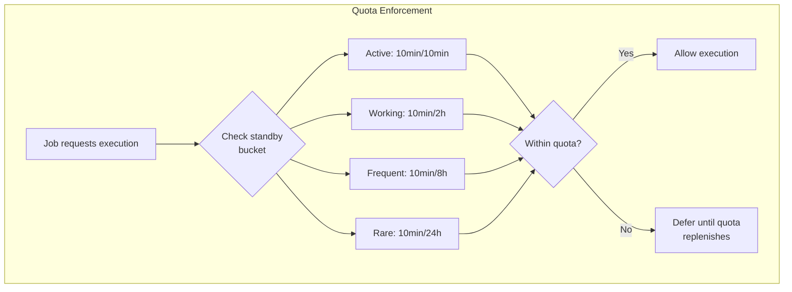

### 30.2.11 FlexibilityController

The `FlexibilityController` is a newer addition that manages the trade-off
between job freshness and system efficiency. It tracks which "flexible"
constraints (like connectivity type, charging state, idle state) a job could
optionally satisfy and adjusts satisfaction requirements based on how close the
job is to its deadline.

### 30.2.12 JobConcurrencyManager

The `JobConcurrencyManager` controls how many jobs can run simultaneously:

**Source path**: `frameworks/base/apex/jobscheduler/service/java/com/android/server/job/JobConcurrencyManager.java`

```java
// frameworks/base/apex/jobscheduler/service/java/com/android/server/job/
//     JobConcurrencyManager.java
package com.android.server.job;

// Manages a pool of JobServiceContext objects (execution slots)
// Balances between:
// - User-initiated jobs (highest priority)
// - Expedited jobs
// - Regular foreground jobs
// - Regular background jobs
// Total concurrent slots depend on device memory and CPU
```

The manager categorizes running jobs into work types:

| Work Type | Description | Priority |
|-----------|-------------|----------|
| User-Initiated (UIJ) | Jobs triggered by direct user action | Highest |
| Expedited (EJ) | Time-sensitive jobs with quota limits | High |
| Foreground (FG) | Jobs from foreground apps | Medium |
| Background (BG) | Jobs from background apps | Lower |
| Background Restricted | Jobs from restricted-bucket apps | Lowest |

### 30.2.13 JobService: Application-Side Implementation

Applications implement `JobService` to receive and execute scheduled jobs:

```java
public class MyJobService extends JobService {

    @Override
    public boolean onStartJob(JobParameters params) {
        // Called on the main thread when the job should start
        // Return true if work is ongoing (async)
        // Return false if work is already complete

        new Thread(() -> {
            try {
                doWork(params);
            } finally {
                // MUST call jobFinished when async work completes
                jobFinished(params, false /* needsReschedule */);
            }
        }).start();

        return true; // Work is asynchronous
    }

    @Override
    public boolean onStopJob(JobParameters params) {
        // Called when the system wants to stop the job
        // (constraint no longer satisfied, or preempted)
        // Return true to reschedule, false to drop

        cancelOngoingWork();
        return true; // Reschedule this job
    }
}
```

The service must be declared in the manifest with the `BIND_JOB_SERVICE`
permission:

```xml
<service
    android:name=".MyJobService"
    android:permission="android.permission.BIND_JOB_SERVICE"
    android:exported="false" />
```

### 30.2.14 Restrictions and Thermal Throttling

The `JobRestriction` class allows the system to block job execution based on
device conditions beyond normal constraints. The current restriction is thermal
status:

```java
// frameworks/base/apex/jobscheduler/service/java/com/android/server/job/
//     restrictions/ThermalStatusRestriction.java
// Blocks jobs when device is in thermal throttling state
```

**Source path**: `frameworks/base/apex/jobscheduler/service/java/com/android/server/job/restrictions/`

### 30.2.15 Debugging JobScheduler

```bash
# Dump all scheduled jobs
adb shell dumpsys jobscheduler

# Dump jobs for a specific package
adb shell dumpsys jobscheduler | grep -A 20 "com.example.myapp"

# Force-run a specific job
adb shell cmd jobscheduler run -f com.example.myapp 42

# View job execution history
adb shell dumpsys jobscheduler | grep "completed"

# Check standby bucket for an app
adb shell am get-standby-bucket com.example.myapp

# Set standby bucket for testing
adb shell am set-standby-bucket com.example.myapp rare
```

---

## 30.3 AlarmManager

`AlarmManager` is the oldest background scheduling mechanism in Android,
predating `JobScheduler` by several years. It delivers time-based callbacks to
applications, either at a specific time or after a delay. Unlike `JobScheduler`,
`AlarmManager` is optimized for *time accuracy* rather than *constraint
satisfaction*.

### 30.3.1 Architecture

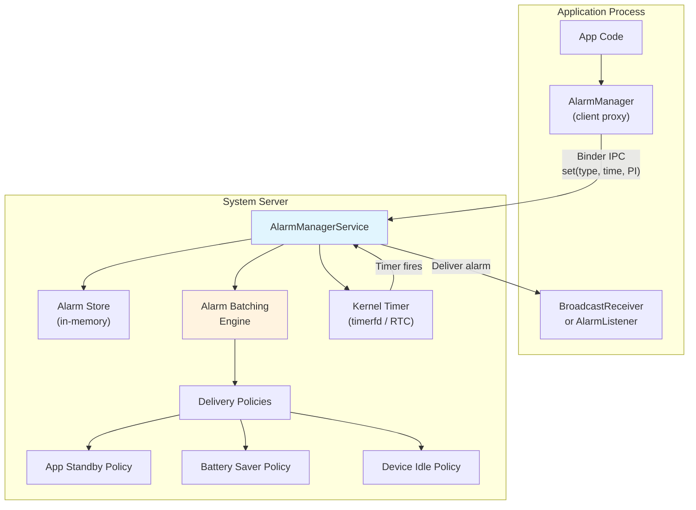

**Source path**: `frameworks/base/apex/jobscheduler/service/java/com/android/server/alarm/AlarmManagerService.java`

The `AlarmManagerService` is a large, complex service (5600+ lines) that has
evolved significantly over Android's history. Key imports reveal its
responsibilities:

```java
// frameworks/base/apex/jobscheduler/service/java/com/android/server/alarm/
//     AlarmManagerService.java
package com.android.server.alarm;

// Key constants from the imports:
import static android.app.AlarmManager.ELAPSED_REALTIME;
import static android.app.AlarmManager.ELAPSED_REALTIME_WAKEUP;
import static android.app.AlarmManager.RTC;
import static android.app.AlarmManager.RTC_WAKEUP;
import static android.app.AlarmManager.FLAG_ALLOW_WHILE_IDLE;
import static android.app.AlarmManager.FLAG_IDLE_UNTIL;
import static android.app.AlarmManager.FLAG_WAKE_FROM_IDLE;
import static android.app.AlarmManager.FLAG_PRIORITIZE;
```

### 30.3.2 Alarm Types

Android supports four alarm types based on two dimensions: time base and wake
behavior:

| Type | Time Base | Wakes Device | Use Case |
|------|-----------|-------------|----------|
| `RTC_WAKEUP` | Wall clock (UTC) | Yes | Calendar events, scheduled notifications |
| `RTC` | Wall clock (UTC) | No | Non-urgent time-based updates |
| `ELAPSED_REALTIME_WAKEUP` | Time since boot | Yes | Periodic checks, heartbeats |
| `ELAPSED_REALTIME` | Time since boot | No | UI timers, non-critical periodic work |

The `_WAKEUP` variants will wake the device from sleep (Doze) to deliver the
alarm. Non-wakeup alarms are deferred until the device is already awake.

### 30.3.3 Exact vs. Inexact Alarms

This is one of the most important distinctions in alarm scheduling:

**Exact alarms** fire at precisely the requested time. They are intended for
user-facing commitments like calendar event notifications and medication
reminders.

```java
AlarmManager am = context.getSystemService(AlarmManager.class);

// Exact alarm -- fires at the precise time
am.setExact(AlarmManager.RTC_WAKEUP,
    triggerTimeMillis,
    pendingIntent);

// Exact alarm that can fire during Doze
am.setExactAndAllowWhileIdle(AlarmManager.RTC_WAKEUP,
    triggerTimeMillis,
    pendingIntent);

// Alarm clock (shown to user, always fires on time)
am.setAlarmClock(
    new AlarmManager.AlarmClockInfo(triggerTimeMillis, showIntent),
    pendingIntent);
```

**Inexact alarms** allow the system to batch the alarm with nearby alarms,
reducing the number of device wake-ups:

```java
// Inexact alarm -- system may batch with nearby alarms
am.set(AlarmManager.ELAPSED_REALTIME_WAKEUP,
    SystemClock.elapsedRealtime() + 30 * 60 * 1000,
    pendingIntent);

// Inexact repeating alarm
am.setInexactRepeating(AlarmManager.ELAPSED_REALTIME_WAKEUP,
    SystemClock.elapsedRealtime() + 60 * 1000,
    AlarmManager.INTERVAL_HALF_HOUR,
    pendingIntent);

// Window alarm -- fires within a time window
am.setWindow(AlarmManager.ELAPSED_REALTIME_WAKEUP,
    triggerTime,
    windowLength,
    pendingIntent);
```

### 30.3.4 Exact Alarm Restrictions (API 31+)

Starting with Android 12 (API 31), exact alarms require the
`SCHEDULE_EXACT_ALARM` permission, which is a special permission the user can
revoke:

```xml
<uses-permission android:name="android.permission.SCHEDULE_EXACT_ALARM" />
```

Starting with Android 14 (API 34), the permission is **not granted by default**
for new installs. Apps must direct users to the special app access screen:

```java
// Check if exact alarms are allowed
if (!alarmManager.canScheduleExactAlarms()) {
    // Direct user to settings
    Intent intent = new Intent(Settings.ACTION_REQUEST_SCHEDULE_EXACT_ALARM);
    startActivity(intent);
}
```

Exempt from the permission:

- Alarm clock apps (hold `SET_ALARM` permission + alarm clock role)
- System apps
- Apps using `setAlarmClock()` (always exempt, as they are user-visible)

The AlarmManagerService tracks exact alarm permission status:

```java
// From AlarmManagerService.java imports
import static com.android.server.alarm.Alarm.EXACT_ALLOW_REASON_ALLOW_LIST;
import static com.android.server.alarm.Alarm.EXACT_ALLOW_REASON_COMPAT;
import static com.android.server.alarm.Alarm.EXACT_ALLOW_REASON_LISTENER;
import static com.android.server.alarm.Alarm.EXACT_ALLOW_REASON_NOT_APPLICABLE;
import static com.android.server.alarm.Alarm.EXACT_ALLOW_REASON_PERMISSION;
import static com.android.server.alarm.Alarm.EXACT_ALLOW_REASON_POLICY_PERMISSION;
import static com.android.server.alarm.Alarm.EXACT_ALLOW_REASON_PRIORITIZED;
```

### 30.3.5 Alarm Batching

For inexact alarms, the system batches nearby alarms together to minimize
wake-ups:

```mermaid
gantt
    title Alarm Batching
    dateFormat HH:mm
    axisFormat %H:%M

    section Without Batching
    App A alarm    :a1, 09:00, 1m
    App B alarm    :a2, 09:05, 1m
    App C alarm    :a3, 09:12, 1m
    App D alarm    :a4, 09:18, 1m
    App E alarm    :a5, 09:22, 1m

    section With Batching
    Batch 1 (A+B+C)  :b1, 09:12, 3m
    Batch 2 (D+E)    :b2, 09:22, 2m
```

Instead of waking the device 5 times, batching reduces it to 2 wake-ups.
The system creates time windows and aligns inexact alarms to the same window
boundary. `setWindow()` gives the developer some control over the acceptable
window size.

### 30.3.6 Idle Dispatch

The `AlarmManagerService` supports idle dispatch alarms that only fire during
Doze maintenance windows:

```java
// Flags from AlarmManagerService.java
FLAG_ALLOW_WHILE_IDLE          // Can fire during Doze (with quotas)
FLAG_ALLOW_WHILE_IDLE_COMPAT   // Compat mode for older targeting
FLAG_IDLE_UNTIL                // Schedules the next Doze state transition
FLAG_WAKE_FROM_IDLE            // Can wake device from Doze
FLAG_PRIORITIZE                // Gets priority delivery
```

Apps that need to fire alarms during Doze can use `setAndAllowWhileIdle()` or
`setExactAndAllowWhileIdle()`, but these are rate-limited. The system limits
while-idle alarms to approximately once per 9 minutes per app to prevent abuse.

### 30.3.7 Alarm Delivery Policies

Multiple policy layers can defer alarm delivery:

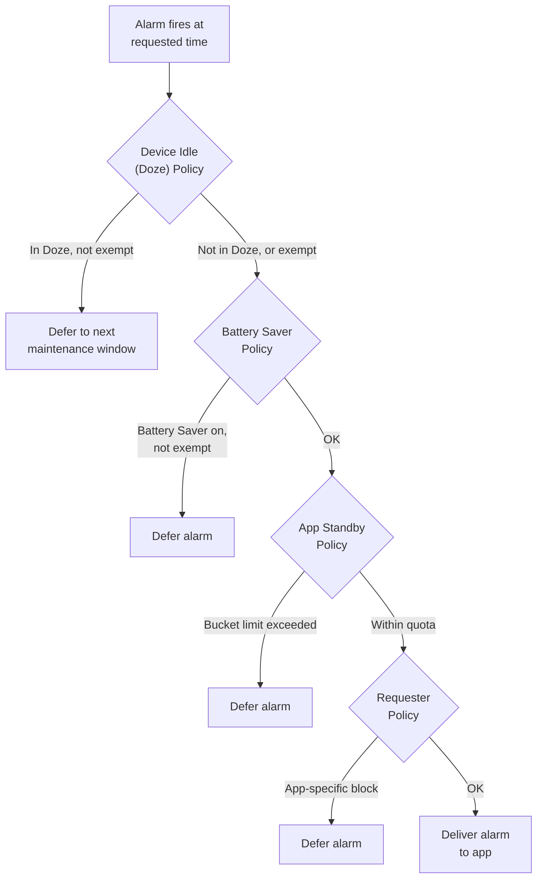

### 30.3.8 Listener-Based Alarms

Android 7.0 introduced `AlarmManager.OnAlarmListener` as an alternative to
`PendingIntent` for alarm delivery within the same process:

```java
AlarmManager am = getSystemService(AlarmManager.class);

// Listener-based alarm (no PendingIntent needed)
am.set(AlarmManager.ELAPSED_REALTIME,
    SystemClock.elapsedRealtime() + 5000,
    "my-alarm-tag",
    () -> {
        // This runs on the specified handler's thread
        Log.d("Alarm", "Alarm fired!");
    },
    handler);
```

Listener alarms are more efficient than `PendingIntent` alarms because they
avoid the IPC overhead of constructing and delivering a `PendingIntent`. However,
they only work while the app's process is alive.

### 30.3.9 AlarmManager vs. JobScheduler

| Feature | AlarmManager | JobScheduler |
|---------|-------------|-------------|
| Time precision | High (exact/window) | Low (deferred to optimal time) |
| Constraint support | None (time only) | Rich (network, charging, idle, ...) |
| Batching | System-managed for inexact | System-managed always |
| Persistence | Not across reboots (except `setAlarmClock`) | `setPersisted(true)` |
| Power efficiency | Lower (wake-ups) | Higher (batched, deferred) |
| Use case | Calendar events, alarms | Sync, upload, maintenance |
| API level | 1+ | 21+ |

**Rule of thumb**: Use `AlarmManager` only when you need to fire at a specific
time. For all other background work, use `JobScheduler` or `WorkManager`.

### 30.3.10 Debugging AlarmManager

```bash
# Dump all pending alarms
adb shell dumpsys alarm

# Dump alarms for a specific package
adb shell dumpsys alarm | grep -A 5 "com.example.myapp"

# Check exact alarm permission
adb shell appops get com.example.myapp SCHEDULE_EXACT_ALARM

# View alarm statistics
adb shell dumpsys alarm | grep -A 20 "Alarm Stats"

# Force all pending alarms to fire (testing only)
adb shell cmd alarm set-time <epoch_millis>
```

---

## 30.4 WorkManager

WorkManager is an AndroidX library (not part of AOSP proper) that provides a
high-level API for deferrable, guaranteed background work. It is the
**recommended API** for most background work in modern Android applications. It
abstracts over `JobScheduler`, `AlarmManager`, and other mechanisms to provide
a unified, backward-compatible solution.

### 30.4.1 Why WorkManager Exists

The fragmentation of background execution APIs creates a problem for app
developers:

| API Level | Available Mechanism | Limitation |
|-----------|-------------------|------------|
| 1-13 | `AlarmManager` only | No constraints, no batching |
| 14-20 | `AlarmManager` + custom services | No constraint API |
| 21-22 | `JobScheduler` introduced | Limited constraints |
| 23+ | `JobScheduler` + Doze | Complex interaction |
| 26+ | Background service limits | Legacy code breaks |

WorkManager abstracts all of this:

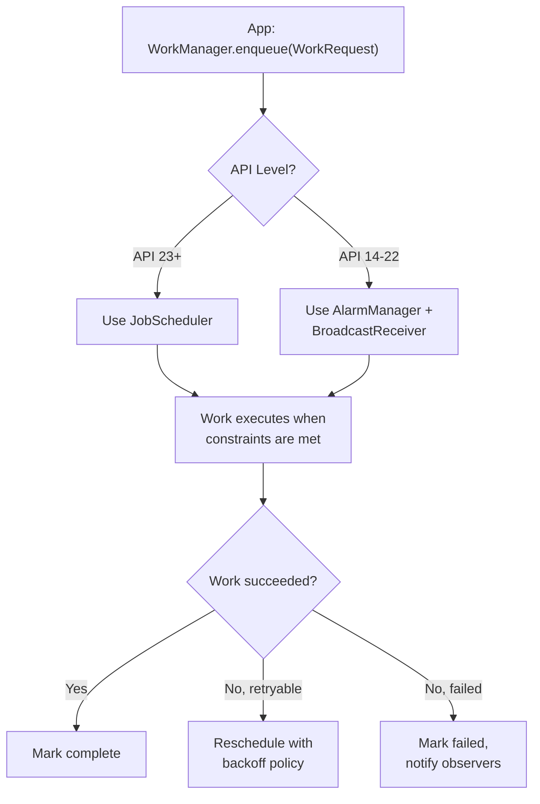

### 30.4.2 Core Concepts

WorkManager introduces several key abstractions:

**WorkRequest**: Defines a unit of work with optional constraints and scheduling:

```java
// One-time work
OneTimeWorkRequest uploadWork = new OneTimeWorkRequest.Builder(UploadWorker.class)
    .setConstraints(new Constraints.Builder()
        .setRequiredNetworkType(NetworkType.UNMETERED)
        .setRequiresCharging(true)
        .build())
    .setBackoffCriteria(BackoffPolicy.EXPONENTIAL, 30, TimeUnit.SECONDS)
    .addTag("upload")
    .setInputData(new Data.Builder()
        .putString("file_path", "/sdcard/photo.jpg")
        .build())
    .build();

// Periodic work
PeriodicWorkRequest syncWork = new PeriodicWorkRequest.Builder(
        SyncWorker.class, 1, TimeUnit.HOURS)
    .setConstraints(new Constraints.Builder()
        .setRequiredNetworkType(NetworkType.CONNECTED)
        .build())
    .build();
```

**Worker**: The actual work implementation:

```java
public class UploadWorker extends Worker {
    public UploadWorker(Context context, WorkerParameters params) {
        super(context, params);
    }

    @Override
    public Result doWork() {
        String filePath = getInputData().getString("file_path");
        try {
            uploadFile(filePath);
            return Result.success();
        } catch (IOException e) {
            return Result.retry(); // Will be retried with backoff
        }
    }
}
```

**Work chaining**: Composing complex work graphs:

```java
WorkManager.getInstance(context)
    // First: download data (can run in parallel)
    .beginWith(Arrays.asList(downloadWork1, downloadWork2))
    // Then: process the downloaded data
    .then(processWork)
    // Finally: upload the result
    .then(uploadWork)
    .enqueue();
```

### 30.4.3 Architecture

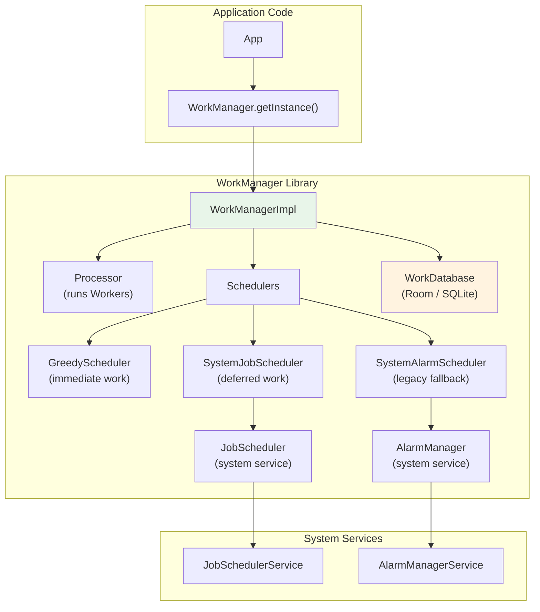

Key architectural decisions:

1. **Room database for persistence**: WorkManager stores all work requests in a
   Room (SQLite) database. This ensures work survives process death and device
   reboots.

2. **Scheduler delegation**: On API 23+, WorkManager creates a `JobInfo` for
   each deferred `WorkRequest` and delegates scheduling to `JobScheduler`. On
   older APIs, it uses `AlarmManager` with `BroadcastReceiver`.

3. **Greedy scheduler**: For work with no constraints, WorkManager's
   `GreedyScheduler` runs the work immediately without involving
   `JobScheduler`.

4. **Observable work**: WorkManager returns `LiveData<WorkInfo>` or `Flow<WorkInfo>`
   that applications can observe to track work progress and completion.

### 30.4.4 WorkManager + JobScheduler Integration

When WorkManager delegates to JobScheduler, it creates a JobInfo that maps
the WorkRequest's constraints:

| WorkManager Constraint | JobInfo Equivalent |
|----------------------|-------------------|
| `NetworkType.CONNECTED` | `setRequiredNetworkType(NETWORK_TYPE_ANY)` |
| `NetworkType.UNMETERED` | `setRequiredNetworkType(NETWORK_TYPE_UNMETERED)` |
| `requiresCharging()` | `setRequiresCharging(true)` |
| `requiresDeviceIdle()` | `setRequiresDeviceIdle(true)` |
| `requiresBatteryNotLow()` | `setRequiresBatteryNotLow(true)` |
| `requiresStorageNotLow()` | `setRequiresStorageNotLow(true)` |

WorkManager's `SystemJobService` (which extends `JobService`) receives the
callback from `JobSchedulerService` and dispatches it to the appropriate
`Worker`.

### 30.4.5 Work States

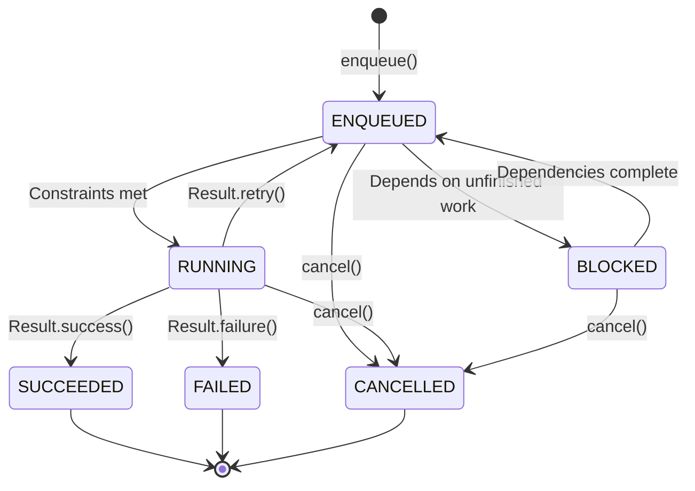

### 30.4.6 Unique Work

WorkManager supports unique work to prevent duplicate scheduling:

```java
// Unique one-time work
WorkManager.getInstance(context).enqueueUniqueWork(
    "sync-data",                              // Unique name
    ExistingWorkPolicy.REPLACE,               // KEEP, REPLACE, or APPEND
    oneTimeWorkRequest);

// Unique periodic work
WorkManager.getInstance(context).enqueueUniquePeriodicWork(
    "periodic-sync",
    ExistingPeriodicWorkPolicy.KEEP,          // KEEP or UPDATE
    periodicWorkRequest);
```

This prevents the common bug of scheduling duplicate periodic work every time
the app launches.

### 30.4.7 Expedited Work

For time-sensitive work on API 31+, WorkManager supports expedited work that
maps to JobScheduler's expedited jobs:

```java
OneTimeWorkRequest urgentWork = new OneTimeWorkRequest.Builder(UrgentWorker.class)
    .setExpedited(OutOfQuotaPolicy.RUN_AS_NON_EXPEDITED_WORK_REQUEST)
    .build();

WorkManager.getInstance(context).enqueue(urgentWork);
```

On API 31+, this uses `JobInfo.Builder.setExpedited(true)`. On older APIs,
WorkManager falls back to a foreground service.

### 30.4.8 Long-Running Work

For work that may exceed the standard 10-minute execution limit:

```java
public class LongUploadWorker extends CoroutineWorker {
    @Override
    public ForegroundInfo getForegroundInfo() {
        return new ForegroundInfo(
            NOTIFICATION_ID,
            createNotification("Uploading..."),
            ServiceInfo.FOREGROUND_SERVICE_TYPE_DATA_SYNC);
    }

    @Override
    public Result doWork() {
        setForeground(getForegroundInfo());
        // This work can now run for an extended time
        performLongUpload();
        return Result.success();
    }
}
```

By calling `setForeground()`, the worker gets promoted to a foreground service,
which is exempt from the standard execution time limit.

---

## 30.5 Foreground Services

Foreground services are services that perform work the user is actively aware
of, indicated by a persistent notification in the notification shade. They are
exempt from background execution limits and can run indefinitely, but they come
with increasing restrictions in modern Android versions.

### 30.5.1 Creating a Foreground Service

```java
public class MusicService extends Service {
    private static final int NOTIFICATION_ID = 1;
    private static final String CHANNEL_ID = "music_playback";

    @Override
    public int onStartCommand(Intent intent, int flags, int startId) {
        Notification notification = new NotificationCompat.Builder(this, CHANNEL_ID)
            .setContentTitle("Playing Music")
            .setContentText("Artist - Song Title")
            .setSmallIcon(R.drawable.ic_music_note)
            .setPriority(NotificationCompat.PRIORITY_LOW)
            .build();

        // Must call within 5 seconds of startForegroundService()
        startForeground(NOTIFICATION_ID, notification,
            ServiceInfo.FOREGROUND_SERVICE_TYPE_MEDIA_PLAYBACK);

        return START_STICKY;
    }
}
```

Starting a foreground service:

```java
// From Android 8.0+, use startForegroundService()
Intent serviceIntent = new Intent(context, MusicService.class);

if (Build.VERSION.SDK_INT >= Build.VERSION_CODES.O) {
    context.startForegroundService(serviceIntent);
} else {
    context.startService(serviceIntent);
}
```

### 30.5.2 Foreground Service Types (API 29+)

Android 10 introduced mandatory foreground service types. Android 14 (API 34)
made the `foregroundServiceType` attribute required in the manifest.

| Type | Constant | Use Case | Required Permission |
|------|----------|----------|-------------------|
| Camera | `camera` | Camera preview, video recording | `FOREGROUND_SERVICE_CAMERA` |
| Connected Device | `connectedDevice` | Bluetooth, USB, companion device | `FOREGROUND_SERVICE_CONNECTED_DEVICE` |
| Data Sync | `dataSync` | Cloud sync, backup | `FOREGROUND_SERVICE_DATA_SYNC` |
| Health | `health` | Fitness tracking, heart rate | `FOREGROUND_SERVICE_HEALTH` |
| Location | `location` | Navigation, location tracking | `FOREGROUND_SERVICE_LOCATION` + `ACCESS_*_LOCATION` |
| Media Playback | `mediaPlayback` | Music, podcast, audio book | `FOREGROUND_SERVICE_MEDIA_PLAYBACK` |
| Media Projection | `mediaProjection` | Screen capture, casting | `FOREGROUND_SERVICE_MEDIA_PROJECTION` |
| Microphone | `microphone` | Voice recording, VoIP | `FOREGROUND_SERVICE_MICROPHONE` |
| Phone Call | `phoneCall` | VoIP, calling apps | `FOREGROUND_SERVICE_PHONE_CALL` |
| Remote Messaging | `remoteMessaging` | Messaging on companion device | `FOREGROUND_SERVICE_REMOTE_MESSAGING` |
| Short Service | `shortService` | Brief user-initiated work (< 3 min) | None |
| Special Use | `specialUse` | Cases not covered above | `FOREGROUND_SERVICE_SPECIAL_USE` |
| System Exempted | `systemExempted` | System apps only | (System only) |

```xml
<!-- In AndroidManifest.xml -->
<service
    android:name=".MusicService"
    android:foregroundServiceType="mediaPlayback"
    android:exported="false">
</service>

<!-- Required permission -->
<uses-permission android:name="android.permission.FOREGROUND_SERVICE" />
<uses-permission android:name="android.permission.FOREGROUND_SERVICE_MEDIA_PLAYBACK" />
```

### 30.5.3 Foreground Service Lifecycle

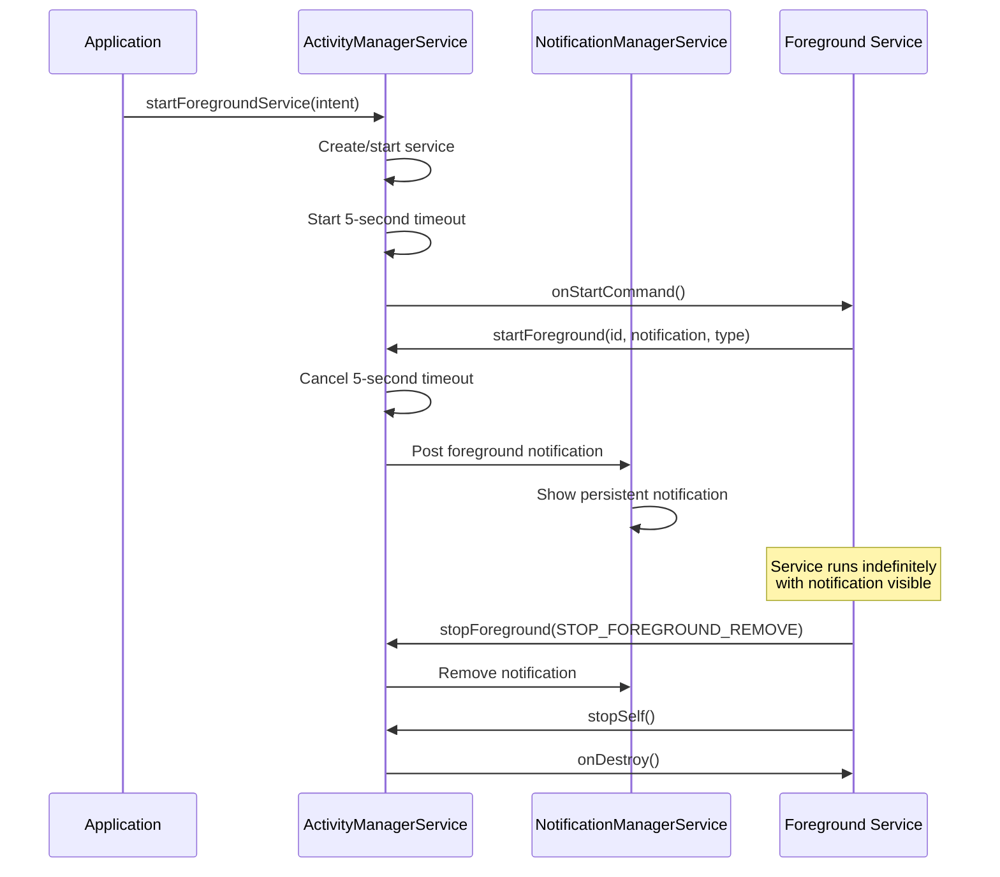

### 30.5.4 Background Start Restrictions (API 31+)

Android 12 introduced restrictions on starting foreground services from the
background. Apps cannot call `startForegroundService()` when they are in the
background unless they have a valid exemption:

| Exemption | Description |
|-----------|-------------|
| High-priority FCM | App received a high-priority push message |
| Alarm/AlarmClock | App's alarm just fired |
| Geofence/Activity transition | Location-related trigger |
| System broadcast | Certain system broadcasts (boot, locale change) |
| `SYSTEM_ALERT_WINDOW` | App has overlay permission |
| Companion device | App manages a companion device |
| `START_ACTIVITIES_FROM_BACKGROUND` | Privileged permission |

Apps without an exemption should use `WorkManager` with `setExpedited()` or
`setForeground()` instead.

### 30.5.5 Short Service (API 34+)

Android 14 introduced the `shortService` foreground service type for brief
user-initiated operations that need to run in the foreground but only for a
short time (under 3 minutes):

```java
// Start a short foreground service
startForeground(NOTIFICATION_ID, notification,
    ServiceInfo.FOREGROUND_SERVICE_TYPE_SHORT_SERVICE);

// System will call onTimeout() after approximately 3 minutes
@Override
public void onTimeout(int startId, int fgsType) {
    // Must stop the service or upgrade to a longer type
    stopSelf();
}
```

Short services have fewer permission requirements than other types, making them
suitable for one-off operations like sending a message or processing a payment.

### 30.5.6 Data Sync Foreground Service Timeout (API 35+)

Starting with Android 15, `dataSync` foreground services have a timeout of
approximately 6 hours. After the timeout, the system calls `onTimeout()` and
the service must stop or convert to a different type. This prevents indefinite
data sync services that may have been abandoned by buggy code.

### 30.5.7 Foreground Service ANR

If a foreground service does not call `startForeground()` within 5 seconds of
`startForegroundService()`, the system generates a
`ForegroundServiceDidNotStartInTimeException` crash. On API 31+, this is a
`ForegroundServiceStartNotAllowedException` if the app attempts to start from
the background without an exemption.

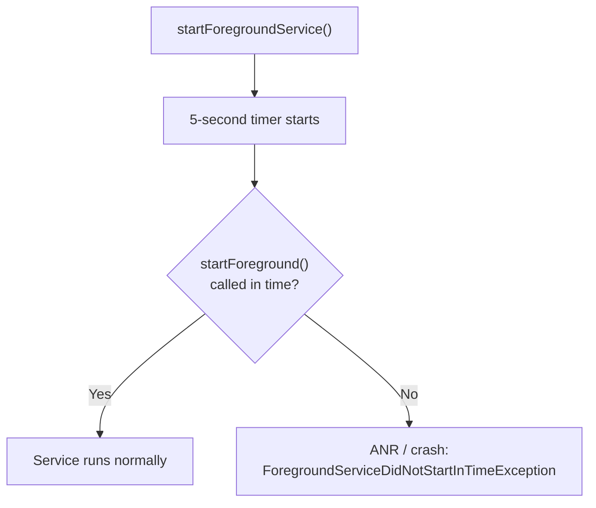

### 30.5.8 Notification Requirements

Every foreground service must have a visible notification:

```java
// Create notification channel (required API 26+)
NotificationChannel channel = new NotificationChannel(
    CHANNEL_ID,
    "Background Service",
    NotificationManager.IMPORTANCE_LOW);  // LOW = no sound
channel.setDescription("Shows when the service is active");
notificationManager.createNotificationChannel(channel);

// Build the notification
Notification notification = new NotificationCompat.Builder(this, CHANNEL_ID)
    .setContentTitle("Syncing Data")
    .setContentText("Uploading 42 files...")
    .setSmallIcon(R.drawable.ic_sync)
    .setOngoing(true)                    // Cannot be swiped away
    .setProgress(100, 42, false)         // Show progress bar
    .addAction(R.drawable.ic_cancel, "Cancel",
        cancelPendingIntent)             // User can cancel
    .build();
```

The notification serves a dual purpose: informing the user about ongoing work,
and providing accountability -- if a user sees an unexpected notification, they
know which app is consuming resources and can stop it.

### 30.5.9 User-Visible Foreground Service Notifications

Starting with Android 13 (API 33), users can long-press the foreground service
notification to stop the service directly. This gives users control over
misbehaving apps without needing to navigate to Settings.

---

## 30.6 Broadcast Restrictions

Broadcasts are the event system of Android: they notify apps about system
events (network changes, battery state, screen on/off) and enable inter-app
communication. However, implicit broadcasts -- those sent to any registered
receiver rather than a specific component -- are a major source of background
wake-ups.

### 30.6.1 The Implicit Broadcast Problem

Consider `ACTION_CONNECTIVITY_CHANGE`. Before Android 7.0, every app that
registered a manifest receiver for this broadcast was woken up every time the
network changed. With hundreds of apps installed, a single Wi-Fi toggle could
launch 50+ application processes simultaneously.

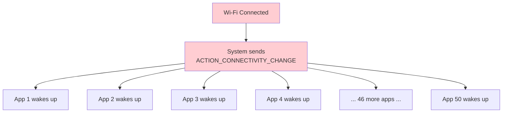

### 30.6.2 Broadcast Restrictions Timeline

| Version | API | Restriction |
|---------|-----|------------|
| 7.0 | 24 | `CONNECTIVITY_ACTION` no longer delivered to manifest receivers |
| 7.0 | 24 | `ACTION_NEW_PICTURE`, `ACTION_NEW_VIDEO` restricted |
| 8.0 | 26 | Most implicit broadcasts blocked for manifest receivers |
| 8.0 | 26 | Explicit exceptions list for essential broadcasts |

### 30.6.3 Explicit vs. Implicit Broadcasts

**Implicit broadcasts** target any receiver that matches the intent filter:

```xml
<!-- This manifest receiver NO LONGER WORKS for most broadcasts (API 26+) -->
<receiver android:name=".NetworkChangeReceiver">
    <intent-filter>
        <action android:name="android.net.conn.CONNECTIVITY_CHANGE" />
    </intent-filter>
</receiver>
```

**Explicit broadcasts** target a specific component:

```java
// This still works -- explicit broadcast to a specific receiver
Intent intent = new Intent(context, MyReceiver.class);
intent.setAction("com.example.MY_ACTION");
context.sendBroadcast(intent);
```

### 30.6.4 Exempt Broadcasts

Certain system broadcasts are exempt from the implicit broadcast restriction
because they are essential for correct app behavior. The exempt list includes:

| Broadcast | Reason for Exemption |
|-----------|---------------------|
| `ACTION_BOOT_COMPLETED` | Apps need to restore alarms/state after boot |
| `ACTION_LOCALE_CHANGED` | Apps need to refresh locale-dependent caches |
| `ACTION_MY_PACKAGE_REPLACED` | App needs to know when it was updated |
| `ACTION_PACKAGE_ADDED/REMOVED` | Package management |
| `ACTION_TIMEZONE_CHANGED` | Time-sensitive apps need immediate notification |
| `ACTION_TIME_SET` | Similar to timezone changes |
| `USB_DEVICE_ATTACHED` | USB accessory apps |
| `ACTION_HEADSET_PLUG` | Audio apps need to know about audio routing |
| `ACTION_CONNECTION_STATE_CHANGED` (Bluetooth) | Companion device apps |

### 30.6.5 Alternatives to Implicit Broadcasts

For each restricted implicit broadcast, Android provides a recommended
alternative:

| Restricted Broadcast | Alternative |
|---------------------|-------------|
| `CONNECTIVITY_CHANGE` | `JobScheduler` with `setRequiredNetworkType()` or `ConnectivityManager.registerNetworkCallback()` |
| `ACTION_POWER_CONNECTED/DISCONNECTED` | `JobScheduler` with `setRequiresCharging()` |
| `ACTION_NEW_PICTURE/VIDEO` | `JobScheduler` with `addTriggerContentUri()` for `MediaStore` |
| Custom periodic wake-ups | `WorkManager` with `PeriodicWorkRequest` |

### 30.6.6 Context-Registered Receivers

While manifest-registered receivers are restricted for implicit broadcasts,
**context-registered receivers** (registered with `registerReceiver()`) are not:

```java
// Context-registered receivers still work for all broadcasts
// But only while the app process is alive
BroadcastReceiver receiver = new BroadcastReceiver() {
    @Override
    public void onReceive(Context context, Intent intent) {
        // Handle connectivity change
    }
};

IntentFilter filter = new IntentFilter(ConnectivityManager.CONNECTIVITY_ACTION);
registerReceiver(receiver, filter);

// Must unregister to avoid leaks
unregisterReceiver(receiver);
```

The key difference: context-registered receivers only work while the app is
already running. They do not cause the app to be launched from a stopped state.
This is the core of the restriction's effectiveness -- it prevents broadcast
storms from launching dozens of dormant apps.

### 30.6.7 Ordered and Sticky Broadcasts

Android also supports ordered broadcasts (where receivers process the broadcast
in priority order and can abort it) and sticky broadcasts (deprecated). The
restriction rules apply equally to all broadcast types -- the restriction is
about the *receiver registration mechanism* (manifest vs. context), not the
broadcast type.

### 30.6.8 Protected Broadcasts

System services can declare broadcasts as "protected", meaning only the system
can send them:

```xml
<!-- In the framework's AndroidManifest.xml -->
<protected-broadcast android:name="android.intent.action.BOOT_COMPLETED" />
<protected-broadcast android:name="android.intent.action.LOCALE_CHANGED" />
```

If a non-system app tries to send a protected broadcast, the system logs a
warning and may reject it.

---

## 30.7 Try It

This section provides hands-on exercises to explore Android's background task
scheduling infrastructure.

### 30.7.1 Exercise: Inspect JobScheduler State

```bash
# Dump all scheduled jobs
adb shell dumpsys jobscheduler

# The output includes:
# - Registered jobs (per-app, with constraints)
# - Currently running jobs
# - Pending job queue
# - Controller states
# - Quota usage per standby bucket
# - Recent execution history

# Look at registered jobs for a specific package
adb shell dumpsys jobscheduler | grep -B 2 -A 20 "com.google.android.gms"

# Check standby buckets for all apps
adb shell dumpsys usagestats | grep -A 2 "bucket"

# View job execution timeline
adb shell dumpsys jobscheduler | grep "Job history"
```

### 30.7.2 Exercise: Schedule and Monitor a Job

Create a simple job:

```java
public class DemoJobService extends JobService {
    private static final String TAG = "DemoJob";

    @Override
    public boolean onStartJob(JobParameters params) {
        Log.d(TAG, "Job started: id=" + params.getJobId()
            + " network=" + params.getNetwork());

        // Simulate async work
        new Thread(() -> {
            try {
                Thread.sleep(5000); // 5 seconds of work
            } catch (InterruptedException e) {
                Thread.currentThread().interrupt();
            }
            Log.d(TAG, "Job completed: id=" + params.getJobId());
            jobFinished(params, false);
        }).start();

        return true;
    }

    @Override
    public boolean onStopJob(JobParameters params) {
        Log.d(TAG, "Job stopped: id=" + params.getJobId()
            + " reason=" + params.getStopReason());
        return true; // Reschedule
    }
}
```

Schedule it:

```java
ComponentName service = new ComponentName(this, DemoJobService.class);

JobInfo.Builder builder = new JobInfo.Builder(1001, service)
    .setRequiredNetworkType(JobInfo.NETWORK_TYPE_ANY)
    .setRequiresCharging(false)
    .setMinimumLatency(5000)      // 5 seconds minimum delay
    .setOverrideDeadline(30000);  // 30 seconds maximum delay

JobScheduler scheduler = getSystemService(JobScheduler.class);
int result = scheduler.schedule(builder.build());
Log.d("Schedule", "Result: " + (result == JobScheduler.RESULT_SUCCESS
    ? "SUCCESS" : "FAILURE"));
```

Force-run it from adb:

```bash
# Force run the job immediately (bypass constraints)
adb shell cmd jobscheduler run -f com.example.myapp 1001

# Watch logcat for the job output
adb logcat -s DemoJob:D

# Check the job's current state
adb shell dumpsys jobscheduler | grep -A 15 "com.example.myapp"
```

### 30.7.3 Exercise: Test Alarm Scheduling

```java
public class AlarmDemoActivity extends Activity {

    @Override
    protected void onCreate(Bundle savedInstanceState) {
        super.onCreate(savedInstanceState);

        AlarmManager am = getSystemService(AlarmManager.class);

        // 1. Inexact alarm (batched by system)
        PendingIntent inexactPi = PendingIntent.getBroadcast(this, 0,
            new Intent(this, AlarmReceiver.class).setAction("INEXACT"),
            PendingIntent.FLAG_IMMUTABLE);
        am.set(AlarmManager.ELAPSED_REALTIME_WAKEUP,
            SystemClock.elapsedRealtime() + 60_000, inexactPi);

        // 2. Exact alarm (requires SCHEDULE_EXACT_ALARM on API 31+)
        if (am.canScheduleExactAlarms()) {
            PendingIntent exactPi = PendingIntent.getBroadcast(this, 1,
                new Intent(this, AlarmReceiver.class).setAction("EXACT"),
                PendingIntent.FLAG_IMMUTABLE);
            am.setExact(AlarmManager.RTC_WAKEUP,
                System.currentTimeMillis() + 30_000, exactPi);
        }

        // 3. Alarm clock (always fires on time, shows in status bar)
        PendingIntent clockPi = PendingIntent.getActivity(this, 2,
            new Intent(this, AlarmDemoActivity.class),
            PendingIntent.FLAG_IMMUTABLE);
        PendingIntent alarmPi = PendingIntent.getBroadcast(this, 3,
            new Intent(this, AlarmReceiver.class).setAction("ALARM_CLOCK"),
            PendingIntent.FLAG_IMMUTABLE);
        am.setAlarmClock(
            new AlarmManager.AlarmClockInfo(
                System.currentTimeMillis() + 120_000, clockPi),
            alarmPi);

        Log.d("AlarmDemo", "Alarms scheduled");
    }
}
```

Monitor from adb:

```bash
# View all pending alarms
adb shell dumpsys alarm | head -100

# View alarms for your package
adb shell dumpsys alarm | grep -A 5 "com.example.myapp"

# View alarm statistics
adb shell dumpsys alarm | grep -A 30 "Alarm Stats"

# View alarm clock (shown to user)
adb shell dumpsys alarm | grep "AlarmClock"
```

### 30.7.4 Exercise: WorkManager Chain

```java
// Step 1: Create workers
public class DownloadWorker extends Worker {
    @Override public Result doWork() {
        String url = getInputData().getString("url");
        Log.d("WM", "Downloading: " + url);
        // Simulate download
        try { Thread.sleep(2000); } catch (Exception e) {}
        return Result.success(new Data.Builder()
            .putString("local_path", "/data/downloaded_file")
            .build());
    }
}

public class ProcessWorker extends Worker {
    @Override public Result doWork() {
        String path = getInputData().getString("local_path");
        Log.d("WM", "Processing: " + path);
        try { Thread.sleep(3000); } catch (Exception e) {}
        return Result.success(new Data.Builder()
            .putString("processed_path", "/data/processed_file")
            .build());
    }
}

public class UploadWorker extends Worker {
    @Override public Result doWork() {
        String path = getInputData().getString("processed_path");
        Log.d("WM", "Uploading: " + path);
        try { Thread.sleep(2000); } catch (Exception e) {}
        return Result.success();
    }
}

// Step 2: Build and enqueue the chain
OneTimeWorkRequest download = new OneTimeWorkRequest.Builder(DownloadWorker.class)
    .setInputData(new Data.Builder().putString("url", "https://example.com/data").build())
    .addTag("pipeline")
    .build();

OneTimeWorkRequest process = new OneTimeWorkRequest.Builder(ProcessWorker.class)
    .addTag("pipeline")
    .build();

OneTimeWorkRequest upload = new OneTimeWorkRequest.Builder(UploadWorker.class)
    .setConstraints(new Constraints.Builder()
        .setRequiredNetworkType(NetworkType.CONNECTED)
        .build())
    .addTag("pipeline")
    .build();

WorkManager.getInstance(context)
    .beginWith(download)
    .then(process)
    .then(upload)
    .enqueue();

// Step 3: Observe the chain
WorkManager.getInstance(context)
    .getWorkInfosByTagLiveData("pipeline")
    .observe(this, workInfos -> {
        for (WorkInfo info : workInfos) {
            Log.d("WM", "Work " + info.getId()
                + " state=" + info.getState()
                + " progress=" + info.getProgress());
        }
    });
```

### 30.7.5 Exercise: Test Doze Mode

```bash
# Put device into Doze mode (screen must be off)
adb shell dumpsys deviceidle enable

# Force device into light Doze
adb shell dumpsys deviceidle force-idle light

# Force device into deep Doze
adb shell dumpsys deviceidle force-idle deep

# Check Doze state
adb shell dumpsys deviceidle get deep
adb shell dumpsys deviceidle get light

# Step through Doze states
adb shell dumpsys deviceidle step light
adb shell dumpsys deviceidle step deep

# Observe: your scheduled jobs and alarms will be deferred

# Exit Doze
adb shell dumpsys deviceidle unforce
adb shell dumpsys deviceidle disable

# Check which apps are whitelisted from Doze
adb shell dumpsys deviceidle whitelist
```

### 30.7.6 Exercise: Test App Standby Buckets

```bash
# Check current bucket for an app
adb shell am get-standby-bucket com.example.myapp

# Set bucket for testing
adb shell am set-standby-bucket com.example.myapp active
adb shell am set-standby-bucket com.example.myapp working_set
adb shell am set-standby-bucket com.example.myapp frequent
adb shell am set-standby-bucket com.example.myapp rare
adb shell am set-standby-bucket com.example.myapp restricted

# Observe the effect on your scheduled jobs
adb shell dumpsys jobscheduler | grep -A 10 "com.example.myapp"

# Reset to automatic bucket assignment
adb shell am reset-standby-bucket com.example.myapp
```

### 30.7.7 Exercise: Test Background Restrictions

```bash
# Restrict background for an app (simulates Battery Saver per-app restriction)
adb shell cmd appops set com.example.myapp RUN_IN_BACKGROUND deny
adb shell cmd appops set com.example.myapp RUN_ANY_IN_BACKGROUND deny

# Observe: background services will be stopped, jobs deferred

# Reset
adb shell cmd appops set com.example.myapp RUN_IN_BACKGROUND allow
adb shell cmd appops set com.example.myapp RUN_ANY_IN_BACKGROUND allow

# Simulate Battery Saver mode
adb shell settings put global low_power 1

# Observe the effect on pending jobs
adb shell dumpsys jobscheduler | grep "Ready"

# Disable Battery Saver
adb shell settings put global low_power 0
```

### 30.7.8 Exercise: Foreground Service with Type

```java
public class LocationTrackingService extends Service {
    private static final int NOTIFICATION_ID = 100;
    private LocationManager locationManager;
    private LocationListener locationListener;

    @Override
    public void onCreate() {
        super.onCreate();
        locationManager = getSystemService(LocationManager.class);
        locationListener = location -> {
            Log.d("LocationFGS", "Location: " + location.getLatitude()
                + ", " + location.getLongitude());
        };
    }

    @Override
    public int onStartCommand(Intent intent, int flags, int startId) {
        Notification notification = new NotificationCompat.Builder(
                this, "location_channel")
            .setContentTitle("Tracking Location")
            .setContentText("Your location is being tracked")
            .setSmallIcon(R.drawable.ic_location)
            .setOngoing(true)
            .build();

        // Specify the foreground service type
        startForeground(NOTIFICATION_ID, notification,
            ServiceInfo.FOREGROUND_SERVICE_TYPE_LOCATION);

        // Now we can request location updates in the background
        locationManager.requestLocationUpdates(
            LocationManager.GPS_PROVIDER, 5000, 10, locationListener);

        return START_STICKY;
    }

    @Override
    public void onDestroy() {
        locationManager.removeUpdates(locationListener);
        super.onDestroy();
    }

    @Override
    public IBinder onBind(Intent intent) {
        return null;
    }
}
```

Required manifest entries:

```xml
<uses-permission android:name="android.permission.FOREGROUND_SERVICE" />
<uses-permission android:name="android.permission.FOREGROUND_SERVICE_LOCATION" />
<uses-permission android:name="android.permission.ACCESS_FINE_LOCATION" />

<service
    android:name=".LocationTrackingService"
    android:foregroundServiceType="location"
    android:exported="false" />
```

Monitor foreground services:

```bash
# List running foreground services
adb shell dumpsys activity services | grep "isForeground=true"

# Detailed service info
adb shell dumpsys activity services com.example.myapp

# Check foreground service types in use
adb shell dumpsys activity services | grep "foregroundServiceType"
```

### 30.7.9 Exercise: Observe Broadcast Restrictions

```java
// This manifest receiver will NOT work on API 26+ for most implicit broadcasts
// <receiver android:name=".ConnectivityReceiver">
//     <intent-filter>
//         <action android:name="android.net.conn.CONNECTIVITY_CHANGE" />
//     </intent-filter>
// </receiver>

// Instead, register at runtime:
public class MainActivity extends Activity {
    private BroadcastReceiver connectivityReceiver;

    @Override
    protected void onResume() {
        super.onResume();
        connectivityReceiver = new BroadcastReceiver() {
            @Override
            public void onReceive(Context context, Intent intent) {
                Log.d("Broadcast", "Network changed: " + intent.getAction());
            }
        };
        registerReceiver(connectivityReceiver,
            new IntentFilter(ConnectivityManager.CONNECTIVITY_ACTION));
    }

    @Override
    protected void onPause() {
        super.onPause();
        if (connectivityReceiver != null) {
            unregisterReceiver(connectivityReceiver);
            connectivityReceiver = null;
        }
    }
}

// Or better yet, use the modern approach:
ConnectivityManager cm = getSystemService(ConnectivityManager.class);
cm.registerDefaultNetworkCallback(new ConnectivityManager.NetworkCallback() {
    @Override
    public void onAvailable(Network network) {
        Log.d("Network", "Connected: " + network);
    }

    @Override
    public void onLost(Network network) {
        Log.d("Network", "Disconnected: " + network);
    }
});
```

### 30.7.10 Exercise: Build a Complete Background Task Solution

Combine all the concepts into a robust background sync solution:

```java
// 1. Define the worker
public class DataSyncWorker extends CoroutineWorker {

    @Override
    public ForegroundInfo getForegroundInfo() {
        return createForegroundInfo("Syncing data...");
    }

    @Override
    public Result doWork() {
        // Report progress
        setProgress(new Data.Builder()
            .putInt("progress", 0)
            .build());

        try {
            // Step 1: Download updates
            List<Update> updates = downloadUpdates();
            setProgress(new Data.Builder().putInt("progress", 33).build());

            // Step 2: Apply updates locally
            applyUpdates(updates);
            setProgress(new Data.Builder().putInt("progress", 66).build());

            // Step 3: Upload local changes
            uploadChanges();
            setProgress(new Data.Builder().putInt("progress", 100).build());

            return Result.success();
        } catch (IOException e) {
            Log.e("Sync", "Sync failed", e);
            if (getRunAttemptCount() < 3) {
                return Result.retry();
            } else {
                return Result.failure(new Data.Builder()
                    .putString("error", e.getMessage())
                    .build());
            }
        }
    }
}

// 2. Schedule periodic sync
public class SyncScheduler {
    public static void schedulePeriodicSync(Context context) {
        Constraints constraints = new Constraints.Builder()
            .setRequiredNetworkType(NetworkType.CONNECTED)
            .setRequiresBatteryNotLow(true)
            .build();

        PeriodicWorkRequest syncRequest =
            new PeriodicWorkRequest.Builder(
                DataSyncWorker.class,
                1, TimeUnit.HOURS,          // Repeat every hour
                15, TimeUnit.MINUTES)       // Flex window: 15 min
            .setConstraints(constraints)
            .setBackoffCriteria(
                BackoffPolicy.EXPONENTIAL,
                WorkRequest.MIN_BACKOFF_MILLIS,
                TimeUnit.MILLISECONDS)
            .addTag("periodic-sync")
            .build();

        WorkManager.getInstance(context).enqueueUniquePeriodicWork(
            "data-sync",
            ExistingPeriodicWorkPolicy.KEEP,
            syncRequest);
    }

    // One-time immediate sync (user-initiated)
    public static void syncNow(Context context) {
        OneTimeWorkRequest syncRequest =
            new OneTimeWorkRequest.Builder(DataSyncWorker.class)
            .setExpedited(OutOfQuotaPolicy.RUN_AS_NON_EXPEDITED_WORK_REQUEST)
            .setConstraints(new Constraints.Builder()
                .setRequiredNetworkType(NetworkType.CONNECTED)
                .build())
            .addTag("immediate-sync")
            .build();

        WorkManager.getInstance(context).enqueueUniqueWork(
            "immediate-sync",
            ExistingWorkPolicy.REPLACE,
            syncRequest);
    }
}

// 3. Observe sync status in UI
public class SyncStatusFragment extends Fragment {
    @Override
    public void onViewCreated(View view, Bundle savedInstanceState) {
        WorkManager.getInstance(requireContext())
            .getWorkInfosForUniqueWorkLiveData("data-sync")
            .observe(getViewLifecycleOwner(), workInfos -> {
                if (workInfos == null || workInfos.isEmpty()) return;
                WorkInfo info = workInfos.get(0);

                switch (info.getState()) {
                    case RUNNING:
                        int progress = info.getProgress().getInt("progress", 0);
                        showProgress(progress);
                        break;
                    case SUCCEEDED:
                        showSuccess();
                        break;
                    case FAILED:
                        String error = info.getOutputData().getString("error");
                        showError(error);
                        break;
                    case ENQUEUED:
                        showWaiting();
                        break;
                }
            });
    }
}
```

### 30.7.11 Summary: Choosing the Right API

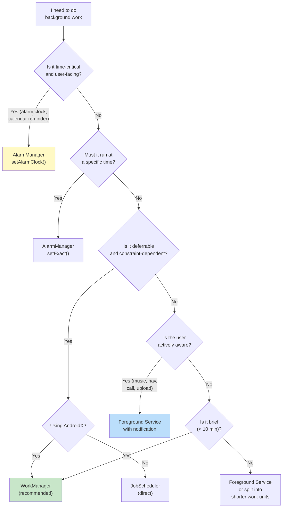

### 30.7.12 Summary of Key Source Paths

| Component | Source Path |
|-----------|------------|
| JobSchedulerService | `frameworks/base/apex/jobscheduler/service/java/com/android/server/job/JobSchedulerService.java` |
| JobStore | `frameworks/base/apex/jobscheduler/service/java/com/android/server/job/JobStore.java` |
| JobConcurrencyManager | `frameworks/base/apex/jobscheduler/service/java/com/android/server/job/JobConcurrencyManager.java` |
| JobServiceContext | `frameworks/base/apex/jobscheduler/service/java/com/android/server/job/JobServiceContext.java` |
| StateController (base) | `frameworks/base/apex/jobscheduler/service/java/com/android/server/job/controllers/StateController.java` |
| JobStatus | `frameworks/base/apex/jobscheduler/service/java/com/android/server/job/controllers/JobStatus.java` |
| ConnectivityController | `frameworks/base/apex/jobscheduler/service/java/com/android/server/job/controllers/ConnectivityController.java` |
| TimeController | `frameworks/base/apex/jobscheduler/service/java/com/android/server/job/controllers/TimeController.java` |
| QuotaController | `frameworks/base/apex/jobscheduler/service/java/com/android/server/job/controllers/QuotaController.java` |
| FlexibilityController | `frameworks/base/apex/jobscheduler/service/java/com/android/server/job/controllers/FlexibilityController.java` |
| BatteryController | `frameworks/base/apex/jobscheduler/service/java/com/android/server/job/controllers/BatteryController.java` |
| IdleController | `frameworks/base/apex/jobscheduler/service/java/com/android/server/job/controllers/IdleController.java` |
| BackgroundJobsController | `frameworks/base/apex/jobscheduler/service/java/com/android/server/job/controllers/BackgroundJobsController.java` |
| DeviceIdleJobsController | `frameworks/base/apex/jobscheduler/service/java/com/android/server/job/controllers/DeviceIdleJobsController.java` |
| ContentObserverController | `frameworks/base/apex/jobscheduler/service/java/com/android/server/job/controllers/ContentObserverController.java` |
| ThermalStatusRestriction | `frameworks/base/apex/jobscheduler/service/java/com/android/server/job/restrictions/ThermalStatusRestriction.java` |
| AlarmManagerService | `frameworks/base/apex/jobscheduler/service/java/com/android/server/alarm/AlarmManagerService.java` |
| JobSchedulerInternal | `frameworks/base/apex/jobscheduler/framework/java/com/android/server/job/JobSchedulerInternal.java` |

---

**Key takeaways from this chapter:**

1. **Background limits are pervasive**: Starting with Android 8.0, apps cannot
   freely run background services. Every version since has added further
   restrictions. Apps must design around these limits from the start.

2. **JobScheduler is the platform primitive**: All constraint-based background
   work should go through JobScheduler (directly or via WorkManager). The
   controller architecture with its 12+ StateControllers provides a flexible,
   extensible constraint evaluation system.

3. **AlarmManager is for time-specific work only**: Use it for alarm clocks,
   calendar reminders, and other user-facing timed events. Exact alarm
   permissions restrict access to prevent abuse.

4. **WorkManager is the recommended abstraction**: For AndroidX apps,
   WorkManager provides persistence, chaining, observability, and backward
   compatibility on top of JobScheduler and AlarmManager.

5. **Foreground services require types and notifications**: Modern Android
   enforces typed foreground services with corresponding permissions. The
   notification serves as both user information and accountability.

6. **Broadcast restrictions prevent wake-up storms**: Manifest-registered
   receivers for implicit broadcasts are mostly blocked. Apps must use
   context-registered receivers, JobScheduler content triggers, or
   ConnectivityManager callbacks instead.

7. **Standby buckets tier everything**: An app's background execution budget
   depends on its standby bucket, which reflects user engagement. Active apps
   get more budget; rarely-used apps are heavily restricted.
