# 第 31 章：多用户与配置文件

Android 从内核到 Framework 都是按“用户边界”组织的操作系统。设备一启动，`user 0` 这个系统用户就已经存在；之后无论是 Settings 中看到的“多用户”、企业 Work Profile、Guest、Private Space，还是 clone / restricted / communal 这类特殊形态，本质上都建立在同一套多用户模型之上。本章沿着真实 AOSP 代码，梳理 `UserManagerService`、用户类型系统、生命周期、按用户存储、工作资料、私密空间与用户切换机制。

---

## 31.1 多用户架构

### 31.1.1 设计基础

Android 的多用户能力不是对 Linux 的另起炉灶，而是建立在 UID 隔离之上的系统化扩展：

| 概念 | Linux 基础 | Android 扩展 |
|---|---|---|
| 用户隔离 | UID / GID | 每个 Android user 拥有一段独立 UID 范围 |
| 进程隔离 | 进程与凭据 | 应用 UID = `userId * 100000 + appId` |
| 文件隔离 | 所有者与权限位 | 每个用户有独立数据目录 `/data/user/<userId>/` |
| 数据加密 | 块 / 文件加密 | 每个用户拆分为 CE / DE 两类加密存储 |

例如同一个 `appId=10045`，在不同用户下的 Linux UID 会不同：

- 用户 0：`10045`
- 用户 10：`1010045`

这个规则直接编码在 `UserHandle` 里：

```java
public static final int PER_USER_RANGE = 100000;

public static int getUid(int userId, int appId) {
    return userId * PER_USER_RANGE + (appId % PER_USER_RANGE);
}
```

这意味着“同一个包名”在不同用户下，虽然可能共用安装包，但运行身份、数据目录、运行时权限和很多系统状态都是彼此独立的。

### 31.1.2 核心类

下图概括了多用户主干对象：

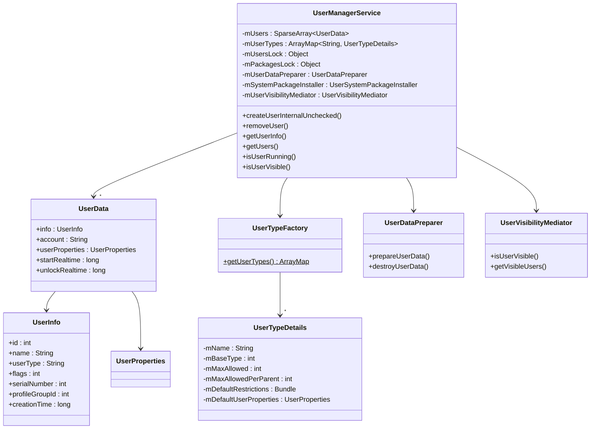

关键源码位置：

| 类 | 路径 |
|---|---|
| `UserManagerService` | `frameworks/base/services/core/java/com/android/server/pm/UserManagerService.java` |
| `UserTypeFactory` | `frameworks/base/services/core/java/com/android/server/pm/UserTypeFactory.java` |
| `UserTypeDetails` | `frameworks/base/services/core/java/com/android/server/pm/UserTypeDetails.java` |
| `UserDataPreparer` | `frameworks/base/services/core/java/com/android/server/pm/UserDataPreparer.java` |
| `UserVisibilityMediator` | `frameworks/base/services/core/java/com/android/server/pm/UserVisibilityMediator.java` |
| `UserSystemPackageInstaller` | `frameworks/base/services/core/java/com/android/server/pm/UserSystemPackageInstaller.java` |

### 31.1.3 `UserManagerService` 初始化

`UserManagerService` 是所有用户操作的最终裁决者。它实现 `IUserManager.Stub`，内部最关键的一点不是单一数据结构，而是锁顺序：

```java
public class UserManagerService extends IUserManager.Stub {

    // Lock ordering: mPackagesLock first, then mUsersLock
    private final Object mPackagesLock;
    private final Object mUsersLock = LockGuard.installNewLock(LockGuard.INDEX_USER);
    private final Object mRestrictionsLock = NamedLock.create("mRestrictionsLock");
    private final Object mAppRestrictionsLock = NamedLock.create("mAppRestrictionsLock");

    @GuardedBy("mUsersLock")
    private final SparseArray<UserData> mUsers;

    private final ArrayMap<String, UserTypeDetails> mUserTypes;
}
```

类内还约定了后缀语义：

- `LP`：调用方已经持有 `mPackagesLock`
- `LU`：调用方已经持有 `mUsersLock`
- `LR`：调用方已经持有 `mRestrictionsLock`
- `LAr`：调用方已经持有 `mAppRestrictionsLock`

多用户子系统贯穿 PMS、AMS、Storage、DPM、SystemUI，锁顺序一旦错，就不是简单的逻辑 bug，而是全系统死锁风险。

### 31.1.4 持久化存储

用户元数据保存在 `/data/system/users/`：

```text
/data/system/users/
    userlist.xml
    user.list
    0/
        0.xml
        photo.png
        res_*.xml
    10/
        10.xml
    11/
        11.xml
```

`userlist.xml` 记录全局用户列表与下一个序列号：

```xml
<users nextSerialNumber="15" version="11">
    <user id="0" />
    <user id="10" />
    <user id="11" />
</users>
```

单个用户的 `<id>.xml` 则映射 `UserInfo` 与附加属性：

```xml
<user
    id="10"
    serialNumber="12"
    flags="0x00000810"
    type="android.os.usertype.full.SECONDARY"
    created="1700000000000"
    lastLoggedIn="1700100000000"
    lastEnteredForeground="1700100000000">
    <name>John</name>
    <restrictions />
    <userProperties />
</user>
```

这些 XML 属性和 `UserManagerService` 内部常量是一一对应的：

```java
private static final String ATTR_FLAGS = "flags";
private static final String ATTR_TYPE = "type";
private static final String ATTR_ID = "id";
private static final String ATTR_CREATION_TIME = "created";
private static final String ATTR_LAST_LOGGED_IN_TIME = "lastLoggedIn";
private static final String ATTR_LAST_ENTERED_FOREGROUND_TIME = "lastEnteredForeground";
private static final String ATTR_SERIAL_NO = "serialNumber";
private static final String ATTR_NEXT_SERIAL_NO = "nextSerialNumber";
private static final String ATTR_PROFILE_GROUP_ID = "profileGroupId";
private static final String ATTR_RESTRICTED_PROFILE_PARENT_ID = "restrictedProfileParentId";
```

### 31.1.5 用户 ID 分配

用户 ID 和 serial number 不是同一个概念。前者用于运行时标识，后者更像“不可回退的历史编号”。

```java
@VisibleForTesting
static final int MIN_USER_ID = UserHandle.MIN_SECONDARY_USER_ID;  // 10

@VisibleForTesting
static final int MAX_USER_ID = UserHandle.MAX_SECONDARY_USER_ID;
```

核心规则：

- `user 0` 永远是系统用户
- `1-9` 预留
- 新用户通常从 `10` 起分配
- serial number 单调增长，即使删除用户也不回收
- 最近移除的 userId 会进入一个“近期删除集合”，避免过快复用

这也是为什么同一个设备上，`userId=10` 被删除又创建后，新的 `serialNumber` 仍会继续增长。

### 31.1.6 用户限制

用户限制不是单一来源，而是多层合并结果：

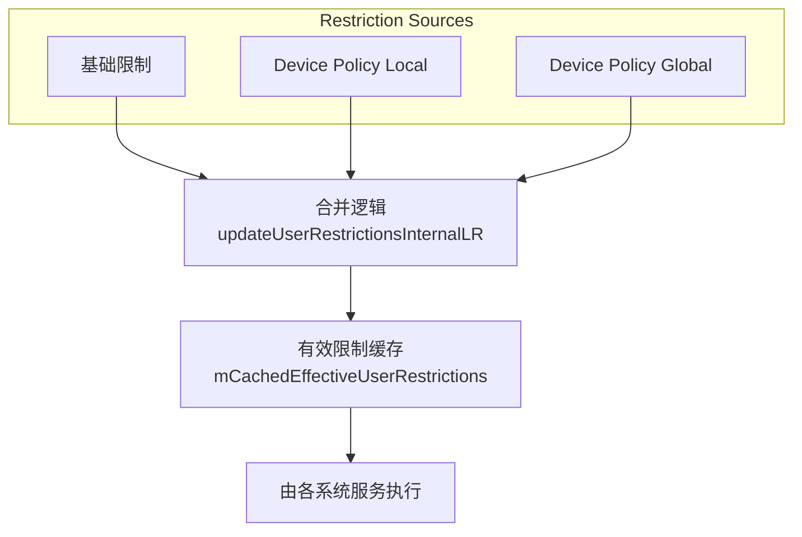

服务端分别缓存“基础限制”和“生效限制”：

```java
@GuardedBy("mRestrictionsLock")
private final RestrictionsSet mBaseUserRestrictions = new RestrictionsSet();

@GuardedBy("mRestrictionsLock")
private final RestrictionsSet mCachedEffectiveUserRestrictions = new RestrictionsSet();
```

这里有个实现细节很关键：修改 restriction 时通常会构造新的 `Bundle`，而不是原地 mutate。原因是基础集合和缓存集合之间可能共享对象引用，原地改动会制造极难排查的串改问题。

---

## 31.2 用户类型

### 31.2.1 `UserTypeDetails` 体系

Android 现在不是靠一堆零散 flag 来硬编码各种用户，而是把“用户类别”抽象成 `UserTypeDetails`，由 `UserTypeFactory` 统一注册：

```java
public static ArrayMap<String, UserTypeDetails> getUserTypes() {
    final ArrayMap<String, UserTypeDetails.Builder> builders = getDefaultBuilders();
    try (XmlResourceParser parser =
             Resources.getSystem().getXml(R.xml.config_user_types)) {
        customizeBuilders(builders, parser);
    }
    final ArrayMap<String, UserTypeDetails> types = new ArrayMap<>(builders.size());
    for (int i = 0; i < builders.size(); i++) {
        types.put(builders.keyAt(i), builders.valueAt(i).createUserTypeDetails());
    }
    return types;
}
```

这套设计带来两个结果：

- AOSP 可以统一定义系统默认用户类型
- OEM 可以通过 `config_user_types.xml` 覆盖最大数量、限制、显示方式和属性

### 31.2.2 AOSP 默认用户类型目录

下面是 AOSP 默认注册的主要类型：

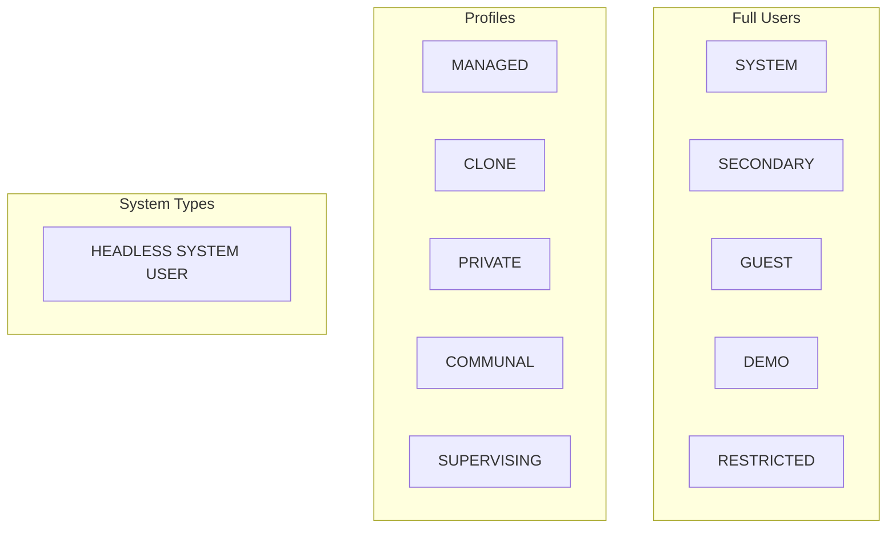

更细的规格如下：

| 类型常量 | 基础类型 | 最大数量 | 是否要求父用户 | 说明 |
|---|---|---|---|---|
| `USER_TYPE_FULL_SYSTEM` | `FLAG_SYSTEM \| FLAG_FULL` | 1 | 否 | 普通模式下的系统主用户 |
| `USER_TYPE_FULL_SECONDARY` | `FLAG_FULL` | 配置项决定 | 否 | 可切换到的标准次级用户 |
| `USER_TYPE_FULL_GUEST` | `FLAG_FULL` | 1 | 否 | 临时访客 |
| `USER_TYPE_FULL_DEMO` | `FLAG_FULL` | 3 | 否 | 演示 / kiosk |
| `USER_TYPE_FULL_RESTRICTED` | `FLAG_FULL` | 配置项决定 | 否 | 受限用户 |
| `USER_TYPE_PROFILE_MANAGED` | `FLAG_PROFILE` | 配置项决定 | 是 | 企业工作资料 |
| `USER_TYPE_PROFILE_CLONE` | `FLAG_PROFILE` | 每父用户 1 个 | 是 | 应用克隆 |
| `USER_TYPE_PROFILE_PRIVATE` | `FLAG_PROFILE` | 1 | 是 | Private Space |
| `USER_TYPE_PROFILE_COMMUNAL` | `FLAG_PROFILE` | 1 | 否 | 共享型 profile |
| `USER_TYPE_PROFILE_SUPERVISING` | `FLAG_PROFILE` | 1 | 否 | 监管型用户 |
| `USER_TYPE_SYSTEM_HEADLESS` | `FLAG_SYSTEM` | 1 | 否 | Headless System User |

### 31.2.3 Full System User

传统手机模式下，系统用户既是 `user 0`，也是用户可见的主用户：

```java
private static UserTypeDetails.Builder getDefaultTypeFullSystem() {
    return new UserTypeDetails.Builder()
            .setName(USER_TYPE_FULL_SYSTEM)
            .setBaseType(FLAG_SYSTEM | FLAG_FULL)
            .setDefaultUserInfoPropertyFlags(FLAG_PRIMARY | FLAG_ADMIN | FLAG_MAIN)
            .setMaxAllowed(1)
            .setDefaultRestrictions(getDefaultSystemUserRestrictions());
}
```

它的硬约束很明确：

- 永远存在
- 不能删除
- 开机最先启动
- 许多系统策略默认以它为基准

在 HSUM（Headless System User Mode）下，`user 0` 继续存在，但它不再是人类操作者使用的前台桌面用户。

### 31.2.4 Secondary User

次级用户就是 Settings 中最常见的“新增用户”。它是完整用户，可以被切换为前台：

```java
private static UserTypeDetails.Builder getDefaultTypeFullSecondary() {
    return new UserTypeDetails.Builder()
            .setName(USER_TYPE_FULL_SECONDARY)
            .setBaseType(FLAG_FULL)
            .setMaxAllowed(getDefaultMaxAllowedSwitchableUsers())
            .setDefaultRestrictions(getDefaultSecondaryUserRestrictions());
}
```

默认限制通常包括：

- `DISALLOW_OUTGOING_CALLS`
- `DISALLOW_SMS`

这些限制属于保守默认值，管理员可以再放开。

### 31.2.5 Guest User

Guest 不是“轻量 secondary user”，而是专门为临时借用设备设计的类型：

```java
private static UserTypeDetails.Builder getDefaultTypeFullGuest() {
    final boolean ephemeralGuests = Resources.getSystem()
            .getBoolean(com.android.internal.R.bool.config_guestUserEphemeral);
    final int flags = FLAG_GUEST | (ephemeralGuests ? FLAG_EPHEMERAL : 0);

    return new UserTypeDetails.Builder()
            .setName(USER_TYPE_FULL_GUEST)
            .setBaseType(FLAG_FULL)
            .setDefaultUserInfoPropertyFlags(flags)
            .setEnabled(getMaxSwitchableUsers() > 1 ? 1 : 0)
            .setMaxAllowed(1)
            .setDefaultRestrictions(getDefaultGuestUserRestrictions());
}
```

Guest 的关键语义：

- 同时只允许一个
- 可配置为 ephemeral，退出后清空数据
- 在单用户设备上可能直接禁用
- 限制比普通次级用户更严格

### 31.2.6 Managed Profile（工作资料）

工作资料是 Android 企业场景最重要的 profile 类型：

```java
private static UserTypeDetails.Builder getDefaultTypeProfileManaged() {
    return new UserTypeDetails.Builder()
            .setName(USER_TYPE_PROFILE_MANAGED)
            .setBaseType(FLAG_PROFILE)
            .setDefaultUserInfoPropertyFlags(FLAG_MANAGED_PROFILE)
            .setMaxAllowed(getMaxManagedProfiles())
            .setMaxAllowedPerParent(getMaxManagedProfiles())
            .setProfileParentRequired(true)
            .setDefaultUserProperties(new UserProperties.Builder()
                    .setStartWithParent(true)
                    .setShowInLauncher(UserProperties.SHOW_IN_LAUNCHER_SEPARATE)
                    .setShowInSettings(UserProperties.SHOW_IN_SETTINGS_SEPARATE)
                    .setShowInQuietMode(UserProperties.SHOW_IN_QUIET_MODE_PAUSED)
                    .setShowInSharingSurfaces(
                            UserProperties.SHOW_IN_SHARING_SURFACES_SEPARATE)
                    .setCredentialShareableWithParent(true));
}
```

这些属性直观决定了工作资料的体验：

- 随父用户启动
- 在 Launcher 中单独展示并带徽章
- Quiet Mode 时显示为暂停
- 分享面板中单独分区
- 可以与父用户共享锁屏凭据

### 31.2.7 Clone Profile

Clone Profile 的目标是“同一个应用运行第二份实例”，典型就是双开社交软件：

```java
private static UserTypeDetails.Builder getDefaultTypeProfileClone() {
    return new UserTypeDetails.Builder()
            .setName(USER_TYPE_PROFILE_CLONE)
            .setBaseType(FLAG_PROFILE)
            .setMaxAllowedPerParent(1)
            .setProfileParentRequired(true)
            .setDefaultUserProperties(new UserProperties.Builder()
                    .setStartWithParent(true)
                    .setShowInLauncher(UserProperties.SHOW_IN_LAUNCHER_WITH_PARENT)
                    .setShowInSettings(UserProperties.SHOW_IN_SETTINGS_WITH_PARENT)
                    .setInheritDevicePolicy(
                            UserProperties.INHERIT_DEVICE_POLICY_FROM_PARENT)
                    .setUseParentsContacts(true)
                    .setMediaSharedWithParent(true)
                    .setCredentialShareableWithParent(true)
                    .setDeleteAppWithParent(true));
}
```

它和 Work Profile 的取向不同：

- 更强调和父用户并列展示
- 允许共用联系人和媒体
- 某些策略直接继承父用户
- 父用户卸载应用时，克隆实例一起删除

### 31.2.8 Restricted Profile

Restricted Profile 主要是平板时代留下来的能力。它有点“像 profile，又不是 profile”：

```java
private static UserTypeDetails.Builder getDefaultTypeFullRestricted() {
    return new UserTypeDetails.Builder()
            .setName(USER_TYPE_FULL_RESTRICTED)
            .setBaseType(FLAG_FULL)
            .setDefaultUserInfoPropertyFlags(FLAG_RESTRICTED)
            .setMaxAllowed(getDefaultMaxAllowedSwitchableUsers())
            .setProfileParentRequired(false);
}
```

它本身是 full user，可以单独切换，但又带一个“受限父用户”关系，父用户控制应用可见性和内容访问。

### 31.2.9 `UserProperties`

`UserProperties` 把“这个用户类型如何展示、如何共享、如何参与 API”集中起来：

| 属性 | 值 / 取值域 | 作用 |
|---|---|---|
| `startWithParent` | `boolean` | 父用户启动时是否自动启动 |
| `showInLauncher` | `NO` / `WITH_PARENT` / `SEPARATE` | Launcher 展示方式 |
| `showInSettings` | `NO` / `WITH_PARENT` / `SEPARATE` | Settings 展示方式 |
| `showInQuietMode` | `DEFAULT` / `PAUSED` / `HIDDEN` | Quiet Mode 时如何显示 |
| `showInSharingSurfaces` | `NO` / `WITH_PARENT` / `SEPARATE` | 分享面板可见性 |
| `credentialShareableWithParent` | `boolean` | 是否可共享锁屏凭据 |
| `mediaSharedWithParent` | `boolean` | 是否共享媒体数据 |
| `inheritDevicePolicy` | `NO` / `FROM_PARENT` | 是否继承 DPM 策略 |
| `crossProfileIntentFilterAccessControl` | 多级枚举 | 谁能改跨资料 intent 过滤器 |
| `crossProfileContentSharingStrategy` | 策略枚举 | 内容共享规则 |
| `profileApiVisibility` | `VISIBLE` / `HIDDEN` | 是否暴露给 profile 查询 API |
| `authAlwaysRequiredToDisableQuietMode` | `boolean` | 关闭 Quiet Mode 是否总要认证 |
| `deleteAppWithParent` | `boolean` | 父用户删应用时是否连带删除 |
| `itemsRestrictedOnHomeScreen` | `boolean` | 主屏入口是否受限制 |

---

## 31.3 用户生命周期

### 31.3.1 用户创建

用户创建最终都会走到 `createUserInternalUnchecked()`。它不是简单地插入一条内存记录，而是一个跨 UMS、Storage、PMS 的完整事务：

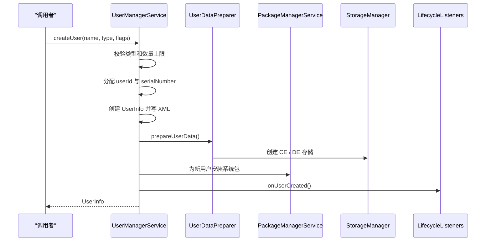

简化后的代码轮廓如下：

```java
@NonNull UserInfo createUserInternalUnchecked(
        @Nullable String name, @NonNull String userType,
        @UserInfoFlag int flags, @UserIdInt int parentId,
        boolean preCreate, @Nullable String[] disallowedPackages,
        @Nullable Object token) throws UserManager.CheckedUserOperationException {

    final UserTypeDetails userTypeDetails = mUserTypes.get(userType);
    userId = getNextAvailableId();

    UserInfo userInfo = new UserInfo(userId, name, null, flags, userType);
    userInfo.serialNumber = mNextSerialNumber++;
    userInfo.creationTime = getCreationTime();
    userInfo.profileGroupId = parentId;

    final UserData userData = new UserData();
    userData.info = userInfo;
    userData.userProperties = new UserProperties(
            userTypeDetails.getDefaultUserProperties());

    synchronized (mUsersLock) {
        mUsers.put(userId, userData);
    }
    writeUserLP(userData);
    writeUserListLP();

    mUserDataPreparer.prepareUserData(userInfo, storageFlags);
    mPm.installPackagesFromSystemImageForUser(userId, ...);
    notifyLifecycleListeners(userInfo, token);
    return userInfo;
}
```

创建路径上的典型校验包括：

- 用户类型存在且启用
- 总用户数未超上限
- 某 profile 类型未超每父用户上限
- 设备存储资源足够
- 调用方权限满足要求

### 31.3.2 用户 ID 分配

用户 ID 分配策略很朴素，但要求很严格：

```java
private int getNextAvailableId() {
    synchronized (mUsersLock) {
        int nextId = MIN_USER_ID;
        while (mUsers.get(nextId) != null
                || mRecentlyRemovedIds.contains(nextId)) {
            nextId++;
            if (nextId > MAX_USER_ID) {
                throw new IllegalStateException("Cannot add user. Maximum reached.");
            }
        }
        return nextId;
    }
}
```

它优先寻找最小可用 ID，同时避开“刚刚删除”的 ID。这样做不是为了美观，而是为了降低 stale state 和外部缓存复用带来的风险。

### 31.3.3 预创建用户

Android 支持预创建用户（pre-created user），尤其适合需要快速出 guest 或 profile 的场景。预创建时先把最耗时的步骤做掉：

- 分配 userId
- 写用户元数据
- 准备存储目录
- 安装系统包

等真正有人要使用时，再把它“转正”成真实用户。这减少了创建时首屏等待。

### 31.3.4 用户启动与运行状态

用户创建完成后还要经历一组运行态转换：

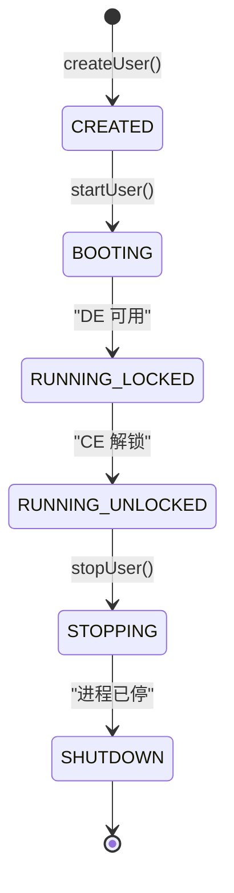

`UserState` 常量定义在 AMS 一侧：

```java
public class UserState {
    public final static int STATE_BOOTING = 0;
    public final static int STATE_RUNNING_LOCKED = 1;
    public final static int STATE_RUNNING_UNLOCKING = 2;
    public final static int STATE_RUNNING_UNLOCKED = 3;
    public final static int STATE_STOPPING = 4;
    public final static int STATE_SHUTDOWN = 5;
}
```

语义上要分清：

- `RUNNING_LOCKED`：用户已经启动，但只能访问 DE 数据
- `RUNNING_UNLOCKED`：用户完成凭据解锁，CE 数据可见

### 31.3.5 用户移除

删除用户同样是多阶段流程：

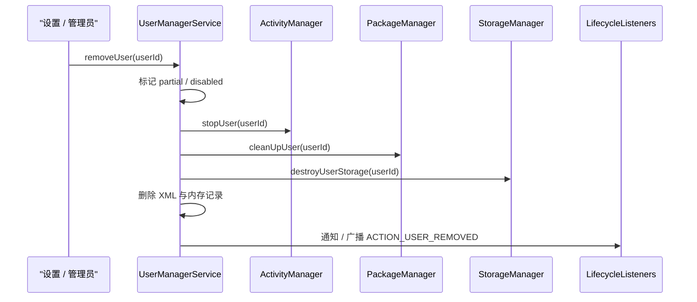

删除时的硬性保护包括：

- 不允许删除 `user 0`
- 不允许直接删除当前前台用户
- 删除父用户时会连带删其 profiles
- `partial` 标志用于隔离“删除到一半”的中间态

源码轮廓：

```java
public boolean removeUser(@UserIdInt int userId) {
    Slog.i(LOG_TAG, "removeUser u" + userId);
    return removeUserWithProfilesUnchecked(userId);
}

private boolean removeUserWithProfilesUnchecked(@UserIdInt int userId) {
    synchronized (mUsersLock) {
        for (int i = mUsers.size() - 1; i >= 0; i--) {
            UserInfo profile = mUsers.valueAt(i).info;
            if (profile.profileGroupId == userId && profile.id != userId) {
                removeUserUnchecked(profile.id);
            }
        }
    }
    return removeUserUnchecked(userId);
}
```

### 31.3.6 生命周期监听器

系统服务可以注册用户生命周期监听器：

```java
public interface UserLifecycleListener {
    default void onUserCreated(UserInfo user, Object token) {}
    default void onUserRemoved(UserInfo user) {}
}
```

这些监听通常用于：

- 初始化 per-user 系统状态
- 建立或清理缓存
- 记录审计与 telemetry
- 跟进 profile 关联逻辑

---

## 31.4 工作资料

### 31.4.1 工作资料架构

Work Profile 的本质是“挂在个人用户之下的隔离 profile”：

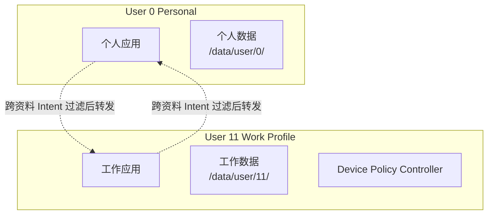

企业场景依赖它的原因很简单：它把“企业数据隔离”做到了 profile 边界，而不是让企业应用和个人应用抢同一个数据域。

### 31.4.2 Profile Group

同一 profile group 内的用户，会共享一个 `profileGroupId`，通常等于父用户 ID：

```java
public boolean isSameProfileGroup(int userId, int otherUserId) {
    synchronized (mUsersLock) {
        UserInfo user = getUserInfoLU(userId);
        UserInfo other = getUserInfoLU(otherUserId);
        return user != null && other != null
                && user.profileGroupId != UserInfo.NO_PROFILE_GROUP_ID
                && user.profileGroupId == other.profileGroupId;
    }
}
```

典型关系：

- `user 0`：`profileGroupId = 0` 或无 group
- 工作资料 `user 11`：`profileGroupId = 0`
- Private Space `user 12`：`profileGroupId = 0`

### 31.4.3 跨资料 Intent Filter

个人空间与工作资料之间能不能互相拉起组件，不取决于应用自己想不想，而取决于跨资料 intent filter 是否存在。

```java
.setDefaultCrossProfileIntentFilters(getDefaultManagedCrossProfileIntentFilter())
```

这套机制决定了几个关键问题：

- 哪些 action 可以从个人跳转到工作
- 哪些分享入口可以看到工作应用
- 企业 DPC 是否有权限覆写 / 增减规则

默认策略通常允许必要的拨号、分享、文档选择等受控流转，而不会把整个 profile 边界打穿。

### 31.4.4 跨资料数据共享

跨资料不是“绝对禁止共享”，而是“共享必须经过显式制度化入口”。常见通道包括：

- 跨资料 intent filter
- `CrossProfileApps` API
- DPC 配置的共享策略
- `ContactsProvider` / `MediaStore` 等受控访问

企业能力的重点不在于把一切都锁死，而在于让共享成为“默认关闭、按策略开放”的行为。

### 31.4.5 Quiet Mode

Quiet Mode 可以把工作资料整体置为“暂停”状态：

- profile 用户仍存在
- 其应用不会正常运行
- Launcher 徽章通常变灰或暂停态
- 某些跨资料行为也会被阻断

从实现角度看，它比“直接删掉 profile”轻很多，但比“停用单个 app”更彻底。

### 31.4.6 工作资料徽章

工作资料在 UI 上必须让用户一眼识别，这就是徽章、分栏和专属标签存在的原因。相关能力通常由：

- `UserTypeDetails` 中的 badge / label / color 配置
- Launcher 对 work tab 的支持
- Settings / chooser / share sheet 的 profile-aware 展示

共同完成。

### 31.4.7 通过 `DevicePolicyManager` 创建工作资料

工作资料不是普通应用能随意创建的。典型入口在 DPC 或预置企业配置流程中：

```java
DevicePolicyManager dpm = context.getSystemService(DevicePolicyManager.class);
// 真实创建通常走托管配置或 DPC 流程，而不是普通三方 app 直接调用
```

背后会触发：

- 用户类型与数量校验
- DPC 安装 / 绑定
- profile owner 建立
- 默认企业策略下发
- 跨资料规则初始化

### 31.4.8 生命周期管理

工作资料的生命周期高度依赖父用户：

- 父用户启动时，若 `startWithParent=true`，资料会随之启动
- 父用户切后台后，profile 的前后台语义也跟着变化
- 父用户被删除时，资料会被连带删除
- Quiet Mode 为资料提供“逻辑暂停”能力

### 31.4.9 `CrossProfileApps` API

`CrossProfileApps` 为系统 / 受信任 app 提供了跨 profile 跳转能力：

```java
CrossProfileApps crossProfileApps =
        context.getSystemService(CrossProfileApps.class);
```

它的定位不是替代 intent filter，而是让受控跨资料启动有标准 API，而不是靠私有约定乱穿。

### 31.4.10 企业策略整合

企业场景通常同时存在 Device Owner 与 Profile Owner：

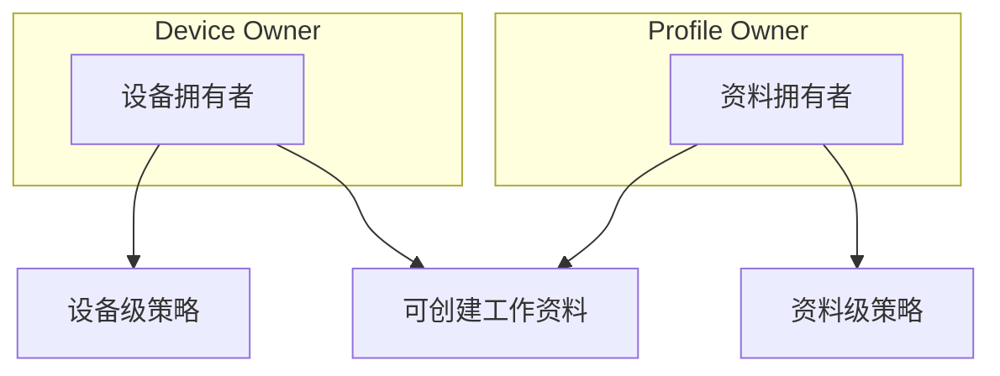

策略层级大致分为：

- 设备级：Wi-Fi、VPN、证书、全局限制
- 资料级：工作应用、密码、分享限制、剪贴板策略
- 继承型：某些 profile 可从父用户继承设备策略

### 31.4.11 工作资料 UI 集成

工作资料是否“好用”，很大程度上取决于 UI 集成而不是底层数据结构。SystemUI、Launcher、Settings、Chooser、通知系统都需要识别 profile 语义，确保：

- 工作应用有明确 badge
- 分享与打开方式支持 profile 选择
- Quiet Mode 状态可感知
- 工作通知、工作设置项和工作应用列表彼此一致

---

## 31.5 Private Space

### 31.5.1 概览

Private Space 是 Android 15 引入的面向个人隐私的隐藏资料空间。它不是企业资料的轻量替代，而是“用户自己管理的敏感应用空间”：

```java
private static UserTypeDetails.Builder getDefaultTypeProfilePrivate() {
    return new UserTypeDetails.Builder()
            .setName(USER_TYPE_PROFILE_PRIVATE)
            .setBaseType(FLAG_PROFILE)
            .setProfileParentRequired(true)
            .setMaxAllowed(1)
            .setMaxAllowedPerParent(1)
            .setEnabled(UserManager.isPrivateProfileEnabled() ? 1 : 0)
            .setDefaultUserProperties(new UserProperties.Builder()
                    .setStartWithParent(true)
                    .setCredentialShareableWithParent(true)
                    .setAuthAlwaysRequiredToDisableQuietMode(true)
                    .setAllowStoppingUserWithDelayedLocking(true)
                    .setMediaSharedWithParent(false)
                    .setShowInLauncher(UserProperties.SHOW_IN_LAUNCHER_SEPARATE)
                    .setShowInQuietMode(
                            UserProperties.SHOW_IN_QUIET_MODE_HIDDEN)
                    .setShowInSharingSurfaces(
                            UserProperties.SHOW_IN_SHARING_SURFACES_SEPARATE)
                    .setCrossProfileIntentFilterAccessControl(
                            UserProperties.CROSS_PROFILE_INTENT_FILTER_ACCESS_LEVEL_SYSTEM)
                    .setProfileApiVisibility(
                            UserProperties.PROFILE_API_VISIBILITY_HIDDEN)
                    .setItemsRestrictedOnHomeScreen(true));
}
```

### 31.5.2 与工作资料的关键差异

| 能力 | Work Profile | Private Space |
|---|---|---|
| 管理者 | 企业 DPC | 设备用户自己 |
| Quiet Mode 下可见性 | 暂停、仍可见 | 完全隐藏 |
| 媒体共享 | 可配置 | 默认不共享 |
| Profile API 可见性 | 通常可见 | 默认隐藏 |
| 解锁要求 | 可选 | 关闭 Quiet Mode 总需认证 |
| 主屏入口 | 正常展示 | 可能受限制或隐藏 |
| 跨资料规则 | DPC 可控 | 更偏系统内建控制 |

### 31.5.3 自动锁定机制

Private Space 的一个核心能力是“离开后自动锁定”：

```java
private static final long PRIVATE_SPACE_AUTO_LOCK_INACTIVITY_TIMEOUT_MS =
        5 * 60 * 1000;

private static final long PRIVATE_SPACE_AUTO_LOCK_INACTIVITY_ALARM_WINDOW_MS =
        TimeUnit.SECONDS.toMillis(55);
```

逻辑流程大致如下：

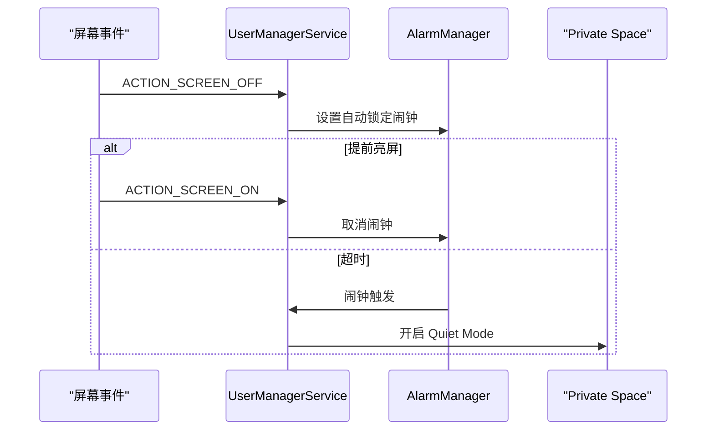

设计重点不在“关屏就立刻锁”，而在“给用户留一个短暂返回窗口，同时保证忘记锁屏时也会自动收口”。

### 31.5.4 入口隐藏

Private Space 可以完全隐藏 Launcher 入口：

```java
import static android.content.pm.LauncherUserInfo.PRIVATE_SPACE_ENTRYPOINT_HIDDEN;
import static android.provider.Settings.Secure.HIDE_PRIVATESPACE_ENTRY_POINT;
```

入口隐藏后的语义是：

- 不只是图标变灰
- 而是整个 private area 在 Launcher 中不直接暴露
- 用户需要通过特定手势或 Settings 入口再进入

### 31.5.5 生物认证集成

Private Space 会用专门 branding 的生物认证提示框进行解锁：

```java
if (getUserInfo(userId).isPrivateProfile()) {
    mContext.getString(R.string.private_space_biometric_prompt_title);
}
```

这保证了用户在认证时能明确知道自己是在解锁 Private Space，而不是在做普通应用认证。

---

## 31.6 按用户存储

### 31.6.1 存储布局

Android 的多用户隔离最后一定要落在目录结构和加密边界上：

```text
/data/
    system/users/
        userlist.xml
        0/
        10/

    user/
        0/
        10/

    user_de/
        0/
        10/

    misc/
    misc_de/
    misc_ce/
```

直观理解：

- `/data/user/<userId>/`：Credential Encrypted
- `/data/user_de/<userId>/`：Device Encrypted
- `/data/system/users/`：用户元数据

### 31.6.2 CE 与 DE

多用户和 FBE 是绑在一起的。每个用户都要区分 DE 与 CE：

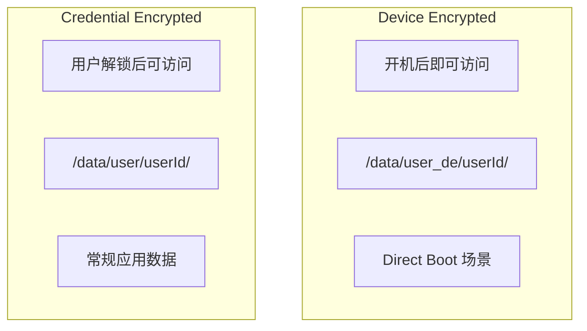

| 属性 | CE | DE |
|---|---|---|
| 路径 | `/data/user/<userId>/` | `/data/user_de/<userId>/` |
| 可用时机 | 用户输入凭据后 | 设备开机后 |
| 密钥来源 | 用户凭据 | 设备密钥 |
| 典型数据 | 照片、消息、普通 app 数据 | 闹钟、电话、Direct Boot 数据 |
| 常用 API | `Context.getDataDir()` | `createDeviceProtectedStorageContext()` |

### 31.6.3 存储准备

新用户创建时，`UserDataPreparer` 负责把这些目录真正搭起来：

```java
void prepareUserData(UserInfo userInfo, int flags) {
    try (PackageManagerTracedLock installLock = mInstallLock.acquireLock()) {
        final StorageManager storage = mContext.getSystemService(StorageManager.class);
        prepareUserDataLI(null, userInfo, flags, true);
        for (VolumeInfo vol : storage.getWritablePrivateVolumes()) {
            final String volumeUuid = vol.getFsUuid();
            if (volumeUuid != null) {
                prepareUserDataLI(volumeUuid, userInfo, flags, true);
            }
        }
    }
}
```

内部存储总是优先准备，因为 adoptable storage 的卷密钥本身就依赖内部存储。

### 31.6.4 按用户安装包

Android 不是“所有系统 app 自动装到所有用户”。系统包安装需要经过 `UserSystemPackageInstaller`：

- system user allowlist
- 按 user type 的 whitelist / blocklist
- 清单中的 install-in / exclude-from 声明
- OEM overlay 配置

这样工作资料、受限用户、私密资料就能拥有不同的系统包可见集。

### 31.6.5 每用户外部存储

多用户的外部存储同样是隔离的：

```text
/storage/emulated/0/
/storage/emulated/10/
```

FUSE 或等价层会结合 UID 范围做访问裁决，让每个用户只看到自己的“外部存储视图”。

---

## 31.7 用户切换

### 31.7.1 用户切换总览

切换 full user 远不只是 Launcher 换个桌面。它涉及 AMS、WMS、UMS、PMS 和大量用户感知系统服务：

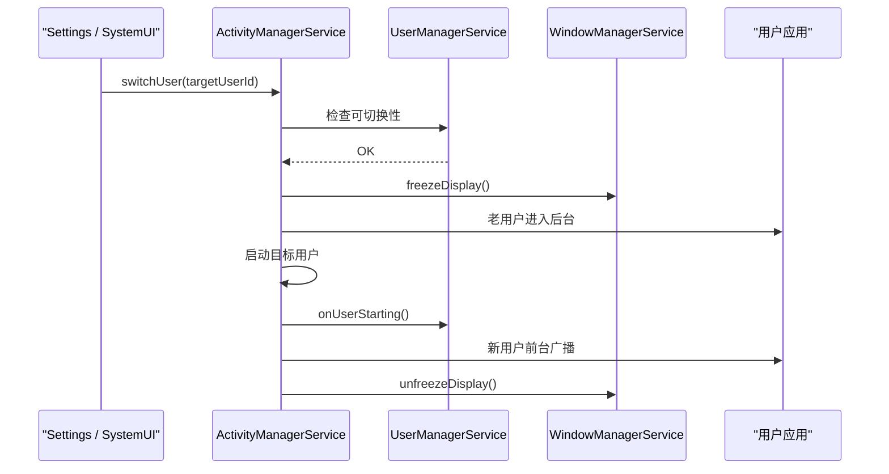

核心目标是：在切换过程中既保持系统一致性，也避免用户看到中间态。

### 31.7.2 可切换性检查

切换之前，`UserManagerService` 会先做约束判断：

```java
public @UserManager.UserSwitchabilityResult int getUserSwitchability(
        @UserIdInt int userId) {
    int flags = UserManager.SWITCHABILITY_STATUS_OK;

    if (telecomManager != null && telecomManager.isInCall()) {
        flags |= UserManager.SWITCHABILITY_STATUS_USER_IN_CALL;
    }
    if (mLocalService.hasUserRestriction(DISALLOW_USER_SWITCH, userId)) {
        flags |= UserManager.SWITCHABILITY_STATUS_USER_SWITCH_DISALLOWED;
    }
    if (!isHeadlessSystemUserMode()) {
        if (!allowUserSwitchingWhenSystemUserLocked && !systemUserUnlocked) {
            flags |= UserManager.SWITCHABILITY_STATUS_SYSTEM_USER_LOCKED;
        }
    }
    return flags;
}
```

结果位通常包括：

| 标志 | 含义 |
|---|---|
| `SWITCHABILITY_STATUS_OK` | 允许切换 |
| `SWITCHABILITY_STATUS_USER_IN_CALL` | 通话中 |
| `SWITCHABILITY_STATUS_USER_SWITCH_DISALLOWED` | 策略禁止 |
| `SWITCHABILITY_STATUS_SYSTEM_USER_LOCKED` | system user 尚未解锁 |

### 31.7.3 `UserVisibilityMediator`

“可见用户”不等同于“当前前台用户”。`UserVisibilityMediator` 负责定义谁处于可见集：

- `SUSD`：单用户单显示，手机和平板主流模式
- `MUMD`：多用户多显示，车机常见
- `MUPAND`：多乘客、无人驾驶位等特殊车机场景

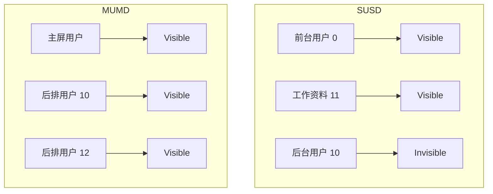

手机模式下，规则很简单：当前前台用户及其 profiles 可见，其他 full users 不可见。车机模式则需要把“用户”和“显示器”绑定起来。

### 31.7.4 切换期间的进程管理

切换过程中系统通常按以下顺序处理：

1. 冻结显示并展示过渡动画。
2. 让当前用户 activity 暂停 / 停止。
3. 启动目标用户的关键系统服务与 launcher。
4. 若目标用户有锁屏，则等待解锁。
5. 恢复显示并切入新用户桌面。

同时：

- 旧用户的 profile 可能被停止
- 新用户 `startWithParent=true` 的 profile 会被拉起
- 某些配置下，切换会顺带 force-stop 旧用户进程

### 31.7.5 开机用户选择

在 HSUM 下，系统还要决定“开机后把哪个人类用户推到前台”：

```java
@VisibleForTesting
static final int BOOT_STRATEGY_TO_PREVIOUS_OR_FIRST_SWITCHABLE_USER = 0;
@VisibleForTesting
static final int BOOT_STRATEGY_TO_HSU_FOR_PROVISIONED_DEVICE = 1;

private static final String BOOT_STRATEGY_PROPERTY = "persist.user.hsum_boot_strategy";
```

策略含义：

| 策略 | 行为 |
|---|---|
| `TO_PREVIOUS_OR_FIRST_SWITCHABLE_USER` | 回到上次用户，或首个可切换用户 |
| `TO_HSU_FOR_PROVISIONED_DEVICE` | 已 provision 的设备优先停在 HSU |

UMS 还会用 `CountDownLatch` 等待 boot user 决策完成，避免引导流程跑偏。

### 31.7.6 用户切换器 UI

用户切换入口通常分布在：

1. Quick Settings
2. 锁屏界面
3. Settings > Users

SystemUI 的 `UserSwitcherController` 会订阅用户广播，保持 UI 与系统状态同步。

### 31.7.7 生命周期广播

用户启动、切换、停止、删除都有一组标准广播：

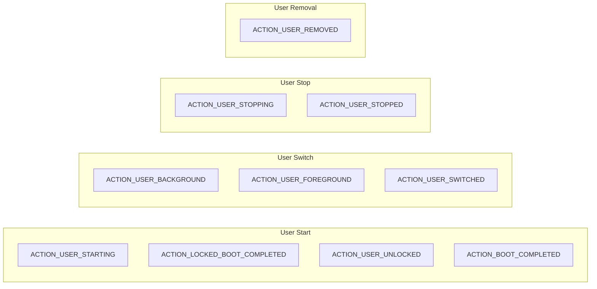

常见时序如下：

| 广播 | 接收者 | 时机 |
|---|---|---|
| `ACTION_USER_STARTING` | 系统服务 | 用户进程开始拉起 |
| `ACTION_LOCKED_BOOT_COMPLETED` | Direct Boot app | DE 存储可用 |
| `ACTION_USER_UNLOCKED` | 系统服务 | CE 存储可用 |
| `ACTION_BOOT_COMPLETED` | 用户内应用 | 完整存储可用 |
| `ACTION_USER_BACKGROUND` | 系统服务 | 老用户转后台 |
| `ACTION_USER_FOREGROUND` | 系统服务 | 新用户转前台 |
| `ACTION_USER_SWITCHED` | 系统服务 | 切换完成 |
| `ACTION_USER_STOPPING` | 系统服务 | 用户即将停止 |
| `ACTION_USER_STOPPED` | 系统服务 | 用户彻底停止 |
| `ACTION_USER_REMOVED` | 所有用户 / 系统 | 用户被删除 |

---

## 附录：内部机制深入剖析

### A.1 `UserInfo.flags`

`UserInfo.flags` 是多用户语义最密集的字段之一。它把“角色属性”和“状态属性”压成 bitmask，例如：

```java
public static final int FLAG_PRIMARY = 0x00000001;
public static final int FLAG_ADMIN = 0x00000002;
public static final int FLAG_GUEST = 0x00000004;
public static final int FLAG_RESTRICTED = 0x00000008;
```

阅读 `pm list users` 或 `dumpsys user` 时，先学会拆 flags，很多问题会立刻清晰。

### A.2 用户限制的更深一层

用户限制并不是只在 UMS 生效。真正的 enforcement 分散在各个服务：

- 安装限制由 PMS 执行
- 电话 / 短信限制由对应系统服务执行
- 设置项限制由 Settings 与 SystemUI 共同反映

UMS 负责聚合与缓存，执行点散布在整个框架层。

### A.3 `UserSystemPackageInstaller`

这个组件决定“系统镜像上的包，哪些应该给这个用户”。它综合：

- user type allowlist
- system user allowlist
- OEM overlay
- manifest 元数据

多用户系统真正做到“同镜像、不同用户看到不同系统应用”，靠的就是它。

### A.4 UserFilter 系统

Android 内部不少查询接口都支持“按用户过滤”。UserFilter 的作用，就是把“全部用户 / 当前用户 / 可见用户 / 同 group 用户”这类集合语义标准化，避免每个服务自己造轮子。

### A.5 跨资料 Intent Filter 机制

跨资料 intent filter 不只是 resolver 层做个简单 pass-through。它需要同时考虑：

- 调用者所在用户
- 目标组件所在用户
- profile group
- DPM 策略
- 分享 / 打开 / 选择器等场景的 UI 展示方式

### A.6 用户生命周期广播细节

多用户广播常见的误解是“`BOOT_COMPLETED` 就等于系统启动完成”。实际不是。每个用户都会有自己的 locked boot、unlock、boot completed 节点；对 profile 来说，这些节点还会受父用户和 quiet mode 影响。

### A.7 HSUM

Headless System User Mode 常见于车机。系统用户继续承担大量 system-only 工作，但真正的人类会话跑在别的 full user 上。这样能把“系统服务宿主”与“驾驶员 / 乘客会话”解耦。

### A.8 多显示多用户

MUMD 模式下，“当前用户”已经不够表达真实状态，需要加入 display 维度。一个用户在哪块屏上可见，决定了哪些窗口、哪些进程和哪些输入路由是激活的。

### A.9 `UserData` 持久化格式

`userlist.xml` 是全局入口，`<id>.xml` 保存单个用户详细属性，`res_*.xml` 之类文件则承载限制或衍生状态。分析用户问题时，这些文件是第一现场。

### A.10 用户版本迁移

UMS 会维护用户元数据的 schema 版本。系统升级时，如果用户 XML 结构或语义变化，需要做迁移，以保证旧设备升级后不会因为解析失败或字段缺失导致多用户状态损坏。

### A.11 Profile 关联与解析

很多“这个用户是不是另一个用户的 profile”问题，最终都要落回：

- `profileGroupId`
- `restrictedProfileParentId`
- user type 是否要求父用户

这三者组合起来，决定了 profile 的身份关系。

### A.12 Guest 重置

Guest 的“重置”通常不是逻辑清空，而是直接删除并重建，或者依赖 ephemeral 语义在退出时清除数据。这样实现简单，也更接近真正的隔离。

### A.13 User Journey Logging

现代 Android 会记录用户旅程，如创建、启动、切换、解锁、停止等时间点，用于性能分析和问题追踪。`startRealtime`、`unlockRealtime` 一类字段就是这类观测的一部分。

### A.14 Communal Profile

Communal Profile 面向共享空间场景，例如家庭中控或公共设备。它强调“多人共用一个受限空间”，和个人 full user、企业 profile 都不是一回事。

### A.15 Supervising Profile

Supervising / supervised 场景面向家长控制、受监管环境或特定区域控制需求。它通常需要更强的策略约束和更高优先级的系统信任链。

### A.16 多用户对系统服务的影响

几乎所有系统服务都要做 user-aware 设计：

- Settings 是 per-user
- 权限授予是 per-user
- 通知、ContentProvider、输入法、媒体会话都要带 user 语义

谁没把 user 维度想明白，谁就很容易写出跨用户泄漏。

### A.17 最大用户数限制

理论上受 `PER_USER_RANGE` 与 `MAX_USER_ID` 影响，实践中更早受限于：

- 存储空间
- RAM
- 并发进程数
- 用户切换和启动时延

### A.18 SystemUI 中的 UserSwitcherController

这个控制器不是简单读个用户列表，而是要处理：

- 哪些用户当前可切换
- 哪些 profile 不该当成单独 full user 展示
- guest / add user / restricted user 的特殊入口
- 广播驱动的状态同步

### A.19 安全模型总结

多用户安全模型的核心不是“切换桌面”，而是：

- 独立 UID 空间
- 独立 CE / DE 存储
- 独立运行时权限
- profile / group 受控共享

这是 Android 用户数据安全边界的重要组成部分。

### A.20 多用户对 ContentProvider 的影响

Provider 查询必须明确 user context。`content://` 本身不显式编码 userId，但系统在解析、调度和授权时会引入 user 维度；否则同一个 provider authority 就可能跨用户串数据。

### A.21 按用户设置

大量系统设置保存在 per-user 空间中，这解释了为什么：

- 用户切换后桌面、壁纸、设置项会不同
- 某些设置能跨用户共享，另一些不能
- 修复设置异常时必须先确认你看的到底是哪一个 user

### A.22 多用户通知处理

通知天然带 userId 语义。SystemUI 展示哪条通知、NMS 投递给谁、工作资料通知是否折叠或分栏，全部要结合用户边界来处理。

### A.23 多用户与设备管理

Device Owner、Profile Owner、受监管用户之间的组合，是 Android 企业与家长控制体系的基础。多用户不是这些能力的附属品，而是它们的承载容器。

### A.24 多用户与应用权限

运行时权限是 per-user 的：

```text
User 0: com.example.app 已授权 Camera
User 10: com.example.app 未授权 Camera
```

这点非常重要。即使 APK 只有一份，授权状态也不会自动跨用户复制。

### A.25 多用户与安装器

创建用户时，PMS 需要决定哪些包要“对这个用户安装可见”。对 profile 而言，还会叠加父用户关系与 user type 策略。这正是“安装状态 per-user、包文件可共享”的经典 Android 模型。

### A.26 多用户与进程管理

进程优先级也带 user 感知：

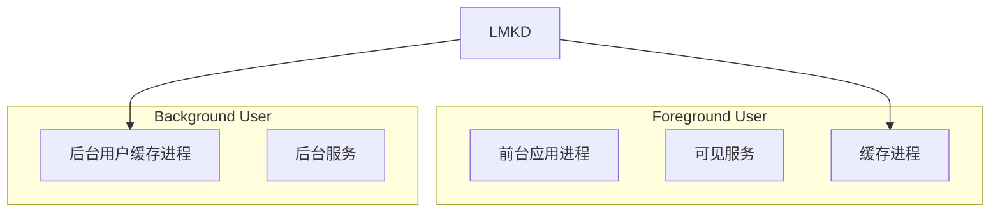

一般来说：

- 前台用户的进程优先级更高
- 后台 full user 进程更容易先被杀
- profile 往往继承父用户会话优先级

### A.27 多用户启动序列

开机后的多用户序列大致是：

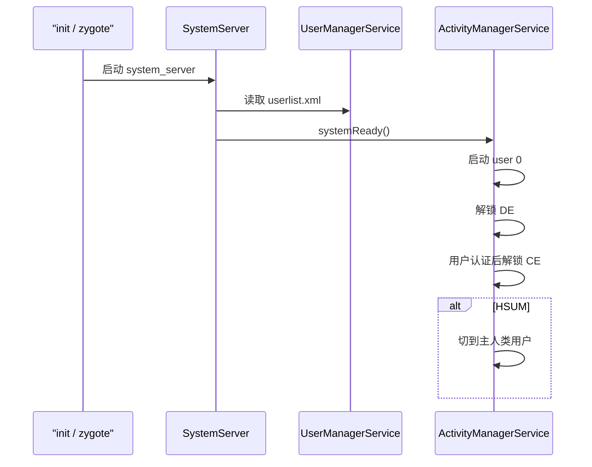

### A.28 多用户与 Keystore

Keystore 同样是按用户隔离的：

- 每个用户有独立 key namespace
- CE 绑定的 key 只在用户解锁后可用
- 工作资料和个人空间的 key 互不混用

这对证书、密码、企业证书管理和生物认证都至关重要。

### A.29 多用户测试策略

多用户测试不能只停留在 UI 点点点，至少要覆盖：

- 创建 / 删除 full user
- 创建 / 暂停 / 恢复 work profile
- 切换前后台用户
- 验证 storage、permission、provider、notification 的 user 语义

常用命令：

```bash
# 快速创建测试用户和工作资料
adb shell pm create-user "Test1"
adb shell pm create-user --profileOf 0 --managed "Work"

# 运行相关测试
adb shell am instrument -w -e class \
    com.android.cts.multiuser.UserManagerTest \
    com.android.cts.multiuser/androidx.test.runner.AndroidJUnitRunner

# 清理
adb shell pm list users
```

### A.30 已知限制与边界情况

多用户体系的几个现实约束：

1. 切换用户通常需要数秒，不可能做到桌面应用级秒切。
2. 多个并发用户会显著消耗 RAM 和 CPU。
3. 并不是所有三方应用都正确处理了多用户。
4. 某些系统资源出于可用性考虑会跨用户共享，例如部分连接状态。
5. profile 数量和类型常受产品配置、编译变量和 DPM 策略限制。

---

## 31.8 动手实践

### 31.8.1 列出用户

```bash
# 列出所有用户
adb shell pm list users

# 查看更完整的 UMS 输出
adb shell dumpsys user

# 只看概要
adb shell cmd user list -v
```

典型输出：

```text
Users:
  UserInfo{0:Owner:4c13} running
    Type: android.os.usertype.full.SYSTEM
    Flags: 0x00004c13 (ADMIN|PRIMARY|FULL|SYSTEM|MAIN)
    State: RUNNING_UNLOCKED
  UserInfo{10:Guest:4804} running
    Type: android.os.usertype.full.GUEST
    Flags: 0x00004804 (GUEST|FULL|EPHEMERAL)
  UserInfo{11:Work profile:4030} running
    Type: android.os.usertype.profile.MANAGED
    Flags: 0x00004030 (MANAGED_PROFILE|PROFILE)
    profileGroupId: 0
```

### 31.8.2 创建用户

```bash
# 创建次级用户
adb shell pm create-user "Test User"

# 创建访客
adb shell pm create-user --guest "Guest"

# 为 user 0 创建工作资料
adb shell pm create-user --profileOf 0 --managed "Work"

# 创建 Private Space profile
adb shell cmd user create-profile-for --user-type android.os.usertype.profile.PRIVATE 0

# 查看支持的 user types
adb shell cmd user list-user-types
```

### 31.8.3 切换用户

```bash
# 切换到 user 10
adb shell am switch-user 10

# 查看当前前台用户
adb shell am get-current-user

# 查看切换能力评估
adb shell cmd user report-user-switchability
```

### 31.8.4 管理资料

```bash
# 打开 Quiet Mode
adb shell cmd user set-quiet-mode --enable 11

# 关闭 Quiet Mode
adb shell cmd user set-quiet-mode --disable 11

# 判断某用户是否为 profile
adb shell cmd user is-profile 11

# 查询 profile 父用户
adb shell cmd user get-profile-parent 11
```

### 31.8.5 用户限制

```bash
# 给 user 10 增加限制
adb shell pm set-user-restriction --user 10 no_install_apps 1

# 清除限制
adb shell pm set-user-restriction --user 10 no_install_apps 0

# 查看用户限制
adb shell dumpsys user | grep -A 20 "UserInfo{10"
```

常见 restriction：

| 限制项 | 效果 |
|---|---|
| `no_install_apps` | 不允许安装应用 |
| `no_uninstall_apps` | 不允许卸载应用 |
| `no_share_location` | 不允许共享位置 |
| `no_outgoing_calls` | 不允许外呼 |
| `no_sms` | 不允许短信 |
| `no_config_wifi` | 不允许配置 Wi-Fi |
| `no_remove_user` | 不允许删除用户 |
| `no_user_switch` | 不允许切走该用户 |

### 31.8.6 检查存储布局

```bash
# 查看每用户数据目录
adb shell ls -la /data/user/

# 查看 user 10 的 CE
adb shell ls /data/user/10/

# 查看 user 10 的 DE
adb shell ls /data/user_de/10/

# 查看用户元数据
adb shell ls /data/system/users/

# 读取用户 XML（需 root）
adb shell cat /data/system/users/10.xml
```

### 31.8.7 删除用户

```bash
# 删除 user 10
adb shell pm remove-user 10

# 如果正在使用则标记为临时并强制删除
adb shell pm remove-user --set-ephemeral-if-in-use 10
```

### 31.8.8 观察用户事件

```bash
# 观察 ActivityManager 中的用户日志
adb logcat -s ActivityManager | grep -i "user"

# 观察 UMS 日志
adb logcat -s UserManagerService

# 观察状态变化
adb logcat | grep -E "onUserStart|onUserStop|switchUser|UserState"
```

### 31.8.9 检查用户可见性

```bash
# 当前可见用户
adb shell cmd user get-visible-users

# 指定用户是否可见
adb shell cmd user is-visible 10

# 某用户绑定到哪个主显示
adb shell cmd user get-main-display-for-user 10
```

### 31.8.10 Private Space 操作

```bash
# 创建 Private Space
adb shell cmd user create-profile-for \
    --user-type android.os.usertype.profile.PRIVATE 0

# 锁定 Private Space
adb shell cmd user set-quiet-mode --enable <private_user_id>

# 解锁 Private Space
adb shell cmd user set-quiet-mode --disable <private_user_id>

# 检查设备是否启用该能力
adb shell getprop persist.sys.user.private_profile
```

### 31.8.11 HSUM 测试

```bash
# 检查是否为 headless system user 模式
adb shell getprop ro.fw.mu.headless_system_user

# 通过持久属性模拟（需要重启）
adb shell setprop persist.debug.fw.headless_system_user 1
adb reboot

# 查看 boot strategy
adb shell getprop persist.user.hsum_boot_strategy
```

### 31.8.12 检查用户类型

```bash
# 查看所有注册类型
adb shell cmd user list-user-types

# 查看指定用户的类型
adb shell cmd user get-user-type 11

# 检查用户属性
adb shell dumpsys user | grep -A 30 "User properties"
```

### 31.8.13 性能观测

```bash
# 测量用户创建时间
adb shell cmd user create-user --timed "Performance Test"

# 观察 user start 相关 timing
adb logcat -s SystemServerTiming | grep -i user

# 查看 start / unlock 时间戳
adb shell dumpsys user | grep -E "startRealtime|unlockRealtime"
```

### 31.8.14 多用户排障清单

排查多用户问题时，建议按这个顺序看：

1. 用户是否存在，类型是否正确。

```bash
adb shell pm list users
adb shell cmd user get-user-type <userId>
```

2. 用户是否正在运行且已解锁。

```bash
adb shell am get-started-user-state <userId>
```

3. `profileGroupId` 是否正确。

```bash
adb shell dumpsys user | grep profileGroupId
```

4. CE / DE 存储是否已准备好。

```bash
adb shell ls /data/user/<userId>/
adb shell ls /data/user_de/<userId>/
```

5. 用户限制是否符合预期。

```bash
adb shell dumpsys user | grep -A 5 "Restrictions:"
```

6. 用户下的软件包是否安装可见。

```bash
adb shell pm list packages --user <userId>
```

7. 跨资料规则是否存在。

```bash
adb shell dumpsys package intent-filter-verifiers
```

---

## 总结（Summary）

Android 多用户不是一个孤立特性，而是一条从 Linux UID、文件加密、PackageManager、ActivityManager 一直贯穿到 SystemUI 的系统边界。

本章关键点如下：

1. `UserManagerService` 是多用户控制平面的中心，负责元数据、限制、生命周期和用户类型管理。
2. Android 通过 `UserTypeDetails` 与 `UserProperties` 把“用户类别”系统化，避免散乱 flag 失控。
3. Work Profile、Clone Profile 和 Private Space 都是 profile，但它们的展示、共享和策略目标完全不同。
4. 多用户隔离最后必须落到 per-user UID、per-user 权限以及 CE / DE 存储上，否则只是 UI 假象。
5. 用户切换是 AMS、WMS、UMS 和所有 user-aware 服务协同完成的事务，不是简单的界面跳转。
6. HSUM、MUMD、Private Space 说明 Android 的多用户模型已经从手机扩展到车机、企业和个人隐私多种产品形态。
7. 调试多用户问题时，优先检查 user type、运行态、profile group、存储目录和 per-user package / permission 状态。

### 关键源码文件参考

| 文件 | 作用 |
|---|---|
| `frameworks/base/services/core/java/com/android/server/pm/UserManagerService.java` | 多用户核心服务 |
| `frameworks/base/services/core/java/com/android/server/pm/UserTypeFactory.java` | 用户类型注册与默认配置 |
| `frameworks/base/services/core/java/com/android/server/pm/UserTypeDetails.java` | 用户类型描述模型 |
| `frameworks/base/services/core/java/com/android/server/pm/UserDataPreparer.java` | CE / DE 存储准备与销毁 |
| `frameworks/base/services/core/java/com/android/server/pm/UserSystemPackageInstaller.java` | 按用户类型安装系统包 |
| `frameworks/base/services/core/java/com/android/server/pm/UserVisibilityMediator.java` | 用户可见性与显示器映射 |
| `frameworks/base/services/core/java/com/android/server/am/UserState.java` | 用户运行状态定义 |
| `frameworks/base/core/java/android/os/UserHandle.java` | userId / uid 算术转换 |
| `frameworks/base/core/java/android/content/pm/UserInfo.java` | 用户基础数据结构 |
| `frameworks/base/core/java/android/os/UserManager.java` | 用户管理公共 API |
