# Chapter 31: Multi-User and Profiles

Android is a multi-user operating system. From the moment the device boots, a user
identity (user 0, the system user) is active, and the entire framework is built to
isolate data, processes, and permissions along user boundaries. This multi-user
capability powers not only the "Users" screen in Settings but also work profiles,
private spaces, guest accounts, restricted profiles, and clone profiles.

This chapter traces the multi-user architecture through the real AOSP source, from
`UserManagerService` in `system_server` through user type definitions, lifecycle
management, storage layout, profile isolation, and the user switching mechanism.

---

## 31.1 Multi-User Architecture

### 31.1.1 Design Foundations

Android's multi-user model is built on Linux's UID-based process isolation:

| Concept | Linux Foundation | Android Extension |
|---|---|---|
| User isolation | UID ranges | Each Android user gets a UID range of 100,000 |
| Process separation | Process namespaces | Each app runs as `uid = userId * 100000 + appId` |
| File isolation | File ownership | Per-user data directories under `/data/user/<userId>/` |
| Storage encryption | dm-crypt | Per-user CE/DE (Credential/Device Encrypted) storage |

For a device with user IDs 0 and 10, an app with appId 10045 runs as:

- User 0: UID 10045
- User 10: UID 1010045

This arithmetic is encoded in `UserHandle`:
```java
public static final int PER_USER_RANGE = 100000;

public static int getUid(int userId, int appId) {
    return userId * PER_USER_RANGE + (appId % PER_USER_RANGE);
}
```

### 31.1.2 Core Classes

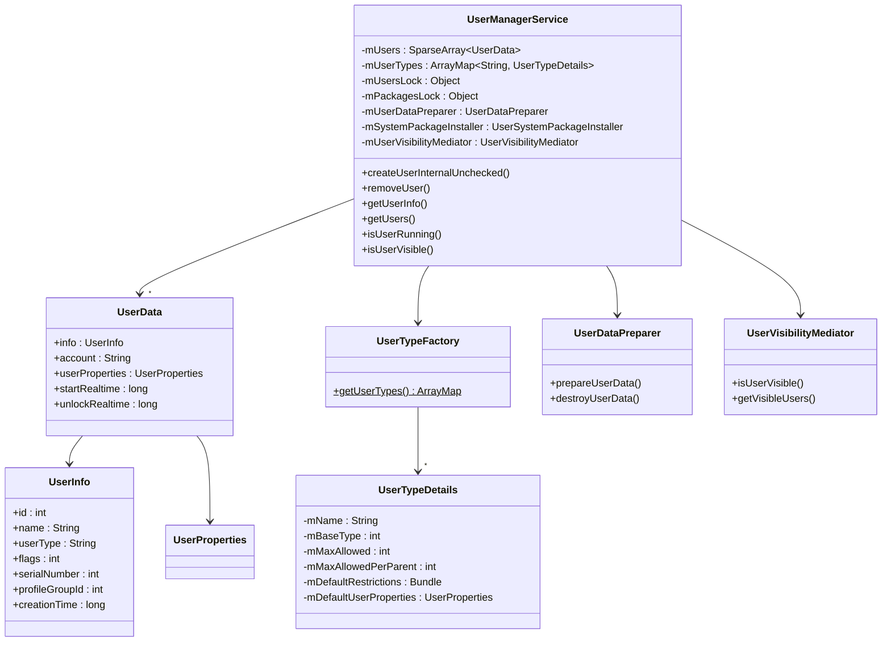
```mermaid
classDiagram
    class UserManagerService {
        -mUsers : SparseArray~UserData~
        -mUserTypes : ArrayMap~String, UserTypeDetails~
        -mUsersLock : Object
        -mPackagesLock : Object
        -mUserDataPreparer : UserDataPreparer
        -mSystemPackageInstaller : UserSystemPackageInstaller
        -mUserVisibilityMediator : UserVisibilityMediator
        +createUserInternalUnchecked()
        +removeUser()
        +getUserInfo()
        +getUsers()
        +isUserRunning()
        +isUserVisible()
    }
    class UserData {
        +info : UserInfo
        +account : String
        +userProperties : UserProperties
        +startRealtime : long
        +unlockRealtime : long
    }
    class UserInfo {
        +id : int
        +name : String
        +userType : String
        +flags : int
        +serialNumber : int
        +profileGroupId : int
        +creationTime : long
    }
    class UserTypeDetails {
        -mName : String
        -mBaseType : int
        -mMaxAllowed : int
        -mMaxAllowedPerParent : int
        -mDefaultRestrictions : Bundle
        -mDefaultUserProperties : UserProperties
    }
    class UserTypeFactory {
        +getUserTypes()$ ArrayMap
    }
    class UserDataPreparer {
        +prepareUserData()
        +destroyUserData()
    }
    class UserVisibilityMediator {
        +isUserVisible()
        +getVisibleUsers()
    }

    UserManagerService --> "*" UserData
    UserManagerService --> UserTypeFactory
    UserManagerService --> UserDataPreparer
    UserManagerService --> UserVisibilityMediator
    UserData --> UserInfo
    UserData --> UserProperties
    UserTypeFactory --> "*" UserTypeDetails
```

**Source locations:**

| Class | Path |
|---|---|
| `UserManagerService` | `frameworks/base/services/core/java/com/android/server/pm/UserManagerService.java` |
| `UserTypeFactory` | `frameworks/base/services/core/java/com/android/server/pm/UserTypeFactory.java` |
| `UserTypeDetails` | `frameworks/base/services/core/java/com/android/server/pm/UserTypeDetails.java` |
| `UserDataPreparer` | `frameworks/base/services/core/java/com/android/server/pm/UserDataPreparer.java` |
| `UserVisibilityMediator` | `frameworks/base/services/core/java/com/android/server/pm/UserVisibilityMediator.java` |
| `UserSystemPackageInstaller` | `frameworks/base/services/core/java/com/android/server/pm/UserSystemPackageInstaller.java` |

### 31.1.3 UserManagerService Initialization

`UserManagerService` is the central authority for all user operations. It implements
`IUserManager.Stub` and maintains critical state under multiple locks:

```java
// From UserManagerService.java
public class UserManagerService extends IUserManager.Stub {

    // Lock ordering: mPackagesLock first, then mUsersLock
    private final Object mPackagesLock;
    private final Object mUsersLock = LockGuard.installNewLock(LockGuard.INDEX_USER);
    private final Object mRestrictionsLock = NamedLock.create("mRestrictionsLock");
    private final Object mAppRestrictionsLock = NamedLock.create("mAppRestrictionsLock");

    @GuardedBy("mUsersLock")
    private final SparseArray<UserData> mUsers;

    private final ArrayMap<String, UserTypeDetails> mUserTypes;
}
```

The lock ordering convention is documented in the class:

> Method naming convention:
> - Methods suffixed with "LAr" should be called within the `mAppRestrictionsLock` lock.
> - Methods suffixed with "LP" should be called within the `mPackagesLock` lock.
> - Methods suffixed with "LR" should be called within the `mRestrictionsLock` lock.
> - Methods suffixed with "LU" should be called within the `mUsersLock` lock.

### 31.1.4 Persistent Storage

User metadata is stored on disk in `/data/system/users/`:

```
/data/system/users/
    userlist.xml          # List of all users and next serial number
    user.list             # Performance-optimized user list
    0/                    # System user (user 0)
        0.xml             # UserInfo for user 0
        photo.png         # User avatar
        res_*.xml         # User restrictions
    10/                   # Secondary user (user 10)
        10.xml
    11/                   # Work profile (user 11)
        11.xml
```

The `userlist.xml` format:

```xml
<users nextSerialNumber="15" version="11">
    <user id="0" />
    <user id="10" />
    <user id="11" />
</users>
```

Each user's XML file (`<id>.xml`) contains:

```xml
<user
    id="10"
    serialNumber="12"
    flags="0x00000810"
    type="android.os.usertype.full.SECONDARY"
    created="1700000000000"
    lastLoggedIn="1700100000000"
    lastEnteredForeground="1700100000000"
    lastLoggedInFingerprint="google/pixel/..." >
    <name>John</name>
    <restrictions />
    <userProperties />
</user>
```

The file attributes directly correspond to `UserManagerService` constants:

```java
// From UserManagerService.java
private static final String ATTR_FLAGS = "flags";
private static final String ATTR_TYPE = "type";
private static final String ATTR_ID = "id";
private static final String ATTR_CREATION_TIME = "created";
private static final String ATTR_LAST_LOGGED_IN_TIME = "lastLoggedIn";
private static final String ATTR_LAST_ENTERED_FOREGROUND_TIME = "lastEnteredForeground";
private static final String ATTR_SERIAL_NO = "serialNumber";
private static final String ATTR_NEXT_SERIAL_NO = "nextSerialNumber";
private static final String ATTR_PROFILE_GROUP_ID = "profileGroupId";
private static final String ATTR_RESTRICTED_PROFILE_PARENT_ID = "restrictedProfileParentId";
```

### 31.1.5 User ID Allocation

User IDs are allocated sequentially starting from `MIN_USER_ID` (10):

```java
// From UserManagerService.java
@VisibleForTesting
static final int MIN_USER_ID = UserHandle.MIN_SECONDARY_USER_ID;  // 10

@VisibleForTesting
static final int MAX_USER_ID = UserHandle.MAX_SECONDARY_USER_ID;  // Integer.MAX_VALUE / 100000
```

User 0 is always the system user. IDs 1-9 are reserved. Newly created users
get the next available ID. Serial numbers are monotonically increasing and never
reused, even after user deletion, to maintain data provenance:

```java
// Serial numbers are separate from user IDs:
// UserID = 10 might have serialNumber = 12
// If user 10 is deleted, a new user might get ID 10 but serial 15
```

Recently removed user IDs are tracked to prevent premature reuse:

```java
@VisibleForTesting
static final int MAX_RECENTLY_REMOVED_IDS_SIZE = 100;
```

### 31.1.6 User Restrictions

User restrictions are layered from multiple sources:

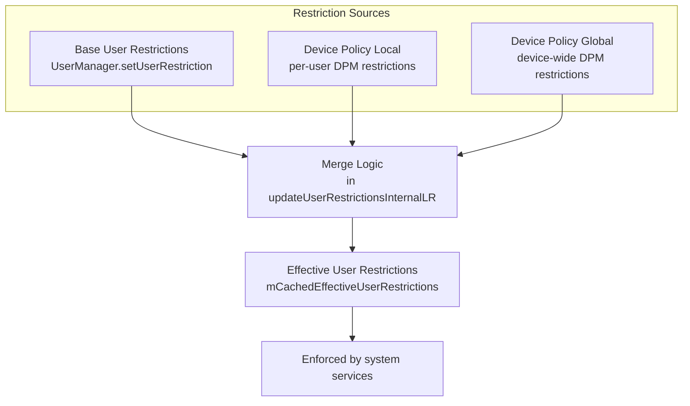
```mermaid
graph TB
    subgraph "Restriction Sources"
        BASE["Base User Restrictions<br/>UserManager.setUserRestriction"]
        DPL["Device Policy Local<br/>per-user DPM restrictions"]
        DPG["Device Policy Global<br/>device-wide DPM restrictions"]
    end

    BASE --> MERGE["Merge Logic<br/>in updateUserRestrictionsInternalLR"]
    DPL --> MERGE
    DPG --> MERGE
    MERGE --> EFF["Effective User Restrictions<br/>mCachedEffectiveUserRestrictions"]

    EFF --> ENFORCE[Enforced by system services]
```

The service caches effective restrictions separately from base restrictions:

```java
// From UserManagerService.java
@GuardedBy("mRestrictionsLock")
private final RestrictionsSet mBaseUserRestrictions = new RestrictionsSet();

@GuardedBy("mRestrictionsLock")
private final RestrictionsSet mCachedEffectiveUserRestrictions = new RestrictionsSet();
```

Important: when changing a restriction, a new `Bundle` is always created rather than
mutating the existing one, because bundles may be shared between the base and cached
sets.

---

## 31.2 User Types

### 31.2.1 The UserTypeDetails System

Android uses a type-based system for defining user categories. Each type is defined
by `UserTypeDetails` and registered through `UserTypeFactory`.

**Source:** `frameworks/base/services/core/java/com/android/server/pm/UserTypeFactory.java`

```java
// From UserTypeFactory.java
public static ArrayMap<String, UserTypeDetails> getUserTypes() {
    final ArrayMap<String, UserTypeDetails.Builder> builders = getDefaultBuilders();
    // Allow OEM customization via config_user_types XML
    try (XmlResourceParser parser =
             Resources.getSystem().getXml(R.xml.config_user_types)) {
        customizeBuilders(builders, parser);
    }
    // Build all types
    final ArrayMap<String, UserTypeDetails> types = new ArrayMap<>(builders.size());
    for (int i = 0; i < builders.size(); i++) {
        types.put(builders.keyAt(i), builders.valueAt(i).createUserTypeDetails());
    }
    return types;
}
```

OEMs can customize user types by providing `res/xml/config_user_types.xml` to
override default values (max allowed count, restrictions, properties, etc.).

### 31.2.2 AOSP User Type Catalog

The factory registers the following default types:

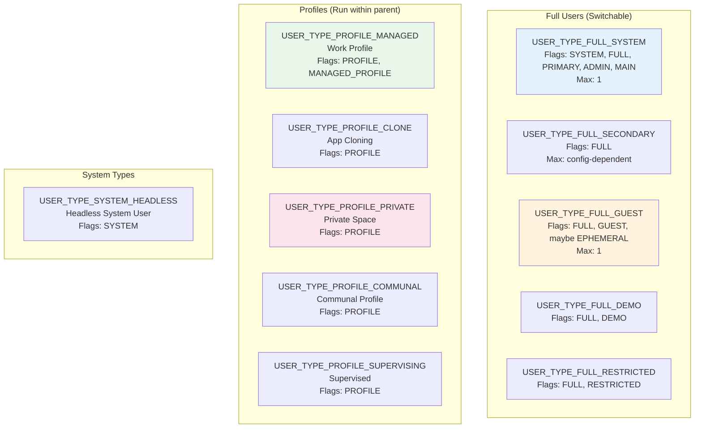
```mermaid
graph TB
    subgraph "Full Users (Switchable)"
        SYS["USER_TYPE_FULL_SYSTEM<br/>Flags: SYSTEM, FULL, PRIMARY, ADMIN, MAIN<br/>Max: 1"]
        SEC["USER_TYPE_FULL_SECONDARY<br/>Flags: FULL<br/>Max: config-dependent"]
        GUEST["USER_TYPE_FULL_GUEST<br/>Flags: FULL, GUEST, maybe EPHEMERAL<br/>Max: 1"]
        DEMO["USER_TYPE_FULL_DEMO<br/>Flags: FULL, DEMO"]
        REST["USER_TYPE_FULL_RESTRICTED<br/>Flags: FULL, RESTRICTED"]
    end

    subgraph "Profiles (Run within parent)"
        MANAGED["USER_TYPE_PROFILE_MANAGED<br/>Work Profile<br/>Flags: PROFILE, MANAGED_PROFILE"]
        CLONE["USER_TYPE_PROFILE_CLONE<br/>App Cloning<br/>Flags: PROFILE"]
        PRIVATE["USER_TYPE_PROFILE_PRIVATE<br/>Private Space<br/>Flags: PROFILE"]
        COMMUNAL["USER_TYPE_PROFILE_COMMUNAL<br/>Communal Profile<br/>Flags: PROFILE"]
        SUPERV["USER_TYPE_PROFILE_SUPERVISING<br/>Supervised<br/>Flags: PROFILE"]
    end

    subgraph "System Types"
        HEADLESS["USER_TYPE_SYSTEM_HEADLESS<br/>Headless System User<br/>Flags: SYSTEM"]
    end

    style SYS fill:#e3f2fd
    style MANAGED fill:#e8f5e9
    style PRIVATE fill:#fce4ec
    style GUEST fill:#fff3e0
```

**Detailed type specifications from source:**

| Type Constant | Base Type | Max | Parent Required | Key Properties |
|---|---|---|---|---|
| `USER_TYPE_FULL_SYSTEM` | `FLAG_SYSTEM \| FLAG_FULL` | 1 | No | Primary, Admin, Main user |
| `USER_TYPE_FULL_SECONDARY` | `FLAG_FULL` | Config | No | Standard secondary user |
| `USER_TYPE_FULL_GUEST` | `FLAG_FULL` | 1 | No | May be ephemeral |
| `USER_TYPE_FULL_DEMO` | `FLAG_FULL` | 3 | No | Demo/kiosk mode |
| `USER_TYPE_FULL_RESTRICTED` | `FLAG_FULL` | Config | No | Restricted profile |
| `USER_TYPE_PROFILE_MANAGED` | `FLAG_PROFILE` | Config | Yes | Work profile |
| `USER_TYPE_PROFILE_CLONE` | `FLAG_PROFILE` | 1/parent | Yes | App cloning |
| `USER_TYPE_PROFILE_PRIVATE` | `FLAG_PROFILE` | 1 | Yes | Private Space |
| `USER_TYPE_PROFILE_COMMUNAL` | `FLAG_PROFILE` | 1 | No | Shared communal |
| `USER_TYPE_PROFILE_SUPERVISING` | `FLAG_PROFILE` | 1 | No | Supervised user |
| `USER_TYPE_SYSTEM_HEADLESS` | `FLAG_SYSTEM` | 1 | No | Headless system user mode |

### 31.2.3 Full System User

The system user (user 0) is special. In traditional (non-headless) mode:

```java
// From UserTypeFactory.java
private static UserTypeDetails.Builder getDefaultTypeFullSystem() {
    return new UserTypeDetails.Builder()
            .setName(USER_TYPE_FULL_SYSTEM)
            .setBaseType(FLAG_SYSTEM | FLAG_FULL)
            .setDefaultUserInfoPropertyFlags(FLAG_PRIMARY | FLAG_ADMIN | FLAG_MAIN)
            .setMaxAllowed(1)
            .setDefaultRestrictions(getDefaultSystemUserRestrictions());
}
```

It is always user ID 0, always exists, cannot be removed, and is the first user to
start during boot. In headless system user mode (HSUM, used on automotive), user 0
runs but is not visible to the human operator; an actual human user is started on top.

### 31.2.4 Secondary Users

Standard secondary users are full users that can be switched to:

```java
private static UserTypeDetails.Builder getDefaultTypeFullSecondary() {
    return new UserTypeDetails.Builder()
            .setName(USER_TYPE_FULL_SECONDARY)
            .setBaseType(FLAG_FULL)
            .setMaxAllowed(getDefaultMaxAllowedSwitchableUsers())
            .setDefaultRestrictions(getDefaultSecondaryUserRestrictions());
}
```

Default restrictions for secondary users:

- `DISALLOW_OUTGOING_CALLS` = true
- `DISALLOW_SMS` = true

These can be lifted by the admin user.

### 31.2.5 Guest User

The guest user is designed for temporary device sharing:

```java
private static UserTypeDetails.Builder getDefaultTypeFullGuest() {
    final boolean ephemeralGuests = Resources.getSystem()
            .getBoolean(com.android.internal.R.bool.config_guestUserEphemeral);
    final int flags = FLAG_GUEST | (ephemeralGuests ? FLAG_EPHEMERAL : 0);

    return new UserTypeDetails.Builder()
            .setName(USER_TYPE_FULL_GUEST)
            .setBaseType(FLAG_FULL)
            .setDefaultUserInfoPropertyFlags(flags)
            .setEnabled(getMaxSwitchableUsers() > 1 ? 1 : 0)
            .setMaxAllowed(1)
            .setDefaultRestrictions(getDefaultGuestUserRestrictions());
}
```

Key guest properties:

- Only one guest allowed at a time
- Can be ephemeral (data wiped on exit, controlled by `config_guestUserEphemeral`)
- Inherits secondary user restrictions plus additional ones (e.g., `DISALLOW_CONFIG_WIFI`)
- Disabled on single-user devices

### 31.2.6 Managed Profile (Work Profile)

Work profiles are the most widely used profile type, managed by a device policy
controller (DPC):

```java
private static UserTypeDetails.Builder getDefaultTypeProfileManaged() {
    return new UserTypeDetails.Builder()
            .setName(USER_TYPE_PROFILE_MANAGED)
            .setBaseType(FLAG_PROFILE)
            .setDefaultUserInfoPropertyFlags(FLAG_MANAGED_PROFILE)
            .setMaxAllowed(getMaxManagedProfiles())
            .setMaxAllowedPerParent(getMaxManagedProfiles())
            .setProfileParentRequired(true)
            // ... badges, labels, colors
            .setDefaultUserProperties(new UserProperties.Builder()
                    .setStartWithParent(true)
                    .setShowInLauncher(UserProperties.SHOW_IN_LAUNCHER_SEPARATE)
                    .setShowInSettings(UserProperties.SHOW_IN_SETTINGS_SEPARATE)
                    .setShowInQuietMode(UserProperties.SHOW_IN_QUIET_MODE_PAUSED)
                    .setShowInSharingSurfaces(
                            UserProperties.SHOW_IN_SHARING_SURFACES_SEPARATE)
                    .setCredentialShareableWithParent(true));
}
```

Properties explained:

- `startWithParent=true`: Profile starts automatically when parent user starts
- `SHOW_IN_LAUNCHER_SEPARATE`: Work apps appear with a badge in the launcher
- `SHOW_IN_QUIET_MODE_PAUSED`: When quiet mode is on, apps show as paused
- `credentialShareableWithParent=true`: Screen lock can be shared with parent

### 31.2.7 Clone Profile

Clone profiles allow running a second instance of an app (typically messaging apps):

```java
private static UserTypeDetails.Builder getDefaultTypeProfileClone() {
    return new UserTypeDetails.Builder()
            .setName(USER_TYPE_PROFILE_CLONE)
            .setBaseType(FLAG_PROFILE)
            .setMaxAllowedPerParent(1)
            .setProfileParentRequired(true)
            .setDefaultUserProperties(new UserProperties.Builder()
                    .setStartWithParent(true)
                    .setShowInLauncher(UserProperties.SHOW_IN_LAUNCHER_WITH_PARENT)
                    .setShowInSettings(UserProperties.SHOW_IN_SETTINGS_WITH_PARENT)
                    .setInheritDevicePolicy(
                            UserProperties.INHERIT_DEVICE_POLICY_FROM_PARENT)
                    .setUseParentsContacts(true)
                    .setMediaSharedWithParent(true)
                    .setCredentialShareableWithParent(true)
                    .setDeleteAppWithParent(true));
}
```

Notable clone-specific properties:

- `SHOW_IN_LAUNCHER_WITH_PARENT`: Appears alongside parent apps (not in separate tab)
- `useParentsContacts=true`: Uses parent's contacts database
- `mediaSharedWithParent=true`: Shares media storage with parent
- `deleteAppWithParent=true`: Cloned apps are removed when parent removes them

### 31.2.8 Restricted Profiles

Restricted profiles (mostly used on tablets) run on a shared data set with the
parent but with restricted access:

```java
private static UserTypeDetails.Builder getDefaultTypeFullRestricted() {
    return new UserTypeDetails.Builder()
            .setName(USER_TYPE_FULL_RESTRICTED)
            .setBaseType(FLAG_FULL)
            .setDefaultUserInfoPropertyFlags(FLAG_RESTRICTED)
            .setMaxAllowed(getDefaultMaxAllowedSwitchableUsers())
            .setProfileParentRequired(false);
}
```

Unlike profiles, restricted users are full users (separately switchable) but they
have a "restricted profile parent" that controls which apps and content they can
access.

### 31.2.9 User Type Properties (UserProperties)

`UserProperties` encapsulates display and behavior properties for each user type:

| Property | Values | Purpose |
|---|---|---|
| `startWithParent` | boolean | Auto-start when parent starts |
| `showInLauncher` | `NO`, `WITH_PARENT`, `SEPARATE` | How apps appear in launcher |
| `showInSettings` | `NO`, `WITH_PARENT`, `SEPARATE` | How the profile appears in Settings |
| `showInQuietMode` | `DEFAULT`, `PAUSED`, `HIDDEN` | App appearance when profile is quiet |
| `showInSharingSurfaces` | `NO`, `WITH_PARENT`, `SEPARATE` | Visibility in share sheet |
| `credentialShareableWithParent` | boolean | Can share screen lock with parent |
| `mediaSharedWithParent` | boolean | Shares media storage |
| `inheritDevicePolicy` | `NO`, `FROM_PARENT` | Whether DPM policies inherit |
| `crossProfileIntentFilterAccessControl` | levels | Who can modify cross-profile intents |
| `crossProfileContentSharingStrategy` | strategies | Content sharing rules |
| `profileApiVisibility` | `VISIBLE`, `HIDDEN` | Whether visible to profile query APIs |
| `authAlwaysRequiredToDisableQuietMode` | boolean | Require auth to unlock profile |
| `deleteAppWithParent` | boolean | Remove apps when parent removes them |
| `itemsRestrictedOnHomeScreen` | boolean | Restrict home screen items |

---

## 31.3 User Lifecycle

### 31.3.1 User Creation

User creation flows through `createUserInternalUnchecked()`, a central method
handling all user types:

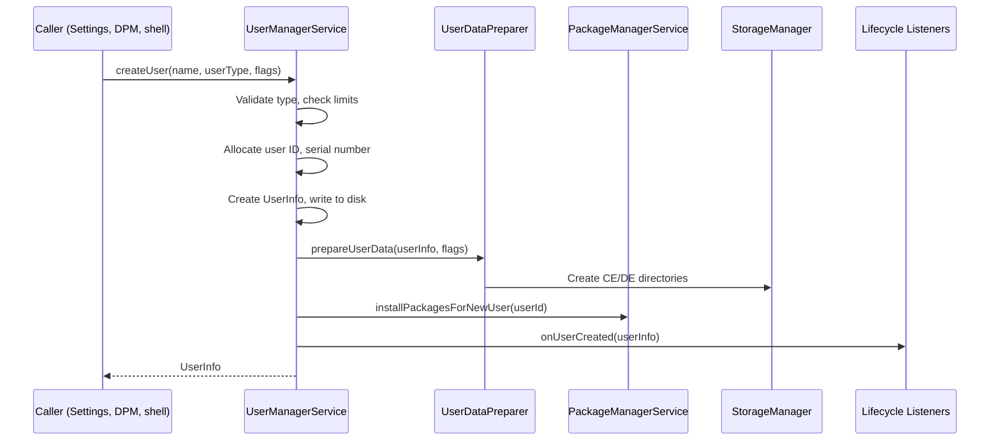
```mermaid
sequenceDiagram
    participant Caller as Caller (Settings, DPM, shell)
    participant UMS as UserManagerService
    participant UDP as UserDataPreparer
    participant PM as PackageManagerService
    participant SM as StorageManager
    participant LL as Lifecycle Listeners

    Caller->>UMS: createUser(name, userType, flags)
    UMS->>UMS: Validate type, check limits
    UMS->>UMS: Allocate user ID, serial number
    UMS->>UMS: Create UserInfo, write to disk
    UMS->>UDP: prepareUserData(userInfo, flags)
    UDP->>SM: Create CE/DE directories
    UMS->>PM: installPackagesForNewUser(userId)
    UMS->>LL: onUserCreated(userInfo)
    UMS-->>Caller: UserInfo
```

The creation method performs extensive validation:

```java
// From UserManagerService.java (simplified)
@NonNull UserInfo createUserInternalUnchecked(
        @Nullable String name, @NonNull String userType,
        @UserInfoFlag int flags, @UserIdInt int parentId,
        boolean preCreate, @Nullable String[] disallowedPackages,
        @Nullable Object token) throws UserManager.CheckedUserOperationException {

    // 1. Validate user type exists and is enabled
    final UserTypeDetails userTypeDetails = mUserTypes.get(userType);

    // 2. Check max users limit
    // 3. Check max profiles per parent limit
    // 4. Check device storage capacity

    // 5. Allocate new user ID
    userId = getNextAvailableId();

    // 6. Create UserInfo
    UserInfo userInfo = new UserInfo(userId, name, null, flags, userType);
    userInfo.serialNumber = mNextSerialNumber++;
    userInfo.creationTime = getCreationTime();
    userInfo.profileGroupId = parentId;

    // 7. Create UserData wrapper
    final UserData userData = new UserData();
    userData.info = userInfo;
    userData.userProperties = new UserProperties(
            userTypeDetails.getDefaultUserProperties());

    // 8. Store in memory and write to disk
    synchronized (mUsersLock) {
        mUsers.put(userId, userData);
    }
    writeUserLP(userData);
    writeUserListLP();

    // 9. Prepare storage
    mUserDataPreparer.prepareUserData(userInfo, storageFlags);

    // 10. Install system packages
    mPm.installPackagesFromSystemImageForUser(userId, ...);

    // 11. Notify listeners
    for (UserLifecycleListener listener : mUserLifecycleListeners) {
        listener.onUserCreated(userInfo, token);
    }

    return userInfo;
}
```

### 31.3.2 User ID Allocation

New user IDs are assigned by finding the next unused ID:

```java
private int getNextAvailableId() {
    synchronized (mUsersLock) {
        // Find the smallest ID >= MIN_USER_ID that is not currently in use
        // and not in the recently-removed list
        int nextId = MIN_USER_ID;  // 10
        while (mUsers.get(nextId) != null
                || mRecentlyRemovedIds.contains(nextId)) {
            nextId++;
            if (nextId > MAX_USER_ID) {
                throw new IllegalStateException("Cannot add user. Maximum reached.");
            }
        }
        return nextId;
    }
}
```

### 31.3.3 Pre-Created Users

For faster user creation (e.g., quick guest setup), Android supports pre-creating
users in advance:

```java
// From UserInfo
private static final String ATTR_PRE_CREATED = "preCreated";
private static final String ATTR_CONVERTED_FROM_PRE_CREATED = "convertedFromPreCreated";
```

Pre-created users have storage prepared but are not yet associated with a real person.
When a new user is needed, the system converts a pre-created user instead of creating
one from scratch. This avoids the latency of storage preparation and package
installation.

### 31.3.4 User Starting and Running States

A user goes through several states after creation:

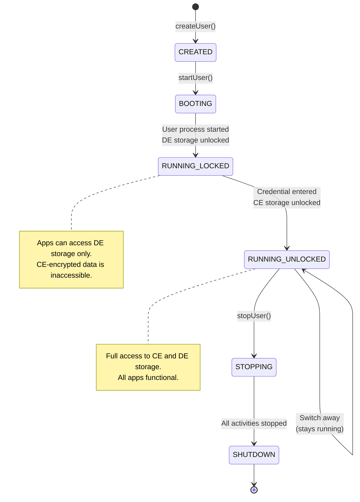
```mermaid
stateDiagram-v2
    [*] --> CREATED : createUser()
    CREATED --> BOOTING : startUser()
    BOOTING --> RUNNING_LOCKED : User process started<br/>DE storage unlocked
    RUNNING_LOCKED --> RUNNING_UNLOCKED : Credential entered<br/>CE storage unlocked

    RUNNING_UNLOCKED --> STOPPING : stopUser()
    STOPPING --> SHUTDOWN : All activities stopped
    SHUTDOWN --> [*]

    RUNNING_UNLOCKED --> RUNNING_UNLOCKED : Switch away<br/>(stays running)

    note right of RUNNING_LOCKED
        Apps can access DE storage only.
        CE-encrypted data is inaccessible.
    end note

    note right of RUNNING_UNLOCKED
        Full access to CE and DE storage.
        All apps functional.
    end note
```

The states are tracked through `UserState`:

```java
// From UserState.java (frameworks/base/services/core/java/com/android/server/am/)
public class UserState {
    public final static int STATE_BOOTING = 0;
    public final static int STATE_RUNNING_LOCKED = 1;
    public final static int STATE_RUNNING_UNLOCKING = 2;
    public final static int STATE_RUNNING_UNLOCKED = 3;
    public final static int STATE_STOPPING = 4;
    public final static int STATE_SHUTDOWN = 5;
}
```

### 31.3.5 User Removal

User removal is a multi-step process:

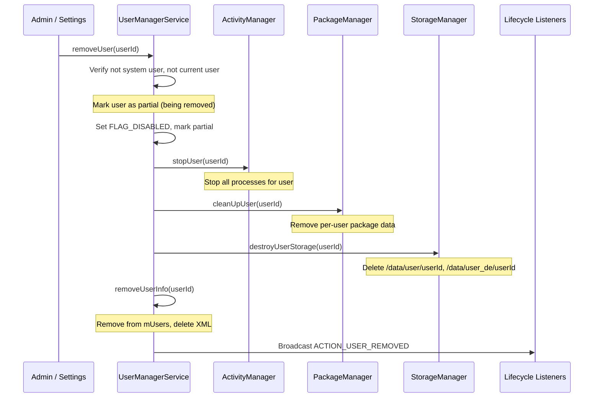
```mermaid
sequenceDiagram
    participant Admin as Admin / Settings
    participant UMS as UserManagerService
    participant AM as ActivityManager
    participant PM as PackageManager
    participant SM as StorageManager
    participant LL as Lifecycle Listeners

    Admin->>UMS: removeUser(userId)
    UMS->>UMS: Verify not system user, not current user

    Note over UMS: Mark user as partial (being removed)
    UMS->>UMS: Set FLAG_DISABLED, mark partial

    UMS->>AM: stopUser(userId)
    Note over AM: Stop all processes for user

    UMS->>PM: cleanUpUser(userId)
    Note over PM: Remove per-user package data

    UMS->>SM: destroyUserStorage(userId)
    Note over SM: Delete /data/user/userId, /data/user_de/userId

    UMS->>UMS: removeUserInfo(userId)
    Note over UMS: Remove from mUsers, delete XML

    UMS->>LL: Broadcast ACTION_USER_REMOVED
```

Key safety checks:

- Cannot remove user 0 (system user)
- Cannot remove the currently foreground user (must switch first)
- Profiles are removed when their parent is removed
- The `partial` flag prevents partially-removed users from being used

```java
// From UserManagerService.java
public boolean removeUser(@UserIdInt int userId) {
    Slog.i(LOG_TAG, "removeUser u" + userId);
    // ... permission checks
    return removeUserWithProfilesUnchecked(userId);
}

private boolean removeUserWithProfilesUnchecked(@UserIdInt int userId) {
    // Remove all profiles of this user first
    synchronized (mUsersLock) {
        for (int i = mUsers.size() - 1; i >= 0; i--) {
            UserInfo profile = mUsers.valueAt(i).info;
            if (profile.profileGroupId == userId && profile.id != userId) {
                removeUserUnchecked(profile.id);
            }
        }
    }
    return removeUserUnchecked(userId);
}
```

### 31.3.6 Lifecycle Listeners

System services register as user lifecycle listeners to react to user events:

```java
// From UserManagerInternal.java
public interface UserLifecycleListener {
    default void onUserCreated(UserInfo user, Object token) {}
    default void onUserRemoved(UserInfo user) {}
}
```

The listeners are notified synchronously during user creation:

```java
// From UserManagerService.java
synchronized (mUserLifecycleListeners) {
    for (int i = 0; i < mUserLifecycleListeners.size(); i++) {
        mUserLifecycleListeners.get(i).onUserCreated(userInfo, token);
    }
}
```

---

## 31.4 Work Profiles

### 31.4.1 Work Profile Architecture

Work profiles are the cornerstone of Android enterprise. They create an isolated
environment within a personal user for corporate apps and data:

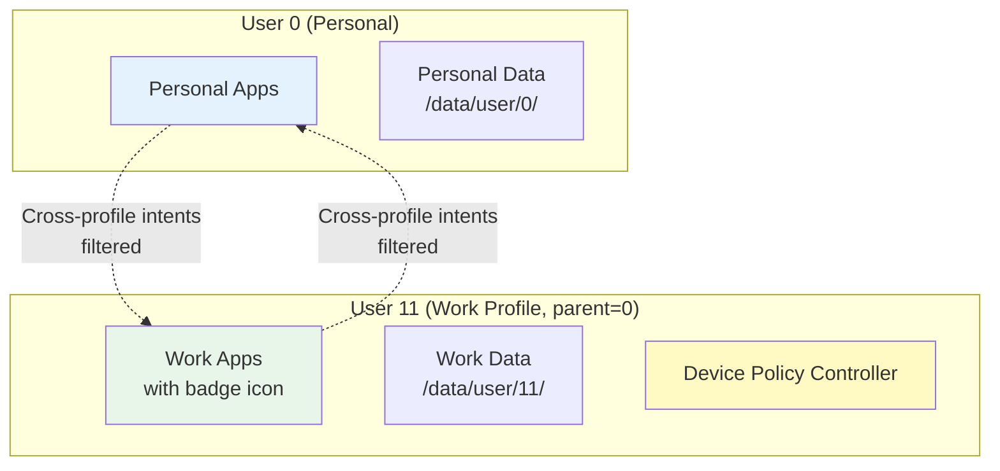
```mermaid
graph TB
    subgraph "User 0 (Personal)"
        PA[Personal Apps]
        PD["Personal Data<br/>/data/user/0/"]
    end

    subgraph "User 11 (Work Profile, parent=0)"
        WA["Work Apps<br/>with badge icon"]
        WD["Work Data<br/>/data/user/11/"]
        DPC[Device Policy Controller]
    end

    PA -.->|Cross-profile intents<br/>filtered| WA
    WA -.->|Cross-profile intents<br/>filtered| PA

    style PA fill:#e3f2fd
    style WA fill:#e8f5e9
    style DPC fill:#fff9c4
```

### 31.4.2 Profile Group

Users in the same profile group share a profile group ID equal to the parent user's
ID. This is stored in `UserInfo.profileGroupId`:

```java
// User 0: profileGroupId = 0 (or NO_PROFILE_GROUP_ID)
// Work profile (user 11): profileGroupId = 0
// Private profile (user 12): profileGroupId = 0
```

`UserManagerService.isSameProfileGroup()` checks this relationship:

```java
public boolean isSameProfileGroup(int userId, int otherUserId) {
    synchronized (mUsersLock) {
        UserInfo user = getUserInfoLU(userId);
        UserInfo other = getUserInfoLU(otherUserId);
        return user != null && other != null
                && user.profileGroupId != UserInfo.NO_PROFILE_GROUP_ID
                && user.profileGroupId == other.profileGroupId;
    }
}
```

### 31.4.3 Cross-Profile Intent Filters

Communication between personal and work profiles is controlled through cross-profile
intent filters. These are pre-configured per user type:

```java
// From UserTypeFactory.java
.setDefaultCrossProfileIntentFilters(getDefaultManagedCrossProfileIntentFilter())
```

Default managed profile cross-profile intent filters allow:

- Opening web URLs from work in personal browser
- Sharing content between profiles (when policy allows)
- Opening system settings
- Handling phone calls and contacts

The access control level determines who can modify these filters:

```java
.setCrossProfileIntentFilterAccessControl(
        UserProperties.CROSS_PROFILE_INTENT_FILTER_ACCESS_LEVEL_SYSTEM)
```

Levels include:

- `SYSTEM`: Only the system can modify cross-profile filters
- `SYSTEM_ADD_ONLY`: System can add, no one can remove
- Standard: Apps with appropriate permissions can modify

### 31.4.4 Cross-Profile Data Sharing

Data sharing between personal and work profiles is controlled by multiple mechanisms:

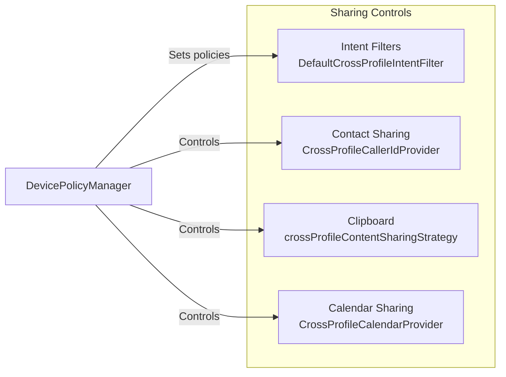
```mermaid
graph LR
    subgraph "Sharing Controls"
        INTENTS["Intent Filters<br/>DefaultCrossProfileIntentFilter"]
        CONTACTS["Contact Sharing<br/>CrossProfileCallerIdProvider"]
        CLIPBOARD["Clipboard<br/>crossProfileContentSharingStrategy"]
        CALENDAR["Calendar Sharing<br/>CrossProfileCalendarProvider"]
    end

    DPM[DevicePolicyManager] -->|Sets policies| INTENTS
    DPM -->|Controls| CONTACTS
    DPM -->|Controls| CLIPBOARD
    DPM -->|Controls| CALENDAR
```

### 31.4.5 Quiet Mode

Work profiles support "quiet mode" -- a paused state where work apps are suspended:

```java
// From UserManagerService.java
public boolean requestQuietModeEnabled(
        @NonNull String callingPackage,
        boolean enableQuietMode,
        @UserIdInt int userId,
        @Nullable IntentSender target,
        @QuietModeFlag int flags) {
    // ...
    if (enableQuietMode) {
        // Set profile as disabled, stop running apps
        setUserInfoFlags(userInfo, UserInfo.FLAG_DISABLED);
        // Apps will show as "paused" in launcher
    } else {
        // May require authentication to re-enable
        if (profile.isManagedProfile()) {
            // Check if work challenge is needed
        }
        removeUserInfoFlags(info, UserInfo.FLAG_DISABLED);
    }
}
```

The `showInQuietMode` property controls visual behavior:

- `SHOW_IN_QUIET_MODE_PAUSED`: Apps visible but greyed out (work profile)
- `SHOW_IN_QUIET_MODE_HIDDEN`: Apps completely hidden (private space)
- `SHOW_IN_QUIET_MODE_DEFAULT`: System default behavior

### 31.4.6 Work Profile Badges

Work apps are visually distinguished through badges. The badge configuration comes
from `UserTypeDetails`:

```java
// Managed profile badge configuration (from UserTypeFactory.java)
.setIconBadge(R.drawable.ic_corp_icon_badge_case)          // Briefcase overlay
.setBadgePlain(R.drawable.ic_corp_badge_case)               // Simple badge
.setBadgeNoBackground(R.drawable.ic_corp_badge_no_background)
.setStatusBarIcon(R.drawable.stat_sys_managed_profile_status)
.setBadgeLabels(
        R.string.managed_profile_label_badge,     // "Work"
        R.string.managed_profile_label_badge_2,   // "Work 2"
        R.string.managed_profile_label_badge_3)   // "Work 3"
.setBadgeColors(
        R.color.profile_badge_1,
        R.color.profile_badge_2,
        R.color.profile_badge_3)
```

The badge index is stored in `UserInfo.profileBadge` and supports up to 3 managed
profiles on debug builds.

### 31.4.7 Work Profile Creation via DevicePolicyManager

While `UserManagerService.createProfileForUser()` is the low-level mechanism,
work profiles are typically created through the **Device Policy Manager**
provisioning flow. This is what enterprise MDM solutions and the Setup Wizard
invoke:

#### Provisioning Flow

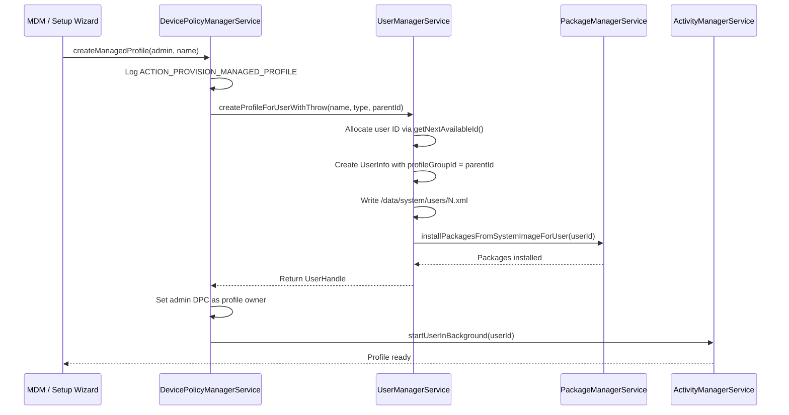
```mermaid
sequenceDiagram
    participant MDM as MDM / Setup Wizard
    participant DPM as DevicePolicyManagerService
    participant UMS as UserManagerService
    participant PM as PackageManagerService
    participant AM as ActivityManagerService

    MDM->>DPM: createManagedProfile(admin, name)
    DPM->>DPM: Log ACTION_PROVISION_MANAGED_PROFILE
    DPM->>UMS: createProfileForUserWithThrow(name, type, parentId)
    UMS->>UMS: Allocate user ID via getNextAvailableId()
    UMS->>UMS: Create UserInfo with profileGroupId = parentId
    UMS->>UMS: Write /data/system/users/N.xml
    UMS->>PM: installPackagesFromSystemImageForUser(userId)
    PM-->>UMS: Packages installed
    UMS-->>DPM: Return UserHandle
    DPM->>DPM: Set admin DPC as profile owner
    DPM->>AM: startUserInBackground(userId)
    AM-->>MDM: Profile ready
```

```java
// Source: frameworks/base/services/devicepolicy/java/com/android/server/devicepolicy/DevicePolicyManagerService.java:22093
public UserHandle createManagedProfile(
        ComponentName admin, String name, boolean useManagedProfilePlaceholder) {
    // Delegates to createManagedProfileInternal()
}

// Line 22107
private UserHandle createManagedProfileInternal(
        ProvisioningParams provisioningParams, Caller caller) {
    // 1. Log provisioning action
    // 2. Call UserManager.createProfileForUserWithThrow()
    // 3. Set up admin DPC as profile owner
    // 4. Store seed account if provided
}
```

The `createAndManageUser()` method (line 12984) provides a combined operation
that creates the profile and installs the Device Policy Controller (DPC) app
in a single call, used by programmatic enterprise enrollment.

### 31.4.8 Work Profile Lifecycle Management

#### Profile States

A work profile cycles through several states during its lifetime:

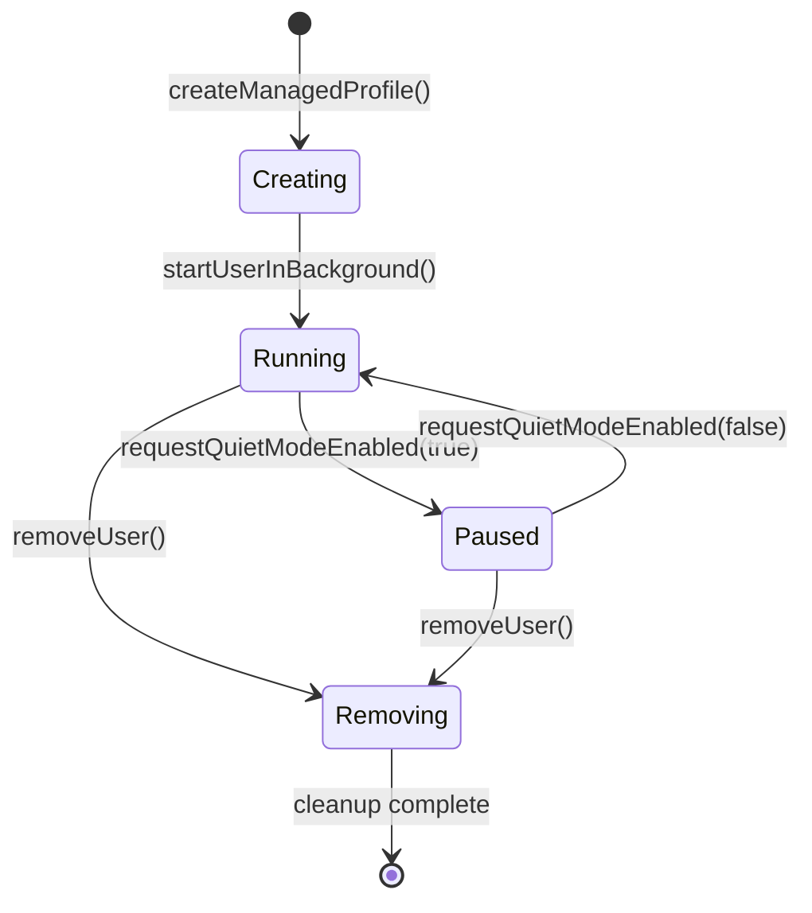
```mermaid
stateDiagram-v2
    [*] --> Creating: createManagedProfile()
    Creating --> Running: startUserInBackground()
    Running --> Paused: requestQuietModeEnabled(true)
    Paused --> Running: requestQuietModeEnabled(false)
    Running --> Removing: removeUser()
    Paused --> Removing: removeUser()
    Removing --> [*]: cleanup complete
```

#### Quiet Mode (Pause/Resume)

The Quiet Mode API lets users pause their work profile without removing it.
This is surfaced as "Pause work apps" in Settings and the work tab toggle in
the launcher:

```java
// Source: frameworks/base/core/java/android/os/UserManager.java:5884
public boolean requestQuietModeEnabled(
        boolean enableQuietMode,
        UserHandle userHandle,
        UserHandle target,
        @QuietModeFlag int flags)
```

When quiet mode is **enabled**:

1. `UserManagerService.setQuietModeEnabled()` sets `FLAG_QUIET_MODE` on the
   `UserInfo`
2. `stopUserForQuietMode()` stops all processes in the profile
3. `killForegroundAppsForUser()` terminates visible apps
4. `broadcastProfileAvailabilityChanges()` notifies the system
5. Launcher grays out work apps and shows a "Work apps paused" banner

When quiet mode is **disabled**:

1. If the profile has a separate lock, a credential dialog may appear
2. `startProfileWithListener()` starts the profile user
3. All work apps become available again
4. Notifications resume delivery

```java
// Source: frameworks/base/services/core/java/com/android/server/pm/UserManagerService.java:2253
private void setQuietModeEnabled(int userId, boolean enableQuietMode,
        IntentSender target, String callingPackage) {
    // Toggle FLAG_QUIET_MODE
    // Stop or start the profile
    // Broadcast availability changes
}
```

#### Quiet Mode Flags

Two flags control special quiet mode behavior:

| Flag | Value | Purpose |
|---|---|---|
| `QUIET_MODE_DISABLE_ONLY_IF_CREDENTIAL_NOT_REQUIRED` | 0x1 | Only resume if no lock screen challenge |
| `QUIET_MODE_DISABLE_WITHOUT_HIDING_PROFILE` | 0x2 | Resume without hiding the private space entry |

#### Profile Removal Cascade

When a parent user is removed, all associated profiles are removed first:

```java
// Source: frameworks/base/services/core/java/com/android/server/pm/UserManagerService.java:7082
private boolean removeUserWithProfilesUnchecked(int userId) {
    // 1. Find all profiles where profileGroupId == userId
    // 2. removeUserUnchecked() for each profile
    // 3. removeUserUnchecked() for the user itself
}
```

Each profile removal triggers:

- `FLAG_DISABLED` set on UserInfo, marked as partial
- `ActivityManager.stopUser()` stops all processes
- `PackageManager.cleanUpUser()` removes per-user package data
- `StorageManager.destroyUserStorage()` wipes CE and DE directories
- `removeUserInfo()` deletes the user metadata
- `ACTION_USER_REMOVED` broadcast

### 31.4.9 Cross-Profile Apps API

Android provides a public API for apps that need to communicate across
profile boundaries. The `CrossProfileApps` system service manages this:

```java
// Source: frameworks/base/core/java/android/content/pm/CrossProfileApps.java
public class CrossProfileApps {
    // Get profiles this app can interact with
    List<UserHandle> getTargetUserProfiles();

    // Check if cross-profile interaction is permitted
    boolean canInteractAcrossProfiles();

    // Launch an activity in the target profile
    void startActivity(Intent intent, UserHandle targetUser);

    // Launch the main activity in the target profile
    void startMainActivity(ComponentName component, UserHandle targetUser);
}
```

#### Cross-Profile Intent Filter Mechanics

The `CrossProfileIntentFilter` class controls which intents can cross profile
boundaries:

```java
// Source: frameworks/base/services/core/java/com/android/server/pm/CrossProfileIntentFilter.java:42
public class CrossProfileIntentFilter extends WatchedIntentFilter {
    int mTargetUserId;          // Which user can receive
    int mFlags;                 // Behavior flags
    AccessControlLevel mAccessControlLevel;  // Who can modify
}
```

Access control levels restrict who can add or modify filters:

| Level | Value | Description |
|---|---|---|
| `ACCESS_LEVEL_ALL` | 0 | Any caller can modify |
| `ACCESS_LEVEL_SYSTEM` | 10 | Only system can modify |
| `ACCESS_LEVEL_SYSTEM_ADD_ONLY` | 20 | System can add but not remove |

The `FLAG_ALLOW_CHAINED_RESOLUTION` flag (value `0x00000010`) enables intent
resolution across three or more linked profiles — for example, personal →
work → clone profile chains.

#### Default Cross-Profile Intents

The system pre-configures several cross-profile intent filters during profile
creation. These allow essential functionality to work across profiles:

- **Web browsing** — `ACTION_VIEW` with `http/https` schemes
- **Phone calls** — `ACTION_DIAL`, `ACTION_CALL`
- **Settings** — `ACTION_SETTINGS`
- **Camera capture** — `ACTION_IMAGE_CAPTURE`, `ACTION_VIDEO_CAPTURE`
- **File picking** — `ACTION_GET_CONTENT`, `ACTION_OPEN_DOCUMENT`

Apps in the work profile can open web links in the personal browser, and
personal apps can initiate phone calls that route through the work dialer,
all governed by these cross-profile intent filters.

### 31.4.10 Enterprise Policy Integration

The Device Policy Controller (DPC) installed as profile owner can enforce
restrictions that apply only within the work profile:

#### Profile-Scoped Restrictions

```java
// Source: frameworks/base/services/core/java/com/android/server/pm/UserManagerService.java:2251
// Restrictions are merged from three sources:
// BASE    → mBaseUserRestrictions (per-user defaults)
// DPL     → Device Policy Local (profile-owner restrictions)
// DPG     → Device Policy Global (device-wide restrictions)
// Merged  → mCachedEffectiveUserRestrictions
```

Common profile-owner restrictions include:

| Restriction | Effect |
|---|---|
| `DISALLOW_CAMERA` | Disables camera in work apps |
| `DISALLOW_SHARE_INTO_MANAGED_PROFILE` | Blocks sharing from personal to work |
| `DISALLOW_UNIFIED_PASSWORD` | Requires separate work lock screen |
| `DISALLOW_INSTALL_APPS` | Prevents installing apps in work profile |
| `DISALLOW_BLUETOOTH_SHARING` | Prevents work Bluetooth connections |

#### Credential Sharing

Work profiles support credential sharing with the parent user, controlled by
the `credentialShareableWithParent` property in `UserProperties`:

```java
// Source: frameworks/base/services/core/java/com/android/server/pm/UserTypeFactory.java
.setDefaultUserProperties(new UserProperties.Builder()
        .setCredentialShareableWithParent(true))  // Unified lock screen
```

When credential sharing is enabled, unlocking the device also unlocks the work
profile. When disabled (via `DISALLOW_UNIFIED_PASSWORD`), the work profile
requires its own PIN/password/biometric.

### 31.4.11 Work Profile UI Integration

#### Launcher Work Tab

Work profiles appear in a dedicated **Work** tab in supported launchers. This
is controlled by the `UserProperties.showInLauncher` setting:

```java
// Source: frameworks/base/services/core/java/com/android/server/pm/UserTypeFactory.java
.setShowInLauncher(SHOW_IN_LAUNCHER_SEPARATE)  // Separate "Work" tab
```

The `LauncherApps` system service provides the API for launchers to query and
display work profile apps:

- `getActivityList(packageName, userHandle)` — list launchable activities
- `isPackageEnabled(packageName, userHandle)` — check if a work app is enabled
- `startMainActivity(componentName, userHandle)` — launch a work app

#### SystemUI Integration

SystemUI displays work profile status through several components:

- **Status bar icon** — briefcase icon (`stat_sys_managed_profile_status`)
  when the work profile is active
- **Quick Settings tile** — "Work mode" toggle that controls quiet mode
- **Notification shade** — work notifications grouped with a briefcase badge

```kotlin
// Source: frameworks/base/packages/SystemUI/src/com/android/systemui/statusbar/policy/profile/data/repository/impl/ManagedProfileRepositoryImpl.kt
// Monitors managed profile availability and quiet mode state
// Feeds data to the Quick Settings work mode tile
```

#### Contacts Integration

Cross-profile contact lookup is governed by:

```
Settings.Secure.MANAGED_PROFILE_CONTACT_REMOTE_SEARCH
```

When enabled, the personal Contacts app can search work contacts (for caller
ID, for example), but the actual contact data remains in the work profile's
ContactsProvider storage.

---

## 31.5 Private Space

### 31.5.1 Overview

Private Space (introduced in Android 15) provides a hidden, authenticated area for
sensitive apps. Unlike work profiles (which are managed by an enterprise DPC),
Private Space is managed by the user themselves.

```java
// From UserTypeFactory.java
private static UserTypeDetails.Builder getDefaultTypeProfilePrivate() {
    return new UserTypeDetails.Builder()
            .setName(USER_TYPE_PROFILE_PRIVATE)
            .setBaseType(FLAG_PROFILE)
            .setProfileParentRequired(true)
            .setMaxAllowed(1)
            .setMaxAllowedPerParent(1)
            .setEnabled(UserManager.isPrivateProfileEnabled() ? 1 : 0)
            // ...
            .setDefaultUserProperties(new UserProperties.Builder()
                    .setStartWithParent(true)
                    .setCredentialShareableWithParent(true)
                    .setAuthAlwaysRequiredToDisableQuietMode(true)
                    .setAllowStoppingUserWithDelayedLocking(true)
                    .setMediaSharedWithParent(false)
                    .setShowInLauncher(UserProperties.SHOW_IN_LAUNCHER_SEPARATE)
                    .setShowInQuietMode(
                            UserProperties.SHOW_IN_QUIET_MODE_HIDDEN)
                    .setShowInSharingSurfaces(
                            UserProperties.SHOW_IN_SHARING_SURFACES_SEPARATE)
                    .setCrossProfileIntentFilterAccessControl(
                            UserProperties.CROSS_PROFILE_INTENT_FILTER_ACCESS_LEVEL_SYSTEM)
                    .setProfileApiVisibility(
                            UserProperties.PROFILE_API_VISIBILITY_HIDDEN)
                    .setItemsRestrictedOnHomeScreen(true));
}
```

### 31.5.2 Key Differences from Work Profiles

| Feature | Work Profile | Private Space |
|---|---|---|
| Management | Enterprise DPC | User themselves |
| Visibility in quiet mode | Paused (greyed out) | Completely hidden |
| Media sharing | Configurable | Not shared (`mediaSharedWithParent=false`) |
| Profile API visibility | Visible | Hidden (`PROFILE_API_VISIBILITY_HIDDEN`) |
| Authentication to unlock | Optional | Always required (`authAlwaysRequiredToDisableQuietMode=true`) |
| Home screen items | Normal | Restricted (`itemsRestrictedOnHomeScreen=true`) |
| Cross-profile filters | DPC-controlled | System-only |
| Sharing surfaces | Separate | Separate |

### 31.5.3 Auto-Lock Mechanism

Private Space implements auto-locking after device inactivity:

```java
// From UserManagerService.java
private static final long PRIVATE_SPACE_AUTO_LOCK_INACTIVITY_TIMEOUT_MS =
        5 * 60 * 1000;  // 5 minutes

private static final long PRIVATE_SPACE_AUTO_LOCK_INACTIVITY_ALARM_WINDOW_MS =
        TimeUnit.SECONDS.toMillis(55);
```

The auto-lock system works through screen off/on broadcasts:

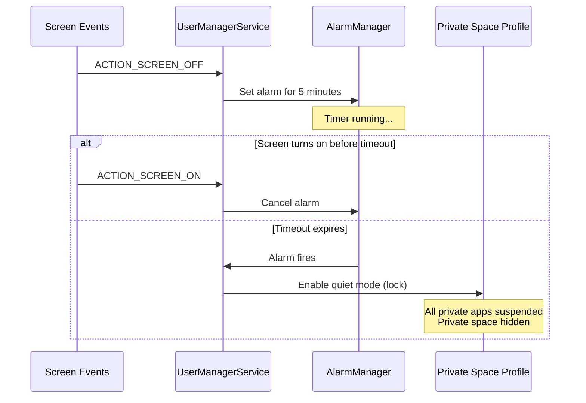
```mermaid
sequenceDiagram
    participant Screen as Screen Events
    participant UMS as UserManagerService
    participant AM as AlarmManager
    participant PS as Private Space Profile

    Screen->>UMS: ACTION_SCREEN_OFF
    UMS->>AM: Set alarm for 5 minutes
    Note over AM: Timer running...

    alt Screen turns on before timeout
        Screen->>UMS: ACTION_SCREEN_ON
        UMS->>AM: Cancel alarm
    else Timeout expires
        AM->>UMS: Alarm fires
        UMS->>PS: Enable quiet mode (lock)
        Note over PS: All private apps suspended<br/>Private space hidden
    end
```

The preference for auto-lock behavior is stored in Settings:

```java
// From UserManagerService.java
int privateProfileUserId = getPrivateProfileUserId();
// Auto-lock on screen off, after timeout, or never
```

### 31.5.4 Entry Point Hiding

Private Space can hide its entry point from the launcher:

```java
// From UserManagerService.java imports
import static android.content.pm.LauncherUserInfo.PRIVATE_SPACE_ENTRYPOINT_HIDDEN;
import static android.provider.Settings.Secure.HIDE_PRIVATESPACE_ENTRY_POINT;
```

When hidden, the Private Space is not visible in the launcher at all -- the user
must use a specific gesture or navigate through Settings to access it.

### 31.5.5 Private Space Biometric Integration

Authentication for Private Space leverages the biometric prompt with custom branding:

```java
// From UserManagerService.java
if (getUserInfo(userId).isPrivateProfile()) {
    // Custom biometric prompt with Private Space branding
    mContext.getString(R.string.private_space_biometric_prompt_title);
}
```

---

## 31.6 Per-User Storage

### 31.6.1 Storage Layout

Android maintains separate storage areas for each user:

```
/data/
    system/users/          # System-level user metadata
        userlist.xml
        0/                 # User 0 metadata
        10/                # User 10 metadata

    user/                  # Symlink to user/0 for user 0
    user/0/                # CE storage for user 0
        com.example.app/   # App data
    user/10/               # CE storage for user 10
        com.example.app/   # Separate app data instance

    user_de/               # Device-encrypted storage
    user_de/0/             # DE storage for user 0
        com.example.app/
    user_de/10/            # DE storage for user 10
        com.example.app/

    misc/                  # Shared misc data
    misc_de/               # Device-encrypted misc
    misc_ce/               # Credential-encrypted misc
```

### 31.6.2 CE vs. DE Storage

Android implements File-Based Encryption (FBE) with two encryption classes:

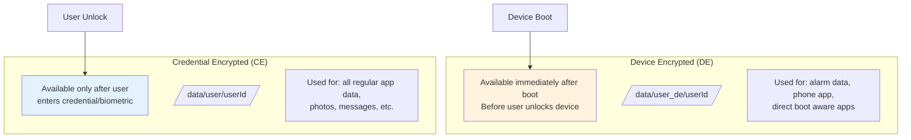
```mermaid
graph TB
    subgraph "Device Encrypted (DE)"
        DE_DESC["Available immediately after boot<br/>Before user unlocks device"]
        DE_DATA[/data/user_de/userId/]
        DE_USE["Used for: alarm data, phone app,<br/>direct boot aware apps"]
    end

    subgraph "Credential Encrypted (CE)"
        CE_DESC["Available only after user<br/>enters credential/biometric"]
        CE_DATA[/data/user/userId/]
        CE_USE["Used for: all regular app data,<br/>photos, messages, etc."]
    end

    BOOT[Device Boot] --> DE_DESC
    UNLOCK[User Unlock] --> CE_DESC

    style DE_DESC fill:#fff3e0
    style CE_DESC fill:#e3f2fd
```

| Property | CE (Credential Encrypted) | DE (Device Encrypted) |
|---|---|---|
| Path | `/data/user/<userId>/` | `/data/user_de/<userId>/` |
| Available after | User credential entry | Device boot |
| Encryption key | Derived from user credential | Derived from device key |
| Typical data | App data, photos, messages | Alarms, call logs, direct boot data |
| Access API | `Context.getDataDir()` | `Context.createDeviceProtectedStorageContext()` |

### 31.6.3 Storage Preparation

`UserDataPreparer` handles creating storage directories for new users:

```java
// From UserDataPreparer.java
void prepareUserData(UserInfo userInfo, int flags) {
    try (PackageManagerTracedLock installLock = mInstallLock.acquireLock()) {
        final StorageManager storage = mContext.getSystemService(StorageManager.class);
        /*
         * Internal storage must be prepared before adoptable storage,
         * since the user's volume keys are stored in their internal storage.
         */
        prepareUserDataLI(null /* internal storage */, userInfo, flags, true);
        for (VolumeInfo vol : storage.getWritablePrivateVolumes()) {
            final String volumeUuid = vol.getFsUuid();
            if (volumeUuid != null) {
                prepareUserDataLI(volumeUuid, userInfo, flags, true);
            }
        }
    }
}
```

Internal storage is always prepared first because adoptable storage volume keys are
stored in the user's internal storage.

### 31.6.4 Per-User Package Installation

Not all system packages are installed for every user. `UserSystemPackageInstaller`
controls which packages are available per user type:

```java
// From UserSystemPackageInstaller.java
// Packages can be configured via:
// 1. config_systemUserAllowlistedPackages (for system user)
// 2. config_userTypePackageWhitelist (per user type)
// 3. Package manifest install-in/exclude-from declarations
```

The installer reads allowlists and blocklists from device overlay configurations,
ensuring (for example) that enterprise management apps are only installed in work
profiles and consumer apps are not installed in restricted profiles.

### 31.6.5 External Storage per User

Each user gets their own isolated external storage:

```
/storage/emulated/0/    # User 0's external storage
/storage/emulated/10/   # User 10's external storage
```

The FUSE daemon mediates access, ensuring each user can only see their own files.
The `sdcardfs` or FUSE-based filesystem applies UID-based access controls matching
the user's UID range.

---

## 31.7 User Switching

### 31.7.1 User Switch Overview

User switching transitions the foreground from one full user to another. This is a
complex operation involving `ActivityManagerService`, `WindowManagerService`,
`UserManagerService`, and all system services.

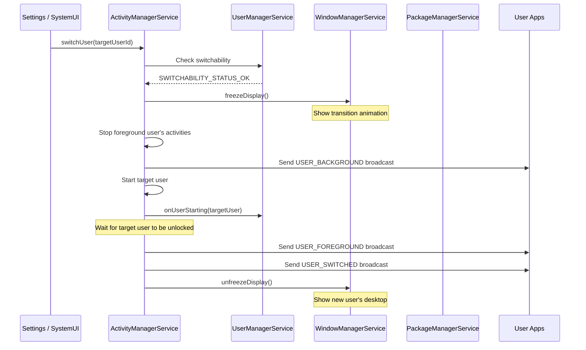
```mermaid
sequenceDiagram
    participant UI as Settings / SystemUI
    participant AM as ActivityManagerService
    participant UMS as UserManagerService
    participant WM as WindowManagerService
    participant PKG as PackageManagerService
    participant APPS as User Apps

    UI->>AM: switchUser(targetUserId)
    AM->>UMS: Check switchability
    UMS-->>AM: SWITCHABILITY_STATUS_OK

    AM->>WM: freezeDisplay()
    Note over WM: Show transition animation

    AM->>AM: Stop foreground user's activities
    AM->>APPS: Send USER_BACKGROUND broadcast

    AM->>AM: Start target user
    AM->>UMS: onUserStarting(targetUser)

    Note over AM: Wait for target user to be unlocked

    AM->>APPS: Send USER_FOREGROUND broadcast
    AM->>APPS: Send USER_SWITCHED broadcast
    AM->>WM: unfreezeDisplay()
    Note over WM: Show new user's desktop
```

### 31.7.2 Switchability Checks

Before switching, the system verifies the switch is allowed:

```java
// From UserManagerService.java
public @UserManager.UserSwitchabilityResult int getUserSwitchability(
        @UserIdInt int userId) {
    int flags = UserManager.SWITCHABILITY_STATUS_OK;

    // Check 1: User in phone call?
    if (telecomManager != null && telecomManager.isInCall()) {
        flags |= UserManager.SWITCHABILITY_STATUS_USER_IN_CALL;
    }

    // Check 2: User switch disallowed by policy?
    if (mLocalService.hasUserRestriction(DISALLOW_USER_SWITCH, userId)) {
        flags |= UserManager.SWITCHABILITY_STATUS_USER_SWITCH_DISALLOWED;
    }

    // Check 3: System user locked? (non-HSUM only)
    if (!isHeadlessSystemUserMode()) {
        if (!allowUserSwitchingWhenSystemUserLocked && !systemUserUnlocked) {
            flags |= UserManager.SWITCHABILITY_STATUS_SYSTEM_USER_LOCKED;
        }
    }

    return flags;
}
```

Switchability result flags:

| Flag | Meaning |
|---|---|
| `SWITCHABILITY_STATUS_OK` | Switching allowed |
| `SWITCHABILITY_STATUS_USER_IN_CALL` | Active phone call |
| `SWITCHABILITY_STATUS_USER_SWITCH_DISALLOWED` | DPM restriction active |
| `SWITCHABILITY_STATUS_SYSTEM_USER_LOCKED` | System user not yet unlocked |

### 31.7.3 User Visibility Mediator

`UserVisibilityMediator` determines which users are "visible" -- meaning they
should have their apps running and accessible:

```java
// From UserVisibilityMediator.java (class doc)
// Three modes:
// 1. SUSD (Single User Single Display) - phones, tablets
//    Only current foreground user + profiles are visible
// 2. MUMD (Multiple Users Multiple Displays) - automotive
//    Background users can be visible on secondary displays
// 3. MUPAND (Multiple Passengers, No Driver) - automotive
//    All human users in background, system user in foreground
```

For the standard phone mode (SUSD):

- The foreground user is visible
- All profiles of the foreground user are visible
- All other users are invisible

For automotive (MUMD):

- The foreground user is visible on the main display
- Additional users can be visible on passenger displays
- Each user-display mapping is tracked

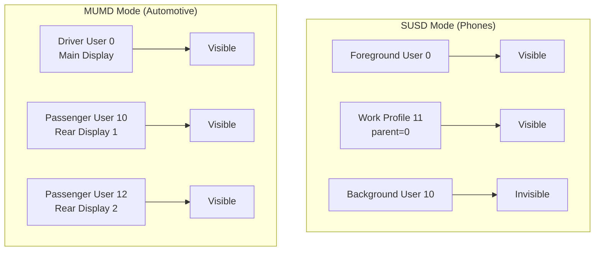
```mermaid
graph TB
    subgraph "SUSD Mode (Phones)"
        FG[Foreground User 0] --> V1[Visible]
        WP["Work Profile 11<br/>parent=0"] --> V2[Visible]
        BG[Background User 10] --> INV1[Invisible]
    end

    subgraph "MUMD Mode (Automotive)"
        DRIVER["Driver User 0<br/>Main Display"] --> VD[Visible]
        PASS1["Passenger User 10<br/>Rear Display 1"] --> VP1[Visible]
        PASS2["Passenger User 12<br/>Rear Display 2"] --> VP2[Visible]
    end
```

### 31.7.4 Process Management During Switch

When switching users, the system manages processes carefully:

1. **Freeze:** The display is frozen to show a transition animation
2. **Background current user:** The current user's activities are paused/stopped
3. **Start target user:** The target user's system services and critical apps start
4. **Unlock if needed:** If the user has a lock screen, wait for unlock
5. **Foreground target user:** Start the user's launcher and restore activities
6. **Unfreeze:** The display unfreezes, showing the new user's UI

Profiles of the previous user are stopped (unless they have
`allowStoppingUserWithDelayedLocking`). Profiles of the new user are started
(if `startWithParent=true`).

### 31.7.5 Boot User Selection

In Headless System User Mode (HSUM), the system must decide which human user to
foreground after boot:

```java
// From UserManagerService.java
@VisibleForTesting
static final int BOOT_STRATEGY_TO_PREVIOUS_OR_FIRST_SWITCHABLE_USER = 0;
@VisibleForTesting
static final int BOOT_STRATEGY_TO_HSU_FOR_PROVISIONED_DEVICE = 1;

private static final String BOOT_STRATEGY_PROPERTY = "persist.user.hsum_boot_strategy";
```

| Strategy | Behavior |
|---|---|
| `TO_PREVIOUS_OR_FIRST_SWITCHABLE_USER` | Boot to the last active user, or the first switchable user |
| `TO_HSU_FOR_PROVISIONED_DEVICE` | Boot to headless system user for provisioned devices |

A `CountDownLatch` waits for the boot user to be determined:

```java
private final CountDownLatch mBootUserLatch = new CountDownLatch(1);
private static final long BOOT_USER_SET_TIMEOUT_MS = 300_000;  // 5 minutes
```

### 31.7.6 User Switcher UI

The user switcher appears in multiple places:

1. **Quick Settings** -- Drop-down user avatar in the notification shade
2. **Lock Screen** -- User selection before unlock
3. **Settings > Users** -- Full user management interface

`SystemUI` reads the user list from `UserManagerService` and presents switching
controls. The `UserSwitcherController` in SystemUI subscribes to user change
broadcasts to keep the UI synchronized.

### 31.7.7 Broadcasts During User Lifecycle

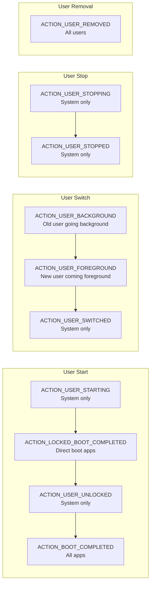
```mermaid
graph LR
    subgraph "User Start"
        A1["ACTION_USER_STARTING<br/>System only"]
        A2["ACTION_LOCKED_BOOT_COMPLETED<br/>Direct boot apps"]
        A3["ACTION_USER_UNLOCKED<br/>System only"]
        A4["ACTION_BOOT_COMPLETED<br/>All apps"]
    end

    subgraph "User Switch"
        B1["ACTION_USER_BACKGROUND<br/>Old user going background"]
        B2["ACTION_USER_FOREGROUND<br/>New user coming foreground"]
        B3["ACTION_USER_SWITCHED<br/>System only"]
    end

    subgraph "User Stop"
        C1["ACTION_USER_STOPPING<br/>System only"]
        C2["ACTION_USER_STOPPED<br/>System only"]
    end

    subgraph "User Removal"
        D1["ACTION_USER_REMOVED<br/>All users"]
    end

    A1 --> A2 --> A3 --> A4
    B1 --> B2 --> B3
    C1 --> C2
```

| Broadcast | Receiver | Timing |
|---|---|---|
| `ACTION_USER_STARTING` | System services | User process beginning to start |
| `ACTION_LOCKED_BOOT_COMPLETED` | Direct-boot aware apps | DE storage available |
| `ACTION_USER_UNLOCKED` | System services | CE storage available |
| `ACTION_BOOT_COMPLETED` | All apps in user | Full storage available |
| `ACTION_USER_BACKGROUND` | System services | User moving to background |
| `ACTION_USER_FOREGROUND` | System services | User moving to foreground |
| `ACTION_USER_SWITCHED` | System services | User switch complete |
| `ACTION_USER_STOPPING` | System services | User being stopped |
| `ACTION_USER_STOPPED` | System services | User fully stopped |
| `ACTION_USER_REMOVED` | All users | User deleted from device |

---

## 31.8 Try It

### 31.8.1 Listing Users

```bash
# List all users with their details
adb shell pm list users

# More detailed output from UserManagerService
adb shell dumpsys user

# Just the user summary
adb shell cmd user list -v
```

Example output:
```
Users:
  UserInfo{0:Owner:4c13} running
    Type: android.os.usertype.full.SYSTEM
    Flags: 0x00004c13 (ADMIN|PRIMARY|FULL|SYSTEM|MAIN)
    State: RUNNING_UNLOCKED
  UserInfo{10:Guest:4804} running
    Type: android.os.usertype.full.GUEST
    Flags: 0x00004804 (GUEST|FULL|EPHEMERAL)
    State: -
  UserInfo{11:Work profile:4030} running
    Type: android.os.usertype.profile.MANAGED
    Flags: 0x00004030 (MANAGED_PROFILE|PROFILE)
    profileGroupId: 0
    State: RUNNING_UNLOCKED
```

### 31.8.2 Creating Users

```bash
# Create a secondary user
adb shell pm create-user "Test User"

# Create a guest
adb shell pm create-user --guest "Guest"

# Create a managed profile (work profile) for user 0
adb shell pm create-user --profileOf 0 --managed "Work"

# Create a private profile
adb shell cmd user create-profile-for --user-type android.os.usertype.profile.PRIVATE 0

# List available user types
adb shell cmd user list-user-types
```

### 31.8.3 Switching Users

```bash
# Switch to user 10
adb shell am switch-user 10

# Check current foreground user
adb shell am get-current-user

# Check user switchability
adb shell cmd user report-user-switchability
```

### 31.8.4 Managing Profiles

```bash
# Enable quiet mode for a managed profile (user 11)
adb shell cmd user set-quiet-mode --enable 11

# Disable quiet mode (unlock)
adb shell cmd user set-quiet-mode --disable 11

# Check if a user is a profile
adb shell cmd user is-profile 11

# Get profile parent
adb shell cmd user get-profile-parent 11
```

### 31.8.5 User Restrictions

```bash
# Set a restriction on user 10
adb shell pm set-user-restriction --user 10 no_install_apps 1

# Clear a restriction
adb shell pm set-user-restriction --user 10 no_install_apps 0

# List restrictions for a user
adb shell dumpsys user | grep -A 20 "UserInfo{10"
```

Common restrictions:

| Restriction | Effect |
|---|---|
| `no_install_apps` | Cannot install apps |
| `no_uninstall_apps` | Cannot uninstall apps |
| `no_share_location` | Cannot share location |
| `no_outgoing_calls` | Cannot make outgoing calls |
| `no_sms` | Cannot send SMS |
| `no_config_wifi` | Cannot configure WiFi |
| `no_remove_user` | Cannot remove this user |
| `no_user_switch` | Cannot switch away from this user |

### 31.8.6 Inspecting Storage Layout

```bash
# List per-user data directories
adb shell ls -la /data/user/

# CE storage for user 10
adb shell ls /data/user/10/

# DE storage for user 10
adb shell ls /data/user_de/10/

# User metadata files
adb shell ls /data/system/users/

# Read a user's XML metadata (requires root)
adb shell cat /data/system/users/10.xml
```

### 31.8.7 Removing Users

```bash
# Remove user 10 (and all its profiles)
adb shell pm remove-user 10

# Force remove (even if currently running)
adb shell pm remove-user --set-ephemeral-if-in-use 10
```

### 31.8.8 Monitoring User Events

```bash
# Watch for user-related broadcasts
adb logcat -s ActivityManager | grep -i "user"

# Monitor UserManagerService logs
adb logcat -s UserManagerService

# Watch user state changes
adb logcat | grep -E "onUserStart|onUserStop|switchUser|UserState"
```

### 31.8.9 Checking User Visibility

```bash
# List visible users
adb shell cmd user get-visible-users

# Check if a specific user is visible
adb shell cmd user is-visible 10

# Check what display a user is assigned to
adb shell cmd user get-main-display-for-user 10
```

### 31.8.10 Private Space Operations

```bash
# Create Private Space profile
adb shell cmd user create-profile-for \
    --user-type android.os.usertype.profile.PRIVATE 0

# Lock private space (enable quiet mode)
adb shell cmd user set-quiet-mode --enable <private_user_id>

# Unlock private space
adb shell cmd user set-quiet-mode --disable <private_user_id>

# Check if Private Space is enabled on this device
adb shell getprop persist.sys.user.private_profile
```

### 31.8.11 Headless System User Mode Testing

```bash
# Check if device is in headless system user mode
adb shell getprop ro.fw.mu.headless_system_user

# Emulate headless system user mode (requires reboot)
adb shell setprop persist.debug.fw.headless_system_user 1
adb reboot

# Check boot strategy
adb shell getprop persist.user.hsum_boot_strategy
```

### 31.8.12 User Type Inspection

```bash
# List all registered user types
adb shell cmd user list-user-types

# Check a user's type
adb shell cmd user get-user-type 11

# Inspect user properties
adb shell dumpsys user | grep -A 30 "User properties"
```

### 31.8.13 Performance Monitoring

```bash
# Time user creation
adb shell cmd user create-user --timed "Performance Test"

# Monitor user start time
adb logcat -s SystemServerTiming | grep -i user

# Check user start/unlock timing
adb shell dumpsys user | grep -E "startRealtime|unlockRealtime"
```

### 31.8.14 Multi-User Debugging Checklist

When investigating multi-user issues, check these in order:

1. **User exists and is correct type:**
   ```bash
   adb shell pm list users
   adb shell cmd user get-user-type <userId>
   ```

2. **User is running and unlocked:**
   ```bash
   adb shell am get-started-user-state <userId>
   ```

3. **Profile group is correct:**
   ```bash
   adb shell dumpsys user | grep profileGroupId
   ```

4. **Storage is prepared:**
   ```bash
   adb shell ls /data/user/<userId>/
   adb shell ls /data/user_de/<userId>/
   ```

5. **User restrictions are as expected:**
   ```bash
   adb shell dumpsys user | grep -A 5 "Restrictions:"
   ```

6. **Packages are installed:**
   ```bash
   adb shell pm list packages --user <userId>
   ```

7. **Cross-profile intent filters are configured:**
   ```bash
   adb shell dumpsys package intent-filter-verifiers
   ```

---

## Summary

Android's multi-user system is a deeply integrated framework spanning from Linux kernel
UID isolation through system services to user-facing UI:

- **`UserManagerService`** is the central authority, managing user metadata in
  `/data/system/users/`, enforcing limits, and coordinating user lifecycle events

- **User types** defined in `UserTypeFactory` create a type-safe, extensible system
  where each category (full user, profile, system) carries its own properties,
  restrictions, badges, and cross-profile rules

- **Profiles** (work, private, clone) run within a parent user's context, sharing
  the same foreground session but with isolated storage and process identity

- **Private Space** adds a hidden, self-managed profile with auto-locking, entry
  point hiding, and mandatory authentication -- filling the gap between work
  profiles and full user separation

- **Per-user CE/DE storage** with file-based encryption ensures data isolation both
  at rest and before unlock, with `UserDataPreparer` handling the creation and
  destruction of these storage areas

- **User switching** involves coordinated action across `ActivityManagerService`,
  `WindowManagerService`, and every user-aware system service, managed through the
  `UserVisibilityMediator` which supports multiple display modes (SUSD, MUMD, MUPAND)

- **Lifecycle management** follows strict ordering: creation with storage
  preparation, starting through locked/unlocked states, stopping with process
  cleanup, and removal with storage destruction -- all tracked through broadcasts
  and lifecycle listeners

The multi-user architecture is one of Android's most pervasive features, touching
virtually every system service and defining the security boundaries for all user data.

---

## Appendix: Deep Dive into Internal Mechanisms

### A.1 UserInfo Flags

The `UserInfo.flags` field is a bitmask encoding the user's properties. These flags
are defined in `UserInfo.java`:

```java
// Base type flags (mutually exclusive categories)
public static final int FLAG_PRIMARY   = 0x00000001;
public static final int FLAG_ADMIN     = 0x00000002;
public static final int FLAG_GUEST     = 0x00000004;
public static final int FLAG_RESTRICTED = 0x00000008;

// State flags
public static final int FLAG_INITIALIZED = 0x00000010;
public static final int FLAG_MANAGED_PROFILE = 0x00000020;
public static final int FLAG_DISABLED   = 0x00000040;
public static final int FLAG_QUIET_MODE = 0x00000080;

// Type flags
public static final int FLAG_EPHEMERAL = 0x00000100;
public static final int FLAG_DEMO      = 0x00000200;
public static final int FLAG_FULL      = 0x00000400;
public static final int FLAG_SYSTEM    = 0x00000800;
public static final int FLAG_PROFILE   = 0x00001000;
public static final int FLAG_FOR_TESTING = 0x00002000;
public static final int FLAG_MAIN      = 0x00004000;

// Convenience checks
public boolean isGuest()   { return (flags & FLAG_GUEST) != 0; }
public boolean isAdmin()   { return (flags & FLAG_ADMIN) != 0; }
public boolean isProfile() { return (flags & FLAG_PROFILE) != 0; }
public boolean isFull()    { return (flags & FLAG_FULL) != 0; }
public boolean isManagedProfile() { return (flags & FLAG_MANAGED_PROFILE) != 0; }
public boolean isPrivateProfile() { ... }
```

Common flag combinations:

| User Type | Flags | Hex |
|---|---|---|
| System user (non-HSUM) | SYSTEM, FULL, PRIMARY, ADMIN, MAIN | `0x00004C13` |
| Secondary user | FULL | `0x00000400` |
| Guest (ephemeral) | FULL, GUEST, EPHEMERAL | `0x00000504` |
| Work profile | PROFILE, MANAGED_PROFILE | `0x00001020` |
| Private profile | PROFILE | `0x00001000` |

### A.2 User Restrictions Deep Dive

User restrictions are string-keyed booleans stored in `Bundle` objects. The complete
set of restrictions is defined in `UserManager`:

**Communication Restrictions:**

| Restriction | Effect |
|---|---|
| `DISALLOW_OUTGOING_CALLS` | Block outgoing phone calls |
| `DISALLOW_SMS` | Block sending SMS messages |
| `DISALLOW_OUTGOING_BEAM` | Block NFC beam sharing |

**App Management Restrictions:**

| Restriction | Effect |
|---|---|
| `DISALLOW_INSTALL_APPS` | Cannot install any apps |
| `DISALLOW_INSTALL_UNKNOWN_SOURCES` | Cannot sideload apps |
| `DISALLOW_UNINSTALL_APPS` | Cannot uninstall apps |

**Configuration Restrictions:**

| Restriction | Effect |
|---|---|
| `DISALLOW_CONFIG_WIFI` | Cannot configure WiFi |
| `DISALLOW_CONFIG_WIFI_SHARED` | Cannot configure shared WiFi |
| `DISALLOW_CONFIG_BLUETOOTH` | Cannot configure Bluetooth |
| `DISALLOW_CONFIG_LOCATION` | Cannot change location settings |
| `DISALLOW_CONFIG_TETHERING` | Cannot configure tethering |
| `DISALLOW_CONFIG_VPN` | Cannot configure VPN |

**Security Restrictions:**

| Restriction | Effect |
|---|---|
| `DISALLOW_DEBUGGING_FEATURES` | No USB debugging |
| `DISALLOW_FACTORY_RESET` | Cannot factory reset |
| `DISALLOW_ADD_USER` | Cannot add users |
| `DISALLOW_REMOVE_USER` | Cannot remove users |
| `DISALLOW_USER_SWITCH` | Cannot switch users |

The restriction enforcement is distributed -- each system service checks relevant
restrictions for the calling user. For example, `TelephonyManager` checks
`DISALLOW_OUTGOING_CALLS` before allowing a call.

### A.3 UserSystemPackageInstaller Details

The system package installer determines which pre-installed packages are available
for each user type. It uses allowlists and blocklists from device overlays:

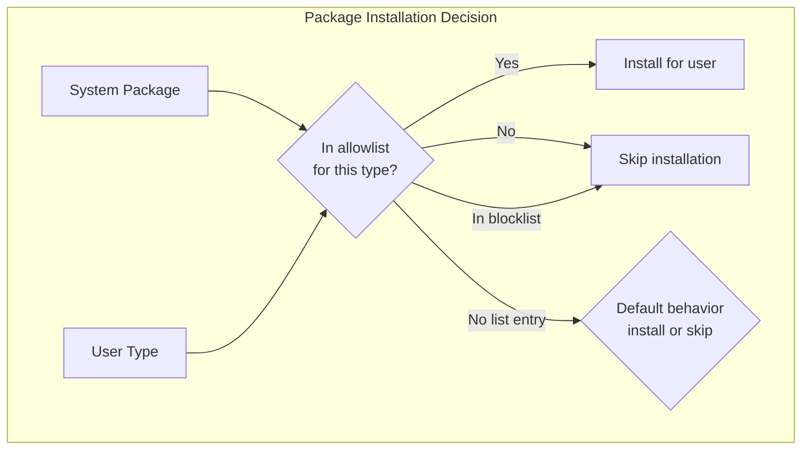
```mermaid
graph TB
    subgraph "Package Installation Decision"
        PKG[System Package]
        TYPE[User Type]

        PKG --> CHECK{"In allowlist<br/>for this type?"}
        TYPE --> CHECK

        CHECK -->|Yes| INSTALL[Install for user]
        CHECK -->|No| SKIP[Skip installation]

        CHECK -->|In blocklist| SKIP
        CHECK -->|No list entry| DEFAULT{"Default behavior<br/>install or skip"}
    end
```

OEMs configure per-type allowlists in:

- `config_userTypePackageWhitelist` (XML overlay)
- Package manifest `install-in` and `exclude-from` directives

This ensures that:

- Enterprise management apps are available in work profiles
- Consumer entertainment apps skip restricted profiles
- System utilities are available everywhere
- Carrier-specific apps match device configuration

### A.4 The UserFilter System

`UserManagerService` uses `UserFilter` for efficiently querying subsets of users:

```java
// From UserFilter.java (conceptual)
// Filters can include:
// - excludePartial: Skip users being created/removed
// - excludeDying: Skip users being removed
// - excludePreCreated: Skip pre-created users
// - matchType: Only specific user types
// - matchParent: Only profiles of a specific parent
```

The filter system avoids creating intermediate lists by applying predicates directly
during iteration over the `mUsers` SparseArray.

### A.5 Cross-Profile Intent Filter Mechanics

Cross-profile intent filters are implemented using `DefaultCrossProfileIntentFilter`:

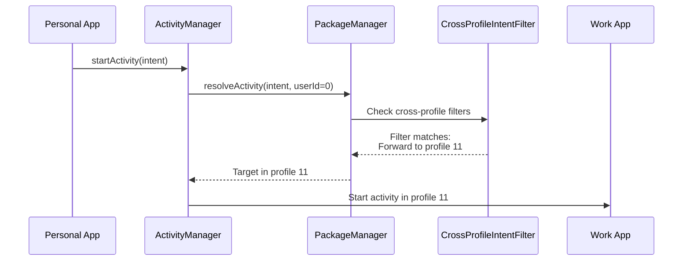
```mermaid
sequenceDiagram
    participant PA as Personal App
    participant AM as ActivityManager
    participant PM as PackageManager
    participant CPIF as CrossProfileIntentFilter
    participant WA as Work App

    PA->>AM: startActivity(intent)
    AM->>PM: resolveActivity(intent, userId=0)
    PM->>CPIF: Check cross-profile filters
    CPIF-->>PM: Filter matches:<br/>Forward to profile 11
    PM-->>AM: Target in profile 11
    AM->>WA: Start activity in profile 11
```

Each `DefaultCrossProfileIntentFilter` specifies:

- An `IntentFilter` pattern to match
- Source user type (which profile the intent originates from)
- Target user type (which profile to forward to)
- Whether to skip the current profile's resolution

The resolution strategy is controlled by `crossProfileIntentResolutionStrategy`:

- `NO_FILTERING`: All matching intents can cross profiles
- Standard: Only explicitly filtered intents cross

### A.6 User Lifecycle Broadcasts in Detail

When a user starts for the first time after boot (or after being created):

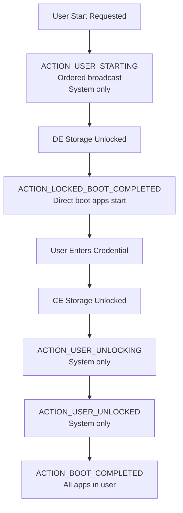
```mermaid
graph TD
    START[User Start Requested] --> B1["ACTION_USER_STARTING<br/>Ordered broadcast<br/>System only"]
    B1 --> DE[DE Storage Unlocked]
    DE --> B2["ACTION_LOCKED_BOOT_COMPLETED<br/>Direct boot apps start"]
    B2 --> CRED[User Enters Credential]
    CRED --> CE[CE Storage Unlocked]
    CE --> B3["ACTION_USER_UNLOCKING<br/>System only"]
    B3 --> B4["ACTION_USER_UNLOCKED<br/>System only"]
    B4 --> B5["ACTION_BOOT_COMPLETED<br/>All apps in user"]
```

For user switching:

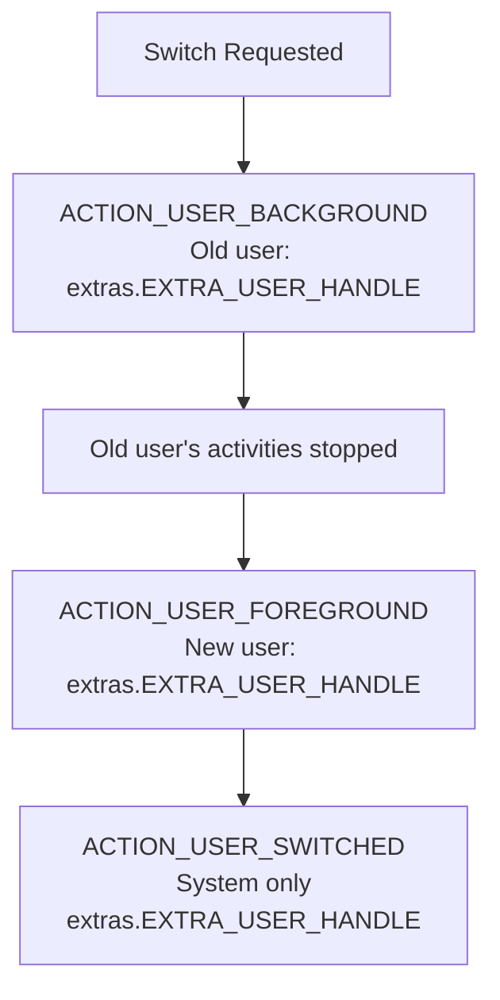
```mermaid
graph TD
    SWITCH[Switch Requested] --> B1["ACTION_USER_BACKGROUND<br/>Old user: extras.EXTRA_USER_HANDLE"]
    B1 --> STOP[Old user's activities stopped]
    STOP --> B2["ACTION_USER_FOREGROUND<br/>New user: extras.EXTRA_USER_HANDLE"]
    B2 --> B3["ACTION_USER_SWITCHED<br/>System only<br/>extras.EXTRA_USER_HANDLE"]
```

The `EXTRA_USER_HANDLE` in these broadcasts contains the user ID that the event
pertains to. System services register receivers for these broadcasts to
initialize/deinitialize per-user state.

### A.7 Headless System User Mode (HSUM)

In HSUM, user 0 exists but is not a "human" user. It runs system services and
background tasks, while actual human users start as secondary full users:

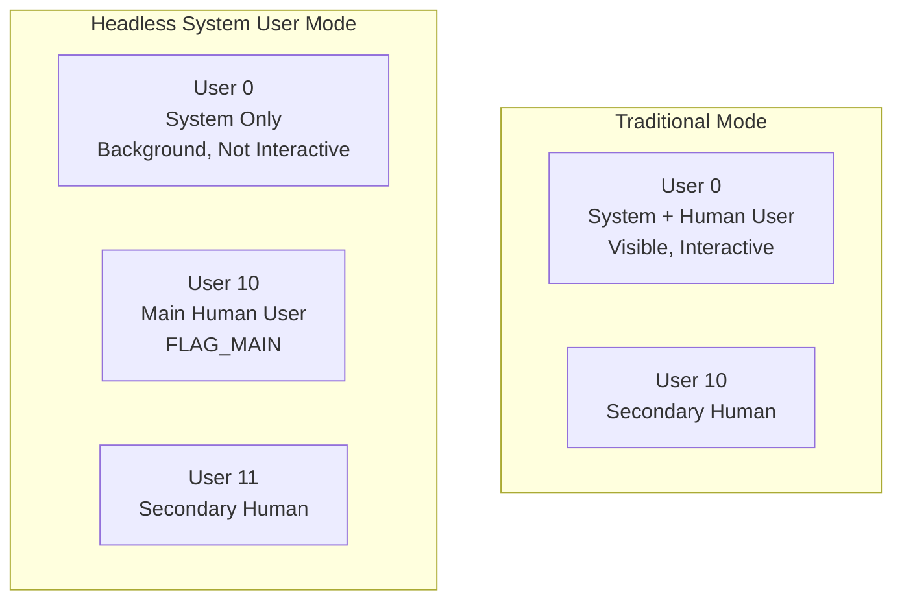
```mermaid
graph TB
    subgraph "Traditional Mode"
        U0T["User 0<br/>System + Human User<br/>Visible, Interactive"]
        U10T["User 10<br/>Secondary Human"]
    end

    subgraph "Headless System User Mode"
        U0H["User 0<br/>System Only<br/>Background, Not Interactive"]
        U10H["User 10<br/>Main Human User<br/>FLAG_MAIN"]
        U11H["User 11<br/>Secondary Human"]
    end
```

HSUM configuration:

```java
// From UserTypeFactory.java
private static UserTypeDetails.Builder getDefaultTypeSystemHeadless() {
    return new UserTypeDetails.Builder()
            .setName(USER_TYPE_SYSTEM_HEADLESS)
            .setBaseType(FLAG_SYSTEM)
            .setDefaultUserInfoPropertyFlags(FLAG_PRIMARY
                    | (android.multiuser.Flags.hsuNotAdmin() ? 0 : FLAG_ADMIN))
            .setMaxAllowed(1)
            .setDefaultRestrictions(getDefaultHeadlessSystemUserRestrictions());
}
```

In HSUM:

- The system user does not have `FLAG_FULL`, so it cannot run user-facing activities
- A "main user" with `FLAG_MAIN` serves as the device owner's human identity
- The first switchable user is foregrounded after boot
- The system user stays running but invisible

This mode is primarily used on automotive platforms where the "device" is the car's
infotainment system, and the system user manages vehicle-level services while
individual human users (driver, passengers) have their own profiles.

### A.8 Multi-User on Multiple Displays (MUMD)

On automotive devices with multiple screens, different users can be visible
simultaneously on different displays:

```mermaid
graph TB
    subgraph "Car with Multiple Displays"
        MAIN["Main Display<br/>Driver: User 10"]
        REAR1["Rear Display 1<br/>Passenger: User 12"]
        REAR2["Rear Display 2<br/>Passenger: User 13"]
        CLUSTER["Cluster Display<br/>System Info"]
    end

    UVM[UserVisibilityMediator] --> MAIN
    UVM --> REAR1
    UVM --> REAR2

    style MAIN fill:#e3f2fd
    style REAR1 fill:#e8f5e9
    style REAR2 fill:#fff3e0
```

The `UserVisibilityMediator` tracks user-to-display assignments:

```java
// From UserVisibilityMediator.java
// MUMD mode maintains:
// - mUsersAssignedToDisplays: SparseIntArray (userId -> displayId)
// - mExtraDisplaysAssignedToUsers: reverse mapping
// - Visibility queries check both foreground user and display assignments
```

MUMD mode extends the visibility concept:

- `isUserVisible(userId)`: True if user is foreground OR assigned to any display
- `isUserVisible(userId, displayId)`: True if user is assigned to that specific display
- `getVisibleUsers()`: Returns all users that are currently visible on any display

### A.9 UserData Persistence Format

The per-user XML file contains the full user state:

```xml
<?xml version="1.0" encoding="utf-8"?>
<user
    id="11"
    serialNumber="14"
    flags="0x00001020"
    type="android.os.usertype.profile.MANAGED"
    created="1700000000000"
    lastLoggedIn="1700100000000"
    lastLoggedInFingerprint="google/pixel8/pixel8:14/..."
    lastEnteredForeground="0"
    profileGroupId="0"
    profileBadge="0">
    <name>Work</name>
    <restrictions>
        <entry key="no_wallpaper" type="b">true</entry>
        <entry key="no_bluetooth_sharing" type="b">true</entry>
    </restrictions>
    <device_policy_local_restrictions />
    <device_policy_global_restrictions />
    <userProperties>
        <!-- Properties serialized from UserProperties -->
    </userProperties>
    <ignorePrepareStorageErrors>false</ignorePrepareStorageErrors>
</user>
```

Restriction value types:

- `"b"` = boolean
- `"s"` = string
- `"i"` = integer
- `"sa"` = string array
- `"B"` = bundle
- `"BA"` = bundle array

### A.10 User Version Migration

The user data format has evolved over Android releases. The current version is 11:

```java
// From UserManagerService.java
private static final int USER_VERSION = 11;
```

When the device updates, `UserManagerService` runs migration logic for each
version step (e.g., adding new fields, converting user types from the old
`FLAG`-based system to the modern `userType` string system).

### A.11 Profile Association and Resolution

When system services need to resolve a user to its "effective" user (e.g., for
content access), they use profile group resolution:

```java
// getProfileParentId resolves a profile to its parent
// For user 0 (not a profile): returns 0
// For work profile 11 (parent=0): returns 0
// For private profile 12 (parent=0): returns 0
```

This is critical for services like `ContentProvider` where a profile might need
to access the parent user's content (or vice versa) through cross-profile
content URIs.

### A.12 Guest User Reset

Guest users have special reset behavior. When the guest user exits (switches away):

1. If the guest is ephemeral (`FLAG_EPHEMERAL`), it is marked for removal
2. A new guest is pre-created to replace it
3. When the old guest's processes stop, its data is wiped
4. The next time someone selects "Guest", they get the fresh pre-created guest

```java
// From UserManagerService.java
private static final String ATTR_GUEST_TO_REMOVE = "guestToRemove";
```

The `guestToRemove` attribute marks a guest that should be destroyed after it
stops running. This ensures a clean slate for each guest session while avoiding
the delay of creating a new user during the switch.

### A.13 User Journey Logging

`UserJourneyLogger` tracks the outcome of user management operations for telemetry:

```java
// From UserJourneyLogger.java
static final int USER_JOURNEY_USER_CREATE = 1;
static final int USER_JOURNEY_USER_REMOVE = 2;
static final int USER_JOURNEY_USER_LIFECYCLE = 3;
static final int USER_JOURNEY_GRANT_ADMIN = 4;
static final int USER_JOURNEY_REVOKE_ADMIN = 5;
static final int USER_JOURNEY_PROMOTE_MAIN_USER = 6;
static final int USER_JOURNEY_DEMOTE_MAIN_USER = 7;

// Error codes
static final int ERROR_CODE_UNSPECIFIED = 0;
static final int ERROR_CODE_ABORTED = 1;
static final int ERROR_CODE_INVALID_USER_TYPE = 2;
static final int ERROR_CODE_USER_ALREADY_AN_ADMIN = 3;
static final int ERROR_CODE_USER_IS_NOT_AN_ADMIN = 4;
static final int ERROR_CODE_USER_IS_LAST_ADMIN = 5;
```

These journeys are logged to `FrameworkStatsLog` for device health monitoring and
aggregate analytics.

### A.14 Communal Profile

The communal profile is a relatively new concept designed for shared-device scenarios
where multiple human users need access to common apps and data:

```java
// From UserTypeFactory.java
private static UserTypeDetails.Builder getDefaultTypeProfileCommunal() {
    return new UserTypeDetails.Builder()
            .setName(USER_TYPE_PROFILE_COMMUNAL)
            .setBaseType(FLAG_PROFILE)
            .setMaxAllowed(1)
            .setProfileParentRequired(false)  // Does NOT require a parent
            .setEnabled(UserManager.isCommunalProfileEnabled() ? 1 : 0)
            .setDefaultUserProperties(new UserProperties.Builder()
                    .setStartWithParent(false)
                    .setShowInLauncher(UserProperties.SHOW_IN_LAUNCHER_SEPARATE)
                    .setCredentialShareableWithParent(false)
                    .setAlwaysVisible(true));  // Visible to all users
}
```

Key communal profile characteristics:

- No parent required (unlike work/private profiles)
- `alwaysVisible=true`: Visible regardless of which user is in the foreground
- `credentialShareableWithParent=false`: Has its own independent credentials
- `startWithParent=false`: Lifecycle managed independently
- Maximum one per device

### A.15 Supervising Profile

The supervising profile supports parental supervision scenarios:

```java
// From UserTypeFactory.java
private static UserTypeDetails.Builder getDefaultTypeProfileSupervising() {
    return new UserTypeDetails.Builder()
            .setName(USER_TYPE_PROFILE_SUPERVISING)
            .setBaseType(FLAG_PROFILE)
            .setMaxAllowed(1)
            .setProfileParentRequired(false)
            .setEnabled(android.multiuser.Flags.allowSupervisingProfile() ? 1 : 0)
            .setDefaultUserProperties(new UserProperties.Builder()
                    .setStartWithParent(false)
                    .setShowInLauncher(UserProperties.SHOW_IN_LAUNCHER_NO)
                    .setShowInSettings(UserProperties.SHOW_IN_SETTINGS_NO)
                    .setShowInQuietMode(UserProperties.SHOW_IN_QUIET_MODE_HIDDEN)
                    .setCredentialShareableWithParent(false)
                    .setAlwaysVisible(true));
}
```

Notable properties:

- Not shown in launcher or Settings (invisible to the supervised user)
- Always visible to the system (for supervision enforcement)
- Feature-flagged behind `allowSupervisingProfile()`

### A.16 Multi-User Impact on System Services

Every system service must be user-aware. The common patterns are:

**Per-User State:**
Most services maintain a `SparseArray<ServiceState>` keyed by user ID.

**User Lifecycle Callbacks:**
Services extend `SystemService` and override:
```java
@Override
public void onUserStarting(@NonNull TargetUser user) { ... }

@Override
public void onUserStopping(@NonNull TargetUser user) { ... }

@Override
public void onUserStopped(@NonNull TargetUser user) { ... }

@Override
public void onUserSwitching(@Nullable TargetUser from, @NonNull TargetUser to) { ... }
```

**Binder Identity:**
Services frequently check the calling user:
```java
int callingUserId = UserHandle.getCallingUserId();
```

And may need to run as a specific user:
```java
Context userContext = context.createContextAsUser(UserHandle.of(userId), 0);
```

**Cross-User Permissions:**
System-level code checks `INTERACT_ACROSS_USERS` or `INTERACT_ACROSS_USERS_FULL`
before accessing another user's data.

### A.17 Maximum User Limits

Maximum user counts are device-configurable:

```java
// Maximum switchable users (full users)
// Default from config_multiuserMaximumUsers resource overlay
private static int getDefaultMaxAllowedSwitchableUsers() {
    return SystemProperties.getInt(
            "fw.max_users", Resources.getSystem().getInteger(
                    R.integer.config_multiuserMaximumUsers));
}
```

OEMs set this via:

- `config_multiuserMaximumUsers` resource overlay (typical: 4-8)
- `fw.max_users` system property (for testing)

Per-type limits are also enforced -- for example, only 1 guest, only 1 private
profile per parent, only 1 work profile per parent (production builds).

### A.18 User Switcher Controller in SystemUI

SystemUI implements the user switcher through `UserSwitcherController`:

```mermaid
graph TB
    subgraph "SystemUI User Switcher"
        USC[UserSwitcherController]
        USC --> USERS["User Records<br/>from UserManager"]
        USC --> QS[Quick Settings Tile]
        USC --> LS[Lock Screen Selector]
        USC --> DIALOG[Full-Screen Dialog]
    end

    UMS[UserManagerService] -->|"getUsers()"| USC
    AM[ActivityManager] -->|"switchUser()"| SWITCH[User Switch]
    USC --> AM
```

The controller listens for:

- `ACTION_USER_ADDED` / `ACTION_USER_REMOVED`: Update user list
- `ACTION_USER_SWITCHED`: Update current user indicator
- `ACTION_USER_INFO_CHANGED`: Update user names/avatars

### A.19 Security Model Summary

```mermaid
graph TB
    subgraph "User A (UID range 0-99999)"
        APP_A1[App1: UID 10045]
        APP_A2[App2: UID 10128]
        DATA_A[/data/user/0/]
    end

    subgraph "User B (UID range 1000000-1099999)"
        APP_B1[App1: UID 1010045]
        APP_B2[App2: UID 1010128]
        DATA_B[/data/user/10/]
    end

    APP_A1 -.->|"Cannot access"| DATA_B
    APP_B1 -.->|"Cannot access"| DATA_A

    KERNEL["Linux Kernel<br/>UID-based access control"] --> APP_A1
    KERNEL --> APP_A2
    KERNEL --> APP_B1
    KERNEL --> APP_B2

    style KERNEL fill:#fff3e0
```

Isolation guarantees:

1. **Process isolation:** Each user's apps run with different UIDs
2. **File isolation:** Each user has separate `/data/user/<id>/` directories
3. **Encryption isolation:** Each user has separate CE/DE encryption keys
4. **Network isolation:** Network policies can be applied per-user
5. **Keystore isolation:** Each user has an independent keystore
6. **Account isolation:** AccountManager maintains per-user account lists
7. **Settings isolation:** Most Settings.Secure values are per-user
8. **Notification isolation:** Notifications are per-user
9. **Clipboard isolation:** Clipboard contents are per-user (with cross-profile exceptions)

### A.20 Multi-User Impact on Content Providers

Content providers must handle multi-user access carefully:

```mermaid
graph TB
    subgraph "User 0 Process"
        APP0[App in User 0]
        CP0["ContentProvider<br/>authority: contacts<br/>User 0 instance"]
    end

    subgraph "User 10 Process"
        APP10[App in User 10]
        CP10["ContentProvider<br/>authority: contacts<br/>User 10 instance"]
    end

    APP0 --> CP0
    APP10 --> CP10
    APP0 -.->|"Cannot directly access"| CP10

    subgraph "Cross-Profile Access"
        CPCP["CrossProfileContentProvider<br/>Requires INTERACT_ACROSS_USERS"]
    end

    APP0 -->|"Special URI scheme"| CPCP --> CP10
```

Each content provider runs as a separate instance per user. The `content://` URI
scheme does not inherently carry user identity -- the system resolves the provider
instance based on the calling process's user ID.

For cross-profile access (e.g., work contacts appearing in personal dialer):

- The provider must be configured for cross-profile access
- The calling app needs `INTERACT_ACROSS_USERS` or similar permission
- Special URI schemes (e.g., `content://com.android.contacts/enterprise/...`)
  are used for cross-profile contact resolution

### A.21 Per-User Settings

`Settings.Secure` values are stored per-user, while `Settings.Global` values are
device-wide:

```
/data/system/users/0/settings_secure.xml    # User 0 secure settings
/data/system/users/10/settings_secure.xml   # User 10 secure settings
/data/system/users/0/settings_system.xml    # User 0 system settings
/data/system/settings_global.xml            # Global settings (all users)
```

When code calls `Settings.Secure.getString()`, the system automatically resolves
to the calling user's settings database. To access another user's settings:

```java
Settings.Secure.getStringForUser(contentResolver, key, userId);
```

### A.22 Multi-User Notification Handling

Notifications are user-scoped. `NotificationManagerService` maintains separate
notification lists per user:

- Each user's apps can only see/dismiss their own notifications
- When switching users, the notification shade refreshes to show the new user's
  notifications
- Profile notifications (work profile) appear in the parent user's shade with a
  badge indicator
- Private Space notifications are hidden when the space is locked

### A.23 Multi-User and Device Administration

Device Policy Controller (DPC) interaction with multi-user:

```mermaid
graph TB
    subgraph "Device Owner"
        DO["Device Owner DPC<br/>Controls entire device<br/>Runs in user 0 or main user"]
    end

    subgraph "Profile Owner"
        PO["Profile Owner DPC<br/>Controls work profile only<br/>Runs in profile user 11"]
    end

    DO --> DEVICE_POLICY["Device-wide policies<br/>WiFi config, VPN, etc."]
    PO --> PROFILE_POLICY["Profile-specific policies<br/>App restrictions, password, etc."]

    DO -->|Can create| WP[Work Profile]
    PO -->|Manages| WP
```

Device policies can be:

- **Device-wide:** Applied by device owner, affects all users
- **Profile-specific:** Applied by profile owner, affects only that profile
- **Inherited:** Some profiles inherit policies from parent (controlled by
  `inheritDevicePolicy` property)

### A.24 Multi-User and App Permissions

Each user has an independent set of runtime permissions:

```
User 0: Camera permission granted to com.example.app
User 10: Camera permission NOT granted to com.example.app
```

Permission grants are stored per-user by `PackageManagerService`. When an app
requests a permission at runtime, the dialog and grant/deny state are specific
to the current user.

The `FLAG_PERMISSION_GRANTED_BY_DEFAULT` and `FLAG_PERMISSION_GRANTED_BY_ROLE`
flags also operate per-user, ensuring that role-based permissions reflect each
user's configuration.

### A.25 Multi-User and the Installer

When a user creates a new user (or profile), `PackageManagerService` must decide
which packages to install. The process is:

1. **Enumerate system packages:** All packages in `/system/app/` and
   `/system/priv-app/` are candidates
2. **Apply user type allowlist:** Check `UserSystemPackageInstaller` for type-specific
   inclusions/exclusions
3. **Install selected packages:** Create per-user package data directories
4. **Skip user-installed packages:** Only system packages are auto-installed; user-
   installed apps from other users are not copied

For profiles, additional filtering occurs:

- Work profiles get enterprise-related system apps
- Clone profiles inherit a subset of the parent's installed apps
- Private profiles get the full system package set

### A.26 Multi-User and Process Management

`ActivityManagerService` manages process lifecycle with user awareness:

```mermaid
graph TB
    subgraph "Foreground User (Priority: High)"
        FG_PROC[Foreground app processes]
        FG_SVC[Visible services]
        FG_BG[Background processes]
    end

    subgraph "Background User (Priority: Lower)"
        BG_PROC[Cached processes]
        BG_SVC[Background services]
    end

    subgraph "Profile (Same priority as parent)"
        PROF_PROC[Profile app processes]
        PROF_SVC[Profile services]
    end

    LMKD[Low Memory Killer] -->|"Kill background user first"| BG_PROC
    LMKD -->|"Then foreground user's cached"| FG_BG
```

Process priority considerations:

- Foreground user's processes get highest OOM adjustment priority
- Background user's processes are deprioritized (higher OOM score)
- Profile processes share priority with their parent user
- When memory is low, background user processes are killed first
- On user switch, the previous user's processes may be force-stopped
  (configurable via `config_freeformWindowStopsProcessOnSwitch` or
  similar settings)

### A.27 Multi-User Boot Sequence

```mermaid
sequenceDiagram
    participant INIT as init / zygote
    participant SS as SystemServer
    participant UMS as UserManagerService
    participant AM as ActivityManagerService
    participant APPS as User 0 Apps

    INIT->>SS: Start system_server
    SS->>UMS: Initialize (read userlist.xml)
    SS->>AM: systemReady()

    Note over AM: Start user 0 (system user)
    AM->>UMS: User 0 starting

    Note over AM: Unlock DE storage
    AM->>APPS: ACTION_LOCKED_BOOT_COMPLETED (user 0)

    Note over AM: User enters credential
    Note over AM: Unlock CE storage
    AM->>APPS: ACTION_BOOT_COMPLETED (user 0)

    Note over AM: Start profiles of user 0
    loop For each profile with startWithParent=true
        AM->>UMS: Start profile
        AM->>APPS: Lifecycle broadcasts for profile
    end

    alt Headless System User Mode
        Note over AM: Start main human user (user 10)
        AM->>AM: switchUser(10)
    end
```

### A.28 Multi-User and Keystore

Android Keystore maintains separate key namespaces per user:

- Each user has an independent keystore daemon namespace
- Keys generated by User 0's apps are inaccessible to User 10's apps
- CE-bound keys are only available when the user's CE storage is unlocked
- Work profile keys are separate from personal keys even though they
  share the same device

This isolation is critical for:

- Separate biometric enrollment per user
- Independent credential storage (passwords, certificates)
- Work profile certificate management by the DPC
- Private Space key isolation

### A.29 Multi-User Testing Strategies

Testing multi-user scenarios requires specific approaches:

**Instrumented Tests:**
```java
@Test
public void testCrossProfileAccess() {
    // Create a managed profile
    UserInfo profile = userManager.createProfileForUser(
            "Test Work", USER_TYPE_PROFILE_MANAGED, 0, 0);

    // Install test app in profile
    // Verify data isolation
    // Verify cross-profile intent filters

    // Clean up
    userManager.removeUser(profile.id);
}
```

**CTS Tests:**
The `android.multiuser.cts` package contains comprehensive tests:

- `UserVisibilityTest` -- Tests for all visibility modes
- `UserManagerTest` -- Core user management operations
- `CrossProfileTest` -- Cross-profile communication

**Manual Testing:**
```bash
# Create test users and profiles quickly
adb shell pm create-user "Test1" && \
adb shell pm create-user --profileOf 0 --managed "Work"

# Run a test scenario
adb shell am instrument -w -e class \
    com.android.cts.multiuser.UserManagerTest \
    com.android.cts.multiuser/androidx.test.runner.AndroidJUnitRunner

# Clean up
adb shell pm list users | grep -o "UserInfo{[0-9]*" | \
    grep -v "UserInfo{0" | grep -o "[0-9]*" | \
    xargs -I {} adb shell pm remove-user {}
```

### A.30 Known Limitations and Edge Cases

1. **Maximum user count:** Limited by `PER_USER_RANGE` (100,000) and
   `MAX_USER_ID`. In practice, limited by storage and memory.

2. **User switch latency:** Switching users takes 2-10 seconds depending
   on device performance, number of apps, and whether the target user
   needs to be started.

3. **Profile count per parent:** Most profile types limit to 1 per parent.
   Work profiles allow 1 in production, more on debug builds.

4. **Cross-profile data leakage:** Despite isolation, some system data
   (e.g., WiFi networks, Bluetooth pairings) is shared across users.
   This is by design for usability but can be a concern in enterprise
   deployments.

5. **Background user resource consumption:** Running multiple users
   simultaneously (e.g., MUMD mode) consumes significant RAM and CPU.
   Background users may be throttled or stopped to preserve resources.

6. **Encryption key management:** Each user's CE key must be escrowed
   securely. If a user forgets their credential, CE data is permanently
   inaccessible (by design for security).

7. **App compatibility:** Not all apps handle multi-user correctly.
   Singleton content providers, global shared preferences, and native
   code with hardcoded paths can cause issues in multi-user environments.
