# 第 32 章：账户与同步框架

> *“Account 与 Sync 框架是 Android 里最常被忽视、却最持续运转的基础设施之一。邮件为什么会自动更新、联系人为什么能跨设备同步、日历为什么会在后台悄悄刷新，背后都离不开它。”*

Android 的账户与同步框架由两个强耦合子系统组成：`AccountManager` 负责账户对象、认证器、密码与 token 管理；`SyncManager` 负责后台同步的调度、执行、退避和持久化状态。它们共同支撑了邮件、联系人、日历、云盘、企业身份和各类三方云服务的数据同步。本章从应用侧 `AccountManager` / `ContentResolver.requestSync()` API 出发，沿着 `AccountManagerService`、`SyncManager`、SQLite / XML / Proto 持久化和 JobScheduler 集成，一路梳理到系统内部实现。

---

## 32.1 `AccountManager` 架构

### 32.1.1 三层设计

账户子系统沿用 AOSP 的标准分层：

1. Framework API：`android.accounts.AccountManager`，供应用发现账户、申请 token、发起增删改。
2. System Service：`AccountManagerService`，运行在 `system_server`，实现 `IAccountManager` AIDL。
3. Authenticator 插件：各账户类型自己的 `AbstractAccountAuthenticator` 实现，负责真实的凭据验证与 token 生成。

关键源码路径：

```text
frameworks/base/core/java/android/accounts/AccountManager.java
frameworks/base/core/java/android/accounts/Account.java
frameworks/base/core/java/android/accounts/AbstractAccountAuthenticator.java
frameworks/base/core/java/android/accounts/IAccountManager.aidl
frameworks/base/core/java/android/accounts/IAccountAuthenticator.aidl
frameworks/base/services/core/java/com/android/server/accounts/AccountManagerService.java
frameworks/base/services/core/java/com/android/server/accounts/AccountsDb.java
frameworks/base/services/core/java/com/android/server/accounts/TokenCache.java
frameworks/base/services/core/java/com/android/server/accounts/AccountAuthenticatorCache.java
```

### 32.1.2 总体架构图

下面这张图概括了应用、`system_server` 和认证器进程之间的职责边界：

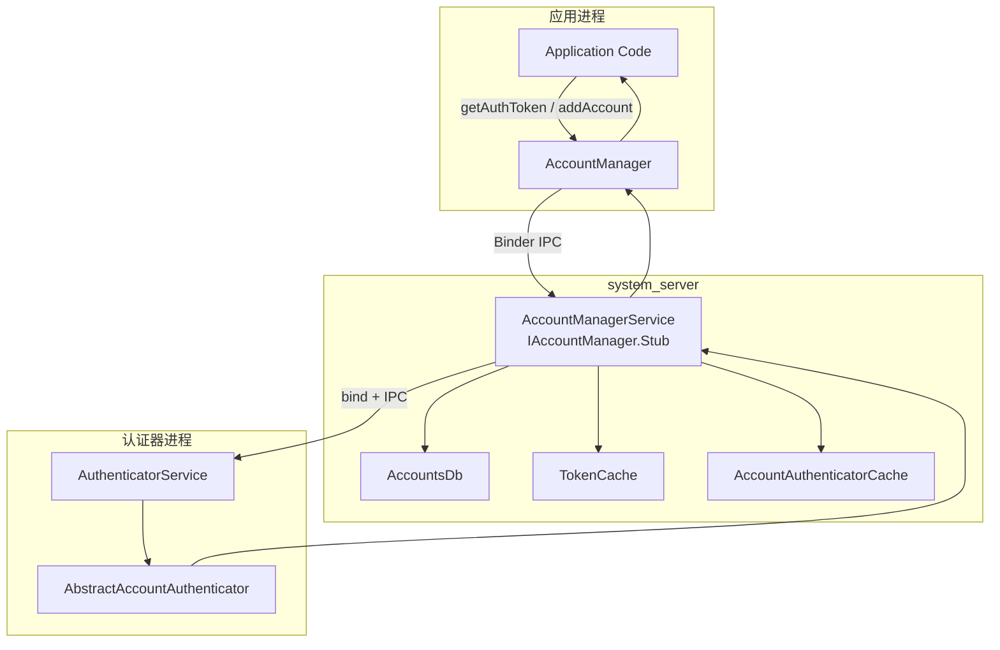

### 32.1.3 `AccountManager`：应用入口

`AccountManager` 通过 `Context.getSystemService(Context.ACCOUNT_SERVICE)` 获取，是应用侧的标准入口。

常见 API 如下：

| 方法 | 用途 | 返回 |
|---|---|---|
| `getAccounts()` | 获取设备上可见账户 | `Account[]` |
| `getAccountsByType(type)` | 按账户类型过滤 | `Account[]` |
| `getAccountsByTypeAndFeatures(...)` | 按特性异步过滤 | `AccountManagerFuture` |
| `addAccount(type, ...)` | 发起新增账户流程 | Future |
| `removeAccount(account, ...)` | 删除账户 | Future |
| `getAuthToken(account, type, ...)` | 获取认证 token | Future |
| `invalidateAuthToken(type, token)` | 使 token 失效 | `void` |
| `setAuthToken(account, type, token)` | 手动写入 token | `void` |
| `getPassword(account)` | 读取密码 | `String` |
| `setPassword(account, password)` | 写入密码 | `void` |
| `addAccountExplicitly(...)` | 无 UI 直接添加 | `boolean` |
| `setUserData(account, key, value)` | 账户维度 KV 数据 | `void` |
| `getUserData(account, key)` | 读取账户扩展数据 | `String` |
| `addOnAccountsUpdatedListener(...)` | 监听账户变化 | `void` |

### 32.1.4 账户数据模型

`Account` 自身非常简单，只是 `(name, type)` 二元组：

```java
public class Account implements Parcelable {
    public final String name;
    public final String type;
}
```

这里真正关键的是 `type`。它必须和 authenticator XML 中声明的 `android:accountType` 对应，否则 `AccountManagerService` 就无法把账户和认证器关联起来。

相关类型：

| 类 | 作用 |
|---|---|
| `Account` | `(name, type)` 基础值对象 |
| `AccountAndUser` | 账户 + userId 的内部表示 |
| `AuthenticatorDescription` | 认证器元数据 |
| `AccountAuthenticatorResponse` | 返回异步结果的回调通道 |

### 32.1.5 账户可见性

Android 8.0 之后，账户访问不再是粗放的 `GET_ACCOUNTS` 模型，而是精细到“某个包对某个账户是否可见”：

| 可见性 | 常量 | 含义 |
|---|---|---|
| 不可见 | `VISIBILITY_NOT_VISIBLE` | 应用看不到这个账户 |
| 用户管理可见 | `VISIBILITY_USER_MANAGED_VISIBLE` | 用户授权后可见 |
| 可见 | `VISIBILITY_VISIBLE` | 总是可见 |
| 未定义 | `VISIBILITY_UNDEFINED` | 回退到账户类型默认策略 |

```java
accountManager.setAccountVisibility(
    account,
    "com.example.app",
    AccountManager.VISIBILITY_VISIBLE
);

int visibility = accountManager.getAccountVisibility(
    account,
    "com.example.app"
);
```

这套设计把“应用能否列出某账户”从一个全局权限问题，变成了按账户、按包、按用户的策略问题。

### 32.1.6 `AccountManagerFuture`

绝大多数账户操作都不是即时本地方法，而是跨进程、可能带 UI、甚至可能触网的异步事务，因此 `AccountManager` 以 `AccountManagerFuture<Bundle>` 作为统一结果模式：

```java
accountManager.getAuthToken(
    account, "oauth2:email", null, activity,
    new AccountManagerCallback<Bundle>() {
        @Override
        public void run(AccountManagerFuture<Bundle> future) {
            try {
                Bundle result = future.getResult();
                String token = result.getString(AccountManager.KEY_AUTHTOKEN);
            } catch (AuthenticatorException
                    | OperationCanceledException
                    | IOException e) {
                // handle error
            }
        }
    },
    handler
);
```

阻塞式 `getResult()` 也可用，但绝不能跑在 UI 线程上。

常见结果字段：

| Key | 类型 | 说明 |
|---|---|---|
| `KEY_ACCOUNT_NAME` | `String` | 账户名 |
| `KEY_ACCOUNT_TYPE` | `String` | 账户类型 |
| `KEY_AUTHTOKEN` | `String` | 认证 token |
| `KEY_INTENT` | `Intent` | 需要用户交互时返回的 UI |
| `KEY_BOOLEAN_RESULT` | `boolean` | 布尔结果 |
| `KEY_ERROR_CODE` | `int` | 错误码 |
| `KEY_ERROR_MESSAGE` | `String` | 错误描述 |
| `KEY_USERDATA` | `Bundle` | 账户扩展数据 |

### 32.1.7 账户变化监听

应用可以监听账户增删改：

```java
accountManager.addOnAccountsUpdatedListener(
    new OnAccountsUpdateListener() {
        @Override
        public void onAccountsUpdated(Account[] accounts) {
            // accounts changed
        }
    },
    handler,
    true
);
```

从服务端视角，这本质上是 `AccountManagerService` 为每个用户维护回调列表，在账户数据变化后通知观察者。

### 32.1.8 账户广播

账户变化也会触发广播：

| 广播 | 触发时机 |
|---|---|
| `AccountManager.LOGIN_ACCOUNTS_CHANGED_ACTION` | 账户新增 / 删除 |
| `AccountManager.ACTION_ACCOUNT_REMOVED` | 特定账户被移除 |
| `AccountManager.ACTION_VISIBLE_ACCOUNTS_CHANGED` | 可见性变化 |

这让同步适配器和相关 UI 能在账户变动时及时响应，而不是靠轮询。

---

## 32.2 `AccountManagerService`

### 32.2.1 服务注册

`AccountManagerService` 在 `system_server` 启动过程中注册为系统服务：

```java
public static class Lifecycle extends SystemService {
    private AccountManagerService mService;

    @Override
    public void onStart() {
        mService = new AccountManagerService(getContext());
        publishBinderService(Context.ACCOUNT_SERVICE, mService);
    }

    @Override
    public void onUserUnlocking(TargetUser user) {
        mService.onUserUnlocked(user);
    }
}
```

这里要注意两点：

- 它是标准 Binder 服务，名字就是 `Context.ACCOUNT_SERVICE`
- 它显式处理 `onUserUnlocking()`，因为账户数据分布在 DE / CE 两套存储中，用户解锁会改变可访问范围

### 32.2.2 按用户存储

`AccountManagerService` 为每个 Android user 分别维护账户数据，而且每个用户再拆成 DE / CE 两个数据库：

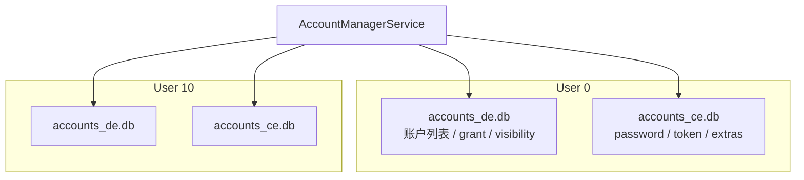

对应路径通常是：

- `/data/system_de/<userId>/accounts_de.db`
- `/data/system_ce/<userId>/accounts_ce.db`

两类存储的职责：

| 存储 | 可用时机 | 内容 |
|---|---|---|
| DE | 开机后即可 | 账户名、类型、grant、visibility |
| CE | 用户解锁后 | 密码、auth token、extras |

这和 Direct Boot 模型严格对齐，既满足“未解锁前可枚举基础账户信息”，又避免敏感凭据过早暴露。

### 32.2.3 `AccountsDb` 表结构

`AccountsDb` 管理底层 SQLite。

CE 数据库主要表：

| 表 | 列 | 作用 |
|---|---|---|
| `accounts` | `_id`, `name`, `type`, `password`, `previous_name`, `last_password_entry_time_millis_epoch` | 账户主体 |
| `authtokens` | `_id`, `accounts_id`, `type`, `authtoken` | 缓存 token |
| `extras` | `_id`, `accounts_id`, `key`, `value` | 扩展 KV 数据 |

DE 数据库主要表：

| 表 | 列 | 作用 |
|---|---|---|
| `accounts` | `_id`, `name`, `type` | 基础账户列表 |
| `grants` | `accounts_id`, `auth_token_type`, `uid` | 哪个 UID 可访问什么 token |
| `visibility` | `accounts_id`, `_package`, `value` | 按包账户可见性 |
| `shared_accounts` | `_id`, `name`, `type` | 跨 profile 共享账户 |
| `meta` | `key`, `value` | 服务元数据 |
| `debug_table` | 多字段 | 审计 / 调试信息 |

### 32.2.4 `UserAccounts`

AMS 内部会为每个 user 维护 `UserAccounts`：

```java
static class UserAccounts {
    final int userId;
    final AccountsDb accountsDb;
    final HashMap<Account, HashMap<String, String>> userDataCache;
    final HashMap<Account, HashMap<String, String>> authTokenCache;
    final TokenCache tokenCache;
    final Object cacheLock;
    final Object dbLock;
}
```

从工程上看，这个对象就是“某个用户的账户命名空间”。多用户设备上，AMS 实际上同时管理多份彼此隔离的账户世界。

### 32.2.5 `TokenCache`

`TokenCache` 是内存中的 LRU token 缓存，减少重复绑定 authenticator 或重复触网：

```java
class TokenCache {
    private static final int MAX_CACHE_CHARS = 64000;

    static class Value {
        public final String token;
        public final long expiryEpochMillis;
    }

    private static class Key {
        public final Account account;
        public final String packageName;
        public final String tokenType;
        public final byte[] sigDigest;
    }
}
```

最重要的不是 LRU，而是 key 里包含了 `sigDigest`。这意味着即便两个应用包名相同，只要签名不同，也不能互相复用 token，防止签名伪造或替换包名导致的凭据泄漏。

### 32.2.6 认证器发现与绑定

AMS 通过 `AccountAuthenticatorCache`（继承自 `RegisteredServicesCache`）扫描所有声明了 `android.accounts.AccountAuthenticator` 的服务：

```xml
<service android:name=".auth.AuthService"
         android:exported="true">
    <intent-filter>
        <action android:name="android.accounts.AccountAuthenticator" />
    </intent-filter>
    <meta-data
        android:name="android.accounts.AccountAuthenticator"
        android:resource="@xml/authenticator" />
</service>
```

发现和调用流程如下：

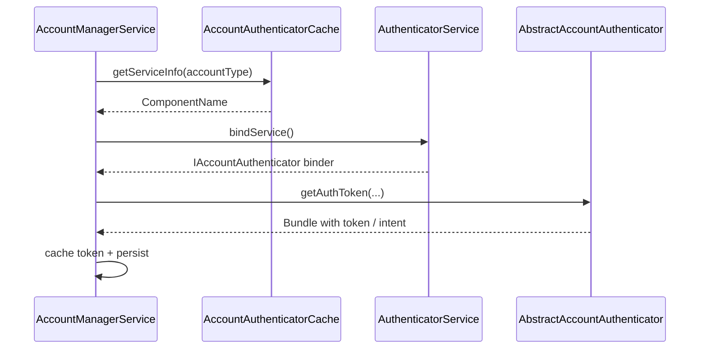

### 32.2.7 `CryptoHelper`

`CryptoHelper` 用于 session-based account addition 中的会话 bundle 加解密。它使用设备侧密钥保护“尚未最终落库的账户会话数据”，尤其适合跨设备迁移或多阶段添加流程。

### 32.2.8 Shell 调试

AMS 暴露了简单但实用的 shell 入口：

```bash
# 列出账户
adb shell cmd account list-accounts

# 查看服务状态
adb shell dumpsys account
```

### 32.2.9 会话式加账户

Android 7.0 之后，引入了更安全的两阶段加账户流程：

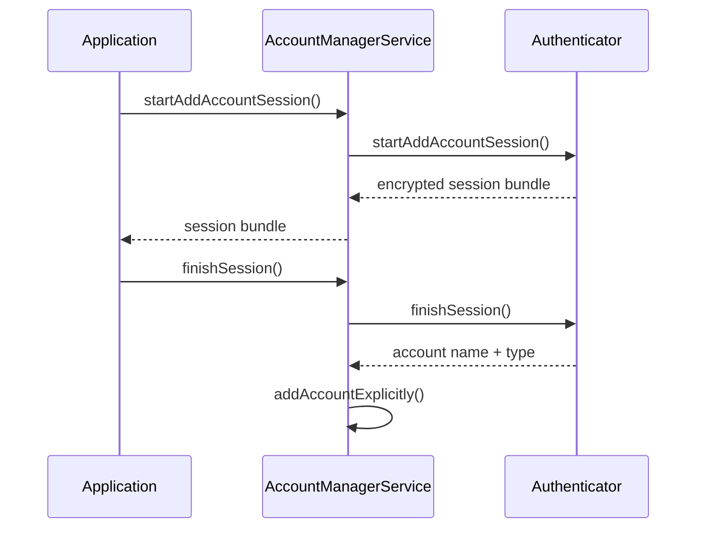

这种设计把“用户交互 / 迁移上下文”和“真正写入账户数据库”拆开，减少中间态泄露和流程劫持风险。

### 32.2.10 权限模型

AMS 权限控制是分层的：

| 操作 | 要求 |
|---|---|
| `getAccounts()` | 调用方对账户可见 |
| `getAccountsByType(type)` | 对该类型账户可见 |
| `addAccountExplicitly()` | 与 authenticator 同签名，或系统 `ACCOUNT_MANAGER` 权限 |
| `removeAccount()` | 系统权限，或账户拥有者 |
| `getAuthToken()` | 用户授权 grant，或同一 authenticator |
| `getPassword()` | 与 authenticator 同 UID |
| `setPassword()` | 与 authenticator 同 UID |
| 跨用户操作 | `INTERACT_ACROSS_USERS_FULL` |

这里的关键不是“系统权限很多”，而是所有敏感操作都必须同时满足用户可见性、账户归属和调用者身份校验。

---

## 32.3 账户认证

### 32.3.1 `AbstractAccountAuthenticator`

三方或 OEM 认证器都要继承 `AbstractAccountAuthenticator`。它通过内部 `Transport` 类实现 `IAccountAuthenticator.Stub`，把 Binder 细节和异常处理封装起来：

```java
public abstract class AbstractAccountAuthenticator {

    private class Transport extends IAccountAuthenticator.Stub {
        @Override
        public void getAuthToken(IAccountAuthenticatorResponse response,
                Account account, String authTokenType, Bundle options) {
            Bundle result = AbstractAccountAuthenticator.this
                .getAuthToken(new AccountAuthenticatorResponse(response),
                    account, authTokenType, options);
            if (result != null) {
                response.onResult(result);
            }
        }
    }

    public abstract Bundle addAccount(...);
    public abstract Bundle getAuthToken(...);
    public abstract String getAuthTokenLabel(String authTokenType);
    public abstract Bundle confirmCredentials(...);
    public abstract Bundle updateCredentials(...);
    public abstract Bundle hasFeatures(...);
    public abstract Bundle editProperties(...);
}
```

它本质上把“认证器是一个 Binder 服务”抽象成了“认证器只用实现一组语义方法”。

### 32.3.2 token 获取链路

最典型的认证链路是 `getAuthToken()`：

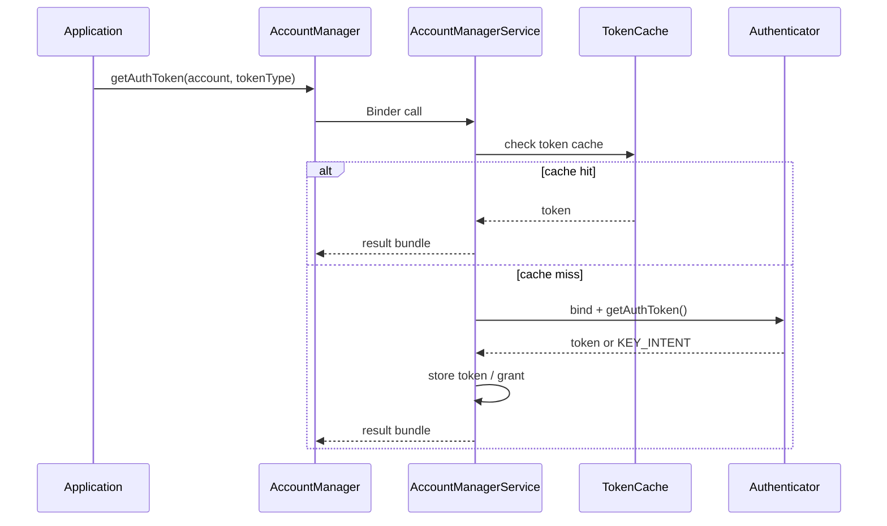

如果认证器返回的是 `KEY_INTENT` 而不是 `KEY_AUTHTOKEN`，说明当前需要用户交互，例如重新登录、二次确认或授权。

### 32.3.3 token 失效

`invalidateAuthToken(type, token)` 的本质是让缓存和持久化状态中的旧 token 失效。后续再请求相同 token 时，AMS 会重新走 authenticator。

这通常用于：

- 服务端明确返回 token 过期
- 用户改密码
- 账号安全策略变化

### 32.3.4 token 过期

`TokenCache.Value` 内部有 `expiryEpochMillis`，说明 token 不是无限可用。AMS 会同时考虑：

- 内存 LRU 中是否命中
- token 是否已经过期
- 持久化 token 是否还允许复用

过期并不必然表示账户失效，只是触发重新换 token。

### 32.3.5 实现一个 authenticator

典型认证器需要：

1. 一个继承 `AbstractAccountAuthenticator` 的实现类。
2. 一个导出 `android.accounts.AccountAuthenticator` 的 Service。
3. 一个描述账户类型、图标、标签、偏好的 authenticator XML。
4. 必要时，一个用于用户登录或确认授权的 Activity。

核心思路：

- `addAccount()` 负责新增账户入口
- `getAuthToken()` 负责返回 token 或要求交互
- `hasFeatures()` 负责能力声明
- `confirmCredentials()` / `updateCredentials()` 负责凭据校验与更新

### 32.3.6 `AccountAuthenticatorActivity`

当 authenticator 需要 UI 时，通常会借助 `AccountAuthenticatorActivity`。它负责把结果包装回 `AccountAuthenticatorResponse`，避免 Activity 自己处理太多 Binder 协议细节。

### 32.3.7 跨 profile 账户共享

多用户 / 工作资料场景下，账户是否共享不是默认行为。AMS 需要结合：

- 当前 userId
- `shared_accounts`
- profile / parent 关系
- 账户可见性策略

来决定某个 profile 是否能看到或继承父用户账户。

### 32.3.8 认证流程图

下面这张图总结了应用、AMS 与认证器之间的常见认证关系：

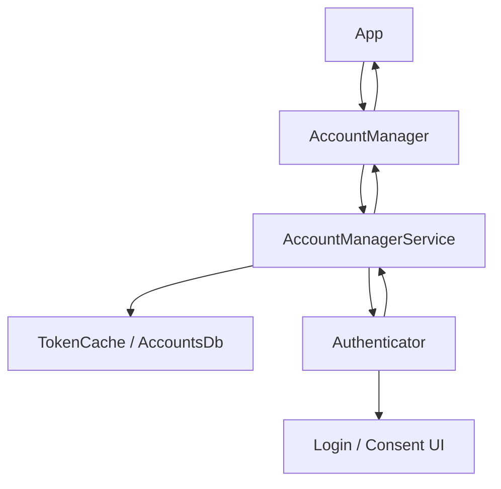

---

## 32.4 `SyncManager`

### 32.4.1 架构概览

`SyncManager` 不负责真正“同步什么数据”，而是负责“什么时候、在哪个进程、以什么约束去执行同步”。真正的业务逻辑在 sync adapter 中：

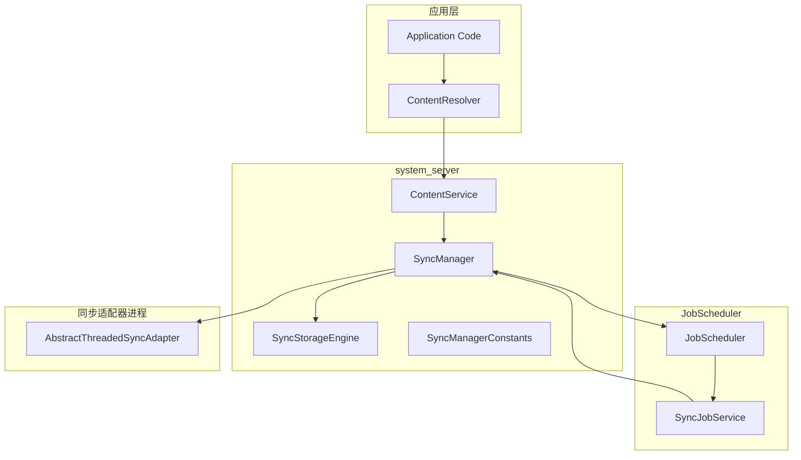

源码注释里最值得注意的一句是：所有 scheduled sync 最终都交给 JobScheduler。也就是说，现代 Android 里同步框架已经彻底成为 JobScheduler 生态的一部分。

### 32.4.2 初始化

`SyncManager` 在 `ContentService` 启动时构造，并初始化多项子系统：

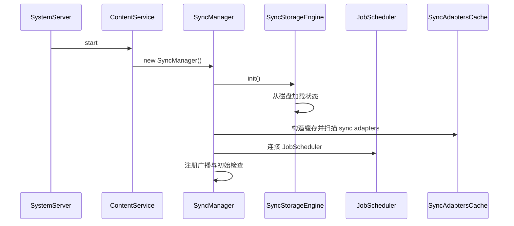

### 32.4.3 `SyncOperation`

每个同步请求最终都会被表示成一个 `SyncOperation`：

```java
public class SyncOperation {
    public final SyncStorageEngine.EndPoint target;
    public final int owningUid;
    public final String owningPackage;
    public final int reason;
    public final int syncSource;
    public final boolean allowParallelSyncs;
    public final boolean isPeriodic;
    public final int sourcePeriodicId;
    public final String key;
    public final long periodMillis;
    public final long flexMillis;
    private volatile Bundle mImmutableExtras;
}
```

几个重要字段：

- `target`：`account + authority + userId`
- `reason`：为什么触发这次同步
- `syncSource`：来源是用户、周期还是系统变更
- `key`：用于去重
- `periodMillis` / `flexMillis`：周期同步参数

常见 `reason` 包括：

| 常量 | 含义 |
|---|---|
| `REASON_BACKGROUND_DATA_SETTINGS_CHANGED` | 数据设置变化 |
| `REASON_ACCOUNTS_UPDATED` | 账户变化 |
| `REASON_SERVICE_CHANGED` | sync adapter 变更 |
| `REASON_PERIODIC` | 周期触发 |
| `REASON_IS_SYNCABLE` | authority 变得可同步 |
| `REASON_SYNC_AUTO` | 自动同步开启 |
| `REASON_MASTER_SYNC_AUTO` | 全局主开关开启 |
| `REASON_USER_START` | 用户手动触发 |

### 32.4.4 通过 JobScheduler 调度

`SyncManager` 会把 `SyncOperation` 转成 `JobInfo`：

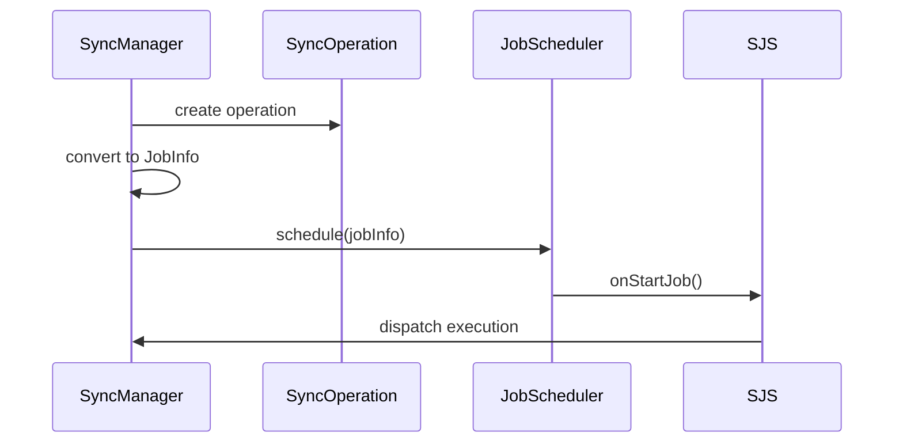

桥接类 `SyncJobService` 很直接：

```java
public class SyncJobService extends JobService {
    @Override
    public boolean onStartJob(JobParameters params) {
        SyncOperation op = SyncOperation.maybeCreateFromJobExtras(params.getExtras());
        return true;
    }

    @Override
    public boolean onStopJob(JobParameters params) {
        return false;
    }
}
```

从设计上看，这让 Sync 框架天然继承了 JobScheduler 的网络、待机、电量和批处理能力。

### 32.4.5 同步执行

任务真正触发后，`SyncManager` 会绑定 sync adapter 并执行：

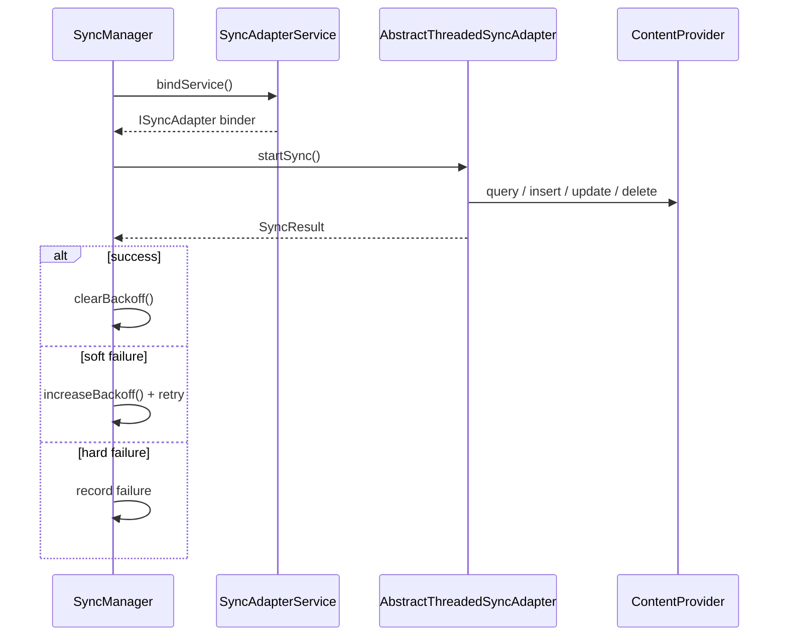

### 32.4.6 sync adapter 发现

`SyncAdaptersCache` 会扫描声明了 `android.content.SyncAdapter` 的服务：

```xml
<intent-filter>
    <action android:name="android.content.SyncAdapter" />
</intent-filter>
<meta-data
    android:name="android.content.SyncAdapter"
    android:resource="@xml/syncadapter" />
```

`syncadapter.xml` 常见字段：

| 属性 | 说明 |
|---|---|
| `contentAuthority` | 对应的 `ContentProvider` authority |
| `accountType` | 对应账户类型 |
| `userVisible` | 是否在设置里展示 |
| `supportsUploading` | 是否支持仅上传 |
| `allowParallelSyncs` | 是否允许并行 |
| `isAlwaysSyncable` | 是否默认可同步 |
| `settingsActivity` | 配置页面 |

### 32.4.7 冲突去重

如果多个同步目标完全相同，`SyncManager` 会按 `key` 去重：

```java
void scheduleSyncOperationH(SyncOperation op, long delay) {
    SyncOperation existingOp = findExistingOp(op.key);
    if (existingOp != null) {
        if (existingOp.expectedRuntime <= op.expectedRuntime) {
            return;
        }
        cancelJob(existingOp);
    }
    op.jobId = nextJobId();
    scheduleJob(op, delay);
}
```

去重 key 通常由这些维度构成：

- `Account`
- `authority`
- extras 内容
- 周期 / 单次属性

### 32.4.8 App Standby 与节流

同步框架会受到 App Standby Bucket 影响：

| Bucket | 同步行为 |
|---|---|
| Active | 正常 |
| Working Set | 基本正常 |
| Frequent | 降低频率 |
| Rare | 可能延迟数小时 |
| Restricted | 可能几乎被阻断 |
| Exempted | 免受此类限制 |

源码里还有一个关键参数：

```java
private static final int DEF_MAX_RETRIES_WITH_APP_STANDBY_EXEMPTION = 5;
```

也就是说，失败重试并不是无限享有豁免，超过阈值后仍会回到普通待机节流逻辑。

### 32.4.9 退避与重试

`SyncManagerConstants` 定义了指数退避的默认策略：

| 参数 | 默认值 | 含义 |
|---|---|---|
| `initial_sync_retry_time_in_seconds` | 30 | 首次重试延迟 |
| `retry_time_increase_factor` | 2.0 | 退避倍数 |
| `max_sync_retry_time_in_seconds` | 3600 | 最大退避一小时 |
| `max_retries_with_app_standby_exemption` | 5 | 豁免重试次数 |

典型序列是：`30s -> 60s -> 120s -> 240s -> 480s ...`

### 32.4.10 同步监控

`SyncManager` 会监控正在运行的同步是否有进展：

```java
private static final long SYNC_MONITOR_WINDOW_LENGTH_MILLIS = 60 * 1000;
private static final int SYNC_MONITOR_PROGRESS_THRESHOLD_BYTES = 10;
```

也就是每 60 秒检查一次，若收发流量累计不足 10 字节，可能被认为卡死。

### 32.4.11 WakeLock

同步期间系统会持有 WakeLock，避免设备休眠打断同步：

```java
private static final String SYNC_WAKE_LOCK_PREFIX = "*sync*/";
private static final String HANDLE_SYNC_ALARM_WAKE_LOCK = "SyncManagerHandleSyncAlarm";
private static final String SYNC_LOOP_WAKE_LOCK = "SyncLoopWakeLock";
```

这也让 `dumpsys power` 和 BatteryStats 能把耗电归因到具体 authority。

### 32.4.12 日志

`SyncLogger` 记录：

- 为什么某个同步被调度 / 被跳过
- 执行开始与结束时间
- 结果与统计
- 退避变化
- 账户 / adapter 状态变化

这些信息基本都会反映在 `dumpsys content` 中。

### 32.4.13 `SyncStorageEngine`

`SyncStorageEngine` 负责把同步状态持久化到磁盘：

| 数据 | 持久化方式 | 作用 |
|---|---|---|
| authority 信息 | XML | 同步开关、delay、backoff |
| sync 状态 | Proto | 最近成功 / 失败与统计 |
| pending 操作 | Proto | 尚未执行的操作 |
| master sync | XML 属性 | 全局开关 |
| per-authority auto-sync | XML 属性 | 细粒度开关 |

核心标识类：

```java
public static class EndPoint {
    public final Account account;
    public final String provider;
    public final int userId;
}

public static class AuthorityInfo {
    public final EndPoint target;
    public final int ident;
    public boolean enabled;
    public int syncable;
    public long backoffTime;
    public long backoffDelay;
    public long delayUntil;
}
```

---

## 32.5 `ContentResolver` 同步接口

### 32.5.1 基础 API

应用一般不会直接碰 `SyncManager`，而是通过 `ContentResolver`：

```java
Bundle extras = new Bundle();
extras.putBoolean(ContentResolver.SYNC_EXTRAS_MANUAL, true);
extras.putBoolean(ContentResolver.SYNC_EXTRAS_EXPEDITED, true);
ContentResolver.requestSync(account, authority, extras);

SyncRequest request = new SyncRequest.Builder()
    .setSyncAdapter(account, authority)
    .setManual(true)
    .setExpedited(true)
    .build();
ContentResolver.requestSync(request);
```

### 32.5.2 sync extras

sync extras 是一组控制行为的 `Bundle` 标志：

| Key | 类型 | 含义 |
|---|---|---|
| `SYNC_EXTRAS_MANUAL` | `boolean` | 用户手动同步 |
| `SYNC_EXTRAS_EXPEDITED` | `boolean` | 请求尽快执行 |
| `SYNC_EXTRAS_UPLOAD` | `boolean` | 仅上传本地变更 |
| `SYNC_EXTRAS_FORCE` | `boolean` | 已废弃，改用 MANUAL |
| `SYNC_EXTRAS_IGNORE_SETTINGS` | `boolean` | 忽略自动同步设置 |
| `SYNC_EXTRAS_IGNORE_BACKOFF` | `boolean` | 忽略退避 |
| `SYNC_EXTRAS_DO_NOT_RETRY` | `boolean` | 失败不重试 |
| `SYNC_EXTRAS_INITIALIZE` | `boolean` | 初始化同步 |
| `SYNC_EXTRAS_REQUIRE_CHARGING` | `boolean` | 仅在充电时同步 |
| `SYNC_EXTRAS_SCHEDULE_AS_EXPEDITED_JOB` | `boolean` | 用 expedited job 调度 |

### 32.5.3 周期同步

应用可以注册周期同步：

```java
ContentResolver.addPeriodicSync(
    account,
    "com.example.provider",
    Bundle.EMPTY,
    60 * 60
);

SyncRequest request = new SyncRequest.Builder()
    .syncPeriodic(60 * 60, 10 * 60)
    .setSyncAdapter(account, authority)
    .build();
ContentResolver.requestSync(request);

ContentResolver.removePeriodicSync(account, authority, Bundle.EMPTY);
```

`flex` 的意义是允许系统把多个周期同步对齐批量执行，减少唤醒与网络碎片。

### 32.5.4 自动同步开关

自动同步是双层开关：

```java
ContentResolver.setMasterSyncAutomatically(true);
boolean masterEnabled = ContentResolver.getMasterSyncAutomatically();

ContentResolver.setSyncAutomatically(account, authority, true);
boolean autoSync = ContentResolver.getSyncAutomatically(account, authority);
```

只有全局 master 开关和 account/authority 粒度开关都打开，自动同步才会真正执行。

### 32.5.5 状态观察

应用可以检查同步状态并注册观察器：

```java
boolean active = ContentResolver.isSyncActive(account, authority);
boolean pending = ContentResolver.isSyncPending(account, authority);
SyncStatusInfo status = ContentResolver.getSyncStatus(account, authority);

Object handle = ContentResolver.addStatusChangeListener(
    ContentResolver.SYNC_OBSERVER_TYPE_ACTIVE
        | ContentResolver.SYNC_OBSERVER_TYPE_PENDING
        | ContentResolver.SYNC_OBSERVER_TYPE_SETTINGS,
    which -> {
        // update UI
    }
);
```

### 32.5.6 变更触发同步

本地数据变化也可以推送到同步框架：

```java
resolver.notifyChange(MyContract.CONTENT_URI, null, true);
```

第三个参数 `syncToNetwork=true` 会让 `ContentService` 把变更转给 `SyncManager`。为了合并短时间内的频繁修改，系统通常会加一个 `LOCAL_SYNC_DELAY`（默认约 30 秒）。

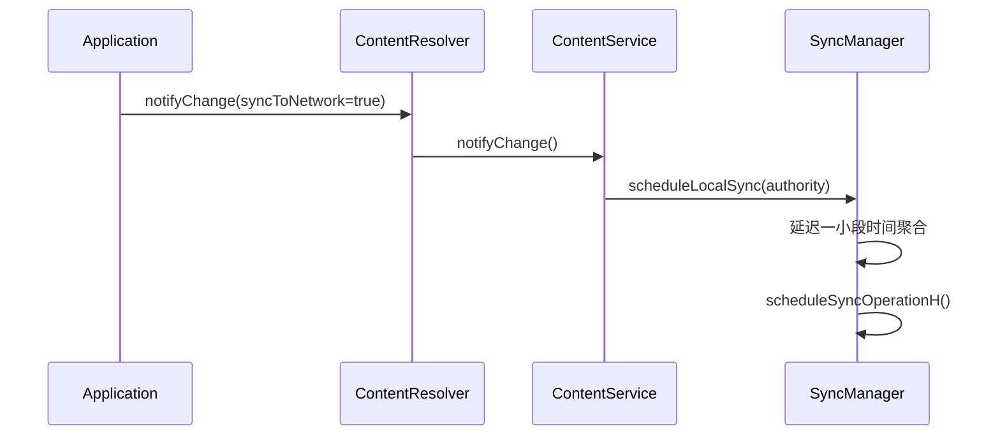

### 32.5.7 同步豁免等级

同步框架内部还定义了优先级豁免：

| 等级 | 含义 | 效果 |
|---|---|---|
| `SYNC_EXEMPTION_NONE` | 普通同步 | 受所有限制 |
| `SYNC_EXEMPTION_PROMOTE_BUCKET` | 临时提升 bucket | 获得更高调度优先级 |
| `SYNC_EXEMPTION_PROMOTE_BUCKET_WITH_TEMP_ALLOWLIST` | bucket 提升 + allowlist | 还能临时获得更强执行权 |

这些豁免通常用于系统发起、又不该被待机策略过度限制的同步。

### 32.5.8 `ContentResolver` 到 `SyncManager` 的流转

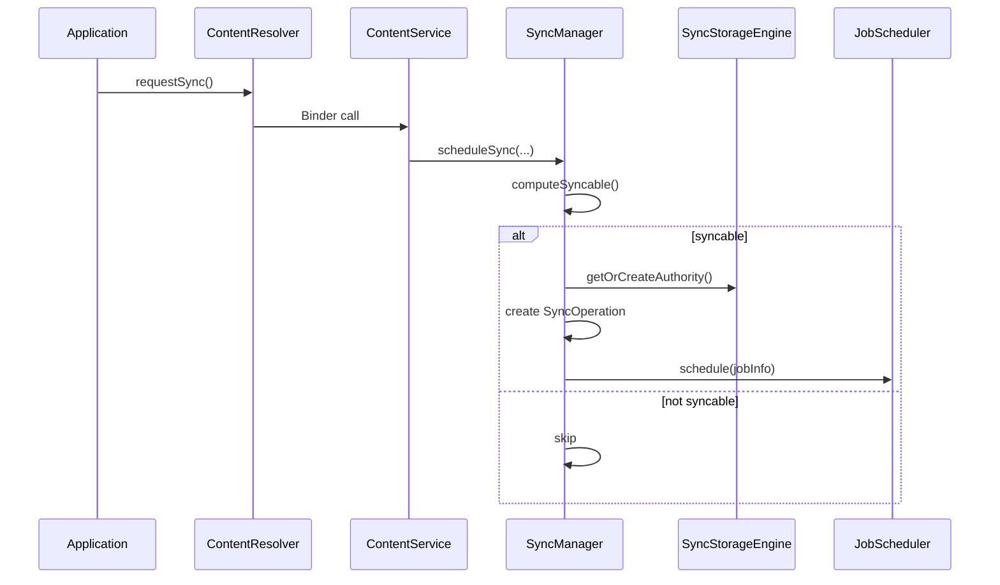

### 32.5.9 `ContentService`

`ContentService` 是同步相关 Binder 请求的实际入口，内部实现 `IContentService`，再把真正的调度交给 `SyncManager`，把设置状态交给 `SyncStorageEngine`：

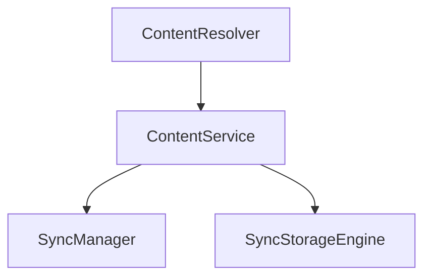

同时它也负责 `ContentObserver`，但“内容观察”与“网络同步”只是共用了一部分入口，并不是同一件事。

### 32.5.10 配置判定矩阵

某次同步最终会不会执行，通常取决于下面这些条件：

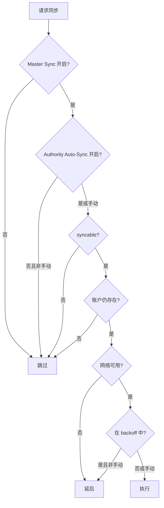

### 32.5.11 实现一个 sync adapter

sync adapter 至少需要三件事：

1. `AbstractThreadedSyncAdapter` 实现。
2. 对应的 `Service`。
3. `syncadapter.xml` 与 Manifest 声明。

典型同步器：

```java
public class MySyncAdapter extends AbstractThreadedSyncAdapter {

    public MySyncAdapter(Context context, boolean autoInitialize) {
        super(context, autoInitialize);
    }

    @Override
    public void onPerformSync(Account account, Bundle extras,
            String authority, ContentProviderClient provider,
            SyncResult syncResult) {
        try {
            AccountManager am = AccountManager.get(getContext());
            String token = am.blockingGetAuthToken(account,
                "com.example.sync", true);

            List<Item> remoteItems = myApi.fetchChanges(token);
            ContentResolver resolver = getContext().getContentResolver();
            for (Item item : remoteItems) {
                resolver.insert(MyContract.CONTENT_URI, item.toContentValues());
            }
        } catch (AuthenticatorException | OperationCanceledException e) {
            syncResult.stats.numAuthExceptions++;
        } catch (IOException e) {
            syncResult.stats.numIoExceptions++;
        }
    }
}
```

Service：

```java
public class SyncService extends Service {
    private static MySyncAdapter syncAdapter;
    private static final Object lock = new Object();

    @Override
    public void onCreate() {
        synchronized (lock) {
            if (syncAdapter == null) {
                syncAdapter = new MySyncAdapter(this, true);
            }
        }
    }

    @Override
    public IBinder onBind(Intent intent) {
        return syncAdapter.getSyncAdapterBinder();
    }
}
```

`res/xml/syncadapter.xml`：

```xml
<sync-adapter
    xmlns:android="http://schemas.android.com/apk/res/android"
    android:contentAuthority="com.example.provider"
    android:accountType="com.example.myapp"
    android:userVisible="true"
    android:supportsUploading="true"
    android:allowParallelSyncs="false"
    android:isAlwaysSyncable="true" />
```

Manifest：

```xml
<service
    android:name=".sync.SyncService"
    android:exported="true">
    <intent-filter>
        <action android:name="android.content.SyncAdapter" />
    </intent-filter>
    <meta-data
        android:name="android.content.SyncAdapter"
        android:resource="@xml/syncadapter" />
</service>
```

### 32.5.12 `SyncResult`

同步结果通过 `SyncResult` 回传给 `SyncManager`：

```java
public final class SyncResult implements Parcelable {
    public boolean tooManyRetries;
    public boolean tooManyDeletions;
    public boolean databaseError;
    public boolean fullSyncRequested;
    public boolean partialSyncUnavailable;
    public boolean moreRecordsToGet;
    public long delayUntil;
    public final SyncStats stats;
}

public class SyncStats implements Parcelable {
    public long numAuthExceptions;
    public long numIoExceptions;
    public long numParseExceptions;
    public long numConflictDetectedExceptions;
    public long numInserts;
    public long numUpdates;
    public long numDeletes;
    public long numEntries;
    public long numSkippedEntries;
}
```

服务端对结果的典型解释：

| 条件 | 动作 |
|---|---|
| `numAuthExceptions > 0` | 软错误，退避重试 |
| `numIoExceptions > 0` | 软错误，退避重试 |
| `tooManyDeletions` | 提示用户，可能暂停同步 |
| `fullSyncRequested` | 后续安排全量同步 |
| `delayUntil > 0` | 推迟下次同步 |
| 无错误 | 清理退避并更新成功时间 |

---

## 32.6 动手实践

### 32.6.1 列出所有账户

```java
import android.accounts.Account;
import android.accounts.AccountManager;

public class AccountLister {

    public void listAccounts(Context context) {
        AccountManager am = AccountManager.get(context);
        Account[] accounts = am.getAccounts();
        for (Account account : accounts) {
            Log.i("AccountLister", account.name + " / " + account.type);
        }
    }
}
```

观察点：

- 应用只能看到自己有权限看到的账户
- 不同用户下看到的账户集合不同
- work profile 与主用户的账户视图可能不一致

### 32.6.2 自定义 authenticator

最小 authenticator 例子：

```java
public class DemoAuthenticator extends AbstractAccountAuthenticator {

    public DemoAuthenticator(Context context) {
        super(context);
    }

    @Override
    public Bundle addAccount(AccountAuthenticatorResponse response,
            String accountType, String authTokenType, String[] requiredFeatures,
            Bundle options) {
        Bundle result = new Bundle();
        Intent intent = new Intent(mContext, LoginActivity.class);
        intent.putExtra(AccountManager.KEY_ACCOUNT_AUTHENTICATOR_RESPONSE, response);
        result.putParcelable(AccountManager.KEY_INTENT, intent);
        return result;
    }

    @Override
    public Bundle getAuthToken(AccountAuthenticatorResponse response,
            Account account, String authTokenType, Bundle options) {
        Bundle result = new Bundle();
        result.putString(AccountManager.KEY_ACCOUNT_NAME, account.name);
        result.putString(AccountManager.KEY_ACCOUNT_TYPE, account.type);
        result.putString(AccountManager.KEY_AUTHTOKEN, "demo-token");
        return result;
    }
}
```

还需要：

- Authenticator Service
- authenticator XML
- Manifest 声明

### 32.6.3 自定义 sync adapter

最小 sync adapter：

```java
public class DemoSyncAdapter extends AbstractThreadedSyncAdapter {

    public DemoSyncAdapter(Context context, boolean autoInitialize) {
        super(context, autoInitialize);
    }

    @Override
    public void onPerformSync(Account account, Bundle extras,
            String authority, ContentProviderClient provider,
            SyncResult syncResult) {
        try {
            Thread.sleep(1000);
            Log.i("DemoSync", "Sync complete");
        } catch (InterruptedException e) {
            syncResult.stats.numIoExceptions++;
        }
    }
}
```

配套 Service：

```java
public class SyncService extends Service {
    private static DemoSyncAdapter syncAdapter;
    private static final Object LOCK = new Object();

    @Override
    public void onCreate() {
        synchronized (LOCK) {
            if (syncAdapter == null) {
                syncAdapter = new DemoSyncAdapter(this, true);
            }
        }
    }

    @Override
    public IBinder onBind(Intent intent) {
        return syncAdapter.getSyncAdapterBinder();
    }
}
```

必要 Manifest 和 XML：

```xml
<service android:name=".SyncService" android:exported="true">
    <intent-filter>
        <action android:name="android.content.SyncAdapter" />
    </intent-filter>
    <meta-data
        android:name="android.content.SyncAdapter"
        android:resource="@xml/syncadapter" />
</service>

<provider
    android:name=".StubProvider"
    android:authorities="com.example.demo.provider"
    android:exported="false"
    android:syncable="true" />
```

```xml
<sync-adapter
    xmlns:android="http://schemas.android.com/apk/res/android"
    android:contentAuthority="com.example.demo.provider"
    android:accountType="com.example.demo"
    android:userVisible="true"
    android:supportsUploading="true"
    android:allowParallelSyncs="false"
    android:isAlwaysSyncable="true" />
```

手动触发同步：

```java
Account account = new Account("demo@example.com", "com.example.demo");
Bundle extras = new Bundle();
extras.putBoolean(ContentResolver.SYNC_EXTRAS_MANUAL, true);
extras.putBoolean(ContentResolver.SYNC_EXTRAS_EXPEDITED, true);
ContentResolver.requestSync(account, "com.example.demo.provider", extras);
```

### 32.6.4 周期同步配置

```java
Account account = new Account("demo@example.com", "com.example.demo");
String authority = "com.example.demo.provider";

ContentResolver.setSyncAutomatically(account, authority, true);
ContentResolver.addPeriodicSync(account, authority, Bundle.EMPTY, 15 * 60);

boolean active = ContentResolver.isSyncActive(account, authority);
boolean pending = ContentResolver.isSyncPending(account, authority);
boolean autoSync = ContentResolver.getSyncAutomatically(account, authority);
boolean masterSync = ContentResolver.getMasterSyncAutomatically();
```

观察点：

- 周期同步内部会映射成 JobScheduler job
- flex window 有助于批处理
- global master toggle 会覆盖单 authority 设置

### 32.6.5 用 `dumpsys` 调试

```bash
# 查看账户状态
adb shell dumpsys account

# 查看同步状态
adb shell dumpsys content

# 通过 adb 强制同步
adb shell content sync --account demo@example.com \
    --authority com.example.demo.provider

# 查看 jobscheduler 中的同步 job
adb shell dumpsys jobscheduler | grep -i sync

# 实时观察同步
adb logcat -s SyncManager:V SyncJobService:V
```

重点关注：

- 账户列表与认证器注册情况
- token cache 与 visibility
- active / pending sync
- backoff 与 periodic schedule

### 32.6.6 源码探索

```bash
# AccountManagerService 代码量
wc -l frameworks/base/services/core/java/com/android/server/accounts/AccountManagerService.java

# SyncManager 代码量
wc -l frameworks/base/services/core/java/com/android/server/content/SyncManager.java

# 账户相关 AIDL
find frameworks/base/core/java/android/accounts/ -name "*.aidl"

# 查看账户数据库建表语句
grep "CREATE TABLE" \
    frameworks/base/services/core/java/com/android/server/accounts/AccountsDb.java

# 查找 SyncOperation 的 REASON 常量
grep "REASON_" \
    frameworks/base/services/core/java/com/android/server/content/SyncOperation.java

# 查看 SyncManagerConstants 默认参数
grep "DEF_" \
    frameworks/base/services/core/java/com/android/server/content/SyncManagerConstants.java
```

适合重点看的源码文件：

- `AccountManagerService.java`
- `AccountsDb.java`
- `TokenCache.java`
- `SyncManager.java`
- `SyncStorageEngine.java`
- `SyncOperation.java`
- `SyncJobService.java`

---

## 总结（Summary）

Android 的账户与同步框架是一套非常成熟的基础设施。它把“账户身份与 token 管理”和“后台数据同步调度”拆成两个服务，但又通过账户类型、authority、sync adapter 和 JobScheduler 紧密耦合在一起。

本章关键点如下：

1. `AccountManager` 是应用入口，`AccountManagerService` 是系统权威实现，而 `AbstractAccountAuthenticator` 提供可插拔认证逻辑。
2. 账户数据按用户隔离，并进一步拆成 DE / CE 两类数据库，以兼容 Direct Boot 与敏感凭据保护。
3. `TokenCache` 通过带签名摘要的 key 做内存级 LRU 缓存，既减少认证器开销，也防止跨应用误取 token。
4. `SyncManager` 不做业务同步本身，而是负责把同步请求表示成 `SyncOperation`，再通过 JobScheduler 调度执行。
5. 同步框架同时受 auto-sync 开关、authority syncable 状态、网络、backoff、App Standby 和 exemption 策略影响。
6. `ContentResolver` 是同步 API 的主要入口，而 `ContentService` 则是应用进程到 `SyncManager` 的 Binder 桥梁。
7. `SyncStorageEngine`、`SyncLogger` 和 `dumpsys content` 共同提供了同步状态持久化、审计和调试支撑。

### 关键源码文件参考

| 文件 | 作用 |
|---|---|
| `frameworks/base/core/java/android/accounts/AccountManager.java` | 应用侧账户 API |
| `frameworks/base/core/java/android/accounts/AbstractAccountAuthenticator.java` | 认证器基类 |
| `frameworks/base/core/java/android/accounts/IAccountManager.aidl` | 账户服务 AIDL |
| `frameworks/base/core/java/android/accounts/IAccountAuthenticator.aidl` | 认证器 AIDL |
| `frameworks/base/services/core/java/com/android/server/accounts/AccountManagerService.java` | 账户服务核心实现 |
| `frameworks/base/services/core/java/com/android/server/accounts/AccountsDb.java` | 账户数据库层 |
| `frameworks/base/services/core/java/com/android/server/accounts/TokenCache.java` | token 缓存 |
| `frameworks/base/services/core/java/com/android/server/accounts/AccountAuthenticatorCache.java` | 认证器发现与缓存 |
| `frameworks/base/services/core/java/com/android/server/content/ContentService.java` | 同步 Binder 入口 |
| `frameworks/base/services/core/java/com/android/server/content/SyncManager.java` | 同步调度核心 |
| `frameworks/base/services/core/java/com/android/server/content/SyncOperation.java` | 同步任务表示 |
| `frameworks/base/services/core/java/com/android/server/content/SyncStorageEngine.java` | 同步状态持久化 |
| `frameworks/base/services/core/java/com/android/server/content/SyncJobService.java` | JobScheduler 桥接 |
