# Chapter 32: Account and Sync Framework

> *"The Account and Sync framework is the invisible plumbing that keeps your
> email in sync, your contacts current, and your calendar up to date -- all
> while respecting battery budgets, network constraints, and the user's
> explicit synchronization preferences."*

Android's Account and Sync framework provides two tightly coupled
subsystems: **AccountManager** for credential storage and authentication
token management, and **SyncManager** for scheduling and executing
background data synchronization.  Together they form the backbone of every
application that synchronizes data with a remote server -- from email and
contacts to enterprise MDM and third-party cloud services.

This chapter traces the entire architecture from the application-facing
`AccountManager` and `ContentResolver.requestSync()` APIs, through the
system server implementations (`AccountManagerService` and `SyncManager`),
down to the underlying database storage and JobScheduler integration.

---

## 32.1 AccountManager Architecture

### 32.1.1 The Three-Layer Design

The account subsystem follows AOSP's standard layered architecture:

1. **Framework API (Java)** -- `android.accounts.AccountManager` is the
   application-facing class that provides account discovery, credential
   management, and auth token retrieval.

2. **System Service** -- `AccountManagerService` runs inside `system_server`
   and implements the `IAccountManager` AIDL interface.  It manages the
   account database, authenticator bindings, and token cache.

3. **Authenticator Plugins** -- Third-party or OEM-supplied
   `AbstractAccountAuthenticator` implementations that handle the actual
   credential validation and token generation for each account type.

```
Source paths (key files):
  AccountManager ................. frameworks/base/core/java/android/accounts/AccountManager.java
  Account ........................ frameworks/base/core/java/android/accounts/Account.java
  AbstractAccountAuthenticator ... frameworks/base/core/java/android/accounts/AbstractAccountAuthenticator.java
  IAccountManager.aidl ........... frameworks/base/core/java/android/accounts/IAccountManager.aidl
  IAccountAuthenticator.aidl ..... frameworks/base/core/java/android/accounts/IAccountAuthenticator.aidl
  AccountManagerService .......... frameworks/base/services/core/java/com/android/server/accounts/AccountManagerService.java
  AccountsDb ..................... frameworks/base/services/core/java/com/android/server/accounts/AccountsDb.java
  TokenCache ..................... frameworks/base/services/core/java/com/android/server/accounts/TokenCache.java
  AccountAuthenticatorCache ...... frameworks/base/services/core/java/com/android/server/accounts/AccountAuthenticatorCache.java
```

### 32.1.2 Architecture Diagram

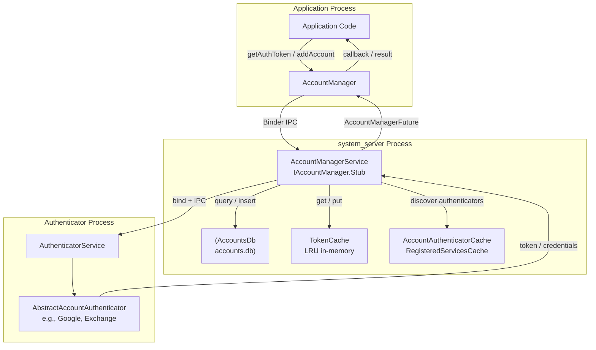

### 32.1.3 AccountManager -- The Application Entry Point

`AccountManager` is obtained via `Context.getSystemService(Context.ACCOUNT_SERVICE)`.
It is annotated with `@SystemService(Context.ACCOUNT_SERVICE)`:

```
Source: frameworks/base/core/java/android/accounts/AccountManager.java
```

The class provides both synchronous and asynchronous operations.  Most
methods return an `AccountManagerFuture<Bundle>` that can be used with
callbacks or blocking `getResult()`:

| Method | Purpose | Returns |
|--------|---------|---------|
| `getAccounts()` | Get all accounts on device | `Account[]` |
| `getAccountsByType(type)` | Get accounts of a specific type | `Account[]` |
| `getAccountsByTypeAndFeatures(...)` | Filter by type and features | Future |
| `addAccount(type, ...)` | Launch UI to add a new account | Future (Bundle with KEY_INTENT) |
| `removeAccount(account, ...)` | Remove an account | Future |
| `getAuthToken(account, type, ...)` | Get an authentication token | Future (Bundle with KEY_AUTHTOKEN) |
| `invalidateAuthToken(type, token)` | Invalidate a cached token | void |
| `setAuthToken(account, type, token)` | Manually set a token | void |
| `getPassword(account)` | Get account password (callers only) | String |
| `setPassword(account, password)` | Set account password | void |
| `addAccountExplicitly(account, password, extras)` | Add account without UI | boolean |
| `setUserData(account, key, value)` | Store per-account key-value data | void |
| `getUserData(account, key)` | Retrieve per-account data | String |
| `addOnAccountsUpdatedListener(...)` | Listen for account changes | void |

### 32.1.4 Account Data Model

The `Account` class is a simple value type with two fields:

```java
// From frameworks/base/core/java/android/accounts/Account.java
public class Account implements Parcelable {
    public final String name;  // e.g., "user@gmail.com"
    public final String type;  // e.g., "com.google"
}
```

The `type` field is the key identifier that connects an account to its
authenticator.  It must match the `android:accountType` attribute declared
in the authenticator's XML metadata.

Related types:

| Class | Purpose |
|-------|---------|
| `Account` | Account name + type pair |
| `AccountAndUser` | Account + userId (internal) |
| `AuthenticatorDescription` | Metadata about a registered authenticator |
| `AccountAuthenticatorResponse` | Callback channel to return results to service |

### 32.1.5 Account Visibility

Android 8.0+ introduced account visibility, which controls which
applications can see which accounts.  This replaced the blanket
`GET_ACCOUNTS` permission model:

| Visibility Level | Constant | Meaning |
|------------------|----------|---------|
| Not visible | `VISIBILITY_NOT_VISIBLE` | App cannot see this account |
| User-managed | `VISIBILITY_USER_MANAGED_VISIBLE` | Visible if user grants access |
| Visible | `VISIBILITY_VISIBLE` | Always visible to this app |
| Undefined | `VISIBILITY_UNDEFINED` | Falls back to authenticator default |

```java
// Set visibility for a specific account + package
accountManager.setAccountVisibility(
    account,
    "com.example.app",
    AccountManager.VISIBILITY_VISIBLE
);

// Check visibility
int visibility = accountManager.getAccountVisibility(
    account,
    "com.example.app"
);
```

### 32.1.6 AccountManagerFuture -- Asynchronous Result Pattern

Most `AccountManager` methods return an `AccountManagerFuture<Bundle>`,
which encapsulates an asynchronous operation:

```
Source: frameworks/base/core/java/android/accounts/AccountManagerFuture.java
        frameworks/base/core/java/android/accounts/AccountManagerCallback.java
```

```java
// Callback-based usage
accountManager.getAuthToken(
    account, "oauth2:email", null, activity,
    new AccountManagerCallback<Bundle>() {
        @Override
        public void run(AccountManagerFuture<Bundle> future) {
            try {
                Bundle result = future.getResult();
                String token = result.getString(AccountManager.KEY_AUTHTOKEN);
                // Use the token
            } catch (AuthenticatorException | OperationCanceledException |
                     IOException e) {
                // Handle error
            }
        }
    },
    handler
);

// Blocking usage (must NOT be called on UI thread)
Bundle result = accountManager.getAuthToken(
    account, "oauth2:email", null, activity,
    null,  // no callback
    null   // no handler
).getResult();  // Blocks until complete
String token = result.getString(AccountManager.KEY_AUTHTOKEN);
```

The result `Bundle` uses standard key constants:

| Key Constant | Type | Description |
|-------------|------|-------------|
| `KEY_ACCOUNT_NAME` | String | Account name |
| `KEY_ACCOUNT_TYPE` | String | Account type |
| `KEY_AUTHTOKEN` | String | Authentication token |
| `KEY_INTENT` | Intent | UI to launch for user interaction |
| `KEY_BOOLEAN_RESULT` | boolean | Boolean result (hasFeatures, etc.) |
| `KEY_ERROR_CODE` | int | Error code from authenticator |
| `KEY_ERROR_MESSAGE` | String | Error message from authenticator |
| `KEY_USERDATA` | Bundle | Per-account user data |

### 32.1.7 Account Change Listeners

Applications can register to receive notifications when accounts change:

```java
// Register for account changes
accountManager.addOnAccountsUpdatedListener(
    new OnAccountsUpdateListener() {
        @Override
        public void onAccountsUpdated(Account[] accounts) {
            // Called when accounts are added, removed, or renamed
            for (Account account : accounts) {
                Log.i(TAG, "Account: " + account.name +
                    " (" + account.type + ")");
            }
        }
    },
    handler,            // Handler for callback delivery
    true                // updateImmediately -- fire callback now with current accounts
);

// Type-filtered listener (API 26+)
accountManager.addOnAccountsUpdatedListener(
    listener,
    handler,
    true,
    new String[]{"com.google"}  // Only notify for Google accounts
);
```

Internally, `AccountManagerService` maintains a
`RemoteCallbackList<IAccountManagerResponse>` for each user and delivers
updates when accounts change.

### 32.1.8 Account Intent Broadcast

When accounts are added, removed, or modified, `AccountManagerService`
sends broadcasts:

| Broadcast | Trigger |
|-----------|---------|
| `AccountManager.LOGIN_ACCOUNTS_CHANGED_ACTION` | Account added/removed |
| `AccountManager.ACTION_ACCOUNT_REMOVED` | Specific account removed (targeted) |
| `AccountManager.ACTION_VISIBLE_ACCOUNTS_CHANGED` | Visibility changed |

These broadcasts allow applications (especially sync adapters) to react to
account changes without polling.

---

## 32.2 AccountManagerService

### 32.2.1 Service Registration

`AccountManagerService` is a system service that starts during
`system_server` boot.  It implements the `IAccountManager` AIDL
interface:

```
Source: frameworks/base/services/core/java/com/android/server/accounts/AccountManagerService.java
```

The service is registered as a `SystemService` lifecycle participant:

```java
// Simplified registration flow in SystemServer
public final class AccountManagerService extends IAccountManager.Stub
        implements RegisteredServicesCacheListener<AuthenticatorDescription> {

    public static class Lifecycle extends SystemService {
        private AccountManagerService mService;

        @Override
        public void onStart() {
            mService = new AccountManagerService(getContext());
            publishBinderService(Context.ACCOUNT_SERVICE, mService);
        }

        @Override
        public void onUserUnlocking(TargetUser user) {
            mService.onUserUnlocked(user);
        }
    }
}
```

### 32.2.2 Per-User Account Storage

`AccountManagerService` maintains separate account data for each Android
user.  The data is stored in two databases per user:

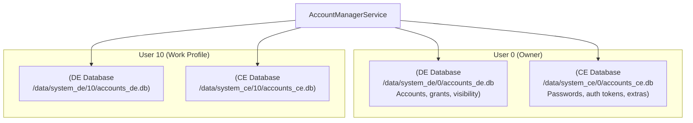

The split between Device-Encrypted (DE) and Credential-Encrypted (CE)
storage follows Android's Direct Boot model:

| Storage | Available | Contents |
|---------|-----------|----------|
| **DE** (`accounts_de.db`) | After device boot | Account names, types, grants, visibility |
| **CE** (`accounts_ce.db`) | After user unlock | Passwords, auth tokens, user data |

```
Source: frameworks/base/services/core/java/com/android/server/accounts/AccountsDb.java
```

### 32.2.3 AccountsDb Schema

The `AccountsDb` class manages the SQLite databases.  Key tables:

```
Source: frameworks/base/services/core/java/com/android/server/accounts/AccountsDb.java
```

**CE Database tables:**

| Table | Columns | Purpose |
|-------|---------|---------|
| `accounts` | `_id`, `name`, `type`, `password`, `previous_name`, `last_password_entry_time_millis_epoch` | Core account storage |
| `authtokens` | `_id`, `accounts_id`, `type`, `authtoken` | Cached authentication tokens |
| `extras` | `_id`, `accounts_id`, `key`, `value` | Per-account key-value user data |

**DE Database tables:**

| Table | Columns | Purpose |
|-------|---------|---------|
| `accounts` | `_id`, `name`, `type` | Account listing (no credentials) |
| `grants` | `accounts_id`, `auth_token_type`, `uid` | Token access grants per UID |
| `visibility` | `accounts_id`, `_package`, `value` | Per-package account visibility |
| `shared_accounts` | `_id`, `name`, `type` | Accounts shared across profiles |
| `meta` | `key`, `value` | Service metadata |
| `debug_table` | Various | Debugging/audit information |

### 32.2.4 UserAccounts -- Per-User State

Internally, `AccountManagerService` maintains a `UserAccounts` object for
each user.  This object holds:

```java
// Simplified from AccountManagerService.java
static class UserAccounts {
    final int userId;
    final AccountsDb accountsDb;       // Database access
    final HashMap<Pair<Pair<Account, String>, Integer>, /* ... */>
        credentialsPermissionNotificationIds;  // Pending permission notifications
    final HashMap<Account, HashMap<String, String>> userDataCache;  // In-memory cache
    final HashMap<Account, HashMap<String, String>> authTokenCache; // In-memory cache
    final TokenCache tokenCache;       // LRU token cache
    final Object cacheLock;            // Synchronization
    final Object dbLock;               // Database lock
}
```

### 32.2.5 Token Cache

The `TokenCache` provides an in-memory LRU cache for authentication tokens
to avoid repeated calls to authenticators:

```
Source: frameworks/base/services/core/java/com/android/server/accounts/TokenCache.java
```

```java
// From TokenCache.java
class TokenCache {
    private static final int MAX_CACHE_CHARS = 64000;

    static class Value {
        public final String token;
        public final long expiryEpochMillis;
    }

    private static class Key {
        public final Account account;
        public final String packageName;
        public final String tokenType;
        public final byte[] sigDigest;  // Package signing certificate digest
    }

    // LRU cache evicts when total token chars exceed MAX_CACHE_CHARS
}
```

The cache key includes the package signing certificate digest, ensuring that
a token granted to one app cannot be retrieved by a different app even if
it has the same package name (protecting against signature spoofing).

### 32.2.6 Authenticator Discovery and Binding

`AccountManagerService` discovers authenticators through
`AccountAuthenticatorCache`, which extends `RegisteredServicesCache`:

```
Source: frameworks/base/services/core/java/com/android/server/accounts/AccountAuthenticatorCache.java
        frameworks/base/services/core/java/com/android/server/accounts/IAccountAuthenticatorCache.java
```

The discovery process scans for services that declare:

```xml
<service android:name=".auth.AuthService"
         android:exported="true">
    <intent-filter>
        <action android:name="android.accounts.AccountAuthenticator" />
    </intent-filter>
    <meta-data
        android:name="android.accounts.AccountAuthenticator"
        android:resource="@xml/authenticator" />
</service>
```

When `AccountManagerService` needs to interact with an authenticator
(e.g., to get a token or add an account), it binds to the authenticator
service and communicates via the `IAccountAuthenticator` AIDL interface:

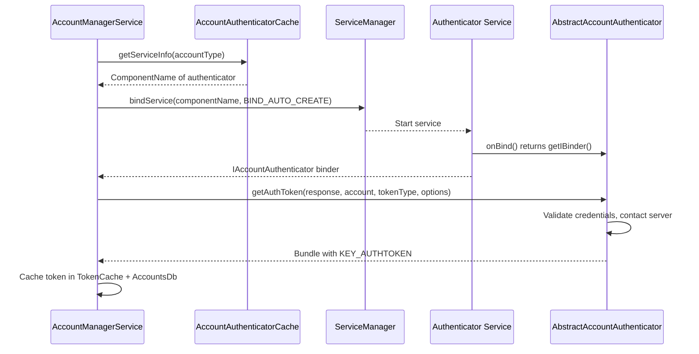

### 32.2.7 CryptoHelper -- Secure Session Storage

`CryptoHelper` is used by `AccountManagerService` to encrypt and decrypt
session bundles for the session-based account addition flow:

```
Source: frameworks/base/services/core/java/com/android/server/accounts/CryptoHelper.java
```

It uses a per-device key stored in the Android Keystore to protect
session data that may be transferred between devices during account
migration.

### 32.2.8 AccountManagerService Shell Command

`AccountManagerService` supports shell commands for debugging:

```
Source: frameworks/base/services/core/java/com/android/server/accounts/AccountManagerServiceShellCommand.java
```

```bash
# List accounts (requires root or shell)
adb shell cmd account list-accounts

# Dump account service state
adb shell dumpsys account
```

### 32.2.9 Session-Based Account Addition

Android 7.0 introduced session-based account addition for improved security.
Instead of directly creating accounts, authenticators can use a two-phase
flow:

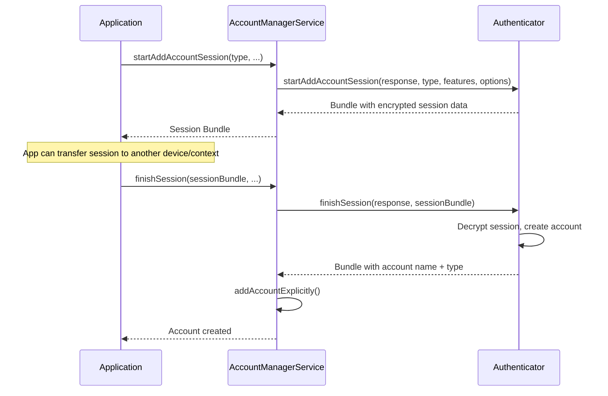

### 32.2.10 Permission Model

AccountManagerService enforces a layered permission model:

| Operation | Required Permission / Condition |
|-----------|-------------------------------|
| `getAccounts()` | Caller visible to account (visibility check) |
| `getAccountsByType(type)` | Caller visible to accounts of that type |
| `addAccountExplicitly()` | Same signature as authenticator OR `ACCOUNT_MANAGER` permission |
| `removeAccount()` | `ACCOUNT_MANAGER` permission OR account owner |
| `getAuthToken()` | User consent grant OR same authenticator |
| `getPassword()` | Same UID as authenticator |
| `setPassword()` | Same UID as authenticator |
| Cross-user operations | `INTERACT_ACROSS_USERS_FULL` |

The `ACCOUNT_MANAGER` permission (`android.permission.ACCOUNT_MANAGER`) is
a signature-level permission held only by the system.

---

## 32.3 Account Authentication

### 32.3.1 AbstractAccountAuthenticator

`AbstractAccountAuthenticator` is the base class that third-party
authenticators must extend.  It defines the contract between the system and
the authentication logic:

```
Source: frameworks/base/core/java/android/accounts/AbstractAccountAuthenticator.java
```

The class uses the **Transport** pattern -- it contains an inner class
`Transport` that extends `IAccountAuthenticator.Stub` and delegates to the
abstract methods, adding error handling and logging:

```java
// Simplified from AbstractAccountAuthenticator.java
public abstract class AbstractAccountAuthenticator {

    private class Transport extends IAccountAuthenticator.Stub {
        @Override
        public void getAuthToken(IAccountAuthenticatorResponse response,
                Account account, String authTokenType, Bundle options) {
            // Delegates to the abstract method, catches exceptions,
            // and sends results back through the response
            Bundle result = AbstractAccountAuthenticator.this
                .getAuthToken(new AccountAuthenticatorResponse(response),
                    account, authTokenType, options);
            if (result != null) {
                response.onResult(result);
            }
        }
    }

    // Abstract methods that authenticators must implement:
    public abstract Bundle addAccount(...);
    public abstract Bundle getAuthToken(...);
    public abstract String getAuthTokenLabel(String authTokenType);
    public abstract Bundle confirmCredentials(...);
    public abstract Bundle updateCredentials(...);
    public abstract Bundle hasFeatures(...);
    public abstract Bundle editProperties(...);
}
```

### 32.3.2 The Auth Token Flow

The auth token retrieval flow is the most common authenticator interaction:

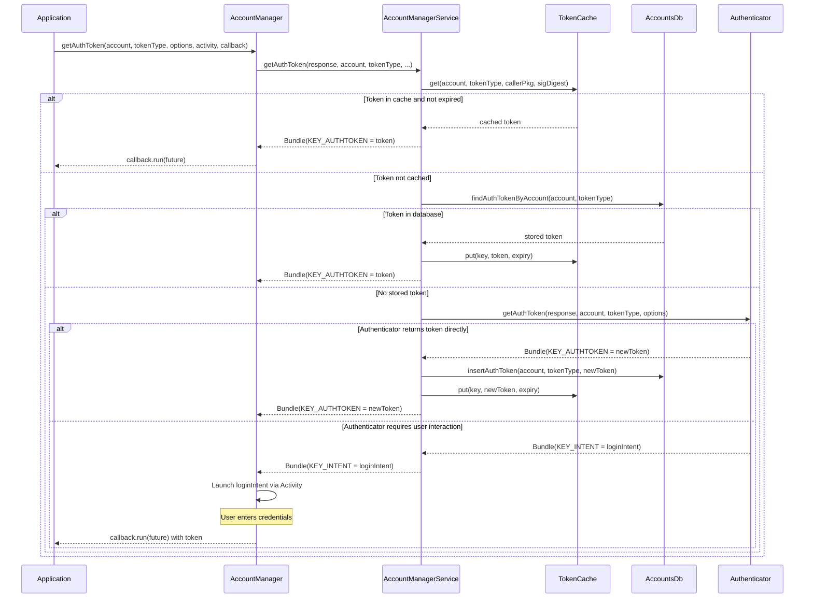

### 32.3.3 Token Invalidation

When a server rejects a cached token, the application must invalidate it:

```java
// Application discovers token is invalid
accountManager.invalidateAuthToken(accountType, staleToken);

// Then request a new one
AccountManagerFuture<Bundle> future = accountManager.getAuthToken(
    account, tokenType, options, activity, callback, handler);
```

Internally, `invalidateAuthToken` removes the token from:

1. The in-memory `TokenCache`
2. The `authtokens` table in `AccountsDb`

This forces the next `getAuthToken` call to contact the authenticator for
a fresh token.

### 32.3.4 Token Expiry

Authenticators can set token expiry using the
`AbstractAccountAuthenticator.KEY_CUSTOM_TOKEN_EXPIRY` bundle key:

```java
// In your authenticator's getAuthToken():
Bundle result = new Bundle();
result.putString(AccountManager.KEY_AUTHTOKEN, token);
result.putString(AccountManager.KEY_ACCOUNT_NAME, account.name);
result.putString(AccountManager.KEY_ACCOUNT_TYPE, account.type);
// Token expires in 1 hour
result.putLong(AbstractAccountAuthenticator.KEY_CUSTOM_TOKEN_EXPIRY,
    System.currentTimeMillis() + 3600_000L);
return result;
```

The `TokenCache` checks expiry before returning cached tokens:

```java
// Simplified from TokenCache logic in AccountManagerService
TokenCache.Value tokenValue = accounts.tokenCache.get(cacheKey);
if (tokenValue != null) {
    if (tokenValue.expiryEpochMillis > System.currentTimeMillis()) {
        return tokenValue.token;  // Valid cached token
    } else {
        accounts.tokenCache.remove(cacheKey);  // Expired
    }
}
```

### 32.3.5 Implementing an Authenticator

A complete authenticator requires three components:

**1. The Authenticator class:**

```java
public class MyAuthenticator extends AbstractAccountAuthenticator {

    public MyAuthenticator(Context context) {
        super(context);
    }

    @Override
    public Bundle addAccount(AccountAuthenticatorResponse response,
            String accountType, String authTokenType,
            String[] requiredFeatures, Bundle options) {
        // Return an Intent to launch the login UI
        Intent intent = new Intent(context, LoginActivity.class);
        intent.putExtra(AccountManager.KEY_ACCOUNT_AUTHENTICATOR_RESPONSE,
            response);
        Bundle bundle = new Bundle();
        bundle.putParcelable(AccountManager.KEY_INTENT, intent);
        return bundle;
    }

    @Override
    public Bundle getAuthToken(AccountAuthenticatorResponse response,
            Account account, String authTokenType, Bundle options) {
        // Try to get cached password
        AccountManager am = AccountManager.get(context);
        String password = am.getPassword(account);

        if (password != null) {
            // Exchange credentials for token with server
            String token = myServerApi.authenticate(account.name, password);
            if (token != null) {
                Bundle result = new Bundle();
                result.putString(AccountManager.KEY_ACCOUNT_NAME, account.name);
                result.putString(AccountManager.KEY_ACCOUNT_TYPE, account.type);
                result.putString(AccountManager.KEY_AUTHTOKEN, token);
                return result;
            }
        }

        // Credentials invalid -- prompt user
        Intent intent = new Intent(context, LoginActivity.class);
        intent.putExtra(AccountManager.KEY_ACCOUNT_AUTHENTICATOR_RESPONSE,
            response);
        Bundle bundle = new Bundle();
        bundle.putParcelable(AccountManager.KEY_INTENT, intent);
        return bundle;
    }

    @Override
    public Bundle hasFeatures(AccountAuthenticatorResponse response,
            Account account, String[] features) {
        Bundle result = new Bundle();
        result.putBoolean(AccountManager.KEY_BOOLEAN_RESULT, true);
        return result;
    }

    // ... other abstract methods ...
}
```

**2. The Service:**

```java
public class AuthenticatorService extends Service {
    private MyAuthenticator authenticator;

    @Override
    public void onCreate() {
        authenticator = new MyAuthenticator(this);
    }

    @Override
    public IBinder onBind(Intent intent) {
        return authenticator.getIBinder();
    }
}
```

**3. The XML metadata** (`res/xml/authenticator.xml`):

```xml
<account-authenticator
    xmlns:android="http://schemas.android.com/apk/res/android"
    android:accountType="com.example.myapp"
    android:icon="@drawable/ic_account"
    android:smallIcon="@drawable/ic_account_small"
    android:label="@string/account_label"
    android:accountPreferences="@xml/account_preferences" />
```

### 32.3.6 AccountAuthenticatorActivity

`AccountAuthenticatorActivity` is a base class for activities that handle
authenticator UI flows (login screens, credential entry):

```
Source: frameworks/base/core/java/android/accounts/AccountAuthenticatorActivity.java
```

```java
public class LoginActivity extends AccountAuthenticatorActivity {

    @Override
    protected void onCreate(Bundle savedInstanceState) {
        super.onCreate(savedInstanceState);
        setContentView(R.layout.activity_login);

        // The response is passed via the intent
        AccountAuthenticatorResponse response = getIntent()
            .getParcelableExtra(AccountManager.KEY_ACCOUNT_AUTHENTICATOR_RESPONSE);
    }

    private void onLoginSuccess(String accountName, String token) {
        AccountManager am = AccountManager.get(this);

        // Create the account
        Account account = new Account(accountName, "com.example.myapp");
        am.addAccountExplicitly(account, null, null);
        am.setAuthToken(account, "full_access", token);

        // Return result to AccountManagerService
        Bundle result = new Bundle();
        result.putString(AccountManager.KEY_ACCOUNT_NAME, accountName);
        result.putString(AccountManager.KEY_ACCOUNT_TYPE, "com.example.myapp");
        setAccountAuthenticatorResult(result);
        finish();
    }
}
```

The critical call is `setAccountAuthenticatorResult()` -- this sends the
result back to `AccountManagerService` through the
`AccountAuthenticatorResponse` that was passed to the activity.  Without
this call, the `AccountManagerFuture` in the calling application will never
complete.

### 32.3.7 Cross-Profile Account Sharing

In managed profile (work profile) scenarios, accounts can be shared between
the personal and work profiles:

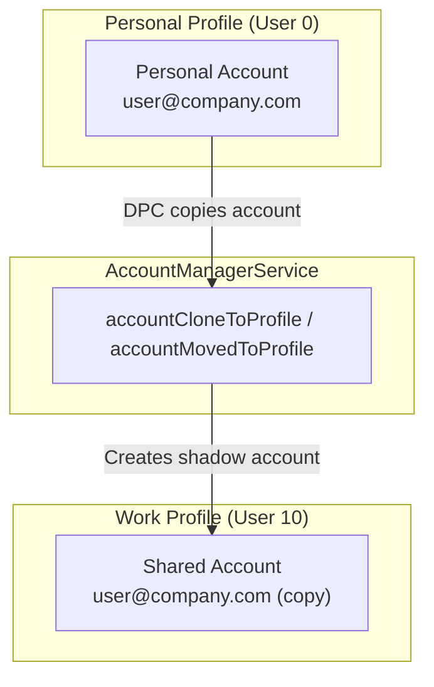

The Device Policy Controller (DPC) can trigger account migration through
`AccountManager.copyAccountToUser()` (hidden API used by the system).
`AccountManagerService` handles the cross-profile account copy using the
`shared_accounts` table in the DE database.

### 32.3.8 Authentication Flow Diagram

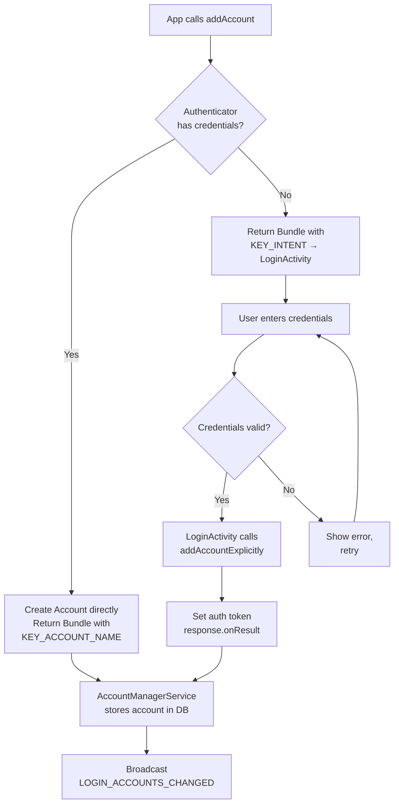

---

## 32.4 SyncManager

### 32.4.1 SyncManager Architecture

`SyncManager` is responsible for scheduling and executing background data
synchronization.  It does not perform sync operations itself -- it
orchestrates **sync adapters** that do the actual work.

```
Source: frameworks/base/services/core/java/com/android/server/content/SyncManager.java
```

Key design principles from the source comments:

> All scheduled syncs will be passed on to JobScheduler as jobs.
> Each periodic sync is scheduled as a periodic job.  If a periodic sync
> fails, we create a new one-off SyncOperation and set its sourcePeriodicId
> field to the jobId of the periodic sync.

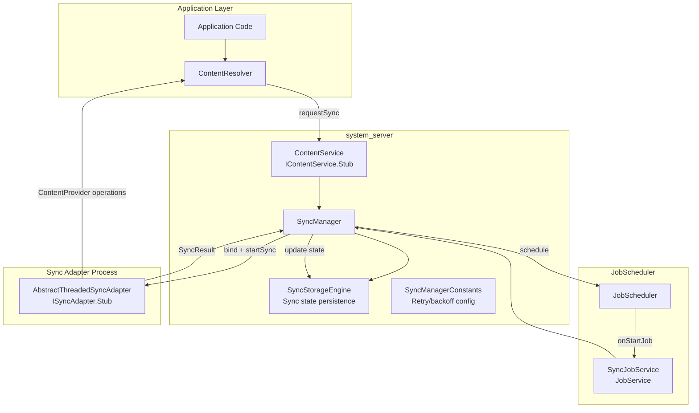

### 32.4.2 SyncManager Initialization

SyncManager initializes during system server boot and sets up several
subsystems:

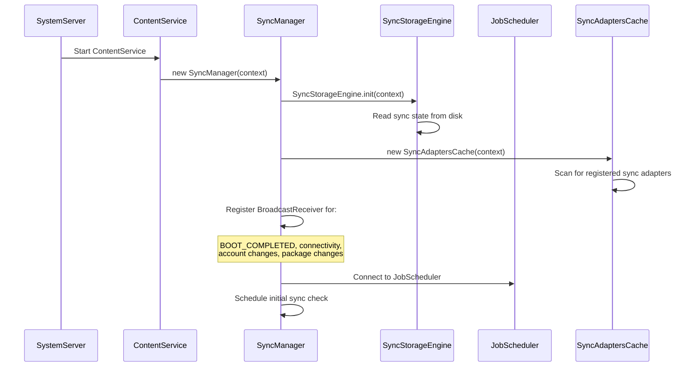

### 32.4.3 SyncOperation -- The Sync Unit

Every sync request is represented by a `SyncOperation`:

```
Source: frameworks/base/services/core/java/com/android/server/content/SyncOperation.java
```

```java
// Key fields from SyncOperation.java
public class SyncOperation {
    public final SyncStorageEngine.EndPoint target;  // account + authority + userId
    public final int owningUid;
    public final String owningPackage;
    public final int reason;          // Why this sync was triggered
    public final int syncSource;      // Where initiated (user, periodic, etc.)
    public final boolean allowParallelSyncs;
    public final boolean isPeriodic;
    public final int sourcePeriodicId;  // Parent periodic job ID
    public final String key;          // Deduplication key
    public final long periodMillis;   // Periodic interval
    public final long flexMillis;     // Periodic flex window
    private volatile Bundle mImmutableExtras;  // Sync extras
}
```

Sync reasons are defined as constants:

| Reason Constant | Value | Description |
|-----------------|-------|-------------|
| `REASON_BACKGROUND_DATA_SETTINGS_CHANGED` | -1 | Data settings changed |
| `REASON_ACCOUNTS_UPDATED` | -2 | Account added/removed |
| `REASON_SERVICE_CHANGED` | -3 | Sync adapter registered/unregistered |
| `REASON_PERIODIC` | -4 | Periodic sync timer fired |
| `REASON_IS_SYNCABLE` | -5 | Authority became syncable |
| `REASON_SYNC_AUTO` | -6 | Auto-sync enabled |
| `REASON_MASTER_SYNC_AUTO` | -7 | Global auto-sync enabled |
| `REASON_USER_START` | -8 | User manually triggered sync |

### 32.4.4 Sync Scheduling via JobScheduler

SyncManager delegates all scheduling to `JobScheduler`.  Each
`SyncOperation` is converted to a `JobInfo`:

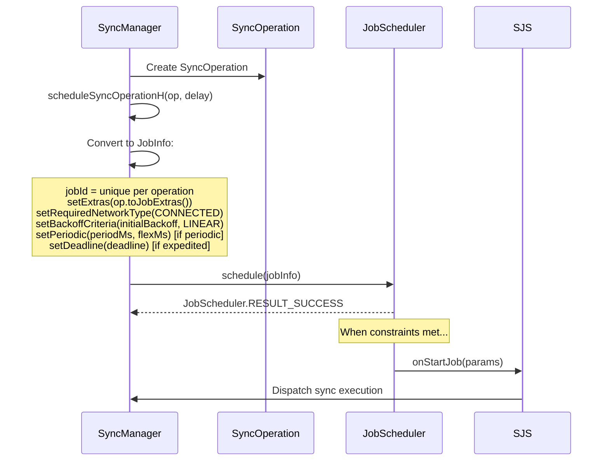

The `SyncJobService` is the bridge between JobScheduler and SyncManager:

```
Source: frameworks/base/services/core/java/com/android/server/content/SyncJobService.java
```

```java
// From SyncJobService.java
public class SyncJobService extends JobService {
    @Override
    public boolean onStartJob(JobParameters params) {
        SyncOperation op = SyncOperation.maybeCreateFromJobExtras(params.getExtras());
        // ... dispatch to SyncManager for execution
        return true;  // Work is ongoing
    }

    @Override
    public boolean onStopJob(JobParameters params) {
        // Cancel the running sync
        return false;  // Don't reschedule
    }
}
```

### 32.4.5 Sync Execution

When a sync job fires, SyncManager binds to the appropriate sync adapter
service and executes the sync:

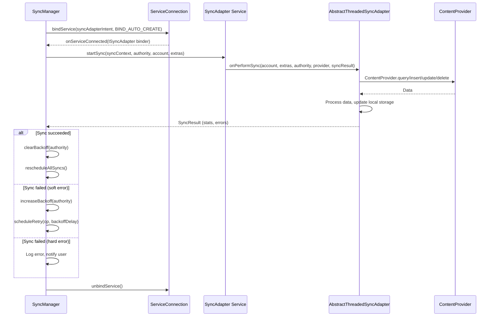

### 32.4.6 Sync Adapter Discovery

SyncManager discovers registered sync adapters through `SyncAdaptersCache`,
which extends `RegisteredServicesCache`:

```
Source: frameworks/base/core/java/android/content/SyncAdaptersCache.java
```

Sync adapters are discovered by scanning for services that declare:

```xml
<intent-filter>
    <action android:name="android.content.SyncAdapter" />
</intent-filter>
<meta-data
    android:name="android.content.SyncAdapter"
    android:resource="@xml/syncadapter" />
```

The sync adapter XML resource declares:

| Attribute | Purpose |
|-----------|---------|
| `contentAuthority` | The ContentProvider authority to sync |
| `accountType` | The account type (must match authenticator) |
| `userVisible` | Whether this adapter appears in Settings |
| `supportsUploading` | Whether it handles upload-only syncs |
| `allowParallelSyncs` | Whether multiple instances can run simultaneously |
| `isAlwaysSyncable` | Whether sync is enabled by default |
| `settingsActivity` | Activity for sync adapter settings |

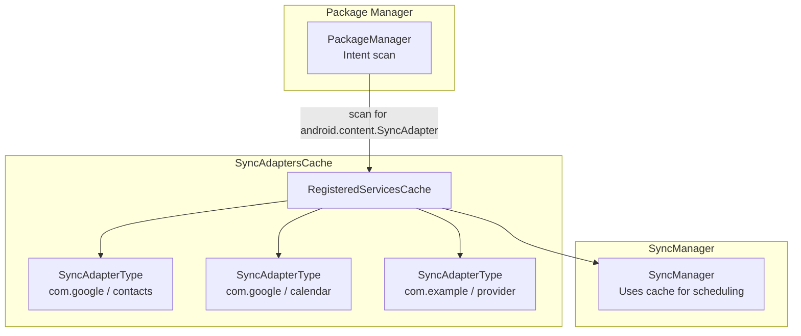

### 32.4.7 Sync Conflict Resolution

When multiple sync operations target the same authority and account,
SyncManager applies deduplication logic:

```java
// From SyncManager.java -- simplified scheduling logic
void scheduleSyncOperationH(SyncOperation op, long delay) {
    // Check for existing identical operation
    SyncOperation existingOp = findExistingOp(op.key);
    if (existingOp != null) {
        // Keep the one with earlier expected run time
        if (existingOp.expectedRuntime <= op.expectedRuntime) {
            return;  // Existing op wins
        }
        // Cancel existing, schedule new
        cancelJob(existingOp);
    }
    // Assign job ID and schedule with JobScheduler
    op.jobId = nextJobId();
    scheduleJob(op, delay);
}
```

The deduplication key is constructed from:

- Account name and type
- Content authority
- Sync extras (the Bundle contents)
- Whether it's periodic or one-time

### 32.4.8 App Standby and Sync Throttling

Starting with Android 6.0, App Standby affects sync scheduling.  Apps in
standby buckets receive reduced sync frequency:

```
Source: frameworks/base/services/core/java/com/android/server/content/SyncManager.md
```

| Standby Bucket | Sync Behavior |
|----------------|---------------|
| Active | Normal sync frequency |
| Working Set | Normal sync frequency |
| Frequent | Reduced frequency |
| Rare | Heavily throttled, may be deferred for hours |
| Restricted | Syncs may be blocked entirely |
| Exempted | Not affected by standby (system apps) |

SyncManager checks the app's standby bucket before scheduling:

```java
// From SyncManager constants
private static final int DEF_MAX_RETRIES_WITH_APP_STANDBY_EXEMPTION = 5;
```

After 5 failed retries, the sync adapter loses its App Standby exemption
and is subject to normal standby throttling.

### 32.4.9 Backoff and Retry

SyncManager implements exponential backoff for failed syncs:

```
Source: frameworks/base/services/core/java/com/android/server/content/SyncManagerConstants.java
```

| Parameter | Default | Description |
|-----------|---------|-------------|
| `initial_sync_retry_time_in_seconds` | 30 | First retry delay |
| `retry_time_increase_factor` | 2.0 | Exponential factor |
| `max_sync_retry_time_in_seconds` | 3600 (1 hour) | Maximum backoff |
| `max_retries_with_app_standby_exemption` | 5 | Retries before standby throttling |

The backoff sequence for a failing sync: 30s, 60s, 120s, 240s, 480s, ...,
up to 3600s.

### 32.4.10 Sync Monitoring

SyncManager monitors running syncs for progress.  If a sync adapter appears
hung (no network traffic), it may be cancelled:

```java
// From SyncManager.java
private static final long SYNC_MONITOR_WINDOW_LENGTH_MILLIS = 60 * 1000; // 60 seconds
private static final int SYNC_MONITOR_PROGRESS_THRESHOLD_BYTES = 10;    // 10 bytes
```

Every 60 seconds, SyncManager checks whether the sync adapter has
transferred at least 10 bytes (Tx + Rx).  If not, it considers the sync
stalled.

### 32.4.11 Sync Wake Locks

SyncManager acquires wake locks during sync execution to prevent the device
from sleeping mid-sync:

```java
// From SyncManager.java
private static final String SYNC_WAKE_LOCK_PREFIX = "*sync*/";
private static final String HANDLE_SYNC_ALARM_WAKE_LOCK = "SyncManagerHandleSyncAlarm";
private static final String SYNC_LOOP_WAKE_LOCK = "SyncLoopWakeLock";
```

Each running sync gets its own named wake lock (`*sync*/authority`), which
appears in `dumpsys power` output and battery stats.  This allows battery
analysis to attribute power consumption to specific sync adapters.

### 32.4.12 Sync Logging

`SyncLogger` provides detailed operational logging that can be retrieved
via `dumpsys content`:

```
Source: frameworks/base/services/core/java/com/android/server/content/SyncLogger.java
```

The logger records:

- Sync schedule decisions (why a sync was scheduled or skipped)
- Sync execution start/stop times
- Sync results and statistics
- Backoff changes
- Account and adapter state changes

### 32.4.13 SyncStorageEngine -- Persistent State

`SyncStorageEngine` persists sync configuration and history to disk:

```
Source: frameworks/base/services/core/java/com/android/server/content/SyncStorageEngine.java
```

It stores:

| Data | Persistence | Description |
|------|-------------|-------------|
| Authority info | XML file | Per-authority sync settings (syncable, backoff, delay) |
| Sync status | Proto file | Sync history (last success, last failure, stats) |
| Pending operations | Proto file | Operations awaiting execution |
| Master sync auto | XML attr | Global auto-sync toggle |
| Per-authority auto-sync | XML attr | Per-account/authority auto-sync toggle |

The `EndPoint` class identifies a sync target:

```java
// From SyncStorageEngine.java
public static class EndPoint {
    public final Account account;
    public final String provider;   // Content authority
    public final int userId;
}

public static class AuthorityInfo {
    public final EndPoint target;
    public final int ident;         // Unique authority ID
    public boolean enabled;         // Auto-sync enabled
    public int syncable;            // -1 unknown, 0 not syncable, 1 syncable
    public long backoffTime;
    public long backoffDelay;
    public long delayUntil;
}
```

---

## 32.5 ContentResolver Sync

### 32.5.1 ContentResolver Sync API

Applications typically interact with the sync framework through
`ContentResolver` static methods rather than `SyncManager` directly:

```java
// Request an immediate sync
Bundle extras = new Bundle();
extras.putBoolean(ContentResolver.SYNC_EXTRAS_MANUAL, true);
extras.putBoolean(ContentResolver.SYNC_EXTRAS_EXPEDITED, true);
ContentResolver.requestSync(account, authority, extras);

// Using SyncRequest.Builder (modern API)
SyncRequest request = new SyncRequest.Builder()
    .setSyncAdapter(account, authority)
    .setManual(true)
    .setExpedited(true)
    .build();
ContentResolver.requestSync(request);
```

### 32.5.2 Sync Extras

Sync extras are Bundle keys that control sync behavior:

| Extra Key | Type | Description |
|-----------|------|-------------|
| `SYNC_EXTRAS_MANUAL` | boolean | User-initiated sync (bypasses backoff) |
| `SYNC_EXTRAS_EXPEDITED` | boolean | Request immediate execution |
| `SYNC_EXTRAS_UPLOAD` | boolean | Only upload local changes |
| `SYNC_EXTRAS_FORCE` | boolean | Deprecated; use MANUAL |
| `SYNC_EXTRAS_IGNORE_SETTINGS` | boolean | Ignore auto-sync settings |
| `SYNC_EXTRAS_IGNORE_BACKOFF` | boolean | Ignore backoff delay |
| `SYNC_EXTRAS_DO_NOT_RETRY` | boolean | Don't retry on failure |
| `SYNC_EXTRAS_INITIALIZE` | boolean | First-time initialization sync |
| `SYNC_EXTRAS_REQUIRE_CHARGING` | boolean | Only sync while charging |
| `SYNC_EXTRAS_SCHEDULE_AS_EXPEDITED_JOB` | boolean | Schedule via expedited job |

### 32.5.3 Periodic Sync

Applications can schedule periodic background syncs:

```java
// Add a periodic sync every 60 minutes with 10 minute flex
ContentResolver.addPeriodicSync(
    account,
    "com.example.provider",     // authority
    Bundle.EMPTY,               // extras
    60 * 60                     // poll frequency in seconds
);

// Using SyncRequest.Builder with flex time
SyncRequest request = new SyncRequest.Builder()
    .syncPeriodic(60 * 60, 10 * 60)  // period, flex (seconds)
    .setSyncAdapter(account, authority)
    .build();
ContentResolver.requestSync(request);

// Remove a periodic sync
ContentResolver.removePeriodicSync(account, authority, Bundle.EMPTY);
```

The flex time allows the system to batch periodic syncs from different
apps, reducing battery impact.  The sync will execute within the window
`[scheduledTime - flexTime, scheduledTime]`.

### 32.5.4 Auto-Sync Control

Auto-sync has two levels of control:

```java
// Global auto-sync master toggle
ContentResolver.setMasterSyncAutomatically(true);
boolean masterEnabled = ContentResolver.getMasterSyncAutomatically();

// Per-account/authority auto-sync
ContentResolver.setSyncAutomatically(account, authority, true);
boolean autoSync = ContentResolver.getSyncAutomatically(account, authority);
```

The sync framework will not execute periodic or change-triggered syncs
unless both the master toggle AND the per-authority toggle are enabled.

### 32.5.5 Sync Status Observation

Applications can observe sync state:

```java
// Check if any sync is currently active
boolean syncing = ContentResolver.isSyncActive(account, authority);

// Check if a sync is pending
boolean pending = ContentResolver.isSyncPending(account, authority);

// Get sync status
SyncStatusInfo status = ContentResolver.getSyncStatus(account, authority);
if (status != null) {
    long lastSuccess = status.lastSuccessTime;
    long lastFailure = status.lastFailureTime;
    int numSyncs = status.numSyncs;
    String lastFailureMesg = status.lastFailureMesg;
}

// Register for sync status changes
Object handle = ContentResolver.addStatusChangeListener(
    ContentResolver.SYNC_OBSERVER_TYPE_ACTIVE
        | ContentResolver.SYNC_OBSERVER_TYPE_PENDING
        | ContentResolver.SYNC_OBSERVER_TYPE_SETTINGS,
    new SyncStatusObserver() {
        @Override
        public void onStatusChanged(int which) {
            // Sync state changed, update UI
        }
    }
);

// Don't forget to unregister
ContentResolver.removeStatusChangeListener(handle);
```

### 32.5.6 Change-Triggered Sync

ContentResolver supports triggering a sync when data changes through
`ContentObserver` integration:

```java
// When local data changes, notify the sync framework
ContentResolver resolver = context.getContentResolver();
resolver.notifyChange(MyContract.CONTENT_URI, null, true);
// The third parameter (syncToNetwork) = true triggers a sync

// Alternatively, register a ContentObserver in SyncManager
// SyncManager automatically observes authorities for registered adapters
```

When `notifyChange()` is called with `syncToNetwork = true`, the
`ContentService` forwards the notification to `SyncManager`, which
schedules a sync for all adapters registered for that authority.  The
sync is delayed by `LOCAL_SYNC_DELAY` (default 30 seconds) to batch
rapid consecutive changes.

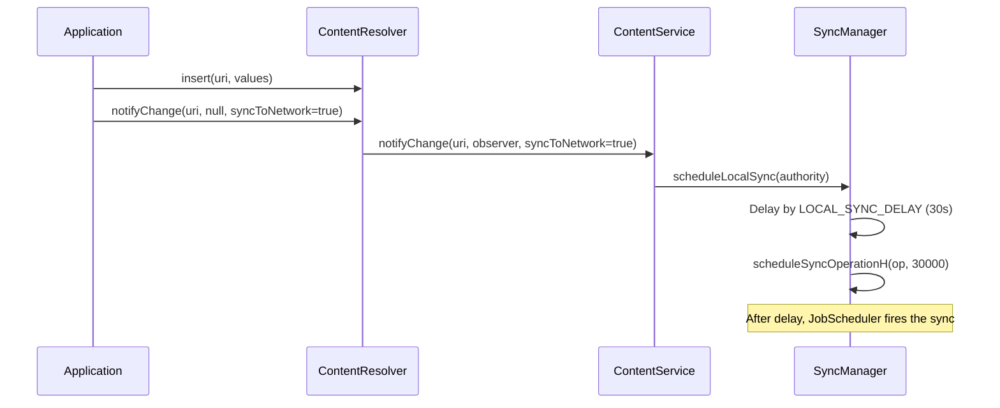

### 32.5.7 Sync Exemption Levels

The sync framework uses exemption levels to determine priority:

| Exemption Level | Description | Effect |
|----------------|-------------|--------|
| `SYNC_EXEMPTION_NONE` | Normal sync | Subject to all restrictions |
| `SYNC_EXEMPTION_PROMOTE_BUCKET` | Temporary bucket promotion | Moves app to higher standby bucket |
| `SYNC_EXEMPTION_PROMOTE_BUCKET_WITH_TEMP_ALLOWLIST` | Promotion + allowlist | Also grants temporary FGS start |

Exemptions are applied internally by `SyncManager` when processing
system-initiated syncs (e.g., account changes) that should not be
throttled by App Standby.

### 32.5.8 ContentResolver to SyncManager Flow

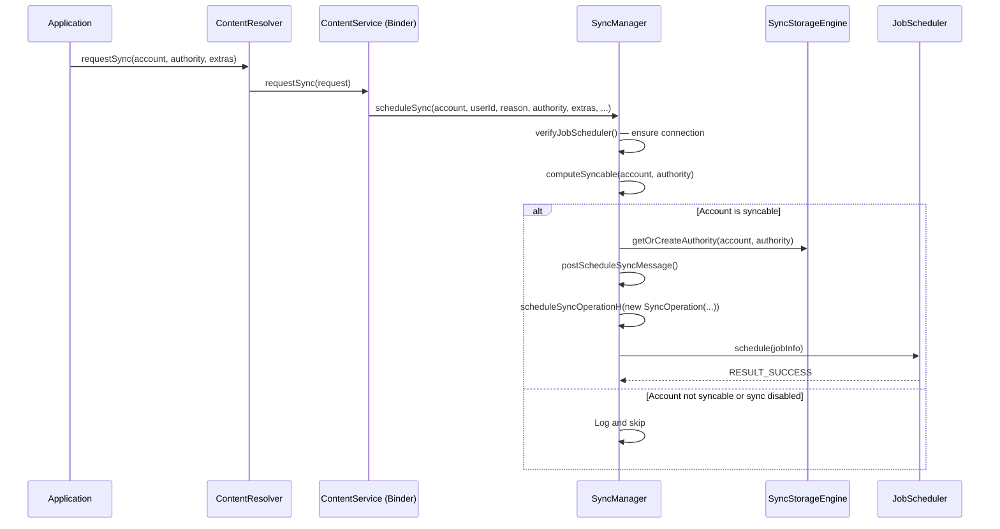

### 32.5.9 ContentService -- The Binder Entry Point

`ContentService` is the Binder service that receives sync requests from
applications.  It implements `IContentService` and delegates to `SyncManager`:

```
Source: frameworks/base/services/core/java/com/android/server/content/ContentService.java
```

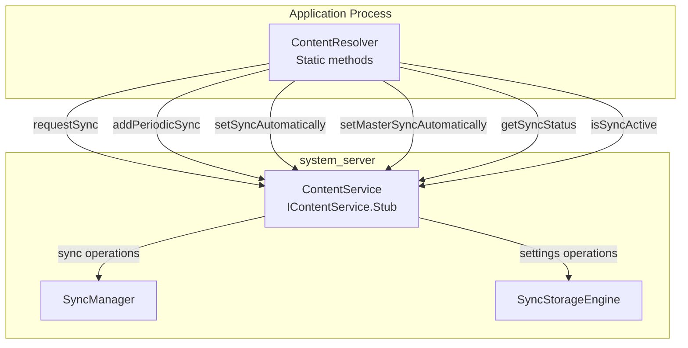

ContentService also manages `ContentObserver` registrations, but those
are separate from the sync framework (they are used for UI updates,
while sync is used for network synchronization).

### 32.5.10 Sync Configuration Matrix

The decision to execute a sync depends on multiple configuration factors:

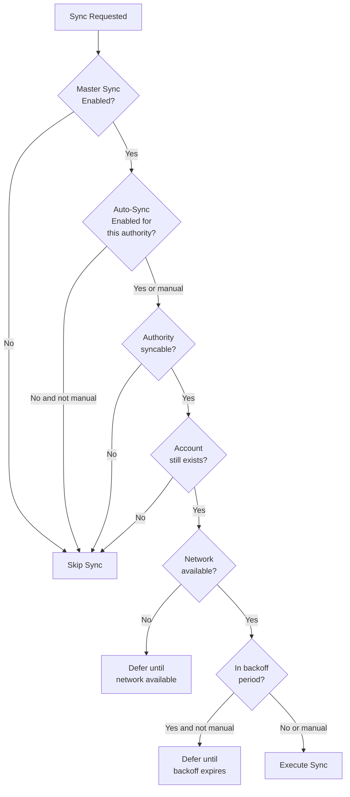

### 32.5.11 Implementing a Sync Adapter

A sync adapter requires three components:

**1. The Sync Adapter class:**

```java
public class MySyncAdapter extends AbstractThreadedSyncAdapter {

    public MySyncAdapter(Context context, boolean autoInitialize) {
        super(context, autoInitialize);
    }

    @Override
    public void onPerformSync(Account account, Bundle extras,
            String authority, ContentProviderClient provider,
            SyncResult syncResult) {

        try {
            // 1. Get auth token
            AccountManager am = AccountManager.get(getContext());
            String token = am.blockingGetAuthToken(account,
                "com.example.sync", true);

            // 2. Fetch remote changes
            List<Item> remoteItems = myApi.fetchChanges(token);

            // 3. Apply to local ContentProvider
            ContentResolver resolver = getContext().getContentResolver();
            for (Item item : remoteItems) {
                ContentValues values = item.toContentValues();
                resolver.insert(MyContract.CONTENT_URI, values);
            }

            // 4. Push local changes
            Cursor localChanges = provider.query(
                MyContract.DIRTY_CONTENT_URI, null, null, null, null);
            if (localChanges != null) {
                while (localChanges.moveToNext()) {
                    myApi.pushChange(token, cursorToItem(localChanges));
                }
                localChanges.close();
            }

        } catch (AuthenticatorException | OperationCanceledException e) {
            syncResult.stats.numAuthExceptions++;
        } catch (IOException e) {
            syncResult.stats.numIoExceptions++;
        }
    }
}
```

**2. The Service:**

```java
public class SyncService extends Service {
    private static MySyncAdapter syncAdapter;
    private static final Object lock = new Object();

    @Override
    public void onCreate() {
        synchronized (lock) {
            if (syncAdapter == null) {
                syncAdapter = new MySyncAdapter(this, true);
            }
        }
    }

    @Override
    public IBinder onBind(Intent intent) {
        return syncAdapter.getSyncAdapterBinder();
    }
}
```

**3. The XML metadata** (`res/xml/syncadapter.xml`):

```xml
<sync-adapter
    xmlns:android="http://schemas.android.com/apk/res/android"
    android:contentAuthority="com.example.provider"
    android:accountType="com.example.myapp"
    android:userVisible="true"
    android:supportsUploading="true"
    android:allowParallelSyncs="false"
    android:isAlwaysSyncable="true" />
```

**4. AndroidManifest.xml declarations:**

```xml
<service
    android:name=".sync.SyncService"
    android:exported="true">
    <intent-filter>
        <action android:name="android.content.SyncAdapter" />
    </intent-filter>
    <meta-data
        android:name="android.content.SyncAdapter"
        android:resource="@xml/syncadapter" />
</service>
```

### 32.5.12 SyncResult -- Communicating Outcome

The `SyncResult` object is the return channel from the sync adapter to
SyncManager:

```java
public final class SyncResult implements Parcelable {
    // Set true to trigger soft error retry with backoff
    public boolean tooManyRetries;
    public boolean tooManyDeletions;
    public boolean databaseError;
    public boolean fullSyncRequested;
    public boolean partialSyncUnavailable;
    public boolean moreRecordsToGet;

    // Delay before retry (seconds)
    public long delayUntil;

    // Statistics
    public final SyncStats stats;
}

public class SyncStats implements Parcelable {
    public long numAuthExceptions;    // Auth failures
    public long numIoExceptions;      // Network failures
    public long numParseExceptions;   // Data format errors
    public long numConflictDetectedExceptions;
    public long numInserts;
    public long numUpdates;
    public long numDeletes;
    public long numEntries;
    public long numSkippedEntries;
}
```

SyncManager interprets the result:

| Condition | Action |
|-----------|--------|
| `numAuthExceptions > 0` | Soft error -- retry with backoff |
| `numIoExceptions > 0` | Soft error -- retry with backoff |
| `tooManyDeletions` | Show notification to user, pause sync |
| `fullSyncRequested` | Schedule a full sync (not incremental) |
| `delayUntil > 0` | Delay next sync by specified amount |
| No errors | Clear backoff, update last success time |

---

## 32.6 Try It

### Exercise 63.1: List All Accounts

Enumerate all accounts on the device:

```java
import android.accounts.Account;
import android.accounts.AccountManager;

public class AccountLister {

    public void listAccounts(Context context) {
        AccountManager am = AccountManager.get(context);

        // List all visible accounts
        Account[] accounts = am.getAccounts();
        System.out.println("Found " + accounts.length + " accounts:");
        for (Account account : accounts) {
            System.out.println("  " + account.name + " (" + account.type + ")");
        }

        // List accounts by type
        Account[] googleAccounts = am.getAccountsByType("com.google");
        System.out.println("Google accounts: " + googleAccounts.length);

        // List all authenticator types
        AuthenticatorDescription[] authenticators =
            am.getAuthenticatorTypes();
        System.out.println("Registered authenticators:");
        for (AuthenticatorDescription auth : authenticators) {
            System.out.println("  Type: " + auth.type);
            System.out.println("  Package: " + auth.packageName);
        }
    }
}
```

**What to observe:**

- Account visibility restricts which accounts your app can see
- Each account type corresponds to a registered authenticator
- Multiple accounts of the same type can exist (e.g., multiple Google accounts)

---

### Exercise 63.2: Custom Authenticator

Build a minimal account authenticator:

```java
// 1. Authenticator
public class DemoAuthenticator extends AbstractAccountAuthenticator {
    private final Context context;

    public DemoAuthenticator(Context context) {
        super(context);
        this.context = context;
    }

    @Override
    public Bundle addAccount(AccountAuthenticatorResponse response,
            String accountType, String authTokenType,
            String[] requiredFeatures, Bundle options) {
        // For demo: add account directly without UI
        Account account = new Account("demo@example.com", accountType);
        AccountManager am = AccountManager.get(context);
        am.addAccountExplicitly(account, "password123", null);
        am.setAuthToken(account, "full_access", "demo-token-12345");

        Bundle result = new Bundle();
        result.putString(AccountManager.KEY_ACCOUNT_NAME, account.name);
        result.putString(AccountManager.KEY_ACCOUNT_TYPE, account.type);
        return result;
    }

    @Override
    public Bundle getAuthToken(AccountAuthenticatorResponse response,
            Account account, String authTokenType, Bundle options) {
        AccountManager am = AccountManager.get(context);
        String token = am.peekAuthToken(account, authTokenType);

        if (token != null && !token.isEmpty()) {
            Bundle result = new Bundle();
            result.putString(AccountManager.KEY_ACCOUNT_NAME, account.name);
            result.putString(AccountManager.KEY_ACCOUNT_TYPE, account.type);
            result.putString(AccountManager.KEY_AUTHTOKEN, token);
            return result;
        }

        // No token available -- would normally prompt for credentials
        Bundle result = new Bundle();
        result.putInt(AccountManager.KEY_ERROR_CODE, 1);
        result.putString(AccountManager.KEY_ERROR_MESSAGE, "No token");
        return result;
    }

    @Override
    public String getAuthTokenLabel(String authTokenType) {
        return "Full Access";
    }

    @Override
    public Bundle hasFeatures(AccountAuthenticatorResponse response,
            Account account, String[] features) {
        Bundle result = new Bundle();
        result.putBoolean(AccountManager.KEY_BOOLEAN_RESULT, false);
        return result;
    }

    @Override
    public Bundle confirmCredentials(AccountAuthenticatorResponse response,
            Account account, Bundle options) { return null; }

    @Override
    public Bundle updateCredentials(AccountAuthenticatorResponse response,
            Account account, String authTokenType, Bundle options) {
        return null;
    }

    @Override
    public Bundle editProperties(AccountAuthenticatorResponse response,
            String accountType) { return null; }
}

// 2. Service
public class AuthService extends Service {
    private DemoAuthenticator authenticator;

    @Override
    public void onCreate() {
        authenticator = new DemoAuthenticator(this);
    }

    @Override
    public IBinder onBind(Intent intent) {
        return authenticator.getIBinder();
    }
}
```

```xml
<!-- AndroidManifest.xml -->
<service android:name=".AuthService" android:exported="true">
    <intent-filter>
        <action android:name="android.accounts.AccountAuthenticator" />
    </intent-filter>
    <meta-data
        android:name="android.accounts.AccountAuthenticator"
        android:resource="@xml/authenticator" />
</service>

<!-- res/xml/authenticator.xml -->
<account-authenticator
    xmlns:android="http://schemas.android.com/apk/res/android"
    android:accountType="com.example.demo"
    android:label="@string/app_name"
    android:icon="@mipmap/ic_launcher"
    android:smallIcon="@mipmap/ic_launcher" />
```

**What to observe:**

- The authenticator appears in Settings > Accounts
- `getIBinder()` returns the Transport stub that `AccountManagerService` binds to
- `addAccountExplicitly()` directly writes to the accounts database
- Auth tokens are cached and can be retrieved with `peekAuthToken()`

---

### Exercise 63.3: Custom Sync Adapter

Build a sync adapter that pairs with the authenticator above:

```java
// 1. Sync Adapter
public class DemoSyncAdapter extends AbstractThreadedSyncAdapter {
    private static final String TAG = "DemoSync";

    public DemoSyncAdapter(Context context, boolean autoInitialize) {
        super(context, autoInitialize);
    }

    @Override
    public void onPerformSync(Account account, Bundle extras,
            String authority, ContentProviderClient provider,
            SyncResult syncResult) {
        Log.i(TAG, "Starting sync for " + account.name);
        Log.i(TAG, "Authority: " + authority);
        Log.i(TAG, "Extras: " + extras);

        try {
            // Simulate network fetch
            Thread.sleep(2000);

            // Report success
            syncResult.stats.numInserts = 5;
            syncResult.stats.numUpdates = 3;
            Log.i(TAG, "Sync complete: 5 inserts, 3 updates");

        } catch (InterruptedException e) {
            Log.e(TAG, "Sync interrupted", e);
            syncResult.stats.numIoExceptions++;
        }
    }
}

// 2. Service
public class SyncService extends Service {
    private static DemoSyncAdapter syncAdapter;
    private static final Object LOCK = new Object();

    @Override
    public void onCreate() {
        synchronized (LOCK) {
            if (syncAdapter == null) {
                syncAdapter = new DemoSyncAdapter(this, true);
            }
        }
    }

    @Override
    public IBinder onBind(Intent intent) {
        return syncAdapter.getSyncAdapterBinder();
    }
}
```

```xml
<!-- AndroidManifest.xml -->
<service android:name=".SyncService" android:exported="true">
    <intent-filter>
        <action android:name="android.content.SyncAdapter" />
    </intent-filter>
    <meta-data
        android:name="android.content.SyncAdapter"
        android:resource="@xml/syncadapter" />
</service>

<!-- You also need a stub ContentProvider -->
<provider
    android:name=".StubProvider"
    android:authorities="com.example.demo.provider"
    android:exported="false"
    android:syncable="true" />

<!-- res/xml/syncadapter.xml -->
<sync-adapter
    xmlns:android="http://schemas.android.com/apk/res/android"
    android:contentAuthority="com.example.demo.provider"
    android:accountType="com.example.demo"
    android:userVisible="true"
    android:supportsUploading="true"
    android:allowParallelSyncs="false"
    android:isAlwaysSyncable="true" />
```

Trigger a sync manually:

```java
Account account = new Account("demo@example.com", "com.example.demo");
Bundle extras = new Bundle();
extras.putBoolean(ContentResolver.SYNC_EXTRAS_MANUAL, true);
extras.putBoolean(ContentResolver.SYNC_EXTRAS_EXPEDITED, true);
ContentResolver.requestSync(account, "com.example.demo.provider", extras);
```

**What to observe:**

- The sync adapter runs in a background thread automatically
- `onPerformSync` is called by `SyncManager` when the job fires
- The stub ContentProvider is required even if you don't use it
- `isAlwaysSyncable="true"` means sync is enabled by default

---

### Exercise 63.4: Periodic Sync Configuration

Set up and monitor periodic sync:

```java
// Schedule periodic sync every 15 minutes with 5 minute flex
Account account = new Account("demo@example.com", "com.example.demo");
String authority = "com.example.demo.provider";

// Enable auto-sync
ContentResolver.setSyncAutomatically(account, authority, true);

// Add periodic sync
ContentResolver.addPeriodicSync(
    account, authority, Bundle.EMPTY, 15 * 60  // 15 minutes
);

// Monitor sync status
new Handler(Looper.getMainLooper()).postDelayed(() -> {
    boolean active = ContentResolver.isSyncActive(account, authority);
    boolean pending = ContentResolver.isSyncPending(account, authority);
    boolean autoSync = ContentResolver.getSyncAutomatically(account, authority);
    boolean masterSync = ContentResolver.getMasterSyncAutomatically();

    Log.i("SyncStatus", "Active: " + active);
    Log.i("SyncStatus", "Pending: " + pending);
    Log.i("SyncStatus", "Auto-sync: " + autoSync);
    Log.i("SyncStatus", "Master sync: " + masterSync);

    // Get list of active syncs
    List<SyncInfo> activeSyncs = ContentResolver.getCurrentSyncs();
    for (SyncInfo info : activeSyncs) {
        Log.i("SyncStatus", "Active sync: " + info.account.name +
            " / " + info.authority);
    }
}, 5000);
```

**What to observe:**

- Periodic syncs are scheduled through JobScheduler internally
- The flex window allows battery-efficient batching
- Master sync toggle overrides per-authority settings
- `getCurrentSyncs()` shows all currently executing syncs

---

### Exercise 63.5: Debugging with dumpsys

Use `dumpsys` to inspect the account and sync state:

```bash
# Dump account information
adb shell dumpsys account

# Key sections:
# - User accounts and their types
# - Registered authenticators
# - Token cache state
# - Visibility settings

# Dump sync state
adb shell dumpsys content

# Key sections:
# - Sync adapters registered
# - Sync status per authority
# - Pending syncs
# - Active syncs
# - Sync history (recent successes/failures)
# - Backoff state
# - Periodic sync schedule

# Force a sync via adb
adb shell content sync --account demo@example.com \
    --authority com.example.demo.provider

# List sync adapters
adb shell dumpsys content | grep -A2 "Sync Adapters"

# Check JobScheduler for pending sync jobs
adb shell dumpsys jobscheduler | grep -i sync

# Monitor sync in real-time
adb logcat -s SyncManager:V SyncJobService:V
```

**What to observe:**

- `dumpsys account` shows all accounts per user with their authenticators
- `dumpsys content` shows the complete sync state machine
- Backoff delays accumulate for failing adapters
- Periodic syncs are visible as JobScheduler jobs

---

### Exercise 63.6: Source Code Exploration

Explore the account and sync source code:

```bash
# Count AccountManagerService lines
wc -l frameworks/base/services/core/java/com/android/server/accounts/AccountManagerService.java
# Typically 6000+ lines

# Count SyncManager lines
wc -l frameworks/base/services/core/java/com/android/server/content/SyncManager.java
# Typically 3000+ lines

# Find all AIDL interfaces for accounts
find frameworks/base/core/java/android/accounts/ -name "*.aidl"
# IAccountManager.aidl
# IAccountAuthenticator.aidl
# IAccountAuthenticatorResponse.aidl
# IAccountManagerResponse.aidl
# Account.aidl
# AuthenticatorDescription.aidl

# See the account database schema
grep "CREATE TABLE" \
    frameworks/base/services/core/java/com/android/server/accounts/AccountsDb.java

# Find sync-related broadcast actions
grep "ACTION_" \
    frameworks/base/core/java/android/accounts/AccountManager.java \
    | head -10

# Check sync operation reasons
grep "REASON_" \
    frameworks/base/services/core/java/com/android/server/content/SyncOperation.java

# See SyncManagerConstants defaults
grep "DEF_" \
    frameworks/base/services/core/java/com/android/server/content/SyncManagerConstants.java
```

**What to observe:**

- The complexity of `AccountManagerService` (6000+ lines managing multi-user
  accounts, authenticator bindings, and token caching)
- The tight coupling between `SyncManager` and `JobScheduler`
- The XML/Proto-based persistence in `SyncStorageEngine`
- The breadth of sync configuration options (backoff, retry, periodic, flex)

---

## Summary

The Account and Sync framework is one of AOSP's oldest and most stable
subsystems, having been part of Android since API level 5.  The key
architectural insights from this chapter:

1. **Pluggable authenticators** -- The account system is fully extensible
   through `AbstractAccountAuthenticator`.  Each account type brings its own
   credential management and token generation logic.

2. **Two-database per-user storage** -- Account data is split between
   Device-Encrypted and Credential-Encrypted databases to support Direct
   Boot while protecting sensitive credentials.

3. **Token caching with LRU eviction** -- `TokenCache` provides an in-memory
   LRU cache keyed by (account, tokenType, package, sigDigest) to minimize
   authenticator round-trips.

4. **JobScheduler integration** -- `SyncManager` delegates all scheduling to
   `JobScheduler`, converting each `SyncOperation` into a `JobInfo` with
   appropriate constraints, backoff, and periodicity.

5. **Exponential backoff** -- Failed syncs are retried with configurable
   exponential backoff (default 30s initial, 2x factor, 1 hour max).

6. **Sync monitoring** -- Running syncs are monitored for network progress;
   stalled syncs can be detected and cancelled.

7. **Two-level auto-sync** -- Both a global master toggle and per-authority
   toggles must be enabled for automatic syncs to fire.

The Account and Sync framework demonstrates a mature Android subsystem
pattern: a clean application API backed by a system service that delegates
heavy lifting to pluggable components (authenticators and sync adapters),
with persistent state management and integration with platform scheduling
infrastructure.
