# 第 33 章：定位服务

定位服务是 Android 中最敏感、也最不可或缺的系统能力之一。它把 GNSS 卫星接收机、蜂窝基站数据库、Wi‑Fi 指纹定位、传感器融合、地理围栏、地理编码和按位置推断时区等能力，统一收拢到 `LocationManager` 这一套框架 API 背后，同时再叠加精确 / 模糊、前台 / 后台、普通 / 紧急、应用 / 系统旁路等多层权限约束。本章从 SDK 接口一路下钻到 `LocationManagerService`、GNSS HAL、融合与网络定位、Geofence、Geocoder、GeoTZ 与权限控制。

所有源码路径默认相对 AOSP 根目录。

---

## 33.1 定位架构

### 33.1.1 三大支柱

Android 定位子系统可以概括成三根主梁：

| 支柱 | 作用 | 关键对象 |
|---|---|---|
| Provider 抽象 | 把 GNSS、网络、融合、被动等不同定位引擎统一成同一接口 | `AbstractLocationProvider` |
| 请求复用 | 把上百个应用请求折叠成每个 provider 的最优硬件请求 | `LocationProviderManager` |
| 权限执行 | 精确 / 模糊 / 后台 / bypass 等权限逐层卡住数据流 | `LocationPermissions` |

### 33.1.2 分层图

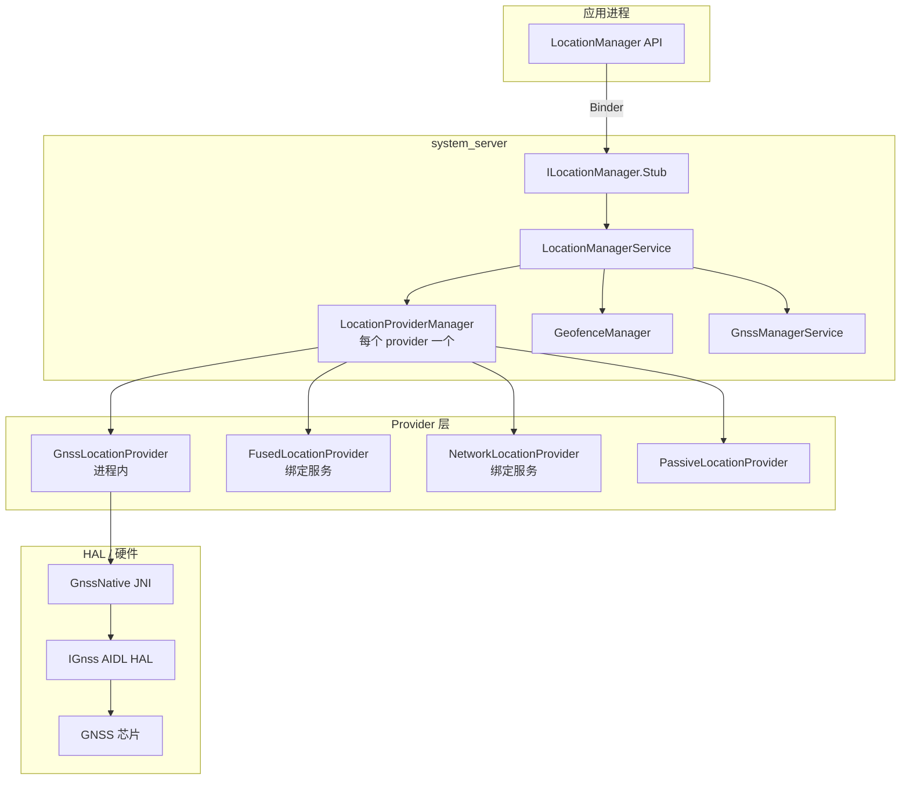
```mermaid
graph TB
    subgraph "应用进程"
        A["LocationManager API"]
    end

    subgraph "system_server"
        B["ILocationManager.Stub"]
        C["LocationManagerService"]
        D["LocationProviderManager<br/>每个 provider 一个"]
        E["GeofenceManager"]
        F["GnssManagerService"]
    end

    subgraph "Provider 层"
        G["GnssLocationProvider<br/>进程内"]
        H["FusedLocationProvider<br/>绑定服务"]
        I["NetworkLocationProvider<br/>绑定服务"]
        J["PassiveLocationProvider"]
    end

    subgraph "HAL / 硬件"
        K["GnssNative JNI"]
        L["IGnss AIDL HAL"]
        M["GNSS 芯片"]
    end

    A -->|Binder| B
    B --> C
    C --> D
    C --> E
    C --> F
    D --> G
    D --> H
    D --> I
    D --> J
    G --> K
    K --> L
    L --> M
```

### 33.1.3 provider 名称

`LocationManagerService` 与 `LocationManager` 共用一组 provider 名称常量：

| 常量 | 值 | 说明 |
|---|---|---|
| `GPS_PROVIDER` | `"gps"` | 卫星定位 |
| `NETWORK_PROVIDER` | `"network"` | 基站 / Wi‑Fi 定位 |
| `FUSED_PROVIDER` | `"fused"` | 多源融合定位 |
| `PASSIVE_PROVIDER` | `"passive"` | 被动监听其他 provider 的结果 |
| `GPS_HARDWARE_PROVIDER` | `"gps_hardware"` | 原始 GNSS HAL，需 `LOCATION_HARDWARE` |

### 33.1.4 启动顺序

`LocationManagerService.Lifecycle` 继承自 `SystemService`，其启动过程决定了 provider 的初始化顺序：

```text
onStart()
    publishBinderService(Context.LOCATION_SERVICE, mService)

onBootPhase(PHASE_SYSTEM_SERVICES_READY)
    SystemInjector.onSystemReady()
    LocationManagerService.onSystemReady()

onBootPhase(PHASE_THIRD_PARTY_APPS_CAN_START)
    1. 创建 network provider
    2. 创建 fused provider
    3. 创建 GnssNative + GnssManagerService
    4. 创建 GnssLocationProvider
    5. 绑定 GeocodeProvider
    6. 绑定 PopulationDensityProvider（若开启）
    7. 绑定 HardwareActivityRecognitionProxy
    8. 绑定 GeofenceProxy
```

源码特别强调：`network provider` 要先于 `gps provider` 初始化，因为后者对前者存在历史依赖。

### 33.1.5 关键源码地图

```text
frameworks/base/location/java/android/location/
    LocationManager.java
    Geocoder.java
    Geofence.java
    Location.java
    LocationRequest.java
    GnssStatus.java
    GnssMeasurement.java
    GnssClock.java
    GnssCapabilities.java
    GnssAntennaInfo.java
    Criteria.java
    Address.java

frameworks/base/services/core/java/com/android/server/location/
    LocationManagerService.java
    LocationPermissions.java
    LocationShellCommand.java
    geofence/
        GeofenceManager.java
        GeofenceProxy.java
    gnss/
        GnssManagerService.java
        GnssLocationProvider.java
        GnssConfiguration.java
        GnssMetrics.java
        GnssMeasurementsProvider.java
        GnssNavigationMessageProvider.java
        GnssStatusProvider.java
        GnssNmeaProvider.java
        GnssAntennaInfoProvider.java
        GnssGeofenceProxy.java
        GnssPsdsDownloader.java
        GnssSatelliteBlocklistHelper.java
        GnssVisibilityControl.java
        GnssNetworkConnectivityHandler.java
        NetworkTimeHelper.java
        hal/
            GnssNative.java
    provider/
        AbstractLocationProvider.java
        LocationProviderManager.java
        PassiveLocationProvider.java
        MockLocationProvider.java
        MockableLocationProvider.java
        StationaryThrottlingLocationProvider.java
        DelegateLocationProvider.java
        proxy/
            ProxyLocationProvider.java
            ProxyGeocodeProvider.java
            ProxyPopulationDensityProvider.java
            ProxyGnssAssistanceProvider.java
    injector/
    settings/
    fudger/
    altitude/
    eventlog/

hardware/interfaces/gnss/aidl/android/hardware/gnss/
    IGnss.aidl
    IGnssCallback.aidl
    GnssConstellationType.aidl
    GnssMeasurement.aidl
    GnssSignalType.aidl
    IGnssGeofence.aidl
    IGnssMeasurementInterface.aidl
    IGnssBatching.aidl
    IGnssPsds.aidl
    IGnssConfiguration.aidl
    IGnssPowerIndication.aidl
    IGnssDebug.aidl
    IGnssAntennaInfo.aidl
    IAGnss.aidl
    IAGnssRil.aidl

packages/modules/GeoTZ/
    locationtzprovider/
    geotz_lookup/
    s2storage/
    output_data/
```

### 33.1.6 类层级

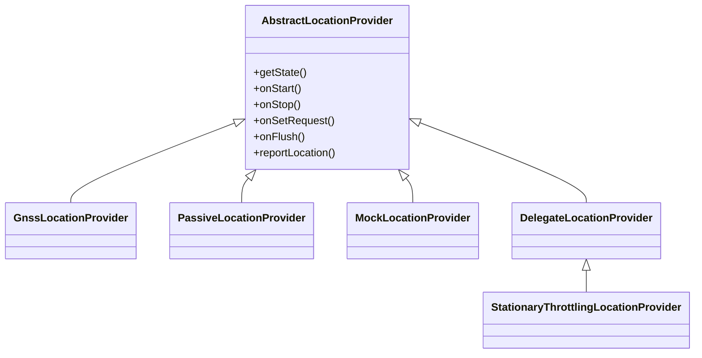
```mermaid
classDiagram
    class AbstractLocationProvider {
        +getState()
        +onStart()
        +onStop()
        +onSetRequest()
        +onFlush()
        +reportLocation()
    }

    class GnssLocationProvider
    class PassiveLocationProvider
    class StationaryThrottlingLocationProvider
    class MockLocationProvider
    class DelegateLocationProvider

    AbstractLocationProvider <|-- GnssLocationProvider
    AbstractLocationProvider <|-- PassiveLocationProvider
    AbstractLocationProvider <|-- MockLocationProvider
    AbstractLocationProvider <|-- DelegateLocationProvider
    DelegateLocationProvider <|-- StationaryThrottlingLocationProvider
```

---

## 33.2 `LocationManagerService`

`LocationManagerService`（LMS）是所有 `LocationManager` 调用背后的统一系统服务。应用从 `Context.LOCATION_SERVICE` 拿到的几乎所有 Binder 调用，最终都会落到它这里。

### 33.2.1 关键字段与数据结构

```java
public class LocationManagerService extends ILocationManager.Stub
        implements LocationProviderManager.StateChangedListener {

    final Object mLock = new Object();
    private final Context mContext;
    private final Injector mInjector;
    private final GeofenceManager mGeofenceManager;
    private volatile @Nullable GnssManagerService mGnssManagerService;
    private ProxyGeocodeProvider mGeocodeProvider;
    private final PassiveLocationProviderManager mPassiveManager;
    final CopyOnWriteArrayList<LocationProviderManager> mProviderManagers;
}
```

`mProviderManagers` 是 LMS 的中心索引。每个注册 provider 都会有一个 `LocationProviderManager`，而 `CopyOnWriteArrayList` 的选择说明读远多于写，系统更偏向低锁开销查询。

### 33.2.2 Injector 模式

LMS 并不直接依赖所有系统服务，而是通过 `Injector` 和一组 helper 做解耦：

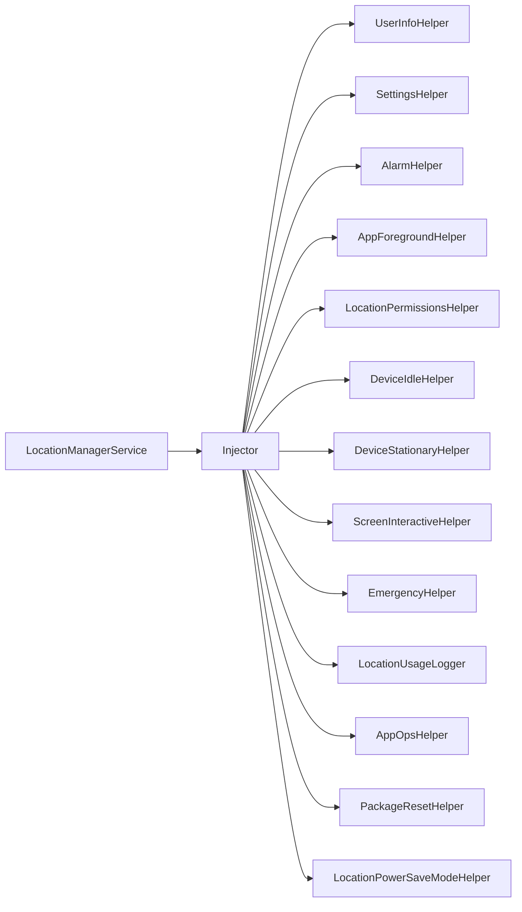
```mermaid
graph LR
    LMS["LocationManagerService"] --> Injector
    Injector --> A["UserInfoHelper"]
    Injector --> B["SettingsHelper"]
    Injector --> C["AlarmHelper"]
    Injector --> D["AppForegroundHelper"]
    Injector --> E["LocationPermissionsHelper"]
    Injector --> F["DeviceIdleHelper"]
    Injector --> G["DeviceStationaryHelper"]
    Injector --> H["ScreenInteractiveHelper"]
    Injector --> I["EmergencyHelper"]
    Injector --> J["LocationUsageLogger"]
    Injector --> K["AppOpsHelper"]
    Injector --> L["PackageResetHelper"]
    Injector --> M["LocationPowerSaveModeHelper"]
```

这么做的直接收益：

- `system_server` 环境外也能做单测
- 便于把 Settings、AppOps、前后台态、屏幕状态和紧急状态都做成统一依赖注入点

### 33.2.3 provider 管理

新增 provider 的典型路径：

```java
void addLocationProviderManager(
        LocationProviderManager manager,
        @Nullable AbstractLocationProvider realProvider) {
    synchronized (mProviderManagers) {
        manager.startManager(this);
        if (realProvider != null && manager != mPassiveManager) {
            if (enableStationaryThrottling) {
                realProvider = new StationaryThrottlingLocationProvider(
                    manager.getName(), mInjector, realProvider);
            }
        }
        manager.setRealProvider(realProvider);
        mProviderManagers.add(manager);
    }
}
```

这里有两个关键点：

- 非 passive provider 可以被 `StationaryThrottlingLocationProvider` 包上一层
- 包装层会在设备静止时降低请求频率，减少功耗

删除 provider 则会清除 mock / real provider 并停止 manager。

### 33.2.4 请求处理

应用调用 `requestLocationUpdates()` 后，流转大致如下：

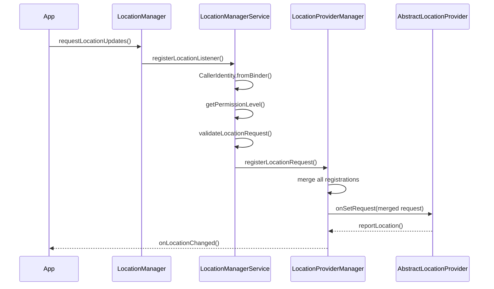
```mermaid
sequenceDiagram
    participant App
    participant LM as LocationManager
    participant LMS as LocationManagerService
    participant LPM as LocationProviderManager
    participant Provider as AbstractLocationProvider

    App->>LM: requestLocationUpdates()
    LM->>LMS: registerLocationListener()
    LMS->>LMS: CallerIdentity.fromBinder()
    LMS->>LMS: getPermissionLevel()
    LMS->>LMS: validateLocationRequest()
    LMS->>LPM: registerLocationRequest()
    LPM->>LPM: merge all registrations
    LPM->>Provider: onSetRequest(merged request)
    Provider-->>LPM: reportLocation()
    LPM-->>App: onLocationChanged()
```

`validateLocationRequest()` 会逐项检查：

1. `WorkSource` 是否需要 `UPDATE_DEVICE_STATS`
2. low-power mode 是否需要 `LOCATION_HARDWARE`
3. hidden-from-AppOps 是否需要额外权限
4. ADAS bypass 是否只允许 automotive + GPS
5. ignore settings 是否需要 bypass 权限

### 33.2.5 `getCurrentLocation()`

`getCurrentLocation()` 是一次性请求。底层仍然委托给 `LocationProviderManager.getCurrentLocation()`，但返回的是 `ICancellationSignal`，调用方可在超时或页面销毁时取消。

### 33.2.6 最近位置

`getLastLocation()` 返回的是 provider 缓存中的最近一次 `Location`。它不是强制立即采样，而是：

- 先走同样的权限校验
- 对 coarse 客户端同样做 fudging
- 再按 provider 缓存返回

### 33.2.7 定位设置

定位总开关按用户存储在 `Settings.Secure.LOCATION_MODE`。LMS 监听其变化：

```java
mInjector.getSettingsHelper().addOnLocationEnabledChangedListener(
    this::onLocationModeChanged);
```

当设置改变时，LMS 会：

1. 使 `LocationManager` 本地缓存失效
2. 写入事件日志
3. 广播 `LocationManager.MODE_CHANGED_ACTION`
4. 刷新 AppOps 限制

### 33.2.8 `LocationProviderManager`

`LocationProviderManager`（LPM）是定位框架里最关键的多路复用器。每个 provider 对应一个 LPM，它负责：

| 职责 | 机制 |
|---|---|
| 把 N 个应用请求合成 1 个 provider 请求 | `mergeRegistrations()` |
| 跟踪每个注册项状态 | `Registration` 内部类 |
| 向匹配的客户端分发位置 | `deliverToListeners()` |
| 对 coarse 客户端做模糊化 | `LocationFudger` |
| 支持 mock provider | `setMockProvider()` |
| 支持诊断监听器 | `addProviderRequestListener()` |

### 33.2.9 LPM 常量与阈值

LPM 的一组默认阈值直接决定了“为什么应用收不到那么快的位置”：

```java
private static final long MIN_COARSE_INTERVAL_MS = 10 * 60 * 1000;
private static final long MAX_HIGH_POWER_INTERVAL_MS = 5 * 60 * 1000;
private static final long MAX_CURRENT_LOCATION_AGE_MS = 30 * 1000;
private static final long MAX_GET_CURRENT_LOCATION_TIMEOUT_MS = 30 * 1000;
private static final float FASTEST_INTERVAL_JITTER_PERCENTAGE = .10f;
private static final int MAX_FASTEST_INTERVAL_JITTER_MS = 30 * 1000;
private static final long MIN_REQUEST_DELAY_MS = 30 * 1000;
private static final long WAKELOCK_TIMEOUT_MS = 30 * 1000;
private static final long TEMPORARY_APP_ALLOWLIST_DURATION_MS = 10 * 1000;
```

其中最值得记住的是：

- `MIN_COARSE_INTERVAL_MS = 10 分钟`

也就是说，只有 `ACCESS_COARSE_LOCATION` 的应用，哪怕请求 1 秒一次更新，最终也会被硬性钳制。这不是性能优化，而是隐私设计，防止应用用高速 coarse 轨迹推断出 fine 位置。

### 33.2.10 电源保存模式

LPM 接入了 battery saver 相关的定位省电模式：

| 模式 | 常量 | 行为 |
|---|---|---|
| 不变 | `LOCATION_MODE_NO_CHANGE` | 正常 |
| 息屏关 GPS | `LOCATION_MODE_GPS_DISABLED_WHEN_SCREEN_OFF` | 屏幕灭时停止 GPS |
| 息屏全关 | `LOCATION_MODE_ALL_DISABLED_WHEN_SCREEN_OFF` | 所有 provider 停止 |
| 仅前台 | `LOCATION_MODE_FOREGROUND_ONLY` | 仅前台应用能拿到位置 |
| 息屏降频 | `LOCATION_MODE_THROTTLE_REQUESTS_WHEN_SCREEN_OFF` | 降低频率 |

### 33.2.11 注册类型

LPM 支持三类注册：

1. `ILocationListener`：连续回调
2. `PendingIntent`：通过 intent 派发
3. `getCurrentLocation()`：一次性请求

每个注册项都会记录：

- `LocationRequest`
- `CallerIdentity`
- 权限等级
- 前后台状态
- 当前是否 active

### 33.2.12 位置分发流水线

provider 上报 `LocationResult` 后，LPM 会走完一条完整流水线：

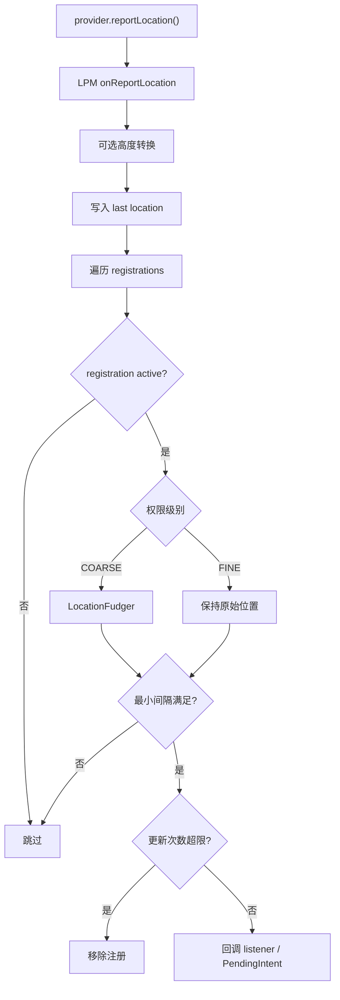
```mermaid
graph TB
    A["provider.reportLocation()"] --> B["LPM onReportLocation"]
    B --> C["可选高度转换"]
    C --> D["写入 last location"]
    D --> E["遍历 registrations"]
    E --> F{"registration active?"}
    F -->|否| SKIP["跳过"]
    F -->|是| G{"权限级别"}
    G -->|COARSE| H["LocationFudger"]
    G -->|FINE| I["保持原始位置"]
    H --> J{"最小间隔满足?"}
    I --> J
    J -->|否| SKIP
    J -->|是| K{"更新次数超限?"}
    K -->|是| RM["移除注册"]
    K -->|否| DELIVER["回调 listener / PendingIntent"]
```

### 33.2.13 位置模糊化

`LocationFudger` 会对 coarse 客户端做位置模糊：

1. 地球被分成大约 1.6 km 量级的格子
2. 每个格子带有由坐标与随机种子导出的稳定偏移
3. 同一格子内的小范围移动会看到同一个模糊位置

Android 14 起，如果 `LocationFudgerCache` 能拿到 `ProxyPopulationDensityProvider` 的人口密度数据，还会按区域动态调整网格大小：

- 城市更细
- 乡村更粗

### 33.2.14 事件日志

LPM 会把重要事件写到 `LocationEventLog`，例如：

```java
EVENT_LOG.logLocationEnabled(userId, enabled);
EVENT_LOG.logAdasLocationEnabled(userId, enabled);
```

可通过：

```bash
adb shell dumpsys location
```

查看 provider 状态、活动注册项、请求合并结果与最近位置分发事件。

### 33.2.15 被动 provider

`PassiveLocationProvider` 不会主动请求定位，而是复制其他 provider 的结果。适合那些“只想搭便车”的应用，例如天气类应用，只要别人已经把位置拿到了，它就跟着收一份。

### 33.2.16 mock provider

LMS 支持 `addTestProvider()` 与 `setTestProviderLocation()`。底层是安装一个 `MockLocationProvider` 替换真实 provider。由于 mock 结果仍然经过同一套 LPM 分发管线，所以它会经历同样的权限检查、间隔限制与模糊处理。

---

## 33.3 GNSS HAL

GNSS HAL 是卫星定位的核心硬件抽象。Android 12 起主路线是 AIDL HAL，旧 HIDL 版本已逐步废弃。

### 33.3.1 `IGnss` 根接口

`IGnss.aidl` 是所有 GNSS HAL 都必须实现的 VINTF-stable 根接口：


```mermaid
graph TB
    IGnss --> IGnssCallback
    IGnss --> IGnssPsds
    IGnss --> IGnssConfiguration
    IGnss --> IGnssMeasurementInterface
    IGnss --> IGnssPowerIndication
    IGnss --> IGnssBatching
    IGnss --> IGnssGeofence
    IGnss --> IGnssNavigationMessageInterface
    IGnss --> IAGnss
    IGnss --> IAGnssRil
    IGnss --> IGnssDebug
    IGnss --> IGnssVisibilityControl
    IGnss --> IGnssAntennaInfo
    IGnss --> IMeasurementCorrectionsInterface
    IGnss --> IGnssAssistanceInterface
```

常用方法：

| 方法 | 作用 |
|---|---|
| `setCallback()` | 注册框架回调 |
| `start()` / `stop()` | 启停 GNSS 输出 |
| `close()` | 结束会话 |
| `setPositionMode()` | 配置定位模式与周期 |
| `injectTime()` | 注入时间 |
| `injectLocation()` | 注入网络位置 |
| `injectBestLocation()` | 注入最佳位置 |
| `deleteAidingData()` | 清除辅助数据 |

### 33.3.2 定位模式

```java
enum GnssPositionMode {
    STANDALONE = 0,
    MS_BASED = 1,
    MS_ASSISTED = 2,
}
```

实际系统中，`MS_BASED` 是更常见的首选，因为配合辅助数据能显著缩短 TTFF（首次定位时间）。

### 33.3.3 卫星星座

`GnssConstellationType` 支持主流卫星系统：

| 星座 | 含义 |
|---|---|
| `GPS` | 美国 GPS |
| `SBAS` | 星基增强 |
| `GLONASS` | 俄罗斯 GLONASS |
| `QZSS` | 日本 QZSS |
| `BEIDOU` | 中国北斗 |
| `GALILEO` | 欧洲 Galileo |
| `IRNSS` | 印度 NavIC |

一次 fix 对应的 `GnssSvInfo` 会报告：

- `svid`
- `constellation`
- `cN0Dbhz`
- `basebandCN0DbHz`
- `elevationDegrees`
- `azimuthDegrees`
- `carrierFrequencyHz`
- `svFlag`

### 33.3.4 原始测量

`GnssMeasurement` 为高精度或科研场景暴露原始 GNSS 观测量：

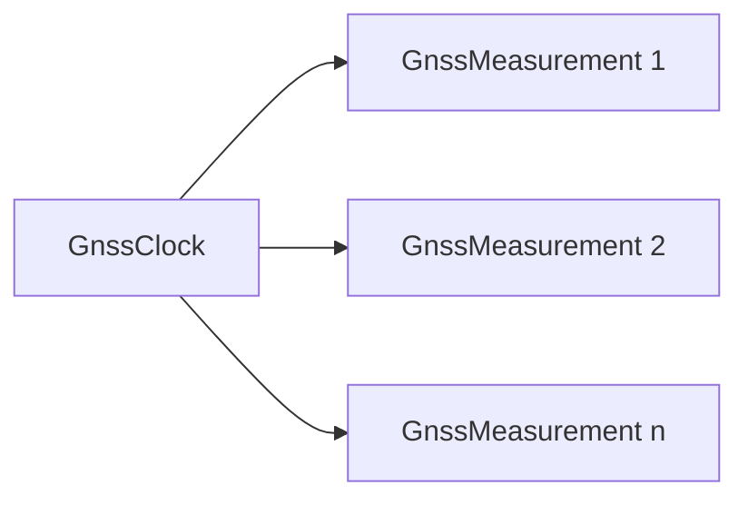
```mermaid
graph LR
    GC["GnssClock"] --> GM1["GnssMeasurement 1"]
    GC --> GM2["GnssMeasurement 2"]
    GC --> GMN["GnssMeasurement n"]
```

核心字段：

| 字段 | 含义 |
|---|---|
| `svid` | 卫星 ID |
| `signalType` | 星座 + 频率 + 编码 |
| `receivedSvTimeInNs` | 接收的卫星时刻 |
| `pseudorangeRateMps` | 伪距速率 / 多普勒 |
| `accumulatedDeltaRangeM` | 载波相位积累 |
| `antennaCN0DbHz` | 天线口 C/N0 |
| `state` | CODE_LOCK / BIT_SYNC / TOW 等状态位 |

这类数据是 PPP、RTK、载波相位和科研算法的基础。

### 33.3.5 A-GNSS

A-GNSS 用辅助数据降低 TTFF。没有辅助时，冷启动可能要 30 到 60 秒；有辅助时可压到数秒级。

主要机制：

1. `PSDS`：预测轨道数据
2. `IAGnss` / `IAGnssRil`：通过蜂窝网络与 RIL 协助获取数据
3. `injectTime()`：注入精确时间
4. `injectLocation()`：注入近似位置

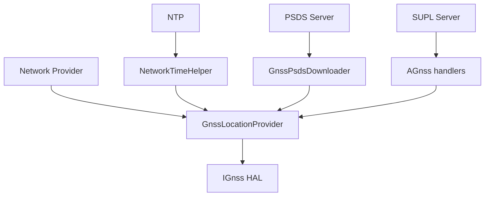
```mermaid
graph TB
    NTP["NTP"] --> NTH["NetworkTimeHelper"]
    PSDS["PSDS Server"] --> PSD["GnssPsdsDownloader"]
    SUPL["SUPL Server"] --> AG["AGnss handlers"]
    NLP["Network Provider"] --> GLP["GnssLocationProvider"]
    NTH --> GLP
    PSD --> GLP
    AG --> GLP
    GLP --> HAL["IGnss HAL"]
```

### 33.3.6 `GnssNative` JNI 桥

框架侧和 HAL 的 Java 入口是 `GnssNative`：

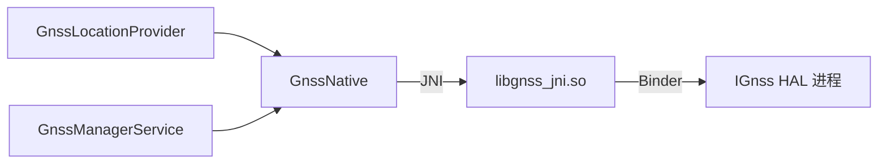
```mermaid
graph LR
    GLP["GnssLocationProvider"] --> GN["GnssNative"]
    GMS["GnssManagerService"] --> GN
    GN -->|JNI| JNI["libgnss_jni.so"]
    JNI -->|Binder| HAL["IGnss HAL 进程"]
```

`GnssNative` 不只是 JNI 壳，它还维护大量 callback 接口：

- `BaseCallbacks`
- `StatusCallbacks`
- `SvStatusCallbacks`
- `LocationCallbacks`
- `NmeaCallbacks`
- `MeasurementCallbacks`
- `NavigationMessageCallbacks`
- `GeofenceCallbacks`
- `AGpsCallbacks`
- `PsdsCallbacks`
- `TimeCallbacks`
- `LocationRequestCallbacks`

### 33.3.7 `GnssLocationProvider`

`GnssLocationProvider` 是 GPS provider 的具体实现，向上表现为 `AbstractLocationProvider`，向下对接 `GnssNative` 和 HAL。

其 provider 属性：

```java
private static final ProviderProperties PROPERTIES = new ProviderProperties.Builder()
    .setHasSatelliteRequirement(true)
    .setHasAltitudeSupport(true)
    .setHasSpeedSupport(true)
    .setHasBearingSupport(true)
    .setPowerUsage(POWER_USAGE_HIGH)
    .setAccuracy(ACCURACY_FINE)
    .build();
```

典型时间常量：

```java
private static final long LOCATION_UPDATE_MIN_TIME_INTERVAL_MILLIS = 1000;
private static final long LOCATION_UPDATE_DURATION_MILLIS = 10 * 1000;
private static final int EMERGENCY_LOCATION_UPDATE_DURATION_MULTIPLIER = 3;
private static final int NO_FIX_TIMEOUT = 60 * 1000;
private static final int GPS_POLLING_THRESHOLD_INTERVAL = 10 * 1000;
private static final long RETRY_INTERVAL = 5 * 60 * 1000;
private static final long MAX_RETRY_INTERVAL = 4 * 60 * 60 * 1000;
private static final long MAX_BATCH_LENGTH_MS = DateUtils.DAY_IN_MILLIS;
```

#### GPS 占空比

当请求间隔大于 `GPS_POLLING_THRESHOLD_INTERVAL`（10 秒）时，GNSS provider 会进入 duty cycle：

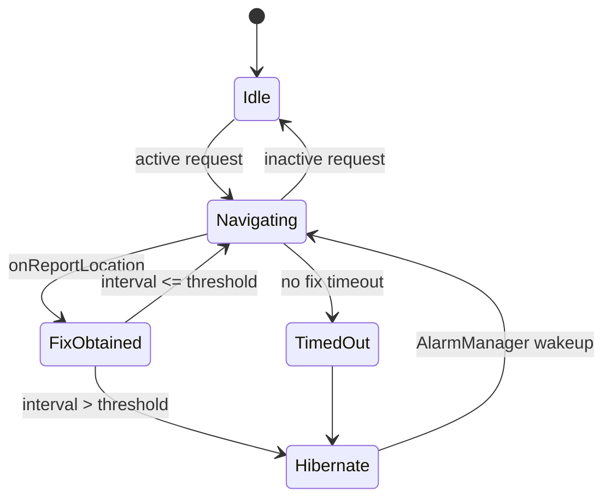
```mermaid
stateDiagram-v2
    [*] --> Idle
    Idle --> Navigating : active request
    Navigating --> FixObtained : onReportLocation
    FixObtained --> Hibernate : interval > threshold
    FixObtained --> Navigating : interval <= threshold
    Hibernate --> Navigating : AlarmManager wakeup
    Navigating --> Idle : inactive request
    Navigating --> TimedOut : no fix timeout
    TimedOut --> Hibernate
```

这套机制的目标很直接：定位周期较长时，不值得一直点亮 GNSS 硬件。

#### 位置 extras

GNSS fix 的 extras 里还会附带：

- `mSvCount`
- `mMeanCn0`
- `mMaxCn0`

供诊断或 UI 显示用。

#### 关键行为

1. 优先尝试 `MS_BASED`
2. HAL 请求时下载并注入 PSDS
3. 通过 `NetworkTimeHelper` 注入 NTP 时间
4. 支持卫星 blocklist
5. 车机场景可 suspend GNSS
6. HAL 支持时走 batching

#### PSDS 下载流程

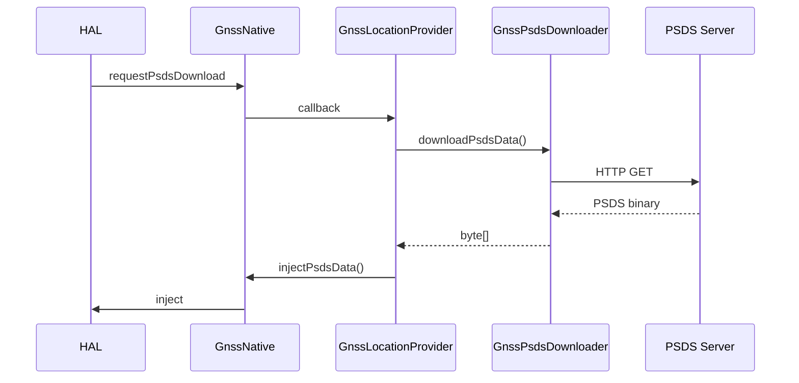
```mermaid
sequenceDiagram
    participant HAL
    participant GN as GnssNative
    participant GLP as GnssLocationProvider
    participant DL as GnssPsdsDownloader
    participant Server as PSDS Server

    HAL->>GN: requestPsdsDownload
    GN->>GLP: callback
    GLP->>DL: downloadPsdsData()
    DL->>Server: HTTP GET
    Server-->>DL: PSDS binary
    DL-->>GLP: byte[]
    GLP->>GN: injectPsdsData()
    GN->>HAL: inject
```

#### 运营商配置

`GnssConfiguration` 会从多个来源加载配置：

1. `/vendor/etc/gps_debug.conf`
2. `/etc/gps_debug.conf`
3. `CarrierConfigManager`

常见配置项：

| 属性 | 说明 |
|---|---|
| `SUPL_HOST` / `SUPL_PORT` | SUPL 服务地址 |
| `SUPL_MODE` / `SUPL_VER` | SUPL 协议配置 |
| `LPP_PROFILE` | LTE 定位协议 |
| `GPS_LOCK` | GPS 锁定掩码 |
| `ES_EXTENSION_SEC` | 紧急会话扩展 |
| `NFW_PROXY_APPS` | 非框架可见性代理应用 |
| `ENABLE_PSDS_PERIODIC_DOWNLOAD` | 周期性 PSDS 刷新 |

### 33.3.8 `GnssManagerService`

`GnssManagerService` 位于 LMS 与 `GnssNative` 中间，统一管理 GNSS 专用监听 API：

```java
public class GnssManagerService {
    private final GnssLocationProvider mGnssLocationProvider;
    private final GnssStatusProvider mGnssStatusProvider;
    private final GnssNmeaProvider mGnssNmeaProvider;
    private final GnssMeasurementsProvider mGnssMeasurementsProvider;
    private final GnssNavigationMessageProvider mGnssNavigationMessageProvider;
    private final GnssAntennaInfoProvider mGnssAntennaInfoProvider;
    private final IGpsGeofenceHardware mGnssGeofenceProxy;
    private final GnssMetrics mGnssMetrics;
}
```

对应权限：

| API | 所需权限 |
|---|---|
| `registerGnssStatusCallback` | `ACCESS_FINE_LOCATION` |
| `registerGnssNmeaCallback` | `ACCESS_FINE_LOCATION` |
| `addGnssMeasurementsListener` | `ACCESS_FINE_LOCATION` |
| `addGnssNavigationMessageListener` | `ACCESS_FINE_LOCATION` |
| `addGnssAntennaInfoListener` | 无定位隐私要求 |
| `injectGnssMeasurementCorrections` | `LOCATION_HARDWARE` + `ACCESS_FINE_LOCATION` |

### 33.3.9 GNSS 能力位

HAL 通过 bitmask 报告能力，框架包装成 `GnssCapabilities`：

| 能力位 | 含义 |
|---|---|
| `CAPABILITY_SCHEDULING` | 周期调度 |
| `CAPABILITY_MSB` / `CAPABILITY_MSA` | A-GNSS 模式 |
| `CAPABILITY_SINGLE_SHOT` | 单次定位 |
| `CAPABILITY_ON_DEMAND_TIME` | 按需时间注入 |
| `CAPABILITY_GEOFENCING` | 硬件地理围栏 |
| `CAPABILITY_MEASUREMENTS` | 原始测量 |
| `CAPABILITY_NAV_MESSAGES` | 导航电文 |
| `CAPABILITY_LOW_POWER_MODE` | 低功耗模式 |
| `CAPABILITY_SATELLITE_BLOCKLIST` | 卫星屏蔽 |
| `CAPABILITY_MEASUREMENT_CORRECTIONS` | 测量修正 |
| `CAPABILITY_ANTENNA_INFO` | 天线信息 |
| `CAPABILITY_CORRELATION_VECTOR` | 相关向量 |
| `CAPABILITY_SATELLITE_PVT` | 卫星 PVT |
| `CAPABILITY_MEASUREMENT_CORRECTIONS_FOR_DRIVING` | 驾驶场景修正 |
| `CAPABILITY_ACCUMULATED_DELTA_RANGE` | 载波相位 ADR |

### 33.3.10 信号类型

`GnssSignalType` 把星座、载频与码型组合在一起。典型例子：

| 星座 | 信号 | 频率 | 码型 |
|---|---|---|---|
| GPS | L1 C/A | 1575.42 MHz | C |
| GPS | L5 | 1176.45 MHz | L5Q |
| Galileo | E1 | 1575.42 MHz | E1B/E1C |
| Galileo | E5a | 1176.45 MHz | E5aQ |
| BeiDou | B1I | 1561.098 MHz | B1I |
| BeiDou | B1C | 1575.42 MHz | B1C |

多频接收机利用不同频段可显著降低电离层误差。

### 33.3.11 功耗统计

`IGnssPowerIndication` 提供 GNSS 功耗指标：

- 总能量
- 单频 tracking / acquisition 能耗
- 多频 tracking / acquisition 能耗
- 其他模式分信号能耗

这些数据最终被 `GnssMetrics` 汇总，也可通过 `dumpsys location` 看到。

### 33.3.12 调试接口

`IGnssDebug` 可暴露：

- 星历 / 历书
- 时间模型
- 当前位置估计
- 卫星健康状态

主要用于 HAL 一致性测试与深度调试。

---

## 33.4 融合定位（FLP）

### 33.4.1 概览

Fused Location Provider 会把 GNSS、Wi‑Fi、基站、气压计、IMU 等多种来源综合成“当前最合适”的位置估计。在 GMS 设备上，它通常由 Google Play Services 提供；在纯 AOSP 上，它是一个可替换的绑定服务。

### 33.4.2 LMS 如何绑定 FLP

LMS 通过 `ProxyLocationProvider.create(...)` 创建并绑定 fused provider。它本身不实现融合算法，而是绑定外部服务并向其转发 `ProviderRequest`。

### 33.4.3 `ProxyLocationProvider`

`ProxyLocationProvider` 是 FLP / NLP 的共同封装：

- 扩展 `AbstractLocationProvider`
- 使用 `ServiceWatcher` 发现并绑定服务
- 把 `ProviderRequest` 发给外部服务
- 接收 `LocationResult` 回调

### 33.4.4 FLP 架构

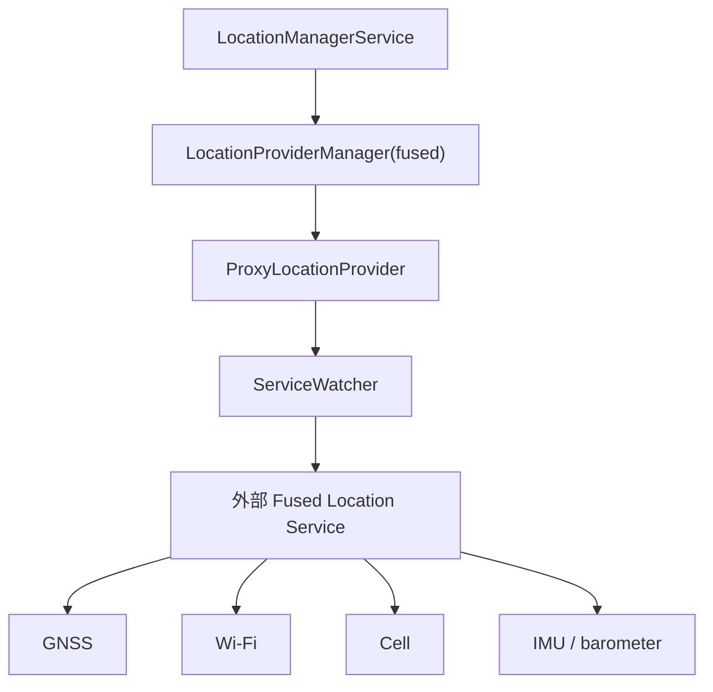
```mermaid
graph TB
    LMS["LocationManagerService"] --> LPM["LocationProviderManager(fused)"]
    LPM --> PROXY["ProxyLocationProvider"]
    PROXY --> SW["ServiceWatcher"]
    SW --> FLP["外部 Fused Location Service"]
    FLP --> GNSS["GNSS"]
    FLP --> WIFI["Wi‑Fi"]
    FLP --> CELL["Cell"]
    FLP --> SENSORS["IMU / barometer"]
```

### 33.4.5 功耗效率

FLP 的本质目标不是“永远最准”，而是在不同场景下动态权衡：

- 室外：GNSS 权重更高
- 室内：Wi‑Fi / 传感器更重要
- 静止：更激进地降频
- 运动：提升刷新率

### 33.4.6 请求优先级

不同应用请求会被聚合后转成一个对 FLP 的“综合请求”。这个综合请求通常会综合：

- 期望精度
- 最小更新间隔
- 最大延迟
- 前后台状态
- 电池策略

### 33.4.7 静止节流

FLP / provider 层还可以结合 `StationaryThrottlingLocationProvider` 做节流。设备静止时，即便应用仍然注册位置监听，也未必要继续高频采样。

### 33.4.8 高程转换

LPM 可借助 `AltitudeConverter` / `AltitudeService` 把 WGS84 椭球高转成更适合用户理解的海平面高程，这对登山、地形或 UI 展示类应用更友好。

---

## 33.5 网络定位（NLP）

### 33.5.1 概览

Network Location Provider 用基站和 Wi‑Fi 数据库估算位置。它和 FLP 一样是绑定服务，但更偏低功耗、粗粒度定位。

### 33.5.2 NLP 与 FLP 对比

| 维度 | Network Provider | Fused Provider |
|---|---|---|
| action | `ACTION_NETWORK_PROVIDER` | `ACTION_FUSED_PROVIDER` |
| 是否用 GNSS | 否 | 是 |
| 典型精度 | 20 到 200 m | 3 到 50 m |
| 功耗 | 低 | 视场景变化 |
| 典型用途 | coarse 定位 | 最佳可用定位 |

### 33.5.3 基站定位

NLP 会通过 `TelephonyManager` 拿到当前 `CellInfo`，再用 `MCC/MNC/LAC/TAC/CID` 去查数据库，得到近似位置。

### 33.5.4 Wi‑Fi 定位

Wi‑Fi 定位采集的是 `BSSID/RSSI` 指纹，再和指纹库做匹配。城市环境下往往能做到 10 到 50 米。

### 33.5.5 `ProxyLocationProvider`

NLP 和 FLP 在框架层共用同一个 `ProxyLocationProvider` 机制，因此：

- 服务发现方式一致
- mock / 权限 / 分发链路一致
- 差别主要在外部服务算法

### 33.5.6 `ServiceWatcher`

`ServiceWatcher` 提供：

1. 基于 intent action 的服务发现
2. overlay 支持
3. 多实现版本选择
4. 当前用户上下文绑定
5. 服务死亡自动重连

### 33.5.7 `MockableLocationProvider`

真实 provider 往往会再包一层 `MockableLocationProvider`：

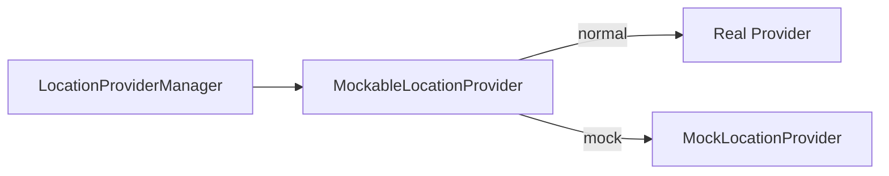
```mermaid
graph LR
    LPM["LocationProviderManager"] --> MLP["MockableLocationProvider"]
    MLP -->|normal| RP["Real Provider"]
    MLP -->|mock| MP["MockLocationProvider"]
```

mock 位置仍然经过真实分发链路，所以测试更接近生产。

### 33.5.8 人口密度 provider

Android 14 引入 `ProxyPopulationDensityProvider`，为 coarse 位置模糊算法提供人口密度输入。人口稠密区允许更小的模糊网格，乡村地区则进一步放大，以加强隐私保护。

---

## 33.6 地理围栏

Android 支持两层 geofencing：

- 软件围栏：`GeofenceManager`
- 硬件围栏：`IGnssGeofence` / GNSS 芯片

### 33.6.1 软件围栏：`GeofenceManager`

`GeofenceManager` 继承 `ListenerMultiplexer` 并实现 `LocationListener`。它通过 fused provider 监听位置：

```java
getLocationManager().requestLocationUpdates(
    FUSED_PROVIDER, locationRequest, FgThread.getExecutor(), this);
```

关键常量：

```java
private static final int MAX_SPEED_M_S = 100;
private static final long MAX_LOCATION_AGE_MS = 5 * 60 * 1000L;
private static final long MAX_LOCATION_INTERVAL_MS = 2 * 60 * 60 * 1000;
```

#### 自适应轮询

轮询周期会根据到最近围栏边界的距离动态调整：

```java
intervalMs = Math.min(MAX_LOCATION_INTERVAL_MS,
    Math.max(
        settingsHelper.getBackgroundThrottleProximityAlertIntervalMs(),
        minFenceDistanceM * 1000 / MAX_SPEED_M_S));
```

离围栏很远时，间隔可长达数小时；接近边界时，间隔会缩短，以保证进出边界时足够及时。

#### 围栏状态机

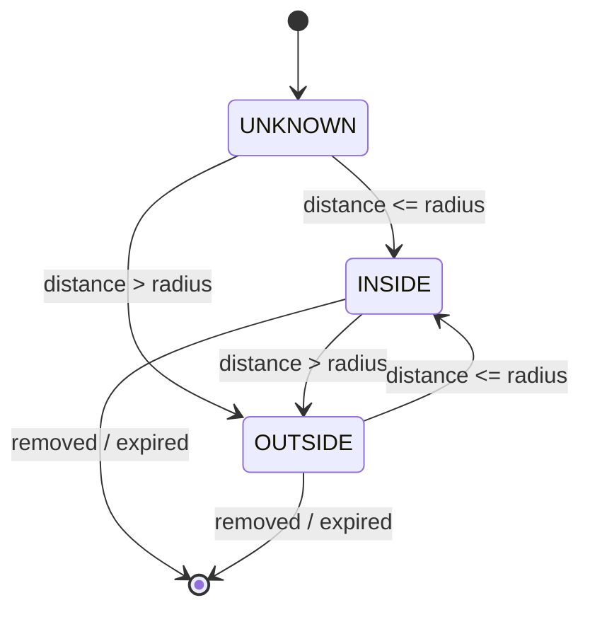
```mermaid
stateDiagram-v2
    [*] --> UNKNOWN
    UNKNOWN --> INSIDE : distance <= radius
    UNKNOWN --> OUTSIDE : distance > radius
    INSIDE --> OUTSIDE : distance > radius
    OUTSIDE --> INSIDE : distance <= radius
    INSIDE --> [*] : removed / expired
    OUTSIDE --> [*] : removed / expired
```

### 33.6.2 `GeofenceRegistration`

每个注册项大致包含：

- `Geofence`
- `CallerIdentity`
- `Location center`
- `WakeLock`
- 当前状态：`UNKNOWN / INSIDE / OUTSIDE`
- 当前权限是否允许

`WakeLock` 会保证边界事件派发期间设备不睡死。

### 33.6.3 硬件围栏：`GeofenceProxy`

`GeofenceProxy` 负责在框架、`GeofenceHardwareService` 与 GNSS HAL 之间搭桥：

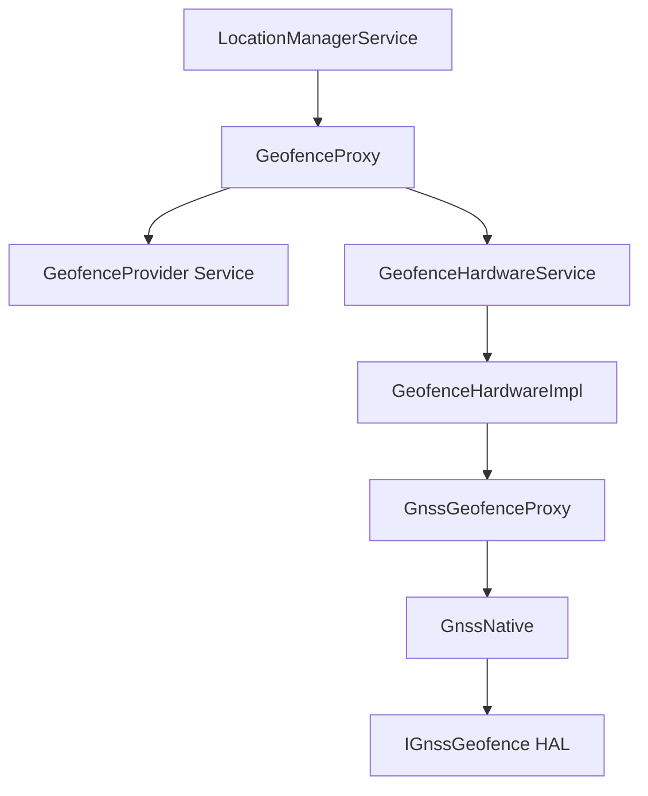
```mermaid
graph TB
    LMS["LocationManagerService"] --> GP["GeofenceProxy"]
    GP --> GFP["GeofenceProvider Service"]
    GP --> GHS["GeofenceHardwareService"]
    GHS --> GHI["GeofenceHardwareImpl"]
    GHI --> GGP["GnssGeofenceProxy"]
    GGP --> GN["GnssNative"]
    GN --> HAL["IGnssGeofence HAL"]
```

### 33.6.4 `IGnssGeofence`

HAL 支持在 GNSS 芯片上直接维护圆形围栏：

```java
interface IGnssGeofence {
    void setCallback(in IGnssGeofenceCallback callback);
    void addGeofence(int geofenceId, double lat, double lng,
                     double radiusM, int lastTransition,
                     int monitorTransitions,
                     int notificationResponsivenessMs,
                     int unknownTimerMs);
    void pauseGeofence(int geofenceId);
    void resumeGeofence(int geofenceId, int monitorTransitions);
    void removeGeofence(int geofenceId);
}
```

硬件 geofence 的最大价值是省电：应用处理器可以休眠，而边界监控继续在芯片上运行。

### 33.6.5 `GnssGeofenceHalModule`

`GnssManagerService` 内部的 `GnssGeofenceHalModule` 负责把 HAL 回调翻译成框架 geofence 事件，再上抛给 `GeofenceHardwareImpl`。

---

## 33.7 地理编码

Geocoder 提供地址与经纬度之间的双向转换。

### 33.7.1 客户端 API

```java
Geocoder geocoder = new Geocoder(context, Locale.getDefault());

List<Address> addresses = geocoder.getFromLocation(lat, lng, maxResults);
List<Address> results = geocoder.getFromLocationName("1600 Amphitheatre Pkwy", 1);
```

### 33.7.2 服务端实现

`Geocoder` 最终会调用 `ILocationManager.reverseGeocode()` / `forwardGeocode()`，再由 LMS 委托给 `ProxyGeocodeProvider`：

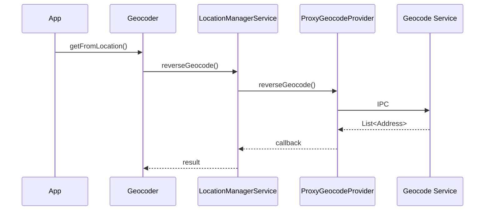
```mermaid
sequenceDiagram
    participant App
    participant GC as Geocoder
    participant LMS as LocationManagerService
    participant PGP as ProxyGeocodeProvider
    participant GS as Geocode Service

    App->>GC: getFromLocation()
    GC->>LMS: reverseGeocode()
    LMS->>PGP: reverseGeocode()
    PGP->>GS: IPC
    GS-->>PGP: List<Address>
    PGP-->>LMS: callback
    LMS-->>GC: result
```

### 33.7.3 可用性

`Geocoder.isPresent()` 只有在 geocode provider 绑定成功时才会返回 `true`。在纯 AOSP 环境，没有 GMS 或替代 geocode 服务时，它可能是不可用的。

### 33.7.4 正向地理编码

正向地理编码请求中常见字段：

| 字段 | 说明 |
|---|---|
| `locationName` | 地址字符串 |
| `maxResults` | 返回上限 |
| `lowerLeft` / `upperRight` | 可选 bounding box |
| `locale` | 结果语言 |
| `callingPackage` | 请求方包名 |
| `callingUid` | 请求方 UID |

bounding box 的作用是把歧义地址限制在一个地理区域内，提高命中率。

### 33.7.5 错误处理

`IGeocodeCallback` 同时支持结果与错误回传。典型失败原因：

- provider 未绑定
- 网络不可用
- 地址无效
- provider 服务崩溃

客户端最终通常会把它翻译成 `IOException`。

### 33.7.6 `Address`

`Address` 常见字段：

| 字段 | 说明 |
|---|---|
| `latitude`, `longitude` | 经纬度 |
| `featureName` | 地点名 |
| `thoroughfare` | 街道名 |
| `subThoroughfare` | 门牌号 |
| `locality` | 城市 |
| `adminArea` | 州 / 省 |
| `postalCode` | 邮编 |
| `countryCode` | 国家代码 |
| `countryName` | 国家名称 |
| `locale` | 返回语言 |

---

## 33.8 定位权限

Android 的定位权限模型是全平台最细的一类，至少有四个维度：

- 精度：fine / coarse
- 时态：foreground / background
- 紧急态：normal / emergency
- 旁路：普通应用 / 系统 bypass

### 33.8.1 权限层次

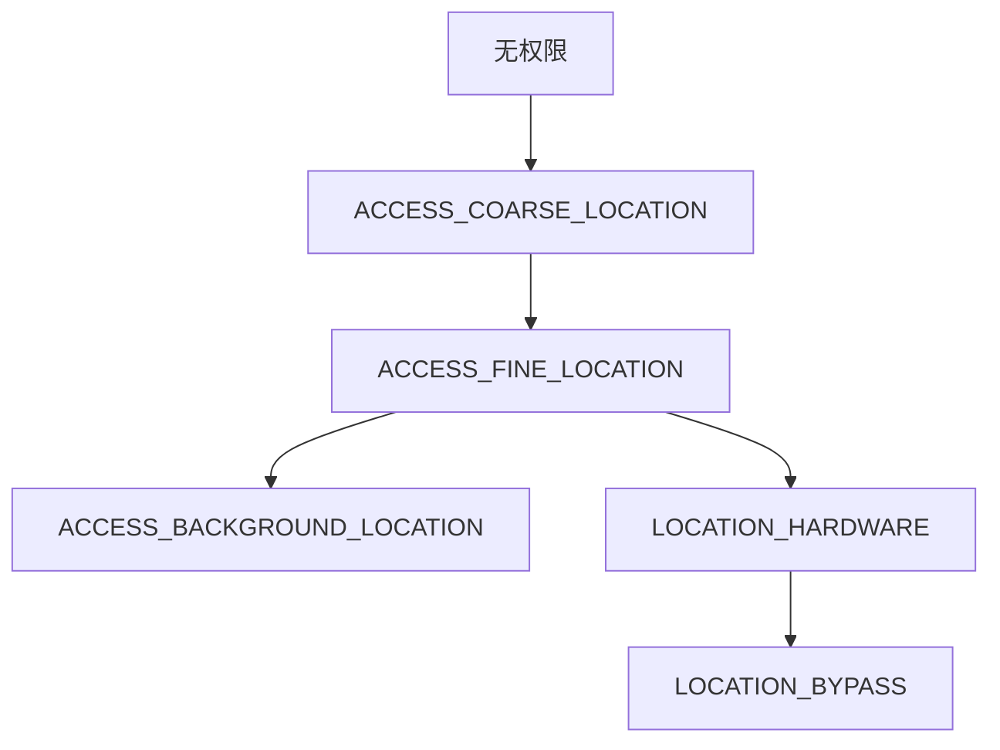
```mermaid
graph TB
    NONE["无权限"]
    COARSE["ACCESS_COARSE_LOCATION"]
    FINE["ACCESS_FINE_LOCATION"]
    BG["ACCESS_BACKGROUND_LOCATION"]
    HW["LOCATION_HARDWARE"]
    BYPASS["LOCATION_BYPASS"]

    NONE --> COARSE
    COARSE --> FINE
    FINE --> BG
    FINE --> HW
    HW --> BYPASS
```

### 33.8.2 `LocationPermissions`

`LocationPermissions` 定义三种权限级别：

```java
public static final int PERMISSION_NONE = 0;
public static final int PERMISSION_COARSE = 1;
public static final int PERMISSION_FINE = 2;
```

判断逻辑：

```java
public static int getPermissionLevel(Context context, int uid, int pid) {
    if (context.checkPermission(ACCESS_FINE_LOCATION, pid, uid) == GRANTED) {
        return PERMISSION_FINE;
    }
    if (context.checkPermission(ACCESS_COARSE_LOCATION, pid, uid) == GRANTED) {
        return PERMISSION_COARSE;
    }
    return PERMISSION_NONE;
}
```

### 33.8.3 Fine 与 Coarse

| 维度 | Fine | Coarse |
|---|---|---|
| 权限 | `ACCESS_FINE_LOCATION` | `ACCESS_COARSE_LOCATION` |
| 精度 | 精确坐标 | 模糊到约 1.6 km 网格 |
| provider 访问 | 所有 provider | 也可访问，但结果被模糊 |
| GNSS 原始数据 | 可用 | 不可用 |

### 33.8.4 后台定位

Android 10 起，`ACCESS_BACKGROUND_LOCATION` 成为独立权限。应用即便有 fine / coarse，也不能默认在后台持续拿位置。

同时，后台节流还会受：

- Settings 白名单
- 前台服务类型
- app standby
- provider 自身节流

共同影响。

### 33.8.5 bypass

部分系统组件需要在用户关闭定位总开关时仍然工作，例如：

- 紧急呼叫
- 汽车 ADAS
- 某些系统安全功能

这由 `LOCATION_BYPASS` 控制：

```java
public static void enforceBypassPermission(Context context, int uid, int pid) {
    if (context.checkPermission(LOCATION_BYPASS, pid, uid) == GRANTED) {
        return;
    }
    throw new SecurityException(...);
}
```

### 33.8.6 AppOps 集成

除了运行时权限，定位还受 AppOps 二次裁决。用户可在设置中通过 AppOps 关闭某个应用的定位使用，即使权限名义上仍被授予。

### 33.8.7 紧急定位

紧急通话期间，系统会放宽一些定位限制。`EmergencyHelper` 负责追踪紧急状态，HAL 侧也能收到相应状态，以支持 E911 等场景。

### 33.8.8 权限执行流程

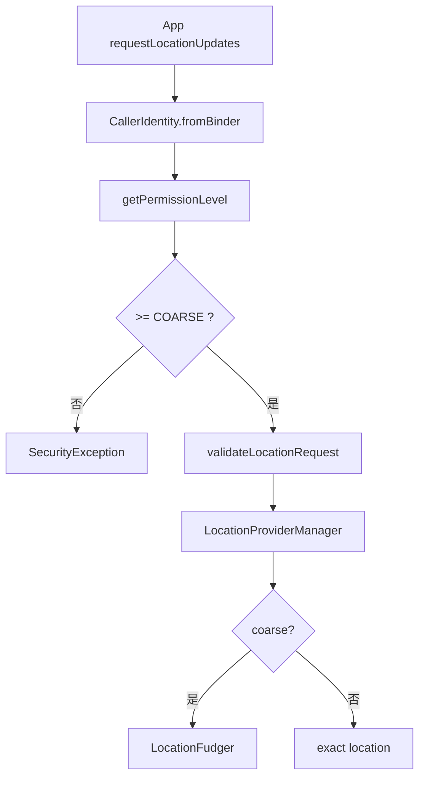
```mermaid
graph TB
    APP["App requestLocationUpdates"] --> ID["CallerIdentity.fromBinder"]
    ID --> PL["getPermissionLevel"]
    PL --> CHECK{">= COARSE ?"}
    CHECK -->|否| DENY["SecurityException"]
    CHECK -->|是| VALIDATE["validateLocationRequest"]
    VALIDATE --> LPM["LocationProviderManager"]
    LPM --> FUDGE{"coarse?"}
    FUDGE -->|是| CLOC["LocationFudger"]
    FUDGE -->|否| EXACT["exact location"]
```

### 33.8.9 前台服务要求

Android 12 起，持续后台定位通常需要 `foreground service` 类型为 `location`。LMS 还会记录 FGS API begin / end，用于系统 UI 和审计。

### 33.8.10 `PendingIntent` 安全

`PendingIntent` 型定位请求存在额外约束，因为注册后进程可能已经死亡，系统不容易持续跟踪权限与状态变化。所以某些 system-only 能力不能通过 `PendingIntent` 暴露给普通应用。

### 33.8.11 定位指示器

Android 12 引入了定位指示器。`AppOpsManager` 跟踪 `OP_FINE_LOCATION` / `OP_COARSE_LOCATION`，SystemUI 根据活跃 note 展示状态栏或绿点。

### 33.8.12 attribution tag

Android 11 起，调用方身份中可包含 attribution tag：

```java
CallerIdentity identity = CallerIdentity.fromBinder(
    mContext, packageName, attributionTag, listenerId);
```

这让同一包内不同模块的定位使用也能被审计。

### 33.8.13 按用户定位设置

定位总开关是 per-user 的：

```java
public void setLocationEnabledForUser(boolean enabled, int userId) {
    mContext.enforceCallingOrSelfPermission(WRITE_SECURE_SETTINGS, null);
    LocationManager.invalidateLocalLocationEnabledCaches();
    mInjector.getSettingsHelper().setLocationEnabled(enabled, userId);
}
```

这与 Android 的多用户模型完全一致，不同 user 的定位状态和策略可以独立。

---

## 33.9 GeoTZ：从位置推断时区

GeoTZ 是 Android 的位置到时区映射实现。它使用离线边界数据库，把经纬度映射成时区 ID，而不依赖网络查询。

### 33.9.1 模块结构

```text
packages/modules/GeoTZ/
    apex/
    common/
    data_pipeline/
    geotz_lookup/
    locationtzprovider/
    output_data/
    s2storage/
    tzs2storage/
    tzbb_data/
    validation/
```

### 33.9.2 数据流水线

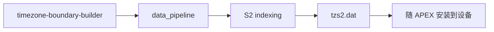
```mermaid
graph LR
    TZBB["timezone-boundary-builder"] --> DP["data_pipeline"]
    DP --> S2["S2 indexing"]
    S2 --> TZS2["tzs2.dat"]
    TZS2 --> DEVICE["随 APEX 安装到设备"]
```

流程是：

1. 从 `timezone-boundary-builder` 获取 GeoJSON 边界
2. 用 S2 Geometry 处理多边形
3. 生成二进制 `tzs2.dat`

### 33.9.3 `GeoTimeZonesFinder`

对上层暴露的查找接口大致如下：

```java
try (GeoTimeZonesFinder finder = GeoTimeZonesFinder.create(...)) {
    LocationToken token = finder.createLocationTokenForLatLng(lat, lng);
    List<String> tzIds = finder.findTimeZonesForLocationToken(token);
}
```

`LocationToken` 允许在未跨越 S2 单元边界时复用上次查找结果。

### 33.9.4 `OfflineLocationTimeZoneDelegate`

这是 GeoTZ 的核心状态机，支持两种监听模式：

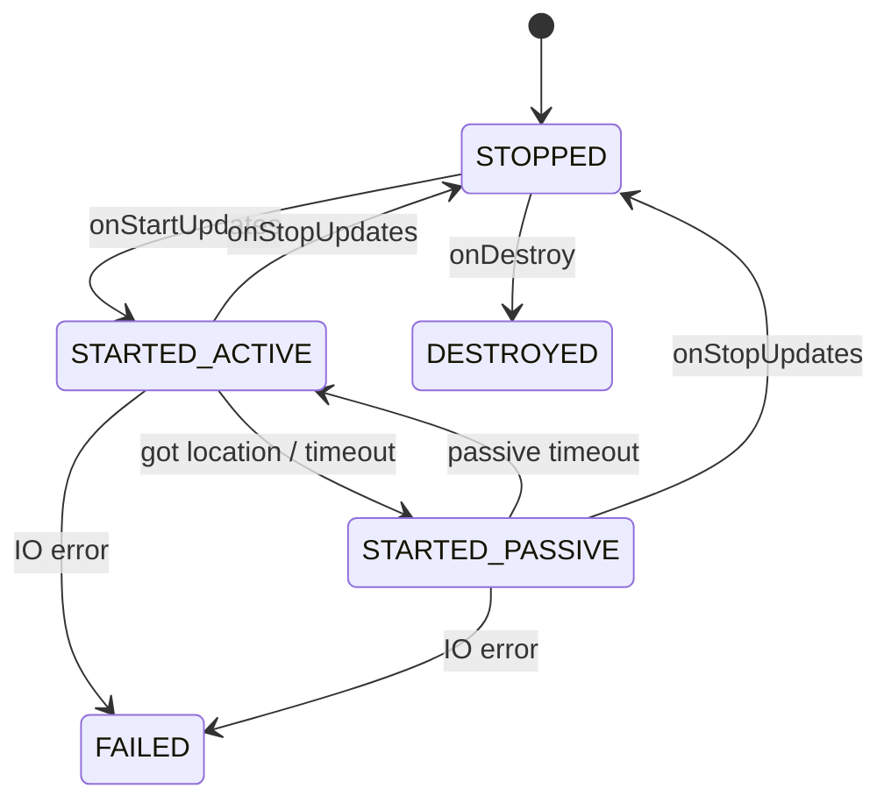
```mermaid
stateDiagram-v2
    [*] --> STOPPED
    STOPPED --> STARTED_ACTIVE : onStartUpdates
    STARTED_ACTIVE --> STARTED_PASSIVE : got location / timeout
    STARTED_PASSIVE --> STARTED_ACTIVE : passive timeout
    STARTED_ACTIVE --> STOPPED : onStopUpdates
    STARTED_PASSIVE --> STOPPED : onStopUpdates
    STOPPED --> DESTROYED : onDestroy
    STARTED_ACTIVE --> FAILED : IO error
    STARTED_PASSIVE --> FAILED : IO error
```

两种模式：

- ACTIVE：高功耗、短时、主动拿一次位置
- PASSIVE：低功耗、长时、只搭便车

它内部的 `LocationListeningAccountant` 管理一套预算机制：被动监听可以积累“主动监听预算”，防止模块长期滥用高功耗定位。

### 33.9.5 Provider Service

`OfflineLocationTimeZoneProviderService` 继承 `TimeZoneProviderService`，负责把 GeoTZ 查询结果汇报给时区检测系统。

结果类型包括：

| 类型 | 含义 |
|---|---|
| `RESULT_TYPE_SUGGESTION` | 成功得到时区建议 |
| `RESULT_TYPE_UNCERTAIN` | 无法确定 |
| `RESULT_TYPE_PERMANENT_FAILURE` | 永久失败，例如数据文件损坏 |

### 33.9.6 从定位到时区

```mermaid
sequenceDiagram
    participant LTZ as OfflineLocationTimeZoneDelegate
    participant ENV as Environment
    participant LOC as LocationManager
    participant FINDER as GeoTimeZonesFinder
    participant TZD as time_zone_detector

    LTZ->>ENV: startActiveGetCurrentLocation()
    ENV->>LOC: getCurrentLocation(fused)
    LOC-->>ENV: Location
    ENV-->>LTZ: callback
    LTZ->>FINDER: createLocationTokenForLatLng()
    LTZ->>FINDER: findTimeZonesForLocationToken()
    FINDER-->>LTZ: tzIds
    LTZ->>TZD: reportSuggestion()
```

### 33.9.7 S2 几何存储

S2 的优势：

- 数据紧凑
- 查找快
- 完全离线
- 易于随 APEX 更新

### 33.9.8 `GeoDataFileManager`

它负责加载并缓存：

```text
/apex/com.android.geotz/etc/tzs2.dat
```

这也意味着时区边界变化不必等整机 OTA，只需更新 Mainline APEX。

### 33.9.9 容错

GeoTZ 需要处理：

1. 初始化超时
2. `tzs2.dat` 损坏或缺失
3. 被动模式长期收不到位置
4. 用户切换导致的状态清理

### 33.9.10 功耗预算

```mermaid
graph LR
    PASSIVE["Passive Listening"] --> BUDGET["Active Budget Pool"]
    BUDGET --> ACTIVE["Active Listening"]
```

这套预算决定了 GeoTZ 不能长期靠高功耗主动定位工作。

### 33.9.11 与时区检测整合

`time_zone_detector` 通常会综合：

1. 手动设置
2. GeoTZ 位置建议
3. Telephony（MCC / NITZ）

位置建议在跨边界地区尤为重要，比如单一 MCC 覆盖多个时区的区域。

### 33.9.12 APEX 更新

GeoTZ 以 `com.android.geotz` Mainline APEX 发布，因此：

- `tzs2.dat` 可独立更新
- provider APK 与库也可同步更新
- 不需要整机 OTA

---

## 33.10 高级主题

### 33.10.1 GNSS 测量修正

高精度与车机场景可用 `GnssMeasurementCorrections` 注入建筑物反射等修正信息，帮助芯片处理 urban canyon 多路径问题。

```mermaid
sequenceDiagram
    participant Map as "3D Mapping Service"
    participant App as "Correction App"
    participant LMS as LocationManagerService
    participant GMS as GnssManagerService
    participant GN as GnssNative
    participant HAL as GNSS HAL

    App->>LMS: injectGnssMeasurementCorrections()
    LMS->>GMS: forward
    GMS->>GN: injectMeasurementCorrections()
    GN->>HAL: setCorrections()
```

### 33.10.2 GNSS 可见性控制

`IGnssVisibilityControl` 管理哪些代理应用可以接收非框架发起的 NFW（Non-Framework) 定位请求结果，例如特定运营商或 E911 场景。

### 33.10.3 导航电文

`IGnssNavigationMessageInterface` 暴露原始导航电文，供科研和专用定位应用使用。

### 33.10.4 天线信息

`IGnssAntennaInfo` / `GnssAntennaInfo` 暴露天线相位中心偏移、修正和增益图，对毫米级定位应用很关键。

### 33.10.5 新版 GNSS Assistance API

新的 `IGnssAssistanceInterface` 尝试用结构化辅助数据替代旧式 PSDS 二进制 blob，让星座级别的星历、历书和电离层模型注入更细粒度。

### 33.10.6 GNSS batching

GNSS 芯片可在片上缓存一批位置，再批量上报，避免 AP 频繁唤醒。旧批处理 API 在框架层通常会映射到带 `setMaxUpdateDelayMillis()` 的常规定位请求。

### 33.10.7 国家检测

`CountryDetector` 虽不完全属于定位服务，但会消耗位置：

1. 位置推断国家
2. SIM MCC 推断
3. Locale 回退

### 33.10.8 `LocationEventLog`

`LocationEventLog` 维护循环缓冲区，记录：

- 用户定位总开关变化
- provider 状态变化
- 位置分发
- 权限变化
- 紧急模式转换
- ADAS GNSS 状态

### 33.10.9 Context Hub 集成

`HardwareActivityRecognitionProxy` 在 `onSystemThirdPartyAppsCanStart()` 阶段条件性启动。活动识别结果会反向影响 FLP 等 provider 的策略，例如步行、跑步、驾车等状态下不同源的权重。

---

## 33.11 动手实践

### 33.11.1 查询所有 provider

```java
LocationManager lm = (LocationManager) getSystemService(LOCATION_SERVICE);
for (String provider : lm.getAllProviders()) {
    ProviderProperties props = lm.getProviderProperties(provider);
    boolean enabled = lm.isProviderEnabled(provider);
    Log.i("LocTest", "Provider=" + provider
        + " enabled=" + enabled
        + " accuracy=" + (props != null ? props.getAccuracy() : "N/A")
        + " power=" + (props != null ? props.getPowerUsage() : "N/A"));
}
```

配合：

```bash
adb shell dumpsys location
```

对照系统内部状态。

### 33.11.2 观察 GNSS 卫星状态

```java
LocationManager lm = (LocationManager) getSystemService(LOCATION_SERVICE);
lm.registerGnssStatusCallback(getMainExecutor(), new GnssStatus.Callback() {
    @Override
    public void onSatelliteStatusChanged(GnssStatus status) {
        for (int i = 0; i < status.getSatelliteCount(); i++) {
            Log.i("Gnss", "svid=" + status.getSvid(i)
                + " constellation=" + status.getConstellationType(i)
                + " cn0=" + status.getCn0DbHz(i)
                + " used=" + status.usedInFix(i));
        }
    }
});
```

### 33.11.3 导出 GNSS 指标

```bash
# 导出完整定位状态
adb shell dumpsys location

# 仅看 GNSS 相关
adb shell dumpsys location --gnssmetrics
```

重点看：

- TTFF
- 卫星数量
- C/N0
- 功耗与能力位

### 33.11.4 软件 geofence

通过应用注册一个 geofence，然后观察：

- 靠近边界时轮询频率是否提升
- `PendingIntent` 是否按进入 / 离开派发
- `dumpsys location` 中 geofence 状态是否变化

### 33.11.5 检查 GeoTZ 数据

```bash
# 查看 GeoTZ provider 状态
adb shell dumpsys time_zone_detector

# 检查 tzs2.dat
adb shell ls -l /apex/com.android.geotz/etc/tzs2.dat
```

### 33.11.6 mock location provider

```bash
# 先在开发者选项里启用 mock location app

# 使用 shell 命令设置 mock
adb shell cmd location set-test-provider-enabled gps true
adb shell cmd location set-test-provider-location gps --location 31.2304,121.4737
```

或者直接在测试应用中调用 `setTestProviderLocation()`。

### 33.11.7 GNSS 原始测量

```java
locationManager.registerGnssMeasurementsCallback(
    getMainExecutor(),
    new GnssMeasurementsEvent.Callback() {
        @Override
        public void onGnssMeasurementsReceived(GnssMeasurementsEvent event) {
            for (GnssMeasurement m : event.getMeasurements()) {
                Log.i("RawGnss", "svid=" + m.getSvid()
                    + " cn0=" + m.getCn0DbHz()
                    + " state=" + m.getState());
            }
        }
    });
```

### 33.11.8 对比权限行为

分别在以下权限组合下测试：

1. 无权限
2. 仅 coarse
3. fine
4. fine + background

观察点：

- 能否注册 provider
- 返回位置是否被模糊
- 后台是否还能持续接收
- GNSS 原始 API 是否被拦截

### 33.11.9 跟踪 provider 初始化

```bash
# 重启并抓日志
adb reboot
adb logcat -b all | grep -i "LocationManagerService\\|Gnss\\|ProxyLocationProvider"
```

重点看 network、fused、gnss、geocode、geofence 的初始化时序。

### 33.11.10 监控 geofence 轮询

```bash
# 应用加 geofence 后观察定位请求
adb shell dumpsys location | grep -i "GeofencingService"
```

靠近围栏边界时，轮询间隔应变短。

### 33.11.11 比较星座

在开阔环境下记录各星座状态，对比：

- GPS / Galileo / BeiDou / GLONASS 的可见卫星数
- 各星座 C/N0
- 是否 used in fix

### 33.11.12 分析定位功耗

```bash
# 清空电池统计
adb shell dumpsys batterystats --reset

# 持续运行高强度定位应用 10 分钟

# 采集 bugreport 或直接看 batterystats
adb shell dumpsys batterystats | grep -i location
```

### 33.11.13 检查 GNSS 配置

```bash
# 查看配置文件
adb shell cat /vendor/etc/gps_debug.conf
adb shell cat /etc/gps_debug.conf

# 查看相关 system property
adb shell getprop | grep -i gnss
```

### 33.11.14 定位 shell 命令

```bash
# 列出 provider 状态
adb shell cmd location providers

# 定位总开关
adb shell cmd location is-location-enabled

# 启用/关闭定位（需要 root 或特权）
adb shell cmd location set-location-enabled true

# 给 provider 发送额外命令
adb shell cmd location send-extra-command gps delete_aiding_data
```

### 33.11.15 构建自定义 provider

可以实现一个自定义 `AbstractLocationProvider` 或绑定式 provider，最小需要：

1. provider 实现
2. provider 生命周期与 `onSetRequest()`
3. 向 `LocationProviderManager` 回报 `LocationResult`

适合用于测试或特定设备形态。

### 33.11.16 Geocoder 可用性

```java
Geocoder geocoder = new Geocoder(context);
Log.i("Geocoder", "isPresent=" + Geocoder.isPresent());
```

如果返回 `false`，说明系统没有可绑定的 geocode provider。

### 33.11.17 分析定位事件日志

```bash
adb shell dumpsys location
```

重点查看：

- `Event Log`
- provider 注册 / 反注册
- 位置分发事件
- 权限变化
- provider 合并请求结果

---

## 总结（Summary）

Android 定位服务是一套典型的分层系统：上层统一 SDK，中层通过 `LocationManagerService` 与 `LocationProviderManager` 管理 provider、请求与权限，下层再对接 GNSS HAL、融合服务、网络定位、地理围栏、地理编码和 GeoTZ 模块。

本章关键点如下：

1. `LocationProviderManager` 是定位框架的核心多路复用器，它把大量应用请求合成为少量硬件请求，直接决定功耗与分发行为。
2. `AbstractLocationProvider` 把 GNSS、网络、融合、被动和 mock provider 统一到同一接口下，形成可替换的 provider 抽象层。
3. GNSS 子系统通过 `IGnss` AIDL HAL 暴露了从基础定位到原始测量、导航电文、功耗统计、硬件 geofence 和辅助数据注入的完整能力面。
4. 权限模型不是单一 runtime permission，而是 runtime permission、AppOps、前后台约束、bypass、紧急态与按用户设置的叠加防线。
5. coarse 位置不是单纯“精度差一点”，而是经过 `LocationFudger` 明确模糊处理，并可结合人口密度动态调整网格大小。
6. Geofence 同时存在软件轮询层和硬件 offload 层，前者灵活，后者省电。
7. GeoTZ 展示了 Android Mainline 模块化的典型做法：把离线时区边界数据和推理逻辑封装进 APEX，通过位置推断时区，又不依赖网络。
8. Geocoder 并不内建地址解析能力，框架只定义 API 与代理机制，真实实现来自绑定 provider。
9. 定位问题的排障重点通常不在单个 API，而在 provider 初始化、请求合并、权限裁决、AppOps、功耗模式和事件日志的交叉点。

### 关键源码文件参考

| 文件 | 作用 |
|---|---|
| `frameworks/base/location/java/android/location/LocationManager.java` | 公共定位 API |
| `frameworks/base/services/core/java/com/android/server/location/LocationManagerService.java` | 定位核心系统服务 |
| `frameworks/base/services/core/java/com/android/server/location/provider/LocationProviderManager.java` | 请求复用与分发核心 |
| `frameworks/base/services/core/java/com/android/server/location/provider/AbstractLocationProvider.java` | provider 基类 |
| `frameworks/base/services/core/java/com/android/server/location/LocationPermissions.java` | 权限工具与校验 |
| `frameworks/base/services/core/java/com/android/server/location/gnss/GnssManagerService.java` | GNSS 管理层 |
| `frameworks/base/services/core/java/com/android/server/location/gnss/GnssLocationProvider.java` | GNSS provider 实现 |
| `frameworks/base/services/core/java/com/android/server/location/gnss/hal/GnssNative.java` | GNSS JNI 桥 |
| `frameworks/base/services/core/java/com/android/server/location/geofence/GeofenceManager.java` | 软件 geofence |
| `frameworks/base/services/core/java/com/android/server/location/geofence/GeofenceProxy.java` | 硬件 geofence 桥接 |
| `frameworks/base/services/core/java/com/android/server/location/provider/proxy/ProxyLocationProvider.java` | FLP / NLP 代理 provider |
| `frameworks/base/services/core/java/com/android/server/location/provider/proxy/ProxyGeocodeProvider.java` | Geocoder 代理 |
| `frameworks/base/services/core/java/com/android/server/location/eventlog/LocationEventLog.java` | 定位事件日志 |
| `hardware/interfaces/gnss/aidl/android/hardware/gnss/IGnss.aidl` | GNSS HAL 根接口 |
| `hardware/interfaces/gnss/aidl/android/hardware/gnss/IGnssCallback.aidl` | GNSS HAL 回调 |
| `hardware/interfaces/gnss/aidl/android/hardware/gnss/GnssConstellationType.aidl` | 星座定义 |
| `hardware/interfaces/gnss/aidl/android/hardware/gnss/GnssMeasurement.aidl` | 原始测量结构 |
| `hardware/interfaces/gnss/aidl/android/hardware/gnss/IGnssGeofence.aidl` | 硬件 geofence HAL |
| `packages/modules/GeoTZ/locationtzprovider/` | GeoTZ provider 服务 |
| `packages/modules/GeoTZ/geotz_lookup/` | 位置到时区查找库 |
