# Chapter 33: Location Services

Location services form one of the most privacy-sensitive yet indispensable
subsystems in Android.  They unite satellite receivers, cell-tower databases,
Wi-Fi fingerprinting engines, and sensor fusion algorithms behind a single
framework API -- `LocationManager` -- while enforcing a multi-tier permission
model that distinguishes fine, coarse, foreground, and background access.  This
chapter traces every layer of that stack, from the public SDK surface through
`LocationManagerService`, the GNSS HAL AIDL contract, the fused and network
location providers, geofencing, geocoding, and the GeoTZ module that converts
a position into a time-zone identifier.

All source paths are relative to the AOSP root unless stated otherwise.

---

## 33.1  Location Architecture

### 33.1.1  The Three Pillars

Android's location subsystem is built on three conceptual pillars:

| Pillar | Purpose | Key Artifact |
|--------|---------|--------------|
| **Provider abstraction** | Hides the diversity of positioning engines behind a common interface | `AbstractLocationProvider` |
| **Request multiplexing** | Collapses hundreds of app requests into one optimal request per provider | `LocationProviderManager` |
| **Permission enforcement** | Gates every data flow with fine/coarse/background checks | `LocationPermissions` |

### 33.1.2  Layer Diagram

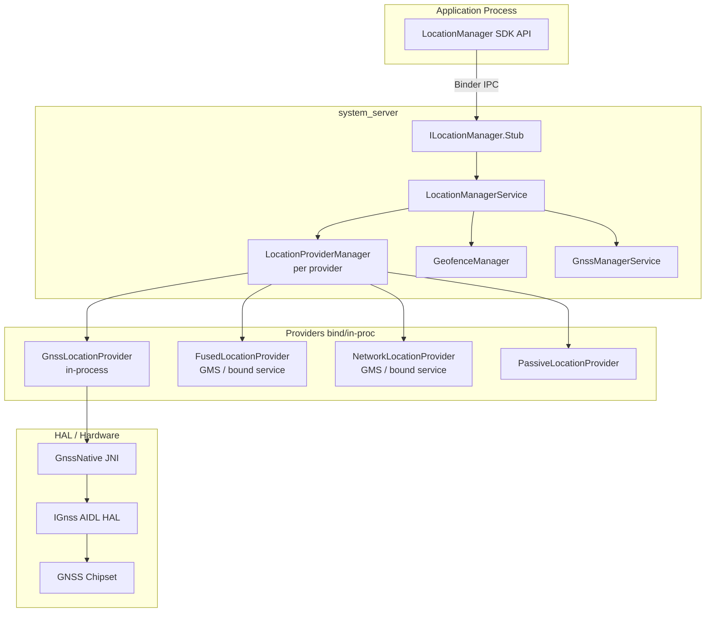

**Source:** `frameworks/base/location/java/android/location/LocationManager.java` --
the public SDK class annotated `@SystemService(Context.LOCATION_SERVICE)`.

### 33.1.3  Provider Names

`LocationManagerService` defines well-known string constants that label each
provider.  They match the constants in `LocationManager`:

| Constant | Value | Description |
|----------|-------|-------------|
| `GPS_PROVIDER` | `"gps"` | Satellite-based (GNSS) |
| `NETWORK_PROVIDER` | `"network"` | Cell/Wi-Fi based |
| `FUSED_PROVIDER` | `"fused"` | Sensor-fused best estimate |
| `PASSIVE_PROVIDER` | `"passive"` | Listens to all updates, no active fix |
| `GPS_HARDWARE_PROVIDER` | `"gps_hardware"` | Raw GNSS HAL, requires `LOCATION_HARDWARE` |

### 33.1.4  Startup Sequence

`LocationManagerService.Lifecycle` extends `SystemService`.  Its boot-phase
callbacks reveal the precise order:

```
onStart()
    publishBinderService(Context.LOCATION_SERVICE, mService)

onBootPhase(PHASE_SYSTEM_SERVICES_READY)
    SystemInjector.onSystemReady()
    LocationManagerService.onSystemReady()

onBootPhase(PHASE_THIRD_PARTY_APPS_CAN_START)
    LocationManagerService.onSystemThirdPartyAppsCanStart()
        1. create NetworkProvider   (ProxyLocationProvider)
        2. create FusedProvider     (ProxyLocationProvider, direct-boot aware)
        3. create GnssNative + GnssManagerService
        4. create GnssLocationProvider (or proxy override)
        5. bind GeocodeProvider     (ProxyGeocodeProvider)
        6. bind PopulationDensityProvider (if flag enabled)
        7. bind HardwareActivityRecognitionProxy
        8. bind GeofenceProxy -> GeofenceHardwareService
```

**Source:** `LocationManagerService.java`, lines 175-595.

The network provider is created *before* the GNSS provider because, as the
comment in the source states:

> "network provider should always be initialized before the gps provider since
> the gps provider has unfortunate hard dependencies on the network provider"

### 33.1.5  Source File Map

The location subsystem spans several directories.  Here is a complete
source-tree map:

```
frameworks/base/
    location/java/android/location/
        LocationManager.java          -- Public SDK API
        Geocoder.java                 -- Forward/reverse geocoding API
        Geofence.java                 -- Geofence definition
        Location.java                 -- Position data object
        LocationRequest.java          -- Request parameters
        GnssStatus.java              -- Satellite status
        GnssMeasurement.java          -- Raw measurement (framework side)
        GnssClock.java               -- GNSS clock state
        GnssCapabilities.java        -- HAL capability wrapper
        GnssAntennaInfo.java         -- Antenna phase center data
        Criteria.java                -- Legacy provider selection criteria
        Address.java                 -- Geocoded address

    services/core/java/com/android/server/location/
        LocationManagerService.java   -- Core system service
        LocationPermissions.java      -- Permission enforcement
        LocationShellCommand.java     -- adb shell cmd location
        geofence/
            GeofenceManager.java      -- Software geofence engine
            GeofenceProxy.java        -- Hardware geofence bridge
        gnss/
            GnssManagerService.java   -- GNSS subsystem manager
            GnssLocationProvider.java -- GNSS positioning provider
            GnssConfiguration.java    -- GNSS config management
            GnssMetrics.java          -- Performance metrics
            GnssMeasurementsProvider.java
            GnssNavigationMessageProvider.java
            GnssStatusProvider.java
            GnssNmeaProvider.java
            GnssAntennaInfoProvider.java
            GnssGeofenceProxy.java
            GnssPsdsDownloader.java
            GnssSatelliteBlocklistHelper.java
            GnssVisibilityControl.java
            GnssNetworkConnectivityHandler.java
            NetworkTimeHelper.java
            hal/
                GnssNative.java       -- JNI bridge to HAL
        provider/
            AbstractLocationProvider.java
            LocationProviderManager.java
            PassiveLocationProvider.java
            MockLocationProvider.java
            MockableLocationProvider.java
            StationaryThrottlingLocationProvider.java
            DelegateLocationProvider.java
            proxy/
                ProxyLocationProvider.java
                ProxyGeocodeProvider.java
                ProxyPopulationDensityProvider.java
                ProxyGnssAssistanceProvider.java
        injector/
            Injector.java             -- DI interface
            (20+ System* implementations)
        settings/
            LocationSettings.java
            LocationUserSettings.java
        fudger/
            LocationFudger.java
            LocationFudgerCache.java
        altitude/
            AltitudeService.java
        eventlog/
            LocationEventLog.java

hardware/interfaces/gnss/
    aidl/android/hardware/gnss/
        IGnss.aidl                   -- Root GNSS HAL interface
        IGnssCallback.aidl           -- Framework callbacks
        GnssConstellationType.aidl   -- Constellation enum
        GnssMeasurement.aidl         -- Raw measurement
        GnssSignalType.aidl          -- Signal type descriptor
        IGnssGeofence.aidl           -- Hardware geofence
        IGnssMeasurementInterface.aidl
        IGnssBatching.aidl
        IGnssPsds.aidl
        IGnssConfiguration.aidl
        IGnssPowerIndication.aidl
        IGnssDebug.aidl
        IGnssAntennaInfo.aidl
        IAGnss.aidl
        IAGnssRil.aidl
        (+ measurement_corrections/, visibility_control/,
           gnss_assistance/)

packages/modules/GeoTZ/
    locationtzprovider/              -- TimeZoneProviderService
    geotz_lookup/                    -- S2-based TZ lookup
    s2storage/                       -- S2 geometry storage
    output_data/                     -- tzs2.dat binary
```

### 33.1.6  Class Hierarchy

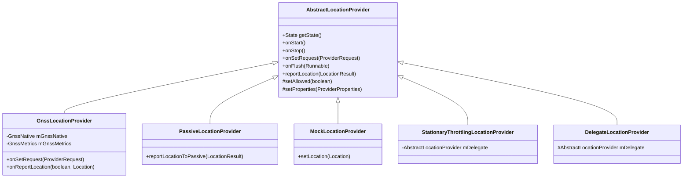

**Source:** `frameworks/base/services/core/java/com/android/server/location/provider/`

---

## 33.2  LocationManagerService

`LocationManagerService` (LMS) is the single system service behind every
`LocationManager` call.  It implements `ILocationManager.Stub` -- the Binder
interface that apps invoke via `Context.getSystemService(Context.LOCATION_SERVICE)`.

**Source:** `frameworks/base/services/core/java/com/android/server/location/LocationManagerService.java`
(approx. 2035 lines).

### 33.2.1  Fields and Data Structures

```java
public class LocationManagerService extends ILocationManager.Stub
        implements LocationProviderManager.StateChangedListener {

    final Object mLock = new Object();
    private final Context mContext;
    private final Injector mInjector;
    private final GeofenceManager mGeofenceManager;
    private volatile @Nullable GnssManagerService mGnssManagerService;
    private ProxyGeocodeProvider mGeocodeProvider;

    private final PassiveLocationProviderManager mPassiveManager;

    // CopyOnWriteArrayList: hold lock for writes, no lock for reads
    final CopyOnWriteArrayList<LocationProviderManager> mProviderManagers;
}
```

The `mProviderManagers` list contains one `LocationProviderManager` per
registered provider.  The `CopyOnWriteArrayList` pattern allows lock-free
reads during the frequent `getLocationProviderManager(name)` lookups.

### 33.2.2  The Injector Pattern

LMS uses an `Injector` interface to decouple itself from Android system
services.  This makes it testable without a full system-server environment.

```mermaid
graph LR
    subgraph Injector
        A[UserInfoHelper]
        B[SettingsHelper]
        C[AlarmHelper]
        D[AppForegroundHelper]
        E[LocationPermissionsHelper]
        F[DeviceIdleHelper]
        G[DeviceStationaryHelper]
        H[ScreenInteractiveHelper]
        I[EmergencyHelper]
        J[LocationUsageLogger]
        K[AppOpsHelper]
        L[PackageResetHelper]
        M[LocationPowerSaveModeHelper]
    end

    LMS[LocationManagerService] --> Injector
```

Each helper has a `System*` concrete implementation (e.g.,
`SystemSettingsHelper`, `SystemEmergencyHelper`) that wraps actual system
APIs.

**Source:** `frameworks/base/services/core/java/com/android/server/location/injector/`
(20+ files).

### 33.2.3  Provider Management

#### Adding a provider

```java
void addLocationProviderManager(
        LocationProviderManager manager,
        @Nullable AbstractLocationProvider realProvider) {
    synchronized (mProviderManagers) {
        manager.startManager(this);

        if (realProvider != null && manager != mPassiveManager) {
            // Optionally wrap in StationaryThrottlingLocationProvider
            if (enableStationaryThrottling) {
                realProvider = new StationaryThrottlingLocationProvider(
                    manager.getName(), mInjector, realProvider);
            }
        }
        manager.setRealProvider(realProvider);
        mProviderManagers.add(manager);
    }
}
```

The `StationaryThrottlingLocationProvider` decorator reduces fix frequency
when the device's accelerometer indicates it is stationary.  This is
controlled by `Settings.Global.LOCATION_ENABLE_STATIONARY_THROTTLE` and is
disabled on Wear OS devices (`FEATURE_WATCH`).  A feature flag
(`Flags.disableStationaryThrottling()`) can disable it entirely, except
optionally keeping it for the GPS provider.

#### Removing a provider

```java
private void removeLocationProviderManager(LocationProviderManager manager) {
    synchronized (mProviderManagers) {
        mProviderManagers.remove(manager);
        manager.setMockProvider(null);
        manager.setRealProvider(null);
        manager.stopManager();
    }
}
```

### 33.2.4  Request Handling

When an application calls `LocationManager.requestLocationUpdates()`, the
Binder call arrives at `registerLocationListener()`:

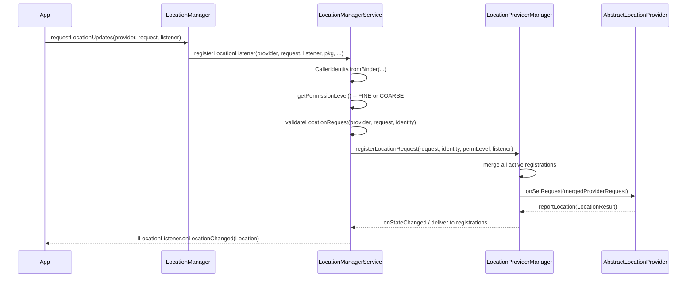

The `validateLocationRequest()` method sanitizes and checks every field:

1. **WorkSource** -- requires `UPDATE_DEVICE_STATS` permission.
2. **Low-power mode** -- requires `LOCATION_HARDWARE` permission.
3. **Hidden from AppOps** -- requires `UPDATE_APP_OPS_STATS`.
4. **ADAS GNSS bypass** -- automotive only, GPS provider only.
5. **Ignore location settings** -- requires bypass permission.

### 33.2.5  Current Location Requests

The `getCurrentLocation()` method is a one-shot variant.  LMS delegates to
`LocationProviderManager.getCurrentLocation()` which returns an
`ICancellationSignal` that the app can use to cancel the pending request.

### 33.2.6  Last Known Location

`getLastLocation()` returns the most recent cached `Location` for the
specified provider.  It goes through `LocationProviderManager.getLastLocation()`
which applies the same permission checks and coarse-location fudging.

### 33.2.7  Location Settings

The enabled/disabled state of location per user is managed through
`Settings.Secure.LOCATION_MODE`.  LMS listens for changes:

```java
mInjector.getSettingsHelper().addOnLocationEnabledChangedListener(
    this::onLocationModeChanged);
```

When the mode changes, LMS:

1. Invalidates the `LocationManager` local caches.
2. Logs the event.
3. Broadcasts `LocationManager.MODE_CHANGED_ACTION`.
4. Refreshes AppOps restrictions for the affected user.

### 33.2.8  The LocationProviderManager

`LocationProviderManager` (LPM) is the heart of the request-multiplexing
logic.  At 3117 lines, it is the largest single class in the location package.
Each instance manages a single named provider.

Key responsibilities:

| Responsibility | Mechanism |
|----------------|-----------|
| Merge N app requests into 1 provider request | `mergeRegistrations()` |
| Track per-registration state (active, permission) | `Registration` inner class |
| Deliver locations to matching registrations | `deliverToListeners()` |
| Apply coarse-location fudging for COARSE clients | `LocationFudger` |
| Handle mock providers for testing | `setMockProvider()` |
| Support provider-request listeners for diagnostics | `addProviderRequestListener()` |

**Source:** `frameworks/base/services/core/java/com/android/server/location/provider/LocationProviderManager.java`

### 33.2.9  LocationProviderManager Constants and Thresholds

LPM defines several constants that control its behavior.  Understanding
them is essential for diagnosing location-delivery issues:

```java
// Fastest interval for coarse-location clients (10 minutes)
private static final long MIN_COARSE_INTERVAL_MS = 10 * 60 * 1000;

// Max interval to be considered "high power" (5 minutes)
private static final long MAX_HIGH_POWER_INTERVAL_MS = 5 * 60 * 1000;

// Max age of a location before it is no longer "current" (30 seconds)
private static final long MAX_CURRENT_LOCATION_AGE_MS = 30 * 1000;

// Max timeout for getCurrentLocation (30 seconds)
private static final long MAX_GET_CURRENT_LOCATION_TIMEOUT_MS = 30 * 1000;

// Jitter tolerance for min update interval (10%)
private static final float FASTEST_INTERVAL_JITTER_PERCENTAGE = .10f;

// Max absolute jitter for min update interval (30 seconds)
private static final int MAX_FASTEST_INTERVAL_JITTER_MS = 30 * 1000;

// Minimum delay before honoring a delayed request (30 seconds)
private static final long MIN_REQUEST_DELAY_MS = 30 * 1000;

// Wakelock timeout for location delivery (30 seconds)
private static final long WAKELOCK_TIMEOUT_MS = 30 * 1000;

// Duration PendingIntent clients are allowlisted for FGS start (10 seconds)
private static final long TEMPORARY_APP_ALLOWLIST_DURATION_MS = 10 * 1000;
```

The `MIN_COARSE_INTERVAL_MS` of 10 minutes is a hard floor for coarse
clients.  Even if an app requests 1-second updates with only
`ACCESS_COARSE_LOCATION`, LPM will clamp the effective interval to
10 minutes.  This is a privacy measure to prevent coarse-location apps
from inferring fine location through rapid position deltas.

### 33.2.10  LPM Power Save Modes

`LocationProviderManager` integrates with Android's battery-saver through
the `LocationPowerSaveModeHelper`.  Four modes are defined:

| Mode | Constant | Behavior |
|------|----------|----------|
| No change | `LOCATION_MODE_NO_CHANGE` | Normal operation |
| GPS disabled screen-off | `LOCATION_MODE_GPS_DISABLED_WHEN_SCREEN_OFF` | GPS stops when screen is off |
| All disabled screen-off | `LOCATION_MODE_ALL_DISABLED_WHEN_SCREEN_OFF` | All providers stop when screen off |
| Foreground only | `LOCATION_MODE_FOREGROUND_ONLY` | Only foreground apps get updates |
| Throttle screen-off | `LOCATION_MODE_THROTTLE_REQUESTS_WHEN_SCREEN_OFF` | Reduce frequency when screen off |

LPM listens for screen-interactive changes:

```java
mScreenInteractiveHelper.addListener(mScreenInteractiveChangedListener);
```

When the screen turns off in `LOCATION_MODE_GPS_DISABLED_WHEN_SCREEN_OFF`
mode and this is the GPS provider, the merged request is suppressed.

### 33.2.11  LPM Registration Types

LPM supports three kinds of registrations:

1. **Listener registrations**: `ILocationListener` Binder callbacks for
   continuous updates.
2. **PendingIntent registrations**: Fires a `PendingIntent` with extras
   containing the `Location`.
3. **Current-location requests**: One-shot requests with an
   `ICancellationSignal`, serviced by `getCurrentLocation()`.

Each registration tracks:

- The `LocationRequest` (interval, quality, duration, etc.)
- The `CallerIdentity` (uid, pid, package, attribution tag)
- The `@PermissionLevel` (FINE, COARSE, or NONE)
- Whether the calling process is in the foreground
- Whether the registration is active (all preconditions met)

### 33.2.12  LPM Location Delivery Pipeline

When a provider reports a new `LocationResult`, LPM processes it through
a multi-stage pipeline:

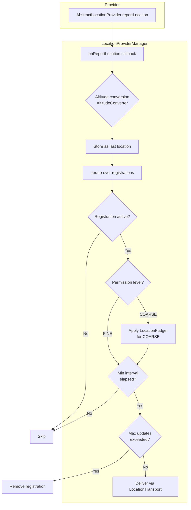

The `AltitudeConverter` (when available) converts WGS84 ellipsoidal height
to mean-sea-level altitude, improving the user experience for apps that
display elevation.

**Source:** `frameworks/base/services/core/java/com/android/server/location/altitude/AltitudeService.java`

### 33.2.13  Location Fudging Detail

When delivering to coarse-permission clients, `LocationFudger` obfuscates
the true position.  The algorithm:

1. Divides the world into a grid of cells (approximately 1.6 km on a side).
2. Each cell has a deterministic random offset derived from the cell
   coordinates and a per-boot random seed.
3. The reported location is the true location plus the cell's offset.
4. The offset remains constant within a cell, so small movements within
   one cell produce the same fudged location.

Since Android 14, the `LocationFudgerCache` can incorporate population
density data from `ProxyPopulationDensityProvider`.  In dense urban areas,
cells are smaller (higher fudging precision); in rural areas, cells are
larger (stronger privacy protection).

### 33.2.14  Event Logging

LPM logs significant events to `LocationEventLog`:

```java
EVENT_LOG.logLocationEnabled(userId, enabled);
EVENT_LOG.logAdasLocationEnabled(userId, enabled);
```

These logs are visible through:

```bash
adb shell dumpsys location
```

The dump output includes:

- Per-provider state (allowed, properties, identity)
- All active registrations with their parameters
- Recent location deliveries
- Request merge results

### 33.2.15  Passive Provider

The `PassiveLocationProvider` receives a copy of every location that any
other provider produces.  It never actively requests fixes.  Apps use
`LocationManager.PASSIVE_PROVIDER` when they want opportunistic updates
(e.g., a weather app that benefits from any movement detection without
paying the battery cost of GPS).

`PassiveLocationProviderManager` overrides the base `LocationProviderManager`
to propagate locations from all other managers.

**Source:** `frameworks/base/services/core/java/com/android/server/location/provider/PassiveLocationProvider.java`

### 33.2.16  Mock Location Providers

`LocationManagerService` exposes `addTestProvider()` and
`setTestProviderLocation()` for instrumentation and development.  Under the
hood these install a `MockLocationProvider` that replaces the real provider
until `removeTestProvider()` is called.  Mock providers require the
`android.permission.ACCESS_MOCK_LOCATION` permission, which is only
grantable on debug builds or to the selected mock-location app in Developer
Settings.

---

## 33.3  GNSS HAL

The Global Navigation Satellite System (GNSS) HAL is the primary hardware
abstraction for satellite-based positioning.  Since Android 12 it uses the
AIDL HAL interface; the legacy HIDL interfaces in `hardware/interfaces/gnss/1.0`
through `2.1` are deprecated.

**Source directory:** `hardware/interfaces/gnss/aidl/android/hardware/gnss/`

### 33.3.1  The IGnss Root Interface

`IGnss.aidl` is the VINTF-stable root interface that every GNSS HAL
implementation must expose.

```mermaid
graph TB
    IGnss --> IGnssCallback
    IGnss --> IGnssPsds
    IGnss --> IGnssConfiguration
    IGnss --> IGnssMeasurementInterface
    IGnss --> IGnssPowerIndication
    IGnss --> IGnssBatching
    IGnss --> IGnssGeofence
    IGnss --> IGnssNavigationMessageInterface
    IGnss --> IAGnss
    IGnss --> IAGnssRil
    IGnss --> IGnssDebug
    IGnss --> IGnssVisibilityControl
    IGnss --> IGnssAntennaInfo
    IGnss --> IMeasurementCorrectionsInterface
    IGnss --> IGnssAssistanceInterface
```

**Source:** `hardware/interfaces/gnss/aidl/android/hardware/gnss/IGnss.aidl`

The key methods on `IGnss`:

| Method | Purpose |
|--------|---------|
| `setCallback(IGnssCallback)` | Register the framework callback |
| `close()` | Tear down the session |
| `start()` | Begin emitting locations |
| `stop()` | Stop location output |
| `setPositionMode(PositionModeOptions)` | Configure fix interval and mode |
| `injectTime(long, long, int)` | Inject NTP time |
| `injectLocation(GnssLocation)` | Inject network location |
| `injectBestLocation(GnssLocation)` | Inject best available location |
| `deleteAidingData(GnssAidingData)` | Clear ephemeris/almanac for cold start |

### 33.3.2  Position Modes

```java
enum GnssPositionMode {
    STANDALONE = 0,   // No assistance
    MS_BASED   = 1,   // Mobile-Station-Based AGNSS
    MS_ASSISTED = 2,  // Deprecated; fall back to MS_BASED
}
```

In MS_BASED mode, the GNSS chipset downloads satellite orbit data (ephemeris,
almanac) from assistance servers to accelerate time-to-first-fix (TTFF).

### 33.3.3  Satellite Constellations

Android supports all major GNSS constellations through the
`GnssConstellationType` enum:

```java
enum GnssConstellationType {
    UNKNOWN  = 0,
    GPS      = 1,  // US Global Positioning System
    SBAS     = 2,  // Satellite-Based Augmentation System
    GLONASS  = 3,  // Russian GLONASS
    QZSS     = 4,  // Japanese Quasi-Zenith
    BEIDOU   = 5,  // Chinese BeiDou
    GALILEO  = 6,  // European Galileo
    IRNSS    = 7,  // Indian NavIC
}
```

**Source:** `hardware/interfaces/gnss/aidl/android/hardware/gnss/GnssConstellationType.aidl`

Each satellite fix reports per-SV information through `GnssSvInfo`:

| Field | Type | Description |
|-------|------|-------------|
| `svid` | `int` | Satellite vehicle ID (1-63 depending on constellation) |
| `constellation` | `GnssConstellationType` | Which GNSS system |
| `cN0Dbhz` | `float` | Carrier-to-noise at antenna port (0-63 dB-Hz) |
| `basebandCN0DbHz` | `float` | C/N0 at baseband |
| `elevationDegrees` | `float` | Elevation above horizon |
| `azimuthDegrees` | `float` | Azimuth from north |
| `carrierFrequencyHz` | `long` | Carrier frequency (e.g., L1=1575.45 MHz) |
| `svFlag` | `int` | Bitmask: has ephemeris, almanac, used in fix, has carrier freq |

### 33.3.4  GNSS Measurements

The `GnssMeasurement` parcelable provides raw GNSS observables for
applications performing their own position computation (e.g., PPP or RTK
solutions).

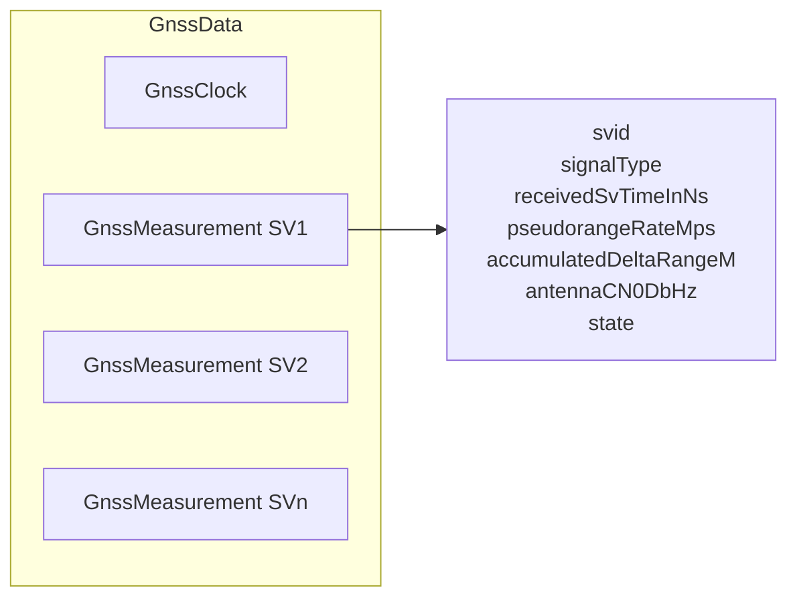

**Source:** `hardware/interfaces/gnss/aidl/android/hardware/gnss/GnssMeasurement.aidl`

Key measurement fields:

| Field | Description |
|-------|-------------|
| `svid` | Satellite vehicle ID |
| `signalType` | `GnssSignalType` (constellation + frequency + code type) |
| `receivedSvTimeInNs` | Received satellite TOW in nanoseconds |
| `pseudorangeRateMps` | Pseudorange rate (Doppler) in m/s |
| `accumulatedDeltaRangeM` | Carrier phase accumulation in meters |
| `antennaCN0DbHz` | C/N0 at antenna port |
| `state` | Bit field indicating sync state (CODE_LOCK, BIT_SYNC, etc.) |

The measurement state is a progressive bit field.  As the receiver acquires
the signal, more bits become set:

```
STATE_UNKNOWN         -> 0
STATE_CODE_LOCK       -> 1 ms ambiguity
STATE_BIT_SYNC        -> 20 ms ambiguity
STATE_SUBFRAME_SYNC   -> 6 s ambiguity
STATE_TOW_DECODED     -> full time-of-week
STATE_TOW_KNOWN       -> TOW from any source
```

### 33.3.5  Assisted GNSS (A-GNSS)

A-GNSS reduces TTFF by providing the receiver with orbit predictions,
reference time, and approximate position.  Without assistance, a cold
start can take 30-60 seconds; with A-GNSS, TTFF can be reduced to
under 5 seconds.

The AIDL interface defines several assistance mechanisms:

#### PSDS (Predicted Satellite Data Service)

Formerly called XTRA (Qualcomm proprietary name), PSDS provides
multi-day orbit prediction files that allow the receiver to predict
satellite positions without decoding the broadcast ephemeris.

The `IGnssPsds` interface:

```java
interface IGnssPsds {
    void setCallback(IGnssPsdsCallback callback);
    void injectPsdsData(in byte[] psdsData, in PsdsType psdsType);
}
```

PSDS types include:

| Type | Description | Validity |
|------|-------------|----------|
| `PSDS_TYPE_LONG_TERM` | Extended orbit predictions | 1-14 days |
| `PSDS_TYPE_NORMAL` | Standard orbit predictions | 1-3 days |
| `PSDS_TYPE_REALTIME` | Real-time corrections | Minutes |

The framework downloads PSDS data from servers configured in
`gps_debug.conf` and injects it through `GnssNative.injectPsdsData()`.

#### AGNSS via RIL

The `IAGnss` and `IAGnssRil` interfaces provide data-plane and
control-plane A-GNSS using the cellular radio.  This is used for:

1. **SUPL (Secure User Plane Location)**: Location assistance data
   delivered over the data plane (TCP/IP).
2. **Control plane**: Assistance data delivered through cellular
   signaling channels (for E911).

The `IAGnssRil` interface provides the HAL with cellular identity
information (cell ID, LAC/TAC, MCC/MNC) that it uses to obtain
assistance data from the network.

#### Time and Location Injection

Two simpler forms of assistance:

1. **Time injection**: `injectTime(timeMs, timeReferenceMs, uncertaintyMs)`
   provides NTP-synchronized time to reduce the search space.

2. **Location injection**: `injectLocation(GnssLocation)` or
   `injectBestLocation(GnssLocation)` provides an approximate
   position from cell/Wi-Fi positioning.

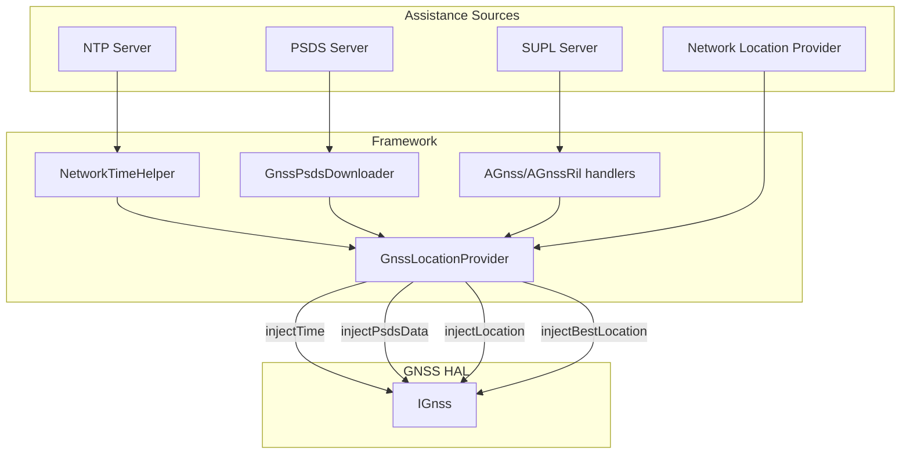

### 33.3.6  The GnssNative JNI Bridge

The framework-side entry point for GNSS HAL interaction is `GnssNative`,
a Java class with native method bindings via JNI.

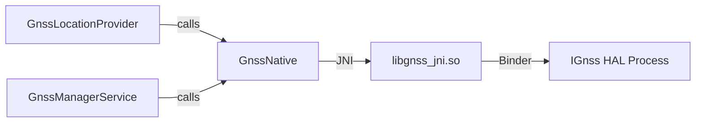

**Source:** `frameworks/base/services/core/java/com/android/server/location/gnss/hal/GnssNative.java`
(1766 lines).

`GnssNative` defines callback interfaces that components register to
receive HAL events:

| Callback Interface | Events |
|-------------------|--------|
| `BaseCallbacks` | `onHalStarted`, `onHalRestarted`, `onCapabilitiesChanged` |
| `StatusCallbacks` | `onReportStatus`, `onReportFirstFix` |
| `SvStatusCallbacks` | `onReportSvStatus(GnssStatus)` |
| `LocationCallbacks` | `onReportLocation`, `onReportLocations` |
| `NmeaCallbacks` | `onReportNmea(timestamp)` |
| `MeasurementCallbacks` | `onReportMeasurements(GnssMeasurementsEvent)` |
| `NavigationMessageCallbacks` | `onReportNavigationMessage(GnssNavigationMessage)` |
| `GeofenceCallbacks` | transition, status, add/remove/pause/resume |
| `AGpsCallbacks` | data-connection requests |
| `PsdsCallbacks` | PSDS download requests |
| `TimeCallbacks` | NTP time injection requests |
| `LocationRequestCallbacks` | Location injection requests from HAL |

Position-mode constants defined in `GnssNative`:

```java
public static final int GNSS_POSITION_MODE_STANDALONE  = 0;
public static final int GNSS_POSITION_MODE_MS_BASED    = 1;
public static final int GNSS_POSITION_MODE_MS_ASSISTED = 2;
```

Aiding-data flags for `deleteAidingData()`:

```java
public static final int GNSS_AIDING_TYPE_EPHEMERIS    = 0x0001;
public static final int GNSS_AIDING_TYPE_ALMANAC      = 0x0002;
public static final int GNSS_AIDING_TYPE_POSITION     = 0x0004;
public static final int GNSS_AIDING_TYPE_TIME         = 0x0008;
public static final int GNSS_AIDING_TYPE_ALL          = 0xFFFF;
```

### 33.3.7  GnssLocationProvider

`GnssLocationProvider` extends `AbstractLocationProvider` and implements
a dozen callback interfaces from `GnssNative`.  It is the concrete provider
that LMS registers under `GPS_PROVIDER`.

**Source:** `frameworks/base/services/core/java/com/android/server/location/gnss/GnssLocationProvider.java`
(1870 lines).

#### Provider Properties

The GNSS provider declares itself as follows:

```java
private static final ProviderProperties PROPERTIES = new ProviderProperties.Builder()
    .setHasSatelliteRequirement(true)
    .setHasAltitudeSupport(true)
    .setHasSpeedSupport(true)
    .setHasBearingSupport(true)
    .setPowerUsage(POWER_USAGE_HIGH)
    .setAccuracy(ACCURACY_FINE)
    .build();
```

This tells the framework that this provider requires satellite visibility
(outdoor use), provides altitude/speed/bearing, consumes high power, and
offers fine accuracy.

#### Key Timing Constants

```java
// Location update minimum interval
private static final long LOCATION_UPDATE_MIN_TIME_INTERVAL_MILLIS = 1000;  // 1 Hz

// Default location request duration for injected location assistance
private static final long LOCATION_UPDATE_DURATION_MILLIS = 10 * 1000;     // 10 seconds

// Emergency mode extends this by 3x
private static final int EMERGENCY_LOCATION_UPDATE_DURATION_MULTIPLIER = 3;

// No-fix timeout: stop trying after 60 seconds without a fix
private static final int NO_FIX_TIMEOUT = 60 * 1000;

// GPS polling threshold: below this interval, leave GPS on continuously;
// above it, duty-cycle the hardware.  10s is typical for hot TTFF (~5s).
private static final int GPS_POLLING_THRESHOLD_INTERVAL = 10 * 1000;

// PSDS retry with exponential backoff: 5 min initial, 4 hours maximum
private static final long RETRY_INTERVAL = 5 * 60 * 1000;
private static final long MAX_RETRY_INTERVAL = 4 * 60 * 60 * 1000;

// Maximum batching length: 1 day
private static final long MAX_BATCH_LENGTH_MS = DateUtils.DAY_IN_MILLIS;
```

#### GPS Duty Cycling

When the requested fix interval exceeds `GPS_POLLING_THRESHOLD_INTERVAL`
(10 seconds), `GnssLocationProvider` enters a duty-cycling mode:

1. **Navigating phase**: GPS hardware is powered on, acquiring a fix.
2. **Hibernation phase**: GPS hardware is powered off (or in low-power mode).
3. **Wake-up alarm**: An `AlarmManager` alarm fires to start the next
   navigating phase.

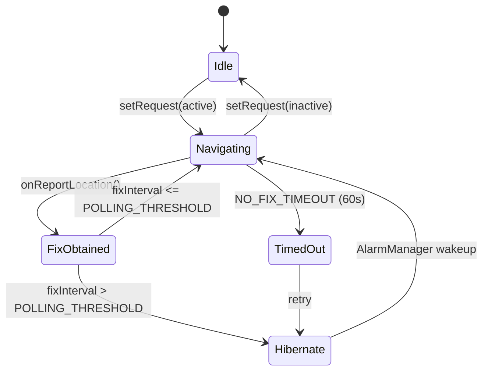

The wakelock management uses `mWakeLock` (a `PARTIAL_WAKE_LOCK` tagged
`*location*:GnssLocationProvider`) to prevent the device from suspending
during active navigation and fix delivery.

#### Location Extras

Every GNSS fix includes extras in the `Bundle`:

```java
class LocationExtras {
    private int mSvCount;    // Number of satellites used
    private int mMeanCn0;    // Mean C/N0 of used satellites
    private int mMaxCn0;     // Max C/N0 across all satellites
}
```

These are accessible via `location.getExtras().getInt("satellites")` etc.

Key behaviors:

1. **Position-mode selection**: Prefers `MS_BASED` for faster TTFF;
   falls back to `STANDALONE` if the HAL does not support it.
2. **PSDS download**: When the HAL requests assistance data via
   `GnssNative.PsdsCallbacks`, the provider downloads the file over
   HTTP using `GnssPsdsDownloader` and injects it.
3. **NTP time injection**: `NetworkTimeHelper` obtains NTP time and
   injects it through `GnssNative.injectTime()`.
4. **Satellite blocklist**: `GnssSatelliteBlocklistHelper` lets operators
   block specific SVIDs by constellation.
5. **Automotive suspend**: `setAutomotiveGnssSuspended()` halts GNSS
   entirely for power savings on parked vehicles.
6. **Batching**: If the HAL supports it, locations are batched on-chip
   and flushed periodically, avoiding frequent application-processor
   wakes.

#### PSDS Download Flow

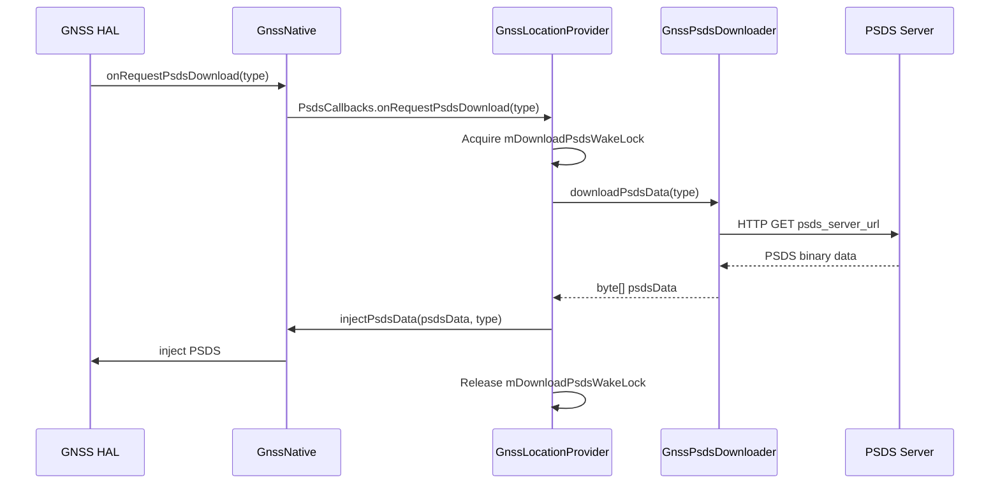

PSDS server URLs are configured in `gps_debug.conf`:

```
LONGTERM_PSDS_SERVER_1=https://...
LONGTERM_PSDS_SERVER_2=https://...
NORMAL_PSDS_SERVER=https://...
REALTIME_PSDS_SERVER=https://...
```

**Source:** `frameworks/base/services/core/java/com/android/server/location/gnss/gps_debug.conf`

#### Carrier Configuration Integration

`GnssConfiguration` loads properties from multiple sources in priority order:

1. `/vendor/etc/gps_debug.conf` -- vendor-specific GNSS configuration.
2. `/etc/gps_debug.conf` -- system default.
3. Carrier configuration via `CarrierConfigManager`.

Key configuration properties:

| Property | Description |
|----------|-------------|
| `SUPL_HOST` | SUPL (Secure User Plane Location) server hostname |
| `SUPL_PORT` | SUPL server port |
| `SUPL_MODE` | SUPL mode (MSA=0x02, MSB=0x01) |
| `SUPL_VER` | SUPL protocol version |
| `LPP_PROFILE` | LTE Positioning Protocol profile |
| `GPS_LOCK` | GPS lock bitmask |
| `ES_EXTENSION_SEC` | Emergency session extension (max 300s) |
| `NFW_PROXY_APPS` | Non-framework proxy apps for visibility control |
| `ENABLE_PSDS_PERIODIC_DOWNLOAD` | Periodic PSDS refresh |

**Source:** `frameworks/base/services/core/java/com/android/server/location/gnss/GnssConfiguration.java`

When the SIM card changes (subscription or carrier config changed),
`GnssLocationProvider` reloads the configuration to apply carrier-specific
SUPL and LPP settings:

```java
private void subscriptionOrCarrierConfigChanged() {
    TelephonyManager phone = mContext.getSystemService(TelephonyManager.class);
    String mccMnc = phone.getSimOperator();
    // ... reload properties for the carrier
    mGnssConfiguration.reloadGpsProperties();
    setSuplHostPort();
    mC2KServerHost = mGnssConfiguration.getC2KHost();
    mC2KServerPort = mGnssConfiguration.getC2KPort(TCP_MIN_PORT);
}
```

#### Network-Initiated Location

The `GpsNetInitiatedHandler` handles Network-Initiated (NI) location
requests from the cellular network (e.g., for E911 positioning).  NI
sessions can override user location settings during emergency calls.

### 33.3.8  GnssManagerService

`GnssManagerService` sits between `LocationManagerService` and
`GnssNative`.  It manages all GNSS-specific listener APIs:

```java
public class GnssManagerService implements GnssNative.GnssAssistanceCallbacks {
    private final GnssLocationProvider mGnssLocationProvider;
    private final GnssStatusProvider mGnssStatusProvider;
    private final GnssNmeaProvider mGnssNmeaProvider;
    private final GnssMeasurementsProvider mGnssMeasurementsProvider;
    private final GnssNavigationMessageProvider mGnssNavigationMessageProvider;
    private final GnssAntennaInfoProvider mGnssAntennaInfoProvider;
    private final IGpsGeofenceHardware mGnssGeofenceProxy;
    private final GnssMetrics mGnssMetrics;
}
```

**Source:** `frameworks/base/services/core/java/com/android/server/location/gnss/GnssManagerService.java`

The GNSS-specific APIs that pass through `GnssManagerService`:

| API | Permission Required |
|-----|-------------------|
| `registerGnssStatusCallback` | `ACCESS_FINE_LOCATION` |
| `registerGnssNmeaCallback` | `ACCESS_FINE_LOCATION` |
| `addGnssMeasurementsListener` | `ACCESS_FINE_LOCATION` (+ `LOCATION_HARDWARE` for correlation vectors) |
| `addGnssNavigationMessageListener` | `ACCESS_FINE_LOCATION` |
| `addGnssAntennaInfoListener` | none (antenna info is not PII) |
| `injectGnssMeasurementCorrections` | `LOCATION_HARDWARE` + `ACCESS_FINE_LOCATION` |

### 33.3.9  GNSS Capabilities

The HAL reports its capabilities through a bitmask.  The framework wraps
this in `GnssCapabilities`:

| Capability Bit | Value | Meaning |
|---------------|-------|---------|
| `CAPABILITY_SCHEDULING` | 1 << 0 | HAL can schedule periodic fixes |
| `CAPABILITY_MSB` | 1 << 1 | MS-Based AGNSS supported |
| `CAPABILITY_MSA` | 1 << 2 | MS-Assisted AGNSS supported |
| `CAPABILITY_SINGLE_SHOT` | 1 << 3 | Single-shot fixes supported |
| `CAPABILITY_ON_DEMAND_TIME` | 1 << 4 | Periodic time injection requested |
| `CAPABILITY_GEOFENCING` | 1 << 5 | Hardware geofencing |
| `CAPABILITY_MEASUREMENTS` | 1 << 6 | Raw measurements |
| `CAPABILITY_NAV_MESSAGES` | 1 << 7 | Navigation messages |
| `CAPABILITY_LOW_POWER_MODE` | 1 << 8 | Low power mode |
| `CAPABILITY_SATELLITE_BLOCKLIST` | 1 << 9 | Satellite blocklisting |
| `CAPABILITY_MEASUREMENT_CORRECTIONS` | 1 << 10 | Measurement corrections |
| `CAPABILITY_ANTENNA_INFO` | 1 << 11 | Antenna information |
| `CAPABILITY_CORRELATION_VECTOR` | 1 << 12 | Correlation vectors |
| `CAPABILITY_SATELLITE_PVT` | 1 << 13 | Satellite PVT data |
| `CAPABILITY_MEASUREMENT_CORRECTIONS_FOR_DRIVING` | 1 << 14 | Driving corrections |
| `CAPABILITY_ACCUMULATED_DELTA_RANGE` | 1 << 15 | ADR (carrier phase) |

**Source:** `hardware/interfaces/gnss/aidl/android/hardware/gnss/IGnssCallback.aidl`

When capabilities change, `GnssManagerService` broadcasts
`ACTION_GNSS_CAPABILITIES_CHANGED` to all registered receivers.

### 33.3.10  GNSS Signal Types

The `GnssSignalType` parcelable combines constellation, carrier frequency,
and code type into a single structure.  The HAL reports its supported signal
types at initialization through `gnssSetSignalTypeCapabilitiesCb()`, enabling
the framework to understand the receiver's multi-frequency capabilities
(e.g., L1 + L5 dual-frequency GPS).

Common signal types:

| Constellation | Signal | Frequency | Code | Use |
|--------------|--------|-----------|------|-----|
| GPS | L1 C/A | 1575.42 MHz | C | Legacy civil |
| GPS | L1C | 1575.42 MHz | L1C | Modernized civil |
| GPS | L5 | 1176.45 MHz | L5Q | High accuracy |
| Galileo | E1 | 1575.42 MHz | E1B/E1C | Primary civil |
| Galileo | E5a | 1176.45 MHz | E5aQ | High accuracy |
| GLONASS | L1 OF | ~1602 MHz | L1OF | Legacy civil |
| BeiDou | B1I | 1561.098 MHz | B1I | Civil |
| BeiDou | B1C | 1575.42 MHz | B1C | Modernized |
| QZSS | L1 C/A | 1575.42 MHz | C | Japan regional |
| IRNSS | L5 | 1176.45 MHz | L5C | India regional |

Multi-frequency receivers (L1 + L5 or similar) provide significant
accuracy improvements through ionospheric-delay correction, as the
ionosphere affects different frequencies differently.  The dual-frequency
combination can eliminate the ionospheric error term entirely.

### 33.3.11  GNSS Power Statistics

The `IGnssPowerIndication` interface reports power consumption metrics:

```java
interface IGnssPowerIndication {
    void setCallback(IGnssPowerIndicationCallback callback);
    void requestGnssPowerStats();
}
```

The `GnssPowerStats` include:

| Metric | Description |
|--------|-------------|
| `elapsedRealtime` | Timestamp of the report |
| `totalEnergyMilliJoule` | Total energy consumed since boot |
| `singlebandTrackingModeEnergyMilliJoule` | Energy in single-band tracking |
| `multibandTrackingModeEnergyMilliJoule` | Energy in multi-band tracking |
| `singlebandAcquisitionModeEnergyMilliJoule` | Energy in single-band acquisition |
| `multibandAcquisitionModeEnergyMilliJoule` | Energy in multi-band acquisition |
| `otherModesEnergyMilliJoule` | Energy in other modes per signal type |

These statistics are used by `GnssMetrics` for system health monitoring
and are accessible through:

```bash
adb shell dumpsys location
```

### 33.3.12  GNSS Debug Interface

The `IGnssDebug` interface provides debugging information about the
GNSS engine's internal state.  This includes:

- Current satellite ephemeris data
- Time model information
- Position estimates
- Satellite health information

This interface is primarily used for GNSS HAL conformance testing
through VTS (Vendor Test Suite) tests.

---

## 33.4  Fused Location Provider

### 33.4.1  Overview

The Fused Location Provider (FLP) combines signals from GNSS, Wi-Fi, cell
towers, barometric pressure sensors, and inertial measurement units into a
single, optimized position estimate.  On Google-certified devices, this is
implemented by Google Play Services (GMS); on AOSP it is a pluggable bound
service.

### 33.4.2  How LMS Binds the FLP

```java
ProxyLocationProvider fusedProvider = ProxyLocationProvider.create(
        mContext,
        FUSED_PROVIDER,
        ACTION_FUSED_PROVIDER,
        com.android.internal.R.bool.config_enableFusedLocationOverlay,
        com.android.internal.R.string.config_fusedLocationProviderPackageName,
        com.android.internal.R.bool.config_fusedLocationOverlayUnstableFallback);
```

The `ProxyLocationProvider` discovers the service by intent action
`com.android.location.service.FusedProvider`.  The framework requires a
direct-boot-aware fused provider to be present:

```java
Preconditions.checkState(!mContext.getPackageManager()
    .queryIntentServicesAsUser(
        new Intent(ACTION_FUSED_PROVIDER),
        MATCH_DIRECT_BOOT_AWARE | MATCH_SYSTEM_ONLY,
        UserHandle.USER_SYSTEM).isEmpty(),
    "Unable to find a direct boot aware fused location provider");
```

### 33.4.3  ProxyLocationProvider Binding

The `ProxyLocationProvider` class handles the complexities of binding to
an external location provider service.  It uses `ServiceWatcher` to:

1. Discover the best matching service (system-only, highest version).
2. Bind to it with appropriate flags.
3. Automatically rebind if the service crashes or is updated.
4. Marshal `ProviderRequest` objects across the Binder interface.

The binding sequence:

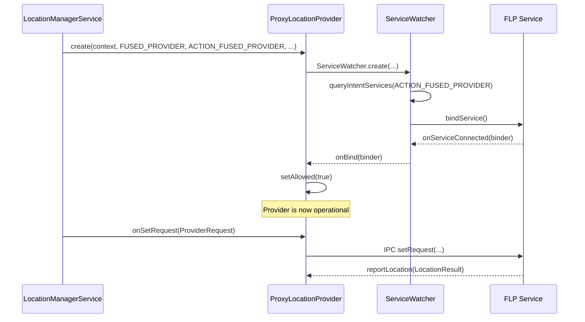

When the service disconnects unexpectedly, `ServiceWatcher` automatically
attempts to rebind.  During the disconnected period, the provider reports
itself as not-allowed, and `LocationProviderManager` stops delivering
updates to registered clients.

### 33.4.4  FLP Architecture

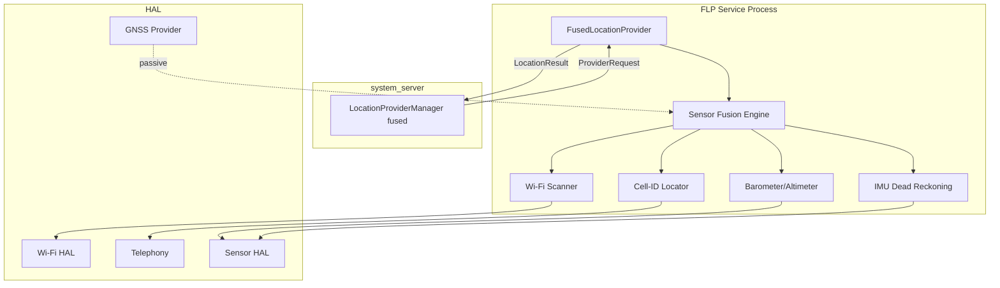

### 33.4.5  Power Efficiency

The FLP dynamically selects the cheapest positioning source that satisfies
the merged request.  For a low-accuracy, long-interval request (e.g., a
weather app requesting updates every 30 minutes), the FLP may rely entirely
on cell-tower positioning without activating GNSS or Wi-Fi scanning.  For
a navigation app requesting 1-second updates, it engages the full sensor
suite including GNSS.

### 33.4.6  FLP Request Priorities

The `LocationRequest` API exposes a `quality` parameter that the FLP uses:

| Quality | Constant | Behavior |
|---------|----------|----------|
| High accuracy | `QUALITY_HIGH_ACCURACY` | GNSS + Wi-Fi + cell |
| Balanced | `QUALITY_BALANCED_POWER_ACCURACY` | Wi-Fi + cell |
| Low power | `QUALITY_LOW_POWER` | Cell only |
| Passive | `QUALITY_LOW_POWER` + passive | No active scanning |

### 33.4.7  Stationary Throttling

When the device is stationary (detected via accelerometer), the
`StationaryThrottlingLocationProvider` wrapper reduces the effective fix
rate.  This is a power optimization that the FLP cooperates with.

**Source:** `frameworks/base/services/core/java/com/android/server/location/provider/StationaryThrottlingLocationProvider.java`

The stationary detection uses `DeviceStationaryHelper`, which monitors
the accelerometer for sustained stillness.  When stationary:

1. The merged request interval is increased.
2. Fewer fixes are requested from the underlying provider.
3. Battery consumption drops significantly.

The feature is controlled by:

```java
Settings.Global.LOCATION_ENABLE_STATIONARY_THROTTLE
```

It defaults to enabled (1) on phones but disabled (0) on Wear OS devices
where the small form factor makes stationary detection less reliable.

A feature flag `Flags.disableStationaryThrottling()` can disable it
entirely.  Another flag `Flags.keepGnssStationaryThrottling()` can
selectively keep it enabled for only the GPS provider.

### 33.4.8  Altitude Conversion

Android provides an `AltitudeConverter` that converts GPS ellipsoidal
height (WGS84) to mean-sea-level (MSL) altitude using a geoid model.
This is integrated into the location delivery pipeline in
`LocationProviderManager` via `AltitudeService`.

The conversion matters because GPS receivers natively report height above
the WGS84 ellipsoid, which can differ from actual elevation above sea level
by up to 100 meters in some locations.  Apps displaying elevation to users
need MSL altitude for meaningful results.

**Source:** `frameworks/base/services/core/java/com/android/server/location/altitude/AltitudeService.java`

---

## 33.5  Network Location Provider

### 33.5.1  Overview

The Network Location Provider (NLP) determines position using cell-tower
and Wi-Fi access-point databases.  Like the FLP, it is a bound service
discovered by intent action:

```java
ProxyLocationProvider networkProvider = ProxyLocationProvider.create(
    mContext,
    NETWORK_PROVIDER,
    ACTION_NETWORK_PROVIDER,
    com.android.internal.R.bool.config_enableNetworkLocationOverlay,
    com.android.internal.R.string.config_networkLocationProviderPackageName);
```

**Source:** `LocationManagerService.java`, lines 453-465.

### 33.5.2  NLP vs. FLP

| Aspect | Network Provider | Fused Provider |
|--------|-----------------|----------------|
| Intent action | `ACTION_NETWORK_PROVIDER` | `ACTION_FUSED_PROVIDER` |
| Uses GNSS | No | Yes |
| Typical accuracy | 20-200 m | 3-50 m |
| Power cost | Low | Variable |
| Primary use case | Coarse location for COARSE-permission apps | Best available location |

### 33.5.3  Cell-Tower Positioning

The NLP uses `TelephonyManager` to obtain the current `CellInfo` list, which
contains cell identities (MCC, MNC, LAC/TAC, CID).  These are looked up
against a database (either local or server-side) to obtain an approximate
position.

### 33.5.4  Wi-Fi Positioning

The NLP triggers Wi-Fi scans and collects BSSID/RSSI pairs.  These are
matched against a Wi-Fi fingerprint database to triangulate position.  This
typically achieves 10-50 meter accuracy in urban environments.

### 33.5.5  ProxyLocationProvider

`ProxyLocationProvider` extends `AbstractLocationProvider` and uses
`ServiceWatcher` to bind to the external service.  It marshals
`ProviderRequest` objects to the bound service and receives
`LocationResult` callbacks.

**Source:** `frameworks/base/services/core/java/com/android/server/location/provider/proxy/ProxyLocationProvider.java`

### 33.5.6  ServiceWatcher Architecture

Both the NLP and FLP use the same `ServiceWatcher` infrastructure for
service discovery and binding.  `ServiceWatcher` provides:

1. **Intent-based discovery**: Finds services matching a specific action.
2. **Overlay support**: The config resources
   `config_enableNetworkLocationOverlay` and
   `config_networkLocationProviderPackageName` allow OEMs to overlay
   the default provider package.
3. **Version selection**: When multiple services match, the highest
   version is chosen.
4. **Current-user binding**: Services are bound in the context of the
   current user.
5. **Auto-reconnection**: If the service dies, `ServiceWatcher`
   automatically rebinds.

### 33.5.7  MockableLocationProvider

Each real provider is wrapped in a `MockableLocationProvider` that
allows seamless injection of mock locations for testing.  When
`setMockProvider()` is called, the `MockableLocationProvider` redirects
all requests to the `MockLocationProvider` instead of the real provider.

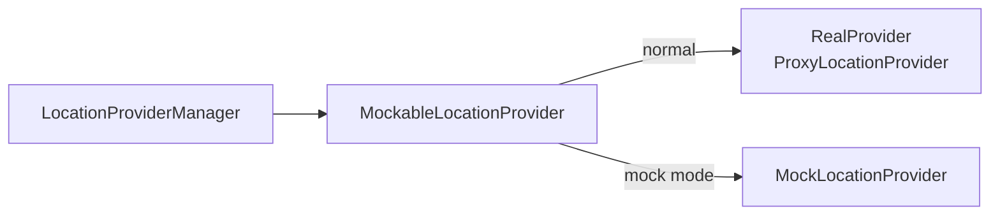

This architecture means mock locations pass through the exact same
delivery pipeline as real locations -- same permission checks, same
fudging, same interval enforcement.

### 33.5.8  Population Density Provider

Android 14 introduced the `ProxyPopulationDensityProvider`, bound via:

```java
ProxyPopulationDensityProvider.createAndRegister(mContext)
```

This provider supplies population density data used by the
`LocationFudgerCache` to implement density-based coarse-location fudging.
In areas with high population density (cities), the fudging grid cells
are smaller, maintaining reasonable utility for coarse-location apps.
In rural areas, cells are larger for stronger privacy guarantees.

**Source:** `frameworks/base/services/core/java/com/android/server/location/provider/proxy/ProxyPopulationDensityProvider.java`

---

## 33.6  Geofencing

Geofencing allows applications to define geographical regions and receive
notifications when the device enters or exits them.  Android supports two
geofencing layers: software-based (in `GeofenceManager`) and hardware-
accelerated (through the GNSS HAL).

### 33.6.1  Software Geofencing -- GeofenceManager

**Source:** `frameworks/base/services/core/java/com/android/server/location/geofence/GeofenceManager.java`

`GeofenceManager` extends `ListenerMultiplexer` and implements
`LocationListener`.  It monitors geofences using the fused provider:

```java
@Override
protected boolean registerWithService(LocationRequest locationRequest,
        Collection<GeofenceRegistration> registrations) {
    getLocationManager().requestLocationUpdates(
        FUSED_PROVIDER, locationRequest, FgThread.getExecutor(), this);
    return true;
}
```

#### Key constants

```java
private static final int MAX_SPEED_M_S = 100;          // 360 km/hr
private static final long MAX_LOCATION_AGE_MS = 5 * 60 * 1000L;  // 5 minutes
private static final long MAX_LOCATION_INTERVAL_MS = 2 * 60 * 60 * 1000;  // 2 hours
```

#### Adaptive polling interval

The polling interval is dynamically computed based on the device's distance
to the nearest geofence boundary:

```java
intervalMs = Math.min(MAX_LOCATION_INTERVAL_MS,
    Math.max(
        settingsHelper.getBackgroundThrottleProximityAlertIntervalMs(),
        minFenceDistanceM * 1000 / MAX_SPEED_M_S));
```

When the device is far from any geofence, the interval is long (up to 2
hours).  As it approaches a boundary, the interval decreases for timely
detection.

#### Geofence state machine

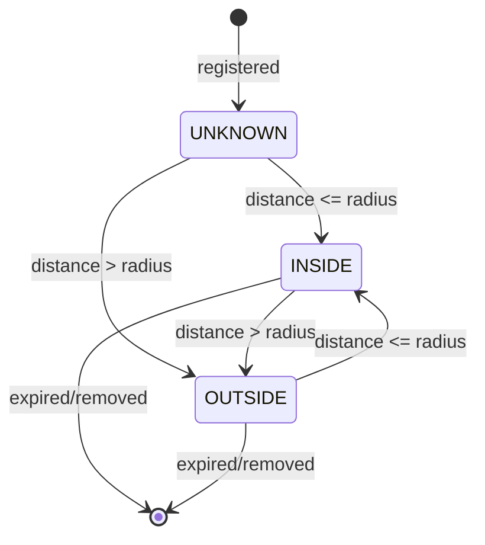

When transitioning from UNKNOWN/OUTSIDE to INSIDE, a `PendingIntent` is
fired with `KEY_PROXIMITY_ENTERING = true`.  When transitioning from INSIDE
to OUTSIDE, the intent fires with `KEY_PROXIMITY_ENTERING = false`.

### 33.6.2  GeofenceRegistration

Each geofence registration tracks:

```java
class GeofenceRegistration extends PendingIntentListenerRegistration {
    private final Geofence mGeofence;
    private final CallerIdentity mIdentity;
    private final Location mCenter;
    private final PowerManager.WakeLock mWakeLock;
    private int mGeofenceState;  // UNKNOWN, INSIDE, OUTSIDE
    private boolean mPermitted;
}
```

The `mWakeLock` ensures the device stays awake long enough to deliver the
transition notification.  It auto-releases after `WAKELOCK_TIMEOUT_MS`
(30 seconds).

### 33.6.3  Hardware Geofencing -- GeofenceProxy

**Source:** `frameworks/base/services/core/java/com/android/server/location/geofence/GeofenceProxy.java`

`GeofenceProxy` bridges between the framework and the hardware-geofence
service.  It binds to:

1. A `GeofenceProvider` service (action `com.android.location.service.GeofenceProvider`).
2. The `GeofenceHardwareService` system service.

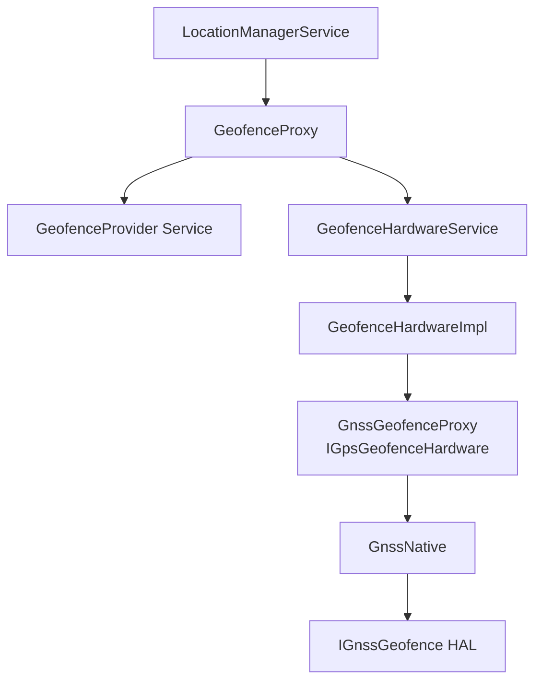

### 33.6.4  IGnssGeofence HAL Interface

**Source:** `hardware/interfaces/gnss/aidl/android/hardware/gnss/IGnssGeofence.aidl`

The hardware geofence HAL supports circular geofences directly on the
GNSS chipset:

```java
interface IGnssGeofence {
    void setCallback(in IGnssGeofenceCallback callback);
    void addGeofence(int geofenceId, double lat, double lng,
                     double radiusM, int lastTransition,
                     int monitorTransitions,
                     int notificationResponsivenessMs,
                     int unknownTimerMs);
    void pauseGeofence(int geofenceId);
    void resumeGeofence(int geofenceId, int monitorTransitions);
    void removeGeofence(int geofenceId);
}
```

Hardware geofences are significantly more power-efficient than software
geofences because the application processor can remain in deep sleep while
the GNSS chipset monitors boundaries autonomously.

### 33.6.5  GnssGeofenceHalModule

The `GnssGeofenceHalModule` inner class in `GnssManagerService` receives
HAL geofence callbacks and translates them to `GeofenceHardwareImpl` calls:

```java
@Override
public void onReportGeofenceTransition(int geofenceId, Location location,
        @GeofenceTransition int transition, long timestamp) {
    FgThread.getHandler().post(() ->
        getGeofenceHardware().reportGeofenceTransition(
            geofenceId, location, transition, timestamp,
            GeofenceHardware.MONITORING_TYPE_GPS_HARDWARE,
            FusedBatchOptions.SourceTechnologies.GNSS));
}
```

Geofence status translations:

| HAL Status | Framework Status |
|-----------|-----------------|
| `GEOFENCE_STATUS_OPERATION_SUCCESS` | `GEOFENCE_SUCCESS` |
| `GEOFENCE_STATUS_ERROR_GENERIC` | `GEOFENCE_FAILURE` |
| `GEOFENCE_STATUS_ERROR_ID_EXISTS` | `GEOFENCE_ERROR_ID_EXISTS` |
| `GEOFENCE_STATUS_ERROR_TOO_MANY_GEOFENCES` | `GEOFENCE_ERROR_TOO_MANY_GEOFENCES` |
| `GEOFENCE_STATUS_ERROR_ID_UNKNOWN` | `GEOFENCE_ERROR_ID_UNKNOWN` |

---

## 33.7  Geocoding

Geocoding converts between human-readable addresses and geographic
coordinates.  Android provides both forward geocoding (address to lat/lng)
and reverse geocoding (lat/lng to address) through the `Geocoder` class.

### 33.7.1  Client API

```java
Geocoder geocoder = new Geocoder(context, Locale.getDefault());

// Reverse geocode
List<Address> addresses = geocoder.getFromLocation(lat, lng, maxResults);

// Forward geocode
List<Address> results = geocoder.getFromLocationName("1600 Amphitheatre Pkwy", 1);
```

### 33.7.2  Server-Side Implementation

The `Geocoder` class delegates to `ILocationManager.reverseGeocode()` and
`ILocationManager.forwardGeocode()`, which pass through to a
`ProxyGeocodeProvider`:

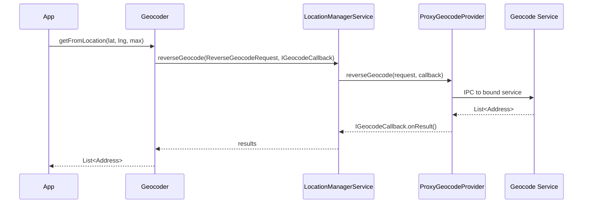

**Source:** `frameworks/base/services/core/java/com/android/server/location/provider/proxy/ProxyGeocodeProvider.java`

### 33.7.3  Availability

`Geocoder.isPresent()` returns `true` only if a geocode provider service
is bound.  On AOSP without GMS, this may return `false`, in which case
geocoding calls fail gracefully.

LMS checks availability:

```java
@Override
public boolean isGeocodeAvailable() {
    return mGeocodeProvider != null;
}
```

### 33.7.4  Forward Geocode Flow

Forward geocoding (address-to-coordinates) follows a similar path:

```java
@Override
public void forwardGeocode(ForwardGeocodeRequest request, IGeocodeCallback callback) {
    CallerIdentity identity = CallerIdentity.fromBinder(
        mContext, request.getCallingPackage(), request.getCallingAttributionTag());
    Preconditions.checkArgument(identity.getUid() == request.getCallingUid());

    if (mGeocodeProvider != null) {
        mGeocodeProvider.forwardGeocode(request, callback);
    } else {
        try {
            callback.onError(null);
        } catch (RemoteException e) {
            // ignore
        }
    }
}
```

The `ForwardGeocodeRequest` contains:

| Field | Description |
|-------|-------------|
| `locationName` | The address string to geocode |
| `maxResults` | Maximum number of results to return |
| `lowerLeftLatitude/Longitude` | Optional bounding box lower-left |
| `upperRightLatitude/Longitude` | Optional bounding box upper-right |
| `locale` | Locale for the response |
| `callingPackage` | Package requesting the geocode |
| `callingUid` | UID of the requester |

The bounding box allows apps to bias results toward a geographic region,
improving relevance for ambiguous address queries.

### 33.7.5  Geocode Error Handling

The `IGeocodeCallback` interface reports results or errors:

```java
interface IGeocodeCallback {
    void onResults(String errorMessage, in List<Address> addresses);
    void onError(String errorMessage);
}
```

When the geocode provider is unavailable (`mGeocodeProvider == null`),
`onError(null)` is called.  The `Geocoder` client-side class translates
this into an `IOException` for the app.

Common failure scenarios:

- No geocode provider bound (AOSP without GMS)
- Network unavailable (server-side geocoding)
- Invalid address query
- Provider service crashed

### 33.7.6  The Address Object

The `Address` class contains:

| Field | Description |
|-------|-------------|
| `latitude`, `longitude` | Geographic coordinates |
| `featureName` | Name of the place |
| `thoroughfare` | Street name |
| `subThoroughfare` | Street number |
| `locality` | City name |
| `adminArea` | State/province |
| `postalCode` | ZIP/postal code |
| `countryCode` | ISO country code |
| `countryName` | Full country name |
| `locale` | Locale used for the response |

---

## 33.8  Location Permissions

Android's location permission model is one of the most granular in the
platform.  It distinguishes four axes: precision (fine vs. coarse),
temporality (foreground vs. background), urgency (normal vs. emergency),
and bypass (system components that override settings).

### 33.8.1  Permission Hierarchy

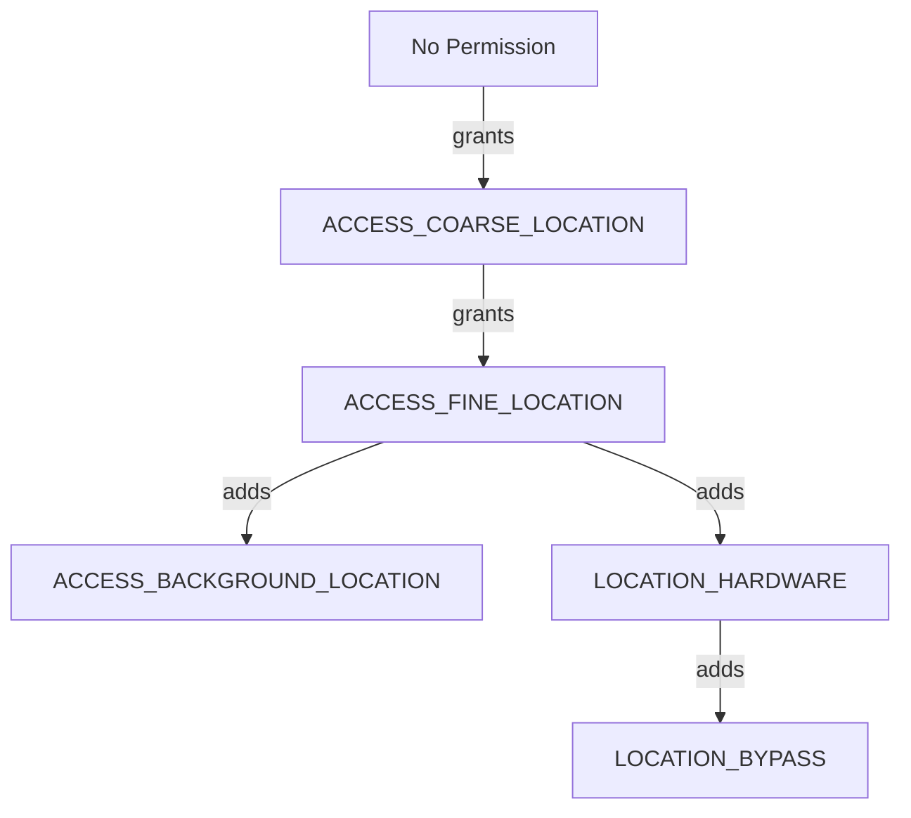

### 33.8.2  The LocationPermissions Utility

**Source:** `frameworks/base/services/core/java/com/android/server/location/LocationPermissions.java`

The `LocationPermissions` class defines three permission levels:

```java
public static final int PERMISSION_NONE   = 0;
public static final int PERMISSION_COARSE = 1;
public static final int PERMISSION_FINE   = 2;
```

The `getPermissionLevel()` method checks permissions in decreasing order:

```java
public static int getPermissionLevel(Context context, int uid, int pid) {
    if (context.checkPermission(ACCESS_FINE_LOCATION, pid, uid) == GRANTED) {
        return PERMISSION_FINE;
    }
    if (context.checkPermission(ACCESS_COARSE_LOCATION, pid, uid) == GRANTED) {
        return PERMISSION_COARSE;
    }
    return PERMISSION_NONE;
}
```

### 33.8.3  Fine vs. Coarse Location

| Aspect | Fine | Coarse |
|--------|------|--------|
| Permission | `ACCESS_FINE_LOCATION` | `ACCESS_COARSE_LOCATION` |
| Accuracy | Exact GPS coordinates | Fudged to ~1.6 km grid |
| Provider access | All providers | All providers (results fudged) |
| GNSS raw data | Yes | No |

When an app holds only `ACCESS_COARSE_LOCATION`, `LocationProviderManager`
applies `LocationFudger` to obfuscate the exact position.  The fudging
snaps coordinates to a grid of approximately 1.6 km cells and adds random
noise within that cell, ensuring the fudged location remains stable for
small movements.

Since Android 14, a population-density-based fudging mode is available (gated
by `Flags.densityBasedCoarseLocations()`).  A `ProxyPopulationDensityProvider`
supplies density data, and the `LocationFudgerCache` adjusts the grid size
based on population density -- larger cells in rural areas and smaller cells
in dense urban areas.

### 33.8.4  Background Location

Starting with Android 10 (API 29), `ACCESS_BACKGROUND_LOCATION` is a
separate permission.  Apps must hold it to receive location updates when
not in the foreground.  This permission is granted as a separate step in
the runtime permission dialog.

The background throttling mechanism is implemented via `SettingsHelper`:

```java
mInjector.getSettingsHelper().getBackgroundThrottlePackageWhitelist()
```

System-exempt packages (whitelisted) are not subject to background
throttling.

### 33.8.5  Location Bypass

System components (e.g., emergency dialer, automotive location services)
may need location even when the user has disabled location settings.  The
`LOCATION_BYPASS` permission grants this capability:

```java
public static void enforceBypassPermission(Context context, int uid, int pid) {
    if (context.checkPermission(LOCATION_BYPASS, pid, uid) == GRANTED) {
        return;
    }
    throw new SecurityException(...);
}
```

The bypass also extends to ADAS (Advanced Driver-Assistance Systems) on
automotive devices, which can access GPS even with location disabled:

```java
if (request.isAdasGnssBypass()) {
    if (!mContext.getPackageManager().hasSystemFeature(FEATURE_AUTOMOTIVE)) {
        throw new IllegalArgumentException(
            "adas gnss bypass requests are only allowed on automotive devices");
    }
}
```

### 33.8.6  AppOps Integration

Beyond runtime permissions, location access is further gated by AppOps.
The `AppOpsHelper` tracks `OP_FINE_LOCATION` and `OP_COARSE_LOCATION`
operations, allowing the user to revoke location access for specific apps
through Settings without removing the permission entirely.

### 33.8.7  Emergency Location

During emergency calls (e.g., E911), Android relaxes location restrictions.
The `EmergencyHelper` tracks emergency state, and LMS checks it through:

```java
mInjector.getEmergencyHelper().isInEmergency(Long.MIN_VALUE)
```

The GNSS HAL callback `gnssRequestLocationCb(independentFromGnss, isUserEmergency)`
propagates emergency state to the hardware layer.

### 33.8.8  Permission Enforcement Flow

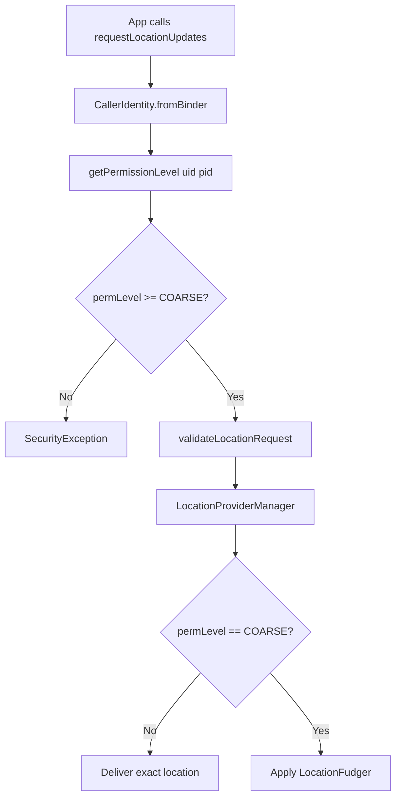

### 33.8.9  Foreground Service Requirement

Starting with Android 12, apps that need continuous background location
must use a foreground service of type `location`.  LMS tracks foreground
service API usage:

```java
ActivityManagerInternal managerInternal =
    LocalServices.getService(ActivityManagerInternal.class);
if (managerInternal != null) {
    managerInternal.logFgsApiBegin(
        ActivityManager.FOREGROUND_SERVICE_API_TYPE_LOCATION,
        Binder.getCallingUid(), Binder.getCallingPid());
}
```

When the listener is unregistered, the corresponding `logFgsApiEnd()` is
called.  This tracking enables the system to show users which apps are
actively using location in the background.

### 33.8.10  PendingIntent Security

PendingIntent-based location requests are subject to additional restrictions.
Since apps cannot be tracked for permission changes after a PendingIntent is
registered (the process may be dead), system APIs are blocked:

```java
if (isChangeEnabled(BLOCK_PENDING_INTENT_SYSTEM_API_USAGE, identity.getUid())) {
    boolean usesSystemApi = request.isLowPower()
            || request.isHiddenFromAppOps()
            || request.isLocationSettingsIgnored()
            || !request.getWorkSource().isEmpty();
    if (usesSystemApi) {
        throw new SecurityException(
            "PendingIntent location requests may not use system APIs: " + request);
    }
}
```

### 33.8.11  Location Indicators

Android 12 introduced persistent indicators showing when apps access
location.  The `AppOpsManager` tracks location operations and the
SystemUI displays a green dot or status-bar icon when any app holds an
active location note.

The `AppOpsHelper` in the location service coordinates with `AppOpsManager`:

```java
// Track OP_FINE_LOCATION and OP_COARSE_LOCATION
appOps.startWatchingNoted(
    new int[]{AppOpsManager.OP_FINE_LOCATION, AppOpsManager.OP_COARSE_LOCATION},
    (code, uid, packageName, attributionTag, flags, result) -> {
        if (!isLocationEnabledForUser(UserHandle.getUserId(uid))) {
            Log.w(TAG, "location noteOp with location off - " + identity);
        }
    });
```

This watchdog is only installed on debug builds to detect potential
framework bugs where location operations occur while location is
disabled.

### 33.8.12  Attribution Tags

Android 11 introduced attribution tags for granular tracking of
location usage within a single package.  The `CallerIdentity` used
throughout the location service includes the attribution tag:

```java
CallerIdentity identity = CallerIdentity.fromBinder(
    mContext, packageName, attributionTag, listenerId);
```

Attribution tags appear in the permission dashboard, helping users
understand which component of a multi-module app is accessing location.

### 33.8.13  Location Setting Per User

Location can be enabled/disabled per user:

```java
@Override
public void setLocationEnabledForUser(boolean enabled, int userId) {
    mContext.enforceCallingOrSelfPermission(WRITE_SECURE_SETTINGS, null);
    LocationManager.invalidateLocalLocationEnabledCaches();
    mInjector.getSettingsHelper().setLocationEnabled(enabled, userId);
}
```

The `LocationSettings` class in `frameworks/base/services/core/java/com/android/server/location/settings/`
persists per-user settings including the ADAS GNSS location enabled state
for automotive devices.

---

## 33.9  GeoTZ -- Timezone from Location

The GeoTZ module is Android's reference implementation for location-based
time-zone detection.  It maps geographic coordinates to time-zone identifiers
using an offline boundary database, eliminating the need for network queries.

### 33.9.1  Module Structure

**Source:** `packages/modules/GeoTZ/`

```
packages/modules/GeoTZ/
    apex/              - Mainline module APEX configuration
    common/            - Shared utility code
    data_pipeline/     - Host-side data generation tools
    geotz_lookup/      - Time-zone lookup API using tzs2.dat
    locationtzprovider/ - The actual TimeZoneProviderService
    output_data/       - Generated tzs2.dat file
    s2storage/         - S2 geometry storage library
    tzs2storage/       - TZ-specific S2 storage
    tzbb_data/         - Source data from timezone-boundary-builder
    validation/        - Validation tooling
```

### 33.9.2  Data Pipeline

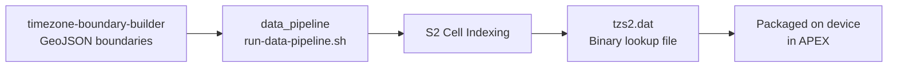

The data pipeline:

1. Downloads boundary data from the
   [timezone-boundary-builder](https://github.com/evansiroky/timezone-boundary-builder)
   project (stored in `tzbb_data/`).
2. Processes the GeoJSON polygons using Google's S2 Geometry library.
3. Produces `tzs2.dat`, a compact binary file that maps S2 cells to
   time-zone IDs.

### 33.9.3  GeoTimeZonesFinder

The `geotz_lookup` library provides the high-level API:

```java
try (GeoTimeZonesFinder finder = GeoTimeZonesFinder.create(...)) {
    LocationToken token = finder.createLocationTokenForLatLng(lat, lng);
    List<String> tzIds = finder.findTimeZonesForLocationToken(token);
    // tzIds might be ["America/Los_Angeles"] or ["Europe/Berlin"]
}
```

The `LocationToken` is a lightweight handle that enables efficient caching --
if the device has not moved far enough to cross an S2 cell boundary, the
previous lookup result can be reused.

### 33.9.4  OfflineLocationTimeZoneDelegate

**Source:** `packages/modules/GeoTZ/locationtzprovider/src/main/java/com/android/timezone/location/provider/core/OfflineLocationTimeZoneDelegate.java`

This is the core logic of the GeoTZ provider.  It manages a state machine
with two listening modes:

```mermaid
stateDiagram-v2
    [*] --> STOPPED
    STOPPED --> STARTED_ACTIVE : onStartUpdates()
    STARTED_ACTIVE --> STARTED_PASSIVE : active timeout / location received
    STARTED_PASSIVE --> STARTED_ACTIVE : passive timeout, no location
    STARTED_PASSIVE --> STARTED_PASSIVE : location received (stay passive)
    STARTED_ACTIVE --> STOPPED : onStopUpdates()
    STARTED_PASSIVE --> STOPPED : onStopUpdates()
    STOPPED --> DESTROYED : onDestroy()
    STARTED_ACTIVE --> FAILED : IOException
    STARTED_PASSIVE --> FAILED : IOException
```

**ACTIVE mode** (`LOCATION_LISTEN_MODE_ACTIVE`):

- Short-duration, high-power listening.
- May activate GNSS.
- Returns exactly one location or a "location unknown" result.

**PASSIVE mode** (`LOCATION_LISTEN_MODE_PASSIVE`):

- Long-duration, low-power listening.
- Only receives opportunistic location updates.
- No guarantee of receiving a location.

The `LocationListeningAccountant` manages a budget system:

1. Passive listening accrues active-listening budget.
2. Active listening consumes budget.
3. This ensures the provider does not abuse GNSS power by spending most
   of its time in passive mode.

### 33.9.5  OfflineLocationTimeZoneProviderService

**Source:** `packages/modules/GeoTZ/locationtzprovider/src/main/java/com/android/timezone/location/provider/OfflineLocationTimeZoneProviderService.java`

This is the `TimeZoneProviderService` entry point:

```java
public final class OfflineLocationTimeZoneProviderService
        extends TimeZoneProviderService {

    @Override
    public void onCreate() {
        Environment environment = new EnvironmentImpl(
            attributionContext, this::reportTimeZoneProviderEvent);
        mDelegate = OfflineLocationTimeZoneDelegate.create(environment);
    }

    @Override
    public void onStartUpdates(long initializationTimeoutMillis) {
        mDelegate.onStartUpdates(Duration.ofMillis(initializationTimeoutMillis));
    }

    @Override
    public void onStopUpdates() {
        mDelegate.onStopUpdates();
    }
}
```

The service reports three types of results:

| Result Type | Meaning |
|-------------|---------|
| `RESULT_TYPE_SUGGESTION` | Time zone IDs determined from location |
| `RESULT_TYPE_UNCERTAIN` | Unable to determine time zone |
| `RESULT_TYPE_PERMANENT_FAILURE` | Unrecoverable error (e.g., corrupt data file) |

### 33.9.6  Location-to-Timezone Flow

```mermaid
sequenceDiagram
    participant LTZP as OfflineLocationTimeZoneDelegate
    participant ENV as Environment
    participant LOC as LocationManager
    participant GTZF as GeoTimeZonesFinder
    participant Platform as time_zone_detector

    Note over LTZP: onStartUpdates() called
    LTZP->>ENV: startActiveGetCurrentLocation()
    ENV->>LOC: getCurrentLocation(fused)
    LOC-->>ENV: Location(lat, lng)
    ENV-->>LTZP: onActiveListeningResult(location)
    LTZP->>GTZF: createLocationTokenForLatLng(lat, lng)
    GTZF-->>LTZP: LocationToken
    LTZP->>GTZF: findTimeZonesForLocationToken(token)
    GTZF-->>LTZP: ["America/New_York"]
    LTZP->>Platform: reportSuggestion(tzIds, elapsedRealtime)
```

### 33.9.7  S2 Geometry Storage

The `s2storage` and `tzs2storage` libraries implement efficient spatial
indexing based on Google's S2 Geometry library.  S2 cells divide the Earth's
surface into a hierarchical grid.  Each cell at a given level covers a
fixed area, and the binary file maps cell IDs to time-zone identifier sets.

This approach has several advantages:

- **Compact**: The `tzs2.dat` file is only a few megabytes.
- **Fast lookups**: O(log n) binary search on cell IDs.
- **Offline**: No network access required.
- **Updateable**: The file can be updated through the APEX module update
  mechanism.

### 33.9.8  GeoDataFileManager

The `GeoDataFileManager` handles loading and caching the `tzs2.dat` file
on the device.  The file is packaged inside the GeoTZ APEX module:

```
/apex/com.android.geotz/etc/tzs2.dat
```

When the APEX is updated through Mainline, the data file is automatically
refreshed without a full OTA update.  This is critical because time-zone
boundaries change periodically (countries occasionally reorganize their
time zones or shift daylight saving rules).

### 33.9.9  Error Handling and Resilience

The delegate handles several failure scenarios:

1. **Initialization timeout**: If no location is available within the
   initialization period, an uncertain result is reported.  The
   `time_zone_detector` falls back to other sources.

2. **IOException during lookup**: If the `tzs2.dat` file is corrupt or
   missing, the delegate enters `MODE_FAILED` and reports a permanent
   failure.

3. **Location unavailable in passive mode**: When passive listening
   times out without receiving a location, the delegate may switch to
   active listening (consuming budget) to obtain a fix.

4. **User change**: When the current user changes, `onStopUpdates()` is
   called.  The delegate clears all location state to prevent
   cross-user location leakage.

### 33.9.10  Power Budget Management

The `LocationListeningAccountant` enforces a strict power budget:

```mermaid
graph LR
    subgraph "Budget System"
        PL["Passive Listening<br>Accrues Budget"]
        AL["Active Listening<br>Consumes Budget"]
    end

    PL -->|time-based accrual| Budget[Active Budget Pool]
    Budget -->|withdrawal| AL
    AL -->|unused time returned| Budget
```

For every hour of passive listening, a small amount of active listening
budget is accrued.  This ensures that active (high-power) listening is
limited to a small fraction of the total runtime.

The accountant also considers:

- The age of the last known location.
- Whether an initialization timeout is pending.
- The configured minimum and maximum listening durations.

### 33.9.11  Integration with Time Zone Detection

The GeoTZ provider is one of several signals consumed by Android's
`time_zone_detector` service.  The detector weighs suggestions from:

1. Telephony (MCC-based).
2. Location (GeoTZ).
3. Manual user selection.

The location-based provider has higher priority than telephony in regions
where cell towers serve multiple time zones (e.g., near borders).

The detection priority chain:

```mermaid
graph TB
    subgraph "Time Zone Detection Sources"
        Manual["Manual User Selection<br>Highest Priority"]
        Location["Location-based<br>GeoTZ Provider"]
        Telephony["Telephony-based<br>MCC/NITZ"]
    end

    Manual --> TZD[time_zone_detector]
    Location --> TZD
    Telephony --> TZD
    TZD --> SystemClock[System Time Zone Setting]
```

The `time_zone_detector` service manages the priority between these sources.
When location detection is enabled in Settings, the GeoTZ provider's
suggestions take precedence over telephony-based detection.  This is
important near international borders where a single cell tower's MCC
may not reflect the user's actual time zone.

GeoTZ is especially valuable in regions like:

- **India/Nepal border**: India has a single time zone (IST, UTC+5:30)
  while Nepal uses UTC+5:45.
- **China/Central Asia border**: China uses a single time zone while
  neighboring countries have different offsets.
- **US state borders**: Arizona does not observe daylight saving time
  while neighboring states do.

### 33.9.12  APEX Module Update

The GeoTZ module is distributed as a Mainline APEX (`com.android.geotz`),
enabling updates through Google Play system updates independently of
full OS OTA updates.

The APEX contains:

| Component | Path | Purpose |
|-----------|------|---------|
| `tzs2.dat` | `etc/tzs2.dat` | Time-zone boundary data |
| Provider APK | `app/` | The `OfflineLocationTimeZoneProviderService` |
| Libraries | `lib/` | `geotz_lookup` and `s2storage` shared libraries |
| License files | `etc/` | Attribution for timezone-boundary-builder data |

When a time-zone boundary change occurs (e.g., a country changes its
time zone), Google can push an updated APEX containing a new `tzs2.dat`
file.  The provider automatically picks up the new data on the next
lookup without requiring any service restart.

---

## 33.10  Try It -- Practical Exercises

### 33.10.1  Exercise 1: Query All Location Providers

Write a simple app that lists all available providers and their properties:

```java
LocationManager lm = (LocationManager) getSystemService(LOCATION_SERVICE);
for (String provider : lm.getAllProviders()) {
    ProviderProperties props = lm.getProviderProperties(provider);
    boolean enabled = lm.isProviderEnabled(provider);
    Log.i("LocTest", "Provider: " + provider
        + " enabled=" + enabled
        + " accuracy=" + (props != null ? props.getAccuracy() : "N/A")
        + " power=" + (props != null ? props.getPowerUsage() : "N/A"));
}
```

Use `adb shell dumpsys location` to compare your results with the system's
internal state.

### 33.10.2  Exercise 2: Observe GNSS Satellite Status

Register a `GnssStatus.Callback` and display satellite information:

```java
LocationManager lm = (LocationManager) getSystemService(LOCATION_SERVICE);
lm.registerGnssStatusCallback(getMainExecutor(), new GnssStatus.Callback() {
    @Override
    public void onSatelliteStatusChanged(GnssStatus status) {
        for (int i = 0; i < status.getSatelliteCount(); i++) {
            Log.i("GNSS", String.format(
                "SV%d constellation=%d cn0=%.1f used=%b",
                status.getSvid(i),
                status.getConstellationType(i),
                status.getCn0DbHz(i),
                status.usedInFix(i)));
        }
    }
});
```

Run this outdoors and observe the diversity of constellations (GPS, GLONASS,
Galileo, BeiDou) reported by a modern multi-constellation receiver.

### 33.10.3  Exercise 3: Dump GNSS Metrics

Use the shell command to examine GNSS performance:

```bash
# Dump full location service state
adb shell dumpsys location

# Dump GNSS-specific metrics as proto
adb shell dumpsys location --gnssmetrics
```

The output includes:

- Capabilities bitmap
- Hardware model name
- Status/measurement/navigation-message provider states
- Power statistics

### 33.10.4  Exercise 4: Software Geofence

Create a geofence around your current location and observe transitions:

```java
LocationManager lm = (LocationManager) getSystemService(LOCATION_SERVICE);

Geofence fence = Geofence.createCircle(lat, lng, 100f); // 100m radius

Intent intent = new Intent("com.example.GEOFENCE_TRANSITION");
PendingIntent pi = PendingIntent.getBroadcast(
    this, 0, intent, PendingIntent.FLAG_MUTABLE);

lm.addGeofence(fence, pi);
```

Register a `BroadcastReceiver` that checks `KEY_PROXIMITY_ENTERING`:

```java
boolean entering = intent.getBooleanExtra(
    LocationManager.KEY_PROXIMITY_ENTERING, false);
```

### 33.10.5  Exercise 5: Examine GeoTZ Data

On a device with the GeoTZ module installed:

```bash
# Dump the GeoTZ provider state
adb shell dumpsys time_zone_detector

# Check the installed tzs2.dat file
adb shell ls -la /apex/com.android.geotz/etc/
```

### 33.10.6  Exercise 6: Mock Location Provider

Use the shell to inject mock locations:

```bash
# Enable mock location in developer settings first

# Use adb to set mock location via the LocationManagerService shell command
adb shell cmd location providers
adb shell cmd location set-location-enabled true

# Alternatively, use the setTestProviderLocation API from a test app
```

Write a test app that:

1. Calls `LocationManager.addTestProvider("test", ...)`.
2. Enables it with `setTestProviderEnabled("test", true)`.
3. Injects locations with `setTestProviderLocation("test", location)`.
4. Verifies that another component receives the injected location.

### 33.10.7  Exercise 7: Explore GNSS Raw Measurements

Register a `GnssMeasurementsEvent.Callback` and log pseudorange data:

```java
GnssMeasurementRequest request = new GnssMeasurementRequest.Builder()
    .setFullTracking(true)
    .build();

lm.registerGnssMeasurementsCallback(request, getMainExecutor(),
    new GnssMeasurementsEvent.Callback() {
        @Override
        public void onGnssMeasurementsReceived(GnssMeasurementsEvent event) {
            GnssClock clock = event.getClock();
            for (GnssMeasurement m : event.getMeasurements()) {
                Log.i("GNSS", String.format(
                    "SV%d state=0x%04x prRate=%.3f m/s cn0=%.1f",
                    m.getSvid(),
                    m.getState(),
                    m.getPseudorangeRateMetersPerSecond(),
                    m.getCn0DbHz()));
            }
        }
    });
```

This data can be used with open-source GNSS processing software to compute
a position fix independently of the HAL's built-in positioning engine.

### 33.10.8  Exercise 8: Permission Behavior Comparison

Build two variants of a location app:

1. **Variant A**: Requests only `ACCESS_COARSE_LOCATION`.
2. **Variant B**: Requests `ACCESS_FINE_LOCATION`.

Compare the locations received by each.  Variant A should receive locations
fudged to a grid of approximately 1.6 km.  Verify by logging the raw
coordinates and computing the distance between the two variants' reported
positions.

### 33.10.9  Exercise 9: Trace the Provider Initialization

Enable verbose logging and trace the full startup sequence:

```bash
adb shell setprop log.tag.LocationManagerService VERBOSE
adb shell setprop log.tag.GnssManager VERBOSE
adb shell setprop log.tag.GnssLocationProvider VERBOSE

# Reboot and capture logs
adb logcat -b all | grep -E "(LocationManagerService|GnssManager|GnssLocationProvider)"
```

Identify the exact timestamps for:

- Passive provider registration
- Network provider binding
- Fused provider binding
- GNSS HAL initialization
- GeofenceProxy binding

### 33.10.10  Exercise 10: Monitor Geofence Polling

Observe how `GeofenceManager` adapts its polling interval:

```bash
# Add a geofence via your app, then monitor the location requests
adb shell dumpsys location

# Look for the "GeofencingService" attribution tag
# The interval should decrease as you approach the geofence boundary
```

Study the output to identify:

- The current polling interval.
- The distance to the nearest geofence boundary.
- The `WorkSource` showing which apps' geofences are being serviced.

### 33.10.11  Exercise 11: Compare GNSS Constellations

Write an app that categorizes satellites by constellation:

```java
lm.registerGnssStatusCallback(getMainExecutor(), new GnssStatus.Callback() {
    @Override
    public void onSatelliteStatusChanged(GnssStatus status) {
        Map<Integer, Integer> counts = new HashMap<>();
        Map<Integer, Integer> usedCounts = new HashMap<>();

        for (int i = 0; i < status.getSatelliteCount(); i++) {
            int type = status.getConstellationType(i);
            counts.merge(type, 1, Integer::sum);
            if (status.usedInFix(i)) {
                usedCounts.merge(type, 1, Integer::sum);
            }
        }

        for (var entry : counts.entrySet()) {
            String name = constellationName(entry.getKey());
            int total = entry.getValue();
            int used = usedCounts.getOrDefault(entry.getKey(), 0);
            Log.i("GNSS", name + ": " + used + "/" + total + " used in fix");
        }
    }

    String constellationName(int type) {
        switch (type) {
            case GnssStatus.CONSTELLATION_GPS: return "GPS";
            case GnssStatus.CONSTELLATION_GLONASS: return "GLONASS";
            case GnssStatus.CONSTELLATION_BEIDOU: return "BeiDou";
            case GnssStatus.CONSTELLATION_GALILEO: return "Galileo";
            case GnssStatus.CONSTELLATION_QZSS: return "QZSS";
            case GnssStatus.CONSTELLATION_IRNSS: return "IRNSS";
            case GnssStatus.CONSTELLATION_SBAS: return "SBAS";
            default: return "Unknown(" + type + ")";
        }
    }
});
```

### 33.10.12  Exercise 12: Analyze Location Power Usage

Use Battery Historian to analyze location power impact:

```bash
# Reset battery stats
adb shell dumpsys batterystats --reset

# Use location-intensive app for 10 minutes

# Collect bug report
adb bugreport bugreport.zip
```

Open the bug report in Battery Historian and look for:

- GPS on/off periods.
- Wakelock durations tagged with `*location*`.
- App-attributed location usage.

Compare the power profiles of different location request configurations:

| Configuration | Expected Impact |
|---------------|----------------|
| GPS 1-second interval | Highest: continuous GNSS |
| Fused balanced 30-second | Medium: duty-cycled GNSS + Wi-Fi |
| Network only 5-minute | Low: cell-tower only |
| Passive only | Minimal: no active requests |

### 33.10.13  Exercise 13: Inspect the GNSS Configuration

Examine the GNSS configuration on a device:

```bash
# View the GNSS configuration file
adb shell cat /vendor/etc/gps_debug.conf

# Check system properties
adb shell getprop | grep -i gnss
adb shell getprop | grep -i gps
adb shell getprop persist.sys.gps.lpp
```

Identify:

- SUPL server configuration.
- PSDS server URLs.
- LPP profile settings.
- Emergency extension duration.

### 33.10.14  Exercise 14: Location Shell Commands

The `LocationManagerService` registers a shell command handler that
provides useful debugging tools:

```bash
# List all providers and their states
adb shell cmd location providers

# Check if location is enabled
adb shell cmd location is-location-enabled

# Enable/disable location (requires root or special permissions)
adb shell cmd location set-location-enabled true
adb shell cmd location set-location-enabled false

# Send an extra command to a provider
adb shell cmd location send-extra-command gps delete_aiding_data
```

The `delete_aiding_data` extra command triggers a cold start on the GNSS
receiver, useful for TTFF benchmarking.

### 33.10.15  Exercise 15: Build a Custom Location Provider

Create a minimal `LocationProviderBase` implementation:

```java
public class MyProvider extends LocationProviderBase {
    public MyProvider(Context context, String tag, ProviderProperties props) {
        super(context, tag, props);
    }

    @Override
    public void onSetRequest(ProviderRequest request) {
        if (request.isActive()) {
            // Start generating locations
            Location loc = new Location("my_provider");
            loc.setLatitude(37.4220);
            loc.setLongitude(-122.0841);
            loc.setAccuracy(10.0f);
            loc.setTime(System.currentTimeMillis());
            loc.setElapsedRealtimeNanos(SystemClock.elapsedRealtimeNanos());
            reportLocation(loc);
        }
    }
}
```

Declare it in the manifest with the appropriate intent filter and install
it as a system app.  Use `adb shell dumpsys location` to verify it appears
in the provider list.

### 33.10.16  Exercise 16: Geocoding Availability

Test geocoding on a device with and without GMS:

```java
Geocoder geocoder = new Geocoder(context, Locale.getDefault());
Log.i("Geocode", "Geocoder available: " + Geocoder.isPresent());

if (Geocoder.isPresent()) {
    try {
        List<Address> results = geocoder.getFromLocation(37.4220, -122.0841, 1);
        for (Address addr : results) {
            Log.i("Geocode", "Address: " + addr.getAddressLine(0));
        }
    } catch (IOException e) {
        Log.e("Geocode", "Geocoding failed", e);
    }
}
```

On AOSP without GMS, `Geocoder.isPresent()` returns `false`.  This
exercise demonstrates the provider-based architecture: geocoding is
a pluggable service, not built into the framework.

### 33.10.17  Exercise 17: Location Event Log Analysis

Capture and analyze the location event log:

```bash
# Full dump includes event log
adb shell dumpsys location

# Look for sections:
# - "Event Log:" showing recent events
# - Provider registration/unregistration events
# - Location delivery events
# - Permission changes
```

Write a script to parse the dump output and extract:

- Average time between location deliveries per provider.
- Number of active registrations per provider.
- Permission-level distribution of registered clients.

---

## 33.11  Advanced Topics

### 33.11.1  GNSS Measurement Corrections

For automotive and high-precision applications, Android supports GNSS
measurement corrections through `GnssMeasurementCorrections`.  This allows
a 3D mapping correction service to inject building reflection information
that helps the GNSS chipset compensate for multipath in urban canyons.

The flow:

```mermaid
sequenceDiagram
    participant Map as 3D Mapping Service
    participant App as Correction App
    participant LMS as LocationManagerService
    participant GMS as GnssManagerService
    participant GNat as GnssNative
    participant HAL as GNSS HAL

    Map->>App: 3D building model + satellite positions
    App->>App: Compute per-satellite corrections
    App->>LMS: injectGnssMeasurementCorrections(corrections)
    LMS->>GMS: injectGnssMeasurementCorrections(corrections)
    GMS->>GNat: injectMeasurementCorrections(corrections)
    GNat->>HAL: IMeasurementCorrectionsInterface.setCorrections()
    HAL->>HAL: Apply corrections to position solution
```

This requires `LOCATION_HARDWARE` + `ACCESS_FINE_LOCATION` permissions.

The HAL capability `CAPABILITY_MEASUREMENT_CORRECTIONS` indicates support,
and `CAPABILITY_MEASUREMENT_CORRECTIONS_FOR_DRIVING` indicates the
automotive variant.

### 33.11.2  GNSS Visibility Control

The `IGnssVisibilityControl` HAL interface manages which apps are
authorized to receive non-framework-initiated (NFW) location data.
NFW location refers to location data generated by the GNSS chipset
in response to network-initiated requests (e.g., from cellular
carriers for E911).

The `GnssVisibilityControl` class manages a list of proxy apps
(configured via `NFW_PROXY_APPS` in `gps_debug.conf`) that are
authorized to receive NFW location data.

### 33.11.3  GNSS Navigation Messages

The `IGnssNavigationMessageInterface` provides access to raw navigation
messages (ephemeris data) broadcast by satellites.  This is used by
research and specialized positioning applications that need to decode
the full satellite navigation message.

Navigation message types include:

| Type | Description |
|------|-------------|
| GPS L1 C/A | Standard GPS civil navigation message |
| GPS L2 CNAV | GPS modernized civil navigation |
| GPS L5 CNAV | GPS L5 signal navigation |
| GLONASS | GLONASS navigation frames |
| BeiDou D1/D2 | BeiDou navigation data |
| Galileo I/NAV/F/NAV | Galileo navigation messages |

### 33.11.4  GNSS Antenna Information

The `IGnssAntennaInfo` interface provides information about the GNSS
antenna's phase center offset and variation.  This data is essential for
millimeter-level precision applications (e.g., surveying).

The framework exposes this through `GnssAntennaInfo`:

| Field | Description |
|-------|-------------|
| `carrierFrequencyMHz` | Carrier frequency for this antenna data |
| `phaseCenterOffset` | 3D offset of phase center from antenna reference |
| `phaseCenterVariationCorrections` | Corrections for phase center variation |
| `signalGainCorrections` | Antenna gain pattern |

### 33.11.5  GNSS Assistance (New API)

A newer assistance mechanism is available through
`IGnssAssistanceInterface` (gated by `Flags.gnssAssistanceInterfaceJni()`).
This replaces the legacy PSDS approach with a more structured assistance
data model:

```java
if (Flags.gnssAssistanceInterfaceJni()) {
    mProxyGnssAssistanceProvider =
        ProxyGnssAssistanceProvider.createAndRegister(mContext);
    if (mProxyGnssAssistanceProvider != null) {
        mGnssNative.setGnssAssistanceCallbacks(this);
    }
}
```

When the HAL requests assistance, `GnssManagerService` queries the
proxy provider for a `GnssAssistance` object, which may contain
per-constellation ephemeris, almanac, and ionospheric model data.
The structured format allows more fine-grained and efficient assistance
delivery compared to opaque PSDS binary blobs.

### 33.11.6  GNSS Batching

For applications that need continuous location tracking without keeping
the application processor awake (e.g., fitness tracking), the GNSS HAL
supports on-chip batching through `IGnssBatching`.

Batching works as follows:

1. The framework requests a batch size from the HAL.
2. Locations accumulate in the GNSS chipset's memory.
3. When the batch is full (or a flush is requested), all locations
   are delivered at once.
4. The application processor can remain in deep sleep between batches.

LMS exposes deprecated batch APIs (`startGnssBatch`, `flushGnssBatch`,
`stopGnssBatch`) that are internally mapped to regular
`registerLocationListener` calls with `setMaxUpdateDelayMillis()`:

```java
registerLocationListener(
    GPS_PROVIDER,
    new LocationRequest.Builder(intervalMs)
        .setMaxUpdateDelayMillis(
            intervalMs * mGnssManagerService.getGnssBatchSize())
        .setHiddenFromAppOps(true)
        .build(),
    listener, packageName, attributionTag, listenerId);
```

### 33.11.7  Country Detection

Android includes a `CountryDetector` service that determines the current
country using location and other signals.  While not strictly part of the
location service, it consumes location data:

```
frameworks/base/services/core/java/com/android/server/location/countrydetector/
```

The detector uses multiple strategies:

1. Location-based: Use the current GPS/network location to look up the
   country.
2. SIM-based: Use the SIM card's MCC (Mobile Country Code).
3. Locale-based: Fall back to the device's locale setting.

### 33.11.8  Location Event Log

The `LocationEventLog` class maintains a circular buffer of significant
location events for debugging:

```
frameworks/base/services/core/java/com/android/server/location/eventlog/LocationEventLog.java
```

Events logged include:

- Location enabled/disabled per user
- Provider state changes
- Location deliveries
- Permission changes
- Emergency state transitions
- ADAS GNSS enabled/disabled

The log is accessible through `adb shell dumpsys location` and is
invaluable for post-hoc debugging of location-related issues.

### 33.11.9  Context Hub Integration

The `HardwareActivityRecognitionProxy` (conditionally started during
`onSystemThirdPartyAppsCanStart`) bridges between the location service
and the Context Hub for hardware-accelerated activity recognition.

Activity recognition (walking, running, driving, etc.) uses the same
sensor data that location services consume, and the results can influence
location provider behavior (e.g., the FLP may weight different sources
differently based on detected activity).

---

## Summary

This chapter explored Android's location services from the public
`LocationManager` API down through the system-server implementation in
`LocationManagerService`, the GNSS HAL AIDL contract, and the
auxiliary subsystems for geofencing, geocoding, and time-zone detection.

The key architectural insights are:

1. **Request multiplexing** in `LocationProviderManager` collapses
   hundreds of app requests into a single optimal hardware request,
   directly trading battery life for accuracy.

2. **The provider abstraction** (`AbstractLocationProvider`) cleanly
   separates the framework from diverse positioning technologies --
   satellite receivers, Wi-Fi scanners, cell databases, and sensor
   fusion engines are all interchangeable behind the same interface.

3. **The GNSS HAL** (`IGnss` AIDL) provides a rich, capability-driven
   interface that supports everything from basic position fixes to raw
   carrier-phase measurements suitable for centimeter-level positioning.

4. **The permission model** implements defense-in-depth: runtime
   permissions, AppOps, foreground/background separation, per-user
   settings, emergency overrides, and ADAS bypass form multiple
   independent gates on location data flow.

5. **GeoTZ** demonstrates Android's modular architecture -- a APEX-
   delivered module that converts location into time-zone identifiers
   using an offline database, with no dependency on network services.

6. **Geofencing** operates at two layers: a software `GeofenceManager`
   that dynamically adjusts its polling interval based on proximity to
   fence boundaries, and a hardware `IGnssGeofence` HAL that offloads
   boundary monitoring to the GNSS chipset for minimal power consumption.

7. **GeoTZ** demonstrates Android's modular architecture -- an APEX-
   delivered module that converts location into time-zone identifiers
   using an offline S2-geometry database.  Its dual-mode listening
   strategy (active/passive with power budgeting) exemplifies the
   power-efficiency patterns that pervade the location subsystem.

8. **Geocoding** is entirely provider-based -- the framework defines the
   API contract but delegates all actual address resolution to a bound
   service, making it replaceable and optional.

9. **The carrier integration** in `GnssConfiguration` shows how GNSS
   behavior adapts to the cellular environment -- SUPL server addresses,
   LPP profiles, and emergency PDN settings are all carrier-configurable.

The source files explored in this chapter are:

| Path | Description |
|------|-------------|
| `frameworks/base/location/java/android/location/LocationManager.java` | Public SDK API |
| `frameworks/base/services/core/java/com/android/server/location/LocationManagerService.java` | Core system service |
| `frameworks/base/services/core/java/com/android/server/location/provider/LocationProviderManager.java` | Request multiplexer |
| `frameworks/base/services/core/java/com/android/server/location/provider/AbstractLocationProvider.java` | Provider base class |
| `frameworks/base/services/core/java/com/android/server/location/gnss/GnssManagerService.java` | GNSS management |
| `frameworks/base/services/core/java/com/android/server/location/gnss/GnssLocationProvider.java` | GNSS provider |
| `frameworks/base/services/core/java/com/android/server/location/gnss/hal/GnssNative.java` | JNI bridge to GNSS HAL |
| `frameworks/base/services/core/java/com/android/server/location/geofence/GeofenceManager.java` | Software geofencing |
| `frameworks/base/services/core/java/com/android/server/location/geofence/GeofenceProxy.java` | Hardware geofence bridge |
| `frameworks/base/services/core/java/com/android/server/location/LocationPermissions.java` | Permission utilities |
| `hardware/interfaces/gnss/aidl/android/hardware/gnss/IGnss.aidl` | GNSS HAL root interface |
| `hardware/interfaces/gnss/aidl/android/hardware/gnss/IGnssCallback.aidl` | GNSS HAL callbacks |
| `hardware/interfaces/gnss/aidl/android/hardware/gnss/GnssConstellationType.aidl` | Constellation definitions |
| `hardware/interfaces/gnss/aidl/android/hardware/gnss/GnssMeasurement.aidl` | Raw measurement structure |
| `hardware/interfaces/gnss/aidl/android/hardware/gnss/IGnssGeofence.aidl` | Hardware geofence HAL |
| `packages/modules/GeoTZ/locationtzprovider/` | GeoTZ provider service |
| `packages/modules/GeoTZ/geotz_lookup/` | Time-zone lookup library |
