# 第 34 章：存储与文件系统

Android 的存储子系统早已不是“挂一个 FAT32 SD 卡”这么简单。现代 Android 同时要解决分区布局、动态分区、卷管理、可插拔外部介质、按文件加密、FUSE 访问控制、MediaProvider、SAF、可收养存储、SQLite、SharedPreferences，以及多用户与挂载命名空间之间的协同。本章从块设备和分区开始，沿着 `vold`、`StorageManagerService`、Scoped Storage、FUSE、MediaProvider、FBE 一路向上，再补充 SQLite 和 SharedPreferences 在 AOSP 中的实现细节。

---

## 34.1 存储架构

### 34.1.1 物理分区布局

现代 Android 设备的持久化存储通常由一组固定用途的分区组成：

| 分区 | 文件系统 / 类型 | 用途 |
|---|---|---|
| `boot` | 原始镜像 | 内核 + ramdisk |
| `vendor_boot` | 原始镜像 | vendor ramdisk |
| `init_boot` | 原始镜像 | GKI 通用 ramdisk |
| `super` | 逻辑分区容器 | 承载 `system/vendor/product/...` |
| `system` | ext4 / erofs | Android framework 与系统应用 |
| `vendor` | ext4 / erofs | HAL 与固件相关组件 |
| `product` | ext4 / erofs | OEM 产品定制 |
| `system_ext` | ext4 / erofs | system 扩展 |
| `odm` | ext4 / erofs | ODM 定制覆盖 |
| `userdata` | f2fs / ext4 | 用户数据、应用数据、媒体 |
| `metadata` | ext4 | 元数据加密、OTA checkpoint |
| `cache` | ext4 | 传统 OTA 缓存，已弱化 |
| `misc` | 原始分区 | bootloader 通信 |
| `vbmeta` | 原始分区 | AVB 校验元数据 |

### 34.1.2 动态分区与 `super`

Android 10 起，动态分区成为主流。物理 `super` 分区内部使用 `liblp` 描述逻辑分区，并通过 `device-mapper linear` 暴露：

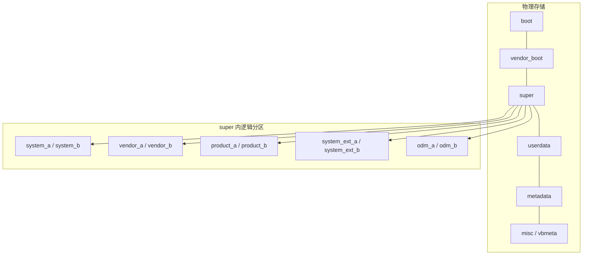

动态分区的价值：

1. OTA 时可重分配逻辑分区大小，无需改物理分区表。
2. 天然适配 A/B 更新。
3. 逻辑分区之间共享空闲空间。
4. 可配合 Virtual A/B 与 COW snapshot，减少双槽空间浪费。

`vold` 在启动时会读取 `fstab`，识别 quota、reserved、compress、vold-managed 条目，并在 `/data` 启用 metadata encryption 场景下提前创建对应 dm 设备。

### 34.1.3 `userdata`

`userdata` 分区挂载在 `/data`，是应用私有数据、共享媒体和系统运行时状态的主要存放地，常见目录结构：

```text
/data/
  data/               -> 应用私有数据（通常链接到 user/0）
  user/0/             -> user 0 的 CE 存储
  user_de/0/          -> user 0 的 DE 存储
  media/              -> 共享媒体后端
  media/0/            -> user 0 的 emulated external storage
  misc/               -> 系统杂项
  misc/vold/          -> vold 密钥材料
  system/             -> 系统数据库
  system_ce/0/        -> system CE 数据
  system_de/0/        -> system DE 数据
  app/                -> 已安装 APK
```

### 34.1.4 `metadata`

`metadata` 分区在早期启动阶段就会挂载，用于：

- `userdata` 的 metadata encryption 密钥
- OTA checkpoint 状态
- GSI 相关元数据

### 34.1.5 路径映射

应用视角和底层路径之间并不是一一对应，而是经过 FUSE 与 bind mount 映射：

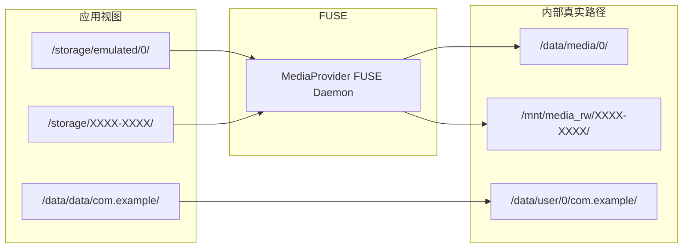

`/storage/emulated/0/` 并不是直接挂在 ext4/f2fs 上，而是由 MediaProvider 中的 FUSE 守护进程代理。

---

## 34.2 `vold`（Volume Daemon）

### 34.2.1 概览

`vold` 是 Android 原生层的存储总管，负责：

- 物理磁盘与卷的发现、挂载、卸载、格式化
- FBE 密钥管理
- adoptable storage
- FUSE 会话准备
- 对 framework 暴露 `IVold` Binder API

入口在 `system/vold/main.cpp`：

```cpp
int main(int argc, char** argv) {
    LOG(INFO) << "Vold 3.0 (the awakening) firing up";
    VolumeManager* vm;
    NetlinkManager* nm;

    vm = VolumeManager::Instance();
    nm = NetlinkManager::Instance();

    vm->start();
    process_config(vm, &configs);
    VoldNativeService::start();
    nm->start();
    coldboot("/sys/block");

    android::IPCThreadState::self()->joinThreadPool();
}
```

### 34.2.2 启动时序

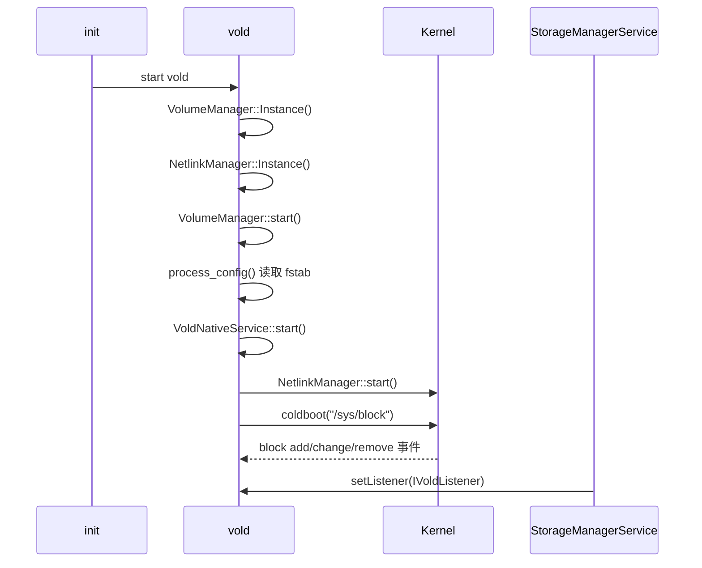

### 34.2.3 `VolumeManager`

`VolumeManager` 是 `vold` 的中心单例，负责追踪 disk、volume、user：

```cpp
class VolumeManager {
  public:
    int start();
    void handleBlockEvent(NetlinkEvent* evt);
    void addDiskSource(const std::shared_ptr<DiskSource>& diskSource);
    std::shared_ptr<Disk> findDisk(const std::string& id);
    std::shared_ptr<VolumeBase> findVolume(const std::string& id);
    int onUserAdded(userid_t userId, int userSerialNumber, userid_t cloneParentUserId);
    int onUserStarted(userid_t userId);
    int onUserStopped(userid_t userId);
    int abortFuse();
    int reset();
    int shutdown();
    int unmountAll();
};
```

`start()` 的第一件事，就是创建内部 emulated volume：

```cpp
auto vol = std::shared_ptr<VolumeBase>(
        new EmulatedVolume("/data/media", 0));
vol->setMountUserId(0);
vol->create();
```

也就是说，即便没有外部存储，内部共享存储视图也是一个“卷”。

### 34.2.4 磁盘发现与分区读取

`NetlinkHandler` 把 block 子系统 uevent 交给 `VolumeManager::handleBlockEvent()`：

```cpp
if (std::string(subsys) == "block") {
    vm->handleBlockEvent(evt);
}
```

随后 `handleBlockEvent()` 会：

1. 匹配 `fstab` 注册的 `DiskSource`
2. 根据 major/minor 推断是 SD 还是 USB
3. 创建 `Disk`
4. 在 add/change/remove 事件上分别处理

### 34.2.5 `Disk`

`Disk` 表示一个物理存储设备，会解析分区表并创建具体卷对象：

```cpp
class Disk {
  public:
    enum Flags {
        kAdoptable = 1 << 0,
        kDefaultPrimary = 1 << 1,
        kSd = 1 << 2,
        kUsb = 1 << 3,
        kEmmc = 1 << 4,
    };

    status_t create();
    status_t destroy();
    status_t readMetadata();
    status_t readPartitions();
    status_t partitionPublic();
    status_t partitionPrivate();
    status_t partitionMixed(int8_t ratio);
};
```

`readPartitions()` 会用 `sgdisk --android-dump` 解析 GPT / MBR。关键 GUID：

| GUID | 常量 | 用途 |
|---|---|---|
| `EBD0A0A2-...` | `kGptBasicData` | 公共卷 |
| `19A710A2-...` | `kGptAndroidMeta` | Android metadata |
| `193D1EA4-...` | `kGptAndroidExpand` | adoptable 私有卷 |

### 34.2.6 卷层级

所有卷都继承自 `VolumeBase`：

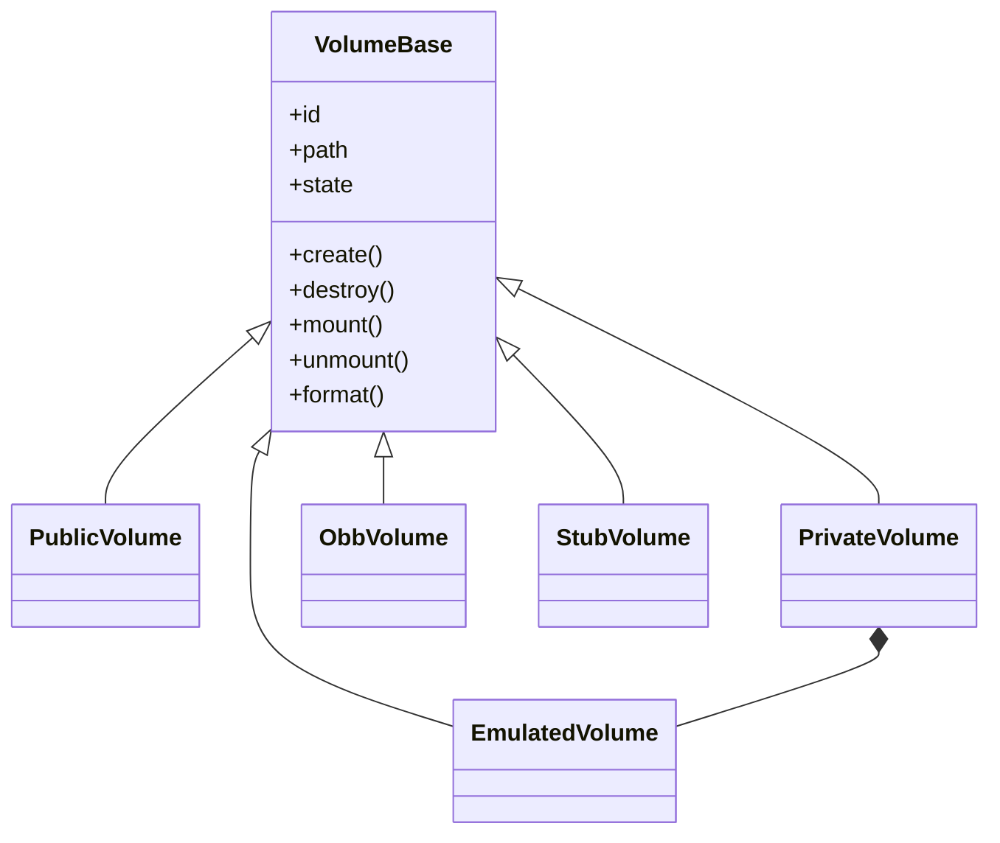

常见 `State` 包括：

- `kUnmounted`
- `kChecking`
- `kMounted`
- `kMountedReadOnly`
- `kFormatting`
- `kEjecting`
- `kUnmountable`
- `kRemoved`

### 34.2.7 `PublicVolume`

`PublicVolume` 用于 SD 卡、U 盘等 FAT / exFAT 可移除介质。挂载过程：

1. 做 fsck / consistency check
2. 挂到 `/mnt/media_rw/<stableName>`
3. 若对 app 可见，则再挂 FUSE 层到 `/storage/<stableName>`
4. 调整 FUSE read-ahead 与 dirty ratio

格式化时，会根据容量选择 FAT 或 exFAT：大于约 32 GiB 更倾向 exFAT。

### 34.2.8 `PrivateVolume`

`PrivateVolume` 是 adoptable storage 的核心。它会：

1. 创建 block device node
2. 清理旧 dm 映射
3. 为该卷建立 metadata encryption
4. 挂载为 ext4 或 f2fs
5. 准备标准 Android 目录：
   - `app`
   - `user`
   - `user_de`
   - `media/0`
6. 在其 `media/` 上方再叠一个 `EmulatedVolume`

也就是说，可收养存储在逻辑上会“长得像一个新的内部存储根”。

### 34.2.9 `EmulatedVolume`

`EmulatedVolume` 提供 per-user 的共享存储视图。历史上它还可能接 sdcardfs，如今主路径是 FUSE：

```cpp
status_t EmulatedVolume::doMount() {
    setInternalPath(mRawPath);
    setPath(StringPrintf("/storage/%s", label.c_str()));

    res = MountUserFuse(user_id, getInternalPath(), label, &fd);
    mFuseMounted = true;

    if (!IsFuseBpfEnabled()) {
        mountFuseBindMounts();
    }

    ConfigureReadAheadForFuse(..., 256u);
    ConfigureMaxDirtyRatioForFuse(..., 40u);
}
```

### 34.2.10 `VoldNativeService`

`vold` 通过 `IVold` AIDL 暴露 API。典型方法：

| 方法 | 作用 |
|---|---|
| `mount()` / `unmount()` / `format()` | 卷操作 |
| `partition()` | 分区 |
| `onUserAdded()` / `onUserStarted()` / `onUserStopped()` | 用户生命周期 |
| `fbeEnable()` / `initUser0()` | FBE 初始化 |
| `createUserStorageKeys()` / `destroyUserStorageKeys()` | 用户密钥管理 |
| `unlockCeStorage()` / `lockCeStorage()` | CE 解锁与上锁 |
| `moveStorage()` | 迁移存储 |
| `fstrim()` / `runIdleMaint()` | 维护与健康管理 |

### 34.2.11 文件系统支持

`vold` 通过 `system/vold/fs/` 下的模块支持：

| 模块 | 支持 |
|---|---|
| `Vfat.cpp` | FAT16 / FAT32 |
| `Exfat.cpp` | exFAT |
| `Ext4.cpp` | ext4 |
| `F2fs.cpp` | f2fs |

内部 / adoptable 存储格式化时，若底层设备像闪存且 `f2fs` 可用，通常优先 `f2fs`，否则回退到 `ext4`。

---

## 34.3 `StorageManagerService`

### 34.3.1 概览

`StorageManagerService`（SMS）是 Java 侧系统服务，作为 framework 与 `vold` 之间的桥梁，负责：

- 维护 disk / volume 内存模型
- 广播存储事件
- OBB 管理
- 用户 CE/DE 解锁协调
- 控制 `ExternalStorageService` 与 FUSE session 生命周期

### 34.3.2 服务注册

SMS 以历史兼容名 `"mount"` 注册：

```java
public static class Lifecycle extends SystemService {
    @Override
    public void onStart() {
        mStorageManagerService = new StorageManagerService(getContext());
        publishBinderService("mount", mStorageManagerService);
        mStorageManagerService.start();
    }
}
```

并在不同 boot phase 依次调用：

- `servicesReady()`
- `systemReady()`
- `bootCompleted()`

同时响应：

- `onUserUnlocking()`
- `onUserStopped()`

### 34.3.3 核心数据结构

```java
@GuardedBy("mLock")
private ArrayMap<String, DiskInfo> mDisks = new ArrayMap<>();

@GuardedBy("mLock")
private final WatchedArrayMap<String, WatchedVolumeInfo> mVolumes =
    new WatchedArrayMap<>();

@GuardedBy("mLock")
private ArrayMap<String, VolumeRecord> mRecords = new ArrayMap<>();

@GuardedBy("mLock")
private String mPrimaryStorageUuid;
```

这几类对象分别代表：

- `DiskInfo`：物理盘
- `VolumeInfo`：卷运行时状态
- `VolumeRecord`：持久化记录

### 34.3.4 `IVoldListener`

SMS 启动后会连接 `vold` 并注册监听器，接收：

- `onDiskCreated`
- `onDiskMetadataChanged`
- `onDiskScanned`
- `onVolumeCreated`
- `onVolumeStateChanged`
- `onVolumeMetadataChanged`

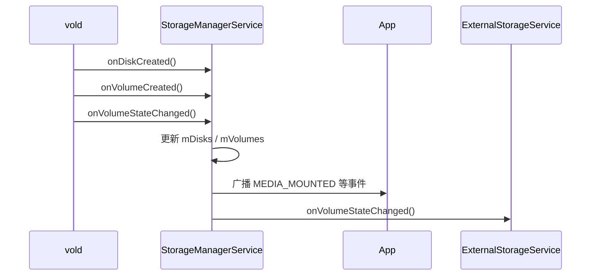

### 34.3.5 OBB 管理

OBB 是大型游戏常见的扩展包机制。SMS 会校验路径与权限，再通过 `vold.createObb()` 让 `vold` 建立 loop device 并挂载。

### 34.3.6 卷设置持久化

卷记录会序列化到 XML，字段包括：

- `primaryStorageUuid`
- `fsUuid`
- `partGuid`
- `nickname`
- `userFlags`
- `createdMillis`
- `lastSeenMillis`
- `lastTrimMillis`
- `lastBenchMillis`

这样设备重启后，曾经见过的可移动卷和 adoptable 卷仍可被识别。

### 34.3.7 CE / DE 解锁协调

SMS 维护一组“CE 已解锁用户”：

```java
private static class WatchedUnlockedUsers {
    private int[] users = EmptyArray.INT;
}

@GuardedBy("mLock")
private WatchedUnlockedUsers mCeUnlockedUsers = new WatchedUnlockedUsers();
```

用户解锁后，SMS 会调用 `vold.unlockCeStorage()`，成功后把用户加入该集合，并使 `StorageManager` / volume 缓存失效。

### 34.3.8 智能空闲维护

SMS 还负责触发：

- `runIdleMaint()`
- `fstrim()`

默认配置包括：

- 维护周期
- 闪存寿命阈值
- 最低电量
- 是否要求充电

目标是减少 flash 磨损、控制垃圾回收与写放大。

---

## 34.4 Scoped Storage

### 34.4.1 模型

Scoped Storage 从 Android 10 引入、Android 11 起强制执行，本质上把“共享存储完全裸露给拿到权限的应用”改成了分层访问：

1. 应用自己的 `Android/data/<pkg>` / `Android/media/<pkg>` 无需权限。
2. 媒体文件通过 `MediaStore` 访问。
3. 文档类文件通过 SAF。
4. 极少数全盘文件管理器才可能使用 `MANAGE_EXTERNAL_STORAGE`。

### 34.4.2 权限模型

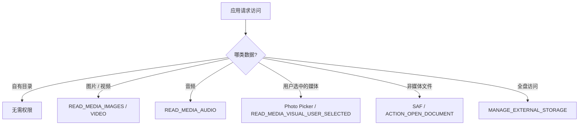

### 34.4.3 基于 FUSE 的执行

Scoped Storage 并不是“Java 层多做一次判断”而已。真正的文件访问执行是在 MediaProvider 进程中的 FUSE daemon：

```java
public final class FuseDaemon extends Thread {
    @Override
    public void run() {
        native_start(ptr, mFuseDeviceFd, mPath, ...);  // blocks
    }
}
```

### 34.4.4 `MediaProvider` 中的权限判断

`MediaProvider` 使用 `LocalCallingIdentity` 记录调用者权限位，例如：

- `PERMISSION_IS_SELF`
- `PERMISSION_IS_MANAGER`
- `PERMISSION_IS_LEGACY_GRANTED`
- `PERMISSION_READ_IMAGES`
- `PERMISSION_READ_VIDEO`
- `PERMISSION_WRITE_EXTERNAL_STORAGE`
- `PERMISSION_IS_SYSTEM_GALLERY`

这意味着 scoped storage 的裁决既看 runtime permission，也看 legacy mode、系统图库白名单、manager 特权和 redaction 需求。

### 34.4.5 legacy 模式

target SDK 较低的应用，曾可通过 `requestLegacyExternalStorage` 保留旧访问模式。系统内部用 `OP_LEGACY_STORAGE` AppOp 跟踪这一状态。现在该模式已逐步退出主流。

### 34.4.6 `MANAGE_EXTERNAL_STORAGE`

这个权限给予近似旧时代 `WRITE_EXTERNAL_STORAGE` 的广泛访问，但它：

1. 需要用户在设置里显式授予
2. 受 Google Play 严格审查
3. 仍不自动允许访问其他应用的 `Android/data/`

---

## 34.5 FUSE 与 sdcardfs

### 34.5.1 历史背景：sdcardfs

Android 11 之前，共享存储权限执行大量依赖内核态 `sdcardfs`。它性能很好，但有根本限制：

- 很难做逐文件权限判断
- 不能做 redaction
- 不能做透明转码
- 不利于 GKI

### 34.5.2 MediaProvider FUSE Daemon

Android 11 起，主路径改成 MediaProvider 进程内的 FUSE：

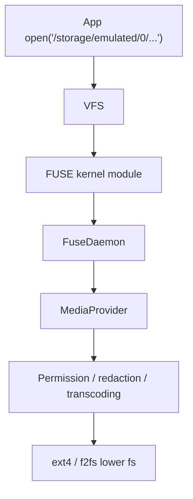

收益：

- 可在用户态做细粒度权限判断
- 支持 EXIF redaction
- 支持透明转码
- 避开对内核私有文件系统的依赖

### 34.5.3 原生 FUSE 守护进程

Native FUSE 实现在 `packages/providers/MediaProvider/jni/`，核心类 `FuseDaemon` 支持：

- `Start()`
- `ShouldOpenWithFuse()`
- `UsesFusePassthrough()`
- `InvalidateFuseDentryCache()`
- `CheckFdAccess()`
- `InitializeDeviceId()`

### 34.5.4 FUSE passthrough

FUSE 最大性能问题是所有 I/O 都要来回过用户态。为减轻损耗，Android 引入 passthrough：

- 若文件不需要 redaction / transcoding
- FUSE daemon 可建立后续内核直通路径

这样既保留用户态策略，又尽量接近 sdcardfs 的吞吐。

### 34.5.5 `ExternalStorageService`

`ExternalStorageServiceImpl` 是 `vold` 与 MediaProvider FUSE 的桥梁。其职责包括：

1. `onStartSession()`：创建 `FuseDaemon`
2. `onVolumeStateChanged()`：让 MediaProvider attach / detach volume，并触发扫描
3. `onEndSession()`：结束 session 并等待 daemon 退出

### 34.5.6 FUSE bind mount

`EmulatedVolume` 会对 `Android/data` 与 `Android/obb` 做 bind mount，保证应用自有目录和 OBB 能以更高性能访问，也避免 FUSE 额外绕行。

### 34.5.7 FUSE BPF

更进一步的优化是 FUSE BPF。内核 BPF 程序可以短路一部分常见权限判断，减少用户态往返。当 FUSE BPF 可用时，部分传统 bind mount 逻辑甚至不再需要。

---

## 34.6 `MediaProvider`

### 34.6.1 概览

`MediaProvider` 既是：

1. `content://media/` 的 provider
2. Scoped Storage 的权限执行层
3. FUSE daemon 所在进程
4. 媒体扫描器
5. SAF 文档 provider 的一部分支撑

### 34.6.2 Content URI 结构

```text
content://media/
    internal/
        audio/
        images/
        video/
    external/
    external_primary/
    <volume_name>/
```

### 34.6.3 数据库模式

MediaProvider 维护 `internal.db` / `external.db` 等 SQLite 数据库。核心表 `files` 常见字段：

- `_id`
- `_data`
- `_display_name`
- `_size`
- `mime_type`
- `media_type`
- `title`
- `date_added`
- `date_modified`
- `date_taken`
- `duration`
- `width`
- `height`
- `orientation`
- `bucket_id`
- `bucket_display_name`
- `volume_name`
- `owner_package_name`
- `is_pending`
- `is_trashed`
- `is_favorite`

### 34.6.4 媒体扫描

扫描由 `MediaScanner` / `ModernMediaScanner` 完成，典型触发场景：

| 触发 | 场景 |
|---|---|
| `REASON_MOUNTED` | 新卷挂载 |
| `REASON_DEMAND` | 应用主动请求扫描 |
| `REASON_IDLE` | 空闲维护 |
| FUSE 文件变化 | 写入新媒体文件 |

### 34.6.5 卷管理

当卷 `MEDIA_MOUNTED` 时，`ExternalStorageServiceImpl` 会：

1. `attachVolume()`
2. 触发 `queueVolumeScan(REASON_MOUNTED)`
3. `updateVolumes()`

卸载 / 弹出 / 移除时则 `detachVolume()`。

### 34.6.6 访问控制

`AccessChecker` 和 `LocalCallingIdentity` 决定调用方能否：

- 读取媒体元数据
- 直接读文件
- 写文件
- 绕过 redaction
- 以 legacy 模式访问

### 34.6.7 数据库备份与恢复

MediaProvider 还有自己的数据库恢复与备份机制，用于应对数据库损坏、FUSE 事件丢失与卷重连后的重建。

---

## 34.7 存储访问框架（SAF）

### 34.7.1 概览

SAF 是 Android 提供给“非媒体文件访问”的通用框架，目标是：

- 由用户显式选择文件 / 目录
- 应用拿到 URI grant，而不是裸路径
- 可跨本地盘、云盘、文档 provider 统一访问

### 34.7.2 架构

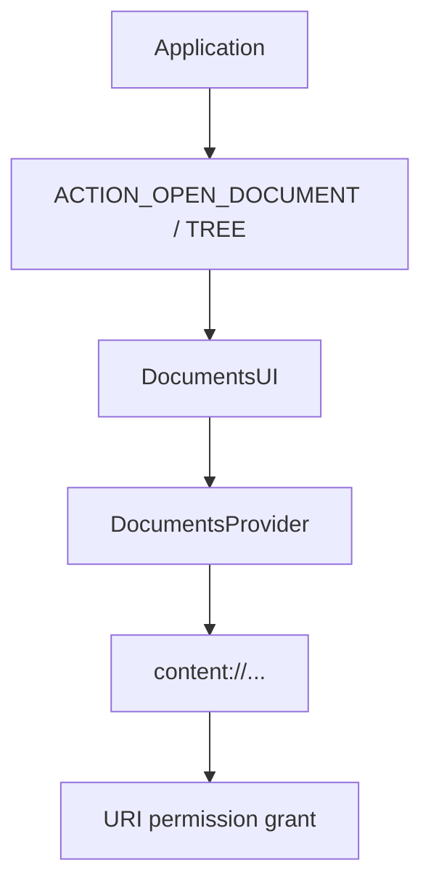

### 34.7.3 关键 Intent

常见 intent：

- `ACTION_OPEN_DOCUMENT`
- `ACTION_CREATE_DOCUMENT`
- `ACTION_OPEN_DOCUMENT_TREE`
- `ACTION_GET_CONTENT`

### 34.7.4 `DocumentsProvider`

`DocumentsProvider` 是 SAF 的抽象后端，需要实现目录、文档查询与读写接口。

### 34.7.5 `MediaDocumentsProvider`

媒体相关内容也可通过 `MediaDocumentsProvider` 暴露为文档树，便于统一接入 DocumentsUI。

### 34.7.6 Tree URI 与持久 grant

SAF 的核心不在 URI 本身，而在 grant：

- 一次性 grant
- 持久化 grant
- 基于 tree URI 的整棵子树访问

### 34.7.7 虚拟文件

SAF 允许 provider 暴露“虚拟文件”，即用户看到是一个文档，但真正内容可能是 provider 动态生成的流。

---

## 34.8 文件级加密（FBE）

### 34.8.1 概览

Android 采用 FBE 而不是全盘只开机一次解锁的 FDE。核心思想是：

- DE（Device Encrypted）：开机即可访问
- CE（Credential Encrypted）：用户凭据解锁后才可访问

### 34.8.2 密钥架构

FBE 至少涉及：

- 系统级 DE key
- 每用户 DE key
- 每用户 CE key
- Adoptable 卷 key

### 34.8.3 磁盘上的密钥存储

常见路径包括：

```text
/data/misc/vold/
/data/misc/vold/user_keys/de/<user>/
/data/misc/vold/user_keys/ce/<user>/
```

### 34.8.4 `fscrypt`

FBE 最终依赖内核 `fscrypt`。`vold` 负责：

- 生成或读取密钥
- 把密钥安装到内核 keyring
- 为目录应用 encryption policy

### 34.8.5 密钥创建

`KeyGeneration` 定义密钥生成参数：

```cpp
struct KeyGeneration {
    size_t keysize;
    bool allow_gen;
    bool use_hw_wrapped_key;
};
```

### 34.8.6 CE 解锁流程

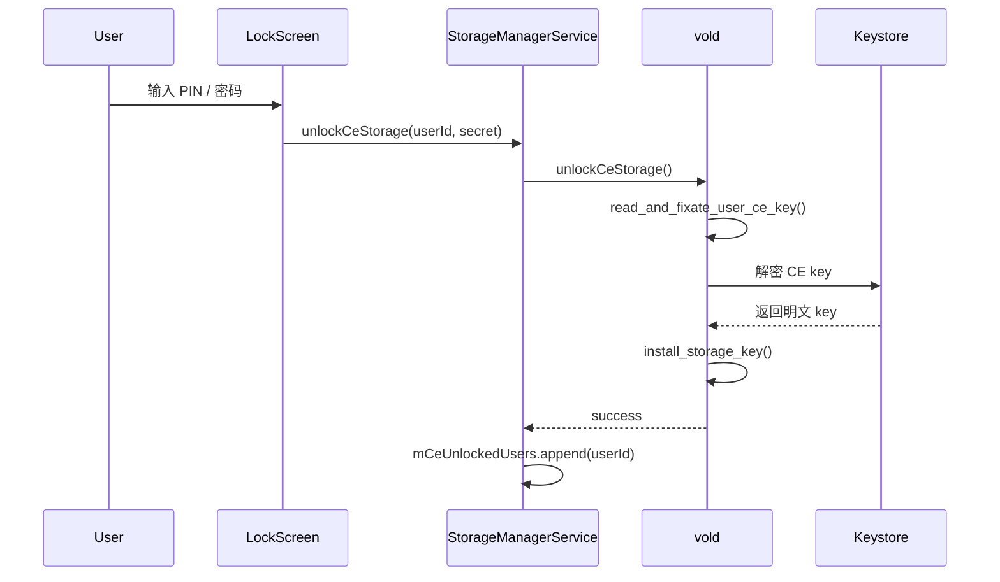

为了应对 key rotation 中途崩溃，读取 CE key 时会尝试多个候选路径并最终 fixate。

### 34.8.7 加密选项

FBE 和 adoptable volume 的加密算法由 `fstab` 或系统属性决定，常见包括：

- `AES-256-XTS`
- `Adiantum`
- 以及 volume contents / filenames mode 组合

### 34.8.8 目录准备

创建目录时，`vold` 会在临时目录上先应用 encryption policy，再原子重命名到正式路径，避免竞态与中间态泄漏。

### 34.8.9 metadata encryption

除了 `fscrypt` 的按文件加密，Android 还会对整个 `userdata` 元数据层使用 `dm-default-key`：


这意味着：

- 文件内容受 fscrypt 保护
- 文件名、目录结构、权限等元数据受 dm-default-key 保护

### 34.8.10 hardware-wrapped key

有 Inline Encryption Engine 的设备支持 hardware-wrapped key。密钥不会以明文形式离开硬件加密引擎，`vold` 只处理包装形式。

---

## 34.9 可收养存储（Adoptable Storage）

### 34.9.1 概览

Adoptable storage 允许把 SD 卡 / U 盘“收养”为内部存储。被收养后，它会：

1. 重新分区
2. 随机生成密钥
3. 做卷级加密
4. 格式化成 ext4 / f2fs
5. 承载 app、app data 与 media

### 34.9.2 收养流程

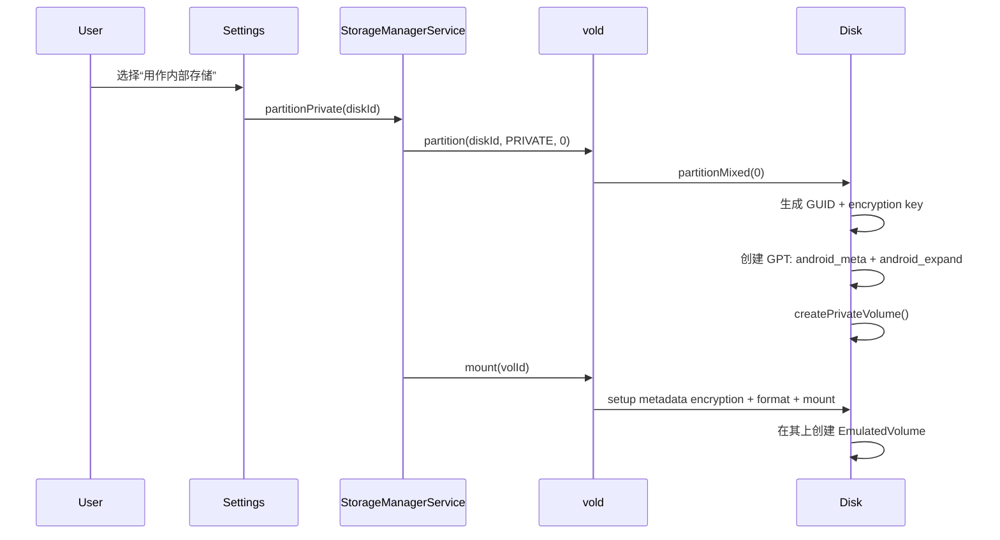

### 34.9.3 重新分区

`Disk::partitionMixed()` 会：

1. `--zap-all` 清空旧分区表
2. 生成 partition GUID
3. 生成 volume key
4. 写入 key 到 `/data/misc/vold/expand_<guid>`
5. 创建：
   - 可选 public 分区
   - `android_meta`
   - `android_expand`

### 34.9.4 卷加密

私有卷加密方式由设备 API level 与属性决定：

- 新设备通常走 `dm-default-key`
- 旧路径可能使用 `dm-crypt`

### 34.9.5 数据迁移

`moveStorage()` 会把数据从旧卷迁到新卷，内部典型步骤：

1. 双方临时下线
2. 清理目标旧数据
3. 用 `cp -pRPD` 复制
4. 恢复上线
5. 用 `rm` 清理旧源数据

迁移过程持有 wakelock，并通过 `IVoldTaskListener` 上报进度。

### 34.9.6 弹出 adoptable storage

一旦该卷被拔出，其上的应用和数据立即不可用；重新插回后，系统会用 `/data/misc/vold/expand_<guid>` 中记录的密钥重新解密挂载。

### 34.9.7 Forget adopted storage

“忘记” adoptable storage 的本质是安全删除密钥。密钥一旦丢失，介质上的数据即永久不可恢复。

---

## 34.10 SQLite in AOSP

SQLite 是 Android 最重要的嵌入式数据库。系统服务和应用都大量依赖它。

### 34.10.1 架构

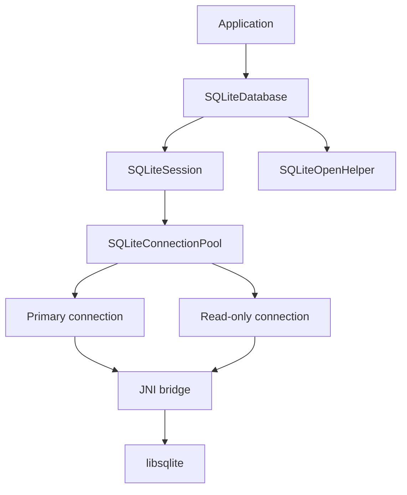

层次关系：

| 层 | 类 | 作用 |
|---|---|---|
| 用户 API | `SQLiteDatabase` | `query/insert/execSQL` |
| 会话 | `SQLiteSession` | 线程本地会话 |
| 连接池 | `SQLiteConnectionPool` | 管理原生连接 |
| 连接 | `SQLiteConnection` | 包装单个 `sqlite3*` |
| 版本辅助 | `SQLiteOpenHelper` | 创建、升级、降级 |

### 34.10.2 `SQLiteDatabase`

`SQLiteDatabase` 用单一 `mLock` 保护核心状态，同时维护线程本地 `SQLiteSession`：

```java
private final Object mLock = new Object();
private final ThreadLocal<SQLiteSession> mThreadSession =
        ThreadLocal.withInitial(this::createSession);
private SQLiteConnectionPool mConnectionPoolLocked;
```

常见 open flags：

- `OPEN_READWRITE`
- `OPEN_READONLY`
- `CREATE_IF_NECESSARY`
- `ENABLE_WRITE_AHEAD_LOGGING`
- `NO_LOCALIZED_COLLATORS`

### 34.10.3 WAL

WAL 是 Android 上 SQLite 最关键的性能特性之一：

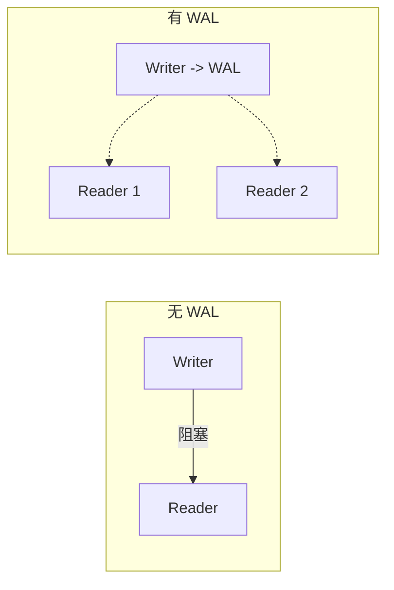

Android 支持多种 journal mode，但 WAL 是主流默认选择。Android 还有 compatibility WAL，用更小的 WAL 文件和更积极 checkpoint 控制磁盘占用。

### 34.10.4 连接池

`SQLiteConnectionPool` 维护：

- 一个 primary（可写）连接
- 多个 secondary（只读）连接

WAL 开启后，读可更多地走只读连接，从而获得读写并发。

### 34.10.5 `SQLiteOpenHelper`

`SQLiteOpenHelper` 的核心不是“方便创建数据库”，而是“按文件级互斥做版本迁移”：

```java
private static final ConcurrentHashMap<String, Object> sDbLock =
        new ConcurrentHashMap<>();
```

同一个 DB 文件的多个 helper 实例会共享一个锁对象。

### 34.10.6 预编译语句缓存

每个 `SQLiteConnection` 维护 LRU prepared statement cache。默认 25 条，最大 100 条，目的是减少 SQL 重解析成本。

### 34.10.7 错误与损坏恢复

数据库损坏时，`DatabaseErrorHandler` 会清理：

- 主 DB
- `-wal`
- `-shm`
- `-journal`

并记录 `EVENT_DB_CORRUPT` 事件，用于调试。

---

## 34.11 SharedPreferences

`SharedPreferences` 是 Android 最简单的持久化机制，但 AOSP 实现远比 API 表面复杂。

### 34.11.1 架构

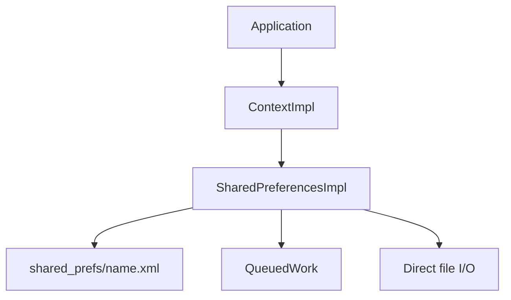

### 34.11.2 内存状态

`SharedPreferencesImpl` 会把文件一次性读入内存 `HashMap`：

```java
final class SharedPreferencesImpl implements SharedPreferences {
    private final File mFile;
    private final File mBackupFile;
    private final Object mLock = new Object();
    private final Object mWritingToDiskLock = new Object();

    @GuardedBy("mLock")
    private Map<String, Object> mMap;

    @GuardedBy("mLock")
    private int mDiskWritesInFlight = 0;

    @GuardedBy("mLock")
    private boolean mLoaded = false;
}
```

加载走专用 `ThreadPoolExecutor`，但所有 `get*()` 调用最终仍会 `awaitLoadedLocked()`，因此首次访问可能阻塞。

### 34.11.3 `commit()` vs `apply()`

`EditorImpl` 会先把变更累计在 `mModified`：

```java
public final class EditorImpl implements Editor {
    private final Object mEditorLock = new Object();
    private final Map<String, Object> mModified = new HashMap<>();
    private boolean mClear = false;
}
```

二者都先 `commitToMemory()`，差别在磁盘写：

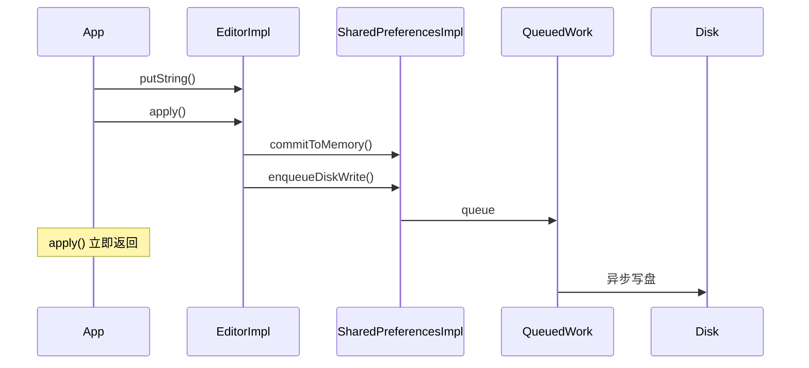

- `commit()`：同步写盘，阻塞调用线程
- `apply()`：异步写盘，但会在生命周期切换时被 `QueuedWork` drain，从而可能在主线程造成 ANR

### 34.11.4 原子文件写协议

SharedPreferences 的磁盘协议是典型的 backup rename：

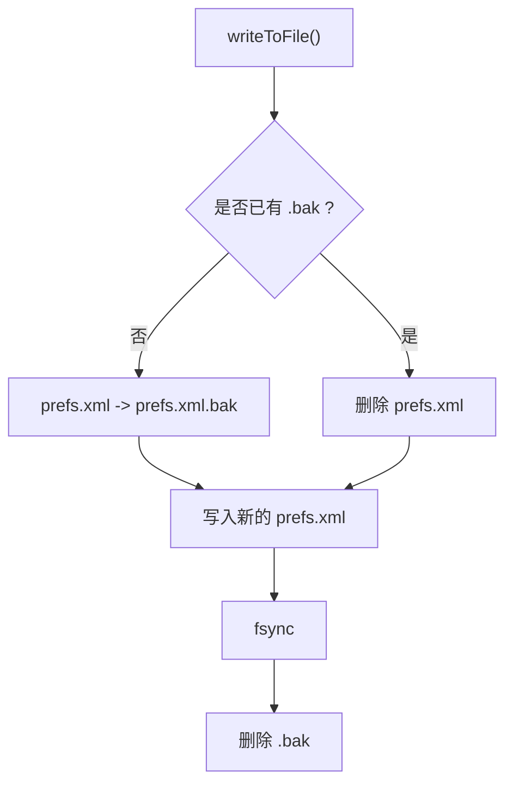

崩溃恢复逻辑也很直接：若发现 `.bak` 仍存在，则回滚。

### 34.11.5 基于 generation 的写合并

`apply()` 高频调用时，并不是每次都写盘。实现会比较：

- `mCurrentMemoryStateGeneration`
- `mDiskStateGeneration`

只有最新状态真正需要落盘，中间状态可能被跳过。这显著减少了无意义 I/O。

### 34.11.6 跨进程限制

`MODE_MULTI_PROCESS` 早已被证明本质不可靠。它只是用文件时间戳做弱一致性检查，不能解决并发写覆盖问题。

### 34.11.7 向 DataStore 迁移

Jetpack DataStore 相比 SharedPreferences：

| 特性 | SharedPreferences | DataStore |
|---|---|---|
| 线程模型 | 部分线程安全 | 协程驱动，全异步 |
| `apply()` ANR 风险 | 有 | 无 |
| 跨进程 | 基本不可靠 | 也不主打 |
| 类型安全 | 运行时 | Proto 方案编译期更好 |
| 错误传播 | 较弱 | 更清晰 |

不过 AOSP 内部依然大量使用 SharedPreferences，因此理解其实现仍然非常有价值。

---

## 34.12 附录：存储内部机制

这一节把原文附录中最关键、最值得日常排障时记住的内容压缩整理。

### 34.12.1 `vold` 工具函数

`system/vold/Utils.h` 提供了大量底层工具函数，包括：

- 创建设备节点
- `PrepareDir`
- `ForceUnmount`
- `BindMount`
- `KillProcessesUsingPath`
- quota / ACL 设置
- 计算用户 FUSE 路径

几乎整个 `vold` 代码库都依赖这些封装。

### 34.12.2 Checkpoint

存储 checkpoint 用于安全 OTA：

- block-level checkpoint：基于 dm snapshot
- file-level checkpoint：基于 f2fs 原生能力

典型流程：

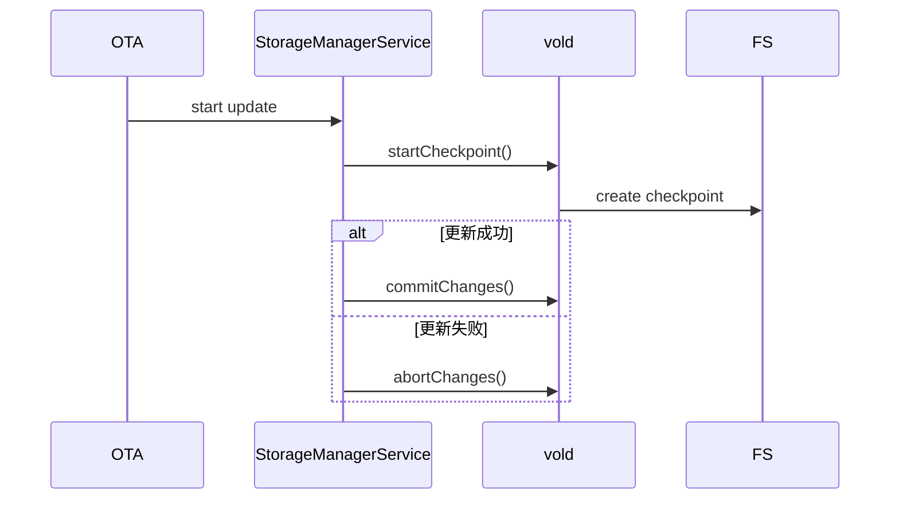

### 34.12.3 密钥生命周期

CE key 的典型生命周期：

1. 生成
2. 存盘
3. 用户解锁时解密
4. 安装到内核
5. 正常使用
6. 上锁时从内核驱逐
7. 用户删除时销毁

### 34.12.4 完整启动序列

存储完整引导关键步骤：

1. init first stage 挂载 `/metadata`
2. 启动 `vold`
3. `vold` 初始化 `VolumeManager` / `NetlinkManager`
4. 建立 metadata encryption，挂载 `/data`
5. 初始化 user 0 的 DE
6. system_server 启动 `StorageManagerService`
7. 用户输入凭据后解锁 CE
8. 启动 FUSE session
9. MediaProvider attach volume 并开始扫描

### 34.12.5 调试技巧

高频命令：

```bash
# vold 日志
adb logcat -s vold:* VolumeManager:* Disk:*

# FUSE 日志
adb logcat -s FuseDaemonThread:V

# dumpsys mount
adb shell dumpsys mount

# mount namespace
adb shell cat /proc/<pid>/mountinfo

# f2fs / trim / benchmark
adb shell sm benchmark private
adb shell sm fstrim
```

### 34.12.6 Mount Namespace

Android 用 mount namespace 为不同进程提供不同的可见存储视图。尤其在 app data isolation、FUSE bind mount 与 clone / profile 用户场景下，这一点很关键。

### 34.12.7 组件协同

理解存储问题时，最容易出错的地方是把各层割裂来看。实际上一次“写照片”的完整链路会穿过：

- 应用
- FUSE daemon
- MediaProvider 权限判断
- lower fs
- fscrypt
- 媒体扫描数据库更新

而一次“插入 SD 卡”则会依次经过：

- kernel uevent
- `NetlinkHandler`
- `VolumeManager`
- `Disk`
- `PublicVolume`
- `StorageManagerService`
- `ExternalStorageService`
- `FuseDaemon`
- `MediaProvider`

---

## 34.13 动手实践

### 34.13.1 检查分区布局

```bash
# 列出块设备
adb shell ls -la /dev/block/by-name/

# 查看 super 逻辑分区
adb shell ls -la /dev/block/mapper/

# 检查 fstab
adb shell cat /vendor/etc/fstab.*

# 查看挂载点
adb shell mount | grep -E "^/dev"

# 动态分区支持
adb shell getprop ro.boot.dynamic_partitions
```

### 34.13.2 查看 `vold` 状态

```bash
# vold 相关属性
adb shell getprop | grep vold

# dumpsys mount
adb shell dumpsys mount

# 卷与磁盘
adb shell sm list-volumes all
adb shell sm list-disks all

# FBE / metadata encryption
adb shell getprop ro.crypto.state
adb shell getprop ro.crypto.type
adb shell getprop ro.crypto.metadata.enabled
```

### 34.13.3 Scoped Storage 权限行为

```bash
# 应用看到的 shared storage
adb shell run-as com.example.app ls /storage/emulated/0/

# 自己的 app-specific 目录
adb shell run-as com.example.app ls /storage/emulated/0/Android/data/com.example.app/

# 别的应用目录应当失败
adb shell run-as com.example.app ls /storage/emulated/0/Android/data/com.other.app/

# MediaStore 查询
adb shell content query --uri content://media/external/images/media/
```

### 34.13.4 观察 FUSE

```bash
# 查看 FUSE 挂载
adb shell mount | grep -i fuse

# 查看 FUSE 守护进程
adb shell ps -A | grep -i media

# 监控挂载 / 卸载
adb shell logcat -s FuseDaemonThread:V

# 检查 passthrough / BPF
adb shell getprop | grep -i fuse
```

### 34.13.5 理解 FBE 密钥生命周期

```bash
# 查看 CE/DE 目录
adb shell ls -la /data/user/
adb shell ls -la /data/user_de/

# 观察 user unlock 期间日志
adb logcat -s FsCrypt:* StorageManagerService:* vold:*

# 查看哪些用户 CE 已解锁
adb shell dumpsys mount | grep -i unlocked
```

### 34.13.6 模拟 adoptable storage

```bash
# 模拟虚拟磁盘（模拟器）
adb shell sm set-virtual-disk true

# 等待磁盘出现
adb shell sm list-disks all

# 分区为 private
adb shell sm partition <diskId> private

# 检查新卷
adb shell sm list-volumes all

# 迁移数据
adb shell sm move-primary-storage <volUuid>

# 忘记分区
adb shell sm forget <fsUuid>
```

### 34.13.7 检查 MediaProvider 数据库

```bash
# 连接 external 数据库（需要 root）
adb shell sqlite3 /data/user_de/0/com.android.providers.media.module/databases/external.db
```

进到 sqlite 后可查看：

- `files`
- 各类索引
- volume 相关元数据
- pending / trashed / favorite 等字段

### 34.13.8 使用 SAF

```bash
# 列出 document roots
adb shell content query --uri content://com.android.externalstorage.documents/root

# 拉起 DocumentsUI
adb shell am start -a android.intent.action.OPEN_DOCUMENT
```

### 34.13.9 存储健康监控

```bash
# 生命周期估计
adb shell sm get-fbe-mode

# 跑 benchmark
adb shell sm benchmark private

# 手动 fstrim
adb shell sm fstrim

# 空闲维护日志
adb logcat -s StorageManagerService:* vold:*
```

### 34.13.10 构建和修改 `vold`

```bash
# 进入 vold 源码
cd system/vold

# 查看 Soong 构建文件
ls Android.bp

# 构建 vold
m vold
```

如果是 root 测试环境，还可以替换二进制做实验，但这类操作应仅限调试设备。

---

## 总结（Summary）

Android 存储子系统是一组紧密耦合的层次结构：底层由块设备、动态分区、metadata encryption 和 `vold` 管理物理介质与密钥，中层由 `StorageManagerService` 协调 framework 与 native 守护进程，上层再通过 FUSE、MediaProvider、Scoped Storage 与 SAF 向应用暴露受控访问模型。

本章关键点如下：

1. `super` 动态分区把系统镜像更新从固定分区时代推进到了可重分配、可快照、可 A/B 演进的模型。
2. `vold` 是 native 存储控制平面的核心，负责卷发现、挂载、格式化、加密、用户密钥管理和 FUSE 相关准备。
3. `StorageManagerService` 维护 Java 侧的 disk / volume 状态，并通过 `IVoldListener` 与 `vold` 保持同步。
4. Scoped Storage 的真正执行点不是应用 API，而是 MediaProvider 进程中的 FUSE daemon 和其权限判定逻辑。
5. `MediaProvider` 同时承担了媒体数据库、FUSE 宿主、媒体扫描器和 SAF 支撑角色，是 Android 存储访问控制最复杂的上层组件之一。
6. FBE 把设备解锁前后可见的数据明确拆成 DE / CE 两层，并与 `fscrypt`、metadata encryption、Keystore 和多用户机制一起构成现代 Android 数据保护边界。
7. Adoptable Storage 通过重新分区、卷级加密和 emulated volume 叠加，把可移除介质转化为逻辑上的内部存储。
8. SQLite 和 SharedPreferences 虽然位于更上层，但它们是 Android 应用与系统服务最常见的持久化形式，其实现细节直接影响性能、ANR 风险与数据可靠性。
9. 存储问题排障通常要同时看分区、dm 设备、卷状态、FUSE、MediaProvider、权限策略、挂载命名空间和加密状态，单看其中一层往往得不到完整答案。

### 关键源码文件参考

| 文件 | 作用 |
|---|---|
| `system/vold/main.cpp` | `vold` 入口 |
| `system/vold/VolumeManager.cpp` | 磁盘与卷管理核心 |
| `system/vold/model/Disk.cpp` | 磁盘发现与分区解析 |
| `system/vold/model/PublicVolume.cpp` | 可移除公共卷 |
| `system/vold/model/PrivateVolume.cpp` | adoptable 私有卷 |
| `system/vold/model/EmulatedVolume.cpp` | emulated / FUSE 卷 |
| `system/vold/VoldNativeService.h` | `IVold` Binder 实现 |
| `frameworks/base/services/core/java/com/android/server/StorageManagerService.java` | framework 存储服务 |
| `packages/providers/MediaProvider/src/com/android/providers/media/fuse/FuseDaemon.java` | FUSE Java 宿主 |
| `packages/providers/MediaProvider/jni/FuseDaemon.cpp` | FUSE native 实现 |
| `packages/providers/MediaProvider/src/com/android/providers/media/DatabaseHelper.java` | MediaProvider 数据库 |
| `packages/providers/MediaProvider/src/com/android/providers/media/LocalCallingIdentity.java` | MediaProvider 权限位 |
| `frameworks/base/core/java/android/database/sqlite/SQLiteDatabase.java` | SQLite 主入口 |
| `frameworks/base/core/java/android/database/sqlite/SQLiteConnectionPool.java` | SQLite 连接池 |
| `frameworks/base/core/java/android/database/sqlite/SQLiteOpenHelper.java` | SQLite 版本管理 |
| `frameworks/base/core/java/android/app/SharedPreferencesImpl.java` | SharedPreferences 实现 |
| `system/vold/FsCrypt.cpp` | FBE 关键路径 |
| `system/vold/MetadataCrypt.cpp` | metadata encryption |
