# Chapter 34: Storage and Filesystem

Android's storage subsystem has evolved dramatically from a simple FAT32 SD card
mount into a multi-layered architecture that manages partitions, enforces
per-file encryption, provides scoped access control through FUSE, and abstracts
physical media through a document-oriented framework. This chapter examines every
layer -- from the raw partition layout to the Java-level Storage Access
Framework -- by walking through the actual AOSP source code.

---

## 34.1 Storage Architecture

### 34.1.1 The Physical Partition Layout

An Android device's persistent storage is divided into a set of well-known
partitions.  On modern devices that ship with dynamic partitions, the raw eMMC
or UFS storage is divided into a small number of physical partitions, with one
large "super" partition that is subdivided using device-mapper into logical
partitions.

The key partitions are:

| Partition  | Filesystem | Purpose |
|-----------|-----------|---------|
| `boot`    | (raw image) | Kernel + ramdisk |
| `vendor_boot` | (raw image) | Vendor ramdisk |
| `init_boot` | (raw image) | Generic ramdisk (GKI) |
| `super`   | (device-mapper) | Container for logical partitions |
| `system`  | ext4/erofs | Android framework, apps, libraries |
| `vendor`  | ext4/erofs | Vendor HALs and firmware |
| `product` | ext4/erofs | OEM customization |
| `system_ext` | ext4/erofs | System extension |
| `odm`     | ext4/erofs | ODM-specific overlay |
| `userdata`| f2fs/ext4  | User data, app data, media |
| `metadata`| ext4       | Encryption metadata, OTA checkpoint |
| `cache`   | ext4       | OTA cache (largely deprecated) |
| `misc`    | (raw)      | Bootloader communication |
| `vbmeta`  | (raw)      | AVB verification metadata |

### 34.1.2 Dynamic Partitions (super)

Starting with Android 10, the monolithic partition table gave way to dynamic
partitions.  A single physical `super` partition is formatted with an Android-
specific metadata format (`liblp`) that describes logical partitions backed by
device-mapper `linear` targets.

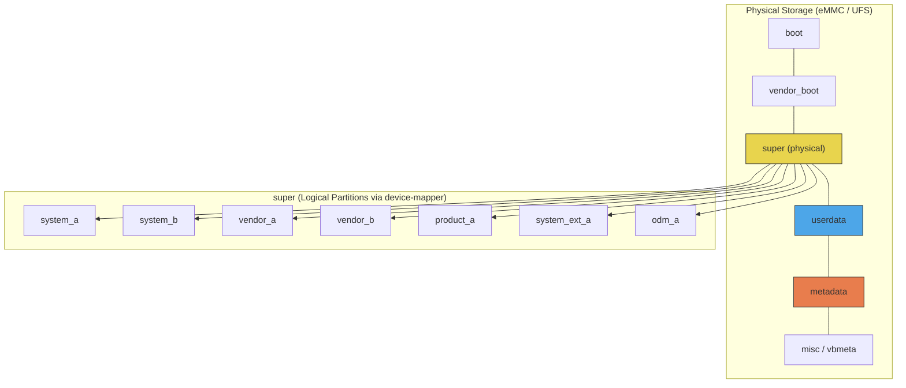
```mermaid
graph TD
    subgraph "Physical Storage (eMMC / UFS)"
        A["boot"] --- B["vendor_boot"]
        B --- C["super (physical)"]
        C --- D["userdata"]
        D --- E["metadata"]
        E --- F["misc / vbmeta"]
    end

    subgraph "super (Logical Partitions via device-mapper)"
        C --> G["system_a"]
        C --> H["system_b"]
        C --> I["vendor_a"]
        C --> J["vendor_b"]
        C --> K["product_a"]
        C --> L["system_ext_a"]
        C --> M["odm_a"]
    end

    style C fill:#e8d44d,stroke:#333
    style D fill:#4da6e8,stroke:#333
    style E fill:#e87d4d,stroke:#333
```

Dynamic partitions provide several advantages:

1. **Flexible sizing** -- Logical partitions can be resized at OTA time without
   repartitioning the device.
2. **A/B support** -- The `super` partition contains both A and B slots for
   seamless updates.
3. **Space sharing** -- Unused space in one logical partition can be reclaimed
   by another during an update.
4. **Virtual A/B** -- The system uses copy-on-write (COW) snapshots to avoid
   needing twice the physical space for two complete slot copies.

The `super` partition metadata is managed by `liblp` in
`system/core/fs_mgr/liblp/`.  The partition layout is described in the `fstab`
file, which vold reads at startup:

```cpp
// system/vold/main.cpp (lines 235-294)
static int process_config(VolumeManager* vm, VoldConfigs* configs) {
    ATRACE_NAME("process_config");

    if (!ReadDefaultFstab(&fstab_default)) {
        PLOG(ERROR) << "Failed to open default fstab";
        return -1;
    }

    /* Loop through entries looking for ones that vold manages */
    configs->has_adoptable = false;
    configs->has_quota = false;
    configs->has_reserved = false;
    configs->has_compress = false;
    for (auto& entry : fstab_default) {
        if (entry.fs_mgr_flags.quota) {
            configs->has_quota = true;
        }
        if (entry.reserved_size > 0) {
            configs->has_reserved = true;
        }
        // ...
        if (entry.mount_point == "/data" && !entry.metadata_key_dir.empty()) {
            // Pre-populate userdata dm-devices
            android::vold::defaultkey_precreate_dm_device();
        }
        if (entry.fs_mgr_flags.vold_managed) {
            // ... create DiskSource for removable storage
            vm->addDiskSource(std::shared_ptr<VolumeManager::DiskSource>(
                new VolumeManager::DiskSource(sysPattern, nickname, flags)));
        }
    }
    return 0;
}
```

### 34.1.3 The userdata Partition

The `userdata` partition (mounted at `/data`) is where all user-generated
content, app private data, and media files reside.  It is typically formatted
with f2fs (Flash-Friendly File System) on flash-based devices, or ext4 on
devices without f2fs support.

The `/data` directory structure follows a well-defined layout:

```
/data/
  data/              -> App private data (symlink to user/0)
  user/0/            -> CE (Credential Encrypted) storage for user 0
  user_de/0/         -> DE (Device Encrypted) storage for user 0
  media/             -> Shared media (backing for /storage/emulated)
  media/0/           -> User 0's emulated external storage
  misc/              -> System misc data
  misc/vold/         -> Vold key material
  misc/vold/user_keys/  -> Per-user encryption keys
  system/            -> System databases
  system_ce/0/       -> System CE data per user
  system_de/0/       -> System DE data per user
  app/               -> Installed APKs
  local/tmp/         -> Temporary files
```

### 34.1.4 The metadata Partition

The `metadata` partition stores encryption keys for metadata encryption of
`userdata`, OTA checkpoint state, and GSI (Generic System Image) metadata.  It
is mounted early in boot at `/metadata` before the main filesystem is
available.

### 34.1.5 Storage Path Mapping

Applications see storage through several well-known paths:

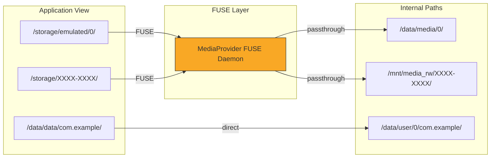
```mermaid
graph LR
    subgraph "Application View"
        A["/storage/emulated/0/"]
        B["/storage/XXXX-XXXX/"]
        C["/data/data/com.example/"]
    end

    subgraph "Internal Paths"
        D["/data/media/0/"]
        E["/mnt/media_rw/XXXX-XXXX/"]
        F["/data/user/0/com.example/"]
    end

    subgraph "FUSE Layer"
        G["MediaProvider FUSE Daemon"]
    end

    A -->|FUSE| G
    G -->|passthrough| D
    B -->|FUSE| G
    G -->|passthrough| E
    C -->|direct| F

    style G fill:#f9a825,stroke:#333
```

The `/storage/emulated/0/` path that apps see is a FUSE mount backed by
`/data/media/0/`.  The FUSE daemon, running inside the MediaProvider process,
intercepts every file operation and applies permission checks, redaction, and
transcoding before delegating to the actual filesystem.

---

## 34.2 vold (Volume Daemon)

### 34.2.1 Overview

`vold` (Volume Daemon) is Android's native-level storage manager.  It runs as a
privileged daemon started by init, responsible for:

- Detecting and managing physical disks (SD cards, USB drives)
- Creating, mounting, formatting, and encrypting volumes
- Managing per-user encryption keys (FBE)
- Setting up FUSE mounts for application-visible storage
- Handling adoptable storage (external media as internal)
- Providing a Binder interface (`IVold`) to the framework

The entry point is in `system/vold/main.cpp`:

```cpp
// system/vold/main.cpp (lines 66-165)
int main(int argc, char** argv) {
    // ...
    LOG(INFO) << "Vold 3.0 (the awakening) firing up";

    LOG(DEBUG) << "Detected support for:"
               << (android::vold::IsFilesystemSupported("ext4") ? " ext4" : "")
               << (android::vold::IsFilesystemSupported("f2fs") ? " f2fs" : "")
               << (android::vold::IsFilesystemSupported("vfat") ? " vfat" : "");

    VolumeManager* vm;
    NetlinkManager* nm;

    // ... SELinux, singletons ...

    if (!(vm = VolumeManager::Instance())) {
        LOG(ERROR) << "Unable to create VolumeManager";
        exit(1);
    }

    if (!(nm = NetlinkManager::Instance())) {
        LOG(ERROR) << "Unable to create NetlinkManager";
        exit(1);
    }

    if (vm->start()) {
        PLOG(ERROR) << "Unable to start VolumeManager";
        exit(1);
    }

    VoldConfigs configs = {};
    if (process_config(vm, &configs)) {
        PLOG(ERROR) << "Error reading configuration...";
    }

    // Start Binder services
    if (android::vold::VoldNativeService::start() != android::OK) {
        LOG(ERROR) << "Unable to start VoldNativeService";
        exit(1);
    }

    // Start Netlink listener for block device events
    if (nm->start()) {
        PLOG(ERROR) << "Unable to start NetlinkManager";
        exit(1);
    }

    // Coldboot: replay uevent for already-present devices
    coldboot("/sys/block");

    android::IPCThreadState::self()->joinThreadPool();
}
```

### 34.2.2 Startup Sequence

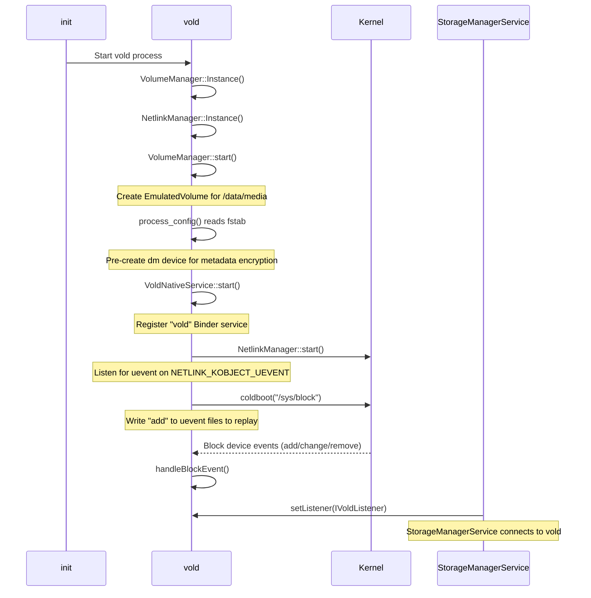
```mermaid
sequenceDiagram
    participant init
    participant vold
    participant Kernel
    participant Framework as StorageManagerService

    init->>vold: Start vold process
    vold->>vold: VolumeManager::Instance()
    vold->>vold: NetlinkManager::Instance()
    vold->>vold: VolumeManager::start()
    Note over vold: Create EmulatedVolume for /data/media
    vold->>vold: process_config() reads fstab
    Note over vold: Pre-create dm device for metadata encryption
    vold->>vold: VoldNativeService::start()
    Note over vold: Register "vold" Binder service
    vold->>Kernel: NetlinkManager::start()
    Note over vold: Listen for uevent on NETLINK_KOBJECT_UEVENT
    vold->>Kernel: coldboot("/sys/block")
    Note over vold: Write "add" to uevent files to replay
    Kernel-->>vold: Block device events (add/change/remove)
    vold->>vold: handleBlockEvent()
    Framework->>vold: setListener(IVoldListener)
    Note over Framework: StorageManagerService connects to vold
```

### 34.2.3 VolumeManager

`VolumeManager` is the central singleton that tracks all disks, volumes, and
users.  It is defined in `system/vold/VolumeManager.h`:

```cpp
// system/vold/VolumeManager.h (lines 42-250)
class VolumeManager {
  private:
    static VolumeManager* sInstance;
    bool mDebug;

  public:
    void setListener(android::sp<android::os::IVoldListener> listener) {
        mListener = listener;
    }

    int start();
    void handleBlockEvent(NetlinkEvent* evt);

    class DiskSource {
      public:
        DiskSource(const std::string& sysPattern,
                   const std::string& nickname, int flags)
            : mSysPattern(sysPattern), mNickname(nickname), mFlags(flags) {}

        bool matches(const std::string& sysPath) {
            return !fnmatch(mSysPattern.c_str(), sysPath.c_str(), 0);
        }
        // ...
    };

    void addDiskSource(const std::shared_ptr<DiskSource>& diskSource);
    std::shared_ptr<android::vold::Disk> findDisk(const std::string& id);
    std::shared_ptr<android::vold::VolumeBase> findVolume(const std::string& id);

    int onUserAdded(userid_t userId, int userSerialNumber,
                    userid_t cloneParentUserId);
    int onUserRemoved(userid_t userId);
    int onUserStarted(userid_t userId);
    int onUserStopped(userid_t userId);

    int abortFuse();
    int reset();
    int shutdown();
    int unmountAll();

    int setupAppDir(const std::string& path, int32_t appUid,
                    bool fixupExistingOnly = false,
                    bool skipIfDirExists = false);

    int createObb(const std::string& path, int32_t ownerGid,
                  std::string* outVolId);
    int destroyObb(const std::string& volId);

  private:
    std::mutex mLock;
    std::mutex mCryptLock;

    android::sp<android::os::IVoldListener> mListener;

    std::list<std::shared_ptr<DiskSource>> mDiskSources;
    std::list<std::shared_ptr<android::vold::Disk>> mDisks;
    std::list<std::shared_ptr<android::vold::Disk>> mPendingDisks;
    std::list<std::shared_ptr<android::vold::VolumeBase>> mObbVolumes;
    std::list<std::shared_ptr<android::vold::VolumeBase>>
        mInternalEmulatedVolumes;

    std::unordered_map<userid_t, int> mAddedUsers;
    std::unordered_map<userid_t, userid_t> mSharedStorageUser;
    std::set<userid_t> mStartedUsers;
};
```

When `VolumeManager::start()` is called, it creates the internal emulated
volume that backs `/storage/emulated`:

```cpp
// system/vold/VolumeManager.cpp (lines 175-198)
int VolumeManager::start() {
    ATRACE_NAME("VolumeManager::start");

    // Always start from a clean slate
    unmountAll();
    Loop::destroyAll();

    // Assume that we always have an emulated volume on internal
    // storage; the framework will decide if it should be mounted.
    CHECK(mInternalEmulatedVolumes.empty());

    auto vol = std::shared_ptr<android::vold::VolumeBase>(
            new android::vold::EmulatedVolume("/data/media", 0));
    vol->setMountUserId(0);
    vol->create();
    mInternalEmulatedVolumes.push_back(vol);

    // Consider creating a virtual disk
    updateVirtualDisk();

    return 0;
}
```

### 34.2.4 Disk Detection and Partition Reading

When the kernel reports a new block device through a netlink uevent, the
`NetlinkHandler` forwards it to `VolumeManager::handleBlockEvent()`:

```cpp
// system/vold/NetlinkHandler.cpp (lines 36-48)
void NetlinkHandler::onEvent(NetlinkEvent* evt) {
    VolumeManager* vm = VolumeManager::Instance();
    const char* subsys = evt->getSubsystem();

    if (!subsys) {
        LOG(WARNING) << "No subsystem found in netlink event";
        return;
    }

    if (std::string(subsys) == "block") {
        vm->handleBlockEvent(evt);
    }
}
```

The `handleBlockEvent` method matches the device against registered
`DiskSource` patterns from the fstab, then creates a `Disk` object:

```cpp
// system/vold/VolumeManager.cpp (lines 200-254)
void VolumeManager::handleBlockEvent(NetlinkEvent* evt) {
    std::lock_guard<std::mutex> lock(mLock);

    std::string eventPath(evt->findParam("DEVPATH") ? ... : "");
    std::string devType(evt->findParam("DEVTYPE") ? ... : "");

    if (devType != "disk") return;

    int major = std::stoi(evt->findParam("MAJOR"));
    int minor = std::stoi(evt->findParam("MINOR"));
    dev_t device = makedev(major, minor);

    switch (evt->getAction()) {
        case NetlinkEvent::Action::kAdd: {
            for (const auto& source : mDiskSources) {
                if (source->matches(eventPath)) {
                    int flags = source->getFlags();
                    if (major == kMajorBlockMmc || IsVirtioBlkDevice(major)) {
                        flags |= android::vold::Disk::Flags::kSd;
                    } else {
                        flags |= android::vold::Disk::Flags::kUsb;
                    }
                    auto disk = new android::vold::Disk(
                        eventPath, device, source->getNickname(), flags);
                    handleDiskAdded(
                        std::shared_ptr<android::vold::Disk>(disk));
                    break;
                }
            }
            break;
        }
        case NetlinkEvent::Action::kChange: {
            handleDiskChanged(device);
            break;
        }
        case NetlinkEvent::Action::kRemove: {
            handleDiskRemoved(device);
            break;
        }
    }
}
```

### 34.2.5 The Disk Class

`Disk` (defined in `system/vold/model/Disk.h` and `Disk.cpp`) represents a
physical storage device.  It understands partition tables and creates
appropriate volume objects:

```cpp
// system/vold/model/Disk.h (lines 39-134)
class Disk {
  public:
    Disk(const std::string& eventPath, dev_t device,
         const std::string& nickname, int flags);

    enum Flags {
        kAdoptable     = 1 << 0,
        kDefaultPrimary = 1 << 1,
        kSd            = 1 << 2,
        kUsb           = 1 << 3,
        kEmmc          = 1 << 4,
        kStubInvisible = 1 << 5,
        kStubVisible   = 1 << 6,
    };

    status_t create();
    status_t destroy();
    status_t readMetadata();
    status_t readPartitions();

    status_t partitionPublic();
    status_t partitionPrivate();
    status_t partitionMixed(int8_t ratio);

  private:
    std::string mId;       // e.g., "disk:179,0"
    std::string mSysPath;  // e.g., "/sys/block/mmcblk1"
    std::string mDevPath;  // e.g., "/dev/block/vold/disk:179,0"
    dev_t mDevice;
    uint64_t mSize;
    std::string mLabel;    // Manufacturer label
    std::vector<std::shared_ptr<VolumeBase>> mVolumes;
    int mFlags;

    void createPublicVolume(dev_t device);
    void createPrivateVolume(dev_t device, const std::string& partGuid);
};
```

The `readPartitions()` method uses `sgdisk` to parse GPT/MBR tables:

```cpp
// system/vold/model/Disk.cpp (lines 323-430)
status_t Disk::readPartitions() {
    int maxMinors = getMaxMinors();
    destroyAllVolumes();

    std::vector<std::string> cmd;
    cmd.push_back(kSgdiskPath);
    cmd.push_back("--android-dump");
    cmd.push_back(mDevPath);

    std::vector<std::string> output;
    status_t res = ForkExecvp(cmd, &output);
    // ...

    Table table = Table::kUnknown;
    bool foundParts = false;
    for (const auto& line : output) {
        // Parse DISK/PART lines from sgdisk output
        if (*it == "PART") {
            // ...
            if (table == Table::kMbr) {
                switch (type) {
                    case 0x06:  // FAT16
                    case 0x0b:  // W95 FAT32
                    case 0x0c:  // W95 FAT32 (LBA)
                        createPublicVolume(partDevice);
                        break;
                }
            } else if (table == Table::kGpt) {
                if (EqualsIgnoreCase(typeGuid, kGptBasicData)) {
                    createPublicVolume(partDevice);
                } else if (EqualsIgnoreCase(typeGuid, kGptAndroidExpand)) {
                    createPrivateVolume(partDevice, partGuid);
                }
            }
        }
    }
}
```

The GPT type GUIDs are significant:

| GUID | Constant | Purpose |
|------|----------|---------|
| `EBD0A0A2-B9E5-4433-87C0-68B6B72699C7` | `kGptBasicData` | Public (FAT/exFAT) volume |
| `19A710A2-B3CA-11E4-B026-10604B889DCF` | `kGptAndroidMeta` | Android metadata partition |
| `193D1EA4-B3CA-11E4-B075-10604B889DCF` | `kGptAndroidExpand` | Adoptable storage (private) |

### 34.2.6 The Volume Hierarchy

All volumes derive from `VolumeBase` (defined in
`system/vold/model/VolumeBase.h`):

```cpp
// system/vold/model/VolumeBase.h (lines 50-179)
class VolumeBase {
  public:
    enum class Type {
        kPublic = 0,
        kPrivate,
        kEmulated,
        kAsec,
        kObb,
        kStub,
    };

    enum MountFlags {
        kPrimary        = 1 << 0,
        kVisibleForRead = 1 << 1,
        kVisibleForWrite = 1 << 2,
    };

    enum class State {
        kUnmounted = 0,
        kChecking,
        kMounted,
        kMountedReadOnly,
        kFormatting,
        kEjecting,
        kUnmountable,
        kRemoved,
        kBadRemoval,
    };

    status_t create();
    status_t destroy();
    status_t mount();
    status_t unmount();
    status_t format(const std::string& fsType);

  protected:
    explicit VolumeBase(Type type);

    virtual status_t doMount() = 0;
    virtual status_t doUnmount() = 0;
};
```

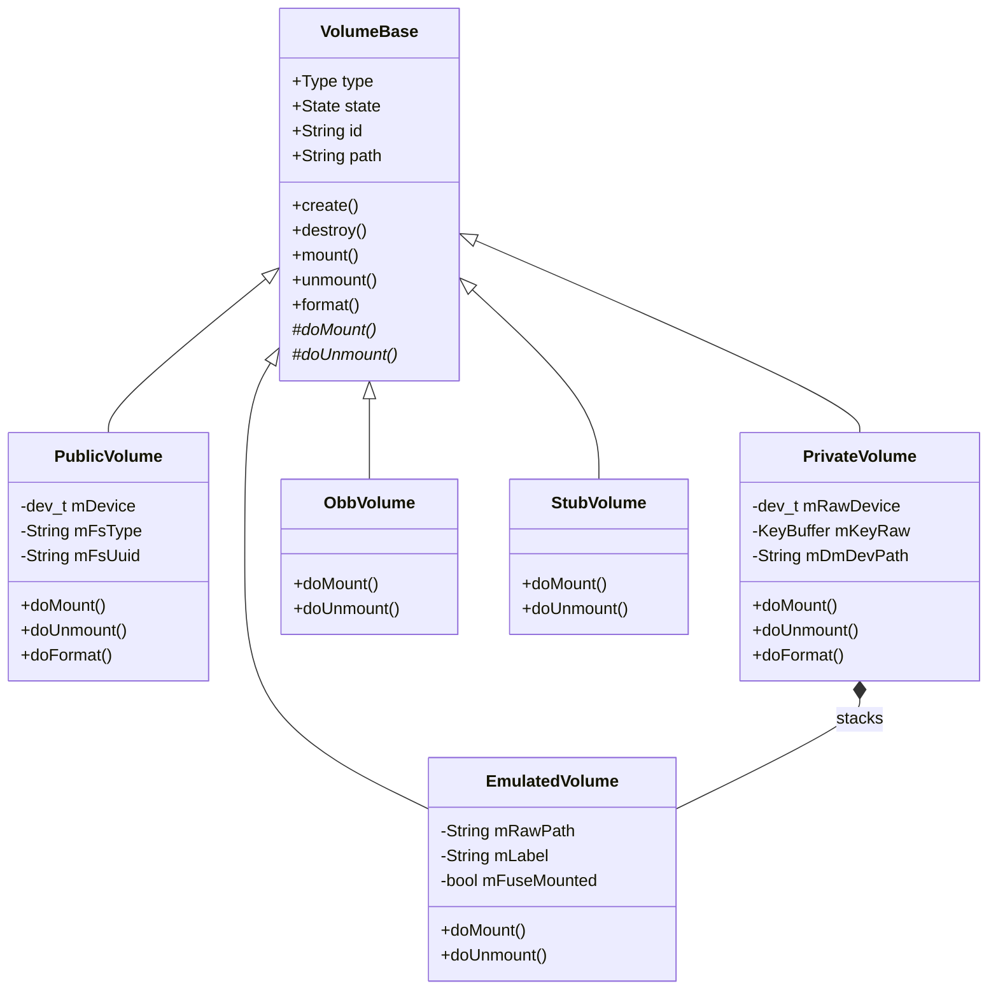
```mermaid
classDiagram
    class VolumeBase {
        +Type type
        +State state
        +String id
        +String path
        +create()
        +destroy()
        +mount()
        +unmount()
        +format()
        #doMount()*
        #doUnmount()*
    }

    class PublicVolume {
        -dev_t mDevice
        -String mFsType
        -String mFsUuid
        +doMount()
        +doUnmount()
        +doFormat()
    }

    class PrivateVolume {
        -dev_t mRawDevice
        -KeyBuffer mKeyRaw
        -String mDmDevPath
        +doMount()
        +doUnmount()
        +doFormat()
    }

    class EmulatedVolume {
        -String mRawPath
        -String mLabel
        -bool mFuseMounted
        +doMount()
        +doUnmount()
    }

    class ObbVolume {
        +doMount()
        +doUnmount()
    }

    class StubVolume {
        +doMount()
        +doUnmount()
    }

    VolumeBase <|-- PublicVolume
    VolumeBase <|-- PrivateVolume
    VolumeBase <|-- EmulatedVolume
    VolumeBase <|-- ObbVolume
    VolumeBase <|-- StubVolume
    PrivateVolume *-- EmulatedVolume : stacks
```

### 34.2.7 PublicVolume: Removable Media

`PublicVolume` handles USB drives and SD cards with FAT/exFAT filesystems.
Its mount process involves checking the filesystem, mounting to a raw path,
and then setting up FUSE:

```cpp
// system/vold/model/PublicVolume.cpp (lines 110-292)
status_t PublicVolume::doMount() {
    bool isVisible = isVisibleForWrite();
    readMetadata();

    if (mFsType == "vfat" && vfat::IsSupported()) {
        if (vfat::Check(mDevPath)) {
            LOG(ERROR) << getId() << " failed filesystem check";
            return -EIO;
        }
    } else if (mFsType == "exfat" && exfat::IsSupported()) {
        if (exfat::Check(mDevPath)) {
            return -EIO;
        }
    }

    std::string stableName = getStableName();
    mRawPath = StringPrintf("/mnt/media_rw/%s", stableName.c_str());

    setInternalPath(mRawPath);
    if (isVisible) {
        setPath(StringPrintf("/storage/%s", stableName.c_str()));
    }

    // Mount the raw filesystem
    if (mFsType == "vfat") {
        vfat::Mount(mDevPath, mRawPath, false, false, false,
                    AID_ROOT, AID_MEDIA_RW, 0007, true);
    } else if (mFsType == "exfat") {
        exfat::Mount(mDevPath, mRawPath, AID_ROOT, AID_MEDIA_RW, 0007);
    }

    if (!isVisible) {
        return OK;  // No FUSE needed for invisible volumes
    }

    // Mount FUSE on top
    LOG(INFO) << "Mounting public fuse volume";
    android::base::unique_fd fd;
    int result = MountUserFuse(user_id, getInternalPath(),
                               stableName, &fd);
    mFuseMounted = true;

    auto callback = getMountCallback();
    if (callback) {
        bool is_ready = false;
        callback->onVolumeChecking(std::move(fd), getPath(),
                                   getInternalPath(), &is_ready);
    }

    ConfigureReadAheadForFuse(
        GetFuseMountPathForUser(user_id, stableName), 256u);
    ConfigureMaxDirtyRatioForFuse(
        GetFuseMountPathForUser(user_id, stableName), 40u);

    return OK;
}
```

The format operation chooses between vfat and exfat based on device size:

```cpp
// system/vold/model/PublicVolume.cpp (lines 400-455)
status_t PublicVolume::doFormat(const std::string& fsType) {
    // ...
    // If both vfat & exfat are supported, use exfat for SDXC (>32GiB)
    if (size > 32896LL * 1024 * 1024) {
        fsPick = EXFAT;
    } else {
        fsPick = VFAT;
    }

    if (WipeBlockDevice(mDevPath) != OK) {
        LOG(WARNING) << getId() << " failed to wipe";
    }

    if (fsPick == VFAT) {
        res = vfat::Format(mDevPath, 0);
    } else if (fsPick == EXFAT) {
        res = exfat::Format(mDevPath);
    }
    return res;
}
```

### 34.2.8 PrivateVolume: Adopted Storage

`PrivateVolume` represents a storage device that has been "adopted" as internal
storage.  It is encrypted with a per-volume key and formatted with ext4 or
f2fs:

```cpp
// system/vold/model/PrivateVolume.cpp (lines 51-97)
PrivateVolume::PrivateVolume(dev_t device, const KeyBuffer& keyRaw)
    : VolumeBase(Type::kPrivate), mRawDevice(device), mKeyRaw(keyRaw) {
    setId(StringPrintf("private:%u,%u", major(device), minor(device)));
    mRawDevPath = StringPrintf("/dev/block/vold/%s", getId().c_str());
}

status_t PrivateVolume::doCreate() {
    if (CreateDeviceNode(mRawDevPath, mRawDevice)) {
        return -EIO;
    }

    // Recover from stale dm mappings
    auto& dm = dm::DeviceMapper::Instance();
    dm.DeleteDeviceIfExists(getId());

    // Set up metadata encryption for the volume
    if (!setup_ext_volume(getId(), mRawDevPath, mKeyRaw, &mDmDevPath)) {
        LOG(ERROR) << getId() << " failed to setup metadata encryption";
        return -EIO;
    }

    return OK;
}
```

When mounted, a `PrivateVolume` creates standard Android directory structure
and stacks an `EmulatedVolume` on top:

```cpp
// system/vold/model/PrivateVolume.cpp (lines 121-203)
status_t PrivateVolume::doMount() {
    readMetadata();
    mPath = StringPrintf("/mnt/expand/%s", mFsUuid.c_str());
    setPath(mPath);

    // Mount the encrypted filesystem
    if (mFsType == "ext4") {
        ext4::Check(mDmDevPath, mPath);
        ext4::Mount(mDmDevPath, mPath, false, false, true);
    } else if (mFsType == "f2fs") {
        f2fs::Check(mDmDevPath);
        f2fs::Mount(mDmDevPath, mPath);
    }

    // Create standard Android directories
    PrepareDir(mPath + "/app", 0771, AID_SYSTEM, AID_SYSTEM);
    PrepareDir(mPath + "/user", 0511, AID_SYSTEM, AID_SYSTEM);
    PrepareDir(mPath + "/user_de", 0511, AID_SYSTEM, AID_SYSTEM);
    PrepareDir(mPath + "/media", 0550, AID_MEDIA_RW, AID_MEDIA_RW);
    PrepareDir(mPath + "/media/0", 0770, AID_MEDIA_RW, AID_MEDIA_RW);
    // ...
    return OK;
}

void PrivateVolume::doPostMount() {
    auto vol_manager = VolumeManager::Instance();
    std::string mediaPath(mPath + "/media");

    // Create emulated volumes for all started users
    for (userid_t user : vol_manager->getStartedUsers()) {
        auto vol = std::shared_ptr<VolumeBase>(
            new EmulatedVolume(mediaPath, mRawDevice, mFsUuid, user));
        vol->setMountUserId(user);
        addVolume(vol);
        vol->create();
    }
}
```

### 34.2.9 EmulatedVolume: FUSE-Backed Shared Storage

`EmulatedVolume` (in `system/vold/model/EmulatedVolume.cpp`) provides the
per-user view of shared storage through FUSE:

```cpp
// system/vold/model/EmulatedVolume.cpp (lines 50-58)
EmulatedVolume::EmulatedVolume(const std::string& rawPath, int userId)
    : VolumeBase(Type::kEmulated) {
    setId(StringPrintf("emulated;%u", userId));
    mRawPath = rawPath;
    mLabel = "emulated";
    mFuseMounted = false;
    mUseSdcardFs = IsSdcardfsUsed();
}
```

The mount process for an emulated volume is complex, involving optional
sdcardfs, FUSE mounting, and bind mounts for shared storage:

```cpp
// system/vold/model/EmulatedVolume.cpp (lines 356-516)
status_t EmulatedVolume::doMount() {
    std::string label = getLabel();
    bool isVisible = isVisibleForWrite();

    setInternalPath(mRawPath);
    setPath(StringPrintf("/storage/%s", label.c_str()));

    // Mount sdcardfs if still in use (legacy path)
    if (mUseSdcardFs && getMountUserId() == 0) {
        // Fork sdcardfs process...
    }

    if (isVisible) {
        // Prepare Android/ directories for bind mounting
        PrepareAndroidDirs(volumeRoot);

        // Mount FUSE filesystem
        res = MountUserFuse(user_id, getInternalPath(), label, &fd);
        mFuseMounted = true;

        // Notify MediaProvider via callback
        auto callback = getMountCallback();
        if (callback) {
            bool is_ready = false;
            callback->onVolumeChecking(std::move(fd), getPath(),
                                       getInternalPath(), &is_ready);
        }

        // Set up bind mounts for Android/data and Android/obb
        if (!IsFuseBpfEnabled()) {
            mountFuseBindMounts();
        }

        // Configure FUSE performance parameters
        ConfigureReadAheadForFuse(
            GetFuseMountPathForUser(user_id, label), 256u);

        // Give FUSE 40% max_ratio (instead of default 1%)
        // because we trust this FUSE filesystem
        ConfigureMaxDirtyRatioForFuse(
            GetFuseMountPathForUser(user_id, label), 40u);
    }

    return OK;
}
```

### 34.2.10 VoldNativeService: The Binder API

`vold` exposes its functionality through the `IVold` AIDL interface,
implemented in `system/vold/VoldNativeService.h`:

```cpp
// system/vold/VoldNativeService.h (key methods)
class VoldNativeService : public BinderService<VoldNativeService>,
                          public os::BnVold {
  public:
    static char const* getServiceName() { return "vold"; }

    // Volume operations
    binder::Status mount(const std::string& volId, int32_t mountFlags,
                         int32_t mountUserId,
                         const sp<IVoldMountCallback>& callback);
    binder::Status unmount(const std::string& volId);
    binder::Status format(const std::string& volId,
                          const std::string& fsType);
    binder::Status partition(const std::string& diskId,
                             int32_t partitionType, int32_t ratio);

    // User lifecycle
    binder::Status onUserAdded(int32_t userId, int32_t userSerial,
                               int32_t sharesStorageWithUserId);
    binder::Status onUserStarted(int32_t userId);
    binder::Status onUserStopped(int32_t userId);

    // Encryption
    binder::Status fbeEnable();
    binder::Status initUser0();
    binder::Status mountFstab(const std::string& blkDevice,
                              const std::string& mountPoint, ...);
    binder::Status createUserStorageKeys(int32_t userId, bool ephemeral);
    binder::Status destroyUserStorageKeys(int32_t userId);
    binder::Status unlockCeStorage(int32_t userId,
                                   const std::vector<uint8_t>& secret);
    binder::Status lockCeStorage(int32_t userId);

    // Storage management
    binder::Status moveStorage(const std::string& fromVolId,
                               const std::string& toVolId, ...);
    binder::Status fstrim(int32_t fstrimFlags, ...);
    binder::Status runIdleMaint(bool needGC, ...);
};
```

### 34.2.11 Filesystem Support

vold supports multiple filesystems through modules in `system/vold/fs/`:

| Module | File | Supported Formats |
|--------|------|-------------------|
| `Vfat` | `fs/Vfat.cpp` | FAT16, FAT32 |
| `Exfat` | `fs/Exfat.cpp` | exFAT |
| `Ext4` | `fs/Ext4.cpp` | ext4 |
| `F2fs` | `fs/F2fs.cpp` | f2fs |

Each module provides `Check()`, `Mount()`, and `Format()` functions.  The
choice of filesystem for internal storage formatting follows a heuristic:

```cpp
// system/vold/model/PrivateVolume.cpp (lines 215-249)
status_t PrivateVolume::doFormat(const std::string& fsType) {
    std::string resolvedFsType = fsType;
    if (fsType == "auto") {
        // Prefer f2fs for flash-based (MMC, loop, virtio) devices
        if ((major(mRawDevice) == kMajorBlockMmc ||
             major(mRawDevice) == kMajorBlockHdd ||
             major(mRawDevice) == kMajorBlockLoop ||
             IsVirtioBlkDevice(major(mRawDevice))) &&
             f2fs::IsSupported()) {
            resolvedFsType = "f2fs";
        } else {
            resolvedFsType = "ext4";
        }
    }
    // ...
}
```

---

## 34.3 StorageManagerService

### 34.3.1 Overview

`StorageManagerService` (in `frameworks/base/services/core/java/com/android/server/StorageManagerService.java`)
is the Java system service that acts as the intermediary between the Android
framework and `vold`.  It:

- Maintains an in-memory model of all disks and volumes
- Broadcasts storage events to registered listeners
- Manages OBB (Opaque Binary Blob) mounts
- Handles storage migration between volumes
- Enforces storage permissions and manages user CE/DE key unlocking
- Controls the FUSE session lifecycle through `ExternalStorageService`

### 34.3.2 Service Registration

`StorageManagerService` is published as the `"mount"` Binder service (legacy
name) during system server boot:

```java
// frameworks/base/services/core/java/com/android/server/
//     StorageManagerService.java (lines 244-304)
public static class Lifecycle extends SystemService {
    private StorageManagerService mStorageManagerService;

    @Override
    public void onStart() {
        mStorageManagerService = new StorageManagerService(getContext());
        publishBinderService("mount", mStorageManagerService);
        mStorageManagerService.start();
    }

    @Override
    public void onBootPhase(int phase) {
        if (phase == PHASE_SYSTEM_SERVICES_READY) {
            mStorageManagerService.servicesReady();
        } else if (phase == PHASE_ACTIVITY_MANAGER_READY) {
            mStorageManagerService.systemReady();
        } else if (phase == PHASE_BOOT_COMPLETED) {
            mStorageManagerService.bootCompleted();
        }
    }

    @Override
    public void onUserUnlocking(@NonNull TargetUser user) {
        mStorageManagerService.onUserUnlocking(user.getUserIdentifier());
    }

    @Override
    public void onUserStopped(@NonNull TargetUser user) {
        mStorageManagerService.onUserStopped(user.getUserIdentifier());
    }
}
```

### 34.3.3 Data Structures

The service maintains several key data structures for tracking storage state:

```java
// StorageManagerService.java (lines 459-474)

/** Map from disk ID to disk */
@GuardedBy("mLock")
private ArrayMap<String, DiskInfo> mDisks = new ArrayMap<>();

/** Map from volume ID to disk */
@GuardedBy("mLock")
private final WatchedArrayMap<String, WatchedVolumeInfo> mVolumes =
    new WatchedArrayMap<>();

/** Map from UUID to record */
@GuardedBy("mLock")
private ArrayMap<String, VolumeRecord> mRecords = new ArrayMap<>();

@GuardedBy("mLock")
private String mPrimaryStorageUuid;
```

### 34.3.4 The IVoldListener Callback

When `StorageManagerService` starts, it connects to vold and registers itself
as a listener.  The `IVoldListener` callback interface receives notifications
about disk and volume state changes:

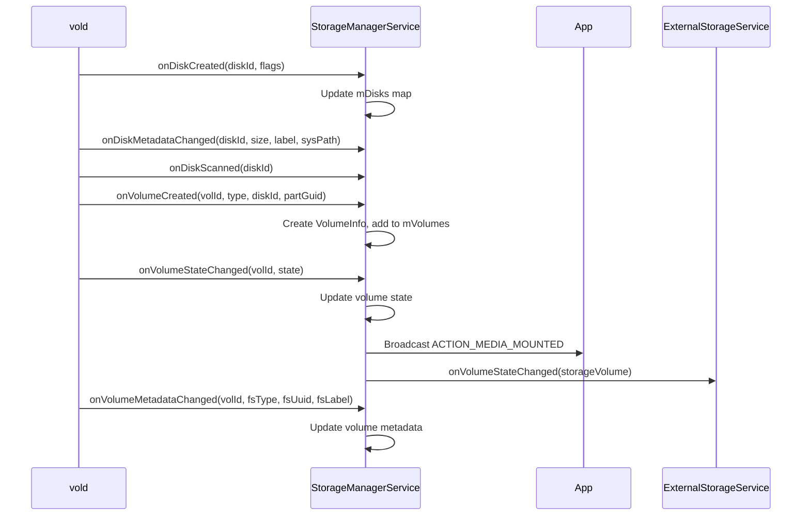
```mermaid
sequenceDiagram
    participant vold
    participant SMS as StorageManagerService
    participant App
    participant ESS as ExternalStorageService

    vold->>SMS: onDiskCreated(diskId, flags)
    SMS->>SMS: Update mDisks map
    vold->>SMS: onDiskMetadataChanged(diskId, size, label, sysPath)
    vold->>SMS: onDiskScanned(diskId)

    vold->>SMS: onVolumeCreated(volId, type, diskId, partGuid)
    SMS->>SMS: Create VolumeInfo, add to mVolumes

    vold->>SMS: onVolumeStateChanged(volId, state)
    SMS->>SMS: Update volume state
    SMS->>App: Broadcast ACTION_MEDIA_MOUNTED
    SMS->>ESS: onVolumeStateChanged(storageVolume)

    vold->>SMS: onVolumeMetadataChanged(volId, fsType, fsUuid, fsLabel)
    SMS->>SMS: Update volume metadata
```

### 34.3.5 OBB Management

The `StorageManagerService` manages OBB (Opaque Binary Blob) files, which are
expansion files used by games and large applications.  OBB files are mounted
as loopback devices:

```java
// StorageManagerService.java (OBB handling)
private static final Pattern OBB_FILE_PATH = Pattern.compile(
    "(?i)(^/storage/[^/]+/(?:([0-9]+)/)?Android/obb/)"
    + "([^/]+)/([^/]+\\.obb)");
```

OBB management works through the `IObbActionListener` callback and involves
creating loop devices via vold:

```java
// Simplified OBB mount flow:
// 1. App calls StorageManager.mountObb(obbPath, key, listener)
// 2. StorageManagerService validates path and permissions
// 3. Calls vold.createObb(sourcePath, ownerGid)
// 4. vold creates loop device and mounts it
// 5. Listener receives MOUNTED callback
```

### 34.3.6 Volume Settings Persistence

Volume records are persisted to XML so that volumes can be remembered across
reboots:

```java
// StorageManagerService.java (lines 324-340)
private static final String TAG_VOLUMES = "volumes";
private static final String ATTR_VERSION = "version";
private static final String ATTR_PRIMARY_STORAGE_UUID = "primaryStorageUuid";
private static final String TAG_VOLUME = "volume";
private static final String ATTR_TYPE = "type";
private static final String ATTR_FS_UUID = "fsUuid";
private static final String ATTR_PART_GUID = "partGuid";
private static final String ATTR_NICKNAME = "nickname";
private static final String ATTR_USER_FLAGS = "userFlags";
private static final String ATTR_CREATED_MILLIS = "createdMillis";
private static final String ATTR_LAST_SEEN_MILLIS = "lastSeenMillis";
private static final String ATTR_LAST_TRIM_MILLIS = "lastTrimMillis";
private static final String ATTR_LAST_BENCH_MILLIS = "lastBenchMillis";
```

### 34.3.7 CE/DE Key Unlocking Coordination

`StorageManagerService` coordinates with `vold` for encryption key management.
It tracks which users have their CE (Credential Encrypted) storage unlocked:

```java
// StorageManagerService.java (lines 411-450)
private static class WatchedUnlockedUsers {
    private int[] users = EmptyArray.INT;

    public void append(int userId) {
        users = ArrayUtils.appendInt(users, userId);
        invalidateIsUserUnlockedCache();
        StorageManager.invalidateVolumeListCache();
    }

    public void remove(int userId) {
        users = ArrayUtils.removeInt(users, userId);
        invalidateIsUserUnlockedCache();
        StorageManager.invalidateVolumeListCache();
    }
}

/** Set of users whose CE storage is unlocked. */
@GuardedBy("mLock")
private WatchedUnlockedUsers mCeUnlockedUsers = new WatchedUnlockedUsers();
```

### 34.3.8 Smart Idle Maintenance

The service manages storage health through periodic maintenance operations:

```java
// StorageManagerService.java (lines 354-389)
// Smart idle maintenance defaults
private static final boolean DEFAULT_SMART_IDLE_MAINT_ENABLED = false;
private static final int DEFAULT_SMART_IDLE_MAINT_PERIOD = 60;  // minutes
private static final int DEFAULT_LIFETIME_PERCENT_THRESHOLD = 70;
private static final int DEFAULT_MIN_SEGMENTS_THRESHOLD = 512;
private static final float DEFAULT_DIRTY_RECLAIM_RATE = 0.5F;
private static final float DEFAULT_SEGMENT_RECLAIM_WEIGHT = 1.0F;
private static final float DEFAULT_LOW_BATTERY_LEVEL = 20F;
private static final boolean DEFAULT_CHARGING_REQUIRED = true;
```

This triggers vold's `runIdleMaint()` and `fstrim()` operations during
device idle periods to maintain filesystem health on flash storage.

---

## 34.4 Scoped Storage

### 34.4.1 The Scoped Storage Model

Introduced in Android 10 and fully enforced from Android 11, Scoped Storage
fundamentally changed how apps access shared storage.  Under the old model,
any app with `READ_EXTERNAL_STORAGE` had unrestricted access to all files on
external storage.  The new model provides:

1. **Sandboxed app directories** -- Apps can freely read/write files in their
   own directories (`Android/data/<package>/` and `Android/media/<package>/`)
   without any permissions.
2. **MediaStore-based access** -- Apps access shared media files (images, video,
   audio) through the `MediaStore` content provider, which enforces per-type
   permissions.
3. **Storage Access Framework** -- For non-media files (documents, downloads),
   apps must use the Storage Access Framework with explicit user consent.
4. **MANAGE_EXTERNAL_STORAGE** -- A privileged permission for file managers and
   similar apps that need broad access (subject to Play Store review).

### 34.4.2 Permission Model

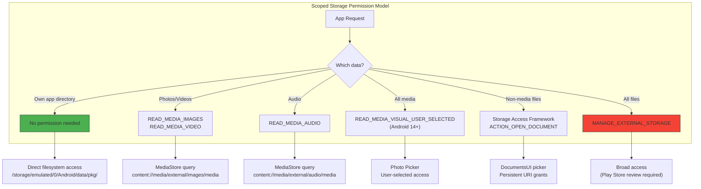
```mermaid
graph TD
    subgraph "Scoped Storage Permission Model"
        A["App Request"] --> B{Which data?}
        B -->|Own app directory| C["No permission needed"]
        B -->|Photos/Videos| D["READ_MEDIA_IMAGES<br/>READ_MEDIA_VIDEO"]
        B -->|Audio| E["READ_MEDIA_AUDIO"]
        B -->|All media| F["READ_MEDIA_VISUAL_USER_SELECTED<br/>(Android 14+)"]
        B -->|Non-media files| G["Storage Access Framework<br/>ACTION_OPEN_DOCUMENT"]
        B -->|All files| H["MANAGE_EXTERNAL_STORAGE"]
    end

    C --> I["Direct filesystem access<br/>/storage/emulated/0/Android/data/pkg/"]
    D --> J["MediaStore query<br/>content://media/external/images/media"]
    E --> K["MediaStore query<br/>content://media/external/audio/media"]
    F --> L["Photo Picker<br/>User-selected access"]
    G --> M["DocumentsUI picker<br/>Persistent URI grants"]
    H --> N["Broad access<br/>(Play Store review required)"]

    style C fill:#4caf50,stroke:#333
    style H fill:#f44336,stroke:#333
```

### 34.4.3 FUSE-Based Enforcement

The scoped storage model is enforced through the FUSE daemon running in the
MediaProvider process.  When an app opens a file on external storage, the
request goes through FUSE, which calls back into MediaProvider to check
permissions:

```java
// packages/providers/MediaProvider/src/com/android/providers/media/
//     fuse/FuseDaemon.java (lines 40-97)
public final class FuseDaemon extends Thread {
    public static final String TAG = "FuseDaemonThread";
    private static final int POLL_INTERVAL_MS = 100;
    private static final int POLL_COUNT = 50;

    private final MediaProvider mMediaProvider;
    private final int mFuseDeviceFd;
    private final String mPath;

    /** Starts a FUSE session. Does not return until unmounted. */
    @Override
    public void run() {
        final long ptr;
        synchronized (mLock) {
            mPtr = native_new(mMediaProvider);
            ptr = mPtr;
        }

        Log.i(TAG, "Starting thread for " + getName() + " ...");
        native_start(ptr, mFuseDeviceFd, mPath, mUncachedMode,
                enableParallelFuseDirOps(),
                mSupportedTranscodingRelativePaths,
                mSupportedUncachedRelativePaths);  // Blocks
        Log.i(TAG, "Exiting thread for " + getName() + " ...");
        // ...
    }
}
```

### 34.4.4 Permission Checking in MediaProvider

The `MediaProvider` has an extensive permission checking system, using
`LocalCallingIdentity` to track what each calling package can access:

```java
// packages/providers/MediaProvider/src/com/android/providers/media/
//     LocalCallingIdentity.java (permission constants)
static final int PERMISSION_IS_SELF = 1 << 0;
static final int PERMISSION_IS_SHELL = 1 << 1;
static final int PERMISSION_IS_MANAGER = 1 << 2;
static final int PERMISSION_IS_DELEGATOR = 1 << 3;
static final int PERMISSION_IS_REDACTION_NEEDED = 1 << 4;
static final int PERMISSION_IS_LEGACY_GRANTED = 1 << 5;
static final int PERMISSION_IS_LEGACY_READ = 1 << 6;
static final int PERMISSION_IS_LEGACY_WRITE = 1 << 7;
static final int PERMISSION_READ_IMAGES = 1 << 8;
static final int PERMISSION_READ_VIDEO = 1 << 9;
static final int PERMISSION_WRITE_EXTERNAL_STORAGE = 1 << 10;
static final int PERMISSION_IS_SYSTEM_GALLERY = 1 << 11;
static final int PERMISSION_INSTALL_PACKAGES = 1 << 12;
static final int PERMISSION_ACCESS_MTP = 1 << 13;
```

### 34.4.5 Legacy Mode

Apps targeting SDK versions below 30 (Android 11) can opt into legacy storage
behavior through the `requestLegacyExternalStorage` manifest flag.  This is
tracked through the `OP_LEGACY_STORAGE` app op:

```java
// StorageManagerService.java
import static android.app.AppOpsManager.OP_LEGACY_STORAGE;
import static android.app.AppOpsManager.OP_MANAGE_EXTERNAL_STORAGE;
```

When legacy mode is active, the FUSE daemon relaxes its permission checks to
allow the broader pre-scoped-storage access pattern.

### 34.4.6 MANAGE_EXTERNAL_STORAGE

The `MANAGE_EXTERNAL_STORAGE` permission grants an app broad read/write access
to all shared storage, similar to the old `WRITE_EXTERNAL_STORAGE` behavior.
However, it is a special permission that:

1. Requires explicit user consent in Settings
2. Is subject to Google Play review policies
3. Is tracked through the `OP_MANAGE_EXTERNAL_STORAGE` app op
4. Still does not grant access to `Android/data/` directories of other apps

```java
// StorageManagerService.java imports
import static android.Manifest.permission.MANAGE_EXTERNAL_STORAGE;
import static android.app.AppOpsManager.OP_MANAGE_EXTERNAL_STORAGE;
```

---

## 34.5 FUSE and sdcardfs

### 34.5.1 Historical Context: sdcardfs

Before Android 11, external storage permission enforcement was done through
`sdcardfs`, a stackable filesystem implemented in the kernel.  sdcardfs sat
between the VFS layer and the underlying ext4/f2fs filesystem, translating
ownership and permissions on-the-fly based on the calling app's GID.

sdcardfs worked well for performance but had significant limitations:

- Could not perform per-file permission checks
- Could not implement content redaction (e.g., stripping EXIF location data)
- Could not support transparent transcoding
- Required kernel modifications that complicated GKI (Generic Kernel Image)

Some legacy code paths still reference sdcardfs:

```cpp
// system/vold/model/EmulatedVolume.cpp (line 48)
static const char* kSdcardFsPath = "/system/bin/sdcard";

// system/vold/model/PublicVolume.cpp (lines 56-57)
mUseSdcardFs = IsSdcardfsUsed();
```

### 34.5.2 The MediaProvider FUSE Daemon

Starting with Android 11, sdcardfs is replaced by a FUSE daemon running
inside the MediaProvider process.  This approach moves permission enforcement
from the kernel to userspace, enabling:

- **Per-file permission checks** based on MediaStore metadata
- **Content redaction** (stripping EXIF GPS data for privacy)
- **Transparent transcoding** (e.g., HEVC to AVC for compatibility)
- **GKI compatibility** (no custom kernel changes needed)

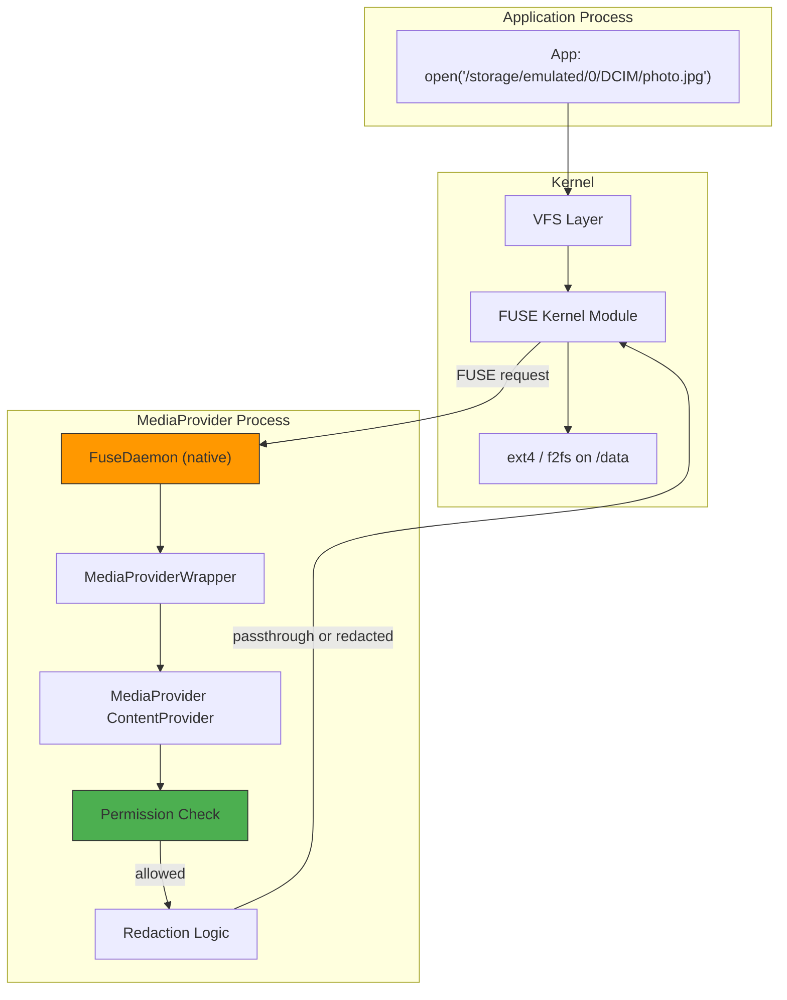
```mermaid
graph TB
    subgraph "Application Process"
        A["App: open('/storage/emulated/0/DCIM/photo.jpg')"]
    end

    subgraph "Kernel"
        B["VFS Layer"]
        C["FUSE Kernel Module"]
        D["ext4 / f2fs on /data"]
    end

    subgraph "MediaProvider Process"
        E["FuseDaemon (native)"]
        F["MediaProviderWrapper"]
        G["MediaProvider ContentProvider"]
        H["Permission Check"]
        I["Redaction Logic"]
    end

    A --> B
    B --> C
    C -->|FUSE request| E
    E --> F
    F --> G
    G --> H
    H -->|allowed| I
    I -->|passthrough or redacted| C
    C --> D

    style E fill:#ff9800,stroke:#333
    style H fill:#4caf50,stroke:#333
```

### 34.5.3 The Native FUSE Daemon Implementation

The native FUSE daemon lives in `packages/providers/MediaProvider/jni/` and
is a crucial performance-sensitive component:

```cpp
// packages/providers/MediaProvider/jni/FuseDaemon.h (lines 34-153)
class FuseDaemon final {
  public:
    FuseDaemon(JNIEnv* env, jobject mediaProvider);

    void Start(android::base::unique_fd fd, const std::string& path,
               const bool uncached_mode,
               const bool enable_parallel_fuse_dir_ops,
               const std::vector<std::string>&
                   supported_transcoding_relative_paths,
               const std::vector<std::string>&
                   supported_uncached_relative_paths);

    bool IsStarted() const;
    bool ShouldOpenWithFuse(int fd, bool for_read,
                            const std::string& path);
    bool UsesFusePassthrough() const;
    void InvalidateFuseDentryCache(const std::string& path);
    std::unique_ptr<FdAccessResult> CheckFdAccess(int fd, uid_t uid) const;
    void InitializeDeviceId(const std::string& path);

  private:
    MediaProviderWrapper mp;
    std::atomic_bool active;
    struct ::fuse* fuse;
};
```

The JNI bridge is in
`packages/providers/MediaProvider/jni/com_android_providers_media_FuseDaemon.cpp`,
with the native FUSE implementation in
`packages/providers/MediaProvider/jni/FuseDaemon.cpp`.

### 34.5.4 FUSE Passthrough

A critical optimization for the FUSE-based approach is FUSE passthrough.
For files that do not require redaction or transcoding, the FUSE daemon can
set up a passthrough path that allows the kernel to bypass the FUSE daemon
entirely for subsequent I/O operations.  This recovers most of the performance
lost by moving from sdcardfs to FUSE:

```java
// packages/providers/MediaProvider/src/com/android/providers/media/
//     fuse/FuseDaemon.java (lines 180-188)
/**
 * Checks if the FuseDaemon uses the FUSE passthrough feature.
 */
public boolean usesFusePassthrough() {
    synchronized (mLock) {
        if (mPtr == 0) {
            Log.i(TAG, "usesFusePassthrough failed, FUSE daemon unavailable");
            return false;
        }
        return native_uses_fuse_passthrough(mPtr);
    }
}
```

### 34.5.5 ExternalStorageService Integration

The `ExternalStorageServiceImpl` class bridges vold's mount callbacks with
the FUSE daemon and MediaProvider:

```java
// packages/providers/MediaProvider/src/com/android/providers/media/
//     fuse/ExternalStorageServiceImpl.java (lines 51-189)
public final class ExternalStorageServiceImpl
        extends ExternalStorageService {

    @Override
    public void onStartSession(@NonNull String sessionId, int flag,
            @NonNull ParcelFileDescriptor deviceFd,
            @NonNull File upperFileSystemPath,
            @NonNull File lowerFileSystemPath) {

        MediaProvider mediaProvider = getMediaProvider();

        // Check for externally managed volumes
        boolean uncachedMode = false;
        if (SdkLevel.isAtLeastT()) {
            StorageVolume vol = getSystemService(StorageManager.class)
                    .getStorageVolume(upperFileSystemPath);
            if (vol != null && vol.isExternallyManaged()) {
                uncachedMode = true;
            }
        }

        FuseDaemon daemon = new FuseDaemon(mediaProvider, this, deviceFd,
                sessionId, upperFileSystemPath.getPath(), uncachedMode,
                supportedTranscodingRelativePaths,
                supportedUncachedRelativePaths);
        daemon.start();
        sFuseDaemons.put(sessionId, daemon);
    }

    @Override
    public void onVolumeStateChanged(@NonNull StorageVolume vol)
            throws IOException {
        MediaProvider mediaProvider = getMediaProvider();

        switch(vol.getState()) {
            case Environment.MEDIA_MOUNTED:
                MediaVolume volume = MediaVolume.fromStorageVolume(vol);
                mediaProvider.attachVolume(volume, false,
                    Environment.MEDIA_MOUNTED);
                MediaService.queueVolumeScan(
                    mediaProvider.getContext(), volume, REASON_MOUNTED);
                break;
            case Environment.MEDIA_UNMOUNTED:
            case Environment.MEDIA_EJECTING:
                mediaProvider.detachVolume(
                    MediaVolume.fromStorageVolume(vol));
                break;
        }
        mediaProvider.updateVolumes();
    }

    @Override
    public void onEndSession(@NonNull String sessionId) {
        FuseDaemon daemon = onExitSession(sessionId);
        if (daemon != null) {
            daemon.waitForExit();
        }
    }
}
```

### 34.5.6 FUSE Bind Mounts

The emulated volume creates bind mounts for `Android/data` and `Android/obb`
directories to ensure proper access through the lower filesystem (bypassing
FUSE for performance-sensitive app data access):

```cpp
// system/vold/model/EmulatedVolume.cpp (lines 145-241)
status_t EmulatedVolume::mountFuseBindMounts() {
    std::string label = getLabel();
    int userId = getMountUserId();

    // Bind mount Android/data from lower fs to FUSE mount
    std::string androidDataSource =
        StringPrintf("%s/data", androidSource.c_str());
    std::string androidDataTarget(
        StringPrintf("/mnt/user/%d/%s/%d/Android/data",
            userId, label.c_str(), userId));
    doFuseBindMount(androidDataSource, androidDataTarget, pathsToUnmount);

    // Bind mount Android/obb from lower fs to FUSE mount
    std::string androidObbSource =
        StringPrintf("%s/obb", androidSource.c_str());
    std::string androidObbTarget(
        StringPrintf("/mnt/user/%d/%s/%d/Android/obb",
            userId, label.c_str(), userId));
    doFuseBindMount(androidObbSource, androidObbTarget, pathsToUnmount);

    // Handle shared storage between clone profiles
    // to prevent page cache inconsistency
    auto vol = getSharedStorageVolume(userId);
    if (vol != nullptr) {
        auto sharedVol = static_cast<EmulatedVolume*>(vol.get());
        sharedVol->bindMountVolume(*this, pathsToUnmount);
        bindMountVolume(*sharedVol, pathsToUnmount);
    }

    return OK;
}
```

### 34.5.7 FUSE BPF Optimization

Modern Android versions introduce FUSE BPF, which attaches BPF programs to
FUSE operations to short-circuit permission checks in the kernel, avoiding
the round-trip to the userspace daemon for common operations:

```cpp
// system/vold/model/EmulatedVolume.cpp (line 479)
if (!IsFuseBpfEnabled()) {
    // Only do bind-mounts when FUSE BPF is not available
    res = mountFuseBindMounts();
}
```

When FUSE BPF is enabled, the kernel BPF programs handle the bind mount
semantics directly, eliminating the need for explicit bind mounts.

---

## 34.6 MediaProvider

### 34.6.1 Overview

`MediaProvider` (in `packages/providers/MediaProvider/`) is the content
provider that manages all media files on the device.  It serves as:

1. The backing store for the `content://media/` URI namespace
2. The permission enforcement layer for scoped storage
3. The FUSE daemon host process
4. The media scanner that indexes new content
5. The document provider for the Storage Access Framework

### 34.6.2 Content URI Structure

MediaProvider exposes media through a hierarchical URI structure:

```
content://media/
    internal/           -> Internal storage
        audio/
            media/      -> All audio files
            albums/     -> Album aggregation
            artists/    -> Artist aggregation
            genres/     -> Genre aggregation
            playlists/  -> Playlists
        images/
            media/      -> All images
            thumbnails/ -> Image thumbnails
        video/
            media/      -> All videos
            thumbnails/ -> Video thumbnails
    external/           -> Primary external storage
        (same structure as internal)
    external_primary/   -> Explicitly primary volume
    <volume_name>/      -> Named volume (e.g., USB drive UUID)
```

### 34.6.3 Database Schema

MediaProvider uses SQLite databases to index all media files.  The
`DatabaseHelper` class (in
`packages/providers/MediaProvider/src/com/android/providers/media/DatabaseHelper.java`)
manages the schema:

```java
// packages/providers/MediaProvider/src/com/android/providers/media/
//     DatabaseHelper.java
public class DatabaseHelper extends SQLiteOpenHelper {
    static final String INTERNAL_DATABASE_NAME = "internal.db";
    static final String EXTERNAL_DATABASE_NAME = "external.db";
    // ...
}
```

The primary table is `files`, which stores metadata for all indexed files:

| Column | Type | Description |
|--------|------|-------------|
| `_id` | INTEGER | Primary key |
| `_data` | TEXT | Absolute file path |
| `_display_name` | TEXT | File name |
| `_size` | INTEGER | File size in bytes |
| `mime_type` | TEXT | MIME type |
| `media_type` | INTEGER | 0=file, 1=image, 2=audio, 3=video |
| `title` | TEXT | Title (from metadata) |
| `date_added` | INTEGER | When file was added (epoch seconds) |
| `date_modified` | INTEGER | Last modification time |
| `date_taken` | INTEGER | When photo/video was taken |
| `duration` | INTEGER | Duration in ms (audio/video) |
| `width` | INTEGER | Image/video width |
| `height` | INTEGER | Image/video height |
| `orientation` | INTEGER | EXIF orientation |
| `bucket_id` | INTEGER | Hash of parent directory |
| `bucket_display_name` | TEXT | Parent directory name |
| `volume_name` | TEXT | Storage volume name |
| `owner_package_name` | TEXT | Package that created the file |
| `is_pending` | INTEGER | Whether file is being written |
| `is_trashed` | INTEGER | Whether file is in trash |
| `is_favorite` | INTEGER | Whether file is favorited |

### 34.6.4 Media Scanning

The `MediaScanner` interface (in
`packages/providers/MediaProvider/src/com/android/providers/media/scan/MediaScanner.java`)
defines the scanning contract:

```java
// packages/providers/MediaProvider/src/com/android/providers/media/
//     scan/MediaScanner.java
public interface MediaScanner {
    int REASON_UNKNOWN = ...;
    int REASON_MOUNTED = ...;
    int REASON_DEMAND = ...;
    int REASON_IDLE = ...;

    void scanDirectory(@NonNull File dir, @ScanReason int reason);
    @Nullable Uri scanFile(@NonNull File file, @ScanReason int reason);
    void onDetachVolume(@NonNull MediaVolume volume);
    void onDirectoryDirty(@NonNull File file);
}
```

The `ModernMediaScanner` implementation walks the filesystem, extracts metadata
from media files using `ExifInterface` and `MediaMetadataRetriever`, and
inserts/updates rows in the `files` table.

Scanning is triggered in several scenarios:

| Trigger | Reason Code | When |
|---------|------------|------|
| Volume mount | `REASON_MOUNTED` | When a volume is first mounted |
| Explicit request | `REASON_DEMAND` | When an app calls `MediaScannerConnection.scanFile()` |
| Idle maintenance | `REASON_IDLE` | During device idle |
| File change | (FUSE notification) | When FUSE detects a write to a media file |

### 34.6.5 Volume Management in MediaProvider

MediaProvider tracks storage volumes through the `MediaVolume` class and
attaches/detaches them in response to volume state changes:

```java
// ExternalStorageServiceImpl.java (lines 101-130)
@Override
public void onVolumeStateChanged(@NonNull StorageVolume vol)
        throws IOException {
    MediaProvider mediaProvider = getMediaProvider();

    switch(vol.getState()) {
        case Environment.MEDIA_MOUNTED:
            MediaVolume volume = MediaVolume.fromStorageVolume(vol);
            mediaProvider.attachVolume(volume, false,
                Environment.MEDIA_MOUNTED);
            // Queue a scan for the newly mounted volume
            MediaService.queueVolumeScan(
                mediaProvider.getContext(), volume, REASON_MOUNTED);
            break;
        case Environment.MEDIA_UNMOUNTED:
        case Environment.MEDIA_EJECTING:
        case Environment.MEDIA_REMOVED:
        case Environment.MEDIA_BAD_REMOVAL:
            mediaProvider.detachVolume(
                MediaVolume.fromStorageVolume(vol));
            break;
    }
    mediaProvider.updateVolumes();
}
```

### 34.6.6 Access Control in MediaProvider

The `AccessChecker` class implements the core access control logic for scoped
storage.  Key permission constants used throughout MediaProvider:

```java
// packages/providers/MediaProvider/src/com/android/providers/media/
//     LocalCallingIdentity.java
static final int PERMISSION_IS_SELF = 1 << 0;
static final int PERMISSION_IS_SHELL = 1 << 1;
static final int PERMISSION_IS_MANAGER = 1 << 2;
static final int PERMISSION_IS_REDACTION_NEEDED = 1 << 4;
static final int PERMISSION_IS_LEGACY_GRANTED = 1 << 5;
static final int PERMISSION_IS_LEGACY_READ = 1 << 6;
static final int PERMISSION_IS_LEGACY_WRITE = 1 << 7;
static final int PERMISSION_READ_IMAGES = 1 << 8;
static final int PERMISSION_READ_VIDEO = 1 << 9;
static final int PERMISSION_WRITE_EXTERNAL_STORAGE = 1 << 10;
static final int PERMISSION_IS_SYSTEM_GALLERY = 1 << 11;
static final int PERMISSION_INSTALL_PACKAGES = 1 << 12;
static final int PERMISSION_ACCESS_MTP = 1 << 13;
```

### 34.6.7 Database Backup and Recovery

MediaProvider uses a LevelDB-based backup system for resilience against
database corruption, managed through the FUSE daemon:

```java
// packages/providers/MediaProvider/src/com/android/providers/media/
//     fuse/FuseDaemon.java (lines 216-270)
public void setupVolumeDbBackup() throws IOException { ... }
public void setupPublicVolumeDbBackup(String volumeName) throws IOException { ... }
public void backupVolumeDbData(String volumeName, String key,
    String value) throws IOException { ... }
public String[] readBackedUpFilePaths(String volumeName,
    String lastReadValue, int limit) throws IOException { ... }
```

---

## 34.7 Storage Access Framework (SAF)

### 34.7.1 Overview

The Storage Access Framework (SAF), introduced in Android 4.4 (API 19),
provides a unified API for apps to browse and access documents from any
document provider.  It became increasingly important with scoped storage,
as it is now the primary way for apps to access non-media files.

### 34.7.2 Architecture

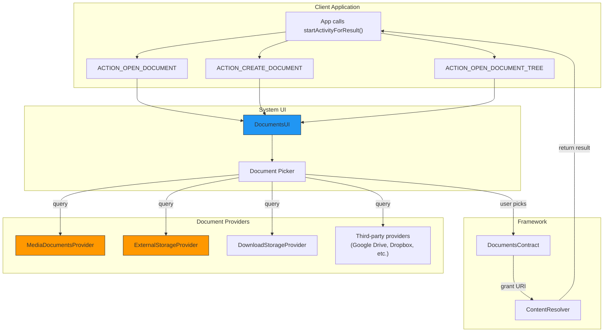
```mermaid
graph TB
    subgraph "Client Application"
        A["App calls startActivityForResult()"]
        B["ACTION_OPEN_DOCUMENT"]
        C["ACTION_CREATE_DOCUMENT"]
        D["ACTION_OPEN_DOCUMENT_TREE"]
    end

    subgraph "System UI"
        E["DocumentsUI"]
        F["Document Picker"]
    end

    subgraph "Document Providers"
        G["MediaDocumentsProvider"]
        H["ExternalStorageProvider"]
        I["DownloadStorageProvider"]
        J["Third-party providers<br/>(Google Drive, Dropbox, etc.)"]
    end

    subgraph "Framework"
        K["DocumentsContract"]
        L["ContentResolver"]
    end

    A --> B & C & D
    B & C & D --> E
    E --> F
    F -->|query| G & H & I & J
    F -->|user picks| K
    K -->|grant URI| L
    L -->|return result| A

    style E fill:#2196f3,stroke:#333
    style G fill:#ff9800,stroke:#333
    style H fill:#ff9800,stroke:#333
```

### 34.7.3 Key Intents

| Intent | Purpose |
|--------|---------|
| `ACTION_OPEN_DOCUMENT` | User picks an existing file to read/write |
| `ACTION_CREATE_DOCUMENT` | User creates a new file |
| `ACTION_OPEN_DOCUMENT_TREE` | User picks an entire directory subtree |

### 34.7.4 DocumentsProvider

Document providers extend `android.provider.DocumentsProvider` and implement
a set of standard methods:

```java
// Key methods a DocumentsProvider must implement:
public abstract class DocumentsProvider extends ContentProvider {
    // Return metadata about available roots
    public abstract Cursor queryRoots(String[] projection);

    // Return metadata about a specific document
    public abstract Cursor queryDocument(String documentId,
                                         String[] projection);

    // Return children of a document (directory)
    public abstract Cursor queryChildDocuments(String parentDocumentId,
                                               String[] projection,
                                               String sortOrder);

    // Open a document for reading/writing
    public abstract ParcelFileDescriptor openDocument(
        String documentId, String mode, CancellationSignal signal);
}
```

### 34.7.5 MediaDocumentsProvider

`MediaDocumentsProvider` (in
`packages/providers/MediaProvider/src/com/android/providers/media/MediaDocumentsProvider.java`)
exposes MediaStore content through the SAF interface:

```java
// packages/providers/MediaProvider/src/com/android/providers/media/
//     MediaDocumentsProvider.java
public class MediaDocumentsProvider extends DocumentsProvider {
    // Imports referencing SAF contracts
    // ...

    // Provides root entries for:
    // - Images root
    // - Videos root
    // - Audio root
    // - Documents root

    // Maps between document IDs and MediaStore URIs
}
```

### 34.7.6 Tree URIs and Persistent Grants

When an app uses `ACTION_OPEN_DOCUMENT_TREE`, it receives a tree URI that
represents access to an entire directory subtree.  This grant can be persisted
across reboots:

```java
// Client app code example:
Intent intent = new Intent(Intent.ACTION_OPEN_DOCUMENT_TREE);
startActivityForResult(intent, REQUEST_CODE);

// In onActivityResult:
Uri treeUri = resultData.getData();
// Persist the permission
getContentResolver().takePersistableUriPermission(
    treeUri,
    Intent.FLAG_GRANT_READ_URI_PERMISSION |
    Intent.FLAG_GRANT_WRITE_URI_PERMISSION);

// Use DocumentsContract to work with children
Uri childrenUri = DocumentsContract.buildChildDocumentsUriUsingTree(
    treeUri, DocumentsContract.getTreeDocumentId(treeUri));
```

### 34.7.7 Virtual Files

SAF supports virtual files -- documents that do not have a direct byte-stream
representation but can be opened as alternative MIME types.  For example, a
Google Sheets document does not have a native file representation but can be
opened as a CSV or PDF:

```java
// Document flags indicating virtual file support
Document.FLAG_VIRTUAL_DOCUMENT  // Document has no direct byte representation
Document.FLAG_SUPPORTS_TYPED_DOCUMENT  // Can convert to other MIME types

// Client code for opening a virtual document
String[] mimeTypes = getContentResolver().getStreamTypes(uri, "*/*");
AssetFileDescriptor afd = getContentResolver().openTypedAssetFileDescriptor(
    uri, mimeTypes[0], null);
```

---

## 34.8 File-Based Encryption (FBE)

### 34.8.1 Overview

File-Based Encryption (FBE) encrypts different files with different keys,
allowing each file to be decrypted independently.  This is in contrast to
the deprecated Full-Disk Encryption (FDE), which encrypted the entire
partition with a single key.

FBE enables two critical storage classes:

- **Device Encrypted (DE)** storage: Available as soon as the device boots,
  even before the user enters their credentials.  Used for alarm clocks,
  accessibility services, and other Direct Boot-aware components.
- **Credential Encrypted (CE)** storage: Only available after the user has
  authenticated (PIN, password, pattern, or biometric).  Used for most app
  data and user content.

### 34.8.2 Key Architecture

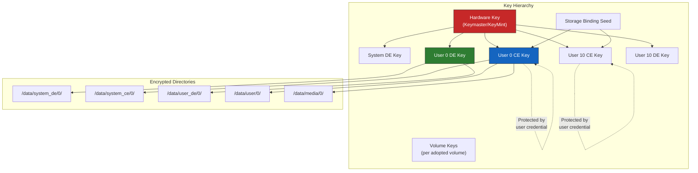
```mermaid
graph TD
    subgraph "Key Hierarchy"
        A["Hardware Key<br/>(Keymaster/KeyMint)"]
        B["Storage Binding Seed"]
        C["System DE Key"]
        D["User 0 CE Key"]
        E["User 0 DE Key"]
        F["User 10 CE Key"]
        G["User 10 DE Key"]
        H["Volume Keys<br/>(per adopted volume)"]
    end

    A --> C
    A --> D
    A --> E
    A --> F
    A --> G
    B --> D
    B --> F
    D -.->|"Protected by<br/>user credential"| D
    F -.->|"Protected by<br/>user credential"| F

    subgraph "Encrypted Directories"
        I["/data/system_de/0/"]
        J["/data/system_ce/0/"]
        K["/data/user_de/0/"]
        L["/data/user/0/"]
        M["/data/media/0/"]
    end

    E --> I
    E --> K
    D --> J
    D --> L
    D --> M

    style A fill:#c62828,stroke:#333,color:#fff
    style D fill:#1565c0,stroke:#333,color:#fff
    style E fill:#2e7d32,stroke:#333,color:#fff
```

### 34.8.3 Key Storage on Disk

Encryption keys are stored in `/data/misc/vold/user_keys/` with the following
structure:

```cpp
// system/vold/FsCrypt.cpp (lines 80-96)
const std::string device_key_dir =
    std::string() + DATA_MNT_POINT + fscrypt_unencrypted_folder;
const std::string device_key_path = device_key_dir + "/key";

const std::string user_key_dir =
    std::string() + DATA_MNT_POINT + "/misc/vold/user_keys";

const std::string systemwide_volume_key_dir =
    std::string() + DATA_MNT_POINT + "/misc/vold/volume_keys";
```

The on-disk layout:

```
/data/misc/vold/user_keys/
    ce/                     -> Credential Encrypted keys
        0/                  -> User 0
            current/        -> Current key directory
                keymaster_key_blob  -> Keystore-wrapped key
                encrypted_key       -> Encrypted key material
                secdiscardable      -> Key stretching material
        10/                 -> User 10
    de/                     -> Device Encrypted keys
        0/
        10/
```

### 34.8.4 FsCrypt Interface

The FBE system is exposed through the `FsCrypt.h` API:

```cpp
// system/vold/FsCrypt.h (lines 22-38)
bool fscrypt_initialize_systemwide_keys();

bool fscrypt_init_user0();
extern bool fscrypt_init_user0_done;
bool fscrypt_create_user_keys(userid_t user_id, bool ephemeral);
bool fscrypt_destroy_user_keys(userid_t user_id);
bool fscrypt_set_ce_key_protection(userid_t user_id,
    const std::vector<uint8_t>& secret);
void fscrypt_deferred_fixate_ce_keys();

std::vector<int> fscrypt_get_unlocked_users();
bool fscrypt_unlock_ce_storage(userid_t user_id,
    const std::vector<uint8_t>& secret);
bool fscrypt_lock_ce_storage(userid_t user_id);

bool fscrypt_prepare_user_storage(const std::string& volume_uuid,
    userid_t user_id, int flags);
bool fscrypt_destroy_user_storage(const std::string& volume_uuid,
    userid_t user_id, int flags);

bool fscrypt_destroy_volume_keys(const std::string& volume_uuid);
```

### 34.8.5 Key Creation

When a new user is created, `fscrypt_create_user_keys()` generates both CE
and DE keys:

```cpp
// system/vold/FsCrypt.cpp (simplified key creation)
static bool create_de_key(userid_t user_id, bool ephemeral) {
    KeyBuffer de_key;
    if (!generateStorageKey(makeGen(s_data_options), &de_key))
        return false;
    if (!ephemeral &&
        !android::vold::storeKeyAtomically(
            get_de_key_path(user_id), user_key_temp,
            kEmptyAuthentication, de_key))
        return false;
    EncryptionPolicy de_policy;
    if (!install_storage_key(
            DATA_MNT_POINT, s_data_options, de_key, &de_policy))
        return false;
    // ... store policy in s_de_policies ...
    return true;
}
```

The `KeyGeneration` structure controls key generation:

```cpp
// system/vold/FsCrypt.cpp (lines 129-135)
static KeyGeneration makeGen(const EncryptionOptions& options) {
    if (options.version == 0) {
        LOG(ERROR) << "EncryptionOptions not initialized";
        return android::vold::neverGen();
    }
    return KeyGeneration{FSCRYPT_MAX_KEY_SIZE, true,
                         options.use_hw_wrapped_key};
}
```

### 34.8.6 CE Key Unlock Flow

When a user enters their credentials, the framework calls through
`StorageManagerService` to `vold` to unlock CE storage:

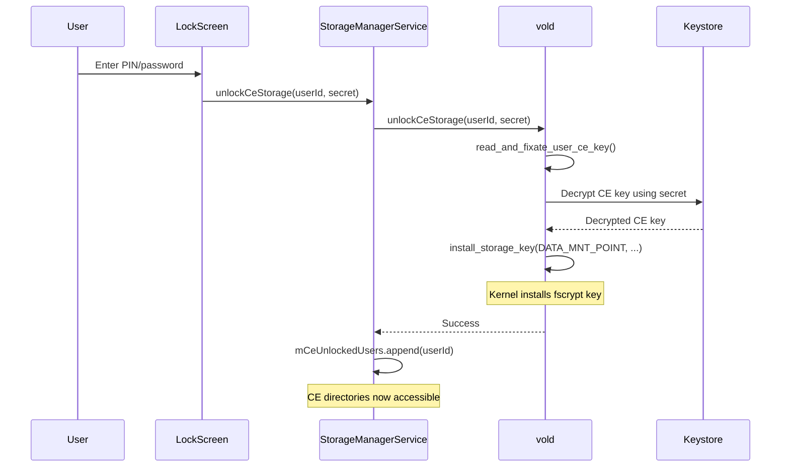
```mermaid
sequenceDiagram
    participant User
    participant LockScreen
    participant SMS as StorageManagerService
    participant vold
    participant Keystore

    User->>LockScreen: Enter PIN/password
    LockScreen->>SMS: unlockCeStorage(userId, secret)
    SMS->>vold: unlockCeStorage(userId, secret)
    vold->>vold: read_and_fixate_user_ce_key()
    vold->>Keystore: Decrypt CE key using secret
    Keystore-->>vold: Decrypted CE key
    vold->>vold: install_storage_key(DATA_MNT_POINT, ...)
    Note over vold: Kernel installs fscrypt key
    vold-->>SMS: Success
    SMS->>SMS: mCeUnlockedUsers.append(userId)
    Note over SMS: CE directories now accessible
```

The key reading process tries multiple key paths to recover from crashes
during key rotation:

```cpp
// system/vold/FsCrypt.cpp (lines 219-235)
static bool read_and_fixate_user_ce_key(
        userid_t user_id,
        const android::vold::KeyAuthentication& auth,
        KeyBuffer* ce_key) {
    auto const directory_path = get_ce_key_directory_path(user_id);
    auto const paths = get_ce_key_paths(directory_path);
    for (auto const& ce_key_path : paths) {
        LOG(DEBUG) << "Trying user CE key " << ce_key_path;
        if (retrieveKey(ce_key_path, auth, ce_key)) {
            LOG(DEBUG) << "Successfully retrieved key";
            s_deferred_fixations.erase(directory_path);
            fixate_user_ce_key(directory_path, ce_key_path, paths);
            return true;
        }
    }
    LOG(ERROR) << "Failed to find working ce key for user " << user_id;
    return false;
}
```

### 34.8.7 Encryption Options

FBE supports multiple encryption algorithms configured via fstab:

```cpp
// system/vold/FsCrypt.cpp (lines 315-335)
static bool init_data_file_encryption_options() {
    auto entry = GetEntryForMountPoint(&fstab_default, DATA_MNT_POINT);
    if (!ParseOptions(entry->encryption_options, &s_data_options)) {
        LOG(ERROR) << "Unable to parse encryption options for "
                   << DATA_MNT_POINT;
        return false;
    }
    if ((s_data_options.flags & FSCRYPT_POLICY_FLAG_IV_INO_LBLK_32) &&
        !DoesHardwareSupportOnly32DunBits(entry->blk_device)) {
        LOG(ERROR) << "emmc_optimized flag only allowed on hardware "
                      "limited to 32-bit DUNs";
        return false;
    }
    return true;
}
```

The encryption options for adoptable storage volumes:

```cpp
// system/vold/FsCrypt.cpp (lines 355-376)
static bool get_volume_file_encryption_options(EncryptionOptions* options) {
    auto contents_mode = android::base::GetProperty(
        "ro.crypto.volume.contents_mode", "");
    auto first_api_level = GetFirstApiLevel();
    auto filenames_mode = android::base::GetProperty(
        "ro.crypto.volume.filenames_mode",
        first_api_level > __ANDROID_API_Q__ ? "" : "aes-256-heh");
    auto options_string = android::base::GetProperty(
        "ro.crypto.volume.options",
        contents_mode + ":" + filenames_mode);
    if (!ParseOptionsForApiLevel(first_api_level, options_string, options)) {
        LOG(ERROR) << "Unable to parse volume encryption options";
        return false;
    }
    return true;
}
```

### 34.8.8 Directory Preparation

When CE storage is unlocked, vold prepares the directory structure with
proper encryption policies:

```cpp
// system/vold/FsCrypt.cpp (lines 390-425)
static bool prepare_dir_with_policy(const std::string& dir, mode_t mode,
        uid_t uid, gid_t gid, const EncryptionPolicy& policy) {
    if (android::vold::pathExists(dir)) {
        if (!prepare_dir(dir, mode, uid, gid)) return false;
        if (IsFbeEnabled() && !EnsurePolicy(policy, dir)) return false;
    } else {
        // Create under temporary name, apply encryption policy,
        // then atomically rename to final name.
        const std::string tmp_dir = dir + ".new";
        if (android::vold::pathExists(tmp_dir)) {
            android::vold::DeleteDirContentsAndDir(tmp_dir);
        }
        if (!prepare_dir(tmp_dir, mode, uid, gid)) return false;
        if (IsFbeEnabled() && !EnsurePolicy(policy, tmp_dir)) return false;

        // Workaround for kernel bug with encrypted+casefolded rename
        android::vold::pathExists(tmp_dir + "/subdir");

        if (rename(tmp_dir.c_str(), dir.c_str()) != 0) {
            PLOG(ERROR) << "Failed to rename " << tmp_dir;
            return false;
        }
    }
    return true;
}
```

### 34.8.9 Metadata Encryption

In addition to per-file encryption, Android also supports metadata encryption
for the entire `userdata` partition.  This encrypts the filesystem metadata
(directory structure, file names, sizes, permissions) using `dm-default-key`:

```cpp
// system/vold/MetadataCrypt.cpp (lines 59-70)
struct CryptoOptions {
    struct CryptoType cipher = invalid_crypto_type;
    bool use_legacy_options_format = false;
    bool set_dun = true;
    bool use_hw_wrapped_key = false;
};

static const std::string kDmNameUserdata = "userdata";

// Default encryption: AES-256-XTS; fallback: Adiantum
constexpr CryptoType supported_crypto_types[] = {
    aes_256_xts, adiantum
};
```

The metadata encryption setup creates a `dm-default-key` device:

```cpp
// system/vold/MetadataCrypt.cpp (lines 155-212)
static bool create_crypto_blk_dev(
        const std::string& dm_name,
        const std::string& blk_device,
        const KeyBuffer& key,
        const CryptoOptions& options,
        std::string* crypto_blkdev,
        uint64_t* nr_sec,
        bool is_userdata) {

    if (!get_number_of_sectors(blk_device, nr_sec)) return false;
    *nr_sec &= ~7;  // Align to 4096-byte sectors

    auto target = std::make_unique<DmTargetDefaultKey>(
        0, *nr_sec,
        options.cipher.get_kernel_name(),
        hex_key, blk_device, 0);

    if (options.use_legacy_options_format)
        target->SetUseLegacyOptionsFormat();
    if (options.set_dun) target->SetSetDun();
    if (options.use_hw_wrapped_key) target->SetWrappedKeyV0();

    DmTable table;
    table.AddTarget(std::move(target));

    auto& dm = DeviceMapper::Instance();
    if (dm_name == kDmNameUserdata &&
        dm.GetState(dm_name) == DmDeviceState::SUSPENDED) {
        dm.LoadTableAndActivate(dm_name, table);
        dm.WaitForDevice(dm_name, 20s, crypto_blkdev);
    } else {
        dm.CreateDevice(dm_name, table, crypto_blkdev, 5s);
    }

    if (is_userdata) {
        *crypto_blkdev = "/dev/block/mapper/" + dm_name;
    }
    return true;
}
```

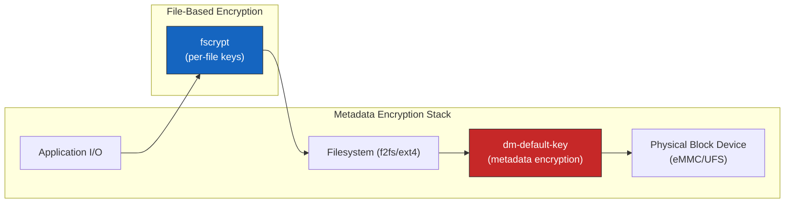
```mermaid
graph LR
    subgraph "Metadata Encryption Stack"
        A["Application I/O"]
        B["Filesystem (f2fs/ext4)"]
        C["dm-default-key<br/>(metadata encryption)"]
        D["Physical Block Device<br/>(eMMC/UFS)"]
    end

    subgraph "File-Based Encryption"
        E["fscrypt<br/>(per-file keys)"]
    end

    A --> E
    E --> B
    B --> C
    C --> D

    style C fill:#c62828,stroke:#333,color:#fff
    style E fill:#1565c0,stroke:#333,color:#fff
```

### 34.8.10 Hardware-Wrapped Keys

On devices with Inline Encryption Engine (ICE) support, vold can use
hardware-wrapped keys.  These keys never leave the hardware encryption engine
in plaintext:

```cpp
// system/vold/MetadataCrypt.cpp (lines 163-171)
KeyBuffer module_key;
if (options.use_hw_wrapped_key) {
    if (!exportWrappedStorageKey(key, &module_key)) {
        LOG(ERROR) << "Failed to get ephemeral wrapped key";
        return false;
    }
} else {
    module_key = key;
}
```

The `KeyStorage` module handles key wrapping with the Keystore HAL:

```cpp
// system/vold/KeyStorage.h (lines 67-69)
bool generateWrappedStorageKey(KeyBuffer* key);
bool exportWrappedStorageKey(const KeyBuffer& ksKey, KeyBuffer* key);
bool setKeyStorageBindingSeed(const std::vector<uint8_t>& seed);
```

---

## 34.9 Adoptable Storage

### 34.9.1 Overview

Adoptable storage allows an external storage device (SD card, USB drive) to
be "adopted" as internal storage.  When adopted, the device is:

1. Repartitioned with a GPT table
2. Encrypted with a randomly generated key
3. Formatted with ext4 or f2fs
4. Used to store apps, app data, and media just like internal storage

### 34.9.2 Adoption Flow

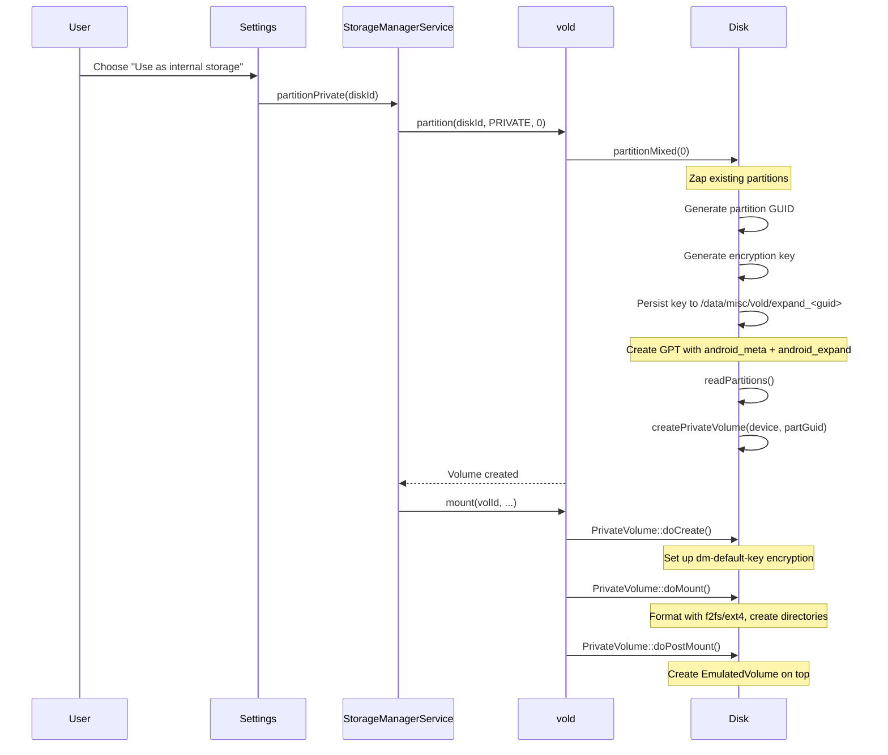
```mermaid
sequenceDiagram
    participant User
    participant Settings
    participant SMS as StorageManagerService
    participant vold
    participant Disk

    User->>Settings: Choose "Use as internal storage"
    Settings->>SMS: partitionPrivate(diskId)
    SMS->>vold: partition(diskId, PRIVATE, 0)
    vold->>Disk: partitionMixed(0)
    Note over Disk: Zap existing partitions
    Disk->>Disk: Generate partition GUID
    Disk->>Disk: Generate encryption key
    Disk->>Disk: Persist key to /data/misc/vold/expand_<guid>
    Note over Disk: Create GPT with android_meta + android_expand
    Disk->>Disk: readPartitions()
    Disk->>Disk: createPrivateVolume(device, partGuid)
    vold-->>SMS: Volume created
    SMS->>vold: mount(volId, ...)
    vold->>Disk: PrivateVolume::doCreate()
    Note over Disk: Set up dm-default-key encryption
    vold->>Disk: PrivateVolume::doMount()
    Note over Disk: Format with f2fs/ext4, create directories
    vold->>Disk: PrivateVolume::doPostMount()
    Note over Disk: Create EmulatedVolume on top
```

### 34.9.3 Disk Repartitioning

The `Disk::partitionMixed()` method handles the actual repartitioning:

```cpp
// system/vold/model/Disk.cpp (lines 484-567)
status_t Disk::partitionMixed(int8_t ratio) {
    destroyAllVolumes();
    mJustPartitioned = true;

    // Nuke existing partition table
    std::vector<std::string> cmd;
    cmd.push_back(kSgdiskPath);
    cmd.push_back("--zap-all");
    cmd.push_back(mDevPath);
    ForkExecvp(cmd);

    // Generate partition GUID and encryption key
    std::string partGuidRaw;
    GenerateRandomUuid(partGuidRaw);

    KeyBuffer key;
    generate_volume_key(&key);

    std::string partGuid;
    StrToHex(partGuidRaw, partGuid);
    WriteStringToFile(keyRaw, BuildKeyPath(partGuid));

    // Build GPT table
    cmd.clear();
    cmd.push_back(kSgdiskPath);

    if (ratio > 0) {
        // Optional public partition (mixed mode)
        uint64_t splitMb = ((mSize / 100) * ratio) / 1024 / 1024;
        cmd.push_back(StringPrintf("--new=0:0:+%" PRId64 "M", splitMb));
        cmd.push_back(StringPrintf("--typecode=0:%s", kGptBasicData));
        cmd.push_back("--change-name=0:shared");
    }

    // Metadata partition (16MB)
    cmd.push_back("--new=0:0:+16M");
    cmd.push_back(StringPrintf("--typecode=0:%s", kGptAndroidMeta));
    cmd.push_back("--change-name=0:android_meta");

    // Private partition (rest of disk)
    cmd.push_back("--new=0:0:-0");
    cmd.push_back(StringPrintf("--typecode=0:%s", kGptAndroidExpand));
    cmd.push_back(StringPrintf("--partition-guid=0:%s", partGuid.c_str()));
    cmd.push_back("--change-name=0:android_expand");

    cmd.push_back(mDevPath);
    return ForkExecvp(cmd);
}
```

### 34.9.4 Volume Encryption

When a private volume is created, it is encrypted using either `dm-default-key`
(modern) or `dm-crypt` (legacy), as determined by the device's API level:

```cpp
// system/vold/model/VolumeEncryption.cpp (lines 32-91)
enum class VolumeMethod { kFailed, kCrypt, kDefaultKey };

static VolumeMethod lookup_volume_method() {
    auto first_api_level = android::base::GetUintProperty<uint64_t>(
        "ro.product.first_api_level", 0);
    auto method = android::base::GetProperty(
        "ro.crypto.volume.metadata.method", "default");
    if (method == "default") {
        return first_api_level > __ANDROID_API_Q__
            ? VolumeMethod::kDefaultKey
            : VolumeMethod::kCrypt;
    } else if (method == "dm-default-key") {
        return VolumeMethod::kDefaultKey;
    } else if (method == "dm-crypt") {
        if (first_api_level > __ANDROID_API_Q__) {
            LOG(ERROR) << "dm-crypt cannot be used, "
                       << "first_api_level = " << first_api_level;
            return VolumeMethod::kFailed;
        }
        return VolumeMethod::kCrypt;
    }
    return VolumeMethod::kFailed;
}

bool generate_volume_key(android::vold::KeyBuffer* key) {
    KeyGeneration gen;
    switch (volume_method()) {
        case VolumeMethod::kCrypt:
            gen = cryptfs_get_keygen();
            break;
        case VolumeMethod::kDefaultKey:
            if (!defaultkey_volume_keygen(&gen)) return false;
            break;
    }
    return generateStorageKey(gen, key);
}

bool setup_ext_volume(const std::string& label,
        const std::string& blk_device,
        const android::vold::KeyBuffer& key,
        std::string* out_crypto_blkdev) {
    switch (volume_method()) {
        case VolumeMethod::kCrypt:
            return cryptfs_setup_ext_volume(
                label.c_str(), blk_device.c_str(),
                key, out_crypto_blkdev) == 0;
        case VolumeMethod::kDefaultKey:
            return defaultkey_setup_ext_volume(
                label, blk_device, key, out_crypto_blkdev);
    }
}
```

### 34.9.5 Data Migration

When a user adopts a storage device or moves data between volumes, vold
performs data migration using `cp` and `rm`:

```cpp
// system/vold/MoveStorage.cpp (lines 192-255)
static status_t moveStorageInternal(
        const std::shared_ptr<VolumeBase>& from,
        const std::shared_ptr<VolumeBase>& to,
        const android::sp<android::os::IVoldTaskListener>& listener) {

    // Step 1: tear down volumes, mount silently
    {
        std::lock_guard<std::mutex> lock(
            VolumeManager::Instance()->getLock());
        bringOffline(from);
        bringOffline(to);
    }

    fromPath = from->getInternalPath();
    toPath = to->getInternalPath();

    // Step 2: clean up stale data
    if (execRm(toPath, 10, 10, listener) != OK) goto fail;

    // Step 3: perform actual copy
    if (execCp(fromPath, toPath, 20, 60, listener) != OK) goto copy_fail;

    // Magic value 82 = copy finished
    notifyProgress(82, listener);
    {
        std::lock_guard<std::mutex> lock(
            VolumeManager::Instance()->getLock());
        bringOnline(from);
        bringOnline(to);
    }

    // Step 4: clean up old data
    if (execRm(fromPath, 85, 15, listener) != OK) goto fail;

    notifyProgress(kMoveSucceeded, listener);
    return OK;
}

void MoveStorage(const std::shared_ptr<VolumeBase>& from,
        const std::shared_ptr<VolumeBase>& to,
        const android::sp<android::os::IVoldTaskListener>& listener) {
    auto wl = android::wakelock::WakeLock::tryGet(kWakeLock);
    status_t res = moveStorageInternal(from, to, listener);
    if (listener) {
        listener->onFinished(res, extras);
    }
}
```

The copy uses the system `cp` command with preservation of timestamps,
ownership, and permissions:

```cpp
// system/vold/MoveStorage.cpp (lines 124-148)
static status_t execCp(const std::string& fromPath,
        const std::string& toPath, ...) {
    std::vector<std::string> cmd;
    cmd.push_back(kCpPath);
    cmd.push_back("-p");  // preserve timestamps, ownership, permissions
    cmd.push_back("-R");  // recurse into subdirectories
    cmd.push_back("-P");  // do not follow symlinks
    cmd.push_back("-d");  // don't dereference symlinks
    pushBackContents(fromPath, cmd, 1);
    cmd.push_back(toPath.c_str());

    pid_t pid = ForkExecvpAsync(cmd);
    // Monitor progress by tracking free space changes...
}
```

### 34.9.6 Ejecting Adopted Storage

When adopted storage is ejected, all apps that were installed on it become
unavailable.  The framework tracks which apps reside on which volume through
the `PackageManager`.  If the device is re-inserted, the encryption key
(stored in `/data/misc/vold/expand_<guid>`) is used to decrypt and remount
the volume.

### 34.9.7 Forgetting Adopted Storage

When a user chooses to forget adopted storage, the encryption key is securely
deleted:

```cpp
// system/vold/VolumeManager.h (line 109)
bool forgetPartition(const std::string& partGuid, const std::string& fsUuid);
```

This makes the data on the physical device permanently inaccessible.

---

## 34.10 Try It

This section provides practical exercises for exploring the Android storage
subsystem hands-on.

### Exercise 38.1: Examining Partition Layout

Connect a device via ADB and examine its partition structure:

```bash
# List all block devices
adb shell ls -la /dev/block/by-name/

# Show the super partition layout
adb shell ls -la /dev/block/mapper/

# Examine the fstab
adb shell cat /vendor/etc/fstab.*

# Show mounted filesystems
adb shell mount | grep -E "^/dev"

# Check for dynamic partitions
adb shell getprop ro.boot.dynamic_partitions
```

### Exercise 38.2: Exploring vold State

Examine the running vold daemon and its state:

```bash
# Check vold properties
adb shell getprop | grep vold

# Dump vold state
adb shell dumpsys mount

# List all volumes
adb shell sm list-volumes all

# List all disks
adb shell sm list-disks all

# Check FBE status
adb shell getprop ro.crypto.state
adb shell getprop ro.crypto.type

# Check metadata encryption
adb shell getprop ro.crypto.metadata.enabled
```

### Exercise 38.3: Storage Permissions Under Scoped Storage

Create a test to observe scoped storage behavior:

```bash
# Check what an app sees in /storage/emulated/0/
adb shell run-as com.example.app ls /storage/emulated/0/

# Check the app-specific directory (always accessible)
adb shell run-as com.example.app ls /storage/emulated/0/Android/data/com.example.app/

# Check that other apps' data directories are not accessible
adb shell run-as com.example.app ls /storage/emulated/0/Android/data/com.other.app/
# Expected: Permission denied

# Query MediaStore from the command line
adb shell content query --uri content://media/external/images/media/ \
    --projection _id:_display_name:_size --sort "_id DESC" --limit 5
```

### Exercise 38.4: Observing FUSE in Action

Monitor FUSE operations:

```bash
# Check FUSE mounts
adb shell mount | grep fuse

# Check the FUSE daemon process
adb shell ps -A | grep -i media | grep fuse

# Watch FUSE mount/unmount events
adb logcat -s FuseDaemonThread:* ExternalStorageServiceImpl:*

# Check if FUSE passthrough is in use
adb logcat | grep -i "passthrough"

# Check FUSE BPF status
adb shell getprop ro.fuse.bpf.enabled
```

### Exercise 38.5: Understanding FBE Key Lifecycle

Observe the FBE key management process:

```bash
# Check CE/DE directory structure
adb shell ls -la /data/misc/vold/user_keys/

# Watch key operations during user unlock
adb logcat -s vold:* FsCrypt:*

# Check which users have CE storage unlocked
adb shell dumpsys mount | grep -A5 "CE unlocked"

# Observe directory encryption policies (requires root)
adb root
adb shell fscrypt-policy-get /data/user/0/
adb shell fscrypt-policy-get /data/user_de/0/
```

### Exercise 38.6: Simulating Adoptable Storage

Use the virtual disk feature in the emulator:

```bash
# Enable virtual disk (emulator only)
adb shell setprop persist.sys.virtual_disk true

# Wait for the virtual disk to appear
adb shell sm list-disks all

# Partition as private (adoptable)
adb shell sm partition <disk_id> private

# Check the new volume
adb shell sm list-volumes all

# Migrate data to the adopted volume
adb shell sm move-primary-storage <volume_uuid>

# Monitor the migration progress
adb logcat -s MoveStorage:*

# Forget the partition
adb shell sm forget <volume_uuid>
```

### Exercise 38.7: Examining MediaProvider Database

Explore the MediaStore database:

```bash
# Connect to the external database
adb shell sqlite3 /data/data/com.android.providers.media.module/databases/external.db

# Inside sqlite3:
.tables
.schema files
SELECT _id, _data, _display_name, mime_type, media_type, owner_package_name
    FROM files ORDER BY _id DESC LIMIT 10;
SELECT volume_name, COUNT(*) FROM files GROUP BY volume_name;
.quit
```

### Exercise 38.8: Working with the Storage Access Framework

Test SAF from the command line:

```bash
# List document roots
adb shell content query --uri content://com.android.externalstorage.documents/root/

# Query a specific root's documents
adb shell content query \
    --uri content://com.android.providers.media.documents/root/images_root/ \
    --projection root_id:title:available_bytes

# Use am to trigger the document picker
adb shell am start -a android.intent.action.OPEN_DOCUMENT \
    -t "*/*" -c android.intent.category.OPENABLE
```

### Exercise 38.9: Monitoring Storage Health

Check storage health metrics:

```bash
# Get storage lifetime estimate
adb shell sm get-storage-lifetime

# Run a storage benchmark
adb shell sm benchmark <volume_id>

# Trigger fstrim manually
adb shell sm fstrim

# Check idle maintenance logs
adb logcat -s IdleMaint:*

# Check write amplification (f2fs)
adb shell cat /sys/fs/f2fs/*/stat/written_kbytes
adb shell cat /sys/fs/f2fs/*/segment_info
```

### Exercise 38.10: Building and Modifying vold

Build vold from source and examine the build configuration:

```bash
# Navigate to the vold source
cd $AOSP_ROOT/system/vold

# Examine the build file
cat Android.bp | head -50

# Build vold
cd $AOSP_ROOT
source build/envsetup.sh
lunch <target>
m vold

# Push the modified vold (requires root, for testing only)
adb root
adb remount
adb push $OUT/system/bin/vold /system/bin/vold
adb reboot
```

---

## Summary

Android's storage subsystem is a deeply layered architecture that has evolved
over more than a decade to balance performance, security, and privacy:

1. **Partition management** through dynamic partitions and the `super`
   partition provides flexible, updateable storage layout.

2. **vold** serves as the low-level native daemon that manages the full
   lifecycle of storage devices -- from hotplug detection through netlink
   events, to disk partitioning, filesystem formatting, FUSE mounting, and
   encryption key management.

3. **StorageManagerService** bridges the native vold daemon with the Java
   framework, maintaining the in-memory volume model, coordinating
   CE/DE key unlocking, and managing OBB mounts.

4. **Scoped Storage** fundamentally restructured app access to shared
   storage, replacing broad filesystem permissions with MediaStore-mediated
   access enforced through a FUSE daemon.

5. **FUSE** replaced the kernel-level sdcardfs to enable per-file permission
   checks, content redaction, and transcoding -- with FUSE passthrough and
   FUSE BPF recovering the performance overhead.

6. **MediaProvider** serves as both the content provider for media metadata
   and the host process for the FUSE daemon, tightly integrating media
   scanning, access control, and filesystem presentation.

7. **The Storage Access Framework** provides a document-oriented abstraction
   that allows apps to access files from any provider with explicit user
   consent.

8. **File-Based Encryption** secures user data with per-file keys, enabling
   the Direct Boot experience where critical services function before user
   authentication while keeping sensitive data encrypted at rest.

9. **Adoptable Storage** extends internal storage onto external devices
   through transparent encryption and the same volume management infrastructure.

The key source files for this chapter are:

| Component | Path |
|-----------|------|
| vold entry point | `system/vold/main.cpp` |
| VolumeManager | `system/vold/VolumeManager.cpp` |
| Disk detection | `system/vold/model/Disk.cpp` |
| Volume base class | `system/vold/model/VolumeBase.h` |
| Public volumes | `system/vold/model/PublicVolume.cpp` |
| Private volumes | `system/vold/model/PrivateVolume.cpp` |
| Emulated volumes | `system/vold/model/EmulatedVolume.cpp` |
| Volume encryption | `system/vold/model/VolumeEncryption.cpp` |
| FBE implementation | `system/vold/FsCrypt.cpp` |
| Metadata encryption | `system/vold/MetadataCrypt.cpp` |
| Key storage | `system/vold/KeyStorage.cpp` |
| Data migration | `system/vold/MoveStorage.cpp` |
| Binder API | `system/vold/VoldNativeService.h` |
| Netlink handler | `system/vold/NetlinkHandler.cpp` |
| StorageManagerService | `frameworks/base/services/core/java/com/android/server/StorageManagerService.java` |
| FuseDaemon (Java) | `packages/providers/MediaProvider/src/com/android/providers/media/fuse/FuseDaemon.java` |
| FuseDaemon (Native) | `packages/providers/MediaProvider/jni/FuseDaemon.h` |
| ExternalStorageService | `packages/providers/MediaProvider/src/com/android/providers/media/fuse/ExternalStorageServiceImpl.java` |
| MediaProvider | `packages/providers/MediaProvider/src/com/android/providers/media/MediaProvider.java` |
| MediaDocumentsProvider | `packages/providers/MediaProvider/src/com/android/providers/media/MediaDocumentsProvider.java` |
| MediaScanner interface | `packages/providers/MediaProvider/src/com/android/providers/media/scan/MediaScanner.java` |
| DatabaseHelper | `packages/providers/MediaProvider/src/com/android/providers/media/DatabaseHelper.java` |

---

## Appendix A: vold Utility Functions

The `system/vold/Utils.h` header provides a rich set of utility functions
used throughout the vold codebase.  Understanding these functions is essential
for navigating the storage code:

```cpp
// system/vold/Utils.h (key declarations)

// App data isolation property
static const char* kVoldAppDataIsolationEnabled =
    "persist.sys.vold_app_data_isolation_enabled";

// Legacy sdcardfs property
static const char* kExternalStorageSdcardfs =
    "external_storage.sdcardfs.enabled";

// Timeouts for untrusted filesystem operations
static constexpr std::chrono::seconds kUntrustedFsckSleepTime(45);
static constexpr std::chrono::seconds kUntrustedMountSleepTime(20);

// SELinux contexts for different operations
extern char* sBlkidContext;           // For blkid on trusted devices
extern char* sBlkidUntrustedContext;  // For blkid on untrusted devices
extern char* sFsckContext;            // For fsck on trusted devices
extern char* sFsckUntrustedContext;   // For fsck on untrusted devices

// Get FUSE mount path for a specific user
std::string GetFuseMountPathForUser(userid_t user_id,
    const std::string& relative_upper_path);

// Device node management
status_t CreateDeviceNode(const std::string& path, dev_t dev);
status_t DestroyDeviceNode(const std::string& path);

// ACL and quota management for app directories
status_t SetDefaultAcl(const std::string& path, mode_t mode,
    uid_t uid, gid_t gid, std::vector<gid_t> additionalGids);
int SetQuotaInherit(const std::string& path);
int SetQuotaProjectId(const std::string& path, long projectId);
int PrepareAppDirFromRoot(const std::string& path,
    const std::string& root, int appUid, bool fixupExisting);

// Mount operations
status_t PrepareDir(const std::string& path, mode_t mode,
    uid_t uid, gid_t gid, unsigned int attrs = 0);
status_t ForceUnmount(const std::string& path);
status_t KillProcessesUsingPath(const std::string& path);
status_t BindMount(const std::string& source,
    const std::string& target);
status_t Symlink(const std::string& target,
    const std::string& linkpath);
status_t Unlink(const std::string& linkpath);
status_t CreateDir(const std::string& dir, mode_t mode);
```

These utility functions encapsulate the low-level POSIX operations with
proper error handling, SELinux context management, and logging.

---

## Appendix B: Checkpoint Support

Android's storage subsystem supports filesystem checkpoints for safe OTA
updates.  The checkpoint system, defined in `system/vold/Checkpoint.h`,
ensures that the filesystem can be rolled back if an OTA update fails:

```cpp
// system/vold/Checkpoint.h
namespace android {
namespace vold {

android::binder::Status cp_supportsCheckpoint(bool& result);
android::binder::Status cp_supportsBlockCheckpoint(bool& result);
android::binder::Status cp_supportsFileCheckpoint(bool& result);

android::binder::Status cp_startCheckpoint(int retry);
android::binder::Status cp_commitChanges();
void cp_abortChanges(const std::string& message, bool retry);

bool cp_needsRollback();
bool cp_needsCheckpoint();
bool cp_isCheckpointing();

android::binder::Status cp_prepareCheckpoint();
android::binder::Status cp_restoreCheckpoint(
    const std::string& mountPoint, int count = 0);
android::binder::Status cp_markBootAttempt();

void cp_resetCheckpoint();
}  // namespace vold
}  // namespace android
```

Two checkpoint mechanisms are supported:

1. **Block-level checkpoints** -- Using device-mapper snapshots to track
   block-level changes.  If a rollback is needed, the snapshot is discarded.

2. **File-level checkpoints** -- Using f2fs native checkpoint support.  The
   f2fs filesystem has built-in support for atomic operations that can be
   committed or rolled back.

The checkpoint flow during an OTA update:

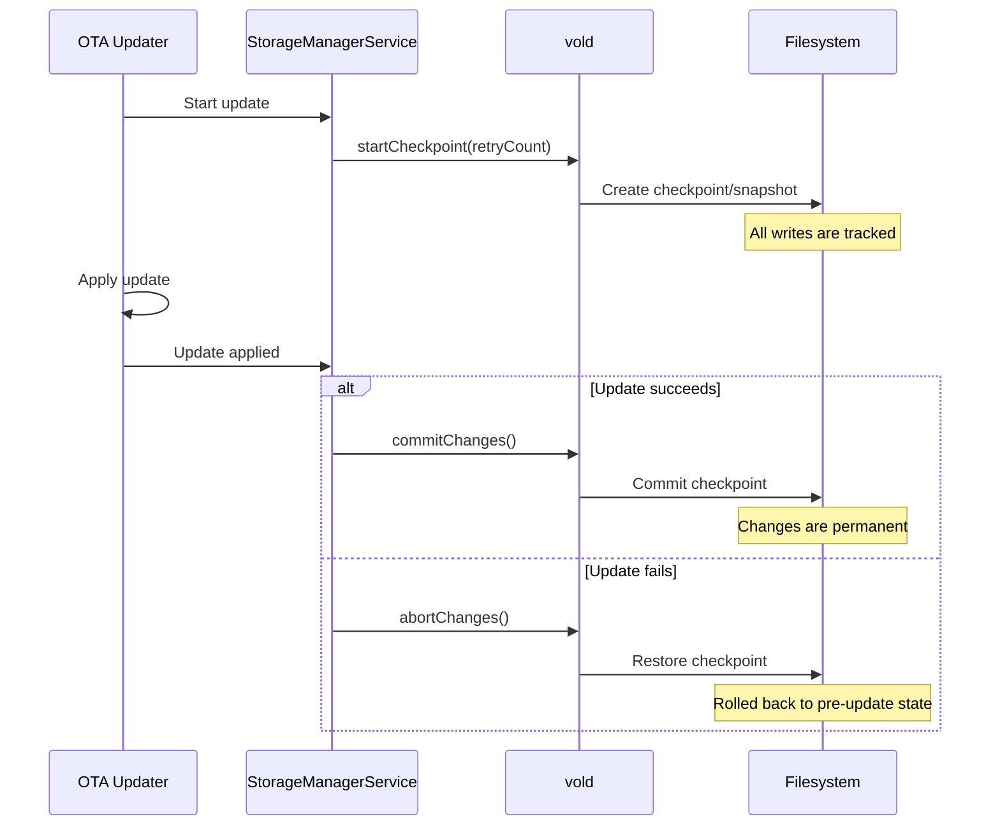
```mermaid
sequenceDiagram
    participant OTA as OTA Updater
    participant SMS as StorageManagerService
    participant vold
    participant FS as Filesystem

    OTA->>SMS: Start update
    SMS->>vold: startCheckpoint(retryCount)
    vold->>FS: Create checkpoint/snapshot
    Note over FS: All writes are tracked

    OTA->>OTA: Apply update
    OTA->>SMS: Update applied

    alt Update succeeds
        SMS->>vold: commitChanges()
        vold->>FS: Commit checkpoint
        Note over FS: Changes are permanent
    else Update fails
        SMS->>vold: abortChanges()
        vold->>FS: Restore checkpoint
        Note over FS: Rolled back to pre-update state
    end
```

---

## Appendix C: Key Generation and Storage

### C.1 KeyGeneration Structure

The `KeyGeneration` structure in `system/vold/KeyUtil.h` controls how
encryption keys are generated:

```cpp
// system/vold/KeyUtil.h (lines 32-37)
struct KeyGeneration {
    size_t keysize;           // Key size in bytes
    bool allow_gen;           // Whether key generation is permitted
    bool use_hw_wrapped_key;  // Use hardware-wrapped keys
};

// Generate a storage key per the spec
bool generateStorageKey(const KeyGeneration& gen, KeyBuffer* key);

// Sentinel: returns a KeyGeneration that disallows generation
const KeyGeneration neverGen();

// Install a key to the kernel for fscrypt use
bool installKey(const std::string& mountpoint,
    const android::fscrypt::EncryptionOptions& options,
    const KeyBuffer& key,
    android::fscrypt::EncryptionPolicy* policy);

// Evict a key from the kernel
bool evictKey(const std::string& mountpoint,
    const android::fscrypt::EncryptionPolicy& policy);

// Retrieve an existing key or generate a new one
bool retrieveOrGenerateKey(const std::string& key_path,
    const std::string& tmp_path,
    const KeyAuthentication& key_authentication,
    const KeyGeneration& gen,
    KeyBuffer* key);
```

### C.2 Key Authentication

The `KeyAuthentication` class determines whether a key requires Keystore
interaction for decryption:

```cpp
// system/vold/KeyStorage.h (lines 30-37)
class KeyAuthentication {
  public:
    KeyAuthentication(const std::string& s) : secret{s} {};

    // If secret is empty, uses Keystore for key protection
    bool usesKeystore() const { return secret.empty(); };

    const std::string secret;
};

extern const KeyAuthentication kEmptyAuthentication;
```

The `kEmptyAuthentication` constant is used for keys that are protected by
the Android Keystore (hardware-backed key storage) rather than by a user
secret.  This is the typical case for DE keys and system-wide keys.

CE keys use the user's credential (derived through a KDF) as their
authentication secret, ensuring they can only be decrypted after the user
enters their PIN, password, or pattern.

### C.3 Key Lifecycle

The complete lifecycle of an encryption key follows this pattern:

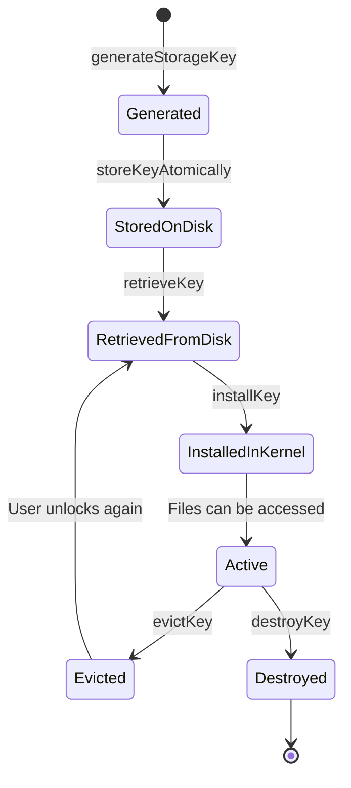
```mermaid
stateDiagram-v2
    [*] --> Generated: generateStorageKey
    Generated --> StoredOnDisk: storeKeyAtomically
    StoredOnDisk --> RetrievedFromDisk: retrieveKey
    RetrievedFromDisk --> InstalledInKernel: installKey
    InstalledInKernel --> Active: Files can be accessed
    Active --> Evicted: evictKey
    Evicted --> RetrievedFromDisk: User unlocks again
    Active --> Destroyed: destroyKey
    Destroyed --> [*]
```

For CE keys specifically:

1. **Generation**: When a user is created, a random CE key is generated
2. **Storage**: The key is encrypted using the user's credential and stored
   in `/data/misc/vold/user_keys/ce/<user_id>/current/`
3. **Unlock**: When the user authenticates, the framework provides the
   credential-derived secret to vold, which decrypts the CE key
4. **Installation**: The decrypted key is installed into the kernel's
   fscrypt keyring for the `/data` mountpoint
5. **Active Use**: All files in CE-encrypted directories can be read/written
6. **Lock**: When the user locks the device (if lockscreen-triggered locking
   is enabled), the key is evicted from the kernel
7. **Destruction**: When a user is removed, the key is securely destroyed

### C.4 Secdiscardable Files

To protect against offline attacks, each key directory contains a
"secdiscardable" file -- a large file filled with random data that is
included in the key derivation process.  If this file is securely deleted
(e.g., using `fstrim` or `BLKDISCARD`), the key becomes permanently
unrecoverable even if the encrypted key material is obtained:

```cpp
// system/vold/KeyStorage.h (lines 41-42)
bool createSecdiscardable(const std::string& path, std::string* hash);
bool readSecdiscardable(const std::string& path, std::string* hash);
```

---

## Appendix D: The Complete Storage Boot Sequence

This appendix traces the complete storage initialization during device boot,
showing how all the components described in this chapter work together.

### D.1 Early Boot (init first stage)

```
1. Kernel starts, mounts initramfs
2. init first stage runs
3. init reads fstab from device tree or ramdisk
4. init mounts /metadata partition (needed for encryption keys)
5. init starts vold daemon
```

### D.2 vold Initialization

```
6. vold::main() begins
7. VolumeManager::Instance() created (singleton)
8. NetlinkManager::Instance() created (singleton)
9. VolumeManager::start() called:
   a. unmountAll() -- clean slate
   b. Create EmulatedVolume for /data/media with user 0
   c. updateVirtualDisk() -- optional virtual disk
10. process_config() reads fstab:
    a. Check for quota, reserved, compress features
    b. Pre-create dm device for metadata encryption
    c. Register DiskSources for vold-managed entries
11. VoldNativeService::start() -- register Binder service
12. VendorVoldNativeService::try_start() -- vendor extension
13. NetlinkManager::start() -- listen for uevents
14. coldboot("/sys/block") -- replay uevent for existing devices
```

### D.3 Metadata Encryption and /data Mount

```
15. init calls vold.mountFstab() for /data
16. vold reads metadata encryption options from fstab
17. vold reads (or generates) metadata encryption key from /metadata
18. vold creates dm-default-key device for /data
19. vold mounts the encrypted /data partition
20. Property ro.crypto.metadata.enabled set to "true"
```

### D.4 FBE Initialization (User 0)

```
21. init calls vold.initUser0()
22. fscrypt_initialize_systemwide_keys():
    a. Read file encryption options from fstab
    b. Read (or generate) system-wide DE key
    c. Install DE key to kernel
23. fscrypt_init_user0():
    a. Create or read User 0 DE key
    b. Install User 0 DE key
    c. Prepare DE storage directories
    d. If device is LSKF-free, also unlock CE storage
```

### D.5 Framework Boot

```
24. System server starts
25. StorageManagerService.Lifecycle.onStart():
    a. Create StorageManagerService
    b. Register as "mount" Binder service
    c. Connect to vold via IVold
    d. Set IVoldListener callback
26. StorageManagerService.servicesReady()
27. StorageManagerService.systemReady()
```

### D.6 User Unlock

```
28. User enters PIN/password/pattern
29. LockSettingsService derives credential
30. StorageManagerService.unlockCeStorage(userId, secret)
31. vold.unlockCeStorage(userId, secret):
    a. Read CE key from disk
    b. Decrypt using provided secret
    c. Install CE key to kernel
32. mCeUnlockedUsers.append(userId)
33. CE directories become accessible
```

### D.7 FUSE Session Startup

```
34. StorageManagerService detects CE unlock
35. Framework calls vold.mount() for emulated volume
36. EmulatedVolume::doMount():
    a. MountUserFuse() creates /dev/fuse and mounts at /mnt/user/<uid>
    b. IVoldMountCallback.onVolumeChecking() called
37. StorageSessionController starts ExternalStorageService session
38. ExternalStorageServiceImpl.onStartSession():
    a. Get MediaProvider instance
    b. Create FuseDaemon with FUSE device fd
    c. FuseDaemon.start() -- begins native FUSE loop
39. ExternalStorageServiceImpl.onVolumeStateChanged(MEDIA_MOUNTED):
    a. MediaProvider.attachVolume()
    b. MediaService.queueVolumeScan()
40. MediaScanner scans the newly mounted volume
41. Storage is fully operational for applications
```

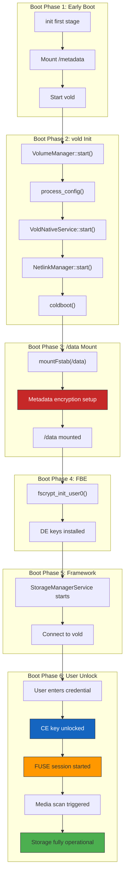
```mermaid
graph TD
    subgraph "Boot Phase 1: Early Boot"
        A["init first stage"] --> B["Mount /metadata"]
        B --> C["Start vold"]
    end

    subgraph "Boot Phase 2: vold Init"
        C --> D["VolumeManager::start()"]
        D --> E["process_config()"]
        E --> F["VoldNativeService::start()"]
        F --> G["NetlinkManager::start()"]
        G --> H["coldboot()"]
    end

    subgraph "Boot Phase 3: /data Mount"
        H --> I["mountFstab(/data)"]
        I --> J["Metadata encryption setup"]
        J --> K["/data mounted"]
    end

    subgraph "Boot Phase 4: FBE"
        K --> L["fscrypt_init_user0()"]
        L --> M["DE keys installed"]
    end

    subgraph "Boot Phase 5: Framework"
        M --> N["StorageManagerService starts"]
        N --> O["Connect to vold"]
    end

    subgraph "Boot Phase 6: User Unlock"
        O --> P["User enters credential"]
        P --> Q["CE key unlocked"]
        Q --> R["FUSE session started"]
        R --> S["Media scan triggered"]
        S --> T["Storage fully operational"]
    end

    style J fill:#c62828,stroke:#333,color:#fff
    style Q fill:#1565c0,stroke:#333,color:#fff
    style R fill:#ff9800,stroke:#333
    style T fill:#4caf50,stroke:#333
```

---

## Appendix E: Storage-Related System Properties

The following system properties control storage behavior on Android devices:

| Property | Description | Typical Value |
|----------|-------------|---------------|
| `ro.crypto.state` | Current encryption state | `encrypted` |
| `ro.crypto.type` | Encryption type | `file` (FBE) |
| `ro.crypto.metadata.enabled` | Metadata encryption active | `true` |
| `ro.crypto.volume.metadata.method` | Volume encryption method | `default` |
| `ro.crypto.volume.contents_mode` | Volume contents encryption mode | (empty = default XTS) |
| `ro.crypto.volume.filenames_mode` | Volume filenames encryption mode | (empty = default CTS) |
| `ro.crypto.volume.options` | Combined volume encryption options | |
| `ro.crypto.dm_default_key.options_format.version` | dm-default-key format version | `2` |
| `vold.has_adoptable` | Device supports adoptable storage | `0` or `1` |
| `vold.has_quota` | Filesystem quotas enabled | `0` or `1` |
| `vold.has_reserved` | Reserved space configured | `0` or `1` |
| `vold.has_compress` | Filesystem compression enabled | `0` or `1` |
| `persist.sys.virtual_disk` | Enable virtual disk (testing) | `false` |
| `persist.sys.vold_app_data_isolation_enabled` | App data isolation | `false` |
| `external_storage.sdcardfs.enabled` | Legacy sdcardfs | `false` |
| `ro.fuse.bpf.enabled` | FUSE BPF optimization | `true` |
| `ro.product.first_api_level` | Device first API level | (e.g., `34`) |
| `persist.sys.zram_enabled` | ZRAM enabled | `1` |

---

## Appendix F: Android ID Constants for Storage

Storage operations use numerous Android UID/GID constants for permission
management:

| Constant | Value | Purpose |
|----------|-------|---------|
| `AID_ROOT` | 0 | Root user |
| `AID_SYSTEM` | 1000 | System server |
| `AID_MEDIA_RW` | 1023 | Media read/write group |
| `AID_SDCARD_R` | 1028 | External storage read |
| `AID_SDCARD_RW` | 1015 | External storage read/write |
| `AID_EXTERNAL_STORAGE` | 1077 | External storage daemon |
| `AID_EVERYBODY` | 9997 | Shared by all apps |
| `AID_MEDIA_OBB` | 1059 | OBB file access |
| `AID_MEDIA_IMAGE` | 1057 | Image file access |
| `AID_MEDIA_VIDEO` | 1058 | Video file access |
| `AID_MEDIA_AUDIO` | 1055 | Audio file access |

These GIDs are used by the permission enforcement system.  When an app has
a specific media permission, it is placed in the corresponding supplementary
group.  The FUSE daemon and (legacy) sdcardfs use these GIDs to control
file access.

---

## Appendix G: Storage Debugging Techniques

### G.1 Tracing FUSE Operations

Enable FUSE tracing to see every filesystem operation:

```bash
# Enable verbose FUSE logging
adb shell setprop log.tag.FuseDaemonThread VERBOSE

# Watch FUSE operations
adb logcat -s FuseDaemonThread:V

# For native-level FUSE tracing (requires debug build)
adb shell setprop persist.sys.fuse.log 1
```

### G.2 Debugging vold

vold provides rich debugging through system properties and logcat:

```bash
# Enable vold debug mode
adb shell setprop vold.debug true

# Watch vold logs
adb logcat -s vold:* VolumeManager:* Disk:*

# Dump full vold state
adb shell dumpsys mount

# Check for encryption issues
adb logcat -s FsCrypt:* MetadataCrypt:* KeyStorage:*
```

### G.3 Analyzing Storage Performance

```bash
# Run vold's built-in benchmark
adb shell sm benchmark private

# Monitor I/O patterns
adb shell cat /proc/diskstats

# Check f2fs GC status
adb shell cat /sys/fs/f2fs/*/gc_urgent

# Monitor write amplification
adb shell cat /sys/fs/f2fs/*/stat/written_kbytes

# Check fstrim status
adb logcat -s fstrim:*
```

### G.4 Inspecting Mount Namespaces

Android uses mount namespaces to provide per-app views of storage:

```bash
# View mount namespaces for a process
adb shell ls -la /proc/<pid>/ns/mnt

# View mounts visible to a process
adb shell cat /proc/<pid>/mountinfo

# Compare mounts between processes
adb shell cat /proc/1/mountinfo > /tmp/init_mounts.txt
adb shell cat /proc/<app_pid>/mountinfo > /tmp/app_mounts.txt
diff /tmp/init_mounts.txt /tmp/app_mounts.txt
```

### G.5 Recovering from Storage Issues

```bash
# Force unmount all volumes (emergency)
adb shell sm unmount all

# Reset vold state
adb shell sm reset

# Force filesystem check on next boot
adb shell setprop persist.sys.dalvik.vm.lib.2 ""
adb reboot

# Clear media store cache (requires root)
adb root
adb shell rm /data/data/com.android.providers.media.module/databases/external.db
adb reboot
```

---

## Appendix H: The Interplay Between Storage Components

Understanding how the storage components interact during common operations
helps developers and system engineers debug issues and optimize performance.

### H.1 File Write Flow (App Writes a Photo)

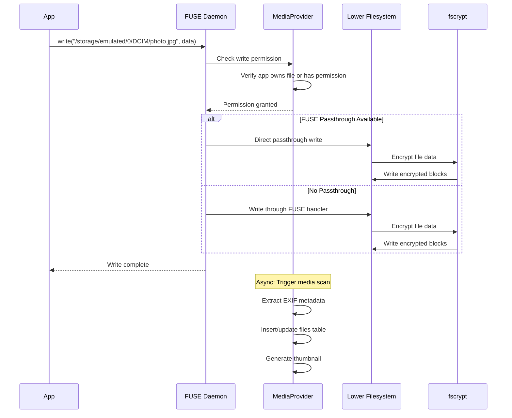
```mermaid
sequenceDiagram
    participant App
    participant FUSE as FUSE Daemon
    participant MP as MediaProvider
    participant FS as Lower Filesystem
    participant FBE as fscrypt

    App->>FUSE: write("/storage/emulated/0/DCIM/photo.jpg", data)
    FUSE->>MP: Check write permission
    MP->>MP: Verify app owns file or has permission
    MP-->>FUSE: Permission granted

    alt FUSE Passthrough Available
        FUSE->>FS: Direct passthrough write
        FS->>FBE: Encrypt file data
        FBE->>FS: Write encrypted blocks
    else No Passthrough
        FUSE->>FS: Write through FUSE handler
        FS->>FBE: Encrypt file data
        FBE->>FS: Write encrypted blocks
    end

    FUSE-->>App: Write complete

    Note over MP: Async: Trigger media scan
    MP->>MP: Extract EXIF metadata
    MP->>MP: Insert/update files table
    MP->>MP: Generate thumbnail
```

### H.2 SD Card Insert Flow

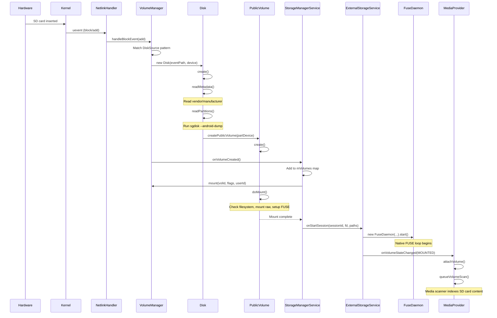
```mermaid
sequenceDiagram
    participant HW as Hardware
    participant Kernel
    participant NL as NetlinkHandler
    participant VM as VolumeManager
    participant Disk
    participant PV as PublicVolume
    participant SMS as StorageManagerService
    participant ESS as ExternalStorageService
    participant FD as FuseDaemon
    participant MP as MediaProvider

    HW->>Kernel: SD card inserted
    Kernel->>NL: uevent (block/add)
    NL->>VM: handleBlockEvent(add)
    VM->>VM: Match DiskSource pattern
    VM->>Disk: new Disk(eventPath, device)
    Disk->>Disk: create()
    Disk->>Disk: readMetadata()
    Note over Disk: Read vendor/manufacturer
    Disk->>Disk: readPartitions()
    Note over Disk: Run sgdisk --android-dump
    Disk->>PV: createPublicVolume(partDevice)
    PV->>PV: create()

    VM->>SMS: onVolumeCreated()
    SMS->>SMS: Add to mVolumes map

    SMS->>VM: mount(volId, flags, userId)
    PV->>PV: doMount()
    Note over PV: Check filesystem, mount raw, setup FUSE
    PV-->>SMS: Mount complete

    SMS->>ESS: onStartSession(sessionId, fd, paths)
    ESS->>FD: new FuseDaemon(...).start()
    Note over FD: Native FUSE loop begins

    ESS->>MP: onVolumeStateChanged(MOUNTED)
    MP->>MP: attachVolume()
    MP->>MP: queueVolumeScan()
    Note over MP: Media scanner indexes SD card content
```

### H.3 User Profile Creation

When a new user (e.g., work profile) is created, the storage system must
create encryption keys and prepare storage directories:

```
1. UserManagerService creates user
2. StorageManagerService.onUserAdded(userId, userSerial, cloneParentId)
3. vold.onUserAdded(userId, userSerial, sharesStorageWithUserId)
4. fscrypt_create_user_keys(userId, ephemeral):
   a. Generate DE key, store on disk, install to kernel
   b. Generate CE key, store on disk (encrypted with default secret)
5. VolumeManager creates EmulatedVolume for new user
6. fscrypt_prepare_user_storage(uuid, userId, flags):
   a. Create /data/system_ce/<userId>/
   b. Create /data/system_de/<userId>/
   c. Create /data/misc_ce/<userId>/
   d. Create /data/misc_de/<userId>/
   e. Create /data/user/<userId>/
   f. Create /data/user_de/<userId>/
   g. Create /data/media/<userId>/
   h. Apply encryption policies to each directory
7. When user first unlocks:
   a. CE key decrypted and installed
   b. FUSE session started for the user
   c. Media scan triggered for user's storage
```

This lifecycle ensures that each user's data is cryptographically isolated
from every other user's data on the device, even if they share the same
physical storage medium.

---

## Appendix I: Storage Evolution Timeline

| Android Version | Key Storage Change |
|----------------|-------------------|
| 1.0-2.3 | FAT32 SD card, no encryption |
| 3.0 | Full-Disk Encryption (FDE) introduced (optional) |
| 4.4 | Storage Access Framework introduced |
| 5.0 | FDE enabled by default on new devices |
| 6.0 | Adoptable storage, mandatory encryption |
| 7.0 | File-Based Encryption (FBE) introduced, Direct Boot |
| 8.0 | OBB in FUSE, Treble storage separation |
| 9.0 | FBE mandatory for new devices launching with Android 9+ |
| 10 | Scoped Storage introduced (opt-in), metadata encryption |
| 11 | Scoped Storage enforced, FUSE replaces sdcardfs |
| 12 | FUSE passthrough, improved performance |
| 13 | Per-app media permissions (READ_MEDIA_IMAGES, etc.) |
| 14 | Photo Picker, READ_MEDIA_VISUAL_USER_SELECTED |
| 15+ | FUSE BPF, further performance improvements |

This timeline shows the steady progression from unrestricted filesystem
access toward a fully mediated, encrypted, and privacy-preserving storage
architecture.  Each major change addressed a real-world security or privacy
concern while attempting to maintain backward compatibility for existing
applications.

---

## Appendix J: Deep Dive -- VolumeManager Block Event Processing

The `VolumeManager::handleBlockEvent()` method is the heart of hot-plug
device detection.  Let us trace through exactly what happens when a USB
drive is plugged in.

### J.1 Netlink Event Reception

The kernel sends a uevent through the netlink socket.  The event contains
key-value pairs including:

```
ACTION=add
DEVPATH=/devices/platform/soc/xhci-hcd/usb1/1-1/1-1:1.0/host0/target0:0:0/0:0:0:0/block/sda
SUBSYSTEM=block
DEVTYPE=disk
MAJOR=8
MINOR=0
DEVNAME=sda
```

The `NetlinkHandler` receives this event and checks the subsystem:

```cpp
// system/vold/NetlinkHandler.cpp
void NetlinkHandler::onEvent(NetlinkEvent* evt) {
    VolumeManager* vm = VolumeManager::Instance();
    const char* subsys = evt->getSubsystem();
    if (std::string(subsys) == "block") {
        vm->handleBlockEvent(evt);
    }
}
```

### J.2 Device Matching

`handleBlockEvent()` first filters out partition events (only interested
in whole disks with `DEVTYPE=disk`), then matches the device path against
registered `DiskSource` patterns:

```cpp
// system/vold/VolumeManager.cpp
if (devType != "disk") return;

for (const auto& source : mDiskSources) {
    if (source->matches(eventPath)) {
        // Determine if SD or USB based on major number
        int flags = source->getFlags();
        if (major == kMajorBlockMmc || IsVirtioBlkDevice(major)) {
            flags |= android::vold::Disk::Flags::kSd;
        } else {
            flags |= android::vold::Disk::Flags::kUsb;
        }
        auto disk = new android::vold::Disk(
            eventPath, device, source->getNickname(), flags);
        handleDiskAdded(std::shared_ptr<android::vold::Disk>(disk));
        break;
    }
}
```

The `DiskSource` patterns come from the fstab entries marked with
`voldmanaged`.  The pattern uses `fnmatch()` for glob-style matching,
so a pattern like `/devices/platform/*/usb*` would match any USB device.

### J.3 Security Gate

Before a newly detected disk can be scanned, VolumeManager checks two
security conditions:

```cpp
// system/vold/VolumeManager.cpp
void VolumeManager::handleDiskAdded(
        const std::shared_ptr<android::vold::Disk>& disk) {
    bool userZeroStarted =
        mStartedUsers.find(0) != mStartedUsers.end();

    if (mSecureKeyguardShowing) {
        LOG(INFO) << "Found disk at " << disk->getEventPath()
                  << " but delaying scan due to secure keyguard";
        mPendingDisks.push_back(disk);
    } else if (!userZeroStarted) {
        LOG(INFO) << "Found disk at " << disk->getEventPath()
                  << " but delaying scan due to user zero "
                  << "not having started";
        mPendingDisks.push_back(disk);
    } else {
        // Safe to scan now
        disk->create();
        mDisks.push_back(disk);
    }
}
```

This prevents malicious USB devices from being processed while the device
is locked.  Once the user unlocks the device, `createPendingDisksIfNeeded()`
processes any queued disks.

### J.4 Disk Metadata Reading

The `Disk::readMetadata()` method reads device information from sysfs to
determine the manufacturer and label:

```cpp
// system/vold/model/Disk.cpp
status_t Disk::readMetadata() {
    unsigned int majorId = major(mDevice);
    switch (majorId) {
        case kMajorBlockLoop:
            mLabel = "Virtual";
            break;
        case kMajorBlockScsiA: ... case kMajorBlockScsiP: {
            // Read vendor from sysfs
            std::string path(mSysPath + "/device/vendor");
            ReadFileToString(path, &tmp);
            mLabel = android::base::Trim(tmp);
            break;
        }
        case kMajorBlockMmc: {
            // Read manufacturer ID for SD cards
            std::string path(mSysPath + "/device/manfid");
            // Map to known manufacturer names
            switch (manfid) {
                case 0x000003: mLabel = "SanDisk"; break;
                case 0x00001b: mLabel = "Samsung"; break;
                case 0x000028: mLabel = "Lexar"; break;
                case 0x000074: mLabel = "Transcend"; break;
            }
            break;
        }
    }
    // Notify the framework
    auto listener = VolumeManager::Instance()->getListener();
    if (listener)
        listener->onDiskMetadataChanged(getId(), mSize, mLabel, mSysPath);
}
```

This manufacturer detection provides a user-friendly label in the Settings
UI, helping users identify which physical card they are managing.

### J.5 Partition Table Parsing

After metadata is read, `readPartitions()` uses `sgdisk` with the
`--android-dump` flag, which produces a machine-readable format:

```
DISK mbr
PART 1 0c
```

or for GPT:

```
DISK gpt
PART 1 EBD0A0A2-B9E5-4433-87C0-68B6B72699C7 A1B2C3D4-E5F6-...
```

The Android-specific GUID types `kGptAndroidMeta` and `kGptAndroidExpand`
are used to identify partitions created by the adoptable storage feature.

### J.6 Volume Creation

Based on the partition type, either `createPublicVolume()` or
`createPrivateVolume()` is called:

- **Public volume**: Accessible to all apps (with permissions), formatted
  with FAT/exFAT, UUID used as stable name for mount path.

- **Private volume**: Encrypted, formatted with ext4/f2fs, only accessible
  as internal storage.  Requires the encryption key stored on the device
  to be present.

---

## Appendix K: Deep Dive -- MediaProvider Permission Resolution

### K.1 The FUSE Request Path

When an application performs a filesystem operation on `/storage/emulated/0/`,
the request follows this detailed path:

1. **App Process**: The app calls `open()`, `read()`, `write()`, `stat()`,
   `readdir()`, etc. through libc.

2. **Kernel VFS**: The VFS layer sees that `/storage/emulated/0/` is a FUSE
   mount and routes the request to the FUSE kernel module.

3. **FUSE Kernel Module**: The kernel packages the request into a FUSE
   protocol message and writes it to the `/dev/fuse` device.

4. **FuseDaemon (Native)**: The `FuseDaemon.cpp` code in the MediaProvider
   JNI layer reads the FUSE request from `/dev/fuse` and processes it.

5. **MediaProviderWrapper (JNI)**: For operations that require permission
   checking, the native code calls up through JNI into the
   `MediaProviderWrapper` to query the Java `MediaProvider`.

6. **MediaProvider (Java)**: The provider checks the calling app's permissions
   through `LocalCallingIdentity` and decides whether to allow the operation.

7. **Response**: The result flows back down through the same path:
   Java -> JNI -> native FUSE handler -> `/dev/fuse` -> kernel -> app.

### K.2 Permission Categories

The `AccessChecker` class in MediaProvider categorizes callers into several
tiers of access:

```
Tier 1 - SELF: The MediaProvider process itself (uid matches)
   -> Full access to all files

Tier 2 - SHELL: ADB shell (uid == 2000)
   -> Full access (for debugging)

Tier 3 - MANAGER: Apps with MANAGE_EXTERNAL_STORAGE
   -> Access to all shared storage (except other apps' Android/data)

Tier 4 - SYSTEM_GALLERY: System gallery apps
   -> Read/write images and videos

Tier 5 - LEGACY: Apps with legacy storage granted
   -> Pre-scoped-storage behavior (broad access)

Tier 6 - MEDIA PERMISSIONS: Apps with specific media permissions
   -> READ_MEDIA_IMAGES: Can read images
   -> READ_MEDIA_VIDEO: Can read videos
   -> READ_MEDIA_AUDIO: Can read audio

Tier 7 - NO PERMISSIONS: Apps with no storage permissions
   -> Can only access their own app-specific directories
   -> Can access files they created via MediaStore
```

### K.3 Redaction

When an app reads an image file but lacks `ACCESS_MEDIA_LOCATION` permission,
the FUSE daemon performs on-the-fly redaction of EXIF GPS data.  The native
`RedactionInfo` class (in `packages/providers/MediaProvider/jni/RedactionInfo.cpp`)
maintains byte ranges that should be zeroed out:

```cpp
// packages/providers/MediaProvider/jni/RedactionInfo.cpp
// Redaction ranges are [offset, length] pairs that describe
// which portions of the file should be replaced with zeros
// during read operations.
```

This is transparent to the application -- it reads the file normally, but
the location data has been stripped from the EXIF headers in transit.

### K.4 Transcoding

For video files, the FUSE daemon can perform transparent transcoding from
HEVC (H.265) to AVC (H.264) for applications that do not support HEVC.
The transcoding decision is based on:

1. The app's declared media capabilities in its manifest
2. Whether the specific file is in HEVC format
3. Whether the file path matches transcoding-eligible directories

The `supportedTranscodingRelativePaths` parameter in the `FuseDaemon`
constructor controls which directories are eligible for transcoding.

---

## Appendix L: Mount Namespace Architecture

Android uses Linux mount namespaces to provide different views of the
filesystem to different processes.  This is critical for storage isolation
between apps.

### L.1 Namespace Types

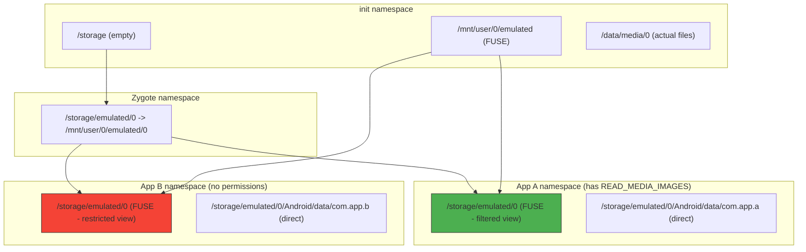
```mermaid
graph TD
    subgraph "init namespace"
        A["/storage (empty)"]
        B["/mnt/user/0/emulated (FUSE)"]
        C["/data/media/0 (actual files)"]
    end

    subgraph "Zygote namespace"
        D["/storage/emulated/0 -> /mnt/user/0/emulated/0"]
    end

    subgraph "App A namespace (has READ_MEDIA_IMAGES)"
        E["/storage/emulated/0 (FUSE - filtered view)"]
        F["/storage/emulated/0/Android/data/com.app.a (direct)"]
    end

    subgraph "App B namespace (no permissions)"
        G["/storage/emulated/0 (FUSE - restricted view)"]
        H["/storage/emulated/0/Android/data/com.app.b (direct)"]
    end

    A --> D
    D --> E
    D --> G
    B --> E
    B --> G

    style E fill:#4caf50,stroke:#333
    style G fill:#f44336,stroke:#333
```

### L.2 Zygote Fork and Namespace Setup

When Zygote forks a new app process, the following mount namespace
operations occur:

1. **Clone namespace**: The child gets a copy of Zygote's mount namespace
2. **Bind mount storage**: `/mnt/user/<userId>/emulated/` is bind-mounted
   to `/storage/emulated/`
3. **App-specific dirs**: The app's `Android/data/<package>/` directory
   gets a direct (non-FUSE) bind mount for performance
4. **Restriction**: Other apps' `Android/data/` directories are made
   inaccessible through tmpfs mounts or other isolation mechanisms

This ensures that:

- All FUSE-mediated access goes through MediaProvider's permission checks
- App-specific directories bypass FUSE for performance
- Cross-app directory access is blocked at the mount namespace level

### L.3 The REMOUNT_MODE System

`StorageManagerService` controls how each app sees storage through remount
modes:

| Mode | Description |
|------|-------------|
| `REMOUNT_MODE_NONE` | No external storage access |
| `REMOUNT_MODE_DEFAULT` | Standard scoped storage access |
| `REMOUNT_MODE_INSTALLER` | Additional OBB write access |
| `REMOUNT_MODE_PASS_THROUGH` | Direct lower-fs access (MediaProvider only) |
| `REMOUNT_MODE_LEGACY` | Pre-scoped-storage full access |

The MediaProvider process itself runs with `REMOUNT_MODE_PASS_THROUGH`,
meaning it can access the underlying filesystem directly without going
through its own FUSE daemon.  This is essential because the FUSE daemon
runs inside MediaProvider -- it would create a deadlock if MediaProvider's
own filesystem access had to go through its own FUSE daemon.

---

## Appendix M: Error Handling and Recovery

### M.1 Filesystem Check Failures

When a filesystem check fails during volume mount, vold reports the volume
as `kUnmountable`:

```cpp
// PublicVolume::doMount()
if (mFsType == "vfat" && vfat::IsSupported()) {
    if (vfat::Check(mDevPath)) {
        LOG(ERROR) << getId() << " failed filesystem check";
        return -EIO;
    }
}
```

The framework then presents the user with options to format or eject the
volume.

### M.2 FUSE Daemon Crashes

If the FUSE daemon crashes, all pending filesystem operations return
`ENOTCONN` to applications.  The recovery flow:

1. `vold` detects the FUSE session has ended
2. `ExternalStorageServiceImpl.onEndSession()` is called
3. The volume is unmounted and remounted
4. A new FUSE session is started
5. MediaProvider rescans the volume

### M.3 Encryption Key Loss

If a CE encryption key cannot be decrypted (e.g., after too many failed
password attempts on devices with hardware-enforced limits), the user's
CE storage becomes permanently inaccessible.  The system handles this by:

1. Offering to factory reset the device
2. DE storage remains accessible (Direct Boot apps continue to work)
3. A new CE key can be generated, but all existing CE data is lost

### M.4 Adopted Storage Removal

When adopted storage is unexpectedly removed:

1. All apps installed on the volume are immediately killed
2. The apps appear as "disabled" in the launcher
3. If the device is re-inserted, vold looks up the encryption key
   by partition GUID and remounts the volume
4. If the device is permanently lost, the user can "forget" it,
   which deletes the encryption key

### M.5 OTA Checkpoint Failure

If an OTA update fails and the checkpoint system detects corruption:

```cpp
// system/vold/Checkpoint.h
bool cp_needsRollback();
```

The system calls `cp_restoreCheckpoint()` to restore the filesystem to
its pre-update state, and the device reboots into the previous slot.

---

## Appendix N: Performance Considerations

### N.1 FUSE Overhead

The FUSE architecture adds latency to every filesystem operation because
each operation requires:

1. A context switch from the app to the kernel
2. The kernel packaging the request as a FUSE message
3. A context switch to the FUSE daemon process
4. Processing (permission check, possible redaction)
5. A context switch back to the kernel
6. The kernel completing the operation

This overhead is mitigated through several optimizations:

- **FUSE passthrough**: For non-redacted files, the kernel bypasses the
  daemon for subsequent I/O after the initial open
- **FUSE BPF**: BPF programs attached to FUSE handle common permission
  checks directly in the kernel
- **Bind mounts**: App-specific directories (`Android/data/`, `Android/obb/`)
  bypass FUSE entirely through bind mounts to the lower filesystem
- **Read-ahead tuning**: `ConfigureReadAheadForFuse()` sets the read-ahead
  to 256KB for FUSE mounts
- **Dirty ratio tuning**: `ConfigureMaxDirtyRatioForFuse()` sets the
  max_ratio to 40% (vs. the default 1% for untrusted FUSE filesystems)

### N.2 Encryption Overhead

Modern devices with Inline Encryption Engines (ICE) built into the storage
controller can perform AES-256-XTS encryption at line speed with zero CPU
overhead.  For devices without ICE support, the Adiantum cipher provides
a fast software alternative:

```cpp
// system/vold/MetadataCrypt.cpp
constexpr CryptoType supported_crypto_types[] = {
    aes_256_xts, adiantum
};
```

AES-256-XTS with hardware acceleration is the preferred option.  Adiantum
is designed for devices with ARM processors that lack AES instructions,
providing comparable security with better software performance.

### N.3 Media Scanning Performance

The `ModernMediaScanner` implementation is designed for performance:

- Incremental scanning: Only processes files that have changed since
  the last scan
- Background thread: Scanning runs on a background thread to avoid
  blocking the UI
- Batch operations: Database insertions are batched for efficiency
- Dirty directory tracking: The FUSE daemon notifies MediaProvider
  when directories are modified, enabling targeted rescans

### N.4 f2fs Optimizations

For devices using f2fs on the userdata partition, vold manages several
f2fs-specific optimizations:

- **Garbage collection**: `runIdleMaint()` triggers f2fs GC during idle
- **fstrim**: Periodic TRIM operations free unused blocks
- **Compression**: f2fs transparent compression (LZO/LZ4) reduces storage
  consumption
- **Checkpoint**: f2fs native checkpoint support enables efficient OTA
  rollback

---

## 34.11 SQLite in AOSP

SQLite is the embedded relational database engine at the heart of Android's
data storage. Every Android device runs hundreds of SQLite databases -- from
system services (contacts, telephony, settings, downloads, media) to
application-created databases. The framework provides a layered Java API
around the native SQLite C library, adding connection pooling, WAL mode
management, prepared statement caching, and automatic corruption recovery.

> **Source root:**
> `frameworks/base/core/java/android/database/sqlite/`

### 34.11.1 Architecture

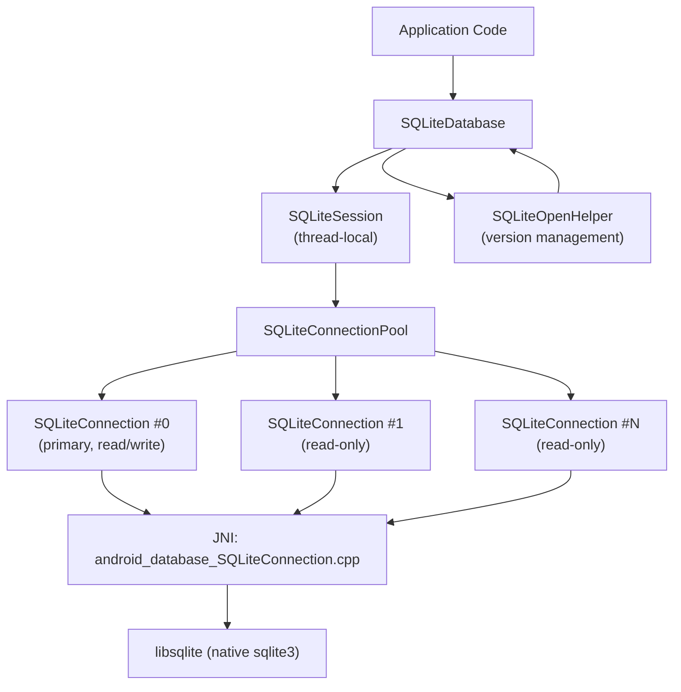
```mermaid
graph TD
    App["Application Code"] --> SDB["SQLiteDatabase"]
    SDB --> SS["SQLiteSession<br/>(thread-local)"]
    SS --> SCP["SQLiteConnectionPool"]
    SCP --> SC1["SQLiteConnection #0<br/>(primary, read/write)"]
    SCP --> SC2["SQLiteConnection #1<br/>(read-only)"]
    SCP --> SC3["SQLiteConnection #N<br/>(read-only)"]
    SC1 --> JNI["JNI: android_database_SQLiteConnection.cpp"]
    SC2 --> JNI
    SC3 --> JNI
    JNI --> Native["libsqlite (native sqlite3)"]
    SDB --> SOH["SQLiteOpenHelper<br/>(version management)"]
    SOH --> SDB
```

The layers serve distinct purposes:

| Layer | Class | Responsibility |
|-------|-------|----------------|
| User-facing API | `SQLiteDatabase` | Public methods: `query()`, `insert()`, `execSQL()` |
| Session management | `SQLiteSession` | Thread-local; acquires/returns connections |
| Connection pool | `SQLiteConnectionPool` | Manages pool of native connections |
| Connection | `SQLiteConnection` | Wraps a single native `sqlite3*` handle |
| Version helper | `SQLiteOpenHelper` | Database creation, upgrade, downgrade |
| Statement | `SQLiteStatement` / `SQLiteQuery` | Prepared statement wrappers |

### 34.11.2 SQLiteDatabase Internals

`SQLiteDatabase` is the primary entry point. Its most important state is
protected by a single `mLock` object:

```java
// SQLiteDatabase.java, line 137
private final Object mLock = new Object();

// Thread-local sessions
private final ThreadLocal<SQLiteSession> mThreadSession = ThreadLocal
        .withInitial(this::createSession);

// Connection pool (null when closed)
private SQLiteConnectionPool mConnectionPoolLocked;
```

The thread-local `SQLiteSession` ensures that each thread gets its own
database session without explicit synchronization at the caller level.

**Open flags** control the behavior of the database:

| Flag | Value | Effect |
|------|-------|--------|
| `OPEN_READWRITE` | `0x00000000` | Read-write access (default) |
| `OPEN_READONLY` | `0x00000001` | Read-only access |
| `CREATE_IF_NECESSARY` | `0x10000000` | Create DB file if missing |
| `ENABLE_WRITE_AHEAD_LOGGING` | `0x20000000` | Enable WAL at open time |
| `NO_LOCALIZED_COLLATORS` | `0x00000010` | Skip LOCALIZED collator |
| `ENABLE_LEGACY_COMPATIBILITY_WAL` | `0x80000000` | Legacy compat WAL mode |

**Conflict resolution** is specified per-operation:

| Constant | Value | Behavior on constraint violation |
|----------|-------|----------------------------------|
| `CONFLICT_ROLLBACK` | 1 | Rollback entire transaction |
| `CONFLICT_ABORT` | 2 | Abort command, preserve prior changes (default) |
| `CONFLICT_FAIL` | 3 | Fail command, preserve all changes so far |
| `CONFLICT_IGNORE` | 4 | Skip violating row, continue |
| `CONFLICT_REPLACE` | 5 | Delete conflicting rows, then insert/update |

### 34.11.3 Write-Ahead Logging (WAL)

WAL is the most important performance feature of SQLite on Android. Without
WAL, readers and writers are mutually exclusive -- a read blocks writes and
vice versa. With WAL enabled, multiple readers can execute concurrently
with a single writer.

```java
// SQLiteDatabase.java, line 337-353
/**
 * The WAL journaling mode uses a write-ahead log instead of a rollback
 * journal to implement transactions. The WAL journaling mode is persistent;
 * after being set it stays in effect across multiple database connections
 * and after closing and reopening the database.
 */
public static final String JOURNAL_MODE_WAL = "WAL";
```

Android supports six journal modes:

| Mode | Description | Use case |
|------|-------------|----------|
| `WAL` | Write-ahead log | Default for most apps (best concurrency) |
| `PERSIST` | Overwrite journal header | Low-level storage optimization |
| `TRUNCATE` | Truncate journal to zero | Faster than DELETE on some filesystems |
| `MEMORY` | In-RAM journal | Maximum speed, risk of corruption |
| `DELETE` | Delete journal after commit | Traditional mode |
| `OFF` | No journal | Maximum risk, maximum speed |

**Compatibility WAL** is a special Android mode that enables WAL with a
restricted configuration: maximum WAL file size of 512KB and auto-
checkpoint after each transaction. This provides WAL's concurrency benefits
while limiting the disk space overhead, making it safe as a default.

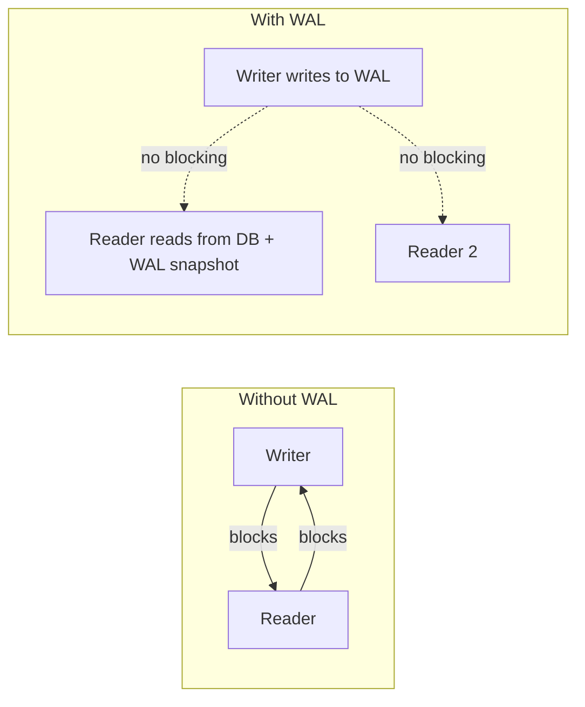
```mermaid
graph LR
    subgraph "Without WAL"
        W1["Writer"] -->|"blocks"| R1["Reader"]
        R1 -->|"blocks"| W1
    end

    subgraph "With WAL"
        W2["Writer writes to WAL"] -.->|"no blocking"| R2["Reader reads from DB + WAL snapshot"]
        W2 -.->|"no blocking"| R3["Reader 2"]
    end
```

### 34.11.4 Connection Pooling

`SQLiteConnectionPool` manages a pool of native connections. The pool has
one primary (read-write) connection and multiple secondary (read-only)
connections:

```java
// SQLiteConnectionPool.java, line 84-110
public final class SQLiteConnectionPool implements Closeable {
    private static final long CONNECTION_POOL_BUSY_MILLIS = 30 * 1000; // 30 seconds

    private int mMaxConnectionPoolSize;
    private SQLiteConnection mAvailablePrimaryConnection;
    private final ArrayList<SQLiteConnection> mAvailableNonPrimaryConnections;
    private final WeakHashMap<SQLiteConnection, AcquiredConnectionStatus> mAcquiredConnections;
}
```

Connection lifecycle:

```mermaid
sequenceDiagram
    participant T as Thread
    participant S as SQLiteSession
    participant P as SQLiteConnectionPool
    participant C as SQLiteConnection

    T->>S: query(sql)
    S->>P: acquireConnection(READ)
    alt Primary available & no WAL
        P->>S: return primary connection
    else WAL enabled
        P->>S: return non-primary (read-only) connection
    end
    S->>C: execute(sql)
    C-->>S: result
    S->>P: releaseConnection(connection)
```

The pool tracks acquired connections via `WeakReference`s. If a connection
is leaked (the `SQLiteSession` that acquired it is garbage collected), the
pool detects this through the weak reference and reclaims the connection
with a warning log.

Idle connections are managed by an `IdleConnectionHandler` that can close
connections after a configurable timeout, reducing memory pressure on
resource-constrained devices.

### 34.11.5 SQLiteOpenHelper

`SQLiteOpenHelper` provides the standard pattern for database version
management. It defers database creation/opening until first use:

```java
// SQLiteOpenHelper.java, line 55-60
public abstract class SQLiteOpenHelper implements AutoCloseable {
    private static final ConcurrentHashMap<String, Object> sDbLock =
            new ConcurrentHashMap<>();

    // Database is NOT opened in constructor -- only on first
    // getWritableDatabase() or getReadableDatabase()
}
```

**Lock per database file.** The `sDbLock` `ConcurrentHashMap` ensures that
only one thread can open/create/upgrade a given database file at a time.
All `SQLiteOpenHelper` instances for the same database file share the same
lock object:

```java
// SQLiteOpenHelper.java, line 180-186
if (mName == null) {
    lock = new Object();          // In-memory DB gets unique lock
} else {
    lock = sDbLock.computeIfAbsent(mName, (String k) -> new Object());
}
mLock = lock;
```

The upgrade lifecycle:

```mermaid
flowchart TD
    GD["getWritableDatabase()"] --> LOCK["Acquire per-file lock"]
    LOCK --> CHECK{"Database exists?"}
    CHECK -->|"No"| CREATE["onCreate(db)"]
    CHECK -->|"Yes"| VER{"version matches?"}
    VER -->|"Same"| OPEN["onOpen(db)"]
    VER -->|"Old < New"| UP["onUpgrade(db, old, new)"]
    VER -->|"Old > New"| DOWN["onDowngrade(db, old, new)"]
    VER -->|"Old < minimum"| DEL["Delete DB<br/>onBeforeDelete(db)<br/>onCreate(db)"]
    CREATE --> OPEN
    UP --> OPEN
    DOWN --> OPEN
    DEL --> OPEN
    OPEN --> UNLOCK["Release lock"]
```

### 34.11.6 Prepared Statement Cache

Each `SQLiteConnection` maintains an LRU cache of prepared statements. The
default cache size is 25 statements, configurable up to `MAX_SQL_CACHE_SIZE`
(100):

```java
// SQLiteDatabase.java, line 319
public static final int MAX_SQL_CACHE_SIZE = 100;
```

Each prepared statement consumes 1KB-6KB depending on SQL complexity. The
cache avoids the overhead of re-parsing and re-compiling frequently-used
SQL. When the schema changes (detected via a sequence number), cached
statements are invalidated.

### 34.11.7 Error Handling and Corruption Recovery

`SQLiteDatabase` provides a `DatabaseErrorHandler` callback for corruption
events. The default handler (`DefaultDatabaseErrorHandler`) deletes the
database file and all associated files (journal, WAL, shared-memory):

```
my-database.db       <-- main database file
my-database.db-wal   <-- WAL file
my-database.db-shm   <-- shared memory for WAL
my-database.db-journal  <-- rollback journal
```

The corruption event is also logged to `EventLog` with tag `EVENT_DB_CORRUPT`
(75004) for debugging.

---

## 34.12 SharedPreferences

`SharedPreferences` is Android's simplest persistence mechanism: a key-value
store backed by an XML file on disk. Despite its apparent simplicity, the
AOSP implementation (`SharedPreferencesImpl`) involves careful concurrency
control, atomic file writes, memory-generation tracking, and the
historically controversial `apply()` vs `commit()` semantics.

> **Source:**
> `frameworks/base/core/java/android/app/SharedPreferencesImpl.java`

### 34.12.1 Architecture

```mermaid
graph TD
    App["Application"] -->|"getSharedPreferences()"| CTX["ContextImpl"]
    CTX -->|"creates/caches"| SPI["SharedPreferencesImpl"]
    SPI -->|"reads XML on init"| XML["shared_prefs/name.xml"]
    SPI -->|"writes via EditorImpl"| XML
    SPI -->|"apply() queue"| QW["QueuedWork<br/>(background disk writes)"]
    SPI -->|"commit() sync"| Disk["Direct file I/O"]
```

### 34.12.2 In-Memory State

All preference data is loaded into an in-memory `HashMap` on first access:

```java
// SharedPreferencesImpl.java, line 64-125
final class SharedPreferencesImpl implements SharedPreferences {
    private final File mFile;
    private final File mBackupFile;
    private final Object mLock = new Object();
    private final Object mWritingToDiskLock = new Object();

    @GuardedBy("mLock")
    private Map<String, Object> mMap;

    @GuardedBy("mLock")
    private int mDiskWritesInFlight = 0;

    @GuardedBy("mLock")
    private boolean mLoaded = false;
}
```

Loading from disk happens asynchronously on a dedicated `ThreadPoolExecutor`:

```java
// SharedPreferencesImpl.java, line 127-129
private static final ThreadPoolExecutor sLoadExecutor = new ThreadPoolExecutor(
        0, 1, 10L, TimeUnit.SECONDS, new LinkedBlockingQueue<Runnable>(),
        new SharedPreferencesThreadFactory());
```

All `get*()` methods call `awaitLoadedLocked()` which blocks the calling
thread until loading completes:

```java
// SharedPreferencesImpl.java, line 278-294
private void awaitLoadedLocked() {
    while (!mLoaded) {
        try {
            mLock.wait();    // blocks until loadFromDisk() calls notifyAll()
        } catch (InterruptedException unused) { }
    }
    if (mThrowable != null) {
        throw new IllegalStateException(mThrowable);
    }
}
```

### 34.12.3 The EditorImpl: commit() vs apply()

The `EditorImpl` accumulates changes in a separate `mModified` HashMap:

```java
// SharedPreferencesImpl.java, line 413-420
public final class EditorImpl implements Editor {
    private final Object mEditorLock = new Object();
    @GuardedBy("mEditorLock")
    private final Map<String, Object> mModified = new HashMap<>();
    @GuardedBy("mEditorLock")
    private boolean mClear = false;
}
```

**Lock ordering** is critical and documented in the source:

> Acquire `SharedPreferencesImpl.mLock` before `EditorImpl.mEditorLock`.
> Acquire `mWritingToDiskLock` before `EditorImpl.mEditorLock`.

Both `commit()` and `apply()` call `commitToMemory()` first, which merges
the editor's changes into the in-memory `mMap` while holding both locks:

```mermaid
sequenceDiagram
    participant App as Application
    participant Ed as EditorImpl
    participant SP as SharedPreferencesImpl
    participant QW as QueuedWork
    participant Disk as File System

    App->>Ed: putString("key", "val")
    App->>Ed: apply()
    Ed->>SP: commitToMemory()
    Note over SP: Merge mModified into mMap<br/>Increment mCurrentMemoryStateGeneration
    Ed->>SP: enqueueDiskWrite(mcr, postRunnable)
    SP->>QW: queue(writeToDiskRunnable)
    Note over App: apply() returns immediately
    QW->>Disk: writeToFile(mcr)
    Disk-->>QW: complete
```

**`commit()`** writes synchronously on the calling thread (blocking):

```java
// SharedPreferencesImpl.java, line 602-627
public boolean commit() {
    MemoryCommitResult mcr = commitToMemory();
    SharedPreferencesImpl.this.enqueueDiskWrite(
        mcr, null /* sync write on this thread okay */);
    mcr.writtenToDiskLatch.await();  // blocks until disk write completes
    return mcr.writeToDiskResult;
}
```

**`apply()`** writes asynchronously via `QueuedWork`:

```java
// SharedPreferencesImpl.java, line 483-519
public void apply() {
    final MemoryCommitResult mcr = commitToMemory();
    QueuedWork.addFinisher(awaitCommit);    // register for Activity lifecycle
    SharedPreferencesImpl.this.enqueueDiskWrite(mcr, postWriteRunnable);
    notifyListeners(mcr);  // notify before disk write!
}
```

The crucial difference: `apply()` notifies listeners immediately (since
in-memory state is already updated) and queues the disk write. However,
`QueuedWork` finishers are drained during `Activity.onStop()` and
`Service.onStartCommand()`, which means pending `apply()` writes can
**block the main thread during lifecycle transitions** -- a notorious
source of ANRs.

### 34.12.4 Atomic File Write Protocol

The write-to-disk process implements an atomic rename protocol:

```mermaid
flowchart TD
    A["Start writeToFile()"] --> B{"Backup file exists?"}
    B -->|"No"| C["Rename prefs.xml -> prefs.xml.bak"]
    B -->|"Yes"| D["Delete prefs.xml (backup already safe)"]
    C --> E["Write new content to prefs.xml"]
    D --> E
    E --> F["fsync(fd)"]
    F --> G["Delete prefs.xml.bak"]
    G --> H["Record new mStatTimestamp, mStatSize"]

    style F fill:#ff9,stroke:#333
```

If the process crashes between steps C/D and G, recovery is simple:
on the next `loadFromDisk()` call, if `mBackupFile.exists()`, the backup
is renamed back to the original:

```java
// SharedPreferencesImpl.java, line 153-161
private void loadFromDisk() {
    synchronized (mLock) {
        if (mBackupFile.exists()) {
            mFile.delete();
            mBackupFile.renameTo(mFile);
        }
    }
    // ... proceed to read mFile
}
```

### 34.12.5 Generation-Based Write Coalescing

The implementation uses a generation counter to avoid unnecessary disk
writes:

```java
// SharedPreferencesImpl.java, line 114-120
@GuardedBy("this")
private long mCurrentMemoryStateGeneration;

@GuardedBy("mWritingToDiskLock")
private long mDiskStateGeneration;
```

When `apply()` is called multiple times rapidly, each call increments
`mCurrentMemoryStateGeneration`. In `writeToFile()`, if the memory
generation being written is not the latest, the write is skipped:

```java
// SharedPreferencesImpl.java, line 760-771
if (mDiskStateGeneration < mcr.memoryStateGeneration) {
    if (isFromSyncCommit) {
        needsWrite = true;
    } else {
        synchronized (mLock) {
            if (mCurrentMemoryStateGeneration == mcr.memoryStateGeneration) {
                needsWrite = true; // Only write the latest state
            }
        }
    }
}
```

This means three rapid `apply()` calls result in at most one disk write
containing all three changes -- a significant I/O optimization.

### 34.12.6 Cross-Process Limitations

SharedPreferences was never designed for cross-process access.
`MODE_MULTI_PROCESS` (deprecated in API 23) attempted to support it by
checking file timestamps before reads:

```java
// SharedPreferencesImpl.java, line 237-261
private boolean hasFileChangedUnexpectedly() {
    synchronized (mLock) {
        if (mDiskWritesInFlight > 0) {
            return false; // We caused it
        }
    }
    final StructStat stat = Os.stat(mFile.getPath());
    synchronized (mLock) {
        return !stat.st_mtim.equals(mStatTimestamp) || mStatSize != stat.st_size;
    }
}
```

This approach is inherently racy -- two processes can write simultaneously,
and only one write survives. For cross-process key-value storage, Android
recommends `ContentProvider`-backed solutions or Jetpack `DataStore`.

### 34.12.7 Migration to DataStore

Jetpack DataStore is the recommended successor to SharedPreferences. The
key improvements are:

| Feature | SharedPreferences | DataStore (Preferences) |
|---------|-------------------|------------------------|
| Thread safety | Partially safe (reads block on load) | Fully async with coroutines |
| `apply()` ANR risk | Yes (QueuedWork drain in onStop) | No (fully non-blocking) |
| Cross-process | Broken (`MODE_MULTI_PROCESS`) | Not supported (use Proto DataStore) |
| Type safety | Runtime casts | Compile-time (Proto DataStore) |
| Error handling | Silent corruption | Flow-based error propagation |
| Migration | N/A | `SharedPreferencesMigration` helper |

Despite DataStore being the recommended path, SharedPreferences remains
heavily used in AOSP itself -- `Settings.Secure`, `Settings.Global`, and
hundreds of system services store configuration in SharedPreferences files
under `/data/data/<package>/shared_prefs/`.
