# 第 35 章：网络与连接

Android 的网络栈横跨 Java framework、`system_server`、Mainline 模块、原生守护进程以及 Linux 内核网络子系统。一个普通的 `Socket` 写操作，背后会穿过 `ConnectivityService`、`netd`、`DnsResolver`、Wi-Fi 或蜂窝驱动、eBPF 流量控制、路由策略以及权限隔离机制。本章沿着“应用请求网络，到数据包真正出网”的路径，系统梳理 Android 的连接管理、Wi-Fi、DNS、VPN、共享网络、网络安全配置、NetworkStack，以及近年的 VCN 与 Thread 网络支持。

---

## 35.1 网络架构总览

### 35.1.1 分层视图

Android 网络架构在形式上仍然符合经典操作系统分层，但为了可更新性与安全性，又额外引入了 Mainline 模块、每 UID 流量策略、按网络 ID 路由以及 Binder 化的网络提供者模型。

应用层直接看到的通常是 `ConnectivityManager`、`WifiManager`、`VpnService`、`TelephonyManager` 等 API；这些 API 通过 Binder 调到 `system_server` 中的 `ConnectivityService`、`WifiServiceImpl` 等服务。框架层进一步与 `netd`、`DnsResolver`、`wpa_supplicant`、OpenThread 守护进程等原生组件交互，最终通过 netlink、nftables/iptables、traffic control、eBPF 和驱动把策略落到内核。

下图展示 Android 网络栈的主要分层关系。

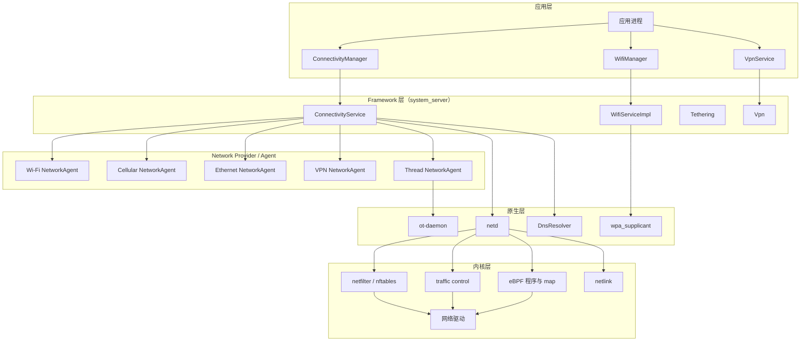

### 35.1.2 关键组件

| 组件 | 类型 | 代码位置 | 职责 |
|---|---|---|---|
| `ConnectivityService` | Java 系统服务 | `packages/modules/Connectivity/service/` | 中央网络管理、请求匹配、默认网络选择 |
| `NetworkAgent` | Framework 类 | `packages/modules/Connectivity/framework/` | 承载方与 `ConnectivityService` 的双向桥接 |
| `NetworkFactory` | Framework 类 | `packages/modules/Connectivity/staticlibs/` | 接收请求并创建网络代理 |
| `netd` | 原生守护进程 | `system/netd/` | 路由、iptables/nft、fwmark、带宽/防火墙控制 |
| `DnsResolver` | 原生 Mainline 模块 | `packages/modules/DnsResolver/` | DNS、DoT、DoH、Dns64/NAT64 |
| Wi-Fi 模块 | Mainline 模块 | `packages/modules/Wifi/` | Wi-Fi 框架、扫描、关联、热点、P2P |
| `NetworkStack` | Mainline 模块 | `packages/modules/NetworkStack/` | DHCP、IP 配置、网络验证、数据停滞检测 |
| Tethering | Mainline 子模块 | `packages/modules/Connectivity/Tethering/` | USB/Wi-Fi/蓝牙共享网络 |
| VCN | Mainline 子模块 | `packages/modules/Connectivity/service-t/` 等 | 面向运营商策略的虚拟承载网络 |
| Thread 模块 | Mainline 子模块 | `packages/modules/Connectivity/thread/` | Thread 本地网、边界路由、Matter 相关支持 |

### 35.1.3 Mainline 化

Android 10 之后，网络相关代码大规模迁入可独立升级的 Mainline 模块。对网络子系统而言，这个变化非常关键：

1. 安全补丁可以不依赖完整 OTA。
2. `ConnectivityService`、Tethering、Wi-Fi、DNS、NetworkStack 能按模块回滚。
3. 模块边界更清楚，系统服务与模块权限分工更明确。
4. 运营商、OEM 和 Google 可以在较稳定的接口上协作。

典型模块包括：

1. `packages/modules/Connectivity/`
2. `packages/modules/NetworkStack/`
3. `packages/modules/Wifi/`
4. `packages/modules/DnsResolver/`

这些模块通常以 APEX 形式发布。

### 35.1.4 `netId`、`fwmark` 与按网络路由

Android 不只是“按接口发包”，而是以网络对象为核心管理路由。每个活动网络都会分配一个唯一 `netId`，`netd` 中 `system/netd/server/NetworkController.cpp` 明确给出范围：

```cpp
const unsigned MIN_NET_ID = 100;
const unsigned MAX_NET_ID = 65535;
```

应用创建的 socket 会被打上 `fwmark`。这个 32 位标记编码了：

- `netId`
- 权限位
- 是否显式绑定网络
- 是否允许绕过 VPN

这样，内核在查路由表时可以根据 socket 的标记决定走哪个网络、是否允许访问、是否需要命中特定 VPN 或企业策略。

### 35.1.5 从应用到链路的数据路径

下图展示一次普通发包从应用走到网卡的大致路径。

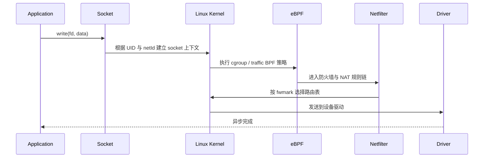

在 Android 上，数据路径不仅仅是“查一次路由表”，还会被 UID 级防火墙、Data Saver、后台限制、VPN 路由、共享网络 NAT、BPF 计量、QoS 策略等多层机制同时影响。

---

## 35.2 `ConnectivityService`

### 35.2.1 中枢角色

`ConnectivityService` 位于 `packages/modules/Connectivity/service/src/com/android/server/ConnectivityService.java`，是 Android 网络体系中最核心的服务。它负责：

- 注册与跟踪所有活动网络
- 匹配应用的 `NetworkRequest`
- 选择默认网络与最佳网络
- 下发 DNS、路由和代理配置
- 处理 `NetworkCallback`
- 协调 `NetworkMonitor`、`netd`、VPN 与本地网络

原始实现中可以直接看到几个关键常量：

```java
private static final int DEFAULT_LINGER_DELAY_MS = 30_000;
private static final int DEFAULT_NASCENT_DELAY_MS = 5_000;
static final int MAX_NETWORK_REQUESTS_PER_UID = 100;
```

这三个值已经能说明它的核心设计：

1. 网络切换不是立即拆旧网，而是存在 linger 窗口。
2. 新网络先经历短暂“nascent”阶段，避免抖动。
3. 每 UID 的请求数有硬上限，防止 API 被滥用。

### 35.2.2 单 Handler 线程模型

`ConnectivityService` 的大量逻辑都被收敛到一个内部 Handler 线程。这样做不是“简化实现”这么简单，而是为了让网络请求、代理更新、验证回调、默认网络切换在一个串行事件流中完成，尽量避免多线程锁竞争导致的状态错乱。

下图展示它的事件汇聚方式。

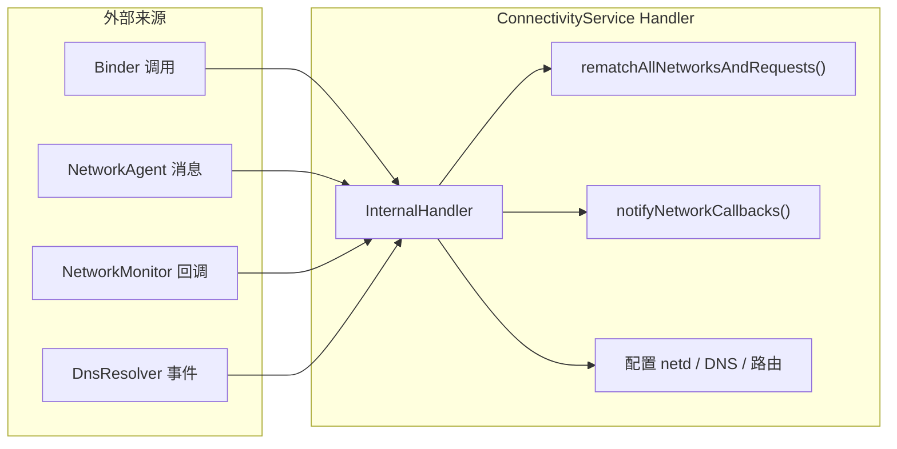

### 35.2.3 `NetworkAgent`

每一个活跃网络都会由一个 `NetworkAgent` 表示。Wi-Fi、蜂窝、以太网、VPN、Thread 都遵循这个统一模型。`NetworkAgent` 会向 `ConnectivityService` 汇报：

- `NetworkCapabilities`
- `LinkProperties`
- 分数与策略
- keepalive、QoS、linger、disconnect 等事件

它的价值在于把“承载方具体实现”与“中心调度逻辑”分离：Wi-Fi 不必理解所有请求匹配细节，只要告诉 `ConnectivityService` 自己当前能提供什么能力、分数有多高、链路属性如何。

### 35.2.4 `NetworkFactory`

`NetworkFactory` 是请求侧入口。它在收到满足条件的请求后，可以决定：

1. 立即创建新网络
2. 复用已有网络
3. 暂时忽略请求
4. 在请求结束时释放网络

蜂窝网络就是典型例子。只有在存在合适的 `NetworkRequest` 时，蜂窝工厂才会真的尝试建立 PDP context 或数据连接。

### 35.2.5 `NetworkRequest` 与 `NetworkCapabilities`

`NetworkRequest` 本质上是“我要一个具备若干能力的网络”。核心匹配条件来自 `NetworkCapabilities`，例如：

- 传输类型：`TRANSPORT_WIFI`、`TRANSPORT_CELLULAR`、`TRANSPORT_VPN`
- 能力位：`NET_CAPABILITY_INTERNET`、`NET_CAPABILITY_VALIDATED`
- 本地网络：`NET_CAPABILITY_LOCAL_NETWORK`
- 是否计费、是否受限、是否企业网络等

请求匹配不是简单布尔判断，还要结合：

- UID 可见性
- OEM / 运营商策略
- 是否指定了 `NetworkSpecifier`
- 是否需要本地网而不是互联网

### 35.2.6 网络评分与默认网络选择

默认网络的选择依赖评分系统。分数来自承载方上报和框架策略组合，例如：

- Wi-Fi 是否已验证
- 蜂窝是否计费
- 信号、吞吐、漫游状态
- 是否为 VPN、企业网或受限网络

当更好的网络出现时，旧网络不会立刻拆除，而是进入 linger 状态。这样可以减少连接迁移对上层应用的冲击。

下图展示请求匹配和默认网络重选的核心流程。

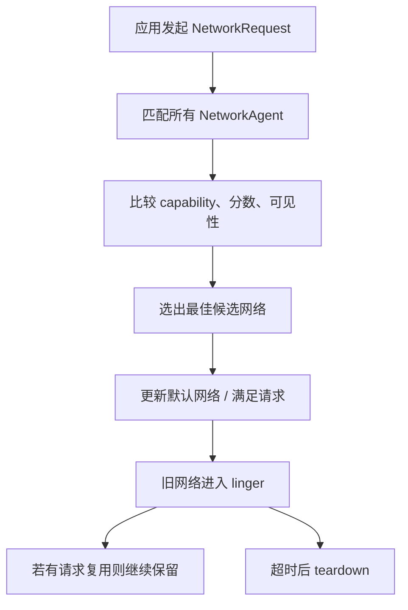

### 35.2.7 `LinkProperties`

`LinkProperties` 代表网络的链路层细节，包括：

- 接口名
- IP 地址
- 路由
- DNS 服务器
- MTU
- 代理
- stacked link，例如 VPN over Wi-Fi 或 CLAT

一旦 `LinkProperties` 变化，`ConnectivityService` 会：

1. 更新 `netd`
2. 可能触发 DNS 或路由切换
3. 通知监听该网络的应用

### 35.2.8 生命周期事件与回调

应用通过 `registerNetworkCallback()`、`requestNetwork()`、`registerDefaultNetworkCallback()` 订阅网络变化。常见回调包括：

- `onAvailable()`
- `onCapabilitiesChanged()`
- `onLinkPropertiesChanged()`
- `onLost()`
- `onBlockedStatusChanged()`

对系统而言，网络生命周期至少包含：注册、验证、成为活动网络、linger、销毁。

### 35.2.9 基于 BPF 的流量控制

现代 Android 不再主要依靠传统 iptables 规则做所有流量管理，而是大量使用 eBPF map 和程序来承载：

- UID 流量计量
- Data Saver / 后台限制
- 共享网络 offload
- 防火墙辅助匹配

这也是 `TrafficController`、`BandwidthController` 和 `ConnectivityService` 之间协同的重要基础。

### 35.2.10 冻结应用处理

被冻结或被系统限制的进程，其网络访问可能被重定向、阻断或延迟通知。网络栈需要显式考虑“应用看似还活着，但 Binder/回调/网络访问受控”的场景，否则容易出现状态不同步。

---

## 35.3 Wi-Fi Framework

### 35.3.1 整体结构

Wi-Fi 模块位于 `packages/modules/Wifi/`，是一个高度状态机化、分层明确的子系统。它既要处理扫描、关联、漫游、热点、P2P、多链路，还要与 HAL、驱动、`wpa_supplicant` 保持清晰分工。

下图展示 Wi-Fi 框架的核心组成。

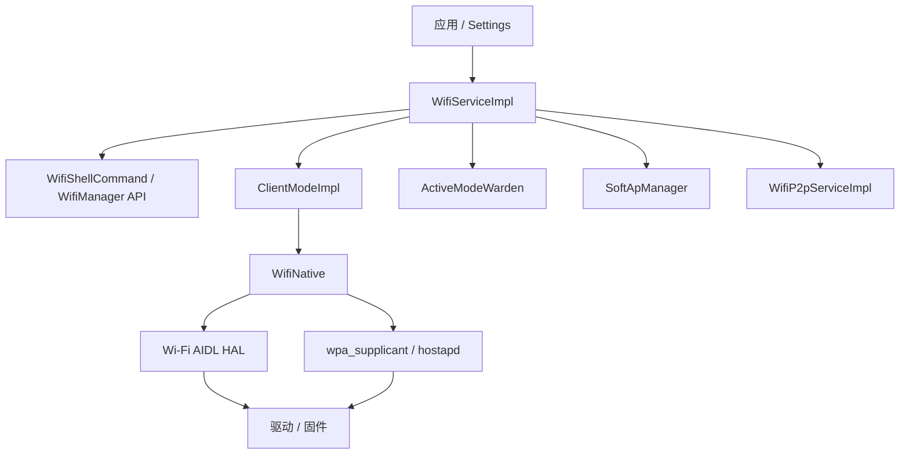

### 35.3.2 `WifiServiceImpl`

`WifiServiceImpl` 是大多数 Wi-Fi API 的 Binder 入口，负责权限检查、调用方 UID 识别、参数校验以及把动作转发到内部状态机或管理器对象。

典型请求包括：

- 打开/关闭 Wi-Fi
- 触发扫描
- 获取当前连接信息
- 管理建议网络、保存网络、热点配置

### 35.3.3 `ClientModeImpl`

`ClientModeImpl` 是 Wi-Fi 客户端模式的核心状态机，负责：

- 扫描
- 关联 / 断连
- DHCP / IP 层通知对接
- 漫游与重连
- 向 `ConnectivityService` 报告 `NetworkAgent` 状态

它代表 Android Wi-Fi 中非常典型的设计风格：复杂异步流程由状态机统一编排，避免由多个松散线程直接操纵 supplicant 和驱动。

### 35.3.4 `WifiNative`

`WifiNative` 负责把 framework 动作桥接到 HAL 和底层控制接口。它不直接做高层策略，而是封装诸如：

- 启停接口
- 扫描
- 信道与国家码
- 统计信息
- NAN、P2P、MLO 等能力调用

### 35.3.5 `wpa_supplicant` 集成

Wi-Fi 连接认证、关联以及大量控制面仍由 `wpa_supplicant` 承担。Android framework 一方面通过 HAL 获取能力，另一方面仍依赖 supplicant 完成：

- WPA2/WPA3 认证
- 802.1X / EAP
- RSN 信息交换
- BSSID 选择与漫游配合

### 35.3.6 网络选择

Wi-Fi 网络选择不仅是“信号最强优先”。实际综合因素包括：

- 是否曾成功联网
- 是否具备互联网能力
- 是否为用户主动选择
- 安全类型
- 当前拥塞情况
- 历史吞吐与 RSSI

这也是 Wi-Fi 网络会向 `ConnectivityService` 提供评分和能力信息的原因。

### 35.3.7 SoftAP 与移动热点

SoftAP 模式由 `SoftApManager` 等组件负责，Wi-Fi 模块负责 AP 建立、信道、国家码、客户端跟踪，而真正的上游转发、DHCP、NAT 则与 Tethering 模块共同完成。

### 35.3.8 Wi-Fi Direct（P2P）

P2P 允许设备之间形成点对点组网，不依赖传统 AP。它主要用于本地发现和设备互联，与普通基础设施 Wi-Fi 是两条不同控制路径。

### 35.3.9 MLO 与 Wi-Fi 7

新一代 Wi-Fi 模块开始引入 Multi-Link Operation 能力，允许一个逻辑连接跨多个链路并行工作。对 Android 网络框架而言，这意味着：

- 链路统计更复杂
- 默认网络评分需要感知多链路质量
- 漫游与切换不再完全等价于单接口切换

---

## 35.4 `netd`（Network Daemon）

### 35.4.1 角色定位

`netd` 位于 `system/netd/`，是 Android 原生网络控制平面的中心守护进程。它负责把 framework 层的高层意图转换为内核可执行的动作，例如：

- 路由与规则
- 接口加入网络
- 防火墙
- 数据计量
- socket fwmark
- 共享网络 NAT
- IPsec / XFRM

### 35.4.2 Binder 接口

`NetdNativeService` 暴露给 framework 的 Binder 接口通常定义在 `system/netd/server/NetdNativeService.*`。`ConnectivityService`、Tethering、VPN、`NetworkManagementService` 等都通过它调用原生能力。

常见接口大致包括：

- 网络创建/销毁
- 接口加入/移除网络
- 配置 DNS
- 配置 UID 权限
- 设置防火墙或数据节省策略

### 35.4.3 `NetworkController`

`NetworkController` 负责维护 netId 与底层网络结构之间的对应关系，包括：

- 创建物理/虚拟网络对象
- 管理接口成员关系
- 维护 per-network 路由和权限

这也是 `MIN_NET_ID = 100` 和 `MAX_NET_ID = 65535` 所在的位置。

### 35.4.4 `iptables` / `nftables` 链结构

Android 在用户态上仍保留了大量“链式策略”心智模型，即使底层实现逐步转向更新机制。典型链路包括带宽控制、防火墙、NAT、共享网络、空闲策略等。

下图展示 `netd` 常见的规则分层。

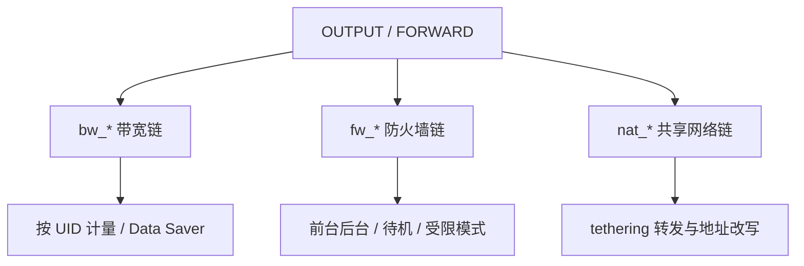

### 35.4.5 `BandwidthController`

`BandwidthController` 管理：

- Data Saver
- per-UID 黑白名单
- 网络使用统计
- 配额控制

在新架构下，它往往与 BPF map 协同，而不只是机械地下发 iptables 规则。

### 35.4.6 `FirewallController`

`FirewallController` 负责“能不能通”，例如：

- 受限模式下的 UID 封锁
- 后台网络限制
- 设备空闲态访问控制
- 企业或系统策略

### 35.4.7 `RouteController`

`RouteController` 操作路由表、策略路由和规则链，是 `LinkProperties` 与内核转发表之间的关键桥梁。

### 35.4.8 `XfrmController`

`XfrmController` 负责内核 IPsec/XFRM 状态和策略配置，支撑平台 VPN 与运营商 IPsec 场景。

### 35.4.9 `FwmarkServer`

`FwmarkServer` 处理 socket 标记请求，确保 socket 后续在内核中能按 Android 的 per-network 策略正确选路。

---

## 35.5 DNS 解析器

### 35.5.1 架构

DNS 解析模块位于 `packages/modules/DnsResolver/`。在 Android 上，DNS 不是一个“全局单例配置”，而是和 `netId` 绑定的多网络解析体系：

- 每个网络都可以有自己的 DNS 服务器
- 每个网络有独立缓存
- Private DNS 与验证状态也是按网络管理
- Dns64/NAT64 可以只对某些网络生效

### 35.5.2 初始化

系统启动后，framework 会通过 `netd` / `DnsResolver` Binder 接口向解析器下发网络的 DNS 配置。只有当某个网络真正具备 DNS 参数时，它才能成为完整的互联网承载。

### 35.5.3 查询流程

下图展示 Android 上一次 DNS 查询的简化流程。

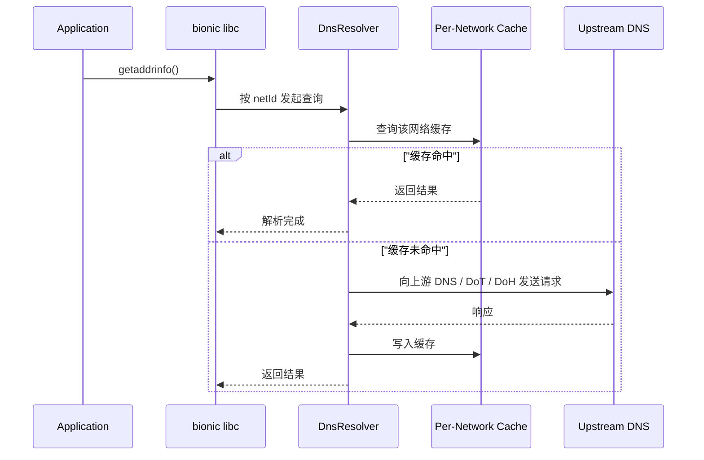

### 35.5.4 DNS-over-TLS（DoT）

DoT 允许系统与指定 DNS 服务器建立加密 TLS 通道。Android 的 Private DNS 模式底层通常就是基于 DoT：

- 自动模式：尝试对支持的服务器做加密解析
- 严格模式：必须连到用户指定主机名并通过验证

### 35.5.5 DNS-over-HTTPS（DoH）

Android 网络模块也逐步具备 DoH 支持能力。与 DoT 相比，DoH 更接近普通 HTTPS 流量，对某些网络环境更友好，但部署和策略也更复杂。

### 35.5.6 Private DNS

Private DNS 的关键不在于“加密”本身，而在于验证状态与用户体验：

- 验证成功后才能标记该网络 Private DNS 可用
- 失败时系统可能回退或提示用户
- `NetworkMonitor` 与 DNS 配置更新会联动

### 35.5.7 Dns64 与 NAT64

在 IPv6-only 网络中，Android 会通过 Dns64 和 CLAT 支持 IPv4-only 应用访问 IPv4 互联网：

- Dns64 负责合成 AAAA
- NAT64 负责在网络侧完成地址转换
- CLAT 在本地补齐 IPv4 socket 兼容路径

### 35.5.8 每网络 DNS 缓存

不同网络之间不能共享解析结果，否则会引入严重的正确性问题。例如公司内网域名绝不能因为切到公网后仍被旧缓存污染。

### 35.5.9 查询日志

DNS 解析器还承担统计与调试功能，为系统诊断以下问题提供基础：

- 某网络是否解析失败
- 是否发生超时或验证失败
- Private DNS 是否工作
- 某网络是否出现数据停滞

---

## 35.6 VPN Framework

### 35.6.1 架构总览

Android VPN 框架同时覆盖应用自建 VPN 与平台/运营商 VPN。关键角色包括：

- `VpnService`
- `com.android.server.connectivity.Vpn`
- 内核 `tun`
- `NetworkAgent`
- `netd` / `XfrmController`

### 35.6.2 `Vpn` 类

`Vpn` 类位于 `packages/modules/Connectivity/service/src/com/android/server/connectivity/Vpn.java`，负责：

- 建立与销毁 VPN
- 配置 TUN、地址、路由、DNS
- 维护底层网络依赖
- 处理 Always-on / Lockdown

### 35.6.3 VPN 类型

Android 中常见 VPN 形态有：

1. 应用实现的用户态 VPN（`VpnService`）
2. 平台 IPsec / IKEv2 VPN
3. 按应用 VPN
4. Always-on VPN
5. 运营商或企业集成 VPN

### 35.6.4 按应用 VPN

Per-app VPN 允许只有特定 UID 走 VPN。实现关键点不是“给应用打个标签”这么简单，而是：

- 路由策略按 UID 匹配
- socket 权限与 netId 绑定
- `ConnectivityService` 必须正确计算 UID 可见网络

### 35.6.5 Always-on VPN

Always-on VPN 保证设备联网尽量都经由 VPN；在 lockdown 模式下，非 VPN 流量甚至会被直接阻断。

### 35.6.6 VPN `NetworkAgent`

VPN 自身也是网络，因此它会注册为一个 `NetworkAgent`。这意味着它会参与：

- 能力位上报
- 默认网络竞争
- callback 通知
- DNS 与路由更新

### 35.6.7 IKEv2 数据停滞恢复

平台 IKEv2 VPN 还要处理底层网络波动、NAT keepalive、上游切换和数据停滞恢复，否则移动场景下极易出现“表面在线、实际不通”。

---

## 35.7 共享网络（Tethering）

### 35.7.1 架构总览

共享网络模块位于 `packages/modules/Connectivity/Tethering/`。它把一个上游互联网连接转发给 USB、Wi-Fi 热点、蓝牙 PAN 等下游接口。

下图展示 Tethering 的核心结构。

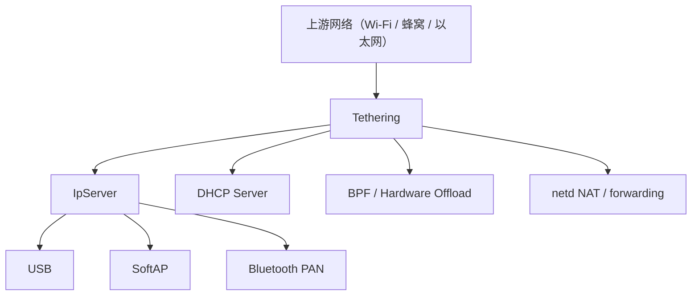

### 35.7.2 `Tethering` 类

`Tethering` 是框架侧总控，负责：

- 启停共享网络
- 追踪上游网络
- 管理每个下游接口的 `IpServer`
- 配置 NAT、转发、DHCP 和 offload

### 35.7.3 共享网络类型

常见下游类型包括：

- USB 共享
- Wi-Fi 热点
- 蓝牙共享

不同下游介质复用同一个上游选择框架，但在地址配置与驱动管理上差异很大。

### 35.7.4 `IpServer`

`IpServer` 管理单个下游接口：

- 地址与前缀
- 下游状态机
- 邻居通告 / 路由广告
- 与 DHCP 服务器协同

### 35.7.5 BPF Offload

共享网络的高频转发如果全部由 CPU 处理，功耗和吞吐都不理想。因此 Android 会尽可能把 NAT/统计/转发部分下沉到 BPF 或硬件 offload。

### 35.7.6 IPv6 共享

IPv6 tethering 比 IPv4 更复杂，因为它涉及：

- 前缀委派
- RA
- 上游前缀变化传播
- 可能的本地与公网双前缀协作

### 35.7.7 DHCP 服务器

下游 IPv4 共享常由内置 DHCP 服务器分配地址、网关与 DNS。

### 35.7.8 上游监控

上游网络变化时，Tethering 需要同步：

- NAT 规则
- 默认路由
- DNS 转发
- offload 配置

### 35.7.9 NAT 配置

真正的地址转换和转发规则通常由 `netd` 负责写入内核，Tethering 负责决定何时启停以及上下游是谁。

---

## 35.8 网络安全配置（Network Security Config）

### 35.8.1 概览

Network Security Config 允许应用通过 XML 声明：

- 信任哪些 CA
- 是否允许明文流量
- 是否启用证书固定
- 是否使用证书透明度要求

它主要位于 framework 与 Conscrypt 之间，影响应用的 TLS 验证行为。

### 35.8.2 XML 配置格式

典型配置包含：

- `base-config`
- `domain-config`
- `trust-anchors`
- `pin-set`
- `debug-overrides`

示例：

```xml
<network-security-config>
    <base-config cleartextTrafficPermitted="false">
        <trust-anchors>
            <certificates src="system" />
        </trust-anchors>
    </base-config>
    <domain-config>
        <domain includeSubdomains="true">example.com</domain>
        <pin-set expiration="2027-01-01">
            <pin digest="SHA-256">BASE64PIN==</pin>
        </pin-set>
    </domain-config>
</network-security-config>
```

### 35.8.3 核心类与解析

关键实现分布在 `frameworks/base/core/java/android/security/net/config/`。解析过程会把 XML 转成运行时配置对象，再在 TLS 校验路径中生效。

### 35.8.4 关键元素

常见策略含义如下：

- `cleartextTrafficPermitted`: 是否允许 HTTP 等明文流量
- `trust-anchors`: 信任源
- `pin-set`: 公钥固定
- `debug-overrides`: 调试构建额外信任

### 35.8.5 证书固定流程

证书固定会把服务端证书链中的公钥摘要与应用声明值比较。它能增强特定域名的抗中间人能力，但也提高了证书轮换复杂度。

### 35.8.6 证书透明度

新版本 Android 逐步引入证书透明度相关支持，使部分 HTTPS 校验不只看证书链，还会看是否满足 CT 策略。

### 35.8.7 明文流量限制

从较新的 target SDK 开始，明文流量默认越来越受限。这里的重点是“target SDK 决定默认行为”，而不是设备 Android 版本单独决定一切。

### 35.8.8 按 target SDK 的默认差异

应用如果升级 target SDK，可能在未改业务代码的情况下，因为网络安全默认值变化而出现：

- HTTP 请求失败
- 自签名证书失败
- 域名配置不再按旧逻辑信任

---

## 35.9 `NetworkStack` 模块

### 35.9.1 职责边界

`NetworkStack` 位于 `packages/modules/NetworkStack/`，主要负责“一个网络连上之后，如何完成 IP 层准备和可用性验证”，典型能力包括：

- DHCP client/server
- `IpClient`
- `NetworkMonitor`
- Captive Portal 探测
- Data Stall 检测
- `IpMemoryStore`

### 35.9.2 `NetworkMonitor`

`NetworkMonitor` 负责判断一个网络是否真的可用，而不只是“链路已连接”。它会执行多种探测：

- HTTP/HTTPS 探测
- Captive Portal 检查
- Private DNS 验证
- 数据停滞分析

### 35.9.3 验证探针

探针并不是只打一条 URL。实际会结合多 URL、HTTP/HTTPS 状态码、重定向结果和用户地区策略，以尽量降低误判。

### 35.9.4 Captive Portal 检测

门户网络检测直接影响用户体验。系统需要区分：

1. 已联网且可直接上网
2. 有网络但需网页登录
3. 网络不可用

### 35.9.5 Data Stall 检测

数据停滞指“网络表面连着，但实际数据发不出去”。系统会综合 DNS 失败、验证失败、链路层统计等因素做判断，再驱动重验证、重选网络或提示上层。

### 35.9.6 `IpClient`

`IpClient` 负责 IP 配置阶段：

- DHCP
- 静态地址
- RA
- IPv6 地址与路由
- 邻居监控

### 35.9.7 `IpMemoryStore`

`IpMemoryStore` 用于持久化部分网络相关记忆数据，例如 DHCP 信息或网络历史，用于提升重连体验与性能。

### 35.9.8 模块隔离

`NetworkStack` 作为独立模块运行，意味着：

- 权限必须通过模块授权
- 与系统服务间依赖更显式
- 更新与回滚更安全

---

## 35.10 VCN（Virtual Carrier Network）

### 35.10.1 目标与动机

VCN 不是普通 VPN 的简单重命名，而是面向运营商和企业场景的一层“承载抽象”。它允许系统在多个底层网络之上，为特定订阅或策略构建统一、可切换、可恢复的虚拟网络。

它的设计目标通常包括：

- 跨 Wi-Fi / 蜂窝 的统一承载
- 与运营商策略深度集成
- 更强的数据停滞恢复与安全模式
- 对上层表现为一个连续网络

### 35.10.2 架构

下图展示 VCN 的基本结构。

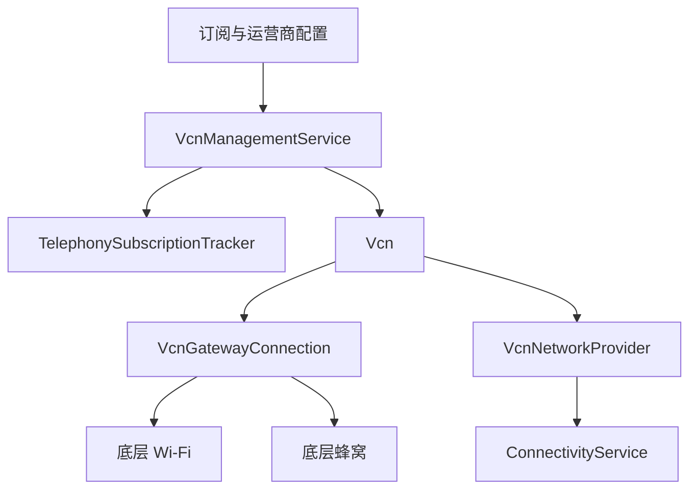

### 35.10.3 `VcnManagementService`

该服务负责加载配置、跟踪订阅、创建或销毁 VCN 实例，并响应策略变化。

### 35.10.4 `TelephonySubscriptionTracker`

VCN 需要和订阅状态深度绑定，因此会跟踪：

- 默认数据订阅
- SIM 变化
- 运营商配置变化
- 漫游等状态

### 35.10.5 `Vcn` 与 `VcnGatewayConnection`

`Vcn` 表示逻辑虚拟网络，`VcnGatewayConnection` 负责底层连接的建立、维持、切换和恢复。这里通常会涉及状态机、定时器、底层网络重选和失败恢复。

### 35.10.6 底层网络选择与安全模式

当底层网络频繁失败、验证不稳定或策略不满足时，VCN 会进入更保守的模式，以避免不停抖动。其思路与 `ConnectivityService` 的 linger/nascent 一样，都强调“稳定性优先于瞬时切换”。

### 35.10.7 与 `ConnectivityService` 的集成

VCN 最终仍然要向系统表现为一个网络，因此会通过 provider/agent 机制与 `ConnectivityService` 集成，参与请求匹配与默认网络选择。

### 35.10.8 关键源码

主要代码路径包括：

- `packages/modules/Connectivity/service-t/src/com/android/server/VcnManagementService.java`
- `packages/modules/Connectivity/service-t/src/com/android/server/vcn/`

---

## 35.11 Thread 网络

### 35.11.1 Thread 是什么

Thread 是面向低功耗 IoT 设备的 IPv6 mesh 网络协议，常见于 Matter 生态。对 Android 来说，Thread 不是传统“互联网承载”，而更像一个本地网络传输域。

### 35.11.2 架构

Android 对 Thread 的支持主要位于 `packages/modules/Connectivity/thread/`，并配合 OpenThread、`ot-daemon`、本地网络能力位以及边界路由逻辑。

下图展示 Thread 的基本组成。

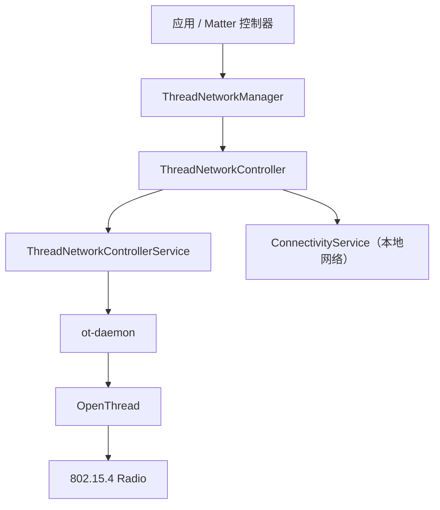

### 35.11.3 `ThreadNetworkManager` 与 `ThreadNetworkController`

这两个类负责向应用暴露控制接口，并把加入网络、离网、获取状态、配置数据集等操作转发给系统服务。

### 35.11.4 Active Operational Dataset

Thread 网络的运行参数通常集中在 Operational Dataset 中，例如：

- Network Name
- Channel
- PAN ID
- Master Key

Android 需要安全地分发和持久化这些参数。

### 35.11.5 `ThreadNetworkControllerService`

该服务负责和 `ot-daemon` 交互，并把 Thread 的运行状态映射到 framework 可理解的对象模型中。

### 35.11.6 OpenThread 与 `ot-daemon`

OpenThread 承担协议栈实现，`ot-daemon` 作为系统守护进程承接控制面。其 rc 配置可见于 `packages/modules/Connectivity/thread/apex/ot-daemon.34rc` 等位置。

### 35.11.7 与连接框架的关系

Thread 网络在 Android 中通常被视为本地网络，而不是普通互联网默认网络。它会使用：

- `TRANSPORT_THREAD`
- `NET_CAPABILITY_LOCAL_NETWORK`

这让系统能区分“可访问本地 IoT 设备的网络”和“真正可上网的默认网络”。

### 35.11.8 短期密钥与国家码管理

Thread 还涉及入网委托、临时密钥、国家码与信道限制，这些都直接影响射频合规和用户配网体验。

### 35.11.9 关键源码

主要代码路径包括：

- `packages/modules/Connectivity/thread/`
- `packages/modules/Connectivity/framework/`

---

## 35.12 深入机制：`ConnectivityService`、Wi-Fi 与 `netd`

### 35.12.1 NetworkAgent 注册与重匹配

一个新网络注册到系统时，`ConnectivityService` 不只是简单地“放进列表”。更关键的是触发全局重匹配：

1. 哪些请求现在可以被这个网络满足
2. 哪些旧网络会失去最佳地位
3. 默认网络是否要切换
4. 哪些回调需要补发或撤销

这也是 `rematchAllNetworksAndRequests()` 这类核心函数存在的原因。

### 35.12.2 默认网络切换

默认网络切换需要同时满足三个目标：

1. 选择更优网络
2. 减少用户感知抖动
3. 尽可能保住现有连接

所以 Android 引入了 nascent delay、linger delay、双 STA、socket 显式绑定等一整套配合机制。

### 35.12.3 Blocked Reasons

应用看到网络存在，并不代表它真的能用。`ConnectivityService` 还会计算 blocked reasons，例如：

- 后台受限
- Data Saver
- VPN/企业策略
- 待机或设备空闲态

### 35.12.4 `ActiveModeWarden`

Wi-Fi 子系统中的 `ActiveModeWarden` 负责协调 client、scan-only、soft AP 等模式共存和切换，避免多个模式直接争抢底层硬件资源。

### 35.12.5 扫描与安全协议

Wi-Fi 扫描链路往往要同时兼顾：

- 周期性扫描
- PNO offload
- 定向扫描
- 位置权限脱敏

而在安全协议侧，还需要处理 WPA2、WPA3、EAP、OWE 等差异。

### 35.12.6 `netd` 进程内部

`netd` 内部除了几个大控制器外，还有一些常被忽视但很关键的组件：

- `IptablesRestoreController`
- `SockDiag`
- `WakeupController`
- `TcpSocketMonitor`

它们分别承担规则批量更新、socket 诊断、唤醒统计和 TCP 监控等职责。

---

## 35.13 深入机制：验证、CLAT、现代协议与传输映射

### 35.13.1 `NetworkMonitor` 验证细节

网络验证并不是一个布尔变量，而是一套持续运行的决策机制。它至少要回答：

- 这个网络是否能访问互联网
- 是否存在 captive portal
- Private DNS 是否可用
- 是否只是暂时抖动

### 35.13.2 IPv6-only 网络与 CLAT

对大量历史应用来说，IPv4 仍然是默认心智模型。Android 用 CLAT 补足 IPv4 socket 在 IPv6-only 网络上的兼容能力，这样应用无需理解底层 NAT64 细节也能继续工作。

### 35.13.3 共享网络 Offload

Tethering Offload 的目标是把热点转发中的高频数据面工作从 AP CPU 迁到更省电的执行路径，包括：

- BPF
- 硬件 offload HAL
- 连接跟踪集成

### 35.13.4 QUIC 与网络变化

现代应用越来越多使用 QUIC。对 Android 来说，问题不再只是“TCP socket 断不断”，而是网络切换后：

- 连接迁移是否可行
- 旧路径销毁是否及时
- 新网络是否需要重新验证

### 35.13.5 卫星连接与本地网扩展

更高版本 Android 开始把卫星网络纳入统一 transport 模型中，同时也进一步增强 Thread、LoWPAN、本地网络和多种 IoT 承载的统一表示。

### 35.13.6 传输类型与 Android 表示

| Transport | 典型接口 | 典型 Agent / Provider | 底层支撑 |
|---|---|---|---|
| Wi-Fi | `wlan0` | `WifiNetworkAgent` | Wi-Fi AIDL HAL |
| 蜂窝 | `rmnet*` | `TelephonyNetworkAgent` | Radio AIDL HAL |
| 以太网 | `eth0` | `EthernetNetworkAgent` | 内核驱动 |
| 蓝牙 PAN | `bt-pan` | 蓝牙网络代理 | Bluetooth HAL |
| VPN | `tun0` / `ipsec0` | `Vpn` 内部 agent | TUN / XFRM |
| Wi-Fi Aware | `aware0` | `WifiAwareNetworkAgent` | Wi-Fi HAL |
| LoWPAN | `lowpan0` | `LowpanNetworkAgent` | LoWPAN HAL |
| Thread | `thread0` | `ThreadNetworkAgent` | Thread HAL / OpenThread |
| Satellite | `sat0` | `SatelliteNetworkAgent` | Satellite HAL |
| Test | `test0` | `TestNetworkAgent` | 测试桩 |

### 35.13.7 完整网络生命周期

下图给出一个网络从请求到销毁的完整视图。

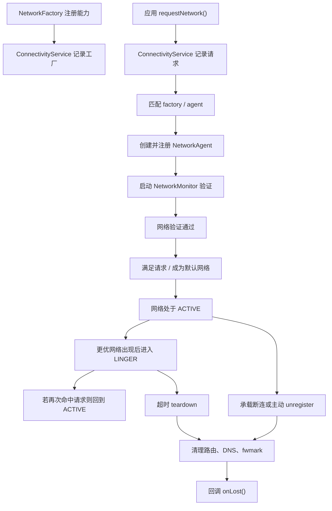

---

## 35.14 性能、权限与本地网络补充

### 35.14.1 性能与功耗考量

网络栈是系统主要耗电源之一，Android 通过多种机制控制延迟、内存和电量：

- `DEFAULT_NASCENT_DELAY_MS = 5_000`，避免新网络频繁抖动
- `DEFAULT_LINGER_DELAY_MS = 30_000`，减少切网损伤
- Doze、App Standby、Data Saver
- PNO offload、keepalive offload
- 后台防火墙与 idle timer

大致资源占用量级通常可概括为：

- `ConnectivityService`：10 到 20 MB 级 Java heap
- `netd`：数 MB 级 RSS
- `DnsResolver`：数 MB 级 RSS
- Wi-Fi 进程与 supplicant：数 MB 级
- BPF 程序与 map：几十 KB 到更高，视配置而定

### 35.14.2 权限模型

Android 网络访问采用分层权限模型。

下图展示常见权限层次。

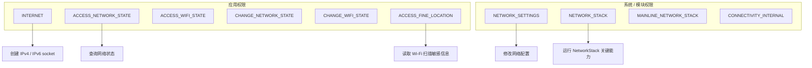

### 35.14.3 `INTERNET` 权限的内核约束

`INTERNET` 的特殊之处在于，它不是只在 framework 做一次检查，而会通过 `inet` 补充组等内核机制参与实际 socket 创建控制。没有这个权限的应用，`AF_INET` / `AF_INET6` socket 创建会直接失败。

### 35.14.4 Wi-Fi 扫描与位置权限

Wi-Fi 扫描结果可能暴露位置，因此 Android 要求更严格的访问控制。`NetworkCapabilities` 里也能看到多个 redact 常量，用于根据调用方权限对结果脱敏。

### 35.14.5 UID 级网络隔离

UID 是 Android 网络策略的基本单位，直接支撑：

- 每 UID 防火墙
- 每 UID 流量统计
- 每 UID VPN
- 工作资料 / 企业场景分流

### 35.14.6 组播、mDNS、DSCP 与 Keepalive

本地网络场景还依赖多种补充机制：

- `system/netd/server/MDnsService.cpp` 提供 mDNS 服务发现支持
- `MulticastRoutingConfig` 控制本地网组播转发
- `DscpPolicyTracker` 支持 DSCP 标记策略
- `SocketKeepalive` 与硬件 offload 负责 NAT 保活和省电

下图展示 keepalive offload 的典型流程。

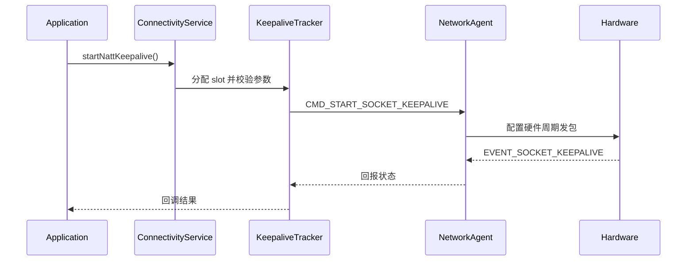

---

## 35.15 动手实践（Try It）：网络调试

### 35.15.1 `dumpsys connectivity`

先看全局网络状态：

```bash
adb shell dumpsys connectivity
adb shell dumpsys connectivity --short
adb shell dumpsys connectivity diag
adb shell dumpsys connectivity requests
adb shell dumpsys connectivity trafficcontroller
```

重点关注：

- 当前默认网络是谁
- 各 `NetworkAgent` 的 `NetworkCapabilities`
- linger / blocked 状态
- UID 请求数是否异常

### 35.15.2 `dumpsys wifi`

检查 Wi-Fi 子系统：

```bash
adb shell dumpsys wifi
adb shell dumpsys wifi | grep -i "ClientModeImpl"
adb shell dumpsys wifi | grep -i "network selection"
```

适合排查：

- 扫描是否发生
- 当前连接状态机在哪个状态
- 评分为什么选择了某个 AP

### 35.15.3 `dumpsys netd`

查看原生网络控制面：

```bash
adb shell dumpsys netd
adb shell ip rule
adb shell ip route show table all
adb shell iptables-save
```

适合排查：

- 路由是否正确
- fwmark 对应策略是否生效
- NAT 或 UID 规则是否拦截了流量

### 35.15.4 DNS 调试

```bash
adb shell dumpsys dnsresolver
adb shell getprop | grep dns
adb shell ndc resolver getnetdns 100
```

如果怀疑 Private DNS 或验证问题，重点看：

- 网络对应的 DNS 服务器
- 是否启用 DoT / DoH
- 验证是否失败

### 35.15.5 通用网络诊断命令

```bash
adb shell ping -c 4 8.8.8.8
adb shell ping -6 -c 4 2001:4860:4860::8888
adb shell traceroute 8.8.8.8
adb shell ip addr
adb shell ss -tunap
adb shell cat /proc/net/xt_qtaguid/stats
```

### 35.15.6 `ConnectivityDiagnosticsManager`

应用侧若要获得更细粒度诊断，可使用 `ConnectivityDiagnosticsManager` 订阅网络事件：

```java
ConnectivityDiagnosticsManager mgr =
        context.getSystemService(ConnectivityDiagnosticsManager.class);

NetworkRequest request = new NetworkRequest.Builder()
        .addCapability(NetworkCapabilities.NET_CAPABILITY_INTERNET)
        .build();

mgr.registerConnectivityDiagnosticsCallback(
        request,
        context.getMainExecutor(),
        new ConnectivityDiagnosticsManager.ConnectivityDiagnosticsCallback() {});
```

### 35.15.7 模拟网络变化

```bash
adb shell svc wifi disable
adb shell svc wifi enable
adb shell svc data disable
adb shell svc data enable
adb shell cmd connectivity airplane-mode enable
adb shell cmd connectivity airplane-mode disable
```

可用于观察：

- 默认网络重选
- VPN / VCN 的底层切换
- 网络回调是否按预期触发

### 35.15.8 读取 BPF 状态

```bash
adb shell dumpsys connectivity trafficcontroller
adb shell ls /sys/fs/bpf
adb shell cat /sys/fs/bpf/map_netd_app_uid_stats_map 2>/dev/null
```

不同设备内核和权限限制不同，最后一条命令可能无法直接读取；遇到权限问题时优先看 `dumpsys connectivity trafficcontroller`。

### 35.15.9 典型排查路径

1. “连上 Wi-Fi 但不能上网”

   先看 `dumpsys wifi` 是否真的完成关联，再看 `dumpsys connectivity` 中网络是否 `VALIDATED`，最后检查 `dumpsys dnsresolver` 和 captive portal 状态。

2. “VPN 已连接但业务不通”

   先看 `dumpsys connectivity` 中 VPN 是否成为默认网络，再看 `ip rule`、`ip route` 是否有 VPN 路由，最后确认 keepalive、底层网络和 DNS。

3. “热点开了但下游设备没网”

   先看 `dumpsys tethering` 上游是谁，再检查 `iptables-save` / `ip rule` / DHCP 分配和 IP forwarding。

### 35.15.10 日志与追踪

```bash
adb logcat -b all | grep -E "ConnectivityService|NetworkMonitor|Netd|DnsResolver|Wifi"
adb shell setprop log.tag.ConnectivityService VERBOSE
adb shell setprop log.tag.NetworkMonitor VERBOSE
```

如果设备支持，还可以结合 bugreport、systrace、perfetto 观察网络切换窗口中的 Binder、wakelock 和内核事件。

### 35.15.11 开发者选项与设置页

Settings 和 Developer Options 往往会暴露：

- Private DNS
- 数据节省程序
- Wi-Fi 扫描节流
- Mobile data always active

这些开关会直接改变网络栈行为，排障时不能忽略。

### 35.15.12 编程式网络测试

最稳妥的做法是显式请求网络并绑定 socket，这样能区分“系统默认网络问题”与“特定网络问题”：

```java
ConnectivityManager cm = context.getSystemService(ConnectivityManager.class);

NetworkRequest request = new NetworkRequest.Builder()
        .addTransportType(NetworkCapabilities.TRANSPORT_WIFI)
        .addCapability(NetworkCapabilities.NET_CAPABILITY_INTERNET)
        .build();

cm.requestNetwork(request, new ConnectivityManager.NetworkCallback() {
    @Override
    public void onAvailable(Network network) {
        network.bindSocket(new Socket());
    }
});
```

---

## Summary

- Android 网络栈以 `ConnectivityService` 为中心，把 Wi-Fi、蜂窝、VPN、Thread、VCN 等不同承载统一成 `NetworkAgent` 模型。
- `netId`、`fwmark`、策略路由和 UID 级控制是 Android 区别于传统桌面系统网络栈的关键设计。
- `netd` 负责把 framework 策略落到内核，`DnsResolver` 负责按网络解析，`NetworkStack` 负责 IP 配置与可用性验证。
- Wi-Fi、Tethering、VPN 都不是孤立模块，它们都必须与 `ConnectivityService` 的请求匹配、默认网络选择和回调体系协同。
- Mainline 化让 Connectivity、Wi-Fi、DNS、NetworkStack 成为可独立升级的模块，这直接提升了安全补丁和功能迭代速度。
- VCN 和 Thread 表明 Android 的网络模型正在从“互联网接入管理”扩展到“运营商策略承载”和“IoT 本地网络协作”。
- 排障时要同时看 framework 状态、原生守护进程、路由与 BPF，不能只盯某一个 `dumpsys` 输出。

### 关键源码

| 文件 | 作用 |
|---|---|
| `packages/modules/Connectivity/service/src/com/android/server/ConnectivityService.java` | 网络中枢、请求匹配、默认网络、回调 |
| `packages/modules/Connectivity/framework/src/android/net/NetworkAgent.java` | 承载方与 `ConnectivityService` 的桥梁 |
| `packages/modules/Connectivity/staticlibs/framework/com/android/net/module/util/NetworkCapabilitiesUtils.java` | 能力位与匹配辅助 |
| `packages/modules/Wifi/service/java/com/android/server/wifi/WifiServiceImpl.java` | Wi-Fi Binder 服务入口 |
| `packages/modules/Wifi/service/java/com/android/server/wifi/ClientModeImpl.java` | Wi-Fi 客户端状态机 |
| `system/netd/server/NetdNativeService.cpp` | `netd` Binder 接口 |
| `system/netd/server/NetworkController.cpp` | `netId` 与网络控制 |
| `system/netd/server/FwmarkServer.cpp` | socket `fwmark` 处理 |
| `packages/modules/DnsResolver/` | DNS、DoT、DoH、Dns64/NAT64 |
| `packages/modules/NetworkStack/` | DHCP、`IpClient`、`NetworkMonitor` |
| `packages/modules/Connectivity/Tethering/` | 共享网络与下游接口管理 |
| `packages/modules/Connectivity/service/src/com/android/server/connectivity/Vpn.java` | 平台 VPN 实现 |
| `packages/modules/Connectivity/service-t/src/com/android/server/vcn/` | VCN 实现 |
| `packages/modules/Connectivity/thread/` | Thread 网络支持 |
