# Chapter 35: Networking and Connectivity

Android's networking stack is one of the most sophisticated subsystems in AOSP,
spanning from high-level Java framework APIs down through native daemons and into
the Linux kernel's networking primitives. This chapter traces the complete path a
network packet takes, examines the key services and modules that manage
connectivity, and explores how Android handles everything from Wi-Fi association
to DNS resolution to VPN tunneling.

---

## 35.1 Networking Architecture Overview

### 35.1.1 The Big Picture

Android networking is organized in layers that mirror the classic
operating-system model but with Android-specific additions for modularity,
security, and updatability. At the highest level, applications use APIs like
`ConnectivityManager` and `WifiManager`. These APIs communicate via Binder IPC
to system services running inside `system_server`. Those services, in turn,
talk to native daemons (`netd`, the DNS resolver) and the Linux kernel through
Netlink sockets, iptables/nftables commands, and BPF programs.

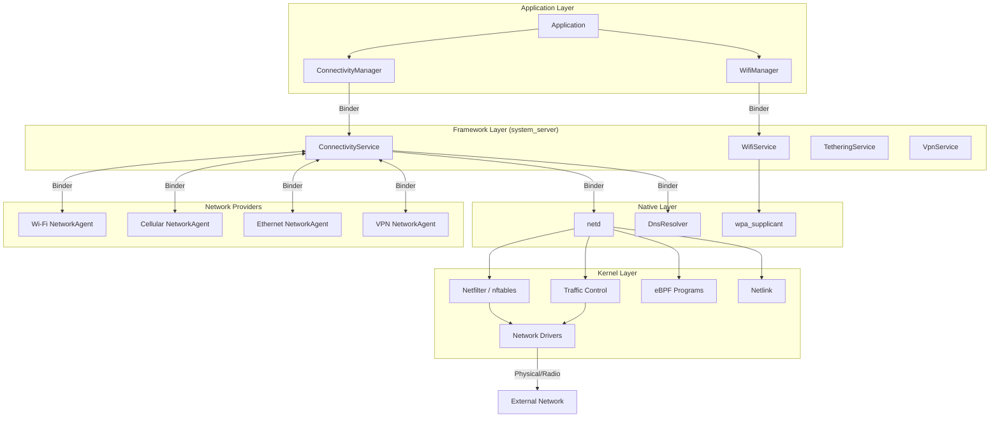
```mermaid
graph TD
    subgraph "Application Layer"
        APP["Application"]
        CM["ConnectivityManager"]
        WM["WifiManager"]
    end

    subgraph "Framework Layer (system_server)"
        CS["ConnectivityService"]
        WS["WifiService"]
        TS["TetheringService"]
        VS["VpnService"]
    end

    subgraph "Network Providers"
        NA_WIFI["Wi-Fi NetworkAgent"]
        NA_CELL["Cellular NetworkAgent"]
        NA_ETH["Ethernet NetworkAgent"]
        NA_VPN["VPN NetworkAgent"]
    end

    subgraph "Native Layer"
        NETD["netd"]
        DNSR["DnsResolver"]
        WPA["wpa_supplicant"]
    end

    subgraph "Kernel Layer"
        NF["Netfilter / nftables"]
        TC["Traffic Control"]
        BPF["eBPF Programs"]
        NETLINK["Netlink"]
        DRIVER["Network Drivers"]
    end

    APP --> CM
    APP --> WM
    CM -->|Binder| CS
    WM -->|Binder| WS
    CS <-->|Binder| NA_WIFI
    CS <-->|Binder| NA_CELL
    CS <-->|Binder| NA_ETH
    CS <-->|Binder| NA_VPN
    WS --> WPA
    CS -->|Binder| NETD
    CS -->|Binder| DNSR
    NETD --> NF
    NETD --> TC
    NETD --> BPF
    NETD --> NETLINK
    NF --> DRIVER
    TC --> DRIVER
    DRIVER -->|"Physical/Radio"| EXT["External Network"]
```

### 35.1.2 Key Components Summary

| Component | Type | Location | Role |
|-----------|------|----------|------|
| ConnectivityService | Java system service | `packages/modules/Connectivity/service/` | Central network management |
| NetworkAgent | Java framework class | `packages/modules/Connectivity/framework/` | Bearer-to-CS communication |
| NetworkFactory | Java framework class | `packages/modules/Connectivity/staticlibs/` | Creates NetworkAgents |
| netd | Native daemon (C++) | `system/netd/` | Kernel network configuration |
| DnsResolver | Native module (C++) | `packages/modules/DnsResolver/` | DNS resolution, DoT/DoH |
| Wi-Fi Service | Java system service | `packages/modules/Wifi/service/` | Wi-Fi management |
| NetworkStack | Mainline module | `packages/modules/NetworkStack/` | DHCP, network validation |
| Tethering | Mainline module | `packages/modules/Connectivity/Tethering/` | USB/Wi-Fi/BT tethering |

### 35.1.3 Mainline Modularization

Starting with Android 10 (API 29), Google began extracting networking components
into independently updatable Mainline modules. This was a pivotal architectural
decision: it decoupled critical networking code from the slower platform OTA
cadence, allowing Google to push security patches and feature updates through the
Play Store.

The key networking Mainline modules are:

1. **Connectivity module** (`packages/modules/Connectivity/`): Contains
   ConnectivityService, the tethering subsystem, and related framework code.
2. **NetworkStack module** (`packages/modules/NetworkStack/`): Handles DHCP
   client, network validation (captive portal detection), and IP provisioning.
3. **Wi-Fi module** (`packages/modules/Wifi/`): The entire Wi-Fi subsystem
   including WifiService, ClientModeImpl, and scanning logic.
4. **DnsResolver module** (`packages/modules/DnsResolver/`): The native DNS
   resolver with DoT and DoH support.

Each module ships as an APEX package, providing a self-contained update unit
with its own versioning, signing, and rollback capability.

### 35.1.4 Network IDs and Routing

Every active network in Android is assigned a unique **network ID** (netId), an
integer in the range 100--65535. This ID is fundamental: it ties together routes,
DNS configuration, iptables rules, and socket binding. When an application opens
a socket, the kernel uses the netId (applied via an `fwmark` on the socket) to
select the correct routing table.

From `system/netd/server/NetworkController.cpp`:

```cpp
// Keep these in sync with ConnectivityService.java.
const unsigned MIN_NET_ID = 100;
const unsigned MAX_NET_ID = 65535;
```

The framework manages netId allocation through `NetIdManager`:

```
// Source: packages/modules/Connectivity/service/src/com/android/server/NetIdManager.java
```

### 35.1.5 The Data Path: From App to Wire

When an application sends data, the following sequence occurs:

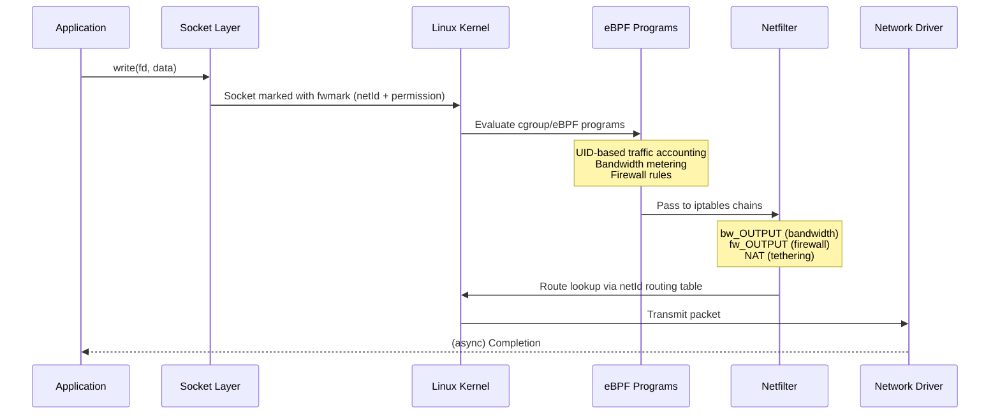
```mermaid
sequenceDiagram
    participant App as Application
    participant Socket as Socket Layer
    participant Kernel as Linux Kernel
    participant BPF as eBPF Programs
    participant NF as Netfilter
    participant Driver as Network Driver

    App->>Socket: write(fd, data)
    Socket->>Kernel: Socket marked with fwmark (netId + permission)
    Kernel->>BPF: Evaluate cgroup/eBPF programs
    Note over BPF: UID-based traffic accounting<br/>Bandwidth metering<br/>Firewall rules
    BPF->>NF: Pass to iptables chains
    Note over NF: bw_OUTPUT (bandwidth)<br/>fw_OUTPUT (firewall)<br/>NAT (tethering)
    NF->>Kernel: Route lookup via netId routing table
    Kernel->>Driver: Transmit packet
    Driver-->>App: (async) Completion
```

The `fwmark` mechanism is central to Android's per-network routing. Each socket
is tagged with a 32-bit mark that encodes:

- The network ID (bits 0--15)
- Permission bits (bits 16--17)
- Whether the socket is explicitly bound (bit 18)
- Whether VPN bypass is allowed (bit 19)

The `FwmarkServer` in netd is responsible for applying these marks when sockets
are created, using a BPF program attached to cgroup hooks:

```
// Source: system/netd/server/FwmarkServer.cpp
```

---

## 35.2 ConnectivityService

### 35.2.1 Overview

`ConnectivityService` is the central nervous system of Android networking. At
16,000+ lines of Java code, it is one of the largest and most critical services
in `system_server`. It manages the lifecycle of all networks, satisfies
application network requests, handles network scoring and selection, and
coordinates with native daemons for routing and DNS configuration.

**Source file:**
`packages/modules/Connectivity/service/src/com/android/server/ConnectivityService.java`

```java
// Source: packages/modules/Connectivity/service/src/com/android/server/ConnectivityService.java
@TargetApi(Build.VERSION_CODES.S)
public class ConnectivityService extends IConnectivityManager.Stub
        implements BroadcastReceiveHelper.Delegate {
    private static final String TAG = ConnectivityService.class.getSimpleName();
    // ...

    // Default URL for captive portal detection
    private static final String DEFAULT_CAPTIVE_PORTAL_HTTP_URL =
            "http://connectivitycheck.gstatic.com/generate_204";

    // How long to wait before switching back to a radio's default network
    private static final int RESTORE_DEFAULT_NETWORK_DELAY = 1 * 60 * 1000;

    // Default to 30s linger time-out, and 5s for nascent network
    private static final String LINGER_DELAY_PROPERTY = "persist.netmon.linger";
    private static final int DEFAULT_LINGER_DELAY_MS = 30_000;
    private static final int DEFAULT_NASCENT_DELAY_MS = 5_000;

    // The maximum number of network requests allowed per uid
    static final int MAX_NETWORK_REQUESTS_PER_UID = 100;
    // ...
}
```

### 35.2.2 The Handler Thread Model

ConnectivityService processes nearly all of its work on a single handler thread.
This is deliberate: a single-threaded model eliminates the need for complex
locking across the many data structures that track networks, requests, and
callbacks. Messages are dispatched through an internal `InternalHandler` that
processes events such as:

- Network agent registration and unregistration
- Network capability changes
- Link property updates
- Network score changes
- Validation results from NetworkMonitor
- Application network requests and callbacks

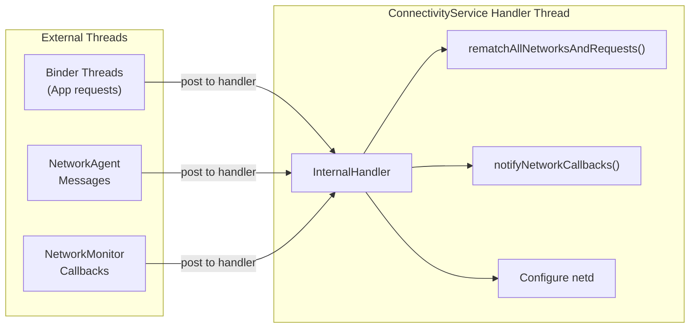
```mermaid
graph LR
    subgraph "External Threads"
        BINDER["Binder Threads<br/>(App requests)"]
        AGENTS["NetworkAgent<br/>Messages"]
        MONITOR["NetworkMonitor<br/>Callbacks"]
    end

    subgraph "ConnectivityService Handler Thread"
        HANDLER["InternalHandler"]
        REMATCH["rematchAllNetworksAndRequests()"]
        NOTIFY["notifyNetworkCallbacks()"]
        NETD_CMD["Configure netd"]
    end

    BINDER -->|"post to handler"| HANDLER
    AGENTS -->|"post to handler"| HANDLER
    MONITOR -->|"post to handler"| HANDLER
    HANDLER --> REMATCH
    HANDLER --> NOTIFY
    HANDLER --> NETD_CMD
```

### 35.2.3 NetworkAgent

`NetworkAgent` is the bridge between a network transport (Wi-Fi, cellular,
Ethernet, VPN) and ConnectivityService. Each active network connection is
represented by exactly one NetworkAgent instance. The agent communicates
bidirectionally with ConnectivityService through an asynchronous message
channel.

**Source file:**
`packages/modules/Connectivity/framework/src/android/net/NetworkAgent.java`

```java
// Source: packages/modules/Connectivity/framework/src/android/net/NetworkAgent.java
@SystemApi
public abstract class NetworkAgent {
    @Nullable
    private volatile Network mNetwork;

    @Nullable
    private volatile INetworkAgentRegistry mRegistry;

    private final Handler mHandler;

    public static final int MIN_LINGER_TIMER_MS = 2000;

    // Message constants for communication with ConnectivityService
    public static final int CMD_SUSPECT_BAD = BASE;
    public static final int EVENT_NETWORK_INFO_CHANGED = BASE + 1;
    public static final int EVENT_NETWORK_CAPABILITIES_CHANGED = BASE + 2;
    public static final int EVENT_NETWORK_PROPERTIES_CHANGED = BASE + 3;
    public static final int EVENT_NETWORK_SCORE_CHANGED = BASE + 4;
    public static final int CMD_REPORT_NETWORK_STATUS = BASE + 7;
    public static final int CMD_START_SOCKET_KEEPALIVE = BASE + 11;
    public static final int CMD_STOP_SOCKET_KEEPALIVE = BASE + 12;
    // ...
}
```

The lifecycle of a NetworkAgent is:

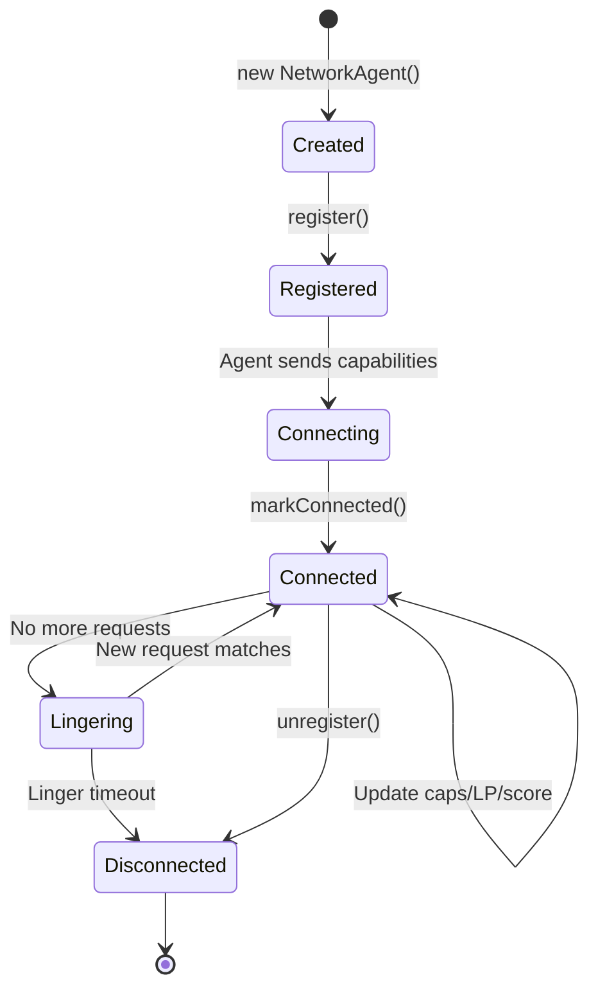
```mermaid
stateDiagram-v2
    [*] --> Created: new NetworkAgent()
    Created --> Registered: register()
    Registered --> Connecting: Agent sends capabilities
    Connecting --> Connected: markConnected()
    Connected --> Connected: Update caps/LP/score
    Connected --> Lingering: No more requests
    Lingering --> Connected: New request matches
    Lingering --> Disconnected: Linger timeout
    Connected --> Disconnected: unregister()
    Disconnected --> [*]
```

**Key methods a transport must implement:**

| Method | When Called | Purpose |
|--------|-----------|---------|
| `onNetworkUnwanted()` | CS no longer needs the network | Transport should disconnect |
| `onBandwidthUpdateRequested()` | CS needs updated throughput | Transport should refresh |
| `onValidationStatus()` | Network validated or failed | Transport may adjust behavior |
| `onSignalStrengthThresholdsUpdated()` | Thresholds changed | Adjust signal monitoring |
| `onStartSocketKeepalive()` | App requests keepalive | Offload to hardware if possible |
| `onStopSocketKeepalive()` | Keepalive no longer needed | Stop hardware offload |
| `onSaveAcceptUnvalidated()` | User accepts unvalidated | Remember preference |

### 35.2.4 NetworkFactory

While `NetworkAgent` represents an active network, `NetworkFactory` represents
the _capability_ to create networks. Each transport registers a factory with
ConnectivityService, declaring what kinds of networks it can provide.

**Source file:**
`packages/modules/Connectivity/staticlibs/device/android/net/NetworkFactory.java`

```java
// Source: packages/modules/Connectivity/staticlibs/device/android/net/NetworkFactory.java
public class NetworkFactory {
    static final boolean DBG = true;

    final NetworkFactoryShim mImpl;

    public NetworkFactory(Looper looper, Context context, String logTag,
            @Nullable final NetworkCapabilities filter) {
        LOG_TAG = logTag;
        if (isAtLeastS()) {
            mImpl = new NetworkFactoryImpl(this, looper, context, filter);
        } else {
            mImpl = new NetworkFactoryLegacyImpl(this, looper, context, filter);
        }
    }

    public static final int CMD_REQUEST_NETWORK = 1;
    public static final int CMD_CANCEL_REQUEST = 2;
    // ...
}
```

When an application files a `NetworkRequest`, ConnectivityService evaluates
all registered factories. If a factory's declared capabilities match the
request, ConnectivityService sends it a `CMD_REQUEST_NETWORK` message. The
factory then decides whether to bring up a new network (create a NetworkAgent)
or ignore the request.

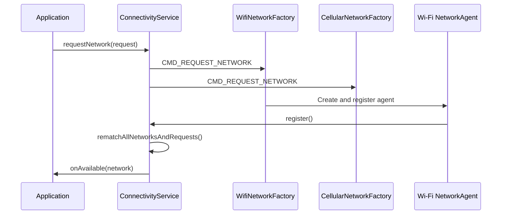
```mermaid
sequenceDiagram
    participant App as Application
    participant CS as ConnectivityService
    participant WF as WifiNetworkFactory
    participant CF as CellularNetworkFactory
    participant WA as Wi-Fi NetworkAgent

    App->>CS: requestNetwork(request)
    CS->>WF: CMD_REQUEST_NETWORK
    CS->>CF: CMD_REQUEST_NETWORK
    WF->>WA: Create and register agent
    WA->>CS: register()
    CS->>CS: rematchAllNetworksAndRequests()
    CS->>App: onAvailable(network)
```

### 35.2.5 NetworkRequest and NetworkCapabilities

Applications express their networking requirements through `NetworkRequest`
objects, which wrap `NetworkCapabilities` constraints.

**Source file:**
`packages/modules/Connectivity/framework/src/android/net/NetworkRequest.java`

A `NetworkRequest` specifies:

- **Required capabilities**: What the network must provide (e.g., `NET_CAPABILITY_INTERNET`)
- **Forbidden capabilities**: What the network must not have (e.g., `NET_CAPABILITY_NOT_METERED` forbidden means metered is OK)
- **Transport types**: Which bearers are acceptable (Wi-Fi, cellular, etc.)
- **Network specifier**: For targeting specific networks (e.g., a particular Wi-Fi SSID)

`NetworkCapabilities` is the richest descriptor in the system, encoding dozens
of attributes about a network:

**Source file:**
`packages/modules/Connectivity/framework/src/android/net/NetworkCapabilities.java`

Key capability constants include:

| Capability | Meaning |
|-----------|---------|
| `NET_CAPABILITY_INTERNET` | Network has general Internet access |
| `NET_CAPABILITY_VALIDATED` | System confirmed Internet connectivity |
| `NET_CAPABILITY_NOT_METERED` | Network does not bill by usage |
| `NET_CAPABILITY_NOT_VPN` | Network is not a VPN |
| `NET_CAPABILITY_NOT_ROAMING` | Not on a roaming network |
| `NET_CAPABILITY_NOT_CONGESTED` | Network is not congested |
| `NET_CAPABILITY_NOT_SUSPENDED` | Network is not suspended |
| `NET_CAPABILITY_CAPTIVE_PORTAL` | Behind a captive portal |
| `NET_CAPABILITY_PARTIAL_CONNECTIVITY` | Limited connectivity |
| `NET_CAPABILITY_MMS` | MMS capable |
| `NET_CAPABILITY_ENTERPRISE` | Enterprise network |
| `NET_CAPABILITY_LOCAL_NETWORK` | Local network (e.g., Thread) |

Transport types include:

| Transport | Description |
|-----------|-------------|
| `TRANSPORT_CELLULAR` | Mobile data (LTE, 5G) |
| `TRANSPORT_WIFI` | Wi-Fi |
| `TRANSPORT_BLUETOOTH` | Bluetooth PAN |
| `TRANSPORT_ETHERNET` | Wired Ethernet |
| `TRANSPORT_VPN` | Virtual Private Network |
| `TRANSPORT_WIFI_AWARE` | Wi-Fi Aware (NAN) |
| `TRANSPORT_LOWPAN` | Low-power WAN (LoWPAN) |
| `TRANSPORT_TEST` | Test networks |
| `TRANSPORT_SATELLITE` | Satellite connectivity |
| `TRANSPORT_THREAD` | Thread mesh networking |

### 35.2.6 Network Scoring and Selection

When multiple networks can satisfy a request, ConnectivityService must choose
the best one. The network selection algorithm has evolved significantly over
Android's history:

1. **Legacy scoring** (pre-Android 12): Simple integer scores. Higher wins.
   Wi-Fi defaulted to 60, cellular to 50.

2. **Modern scoring** (Android 12+): A policy-based `NetworkScore` that
   encodes multiple dimensions:

```java
// From NetworkAgent.java
public static final int WIFI_BASE_SCORE = 60;
```

The `rematchAllNetworksAndRequests()` method is the heart of network selection.
It runs on every significant network change and iterates through all active
requests, finding the best network for each:

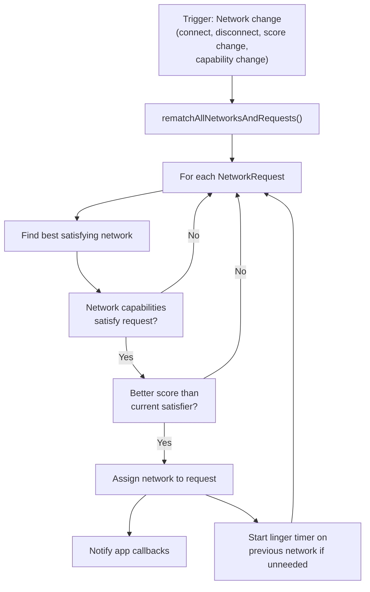
```mermaid
flowchart TD
    TRIGGER["Trigger: Network change<br/>(connect, disconnect, score change,<br/>capability change)"]
    REMATCH["rematchAllNetworksAndRequests()"]
    ITERATE["For each NetworkRequest"]
    FIND["Find best satisfying network"]
    CHECK_CAPS["Network capabilities<br/>satisfy request?"]
    CHECK_SCORE["Better score than<br/>current satisfier?"]
    ASSIGN["Assign network to request"]
    NOTIFY["Notify app callbacks"]
    LINGER["Start linger timer on<br/>previous network if unneeded"]

    TRIGGER --> REMATCH
    REMATCH --> ITERATE
    ITERATE --> FIND
    FIND --> CHECK_CAPS
    CHECK_CAPS -->|Yes| CHECK_SCORE
    CHECK_CAPS -->|No| ITERATE
    CHECK_SCORE -->|Yes| ASSIGN
    CHECK_SCORE -->|No| ITERATE
    ASSIGN --> NOTIFY
    ASSIGN --> LINGER
    LINGER --> ITERATE
```

The scoring considers multiple policies:

- **Transport primary**: Prefers the transport's primary network
- **Validated over unvalidated**: Prefers networks that passed validation
- **Metered vs unmetered**: Prefers unmetered when available
- **User preference**: Respects user network selection
- **VPN**: VPNs are handled specially with their own scoring rules

### 35.2.7 LinkProperties

`LinkProperties` describes the IP-level configuration of a network:

- IP addresses (both IPv4 and IPv6)
- DNS servers
- Routing table entries
- Interface name (e.g., `wlan0`, `rmnet0`)
- MTU
- HTTP proxy settings
- NAT64 prefix (for IPv6-only networks)

When a NetworkAgent updates its LinkProperties, ConnectivityService pushes the
corresponding routes and DNS configuration to netd:

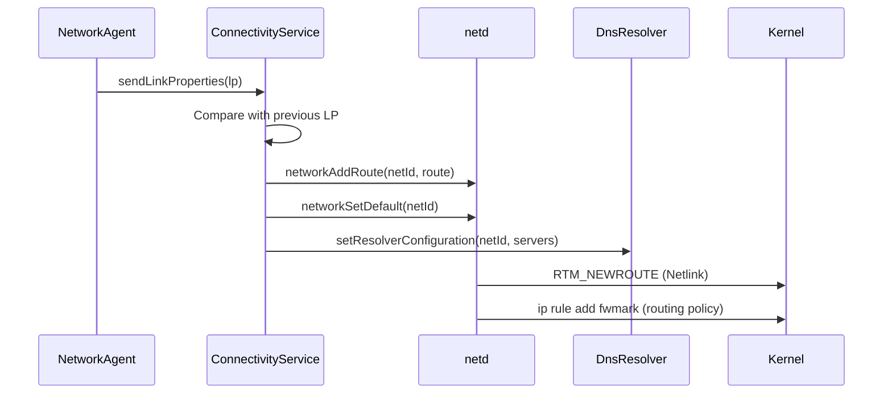
```mermaid
sequenceDiagram
    participant NA as NetworkAgent
    participant CS as ConnectivityService
    participant NETD as netd
    participant DNSR as DnsResolver
    participant KERNEL as Kernel

    NA->>CS: sendLinkProperties(lp)
    CS->>CS: Compare with previous LP
    CS->>NETD: networkAddRoute(netId, route)
    CS->>NETD: networkSetDefault(netId)
    CS->>DNSR: setResolverConfiguration(netId, servers)
    NETD->>KERNEL: RTM_NEWROUTE (Netlink)
    NETD->>KERNEL: ip rule add fwmark (routing policy)
```

### 35.2.8 Network Lifecycle Events and Callbacks

Applications receive network state changes through registered callbacks.
ConnectivityService supports a rich set of callback events:

```java
// From ConnectivityService.java import block
import static android.net.ConnectivityManager.CALLBACK_AVAILABLE;
import static android.net.ConnectivityManager.CALLBACK_BLK_CHANGED;
import static android.net.ConnectivityManager.CALLBACK_CAP_CHANGED;
import static android.net.ConnectivityManager.CALLBACK_IP_CHANGED;
import static android.net.ConnectivityManager.CALLBACK_LOCAL_NETWORK_INFO_CHANGED;
import static android.net.ConnectivityManager.CALLBACK_LOSING;
import static android.net.ConnectivityManager.CALLBACK_LOST;
import static android.net.ConnectivityManager.CALLBACK_PRECHECK;
import static android.net.ConnectivityManager.CALLBACK_SUSPENDED;
import static android.net.ConnectivityManager.CALLBACK_RESUMED;
```

The callback lifecycle for a typical network connection:

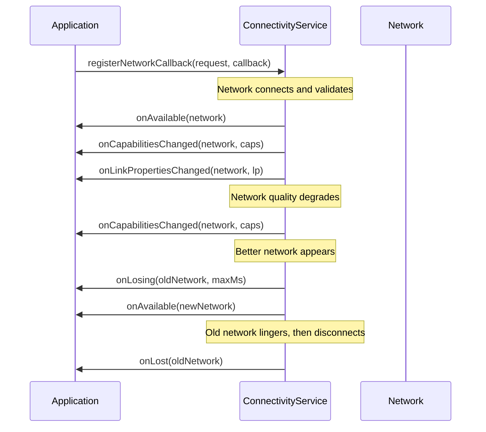
```mermaid
sequenceDiagram
    participant App as Application
    participant CS as ConnectivityService
    participant Net as Network

    App->>CS: registerNetworkCallback(request, callback)
    Note over CS: Network connects and validates
    CS->>App: onAvailable(network)
    CS->>App: onCapabilitiesChanged(network, caps)
    CS->>App: onLinkPropertiesChanged(network, lp)
    Note over CS: Network quality degrades
    CS->>App: onCapabilitiesChanged(network, caps)
    Note over CS: Better network appears
    CS->>App: onLosing(oldNetwork, maxMs)
    CS->>App: onAvailable(newNetwork)
    Note over CS: Old network lingers, then disconnects
    CS->>App: onLost(oldNetwork)
```

### 35.2.9 BPF-Based Traffic Control

Modern Android increasingly uses eBPF (extended Berkeley Packet Filter) programs
for traffic control, replacing traditional iptables rules. BPF programs are
attached to cgroup hooks to enforce per-UID traffic policies.

```java
// Source: packages/modules/Connectivity/service/src/com/android/server/ConnectivityService.java
// BPF program attachment points
import static com.android.net.module.util.BpfUtils.BPF_CGROUP_GETSOCKOPT;
import static com.android.net.module.util.BpfUtils.BPF_CGROUP_INET4_BIND;
import static com.android.net.module.util.BpfUtils.BPF_CGROUP_INET4_CONNECT;
import static com.android.net.module.util.BpfUtils.BPF_CGROUP_INET6_BIND;
import static com.android.net.module.util.BpfUtils.BPF_CGROUP_INET6_CONNECT;
import static com.android.net.module.util.BpfUtils.BPF_CGROUP_INET_EGRESS;
import static com.android.net.module.util.BpfUtils.BPF_CGROUP_INET_INGRESS;
import static com.android.net.module.util.BpfUtils.BPF_CGROUP_INET_SOCK_CREATE;
import static com.android.net.module.util.BpfUtils.BPF_CGROUP_INET_SOCK_RELEASE;
import static com.android.net.module.util.BpfUtils.BPF_CGROUP_SETSOCKOPT;
import static com.android.net.module.util.BpfUtils.BPF_CGROUP_UDP4_RECVMSG;
import static com.android.net.module.util.BpfUtils.BPF_CGROUP_UDP4_SENDMSG;
import static com.android.net.module.util.BpfUtils.BPF_CGROUP_UDP6_RECVMSG;
import static com.android.net.module.util.BpfUtils.BPF_CGROUP_UDP6_SENDMSG;
```

These BPF programs provide:

- **UID-based accounting**: Track bytes sent/received per UID
- **Firewall enforcement**: Block/allow traffic per UID and chain
- **Socket marking**: Apply fwmarks at socket creation time
- **Data saver**: Restrict background data for metered networks
- **Bandwidth control**: Enforce per-interface quotas

The `BpfNetMaps` class in the Connectivity module manages these maps, replacing
many of the traditional iptables-based mechanisms:

```java
// Source: packages/modules/Connectivity/service/src/com/android/server/BpfNetMaps.java
```

### 35.2.10 Frozen App Handling

ConnectivityService has sophisticated handling for frozen (cached) applications.
When an app is frozen by the ActivityManager, its network callbacks are queued
rather than delivered, avoiding unnecessary wake-ups:

```java
// Source: ConnectivityService.java import block
import static com.android.server.connectivity.ConnectivityFlags.QUEUE_CALLBACKS_FOR_FROZEN_APPS;
```

When the app is unfrozen, queued callbacks are delivered in order, ensuring the
app has an accurate view of the current network state.

---

## 35.3 Wi-Fi Framework

### 35.3.1 Architecture Overview

The Wi-Fi framework in AOSP is a complex subsystem that manages Wi-Fi radio
operations, network scanning, connection management, SoftAP (hotspot), Wi-Fi
Direct (P2P), and Wi-Fi Aware (NAN). Since Android 12, the entire Wi-Fi stack
ships as a Mainline module.

**Module root:** `packages/modules/Wifi/`

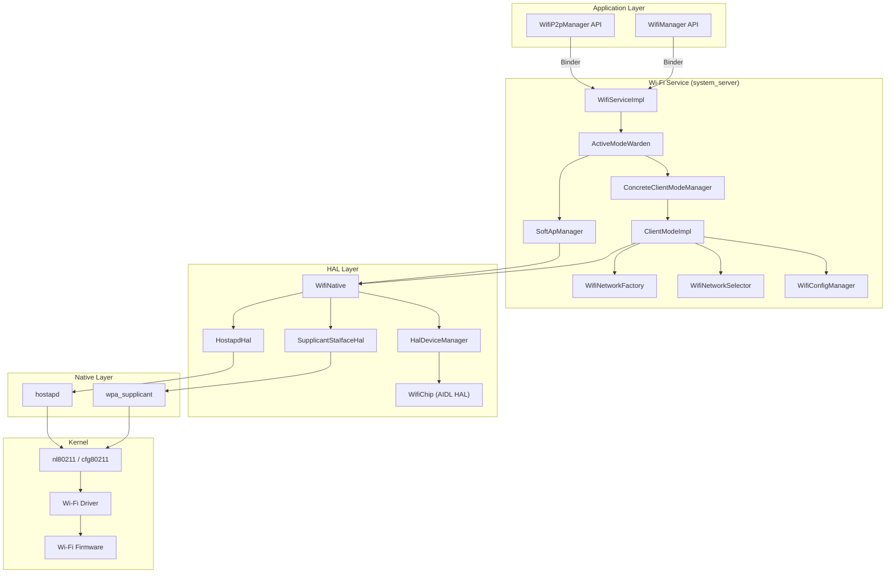
```mermaid
graph TD
    subgraph "Application Layer"
        WIFIMGR["WifiManager API"]
        P2PMGR["WifiP2pManager API"]
    end

    subgraph "Wi-Fi Service (system_server)"
        WIFISVC["WifiServiceImpl"]
        AMWM["ActiveModeWarden"]
        CMM["ConcreteClientModeManager"]
        CMI["ClientModeImpl"]
        SAM["SoftApManager"]
        WFACT["WifiNetworkFactory"]
        WSEL["WifiNetworkSelector"]
        WCFG["WifiConfigManager"]
    end

    subgraph "HAL Layer"
        WNATIVE["WifiNative"]
        HALDEV["HalDeviceManager"]
        SUPPLICANT["SupplicantStaIfaceHal"]
        HOSTAPD["HostapdHal"]
        WCHIP["WifiChip (AIDL HAL)"]
    end

    subgraph "Native Layer"
        WPA["wpa_supplicant"]
        HAPD["hostapd"]
    end

    subgraph "Kernel"
        NL80211["nl80211 / cfg80211"]
        WDRIVER["Wi-Fi Driver"]
        FIRMWARE["Wi-Fi Firmware"]
    end

    WIFIMGR -->|Binder| WIFISVC
    P2PMGR -->|Binder| WIFISVC
    WIFISVC --> AMWM
    AMWM --> CMM
    AMWM --> SAM
    CMM --> CMI
    CMI --> WNATIVE
    CMI --> WFACT
    CMI --> WSEL
    CMI --> WCFG
    SAM --> WNATIVE
    WNATIVE --> HALDEV
    WNATIVE --> SUPPLICANT
    WNATIVE --> HOSTAPD
    HALDEV --> WCHIP
    SUPPLICANT --> WPA
    HOSTAPD --> HAPD
    WPA --> NL80211
    HAPD --> NL80211
    NL80211 --> WDRIVER
    WDRIVER --> FIRMWARE
```

### 35.3.2 WifiServiceImpl

`WifiServiceImpl` is the Binder-facing service that implements `IWifiManager`.
It handles all public API calls from applications and delegates work to internal
components.

**Source file:**
`packages/modules/Wifi/service/java/com/android/server/wifi/WifiServiceImpl.java`

```java
// Source: packages/modules/Wifi/service/java/com/android/server/wifi/WifiServiceImpl.java
// WifiServiceImpl handles dozens of Wi-Fi manager APIs including:
// - Scan management (IScanResultsCallback)
// - Network suggestions (ISuggestionConnectionStatusListener)
// - SoftAP control (ISoftApCallback)
// - P2P operations
// - Traffic state monitoring (ITrafficStateCallback)
// - Verbose logging control
// - DPP (Device Provisioning Protocol)
// - TWT (Target Wake Time)
```

Key responsibilities include:

- Permission enforcement (location, Wi-Fi state change, etc.)
- API parameter validation
- Delegation to `ActiveModeWarden` for mode changes
- Broadcasting Wi-Fi state changes
- Managing local-only hotspot requests

### 35.3.3 ClientModeImpl: The Wi-Fi State Machine

`ClientModeImpl` is the workhorse of Wi-Fi connectivity. It extends
`StateMachine` and manages the complete lifecycle of a Wi-Fi connection: from
scanning and authentication through DHCP and full connectivity.

**Source file:**
`packages/modules/Wifi/service/java/com/android/server/wifi/ClientModeImpl.java`

```java
// Source: packages/modules/Wifi/service/java/com/android/server/wifi/ClientModeImpl.java
public class ClientModeImpl extends StateMachine implements ClientMode {
    // Roles for this client mode interface
    // ROLE_CLIENT_PRIMARY - the main STA interface
    // ROLE_CLIENT_LOCAL_ONLY - local-only connection
    // ROLE_CLIENT_SECONDARY_LONG_LIVED - persistent secondary
    // ROLE_CLIENT_SECONDARY_TRANSIENT - temporary secondary (MBB)
    // ROLE_CLIENT_SCAN_ONLY - scan-only mode
    // ...
}
```

The state machine contains the following key states:

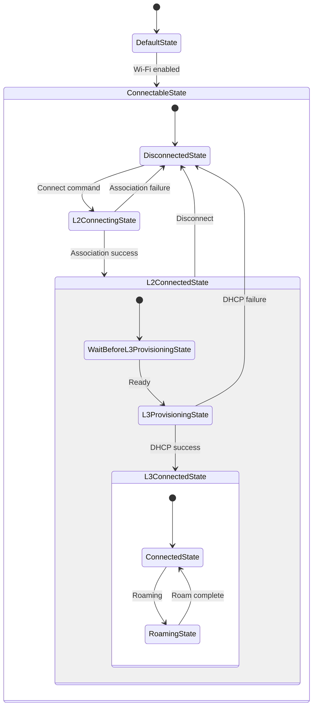
```mermaid
stateDiagram-v2
    [*] --> DefaultState
    DefaultState --> ConnectableState: Wi-Fi enabled

    state ConnectableState {
        [*] --> DisconnectedState
        DisconnectedState --> L2ConnectingState: Connect command
        L2ConnectingState --> L2ConnectedState: Association success
        L2ConnectingState --> DisconnectedState: Association failure

        state L2ConnectedState {
            [*] --> WaitBeforeL3ProvisioningState
            WaitBeforeL3ProvisioningState --> L3ProvisioningState: Ready
            L3ProvisioningState --> L3ConnectedState: DHCP success
            L3ProvisioningState --> DisconnectedState: DHCP failure

            state L3ConnectedState {
                [*] --> ConnectedState
                ConnectedState --> RoamingState: Roaming
                RoamingState --> ConnectedState: Roam complete
            }
        }
        L2ConnectedState --> DisconnectedState: Disconnect
    }
```

**State descriptions:**

| State | Description |
|-------|-------------|
| `DefaultState` | Wi-Fi is off or initializing |
| `ConnectableState` | Wi-Fi is on and ready to connect |
| `DisconnectedState` | Not associated with any AP |
| `L2ConnectingState` | Attempting 802.11 association |
| `L2ConnectedState` | Associated at L2, waiting for L3 |
| `WaitBeforeL3ProvisioningState` | Brief pause before IP provisioning |
| `L3ProvisioningState` | Running DHCP or static IP config |
| `L3ConnectedState` | Full IP connectivity established |
| `ConnectedState` | Stable connected state |
| `RoamingState` | Transitioning between APs |

### 35.3.4 WifiNative: The HAL Bridge

`WifiNative` serves as the interface between the Java Wi-Fi framework and the
native Wi-Fi HAL (Hardware Abstraction Layer). It manages hardware interfaces,
delegates supplicant operations, and handles scan results.

**Source file:**
`packages/modules/Wifi/service/java/com/android/server/wifi/WifiNative.java`

```java
// Source: packages/modules/Wifi/service/java/com/android/server/wifi/WifiNative.java
// WifiNative creates and manages different interface types:
// HDM_CREATE_IFACE_STA - Station (client) interface
// HDM_CREATE_IFACE_AP - Access Point interface
// HDM_CREATE_IFACE_AP_BRIDGE - Bridged AP (dual-band)
// HDM_CREATE_IFACE_P2P - Wi-Fi Direct interface
// HDM_CREATE_IFACE_NAN - Wi-Fi Aware interface
```

The HAL communication path:

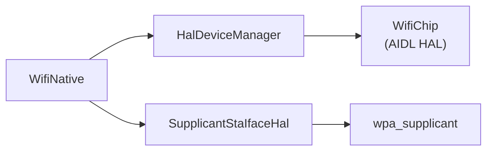
```mermaid
graph LR
    WN["WifiNative"]
    HDM["HalDeviceManager"]
    CHIP["WifiChip<br/>(AIDL HAL)"]
    SIFACE["SupplicantStaIfaceHal"]
    WPA["wpa_supplicant"]

    WN --> HDM
    WN --> SIFACE
    HDM --> CHIP
    SIFACE --> WPA
```

### 35.3.5 wpa_supplicant Integration

Android uses the industry-standard `wpa_supplicant` for 802.11 authentication.
The `SupplicantStaIfaceHal` class communicates with wpa_supplicant through an
AIDL interface, handling:

- WPA/WPA2/WPA3 authentication
- 802.1X enterprise authentication (EAP-TLS, EAP-TTLS, EAP-PEAP, EAP-SIM, etc.)
- FILS (Fast Initial Link Setup) for reduced connection time
- OWE (Opportunistic Wireless Encryption) for open networks
- SAE (Simultaneous Authentication of Equals) for WPA3
- DPP (Device Provisioning Protocol) for easy onboarding

### 35.3.6 Network Selection

The `WifiNetworkSelector` evaluates available scan results and selects the
best network to connect to. It considers:

1. **Saved network priority**: User-configured preferences
2. **Signal strength (RSSI)**: Weighted by band (2.4 GHz, 5 GHz, 6 GHz)
3. **Security type**: Prefers stronger security
4. **Past performance**: Historical connection quality metrics
5. **Network suggestions**: App-suggested networks
6. **Enterprise policies**: Device admin restrictions
7. **Blocked networks**: Temporarily disabled due to failures

### 35.3.7 SoftAP (Mobile Hotspot)

`SoftApManager` handles the mobile hotspot functionality, managing the AP
interface lifecycle through its own state machine.

**Source file:**
`packages/modules/Wifi/service/java/com/android/server/wifi/SoftApManager.java`

```java
// Source: packages/modules/Wifi/service/java/com/android/server/wifi/SoftApManager.java
public class SoftApManager implements ActiveModeManager {
    private static final String TAG = "SoftApManager";
    // SoftAP manages the AP mode lifecycle:
    // - Interface creation (via WifiNative/HalDeviceManager)
    // - Channel selection (considering coexistence)
    // - Client connection/disconnection tracking
    // - Bridged AP mode (dual-band simultaneous)
    // - Idle timeout management
    // ...
}
```

SoftAP features include:

- **Dual-band support**: Bridged AP mode provides simultaneous 2.4 GHz and 5 GHz
- **Client management**: Track connected clients, enforce max client limits
- **Coexistence**: `CoexManager` handles interference with cellular bands
- **Auto-shutdown**: Configurable idle timeout when no clients are connected
- **WPA3-SAE**: Support for WPA3 security in hotspot mode
- **MAC randomization**: Privacy-preserving MAC for AP BSSID

### 35.3.8 Wi-Fi Direct (P2P)

Wi-Fi Direct allows devices to connect directly without an access point. The
implementation lives in `packages/modules/Wifi/service/java/com/android/server/wifi/p2p/`
and is managed by `WifiP2pServiceImpl`.

The P2P connection flow:

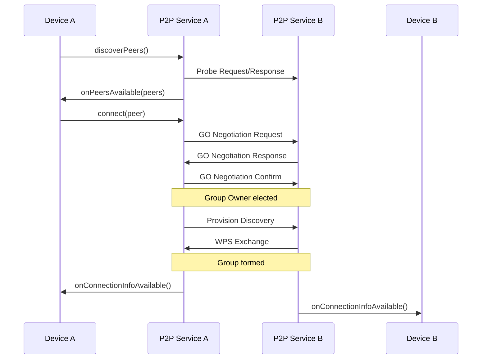
```mermaid
sequenceDiagram
    participant DevA as Device A
    participant P2PA as P2P Service A
    participant P2PB as P2P Service B
    participant DevB as Device B

    DevA->>P2PA: discoverPeers()
    P2PA->>P2PB: Probe Request/Response
    P2PA->>DevA: onPeersAvailable(peers)
    DevA->>P2PA: connect(peer)
    P2PA->>P2PB: GO Negotiation Request
    P2PB->>P2PA: GO Negotiation Response
    P2PA->>P2PB: GO Negotiation Confirm
    Note over P2PA,P2PB: Group Owner elected
    P2PA->>P2PB: Provision Discovery
    P2PB->>P2PA: WPS Exchange
    Note over P2PA,P2PB: Group formed
    P2PA->>DevA: onConnectionInfoAvailable()
    P2PB->>DevB: onConnectionInfoAvailable()
```

### 35.3.9 Multi-Link Operation (MLO) and Wi-Fi 7

Modern AOSP includes support for Wi-Fi 7 (802.11be) features, including
Multi-Link Operation. The `MloLink` class in the Wi-Fi framework represents
individual links in an MLO connection:

```java
// From ClientModeImpl.java imports
import android.net.wifi.MloLink;
```

MLO enables simultaneous transmission across multiple channels and bands,
significantly improving throughput and latency.

---

## 35.4 netd (Network Daemon)

### 35.4.1 Overview

`netd` is the native daemon responsible for configuring the Linux kernel's
networking subsystem on behalf of the Android framework. It runs as a privileged
process and is the primary pathway for routing table manipulation, firewall
rule management, bandwidth control, and interface configuration.

**Source directory:** `system/netd/`

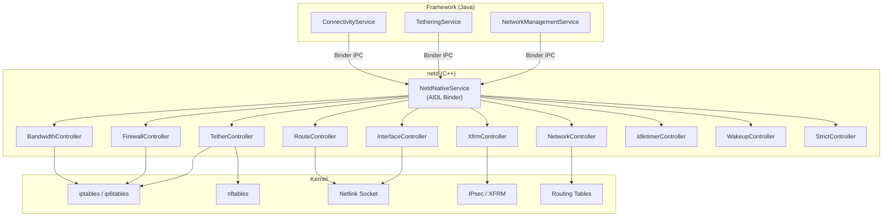
```mermaid
graph TD
    subgraph "Framework (Java)"
        CS["ConnectivityService"]
        TS["TetheringService"]
        NMS["NetworkManagementService"]
    end

    subgraph "netd (C++)"
        NNS["NetdNativeService<br/>(AIDL Binder)"]
        NC["NetworkController"]
        BC["BandwidthController"]
        FC["FirewallController"]
        RC["RouteController"]
        TC_CTRL["TetherController"]
        IC["InterfaceController"]
        XC["XfrmController"]
        IT["IdletimerController"]
        WC["WakeupController"]
        SC["StrictController"]
    end

    subgraph "Kernel"
        IPTABLES["iptables / ip6tables"]
        NFTABLES["nftables"]
        NETLINK_K["Netlink Socket"]
        XFRM["IPsec / XFRM"]
        ROUTING["Routing Tables"]
    end

    CS -->|Binder IPC| NNS
    TS -->|Binder IPC| NNS
    NMS -->|Binder IPC| NNS
    NNS --> NC
    NNS --> BC
    NNS --> FC
    NNS --> RC
    NNS --> TC_CTRL
    NNS --> IC
    NNS --> XC
    NNS --> IT
    NNS --> WC
    NNS --> SC
    NC --> ROUTING
    BC --> IPTABLES
    FC --> IPTABLES
    RC --> NETLINK_K
    TC_CTRL --> IPTABLES
    TC_CTRL --> NFTABLES
    IC --> NETLINK_K
    XC --> XFRM
```

### 35.4.2 NetdNativeService: The Binder Interface

`NetdNativeService` exposes netd's functionality via AIDL Binder. It is the
sole entry point for framework callers.

**Source file:** `system/netd/server/NetdNativeService.h`

```cpp
// Source: system/netd/server/NetdNativeService.h
class NetdNativeService : public BinderService<NetdNativeService>, public BnNetd {
  public:
    NetdNativeService();
    static status_t start();
    static char const* getServiceName() { return "netd"; }

    // Firewall commands
    binder::Status firewallReplaceUidChain(const std::string& chainName,
                                           bool isAllowlist,
                                           const std::vector<int32_t>& uids,
                                           bool* ret) override;
    binder::Status firewallSetFirewallType(int32_t firewallType) override;
    binder::Status firewallSetInterfaceRule(const std::string& ifName,
                                            int32_t firewallRule) override;
    binder::Status firewallSetUidRule(int32_t childChain, int32_t uid,
                                      int32_t firewallRule) override;

    // Bandwidth control commands
    binder::Status bandwidthEnableDataSaver(bool enable, bool *ret) override;
    binder::Status bandwidthSetInterfaceQuota(const std::string& ifName,
                                              int64_t bytes) override;
    binder::Status bandwidthSetGlobalAlert(int64_t bytes) override;
    binder::Status bandwidthAddNaughtyApp(int32_t uid) override;
    binder::Status bandwidthAddNiceApp(int32_t uid) override;

    // Network and routing commands
    binder::Status networkCreate(const NativeNetworkConfig& config) override;
    binder::Status networkDestroy(int32_t netId) override;
    binder::Status networkAddInterface(int32_t netId,
                                       const std::string& iface) override;
    binder::Status networkAddRoute(int32_t netId, const std::string& ifName,
                                   const std::string& destination,
                                   const std::string& nextHop) override;
    binder::Status networkSetDefault(int32_t netId) override;

    // Socket operations
    binder::Status socketDestroy(const std::vector<UidRangeParcel>& uids,
                                 const std::vector<int32_t>& skipUids) override;
    // ...
};
```

### 35.4.3 NetworkController: Routing and Networks

The `NetworkController` manages the creation and configuration of network
abstractions within netd. Each network (physical, virtual, local, or
unreachable) gets its own routing table and policy rules.

**Source file:** `system/netd/server/NetworkController.cpp`

```cpp
// Source: system/netd/server/NetworkController.cpp
// THREAD-SAFETY
// The methods in this file are called from multiple threads (from
// CommandListener, FwmarkServer and DnsProxyListener). So, all accesses
// to shared state are guarded by a lock.

class NetworkController::DelegateImpl : public PhysicalNetwork::Delegate {
  public:
    explicit DelegateImpl(NetworkController* networkController);

    [[nodiscard]] int modifyFallthrough(unsigned vpnNetId,
                                        const std::string& physicalInterface,
                                        Permission permission, bool add);
  // ...
};
```

Network types in netd:

| Type | Class | Purpose |
|------|-------|---------|
| Physical | `PhysicalNetwork` | Wi-Fi, cellular, Ethernet |
| Virtual | `VirtualNetwork` | VPN networks |
| Local | `LocalNetwork` | localhost and local interfaces |
| Unreachable | `UnreachableNetwork` | Block traffic (reject routes) |
| Dummy | `DummyNetwork` | Test/placeholder network |

### 35.4.4 iptables Chain Architecture

netd organizes iptables rules into carefully ordered chains. The ordering is
critical for correct operation and is explicitly documented in the source.

**Source file:** `system/netd/server/Controllers.cpp`

```cpp
// Source: system/netd/server/Controllers.cpp
// ORDERING IS CRITICAL, AND SHOULD BE TRIPLE-CHECKED WITH EACH CHANGE.

static const std::vector<const char*> FILTER_INPUT = {
    OEM_IPTABLES_FILTER_INPUT,
    BandwidthController::LOCAL_INPUT,     // "bw_INPUT"
    FirewallController::LOCAL_INPUT,      // "fw_INPUT"
};

static const std::vector<const char*> FILTER_FORWARD = {
    OEM_IPTABLES_FILTER_FORWARD,
    FirewallController::LOCAL_FORWARD,    // "fw_FORWARD"
    BandwidthController::LOCAL_FORWARD,   // "bw_FORWARD"
    TetherController::LOCAL_FORWARD,      // tethering forwarding
};

static const std::vector<const char*> FILTER_OUTPUT = {
    OEM_IPTABLES_FILTER_OUTPUT,
    FirewallController::LOCAL_OUTPUT,     // "fw_OUTPUT"
    StrictController::LOCAL_OUTPUT,       // cleartext enforcement
    BandwidthController::LOCAL_OUTPUT,    // "bw_OUTPUT"
};

static const std::vector<const char*> RAW_PREROUTING = {
    IdletimerController::LOCAL_RAW_PREROUTING,
    BandwidthController::LOCAL_RAW_PREROUTING,
    TetherController::LOCAL_RAW_PREROUTING,
};

static const std::vector<const char*> MANGLE_POSTROUTING = {
    OEM_IPTABLES_MANGLE_POSTROUTING,
    BandwidthController::LOCAL_MANGLE_POSTROUTING,
    IdletimerController::LOCAL_MANGLE_POSTROUTING,
};

static const std::vector<const char*> MANGLE_INPUT = {
    CONNMARK_MANGLE_INPUT,
    WakeupController::LOCAL_MANGLE_INPUT,
    RouteController::LOCAL_MANGLE_INPUT,
};
```

The chain execution order for an incoming packet:

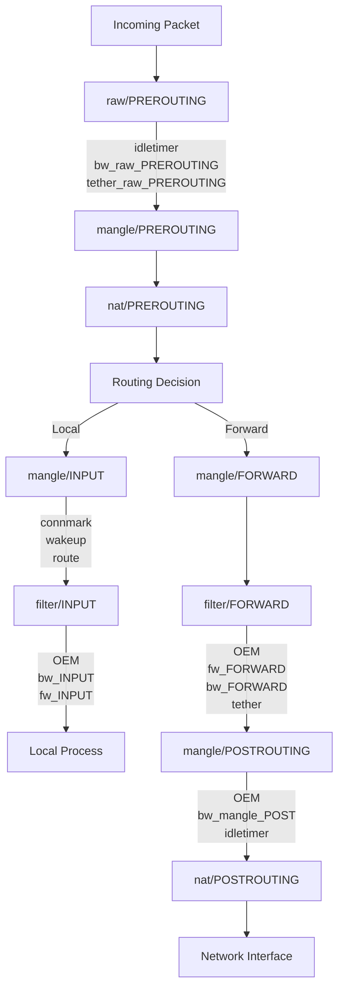
```mermaid
graph TD
    PKT["Incoming Packet"] --> RAW["raw/PREROUTING"]
    RAW --> |"idletimer<br/>bw_raw_PREROUTING<br/>tether_raw_PREROUTING"| MANGLE_PRE["mangle/PREROUTING"]
    MANGLE_PRE --> NAT_PRE["nat/PREROUTING"]
    NAT_PRE --> ROUTE["Routing Decision"]
    ROUTE -->|"Local"| MANGLE_IN["mangle/INPUT"]
    ROUTE -->|"Forward"| MANGLE_FWD["mangle/FORWARD"]

    MANGLE_IN -->|"connmark<br/>wakeup<br/>route"| FILTER_IN["filter/INPUT"]
    FILTER_IN -->|"OEM<br/>bw_INPUT<br/>fw_INPUT"| LOCAL["Local Process"]

    MANGLE_FWD --> FILTER_FWD["filter/FORWARD"]
    FILTER_FWD -->|"OEM<br/>fw_FORWARD<br/>bw_FORWARD<br/>tether"| MANGLE_POST["mangle/POSTROUTING"]
    MANGLE_POST -->|"OEM<br/>bw_mangle_POST<br/>idletimer"| NAT_POST["nat/POSTROUTING"]
    NAT_POST --> OUT["Network Interface"]
```

### 35.4.5 BandwidthController

The `BandwidthController` implements data usage tracking and enforcement using
iptables quota rules and BPF programs.

**Source file:** `system/netd/server/BandwidthController.cpp`

```cpp
// Source: system/netd/server/BandwidthController.cpp
const char BandwidthController::LOCAL_INPUT[] = "bw_INPUT";
const char BandwidthController::LOCAL_FORWARD[] = "bw_FORWARD";
const char BandwidthController::LOCAL_OUTPUT[] = "bw_OUTPUT";
const char BandwidthController::LOCAL_RAW_PREROUTING[] = "bw_raw_PREROUTING";
const char BandwidthController::LOCAL_MANGLE_POSTROUTING[] = "bw_mangle_POSTROUTING";
const char BandwidthController::LOCAL_GLOBAL_ALERT[] = "bw_global_alert";
```

Bandwidth control features:

- **Per-interface quotas**: Limit data usage on specific interfaces
- **Global alerts**: Notify when total usage exceeds a threshold
- **Naughty apps**: UIDs blocked from using metered networks (data saver)
- **Nice apps**: UIDs exempt from data saver restrictions
- **Shared costly chain**: Global quota across all metered interfaces

```cpp
// Source: system/netd/server/BandwidthController.cpp
// Comments explaining the rule structure:
//  * global quota for all costly interfaces uses a single costly chain:
//   . initial rules
//     iptables -N bw_costly_shared
//     iptables -I bw_INPUT -i iface0 -j bw_costly_shared
//     iptables -I bw_OUTPUT -o iface0 -j bw_costly_shared
//     iptables -I bw_costly_shared -m quota \! --quota 500000 \
//         -j REJECT --reject-with icmp-net-prohibited
//     iptables -A bw_costly_shared -j bw_penalty_box
//     iptables -A bw_penalty_box -j bw_happy_box
```

### 35.4.6 FirewallController

The `FirewallController` manages per-UID network access rules, implementing
Android's firewall chains for doze mode, battery saver, and app standby.

**Source file:** `system/netd/server/FirewallController.cpp`

```cpp
// Source: system/netd/server/FirewallController.cpp
const char FirewallController::TABLE[] = "filter";
const char FirewallController::LOCAL_INPUT[] = "fw_INPUT";
const char FirewallController::LOCAL_OUTPUT[] = "fw_OUTPUT";
const char FirewallController::LOCAL_FORWARD[] = "fw_FORWARD";

// ICMPv6 types that are required for any form of IPv6 connectivity to work.
const char* const FirewallController::ICMPV6_TYPES[] = {
    "packet-too-big",
    "router-solicitation",
    "router-advertisement",
    "neighbour-solicitation",
    "neighbour-advertisement",
    "redirect",
};
```

The firewall supports two modes:

- **Denylist** (default): All traffic is allowed unless explicitly denied
- **Allowlist**: All traffic is blocked unless explicitly allowed

Child chains implement specific power-saving policies:

| Chain | Purpose | Mode |
|-------|---------|------|
| `fw_dozable` | Doze mode whitelist | Allowlist |
| `fw_standby` | App standby denylist | Denylist |
| `fw_powersave` | Battery saver whitelist | Allowlist |
| `fw_restricted` | Background restriction | Denylist |
| `fw_low_power_standby` | Low-power standby | Allowlist |
| `fw_background` | Background network access | Mixed |

### 35.4.7 RouteController

The `RouteController` manages Linux routing tables and policy rules. Each
network gets its own routing table, identified by the netId. Policy routing
rules use fwmarks to direct packets to the correct table.

The routing architecture:

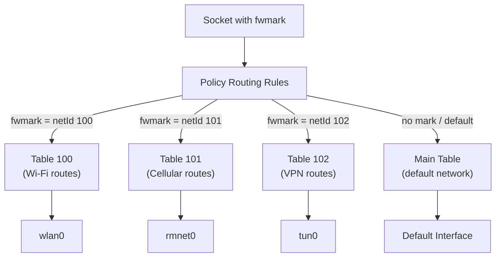
```mermaid
graph TD
    SOCKET["Socket with fwmark"] --> PR["Policy Routing Rules"]
    PR --> |"fwmark = netId 100"| RT100["Table 100<br/>(Wi-Fi routes)"]
    PR --> |"fwmark = netId 101"| RT101["Table 101<br/>(Cellular routes)"]
    PR --> |"fwmark = netId 102"| RT102["Table 102<br/>(VPN routes)"]
    PR --> |"no mark / default"| RTMAIN["Main Table<br/>(default network)"]

    RT100 --> IF_WLAN["wlan0"]
    RT101 --> IF_RMNET["rmnet0"]
    RT102 --> IF_TUN["tun0"]
    RTMAIN --> IF_DEFAULT["Default Interface"]
```

### 35.4.8 XfrmController: IPsec

The `XfrmController` manages Linux XFRM (IPsec transform) operations for
VPN and other encrypted tunnel needs:

**Source file:** `system/netd/server/XfrmController.cpp`

It handles:

- Security Association (SA) creation and deletion
- Security Policy (SP) configuration
- Tunnel interface management
- ESP (Encapsulating Security Payload) configuration
- SPI (Security Parameter Index) allocation

### 35.4.9 FwmarkServer

The `FwmarkServer` is a UNIX domain socket server within netd that handles
socket tagging. When a socket is created, the C library (`bionic`) connects
to the FwmarkServer, which applies the appropriate fwmark based on the
process's UID, the default network, and any explicit network binding.

**Source file:** `system/netd/server/FwmarkServer.cpp`

This mechanism ensures that every socket is automatically routed through the
correct network without application intervention.

---

## 35.5 DNS Resolver

### 35.5.1 Architecture

The DNS resolver runs as a module within the netd process (linked as a shared
library) but is maintained as a separate Mainline module for independent
updatability.

**Module root:** `packages/modules/DnsResolver/`

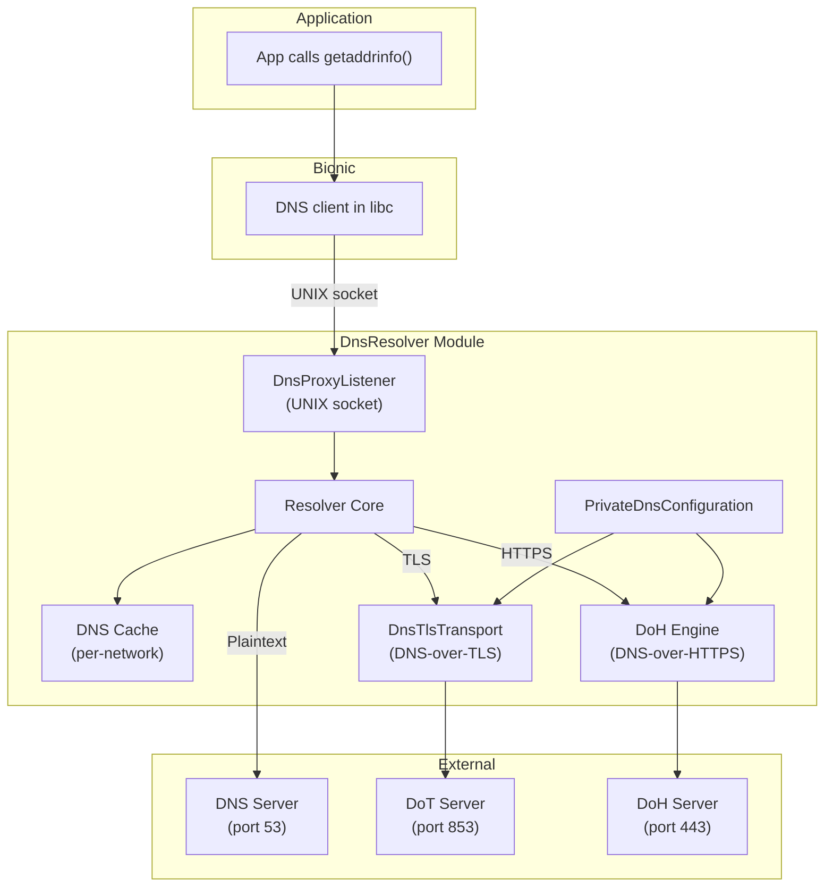
```mermaid
graph TD
    subgraph "Application"
        APP["App calls getaddrinfo()"]
    end

    subgraph "Bionic"
        BIONIC["DNS client in libc"]
    end

    subgraph "DnsResolver Module"
        DPL["DnsProxyListener<br/>(UNIX socket)"]
        RESOLV["Resolver Core"]
        CACHE["DNS Cache<br/>(per-network)"]
        DOT["DnsTlsTransport<br/>(DNS-over-TLS)"]
        DOH["DoH Engine<br/>(DNS-over-HTTPS)"]
        PDNS["PrivateDnsConfiguration"]
    end

    subgraph "External"
        DNS53["DNS Server<br/>(port 53)"]
        DNS853["DoT Server<br/>(port 853)"]
        DNS443["DoH Server<br/>(port 443)"]
    end

    APP --> BIONIC
    BIONIC -->|"UNIX socket"| DPL
    DPL --> RESOLV
    RESOLV --> CACHE
    RESOLV -->|"Plaintext"| DNS53
    RESOLV -->|"TLS"| DOT
    RESOLV -->|"HTTPS"| DOH
    DOT --> DNS853
    DOH --> DNS443
    PDNS --> DOT
    PDNS --> DOH
```

### 35.5.2 Initialization

The resolver is initialized when netd starts, through the `resolv_init()`
function:

**Source file:** `packages/modules/DnsResolver/DnsResolver.cpp`

```cpp
// Source: packages/modules/DnsResolver/DnsResolver.cpp
bool resolv_init(const ResolverNetdCallbacks* callbacks) {
    android::base::InitLogging(/*argv=*/nullptr);
    LOG(INFO) << __func__ << ": Initializing resolver";
    const bool isDebug = isDebuggable();
    resolv_set_log_severity(isDebug
        ? android::base::INFO
        : android::base::WARNING);
    doh_init_logger(isDebug
        ? DOH_LOG_LEVEL_INFO
        : DOH_LOG_LEVEL_WARN);

    using android::net::gApiLevel;
    gApiLevel = getApiLevel();
    using android::net::gResNetdCallbacks;
    gResNetdCallbacks.check_calling_permission =
        callbacks->check_calling_permission;
    gResNetdCallbacks.get_network_context =
        callbacks->get_network_context;
    gResNetdCallbacks.log = callbacks->log;
    if (gApiLevel >= 30) {
        gResNetdCallbacks.tagSocket = callbacks->tagSocket;
        gResNetdCallbacks.evaluate_domain_name =
            callbacks->evaluate_domain_name;
    }
    android::net::gDnsResolv = android::net::DnsResolver::getInstance();
    return android::net::gDnsResolv->start();
}
```

The `DnsResolver::start()` method launches two key components:

1. `DnsProxyListener`: Listens for DNS queries on a UNIX domain socket
2. `DnsResolverService`: AIDL Binder interface for configuration

```cpp
// Source: packages/modules/DnsResolver/DnsResolver.cpp
bool DnsResolver::start() {
    if (!verifyCallbacks()) {
        LOG(ERROR) << __func__ << ": Callback verification failed";
        return false;
    }
    if (mDnsProxyListener.startListener()) {
        PLOG(ERROR) << __func__ << ": Unable to start DnsProxyListener";
        return false;
    }
    binder_status_t ret;
    if ((ret = DnsResolverService::start()) != STATUS_OK) {
        LOG(ERROR) << __func__
                   << ": Unable to start DnsResolverService: " << ret;
        return false;
    }
    return true;
}
```

### 35.5.3 DNS Query Flow

When an application calls `InetAddress.getByName()` or `getaddrinfo()`, the
query follows this path:

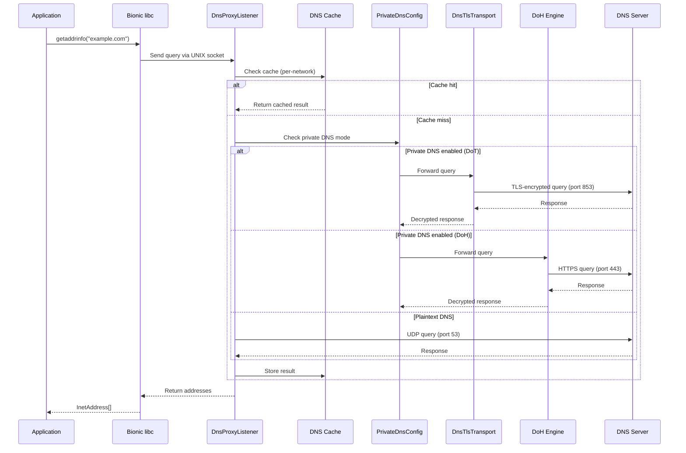
```mermaid
sequenceDiagram
    participant App as Application
    participant Bionic as Bionic libc
    participant DPL as DnsProxyListener
    participant Cache as DNS Cache
    participant Private as PrivateDnsConfig
    participant DoT as DnsTlsTransport
    participant DoH as DoH Engine
    participant Server as DNS Server

    App->>Bionic: getaddrinfo("example.com")
    Bionic->>DPL: Send query via UNIX socket
    DPL->>Cache: Check cache (per-network)
    alt Cache hit
        Cache-->>DPL: Return cached result
    else Cache miss
        DPL->>Private: Check private DNS mode
        alt Private DNS enabled (DoT)
            Private->>DoT: Forward query
            DoT->>Server: TLS-encrypted query (port 853)
            Server-->>DoT: Response
            DoT-->>Private: Decrypted response
        else Private DNS enabled (DoH)
            Private->>DoH: Forward query
            DoH->>Server: HTTPS query (port 443)
            Server-->>DoH: Response
            DoH-->>Private: Decrypted response
        else Plaintext DNS
            DPL->>Server: UDP query (port 53)
            Server-->>DPL: Response
        end
        DPL->>Cache: Store result
    end
    DPL-->>Bionic: Return addresses
    Bionic-->>App: InetAddress[]
```

### 35.5.4 DNS-over-TLS (DoT)

The `DnsTlsTransport` class implements DNS-over-TLS (RFC 7858) for encrypted
DNS queries on port 853.

**Source file:** `packages/modules/DnsResolver/DnsTlsTransport.cpp`

```cpp
// Source: packages/modules/DnsResolver/DnsTlsTransport.cpp
namespace {
// Make a DNS query for the hostname
// "<random>-dnsotls-ds.metric.gstatic.com".
// This is used for DoT validation probing.
std::vector<uint8_t> makeDnsQuery() {
    static const char kDnsSafeChars[] =
            "abcdefhijklmnopqrstuvwxyz"
            "ABCDEFHIJKLMNOPQRSTUVWXYZ"
            "0123456789";
    // ... builds a DNS query with random prefix for validation
}
}  // namespace
```

The DoT implementation features:

- **Session caching**: Reuses TLS sessions to reduce handshake overhead
- **Connection reuse**: Multiplexes queries over persistent connections
- **Validation**: Probes DoT servers before activating them
- **Failover**: Falls back to plaintext DNS if DoT fails

Key classes in the DoT stack:

| Class | File | Role |
|-------|------|------|
| `DnsTlsTransport` | `DnsTlsTransport.cpp` | Connection management |
| `DnsTlsSocket` | `DnsTlsSocket.cpp` | TLS socket wrapper |
| `DnsTlsDispatcher` | `DnsTlsDispatcher.cpp` | Query routing |
| `DnsTlsQueryMap` | `DnsTlsQueryMap.cpp` | Query/response matching |
| `DnsTlsSessionCache` | `DnsTlsSessionCache.cpp` | TLS session reuse |
| `DnsTlsServer` | `DnsTlsServer.cpp` | Server representation |

### 35.5.5 DNS-over-HTTPS (DoH)

DoH support was added in Android 13 and provides DNS encryption over HTTPS
(RFC 8484). The DoH engine is implemented in Rust for memory safety and
performance.

**Source file:** `packages/modules/DnsResolver/PrivateDnsConfiguration.cpp`

```cpp
// Source: packages/modules/DnsResolver/PrivateDnsConfiguration.cpp
FeatureFlags makeDohFeatureFlags() {
    const Experiments* const instance = Experiments::getInstance();
    const auto getTimeout = [&](const std::string_view key,
                                 int defaultValue) -> uint64_t {
        static constexpr int kMinTimeoutMs = 1000;
        uint64_t timeout = instance->getFlag(key, defaultValue);
        if (timeout < kMinTimeoutMs) {
            timeout = kMinTimeoutMs;
        }
        return timeout;
    };

    return FeatureFlags{
        .probe_timeout_ms = getTimeout("doh_probe_timeout_ms",
            PrivateDnsConfiguration::kDohProbeDefaultTimeoutMs),
        .idle_timeout_ms = getTimeout("doh_idle_timeout_ms",
            PrivateDnsConfiguration::kDohIdleDefaultTimeoutMs),
        .use_session_resumption =
            instance->getFlag("doh_session_resumption", 0) == 1,
        .enable_early_data =
            instance->getFlag("doh_early_data", 0) == 1,
    };
}
```

DoH feature flags allow server-side control over:

- **Probe timeout**: How long to wait for DoH validation
- **Idle timeout**: How long to keep idle connections open
- **Session resumption**: TLS 1.3 session resumption (0-RTT)
- **Early data**: TLS 1.3 early data for reduced latency

### 35.5.6 Private DNS Configuration

The `PrivateDnsConfiguration` class manages the lifecycle of private DNS
(DoT/DoH) servers, including validation and failover.

**Source file:** `packages/modules/DnsResolver/PrivateDnsConfiguration.cpp`

```cpp
// Source: packages/modules/DnsResolver/PrivateDnsConfiguration.cpp
// Returns the sorted (sort IPv6 before IPv4) servers.
std::vector<std::string> sortServers(
        const std::vector<std::string>& servers) {
    std::vector<std::string> out = servers;
    std::sort(out.begin(), out.end(),
        [](std::string a, std::string b) {
            return IPAddress::forString(a) > IPAddress::forString(b);
        });
    return out;
}
```

Private DNS modes:

1. **Off**: All DNS queries are plaintext
2. **Opportunistic** (default): Try DoT/DoH, fall back to plaintext
3. **Strict**: Force DoT/DoH; fail if unavailable

The validation state machine:

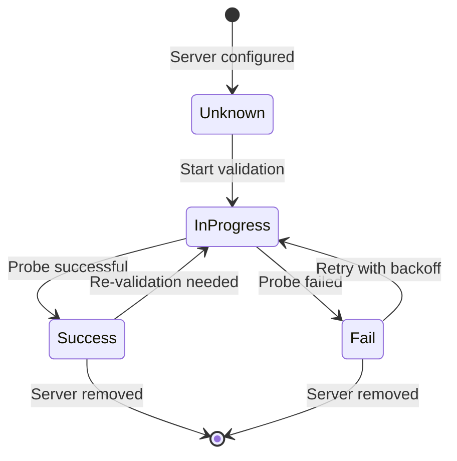
```mermaid
stateDiagram-v2
    [*] --> Unknown: Server configured
    Unknown --> InProgress: Start validation
    InProgress --> Success: Probe successful
    InProgress --> Fail: Probe failed
    Success --> InProgress: Re-validation needed
    Fail --> InProgress: Retry with backoff
    Success --> [*]: Server removed
    Fail --> [*]: Server removed
```

### 35.5.7 Dns64 and NAT64

The `Dns64Configuration` class handles DNS64 prefix discovery for IPv6-only
networks. When a network has no IPv4 connectivity, DNS64 synthesizes AAAA
records from A records, and NAT64 (handled by clatd in the connectivity module)
translates the packets.

**Source file:** `packages/modules/DnsResolver/Dns64Configuration.cpp`

### 35.5.8 Per-Network DNS Cache

The resolver maintains separate DNS caches per network ID. This prevents
DNS cache poisoning across networks and ensures that responses are appropriate
for the network context (e.g., captive portal responses are not cached for
the global DNS).

Key cache behaviors:

- **TTL-based expiry**: Respects DNS record TTL values
- **Network isolation**: Separate cache per netId
- **Negative caching**: Caches NXDOMAIN responses
- **Cache flushing**: Triggered on network changes

### 35.5.9 DNS Query Logging

The `DnsQueryLog` class provides diagnostic logging for DNS queries:

**Source file:** `packages/modules/DnsResolver/DnsQueryLog.cpp`

This enables debugging via `dumpsys dnsresolver` and metrics collection for
DNS performance monitoring.

---

## 35.6 VPN Framework

### 35.6.1 Architecture Overview

Android's VPN framework supports multiple VPN types: third-party VPN apps
(VpnService API), platform-managed IKEv2 VPNs, and legacy PPTP/L2TP VPNs.
The central implementation resides in the `Vpn` class.

**Source file:**
`frameworks/base/services/core/java/com/android/server/connectivity/Vpn.java`

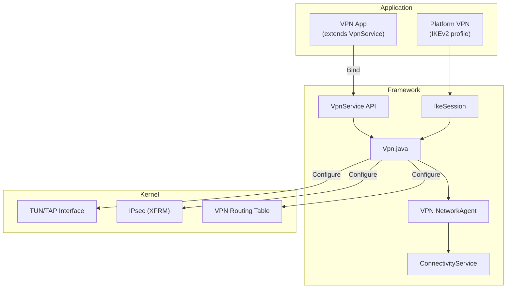
```mermaid
graph TD
    subgraph "Application"
        VPNAPP["VPN App<br/>(extends VpnService)"]
        IKEV2["Platform VPN<br/>(IKEv2 profile)"]
    end

    subgraph "Framework"
        VPN["Vpn.java"]
        VPNSVC["VpnService API"]
        IKESESS["IkeSession"]
        NA_VPN["VPN NetworkAgent"]
        CS["ConnectivityService"]
    end

    subgraph "Kernel"
        TUN["TUN/TAP Interface"]
        IPSEC["IPsec (XFRM)"]
        ROUTING_VPN["VPN Routing Table"]
    end

    VPNAPP -->|"Bind"| VPNSVC
    VPNSVC --> VPN
    IKEV2 --> IKESESS
    IKESESS --> VPN
    VPN --> NA_VPN
    NA_VPN --> CS
    VPN -->|"Configure"| TUN
    VPN -->|"Configure"| IPSEC
    VPN -->|"Configure"| ROUTING_VPN
```

### 35.6.2 The Vpn Class

The `Vpn` class is one of the most complex classes in the connectivity stack,
handling both third-party VPN apps and platform-managed VPNs.

```java
// Source: frameworks/base/services/core/java/com/android/server/connectivity/Vpn.java
public class Vpn {
    private static final String NETWORKTYPE = "VPN";
    private static final String TAG = "Vpn";

    // VPN launch idle allowlist duration
    private static final long VPN_LAUNCH_IDLE_ALLOWLIST_DURATION_MS = 60 * 1000;

    // IKEv2 retry delays with exponential backoff
    private static final long[] IKEV2_VPN_RETRY_DELAYS_MS =
            {1_000L, 2_000L, 5_000L, 30_000L, 60_000L, 300_000L, 900_000L};

    // Maximum VPN profile size (128 KB)
    static final int MAX_VPN_PROFILE_SIZE_BYTES = 1 << 17;

    // VPN network score
    private static final int VPN_DEFAULT_SCORE = 101;

    // Data stall recovery delays
    private static final long[] DATA_STALL_RECOVERY_DELAYS_MS =
            {1000L, 5000L, 30000L, 60000L, 120000L, 240000L, 480000L, 960000L};

    // Maximum MOBIKE recovery attempts
    private static final int MAX_MOBIKE_RECOVERY_ATTEMPT = 2;

    // Automatic keepalive interval
    public static final int AUTOMATIC_KEEPALIVE_DELAY_SECONDS = 30;
    // ...
}
```

### 35.6.3 VPN Types

Android supports three VPN implementation approaches:

**1. Third-Party VPN (VpnService API)**

Applications extend `VpnService` and request a TUN interface from the kernel.
All traffic matching the VPN's routing rules is redirected through this
interface, where the app encrypts and tunnels it.

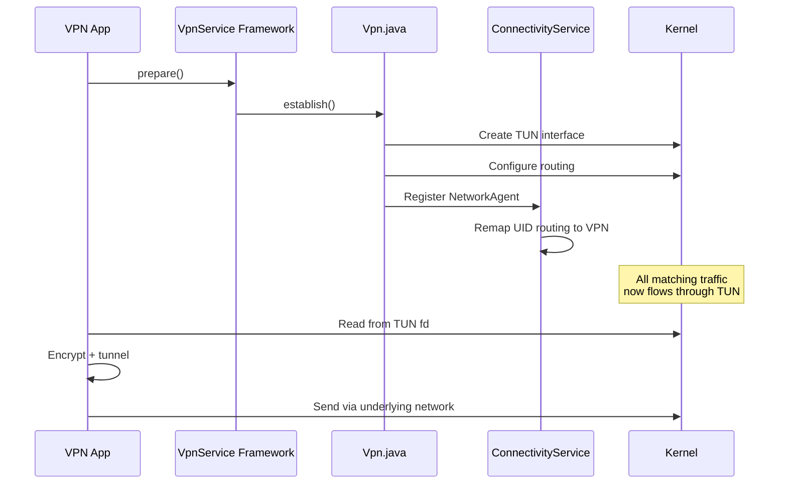
```mermaid
sequenceDiagram
    participant App as VPN App
    participant FW as VpnService Framework
    participant VPN as Vpn.java
    participant CS as ConnectivityService
    participant Kernel as Kernel

    App->>FW: prepare()
    FW->>VPN: establish()
    VPN->>Kernel: Create TUN interface
    VPN->>Kernel: Configure routing
    VPN->>CS: Register NetworkAgent
    CS->>CS: Remap UID routing to VPN
    Note over Kernel: All matching traffic<br/>now flows through TUN
    App->>Kernel: Read from TUN fd
    App->>App: Encrypt + tunnel
    App->>Kernel: Send via underlying network
```

**2. Platform VPN (IKEv2)**

For IKEv2 VPNs, the framework manages the entire connection lifecycle:

```java
// Source: frameworks/base/services/core/java/com/android/server/connectivity/Vpn.java
// IKE session management imports
import android.net.ipsec.ike.IkeSession;
import android.net.ipsec.ike.IkeSessionCallback;
import android.net.ipsec.ike.IkeSessionConfiguration;
import android.net.ipsec.ike.IkeSessionParams;
import android.net.ipsec.ike.IkeTunnelConnectionParams;
```

The platform handles:

- IKE negotiation (IKEv2 with EAP or certificate authentication)
- IPsec SA management
- MOBIKE for seamless network switching
- Automatic retry with exponential backoff
- Data stall detection and recovery

**3. Legacy VPN (PPTP/L2TP)**

Deprecated but still supported through the `LegacyVpnInfo` and `VpnProfile`
classes.

### 35.6.4 Per-App VPN

ConnectivityService can restrict VPN traffic to specific applications or
exclude specific applications. This is implemented through UID ranges:

```java
// Source: Vpn.java imports
import android.net.UidRangeParcel;
```

The UID ranges are configured on the VPN's network via netd's
`networkAddUidRanges()`. Packets from included UIDs are fwmarked for the VPN
routing table.

### 35.6.5 Always-On VPN

The always-on VPN feature ensures that a VPN is always active. If the
connection drops, traffic is either blocked (lockdown mode) or allowed to
flow through the underlying network (without lockdown).

```java
// Source: Vpn.java
private static final String LOCKDOWN_ALLOWLIST_SETTING_NAME =
        Settings.Secure.ALWAYS_ON_VPN_LOCKDOWN_WHITELIST;
```

Lockdown VPN implementation:

1. ConnectivityService blocks all traffic for the VPN's UID ranges using
   `BLOCKED_REASON_LOCKDOWN_VPN`
2. Only traffic through the VPN interface is permitted
3. Certain essential system apps can be allowlisted

### 35.6.6 VPN Network Agent

The VPN registers a `NetworkAgent` with ConnectivityService, advertising
capabilities that include:

- `TRANSPORT_VPN`
- Capabilities inherited from underlying networks (metered, not-roaming, etc.)
- Underlying network information for proper routing

```mermaid
graph TD
    subgraph "VPN Network"
        VPN_NA["VPN NetworkAgent<br/>TRANSPORT_VPN<br/>NET_CAPABILITY_INTERNET"]
    end

    subgraph "Underlying Networks"
        WIFI_NA["Wi-Fi NetworkAgent<br/>TRANSPORT_WIFI"]
        CELL_NA["Cellular NetworkAgent<br/>TRANSPORT_CELLULAR"]
    end

    VPN_NA -->|"Underlying"| WIFI_NA
    VPN_NA -.->|"Fallback"| CELL_NA
```

### 35.6.7 IKEv2 Data Stall Recovery

The Vpn class implements sophisticated data stall recovery for IKEv2 VPNs:

```java
// Source: Vpn.java
// Data stall recovery timers: 1s, 5s, 30s, 1m, 2m, 4m, 8m, 16m
private static final long[] DATA_STALL_RECOVERY_DELAYS_MS =
        {1000L, 5000L, 30000L, 60000L, 120000L, 240000L, 480000L, 960000L};
// Maximum attempts to perform MOBIKE when the network is bad
private static final int MAX_MOBIKE_RECOVERY_ATTEMPT = 2;
```

Recovery strategy:

1. First 2 attempts: Try MOBIKE (IKEv2 Mobility and Multihoming) to migrate
   the session to a different path
2. Subsequent attempts: Full session restart with exponential backoff
3. If all recovery attempts are exhausted, repeat the last interval

---

## 35.7 Tethering

### 35.7.1 Architecture Overview

The Tethering module allows Android devices to share their Internet connection
with other devices via USB, Wi-Fi hotspot, Bluetooth, Ethernet, or Wi-Fi
Direct.

**Module root:** `packages/modules/Connectivity/Tethering/`

```mermaid
graph TD
    subgraph "Tethering Module"
        TM["TetheringManager<br/>(public API)"]
        TETHER["Tethering.java<br/>(main coordinator)"]
        IPS["IpServer<br/>(per-interface)"]
        UNM["UpstreamNetworkMonitor"]
        BPF_COORD["BpfCoordinator"]
        IPV6_COORD["IPv6TetheringCoordinator"]
        RAD["RouterAdvertisementDaemon"]
        DHCP_S["DHCP Server"]
    end

    subgraph "External Components"
        CS["ConnectivityService"]
        NETD["netd"]
        WIFI["Wi-Fi Service"]
        USB["USB Service"]
        BT["Bluetooth Service"]
    end

    subgraph "Kernel"
        NAT["NAT (iptables)"]
        BPF_K["BPF Offload"]
        FORWARDING["IP Forwarding"]
    end

    TM -->|Binder| TETHER
    TETHER --> IPS
    TETHER --> UNM
    TETHER --> BPF_COORD
    TETHER --> IPV6_COORD
    IPS --> RAD
    IPS --> DHCP_S
    UNM -->|"Monitor"| CS
    TETHER --> NETD
    TETHER --> WIFI
    TETHER --> USB
    TETHER --> BT
    IPS --> NAT
    BPF_COORD --> BPF_K
    IPS --> FORWARDING
```

### 35.7.2 The Tethering Class

`Tethering.java` is the central coordinator for all tethering operations. It
manages the lifecycle of tethered interfaces and coordinates between upstream
(Internet-providing) and downstream (client-facing) networks.

**Source file:**
`packages/modules/Connectivity/Tethering/src/com/android/networkstack/tethering/Tethering.java`

```java
// Source: packages/modules/Connectivity/Tethering/src/com/android/networkstack/tethering/Tethering.java
// Supported tethering types:
// TETHERING_WIFI      - Wi-Fi hotspot
// TETHERING_USB       - USB tethering (RNDIS/NCM)
// TETHERING_BLUETOOTH - Bluetooth PAN
// TETHERING_WIFI_P2P  - Wi-Fi Direct tethering
// TETHERING_NCM       - USB NCM (Network Control Model)
// TETHERING_ETHERNET  - Ethernet tethering
// TETHERING_WIGIG     - WiGig (60 GHz)
// TETHERING_VIRTUAL   - Virtual tethering
```

### 35.7.3 Tethering Types

| Type | Interface | Transport | Use Case |
|------|-----------|-----------|----------|
| Wi-Fi | wlan0/1 | 802.11 | Mobile hotspot |
| USB RNDIS | rndis0 | USB | Wired to PC |
| USB NCM | ncm0 | USB | Modern USB networking |
| Bluetooth | bt-pan | BT PAN | Low-speed sharing |
| Ethernet | eth0 | Ethernet | Automotive, TV |
| Wi-Fi P2P | p2p0 | Wi-Fi Direct | Direct device sharing |
| WiGig | wigig0 | 802.11ad | High-speed 60 GHz |

### 35.7.4 IpServer: Per-Interface Management

Each tethered interface is managed by an `IpServer` instance that runs its
own state machine.

**Source file:**
`packages/modules/Connectivity/Tethering/src/android/net/ip/IpServer.java`

```mermaid
stateDiagram-v2
    [*] --> InitialState
    InitialState --> LocalHotspotState: LOCAL_ONLY request
    InitialState --> TetheredState: TETHERING request
    LocalHotspotState --> InitialState: Stop
    TetheredState --> InitialState: Stop
    TetheredState --> TetheredState: Upstream change

    state TetheredState {
        [*] --> ConfigureInterface
        ConfigureInterface --> RunDHCP: Start DHCP server
        RunDHCP --> SetupNAT: Configure NAT rules
        SetupNAT --> Active: Ready
        Active --> UpdateUpstream: Upstream changes
        UpdateUpstream --> Active: Reconfigure
    }
```

### 35.7.5 BPF Offload

The `BpfCoordinator` manages eBPF-based tethering offload, which bypasses
the Linux networking stack for forwarded packets, dramatically improving
throughput and reducing CPU usage.

**Source file:**
`packages/modules/Connectivity/Tethering/src/com/android/networkstack/tethering/BpfCoordinator.java`

```java
// Source: packages/modules/Connectivity/Tethering/src/com/android/networkstack/tethering/BpfCoordinator.java
// BPF maps used for tethering offload:
import com.android.net.module.util.bpf.Tether4Key;
import com.android.net.module.util.bpf.Tether4Value;
import com.android.net.module.util.bpf.TetherStatsValue;
```

The BPF tethering offload works by installing forwarding rules in eBPF maps:

```mermaid
graph LR
    subgraph "Without BPF Offload"
        A1["Downstream Packet"] --> B1["Kernel IP Stack"]
        B1 --> C1["iptables NAT"]
        C1 --> D1["Routing"]
        D1 --> E1["Upstream"]
    end

    subgraph "With BPF Offload"
        A2["Downstream Packet"] --> B2["BPF Program<br/>(TC ingress)"]
        B2 -->|"Lookup BPF map<br/>NAT + forward"| E2["Upstream"]
        B2 -.->|"Miss"| C2["Kernel IP Stack<br/>(slow path)"]
    end
```

The BPF maps contain:

- **Tether4Key/Tether4Value**: IPv4 connection tracking entries
- **TetherStatsValue**: Per-interface traffic statistics
- **Downstream/Upstream keys**: Direction-specific forwarding rules

### 35.7.6 IPv6 Tethering

The `IPv6TetheringCoordinator` manages IPv6 prefix delegation for tethered
clients:

**Source file:**
`packages/modules/Connectivity/Tethering/src/com/android/networkstack/tethering/IPv6TetheringCoordinator.java`

IPv6 tethering uses:

- **RouterAdvertisementDaemon**: Sends Router Advertisements to clients
- **DadProxy**: Handles Duplicate Address Detection for tethered devices
- **NeighborPacketForwarder**: Forwards neighbor discovery messages

```mermaid
sequenceDiagram
    participant Client as Tethered Client
    participant IPS as IpServer
    participant RAD as RA Daemon
    participant Upstream as Upstream Network

    Upstream->>IPS: IPv6 prefix delegated
    IPS->>RAD: Configure prefix for advertisement
    RAD->>Client: Router Advertisement (prefix, DNS)
    Client->>Client: SLAAC: Generate IPv6 address
    Client->>IPS: IPv6 traffic
    IPS->>Upstream: Forward (BPF or kernel)
```

### 35.7.7 DHCP Server

The tethering module includes its own DHCP server for assigning IPv4 addresses
to tethered clients:

```java
// Source: packages/modules/Connectivity/Tethering/src/android/net/dhcp/DhcpServingParamsParcelExt.java
```

The DHCP server provides:

- IPv4 address assignment from a configured pool
- Default gateway (the tethering device)
- DNS server configuration (forwarded from upstream)
- Lease management and renewal

### 35.7.8 Upstream Network Monitor

The `UpstreamNetworkMonitor` tracks available upstream networks and selects
the best one for providing Internet to tethered clients. It registers
network callbacks with ConnectivityService and responds to network changes.

Selection priority (typical):

1. DUN (Dedicated Upstream Network) capable cellular
2. Wi-Fi
3. Regular cellular
4. Ethernet

### 35.7.9 NAT Configuration

For IPv4 tethering, netd configures Network Address Translation (NAT) rules:

```mermaid
graph LR
    CLIENT["Tethered Client<br/>192.168.49.x"] -->|"src: 192.168.49.2"| TETHER["Tethering Device"]
    TETHER -->|"NAT: src -> WAN IP"| UPSTREAM["Internet"]
    UPSTREAM -->|"NAT: dst -> 192.168.49.2"| TETHER
    TETHER -->|"dst: 192.168.49.2"| CLIENT
```

The NAT is configured through netd's tethering controller, which sets up
iptables MASQUERADE rules in the nat/POSTROUTING chain.

---

## 35.8 Network Security Config

### 35.8.1 Overview

Android's Network Security Config allows applications to customize their
network security settings in a declarative XML format. This includes
certificate pinning, custom trust anchors, and cleartext traffic policies.

**Framework source:**
`frameworks/base/packages/NetworkSecurityConfig/platform/src/android/security/net/config/`

### 35.8.2 XML Configuration Format

Applications define their security configuration in
`res/xml/network_security_config.xml`, referenced from the `AndroidManifest.xml`:

```xml
<!-- Example network_security_config.xml -->
<network-security-config>
    <!-- Base configuration applying to all connections -->
    <base-config cleartextTrafficPermitted="false">
        <trust-anchors>
            <certificates src="system" />
        </trust-anchors>
    </base-config>

    <!-- Per-domain configuration -->
    <domain-config>
        <domain includeSubdomains="true">example.com</domain>
        <pin-set expiration="2025-12-31">
            <pin digest="SHA-256">base64EncodedPin=</pin>
            <pin digest="SHA-256">backupPinBase64=</pin>
        </pin-set>
        <trust-anchors>
            <certificates src="system" />
            <certificates src="@raw/my_ca" />
        </trust-anchors>
    </domain-config>

    <!-- Debug overrides (only active in debug builds) -->
    <debug-overrides>
        <trust-anchors>
            <certificates src="user" />
        </trust-anchors>
    </debug-overrides>
</network-security-config>
```

### 35.8.3 NetworkSecurityConfig Class

The `NetworkSecurityConfig` class is the runtime representation of the security
configuration:

**Source file:**
`frameworks/base/packages/NetworkSecurityConfig/platform/src/android/security/net/config/NetworkSecurityConfig.java`

```java
// Source: frameworks/base/packages/NetworkSecurityConfig/platform/src/android/security/net/config/NetworkSecurityConfig.java
public final class NetworkSecurityConfig {
    public static final boolean DEFAULT_CLEARTEXT_TRAFFIC_PERMITTED = true;
    public static final boolean DEFAULT_HSTS_ENFORCED = false;

    // Certificate Transparency verification for apps targeting after BAKLAVA
    @ChangeId
    @EnabledAfter(targetSdkVersion = Build.VERSION_CODES.BAKLAVA)
    static final long DEFAULT_ENABLE_CERTIFICATE_TRANSPARENCY = 407952621L;

    private final boolean mCleartextTrafficPermitted;
    private final boolean mHstsEnforced;
    private final boolean mCertificateTransparencyVerificationRequired;
    private final PinSet mPins;
    private final List<CertificatesEntryRef> mCertificatesEntryRefs;
    private Set<TrustAnchor> mAnchors;
    private NetworkSecurityTrustManager mTrustManager;
    // ...
}
```

### 35.8.4 XML Parsing

The `XmlConfigSource` class parses the XML configuration and creates
the runtime `NetworkSecurityConfig` objects:

**Source file:**
`frameworks/base/packages/NetworkSecurityConfig/platform/src/android/security/net/config/XmlConfigSource.java`

```java
// Source: frameworks/base/packages/NetworkSecurityConfig/platform/src/android/security/net/config/XmlConfigSource.java
public class XmlConfigSource implements ConfigSource {
    private static final int CONFIG_BASE = 0;
    private static final int CONFIG_DOMAIN = 1;
    private static final int CONFIG_DEBUG = 2;

    private NetworkSecurityConfig mDefaultConfig;
    private NetworkSecurityConfig mLocalhostConfig;
    private Set<Pair<Domain, NetworkSecurityConfig>> mDomainMap;
    // ...
}
```

### 35.8.5 Configuration Elements

| Element | Description |
|---------|-------------|
| `<base-config>` | Default config for all connections |
| `<domain-config>` | Per-domain overrides |
| `<debug-overrides>` | Debug-build-only settings |
| `<trust-anchors>` | Custom CA certificates |
| `<certificates>` | Certificate source (`system`, `user`, `@raw/`) |
| `<pin-set>` | Certificate pinning with expiration |
| `<pin>` | Individual pin (SHA-256 digest of public key) |
| `cleartextTrafficPermitted` | Allow/deny HTTP |
| `<certificateTransparency>` | CT verification requirement |

### 35.8.6 Key Implementation Classes

| Class | Role |
|-------|------|
| `NetworkSecurityConfig` | Runtime config representation |
| `XmlConfigSource` | XML parser |
| `ManifestConfigSource` | Reads manifest for config reference |
| `ApplicationConfig` | Per-app configuration manager |
| `NetworkSecurityTrustManager` | Custom `X509TrustManager` |
| `RootTrustManager` | Root of trust chain |
| `PinSet` | Certificate pin storage |
| `CertificatesEntryRef` | Certificate source reference |
| `SystemCertificateSource` | System CA store |
| `DirectoryCertificateSource` | Directory-based CA source |

### 35.8.7 Certificate Pinning Flow

```mermaid
sequenceDiagram
    participant App as Application
    participant TM as NetworkSecurityTrustManager
    participant Config as NetworkSecurityConfig
    participant PinSet as PinSet
    participant System as SystemCertificateSource

    App->>TM: TLS handshake
    TM->>Config: Get config for domain
    Config-->>TM: NetworkSecurityConfig
    TM->>System: Validate certificate chain
    System-->>TM: Chain valid
    TM->>PinSet: Check pins
    alt Pin matches
        PinSet-->>TM: Pin valid
        TM-->>App: Connection allowed
    else Pin mismatch
        PinSet-->>TM: Pin invalid
        TM-->>App: Connection rejected
    end
```

### 35.8.8 Certificate Transparency

Starting with Android 16, Certificate Transparency (CT) verification is
enabled by default for apps targeting the latest SDK:

```java
// Source: NetworkSecurityConfig.java
@ChangeId
@EnabledAfter(targetSdkVersion = Build.VERSION_CODES.BAKLAVA)
static final long DEFAULT_ENABLE_CERTIFICATE_TRANSPARENCY = 407952621L;
```

The `CertificateTransparencyService` in the Connectivity module manages
CT log list updates and verification:

**Source directory:**
`packages/modules/Connectivity/networksecurity/service/src/com/android/server/net/ct/`

```xml
<!-- Example: enabling CT in network security config -->
<network-security-config>
  <base-config>
    <certificateTransparency enabled="true" />
  </base-config>
</network-security-config>
```

### 35.8.9 Cleartext Traffic Restrictions

By default, Android blocks cleartext (non-HTTPS) traffic for apps targeting
Android 9+. The `StrictController` in netd enforces this at the network level:

```
// Source: system/netd/server/Controllers.cpp
// StrictController is in the FILTER_OUTPUT chain:
static const std::vector<const char*> FILTER_OUTPUT = {
    OEM_IPTABLES_FILTER_OUTPUT,
    FirewallController::LOCAL_OUTPUT,
    StrictController::LOCAL_OUTPUT,    // <-- cleartext enforcement
    BandwidthController::LOCAL_OUTPUT,
};
```

### 35.8.10 Default Security Behavior by Target SDK

| Target SDK | Cleartext | User CAs | CT Required |
|-----------|-----------|----------|------------|
| < 24 (Android 7) | Allowed | Trusted | No |
| 24-27 | Allowed | Not trusted | No |
| 28+ (Android 9) | Blocked | Not trusted | No |
| 36+ (BAKLAVA) | Blocked | Not trusted | Yes (default) |

---

## 35.9 NetworkStack Module

### 35.9.1 Overview

The NetworkStack Mainline module handles IP provisioning, network validation
(captive portal detection), and DHCP. It runs in a separate process
(`com.android.networkstack`) with `NETWORK_STACK` permission, isolating
these critical functions from the rest of the system.

**Module root:** `packages/modules/NetworkStack/`

```mermaid
graph TD
    subgraph "NetworkStack Module"
        NM["NetworkMonitor"]
        IPC["IpClient"]
        DHCP["DHCP Client"]
        CPD["Captive Portal Detection"]
        DS["Data Stall Detection"]
        IPMS["IpMemoryStore"]
    end

    subgraph "ConnectivityService"
        CS["ConnectivityService"]
        NA["NetworkAgent"]
    end

    subgraph "Network"
        PORTAL["Captive Portal"]
        INTERNET["Internet"]
        DHCP_SRV["DHCP Server"]
    end

    CS -->|"Create monitor"| NM
    NM -->|"Validation result"| CS
    NA --> IPC
    IPC --> DHCP
    DHCP --> DHCP_SRV
    NM --> CPD
    NM --> DS
    CPD --> PORTAL
    CPD --> INTERNET
    NM --> IPMS
```

### 35.9.2 NetworkMonitor: Network Validation

`NetworkMonitor` is a state machine that validates network connectivity by
probing Internet endpoints. It detects captive portals, partial connectivity,
and data stalls.

**Source file:**
`packages/modules/NetworkStack/src/com/android/server/connectivity/NetworkMonitor.java`

```java
// Source: packages/modules/NetworkStack/src/com/android/server/connectivity/NetworkMonitor.java
public class NetworkMonitor extends StateMachine {
    // Validation probe types
    // NETWORK_VALIDATION_PROBE_DNS      - DNS resolution test
    // NETWORK_VALIDATION_PROBE_HTTP     - HTTP probe (generate_204)
    // NETWORK_VALIDATION_PROBE_HTTPS    - HTTPS probe
    // NETWORK_VALIDATION_PROBE_FALLBACK - Fallback URL probe
    // NETWORK_VALIDATION_PROBE_PRIVDNS  - Private DNS validation
    // ...
}
```

The validation state machine:

```mermaid
stateDiagram-v2
    [*] --> DefaultState

    state DefaultState {
        [*] --> MaybeNotifyState
        MaybeNotifyState --> EvaluatingState: Start validation
        EvaluatingState --> ValidatedState: All probes pass
        EvaluatingState --> CaptivePortalState: Portal detected
        EvaluatingState --> WaitingForNextProbeState: Probe failed
        WaitingForNextProbeState --> EvaluatingState: Retry timer
        CaptivePortalState --> EvaluatingState: User dismissed portal
        ValidatedState --> EvaluatingState: Re-validation needed
    }

    state EvaluatingState {
        [*] --> ProbeHTTPS
        ProbeHTTPS --> ProbeHTTP: In parallel
        ProbeHTTPS --> ProbeDNS: In parallel
        ProbeDNS --> CheckResults
        ProbeHTTP --> CheckResults
        ProbeHTTPS --> CheckResults
    }
```

### 35.9.3 Validation Probes

NetworkMonitor performs multiple types of probes to determine network status:

| Probe | URL/Method | Purpose |
|-------|-----------|---------|
| HTTP | `http://connectivitycheck.gstatic.com/generate_204` | Detect captive portals |
| HTTPS | `https://www.google.com/generate_204` | Verify TLS works |
| DNS | A/AAAA queries for probe hostnames | Verify DNS resolution |
| Fallback | Configurable fallback URLs | Alternative probing |
| Private DNS | Probe private DNS hostname | Verify DoT/DoH |

```java
// Source: NetworkMonitor.java imports showing probe constants
import static com.android.networkstack.util.NetworkStackUtils.CAPTIVE_PORTAL_HTTPS_URL;
import static com.android.networkstack.util.NetworkStackUtils.CAPTIVE_PORTAL_HTTP_URL;
import static com.android.networkstack.util.NetworkStackUtils.CAPTIVE_PORTAL_FALLBACK_URL;
import static com.android.networkstack.util.NetworkStackUtils.CAPTIVE_PORTAL_OTHER_FALLBACK_URLS;
import static com.android.networkstack.util.NetworkStackUtils.CAPTIVE_PORTAL_OTHER_HTTPS_URLS;
import static com.android.networkstack.util.NetworkStackUtils.CAPTIVE_PORTAL_OTHER_HTTP_URLS;
```

### 35.9.4 Captive Portal Detection

Captive portal detection works by comparing HTTP responses against expected
values:

```mermaid
flowchart TD
    START["Send HTTP GET to<br/>connectivitycheck.gstatic.com/generate_204"]
    R204["Response: 204 No Content"]
    R302["Response: 302/301 Redirect"]
    R200["Response: 200 with content"]
    TIMEOUT["Timeout / DNS failure"]

    VALIDATED["Network VALIDATED"]
    PORTAL["CAPTIVE PORTAL<br/>Show sign-in notification"]
    PARTIAL["PARTIAL CONNECTIVITY"]
    INVALID["INVALID / Retry"]

    START --> R204
    START --> R302
    START --> R200
    START --> TIMEOUT

    R204 --> VALIDATED
    R302 --> PORTAL
    R200 -->|"Content != expected"| PORTAL
    R200 -->|"Content matches"| VALIDATED
    TIMEOUT --> INVALID
```

When a captive portal is detected:

1. NetworkMonitor reports `NETWORK_TEST_RESULT_INVALID` with a redirect URL
2. ConnectivityService adds `NET_CAPABILITY_CAPTIVE_PORTAL` to the network
3. A notification is shown to the user
4. The user taps the notification and is shown the portal login page
5. After login, NetworkMonitor re-validates

### 35.9.5 Data Stall Detection

NetworkMonitor also detects data stalls on validated networks using two
mechanisms:

**DNS-based detection:**

```java
// Source: NetworkMonitor.java imports
import static android.net.util.DataStallUtils.DATA_STALL_EVALUATION_TYPE_DNS;
import static android.net.util.DataStallUtils.DEFAULT_CONSECUTIVE_DNS_TIMEOUT_THRESHOLD;
```

If consecutive DNS queries time out beyond a threshold, a data stall is
reported.

**TCP-based detection:**

```java
import static android.net.util.DataStallUtils.DATA_STALL_EVALUATION_TYPE_TCP;
import static android.net.util.DataStallUtils.DEFAULT_TCP_POLLING_INTERVAL_MS;
```

TCP metrics (packet loss rate, retransmission count) are polled at regular
intervals. If the failure rate exceeds a threshold, a data stall is detected.

```mermaid
graph TD
    subgraph "DNS Stall Detection"
        DNS_Q["DNS Queries"] --> DNS_T["Track timeouts"]
        DNS_T -->|"Consecutive timeouts<br/>> threshold"| STALL_DNS["Data Stall!"]
    end

    subgraph "TCP Stall Detection"
        TCP_P["Poll TCP metrics<br/>(every N seconds)"] --> TCP_A["Analyze"]
        TCP_A -->|"Packet fail rate<br/>> threshold"| STALL_TCP["Data Stall!"]
    end

    STALL_DNS --> REPORT["Report to<br/>ConnectivityService"]
    STALL_TCP --> REPORT
    REPORT --> CS_ACTION["CS: Notify apps via<br/>ConnectivityDiagnosticsManager"]
```

### 35.9.6 IpClient: IP Provisioning

`IpClient` (formerly `IpManager`) handles the IP provisioning lifecycle for
a network interface. It manages:

- DHCP client for IPv4 address assignment
- IPv6 SLAAC (Stateless Address Autoconfiguration)
- Router discovery
- Neighbor discovery
- APF (Android Packet Filter) program installation

The IP provisioning flow:

```mermaid
sequenceDiagram
    participant WF as Wi-Fi Framework
    participant IPC as IpClient
    participant DHCP as DHCP Client
    participant SLAAC as IPv6 SLAAC
    participant Server as DHCP Server
    participant Router as Router

    WF->>IPC: startProvisioning(config)
    par IPv4 Provisioning
        IPC->>DHCP: Start DHCP discovery
        DHCP->>Server: DHCPDISCOVER
        Server->>DHCP: DHCPOFFER
        DHCP->>Server: DHCPREQUEST
        Server->>DHCP: DHCPACK
        DHCP->>IPC: IPv4 address assigned
    and IPv6 Provisioning
        IPC->>SLAAC: Listen for RAs
        Router->>SLAAC: Router Advertisement
        SLAAC->>IPC: IPv6 address (SLAAC)
    end
    IPC->>WF: onProvisioningSuccess(linkProperties)
```

### 35.9.7 IpMemoryStore

The `IpMemoryStore` persists network-related data across connections, enabling
faster reconnections and smarter network selection:

- **L2 key mapping**: Maps L2 (MAC/BSSID) information to stored data
- **Network attributes**: Stores previously assigned addresses, DNS servers
- **Blob storage**: Generic key-value storage for network metadata
- **Expiry management**: Automatically cleans up stale entries

### 35.9.8 Module Isolation

The NetworkStack module runs in its own process with specific permissions:

```mermaid
graph TD
    subgraph "system_server Process"
        CS["ConnectivityService"]
    end

    subgraph "NetworkStack Process"
        NS["NetworkStackService"]
        NM["NetworkMonitor"]
        IPC["IpClient"]
    end

    CS <-->|"AIDL IPC<br/>INetworkMonitor<br/>IIpClient"| NS

    classDef server fill:#e1f5fe
    classDef stack fill:#f3e5f5
    class CS server
    class NS,NM,IPC stack
```

This process isolation provides:

- **Security**: Network validation code runs with limited privileges
- **Updatability**: Module can be updated independently
- **Stability**: Crashes in NetworkStack do not bring down system_server
- **Testability**: Easier to test in isolation

---

## 35.10 Try It: Network Debugging

### 35.10.1 dumpsys connectivity

The most powerful tool for debugging Android networking is `dumpsys connectivity`.
It provides a comprehensive snapshot of the entire connectivity state.

```bash
# Full connectivity dump
adb shell dumpsys connectivity

# Short format (summary)
adb shell dumpsys connectivity --short

# Diagnostic mode
adb shell dumpsys connectivity --diag

# Just network information
adb shell dumpsys connectivity networks

# Just request information
adb shell dumpsys connectivity requests

# Traffic controller state
adb shell dumpsys connectivity trafficcontroller
```

**Reading the output:**

The dump includes several sections:

1. **NetworkAgentInfo**: Lists all active networks with their capabilities,
   score, and validation status:

```
NetworkAgentInfo [WIFI () - 100] {
  mNetworkCapabilities: [ Transports: WIFI Capabilities: INTERNET&NOT_METERED&NOT_RESTRICTED
    &TRUSTED&NOT_VPN&VALIDATED&NOT_ROAMING&FOREGROUND&NOT_CONGESTED&NOT_SUSPENDED
    &NOT_VCN_MANAGED LinkUpBandwidthKbps: 1048576 LinkDnBandwidthKbps: 1048576
    SignalStrength: -55 ]
  mLinkProperties: {InterfaceName: wlan0 LinkAddresses: [192.168.1.100/24,
    fe80::1234:5678:abcd:ef01/64] DnsAddresses: [192.168.1.1] Domains: null
    MTU: 1500 Routes: [0.0.0.0/0 -> 192.168.1.1 wlan0,
    192.168.1.0/24 -> 0.0.0.0 wlan0]}
  mScore: Score(70 ; Policies : TRANSPORT_PRIMARY)
  Validated: true
}
```

2. **Network requests**: Shows what applications have requested:

```
NetworkRequest [ REQUEST id=1, [ Capabilities: INTERNET&NOT_RESTRICTED
  &TRUSTED&NOT_VPN ] ]
```

3. **Default network**: The currently selected default network

### 35.10.2 dumpsys wifi

```bash
# Full Wi-Fi dump
adb shell dumpsys wifi

# Specific sections
adb shell dumpsys wifi scan    # Scan results
adb shell dumpsys wifi config  # Saved networks
```

Key information in the Wi-Fi dump:

- Current connection state and RSSI
- Scan results with channel information
- Saved network configurations
- SoftAP state
- Connection history and failure reasons

### 35.10.3 dumpsys netd

```bash
# netd status
adb shell dumpsys netd

# Network routing tables
adb shell ip rule show
adb shell ip route show table all

# iptables rules
adb shell iptables -L -v -n
adb shell ip6tables -L -v -n
```

### 35.10.4 DNS Debugging

```bash
# DNS resolver state
adb shell dumpsys dnsresolver

# Test DNS resolution
adb shell nslookup example.com

# Check private DNS status
adb shell settings get global private_dns_mode
adb shell settings get global private_dns_specifier
```

### 35.10.5 Network Diagnostics Commands

```bash
# Check connectivity
adb shell ping -c 4 8.8.8.8
adb shell ping6 -c 4 2001:4860:4860::8888

# Trace route
adb shell traceroute 8.8.8.8

# Check interface status
adb shell ifconfig
adb shell ip addr show
adb shell ip link show

# Monitor network events
adb shell logcat -s ConnectivityService:V NetworkMonitor:V Vpn:V

# Check active connections
adb shell cat /proc/net/tcp
adb shell cat /proc/net/tcp6

# Network statistics
adb shell cat /proc/net/dev
```

### 35.10.6 ConnectivityDiagnosticsManager

For programmatic network diagnostics, Android provides the
`ConnectivityDiagnosticsManager` API:

```java
// Register for connectivity diagnostics
ConnectivityDiagnosticsManager cdm = context.getSystemService(
        ConnectivityDiagnosticsManager.class);

NetworkRequest request = new NetworkRequest.Builder()
        .addCapability(NET_CAPABILITY_INTERNET)
        .build();

cdm.registerConnectivityDiagnosticsCallback(
        request, executor,
        new ConnectivityDiagnosticsCallback() {
            @Override
            public void onConnectivityReportAvailable(
                    ConnectivityReport report) {
                // Analyze report
                Bundle additional = report.getAdditionalInfo();
                int probesAttempted = additional.getInt(
                    KEY_NETWORK_PROBES_ATTEMPTED_BITMASK);
                int probesSucceeded = additional.getInt(
                    KEY_NETWORK_PROBES_SUCCEEDED_BITMASK);
            }

            @Override
            public void onDataStallSuspected(DataStallReport report) {
                int method = report.getDetectionMethod();
                if (method == DETECTION_METHOD_DNS_EVENTS) {
                    // DNS-based data stall
                } else if (method == DETECTION_METHOD_TCP_METRICS) {
                    // TCP-based data stall
                }
            }
        });
```

### 35.10.7 Simulating Network Conditions

For testing, Android provides several tools to simulate network conditions:

```bash
# Enable/disable Wi-Fi
adb shell svc wifi enable
adb shell svc wifi disable

# Enable/disable mobile data
adb shell svc data enable
adb shell svc data disable

# Set network speed limit (emulator only)
adb shell cmd connectivity set-bandwidth-limit <interface> <kbps>

# Simulate captive portal
adb shell settings put global captive_portal_mode 0  # Disable detection
adb shell settings put global captive_portal_mode 1  # Enable (prompt)

# Test VPN
adb shell dumpsys connectivity --diag
```

### 35.10.8 Reading BPF Maps

For advanced debugging of BPF-based traffic control:

```bash
# Dump tethering BPF stats
adb shell dumpsys tethering

# View BPF program status
adb shell cat /sys/fs/bpf/

# Check traffic controller maps
adb shell dumpsys connectivity trafficcontroller
```

### 35.10.9 Common Debugging Scenarios

**Scenario 1: Network connected but no Internet**

```bash
# 1. Check network validation state
adb shell dumpsys connectivity | grep -A5 "Validated"

# 2. Check DNS resolution
adb shell nslookup www.google.com

# 3. Check routing
adb shell ip route get 8.8.8.8

# 4. Check captive portal
adb shell dumpsys connectivity | grep "CAPTIVE_PORTAL"

# 5. Check iptables for blocked traffic
adb shell iptables -L fw_OUTPUT -v -n
```

**Scenario 2: VPN not working**

```bash
# 1. Check VPN state
adb shell dumpsys connectivity | grep -A10 "VPN"

# 2. Check TUN interface
adb shell ip addr show tun0

# 3. Check routing rules
adb shell ip rule show

# 4. Check VPN-specific routing table
adb shell ip route show table <vpn-netid>

# 5. Check UID routing
adb shell dumpsys connectivity | grep "UidRange"
```

**Scenario 3: Slow Wi-Fi**

```bash
# 1. Check signal strength
adb shell dumpsys wifi | grep "RSSI"

# 2. Check link speed
adb shell dumpsys wifi | grep "Link speed"

# 3. Check for data stalls
adb shell dumpsys connectivity --diag | grep "DataStall"

# 4. Check for channel congestion
adb shell dumpsys wifi scan | grep "freq"

# 5. Check bandwidth estimates
adb shell dumpsys connectivity | grep "Bandwidth"
```

**Scenario 4: Tethering issues**

```bash
# 1. Check tethering state
adb shell dumpsys tethering

# 2. Check upstream network
adb shell dumpsys tethering | grep "upstream"

# 3. Check NAT rules
adb shell iptables -t nat -L -v -n

# 4. Check DHCP server
adb shell dumpsys tethering | grep "DHCP"

# 5. Check IP forwarding
adb shell cat /proc/sys/net/ipv4/ip_forward
```

### 35.10.10 Network Logging and Tracing

For deeper analysis, enable verbose logging:

```bash
# Enable verbose connectivity logging
adb shell setprop log.tag.ConnectivityService VERBOSE
adb shell setprop log.tag.NetworkMonitor VERBOSE
adb shell setprop log.tag.DnsResolver VERBOSE
adb shell setprop log.tag.Vpn VERBOSE

# Monitor specific tags
adb logcat -s ConnectivityService:V NetworkAgent:V \
    NetworkMonitor:V WifiService:V ClientModeImpl:V

# Enable netd debug logging
adb shell setprop log.tag.Netd VERBOSE
```

### 35.10.11 Developer Options: Network Settings

The Settings app provides several network-related developer options:

| Setting | Effect |
|---------|--------|
| Wi-Fi verbose logging | Enables detailed Wi-Fi logs |
| Mobile data always active | Keeps cellular active alongside Wi-Fi |
| USB configuration | Select USB tethering mode |
| Networking diagnostics | Run connectivity tests |

### 35.10.12 Programmatic Network Testing

```java
// Test if a specific network has connectivity
ConnectivityManager cm = context.getSystemService(ConnectivityManager.class);
Network activeNetwork = cm.getActiveNetwork();
NetworkCapabilities caps = cm.getNetworkCapabilities(activeNetwork);

if (caps != null) {
    boolean hasInternet = caps.hasCapability(
            NetworkCapabilities.NET_CAPABILITY_INTERNET);
    boolean isValidated = caps.hasCapability(
            NetworkCapabilities.NET_CAPABILITY_VALIDATED);
    boolean isMetered = !caps.hasCapability(
            NetworkCapabilities.NET_CAPABILITY_NOT_METERED);

    Log.d(TAG, "Internet: " + hasInternet
            + ", Validated: " + isValidated
            + ", Metered: " + isMetered);
}

// Request a specific network type
NetworkRequest wifiRequest = new NetworkRequest.Builder()
        .addTransportType(NetworkCapabilities.TRANSPORT_WIFI)
        .addCapability(NetworkCapabilities.NET_CAPABILITY_INTERNET)
        .build();

cm.requestNetwork(wifiRequest, new ConnectivityManager.NetworkCallback() {
    @Override
    public void onAvailable(@NonNull Network network) {
        // Wi-Fi network is available
        // Bind socket to this network:
        network.bindSocket(socket);
    }

    @Override
    public void onLost(@NonNull Network network) {
        // Wi-Fi network lost
    }

    @Override
    public void onCapabilitiesChanged(@NonNull Network network,
            @NonNull NetworkCapabilities caps) {
        // Capabilities changed (e.g., validated, signal strength)
        int signalStrength = caps.getSignalStrength();
    }

    @Override
    public void onLinkPropertiesChanged(@NonNull Network network,
            @NonNull LinkProperties lp) {
        // IP config changed
        List<InetAddress> dnsServers = lp.getDnsServers();
    }
});
```

---

## 35.11 VCN (Virtual Carrier Network)

The Virtual Carrier Network (VCN) subsystem provides carrier-grade IPsec
tunneling over any available transport -- cellular or Wi-Fi -- presenting the
result as a single, seamless mobile network to the rest of the platform. Where a
traditional VPN serves user privacy, VCN serves the *carrier*: a mobile operator
can configure the device to wrap all traffic in an IKEv2/IPsec tunnel back to
the carrier's gateway, effectively creating a "virtual" carrier network that
follows the subscriber across physical transports.

### 35.11.1 Motivation and Design Goals

Carriers that deploy Wi-Fi Offload (ePDG) or private networks need a mechanism
to tunnel subscriber traffic securely from the device to the carrier gateway,
regardless of whether the device is on Wi-Fi, cellular, or switching between
them. VCN provides:

1. **Carrier-bound tunneling**: Unlike user VPNs, VCN tunnels are tied to a
   carrier subscription group. Only the carrier's provisioning app (with
   carrier privileges) can install a VCN configuration.
2. **Seamless mobility**: When the underlying transport changes (e.g., Wi-Fi to
   cellular), the VCN migrates the IKE/IPsec session via MOBIKE (RFC 4555),
   avoiding TCP connection resets visible to applications.
3. **Safe-mode fallback**: If the tunnel cannot be established within a timeout,
   VCN falls back to "safe mode" -- exposing the raw underlying networks so the
   device is never left without connectivity.
4. **Per-capability gateway connections**: A single VCN instance can manage
   multiple gateway connections, each serving different `NetworkCapabilities`
   (e.g., one for INTERNET, another for DUN/tethering).

### 35.11.2 Architecture

**Module root:** `packages/modules/Connectivity/Vcn/`

The VCN subsystem is organised into four main classes, each at a different
level of granularity:

```mermaid
graph TD
    subgraph "VCN Management Layer"
        VCNMS["VcnManagementService<br/>(IVcnManagementService.Stub)"]
        TST["TelephonySubscriptionTracker"]
    end

    subgraph "VCN Instance Layer"
        VCN["Vcn<br/>(per subscription group)"]
        VNP["VcnNetworkProvider"]
    end

    subgraph "Gateway Connection Layer"
        GW1["VcnGatewayConnection #1<br/>(INTERNET)"]
        GW2["VcnGatewayConnection #2<br/>(DUN)"]
    end

    subgraph "Route Selection Layer"
        UNC1["UnderlyingNetworkController"]
        UNE1["UnderlyingNetworkEvaluator"]
        NPC["NetworkPriorityClassifier"]
    end

    subgraph "Tunnel Layer"
        IKE["IkeSession<br/>(IKEv2 + IPsec)"]
        NA["VCN NetworkAgent"]
        TUN["IPsec Tunnel Interface"]
    end

    subgraph "Underlying Transports"
        WIFI["Wi-Fi Network"]
        CELL["Cellular Network"]
    end

    VCNMS -->|"Creates per sub-group"| VCN
    VCNMS --> TST
    TST -->|"Subscription snapshots"| VCNMS
    VCN --> VNP
    VNP -->|"NetworkRequest routing"| VCN
    VCN -->|"Creates per capability"| GW1
    VCN -->|"Creates per capability"| GW2
    GW1 --> UNC1
    UNC1 --> UNE1
    UNC1 --> NPC
    UNE1 -->|"Monitors"| WIFI
    UNE1 -->|"Monitors"| CELL
    GW1 --> IKE
    IKE --> TUN
    GW1 --> NA
    NA -->|"Registered with"| CS["ConnectivityService"]
```

The hierarchy from the AOSP source captures this precisely:

```
// Source: packages/modules/Connectivity/Vcn/service-b/src/com/android/server/VcnManagementService.java
// Lines 115-163 (ASCII art from the source comment)

VcnManagementService --1:1--> TelephonySubscriptionTracker
        |
     1:N Creates when config present, subscription group active,
        and providing app is carrier privileged
        |
        v
       Vcn -- manages GatewayConnection lifecycles based on
              fulfillable NetworkRequests and overall safe-mode
        |
     1:N Creates to fulfill NetworkRequests
        |
        v
  VcnGatewayConnection -- manages a single IKEv2 tunnel session
        and NetworkAgent, handles mobility events
        |
     1:1 Creates upon instantiation
        |
        v
  UnderlyingNetworkController -- manages underlying physical
        networks, filing requests to bring them up
```

### 35.11.3 VcnManagementService

`VcnManagementService` is the top-level system service, registered with
`ServiceManager` and accessible via `VcnManager`. It is responsible for:

- **Config persistence**: VCN configs are stored as XML in
  `/data/system/vcn/configs.xml` and survive reboots.
- **Carrier-privilege enforcement**: Only apps with carrier privileges for the
  subscription group can set or clear VCN configs.
- **Vcn lifecycle management**: Creates and tears down `Vcn` instances as
  subscription groups become active/inactive.
- **Underlying network policy**: Provides `VcnUnderlyingNetworkPolicy` to
  ConnectivityService, controlling whether underlying networks are marked
  as `NOT_VCN_MANAGED`.

```java
// Source: packages/modules/Connectivity/Vcn/service-b/src/com/android/server/VcnManagementService.java
public class VcnManagementService extends IVcnManagementService.Stub {
    // Configs stored persistently
    static final String VCN_CONFIG_FILE =
            new File(Environment.getDataDirectory(),
                "system/vcn/configs.xml").getPath();

    // Grace period before tearing down if carrier privileges are lost
    static final long CARRIER_PRIVILEGES_LOST_TEARDOWN_DELAY_MS =
            TimeUnit.SECONDS.toMillis(30);

    // Wi-Fi is restricted by default (must go through VCN tunnel)
    private static final Set<Integer> RESTRICTED_TRANSPORTS_DEFAULT =
            Collections.singleton(TRANSPORT_WIFI);
    // ...
}
```

### 35.11.4 TelephonySubscriptionTracker

The `TelephonySubscriptionTracker` de-noises subscription change events and
provides a stable snapshot of active subscription groups to
`VcnManagementService`. A subscription group is considered "active and ready"
when:

1. At least one contained subscription ID has carrier config loaded
   (`CarrierConfigManager.isConfigForIdentifiedCarrier()` returns true).
2. The subscription is listed as active per `SubscriptionManager`.

```java
// Source: packages/modules/Connectivity/Vcn/service-b/src/com/android/server/vcn/TelephonySubscriptionTracker.java
public class TelephonySubscriptionTracker extends BroadcastReceiver {
    // Maps slot IDs to ready subscription IDs
    private final Map<Integer, Integer> mReadySubIdsBySlotId = new HashMap<>();
    // ...
}
```

### 35.11.5 The Vcn Class

Each `Vcn` instance manages all `VcnGatewayConnection`s for a single
subscription group. It acts as a `Handler`, processing messages for
configuration updates, network requests, subscription changes, safe-mode
transitions, and mobile data toggles.

```java
// Source: packages/modules/Connectivity/Vcn/service-b/src/com/android/server/vcn/Vcn.java
public class Vcn extends Handler {
    // VCN network score -- must beat raw underlying networks
    private static final int VCN_LEGACY_SCORE_INT = 52;

    // Capabilities requiring mobile data to be enabled
    private static final List<Integer> CAPS_REQUIRING_MOBILE_DATA =
            Arrays.asList(NET_CAPABILITY_INTERNET, NET_CAPABILITY_DUN);

    // Map of active gateway connections
    private final Map<VcnGatewayConnectionConfig, VcnGatewayConnection>
            mVcnGatewayConnections = new HashMap<>();

    // Status tracking: ACTIVE, SAFE_MODE, or INACTIVE
    private volatile int mCurrentStatus = VCN_STATUS_CODE_ACTIVE;
}
```

Key message types handled by `Vcn`:

| Message | Trigger |
|---------|---------|
| `MSG_EVENT_CONFIG_UPDATED` | Carrier app updated VCN configuration |
| `MSG_EVENT_NETWORK_REQUESTED` | New `NetworkRequest` from `VcnNetworkProvider` |
| `MSG_EVENT_SUBSCRIPTIONS_CHANGED` | Subscription snapshot changed |
| `MSG_EVENT_GATEWAY_CONNECTION_QUIT` | A gateway connection tore down |
| `MSG_EVENT_SAFE_MODE_STATE_CHANGED` | Safe-mode timer fired or cleared |
| `MSG_EVENT_MOBILE_DATA_TOGGLED` | User toggled mobile data |

### 35.11.6 VcnGatewayConnection State Machine

`VcnGatewayConnection` is the heart of the VCN subsystem -- a `StateMachine`
managing a single IKEv2/IPsec tunnel and its corresponding `NetworkAgent`. The
state machine has five states:

```mermaid
stateDiagram-v2
    [*] --> DisconnectedState
    DisconnectedState --> ConnectingState : Underlying network available
    ConnectingState --> ConnectedState : IKE session negotiated
    ConnectingState --> DisconnectingState : Error occurred
    ConnectingState --> RetryTimeoutState : Retriable error
    ConnectedState --> DisconnectingState : Teardown or error
    ConnectedState --> RetryTimeoutState : Retriable error
    DisconnectingState --> RetryTimeoutState : Has underlying network
    DisconnectingState --> DisconnectedState : No underlying network
    RetryTimeoutState --> ConnectingState : Retry timer expired
    RetryTimeoutState --> DisconnectingState : Teardown requested
```

Key events processed by the state machine:

```java
// Source: packages/modules/Connectivity/Vcn/service-b/src/com/android/server/vcn/VcnGatewayConnection.java
// Selected event constants
private static final int EVENT_UNDERLYING_NETWORK_CHANGED = 1;
private static final int EVENT_RETRY_TIMEOUT_EXPIRED = 2;
private static final int EVENT_SESSION_LOST = 3;
private static final int EVENT_SESSION_CLOSED = 4;
private static final int EVENT_TRANSFORM_CREATED = 5;
private static final int EVENT_SETUP_COMPLETED = 6;
```

Critical timeouts govern the behaviour:

| Timeout | Value | Purpose |
|---------|-------|---------|
| `NETWORK_LOSS_DISCONNECT_TIMEOUT` | 30 s | Grace period before tearing down after underlying network lost |
| `TEARDOWN_TIMEOUT` | 5 s | Maximum time to wait for IKE session closure |
| `SAFEMODE_TIMEOUT` | 30 s | Time before entering safe mode if tunnel cannot establish |

### 35.11.7 Underlying Network Selection

The `UnderlyingNetworkController` evaluates available physical networks
(cellular, Wi-Fi) and selects the best one for the tunnel. Selection is based
on carrier-defined priority templates:

```java
// Source: packages/modules/Connectivity/Vcn/service-b/src/com/android/server/vcn/routeselection/UnderlyingNetworkController.java
public class UnderlyingNetworkController {
    // Tracks all underlying networks with their evaluators
    private final Map<Network, UnderlyingNetworkEvaluator>
            mUnderlyingNetworkRecords = new ArrayMap<>();

    // Separate callbacks for Wi-Fi and cell bring-up
    private final List<NetworkCallback> mCellBringupCallbacks = new ArrayList<>();
    private NetworkCallback mWifiBringupCallback;
    // Wi-Fi RSSI threshold callbacks for entry/exit hysteresis
    private NetworkCallback mWifiEntryRssiThresholdCallback;
    private NetworkCallback mWifiExitRssiThresholdCallback;
}
```

The `NetworkPriorityClassifier` implements the priority logic. Carriers
configure `VcnUnderlyingNetworkTemplate` objects (cell or Wi-Fi templates)
with match criteria including:

- **Cellular**: roaming state, opportunistic flag, home/roaming PLMN
- **Wi-Fi**: SSID, RSSI thresholds (with entry/exit hysteresis)

### 35.11.8 Safe Mode

Safe mode is VCN's critical reliability mechanism. If a `VcnGatewayConnection`
cannot establish a tunnel within `SAFEMODE_TIMEOUT_SECONDS` (30 seconds), the
entire `Vcn` instance enters safe mode:

1. Underlying networks are no longer marked as restricted (the
   `NET_CAPABILITY_NOT_VCN_MANAGED` capability is restored).
2. Applications can access the raw underlying networks directly.
3. The VCN continues attempting to establish the tunnel in the background.
4. Once the tunnel is re-established, the VCN exits safe mode.

This ensures that a misconfigured or unreachable carrier gateway never leaves
the device without network connectivity.

### 35.11.9 VcnNetworkProvider

`VcnNetworkProvider` registers with `ConnectivityService` as a `NetworkProvider`
and routes incoming `NetworkRequest`s to the appropriate `Vcn` instance. It
builds a capability filter that matches cellular-type requests:

```java
// Source: packages/modules/Connectivity/Vcn/service-b/src/com/android/server/vcn/VcnNetworkProvider.java
private NetworkCapabilities buildCapabilityFilter() {
    final NetworkCapabilities.Builder builder =
            new NetworkCapabilities.Builder()
                    .addTransportType(TRANSPORT_CELLULAR)
                    .addCapability(NET_CAPABILITY_TRUSTED)
                    .addCapability(NET_CAPABILITY_NOT_RESTRICTED)
                    .addCapability(NET_CAPABILITY_NOT_VPN)
                    .addCapability(NET_CAPABILITY_NOT_VCN_MANAGED);
    for (int cap : VcnGatewayConnectionConfig.ALLOWED_CAPABILITIES) {
        builder.addCapability(cap);
    }
    return builder.build();
}
```

### 35.11.10 Integration with ConnectivityService

From `ConnectivityService`'s perspective, a VCN tunnel appears as a regular
cellular `NetworkAgent`. The key distinction is the `NOT_VCN_MANAGED` capability:

- **Underlying networks** (raw Wi-Fi/cellular) are marked as *lacking*
  `NOT_VCN_MANAGED` when VCN is active, making them invisible to most apps.
- **The VCN NetworkAgent** carries `NOT_VCN_MANAGED`, so it satisfies normal
  `NetworkRequest`s.
- In safe mode, underlying networks regain `NOT_VCN_MANAGED`.

```mermaid
sequenceDiagram
    participant App as Application
    participant CM as ConnectivityManager
    participant CS as ConnectivityService
    participant VNP as VcnNetworkProvider
    participant VCN as Vcn
    participant GW as VcnGatewayConnection
    participant IKE as IkeSession
    participant UNC as UnderlyingNetworkController

    App->>CM: requestNetwork(INTERNET)
    CM->>CS: NetworkRequest
    CS->>VNP: onNetworkNeeded()
    VNP->>VCN: handleNetworkRequested()
    VCN->>GW: create VcnGatewayConnection
    GW->>UNC: start monitoring transports
    UNC-->>GW: underlying network selected
    GW->>IKE: openSession(IkeSessionParams)
    IKE-->>GW: onChildTransformCreated()
    GW->>GW: apply IPsec transforms to tunnel
    GW->>CS: register VCN NetworkAgent
    CS-->>App: onAvailable(VCN network)
```

### 35.11.11 Key Source Files

| Class | Path | Lines |
|-------|------|-------|
| VcnManagementService | `packages/modules/Connectivity/Vcn/service-b/src/com/android/server/VcnManagementService.java` | 1,551 |
| Vcn | `packages/modules/Connectivity/Vcn/service-b/src/com/android/server/vcn/Vcn.java` | 791 |
| VcnGatewayConnection | `packages/modules/Connectivity/Vcn/service-b/src/com/android/server/vcn/VcnGatewayConnection.java` | 3,122 |
| VcnNetworkProvider | `packages/modules/Connectivity/Vcn/service-b/src/com/android/server/vcn/VcnNetworkProvider.java` | ~200 |
| UnderlyingNetworkController | `packages/modules/Connectivity/Vcn/service-b/src/com/android/server/vcn/routeselection/UnderlyingNetworkController.java` | ~400 |
| TelephonySubscriptionTracker | `packages/modules/Connectivity/Vcn/service-b/src/com/android/server/vcn/TelephonySubscriptionTracker.java` | ~350 |
| NetworkPriorityClassifier | `packages/modules/Connectivity/Vcn/service-b/src/com/android/server/vcn/routeselection/NetworkPriorityClassifier.java` | ~300 |

---

## 35.12 Thread Network

Thread is an IPv6-based mesh networking protocol designed for low-power IoT
(Internet of Things) devices, built on the IEEE 802.15.4 radio standard.
Android's Thread implementation, added as part of the Connectivity Mainline
module, allows Android devices to serve as Thread Border Routers -- bridging
Thread mesh networks to the wider IP infrastructure (Wi-Fi/Ethernet).

### 35.12.1 What is Thread?

Thread is a low-power, low-latency mesh networking protocol standardised by
the Thread Group. Key properties:

- **IEEE 802.15.4**: Uses the 2.4 GHz radio band with 250 kbps throughput,
  channel pages 0 (channels 11-26).
- **IPv6 native**: Every Thread device gets a globally routable IPv6 address;
  no NAT or application-layer gateways needed.
- **Mesh topology**: Devices self-organise into a mesh, with Routers forwarding
  packets and a single Leader coordinating the network.
- **Low power**: End devices (Children) can sleep for extended periods,
  delegating packet buffering to their parent Router.
- **Thread 1.3**: The current version, supporting features like Service
  Registration Protocol (SRP), multicast, and NAT64 for IPv4 connectivity.

Device roles in a Thread network:

| Role | Description |
|------|-------------|
| Leader | Elected Router that manages Router ID assignment and network data |
| Router | Full participant that forwards packets and can act as parent for Children |
| Child | End device associated with a parent Router; may sleep to save power |
| Border Router | Router with connectivity to external IP networks (Wi-Fi/Ethernet) |
| Detached | Device not currently part of a Thread partition |

### 35.12.2 Architecture

**Module root:** `packages/modules/Connectivity/thread/`

Android's Thread implementation spans three layers:

```mermaid
graph TD
    subgraph "Framework Layer"
        TNM["ThreadNetworkManager<br/>(@SystemService)"]
        TNC["ThreadNetworkController"]
        AOD["ActiveOperationalDataset"]
    end

    subgraph "Service Layer"
        TNS["ThreadNetworkService<br/>(IThreadNetworkManager.Stub)"]
        TNCS["ThreadNetworkControllerService<br/>(IThreadNetworkController.Stub)"]
        TNF["ThreadNetworkFactory"]
        TNCC["ThreadNetworkCountryCode"]
    end

    subgraph "Native Layer"
        OTD["ot-daemon<br/>(OpenThread daemon)"]
        OT["OpenThread Stack"]
        TUN["TUN Interface<br/>(thread-wpan0)"]
        IEEE["IEEE 802.15.4 Radio"]
    end

    subgraph "Connectivity Integration"
        CS["ConnectivityService"]
        NA["NetworkAgent<br/>(TRANSPORT_THREAD)"]
        MDNS["NsdPublisher<br/>(mDNS/SRP)"]
    end

    TNM --> TNC
    TNC -->|Binder| TNCS
    TNCS --> OTD
    OTD --> OT
    OT --> TUN
    OT --> IEEE
    TNCS --> NA
    NA --> CS
    TNCS --> MDNS
    TNS --> TNCS
    TNF --> CS
```

### 35.12.3 ThreadNetworkManager and ThreadNetworkController

`ThreadNetworkManager` is the public `@SystemApi` entry point, registered as
the `thread_network` system service. It provides access to
`ThreadNetworkController` instances -- currently a single controller per device:

```java
// Source: packages/modules/Connectivity/thread/framework/java/android/net/thread/ThreadNetworkManager.java
@SystemService(ThreadNetworkManager.SERVICE_NAME)
public final class ThreadNetworkManager {
    public static final String SERVICE_NAME = "thread_network";
    public static final String FEATURE_NAME =
            "android.hardware.thread_network";

    @NonNull
    public List<ThreadNetworkController> getAllThreadNetworkControllers() {
        return mUnmodifiableControllerServices;
    }
}
```

`ThreadNetworkController` exposes the full Thread control plane:

```java
// Source: packages/modules/Connectivity/thread/framework/java/android/net/thread/ThreadNetworkController.java
public final class ThreadNetworkController {
    // Device roles
    public static final int DEVICE_ROLE_STOPPED = 0;
    public static final int DEVICE_ROLE_DETACHED = 1;
    public static final int DEVICE_ROLE_CHILD = 2;
    public static final int DEVICE_ROLE_ROUTER = 3;
    public static final int DEVICE_ROLE_LEADER = 4;

    // Radio states
    public static final int STATE_DISABLED = 0;
    public static final int STATE_ENABLED = 1;
    public static final int STATE_DISABLING = 2;

    // Thread version
    public static final int THREAD_VERSION_1_3 = 4;
}
```

Key APIs on the controller:

| Method | Permission | Description |
|--------|------------|-------------|
| `setEnabled()` | `THREAD_NETWORK_PRIVILEGED` | Enable/disable Thread radio (persistent across reboots) |
| `join()` | `THREAD_NETWORK_PRIVILEGED` | Join a Thread network with an Operational Dataset |
| `leave()` | `THREAD_NETWORK_PRIVILEGED` | Leave the current Thread network |
| `scheduleMigration()` | `THREAD_NETWORK_PRIVILEGED` | Schedule migration to a new dataset |
| `createRandomizedDataset()` | `THREAD_NETWORK_PRIVILEGED` | Generate a new random dataset |
| `registerStateCallback()` | -- | Observe role, connectivity, and enabled state |
| `registerOperationalDatasetCallback()` | -- | Observe dataset changes |
| `setChannelMaxPowers()` | `THREAD_NETWORK_PRIVILEGED` | Set per-channel transmit power limits |

### 35.12.4 Active Operational Dataset

An `ActiveOperationalDataset` contains all parameters needed to join a Thread
network. It is serialised as a TLV (Type-Length-Value) byte array, following
the Thread specification:

```java
// Source: packages/modules/Connectivity/thread/framework/java/android/net/thread/ActiveOperationalDataset.java
public final class ActiveOperationalDataset implements Parcelable {
    public static final int LENGTH_MAX_DATASET_TLVS = 254;
    public static final int LENGTH_EXTENDED_PAN_ID = 8;
    public static final int LENGTH_NETWORK_KEY = 16;
    public static final int LENGTH_MESH_LOCAL_PREFIX_BITS = 64;
    public static final int LENGTH_PSKC = 16;
    public static final int CHANNEL_PAGE_24_GHZ = 0;
}
```

The dataset contains:

| Field | Length | Description |
|-------|--------|-------------|
| Network Name | 1-16 bytes (UTF-8) | Human-readable network identifier |
| Network Key | 16 bytes | AES-128 encryption key for the mesh |
| Extended PAN ID | 8 bytes | Unique network identifier |
| Mesh-Local Prefix | 64 bits | IPv6 prefix for mesh-internal addresses |
| PSKc | 16 bytes | Pre-Shared Key for commissioner authentication |
| Channel | 2 bytes | IEEE 802.15.4 channel (page + number) |
| PAN ID | 2 bytes | Short PAN identifier |
| Security Policy | variable | Key rotation time and security flags |

### 35.12.5 ThreadNetworkControllerService

The service implementation lives in
`ThreadNetworkControllerService`, which communicates with the native
`ot-daemon` process via AIDL:

```java
// Source: packages/modules/Connectivity/thread/service/java/com/android/server/thread/ThreadNetworkControllerService.java
final class ThreadNetworkControllerService extends IThreadNetworkController.Stub {
    // ot-daemon communication
    @Nullable private IOtDaemon mOtDaemon;
    // Network integration
    @Nullable private NetworkAgent mNetworkAgent;
    // Infrastructure link monitoring
    private Network mUpstreamNetwork;
    // TUN interface for Thread traffic
    private final TunInterfaceController mTunIfController;
    // mDNS/SRP publisher
    private final NsdPublisher mNsdPublisher;
}
```

The service initialises `ot-daemon` with the device configuration:

```java
// Source: ThreadNetworkControllerService.java (simplified)
private IOtDaemon getOtDaemon() throws RemoteException {
    IOtDaemon otDaemon = mOtDaemonSupplier.get();  // waits for ot_daemon
    otDaemon.initialize(
            shouldEnableThread(),
            newOtDaemonConfig(mPersistentSettings.getConfiguration()),
            mTunIfController.getTunFd(),
            mNsdPublisher,
            getMeshcopTxtAttributes(mResources.get(), mSystemProperties),
            mCountryCodeSupplier.get(),
            FeatureFlags.isTrelEnabled(),
            mOtDaemonCallbackProxy);
    otDaemon.asBinder().linkToDeath(
            () -> mHandler.post(this::onOtDaemonDied), 0);
    return otDaemon;
}
```

### 35.12.6 OpenThread and ot-daemon

The native Thread protocol implementation is based on
[OpenThread](https://openthread.io/), Google's open-source Thread stack. The
`ot-daemon` process runs as a system daemon, initialised via an `.rc` file:

```
# packages/modules/Connectivity/thread/apex/ot-daemon.34rc
service ot-daemon /apex/com.android.tethering/bin/ot-daemon
```

`ot-daemon` manages:

- The IEEE 802.15.4 radio driver (via the Thread Radio Co-Processor interface)
- The Thread mesh protocol stack (MLE, routing, 6LoWPAN)
- A TUN interface (`thread-wpan0`) for passing IPv6 traffic between the
  Thread mesh and the Android networking stack
- Service Registration Protocol (SRP) for mDNS service discovery

### 35.12.7 Connectivity Integration

Thread networks integrate with `ConnectivityService` through a `NetworkAgent`
with `TRANSPORT_THREAD`. The service creates a `LocalNetworkConfig` for the
Thread interface and registers multicast routing rules:

```mermaid
sequenceDiagram
    participant TNCS as ThreadNetworkControllerService
    participant OTD as ot-daemon
    participant TUN as thread-wpan0 TUN
    participant NA as NetworkAgent
    participant CS as ConnectivityService
    participant UP as Upstream Network (Wi-Fi)

    OTD->>TNCS: onThreadDeviceRoleChanged(LEADER)
    TNCS->>NA: register(TRANSPORT_THREAD)
    NA->>CS: connected
    TNCS->>CS: requestUpstreamNetwork(Wi-Fi/Ethernet)
    CS-->>TNCS: upstream network available
    TNCS->>TNCS: configure multicast routing
    Note over TUN,UP: IPv6 traffic bridged<br/>between Thread mesh and upstream
```

The upstream network request prefers Wi-Fi or Ethernet with INTERNET capability:

```java
// Source: ThreadNetworkControllerService.java
private NetworkRequest newUpstreamNetworkRequest() {
    return new NetworkRequest.Builder()
            .addTransportType(NetworkCapabilities.TRANSPORT_WIFI)
            .addTransportType(NetworkCapabilities.TRANSPORT_ETHERNET)
            .addCapability(NetworkCapabilities.NET_CAPABILITY_INTERNET)
            .build();
}
```

### 35.12.8 Ephemeral Key Commissioning

Thread 1.3 introduced the Ephemeral Key (ePSKc) mechanism for secure device
commissioning. A new device can use a short-lived key to join the network:

```java
// Source: ThreadNetworkController.java
// Ephemeral key states
public static final int EPHEMERAL_KEY_DISABLED = 0;
public static final int EPHEMERAL_KEY_ENABLED = 1;
public static final int EPHEMERAL_KEY_IN_USE = 2;

// Maximum lifetime of 10 minutes
private static final Duration EPHEMERAL_KEY_LIFETIME_MAX =
        Duration.ofMinutes(10);
```

When enabled, an external commissioner (e.g., a smartphone app) can use the
ephemeral key to establish a DTLS session with the Border Router, obtain the
network credentials, and join the Thread mesh.

### 35.12.9 Country Code and Channel Management

`ThreadNetworkCountryCode` coordinates with Wi-Fi and Telephony country code
modules to determine the operating region, which affects allowed channels
and transmit power. The service is initialised after both modules are ready:

```java
// Source: ThreadNetworkService.java
public void onBootPhase(int phase) {
    if (phase == SystemService.PHASE_SYSTEM_SERVICES_READY) {
        mControllerService = ThreadNetworkControllerService.newInstance(
                mContext, mPersistentSettings,
                () -> mCountryCode.getCountryCode());
        mCountryCode = ThreadNetworkCountryCode.newInstance(
                mContext, mControllerService, mPersistentSettings);
    } else if (phase == SystemService.PHASE_BOOT_COMPLETED) {
        // Delayed to BOOT_COMPLETED because Wi-Fi/Telephony
        // country code modules need to be ready first
        mCountryCode.initialize();
    }
}
```

### 35.12.10 Key Source Files

| Class | Path |
|-------|------|
| ThreadNetworkManager | `packages/modules/Connectivity/thread/framework/java/android/net/thread/ThreadNetworkManager.java` |
| ThreadNetworkController | `packages/modules/Connectivity/thread/framework/java/android/net/thread/ThreadNetworkController.java` |
| ActiveOperationalDataset | `packages/modules/Connectivity/thread/framework/java/android/net/thread/ActiveOperationalDataset.java` |
| ThreadNetworkService | `packages/modules/Connectivity/thread/service/java/com/android/server/thread/ThreadNetworkService.java` |
| ThreadNetworkControllerService | `packages/modules/Connectivity/thread/service/java/com/android/server/thread/ThreadNetworkControllerService.java` |
| ThreadNetworkCountryCode | `packages/modules/Connectivity/thread/service/java/com/android/server/thread/ThreadNetworkCountryCode.java` |
| ThreadNetworkFactory | `packages/modules/Connectivity/thread/service/java/com/android/server/thread/ThreadNetworkFactory.java` |
| NsdPublisher | `packages/modules/Connectivity/thread/service/java/com/android/server/thread/NsdPublisher.java` |

---

## Summary

Android's networking and connectivity stack is a deeply layered system that
combines Java framework services, native daemons, eBPF programs, and Linux
kernel subsystems into a cohesive whole. The key architectural insights are:

1. **ConnectivityService is the orchestrator**: All network management flows
   through this single service, which maintains a global view of all networks,
   requests, and their matching.

2. **NetworkAgent is the network abstraction**: Each transport (Wi-Fi, cellular,
   VPN) communicates with ConnectivityService through this uniform interface,
   enabling transport-agnostic network management.

3. **Mainline modularization enables agility**: Critical networking components
   (Connectivity, NetworkStack, Wi-Fi, DnsResolver) ship as independently
   updatable APEX modules, decoupling security fixes from platform OTAs.

4. **eBPF is replacing iptables**: Modern Android increasingly uses BPF programs
   for traffic control, offering better performance and more flexible policy
   enforcement than traditional iptables chains.

5. **Per-network isolation is fundamental**: The netId/fwmark mechanism ensures
   that routing, DNS, and firewall rules are correctly scoped to individual
   networks, enabling features like per-app VPN and multi-network connectivity.

6. **Security is layered**: From Network Security Config (application-level)
   through encrypted DNS (transport-level) to firewall rules (network-level),
   Android applies defense in depth to protect network communications.

The networking stack continues to evolve rapidly. Recent additions include
Wi-Fi 7 MLO support, satellite connectivity, Thread mesh networking, and
DoH for encrypted DNS. The modular architecture ensures these features can be
delivered to users without waiting for full platform upgrades.

### Key Source Files Reference

| File | Path |
|------|------|
| ConnectivityService | `packages/modules/Connectivity/service/src/com/android/server/ConnectivityService.java` |
| NetworkAgent | `packages/modules/Connectivity/framework/src/android/net/NetworkAgent.java` |
| NetworkFactory | `packages/modules/Connectivity/staticlibs/device/android/net/NetworkFactory.java` |
| NetworkCapabilities | `packages/modules/Connectivity/framework/src/android/net/NetworkCapabilities.java` |
| NetworkRequest | `packages/modules/Connectivity/framework/src/android/net/NetworkRequest.java` |
| ClientModeImpl | `packages/modules/Wifi/service/java/com/android/server/wifi/ClientModeImpl.java` |
| WifiServiceImpl | `packages/modules/Wifi/service/java/com/android/server/wifi/WifiServiceImpl.java` |
| WifiNative | `packages/modules/Wifi/service/java/com/android/server/wifi/WifiNative.java` |
| SoftApManager | `packages/modules/Wifi/service/java/com/android/server/wifi/SoftApManager.java` |
| NetdNativeService | `system/netd/server/NetdNativeService.h` |
| Controllers | `system/netd/server/Controllers.cpp` |
| BandwidthController | `system/netd/server/BandwidthController.cpp` |
| FirewallController | `system/netd/server/FirewallController.cpp` |
| NetworkController | `system/netd/server/NetworkController.cpp` |
| DnsResolver | `packages/modules/DnsResolver/DnsResolver.cpp` |
| DnsTlsTransport | `packages/modules/DnsResolver/DnsTlsTransport.cpp` |
| PrivateDnsConfiguration | `packages/modules/DnsResolver/PrivateDnsConfiguration.cpp` |
| Vpn | `frameworks/base/services/core/java/com/android/server/connectivity/Vpn.java` |
| Tethering | `packages/modules/Connectivity/Tethering/src/com/android/networkstack/tethering/Tethering.java` |
| BpfCoordinator | `packages/modules/Connectivity/Tethering/src/com/android/networkstack/tethering/BpfCoordinator.java` |
| IpServer | `packages/modules/Connectivity/Tethering/src/android/net/ip/IpServer.java` |
| NetworkMonitor | `packages/modules/NetworkStack/src/com/android/server/connectivity/NetworkMonitor.java` |
| NetworkSecurityConfig | `frameworks/base/packages/NetworkSecurityConfig/platform/src/android/security/net/config/NetworkSecurityConfig.java` |
| XmlConfigSource | `frameworks/base/packages/NetworkSecurityConfig/platform/src/android/security/net/config/XmlConfigSource.java` |

---

## Deep Dive: ConnectivityService Internals

This appendix section provides additional depth on the most critical internal
mechanisms of ConnectivityService.

### Network Agent Registration

When a transport (Wi-Fi, cellular, etc.) creates a NetworkAgent and calls
`register()`, ConnectivityService processes the registration through
`handleRegisterNetworkAgent()`:

```java
// Source: packages/modules/Connectivity/service/src/com/android/server/ConnectivityService.java
private void handleRegisterNetworkAgent(NetworkAgentInfo nai,
        INetworkMonitor networkMonitor) {
    if (VDBG) log("Network Monitor created for " + nai);
    // Store a copy of the declared capabilities.
    nai.setDeclaredCapabilities(nai.networkCapabilities);
    // Make sure the LinkProperties and NetworkCapabilities reflect
    // what the agent info said.
    nai.getAndSetNetworkCapabilities(mixInCapabilities(nai,
            nai.getDeclaredCapabilitiesSanitized(
                mCarrierPrivilegeAuthenticator)));
    processLinkPropertiesFromAgent(nai, nai.linkProperties);

    mNetworkAgentInfos.add(nai);
    synchronized (mNetworkForNetId) {
        mNetworkForNetId.put(nai.network.getNetId(), nai);
    }

    try {
        networkMonitor.start();
    } catch (RemoteException e) {
        e.rethrowAsRuntimeException();
    }

    if (nai.isLocalNetwork()) {
        handleUpdateLocalNetworkConfig(nai,
            null /* oldConfig */, nai.localNetworkConfig);
    }
    nai.notifyRegistered(networkMonitor);
    NetworkInfo networkInfo = nai.networkInfo;
    updateNetworkInfo(nai, networkInfo);
    maybeUpdateVpnUids(nai, null, nai.networkCapabilities);
    nai.processEnqueuedMessages(mTrackerHandler::handleMessage);
}
```

The registration process:

1. **Sanitize capabilities**: The declared capabilities are validated and
   mixed with system-level overrides
2. **Process link properties**: Validate routes, DNS servers, and interface
3. **Store the agent**: Add to the tracking data structures
4. **Start NetworkMonitor**: Begin validation probes
5. **Handle local networks**: Configure forwarding for Thread, etc.
6. **Update network info**: Trigger rematch if the network is connected
7. **Process enqueued messages**: Deliver any messages queued during registration

### The Rematch Algorithm

The `rematchAllNetworksAndRequests()` method is the heart of network selection.
It runs every time something changes that could affect which network best
satisfies each request.

```java
// Source: packages/modules/Connectivity/service/src/com/android/server/ConnectivityService.java
private void rematchAllNetworksAndRequests() {
    rematchNetworksAndRequests(getNrisFromGlobalRequests());
}

private void rematchNetworksAndRequests(
        @NonNull final Set<NetworkRequestInfo> networkRequests) {
    ensureRunningOnConnectivityServiceThread();
    final long start = SystemClock.elapsedRealtime();
    final NetworkReassignment changes =
        computeNetworkReassignment(networkRequests);
    final long computed = SystemClock.elapsedRealtime();
    applyNetworkReassignment(changes, start);
    final long applied = SystemClock.elapsedRealtime();
    issueNetworkNeeds();
    final long end = SystemClock.elapsedRealtime();
    if (VDBG || DDBG) {
        log(String.format(
            "Rematched networks [computed %dms] [applied %dms] [issued %d]",
            computed - start, applied - computed, end - applied));
        log(changes.debugString());
    }
}
```

The rematch is a three-phase process:

**Phase 1: Compute reassignment (`computeNetworkReassignment`)**

- For each network request, find the best network that satisfies it
- Compare capabilities, score, and other attributes
- Build a `NetworkReassignment` object describing all changes

**Phase 2: Apply reassignment (`applyNetworkReassignment`)**

- Update the default network if it changed
- Send callbacks to applications (onAvailable, onLost, etc.)
- Configure forwarding rules for local networks
- Update linger timers

**Phase 3: Issue network needs (`issueNetworkNeeds`)**

- Notify network factories about unsatisfied requests
- Allow factories to bring up new networks if needed

### NetworkReassignment Data Structure

The `NetworkReassignment` class accumulates all changes that result from a
rematch into a single atomic operation:

```java
// Source: packages/modules/Connectivity/service/src/com/android/server/ConnectivityService.java
private static class NetworkReassignment {
    static class RequestReassignment {
        @NonNull public final NetworkRequestInfo mNetworkRequestInfo;
        @Nullable public final NetworkRequest mOldNetworkRequest;
        @Nullable public final NetworkRequest mNewNetworkRequest;
        @Nullable public final NetworkAgentInfo mOldNetwork;
        @Nullable public final NetworkAgentInfo mNewNetwork;
        // ...

        public String toString() {
            final NetworkRequest requestToShow = null != mNewNetworkRequest
                    ? mNewNetworkRequest
                    : mNetworkRequestInfo.mRequests.get(0);
            return requestToShow.requestId + " : "
                    + (null != mOldNetwork
                        ? mOldNetwork.network.getNetId() : "null")
                    + " -> "
                    + (null != mNewNetwork
                        ? mNewNetwork.network.getNetId() : "null");
        }
    }

    @NonNull private final ArrayList<RequestReassignment>
        mReassignments = new ArrayList<>();
    // ...
}
```

### Default Network Selection

When the default network changes, ConnectivityService must update the kernel's
default routing and notify all interested applications:

```java
// Source: packages/modules/Connectivity/service/src/com/android/server/ConnectivityService.java
private void makeDefaultNetwork(
        @Nullable final NetworkAgentInfo newDefaultNetwork) {
    try {
        if (null != newDefaultNetwork) {
            mNetd.networkSetDefault(
                newDefaultNetwork.network.getNetId());
        } else {
            mNetd.networkClearDefault();
        }
    } catch (RemoteException | ServiceSpecificException e) {
        loge("Exception setting default network :" + e);
    }
}
```

The full default network change process:

```mermaid
sequenceDiagram
    participant CS as ConnectivityService
    participant NETD as netd
    participant DNSR as DnsResolver
    participant APPS as Applications
    participant KERNEL as Kernel

    CS->>CS: rematchAllNetworksAndRequests()
    Note over CS: New best network found
    CS->>NETD: networkSetDefault(newNetId)
    NETD->>KERNEL: Update default routing rules
    CS->>DNSR: setDefaultNetwork(newNetId)
    DNSR->>DNSR: Switch DNS cache to new network
    CS->>APPS: onAvailable(newNetwork)
    CS->>APPS: onLosing(oldNetwork, lingerMs)
    Note over CS: After linger timeout
    CS->>APPS: onLost(oldNetwork)
    CS->>CS: teardownUnneededNetwork(oldNai)
```

### ConnectivityFlags: Feature Flags

ConnectivityService uses runtime feature flags to enable or disable specific
behaviors, allowing gradual rollouts and quick rollbacks:

```java
// Source: packages/modules/Connectivity/service/src/com/android/server/connectivity/ConnectivityFlags.java
public final class ConnectivityFlags {
    // Boot namespace for this module
    public static final String NAMESPACE_TETHERING_BOOT = "tethering_boot";

    // Feature flags
    public static final String REQUEST_RESTRICTED_WIFI =
            "request_restricted_wifi";
    public static final String INGRESS_TO_VPN_ADDRESS_FILTERING =
            "ingress_to_vpn_address_filtering";
    public static final String BACKGROUND_FIREWALL_CHAIN =
            "background_firewall_chain";
    public static final String CELLULAR_DATA_INACTIVITY_TIMEOUT =
            "cellular_data_inactivity_timeout";
    public static final String WIFI_DATA_INACTIVITY_TIMEOUT =
            "wifi_data_inactivity_timeout";
    public static final String DELAY_DESTROY_SOCKETS =
            "delay_destroy_sockets";
    public static final String QUEUE_CALLBACKS_FOR_FROZEN_APPS =
            "queue_callbacks_for_frozen_apps";
    public static final String CLOSE_QUIC_CONNECTION =
            "close_quic_connection";
    public static final String CONSTRAINED_DATA_SATELLITE_METRICS =
            "constrained_data_satellite_metrics";
    public static final String USE_SATELLITE_REPORTED_SUSPENDED_AND_ROAMING =
            "use_satellite_reported_suspended_and_roaming";
    // ...
}
```

Notable feature flags:

| Flag | Purpose |
|------|---------|
| `QUEUE_CALLBACKS_FOR_FROZEN_APPS` | Queue network callbacks for frozen apps |
| `DELAY_DESTROY_SOCKETS` | Delay socket destruction on network switch |
| `CLOSE_QUIC_CONNECTION` | Close QUIC connections on network change |
| `BACKGROUND_FIREWALL_CHAIN` | Background firewall chain enforcement |
| `CELLULAR_DATA_INACTIVITY_TIMEOUT` | Cellular idle timeout |
| `WIFI_DATA_INACTIVITY_TIMEOUT` | Wi-Fi idle timeout |
| `INGRESS_TO_VPN_ADDRESS_FILTERING` | Filter ingress to VPN addresses |
| `REQUEST_RESTRICTED_WIFI` | Allow restricted Wi-Fi requests |

### DNS Resolver Unsolicited Events

ConnectivityService registers for unsolicited events from the DNS resolver
to monitor DNS health and handle NAT64 prefix changes:

```java
// Source: packages/modules/Connectivity/service/src/com/android/server/ConnectivityService.java
// DnsResolverUnsolicitedEventCallback handles:
//   onDnsHealthEvent - DNS query success/failure rates
//   onNat64PrefixEvent - NAT64 prefix discovery/removal
//   onPrivateDnsValidationEvent - Private DNS server validation
```

```java
@Override
public void onDnsHealthEvent(final DnsHealthEventParcel event) {
    NetworkAgentInfo nai = getNetworkAgentInfoForNetId(event.netId);
    if (nai != null && nai.satisfies(
            mDefaultRequest.mRequests.get(0))) {
        nai.networkMonitor().notifyDnsResponse(event.healthResult);
    }
}

@Override
public void onNat64PrefixEvent(final Nat64PrefixEventParcel event) {
    mHandler.post(() -> handleNat64PrefixEvent(
        event.netId, event.prefixOperation,
        event.prefixAddress, event.prefixLength));
}
```

### Blocked Reasons

ConnectivityService tracks why network access might be blocked for a specific
UID, using a bitmask of reasons:

```java
// From ConnectivityManager:
import static android.net.ConnectivityManager.BLOCKED_REASON_APP_BACKGROUND;
import static android.net.ConnectivityManager.BLOCKED_REASON_LOCKDOWN_VPN;
import static android.net.ConnectivityManager.BLOCKED_REASON_NETWORK_RESTRICTED;
import static android.net.ConnectivityManager.BLOCKED_REASON_NONE;
import static android.net.ConnectivityManager.BLOCKED_METERED_REASON_MASK;
```

Blocked reasons and their triggers:

| Reason | Trigger |
|--------|---------|
| `BLOCKED_REASON_NONE` | Traffic is not blocked |
| `BLOCKED_REASON_APP_BACKGROUND` | App is in background with restrictions |
| `BLOCKED_REASON_LOCKDOWN_VPN` | VPN lockdown active, app not in VPN |
| `BLOCKED_REASON_NETWORK_RESTRICTED` | Network is restricted |
| `BLOCKED_METERED_REASON_*` | Metered network restrictions (data saver) |

Applications receive blocked status changes through the `onBlockedStatusChanged`
callback.

---

## Deep Dive: Wi-Fi Internals

### ActiveModeWarden: Wi-Fi Mode Management

The `ActiveModeWarden` manages the Wi-Fi chip's operating modes. Modern Wi-Fi
chips support concurrent operation in multiple modes (STA + STA, STA + AP,
STA + P2P, etc.), and the warden coordinates these.

```mermaid
graph TD
    WARDEN["ActiveModeWarden"]
    CMM1["ConcreteClientModeManager<br/>(Primary STA)"]
    CMM2["ConcreteClientModeManager<br/>(Secondary STA)"]
    SAM["SoftApManager<br/>(AP Mode)"]
    CMI1["ClientModeImpl<br/>(wlan0)"]
    CMI2["ClientModeImpl<br/>(wlan1)"]

    WARDEN --> CMM1
    WARDEN --> CMM2
    WARDEN --> SAM
    CMM1 --> CMI1
    CMM2 --> CMI2
```

### Client Roles

Each ClientModeManager operates in a specific role:

```java
// Source: packages/modules/Wifi/service/java/com/android/server/wifi/ClientModeImpl.java
// ROLE_CLIENT_PRIMARY - the main STA interface (handles default connection)
// ROLE_CLIENT_LOCAL_ONLY - local-only connection (P2P, local hotspot)
// ROLE_CLIENT_SECONDARY_LONG_LIVED - persistent secondary (dual-STA)
// ROLE_CLIENT_SECONDARY_TRANSIENT - temporary secondary (make-before-break)
// ROLE_CLIENT_SCAN_ONLY - scan-only mode (no connection)
```

The dual-STA architecture enables:

- **Make-Before-Break** (MBB): Connect to a new network before disconnecting
  from the old one, eliminating connectivity gaps during handover
- **Dual simultaneous connections**: Connect to two different networks at once
  (e.g., Internet + IoT network)
- **Wi-Fi Direct while connected**: Maintain STA connection during P2P

### Wi-Fi Scanning Architecture

Wi-Fi scanning is a multi-layered process:

```mermaid
graph TD
    subgraph "Scan Requestors"
        APP_SCAN["App Scan Request"]
        AUTO_SCAN["Auto-join Scan"]
        CONN_SCAN["Connectivity Scan"]
        PNO["Preferred Network Offload"]
    end

    subgraph "Scan Coordination"
        PROXY["ScanRequestProxy"]
        SCHED["WifiScanningScheduler"]
    end

    subgraph "Execution"
        SCANNER["WifiScanner"]
        WNATIVE["WifiNative"]
        DRIVER["Wi-Fi Driver"]
    end

    APP_SCAN --> PROXY
    AUTO_SCAN --> SCHED
    CONN_SCAN --> SCHED
    PNO --> WNATIVE
    PROXY --> SCANNER
    SCHED --> SCANNER
    SCANNER --> WNATIVE
    WNATIVE --> DRIVER
```

**Preferred Network Offload (PNO)**: Hardware-offloaded scanning that runs even
when the CPU is asleep. The Wi-Fi firmware scans for preferred networks and
wakes the CPU only when a match is found.

### Wi-Fi Security Protocols

ClientModeImpl supports a comprehensive set of security protocols:

| Protocol | Key | Authentication | Introduced |
|----------|-----|---------------|------------|
| Open | None | None | Original |
| WEP | Shared key | Pre-shared key | Original (deprecated) |
| WPA-Personal | TKIP/AES | PSK | Android 1.0 |
| WPA2-Personal | AES | PSK | Android 1.0 |
| WPA3-Personal | AES | SAE | Android 10 |
| WPA2-Enterprise | AES | 802.1X/EAP | Android 1.0 |
| WPA3-Enterprise | AES-256 | 802.1X/EAP | Android 10 |
| OWE | AES | Opportunistic | Android 10 |
| WAPI | SMS4 | Certificate/PSK | Android 11 |
| DPP | AES | Device Provisioning | Android 10 |

### Wi-Fi Network Scoring Details

The WifiNetworkSelector uses a sophisticated scoring algorithm:

```mermaid
graph TD
    SCAN["Scan Results"]
    FILTER["Filter:<br/>- Security compatible<br/>- BSSID not blocked<br/>- Signal above threshold"]
    SCORE["Score each candidate:<br/>+ RSSI score (band-weighted)<br/>+ Security bonus<br/>+ Saved network bonus<br/>+ Suggestion bonus<br/>+ Current network bonus<br/>- Penalty for recent failures"]
    SELECT["Select highest score"]
    CONNECT["Initiate connection"]

    SCAN --> FILTER
    FILTER --> SCORE
    SCORE --> SELECT
    SELECT --> CONNECT
```

---

## Deep Dive: netd Internals

### netd Process Architecture

The `netd` process runs as `root` (or with `CAP_NET_ADMIN`) and consists of
several threads:

```mermaid
graph TD
    subgraph "netd Process"
        MAIN["Main Thread<br/>(Binder server)"]
        NNS["NetdNativeService<br/>(AIDL Binder)"]
        NHW["NetdHwService<br/>(HIDL/AIDL HAL)"]
        FWS["FwmarkServer<br/>(UNIX socket)"]
        NLH["NetlinkHandler<br/>(Netlink listener)"]
        DNS["DnsResolver<br/>(shared library)"]
    end

    subgraph "Clients"
        CS_C["ConnectivityService"]
        BIONIC_C["Bionic libc"]
        KERNEL_C["Kernel Events"]
    end

    CS_C -->|"Binder"| NNS
    BIONIC_C -->|"UNIX socket"| FWS
    KERNEL_C -->|"Netlink"| NLH
    NNS --> NHW
```

### IptablesRestoreController

Rather than executing individual iptables commands (which would require forking
a process for each rule change), netd uses `iptables-restore` to batch rule
updates:

```cpp
// Source: system/netd/server/IptablesRestoreController.cpp
// The controller maintains persistent stdin/stdout pipes to iptables-restore
// processes, sending batches of rules and reading back results.
```

This approach provides:

- **Atomicity**: Multiple rules are applied as a single transaction
- **Performance**: No process fork overhead per rule
- **Error handling**: Failures in a batch are reported as a group

### SockDiag: Socket Diagnostics

The `SockDiag` class uses Linux's SOCK_DIAG netlink interface to enumerate and
manipulate kernel sockets:

**Source file:** `system/netd/server/SockDiag.cpp`

This is used for:

- **Socket destruction**: When VPN is enabled/disabled or networks change,
  existing sockets must be destroyed to force reconnection through the new path
- **Connection tracking**: Enumerate TCP connections for diagnostics
- **UID-based socket operations**: Target sockets by application UID

### WakeupController

The `WakeupController` tracks which network packets wake the device from sleep:

**Source file:** `system/netd/server/WakeupController.cpp`

It uses NFLOG (netfilter logging) to capture packet metadata when the device
wakes up, helping identify applications that cause excessive wakeups.

### TcpSocketMonitor

The `TcpSocketMonitor` polls TCP socket statistics at regular intervals to
detect network quality issues:

**Source file:** `system/netd/server/TcpSocketMonitor.cpp`

Monitored metrics include:

- Retransmission count
- Round-trip time (RTT)
- Send congestion window size
- Packet loss rate

---

## Deep Dive: NetworkMonitor Validation

### Probe Configuration

NetworkMonitor's probe behavior is highly configurable through DeviceConfig
and resource overlays:

```java
// Source: packages/modules/NetworkStack/src/com/android/server/connectivity/NetworkMonitor.java
// Configurable probe URLs
// CAPTIVE_PORTAL_HTTPS_URL - HTTPS validation URL
// CAPTIVE_PORTAL_HTTP_URL - HTTP captive portal probe URL
// CAPTIVE_PORTAL_FALLBACK_URL - Fallback probe URL
// CAPTIVE_PORTAL_OTHER_FALLBACK_URLS - Additional fallback URLs
// CAPTIVE_PORTAL_OTHER_HTTPS_URLS - Additional HTTPS URLs
// CAPTIVE_PORTAL_OTHER_HTTP_URLS - Additional HTTP URLs
```

| Configuration | Default | Purpose |
|--------------|---------|---------|
| HTTP probe URL | `connectivitycheck.gstatic.com/generate_204` | Primary portal detection |
| HTTPS probe URL | `www.google.com/generate_204` | TLS verification |
| Probe timeout | 10 seconds | Maximum wait per probe |
| DNS timeout | 5 seconds | DNS resolution timeout |
| Evaluation interval | Variable | Time between validation attempts |
| Data stall DNS threshold | 5 consecutive | DNS timeout threshold |
| Data stall TCP interval | 2 seconds | TCP metrics polling interval |

### Multi-URL Probing

To reduce false positives, NetworkMonitor supports probing multiple URLs
simultaneously:

```mermaid
graph TD
    START["Start Validation"]
    HTTP["HTTP Probe<br/>(generate_204)"]
    HTTPS["HTTPS Probe<br/>(google.com)"]
    FB1["Fallback Probe 1"]
    FB2["Fallback Probe 2"]

    START --> HTTP
    START --> HTTPS

    HTTP -->|"204"| PASS_H["HTTP Pass"]
    HTTP -->|"302"| PORTAL["Captive Portal"]
    HTTP -->|"timeout"| FB1
    HTTP -->|"200 with content"| PORTAL

    HTTPS -->|"204"| PASS_S["HTTPS Pass"]
    HTTPS -->|"TLS error"| PARTIAL["Partial Connectivity"]

    FB1 -->|"204"| PASS_F["Fallback Pass"]
    FB1 -->|"fail"| FB2

    PASS_H --> COMBINE["Combine Results"]
    PASS_S --> COMBINE
    PASS_F --> COMBINE
    PORTAL --> RESULT["Final Result"]
    PARTIAL --> RESULT
    COMBINE --> RESULT
```

### Private DNS Validation

When Private DNS (DoT/DoH) is configured, NetworkMonitor performs additional
validation:

```java
// Source: NetworkMonitor.java
// Private DNS validation probes the configured DoT/DoH server with a
// synthetic DNS query to verify it is reachable and functioning.
// The probe hostname has the format:
//   <random>-dnsotls-ds.metric.gstatic.com
// This ensures the probe goes through the actual DNS resolution path.
```

The validation process:

1. Resolve the private DNS hostname to get server IPs
2. Establish a TLS connection to port 853 (DoT) or HTTPS (DoH)
3. Send a synthetic DNS query
4. Verify the response is valid
5. If successful, mark private DNS as validated
6. If failed, mark as broken and optionally fall back to plaintext

### Captive Portal User Flow

When a captive portal is detected, the system guides the user through
sign-in:

```mermaid
sequenceDiagram
    participant NM as NetworkMonitor
    participant CS as ConnectivityService
    participant NM_SVC as NotificationManager
    participant USER as User
    participant CPA as CaptivePortalLogin Activity
    participant PORTAL as Captive Portal

    NM->>CS: reportCaptivePortal(redirectUrl)
    CS->>NM_SVC: Show "Sign in to network" notification
    USER->>NM_SVC: Tap notification
    NM_SVC->>CPA: Launch CaptivePortalLogin
    CPA->>PORTAL: Load sign-in page in WebView
    USER->>PORTAL: Complete sign-in
    PORTAL->>CPA: Redirect to success
    CPA->>NM: APP_RETURN_DISMISSED
    NM->>NM: Re-validate network
    NM->>CS: reportNetworkConnectivity(true)
    CS->>CS: Update capabilities (VALIDATED)
```

---

## Deep Dive: IPv6-Only Networks and CLAT

### NAT64 / CLAT Architecture

Android supports IPv6-only networks through a combination of DNS64 (synthetic
AAAA records) and CLAT (Client-side Local Address Translation). CLAT runs in
the connectivity module and translates IPv4 packets to IPv6 for transmission
over the IPv6-only network.

**Source directory:** `packages/modules/Connectivity/clatd/`

```mermaid
graph LR
    subgraph "Application"
        APP["IPv4 App<br/>(connects to 203.0.113.1)"]
    end

    subgraph "CLAT (clatd)"
        CLAT_IN["clat4 interface<br/>(192.0.0.4)"]
        XLAT["IPv4 -> IPv6<br/>Translation"]
    end

    subgraph "Network"
        V6_NET["IPv6-only Network"]
        NAT64["NAT64 Gateway<br/>(ISP)"]
        V4_DST["IPv4 Destination<br/>(203.0.113.1)"]
    end

    APP -->|"IPv4 packet<br/>dst: 203.0.113.1"| CLAT_IN
    CLAT_IN --> XLAT
    XLAT -->|"IPv6 packet<br/>dst: 64:ff9b::203.0.113.1"| V6_NET
    V6_NET --> NAT64
    NAT64 -->|"IPv4 packet<br/>dst: 203.0.113.1"| V4_DST
```

CLAT provides:

- Transparent IPv4 connectivity over IPv6-only networks
- Per-process CLAT interface (v4-wlan0, v4-rmnet0)
- BPF-accelerated translation for performance
- Automatic configuration via DNS64 prefix discovery

### DNS64 Prefix Discovery

The DnsResolver discovers the NAT64 prefix by querying for the synthetic
AAAA record of `ipv4only.arpa`:

```mermaid
sequenceDiagram
    participant DR as DnsResolver
    participant DNS as DNS Server
    participant CS as ConnectivityService

    DR->>DNS: AAAA query for ipv4only.arpa
    DNS-->>DR: AAAA: 64:ff9b::192.0.0.170
    DR->>DR: Extract prefix: 64:ff9b::/96
    DR->>CS: onNat64PrefixEvent(prefix)
    CS->>CS: Start CLAT on interface
```

---

## Deep Dive: Tethering Offload

### Hardware Offload HAL

In addition to BPF-based offload, Android supports hardware tethering offload
through a HAL interface:

**Source file:**
`packages/modules/Connectivity/Tethering/src/com/android/networkstack/tethering/OffloadHalAidlImpl.java`

The hardware offload HAL allows the modem or network processor to handle
tethering forwarding entirely in hardware, achieving maximum throughput with
zero CPU involvement.

```mermaid
graph TD
    subgraph "Software Path"
        PKT_SW["Packet"] --> KERNEL_SW["Kernel IP Stack"]
        KERNEL_SW --> IPTABLES_SW["iptables NAT"]
        IPTABLES_SW --> OUT_SW["Output"]
    end

    subgraph "BPF Path"
        PKT_BPF["Packet"] --> BPF_P["BPF Program"]
        BPF_P --> OUT_BPF["Output"]
    end

    subgraph "Hardware Path"
        PKT_HW["Packet"] --> HW_ENGINE["HW Offload Engine"]
        HW_ENGINE --> OUT_HW["Output"]
    end

    style PKT_SW fill:#ffcdd2
    style PKT_BPF fill:#fff9c4
    style PKT_HW fill:#c8e6c9
```

Performance comparison:

- **Software path**: ~500 Mbps (CPU-bound)
- **BPF path**: ~2 Gbps (kernel bypass)
- **Hardware path**: Line rate (zero CPU)

### Connection Tracking Integration

The `BpfCoordinator` integrates with the Linux connection tracking subsystem
(conntrack) to monitor active NAT sessions:

```java
// Source: packages/modules/Connectivity/Tethering/src/com/android/networkstack/tethering/BpfCoordinator.java
import static com.android.net.module.util.ip.ConntrackMonitor.ConntrackEvent;
```

Conntrack events trigger BPF map updates:

- **New connection**: Install forwarding entry in BPF map
- **Connection update**: Refresh timeout, update counters
- **Connection destroy**: Remove entry from BPF map

---

## Deep Dive: QUIC and Modern Protocols

### QUIC Connection Management

ConnectivityService includes handling for QUIC (HTTP/3) connections during
network transitions:

```java
// Source: ConnectivityFlags.java
public static final String CLOSE_QUIC_CONNECTION =
        "close_quic_connection";
```

Unlike TCP, QUIC connections use UDP and may not be properly reset during
network changes. The `CLOSE_QUIC_CONNECTION` flag enables explicit QUIC
connection termination to prevent stale connections.

### Socket Destruction on Network Change

When the default network changes, ConnectivityService can destroy sockets on
the old network to force applications to reconnect:

```java
// Source: ConnectivityFlags.java
public static final String DELAY_DESTROY_SOCKETS =
        "delay_destroy_sockets";
```

The socket destruction process:

1. Identify sockets bound to the old network (via UID range and fwmark)
2. Send RST for TCP sockets using the `SockDiag` interface
3. For QUIC, send CONNECTION_CLOSE if the flag is enabled
4. Optionally delay destruction to allow graceful migration

---

## Deep Dive: Satellite Connectivity

### Satellite Network Support

Android includes support for satellite-based connectivity, a feature added for
emergency and remote scenarios:

```java
// Source: ConnectivityService.java imports
import static android.net.NetworkCapabilities.TRANSPORT_SATELLITE;

// Source: ConnectivityFlags.java
public static final String CONSTRAINED_DATA_SATELLITE_METRICS =
        "constrained_data_satellite_metrics";
public static final String USE_SATELLITE_REPORTED_SUSPENDED_AND_ROAMING =
        "use_satellite_reported_suspended_and_roaming";
```

Satellite networks are treated as a distinct transport type with special
characteristics:

- **High latency**: Round-trip times of 500ms+ (GEO) to 20-50ms (LEO)
- **Bandwidth constrained**: Limited throughput
- **Intermittent**: May be suspended during satellite hand-off
- **Metered**: Typically billed per byte

ConnectivityService handles satellite-specific states like suspended and
roaming differently from terrestrial networks, using carrier-reported status.

---

## Deep Dive: Thread Mesh Networking

### Thread Network Support

Android includes support for Thread, a low-power mesh networking protocol
designed for IoT devices:

```java
// Source: ConnectivityService.java imports
import static android.net.NetworkCapabilities.TRANSPORT_THREAD;

// Source: ConnectivityFlags.java imports
import static com.android.server.connectivity.ConnectivityFlags.SATISFIED_BY_LOCAL_NETWORK_METRICS;
```

Thread networks are classified as local networks (`NET_CAPABILITY_LOCAL_NETWORK`)
and are managed through the Thread Network module:

```
// Source: packages/modules/Connectivity/thread/
```

The Thread integration enables:

- Border Router functionality (Thread <-> Wi-Fi/Ethernet)
- Matter protocol support for smart home devices
- IPv6 mesh networking with 6LoWPAN
- Low-power operation for battery-powered devices

---

## Performance Considerations

### Network Latency Optimization

ConnectivityService includes several mechanisms to minimize network switching
latency:

1. **Nascent delay** (5 seconds): New networks have a brief grace period before
   they are torn down if not needed, reducing churn.

2. **Linger delay** (30 seconds): When a better network appears, the old network
   lingers for 30 seconds, allowing in-flight connections to complete.

3. **Make-Before-Break**: Wi-Fi uses dual STA to connect to a new AP before
   disconnecting from the old one.

4. **Socket migration**: Applications can explicitly bind to a new network
   and migrate connections.

### Memory and CPU Impact

The networking stack's resource usage:

- **ConnectivityService**: ~10-20 MB heap (depending on network count)
- **netd**: ~5-10 MB RSS
- **DnsResolver**: ~3-5 MB RSS
- **wpa_supplicant**: ~2-5 MB RSS
- **BPF programs**: ~10-50 KB kernel memory for maps

### Battery Impact

Networking is one of the largest battery consumers. Android mitigates this
through:

- **Doze mode**: Restricts network access when device is idle
- **App Standby**: Limits background network access for infrequently used apps
- **Data Saver**: User-controlled restriction of background metered data
- **PNO offload**: Hardware-based Wi-Fi scanning
- **Keepalive offload**: Hardware-based NAT keepalive
- **Background firewall**: Blocks network for background apps
- **Idle timers**: Track interface activity for power management

---

## Deep Dive: Network Permissions Model

### Permission Hierarchy

Android's network access is governed by a multi-layered permission model:

```mermaid
graph TD
    subgraph "Application Permissions"
        INTERNET["android.permission.INTERNET<br/>(normal permission, auto-granted)"]
        NET_STATE["ACCESS_NETWORK_STATE<br/>(normal permission)"]
        WIFI_STATE["ACCESS_WIFI_STATE<br/>(normal permission)"]
        CHANGE_NET["CHANGE_NETWORK_STATE<br/>(normal permission)"]
        CHANGE_WIFI["CHANGE_WIFI_STATE<br/>(normal permission)"]
        FINE_LOC["ACCESS_FINE_LOCATION<br/>(dangerous permission)"]
    end

    subgraph "System Permissions"
        NET_ADMIN["NETWORK_SETTINGS<br/>(signature/privileged)"]
        NET_STACK["NETWORK_STACK<br/>(signature/privileged)"]
        MAINLINE["MAINLINE_NETWORK_STACK<br/>(module permission)"]
        CONN_INTERNAL["CONNECTIVITY_INTERNAL<br/>(signature)"]
    end

    INTERNET --> |"Required for"| SOCKET["Socket creation"]
    NET_STATE --> |"Required for"| QUERY["Query network state"]
    FINE_LOC --> |"Required for"| SCAN["Wi-Fi scan results"]
    NET_ADMIN --> |"Required for"| CONFIG["Network configuration"]
    NET_STACK --> |"Required for"| STACK["NetworkStack operations"]
```

### INTERNET Permission Enforcement

The `INTERNET` permission is unique in Android: it is enforced at the kernel
level through the `inet` supplementary group (GID 3003). When an app has the
permission, its process is given this group at fork time. The kernel's paranoid
network security (configured via `/proc/sys/net/`) restricts socket creation
to processes with the appropriate GID.

```
// From system/netd/server/NetdNativeService.h
binder::Status trafficSetNetPermForUids(
    int32_t permission,
    const std::vector<int32_t>& uids) override;
```

Apps without `INTERNET` permission literally cannot create AF_INET or AF_INET6
sockets -- the `socket()` system call returns `EACCES`.

### Location Permission for Wi-Fi Scans

Starting with Android 8.0, accessing Wi-Fi scan results requires location
permission because BSSID/SSID data can be used for location tracking.
ConnectivityService and WifiService redact location-sensitive data based on
the caller's permission level:

```java
// Source: packages/modules/Connectivity/framework/src/android/net/NetworkCapabilities.java
// Redaction levels for NetworkCapabilities
import static android.net.NetworkCapabilities.REDACT_FOR_ACCESS_FINE_LOCATION;
import static android.net.NetworkCapabilities.REDACT_FOR_LOCAL_MAC_ADDRESS;
import static android.net.NetworkCapabilities.REDACT_FOR_NETWORK_SETTINGS;
import static android.net.NetworkCapabilities.REDACT_FOR_THREAD_NETWORK_PRIVILEGED;
import static android.net.NetworkCapabilities.REDACT_NONE;
```

### UID-Based Network Isolation

Each socket in Android is tagged with its owner's UID. This enables:

- Per-UID firewall rules (allow/deny network access)
- Per-UID traffic accounting (data usage tracking)
- Per-UID VPN routing (per-app VPN)
- Per-UID network selection (enterprise profiles)

The UID information flows from:

1. Process creation (kernel assigns UID)
2. Socket creation (kernel tags socket with UID via cgroup)
3. BPF programs (read UID from socket, apply policy)
4. iptables/nftables (match on UID for filtering)

---

## Deep Dive: Multicast and mDNS

### mDNS Service Discovery

netd includes an mDNS (multicast DNS) service for local network service
discovery:

**Source file:** `system/netd/server/MDnsService.cpp`

mDNS enables:

- Device discovery on local networks (e.g., Chromecast, printers)
- Service advertisement (NSD - Network Service Discovery API)
- Zero-configuration networking

### Multicast Routing for Local Networks

ConnectivityService manages multicast routing for local networks (Thread, etc.):

```java
// Source: ConnectivityService.java
import static android.net.MulticastRoutingConfig.FORWARD_NONE;
```

The multicast routing configuration controls how multicast packets are forwarded
between local network interfaces and upstream networks, enabling IoT device
communication across network boundaries.

---

## Deep Dive: DSCP Policy

### Differentiated Services Code Point (DSCP) Marking

ConnectivityService supports DSCP policy management for QoS (Quality of
Service) marking:

```java
// Source: ConnectivityService.java
import com.android.server.connectivity.DscpPolicyTracker;
```

DSCP policies allow applications to mark their traffic for priority handling
by the network infrastructure. The `DscpPolicyTracker` manages per-network
DSCP rules through traffic control (TC) mechanisms.

```java
// NetworkAgent DSCP events
public static final int EVENT_REMOVE_ALL_DSCP_POLICIES = BASE + /* ... */;
```

---

## Deep Dive: QoS and Keepalive

### Socket Keepalive

Android provides hardware-offloaded socket keepalive for maintaining NAT
bindings and detecting connection failures:

```java
// Source: packages/modules/Connectivity/framework/src/android/net/NetworkAgent.java
// Keepalive management messages
public static final int CMD_START_SOCKET_KEEPALIVE = BASE + 11;
public static final int CMD_STOP_SOCKET_KEEPALIVE = BASE + 12;
public static final int EVENT_SOCKET_KEEPALIVE = BASE + 13;
public static final int CMD_ADD_KEEPALIVE_PACKET_FILTER = BASE + 16;
public static final int CMD_REMOVE_KEEPALIVE_PACKET_FILTER = BASE + 17;
```

Hardware keepalive offload:

1. The application requests a keepalive via `SocketKeepalive`
2. ConnectivityService assigns a hardware slot
3. The NetworkAgent configures the hardware to send periodic packets
4. For TCP, a packet filter is also installed to handle ACK responses
5. The CPU remains asleep; only the network hardware is active

```mermaid
sequenceDiagram
    participant App as Application
    participant CS as ConnectivityService
    participant KT as KeepaliveTracker
    participant NA as NetworkAgent
    participant HW as Wi-Fi Hardware

    App->>CS: startNattKeepalive(network, interval)
    CS->>KT: handleStartKeepalive()
    KT->>NA: CMD_START_SOCKET_KEEPALIVE(slot, interval)
    NA->>HW: Configure keepalive offload
    HW->>HW: Send keepalive packet every N seconds
    Note over HW: CPU sleeps, hardware maintains NAT binding
    HW->>NA: EVENT_SOCKET_KEEPALIVE(error)
    NA->>KT: Report status
    KT->>App: Callback with result
```

### QoS Callbacks

ConnectivityService supports per-flow QoS callbacks for applications that need
to monitor quality metrics:

```java
// Source: NetworkAgent.java
public static final int CMD_REGISTER_QOS_CALLBACK = BASE + 20;
```

QoS callbacks provide:

- EPS bearer QoS attributes (LTE)
- NR QoS session attributes (5G)
- Per-flow bandwidth and latency information

---

## Network Types and Their Android Representation

### Complete Transport-to-Implementation Mapping

| Transport | Interface Pattern | NetworkAgent Location | HAL |
|-----------|------------------|----------------------|-----|
| Wi-Fi | wlan0, wlan1 | `WifiNetworkAgent` (in ClientModeImpl) | Wi-Fi AIDL HAL |
| Cellular | rmnet0, rmnet1 | `TelephonyNetworkAgent` (in TelephonyNetworkFactory) | Radio AIDL HAL |
| Ethernet | eth0 | `EthernetNetworkAgent` | None (kernel driver) |
| Bluetooth | bt-pan | `BluetoothNetworkAgent` (in BluetoothPan) | Bluetooth AIDL HAL |
| VPN | tun0, ipsec0 | Vpn-internal agent | None (kernel TUN) |
| Wi-Fi Aware | aware0 | `WifiAwareNetworkAgent` | Wi-Fi AIDL HAL |
| LoWPAN | lowpan0 | `LowpanNetworkAgent` | LoWPAN HAL |
| Thread | thread0 | `ThreadNetworkAgent` | Thread HAL |
| Satellite | sat0 | `SatelliteNetworkAgent` | Satellite HAL |
| Test | test0 | `TestNetworkAgent` | None |

### Network Lifecycle Complete Flow

The complete lifecycle of a network from creation to destruction:

```mermaid
graph TD
    NF["NetworkFactory.register()"] -->|"Advertise capabilities"| CS1["CS: Track factory"]
    APP["App: requestNetwork()"] --> CS2["CS: File request"]
    CS2 -->|"Match factory"| NF2["Factory: CMD_REQUEST_NETWORK"]
    NF2 --> NA_CREATE["Create NetworkAgent"]
    NA_CREATE --> NA_REG["NetworkAgent.register()"]
    NA_REG --> CS3["CS: handleRegisterNetworkAgent()"]
    CS3 --> NM_START["NetworkMonitor.start()"]
    NM_START --> PROBE["Validation probes"]
    PROBE -->|"Valid"| CS4["CS: NET_CAPABILITY_VALIDATED"]
    CS4 --> REMATCH["CS: rematchAllNetworksAndRequests()"]
    REMATCH --> NOTIFY["CS: Notify apps (onAvailable)"]
    NOTIFY --> ACTIVE["Network is ACTIVE"]
    ACTIVE -->|"Score decrease or<br/>better network"| LINGER["LINGERING"]
    LINGER -->|"30s timeout"| TEARDOWN["CS: teardownUnneededNetwork()"]
    LINGER -->|"New request matches"| ACTIVE
    ACTIVE -->|"Transport disconnect"| UNREGISTER["NetworkAgent.unregister()"]
    TEARDOWN --> DESTROY["CS: destroyNativeNetwork()"]
    UNREGISTER --> DESTROY
    DESTROY --> CLEANUP["CS: Cleanup routes, DNS, fwmarks"]
    CLEANUP --> NOTIFY_LOST["CS: Notify apps (onLost)"]
    NOTIFY_LOST --> DONE["Network removed"]
```

This comprehensive flow shows how a network moves through every stage from
factory registration through active use, lingering, and eventual teardown,
highlighting the interactions between the application, ConnectivityService,
NetworkAgent, NetworkMonitor, and the kernel.
