# 第 36 章：电话子系统与 RIL

Android 的电话子系统是整个 framework 里历史最久、分层最深、与厂商协作最紧密的模块之一。它从公开 SDK 的 `TelephonyManager`、`SmsManager` 开始，穿过 `packages/services/Telephony` 中的 Binder 服务、`frameworks/opt/telephony` 里的 `Phone` / `RIL` / `DataNetworkController` 体系，再进入厂商实现的 Radio HAL，最终由基带 modem 完成实际的蜂窝通信。本章按这条链路梳理电话架构、RIL、SIM、短信、IMS、运营商配置、通话控制、移动数据、ImsMedia 与 WAP Push，并补充源码目录、术语和调试方法。

---

## 36.1 电话架构

### 36.1.1 整体分层

Android 电话栈大致可分为四层：

1. 应用层：使用 `TelephonyManager`、`SmsManager`、`SubscriptionManager`、`TelecomManager` 的系统应用或第三方应用。
2. Framework 服务层：运行在 `com.android.phone` 进程中的 `PhoneInterfaceManager`、`PhoneGlobals`、`CarrierConfigLoader` 等。
3. 内部电话框架层：`Phone`、`GsmCdmaPhone`、`ImsPhone`、`ServiceStateTracker`、`RIL`、`DataNetworkController`。
4. HAL / Modem 层：AIDL Radio HAL 与厂商基带协议栈。

下图展示这条调用链的主结构。

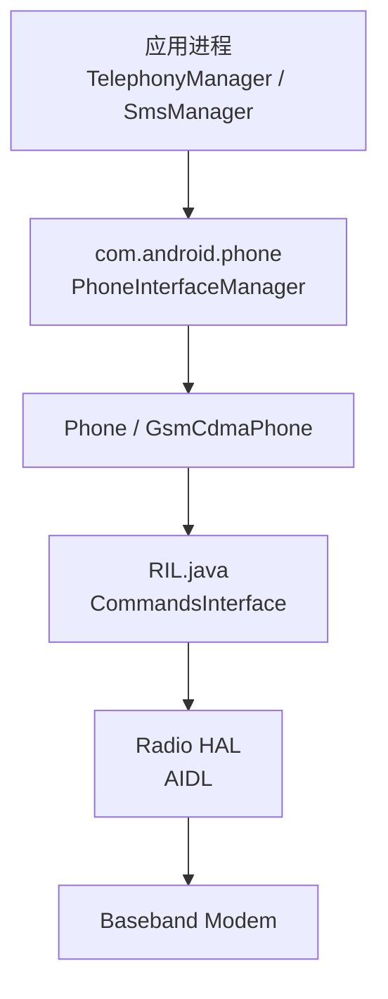

### 36.1.2 关键代码位置

| 层次 | 路径 | 说明 |
|---|---|---|
| Public API | `frameworks/base/telephony/java/android/telephony/` | `TelephonyManager`、`SmsManager`、`SubscriptionManager`、`CarrierConfigManager` |
| 内部电话框架 | `frameworks/opt/telephony/src/java/com/android/internal/telephony/` | `Phone`、`GsmCdmaPhone`、`RIL`、`ServiceStateTracker`、`CommandsInterface` |
| Phone 进程 | `packages/services/Telephony/src/com/android/phone/` | `PhoneInterfaceManager`、`PhoneGlobals`、`CarrierConfigLoader` |
| Telephony Mainline 模块 | `packages/modules/Telephony/` | APEX、framework 与库 |
| Radio HAL | `hardware/interfaces/radio/aidl/` | `IRadioModem`、`IRadioSim`、`IRadioNetwork`、`IRadioData`、`IRadioVoice`、`IRadioMessaging`、`IRadioIms` |
| Telecom | `packages/services/Telecomm/` | `CallsManager`、`InCallService` 绑定、通话路由 |

### 36.1.3 `TelephonyManager`：公开入口

`TelephonyManager` 位于 `frameworks/base/telephony/java/android/telephony/TelephonyManager.java`，标注为 `@SystemService(Context.TELEPHONY_SERVICE)`。应用通常通过 `Context.getSystemService(TelephonyManager.class)` 获取实例。

它承担的角色并不复杂，但非常关键：

- 作为公开 API 稳定边界
- 把订阅、SIM、网络、数据、设备标识等能力统一暴露给上层
- 通过 Binder 代理把调用转发给 `PhoneInterfaceManager`

典型 API 包括：

- 设备标识：`getImei()`、`getMeid()`、`getDeviceId()`
- SIM：`getSimState()`、`getSimOperator()`
- 网络：`getNetworkType()`、`getServiceState()`
- 通话：`getCallState()`、`registerTelephonyCallback()`
- 数据：`getDataState()`、`isDataEnabled()`

### 36.1.4 `PhoneInterfaceManager`：Binder 网关

`PhoneInterfaceManager` 位于 `packages/services/Telephony/src/com/android/phone/PhoneInterfaceManager.java`，直接继承 `ITelephony.Stub`。它是电话栈最大的 Binder 服务之一，核心职责可以概括为三件事：

1. 权限校验，例如 `READ_PHONE_STATE`、`MODIFY_PHONE_STATE`、`READ_PRIVILEGED_PHONE_STATE`、carrier privilege。
2. 在多 SIM 设备上根据 `subId` / `slotId` 选择正确的 `Phone`。
3. 把调用委托给内部电话对象。

例如 IMEI 读取路径会先做特权权限检查，再从 `PhoneFactory.getPhone(slotIndex)` 找到目标 `Phone`。

### 36.1.5 `Phone` 类层次

`Phone` 是内部电话框架的核心抽象，定义了拨号、服务状态、数据控制、通话跟踪等共同行为。典型类层次如下。

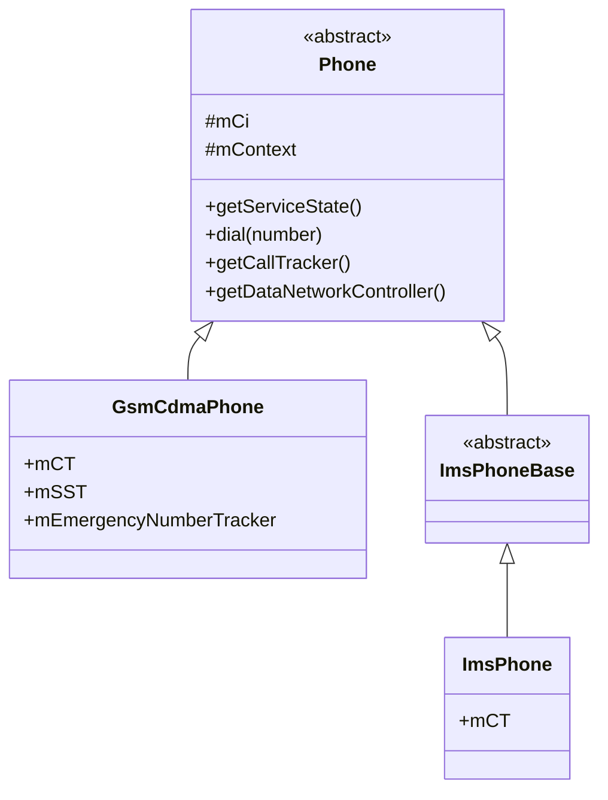

`GsmCdmaPhone` 是统一的 CS 语音 / 电路域电话对象，`ImsPhone` 则是 IMS 叠加层，负责 VoLTE / VoWiFi / ViLTE 等场景。

### 36.1.6 `PhoneFactory`：启动装配

电话子系统在启动时由 `PhoneGlobals.onCreate()` 触发 `PhoneFactory.makeDefaultPhones()` 完成装配。这个阶段会创建：

1. 每个 modem 对应的 `CommandsInterface` / `RIL`
2. `UiccController`
3. 每个 slot 的 `GsmCdmaPhone`
4. `PhoneSwitcher`
5. `SubscriptionManagerService`
6. `EuiccController`

下面是启动关系示意。

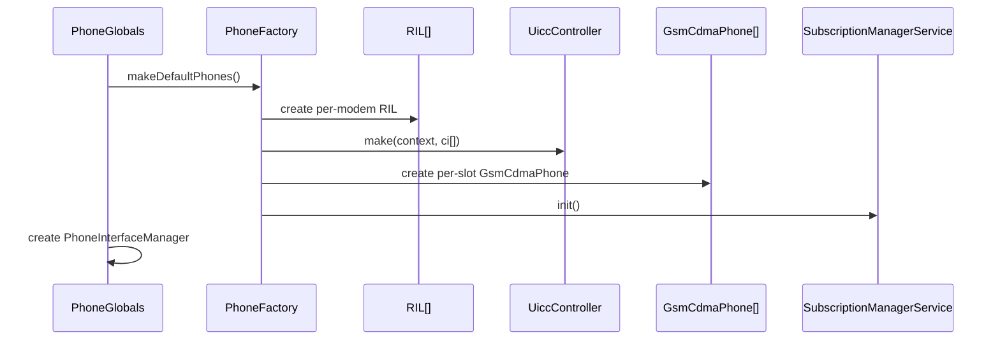

### 36.1.7 关键事件与成员

`Phone`、`GsmCdmaPhone`、`ServiceStateTracker` 等类普遍继承 `Handler`。这意味着电话栈的大量逻辑都是围绕异步事件常量驱动的，例如：

- radio on / off
- SIM 状态变更
- 注册状态变化
- carrier config 变化
- IMS 注册变化

这种设计贯穿整套系统，也是电话栈比一般 framework 服务更像“状态机集群”的原因。

### 36.1.8 `GsmCdmaPhone` 构造阶段

`GsmCdmaPhone` 在构造时会串联大量子组件，包括：

- `GsmCdmaCallTracker`
- `ServiceStateTracker`
- `EmergencyNumberTracker`
- `DataNetworkController`
- `DcController` 的新替代体系

它本质上是“每张卡 / 每个逻辑电话实例的控制中心”。

### 36.1.9 `ServiceStateTracker`

`ServiceStateTracker` 负责网络注册态跟踪，例如：

- 当前运营商
- RAT 类型
- 注册域
- 漫游状态
- 信号变化触发后的状态刷新

它会从 modem 的 unsolicited indication 出发，在电话对象内部更新 `ServiceState`，再通过 registry 回传给系统与应用。

### 36.1.10 Telephony Mainline 模块

电话栈的一部分已经 Mainline 化，主要代码位于 `packages/modules/Telephony/`。这意味着某些能力开始具备：

- 模块独立更新
- 更清晰的依赖边界
- 对 vendor 与 framework 协作点的进一步稳定化

### 36.1.11 安全考量

电话子系统涉及最敏感的设备与订阅标识，因此权限模型明显比普通 framework API 更严格。尤其要注意：

- IMEI、IMSI、ICCID 等敏感标识通常要求特权权限
- carrier privilege 可以绕过部分普通权限限制
- 多处 API 既检查权限也检查调用包名 / feature id
- 部分安全通知组件会监控蜂窝标识暴露与弱加密风险

相关安全代码可见于：

- `frameworks/opt/telephony/src/java/com/android/internal/telephony/security/CellularIdentifierDisclosureNotifier.java`
- `frameworks/opt/telephony/src/java/com/android/internal/telephony/security/NullCipherNotifier.java`
- `frameworks/opt/telephony/src/java/com/android/internal/telephony/security/CellularNetworkSecuritySafetySource.java`

---

## 36.2 Radio Interface Layer（RIL）

### 36.2.1 总览

RIL 是 Java 电话框架与 vendor modem 之间的桥。早期 Android 使用 `rild` 加 Unix socket 与私有二进制协议；现代 Android 已切到稳定 AIDL Radio HAL，并把旧的单体 `IRadio` 拆成多个领域接口。

下图展示现代 RIL 的结构。

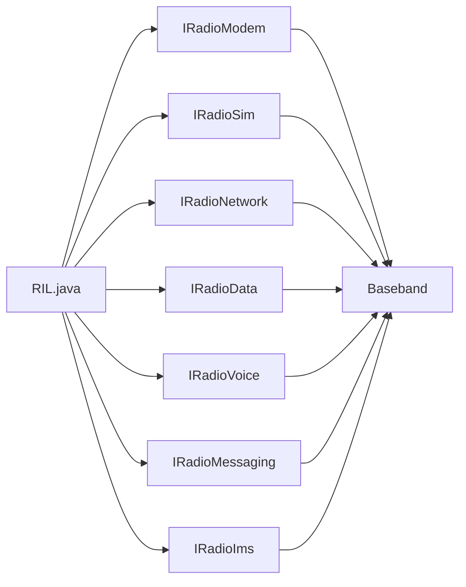

### 36.2.2 `RIL.java`

`RIL.java` 位于 `frameworks/opt/telephony/src/java/com/android/internal/telephony/RIL.java`，实现了 `CommandsInterface`。它维护每个 HAL 域的 proxy、response、indication 对象，并负责：

- 生成请求序列号
- 发送 AIDL / HIDL 请求
- 追踪待完成请求
- 管理 wakelock
- 处理超时、ANR 与 HAL death

文件中可以直接看到两个关键 tag：

```java
static final String RILJ_LOG_TAG = "RILJ";
static final String RILJ_WAKELOCK_TAG = "*telephony-radio*";
```

### 36.2.3 `CommandsInterface`

`CommandsInterface` 是电话框架与 modem 能力边界的抽象。所有 `Phone`、`ServiceStateTracker`、`SmsDispatchersController`、`DataNetworkController` 最终都是通过它与 modem 对话。

它覆盖的命令类别包括：

- Voice：`dial()`、`acceptCall()`、`hangupConnection()`
- Data：`setupDataCall()`、`deactivateDataCall()`
- Network：`getAvailableNetworks()`、`setAllowedNetworkTypesBitmap()`
- SIM：`getIccCardStatus()`、`supplyIccPin()`、`iccIO()`
- SMS：`sendSMS()`、`acknowledgeLastIncomingGsmSms()`
- Modem：`setRadioPower()`、`getBasebandVersion()`

### 36.2.4 HAL 版本演进

RIL 内部长期维护多代 HAL 版本兼容逻辑，例如 `RADIO_HAL_VERSION_1_1` 到 `2.4` 等常量。其背后反映的是：

- 旧设备可能还使用 HIDL `IRadio`
- 新设备使用 AIDL split HAL
- framework 需要向后兼容并可按域降级

### 36.2.5 AIDL Radio HAL 接口

Radio HAL 已拆分为七个主要域：

| 接口 | 路径 | 职责 |
|---|---|---|
| `IRadioModem` | `hardware/interfaces/radio/aidl/android/hardware/radio/modem/IRadioModem.aidl` | radio 电源、设备标识、基带版本 |
| `IRadioSim` | `hardware/interfaces/radio/aidl/android/hardware/radio/sim/IRadioSim.aidl` | PIN / PUK、ICC I/O、SIM 限制 |
| `IRadioNetwork` | `hardware/interfaces/radio/aidl/android/hardware/radio/network/IRadioNetwork.aidl` | 注册、扫描、信号、barring |
| `IRadioData` | `hardware/interfaces/radio/aidl/android/hardware/radio/data/IRadioData.aidl` | 数据承载、keepalive、QoS、slicing |
| `IRadioVoice` | `hardware/interfaces/radio/aidl/android/hardware/radio/voice/IRadioVoice.aidl` | 拨号、接听、挂断、USSD、DTMF |
| `IRadioMessaging` | `hardware/interfaces/radio/aidl/android/hardware/radio/messaging/IRadioMessaging.aidl` | SMS、小区广播、短信存储 |
| `IRadioIms` | `hardware/interfaces/radio/aidl/android/hardware/radio/ims/IRadioIms.aidl` | IMS 注册、SRVCC、流量类型 |

这些 AIDL 接口都标注 `@VintfStability`，以保证 vendor 实现跨版本稳定。

### 36.2.6 solicited 与 unsolicited

RIL 通信模型分两类：

1. solicited：framework 主动发请求，等待 response
2. unsolicited：modem 主动上报 indication

下图展示 solicited 请求路径。

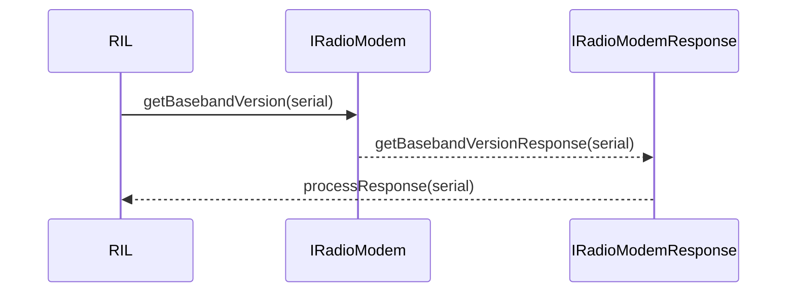

下图展示 unsolicited 路径。

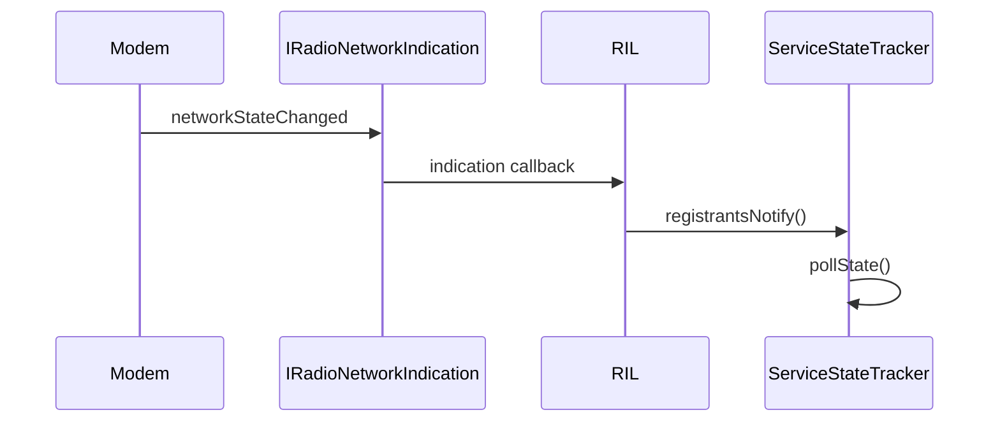

常见 unsolicited 事件包括：

- `radioStateChanged`
- `networkStateChanged`
- `newSms`
- `callStateChanged`
- `dataCallListChanged`
- `simStatusChanged`
- `signalStrengthUpdate`

### 36.2.7 wakelock 管理

RIL 使用两个 wakelock：

- `mWakeLock`：普通 request/response
- `mAckWakeLock`：ack 流程

默认超时常量通常是：

```java
private static final int DEFAULT_WAKE_LOCK_TIMEOUT_MS = 60000;
private static final int DEFAULT_ACK_WAKE_LOCK_TIMEOUT_MS = 200;
```

请求会记录在 `SparseArray<RILRequest> mRequestList` 里，超时、响应到达或 HAL death 时统一清理。

### 36.2.8 feature 到 service 的映射

RIL 会根据设备声明的 telephony feature 决定要不要连接某些 HAL service。例如：

- `FEATURE_TELEPHONY_CALLING` -> `HAL_SERVICE_VOICE`
- `FEATURE_TELEPHONY_DATA` -> `HAL_SERVICE_DATA`
- `FEATURE_TELEPHONY_MESSAGING` -> `HAL_SERVICE_MESSAGING`
- `FEATURE_TELEPHONY_IMS` -> `HAL_SERVICE_IMS`

这样设备即使不支持 IMS 或某类数据能力，也能按域优雅降级。

### 36.2.9 death recipient 与恢复

如果 radio HAL 进程崩溃，RIL 会通过 Binder death recipient 感知。恢复动作通常包括：

1. 标记所有 pending request 失败
2. 清空 proxy 引用
3. 通知上层 tracker / data controller
4. 尝试重新绑定

RIL 中能看到典型事件：

```java
static final int EVENT_RADIO_PROXY_DEAD = 6;
static final int EVENT_AIDL_PROXY_DEAD  = 7;
```

### 36.2.10 `RilHandler`

RIL 自己也有内部 `Handler` 处理超时、death、blocking response timeout 等事件。它的意义在于把“底层通信异常处理”集中在一个串行事件通道，而不是散落到每个请求调用点。

### 36.2.11 Radio bug detection

`RadioBugDetector` 会根据连续 wakelock timeout 等症状判断 modem 是否卡死，并通过 `AnomalyReporter` 上报异常。

### 36.2.12 Binder death 的 HIDL / AIDL 差异

旧 HIDL 使用 `HwBinder.DeathRecipient`，新 AIDL 使用 `IBinder.DeathRecipient`。但上层恢复逻辑是一致的：reset proxy、失败所有请求、释放 wakelock、重新连接。

### 36.2.13 请求序列号与直方图

每个 RIL 请求都带唯一 serial。框架还会维护 `TelephonyHistogram` 用于统计请求耗时，这些数据会被 modem activity、功耗分析和性能监控消费。

### 36.2.14 `MockModem`

电话栈内建 `MockModem` 测试能力，可在没有真实硬件时模拟：

- SIM 插拔
- 注册变化
- 来电 / 短信
- radio power 变化

### 36.2.15 HIDL 到 AIDL 的迁移

这是电话栈近年最重要的架构变更之一。

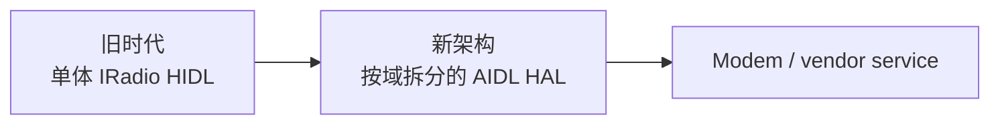

迁移收益主要有：

- 每个域可独立演进
- 测试粒度更细
- 稳定性契约更清晰
- 类型系统与 parcelable 支持更好

---

## 36.3 SIM 管理

### 36.3.1 UICC 框架总览

Android 用一整套 UICC 对象模型描述物理卡、逻辑端口、配置文件和应用：

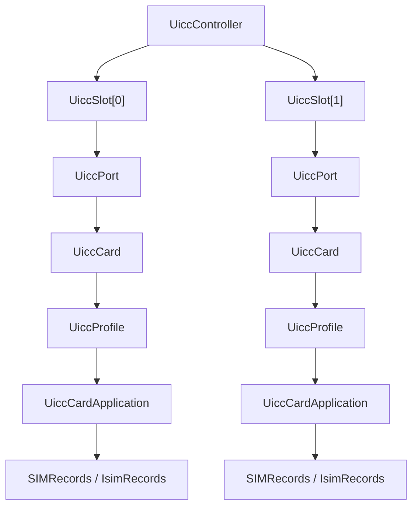

相关类位于 `frameworks/opt/telephony/src/java/com/android/internal/telephony/uicc/`。

### 36.3.2 SIM 卡状态流

SIM 状态变化通常从 modem unsolicited indication 开始，接着经过 RIL、`UiccController`、`UiccSlot`、`UiccProfile`，最后影响：

- `SubscriptionManagerService`
- `Phone` 默认订阅选择
- `CarrierConfigLoader`
- IMS / Data / SMS 相关配置

### 36.3.3 `IRadioSim` HAL

`IRadioSim` 负责：

- PIN / PUK
- `iccIO`
- 读写短信到 SIM
- carrier restriction
- phonebook 等 SIM 侧能力

它是 Java 电话栈访问卡文件系统和卡安全状态的主要下行通道。

### 36.3.4 `SubscriptionManager` 与 `SubscriptionManagerService`

订阅体系把“物理卡 / profile / slot”抽象为上层稳定的 subscription 模型。系统应用和 framework 主要通过：

- `SubscriptionManager`
- `SubscriptionManagerService`
- `SubscriptionInfo`

来处理活跃订阅、默认语音 / 短信 / 数据卡等信息。

### 36.3.5 多 SIM：DSDS 与 DSDA

多卡设备至少要区分：

- DSDS：Dual SIM Dual Standby
- DSDA：Dual SIM Dual Active

其差异会直接影响：

- 同时是否允许双活呼叫
- 默认数据卡切换
- 某些语音期间数据是否受限

### 36.3.6 eSIM / eUICC

Android 对 eSIM 的支持围绕 `EuiccController`、`EuiccManager`、`UiccPort`、`UiccProfile` 展开。现代设备还可能支持 MEP（Multiple Enabled Profiles），即一个 eUICC 上同时启用多个逻辑 profile。

### 36.3.7 `SubscriptionInfo`

`SubscriptionInfo` 是订阅的数据模型，通常包含：

- `subscriptionId`
- `iccId`
- `simSlotIndex`
- display name
- carrier name
- number
- opportunistic / embedded 等标志

### 36.3.8 多 SIM 设置与默认项

多 SIM 设置页和 framework 共同维护：

- 默认语音卡
- 默认短信卡
- 默认数据卡

这些选择会继续影响 `PhoneSwitcher`、`DataNetworkController`、Telecom 路由与运营商配置读取。

### 36.3.9 `PhoneSwitcher`

`PhoneSwitcher` 是数据卡切换的关键部件，尤其在 DSDS 设备上。它负责把“当前哪个 SIM 负责移动数据”这个决策传递给下游数据栈。

### 36.3.10 SIM 状态机

SIM 通常会经历：

- absent
- locked
- loaded
- ready
- error

状态推进往往伴随 records 读取、subscription 更新、carrier config 刷新等链式动作。

### 36.3.11 SIM 文件系统与 EF

SIM 文件系统由大量 EF（Elementary File）组成，例如 IMSI、ICCID、运营商参数等。`SIMRecords` / `IsimRecords` 会缓存这些值，供电话栈后续使用。

### 36.3.12 PIN 存储与无人值守重启

为支持 unattended reboot 等场景，系统会引入更谨慎的 PIN 存储与恢复机制，这部分通常与凭据安全和设备重启流程共同约束。

### 36.3.13 carrier restriction（SIM lock）

运营商锁机 / 卡限制会通过 `IRadioSim` 与上层 restriction 管理逻辑协作实现，影响设备能否接受某些运营商 SIM。

---

## 36.4 SMS / MMS

### 36.4.1 SMS 架构

Android 短信路径横跨：

- `SmsManager`
- `IccSmsInterfaceManager`
- `SmsDispatchersController`
- `InboundSmsHandler`
- `IRadioMessaging`

### 36.4.2 出站短信流程

下图展示发送短信的大致链路。

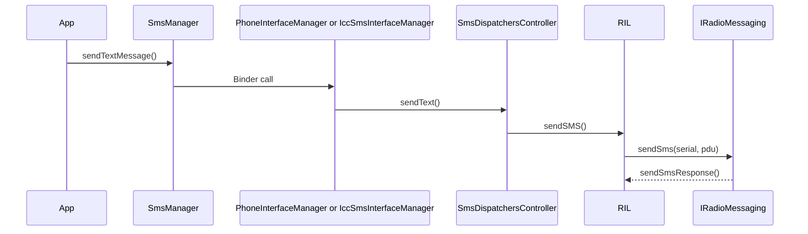

### 36.4.3 入站短信流程

来短信时，modem 上报 `newSms`，RIL 交给 `InboundSmsHandler`，其后按广播、默认短信应用、WAP Push 等规则进一步分发。

### 36.4.4 `IRadioMessaging` HAL

该 HAL 负责：

- 发送 SMS
- ack 收到的短信
- 写短信到 SIM
- 小区广播相关控制

### 36.4.5 速率限制与安全

短信能力天生容易被滥用，因此系统有多层限制：

- Premium SMS 权限控制
- 速率限制
- 默认短信应用约束
- 来短信广播权限与优先级控制

### 36.4.6 MMS

MMS 并不是通过传统短信链路承载内容本身，而往往是：

1. 先收到短信或 WAP Push 通知
2. 从通知中提取 MMSC URL
3. 再通过 HTTP 数据连接拉取真正多媒体内容

### 36.4.7 Carrier Messaging Service

运营商可通过 carrier messaging service 介入短信发送或过滤流程，这也是 Android 允许运营商在不改 framework 源码的前提下定制部分短信行为的关键扩展点。

### 36.4.8 SMS 域选择

短信可以走不同 domain，例如 CS 或 IMS。域选择逻辑需要结合：

- 当前 IMS 能力
- carrier config
- 网络状态

### 36.4.9 SIM 上短信存储

系统仍然保留短信写入 SIM 的能力，通过 `writeSmsToSim()`、SIM EF 文件和 `IRadioMessaging` 配合完成。

### 36.4.10 小区广播短信

Cell Broadcast SMS 独立于普通点对点短信，用于紧急告警等广播场景。

### 36.4.11 `SmsManager` 公开 API

`SmsManager` 对上层应用隐藏了 dispatch、PDU、carrier 拦截、SIM 存储等复杂性，但内部仍然依赖电话栈全链路。

---

## 36.5 IMS（IP Multimedia Subsystem）

### 36.5.1 IMS 架构

IMS 让语音、视频、短信等业务运行在 IP 网络之上，而不是传统电路域。Android 的 IMS 结构可以分为：

- Telecom / Dialer 侧的通话控制
- Telephony 侧的 `ImsPhone`、`ImsPhoneCallTracker`
- IMS framework 的 `ImsResolver`、`ImsServiceController`
- vendor `ImsService`
- 可选的 `IRadioIms`

下图展示其主要关系。

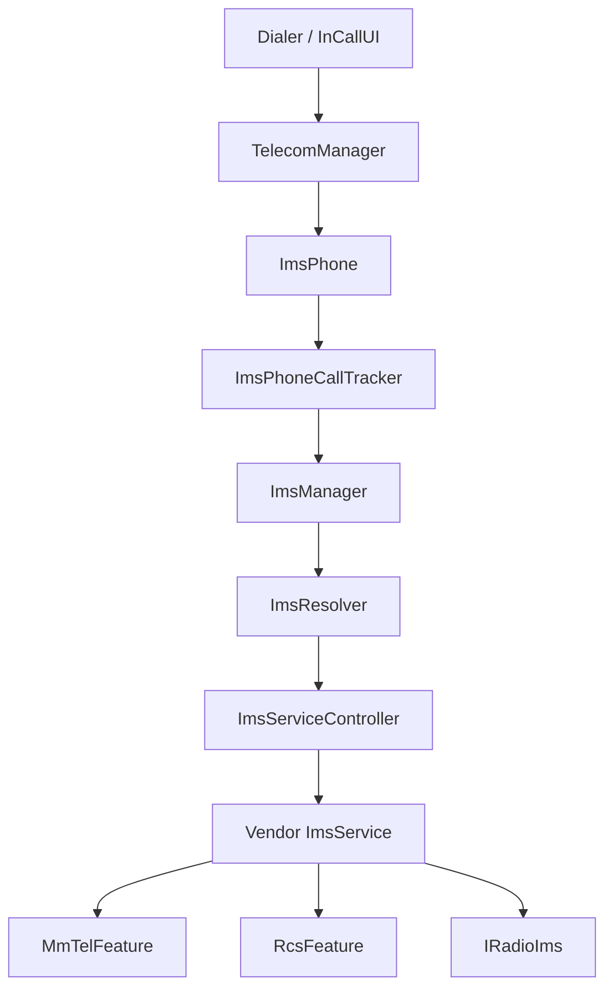

### 36.5.2 `ImsResolver`

`ImsResolver` 负责发现并绑定正确的 `ImsService`。绑定优先级一般是：

1. carrier config 指定的 override 包
2. 设备 overlay 默认包
3. 若无配置则视为不可用

### 36.5.3 `ImsPhone` 与 `ImsPhoneCallTracker`

`ImsPhone` 是 IMS 通话侧的逻辑电话对象，`ImsPhoneCallTracker` 负责 IMS 呼叫生命周期管理。

下图展示 IMS 呼叫大致过程。

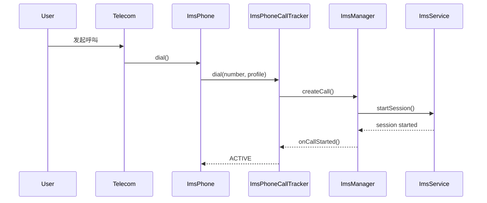

### 36.5.4 VoLTE

VoLTE 通过 LTE 数据承载走 SIP / RTP 完成语音。其关键特征包括：

- `MmTelFeature`
- `ImsCall`
- `ImsCallProfile`
- Voice / Video / SMS over IMS capability 标志

### 36.5.5 VoWiFi

VoWiFi 复用同一套 IMS 基础设施，只是注册技术变为 `REGISTRATION_TECH_IWLAN`。因此对于上层通话模型来说，它与 VoLTE 的差别主要落在底层承载与注册状态。

### 36.5.6 `IRadioIms`

`IRadioIms` 用于把 IMS 注册、SRVCC、traffic type 等信息同步给 modem。典型方法包括：

- `setSrvccCallInfo`
- `updateImsRegistrationInfo`
- `startImsTraffic`
- `stopImsTraffic`
- `triggerEpsFallback`

### 36.5.7 SRVCC

SRVCC 负责把 IMS 语音从 LTE / NR 平滑切回 2G / 3G 电路域。其核心要求是：呼叫不中断，但控制域从 IMS 转到 CS。

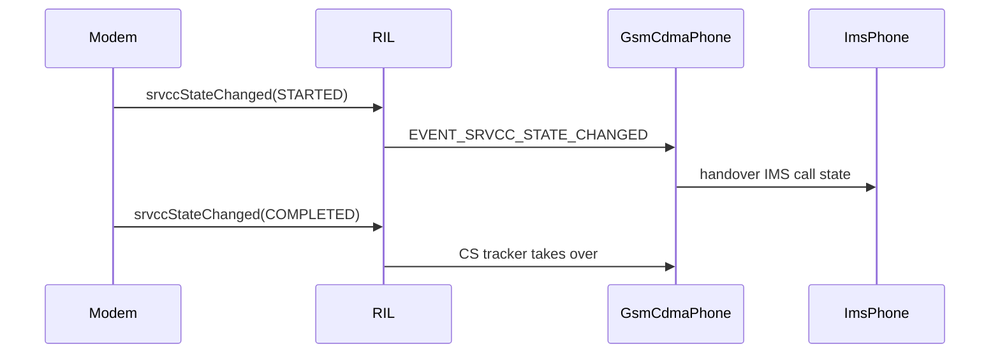

### 36.5.8 ViLTE

ViLTE 是视频版的 IMS 呼叫。其状态通常由 `VideoProfile` 描述，包含：

- `STATE_AUDIO_ONLY`
- `STATE_TX_ENABLED`
- `STATE_RX_ENABLED`
- `STATE_BIDIRECTIONAL`
- `STATE_PAUSED`

### 36.5.9 `ImsServiceController`

该控制器负责：

- bind / unbind `ImsService`
- 创建 `MmTelFeature` / `RcsFeature`
- 监控服务崩溃并重绑

### 36.5.10 RCS

RCS 由 `RcsFeature` 与相关 controller 管理。电话进程中可见：

- `packages/services/Telephony/src/com/android/phone/ImsRcsController.java`
- `packages/services/Telephony/src/com/android/services/telephony/rcs/TelephonyRcsService.java`

### 36.5.11 IMS provisioning

IMS 能力往往需要运营商预配置，来源可能是：

- carrier config
- XML 自动配置
- 设备管理 / OMA-DM

`ProvisioningManager` 对外暴露这类状态的读取和监听接口。

### 36.5.12 IMS 启用与注册流程

下图总结 IMS 从启动到注册完成的主要路径。

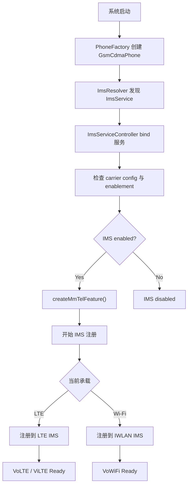

---

## 36.6 运营商配置（Carrier Configuration）

### 36.6.1 `CarrierConfigManager`

`CarrierConfigManager` 提供按运营商定制的键值配置，用于在不 fork 平台代码的前提下改变电话行为。配置以 `PersistableBundle` 形式存在。

### 36.6.2 配置加载流程

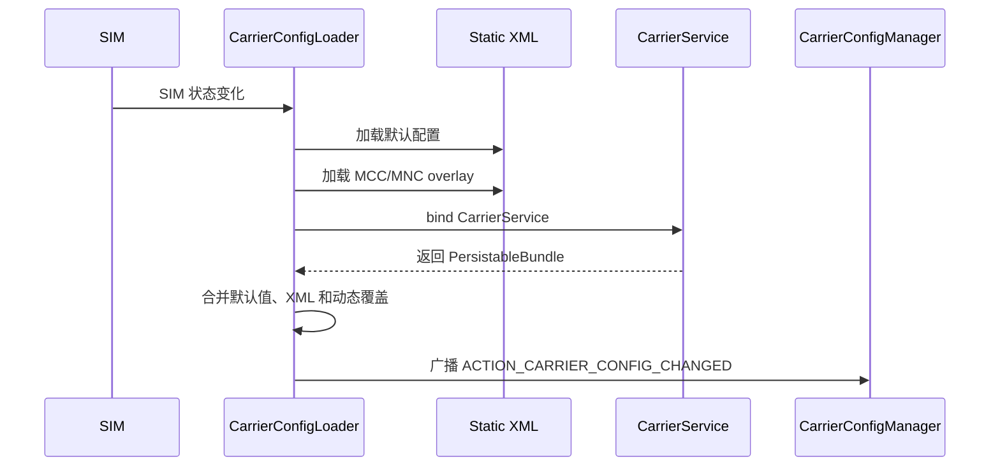

### 36.6.3 常见配置类别

典型配置分组包括：

- Voice / Calling：VoLTE、VoWiFi、补充业务、会议通话
- Data：APN 类型是否计费、DDS 切换超时、NR 可用性
- SMS / MMS：user-agent、MMS 大小、号码转换
- IMS：IMS 包覆盖、RCS provisioning、conference limit
- Network：偏好网络类型、5G 可用性、UI 开关显示

### 36.6.4 `CarrierConfigLoader`

`CarrierConfigLoader` 位于 `packages/services/Telephony/src/com/android/phone/CarrierConfigLoader.java`，负责多层配置合并：

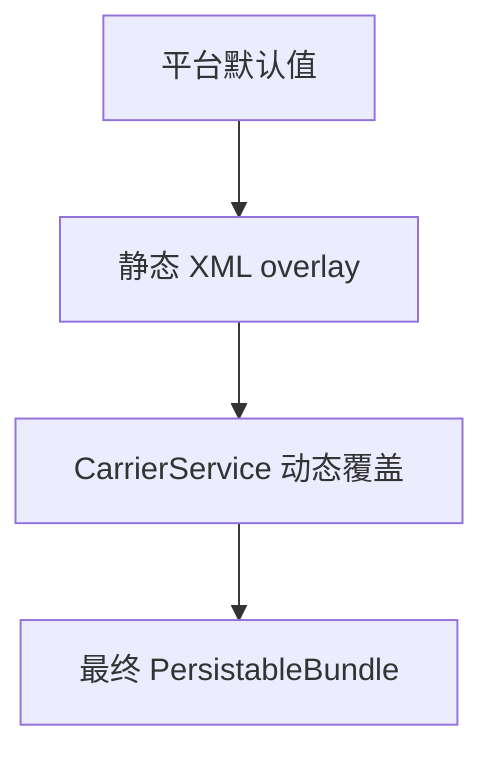

### 36.6.5 配置变化监听

配置变化通过 `CarrierConfigManager.ACTION_CARRIER_CONFIG_CHANGED` 广播出去。电话框架内部许多组件都监听这类变化，例如 `Phone` 中的 `EVENT_CARRIER_CONFIG_CHANGED`。

### 36.6.6 重载级联

carrier config 变化后，往往会触发：

- `ServiceStateTracker` 重评估
- `DataNetworkController` 重新判断数据策略
- `DataProfileManager` 刷新 APN
- `ImsResolver` 重新选择 ImsService

### 36.6.7 每卡配置

多 SIM 设备按 `subId` 维护独立 carrier config。调用路径通常是：

```java
CarrierConfigManager mgr = context.getSystemService(CarrierConfigManager.class);
PersistableBundle config = mgr.getConfigForSubId(subId);
```

### 36.6.8 配置调试

常用命令包括：

```bash
adb shell cmd phone carrier_config get-value -s 0 KEY_CARRIER_VOLTE_AVAILABLE_BOOL
adb shell cmd phone carrier_config get-values -s 0
adb shell cmd phone carrier_config set-value -s 0 KEY_CARRIER_VOLTE_AVAILABLE_BOOL true
adb shell cmd phone carrier_config clear-values -s 0
```

### 36.6.9 carrier privilege

carrier privilege 通过 SIM 上证书与应用签名匹配赋予特定应用更多电话能力，这是运营商深度定制 Android 电话行为的基础。

### 36.6.10 `CarrierService`

动态 carrier config 主要由 carrier app 中的 `CarrierService` 提供，系统在 SIM 或配置变化时绑定它取回配置。

---

## 36.7 电话状态与通话管理

### 36.7.1 Telecom 与 Telephony

Android 把“通话路由”和“蜂窝控制”拆成两套系统：

| 系统 | 路径 | 职责 |
|---|---|---|
| Telecom | `packages/services/Telecomm/` | 通话路由、多路通话、音频、UI 绑定 |
| Telephony | `packages/services/Telephony/` | modem、radio 状态、SIM、SMS、蜂窝呼叫 |

### 36.7.2 `TelecomManager`

`TelecomManager` 提供：

- `placeCall()`
- `endCall()`
- `acceptRingingCall()`
- `isInCall()`
- 选择 `PhoneAccount`

### 36.7.3 `ConnectionService`

Telecom 通过 `ConnectionService` 抽象连接不同通话来源。电话实现是 `TelephonyConnectionService`，负责把 Telecom 的连接模型翻译为 `Phone.dial()`、`CallTracker` 操作和 RIL 指令。

下图展示拨号链路。

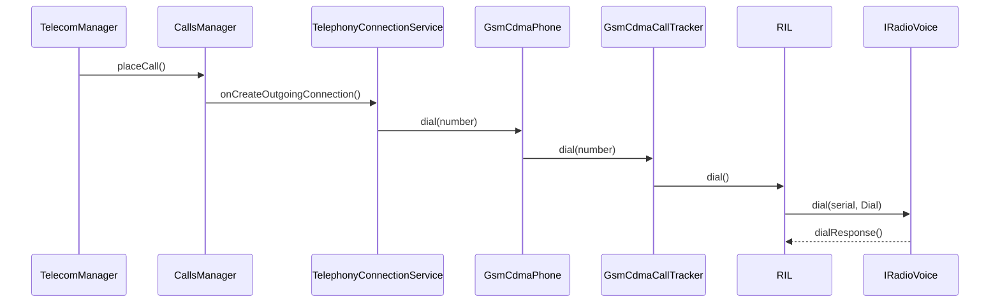

### 36.7.4 `IRadioVoice`

语音 HAL 覆盖：

- `dial`
- `acceptCall`
- `hangup`
- `conference`
- `getCurrentCalls`
- `sendDtmf`
- `emergencyDial`
- `sendUssd`

很多方法都能对应到传统 AT 命令语义，例如 `ATD`、`ATA`、`ATH`、`AT+CLCC`。

### 36.7.5 通话状态机

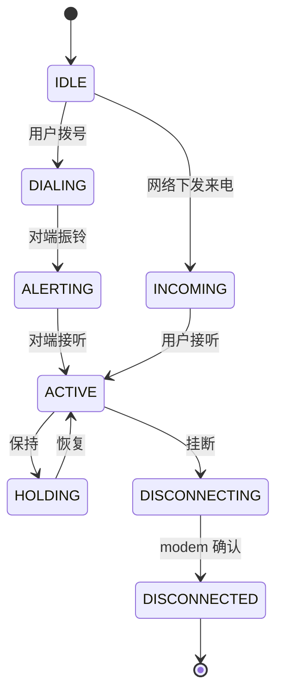

### 36.7.6 紧急呼叫

紧急呼叫会被单独建模。主要组件包括：

- `EmergencyNumberTracker`
- `EmergencyStateTracker`
- `DomainSelectionResolver`
- `IRadioVoice.emergencyDial()`

它们需要协调：

- 紧急号码数据库来源
- IMS 还是 CS 域选择
- 特殊路由策略
- UI 与系统保护行为

### 36.7.7 `InCallService`

默认拨号器通过 `InCallService` 接收通话状态并展示 UI。Telecom 会把系统通话事件同步到默认拨号器和部分系统 in-call service。

### 36.7.8 呼叫转移与补充业务

MMI 码如 `*21*number#` 会在电话框架中被解析成补充业务请求。相关常量在 `CommandsInterface` 中定义，例如：

- `CF_ACTION_ENABLE`
- `CF_ACTION_REGISTRATION`
- `CF_REASON_UNCONDITIONAL`
- `CF_REASON_BUSY`

下图展示呼叫转移配置流程。

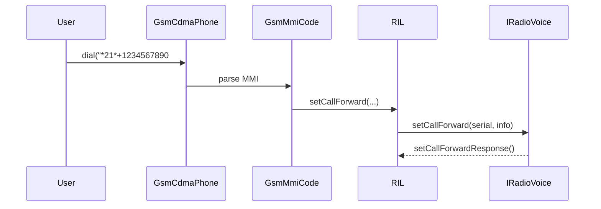

### 36.7.9 USSD

USSD 用于余额查询、充值等交互式网络服务。用户拨 `*123#` 一类号码后，会走：

- `GsmCdmaPhone.sendUssd()`
- `RIL`
- `IRadioVoice.sendUssd()`
- network response -> unsolicited indication

### 36.7.10 DTMF

DTMF 通过 `sendDtmf()`、`startDtmf()`、`stopDtmf()` 控制，常用于通话中的按键音交互。

### 36.7.11 `PhoneAccount`

`PhoneAccount` 是 Telecom 路由通话的逻辑账号抽象。多 SIM 设备通常每张卡对应一个 `PhoneAccount`，Telecom 会结合默认账号、用户指定账号和紧急规则做最终路由。

---

## 36.8 数据连接

### 36.8.1 `DataNetworkController`

Android 13 重写了电话数据栈，核心变为 `DataNetworkController`。它按 SIM 维度管理所有移动数据网络，而不再像旧版 `DcTracker` 那样按 transport 切分。

下图展示数据栈主结构。

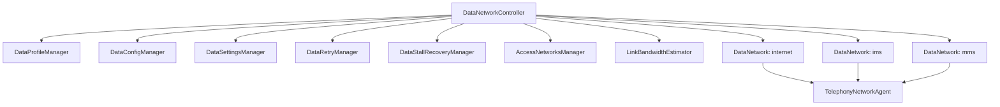

### 36.8.2 事件模型

`DataNetworkController` 定义了大量事件，例如：

- `EVENT_ADD_NETWORK_REQUEST`
- `EVENT_REMOVE_NETWORK_REQUEST`
- `EVENT_SERVICE_STATE_CHANGED`
- `EVENT_SIM_STATE_CHANGED`
- `EVENT_EVALUATE_PREFERRED_TRANSPORT`
- `EVENT_SLICE_CONFIG_CHANGED`

这说明数据栈同样是强状态机化设计。

### 36.8.3 数据建链流程

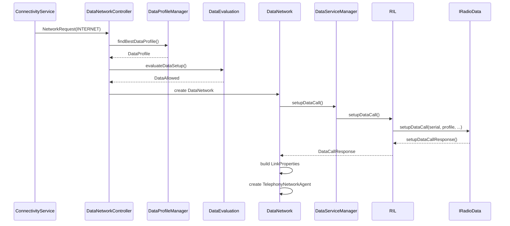

### 36.8.4 `IRadioData`

数据 HAL 覆盖：

- `setupDataCall`
- `deactivateDataCall`
- `getDataCallList`
- `setDataAllowed`
- `setDataProfile`
- `startKeepalive`
- `stopKeepalive`
- `getSlicingConfig`

关键数据类型包括：

- `DataProfileInfo`
- `SetupDataCallResult`
- `DataCallFailCause`
- `SliceInfo`
- `TrafficDescriptor`
- `QosSession`
- `KeepaliveRequest`

### 36.8.5 APN 管理

APN 由 `DataProfileManager` 管理，底层来源通常是 `content://telephony/carriers`。常见 APN type 有：

- `default`
- `mms`
- `supl`
- `dun`
- `ims`
- `emergency`
- `enterprise`

### 36.8.6 `DataNetwork` 状态机

```mermaid
stateDiagram-v2
    [*] --> Connecting
    Connecting --> Connected : setupDataCall 成功
    Connecting --> Disconnected : setup 失败
    Connected --> Handover : transport 改变
    Handover --> Connected : handover 成功
    Handover --> Disconnected : handover 失败
    Connected --> Disconnecting : 请求 teardown
    Disconnecting --> Disconnected : deactivate 完成
    Disconnected --> [*]
```

每个 `DataNetwork` 连接成功后会创建 `TelephonyNetworkAgent`，向 `ConnectivityService` 注册为可用网络。

### 36.8.7 `DataEvaluation`

数据建立前会先判断是否允许。常见 disallow reason 包括：

- `DATA_DISABLED`
- `ROAMING_DISABLED`
- `NOT_IN_SERVICE`
- `EMERGENCY_CALL`
- `SIM_NOT_READY`
- `RADIO_POWER_OFF`
- `CONCURRENT_VOICE_NOT_ALLOWED`
- `DATA_THROTTLED`
- `CARRIER_ACTION_DISABLED`

### 36.8.8 内部状态

`DataNetworkController` 会跟踪大量内部状态，例如：

- 当前 `subId`
- `ServiceState`
- 订阅计划
- 所有 network request
- 所有活跃 `DataNetwork`
- internet / IMS 网络状态
- `mPsRestricted`
- `mIsSrvccHandoverInProcess`
- `mSimState`

这使它成为电话数据侧几乎所有决策的汇聚点。

### 36.8.9 `DataSettingsManager`

负责用户可见的数据设置：

- 移动数据开关
- 数据漫游
- 通话期间数据
- auto data switch 偏好

### 36.8.10 `DataRetryManager`

负责失败后的指数退避重试。策略通常由 carrier config 决定，包括：

- 初始延迟
- 最大次数
- backoff 乘子
- 某些 fail cause 是否重试

### 36.8.11 `DataStallRecoveryManager`

当数据连接“看似存在但不通”时，恢复动作通常逐级升级：

1. 获取 data call list
2. 清理并重建连接
3. reset radio
4. 重启 modem

### 36.8.12 transport 选择：Cellular vs IWLAN

`AccessNetworksManager` 会决定数据走 WWAN 还是 IWLAN。IMS 和某些 offload 场景尤其依赖这类 transport handover。

### 36.8.13 keepalive

数据 HAL 与 framework 支持 NAT keepalive，典型消费场景包括：

- VoWiFi
- 长连接穿越 NAT
- modem / network offload 省电

### 36.8.14 QoS

数据栈支持 QoS session，结合 `QosCallbackTracker`、`QosSession`、`EpsQos`、`NrQos` 传递流级别差异化服务。

### 36.8.15 auto data switch

`AutoDataSwitchController` 会在多卡设备中根据信号、RAT、数据停滞等条件自动切换默认数据卡。

### 36.8.16 数据指标与分析

电话栈会采集：

- 数据建链耗时
- handover 成功率
- data stall 频率
- QoS session 数量
- 按 RAT 的数据使用

### 36.8.17 `DataConfigManager`

负责为数据侧加载 carrier config，并将之分发给：

- `DataNetworkController`
- `DataRetryManager`
- `DataStallRecoveryManager`
- `AccessNetworksManager`

### 36.8.18 `LinkBandwidthEstimator`

用于估计链路带宽，输入可能来自：

- modem `LinkCapacityEstimate`
- 历史 RAT / 信号模型
- 活跃传输观测

这些信息最终会影响 network score。

### 36.8.19 5G 网络切片

网络切片相关类型包括：

- `SliceInfo`
- `SlicingConfig`
- `TrafficDescriptor`
- `UrspRule`

`DataNetworkController` 通过 `EVENT_SLICE_CONFIG_CHANGED` 等事件处理切片配置变化。

---

## 36.9 ImsMedia：VoLTE / VoWiFi 的 RTP 与 RTCP

### 36.9.1 总览

`ImsMedia` 负责 IMS 语音与视频通话中的媒体面，即 RTP / RTCP、音频编解码、视频会话、质量监控等。它与呼叫信令层分离：信令由 IMS / SIP 负责，媒体由 `ImsMedia` 和底层 native engine 负责。

### 36.9.2 会话类型

媒体会话至少包含：

- 音频会话
- 视频会话
- 可能的文本 / 特殊能力扩展

### 36.9.3 `ImsMediaManager`

负责打开媒体会话、分配资源并为上层呼叫建立媒体面。

### 36.9.4 `ImsMediaController`

是媒体服务的控制层，负责管理生命周期、配置和状态通知。

### 36.9.5 RTP 配置

RTP 承担媒体负载实际传输，需要配置：

- 本地 / 远端地址
- 端口
- payload type
- jitter buffer 相关参数

### 36.9.6 音频配置与 codec

VoLTE / VoWiFi 常见音频编码包括 AMR、AMR-WB 等。媒体层需要和 modem / IMS service / 音频系统共同协商。

### 36.9.7 RTCP 配置

RTCP 负责质量反馈、统计与同步控制，是媒体质量监测和自适应的关键组成。

### 36.9.8 媒体质量监控

`ImsMedia` 会跟踪：

- 丢包
- 抖动
- 时延
- 码率

这些指标能反过来影响上层媒体质量展示或策略。

### 36.9.9 音频会话能力

会话能力可能包括：

- 静音 / 双工控制
- codec 切换
- 回声 / 噪声相关控制

### 36.9.10 视频会话

视频会话扩展了音频会话的媒体面，需要额外处理：

- 分辨率
- 帧率
- 双向视频状态

### 36.9.11 AIDL HAL 接口

`ImsMedia` 也会通过独立 HAL 与厂商组件协同，保证媒体会话能与底层 DSP、调制解调器或专用媒体引擎配合。

### 36.9.12 native media engine

底层 native 引擎负责真正的数据包处理、编解码与会话控制。

### 36.9.13 关键源码

主要代码可从下列位置切入：

- `packages/modules/ImsMedia/`
- `frameworks/base/telephony/ims/`

---

## 36.10 WAP Push

### 36.10.1 WAP Push 是什么

WAP Push 是承载富媒体通知的一种机制，MMS 通知就是典型用例。设备先收到短信承载的 WAP Push PDU，再由系统或默认短信应用据此发起真正的数据下载。

### 36.10.2 架构

```mermaid
graph TD
    MODEM["Modem"] --> RIL["RIL"]
    RIL --> INBOUND["InboundSmsHandler"]
    INBOUND --> WP["WapPushOverSms"]
    WP --> CACHE["WapPushCache"]
    WP --> APP["默认短信应用 / Messaging"]
    APP --> MMSC["Carrier MMSC"]
```

### 36.10.3 `WapPushOverSms`

`frameworks/opt/telephony/src/java/com/android/internal/telephony/WapPushOverSms.java` 是核心分发器，负责：

- 解码 WSP / WAP PDU
- 判断 application-id
- 识别 MMS Notification Indicator
- 分发到合适接收方

### 36.10.4 PDU 解码

WAP Push 的复杂点之一就是 PDU 解析，包括 header、content-type、transaction id、application-id 等字段。

### 36.10.5 application-id 路由

不同 application-id 可以对应不同处理目标，因此 `WapPushOverSms` 需要在 framework 中做二次分发，而不是直接把所有消息都丢给同一个接收器。

### 36.10.6 MMS 通知分发

当识别为 MMS Notification Indicator 后，系统会把它交给默认短信应用，由后者提取 content-location 并通过 HTTP 下载 MMS 正文。

### 36.10.7 `WapPushCache`

缓存层会保存消息大小等元数据，辅助后续下载和去重。

### 36.10.8 Messaging 应用中的接收器

典型接收器包括：

- `MmsWapPushReceiver`
- `MmsWapPushDeliverReceiver`
- `AbortMmsWapPushReceiver`

### 36.10.9 端到端 MMS 流程

```mermaid
sequenceDiagram
    participant MMSC as Carrier MMSC
    participant SMSC as Carrier SMSC
    participant MODEM as Device Modem
    participant RIL as RIL
    participant INBOUND as InboundSmsHandler
    participant WP as WapPushOverSms
    participant APP as MMS App

    MMSC->>SMSC: MMS 通知
    SMSC->>MODEM: SMS 承载 WAP Push
    MODEM->>RIL: newSms(pdu)
    RIL->>INBOUND: processMessagePart()
    INBOUND->>WP: dispatchWapPdu()
    WP->>APP: WAP_PUSH_DELIVER_ACTION
    APP->>MMSC: HTTP GET content-location
    MMSC-->>APP: MMS multipart 内容
```

### 36.10.10 关键源码

| 文件 | 路径 |
|---|---|
| `WapPushOverSms.java` | `frameworks/opt/telephony/src/java/com/android/internal/telephony/WapPushOverSms.java` |
| `WapPushManagerParams.java` | `frameworks/opt/telephony/src/java/com/android/internal/telephony/WapPushManagerParams.java` |
| `WapPushCache.java` | `frameworks/opt/telephony/src/java/com/android/internal/telephony/WapPushCache.java` |
| `InboundSmsHandler.java` | `frameworks/opt/telephony/src/java/com/android/internal/telephony/InboundSmsHandler.java` |
| `MmsWapPushDeliverReceiver.java` | `packages/apps/Messaging/src/com/android/messaging/receiver/MmsWapPushDeliverReceiver.java` |

---

## 36.11 附录：完整链路、目录结构与术语

### 36.11.1 从拨号到 modem 的完整路径

下图总结一次语音呼叫从 Dialer 到 modem 的典型路径。

```mermaid
graph TD
    A["1. 用户点击拨号"] --> B["2. Dialer 调用 TelecomManager.placeCall()"]
    B --> C["3. CallsManager 创建 Call"]
    C --> D["4. 选择 PhoneAccount / SIM"]
    D --> E["5. 绑定 TelephonyConnectionService"]
    E --> F["6. onCreateOutgoingConnection()"]
    F --> G["7. 选择 GsmCdmaPhone"]
    G --> H["8. GsmCdmaPhone.dial()"]
    H --> I["9. GsmCdmaCallTracker.dial()"]
    I --> J["10. CommandsInterface.dial()"]
    J --> K["11. RIL 创建 RILRequest"]
    K --> L["12. RIL 获取 wakelock"]
    L --> M["13. IRadioVoice.dial(serial, Dial)"]
    M --> N["14. vendor HAL 通知 modem"]
    N --> O["15. modem 发起网络呼叫"]
    O --> P["16. IRadioVoiceResponse.dialResponse()"]
    P --> Q["17. RIL 处理响应并释放 wakelock"]
    Q --> R["18. CallTracker 更新状态"]
    R --> S["19. Telecom / InCallUI 收到状态"]
```

### 36.11.2 设计原则

电话栈的设计特点可以概括为：

1. Telecom 与 Telephony 分离：通话路由与蜂窝控制解耦。
2. 每 SIM 独立建模：`Phone`、`RIL`、`ServiceStateTracker`、`DataNetworkController` 基本都按卡隔离。
3. 全链路异步：modem 操作全部通过 handler / callback 完成。
4. carrier extensibility：`CarrierConfigManager` 与 `CarrierService` 允许深度定制。
5. HAL 稳定接口：AIDL + `@VintfStability` 使平台升级与 modem 迭代解耦。

### 36.11.3 目录结构

```text
frameworks/
  base/telephony/java/android/telephony/
    TelephonyManager.java
    SubscriptionManager.java
    SmsManager.java
    CarrierConfigManager.java
  base/telecomm/java/android/telecom/
    TelecomManager.java
    ConnectionService.java
    InCallService.java
    PhoneAccount.java
  opt/telephony/src/java/com/android/internal/telephony/
    Phone.java
    GsmCdmaPhone.java
    RIL.java
    CommandsInterface.java
    ServiceStateTracker.java
    PhoneFactory.java
    data/
      DataNetworkController.java
      DataNetwork.java
      DataProfileManager.java
      PhoneSwitcher.java
    imsphone/
      ImsPhone.java
      ImsPhoneCallTracker.java
    uicc/
      UiccController.java
      SIMRecords.java
    subscription/
      SubscriptionManagerService.java
    ims/
      ImsResolver.java
packages/
  services/Telephony/src/com/android/phone/
    PhoneInterfaceManager.java
    PhoneGlobals.java
    CarrierConfigLoader.java
  services/Telecomm/src/com/android/server/telecom/
    CallsManager.java
hardware/
  interfaces/radio/aidl/android/hardware/radio/
    modem/IRadioModem.aidl
    sim/IRadioSim.aidl
    network/IRadioNetwork.aidl
    data/IRadioData.aidl
    voice/IRadioVoice.aidl
    messaging/IRadioMessaging.aidl
    ims/IRadioIms.aidl
```

### 36.11.4 常用术语

| 术语 | 全称 | 含义 |
|---|---|---|
| APN | Access Point Name | 移动数据接入点配置 |
| CSFB | Circuit-Switched Fallback | VoLTE 不可用时回落到 2G/3G 语音 |
| DDS | Default Data Subscription | 当前默认数据卡 |
| DSDA | Dual SIM Dual Active | 双卡双活 |
| DSDS | Dual SIM Dual Standby | 双卡双待 |
| EF | Elementary File | SIM 卡文件系统中的基本文件 |
| eSIM | Embedded SIM | 软件可配置 SIM |
| eUICC | Embedded UICC | eSIM 所在硬件芯片 |
| ICCID | Integrated Circuit Card Identifier | SIM 序列号 |
| IMS | IP Multimedia Subsystem | IP 语音 / 视频 / 消息体系 |
| IMSI | International Mobile Subscriber Identity | 用户身份标识 |
| IWLAN | IP Wireless Local Area Network | 基于 Wi-Fi 的 IMS / 数据承载 |
| MMS | Multimedia Messaging Service | 多媒体短信 |
| MMSC | Multimedia Messaging Service Center | MMS 服务器 |
| NR | New Radio | 5G 无线接入 |
| PLMN | Public Land Mobile Network | MCC+MNC 组成的运营商网络标识 |
| RCS | Rich Communication Services | 富通信服务 |
| RIL | Radio Interface Layer | framework 到 modem 的桥 |
| SRVCC | Single Radio Voice Call Continuity | IMS 语音切回 CS 域 |
| UICC | Universal Integrated Circuit Card | 智能卡本体 |
| USSD | Unstructured Supplementary Service Data | 网络交互式业务代码 |
| ViLTE | Video over LTE | LTE 视频通话 |
| VoLTE | Voice over LTE | LTE 语音 |
| VoWiFi | Voice over Wi-Fi | Wi-Fi Calling |

### 36.11.5 继续阅读的起点

若要继续深挖源码，比较有效的切入点包括：

- `PhoneFactory.makeDefaultPhones()`
- `PhoneGlobals.onCreate()`
- `RIL.java` 中的 `getRadioServiceProxy()` 与请求路径
- `DataNetworkController.onAddNetworkRequest()`
- `DataNetwork.setupDataCall()`
- `ImsResolver` 与 `ImsPhoneCallTracker.dial()`
- `IRadioData.aidl`、`IRadioVoice.aidl`

---

## 36.12 动手实践（Try It）

### 36.12.1 查看电话服务状态

```bash
adb shell dumpsys telephony.registry
adb shell dumpsys telephony.registry | grep -A5 "mCallState"
adb shell dumpsys telephony.registry | grep -A10 "mServiceState"
adb shell dumpsys telephony.registry | grep "mSignalStrength"
```

### 36.12.2 观察 RIL 日志

```bash
adb logcat -b radio -s RILJ:V
adb logcat -b radio | grep -E "RILJ|RIL_REQUEST|RIL_UNSOL"
adb shell settings put global airplane_mode_on 1
adb shell am broadcast -a android.intent.action.AIRPLANE --ez state true
adb shell settings put global airplane_mode_on 0
adb shell am broadcast -a android.intent.action.AIRPLANE --ez state false
```

切飞行模式时，通常能看到 `setRadioPower()`、`radioStateChanged()` 一类日志。

### 36.12.3 用 shell 命令查询电话状态

```bash
adb shell service call iphonesubinfo 1
adb shell cmd phone help
adb shell cmd phone get-carrier-config-value -s 0 KEY_CARRIER_VOLTE_AVAILABLE_BOOL
adb shell cmd phone ims get-ims-registration -s 0
```

不同版本设备的 `cmd phone` 子命令可能略有差异，但主线都是围绕 carrier config、IMS、数据和 SIM。

### 36.12.4 检查 SIM 与订阅状态

```bash
adb shell getprop | grep -i sim
adb shell dumpsys activity service com.android.phone | grep -i Uicc
adb shell cmd phone subscription-list
```

### 36.12.5 跟踪数据建链

```bash
adb logcat -b radio | grep -E "DataNetworkController|DataNetwork|setupDataCall"
adb shell svc data disable
adb shell svc data enable
```

预期可以看到：

- `onAddNetworkRequest`
- `evaluateDataSetup`
- `DataNetwork created`
- `setupDataCall`
- `createNetworkAgent`

### 36.12.6 阅读 AIDL HAL 定义

```bash
Get-ChildItem -Path hardware\\interfaces\\radio\\aidl\\android\\hardware\\radio -Recurse -Filter *.aidl
Select-String -Path hardware\\interfaces\\radio\\aidl\\android\\hardware\\radio\\voice\\IRadioVoice.aidl -Pattern '^\\s*void '
Select-String -Path hardware\\interfaces\\radio\\aidl\\android\\hardware\\radio\\data\\IRadioData.aidl -Pattern '^\\s*void '
```

### 36.12.7 模拟短信与网络变化

模拟器可使用 console 发送短信、调整网络速度和时延；真机更适合结合实际 SIM 与 carrier config 做观察。

### 36.12.8 观察 IMS 注册

```bash
adb shell cmd phone ims get-ims-registration -s 0
adb logcat | grep -E "ImsResolver|ImsServiceController|ImsPhoneCallTracker|Rcs"
adb shell svc wifi disable
adb shell svc wifi enable
```

可用于观察 VoWiFi 与 LTE / IWLAN 注册切换。

### 36.12.9 观察 APN 与 carrier config

```bash
adb shell content query --uri content://telephony/carriers
adb shell cmd phone carrier_config get-values -s 0
adb shell dumpsys activity service com.android.phone | grep -i "DataProfileManager"
```

### 36.12.10 跟踪紧急号码与多 SIM

```bash
adb shell cmd phone emergency-number-test-mode
adb shell cmd phone subscription-list
adb shell dumpsys activity service com.android.phone | grep -i PhoneSwitcher
```

### 36.12.11 构建并运行 Telephony 单元测试

```bash
atest FrameworksTelephonyTests
atest TelephonyCommonTests
atest FrameworksTelephonyTests:com.android.internal.telephony.RILTest
```

电话栈测试大量依赖 `MockModem` 与 Mockito 替代真实硬件。

### 36.12.12 完整排障建议

面对电话问题时，建议按层排：

1. 先看 `TelephonyManager` / `dumpsys telephony.registry` 暴露出的状态。
2. 再看 `com.android.phone` 侧日志与 `PhoneInterfaceManager` / `Phone` 内部状态。
3. 接着看 `RILJ`、radio buffer 和 vendor HAL 日志。
4. 最后结合 carrier config、IMS、APN、subscription 与 modem 行为定位。

---

## Summary

- Android 电话栈是典型的多层异步体系：SDK API、Binder 服务、`Phone` 对象、RIL、AIDL HAL 和 modem 分层清晰但强耦合。
- `PhoneInterfaceManager` 是公开电话能力的权限和路由中枢，`PhoneFactory` 负责系统启动时装配整套 per-SIM 电话对象。
- `RIL.java` 通过请求序列号、wakelock、death recipient 和直方图统计，把不可靠的 modem 通信封装成可恢复的异步接口。
- UICC / subscription 体系把物理卡、逻辑 profile 与上层订阅模型解耦，是多 SIM、eSIM、MEP 的基础。
- SMS / MMS、IMS、CarrierConfig、通话管理和移动数据并不是独立模块，它们都围绕 `Phone`、`RIL` 和 per-subscription 状态协同工作。
- 新数据栈以 `DataNetworkController` 为核心，把 APN、QoS、keepalive、transport handover、5G slicing 和 auto data switch 纳入统一模型。
- `ImsMedia` 和 WAP Push 说明电话栈不仅控制信令，还覆盖媒体面和富消息分发。
- 电话问题排障必须同时看 framework 状态、RIL 日志、carrier config、subscription、IMS 注册和底层 HAL / modem 行为。

### 关键源码

| 文件 | 作用 |
|---|---|
| `frameworks/base/telephony/java/android/telephony/TelephonyManager.java` | 电话公开 API 入口 |
| `packages/services/Telephony/src/com/android/phone/PhoneInterfaceManager.java` | `ITelephony` Binder 服务 |
| `frameworks/opt/telephony/src/java/com/android/internal/telephony/Phone.java` | 内部电话抽象基类 |
| `frameworks/opt/telephony/src/java/com/android/internal/telephony/GsmCdmaPhone.java` | CS 电话主实现 |
| `frameworks/opt/telephony/src/java/com/android/internal/telephony/RIL.java` | Radio Interface Layer Java 实现 |
| `frameworks/opt/telephony/src/java/com/android/internal/telephony/CommandsInterface.java` | framework 到 modem 的抽象边界 |
| `frameworks/opt/telephony/src/java/com/android/internal/telephony/uicc/UiccController.java` | UICC / SIM 管理入口 |
| `frameworks/opt/telephony/src/java/com/android/internal/telephony/subscription/SubscriptionManagerService.java` | 订阅管理 |
| `frameworks/opt/telephony/src/java/com/android/internal/telephony/ims/ImsResolver.java` | ImsService 发现与绑定 |
| `frameworks/opt/telephony/src/java/com/android/internal/telephony/data/DataNetworkController.java` | 移动数据中心控制器 |
| `frameworks/opt/telephony/src/java/com/android/internal/telephony/data/DataNetwork.java` | 单个数据网络状态机 |
| `packages/services/Telephony/src/com/android/phone/CarrierConfigLoader.java` | 运营商配置加载 |
| `packages/services/Telephony/src/com/android/services/telephony/TelephonyConnectionService.java` | Telecom 到 Telephony 的桥 |
| `hardware/interfaces/radio/aidl/android/hardware/radio/voice/IRadioVoice.aidl` | 语音 HAL |
| `hardware/interfaces/radio/aidl/android/hardware/radio/data/IRadioData.aidl` | 数据 HAL |
| `hardware/interfaces/radio/aidl/android/hardware/radio/sim/IRadioSim.aidl` | SIM HAL |
| `hardware/interfaces/radio/aidl/android/hardware/radio/ims/IRadioIms.aidl` | IMS HAL |
