# Chapter 36: Telephony and RIL

Android's telephony subsystem is one of the most complex and heavily layered pieces of
the platform.  It spans from public SDK APIs that any application can call
(`TelephonyManager`, `SmsManager`) through a privileged system service
(`PhoneInterfaceManager`), an internal "phone" object hierarchy, the Radio
Interface Layer (RIL) that serialises requests to the cellular modem, and finally
an AIDL HAL that hardware vendors implement.  This chapter traces every hop of
that chain in the AOSP source, explains the SIM, SMS, IMS, carrier
configuration, and data-connection machinery, and provides hands-on exercises to
explore the stack on a real device or emulator.

---

## 36.1 Telephony Architecture

### 36.1.1 The Big Picture

Android telephony is organised into four major layers, each running in a
different process or address space:

1. **Application layer** -- third-party or system apps that use the public
   `TelephonyManager`, `SmsManager`, `SubscriptionManager`, or `TelecomManager`
   APIs.
2. **Framework layer** -- the telephony service running inside the
   `com.android.phone` process, including `PhoneInterfaceManager` (the Binder
   stub of `ITelephony`) and the `Phone` object hierarchy.
3. **RIL layer** -- the `RIL.java` class that translates high-level commands
   into AIDL/HIDL calls directed at the vendor radio daemon.
4. **HAL / modem layer** -- the vendor-supplied radio HAL implementation
   (`IRadioModem`, `IRadioSim`, `IRadioNetwork`, etc.) that actually talks to
   the baseband processor.

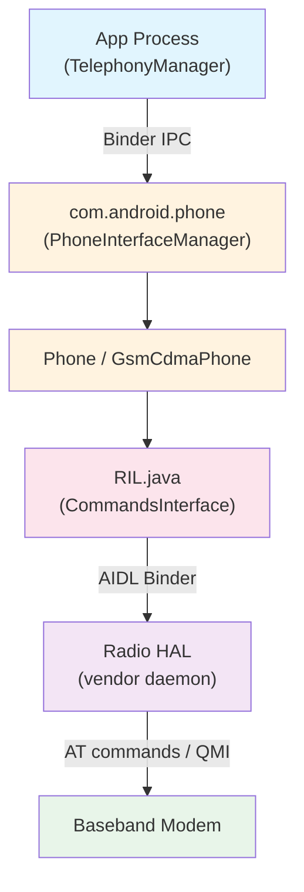
```mermaid
graph TD
    A["App Process<br/>(TelephonyManager)"] -->|Binder IPC| B["com.android.phone<br/>(PhoneInterfaceManager)"]
    B --> C["Phone / GsmCdmaPhone"]
    C --> D["RIL.java<br/>(CommandsInterface)"]
    D -->|AIDL Binder| E["Radio HAL<br/>(vendor daemon)"]
    E -->|AT commands / QMI| F["Baseband Modem"]

    style A fill:#e1f5fe
    style B fill:#fff3e0
    style C fill:#fff3e0
    style D fill:#fce4ec
    style E fill:#f3e5f5
    style F fill:#e8f5e9
```

The telephony framework code lives in several distinct repositories inside the
AOSP tree.  The key source locations are:

| Layer | Path | Description |
|-------|------|-------------|
| Public API | `frameworks/base/telephony/java/android/telephony/` | `TelephonyManager` (19 705 lines), `SubscriptionManager`, `SmsManager`, `CarrierConfigManager` |
| Internal framework | `frameworks/opt/telephony/src/java/com/android/internal/telephony/` | `Phone` (5 408 lines), `GsmCdmaPhone` (4 333 lines), `RIL` (6 017 lines), `ServiceStateTracker`, `CommandsInterface` |
| Phone process | `packages/services/Telephony/src/com/android/phone/` | `PhoneInterfaceManager` (14 737 lines), `PhoneGlobals`, `CarrierConfigLoader` |
| Telephony module | `packages/modules/Telephony/` | Mainline-modularised telephony code (apex, framework, libs) |
| Radio HAL | `hardware/interfaces/radio/aidl/` | AIDL-based HAL interfaces: modem, sim, network, data, voice, messaging, ims |
| Telecom | `packages/services/Telecomm/` | `CallsManager`, call routing, `InCallService` binding |

Source reference -- the top-level class that receives every Binder call from
`TelephonyManager`:

```
// packages/services/Telephony/src/com/android/phone/PhoneInterfaceManager.java
public class PhoneInterfaceManager extends ITelephony.Stub {
```

### 36.1.2 TelephonyManager -- the Public Entry Point

`TelephonyManager` is the SDK-visible face of the telephony stack.  It is
annotated as a `@SystemService`:

```
// frameworks/base/telephony/java/android/telephony/TelephonyManager.java
@SystemService(Context.TELEPHONY_SERVICE)
public class TelephonyManager {
```

Applications obtain it via `Context.getSystemService(TelephonyManager.class)`.
Internally, every method on `TelephonyManager` forwards to
`ITelephony.Stub.Proxy` over Binder IPC, which resolves to
`PhoneInterfaceManager` in the phone process.

A simplified view of a `getNetworkOperatorName()` call:

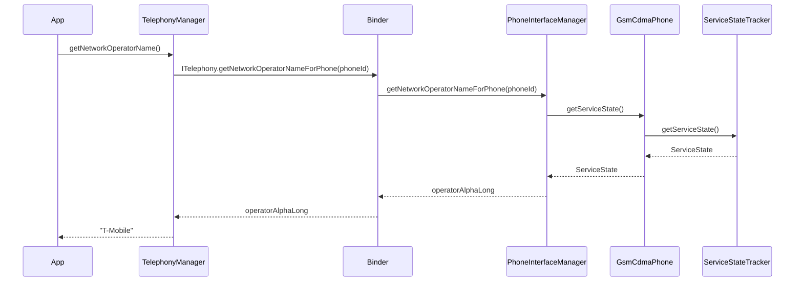
```mermaid
sequenceDiagram
    participant App
    participant TM as TelephonyManager
    participant Binder
    participant PIM as PhoneInterfaceManager
    participant Phone as GsmCdmaPhone
    participant SST as ServiceStateTracker

    App->>TM: getNetworkOperatorName()
    TM->>Binder: ITelephony.getNetworkOperatorNameForPhone(phoneId)
    Binder->>PIM: getNetworkOperatorNameForPhone(phoneId)
    PIM->>Phone: getServiceState()
    Phone->>SST: getServiceState()
    SST-->>Phone: ServiceState
    Phone-->>PIM: ServiceState
    PIM-->>Binder: operatorAlphaLong
    Binder-->>TM: operatorAlphaLong
    TM-->>App: "T-Mobile"
```

Key public API groupings on `TelephonyManager`:

- **Device identity**: `getImei()`, `getMeid()`, `getDeviceId()`
- **SIM info**: `getSimState()`, `getSimOperator()`, `getSimSerialNumber()`
- **Network state**: `getNetworkType()`, `getNetworkOperatorName()`,
  `getServiceState()`
- **Call state**: `getCallState()`, `listen()` (deprecated), `registerTelephonyCallback()`
- **Data**: `getDataState()`, `getDataNetworkType()`, `isDataEnabled()`
- **Radio control** (privileged): `setRadioPower()`, `setPreferredNetworkType()`

### 36.1.3 PhoneInterfaceManager -- the Binder Gateway

`PhoneInterfaceManager` lives in `packages/services/Telephony/` and extends
`ITelephony.Stub`.  At 14 737 lines it is the single largest class in the
telephony stack.  It performs three critical functions:

1. **Permission enforcement** -- every method checks the caller's UID against
   required permissions (`READ_PHONE_STATE`, `MODIFY_PHONE_STATE`,
   `READ_PRIVILEGED_PHONE_STATE`, carrier privileges, etc.).
2. **Phone selection** -- for multi-SIM devices, it maps the caller's
   subscription ID to the correct `Phone` object using `PhoneFactory`.
3. **Delegation** -- it calls into the internal `Phone` hierarchy and returns
   the result.

Example permission check pattern:

```java
// packages/services/Telephony/src/com/android/phone/PhoneInterfaceManager.java
public String getImeiForSlot(int slotIndex, String callingPackage,
        String callingFeatureId) {
    enforceReadPrivilegedPermission("getImeiForSlot");
    Phone phone = PhoneFactory.getPhone(slotIndex);
    return phone != null ? phone.getImei() : null;
}
```

### 36.1.4 Phone Class Hierarchy

The internal `Phone` abstract class is the heart of the telephony framework.
It extends `Handler` (so it can process asynchronous modem responses) and
defines the common interface that the rest of the stack programs against.

```
// frameworks/opt/telephony/src/java/com/android/internal/telephony/Phone.java
public abstract class Phone extends Handler implements PhoneInternalInterface {
```

The class hierarchy:

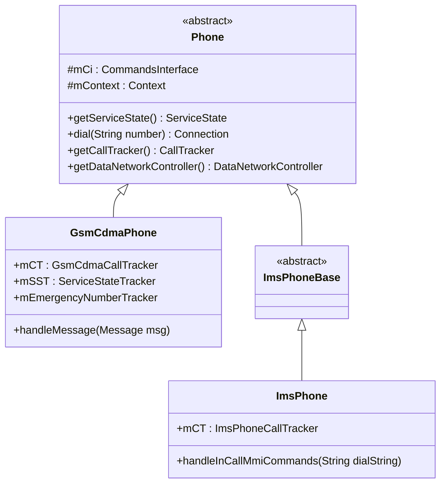
```mermaid
classDiagram
    class Phone {
        <<abstract>>
        +getServiceState() ServiceState
        +dial(String number) Connection
        +getCallTracker() CallTracker
        +getDataNetworkController() DataNetworkController
        #mCi : CommandsInterface
        #mContext : Context
    }

    class GsmCdmaPhone {
        +mCT : GsmCdmaCallTracker
        +mSST : ServiceStateTracker
        +mEmergencyNumberTracker
        +handleMessage(Message msg)
    }

    class ImsPhone {
        +mCT : ImsPhoneCallTracker
        +handleInCallMmiCommands(String dialString)
    }

    class ImsPhoneBase {
        <<abstract>>
    }

    Phone <|-- GsmCdmaPhone
    Phone <|-- ImsPhoneBase
    ImsPhoneBase <|-- ImsPhone
```

`GsmCdmaPhone` is the unified phone implementation for both GSM and CDMA
networks (the two were merged in Android 7).  It is the class instantiated by
`PhoneFactory` for each SIM slot:

```java
// frameworks/opt/telephony/src/java/com/android/internal/telephony/GsmCdmaPhone.java
public class GsmCdmaPhone extends Phone {
    public static final String LOG_TAG = "GsmCdmaPhone";
    ...
    public GsmCdmaCallTracker mCT;
    public ServiceStateTracker mSST;
    public EmergencyNumberTracker mEmergencyNumberTracker;
```

`ImsPhone` is an overlay phone that handles IMS (Voice over LTE / Wi-Fi)
calling.  It delegates to `ImsPhoneCallTracker` for call control:

```java
// frameworks/opt/telephony/src/java/com/android/internal/telephony/imsphone/ImsPhone.java
package com.android.internal.telephony.imsphone;
```

### 36.1.5 PhoneFactory -- Bootstrapping the Stack

`PhoneFactory` is the static factory that wires everything together at boot
time.  `PhoneGlobals.onCreate()` calls `PhoneFactory.makeDefaultPhones()`,
which:

1. Creates `CommandsInterface[]` (one RIL per modem).
2. Creates `UiccController` (the UICC/SIM manager singleton).
3. Creates `GsmCdmaPhone[]` (one per SIM slot).
4. Creates `PhoneSwitcher` (for multi-SIM data switching).
5. Creates `SubscriptionManagerService`.
6. Creates `EuiccController` (for eSIM management).

```java
// frameworks/opt/telephony/src/java/com/android/internal/telephony/PhoneFactory.java
public class PhoneFactory {
    static private Phone[] sPhones = null;
    static private CommandsInterface[] sCommandsInterfaces = null;
    static private UiccController sUiccController;
    ...
    public static void makeDefaultPhones(Context context,
            @NonNull FeatureFlags featureFlags) {
```

The complete boot sequence:

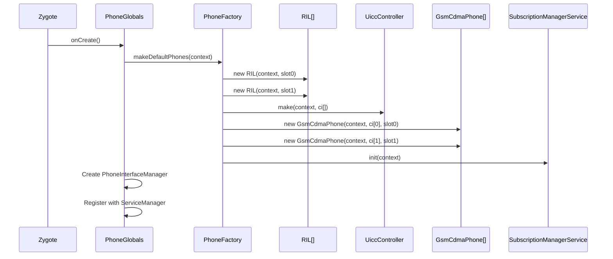
```mermaid
sequenceDiagram
    participant Zygote
    participant PG as PhoneGlobals
    participant PF as PhoneFactory
    participant RIL as RIL[]
    participant UiccC as UiccController
    participant Phone as GsmCdmaPhone[]
    participant SubMgr as SubscriptionManagerService

    Zygote->>PG: onCreate()
    PG->>PF: makeDefaultPhones(context)
    PF->>RIL: new RIL(context, slot0)
    PF->>RIL: new RIL(context, slot1)
    PF->>UiccC: make(context, ci[])
    PF->>Phone: new GsmCdmaPhone(context, ci[0], slot0)
    PF->>Phone: new GsmCdmaPhone(context, ci[1], slot1)
    PF->>SubMgr: init(context)
    PG->>PG: Create PhoneInterfaceManager
    PG->>PG: Register with ServiceManager
```

### 36.1.6 Key Event Constants

The `Phone` base class defines a rich set of event constants used in its
`Handler` message loop.  These drive the asynchronous state machine:

```java
// frameworks/opt/telephony/src/java/com/android/internal/telephony/Phone.java
protected static final int EVENT_RADIO_AVAILABLE             = 1;
protected static final int EVENT_SSN                         = 2;
protected static final int EVENT_SIM_RECORDS_LOADED          = 3;
private static final int EVENT_MMI_DONE                      = 4;
protected static final int EVENT_RADIO_ON                    = 5;
protected static final int EVENT_GET_BASEBAND_VERSION_DONE   = 6;
protected static final int EVENT_USSD                        = 7;
public static final int EVENT_RADIO_OFF_OR_NOT_AVAILABLE     = 8;
private static final int EVENT_GET_SIM_STATUS_DONE           = 11;
protected static final int EVENT_SET_CALL_FORWARD_DONE       = 12;
protected static final int EVENT_GET_CALL_FORWARD_DONE       = 13;
protected static final int EVENT_CALL_RING                   = 14;
private static final int EVENT_SET_NETWORK_MANUAL_COMPLETE   = 16;
private static final int EVENT_SET_NETWORK_AUTOMATIC_COMPLETE = 17;
protected static final int EVENT_SET_CLIR_COMPLETE           = 18;
protected static final int EVENT_REGISTERED_TO_NETWORK       = 19;
protected static final int EVENT_GET_DEVICE_IDENTITY_DONE    = 21;
public static final int EVENT_EMERGENCY_CALLBACK_MODE_ENTER  = 25;
protected static final int EVENT_SRVCC_STATE_CHANGED         = 31;
protected static final int EVENT_CARRIER_CONFIG_CHANGED      = 43;
protected static final int EVENT_MODEM_RESET                 = 45;
protected static final int EVENT_RADIO_STATE_CHANGED         = 47;
protected static final int EVENT_REGISTRATION_FAILED         = 57;
protected static final int EVENT_BARRING_INFO_CHANGED        = 58;
protected static final int EVENT_LINK_CAPACITY_CHANGED       = 59;
protected static final int EVENT_SUBSCRIPTIONS_CHANGED       = 62;
protected static final int EVENT_CELL_IDENTIFIER_DISCLOSURE  = 72;
protected static final int EVENT_SECURITY_ALGORITHM_UPDATE   = 74;
protected static final int EVENT_LAST = EVENT_SET_SECURITY_ALGORITHMS_UPDATED_ENABLED_DONE;
```

The event numbering extends to 75 as of the current codebase, reflecting
decades of accumulation from the original GSM-only phone through CDMA support,
IMS integration, security notifications, and 5G NR capabilities.

### 36.1.7 Phone Instance Variables and Sub-Components

The `Phone` base class holds references to dozens of sub-components that manage
different aspects of telephony:

```java
// frameworks/opt/telephony/src/java/com/android/internal/telephony/Phone.java
public CommandsInterface mCi;
protected DataNetworkController mDataNetworkController;
protected CarrierSignalAgent mCarrierSignalAgent;
protected CarrierActionAgent mCarrierActionAgent;
public SmsStorageMonitor mSmsStorageMonitor;
public SmsUsageMonitor mSmsUsageMonitor;
protected DeviceStateMonitor mDeviceStateMonitor;
protected DisplayInfoController mDisplayInfoController;
protected AccessNetworksManager mAccessNetworksManager;
protected CarrierResolver mCarrierResolver;
protected SignalStrengthController mSignalStrengthController;
protected Phone mImsPhone = null;
protected UiccController mUiccController = null;
```

The registrant pattern is used extensively for observer notifications:

```java
// frameworks/opt/telephony/src/java/com/android/internal/telephony/Phone.java
protected final RegistrantList mPreciseCallStateRegistrants = new RegistrantList();
private final RegistrantList mHandoverRegistrants = new RegistrantList();
private final RegistrantList mNewRingingConnectionRegistrants = new RegistrantList();
private final RegistrantList mIncomingRingRegistrants = new RegistrantList();
protected final RegistrantList mDisconnectRegistrants = new RegistrantList();
private final RegistrantList mServiceStateRegistrants = new RegistrantList();
protected final RegistrantList mMmiCompleteRegistrants = new RegistrantList();
protected final RegistrantList mMmiRegistrants = new RegistrantList();
```

These `RegistrantList` objects implement the observer pattern used throughout
the telephony stack.  Components call `registerForXxx()` to add themselves, and
receive `Message` callbacks when events occur.

### 36.1.8 GsmCdmaPhone Constructor -- Wiring Everything Together

The `GsmCdmaPhone` constructor demonstrates how all sub-components are created
and wired together.  It uses `TelephonyComponentFactory` for dependency
injection:

```java
// frameworks/opt/telephony/src/java/com/android/internal/telephony/GsmCdmaPhone.java
public GsmCdmaPhone(Context context, CommandsInterface ci, PhoneNotifier notifier,
        boolean unitTestMode, int phoneId, int precisePhoneType,
        TelephonyComponentFactory telephonyComponentFactory,
        ImsManagerFactory imsManagerFactory, @NonNull FeatureFlags featureFlags) {
    super(precisePhoneType == PhoneConstants.PHONE_TYPE_GSM ? "GSM" : "CDMA",
            notifier, context, ci, unitTestMode, phoneId, telephonyComponentFactory,
            featureFlags);
    mPrecisePhoneType = precisePhoneType;
    mVoiceCallSessionStats = new VoiceCallSessionStats(mPhoneId, this, featureFlags);
    mImsManagerFactory = imsManagerFactory;
    initOnce(ci);
    initRatSpecific(precisePhoneType);
    // CarrierSignalAgent uses CarrierActionAgent in construction so it needs to be created
    // after CarrierActionAgent.
    mCarrierActionAgent = mTelephonyComponentFactory.inject(CarrierActionAgent.class.getName())
            .makeCarrierActionAgent(this);
    mCarrierSignalAgent = mTelephonyComponentFactory.inject(CarrierSignalAgent.class.getName())
            .makeCarrierSignalAgent(this);
    mAccessNetworksManager = mTelephonyComponentFactory
            .inject(AccessNetworksManager.class.getName())
            .makeAccessNetworksManager(this, getLooper(), featureFlags);
    mSignalStrengthController = mTelephonyComponentFactory.inject(
            SignalStrengthController.class.getName()).makeSignalStrengthController(this);
    mSST = mTelephonyComponentFactory.inject(ServiceStateTracker.class.getName())
            .makeServiceStateTracker(this, this.mCi, featureFlags);
    ...
    mDataNetworkController = mTelephonyComponentFactory.inject(
            DataNetworkController.class.getName())
            .makeDataNetworkController(this, getLooper(), featureFlags);
```

The factory pattern (`TelephonyComponentFactory`) allows test code to inject
mocks, which is essential for the extensive telephony unit test suite.

### 36.1.9 ServiceStateTracker -- Network Registration

`ServiceStateTracker` (SST) is one of the most important sub-components.  It
continuously monitors and reports the device's registration state on the
cellular network:

```java
// frameworks/opt/telephony/src/java/com/android/internal/telephony/ServiceStateTracker.java
```

SST polls the modem for registration state changes, processes unsolicited
network indications, and maintains the `ServiceState` object that the rest of
the stack queries.  The `ServiceState` contains:

- Voice registration state (in-service, emergency-only, out-of-service)
- Data registration state
- Radio access technology (LTE, NR, WCDMA, etc.)
- Roaming status
- Operator name and PLMN codes
- Cell identity (cell ID, TAC, etc.)
- NR state (connected, not restricted, restricted)

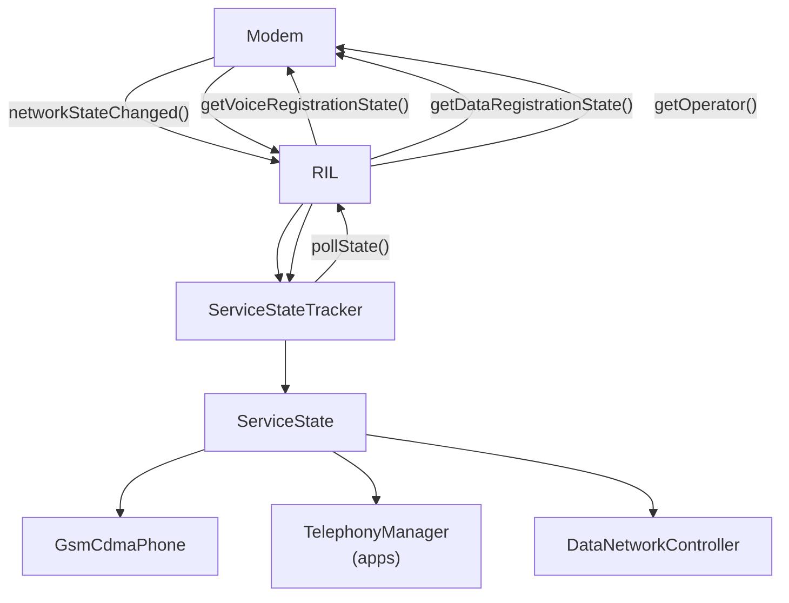
```mermaid
graph TD
    Modem["Modem"] -->|"networkStateChanged()"| RIL["RIL"]
    RIL --> SST["ServiceStateTracker"]
    SST -->|"pollState()"| RIL
    RIL -->|"getVoiceRegistrationState()"| Modem
    RIL -->|"getDataRegistrationState()"| Modem
    RIL -->|"getOperator()"| Modem
    Modem --> RIL
    RIL --> SST
    SST --> SS["ServiceState"]
    SS --> Phone["GsmCdmaPhone"]
    SS --> TM["TelephonyManager<br/>(apps)"]
    SS --> DNC["DataNetworkController"]
```

### 36.1.10 The Telephony Module (Mainline)

Starting with Android 12, parts of the telephony stack are modularised as a
Mainline module:

```
packages/modules/Telephony/
    apex/          -- Telephony APEX definition
    framework/     -- Module framework code
    libs/          -- Shared libraries
    flags/         -- Feature flags
    tests/         -- Module tests
```

This allows Google to deliver telephony updates via the Play Store without a
full OS upgrade.  The APEX contains the `com.android.telephony` module,
packaging framework components and optionally the telephony service.

### 36.1.11 Security Considerations

The telephony stack handles sensitive data (IMSI, phone numbers, SMS content)
and enforces strict permission boundaries:

| Permission | Protection Level | Grants Access To |
|-----------|-----------------|------------------|
| `READ_PHONE_STATE` | dangerous | Phone number, call state, network operator |
| `READ_PHONE_NUMBERS` | dangerous | Phone numbers specifically |
| `CALL_PHONE` | dangerous | Outgoing calls |
| `SEND_SMS` | dangerous | Sending SMS |
| `READ_SMS` | dangerous | Reading SMS database |
| `RECEIVE_SMS` | dangerous | Incoming SMS broadcasts |
| `MODIFY_PHONE_STATE` | signature\|privileged | Radio power, network mode |
| `READ_PRIVILEGED_PHONE_STATE` | signature\|privileged | IMEI, IMSI |
| `CARRIER_PRIVILEGES` | dynamic (SIM-based) | Carrier-privileged operations |

New in recent Android versions, the telephony stack adds cellular security
transparency features:

```java
// frameworks/opt/telephony/src/java/com/android/internal/telephony/Phone.java
protected static final int EVENT_CELL_IDENTIFIER_DISCLOSURE  = 72;
protected static final int EVENT_SECURITY_ALGORITHM_UPDATE   = 74;
```

These notify users when null ciphers are used or when IMSI catchers are
detected.  The related classes:

```
frameworks/opt/telephony/src/java/com/android/internal/telephony/security/CellularIdentifierDisclosureNotifier.java
frameworks/opt/telephony/src/java/com/android/internal/telephony/security/NullCipherNotifier.java
frameworks/opt/telephony/src/java/com/android/internal/telephony/security/CellularNetworkSecuritySafetySource.java
```

---

## 36.2 Radio Interface Layer (RIL)

### 36.2.1 Overview

The Radio Interface Layer is the bridge between the Java telephony framework
and the vendor-specific modem firmware.  Historically, the RIL was a C daemon
(`rild`) that communicated with the framework over a Unix socket using a
custom binary protocol.  Modern Android (12+) has migrated to a stable
AIDL-based HAL, splitting the old monolithic `IRadio` HIDL interface into
domain-specific AIDL interfaces.

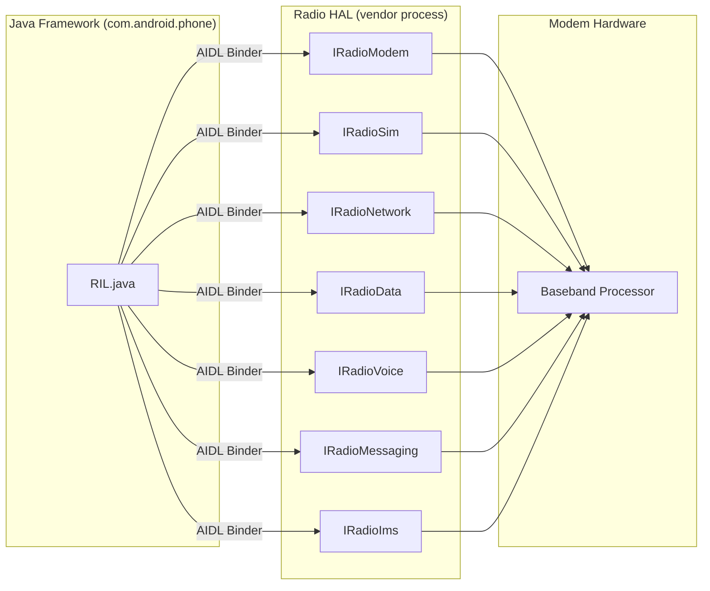
```mermaid
graph LR
    subgraph "Java Framework (com.android.phone)"
        RIL["RIL.java"]
    end

    subgraph "Radio HAL (vendor process)"
        IRM["IRadioModem"]
        IRS["IRadioSim"]
        IRN["IRadioNetwork"]
        IRD["IRadioData"]
        IRV["IRadioVoice"]
        IRMS["IRadioMessaging"]
        IRI["IRadioIms"]
    end

    subgraph "Modem Hardware"
        BP["Baseband Processor"]
    end

    RIL -->|AIDL Binder| IRM
    RIL -->|AIDL Binder| IRS
    RIL -->|AIDL Binder| IRN
    RIL -->|AIDL Binder| IRD
    RIL -->|AIDL Binder| IRV
    RIL -->|AIDL Binder| IRMS
    RIL -->|AIDL Binder| IRI
    IRM --> BP
    IRS --> BP
    IRN --> BP
    IRD --> BP
    IRV --> BP
    IRMS --> BP
    IRI --> BP
```

### 36.2.2 RIL.java -- the Java Side

`RIL.java` implements the `CommandsInterface` that every `Phone` object
programs against.  It is 6 017 lines of asynchronous request/response
plumbing:

```java
// frameworks/opt/telephony/src/java/com/android/internal/telephony/RIL.java
public class RIL extends BaseCommands implements CommandsInterface {
    static final String RILJ_LOG_TAG = "RILJ";
    static final String RILJ_WAKELOCK_TAG = "*telephony-radio*";
```

The class maintains separate service proxy objects for each HAL domain:

```java
// frameworks/opt/telephony/src/java/com/android/internal/telephony/RIL.java
private RadioResponse mRadioResponse;
private RadioIndication mRadioIndication;
private volatile IRadio mRadioProxy = null;
private DataResponse mDataResponse;
private DataIndication mDataIndication;
private ImsResponse mImsResponse;
private ImsIndication mImsIndication;
private MessagingResponse mMessagingResponse;
private MessagingIndication mMessagingIndication;
private ModemResponse mModemResponse;
private ModemIndication mModemIndication;
private NetworkResponse mNetworkResponse;
private NetworkIndication mNetworkIndication;
private SimResponse mSimResponse;
private SimIndication mSimIndication;
private VoiceResponse mVoiceResponse;
private VoiceIndication mVoiceIndication;
```

Each service proxy is stored in a `SparseArray` keyed by the HAL service type:

```java
private SparseArray<RadioServiceProxy> mServiceProxies = new SparseArray<>();
```

### 36.2.3 CommandsInterface -- the Abstraction Boundary

`CommandsInterface` defines the complete set of operations that the
telephony framework can request of the modem.  It includes both solicited
commands (requests) and unsolicited indication registration:

```java
// frameworks/opt/telephony/src/java/com/android/internal/telephony/CommandsInterface.java
public interface CommandsInterface {

    // Call forwarding constants
    static final int CF_ACTION_DISABLE          = 0;
    static final int CF_ACTION_ENABLE           = 1;
    static final int CF_ACTION_REGISTRATION     = 3;
    static final int CF_ACTION_ERASURE          = 4;

    static final int CF_REASON_UNCONDITIONAL    = 0;
    static final int CF_REASON_BUSY             = 1;
    static final int CF_REASON_NO_REPLY         = 2;
    static final int CF_REASON_NOT_REACHABLE    = 3;
    static final int CF_REASON_ALL              = 4;
    static final int CF_REASON_ALL_CONDITIONAL  = 5;

    // IMS capabilities
    int IMS_MMTEL_CAPABILITY_VOICE = 1 << 0;
    int IMS_MMTEL_CAPABILITY_VIDEO = 1 << 1;
    int IMS_MMTEL_CAPABILITY_SMS   = 1 << 2;
    int IMS_RCS_CAPABILITIES       = 1 << 3;
```

Key solicited command categories:

| Category | Example Methods |
|----------|----------------|
| Voice | `dial()`, `acceptCall()`, `hangupConnection()`, `conference()` |
| Data | `setupDataCall()`, `deactivateDataCall()`, `getDataCallList()` |
| Network | `setNetworkSelectionModeAutomatic()`, `getAvailableNetworks()`, `setAllowedNetworkTypesBitmap()` |
| SIM | `getIccCardStatus()`, `supplyIccPin()`, `iccIO()`, `changeIccPin()` |
| SMS | `sendSMS()`, `acknowledgeLastIncomingGsmSms()`, `writeSmsToSim()` |
| Modem | `setRadioPower()`, `getBasebandVersion()`, `getDeviceIdentity()` |

### 36.2.4 HAL Version Evolution

The RIL class tracks supported HAL versions for backward compatibility:

```java
// frameworks/opt/telephony/src/java/com/android/internal/telephony/RIL.java
public static final HalVersion RADIO_HAL_VERSION_1_1 = new HalVersion(1, 1);
public static final HalVersion RADIO_HAL_VERSION_1_2 = new HalVersion(1, 2);
public static final HalVersion RADIO_HAL_VERSION_1_3 = new HalVersion(1, 3);
public static final HalVersion RADIO_HAL_VERSION_1_4 = new HalVersion(1, 4);
public static final HalVersion RADIO_HAL_VERSION_1_5 = new HalVersion(1, 5);
public static final HalVersion RADIO_HAL_VERSION_1_6 = new HalVersion(1, 6);
public static final HalVersion RADIO_HAL_VERSION_2_0 = new HalVersion(2, 0);
public static final HalVersion RADIO_HAL_VERSION_2_1 = new HalVersion(2, 1);
public static final HalVersion RADIO_HAL_VERSION_2_2 = new HalVersion(2, 2);
public static final HalVersion RADIO_HAL_VERSION_2_3 = new HalVersion(2, 3);
public static final HalVersion RADIO_HAL_VERSION_2_4 = new HalVersion(2, 4);
```

Versions 1.x use the legacy HIDL `IRadio` monolithic interface.  Version 2.0+
represents the modern AIDL split HAL.  The RIL class transparently falls back
to HIDL when AIDL services are not available, using a compatibility override
map:

```java
// frameworks/opt/telephony/src/java/com/android/internal/telephony/RIL.java
private final ConcurrentHashMap<Integer, HalVersion> mCompatOverrides =
        new ConcurrentHashMap<>();
```

### 36.2.5 AIDL Radio HAL Interfaces

Starting with Android 13, the radio HAL is defined as a set of AIDL
interfaces under `hardware/interfaces/radio/aidl/`.  Each interface is
annotated with `@VintfStability` for vendor interface stability guarantees.

The seven domain interfaces and their AIDL source locations:

| Interface | Path | Responsibility |
|-----------|------|----------------|
| `IRadioModem` | `hardware/interfaces/radio/aidl/android/hardware/radio/modem/IRadioModem.aidl` | Radio power, device identity, baseband version, hardware config |
| `IRadioSim` | `hardware/interfaces/radio/aidl/android/hardware/radio/sim/IRadioSim.aidl` | SIM PIN/PUK, ICC I/O, phonebook, carrier restrictions |
| `IRadioNetwork` | `hardware/interfaces/radio/aidl/android/hardware/radio/network/IRadioNetwork.aidl` | Network scan, registration, signal strength, barring info |
| `IRadioData` | `hardware/interfaces/radio/aidl/android/hardware/radio/data/IRadioData.aidl` | Data call setup/teardown, keepalive, QoS, slicing |
| `IRadioVoice` | `hardware/interfaces/radio/aidl/android/hardware/radio/voice/IRadioVoice.aidl` | Dial, accept, hangup, DTMF, call forwarding, USSD |
| `IRadioMessaging` | `hardware/interfaces/radio/aidl/android/hardware/radio/messaging/IRadioMessaging.aidl` | SMS send/receive, cell broadcast, MMS support |
| `IRadioIms` | `hardware/interfaces/radio/aidl/android/hardware/radio/ims/IRadioIms.aidl` | IMS registration info, SRVCC, IMS traffic type |

Each domain interface follows a triplet pattern:

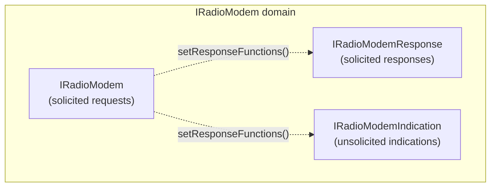
```mermaid
graph TD
    subgraph "IRadioModem domain"
        A["IRadioModem<br/>(solicited requests)"]
        B["IRadioModemResponse<br/>(solicited responses)"]
        C["IRadioModemIndication<br/>(unsolicited indications)"]
    end
    A -.->|"setResponseFunctions()"| B
    A -.->|"setResponseFunctions()"| C
```

For example, from the modem domain:

```
// hardware/interfaces/radio/aidl/android/hardware/radio/modem/IRadioModem.aidl
@VintfStability
oneway interface IRadioModem {
    void enableModem(in int serial, in boolean on);
    void getBasebandVersion(in int serial);
    void getDeviceIdentity(in int serial);
    void getHardwareConfig(in int serial);
    void getModemActivityInfo(in int serial);
    ...
}
```

Every method takes a `serial` parameter that the framework uses to match
asynchronous responses.  The `oneway` modifier means calls are fire-and-forget;
responses arrive through the callback interfaces.

### 36.2.6 Solicited vs Unsolicited Messages

The RIL communication model has two distinct flows:

**Solicited messages** -- the framework sends a request and expects a response:

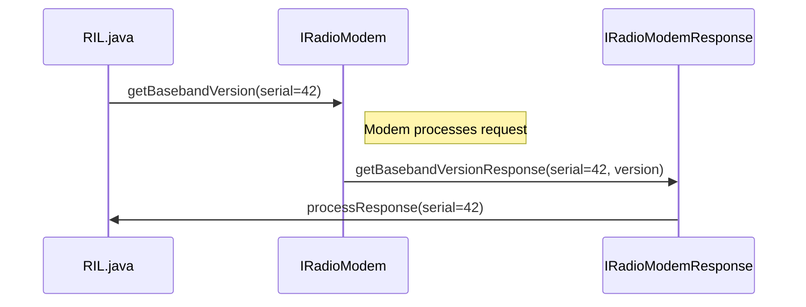
```mermaid
sequenceDiagram
    participant RIL as RIL.java
    participant HAL as IRadioModem
    participant Resp as IRadioModemResponse

    RIL->>HAL: getBasebandVersion(serial=42)
    Note right of HAL: Modem processes request
    HAL->>Resp: getBasebandVersionResponse(serial=42, version)
    Resp->>RIL: processResponse(serial=42)
```

**Unsolicited indications** -- the modem sends notifications without being
asked:

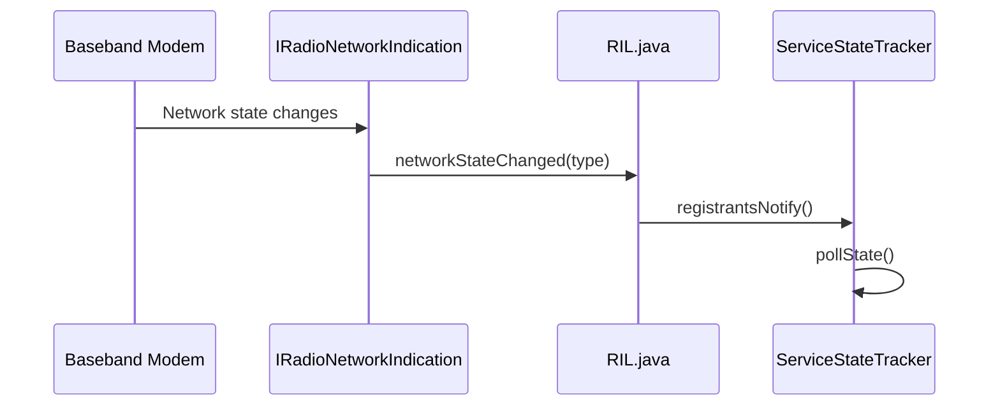
```mermaid
sequenceDiagram
    participant Modem as Baseband Modem
    participant HAL as IRadioNetworkIndication
    participant RIL as RIL.java
    participant SST as ServiceStateTracker

    Modem->>HAL: Network state changes
    HAL->>RIL: networkStateChanged(type)
    RIL->>SST: registrantsNotify()
    SST->>SST: pollState()
```

Common unsolicited indications include:

- `radioStateChanged` -- modem power state change
- `networkStateChanged` -- registration / roaming changes
- `newSms` -- incoming SMS received
- `callStateChanged` -- active calls changed
- `dataCallListChanged` -- data bearer state changed
- `simStatusChanged` -- SIM card inserted / removed
- `signalStrengthUpdate` -- signal bars changed

### 36.2.7 Wake Lock Management

The RIL uses Android wake locks to keep the device awake while waiting for
modem responses.  Two separate wake locks are maintained:

```java
// frameworks/opt/telephony/src/java/com/android/internal/telephony/RIL.java
public final WakeLock mWakeLock;           // request/response
public final WakeLock mAckWakeLock;        // ack sent
...
private static final int DEFAULT_WAKE_LOCK_TIMEOUT_MS = 60000;
private static final int DEFAULT_ACK_WAKE_LOCK_TIMEOUT_MS = 200;
```

The request wake lock is acquired when a request is sent and released when
the response arrives (or a timeout fires).  The pending requests are tracked
in a `SparseArray`:

```java
SparseArray<RILRequest> mRequestList = new SparseArray<>();
```

### 36.2.8 Feature-to-Service Mapping

The RIL maps Android feature flags to specific HAL services, allowing graceful
degradation when a device does not support certain capabilities:

```java
// frameworks/opt/telephony/src/java/com/android/internal/telephony/RIL.java
private static final Map<String, Integer> FEATURES_TO_SERVICES = Map.ofEntries(
    Map.entry(PackageManager.FEATURE_TELEPHONY_CALLING, HAL_SERVICE_VOICE),
    Map.entry(PackageManager.FEATURE_TELEPHONY_DATA, HAL_SERVICE_DATA),
    Map.entry(PackageManager.FEATURE_TELEPHONY_MESSAGING, HAL_SERVICE_MESSAGING),
    Map.entry(PackageManager.FEATURE_TELEPHONY_IMS, HAL_SERVICE_IMS)
);
```

The HAL service constants are defined in `TelephonyManager`:

```java
// frameworks/base/telephony/java/android/telephony/TelephonyManager.java
public static final int HAL_SERVICE_RADIO     = 0;
public static final int HAL_SERVICE_DATA      = 1;
public static final int HAL_SERVICE_MESSAGING = 2;
public static final int HAL_SERVICE_MODEM     = 3;
public static final int HAL_SERVICE_NETWORK   = 4;
public static final int HAL_SERVICE_SIM       = 5;
public static final int HAL_SERVICE_VOICE     = 6;
public static final int HAL_SERVICE_IMS       = 7;
```

### 36.2.9 Death Recipient and Recovery

If the radio HAL process crashes, the RIL detects it through Binder death
recipients and attempts recovery:

```java
// frameworks/opt/telephony/src/java/com/android/internal/telephony/RIL.java
static final int EVENT_RADIO_PROXY_DEAD = 6;
static final int EVENT_AIDL_PROXY_DEAD  = 7;
```

When a death notification is received, the RIL:

1. Marks all pending requests as failed.
2. Clears the proxy reference.
3. Notifies `ServiceStateTracker` and `DataNetworkController`.
4. Attempts to rebind to the HAL service.

### 36.2.10 RilHandler -- Internal Event Processing

The RIL has its own internal `Handler` subclass that processes timeout and
death events:

```java
// frameworks/opt/telephony/src/java/com/android/internal/telephony/RIL.java
public class RilHandler extends Handler {
    @Override
    public void handleMessage(Message msg) {
        RILRequest rr;
        switch (msg.what) {
            case EVENT_WAKE_LOCK_TIMEOUT:
                // Haven't heard back from the last request.  Assume we're
                // not getting a response and release the wake lock.
                synchronized (mRequestList) {
                    if (msg.arg1 == mWlSequenceNum && clearWakeLock(FOR_WAKELOCK)) {
                        if (mRadioBugDetector != null) {
                            mRadioBugDetector.processWakelockTimeout();
                        }
                        if (RILJ_LOGD) {
                            int count = mRequestList.size();
                            riljLog("WAKE_LOCK_TIMEOUT mRequestList=" + count);
                            for (int i = 0; i < count; i++) {
                                rr = mRequestList.valueAt(i);
                                riljLog(i + ": [" + rr.mSerial + "] "
                                        + RILUtils.requestToString(rr.mRequest));
                            }
                        }
                    }
                }
                break;

            case EVENT_ACK_WAKE_LOCK_TIMEOUT:
                if (msg.arg1 == mAckWlSequenceNum && clearWakeLock(FOR_ACK_WAKELOCK)) {
                    if (RILJ_LOGV) riljLog("ACK_WAKE_LOCK_TIMEOUT");
                }
                break;

            case EVENT_BLOCKING_RESPONSE_TIMEOUT:
                int serial = (int) msg.obj;
                rr = findAndRemoveRequestFromList(serial);
                if (rr == null) break;
                if (rr.mResult != null) {
                    Object timeoutResponse = getResponseForTimedOutRILRequest(rr);
                    AsyncResult.forMessage(rr.mResult, timeoutResponse, null);
                    rr.mResult.sendToTarget();
                }
                decrementWakeLock(rr);
                rr.release();
                break;

            case EVENT_RADIO_PROXY_DEAD:
                // HIDL radio proxy died
                ...
                resetProxyAndRequestList(service);
                break;

            case EVENT_AIDL_PROXY_DEAD:
                // AIDL radio proxy died
                ...
                resetProxyAndRequestList(aidlService);
                break;
        }
    }
}
```

### 36.2.11 Radio Bug Detection

The `RadioBugDetector` automatically detects stuck modems by monitoring wake
lock timeouts:

```java
// frameworks/opt/telephony/src/java/com/android/internal/telephony/RIL.java
if (mRadioBugDetector != null) {
    mRadioBugDetector.processWakelockTimeout();
}
```

When the modem consistently fails to respond, the detector reports an anomaly
through `AnomalyReporter`, which triggers diagnostic data collection.

### 36.2.12 Binder Death Handling

The RIL uses two different death recipient mechanisms depending on the HAL
binding:

**HIDL (legacy)**: `HwBinder.DeathRecipient`

```java
// frameworks/opt/telephony/src/java/com/android/internal/telephony/RIL.java
final class RadioProxyDeathRecipient implements HwBinder.DeathRecipient {
    @Override
    public void serviceDied(long cookie) {
        riljLog("serviceDied");
        mRilHandler.sendMessageAtFrontOfQueue(mRilHandler.obtainMessage(
                EVENT_RADIO_PROXY_DEAD,
                HAL_SERVICE_RADIO, 0, cookie));
    }
}
```

**AIDL (modern)**: `IBinder.DeathRecipient`

```java
private final class BinderServiceDeathRecipient implements IBinder.DeathRecipient {
    private IBinder mBinder;
    private final int mService;

    @Override
    public void binderDied() {
        riljLog("Service " + serviceToString(mService) + " has died.");
        mRilHandler.sendMessageAtFrontOfQueue(mRilHandler.obtainMessage(
                EVENT_AIDL_PROXY_DEAD, mService, 0, mLinkedFlags));
        unlinkToDeath();
    }
}
```

When any service dies, `resetProxyAndRequestList()` is called, which:

1. Clears the service proxy reference.
2. Sends error responses for all pending requests.
3. Releases all held wake locks.
4. Triggers re-connection attempts.

For AIDL services, resetting one service triggers a reset of all AIDL services
since they typically live in the same vendor process.

### 36.2.13 Request Serialisation and Histograms

Every RIL request gets a unique serial number.  The framework maintains
histograms of request/response latencies:

```java
// frameworks/opt/telephony/src/java/com/android/internal/telephony/RIL.java
static SparseArray<TelephonyHistogram> sRilTimeHistograms = new SparseArray<>();
static final int RIL_HISTOGRAM_BUCKET_COUNT = 5;

public static List<TelephonyHistogram> getTelephonyRILTimingHistograms() {
    List<TelephonyHistogram> list;
    synchronized (sRilTimeHistograms) {
        list = new ArrayList<>(sRilTimeHistograms.size());
        for (int i = 0; i < sRilTimeHistograms.size(); i++) {
            TelephonyHistogram entry = new TelephonyHistogram(sRilTimeHistograms.valueAt(i));
            list.add(entry);
        }
    }
    return list;
}
```

These histograms are accessible via `TelephonyManager.requestModemActivityInfo()`
and are used for power attribution and performance monitoring.

### 36.2.14 Mock Modem for Testing

The RIL class includes built-in support for a mock modem, allowing integration
testing without real hardware:

```java
// frameworks/opt/telephony/src/java/com/android/internal/telephony/RIL.java
private MockModem mMockModem;
```

This is activated via `TelephonyShellCommand` and replaces the real HAL
service proxies with test doubles.  The MockModem framework lives at:

```
frameworks/opt/telephony/src/java/com/android/internal/telephony/MockModem.java
```

It allows test scripts to:

- Simulate SIM insertion/removal
- Simulate network registration changes
- Simulate incoming calls and SMS
- Simulate radio power state changes

### 36.2.15 HIDL to AIDL Migration

The evolution from HIDL to AIDL is a significant architectural shift:

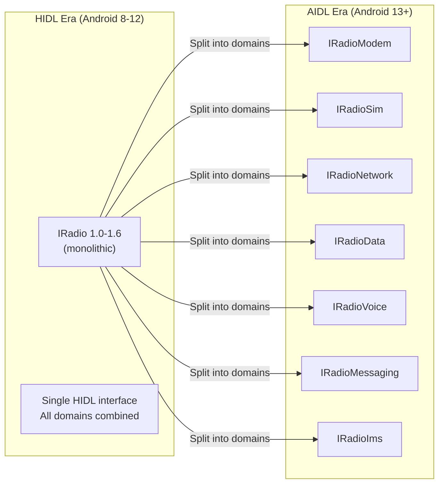
```mermaid
graph LR
    subgraph "HIDL Era (Android 8-12)"
        H1["IRadio 1.0-1.6<br/>(monolithic)"]
        H2["Single HIDL interface<br/>All domains combined"]
    end

    subgraph "AIDL Era (Android 13+)"
        A1["IRadioModem"]
        A2["IRadioSim"]
        A3["IRadioNetwork"]
        A4["IRadioData"]
        A5["IRadioVoice"]
        A6["IRadioMessaging"]
        A7["IRadioIms"]
    end

    H1 -->|"Split into domains"| A1
    H1 -->|"Split into domains"| A2
    H1 -->|"Split into domains"| A3
    H1 -->|"Split into domains"| A4
    H1 -->|"Split into domains"| A5
    H1 -->|"Split into domains"| A6
    H1 -->|"Split into domains"| A7
```

The HIDL versions are preserved for backward compatibility:

```
hardware/interfaces/radio/1.0/   -- Android 8 (original HIDL)
hardware/interfaces/radio/1.1/   -- Android 8.1
hardware/interfaces/radio/1.2/   -- Android 9
hardware/interfaces/radio/1.3/   -- Android 10
hardware/interfaces/radio/1.4/   -- Android 10
hardware/interfaces/radio/1.5/   -- Android 11
hardware/interfaces/radio/1.6/   -- Android 12
hardware/interfaces/radio/aidl/  -- Android 13+ (AIDL split)
```

Benefits of the AIDL split:

| Aspect | HIDL (Monolithic) | AIDL (Split) |
|--------|-------------------|--------------|
| Update scope | Any change touches all domains | Each domain updates independently |
| Process isolation | Single process | Each service can be in its own process |
| Stability | VINTF but harder to extend | `@VintfStability` with cleaner versioning |
| Type safety | Struct + enum types | Full AIDL parcelable support |
| Testing | Must mock entire interface | Mock individual domains |

---

## 36.3 SIM Management

### 36.3.1 UICC Framework Overview

The Universal Integrated Circuit Card (UICC) is the smart card that holds the
SIM application.  Android models the physical card hierarchy through a set of
classes in `frameworks/opt/telephony/src/java/com/android/internal/telephony/uicc/`:

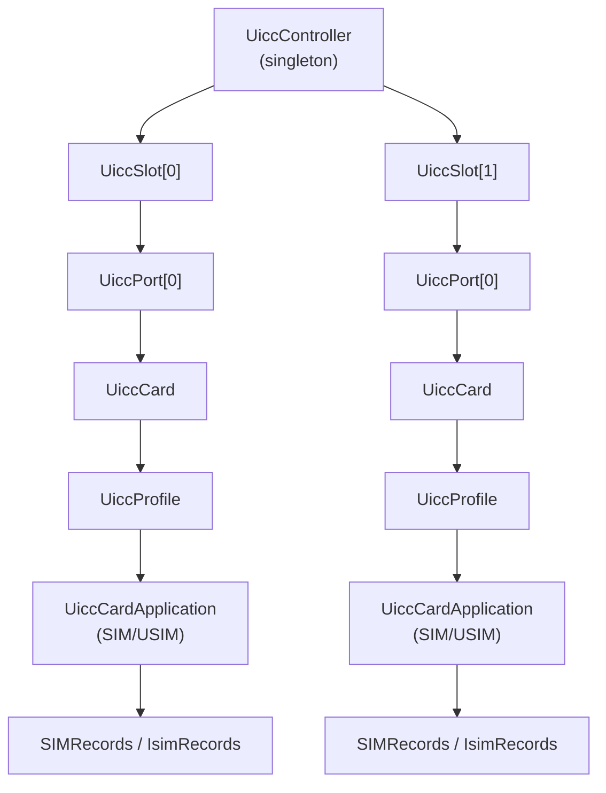
```mermaid
graph TD
    UC["UiccController<br/>(singleton)"]
    UC --> US1["UiccSlot[0]"]
    UC --> US2["UiccSlot[1]"]
    US1 --> UP1["UiccPort[0]"]
    US2 --> UP2["UiccPort[0]"]
    UP1 --> UCard1["UiccCard"]
    UP2 --> UCard2["UiccCard"]
    UCard1 --> UProf1["UiccProfile"]
    UCard2 --> UProf2["UiccProfile"]
    UProf1 --> App1["UiccCardApplication<br/>(SIM/USIM)"]
    UProf2 --> App2["UiccCardApplication<br/>(SIM/USIM)"]
    App1 --> Rec1["SIMRecords / IsimRecords"]
    App2 --> Rec2["SIMRecords / IsimRecords"]
```

`UiccController` is the entry point.  It is a singleton created during
`PhoneFactory.makeDefaultPhones()`:

```java
// frameworks/opt/telephony/src/java/com/android/internal/telephony/uicc/UiccController.java
/**
 * This class is responsible for keeping all knowledge about
 * Universal Integrated Circuit Card (UICC), also know as SIM's,
 * in the system.
 *
 * UiccController is created with the call to make() function.
 * UiccController is a singleton and make() must only be called once.
 *
 * Once created UiccController registers with RIL for "on" and
 * "unsol_sim_status_changed" notifications.
 */
```

The key UICC classes and their files:

| Class | File | Role |
|-------|------|------|
| `UiccController` | `uicc/UiccController.java` | Singleton; manages all slots and cards |
| `UiccSlot` | `uicc/UiccSlot.java` | Physical card slot (can be physical or eSIM) |
| `UiccPort` | `uicc/UiccPort.java` | Logical port on a slot (for MEP -- Multiple Enabled Profiles) |
| `UiccCard` | `uicc/UiccCard.java` | Represents the smart card itself |
| `UiccProfile` | `uicc/UiccProfile.java` | Represents a carrier profile on the card |
| `UiccCardApplication` | `uicc/UiccCardApplication.java` | SIM/USIM/ISIM application on the card |
| `SIMRecords` | `uicc/SIMRecords.java` | Reads/caches EF (Elementary File) data from the SIM |
| `IsimRecords` | `uicc/IsimRecords.java` | ISIM application records (for IMS) |
| `IccFileHandler` | `uicc/IccFileHandler.java` | Reads/writes SIM files via ICC I/O commands |
| `PinStorage` | `uicc/PinStorage.java` | Stores cached SIM PINs for unattended reboot |

### 36.3.2 SIM Card Status Flow

When a SIM card is inserted (or at boot), the following sequence occurs:

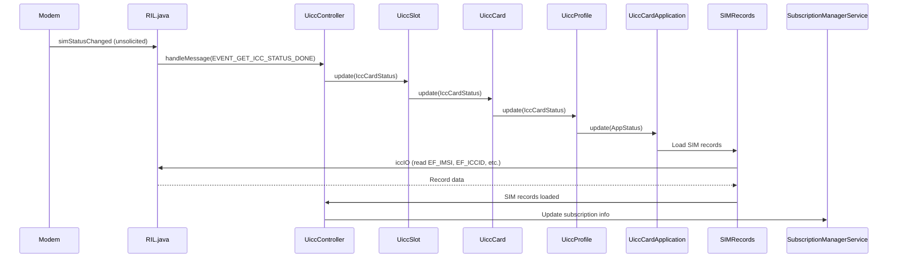
```mermaid
sequenceDiagram
    participant Modem
    participant RIL as RIL.java
    participant UC as UiccController
    participant US as UiccSlot
    participant UCard as UiccCard
    participant UProf as UiccProfile
    participant App as UiccCardApplication
    participant Rec as SIMRecords
    participant SubMgr as SubscriptionManagerService

    Modem->>RIL: simStatusChanged (unsolicited)
    RIL->>UC: handleMessage(EVENT_GET_ICC_STATUS_DONE)
    UC->>US: update(IccCardStatus)
    US->>UCard: update(IccCardStatus)
    UCard->>UProf: update(IccCardStatus)
    UProf->>App: update(AppStatus)
    App->>Rec: Load SIM records
    Rec->>RIL: iccIO (read EF_IMSI, EF_ICCID, etc.)
    RIL-->>Rec: Record data
    Rec->>UC: SIM records loaded
    UC->>SubMgr: Update subscription info
```

The `IccCardApplicationStatus` contains the application state:

```java
// frameworks/opt/telephony/src/java/com/android/internal/telephony/uicc/IccCardApplicationStatus.java
public enum AppType {
    APPTYPE_UNKNOWN,
    APPTYPE_SIM,
    APPTYPE_USIM,
    APPTYPE_RUIM,
    APPTYPE_CSIM,
    APPTYPE_ISIM
}
```

### 36.3.3 IRadioSim HAL

The SIM-related operations go through `IRadioSim`:

```
// hardware/interfaces/radio/aidl/android/hardware/radio/sim/IRadioSim.aidl
@VintfStability
oneway interface IRadioSim {
    void areUiccApplicationsEnabled(in int serial);
    void changeIccPin2ForApp(in int serial, in String oldPin2,
            in String newPin2, in String aid);
    void changeIccPinForApp(in int serial, in String oldPin,
            in String newPin, in String aid);
    void enableUiccApplications(in int serial, in boolean enable);
```

Key SIM HAL operations:

| Method | Purpose |
|--------|---------|
| `getIccCardStatus` | Get current card/app status |
| `supplyIccPinForApp` | Enter SIM PIN |
| `supplyIccPukForApp` | Enter PUK code |
| `changeIccPinForApp` | Change SIM PIN |
| `iccIOForApp` | Raw ICC I/O (read/write SIM files) |
| `iccOpenLogicalChannel` | Open logical channel for APDU |
| `iccTransmitApduLogicalChannel` | Send APDU to SIM |
| `setCarrierRestrictions` | Carrier lock (SIM lock) |
| `getSimPhonebookRecords` | Read SIM phonebook |

### 36.3.4 SubscriptionManager and SubscriptionManagerService

`SubscriptionManager` is the public API for managing SIM subscriptions.  It
exposes information about active and inactive SIM cards:

```java
// frameworks/base/telephony/java/android/telephony/SubscriptionManager.java
public class SubscriptionManager {
    public List<SubscriptionInfo> getActiveSubscriptionInfoList()
    public SubscriptionInfo getActiveSubscriptionInfo(int subId)
    public int getActiveSubscriptionInfoCount()
    public int getDefaultSmsSubscriptionId()
    public int getDefaultVoiceSubscriptionId()
    public int getDefaultDataSubscriptionId()
```

On the implementation side, `SubscriptionManagerService` (replacing the older
`SubscriptionController`) is a comprehensive service at:

```
frameworks/opt/telephony/src/java/com/android/internal/telephony/subscription/SubscriptionManagerService.java
```

It manages the subscription database stored in the Telephony provider
(`content://telephony/siminfo`), handles subscription lifecycle events,
and coordinates multi-SIM settings.

### 36.3.5 Multi-SIM Support: DSDS and DSDA

Android supports multiple SIM configurations:

| Mode | Description | Radio Configuration |
|------|-------------|---------------------|
| **Single SIM** | One SIM slot | One modem instance |
| **DSDS** (Dual SIM Dual Standby) | Two SIMs, one active at a time for data/voice | Two logical modems, one active RF chain |
| **DSDA** (Dual SIM Dual Active) | Two SIMs, both can be active simultaneously | Two modems, two RF chains |
| **TSTS** (Triple SIM Triple Standby) | Three SIMs | Three logical modems |

The number of SIM slots is managed by `PhoneConfigurationManager`:

```java
// frameworks/opt/telephony/src/java/com/android/internal/telephony/PhoneConfigurationManager.java
```

`MultiSimSettingController` coordinates cross-SIM settings:

```java
// frameworks/opt/telephony/src/java/com/android/internal/telephony/MultiSimSettingController.java
```

`PhoneSwitcher` handles data SIM switching in DSDS mode:

```java
// frameworks/opt/telephony/src/java/com/android/internal/telephony/data/PhoneSwitcher.java
```

`SimultaneousCallingTracker` manages DSDA simultaneous call scenarios:

```java
// frameworks/opt/telephony/src/java/com/android/internal/telephony/SimultaneousCallingTracker.java
```

The multi-SIM architecture:

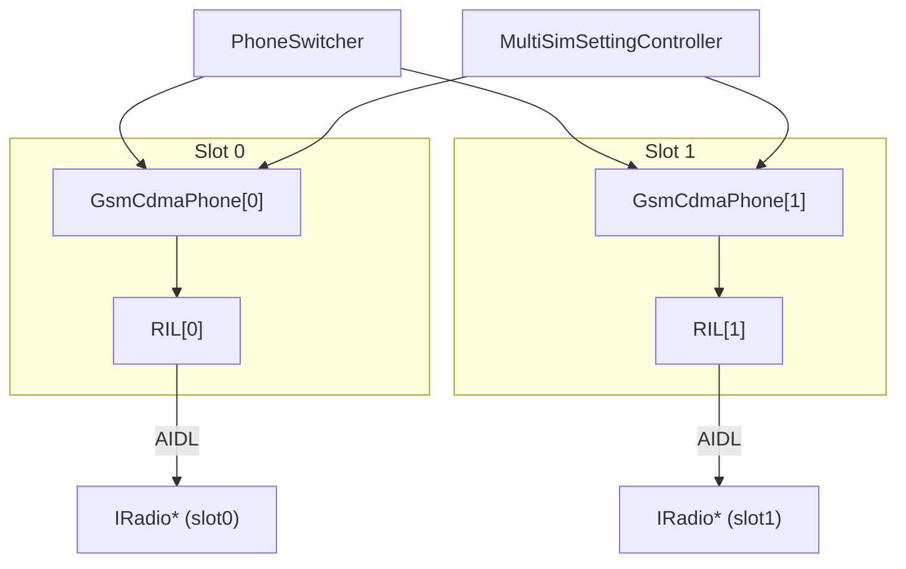
```mermaid
graph TD
    subgraph "Slot 0"
        P0["GsmCdmaPhone[0]"]
        R0["RIL[0]"]
        P0 --> R0
    end

    subgraph "Slot 1"
        P1["GsmCdmaPhone[1]"]
        R1["RIL[1]"]
        P1 --> R1
    end

    PS["PhoneSwitcher"] --> P0
    PS --> P1
    MSSC["MultiSimSettingController"] --> P0
    MSSC --> P1

    R0 -->|AIDL| HAL0["IRadio* (slot0)"]
    R1 -->|AIDL| HAL1["IRadio* (slot1)"]
```

### 36.3.6 eSIM (eUICC) Support

Embedded SIM support is implemented through the eUICC framework:

```
frameworks/opt/telephony/src/java/com/android/internal/telephony/euicc/EuiccController.java
frameworks/opt/telephony/src/java/com/android/internal/telephony/euicc/EuiccCardController.java
frameworks/opt/telephony/src/java/com/android/internal/telephony/euicc/EuiccConnector.java
```

`EuiccController` delegates to an `EuiccService` implementation (typically
provided by the carrier or Google):

```java
// frameworks/opt/telephony/src/java/com/android/internal/telephony/euicc/EuiccController.java
```

The eSIM profile lifecycle:

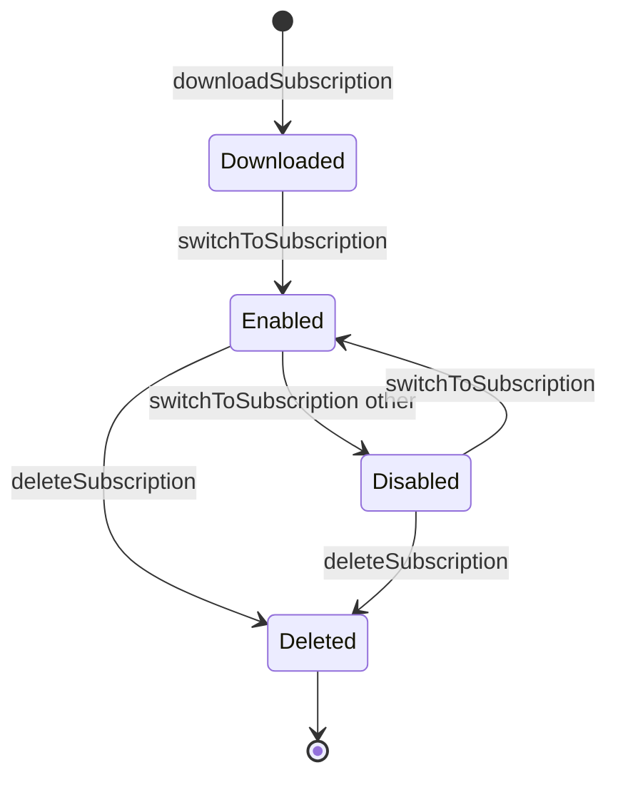
```mermaid
stateDiagram-v2
    [*] --> Downloaded : downloadSubscription
    Downloaded --> Enabled : switchToSubscription
    Enabled --> Disabled : switchToSubscription other
    Disabled --> Enabled : switchToSubscription
    Enabled --> Deleted : deleteSubscription
    Disabled --> Deleted : deleteSubscription
    Deleted --> [*]
```

Key eSIM APIs on `EuiccManager`:

- `downloadSubscription()` -- download an eSIM profile from a carrier server
- `switchToSubscription()` -- activate a downloaded profile
- `deleteSubscription()` -- remove a profile
- `getEid()` -- get the eUICC hardware identifier

### 36.3.7 SubscriptionInfo -- the Data Model

`SubscriptionInfo` is the public data class that represents a SIM subscription.
It contains:

```java
// frameworks/base/telephony/java/android/telephony/SubscriptionInfo.java
public class SubscriptionInfo implements Parcelable {
    // Unique subscription ID
    private int mId;
    // ICCID of the SIM card
    private String mIccId;
    // Slot index (0, 1, ...)
    private int mSimSlotIndex;
    // Display name (e.g., "T-Mobile")
    private CharSequence mDisplayName;
    // Carrier name
    private CharSequence mCarrierName;
    // MCC + MNC
    private int mMcc;
    private int mMnc;
    // Country ISO
    private String mCountryIso;
    // Is embedded (eSIM)?
    private boolean mIsEmbedded;
    // Data roaming setting
    private int mDataRoaming;
    // Card ID
    private int mCardId;
    // Is opportunistic?
    private boolean mIsOpportunistic;
    // Group UUID (for grouped subscriptions)
    private ParcelUuid mGroupUuid;
}
```

The internal `SubscriptionInfoInternal` adds additional fields not exposed to
the public API:

```java
// frameworks/opt/telephony/src/java/com/android/internal/telephony/subscription/SubscriptionInfoInternal.java
```

### 36.3.8 Multi-SIM Settings and Defaults

`SubscriptionManager` provides methods to query and set default subscriptions:

```java
// frameworks/base/telephony/java/android/telephony/SubscriptionManager.java
public int getDefaultVoiceSubscriptionId()    // Default for voice calls
public int getDefaultSmsSubscriptionId()      // Default for SMS
public int getDefaultDataSubscriptionId()     // Default for mobile data
public int getActiveDataSubscriptionId()      // Currently active data sub
```

In DSDS mode, the user can set different defaults for voice, SMS, and data.
The `MultiSimSettingController` enforces consistency:

```java
// frameworks/opt/telephony/src/java/com/android/internal/telephony/MultiSimSettingController.java
```

For example, if a SIM is removed, the controller automatically updates the
default to the remaining SIM.

### 36.3.9 PhoneSwitcher -- Data SIM Switching

In DSDS mode, only one SIM can be active for data at a time.  `PhoneSwitcher`
manages the DDS (Default Data Subscription) switching:

```java
// frameworks/opt/telephony/src/java/com/android/internal/telephony/data/PhoneSwitcher.java
```

The switching logic considers:

1. User's explicit data SIM preference
2. Emergency call requirements
3. Opportunistic subscription presence
4. Carrier-requested temporary switches (e.g., for MMS on a non-data SIM)

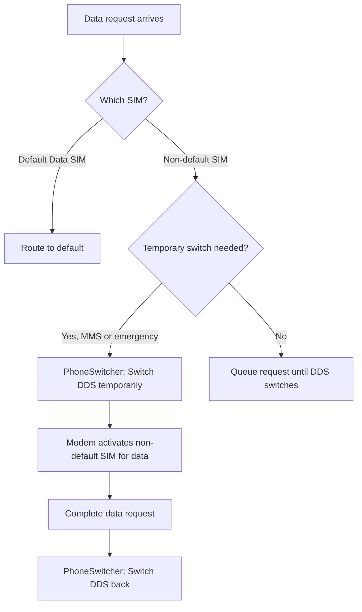
```mermaid
flowchart TD
    A["Data request arrives"] --> B{"Which SIM?"}
    B -->|Default Data SIM| C["Route to default"]
    B -->|Non-default SIM| D{"Temporary switch needed?"}
    D -->|Yes, MMS or emergency| E["PhoneSwitcher: Switch DDS temporarily"]
    D -->|No| F["Queue request until DDS switches"]
    E --> G["Modem activates non-default SIM for data"]
    G --> H["Complete data request"]
    H --> I["PhoneSwitcher: Switch DDS back"]
```

### 36.3.10 SIM State Machine

The SIM goes through several states during initialization:

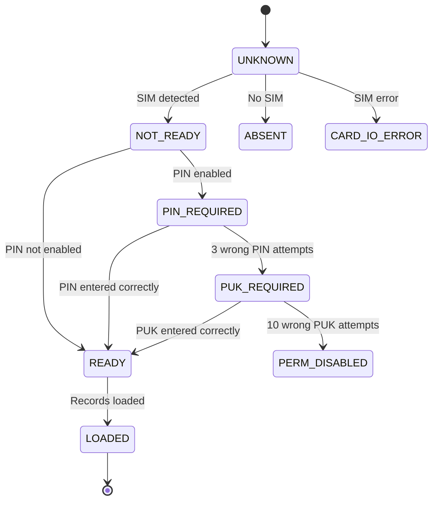
```mermaid
stateDiagram-v2
    [*] --> UNKNOWN
    UNKNOWN --> NOT_READY : SIM detected
    NOT_READY --> PIN_REQUIRED : PIN enabled
    NOT_READY --> READY : PIN not enabled
    PIN_REQUIRED --> READY : PIN entered correctly
    PIN_REQUIRED --> PUK_REQUIRED : 3 wrong PIN attempts
    PUK_REQUIRED --> READY : PUK entered correctly
    PUK_REQUIRED --> PERM_DISABLED : 10 wrong PUK attempts
    READY --> LOADED : Records loaded
    LOADED --> [*]
    UNKNOWN --> ABSENT : No SIM
    UNKNOWN --> CARD_IO_ERROR : SIM error
```

These states are defined as constants in `TelephonyManager`:

```java
// frameworks/base/telephony/java/android/telephony/TelephonyManager.java
public static final int SIM_STATE_UNKNOWN       = 0;
public static final int SIM_STATE_ABSENT        = 1;
public static final int SIM_STATE_PIN_REQUIRED  = 2;
public static final int SIM_STATE_PUK_REQUIRED  = 3;
public static final int SIM_STATE_NETWORK_LOCKED = 4;
public static final int SIM_STATE_READY         = 5;
public static final int SIM_STATE_NOT_READY     = 6;
public static final int SIM_STATE_PERM_DISABLED = 7;
public static final int SIM_STATE_CARD_IO_ERROR = 8;
public static final int SIM_STATE_LOADED        = 10;
public static final int SIM_STATE_PRESENT       = 11;
```

### 36.3.11 SIM File System and EFs

The SIM card contains a hierarchical file system defined by 3GPP.  Key
Elementary Files (EFs) that Android reads:

| EF Name | EF ID | Content |
|---------|-------|---------|
| EF_IMSI | 6F07 | International Mobile Subscriber Identity |
| EF_ICCID | 2FE2 | SIM card unique identifier |
| EF_AD | 6FAD | Administrative data (MNC length) |
| EF_MSISDN | 6F40 | Phone number(s) |
| EF_SPN | 6F46 | Service Provider Name |
| EF_SMS | 6F3C | SMS messages stored on SIM |
| EF_ADN | 6F3A | Abbreviated Dialing Numbers (phonebook) |
| EF_FDN | 6F3B | Fixed Dialing Numbers |
| EF_PLMN_ACT | 6F60 | User-controlled PLMN selector with access technology |
| EF_HPLMN | 6F31 | HPLMN search period |
| EF_SST | 6F38 | SIM Service Table |

The `SIMRecords` class reads these files using the `IccFileHandler`:

```java
// frameworks/opt/telephony/src/java/com/android/internal/telephony/uicc/SIMRecords.java
```

For USIM (3G+), the files live under the ADF (Application Dedicated File) for
the USIM application, identified by its AID (Application Identifier).

### 36.3.12 PIN Storage and Unattended Reboot

`PinStorage` provides secure caching of SIM PINs to support unattended reboot
(e.g., after an OTA update):

```java
// frameworks/opt/telephony/src/java/com/android/internal/telephony/uicc/PinStorage.java
```

The PIN is stored encrypted in memory and automatically supplied to the SIM
after a reboot, so the device can reconnect to the network without user
intervention.  This is critical for devices that receive OTA updates overnight.

### 36.3.13 Carrier Restriction (SIM Lock)

The `IRadioSim` HAL supports carrier restrictions (SIM locking):

```
void setCarrierRestrictions(in int serial,
        in CarrierRestrictions carriers,
        in SimLockMultiSimPolicy multiSimPolicy);
void getCarrierRestrictions(in int serial);
```

This allows carriers and device manufacturers to restrict which SIM cards can
be used in a device.  The `CarrierRestrictions` structure specifies allowed
and excluded carriers by MCC/MNC and optionally GID (Group Identifier).

---

## 36.4 SMS/MMS

### 36.4.1 SMS Architecture Overview

Android SMS handling involves multiple components spanning the framework,
carrier services, and the modem:

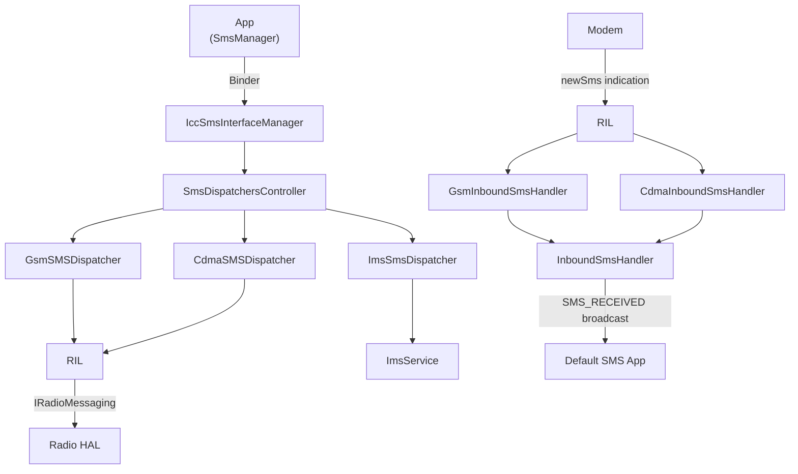
```mermaid
graph TD
    App["App<br/>(SmsManager)"] -->|Binder| SMS_IF["IccSmsInterfaceManager"]
    SMS_IF --> SDC["SmsDispatchersController"]
    SDC --> GsmD["GsmSMSDispatcher"]
    SDC --> CdmaD["CdmaSMSDispatcher"]
    SDC --> ImsD["ImsSmsDispatcher"]
    GsmD --> RIL["RIL"]
    CdmaD --> RIL
    ImsD --> IMS["ImsService"]
    RIL -->|IRadioMessaging| HAL["Radio HAL"]

    Modem["Modem"] -->|"newSms indication"| RIL2["RIL"]
    RIL2 --> InboundGsm["GsmInboundSmsHandler"]
    RIL2 --> InboundCdma["CdmaInboundSmsHandler"]
    InboundGsm --> InboundSms["InboundSmsHandler"]
    InboundCdma --> InboundSms
    InboundSms -->|"SMS_RECEIVED broadcast"| DefaultApp["Default SMS App"]
```

### 36.4.2 Outbound SMS Flow

When an application sends an SMS via `SmsManager.sendTextMessage()`:

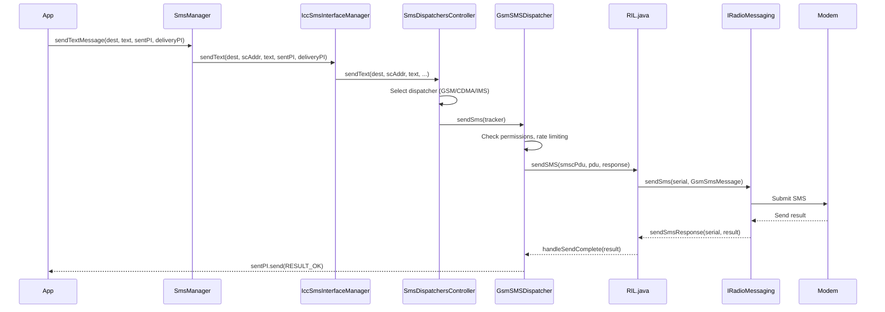
```mermaid
sequenceDiagram
    participant App
    participant SM as SmsManager
    participant ISIM as IccSmsInterfaceManager
    participant SDC as SmsDispatchersController
    participant Disp as GsmSMSDispatcher
    participant RIL as RIL.java
    participant HAL as IRadioMessaging
    participant Modem

    App->>SM: sendTextMessage(dest, text, sentPI, deliveryPI)
    SM->>ISIM: sendText(dest, scAddr, text, sentPI, deliveryPI)
    ISIM->>SDC: sendText(dest, scAddr, text, ...)
    SDC->>SDC: Select dispatcher (GSM/CDMA/IMS)
    SDC->>Disp: sendSms(tracker)
    Disp->>Disp: Check permissions, rate limiting
    Disp->>RIL: sendSMS(smscPdu, pdu, response)
    RIL->>HAL: sendSms(serial, GsmSmsMessage)
    HAL->>Modem: Submit SMS
    Modem-->>HAL: Send result
    HAL-->>RIL: sendSmsResponse(serial, result)
    RIL-->>Disp: handleSendComplete(result)
    Disp-->>App: sentPI.send(RESULT_OK)
```

The `SmsDispatchersController` determines which dispatcher to use based on the
current IMS registration state and the service state:

```java
// frameworks/opt/telephony/src/java/com/android/internal/telephony/SmsDispatchersController.java
public class SmsDispatchersController extends Handler {
    private static final String TAG = "SmsDispatchersController";

    /** Radio is ON */
    private static final int EVENT_RADIO_ON = 11;

    /** IMS registration/SMS format changed */
    private static final int EVENT_IMS_STATE_CHANGED = 12;

    /** Service state changed */
    private static final int EVENT_SERVICE_STATE_CHANGED = 14;
```

### 36.4.3 Inbound SMS Flow

Incoming SMS messages arrive as unsolicited indications from the modem:

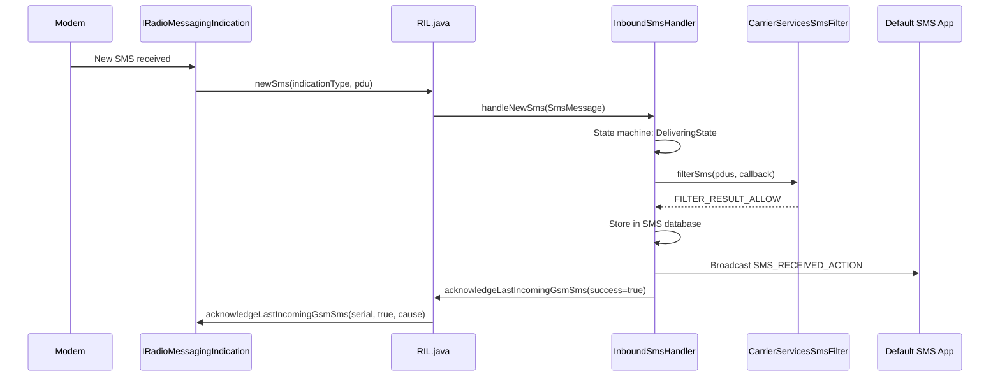
```mermaid
sequenceDiagram
    participant Modem
    participant HAL as IRadioMessagingIndication
    participant RIL as RIL.java
    participant ISH as InboundSmsHandler
    participant Filter as CarrierServicesSmsFilter
    participant App as Default SMS App

    Modem->>HAL: New SMS received
    HAL->>RIL: newSms(indicationType, pdu)
    RIL->>ISH: handleNewSms(SmsMessage)
    ISH->>ISH: State machine: DeliveringState
    ISH->>Filter: filterSms(pdus, callback)
    Filter-->>ISH: FILTER_RESULT_ALLOW
    ISH->>ISH: Store in SMS database
    ISH->>App: Broadcast SMS_RECEIVED_ACTION
    ISH->>RIL: acknowledgeLastIncomingGsmSms(success=true)
    RIL->>HAL: acknowledgeLastIncomingGsmSms(serial, true, cause)
```

`InboundSmsHandler` is a state machine with several states:

```java
// frameworks/opt/telephony/src/java/com/android/internal/telephony/InboundSmsHandler.java
```

The states manage:

- **IdleState** -- waiting for incoming SMS
- **DeliveringState** -- processing an incoming message
- **WaitingState** -- waiting for the default SMS app to acknowledge

### 36.4.4 IRadioMessaging HAL

The messaging HAL interface handles SMS at the modem level:

```
// hardware/interfaces/radio/aidl/android/hardware/radio/messaging/IRadioMessaging.aidl
@VintfStability
oneway interface IRadioMessaging {
    void acknowledgeIncomingGsmSmsWithPdu(in int serial,
            in boolean success, in String ackPdu);
    void acknowledgeLastIncomingGsmSms(in int serial,
            in boolean success, in SmsAcknowledgeFailCause cause);
    void sendSms(in int serial, in GsmSmsMessage message);
    void sendSmsExpectMore(in int serial, in GsmSmsMessage message);
    void sendImsSms(in int serial, in ImsSmsMessage message);
```

Key messaging data structures defined in the AIDL directory
`hardware/interfaces/radio/aidl/android/hardware/radio/messaging/`:

| Type | File | Purpose |
|------|------|---------|
| `GsmSmsMessage` | `GsmSmsMessage.aidl` | GSM SMS PDU + SMSC address |
| `CdmaSmsMessage` | `CdmaSmsMessage.aidl` | CDMA SMS message |
| `ImsSmsMessage` | `ImsSmsMessage.aidl` | IMS SMS message (over IP) |
| `SendSmsResult` | `SendSmsResult.aidl` | Result with message reference and ack PDU |
| `SmsWriteArgs` | `SmsWriteArgs.aidl` | For writing SMS to SIM |

### 36.4.5 SMS Rate Limiting and Security

The `SMSDispatcher` enforces rate limiting to prevent SMS abuse:

```java
// frameworks/opt/telephony/src/java/com/android/internal/telephony/SMSDispatcher.java
```

Key security measures:

- **Permission check**: `SEND_SMS` permission required
- **Rate limiting**: Configurable max SMS per period
- **Premium number detection**: Warns before sending to premium-rate numbers
- **Carrier filter**: `CarrierMessagingService` can intercept and filter messages
- **User confirmation dialog**: Shown for suspicious send patterns

### 36.4.6 MMS Handling

MMS (Multimedia Messaging Service) is handled differently from SMS.  MMS
messages are sent and received over mobile data connections, not through the
RIL SMS channel:

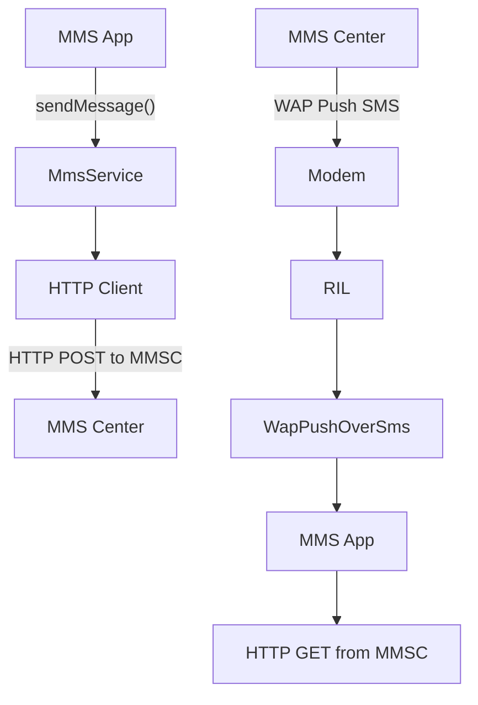
```mermaid
graph TD
    App["MMS App"] -->|"sendMessage()"| MmsService["MmsService"]
    MmsService --> HttpClient["HTTP Client"]
    HttpClient -->|"HTTP POST to MMSC"| MMSC["MMS Center"]

    MMSC2["MMS Center"] -->|"WAP Push SMS"| Modem["Modem"]
    Modem --> RIL["RIL"]
    RIL --> WapPush["WapPushOverSms"]
    WapPush --> MmsApp["MMS App"]
    MmsApp --> HttpGet["HTTP GET from MMSC"]
```

MMS notifications arrive as WAP Push SMS messages.  The `WapPushOverSms` class
dispatches these:

```java
// frameworks/opt/telephony/src/java/com/android/internal/telephony/WapPushOverSms.java
```

### 36.4.7 Carrier Messaging Service

Carriers can intercept and filter both incoming and outgoing SMS/MMS by
implementing `CarrierMessagingService`:

```java
// android.service.carrier.CarrierMessagingService
public abstract class CarrierMessagingService extends Service {
    public void onFilterSms(MessagePdu pdu, String format,
            int destPort, int subId, ResultCallback<Boolean> callback)
    public void onSendTextSms(String text, int subId,
            String destAddress, int sendSmsFlag,
            ResultCallback<SendSmsResult> callback)
    public void onSendMultipartTextSms(List<String> parts, int subId,
            String destAddress, int sendSmsFlag,
            ResultCallback<SendMultipartSmsResult> callback)
    public void onSendDataSms(byte[] data, int subId,
            String destAddress, int destPort,
            ResultCallback<SendSmsResult> callback)
}
```

The `CarrierServicesSmsFilter` in `InboundSmsHandler` checks for carrier
filtering before delivering messages to the default SMS app.

### 36.4.8 SMS Domain Selection

Modern Android uses domain selection to route SMS over the best available
network.  The `SmsDispatchersController` evaluates:

1. Is IMS SMS available? (Use `ImsSmsDispatcher`)
2. Is the device in LTE-only mode? (Use IMS or wait)
3. Is CDMA the current RAT? (Use `CdmaSMSDispatcher`)
4. Default: Use `GsmSMSDispatcher`

```java
// frameworks/opt/telephony/src/java/com/android/internal/telephony/SmsDispatchersController.java
/** Radio is ON */
private static final int EVENT_RADIO_ON = 11;
/** IMS registration/SMS format changed */
private static final int EVENT_IMS_STATE_CHANGED = 12;
/** Callback from RIL_REQUEST_IMS_REGISTRATION_STATE */
private static final int EVENT_IMS_STATE_DONE = 13;
/** Service state changed */
private static final int EVENT_SERVICE_STATE_CHANGED = 14;
```

The domain selection framework also supports emergency SMS:

```java
// frameworks/opt/telephony/src/java/com/android/internal/telephony/domainselection/EmergencySmsDomainSelectionConnection.java
// frameworks/opt/telephony/src/java/com/android/internal/telephony/domainselection/SmsDomainSelectionConnection.java
```

### 36.4.9 SMS Storage on SIM

SMS messages can be stored on the SIM card's EF_SMS file.  The
`IRadioMessaging` HAL provides methods for this:

```
void writeSmsToSim(in int serial, in SmsWriteArgs smsWriteArgs);
void deleteSmsOnSim(in int serial, in int index);
```

The `SmsWriteArgs` structure specifies the status (read, unread, sent, unsent)
and the PDU to write.

### 36.4.10 Cell Broadcast SMS

Cell broadcast (also known as wireless emergency alerts, ETWS, and CMAS)
delivers messages to all devices in a cell area.  It uses a separate channel
from point-to-point SMS:

```java
// frameworks/opt/telephony/src/java/com/android/internal/telephony/CellBroadcastConfigTracker.java
```

The modem delivers cell broadcast messages through unsolicited indications, and
the `CellBroadcastService` processes them for emergency alerting.

### 36.4.11 SmsManager Public API

`SmsManager` is the public SDK interface for SMS:

```java
// frameworks/base/telephony/java/android/telephony/SmsManager.java
public final class SmsManager {
    public void sendTextMessage(String destAddress, String scAddress,
            String text, PendingIntent sentIntent, PendingIntent deliveryIntent)
    public void sendMultipartTextMessage(String destAddress, String scAddress,
            ArrayList<String> parts, ArrayList<PendingIntent> sentIntents,
            ArrayList<PendingIntent> deliveryIntents)
    public void sendDataMessage(String destAddress, String scAddress,
            short destPort, byte[] data, PendingIntent sentIntent,
            PendingIntent deliveryIntent)
    public ArrayList<SmsMessage> divideMessage(String text)
}
```

The `sentIntent` receives one of these result codes:

| Code | Meaning |
|------|---------|
| `RESULT_OK` | SMS sent successfully |
| `RESULT_ERROR_GENERIC_FAILURE` | Generic failure |
| `RESULT_ERROR_RADIO_OFF` | Radio is off |
| `RESULT_ERROR_NULL_PDU` | Null PDU |
| `RESULT_ERROR_NO_SERVICE` | No network service |
| `RESULT_ERROR_LIMIT_EXCEEDED` | Rate limit exceeded |
| `RESULT_ERROR_SHORT_CODE_NOT_ALLOWED` | Premium SMS blocked |
| `RESULT_ERROR_SHORT_CODE_NEVER_ALLOWED` | Premium SMS permanently blocked |

---

## 36.5 IMS (IP Multimedia Subsystem)

### 36.5.1 IMS Architecture Overview

IMS enables voice (VoLTE), video, and messaging over IP networks rather than
traditional circuit-switched paths.  Android's IMS architecture has three
layers:

```mermaid
graph TD
    subgraph "Application Layer"
        Dialer["Dialer / InCallUI"]
        MsgApp["Messaging App"]
    end

    subgraph "Telecom / Telephony Framework"
        TC["TelecomManager"]
        IM["ImsManager"]
        IP["ImsPhone"]
        IPCT["ImsPhoneCallTracker"]
    end

    subgraph "IMS Framework"
        IR["ImsResolver"]
        ISC["ImsServiceController"]
        MMTEL["MmTelFeature"]
        RCS["RcsFeature"]
    end

    subgraph "Vendor IMS Implementation"
        ImsS["ImsService<br/>(vendor APK)"]
    end

    subgraph "Radio HAL"
        IHAL["IRadioIms"]
    end

    Dialer --> TC
    TC --> IP
    IP --> IPCT
    IPCT --> IM
    IM --> IR
    IR --> ISC
    ISC --> ImsS
    ImsS --> MMTEL
    ImsS --> RCS
    ImsS -->|optional| IHAL
```

### 36.5.2 ImsResolver -- Finding the Right ImsService

`ImsResolver` discovers and binds to `ImsService` implementations.  It
prioritises carrier-configured packages over device defaults:

```java
// frameworks/opt/telephony/src/java/com/android/internal/telephony/ims/ImsResolver.java
/**
 * Creates a list of ImsServices that are available to bind to based on the
 * Device configuration overlay values "config_ims_rcs_package" and
 * "config_ims_mmtel_package" as well as Carrier Configuration value
 * "config_ims_rcs_package_override_string" and
 * "config_ims_mmtel_package_override_string".
 *
 * These ImsServices are then bound to in the following order:
 * 1. Carrier Config defined override value per SIM.
 * 2. Device overlay default value (including no SIM case).
 */
public class ImsResolver implements
        ImsServiceController.ImsServiceControllerCallbacks {
```

The binding priority:

```mermaid
flowchart TD
    A["Carrier Config Override?"] -->|Yes| B["Bind to carrier override ImsService"]
    A -->|No| C["Device overlay default?"]
    C -->|Yes| D["Bind to device default ImsService"]
    C -->|No| E["No IMS available"]
```

### 36.5.3 ImsPhone and ImsPhoneCallTracker

`ImsPhone` is the phone object that handles IMS calls.  It is created as a
companion to `GsmCdmaPhone`:

```java
// frameworks/opt/telephony/src/java/com/android/internal/telephony/imsphone/ImsPhone.java
package com.android.internal.telephony.imsphone;
```

`ImsPhoneCallTracker` manages the actual IMS call lifecycle:

```java
// frameworks/opt/telephony/src/java/com/android/internal/telephony/imsphone/ImsPhoneCallTracker.java
```

The IMS call flow:

```mermaid
sequenceDiagram
    participant User
    participant Telecom as TelecomManager
    participant CS as ConnectionService
    participant IP as ImsPhone
    participant IPCT as ImsPhoneCallTracker
    participant ImsM as ImsManager
    participant ImsS as ImsService (vendor)

    User->>Telecom: Place call
    Telecom->>CS: createConnection()
    CS->>IP: dial(number)
    IP->>IPCT: dial(number, ImsCallProfile)
    IPCT->>ImsM: createCall(profile)
    ImsM->>ImsS: startSession()
    ImsS->>ImsS: SIP INVITE to IMS core
    ImsS-->>ImsM: Call connected
    ImsM-->>IPCT: onCallStarted()
    IPCT-->>IP: State = ACTIVE
    IP-->>Telecom: Connection state ACTIVE
```

### 36.5.4 VoLTE (Voice over LTE)

VoLTE routes voice calls over the LTE data path using SIP/RTP rather than
circuit-switched fallback (CSFB).  The key components:

1. **MmTelFeature** -- the vendor's implementation of multimedia telephony
   features (voice, video, SMS over IMS).
2. **ImsCall** -- represents an active IMS session with SIP state.
3. **ImsCallProfile** -- call attributes (audio codec, video state, etc.).

The `MmTelFeature` capability flags control what services are available:

```java
// frameworks/opt/telephony/src/java/com/android/internal/telephony/CommandsInterface.java
int IMS_MMTEL_CAPABILITY_VOICE = 1 << 0;
int IMS_MMTEL_CAPABILITY_VIDEO = 1 << 1;
int IMS_MMTEL_CAPABILITY_SMS   = 1 << 2;
```

### 36.5.5 VoWiFi (Wi-Fi Calling)

Wi-Fi calling uses the same IMS infrastructure but routes SIP/RTP traffic
over Wi-Fi instead of LTE.  The key enabler is the `ImsRegistrationImplBase`
registration technology:

```java
// android.telephony.ims.stub.ImsRegistrationImplBase
public static final int REGISTRATION_TECH_LTE   = 0;
public static final int REGISTRATION_TECH_IWLAN = 1; // Wi-Fi
public static final int REGISTRATION_TECH_CROSS_SIM = 2;
public static final int REGISTRATION_TECH_NR    = 3;
```

When registered over IWLAN (IP Wireless Access Network), the device can
make and receive calls through Wi-Fi.

### 36.5.6 IRadioIms HAL

The IMS radio HAL provides modem-level IMS support:

```
// hardware/interfaces/radio/aidl/android/hardware/radio/ims/IRadioIms.aidl
@VintfStability
oneway interface IRadioIms {
    void setSrvccCallInfo(int serial, in SrvccCall[] srvccCalls);
    void updateImsRegistrationInfo(int serial, in ImsRegistration imsRegistration);
```

Key IMS HAL operations:

| Method | Purpose |
|--------|---------|
| `setSrvccCallInfo` | Provide SRVCC call info to radio |
| `updateImsRegistrationInfo` | Inform modem of IMS registration state |
| `startImsTraffic` | Notify modem of upcoming IMS traffic type |
| `stopImsTraffic` | Notify modem IMS traffic has ended |
| `triggerEpsFallback` | Request EPS fallback from NR |

The IMS traffic types indicate priority to the modem for RF resource allocation
in DSDS scenarios:

```
// hardware/interfaces/radio/aidl/android/hardware/radio/ims/ImsTrafficType.aidl
// Priority: EMERGENCY > EMERGENCY_SMS > VOICE > VIDEO > SMS > REGISTRATION > Ut/XCAP
```

### 36.5.7 SRVCC (Single Radio Voice Call Continuity)

SRVCC handles the handover of an active IMS voice call from LTE/NR to a legacy
circuit-switched network (2G/3G) when the device moves out of VoLTE coverage:

```mermaid
sequenceDiagram
    participant Call as Active VoLTE Call
    participant Modem
    participant RIL as RIL.java
    participant Phone as GsmCdmaPhone
    participant ImsP as ImsPhone
    participant IPCT as ImsPhoneCallTracker

    Modem->>RIL: srvccStateChanged(STARTED)
    RIL->>Phone: EVENT_SRVCC_STATE_CHANGED
    Phone->>ImsP: handleSrvccStateChanged(STARTED)
    Note over ImsP: Transfer call state to CS domain
    Modem->>RIL: srvccStateChanged(COMPLETED)
    RIL->>Phone: EVENT_SRVCC_STATE_CHANGED
    Phone->>Phone: CS call tracker takes over
    Note over Call: Call continues on 2G/3G
```

### 36.5.8 Video Calling (ViLTE)

Video calling over LTE extends VoLTE with bidirectional video streams:

```java
// android.telecom.VideoProfile
public class VideoProfile implements Parcelable {
    public static final int STATE_AUDIO_ONLY     = 0x0;
    public static final int STATE_TX_ENABLED     = 0x1;
    public static final int STATE_RX_ENABLED     = 0x2;
    public static final int STATE_BIDIRECTIONAL  = STATE_TX_ENABLED | STATE_RX_ENABLED;
    public static final int STATE_PAUSED         = 0x4;
}
```

The `ImsCallProfile` carries video state information, and `ImsPhoneCallTracker`
manages the video stream lifecycle.

### 36.5.9 ImsServiceController -- Managing the Binding

`ImsServiceController` manages the lifecycle of the bound ImsService:

```java
// frameworks/opt/telephony/src/java/com/android/internal/telephony/ims/ImsServiceController.java
```

It handles:

- Binding and unbinding to the ImsService
- Feature creation (`createMmTelFeature()`, `createRcsFeature()`)
- Feature removal on unbind
- Crash recovery (rebinding after unexpected death)

The ImsServiceController maintains a state machine for each feature:

```mermaid
stateDiagram-v2
    [*] --> NOT_AVAILABLE
    NOT_AVAILABLE --> INITIALIZING : bind
    INITIALIZING --> READY : Feature connected
    READY --> NOT_AVAILABLE : unbind
    READY --> NOT_AVAILABLE : ImsService died
    NOT_AVAILABLE --> INITIALIZING : rebind after crash
```

### 36.5.10 RCS (Rich Communication Services)

RCS is handled through the `RcsFeature` of the ImsService.  The Android
framework provides:

- `ImsRcsController` -- manages RCS features from the phone process
- `RcsFeature` -- the vendor's RCS implementation
- UCE (User Capability Exchange) -- for sharing capabilities between users
- RCS provisioning -- auto-configuration support

```java
// packages/services/Telephony/src/com/android/phone/ImsRcsController.java
// packages/services/Telephony/src/com/android/phone/RcsProvisioningMonitor.java
```

The `TelephonyRcsService` integrates RCS into the telephony framework:

```java
// packages/services/Telephony/src/com/android/services/telephony/rcs/TelephonyRcsService.java
```

### 36.5.11 IMS Provisioning

IMS features often require provisioning from the carrier before they can be
used.  The provisioning state is managed by `ImsProvisioningController`:

```java
// packages/services/Telephony/src/com/android/phone/ImsProvisioningController.java
// packages/services/Telephony/src/com/android/phone/ImsProvisioningLoader.java
```

Provisioning can be delivered through:

- **Carrier config** -- static provisioning in carrier configuration
- **XML auto-configuration** -- downloaded from a carrier server
- **Device management** -- provisioned via OMA-DM or similar

The `ProvisioningManager` API exposes provisioning status:

```java
// android.telephony.ims.ProvisioningManager
public class ProvisioningManager {
    public void registerProvisioningChangedCallback(Callback callback)
    public int getProvisioningIntValue(int key)
    public String getProvisioningStringValue(int key)
    public void setProvisioningIntValue(int key, int value)
}
```

### 36.5.12 IMS Enablement and Registration Flow

The complete IMS enablement flow involves multiple components:

```mermaid
flowchart TD
    A["Device boots"] --> B["PhoneFactory creates GsmCdmaPhone"]
    B --> C["ImsResolver discovers ImsService packages"]
    C --> D["ImsServiceController binds to vendor ImsService"]
    D --> E["ImsEnablementTracker checks carrier config"]
    E --> F{"IMS enabled?"}
    F -->|Yes| G["ImsService.createMmTelFeature()"]
    G --> H["IMS registration starts"]
    H --> I{"Network available?"}
    I -->|LTE| J["Register over LTE"]
    I -->|Wi-Fi| K["Register over IWLAN"]
    J --> L["VoLTE / ViLTE ready"]
    K --> M["VoWiFi ready"]
    F -->|No| N["IMS disabled"]
```

Related files:

```
frameworks/opt/telephony/src/java/com/android/internal/telephony/ims/ImsEnablementTracker.java
frameworks/opt/telephony/src/java/com/android/internal/telephony/ims/ImsServiceController.java
frameworks/opt/telephony/src/java/com/android/internal/telephony/imsphone/ImsRegistrationCallbackHelper.java
```

---

## 36.6 Carrier Configuration

### 36.6.1 CarrierConfigManager

`CarrierConfigManager` provides per-carrier configuration overrides that
control the behaviour of the telephony stack.  This is how carriers customise
Android telephony without modifying the platform code:

```java
// frameworks/base/telephony/java/android/telephony/CarrierConfigManager.java
@SystemService(Context.CARRIER_CONFIG_SERVICE)
@RequiresFeature(PackageManager.FEATURE_TELEPHONY_SUBSCRIPTION)
public class CarrierConfigManager {
```

Configuration values are delivered as `PersistableBundle` objects containing
key-value pairs.  The framework ships a comprehensive set of default values,
and carriers override them through:

1. **Static XML overlay** -- `carrier_config.xml` files in the build.
2. **CarrierService** -- a carrier-privileged app that dynamically provides
   configuration.
3. **CarrierConfigLoader** -- the system component that loads and caches
   configurations.

### 36.6.2 Configuration Loading Flow

```mermaid
sequenceDiagram
    participant SIM as SIM Inserted
    participant CCL as CarrierConfigLoader
    participant Static as Static XML Config
    participant CS as CarrierService
    participant CCM as CarrierConfigManager

    SIM->>CCL: SIM state changed
    CCL->>Static: Load default config
    CCL->>Static: Load carrier-specific overlay (by MCC/MNC)
    CCL->>CS: Bind to carrier app's CarrierService
    CS-->>CCL: onLoadConfig() returns PersistableBundle
    CCL->>CCL: Merge: default < XML overlay < CarrierService
    CCL->>CCM: Broadcast ACTION_CARRIER_CONFIG_CHANGED
    Note over CCM: Apps can now query<br/>getConfigForSubId()
```

### 36.6.3 Key Configuration Categories

The `CarrierConfigManager` defines hundreds of configuration keys.  Here are
the major categories:

**Voice and Calling**:

- `KEY_CARRIER_VOLTE_AVAILABLE_BOOL` -- enable VoLTE
- `KEY_CARRIER_WFC_IMS_AVAILABLE_BOOL` -- enable Wi-Fi Calling
- `KEY_CARRIER_SUPPORTS_SS_OVER_UT_BOOL` -- Supplementary Services over UT interface
- `KEY_ADDITIONAL_CALL_SETTING_BOOL` -- show additional call settings
- `KEY_SUPPORT_CONFERENCE_CALL_BOOL` -- conference call support

**Data**:

- `KEY_DATA_SWITCH_VALIDATION_TIMEOUT_LONG` -- DDS switch timeout
- `KEY_CARRIER_METERED_APN_TYPES_STRINGS` -- metered APN types
- `KEY_CARRIER_NR_AVAILABILITIES_INT_ARRAY` -- NR SA/NSA config
- `KEY_BANDWIDTH_STRING_ARRAY` -- expected bandwidths per RAT

**SMS/MMS**:

- `KEY_MMS_USER_AGENT_STRING` -- MMS HTTP user agent
- `KEY_SMS_REQUIRES_DESTINATION_NUMBER_CONVERSION_BOOL`
- `KEY_MMS_MAX_MESSAGE_SIZE_INT` -- max MMS size

**IMS**:

- `KEY_IMS_CONFERENCE_SIZE_LIMIT_INT` -- max conference size
- `KEY_CARRIER_IMS_PACKAGE_OVERRIDE_STRING` -- custom IMS package
- `KEY_CARRIER_RCS_PROVISIONING_REQUIRED_BOOL` -- RCS provisioning

**Network**:

- `KEY_PREFERRED_NETWORK_TYPE_BOOL` -- preferred RAT
- `KEY_HIDE_ENHANCED_4G_LTE_BOOL` -- UI toggle visibility
- `KEY_CARRIER_NR_AVAILABILITIES_INT_ARRAY` -- 5G NR config

### 36.6.4 CarrierConfigLoader

`CarrierConfigLoader` in the phone process manages the loading lifecycle:

```java
// packages/services/Telephony/src/com/android/phone/CarrierConfigLoader.java
```

It implements a multi-tier configuration system:

```mermaid
graph TD
    A["Platform defaults<br/>(hardcoded in CarrierConfigManager)"] --> B["Static XML overlay<br/>(per-MCC/MNC carrier_config.xml)"]
    B --> C["CarrierService override<br/>(dynamic, from carrier app)"]
    C --> D["Final merged config"]

    style A fill:#e8f5e9
    style B fill:#fff3e0
    style C fill:#e1f5fe
    style D fill:#f3e5f5
```

Each higher tier overrides values from the lower tier.  The final merged
`PersistableBundle` is cached and served to callers.

### 36.6.5 Listening for Configuration Changes

Applications and framework components listen for carrier config changes:

```java
// Broadcast intent
CarrierConfigManager.ACTION_CARRIER_CONFIG_CHANGED

// Extras
CarrierConfigManager.EXTRA_SLOT_INDEX
CarrierConfigManager.EXTRA_SUBSCRIPTION_INDEX
```

Within the telephony framework, many components register for this broadcast:

```java
// frameworks/opt/telephony/src/java/com/android/internal/telephony/Phone.java
protected static final int EVENT_CARRIER_CONFIG_CHANGED = 43;
```

When carrier config changes (e.g., after a SIM swap), the entire telephony
stack re-evaluates its configuration: data APNs are reloaded, IMS settings
are re-checked, and network preferences are updated.

### 36.6.6 Configuration Reload Sequence

When a carrier config change is detected (SIM swap, OTA update, carrier app
push), the entire telephony stack reacts:

```mermaid
sequenceDiagram
    participant CCL as CarrierConfigLoader
    participant Broadcast as System Broadcast
    participant SST as ServiceStateTracker
    participant DNC as DataNetworkController
    participant DPM as DataProfileManager
    participant IMS as ImsResolver
    participant Phone as GsmCdmaPhone

    CCL->>Broadcast: ACTION_CARRIER_CONFIG_CHANGED
    Broadcast->>Phone: EVENT_CARRIER_CONFIG_CHANGED
    Phone->>SST: Re-evaluate network preferences
    Phone->>DNC: Re-evaluate data settings
    DNC->>DPM: Reload APN database
    DPM->>DPM: Query telephony content provider
    DNC->>DNC: Tear down/re-setup data connections if APNs changed
    Broadcast->>IMS: Re-evaluate IMS package override
    IMS->>IMS: Rebind to correct ImsService if carrier changed
```

This cascade ensures that every component picks up the new carrier-specific
behaviour.

### 36.6.7 Per-SIM Configuration

In multi-SIM devices, carrier configuration is maintained per-subscription.
The `CarrierConfigManager.getConfigForSubId(int subId)` method returns the
merged config for a specific SIM:

```java
// Usage pattern in telephony framework
CarrierConfigManager configManager = context.getSystemService(CarrierConfigManager.class);
PersistableBundle config = configManager.getConfigForSubId(subId);
boolean volteAvailable = config.getBoolean(
        CarrierConfigManager.KEY_CARRIER_VOLTE_AVAILABLE_BOOL, false);
```

This pattern is used throughout the telephony stack, with components caching
the relevant config values and re-reading them on `EVENT_CARRIER_CONFIG_CHANGED`.

### 36.6.8 Configuration Debugging

The `TelephonyShellCommand` provides a comprehensive carrier config CLI:

```bash
# Get a specific value
adb shell cmd phone cc get-value -s <subId> <key>

# Get all values
adb shell cmd phone cc get-all-values -s <subId>

# Override a value (test builds only)
adb shell cmd phone cc set-value -s <subId> -b <key> <value>  # boolean
adb shell cmd phone cc set-value -s <subId> -i <key> <value>  # int
adb shell cmd phone cc set-value -s <subId> -s <key> <value>  # string

# Clear overrides
adb shell cmd phone cc clear-values -s <subId>
```

### 36.6.9 Carrier Privileges

Not all carrier configuration comes from static files.  Carrier-privileged
applications can dynamically provide configuration through `CarrierService`.
Carrier privilege is granted by matching the app's signing certificate
against certificates stored on the SIM card's UICC Access Rules (ARA-M):

```java
// frameworks/opt/telephony/src/java/com/android/internal/telephony/CarrierPrivilegesTracker.java
```

This allows carrier apps (pre-installed or downloaded) to:

- Override carrier configuration
- Access privileged telephony APIs
- Send/receive carrier-specific SMS
- Manage data profiles

The privilege check flow:

```mermaid
sequenceDiagram
    participant App as Carrier App
    participant PIM as PhoneInterfaceManager
    participant CPT as CarrierPrivilegesTracker
    participant UiccP as UiccProfile
    participant SIM as SIM Card (ARA-M)

    App->>PIM: Privileged telephony API call
    PIM->>CPT: hasCarrierPrivilegeForPackage(package)
    CPT->>UiccP: getCarrierPrivilegeStatusForPackage(package)
    UiccP->>SIM: Read ARA-M access rules
    SIM-->>UiccP: Certificate hashes
    UiccP->>UiccP: Compare app signing cert with ARA-M certs
    UiccP-->>CPT: CARRIER_PRIVILEGE_STATUS_HAS_ACCESS
    CPT-->>PIM: Privilege granted
    PIM-->>App: API response
```

The carrier privilege status values:

```java
// frameworks/base/telephony/java/android/telephony/TelephonyManager.java
public static final int CARRIER_PRIVILEGE_STATUS_HAS_ACCESS = 1;
public static final int CARRIER_PRIVILEGE_STATUS_NO_ACCESS = 0;
public static final int CARRIER_PRIVILEGE_STATUS_RULES_NOT_LOADED = -1;
public static final int CARRIER_PRIVILEGE_STATUS_ERROR_LOADING_RULES = -2;
```

### 36.6.10 CarrierService Dynamic Configuration

A carrier-privileged app can implement `CarrierService` to dynamically provide
configuration:

```java
// android.service.carrier.CarrierService
public abstract class CarrierService extends Service {
    public abstract PersistableBundle onLoadConfig(CarrierIdentifier id);
    public void notifyCarrierNetworkChange(boolean active) { }
}
```

When `onLoadConfig()` returns, the `CarrierConfigLoader` merges the result
with the static defaults and XML overlays, with the dynamic values taking
highest priority.

The carrier can also signal network changes to the platform through
`notifyCarrierNetworkChange()`, which temporarily changes the network icon in
the status bar to indicate carrier-specific network events.

---

## 36.7 Phone State and Call Management

### 36.7.1 Telecom and Telephony -- the Two Systems

Android call management is split between two distinct systems:

| System | Package | Role |
|--------|---------|------|
| **Telecom** | `packages/services/Telecomm/` | Call routing, UI binding, audio routing, multi-call management |
| **Telephony** | `packages/services/Telephony/` | Modem interaction, radio state, SIM, SMS |

Telecom is the higher-level system that manages calls across multiple sources
(cellular, VoIP, SIP), while Telephony handles the cellular-specific details.

```mermaid
graph TD
    subgraph "Telecom Service"
        CM["CallsManager"]
        InCall["InCallController"]
        CAM["CallAudioManager"]
    end

    subgraph "Telephony Service"
        TCS["TelephonyConnectionService"]
        PIM["PhoneInterfaceManager"]
        Phone["GsmCdmaPhone"]
    end

    subgraph "Dialer App"
        ICS["InCallService"]
        UI["InCallUI"]
    end

    UI --> ICS
    ICS -->|Binder| InCall
    InCall --> CM
    CM --> TCS
    TCS --> Phone
    Phone --> RIL["RIL"]
    CM --> CAM
```

### 36.7.2 TelecomManager -- the Call Control API

`TelecomManager` is the public API for call management.  Key operations:

```java
// frameworks/base/telecomm/java/android/telecom/TelecomManager.java
public class TelecomManager {
    public void placeCall(Uri address, Bundle extras)
    public boolean endCall()
    public void acceptRingingCall()
    public boolean isInCall()
    public boolean isRinging()
    public List<PhoneAccountHandle> getCallCapablePhoneAccounts()
    public PhoneAccountHandle getDefaultOutgoingPhoneAccount(String uriScheme)
}
```

### 36.7.3 ConnectionService -- the Bridge

`ConnectionService` is the abstract service that Telecom binds to for call
control.  The telephony implementation is `TelephonyConnectionService`:

```java
// packages/services/Telephony/src/com/android/services/telephony/TelephonyConnectionService.java
```

It translates Telecom's `Connection` abstraction into telephony `Phone` calls:

```mermaid
sequenceDiagram
    participant TC as TelecomManager
    participant CM as CallsManager
    participant TCS as TelephonyConnectionService
    participant Phone as GsmCdmaPhone
    participant CT as GsmCdmaCallTracker
    participant RIL as RIL.java
    participant HAL as IRadioVoice

    TC->>CM: placeCall(tel:+1234567890)
    CM->>TCS: onCreateOutgoingConnection()
    TCS->>Phone: dial("+1234567890")
    Phone->>CT: dial("+1234567890")
    CT->>RIL: dial(dialString, clirMode, uusInfo)
    RIL->>HAL: dial(serial, Dial{address, clir})
    HAL->>HAL: Modem places call
    HAL-->>RIL: dialResponse(serial)
    RIL-->>CT: Response OK
    CT-->>Phone: GsmCdmaConnection created
    Phone-->>TCS: Connection active
    TCS-->>CM: Connection.setActive()
```

### 36.7.4 IRadioVoice HAL

The voice HAL handles call control at the modem level:

```
// hardware/interfaces/radio/aidl/android/hardware/radio/voice/IRadioVoice.aidl
@VintfStability
oneway interface IRadioVoice {
    void acceptCall(in int serial);
    void cancelPendingUssd(in int serial);
    void conference(in int serial);
    void dial(in int serial, in Dial dialInfo);
    void emergencyDial(in int serial, in Dial dialInfo,
            in int categories, in String[] urns,
            in EmergencyCallRouting routing, ...);
```

Key voice operations:

| Method | AT Command Equivalent | Purpose |
|--------|----------------------|---------|
| `dial` | `ATD` | Initiate a call |
| `acceptCall` | `ATA` | Answer incoming call |
| `hangup` | `ATH` | End a specific call |
| `conference` | `AT+CHLD=3` | Merge calls |
| `switchWaitingOrHoldingAndActive` | `AT+CHLD=2` | Swap active/held calls |
| `getCurrentCalls` | `AT+CLCC` | List active calls |
| `sendDtmf` | `AT+VTS` | Send DTMF tone |

### 36.7.5 Call State Machine

A telephony call goes through several states:

```mermaid
stateDiagram-v2
    [*] --> IDLE
    IDLE --> DIALING : User dials
    IDLE --> INCOMING : Network delivers call
    DIALING --> ALERTING : Remote phone rings
    ALERTING --> ACTIVE : Remote answers
    INCOMING --> ACTIVE : User answers
    ACTIVE --> HOLDING : User holds
    HOLDING --> ACTIVE : User resumes
    ACTIVE --> DISCONNECTING : User hangs up
    DISCONNECTING --> DISCONNECTED : Modem confirms
    DISCONNECTED --> [*]
    INCOMING --> DISCONNECTED : User rejects
    DIALING --> DISCONNECTED : Call fails
```

The `GsmCdmaCallTracker` and `ImsPhoneCallTracker` maintain this state for
circuit-switched and IMS calls respectively:

```java
// frameworks/opt/telephony/src/java/com/android/internal/telephony/GsmCdmaCallTracker.java
```

### 36.7.6 Emergency Calls

Emergency calls receive special treatment throughout the stack:

1. **EmergencyNumberTracker** maintains the emergency number database
   (compiled from multiple sources: modem, SIM, carrier config, database):

```java
// frameworks/opt/telephony/src/java/com/android/internal/telephony/emergency/EmergencyNumberTracker.java
```

2. **EmergencyStateTracker** coordinates the emergency call state machine:

```java
// frameworks/opt/telephony/src/java/com/android/internal/telephony/emergency/EmergencyStateTracker.java
```

3. **Domain Selection** determines whether to route emergency calls over
   CS (circuit-switched) or IMS:

```java
// frameworks/opt/telephony/src/java/com/android/internal/telephony/domainselection/DomainSelectionResolver.java
```

4. The `IRadioVoice.emergencyDial()` HAL method provides enhanced information
   to the modem:

```
// hardware/interfaces/radio/aidl/android/hardware/radio/voice/IRadioVoice.aidl
void emergencyDial(in int serial, in Dial dialInfo,
        in int categories, in String[] urns,
        in EmergencyCallRouting routing, ...);
```

Emergency call routing options:

```
// hardware/interfaces/radio/aidl/android/hardware/radio/voice/EmergencyCallRouting.aidl
// UNKNOWN -- Let the modem decide
// EMERGENCY -- Use emergency routing
// NORMAL -- Try normal routing first, then emergency
```

### 36.7.7 InCallService -- the UI Connection

The dialer app implements `InCallService` to receive call state updates and
display the in-call UI:

```java
// frameworks/base/telecomm/java/android/telecom/InCallService.java
public abstract class InCallService extends Service {
    public void onCallAdded(Call call) { }
    public void onCallRemoved(Call call) { }
    public void onCanAddCallChanged(boolean canAddCall) { }
}
```

The Telecom system binds to the default dialer's `InCallService` and the
system `InCallService` (for emergency calls and car mode).

### 36.7.8 Call Forwarding and Supplementary Services

The telephony stack supports GSM/IMS supplementary services (SS) through MMI
codes.  When a user dials a code like `*21*number#` (activate call forwarding),
the framework parses it and routes the request:

```java
// frameworks/opt/telephony/src/java/com/android/internal/telephony/CommandsInterface.java
static final int CF_ACTION_DISABLE          = 0;
static final int CF_ACTION_ENABLE           = 1;
static final int CF_ACTION_REGISTRATION     = 3;
static final int CF_ACTION_ERASURE          = 4;

static final int CF_REASON_UNCONDITIONAL    = 0;
static final int CF_REASON_BUSY             = 1;
static final int CF_REASON_NO_REPLY         = 2;
static final int CF_REASON_NOT_REACHABLE    = 3;
static final int CF_REASON_ALL              = 4;
static final int CF_REASON_ALL_CONDITIONAL  = 5;
```

The call forward flow:

```mermaid
sequenceDiagram
    participant User
    participant Dialer
    participant Phone as GsmCdmaPhone
    participant MMI as GsmMmiCode
    participant RIL as RIL.java
    participant HAL as IRadioVoice

    User->>Dialer: Dial *21*+1234567890#
    Dialer->>Phone: dial("*21*+1234567890#")
    Phone->>MMI: Parse MMI code
    MMI->>Phone: handleDialInternal()
    Phone->>RIL: setCallForward(CF_ACTION_REGISTRATION,<br/>CF_REASON_UNCONDITIONAL, "+1234567890")
    RIL->>HAL: setCallForward(serial, CallForwardInfo)
    HAL-->>RIL: setCallForwardResponse()
    RIL-->>Phone: Result
    Phone-->>User: MMI complete notification
```

Call barring uses facility codes:

```java
// frameworks/opt/telephony/src/java/com/android/internal/telephony/CommandsInterface.java
static final String CB_FACILITY_BAOC         = "AO";  // Bar All Outgoing
static final String CB_FACILITY_BAOIC        = "OI";  // Bar Outgoing International
static final String CB_FACILITY_BAOICxH      = "OX";  // Bar Outgoing Intl except Home
static final String CB_FACILITY_BAIC         = "AI";  // Bar All Incoming
static final String CB_FACILITY_BAICr        = "IR";  // Bar Incoming when Roaming
static final String CB_FACILITY_BA_ALL       = "AB";  // All Barring services
static final String CB_FACILITY_BA_MO        = "AG";  // All MO Barring
static final String CB_FACILITY_BA_MT        = "AC";  // All MT Barring
static final String CB_FACILITY_BA_SIM       = "SC";  // SIM PIN lock
static final String CB_FACILITY_BA_FD        = "FD";  // Fixed Dialing
```

### 36.7.9 USSD (Unstructured Supplementary Service Data)

USSD allows interactive communication with the network for services like
balance inquiry, prepaid recharge, etc.:

```java
// frameworks/opt/telephony/src/java/com/android/internal/telephony/CommandsInterface.java
static final int USSD_MODE_NOTIFY        = 0;  // One-shot notification
static final int USSD_MODE_REQUEST       = 1;  // Further user action needed
static final int USSD_MODE_NW_RELEASE    = 2;  // Network terminated session
```

The flow: user dials a USSD code (e.g., `*123#`) -> GsmCdmaPhone sends
`sendUssd()` through RIL -> IRadioVoice.sendUssd() -> modem sends to network
-> response arrives as unsolicited indication -> displayed to user.

### 36.7.10 DTMF Tones

During an active call, DTMF (Dual-Tone Multi-Frequency) tones are sent through:

```
// hardware/interfaces/radio/aidl/android/hardware/radio/voice/IRadioVoice.aidl
void sendDtmf(in int serial, in String s);
void startDtmf(in int serial, in String s);
void stopDtmf(in int serial);
```

`sendDtmf()` sends a single brief tone, while `startDtmf()`/`stopDtmf()`
allow the user to hold a key for a longer tone.

### 36.7.11 PhoneAccount and Call Routing

A `PhoneAccount` represents a source of phone calls.  In a multi-SIM device,
there is one PhoneAccount per SIM:

```java
// frameworks/base/telecomm/java/android/telecom/PhoneAccount.java
```

Telecom uses PhoneAccounts to route outgoing calls to the correct SIM / call
provider.  The `CallsManager` in the Telecom service evaluates:

1. User's default outgoing account preference.
2. Call-specific account (if specified by the caller).
3. Emergency call routing rules.
4. Available network state per SIM.

```mermaid
flowchart TD
    A["Outgoing call request"] --> B{"Account specified?"}
    B -->|Yes| C["Use specified PhoneAccount"]
    B -->|No| D{"Default account set?"}
    D -->|Yes| E["Use default PhoneAccount"]
    D -->|No| F["Show account picker dialog"]
    C --> G["Route to ConnectionService"]
    E --> G
    F --> G
```

---

## 36.8 Data Connection

### 36.8.1 DataNetworkController -- the Central Module

The data connection management was completely rewritten in Android 13.  The
central class is `DataNetworkController`:

```java
// frameworks/opt/telephony/src/java/com/android/internal/telephony/data/DataNetworkController.java
/**
 * DataNetworkController in the central module of the telephony data stack.
 * It is responsible to create and manage all the mobile data networks.
 * It is per-SIM basis which means for DSDS devices, there will be two
 * DataNetworkController instances. Unlike the Android 12 DcTracker, which is
 * designed to be per-transport (i.e. cellular, IWLAN), DataNetworkController
 * is designed to handle data networks on both cellular and IWLAN.
 */
public class DataNetworkController extends Handler {
```

The data subsystem architecture:

```mermaid
graph TD
    subgraph "DataNetworkController"
        DNC["DataNetworkController<br/>(per-SIM)"]
        DPM["DataProfileManager"]
        DCM["DataConfigManager"]
        DSM["DataSettingsManager"]
        DRM["DataRetryManager"]
        DSRM["DataStallRecoveryManager"]
        ANM["AccessNetworksManager"]
        LBE["LinkBandwidthEstimator"]
    end

    subgraph "Data Networks"
        DN1["DataNetwork<br/>(internet)"]
        DN2["DataNetwork<br/>(ims)"]
        DN3["DataNetwork<br/>(mms)"]
    end

    subgraph "Network Agent"
        NA["TelephonyNetworkAgent"]
    end

    DNC --> DPM
    DNC --> DCM
    DNC --> DSM
    DNC --> DRM
    DNC --> DSRM
    DNC --> ANM
    DNC --> LBE
    DNC --> DN1
    DNC --> DN2
    DNC --> DN3
    DN1 --> NA
    DN2 --> NA
    DN3 --> NA
```

Key companion classes in `frameworks/opt/telephony/src/java/com/android/internal/telephony/data/`:

| Class | File | Responsibility |
|-------|------|----------------|
| `DataNetworkController` | `DataNetworkController.java` | Central orchestrator (4 575 lines) |
| `DataNetwork` | `DataNetwork.java` | Individual data bearer, state machine |
| `DataProfileManager` | `DataProfileManager.java` | APN/data profile management |
| `DataConfigManager` | `DataConfigManager.java` | Carrier config for data |
| `DataSettingsManager` | `DataSettingsManager.java` | User data settings |
| `DataRetryManager` | `DataRetryManager.java` | Retry policies |
| `DataStallRecoveryManager` | `DataStallRecoveryManager.java` | Stall detection and recovery |
| `DataServiceManager` | `DataServiceManager.java` | Interface to data services |
| `AccessNetworksManager` | `AccessNetworksManager.java` | Transport (cellular/IWLAN) selection |
| `PhoneSwitcher` | `PhoneSwitcher.java` | DDS (Default Data Subscription) switching |
| `LinkBandwidthEstimator` | `LinkBandwidthEstimator.java` | Bandwidth estimation |
| `TelephonyNetworkAgent` | `TelephonyNetworkAgent.java` | ConnectivityService agent |
| `TelephonyNetworkProvider` | `TelephonyNetworkProvider.java` | Network provider |
| `AutoDataSwitchController` | `AutoDataSwitchController.java` | Automatic DDS switching |

### 36.8.2 DataNetworkController Events

The controller uses a rich event system to drive its state machine:

```java
// frameworks/opt/telephony/src/java/com/android/internal/telephony/data/DataNetworkController.java
private static final int EVENT_ADD_NETWORK_REQUEST = 2;
private static final int EVENT_REMOVE_NETWORK_REQUEST = 3;
private static final int EVENT_SRVCC_STATE_CHANGED = 4;
private static final int EVENT_REEVALUATE_UNSATISFIED_NETWORK_REQUESTS = 5;
private static final int EVENT_PS_RESTRICT_ENABLED = 6;
private static final int EVENT_PS_RESTRICT_DISABLED = 7;
private static final int EVENT_DATA_SERVICE_BINDING_CHANGED = 8;
private static final int EVENT_SIM_STATE_CHANGED = 9;
private static final int EVENT_TEAR_DOWN_ALL_DATA_NETWORKS = 12;
private static final int EVENT_SUBSCRIPTION_CHANGED = 15;
private static final int EVENT_REEVALUATE_EXISTING_DATA_NETWORKS = 16;
private static final int EVENT_SERVICE_STATE_CHANGED = 17;
private static final int EVENT_VOICE_CALL_ENDED = 18;
private static final int EVENT_EMERGENCY_CALL_CHANGED = 20;
private static final int EVENT_EVALUATE_PREFERRED_TRANSPORT = 21;
private static final int EVENT_SUBSCRIPTION_PLANS_CHANGED = 22;
private static final int EVENT_SLICE_CONFIG_CHANGED = 24;
```

### 36.8.3 Data Call Setup Flow

Setting up a mobile data connection involves multiple components:

```mermaid
sequenceDiagram
    participant CS as ConnectivityService
    participant DNC as DataNetworkController
    participant DPM as DataProfileManager
    participant DE as DataEvaluation
    participant DN as DataNetwork
    participant DSM as DataServiceManager
    participant RIL as RIL.java
    participant HAL as IRadioData

    CS->>DNC: NetworkRequest (INTERNET)
    DNC->>DPM: findBestDataProfile(request)
    DPM-->>DNC: DataProfile (e.g., default APN)
    DNC->>DE: evaluateDataSetup(request, profile)
    DE-->>DNC: DataAllowed
    DNC->>DN: new DataNetwork(phone, request, profile)
    DN->>DSM: setupDataCall(profile, ...)
    DSM->>RIL: setupDataCall(accessNetwork, dataProfile, ...)
    RIL->>HAL: setupDataCall("serial, accessNetwork,<br/>dataProfile, roaming, reason, ...")
    HAL->>HAL: Modem establishes PDN
    HAL-->>RIL: setupDataCallResponse(result)
    RIL-->>DSM: SetupDataCallResult
    DSM-->>DN: DataCallResponse
    DN->>DN: Configure LinkProperties
    DN->>DN: Create TelephonyNetworkAgent
    DN-->>CS: NetworkAgent registers
```

### 36.8.4 IRadioData HAL

The data HAL manages PDN (Packet Data Network) connections:

```
// hardware/interfaces/radio/aidl/android/hardware/radio/data/IRadioData.aidl
@VintfStability
oneway interface IRadioData {
    void allocatePduSessionId(in int serial);
    void cancelHandover(in int serial, in int callId);
    void deactivateDataCall(in int serial, in int cid,
            in DataRequestReason reason);
    void getDataCallList(in int serial);
    void getSlicingConfig(in int serial);
    void releasePduSessionId(in int serial, in int id);
    void setDataAllowed(in int serial, in boolean allow);
    void setDataProfile(in int serial, in DataProfileInfo[] profiles);
    void setDataThrottling(in int serial, in DataThrottlingAction action,
            in long completionDuration);
    void setupDataCall(in int serial, in int accessNetwork,
            in DataProfileInfo dataProfileInfo, in boolean roamingAllowed,
            in DataRequestReason reason, ...);
    void startHandover(in int serial, in int callId);
    void startKeepalive(in int serial, in KeepaliveRequest keepalive);
    void stopKeepalive(in int serial, in int sessionHandle);
```

Key data types defined in `hardware/interfaces/radio/aidl/android/hardware/radio/data/`:

| Type | Description |
|------|-------------|
| `DataProfileInfo` | APN name, protocol, auth, type |
| `SetupDataCallResult` | CID, addresses, DNS, MTU, QoS |
| `DataCallFailCause` | Error codes (e.g., `INSUFFICIENT_RESOURCES`, `MISSING_UNKNOWN_APN`) |
| `SliceInfo` | 5G network slice parameters |
| `TrafficDescriptor` | URSP traffic descriptors |
| `QosSession` | QoS bearer session info |
| `KeepaliveRequest` | NAT keepalive parameters |

### 36.8.5 APN Management

Access Point Names (APNs) define how the device connects to the carrier's
packet network.  The `DataProfileManager` loads APNs from the Telephony
provider database:

```java
// frameworks/opt/telephony/src/java/com/android/internal/telephony/data/DataProfileManager.java
/**
 * DataProfileManager manages the all DataProfiles for the current
 * subscription.
 */
public class DataProfileManager extends Handler {
    /** Event for APN database changed. */
    private static final int EVENT_APN_DATABASE_CHANGED = 2;
```

APNs are stored in the content provider at `content://telephony/carriers` and
categorized by type:

| APN Type | `ApnSetting` Constant | Usage |
|----------|----------------------|-------|
| `default` | `TYPE_DEFAULT` | General internet |
| `mms` | `TYPE_MMS` | MMS messages |
| `supl` | `TYPE_SUPL` | GPS assistance |
| `dun` | `TYPE_DUN` | Tethering |
| `hipri` | `TYPE_HIPRI` | High-priority |
| `fota` | `TYPE_FOTA` | Firmware OTA |
| `ims` | `TYPE_IMS` | IMS/VoLTE |
| `ia` | `TYPE_IA` | Initial attach |
| `emergency` | `TYPE_EMERGENCY` | Emergency data |
| `xcap` | `TYPE_XCAP` | XCAP (call settings over UT) |
| `enterprise` | `TYPE_ENTERPRISE` | Enterprise slicing |

### 36.8.6 DataNetwork State Machine

Each `DataNetwork` object manages its own state machine:

```mermaid
stateDiagram-v2
    [*] --> Connecting
    Connecting --> Connected : setupDataCall succeeds
    Connecting --> Disconnected : setup fails
    Connected --> Connected : Re-evaluation OK
    Connected --> Handover : Transport change needed
    Handover --> Connected : Handover succeeds
    Handover --> Disconnected : Handover fails
    Connected --> Disconnecting : Teardown requested
    Disconnecting --> Disconnected : deactivateDataCall done
    Disconnected --> [*]
```

```java
// frameworks/opt/telephony/src/java/com/android/internal/telephony/data/DataNetwork.java
```

The `DataNetwork` creates a `TelephonyNetworkAgent` when connected, which
registers with `ConnectivityService` to make the network available to apps:

```java
// frameworks/opt/telephony/src/java/com/android/internal/telephony/data/TelephonyNetworkAgent.java
```

### 36.8.7 Data Evaluation

Before setting up a data call, `DataNetworkController` evaluates whether data
is allowed.  The `DataEvaluation` class checks multiple conditions:

```java
// frameworks/opt/telephony/src/java/com/android/internal/telephony/data/DataEvaluation.java
```

Disallowed reasons include:

| Reason | Description |
|--------|-------------|
| `DATA_DISABLED` | User turned off mobile data |
| `ROAMING_DISABLED` | Data roaming is off and device is roaming |
| `NOT_IN_SERVICE` | No network registration |
| `EMERGENCY_CALL` | Emergency call in progress |
| `SIM_NOT_READY` | SIM not loaded |
| `RADIO_POWER_OFF` | Radio is off |
| `CONCURRENT_VOICE_NOT_ALLOWED` | Voice call blocks data (DSDS) |
| `DATA_THROTTLED` | Carrier throttling active |
| `CARRIER_ACTION_DISABLED` | Carrier signaled data off |

### 36.8.8 DataNetworkController Internal State

The controller maintains extensive internal state for decision-making:

```java
// frameworks/opt/telephony/src/java/com/android/internal/telephony/data/DataNetworkController.java
private final Phone mPhone;
private final DataConfigManager mDataConfigManager;
private final DataSettingsManager mDataSettingsManager;
private final DataProfileManager mDataProfileManager;
private final DataStallRecoveryManager mDataStallRecoveryManager;
private final AccessNetworksManager mAccessNetworksManager;
private final DataRetryManager mDataRetryManager;
private final ImsManager mImsManager;
private final TelecomManager mTelecomManager;
private final NetworkPolicyManager mNetworkPolicyManager;
private final SparseArray<DataServiceManager> mDataServiceManagers = new SparseArray<>();

// Subscription and service state
private int mSubId = SubscriptionManager.INVALID_SUBSCRIPTION_ID;
private ServiceState mServiceState;
private final List<SubscriptionPlan> mSubscriptionPlans = new ArrayList<>();

// Network tracking
private final NetworkRequestList mAllNetworkRequestList = new NetworkRequestList();
private final List<DataNetwork> mDataNetworkList = new ArrayList<>();
private boolean mAnyDataNetworkExisting;
private boolean mAnyCellularDataNetworkExisting;

// Internet data state
private int mInternetDataNetworkState = TelephonyManager.DATA_DISCONNECTED;
private Set<DataNetwork> mConnectedInternetNetworks = new HashSet<>();
private int mImsDataNetworkState = TelephonyManager.DATA_DISCONNECTED;
private int mInternetLinkStatus = DataCallResponse.LINK_STATUS_UNKNOWN;

// Control state
private boolean mPsRestricted = false;
private boolean mNrAdvancedCapableByPco = false;
private boolean mIsSrvccHandoverInProcess = false;
private int mSimState = TelephonyManager.SIM_STATE_UNKNOWN;
private int mDataActivity = TelephonyManager.DATA_ACTIVITY_NONE;
```

The controller also tracks IMS state for graceful IMS teardown:

```java
private final Map<DataNetwork, Runnable> mPendingImsDeregDataNetworks = new ArrayMap<>();
private final SparseIntArray mRegisteredImsFeaturesTransport = new SparseIntArray(2);
private final SparseArray<String> mImsFeaturePackageName = new SparseArray<>();
```

### 36.8.9 Data Settings Manager

`DataSettingsManager` tracks user-visible data settings:

```java
// frameworks/opt/telephony/src/java/com/android/internal/telephony/data/DataSettingsManager.java
```

Settings managed:

- Mobile data enabled/disabled
- Data roaming enabled/disabled
- Data during calls (for DSDS)
- Auto data switch preference

These settings are persisted in `Settings.Global` and observed by the
`DataNetworkController` to trigger data connection setup/teardown.

### 36.8.10 Data Retry Manager

`DataRetryManager` implements exponential backoff for failed data setup
attempts:

```java
// frameworks/opt/telephony/src/java/com/android/internal/telephony/data/DataRetryManager.java
```

Retry types:

- `DataSetupRetryEntry` -- retry after initial setup failure
- `DataHandoverRetryEntry` -- retry after handover failure

The retry policy is configurable per carrier through `DataConfigManager`,
allowing carriers to specify:

- Initial retry delay
- Maximum retry count
- Backoff multiplier
- Maximum delay
- Which failure causes should trigger retries

### 36.8.11 Data Stall Recovery

`DataStallRecoveryManager` detects and recovers from situations where a data
connection exists but traffic is not flowing:

```java
// frameworks/opt/telephony/src/java/com/android/internal/telephony/data/DataStallRecoveryManager.java
```

Recovery actions escalate:

1. **Get data call list** -- verify modem state
2. **Cleanup data connection** -- tear down and reconnect
3. **Reset radio** -- toggle airplane mode
4. **Restart modem** -- request modem reboot

### 36.8.12 Transport Selection: Cellular vs IWLAN

The `AccessNetworksManager` decides whether data should flow over cellular
(WWAN) or IWLAN (Wi-Fi offload):

```java
// frameworks/opt/telephony/src/java/com/android/internal/telephony/data/AccessNetworksManager.java
```

When a handover between transports is needed (e.g., moving from Wi-Fi to
cellular for IMS data), the `DataNetwork` performs a seamless handover:

```mermaid
sequenceDiagram
    participant ANM as AccessNetworksManager
    participant DNC as DataNetworkController
    participant DN as DataNetwork
    participant DSM_W as DataServiceManager (IWLAN)
    participant DSM_C as DataServiceManager (Cellular)

    ANM->>DNC: Preferred transport changed (IWLAN -> Cellular)
    DNC->>DN: startHandover(CELLULAR)
    DN->>DSM_C: setupDataCall(handover=true)
    DSM_C-->>DN: Setup success
    DN->>DSM_W: deactivateDataCall(handover)
    DN->>DN: Update NetworkAgent properties
    Note over DN: Seamless handover complete
```

### 36.8.13 Keepalive Support

The data stack supports NAT (Network Address Translation) keepalive to prevent
data connections from being dropped by intermediate network equipment:

```
// hardware/interfaces/radio/aidl/android/hardware/radio/data/IRadioData.aidl
void startKeepalive(in int serial, in KeepaliveRequest keepalive);
void stopKeepalive(in int serial, in int sessionHandle);
```

The `KeepaliveTracker` in the framework manages active keepalive sessions:

```java
// frameworks/opt/telephony/src/java/com/android/internal/telephony/data/KeepaliveTracker.java
```

Keepalive packets are typically UDP or TCP packets sent at regular intervals
to maintain NAT mappings, which is particularly important for VoWiFi
connections behind NAT.

### 36.8.14 QoS (Quality of Service)

The data stack supports QoS bearers for differentiated service:

```java
// frameworks/opt/telephony/src/java/com/android/internal/telephony/data/QosCallbackTracker.java
```

QoS information flows from the modem through the HAL:

```
// hardware/interfaces/radio/aidl/android/hardware/radio/data/QosSession.aidl
// hardware/interfaces/radio/aidl/android/hardware/radio/data/Qos.aidl
// hardware/interfaces/radio/aidl/android/hardware/radio/data/EpsQos.aidl
// hardware/interfaces/radio/aidl/android/hardware/radio/data/NrQos.aidl
```

QoS sessions are associated with specific data flows, allowing the modem to
provide differentiated treatment for voice vs. data vs. video traffic.

### 36.8.15 Auto Data Switch

The `AutoDataSwitchController` automatically switches the DDS (Default Data
Subscription) to a SIM with better connectivity:

```java
// frameworks/opt/telephony/src/java/com/android/internal/telephony/data/AutoDataSwitchController.java
```

Criteria for automatic switching include:

- Signal strength comparison between SIMs
- Network type (prefer 5G over 4G)
- Data stall detection
- User's original preference (for reverting)

### 36.8.16 Data Metrics and Analytics

The telephony stack collects extensive metrics about data connections:

```java
// frameworks/opt/telephony/src/java/com/android/internal/telephony/metrics/MetricsCollector.java
// frameworks/opt/telephony/src/java/com/android/internal/telephony/analytics/TelephonyAnalytics.java
```

Metrics include:

- Data call setup time and success rate
- Handover success/failure rates
- Data stall frequency
- QoS bearer creation/teardown counts
- Per-RAT data usage

These are reported through `TelephonyStatsLog` atoms for server-side analysis.

### 36.8.17 Data Config Manager

`DataConfigManager` loads data-specific carrier configuration and provides
it to the rest of the data stack:

```java
// frameworks/opt/telephony/src/java/com/android/internal/telephony/data/DataConfigManager.java
```

Key configuration items it manages:

- Retry policies (initial delay, max count, backoff)
- Metered/unmetered APN types
- Bandwidth estimates per RAT
- Handover policies
- Data stall recovery steps
- Network type constraints

When carrier config changes, `DataConfigManager` broadcasts to all its
callbacks, causing `DataNetworkController`, `DataRetryManager`,
`DataStallRecoveryManager`, and others to reload their configuration.

### 36.8.18 Link Bandwidth Estimator

`LinkBandwidthEstimator` provides real-time bandwidth estimates to
ConnectivityService, which uses them for network selection:

```java
// frameworks/opt/telephony/src/java/com/android/internal/telephony/data/LinkBandwidthEstimator.java
```

The estimator uses multiple inputs:

- Modem-reported `LinkCapacityEstimate` (from IRadioNetwork)
- Historical bandwidth data per RAT/signal level
- Active transfer measurements

These estimates feed into the `NetworkScore` that ConnectivityService uses
when choosing between Wi-Fi and cellular.

### 36.8.19 5G Network Slicing

Network slicing support is integrated into the data stack:

```
// hardware/interfaces/radio/aidl/android/hardware/radio/data/SliceInfo.aidl
// hardware/interfaces/radio/aidl/android/hardware/radio/data/SlicingConfig.aidl
// hardware/interfaces/radio/aidl/android/hardware/radio/data/TrafficDescriptor.aidl
// hardware/interfaces/radio/aidl/android/hardware/radio/data/UrspRule.aidl
```

The `DataNetworkController` processes slice config changes:

```java
private static final int EVENT_SLICE_CONFIG_CHANGED = 24;
```

URSP (UE Route Selection Policy) rules map traffic descriptors to network
slices, allowing different apps or traffic types to use different network
slices for QoS guarantees.

---

## 36.9 Try It

### Exercise 36-1: Inspect the Telephony Service with dumpsys

Connect to a device or emulator and dump the telephony state:

```bash
# Full telephony dump (very long)
adb shell dumpsys telephony.registry

# Phone state
adb shell dumpsys telephony.registry | grep -A5 "mCallState"

# Service state (registration, operator, RAT)
adb shell dumpsys telephony.registry | grep -A10 "mServiceState"

# Signal strength
adb shell dumpsys telephony.registry | grep "mSignalStrength"
```

### Exercise 36-2: Explore RIL Communication with Logcat

The RIL logs every request and response.  Filter for the `RILJ` tag:

```bash
# Watch RIL solicited requests and responses
adb logcat -b radio -s RILJ:V

# Watch for specific operations
adb logcat -b radio | grep -E "RILJ|RIL_REQUEST|RIL_UNSOL"
```

Try triggering events and watch the logs:

```bash
# Toggle airplane mode
adb shell cmd connectivity airplane-mode enable
adb shell cmd connectivity airplane-mode disable

# The radio log will show:
# > setRadioPower(on=false)
# < setRadioPowerResponse
# > setRadioPower(on=true)
# < setRadioPowerResponse
# < radioStateChanged(RADIO_ON)
```

### Exercise 36-3: Query Telephony State Programmatically

Write a simple ADB shell command to explore telephony state:

```bash
# Get IMEI
adb shell service call phone 1 | grep -oP "'.*?'"

# Using the telephony shell command
adb shell cmd phone

# List available subcommands
adb shell cmd phone help

# Get carrier config
adb shell cmd phone cc get-value -s 1 carrier_volte_available_bool

# Get IMS registration state
adb shell cmd phone ims get-registration
```

### Exercise 36-4: Examine SIM Card Status

```bash
# SIM state
adb shell dumpsys telephony.registry | grep -A3 "mSimState"

# UICC controller state
adb shell dumpsys phone | grep -A20 "UiccController"

# Subscription info
adb shell content query --uri content://telephony/siminfo
```

### Exercise 36-5: Trace a Data Connection Setup

```bash
# Watch DataNetworkController logs
adb logcat -b radio -s DataNetworkController:V

# Toggle mobile data
adb shell svc data disable
adb shell svc data enable

# Observe the log output:
# DataNetworkController: onAddNetworkRequest
# DataNetworkController: evaluateDataSetup
# DataNetworkController: DataNetwork created
# DataNetwork: setupDataCall
# DataNetwork: onSetupResponse - success
# DataNetwork: createNetworkAgent
```

### Exercise 36-6: Read the AIDL HAL Definitions

Explore the radio HAL AIDL interfaces directly:

```bash
# List all radio HAL interface files
find hardware/interfaces/radio/aidl/ -name "*.aidl" | sort

# Count methods in IRadioVoice
grep "void " hardware/interfaces/radio/aidl/android/hardware/radio/voice/IRadioVoice.aidl

# Count methods in IRadioData
grep "void " hardware/interfaces/radio/aidl/android/hardware/radio/data/IRadioData.aidl

# Look at the voice call data structure
cat hardware/interfaces/radio/aidl/android/hardware/radio/voice/Call.aidl
```

### Exercise 36-7: Simulate an Incoming SMS (Emulator Only)

On the Android Emulator, you can inject SMS through the emulator console:

```bash
# Connect to the emulator console
telnet localhost 5554

# Send an SMS
sms send +15551234567 "Hello from Chapter 36!"

# Watch the SMS arrive in logcat
adb logcat -b radio -s InboundSmsHandler:V GsmInboundSmsHandler:V
```

### Exercise 36-8: Inspect Carrier Configuration

```bash
# Dump carrier config for slot 0
adb shell cmd phone cc get-all-values -s 1

# Check specific IMS-related config
adb shell cmd phone cc get-value -s 1 carrier_volte_available_bool
adb shell cmd phone cc get-value -s 1 carrier_wfc_ims_available_bool
adb shell cmd phone cc get-value -s 1 carrier_supports_ss_over_ut_bool
```

### Exercise 36-9: Monitor IMS Registration

```bash
# IMS registration state
adb shell cmd phone ims get-registration

# Watch IMS-related logs
adb logcat -s ImsPhone:V ImsPhoneCallTracker:V ImsResolver:V ImsManager:V

# Toggle Wi-Fi and watch IMS handover
adb shell svc wifi disable
adb shell svc wifi enable
```

### Exercise 36-10: Explore the UICC Object Hierarchy

```bash
# Dump the UICC controller state
adb shell dumpsys phone | grep -A 100 "UiccController"

# Examine individual slot states
adb shell dumpsys phone | grep -A 20 "UiccSlot"

# Check card applications
adb shell dumpsys phone | grep -A 10 "UiccCardApplication"

# See SIM records
adb shell dumpsys phone | grep -A 20 "SIMRecords"
```

The dump shows the complete UICC object tree:

```
UiccController:
  mUiccSlots[0]:
    mCardState=CARDSTATE_PRESENT
    mUiccCard:
      UiccProfile:
        mUniversalPinState=PINSTATE_UNKNOWN
        UiccCardApplication[0]:
          mAppType=APPTYPE_USIM
          mAppState=APPSTATE_READY
          mPersoSubState=PERSOSUBSTATE_READY
```

### Exercise 36-11: Monitor Data Network Lifecycle

```bash
# Watch data network creation and teardown
adb logcat -b radio -s DataNetwork:V DataNetworkController:V

# Trigger a data network change
adb shell svc data disable
sleep 2
adb shell svc data enable

# Expected log flow:
# DataNetworkController: evaluateDataSetup
# DataNetworkController: Data allowed - NORMAL
# DataNetwork: setupDataCall on WWAN
# DataNetwork: onSetupResponse: resultCode=SUCCESS
# DataNetwork: transitionTo ConnectedState
# DataNetwork: createNetworkAgent
```

### Exercise 36-12: Inspect APN Configuration

```bash
# List all APNs for the current carrier
adb shell content query --uri content://telephony/carriers --where "current=1"

# List all APN types
adb shell content query --uri content://telephony/carriers/preferapn

# Check the preferred APN
adb shell content query --uri content://telephony/carriers/preferapn \
    --projection name:apn:type:protocol

# Dump DataProfileManager state
adb shell dumpsys phone | grep -A 30 "DataProfileManager"
```

### Exercise 36-13: Test Emergency Number Recognition

```bash
# List all emergency numbers
adb shell cmd phone emergency-number-list

# The output shows emergency numbers from multiple sources:
#   [Phone0][DB    ] 112 GSM(DEFAULT POLICE AMBULANCE FIRE_BRIGADE)
#   [Phone0][DB    ] 911 GSM(DEFAULT POLICE AMBULANCE FIRE_BRIGADE)
#   [Phone0][MODEM ] 112 GSM(UNSPECIFIED)
#   [Phone0][SIM   ] 911 GSM(POLICE)
```

### Exercise 36-14: Explore Multi-SIM Configuration

```bash
# Check phone count and active subscriptions
adb shell cmd phone get-phone-count
adb shell cmd phone get-active-subs

# List all subscriptions
adb shell content query --uri content://telephony/siminfo

# Check default subscription settings
adb shell settings get global multi_sim_voice_call
adb shell settings get global multi_sim_sms
adb shell settings get global multi_sim_data_call

# Dump PhoneSwitcher state
adb shell dumpsys phone | grep -A 20 "PhoneSwitcher"
```

### Exercise 36-15: Trace IMS Registration

```bash
# Watch the complete IMS registration sequence
adb logcat -b radio -s ImsResolver:V ImsServiceController:V \
    ImsPhone:V ImsPhoneCallTracker:V ImsManager:V

# Check IMS feature status
adb shell cmd phone ims get-registration

# Check IMS provisioning
adb shell cmd phone ims get-provisioning -s 1

# Toggle IMS features via carrier config
adb shell cmd phone cc set-value -s 1 -b carrier_volte_available_bool true
adb shell cmd phone cc set-value -s 1 -b carrier_wfc_ims_available_bool true
```

### Exercise 36-16: Analyze Signal Strength

```bash
# Get current signal strength
adb shell dumpsys telephony.registry | grep -A 20 "mSignalStrength"

# Watch signal strength changes in real time
adb logcat -b radio -s SignalStrengthController:V

# The output shows signal level details:
# SignalStrength: {mCdma=CdmaSignalStrength: cdmaDbm=-120 ...
#                  mGsm=GsmSignalStrength: ...
#                  mLte=LteSignalStrength: rssi=-89 rsrp=-100 ...
#                  mNr=NrSignalStrength: ssRsrp=-95 ...}
```

### Exercise 36-17: Examine Carrier Config Keys

```bash
# List all known carrier config keys
adb shell cmd phone cc get-all-values -s 1 | head -100

# Check specific categories
adb shell cmd phone cc get-value -s 1 carrier_volte_available_bool
adb shell cmd phone cc get-value -s 1 carrier_wfc_ims_available_bool
adb shell cmd phone cc get-value -s 1 carrier_supports_ss_over_ut_bool
adb shell cmd phone cc get-value -s 1 carrier_nr_availabilities_int_array
adb shell cmd phone cc get-value -s 1 carrier_metered_apn_types_strings

# Override a config value (requires root or test build)
adb shell cmd phone cc set-value -s 1 -b carrier_volte_available_bool false
# Reset to default
adb shell cmd phone cc clear-values -s 1
```

### Exercise 36-18: Dump the Complete Phone State

```bash
# The phone dumpsys provides an enormous amount of state information.
# Here are key sections to examine:

# Full phone dump (very long, redirect to file)
adb shell dumpsys phone > /tmp/phone_dump.txt

# Key sections in the dump:
# 1. Phone state per slot
grep -A 50 "Phone State:" /tmp/phone_dump.txt

# 2. Service state (network registration)
grep -A 30 "mServiceState" /tmp/phone_dump.txt

# 3. Data network state
grep -A 50 "DataNetworkController" /tmp/phone_dump.txt

# 4. IMS state
grep -A 30 "ImsPhone" /tmp/phone_dump.txt

# 5. UICC state
grep -A 50 "UiccController" /tmp/phone_dump.txt

# 6. Subscription info
grep -A 30 "SubscriptionManagerService" /tmp/phone_dump.txt

# 7. Carrier config
grep -A 50 "CarrierConfigLoader" /tmp/phone_dump.txt
```

### Exercise 36-19: Observe the Radio HAL with Vendor Logs

On userdebug or eng builds, the vendor radio HAL often provides its own logs:

```bash
# Watch vendor radio logs
adb logcat -b radio | grep -i "radio"

# Qualcomm-specific (common on many devices)
adb logcat -b radio | grep -i "qcril\|ril_utf\|RILQ\|QC-RIL"

# Samsung-specific
adb logcat -b radio | grep -i "SRIL\|samsung-ril"

# Check which radio HAL services are running
adb shell service list | grep radio

# Check AIDL radio HAL service instances
adb shell dumpsys -l | grep radio
```

### Exercise 36-20: Simulate Network Changes on Emulator

The Android Emulator provides console commands for network simulation:

```bash
# Connect to emulator console
telnet localhost 5554

# Change network speed
network speed gsm      # GSM (9.6 kbps)
network speed edge     # EDGE (236.8 kbps)
network speed umts     # UMTS (384 kbps)
network speed hsdpa    # HSDPA (14.4 Mbps)
network speed lte      # LTE (100 Mbps)
network speed full     # Full speed

# Simulate network latency
network delay none     # No delay
network delay gprs     # GPRS delay (150-550ms)
network delay edge     # EDGE delay (80-400ms)
network delay umts     # UMTS delay (35-200ms)

# Change voice/data registration
gsm voice home         # In service (home)
gsm voice roaming      # Roaming
gsm voice searching    # Searching for network
gsm voice denied       # Registration denied
gsm voice off          # Unregistered
gsm voice on           # Re-register

gsm data home          # Data in service
gsm data roaming       # Data roaming
gsm data off           # Data off
```

### Exercise 36-21: Walk Through a Voice Call in Code

Follow the code path of an outgoing voice call through the AOSP source:

1. **Entry point**: `TelephonyManager` or `TelecomManager.placeCall()`

2. **Telecom routing**: `CallsManager` selects the `PhoneAccount` and calls
   `TelephonyConnectionService.onCreateOutgoingConnection()`

3. **Phone selection**: `TelephonyConnectionService` picks the `GsmCdmaPhone`
   for the subscription

4. **Call tracker**: `GsmCdmaPhone.dial()` delegates to
   `GsmCdmaCallTracker.dial()`

5. **RIL request**: `GsmCdmaCallTracker` calls `mCi.dial()` on the
   `CommandsInterface`

6. **HAL call**: `RIL.dial()` serialises the request to
   `IRadioVoice.dial(serial, Dial{address, clir})`

7. **Modem response**: The HAL responds via `IRadioVoiceResponse.dialResponse()`

8. **State update**: `GsmCdmaCallTracker.handlePollCalls()` picks up the new
   call state

The key files to read for this trace:

```
packages/services/Telecomm/src/com/android/server/telecom/CallsManager.java
packages/services/Telephony/src/com/android/services/telephony/TelephonyConnectionService.java
frameworks/opt/telephony/src/java/com/android/internal/telephony/GsmCdmaPhone.java
frameworks/opt/telephony/src/java/com/android/internal/telephony/GsmCdmaCallTracker.java
frameworks/opt/telephony/src/java/com/android/internal/telephony/RIL.java
hardware/interfaces/radio/aidl/android/hardware/radio/voice/IRadioVoice.aidl
```

### Exercise 36-22: Understand the Data Evaluation Decision Tree

When a data request arrives, the `DataNetworkController` runs through a
comprehensive evaluation.  Trace this by watching the logs:

```bash
# Enable verbose data logging
adb logcat -b radio -s DataNetworkController:V DataEvaluation:V

# Toggle mobile data off and on
adb shell svc data disable
sleep 3
adb shell svc data enable
```

The log output reveals the evaluation process:

```
DataNetworkController: onAddNetworkRequest: INTERNET
DataNetworkController: findBestDataProfileForRequest: INTERNET
DataProfileManager: Found data profile: default
DataNetworkController: evaluateDataSetup for INTERNET
DataEvaluation: Checking: DATA_ENABLED=true
DataEvaluation: Checking: IN_SERVICE=true
DataEvaluation: Checking: SIM_READY=true
DataEvaluation: Checking: RADIO_POWER=true
DataEvaluation: Checking: NOT_ROAMING=true
DataEvaluation: Result: DATA_ALLOWED (NORMAL)
DataNetworkController: Creating DataNetwork for INTERNET
```

### Exercise 36-23: Build and Run Telephony Unit Tests

The telephony stack has an extensive unit test suite:

```bash
# Run all telephony unit tests
cd frameworks/opt/telephony
atest TeleServiceTests

# Run specific test classes
atest com.android.internal.telephony.RILTest
atest com.android.internal.telephony.GsmCdmaPhoneTest
atest com.android.internal.telephony.data.DataNetworkControllerTest

# Run with verbose output
atest --verbose TeleServiceTests

# The tests use MockModem and Mockito extensively to simulate
# modem behavior without real hardware.
```

### Exercise 36-24: Explore the Telephony Shell Command

The `cmd phone` shell command provides a rich CLI for telephony exploration:

```bash
# List all available subcommands
adb shell cmd phone help

# Key subcommands:
adb shell cmd phone ims               # IMS commands
adb shell cmd phone cc                 # Carrier config commands
adb shell cmd phone data              # Data commands
adb shell cmd phone emergency-number-list  # Emergency numbers
adb shell cmd phone src set-test-enabled true/false  # Test mode

# IMS subcommands
adb shell cmd phone ims help
adb shell cmd phone ims get-registration  # IMS registration state
adb shell cmd phone ims get-provisioning -s 1  # IMS provisioning

# Data subcommands
adb shell cmd phone data help
adb shell cmd phone data enable -s 1   # Enable mobile data
adb shell cmd phone data disable -s 1  # Disable mobile data
```

---

## 36.10 ImsMedia -- RTP/RTCP for VoLTE and VoWiFi

The ImsMedia module provides the real-time media transport layer for IMS voice
and video calls. Where the IMS framework (Section 36.5) handles call signalling
via SIP, ImsMedia handles the actual audio and video data -- encoding,
packetisation into RTP, quality monitoring via RTCP, and DTMF tone generation.
It runs as a separate Mainline module, communicating with vendor-provided
RTP stack hardware through an AIDL HAL interface.

### 36.10.1 Architecture Overview

**Module root:** `packages/modules/ImsMedia/`

ImsMedia is structured as a three-layer stack: a framework API layer, a Java
service layer, and a native C++ media engine backed by a vendor HAL:

```mermaid
graph TD
    subgraph "IMS Call Stack"
        IMS["ImsService<br/>(IMS framework)"]
    end

    subgraph "Framework API (android.telephony.imsmedia)"
        MGR["ImsMediaManager"]
        ASESS["ImsAudioSession"]
        VSESS["ImsVideoSession"]
        TSESS["ImsTextSession"]
    end

    subgraph "ImsMedia Service Process"
        CTRL["ImsMediaController<br/>(Android Service)"]
        ASVC["AudioSession"]
        VSVC["VideoSession"]
        TSVC["TextSession"]
        JNI["JNIImsMediaService"]
    end

    subgraph "Native Media Engine (libimsmedia)"
        CORE["Media Core"]
        AUDIOG["Audio Stream Graphs<br/>(RTP Tx/Rx, RTCP)"]
        VIDEOG["Video Stream Graphs"]
        TEXTG["Text Stream Graphs"]
        JITTER["Jitter Buffer"]
        CODEC["Codec Nodes<br/>(AMR, EVS, H.264)"]
    end

    subgraph "Vendor HAL (AIDL)"
        HAL_M["IImsMedia"]
        HAL_S["IImsMediaSession"]
    end

    IMS -->|Binder| MGR
    MGR -->|bindService| CTRL
    CTRL --> ASVC
    CTRL --> VSVC
    CTRL --> TSVC
    ASVC --> JNI
    VSVC --> JNI
    JNI --> CORE
    CORE --> AUDIOG
    CORE --> VIDEOG
    CORE --> TEXTG
    AUDIOG --> JITTER
    AUDIOG --> CODEC
    CORE -->|AIDL Binder| HAL_M
    HAL_M --> HAL_S
```

### 36.10.2 Session Types

ImsMedia supports three distinct media session types, each encapsulating
audio, video, or real-time text:

```java
// Source: packages/modules/ImsMedia/framework/src/android/telephony/imsmedia/ImsMediaSession.java
public interface ImsMediaSession {
    int SESSION_TYPE_AUDIO = 0;
    int SESSION_TYPE_VIDEO = 1;
    int SESSION_TYPE_RTT = 2;   // Real-Time Text (RFC 4103)

    // Packet types
    int PACKET_TYPE_RTP = 0;    // Real Time Protocol (RFC 3550)
    int PACKET_TYPE_RTCP = 1;   // Real Time Control Protocol (RFC 3550)

    // Operation results
    int RESULT_SUCCESS = RtpError.NONE;
    int RESULT_INVALID_PARAM = RtpError.INVALID_PARAM;
    int RESULT_NOT_READY = RtpError.NOT_READY;
    int RESULT_NO_MEMORY = RtpError.NO_MEMORY;
    int RESULT_NO_RESOURCES = RtpError.NO_RESOURCES;
    int RESULT_PORT_UNAVAILABLE = RtpError.PORT_UNAVAILABLE;
    int RESULT_NOT_SUPPORTED = RtpError.NOT_SUPPORTED;
}
```

### 36.10.3 ImsMediaManager -- Opening Sessions

`ImsMediaManager` is the framework-level entry point. It binds to the
`ImsMediaController` service and provides the `openSession()` API:

```java
// Source: packages/modules/ImsMedia/framework/src/android/telephony/imsmedia/ImsMediaManager.java
public class ImsMediaManager {
    protected static final String MEDIA_SERVICE_PACKAGE =
            "com.android.telephony.imsmedia";
    protected static final String MEDIA_SERVICE_CLASS =
            MEDIA_SERVICE_PACKAGE + ".ImsMediaController";

    /**
     * Opens a RTP session with local UDP sockets for RTP and RTCP.
     * On success, SessionCallback.onOpenSessionSuccess() returns
     * an ImsMediaSession. On failure, onOpenSessionFailure() fires.
     */
    public void openSession(
            @NonNull DatagramSocket rtpSocket,
            @NonNull DatagramSocket rtcpSocket,
            @NonNull @SessionType int sessionType,
            @Nullable RtpConfig rtpConfig,
            @NonNull Executor executor,
            @NonNull SessionCallback callback) {
        callback.setExecutor(executor);
        mImsMedia.openSession(
                ParcelFileDescriptor.fromDatagramSocket(rtpSocket),
                ParcelFileDescriptor.fromDatagramSocket(rtcpSocket),
                sessionType, rtpConfig, callback.getBinder());
    }
}
```

### 36.10.4 ImsMediaController -- The Service

`ImsMediaController` is an Android `Service` that runs in its own process. It
manages all active media sessions and delegates to type-specific session
implementations:

```java
// Source: packages/modules/ImsMedia/service/src/com/android/telephony/imsmedia/ImsMediaController.java
public class ImsMediaController extends Service {
    private final SparseArray<IMediaSession> mSessions = new SparseArray();

    // Session creation by type
    switch (sessionType) {
        case SESSION_TYPE_AUDIO:
            session = new AudioSession(sessionId, callback);
            break;
        case SESSION_TYPE_VIDEO:
            JNIImsMediaService.setAssetManager(this.getAssets());
            session = new VideoSession(sessionId, callback);
            break;
        case SESSION_TYPE_RTT:
            session = new TextSession(sessionId, callback);
            break;
    }
}
```

The service also provides SPROP (Sequence Parameter Set) generation for H.264
video via the native layer:

```java
// ImsMediaController.java
public void generateVideoSprop(VideoConfig[] videoConfigList,
        IBinder callback) {
    String[] spropList = new String[videoConfigList.length];
    for (VideoConfig config : videoConfigList) {
        Parcel parcel = Parcel.obtain();
        config.writeToParcel(parcel, 0);
        spropList[idx] = JNIImsMediaService.generateSprop(
                parcel.marshall());
    }
    IImsMediaCallback.Stub.asInterface(callback)
            .onVideoSpropResponse(spropList);
}
```

### 36.10.5 RTP Configuration

The `RtpConfig` base class encapsulates all parameters needed for an RTP stream.
It defines media direction modes and carries codec-specific sub-configurations:

```java
// Source: packages/modules/ImsMedia/framework/src/android/telephony/imsmedia/RtpConfig.java
public abstract class RtpConfig implements Parcelable {
    // Media direction constants
    public static final int MEDIA_DIRECTION_NO_FLOW = 0;
    public static final int MEDIA_DIRECTION_SEND_ONLY = 1;
    public static final int MEDIA_DIRECTION_RECEIVE_ONLY = 2;
    public static final int MEDIA_DIRECTION_SEND_RECEIVE = 3;
    public static final int MEDIA_DIRECTION_INACTIVE = 4;  // HOLD

    // Core fields
    private @MediaDirection int mDirection;
    private int mAccessNetwork;
    private InetSocketAddress mRemoteRtpAddress;
    private RtcpConfig mRtcpConfig;
    private byte mDscp;              // DiffServ marking
    private byte mRxPayloadTypeNumber;
    private byte mTxPayloadTypeNumber;
    private byte mSamplingRateKHz;
    private RtpContextParams mRtpContextParams;
    private AnbrMode mAnbrMode;      // Access Network Bitrate
}
```

The media direction state machine:

```mermaid
stateDiagram-v2
    [*] --> NO_FLOW : Session opened, no config
    NO_FLOW --> SEND_RECEIVE : modifySession
    SEND_RECEIVE --> SEND_ONLY : Remote muted
    SEND_RECEIVE --> RECEIVE_ONLY : Local muted
    SEND_RECEIVE --> INACTIVE : Call HOLD
    INACTIVE --> SEND_RECEIVE : Call RESUME
    SEND_ONLY --> SEND_RECEIVE : Remote unmuted
    RECEIVE_ONLY --> SEND_RECEIVE : Local unmuted
```

### 36.10.6 Audio Configuration and Codecs

`AudioConfig` extends `RtpConfig` with audio-specific codec parameters:

```java
// Source: packages/modules/ImsMedia/framework/src/android/telephony/imsmedia/AudioConfig.java
public final class AudioConfig extends RtpConfig {
    // Supported codecs (mapped to HAL radio.ims.media.CodecType)
    public static final int CODEC_AMR = CodecType.AMR;       // Narrowband
    public static final int CODEC_AMR_WB = CodecType.AMR_WB; // Wideband
    public static final int CODEC_EVS = CodecType.EVS;       // Enhanced Voice
    public static final int CODEC_PCMA = CodecType.PCMA;     // G.711 A-law
    public static final int CODEC_PCMU = CodecType.PCMU;     // G.711 mu-law

    private byte pTimeMillis;           // Packetisation time
    private int maxPtimeMillis;         // Maximum ptime
    private boolean dtxEnabled;         // Discontinuous Transmission
    private @CodecType int codecType;
    private byte mDtmfTxPayloadTypeNumber;
    private byte mDtmfRxPayloadTypeNumber;
    private byte dtmfSamplingRateKHz;
    private AmrParams amrParams;        // AMR-specific parameters
    private EvsParams evsParams;        // EVS-specific parameters
}
```

Codec negotiation typically follows this flow during VoLTE call setup:

```mermaid
sequenceDiagram
    participant SIP as IMS SIP Stack
    participant IMS as ImsService
    participant MGR as ImsMediaManager
    participant CTRL as ImsMediaController
    participant HAL as IImsMedia HAL

    SIP->>IMS: SDP Answer received (AMR-WB)
    IMS->>MGR: openSession(rtpSocket, rtcpSocket, AUDIO, audioConfig)
    MGR->>CTRL: openSession(rtpFd, rtcpFd, SESSION_TYPE_AUDIO, config)
    CTRL->>CTRL: create AudioSession(sessionId)
    CTRL->>HAL: openSession(sessionId, localEndPoint, rtpConfig)
    HAL-->>CTRL: onOpenSessionSuccess(IImsMediaSession)
    CTRL-->>MGR: onOpenSessionSuccess(ImsAudioSession)
    Note over HAL: RTP/RTCP streams now flowing
    IMS->>MGR: modifySession(updatedConfig)
    Note over HAL: Codec or direction changed mid-call
```

### 36.10.7 RTCP Configuration

RTCP (Real-Time Control Protocol) runs alongside RTP, providing reception
quality feedback. `RtcpConfig` supports standard RTCP and extended reports
per RFC 3611:

```java
// Source: packages/modules/ImsMedia/framework/src/android/telephony/imsmedia/RtcpConfig.java
public final class RtcpConfig implements Parcelable {
    // RTCP Extended Report (XR) block types (RFC 3611)
    public static final int FLAG_RTCPXR_NONE = 0;
    public static final int FLAG_RTCPXR_LOSS_RLE_REPORT_BLOCK = 1 << 0;
    public static final int FLAG_RTCPXR_DUPLICATE_RLE_REPORT_BLOCK = 1 << 1;
    public static final int FLAG_RTCPXR_PACKET_RECEIPT_TIMES_REPORT_BLOCK = 1 << 2;
    public static final int FLAG_RTCPXR_RECEIVER_REFERENCE_TIME_REPORT_BLOCK = 1 << 3;
    public static final int FLAG_RTCPXR_DLRR_REPORT_BLOCK = 1 << 4;
    public static final int FLAG_RTCPXR_STATISTICS_SUMMARY_REPORT_BLOCK = 1 << 5;
    public static final int FLAG_RTCPXR_VOIP_METRICS_REPORT_BLOCK = 1 << 6;

    private final String canonicalName;  // CNAME for session
    private final int transmitPort;      // Outgoing RTCP port
    private final int intervalSec;       // Report interval (0 = disabled)
}
```

### 36.10.8 Media Quality Monitoring

ImsMedia provides real-time media quality monitoring through the
`MediaQualityThreshold` mechanism. Applications set thresholds and receive
callbacks when quality degrades:

```java
// Source: packages/modules/ImsMedia/framework/src/android/telephony/imsmedia/MediaQualityThreshold.java
public final class MediaQualityThreshold implements Parcelable {
    private final int[] mRtpInactivityTimerMillis;   // No-packet timeout
    private final int mRtcpInactivityTimerMillis;    // No RTCP timeout
    private final int mRtpHysteresisTimeInMillis;    // Debounce period
    private final int mRtpPacketLossDurationMillis;  // Loss measurement window
    private final int[] mRtpPacketLossRate;          // Loss % thresholds
    private final int[] mRtpJitterMillis;            // Jitter thresholds
    private final boolean mNotifyCurrentStatus;      // Immediate report
    private final int mVideoBitrateBps;              // Video bitrate threshold
}
```

Quality events are reported through `AudioSessionCallback`:

| Callback | Trigger |
|----------|---------|
| `onMediaQualityStatusChanged()` | Packet loss or jitter crosses threshold |
| `onMediaInactivityChanged()` | RTP/RTCP inactivity timer expired |
| `onRtpReceptionStats()` | Periodic reception statistics |
| `onCallQualityChanged()` | Aggregated quality score changed |

### 36.10.9 Audio Session Capabilities

The `ImsAudioSession` provides rich audio-specific operations:

```java
// Source: packages/modules/ImsMedia/framework/src/android/telephony/imsmedia/ImsAudioSession.java
public class ImsAudioSession implements ImsMediaSession {
    void modifySession(RtpConfig config);        // Change codec/direction
    void setMediaQualityThreshold(threshold);    // Set quality monitoring
    void addConfig(AudioConfig config);          // Early media endpoint
    void deleteConfig(AudioConfig config);       // Remove early media
    void confirmConfig(AudioConfig config);      // Confirm final endpoint
    void sendDtmf(char digit, int duration);     // Fixed-duration DTMF
    void startDtmf(char digit);                  // Start continuous DTMF
    void stopDtmf();                             // Stop continuous DTMF
    void sendRtpHeaderExtension(List<RtpHeaderExtension>); // Custom headers
}
```

Early media support is notable: during call establishment, the IMS network
may provide multiple candidate media endpoints. The session accumulates these
via `addConfig()` and commits to one via `confirmConfig()`.

### 36.10.10 Video Session

`ImsVideoSession` adds video-specific operations:

```java
// Source: packages/modules/ImsMedia/framework/src/android/telephony/imsmedia/ImsVideoSession.java
public class ImsVideoSession implements ImsMediaSession {
    void setPreviewSurface(Surface surface);      // Camera preview
    void setDisplaySurface(Surface surface);      // Remote video display
    void requestVideoDataUsage();                 // Bandwidth tracking
}
```

### 36.10.11 AIDL HAL Interface

The vendor-side RTP stack implements the `@VintfStability` AIDL HAL:

```
// Source: hardware/interfaces/radio/aidl/android/hardware/radio/ims/media/IImsMedia.aidl
@VintfStability
oneway interface IImsMedia {
    void setListener(in IImsMediaListener mediaListener);
    void openSession(int sessionId, in LocalEndPoint localEndPoint,
            in RtpConfig config);
    void closeSession(int sessionId);
}

// Source: hardware/interfaces/radio/aidl/android/hardware/radio/ims/media/IImsMediaSession.aidl
@VintfStability
oneway interface IImsMediaSession {
    void setListener(in IImsMediaSessionListener sessionListener);
    void modifySession(in RtpConfig config);
    void sendDtmf(char dtmfDigit, int duration);
    void startDtmf(char dtmfDigit);
    void stopDtmf();
    void sendHeaderExtension(in List<RtpHeaderExtension> extensions);
    void setMediaQualityThreshold(in MediaQualityThreshold threshold);
    void requestRtpReceptionStats(in int intervalMs);
    void adjustDelay(in int delayMs);
}
```

The `oneway` modifier means all calls are asynchronous fire-and-forget;
results come back through the listener callbacks.

### 36.10.12 Native Media Engine

The C++ native layer (`libimsmedia`) implements the actual media processing
pipeline as a graph of stream nodes:

```
packages/modules/ImsMedia/service/src/com/android/telephony/imsmedia/lib/libimsmedia/core/
  audio/
    AudioJitterBuffer.cpp       - Adaptive jitter buffer for audio
    AudioStreamGraphRtcp.cpp    - RTCP stream graph for audio
    nodes/
      AudioRtpPayloadEncoderNode.cpp  - RTP packetisation
      AudioRtpPayloadDecoderNode.cpp  - RTP depacketisation
      DtmfEncoderNode.cpp             - DTMF tone generation
      ImsMediaAudioUtil.cpp           - Audio utility functions
  video/
    VideoStreamGraphRtpTx.cpp   - Video RTP transmit graph
    VideoStreamGraphRtpRx.cpp   - Video RTP receive graph
  text/
    TextManager.cpp             - RTT text management
    TextJitterBuffer.cpp        - Jitter buffer for text
```

Each stream type uses a graph of processing nodes connected in a pipeline:

```mermaid
graph LR
    subgraph "Audio TX Pipeline"
        MIC["Microphone<br/>Source"] --> ENC["Codec Encoder<br/>(AMR/EVS)"]
        ENC --> PAY["RTP Payload<br/>Encoder"]
        PAY --> SOCK_TX["UDP Socket<br/>(RTP)"]
    end

    subgraph "Audio RX Pipeline"
        SOCK_RX["UDP Socket<br/>(RTP)"] --> DEPAY["RTP Payload<br/>Decoder"]
        DEPAY --> JIT["Jitter<br/>Buffer"]
        JIT --> DEC["Codec Decoder<br/>(AMR/EVS)"]
        DEC --> SPK["Speaker<br/>Renderer"]
    end

    subgraph "RTCP"
        RTCP_TX["RTCP Sender<br/>(SR/RR)"]
        RTCP_RX["RTCP Receiver<br/>(SR/RR/XR)"]
    end
```

### 36.10.13 Key Source Files

| Component | Path |
|-----------|------|
| ImsMediaManager | `packages/modules/ImsMedia/framework/src/android/telephony/imsmedia/ImsMediaManager.java` |
| ImsMediaSession | `packages/modules/ImsMedia/framework/src/android/telephony/imsmedia/ImsMediaSession.java` |
| ImsAudioSession | `packages/modules/ImsMedia/framework/src/android/telephony/imsmedia/ImsAudioSession.java` |
| ImsVideoSession | `packages/modules/ImsMedia/framework/src/android/telephony/imsmedia/ImsVideoSession.java` |
| RtpConfig | `packages/modules/ImsMedia/framework/src/android/telephony/imsmedia/RtpConfig.java` |
| AudioConfig | `packages/modules/ImsMedia/framework/src/android/telephony/imsmedia/AudioConfig.java` |
| RtcpConfig | `packages/modules/ImsMedia/framework/src/android/telephony/imsmedia/RtcpConfig.java` |
| MediaQualityThreshold | `packages/modules/ImsMedia/framework/src/android/telephony/imsmedia/MediaQualityThreshold.java` |
| ImsMediaController | `packages/modules/ImsMedia/service/src/com/android/telephony/imsmedia/ImsMediaController.java` |
| IImsMedia HAL | `hardware/interfaces/radio/aidl/android/hardware/radio/ims/media/IImsMedia.aidl` |
| IImsMediaSession HAL | `hardware/interfaces/radio/aidl/android/hardware/radio/ims/media/IImsMediaSession.aidl` |

---

## 36.11 WAP Push

WAP Push is a legacy but still actively used mechanism for delivering small
data payloads over SMS to mobile devices. Despite the name referencing the
Wireless Application Protocol, WAP Push's most important modern role is
delivering **MMS notification indicators** -- the SMS-borne messages that tell
the device an MMS message is waiting for download. Every time you receive a
picture message, a WAP Push PDU arrives first.

### 36.11.1 What is WAP Push?

WAP Push is defined by the Open Mobile Alliance (OMA) WAP specifications
(WAP-235, WAP-230-WSP). A WAP Push message is a binary PDU (Protocol Data
Unit) carried inside one or more SMS messages. The PDU contains:

1. **Transaction ID**: Identifies the push transaction.
2. **PDU Type**: PUSH (0x06) or CONFIRMED-PUSH (0x07).
3. **Content-Type**: MIME type of the payload (e.g.,
   `application/vnd.wap.mms-message` for MMS notifications).
4. **Headers**: WSP (Wireless Session Protocol) headers, including optional
   application ID for routing.
5. **Body**: The actual push data payload.

Common WAP Push content types:

| Content Type | Purpose |
|-------------|---------|
| `application/vnd.wap.mms-message` | MMS notification (most common) |
| `application/vnd.wap.sic` | Service Indication (URL push) |
| `application/vnd.wap.slc` | Service Loading (auto-fetch URL) |
| `application/vnd.wap.coc` | Cache Operation |
| `text/vnd.wap.si` | Service Indication (text form) |

### 36.11.2 Architecture

WAP Push processing in AOSP involves three components: the inbound SMS
handler that identifies WAP Push PDUs, the `WapPushOverSms` class that
decodes and dispatches them, and the optional `WapPushManager` service for
application-ID-based routing:

```mermaid
graph TD
    subgraph "Radio Layer"
        MODEM["Modem"]
    end

    subgraph "SMS Processing"
        RIL["RIL<br/>(IRadioMessaging)"]
        IBSMS["InboundSmsHandler"]
    end

    subgraph "WAP Push Processing"
        WPOS["WapPushOverSms"]
        WSPD["WspTypeDecoder"]
        WPM["WapPushManager<br/>(optional)"]
        WPCACHE["WapPushCache"]
    end

    subgraph "Application Dispatch"
        MMS_APP["Default MMS App"]
        WAP_APP["WAP-registered App"]
        BCAST["WAP_PUSH_DELIVER<br/>Broadcast"]
    end

    MODEM -->|SMS PDU| RIL
    RIL --> IBSMS
    IBSMS -->|"isWapPush?"| WPOS
    WPOS --> WSPD
    WPOS --> WPCACHE
    WPOS -->|"has appId?"| WPM
    WPM -->|"MESSAGE_HANDLED"| WPOS
    WPM -.->|"route by appId"| WAP_APP
    WPOS -->|"MMS notification"| MMS_APP
    WPOS -->|"other WAP push"| BCAST
```

### 36.11.3 WapPushOverSms -- The Core Dispatcher

`WapPushOverSms` is the central class for WAP Push processing. It implements
`ServiceConnection` to bind to the optional `WapPushManager` service:

```java
// Source: frameworks/opt/telephony/src/java/com/android/internal/telephony/WapPushOverSms.java
public class WapPushOverSms implements ServiceConnection {
    private static final String TAG = "WAP PUSH";
    private final Context mContext;
    private UserManager mUserManager;
    private PowerWhitelistManager mPowerWhitelistManager;

    // Bound WapPushManager service (optional module)
    private volatile IWapPushManager mWapPushManager;

    public WapPushOverSms(Context context, FeatureFlags featureFlags) {
        mContext = context;
        mPowerWhitelistManager =
                mContext.getSystemService(PowerWhitelistManager.class);
        mUserManager = mContext.getSystemService(UserManager.class);
        bindWapPushManagerService(mContext);
    }
}
```

### 36.11.4 PDU Decoding

The `decodeWapPdu()` method performs the binary PDU parsing. The WSP format
is compact but complex:

```java
// Source: WapPushOverSms.java (simplified decode flow)
private DecodedResult decodeWapPdu(byte[] pdu, InboundSmsHandler handler) {
    int index = 0;

    // 1. Transaction ID (1 byte)
    int transactionId = pdu[index++] & 0xFF;

    // 2. PDU Type (1 byte) -- must be PUSH or CONFIRMED_PUSH
    int pduType = pdu[index++] & 0xFF;
    if (pduType != WspTypeDecoder.PDU_TYPE_PUSH &&
            pduType != WspTypeDecoder.PDU_TYPE_CONFIRMED_PUSH) {
        // Some carriers use non-standard PDU offsets
        index = mContext.getResources().getInteger(
                R.integer.config_valid_wappush_index);
        // Re-read transaction ID and PDU type at new offset
    }

    WspTypeDecoder pduDecoder = new WspTypeDecoder(pdu);

    // 3. Header Length (uintvar, up to 5 bytes per WAP-230-WSP 8.1.2)
    pduDecoder.decodeUintvarInteger(index);
    int headerLength = (int) pduDecoder.getValue32();

    // 4. Content-Type (well-known or extension media)
    pduDecoder.decodeContentType(index);
    String mimeType = pduDecoder.getValueString();

    // 5. Extract header and body
    byte[] header = Arrays.copyOfRange(pdu, headerStart,
            headerStart + headerLength);
    byte[] intentData = Arrays.copyOfRange(pdu,
            headerStart + headerLength, pdu.length);

    // 6. Check for MMS notification -- cache message size
    GenericPdu parsedPdu = new PduParser(intentData).parse();
    if (parsedPdu instanceof NotificationInd) {
        NotificationInd nInd = (NotificationInd) parsedPdu;
        WapPushCache.putWapMessageSize(
                nInd.getContentLocation(),
                nInd.getTransactionId(),
                nInd.getMessageSize());
    }

    // 7. Look for application ID in WSP headers
    if (pduDecoder.seekXWapApplicationId(index, headerEnd)) {
        result.wapAppId = pduDecoder.getValueString();
    }

    return result;
}
```

The binary format, while compact, reflects the constraints of early 2000s
mobile networks where every byte of SMS payload was precious.

### 36.11.5 Application-ID Routing

If the WAP Push PDU contains an `X-Wap-Application-Id` header, the system
attempts to route it through the `WapPushManager` service. This allows
specific applications to register for specific WAP Push content types:

```java
// Source: WapPushOverSms.java (dispatch with app ID)
if (result.wapAppId != null) {
    IWapPushManager wapPushMan = mWapPushManager;
    if (wapPushMan != null) {
        // Whitelist the WapPushManager package for FGS start
        mPowerWhitelistManager.whitelistAppTemporarilyForEvent(
                mWapPushManagerPackage,
                PowerWhitelistManager.EVENT_MMS,
                REASON_EVENT_MMS, "mms-mgr");

        int procRet = wapPushMan.processMessage(
                result.wapAppId, result.contentType, intent);

        if ((procRet & WapPushManagerParams.MESSAGE_HANDLED) > 0
                && (procRet & WapPushManagerParams.FURTHER_PROCESSING)
                        == 0) {
            return Intents.RESULT_SMS_HANDLED;  // Fully handled
        }
    }
}
```

The `WapPushManagerParams` define the processing result flags:

```java
// Source: frameworks/opt/telephony/src/java/com/android/internal/telephony/WapPushManagerParams.java
public class WapPushManagerParams {
    public static final int APP_TYPE_ACTIVITY = 0;
    public static final int APP_TYPE_SERVICE = 1;
    public static final int MESSAGE_HANDLED = 0x1;
    public static final int APP_QUERY_FAILED = 0x2;
    public static final int SIGNATURE_NO_MATCH = 0x4;
    public static final int INVALID_RECEIVER_NAME = 0x8;
    public static final int EXCEPTION_CAUGHT = 0x10;
    public static final int FURTHER_PROCESSING = 0x8000;
}
```

### 36.11.6 MMS Notification Dispatch

The most common WAP Push flow is MMS notification delivery. When the MIME type
is `application/vnd.wap.mms-message`, the system directs the intent to the
default MMS app:

```java
// Source: WapPushOverSms.java
Intent intent = new Intent(Intents.WAP_PUSH_DELIVER_ACTION);
intent.setType(result.mimeType);
intent.putExtra("transactionId", result.transactionId);
intent.putExtra("pduType", result.pduType);
intent.putExtra("header", result.header);
intent.putExtra("data", result.intentData);

// Direct to default MMS app only
ComponentName componentName =
        SmsApplication.getDefaultMmsApplicationAsUser(mContext,
                true, userHandle);
if (componentName != null) {
    intent.setComponent(componentName);
    // Whitelist the MMS app for foreground service start
    long duration = mPowerWhitelistManager.whitelistAppTemporarilyForEvent(
            componentName.getPackageName(),
            PowerWhitelistManager.EVENT_MMS,
            REASON_EVENT_MMS, "mms-app");
}

handler.dispatchIntent(intent,
        getPermissionForType(result.mimeType),
        getAppOpsStringPermissionForIntent(result.mimeType),
        options, receiver, userHandle, subId);
```

The permission check depends on content type:

| MIME Type | Required Permission |
|-----------|-------------------|
| `application/vnd.wap.mms-message` | `RECEIVE_MMS` |
| All other WAP Push types | `RECEIVE_WAP_PUSH` |

### 36.11.7 WapPushCache

`WapPushCache` stores metadata about received MMS notification PDUs, primarily
the message size. This is used for satellite connectivity scenarios where
large MMS downloads may not be feasible:

```java
// Source: frameworks/opt/telephony/src/java/com/android/internal/telephony/WapPushCache.java
// Caches: contentLocation + transactionId -> messageSize
WapPushCache.putWapMessageSize(
        nInd.getContentLocation(),
        nInd.getTransactionId(),
        nInd.getMessageSize());
```

### 36.11.8 WAP Push in the Messaging App

On the receiving end, the default messaging app (e.g., `packages/apps/Messaging/`)
registers broadcast receivers for WAP Push:

```
// packages/apps/Messaging/src/com/android/messaging/receiver/
MmsWapPushReceiver.java           // Receives WAP_PUSH_RECEIVED_ACTION
MmsWapPushDeliverReceiver.java    // Receives WAP_PUSH_DELIVER_ACTION
AbortMmsWapPushReceiver.java      // Aborts WAP push for non-default apps
```

The `MmsWapPushDeliverReceiver` parses the MMS notification indicator and
initiates the actual MMS download over HTTP from the carrier's MMSC
(Multimedia Messaging Service Centre).

### 36.11.9 End-to-End MMS Flow via WAP Push

```mermaid
sequenceDiagram
    participant MMSC as Carrier MMSC
    participant SMSC as Carrier SMSC
    participant Modem as Device Modem
    participant RIL as RIL
    participant IBSMS as InboundSmsHandler
    participant WP as WapPushOverSms
    participant APP as MMS App

    MMSC->>SMSC: MMS notification (WAP Push PDU)
    SMSC->>Modem: SMS bearing WAP Push
    Modem->>RIL: newSms(pdu)
    RIL->>IBSMS: processMessagePart()
    IBSMS->>WP: dispatchWapPdu(pdu)
    WP->>WP: decodeWapPdu() - parse WSP headers
    WP->>WP: Parse MMS notification indicator
    WP->>WP: Cache message size in WapPushCache
    WP->>APP: WAP_PUSH_DELIVER_ACTION intent
    APP->>APP: Parse notification - extract content-location URL
    APP->>MMSC: HTTP GET content-location (download MMS)
    MMSC-->>APP: MMS content (MIME multipart)
    APP->>APP: Store and display MMS message
```

### 36.11.10 Key Source Files

| File | Path | Lines |
|------|------|-------|
| WapPushOverSms | `frameworks/opt/telephony/src/java/com/android/internal/telephony/WapPushOverSms.java` | 505 |
| WapPushManagerParams | `frameworks/opt/telephony/src/java/com/android/internal/telephony/WapPushManagerParams.java` | 70 |
| WapPushCache | `frameworks/opt/telephony/src/java/com/android/internal/telephony/WapPushCache.java` | 172 |
| InboundSmsHandler | `frameworks/opt/telephony/src/java/com/android/internal/telephony/InboundSmsHandler.java` | ~2,000 |
| MmsWapPushDeliverReceiver | `packages/apps/Messaging/src/com/android/messaging/receiver/MmsWapPushDeliverReceiver.java` | ~50 |

---

## Summary

### Architectural Lessons

The telephony subsystem illustrates several recurring Android architectural
themes:

- **Layered abstraction**: each layer (SDK -> service -> framework -> RIL ->
  HAL -> modem) has a clean boundary and can be replaced independently.
- **Asynchronous Handler/Message pattern**: the `Phone`, `RIL`, `DataNetwork`,
  and `InboundSmsHandler` classes all extend `Handler` and drive state machines
  through message passing.
- **AIDL HAL stability**: the radio HAL's migration from HIDL to AIDL with
  `@VintfStability` ensures vendor implementations survive platform upgrades.
- **Domain decomposition**: the monolithic `IRadio` was split into seven
  focused interfaces (`IRadioModem`, `IRadioSim`, `IRadioNetwork`,
  `IRadioData`, `IRadioVoice`, `IRadioMessaging`, `IRadioIms`), each with its
  own response and indication callbacks.
- **Carrier customisation**: the `CarrierConfigManager` system allows hundreds
  of per-carrier behaviour overrides without modifying platform code.

The telephony stack is among the oldest code in Android, and its evolution from
a simple GSM phone layer to a multi-SIM, IMS-capable, 5G-slicing-aware system
demonstrates how the platform's modular architecture supports incremental
modernisation of even the most critical subsystems.

### The Complete Telephony Flow -- from Dial to Modem

To fully appreciate the architecture, consider the complete flow of an
outgoing voice call:

```mermaid
graph TD
    A["1. User taps Dial"] --> B["2. Dialer calls TelecomManager.placeCall()"]
    B --> C["3. Telecom CallsManager creates Call object"]
    C --> D["4. CallsManager selects PhoneAccount (SIM)"]
    D --> E["5. Telecom binds to TelephonyConnectionService"]
    E --> F["6. TelephonyConnectionService.onCreateOutgoingConnection()"]
    F --> G["7. Selects GsmCdmaPhone for subscription"]
    G --> H["8. GsmCdmaPhone.dial()"]
    H --> I["9. GsmCdmaCallTracker.dial()"]
    I --> J["10. CommandsInterface.dial()"]
    J --> K["11. RIL.dial() creates RILRequest"]
    K --> L["12. RIL acquires wake lock"]
    L --> M["13. IRadioVoice.dial(serial, Dial)"]
    M --> N["14. Vendor HAL sends AT+ATD to modem"]
    N --> O["15. Modem places call on network"]
    O --> P["16. IRadioVoiceResponse.dialResponse()"]
    P --> Q["17. RIL processes response, releases wake lock"]
    Q --> R["18. GsmCdmaCallTracker.handlePollCalls()"]
    R --> S["19. Call state propagated through registrants"]
    S --> T["20. Telecom notifies InCallService (Dialer UI)"]
```

This 20-step path spans five processes (dialer app, Telecom, phone service,
RIL Java, vendor HAL) and four Binder boundaries, yet completes in under 200ms
on modern hardware.

### Design Principles

The telephony stack embodies several design principles worth noting:

1. **Separation of Telecom and Telephony**: Call routing (Telecom) is separated
   from radio control (Telephony), allowing VoIP and other call sources to
   integrate through the same `ConnectionService` interface.

2. **Per-SIM Isolation**: Each SIM slot gets its own `Phone`, `RIL`,
   `ServiceStateTracker`, `DataNetworkController`, and `ImsPhone`.  This
   ensures multi-SIM correctness through structural isolation rather than
   conditional logic.

3. **Asynchronous Everything**: Every modem operation is asynchronous (the RIL
   uses wake locks, serial numbers, and callback messages).  This prevents
   any single slow modem response from blocking the entire telephony stack.

4. **Feature Flags**: The `FeatureFlags` interface
   (`frameworks/opt/telephony/src/java/com/android/internal/telephony/flags/FeatureFlags.java`)
   allows individual telephony features to be enabled/disabled per build, which
   is essential for the incremental rollout of complex telephony changes.

5. **Carrier Extensibility**: The `CarrierConfigManager` + `CarrierService`
   system allows any carrier to customise hundreds of telephony behaviours
   without modifying or forking the platform code.

6. **HAL Stability Contract**: The `@VintfStability` annotation on every radio
   HAL interface ensures that vendor modem implementations survive Android
   version upgrades -- a critical requirement for the cellular ecosystem where
   modem firmware development cycles are independent of Android releases.

### Key Source File Reference

| File | Path | Lines |
|------|------|-------|
| `TelephonyManager.java` | `frameworks/base/telephony/java/android/telephony/TelephonyManager.java` | 19 705 |
| `PhoneInterfaceManager.java` | `packages/services/Telephony/src/com/android/phone/PhoneInterfaceManager.java` | 14 737 |
| `RIL.java` | `frameworks/opt/telephony/src/java/com/android/internal/telephony/RIL.java` | 6 017 |
| `Phone.java` | `frameworks/opt/telephony/src/java/com/android/internal/telephony/Phone.java` | 5 408 |
| `DataNetworkController.java` | `frameworks/opt/telephony/src/java/com/android/internal/telephony/data/DataNetworkController.java` | 4 575 |
| `GsmCdmaPhone.java` | `frameworks/opt/telephony/src/java/com/android/internal/telephony/GsmCdmaPhone.java` | 4 333 |
| `IRadioModem.aidl` | `hardware/interfaces/radio/aidl/android/hardware/radio/modem/IRadioModem.aidl` | |
| `IRadioSim.aidl` | `hardware/interfaces/radio/aidl/android/hardware/radio/sim/IRadioSim.aidl` | |
| `IRadioNetwork.aidl` | `hardware/interfaces/radio/aidl/android/hardware/radio/network/IRadioNetwork.aidl` | |
| `IRadioData.aidl` | `hardware/interfaces/radio/aidl/android/hardware/radio/data/IRadioData.aidl` | |
| `IRadioVoice.aidl` | `hardware/interfaces/radio/aidl/android/hardware/radio/voice/IRadioVoice.aidl` | |
| `IRadioMessaging.aidl` | `hardware/interfaces/radio/aidl/android/hardware/radio/messaging/IRadioMessaging.aidl` | |
| `IRadioIms.aidl` | `hardware/interfaces/radio/aidl/android/hardware/radio/ims/IRadioIms.aidl` | |
| `ServiceStateTracker.java` | `frameworks/opt/telephony/src/java/com/android/internal/telephony/ServiceStateTracker.java` | |
| `InboundSmsHandler.java` | `frameworks/opt/telephony/src/java/com/android/internal/telephony/InboundSmsHandler.java` | |
| `SmsDispatchersController.java` | `frameworks/opt/telephony/src/java/com/android/internal/telephony/SmsDispatchersController.java` | |
| `UiccController.java` | `frameworks/opt/telephony/src/java/com/android/internal/telephony/uicc/UiccController.java` | |
| `SubscriptionManagerService.java` | `frameworks/opt/telephony/src/java/com/android/internal/telephony/subscription/SubscriptionManagerService.java` | |
| `ImsResolver.java` | `frameworks/opt/telephony/src/java/com/android/internal/telephony/ims/ImsResolver.java` | |
| `CarrierConfigManager.java` | `frameworks/base/telephony/java/android/telephony/CarrierConfigManager.java` | |
| `PhoneFactory.java` | `frameworks/opt/telephony/src/java/com/android/internal/telephony/PhoneFactory.java` | |
| `DataNetwork.java` | `frameworks/opt/telephony/src/java/com/android/internal/telephony/data/DataNetwork.java` | |
| `DataProfileManager.java` | `frameworks/opt/telephony/src/java/com/android/internal/telephony/data/DataProfileManager.java` | |
| `PhoneSwitcher.java` | `frameworks/opt/telephony/src/java/com/android/internal/telephony/data/PhoneSwitcher.java` | |
| `ImsPhone.java` | `frameworks/opt/telephony/src/java/com/android/internal/telephony/imsphone/ImsPhone.java` | |
| `ImsPhoneCallTracker.java` | `frameworks/opt/telephony/src/java/com/android/internal/telephony/imsphone/ImsPhoneCallTracker.java` | |
| `PhoneGlobals.java` | `packages/services/Telephony/src/com/android/phone/PhoneGlobals.java` | |
| `CallsManager.java` | `packages/services/Telecomm/src/com/android/server/telecom/CallsManager.java` | |

### Directory Structure Reference

The telephony source tree follows a logical organisation:

```
frameworks/
  base/telephony/java/android/telephony/
    TelephonyManager.java           -- Public telephony API
    SubscriptionManager.java        -- Public subscription API
    SmsManager.java                 -- Public SMS API
    CarrierConfigManager.java       -- Carrier configuration API
    ServiceState.java               -- Network registration state
    SignalStrength.java             -- Signal level
    data/
      ApnSetting.java              -- APN data model
      DataProfile.java             -- Data connection profile
    ims/
      ImsManager.java              -- IMS management API
      ImsService.java              -- Vendor IMS service base
      feature/
        MmTelFeature.java          -- MM telephony feature
        RcsFeature.java            -- RCS feature
    emergency/
      EmergencyNumber.java         -- Emergency number definition
  base/telecomm/java/android/telecom/
    TelecomManager.java            -- Call management API
    ConnectionService.java         -- Call provider abstraction
    InCallService.java             -- In-call UI binding
    PhoneAccount.java              -- Phone account definition
  opt/telephony/src/java/com/android/internal/telephony/
    Phone.java                     -- Base phone abstraction
    GsmCdmaPhone.java              -- Unified GSM/CDMA phone
    RIL.java                       -- Radio Interface Layer
    CommandsInterface.java         -- Modem command abstraction
    ServiceStateTracker.java       -- Network registration tracking
    PhoneFactory.java              -- Phone object factory
    data/
      DataNetworkController.java   -- Data connection orchestrator
      DataNetwork.java             -- Individual data network
      DataProfileManager.java      -- APN management
      PhoneSwitcher.java           -- Multi-SIM data switching
    imsphone/
      ImsPhone.java                -- IMS phone implementation
      ImsPhoneCallTracker.java     -- IMS call tracker
    uicc/
      UiccController.java          -- SIM card management
      SIMRecords.java              -- SIM file reading
    subscription/
      SubscriptionManagerService.java -- Subscription management
    ims/
      ImsResolver.java             -- ImsService discovery
    emergency/
      EmergencyNumberTracker.java  -- Emergency number database
      EmergencyStateTracker.java   -- Emergency call state
    security/
      CellularIdentifierDisclosureNotifier.java
      NullCipherNotifier.java
packages/
  services/Telephony/src/com/android/phone/
    PhoneInterfaceManager.java     -- Binder service implementation
    PhoneGlobals.java              -- Phone process entry point
    CarrierConfigLoader.java       -- Config loading
  services/Telecomm/src/com/android/server/telecom/
    CallsManager.java              -- Call routing and management
  modules/Telephony/
    apex/                          -- Mainline module packaging
hardware/
  interfaces/radio/aidl/android/hardware/radio/
    modem/IRadioModem.aidl         -- Modem HAL
    sim/IRadioSim.aidl             -- SIM HAL
    network/IRadioNetwork.aidl     -- Network HAL
    data/IRadioData.aidl           -- Data HAL
    voice/IRadioVoice.aidl         -- Voice HAL
    messaging/IRadioMessaging.aidl -- Messaging HAL
    ims/IRadioIms.aidl             -- IMS HAL
```

### Glossary of Telephony Terms

| Term | Full Name | Description |
|------|-----------|-------------|
| APN | Access Point Name | Gateway configuration for mobile data |
| CSFB | Circuit-Switched Fallback | Falling back to 2G/3G for voice when VoLTE is unavailable |
| DDS | Default Data Subscription | The SIM currently used for mobile data |
| DSDA | Dual SIM Dual Active | Both SIMs can have active calls simultaneously |
| DSDS | Dual SIM Dual Standby | Both SIMs register, but only one active at a time |
| EF | Elementary File | A file on the SIM card (e.g., EF_IMSI) |
| eSIM | Embedded SIM | Software-programmable SIM (eUICC) |
| eUICC | Embedded Universal Integrated Circuit Card | The hardware chip for eSIM |
| HIDL | HAL Interface Definition Language | Legacy Android HAL interface system |
| ICCID | Integrated Circuit Card Identifier | Unique SIM card serial number |
| IMS | IP Multimedia Subsystem | IP-based voice/video/messaging |
| IMSI | International Mobile Subscriber Identity | Unique subscriber identity on SIM |
| IWLAN | IP Wireless Local Area Network | WiFi-based IMS transport |
| MEP | Multiple Enabled Profiles | Multiple active eSIM profiles on one eUICC |
| MMS | Multimedia Messaging Service | Rich messaging over data |
| MMSC | Multimedia Messaging Service Center | MMS server |
| NR | New Radio | 5G radio access technology |
| PDN | Packet Data Network | A data connection (bearer) |
| PLMN | Public Land Mobile Network | Carrier network identifier (MCC+MNC) |
| QMI | Qualcomm MSM Interface | Qualcomm's modem communication protocol |
| RCS | Rich Communication Services | Enhanced messaging standard |
| RIL | Radio Interface Layer | Framework-to-modem bridge |
| SRVCC | Single Radio Voice Call Continuity | VoLTE-to-CS handover |
| TAC | Tracking Area Code | LTE location identifier |
| UICC | Universal Integrated Circuit Card | The smart card (SIM) |
| URSP | UE Route Selection Policy | 5G traffic routing rules |
| USSD | Unstructured Supplementary Service Data | Interactive network service |
| ViLTE | Video over LTE | Video calling over 4G |
| VINTF | Vendor Interface | Android's vendor interface stability framework |
| VoLTE | Voice over LTE | Voice calling over 4G |
| VoNR | Voice over New Radio | Voice calling over 5G |
| VoWiFi | Voice over Wi-Fi | Wi-Fi calling |

### Further Reading

For deeper exploration of the telephony stack, the following source files are
recommended starting points, listed by topic:

**Understanding the Phone lifecycle:**

- `PhoneFactory.makeDefaultPhone()` -- how phones are created at boot
- `PhoneGlobals.onCreate()` -- the phone process entry point
- `GsmCdmaPhone` constructor -- how sub-components are wired together

**Understanding RIL communication:**

- `RIL.java` `getRadioServiceProxy()` -- how HAL services are obtained
- `RILRequest.java` -- the request/response tracking data structure
- `RadioResponse.java` -- how HAL responses are dispatched

**Understanding data connections:**

- `DataNetworkController.onAddNetworkRequest()` -- how a new data request flows
- `DataNetwork.setupDataCall()` -- the actual data call setup
- `DataEvaluation.java` -- the data allow/disallow decision tree

**Understanding IMS:**

- `ImsResolver.queryServiceInfo()` -- how ImsServices are discovered
- `ImsPhoneCallTracker.dial()` -- how an IMS call is placed
- `ImsRegistrationCallbackHelper.java` -- IMS registration state tracking

**Understanding the radio HAL:**

- `IRadioModem.aidl` -- read the full interface to understand modem capabilities
- `IRadioNetwork.aidl` -- understand network scanning and registration
- `IRadioData.aidl` -- understand data call setup at the HAL level
