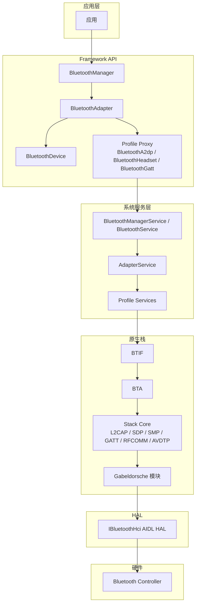
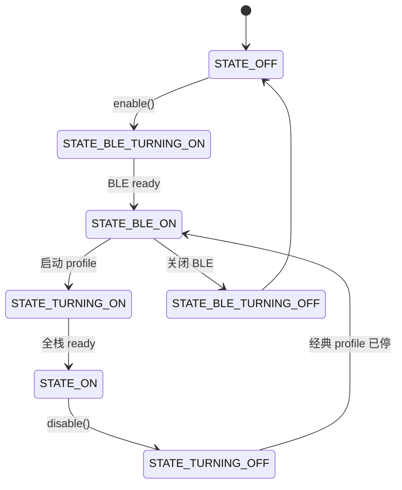
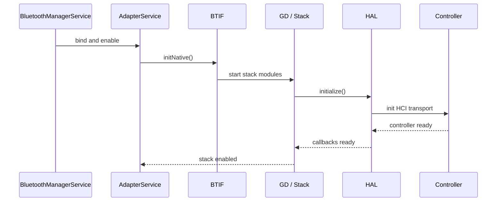
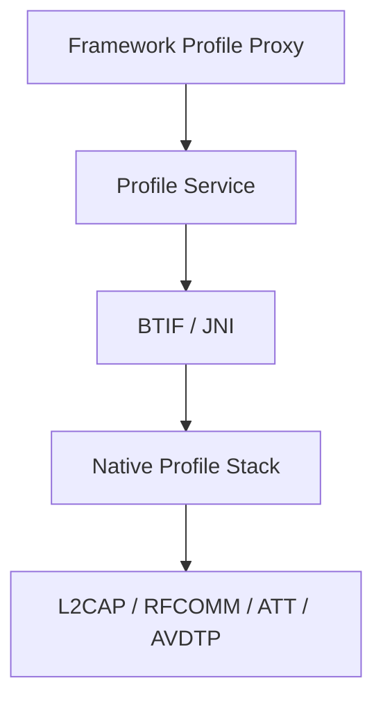
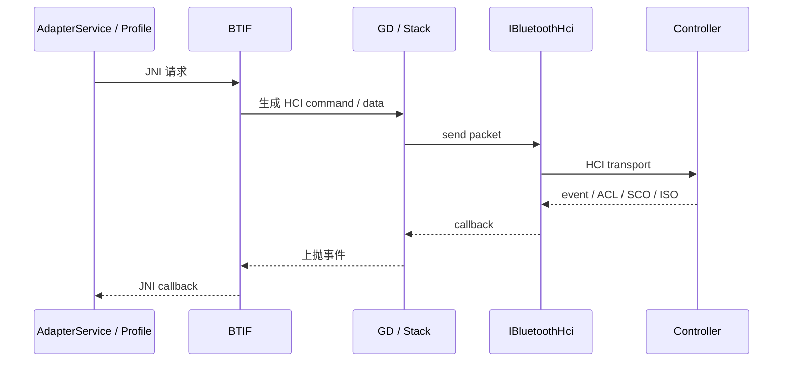
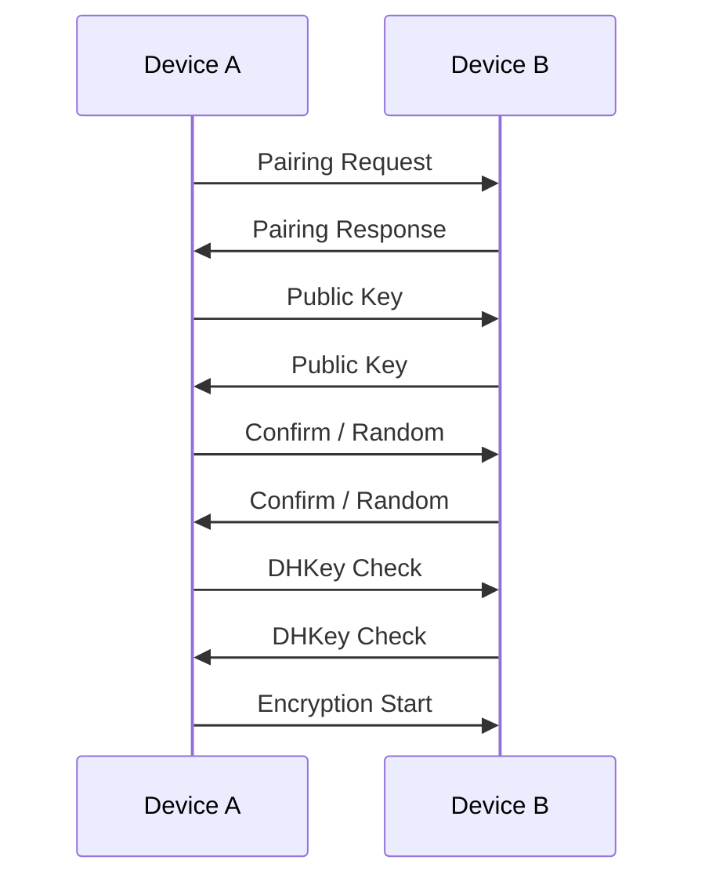
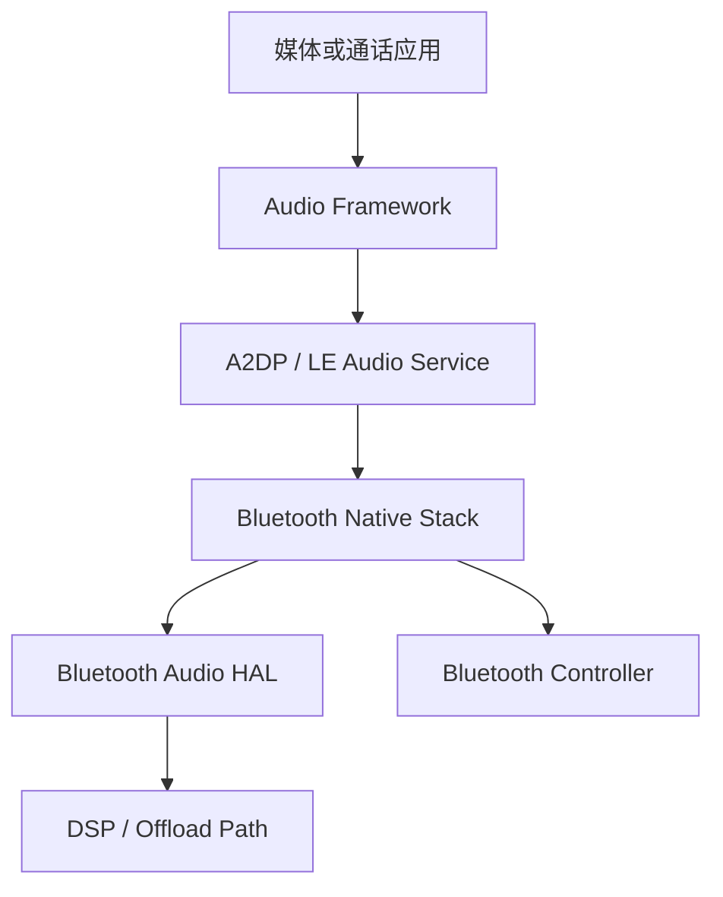
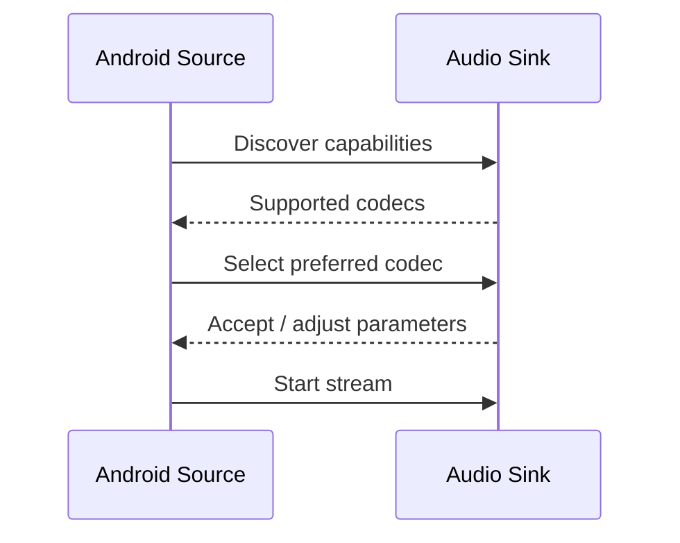

# 第 37 章：蓝牙

蓝牙是 AOSP 中最复杂、最“跨层”的子系统之一。它同时覆盖经典蓝牙（BR/EDR）、BLE、几十种 profile、完整的原生 HCI 栈、与音频和电话框架的深度集成，以及独立可更新的 APEX 模块。Android 当前的蓝牙实现主要位于 `packages/modules/Bluetooth/`，对外暴露 `BluetoothManager`、`BluetoothAdapter`、`BluetoothGatt` 等 framework API，对内则由 `BluetoothManagerService`、`AdapterService`、Fluoride / Gabeldorsche 原生栈、Rust 组件以及 AIDL HAL 协同完成。本章从 framework API 一路向下，系统梳理 Android 蓝牙的架构、profile、BLE、HAL、配对绑定与蓝牙音频实现。

---

## 37.1 蓝牙架构

### 37.1.1 总览

Android 蓝牙栈是一个垂直分层系统。应用层调用 SDK API，framework 通过 Binder 与受特权保护的蓝牙服务通信，服务再驱动 Java、JNI、C++、Rust 和 HAL 组件，最终通过 HCI 与蓝牙控制器固件对话。

下图展示主要分层。



### 37.1.2 `BluetoothManager`

`BluetoothManager` 位于 `packages/modules/Bluetooth/framework/java/android/bluetooth/BluetoothManager.java`，是应用获取蓝牙系统入口的标准方式。它通过 `@SystemService(Context.BLUETOOTH_SERVICE)` 暴露给应用。

它主要提供三类能力：

1. 访问本机适配器：`getAdapter()`
2. 查询 GATT 连接态：`getConnectionState()`、`getConnectedDevices()`
3. 创建 GATT server：`openGattServer()`

它自己并不直接控制底层栈，而是把大部分工作交给 `BluetoothAdapter` 和后续 Binder 接口。

### 37.1.3 `BluetoothAdapter`

`BluetoothAdapter` 是 Android 蓝牙 API 的中心对象，代表本机蓝牙控制器。几乎所有高层操作都从这里出发：

- 开关蓝牙
- 设备发现
- 获取已配对设备
- 获取 BLE scanner / advertiser
- 创建 RFCOMM 或 L2CAP server socket
- 获取 profile proxy

它还定义了适配器状态机。Android 把 BLE-only 打开和完整蓝牙打开区分开来：

```java
public static final int STATE_OFF = 10;
public static final int STATE_TURNING_ON = 11;
public static final int STATE_ON = 12;
public static final int STATE_TURNING_OFF = 13;
public static final int STATE_BLE_TURNING_ON = 14;
public static final int STATE_BLE_ON = 15;
public static final int STATE_BLE_TURNING_OFF = 16;
```

这意味着系统可以处于“BLE 子系统可用，但经典蓝牙 profile 尚未完全启动”的状态。

下图展示简化状态机。



### 37.1.4 `BluetoothManagerService` 与 `BluetoothService`

蓝牙在系统服务层分成两个重要角色：

- `BluetoothService.kt`：`SystemService` 启动入口，负责在系统引导时启动蓝牙子系统并发布 binder service。
- `BluetoothManagerService.java`：负责蓝牙启停、绑定 `AdapterService`、崩溃恢复、飞行模式协作、用户切换等复杂状态管理。

`BluetoothManagerService` 的几个关键特征：

1. 崩溃恢复：会记录 crash timestamp，并在一定次数内自动重启服务。
2. 所有状态变化串行化：通过内部 handler 和 adapter state 对象统一调度。
3. 与飞行模式、卫星模式和用户限制协同。

### 37.1.5 `AdapterService`

`AdapterService` 运行在蓝牙 APK / APEX 进程内，是 Java 层与 native 栈之间的主桥梁。所有 profile service 都围绕它注册和协作。

它会导入并管理大量 profile 服务，例如：

- `A2dpService`
- `HeadsetService`
- `GattService`
- `PanService`
- `HidHostService`
- 各类 LE Audio 服务

从设计上看，`AdapterService` 的角色类似“蓝牙应用层总控”，而不是单纯的 adapter 开关器。

### 37.1.6 蓝牙 APEX 模块

Android 蓝牙模块作为 `com.android.bt` APEX 发布。这样做的价值很明确：

- 蓝牙协议栈可以独立于整机 OTA 更新
- 安全补丁和功能迭代更快
- Java 服务、native 栈、profile 代码能够作为一个整体发布

### 37.1.7 权限模型

新版 Android 对蓝牙权限做了细分。常见权限包括：

- `BLUETOOTH_CONNECT`
- `BLUETOOTH_SCAN`
- `BLUETOOTH_ADVERTISE`

它们替代了早期较粗粒度的蓝牙权限模型，也与位置权限、后台扫描限制等共同作用。尤其是 BLE 扫描结果往往被视为位置敏感信息，因此权限判断通常比经典蓝牙更严格。

---

## 37.2 蓝牙协议栈

### 37.2.1 Fluoride 到 Gabeldorsche

Android 蓝牙栈经历了从传统 Fluoride 架构向 Gabeldorsche（GD）迁移的过程。Fluoride 源自更早的 Broadcom 风格栈，GD 则尝试以更模块化、现代化、更易测试的方式重构底层能力。

核心变化包括：

- HCI / ACL / storage 等模块逐步迁入 GD
- 更多清晰的模块边界
- 更适合引入 Rust 组件
- shim 层用于兼容新旧栈共存

### 37.2.2 源码树布局

蓝牙模块的关键目录如下：

| 路径 | 作用 |
|---|---|
| `packages/modules/Bluetooth/framework/java/android/bluetooth/` | framework API |
| `packages/modules/Bluetooth/framework/java/android/bluetooth/le/` | BLE API |
| `packages/modules/Bluetooth/service/src/` | 系统服务 |
| `packages/modules/Bluetooth/android/app/src/com/android/bluetooth/` | 蓝牙 APK / app 层服务 |
| `packages/modules/Bluetooth/system/gd/` | Gabeldorsche 原生模块 |
| `packages/modules/Bluetooth/system/btif/` | JNI / interface bridge |
| `packages/modules/Bluetooth/system/bta/` | 上层原生应用逻辑 |
| `packages/modules/Bluetooth/system/stack/` | 协议栈核心 |
| `packages/modules/Bluetooth/system/rust/` | Rust 组件 |
| `packages/modules/Bluetooth/floss/` | Linux / ChromeOS 风格蓝牙栈实现 |

### 37.2.3 Gabeldorsche 模块

GD 不是一个单独“替换旧栈”的大开关，而是一组逐步接管的模块集合。常见能力包括：

- HCI transport
- ACL 管理
- advertising
- scanning
- storage
- HAL 适配

它的设计强调模块清晰、依赖显式和更强的测试可控性。

### 37.2.4 Rust 组件

Android 蓝牙开始在部分模块引入 Rust，最主要的目标是提高内存安全。Rust 组件通常通过 FFI 与现有 C++ 栈协同，而不是一次性彻底替换所有原生代码。

### 37.2.5 BTIF：JNI 桥

`BTIF` 是 Java 服务层和原生栈之间的重要边界。它负责：

- 从 Java 调 native
- 把 native 事件回调回 Java
- 在 profile service 和下层协议栈之间做接口适配

### 37.2.6 初始化顺序

蓝牙原生栈初始化通常包括：

1. 启动 `AdapterService`
2. 初始化 JNI / BTIF
3. 启动 stack core / GD 模块
4. 连接 HAL
5. 初始化 controller
6. 按需启动 profile 服务

下图展示简化初始化序列。



### 37.2.7 shim 层

在新旧栈共存期间，shim 层负责把一部分调用转发给旧 Fluoride，一部分交给 GD。这是迁移期非常典型的工程策略：用兼容层隔离大规模替换风险。

### 37.2.8 Floss

`Floss` 是 Android / Linux 环境中的另一套蓝牙实现方向，常见于非手机场景或 Linux 生态协同。它并不是手机 AOSP 蓝牙主路径，但对理解 Google 在多平台蓝牙栈上的演进方向很有价值。

---

## 37.3 蓝牙 Profiles

### 37.3.1 Profile 架构

蓝牙协议栈的“可见功能”大多通过 profile 体现。Android 中的 profile 既有 framework proxy，也有对应的 service 和原生协议支持。

下图展示 profile 的基本分层。



### 37.3.2 A2DP

A2DP 是经典蓝牙音频流分发 profile，负责高质量音频从 source 到 sink 的传输。Android 的 A2DP 体系通常涉及：

- `BluetoothA2dp`
- `A2dpService`
- AVDTP 协议
- codec 协商
- 音频 HAL 配合

### 37.3.3 HFP

HFP 用于通话音频和免提控制。它与电话栈和音频路由结合紧密，常见职责包括：

- 通话状态同步
- SCO 音频链路
- 按键控制
- 设备侧 AG / HF 角色协同

### 37.3.4 AVRCP

AVRCP 提供媒体控制，例如：

- 播放 / 暂停
- 切歌
- 音量
- 元数据浏览

### 37.3.5 Profile 标识符

Android 使用固定 profile ID 和 binder proxy 映射不同蓝牙能力，这些常量帮助 framework 在 `getProfileProxy()` 等 API 中绑定目标服务。

### 37.3.6 HID

HID 用于键盘、鼠标、游戏手柄等输入设备，常见于：

- HID Host
- HID Device

### 37.3.7 PAN

PAN 提供蓝牙网络共享和个人网络能力。它会与网络栈、tethering 或局域网桥接逻辑发生交互。

### 37.3.8 核心协议栈

许多 profile 最终都建立在下层协议之上，例如：

- L2CAP
- SDP
- RFCOMM
- ATT / GATT
- AVDTP

理解 profile 时，必须把它们和这些下层协议放在一起看。

### 37.3.9 GATT

GATT 是 BLE 生态最关键的 profile 抽象。它基于 ATT，以 service / characteristic / descriptor 的层次组织数据，几乎所有 BLE 设备能力都通过它暴露。

### 37.3.10 MAP

MAP 用于消息访问，例如车机读取手机消息等场景。

### 37.3.11 PBAP

PBAP 用于电话本访问，常见于车载系统同步联系人。

### 37.3.12 OPP

OPP 提供对象推送能力，例如文件发送。

### 37.3.13 LE Audio Profiles

LE Audio 不再只是“BLE 上传音频”，而是一整套新 profile 家族，包括：

- BAP
- CSIP
- VCP
- MCP
- TBS
- BASS 等

它们共同支撑广播音频、协调设备组、音量控制和多流音频体验。

---

## 37.4 BLE（Bluetooth Low Energy）

### 37.4.1 BLE 在 AOSP 中的架构

BLE 在 Android 中拥有相对独立的 API 和协议路径。高层通常围绕：

- `BluetoothLeScanner`
- `BluetoothLeAdvertiser`
- `BluetoothGatt`
- `BluetoothGattServer`

而底层则依赖 GATT、ATT、SMP、advertising 和 scanning 管理模块。

### 37.4.2 BLE Advertising

Advertising 是 BLE 设备“对外宣告存在”的机制。Android 支持：

- 普通 advertising
- 多 advertising 实例
- extended advertising
- 周期性 advertising（依控制器能力）

广告流程通常从 `BluetoothLeAdvertiser` 开始，经由 `GattService` / native stack 下发到底层 controller。

### 37.4.3 BLE Scanning

扫描是 BLE 中最容易被滥用、也最受权限和功耗约束的能力。Android 需要同时平衡：

- 扫描过滤器
- callback 频率
- 后台限制
- 批量结果
- 功耗预算

### 37.4.4 GATT Client

GATT client 负责主动连接 BLE 设备并访问其服务。典型流程是：

1. 扫描发现设备
2. 建立连接
3. service discovery
4. 读写 characteristic / descriptor
5. 注册 notification / indication

### 37.4.5 GATT Server

GATT server 允许本机暴露 BLE 服务给外设或其他 central 访问。Android 通过 `BluetoothGattServer` 和 `openGattServer()` 提供这类能力。

### 37.4.6 BLE 连接管理

BLE 连接管理要处理：

- 连接建立与断开
- 参数更新
- MTU 协商
- PHY 选择
- 多连接调度

### 37.4.7 LE 地址隐私

BLE 常使用随机私有地址（RPA）增强隐私。Android 栈需要正确处理：

- identity address
- resolvable private address
- 地址轮换与解析
- bonding 后的 identity 关联

### 37.4.8 BLE Framework API 类

主要类包括：

- `BluetoothLeScanner`
- `ScanSettings`
- `ScanFilter`
- `BluetoothLeAdvertiser`
- `AdvertiseSettings`
- `BluetoothGatt`
- `BluetoothGattCharacteristic`
- `BluetoothGattDescriptor`
- `BluetoothGattServer`

### 37.4.9 EATT

EATT 是 Enhanced ATT，允许在 ATT 基础上提供更好的并发性和性能，减轻单通道串行访问的限制。

---

## 37.5 蓝牙 HAL

### 37.5.1 HAL 接口设计

Android 蓝牙 HAL 位于 `hardware/interfaces/bluetooth/aidl/`。它位于 HCI 层，而不是更高 profile 层，这样上层协议栈可以最大程度保持在 AOSP 内实现。

与电话 HAL 相比，蓝牙 HAL 的设计更“瘦”，主要是：

- 初始化
- 关闭
- 发送 HCI 命令
- 发送 ACL / SCO / ISO 数据包
- 接收回调

### 37.5.2 HAL 回调

HAL 需要向上回调：

- init 完成
- HCI 事件
- ACL 数据
- SCO 数据
- ISO 数据

这些回调共同构成控制面和数据面的基础。

### 37.5.3 HAL 状态码

HAL 通过有限的 status code 报告初始化、发送失败、关闭等状态。这些状态最终会影响 `AdapterService` 和 `BluetoothManagerService` 对启停结果的判断。

### 37.5.4 AIDL backend 实现

GD 栈中有专门的 HAL backend 负责对接 AIDL HAL，把 packet read/write 和 controller 初始化逻辑封装起来。

### 37.5.5 HCI 包流

下图展示 HCI 数据的主路径。



### 37.5.6 Bluetooth Audio HAL

除了 HCI HAL，Android 还有蓝牙音频 HAL，主要用于：

- A2DP offload
- LE Audio 音频通路
- 与 Audio Framework 协调数据面

### 37.5.7 snoop logger

蓝牙 snoop log 是调试 HCI 层问题最核心的工具之一。系统可以记录 HCI 包并导出为 `btsnoop_hci.log`，供 Wireshark 分析。

---

## 37.6 配对与绑定

### 37.6.1 配对与绑定的区别

Pairing 通常指认证和密钥协商过程，Bonding 则指系统将这些密钥和信任关系持久化下来。很多用户语义上把它们混为一谈，但在系统实现里两者是不同阶段。

### 37.6.2 SMP

BLE 的安全主要依赖 SMP（Security Manager Protocol）。它负责：

- 配对模型选择
- 临时密钥 / 长期密钥协商
- 身份与加密参数协商
- 密钥分发

### 37.6.3 Secure Connections 配对流程

Secure Connections 是更现代、更安全的配对方式。它依赖更强的椭圆曲线机制来完成密钥协商。

下图展示简化流程。



### 37.6.4 密钥分发

配对完成后可能分发多种密钥，例如：

- LTK
- IRK
- CSRK
- identity 信息

### 37.6.5 经典蓝牙配对

经典蓝牙也有自己的配对流程，历史更久，兼容性负担也更重。它与 BLE Secure Connections 在底层上有明显区别。

### 37.6.6 bond 状态管理

Android 需要维护 bond state，例如：

- `BOND_NONE`
- `BOND_BONDING`
- `BOND_BONDED`

这些状态会驱动系统 UI、profile 自动重连和密钥持久化。

### 37.6.7 密钥存储

配对得到的持久化信息通常存储在蓝牙配置文件中，例如：

- `/data/misc/bluedroid/bt_config.conf`

系统需要把设备地址、link key、profile 状态等映射保存下来。

### 37.6.8 跨传输密钥派生

Cross-Transport Key Derivation 允许经典蓝牙与 BLE 之间在某些条件下共享或推导安全材料，改善双模设备体验。

### 37.6.9 安全级别

蓝牙连接会根据 profile 和配对结果要求不同安全级别，例如：

- 未认证明文
- 已加密
- MITM 保护
- Secure Connections

---

## 37.7 蓝牙音频

### 37.7.1 音频架构总览

蓝牙音频是 Android 蓝牙最复杂的集成场景之一，因为它同时牵涉：

- 蓝牙 profile
- 编解码器协商
- Audio Framework
- Audio HAL
- DSP / offload
- 电话与媒体切换

下图展示简化结构。



### 37.7.2 A2DP codec 协商

A2DP 建链后并不是立刻就有最终音频格式，而是要协商：

- SBC
- AAC
- aptX / LDAC 等厂商 codec
- 采样率
- 声道模式
- 比特率

### 37.7.3 支持的 A2DP codec

Android 常见的 A2DP codec 包括：

- SBC
- AAC
- aptX
- aptX HD
- LDAC
- LC3（更多与 LE Audio 相关）

具体支持情况取决于设备、vendor 实现和系统属性。

### 37.7.4 codec 协商流程



### 37.7.5 软件编码与硬件 offload

音频编码既可以在 AP 上的软件栈里完成，也可以 offload 到 SoC DSP。offload 的好处很直接：

- 降低功耗
- 减少 CPU 占用
- 改善长时间播放体验

但代价是 HAL 与 vendor 能力耦合更深，排障也更复杂。

### 37.7.6 音频 HAL AIDL 接口

蓝牙音频 HAL 通过 AIDL 与 Audio Framework 和蓝牙栈协作，承载更高效的音频数据通路。

### 37.7.7 与音频路由集成

蓝牙音频与 Audio Policy / route 的结合非常紧密：

- 媒体播放切到 A2DP
- 通话切到 HFP / SCO
- LE Audio 设备组管理
- 音量与焦点协作

### 37.7.8 LE Audio

LE Audio 带来的核心变化包括：

- LC3 codec
- 广播音频
- 多流低功耗音频
- 设备组协调

### 37.7.9 HFP 音频

HFP 音频通常依赖 SCO 链路，和媒体 A2DP 路径完全不同。这也是“通话蓝牙”和“媒体蓝牙”经常表现出不同行为和延迟特性的原因。

### 37.7.10 音频时延与质量

蓝牙音频时延和质量受多因素共同影响：

- codec
- buffer
- retransmission
- offload 有无
- controller 与 RF 环境
- 音频策略切换

### 37.7.11 codec 可扩展性

Android 的 A2DP / LE Audio 架构需要允许厂商 codec 和未来标准 codec 逐步接入，因此 codec 层会保留较强的扩展性。

---

## 37.8 附录：关键源码路径与延伸阅读

### 37.8.1 关键源码路径

| 组件 | 路径 |
|---|---|
| Framework API | `packages/modules/Bluetooth/framework/java/android/bluetooth/` |
| BLE API | `packages/modules/Bluetooth/framework/java/android/bluetooth/le/` |
| 系统服务 | `packages/modules/Bluetooth/service/src/` |
| 蓝牙 APK | `packages/modules/Bluetooth/android/app/src/com/android/bluetooth/` |
| `AdapterService` | `packages/modules/Bluetooth/android/app/src/com/android/bluetooth/btservice/` |
| Profile 服务 | `packages/modules/Bluetooth/android/app/src/com/android/bluetooth/{a2dp,hfp,gatt,...}/` |
| GD | `packages/modules/Bluetooth/system/gd/` |
| GD HAL | `packages/modules/Bluetooth/system/gd/hal/` |
| GD HCI | `packages/modules/Bluetooth/system/gd/hci/` |
| GD Storage | `packages/modules/Bluetooth/system/gd/storage/` |
| BTIF | `packages/modules/Bluetooth/system/btif/` |
| BTA | `packages/modules/Bluetooth/system/bta/` |
| Stack Core | `packages/modules/Bluetooth/system/stack/` |
| L2CAP | `packages/modules/Bluetooth/system/stack/l2cap/` |
| SMP | `packages/modules/Bluetooth/system/stack/smp/` |
| GATT | `packages/modules/Bluetooth/system/stack/gatt/` |
| A2DP codecs | `packages/modules/Bluetooth/system/stack/a2dp/` |
| Rust 组件 | `packages/modules/Bluetooth/system/rust/` |
| Audio HAL interface | `packages/modules/Bluetooth/system/audio_hal_interface/` |
| 蓝牙 HCI HAL | `hardware/interfaces/bluetooth/aidl/` |
| 蓝牙音频 HAL | `hardware/interfaces/bluetooth/audio/aidl/` |
| APEX 配置 | `packages/modules/Bluetooth/apex/` |
| Floss | `packages/modules/Bluetooth/floss/` |
| Pandora 测试框架 | `packages/modules/Bluetooth/pandora/` |

### 37.8.2 继续阅读

若要继续深入，可优先阅读：

- `packages/modules/Bluetooth/system/doc/`
- `packages/modules/Bluetooth/system/gd/docs/`
- `packages/modules/Bluetooth/system/gd/README.md`

同时可结合 Bluetooth SIG 规范阅读：

- Core Specification
- A2DP
- HFP
- AVRCP
- LE Audio 相关规范族

---

## 37.9 动手实践（Try It）

### 37.9.1 用 ADB 查看蓝牙状态

```bash
adb shell settings get global bluetooth_on
adb shell service call bluetooth_manager 6
adb shell dumpsys bluetooth_manager
adb shell dumpsys bluetooth_manager --proto-bin
```

### 37.9.2 抓取 HCI 日志

```bash
adb shell setprop persist.bluetooth.btsnooplogmode full
adb shell svc bluetooth disable
adb shell svc bluetooth enable
adb pull /data/misc/bluetooth/logs/btsnoop_hci.log
```

导出后可用 Wireshark 打开分析。

### 37.9.3 查看已绑定设备

```bash
adb root
adb shell cat /data/misc/bluedroid/bt_config.conf
adb shell grep '^\[.*:.*:.*\]' /data/misc/bluedroid/bt_config.conf
```

### 37.9.4 观察 profile 连接

```bash
adb shell dumpsys bluetooth_manager
adb shell dumpsys activity service com.android.bluetooth | grep -i A2dp
adb shell dumpsys activity service com.android.bluetooth | grep -i Headset
adb shell dumpsys activity service com.android.bluetooth | grep -i Gatt
```

### 37.9.5 观察 BLE 扫描

```bash
adb logcat | grep -E "BluetoothLeScanner|GattService|ScanManager"
```

如果设备允许，还可以结合内部调试命令或测试应用观察扫描结果和过滤器命中。

### 37.9.6 监控蓝牙事件

```bash
adb logcat -s BluetoothAdapter BluetoothManagerService AdapterService
adb logcat -s smp bt_btif_dm bt_smp
adb logcat -s A2dpService HeadsetService GattService
```

### 37.9.7 构建与测试蓝牙改动

```bash
m com.android.bt
m bluetooth_stack
atest BluetoothInstrumentationTests
atest BluetoothUnitTests
```

### 37.9.8 使用蓝牙 shell 命令

```bash
adb shell cmd bluetooth_manager help
```

不同分支和设备可用子命令不同，但这是查看 manager 侧控制入口的第一步。

### 37.9.9 分析 A2DP codec 配置

```bash
adb shell getprop | grep -i a2dp
adb shell dumpsys activity service com.android.bluetooth | grep -i codec
```

重点看：

- 当前协商 codec
- offload 是否启用
- source / sink profile 是否打开

### 37.9.10 编写一个简单 BLE 扫描器

```java
BluetoothLeScanner scanner =
        BluetoothAdapter.getDefaultAdapter().getBluetoothLeScanner();

ScanFilter filter = new ScanFilter.Builder()
        .setDeviceName("MyDevice")
        .build();

ScanSettings settings = new ScanSettings.Builder()
        .setScanMode(ScanSettings.SCAN_MODE_LOW_LATENCY)
        .build();

scanner.startScan(
        List.of(filter),
        settings,
        new ScanCallback() {
            @Override
            public void onScanResult(int callbackType, ScanResult result) {
                Log.d("BLE", "Found: " + result.getDevice());
            }
        });
```

### 37.9.11 编写一个最小 GATT Server

```java
BluetoothManager btManager =
        (BluetoothManager) getSystemService(Context.BLUETOOTH_SERVICE);

BluetoothGattServer gattServer = btManager.openGattServer(
        this,
        new BluetoothGattServerCallback() {});

UUID serviceUuid = UUID.fromString("12345678-1234-1234-1234-123456789abc");
UUID charUuid = UUID.fromString("12345678-1234-1234-1234-123456789abd");

BluetoothGattService service = new BluetoothGattService(
        serviceUuid, BluetoothGattService.SERVICE_TYPE_PRIMARY);

BluetoothGattCharacteristic characteristic = new BluetoothGattCharacteristic(
        charUuid,
        BluetoothGattCharacteristic.PROPERTY_READ,
        BluetoothGattCharacteristic.PERMISSION_READ);

service.addCharacteristic(characteristic);
gattServer.addService(service);
```

### 37.9.12 试用 Pandora

Pandora 位于 `packages/modules/Bluetooth/pandora/`，适合做自动化蓝牙测试、配对控制和 profile 行为验证。

### 37.9.13 全栈追踪

```bash
adb shell setprop log.tag.BluetoothAdapter VERBOSE
adb shell setprop log.tag.BluetoothManagerService VERBOSE
adb shell setprop log.tag.AdapterService VERBOSE
adb shell setprop log.tag.A2dpService VERBOSE
adb shell setprop log.tag.HeadsetService VERBOSE
adb shell setprop persist.bluetooth.btsnooplogmode full
adb logcat -b all > bluetooth_trace.log
```

### 37.9.14 理解蓝牙配置文件

```bash
adb root
adb shell ls -la /data/misc/bluedroid/bt_config.conf
adb shell grep -c '^\[' /data/misc/bluedroid/bt_config.conf
adb shell grep '^\[.*:.*:.*\]' /data/misc/bluedroid/bt_config.conf
```

### 37.9.15 排查配对失败

```bash
adb logcat -s smp bt_btif_dm bt_smp | grep -E "SMP_STATE|smp_sm_event|pairing"
adb shell setprop persist.bluetooth.btsnooplogmode full
adb pull /data/misc/bluetooth/logs/btsnoop_hci.log
```

在 Wireshark 中可用过滤器 `btsmp` 分析配对过程。

常见失败原因包括：

- 超时
- 认证失败
- 加密失败
- 短时间内重复失败过多

### 37.9.16 观察 LE Audio

```bash
adb logcat -s LeAudioService LeAudioStateMachine
adb logcat -s LeAudioBroadcast BassClientService
adb logcat -s VolumeControlService
adb logcat -s CsipSetCoordinatorService
```

### 37.9.17 查看蓝牙系统属性

```bash
adb shell getprop | grep -i bluetooth
adb shell getprop persist.bluetooth.btsnooplogmode
adb shell getprop persist.bluetooth.a2dp_offload.disabled
adb shell getprop ro.bluetooth.a2dp_offload.supported
adb shell getprop bluetooth.profile.a2dp.source.enabled
adb shell getprop bluetooth.profile.hfp.ag.enabled
adb shell getprop bluetooth.profile.gatt.enabled
```

### 37.9.18 自定义 profile 开发

如果需要做自定义蓝牙协议实验，常见路径有三条：

1. 经典蓝牙：基于 RFCOMM server socket / client socket。
2. BLE：基于 GATT client / server。
3. L2CAP CoC：基于 `listenUsingL2capChannel()` 和 `createL2capChannel()`。

### 37.9.19 Rootcanal 虚拟控制器

Rootcanal 是 AOSP 自带的虚拟蓝牙控制器，适合模拟器和自动化测试。

```bash
atest --host bluetooth_test_gd -- --rootcanal
```

---

## Summary

- Android 蓝牙栈是一个跨 Java、Kotlin、C++、Rust、AIDL HAL 和控制器固件的多层系统，既要支持经典蓝牙，也要支持 BLE 和 LE Audio。
- `BluetoothManager` 与 `BluetoothAdapter` 是 framework 入口，`BluetoothManagerService` 与 `AdapterService` 负责系统服务和蓝牙 APK 进程内的核心协调。
- 原生栈正在从传统 Fluoride 逐步向 Gabeldorsche 演进，迁移过程依赖 shim 和模块化重构，而不是一次性替换。
- BTIF 是 Java 服务与原生协议栈之间的关键 JNI 桥，HAL 则位于 HCI 层，让 Android 可以在 AOSP 内保留绝大多数协议逻辑。
- BLE 在 Android 中拥有相对独立的 API 和权限模型，广告、扫描、GATT client / server、EATT 和地址隐私共同构成其核心能力。
- 配对与绑定不只是 UI 交互，而是围绕 SMP、密钥分发、bond state 和持久化存储的一整套安全流程。
- 蓝牙音频是最复杂的蓝牙集成场景之一，牵涉 A2DP、HFP、LE Audio、codec 协商、Audio HAL、offload 和系统音频路由。
- 蓝牙问题排障时，`dumpsys`、logcat、`bt_config.conf`、HCI snoop log 和 Rootcanal / Pandora 往往比单看 framework API 更有效。

### 关键源码

| 文件 / 路径 | 作用 |
|---|---|
| `packages/modules/Bluetooth/framework/java/android/bluetooth/BluetoothManager.java` | 蓝牙 framework 服务入口 |
| `packages/modules/Bluetooth/framework/java/android/bluetooth/BluetoothAdapter.java` | 本机适配器 API 核心 |
| `packages/modules/Bluetooth/service/src/BluetoothService.kt` | 系统服务启动入口 |
| `packages/modules/Bluetooth/service/src/com/android/server/bluetooth/BluetoothManagerService.java` | 蓝牙启停、状态和崩溃恢复 |
| `packages/modules/Bluetooth/android/app/src/com/android/bluetooth/btservice/AdapterService.java` | 蓝牙 APK 进程总控服务 |
| `packages/modules/Bluetooth/system/btif/` | JNI / interface bridge |
| `packages/modules/Bluetooth/system/bta/` | 原生上层应用逻辑 |
| `packages/modules/Bluetooth/system/stack/` | L2CAP、SMP、GATT、A2DP 等核心协议 |
| `packages/modules/Bluetooth/system/gd/` | Gabeldorsche 模块 |
| `packages/modules/Bluetooth/system/rust/` | Rust 组件 |
| `hardware/interfaces/bluetooth/aidl/` | 蓝牙 HCI HAL |
| `hardware/interfaces/bluetooth/audio/aidl/` | 蓝牙音频 HAL |
