# Chapter 37: Bluetooth

Bluetooth is one of the most feature-rich subsystems in AOSP, encompassing
classic Bluetooth (BR/EDR), Bluetooth Low Energy (BLE), dozens of profiles, a
full native HCI stack, and deep integration with the audio and telephony
frameworks. Android's Bluetooth implementation lives primarily in
`packages/modules/Bluetooth/`, shipped as an updatable APEX module
(`com.android.bt`). This chapter traces every layer from the Java framework API
down through the native Gabeldorsche/Fluoride stack to the AIDL HAL that talks
to the controller firmware.

---

## 37.1 Bluetooth Architecture

### 37.1.1 High-Level Overview

Android's Bluetooth stack is organized as a vertical set of layers. An
application at the top uses public SDK classes; those delegate through AIDL
binder calls to a privileged system service; the service drives a native C++/
Rust stack that speaks HCI to the hardware through a vendor HAL.

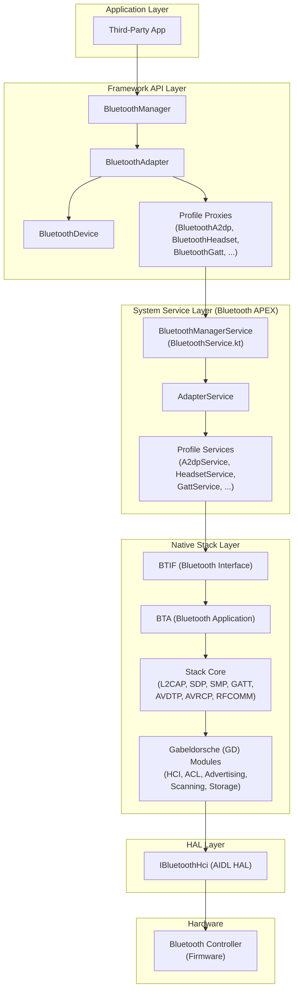

### 37.1.2 BluetoothManager

`BluetoothManager` is the system service entry point for applications. It is
annotated as `@SystemService(Context.BLUETOOTH_SERVICE)` and is obtained via
`Context.getSystemService()`.

Source: `packages/modules/Bluetooth/framework/java/android/bluetooth/BluetoothManager.java`

```java
@SystemService(Context.BLUETOOTH_SERVICE)
@RequiresFeature(PackageManager.FEATURE_BLUETOOTH)
public final class BluetoothManager {
    private final BluetoothAdapter mAdapter;
    private final Context mContext;

    /** @hide */
    public BluetoothManager(Context context) {
        mContext = context.createDeviceContext(Context.DEVICE_ID_DEFAULT);
        mAdapter = BluetoothAdapter.createAdapter(mContext);
    }

    @RequiresNoPermission
    public BluetoothAdapter getAdapter() {
        return mAdapter;
    }
    // ...
}
```

`BluetoothManager` provides three main capabilities:

1. **Adapter access** -- `getAdapter()` returns the singleton `BluetoothAdapter`
   for the local Bluetooth controller.
2. **GATT connection state** -- `getConnectionState()` and
   `getConnectedDevices()` report BLE GATT connection status.
3. **GATT server creation** -- `openGattServer()` instantiates a
   `BluetoothGattServer` for hosting local services.

### 37.1.3 BluetoothAdapter

`BluetoothAdapter` (5,500+ lines) is the central API class for all Bluetooth
operations. It represents the local Bluetooth radio and is the starting point
for discovery, bonding, profile connections, and BLE operations.

Source: `packages/modules/Bluetooth/framework/java/android/bluetooth/BluetoothAdapter.java`

Key state constants define the adapter lifecycle:

```java
public static final int STATE_OFF = 10;
public static final int STATE_TURNING_ON = 11;
public static final int STATE_ON = 12;
public static final int STATE_TURNING_OFF = 13;
public static final int STATE_BLE_TURNING_ON = 14;   // @hide
public static final int STATE_BLE_ON = 15;            // @SystemApi
public static final int STATE_BLE_TURNING_OFF = 16;   // @hide
```

The adapter state machine has two levels of "on": `STATE_BLE_ON` enables only
the BLE subsystem (advertising, scanning), while `STATE_ON` additionally
activates the classic BR/EDR transport and all profiles.

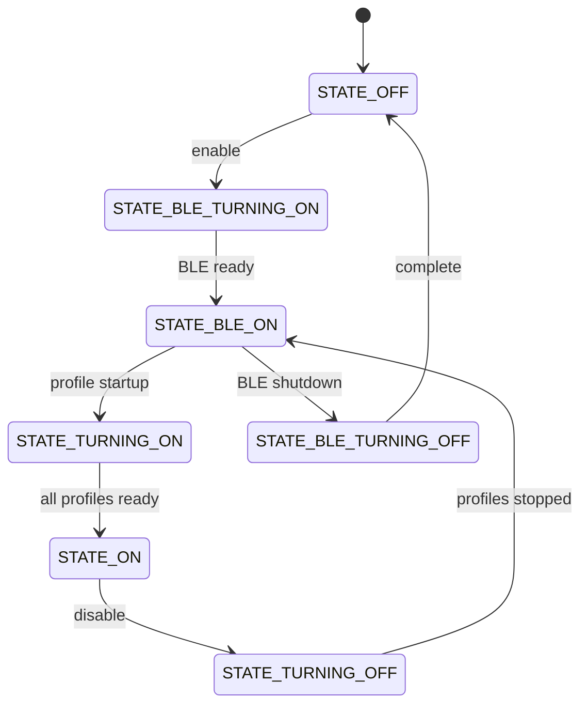

Key methods on `BluetoothAdapter`:

| Method | Purpose |
|--------|---------|
| `enable()` / `disable()` | Turn Bluetooth on/off (requires `BLUETOOTH_CONNECT`) |
| `startDiscovery()` | Begin scanning for nearby BR/EDR devices |
| `getBondedDevices()` | Return the set of paired devices |
| `getBluetoothLeScanner()` | Obtain the BLE scanner |
| `getBluetoothLeAdvertiser()` | Obtain the BLE advertiser |
| `listenUsingRfcommWithServiceRecord()` | Create an RFCOMM server socket |
| `listenUsingL2capChannel()` | Create an L2CAP CoC server socket |
| `getProfileProxy()` | Bind to a profile service (A2DP, HFP, etc.) |
| `getRemoteDevice()` | Create a `BluetoothDevice` from a MAC address |
| `nameForState()` | Convert state integer to human-readable string |

### 37.1.4 BluetoothManagerService and BluetoothService

On the system server side, `BluetoothService` (Kotlin) boots the Bluetooth
subsystem. It is a `SystemService` that creates a handler thread, constructs a
`BluetoothSupervisor`, and publishes the binder service.

Source: `packages/modules/Bluetooth/service/src/BluetoothService.kt`

```kotlin
class BluetoothService(context: Context) : SystemService(context) {
    private val looper = HandlerThread("BluetoothSystemServer").apply { start() }.looper
    private val serviceDispatcher = Handler(looper).asCoroutineDispatcher()
    private val scope = CoroutineScope(serviceDispatcher + SupervisorJob())

    private var supervisor: BluetoothSupervisor

    init {
        Log.d("Booting now")
        val bluetoothComponent =
            if (Flags.userRestrictionRefactor()) {
                BluetoothComponent(context)
            } else { null }
        supervisor = runBlocking(serviceDispatcher) {
            BluetoothSupervisor(context, looper, bluetoothComponent)
        }
        // ...
    }

    override fun onStart() {
        publishBinderService(SERVICE_NAME,
            BluetoothServiceBinder(looper, supervisor.api(), context))
    }
}
```

`BluetoothManagerService` is the Java class that handles the heavy lifting:
binding to the `AdapterService`, managing enable/disable state transitions,
crash recovery (up to 6 retries), airplane mode integration, and user switching.

Source: `packages/modules/Bluetooth/service/src/com/android/server/bluetooth/BluetoothManagerService.java`

Key design features of `BluetoothManagerService`:

- **Crash recovery**: Tracks crash timestamps in `mCrashTimestamps`, restarts
  the service up to `MAX_ERROR_RESTART_RETRIES` (6) times with a
  `SERVICE_RESTART_TIME_MS` (400 ms) delay.
- **State management**: Uses `BluetoothAdapterState` (Kotlin flow-based) to
  track and wait on adapter state transitions with timeout support.
- **Handler messages**: All state transitions are serialized through
  `BluetoothHandler` messages like `MESSAGE_BLUETOOTH_SERVICE_CONNECTED`,
  `MESSAGE_BLUETOOTH_STATE_CHANGE`, `MESSAGE_TIMEOUT_BIND`.
- **Airplane mode**: Integrates with `AirplaneModeListener` and
  `SatelliteModeListener` for radio state management.

Source: `packages/modules/Bluetooth/service/src/AdapterState.kt`

```kotlin
class BluetoothAdapterState {
    private val _uiState = MutableSharedFlow<Int>(1)

    init { set(State.OFF) }

    fun set(s: Int) = runBlocking {
        _uiState.emit(s)
        if (!disableCacheForTesting) {
            IpcDataCache.invalidateCache(IPC_CACHE_MODULE_SYSTEM, GET_SYSTEM_STATE_API)
        }
    }

    fun get(): Int = _uiState.replayCache.get(0)

    suspend fun waitForState(timeout: Duration, vararg states: Int): Boolean =
        withTimeoutOrNull(timeout) {
            _uiState.filter { states.contains(it) }.first()
        } != null
}
```

### 37.1.5 AdapterService

`AdapterService` is the Android `Service` running inside the Bluetooth APK
(`com.android.bluetooth`). It is the bridge between the Java world and the
native C++ stack. Every profile service registers with it, and it manages the
overall lifecycle of the Bluetooth stack.

Source: `packages/modules/Bluetooth/android/app/src/com/android/bluetooth/btservice/AdapterService.java`

`AdapterService` imports and coordinates all profile services:

```java
import com.android.bluetooth.a2dp.A2dpService;
import com.android.bluetooth.a2dpsink.A2dpSinkService;
import com.android.bluetooth.avrcp.AvrcpTargetService;
import com.android.bluetooth.avrcpcontroller.AvrcpControllerService;
import com.android.bluetooth.bas.BatteryService;
import com.android.bluetooth.bass_client.BassClientService;
import com.android.bluetooth.csip.CsipSetCoordinatorService;
import com.android.bluetooth.gatt.GattService;
import com.android.bluetooth.hap.HapClientService;
import com.android.bluetooth.hearingaid.HearingAidService;
import com.android.bluetooth.hfp.HeadsetService;
import com.android.bluetooth.hfpclient.HeadsetClientService;
import com.android.bluetooth.hid.HidDeviceService;
import com.android.bluetooth.hid.HidHostService;
// ... and more
```

### 37.1.6 The Bluetooth APEX Module

Since Android 12, the Bluetooth stack ships as an updatable mainline module in
an APEX container (`com.android.bt`). This allows Google to push Bluetooth
security patches and feature updates via Google Play system updates without a
full OTA.

Directory: `packages/modules/Bluetooth/apex/`

The APEX bundles:

- Framework JARs (the `android.bluetooth` package)
- The Bluetooth APK (`com.android.bluetooth`)
- The native shared libraries (the C++/Rust stack)
- Configuration files (`bt_did.conf`, etc.)
- The system service (`BluetoothService`)

### 37.1.7 Permissions Model

Android 12+ introduced granular Bluetooth permissions to replace the legacy
`BLUETOOTH` and `BLUETOOTH_ADMIN` permissions:

| Permission | Purpose |
|------------|---------|
| `BLUETOOTH_CONNECT` | Connect to bonded devices, access device info |
| `BLUETOOTH_SCAN` | Discover nearby devices (may derive location) |
| `BLUETOOTH_ADVERTISE` | Make the device visible to others |
| `BLUETOOTH_PRIVILEGED` | System-only privileged operations |

The framework API classes use custom annotations to enforce these:

```java
@RequiresBluetoothConnectPermission
@RequiresPermission(BLUETOOTH_CONNECT)
public Set<BluetoothDevice> getBondedDevices() { ... }
```

---

## 37.2 Bluetooth Stack

### 37.2.1 Stack Evolution: Fluoride to Gabeldorsche

Android's Bluetooth native stack has undergone a major architectural evolution:

**Fluoride** (pre-Android 13) was the original C++ Bluetooth stack, evolved from
Broadcom's BlueDroid. It used a monolithic design with tightly coupled layers
and global state.

**Gabeldorsche** (GD) is the modern replacement, designed with a modular
architecture. GD modules progressively replace Fluoride components from the
bottom up (HCI layer first, then ACL management, then profiles).

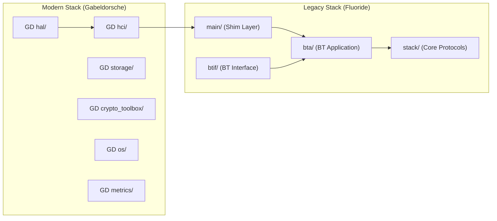

The shim layer in `main/shim/` provides the bridge, allowing Fluoride code to
call into GD modules for functionality that has been migrated.

### 37.2.2 Source Tree Layout

The native Bluetooth stack lives in `packages/modules/Bluetooth/system/`:

```
system/
  gd/           # Gabeldorsche -- the modern modular stack
    hal/         # HAL abstraction (AIDL/HIDL backends)
    hci/         # HCI layer, controller, ACL manager
    storage/     # Persistent device database
    crypto_toolbox/  # Cryptographic primitives
    os/          # OS abstraction (handler, alarm, etc.)
    metrics/     # Bluetooth metrics collection
    packet/      # Packet serialization framework
  btif/          # Bluetooth Interface -- JNI bridge
    src/         # btif_core.cc, btif_dm.cc, btif_av.cc, ...
    avrcp/       # AVRCP target implementation
  bta/           # Bluetooth Application layer
    av/          # A2DP/AVRCP application layer
    dm/          # Device management
    gatt/        # GATT client/server application layer
    hf_client/   # HFP client
    hfp/         # HFP audio gateway
    hh/          # HID host
    hd/          # HID device
    le_audio/    # LE Audio
    pan/         # PAN profile
    sdp/         # Service Discovery Protocol
    sys/         # System manager
  stack/         # Core protocol implementations
    a2dp/        # A2DP codec handling
    acl/         # ACL connection management
    avct/        # AVCTP (AV Control Transport)
    avdt/        # AVDTP (AV Distribution Transport)
    avrc/        # AVRCP protocol
    bnep/        # Bluetooth Network Encapsulation Protocol
    btm/         # Bluetooth Manager (classic security)
    btu/         # Bluetooth Upper layer
    gatt/        # GATT protocol
    hid/         # HID protocol
    l2cap/       # L2CAP protocol
    pan/         # PAN protocol
    rfcomm/      # RFCOMM serial protocol
    sdp/         # SDP protocol
    smp/         # Security Manager Protocol (BLE)
    srvc/        # GATT-based services (DIS, etc.)
  audio_hal_interface/  # Audio HAL integration
    aidl/        # AIDL audio HAL client
  rust/          # Rust components (new GATT server)
  main/          # Stack initialization and shim layer
    shim/        # GD-to-Fluoride shim
  include/       # Public headers
  osi/           # OS Interface abstraction
  common/        # Common utilities
```

### 37.2.3 Gabeldorsche (GD) Module Details

The GD modules in `system/gd/` use a consistent design pattern: each module
defines abstract interfaces, with separate implementations for Android
(production) and host (testing).

#### GD HAL Module

The HAL module abstracts the transport between the stack and the controller. It
supports two backends: AIDL (modern) and HIDL (legacy).

Source: `packages/modules/Bluetooth/system/gd/hal/hci_backend.h`

```cpp
namespace bluetooth::hal {

class HciBackend {
public:
  static std::shared_ptr<HciBackend> CreateAidl();
  static std::shared_ptr<HciBackend> CreateAidl(const std::string& hci_instance_name);
  static std::shared_ptr<HciBackend> CreateHidl(::bluetooth::os::Handler*);

  virtual ~HciBackend() = default;
  virtual void initialize(std::shared_ptr<HciBackendCallbacks>) = 0;
  virtual void sendHciCommand(const std::vector<uint8_t>&) = 0;
  virtual void sendAclData(const std::vector<uint8_t>&) = 0;
  virtual void sendScoData(const std::vector<uint8_t>&) = 0;
  virtual void sendIsoData(const std::vector<uint8_t>&) = 0;
};

}  // namespace bluetooth::hal
```

The `HciHal` class (defined in `hci_hal.h`) wraps the backend and provides the
interface the rest of the stack uses:

Source: `packages/modules/Bluetooth/system/gd/hal/hci_hal.h`

```cpp
class HciHal {
public:
  virtual void registerIncomingPacketCallback(HciHalCallbacks* callback) = 0;
  virtual void unregisterIncomingPacketCallback() = 0;
  virtual void sendHciCommand(HciPacket command) = 0;
  virtual void sendAclData(HciPacket data) = 0;
  virtual void sendScoData(HciPacket data) = 0;
  virtual void sendIsoData(HciPacket data) = 0;
};
```

The callback interface mirrors the HAL:

```cpp
class HciHalCallbacks {
public:
  virtual void hciEventReceived(HciPacket event) = 0;
  virtual void aclDataReceived(HciPacket data) = 0;
  virtual void scoDataReceived(HciPacket data) = 0;
  virtual void isoDataReceived(HciPacket data) = 0;
  virtual void controllerNeedsReset() {}
};
```

#### GD HCI Module

The HCI module handles controller initialization, feature discovery, and
provides managers for various HCI subsystems.

Source: `packages/modules/Bluetooth/system/gd/hci/controller_impl.h`

`ControllerImpl` queries the controller's capabilities through HCI commands and
exposes them as boolean feature flags:

```cpp
class ControllerImpl : public Controller {
public:
  // Classic capabilities
  virtual bool SupportsSimplePairing() const override;
  virtual bool SupportsSecureConnections() const override;
  virtual bool SupportsRoleSwitch() const override;
  virtual bool SupportsSco() const override;

  // BLE capabilities
  virtual bool SupportsBle() const override;
  virtual bool SupportsBleExtendedAdvertising() const override;
  virtual bool SupportsBlePeriodicAdvertising() const override;
  virtual bool SupportsBle2mPhy() const override;
  virtual bool SupportsBleCodedPhy() const override;
  virtual bool SupportsBlePrivacy() const override;
  virtual bool SupportsBleConnectedIsochronousStreamCentral() const override;
  virtual bool SupportsBleIsochronousBroadcaster() const override;
  virtual bool SupportsBleChannelSounding() const override;

  // Buffer information
  virtual uint16_t GetAclPacketLength() const override;
  virtual uint16_t GetNumAclPacketBuffers() const override;
  virtual LeBufferSize GetLeBufferSize() const override;
  virtual LeBufferSize GetControllerIsoBufferSize() const override;
};
```

The LE event masks are version-gated to avoid setting unsupported bits:

```cpp
static constexpr uint64_t kLeEventMask53 = 0x00000007ffffffff;  // BT 5.3
static constexpr uint64_t kLeEventMask52 = 0x00000003ffffffff;  // BT 5.2
static constexpr uint64_t kLeEventMask51 = 0x0000000000ffffff;  // BT 5.1
static constexpr uint64_t kLeEventMask50 = 0x00000000000fffff;  // BT 5.0
```

The GD HCI module also provides specialized managers:

| Manager | Source | Purpose |
|---------|--------|---------|
| `LeAdvertisingManagerImpl` | `hci/le_advertising_manager_impl.h` | BLE advertising set management |
| `LeScanningManagerImpl` | `hci/le_scanning_manager_impl.h` | BLE scan management with filters |
| `AclManagerClassicImpl` | `hci/acl_manager/acl_manager_classic_impl.h` | Classic ACL connections |
| `AclManagerLeImpl` | `hci/acl_manager/acl_manager_le_impl.h` | BLE ACL connections |
| `LeAddressManager` | `hci/le_address_manager.h` | RPA rotation and address management |
| `DistanceMeasurementManagerImpl` | `hci/distance_measurement_manager_impl.h` | Channel sounding / ranging |

#### GD Storage Module

The storage module persists bonding information, device properties, and adapter
configuration. It uses a config file format (INI-style) stored on disk.

Source: `packages/modules/Bluetooth/system/gd/storage/storage_module.h`

The storage keys are defined as preprocessor macros:

Source: `packages/modules/Bluetooth/system/gd/storage/config_keys.h`

```cpp
#define BTIF_STORAGE_SECTION_ADAPTER "Adapter"
#define BTIF_STORAGE_KEY_ADDR_TYPE "AddrType"
#define BTIF_STORAGE_KEY_ADDRESS "Address"
#define BTIF_STORAGE_KEY_ALIAS "Aliase"
#define BTIF_STORAGE_KEY_DEV_CLASS "DevClass"
#define BTIF_STORAGE_KEY_DEV_TYPE "DevType"
#define BTIF_STORAGE_KEY_HFP_VERSION "HfpVersion"
#define BTIF_STORAGE_KEY_GATT_CLIENT_DB_HASH "GattClientDatabaseHash"
// ... many more
```

### 37.2.4 Rust Components

Android is progressively introducing Rust into the Bluetooth stack for memory
safety. The Rust GATT server shares the ATT channel with the existing C++ GATT
client.

Source: `packages/modules/Bluetooth/system/rust/src/gatt.rs`

```rust
//! This module is a simple GATT server that shares the ATT channel with the
//! existing C++ GATT client. See go/private-gatt-in-platform for the design.

mod arbiter;
mod callbacks;
mod channel;
mod ffi;
mod ids;
#[cfg(test)]
mod mocks;
mod mtu;
mod opcode_types;
mod server;
```

The `arbiter` manages which side (C++ or Rust) handles each incoming ATT
packet. The `ffi` module provides the Foreign Function Interface bindings
between Rust and C++. This dual-language approach exemplifies Android's
incremental memory-safety strategy.

### 37.2.5 BTIF: The JNI Bridge

The Bluetooth Interface layer (`btif/`) bridges the Java `AdapterService` and
the native C++ stack via JNI. Each profile has a corresponding `btif_*.cc` file.

Source: `packages/modules/Bluetooth/system/btif/src/`

Key BTIF files:

| File | Purpose |
|------|---------|
| `btif_core.cc` | Core initialization, enable/disable |
| `btif_dm.cc` | Device Management: discovery, bonding |
| `btif_av.cc` | A2DP audio/video |
| `btif_hf.cc` | Hands-Free Profile (audio gateway) |
| `btif_hh.cc` | HID Host |
| `btif_hd.cc` | HID Device |
| `btif_gatt.cc` | GATT operations |
| `btif_gatt_client.cc` | GATT client operations |
| `btif_gatt_server.cc` | GATT server operations |
| `btif_ble_scanner.cc` | BLE scanning |
| `btif_pan.cc` | Personal Area Networking |
| `btif_rc.cc` | AVRCP remote control |
| `btif_storage.cc` | Persistent storage (bonding data) |
| `btif_sock.cc` | RFCOMM/L2CAP socket management |
| `btif_le_audio.cc` | LE Audio |
| `btif_config.cc` | Configuration file management |
| `stack_manager.cc` | Stack initialization sequence |

`btif_core.cc` reads its configuration from the APEX:

```cpp
#if defined(__ANDROID__)
#define BTE_DID_CONF_FILE "/apex/com.android.bt/etc/bluetooth/bt_did.conf"
#endif
```

### 37.2.6 Stack Initialization Sequence

When `BluetoothManagerService` requests enable, the following sequence unfolds:

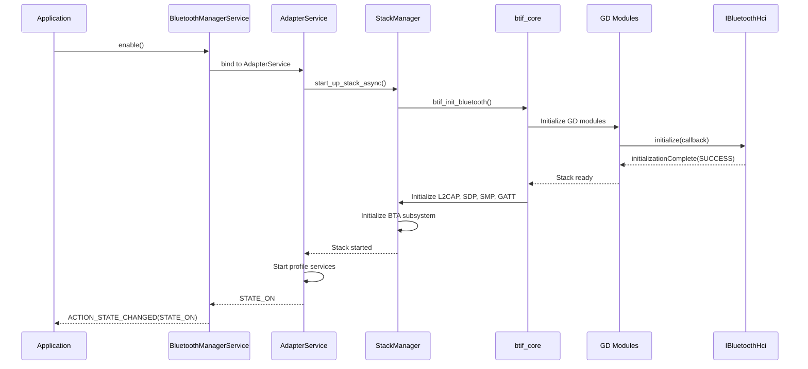

The stack initialization in `stack_manager.cc` follows a specific order:

Source: `packages/modules/Bluetooth/system/btif/src/stack_manager.cc`

```cpp
// Stack components are initialized in dependency order:
// 1. OSI (OS Interface) module
// 2. GD modules (HAL, HCI, Controller)
// 3. BTM (Bluetooth Manager)
// 4. L2CAP
// 5. SDP
// 6. SMP
// 7. GATT
// 8. GAP
// 9. PAN/BNEP (if enabled)
// 10. HID (if enabled)
// 11. BTA system manager
```

### 37.2.7 The Shim Layer

The shim layer (`main/shim/`) is a critical architectural component that allows
the legacy Fluoride code to gradually adopt GD modules. Instead of a big-bang
rewrite, each GD module provides a shim that presents the same interface the
Fluoride code expects, while internally delegating to the new implementation.

Source: `packages/modules/Bluetooth/system/main/shim/`

This design enables incremental migration:

1. Write a new GD module with modern design
2. Create a shim that adapts the GD API to the legacy interface
3. Redirect the legacy code path through the shim
4. Eventually remove the shim when all consumers are migrated

The entry points used by the BTIF layer to access GD modules are centralized:

Source: `packages/modules/Bluetooth/system/main/shim/entry.h`

### 37.2.8 Floss: The Linux Bluetooth Stack

AOSP also includes **Floss** (`packages/modules/Bluetooth/floss/`), a Linux-
oriented Bluetooth stack that reuses the same native code but targets desktop
Linux environments instead of Android. Floss replaces BlueZ for ChromeOS and
other Google platforms, sharing the same codebase while using D-Bus instead of
Binder for IPC.

---

## 37.3 Bluetooth Profiles

Bluetooth profiles define the procedures and data formats for specific use
cases. AOSP implements profiles in three layers: Java service classes (in the
Bluetooth APK), BTA (Bluetooth Application) handlers in C++, and protocol-level
code in the stack.

### 37.3.1 Profile Architecture

Each profile follows a consistent pattern:

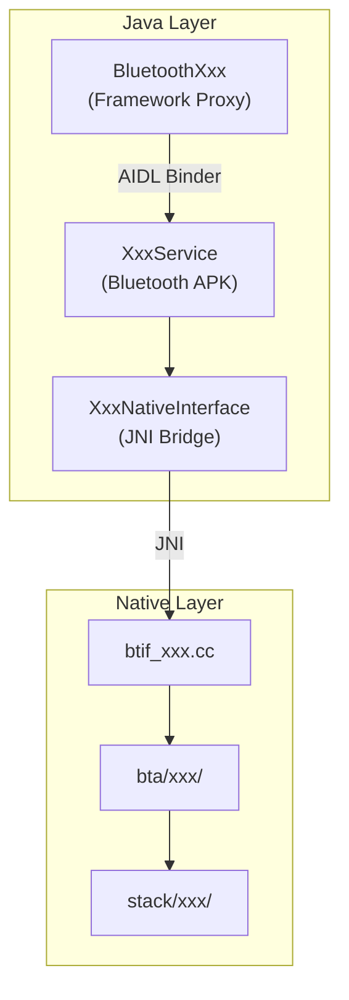

Profile services in the Bluetooth APK:

Source: `packages/modules/Bluetooth/android/app/src/com/android/bluetooth/`

```
a2dp/          -- A2dpService, A2dpStateMachine
a2dpsink/      -- A2dpSinkService (receiver role)
avrcp/         -- AvrcpTargetService
avrcpcontroller/ -- AvrcpControllerService
bas/           -- BatteryService
bass_client/   -- BassClientService (broadcast audio)
btservice/     -- AdapterService, ProfileService base
csip/          -- CsipSetCoordinatorService
gatt/          -- GattService
hap/           -- HapClientService (Hearing Access)
hearingaid/    -- HearingAidService
hfp/           -- HeadsetService (HFP Audio Gateway)
hfpclient/     -- HeadsetClientService
hid/           -- HidHostService, HidDeviceService
le_audio/      -- LeAudioService
le_scan/       -- Scanning
map/           -- BluetoothMapService
mapclient/     -- MapClientService
mcp/           -- Media Control Profile
opp/           -- OPP (Object Push)
pan/           -- PanService
pbap/          -- PBAP server
pbapclient/    -- PbapClientService
sap/           -- SIM Access Profile
sdp/           -- SDP service
tbs/           -- Telephone Bearer Service
vc/            -- Volume Control
```

### 37.3.2 A2DP -- Advanced Audio Distribution Profile

A2DP enables high-quality audio streaming from a source (typically a phone) to
a sink (headphones, speakers). It uses AVDTP (Audio/Video Distribution
Transport Protocol) for stream management.

Source: `packages/modules/Bluetooth/android/app/src/com/android/bluetooth/a2dp/A2dpService.java`

```java
public class A2dpService extends ConnectableProfile {
    private final A2dpNativeInterface mNativeInterface;
    private final A2dpCodecConfig mA2dpCodecConfig;
    private final AudioManager mAudioManager;
    private final int mMaxConnectedAudioDevices;

    private BluetoothDevice mActiveDevice;
    private final ConcurrentMap<BluetoothDevice, A2dpStateMachine> mStateMachines =
            new ConcurrentHashMap<>();

    private static final int MAX_A2DP_STATE_MACHINES = 50;
    private final boolean mA2dpOffloadEnabled;
}
```

Key A2DP architecture points:

- **State machines**: Each connected device gets its own `A2dpStateMachine`
  instance (up to `MAX_A2DP_STATE_MACHINES = 50`).
- **Active device**: Only one device at a time is the active audio sink
  (`mActiveDevice`), protected by `mActiveSwitchingGuard`.
- **Codec negotiation**: `A2dpCodecConfig` manages codec selection and
  configuration (see Section 37.7).
- **Offload support**: `mA2dpOffloadEnabled` indicates whether the SoC handles
  encoding in hardware.

#### A2DP State Machine

Each remote A2DP device is managed by an `A2dpStateMachine` instance. The
comment at the top of the source file documents the complete state diagram:

Source: `packages/modules/Bluetooth/android/app/src/com/android/bluetooth/a2dp/A2dpStateMachine.java`

```java
// Bluetooth A2DP StateMachine. There is one instance per remote device.
//  - "Disconnected" and "Connected" are steady states.
//  - "Connecting" and "Disconnecting" are transient states until the
//     connection / disconnection is completed.
//
//                        (Disconnected)
//                           |       ^
//                   CONNECT |       | DISCONNECTED
//                           V       |
//                 (Connecting)<--->(Disconnecting)
//                           |       ^
//                 CONNECTED |       | DISCONNECT
//                           V       |
//                          (Connected)
// NOTES:
//  - If state machine is in "Connecting" state and the remote device sends
//    DISCONNECT request, the state machine transitions to "Disconnecting" state.
//  - Similarly, if the state machine is in "Disconnecting" state and the remote
//    device sends CONNECT request, the state machine transitions to "Connecting"
//    state.
```

```java
final class A2dpStateMachine extends StateMachine {
    static final int MESSAGE_CONNECT = 1;
    static final int MESSAGE_DISCONNECT = 2;
    static final int MESSAGE_STACK_EVENT = 101;
    private static final int MESSAGE_CONNECT_TIMEOUT = 201;

    @VisibleForTesting static final Duration CONNECT_TIMEOUT = Duration.ofSeconds(30);

    private final Disconnected mDisconnected;
    private final Connecting mConnecting;
    private final Disconnecting mDisconnecting;
    private final Connected mConnected;
    private final boolean mA2dpOffloadEnabled;
}
```

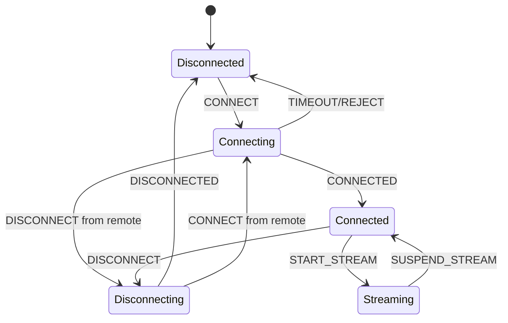

#### A2DP Protocol Stack

A2DP uses AVDTP (Audio/Video Distribution Transport Protocol) for signaling
and media transport, which itself runs over L2CAP:

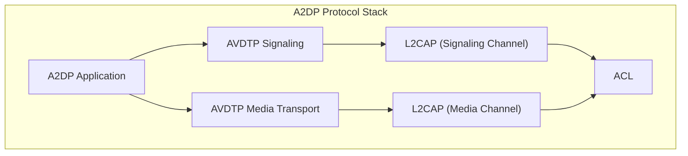

The native A2DP and AVDTP implementations:

Source: `packages/modules/Bluetooth/system/stack/a2dp/` (codec handling)
Source: `packages/modules/Bluetooth/system/stack/avdt/` (AVDTP protocol)
Source: `packages/modules/Bluetooth/system/bta/av/` (A2DP application layer)

### 37.3.3 HFP -- Hands-Free Profile

HFP enables hands-free phone calls over Bluetooth, typically used in car kits
and headsets. Android implements the Audio Gateway (AG) role.

Source: `packages/modules/Bluetooth/android/app/src/com/android/bluetooth/hfp/HeadsetService.java`

The `HeadsetStateMachine` manages per-device connection state. Unlike A2DP,
HFP has additional states for SCO audio connection management:

Source: `packages/modules/Bluetooth/android/app/src/com/android/bluetooth/hfp/HeadsetStateMachine.java`

```java
class HeadsetStateMachine extends StateMachine {
    static final int CONNECT = 1;
    static final int DISCONNECT = 2;
    static final int CONNECT_AUDIO = 3;
    static final int DISCONNECT_AUDIO = 4;
    static final int VOICE_RECOGNITION_START = 5;
    static final int VOICE_RECOGNITION_STOP = 6;
    static final int INTENT_SCO_VOLUME_CHANGED = 7;
    static final int CALL_STATE_CHANGED = 9;
    static final int DEVICE_STATE_CHANGED = 10;
    static final int SEND_CLCC_RESPONSE = 11;

    private static final int MAX_RETRY_DISCONNECT_AUDIO = 3;

    // State machine states (7 states vs A2DP's 4)
    private final Disconnected mDisconnected = new Disconnected();
    private final Connecting mConnecting = new Connecting();
    private final Disconnecting mDisconnecting = new Disconnecting();
    private final Connected mConnected = new Connected();
    private final AudioOn mAudioOn = new AudioOn();
    private final AudioConnecting mAudioConnecting = new AudioConnecting();
    private final AudioDisconnecting mAudioDisconnecting = new AudioDisconnecting();
}
```

The HFP state machine has 7 states, reflecting the dual nature of HFP
connections (service-level connection + audio connection):

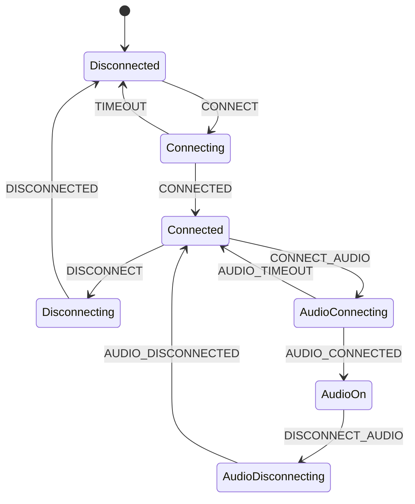

Key HFP features:

- **AT command processing**: Phone status, call control, DTMF, caller ID
- **SCO audio connection management**: Separate from the service-level ACL
  connection
- **Wideband speech**: mSBC (16 kHz) and LC3 (32 kHz) codec support
- **Phone state synchronization**: Call state, signal strength, battery level,
  roaming status
- **In-band ring tone**: Ring audio played through the headset
- **Voice recognition activation**: Trigger voice assistant from headset button
- **CLCC responses**: Current List of Calls, reported via AT+CLCC

The HFP native interface is in `btif_hf.cc`, which implements the AG role
callbacks. HFP uses RFCOMM for the AT command channel and SCO for the audio
channel.

#### HFP Audio Codecs

| Codec | Sample Rate | Bandwidth | Quality |
|-------|------------|-----------|---------|
| CVSD | 8 kHz | 64 kbps | Narrowband (mandatory) |
| mSBC | 16 kHz | 64 kbps | Wideband (HFP 1.6+) |
| LC3 | 32 kHz | Variable | Super wideband (HFP 1.9+) |

### 37.3.4 AVRCP -- Audio/Video Remote Control Profile

AVRCP allows remote control of media playback. Android implements both the
Target (TG) and Controller (CT) roles.

Source: `packages/modules/Bluetooth/android/app/src/com/android/bluetooth/avrcp/AvrcpTargetService.java`

```java
public class AvrcpTargetService extends ProfileService {
    // Integrates with Android's MediaSession framework
    // to relay now-playing info, play status, and media
    // player list to connected controllers (car head units)
}
```

AVRCP Target features:

- Now-playing metadata (title, artist, album, duration)
- Play status (playing, paused, position)
- Player application settings (repeat, shuffle)
- Media player browsing
- Cover art (BIP -- Basic Imaging Profile)
- Volume synchronization (absolute volume)

The controller side (`AvrcpControllerService`) connects to remote targets and
relays media information back to the Android media framework.

### 37.3.5 Profile Identifiers

The `BluetoothProfile` interface defines numeric identifiers for every
supported profile:

Source: `packages/modules/Bluetooth/framework/java/android/bluetooth/BluetoothProfile.java`

```java
public interface BluetoothProfile {
    int STATE_DISCONNECTED = 0;
    int STATE_CONNECTING = 1;
    int STATE_CONNECTED = 2;
    int STATE_DISCONNECTING = 3;

    int HEADSET = 1;                    // HFP
    int A2DP = 2;                       // A2DP Source
    @Deprecated int HEALTH = 3;         // HDP (removed)
    @SystemApi int HID_HOST = 4;        // HID Host
    @SystemApi int PAN = 5;             // PAN
    // ... PBAP, GATT, GATT_SERVER, MAP, SAP, A2DP_SINK,
    // AVRCP_CONTROLLER, AVRCP, HID_DEVICE, OPP, HEADSET_CLIENT,
    // HEARING_AID, LE_AUDIO, LE_AUDIO_BROADCAST, VOLUME_CONTROL,
    // CSIP_SET_COORDINATOR, LE_CALL_CONTROL, HAP_CLIENT, BATTERY, etc.
}
```

All profile state transitions are broadcast via `Intent` with extras
`EXTRA_STATE` (new state) and `EXTRA_PREVIOUS_STATE` (old state), allowing
applications to monitor profile connection changes.

### 37.3.6 HID -- Human Interface Device

HID supports Bluetooth keyboards, mice, game controllers, and other input
devices. AOSP implements both roles:

- **HID Host** (`HidHostService`): Receives input from remote HID devices
- **HID Device** (`HidDeviceService`): Makes the Android device act as a HID
  peripheral (e.g., a virtual keyboard)

Source: `packages/modules/Bluetooth/android/app/src/com/android/bluetooth/hid/HidHostService.java`

HID uses the L2CAP protocol with two channels:

- **Control channel** (PSM 0x0011): For HID control commands
- **Interrupt channel** (PSM 0x0013): For input reports

The native implementation in `stack/hid/` handles HID descriptor parsing, report
mode management, and the low-level L2CAP connections.

### 37.3.7 PAN -- Personal Area Networking

PAN enables IP networking over Bluetooth. Android supports both PANU (Personal
Area Network User) and NAP (Network Access Point) roles.

Source: `packages/modules/Bluetooth/android/app/src/com/android/bluetooth/pan/PanService.java`

```java
public class PanService extends ConnectableProfile {
    private static final int BLUETOOTH_MAX_PAN_CONNECTIONS = 5;

    final ConcurrentHashMap<BluetoothDevice, BluetoothPanDevice> mPanDevices =
            new ConcurrentHashMap<>();
    private final PanNativeInterface mNativeInterface;
    private final TetheringManager mTetheringManager;
}
```

PAN uses BNEP (Bluetooth Network Encapsulation Protocol) over L2CAP to
transport Ethernet frames. The `BluetoothTetheringNetworkFactory` integrates
with Android's connectivity framework to provide Bluetooth tethering.

Key PAN architecture points:

- Up to 5 simultaneous PAN connections (`BLUETOOTH_MAX_PAN_CONNECTIONS`)
- Integration with `TetheringManager` for Android tethering
- `PanNativeInterface` bridges to `btif_pan.cc` via JNI
- BNEP protocol encapsulates Ethernet frames over L2CAP

The stack enforces PAN support at compile time:

Source: `packages/modules/Bluetooth/system/btif/src/stack_manager.cc`

```cpp
static_assert(BTA_PAN_INCLUDED,
    "Pan profile is always included in the bluetooth stack");
static_assert(PAN_SUPPORTS_ROLE_NAP,
    "Pan profile always supports network access point");
static_assert(PAN_SUPPORTS_ROLE_PANU,
    "Pan profile always supports user as a client");
```

#### PAN Protocol Stack

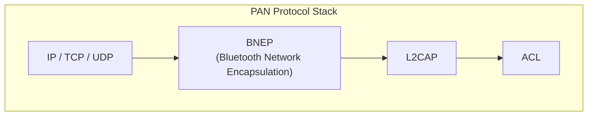

### 37.3.8 Core Protocol Stack

Before diving into the remaining profiles, it is useful to understand the core
protocol layers that all profiles share.

#### L2CAP (Logical Link Control and Adaptation Protocol)

L2CAP is the fundamental multiplexing layer for Bluetooth. All higher-level
protocols and profiles run over L2CAP channels identified by Protocol/Service
Multiplexer (PSM) values.

Source: `packages/modules/Bluetooth/system/stack/l2cap/`

```
l2c_main.cc          -- L2CAP initialization and main loop
l2c_api.cc           -- L2CAP API (connect, disconnect, write)
l2c_csm.cc           -- Channel State Machine
l2c_link.cc          -- ACL link management
l2c_ble.cc           -- BLE-specific L2CAP
l2c_ble_conn_params.cc -- BLE connection parameter management
l2c_fcr.cc           -- Flow Control and Retransmission modes
l2c_int.h            -- Internal definitions
```

Key L2CAP PSM assignments:

| PSM | Protocol |
|-----|----------|
| 0x0001 | SDP |
| 0x0003 | RFCOMM |
| 0x000F | BNEP |
| 0x0011 | HID Control |
| 0x0013 | HID Interrupt |
| 0x0017 | AVCTP (AVRCP) |
| 0x0019 | AVDTP (A2DP) |
| 0x001B | AVCTP Browse |
| 0x001F | ATT (GATT/BLE) |
| 0x0025 | LE L2CAP CoC |

#### RFCOMM

RFCOMM emulates serial port connections over L2CAP. It provides a simple
stream-oriented interface used by profiles like HFP, SPP, and OPP.

Source: `packages/modules/Bluetooth/system/stack/rfcomm/`

#### SDP (Service Discovery Protocol)

SDP enables devices to discover what services are available on a remote device.
Each profile registers an SDP record describing its capabilities.

Source: `packages/modules/Bluetooth/system/stack/sdp/`

### 37.3.9 GATT -- Generic Attribute Profile

GATT is the foundation of BLE communication. It defines a client/server model
where devices expose services containing characteristics (data values) and
descriptors (metadata).

Source: `packages/modules/Bluetooth/android/app/src/com/android/bluetooth/gatt/GattService.java`

```java
public class GattService extends ProfileService {
    // Manages GATT client connections
    // Handles GATT server registrations
    // Coordinates BLE scanning and advertising
    // Provides distance measurement
}
```

GATT is covered in detail in Section 37.4 (BLE).

### 37.3.10 MAP -- Message Access Profile

MAP enables access to messages (SMS, MMS, email) on a remote device. This is
commonly used by car head units to display phone messages.

Source: `packages/modules/Bluetooth/android/app/src/com/android/bluetooth/map/`

MAP uses OBEX (Object Exchange) over RFCOMM or L2CAP for message transfer,
with a Message Notification Service (MNS) for push updates when new messages
arrive.

### 37.3.11 PBAP -- Phone Book Access Profile

PBAP allows a remote device to access the phone book. Car head units use this
to sync contacts for hands-free calling and caller ID display.

Source: `packages/modules/Bluetooth/android/app/src/com/android/bluetooth/pbapclient/PbapClientService.java`

PBAP transfers vCard-formatted contact data over OBEX, supporting features like
photo transfer and search.

### 37.3.12 OPP -- Object Push Profile

OPP provides simple file transfer capabilities ("Bluetooth share"). It is the
simplest OBEX-based profile, supporting push and pull of files.

Source: `packages/modules/Bluetooth/android/app/src/com/android/bluetooth/opp/`

### 37.3.13 LE Audio Profiles

LE Audio is a major new profile family introduced in Bluetooth 5.2:

Source: `packages/modules/Bluetooth/android/app/src/com/android/bluetooth/le_audio/LeAudioService.java`

LE Audio includes:

- **BAP** (Basic Audio Profile): Core audio streaming over LE
- **LC3** codec: Mandatory high-quality low-complexity codec
- **CIS** (Connected Isochronous Streams): Point-to-point audio
- **BIS** (Broadcast Isochronous Streams): One-to-many audio
- **CSIP** (Coordinated Set): Group management for multi-device setups
  (e.g., left/right earbuds)
- **VCP** (Volume Control): Distributed volume management
- **MCP** (Media Control): Media control for LE Audio devices
- **TBS** (Telephone Bearer Service): Call control for LE Audio
- **HAP** (Hearing Access Profile): Hearing aid support
- **BASS** (Broadcast Audio Scan Service): Broadcast audio discovery

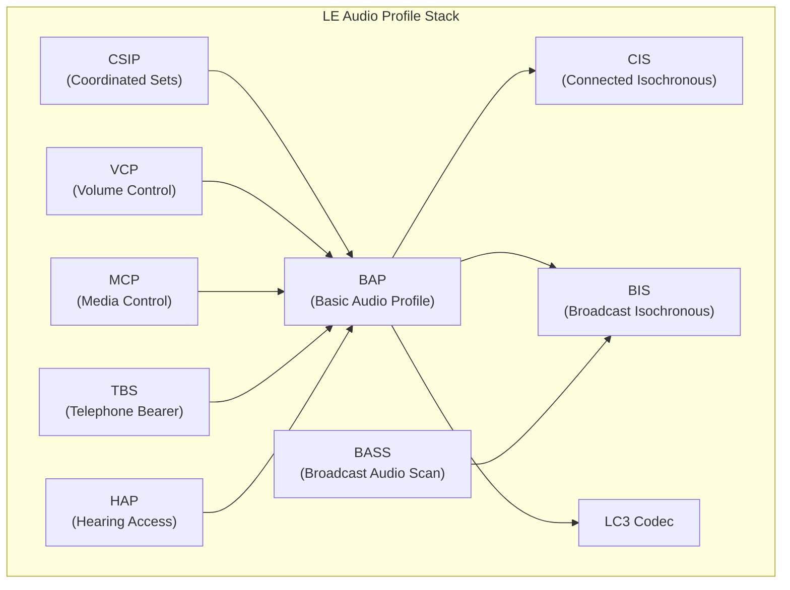

---

## 37.4 BLE (Bluetooth Low Energy)

### 37.4.1 BLE Architecture in AOSP

Bluetooth Low Energy operates on its own set of channels (37, 38, 39 for
advertising; 0-36 for data) and has a fundamentally different connection model
from classic Bluetooth. In AOSP, BLE functionality spans three major areas:
advertising, scanning, and GATT client/server operations.

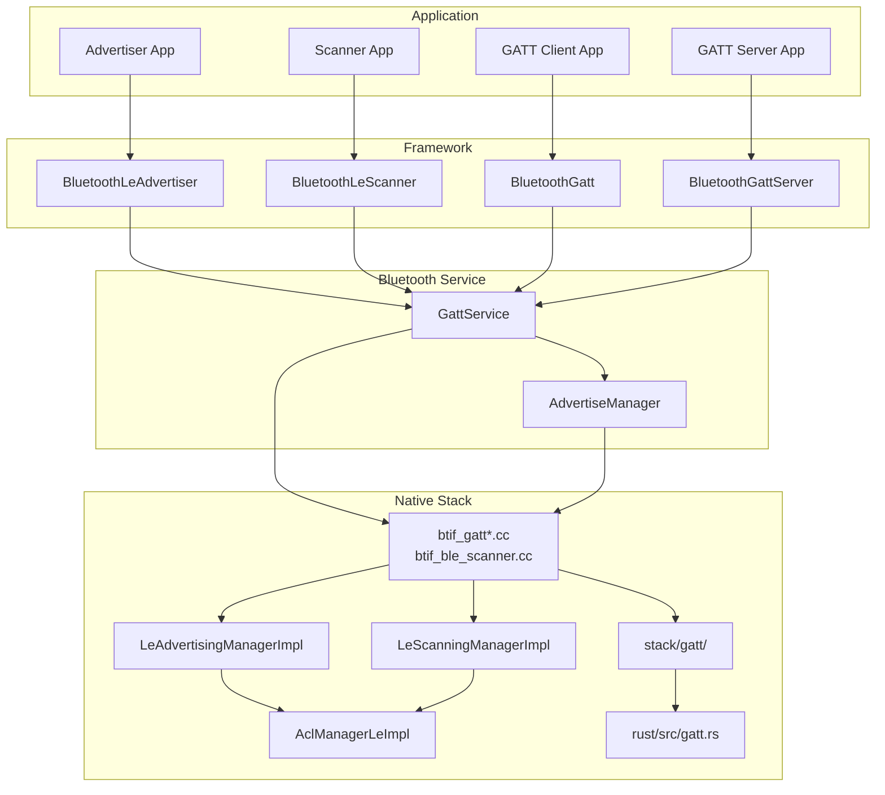

### 37.4.2 BLE Advertising

BLE advertising makes a device discoverable to nearby scanners. AOSP supports
both legacy advertising (31-byte PDU) and extended advertising (up to 255 bytes
per fragment, multiple advertising sets).

Source: `packages/modules/Bluetooth/system/gd/hci/le_advertising_manager_impl.h`

```cpp
class LeAdvertisingManagerImpl : public LeAdvertisingManager {
public:
  static constexpr AdvertiserId kInvalidId = 0xFF;
  static constexpr uint16_t kLeMaximumLegacyAdvertisingDataLength = 31;
  static constexpr uint16_t kLeMaximumFragmentLength = 251;
  static constexpr uint16_t kLeMaximumGapDataLength = 255;

  void ExtendedCreateAdvertiser(
      uint8_t client_id, int reg_id, const AdvertisingConfig config,
      common::Callback<void(Address, AddressType)> scan_callback,
      common::Callback<void(ErrorCode, uint8_t, uint8_t)> set_terminated_callback,
      uint16_t duration, uint8_t max_extended_advertising_events,
      os::Handler* handler) override;

  void RegisterAdvertiser(
      common::ContextualOnceCallback<void(uint8_t, AdvertisingStatus)>
          callback) override;
  // ...
};
```

The advertising lifecycle:

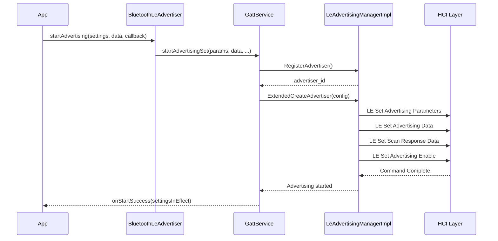

Advertising parameters include:

| Parameter | Description |
|-----------|-------------|
| Advertising interval | Min/max time between advertisements (20 ms - 10.24 s) |
| Advertising type | Connectable, scannable, non-connectable, directed |
| TX power level | Transmission power (-127 to +20 dBm) |
| Primary PHY | 1M, Coded (for extended range) |
| Secondary PHY | 1M, 2M, Coded |
| Advertising SID | Set identifier for extended advertising |
| Own address type | Public, random, RPA |

### 37.4.3 BLE Scanning

BLE scanning discovers nearby advertising devices. AOSP provides sophisticated
filtering capabilities to reduce power consumption.

Source: `packages/modules/Bluetooth/system/gd/hci/le_scanning_manager_impl.h`

```cpp
class LeScanningManagerImpl : public LeScanningManager {
public:
  static constexpr uint8_t kMaxAppNum = 32;

  void RegisterScanner(const Uuid app_uuid) override;
  void Scan(bool start) override;
  void SetScanParameters(LeScanType scan_type, ...) override;
  void SetScanFilterPolicy(LeScanningFilterPolicy filter_policy) override;

  // Hardware-accelerated scan filtering
  void ScanFilterEnable(bool enable) override;
  void ScanFilterParameterSetup(ApcfAction action, uint8_t filter_index,
      AdvertisingFilterParameter advertising_filter_parameter) override;
  void ScanFilterAdd(uint8_t filter_index,
      std::vector<AdvertisingPacketContentFilterCommand> filters) override;

  // Batch scanning for power efficiency
  void BatchScanConfigStorage(uint8_t batch_scan_full_max,
      uint8_t batch_scan_truncated_max,
      uint8_t batch_scan_notify_threshold, ScannerId scanner_id) override;
  void BatchScanEnable(BatchScanMode scan_mode, ...) override;
};
```

AOSP scan modes trade off latency vs. power consumption:

| Scan Mode | Behavior |
|-----------|----------|
| `SCAN_MODE_LOW_POWER` | Scan window ~512 ms every ~5120 ms |
| `SCAN_MODE_BALANCED` | Scan window ~1024 ms every ~4096 ms |
| `SCAN_MODE_LOW_LATENCY` | Continuous scanning |
| `SCAN_MODE_OPPORTUNISTIC` | No own scan; piggyback on other scans |

Scan filter types (APCF -- Android Platform Content Filtering):

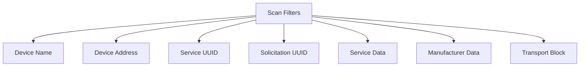

Hardware scan filtering (APCF) offloads filter matching to the Bluetooth
controller, allowing the host processor to sleep while the controller watches
for matching advertisements.

### 37.4.4 GATT Client

The GATT client discovers and interacts with services on remote BLE devices.

Key operations:

1. **Service discovery**: `discoverServices()` enumerates all services,
   characteristics, and descriptors on the remote device
2. **Read/Write**: Read or write characteristic and descriptor values
3. **Notifications/Indications**: Subscribe to value change notifications
4. **MTU negotiation**: Request a larger ATT MTU for efficiency

The GATT protocol stack in native code:

Source: `packages/modules/Bluetooth/system/stack/gatt/`

```
gatt_main.cc   -- GATT module initialization
gatt_api.cc    -- Public API (GATTS_*, GATTC_* functions)
gatt_cl.cc     -- GATT client procedures
gatt_sr.cc     -- GATT server procedures
gatt_db.cc     -- Service database management
gatt_auth.cc   -- Authentication handling
gatt_utils.cc  -- Utility functions
gatt_attr.cc   -- Attribute handling
att_protocol.cc -- ATT protocol PDU handling
```

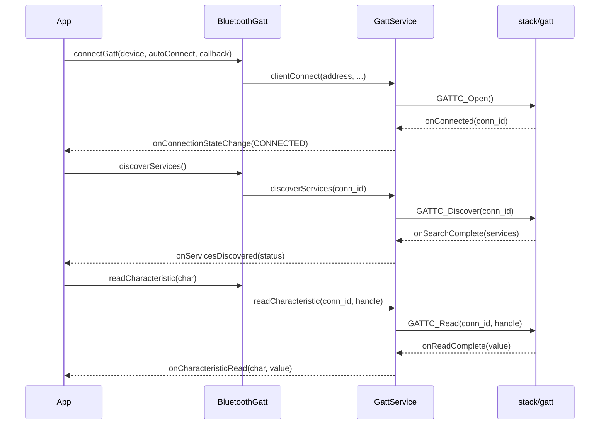

### 37.4.5 GATT Server

The GATT server hosts local services that remote devices can discover and
interact with. Applications use `BluetoothManager.openGattServer()` to create
a server instance.

Source: `packages/modules/Bluetooth/framework/java/android/bluetooth/BluetoothManager.java`

```java
public BluetoothGattServer openGattServer(
        Context context, BluetoothGattServerCallback callback,
        int transport, boolean eattSupport) {
    IBluetoothGatt iGatt = mAdapter.getBluetoothGatt();
    if (iGatt == null) return null;
    BluetoothGattServer mGattServer = new BluetoothGattServer(iGatt, transport, mAdapter);
    Boolean regStatus = mGattServer.registerCallback(callback, eattSupport);
    return regStatus ? mGattServer : null;
}
```

GATT server operations:

- Add services with characteristics and descriptors
- Handle read/write requests from remote clients
- Send notifications/indications to subscribed clients
- Manage multiple simultaneous client connections

The new Rust GATT server (`system/rust/src/gatt.rs`) uses an arbiter to share
the ATT bearer with the C++ implementation, enabling both to coexist on the
same connection.

### 37.4.6 BLE Connection Management

BLE connections use the LE ACL manager in the GD stack:

Source: `packages/modules/Bluetooth/system/gd/hci/acl_manager/`

```
acl_manager_le.h              -- LE ACL manager interface
acl_manager_le_impl.cc        -- LE ACL connection implementation
acl_connection.cc              -- ACL connection base class
acl_scheduler.cc               -- Connection scheduling
```

Connection parameters managed by the stack:

- **Connection interval**: How often the devices communicate (7.5 ms - 4 s)
- **Peripheral latency**: Number of connection events a peripheral can skip
- **Supervision timeout**: Time before a lost connection is declared
- **Connection PHY**: 1M, 2M (faster), or Coded (longer range)

### 37.4.7 LE Address Privacy

BLE uses Resolvable Private Addresses (RPAs) to prevent tracking. The
`LeAddressManager` in GD handles RPA rotation:

Source: `packages/modules/Bluetooth/system/gd/hci/le_address_manager.h`

RPAs are generated from an Identity Resolving Key (IRK) and a random number,
then rotated periodically (typically every 15 minutes). Only devices that
possess the IRK can resolve the RPA back to the device's identity.

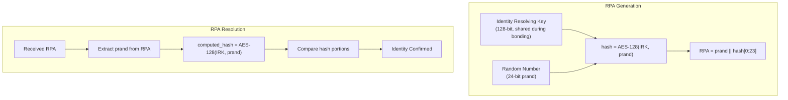

Address types in BLE:

| Type | Description |
|------|-------------|
| Public | Fixed IEEE 802 address (like classic BT) |
| Random Static | Random address, fixed for a power cycle |
| Random Private Resolvable | Rotated periodically, resolvable with IRK |
| Random Private Non-Resolvable | Rotated periodically, cannot be resolved |

The native code in `stack/btm/btm_ble_int.h` provides the low-level BLE
management functions:

Source: `packages/modules/Bluetooth/system/stack/btm/btm_ble_int.h`

```cpp
void btm_ble_init(void);
void btm_ble_free();
void btm_ble_connected(const RawAddress& bda, uint16_t handle,
                       uint8_t enc_mode, uint8_t role,
                       tBLE_ADDR_TYPE addr_type, bool addr_matched,
                       bool can_read_discoverable_characteristics);
tBTM_SEC_DEV_REC* btm_ble_resolve_random_addr(const RawAddress& random_bda);
void btm_ble_scanner_init(void);
void btm_ble_scanner_cleanup(void);
```

### 37.4.8 BLE Framework API Classes

The BLE framework API is organized in the `android.bluetooth.le` package:

Source: `packages/modules/Bluetooth/framework/java/android/bluetooth/le/`

| Class | Purpose |
|-------|---------|
| `BluetoothLeScanner` | Start/stop BLE scans |
| `BluetoothLeAdvertiser` | Start/stop BLE advertising |
| `ScanSettings` | Configure scan parameters (mode, callback type) |
| `ScanFilter` | Filter scan results (name, UUID, address, etc.) |
| `ScanResult` | Represents a discovered BLE device |
| `ScanRecord` | Parsed advertising data |
| `ScanCallback` | Callback for scan events |
| `AdvertiseSettings` | Configure legacy advertising parameters |
| `AdvertisingSetParameters` | Configure extended advertising parameters |
| `AdvertiseData` | Advertising payload data |
| `AdvertiseCallback` | Callback for advertising events |
| `PeriodicAdvertisingManager` | Periodic advertising sync |
| `DistanceMeasurementManager` | Channel sounding / ranging |
| `ChannelSoundingParams` | Parameters for distance measurement |

### 37.4.9 EATT (Enhanced ATT)

Bluetooth 5.2 introduced Enhanced ATT, which allows multiple ATT bearers over
a single LE connection. This enables parallel GATT operations without head-of-
line blocking.

Source: `packages/modules/Bluetooth/system/stack/eatt/`

EATT uses L2CAP Credit-Based Flow Control (CoC) channels, with each channel
acting as an independent ATT bearer. The `eattSupport` parameter in
`BluetoothManager.openGattServer()` controls whether the server uses EATT
for notifications.

---

## 37.5 Bluetooth HAL

### 37.5.1 HAL Interface Design

The Bluetooth HAL provides a clean boundary between the vendor-specific
controller firmware and the generic AOSP Bluetooth stack. The interface operates
at the HCI (Host Controller Interface) level, dealing only in HCI packets.

Source: `hardware/interfaces/bluetooth/aidl/android/hardware/bluetooth/IBluetoothHci.aidl`

```java
@VintfStability
interface IBluetoothHci {
    void close();
    void initialize(in IBluetoothHciCallbacks callback);
    void sendAclData(in byte[] data);
    void sendHciCommand(in byte[] command);
    void sendIsoData(in byte[] data);
    void sendScoData(in byte[] data);
}
```

The interface is deliberately minimal -- six methods that cover the complete HCI
transport:

| Method | HCI Packet Type | Direction |
|--------|----------------|-----------|
| `sendHciCommand()` | Command (0x01) | Host -> Controller |
| `sendAclData()` | ACL Data (0x02) | Host -> Controller |
| `sendScoData()` | SCO Data (0x03) | Host -> Controller |
| `sendIsoData()` | ISO Data (0x05) | Host -> Controller |
| `initialize()` | Setup | Host -> Controller |
| `close()` | Teardown | Host -> Controller |

### 37.5.2 HAL Callbacks

The callback interface handles packets from the controller to the host:

Source: `hardware/interfaces/bluetooth/aidl/android/hardware/bluetooth/IBluetoothHciCallbacks.aidl`

```java
@VintfStability
interface IBluetoothHciCallbacks {
    void aclDataReceived(in byte[] data);
    void hciEventReceived(in byte[] event);
    void initializationComplete(in Status status);
    void isoDataReceived(in byte[] data);
    void scoDataReceived(in byte[] data);
}
```

### 37.5.3 HAL Status Codes

Source: `hardware/interfaces/bluetooth/aidl/android/hardware/bluetooth/Status.aidl`

```java
@VintfStability
@Backing(type="int")
enum Status {
    SUCCESS,
    ALREADY_INITIALIZED,
    UNABLE_TO_OPEN_INTERFACE,
    HARDWARE_INITIALIZATION_ERROR,
    UNKNOWN,
}
```

### 37.5.4 AIDL Backend Implementation

The GD stack connects to the HAL via the AIDL backend:

Source: `packages/modules/Bluetooth/system/gd/hal/hci_backend_aidl.cc`

```cpp
class AidlHci : public HciBackend {
public:
  AidlHci(const char* service_name) {
    ::ndk::SpAIBinder binder(AServiceManager_waitForService(service_name));
    hci_ = aidl::android::hardware::bluetooth::IBluetoothHci::fromBinder(binder);

    // Set up death recipient to detect HAL crashes
    death_recipient_ = ::ndk::ScopedAIBinder_DeathRecipient(
        AIBinder_DeathRecipient_new([](void*) {
          log::error("The Bluetooth HAL service died.");
          log::fatal("The Bluetooth HAL died.");
        }));
    AIBinder_linkToDeath(hci_->asBinder().get(), death_recipient_.get(), this);
  }
  // ...
};
```

The AIDL service name used to connect to the HAL:

```cpp
static constexpr char kBluetoothAidlHalInterfaceName[] =
    "android.hardware.bluetooth.IBluetoothHci";
```

The `AidlHciCallbacks` class bridges HAL callbacks into the GD stack:

```cpp
class AidlHciCallbacks : public BnBluetoothHciCallbacks {
public:
  AidlHciCallbacks(std::shared_ptr<HciBackendCallbacks> callbacks)
      : callbacks_(callbacks) {}

  ::ndk::ScopedAStatus initializationComplete(AidlStatus status) override {
    log::assert_that(status == AidlStatus::SUCCESS, "...");
    callbacks_->initializationComplete();
    return ::ndk::ScopedAStatus::ok();
  }

  ::ndk::ScopedAStatus hciEventReceived(const std::vector<uint8_t>& packet) override {
    callbacks_->hciEventReceived(packet);
    return ::ndk::ScopedAStatus::ok();
  }
  // ... aclDataReceived, scoDataReceived, isoDataReceived
};
```

### 37.5.5 HCI Packet Flow

The complete packet flow through the stack:

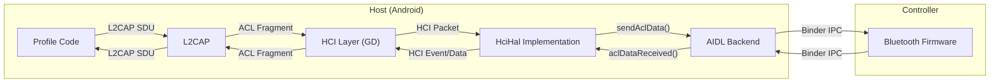

### 37.5.6 Bluetooth Audio HAL

In addition to the HCI HAL, Bluetooth audio uses a separate Audio HAL interface
for streaming audio data. This is particularly important for A2DP and LE Audio.

Source: `hardware/interfaces/bluetooth/audio/aidl/`

The Bluetooth Audio HAL supports multiple session types:

- A2DP software encoding/decoding
- A2DP hardware offload encoding/decoding
- LE Audio software encoding/decoding
- LE Audio hardware offload
- LE Audio broadcast
- HFP software encoding/decoding

The audio data flows through a Fast Message Queue (FMQ) shared between the
Bluetooth stack and the Audio HAL, avoiding the overhead of Binder IPC for
bulk audio data transfer.

### 37.5.7 Snoop Logger

The HAL layer includes a snoop logger that captures all HCI traffic for
debugging:

Source: `packages/modules/Bluetooth/system/gd/hal/snoop_logger.h`

Snoop logging modes (configured via developer options):

| Mode | Constant | Description |
|------|----------|-------------|
| Disabled | `BT_SNOOP_LOG_MODE_DISABLED` | No logging |
| Filtered | `BT_SNOOP_LOG_MODE_FILTERED` | Log headers only, strip data |
| Full | `BT_SNOOP_LOG_MODE_FULL` | Complete packet capture |

The snoop log is written in BTSnoop format, compatible with Wireshark for
analysis.

---

## 37.6 Pairing and Bonding

### 37.6.1 Pairing vs. Bonding

**Pairing** is the process of establishing a temporary security relationship
between two devices. It involves authentication and key generation.

**Bonding** extends pairing by storing the generated keys persistently, so
devices can reconnect securely without re-pairing.

### 37.6.2 Security Manager Protocol (SMP)

SMP handles the pairing process for BLE connections. The implementation is in
the `stack/smp/` directory.

Source: `packages/modules/Bluetooth/system/stack/smp/smp_int.h`

#### Association Models

SMP defines multiple pairing methods based on the I/O capabilities of each
device:

```cpp
typedef enum : uint8_t {
  /* Legacy mode */
  SMP_MODEL_ENCRYPTION_ONLY = 0,        /* Just Works */
  SMP_MODEL_PASSKEY = 1,                /* Passkey Entry (input) */
  SMP_MODEL_OOB = 2,                    /* Out of Band */
  SMP_MODEL_KEY_NOTIF = 3,              /* Passkey Entry (display) */
  /* Secure Connections mode */
  SMP_MODEL_SEC_CONN_JUSTWORKS = 4,     /* Just Works (SC) */
  SMP_MODEL_SEC_CONN_NUM_COMP = 5,      /* Numeric Comparison */
  SMP_MODEL_SEC_CONN_PASSKEY_ENT = 6,   /* Passkey Entry (SC) */
  SMP_MODEL_SEC_CONN_PASSKEY_DISP = 7,  /* Passkey Display (SC) */
  SMP_MODEL_SEC_CONN_OOB = 8,           /* OOB (SC) */
} tSMP_ASSO_MODEL;
```

The association model is selected based on the I/O capability exchange:

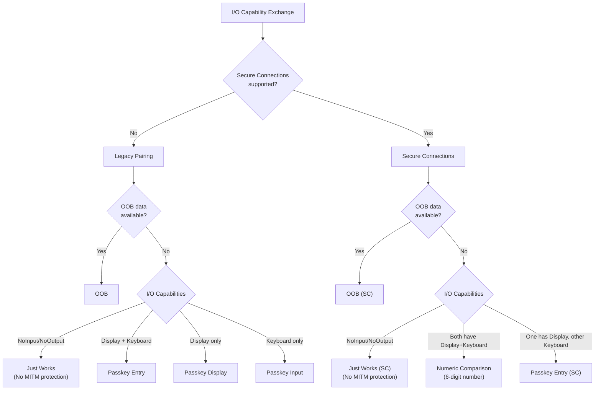

#### SMP State Machine

Source: `packages/modules/Bluetooth/system/stack/smp/smp_main.cc`

The SMP state machine has 17 states:

```cpp
const char* const smp_state_name[] = {
    "SMP_STATE_IDLE",
    "SMP_STATE_WAIT_APP_RSP",
    "SMP_STATE_SEC_REQ_PENDING",
    "SMP_STATE_PAIR_REQ_RSP",
    "SMP_STATE_WAIT_CONFIRM",
    "SMP_STATE_CONFIRM",
    "SMP_STATE_RAND",
    "SMP_STATE_PUBLIC_KEY_EXCH",
    "SMP_STATE_SEC_CONN_PHS1_START",
    "SMP_STATE_WAIT_COMMITMENT",
    "SMP_STATE_WAIT_NONCE",
    "SMP_STATE_SEC_CONN_PHS2_START",
    "SMP_STATE_WAIT_DHK_CHECK",
    "SMP_STATE_DHK_CHECK",
    "SMP_STATE_ENCRYPTION_PENDING",
    "SMP_STATE_BOND_PENDING",
    "SMP_STATE_CREATE_LOCAL_SEC_CONN_OOB_DATA",
    "SMP_STATE_MAX"
};
```

And 41 events that drive transitions:

```cpp
const char* const smp_event_name[] = {
    "PAIRING_REQ_EVT",
    "PAIRING_RSP_EVT",
    "CONFIRM_EVT",
    "RAND_EVT",
    "PAIRING_FAILED_EVT",
    "ENC_INFO_EVT",
    "CENTRAL_ID_EVT",
    "ID_INFO_EVT",
    "ID_ADDR_EVT",
    "SIGN_INFO_EVT",
    "SECURITY_REQ_EVT",
    "PAIR_PUBLIC_KEY_EVT",
    "PAIR_DHKEY_CHECK_EVT",
    "PAIR_KEYPRESS_NOTIFICATION_EVT",
    "PAIR_COMMITMENT_EVT",
    // ... and more
};
```

#### SMP Commands (OTA Opcodes)

```cpp
typedef enum : uint8_t {
  SMP_OPCODE_PAIRING_REQ      = 0x01,
  SMP_OPCODE_PAIRING_RSP      = 0x02,
  SMP_OPCODE_CONFIRM           = 0x03,
  SMP_OPCODE_RAND              = 0x04,
  SMP_OPCODE_PAIRING_FAILED    = 0x05,
  SMP_OPCODE_ENCRYPT_INFO      = 0x06,
  SMP_OPCODE_CENTRAL_ID        = 0x07,
  SMP_OPCODE_IDENTITY_INFO     = 0x08,
  SMP_OPCODE_ID_ADDR           = 0x09,
  // ...
} tSMP_OPCODE;
```

### 37.6.3 Secure Connections Pairing Flow

Secure Connections (introduced in Bluetooth 4.2) uses ECDH (Elliptic Curve
Diffie-Hellman) for key exchange, providing protection against passive
eavesdropping.

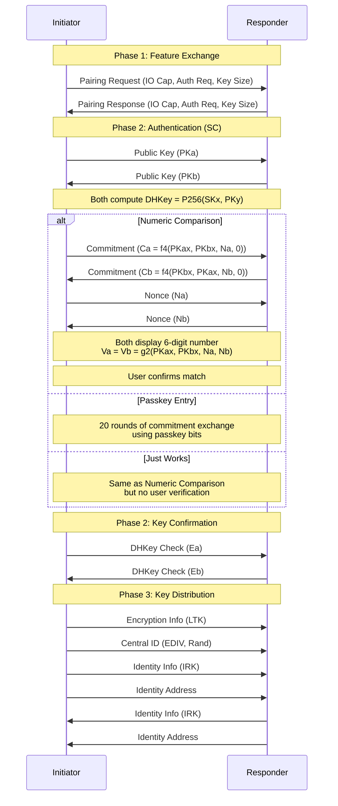

### 37.6.4 Key Distribution

SMP distributes several types of keys during bonding:

| Key | Purpose |
|-----|---------|
| **LTK** (Long Term Key) | Encrypts future connections |
| **IRK** (Identity Resolving Key) | Resolves Resolvable Private Addresses |
| **CSRK** (Connection Signature Resolving Key) | Signs unencrypted data |
| **Link Key** (BR/EDR) | Cross-transport key derivation |

Source: `packages/modules/Bluetooth/system/stack/smp/smp_act.cc`

```cpp
const tSMP_ACT smp_distribute_act[] = {
    smp_generate_ltk,        /* SMP_SEC_KEY_TYPE_ENC  */
    smp_send_id_info,        /* SMP_SEC_KEY_TYPE_ID   */
    smp_generate_csrk,       /* SMP_SEC_KEY_TYPE_CSRK */
    smp_set_derive_link_key  /* SMP_SEC_KEY_TYPE_LK   */
};
```

### 37.6.5 Classic Bluetooth Pairing

Classic Bluetooth uses a different pairing mechanism managed by the Bluetooth
Manager (BTM) layer in `stack/btm/`. The Secure Simple Pairing (SSP) protocol
supports:

1. **Numeric Comparison**: Both devices display a 6-digit number; user confirms
   they match
2. **Passkey Entry**: User enters a passkey displayed on one device into the
   other
3. **Just Works**: Automatic pairing with no user interaction (no MITM
   protection)
4. **Out of Band (OOB)**: Key exchange via an alternate channel (NFC, QR code)

### 37.6.6 Bond State Management

The Device Manager (`btif_dm.cc`) coordinates the pairing process between the
Java layer and the native stack:

Source: `packages/modules/Bluetooth/system/btif/src/btif_dm.cc`

Bond state transitions are broadcast to applications:

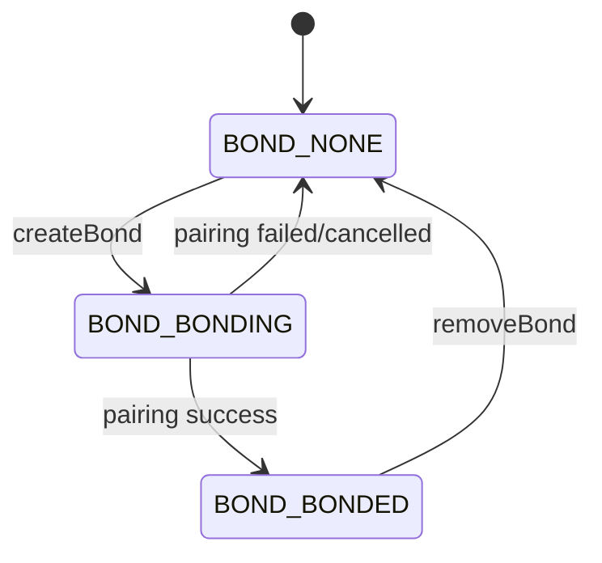

### 37.6.7 Key Storage

Bonding keys are stored persistently in the Bluetooth config file
(`/data/misc/bluedroid/bt_config.conf` or through the GD storage module).

Source: `packages/modules/Bluetooth/system/gd/storage/`

The storage module manages:

- Per-device sections identified by Bluetooth address
- Key material (LTK, IRK, CSRK, Link Key)
- Device properties (name, class, type, features)
- Profile-specific data (GATT cache, HFP version, AVRCP features)

Key storage uses the `BluetoothKeystoreService` for secure key management:

Source: `packages/modules/Bluetooth/android/app/src/com/android/bluetooth/btservice/bluetoothkeystore/BluetoothKeystoreService.java`

The storage keys are defined in a centralized header:

Source: `packages/modules/Bluetooth/system/gd/storage/config_keys.h`

```cpp
#define BTIF_STORAGE_SECTION_ADAPTER "Adapter"
#define BTIF_STORAGE_KEY_ADDR_TYPE "AddrType"
#define BTIF_STORAGE_KEY_ADDRESS "Address"
#define BTIF_STORAGE_KEY_ALIAS "Aliase"
#define BTIF_STORAGE_KEY_DEV_CLASS "DevClass"
#define BTIF_STORAGE_KEY_DEV_TYPE "DevType"
#define BTIF_STORAGE_KEY_HFP_VERSION "HfpVersion"
#define BTIF_STORAGE_KEY_GATT_CLIENT_DB_HASH "GattClientDatabaseHash"
#define BTIF_STORAGE_KEY_GATT_CLIENT_SUPPORTED "GattClientSupportedFeatures"
#define BTIF_STORAGE_KEY_HID_DESCRIPTOR "HidDescriptor"
// ... many more per-profile keys
```

The config file uses a simple INI-style format where each bonded device has
its own section:

```ini
[Adapter]
Address = AA:BB:CC:DD:EE:FF
DiscoveryTimeout = 120

[11:22:33:44:55:66]
Name = MyHeadphones
DevClass = 240404
DevType = 1
AddrType = 0
Aliase = User-Friendly Name
LinkKey = 0123456789abcdef0123456789abcdef
LinkKeyType = 4
PinLength = 0
HfpVersion = 263
AvrcpControllerVersion = 259
GattClientSupportedFeatures = 03
```

### 37.6.8 Cross-Transport Key Derivation

Bluetooth 4.2 introduced Cross-Transport Key Derivation (CTKD), which allows
a device that bonds over one transport (LE or BR/EDR) to automatically derive
keys for the other transport. This means a single pairing operation can secure
both classic and BLE connections.

The SMP state machine handles CTKD via the `SMP_SEC_KEY_TYPE_LK` key type,
using the `smp_set_derive_link_key` action to generate a BR/EDR Link Key from
the LE LTK.

### 37.6.9 Security Levels

Bluetooth defines multiple security levels:

| Level | Name | Authentication | Encryption | Requirements |
|-------|------|----------------|------------|--------------|
| 1 | No Security | No | No | None |
| 2 | Unauthenticated | No | Yes | Encryption only |
| 3 | Authenticated | Yes | Yes | MITM protection |
| 4 | Authenticated (SC) | Yes | Yes | Secure Connections + MITM |

Services can specify their required security level. For example, a payment
service would require Level 4, while a generic data service might accept
Level 2.

---

## 37.7 Bluetooth Audio

### 37.7.1 Audio Architecture Overview

Bluetooth audio in AOSP involves three major subsystems: the Bluetooth stack
(codec negotiation, stream management), the Audio HAL (audio data path), and
AudioFlinger (Android's audio server).

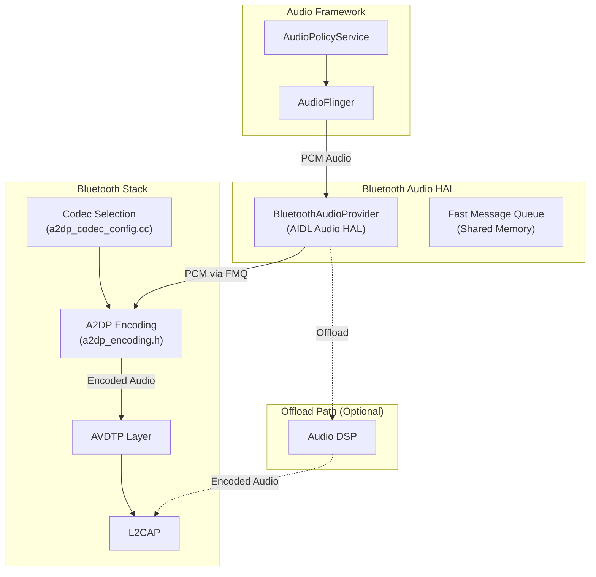

### 37.7.2 A2DP Codec Negotiation

A2DP codec selection is a multi-step process involving capability exchange,
user preferences, and hardware support.

Source: `packages/modules/Bluetooth/system/stack/a2dp/a2dp_codec_config.cc`

The codec framework supports both standard and vendor-specific codecs:

```cpp
#include "a2dp_aac.h"
#include "a2dp_sbc.h"
#include "a2dp_vendor.h"
#include "a2dp_vendor_aptx_constants.h"
#include "a2dp_vendor_aptx_hd_constants.h"
#include "a2dp_vendor_ldac_constants.h"

#if !defined(EXCLUDE_NONSTANDARD_CODECS)
#include "a2dp_vendor_aptx.h"
#include "a2dp_vendor_aptx_hd.h"
#include "a2dp_vendor_ldac.h"
#include "a2dp_vendor_opus.h"
#endif
```

Codec identification from OTA capabilities:

```cpp
std::optional<CodecId> ParseCodecId(uint8_t const media_codec_capabilities[]) {
  tA2DP_CODEC_TYPE codec_type = A2DP_GetCodecType(media_codec_capabilities);
  switch (codec_type) {
    case A2DP_MEDIA_CT_SBC:
      return CodecId::SBC;
    case A2DP_MEDIA_CT_AAC:
      return CodecId::AAC;
    case A2DP_MEDIA_CT_NON_A2DP: {
      uint32_t vendor_id = A2DP_VendorCodecGetVendorId(media_codec_capabilities);
      uint16_t codec_id = A2DP_VendorCodecGetCodecId(media_codec_capabilities);
      return static_cast<CodecId>(
          VendorCodecId(static_cast<uint16_t>(vendor_id), codec_id));
    }
    default: return std::nullopt;
  }
}
```

### 37.7.3 Supported A2DP Codecs

| Codec | Type | Bitrate | Features |
|-------|------|---------|----------|
| **SBC** | Mandatory | 198-345 kbps | Universal compatibility |
| **AAC** | Standard | Up to 320 kbps | Better quality at same bitrate as SBC |
| **aptX** | Vendor (Qualcomm) | 352 kbps | Low latency, better quality |
| **aptX HD** | Vendor (Qualcomm) | 576 kbps | 24-bit high-resolution audio |
| **LDAC** | Vendor (Sony) | 330/660/990 kbps | Highest quality, adaptive bitrate |
| **Opus** | Vendor | Variable | Open-source, versatile |
| **LC3** | Standard (LE Audio) | Variable | New standard for LE Audio |

Each codec has its own source files:

Source: `packages/modules/Bluetooth/system/stack/a2dp/`

```
a2dp_sbc.cc                  -- SBC codec handling
a2dp_sbc_encoder.cc          -- SBC encoding
a2dp_aac.cc                  -- AAC codec handling
a2dp_aac_encoder.cc          -- AAC encoding
a2dp_vendor_aptx.cc          -- aptX codec handling
a2dp_vendor_aptx_encoder.cc  -- aptX encoding
a2dp_vendor_aptx_hd.cc       -- aptX HD codec handling
a2dp_vendor_aptx_hd_encoder.cc -- aptX HD encoding
a2dp_vendor_ldac.cc          -- LDAC codec handling
a2dp_vendor_ldac_encoder.cc  -- LDAC encoding
a2dp_vendor_opus.cc          -- Opus codec handling
a2dp_vendor_opus_encoder.cc  -- Opus encoding
```

### 37.7.4 Codec Negotiation Flow

```mermaid
sequenceDiagram
    participant SRC as Source (Phone)
    participant SNK as Sink (Headphones)
    participant HAL as Audio HAL

    Note over SRC,SNK: AVDTP Signaling
    SRC->>SNK: Discover (get SEPs)
    SNK-->>SRC: SEP list with capabilities

    SRC->>HAL: get_a2dp_configuration(remote_seps, user_prefs)
    HAL-->>SRC: Best codec configuration

    SRC->>SNK: Set Configuration (selected codec)
    SNK-->>SRC: Accept

    SRC->>SNK: Open Stream
    SNK-->>SRC: Accept

    SRC->>SNK: Start Stream
    SNK-->>SRC: Accept

    Note over SRC,SNK: Audio Streaming
    SRC->>SNK: Media Packets (encoded audio)
```

The Audio HAL participates in codec selection through the provider interface:

Source: `packages/modules/Bluetooth/system/audio_hal_interface/a2dp_encoding.h`

```cpp
namespace bluetooth::audio::a2dp::provider {

// Query the codec selection from the audio HAL.
// The HAL picks the best audio configuration based on remote SEPs.
std::optional<a2dp_configuration> get_a2dp_configuration(
    RawAddress peer_address,
    std::vector<a2dp_remote_capabilities> const& remote_seps,
    btav_a2dp_codec_config_t const& user_preferences,
    ::bluetooth::a2dp::CodecId user_preferred_codec_id);

// Query the codec parameters from the audio HAL.
tA2DP_STATUS parse_a2dp_configuration(
    ::bluetooth::a2dp::CodecId codec_id,
    const uint8_t* codec_info,
    btav_a2dp_codec_config_t* codec_parameters,
    std::vector<uint8_t>* vendor_specific_parameters);

}  // namespace provider
```

### 37.7.5 Software vs. Hardware Offload Encoding

AOSP supports two audio data paths:

**Software Encoding**: PCM audio flows from AudioFlinger through the Bluetooth
Audio HAL's FMQ to the Bluetooth stack, which encodes it using a software codec
(SBC, AAC, LDAC, etc.) and sends the encoded data over L2CAP.

**Hardware Offload**: PCM audio is routed directly from the audio DSP to the
Bluetooth controller's hardware encoder, bypassing the host CPU. This reduces
power consumption and latency.

Source: `packages/modules/Bluetooth/system/audio_hal_interface/a2dp_encoding.h`

```cpp
// Check if new bluetooth_audio is running with offloading encoders
bool is_hal_offloading();

// Initialize BluetoothAudio HAL: openProvider
bool init(bluetooth::common::MessageLoopThread* message_loop,
          StreamCallbacks const* stream_callbacks, bool offload_enabled);
```

The `StreamCallbacks` interface manages the audio lifecycle:

```cpp
class StreamCallbacks {
public:
  virtual Status StartStream(bool low_latency) const { return Status::FAILURE; }
  virtual Status SuspendStream() const { return Status::FAILURE; }
  virtual Status StopStream() const { return SuspendStream(); }
  virtual Status SetLatencyMode(bool low_latency) const { return Status::FAILURE; }
};
```

### 37.7.6 Audio HAL AIDL Interface

The Bluetooth Audio HAL uses AIDL interfaces for communication:

Source: `packages/modules/Bluetooth/system/audio_hal_interface/aidl/`

```
client_interface_aidl.h          -- Client interface to Audio HAL
client_interface_aidl.cc         -- Implementation
bluetooth_audio_port_impl.h     -- Audio port implementation
bluetooth_audio_port_impl.cc    -- Port callbacks
a2dp/                            -- A2DP-specific audio handling
le_audio_software_aidl.h        -- LE Audio software encoding
le_audio_software_aidl.cc       -- Implementation
hfp_client_interface_aidl.h     -- HFP audio interface
hfp_client_interface_aidl.cc    -- Implementation
hearing_aid_software_encoding_aidl.h -- Hearing aid audio
```

### 37.7.7 Audio Routing Integration

When a Bluetooth audio device is connected, the audio policy service routes
audio to it. `A2dpService` registers with the `AudioManager` for device
callbacks:

Source: `packages/modules/Bluetooth/android/app/src/com/android/bluetooth/a2dp/A2dpService.java`

```java
public class A2dpService extends ConnectableProfile {
    private final AudioManager mAudioManager;
    private final AudioManagerAudioDeviceCallback mAudioManagerAudioDeviceCallback =
            new AudioManagerAudioDeviceCallback();

    // The active device is the one currently receiving audio
    @GuardedBy("mStateMachines")
    private BluetoothDevice mActiveDevice;
}
```

The complete audio routing chain:

```mermaid
graph LR
    subgraph "Audio Source"
        MEDIA["Media Player"]
    end

    subgraph "Audio Framework"
        AT["AudioTrack"]
        AF["AudioFlinger"]
        APS["AudioPolicyService"]
    end

    subgraph "Bluetooth Audio HAL"
        PROVIDER["IBluetoothAudioProvider"]
        PORT["IBluetoothAudioPort"]
    end

    subgraph "Bluetooth Stack"
        A2DP["A2DP Encoder"]
        AVDTP["AVDTP"]
    end

    subgraph "Transport"
        L2CAP["L2CAP"]
        HCI["HCI ACL"]
    end

    MEDIA --> AT
    AT --> AF
    APS -->|"Route to BT"| AF
    AF --> PROVIDER
    PROVIDER -->|"FMQ (PCM)"| PORT
    PORT --> A2DP
    A2DP -->|"Encoded frames"| AVDTP
    AVDTP --> L2CAP
    L2CAP --> HCI
```

### 37.7.8 LE Audio

LE Audio represents a generational leap in Bluetooth audio, introducing:

- **LC3 codec**: Mandatory codec with better quality than SBC at half the
  bitrate
- **Multi-stream audio**: Independent streams to left/right earbuds
- **Broadcast audio**: Auracast -- one source, many listeners
- **Isochronous channels**: Guaranteed timing for audio delivery

Source: `packages/modules/Bluetooth/android/app/src/com/android/bluetooth/le_audio/LeAudioService.java`

LE Audio uses Connected Isochronous Streams (CIS) for point-to-point audio and
Broadcast Isochronous Streams (BIS) for one-to-many broadcast.

The native audio interfaces for LE Audio:

Source: `packages/modules/Bluetooth/system/audio_hal_interface/`

```
le_audio_software.h          -- LE Audio software encoding interface
le_audio_software.cc         -- Implementation
le_audio_software_aidl.h     -- AIDL-based implementation
le_audio_software_aidl.cc    -- Implementation
```

### 37.7.9 HFP Audio

HFP audio uses SCO (Synchronous Connection-Oriented) links for voice calls.
The HFP client interface manages the audio connection:

Source: `packages/modules/Bluetooth/system/audio_hal_interface/hfp_client_interface.h`

HFP audio supports:

- **CVSD**: Narrowband codec (8 kHz, mandatory)
- **mSBC**: Wideband codec (16 kHz, optional but widely supported)
- **LC3**: Super wideband codec (32 kHz, new in Bluetooth 5.3)

#### SCO vs. ISO for Voice

Classic HFP uses SCO links for bidirectional voice audio. SCO provides:

- Fixed 64 kbps bandwidth
- Guaranteed periodic time slots
- Low latency (~10 ms)

LE Audio uses ISO (Isochronous) channels instead, which provide:

- Variable bandwidth
- Better error resilience
- Support for multiple streams
- Broadcast capability

### 37.7.10 Audio Latency and Quality

Bluetooth audio involves inherent latency from encoding, buffering, and
wireless transmission. AOSP provides mechanisms to minimize this:

Source: `packages/modules/Bluetooth/system/audio_hal_interface/a2dp_encoding.h`

```cpp
// Set low latency buffer mode allowed or disallowed
void set_audio_low_latency_mode_allowed(bool allowed);
```

Typical latency ranges:

| Transport | Codec | Typical Latency |
|-----------|-------|----------------|
| A2DP | SBC | 150-250 ms |
| A2DP | aptX Low Latency | 40-80 ms |
| A2DP | AAC | 100-200 ms |
| LE Audio | LC3 | 20-40 ms |
| HFP | mSBC | 30-50 ms |

The Dynamic Audio Buffer feature (DAB) allows runtime adjustment of buffer
sizes:

```cpp
virtual uint32_t GetDabSupportedCodecs() const override;
virtual const std::array<DynamicAudioBufferCodecCapability, 32>&
    GetDabCodecCapabilities() const override;
virtual void SetDabAudioBufferTime(uint16_t buffer_time_ms) override;
```

### 37.7.11 Codec Extensibility

AOSP supports hardware-defined codec extensions through the Audio HAL provider:

Source: `packages/modules/Bluetooth/system/audio_hal_interface/aidl/provider_info.h`

This allows SoC vendors to add proprietary codecs without modifying the
Bluetooth stack. The provider reports its supported codecs, and the stack
queries the provider during codec negotiation to determine if a hardware-
accelerated codec is available for the connected device.

---

## 37.8 Try It

This section provides practical exercises for exploring the Bluetooth stack.

### 37.8.1 Inspecting Bluetooth State via ADB

Check the current Bluetooth adapter state:

```bash
# Check if Bluetooth is enabled
adb shell settings get global bluetooth_on

# Get the Bluetooth adapter address
adb shell settings get secure bluetooth_address

# Dump Bluetooth service state
adb shell dumpsys bluetooth_manager

# Dump detailed adapter service information
adb shell dumpsys bluetooth_manager AdapterService
```

### 37.8.2 Capturing HCI Logs

Enable full HCI snoop logging for analysis:

```bash
# Enable HCI snoop log via developer options
adb shell setprop persist.bluetooth.btsnooplogmode full

# Restart Bluetooth to apply
adb shell svc bluetooth disable
adb shell svc bluetooth enable

# Pull the snoop log
adb pull /data/misc/bluetooth/logs/btsnoop_hci.log

# Open in Wireshark
wireshark btsnoop_hci.log
```

### 37.8.3 Listing Bonded Devices

Use the `bt_config.conf` file to inspect stored bonding information:

```bash
# View the Bluetooth config file (requires root)
adb root
adb shell cat /data/misc/bluedroid/bt_config.conf
```

The config file uses INI format with per-device sections:

```ini
[Adapter]
Address = AA:BB:CC:DD:EE:FF
DiscoveryTimeout = 120

[11:22:33:44:55:66]
Name = MyHeadphones
DevClass = 240404
DevType = 1
AddrType = 0
LinkKey = 0123456789abcdef0123456789abcdef
LinkKeyType = 4
```

### 37.8.4 Exploring Profile Connections

Query active Bluetooth profile connections:

```bash
# List connected A2DP devices
adb shell dumpsys bluetooth_manager A2dpService

# List connected HFP devices
adb shell dumpsys bluetooth_manager HeadsetService

# List GATT connections
adb shell dumpsys bluetooth_manager GattService
```

### 37.8.5 BLE Scanning from the Command Line

Use the `btmgmt` or `bluetoothctl` tools (available in AOSP eng builds) for
low-level BLE operations:

```bash
# Using Android's internal BLE scanning (requires root)
adb root
adb shell cmd bluetooth_manager le-scan start
# Observe logcat for scan results:
adb logcat -s BtGatt.ScanManager
```

### 37.8.6 Monitoring Bluetooth Events

Watch Bluetooth state changes and profile events in real time:

```bash
# Filter logcat for Bluetooth events
adb logcat -s BluetoothAdapter BluetoothManagerService \
    BluetoothService AdapterService bt_btif_core

# Monitor SMP pairing
adb logcat -s smp bt_btif_dm

# Monitor A2DP codec selection
adb logcat -s bluetooth-a2dp bt_btif_av

# Monitor GATT operations
adb logcat -s BtGatt
```

### 37.8.7 Building and Testing Bluetooth Changes

Build just the Bluetooth module:

```bash
# Build the Bluetooth APEX
m com.android.bt

# Build only the native stack
m libbt-stack

# Build and run Bluetooth unit tests
atest --host bluetooth_test_gd
atest BluetoothInstrumentationTests
```

### 37.8.8 Using the Bluetooth Shell Command

The Bluetooth service exposes a shell interface for testing:

```bash
# Access the Bluetooth shell
adb shell cmd bluetooth_manager

# Example commands:
adb shell cmd bluetooth_manager enable
adb shell cmd bluetooth_manager disable
adb shell cmd bluetooth_manager get-state
```

### 37.8.9 Analyzing A2DP Codec Configuration

Inspect the current A2DP codec configuration:

```bash
# Dump A2DP codec status
adb shell dumpsys bluetooth_manager A2dpService | grep -i codec

# Check codec offload support
adb shell getprop persist.bluetooth.a2dp_offload.disabled
adb shell getprop ro.bluetooth.a2dp_offload.supported
```

### 37.8.10 Writing a Simple BLE Scanner

A minimal BLE scanning application:

```java
public class BleScanActivity extends Activity {
    private BluetoothLeScanner scanner;

    @Override
    protected void onCreate(Bundle savedInstanceState) {
        super.onCreate(savedInstanceState);

        BluetoothManager btManager =
            (BluetoothManager) getSystemService(Context.BLUETOOTH_SERVICE);
        BluetoothAdapter adapter = btManager.getAdapter();
        scanner = adapter.getBluetoothLeScanner();

        ScanSettings settings = new ScanSettings.Builder()
            .setScanMode(ScanSettings.SCAN_MODE_LOW_LATENCY)
            .build();

        // Filter for a specific service UUID
        ScanFilter filter = new ScanFilter.Builder()
            .setServiceUuid(ParcelUuid.fromString(
                "0000180d-0000-1000-8000-00805f9b34fb")) // Heart Rate
            .build();

        scanner.startScan(
            List.of(filter), settings, new ScanCallback() {
                @Override
                public void onScanResult(int callbackType, ScanResult result) {
                    BluetoothDevice device = result.getDevice();
                    int rssi = result.getRssi();
                    Log.d("BLE", "Found: " + device + " RSSI: " + rssi);
                }
            });
    }
}
```

### 37.8.11 Writing a GATT Server

A minimal GATT server that exposes a custom service:

```java
public class GattServerActivity extends Activity {
    private BluetoothGattServer gattServer;

    // Custom service and characteristic UUIDs
    private static final UUID SERVICE_UUID =
        UUID.fromString("12345678-1234-1234-1234-123456789abc");
    private static final UUID CHAR_UUID =
        UUID.fromString("12345678-1234-1234-1234-123456789abd");

    @Override
    protected void onCreate(Bundle savedInstanceState) {
        super.onCreate(savedInstanceState);

        BluetoothManager btManager =
            (BluetoothManager) getSystemService(Context.BLUETOOTH_SERVICE);

        gattServer = btManager.openGattServer(this,
            new BluetoothGattServerCallback() {
                @Override
                public void onConnectionStateChange(
                        BluetoothDevice device, int status, int newState) {
                    Log.d("GATT", "Connection state: " + newState);
                }

                @Override
                public void onCharacteristicReadRequest(
                        BluetoothDevice device, int requestId, int offset,
                        BluetoothGattCharacteristic characteristic) {
                    gattServer.sendResponse(device, requestId,
                        BluetoothGatt.GATT_SUCCESS, 0,
                        "Hello BLE".getBytes());
                }
            });

        // Create service
        BluetoothGattService service = new BluetoothGattService(
            SERVICE_UUID, BluetoothGattService.SERVICE_TYPE_PRIMARY);

        // Create characteristic
        BluetoothGattCharacteristic characteristic =
            new BluetoothGattCharacteristic(CHAR_UUID,
                BluetoothGattCharacteristic.PROPERTY_READ,
                BluetoothGattCharacteristic.PERMISSION_READ);
        service.addCharacteristic(characteristic);

        gattServer.addService(service);
    }
}
```

### 37.8.12 Experimenting with Pandora

AOSP includes the Pandora Bluetooth testing framework, which provides a gRPC-
based interface for automated Bluetooth testing:

Directory: `packages/modules/Bluetooth/pandora/`

Pandora enables programmatic control of Bluetooth operations for conformance
testing, including pairing, profile connections, and data transfer.

### 37.8.13 Tracing the Full Stack

To trace a Bluetooth operation from Java to HCI, enable logging at each layer:

```bash
# Framework layer
adb shell setprop log.tag.BluetoothAdapter VERBOSE

# Service layer
adb shell setprop log.tag.BluetoothManagerService VERBOSE
adb shell setprop log.tag.AdapterService VERBOSE

# Profile layer
adb shell setprop log.tag.A2dpService VERBOSE
adb shell setprop log.tag.HeadsetService VERBOSE

# Native layer
adb shell setprop persist.bluetooth.btsnooplogmode full

# Collect all logs
adb logcat -b all > bluetooth_trace.log
```

### 37.8.14 Understanding the Bluetooth Config File

Inspect and understand the persistent Bluetooth configuration:

```bash
# Location of the config file
adb root
adb shell ls -la /data/misc/bluedroid/bt_config.conf

# Count the number of bonded devices
adb shell grep -c '^\[' /data/misc/bluedroid/bt_config.conf

# List bonded device addresses
adb shell grep '^\[.*:.*:.*\]' /data/misc/bluedroid/bt_config.conf
```

### 37.8.15 Debugging Pairing Issues

When Bluetooth pairing fails, use these debugging techniques:

```bash
# Watch SMP events in real-time
adb logcat -s smp bt_btif_dm bt_smp | grep -E "SMP_STATE|smp_sm_event|pairing"

# Check the HCI snoop log for pairing packets:
# 1. Enable full snoop logging
adb shell setprop persist.bluetooth.btsnooplogmode full
# 2. Reproduce the pairing
# 3. Pull and analyze the log
adb pull /data/misc/bluetooth/logs/btsnoop_hci.log
# 4. Open in Wireshark, filter: "btsmp"
```

Common pairing failure reasons:

- **Timeout** (30 seconds): One device did not respond in time
- **Authentication failure**: Passkey mismatch or user rejection
- **Encryption failure**: Key generation or exchange error
- **Repeated attempts**: Too many failed attempts, device is temporarily blocked

### 37.8.16 Monitoring LE Audio

LE Audio introduces new concepts that can be debugged with specific filters:

```bash
# Monitor LE Audio service
adb logcat -s LeAudioService LeAudioStateMachine

# Monitor broadcast audio
adb logcat -s LeAudioBroadcast BassClientService

# Monitor volume control
adb logcat -s VolumeControlService

# Monitor coordinated sets
adb logcat -s CsipSetCoordinatorService
```

### 37.8.17 Bluetooth System Properties

Key system properties that control Bluetooth behavior:

```bash
# Check all Bluetooth-related properties
adb shell getprop | grep -i bluetooth

# Important properties:
adb shell getprop persist.bluetooth.btsnooplogmode     # Snoop log mode
adb shell getprop persist.bluetooth.a2dp_offload.disabled  # A2DP offload
adb shell getprop ro.bluetooth.a2dp_offload.supported  # Offload support
adb shell getprop bluetooth.profile.a2dp.source.enabled # A2DP source
adb shell getprop bluetooth.profile.hfp.ag.enabled     # HFP AG
adb shell getprop bluetooth.profile.gatt.enabled       # GATT
```

### 37.8.18 Custom Profile Development

To implement a custom Bluetooth profile in an application:

1. **For classic Bluetooth**: Use RFCOMM server sockets:

```java
BluetoothAdapter adapter = BluetoothAdapter.getDefaultAdapter();
UUID MY_UUID = UUID.fromString("fa87c0d0-afac-11de-8a39-0800200c9a66");
BluetoothServerSocket serverSocket =
    adapter.listenUsingRfcommWithServiceRecord("MyService", MY_UUID);

// Accept connections in a background thread
BluetoothSocket socket = serverSocket.accept();
InputStream in = socket.getInputStream();
OutputStream out = socket.getOutputStream();
// ... handle data
```

2. **For BLE**: Use GATT server/client (see Sections 37.8.10 and 37.8.11)

3. **For L2CAP CoC** (Connection-oriented Channels):

```java
// Server side
BluetoothServerSocket l2capServer =
    adapter.listenUsingL2capChannel();
int psm = l2capServer.getPsm(); // Dynamic PSM assigned

// Client side
BluetoothSocket l2capClient =
    device.createL2capChannel(psm);
l2capClient.connect();
```

### 37.8.19 Rootcanal: The Virtual Bluetooth Controller

AOSP includes Rootcanal, a virtual Bluetooth controller for testing on
emulators. Rootcanal simulates a Bluetooth controller without requiring real
hardware, allowing developers to test Bluetooth functionality on the Android
Emulator.

The GD HAL has a specific Rootcanal backend:

Source: `packages/modules/Bluetooth/system/gd/hal/hci_hal_impl_host_rootcanal.cc`

```bash
# Run tests with Rootcanal
atest --host bluetooth_test_gd -- --rootcanal
```

---

## Summary

Android's Bluetooth subsystem is a multi-layered, multi-language stack that
spans from the framework SDK (`BluetoothManager`, `BluetoothAdapter`) through
the system service (`BluetoothManagerService`, `AdapterService`), down through
the native Gabeldorsche/Fluoride C++/Rust stack, to the AIDL HAL that
interfaces with the Bluetooth controller firmware.

Key architectural highlights:

- **Updatable APEX module**: The entire Bluetooth stack ships as `com.android.bt`,
  updatable via Google Play system updates independently of full OTA updates.
- **Gabeldorsche migration**: The native stack is progressively modernizing from
  the legacy Fluoride (Broadcom-derived) architecture to the modular
  Gabeldorsche design, starting with the lowest layers (HCI, ACL) and working
  up.
- **Rust integration**: New components like the GATT server are written in Rust
  for memory safety, coexisting with C++ through FFI bindings and an arbiter
  pattern.
- **AIDL HAL**: The Bluetooth HAL operates at the HCI level, providing a clean
  vendor abstraction with just six methods (`initialize`, `close`, plus four
  send methods for HCI command, ACL, SCO, and ISO packets).
- **Rich profile support**: Over 25 Bluetooth profiles are implemented, from
  classic A2DP/HFP to modern LE Audio with BAP, CSIP, VCP, MCP, and TBS.
- **Hardware offload**: Audio encoding can be offloaded to the SoC's DSP for
  power efficiency, with the Audio HAL providing a separate data path via
  Fast Message Queues.
- **Comprehensive security**: SMP implements all Bluetooth pairing models with
  a 17-state state machine, supporting Legacy and Secure Connections pairing,
  Cross-Transport Key Derivation, and RPA-based privacy.

The Bluetooth codebase demonstrates many AOSP patterns: binder IPC between
framework and service, JNI bridging to native code, state machines for protocol
management (A2DP has 4 states; HFP has 7; SMP has 17), and HAL abstraction for
hardware portability. Understanding this stack provides insight into how Android
manages complex, real-time wireless protocols within its security and permission
framework.

### Key Source Paths

| Component | Path |
|-----------|------|
| Framework API | `packages/modules/Bluetooth/framework/java/android/bluetooth/` |
| BLE API | `packages/modules/Bluetooth/framework/java/android/bluetooth/le/` |
| System Service | `packages/modules/Bluetooth/service/src/` |
| Bluetooth APK | `packages/modules/Bluetooth/android/app/src/com/android/bluetooth/` |
| AdapterService | `packages/modules/Bluetooth/android/app/src/com/android/bluetooth/btservice/` |
| Profile Services | `packages/modules/Bluetooth/android/app/src/com/android/bluetooth/{a2dp,hfp,gatt,...}/` |
| Gabeldorsche (GD) | `packages/modules/Bluetooth/system/gd/` |
| GD HAL | `packages/modules/Bluetooth/system/gd/hal/` |
| GD HCI | `packages/modules/Bluetooth/system/gd/hci/` |
| GD Storage | `packages/modules/Bluetooth/system/gd/storage/` |
| BTIF (JNI Bridge) | `packages/modules/Bluetooth/system/btif/` |
| BTA (App Layer) | `packages/modules/Bluetooth/system/bta/` |
| Stack Core | `packages/modules/Bluetooth/system/stack/` |
| L2CAP | `packages/modules/Bluetooth/system/stack/l2cap/` |
| SMP | `packages/modules/Bluetooth/system/stack/smp/` |
| GATT | `packages/modules/Bluetooth/system/stack/gatt/` |
| A2DP Codecs | `packages/modules/Bluetooth/system/stack/a2dp/` |
| Rust Components | `packages/modules/Bluetooth/system/rust/` |
| Audio HAL Interface | `packages/modules/Bluetooth/system/audio_hal_interface/` |
| Bluetooth AIDL HAL | `hardware/interfaces/bluetooth/aidl/` |
| Bluetooth Audio HAL | `hardware/interfaces/bluetooth/audio/aidl/` |
| APEX Configuration | `packages/modules/Bluetooth/apex/` |
| Floss (Linux) | `packages/modules/Bluetooth/floss/` |
| Pandora Testing | `packages/modules/Bluetooth/pandora/` |

### Further Reading

The Bluetooth specification itself is freely available from the Bluetooth SIG
at https://www.bluetooth.com/specifications/specs/. Key specification documents
relevant to AOSP:

- **Core Specification 5.4**: The foundational Bluetooth specification
  defining the radio, baseband, L2CAP, SDP, GAP, and GATT protocols.
- **A2DP 1.4**: Advanced Audio Distribution Profile specification, defining
  audio streaming procedures and SBC codec requirements.
- **HFP 1.9**: Hands-Free Profile specification with LC3 super wideband
  audio support.
- **AVRCP 1.6.2**: Audio/Video Remote Control Profile with browsing and
  cover art support.
- **LE Audio (BAP, CSIP, VCP, etc.)**: The family of specifications for
  next-generation Bluetooth audio over LE transport.

Within AOSP, the Bluetooth team maintains documentation in:

- `packages/modules/Bluetooth/system/doc/` -- Native stack design documents
- `packages/modules/Bluetooth/system/gd/docs/` -- Gabeldorsche design docs
- `packages/modules/Bluetooth/system/gd/README.md` -- GD overview
