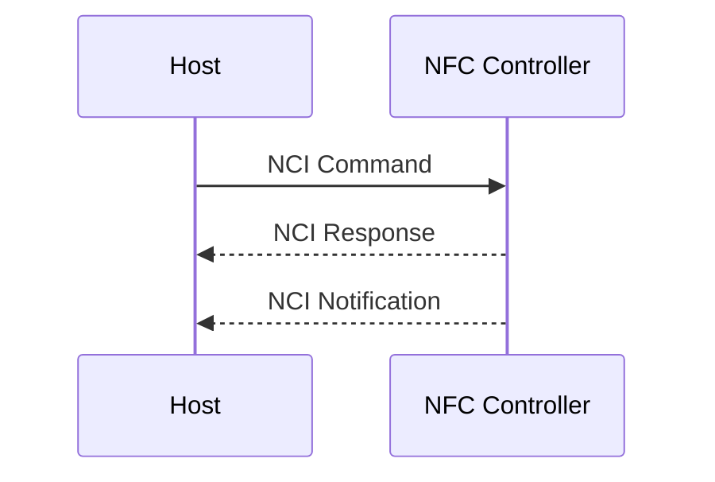
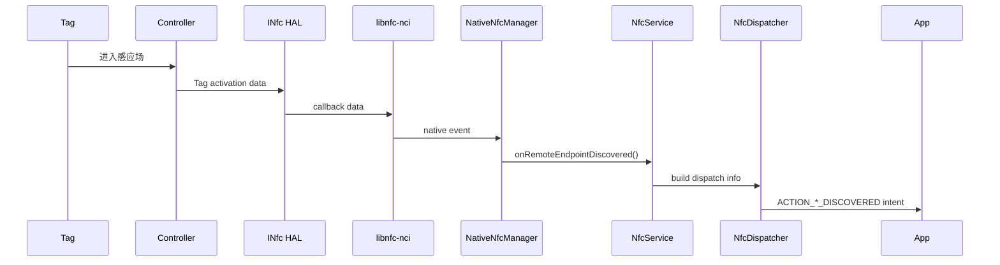
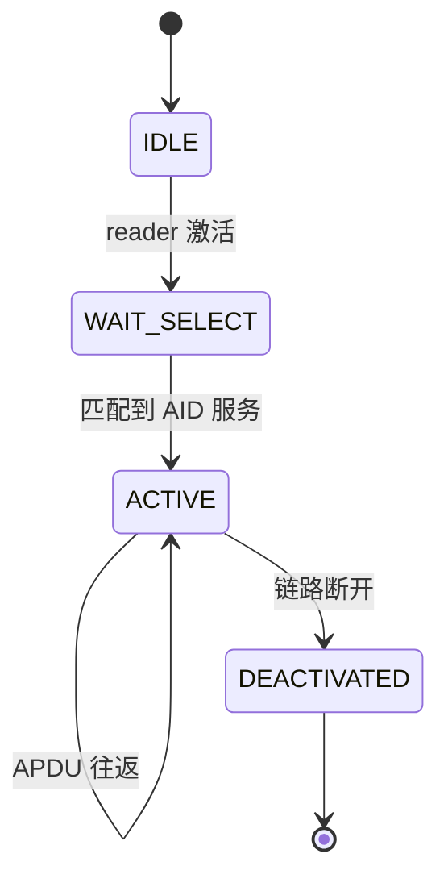

# 第 38 章：NFC 近场通信

> *“NFC 是一种几乎看不见的握手：轻触即可支付、碰一碰即可分享链接、刷一下即可开门。Android 把 13.56 MHz 的短距离无线链路扩展成了一整套平台能力，覆盖标签读写、主机卡模拟、安全元件，以及 FeliCa 等区域性生态。”*

NFC 是 Android 平台里一个很有代表性的“小入口、大系统”子系统。对应用来说，它可能只是 `NfcAdapter`、一个 tag intent，或者一个 `HostApduService`；但在系统内部，它同时牵涉 AIDL HAL、`libnfc-nci`、JNI、`NfcService`、标签分发、AID 路由、SE、Reader Mode 和 HCE。本章按这条链路梳理 Android NFC 栈的关键实现。

---

## 38.1 NFC 架构

### 38.1.1 NFC 是什么

NFC（Near Field Communication，近场通信）工作在 13.56 MHz，典型距离为 0 到 4 厘米。它最大的特征不是吞吐量，而是“物理接近”本身可以成为一种天然交互和认证约束：必须非常靠近，才能完成支付、读卡、配对或门禁交互。

在射频层面，通常由一方产生 RF 场，另一方通过调制这个场完成通信。因此 NFC 很适合：

- 标签读取
- 非接触式卡模拟
- 门禁和票卡
- 短距离设备交互

### 38.1.2 标准与工作模式

Android 中常见的 NFC 技术映射如下：

| 标准 | Android 技术类 | 常见用途 |
|---|---|---|
| ISO 14443-3A | `NfcA` | MIFARE、常见标签 |
| ISO 14443-3B | `NfcB` | 护照、部分交通卡 |
| ISO 14443-4 | `IsoDep` | 智能卡、HCE |
| JIS X 6319-4 | `NfcF` | FeliCa |
| ISO 15693 | `NfcV` | 远距离工业标签 |
| ISO 14443-3A 变体 | `MifareClassic` | 旧门禁卡 |
| ISO 14443-3A 变体 | `MifareUltralight` | 票券等 |

Android 的 NFC 主要工作在三种模式：

1. Reader/Writer 模式：手机作为读写器，读取标签或卡片。
2. Card Emulation 模式：手机表现为卡，可由读卡器读取。
3. Peer-to-Peer 模式：设备间点对点通信。

其中 P2P 曾用于 Android Beam，但该能力已在较新版本中淡出。

### 38.1.3 AOSP NFC 栈分层

下图展示 Android NFC 的主要分层关系。

```mermaid
graph TB
    subgraph "应用层"
        APP["使用 NfcAdapter 的应用"]
        HCE["HostApduService"]
        HCEF["HostNfcFService"]
    end

    subgraph "Framework 层"
        NA["NfcAdapter"]
        NDEF["NdefMessage / NdefRecord"]
        TECH["android.nfc.tech.*"]
        CE["android.nfc.cardemulation.*"]
    end

    subgraph "系统服务"
        NS["NfcService"]
        DISP["NfcDispatcher"]
        CEM["CardEmulationManager"]
        HEM["HostEmulationManager"]
        ARM["AidRoutingManager"]
    end

    subgraph "NCI / JNI"
        NNM["NativeNfcManager"]
        JNI["nfc_nci_jni"]
        LIB["libnfc-nci"]
    end

    subgraph "HAL"
        HAL["INfc AIDL HAL"]
        CB["INfcClientCallback"]
    end

    subgraph "硬件"
        NFCC["NFC Controller"]
        SE["Secure Element"]
    end

    APP --> NA
    HCE --> CE
    HCEF --> CE
    NA --> NS
    NDEF --> NS
    TECH --> NS
    CE --> CEM
    NS --> DISP
    NS --> CEM
    CEM --> HEM
    CEM --> ARM
    NS --> NNM
    NNM --> JNI
    JNI --> LIB
    LIB --> HAL
    HAL --> CB
    HAL --> NFCC
    NFCC --> SE
```

### 38.1.4 关键源码目录

| 目录 | 作用 |
|---|---|
| `packages/modules/Nfc/framework/` | `NfcAdapter`、NDEF、tech 类、card emulation API |
| `packages/modules/Nfc/NfcNci/src/com/android/nfc/` | `NfcService`、`NfcDispatcher` 等核心逻辑 |
| `packages/modules/Nfc/NfcNci/src/com/android/nfc/cardemulation/` | HCE 子系统 |
| `packages/modules/Nfc/NfcNci/nci/src/com/android/nfc/dhimpl/` | `NativeNfcManager` |
| `packages/modules/Nfc/NfcNci/nci/jni/` | JNI 桥 |
| `packages/modules/Nfc/libnfc-nci/` | NCI 协议栈 |
| `hardware/interfaces/nfc/aidl/` | AIDL HAL |
| `packages/modules/Nfc/apex/` | Mainline APEX 打包 |

### 38.1.5 `NfcAdapter`

`NfcAdapter` 位于 `packages/modules/Nfc/framework/java/android/nfc/NfcAdapter.java`，是应用访问 NFC 的主入口。三个最重要的标签分发 intent 常量都定义在这里：

```java
public static final String ACTION_NDEF_DISCOVERED =
        "android.nfc.action.NDEF_DISCOVERED";
public static final String ACTION_TECH_DISCOVERED =
        "android.nfc.action.TECH_DISCOVERED";
public static final String ACTION_TAG_DISCOVERED =
        "android.nfc.action.TAG_DISCOVERED";
```

它提供的关键能力包括：

- `enableReaderMode()` / `disableReaderMode()`
- `enableForegroundDispatch()` / `disableForegroundDispatch()`
- `isEnabled()`
- `ignore()`

### 38.1.6 `NfcService`

`NfcService` 位于 `packages/modules/Nfc/NfcNci/src/com/android/nfc/NfcService.java`，是 NFC 子系统的中心守护进程。它不运行在 `system_server` 中，而是在独立的 `com.android.nfc` 进程中。

它的核心职责包括：

- 初始化和管理 NFC 硬件
- 处理屏幕状态与 polling 行为
- 分发标签到目标应用
- 管理 HCE 和路由表
- 暴露 Binder API 给 `NfcAdapter`

### 38.1.7 NFC HAL

NFC HAL 负责把主机侧 NCI 栈与 vendor 控制器驱动连接起来。当前主接口是 AIDL 的 `android.hardware.nfc.INfc`，为 Mainline 和 VINTF 稳定性服务。

### 38.1.8 NCI

NCI（NFC Controller Interface）是主机和 NFCC 之间的标准协议。AOSP 中对应实现是 `libnfc-nci`。它采用 command / response / notification 模型：



常见 Group ID 包括：

- `0x00`: Core
- `0x01`: RF Management
- `0x02`: NFCEE Management
- `0x0F`: 厂商私有

### 38.1.9 NFC Mainline 模块

较新 Android 版本中，NFC 栈已经作为 Mainline 模块 `com.android.nfcservices` 发布，意味着：

- `NfcNci` APK
- framework 类
- `libnfc-nci`
- JNI 桥

可以作为一个整体通过 Mainline 机制更新。

### 38.1.10 从 RF 场到 Intent 的完整路径



---

## 38.2 `NfcService`

### 38.2.1 服务生命周期

`NfcService` 启动后会初始化：

- `DeviceHost`
- JNI / native manager
- dispatcher
- card emulation 相关对象
- screen state / polling 策略

它既要管理硬件，也要承担上层分发逻辑，因此内部状态很多。

### 38.2.2 `NfcApplication`

`NfcApplication` 是应用进程启动入口，负责拉起 `NfcService` 所需的系统组件和上下文环境。

### 38.2.3 `EnableDisableTask` 状态机

NFC 开关本身就是一个状态机过程，不是单个同步调用。打开或关闭 NFC 时，系统需要：

1. 初始化或停止 HAL
2. 重建或清理路由
3. 更新 polling 与屏幕状态
4. 同步 UI 和 Binder 状态

### 38.2.4 屏幕状态管理

NFC 对屏幕状态非常敏感。常见策略是：

- 屏幕关闭时禁用或收窄 polling
- 解锁后恢复完整发现能力
- 某些安全场景需要 `ON_UNLOCKED`

这也是很多机型“熄屏刷卡行为不同”的根源之一。

### 38.2.5 消息处理器

`NfcService` 通过内部 message handler 串行化大量异步事件：

- Tag discovered
- Reader mode 改变
- HCE 路由变更
- 屏幕状态变更
- Watchdog 恢复

### 38.2.6 标签发现：`onRemoteEndpointDiscovered`

当 native 层发现远端 endpoint 后，`NfcService` 会把底层 tag 信息转换成 Android `Tag` 对象，并交给 `NfcDispatcher` 走后续 intent 分发。

### 38.2.7 `DeviceHost` 与 `DeviceHostListener`

`DeviceHost` 是 Java 侧对底层 NFCC 能力的抽象。`NfcService` 通过 `DeviceHostListener` 接收硬件事件回调。

### 38.2.8 `NativeNfcManager`

`NativeNfcManager` 位于 `.../dhimpl/NativeNfcManager.java`，负责 Java 层与 JNI 层交互。它不是完整协议栈，只是 Java 与 native 之间的重要桥。

### 38.2.9 Reader Mode 内部实现

Reader Mode 的本质不是“只是另一种 API”，而是：

- 为前台 Activity 提供更直接、更独占的读卡路径
- 可关闭普通 dispatch 干扰
- 可精确选择技术掩码

### 38.2.10 路由表管理

NFC 控制器内部路由表用于决定：

- 哪些 AID 走 host
- 哪些 AID 走 eSE / UICC
- 哪些 polling 技术被启用

这部分配置由 `AidRoutingManager`、`CardEmulationManager` 和底层 HAL / config 协同维护。

### 38.2.11 watchdog 与恢复

NFC 栈也会遇到控制器卡死、HAL 无响应或 JNI 异常。`NfcService` 内部会引入 watchdog 和恢复逻辑，必要时重启部分栈或重新初始化 NFCC。

### 38.2.12 Secure NFC

Secure NFC 用于高敏感场景，通常要求设备解锁或满足更严格安全条件才能允许某些 NFC 交互，例如支付或门禁。

---

## 38.3 NFC HAL

### 38.3.1 HIDL 到 AIDL

NFC HAL 也经历了从 HIDL 到 AIDL 的演进。AIDL 版本更适合 Mainline、稳定接口和长期维护。

### 38.3.2 `INfc` AIDL 接口

`INfc.aidl` 的方法基本就是一个 NCI host 所需要的最小集合：

- `open()`
- `close()`
- `coreInitialized()`
- `factoryReset()`
- `getConfig()`
- `powerCycle()`
- `preDiscover()`
- `write()`
- `setEnableVerboseLogging()`
- `isVerboseLoggingEnabled()`
- `controlGranted()`

### 38.3.3 `INfcClientCallback`

callback 用于向上报告：

- NCI 数据
- HAL 生命周期事件
- 状态变化

### 38.3.4 `NfcConfig`

`NfcConfig` 用于承载硬件和路由相关配置，例如：

- 默认路由
- off-host route
- presence check 算法
- poll 技术参数

### 38.3.5 `NfcEvent` 与 `NfcStatus`

这两个枚举用于描述 HAL 事件和调用结果，帮助上层在初始化、关闭、数据收发等阶段判定状态。

### 38.3.6 `NfcCloseType` 与 `PresenceCheckAlgorithm`

`NfcCloseType` 用于控制关闭类型；`PresenceCheckAlgorithm` 决定 reader mode 下如何检查 tag 是否仍在场。

### 38.3.7 `ProtocolDiscoveryConfig`

该配置与 polling discovery 行为密切相关，影响控制器如何扫描和发现不同技术类型。

### 38.3.8 HAL open-write-close 生命周期

NFC HAL 生命周期通常是：

1. `open()`
2. 初始化 controller
3. 多次 `write()` NCI 命令
4. 接收 callback
5. `close()`

### 38.3.9 NCI 数据如何穿过 HAL

NCI 的控制面和数据面最终都通过 HAL 的 `write(byte[])` 下发，再通过 callback 回到 host 栈。

### 38.3.10 `libnfc-nci`

`libnfc-nci` 是 AOSP 中 NCI 协议栈实现的核心 C 库。它处理：

- Core init
- RF discovery
- Activation / deactivation
- NFCEE 管理

### 38.3.11 HAL 的 VTS 测试

NFC HAL 通过 VTS 测试保证 vendor 实现符合接口契约，这对 Mainline 模块和跨版本兼容非常重要。

---

## 38.4 NDEF：NFC 数据交换格式

### 38.4.1 什么是 NDEF

NDEF（NFC Data Exchange Format）是 NFC 中最常见的数据格式，提供统一的 message / record 封装方式，用于在标签和设备之间传递结构化内容。

### 38.4.2 `NdefMessage`

`NdefMessage` 是一个 record 容器，内部包含一个或多个 `NdefRecord`。

### 38.4.3 `NdefRecord`

`NdefRecord` 是最小负载单元，包含：

- TNF
- type
- id
- payload

### 38.4.4 TNF

TNF（Type Name Format）决定 record 的类型解释方式，例如：

- empty
- well-known
- MIME
- absolute URI
- external type

### 38.4.5 常见 RTD 类型

Well-known RTD 常见类型包括：

- URI
- Text
- Smart Poster

### 38.4.6 URI 记录与前缀压缩

URI 记录会对常见前缀做压缩，例如 `https://` 不一定完整存在线上字节流中，以节省 tag 存储空间。

### 38.4.7 文本记录编码

Text record 会包含语言码和编码标志，通常是 UTF-8 或 UTF-16。

### 38.4.8 Smart Poster

Smart Poster 可以视为“复合型 URI 记录”，常同时携带标题、动作、图标等附加信息。

### 38.4.9 MIME 记录

MIME record 允许用标准 MIME 类型来标记 payload，非常适合应用自定义数据交换。

### 38.4.10 External Type 与 Android Application Record

External Type 可用于自定义类型空间。Android Application Record（AAR）则是 Android 生态特有扩展，可帮助系统更直接地把标签关联到某个应用。

### 38.4.11 线上的二进制格式

NDEF 在线上是紧凑二进制格式，包含 MB/ME/SR/IL 等标志位和长度字段，这也是为什么解析和构造 record 时必须严格遵守边界和长度约束。

### 38.4.12 在代码中创建 NDEF 记录

Android 已提供创建常见 record 的辅助 API，因此应用通常不需要自己手写完整二进制编码。

---

## 38.5 标签分发系统

### 38.5.1 分发优先级链

Android 标签分发按三层优先级进行：

1. `ACTION_NDEF_DISCOVERED`
2. `ACTION_TECH_DISCOVERED`
3. `ACTION_TAG_DISCOVERED`

这是 NFC 应用行为最关键的系统规则之一。

### 38.5.2 `ACTION_NDEF_DISCOVERED`

优先级最高，前提是系统成功解析到 NDEF，并且能与应用声明的 MIME / URI 等过滤条件匹配。

### 38.5.3 `ACTION_TECH_DISCOVERED`

当没有命中 NDEF 分发时，系统会根据 tag 技术栈匹配 tech-list XML。

### 38.5.4 `ACTION_TAG_DISCOVERED`

兜底分发路径。只要 tag 被识别但前两类没有匹配成功，就会退回这里。

### 38.5.5 `NfcDispatcher`

`NfcDispatcher` 是实际分发引擎，负责：

- 解析 tag / NDEF 信息
- 构建 dispatch priority
- 决定目标 intent
- 处理前台覆盖和用户偏好

### 38.5.6 `DispatchInfo`

`DispatchInfo` 封装分发所需上下文，用于构建最终 intent 和附加 extras。

### 38.5.7 前台分发覆盖

Foreground Dispatch 可以让前台 Activity 优先接收标签，而不是按照普通 manifest 匹配。它适合扫码式、单任务式应用场景。

### 38.5.8 tech-list XML 过滤格式

应用可在 XML 中声明自己关心的 tag 技术组合，如 `NfcA`、`IsoDep` 等。

### 38.5.9 标签应用偏好列表

系统还可能记录某类标签的用户偏好应用，以影响后续分发。

### 38.5.10 多用户分发

多用户环境下 NFC 分发不能简单广播给所有用户，系统需要判断当前活跃用户、前台用户和权限边界。

### 38.5.11 manifest 注册

NFC tag intent 的注册依赖 manifest 中的 action、category、data type 以及 tech-list 元数据。

### 38.5.12 常见陷阱

实际开发中最常见的问题包括：

- 误以为 tech intent 一定会先于 NDEF intent
- 忘记在前台 dispatch 场景中正确调用 disable
- MIME / URI 过滤写错导致始终掉到 `ACTION_TAG_DISCOVERED`

---

## 38.6 主机卡模拟（HCE）

### 38.6.1 HCE 是什么

HCE（Host Card Emulation）允许应用处理 APDU，让手机在读卡器看来像一张 ISO-DEP 智能卡。它是 Android 支付和门禁类应用的重要基础。

### 38.6.2 架构：`HostApduService`

应用通过继承 `HostApduService` 接收 APDU 命令并返回响应。系统内部还需要：

- `CardEmulationManager`
- `HostEmulationManager`
- `AidRoutingManager`

### 38.6.3 `CardEmulationManager`

它是 HCE 子系统的总协调器，负责服务注册、AID 维护、默认服务选择和路由更新。

### 38.6.4 AID 注册与路由

HCE 的核心不是“能不能收 APDU”，而是谁来收。AID 路由必须正确配置到：

- host
- eSE
- UICC

否则 controller 根本不会把流量送到预期目标。

### 38.6.5 AID 组与类别

AID 通常按类别分组，例如支付类与其他类，这与默认钱包角色和优先级选择密切相关。

### 38.6.6 `HostEmulationManager`

该组件负责真正的 APDU 处理状态机，把控制器上来的 APDU 交给合适的 `HostApduService`，再把响应回送到底层。

### 38.6.7 HCE 状态机



### 38.6.8 `RegisteredAidCache`

这个缓存负责高效解析 AID 到服务的映射，是 HCE 运行时查找的关键。

### 38.6.9 `AidRoutingManager`

它负责把最终路由规则编程进 NFCC 路由表。支付、SE 和 host 共存时，这一步尤其关键。

### 38.6.10 支付默认服务与钱包角色

支付场景中，系统要决定“哪个支付服务是默认优先”的问题，这和钱包角色、用户选择以及安全策略绑定很深。

### 38.6.11 Observe Mode 与 polling loop filter

Observe Mode 允许系统在真正卡激活前观察轮询循环，有助于支付和 HCE 优化场景。

### 38.6.12 Off-Host Card Emulation

并非所有卡模拟都走 AP。Off-host card emulation 会把交易直接路由到 eSE 或 UICC，使安全性和认证能力更强。

### 38.6.13 HCE 安全考量

HCE 的核心安全点包括：

- 默认服务选择
- 屏幕解锁要求
- 读卡器激活窗口控制
- APDU 处理应用的权限与导出边界

---

## 38.7 安全元件（Secure Element）

### 38.7.1 什么是安全元件

安全元件（SE）是一个硬件隔离执行环境，常用于支付、票卡、门禁等高安全凭据。

### 38.7.2 eSE

eSE（Embedded Secure Element）是内嵌在设备中的安全元件，具备较高控制力和安全性。

### 38.7.3 基于 UICC 的 SE

有些设备把 SE 放在 UICC / SIM 上。这样运营商可更深度参与 SE 管理。

### 38.7.4 OMAPI

OMAPI（Open Mobile API）是 Android 访问 SE 的标准框架接口，用于受控应用与安全元件交互。

### 38.7.5 SE 路由

SE 路由决定哪些 APDU 或 AID 直接送到安全元件，而不是 host。

### 38.7.6 交易事件

SE 可以向系统报告交易事件，以便上层进行状态同步、通知或审计。

### 38.7.7 `NfcConfig` 中的 SE 参数

SE 相关默认路由、off-host route 等参数都可能出现在 `NfcConfig` 中。

### 38.7.8 Off-host route 配置

off-host route 是 SE 场景的关键开关，配置错误会导致 HCE 与 SE 行为互相冲突。

### 38.7.9 HCI 网络与管道

SE 相关底层通信还涉及 HCI network / pipes 模型，这是传统智能卡 / SE 体系与 NFC controller 交互的重要部分。

### 38.7.10 SE 访问控制

SE 并不是任意应用都能访问，系统需要基于证书、权限和访问控制规则限制调用者。

---

## 38.8 Reader Mode

### 38.8.1 Reader Mode 做什么

Reader Mode 允许前台应用以更直接、更少系统干预的方式读取标签，特别适合支付终端、票卡验证器、门禁调试等场景。

### 38.8.2 `enableReaderMode()` API

这是 Reader Mode 的主入口，允许指定 callback、flags 和可选参数 bundle。

### 38.8.3 前台分发系统

Foreground Dispatch 和 Reader Mode 容易混淆，但二者不同：

- Foreground Dispatch 仍建立在 intent 分发之上
- Reader Mode 更接近直接 tag callback

### 38.8.4 Reader Mode flags 与技术掩码

Reader Mode 允许按技术精细限制，例如：

- `FLAG_READER_NFC_A`
- `FLAG_READER_NFC_B`
- `FLAG_READER_NFC_F`
- `FLAG_READER_NFC_V`
- `FLAG_READER_SKIP_NDEF_CHECK`

### 38.8.5 Presence Check

Presence check 用于判断 tag 是否仍在场。不同算法会影响交互稳定性和延迟表现。

### 38.8.6 Discovery 参数

Reader Mode 下 discovery 参数可能和普通模式不同，以减少不必要技术轮询。

### 38.8.7 Polling 技术掩码

技术掩码直接决定 controller 会扫描哪些类型的 tag。

### 38.8.8 标签去抖动

Tag 在场边缘会反复出现和消失，因此系统需要做去抖和 ignore 处理，防止应用被连续触发。

### 38.8.9 Reader Mode 与普通发现的差异

Reader Mode 更适合强控制场景；普通 dispatch 更适合通用应用生态集成。

---

## 38.9 NFC-F（FeliCa）与 NFC-V

### 38.9.1 NFC-F / FeliCa

NFC-F 对应 FeliCa 生态，在日本交通和支付系统中非常常见。

### 38.9.2 `NfcF`

`NfcF` 是 Android 对应的 tag technology 类，供应用在 reader 场景中直接访问 FeliCa 标签。

### 38.9.3 基于主机的 NFC-F 模拟（HCE-F）

Android 不仅支持读取 NFC-F，也支持 host-based NFC-F emulation，用于特定区域生态。

### 38.9.4 `HostNfcFService` 与 `HostNfcFEmulationManager`

它们对应于 HCE-F 的服务层和系统协调层，角色与 ISO-DEP HCE 类似，但协议细节不同。

### 38.9.5 T3T 标识与 System Code

FeliCa / Type 3 Tag 体系使用自己的标识和 System Code 约束，应用开发必须正确声明和处理这些值。

### 38.9.6 NFC-V

NFC-V 对应 ISO 15693，典型特点是读取距离更长，更常见于工业、仓储和资产标签。

### 38.9.7 `NfcV`

`NfcV` 是 Android 对应的 technology 类，供应用访问 ISO 15693 标签。

### 38.9.8 其他技术类

除 `NfcF`、`NfcV` 外，Android 还支持：

- `NfcA`
- `NfcB`
- `IsoDep`
- `MifareClassic`
- `MifareUltralight`

这些技术类共同构成了 NFC 标签应用开发的主要 API 面。

---

## 38.10 动手实践：NFC 开发练习

### 38.10.1 练习 1：读取一个 NDEF 标签

目标是编写最小 reader 应用，读取 NDEF 消息并展示内容。核心路径是：

1. 获取 `NfcAdapter`
2. 在 `onNewIntent()` 中读取 `Tag`
3. 用 `Ndef` 技术类解析消息

### 38.10.2 练习 2：写入一个 NDEF 标签

写标签时要先判断：

- tag 是否支持 `Ndef`
- 是否可写
- 剩余容量是否足够

### 38.10.3 练习 3：实现一个支付 HCE 服务

通过 `HostApduService` 注册 AID 并处理 APDU，是理解 HCE 全链路最直接的方式。

### 38.10.4 练习 4：使用 Reader Mode

该练习适合对比：

- 普通 dispatch
- foreground dispatch
- reader mode

三种模式在交互和控制上的差异。

### 38.10.5 练习 5：Foreground Dispatch

利用 `enableForegroundDispatch()` 拦截原本可能交给其他应用处理的 tag，是验证 dispatch 优先级的最好方式。

### 38.10.6 练习 6：导出 NFC 路由表

```bash
adb shell dumpsys nfc
adb shell service list | grep nfc
adb shell cat /vendor/etc/vintf/manifest.xml | grep -A5 nfc
adb shell getprop | grep nfc
adb shell setprop persist.nfc.debug_enabled true
adb logcat -s NfcService:V NfcDispatcher:V NfcCardEmulationManager:V
adb shell setprop persist.nfc.snoop_log_mode full
```

重点关注：

- `mState`
- `mScreenState`
- Routing Table
- HCE Services
- Discovery Parameters

### 38.10.7 练习 7：通过 AIDL 检查 NFC HAL

```bash
find $ANDROID_BUILD_TOP/hardware/interfaces/nfc/aidl -name "*.aidl" -not -path "*/aidl_api/*" | sort
cat $ANDROID_BUILD_TOP/hardware/interfaces/nfc/aidl/aidl_api/android.hardware.nfc/current/android/hardware/nfc/INfc.aidl
diff $ANDROID_BUILD_TOP/hardware/interfaces/nfc/aidl/aidl_api/android.hardware.nfc/1/android/hardware/nfc/INfc.aidl $ANDROID_BUILD_TOP/hardware/interfaces/nfc/aidl/aidl_api/android.hardware.nfc/2/android/hardware/nfc/INfc.aidl
atest VtsHalNfcTargetTest
```

建议重点看：

1. `INfc` 新增了哪些方法
2. `NfcConfig` 里有哪些硬件路由相关字段
3. callback 回报哪些事件
4. `NfcCloseType` 如何影响功耗和恢复

### 38.10.8 练习 8：NFC-F / FeliCa 模拟

通过实现一个最小 `HostNfcFService`，可以直接理解：

- FeliCa 指令处理路径
- System Code 配置
- HCE-F 与普通 HCE 的差异

---

## 38.11 Summary

- Android NFC 栈是一个完整的层次化系统，覆盖 AIDL HAL、`libnfc-nci`、JNI、`NfcService`、framework API 和应用层。
- `NfcService` 是系统中心，负责硬件生命周期、标签发现、分发、HCE 管理和路由表更新。
- AIDL NFC HAL `INfc` 提供的是一个非常小但关键的控制面接口，真正复杂的 NCI 和路由逻辑主要仍在 AOSP 内部。
- NDEF 为标签数据交换提供统一格式，而 tag dispatch 系统则通过 `ACTION_NDEF_DISCOVERED`、`ACTION_TECH_DISCOVERED`、`ACTION_TAG_DISCOVERED` 三层优先级完成应用路由。
- HCE 通过 `HostApduService`、`CardEmulationManager` 和 `AidRoutingManager` 把手机变成可被外部读卡器访问的卡。
- Secure Element、OMAPI 和 off-host route 让 NFC 不只是“读标签”，还能承载支付和高安全凭据。
- Reader Mode、foreground dispatch、HCE、HCE-F 和 NFC-V 分别对应不同的系统控制路径，理解它们的边界比单独记 API 更重要。
- 排查 NFC 问题时，`dumpsys nfc`、VINTF 声明、HAL AIDL、系统属性和 debug log 往往比只看应用代码更有效。

### 关键源码

| 文件 | 路径 |
|---|---|
| `NfcService` | `packages/modules/Nfc/NfcNci/src/com/android/nfc/NfcService.java` |
| `NfcDispatcher` | `packages/modules/Nfc/NfcNci/src/com/android/nfc/NfcDispatcher.java` |
| `DeviceHost` | `packages/modules/Nfc/NfcNci/src/com/android/nfc/DeviceHost.java` |
| `NfcAdapter` | `packages/modules/Nfc/framework/java/android/nfc/NfcAdapter.java` |
| `NdefRecord` | `packages/modules/Nfc/framework/java/android/nfc/NdefRecord.java` |
| `CardEmulationManager` | `packages/modules/Nfc/NfcNci/src/com/android/nfc/cardemulation/CardEmulationManager.java` |
| `HostEmulationManager` | `packages/modules/Nfc/NfcNci/src/com/android/nfc/cardemulation/HostEmulationManager.java` |
| `AidRoutingManager` | `packages/modules/Nfc/NfcNci/src/com/android/nfc/cardemulation/AidRoutingManager.java` |
| `NativeNfcManager` | `packages/modules/Nfc/NfcNci/nci/src/com/android/nfc/dhimpl/NativeNfcManager.java` |
| `INfc.aidl` | `hardware/interfaces/nfc/aidl/aidl_api/android.hardware.nfc/current/android/hardware/nfc/INfc.aidl` |
| `NfcConfig.aidl` | `hardware/interfaces/nfc/aidl/aidl_api/android.hardware.nfc/current/android/hardware/nfc/NfcConfig.aidl` |
