# Chapter 38: NFC -- Near Field Communication

> *"NFC is the invisible handshake that lets you pay with a tap, share a URL by
> touching phones, and unlock doors without a key.  Android's NFC stack turns a
> 13.56 MHz radio into a full-featured platform spanning tag reading, host card
> emulation, secure elements, and FeliCa transit cards."*

---

---

## 38.1 NFC Architecture

### 38.1.1 What NFC Is

Near Field Communication (NFC) is a short-range wireless technology operating at
13.56 MHz with typical range of a few centimeters.  It builds on the same ISO/IEC
14443 and FeliCa standards used by contactless smart cards but adds a peer-to-peer
dimension.  Android has included NFC support since API level 9 (Android 2.3,
Gingerbread) and the stack has evolved through several architectural generations.

NFC's defining characteristic is its extremely short range -- typically 0-4 cm.
This makes physical proximity a natural authentication factor: you must
deliberately tap to pay, share, or authenticate.  The radio link itself is
passive in the sense that one device (the reader/initiator) generates the RF
field while the other (the tag/card/target) modulates the field to communicate.

### 38.1.2 NFC Standards and Operating Modes

NFC encompasses several ISO and industry standards, each mapped to a "technology"
in the AOSP source:

| Standard | AOSP Technology | Common Use |
|----------|----------------|------------|
| ISO 14443-3A | NfcA | MIFARE, most tags |
| ISO 14443-3B | NfcB | E-passports, some transit |
| ISO 14443-4 | IsoDep | Smart cards, HCE |
| JIS X 6319-4 | NfcF | FeliCa (Japan transit, payments) |
| ISO 15693 | NfcV | Library tags, warehouse labels |
| ISO 14443-3A variant | MifareClassic | Legacy access cards |
| ISO 14443-3A variant | MifareUltralight | Event tickets |
| NFC-DEP (ISO 18092) | (deprecated) | Former Android Beam |

Android operates NFC in three fundamental modes:

1. **Reader/Writer Mode** -- the phone generates an RF field and communicates with
   passive tags or smart cards.
2. **Card Emulation Mode** -- the phone behaves like a contactless smart card,
   responding to an external reader's RF field.  This can be Host Card Emulation
   (HCE, processed by the application processor) or off-host (processed by a
   Secure Element).
3. **Peer-to-Peer Mode** -- two NFC devices exchange data bidirectionally.  This
   mode was used by Android Beam, which was deprecated in Android 10.

### 38.1.3 The AOSP NFC Stack: Layer Cake

The Android NFC implementation forms a layered stack that spans from application
Java code down to vendor-specific hardware:

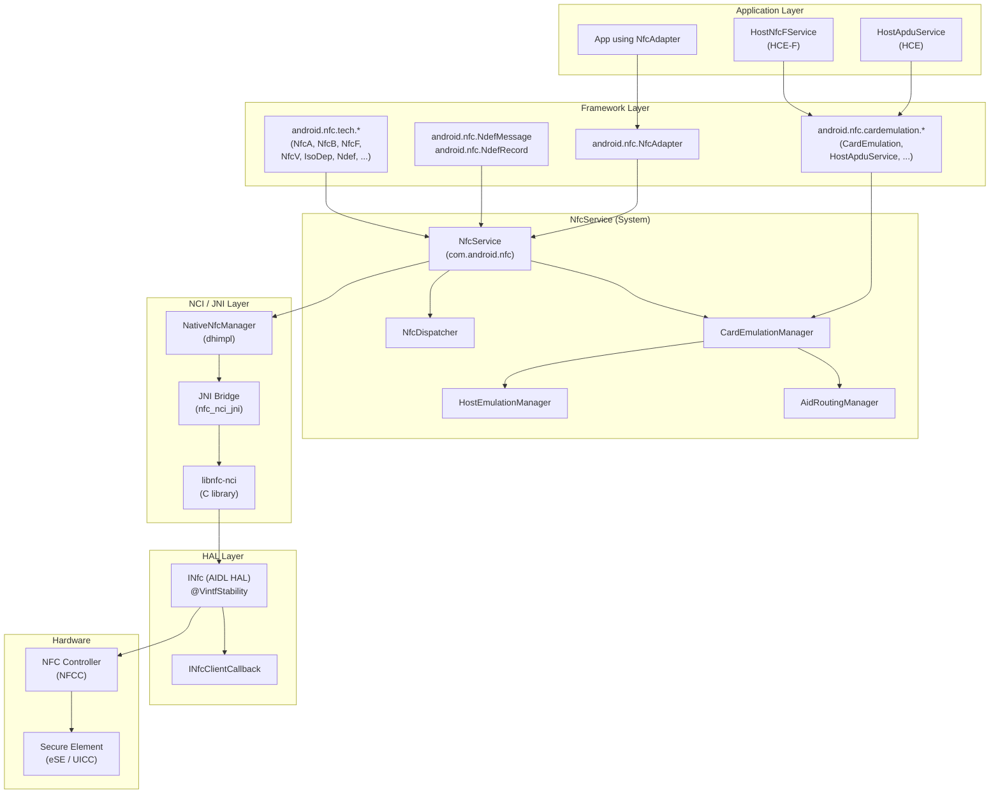

### 38.1.4 Key Source Directories

The NFC implementation spans multiple directories in the AOSP tree:

| Directory | Purpose |
|-----------|---------|
| `packages/modules/Nfc/framework/` | Public API: `NfcAdapter`, `NdefMessage`, `NdefRecord`, tech classes |
| `packages/modules/Nfc/NfcNci/src/com/android/nfc/` | NfcService, NfcDispatcher, and core system logic |
| `packages/modules/Nfc/NfcNci/src/com/android/nfc/cardemulation/` | HCE and card emulation subsystem |
| `packages/modules/Nfc/NfcNci/nci/src/com/android/nfc/dhimpl/` | Native interface (NativeNfcManager) |
| `packages/modules/Nfc/NfcNci/nci/jni/` | JNI C++ code bridging Java and libnfc-nci |
| `packages/modules/Nfc/libnfc-nci/` | NCI protocol stack (C library) |
| `hardware/interfaces/nfc/aidl/` | AIDL HAL interface definitions |
| `hardware/interfaces/nfc/1.0/` through `1.2/` | Legacy HIDL HAL interfaces |
| `packages/modules/Nfc/apex/` | Mainline APEX packaging |

### 38.1.5 NfcAdapter: The Application Entry Point

`NfcAdapter` is the application-facing singleton that gates all NFC operations.
An application obtains it through a single static call:

```java
// Source: packages/modules/Nfc/framework/java/android/nfc/NfcAdapter.java
public final class NfcAdapter {
    // The three tag dispatch intents, in priority order:
    public static final String ACTION_NDEF_DISCOVERED =
            "android.nfc.action.NDEF_DISCOVERED";
    public static final String ACTION_TECH_DISCOVERED =
            "android.nfc.action.TECH_DISCOVERED";
    public static final String ACTION_TAG_DISCOVERED =
            "android.nfc.action.TAG_DISCOVERED";

    // Reader mode flags
    public static final int FLAG_READER_NFC_A = 0x1;
    public static final int FLAG_READER_NFC_B = 0x2;
    public static final int FLAG_READER_NFC_F = 0x4;
    public static final int FLAG_READER_NFC_V = 0x8;
    public static final int FLAG_READER_NFC_BARCODE = 0x10;
    public static final int FLAG_READER_SKIP_NDEF_CHECK = 0x80;
    public static final int FLAG_READER_NO_PLATFORM_SOUNDS = 0x100;
    ...
}
```

The adapter communicates with `NfcService` through a Binder interface
(`INfcAdapter.aidl`).  Key methods include:

- `enableReaderMode()` / `disableReaderMode()` -- exclusive tag reading
- `enableForegroundDispatch()` / `disableForegroundDispatch()` -- priority tag
  routing to a foreground activity
- `isEnabled()` -- check NFC hardware state
- `ignore()` -- debounce a specific tag

### 38.1.6 NfcService: The System Server Component

`NfcService` is the central daemon.  At 6,666+ lines it is one of the larger
system services.  It runs in the `com.android.nfc` process with the shared UID
`android.uid.nfc` (see `NfcNci/AndroidManifest.xml`).  It is **not** part of
`system_server` -- it runs in its own process:

```
// Source: packages/modules/Nfc/NfcNci/src/com/android/nfc/NfcService.java
public class NfcService implements DeviceHostListener, ForegroundUtils.Callback {
    static final String TAG = "NfcService";
    public static final String SERVICE_NAME = "nfc";
    ...
}
```

NfcService responsibilities:

- Initialize and manage NFC hardware through the NCI stack
- Handle screen state changes (polling is disabled when screen is off)
- Route tag discoveries to the correct application
- Manage the HCE card emulation subsystem
- Maintain the NFCC routing table
- Expose Binder APIs consumed by NfcAdapter

### 38.1.7 NFC HAL: Hardware Abstraction

The HAL mediates between the NCI stack and the vendor's NFC controller driver.
The current interface is AIDL-based (`android.hardware.nfc.INfc`) with
`@VintfStability` for Mainline compatibility.  The HAL provides exactly the
operations a NCI host needs:

```
// Source: hardware/interfaces/nfc/aidl/aidl_api/android.hardware.nfc/current/
//         android/hardware/nfc/INfc.aidl
@VintfStability
interface INfc {
    void open(in INfcClientCallback clientCallback);
    void close(in NfcCloseType type);
    void coreInitialized();
    void factoryReset();
    NfcConfig getConfig();
    void powerCycle();
    void preDiscover();
    int write(in byte[] data);
    void setEnableVerboseLogging(in boolean enable);
    boolean isVerboseLoggingEnabled();
    NfcStatus controlGranted();
}
```

### 38.1.8 NCI: NFC Controller Interface

The NFC Controller Interface (NCI) is the standardized protocol between the host
(application processor) and the NFC Controller (NFCC).  The AOSP implementation
is in `libnfc-nci`, a C library that implements the NCI 1.0 and 2.0 specs.

The NCI protocol uses a command/response/notification model:

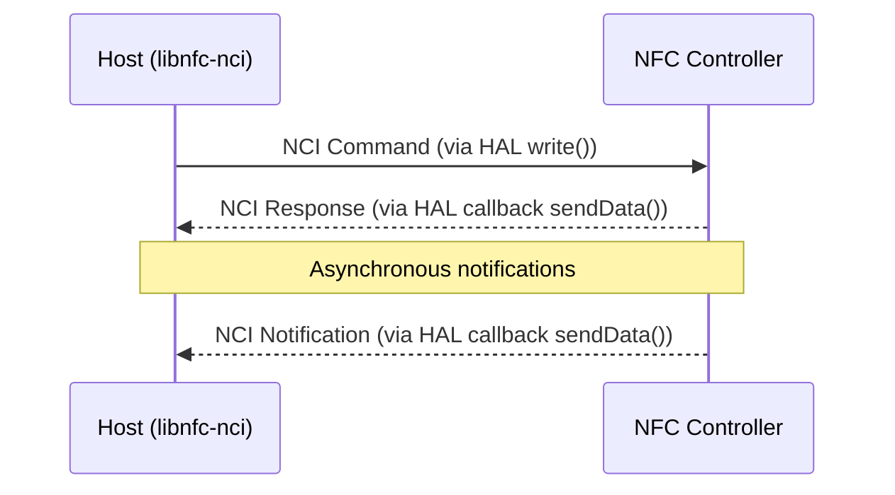

NCI messages are classified by Group ID (GID) and Opcode ID (OID):

| GID | Purpose |
|-----|---------|
| 0x00 | NCI Core (RESET, INIT, SET_CONFIG) |
| 0x01 | RF Management (DISCOVER, ACTIVATE) |
| 0x02 | NFCEE Management (Secure Element) |
| 0x0F | Proprietary (vendor-specific) |

### 38.1.9 NFC as a Mainline Module (APEX)

Starting in recent Android releases, the NFC stack is packaged as a Mainline
module (`com.android.nfcservices`), allowing Google to update NFC independently
of full OS updates.  The APEX package contains:

- The `NfcNci` APK (NfcService, card emulation, dispatch logic)
- The NFC framework classes
- The `libnfc-nci` native library
- JNI bridges

The APEX manifest lives at:

```
packages/modules/Nfc/apex/manifest.json
```

### 38.1.10 End-to-End: From RF Field to Intent

When a user taps their phone against an NFC tag, this is the complete data path:

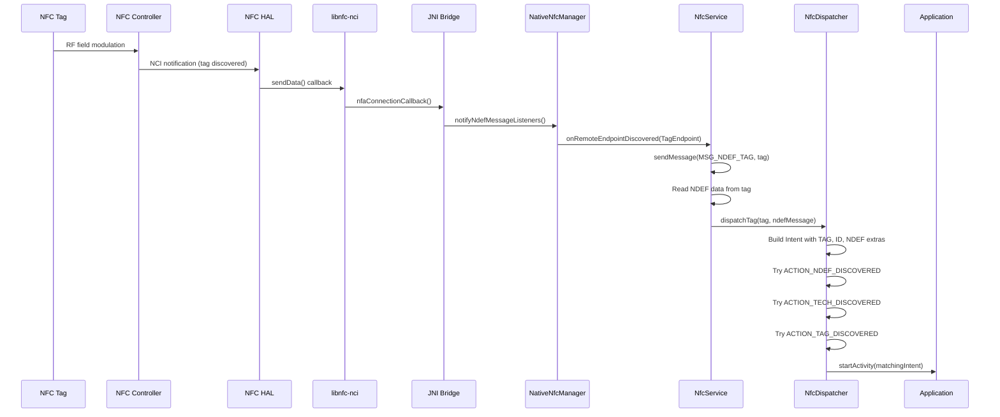

---

## 38.2 NfcService

### 38.2.1 Service Lifecycle

NfcService is not a traditional Android Service subclass.  It is created by
`NfcApplication` during `onCreate()` and registered as a system service under
the name `"nfc"`.  The service persists for the entire lifetime of the NFC
process.

The lifecycle follows these phases:

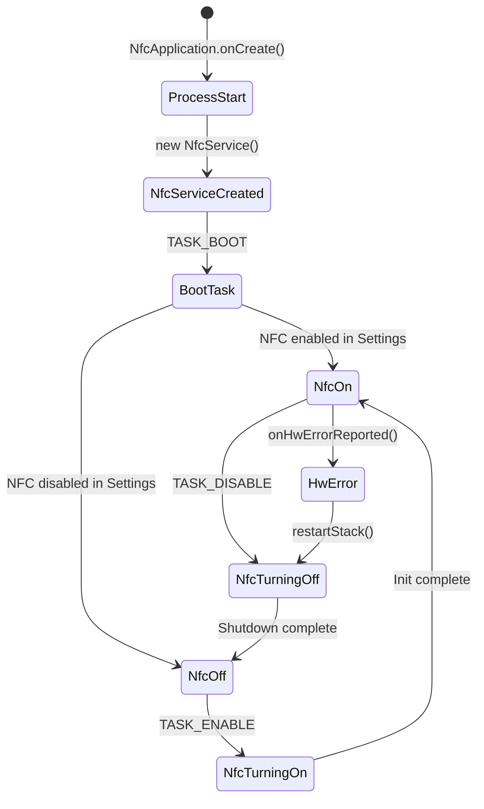

NfcService's state is tracked through the standard NfcAdapter state constants:

```java
// Source: packages/modules/Nfc/NfcNci/src/com/android/nfc/NfcService.java
int mState;  // NfcAdapter.STATE_ON, STATE_TURNING_ON,
             // STATE_OFF, STATE_TURNING_OFF
```

### 38.2.2 NfcApplication: The Bootstrap

The NFC process starts through `NfcApplication`, the `Application` subclass
declared in the manifest:

```xml
<!-- Source: packages/modules/Nfc/NfcNci/AndroidManifest.xml -->
<application android:name=".NfcApplication"
             android:icon="@drawable/icon"
             android:label="@string/app_name"
             android:theme="@android:style/Theme.Material.Light"
```

The process runs with UID `android.uid.nfc` (`sharedUserId`), giving it
privileged access to NFC hardware.  On startup, `NfcApplication.onCreate()`
constructs the `NfcService` singleton and registers it.

### 38.2.3 The EnableDisableTask State Machine

NFC hardware initialization is handled by an `AsyncTask` subclass called
`EnableDisableTask`.  This avoids blocking the main thread during potentially
slow firmware download and NFC controller initialization:

```java
// Source: packages/modules/Nfc/NfcNci/src/com/android/nfc/NfcService.java
static final int TASK_ENABLE = 1;
static final int TASK_DISABLE = 2;
static final int TASK_BOOT = 3;
static final int TASK_ENABLE_ALWAYS_ON = 4;
static final int TASK_DISABLE_ALWAYS_ON = 5;
```

The enable sequence:

1. Check firmware (`mDeviceHost.checkFirmware()`) -- may trigger firmware download
2. Initialize NFC controller (`mDeviceHost.initialize()`)
3. Apply routing table
4. Start polling for tags

A watchdog timer (`INIT_WATCHDOG_MS = 90000` -- 90 seconds) guards against
firmware download hangs.  The large timeout accounts for the fact that NFC
firmware download can be time-consuming on some hardware.

### 38.2.4 Screen State Management

NFC polling behavior is tightly coupled to screen state.  The system conserves
power by reducing or stopping NFC polling when the screen is off:

```java
// Source: packages/modules/Nfc/NfcNci/src/com/android/nfc/NfcService.java
// minimum screen state that enables NFC polling
static final int NFC_POLLING_MODE = ScreenStateHelper.SCREEN_STATE_ON_UNLOCKED;
```

`ScreenStateHelper` maps display state to four levels:

| Screen State | Value | Polling Behavior |
|-------------|-------|-----------------|
| `SCREEN_STATE_OFF` | 1 | No polling (except always-on/SE) |
| `SCREEN_STATE_ON_LOCKED` | 2 | Limited polling (lock screen pay) |
| `SCREEN_STATE_ON_UNLOCKED` | 3 | Full polling |
| `SCREEN_STATE_UNKNOWN` | 0 | Treated as off |

Screen state changes trigger `MSG_APPLY_SCREEN_STATE` which recalculates
discovery parameters and updates the NFCC accordingly.

### 38.2.5 The Message Handler

NfcService processes events through a Handler message loop.  All critical
operations funnel through message constants:

```java
// Source: packages/modules/Nfc/NfcNci/src/com/android/nfc/NfcService.java
static final int MSG_NDEF_TAG = 0;
static final int MSG_MOCK_NDEF = 3;
static final int MSG_ROUTE_AID = 5;
static final int MSG_UNROUTE_AID = 6;
static final int MSG_COMMIT_ROUTING = 7;
static final int MSG_RF_FIELD_ACTIVATED = 9;
static final int MSG_RF_FIELD_DEACTIVATED = 10;
static final int MSG_RESUME_POLLING = 11;
static final int MSG_REGISTER_T3T_IDENTIFIER = 12;
static final int MSG_DEREGISTER_T3T_IDENTIFIER = 13;
static final int MSG_TAG_DEBOUNCE = 14;
static final int MSG_APPLY_SCREEN_STATE = 16;
static final int MSG_TRANSACTION_EVENT = 17;
static final int MSG_PREFERRED_PAYMENT_CHANGED = 18;
static final int MSG_TOAST_DEBOUNCE_EVENT = 19;
static final int MSG_DELAY_POLLING = 20;
static final int MSG_CLEAR_ROUTING_TABLE = 21;
static final int MSG_UPDATE_ISODEP_PROTOCOL_ROUTE = 22;
static final int MSG_UPDATE_TECHNOLOGY_ABF_ROUTE = 23;
```

The handler serializes NFC operations that would otherwise race -- particularly
tag dispatch, routing table commits, and screen state changes.

### 38.2.6 Tag Discovery: onRemoteEndpointDiscovered

When the NFC controller discovers a tag, the native layer delivers it through
the `DeviceHostListener` callback:

```java
// Source: packages/modules/Nfc/NfcNci/src/com/android/nfc/NfcService.java
@Override
public void onRemoteEndpointDiscovered(TagEndpoint tag) {
    Log.d(TAG, "onRemoteEndpointDiscovered");
    sendMessage(MSG_NDEF_TAG, tag);
}
```

The `MSG_NDEF_TAG` handler then:

1. Reads the tag's technology list and UID
2. Attempts to read NDEF data from the tag
3. Builds a `Tag` parcelable with the discovered information
4. Passes the tag and NDEF message to `NfcDispatcher`
5. Plays the NFC "tag discovered" sound
6. Starts presence checking to detect tag removal

### 38.2.7 DeviceHost and DeviceHostListener

`DeviceHost` is the interface that abstracts the native NFC stack.
`NativeNfcManager` implements it, and `NfcService` implements its listener:

```java
// Source: packages/modules/Nfc/NfcNci/src/com/android/nfc/DeviceHost.java
public interface DeviceHost {
    public interface DeviceHostListener {
        public void onRemoteEndpointDiscovered(TagEndpoint tag);
        public void onHostCardEmulationActivated(int technology);
        public void onHostCardEmulationData(int technology, byte[] data);
        public void onHostCardEmulationDeactivated(int technology);
        public void onRemoteFieldActivated();
        public void onRemoteFieldDeactivated();
        public void onNfcTransactionEvent(byte[] aid, byte[] data, String seName);
        public void onEeUpdated();
        public void onHwErrorReported();
        public void onPollingLoopDetected(List<PollingFrame> pollingFrames);
        public void onVendorSpecificEvent(int gid, int oid, byte[] payload);
        ...
    }

    public interface TagEndpoint {
        boolean connect(int technology);
        boolean reconnect();
        boolean disconnect();
        boolean presenceCheck();
        int[] getTechList();
        byte[] getUid();
        byte[] transceive(byte[] data, boolean raw, int[] returnCode);
        boolean checkNdef(int[] out);
        byte[] readNdef();
        boolean writeNdef(byte[] data);
        NdefMessage findAndReadNdef();
        boolean formatNdef(byte[] key);
        boolean isNdefFormatable();
        boolean makeReadOnly();
        ...
    }
}
```

The `TagEndpoint` interface is notably rich -- it encapsulates all operations
on a discovered tag, from raw transceive to NDEF read/write/format.

### 38.2.8 NativeNfcManager: The JNI Bridge

`NativeNfcManager` is the `DeviceHost` implementation that bridges Java and the
native `libnfc-nci` through JNI:

```java
// Source: packages/modules/Nfc/NfcNci/nci/src/com/android/nfc/dhimpl/NativeNfcManager.java
public class NativeNfcManager implements DeviceHost {
    static final String DRIVER_NAME = "android-nci";

    private long mNative;  // pointer to native structure

    private void loadLibrary() {
        System.loadLibrary("nfc_nci_jni");
    }

    public native boolean initializeNativeStructure();
    private native boolean doInitialize();
    private native boolean doDownload();
    ...
}
```

The JNI C++ implementation lives in `NfcNci/nci/jni/` with files including:

- `NativeNfcManager.cpp` -- controller initialization and management
- `NativeNfcTag.cpp` -- tag operations (read, write, transceive)
- `RoutingManager.cpp` -- AID and technology routing
- `NfcTag.cpp` -- tag state tracking
- `HciEventManager.cpp` -- HCI events from Secure Elements

### 38.2.9 Reader Mode Internals

When an application activates reader mode, NfcService reconfigures the NFC
controller to disable card emulation and peer-to-peer, focusing exclusively on
tag polling:

```java
// Source: packages/modules/Nfc/NfcNci/src/com/android/nfc/NfcService.java
ReaderModeParams mReaderModeParams;

// Stored when enableReaderMode is called:
static class ReaderModeParams {
    int flags;
    IAppCallback callback;
    int presenceCheckDelay;
}
```

The `ReaderModeDeathRecipient` monitors the calling process.  If the process
dies, reader mode is automatically disabled to prevent the NFC controller from
being locked in a non-standard configuration:

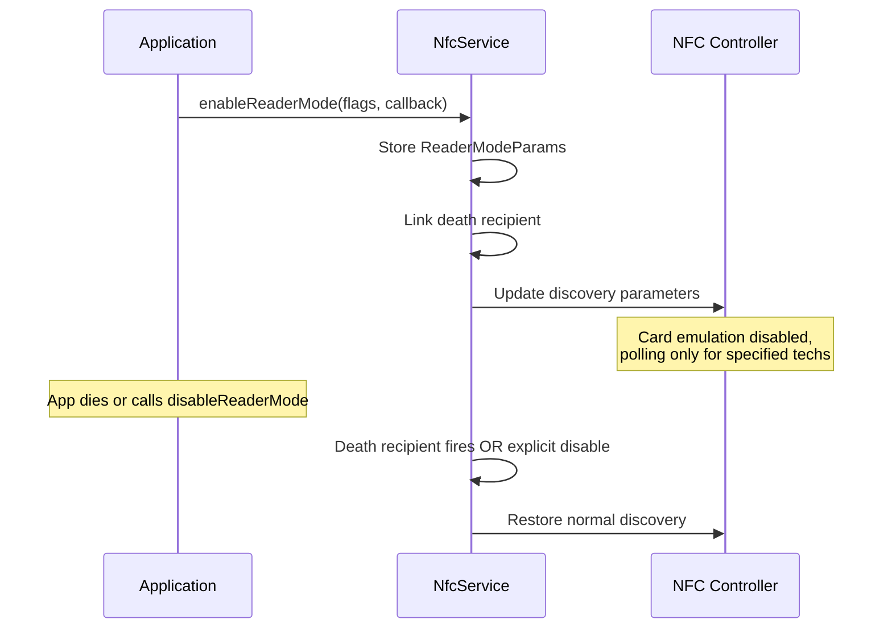

### 38.2.10 Routing Table Management

The NFCC maintains a routing table that determines how incoming ISO-DEP,
NFC-F, and other frames are routed -- to the host (application processor),
to the eSE, or to the UICC.  NfcService orchestrates routing table updates
through a delayed scheduler to coalesce multiple rapid changes:

```java
// Source: packages/modules/Nfc/NfcNci/src/com/android/nfc/NfcService.java
private final ScheduledExecutorService mRtUpdateScheduler =
        Executors.newScheduledThreadPool(1);

// On NFCEE update:
mRtUpdateScheduledTask = mRtUpdateScheduler.schedule(
    () -> {
        if (mIsHceCapable) {
            mCardEmulationManager.onTriggerRoutingTableUpdate();
        }
    },
    50,
    TimeUnit.MILLISECONDS);
```

Routing is governed by three dimensions:

1. **AID routing** -- specific AIDs to specific destinations
2. **Protocol routing** -- ISO-DEP frames to a default destination
3. **Technology routing** -- NFC-A/B/F frames to a default destination

### 38.2.11 Watchdog and Recovery

NfcService includes a watchdog mechanism to detect and recover from hardware
hangs:

```java
// Source: packages/modules/Nfc/NfcNci/src/com/android/nfc/NfcService.java
static final int INIT_WATCHDOG_MS = 90000;   // 90s for init (firmware download)
static final int ROUTING_WATCHDOG_MS = 6000;  // 6s for routing commits
```

When `onHwErrorReported()` fires, the service performs a full stack restart:

```java
@Override
public void onHwErrorReported() {
    if (android.nfc.Flags.nfcEventListener() && mCardEmulationManager != null) {
        mCardEmulationManager.onInternalErrorReported(
                CardEmulation.NFC_INTERNAL_ERROR_NFC_HARDWARE_ERROR);
    }
    restartStack();
}

private void restartStack() {
    // ...
    new EnableDisableTask().execute(TASK_DISABLE);
    new EnableDisableTask().execute(TASK_ENABLE);
}
```

### 38.2.12 Secure NFC

Secure NFC restricts NFC operations to the unlocked screen state.  When enabled,
the NFCC is configured to only respond when the device is unlocked:

```java
// Source: packages/modules/Nfc/NfcNci/src/com/android/nfc/NfcService.java
static final String PREF_SECURE_NFC_ON = "secure_nfc_on";
boolean mIsSecureNfcEnabled;
```

This feature targets scenarios where users want NFC payments to require device
unlock, preventing contactless fraud when the phone is in a pocket.

---

## 38.3 NFC HAL

### 38.3.1 HAL Evolution: HIDL to AIDL

The NFC HAL has gone through three generations:

| Version | Path | Transport |
|---------|------|-----------|
| 1.0 | `hardware/interfaces/nfc/1.0/` | HIDL |
| 1.1 | `hardware/interfaces/nfc/1.1/` | HIDL |
| 1.2 | `hardware/interfaces/nfc/1.2/` | HIDL |
| AIDL v1 | `hardware/interfaces/nfc/aidl/` (version 1) | AIDL |
| AIDL v2 | `hardware/interfaces/nfc/aidl/` (version 2) | AIDL |

The AIDL HAL is the current standard, with `@VintfStability` enabling it to
work across independently updatable system partitions.  All new devices should
implement the AIDL version.

### 38.3.2 INfc AIDL Interface

The primary HAL interface defines the operations the NCI host stack can perform
on the NFC controller:

```
// Source: hardware/interfaces/nfc/aidl/aidl_api/android.hardware.nfc/current/
//         android/hardware/nfc/INfc.aidl
@VintfStability
interface INfc {
    void open(in INfcClientCallback clientCallback);
    void close(in NfcCloseType type);
    void coreInitialized();
    void factoryReset();
    NfcConfig getConfig();
    void powerCycle();
    void preDiscover();
    int write(in byte[] data);
    void setEnableVerboseLogging(in boolean enable);
    boolean isVerboseLoggingEnabled();
    NfcStatus controlGranted();
}
```

Method semantics:

| Method | Purpose |
|--------|---------|
| `open()` | Power on the NFCC, register callback for data/events |
| `close()` | Power down or set to standby (`DISABLE` vs `HOST_SWITCHED_OFF`) |
| `coreInitialized()` | Signal that NCI CORE_INIT is complete |
| `write()` | Send NCI command/data to the NFCC |
| `getConfig()` | Retrieve static hardware configuration |
| `powerCycle()` | Hard reset the NFCC |
| `preDiscover()` | Vendor hook before discovery starts |
| `factoryReset()` | Wipe NFCC configuration to defaults |
| `controlGranted()` | Grant exclusive control to the HAL |

### 38.3.3 INfcClientCallback

The callback interface is how the HAL sends data and events back to the NCI
host:

```
// Source: hardware/interfaces/nfc/aidl/aidl_api/android.hardware.nfc/current/
//         android/hardware/nfc/INfcClientCallback.aidl
@VintfStability
interface INfcClientCallback {
    void sendData(in byte[] data);
    void sendEvent(in NfcEvent event, in NfcStatus status);
}
```

`sendData()` carries NCI responses and notifications from the NFCC.
`sendEvent()` carries lifecycle events like `OPEN_CPLT`, `CLOSE_CPLT`, and
`ERROR`.

### 38.3.4 NfcConfig: Hardware Configuration

The `NfcConfig` parcelable contains the static hardware configuration that the
NCI stack needs to operate correctly:

```
// Source: hardware/interfaces/nfc/aidl/aidl_api/android.hardware.nfc/current/
//         android/hardware/nfc/NfcConfig.aidl
@VintfStability
parcelable NfcConfig {
    boolean nfaPollBailOutMode;
    PresenceCheckAlgorithm presenceCheckAlgorithm;
    ProtocolDiscoveryConfig nfaProprietaryCfg;
    byte defaultOffHostRoute;
    byte defaultOffHostRouteFelica;
    byte defaultSystemCodeRoute;
    byte defaultSystemCodePowerState;
    byte defaultRoute;
    byte offHostESEPipeId;
    byte offHostSIMPipeId;
    int maxIsoDepTransceiveLength;
    byte[] hostAllowlist;
    byte[] offHostRouteUicc;
    byte[] offHostRouteEse;
    byte defaultIsoDepRoute;
    byte[] offHostSimPipeIds;
    boolean t4tNfceeEnable;
}
```

Key fields:

| Field | Purpose |
|-------|---------|
| `defaultRoute` | Default AID route (host=0x00, or SE ID) |
| `defaultOffHostRoute` | Default off-host route (eSE ID) |
| `defaultOffHostRouteFelica` | Default FeliCa route (eSE ID) |
| `offHostRouteUicc` | UICC SE route IDs |
| `offHostRouteEse` | eSE route IDs |
| `maxIsoDepTransceiveLength` | Maximum ISO-DEP frame size |
| `presenceCheckAlgorithm` | How to check if a tag is still present |
| `t4tNfceeEnable` | Enable Type-4 tag NFCEE emulation |

### 38.3.5 NfcEvent and NfcStatus Enumerations

The HAL uses strongly-typed enumerations for lifecycle events and status codes:

```
// Source: hardware/interfaces/nfc/aidl/.../NfcEvent.aidl
@Backing(type="int") @VintfStability
enum NfcEvent {
    OPEN_CPLT = 0,
    CLOSE_CPLT = 1,
    POST_INIT_CPLT = 2,
    PRE_DISCOVER_CPLT = 3,
    HCI_NETWORK_RESET = 4,
    ERROR = 5,
    REQUEST_CONTROL = 6,
    RELEASE_CONTROL = 7,
}

// Source: hardware/interfaces/nfc/aidl/.../NfcStatus.aidl
@Backing(type="int") @VintfStability
enum NfcStatus {
    OK = 0,
    FAILED = 1,
    ERR_TRANSPORT = 2,
    ERR_CMD_TIMEOUT = 3,
    REFUSED = 4,
}
```

The `ERR_CMD_TIMEOUT` status is particularly important -- it indicates the NFCC
stopped responding, which typically triggers `onHwErrorReported()` and a stack
restart.

### 38.3.6 NfcCloseType and PresenceCheckAlgorithm

`NfcCloseType` controls how the NFCC is shut down:

```
@Backing(type="int") @VintfStability
enum NfcCloseType {
    DISABLE = 0,           // User explicitly disabled NFC
    HOST_SWITCHED_OFF = 1, // Device is shutting down
}
```

`PresenceCheckAlgorithm` controls how the NCI stack verifies a tag is still in
range:

```
@Backing(type="byte") @VintfStability
enum PresenceCheckAlgorithm {
    DEFAULT = 0,      // Let the stack choose
    I_BLOCK = 1,      // Send ISO-DEP I-Block
    ISO_DEP_NAK = 2,  // Send ISO-DEP NAK
}
```

### 38.3.7 ProtocolDiscoveryConfig

The `ProtocolDiscoveryConfig` parcelable controls which NFC protocols are
discovered during polling.  It maps to NCI RF discovery parameters that the NCI
stack configures in the NFCC.

### 38.3.8 HAL Open-Write-Close Lifecycle

The HAL follows a strict lifecycle:

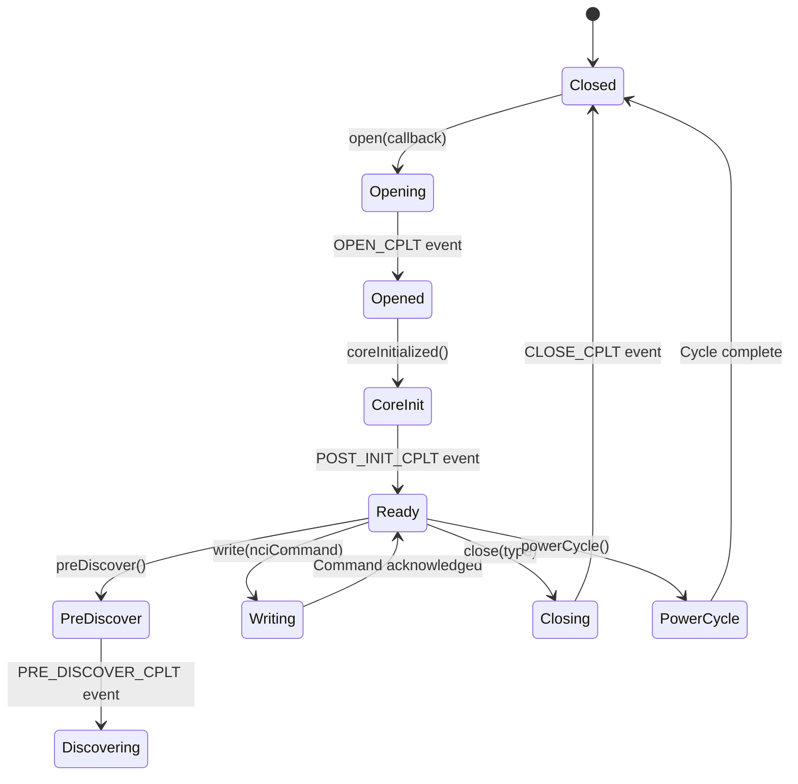

The key invariant is that `write()` can only be called after `open()` has
completed (signaled by `OPEN_CPLT`).  The `coreInitialized()` call signals that
the host has finished its NCI CORE_INIT sequence and the HAL can perform any
post-initialization vendor-specific operations.

### 38.3.9 NCI Data Flow Through the HAL

All NCI protocol data flows through two pathways:

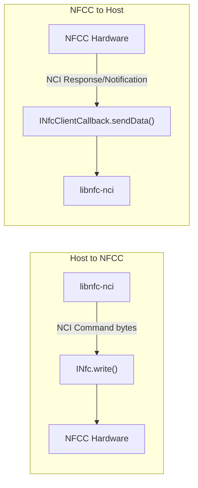

The HAL implementation is responsible for framing.  Some controllers use SPI,
I2C, or UART for the physical transport, but this is hidden behind the HAL
abstraction.

### 38.3.10 libnfc-nci: The NCI Stack

The `libnfc-nci` library (`packages/modules/Nfc/libnfc-nci/`) implements the
NCI protocol in C.  It manages:

- NCI command assembly and response parsing
- RF discovery state machine
- Tag activation and data exchange
- NFCEE (Secure Element) management
- Listen mode (card emulation) protocol handling

The library structure:

```
libnfc-nci/
  src/
    nfc/          # Core NFC logic
    nfa/          # NFA (NFC Adaptation) layer
    gki/          # Generic Kernel Interface (threading)
    hal/          # HAL adaptation layer
    include/      # Headers
  conf/           # Configuration files
```

### 38.3.11 VTS Tests for the NFC HAL

The VTS (Vendor Test Suite) tests for the NFC HAL ensure conformance:

```
hardware/interfaces/nfc/aidl/vts/
```

These tests verify:

- `open()` / `close()` lifecycle
- `write()` returns correct byte count
- `getConfig()` returns valid configuration
- Callback delivery for events and data
- `powerCycle()` properly resets the controller

---

## 38.4 NDEF: NFC Data Exchange Format

### 38.4.1 What Is NDEF

NDEF (NFC Data Exchange Format) is a lightweight binary format standardized by
the NFC Forum for encoding structured payloads.  It is transport-agnostic --
while designed for NFC, the format itself can be used over any channel.

NDEF has two main concepts:

- **NdefMessage** -- a container holding one or more records
- **NdefRecord** -- a single typed payload (URI, text, MIME data, etc.)

Android represents these as `android.nfc.NdefMessage` and
`android.nfc.NdefRecord`.

### 38.4.2 NdefMessage: The Container

```java
// Source: packages/modules/Nfc/framework/java/android/nfc/NdefMessage.java
public final class NdefMessage implements Parcelable {
    private final NdefRecord[] mRecords;

    // Construct from raw bytes (e.g., read from tag)
    public NdefMessage(byte[] data) throws FormatException { ... }

    // Construct from records
    public NdefMessage(NdefRecord[] records) { ... }
    public NdefMessage(NdefRecord record, NdefRecord... records) { ... }

    // Get all records
    public NdefRecord[] getRecords() { return mRecords; }

    // Serialize to bytes (e.g., for writing to tag)
    public byte[] toByteArray() { ... }
}
```

The first record in a message has special importance -- the tag dispatch system
uses it to determine which application to launch.

### 38.4.3 NdefRecord: The Payload Unit

Each `NdefRecord` carries a typed payload:

```java
// Source: packages/modules/Nfc/framework/java/android/nfc/NdefRecord.java
public final class NdefRecord implements Parcelable {
    // Constructor
    public NdefRecord(short tnf, byte[] type, byte[] id, byte[] payload) { ... }

    // Factory methods
    public static NdefRecord createUri(Uri uri) { ... }
    public static NdefRecord createUri(String uriString) { ... }
    public static NdefRecord createMime(String mimeType, byte[] mimeData) { ... }
    public static NdefRecord createExternal(
            String domain, String type, byte[] data) { ... }
    public static NdefRecord createTextRecord(
            String languageCode, String text) { ... }
    public static NdefRecord createApplicationRecord(
            String packageName) { ... }

    // Accessors
    public short getTnf() { ... }
    public byte[] getType() { ... }
    public byte[] getId() { ... }
    public byte[] getPayload() { ... }

    // Convenience converters
    public Uri toUri() { ... }
    public String toMimeType() { ... }
}
```

### 38.4.4 TNF: Type Name Format

The 3-bit TNF field classifies how the type field should be interpreted:

```java
// Source: packages/modules/Nfc/framework/java/android/nfc/NdefRecord.java
public static final short TNF_EMPTY = 0x00;
public static final short TNF_WELL_KNOWN = 0x01;
public static final short TNF_MIME_MEDIA = 0x02;
public static final short TNF_ABSOLUTE_URI = 0x03;
public static final short TNF_EXTERNAL_TYPE = 0x04;
public static final short TNF_UNKNOWN = 0x05;
public static final short TNF_UNCHANGED = 0x06;
```

| TNF | Name | Type Field Meaning |
|-----|------|-------------------|
| 0x00 | Empty | No type, no payload |
| 0x01 | Well-Known | NFC Forum RTD type (URI, Text, Smart Poster) |
| 0x02 | MIME Media | RFC 2046 MIME type string |
| 0x03 | Absolute URI | RFC 3986 absolute URI |
| 0x04 | External Type | Reverse-domain custom type |
| 0x05 | Unknown | Unknown type (like application/octet-stream) |
| 0x06 | Unchanged | Continuation chunk (not exposed to apps) |

### 38.4.5 Well-Known RTD Types

The NFC Forum defines Record Type Definition (RTD) constants for common
well-known types:

```java
// Source: packages/modules/Nfc/framework/java/android/nfc/NdefRecord.java
public static final byte[] RTD_TEXT = {0x54};              // "T"
public static final byte[] RTD_URI = {0x55};               // "U"
public static final byte[] RTD_SMART_POSTER = {0x53, 0x70}; // "Sp"
public static final byte[] RTD_ALTERNATIVE_CARRIER = {0x61, 0x63}; // "ac"
public static final byte[] RTD_HANDOVER_CARRIER = {0x48, 0x63};    // "Hc"
public static final byte[] RTD_HANDOVER_REQUEST = {0x48, 0x72};    // "Hr"
public static final byte[] RTD_HANDOVER_SELECT = {0x48, 0x73};     // "Hs"
```

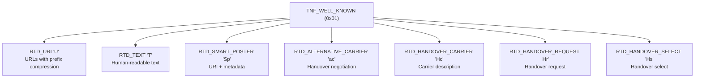

### 38.4.6 URI Record Encoding and Prefix Compression

URI records use an efficient prefix compression scheme.  The first byte of the
payload is a prefix index:

| Index | Prefix | Index | Prefix |
|-------|--------|-------|--------|
| 0x00 | (none) | 0x01 | `http://www.` |
| 0x02 | `https://www.` | 0x03 | `http://` |
| 0x04 | `https://` | 0x05 | `tel:` |
| 0x06 | `mailto:` | 0x07 | `ftp://anonymous:anonymous@` |
| 0x08 | `ftp://ftp.` | 0x09 | `ftps://` |
| 0x0A | `sftp://` | 0x0B | `smb://` |
| 0x0C | `nfs://` | 0x0D | `ftp://` |
| 0x0E | `dav://` | 0x0F | `news:` |
| 0x10 | `telnet://` | 0x11 | `imap:` |
| 0x12 | `rtsp://` | 0x13 | `urn:` |
| 0x14 | `pop:` | 0x15 | `sip:` |
| 0x16 | `sips:` | 0x17 | `tftp:` |
| 0x18 | `btspp://` | 0x19 | `btl2cap://` |
| 0x1A | `btgoep://` | 0x1B | `tcpobex://` |
| 0x1C | `irdaobex://` | 0x1D | `file://` |
| 0x1E | `urn:epc:id:` | 0x1F | `urn:epc:tag:` |
| 0x20 | `urn:epc:pat:` | 0x21 | `urn:epc:raw:` |
| 0x22 | `urn:epc:` | 0x23 | `urn:nfc:` |

For example, `https://android.com` is encoded as `0x04` + `android.com` (9
bytes instead of 22).  The `createUri()` factory method handles this
automatically.

### 38.4.7 Text Record Encoding

Text records (`RTD_TEXT`) encode:

- Status byte: bit 7 = encoding (0=UTF-8, 1=UTF-16), bits 5-0 = language code
  length
- Language code (IANA format, e.g., "en", "ja")
- Text payload

```
Byte layout:
[Status] [Language Code] [Text]
  1 byte   N bytes        M bytes

Status byte:
  Bit 7: 0 = UTF-8, 1 = UTF-16
  Bit 6: Reserved
  Bits 5-0: Language code length
```

### 38.4.8 Smart Poster Records

A Smart Poster (`RTD_SMART_POSTER`) is a nested NDEF message containing multiple
records that together describe a "poster":

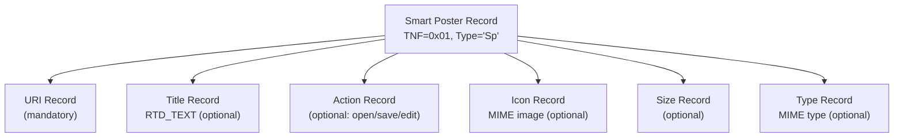

The payload of a Smart Poster record is itself a valid NDEF message.  The Android
tag dispatch system unwraps Smart Posters and dispatches based on the embedded
URI.

### 38.4.9 MIME Type Records

MIME records (`TNF_MIME_MEDIA`) carry arbitrary binary data typed with a standard
MIME type:

```java
// Create a MIME record
NdefRecord mimeRecord = NdefRecord.createMime(
    "application/vnd.example.myapp",
    myPayloadBytes
);
```

The tag dispatch system uses the MIME type for intent matching, allowing apps
to register for specific MIME types in their manifest.

### 38.4.10 External Type Records and Android Application Records

External type records (`TNF_EXTERNAL_TYPE`) use reverse-domain naming for custom
types:

```java
NdefRecord extRecord = NdefRecord.createExternal(
    "example.com",        // domain
    "mytype",             // type
    myPayloadBytes        // data
);
// Results in type: "example.com:mytype"
```

The **Android Application Record (AAR)** is a special external type that forces
dispatch to a specific package:

```java
NdefRecord aar = NdefRecord.createApplicationRecord("com.example.myapp");
// TNF = TNF_EXTERNAL_TYPE
// Type = "android.com:pkg"
// Payload = "com.example.myapp"
```

When an AAR is present in an NDEF message, Android guarantees that the specified
app will handle the tag.  If the app is not installed, the Play Store opens to
install it.

### 38.4.11 NDEF Binary Format on the Wire

The binary format of an NDEF record header:

```
Byte 0 (flags):
  Bit 7 (MB): Message Begin -- first record in message
  Bit 6 (ME): Message End -- last record in message
  Bit 5 (CF): Chunk Flag -- record is a chunk
  Bit 4 (SR): Short Record -- payload length is 1 byte
  Bit 3 (IL): ID Length present
  Bits 2-0: TNF (Type Name Format)

Byte 1: TYPE_LENGTH
Byte 2: PAYLOAD_LENGTH (1 byte if SR=1, 4 bytes if SR=0)
Byte 3: ID_LENGTH (only if IL=1)
Bytes N: TYPE
Bytes N: ID (only if IL=1)
Bytes N: PAYLOAD
```

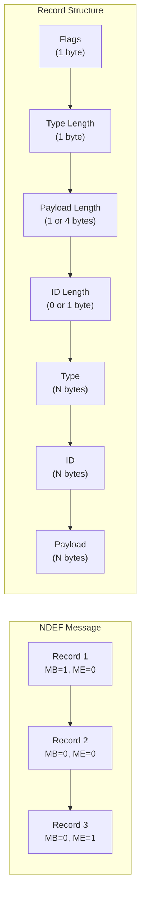

### 38.4.12 Creating NDEF Records in Code

Common NDEF construction patterns:

```java
// URI record
NdefRecord uriRecord = NdefRecord.createUri("https://android.com");

// Text record
NdefRecord textRecord = NdefRecord.createTextRecord("en", "Hello NFC");

// MIME record
NdefRecord mimeRecord = NdefRecord.createMime(
    "application/json",
    "{\"key\":\"value\"}".getBytes(StandardCharsets.UTF_8)
);

// Android Application Record (AAR)
NdefRecord aarRecord = NdefRecord.createApplicationRecord("com.example.app");

// Compose a message with URI + AAR
NdefMessage message = new NdefMessage(uriRecord, aarRecord);

// Serialize for writing to tag
byte[] rawBytes = message.toByteArray();
```

---

## 38.5 Tag Dispatch System

### 38.5.1 The Dispatch Priority Chain

Android's tag dispatch system follows a strict priority chain to determine
which application handles a discovered tag:

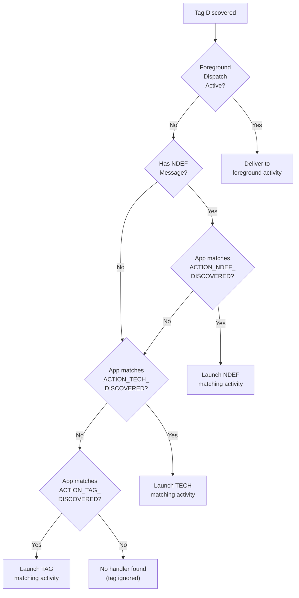

### 38.5.2 ACTION_NDEF_DISCOVERED: Highest Priority

`ACTION_NDEF_DISCOVERED` is the most specific intent.  The system examines the
first `NdefRecord` in the first `NdefMessage` and constructs an intent with:

- **URI data**: if the record is a URI or Smart Poster
- **MIME type**: if the record is a MIME-type record

```java
// Source: packages/modules/Nfc/NfcNci/src/com/android/nfc/NfcDispatcher.java
public Intent setNdefIntent() {
    intent.setAction(NfcAdapter.ACTION_NDEF_DISCOVERED);
    if (ndefUri != null) {
        intent.setData(ndefUri);
        return intent;
    } else if (ndefMimeType != null) {
        intent.setType(ndefMimeType);
        return intent;
    }
    return null;
}
```

Activities register with intent filters to catch specific URIs or MIME types:

```xml
<activity android:name=".NfcHandler">
    <intent-filter>
        <action android:name="android.nfc.action.NDEF_DISCOVERED" />
        <category android:name="android.intent.category.DEFAULT" />
        <data android:scheme="https" android:host="example.com" />
    </intent-filter>
</activity>
```

### 38.5.3 ACTION_TECH_DISCOVERED: Technology Matching

If no activity handles `ACTION_NDEF_DISCOVERED`, the system falls back to
`ACTION_TECH_DISCOVERED`.  This intent matches based on the tag's supported
technologies rather than payload content.

Activities declare interest through a `meta-data` element pointing to an XML
resource:

```xml
<!-- AndroidManifest.xml -->
<activity android:name=".TechHandler">
    <intent-filter>
        <action android:name="android.nfc.action.TECH_DISCOVERED" />
    </intent-filter>
    <meta-data android:name="android.nfc.action.TECH_DISCOVERED"
               android:resource="@xml/nfc_tech_filter" />
</activity>
```

The filter XML uses AND within a `tech-list` and OR between `tech-list` groups:

```xml
<!-- res/xml/nfc_tech_filter.xml -->
<resources>
    <!-- Match any tag with NfcA AND Ndef -->
    <tech-list>
        <tech>android.nfc.tech.NfcA</tech>
        <tech>android.nfc.tech.Ndef</tech>
    </tech-list>

    <!-- OR match any tag with NfcF -->
    <tech-list>
        <tech>android.nfc.tech.NfcF</tech>
    </tech-list>
</resources>
```

Matching logic: a tag matches if any single `tech-list` is a **subset** of the
tag's technology list.

### 38.5.4 ACTION_TAG_DISCOVERED: Catch-All Fallback

`ACTION_TAG_DISCOVERED` is the lowest priority fallback.  It matches any NFC
tag regardless of content or technology.  This is intended as a last resort --
well-designed apps should use the more specific intents:

```java
// Source: packages/modules/Nfc/NfcNci/src/com/android/nfc/NfcDispatcher.java
public Intent setTagIntent() {
    intent.setData(null);
    intent.setType(null);
    intent.setAction(NfcAdapter.ACTION_TAG_DISCOVERED);
    return intent;
}
```

### 38.5.5 NfcDispatcher: The Dispatch Engine

`NfcDispatcher` orchestrates the entire dispatch chain:

```java
// Source: packages/modules/Nfc/NfcNci/src/com/android/nfc/NfcDispatcher.java
class NfcDispatcher {
    static final int DISPATCH_SUCCESS = 1;
    static final int DISPATCH_FAIL = 2;
    static final int DISPATCH_UNLOCK = 3;

    private PendingIntent mOverrideIntent;         // foreground dispatch
    private IntentFilter[] mOverrideFilters;        // foreground dispatch filters
    private String[][] mOverrideTechLists;          // foreground dispatch techs
    private final RegisteredComponentCache mTechListFilters; // tech discovery cache
    ...
}
```

The dispatch flow:

1. Check foreground dispatch override (`mOverrideIntent`)
2. Try `ACTION_NDEF_DISCOVERED` with URI or MIME type
3. Try `ACTION_VIEW` with URI (for web URLs)
4. Try `ACTION_TECH_DISCOVERED` with technology matching
5. Try `ACTION_TAG_DISCOVERED` as final fallback
6. Return `DISPATCH_FAIL` if nothing matches

### 38.5.6 DispatchInfo: Building the Intent

`DispatchInfo` is a helper class that constructs the dispatch intent with all
necessary extras:

```java
// Source: packages/modules/Nfc/NfcNci/src/com/android/nfc/NfcDispatcher.java
static class DispatchInfo {
    public final Intent intent;
    public final Tag tag;
    final Uri ndefUri;
    final String ndefMimeType;

    DispatchInfo(Context context, NfcInjector nfcInjector,
            Tag tag, NdefMessage message) {
        intent = new Intent();
        intent.putExtra(NfcAdapter.EXTRA_TAG, tag);
        intent.putExtra(NfcAdapter.EXTRA_ID, tag.getId());
        if (message != null) {
            intent.putExtra(NfcAdapter.EXTRA_NDEF_MESSAGES,
                    new NdefMessage[] {message});
            ndefUri = message.getRecords()[0].toUri();
            ndefMimeType = message.getRecords()[0].toMimeType();
        } else {
            ndefUri = null;
            ndefMimeType = null;
        }
        ...
    }
}
```

Intent extras provided to the receiving activity:

| Extra | Type | Purpose |
|-------|------|---------|
| `EXTRA_TAG` | `Tag` | The discovered tag object |
| `EXTRA_ID` | `byte[]` | Tag UID |
| `EXTRA_NDEF_MESSAGES` | `NdefMessage[]` | NDEF messages (if any) |

### 38.5.7 Foreground Dispatch Override

Foreground dispatch gives the currently visible activity highest priority for
tag events, bypassing the normal dispatch chain:

```java
// Source: packages/modules/Nfc/NfcNci/src/com/android/nfc/NfcDispatcher.java
public synchronized void setForegroundDispatch(PendingIntent intent,
        IntentFilter[] filters, String[][] techLists) {
    mOverrideIntent = intent;
    mOverrideFilters = filters;
    mOverrideTechLists = techLists;
    ...
}
```

When a foreground dispatch is active and a tag is discovered:

1. If `mOverrideFilters` is null or the tag matches a filter, deliver to
   `mOverrideIntent`
2. The tag is **not** dispatched through the normal chain

If the activity goes to background, the dispatch is automatically cleared
through a `ForegroundUtils.Callback`:

```java
class ForegroundCallbackImpl implements ForegroundUtils.Callback {
    @Override
    public void onUidToBackground(int uid) {
        synchronized (NfcDispatcher.this) {
            if (mForegroundUid == uid) {
                setForegroundDispatch(null, null, null);
            }
        }
    }
}
```

### 38.5.8 Tech-List XML Filter Format

The tech-list XML file is parsed by `RegisteredComponentCache`, which maintains
a cache of all activities with `ACTION_TECH_DISCOVERED` filters:

```java
// Source: packages/modules/Nfc/NfcNci/src/com/android/nfc/NfcDispatcher.java
private final RegisteredComponentCache mTechListFilters;

// Initialized with:
mTechListFilters = new RegisteredComponentCache(mContext,
        NfcAdapter.ACTION_TECH_DISCOVERED,
        NfcAdapter.ACTION_TECH_DISCOVERED);
```

Available technology classes for filters:

| Class | ISO Standard |
|-------|-------------|
| `android.nfc.tech.NfcA` | ISO 14443-3A |
| `android.nfc.tech.NfcB` | ISO 14443-3B |
| `android.nfc.tech.NfcF` | JIS X 6319-4 (FeliCa) |
| `android.nfc.tech.NfcV` | ISO 15693 |
| `android.nfc.tech.IsoDep` | ISO 14443-4 |
| `android.nfc.tech.Ndef` | NDEF formatted |
| `android.nfc.tech.NdefFormatable` | Can be NDEF formatted |
| `android.nfc.tech.MifareClassic` | NXP MIFARE Classic |
| `android.nfc.tech.MifareUltralight` | NXP MIFARE Ultralight |
| `android.nfc.tech.NfcBarcode` | Kovio/Thinfilm barcode |

### 38.5.9 Tag App Preference List

Android supports a per-user preference list that controls which apps receive
tag events.  Users can mute specific apps from receiving NFC tag dispatches:

```java
// Source: packages/modules/Nfc/NfcNci/src/com/android/nfc/NfcService.java
HashMap<Integer, HashMap<String, Boolean>> mTagAppPrefList =
        new HashMap<Integer, HashMap<String, Boolean>>();
```

The dispatch engine checks this list before delivering intents:

```java
// Source: packages/modules/Nfc/NfcNci/src/com/android/nfc/NfcDispatcher.java
List<ResolveInfo> checkPrefList(List<ResolveInfo> activities, int userId) {
    // ...
    Map<String, Boolean> preflist =
            mNfcAdapter.getTagIntentAppPreferenceForUser(userId);
    if (preflist.containsKey(pkgName)) {
        if (!preflist.get(pkgName)) {
            // Muted -- remove from candidate list
            filtered.remove(resolveInfo);
        }
    }
    // ...
}
```

### 38.5.10 Multi-User Dispatch

Tag dispatch respects Android's multi-user model.  The dispatcher tries the
current foreground user first, then falls back to other active user profiles:

```java
// Source: packages/modules/Nfc/NfcNci/src/com/android/nfc/NfcDispatcher.java
boolean tryStartActivity() {
    // Try current user
    List<ResolveInfo> activities = queryNfcIntentActivitiesAsUser(
            packageManager, intent,
            UserHandle.of(ActivityManager.getCurrentUser()));
    // ...
    if (activities.size() > 0) {
        context.startActivityAsUser(rootIntent, UserHandle.CURRENT);
        return true;
    }
    // Try other active users
    List<UserHandle> userHandles = getCurrentActiveUserHandles();
    // ...
}
```

### 38.5.11 Manifest Registration for Tag Intents

A complete manifest registration for handling NFC tags:

```xml
<manifest ...>
    <uses-permission android:name="android.permission.NFC" />
    <uses-feature android:name="android.hardware.nfc"
                  android:required="true" />

    <application ...>
        <!-- Handle NDEF URI tags -->
        <activity android:name=".NdefUriActivity"
                  android:exported="true">
            <intent-filter>
                <action android:name="android.nfc.action.NDEF_DISCOVERED" />
                <category android:name="android.intent.category.DEFAULT" />
                <data android:scheme="https"
                      android:host="example.com"
                      android:pathPrefix="/nfc/" />
            </intent-filter>
        </activity>

        <!-- Handle NDEF MIME tags -->
        <activity android:name=".NdefMimeActivity"
                  android:exported="true">
            <intent-filter>
                <action android:name="android.nfc.action.NDEF_DISCOVERED" />
                <category android:name="android.intent.category.DEFAULT" />
                <data android:mimeType="application/vnd.example.mydata" />
            </intent-filter>
        </activity>

        <!-- Handle specific tech tags -->
        <activity android:name=".TechActivity"
                  android:exported="true">
            <intent-filter>
                <action android:name="android.nfc.action.TECH_DISCOVERED" />
            </intent-filter>
            <meta-data android:name="android.nfc.action.TECH_DISCOVERED"
                       android:resource="@xml/tech_filter" />
        </activity>

        <!-- Catch-all for any tag -->
        <activity android:name=".TagCatchAllActivity"
                  android:exported="true">
            <intent-filter>
                <action android:name="android.nfc.action.TAG_DISCOVERED" />
                <category android:name="android.intent.category.DEFAULT" />
            </intent-filter>
        </activity>
    </application>
</manifest>
```

### 38.5.12 Common Pitfalls in Tag Dispatch

1. **Registering only for `ACTION_TAG_DISCOVERED`** -- this catches tags only
   when no more specific handler exists.  Prefer `ACTION_NDEF_DISCOVERED` or
   `ACTION_TECH_DISCOVERED`.

2. **Forgetting `android:exported="true"`** -- tag dispatch uses implicit
   intents, which require exported activities on Android 12+.

3. **Not handling multi-record messages** -- the dispatch system only examines
   the first record.  Additional records (like AARs) must be handled explicitly.

4. **Missing DEFAULT category** -- `ACTION_NDEF_DISCOVERED` and
   `ACTION_TAG_DISCOVERED` require `CATEGORY_DEFAULT` in the intent filter.

5. **Not using foreground dispatch** -- for apps that need guaranteed tag access
   (e.g., tag writers), foreground dispatch avoids the activity chooser.

---

## 38.6 Host Card Emulation (HCE)

### 38.6.1 What Is HCE

Host Card Emulation allows an Android device to emulate an ISO-DEP (ISO 14443-4)
contactless smart card.  The application processor handles the APDU exchange
instead of a dedicated Secure Element.  This enables:

- Contactless payments (Google Wallet, bank apps)
- Loyalty cards
- Transit cards (where supported)
- Access control badges

HCE was introduced in Android 4.4 (KitKat, API 19).

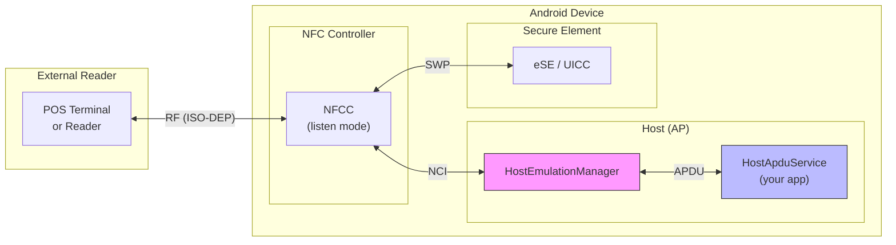

### 38.6.2 Architecture: HostApduService

Applications implement HCE by extending `HostApduService`:

```java
public class MyPaymentService extends HostApduService {
    @Override
    public byte[] processCommandApdu(byte[] apdu, Bundle extras) {
        // Process the SELECT APDU or subsequent commands
        if (isSelectAid(apdu)) {
            return SELECT_OK_SW;
        }
        // Process transaction APDUs
        return processTransaction(apdu);
    }

    @Override
    public void onDeactivated(int reason) {
        // Clean up when the reader moves away
    }
}
```

The service is declared in the manifest with AID groups:

```xml
<service android:name=".MyPaymentService"
         android:exported="true"
         android:permission="android.permission.BIND_NFC_SERVICE">
    <intent-filter>
        <action android:name="android.nfc.cardemulation.action.HOST_APDU_SERVICE" />
    </intent-filter>
    <meta-data android:name="android.nfc.cardemulation.host_apdu_service"
               android:resource="@xml/apdu_service" />
</service>
```

### 38.6.3 CardEmulationManager: The Orchestrator

`CardEmulationManager` is the central coordinator for all card emulation
functionality:

```java
// Source: packages/modules/Nfc/NfcNci/src/com/android/nfc/cardemulation/
//         CardEmulationManager.java
public class CardEmulationManager implements
        RegisteredServicesCache.Callback,
        RegisteredNfcFServicesCache.Callback,
        PreferredServices.Callback,
        EnabledNfcFServices.Callback,
        WalletRoleObserver.Callback {

    final RegisteredAidCache mAidCache;
    final RegisteredT3tIdentifiersCache mT3tIdentifiersCache;
    final RegisteredServicesCache mServiceCache;
    final RegisteredNfcFServicesCache mNfcFServicesCache;
    final HostEmulationManager mHostEmulationManager;
    final HostNfcFEmulationManager mHostNfcFEmulationManager;
    final PreferredServices mPreferredServices;
    final WalletRoleObserver mWalletRoleObserver;
    ...
}
```

It manages six subsystems:

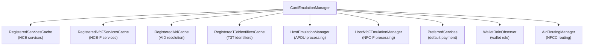

### 38.6.4 AID Registration and Routing

AID (Application Identifier) routing determines which service handles which
card application.  AIDs follow ISO 7816-4 and are hex-encoded:

```java
// Source: packages/modules/Nfc/NfcNci/src/com/android/nfc/cardemulation/
//         CardEmulationManager.java
static final int MINIMUM_AID_LENGTH = 5;
static final int SELECT_APDU_HDR_LENGTH = 5;

// NDEF Tag application AIDs
static final byte[] NDEF_AID_V1 =
        new byte[] {(byte)0xd2, 0x76, 0x00, 0x00, (byte)0x85, 0x01, 0x00};
static final byte[] NDEF_AID_V2 =
        new byte[] {(byte)0xd2, 0x76, 0x00, 0x00, (byte)0x85, 0x01, 0x01};

// Select APDU header: CLA INS P1 P2
static final byte[] SELECT_AID_HDR = new byte[] {0x00, (byte)0xa4, 0x04, 0x00};
```

The routing table in the NFCC maps AIDs to destinations:

| Route ID | Destination |
|----------|-------------|
| 0x00 | Host (application processor) |
| 0x01-0xFF | Off-host (eSE, UICC, etc.) |

### 38.6.5 AID Groups and Categories

Services declare AID groups in XML, each belonging to a category:

```xml
<!-- res/xml/apdu_service.xml -->
<host-apdu-service xmlns:android="http://schemas.android.com/apk/res/android"
    android:description="@string/service_description"
    android:requireDeviceUnlock="false"
    android:apduServiceBanner="@drawable/banner">

    <!-- Payment AID group -->
    <aid-group android:description="@string/payment"
               android:category="payment">
        <aid-filter android:name="A0000000041010" />  <!-- Visa -->
        <aid-filter android:name="A0000000031010" />  <!-- Mastercard -->
    </aid-group>

    <!-- Other AID group -->
    <aid-group android:description="@string/loyalty"
               android:category="other">
        <aid-filter android:name="F0010203040506" />
    </aid-group>
</host-apdu-service>
```

Two AID categories:

- `payment` -- only one payment service can be active (the default payment
  service)
- `other` -- multiple services can register for the same AIDs; if conflict,
  user is prompted

### 38.6.6 HostEmulationManager: APDU Processing

`HostEmulationManager` manages the APDU exchange between the NFC controller
and the bound `HostApduService`:

```java
// Source: packages/modules/Nfc/NfcNci/src/com/android/nfc/cardemulation/
//         HostEmulationManager.java
public class HostEmulationManager {
    static final int STATE_IDLE = 0;
    static final int STATE_W4_SELECT = 1;
    static final int STATE_W4_SERVICE = 2;
    static final int STATE_W4_DEACTIVATE = 3;
    static final int STATE_XFER = 4;
    static final int STATE_POLLING_LOOP = 5;

    static final byte INSTR_SELECT = (byte)0xA4;

    // Standard responses
    static final byte[] AID_NOT_FOUND = {0x6A, (byte)0x82};
    static final byte[] UNKNOWN_ERROR = {0x6F, 0x00};

    // Android-specific HCE detection AID
    static final String ANDROID_HCE_AID = "A000000476416E64726F6964484345";
    static final byte[] ANDROID_HCE_RESPONSE =
            {0x14, (byte)0x81, 0x00, 0x00, (byte)0x90, 0x00};
    ...
}
```

### 38.6.7 The HCE State Machine

The HCE state machine handles the lifecycle of a single card emulation
transaction:

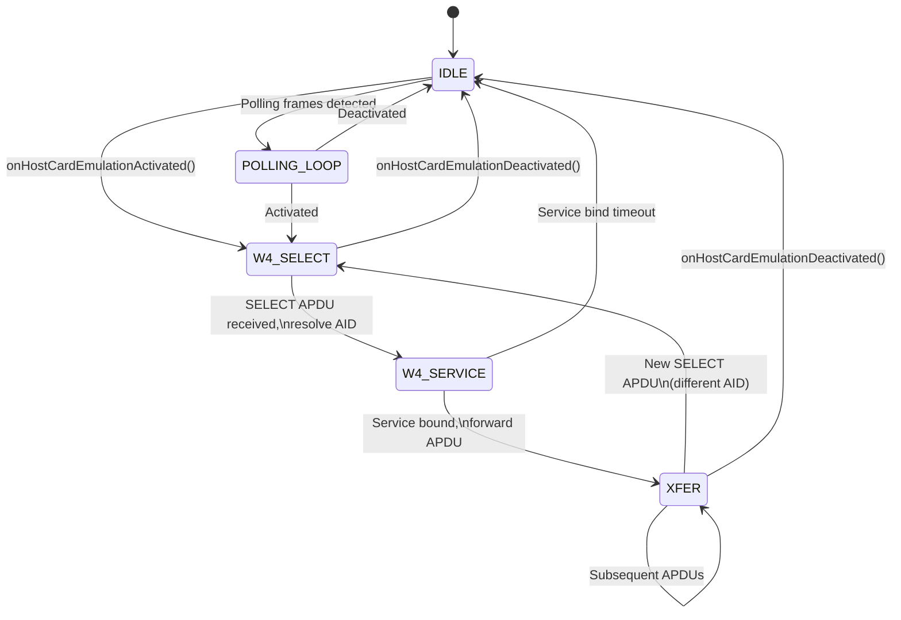

When a SELECT APDU arrives:

1. Extract AID from the APDU (`CLA=0x00, INS=0xA4, P1=0x04, P2=0x00`)
2. Look up AID in `RegisteredAidCache`
3. If the resolved service differs from the currently bound service, unbind
   the old and bind the new
4. Forward the APDU to the service via `Messenger`
5. Relay the service's response back through the NCI stack

### 38.6.8 RegisteredAidCache: AID Resolution

The `RegisteredAidCache` maintains a `TreeMap` of AIDs to services, supporting
three matching modes:

```java
// Source: packages/modules/Nfc/NfcNci/src/com/android/nfc/cardemulation/
//         RegisteredAidCache.java
static final int AID_ROUTE_QUAL_SUBSET = 0x20;
static final int AID_ROUTE_QUAL_PREFIX = 0x10;
```

AID matching modes:

| Mode | Constant | Behavior |
|------|----------|----------|
| Exact only | `AID_MATCHING_EXACT_ONLY` | AID must match exactly |
| Exact or prefix | `AID_MATCHING_EXACT_OR_PREFIX` | AID or prefix match |
| Prefix only | `AID_MATCHING_PREFIX_ONLY` | All AIDs are prefix matches |
| Exact, subset, or prefix | `AID_MATCHING_EXACT_OR_SUBSET_OR_PREFIX` | Most flexible |

Power state routing controls when a route is active:

```java
static final int POWER_STATE_SWITCH_ON = 0x1;
static final int POWER_STATE_SWITCH_OFF = 0x2;
static final int POWER_STATE_BATTERY_OFF = 0x4;
static final int POWER_STATE_SCREEN_OFF_UNLOCKED = 0x8;
static final int POWER_STATE_SCREEN_ON_LOCKED = 0x10;
static final int POWER_STATE_SCREEN_OFF_LOCKED = 0x20;
```

### 38.6.9 AidRoutingManager: NFCC Routing Table

`AidRoutingManager` translates the resolved AID map into the actual NFCC
routing table:

```java
// Source: packages/modules/Nfc/NfcNci/src/com/android/nfc/cardemulation/
//         AidRoutingManager.java
public class AidRoutingManager {
    static final int ROUTE_HOST = 0x00;

    int mDefaultRoute;
    int mDefaultIsoDepRoute;
    int mDefaultOffHostRoute;
    int mDefaultFelicaRoute;
    int mDefaultSysCodeRoute;

    // Routing table: route ID -> set of AIDs
    SparseArray<Set<String>> mAidRoutingTable;
    // Reverse lookup: AID -> route ID
    HashMap<String, Integer> mRouteForAid;
    // Power state per AID
    HashMap<String, Integer> mPowerForAid;
    ...
}
```

The routing table has a size limit imposed by the NFCC hardware
(`mMaxAidRoutingTableSize`).  When the table exceeds this limit, the manager
must prioritize or compress entries.

### 38.6.10 Preferred Payment Services and Wallet Role

Android designates one "preferred payment service" that handles payment AIDs
by default.  This is tied to the **Wallet Role** introduced in recent Android
versions:

```java
// Source: packages/modules/Nfc/NfcNci/src/com/android/nfc/cardemulation/
//         CardEmulationManager.java
final WalletRoleObserver mWalletRoleObserver;
final PreferredServices mPreferredServices;
```

The Wallet Role holder gets priority for:

- Payment category AIDs
- Tap-to-pay UI
- Default contactless payment selection

### 38.6.11 Observe Mode and Polling Loop Filters

Observe mode is an advanced feature that allows an HCE service to receive
polling loop frames without fully activating the card emulation transaction.
This enables:

- Detecting reader presence before revealing card credentials
- Implementing custom transaction flows
- Supporting privacy-preserving payment protocols

```java
// Source: packages/modules/Nfc/NfcNci/src/com/android/nfc/NfcService.java
@Override
public void onPollingLoopDetected(List<PollingFrame> frames) {
    if (mCardEmulationManager != null) {
        mCardEmulationManager.onPollingLoopDetected(
                new ArrayList<>(frames));
    }
}
```

The firmware can autonomously enable or disable observe mode:

```java
@Override
public void onObserveModeDisabledInFirmware(PollingFrame exitFrame) {
    mCardEmulationManager.onObserveModeDisabledInFirmware(exitFrame);
    onObserveModeStateChanged(false);
}

@Override
public void onObserveModeEnabledInFirmware() {
    onObserveModeStateChanged(true);
}
```

### 38.6.12 Off-Host Card Emulation

Off-host card emulation routes APDUs directly to a Secure Element (eSE or UICC)
without involving the application processor.  This is used for:

- SIM-based payments
- Telecom applications
- High-security credentials

The routing is configured through `NfcConfig`:

```
// From NfcConfig:
byte defaultOffHostRoute;       // Default off-host destination
byte[] offHostRouteUicc;        // UICC route IDs
byte[] offHostRouteEse;         // eSE route IDs
```

Applications declare off-host services with `OffHostApduService`:

```xml
<service android:name=".MyOffHostService"
         android:exported="true"
         android:permission="android.permission.BIND_NFC_SERVICE">
    <intent-filter>
        <action android:name=
            "android.nfc.cardemulation.action.OFF_HOST_APDU_SERVICE" />
    </intent-filter>
    <meta-data android:name=
            "android.nfc.cardemulation.off_host_apdu_service"
               android:resource="@xml/offhost_service" />
</service>
```

### 38.6.13 HCE Security Considerations

1. **No hardware isolation** -- unlike SE-based emulation, HCE processes
   APDUs on the application processor.  A compromised OS can intercept
   transaction data.

2. **Tokenization** -- payment networks mitigate risk by using tokenized
   PANs that are worthless if intercepted.

3. **Device unlock requirements** -- services can require the device to be
   unlocked (`android:requireDeviceUnlock="true"`).

4. **BIND_NFC_SERVICE permission** -- only the NFC system service can bind
   to HCE services, preventing rogue apps from intercepting APDUs.

5. **AID conflict resolution** -- when multiple apps register the same AID,
   the system presents a chooser for "other" category, or uses the default
   payment service for "payment" category.

---

## 38.7 Secure Element

### 38.7.1 What Is a Secure Element

A Secure Element (SE) is a tamper-resistant hardware component that can run
Java Card applets.  It provides a hardware-isolated execution environment for
sensitive operations like payment credential storage.

Three types of SE exist in Android devices:

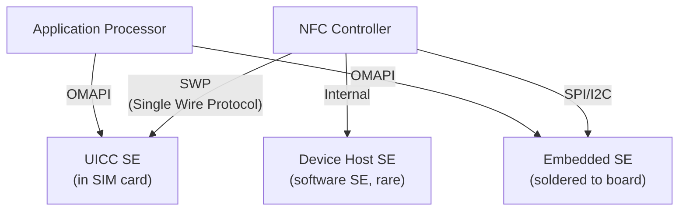

### 38.7.2 eSE: Embedded Secure Element

The eSE is a dedicated chip soldered onto the device motherboard.  It is
permanently connected to the NFC controller and optionally accessible to the
application processor.  Key characteristics:

- Not removable by the user
- Controlled by the device manufacturer
- Can perform contactless transactions even when the device is powered off
  (battery-off mode)
- Connected to NFCC via SPI, I2C, or proprietary interface

In `NfcConfig`, the eSE is identified by:

```
byte[] offHostRouteEse;     // Route IDs for eSE
byte offHostESEPipeId;      // HCI pipe ID for eSE
```

### 38.7.3 UICC-Based Secure Element

The UICC (Universal Integrated Circuit Card -- the SIM card) contains an
integrated SE.  It connects to the NFC controller via the Single Wire Protocol
(SWP):

- Removable and controlled by the mobile network operator
- Contains telecom applets (SIM toolkit)
- Can host payment applets provisioned by the operator
- Connection is interrupted when SIM is removed

In `NfcConfig`:

```
byte[] offHostRouteUicc;    // Route IDs for UICC
byte offHostSIMPipeId;      // HCI pipe ID for SIM
byte[] offHostSimPipeIds;   // Multiple SIM pipe IDs
```

### 38.7.4 OMAPI: Open Mobile API

OMAPI (Open Mobile API) allows applications to communicate directly with
Secure Elements through the `android.se.omapi` package.  NfcService integrates
with OMAPI through:

```java
// Source: packages/modules/Nfc/NfcNci/src/com/android/nfc/NfcService.java
private ISecureElementService mSEService;
```

OMAPI provides:

- `SEService` -- entry point for SE access
- `Reader` -- represents a specific SE (eSE or UICC slot)
- `Session` -- a communication session with an SE
- `Channel` -- a logical channel for APDU exchange

Access to OMAPI requires the `android.permission.SECURE_ELEMENT_PRIVILEGED_OPERATION`
permission for privileged operations, or per-AID access control rules stored
in the SE itself.

### 38.7.5 SE Routing in the NFC Controller

The NFCC maintains routing entries that direct contactless transactions to the
appropriate SE:

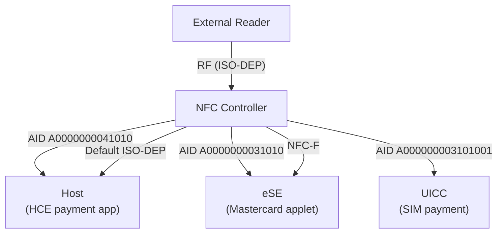

Routing dimensions:

| Routing Type | Resolution | NCI Config |
|-------------|-----------|------------|
| AID-based | Specific AID to specific destination | RF_SET_LISTEN_MODE_ROUTING |
| Protocol-based | ISO-DEP/NFC-DEP to a default | Technology routing |
| Technology-based | NFC-A/B/F to a default | Technology routing |

### 38.7.6 Transaction Events from the SE

When an off-host SE processes a transaction, NfcService receives a notification
and broadcasts it to interested applications:

```java
// Source: packages/modules/Nfc/NfcNci/src/com/android/nfc/NfcService.java
@Override
public void onNfcTransactionEvent(byte[] aid, byte[] data, String seName) {
    byte[][] dataObj = {aid, data, seName.getBytes()};
    sendMessage(MSG_TRANSACTION_EVENT, dataObj);
}
```

The `MSG_TRANSACTION_EVENT` handler broadcasts `ACTION_TRANSACTION_DETECTED`:

```java
// NfcAdapter constant:
public static final String ACTION_TRANSACTION_DETECTED =
        "android.nfc.action.TRANSACTION_DETECTED";
```

Applications must hold the `NFC_TRANSACTION_EVENT` permission to receive these
broadcasts.

### 38.7.7 NfcConfig SE Parameters

The HAL's `NfcConfig` contains several SE-related parameters:

| Parameter | Purpose |
|-----------|---------|
| `defaultOffHostRoute` | Default NFCEE ID for off-host routing |
| `defaultOffHostRouteFelica` | NFCEE ID for FeliCa off-host routing |
| `offHostESEPipeId` | HCI pipe ID for eSE access |
| `offHostSIMPipeId` | HCI pipe ID for SIM access |
| `offHostRouteUicc` | Array of UICC NFCEE IDs |
| `offHostRouteEse` | Array of eSE NFCEE IDs |
| `offHostSimPipeIds` | Array of SIM pipe IDs |
| `hostAllowlist` | Which hosts can access NFC |

### 38.7.8 Off-Host Route Configuration

The `RoutingOptionManager` centralizes off-host route configuration:

```java
// Source: packages/modules/Nfc/NfcNci/src/com/android/nfc/cardemulation/
//         AidRoutingManager.java
int mDefaultOffHostRoute;  // from RoutingOptionManager
int mDefaultFelicaRoute;   // from RoutingOptionManager
int mDefaultSysCodeRoute;  // from RoutingOptionManager
byte[] mOffHostRouteUicc;  // from RoutingOptionManager
byte[] mOffHostRouteEse;   // from RoutingOptionManager
```

### 38.7.9 HCI Network and Pipes

The Host Controller Interface (HCI) network connects the NFC controller to
Secure Elements.  HCI events are managed at the JNI layer:

```
// Source: packages/modules/Nfc/NfcNci/nci/jni/HciEventManager.cpp
```

The HCI network is reset when necessary:

```
// NfcEvent enum:
HCI_NETWORK_RESET = 4,
```

An HCI network reset clears all pipe connections and requires re-initialization
of SE communication channels.

### 38.7.10 SE Access Control

Access to Secure Elements is controlled through:

1. **Access Rules Application Master (ARA-M)** -- an applet on the SE that
   stores access control rules mapping certificate hashes to allowed AIDs
2. **Access Control Enforcer** -- OMAPI's built-in enforcer that queries
   ARA-M before allowing channel operations
3. **Android permissions** -- `SECURE_ELEMENT_PRIVILEGED_OPERATION` for
   privileged access
4. **SELinux** -- process-level access control to SE device nodes

---

## 38.8 Reader Mode

### 38.8.1 What Reader Mode Does

Reader mode provides exclusive access to NFC tag operations for a single
foreground activity.  When active, it:

- Disables card emulation (the phone won't respond as a card)
- Disables peer-to-peer mode
- Focuses polling on specified NFC technologies
- Delivers discovered tags directly to the registered callback
- Bypasses the normal tag dispatch system

This is essential for applications that need reliable, uninterrupted tag
communication -- such as transit card readers, tag writers, and inventory
management tools.

### 38.8.2 enableReaderMode API

The primary API:

```java
// Source: packages/modules/Nfc/framework/java/android/nfc/NfcAdapter.java
public void enableReaderMode(Activity activity, ReaderCallback callback,
        int flags, Bundle extras) {
    mNfcActivityManager.enableReaderMode(activity, callback, flags, extras);
}
```

Usage:

```java
@Override
protected void onResume() {
    super.onResume();
    NfcAdapter nfc = NfcAdapter.getDefaultAdapter(this);
    if (nfc != null) {
        nfc.enableReaderMode(this,
            new NfcAdapter.ReaderCallback() {
                @Override
                public void onTagDiscovered(Tag tag) {
                    // Handle the tag on a background thread
                    processTag(tag);
                }
            },
            NfcAdapter.FLAG_READER_NFC_A |
            NfcAdapter.FLAG_READER_NFC_B |
            NfcAdapter.FLAG_READER_SKIP_NDEF_CHECK,
            null  // extras Bundle
        );
    }
}

@Override
protected void onPause() {
    super.onPause();
    NfcAdapter nfc = NfcAdapter.getDefaultAdapter(this);
    if (nfc != null) {
        nfc.disableReaderMode(this);
    }
}
```

### 38.8.3 Foreground Dispatch System

Foreground dispatch is an older mechanism that gives priority tag routing to
the foreground activity but does not disable card emulation:

```java
@Override
protected void onResume() {
    super.onResume();
    NfcAdapter nfc = NfcAdapter.getDefaultAdapter(this);

    PendingIntent pendingIntent = PendingIntent.getActivity(this, 0,
            new Intent(this, getClass())
                    .addFlags(Intent.FLAG_ACTIVITY_SINGLE_TOP),
            PendingIntent.FLAG_MUTABLE);

    IntentFilter[] filters = new IntentFilter[] {
        new IntentFilter(NfcAdapter.ACTION_NDEF_DISCOVERED)
    };

    String[][] techLists = new String[][] {
        new String[] { NfcA.class.getName() }
    };

    nfc.enableForegroundDispatch(this, pendingIntent, filters, techLists);
}

@Override
protected void onNewIntent(Intent intent) {
    if (NfcAdapter.ACTION_NDEF_DISCOVERED.equals(intent.getAction())) {
        Tag tag = intent.getParcelableExtra(NfcAdapter.EXTRA_TAG);
        // Process the tag
    }
}

@Override
protected void onPause() {
    super.onPause();
    NfcAdapter.getDefaultAdapter(this).disableForegroundDispatch(this);
}
```

**Comparison: Reader Mode vs Foreground Dispatch**

| Feature | Reader Mode | Foreground Dispatch |
|---------|-------------|-------------------|
| Card emulation | Disabled | Active |
| P2P mode | Disabled | Active |
| Delivery method | Callback | Intent |
| NDEF auto-read | Configurable | Always attempted |
| Threading | Callback thread | Main thread |
| API level | 19+ | 10+ |

### 38.8.4 Reader Mode Flags and Technology Masks

Reader mode flags control which technologies are polled:

```java
// Source: packages/modules/Nfc/framework/java/android/nfc/NfcAdapter.java
public static final int FLAG_READER_NFC_A = 0x1;          // ISO 14443-3A
public static final int FLAG_READER_NFC_B = 0x2;          // ISO 14443-3B
public static final int FLAG_READER_NFC_F = 0x4;          // JIS X 6319-4
public static final int FLAG_READER_NFC_V = 0x8;          // ISO 15693
public static final int FLAG_READER_NFC_BARCODE = 0x10;   // Kovio barcode
public static final int FLAG_READER_SKIP_NDEF_CHECK = 0x80;     // Don't auto-read NDEF
public static final int FLAG_READER_NO_PLATFORM_SOUNDS = 0x100; // Suppress tap sound
```

These map to NfcService's internal polling masks:

```java
// Source: packages/modules/Nfc/NfcNci/src/com/android/nfc/NfcService.java
static final int NFC_POLL_A = 0x01;
static final int NFC_POLL_B = 0x02;
static final int NFC_POLL_F = 0x04;
static final int NFC_POLL_V = 0x08;
static final int NFC_POLL_B_PRIME = 0x10;
static final int NFC_POLL_KOVIO = 0x20;
```

### 38.8.5 Presence Check Mechanisms

Presence checking determines if a tag is still in range.  Three algorithms
are available:

```
// Source: hardware/interfaces/nfc/aidl/.../PresenceCheckAlgorithm.aidl
enum PresenceCheckAlgorithm {
    DEFAULT = 0,      // Stack decides
    I_BLOCK = 1,      // Send ISO-DEP I-Block
    ISO_DEP_NAK = 2,  // Send ISO-DEP NAK
}
```

NfcService configures the default presence check delay:

```java
// Source: packages/modules/Nfc/NfcNci/src/com/android/nfc/NfcService.java
static final int DEFAULT_PRESENCE_CHECK_DELAY = 125;  // milliseconds
```

Applications can customize the delay through the extras Bundle passed to
`enableReaderMode()`:

```java
Bundle extras = new Bundle();
extras.putInt(NfcAdapter.EXTRA_READER_PRESENCE_CHECK_DELAY, 500);
nfc.enableReaderMode(this, callback, flags, extras);
```

### 38.8.6 NFC Discovery Parameters

`NfcDiscoveryParameters` encapsulates the NFC controller's configuration for
discovery:

```java
// Source: packages/modules/Nfc/NfcNci/src/com/android/nfc/NfcDiscoveryParameters.java
NfcDiscoveryParameters mCurrentDiscoveryParameters =
        NfcDiscoveryParameters.getNfcOffParameters();
```

The parameters include:

- Technology mask (which technologies to poll for)
- Listen mode configuration (card emulation)
- Polling interval
- Screen state dependent behavior

### 38.8.7 Polling Technology Masks

The default polling technology mask enables most common technologies:

```java
// Source: packages/modules/Nfc/NfcNci/src/com/android/nfc/NfcService.java
static final int DEFAULT_POLL_TECH = 0x2f;
// Binary: 0010 1111
// Enabled: NFC_POLL_A | NFC_POLL_B | NFC_POLL_F | NFC_POLL_V | NFC_POLL_KOVIO

static final int DEFAULT_LISTEN_TECH = 0xf;
// Binary: 0000 1111
// Enabled: NFC_LISTEN_A | NFC_LISTEN_B | NFC_LISTEN_F | NFC_LISTEN_V
```

Users can customize the polling and listen technology masks through settings:

```java
static final String PREF_POLL_TECH = "polling_tech_dfl";
static final String PREF_LISTEN_TECH = "listen_tech_dfl";
```

### 38.8.8 Tag Debouncing

Tag debouncing prevents the same tag from being dispatched multiple times in
rapid succession:

```java
// Source: packages/modules/Nfc/NfcNci/src/com/android/nfc/NfcService.java
byte mDebounceTagUid[];
int mDebounceTagDebounceMs;
int mDebounceTagNativeHandle = INVALID_NATIVE_HANDLE;
ITagRemovedCallback mDebounceTagRemovedCallback;
```

When `ignore()` is called on a tag, its UID is stored in `mDebounceTagUid`.
For the specified debounce period, any tag with the same UID is silently
ignored.

### 38.8.9 Reader Mode vs Normal Discovery

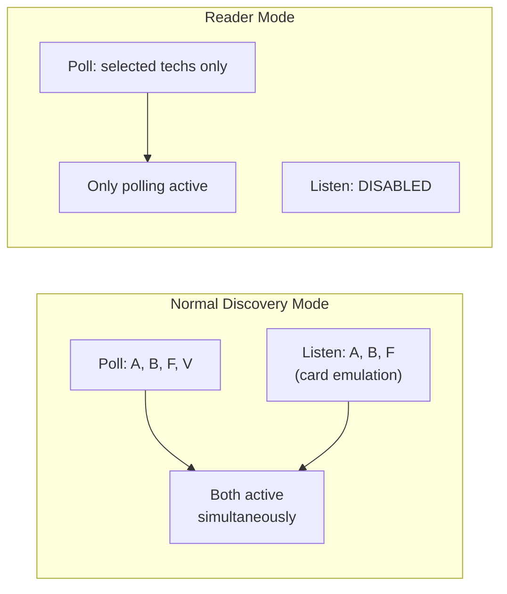

Key differences in NFC controller behavior:

| Aspect | Normal Mode | Reader Mode |
|--------|------------|-------------|
| Polling | All default technologies | Only specified flags |
| Listening | Active (HCE) | Disabled |
| NDEF auto-read | Always | Configurable |
| P2P | Available | Disabled |
| Dispatch | Intent-based | Callback-based |
| Sound | Platform sound | Configurable |

---

## 38.9 NFC-F (FeliCa) and NFC-V

### 38.9.1 NFC-F: FeliCa Overview

NFC-F (JIS X 6319-4) is the contactless technology used by Sony's FeliCa
system, dominant in Japan for:

- Transit cards (Suica, PASMO, ICOCA)
- Electronic money (Edy, nanaco, WAON)
- Identification cards

FeliCa uses a proprietary communication scheme at 212 kbps or 424 kbps,
operating at the standard 13.56 MHz NFC frequency.  Key characteristics:

- **System Code** -- identifies the card application (like AID for ISO-DEP)
- **IDm (Manufacturer)** -- 8-byte identifier assigned during manufacture
- **PMm** -- manufacturing parameter memory

### 38.9.2 NfcF Tag Technology Class

The `NfcF` class provides access to NFC-F tag properties and raw communication:

```java
// Source: packages/modules/Nfc/framework/java/android/nfc/tech/NfcF.java
public final class NfcF extends BasicTagTechnology {
    public static final String EXTRA_SC = "systemcode";
    public static final String EXTRA_PMM = "pmm";

    private byte[] mSystemCode = null;
    private byte[] mManufacturer = null;

    public static NfcF get(Tag tag) {
        if (!tag.hasTech(TagTechnology.NFC_F)) return null;
        try { return new NfcF(tag); }
        catch (RemoteException e) { return null; }
    }

    // Get the system code (2 bytes)
    public byte[] getSystemCode() { return mSystemCode; }

    // Get the manufacturer bytes (IDm, 8 bytes)
    public byte[] getManufacturer() { return mManufacturer; }

    // Send raw NFC-F commands and receive response
    public byte[] transceive(byte[] data) throws IOException { ... }

    // Maximum transceive length
    public int getMaxTransceiveLength() { ... }
}
```

Usage:

```java
Tag tag = intent.getParcelableExtra(NfcAdapter.EXTRA_TAG);
NfcF nfcF = NfcF.get(tag);
if (nfcF != null) {
    nfcF.connect();
    byte[] systemCode = nfcF.getSystemCode();
    byte[] manufacturer = nfcF.getManufacturer();

    // FeliCa Read Without Encryption command
    byte[] readCmd = buildFeliCaReadCommand(manufacturer, serviceCode, blockList);
    byte[] response = nfcF.transceive(readCmd);

    nfcF.close();
}
```

### 38.9.3 Host-Based NFC-F Emulation (HCE-F)

HCE-F allows Android to emulate a FeliCa card, enabling:

- Software-based transit card emulation
- Mobile payment using FeliCa protocols
- Custom FeliCa-based services

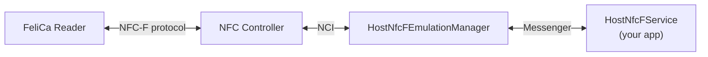

### 38.9.4 HostNfcFService and HostNfcFEmulationManager

Applications implement NFC-F emulation by extending `HostNfcFService`:

```java
public class MyFeliCaService extends HostNfcFService {
    @Override
    public byte[] processNfcFPacket(byte[] packet, Bundle extras) {
        // Process incoming NFC-F command
        // Return response packet
        return buildResponse(packet);
    }

    @Override
    public void onDeactivated(int reason) {
        // Clean up
    }
}
```

`HostNfcFEmulationManager` manages the NFC-F emulation lifecycle:

```java
// Source: packages/modules/Nfc/NfcNci/src/com/android/nfc/cardemulation/
//         HostNfcFEmulationManager.java
public class HostNfcFEmulationManager {
    static final int STATE_IDLE = 0;
    static final int STATE_W4_SERVICE = 1;
    static final int STATE_XFER = 2;

    static final int NFCID2_LENGTH = 8;
    static final int MINIMUM_NFCF_PACKET_LENGTH = 10;
    ...
}
```

### 38.9.5 T3T Identifiers and System Codes

NFC-F card emulation uses T3T (Type 3 Tag) identifiers instead of AIDs for
routing:

```java
// Source: packages/modules/Nfc/NfcNci/src/com/android/nfc/NfcService.java
static final int MSG_REGISTER_T3T_IDENTIFIER = 12;
static final int MSG_DEREGISTER_T3T_IDENTIFIER = 13;
```

The `RegisteredT3tIdentifiersCache` maintains the mapping of system codes
and NFCID2 values to services:

```java
// Source: packages/modules/Nfc/NfcNci/src/com/android/nfc/cardemulation/
//         CardEmulationManager.java
final RegisteredT3tIdentifiersCache mT3tIdentifiersCache;
```

System code routing is configured in the NFCC:

```java
// Source: packages/modules/Nfc/NfcNci/src/com/android/nfc/cardemulation/
//         AidRoutingManager.java
int mDefaultSysCodeRoute;
```

### 38.9.6 NFC-V: ISO 15693 (Vicinity Cards)

NFC-V (ISO 15693) operates at a longer range than other NFC technologies
(up to ~1 meter in some configurations).  It is commonly used for:

- Library book tags
- Warehouse inventory labels
- Industrial asset tracking
- Pharmaceutical tracking

Key properties:

- **DSF ID** (Data Storage Format Identifier) -- identifies the data structure
- **Response Flags** -- status flags from the tag
- UID is 8 bytes (assigned by manufacturer)

### 38.9.7 NfcV Tag Technology Class

```java
// Source: packages/modules/Nfc/framework/java/android/nfc/tech/NfcV.java
public final class NfcV extends BasicTagTechnology {
    public static final String EXTRA_RESP_FLAGS = "respflags";
    public static final String EXTRA_DSFID = "dsfid";

    private byte mRespFlags;
    private byte mDsfId;

    public static NfcV get(Tag tag) {
        if (!tag.hasTech(TagTechnology.NFC_V)) return null;
        try { return new NfcV(tag); }
        catch (RemoteException e) { return null; }
    }

    public byte getResponseFlags() { return mRespFlags; }
    public byte getDsfId() { return mDsfId; }

    // Send raw NFC-V commands (FLAGS, CMD, PARAMETER bytes)
    // CRC is automatically appended
    public byte[] transceive(byte[] data) throws IOException { ... }
}
```

Usage:

```java
Tag tag = intent.getParcelableExtra(NfcAdapter.EXTRA_TAG);
NfcV nfcV = NfcV.get(tag);
if (nfcV != null) {
    nfcV.connect();

    byte dsfId = nfcV.getDsfId();
    byte respFlags = nfcV.getResponseFlags();

    // Read Single Block (ISO 15693 command 0x20)
    byte[] readCmd = new byte[] {
        0x02,  // FLAGS: high data rate
        0x20,  // READ_SINGLE_BLOCK command
        0x00   // Block number
    };
    byte[] response = nfcV.transceive(readCmd);

    nfcV.close();
}
```

### 38.9.8 Other Tag Technologies: NfcA, NfcB, IsoDep, MifareClassic, MifareUltralight

The full set of tag technology classes in `android.nfc.tech`:

| Class | Description | Key Methods |
|-------|-------------|-------------|
| `NfcA` | ISO 14443-3A | `getAtqa()`, `getSak()`, `transceive()` |
| `NfcB` | ISO 14443-3B | `getApplicationData()`, `getProtocolInfo()`, `transceive()` |
| `IsoDep` | ISO 14443-4 | `getHistoricalBytes()`, `getHiLayerResponse()`, `transceive()` |
| `Ndef` | NDEF formatted | `getNdefMessage()`, `writeNdefMessage()`, `makeReadOnly()` |
| `NdefFormatable` | Can be formatted | `format()`, `formatReadOnly()` |
| `MifareClassic` | NXP MIFARE Classic | `authenticate()`, `readBlock()`, `writeBlock()` |
| `MifareUltralight` | NXP MIFARE Ultralight | `readPages()`, `writePage()` |
| `NfcBarcode` | Kovio barcode | `getType()`, `getBarcode()` |

All technology classes extend `BasicTagTechnology` which provides:

- `connect()` -- establish communication
- `close()` -- release communication
- `isConnected()` -- check connection state
- `getTag()` -- get the underlying Tag object

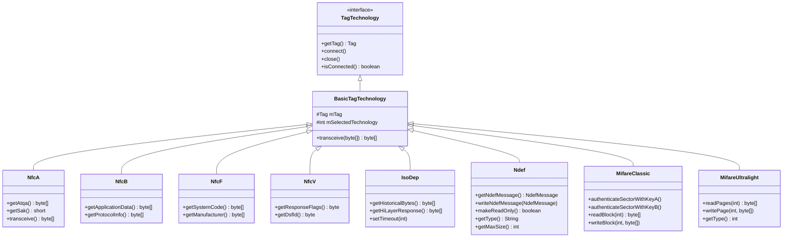

---

## 38.10 Try It: NFC Development Exercises

### 38.10.1 Exercise 1: Read an NDEF Tag

**Goal**: Build an activity that reads NDEF messages from tags.

```java
public class ReadNdefActivity extends Activity {

    @Override
    protected void onCreate(Bundle savedInstanceState) {
        super.onCreate(savedInstanceState);
        setContentView(R.layout.activity_read_ndef);
        handleIntent(getIntent());
    }

    @Override
    protected void onNewIntent(Intent intent) {
        super.onNewIntent(intent);
        handleIntent(intent);
    }

    private void handleIntent(Intent intent) {
        String action = intent.getAction();
        if (NfcAdapter.ACTION_NDEF_DISCOVERED.equals(action)
                || NfcAdapter.ACTION_TECH_DISCOVERED.equals(action)
                || NfcAdapter.ACTION_TAG_DISCOVERED.equals(action)) {

            Parcelable[] rawMessages = intent.getParcelableArrayExtra(
                    NfcAdapter.EXTRA_NDEF_MESSAGES);

            if (rawMessages != null) {
                NdefMessage[] messages = new NdefMessage[rawMessages.length];
                for (int i = 0; i < rawMessages.length; i++) {
                    messages[i] = (NdefMessage) rawMessages[i];
                }
                processNdefMessages(messages);
            }

            Tag tag = intent.getParcelableExtra(NfcAdapter.EXTRA_TAG);
            byte[] tagId = intent.getByteArrayExtra(NfcAdapter.EXTRA_ID);
            Log.d("NFC", "Tag ID: " + bytesToHex(tagId));
            Log.d("NFC", "Tag techs: " +
                    Arrays.toString(tag.getTechList()));
        }
    }

    private void processNdefMessages(NdefMessage[] messages) {
        for (NdefMessage msg : messages) {
            for (NdefRecord record : msg.getRecords()) {
                short tnf = record.getTnf();
                byte[] type = record.getType();
                byte[] payload = record.getPayload();

                Log.d("NFC", "TNF: " + tnf);
                Log.d("NFC", "Type: " + new String(type));

                Uri uri = record.toUri();
                if (uri != null) {
                    Log.d("NFC", "URI: " + uri.toString());
                }

                String mime = record.toMimeType();
                if (mime != null) {
                    Log.d("NFC", "MIME: " + mime);
                    Log.d("NFC", "Data: " + new String(payload));
                }
            }
        }
    }

    private static String bytesToHex(byte[] bytes) {
        if (bytes == null) return "null";
        StringBuilder sb = new StringBuilder();
        for (byte b : bytes) {
            sb.append(String.format("%02X", b));
        }
        return sb.toString();
    }
}
```

**Manifest registration**:

```xml
<activity android:name=".ReadNdefActivity"
          android:exported="true"
          android:launchMode="singleTop">
    <intent-filter>
        <action android:name="android.nfc.action.NDEF_DISCOVERED" />
        <category android:name="android.intent.category.DEFAULT" />
        <data android:mimeType="text/plain" />
    </intent-filter>
    <intent-filter>
        <action android:name="android.nfc.action.NDEF_DISCOVERED" />
        <category android:name="android.intent.category.DEFAULT" />
        <data android:scheme="https" />
    </intent-filter>
</activity>
```

**Verification**: write an NDEF URI tag with a tool like NFC TagWriter, then
tap your phone.  The activity should launch and display the tag content.

### 38.10.2 Exercise 2: Write an NDEF Tag

**Goal**: Write NDEF content to a blank or rewritable tag.

```java
public class WriteNdefActivity extends Activity {
    private NfcAdapter mNfcAdapter;
    private PendingIntent mPendingIntent;
    private boolean mWriteMode = false;

    @Override
    protected void onCreate(Bundle savedInstanceState) {
        super.onCreate(savedInstanceState);
        setContentView(R.layout.activity_write_ndef);

        mNfcAdapter = NfcAdapter.getDefaultAdapter(this);
        mPendingIntent = PendingIntent.getActivity(this, 0,
                new Intent(this, getClass())
                        .addFlags(Intent.FLAG_ACTIVITY_SINGLE_TOP),
                PendingIntent.FLAG_MUTABLE);
    }

    @Override
    protected void onResume() {
        super.onResume();
        // Enable foreground dispatch to catch any tag
        mNfcAdapter.enableForegroundDispatch(this, mPendingIntent,
                null, null);
    }

    @Override
    protected void onPause() {
        super.onPause();
        mNfcAdapter.disableForegroundDispatch(this);
    }

    @Override
    protected void onNewIntent(Intent intent) {
        super.onNewIntent(intent);
        if (mWriteMode) {
            Tag tag = intent.getParcelableExtra(NfcAdapter.EXTRA_TAG);
            writeTag(tag);
        }
    }

    private void writeTag(Tag tag) {
        // Build the NDEF message
        NdefRecord uriRecord = NdefRecord.createUri("https://android.com");
        NdefRecord textRecord = NdefRecord.createTextRecord("en",
                "Hello from AOSP Internals!");
        NdefRecord aarRecord = NdefRecord.createApplicationRecord(
                "com.example.nfcdemo");

        NdefMessage message = new NdefMessage(uriRecord, textRecord,
                aarRecord);

        try {
            Ndef ndef = Ndef.get(tag);
            if (ndef != null) {
                ndef.connect();
                if (!ndef.isWritable()) {
                    Log.e("NFC", "Tag is read-only");
                    return;
                }
                if (ndef.getMaxSize() < message.toByteArray().length) {
                    Log.e("NFC", "Tag capacity too small");
                    return;
                }
                ndef.writeNdefMessage(message);
                Log.d("NFC", "Write successful!");
                ndef.close();
            } else {
                // Try to format the tag
                NdefFormatable formatable = NdefFormatable.get(tag);
                if (formatable != null) {
                    formatable.connect();
                    formatable.format(message);
                    formatable.close();
                    Log.d("NFC", "Format and write successful!");
                } else {
                    Log.e("NFC", "Tag does not support NDEF");
                }
            }
        } catch (Exception e) {
            Log.e("NFC", "Write failed", e);
        }
    }

    public void enableWriteMode() {
        mWriteMode = true;
        // Show UI indicating "tap a tag to write"
    }
}
```

**Verification**: tap a blank NTAG213/215/216 tag, then read it back with
Exercise 1 or any NFC reader app.

### 38.10.3 Exercise 3: Implement a Payment HCE Service

**Goal**: Build a minimal HCE service that responds to payment SELECT commands.

**Service implementation**:

```java
public class DemoPaymentService extends HostApduService {
    private static final String TAG = "DemoPaymentService";

    // Visa AID
    private static final String VISA_AID = "A0000000041010";

    // Status words
    private static final byte[] SW_OK = {(byte) 0x90, 0x00};
    private static final byte[] SW_UNKNOWN = {0x6F, 0x00};
    private static final byte[] SW_CLA_NOT_SUPPORTED = {0x6E, 0x00};
    private static final byte[] SW_INS_NOT_SUPPORTED = {0x6D, 0x00};

    // SELECT response: FCI template
    private static final byte[] SELECT_RESPONSE = buildSelectResponse();

    @Override
    public byte[] processCommandApdu(byte[] apdu, Bundle extras) {
        Log.d(TAG, "Received APDU: " + bytesToHex(apdu));

        if (apdu.length < 4) {
            return SW_UNKNOWN;
        }

        byte cla = apdu[0];
        byte ins = apdu[1];

        // Handle SELECT command (INS = 0xA4)
        if (ins == (byte) 0xA4) {
            return handleSelect(apdu);
        }

        // Handle GET PROCESSING OPTIONS (INS = 0xA8)
        if (ins == (byte) 0xA8) {
            return handleGpo(apdu);
        }

        return SW_INS_NOT_SUPPORTED;
    }

    @Override
    public void onDeactivated(int reason) {
        Log.d(TAG, "Deactivated: " +
                (reason == DEACTIVATION_LINK_LOSS ?
                        "link loss" : "deselected"));
    }

    private byte[] handleSelect(byte[] apdu) {
        // Extract AID from SELECT APDU
        if (apdu.length >= 5) {
            int aidLength = apdu[4] & 0xFF;
            if (apdu.length >= 5 + aidLength) {
                byte[] aid = new byte[aidLength];
                System.arraycopy(apdu, 5, aid, 0, aidLength);
                Log.d(TAG, "SELECT AID: " + bytesToHex(aid));

                // Return FCI with SW 9000
                return concat(SELECT_RESPONSE, SW_OK);
            }
        }
        return SW_UNKNOWN;
    }

    private byte[] handleGpo(byte[] apdu) {
        // Return minimal GPO response
        // In production, this would contain real EMV data
        byte[] gpoResponse = {
            (byte) 0x80, 0x06,  // Response Format 1
            0x00, 0x00,         // AIP
            0x08, 0x01, 0x01, 0x00  // AFL
        };
        return concat(gpoResponse, SW_OK);
    }

    private static byte[] buildSelectResponse() {
        // Minimal FCI template
        return new byte[] {
            0x6F, 0x0A,                 // FCI Template
            (byte) 0x84, 0x07,          // DF Name (AID)
            (byte) 0xA0, 0x00, 0x00,    // Visa AID
            0x00, 0x04, 0x10, 0x10,
            (byte) 0xA5, 0x00           // FCI Proprietary Template (empty)
        };
    }

    // ... utility methods
}
```

**Service declaration** (`res/xml/payment_service.xml`):

```xml
<host-apdu-service xmlns:android="http://schemas.android.com/apk/res/android"
    android:description="@string/demo_payment_description"
    android:requireDeviceUnlock="false">

    <aid-group android:description="@string/payment_aids"
               android:category="payment">
        <aid-filter android:name="A0000000041010" />
    </aid-group>
</host-apdu-service>
```

**Manifest**:

```xml
<service android:name=".DemoPaymentService"
         android:exported="true"
         android:permission="android.permission.BIND_NFC_SERVICE">
    <intent-filter>
        <action android:name=
            "android.nfc.cardemulation.action.HOST_APDU_SERVICE" />
    </intent-filter>
    <meta-data android:name=
            "android.nfc.cardemulation.host_apdu_service"
               android:resource="@xml/payment_service" />
</service>
```

**Verification**: use an NFC reader app on another phone to send a SELECT APDU
for the Visa AID.

### 38.10.4 Exercise 4: Use Reader Mode

**Goal**: Use reader mode for reliable tag reading without card emulation
interference.

```java
public class ReaderModeActivity extends Activity
        implements NfcAdapter.ReaderCallback {
    private NfcAdapter mNfcAdapter;
    private TextView mStatusText;

    @Override
    protected void onCreate(Bundle savedInstanceState) {
        super.onCreate(savedInstanceState);
        setContentView(R.layout.activity_reader_mode);
        mStatusText = findViewById(R.id.status_text);
        mNfcAdapter = NfcAdapter.getDefaultAdapter(this);
    }

    @Override
    protected void onResume() {
        super.onResume();
        Bundle options = new Bundle();
        options.putInt(NfcAdapter.EXTRA_READER_PRESENCE_CHECK_DELAY, 250);

        mNfcAdapter.enableReaderMode(this, this,
                NfcAdapter.FLAG_READER_NFC_A |
                NfcAdapter.FLAG_READER_NFC_B |
                NfcAdapter.FLAG_READER_NFC_F |
                NfcAdapter.FLAG_READER_NFC_V,
                options);
    }

    @Override
    protected void onPause() {
        super.onPause();
        mNfcAdapter.disableReaderMode(this);
    }

    @Override
    public void onTagDiscovered(Tag tag) {
        // This runs on a binder thread -- not the main thread
        StringBuilder info = new StringBuilder();
        info.append("Tag UID: ").append(bytesToHex(tag.getId())).append("\n");
        info.append("Technologies:\n");
        for (String tech : tag.getTechList()) {
            info.append("  - ").append(tech).append("\n");
        }

        // Try to read NDEF
        Ndef ndef = Ndef.get(tag);
        if (ndef != null) {
            try {
                ndef.connect();
                NdefMessage msg = ndef.getNdefMessage();
                if (msg != null) {
                    info.append("NDEF message: ")
                        .append(msg.getRecords().length)
                        .append(" records\n");
                    for (NdefRecord record : msg.getRecords()) {
                        Uri uri = record.toUri();
                        if (uri != null) {
                            info.append("  URI: ").append(uri).append("\n");
                        }
                    }
                }
                ndef.close();
            } catch (Exception e) {
                info.append("Error: ").append(e.getMessage()).append("\n");
            }
        }

        // Try IsoDep for smart cards
        IsoDep isoDep = IsoDep.get(tag);
        if (isoDep != null) {
            try {
                isoDep.connect();
                isoDep.setTimeout(5000);

                // Send SELECT PPSE
                byte[] selectPpse = {
                    0x00, (byte) 0xA4, 0x04, 0x00,
                    0x0E,  // Lc = 14 bytes
                    0x32, 0x50, 0x41, 0x59, 0x2E, 0x53, 0x59, 0x53,
                    0x2E, 0x44, 0x44, 0x46, 0x30, 0x31,  // "2PAY.SYS.DDF01"
                    0x00   // Le
                };
                byte[] response = isoDep.transceive(selectPpse);
                info.append("PPSE response: ")
                    .append(bytesToHex(response)).append("\n");

                isoDep.close();
            } catch (Exception e) {
                info.append("IsoDep error: ")
                    .append(e.getMessage()).append("\n");
            }
        }

        final String result = info.toString();
        runOnUiThread(() -> mStatusText.setText(result));
    }
}
```

**Verification**: tap various NFC tags and cards.  The activity should display
their technology details and content.

### 38.10.5 Exercise 5: Foreground Dispatch

**Goal**: Use foreground dispatch to intercept tags destined for other apps.

```java
public class ForegroundDispatchActivity extends Activity {
    private NfcAdapter mNfcAdapter;
    private PendingIntent mPendingIntent;
    private IntentFilter[] mIntentFilters;
    private String[][] mTechLists;

    @Override
    protected void onCreate(Bundle savedInstanceState) {
        super.onCreate(savedInstanceState);
        setContentView(R.layout.activity_foreground);

        mNfcAdapter = NfcAdapter.getDefaultAdapter(this);

        mPendingIntent = PendingIntent.getActivity(this, 0,
                new Intent(this, getClass())
                        .addFlags(Intent.FLAG_ACTIVITY_SINGLE_TOP),
                PendingIntent.FLAG_MUTABLE);

        // Match all NDEF messages
        IntentFilter ndefFilter = new IntentFilter(
                NfcAdapter.ACTION_NDEF_DISCOVERED);
        try {
            ndefFilter.addDataType("*/*");
        } catch (IntentFilter.MalformedMimeTypeException e) {
            throw new RuntimeException(e);
        }

        // Match all tech tags
        IntentFilter techFilter = new IntentFilter(
                NfcAdapter.ACTION_TECH_DISCOVERED);

        mIntentFilters = new IntentFilter[] { ndefFilter, techFilter };

        // Match any NFC technology
        mTechLists = new String[][] {
            { NfcA.class.getName() },
            { NfcB.class.getName() },
            { NfcF.class.getName() },
            { NfcV.class.getName() },
            { IsoDep.class.getName() },
        };
    }

    @Override
    protected void onResume() {
        super.onResume();
        mNfcAdapter.enableForegroundDispatch(this,
                mPendingIntent, mIntentFilters, mTechLists);
    }

    @Override
    protected void onPause() {
        super.onPause();
        mNfcAdapter.disableForegroundDispatch(this);
    }

    @Override
    protected void onNewIntent(Intent intent) {
        super.onNewIntent(intent);
        Log.d("NFC", "Foreground dispatch received: " + intent.getAction());
        Tag tag = intent.getParcelableExtra(NfcAdapter.EXTRA_TAG);
        if (tag != null) {
            Log.d("NFC", "Tag: " + Arrays.toString(tag.getTechList()));
        }
    }
}
```

### 38.10.6 Exercise 6: Dump the NFC Routing Table

**Goal**: Use `dumpsys` to inspect the NFC service state and routing table.

```bash
# Dump the full NFC service state
adb shell dumpsys nfc

# Key sections to examine:
# - "mState" -- NFC enabled/disabled
# - "Routing Table" -- AID routing entries
# - "HCE Services" -- registered HostApduService components
# - "Discovery Parameters" -- current polling configuration

# Example output analysis:
# Look for lines like:
#   mState=ON
#   mScreenState=ON_UNLOCKED
#   AID Routing Table:
#     A0000000041010 -> Route: 0x00 (Host)
#     A0000000031010 -> Route: 0x02 (eSE)
```

To inspect the NFC HAL:

```bash
# Check if NFC HAL is running
adb shell service list | grep nfc

# Check VINTF for NFC HAL declaration
adb shell cat /vendor/etc/vintf/manifest.xml | grep -A5 nfc

# Inspect NFC system properties
adb shell getprop | grep nfc
```

To inspect NFC controller state:

```bash
# Enable NFC debug logging
adb shell setprop persist.nfc.debug_enabled true

# View NFC logs
adb logcat -s NfcService:V NfcDispatcher:V NfcCardEmulationManager:V

# Enable NCI protocol snoop log
adb shell setprop persist.nfc.snoop_log_mode full
```

### 38.10.7 Exercise 7: Inspect NFC HAL via AIDL

**Goal**: Understand the HAL interface by examining the AIDL definitions.

```bash
# Browse the AIDL HAL interface
find $ANDROID_BUILD_TOP/hardware/interfaces/nfc/aidl \
    -name "*.aidl" -not -path "*/aidl_api/*" | sort

# View the current frozen API
cat $ANDROID_BUILD_TOP/hardware/interfaces/nfc/aidl/\
    aidl_api/android.hardware.nfc/current/android/hardware/nfc/INfc.aidl

# Compare versions to see API evolution
diff $ANDROID_BUILD_TOP/hardware/interfaces/nfc/aidl/\
    aidl_api/android.hardware.nfc/1/android/hardware/nfc/INfc.aidl \
     $ANDROID_BUILD_TOP/hardware/interfaces/nfc/aidl/\
    aidl_api/android.hardware.nfc/2/android/hardware/nfc/INfc.aidl

# Run VTS tests against the HAL
atest VtsHalNfcTargetTest
```

**Questions to explore**:

1. What new methods were added between AIDL v1 and v2?
2. What fields does `NfcConfig` contain? How do they affect routing?
3. What events does `INfcClientCallback` deliver?
4. How does the HAL handle power management (`NfcCloseType`)?

### 38.10.8 Exercise 8: NFC-F FeliCa Emulation

**Goal**: Build a minimal NFC-F (FeliCa) card emulation service.

**Service implementation**:

```java
public class DemoFeliCaService extends HostNfcFService {
    private static final String TAG = "DemoFeliCaService";

    // FeliCa command codes
    private static final byte CMD_POLLING = 0x04;
    private static final byte CMD_READ_WITHOUT_ENCRYPTION = 0x06;
    private static final byte RESP_READ_WITHOUT_ENCRYPTION = 0x07;

    @Override
    public byte[] processNfcFPacket(byte[] packet, Bundle extras) {
        Log.d(TAG, "Received NFC-F packet: " + bytesToHex(packet));

        if (packet.length < 10) {
            return null;  // Too short
        }

        byte length = packet[0];
        byte commandCode = packet[1];
        // NFCID2 is bytes 2-9

        switch (commandCode) {
            case CMD_READ_WITHOUT_ENCRYPTION:
                return handleReadWithoutEncryption(packet);
            default:
                Log.d(TAG, "Unknown command: " +
                        String.format("0x%02X", commandCode));
                return null;
        }
    }

    @Override
    public void onDeactivated(int reason) {
        Log.d(TAG, "FeliCa deactivated: reason=" + reason);
    }

    private byte[] handleReadWithoutEncryption(byte[] packet) {
        // Build a minimal Read Without Encryption response
        byte[] nfcid2 = new byte[8];
        System.arraycopy(packet, 2, nfcid2, 0, 8);

        // Response: Length + RespCode + NFCID2 + StatusFlag1 +
        //           StatusFlag2 + NumBlocks + BlockData
        byte[] blockData = "HelloFeliCa!1234".getBytes();  // 16 bytes
        byte[] response = new byte[1 + 1 + 8 + 1 + 1 + 1 + 16];
        response[0] = (byte) response.length;  // Length
        response[1] = RESP_READ_WITHOUT_ENCRYPTION;
        System.arraycopy(nfcid2, 0, response, 2, 8);
        response[10] = 0x00;  // Status Flag 1: success
        response[11] = 0x00;  // Status Flag 2: success
        response[12] = 0x01;  // Number of blocks
        System.arraycopy(blockData, 0, response, 13, 16);

        return response;
    }
}
```

**Service declaration** (`res/xml/felica_service.xml`):

```xml
<host-nfcf-service xmlns:android="http://schemas.android.com/apk/res/android"
    android:description="@string/demo_felica_description">
    <system-code-filter android:name="4000"
                        android:nfcid2="02FE010203040506" />
</host-nfcf-service>
```

**Manifest**:

```xml
<service android:name=".DemoFeliCaService"
         android:exported="true"
         android:permission="android.permission.BIND_NFC_SERVICE">
    <intent-filter>
        <action android:name=
            "android.nfc.cardemulation.action.HOST_NFCF_SERVICE" />
    </intent-filter>
    <meta-data android:name=
            "android.nfc.cardemulation.host_nfcf_service"
               android:resource="@xml/felica_service" />
</service>
```

---

## 38.11 Summary

This chapter explored Android's NFC stack from the 13.56 MHz radio up through
the application-facing APIs:

**Architecture** -- the NFC stack is a layered system spanning the AIDL HAL
(`INfc`), the libnfc-nci NCI protocol library, the JNI bridge
(`NativeNfcManager`), the central `NfcService` daemon, and the public
`NfcAdapter` API.  The entire stack ships as a Mainline APEX module
(`com.android.nfcservices`).

**NfcService** -- the 6,666+ line central coordinator manages NFC hardware
lifecycle, screen-state-dependent polling, the message handler loop, tag
discovery, card emulation, and routing table updates.

**NFC HAL** -- the AIDL HAL (`android.hardware.nfc.INfc`) provides an 11-method
interface for NCI host operations.  `NfcConfig` carries hardware-specific
routing and configuration.  The callback (`INfcClientCallback`) delivers NCI
data and lifecycle events.

**NDEF** -- the NFC Data Exchange Format encodes typed payloads (URIs, text,
MIME, custom) into `NdefMessage`/`NdefRecord` structures.  The 3-bit TNF field
plus type bytes identify the payload format.  URI prefix compression saves
bytes on the tag.

**Tag Dispatch** -- Android dispatches tags through a three-tier intent chain:
`ACTION_NDEF_DISCOVERED` (most specific), `ACTION_TECH_DISCOVERED` (technology
matching), and `ACTION_TAG_DISCOVERED` (catch-all).  Foreground dispatch and
reader mode provide exclusive tag access for the foreground activity.

**HCE** -- Host Card Emulation lets apps emulate ISO-DEP smart cards.
`HostApduService` processes APDU commands, `CardEmulationManager` orchestrates
AID routing, and `AidRoutingManager` programs the NFCC routing table.
Observe mode enables polling loop detection before card activation.

**Secure Element** -- eSE and UICC secure elements provide hardware-isolated
execution for high-security credentials.  OMAPI provides application access.
Off-host card emulation routes transactions directly to the SE.

**NFC-F and NFC-V** -- FeliCa (NFC-F) support includes reader mode via `NfcF`
and host emulation via `HostNfcFService`.  NFC-V (ISO 15693) provides
longer-range communication for inventory and industrial tags.

The key source files to study:

| File | Path |
|------|------|
| NfcService | `packages/modules/Nfc/NfcNci/src/com/android/nfc/NfcService.java` |
| NfcDispatcher | `packages/modules/Nfc/NfcNci/src/com/android/nfc/NfcDispatcher.java` |
| DeviceHost | `packages/modules/Nfc/NfcNci/src/com/android/nfc/DeviceHost.java` |
| NfcAdapter | `packages/modules/Nfc/framework/java/android/nfc/NfcAdapter.java` |
| NdefRecord | `packages/modules/Nfc/framework/java/android/nfc/NdefRecord.java` |
| CardEmulationManager | `packages/modules/Nfc/NfcNci/src/com/android/nfc/cardemulation/CardEmulationManager.java` |
| HostEmulationManager | `packages/modules/Nfc/NfcNci/src/com/android/nfc/cardemulation/HostEmulationManager.java` |
| AidRoutingManager | `packages/modules/Nfc/NfcNci/src/com/android/nfc/cardemulation/AidRoutingManager.java` |
| NativeNfcManager | `packages/modules/Nfc/NfcNci/nci/src/com/android/nfc/dhimpl/NativeNfcManager.java` |
| INfc.aidl | `hardware/interfaces/nfc/aidl/aidl_api/android.hardware.nfc/current/android/hardware/nfc/INfc.aidl` |
| NfcConfig.aidl | `hardware/interfaces/nfc/aidl/aidl_api/android.hardware.nfc/current/android/hardware/nfc/NfcConfig.aidl` |
