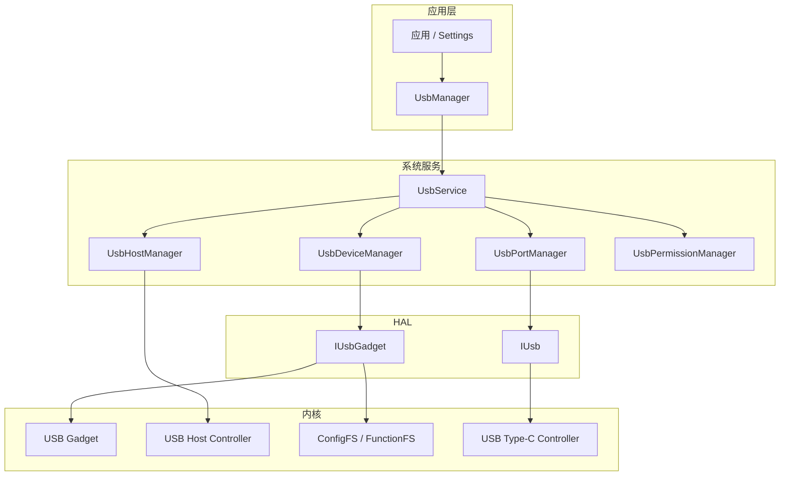
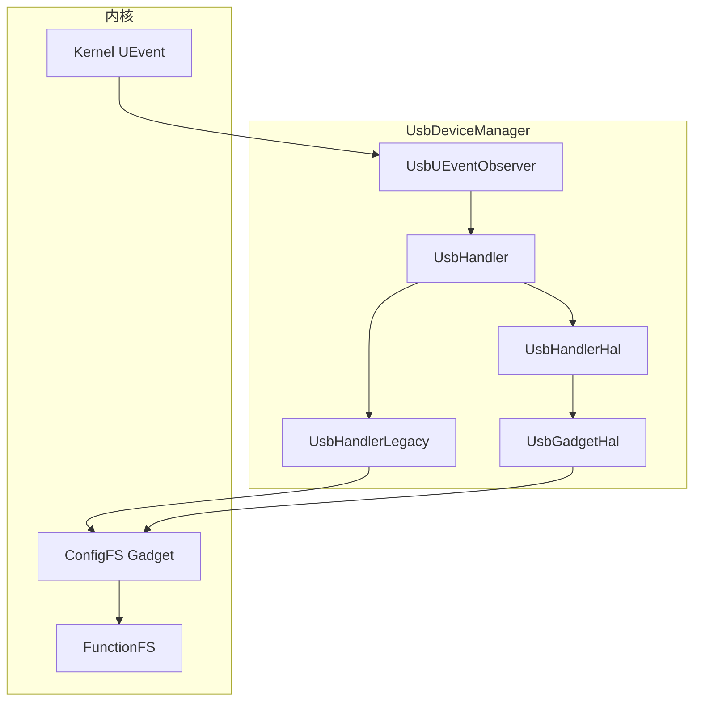
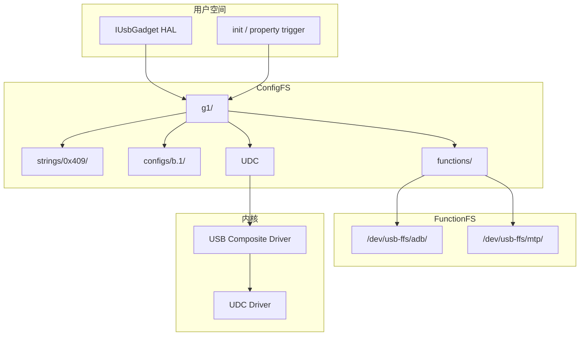

# 第 39 章：USB、ADB 与 MTP

Android 的 USB 子系统同时服务三类完全不同的需求：开发者通过 ADB 调试设备，普通用户通过 MTP 传照片和文件，外设或附件厂商则依赖 USB host / gadget / accessory 能力与设备交互。对上层应用来说，这些能力可能只是 `UsbManager`、`adb shell` 或一条系统设置开关；但在系统内部，它们横跨 `UsbService`、`UsbDeviceManager`、`UsbHostManager`、Type-C 端口管理、AIDL HAL、Linux gadget / host 控制器、ConfigFS、FunctionFS、`adbd` 和 MTP 原生库。本章按这条链路梳理 Android 的 USB、ADB 和 MTP 实现。

---

## 39.1 USB 框架总览

### 39.1.1 全景图

Android USB 子系统大体可以分成四层：

1. 公共 API：`UsbManager`
2. 系统服务：`UsbService` 及其各类 manager
3. HAL：`IUsb` 与 `IUsbGadget`
4. Linux 内核层：USB gadget、host controller、ConfigFS、FunctionFS、Type-C 控制器

下图展示主要关系。



### 39.1.2 关键组件

| 组件 | 类型 | 路径 | 作用 |
|---|---|---|---|
| `UsbManager` | SDK API | `frameworks/base/core/java/android/hardware/usb/UsbManager.java` | 应用侧 USB 入口 |
| `UsbService` | 系统服务 | `frameworks/base/services/usb/java/com/android/server/usb/UsbService.java` | 总协调器 |
| `UsbDeviceManager` | 内部 manager | `frameworks/base/services/usb/java/com/android/server/usb/UsbDeviceManager.java` | gadget 模式状态机 |
| `UsbHostManager` | 内部 manager | `frameworks/base/services/usb/java/com/android/server/usb/UsbHostManager.java` | host 模式设备枚举 |
| `UsbPortManager` | 内部 manager | `frameworks/base/services/usb/java/com/android/server/usb/UsbPortManager.java` | Type-C 端口管理 |
| `UsbPermissionManager` | 内部 manager | `frameworks/base/services/usb/java/com/android/server/usb/UsbPermissionManager.java` | 权限与每用户授权 |
| `IUsb` | AIDL HAL | `hardware/interfaces/usb/aidl/` | 端口状态与角色切换 |
| `IUsbGadget` | AIDL HAL | `hardware/interfaces/usb/gadget/aidl/` | gadget 功能配置 |
| `adbd` | 原生守护进程 | `packages/modules/adb/daemon/` | 设备侧 ADB daemon |
| MTP 原生库 | 原生组件 | `frameworks/av/media/mtp/` | MTP 协议实现 |
| MTP Java 服务 | Java 服务 | `packages/services/Mtp/` | MTP 文档服务与集成 |

### 39.1.3 双模式结构：Gadget 与 Host

同一个 Type-C 口可以工作在两种完全不同的角色：

1. Device / Gadget 模式（UFP）
   Android 设备表现为外设，暴露 MTP、PTP、ADB、RNDIS、MIDI、Accessory 等功能。
2. Host 模式（DFP）
   Android 设备作为 USB host，枚举和管理键盘、鼠标、U 盘、音频设备、MIDI 设备等外设。

模式切换通常由 `UsbPortManager`、`IUsb` HAL 和 Type-C / PD 协议协同完成。

### 39.1.4 `UsbManager`

`UsbManager` 是应用访问 USB 的主入口。它既暴露 gadget 侧能力，也暴露 host 侧能力：

- gadget 模式：
  - 查询 / 设置 USB functions
  - 获取 accessory 信息
  - 打开 accessory 连接
- host 模式：
  - `getDeviceList()`
  - 请求权限
  - `openDevice()`

常见 function 常量包括：

- `FUNCTION_MTP`
- `FUNCTION_PTP`
- `FUNCTION_RNDIS`
- `FUNCTION_MIDI`
- `FUNCTION_ACCESSORY`
- `FUNCTION_ADB`
- `FUNCTION_NCM`
- `FUNCTION_UVC`

它们最终映射到 `GadgetFunction.aidl` 中的 bitmask。

### 39.1.5 `UsbService`

`UsbService` 运行在 `system_server` 中，实现 `IUsbManager`，是所有 USB Binder 调用的中心入口。它把工作进一步委托给：

- `UsbDeviceManager`
- `UsbHostManager`
- `UsbPortManager`
- `UsbPermissionManager`
- `Usb4Manager`
- `UsbAlsaManager`

其生命周期通常是：

1. `system_server` 启动阶段构造 `UsbService`
2. `systemReady()` 中初始化各子模块
3. 运行期接受应用和系统的 Binder 请求

### 39.1.6 系统属性与 Sysfs 路径

USB 子系统会同时使用系统属性和内核路径，例如：

| 接口 | 路径 / 属性 | 用途 |
|---|---|---|
| USB 状态 | `/sys/class/android_usb/android0/state` | 旧 gadget 状态 |
| USB functions | `/sys/class/android_usb/android0/functions` | 旧 function 配置 |
| UDC 名称 | `sys.usb.controller` | ConfigFS 控制器名称 |
| 持久配置 | `persist.sys.usb.config` | 持久 USB 配置 |
| FunctionFS | `/dev/usb-ffs/adb/` | ADB FunctionFS 端点 |

现代设备越来越依赖 ConfigFS 和 HAL，旧的 `android_usb` sysfs 路径更多作为兼容或 fallback。

---

## 39.2 `UsbDeviceManager`：Gadget 模式状态机

### 39.2.1 总览

`UsbDeviceManager` 是 Android USB 框架里最复杂的组件之一。它负责管理“Android 作为 USB 外设”的全部行为，包括：

- function 切换
- cable 连接 / 断开
- MTP / PTP / RNDIS / MIDI / Accessory / ADB 组合
- 锁屏和用户限制协同
- HAL 或 sysfs 配置

### 39.2.2 架构



### 39.2.3 双 Handler 策略

`UsbDeviceManager` 会根据 gadget HAL 是否可用，选择两种实现之一：

1. `UsbHandlerHal`
   使用 `IUsbGadget` AIDL HAL 切换 functions。
2. `UsbHandlerLegacy`
   直接写 sysfs 和属性。

这让框架既能支持现代 HAL 设备，也能兼容旧实现。

### 39.2.4 基于消息的状态机

USB gadget 行为通过 message 驱动，而不是直接同步操作，因为 function 切换本身是一个异步过程，包含：

- 断开已有配置
- 重新写入 ConfigFS / HAL
- 等待 UDC 重新绑定
- 等待主机重新枚举

### 39.2.5 USB 状态切换

典型状态切换包括：

- cable 插入
- 启用 ADB
- 从 charging 切到 MTP
- 从 MTP 切到 PTP
- 切换到 RNDIS / tethering

这些切换往往都会在主机侧表现为一次 USB 断开再重连。

### 39.2.6 Function 切换

Function 切换的本质是重新配置 composite gadget，包括：

- 要创建哪些 functions
- ADB 是否叠加在其他 function 上
- 使用哪个 VID/PID
- 是否需要 FunctionFS 端点

### 39.2.7 去抖与超时

USB 在 function 切换时很容易出现短暂断连，因此系统必须做：

- debounce
- function set timeout
- cable event 去抖

否则 UI 和上层广播会频繁抖动。

### 39.2.8 锁屏交互

MTP 与用户数据直接相关，因此锁屏状态会影响是否允许暴露某些数据接口。`UsbDeviceManager` 会结合 keyguard 状态决定是否允许数据功能完全打开。

### 39.2.9 接口 deny list

某些接口或 class 组合会被系统拒绝，以避免敏感或不安全的 USB 行为暴露给 host。

### 39.2.10 MTP 服务绑定

启用 MTP 不只是切个 bitmask，还需要绑定 MTP 服务和对应 native 组件，让用户态协议栈开始工作。

### 39.2.11 MIDI Function 发现

MIDI function 启用后，框架还需要和音频 / MIDI 系统协同，保证端口在 Android 侧可见。

### 39.2.12 USB 状态广播

`UsbDeviceManager` 会向系统广播 USB 状态变更，这也是设置和应用感知 USB 功能切换的主要渠道之一。

### 39.2.13 用户限制执行

企业策略或用户限制可能禁止：

- 文件传输
- USB debugging
- tethering

这类限制会在 `UsbDeviceManager` 中真正落地。

### 39.2.14 Accessory 握手跟踪

AOA（Android Open Accessory）需要专门的握手跟踪，`UsbDeviceManager` 会记录和协调整个握手过程。

### 39.2.15 RNDIS 与共享网络集成

RNDIS function 并不是独立存在，它需要和 tethering / 网络栈配合，才能真正把 Android 设备作为“USB 网卡”暴露给主机。

---

## 39.3 USB HAL：`IUsb` 与 `IUsbGadget`

### 39.3.1 HAL 架构总览

USB HAL 分成两条主线：

1. `IUsb`
   面向端口、角色、Type-C 和端口状态。
2. `IUsbGadget`
   面向 Android 作为 USB gadget 时的 function 配置。

这两个接口分工清晰：一个管 port，一个管 gadget。

### 39.3.2 `IUsb` AIDL 接口

`IUsb` 负责报告和控制：

- port status
- power role
- data role
- mode 切换
- contaminant detection / compliance warning 等

### 39.3.3 `PortStatus`

`PortStatus` 是 USB 端口状态的核心数据结构，通常包含：

- 端口角色
- 当前模式
- 支持的角色组合
- contaminant 状态
- 合规 / 告警信息
- 可能的 DP Alt Mode 能力

### 39.3.4 `IUsbGadget` AIDL 接口

`IUsbGadget` 的重点在：

- `setCurrentUsbFunctions()`
- 获取当前 speed / status
- reset

它直接服务于 `UsbDeviceManager` 的 gadget function 状态机。

### 39.3.5 `GadgetFunction` bitmask

gadget function 通过 bitmask 表达，可组合出：

- MTP + ADB
- PTP + ADB
- RNDIS + ADB
- MIDI + ADB
- Accessory + ADB

### 39.3.6 HAL 版本演进

USB HAL 也经历了 HIDL 到 AIDL 的演进，并随着 USB-C、contaminant detection、Alt Mode 等新能力逐步扩展。

### 39.3.7 默认 HAL 实现

AOSP 提供默认 HAL 实现作为参考和最小实现，厂商通常在其基础上做设备级适配。

### 39.3.8 `UsbPortManager` 与 HAL 交互

`UsbPortManager` 会通过 `IUsb` 查询端口状态、切换角色，并把这些状态反馈给 framework 其他部分和设置 UI。

---

## 39.4 ADB 架构

### 39.4.1 总览

ADB 是 Android 调试体验的核心工具。它不是单个进程，而是一个三组件架构：

1. host client：用户执行的 `adb`
2. host server：后台 `adb server`
3. device daemon：设备侧 `adbd`

### 39.4.2 三组件架构


这种分工带来的好处是：

- 多个 `adb` 命令复用一个 server
- server 统一管理设备连接和 transport
- 设备侧只和 server 交互

### 39.4.3 ADB 协议

ADB 协议本身很轻量，核心是 message header + payload 模型，建立在 USB 或 TCP 之上。

### 39.4.4 连接建立

连接建立大致过程：

1. host server 找到 transport
2. 与 `adbd` 建立协议握手
3. 认证
4. feature 协商
5. 打开 shell / sync / install / jdwp 等 service channel

### 39.4.5 transport 类型

ADB 支持多种 transport：

- USB
- TCP（Wi-Fi ADB / emulator）
- 本地模拟 transport

### 39.4.6 `atransport`

`atransport` 是 ADB 内部 transport 抽象，统一描述一个已连接设备或目标。

### 39.4.7 USB transport（设备侧）

设备侧 `adbd` 会通过 FunctionFS 端点与 host ADB server 通信。

### 39.4.7.1 USB transport（主机侧）

主机侧则使用 libusb / OS USB 层枚举并连接设备，把 USB bulk endpoint 封装成 ADB transport。

### 39.4.8 认证

ADB 使用 RSA key 认证。首次连接时：

1. host 发送公钥 / challenge 响应
2. 设备弹窗询问是否授权
3. 用户允许后把公钥写入授权列表

### 39.4.9 `adbd` 特权管理

`adbd` 是否以 root 运行取决于：

- build type
- `ro.secure`
- `ro.debuggable`
- 用户是否执行 `adb root`

这也是 user 与 userdebug / eng 设备 ADB 行为差异的核心来源。

### 39.4.10 feature 协商

ADB 会在握手阶段协商支持能力，例如：

- shell v2
- abb
- sendrecv v2
- 压缩算法

### 39.4.11 Wi-Fi ADB

无线调试本质上是把 `adbd` 暴露到 TCP 通道，并通过 pairing / key 机制完成安全接入。

---

## 39.5 ADB 命令深入

### 39.5.1 命令架构

`adb` 命令并不是直接跑一个 shell，而是请求 server 连接设备上某个 service：

- shell
- sync
- install
- jdwp
- forward / reverse

### 39.5.2 Shell 命令

`adb shell` 在新协议中支持多路流，能分别处理：

- stdin
- stdout
- stderr
- exit code

### 39.5.3 文件传输

`adb push` / `adb pull` 基于 sync 协议。新版本支持 Brotli、LZ4、Zstd 等压缩优化。

### 39.5.4 包安装

`adb install` 往往会经过 package manager service，有时还会使用流式传输而不是先完整落盘。

### 39.5.5 日志收集

`adb logcat` 通过 ADB shell / logd 相关服务实现，是最常用的调试入口。

### 39.5.6 端口转发

`adb forward` / `adb reverse` 支持 host 和 device 双向端口映射，是调试本地服务、webview、app 内服务的核心工具。

### 39.5.7 ABB：Android Binder Bridge

ABB 为 ADB 提供了更快、更直接的 Binder 服务访问路径，减少一部分传统 shell 包装开销。

### 39.5.8 JDWP

ADB 还承担 JDWP 进程发现与调试通道建立，是 Java / ART 调试器工作的重要基础。

---

## 39.6 MTP：媒体传输协议

### 39.6.1 总览

MTP 让 Android 在 gadget 模式下向 PC 暴露媒体和文件传输能力，而不要求像传统 U 盘那样直接导出整个文件系统块设备。

### 39.6.2 MTP 架构

MTP 栈横跨：

- Java 侧服务
- native MTP server / database
- gadget 配置
- FunctionFS 端点

### 39.6.3 MTP Server 初始化与运行循环

MTP server 启动后通常会：

1. 枚举 storage
2. 建立 object database
3. 初始化 endpoint
4. 循环处理 MTP 请求

### 39.6.4 存储管理

MTP 不直接导出“块设备”，而是导出对象树和文件对象，这样能更好地适应 Android 的多用户、媒体索引和权限模型。

### 39.6.5 MTP 协议细节

MTP 基于 operation / response / event 模型，主机通过对象句柄访问文件和目录。

### 39.6.6 支持的 MTP 操作

常见操作包括：

- `GET_DEVICE_INFO`
- `OPEN_SESSION`
- `GET_OBJECT_HANDLES`
- `GET_OBJECT_INFO`
- `GET_OBJECT`
- `SEND_OBJECT`
- `DELETE_OBJECT`

### 39.6.7 Android 的 Direct File I/O 扩展

Android 对标准 MTP 做了一些扩展，以提高文件读写性能和兼容性。

### 39.6.8 FunctionFS 传输

现代 Android 通过 FunctionFS 暴露 MTP endpoint，而不是完全依赖旧的内核态实现。

### 39.6.9 MTP 事件通知

MTP 支持通过 interrupt endpoint 通知主机对象变化，例如新增文件或删除对象。

### 39.6.10 PTP 模式

PTP 是面向相机和照片传输的模式，可视作 MTP 的子集或变体。

### 39.6.11 MTP Documents Provider

Android 还通过 DocumentsProvider 与上层文件访问体验集成，使用户和应用能更统一地处理文件暴露与访问。

---

## 39.7 USB Accessory Mode（AOA）

### 39.7.1 AOA 总览

Android Open Accessory 允许一个外部 USB host 以 accessory 角色与 Android 设备交互。

### 39.7.2 AOA 握手协议

AOA 需要先经过握手，告诉设备：

- accessory manufacturer
- model
- description
- version

再让设备切换到 accessory 模式。

### 39.7.3 `UsbDeviceManager` 中的 accessory 检测

`UsbDeviceManager` 会跟踪 accessory 握手与状态变化，从而决定何时切到 AOA function。

### 39.7.4 accessory 模式激活

激活 accessory 模式通常意味着重新枚举为新的 USB product ID 和 function 组合。

### 39.7.5 userspace AOA 实现

较新的 Android 更强调 userspace 实现灵活性，而不只是依赖传统内核态 accessory 逻辑。

### 39.7.6 AOA v2（音频）

AOA v2 增加了音频传输能力，使外设可以更直接地与 Android 音频系统交互。

### 39.7.7 应用集成

应用可通过 accessory API 接收和处理来自附件的数据流。

---

## 39.8 USB Host Mode

### 39.8.1 总览

Host 模式下，Android 自己作为 USB host，负责枚举和控制外设。

### 39.8.2 `UsbHostManager`

`UsbHostManager` 负责监听总线变化、解析 descriptor、构建 `UsbDevice` 对象并通知系统。

### 39.8.3 设备枚举

当外设插入时，host 路径大致会：

1. 发现新设备
2. 读取 descriptor
3. 解析 configuration / interface / endpoint
4. 建立 framework 表示
5. 触发权限与 intent 匹配

### 39.8.4 Descriptor 解析

Android 需要解析：

- device descriptor
- configuration descriptor
- interface descriptor
- endpoint descriptor

才能决定设备类型与暴露给应用的能力。

### 39.8.5 deny list

host 模式下也存在 deny list，用于阻止某些敏感设备或接口被普通应用直接访问。

### 39.8.6 USB 权限

应用访问 USB device 需要显式用户授权。系统会记录每用户、每设备或每 accessory 的授权状态。

### 39.8.7 打开 USB 设备

`UsbManager.openDevice()` 最终会得到一个文件描述符，应用再通过 `UsbDeviceConnection` 发起 control / bulk / interrupt / iso 传输。

### 39.8.7.1 传输类型

USB 传输主要分：

- control
- bulk
- interrupt
- isochronous

不同外设和类模型依赖不同传输类型。

### 39.8.7.2 USB 设备类模型

设备类 / 接口类能帮助系统识别：

- HID
- Audio
- MIDI
- Mass Storage
- Vendor Specific

### 39.8.8 USB 音频集成

USB audio 设备会通过 `UsbAlsaManager` 与 Audio Framework 协同接入。

### 39.8.9 USB MIDI

USB MIDI 设备会被识别并接入 Android 的 MIDI 框架。

### 39.8.10 连接跟踪

系统会跟踪已连接设备状态，以在断开时及时清理授权、连接对象和上层通知。

---

## 39.9 内部细节：ConfigFS 与 Linux USB Gadget 框架

### 39.9.1 ConfigFS Gadget 架构

现代 Android 使用 Linux ConfigFS gadget 框架管理 composite USB device。



### 39.9.2 Gadget 配置过程

一次典型 `setCurrentUsbFunctions()` 背后会做：

1. 向 UDC 写空值，先解绑
2. 清理旧 function symlink
3. 创建并配置新 function
4. 重新链接到 config
5. 再把控制器名写回 UDC，触发重新枚举

### 39.9.3 FunctionFS 端点结构

FunctionFS 为不同功能暴露独立文件系统，例如：

- `/dev/usb-ffs/adb/`
- `/dev/usb-ffs/mtp/`

用户态守护进程通过这些端点实现真正协议逻辑。

### 39.9.4 Composite Device Descriptor

当同时启用多个功能时，设备会以 composite device 形式对外呈现。不同 function 组合通常对应不同 PID，例如：

- MTP
- MTP + ADB
- PTP
- PTP + ADB
- RNDIS
- RNDIS + ADB

### 39.9.5 USB 速度协商

协商出的速度会直接影响 ADB 和 MTP 传输性能，例如：

- USB 2.0 HS：约 30 到 40 MB/s
- USB 3.x：可能 100 MB/s 以上

### 39.9.6 contaminant detection

现代 USB-C 设备支持污染物 / 水汽检测。检测到问题后，系统可能：

1. 通过 HAL 上报状态
2. 弹通知提示用户
3. 禁用数据功能
4. 仅保留受限充电

---

## 39.10 动手实践：Hands-On Experiments

### 39.10.1 观察 USB 状态机

```bash
adb logcat | grep -i usb
adb shell getprop sys.usb.state
adb shell getprop sys.usb.config
adb shell getprop persist.sys.usb.config
```

### 39.10.2 切换 USB Functions

```bash
adb shell svc usb setFunctions mtp
adb shell svc usb setFunctions ptp
adb shell svc usb setFunctions rndis
adb shell svc usb setFunctions midi
adb shell svc usb getFunctions
adb shell svc usb resetUsbGadget
```

### 39.10.3 检查 USB HAL 状态

```bash
adb shell dumpsys usb
adb shell dumpsys usb --proto
adb shell service list | grep usb
adb shell lshal | grep -i usb
```

### 39.10.4 探索 ADB 协议

```bash
adb version
adb devices -l
adb features
adb shell ls /data/misc/adb
adb tcpip 5555
adb shell getprop ro.adb.secure
```

### 39.10.5 测试文件传输性能

```bash
fsutil file createnew test.bin 104857600
Measure-Command { adb push test.bin /data/local/tmp/test.bin }
Measure-Command { adb pull /data/local/tmp/test.bin pulled.bin }
```

### 39.10.6 从设备侧观察 MTP

```bash
adb logcat -s MtpServer:V MtpDatabase:V MtpService:V
adb shell ls -la /dev/usb-ffs/mtp 2>/dev/null
```

### 39.10.7 探索 USB Host 模式

```bash
adb shell dumpsys usb
adb shell cat /sys/kernel/debug/usb/devices 2>/dev/null
adb logcat | grep -i "UsbHostManager"
```

### 39.10.8 构建并测试 USB HAL

```bash
m android.hardware.usb-service.example
m android.hardware.usb.gadget-service.example
atest VtsHalUsbTargetTest
atest VtsHalUsbGadgetTargetTest
```

### 39.10.9 配对并使用 Wi-Fi ADB

```bash
adb pair HOST:PAIRING_PORT
adb connect HOST:ADB_PORT
adb devices -l
```

### 39.10.10 端口转发实验

```bash
adb forward tcp:8080 tcp:8080
adb reverse tcp:9000 tcp:9000
adb forward --list
adb forward --remove-all
adb reverse --remove-all
```

### 39.10.11 检查 USB Accessory 模式

```bash
adb shell getprop | grep -i accessory
adb logcat | grep -i "accessory"
```

### 39.10.12 用 ftrace 跟踪 USB

```bash
adb root
adb shell "echo 1 > /sys/kernel/debug/tracing/events/usb/enable"
adb shell cat /sys/kernel/debug/tracing/trace
adb shell "echo 0 > /sys/kernel/debug/tracing/events/usb/enable"
```

### 39.10.13 导出 ADB 协议跟踪

```bash
set ADB_TRACE=all
adb devices
adb shell setprop log.tag.adbd VERBOSE
```

### 39.10.14 探索 ConfigFS Gadget 树

```bash
adb root
adb shell ls -R /config/usb_gadget 2>/dev/null
adb shell ls -la /config/usb_gadget/g1
adb shell cat /config/usb_gadget/g1/idVendor 2>/dev/null
adb shell cat /config/usb_gadget/g1/idProduct 2>/dev/null
adb shell ls -la /config/usb_gadget/g1/configs/b.1 2>/dev/null
adb shell ls -la /config/usb_gadget/g1/functions 2>/dev/null
adb shell cat /config/usb_gadget/g1/UDC 2>/dev/null
```

### 39.10.15 监控 USB Type-C 端口状态

```bash
adb shell dumpsys usb
adb shell ls /sys/class/typec 2>/dev/null
adb shell getprop | grep -i usb
```

### 39.10.16 基准测试 USB 吞吐

```bash
Measure-Command { adb push test.bin /data/local/tmp/test.bin }
Measure-Command { adb pull /data/local/tmp/test.bin pulled.bin }
adb shell cat /sys/class/udc/*/current_speed 2>/dev/null
```

### 39.10.17 探索 ADB Key 管理

```bash
adb shell cat /data/misc/adb/adb_keys 2>/dev/null
type %USERPROFILE%\\.android\\adbkey.pub
adb shell settings put global adb_enabled 0
adb shell settings put global adb_enabled 1
```

### 39.10.18 编写一个简单 USB Host 应用

最小 host 应用路径通常是：

1. 用 `UsbManager.getDeviceList()` 枚举设备
2. 请求权限
3. `openDevice()`
4. 通过 `UsbDeviceConnection` 做 control / bulk 传输

### 39.10.19 排查 USB 连接问题

```bash
adb shell getprop sys.usb.state
adb shell getprop sys.usb.config
adb shell getprop init.svc.adbd
adb shell ls -la /dev/usb-ffs/
adb shell dmesg | grep -i usb | tail -30
adb shell cat /sys/class/udc/*/state 2>/dev/null
adb shell cat /sys/class/udc/*/device/uevent 2>/dev/null
adb shell svc usb resetUsbGadget
adb kill-server
adb start-server
adb devices
```

### 39.10.20 检查 MTP 对象树

```bash
adb logcat -s MtpServer:V MtpDatabase:V MtpService:V
```

重点观察常见操作码：

- `0x1001`：`GET_DEVICE_INFO`
- `0x1002`：`OPEN_SESSION`
- `0x1007`：`GET_OBJECT_HANDLES`
- `0x1008`：`GET_OBJECT_INFO`
- `0x1009`：`GET_OBJECT`
- `0x100D`：`SEND_OBJECT`
- `0x100B`：`DELETE_OBJECT`

---

## Summary

- Android USB 栈同时覆盖 gadget、host、Type-C 端口、ADB、MTP 和 Accessory，多数看似无关的功能都汇聚到 `UsbService` 及其子管理器中。
- `UsbDeviceManager` 是 gadget 模式的核心状态机，负责 function 切换、锁屏协作、广播、超时和 HAL / sysfs 配置。
- `IUsb` 负责端口与角色，`IUsbGadget` 负责 gadget function，这种 HAL 拆分对应了 Type-C 管理和 gadget 组合配置的不同职责。
- ADB 采用 client、server、daemon 三组件模型，并通过认证、feature 协商和多种 transport 支持调试、shell、同步、安装和端口转发。
- MTP 通过对象模型而不是块设备导出文件，适配 Android 的多用户和媒体访问约束，并与 FunctionFS 和 Java 服务共同工作。
- USB accessory、host mode、USB audio 和 MIDI 各自拥有独立的数据路径，但都依赖同一套权限、枚举和端口管理基础设施。
- ConfigFS 和 FunctionFS 是现代 Android gadget 模式的关键底座，理解它们能直接帮助定位 function 切换和 ADB / MTP 失效问题。
- 原章把内部 ConfigFS 细节放在 `Try It` 之后，并在总结里误写成 `44.x` 小节；中文稿已重排为以 `Try It` 和 `Summary` 收尾，并统一修正为第 39 章编号。

### 关键源码

| 组件 | 路径 |
|---|---|
| USB public API | `frameworks/base/core/java/android/hardware/usb/` |
| USB system service | `frameworks/base/services/usb/java/com/android/server/usb/` |
| USB HAL | `hardware/interfaces/usb/aidl/` |
| USB Gadget HAL | `hardware/interfaces/usb/gadget/aidl/` |
| ADB 模块 | `packages/modules/adb/` |
| ADB daemon | `packages/modules/adb/daemon/` |
| ADB client | `packages/modules/adb/client/` |
| MTP 原生库 | `frameworks/av/media/mtp/` |
| MTP Java 服务 | `packages/services/Mtp/` |
