# Chapter 39: USB, ADB, and MTP

USB connectivity in Android serves three fundamentally different audiences
simultaneously: the developer debugging an application over ADB, the end user
transferring photos via MTP, and the accessory manufacturer hooking a game
controller through USB host mode. Each audience exercises a distinct slice of a
stack that stretches from user-space Java services deep into the Linux kernel's
USB gadget and host controller drivers. This chapter follows every byte from the
USB wire through the HAL, into the framework services, and out to the
application layer, referencing real AOSP source paths throughout.

---

## 39.1 USB Framework Overview

### 39.1.1 The Big Picture

Android's USB subsystem is organized into four vertical tiers: the public SDK
API (`UsbManager`), the system service (`UsbService` and its sub-managers), the
Hardware Abstraction Layer (IUsb and IUsbGadget AIDL HALs), and the Linux kernel
USB subsystem (gadget driver, host controller driver, configfs, functionfs).

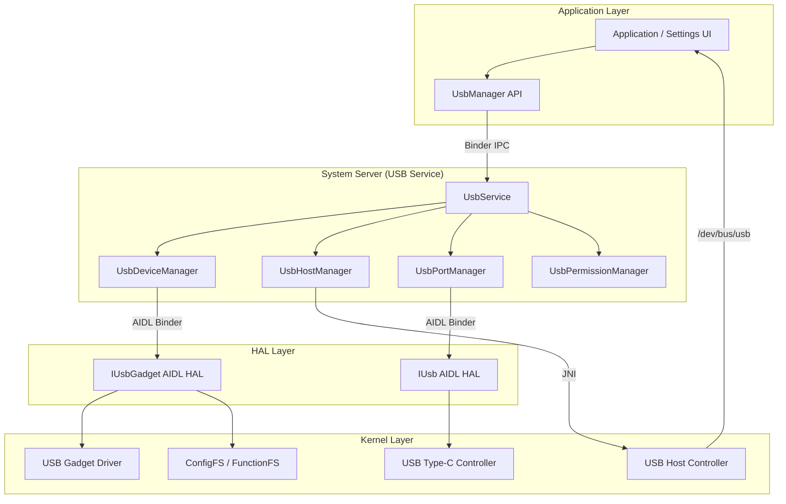
```mermaid
graph TD
    subgraph "Application Layer"
        APP["Application / Settings UI"]
        UM["UsbManager API"]
    end

    subgraph "System Server (USB Service)"
        US["UsbService"]
        UDM["UsbDeviceManager"]
        UHM["UsbHostManager"]
        UPM["UsbPortManager"]
        UPERM["UsbPermissionManager"]
    end

    subgraph "HAL Layer"
        IUSB["IUsb AIDL HAL"]
        IUSBG["IUsbGadget AIDL HAL"]
    end

    subgraph "Kernel Layer"
        GADGET["USB Gadget Driver"]
        HOST["USB Host Controller"]
        CONFIGFS["ConfigFS / FunctionFS"]
        TYPEC["USB Type-C Controller"]
    end

    APP --> UM
    UM -->|"Binder IPC"| US
    US --> UDM
    US --> UHM
    US --> UPM
    US --> UPERM
    UDM -->|"AIDL Binder"| IUSBG
    UPM -->|"AIDL Binder"| IUSB
    UHM -->|"JNI"| HOST
    IUSBG --> GADGET
    IUSBG --> CONFIGFS
    IUSB --> TYPEC
    HOST -->|"/dev/bus/usb"| APP
```

### 39.1.2 Key Components

| Component | Type | Source Path | Role |
|-----------|------|-------------|------|
| `UsbManager` | SDK API | `frameworks/base/core/java/android/hardware/usb/UsbManager.java` | Public API for apps |
| `UsbService` | System Service | `frameworks/base/services/usb/.../UsbService.java` | Central coordinator |
| `UsbDeviceManager` | Internal Manager | `frameworks/base/services/usb/.../UsbDeviceManager.java` | Gadget mode state machine |
| `UsbHostManager` | Internal Manager | `frameworks/base/services/usb/.../UsbHostManager.java` | Host mode device enumeration |
| `UsbPortManager` | Internal Manager | `frameworks/base/services/usb/.../UsbPortManager.java` | Type-C port management |
| `UsbPermissionManager` | Internal Manager | `frameworks/base/services/usb/.../UsbPermissionManager.java` | Per-user permission tracking |
| `IUsb` | AIDL HAL | `hardware/interfaces/usb/aidl/.../IUsb.aidl` | Port status, role switching |
| `IUsbGadget` | AIDL HAL | `hardware/interfaces/usb/gadget/aidl/.../IUsbGadget.aidl` | Gadget function configuration |
| `adbd` | Native Daemon | `packages/modules/adb/daemon/main.cpp` | ADB daemon |
| MTP Native | Native Library | `frameworks/av/media/mtp/` | MTP protocol implementation |
| MTP Service | Java Service | `packages/services/Mtp/` | MTP documents provider |

### 39.1.3 Dual-Mode Architecture: Gadget vs. Host

A single USB Type-C port can operate in two fundamentally different modes,
determined by the data role negotiated through the USB Power Delivery protocol:

1. **Device/Gadget mode (UFP)**: The Android device appears as a peripheral to a
   host (typically a PC). This enables MTP file transfer, ADB debugging, PTP
   photo transfer, RNDIS tethering, MIDI, and USB accessory (AOA). The kernel's
   USB gadget framework (`configfs`) exposes composite USB functions.

2. **Host mode (DFP)**: The Android device acts as a USB host. Connected USB
   peripherals (keyboards, mice, storage, audio devices) are enumerated and made
   available to applications through the `UsbManager` API.

The `UsbPortManager` monitors port status changes via the `IUsb` HAL and
coordinates mode transitions between these two modes.

### 39.1.4 UsbManager -- The Public API

`UsbManager` (source: `frameworks/base/core/java/android/hardware/usb/UsbManager.java`)
is the `@SystemService`-annotated entry point that applications use to interact
with USB. It provides:

**Device (gadget) mode operations:**

- Query and set current USB functions (MTP, PTP, etc.)
- Access USB accessory information
- Open USB accessory connections

**Host mode operations:**

- Enumerate connected USB devices (`getDeviceList()`)
- Request permission to communicate with a device
- Open device connections (`openDevice()`)

**Function constants** define the gadget configurations available:

```java
// From UsbManager.java -- function bitmask values
public static final long FUNCTION_NONE = 0;
public static final long FUNCTION_MTP = GadgetFunction.MTP;       // 1 << 2
public static final long FUNCTION_PTP = GadgetFunction.PTP;       // 1 << 4
public static final long FUNCTION_RNDIS = GadgetFunction.RNDIS;   // 1 << 5
public static final long FUNCTION_MIDI = GadgetFunction.MIDI;     // 1 << 3
public static final long FUNCTION_ACCESSORY = GadgetFunction.ACCESSORY; // 1 << 1
public static final long FUNCTION_AUDIO_SOURCE = GadgetFunction.AUDIO_SOURCE; // 1 << 6
public static final long FUNCTION_ADB = GadgetFunction.ADB;       // 1
public static final long FUNCTION_NCM = GadgetFunction.NCM;       // 1 << 10
public static final long FUNCTION_UVC = GadgetFunction.UVC;       // 1 << 7
```

These constants map directly to the `GadgetFunction` AIDL parcelable defined at
`hardware/interfaces/usb/gadget/aidl/android/hardware/usb/gadget/GadgetFunction.aidl`.

### 39.1.5 UsbService -- The Central Coordinator

`UsbService` (source: `frameworks/base/services/usb/java/com/android/server/usb/UsbService.java`)
implements `IUsbManager` and runs within `system_server`. It is the Binder
endpoint for all USB operations and delegates work to specialized sub-managers:

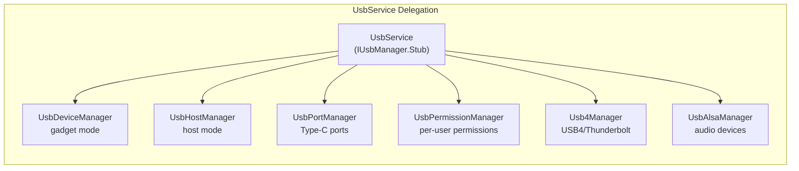
```mermaid
graph LR
    subgraph "UsbService Delegation"
        US["UsbService<br/>(IUsbManager.Stub)"]
        UDM["UsbDeviceManager<br/>gadget mode"]
        UHM["UsbHostManager<br/>host mode"]
        UPM["UsbPortManager<br/>Type-C ports"]
        UPERM["UsbPermissionManager<br/>per-user permissions"]
        U4M["Usb4Manager<br/>USB4/Thunderbolt"]
        UALSA["UsbAlsaManager<br/>audio devices"]
    end

    US --> UDM
    US --> UHM
    US --> UPM
    US --> UPERM
    US --> U4M
    US --> UALSA
```

The service's lifecycle follows the standard `SystemService` pattern:

1. **Construction**: During `system_server` boot, `UsbService` is instantiated.
2. **`systemReady()`**: Triggers initialization of all sub-managers. The
   `UsbHostManager` starts a native thread to monitor `/dev/bus/usb` for
   device attach/detach events. The `UsbPortManager` queries the HAL for
   current port status.
3. **Runtime**: Handles Binder calls from applications, broadcasts USB state
   changes, manages permissions and settings per user profile.

### 39.1.6 System Properties and Sysfs Paths

`UsbDeviceManager` monitors and controls USB state through several kernel
interfaces and system properties:

| Interface | Path | Purpose |
|-----------|------|---------|
| USB state sysfs | `/sys/class/android_usb/android0/state` | Legacy gadget state |
| USB functions sysfs | `/sys/class/android_usb/android0/functions` | Legacy function config |
| UDC controller | `sys.usb.controller` (sysprop) | ConfigFS UDC name |
| USB config | `persist.sys.usb.config` (sysprop) | Persistent USB config |
| RNDIS address | `/sys/class/android_usb/android0/f_rndis/ethaddr` | Tethering MAC |
| MIDI ALSA | `/sys/class/android_usb/android0/f_midi/alsa` | MIDI device info |
| UEvent match | `DEVPATH=/devices/virtual/android_usb/android0` | Legacy state changes |
| UEvent match | `SUBSYSTEM=udc` | Modern UDC state changes |
| FunctionFS | `/dev/usb-ffs/adb/` | ADB FunctionFS endpoints |

---

## 39.2 UsbDeviceManager: The Gadget Mode State Machine

### 39.2.1 Overview

`UsbDeviceManager` (source: `frameworks/base/services/usb/java/com/android/server/usb/UsbDeviceManager.java`)
is the most complex component in the USB framework. It manages the Android
device's appearance as a USB peripheral, handling function switching (MTP, PTP,
RNDIS, accessory, MIDI, ADB), state transitions triggered by cable events, and
the delicate coordination between screen lock state, user preferences, and
kernel-level USB configuration.

The class implements `ActivityTaskManagerInternal.ScreenObserver` to react to
keyguard state changes -- a critical detail because MTP access to user data
requires the screen to be unlocked.

### 39.2.2 Architecture

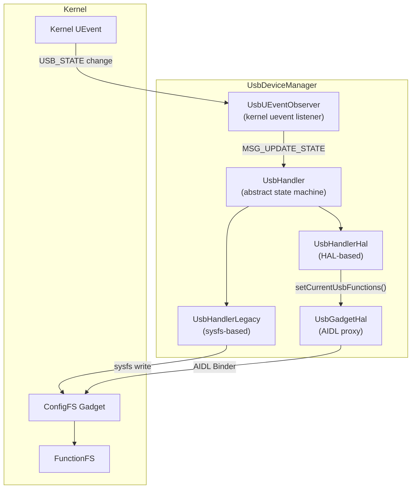
```mermaid
graph TD
    subgraph "UsbDeviceManager"
        UEVENT["UsbUEventObserver<br/>(kernel uevent listener)"]
        HANDLER["UsbHandler<br/>(abstract state machine)"]
        HAL_HANDLER["UsbHandlerHal<br/>(HAL-based)"]
        LEGACY_HANDLER["UsbHandlerLegacy<br/>(sysfs-based)"]
        GADGET_HAL["UsbGadgetHal<br/>(AIDL proxy)"]
    end

    subgraph "Kernel"
        UEVENT_K["Kernel UEvent"]
        CONFIGFS_K["ConfigFS Gadget"]
        FFS_K["FunctionFS"]
    end

    UEVENT_K -->|"USB_STATE change"| UEVENT
    UEVENT -->|"MSG_UPDATE_STATE"| HANDLER
    HANDLER --> HAL_HANDLER
    HANDLER --> LEGACY_HANDLER
    HAL_HANDLER -->|"setCurrentUsbFunctions()"| GADGET_HAL
    LEGACY_HANDLER -->|"sysfs write"| CONFIGFS_K
    GADGET_HAL -->|"AIDL Binder"| CONFIGFS_K
    CONFIGFS_K --> FFS_K
```

### 39.2.3 Dual Handler Strategy

`UsbDeviceManager` selects between two concrete handler implementations at
construction time:

```java
// From UsbDeviceManager constructor
if (mUsbGadgetHal == null) {
    // Initialize the legacy UsbHandler
    mHandler = new UsbHandlerLegacy(FgThread.get().getLooper(),
            mContext, this, alsaManager, permissionManager);
} else {
    // Initialize HAL based UsbHandler
    mHandler = new UsbHandlerHal(FgThread.get().getLooper(),
            mContext, this, alsaManager, permissionManager);
}
```

- **`UsbHandlerHal`**: Used on modern devices where the `IUsbGadget` AIDL HAL
  is available. Calls `setCurrentUsbFunctions()` on the HAL to request
  configuration changes. The HAL implementation handles the kernel-level
  ConfigFS manipulation.

- **`UsbHandlerLegacy`**: Fallback for older devices without the gadget HAL.
  Directly writes to sysfs files and system properties to switch USB functions.

### 39.2.4 Message-Based State Machine

The `UsbHandler` processes USB state transitions through Android's `Handler`
message queue. This serializes all state changes onto the foreground thread,
preventing race conditions:

| Message ID | Constant | Trigger |
|------------|----------|---------|
| 0 | `MSG_UPDATE_STATE` | Kernel reports connect/disconnect/configured |
| 1 | `MSG_ENABLE_ADB` | ADB toggle changed in developer settings |
| 2 | `MSG_SET_CURRENT_FUNCTIONS` | Application requests function change |
| 3 | `MSG_SYSTEM_READY` | System server ready |
| 4 | `MSG_BOOT_COMPLETED` | Boot completed broadcast |
| 5 | `MSG_USER_SWITCHED` | Active user changed |
| 6 | `MSG_UPDATE_USER_RESTRICTIONS` | User policy changed |
| 7 | `MSG_UPDATE_PORT_STATE` | Type-C port status changed |
| 8 | `MSG_ACCESSORY_MODE_ENTER_TIMEOUT` | 10s timeout for accessory negotiation |
| 9 | `MSG_UPDATE_CHARGING_STATE` | Battery charging state changed |
| 10 | `MSG_UPDATE_HOST_STATE` | Host mode device attach/detach |
| 11 | `MSG_LOCALE_CHANGED` | Language changed (notification update) |
| 12 | `MSG_SET_SCREEN_UNLOCKED_FUNCTIONS` | Screen-unlock function preference |
| 13 | `MSG_UPDATE_SCREEN_LOCK` | Keyguard shown/hidden |
| 14 | `MSG_SET_CHARGING_FUNCTIONS` | Switch to charging-only mode |
| 15 | `MSG_SET_FUNCTIONS_TIMEOUT` | Function switch timed out |
| 16 | `MSG_GET_CURRENT_USB_FUNCTIONS` | Query current gadget functions |
| 17 | `MSG_FUNCTION_SWITCH_TIMEOUT` | Gadget re-enumeration timeout |
| 18 | `MSG_GADGET_HAL_REGISTERED` | HAL service became available |
| 19 | `MSG_RESET_USB_GADGET` | Reset gadget hardware |
| 20 | `MSG_ACCESSORY_HANDSHAKE_TIMEOUT` | AOA handshake timeout |
| 21 | `MSG_INCREASE_SENDSTRING_COUNT` | AOA string descriptor received |
| 22 | `MSG_UPDATE_USB_SPEED` | USB speed negotiation complete |
| 23 | `MSG_UPDATE_HAL_VERSION` | HAL version info updated |
| 24 | `MSG_USER_UNLOCKED_AFTER_BOOT` | First unlock after boot |

### 39.2.5 USB State Transitions

The kernel reports USB state changes through UEvent messages. The
`UsbUEventObserver` processes these and translates them into handler messages:

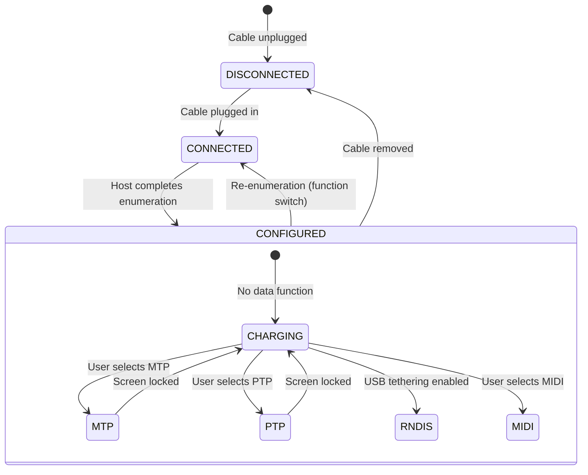
```mermaid
stateDiagram-v2
    [*] --> DISCONNECTED: Cable unplugged
    DISCONNECTED --> CONNECTED: Cable plugged in
    CONNECTED --> CONFIGURED: Host completes enumeration
    CONFIGURED --> DISCONNECTED: Cable removed
    CONFIGURED --> CONNECTED: Re-enumeration (function switch)

    state CONFIGURED {
        [*] --> CHARGING: No data function
        CHARGING --> MTP: User selects MTP
        CHARGING --> PTP: User selects PTP
        CHARGING --> RNDIS: USB tethering enabled
        CHARGING --> MIDI: User selects MIDI
        MTP --> CHARGING: Screen locked
        PTP --> CHARGING: Screen locked
    }
```

The `updateState()` method in `UsbHandler` maps kernel state strings to
internal state:

```java
// From UsbHandler.updateState()
if ("DISCONNECTED".equals(state)) {
    connected = 0; configured = 0;
} else if ("CONNECTED".equals(state)) {
    connected = 1; configured = 0;
} else if ("CONFIGURED".equals(state)) {
    connected = 1; configured = 1;
}
```

### 39.2.6 Function Switching

When the user (or system) requests a USB function change, the state machine
performs a multi-step process:

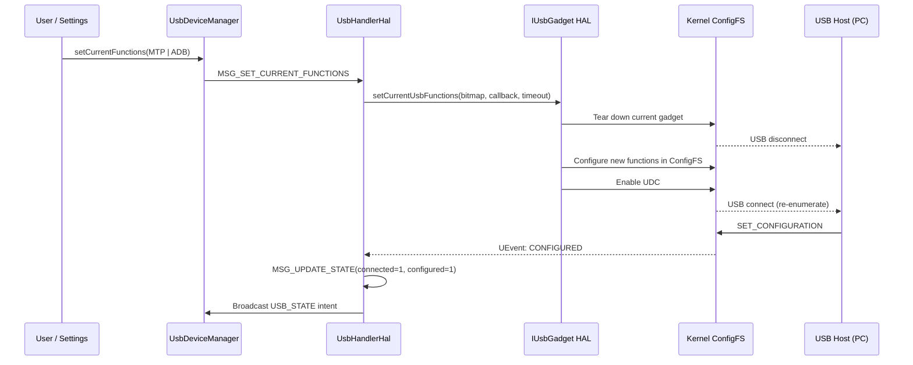
```mermaid
sequenceDiagram
    participant User as User / Settings
    participant UDM as UsbDeviceManager
    participant Handler as UsbHandlerHal
    participant HAL as IUsbGadget HAL
    participant Kernel as Kernel ConfigFS
    participant Host as USB Host (PC)

    User->>UDM: setCurrentFunctions(MTP | ADB)
    UDM->>Handler: MSG_SET_CURRENT_FUNCTIONS
    Handler->>HAL: setCurrentUsbFunctions(bitmap, callback, timeout)
    HAL->>Kernel: Tear down current gadget
    Kernel-->>Host: USB disconnect
    HAL->>Kernel: Configure new functions in ConfigFS
    HAL->>Kernel: Enable UDC
    Kernel-->>Host: USB connect (re-enumerate)
    Host->>Kernel: SET_CONFIGURATION
    Kernel-->>Handler: UEvent: CONFIGURED
    Handler->>Handler: MSG_UPDATE_STATE(connected=1, configured=1)
    Handler->>UDM: Broadcast USB_STATE intent
```

### 39.2.7 Debouncing and Timeouts

Function switching causes a transient USB disconnect. The state machine applies
debouncing to prevent false disconnect events from disrupting the function
switch:

```java
// Debounce delays from UsbDeviceManager
private static final int DEVICE_STATE_UPDATE_DELAY_EXT = 3000;  // 3 seconds
private static final int DEVICE_STATE_UPDATE_DELAY = 1000;       // 1 second
private static final int HOST_STATE_UPDATE_DELAY = 1000;         // 1 second
private static final int ACCESSORY_REQUEST_TIMEOUT = 10 * 1000;  // 10 seconds
private static final int ACCESSORY_HANDSHAKE_TIMEOUT = 10 * 1000; // 10 seconds
```

After `resetUsbGadget()` is called, debouncing is temporarily disabled via the
`mResetUsbGadgetDisableDebounce` flag, ensuring the first disconnect after a
gadget reset is processed immediately.

### 39.2.8 Screen Lock Interaction

MTP requires access to user storage, which must be protected when the screen is
locked. `UsbDeviceManager` coordinates with the keyguard:

1. When the screen locks (`onKeyguardStateChanged(true)`), the handler receives
   `MSG_UPDATE_SCREEN_LOCK`.
2. If MTP or PTP is active, the handler switches to charging-only functions.
3. The user's preferred functions are stored in `SharedPreferences` under
   the key `usb-screen-unlocked-config-<userId>`.
4. When the screen unlocks, the previously stored functions are restored.

### 39.2.9 Interface Deny List

For security, certain USB interface classes are always denied from application
access when the device acts as a host:

```java
// From UsbDeviceManager static initializer
sDenyInterfaces.add(UsbConstants.USB_CLASS_AUDIO);
sDenyInterfaces.add(UsbConstants.USB_CLASS_COMM);
sDenyInterfaces.add(UsbConstants.USB_CLASS_HID);
sDenyInterfaces.add(UsbConstants.USB_CLASS_PRINTER);
sDenyInterfaces.add(UsbConstants.USB_CLASS_MASS_STORAGE);
sDenyInterfaces.add(UsbConstants.USB_CLASS_HUB);
sDenyInterfaces.add(UsbConstants.USB_CLASS_CDC_DATA);
sDenyInterfaces.add(UsbConstants.USB_CLASS_CSCID);
sDenyInterfaces.add(UsbConstants.USB_CLASS_CONTENT_SEC);
sDenyInterfaces.add(UsbConstants.USB_CLASS_VIDEO);
sDenyInterfaces.add(UsbConstants.USB_CLASS_WIRELESS_CONTROLLER);
```

### 39.2.10 MTP Service Binding

When MTP or PTP functions become active, the handler binds to the MTP service:

```java
// Constants from UsbHandler
protected static final String MTP_PACKAGE_NAME = "com.android.mtp";
protected static final String MTP_SERVICE_CLASS_NAME = "com.android.mtp.MtpService";
```

The `ServiceConnection` is maintained for the duration of the MTP session and
unbound when functions change away from MTP/PTP. This binding serves a critical
purpose beyond just starting the service: it prevents the Activity Manager from
freezing the MTP process. Without the binding, the system might freeze the MTP
service's process to reclaim resources, which would break the ongoing USB
transfer session.

The binding lifecycle follows the MTP function state:

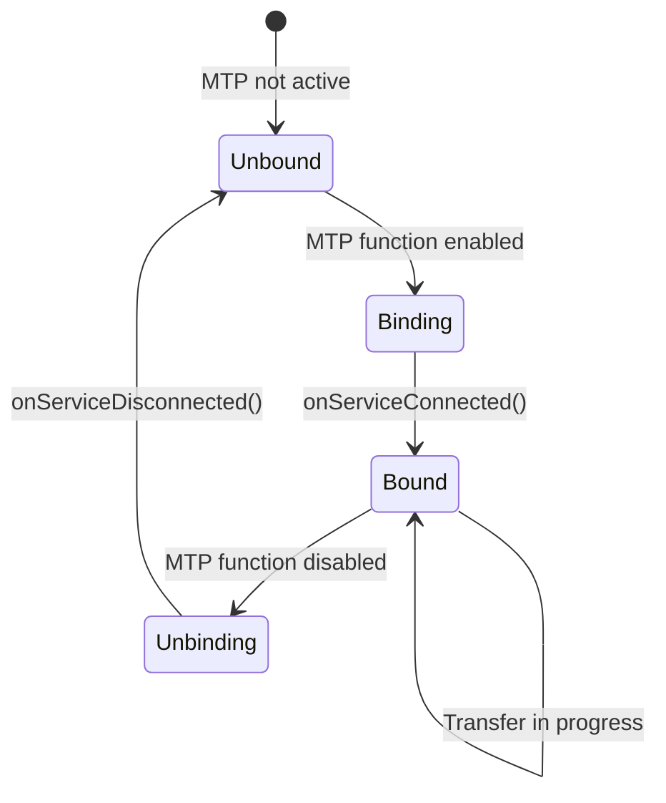
```mermaid
stateDiagram-v2
    [*] --> Unbound: MTP not active
    Unbound --> Binding: MTP function enabled
    Binding --> Bound: onServiceConnected()
    Bound --> Unbinding: MTP function disabled
    Unbinding --> Unbound: onServiceDisconnected()
    Bound --> Bound: Transfer in progress
```

### 39.2.11 MIDI Function Discovery

When the MIDI gadget function is activated, `UsbDeviceManager` must discover
the ALSA card and device numbers for the synthesized MIDI device. This involves
two approaches:

**Modern approach** (sysfs-based identification):
```java
// Navigate the sysfs hierarchy under the UDC controller
File soundDir = new File("/sys/class/udc/" + controllerName + "/gadget/sound");
File[] cardDirs = FileUtils.listFilesOrEmpty(soundDir,
    (dir, file) -> file.startsWith("card"));
File[] midis = FileUtils.listFilesOrEmpty(cardDirs[0],
    (dir, file) -> file.startsWith("midi"));

// Parse card and device numbers from "midiC<card>D<device>"
Pattern pattern = Pattern.compile("midiC(\\d+)D(\\d+)");
Matcher matcher = pattern.matcher(midis[0].getName());
if (matcher.matches()) {
    mMidiCard = Integer.parseInt(matcher.group(1));
    mMidiDevice = Integer.parseInt(matcher.group(2));
}
```

**Legacy approach** (ALSA file):
```java
// Read from the legacy sysfs path
Scanner scanner = new Scanner(new File(MIDI_ALSA_PATH));
mMidiCard = scanner.nextInt();
mMidiDevice = scanner.nextInt();
```

The discovered card/device pair is passed to `UsbAlsaManager` to register the
peripheral MIDI device with the Android MIDI service.

### 39.2.12 USB State Broadcast

The handler broadcasts USB state changes to all interested receivers:

```java
protected void updateUsbStateBroadcastIfNeeded(long functions) {
    Intent intent = new Intent(UsbManager.ACTION_USB_STATE);
    intent.addFlags(Intent.FLAG_RECEIVER_REPLACE_PENDING
            | Intent.FLAG_RECEIVER_INCLUDE_BACKGROUND
            | Intent.FLAG_RECEIVER_FOREGROUND);
    intent.putExtra(UsbManager.USB_CONNECTED, mConnected);
    intent.putExtra(UsbManager.USB_HOST_CONNECTED, mHostConnected);
    intent.putExtra(UsbManager.USB_CONFIGURED, mConfigured);
    intent.putExtra(UsbManager.USB_DATA_UNLOCKED,
            isUsbTransferAllowed() && isUsbDataTransferActive(mCurrentFunctions));

    // Add active function flags
    long remainingFunctions = functions;
    while (remainingFunctions != 0) {
        intent.putExtra(UsbManager.usbFunctionsToString(
                Long.highestOneBit(remainingFunctions)), true);
        remainingFunctions -= Long.highestOneBit(remainingFunctions);
    }

    // Only broadcast if state actually changed
    if (!isUsbStateChanged(intent)) return;
    sendStickyBroadcast(intent);
}
```

The `ACTION_USB_STATE` broadcast is sticky: late-registered receivers
immediately receive the last broadcast state. The intent includes boolean
extras for each active function, allowing receivers to check specific
function states.

### 39.2.13 User Restriction Enforcement

Enterprise-managed devices can restrict USB file transfer through
`UserManager.DISALLOW_USB_FILE_TRANSFER`:

```java
protected boolean isUsbTransferAllowed() {
    UserManager userManager = (UserManager) mContext.getSystemService(
            Context.USER_SERVICE);
    return !userManager.hasUserRestriction(
            UserManager.DISALLOW_USB_FILE_TRANSFER);
}
```

When this restriction is active:

- MTP and PTP functions are suppressed
- The USB notification shows "Charging only"
- Applications cannot switch to data transfer functions

### 39.2.14 Accessory Handshake Tracking

The handler tracks detailed timing information about the AOA handshake process
for debugging and analytics:

```java
private long mAccessoryConnectionStartTime = 0L;  // When GET_PROTOCOL received
private int mSendStringCount = 0;                   // Number of SEND_STRING uevents
private boolean mStartAccessory = false;             // Whether START received

// Broadcast handshake details for debugging
private void broadcastUsbAccessoryHandshake() {
    Intent intent = new Intent(UsbManager.ACTION_USB_ACCESSORY_HANDSHAKE)
        .putExtra(UsbManager.EXTRA_ACCESSORY_UEVENT_TIME,
                mAccessoryConnectionStartTime)
        .putExtra(UsbManager.EXTRA_ACCESSORY_STRING_COUNT,
                mSendStringCount)
        .putExtra(UsbManager.EXTRA_ACCESSORY_START,
                mStartAccessory)
        .putExtra(UsbManager.EXTRA_ACCESSORY_HANDSHAKE_END,
                SystemClock.elapsedRealtime());
    sendStickyBroadcast(intent);
}
```

### 39.2.15 RNDIS Tethering Integration

When RNDIS (USB tethering) is activated:

1. The handler configures the `RNDIS` gadget function.
2. A locally-administered MAC address is generated from `ro.serialno`:

```java
// First byte is 0x02 to signify a locally administered address
address[0] = 0x02;
String serial = SystemProperties.get("ro.serialno", "1234567890ABCDEF");
// XOR the USB serial across the remaining 5 bytes
for (int i = 0; i < serialLength; i++) {
    address[i % (ETH_ALEN - 1) + 1] ^= (int) serial.charAt(i);
}
```

3. The address is written to `/sys/class/android_usb/android0/f_rndis/ethaddr`.
4. The tethering service takes over IP configuration of the resulting
   `rndis0` network interface.

---

## 39.3 USB HAL: IUsb and IUsbGadget

### 39.3.1 HAL Architecture Overview

Android's USB HAL is split into two distinct AIDL interfaces, each managing a
different aspect of USB hardware:

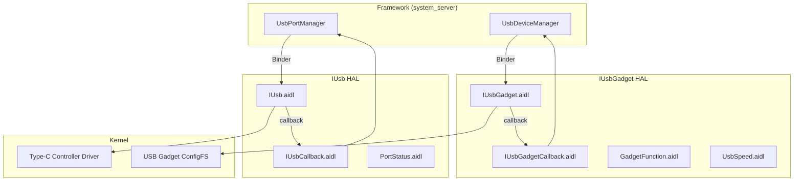
```mermaid
graph TD
    subgraph "Framework (system_server)"
        UPM["UsbPortManager"]
        UDM2["UsbDeviceManager"]
    end

    subgraph "IUsb HAL"
        IUSB2["IUsb.aidl"]
        IUSB_CB["IUsbCallback.aidl"]
        PS["PortStatus.aidl"]
    end

    subgraph "IUsbGadget HAL"
        IUSBG2["IUsbGadget.aidl"]
        IUSBG_CB["IUsbGadgetCallback.aidl"]
        GF["GadgetFunction.aidl"]
        USPD["UsbSpeed.aidl"]
    end

    subgraph "Kernel"
        TYPEC2["Type-C Controller Driver"]
        GADGET2["USB Gadget ConfigFS"]
    end

    UPM -->|"Binder"| IUSB2
    IUSB2 -->|"callback"| IUSB_CB
    IUSB_CB --> UPM
    IUSB2 --> TYPEC2

    UDM2 -->|"Binder"| IUSBG2
    IUSBG2 -->|"callback"| IUSBG_CB
    IUSBG_CB --> UDM2
    IUSBG2 --> GADGET2
```

### 39.3.2 IUsb AIDL Interface

Source: `hardware/interfaces/usb/aidl/android/hardware/usb/IUsb.aidl`

The `IUsb` interface manages USB Type-C port hardware. It is marked
`@VintfStability` (VINTF-stable) and declared `oneway` (asynchronous):

```
@VintfStability
oneway interface IUsb {
    void enableContaminantPresenceDetection(in String portName,
            in boolean enable, long transactionId);
    void enableUsbData(in String portName, boolean enable, long transactionId);
    void enableUsbDataWhileDocked(in String portName, long transactionId);
    void queryPortStatus(long transactionId);
    void setCallback(in IUsbCallback callback);
    void switchRole(in String portName, in PortRole role, long transactionId);
    void limitPowerTransfer(in String portName, boolean limit, long transactionId);
    void resetUsbPort(in String portName, long transactionId);
}
```

Key operations:

| Method | Purpose |
|--------|---------|
| `queryPortStatus()` | Retrieve current status of all Type-C ports |
| `switchRole()` | Trigger DR_SWAP or PR_SWAP for role switching |
| `enableUsbData()` | Enable/disable USB data signaling |
| `enableContaminantPresenceDetection()` | Moisture/debris detection |
| `setCallback()` | Register for async notifications |
| `limitPowerTransfer()` | Control power delivery |
| `resetUsbPort()` | Reset a misbehaving port |

### 39.3.3 PortStatus: Comprehensive Port State

Source: `hardware/interfaces/usb/aidl/android/hardware/usb/PortStatus.aidl`

The `PortStatus` parcelable conveys the complete state of a USB Type-C port:

```
@VintfStability
parcelable PortStatus {
    String portName;
    PortDataRole currentDataRole;      // HOST or DEVICE
    PortPowerRole currentPowerRole;    // SOURCE or SINK
    PortMode currentMode;              // UFP, DFP, AUDIO_ACCESSORY, DEBUG_ACCESSORY
    boolean canChangeMode;
    boolean canChangeDataRole;         // PD DR_SWAP supported
    boolean canChangePowerRole;        // PD PR_SWAP supported
    PortMode[] supportedModes;
    ContaminantProtectionMode[] supportedContaminantProtectionModes;
    boolean supportsEnableContaminantPresenceProtection;
    ContaminantProtectionStatus contaminantProtectionStatus;
    ContaminantDetectionStatus contaminantDetectionStatus;
    UsbDataStatus[] usbDataStatus;
    boolean powerTransferLimited;
    PowerBrickStatus powerBrickStatus;
    boolean supportsComplianceWarnings;
    ComplianceWarning[] complianceWarnings;
    PlugOrientation plugOrientation;   // Cable orientation (CC1 vs CC2)
    AltModeData[] supportedAltModes;   // DisplayPort Alt Mode, etc.
}
```

### 39.3.4 IUsbGadget AIDL Interface

Source: `hardware/interfaces/usb/gadget/aidl/android/hardware/usb/gadget/IUsbGadget.aidl`

The `IUsbGadget` interface controls the USB gadget (device mode) configuration:

```
@VintfStability
oneway interface IUsbGadget {
    void setCurrentUsbFunctions(in long functions,
            in IUsbGadgetCallback callback,
            in long timeoutMs, long transactionId);
    void getCurrentUsbFunctions(in IUsbGadgetCallback callback,
            long transactionId);
    void getUsbSpeed(in IUsbGadgetCallback callback, long transactionId);
    void reset(in IUsbGadgetCallback callback, long transactionId);
}
```

### 39.3.5 GadgetFunction Bitmask

Source: `hardware/interfaces/usb/gadget/aidl/android/hardware/usb/gadget/GadgetFunction.aidl`

Functions are combined as a bitmask:

| Constant | Value | Description |
|----------|-------|-------------|
| `NONE` | `0` | No function (pull down gadget) |
| `ADB` | `1` | Android Debug Bridge |
| `ACCESSORY` | `1 << 1` | Android Open Accessory |
| `MTP` | `1 << 2` | Media Transfer Protocol |
| `MIDI` | `1 << 3` | USB MIDI device |
| `PTP` | `1 << 4` | Picture Transfer Protocol |
| `RNDIS` | `1 << 5` | USB tethering (RNDIS) |
| `AUDIO_SOURCE` | `1 << 6` | AOAv2 audio source |
| `UVC` | `1 << 7` | USB Video Class |
| `NCM` | `1 << 10` | Network Control Model |

Multiple functions are composited. For example, `MTP | ADB` = `5` (binary
`0b00000101`) configures both MTP and ADB simultaneously.

### 39.3.6 HAL Version Evolution

The USB HAL has evolved through multiple HIDL and AIDL versions:

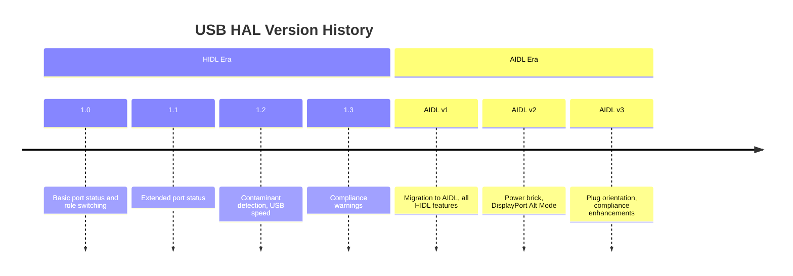
```mermaid
timeline
    title USB HAL Version History
    section HIDL Era
        1.0 : Basic port status and role switching
        1.1 : Extended port status
        1.2 : Contaminant detection, USB speed
        1.3 : Compliance warnings
    section AIDL Era
        AIDL v1 : Migration to AIDL, all HIDL features
        AIDL v2 : Power brick, DisplayPort Alt Mode
        AIDL v3 : Plug orientation, compliance enhancements
```

Source directories:

- HIDL: `hardware/interfaces/usb/1.0/`, `1.1/`, `1.2/`, `1.3/`
- AIDL: `hardware/interfaces/usb/aidl/`
- Gadget HIDL: `hardware/interfaces/usb/gadget/1.0/`, `1.1/`, `1.2/`
- Gadget AIDL: `hardware/interfaces/usb/gadget/aidl/`

### 39.3.7 Default HAL Implementation

Source: `hardware/interfaces/usb/aidl/default/`

The default HAL implementation provides a reference that vendors can use as a
starting point. It typically interacts with the kernel through:

1. **Sysfs files** under `/sys/class/typec/` for port status
2. **ConfigFS** under `/config/usb_gadget/` for gadget function configuration
3. **Kernel UEvents** for asynchronous status notifications
4. **Debugfs** for testing and development

### 39.3.8 UsbPortManager and HAL Interaction

`UsbPortManager` (source: `frameworks/base/services/usb/java/com/android/server/usb/UsbPortManager.java`)
is the framework-side consumer of the `IUsb` HAL:

```java
// From UsbPortManager constructor
public UsbPortManager(Context context) {
    mContext = context;
    mUsbPortHal = UsbPortHalInstance.getInstance(this, null);
}

public void systemReady() {
    mSystemReady = true;
    if (mUsbPortHal != null) {
        mUsbPortHal.systemReady();
        mUsbPortHal.queryPortStatus(++mTransactionId);
    }
}
```

Port role combinations are tracked as bitmasks:

```java
// Role combinations from UsbPortManager
private static final int COMBO_SOURCE_HOST =
        UsbPort.combineRolesAsBit(POWER_ROLE_SOURCE, DATA_ROLE_HOST);
private static final int COMBO_SOURCE_DEVICE =
        UsbPort.combineRolesAsBit(POWER_ROLE_SOURCE, DATA_ROLE_DEVICE);
private static final int COMBO_SINK_HOST =
        UsbPort.combineRolesAsBit(POWER_ROLE_SINK, DATA_ROLE_HOST);
private static final int COMBO_SINK_DEVICE =
        UsbPort.combineRolesAsBit(POWER_ROLE_SINK, DATA_ROLE_DEVICE);
```

---

## 39.4 ADB Architecture

### 39.4.1 Overview

The Android Debug Bridge (ADB) is the primary developer tool for communicating
with Android devices. It enables shell access, file transfer, application
installation, log collection, port forwarding, and dozens of other debugging
and development operations. ADB is a Mainline module, meaning it can be updated
independently of the full platform OTA through Google Play system updates.

ADB uses a client-server architecture with three components:

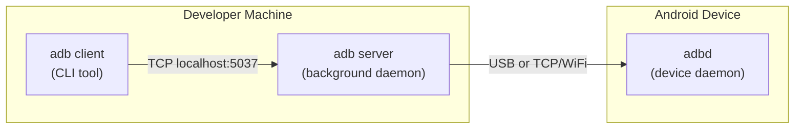
```mermaid
graph LR
    subgraph "Developer Machine"
        CLIENT["adb client<br/>(CLI tool)"]
        SERVER["adb server<br/>(background daemon)"]
    end

    subgraph "Android Device"
        ADBD["adbd<br/>(device daemon)"]
    end

    CLIENT -->|"TCP localhost:5037"| SERVER
    SERVER -->|"USB or TCP/WiFi"| ADBD
```

Source: `packages/modules/adb/`

### 39.4.2 Three-Component Architecture

**1. ADB Client (`adb`)**: The command-line tool that developers invoke. It
connects to the local ADB server over TCP (default port 5037). If no server is
running, the client starts one.

Source: `packages/modules/adb/client/main.cpp`

**2. ADB Server**: A background process on the developer's machine that
manages connections to all devices. It:

- Discovers devices via USB scanning and mDNS
- Multiplexes connections from multiple `adb` clients
- Handles device authentication
- Routes commands to the appropriate device

**3. ADB Daemon (`adbd`)**: Runs on the Android device. It:

- Listens for connections over USB (FunctionFS) and/or TCP
- Authenticates connections using RSA key pairs
- Spawns shell processes, handles file transfers, manages port forwarding
- Runs with reduced privileges (UID `shell`) on production builds

Source: `packages/modules/adb/daemon/main.cpp`

### 39.4.3 ADB Protocol

The ADB protocol is a simple message-based protocol with six core message
types, defined in `packages/modules/adb/adb.h`:

```c
#define A_SYNC 0x434e5953  // 'SYNC' - synchronization
#define A_CNXN 0x4e584e43  // 'CNXN' - connection
#define A_OPEN 0x4e45504f  // 'OPEN' - open stream
#define A_OKAY 0x59414b4f  // 'OKAY' - stream ready
#define A_CLSE 0x45534c43  // 'CLSE' - close stream
#define A_WRTE 0x45545257  // 'WRTE' - write data
#define A_AUTH 0x48545541  // 'AUTH' - authentication
#define A_STLS 0x534C5453  // 'STLS' - start TLS
```

Each message has a fixed 24-byte header:

```c
// From types.h
struct amessage {
    uint32_t command;     // command identifier constant
    uint32_t arg0;        // first argument
    uint32_t arg1;        // second argument
    uint32_t data_length; // length of payload (0 is allowed)
    uint32_t data_check;  // checksum of data payload
    uint32_t magic;       // command ^ 0xffffffff
};
```

### 39.4.4 Connection Establishment

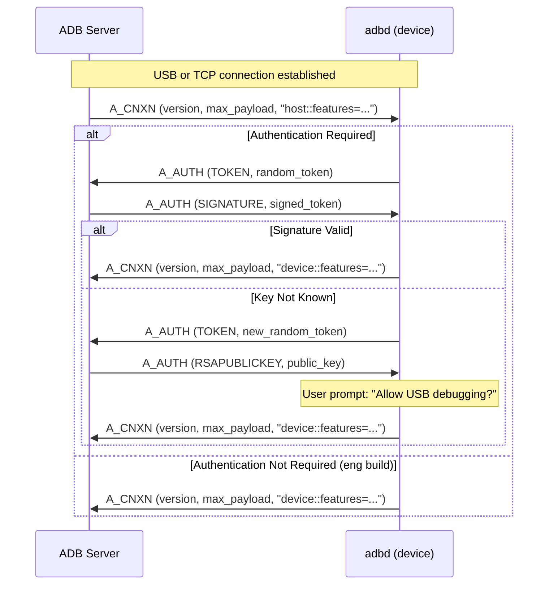
```mermaid
sequenceDiagram
    participant Server as ADB Server
    participant Daemon as adbd (device)

    Note over Server,Daemon: USB or TCP connection established

    Server->>Daemon: A_CNXN (version, max_payload, "host::features=...")

    alt Authentication Required
        Daemon->>Server: A_AUTH (TOKEN, random_token)
        Server->>Daemon: A_AUTH (SIGNATURE, signed_token)
        alt Signature Valid
            Daemon->>Server: A_CNXN (version, max_payload, "device::features=...")
        else Key Not Known
            Daemon->>Server: A_AUTH (TOKEN, new_random_token)
            Server->>Daemon: A_AUTH (RSAPUBLICKEY, public_key)
            Note over Daemon: User prompt: "Allow USB debugging?"
            Daemon->>Server: A_CNXN (version, max_payload, "device::features=...")
        end
    else Authentication Not Required (eng build)
        Daemon->>Server: A_CNXN (version, max_payload, "device::features=...")
    end
```

The protocol version has evolved:
```c
#define A_VERSION_MIN 0x01000000       // original
#define A_VERSION_SKIP_CHECKSUM 0x01000001  // skip checksum (Dec 2017)
#define A_VERSION 0x01000001           // current
```

### 39.4.5 Transport Types

ADB supports multiple transport types, defined in `packages/modules/adb/adb.h`:

```c
enum TransportType {
    kTransportUsb,    // Physical USB connection
    kTransportLocal,  // TCP/IP connection (emulator or network)
    kTransportAny,    // Any available transport
    kTransportHost,   // Service in the ADB server itself
};
```

**Connection states** track the lifecycle of each transport:

```c
enum ConnectionState {
    kCsConnecting = 0,  // Haven't received a response yet
    kCsAuthorizing,     // Authorizing with keys from ADB_VENDOR_KEYS
    kCsUnauthorized,    // Fell back to user prompt
    kCsNoPerm,          // Insufficient permissions
    kCsDetached,        // USB device detached from server
    kCsOffline,         // Peer detected but no comm started
    kCsBootloader,      // fastboot OS
    kCsDevice,          // Android OS (adbd)
    kCsHost,            // What device sees from its end
    kCsRecovery,        // Recovery mode (adbd)
    kCsSideload,        // Sideload mode (minadbd)
    kCsRescue,          // Rescue mode (minadbd)
};
```

### 39.4.6 The `atransport` Class

Source: `packages/modules/adb/transport.h`

The `atransport` class is the central abstraction for a connection to a remote
device:

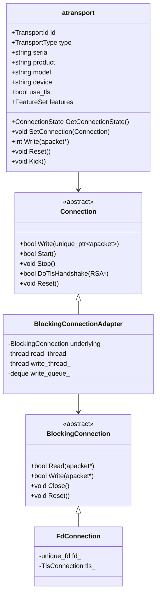
```mermaid
classDiagram
    class atransport {
        +TransportId id
        +TransportType type
        +string serial
        +string product
        +string model
        +string device
        +bool use_tls
        +FeatureSet features
        +ConnectionState GetConnectionState()
        +void SetConnection(Connection)
        +int Write(apacket*)
        +void Reset()
        +void Kick()
    }

    class Connection {
        <<abstract>>
        +bool Write(unique_ptr~apacket~)
        +bool Start()
        +void Stop()
        +bool DoTlsHandshake(RSA*)
        +void Reset()
    }

    class BlockingConnection {
        <<abstract>>
        +bool Read(apacket*)
        +bool Write(apacket*)
        +void Close()
        +void Reset()
    }

    class FdConnection {
        -unique_fd fd_
        -TlsConnection tls_
    }

    class BlockingConnectionAdapter {
        -BlockingConnection underlying_
        -thread read_thread_
        -thread write_thread_
        -deque write_queue_
    }

    atransport --> Connection
    Connection <|-- BlockingConnectionAdapter
    BlockingConnectionAdapter --> BlockingConnection
    BlockingConnection <|-- FdConnection
```

### 39.4.7 USB Transport (Device Side)

Source: `packages/modules/adb/daemon/usb.cpp`

On the device, `adbd` communicates over USB using Linux FunctionFS:

```c
// USB FunctionFS endpoints
#define USB_FFS_ADB_PATH "/dev/usb-ffs/adb/"
#define USB_FFS_ADB_EP0  USB_FFS_ADB_PATH "ep0"   // Control endpoint
#define USB_FFS_ADB_OUT  USB_FFS_ADB_PATH "ep1"    // OUT (host to device)
#define USB_FFS_ADB_IN   USB_FFS_ADB_PATH "ep2"    // IN (device to host)
```

The USB transport uses asynchronous I/O (Linux AIO) for performance:

```c
static constexpr size_t kUsbReadQueueDepth = 8;
static constexpr size_t kUsbReadSize = 16384;     // 16KB per read
static constexpr size_t kUsbWriteQueueDepth = 8;
static constexpr size_t kUsbWriteSize = 16384;    // 16KB per write
```

The 16KB limit exists because not all USB controllers support larger operations.
Each submitted operation allocates a kernel buffer of that size, so the queue
depth is kept shallow (8 entries) to minimize memory usage while maintaining
sufficient depth to keep the USB stack saturated.

FunctionFS events drive the USB transport state machine:

```c
// FunctionFS event types handled by adbd
FUNCTIONFS_BIND      // Function bound to UDC
FUNCTIONFS_UNBIND    // Function unbound from UDC
FUNCTIONFS_ENABLE    // Host configured the gadget
FUNCTIONFS_DISABLE   // Host deconfigured the gadget
FUNCTIONFS_SETUP     // Control request from host
FUNCTIONFS_SUSPEND   // USB suspend signaled
FUNCTIONFS_RESUME    // USB resume signaled
```

The I/O subsystem uses a templated `IoBlock` structure for managing asynchronous
operations:

```cpp
template <class Payload>
struct IoBlock {
    bool pending = false;
    struct iocb control = {};
    Payload payload;
    TransferId id() const { return TransferId::from_value(control.aio_data); }
};

using IoReadBlock = IoBlock<Block>;
using IoWriteBlock = IoBlock<std::shared_ptr<Block>>;
```

ADB identifies itself on the USB bus with specific class/subclass codes that
the host-side ADB server uses to discover ADB-capable devices:
```c
#define ADB_CLASS     0xff   // Vendor-specific class
#define ADB_SUBCLASS  0x42   // ADB subclass
#define ADB_PROTOCOL  0x1    // ADB protocol

// USB Debug Bridge Class (USB 3.x)
#define ADB_DBC_CLASS     0xDC  // Debug Device Class
#define ADB_DBC_SUBCLASS  0x2   // Debug subclass
```

### 39.4.7.1 USB Transport (Host Side)

Source: `packages/modules/adb/client/usb_linux.cpp`, `packages/modules/adb/client/usb_libusb.cpp`

On the host, the ADB server discovers and communicates with devices through
either:

1. **Direct USB I/O** (`usb_linux.cpp`): Scans `/dev/bus/usb/` and uses
   `usbdevfs` ioctls for direct device communication. This is the traditional
   approach.

2. **libusb** (`usb_libusb.cpp`): Uses the libusb library for portable USB
   access. Provides hotplug notification support.

The host USB transport scans for USB interfaces matching the ADB
class/subclass/protocol identifiers, then claims the interface and opens bulk
endpoints for data transfer.

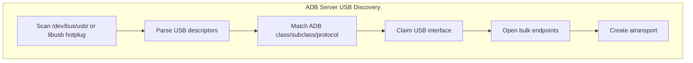
```mermaid
graph TD
    subgraph "ADB Server USB Discovery"
        SCAN["Scan /dev/bus/usb/ or libusb hotplug"]
        PARSE["Parse USB descriptors"]
        MATCH["Match ADB class/subclass/protocol"]
        CLAIM["Claim USB interface"]
        OPEN["Open bulk endpoints"]
        TRANSPORT["Create atransport"]
    end

    SCAN --> PARSE
    PARSE --> MATCH
    MATCH --> CLAIM
    CLAIM --> OPEN
    OPEN --> TRANSPORT
```

### 39.4.8 Authentication

Source: `packages/modules/adb/daemon/auth.cpp`

ADB authentication uses RSA-2048 key pairs:

1. The server generates a 20-byte random token.
2. The daemon sends the token to the server.
3. The server signs the token with its private key.
4. The daemon verifies the signature against known public keys.
5. If verification fails, the daemon prompts the user to accept the key.

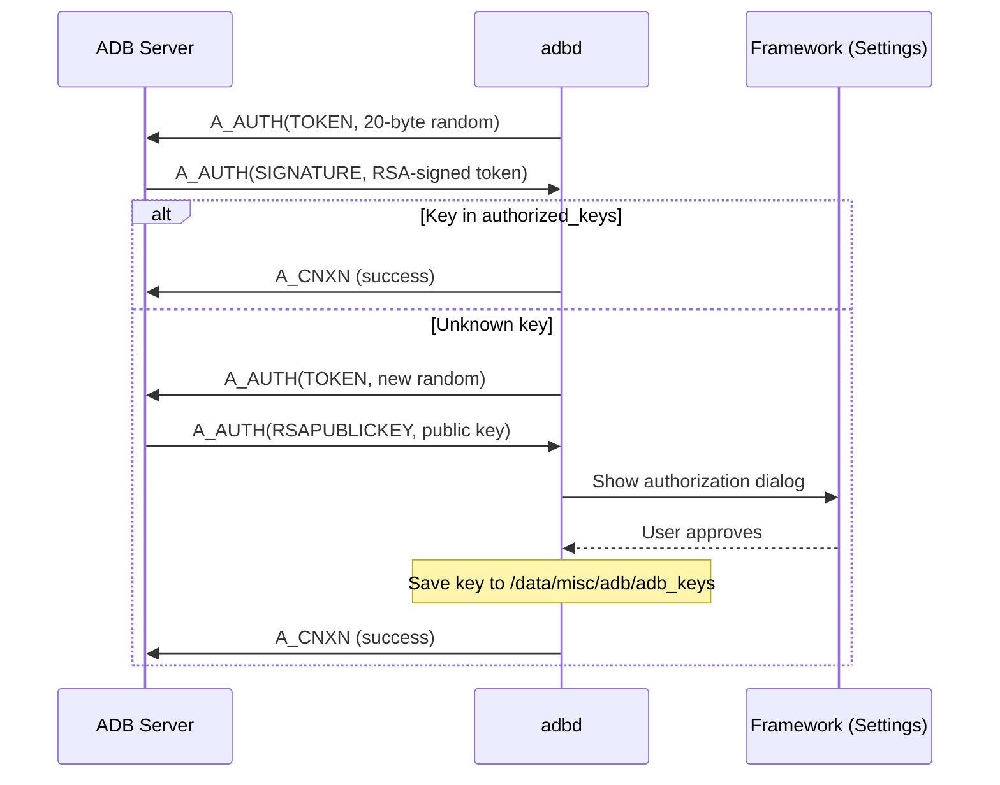
```mermaid
sequenceDiagram
    participant Server as ADB Server
    participant Daemon as adbd
    participant UI as Framework (Settings)

    Daemon->>Server: A_AUTH(TOKEN, 20-byte random)
    Server->>Daemon: A_AUTH(SIGNATURE, RSA-signed token)

    alt Key in authorized_keys
        Daemon->>Server: A_CNXN (success)
    else Unknown key
        Daemon->>Server: A_AUTH(TOKEN, new random)
        Server->>Daemon: A_AUTH(RSAPUBLICKEY, public key)
        Daemon->>UI: Show authorization dialog
        UI-->>Daemon: User approves
        Note over Daemon: Save key to /data/misc/adb/adb_keys
        Daemon->>Server: A_CNXN (success)
    end
```

The authentication context is managed through `adbd_auth`:
```c
static AdbdAuthContext* auth_ctx;
static RSA* rsa_pkey = nullptr;
bool auth_required = true;  // Set to false on eng builds
```

### 39.4.9 adbd Privilege Management

Source: `packages/modules/adb/daemon/main.cpp`

On production builds, `adbd` drops privileges using `minijail`:

```c
// Groups added for various functionality
gid_t groups[] = {
    AID_ADB,          // USB driver access
    AID_LOG,          // System logs (logcat)
    AID_INPUT,        // Input diagnostics (getevent)
    AID_INET,         // Network diagnostics (ping)
    AID_NET_BT,       // Bluetooth diagnostics
    AID_NET_BT_ADMIN, // Bluetooth admin
    AID_SDCARD_R,     // SD card read
    AID_SDCARD_RW,    // SD card write
    AID_NET_BW_STATS, // Network bandwidth stats
    AID_READPROC,     // /proc cross-UID reading
    AID_UHID,         // HID command support
    AID_EXT_DATA_RW,  // External data access
    AID_EXT_OBB_RW,   // OBB file access
    AID_READTRACEFS,  // Trace filesystem
};
```

The decision to drop privileges depends on build type:
```c
// ro.debuggable: 1 on eng and userdebug builds
// ro.secure: 1 on userdebug and user builds
// service.adb.root: set by "adb root" command
bool drop = ro_secure;
if (ro_debuggable && adb_root) drop = false;
if (adb_unroot) drop = true;
```

### 39.4.10 Feature Negotiation

ADB peers exchange feature sets during the connection handshake via the
connection banner. Key features defined in `transport.h`:

| Feature | Description |
|---------|-------------|
| `shell_v2` | Shell protocol version 2 (multiplexed stdin/stdout/stderr) |
| `cmd` | `cmd` command available |
| `stat_v2` | Extended stat information |
| `ls_v2` | Extended directory listing |
| `push_sync` | `push --sync` support |
| `apex` | APK/APEX installation |
| `abb` | Android Binder Bridge (interactive) |
| `abb_exec` | Android Binder Bridge (raw pipe) |
| `sendrecv_v2` | File sync v2 protocol |
| `sendrecv_v2_brotli` | Brotli compression for sync v2 |
| `sendrecv_v2_lz4` | LZ4 compression for sync v2 |
| `sendrecv_v2_zstd` | Zstd compression for sync v2 |
| `sendrecv_v2_dry_run_send` | Dry-run send mode |
| `delayed_ack` | Delayed acknowledgment for throughput |
| `dev-raw` | Raw device access service |

### 39.4.11 WiFi ADB

Starting with Android 11, ADB supports wireless connections via Wi-Fi. The
`adbd` daemon listens on TCP port 5555 (or a configured port) and uses mDNS
for service discovery:

```c
// From daemon/main.cpp
if (access(USB_FFS_ADB_EP0, F_OK) == 0) {
    usb_init();  // Listen on USB
    is_usb = true;
}

// Also listen on TCP if configured
std::string prop_port = android::base::GetProperty("service.adb.tcp.port", "");
if (sscanf(prop_port.c_str(), "%d", &port) == 1 && port > 0) {
    addrs.push_back(android::base::StringPrintf("tcp:%d", port));
    addrs.push_back(android::base::StringPrintf("vsock:%d", port));
    setup_adb(addrs);
}
```

WiFi ADB uses TLS for encrypted communication, with pairing handled through
QR codes or 6-digit pairing codes.

---

## 39.5 ADB Commands Deep Dive

### 39.5.1 Command Architecture

ADB commands follow a consistent pattern: the client sends a service request
string to the server, which either handles it locally or forwards it to the
device daemon. The daemon maps service strings to handlers.

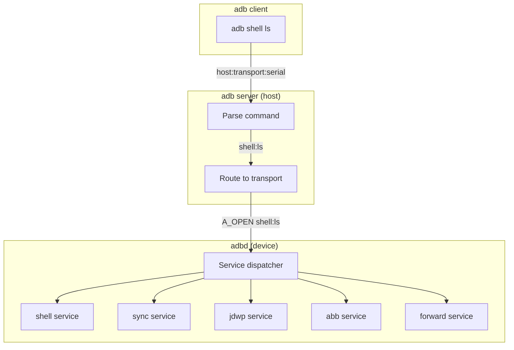
```mermaid
graph TD
    subgraph "adb client"
        CLI["adb shell ls"]
    end

    subgraph "adb server (host)"
        PARSE["Parse command"]
        ROUTE["Route to transport"]
    end

    subgraph "adbd (device)"
        SVC["Service dispatcher"]
        SHELL["shell service"]
        SYNC["sync service"]
        JDWP["jdwp service"]
        ABB["abb service"]
        FWD["forward service"]
    end

    CLI -->|"host:transport:serial"| PARSE
    PARSE -->|"shell:ls"| ROUTE
    ROUTE -->|"A_OPEN shell:ls"| SVC
    SVC --> SHELL
    SVC --> SYNC
    SVC --> JDWP
    SVC --> ABB
    SVC --> FWD
```

### 39.5.2 Shell Commands (`adb shell`)

Source: `packages/modules/adb/daemon/shell_service.cpp`

The shell service uses the Shell Protocol v2, which multiplexes stdin, stdout,
stderr, and exit status over a single stream:

```c
// From shell_protocol.h
enum Id : uint8_t {
    kIdStdin = 0,           // Input to shell
    kIdStdout = 1,          // Standard output
    kIdStderr = 2,          // Standard error
    kIdExit = 3,            // Exit status
    kIdCloseStdin = 4,      // Close stdin
    kIdWindowSizeChange = 5, // Terminal resize
    kIdInvalid = 255,
};
```

Each shell protocol packet has a 5-byte header (1 byte ID + 4 bytes length):

```
+--------+--------+--------+--------+--------+--------...--------+
|   ID   |       Length (32-bit LE)          |     Payload       |
+--------+--------+--------+--------+--------+--------...--------+
```

Shell v2 supports:

- Separate stdout/stderr streams
- Proper exit code propagation
- PTY allocation for interactive shells
- Window size change notifications

**Interactive shell vs. command execution:**

When running `adb shell` (no arguments), an interactive PTY-based shell is
spawned. The shell process runs as the `shell` user (UID 2000) on production
builds, or as `root` if `adb root` has been executed on a debuggable build.

When running `adb shell <command>`, the command is executed in a subprocess with
stdin/stdout/stderr captured. The shell protocol ensures clean separation of
output streams:

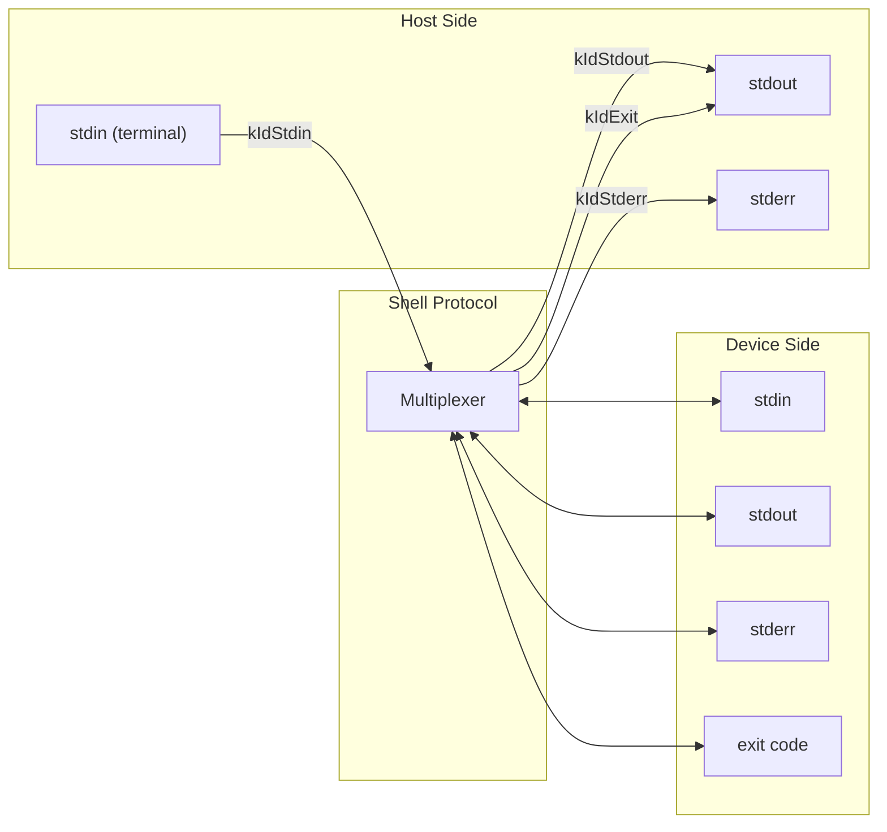
```mermaid
graph LR
    subgraph "Host Side"
        STDIN["stdin (terminal)"]
        STDOUT["stdout"]
        STDERR["stderr"]
    end

    subgraph "Shell Protocol"
        MUX["Multiplexer"]
    end

    subgraph "Device Side"
        SH_IN["stdin"]
        SH_OUT["stdout"]
        SH_ERR["stderr"]
        EXIT["exit code"]
    end

    STDIN -->|"kIdStdin"| MUX
    MUX -->|"kIdStdout"| STDOUT
    MUX -->|"kIdStderr"| STDERR
    MUX -->|"kIdExit"| STDOUT

    MUX <--> SH_IN
    MUX <--> SH_OUT
    MUX <--> SH_ERR
    MUX <--> EXIT
```

**Window size propagation:**

When the terminal window is resized during an interactive shell session, the
client sends a `kIdWindowSizeChange` packet containing the new dimensions as
an ASCII string. The daemon updates the PTY's `winsize` structure, causing the
shell process to receive a `SIGWINCH` signal.

### 39.5.3 File Transfer (`adb push` / `adb pull`)

Source: `packages/modules/adb/client/file_sync_client.cpp`, `packages/modules/adb/daemon/file_sync_service.cpp`

File transfer uses the sync protocol, defined in
`packages/modules/adb/file_sync_protocol.h`:

```c
// Sync protocol message IDs
#define ID_LSTAT_V1 MKID('S', 'T', 'A', 'T')
#define ID_STAT_V2  MKID('S', 'T', 'A', '2')
#define ID_LIST_V1  MKID('L', 'I', 'S', 'T')
#define ID_LIST_V2  MKID('L', 'I', 'S', '2')
#define ID_SEND_V1  MKID('S', 'E', 'N', 'D')
#define ID_SEND_V2  MKID('S', 'N', 'D', '2')
#define ID_RECV_V1  MKID('R', 'E', 'C', 'V')
#define ID_RECV_V2  MKID('R', 'C', 'V', '2')
#define ID_DONE     MKID('D', 'O', 'N', 'E')
#define ID_DATA     MKID('D', 'A', 'T', 'A')
#define ID_OKAY     MKID('O', 'K', 'A', 'Y')
#define ID_FAIL     MKID('F', 'A', 'I', 'L')
#define ID_QUIT     MKID('Q', 'U', 'I', 'T')
```

**Push operation flow:**

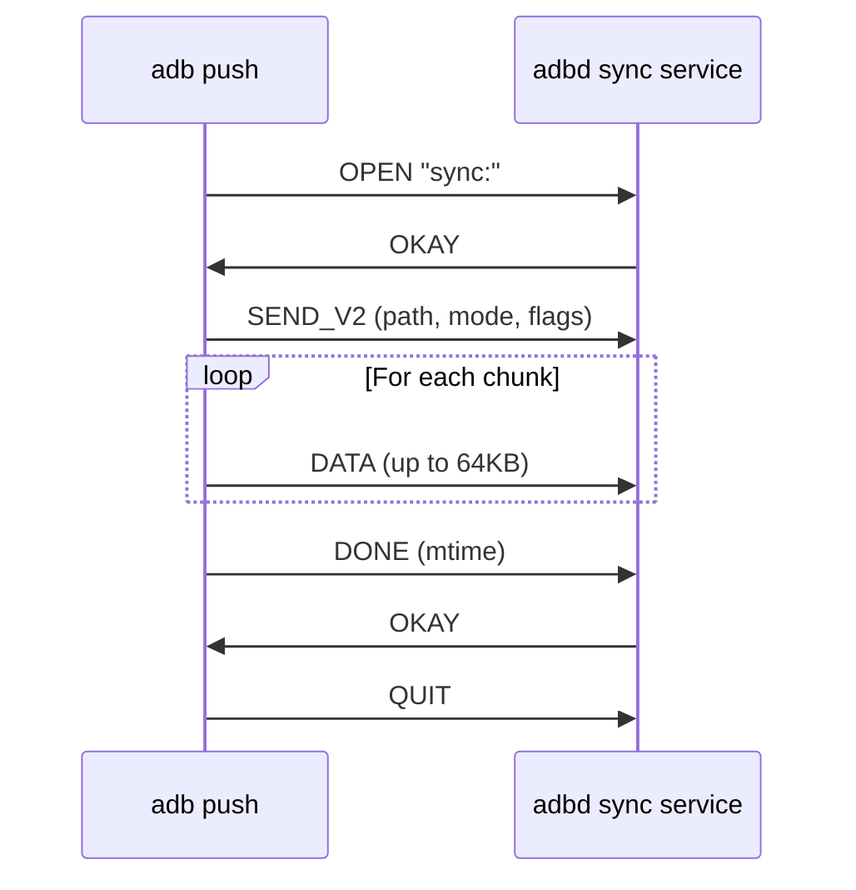
```mermaid
sequenceDiagram
    participant Client as adb push
    participant Daemon as adbd sync service

    Client->>Daemon: OPEN "sync:"
    Daemon->>Client: OKAY
    Client->>Daemon: SEND_V2 (path, mode, flags)
    loop For each chunk
        Client->>Daemon: DATA (up to 64KB)
    end
    Client->>Daemon: DONE (mtime)
    Daemon->>Client: OKAY
    Client->>Daemon: QUIT
```

**Sync v2 features:**

- **Compression**: Brotli, LZ4, and Zstd compression are supported
- **Dry-run mode**: Test a push without actually writing files
- **Extended stat**: Full `struct stat` information (device, inode, uid, gid,
  atime, mtime, ctime)

The `sync_data` structure limits chunks to 64KB:
```c
#define SYNC_DATA_MAX (64 * 1024)

struct __attribute__((packed)) sync_data {
    uint32_t id;
    uint32_t size;
};  // followed by `size` bytes of data.
```

### 39.5.4 Package Installation (`adb install`)

Source: `packages/modules/adb/client/adb_install.cpp`

`adb install` performs these steps:

1. Push the APK to a temporary location on the device
2. Invoke `pm install` or use the streaming install protocol
3. Clean up the temporary file

For **streaming installs** (default on modern devices):

1. Open a `exec:cmd package` service
2. Stream the APK directly to the Package Manager
3. No intermediate file on device storage is needed

**Incremental installation** (`adb install --incremental`) uses an even more
sophisticated approach where only required blocks of the APK are transferred
on demand, dramatically reducing install times for large apps.

### 39.5.5 Log Collection (`adb logcat`)

`adb logcat` opens a `shell:logcat` service on the device. The output is
streamed back in real time using the shell protocol. The logcat binary on the
device reads from the kernel's log buffers via `/dev/log/` or the logd socket.

### 39.5.6 Port Forwarding (`adb forward` / `adb reverse`)

Source: `packages/modules/adb/adb.h`, `packages/modules/adb/adb_listeners.cpp`

**Forward** (`adb forward tcp:8080 tcp:8080`): Creates a listener on the host
that tunnels connections to the device.

**Reverse** (`adb reverse tcp:8080 tcp:8080`): Creates a listener on the device
that tunnels connections to the host.

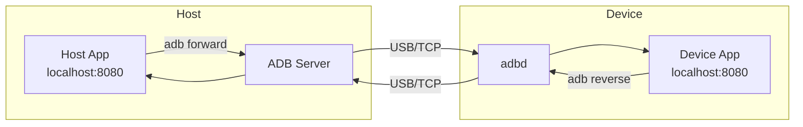
```mermaid
graph LR
    subgraph "Host"
        HA["Host App<br/>localhost:8080"]
        HS["ADB Server"]
    end

    subgraph "Device"
        DA["Device App<br/>localhost:8080"]
        DD["adbd"]
    end

    HA -->|"adb forward"| HS
    HS -->|"USB/TCP"| DD
    DD --> DA

    DA -->|"adb reverse"| DD
    DD -->|"USB/TCP"| HS
    HS --> HA
```

Forward and reverse configurations are tracked per-transport in the
`reverse_forwards_` map within `atransport`:
```cpp
// Track remote addresses against local addresses
std::unordered_map<std::string, std::string> reverse_forwards_;
```

### 39.5.7 ABB: Android Binder Bridge

Source: `packages/modules/adb/daemon/abb.cpp`, `packages/modules/adb/daemon/abb_service.cpp`

ABB provides a direct Binder IPC path from `adb` commands to system services,
bypassing the shell. Commands like `adb shell cmd package list packages`
internally use ABB when the feature is supported:

```
adb shell cmd <service> <arguments>
     |
     v
  abb_exec:<service> <arguments>
     |
     v
  ServiceManager.getService(<service>)
     |
     v
  Direct Binder call
```

This is significantly faster than spawning a shell process and invoking the
`cmd` binary.

### 39.5.8 JDWP Service

Source: `packages/modules/adb/daemon/jdwp_service.cpp`

The JDWP (Java Debug Wire Protocol) service enables Java debugger attachment.
When a debuggable app starts, its runtime registers with `adbd`'s JDWP service.
The `adb jdwp` command lists all PIDs with active JDWP connections, and
`adb forward tcp:PORT jdwp:PID` creates a tunnel for debugger attachment.

---

## 39.6 MTP: Media Transfer Protocol

### 39.6.1 Overview

MTP (Media Transfer Protocol) is the standard protocol for transferring media
files between Android devices and computers. Unlike USB Mass Storage (which
exposes a raw block device), MTP provides object-level file access, allowing
the device to maintain filesystem control and serve files to both the host
computer and local applications simultaneously.

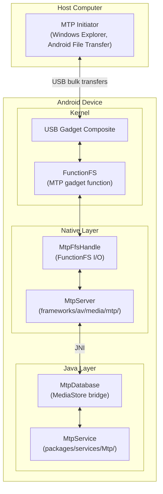
```mermaid
graph TD
    subgraph "Host Computer"
        MTP_HOST["MTP Initiator<br/>(Windows Explorer, Android File Transfer)"]
    end

    subgraph "Android Device"
        subgraph "Java Layer"
            MTP_SVC["MtpService<br/>(packages/services/Mtp/)"]
            MTP_DB["MtpDatabase<br/>(MediaStore bridge)"]
        end

        subgraph "Native Layer"
            MTP_SERVER["MtpServer<br/>(frameworks/av/media/mtp/)"]
            MTP_FFS["MtpFfsHandle<br/>(FunctionFS I/O)"]
        end

        subgraph "Kernel"
            FFS["FunctionFS<br/>(MTP gadget function)"]
            USB_GADGET["USB Gadget Composite"]
        end
    end

    MTP_HOST <-->|"USB bulk transfers"| USB_GADGET
    USB_GADGET <--> FFS
    FFS <--> MTP_FFS
    MTP_FFS <--> MTP_SERVER
    MTP_SERVER <-->|"JNI"| MTP_DB
    MTP_DB <--> MTP_SVC
```

### 39.6.2 MTP Architecture

The MTP implementation spans three layers:

**Native MTP Library** (`frameworks/av/media/mtp/`):

- `MtpServer.cpp/h`: Main MTP protocol engine
- `MtpFfsHandle.cpp/h`: FunctionFS transport (modern)
- `MtpFfsCompatHandle.cpp/h`: Compatibility FunctionFS transport
- `MtpDevHandle.cpp/h`: Legacy `/dev/mtp_usb` transport
- `MtpDataPacket.cpp/h`: Data container serialization
- `MtpRequestPacket.cpp/h`: Command container parsing
- `MtpResponsePacket.cpp/h`: Response container construction
- `MtpEventPacket.cpp/h`: Event notification packets
- `MtpStorage.cpp/h`: Storage abstraction (maps to filesystem paths)
- `MtpObjectInfo.cpp/h`: Object metadata
- `MtpProperty.cpp/h`: MTP property descriptors

**MTP Service** (`packages/services/Mtp/`):

- `MtpService.java`: Android Service that manages the MTP server lifecycle
- `MtpDatabase.java`: Bridge between MTP operations and MediaStore
- `MtpDocumentsProvider.java`: Storage Access Framework integration
- `MtpReceiver.java`: Broadcast receiver for USB state changes
- `MtpManager.java`: Host-side MTP device management

**Framework Integration** (`frameworks/base/`):

- `UsbDeviceManager` binds to `MtpService` when MTP function is active
- `MediaProvider` supplies file metadata to `MtpDatabase`

### 39.6.3 MTP Server Initialization and Run Loop

Source: `frameworks/av/media/mtp/MtpServer.cpp`

The `MtpServer` constructor selects the appropriate USB transport based on
FunctionFS availability:

```cpp
// Transport selection in MtpServer constructor
bool ffs_ok = access(FFS_MTP_EP0, W_OK) == 0;
if (ffs_ok) {
    bool aio_compat = android::base::GetBoolProperty(
            "sys.usb.ffs.aio_compat", false);
    mHandle = aio_compat
            ? new MtpFfsCompatHandle(controlFd)
            : new MtpFfsHandle(controlFd);
} else {
    mHandle = new MtpDevHandle();  // Legacy /dev/mtp_usb
}
```

Three transport implementations exist:

1. **`MtpFfsHandle`**: Modern FunctionFS with async I/O -- highest performance
2. **`MtpFfsCompatHandle`**: FunctionFS with compatibility mode for devices
   where native AIO has issues
3. **`MtpDevHandle`**: Legacy kernel MTP device node (`/dev/mtp_usb`)

The main server loop (`MtpServer::run()`) processes MTP transactions:

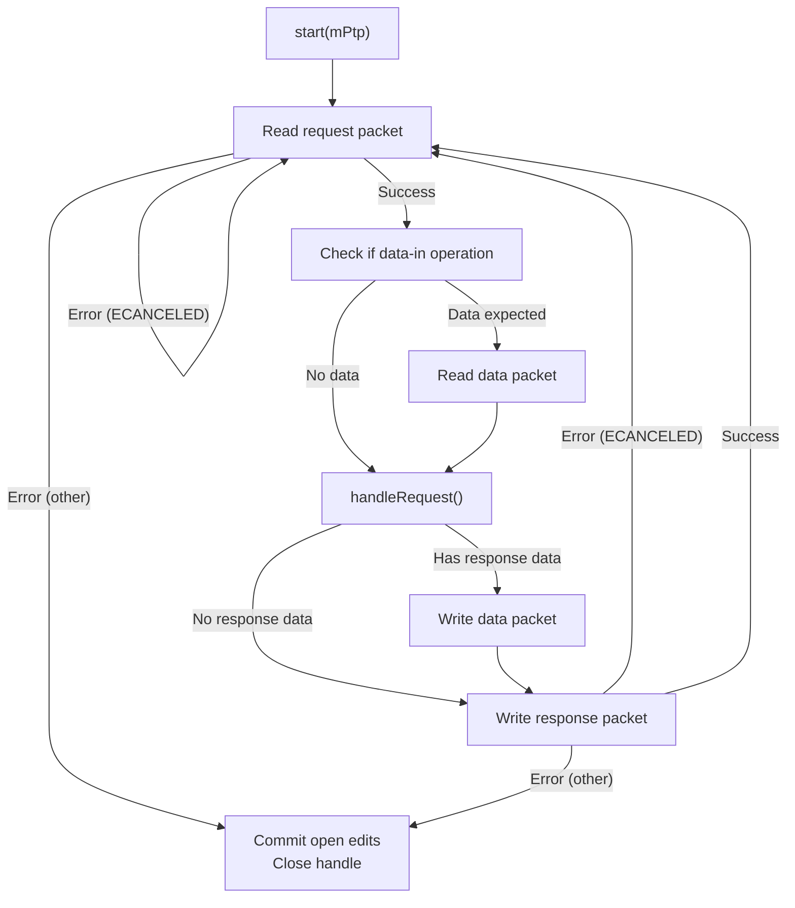
```mermaid
graph TD
    START["start(mPtp)"] --> READ_REQ["Read request packet"]
    READ_REQ -->|"Error (ECANCELED)"| READ_REQ
    READ_REQ -->|"Error (other)"| CLEANUP
    READ_REQ -->|"Success"| CHECK_DATA["Check if data-in operation"]
    CHECK_DATA -->|"Data expected"| READ_DATA["Read data packet"]
    CHECK_DATA -->|"No data"| HANDLE["handleRequest()"]
    READ_DATA --> HANDLE
    HANDLE -->|"Has response data"| WRITE_DATA["Write data packet"]
    HANDLE -->|"No response data"| WRITE_RESP["Write response packet"]
    WRITE_DATA --> WRITE_RESP
    WRITE_RESP -->|"Error (ECANCELED)"| READ_REQ
    WRITE_RESP -->|"Error (other)"| CLEANUP
    WRITE_RESP -->|"Success"| READ_REQ
    CLEANUP["Commit open edits<br/>Close handle"]
```

The run loop identifies data-in operations (host sending data to device):
```cpp
bool dataIn = (operation == MTP_OPERATION_SEND_OBJECT_INFO
            || operation == MTP_OPERATION_SET_OBJECT_REFERENCES
            || operation == MTP_OPERATION_SET_OBJECT_PROP_VALUE
            || operation == MTP_OPERATION_SET_DEVICE_PROP_VALUE);
```

When the server exits (due to USB disconnect or function change), it commits
all pending edits to prevent data loss:
```cpp
int count = mObjectEditList.size();
for (int i = 0; i < count; i++) {
    ObjectEdit* edit = mObjectEditList[i];
    commitEdit(edit);
    delete edit;
}
mObjectEditList.clear();
mHandle->close();
```

### 39.6.4 Storage Management

The `MtpServer` manages multiple storage locations. On a typical Android device:

- **Internal Storage** (storage ID `0x00010001`): `/storage/emulated/<user>/`
- **SD Card** (storage ID `0x00020001`): `/storage/<sdcard-uuid>/`

Storage add/remove operations trigger MTP events to the host:

```cpp
void MtpServer::addStorage(MtpStorage* storage) {
    std::lock_guard<std::mutex> lg(mMutex);
    mStorages.push_back(storage);
    sendStoreAdded(storage->getStorageID());
}

void MtpServer::removeStorage(MtpStorage* storage) {
    std::lock_guard<std::mutex> lg(mMutex);
    auto iter = std::find(mStorages.begin(), mStorages.end(), storage);
    if (iter != mStorages.end()) {
        sendStoreRemoved(storage->getStorageID());
        mStorages.erase(iter);
    }
}
```

When a storage is queried with ID `0` (wildcard), the first storage is
returned. When queried with `0xFFFFFFFF`, any storage matches. This follows
the MTP specification for aggregate operations across all storages.

### 39.6.5 MTP Protocol Details

MTP (Media Transfer Protocol) is a session-oriented protocol originally
developed by Microsoft as an extension of PTP (Picture Transfer Protocol, also
known as ISO 15740). Communication happens through three USB endpoints:

1. **Bulk OUT** (host to device): Commands and data from initiator
2. **Bulk IN** (device to host): Responses and data to initiator
3. **Interrupt IN** (device to host): Asynchronous event notifications

Each MTP transaction uses container packets:

```
Container Format (12-byte header):
+--------+--------+--------+--------+
|   Container Length (32-bit LE)    |
+--------+--------+--------+--------+
|Container|  Operation/Response     |
|  Type   |      Code              |
+--------+--------+--------+--------+
|   Transaction ID (32-bit LE)      |
+--------+--------+--------+--------+
|   Parameters / Data (variable)    |
+--------+--------+--------+--------+
```

Container types from `frameworks/av/media/mtp/mtp.h`:
```c
#define MTP_CONTAINER_TYPE_COMMAND      1
#define MTP_CONTAINER_TYPE_DATA         2
#define MTP_CONTAINER_TYPE_RESPONSE     3
#define MTP_CONTAINER_TYPE_EVENT        4
```

### 39.6.6 Supported MTP Operations

The `MtpServer` in AOSP supports the following operation codes (from
`frameworks/av/media/mtp/MtpServer.cpp`):

| Operation Code | Name | Description |
|---------------|------|-------------|
| `0x1001` | `GET_DEVICE_INFO` | Query device capabilities |
| `0x1002` | `OPEN_SESSION` | Start MTP session |
| `0x1003` | `CLOSE_SESSION` | End MTP session |
| `0x1004` | `GET_STORAGE_IDS` | List available storages |
| `0x1005` | `GET_STORAGE_INFO` | Query storage capacity/free space |
| `0x1006` | `GET_NUM_OBJECTS` | Count objects in storage |
| `0x1007` | `GET_OBJECT_HANDLES` | List object handles |
| `0x1008` | `GET_OBJECT_INFO` | Query object metadata |
| `0x1009` | `GET_OBJECT` | Download object data |
| `0x100A` | `GET_THUMB` | Download thumbnail |
| `0x100B` | `DELETE_OBJECT` | Delete an object |
| `0x100C` | `SEND_OBJECT_INFO` | Create new object (metadata) |
| `0x100D` | `SEND_OBJECT` | Upload object data |
| `0x1010` | `RESET_DEVICE` | Reset MTP state |
| `0x1014` | `GET_DEVICE_PROP_DESC` | Device property descriptor |
| `0x1015` | `GET_DEVICE_PROP_VALUE` | Read device property |
| `0x1016` | `SET_DEVICE_PROP_VALUE` | Write device property |
| `0x1019` | `MOVE_OBJECT` | Move object to new parent |
| `0x101A` | `COPY_OBJECT` | Copy object |
| `0x101B` | `GET_PARTIAL_OBJECT` | Range read |
| `0x9801` | `GET_OBJECT_PROPS_SUPPORTED` | List supported properties |
| `0x9802` | `GET_OBJECT_PROP_DESC` | Property descriptor |
| `0x9803` | `GET_OBJECT_PROP_VALUE` | Read object property |
| `0x9804` | `SET_OBJECT_PROP_VALUE` | Write object property |
| `0x9805` | `GET_OBJECT_PROP_LIST` | Bulk property read |

### 39.6.7 Android Extensions for Direct File I/O

Android extends the standard MTP protocol with custom operations for efficient
direct file editing:

```c
// From mtp.h -- Android extensions
#define MTP_OPERATION_GET_PARTIAL_OBJECT_64  0x95C1  // 64-bit offset read
#define MTP_OPERATION_SEND_PARTIAL_OBJECT    0x95C2  // Host-to-device write
#define MTP_OPERATION_TRUNCATE_OBJECT        0x95C3  // Truncate to 64-bit length
#define MTP_OPERATION_BEGIN_EDIT_OBJECT       0x95C4  // Begin edit session
#define MTP_OPERATION_END_EDIT_OBJECT         0x95C5  // Commit edit changes
```

These extensions enable applications like document editors to modify files in
place without full download-modify-upload cycles:

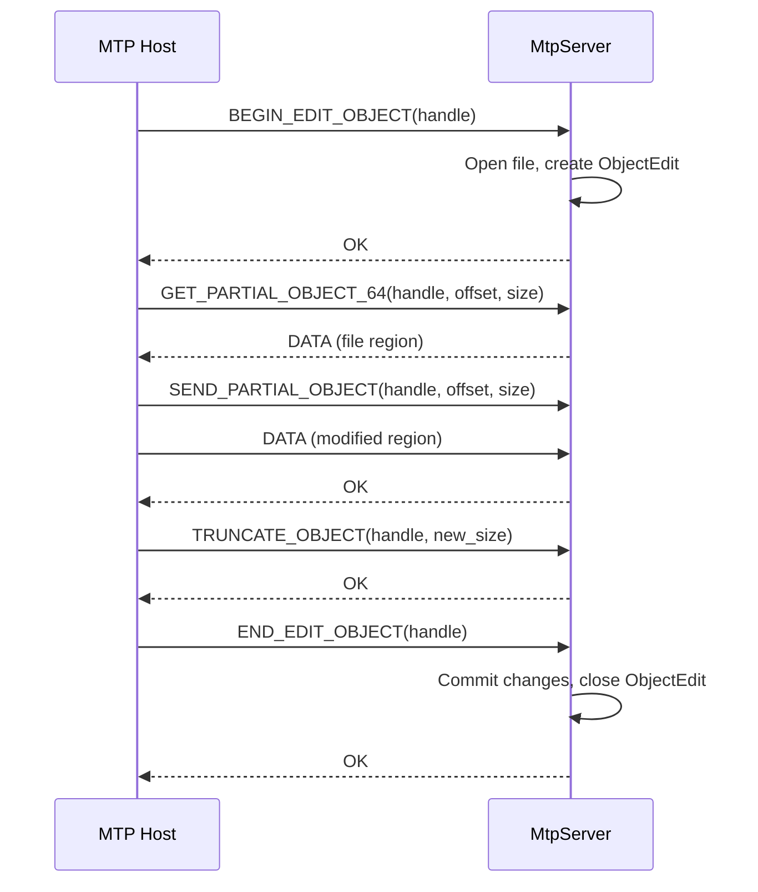
```mermaid
sequenceDiagram
    participant Host as MTP Host
    participant Server as MtpServer

    Host->>Server: BEGIN_EDIT_OBJECT(handle)
    Server->>Server: Open file, create ObjectEdit
    Server-->>Host: OK

    Host->>Server: GET_PARTIAL_OBJECT_64(handle, offset, size)
    Server-->>Host: DATA (file region)

    Host->>Server: SEND_PARTIAL_OBJECT(handle, offset, size)
    Host->>Server: DATA (modified region)
    Server-->>Host: OK

    Host->>Server: TRUNCATE_OBJECT(handle, new_size)
    Server-->>Host: OK

    Host->>Server: END_EDIT_OBJECT(handle)
    Server->>Server: Commit changes, close ObjectEdit
    Server-->>Host: OK
```

### 39.6.8 FunctionFS Transport

Source: `frameworks/av/media/mtp/MtpFfsHandle.h`

The `MtpFfsHandle` class implements the USB transport using Linux FunctionFS,
providing high-performance asynchronous I/O:

```cpp
class MtpFfsHandle : public IMtpHandle {
protected:
    android::base::unique_fd mControl;   // Control endpoint (ep0)
    android::base::unique_fd mBulkIn;    // Bulk IN (device to host)
    android::base::unique_fd mBulkOut;   // Bulk OUT (host to device)
    android::base::unique_fd mIntr;      // Interrupt IN (events)

    aio_context_t mCtx;                  // Linux AIO context

    struct io_buffer mIobuf[NUM_IO_BUFS]; // Double-buffered I/O
    // ...
};
```

The data header prepended to MTP data transfers:
```c
struct mtp_data_header {
    __le32 length;           // Packet length including header
    __le16 type;             // Container type (2 = data)
    __le16 command;          // MTP command code
    __le32 transaction_id;   // Transaction ID
};
```

### 39.6.9 MTP Event Notification

The MTP server sends asynchronous events to the host through the interrupt
endpoint:

```c
// Supported events from MtpServer.cpp
static const MtpEventCode kSupportedEventCodes[] = {
    MTP_EVENT_OBJECT_ADDED,       // 0x4002 - New file created
    MTP_EVENT_OBJECT_REMOVED,     // 0x4003 - File deleted
    MTP_EVENT_STORE_ADDED,        // 0x4004 - Storage mounted
    MTP_EVENT_STORE_REMOVED,      // 0x4005 - Storage unmounted
    MTP_EVENT_DEVICE_PROP_CHANGED,// 0x4006 - Device property changed
    MTP_EVENT_OBJECT_INFO_CHANGED,// 0x4007 - Object metadata changed
};
```

When a file is added or removed on the device (e.g., by a camera app), the
`MtpDatabase` notifies the `MtpServer`, which sends the appropriate event to
the host. The host can then refresh its directory listing.

### 39.6.10 PTP Mode

PTP (Picture Transfer Protocol) is a subset of MTP focused on image transfer.
When PTP mode is selected instead of MTP, the `MtpServer` is initialized with
the `ptp` flag set to `true`:

```cpp
MtpServer::MtpServer(IMtpDatabase* database, int controlFd, bool ptp, ...)
    :   mDatabase(database),
        mPtp(ptp),  // true for PTP mode
        // ...
```

In PTP mode, the server restricts:

- Object formats to image types (JPEG, TIFF, PNG, etc.)
- Operations to the standard PTP subset
- Properties to photo-relevant metadata

PTP mode is useful for connecting to photo kiosks and older software that
does not support the full MTP extension set.

### 39.6.11 MTP Documents Provider

Source: `packages/services/Mtp/src/com/android/mtp/MtpDocumentsProvider.java`

When an Android device acts as an MTP **host** (accessing files on another MTP
device), the `MtpDocumentsProvider` integrates MTP devices into the Storage
Access Framework, allowing any SAF-compatible app to browse files on connected
MTP devices.

Key classes in the host-side MTP stack:

- `MtpDocumentsProvider`: SAF provider implementation
- `MtpManager`: Manages MTP device connections
- `MtpDatabase`: Caches MTP object metadata locally
- `DocumentLoader`: Handles background loading of directory contents
- `PipeManager`: Manages transfer pipe for large files

---

## 39.7 USB Accessory Mode (AOA)

### 39.7.1 Android Open Accessory Protocol Overview

The Android Open Accessory (AOA) protocol allows external USB devices
(accessories) to communicate with Android applications. Unlike standard USB
host mode (where Android is the host), in accessory mode the external device
is the USB host and the Android device is the peripheral.

This is particularly useful for:

- Car head units (Android Auto)
- Docking stations
- Game controllers
- Industrial equipment
- Musical instruments

### 39.7.2 AOA Handshake Protocol

```mermaid
sequenceDiagram
    participant ACC as USB Accessory (Host)
    participant DEV as Android Device (Peripheral)

    Note over ACC,DEV: Device initially in normal USB mode

    ACC->>DEV: GET_PROTOCOL (vendor request 51)
    DEV->>ACC: Protocol version (1 or 2)

    ACC->>DEV: SEND_STRING(0, manufacturer)
    ACC->>DEV: SEND_STRING(1, model)
    ACC->>DEV: SEND_STRING(2, description)
    ACC->>DEV: SEND_STRING(3, version)
    ACC->>DEV: SEND_STRING(4, URI)
    ACC->>DEV: SEND_STRING(5, serial)

    ACC->>DEV: START_ACCESSORY (vendor request 53)

    Note over DEV: Device disconnects, re-enumerates<br/>with accessory VID/PID

    DEV-->>ACC: Re-enumerate as accessory<br/>(VID=0x18D1, PID=0x2D00/0x2D01)

    ACC->>DEV: Open bulk endpoints
    ACC->>DEV: Application data exchange
```

### 39.7.3 Accessory Detection in UsbDeviceManager

Source: `frameworks/base/services/usb/java/com/android/server/usb/UsbDeviceManager.java`

The `UsbUEventObserver` monitors kernel UEvents for accessory handshake
progress:

```java
// UEvent patterns for accessory protocol
private static final String ACCESSORY_START_MATCH =
        "DEVPATH=/devices/virtual/misc/usb_accessory";

// In UsbUEventObserver.onUEvent():
String accessory = event.get("ACCESSORY");
if ("GETPROTOCOL".equals(accessory)) {
    // Accessory sent GET_PROTOCOL control request
    mHandler.setAccessoryUEventTime(SystemClock.elapsedRealtime());
    resetAccessoryHandshakeTimeoutHandler();
} else if ("SENDSTRING".equals(accessory)) {
    // Accessory sent string descriptor
    mHandler.sendEmptyMessage(MSG_INCREASE_SENDSTRING_COUNT);
    resetAccessoryHandshakeTimeoutHandler();
} else if ("START".equals(accessory)) {
    // Accessory sent START_ACCESSORY
    startAccessoryMode();
}
```

### 39.7.4 Accessory Mode Activation

When `START_ACCESSORY` is received, `UsbDeviceManager` switches the gadget
to accessory function:

```java
private void startAccessoryMode() {
    if (!mHasUsbAccessory) return;

    mAccessoryStrings = nativeGetAccessoryStrings();

    // Mandatory strings must be set
    boolean enableAccessory = (mAccessoryStrings != null &&
            mAccessoryStrings[UsbAccessory.MANUFACTURER_STRING] != null &&
            mAccessoryStrings[UsbAccessory.MODEL_STRING] != null);

    long functions = UsbManager.FUNCTION_NONE;
    if (enableAccessory) {
        functions |= UsbManager.FUNCTION_ACCESSORY;
    }

    if (functions != UsbManager.FUNCTION_NONE) {
        // Set timeout for host to complete configuration
        mHandler.sendMessageDelayed(
                mHandler.obtainMessage(MSG_ACCESSORY_MODE_ENTER_TIMEOUT),
                ACCESSORY_REQUEST_TIMEOUT);
        setCurrentFunctions(functions, operationId);
    }
}
```

### 39.7.5 Userspace AOA Implementation

Modern AOSP includes a userspace AOA implementation as an alternative to the
kernel-based accessory driver:

```java
// From UsbDeviceManager constructor
mEnableAoaUserspaceImplementation =
        android.hardware.usb.flags.Flags.enableAoaUserspaceImplementation()
                && deviceEnabledUserspaceAoa
                && nativeCheckAccessoryFfsDirectories();
```

When userspace AOA is enabled, accessory string descriptors are read from
FunctionFS rather than the kernel driver:
```java
if (mEnableAoaUserspaceImplementation) {
    mAccessoryStrings = nativeGetAccessoryStringsFromFfs();
} else {
    mAccessoryStrings = nativeGetAccessoryStrings();
}
```

### 39.7.6 AOA Version 2 (Audio)

AOAv2 adds audio streaming support. When an accessory requests audio, the
`AUDIO_SOURCE` gadget function is enabled alongside `ACCESSORY`:

```java
// GadgetFunction bitmask values
ACCESSORY    = 1 << 1;   // AOA data
AUDIO_SOURCE = 1 << 6;   // AOAv2 audio
```

The audio is presented to the host as a standard USB Audio Class device,
allowing the accessory to receive audio output from the Android device without
special drivers.

### 39.7.7 Application Integration

Applications register to receive USB accessory intents through their manifest:

```xml
<activity android:name=".MyAccessoryActivity">
    <intent-filter>
        <action android:name="android.hardware.usb.action.USB_ACCESSORY_ATTACHED"/>
    </intent-filter>
    <meta-data
        android:name="android.hardware.usb.action.USB_ACCESSORY_ATTACHED"
        android:resource="@xml/accessory_filter"/>
</activity>
```

The filter XML specifies which accessories to match:
```xml
<resources>
    <usb-accessory manufacturer="Example Corp"
                   model="GamePad"
                   version="1.0"/>
</resources>
```

At runtime, the application uses `UsbManager` to open the accessory connection:
```java
UsbManager usbManager = getSystemService(UsbManager.class);
UsbAccessory[] accessories = usbManager.getAccessoryList();
if (accessories != null) {
    ParcelFileDescriptor fd = usbManager.openAccessory(accessories[0]);
    FileInputStream input = new FileInputStream(fd.getFileDescriptor());
    FileOutputStream output = new FileOutputStream(fd.getFileDescriptor());
    // Read/write accessory data
}
```

---

## 39.8 USB Host Mode

### 39.8.1 Overview

In USB host mode, the Android device acts as a USB host, providing power and
enumerating connected USB peripherals. This enables use of:

- USB keyboards and mice
- USB storage devices (flash drives)
- USB audio devices (DACs, headsets)
- USB cameras
- USB Ethernet adapters
- USB MIDI controllers
- Custom USB devices (with application-managed protocols)

### 39.8.2 UsbHostManager

Source: `frameworks/base/services/usb/java/com/android/server/usb/UsbHostManager.java`

`UsbHostManager` manages USB devices connected to the Android device in host
mode. It runs a native thread that monitors the USB bus:

```java
public void systemReady() {
    synchronized (mLock) {
        Runnable runnable = this::monitorUsbHostBus;
        new Thread(null, runnable, "UsbService host thread").start();
    }
}

// Native methods
private native void monitorUsbHostBus();
private native ParcelFileDescriptor nativeOpenDevice(String deviceAddress);
```

### 39.8.3 Device Enumeration

```mermaid
sequenceDiagram
    participant Kernel as Linux USB Core
    participant JNI as UsbHostManager JNI
    participant UHM as UsbHostManager
    participant Settings as UsbProfileGroupSettingsManager
    participant App as Application

    Kernel->>JNI: USB device connected
    JNI->>UHM: usbDeviceAdded(address, class, subclass, descriptors)
    UHM->>UHM: Parse USB descriptors
    UHM->>UHM: Check deny lists

    alt Device allowed
        UHM->>UHM: Build UsbDevice object
        UHM->>Settings: deviceAttached(newDevice)
        Settings->>App: ACTION_USB_DEVICE_ATTACHED broadcast
    else Device denied
        UHM->>UHM: Log and ignore
    end

    Note over Kernel,App: Later, device removed
    Kernel->>JNI: USB device disconnected
    JNI->>UHM: usbDeviceRemoved(address)
    UHM->>Settings: usbDeviceRemoved(device)
    Settings->>App: ACTION_USB_DEVICE_DETACHED broadcast
```

### 39.8.4 Descriptor Parsing

When a USB device is connected, the raw descriptors are parsed by
`UsbDescriptorParser` to build an `android.hardware.usb.UsbDevice` object:

```java
// From UsbHostManager.usbDeviceAdded()
UsbDescriptorParser parser = new UsbDescriptorParser(deviceAddress, descriptors);
logUsbDevice(parser);  // Log VID:PID, manufacturer, product, serial

UsbDevice.Builder newDeviceBuilder = parser.toAndroidUsbDeviceBuilder();
UsbDevice newDevice = newDeviceBuilder.build(serialNumberReader);
mDevices.put(deviceAddress, newDevice);
```

The parser examines USB descriptors to classify the device:

- `parser.hasAudioInterface()` -- USB audio device
- `parser.hasHIDInterface()` -- HID device (keyboard, mouse)
- `parser.hasStorageInterface()` -- Mass storage device
- `parser.isInputHeadset()` / `parser.isOutputHeadset()` -- Audio headset
- `parser.isDock()` -- Docking station

### 39.8.5 Deny Lists

`UsbHostManager` maintains two levels of deny lists:

**1. Bus-level deny list**: Configured via the device's resource overlay:
```java
mHostDenyList = context.getResources().getStringArray(
        com.android.internal.R.array.config_usbHostDenylist);
```

**2. Class-level deny list**: Blocks certain USB classes from application
access:
```java
private boolean isDenyListed(int clazz, int subClass) {
    if (clazz == UsbConstants.USB_CLASS_HUB) return true;
    return clazz == UsbConstants.USB_CLASS_HID
            && subClass == UsbConstants.USB_INTERFACE_SUBCLASS_BOOT;
}
```

### 39.8.6 USB Permissions

Source: `frameworks/base/services/usb/java/com/android/server/usb/UsbPermissionManager.java`

Access to USB devices requires explicit permission. The permission model works
as follows:

```mermaid
graph TD
    subgraph "Permission Granting"
        MANIFEST["Manifest filter match<br/>(auto-grant)"]
        DIALOG["User permission dialog<br/>(manual grant)"]
        PRIV["Privileged system app<br/>(pre-granted)"]
    end

    subgraph "UsbPermissionManager"
        UPERM2["UsbPermissionManager"]
        UUPM["UsbUserPermissionManager<br/>(per-user)"]
    end

    MANIFEST --> UPERM2
    DIALOG --> UPERM2
    PRIV --> UPERM2
    UPERM2 --> UUPM
```

Applications can request permission in two ways:

**1. Intent filter matching** (automatic):
```xml
<activity android:name=".UsbDeviceActivity">
    <intent-filter>
        <action android:name="android.hardware.usb.action.USB_DEVICE_ATTACHED"/>
    </intent-filter>
    <meta-data
        android:name="android.hardware.usb.action.USB_DEVICE_ATTACHED"
        android:resource="@xml/device_filter"/>
</activity>
```

With a device filter:
```xml
<resources>
    <usb-device vendor-id="1234" product-id="5678"/>
</resources>
```

**2. Runtime permission request** (programmatic):
```java
UsbManager usbManager = getSystemService(UsbManager.class);
UsbDevice device = ...;
if (!usbManager.hasPermission(device)) {
    PendingIntent permissionIntent = PendingIntent.getBroadcast(
            this, 0, new Intent(ACTION_USB_PERMISSION), 0);
    usbManager.requestPermission(device, permissionIntent);
}
```

### 39.8.7 Opening USB Devices

Once permission is granted, applications communicate with USB devices through
file descriptors:

```java
UsbDeviceConnection connection = usbManager.openDevice(device);
// Claim an interface
connection.claimInterface(usbInterface, true);

// Bulk transfer
byte[] buffer = new byte[64];
int bytesRead = connection.bulkTransfer(endpoint, buffer, buffer.length, TIMEOUT);

// Control transfer
connection.controlTransfer(
    UsbConstants.USB_DIR_IN | UsbConstants.USB_TYPE_VENDOR,
    REQUEST_CODE, VALUE, INDEX, buffer, buffer.length, TIMEOUT);
```

Under the hood, `UsbHostManager.openDevice()` calls `nativeOpenDevice()` which
returns a `ParcelFileDescriptor` to the USB device node (e.g.,
`/dev/bus/usb/001/003`).

### 39.8.7.1 USB Transfer Types

The `UsbDeviceConnection` class supports all four USB transfer types:

| Transfer Type | Method | Max Size | Use Case |
|--------------|--------|----------|----------|
| Control | `controlTransfer()` | 4KB per setup | Device configuration, vendor commands |
| Bulk | `bulkTransfer()` | Variable | Data-heavy transfers (storage, printers) |
| Interrupt | `bulkTransfer()` on interrupt EP | 64B (FS) / 1024B (HS) | HID events, status polling |
| Isochronous | `UsbRequest` (async) | 1023B (FS) / 1024B (HS) | Audio/video streaming |

For asynchronous transfers, applications use `UsbRequest`:

```java
UsbRequest request = new UsbRequest();
request.initialize(connection, endpoint);
ByteBuffer buffer = ByteBuffer.allocate(64);
request.queue(buffer, 64);

// Wait for completion
UsbRequest completed = connection.requestWait();
if (completed == request) {
    // Process data in buffer
    buffer.flip();
    int bytesReceived = buffer.remaining();
}
```

### 39.8.7.2 USB Device Class Model

The `UsbDevice` object provides a hierarchical view of the USB device:

```mermaid
graph TD
    DEV["UsbDevice<br/>VID:PID, class, serial"]
    CFG1["UsbConfiguration 0<br/>attributes, maxPower"]
    CFG2["UsbConfiguration 1"]
    IF1["UsbInterface 0<br/>class, subclass, protocol"]
    IF2["UsbInterface 1"]
    EP1["UsbEndpoint 0<br/>IN, BULK, 512B"]
    EP2["UsbEndpoint 1<br/>OUT, BULK, 512B"]
    EP3["UsbEndpoint 2<br/>IN, INTERRUPT, 8B"]

    DEV --> CFG1
    DEV --> CFG2
    CFG1 --> IF1
    CFG1 --> IF2
    IF1 --> EP1
    IF1 --> EP2
    IF2 --> EP3
```

Applications iterate through this hierarchy to find the interface and endpoints
they need:

```java
for (int i = 0; i < device.getConfigurationCount(); i++) {
    UsbConfiguration config = device.getConfiguration(i);
    for (int j = 0; j < config.getInterfaceCount(); j++) {
        UsbInterface iface = config.getInterface(j);
        if (iface.getInterfaceClass() == UsbConstants.USB_CLASS_VENDOR_SPEC) {
            for (int k = 0; k < iface.getEndpointCount(); k++) {
                UsbEndpoint ep = iface.getEndpoint(k);
                if (ep.getDirection() == UsbConstants.USB_DIR_IN) {
                    inEndpoint = ep;
                } else {
                    outEndpoint = ep;
                }
            }
        }
    }
}
```

### 39.8.8 USB Audio Integration

The `UsbAlsaManager` (source:
`frameworks/base/services/usb/java/com/android/server/usb/UsbAlsaManager.java`)
handles USB audio devices:

```mermaid
graph LR
    USB_AUDIO["USB Audio Device"] --> UHM2["UsbHostManager"]
    UHM2 --> UALSA2["UsbAlsaManager"]
    UALSA2 --> ALSA["ALSA Subsystem"]
    UALSA2 --> MIDI2["UsbDirectMidiDevice"]
    ALSA --> AUDIO_HAL["Audio HAL"]
    AUDIO_HAL --> AUDIOFLINGER["AudioFlinger"]
```

When a USB audio device is connected:

1. `UsbHostManager` calls `mUsbAlsaManager.usbDeviceAdded()`
2. `UsbAlsaManager` creates an `UsbAlsaDevice` representing the ALSA sound card
3. The Audio HAL is notified of the new output/input device
4. AudioFlinger routes audio to/from the USB device

### 39.8.9 USB MIDI

For USB MIDI devices, `UsbHostManager` creates `UsbDirectMidiDevice` instances:

```java
if (parser.containsUniversalMidiDeviceEndpoint()) {
    UsbDirectMidiDevice midiDevice = UsbDirectMidiDevice.create(
            mContext, newDevice, parser, true, uniqueUsbDeviceIdentifier);
    midiDevices.add(midiDevice);

    // If also MIDI 1.0 compatible, create legacy device
    if (parser.containsLegacyMidiDeviceEndpoint()) {
        midiDevice = UsbDirectMidiDevice.create(
                mContext, newDevice, parser, false, uniqueUsbDeviceIdentifier);
        midiDevices.add(midiDevice);
    }
}
```

A unique 3-digit code is generated to associate related MIDI devices:
```java
private String generateNewUsbDeviceIdentifier() {
    String code;
    do {
        code = "";
        for (int i = 0; i < 3; i++) {
            code += mRandom.nextInt(10);
        }
    } while (mMidiUniqueCodes.contains(code));
    mMidiUniqueCodes.add(code);
    return code;
}
```

### 39.8.10 Connection Tracking

`UsbHostManager` maintains a rolling log of connection/disconnection events
for debugging:

```java
static final int MAX_CONNECT_RECORDS = 32;

class ConnectionRecord {
    long mTimestamp;
    String mDeviceAddress;
    final int mMode;  // CONNECT, CONNECT_BADPARSE, CONNECT_BADDEVICE, DISCONNECT
    final byte[] mDescriptors;
}
```

These records are accessible through `dumpsys usb` and include raw USB
descriptors for detailed analysis.

---

## 39.9 Try It: Hands-On Experiments

### 39.9.1 Explore USB State Machine

Monitor USB state changes in real time:

```bash
# Watch USB state changes via logcat
adb logcat -s UsbDeviceManager:* UsbService:*

# Check current USB configuration
adb shell getprop sys.usb.config
adb shell getprop sys.usb.state
adb shell getprop sys.usb.controller

# Check persistent USB config
adb shell getprop persist.sys.usb.config
```

### 39.9.2 Switch USB Functions

```bash
# Switch to MTP mode
adb shell svc usb setFunctions mtp

# Switch to PTP mode
adb shell svc usb setFunctions ptp

# Switch to RNDIS (tethering)
adb shell svc usb setFunctions rndis

# Switch to MIDI mode
adb shell svc usb setFunctions midi

# Check current functions
adb shell svc usb getFunctions

# Reset USB gadget
adb shell svc usb resetUsbGadget
```

### 39.9.3 Inspect USB HAL State

```bash
# Dump USB service state
adb shell dumpsys usb

# Check USB port status
adb shell dumpsys usb | grep -A 20 "USB Port State"

# Check HAL version
adb shell dumpsys usb | grep "hal version"

# List USB gadget HAL
adb shell service list | grep usb
```

### 39.9.4 ADB Protocol Exploration

```bash
# Check ADB version and protocol
adb version

# List connected devices with details
adb devices -l

# Check device features
adb shell getprop ro.adb.secure
adb shell getprop service.adb.root
adb shell getprop ro.debuggable

# View ADB authentication keys
adb shell ls -la /data/misc/adb/

# Enable wireless ADB
adb tcpip 5555
adb connect <device-ip>:5555

# Check ADB transport speed
adb shell cat /config/usb_gadget/g1/UDC
```

### 39.9.5 Test File Transfer Performance

```bash
# Create a test file
dd if=/dev/urandom of=/tmp/testfile bs=1M count=100

# Push with timing
time adb push /tmp/testfile /data/local/tmp/

# Pull with timing
time adb pull /data/local/tmp/testfile /tmp/pulled_file

# Compare transfer speeds
# USB 2.0 HS: ~35-40 MB/s
# USB 3.x: ~100+ MB/s (device dependent)
```

### 39.9.6 Explore MTP from Device Side

```bash
# Check MTP server status
adb shell dumpsys usb | grep -i mtp

# Monitor MTP operations
adb logcat -s MtpServer:* MtpService:*

# List MTP storage IDs
adb shell dumpsys media.mtp

# Check FunctionFS endpoints for MTP
adb shell ls -la /dev/usb-ffs/mtp/
```

### 39.9.7 USB Host Mode Exploration

```bash
# List connected USB devices (host mode)
adb shell cat /proc/bus/usb/devices 2>/dev/null || \
adb shell lsusb 2>/dev/null || \
adb shell "for f in /sys/bus/usb/devices/*/product; do \
    echo $(dirname $f): $(cat $f 2>/dev/null); done"

# Check USB host deny list
adb shell dumpsys usb | grep -A 5 "deny"

# Monitor USB host events
adb logcat -s UsbHostManager:*

# Examine USB descriptors of connected device
adb shell "dumpsys usb -dump-raw"
```

### 39.9.8 Build and Test USB HAL Changes

```bash
# Build the default USB HAL
cd $AOSP_ROOT  # Navigate to the AOSP source tree
source build/envsetup.sh
lunch <target>

# Build USB HAL
m android.hardware.usb-service

# Build USB Gadget HAL
m android.hardware.usb.gadget-service

# Run USB VTS tests
atest VtsHalUsbV1_0TargetTest
atest VtsHalUsbGadgetV1_0TargetTest
```

### 39.9.9 ADB Over WiFi Pairing

```bash
# On the device: Enable wireless debugging in Developer Options

# On the host: Pair with the device
adb pair <device-ip>:<pairing-port>
# Enter the 6-digit pairing code shown on device

# Connect after pairing
adb connect <device-ip>:<connection-port>

# Verify connection
adb devices -l
```

### 39.9.10 Port Forwarding Experiment

```bash
# Forward local port to device port
adb forward tcp:8080 tcp:8080

# Reverse: forward device port to host port
adb reverse tcp:3000 tcp:3000

# List all forwards
adb forward --list
adb reverse --list

# Remove forwards
adb forward --remove tcp:8080
adb reverse --remove-all
```

### 39.9.11 Investigate USB Accessory Mode

```bash
# Check accessory support
adb shell getprop ro.usb.ffs.ready
adb shell ls -la /dev/usb_accessory 2>/dev/null

# Monitor accessory events
adb logcat -s UsbDeviceManager:* | grep -i accessory

# Check AOA userspace implementation status
adb shell getprop ro.usb.userspace.aoa.enabled
```

### 39.9.12 Trace USB Stack with ftrace

```bash
# Enable USB tracing (requires root)
adb root
adb shell "echo 1 > /sys/kernel/debug/tracing/events/gadget/enable"
adb shell "echo 1 > /sys/kernel/debug/tracing/events/usb/enable"

# Plug/unplug USB cable, then read trace
adb shell cat /sys/kernel/debug/tracing/trace

# Disable tracing
adb shell "echo 0 > /sys/kernel/debug/tracing/events/gadget/enable"
adb shell "echo 0 > /sys/kernel/debug/tracing/events/usb/enable"
```

### 39.9.13 Dump ADB Protocol Traffic

```bash
# Set ADB trace categories
export ADB_TRACE=all  # or: usb, transport, adb, packets

# Run adb with tracing enabled
ADB_TRACE=packets adb shell echo hello

# On device, enable adbd tracing
adb shell setprop persist.adb.trace_mask 0xffff
adb shell stop adbd && adb shell start adbd
```

### 39.9.14 Explore ConfigFS Gadget Configuration

On devices with configfs gadget support, you can inspect the USB gadget
configuration directly:

```bash
# View the gadget configuration tree
adb shell ls -la /config/usb_gadget/

# Examine the primary gadget
adb shell ls -la /config/usb_gadget/g1/

# View gadget strings (manufacturer, product, serial)
adb shell cat /config/usb_gadget/g1/strings/0x409/manufacturer
adb shell cat /config/usb_gadget/g1/strings/0x409/product
adb shell cat /config/usb_gadget/g1/strings/0x409/serialnumber

# View VID/PID
adb shell cat /config/usb_gadget/g1/idVendor
adb shell cat /config/usb_gadget/g1/idProduct

# View active configuration
adb shell ls /config/usb_gadget/g1/configs/b.1/
adb shell cat /config/usb_gadget/g1/configs/b.1/strings/0x409/configuration

# View active functions (symlinks)
adb shell ls -la /config/usb_gadget/g1/configs/b.1/ | grep "^l"

# View available functions
adb shell ls /config/usb_gadget/g1/functions/

# View the UDC (USB Device Controller)
adb shell cat /config/usb_gadget/g1/UDC
```

### 39.9.15 Monitor USB Type-C Port Status

```bash
# View Type-C port information
adb shell dumpsys usb | grep -A 30 "USB Port State"

# Monitor Type-C sysfs
adb shell ls /sys/class/typec/
adb shell cat /sys/class/typec/port0/data_role 2>/dev/null
adb shell cat /sys/class/typec/port0/power_role 2>/dev/null
adb shell cat /sys/class/typec/port0/port_type 2>/dev/null

# Check USB Power Delivery status
adb shell cat /sys/class/typec/port0/power_operation_mode 2>/dev/null

# Watch for UEvents (requires root)
adb root
adb shell udevadm monitor --kernel --subsystem-match=typec 2>/dev/null || \
    adb shell "cat /dev/uevent_monitor 2>/dev/null" || \
    echo "Use logcat to monitor UEvents"
```

### 39.9.16 Benchmark USB Data Throughput

```bash
# Test raw ADB transfer speed
dd if=/dev/zero bs=1M count=256 > /tmp/zero_256m

# Push benchmark
echo "Push benchmark:"
time adb push /tmp/zero_256m /data/local/tmp/benchmark

# Pull benchmark
echo "Pull benchmark:"
time adb pull /data/local/tmp/benchmark /tmp/benchmark_pull

# Clean up
adb shell rm /data/local/tmp/benchmark
rm /tmp/zero_256m /tmp/benchmark_pull

# Check USB speed from device perspective
adb shell dumpsys usb | grep -i speed
adb shell cat /sys/class/udc/*/current_speed 2>/dev/null
```

### 39.9.17 Explore ADB Key Management

```bash
# View authorized keys on device
adb shell cat /data/misc/adb/adb_keys

# View your ADB public key on host
cat ~/.android/adbkey.pub

# View the RSA key fingerprint
openssl rsa -in ~/.android/adbkey -pubout 2>/dev/null | \
    openssl md5 -c

# Revoke all USB debugging authorizations (on device)
adb shell settings put global development_settings_enabled 0
# Or via Settings > Developer Options > Revoke USB debugging authorizations
```

### 39.9.18 Write a Simple USB Host Application

Create a minimal application that enumerates USB devices:

```java
// USB enumeration activity
public class UsbEnumerator extends Activity {
    @Override
    protected void onCreate(Bundle savedInstanceState) {
        super.onCreate(savedInstanceState);

        UsbManager usbManager = getSystemService(UsbManager.class);
        HashMap<String, UsbDevice> deviceList = usbManager.getDeviceList();

        for (UsbDevice device : deviceList.values()) {
            Log.i("USB", String.format("Device: %s", device.getDeviceName()));
            Log.i("USB", String.format("  VID:PID = %04x:%04x",
                    device.getVendorId(), device.getProductId()));
            Log.i("USB", String.format("  Manufacturer: %s",
                    device.getManufacturerName()));
            Log.i("USB", String.format("  Product: %s",
                    device.getProductName()));
            Log.i("USB", String.format("  Class: 0x%02x Subclass: 0x%02x",
                    device.getDeviceClass(), device.getDeviceSubclass()));

            for (int i = 0; i < device.getConfigurationCount(); i++) {
                UsbConfiguration config = device.getConfiguration(i);
                Log.i("USB", String.format("  Config %d: %d interfaces",
                        i, config.getInterfaceCount()));

                for (int j = 0; j < config.getInterfaceCount(); j++) {
                    UsbInterface iface = config.getInterface(j);
                    Log.i("USB", String.format(
                            "    Interface %d: class=0x%02x endpoints=%d",
                            j, iface.getInterfaceClass(),
                            iface.getEndpointCount()));
                }
            }
        }
    }
}
```

### 39.9.19 Debug USB Connection Issues

Common USB debugging techniques:

```bash
# Check if USB is properly initialized
adb shell getprop sys.usb.state
adb shell getprop sys.usb.config
adb shell getprop init.svc.adbd

# Verify FunctionFS is available
adb shell ls -la /dev/usb-ffs/

# Check kernel USB messages
adb shell dmesg | grep -i usb | tail -30

# View USB controller information
adb shell cat /sys/class/udc/*/state 2>/dev/null
adb shell cat /sys/class/udc/*/device/uevent 2>/dev/null

# Reset USB gadget (if functions are stuck)
adb shell svc usb resetUsbGadget

# Force ADB restart
adb kill-server
adb start-server
adb devices
```

### 39.9.20 Inspect MTP Object Tree

```bash
# Use Android's mtp-send/receive tools (if available)
# Or monitor MTP operations via logcat:
adb logcat -s MtpServer:V MtpDatabase:V MtpService:V

# In another terminal, connect the device as MTP to a computer
# and browse files -- watch the MTP operations in logcat

# Common MTP operation codes to watch for:
# 0x1001 = GET_DEVICE_INFO
# 0x1002 = OPEN_SESSION
# 0x1007 = GET_OBJECT_HANDLES
# 0x1008 = GET_OBJECT_INFO
# 0x1009 = GET_OBJECT (file download)
# 0x100D = SEND_OBJECT (file upload)
# 0x100B = DELETE_OBJECT
```

---

## 39.10 Internal Details: ConfigFS and the Linux USB Gadget Framework

### 39.10.1 ConfigFS Gadget Architecture

Modern Android devices use Linux's ConfigFS-based USB gadget framework to
manage composite USB device configurations. This replaces the older
`android_usb` driver and provides a more flexible, user-space-configurable
approach.

```mermaid
graph TD
    subgraph "User Space"
        HAL["IUsbGadget HAL"]
        INIT["init (property triggers)"]
    end

    subgraph "ConfigFS (/config/usb_gadget/)"
        G1["g1/ (gadget instance)"]
        STRINGS["strings/0x409/<br/>manufacturer, product, serial"]
        CONFIGS["configs/b.1/<br/>configuration"]
        FUNCS["functions/<br/>ffs.adb, ffs.mtp, ...]"]
        UDC["UDC (controller binding)"]
    end

    subgraph "FunctionFS"
        FFS_ADB["/dev/usb-ffs/adb/"]
        FFS_MTP["/dev/usb-ffs/mtp/"]
    end

    subgraph "Kernel USB Stack"
        COMPOSITE["USB Composite Driver"]
        UDC_DRIVER["UDC Hardware Driver"]
    end

    HAL --> G1
    INIT --> G1
    G1 --> STRINGS
    G1 --> CONFIGS
    G1 --> FUNCS
    G1 --> UDC
    FUNCS --> FFS_ADB
    FUNCS --> FFS_MTP
    UDC --> COMPOSITE
    COMPOSITE --> UDC_DRIVER
```

### 39.10.2 Gadget Configuration Process

When the HAL receives a `setCurrentUsbFunctions()` call, the typical ConfigFS
manipulation sequence is:

```
1. Write "" to UDC                    # Unbind from controller
2. Unlink functions from configs/b.1/ # Remove current functions
3. Create/configure new functions     # e.g., mkdir functions/ffs.mtp
4. Link functions to configs/b.1/     # symlink functions/ffs.mtp -> configs/b.1/f1
5. Write controller name to UDC       # Bind to controller, trigger enumeration
```

This sequence causes a USB disconnect/reconnect cycle visible to the host.

### 39.10.3 FunctionFS Endpoint Architecture

Each FunctionFS instance creates a filesystem that user-space daemons use to
implement USB functions:

```
/dev/usb-ffs/adb/
    ep0       # Control endpoint (descriptors, events)
    ep1       # Bulk OUT (host to device)
    ep2       # Bulk IN (device to host)

/dev/usb-ffs/mtp/
    ep0       # Control endpoint
    ep1       # Bulk OUT
    ep2       # Bulk IN
    ep3       # Interrupt IN (events)
```

The user-space daemon (e.g., `adbd` or MTP server):

1. Opens `ep0` and writes USB descriptors (device, configuration, interface,
   endpoint descriptors)
2. Reads `ep0` for control events (BIND, UNBIND, ENABLE, DISABLE, SETUP)
3. Opens `ep1`, `ep2`, etc. for data transfer
4. Performs read/write operations on data endpoints

### 39.10.4 Composite Device Descriptors

When multiple functions are active (e.g., MTP + ADB), the gadget presents
itself as a USB composite device:

```
USB Device Descriptor:
    idVendor:   0x18D1 (Google Inc.)
    idProduct:  0x4EE2 (MTP + ADB)

USB Configuration Descriptor:
    bNumInterfaces: 3

    Interface 0: MTP
        bInterfaceClass:    0xFF (Vendor Specific)
        bInterfaceSubClass: 0xFF
        bInterfaceProtocol: 0x00
        Endpoint: Bulk IN
        Endpoint: Bulk OUT
        Endpoint: Interrupt IN

    Interface 1: ADB
        bInterfaceClass:    0xFF (Vendor Specific)
        bInterfaceSubClass: 0x42
        bInterfaceProtocol: 0x01
        Endpoint: Bulk IN
        Endpoint: Bulk OUT
```

The VID:PID pair changes based on the active function combination:

| Functions | PID | Description |
|-----------|-----|-------------|
| MTP | `0x4EE1` | MTP only |
| MTP + ADB | `0x4EE2` | MTP with debugging |
| PTP | `0x4EE5` | PTP only |
| PTP + ADB | `0x4EE6` | PTP with debugging |
| RNDIS | `0x4EE3` | USB tethering |
| RNDIS + ADB | `0x4EE4` | Tethering with debugging |
| Accessory | `0x2D00` | AOA accessory |
| Accessory + ADB | `0x2D01` | AOA with debugging |
| MIDI | `0x4EE8` | MIDI only |
| MIDI + ADB | `0x4EE9` | MIDI with debugging |
| Charging | `0x4EE0` | No data function |

### 39.10.5 USB Speed Negotiation

The USB connection speed is determined during physical layer negotiation and
reported through the `IUsbGadget` HAL:

```
@VintfStability
parcelable UsbSpeed {
    const int UNKNOWN = -1;
    const int USB20 = 0;      // 480 Mbps
    const int USB30 = 1;      // 5 Gbps
    const int USB31 = 2;      // 10 Gbps
    const int USB32 = 3;      // 20 Gbps
    const int USB40 = 4;      // 40 Gbps
}
```

The negotiated speed affects maximum transfer sizes and throughput. ADB file
transfer performance is typically:

- USB 2.0 High Speed: 30-40 MB/s effective
- USB 3.0 SuperSpeed: 100-200 MB/s effective
- USB 3.1/3.2: Limited by device storage speed

### 39.10.6 Contaminant Detection

Modern USB-C ports include contaminant (moisture/debris) detection. When
contaminant is detected:

1. The HAL reports `ContaminantDetectionStatus.DETECTED`
2. `UsbPortManager` posts a notification warning the user
3. USB data may be disabled to prevent electrical damage
4. The port continues charging at reduced power
5. When contaminant clears, normal operation resumes

```mermaid
stateDiagram-v2
    [*] --> Clean: No contaminant
    Clean --> Detected: Moisture/debris sensed
    Detected --> Clean: Contaminant cleared
    Detected --> Disabled: USB data disabled

    state Clean {
        [*] --> Normal: Full USB operation
    }

    state Detected {
        [*] --> Warning: Notification shown
        Warning --> PowerOnly: Data disabled, charging reduced
    }

    Disabled --> Clean: User action / dry out
```

---

## Summary

This chapter traced the complete USB, ADB, and MTP stack through AOSP:

**USB Framework (Section 44.1)**: The `UsbService` coordinates USB
operations through specialized sub-managers. `UsbManager` provides the public
API, while the service delegates to `UsbDeviceManager` (gadget mode),
`UsbHostManager` (host mode), and `UsbPortManager` (Type-C ports).

**UsbDeviceManager (Section 44.2)**: A sophisticated message-based state machine
manages USB gadget function switching. It coordinates screen lock state, user
preferences, kernel UEvents, and the gadget HAL, with careful debouncing to
handle transient disconnect/reconnect events during function changes.

**USB HAL (Section 44.3)**: Two AIDL interfaces -- `IUsb` (port management) and
`IUsbGadget` (gadget configuration) -- abstract vendor-specific USB hardware.
The HAL reports comprehensive port status including Type-C role, contaminant
detection, compliance warnings, and DisplayPort Alt Mode.

**ADB Architecture (Section 44.4)**: The three-component ADB architecture
(client, server, daemon) communicates through a simple message protocol over
USB or TCP. RSA-based authentication secures connections, and feature
negotiation enables protocol evolution.

**ADB Commands (Section 44.5)**: Shell v2 protocol multiplexes stdin/stdout/
stderr. File sync v2 supports compression (Brotli, LZ4, Zstd). ABB provides
fast Binder-based service access. Port forwarding enables bidirectional
tunneling.

**MTP Service (Section 44.6)**: The MTP stack spans native code
(`frameworks/av/media/mtp/`) and Java services (`packages/services/Mtp/`).
Android extends standard MTP with direct file I/O operations and uses
FunctionFS for high-performance USB transport.

**USB Accessory Mode (Section 44.7)**: The AOA protocol enables external USB
hosts to communicate with Android applications through a defined handshake
sequence. AOAv2 adds audio streaming. A new userspace AOA implementation
provides flexibility beyond the kernel driver.

**USB Host Mode (Section 44.8)**: `UsbHostManager` monitors the USB bus via JNI
native code, parsing device descriptors and maintaining deny lists. The
permission model requires explicit user consent for application access to USB
devices.

### Key Source Paths Reference

| Component | Path |
|-----------|------|
| USB public API | `frameworks/base/core/java/android/hardware/usb/` |
| USB system service | `frameworks/base/services/usb/java/com/android/server/usb/` |
| USB HAL (AIDL) | `hardware/interfaces/usb/aidl/` |
| USB Gadget HAL | `hardware/interfaces/usb/gadget/aidl/` |
| ADB module | `packages/modules/adb/` |
| ADB daemon | `packages/modules/adb/daemon/` |
| ADB client | `packages/modules/adb/client/` |
| MTP native library | `frameworks/av/media/mtp/` |
| MTP service | `packages/services/Mtp/` |
