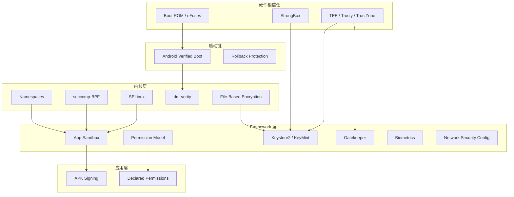
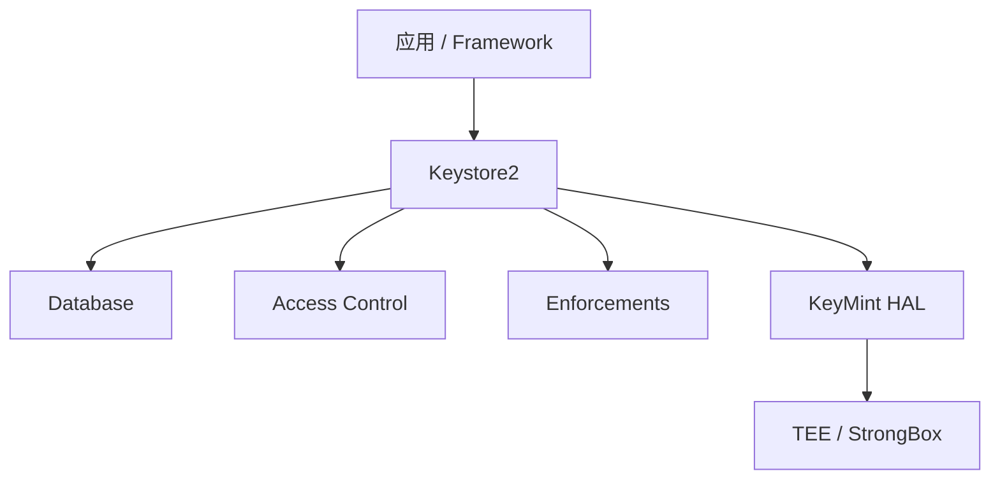
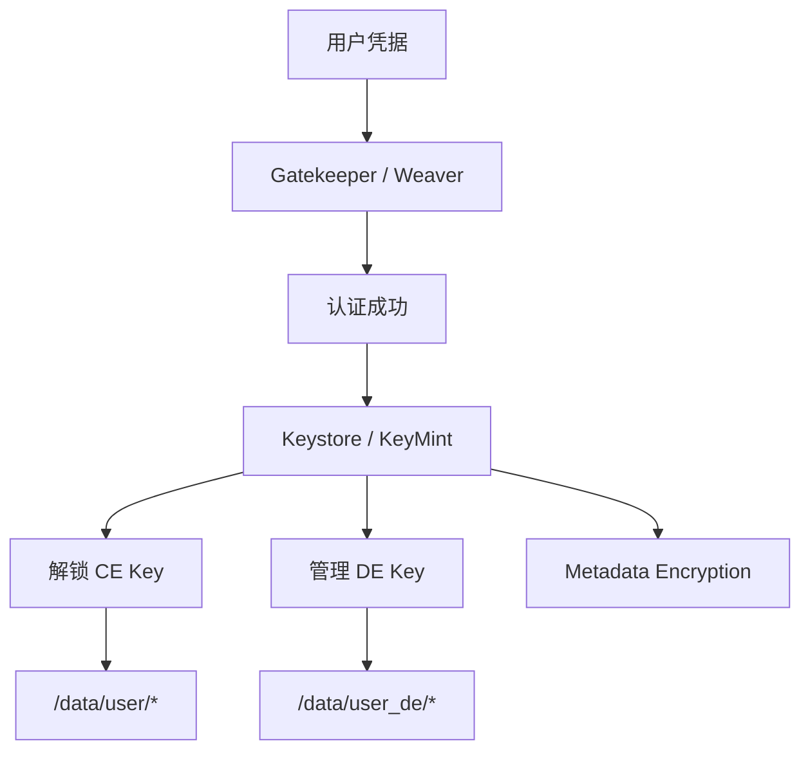

# 第 40 章：安全

Android 的安全架构并不是一个单点机制，而是一套从硬件根信任、启动链、内核强制访问控制、应用沙箱，到 Keystore、TEE、生物认证、文件加密和网络安全配置层层叠加的防御体系。设备要想真正被攻破，攻击者通常必须连续绕过多个彼此独立的边界。本章按 Android 的主要安全子系统展开，结合 AOSP 关键源码路径梳理 SELinux、AVB、Keystore2 / KeyMint、Trusty、Gatekeeper / Biometrics、App Sandbox、FBE 和 Network Security Config 的实现。

---

## 40.1 Android 安全模型

### 40.1.1 设计原则

Android 安全模型可以概括为四个基本原则：

1. 应用沙箱：每个应用拥有独立 Linux UID、进程和私有数据目录。
2. 最小权限：应用默认几乎没有权限，必须显式声明并在需要时获得授权。
3. 深度防御：不依赖单一机制，UID 隔离、SELinux、seccomp、加密、启动验证和 framework 检查同时存在。
4. 默认安全：新能力默认收紧，只在必要时有限放开。

### 40.1.2 分层防御总览



### 40.1.3 应用签名

Android 要求 APK 在安装前必须签名。常见签名方案包括：

| 方案 | 引入版本 | 特点 |
|---|---|---|
| v1 | Android 1.0 | 基于 JAR / ZIP entry 的传统签名 |
| v2 | Android 7.0 | 对整个 APK 做二进制签名 |
| v3 | Android 9 | 在 v2 基础上增加密钥轮换支持 |
| v3.1 | Android 13 | 增加更细粒度轮换兼容 |
| v4 | Android 11 | 额外 `.idsig` 文件，支持增量安装 |

签名在系统中的用途主要有三类：

- 升级校验：更新包必须与已安装应用保持可信签名关系。
- 共享 UID：同签名应用可共享 UID。
- 签名权限：部分权限仅授予平台或同签名应用。

### 40.1.4 权限模型

Android 权限大体分为：

- `normal`
- `dangerous`
- `signature`

权限检查并不只发生在 framework API 层，还会分布在：

1. Java / Kotlin framework 检查
2. Binder 服务中的调用方 UID / PID 校验
3. 内核态的 DAC、SELinux 和其他限制

### 40.1.5 从硬件到应用的信任链


链路任何一环被破坏，都可能导致：

- 拒绝启动
- 警告用户
- 降级为不受信任状态
- 擦除数据

### 40.1.6 安全边界定义

| 边界 | 内部可信对象 | 外部不可信对象 |
|---|---|---|
| 硬件根信任 | Boot ROM、熔丝、公钥 | 所有软件 |
| TEE 边界 | Trusty / TEE 内核与 TA | Linux 内核和 Android 用户态 |
| 内核边界 | 内核、内核模块 | 全部用户态 |
| 系统服务边界 | `system_server`、特权守护进程 | 普通应用与其他不可信代码 |
| 应用沙箱边界 | 单个应用自身 | 其他应用与系统内部 |

### 40.1.7 威胁模型

Android 主要面向以下攻击者建模：

1. 恶意应用
2. 网络攻击者
3. 获得设备物理访问的攻击者
4. 供应链攻击者
5. 受损或越权的 vendor / HAL 代码

### 40.1.8 多用户安全

多用户模式下，每个用户拥有：

- 独立 `userId`
- 独立 CE / DE 密钥
- 独立应用数据空间
- 独立锁屏凭据
- SELinux MLS / MCS 分类隔离

### 40.1.9 工作资料（Work Profile）安全

工作资料本质上是受管理的 profile / user。它通过：

- 独立用户空间
- 独立加密密钥
- Device Policy 管理
- 可单独擦除

把企业数据和个人数据隔离开。

---

## 40.2 SELinux

SELinux 是 Android 自 Android 5.0 起强制启用的 MAC（Mandatory Access Control）核心。它和传统 Linux DAC 不同，后者以文件所有者和模式位为中心；SELinux 则以集中策略描述“什么 domain 能访问什么 type 的什么类对象”。

### 40.2.1 Android 上的 SELinux 架构

SELinux 策略主要位于：

```text
system/sepolicy/
```

目录结构包括：

- `public/`
- `private/`
- `vendor/`
- `contexts/`
- `compat/`
- `tests/`
- `apex/`
- `microdroid/`

Treble 之后，平台和 vendor sepolicy 明确拆分，以保证接口稳定和升级兼容。

### 40.2.2 Type Enforcement（TE）

SELinux 最核心的是 TE 模型。一个规则通常描述：

- 源 domain
- 目标 type
- 对象类
- 允许的操作

Android 中几乎所有服务、文件、设备节点和进程都被赋予明确 type。

### 40.2.3 domain 与 attribute

`type` 和 `attribute` 共同构成策略抽象层。attribute 用于把多组 type 聚合，从而避免海量重复规则。

例如常见分类包括：

- device types
- process types
- filesystem types
- app data file types
- domain entrypoint types

### 40.2.4 type transition

type transition 规定“某个 domain 执行某个可执行文件后会进入哪个新 domain”，例如 `init` 执行 `/system/bin/vold` 会转到 `vold` 域。

### 40.2.5 `seapp_contexts` 的应用域分配

应用的 SELinux 域并不是随机决定的，而是由 `seapp_contexts` 根据：

- `seinfo`
- 包名
- `isPrivApp`
- `targetSdkVersion`
- user
- 是否 isolated process

等因素匹配得到。

### 40.2.6 `neverallow`

`neverallow` 是 Android sepolicy 质量和安全性的核心保障之一。它不定义允许规则，而是定义“无论如何都不应该允许”的行为，例如：

- 不允许不可信应用注册系统服务
- 不允许不可信应用访问 property service
- 不允许不可信应用使用 VendorBinder
- 不允许从应用私有目录执行 `execve`

### 40.2.7 HAL `neverallow`

Android 对 HAL 域也会设置额外 `neverallow`，比如只有特定网络硬件 HAL 才能持有高权限网络能力，防止 HAL 越权。

### 40.2.8 Treble 下的平台 / vendor sepolicy 拆分

Treble 要求：

- 平台策略与 vendor 策略边界清晰
- 平台升级时 vendor 策略不必整体重写
- 通过公共类型和映射层保证兼容

### 40.2.9 全局 domain 规则

`domain.te` 这类全局策略会给所有 domain 设置基础约束和允许项，例如 Binder 基础访问、根文件系统约束和常见 ioctl allowlist。

### 40.2.10 App 域策略（`private/app.te`）

`app.te` 体现了 Android 对普通应用的核心限制：

- 允许有限 Binder 能力
- 禁止访问 block device
- 禁止 ptrace 非应用域
- 禁止写 `/system`
- 禁止写 rootfs
- 禁止切换到非 app domain
- 限制 `proc/net` 等敏感内核视图访问

### 40.2.11 策略编译与加载

Android 在构建时会把平台、vendor、映射等多部分策略编译成最终 sepolicy，启动时由 `init` 和内核加载。

### 40.2.12 `audit2allow`

`audit2allow` 可以帮助分析 deny，但不能被当作“自动修复工具”。正确流程应是：

1. 捕获 denial
2. 判断访问是否合理
3. 若合理，为目标定义更具体 type
4. 写最小 allow 规则
5. 增加 `neverallow` 或测试防止范围失控

### 40.2.13 上下文文件

常见上下文文件包括：

- `file_contexts`
- `property_contexts`
- `service_contexts`
- `seapp_contexts`

### 40.2.14 常见调试技巧

SELinux 调试常用手段：

- `adb shell getenforce`
- `adb shell ps -AZ`
- `adb shell ls -Z`
- `adb shell dmesg | grep avc`
- `audit2allow`

### 40.2.15 MLS / MCS 用户隔离

Android 会把用户和应用映射到 MLS / MCS level / category，用于强化跨用户和跨应用隔离。

---

## 40.3 Verified Boot（AVB）

### 40.3.1 AVB 架构

AVB（Android Verified Boot）把启动链从 Boot ROM、bootloader 一直延伸到 `vbmeta`、boot、system、vendor 等关键分区。

### 40.3.2 `vbmeta` 镜像格式

`vbmeta` 保存：

- 校验算法
- 公钥元数据
- rollback index
- 各类 descriptor

### 40.3.3 校验结果码

AVB 会根据校验结果区分：

- 完全可信
- 使用自定义 key
- bootloader 解锁
- 校验失败

这些状态也会影响用户可见的 boot state。

### 40.3.4 slot 验证

A/B 设备需要按 slot 验证当前引导镜像，避免 OTA 切换时信任链断裂。

### 40.3.5 chain partition descriptor

chain descriptor 允许不同分区由不同 key 链接验证，这是 platform / vendor 信任拆分的重要手段。

### 40.3.6 rollback protection

Rollback protection 通过 rollback index 阻止把设备刷回已知存在漏洞的旧镜像。

### 40.3.7 AVB Footer

某些分区镜像尾部会带 footer，用于说明 AVB 校验和哈希树等附加信息。

### 40.3.8 `dm-verity`

`dm-verity` 在运行时为只读分区提供完整性校验。即使启动时镜像通过验证，运行期也能检测存储块被篡改。

### 40.3.9 锁定与解锁 bootloader

设备是否 locked 会直接影响：

- boot state
- Verified Boot 信任等级
- 是否允许刷写分区
- attestation 中的设备可信声明

### 40.3.10 校验实现

核心实现位于：

- `external/avb/`
- `external/avb/libavb/`
- `external/avb/avbtool.py`

### 40.3.11 descriptor 类型

常见 descriptor 有：

- hash descriptor
- hashtree descriptor
- chain partition descriptor

### 40.3.12 `dm-verity` Merkle Tree

Merkle Tree 允许系统只按需验证数据块，同时保留全局完整性链。

### 40.3.13 `avbtool`

`avbtool` 是构建和调试 AVB 镜像的核心工具，可用于：

- 生成 key
- 签名 boot / vbmeta
- 查看镜像信息

### 40.3.14 kernel command line 参数

AVB / verity 状态会通过 kernel cmdline 传递到内核和用户空间，影响后续挂载与安全策略。

### 40.3.15 managed verity 状态机

某些设备支持受管 verity 状态切换，用于开发和恢复场景。

### 40.3.16 与 A/B 更新集成

AVB 与 A/B OTA 紧密集成，确保切 slot 时仍能保持可信验证。

---

## 40.4 Keystore 与 KeyMint

### 40.4.1 总览

Android 现代密钥体系的核心是：

- `Keystore2`
- `KeyMint`
- 硬件安全级别（TEE / StrongBox）

### 40.4.2 `Keystore2` 架构

`Keystore2` 位于 `system/security/keystore2/`，采用 Rust 实现。其结构大体包括：

- AIDL 接口层
- database 模块
- access control
- operation / enforcement
- 与 KeyMint HAL 通信

下图展示简化结构。



### 40.4.3 安全级别

Key 可能运行在：

- Software
- Trusted Environment
- StrongBox

对外 attestation 时，这些级别会直接进入证书扩展。

### 40.4.4 数据库模块

Keystore2 会维护元数据数据库，用于记录：

- alias
- grant / namespace
- key entry
- blob 状态

### 40.4.5 基于 SELinux 的访问控制

Keystore2 不只做应用层权限检查，还会利用 SELinux 调用者上下文和 namespace 进行更细粒度访问控制。

### 40.4.6 enforcement 模块

enforcement 负责执行：

- 认证要求
- 使用次数和有效期
- secure user ID / auth token 相关约束

### 40.4.7 key attestation

Attestation 能让外部依赖方验证：

- key 由哪一级硬件生成
- 设备 boot state
- OS 版本和 patch level
- 某些 key 属性和认证要求

### 40.4.8 operation 生命周期

key operation 一般包括：

1. begin
2. update
3. finish / abort

Keystore2 会在每一步维护 operation state，并和 KeyMint 协作。

### 40.4.9 super key 与用户认证

某些关键密钥会被“super key”包裹，而 super key 自身又依赖用户凭据或认证状态解锁。

### 40.4.10 key 垃圾回收

Keystore2 需要处理吊销、孤儿 key 和 metadata 清理，否则数据库和 blob 存储会不断膨胀。

### 40.4.11 Remote Key Provisioning（RKP）

RKP 把设备 attestation 证书和 provisioning 模型现代化，降低每设备静态证书暴露面。

### 40.4.12 `KeyMint` AIDL 接口

KeyMint 取代旧 Keymaster，使用 AIDL 定义 HAL，位于：

- `hardware/interfaces/security/keymint/aidl/`

### 40.4.13 `Keystore2` 授权流程

授权流程通常涉及：

- 调用方身份识别
- SELinux / namespace 校验
- auth token 检查
- 向 KeyMint 发起真正操作

### 40.4.14 key import 与 wrapping

Android 不只支持生成密钥，也支持导入、包裹和受保护导入。

### 40.4.15 StrongBox

StrongBox 是独立于主 TEE 的更强安全级别实现，通常基于独立 SE 或更强隔离硬件，强调抗提取和抗回滚能力。

---

## 40.5 TEE：Trusty

### 40.5.1 总览

Trusty 是 Android 常见的 TEE OS 之一，运行在 TrustZone secure world 中。

### 40.5.2 TrustZone 架构

TrustZone 把世界分成 secure world 与 normal world。Linux 和 Android framework 运行在 normal world，而 Trusty 及其 TA 运行在 secure world。

### 40.5.3 SMC 通信路径

normal world 和 secure world 通常通过 SMC（Secure Monitor Call）完成切换和消息传递。

### 40.5.4 `libtrusty`

`libtrusty` 是 normal world 侧与 Trusty 通信的 IPC 库。

### 40.5.5 Trusty 中的 KeyMint HAL

在很多设备上，KeyMint 会运行在 Trusty 中，这让真正的密钥操作与 Linux 内核和 Android 用户态隔离开。

### 40.5.6 Confirmation UI

Confirmation UI 用于可信用户确认，避免普通 Android UI 被欺骗性覆盖。

### 40.5.7 SecretKeeper

SecretKeeper 是较新的硬件安全与秘密管理能力之一，也可集成在 Trusty 体系中。

### 40.5.8 Trusty 构建与配置

相关代码主要位于：

- `trusty/`
- `system/core/trusty/`

### 40.5.9 Trusty Kernel 架构

Trusty 自身拥有独立内核和用户态 TA，不依赖 Android Linux 内核中的调度与安全策略。

### 40.5.10 Trusty 与其他 TEE

Android 并不只支持一种 TEE，但 Trusty 是 AOSP 中最标准、最具代表性的实现。

### 40.5.11 TIPC 协议

TIPC 是 Trusty 世界与 normal world 间常见的通信协议抽象。

### 40.5.12 安全存储

TEE 还常承载安全存储能力，用于保存只有 secure world 可访问的敏感材料。

---

## 40.6 Gatekeeper 与生物识别

### 40.6.1 Gatekeeper：PIN / 图案 / 密码校验

Gatekeeper 负责设备凭据验证，并生成或确认与认证状态相关的安全令牌。

### 40.6.2 录入（Enrollment）

无论是生物特征还是凭据，系统都需要先完成 enrollment，建立安全模板和绑定状态。

### 40.6.3 生物识别框架

Android 生物识别框架统一管理：

- 指纹
- 人脸
- 其他生物模态

### 40.6.4 指纹 HAL

指纹 HAL 位于：

- `hardware/interfaces/biometrics/fingerprint/aidl/`

### 40.6.5 传感器强度等级

Android 区分 strong、weak 等生物特征等级，这直接影响：

- 是否可用于解锁
- 是否可用于支付
- 是否能解锁 KeyStore 中带认证要求的 key

### 40.6.6 HardwareAuthToken（HAT）流

认证成功后，系统会生成 HardwareAuthToken，并传递给 Keystore / KeyMint 作为“用户刚刚完成可信认证”的证明。

### 40.6.7 lockout 策略

多次失败后，系统会：

- 临时锁定
- 要求主凭据解锁
- 或进一步升级保护

### 40.6.8 Face Authentication

Face HAL 与框架路径与指纹相似，但在安全等级、环境依赖和传感器能力上差异明显。

### 40.6.9 认证流程对比

指纹、面部和主凭据在框架路径上不同，但最终都可能进入：

- Gatekeeper / Biometrics framework
- HardwareAuthToken
- Keystore2 super key 解锁

### 40.6.10 Shared Secret 协商

部分安全组件之间需要协商 shared secret，用于确保认证 token 和密钥使用链路的一致性。

### 40.6.11 `BiometricPrompt`

`BiometricPrompt` 为上层应用提供统一入口，避免每个应用自行处理复杂的模态组合和回退逻辑。

---

## 40.7 App Sandbox

### 40.7.1 每应用独立 UID

Android 沙箱最基础的一层就是 UID-per-app：

- 每个应用一个 Linux UID
- 每个应用独立数据目录
- DAC 层面天然阻止直接跨应用访问

### 40.7.2 应用 SELinux 域

应用不止有 UID，也会被放入不同 SELinux 域。新 target SDK 的应用通常会进入更收紧的 `untrusted_app` 变种域。

### 40.7.3 Isolated Process

isolated process 会得到更加受限的环境，通常不能新建网络 socket，也没有普通应用完整权限。

### 40.7.4 `seccomp-BPF`

seccomp 会限制应用和某些进程可调用的 syscall 集合，减少内核攻击面。

### 40.7.5 Namespace 隔离

mount namespace 等隔离使每个应用看到的文件系统视图更受控。

### 40.7.6 Zygote specialization

应用进程从 Zygote fork 出来后，会在 specialization 阶段设置：

- UID / GID
- SELinux 上下文
- mount namespace
- seccomp
- capabilities

### 40.7.7 权限到 group 的映射

部分权限最终会映射为 Linux supplementary groups，例如网络访问相关能力。

### 40.7.8 详细 seccomp 策略

Android 为不同进程类定义不同 seccomp 策略，特别是应用、isolated process 和系统服务。

### 40.7.9 进程级隔离细节

应用隔离不仅来自 UID，还来自：

- SELinux domain
- seccomp
- namespace
- binder 访问边界

### 40.7.10 Intent 通信安全

Intent 是应用间通信入口，也是越权和导出组件漏洞的高发区。Android 新版本持续收紧：

- exported 默认值
- 隐式 intent 限制
- 可见性

### 40.7.11 ContentProvider 安全

Provider 必须通过权限、URI 粒度控制和导出策略避免数据泄漏。

### 40.7.12 SDK Sandbox

SDK Sandbox 让广告或第三方 SDK 代码运行在更受控环境中，是近年应用安全模型的重要扩展。

### 40.7.13 App Cloning 与 profile 安全

克隆应用与 profile 场景会让“同一包名多实例”成为现实，因此系统需要更细地绑定 user / profile / UID 安全边界。

### 40.7.14 WebView 隔离

WebView renderer 通常运行在 `isolated_app` 域中，以降低网页内容对主应用的破坏面。

---

## 40.8 加密

### 40.8.1 File-Based Encryption（FBE）

现代 Android 以 FBE 为主。它支持：

- Direct Boot
- CE / DE 分离
- 每用户独立密钥

### 40.8.2 FBE key classes

常见 key class 包括：

- Device Encrypted（DE）
- Credential Encrypted（CE）

### 40.8.3 FBE key 路径结构

`vold` 会在特定路径下管理 key material 和相关 metadata。

### 40.8.4 密钥派生与存储

密钥派生会结合：

- 硬件绑定能力
- 用户凭据
- secdiscardable
- KeyMint / Gatekeeper 相关能力

### 40.8.5 加密密钥生命周期

生命周期包括：

1. 生成
2. 包裹 / 派生
3. 存储
4. 解锁
5. 销毁

### 40.8.6 metadata encryption

除文件内容外，Android 还对 metadata 做加密，减少目录结构和块级信息泄露。

### 40.8.7 全盘加密（FDE）遗留

FDE 已逐步被 FBE 取代，但理解其历史有助于把握 Android 加密演进。

### 40.8.8 hardware-wrapped key

现代设备可让硬件帮助包装密钥，降低软件层暴露真实明文 key 的机会。

### 40.8.9 `dm-default-key`

`dm-default-key` 是 Android 存储加密路径的重要内核 / device-mapper 组成。

### 40.8.10 `secdiscardable`

`secdiscardable` 机制通过可丢弃材料增强密钥销毁特性。

### 40.8.11 凭据对 CE key 的保护

CE key 通常只有在用户完成凭据认证后才会被解锁。

### 40.8.12 加密架构图



---

## 40.9 网络安全

### 40.9.1 Network Security Config

Network Security Config 允许应用声明：

- trust anchor
- cleartext policy
- certificate pinning
- debug overrides

### 40.9.2 XML 配置格式

典型元素包括：

- `base-config`
- `domain-config`
- `trust-anchors`
- `pin-set`

### 40.9.3 明文流量限制

Android 逐步收紧 cleartext 流量默认行为，target SDK 越新，默认越严格。

### 40.9.4 证书固定

Pinning 可减少中间人风险，但也提高证书轮换复杂度。

### 40.9.5 证书透明度

新版本 Android 继续强化 CT 相关要求。

### 40.9.6 trust anchor 配置

应用可以细粒度控制是否信任 system CA、user CA 或自定义 CA。

### 40.9.7 网络安全架构

网络安全不只是 NSC，还和：

- Conscrypt
- TLS
- DNS over TLS / HTTPS
- VPN
- SELinux socket 限制

共同构成整体模型。

### 40.9.8 `XmlConfigSource`

`XmlConfigSource` 解析 XML 并生成运行时配置对象，是 NSC 生效的关键实现。

### 40.9.9 证书透明度细节

CT 不只是一项“浏览器功能”，在 Android 应用 TLS 路径中也能成为策略约束的一部分。

### 40.9.10 HTTPS 强化演进

随着 Android 版本升级：

- cleartext 默认更受限
- target SDK 影响默认行为
- API 和系统默认值不断收紧

### 40.9.11 DoT / DoH

DNS over TLS / HTTPS 提高了解析链路机密性，也是 Android 网络安全的一部分。

### 40.9.12 VPN 安全集成

VPN 不只是网络功能，也会影响应用隔离、证书验证和流量出口策略。

### 40.9.13 系统服务的网络安全

系统服务同样受网络相关 SELinux 和 ioctl 限制，不能简单认为“系统进程就能随意访问一切网络接口”。

---

## 40.10 动手实践

### 40.10.1 检查 SELinux 策略

先在 AOSP 源码树中运行前 3 条命令，再在设备侧执行后 4 条命令：

```bash
grep -R "^type " system/sepolicy/public
grep -R "neverallow" system/sepolicy/private | wc -l
grep -n "com.example" system/sepolicy/private/seapp_contexts

adb shell getenforce
adb shell ps -AZ | head
adb shell dmesg | grep -i avc | tail -20
adb shell ls -Z /system/bin | head
```

### 40.10.2 检查 Verified Boot 状态

```bash
adb shell getprop ro.boot.verifiedbootstate
adb shell getprop ro.boot.vbmeta.digest
adb shell getprop ro.boot.flash.locked
avbtool info_image --image boot.img
```

### 40.10.3 探索 Keystore Key

```bash
adb shell cmd keystore2 list
adb logcat -s keystore2
```

应用内可生成测试 key，并检查其 security level 与 attestation 证书链。

### 40.10.4 验证 App Sandbox 隔离

```bash
adb shell ps -A | grep com.example
adb shell run-as com.example.app1 id
adb shell ls /data/data/com.example.app2/
adb shell cat /proc/$(pidof com.example.app1)/status | grep Seccomp
adb shell ps -AZ | grep com.example.app1
```

### 40.10.5 检查加密状态

```bash
adb shell getprop ro.crypto.state
adb shell getprop ro.crypto.type
adb shell ls /data/user_de
adb shell ls /data/user
adb shell dmctl list 2>/dev/null
```

### 40.10.6 测试 Network Security Config

构造一个包含：

- cleartext 禁止
- pinning

的示例应用，然后验证：

- HTTP 被拒绝
- 错误 pin 的 HTTPS 失败
- 正常 HTTPS 成功

### 40.10.7 检查 Trusty 服务

```bash
adb shell ls /dev | grep trusty
adb shell lshal | grep -i keymint
adb shell lshal | grep -i gatekeeper
```

### 40.10.8 审计 SELinux 策略改动

```bash
adb shell dmesg | grep avc > denials.txt
audit2allow -i denials.txt
mmm system/sepolicy
```

重点不是直接接受生成结果，而是把 deny 转换成最小、类型化、可验证的规则。

### 40.10.9 跟踪一次 key 生成路径

```bash
adb shell setprop log.tag.keystore2 VERBOSE
adb logcat -s keystore2:* GateKeeper:* KeyMint:*
```

然后在应用里生成一个 KeyStore key，观察 begin / authorize / finish 流程。

### 40.10.10 构建并签名自定义 AVB Key

```bash
openssl genrsa -out avb.pem 4096
avbtool extract_public_key --key avb.pem --output avb_pkmd.bin
avbtool add_hash_footer --image boot.img --partition_name boot --partition_size 67108864 --key avb.pem --algorithm SHA256_RSA4096
avbtool make_vbmeta_image --output vbmeta.img --key avb.pem --algorithm SHA256_RSA4096 --include_descriptors_from_image boot.img
```

### 40.10.11 为新 daemon 编写 SELinux 策略

最小示例通常包括：

1. 新 domain type
2. executable type
3. `init_daemon_domain()`
4. 数据目录 type 与 file_contexts
5. 必要但最小的 Binder / property / net 权限

### 40.10.12 分析认证流

```bash
adb shell setprop log.tag.keystore2 VERBOSE
adb logcat -s keystore2:* GateKeeper:* Fingerprint:*
```

锁屏再解锁，重点看：

- `Gatekeeper verify()`
- HardwareAuthToken
- `Keystore2 addAuthToken()`
- super key 解锁

### 40.10.13 衡量安全面规模

```bash
grep -c "allow " system/sepolicy/private/*.te
grep -c "neverallow" system/sepolicy/private/*.te
wc -l system/security/keystore2/src/*.rs
find hardware/interfaces/security -name "*.aidl" | wc -l
find hardware/interfaces/biometrics -name "*.aidl" | wc -l
wc -l external/avb/libavb/*.c external/avb/libavb/*.h
```

### 40.10.14 在真实设备上查看 Verified Boot

```bash
adb pull /dev/block/by-name/vbmeta vbmeta.img
avbtool info_image --image vbmeta.img
adb shell dmctl status system
```

### 40.10.15 查看硬件绑定 key 属性

在应用内生成启用 attestation、用户认证和 StrongBox 请求的 key，读取 attestation 证书扩展，检查：

- security level
- verified boot state
- OS 版本与 patch level
- auth requirement

---

## Summary

Android 安全并不是单一功能，而是一组相互独立又彼此补强的机制组合：

| 层级 | 机制 | 防御对象 |
|---|---|---|
| 硬件 | Root of Trust、TEE、StrongBox | 物理攻击、密钥提取 |
| 启动 | AVB、dm-verity、rollback protection | 启动链篡改、回滚攻击 |
| 内核 | SELinux、seccomp、namespace | 权限提升、策略绕过 |
| 存储 | FBE、metadata encryption | 设备离线数据窃取 |
| Framework | Keystore2、权限、App Sandbox | 应用间攻击、越权访问 |
| 网络 | NSC、Pinning、CT、DoT/DoH | 中间人和流量劫持 |
| 用户认证 | Gatekeeper、Biometrics | 未授权物理访问 |

### 安全更新与 Mainline 模块

Android 10 之后，多个安全相关组件可以通过 Mainline 更新，例如：

- Conscrypt
- DNS Resolver
- Networking
- Permission Controller
- DocumentsUI
- Tethering

这让安全补丁不再完全依赖整机 OTA。

### 月度安全补丁级别

Android 设备通常区分：

1. Platform SPL：framework / core patch level
2. Vendor SPL：vendor / HAL / kernel patch level

Attestation 证书中也会包含 patch level，供依赖方做最低版本判断。

### 攻击面是如何逐步收紧的

从 Android 5 到 15，系统持续通过以下方式降低攻击面：

- SELinux enforcing
- FBE 取代 FDE
- runtime permissions
- Treble HAL 隔离
- StrongBox
- KeyMint AIDL
- SDK Sandbox
- 更严格的 intent / 网络默认策略

### 安全架构原则

从源码中能看出几个一贯原则：

1. 没有单点失败：单一机制失守后，其他层仍要继续成立。
2. 硬件锚定信任：最敏感操作尽量交给硬件或 TEE / StrongBox。
3. 最小权限：应用、HAL、系统服务都被限制到最小必要能力。
4. 深度防御：UID、SELinux、seccomp、namespace、加密层层叠加。
5. 逐版本收紧：新 target SDK 与新平台默认值持续提高安全门槛。
6. 可审计：SELinux、AVB、Keystore2、HAL 等关键实现均开源，可独立分析。

### 关键源码路径

| 路径 | 组件 | 语言 |
|---|---|---|
| `system/sepolicy/` | SELinux 策略 | SELinux TE |
| `system/sepolicy/public/` | 平台公开类型与属性 | SELinux TE |
| `system/sepolicy/private/` | 平台私有策略 | SELinux TE |
| `system/sepolicy/vendor/` | Vendor HAL 策略 | SELinux TE |
| `external/avb/` | AVB | C / Python |
| `external/avb/libavb/` | AVB 核心库 | C |
| `system/security/keystore2/` | Keystore2 | Rust |
| `system/security/keystore2/aidl/` | Keystore2 AIDL | AIDL |
| `system/core/trusty/` | Trusty 集成 | Rust / C++ / C |
| `trusty/` | Trusty TEE OS | C |
| `system/vold/` | 加密、key storage | C++ |
| `hardware/interfaces/biometrics/` | Biometric HAL | AIDL / C++ |
| `hardware/interfaces/security/keymint/aidl/` | KeyMint HAL | AIDL |
| `frameworks/base/packages/NetworkSecurityConfig/` | 网络安全配置 | Java |

### AOSP 中的安全测试

常见测试路径包括：

- `system/sepolicy/tests/`
- `system/sepolicy/treble_sepolicy_tests_for_release/`
- `external/avb/test/`
- `hardware/interfaces/security/keymint/aidl/vts/`
- `hardware/interfaces/biometrics/*/aidl/vts/`
- `system/security/keystore2/` 下的 Rust 单测

示例：

```bash
mmm system/sepolicy/tests
python3 system/sepolicy/tests/treble_tests.py -l system/sepolicy/prebuilts/api/<api>/ -f <compiled_policy>
cd system/security/keystore2
atest keystore2_test
```

### 延伸阅读

- Android Security Bulletin
- Android CDD 中的安全章节
- `external/avb/README.md`
- `system/sepolicy/README.md`
- `system/security/keystore2/` 内设计文档
- `trusty/` 与 `system/core/trusty/` 文档
