# Chapter 40: Security

Android's security architecture is one of the most comprehensive and layered
defenses deployed at consumer-device scale.  Every component, from the
bootloader through the kernel, system services, and application framework,
participates in a multi-level "defense-in-depth" strategy.  This chapter walks
through each major subsystem -- SELinux mandatory access control, Verified Boot,
hardware-backed key storage, the Trusty TEE, biometric authentication, app
sandboxing, encryption, and network security -- reading the actual AOSP source
code at every step.

---

## 40.1  Android Security Model

### 40.1.1  Design Principles

Android's security model rests on four fundamental principles:

1. **Application sandboxing** -- each application runs with its own Linux UID
   and in its own process, with its own private data directory.
2. **Least privilege** -- applications start with almost no permissions and must
   request them explicitly.  The user or system policy grants (or denies) each
   one.
3. **Defense in depth** -- no single mechanism is trusted in isolation.  The
   kernel sandbox, SELinux MAC, seccomp-BPF, and userspace permission checks
   each serve as independent layers.
4. **Secure by default** -- new features ship in a locked-down state and must
   be explicitly relaxed.

### 40.1.2  Layered Defense Overview

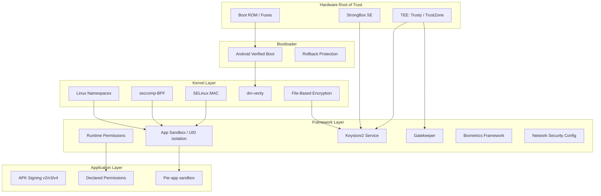

### 40.1.3  Application Signing

Every APK must be signed before it can be installed.  Android supports multiple
signature schemes:

| Scheme | Introduced | How it works |
|--------|-----------|--------------|
| v1 (JAR) | Android 1.0 | Signs individual ZIP entries via `META-INF/` |
| v2 | Android 7.0 | Signs the entire APK as a binary blob |
| v3 | Android 9 | Extends v2 with key rotation support |
| v3.1 | Android 13 | Adds rotation-min-sdk-version |
| v4 | Android 11 | Produces a separate `.idsig` file for incremental installs |

The signature establishes the identity of the developer.  The package manager
uses it for:

- **Upgrade verification** -- an update must be signed with the same key as the
  installed package.
- **Shared UID** -- two packages signed with the same key can request the same
  Linux UID and share data.
- **Signature permissions** -- certain permissions are only grantable to packages
  signed with the platform key.

### 40.1.4  Permission Model

Android defines three protection levels for permissions:

- **normal** -- granted automatically at install time (e.g. `INTERNET`).
- **dangerous** -- requires explicit user consent at runtime (e.g. `CAMERA`,
  `READ_CONTACTS`).
- **signature** -- only granted to apps signed with the same certificate as
  the app that declared the permission, or the platform.

The permission enforcement happens at multiple layers:

1. **Framework checks** -- `Context.checkPermission()` in Java/Kotlin code.
2. **Binder service checks** -- services check the calling UID and PID.
3. **Kernel-level checks** -- SELinux and Linux DAC prevent unauthorized
   access even if framework checks are bypassed.

### 40.1.5  Trust Chain from Hardware to Application

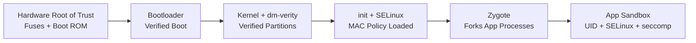

The chain of trust starts at non-modifiable hardware (fused public keys in the
SoC's boot ROM) and extends through every layer until it reaches the
application.  If any link in this chain is broken, the device can detect it
and respond (refuse to boot, show a warning, or wipe data depending on policy).

### 40.1.6  Security Boundary Definitions

Understanding Android security requires clear definitions of trust boundaries:

| Boundary | Inside (Trusted) | Outside (Untrusted) |
|----------|------------------|---------------------|
| Hardware root of trust | Fused keys, Boot ROM | All software |
| TEE boundary | Trusty kernel + TAs | Linux kernel, Android framework |
| Kernel boundary | Kernel code, loaded modules | All userspace processes |
| System service boundary | system_server, privileged daemons | Apps, untrusted code |
| App sandbox boundary | App's own process and data | Other apps, system internals |

Each boundary is enforced by a different mechanism:

- Hardware root of trust: physical fuses, one-time-programmable memory.
- TEE boundary: ARM TrustZone hardware (TZASC, secure monitor at EL3).
- Kernel boundary: CPU privilege rings (EL0 vs EL1), page table isolation.
- System service boundary: SELinux type enforcement + Linux DAC.
- App sandbox: UID isolation + SELinux + seccomp-BPF + mount namespaces.

### 40.1.7  Threat Model

Android's security model considers the following threat actors:

1. **Malicious apps** -- apps that attempt to steal data from other apps,
   escalate privileges, or persist after uninstallation.
2. **Network attackers** -- adversaries who can observe and modify network
   traffic (e.g., on public WiFi).
3. **Physical attackers** -- adversaries with physical access to the device
   (stolen phones, forensic examination).
4. **Supply chain attackers** -- attempts to inject malicious code into the
   OS image or bootloader.
5. **Insider threats** -- compromised vendor code or HALs running with
   elevated privileges.

Each security subsystem addresses specific threat actors:

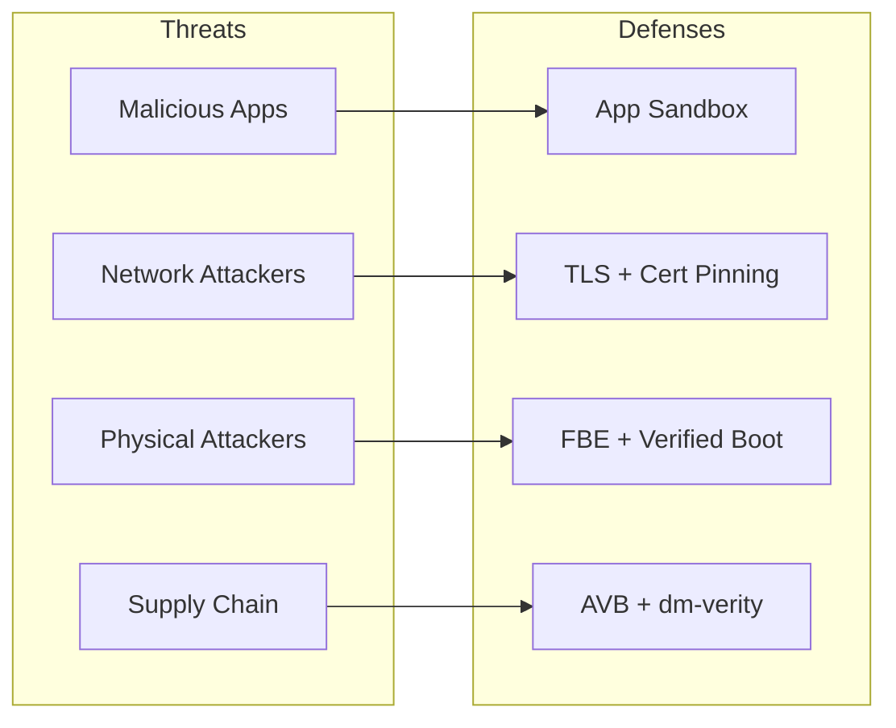

### 40.1.8  Multi-User Security

Android supports multiple users on a single device.  Each user gets:

- A unique `userId` (0, 10, 11, ...).
- Separate encrypted storage (CE and DE keys per user).
- Separate installed apps with per-user UIDs (appId + userId * 100000).
- Independent lock screen credentials.
- MLS (Multi-Level Security) categories in SELinux to prevent cross-user
  data access even within the same app.

The SELinux MLS categories are assigned based on the user ID, creating
cryptographic separation between users at the MAC level.

### 40.1.9  Work Profile Security

Android's work profile (managed profile) extends multi-user security for
enterprise use cases:

- Work apps run with a separate user ID (e.g., user 10).
- A separate encryption key protects work data.
- IT administrators can remotely wipe the work profile without affecting
  personal data.
- Cross-profile data sharing is controlled by the device policy controller.
- Work profile apps appear alongside personal apps but are sandboxed.

---

## 40.2  SELinux

SELinux (Security-Enhanced Linux) provides mandatory access control (MAC) on
Android.  Unlike traditional discretionary access control (DAC) where file
owners control permissions, SELinux enforces a centralized policy that even
root processes cannot override.

### 40.2.1  SELinux Architecture on Android

Android has shipped with SELinux in enforcing mode since Android 5.0.  The
policy is compiled at build time from source files under:

```
system/sepolicy/
```

The directory structure (15 subdirectories) includes:

| Directory | Purpose |
|-----------|---------|
| `public/` | Type and attribute definitions visible to vendor policy |
| `private/` | Platform-private policy (allow, neverallow rules) |
| `vendor/` | Vendor HAL policies |
| `contexts/` | File, property, service contexts |
| `mac_permissions/` | MAC permissions XML for app signing |
| `build/` | Build system integration |
| `compat/` | Compatibility mappings between platform versions |
| `tools/` | Policy analysis tools |
| `tests/` | CTS-compatible policy tests |
| `apex/` | APEX-specific policy |
| `prebuilts/` | Prebuilt policy for API-level compatibility |
| `reqd_mask/` | Required policy mask |
| `flagging/` | Feature-flag-gated policy |
| `microdroid/` | Policy for pVM microdroid |
| `treble_sepolicy_tests_for_release/` | Treble compatibility tests |

### 40.2.2  Type Enforcement (TE)

SELinux type enforcement is the core mechanism.  Every process is assigned a
**domain** (type) and every object (file, socket, binder, etc.) is assigned a
**type**.  Access is granted only if an explicit `allow` rule exists.

The fundamental rule syntax is:

```
allow source_domain target_type:object_class permissions;
```

For example, here is the base policy for all zygote-spawned apps, from
`system/sepolicy/public/app.te`:

```te
###
### Domain for all zygote spawned apps
###
### This file is the base policy for all zygote spawned apps.
### Other policy files, such as isolated_app.te, untrusted_app.te, etc
### extend from this policy. Only policies which should apply to ALL
### zygote spawned apps should be added here.
###
type appdomain_tmpfs, file_type;
```

Note the design comment: `public/` contains only type and attribute
definitions, never `allow` or `neverallow` statements.  Those go in
`private/`.

### 40.2.3  Domains and Attributes

Attributes are groups of types.  They allow writing rules that apply to many
domains at once.  From `system/sepolicy/public/attributes` (490 lines):

```te
# All types used for devices.
attribute dev_type;

# All types used for processes.
attribute domain;

# All types used for filesystems.
attribute fs_type;

# All types used for files that can exist on a labeled fs.
attribute file_type;

# All types used for domain entry points.
attribute exec_type;

# All types used for /data files.
attribute data_file_type;

# All types used for app private data files in seapp_contexts.
attribute app_data_file_type;
```

The `domain` attribute is critical -- it is applied to every process type.
Rules in `private/domain.te` apply to every process on the system:

```te
# Rules for all domains.

# Allow reaping by init.
allow domain init:process sigchld;

# Intra-domain accesses.
allow domain self:process {
    fork
    sigchld
    sigkill
    sigstop
    signull
    signal
    getsched
    setsched
    getsession
    getpgid
    getcap
    setcap
    getattr
    setrlimit
};
allow domain self:fd use;
allow domain proc:dir r_dir_perms;
```

### 40.2.4  Type Transitions

When a process executes a new binary, SELinux can automatically transition it
to a new domain.  This is how `init` spawns daemons in the correct domain:

```te
# When init runs /system/bin/vold, transition to vold domain
domain_auto_trans(init, vold_exec, vold)
```

The `domain_auto_trans` macro expands to:

```te
type_transition init vold_exec:process vold;
allow init vold:process transition;
allow vold vold_exec:file { read getattr map execute entrypoint };
```

### 40.2.5  App Domain Assignment via seapp_contexts

The file `system/sepolicy/private/seapp_contexts` (216 lines) maps
applications to SELinux domains based on their properties:

```
# Input selectors:
#       isSystemServer (boolean)
#       isEphemeralApp (boolean)
#       user (string)
#       seinfo (string)
#       name (string)
#       isPrivApp (boolean)
#       minTargetSdkVersion (unsigned integer)
#       fromRunAs (boolean)
```

Sample mappings:

| Selector | Domain |
|----------|--------|
| `isSystemServer=true` | `system_server` |
| `user=system seinfo=platform` | `system_app` |
| `user=_app minTargetSdkVersion=34` | `untrusted_app` |
| `user=_app minTargetSdkVersion=30` | `untrusted_app_30` |
| `user=_app minTargetSdkVersion=29` | `untrusted_app_29` |
| `user=_isolated` | `isolated_app` |

The versioned domains (`untrusted_app_25`, `untrusted_app_27`, etc.) allow
progressively tighter restrictions on older apps while maintaining backward
compatibility.  Newer targetSdkVersion apps get the strictest rules.

### 40.2.6  Neverallow Rules

Neverallow rules are compile-time assertions.  They do not generate runtime
policy but instead prevent anyone (including vendor policy authors) from
writing rules that violate the stated invariant.  If a policy change would
violate a neverallow, the build fails.

From `system/sepolicy/private/app_neverallows.te` (338 lines), here are
representative neverallow rules:

```te
define(`all_untrusted_apps',`{
  ephemeral_app
  isolated_app
  isolated_app_all
  isolated_compute_app
  mediaprovider
  mediaprovider_app
  untrusted_app
  untrusted_app_25
  untrusted_app_27
  untrusted_app_29
  untrusted_app_30
  untrusted_app_all
}')

# Receive or send uevent messages.
neverallow all_untrusted_apps domain:netlink_kobject_uevent_socket *;

# Do not allow untrusted apps to register services.
neverallow all_untrusted_apps service_manager_type:service_manager add;

# Do not allow untrusted apps to use VendorBinder
neverallow all_untrusted_apps vndbinder_device:chr_file *;

# Do not allow untrusted apps to connect to the property service
neverallow { all_untrusted_apps -mediaprovider } property_socket:sock_file write;
neverallow { all_untrusted_apps -mediaprovider } init:unix_stream_socket connectto;
neverallow { all_untrusted_apps -mediaprovider } property_type:property_service set;

# Block calling execve() on files in an apps home directory.
# This is a W^X violation.  For compatibility, allow for targetApi <= 28.
neverallow {
  all_untrusted_apps
  -untrusted_app_25
  -untrusted_app_27
  -runas_app
} { app_data_file privapp_data_file }:file execute_no_trans;
```

Key categories of neverallow rules for untrusted apps:

1. **No service registration** -- apps cannot add services to servicemanager.
2. **No VendorBinder access** -- apps cannot talk directly to vendor HALs.
3. **No property modification** -- apps cannot set system properties.
4. **No kernel interface access** -- no uevent sockets, no sysfs writes, no
   debugfs reads, no /proc sensitive files.
5. **No W^X violation** -- apps with targetSdk >= 29 cannot execute files in
   their home directory.
6. **No hard links** -- prevents installd deletion bypasses.
7. **Restricted socket types** -- only TCP/UDP/VSOCK permitted, no raw/netlink.

### 40.2.7  HAL Neverallows

HAL servers also face restrictions.  From `system/sepolicy/private/hal_neverallows.te`:

```te
# only HALs responsible for network hardware should have privileged
# network capabilities
neverallow {
  halserverdomain
  -hal_bluetooth_server
  -hal_wifi_server
  -hal_wifi_hostapd_server
  -hal_wifi_supplicant_server
  -hal_telephony_server
  -hal_uwb_server
  ...
} self:global_capability_class_set { net_admin net_raw };
```

This ensures that a compromised audio or camera HAL cannot gain network
capabilities.

### 40.2.8  Vendor Sepolicy Split (Treble)

Project Treble introduced the split between platform and vendor sepolicy.
The split enables independent platform and vendor updates:

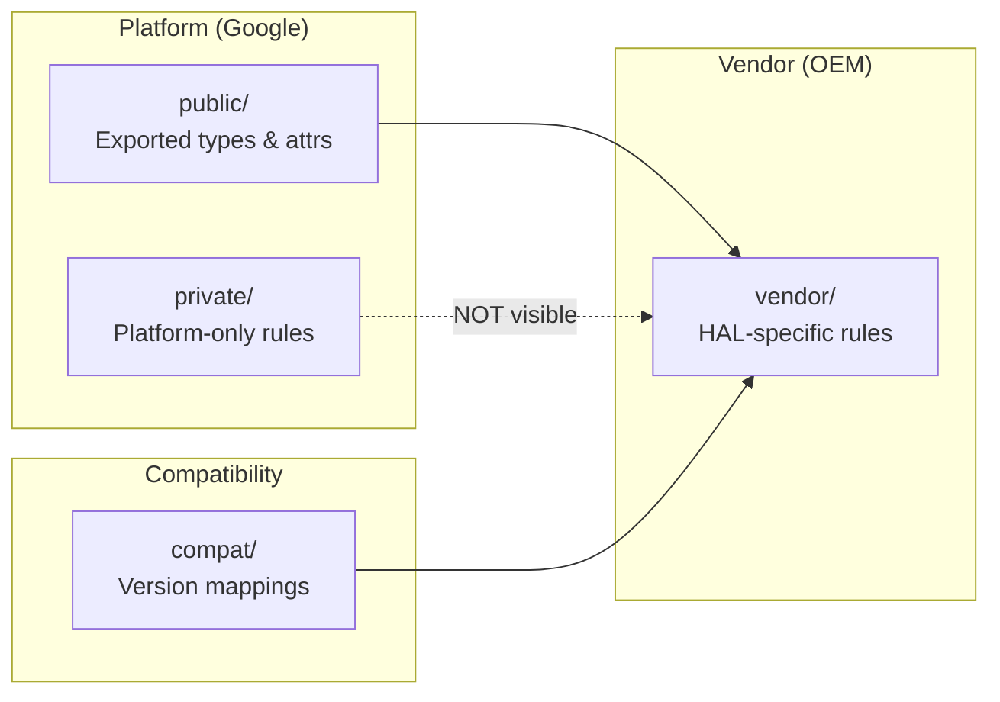

Rules for the split:

1. **public/** types and attributes are the API surface -- vendor policy can
   reference these.
2. **private/** types and rules are invisible to vendor policy.  Vendor policy
   cannot use `allow` rules targeting private types.
3. **compat/** contains mapping files that translate old type names to new ones
   across platform versions.
4. **vendor/** contains policy specific to the vendor's HAL implementations.

The vendor sepolicy directory contains files like:

```
vendor/
  file.te
  file_contexts
  hal_atrace_default.te
  hal_audio_default.te
  hal_bluetooth_default.te
  hal_camera_default.te
  hal_fingerprint_default.te
  hal_gatekeeper_default.te
  hal_keymint_default.te
  ...
```

### 40.2.9  Global Domain Rules

The `private/domain.te` file contains rules that apply to every process on
the system.  It is one of the most important policy files (hundreds of lines).
Representative rules from `system/sepolicy/private/domain.te`:

```te
# Root fs.
allow domain tmpfs:dir { getattr search };
allow domain rootfs:dir search;
allow domain rootfs:lnk_file { read getattr };

# Device accesses.
allow domain device:dir search;
allow domain dev_type:lnk_file r_file_perms;
allow domain null_device:chr_file rw_file_perms;
allow domain zero_device:chr_file rw_file_perms;

# /dev/binder can be accessed by ... everyone! :)
allow { domain -hwservicemanager -vndservicemanager }
    binder_device:chr_file rw_file_perms;

# Restrict binder ioctls to an allowlist.
allowxperm domain binder_device:chr_file
    ioctl { unpriv_binder_ioctls };

# /dev/binderfs needs to be accessed by everyone too!
allow domain binderfs:dir { getattr search };
allow domain binderfs_features:dir search;
allow domain binderfs_features:file r_file_perms;

# Global access to cacerts, seccomp_policy, system libs
allow domain system_seccomp_policy_file:file r_file_perms;
allow domain system_security_cacerts_file:file r_file_perms;
allow domain system_linker_exec:file { execute read open getattr map };
allow domain system_lib_file:file { execute read open getattr map };
```

Note how even the global rules are carefully scoped.  Binder access is
universal (it is the IPC backbone), but the allowed ioctls are restricted
to an unprivileged set.  The `hwservicemanager` and `vndservicemanager` are
explicitly excluded from accessing the standard binder device because they
use their own (`hwbinder_device`, `vndbinder_device`).

### 40.2.10  The App Domain Policy (private/app.te)

The file `system/sepolicy/private/app.te` (844 lines) defines rules for all
zygote-spawned app processes.  Key categories of access:

**Keystore access:**
```te
allow { appdomain -isolated_app_all -ephemeral_app -sdk_sandbox_all }
    keystore:keystore2_key { delete use get_info grant rebind update };

use_keystore({ appdomain -isolated_app_all -ephemeral_app -sdk_sandbox_all })
```

**App sandbox file access:**
```te
# App sandbox file accesses.
allow { appdomain -isolated_app_all -mlstrustedsubject -sdk_sandbox_all } {
  app_data_file
  privapp_data_file
}:dir create_dir_perms;
allow { appdomain -isolated_app_all -mlstrustedsubject -sdk_sandbox_all } {
  app_data_file
  privapp_data_file
}:file create_file_perms;
```

**Binder IPC:**
```te
# Use the Binder.
binder_use(appdomain)
# Perform binder IPC to binder services.
binder_call(appdomain, binderservicedomain)
# Perform binder IPC to other apps.
binder_call(appdomain, appdomain)
# Perform binder IPC to ephemeral apps.
binder_call(appdomain, ephemeral_app)
```

**Neverallow rules in app.te** (excerpts from the ~300 neverallow rules):

```te
# Superuser capabilities.
neverallow { appdomain -bluetooth -network_stack -nfc }
    self:capability_class_set *;

# Block device access.
neverallow appdomain dev_type:blk_file { read write };

# ptrace access to non-app domains.
neverallow appdomain { domain -appdomain }:process ptrace;

# The Android security model guarantees the confidentiality and
# integrity of application data and execution state. Ptrace bypasses
# those confidentiality guarantees.
neverallow {
  domain
  -appdomain
  -crash_dump
} appdomain:process ptrace;

# Write to rootfs.
neverallow appdomain rootfs:dir_file_class_set
    { create write setattr relabelfrom relabelto append unlink link rename };

# Write to /system.
neverallow appdomain system_file_type:dir_file_class_set
    { create write setattr relabelfrom relabelto append unlink link rename };

# Write to system-owned parts of /data.
neverallow appdomain system_data_file:dir_file_class_set
    { create write setattr relabelfrom relabelto append unlink link rename };

# Transition to a non-app domain (prevent domain escalation).
neverallow { appdomain -shell }
    { domain -appdomain -crash_dump -rs -virtualizationmanager }:process
    { transition };

# Sensitive app domains are not allowed to execute from /data
# to prevent persistence attacks.
neverallow {
  bluetooth
  isolated_app_all
  nfc
  radio
  shared_relro
  sdk_sandbox_all
  system_app
} {
  data_file_type
  -apex_art_data_file
  -dalvikcache_data_file
  -system_data_file
  -apk_data_file
}:file no_x_file_perms;

# Don't allow apps access to character devices.
neverallow appdomain {
    audio_device
    camera_device
    dm_device
    radio_device
    rpmsg_device
}:chr_file { read write };

# Apps cannot access proc/net tcp/udp tables.
neverallow { appdomain -shell } proc_net_tcp_udp:file *;
```

These neverallow rules collectively ensure that even if a framework bug allows
a code path to be reached, the kernel-level MAC policy blocks the operation.

### 40.2.11  Policy Compilation and Loading

The SELinux policy is compiled at build time and loaded by `init` during
early boot.  The build process:

1. **m4 preprocessing** -- macros like `domain_auto_trans`, `app_domain`,
   `net_domain` are expanded.
2. **Policy compilation** -- `checkpolicy` compiles `.te` files into a binary
   policy.
3. **Context compilation** -- `sefcontext_compile` compiles `file_contexts`
   into binary format.
4. **CIL compilation** -- since Android 8.0, policy is compiled to CIL
   (Common Intermediate Language) for the platform/vendor split.
5. **Policy validation** -- `sepolicy_tests` and neverallow checks run as
   build-time assertions.
6. **Loading** -- `init` loads the compiled policy from `/system/etc/selinux/`
   via `/sys/fs/selinux/load`.

The split policy loading flow:

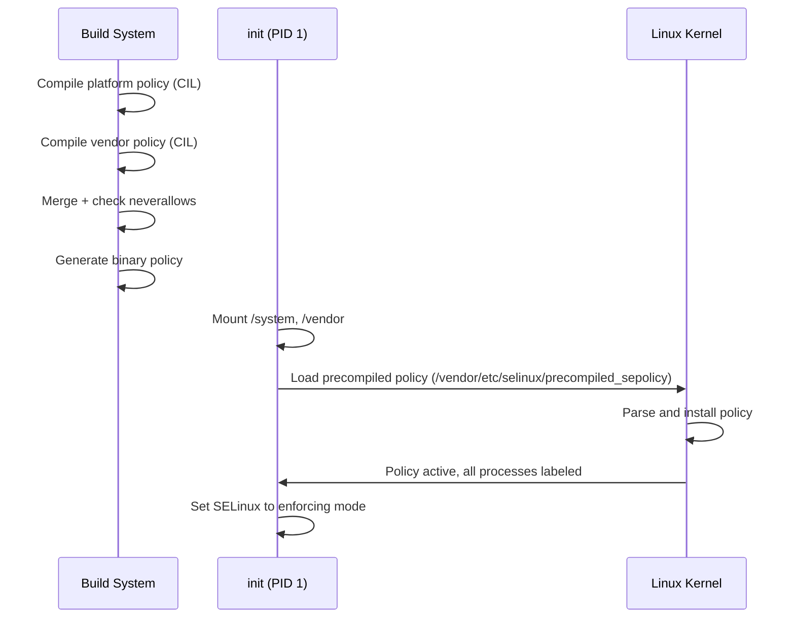

### 40.2.12  Using audit2allow

When SELinux blocks an operation, it generates an audit log (a "denial").
The `audit2allow` tool converts these denials into candidate allow rules:

```bash
# Capture denials from the device
adb shell dmesg | grep 'avc:  denied' > denials.txt

# Generate allow rules
audit2allow -i denials.txt

# Generate a loadable policy module
audit2allow -i denials.txt -M my_module
```

Example denial and generated rule:

```
# Denial:
avc:  denied  { read } for  pid=1234 comm="my_daemon"
  name="config.xml" dev="sda1" ino=5678
  scontext=u:r:my_daemon:s0 tcontext=u:object_r:system_file:s0
  tclass=file permissive=0

# audit2allow output:
allow my_daemon system_file:file read;
```

However, blindly applying `audit2allow` output is dangerous.  The correct
approach is usually to create a more specific type for the target file rather
than granting broad access to `system_file`.

### 40.2.13  SELinux Contexts Files

Several context files map filesystem paths, properties, and services to
SELinux labels:

| File | Purpose |
|------|---------|
| `file_contexts` | Maps filesystem paths to file types |
| `property_contexts` | Maps system properties to types |
| `service_contexts` | Maps binder services to types |
| `hwservice_contexts` | Maps HIDL HW services to types |
| `seapp_contexts` | Maps apps to domains and data types |
| `mac_permissions.xml` | Maps app signatures to seinfo tags |

### 40.2.14  Common Debugging Techniques

When developing new system services or HALs, SELinux denials are common.
Here is the systematic approach:

**Step 1: Identify the denial**
```
avc:  denied  { write } for  pid=2456 comm="my_service"
  path="/data/misc/my_service/config"
  scontext=u:r:my_service:s0
  tcontext=u:object_r:system_data_file:s0
  tclass=file permissive=0
```

**Step 2: Analyze the denial components**

- `source`: `my_service` (the process trying to access)
- `target`: `system_data_file` (the object being accessed)
- `class`: `file` (the type of object)
- `permission`: `write` (the operation attempted)

**Step 3: Determine the correct fix**

Wrong approach (too broad):
```te
# BAD: Grants access to all system_data_file
allow my_service system_data_file:file write;
```

Correct approach (create specific type):
```te
# In file.te:
type my_service_data_file, file_type, data_file_type;

# In file_contexts:
/data/misc/my_service(/.*)? u:object_r:my_service_data_file:s0

# In my_service.te:
allow my_service my_service_data_file:file create_file_perms;
allow my_service my_service_data_file:dir create_dir_perms;
```

**Step 4: Verify with neverallow checks**

After writing the policy, rebuild and check that no neverallow rules are
violated.

### 40.2.15  SELinux MLS/MCS for User Isolation

Android uses MLS (Multi-Level Security) categories to isolate users and apps.
Each app process receives categories based on its user ID and app ID:

```
u:r:untrusted_app:s0:c42,c256,c512,c768
```

The `c42,c256,c512,c768` are MLS categories derived from the UID.  Two
processes can only access each other's files if their categories are
compatible.  This provides kernel-level isolation between:

- Different Android users (user 0 vs user 10).
- Different apps within the same user.
- Work profile apps vs personal apps.

The category assignment is controlled by `seapp_contexts`:

```
# levelFrom=all determines the level from both UID and user ID.
# levelFrom=user determines the level from the user ID.
# levelFrom=app determines the level from the process UID.
```

---

## 40.3  Verified Boot (AVB)

Android Verified Boot (AVB) ensures that all executed code comes from a trusted
source rather than from an attacker or corruption.  The implementation lives
in:

```
external/avb/
```

### 40.3.1  AVB Architecture

The Verified Boot process establishes a chain of trust from hardware fuses to
every partition:

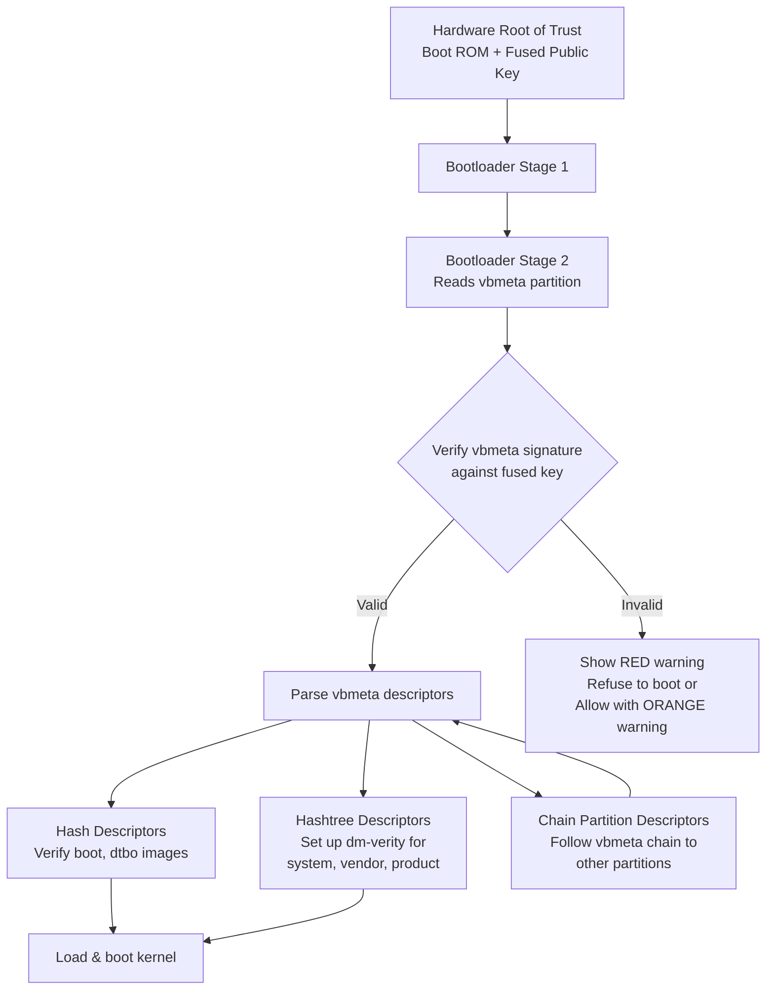

### 40.3.2  vbmeta Image Format

The vbmeta image is the core data structure.  From
`external/avb/libavb/avb_vbmeta_image.h`:

```c
/* Size of the vbmeta image header. */
#define AVB_VBMETA_IMAGE_HEADER_SIZE 256

/* Magic for the vbmeta image header. */
#define AVB_MAGIC "AVB0"
#define AVB_MAGIC_LEN 4
```

The image consists of three blocks:

```
+-----------------------------------------+
| Header data - fixed size (256 bytes)    |
+-----------------------------------------+
| Authentication data - variable size     |
+-----------------------------------------+
| Auxiliary data - variable size          |
+-----------------------------------------+
```

The header structure from the source:

```c
typedef struct AvbVBMetaImageHeader {
  /*   0: Four bytes equal to "AVB0" (AVB_MAGIC). */
  uint8_t magic[AVB_MAGIC_LEN];

  /*   4: The major version of libavb required for this header. */
  uint32_t required_libavb_version_major;
  /*   8: The minor version of libavb required for this header. */
  uint32_t required_libavb_version_minor;

  /*  12: The size of the signature block. */
  uint64_t authentication_data_block_size;
  /*  20: The size of the auxiliary data block. */
  uint64_t auxiliary_data_block_size;

  /*  28: The verification algorithm used. */
  uint32_t algorithm_type;

  /*  32: Offset into the "Authentication data" block of hash data. */
  uint64_t hash_offset;
  /*  40: Length of the hash data. */
  uint64_t hash_size;

  /*  48: Offset into the "Authentication data" block of signature data. */
  uint64_t signature_offset;
  /*  56: Length of the signature data. */
  uint64_t signature_size;

  /*  64: Offset into the "Auxiliary data" block of public key data. */
  uint64_t public_key_offset;
  /*  72: Length of the public key data. */
  uint64_t public_key_size;

  /* 112: The rollback index for rollback protection. */
  uint64_t rollback_index;

  /* 120: Flags from the AvbVBMetaImageFlags enumeration. */
  uint32_t flags;

  /* 124: The location of the rollback index. */
  uint32_t rollback_index_location;

  /* 128: The release string from avbtool. */
  uint8_t release_string[AVB_RELEASE_STRING_SIZE];

  /* 176: Padding to ensure struct is size 256 bytes. */
  uint8_t reserved[80];
} AVB_ATTR_PACKED AvbVBMetaImageHeader;
```

### 40.3.3  Verification Result Codes

The verification produces one of several results, defined in the same header:

```c
typedef enum {
  AVB_VBMETA_VERIFY_RESULT_OK,
  AVB_VBMETA_VERIFY_RESULT_OK_NOT_SIGNED,
  AVB_VBMETA_VERIFY_RESULT_INVALID_VBMETA_HEADER,
  AVB_VBMETA_VERIFY_RESULT_UNSUPPORTED_VERSION,
  AVB_VBMETA_VERIFY_RESULT_HASH_MISMATCH,
  AVB_VBMETA_VERIFY_RESULT_SIGNATURE_MISMATCH,
} AvbVBMetaVerifyResult;
```

The bootloader must also verify that the embedded public key matches a known
trusted key.  As the source comments emphasize:

> VERY IMPORTANT: Even if `AVB_VBMETA_VERIFY_RESULT_OK` is returned, you
> still need to check that the public key embedded in the image matches a
> known key!

### 40.3.4  Slot Verification

The high-level API for verifying a complete slot is `avb_slot_verify()`, from
`external/avb/libavb/avb_slot_verify.h`:

```c
AvbSlotVerifyResult avb_slot_verify(
    AvbOps* ops,
    const char* const* requested_partitions,
    const char* ab_suffix,
    AvbSlotVerifyFlags flags,
    AvbHashtreeErrorMode hashtree_error_mode,
    AvbSlotVerifyData** out_data);
```

Result codes indicate the nature of any failure:

```c
typedef enum {
  AVB_SLOT_VERIFY_RESULT_OK,
  AVB_SLOT_VERIFY_RESULT_ERROR_OOM,
  AVB_SLOT_VERIFY_RESULT_ERROR_IO,
  AVB_SLOT_VERIFY_RESULT_ERROR_VERIFICATION,
  AVB_SLOT_VERIFY_RESULT_ERROR_ROLLBACK_INDEX,
  AVB_SLOT_VERIFY_RESULT_ERROR_PUBLIC_KEY_REJECTED,
  AVB_SLOT_VERIFY_RESULT_ERROR_INVALID_METADATA,
  AVB_SLOT_VERIFY_RESULT_ERROR_UNSUPPORTED_VERSION,
  AVB_SLOT_VERIFY_RESULT_ERROR_INVALID_ARGUMENT
} AvbSlotVerifyResult;
```

The implementation in `external/avb/libavb/avb_slot_verify.c` defines key
constants:

```c
/* Maximum number of partitions that can be loaded with avb_slot_verify(). */
#define MAX_NUMBER_OF_LOADED_PARTITIONS 32

/* Maximum number of vbmeta images that can be loaded. */
#define MAX_NUMBER_OF_VBMETA_IMAGES 32

/* Maximum size of a vbmeta image - 64 KiB. */
#define VBMETA_MAX_SIZE (64 * 1024)
```

### 40.3.5  Chain Partition Descriptors

Large systems split vbmeta across multiple partitions.  A chain partition
descriptor points to another partition's vbmeta, creating a verification
tree.  From `external/avb/libavb/avb_chain_partition_descriptor.h`:

```c
typedef struct AvbChainPartitionDescriptor {
  AvbDescriptor parent_descriptor;
  uint32_t rollback_index_location;
  uint32_t partition_name_len;
  uint32_t public_key_len;
  uint32_t flags;
  uint8_t reserved[60];
} AVB_ATTR_PACKED AvbChainPartitionDescriptor;
```

This allows, for example, the `vendor_boot` partition to have its own
signing key and rollback index, independent of the main vbmeta.

### 40.3.6  Rollback Protection

Each vbmeta image contains a `rollback_index` -- a monotonically increasing
counter.  The bootloader stores the minimum accepted rollback index in tamper-
evident storage (typically RPMB or fuse-based).  If an attacker tries to flash
an older (vulnerable) image:

1. The old image's rollback index is lower than the stored value.
2. `avb_slot_verify()` returns `AVB_SLOT_VERIFY_RESULT_ERROR_ROLLBACK_INDEX`.
3. The bootloader refuses to boot the image.

There are up to 32 rollback index locations:

```c
#define AVB_MAX_NUMBER_OF_ROLLBACK_INDEX_LOCATIONS 32
```

### 40.3.7  The AVB Footer

For partitions that contain both image data and vbmeta, the vbmeta is appended
after the image, and a footer at the very end of the partition points to it.
From `external/avb/libavb/avb_footer.h`:

```c
#define AVB_FOOTER_MAGIC "AVBf"
#define AVB_FOOTER_SIZE 64

typedef struct AvbFooter {
  uint8_t magic[AVB_FOOTER_MAGIC_LEN];
  uint32_t version_major;
  uint32_t version_minor;
  uint64_t original_image_size;
  uint64_t vbmeta_offset;
  uint64_t vbmeta_size;
  uint8_t reserved[28];
} AVB_ATTR_PACKED AvbFooter;
```

### 40.3.8  dm-verity for Runtime Protection

Verified Boot would be incomplete without runtime integrity checks.  For
read-only partitions (system, vendor, product), AVB sets up
**dm-verity** -- a Linux device-mapper target that verifies each disk block
against a Merkle tree hash on read.

The hashtree error modes determine what happens when corruption is detected:

```c
typedef enum {
  AVB_HASHTREE_ERROR_MODE_RESTART_AND_INVALIDATE,
  AVB_HASHTREE_ERROR_MODE_RESTART,
  AVB_HASHTREE_ERROR_MODE_EIO,
  AVB_HASHTREE_ERROR_MODE_LOGGING,
  AVB_HASHTREE_ERROR_MODE_MANAGED_RESTART_AND_EIO,
  AVB_HASHTREE_ERROR_MODE_PANIC
} AvbHashtreeErrorMode;
```

In production, `RESTART_AND_INVALIDATE` is typical: the device invalidates the
corrupted slot and reboots, falling back to the other A/B slot if available.

### 40.3.9  Locked vs. Unlocked Bootloader

| State | Behavior |
|-------|----------|
| **Locked** | Only images signed with the OEM key boot.  Verification failure = no boot. |
| **Unlocked** | Verification still runs but failures are permitted.  `ALLOW_VERIFICATION_ERROR` flag is set.  An ORANGE warning screen is shown. |

```c
typedef enum {
  AVB_SLOT_VERIFY_FLAGS_NONE = 0,
  AVB_SLOT_VERIFY_FLAGS_ALLOW_VERIFICATION_ERROR = (1 << 0),
  AVB_SLOT_VERIFY_FLAGS_RESTART_CAUSED_BY_HASHTREE_CORRUPTION = (1 << 1),
  AVB_SLOT_VERIFY_FLAGS_NO_VBMETA_PARTITION = (1 << 2),
} AvbSlotVerifyFlags;
```

When a device is unlocked:

1. All user data is wiped (factory reset).
2. The bootloader shows a warning on every boot.
3. Attestation certificates include the unlocked state, so relying parties
   (banks, enterprise MDM) know the device may be compromised.

### 40.3.10  The Verification Implementation

The actual verification logic in `avb_slot_verify.c` follows a careful pattern
of loading and checking each partition:

```c
// From external/avb/libavb/avb_slot_verify.c

static inline bool result_should_continue(AvbSlotVerifyResult result) {
  switch (result) {
    case AVB_SLOT_VERIFY_RESULT_ERROR_OOM:
    case AVB_SLOT_VERIFY_RESULT_ERROR_IO:
    case AVB_SLOT_VERIFY_RESULT_ERROR_INVALID_METADATA:
    case AVB_SLOT_VERIFY_RESULT_ERROR_UNSUPPORTED_VERSION:
    case AVB_SLOT_VERIFY_RESULT_ERROR_INVALID_ARGUMENT:
      return false;

    case AVB_SLOT_VERIFY_RESULT_OK:
    case AVB_SLOT_VERIFY_RESULT_ERROR_VERIFICATION:
    case AVB_SLOT_VERIFY_RESULT_ERROR_ROLLBACK_INDEX:
    case AVB_SLOT_VERIFY_RESULT_ERROR_PUBLIC_KEY_REJECTED:
      return true;
  }
  return false;
}
```

This function determines whether verification should continue when
`ALLOW_VERIFICATION_ERROR` is set (unlocked bootloader).  Fatal errors (OOM,
IO, bad metadata) always abort, but verification-related errors are allowed
to continue so the unlocked device can still boot.

The verification flow for each partition:

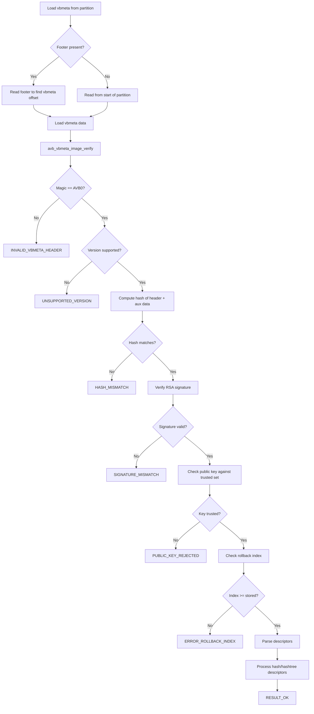

### 40.3.11  Descriptor Types

AVB uses several descriptor types to describe partitions:

| Descriptor | Purpose |
|-----------|---------|
| **Hash** | Stores the hash of an entire partition (boot, dtbo) |
| **Hashtree** | Stores the root hash of a Merkle tree (system, vendor) |
| **Kernel Cmdline** | Adds parameters to the kernel command line |
| **Chain Partition** | Points to another partition's vbmeta |
| **Property** | Stores key-value pairs |

Hash descriptors are used for small partitions where the entire image
can be verified before use.  Hashtree descriptors are for large partitions
where block-by-block verification (dm-verity) is necessary.

### 40.3.12  dm-verity Merkle Tree

The Merkle tree for dm-verity is structured as follows:

```
                    Root Hash (stored in vbmeta)
                    /                          \
            Hash(L1[0])                   Hash(L1[1])
           /          \                  /          \
    Hash(L0[0])  Hash(L0[1])    Hash(L0[2])  Hash(L0[3])
      |             |              |             |
   Block 0       Block 1       Block 2       Block 3
   (4096 B)      (4096 B)      (4096 B)      (4096 B)
```

When any block is read from disk:

1. The block's hash is computed (SHA-256).
2. The hash is verified against its entry in the hash tree.
3. The hash tree entry is verified against its parent.
4. This chain continues up to the root hash.
5. The root hash was already verified during boot by AVB.

If any block has been tampered with, the hash mismatch is detected and the
configured error mode determines the response (restart, EIO, logging, panic).

### 40.3.13  avbtool Command Reference

The `avbtool.py` script at `external/avb/avbtool.py` provides the build-time
tooling:

| Command | Purpose |
|---------|---------|
| `make_vbmeta_image` | Create a standalone vbmeta image |
| `add_hash_footer` | Add a hash footer to a partition image |
| `add_hashtree_footer` | Add a hashtree footer to a partition image |
| `erase_footer` | Remove an AVB footer |
| `info_image` | Display AVB information about an image |
| `extract_public_key` | Extract the public key from a private key |
| `calculate_vbmeta_digest` | Calculate the digest of vbmeta images |
| `resize_image` | Resize a partition image |
| `set_ab_metadata` | Set A/B metadata |

### 40.3.14  Kernel Command-Line Parameters

AVB sets several `androidboot.vbmeta.*` kernel command-line parameters:

- `androidboot.veritymode`: `enforcing`, `eio`, `disabled`, or `logging`
- `androidboot.vbmeta.device_state`: `locked` or `unlocked`
- `androidboot.vbmeta.hash_alg`, `size`, `digest`: integrity of vbmeta chain
- `androidboot.vbmeta.invalidate_on_error`: `yes` for restart-and-invalidate mode
- `androidboot.vbmeta.avb_version`: the AVB library version (e.g., "1.0")
- `androidboot.vbmeta.device`: PARTUUID of the vbmeta partition
- `androidboot.vbmeta.public_key_digest`: SHA-256 of the signing public key
- `androidboot.veritymode.managed`: `yes` if using managed restart-and-EIO

From the source documentation:

```
androidboot.veritymode: This is set to 'disabled' if the
AVB_VBMETA_IMAGE_FLAGS_HASHTREE_DISABLED flag is set in top-level
vbmeta struct. Otherwise it is set to 'enforcing' if the
passed-in hashtree error mode is AVB_HASHTREE_ERROR_MODE_RESTART
or AVB_HASHTREE_ERROR_MODE_RESTART_AND_INVALIDATE, 'eio' if it's
set to AVB_HASHTREE_ERROR_MODE_EIO, and 'logging' if it's set to
AVB_HASHTREE_ERROR_MODE_LOGGING.
```

These parameters are consumed by the `init` process and Android framework
to determine the device's integrity state and adjust behavior accordingly.

### 40.3.15  Managed Verity Mode State Machine

The `MANAGED_RESTART_AND_EIO` error mode implements a state machine:

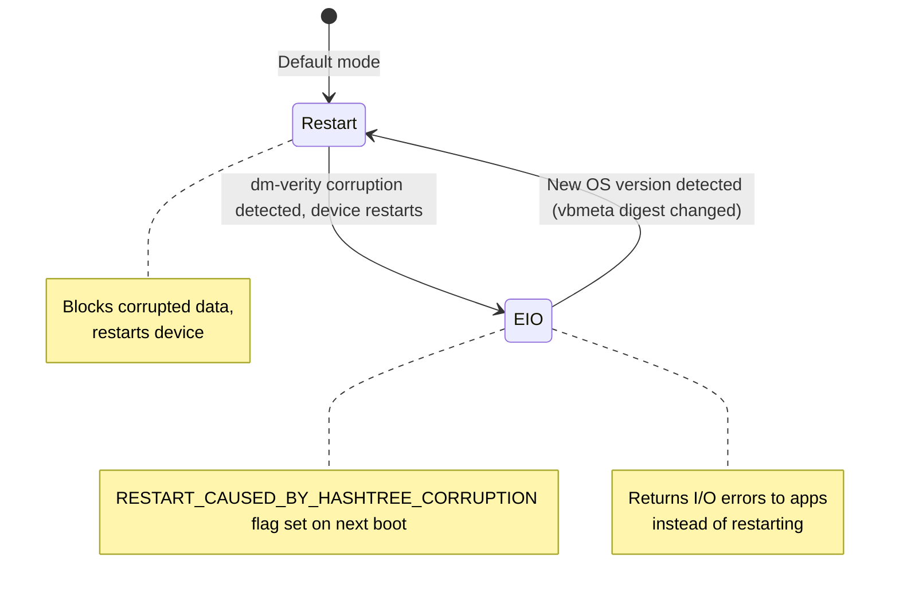

This design prevents a boot loop: if corruption is persistent, the device
switches to EIO mode (returning errors to apps) instead of continuously
restarting.  A RED warning screen is shown to inform the user.

### 40.3.16  Integration with A/B Updates

AVB works closely with the A/B update system:

1. The current slot (e.g., slot A) is verified and booted.
2. An OTA update is applied to slot B while A is running.
3. After update, the bootloader switches the active slot to B.
4. AVB verifies slot B's vbmeta and all partitions.
5. If verification succeeds, slot B becomes the new default.
6. If verification fails, the bootloader falls back to slot A.
7. After successful boot, the rollback indexes may be updated to prevent
   rollback to the old version.

---

## 40.4  Keystore and KeyMint

### 40.4.1  Overview

The Android Keystore system provides hardware-backed cryptographic key storage
and operations.  The implementation has evolved through several generations:

| Generation | Interface | Since |
|-----------|-----------|-------|
| Keymaster 0.x | C HAL | Android 4.3 |
| Keymaster 1.0 | HIDL 1.0 | Android 6.0 |
| Keymaster 2.0 | HIDL 2.0 | Android 7.0 |
| Keymaster 3.0 | HIDL 3.0 | Android 8.0 |
| Keymaster 4.0 | HIDL 4.0 | Android 9 |
| **KeyMint 1.0** | **AIDL** | **Android 12** |
| KeyMint 2.0 | AIDL | Android 13 |
| KeyMint 3.0 | AIDL | Android 14 |

The Keymaster-to-KeyMint transition moved from HIDL to AIDL and introduced
improvements in attestation, key upgrade, and remote provisioning.

### 40.4.2  Keystore2 Architecture

The Keystore 2.0 service is implemented in Rust at
`system/security/keystore2/`.  The main library (`src/lib.rs`) exposes these
modules:

```rust
//! This crate implements the Android Keystore 2.0 service.

pub mod apc;
pub mod async_task;
pub mod authorization;
pub mod boot_level_keys;
pub mod database;
pub mod ec_crypto;
pub mod enforcements;
pub mod entropy;
pub mod error;
pub mod globals;
pub mod id_rotation;
pub mod key_parameter;
pub mod legacy_blob;
pub mod legacy_importer;
pub mod maintenance;
pub mod metrics;
pub mod metrics_store;
pub mod operation;
pub mod permission;
pub mod raw_device;
pub mod remote_provisioning;
pub mod security_level;
pub mod service;
pub mod shared_secret_negotiation;
pub mod utils;

mod attestation_key_utils;
mod audit_log;
mod gc;
mod km_compat;
mod super_key;
mod sw_keyblob;
mod watchdog_helper;
```

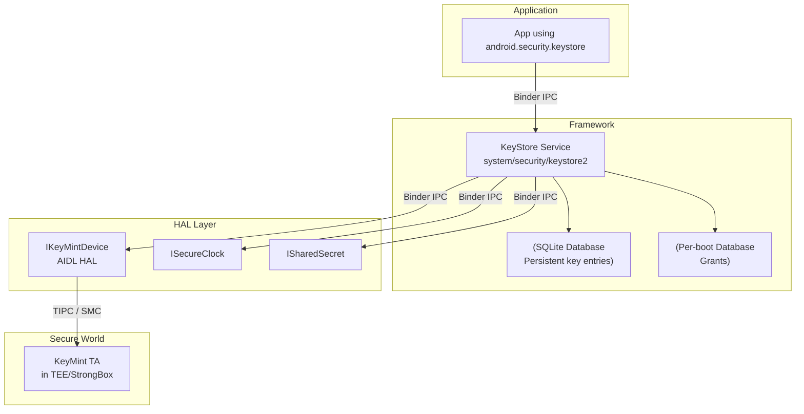

### 40.4.3  Security Levels

Keystore2 supports multiple security levels.  The `KeystoreSecurityLevel`
struct in `system/security/keystore2/src/security_level.rs`:

```rust
/// Implementation of the IKeystoreSecurityLevel Interface.
pub struct KeystoreSecurityLevel {
    security_level: SecurityLevel,
    keymint: Strong<dyn IKeyMintDevice>,
    hw_info: KeyMintHardwareInfo,
    km_uuid: Uuid,
    operation_db: OperationDb,
    rem_prov_state: RemProvState,
    id_rotation_state: IdRotationState,
}
```

The three security levels are:

| Level | Description |
|-------|-------------|
| `SOFTWARE` | Keys stored in software (TEE unavailable) |
| `TRUSTED_ENVIRONMENT` | Keys in the TEE (ARM TrustZone, etc.) |
| `STRONGBOX` | Keys in a dedicated secure element |

### 40.4.4  Database Module

The database design is documented in `system/security/keystore2/src/database.rs`:

```rust
//! This is the Keystore 2.0 database module.
//! The database module provides a connection to the backing SQLite store.
//! We have two databases one for persistent key blob storage and one for
//! items that have a per boot life cycle.
//!
//! ## Persistent database
//! The persistent database has tables for key blobs. They are organized
//! as follows:
//! The `keyentry` table is the primary table for key entries. It is
//! accompanied by two tables for blobs and parameters.
//! Each key entry occupies exactly one row in the `keyentry` table and
//! zero or more rows in the tables `blobentry` and `keyparameter`.
//!
//! ## Per boot database
//! The per boot database stores items with a per boot lifecycle.
//! Currently, there is only the `grant` table in this database.
//! Grants are references to a key that can be used to access a key by
//! clients that don't own that key.
```

### 40.4.5  Access Control via SELinux

Keystore2 uses SELinux for fine-grained access control.  The permission module
(`system/security/keystore2/src/permission.rs`) defines the `keystore2_key`
SELinux class:

```rust
implement_class!(
    /// KeyPerm provides a convenient abstraction from the SELinux class
    /// `keystore2_key`.
    #[selinux(class_name = keystore2_key)]
    pub enum KeyPerm {
        /// Checked when convert_storage_key_to_ephemeral is called.
        #[selinux(name = convert_storage_key_to_ephemeral)]
        ConvertStorageKeyToEphemeral = ...,
        /// Checked when the caller tries to delete a key.
        #[selinux(name = delete)]
        Delete = ...,
        /// Checked when the caller tries to use a unique id.
        #[selinux(name = gen_unique_id)]
        GenUniqueId = ...,
        /// Checked when the caller tries to load a key.
        #[selinux(name = get_info)]
        GetInfo = ...,
        /// Checked when the caller attempts to grant a key to another uid.
        #[selinux(name = grant)]
        Grant = ...,
        /// Checked when the caller attempts to use Domain::BLOB.
        #[selinux(name = manage_blob)]
        ManageBlob = ...,
    }
);
```

This means every key operation is checked against the caller's SELinux context,
not just their UID.  A process must have both the right UID (or a valid grant)
AND the right SELinux permissions.

### 40.4.6  Enforcements Module

The enforcements module (`system/security/keystore2/src/enforcements.rs`)
handles authentication requirements for key operations.  Key use can require:

- **User authentication** -- a recent unlock (PIN, pattern, password, or
  biometric) is required before the key can be used.
- **Per-operation authentication** -- the user must authenticate for each
  individual cryptographic operation.
- **Timeout-based authentication** -- authentication is valid for a specified
  time window.
- **Boot-level keys** -- keys that become inaccessible after a certain boot
  phase completes.

```rust
#[derive(Debug)]
enum AuthRequestState {
    /// An outstanding per operation authorization request.
    OpAuth,
    /// An outstanding request for a timestamp token.
    TimeStamp(Mutex<Receiver<Result<TimeStampToken, Error>>>),
}

#[derive(Debug)]
struct AuthRequest {
    state: AuthRequestState,
    /// This need to be set to Some to fulfill an AuthRequestState::OpAuth.
    hat: Mutex<Option<HardwareAuthToken>>,
}
```

### 40.4.7  Key Attestation

Key attestation proves to a remote party that a key was generated inside
secure hardware.  The attestation chain consists of:

1. **Attestation certificate** -- signed by the TEE's attestation key,
   containing the key's properties (algorithm, purpose, auth requirements).
2. **Intermediate certificate(s)** -- linking the TEE's key to a root.
3. **Root certificate** -- the Google Hardware Attestation Root or the
   manufacturer's root.

The attestation includes the device's verified boot state (`locked`/`unlocked`)
and the OS version, enabling relying parties to make trust decisions.

### 40.4.8  Operation Lifecycle

Keystore2 manages cryptographic operations with a well-defined lifecycle.
From `system/security/keystore2/src/operation.rs`:

```rust
//! Operations implement the API calls update, finish, and abort.
//! Additionally, an operation can be dropped and pruned. The former
//! happens if the client deletes a binder to the operation object.
//! An existing operation may get pruned when running out of operation
//! slots and a new operation takes precedence.
//!
//! ## Operation Lifecycle
//! An operation gets created when the client calls
//! `IKeystoreSecurityLevel::create`.
//! It may receive zero or more update request. The lifecycle ends when:
//!  * `update` yields an error.
//!  * `finish` is called.
//!  * `abort` is called.
//!  * The operation gets dropped.
//!  * The operation gets pruned.
```

The operation pruning strategy is important for devices with limited TEE
resources.  When a new operation is requested but all slots are full:

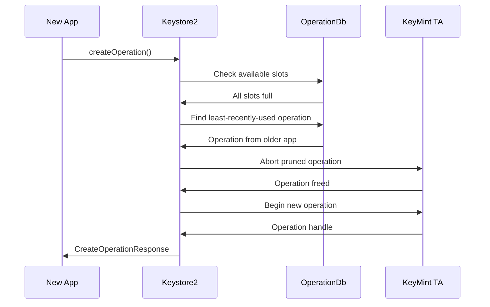

### 40.4.9  Super Keys and User Authentication

The super key module (`system/security/keystore2/src/super_key.rs`) manages
the keys that protect per-user Keystore data.  There are several types of
super encryption:

```rust
/// Encryption algorithm used by a particular type of superencryption key
pub enum SuperEncryptionAlgorithm {
    /// Symmetric encryption with AES-256-GCM
    Aes256Gcm,
    /// Asymmetric encryption with ECDH P-521
    EcdhP521,
}

/// Specify which keys should be wiped given a particular user's UserSuperKeys
pub enum WipeKeyOption {
    /// Wipe unlocked_device_required_symmetric/private and biometric_unlock keys
    PlaintextAndBiometric,
    /// Wipe only unlocked_device_required_symmetric/private keys
    PlaintextOnly,
}
```

The biometric unlock timeout is carefully tuned:

```rust
/// Allow up to 15 seconds between the user unlocking using a biometric, and
/// the auth token being used to unlock in
/// [`SuperKeyManager::try_unlock_user_with_biometric`].
/// This seems short enough for security purposes, while long enough that even
/// the very slowest device will present the auth token in time.
const BIOMETRIC_AUTH_TIMEOUT_S: i32 = 15; // seconds
```

### 40.4.10  Key Garbage Collection

The key garbage collector (`system/security/keystore2/src/gc.rs`) handles
secure deletion of key material:

```rust
//! This module implements the key garbage collector.
//! The key garbage collector has one public function `notify_gc()`.
//! This will create a thread on demand which will query the database
//! for unreferenced key entries, optionally dispose of sensitive key
//! material appropriately, and then delete the key entry from the
//! database.
```

When a key is deleted:

1. The database entry is marked for deletion.
2. The GC thread wakes up.
3. If the key has a hardware-backed blob, the HAL is called to delete it
   from the TEE.
4. The database entry and all associated blobs are removed.
5. The underlying storage blocks are overwritten (secure discard).

### 40.4.11  Remote Key Provisioning (RKP)

Starting with Android 12, devices support Remote Key Provisioning.  Instead
of burning attestation keys in the factory, keys are provisioned from a Google
backend after the device passes integrity checks.  The relevant module is:

```
system/security/keystore2/src/remote_provisioning.rs
system/security/keystore2/rkpd_client/
```

Benefits:

- Eliminates factory key injection infrastructure.
- Supports key rotation and revocation at scale.
- Reduces the blast radius of key compromise.

### 40.4.12  KeyMint AIDL Interface

The KeyMint HAL is defined in AIDL at
`hardware/interfaces/security/keymint/aidl/`.  Key AIDL files include:

| File | Purpose |
|------|---------|
| `IKeyMintDevice.aidl` | Main device interface (generateKey, importKey, begin) |
| `IKeyMintOperation.aidl` | Per-operation interface (update, finish, abort) |
| `SecurityLevel.aidl` | TEE, StrongBox, Software levels |
| `Algorithm.aidl` | RSA, EC, AES, HMAC, 3DES |
| `KeyCharacteristics.aidl` | Key properties returned from generateKey |
| `KeyCreationResult.aidl` | Key blob + characteristics + certificates |
| `HardwareAuthToken.aidl` | Authentication token structure |
| `Tag.aidl` | Key parameter tags (PURPOSE, ALGORITHM, KEY_SIZE, etc.) |
| `ErrorCode.aidl` | Detailed error codes |

The `IKeyMintDevice` interface defines these core operations:

```
interface IKeyMintDevice {
    KeyMintHardwareInfo getHardwareInfo();
    void addRngEntropy(in byte[] data);
    KeyCreationResult generateKey(in KeyParameter[] keyParams,
                                  in AttestationKey attestationKey);
    KeyCreationResult importKey(in KeyParameter[] keyParams,
                                in KeyFormat keyFormat,
                                in byte[] keyData,
                                in AttestationKey attestationKey);
    KeyCreationResult importWrappedKey(in byte[] wrappedKeyData,
                                       in byte[] wrappingKeyBlob,
                                       in byte[] maskingKey, ...);
    byte[] upgradeKey(in byte[] keyBlobToUpgrade,
                      in KeyParameter[] upgradeParams);
    void deleteKey(in byte[] keyBlob);
    void deleteAllKeys();
    void destroyAttestationIds();
    BeginResult begin(in KeyPurpose purpose,
                      in byte[] keyBlob,
                      in KeyParameter[] params,
                      in HardwareAuthToken authToken);
    byte[] deviceLocked(in boolean passwordOnly,
                        in TimeStampToken timestampToken);
    byte[] earlyBootEnded();
    ...
}
```

### 40.4.13  Keystore2 Authorization Flow

The authorization flow for a key operation involves multiple checks:

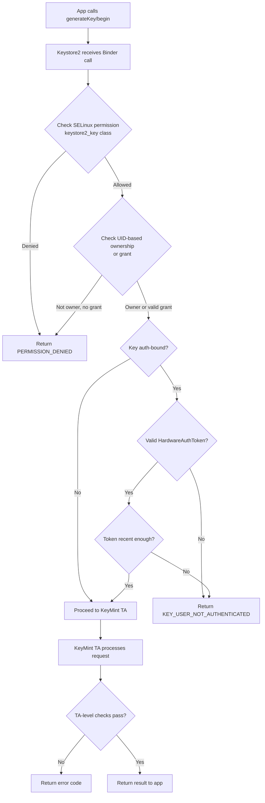

This multi-layer authorization ensures:

- SELinux prevents unauthorized access even from root.
- UID checks prevent cross-app key access.
- Auth-binding requires recent user authentication.
- The TEE performs its own validation independent of the framework.

### 40.4.14  Key Import and Wrapping

Keystore2 supports importing existing keys into hardware:

- **Plain import**: the key material is sent to the TEE, which wraps it
  with a device-bound key.  The original plaintext key exists briefly in
  transit.
- **Wrapped import**: the key is wrapped by a transport key before leaving
  the source.  The TEE unwraps it internally, so the plaintext key never
  exists outside secure hardware.  This is used for bulk key provisioning.

### 40.4.15  StrongBox

StrongBox is a dedicated secure element (SE) that provides the highest security
level.  Unlike the TEE, which shares the main CPU, StrongBox uses a separate
processor with its own:

- CPU
- Secure storage
- True random number generator
- Tamper-resistance mechanisms
- Independent clock

StrongBox supports a subset of KeyMint algorithms and is mandatory for
devices launching with Android 9+ (for certain key types).

---

## 40.5  TEE: Trusty

### 40.5.1  Overview

Trusty is Google's open-source Trusted Execution Environment (TEE) operating
system.  It runs alongside Android in the ARM TrustZone secure world (or
analogous isolation on other architectures).  The source tree is:

```
trusty/
  kernel/       - Trusty kernel (Little Kernel based)
  user/         - Userspace TAs (Trusted Applications)
  device/       - Device-specific configurations
  hardware/     - Hardware abstraction
  host/         - Host-side tools
  vendor/       - Vendor TAs
```

The Android-side integration for communicating with Trusty lives in:

```
system/core/trusty/
  keymint/          - KeyMint HAL backed by Trusty
  keymaster/        - Legacy Keymaster HAL backed by Trusty
  gatekeeper/       - Gatekeeper HAL backed by Trusty
  storage/          - Secure storage proxy
  secretkeeper/     - SecretKeeper HAL for pVM secrets
  confirmationui/   - Protected Confirmation UI
  metrics/          - TEE metrics reporting
  libtrusty/        - IPC library for talking to Trusty
  libtrusty-rs/     - Rust bindings for libtrusty
```

### 40.5.2  TrustZone Architecture

ARM TrustZone divides the SoC into two worlds:

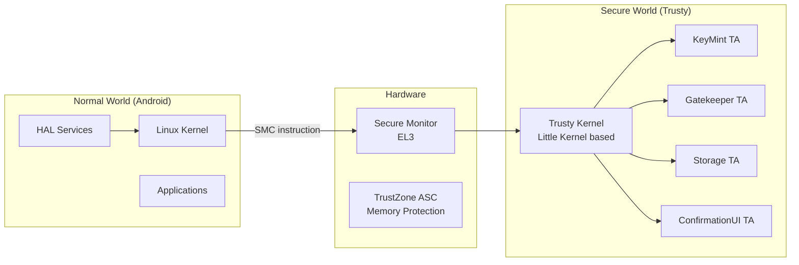

Key properties of TrustZone:

- **Hardware-enforced isolation** -- the normal world physically cannot access
  secure world memory.  The TrustZone Address Space Controller (TZASC) blocks
  all normal world bus transactions to secure memory regions.
- **SMC (Secure Monitor Call)** -- the only entry point from normal to secure
  world.  This is a privileged ARM instruction that traps to EL3 (the secure
  monitor), which then dispatches to the Trusty kernel.
- **Separate address spaces** -- Trusty has its own page tables, separate from
  Linux.

### 40.5.3  The SMC Communication Path

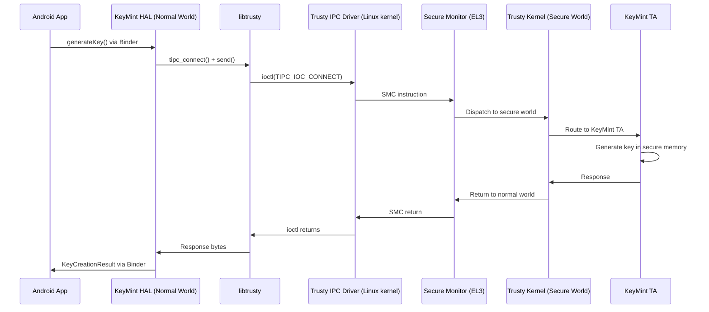

### 40.5.4  libtrusty -- The IPC Library

The `libtrusty` library (`system/core/trusty/libtrusty/trusty.c`) provides the
normal-world interface for connecting to Trusty TAs.  It supports two
transport mechanisms:

1. **TIPC over kernel driver** -- uses `/dev/trusty-ipc-dev0` and ioctl calls.
2. **TIPC over VSOCK** -- for virtual machine environments where Trusty runs
   in a separate VM.

```c
static bool use_vsock_connection = false;

static int tipc_vsock_connect(const char* type_cid_port_str,
                              const char* srv_name) {
    // Parse "STREAM:cid:port" or "SEQPACKET:cid:port"
    int fd = socket(AF_VSOCK, socket_type, 0);
    // Connect to the Trusty VM...
}
```

### 40.5.5  KeyMint HAL in Trusty

The Trusty KeyMint HAL (`system/core/trusty/keymint/src/keymint_hal_main.rs`)
is implemented in Rust.  It connects to the Trusty KeyMint TA over TIPC:

```rust
const TRUSTY_KEYMINT_RUST_SERVICE_NAME: &str = "com.android.trusty.keymint";

impl SerializedChannel for TipcChannel {
    const MAX_SIZE: usize = 4000;
    fn execute(&mut self, serialized_req: &[u8]) -> binder::Result<Vec<u8>> {
        self.0.send(serialized_req).map_err(|e| { ... })?;
        let mut expect_more_msgs = true;
        let mut full_rsp = Vec::new();
        while expect_more_msgs {
            let mut recv_buf = Vec::new();
            self.0.recv(&mut recv_buf).map_err(|e| { ... })?;
            let current_rsp_content;
            (expect_more_msgs, current_rsp_content) = extract_rsp(&recv_buf)?;
            full_rsp.extend_from_slice(current_rsp_content);
        }
        Ok(full_rsp)
    }
}
```

The main function connects to the TA and registers all HAL services:

```rust
fn inner_main() -> Result<(), HalServiceError> {
    // Create connection to the TA
    let connection =
        trusty::TipcChannel::connect(args.dev.as_str(),
                                     TRUSTY_KEYMINT_RUST_SERVICE_NAME)
            .map_err(|e| { ... })?;
    let tipc_channel = Arc::new(Mutex::new(TipcChannel(connection)));

    register_binder_services(&tipc_channel, ALL_HALS, SERVICE_INSTANCE)?;

    // Send the HAL service information to the TA
    send_hal_info(tipc_channel.lock().unwrap().deref_mut())?;

    binder::ProcessState::join_thread_pool();
    Ok(())
}
```

### 40.5.6  Confirmation UI

Protected Confirmation (Confirmation UI) displays a trusted prompt to the
user that cannot be spoofed by malware.  The Trusty implementation lives in
`system/core/trusty/confirmationui/`.

```cpp
class TrustyConfirmationUI : public BnConfirmationUI {
  public:
    ::ndk::ScopedAStatus
    promptUserConfirmation(
        const shared_ptr<IConfirmationResultCallback>& resultCB,
        const vector<uint8_t>& promptText,
        const vector<uint8_t>& extraData,
        const string& locale,
        const vector<UIOption>& uiOptions) override;

    ::ndk::ScopedAStatus
    deliverSecureInputEvent(
        const HardwareAuthToken& secureInputToken) override;

    ::ndk::ScopedAStatus abort() override;
};
```

The TA in the secure world controls the display directly (or via a secure
display path), ensuring the normal world OS cannot modify what the user sees.
The user's confirmation is signed by the TA, producing a
`HardwareAuthToken` that cryptographically proves the user approved the
displayed content.

### 40.5.7  SecretKeeper

The SecretKeeper HAL (`system/core/trusty/secretkeeper/`) manages secrets
for protected Virtual Machines (pVMs).  It ensures that secrets bound to a
specific VM identity are only released to authenticated VMs, supporting
the Android Virtualization Framework's security model.

### 40.5.8  Trusty Build and Configuration

Trusty device configurations live in `trusty/device/` and
`trusty/vendor/`.  The Android-side build integration is handled by
makefiles in `system/core/trusty/`:

- `trusty-base.mk` -- base Trusty configuration
- `trusty-storage-cf.mk` -- Cuttlefish (emulator) storage configuration
- `trusty-storage.mk` -- production storage configuration
- `trusty-keymint-apex.mk` -- APEX packaging for KeyMint
- `trusty-keymint.mk` -- KeyMint HAL build rules
- `trusty-test.mk` -- Test configuration

### 40.5.9  Trusty Kernel Architecture

The Trusty kernel is based on Little Kernel (LK), a small real-time OS
designed for resource-constrained environments.  Key properties:

- **Microkernel design** -- minimal kernel with IPC, scheduling, and memory
  management.  TAs run as userspace processes.
- **Capability-based security** -- TAs request capabilities (storage access,
  crypto hardware, etc.) at build time.
- **No dynamic loading** -- all TAs are loaded at boot from a signed image.
  No runtime code loading is permitted.
- **Small TCB** -- the Trusted Computing Base is much smaller than Linux,
  reducing the attack surface.

### 40.5.10  Trusty vs Other TEEs

Android supports multiple TEE implementations:

| TEE | Provider | Key Properties |
|-----|----------|---------------|
| **Trusty** | Google (open source) | LK-based, reference implementation |
| **OP-TEE** | Linaro (open source) | Linux-style API, widely used in SBCs |
| **QSEE** | Qualcomm (proprietary) | Used on Snapdragon SoCs |
| **Kinibi** | Trustonic (proprietary) | Used on Samsung Exynos, MediaTek |
| **iTrustee** | Huawei (proprietary) | Used on Kirin SoCs |

The Android HAL interfaces (KeyMint, Gatekeeper, etc.) are TEE-agnostic.
The HAL implementation translates between the Android AIDL interface and the
specific TEE's native API.  This is why `system/core/trusty/keymint/` exists
specifically for Trusty, while other TEE vendors provide their own HAL
implementations.

### 40.5.11  TIPC Protocol

Trusty IPC (TIPC) is a message-based protocol:

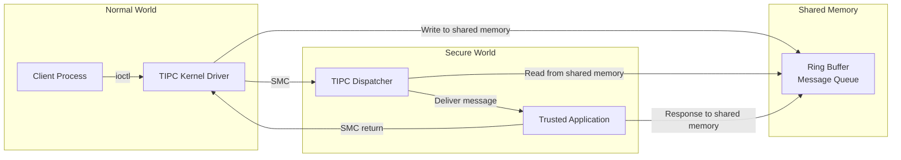

TIPC channels have these properties:

- Maximum message size of 4000 bytes (as seen in the KeyMint HAL).
- Messages exceeding this limit are split and reassembled.
- Channels are authenticated by the Trusty kernel, which knows the
  normal-world caller's identity.

### 40.5.12  Secure Storage

The Trusty Storage proxy (`system/core/trusty/storage/`) provides persistent
storage for TAs.  Since the secure world typically cannot directly access the
filesystem, the proxy runs in the normal world and services storage requests
from TAs through a secure protocol:

```
Normal World                    Secure World
+------------------+            +------------------+
| Storage Proxy    |<-- TIPC -->| Storage TA       |
| (runs as daemon) |            | (in Trusty)      |
| Writes to        |            | Encrypts data    |
| /data/vendor/ss  |            | with TA-bound key|
+------------------+            +------------------+
```

The data is encrypted and integrity-protected by the TA before it crosses
to the normal world for persistence.

---

## 40.6  Gatekeeper and Biometrics

### 40.6.1  Gatekeeper -- PIN/Pattern/Password Verification

Gatekeeper verifies the user's knowledge factor (PIN, pattern, or password)
in the TEE.  The Trusty implementation is in
`system/core/trusty/gatekeeper/`:

```cpp
class TrustyGateKeeperDevice : public BnGatekeeper {
  public:
    ::ndk::ScopedAStatus enroll(
        int32_t uid,
        const std::vector<uint8_t>& currentPasswordHandle,
        const std::vector<uint8_t>& currentPassword,
        const std::vector<uint8_t>& desiredPassword,
        GatekeeperEnrollResponse* _aidl_return) override;

    ::ndk::ScopedAStatus verify(
        int32_t uid,
        int64_t challenge,
        const std::vector<uint8_t>& enrolledPasswordHandle,
        const std::vector<uint8_t>& providedPassword,
        GatekeeperVerifyResponse* _aidl_return) override;

    ::ndk::ScopedAStatus deleteAllUsers() override;
    ::ndk::ScopedAStatus deleteUser(int32_t uid) override;
};
```

The flow works as follows:

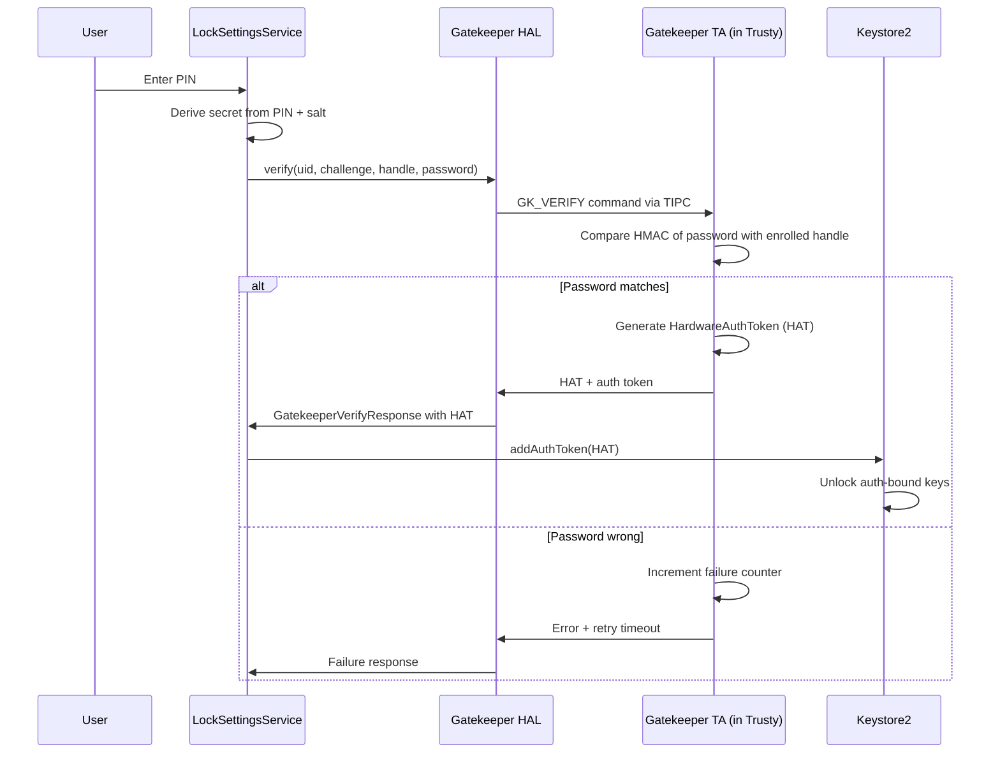

Key security properties:

- **Throttling in hardware** -- the TEE enforces exponentially increasing
  delays after failed attempts (30s after 5 failures, with the wait time
  doubling).  The normal world cannot bypass this.
- **Per-user isolation** -- each user has their own enrolled handle, stored
  in `/data/system_de/<userId>/gatekeeper/`.
- **Challenge binding** -- the verification challenge prevents replay attacks.

### 40.6.2  Enrollment

During enrollment, the TEE:

1. Receives the new password (or a derivative thereof).
2. Generates an HMAC using a hardware-bound key.
3. Returns a "password handle" -- the HMAC plus metadata.
4. The framework stores the handle; the original password is never persisted.

For password changes, the old password must be verified first (to prevent an
attacker with physical access from simply enrolling a new password).

### 40.6.3  Biometrics Framework

Android supports multiple biometric modalities through the HAL interfaces in
`hardware/interfaces/biometrics/`:

```
hardware/interfaces/biometrics/
  common/         - Shared types (ICancellationSignal, OperationContext)
  fingerprint/    - Fingerprint HAL
    aidl/         - AIDL interface definitions
    2.1/          - Legacy HIDL 2.1
    2.2/          - Legacy HIDL 2.2
    2.3/          - Legacy HIDL 2.3
  face/           - Face HAL
    aidl/         - AIDL interface definitions
    1.0/          - Legacy HIDL 1.0
```

### 40.6.4  Fingerprint HAL

The AIDL fingerprint interface (`IFingerprint.aidl`) is clean and session-based:

```java
@VintfStability
interface IFingerprint {
    SensorProps[] getSensorProps();

    ISession createSession(in int sensorId, in int userId,
                           in ISessionCallback cb);
}
```

The `ISession` interface defines all operations:

```java
@VintfStability
interface ISession {
    void generateChallenge();
    void revokeChallenge(in long challenge);
    ICancellationSignal enroll(in HardwareAuthToken hat);
    ICancellationSignal authenticate(in long operationId);
    ICancellationSignal detectInteraction();
    void enumerateEnrollments();
    void removeEnrollments(in int[] enrollmentIds);
    void getAuthenticatorId();
    void invalidateAuthenticatorId();
    void resetLockout(in HardwareAuthToken hat);
    void close();

    // For under-display sensors
    void onPointerDown(in int pointerId, in int x, in int y,
                       in float minor, in float major);
    void onPointerUp(in int pointerId);
    void onUiReady();
}
```

Sensor types supported:

| Type | Description |
|------|-------------|
| `REAR` | Capacitive sensor on the back |
| `UNDER_DISPLAY_ULTRASONIC` | Ultrasonic sensor under the display |
| `UNDER_DISPLAY_OPTICAL` | Optical sensor under the display |
| `POWER_BUTTON` | Integrated into the power button |

### 40.6.5  Sensor Strength Levels

Biometric sensors are classified by strength:

| Strength | Description | Can unlock Keystore keys? |
|----------|-------------|--------------------------|
| `CONVENIENCE` | Spoofable; for UX convenience only | No |
| `WEAK` | Harder to spoof but no crypto guarantee | No |
| `STRONG` | Meets CDD requirements; produces HATs | Yes |

Only `STRONG` sensors can produce `HardwareAuthToken`s that unlock
authentication-bound keys in Keystore.

### 40.6.6  The HardwareAuthToken (HAT) Flow

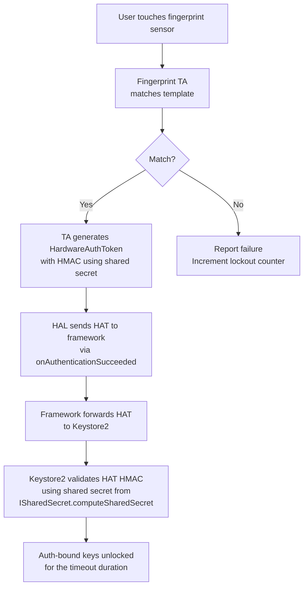

The HMAC key used to authenticate HATs is established through the
`ISharedSecret` interface, where all TEE components (KeyMint, Gatekeeper,
Biometrics) agree on a shared secret at boot time.

### 40.6.7  Lockout Policy

The biometrics framework enforces strict lockout:

- After 5 failed authentication attempts: 30-second timed lockout.
- After continued failures: lockout duration increases.
- After 20 cumulative failures: permanent lockout (requires PIN/pattern/
  password).
- Lockout persists across reboots (stored in the TA's secure storage).

From the `ISession.aidl`:

```
Note that lockout states MUST persist after device reboots, HAL crashes, etc.

See the Android CDD section 7.3.10 for the full set of lockout and
rate-limiting requirements.
```

### 40.6.8  Face Authentication

The face HAL (`hardware/interfaces/biometrics/face/aidl/`) follows a similar
pattern to the fingerprint HAL but supports face-specific features:

- Enrollment types: `DEFAULT` vs `ACCESSIBILITY` (for users who cannot move
  their head normally).
- Multiple enrollment stages: the HAL guides the user through head movements.
- Active vs. passive sensing: some implementations use IR flood illuminators,
  others use structured light depth cameras.

### 40.6.9  Authentication Flow Comparison


All three authentication methods produce the same output:
a `HardwareAuthToken` that Keystore2 can validate.  This unified design
means auth-bound keys do not need to know which authentication method was
used -- they just need a valid token.

### 40.6.10  Shared Secret Negotiation

At boot time, all authentication-related TAs (KeyMint, Gatekeeper,
Fingerprint, Face) negotiate a shared HMAC key through the
`ISharedSecret` interface:

1. Each TA generates a random nonce and contributes it.
2. The `ISharedSecret.computeSharedSecret()` method combines all nonces.
3. All TAs derive the same HMAC key using a KDF.
4. This key is used to sign and verify HardwareAuthTokens.

If any TA is compromised, it cannot forge tokens that the others would
accept, because the shared secret depends on contributions from all TAs.

### 40.6.11  Biometric Prompt

Android's `BiometricPrompt` API provides a unified UI for biometric
authentication.  It handles:

- Choosing the best available biometric modality.
- Displaying a consistent system-controlled UI.
- Falling back to PIN/pattern/password when biometrics fail.
- Managing lockout states across modalities.
- Returning a `CryptoObject` for hardware-bound authentication.

The BiometricPrompt flow:

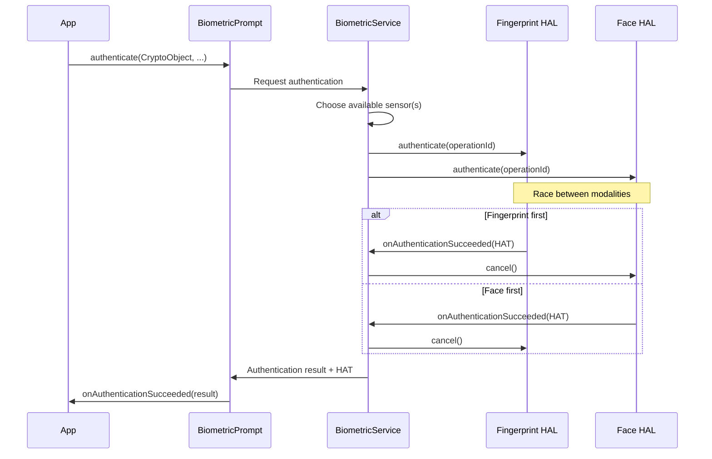

---

## 40.7  App Sandbox

### 40.7.1  UID-per-App Isolation

Every installed application receives a unique Linux UID.  This UID is assigned
at install time by the Package Manager and never changes.  The UID forms the
basis of the sandbox:

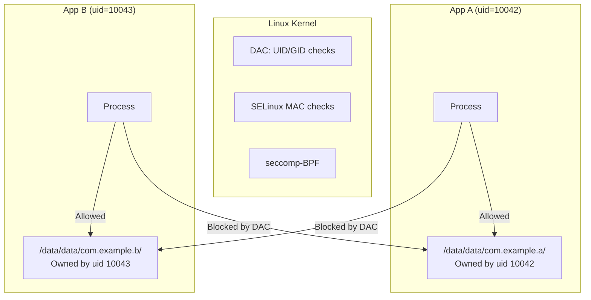

The app data directory is created with permissions `0700` and owned by the
app's UID, so no other (non-root) process can read or write it.

### 40.7.2  SELinux Domains for Apps

Apps run in type-specific SELinux domains based on their `targetSdkVersion`
and other properties.  The domain assignment is driven by `seapp_contexts`:

```
# From system/sepolicy/private/seapp_contexts

# System server
isSystemServer=true domain=system_server_startup

# Apps with targetSdkVersion >= 34
user=_app domain=untrusted_app type=app_data_file levelFrom=all

# Apps with targetSdkVersion 30-33
user=_app minTargetSdkVersion=30 domain=untrusted_app_30 ...

# Isolated processes
user=_isolated domain=isolated_app ...
```

The untrusted_app domain (`system/sepolicy/private/untrusted_app.te`):

```te
###
### Untrusted apps.
###
### This file defines the rules for untrusted apps running with
### targetSdkVersion >= 34.
###

typeattribute untrusted_app coredomain;

app_domain(untrusted_app)
untrusted_app_domain(untrusted_app)
net_domain(untrusted_app)
bluetooth_domain(untrusted_app)
```

### 40.7.3  Isolated Processes

The `isolated_app` domain is the most restricted:

```te
typeattribute isolated_app coredomain;

app_domain(isolated_app)
isolated_app_domain(isolated_app)
```

Isolated processes:

- Cannot access the network directly (no `net_domain`).
- Cannot access any content provider or service by default.
- Cannot read/write any files except those explicitly passed to them via
  file descriptors.
- Run as a unique UID each time (drawn from a reserved range).

From `system/sepolicy/private/isolated_app.te`:

```te
# Allow access to network sockets received over IPC.
# New socket creation is not permitted.
allow isolated_app { ephemeral_app priv_app untrusted_app_all }:{
    tcp_socket udp_socket
} { rw_socket_perms_no_ioctl };

# b/32896414: Allow accessing sdcard file descriptors passed to
# isolated_apps by other processes. Open should never be allowed.
allow isolated_app { sdcard_type fuse media_rw_data_file }:file {
    read write append getattr lock map
};
```

### 40.7.4  seccomp-BPF Filtering

Android applies seccomp-BPF (Secure Computing mode with Berkeley Packet
Filter) to app processes.  This restricts which system calls an app can make,
even before SELinux is consulted.

The seccomp filter is applied by the Zygote during process specialization.
Blocked syscalls include:

| Category | Examples |
|----------|---------|
| **Kernel module loading** | `init_module`, `finit_module`, `delete_module` |
| **Raw I/O** | `ioperm`, `iopl` |
| **Process tracing** | `ptrace` (unless debuggable) |
| **Namespace manipulation** | `unshare`, `setns` |
| **Clock manipulation** | `clock_settime`, `settimeofday` |
| **Mount operations** | `mount`, `umount2` |
| **Swap management** | `swapon`, `swapoff` |
| **Reboot** | `reboot` |

A blocked syscall results in process termination (SIGKILL) or an error return,
depending on the filter rule.

### 40.7.5  Namespace Isolation

Starting with Android 10, app processes use Linux mount namespaces to further
restrict their view of the filesystem:

- Each app has its own mount namespace.
- FUSE-mounted external storage is presented with per-app views.
- `/proc/net` is filtered to hide network information from apps targeting
  Android 10+.

### 40.7.6  Zygote Specialization

The Zygote is the parent process for all app processes.  When an app is
launched, the Zygote forks and then "specializes" the child process:

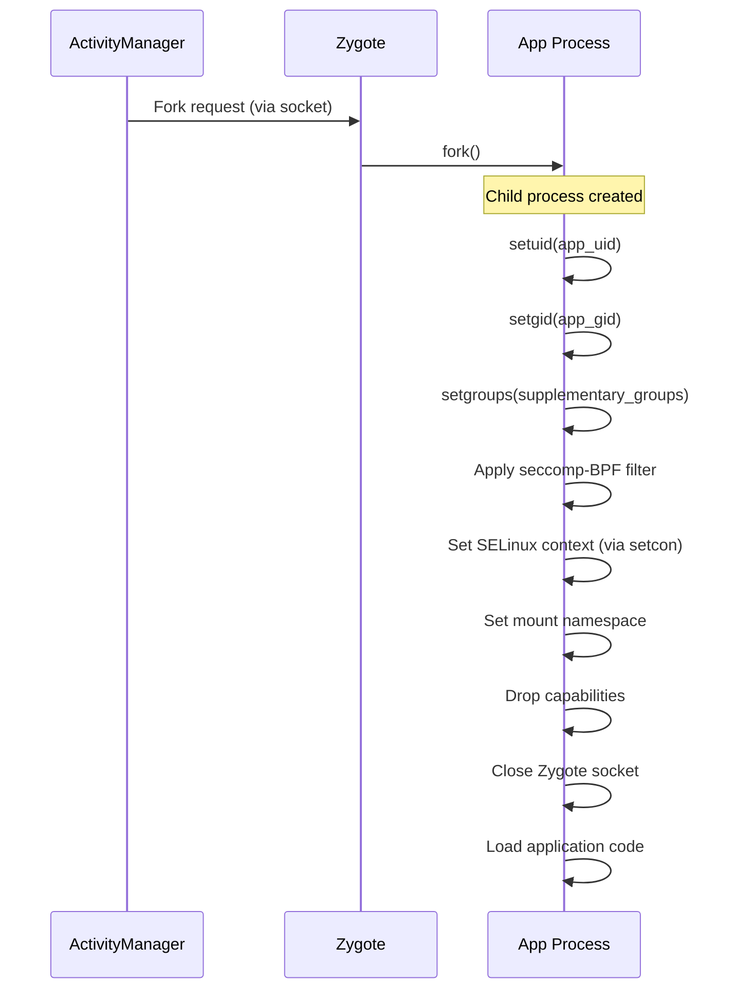

During specialization:

1. **UID/GID set** -- to the app's assigned UID.
2. **Supplementary groups** -- set based on permissions (e.g., `inet` group
   for INTERNET permission, `media_rw` for storage access).
3. **seccomp filter applied** -- restricts available syscalls.
4. **SELinux domain transition** -- from `zygote` to the appropriate app
   domain (e.g., `untrusted_app`).
5. **Mount namespace** -- isolated mount view created.
6. **Capabilities dropped** -- no Linux capabilities remain.
7. **Zygote socket closed** -- the child cannot fork more processes.

### 40.7.7  Permission to Group Mapping

The `INTERNET` permission is enforced at the kernel level through group
membership.  When granted, the app's process gets the `inet` supplementary
group (GID 3003), which allows it to create AF_INET/AF_INET6 sockets.  The
kernel's `paranoid_networking` feature restricts socket creation to processes
in specific groups:

| Group | GID | Permission |
|-------|-----|-----------|
| `inet` | 3003 | Network socket creation |
| `net_raw` | 3004 | Raw socket creation (ping) |
| `sdcard_rw` | 1015 | External storage write |
| `media_rw` | 1023 | Media storage write |

### 40.7.8  Detailed seccomp-BPF Policy

The seccomp-BPF filter is defined per architecture.  For ARM64, the policy
blocks dangerous syscalls while allowing the hundreds of syscalls needed for
normal app operation.  The filter structure:

```mermaid
flowchart TD
    A[Syscall from app process] --> B{syscall number in allowlist?}
    B -->|Yes| C[Allow syscall to proceed]
    B -->|No| D{syscall number in blocklist?}
    D -->|Yes| E[Return EPERM or SIGSYS]
    D -->|No| F{Architecture-specific handling}
    F --> G[Default: allow or block based on policy]
```

The seccomp policy files are at:
```
bionic/libc/seccomp/
```

Example blocked syscalls and their security rationale:

| Syscall | Rationale for blocking |
|---------|----------------------|
| `init_module` | Loading kernel modules would be game-over |
| `delete_module` | Unloading security modules |
| `mount` | Mounting new filesystems could bypass sandbox |
| `umount2` | Unmounting could expose raw block devices |
| `ptrace` | Debugging other processes leaks data |
| `unshare` | Namespace manipulation could escape sandbox |
| `setns` | Entering other namespaces |
| `reboot` | Denial of service |
| `swapon/swapoff` | System resource manipulation |
| `settimeofday` | Clock manipulation affects auth tokens |
| `pivot_root` | Filesystem root manipulation |
| `acct` | Process accounting control |
| `kexec_load` | Loading a new kernel |

### 40.7.9  Process-Level Isolation Details

Each app process has the following isolation properties:

**File descriptor table**: Forked from Zygote but scrubbed of sensitive FDs.
The Zygote socket FD is closed immediately after fork.

**Signal handling**: Apps can only send signals to processes in the same
app (same UID), except for SIGCHLD (parent notification) and signal 0
(existence test).

**Memory protection**: App processes have ASLR (Address Space Layout
Randomization), stack canaries, and execute-only memory for code segments.

**Resource limits**: `setrlimit` is called to restrict:

- Maximum number of file descriptors
- Maximum stack size
- Maximum virtual memory size
- Core dump size (typically zero)

### 40.7.10  Intent-Based Communication Security

Apps communicate primarily through Intents, which are mediated by
`system_server`.  The security checks on Intent delivery:

1. **Permission check** -- if the receiver declares a permission, the sender
   must hold it.
2. **Export check** -- unexported components cannot be targeted by external
   apps.
3. **SELinux check** -- binder_call permissions must allow the IPC.
4. **App visibility** -- Android 11+ restricts which apps can see each other
   based on `<queries>` declarations in the manifest.

### 40.7.11  Content Provider Security

Content Providers have their own access control:

```xml
<provider
    android:name=".MyProvider"
    android:authorities="com.example.provider"
    android:exported="true"
    android:readPermission="com.example.READ"
    android:writePermission="com.example.WRITE">
    <path-permission
        android:path="/sensitive"
        android:readPermission="com.example.READ_SENSITIVE" />
</provider>
```

- `exported=false` (default for targetSdk >= 31): only the same app can
  access it.
- `readPermission` / `writePermission`: separate read and write permissions.
- `<path-permission>`: per-path permissions for fine-grained control.
- URI grants: temporary one-time permission to specific URIs.

### 40.7.12  SDK Sandbox

Android 13 introduced the SDK Sandbox, a separate process for running
advertising and analytics SDKs in isolation from the host app:

```
user=_sdksandbox domain=sdk_sandbox type=sdk_sandbox_data_file
```

The SDK sandbox runs with its own UID and SELinux domain, preventing SDKs from
accessing the host app's data or other sensitive system resources.

The SDK Sandbox architecture:

```mermaid
graph TB
    subgraph "App Process (uid=10042)"
        App[App Code]
        SDK_Client[SDK Client API]
    end

    subgraph "SDK Sandbox Process (uid=20042)"
        SDK_Runtime[SDK Runtime]
        AdSDK[Ad SDK Code]
        AnalyticsSDK[Analytics SDK]
    end

    subgraph "System"
        SS["SdkSandboxManager<br/>in system_server"]
    end

    App --> SDK_Client
    SDK_Client -->|Binder IPC| SS
    SS -->|Manages lifecycle| SDK_Runtime
    SDK_Runtime --> AdSDK
    SDK_Runtime --> AnalyticsSDK
    AdSDK -.->|Cannot access| App
```

Key restrictions on the SDK Sandbox:

- No access to the host app's files or shared preferences.
- Limited network access.
- Cannot read device identifiers.
- Cannot access location.
- Runs with its own separate storage area.

### 40.7.13  App Cloning and Profile Security

Android supports app cloning (running two instances of the same app) through
the multi-user framework.  Each clone:

- Gets a unique UID in a different user space.
- Has its own encrypted CE/DE storage.
- Is isolated by SELinux MLS categories.
- Cannot access the other clone's data.

### 40.7.14  WebView Isolation

WebView content runs in isolated renderer processes:

```te
# WebView renderers use isolated_app domain
typeattribute isolated_app coredomain;
app_domain(isolated_app)
isolated_app_domain(isolated_app)
```

The WebView process:

- Runs as `isolated_app` with the most restrictive SELinux policy.
- Cannot open files (only use passed file descriptors).
- Cannot create network connections (only use passed sockets).
- Cannot access the parent app's data directory.
- Is killed when the WebView is destroyed.

This ensures that a compromised renderer (e.g., via a browser exploit)
has minimal access to the device.

---

## 40.8  Encryption

### 40.8.1  File-Based Encryption (FBE)

FBE, introduced in Android 7.0 and mandatory since Android 10, encrypts
different files with different keys, allowing each user's data to be
encrypted independently.  The implementation is in `system/vold/FsCrypt.cpp`.

FBE uses the kernel's native filesystem encryption (fscrypt) support:

```cpp
// system/vold/FsCrypt.cpp
#include <fscrypt/fscrypt.h>
#include <libdm/dm.h>
```

Key functions from `system/vold/FsCrypt.h`:

```cpp
bool fscrypt_initialize_systemwide_keys();
bool fscrypt_init_user0();
bool fscrypt_create_user_keys(userid_t user_id, bool ephemeral);
bool fscrypt_destroy_user_keys(userid_t user_id);
bool fscrypt_set_ce_key_protection(userid_t user_id,
                                   const std::vector<uint8_t>& secret);
bool fscrypt_unlock_ce_storage(userid_t user_id,
                               const std::vector<uint8_t>& secret);
bool fscrypt_lock_ce_storage(userid_t user_id);
bool fscrypt_prepare_user_storage(const std::string& volume_uuid,
                                  userid_t user_id, int flags);
```

### 40.8.2  FBE Key Classes

FBE uses two classes of encryption keys per user:

```mermaid
graph TB
    subgraph "Device Encrypted (DE)"
        DE_Key["DE Key<br/>Available at boot"]
        DE_Data["/data/system_de/<userId>/<br/>/data/misc_de/<userId>/<br/>/data/vendor_de/<userId>/"]
    end

    subgraph "Credential Encrypted (CE)"
        CE_Key["CE Key<br/>Available after first unlock"]
        CE_Data["/data/system_ce/<userId>/<br/>/data/misc_ce/<userId>/<br/>/data/vendor_ce/<userId>/<br/>/data/data/ (user 0)"]
    end

    subgraph "Key Storage"
        KS["/data/misc/vold/user_keys/<br/>ce/<userId>/<br/>de/<userId>/"]
    end

    DE_Key --> DE_Data
    CE_Key --> CE_Data
    KS --> DE_Key
    KS --> CE_Key
```

| Key Class | Unlocked When | Protects |
|-----------|--------------|----------|
| **DE (Device Encrypted)** | Device boots | Alarm, telephony, accessibility settings |
| **CE (Credential Encrypted)** | User enters credential | App data, contacts, messages |

This design enables Direct Boot: the device can boot and run essential
services (alarms, phone calls) before the user has entered their credential.

### 40.8.3  FBE Key Path Structure

The encryption keys are organized in a directory hierarchy under
`/data/misc/vold/user_keys/`.  From `system/vold/FsCrypt.cpp`:

```cpp
const std::string device_key_dir =
    std::string() + DATA_MNT_POINT + fscrypt_unencrypted_folder;
const std::string device_key_path = device_key_dir + "/key";

const std::string user_key_dir =
    std::string() + DATA_MNT_POINT + "/misc/vold/user_keys";

const std::string systemwide_volume_key_dir =
    std::string() + DATA_MNT_POINT + "/misc/vold/volume_keys";
```

Key directory layout:

```
/data/misc/vold/user_keys/
  ce/
    0/          # User 0 CE keys
      current/  # Currently active CE key
    10/         # User 10 CE keys
  de/
    0/          # User 0 DE keys
    10/         # User 10 DE keys
```

Helper functions for key path resolution:

```cpp
static std::string get_de_key_path(userid_t user_id) {
    return StringPrintf("%s/de/%d", user_key_dir.c_str(), user_id);
}

static std::string get_ce_key_directory_path(userid_t user_id) {
    return StringPrintf("%s/ce/%d", user_key_dir.c_str(), user_id);
}
```

The internal state tracking uses maps to manage installed encryption policies:

```cpp
// The currently installed CE and DE keys for each user.
// Protected by VolumeManager::mCryptLock.
struct UserPolicies {
    EncryptionPolicy internal;
    std::map<std::string, EncryptionPolicy> adoptable;
};

std::map<userid_t, UserPolicies> s_ce_policies;
std::map<userid_t, UserPolicies> s_de_policies;
```

### 40.8.4  Key Derivation and Storage

From `system/vold/KeyStorage.cpp`:

```cpp
const KeyAuthentication kEmptyAuthentication{""};

static constexpr size_t AES_KEY_BYTES = 32;
static constexpr size_t GCM_NONCE_BYTES = 12;
static constexpr size_t GCM_MAC_BYTES = 16;
static constexpr size_t SECDISCARDABLE_BYTES = 1 << 14;

static const char* kHashPrefix_secdiscardable =
    "Android secdiscardable SHA512";
static const char* kHashPrefix_keygen =
    "Android key wrapping key generation SHA512";
```

The key storage mechanism:

1. A random 256-bit encryption key is generated.
2. The key is wrapped using a key derived from:
   - The user's credential (for CE keys)
   - A hardware-bound key from Keystore (bound to the device)
   - A "secdiscardable" random file (16 KiB) that is securely deleted when
     the key is no longer needed
3. The wrapped key is stored in `/data/misc/vold/user_keys/`.

### 40.8.5  Encryption Key Lifecycle

```mermaid
stateDiagram-v2
    [*] --> Created: fscrypt_create_user_keys()
    Created --> DE_Active: Device boots, DE key installed to kernel
    DE_Active --> CE_Active: User enters credential, fscrypt_unlock_ce_storage()
    CE_Active --> CE_Locked: Device locks, fscrypt_lock_ce_storage()
    CE_Locked --> CE_Active: User re-enters credential
    CE_Active --> Destroyed: User removed, fscrypt_destroy_user_keys()
    DE_Active --> Destroyed: User removed
    Destroyed --> [*]
```

The key installation process uses the kernel's fscrypt API:

1. The raw key (or hardware-wrapped key) is retrieved from storage.
2. The key is installed into the kernel's fscrypt keyring using
   `FS_IOC_ADD_ENCRYPTION_KEY`.
3. The kernel returns a key identifier.
4. The identifier is set as the encryption policy for directories using
   `FS_IOC_SET_ENCRYPTION_POLICY`.
5. The kernel encrypts/decrypts file contents transparently.

### 40.8.6  Metadata Encryption

Metadata encryption protects filesystem metadata (filenames, permissions,
directory structure) that FBE does not cover.  The implementation is in
`system/vold/MetadataCrypt.cpp`:

```cpp
// Parsed from metadata options
struct CryptoOptions {
    struct CryptoType cipher = invalid_crypto_type;
    bool use_legacy_options_format = false;
    bool set_dun = true;
    bool use_hw_wrapped_key = false;
};

// The first entry in this table is the default crypto type.
constexpr CryptoType supported_crypto_types[] = {aes_256_xts, adiantum};
```

Metadata encryption uses `dm-default-key`, a device-mapper target that
transparently encrypts all data written to the underlying block device with
a single key.  This key is available at boot (not credential-bound) and
protects data at rest when the device is powered off.

Supported ciphers:

| Cipher | Performance | Security |
|--------|------------|----------|
| **AES-256-XTS** | Fast with hardware acceleration | Standard choice |
| **Adiantum** | Fast without hardware acceleration | For low-end devices without AES instructions |

### 40.8.7  Full-Disk Encryption (FDE) -- Legacy

FDE was the encryption model before FBE (Android 5.0-6.0).  It encrypted the
entire `/data` partition with a single key derived from the user's credential.
FDE had significant usability issues:

- The device could not boot functional services until the user entered their
  credential.
- No Direct Boot: alarms, phone calls, and accessibility services were
  unavailable before unlock.
- A single key compromise exposed all data.

FDE is deprecated and no longer supported on new devices launching with
Android 10+.

### 40.8.8  Hardware-Wrapped Keys

For devices with inline encryption engines (common on modern SoCs), keys
can be "hardware-wrapped":

1. The key is generated inside the inline crypto engine.
2. Only an encrypted ("wrapped") version of the key is ever visible to
   software.
3. The inline crypto engine unwraps the key internally during I/O.

This means that even a kernel compromise cannot extract the raw encryption key.
The `use_hw_wrapped_key` option in metadata encryption enables this feature.

### 40.8.9  The dm-default-key Implementation

Metadata encryption uses the `dm-default-key` device-mapper target.  From
`system/vold/MetadataCrypt.cpp`, the setup involves:

```cpp
static bool create_crypto_blk_dev(
    const std::string& dm_name,
    const std::string& blk_device,
    const KeyBuffer& key,
    const CryptoOptions& options,
    std::string* crypto_blkdev,
    uint64_t* nr_sec,
    bool is_userdata)
{
    if (!get_number_of_sectors(blk_device, nr_sec)) return false;
    // dm-default-key uses 4096-byte sectors
    *nr_sec &= ~7;

    KeyBuffer module_key;
    if (options.use_hw_wrapped_key) {
        if (!exportWrappedStorageKey(key, &module_key)) {
            LOG(ERROR) << "Failed to get ephemeral wrapped key";
            return false;
        }
    } else {
        module_key = key;
    }
    // ... set up dm-default-key target ...
}
```

The metadata encryption layer sits between the filesystem and the block device:

```
Filesystem (ext4/f2fs)
        |
   dm-default-key (metadata encryption, AES-256-XTS)
        |
   Raw block device (/dev/block/by-name/userdata)
```

### 40.8.10  The Secdiscardable Mechanism

A unique security feature is the "secdiscardable" file:

```cpp
static constexpr size_t SECDISCARDABLE_BYTES = 1 << 14;  // 16384 bytes

static const char* kHashPrefix_secdiscardable =
    "Android secdiscardable SHA512";
```

This 16 KiB random file is stored alongside each key.  Its hash is mixed into
the key derivation.  When a key needs to be permanently destroyed:

1. The secdiscardable file is securely erased using `BLKDISCARD` or
   `FITRIM` ioctls.
2. Even if the encrypted key blob is somehow recovered, the loss of the
   secdiscardable makes it useless.
3. On flash storage, the DISCARD command tells the flash controller to
   erase the physical blocks, making recovery extremely difficult.

This provides a defense against forensic recovery of deleted keys.

### 40.8.11  CE Key Protection with User Credential

When a user sets a credential (PIN, pattern, password), the CE key becomes
protected by a key derived from the credential.  The protection flow:

```mermaid
sequenceDiagram
    participant User
    participant LS as LockSettingsService
    participant GK as Gatekeeper
    participant Vold
    participant KS as Keystore

    User->>LS: Set new PIN "1234"
    LS->>GK: enroll(password_derived_secret)
    GK->>LS: Password handle
    LS->>LS: Store handle in /data/system/gatekeeper.pattern.key
    LS->>KS: Create synthetic password (SP)
    Note over KS: SP = random 256-bit value
    KS->>KS: Encrypt SP with credential-derived key
    KS->>KS: Store encrypted SP
    LS->>Vold: fscrypt_set_ce_key_protection(userId, SP)
    Vold->>Vold: Re-wrap CE key with SP
    Note over Vold: CE key now requires SP to unlock
```

On unlock:

```mermaid
sequenceDiagram
    participant User
    participant LS as LockSettingsService
    participant GK as Gatekeeper
    participant Vold

    User->>LS: Enter PIN "1234"
    LS->>GK: verify(password_derived_secret)
    GK->>LS: HardwareAuthToken
    LS->>LS: Use token + credential to decrypt SP
    LS->>Vold: fscrypt_unlock_ce_storage(userId, SP)
    Vold->>Vold: Unwrap CE key using SP
    Vold->>Vold: Install CE key to kernel fscrypt keyring
    Note over Vold: CE storage now accessible
```

### 40.8.12  Encryption Architecture Diagram

```mermaid
graph TB
    subgraph "At Rest (Power Off)"
        Disk["/data partition<br/>Everything encrypted"]
    end

    subgraph "After Boot (Before Unlock)"
        MD["Metadata Encryption<br/>dm-default-key active"]
        DE_Unlocked["DE keys available<br/>DE storage readable"]
        CE_Locked["CE keys locked<br/>CE storage inaccessible"]
    end

    subgraph "After User Unlock"
        CE_Unlocked["CE keys unlocked<br/>All user data accessible"]
    end

    Disk -->|Boot| MD
    MD --> DE_Unlocked
    MD --> CE_Locked
    CE_Locked -->|User enters credential| CE_Unlocked
```

---

## 40.9  Network Security

### 40.9.1  Network Security Config

The Network Security Config system allows apps to declare their network
security preferences in a declarative XML format.  The implementation is in:

```
frameworks/base/packages/NetworkSecurityConfig/platform/src/android/security/net/config/
```

The main class, `NetworkSecurityConfig.java`, manages:

```java
public final class NetworkSecurityConfig {
    public static final boolean DEFAULT_CLEARTEXT_TRAFFIC_PERMITTED = true;
    public static final boolean DEFAULT_HSTS_ENFORCED = false;

    private final boolean mCleartextTrafficPermitted;
    private final boolean mHstsEnforced;
    private final boolean mCertificateTransparencyVerificationRequired;
    private final PinSet mPins;
    private final List<CertificatesEntryRef> mCertificatesEntryRefs;
    private Set<TrustAnchor> mAnchors;
}
```

Key source files in the implementation:

| File | Purpose |
|------|---------|
| `NetworkSecurityConfig.java` | Core configuration class |
| `XmlConfigSource.java` | Parses XML config from AndroidManifest |
| `ManifestConfigSource.java` | Reads config reference from manifest |
| `NetworkSecurityTrustManager.java` | TLS trust manager with config awareness |
| `RootTrustManager.java` | Root trust manager that routes to per-domain configs |
| `Pin.java` / `PinSet.java` | Certificate pinning support |
| `Domain.java` | Domain matching for per-domain config |
| `SystemCertificateSource.java` | System CA certificate provider |
| `UserCertificateSource.java` | User-installed CA certificate provider |

### 40.9.2  XML Configuration Format

Apps declare their network security policy in `res/xml/network_security_config.xml`:

```xml
<?xml version="1.0" encoding="utf-8"?>
<network-security-config>
    <!-- Base config applied to all connections -->
    <base-config cleartextTrafficPermitted="false">
        <trust-anchors>
            <certificates src="system" />
        </trust-anchors>
    </base-config>

    <!-- Per-domain overrides -->
    <domain-config>
        <domain includeSubdomains="true">api.example.com</domain>
        <pin-set expiration="2025-01-01">
            <pin digest="SHA-256">7HIpactkIAq2Y49orFOOQKurWxmmSFZhBCoQYcRhJ3Y=</pin>
            <!-- Backup pin -->
            <pin digest="SHA-256">fwza0LRMXouZHRC8Ei+4PyuldPDcf3UKgO/04cDM1oE=</pin>
        </pin-set>
        <trust-anchors>
            <certificates src="system" />
        </trust-anchors>
    </domain-config>

    <!-- Debug overrides (only in debuggable builds) -->
    <debug-overrides>
        <trust-anchors>
            <certificates src="user" />
        </trust-anchors>
    </debug-overrides>
</network-security-config>
```

### 40.9.3  Cleartext Traffic Restrictions

Android progressively restricts cleartext (non-TLS) HTTP traffic:

| targetSdkVersion | Default cleartext | Behavior |
|-----------------|-------------------|----------|
| <= 23 | Permitted | No restriction |
| 24-27 | Permitted | Can opt out via config |
| >= 28 | **Blocked** | Must explicitly opt in for cleartext |

When cleartext traffic is blocked, `HttpURLConnection` and OkHttp refuse to
make HTTP connections, and the system logs a warning.

### 40.9.4  Certificate Pinning

Certificate pinning binds a domain to specific public keys, preventing
man-in-the-middle attacks even if a CA is compromised:

```mermaid
flowchart TD
    A[App connects to api.example.com] --> B[TLS handshake]
    B --> C[Server presents certificate chain]
    C --> D{Chain valid per system CAs?}
    D -->|No| E[Connection rejected]
    D -->|Yes| F{Pin-set configured?}
    F -->|No| G[Connection allowed]
    F -->|Yes| H{"Any cert in chain<br/>matches a pin?"}
    H -->|Yes| G
    H -->|No| I["Connection rejected<br/>Pin mismatch"]
```

Pin-sets have mandatory features:

- **Expiration date** -- pins expire so that a wrong pin does not permanently
  brick the app's connectivity.
- **Backup pins** -- at least two pins must be specified (one current, one
  backup) to enable key rotation.

### 40.9.5  Certificate Transparency

Starting with Android 16 (Baklava), Certificate Transparency (CT) verification
is enabled by default for apps targeting the new SDK level:

```java
@ChangeId
@EnabledAfter(targetSdkVersion = Build.VERSION_CODES.BAKLAVA)
static final long DEFAULT_ENABLE_CERTIFICATE_TRANSPARENCY = 407952621L;
```

CT ensures that certificates issued by CAs are publicly logged, making it
harder for CAs to issue fraudulent certificates without detection.

### 40.9.6  Trust Anchor Configuration

The Network Security Config supports three certificate sources:

| Source | Description |
|--------|-------------|
| `system` | System CA store (`/system/etc/security/cacerts/`) |
| `user` | User-installed certificates |
| `@raw/my_ca` | App-bundled CA certificate |

For apps targeting Android 7.0+, user-installed CAs are NOT trusted by
default.  This prevents enterprise or parental-control proxies from silently
intercepting app traffic.

### 40.9.7  Network Security Architecture

```mermaid
graph TB
    subgraph "Application"
        App[App Code]
        NSC[network_security_config.xml]
    end

    subgraph "Framework"
        ASP[ApplicationConfig]
        ManifestSrc[ManifestConfigSource]
        XmlSrc[XmlConfigSource]
        RTM[RootTrustManager]
        NSTM[NetworkSecurityTrustManager]
    end

    subgraph "Platform"
        SysCA["System CA Store<br/>/system/etc/security/cacerts/"]
        UserCA["User CA Store<br/>/data/misc/user/0/cacerts-added/"]
        Conscrypt[Conscrypt TLS Provider]
    end

    App --> NSC
    NSC --> ManifestSrc
    ManifestSrc --> XmlSrc
    XmlSrc --> ASP
    ASP --> RTM
    RTM --> NSTM
    NSTM --> Conscrypt
    Conscrypt --> SysCA
    Conscrypt --> UserCA
```

### 40.9.8  The XmlConfigSource Parser

The `XmlConfigSource.java` parses the app's network security configuration
XML.  The parsing handles nested structures:

```xml
<network-security-config>
    <!-- Global defaults -->
    <base-config>
        <trust-anchors>
            <certificates src="system" />
        </trust-anchors>
    </base-config>

    <!-- Per-domain overrides (most specific wins) -->
    <domain-config>
        <domain includeSubdomains="true">example.com</domain>
        <trust-anchors>
            <certificates src="system" />
            <certificates src="@raw/custom_ca" />
        </trust-anchors>
    </domain-config>

    <!-- Nested domain configs for sub-paths -->
    <domain-config>
        <domain includeSubdomains="true">example.com</domain>
        <domain-config>
            <domain>api.example.com</domain>
            <pin-set>
                <pin digest="SHA-256">...</pin>
            </pin-set>
        </domain-config>
    </domain-config>
</network-security-config>
```

Domain matching follows a most-specific-match rule: `api.example.com` would
match the nested config with pinning, while `www.example.com` would match the
parent config with the custom CA.

### 40.9.9  Certificate Transparency Details

Certificate Transparency works by requiring that TLS certificates be logged
to publicly auditable CT logs before they are accepted.  The verification
flow:

```mermaid
flowchart TD
    A[TLS Handshake] --> B[Server presents certificate]
    B --> C["Extract SCTs<br/>Signed Certificate Timestamps"]
    C --> D{SCTs present?}
    D -->|No| E{CT required?}
    E -->|Yes| F[Connection rejected]
    E -->|No| G[Continue without CT]
    D -->|Yes| H["Verify SCT signatures<br/>against known CT logs"]
    H --> I{Signatures valid?}
    I -->|No| F
    I -->|Yes| J{"Enough SCTs?<br/>Minimum depends on cert lifetime"}
    J -->|No| F
    J -->|Yes| K[Connection accepted]
```

SCTs (Signed Certificate Timestamps) can be delivered through three mechanisms:

1. **TLS extension** -- the server includes SCTs in the TLS handshake.
2. **OCSP stapling** -- SCTs are embedded in OCSP responses.
3. **X.509 extension** -- SCTs are embedded in the certificate itself.

### 40.9.10  HTTPS Enforcement Evolution

Android has progressively tightened HTTPS requirements:

| Android Version | Change |
|----------------|--------|
| 6.0 | `usesCleartextTraffic` manifest attribute introduced |
| 7.0 | Network Security Config introduced; user CAs not trusted by default |
| 9.0 | `cleartextTrafficPermitted` defaults to false for targetSdk >= 28 |
| 10 | TLS 1.3 enabled by default |
| 14 | System-only CA trust for targetSdk >= 34 |
| 16 (Baklava) | Certificate Transparency enabled by default |

### 40.9.11  DNS over TLS / DNS over HTTPS

Android 9+ supports Private DNS (DNS over TLS, port 853).  Android 13+
adds DNS over HTTPS (DoH).  These prevent network observers from seeing DNS
queries in plaintext.  The implementation is in the `DnsResolver` module
(an updatable Mainline module), separate from the app-level Network Security
Config.

Private DNS modes:

| Mode | Behavior |
|------|----------|
| **Off** | Standard DNS (plaintext UDP port 53) |
| **Automatic** | Try DoT, fall back to standard DNS |
| **Private DNS provider** | Always use DoT to specified hostname, fail if unavailable |

The automatic mode discovery works by:

1. Attempting a TLS connection to the network-provided DNS server on port 853.
2. If the server supports DoT and its certificate is valid, using DoT.
3. If not, falling back to standard DNS.

### 40.9.12  VPN Security Integration

Android's VPN framework integrates with the security model:

- VPN apps receive the `BIND_VPN_SERVICE` permission.
- VPN traffic is routed through a TUN interface.
- The VPN app can see all DNS queries and network traffic, but:
  - It runs in the `untrusted_app` SELinux domain.
  - It cannot access other apps' files or processes.
  - It cannot escalate privileges beyond network observation.
- Always-on VPN can be configured to block all traffic when VPN disconnects.

### 40.9.13  Network Security for System Services

System services have different network security properties:

```te
# From private/app.te - apps cannot access certain network interfaces
neverallow all_untrusted_apps domain:netlink_kobject_uevent_socket *;
neverallow all_untrusted_apps domain:netlink_socket *;

# Restricted socket ioctls
neverallowxperm all_untrusted_apps domain:{
    icmp_socket rawip_socket tcp_socket udp_socket
} ioctl priv_sock_ioctls;
```

This ensures that even if an app compromises the network stack, it cannot
use privileged network operations like raw sockets, ICMP manipulation,
or netlink configuration.

---

## 40.10  Try It

This section provides hands-on exercises for exploring Android's security
subsystems.

### Exercise 29.1: Inspect SELinux Policy

Build the sepolicy and inspect its contents:

```bash
# In the AOSP source tree
cd system/sepolicy

# List all types defined in public policy
grep '^type ' public/*.te | sort

# Count neverallow rules
grep -c 'neverallow' private/*.te

# View the domain assigned to a specific app
grep 'untrusted_app' private/seapp_contexts
```

On a running device:

```bash
# Check SELinux mode
adb shell getenforce

# View the SELinux context of a running process
adb shell ps -eZ | grep com.example.myapp

# View recent SELinux denials
adb shell dmesg | grep 'avc:  denied'

# Check file contexts
adb shell ls -Z /data/data/com.example.myapp/
```

### Exercise 29.2: Examine Verified Boot State

```bash
# Check the verified boot state from userspace
adb shell getprop ro.boot.verifiedbootstate
# Output: green (locked, verified), yellow (locked, custom key),
#         orange (unlocked), red (verification failure)

# View the vbmeta digest
adb shell getprop ro.boot.vbmeta.digest

# Check device lock state
adb shell getprop ro.boot.vbmeta.device_state

# Examine AVB metadata on a partition image
avbtool info_image --image boot.img
```

### Exercise 29.3: Explore Keystore Keys

```bash
# List all Keystore aliases for the current user
adb shell cmd keystore2 list

# Generate a test key
# (In an Android app)
val keyGen = KeyPairGenerator.getInstance(
    KeyProperties.KEY_ALGORITHM_EC, "AndroidKeyStore")
keyGen.initialize(
    KeyGenParameterSpec.Builder("test_key",
        KeyProperties.PURPOSE_SIGN)
        .setDigests(KeyProperties.DIGEST_SHA256)
        .build())
val keyPair = keyGen.generateKeyPair()

# Check the security level of the key
adb shell dumpsys keystore2
```

### Exercise 29.4: Verify App Sandbox Isolation

```bash
# Check the UID of a running app
adb shell ps -o USER,PID,NAME | grep com.example

# Try to access another app's data (should fail)
adb shell run-as com.example.app1 ls /data/data/com.example.app2/
# Output: ls: /data/data/com.example.app2/: Permission denied

# View seccomp filter status
adb shell cat /proc/<pid>/status | grep Seccomp
# Output: Seccomp:  2  (2 = filter mode)

# View the SELinux domain
adb shell cat /proc/<pid>/attr/current
# Output: u:r:untrusted_app:s0:c42,c256,c512,c768
```

### Exercise 29.5: Inspect Encryption Status

```bash
# Check FBE status
adb shell getprop ro.crypto.state
# Output: encrypted

# Check which encryption type is in use
adb shell getprop ro.crypto.type
# Output: file

# List DE and CE directories
adb shell ls /data/system_de/0/
adb shell ls /data/system_ce/0/

# Check dm-default-key (metadata encryption)
adb shell dmctl table userdata
```

### Exercise 29.6: Test Network Security Config

Create a test app with network security config:

```xml
<!-- res/xml/network_security_config.xml -->
<network-security-config>
    <base-config cleartextTrafficPermitted="false" />
    <domain-config>
        <domain>httpbin.org</domain>
        <pin-set>
            <pin digest="SHA-256">
                AAAAAAAAAAAAAAAAAAAAAAAAAAAAAAAAAAAAAAAAAA=
            </pin>
        </pin-set>
    </domain-config>
</network-security-config>
```

```xml
<!-- AndroidManifest.xml -->
<application
    android:networkSecurityConfig="@xml/network_security_config"
    ... >
```

Then test:

```bash
# HTTP connection should fail (cleartext blocked)
# HTTPS to httpbin.org should fail (pin mismatch)
# HTTPS to other hosts should succeed
```

### Exercise 29.7: Examine Trusty Services

```bash
# On a Trusty-enabled device, check for the Trusty IPC device
adb shell ls -la /dev/trusty-ipc-dev0

# View running Trusty HAL services
adb shell dumpsys -l | grep -i trusty

# Check KeyMint HAL instance
adb shell service check android.hardware.security.keymint.IKeyMintDevice/default

# View Gatekeeper HAL
adb shell service check android.hardware.gatekeeper.IGatekeeper/default
```

### Exercise 29.8: Audit SELinux Policy Changes

Practice the audit2allow workflow:

```bash
# 1. Capture denials
adb shell dmesg | grep 'avc:  denied' > /tmp/denials.txt

# 2. Generate candidate allow rules
audit2allow -i /tmp/denials.txt

# 3. NEVER blindly apply! Instead:
#    - Determine if the access is legitimate
#    - If so, create a specific type for the target
#    - Write a minimal allow rule
#    - Add appropriate neverallow tests

# 4. Rebuild sepolicy
cd system/sepolicy
mmm .
```

### Exercise 29.9: Trace a Key Generation through the Stack

Use system tracing to follow a key generation from app to TEE:

```bash
# Enable tracing
adb shell atrace --async_start -b 65536 aidl hal

# In your app: generate a KeyStore key

# Collect trace
adb shell atrace --async_stop -z > /tmp/trace.html

# Or use perfetto for more detailed tracing
adb shell perfetto --txt -c - <<EOF
buffers { size_kb: 65536 }
data_sources {
    config {
        name: "android.gpu.memory"
    }
}
data_sources {
    config {
        name: "android.surfaceflinger.frametimeline"
    }
}
duration_ms: 10000
EOF
```

### Exercise 29.10: Build and Flash Custom AVB Keys

For development purposes only, on an unlocked device:

```bash
# Generate a new RSA 4096 key pair
openssl genrsa -out custom_key.pem 4096

# Extract the public key for embedding
avbtool extract_public_key --key custom_key.pem --output custom_key.bin

# Sign a boot image
avbtool add_hash_footer \
    --image boot.img \
    --partition_size $((64 * 1024 * 1024)) \
    --partition_name boot \
    --key custom_key.pem \
    --algorithm SHA256_RSA4096

# Sign the vbmeta image
avbtool make_vbmeta_image \
    --output vbmeta.img \
    --key custom_key.pem \
    --algorithm SHA256_RSA4096 \
    --include_descriptors_from_image boot.img

# Flash (requires unlocked bootloader)
fastboot flash vbmeta vbmeta.img
fastboot flash boot boot.img
```

### Exercise 29.11: Write a Custom SELinux Policy for a New Daemon

This exercise walks through creating SELinux policy from scratch for a
hypothetical new system daemon called `my_daemon`.

**Step 1: Create the type definition** (`system/sepolicy/public/my_daemon.te`):
```te
# Type for the my_daemon process
type my_daemon, domain;

# Type for the executable
type my_daemon_exec, exec_type, file_type, system_file_type;
```

**Step 2: Create the private policy** (`system/sepolicy/private/my_daemon.te`):
```te
# Domain transition from init
init_daemon_domain(my_daemon)

# Allow access to its own data directory
type my_daemon_data_file, file_type, data_file_type;
allow my_daemon my_daemon_data_file:dir create_dir_perms;
allow my_daemon my_daemon_data_file:file create_file_perms;

# Allow binder communication with system_server
binder_use(my_daemon)
binder_call(my_daemon, system_server)

# Allow reading system properties
get_prop(my_daemon, system_prop)

# Allow network access (if needed)
net_domain(my_daemon)
```

**Step 3: Add file_contexts**:
```
/system/bin/my_daemon  u:object_r:my_daemon_exec:s0
/data/misc/my_daemon(/.*)? u:object_r:my_daemon_data_file:s0
```

**Step 4: Add service_contexts** (if registering a binder service):
```
my_daemon_service  u:object_r:my_daemon_service:s0
```

**Step 5: Build and verify**:
```bash
mmm system/sepolicy
# Check for neverallow violations
# Deploy and test
```

### Exercise 29.12: Analyze the Authentication Flow

Trace the complete flow from screen unlock to key availability:

```bash
# Enable verbose Keystore logging
adb shell setprop log.tag.keystore2 VERBOSE

# Monitor the authentication flow
adb logcat -s keystore2:* GateKeeper:* Fingerprint:*

# Lock and unlock the device, then search for:
# - GateKeeper: verify() calls
# - HardwareAuthToken generation
# - Keystore2: addAuthToken() calls
# - Super key unlocking
```

### Exercise 29.13: Measure the Security Surface

Quantify the security-relevant code:

```bash
# Count SELinux rules
grep -c 'allow ' system/sepolicy/private/*.te
grep -c 'neverallow' system/sepolicy/private/*.te

# Count Keystore2 source lines
wc -l system/security/keystore2/src/*.rs

# List all AIDL security interfaces
find hardware/interfaces/security -name "*.aidl" | wc -l
find hardware/interfaces/biometrics -name "*.aidl" | wc -l

# Count AVB source lines
wc -l external/avb/libavb/*.c external/avb/libavb/*.h
```

### Exercise 29.14: Examine Verified Boot on a Real Device

```bash
# Dump the full vbmeta information
adb pull /dev/block/by-name/vbmeta vbmeta.img
avbtool info_image --image vbmeta.img

# The output will show:
# - Algorithm: SHA256_RSA4096 (or similar)
# - Rollback index: <value>
# - Release string: "avbtool ..."
# - Descriptors:
#   - Hash descriptor for boot
#   - Hashtree descriptor for system
#   - Chain partition descriptor for vendor

# Check the dm-verity status at runtime
adb shell cat /proc/device-mapper/verity/status
# Or on newer kernels:
adb shell dmctl status system
```

### Exercise 29.15: Explore Hardware-Backed Key Properties

```java
// In an Android app, generate a key and inspect its properties
KeyGenParameterSpec spec = new KeyGenParameterSpec.Builder(
    "test_hwbound_key",
    KeyProperties.PURPOSE_SIGN | KeyProperties.PURPOSE_VERIFY)
    .setDigests(KeyProperties.DIGEST_SHA256)
    .setAlgorithmParameterSpec(new ECGenParameterSpec("secp256r1"))
    .setIsStrongBoxBacked(true)  // Request StrongBox
    .setUserAuthenticationRequired(true)
    .setUserAuthenticationValidityDurationSeconds(30)
    .setAttestationChallenge("my_challenge".getBytes())
    .build();

KeyPairGenerator kpg = KeyPairGenerator.getInstance(
    KeyProperties.KEY_ALGORITHM_EC, "AndroidKeyStore");
kpg.initialize(spec);
KeyPair kp = kpg.generateKeyPair();

// Inspect the attestation certificate chain
KeyStore ks = KeyStore.getInstance("AndroidKeyStore");
ks.load(null);
Certificate[] chain = ks.getCertificateChain("test_hwbound_key");
// chain[0] = attestation cert (contains key properties in extension)
// chain[1..n] = intermediate + root certs

// Parse the attestation extension (OID 1.3.6.1.4.1.11129.2.1.17)
// to read:
// - Security level (TEE or StrongBox)
// - Verified boot state
// - OS version and patch level
// - Key properties (algorithm, purpose, auth requirements)
```

---

## Summary

Android's security is not a single feature but an interlocking set of
mechanisms, each providing defense even when neighboring layers are
compromised:

| Layer | Mechanism | Protects Against |
|-------|-----------|-----------------|
| Hardware | Root of trust, TEE, StrongBox | Physical attacks, key extraction |
| Boot | AVB, dm-verity | OS tampering, rollback attacks |
| Kernel | SELinux, seccomp, namespaces | Privilege escalation, policy bypass |
| Storage | FBE, metadata encryption | Data theft from powered-off device |
| Framework | Keystore2, permissions, app sandbox | App-to-app attacks, unauthorized access |
| Network | NSC, certificate pinning, CT | Man-in-the-middle, traffic interception |
| User auth | Gatekeeper, biometrics | Unauthorized physical access |

The key insight is that these layers are not alternatives -- they are
**cumulative**.  An attacker must defeat all of them simultaneously to fully
compromise a device.  Each layer assumes the layer below it might be
partially compromised and provides independent protection.

### Security Updates and Mainline Modules

Starting with Android 10, security-critical components can be updated
independently of full OS updates through Project Mainline:

| Module | Security Role |
|--------|-------------|
| **Conscrypt** | TLS implementation (certificate validation, cipher suites) |
| **DNS Resolver** | Private DNS (DoT/DoH) |
| **Media Codecs** | Prevents media-based exploits |
| **Networking** | Network stack security patches |
| **Permission Controller** | Permission management and privacy |
| **DocumentsUI** | Prevents file manager exploits |
| **tethering** | Hotspot/tethering security |

These modules are updated via the Play Store as APEX packages, allowing
Google to push security fixes without waiting for OEM/carrier approval.

### Monthly Security Patch Levels

Android uses two security patch levels:

1. **Platform SPL** (`ro.build.version.security_patch`): Patches to the
   Android framework, system libraries, and core.
2. **Vendor SPL** (`ro.vendor.build.security_patch`): Patches to vendor
   components, HALs, and kernel.

Both are dates (e.g., `2025-03-05`).  CTS verifies that the device's
patch level matches its claimed security patches.

The Keystore attestation certificate includes the patch level, allowing
relying parties to require a minimum patch level before trusting the device.

### Attack Surface Reduction Over Time

Each Android version reduces the attack surface:

| Version | Key Security Improvements |
|---------|-------------------------|
| 5.0 | SELinux enforcing, FDE |
| 6.0 | Runtime permissions, Verified Boot v1 |
| 7.0 | FBE, Network Security Config, Verified Boot v2 (AVB) |
| 8.0 | Treble HAL isolation, seccomp for all apps |
| 9.0 | StrongBox, BiometricPrompt, cleartext default off |
| 10 | Scoped storage, FBE mandatory, mount namespace per app |
| 11 | Scoped storage enforced, one-time permissions |
| 12 | KeyMint AIDL, Remote Key Provisioning |
| 13 | SDK Sandbox, photo picker |
| 14 | Credential Manager, improved passkey support |
| 15 | Per-app locale, tighter intent restrictions |

### Security Architecture Principles

Several cross-cutting principles emerge from the code:

1. **No single point of failure** -- every security mechanism is designed to
   be useful even if other mechanisms are bypassed.  SELinux blocks access
   even if DAC permissions are wrong.  Encryption protects data even if
   filesystem permissions are bypassed.  Verified Boot detects tampering even
   if the attacker has root.

2. **Hardware-anchored trust** -- the most sensitive operations (key storage,
   authentication verification, boot verification) are anchored in hardware
   that software cannot modify.  The TEE, StrongBox, and boot ROM fuses
   provide guarantees that no amount of software compromise can violate.

3. **Principle of least authority** -- every component runs with the minimum
   privileges needed.  Apps start with no permissions.  HALs are confined
   to their specific domain.  Even system services are restricted by SELinux
   neverallow rules.

4. **Defense in depth with independent layers** -- the sandbox is enforced by
   UID isolation AND SELinux AND seccomp AND mount namespaces.  An attacker
   must bypass ALL of these simultaneously.

5. **Progressive tightening** -- each Android version tightens restrictions
   for apps targeting the new SDK level while maintaining backward compatibility
   for older apps.  This is visible in the versioned untrusted_app domains
   and the network security config defaults.

6. **Open source verification** -- all security-critical code (SELinux policy,
   AVB, Keystore2, biometric HALs) is open source, enabling independent
   audit and verification.

### Key Source Paths

| Path | Component | Language |
|------|-----------|---------|
| `system/sepolicy/` | SELinux policy | SELinux TE |
| `system/sepolicy/public/` | Exported types & attributes | SELinux TE |
| `system/sepolicy/private/` | Platform-private policy | SELinux TE |
| `system/sepolicy/vendor/` | Vendor HAL policy | SELinux TE |
| `external/avb/` | Android Verified Boot | C |
| `external/avb/libavb/` | Core AVB library | C |
| `external/avb/avbtool.py` | AVB build tool | Python |
| `system/security/keystore2/` | Keystore2 service | Rust |
| `system/security/keystore2/src/` | Keystore2 core modules | Rust |
| `system/security/keystore2/aidl/` | Keystore2 AIDL interface | AIDL |
| `system/core/trusty/` | Trusty HAL integrations | Rust/C++ |
| `system/core/trusty/keymint/` | KeyMint HAL for Trusty | Rust |
| `system/core/trusty/gatekeeper/` | Gatekeeper HAL for Trusty | C++ |
| `system/core/trusty/confirmationui/` | Confirmation UI for Trusty | C++ |
| `system/core/trusty/secretkeeper/` | SecretKeeper HAL | Rust |
| `system/core/trusty/libtrusty/` | IPC library for Trusty | C |
| `trusty/` | Trusty TEE OS | C |
| `trusty/kernel/` | Trusty kernel (Little Kernel) | C |
| `trusty/user/` | Trusty userspace TAs | C |
| `system/vold/` | Volume daemon (encryption) | C++ |
| `system/vold/FsCrypt.cpp` | File-Based Encryption | C++ |
| `system/vold/MetadataCrypt.cpp` | Metadata encryption | C++ |
| `system/vold/KeyStorage.cpp` | Key storage and wrapping | C++ |
| `hardware/interfaces/biometrics/` | Biometric HALs | AIDL/C++ |
| `hardware/interfaces/biometrics/fingerprint/aidl/` | Fingerprint HAL | AIDL |
| `hardware/interfaces/biometrics/face/aidl/` | Face HAL | AIDL |
| `hardware/interfaces/security/keymint/aidl/` | KeyMint HAL | AIDL |
| `frameworks/base/packages/NetworkSecurityConfig/` | Network security | Java |

### Security Testing in AOSP

AOSP includes extensive security tests:

| Test Suite | Path | Tests |
|-----------|------|-------|
| SELinux CTS | `system/sepolicy/tests/` | Neverallow validation, context correctness |
| Keystore VTS | `hardware/interfaces/security/keymint/aidl/vts/` | HAL conformance |
| Biometric VTS | `hardware/interfaces/biometrics/fingerprint/aidl/vts/` | HAL conformance |
| AVB tests | `external/avb/test/` | Image verification, signing |
| Keystore2 unit tests | `system/security/keystore2/src/*/tests.rs` | Rust unit tests |
| Treble sepolicy tests | `system/sepolicy/treble_sepolicy_tests_for_release/` | Vendor isolation |

Running the SELinux tests:

```bash
# Build the sepolicy tests
mmm system/sepolicy/tests

# Run treble sepolicy tests
python3 system/sepolicy/tests/treble_tests.py \
    -l system/sepolicy/prebuilts/api/<api>/ \
    -f <compiled_policy>
```

Running Keystore2 tests:

```bash
# Rust unit tests
cd system/security/keystore2
atest keystore2_test
```

### Further Reading

- Android Security Bulletin: monthly security patches and CVEs.
- Android CDD (Compatibility Definition Document): mandatory security
  requirements for all Android devices.
- Keystore2 design docs in `system/security/keystore2/`.
- AVB README at `external/avb/README.md`.
- SELinux README at `system/sepolicy/README.md`.
- Trusty documentation at `trusty/` and `system/core/trusty/`.
