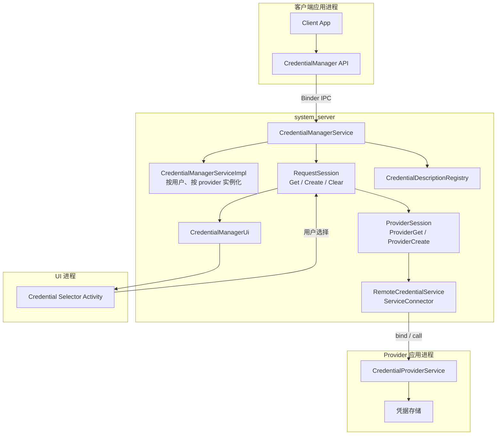
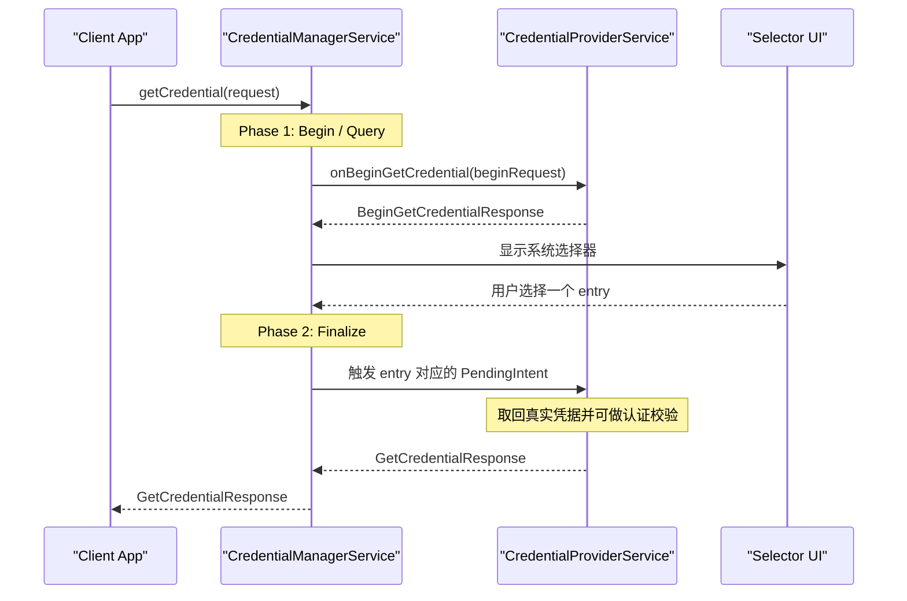
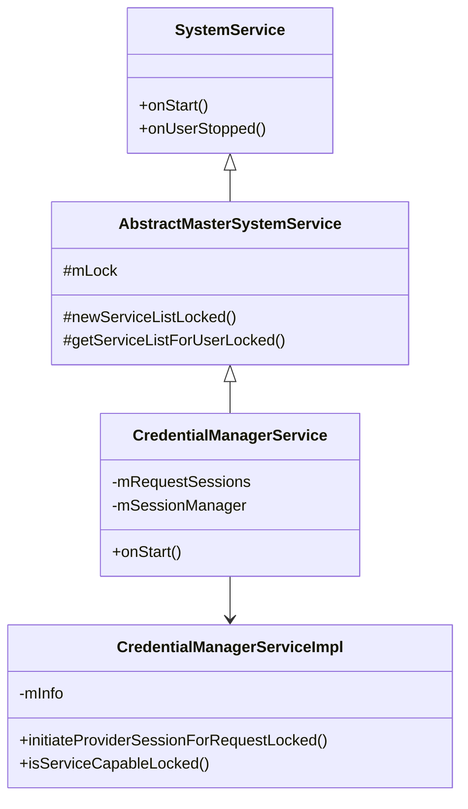
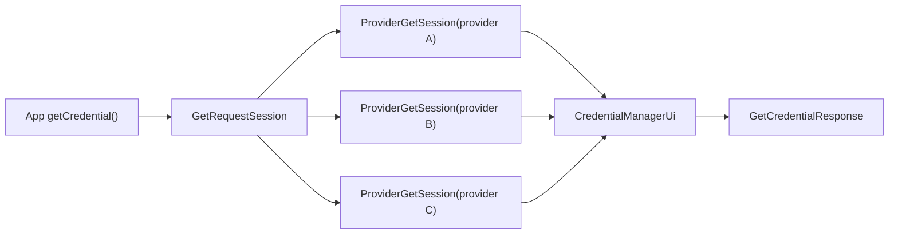
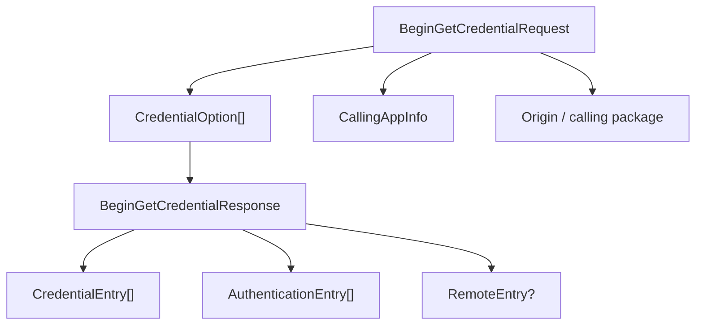
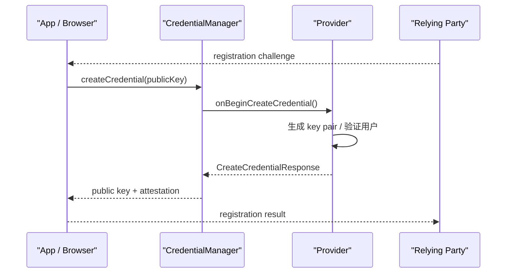
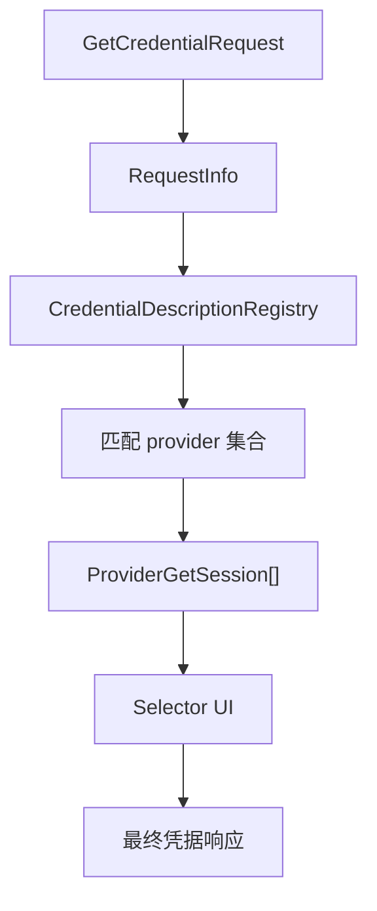
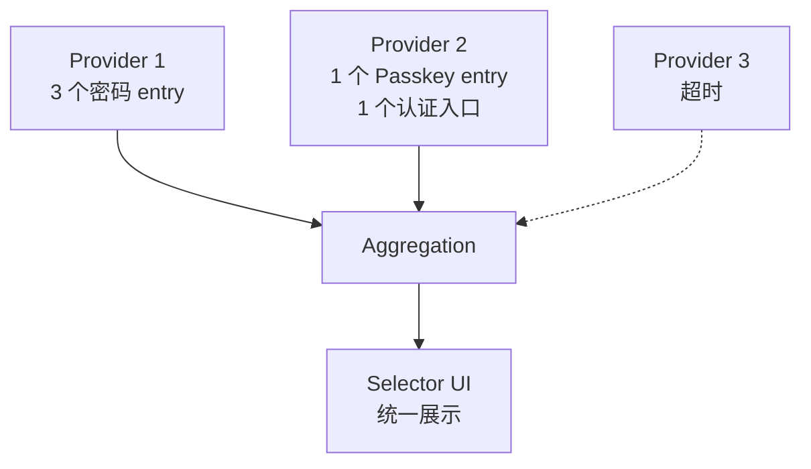
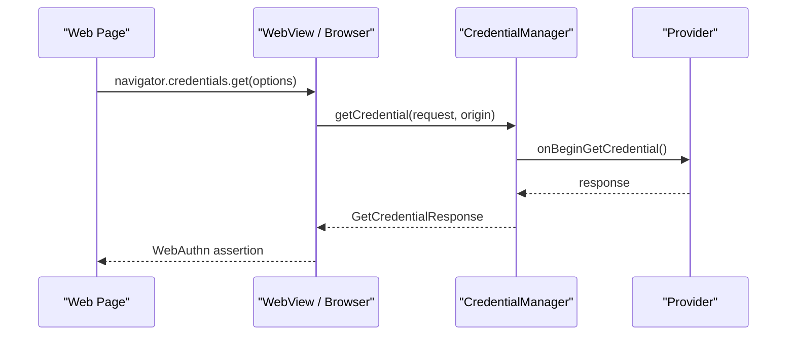

# 第 41 章：Credential Manager 与 Passkeys

Credential Manager 自 Android 14 起进入框架主线，用统一 API 把密码、Passkey、联合登录令牌以及数字身份证件等凭据访问收拢到一个系统服务里。它替代了过去 `AutofillService`、`AccountManager`、Play Services FIDO2 SDK 和第三方密码管理器各自为政的局面，让“请求方应用、系统仲裁层、凭据提供方应用”三者之间形成统一协议。

本章沿着 `CredentialManager` 客户端 API、`CredentialManagerService`、provider session、系统选择器 UI 与 `CredentialProviderService` 的执行路径，分析这一套框架在 AOSP 中的真实落地方式。涉及的主要源码位于 `frameworks/base/services/credentials/` 与 `frameworks/base/core/java/android/credentials/`。

---

## 41.1 Credential Manager 架构

### 41.1.1 问题背景

在 Credential Manager 出现之前，Android 上的凭据访问主要分散在几套彼此独立的机制中：

| 机制 | 局限 |
|---|---|
| `AccountManager` | 更偏向账号令牌管理，没有统一的 Passkey 支持 |
| Autofill Framework（`AutofillService`） | 设计目标是表单填充，不适合现代凭据类型 |
| FIDO2 库（Play Services） | 依赖专有实现，AOSP 设备不可直接使用 |
| 第三方密码管理器 | 每家都要求应用单独接入 |

这导致应用如果既想支持密码，又想支持 Passkey 或联合登录，就必须维护多套接入路径。用户也需要分别配置不同入口，最终带来体验不一致、能力碎片化和安全边界不清晰的问题。

### 41.1.2 设计目标

Credential Manager 的核心设计目标可以概括为 5 点：

1. 单一 API 面向所有凭据类型。
2. 允许任意应用以 provider 形式插拔接入。
3. 凭据选择 UI 由系统统一托管，避免请求方应用私自塑造欺骗性界面。
4. 使用“两阶段协议”，先做轻量查询，再在用户确认后取回真实凭据。
5. 以 Android user 为边界实现隔离，不同用户拥有独立 provider 配置。

### 41.1.3 高层架构

下图展示了 Credential Manager 的主要参与者：



关键源码路径如下：

| 组件 | 路径 |
|---|---|
| `CredentialManagerService` | `frameworks/base/services/credentials/java/com/android/server/credentials/CredentialManagerService.java` |
| `CredentialManagerServiceImpl` | `frameworks/base/services/credentials/java/com/android/server/credentials/CredentialManagerServiceImpl.java` |
| `RequestSession` | `frameworks/base/services/credentials/java/com/android/server/credentials/RequestSession.java` |
| `ProviderSession` | `frameworks/base/services/credentials/java/com/android/server/credentials/ProviderSession.java` |
| `RemoteCredentialService` | `frameworks/base/services/credentials/java/com/android/server/credentials/RemoteCredentialService.java` |
| `CredentialManagerUi` | `frameworks/base/services/credentials/java/com/android/server/credentials/CredentialManagerUi.java` |
| `CredentialProviderService` | `frameworks/base/core/java/android/service/credentials/CredentialProviderService.java` |
| `Credential` | `frameworks/base/core/java/android/credentials/Credential.java` |

### 41.1.4 核心抽象

Credential Manager 用几层统一抽象把不同类型的凭据折叠到同一协议里。

`Credential` 是最后返回给请求方应用的凭据容器，内部只保留一个 type 字符串与一个 `Bundle`：

```java
// Source: frameworks/base/core/java/android/credentials/Credential.java
public final class Credential implements Parcelable {
    public static final String TYPE_PASSWORD_CREDENTIAL =
            "android.credentials.TYPE_PASSWORD_CREDENTIAL";

    private final String mType;
    private final Bundle mData;
}
```

常见 type 包括：

| Type 常量 | 含义 |
|---|---|
| `TYPE_PASSWORD_CREDENTIAL` | 用户名密码 |
| `"androidx.credentials.TYPE_PUBLIC_KEY_CREDENTIAL"` | Passkey / WebAuthn 公钥凭据 |
| `"com.credman.IdentityCredential"` | 数字身份证件 |
| 自定义 type 字符串 | provider 自定义能力 |

其他几个关键对象：

- `CredentialOption`：由请求方应用传入，描述它要查找哪类凭据。
- `CredentialProviderInfo`：描述设备上已安装 provider 的元数据。
- `RequestInfo`：把 get/create 等请求类型标准化，供系统 UI 和 session 统一处理。
- `CredentialDescriptionRegistry`：为数字凭据场景维护“描述信息到 provider”的快速匹配表。

### 41.1.5 两阶段协议

Credential Manager 的关键设计不是“一次调用直接拿到结果”，而是拆成 Begin 和 Finalize 两个阶段。

下图展示 `getCredential()` 的标准时序：



Phase 1 只返回轻量元数据，例如有哪些密码、哪些 Passkey、是否需要解锁 provider vault、是否有 hybrid / remote entry；Phase 2 才在用户明确选中后获取真正的敏感数据。

这样做有几层直接收益：

- 系统不会提前拿到原始凭据。
- 请求方应用在用户确认前也拿不到任何真实 credential material。
- provider 可以在最终返回前插入解锁、PIN、BiometricPrompt 等认证步骤。

### 41.1.6 服务注册与发现

`CredentialManagerService` 在 `SystemServer` 中注册为系统服务，对外暴露名为 `Context.CREDENTIAL_SERVICE` 的 Binder 入口：

```java
// Source: frameworks/base/services/credentials/java/com/android/server/credentials/CredentialManagerService.java
@Override
public void onStart() {
    publishBinderService(CREDENTIAL_SERVICE, new CredentialManagerServiceStub());
}
```

客户端因此可以直接通过：

```java
CredentialManager cm = context.getSystemService(CredentialManager.class);
```

获得入口，而不需要理解 provider 发现、策略检查或 UI 编排细节。

## 41.2 CredentialManagerService

### 41.2.1 服务层级

`CredentialManagerService` 不是简单的单例服务，而是继承 `AbstractMasterSystemService`，利用 Android 框架中“master service + per-user child service”的通用模式管理每个用户下的 provider 列表与请求 session。

下图展示其继承关系和主要对象：



`CredentialManagerServiceImpl` 代表“某个用户下、某个 provider 的服务实例视角”，而 `CredentialManagerService` 负责总调度与 Binder 入口。

### 41.2.2 构造函数与 settings resolver

服务构造时使用 `SecureSettingsServiceNameResolver` 解析用户当前启用的 provider：

```java
// Source: frameworks/base/services/credentials/java/com/android/server/credentials/CredentialManagerService.java
public CredentialManagerService(@NonNull Context context) {
    super(
            context,
            new SecureSettingsServiceNameResolver(
                    context, Settings.Secure.CREDENTIAL_SERVICE,
                    /* isMultipleMode= */ true),
            null,
            PACKAGE_UPDATE_POLICY_REFRESH_EAGER);
    mContext = context;
}
```

这段代码体现了几个策略：

| 参数 | 作用 |
|---|---|
| `Settings.Secure.CREDENTIAL_SERVICE` | 用于保存当前用户启用的 provider 集合 |
| `isMultipleMode = true` | 允许同时启用多个 provider |
| `PACKAGE_UPDATE_POLICY_REFRESH_EAGER` | provider 包升级后立即刷新缓存 |

### 41.2.3 系统 provider 与用户可配置 provider

Credential Manager 同时支持两类 provider：

- 系统 provider：通常由系统镜像内置，具备更强的系统信任关系。
- 用户可配置 provider：由用户安装并在设置中启用。

系统会在 provider 发现阶段分别检查：

1. 是否声明了正确的 service intent action。
2. 是否带有合法 metadata。
3. 是否具备所声明的 capability。
4. 对系统 provider 是否满足签名或系统应用约束。

这套分流是为了兼顾开放性与安全性。普通第三方密码管理器可以参与，但某些高信任入口，比如 remote / hybrid entry 或 OEM 预置服务，会受到更严格筛选。

### 41.2.4 RequestSession 管理

每次外部调用 `getCredential()`、`createCredential()` 或 `clearCredentialState()`，系统都会创建一个新的 `RequestSession`。它是贯穿整个请求生命周期的核心对象，负责：

- 记录请求方包名、调用 UID、userId。
- 生成要访问的 provider session 集合。
- 跟踪 UI 是否已显示、是否仍在等待 provider 响应。
- 在成功、失败、超时或取消时统一清理状态。

`SessionManager` 负责把活跃会话按 `IBinder token` 挂到 map 中，既能支持并发请求，也能在客户端死亡时准确回收对应 session。

### 41.2.5 Binder Stub：`CredentialManagerServiceStub`

对外 Binder 接口集中在 `CredentialManagerServiceStub` 中。其职责不止是简单转发，还会在进入真实执行逻辑前完成：

- 调用者身份校验。
- userId 解析。
- 权限与 AppOps 检查。
- 对请求参数的合法性验证。
- 将调用切换到服务内部同步上下文。

这层设计保证请求方应用无法绕过系统仲裁，直接构造 provider 调用。

### 41.2.6 `getCredential()` 详细流程

`getCredential()` 是整个框架最关键的一条路径，可以拆成 8 个步骤：

1. 请求方应用通过 `CredentialManager` 发起 Binder 调用。
2. `CredentialManagerServiceStub` 完成身份与参数检查。
3. 服务创建 `GetRequestSession`。
4. 为每个启用且 capability 匹配的 provider 创建 `ProviderGetSession`。
5. 通过 `RemoteCredentialService` 并行绑定 provider，并发送 `BeginGetCredentialRequest`。
6. 汇总 provider 返回的 `credential entries`、`authentication actions`、`remote entry`。
7. `CredentialManagerUi` 拉起系统选择器，让用户决定最终使用哪个 entry。
8. 选中后触发对应 `PendingIntent`，provider 最终返回 `GetCredentialResponse`。

下图展示了系统内部的会话拆分：



其中有几个容易忽略的点：

- provider 查询是并行发起的，不是串行。
- 系统会等待所有 provider 返回，或等到超时窗口结束。
- provider 返回的是 entry 元数据，不是凭据本体。
- selector UI 的最终排序和呈现不由 provider 自己决定，而由系统仲裁。

### 41.2.7 `createCredential()` 流程

`createCredential()` 的模式与 `getCredential()` 类似，但语义从“取回已有凭据”变成“保存新凭据”。系统会构造 `CreateRequestSession` 和 `ProviderCreateSession`，再由 provider 决定如何把密码、Passkey 或其他数字凭据保存到自己的 vault 中。

和 get 流不同的是：

- create UI 更接近“是否保存到某 provider”的确认流程。
- primary provider 在排序上通常更靠前。
- provider 响应中更强调保存目标与最终确认信息。

### 41.2.8 权限模型

Credential Manager 的权限模型分三层：

1. 请求方应用只能访问框架公开 API，看不到 provider 私有实现。
2. provider 必须通过 `CredentialProviderService` 受控暴露能力。
3. 某些特殊能力，例如设置 web origin，需要额外的高权限控制。

尤其在 WebAuthn / 浏览器集成场景里，origin 是安全边界的一部分，系统不会允许普通应用任意伪造。

### 41.2.9 包生命周期处理

provider 是普通 Android 包，因此安装、升级、卸载、禁用都会影响可用性。`CredentialManagerService` 利用 master system service 框架自带的包变更监听，在包状态变化后：

- 重新扫描 provider。
- 刷新 capability 缓存。
- 失效旧 session 中不再可达的 provider 连接。
- 在必要时更新 settings 中的 provider 列表。

这保证系统不会在 provider 升级或消失后继续持有陈旧的能力视图。

## 41.3 Credential Providers

### 41.3.1 `CredentialProviderService` 协议

provider 侧的核心入口是 `CredentialProviderService`。它定义了一组框架回调，provider 必须按协议实现：

- `onBeginGetCredential()`
- `onBeginCreateCredential()`
- `onClearCredentialState()`

这些回调面对的是“begin 阶段”的轻量请求，而不是直接返回真实凭据。provider 必须返回 entry、action、`PendingIntent` 以及必要的附加元数据。

### 41.3.2 Manifest 声明

要成为 provider，应用需要在 manifest 中声明对应 service、intent filter 和 metadata。典型形式如下：

```xml
<service
    android:name=".MyCredentialProviderService"
    android:exported="true"
    android:permission="android.permission.BIND_CREDENTIAL_PROVIDER_SERVICE">
    <intent-filter>
        <action android:name="android.service.credentials.CredentialProviderService" />
    </intent-filter>
    <meta-data
        android:name="android.credentials.provider"
        android:resource="@xml/credential_provider" />
</service>
```

`android.permission.BIND_CREDENTIAL_PROVIDER_SERVICE` 保证只有系统能够绑定这个 service，普通应用无法直接绕过 Credential Manager 服务调用 provider。

### 41.3.3 capability 检查

provider 的 metadata 需要声明自己支持哪些 credential type。系统扫描安装包时会把这些 capability 解析为 `CredentialProviderInfo`，后续只有当请求中的 `CredentialOption` 与 provider capability 匹配时，才会创建对应 session。

这一步很重要，因为它避免系统把所有请求无差别广播给所有 provider，减少无效唤醒，也降低暴露面。

### 41.3.4 `BeginGetCredentialRequest` 与响应

`BeginGetCredentialRequest` 里包含请求方应用信息、候选查询条件、origin 信息以及若干 `CredentialOption`。provider 在 begin 阶段返回的是：

- `CredentialEntry`：可供用户直接选择的候选凭据。
- `AuthenticationEntry`：提示“先解锁 provider 再看凭据”的入口。
- `RemoteEntry`：例如跨设备或 OEM 远程凭据入口。

下图展示 begin 阶段的数据结构：



provider 应该在这个阶段只返回足以驱动 UI 选择的最小信息，例如账号显示名、凭据类型、是否需要额外认证，而不是原始密码或签名结果。

### 41.3.5 `RemoteCredentialService` 连接

system_server 不会直接持有 provider 对象，而是通过 `RemoteCredentialService` 封装绑定与调用过程。其职责包括：

- 与 provider service 建立绑定。
- 处理超时与断连。
- 将 begin 请求转换为异步回调。
- 在 provider 卡死、崩溃或未响应时上报失败状态。

这里底层通常复用 `ServiceConnector` 模式，以减少每个系统服务都重复实现一套绑定状态机。

### 41.3.6 `ProviderSession` 状态机

每个 provider 对应一个 `ProviderSession`，它有自己的状态流转，例如：

1. `PENDING`：尚未发起远程调用。
2. `CREDENTIALS_RECEIVED`：provider 已返回 begin 结果。
3. `UI_INTERACTION`：等待用户在 selector 中选择。
4. `COMPLETE`：成功完成。
5. `CANCELED` / `FAILED`：取消或失败。

这层拆分使得一个请求可以同时聚合多个 provider，而不需要把每个 provider 的连接、超时和结果状态都塞在 `RequestSession` 里。

### 41.3.7 指标收集

Credential Manager 会为关键路径采集 metrics，例如：

- provider 响应耗时。
- 是否超时。
- UI 是否展示。
- 用户是否选中某 entry。
- create / get / clear 的失败类型。

这既用于平台质量评估，也能帮助 OEM 或 AOSP 工程师定位 provider 兼容性问题。

## 41.4 Passkeys 与 FIDO2

### 41.4.1 什么是 Passkey

Passkey 在 Android 里本质上是对 WebAuthn / FIDO2 公钥凭据的一种系统级集成。与密码不同，它依赖公私钥对：

- 服务端保存公钥。
- 设备侧 provider 保存私钥或其安全引用。
- 登录时执行 challenge-response，而不是传输密码本体。

这天然降低了撞库、钓鱼和密码重复使用的风险。

### 41.4.2 Passkey 创建（注册）

Passkey 注册流程可以概括为：

1. 应用或浏览器拿到服务端提供的 WebAuthn registration challenge。
2. 调用 `createCredential()`，传入 public-key credential option。
3. `CredentialManagerService` 选择合适 provider。
4. provider 可能要求用户通过生物识别或设备凭据确认。
5. provider 生成 key pair，并返回 attestation / public key 等注册结果。
6. 应用把结果上传给服务端完成注册。

下图展示该流程：



Passkey 创建真正的安全边界不在 UI，而在 origin / RP ID 校验与 provider 自身密钥保护策略。

### 41.4.3 Passkey 认证（Assertion）

认证流程与注册类似，但目标变成产生 assertion：

1. 服务端下发 challenge。
2. 应用调用 `getCredential()`。
3. provider 返回可用 Passkey entry。
4. 用户选择某个 entry。
5. provider 用私钥对 challenge 做签名，返回 assertion。
6. 应用把 assertion 发回服务端验证。

这里系统最关键的工作仍然是“仲裁 provider + 托管 selector UI + 保证调用上下文可信”。

### 41.4.4 origin 校验

origin 是 WebAuthn 安全模型的核心。浏览器或 WebView 在与 Credential Manager 集成时，必须把真实网页 origin 传递给框架。provider 会利用 origin 与 RP ID 关系做校验，防止：

- 恶意应用伪装成任意网站。
- 不同域名之间窃取 Passkey。
- 被嵌入的 WebView 绕过站点边界。

因此，能设置 origin 的调用方通常需要更高权限。

### 41.4.5 Hybrid / 跨设备认证

Credential Manager 还支持 hybrid 或跨设备认证入口，即用户在本机发起登录，但真正可用的 Passkey 位于其他设备或 OEM 特定通道中。系统在 UI 上通常把这类能力包装成 remote entry。

它的意义在于让用户不必把所有 Passkey 都绑定在单台设备上，同时又能保持统一入口。

### 41.4.6 Attestation

Attestation 不是每次都必须启用，但在某些 relying party 场景下，它可用于证明：

- 凭据是在可信 provider 中生成的。
- 密钥是否受硬件支持保护。
- 平台环境满足某些安全要求。

Android 框架本身不直接代替 provider 完成所有 attestation 逻辑，但会把相应结果通过 Credential Manager 协议返还给请求方应用。

## 41.5 密码与 Autofill 集成

### 41.5.1 Password Credential

密码凭据在 Credential Manager 里仍然是一等公民。对于大量尚未升级到 Passkey 的服务，这能让平台在不强迫开发者重写所有登录逻辑的前提下，把传统密码与新型凭据统一放进一个选择器里。

密码类凭据的典型数据包括：

- 用户名
- 密码
- 显示标签
- 来源 provider

### 41.5.2 Autofill bridge

Android 没有粗暴废弃 Autofill，而是提供了桥接路径。对于表单触发式登录体验，Credential Manager 可以与 Autofill bridge 结合，提前预热 provider 绑定或缓存预查询结果，从而避免用户点进输入框时再做完整 provider 扫描。

这也是 `PrepareGetRequestSession` 存在的一个重要背景。

### 41.5.3 Autofill placeholder

在某些 UI 里，系统不会立即弹出完整 selector，而是先展示更轻量的 placeholder 或建议入口，等用户进一步交互后再转入完整选择流程。这种设计既能维持现有 Autofill 交互习惯，也能逐步把底层能力迁移到 Credential Manager。

### 41.5.4 迁移路径

从平台演进角度看，迁移路径大致是：

1. 旧应用继续使用 Autofill。
2. 通过 Jetpack `androidx.credentials` 封装统一 API。
3. Android 14+ 设备上 Jetpack 直接落到 framework Credential Manager。
4. 旧版设备则可通过兼容后端继续工作。

这样开发者可以逐步迁移，不需要为不同 Android 版本维护完全分裂的登录栈。

## 41.6 数字凭据

### 41.6.1 身份证件类凭据

Credential Manager 不只处理密码和 Passkey，也把数字身份证件、可验证声明等身份类凭据纳入框架。典型场景包括：

- 数字驾照
- 电子身份证
- 学生证 / 工卡
- 可验证年龄或资格声明

### 41.6.2 `CredentialDescriptionRegistry`

对数字凭据而言，往往不能像密码那样简单依赖“用户名”或“域名”匹配。AOSP 因此引入 `CredentialDescriptionRegistry`，用来维护 provider 注册的 credential description 信息，并在请求到来时做更快的匹配。

它的角色可以理解为一个系统级索引：

- provider 注册自己支持的 credential description。
- get 请求带着 element key 或描述要求进入系统。
- 注册表快速筛掉明显无关的 provider。

### 41.6.3 注册与匹配流程

当 provider 注册数字凭据描述后，系统会把这些描述与 provider 关联存放。请求侧如果指定所需元素，例如某种证件字段集合，就可以在真正拉起 provider 前先做 registry 过滤。

这能减少：

- 不相关 provider 被无意义唤醒。
- 大量复杂数字凭据场景下的匹配成本。
- selector UI 出现噪声项。

### 41.6.4 基于 registry 的 get 流

下图展示 registry 参与的 get 流：



普通密码 / Passkey 主要靠 capability 和 option type 做匹配，数字凭据则进一步依赖 description registry 提高精准度。

### 41.6.5 Verifiable Presentations

在更高级的数字身份场景下，provider 返回的不只是静态文档，而可能是经过选择披露、最小化揭示甚至动态签名的 presentation。Credential Manager 框架本身不强行规定每种 presentation 语义，但它提供了一个让 provider 接管复杂身份表达、而系统仍控制入口与交互的基础容器。

## 41.7 内部实现深入分析

### 41.7.1 `CredentialManagerUi` 内部机制

`CredentialManagerUi` 负责把系统服务内部的 session 结果转成可视化选择器请求。它会：

- 聚合 provider entries。
- 构造 selector activity 需要的 intent / extras。
- 接收用户取消、返回或选中事件。
- 把结果回送给 `RequestSession`。

这里的关键点是 UI 是系统托管，而不是 provider 直接在第一阶段自定义整套入口。

### 41.7.2 `ProviderGetSession` 细节

`ProviderGetSession` 是 `ProviderSession` 在 get 流中的具体实现。它负责：

- 将 `CredentialOption` 转换为 provider 可消费的 begin 请求。
- 跟踪 provider 返回的 `CredentialEntry`、`AuthenticationEntry`、`RemoteEntry`。
- 处理 provider 超时、错误与取消。

从结构上看，它把“provider 视角下的 get 请求状态”单独封装出来，避免 `GetRequestSession` 变成一团耦合逻辑。

### 41.7.3 `ProviderCreateSession` 细节

create 流对应 `ProviderCreateSession`。它要额外考虑：

- 哪个 provider 是主 provider。
- 哪些 create option 与 provider capability 匹配。
- 保存请求的 UI 呈现方式。
- provider 对最终确认的需求。

相比 get 流，create 流更像一次“保存决策”的管理过程。

### 41.7.4 `ClearRequestSession`

当应用调用清除凭据状态相关 API 时，系统会创建 `ClearRequestSession`。这不是删除 provider 数据本身的通用后门，而是让 provider 有机会清理与当前应用或当前会话相关的本地状态，例如：

- 撤销活跃登录态缓存。
- 失效某些本地会话标记。
- 清空与 app 绑定的临时状态。

### 41.7.5 设置集成

Credential Manager 的 provider 启用状态主要挂在 `Settings.Secure.CREDENTIAL_SERVICE` 这类 user-scoped 配置下，因此：

- 每个用户配置独立。
- 设置 app 可以展示 provider 开关。
- shell / test 也可通过 `settings` 命令直接观察状态。

这让系统既能保持可审计性，也便于测试环境快速切换 provider。

### 41.7.6 错误分类

框架需要把 provider 内部错误、调用者错误、超时和用户取消区分开，否则上层很难做稳定处理。常见类别包括：

- 参数非法。
- 未找到可用凭据。
- provider 绑定失败。
- provider begin 超时。
- 用户取消。
- provider 最终返回错误。

这种错误分类会同时影响 API 返回语义与 metrics 采集结果。

### 41.7.7 取消架构

session 取消来源可能有几种：

1. 请求方主动 cancel。
2. selector UI 被用户关闭。
3. provider 自己报告取消。
4. 客户端进程死亡触发 binder death。

框架因此需要一个统一取消链，确保：

- UI 被关闭。
- provider 回调不再继续消费。
- request session 从活跃集合中移除。

### 41.7.8 线程模型

Credential Manager 位于 `system_server`，因此线程模型必须兼顾 Binder 入口、服务内部锁以及异步 service 连接回调。通常思路是：

- Binder 线程负责接收请求。
- 共享锁保护 session map 和 provider 列表。
- provider 连接回调异步触发结果合并。
- UI 结果再回流到对应 request session。

如果没有清晰的线程划分，很容易在 provider 回调和 session 清理之间引发竞态。

### 41.7.9 Feature Flags

部分能力可通过 `DeviceConfig` 或 feature flag 控制，例如：

- 是否启用 Credential Manager。
- 是否启用 credential description API。
- 某些实验性 UI 或 provider 行为。

这让平台可以在不改 API 形状的前提下灰度演进实现。

### 41.7.10 安全考量

Credential Manager 的安全边界主要包括：

- 请求方应用不能绕过系统直接操控 provider 协议。
- provider service 只能被系统绑定。
- origin 必须可信传递。
- selector UI 由系统掌控，降低钓鱼风险。
- provider 不应在 begin 阶段泄露敏感数据。

这几个点共同保证它比“应用内自己集成第三方密码 SDK”更容易建立一致的系统级安全模型。

### 41.7.11 测试支持

AOSP 为该框架预留了多种测试辅助能力，例如：

- 绕过部分 provider 检查的 testing-only 入口。
- 清理 `CredentialDescriptionRegistry` 的测试接口。
- 通过 Jetpack `credentials-testing` 提供 fake backend。

这些能力有助于在 CTS、单元测试和 provider 自测场景下稳定重现行为。

### 41.7.12 Jetpack Credential Manager 与 framework API

`androidx.credentials` 的意义不只是“包一层 API”，更关键的是提供跨版本兼容路径：

| 维度 | Framework API | Jetpack |
|---|---|---|
| 可用版本 | Android 14+ | Android 4.4+ |
| Passkey 类型包装 | 更底层，依赖 `Bundle` | 提供更易用的封装类 |
| Google 登录 | 不内建 | 可通过扩展封装整合 |
| 旧系统支持 | 无 | 走兼容后端 |

因此业务代码通常优先接 Jetpack，而 AOSP 工程师更关注其在新系统上如何落到 framework 实现。

### 41.7.13 Session 生命周期与清理

`RequestSession` 结束后必须被及时移出 `mRequestSessions`。结束原因可能包括：

- 成功返回。
- 失败。
- 超时。
- Binder death。
- 用户取消。

如果遗漏清理，system_server 会持续持有 provider 连接和请求上下文，既浪费内存，也可能造成 UI 状态错乱。

### 41.7.14 Provider 响应聚合策略

多 provider 并存时，系统要解决“结果如何统一呈现”的问题。典型规则包括：

1. 所有匹配 provider 并行查询。
2. 等待所有 provider 返回或超时。
3. 合并所有 credential entry。
4. 单独保留各 provider 的 authentication action。
5. remote entry 通常只展示一个。
6. create 流中 primary provider 可能获得更高展示优先级。

下图展示一个简单聚合示意：



### 41.7.15 `PrepareGetRequestSession`

`PrepareGetRequestSession` 主要服务于预查询场景。它允许系统先完成 provider 查询，把结果缓存住，等用户真的点中输入框或触发需要凭据的操作时，再快速进入下一步。

这是 Autofill bridge、预热与低时延体验的重要组成部分。

### 41.7.16 Provider 信息工厂

`CredentialProviderInfoFactory` 负责：

- 通过 `PackageManager` 搜索声明了 provider service 的组件。
- 读取 metadata XML。
- 判断 capability。
- 对系统 provider 做额外校验。

它相当于“安装包世界”与“运行中 provider 视图”之间的转换器。

### 41.7.17 请求类型与 `RequestInfo`

`RequestInfo` 会把请求归一成若干常见类型，例如：

- `TYPE_GET`
- `TYPE_CREATE`
- `TYPE_GET_VIA_REGISTRY`

请求类型会直接影响：

- selector UI 选用哪种布局。
- 是否强调主 provider。
- 系统如何排序和展示 entry。

### 41.7.18 禁用 provider 数据

系统 UI 有时不只展示“当前启用 provider”，也会附带一些禁用 provider 信息，提示用户：

- 还有其他已安装 provider 可以启用。
- 某 provider 具备当前所需能力，但尚未激活。
- 可以通过设置页进一步管理 provider。

这使得 Credential Manager 同时具备“执行一次凭据请求”和“帮助用户发现凭据来源”的能力。

### 41.7.19 与 WebView / 浏览器集成

WebAuthn 在浏览器与 WebView 中的接入，是 Credential Manager 最关键的现实场景之一。浏览器需要把 JavaScript 世界的：

- `navigator.credentials.create()`
- `navigator.credentials.get()`

映射成 Android Credential Manager 请求，并负责 origin 传递与结果格式回填。

下图展示这一桥接关系：



### 41.7.20 与锁屏交互

Credential Manager 与锁屏的交点主要有 4 个方面：

1. provider 最终返回前可能要求生物识别或设备凭据确认。
2. 直接开机模式（Direct Boot）下，很多基于 CE 存储的凭据尚不可用。
3. OEM 可把某些认证体验嵌入锁屏流程。
4. 认证 UI 的可信呈现必须与系统锁屏安全状态一致。

### 41.7.21 性能特征

典型时延大致如下：

| 阶段 | 大致耗时 | 瓶颈 |
|---|---|---|
| session 创建 | 1-5 ms | 对象分配、锁 |
| provider 绑定 | 50-200 ms | Service 连接建立 |
| begin 查询 | 100-500 ms | provider 搜索凭据 |
| UI 展示 | 50-100 ms | Activity 拉起 |
| 用户选择 | 不确定 | 人机交互 |
| provider finalize | 100-300 ms | 真正取回凭据、认证 |
| 最坏情况 | 3000 ms | provider 超时上限 |

平台侧的优化手段主要包括预热 provider、`PrepareGetRequestSession`、registry 过滤与并行查询。

## 41.8 动手实践

### 41.8.1 检查 Credential Manager 状态

```bash
adb shell settings get secure credential_service
adb shell cmd credential_manager list-providers
adb shell dumpsys credential_manager
```

先看当前用户启用了哪些 provider，再通过 `dumpsys` 观察服务内部状态。

### 41.8.2 启用某个 provider

```bash
adb shell settings put secure credential_service com.example.provider/.MyCredentialProviderService
adb shell cmd credential_manager set-primary-provider com.example.provider/.MyCredentialProviderService
```

这类操作通常需要高权限环境或测试设备。

### 41.8.3 实现最小 provider

```kotlin
class MyCredentialProviderService : CredentialProviderService() {
    override fun onBeginGetCredential(
        request: BeginGetCredentialRequest,
        cancellationSignal: CancellationSignal,
        callback: OutcomeReceiver<BeginGetCredentialResponse, GetCredentialException>
    ) {
        val entry = CredentialEntry(
            "android.credentials.TYPE_PASSWORD_CREDENTIAL",
            Bundle(),
            PendingIntent.getActivity(this, 0, Intent(this, UnlockActivity::class.java), PendingIntent.FLAG_IMMUTABLE)
        )
        callback.onResult(
            BeginGetCredentialResponse.Builder()
                .addCredentialEntry(entry)
                .build()
        )
    }
}
```

最小实现的重点不是功能完整，而是先把 manifest、metadata、service 协议和 selector 交互跑通。

### 41.8.4 调试 provider 通信

```bash
adb logcat -s CredentialManager CredentialManagerService CredentialProviderService
adb shell dumpsys activity services | grep -i credential
adb shell dumpsys credential_manager
```

重点观察 provider 是否被成功发现、是否建立绑定、begin 请求是否超时。

### 41.8.5 试验 Credential Description API

```bash
adb shell device_config get credential_manager enable_credential_description_api
adb shell dumpsys credential_manager
```

如果设备启用了 description API，可以进一步跟踪 registry 命中情况。

### 41.8.6 测试 Passkey 流程

```bash
adb logcat -s CredentialManager CredentialManagerService WebView chromium
```

在支持 Passkey 的测试站点上做一次注册和一次登录，重点看：

- begin 请求是否正确到达 provider。
- origin 是否被正确传入。
- selector UI 是否展示 Passkey entry。
- 最终 assertion / registration 结果是否返回给上层。

### 41.8.7 检查 DeviceConfig 开关

```bash
adb shell device_config list credential_manager
adb shell device_config put credential_manager enable_credential_manager false
adb shell device_config put credential_manager enable_credential_manager true
```

适合在测试机上验证 feature flag 对整体行为的影响。

### 41.8.8 观察关键日志序列

一次标准 `getCredential()` 流程里，值得重点关注的日志节点包括：

1. Binder 入口收到请求。
2. 为匹配 provider 创建 `ProviderGetSession`。
3. 发起 provider bind。
4. 收到 begin response。
5. selector UI 拉起。
6. 用户选中 entry。
7. provider 最终返回 `GetCredentialResponse`。
8. session 清理完成。

## Summary

Credential Manager 把 Android 上原本割裂的密码、Passkey、联合登录和数字凭据访问收拢到统一框架里，核心价值不只是“统一 API”，更是把安全边界、UI 仲裁、provider 插拔、并行聚合和跨版本迁移路径都纳入了系统层设计。

本章可以归纳为几个关键点：

- `CredentialManagerService` 是真正的调度中枢，负责请求生命周期、provider 发现、会话聚合与 UI 编排。
- provider 通过 `CredentialProviderService` 受控接入，普通应用无法直接绑定调用。
- 两阶段协议确保 begin 阶段只交换轻量元数据，真实凭据只在用户确认后由 provider 返回。
- Passkey 场景下，origin 校验与 provider 密钥保护是核心安全边界。
- `CredentialDescriptionRegistry` 让数字凭据等复杂场景可以更精准地筛选 provider。
- `PrepareGetRequestSession` 与 Autofill bridge 说明该框架不是简单替代旧方案，而是在演进中保留兼容路径。

关键源码路径如下：

| 路径 | 作用 |
|---|---|
| `frameworks/base/services/credentials/` | system_server 侧服务实现 |
| `frameworks/base/core/java/android/credentials/` | framework API 与数据结构 |
| `frameworks/base/core/java/android/service/credentials/` | provider service 协议 |
| `frameworks/base/packages/CredentialManager/` | 系统 UI 相关实现 |
| `packages/modules/Autofill/` | 与 Autofill / bridge 相关实现入口 |

如果把本章放到 Android 安全与身份体系的大背景里看，Credential Manager 的意义在于：它让“凭据选择”从应用私有逻辑升级为平台级能力，从而使密码管理器、Passkey provider、数字身份证件 provider 和系统 UI 可以在统一协议下协同工作。
