# Chapter 41: Credential Manager and Passkeys

The Credential Manager framework, introduced in Android 14, provides a unified API for
managing user credentials -- passwords, passkeys (FIDO2/WebAuthn), federated sign-in
tokens, and digital identity documents. It replaces the fragmented landscape of
individual autofill services and proprietary sign-in SDKs with a single, pluggable
system service that mediates between requesting apps and credential provider apps.

This chapter traces the complete architecture from the client-facing
`CredentialManager` API through the system service, provider sessions, the selection
UI, and the provider-side `CredentialProviderService`. We ground every description in
the real AOSP source under `frameworks/base/services/credentials/` and
`frameworks/base/core/java/android/credentials/`.

---

## 41.1 Credential Manager Architecture

### 41.1.1 Problem Statement

Before Credential Manager, credential retrieval involved multiple disconnected
mechanisms:

| Mechanism | Limitation |
|---|---|
| `AccountManager` | Only managed account tokens; no standardized passkey support |
| Autofill Framework (`AutofillService`) | Designed for filling views, not modern credential types |
| FIDO2 libraries (Play Services) | Proprietary; not available on AOSP builds |
| Third-party password managers | Each required its own integration path |

Apps needed to call different APIs for passwords versus passkeys versus federated
credentials. Users had to configure each mechanism separately.

### 41.1.2 Design Goals

The Credential Manager was designed around these principles:

1. **Single API surface** -- One call to retrieve any credential type
2. **Pluggable providers** -- Any app can register as a credential provider
3. **System-mediated selection** -- The system controls the credential picker UI
4. **Two-phase protocol** -- An initial "begin" query followed by user-selected finalization
5. **Per-user isolation** -- Each Android user has independent provider configurations

### 41.1.3 High-Level Architecture

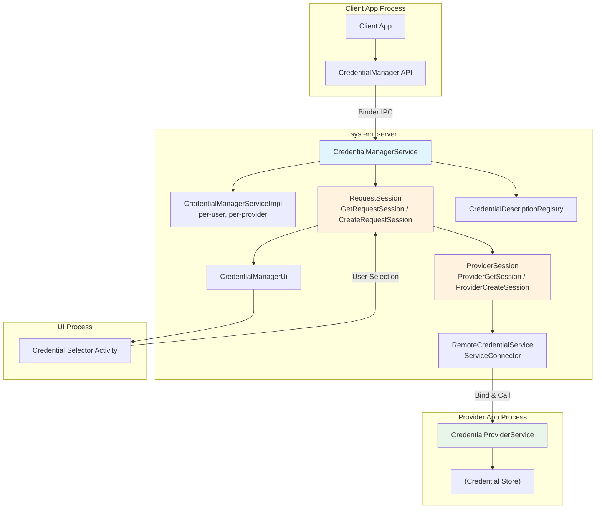
```mermaid
graph TB
    subgraph "Client App Process"
        CA[Client App]
        CM[CredentialManager API]
    end

    subgraph "system_server"
        CMS[CredentialManagerService]
        CMSI["CredentialManagerServiceImpl<br/>per-user, per-provider"]
        RS["RequestSession<br/>GetRequestSession / CreateRequestSession"]
        PS["ProviderSession<br/>ProviderGetSession / ProviderCreateSession"]
        RCS["RemoteCredentialService<br/>ServiceConnector"]
        CMUI[CredentialManagerUi]
        CDR[CredentialDescriptionRegistry]
    end

    subgraph "Provider App Process"
        CPS[CredentialProviderService]
        STORE["(Credential Store)"]
    end

    subgraph "UI Process"
        SEL[Credential Selector Activity]
    end

    CA --> CM
    CM -->|Binder IPC| CMS
    CMS --> CMSI
    CMS --> RS
    RS --> PS
    PS --> RCS
    RCS -->|Bind & Call| CPS
    CPS --> STORE
    RS --> CMUI
    CMUI --> SEL
    SEL -->|User Selection| RS
    CMS --> CDR

    style CMS fill:#e1f5fe
    style RS fill:#fff3e0
    style PS fill:#fff3e0
    style CPS fill:#e8f5e9
```

**Source file locations:**

| Component | Path |
|---|---|
| `CredentialManagerService` | `frameworks/base/services/credentials/java/com/android/server/credentials/CredentialManagerService.java` |
| `CredentialManagerServiceImpl` | `frameworks/base/services/credentials/java/com/android/server/credentials/CredentialManagerServiceImpl.java` |
| `RequestSession` | `frameworks/base/services/credentials/java/com/android/server/credentials/RequestSession.java` |
| `ProviderSession` | `frameworks/base/services/credentials/java/com/android/server/credentials/ProviderSession.java` |
| `RemoteCredentialService` | `frameworks/base/services/credentials/java/com/android/server/credentials/RemoteCredentialService.java` |
| `CredentialManagerUi` | `frameworks/base/services/credentials/java/com/android/server/credentials/CredentialManagerUi.java` |
| `CredentialProviderService` | `frameworks/base/core/java/android/service/credentials/CredentialProviderService.java` |
| `Credential` | `frameworks/base/core/java/android/credentials/Credential.java` |

### 41.1.4 Key Abstractions

The framework introduces several layers of abstraction that allow the system to
handle diverse credential types through a uniform protocol:

**Credential** -- A typed container holding credential data. The `Credential` class
(`frameworks/base/core/java/android/credentials/Credential.java`) carries a type
string and a `Bundle` of data:

```java
// From Credential.java
public final class Credential implements Parcelable {
    public static final String TYPE_PASSWORD_CREDENTIAL =
            "android.credentials.TYPE_PASSWORD_CREDENTIAL";

    private final String mType;
    private final Bundle mData;
}
```

Specific credential types are identified by string constants:

| Type Constant | Credential Kind |
|---|---|
| `TYPE_PASSWORD_CREDENTIAL` | Username/password pair |
| `"androidx.credentials.TYPE_PUBLIC_KEY_CREDENTIAL"` | Passkey (FIDO2/WebAuthn) |
| `"com.credman.IdentityCredential"` | Digital identity document |
| Custom type strings | Provider-defined credentials |

**CredentialOption** -- Specifies what the client app is requesting. Each option
carries a type, retrieval data (a `Bundle`), and candidate query data.

**CredentialProviderInfo** -- Metadata about an installed credential provider,
including its `ComponentName`, capabilities (supported credential types), and whether
it is a system provider.

### 41.1.5 The Two-Phase Protocol

A fundamental design choice is the two-phase communication between system_server
and credential providers:

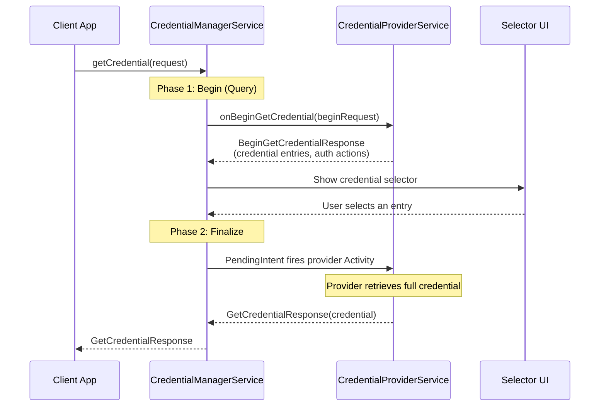
```mermaid
sequenceDiagram
    participant App as Client App
    participant CMS as CredentialManagerService
    participant Prov as CredentialProviderService
    participant UI as Selector UI

    App->>CMS: getCredential(request)
    Note over CMS: Phase 1: Begin (Query)
    CMS->>Prov: onBeginGetCredential(beginRequest)
    Prov-->>CMS: BeginGetCredentialResponse<br/>(credential entries, auth actions)

    CMS->>UI: Show credential selector
    UI-->>CMS: User selects an entry

    Note over CMS: Phase 2: Finalize
    CMS->>Prov: PendingIntent fires provider Activity
    Note over Prov: Provider retrieves full credential
    Prov-->>CMS: GetCredentialResponse(credential)
    CMS-->>App: GetCredentialResponse
```

**Phase 1 (Begin/Query):** The system sends a `BeginGetCredentialRequest` to each
enabled provider. Providers respond with lightweight metadata -- credential entries
describing available credentials, authentication actions if the provider is locked,
and optional remote entries. No actual credential data is exchanged yet.

**Phase 2 (Finalize):** After the user selects an entry from the system UI, the
system fires the `PendingIntent` attached to that entry. The provider's Activity
retrieves the full credential (possibly after biometric verification) and returns
it via `Activity.setResult()`.

This two-phase approach has important security properties:

- Credential material is never loaded into memory until the user explicitly selects it
- The system never holds raw credentials; it only brokers metadata
- Providers can require authentication (unlock, biometrics) before revealing data

### 41.1.6 Service Registration and Discovery

Credential Manager is registered as a system service during `SystemServer` startup:

```java
// From CredentialManagerService.java
@Override // from SystemService
public void onStart() {
    publishBinderService(CREDENTIAL_SERVICE, new CredentialManagerServiceStub());
}
```

The service name is `Context.CREDENTIAL_SERVICE`, making it accessible via:

```java
CredentialManager cm = context.getSystemService(CredentialManager.class);
```

---

## 41.2 CredentialManagerService

### 41.2.1 Service Hierarchy

`CredentialManagerService` extends `AbstractMasterSystemService`, a framework
pattern for services that manage per-user child services. The class hierarchy is:

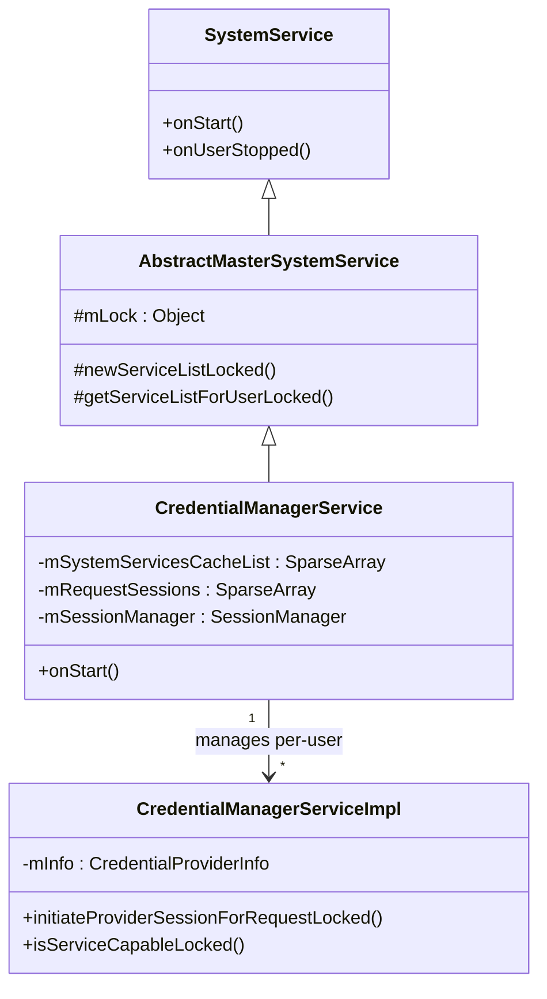
```mermaid
classDiagram
    class SystemService {
        +onStart()
        +onUserStopped()
    }
    class AbstractMasterSystemService {
        #newServiceListLocked()
        #getServiceListForUserLocked()
        #mLock : Object
    }
    class CredentialManagerService {
        -mSystemServicesCacheList : SparseArray
        -mRequestSessions : SparseArray
        -mSessionManager : SessionManager
        +onStart()
    }
    class CredentialManagerServiceImpl {
        -mInfo : CredentialProviderInfo
        +initiateProviderSessionForRequestLocked()
        +isServiceCapableLocked()
    }

    SystemService <|-- AbstractMasterSystemService
    AbstractMasterSystemService <|-- CredentialManagerService
    CredentialManagerService "1" --> "*" CredentialManagerServiceImpl : manages per-user
```

**Source:** `frameworks/base/services/credentials/java/com/android/server/credentials/CredentialManagerService.java`

### 41.2.2 Constructor and Settings Resolver

The constructor wires up the settings-based provider resolution:

```java
// From CredentialManagerService.java (line ~130)
public CredentialManagerService(@NonNull Context context) {
    super(
            context,
            new SecureSettingsServiceNameResolver(
                    context, Settings.Secure.CREDENTIAL_SERVICE,
                    /* isMultipleMode= */ true),
            null,
            PACKAGE_UPDATE_POLICY_REFRESH_EAGER);
    mContext = context;
}
```

Key details:

| Parameter | Purpose |
|---|---|
| `Settings.Secure.CREDENTIAL_SERVICE` | The setting key storing enabled provider component names |
| `isMultipleMode=true` | Allows multiple concurrent providers (unlike autofill's single-provider model) |
| `PACKAGE_UPDATE_POLICY_REFRESH_EAGER` | Eagerly rebuilds provider list when packages change |

Enabled providers are stored as a colon-separated list of flattened `ComponentName`
strings in `Settings.Secure.CREDENTIAL_SERVICE`. A separate setting,
`Settings.Secure.CREDENTIAL_SERVICE_PRIMARY`, tracks which providers are "primary"
(preferred for credential creation).

### 41.2.3 System vs. User-Configurable Providers

The service maintains two categories of providers:

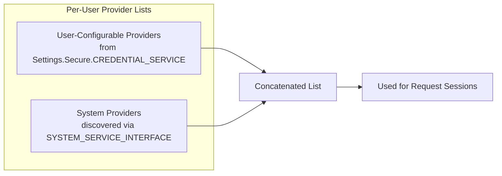
```mermaid
graph LR
    subgraph "Per-User Provider Lists"
        UC["User-Configurable Providers<br/>from Settings.Secure.CREDENTIAL_SERVICE"]
        SP["System Providers<br/>discovered via SYSTEM_SERVICE_INTERFACE"]
    end
    UC --> CONCAT[Concatenated List]
    SP --> CONCAT
    CONCAT --> RS[Used for Request Sessions]
```

**User-configurable providers** are those the user has explicitly enabled in Settings.
They declare the standard `CredentialProviderService.SERVICE_INTERFACE` intent filter.

**System providers** are OEM-installed providers that declare the
`CredentialProviderService.SYSTEM_SERVICE_INTERFACE` intent filter. They are
always available regardless of user settings. The system discovers them via:

```java
// From CredentialManagerService.java
private List<CredentialManagerServiceImpl> constructSystemServiceListLocked(
        int resolvedUserId) {
    List<CredentialProviderInfo> serviceInfos =
            CredentialProviderInfoFactory.getAvailableSystemServices(
                    mContext, resolvedUserId,
                    /* disableSystemAppVerificationForTests= */ false,
                    new HashSet<>());
    // ... wrap each in CredentialManagerServiceImpl
}
```

### 41.2.4 Request Session Management

All ongoing credential operations are tracked per-user through request sessions:

```java
// From CredentialManagerService.java
@GuardedBy("mLock")
private final SparseArray<Map<IBinder, RequestSession>> mRequestSessions =
        new SparseArray<>();
```

The `SparseArray` is keyed by user ID. Each user can have multiple concurrent
request sessions (identified by `IBinder` tokens). Sessions are added when a
request begins and removed when they complete or are cancelled:

```java
private void addSessionLocked(int userId, RequestSession session) {
    synchronized (mLock) {
        Map<IBinder, RequestSession> sessions = mRequestSessions.get(userId);
        if (sessions == null) {
            sessions = new HashMap<>();
            mRequestSessions.put(userId, sessions);
        }
        sessions.put(session.mRequestId, session);
    }
}
```

### 41.2.5 The CredentialManagerServiceStub (Binder Interface)

The inner class `CredentialManagerServiceStub` implements `ICredentialManager.Stub`
and provides the actual Binder entry points. The main operations are:

| Method | Purpose |
|---|---|
| `executeGetCredential()` | Retrieve an existing credential (password, passkey) |
| `executeCreateCredential()` | Create/save a new credential |
| `executePrepareGetCredential()` | Two-step get: prepare first, then retrieve |
| `getCandidateCredentials()` | Used by autofill to get candidate credentials |
| `clearCredentialState()` | Clear provider-side state (e.g., on sign-out) |
| `setEnabledProviders()` | Configure which providers are active |
| `getCredentialProviderServices()` | List available providers |
| `isEnabledCredentialProviderService()` | Check if a specific provider is enabled |
| `registerCredentialDescription()` | Register credential descriptions for matching |

### 41.2.6 Get Credential Flow (Detailed)

The `executeGetCredential()` method orchestrates the complete get flow:

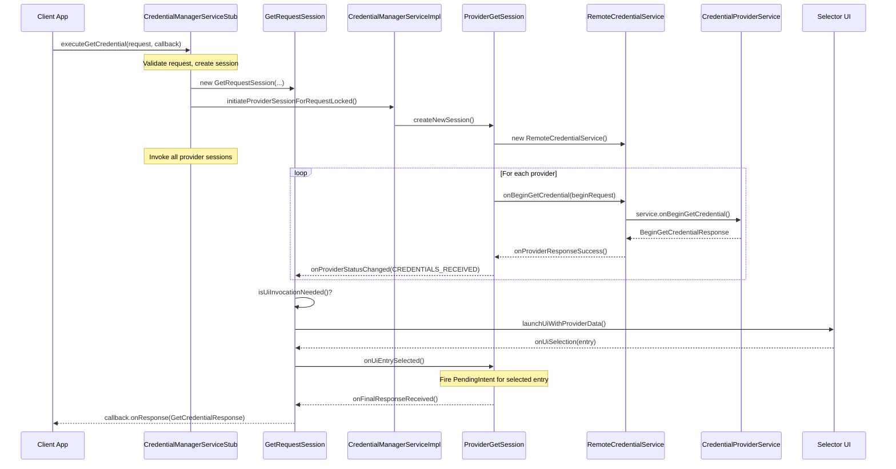
```mermaid
sequenceDiagram
    participant Client as Client App
    participant Stub as CredentialManagerServiceStub
    participant GRS as GetRequestSession
    participant CMSI as CredentialManagerServiceImpl
    participant PGS as ProviderGetSession
    participant RCS as RemoteCredentialService
    participant Prov as CredentialProviderService
    participant UI as Selector UI

    Client->>Stub: executeGetCredential(request, callback)

    Note over Stub: Validate request, create session
    Stub->>GRS: new GetRequestSession(...)
    Stub->>CMSI: initiateProviderSessionForRequestLocked()
    CMSI->>PGS: createNewSession()
    PGS->>RCS: new RemoteCredentialService()

    Note over Stub: Invoke all provider sessions
    loop For each provider
        PGS->>RCS: onBeginGetCredential(beginRequest)
        RCS->>Prov: service.onBeginGetCredential()
        Prov-->>RCS: BeginGetCredentialResponse
        RCS-->>PGS: onProviderResponseSuccess()
        PGS-->>GRS: onProviderStatusChanged(CREDENTIALS_RECEIVED)
    end

    GRS->>GRS: isUiInvocationNeeded()?
    GRS->>UI: launchUiWithProviderData()
    UI-->>GRS: onUiSelection(entry)
    GRS->>PGS: onUiEntrySelected()

    Note over PGS: Fire PendingIntent for selected entry
    PGS-->>GRS: onFinalResponseReceived()
    GRS-->>Client: callback.onResponse(GetCredentialResponse)
```

Step by step within the code:

1. **Request validation and session creation:**
```java
// CredentialManagerServiceStub.executeGetCredential()
final GetRequestSession session = new GetRequestSession(
        getContext(), mSessionManager, mLock, userId, callingUid,
        callback, request,
        constructCallingAppInfo(callingPackage, userId, request.getOrigin()),
        getEnabledProvidersForUser(userId),
        CancellationSignal.fromTransport(cancelTransport),
        timestampBegan);
addSessionLocked(userId, session);
```

2. **Provider session initiation:** The service iterates over all enabled providers
and creates a `ProviderGetSession` for each that is capable of handling the request:
```java
List<ProviderSession> providerSessions =
        initiateProviderSessions(session, request.getCredentialOptions()
                .stream().map(CredentialOption::getType).collect(Collectors.toList()));
```

3. **Provider invocation:** Each `ProviderSession.invokeSession()` binds to the
remote provider and calls `onBeginGetCredential`.

4. **Response aggregation:** As each provider responds, `onProviderStatusChanged()`
is called. When all providers have responded and at least one has credentials:
```java
// GetRequestSession.onProviderStatusChanged()
if (!isAnyProviderPending()) {
    if (isUiInvocationNeeded()) {
        getProviderDataAndInitiateUi();
    } else {
        respondToClientWithErrorAndFinish(
                GetCredentialException.TYPE_NO_CREDENTIAL, "No credentials available");
    }
}
```

5. **UI display and user selection:** The system UI presents the aggregated
credentials. On selection, `onUiSelection()` routes to the appropriate
`ProviderSession`.

6. **Final credential delivery:** The provider's `PendingIntent` resolves the full
credential, which flows back through `onFinalResponseReceived()` to the client.

### 41.2.7 Create Credential Flow

The create flow follows a similar pattern but uses `CreateRequestSession` and
`ProviderCreateSession`:

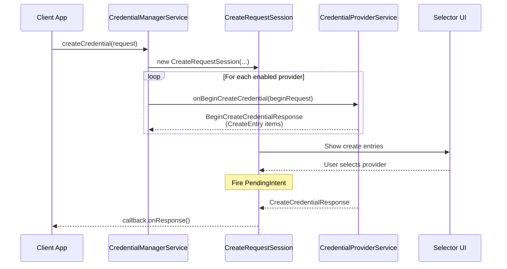
```mermaid
sequenceDiagram
    participant App as Client App
    participant CMS as CredentialManagerService
    participant CRS as CreateRequestSession
    participant Prov as CredentialProviderService
    participant UI as Selector UI

    App->>CMS: createCredential(request)
    CMS->>CRS: new CreateRequestSession(...)

    loop For each enabled provider
        CMS->>Prov: onBeginCreateCredential(beginRequest)
        Prov-->>CMS: BeginCreateCredentialResponse<br/>(CreateEntry items)
    end

    CRS->>UI: Show create entries
    UI-->>CRS: User selects provider
    Note over CRS: Fire PendingIntent
    Prov-->>CRS: CreateCredentialResponse
    CRS-->>App: callback.onResponse()
```

The create flow differs in that:

- Only one credential is being created (not selecting from multiple)
- The response contains `CreateEntry` items, one per provider willing to save
- Primary providers are highlighted in the UI, determined by
  `Settings.Secure.CREDENTIAL_SERVICE_PRIMARY`

### 41.2.8 Permission Model

The Credential Manager enforces several permissions:

| Permission | Required For |
|---|---|
| `CREDENTIAL_MANAGER_SET_ORIGIN` | Setting a custom origin (for browsers making cross-origin requests) |
| `CREDENTIAL_MANAGER_SET_ALLOWED_PROVIDERS` | Restricting which providers can respond |
| `WRITE_SECURE_SETTINGS` | Configuring enabled providers via `setEnabledProviders()` |
| `QUERY_ALL_PACKAGES` or `LIST_ENABLED_CREDENTIAL_PROVIDERS` | Listing available providers |
| `PROVIDE_REMOTE_CREDENTIALS` | Offering remote/hybrid entries (OEM-only) |

The origin is critical for WebAuthn/passkey operations where a browser acts on behalf
of a web application. Only privileged callers (typically the browser with appropriate
permissions) can set the origin, which providers use to verify the relying party.

### 41.2.9 Package Lifecycle Handling

When a provider package is updated or removed, the service reacts:

```java
// CredentialManagerService.handlePackageRemovedMultiModeLocked()
protected void handlePackageRemovedMultiModeLocked(String packageName, int userId) {
    updateProvidersWhenPackageRemoved(new SettingsWrapper(mContext), packageName, userId);
    // Remove from user-configurable services cache
    // Remove from system services cache
    // Evict from CredentialDescriptionRegistry
}
```

For package updates, `CredentialManagerServiceImpl.handlePackageUpdateLocked()`
re-validates the provider's manifest and capabilities.

---

## 41.3 Credential Providers

### 41.3.1 The CredentialProviderService Contract

A credential provider implements `CredentialProviderService`, an abstract `Service`
class. Providers must handle three callback categories:

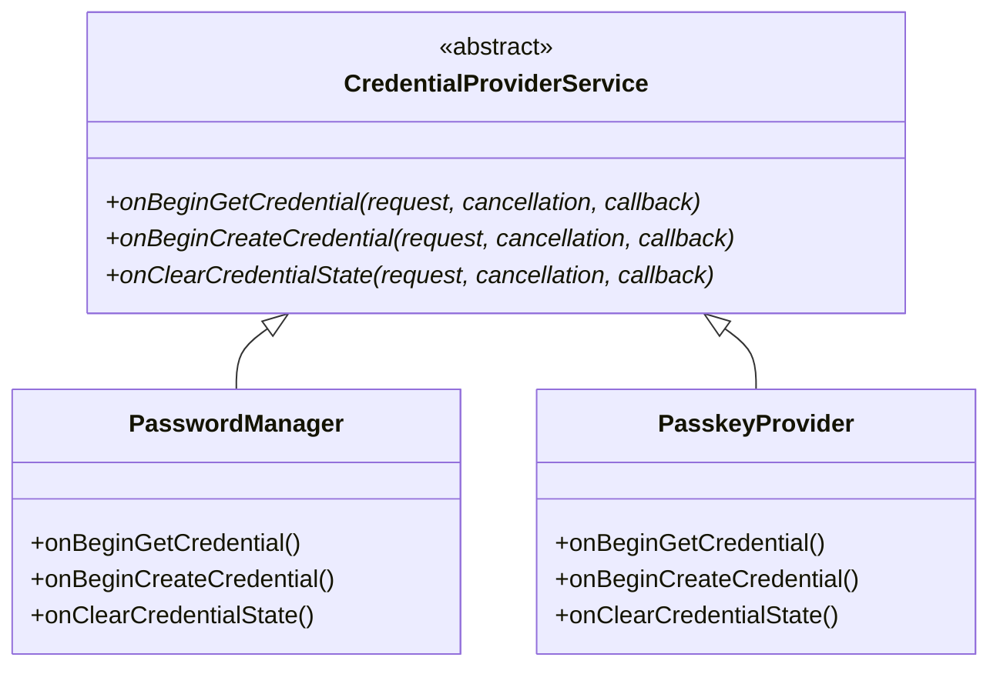
```mermaid
classDiagram
    class CredentialProviderService {
        <<abstract>>
        +onBeginGetCredential(request, cancellation, callback)*
        +onBeginCreateCredential(request, cancellation, callback)*
        +onClearCredentialState(request, cancellation, callback)*
    }
    class PasswordManager {
        +onBeginGetCredential()
        +onBeginCreateCredential()
        +onClearCredentialState()
    }
    class PasskeyProvider {
        +onBeginGetCredential()
        +onBeginCreateCredential()
        +onClearCredentialState()
    }

    CredentialProviderService <|-- PasswordManager
    CredentialProviderService <|-- PasskeyProvider
```

**Source:** `frameworks/base/core/java/android/service/credentials/CredentialProviderService.java`

### 41.3.2 Manifest Declaration

Providers register through `AndroidManifest.xml`:

```xml
<service
    android:name=".MyCredentialProvider"
    android:permission="android.permission.BIND_CREDENTIAL_PROVIDER_SERVICE"
    android:exported="true">

    <!-- Standard provider interface (user-configurable) -->
    <intent-filter>
        <action android:name="android.service.credentials.CredentialProviderService" />
    </intent-filter>

    <!-- Declare supported credential types in metadata -->
    <meta-data
        android:name="android.credentials.provider"
        android:resource="@xml/provider_config" />
</service>
```

The metadata XML declares supported credential types:

```xml
<!-- res/xml/provider_config.xml -->
<credential-provider xmlns:android="http://schemas.android.com/apk/res/android">
    <capabilities>
        <capability name="android.credentials.TYPE_PASSWORD_CREDENTIAL" />
        <capability name="androidx.credentials.TYPE_PUBLIC_KEY_CREDENTIAL" />
    </capabilities>
</credential-provider>
```

System providers use a different intent filter action:
```xml
<action android:name="android.service.credentials.system.CredentialProviderService" />
```

### 41.3.3 Service Capability Checking

When initiating provider sessions, the system checks whether each provider supports
the requested credential types:

```java
// From CredentialManagerServiceImpl.java
@GuardedBy("mLock")
boolean isServiceCapableLocked(List<String> requestedOptions) {
    if (mInfo == null) {
        return false;
    }
    for (String capability : requestedOptions) {
        if (mInfo.hasCapability(capability)) {
            return true;
        }
    }
    return false;
}
```

Only providers with matching capabilities are included in a request session. This
prevents sending password requests to passkey-only providers and vice versa.

### 41.3.4 BeginGetCredentialRequest and Response

The "begin" phase request contains:

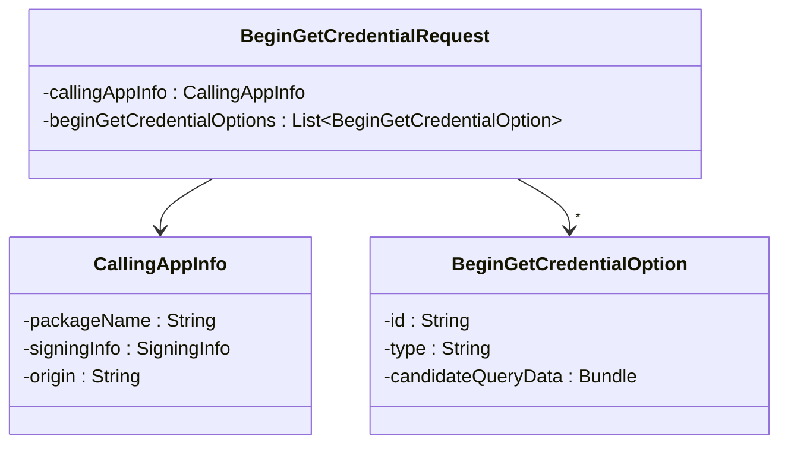
```mermaid
classDiagram
    class BeginGetCredentialRequest {
        -callingAppInfo : CallingAppInfo
        -beginGetCredentialOptions : List~BeginGetCredentialOption~
    }
    class BeginGetCredentialOption {
        -id : String
        -type : String
        -candidateQueryData : Bundle
    }
    class CallingAppInfo {
        -packageName : String
        -signingInfo : SigningInfo
        -origin : String
    }

    BeginGetCredentialRequest --> CallingAppInfo
    BeginGetCredentialRequest --> "*" BeginGetCredentialOption
```

The response describes what the provider can offer:

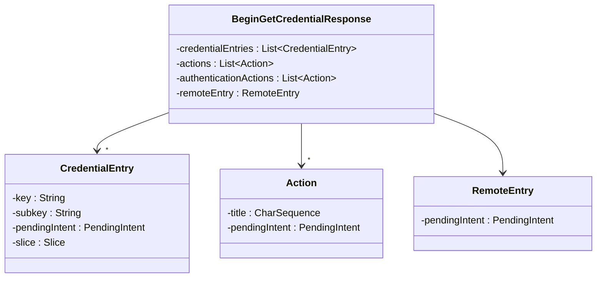
```mermaid
classDiagram
    class BeginGetCredentialResponse {
        -credentialEntries : List~CredentialEntry~
        -actions : List~Action~
        -authenticationActions : List~Action~
        -remoteEntry : RemoteEntry
    }
    class CredentialEntry {
        -key : String
        -subkey : String
        -pendingIntent : PendingIntent
        -slice : Slice
    }
    class Action {
        -title : CharSequence
        -pendingIntent : PendingIntent
    }
    class RemoteEntry {
        -pendingIntent : PendingIntent
    }

    BeginGetCredentialResponse --> "*" CredentialEntry
    BeginGetCredentialResponse --> "*" Action
    BeginGetCredentialResponse --> RemoteEntry
```

**CredentialEntry** -- Represents a single available credential (e.g., "user@example.com
password" or "Passkey for example.com"). Contains a `PendingIntent` that fires when
selected.

**Action** -- A generic action the provider wants to show (e.g., "Manage passwords").

**Authentication Action** -- Shown when the provider's vault is locked. Selecting it
launches the provider's unlock flow. After unlocking, the provider returns the actual
`BeginGetCredentialResponse` through `EXTRA_BEGIN_GET_CREDENTIAL_RESPONSE`.

**RemoteEntry** -- For hybrid/cross-device flows. Only honored from the OEM-configured
hybrid service, checked via:

```java
// From ProviderSession.java
protected boolean enforceRemoteEntryRestrictions(
        @Nullable ComponentName expectedRemoteEntryProviderService) {
    if (!mComponentName.equals(expectedRemoteEntryProviderService)) {
        Slog.w(TAG, "Remote entry being dropped as it is not from the service "
                + "configured by the OEM.");
        return false;
    }
    // Also verify PROVIDE_REMOTE_CREDENTIALS permission
}
```

### 41.3.5 RemoteCredentialService Connection

`RemoteCredentialService` extends `ServiceConnector.Impl` to manage the binding
lifecycle with each provider:

```java
// From RemoteCredentialService.java
public class RemoteCredentialService
        extends ServiceConnector.Impl<ICredentialProviderService> {

    private static final long TIMEOUT_REQUEST_MILLIS = 3 * DateUtils.SECOND_IN_MILLIS;
    private static final long TIMEOUT_IDLE_SERVICE_CONNECTION_MILLIS =
            5 * DateUtils.SECOND_IN_MILLIS;
}
```

**Key timeouts:**

- **Request timeout:** 3 seconds. If a provider does not respond within 3 seconds,
  the request is cancelled and the provider is reported as failed.
- **Idle disconnect:** 5 seconds. After completing requests, the service unbinds
  after 5 seconds of inactivity.

The connection uses `CompletableFuture` with `orTimeout()`:

```java
// From RemoteCredentialService.onBeginGetCredential()
CompletableFuture<BeginGetCredentialResponse> connectThenExecute =
        postAsync(service -> {
            CompletableFuture<BeginGetCredentialResponse> getCredentials =
                    new CompletableFuture<>();
            service.onBeginGetCredential(request, new IBeginGetCredentialCallback.Stub() {
                @Override
                public void onSuccess(BeginGetCredentialResponse response) {
                    getCredentials.complete(response);
                }
                @Override
                public void onFailure(String errorType, CharSequence message) {
                    getCredentials.completeExceptionally(
                            new GetCredentialException(errorType, errorMsg));
                }
                // ...
            });
            return getCredentials;
        }).orTimeout(TIMEOUT_REQUEST_MILLIS, TimeUnit.MILLISECONDS);
```

Error handling covers several failure modes:

| Error | Constant | Handling |
|---|---|---|
| Provider timeout | `ERROR_TIMEOUT` | Cancellation signal dispatched, provider marked failed |
| Provider exception | `ERROR_PROVIDER_FAILURE` | Exception propagated to session |
| Task cancelled | `ERROR_TASK_CANCELED` | Cancellation acknowledged |
| Binder death | `binderDied()` | `onProviderServiceDied()` callback invoked |
| Unknown error | `ERROR_UNKNOWN` | Generic failure reported |

### 41.3.6 ProviderSession State Machine

Each `ProviderSession` tracks its lifecycle through a state machine:

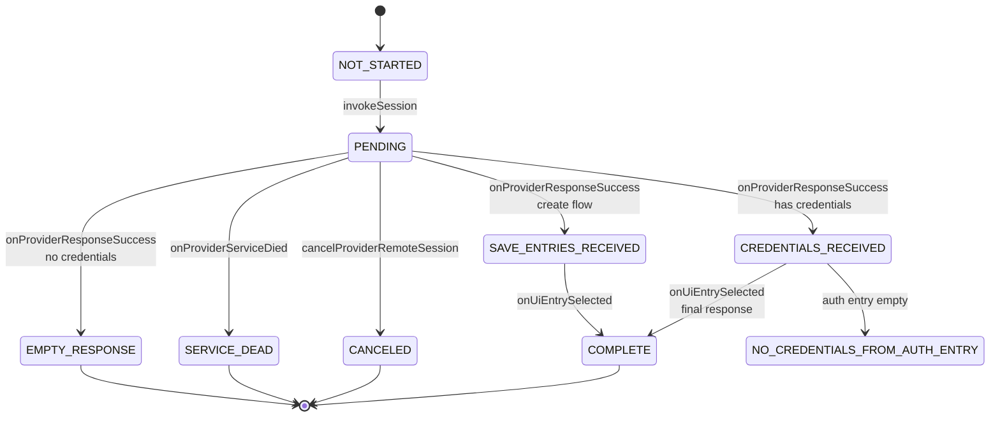
```mermaid
stateDiagram-v2
    [*] --> NOT_STARTED
    NOT_STARTED --> PENDING : invokeSession
    PENDING --> CREDENTIALS_RECEIVED : onProviderResponseSuccess<br/>has credentials
    PENDING --> SAVE_ENTRIES_RECEIVED : onProviderResponseSuccess<br/>create flow
    PENDING --> EMPTY_RESPONSE : onProviderResponseSuccess<br/>no credentials
    PENDING --> CANCELED : cancelProviderRemoteSession
    PENDING --> SERVICE_DEAD : onProviderServiceDied

    CREDENTIALS_RECEIVED --> COMPLETE : onUiEntrySelected<br/>final response
    CREDENTIALS_RECEIVED --> NO_CREDENTIALS_FROM_AUTH_ENTRY : auth entry empty
    SAVE_ENTRIES_RECEIVED --> COMPLETE : onUiEntrySelected

    COMPLETE --> [*]
    CANCELED --> [*]
    SERVICE_DEAD --> [*]
    EMPTY_RESPONSE --> [*]
```

The status checks are used to decide when to invoke the UI:

```java
// From ProviderSession.java
public static boolean isUiInvokingStatus(Status status) {
    return status == Status.CREDENTIALS_RECEIVED
            || status == Status.SAVE_ENTRIES_RECEIVED
            || status == Status.NO_CREDENTIALS_FROM_AUTH_ENTRY;
}

public static boolean isStatusWaitingForRemoteResponse(Status status) {
    return status == Status.PENDING;
}
```

The `RequestSession` waits until no provider is in `PENDING` state before deciding
whether to show the UI or report an error.

### 41.3.7 Metrics Collection

The credential framework includes extensive telemetry. Every session tracks:

| Metric | Collector |
|---|---|
| API call timestamps | `RequestSessionMetric` |
| Per-provider candidate phase | `CandidatePhaseMetric` |
| UI invocation timing | `RequestSessionMetric.collectUiCallStartTime()` |
| Chosen provider status | `ChosenProviderFinalPhaseMetric` |
| Authentication entry usage | `BrowsedAuthenticationMetric` |
| Credential type selected | `collectChosenClassType()` |

Metric classes reside in:
`frameworks/base/services/credentials/java/com/android/server/credentials/metrics/`

---

## 41.4 Passkeys and FIDO2

### 41.4.1 What Are Passkeys?

Passkeys are FIDO2/WebAuthn credentials based on public-key cryptography. Unlike
passwords:

| Property | Password | Passkey |
|---|---|---|
| Secret storage | Server stores hash | Server stores public key only |
| Phishing resistance | None | Origin-bound |
| Replay attacks | Possible | Challenge-response prevents |
| User experience | Must remember | Biometric/device unlock |
| Cross-device | Manual entry | QR code or Bluetooth hybrid |

A passkey consists of:

- A **private key** stored securely on the device (in a credential provider)
- A **public key** registered with the relying party (website/app)
- A **credential ID** linking the two

### 41.4.2 Passkey Creation (Registration)

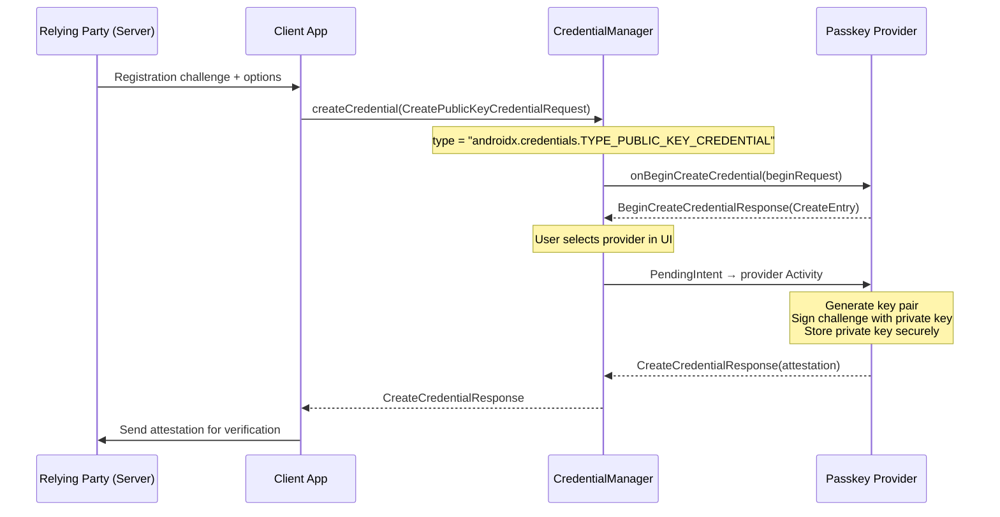
```mermaid
sequenceDiagram
    participant RP as Relying Party (Server)
    participant App as Client App
    participant CM as CredentialManager
    participant Prov as Passkey Provider

    RP->>App: Registration challenge + options
    App->>CM: createCredential(CreatePublicKeyCredentialRequest)

    Note over CM: type = "androidx.credentials.TYPE_PUBLIC_KEY_CREDENTIAL"
    CM->>Prov: onBeginCreateCredential(beginRequest)
    Prov-->>CM: BeginCreateCredentialResponse(CreateEntry)
    Note over CM: User selects provider in UI
    CM->>Prov: PendingIntent → provider Activity

    Note over Prov: Generate key pair<br/>Sign challenge with private key<br/>Store private key securely
    Prov-->>CM: CreateCredentialResponse(attestation)
    CM-->>App: CreateCredentialResponse
    App->>RP: Send attestation for verification
```

The `CreatePublicKeyCredentialRequest` carries a JSON string conforming to the
WebAuthn `PublicKeyCredentialCreationOptions` spec:

```json
{
    "rp": { "id": "example.com", "name": "Example" },
    "user": { "id": "base64userId", "name": "user@example.com" },
    "challenge": "base64challenge",
    "pubKeyCredParams": [
        { "type": "public-key", "alg": -7 },
        { "type": "public-key", "alg": -257 }
    ],
    "authenticatorSelection": {
        "residentKey": "required",
        "userVerification": "required"
    }
}
```

Algorithm identifiers follow the COSE algorithm registry:

- `-7` (ES256): ECDSA with P-256 and SHA-256
- `-257` (RS256): RSASSA-PKCS1-v1_5 with SHA-256

### 41.4.3 Passkey Authentication (Assertion)

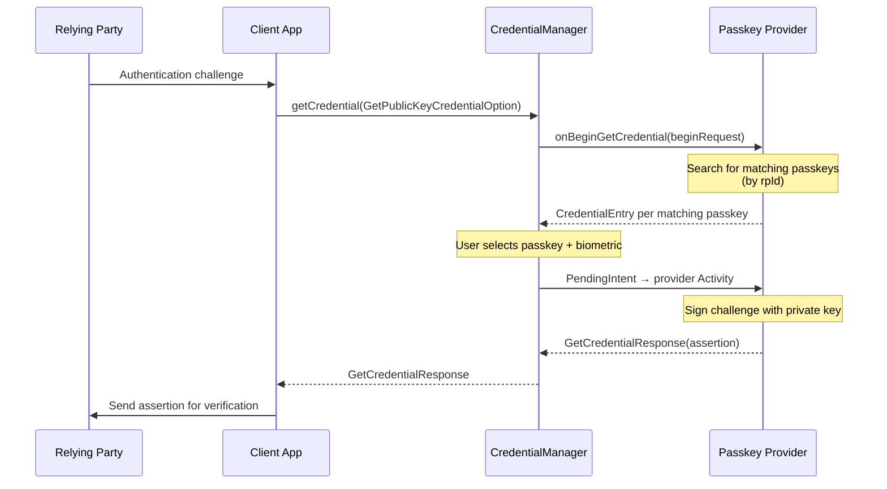
```mermaid
sequenceDiagram
    participant RP as Relying Party
    participant App as Client App
    participant CM as CredentialManager
    participant Prov as Passkey Provider

    RP->>App: Authentication challenge
    App->>CM: getCredential(GetPublicKeyCredentialOption)

    CM->>Prov: onBeginGetCredential(beginRequest)
    Note over Prov: Search for matching passkeys<br/>(by rpId)
    Prov-->>CM: CredentialEntry per matching passkey

    Note over CM: User selects passkey + biometric
    CM->>Prov: PendingIntent → provider Activity
    Note over Prov: Sign challenge with private key
    Prov-->>CM: GetCredentialResponse(assertion)
    CM-->>App: GetCredentialResponse
    App->>RP: Send assertion for verification
```

The `GetPublicKeyCredentialOption` contains a JSON string conforming to
`PublicKeyCredentialRequestOptions`:

```json
{
    "rpId": "example.com",
    "challenge": "base64challenge",
    "allowCredentials": [],
    "userVerification": "required"
}
```

An empty `allowCredentials` array means "discoverable credentials" (passkeys), where
the provider searches its store for any passkeys matching the relying party ID.

### 41.4.4 Origin Verification

For passkeys to provide phishing resistance, the origin must be verified. When a
browser initiates a passkey operation, it sets the origin:

```java
// Browser sets origin for web-initiated requests
GetCredentialRequest request = new GetCredentialRequest.Builder()
        .addCredentialOption(publicKeyOption)
        .setOrigin("https://example.com")  // Requires CREDENTIAL_MANAGER_SET_ORIGIN
        .build();
```

The `CallingAppInfo` passed to providers includes:

- **Package name** of the calling app
- **Signing info** (certificates) of the calling app
- **Origin** string (if set by a privileged caller)

Providers verify the origin matches the relying party's expected origin and that the
calling app's signing certificate matches the Digital Asset Links declarations.

### 41.4.5 Hybrid / Cross-Device Authentication

Cross-device passkey authentication (using a phone to sign in on a laptop) uses
the FIDO2 hybrid transport. In the Credential Manager model:

1. The OEM configures a hybrid service via
   `config_defaultCredentialManagerHybridService`
2. That service can include a `RemoteEntry` in its `BeginGetCredentialResponse`
3. When the user selects the remote entry, the hybrid flow begins (typically
   via BLE + CTAP2)

The hybrid service is validated through:
```java
// From RequestSession.java constructor
mHybridService = context.getResources().getString(
        R.string.config_defaultCredentialManagerHybridService);
```

Only the OEM-designated service, verified through `enforceRemoteEntryRestrictions()`,
can offer remote entries. This prevents arbitrary apps from intercepting cross-device
authentication flows.

### 41.4.6 Attestation

During passkey creation, the provider may generate an attestation statement proving
the key was created in specific hardware (e.g., StrongBox, TEE). The attestation
data is included in the `CreateCredentialResponse` and forwarded to the relying party.

Common attestation formats:

- **None:** No attestation; provider self-signs
- **Packed:** Compact attestation format
- **Android Key Attestation:** Uses Android's hardware-backed key attestation chain
- **TPM:** Trusted Platform Module attestation (rare on Android)

---

## 41.5 Password and Autofill Integration

### 41.5.1 Password Credentials

Password credentials use the type `Credential.TYPE_PASSWORD_CREDENTIAL`. The data
bundle contains:

| Key | Type | Description |
|---|---|---|
| `android.credentials.BUNDLE_KEY_ID` | String | Username/identifier |
| `android.credentials.BUNDLE_KEY_PASSWORD` | String | Password value |

A password-focused `BeginGetCredentialResponse` returns `CredentialEntry` items,
one for each stored password matching the calling app.

### 41.5.2 Autofill Bridge

The Credential Manager integrates with the existing autofill framework through a
specialized code path. The `getCandidateCredentials()` Binder method is restricted
to the system's configured credential-autofill service:

```java
// From CredentialManagerServiceStub.getCandidateCredentials()
String credentialManagerAutofillCompName = mContext.getResources().getString(
        R.string.config_defaultCredentialManagerAutofillService);
ComponentName componentName = ComponentName.unflattenFromString(
        credentialManagerAutofillCompName);
// Verify the caller IS this configured autofill service
PackageManager pm = mContext.createContextAsUser(
        UserHandle.getUserHandleForUid(callingUid), 0).getPackageManager();
String callingProcessPackage = pm.getNameForUid(callingUid);
if (!Objects.equals(componentName.getPackageName(), callingProcessPackage)) {
    throw new SecurityException(callingProcessPackage
            + " is not the device's credential autofill package.");
}
```

This creates a `GetCandidateRequestSession` which returns candidates to the autofill
service for display in the autofill dropdown, providing a seamless experience in
form fields.

### 41.5.3 Autofill Placeholder

When a credential-only provider (one without an autofill service component) is set
as primary, the system stores a placeholder value:

```java
// From CredentialManagerService.java
public static final String AUTOFILL_PLACEHOLDER_VALUE = "credential-provider";
```

This tells the autofill framework that credential management is handled by the
Credential Manager rather than a traditional `AutofillService`.

### 41.5.4 Migration Path

The Credential Manager provides a migration path from legacy autofill providers:

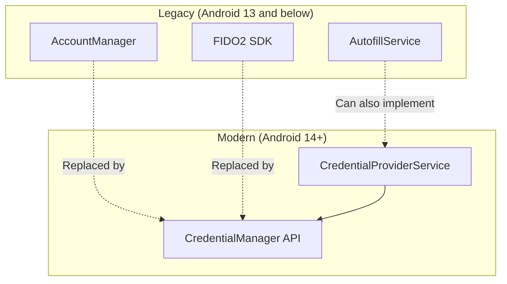
```mermaid
graph TB
    subgraph "Legacy (Android 13 and below)"
        AF[AutofillService]
        AM[AccountManager]
        FIDO[FIDO2 SDK]
    end

    subgraph "Modern (Android 14+)"
        CPS[CredentialProviderService]
        CM[CredentialManager API]
    end

    AF -.->|"Can also implement"| CPS
    AM -.->|"Replaced by"| CM
    FIDO -.->|"Replaced by"| CM
    CPS --> CM
```

A single provider app can implement both `AutofillService` (for backward
compatibility) and `CredentialProviderService` (for the modern flow). The system
coordinates between them through the autofill bridge.

---

## 41.6 Digital Credentials

### 41.6.1 Identity Documents

Android's Credential Manager has been extended to support digital identity documents
-- government-issued IDs, driving licenses, health insurance cards, and other
verifiable credentials. These use the digital credential type system.

The framework provides a generic container; the actual credential format (mDL per
ISO 18013-5, W3C Verifiable Credentials, etc.) is handled by the provider.

### 41.6.2 Credential Description Registry

The `CredentialDescriptionRegistry` is a per-user, in-memory registry where providers
pre-register descriptions of their available credentials. This enables the system
to route requests to appropriate providers without querying every provider:

```java
// From CredentialDescriptionRegistry.java
public class CredentialDescriptionRegistry {
    private static final int MAX_ALLOWED_CREDENTIAL_DESCRIPTIONS = 128;
    private static final int MAX_ALLOWED_ENTRIES_PER_PROVIDER = 16;

    private Map<String, Set<CredentialDescription>> mCredentialDescriptions;
    private int mTotalDescriptionCount;
}
```

**Source:** `frameworks/base/services/credentials/java/com/android/server/credentials/CredentialDescriptionRegistry.java`

The registry is:

- **Per-user:** Each user has an independent instance via `SparseArray`
- **In-memory:** Not persisted across reboots; providers re-register on startup
- **Size-limited:** Maximum 128 total descriptions, 16 per provider

### 41.6.3 Registration and Matching

Providers register credential descriptions during startup or when their credential
inventory changes:

```java
// Provider registers a digital ID credential
CredentialDescription description = new CredentialDescription(
        "com.credman.IdentityCredential",
        Set.of("org.iso.18013.5.1.family_name",
               "org.iso.18013.5.1.given_name",
               "org.iso.18013.5.1.portrait"),
        credentialEntries);

RegisterCredentialDescriptionRequest request =
        new RegisterCredentialDescriptionRequest(Set.of(description));
credentialManager.registerCredentialDescription(request);
```

When a get request arrives with `SUPPORTED_ELEMENT_KEYS`, the system uses the
registry to find matching providers:

```java
// From CredentialDescriptionRegistry.java
public Set<FilterResult> getMatchingProviders(Set<Set<String>> supportedElementKeys) {
    Set<FilterResult> result = new HashSet<>();
    for (String packageName : mCredentialDescriptions.keySet()) {
        Set<CredentialDescription> currentSet = mCredentialDescriptions.get(packageName);
        for (CredentialDescription containedDescription : currentSet) {
            if (canProviderSatisfyAny(
                    containedDescription.getSupportedElementKeys(),
                    supportedElementKeys)) {
                result.add(new FilterResult(packageName,
                        containedDescription.getSupportedElementKeys(),
                        containedDescription.getCredentialEntries()));
            }
        }
    }
    return result;
}
```

Matching uses set containment -- a provider matches if its registered element keys
are a superset of the requested element keys:

```java
static boolean checkForMatch(Set<String> registeredElementKeys,
        Set<String> requestedElementKeys) {
    return registeredElementKeys.containsAll(requestedElementKeys);
}
```

### 41.6.4 Registry-Based Get Flow

When a get request includes credential description options, the system takes a
different path through `prepareProviderSessions()`:

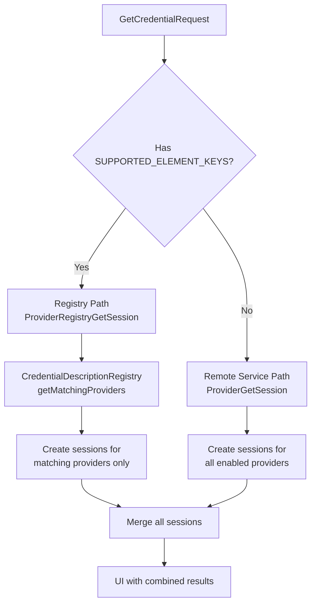
```mermaid
graph TB
    REQ[GetCredentialRequest]
    REQ --> SPLIT{Has SUPPORTED_ELEMENT_KEYS?}

    SPLIT -->|Yes| REG["Registry Path<br/>ProviderRegistryGetSession"]
    SPLIT -->|No| REMOTE["Remote Service Path<br/>ProviderGetSession"]

    REG --> FILTER["CredentialDescriptionRegistry<br/>getMatchingProviders"]
    FILTER --> SESSIONS["Create sessions for<br/>matching providers only"]

    REMOTE --> ALL["Create sessions for<br/>all enabled providers"]

    SESSIONS --> MERGE[Merge all sessions]
    ALL --> MERGE
    MERGE --> UI[UI with combined results]
```

This optimization avoids binding to providers that cannot possibly have matching
credentials, reducing latency for digital credential requests.

### 41.6.5 Verifiable Presentations

For digital credential use cases, the flow typically involves:

1. **Verifier** requests specific claims (e.g., "prove you are over 21")
2. **App** creates a `GetCredentialRequest` with element keys describing needed claims
3. **System** routes to providers via the registry
4. **Provider** presents user consent UI showing what will be shared
5. **User** approves selective disclosure
6. **Provider** generates a cryptographically signed presentation
7. **Response** flows back through the system to the verifier

The system never sees the actual credential data; it only facilitates the connection
between verifier and provider.

---

## 41.7 Try It

### 41.7.1 Inspecting Credential Manager State

**List enabled credential providers:**

```bash
# Check the Settings.Secure value for the current user
adb shell settings get --user 0 secure credential_service

# Check primary providers
adb shell settings get --user 0 secure credential_service_primary
```

**Dump CredentialManagerService state:**

```bash
adb shell dumpsys credential
```

This shows:

- Active provider services (user-configurable and system)
- Ongoing request sessions
- Provider capability information
- Service binding states

### 41.7.2 Enabling a Provider

```bash
# Set a provider as enabled (requires WRITE_SECURE_SETTINGS)
adb shell settings put --user 0 secure credential_service \
    "com.example.myprovider/.MyCredentialProviderService"

# Set a provider as primary
adb shell settings put --user 0 secure credential_service_primary \
    "com.example.myprovider/.MyCredentialProviderService"
```

### 41.7.3 Implementing a Minimal Provider

A basic password provider demonstrates the two-phase protocol.

**1. Service declaration (AndroidManifest.xml):**

```xml
<service
    android:name=".DemoCredentialProvider"
    android:permission="android.permission.BIND_CREDENTIAL_PROVIDER_SERVICE"
    android:exported="true">
    <intent-filter>
        <action android:name="android.service.credentials.CredentialProviderService" />
    </intent-filter>
    <meta-data
        android:name="android.credentials.provider"
        android:resource="@xml/provider_config" />
</service>
```

**2. Provider configuration (res/xml/provider_config.xml):**

```xml
<credential-provider xmlns:android="http://schemas.android.com/apk/res/android">
    <capabilities>
        <capability name="android.credentials.TYPE_PASSWORD_CREDENTIAL" />
    </capabilities>
</credential-provider>
```

**3. Service implementation:**

```kotlin
class DemoCredentialProvider : CredentialProviderService() {

    override fun onBeginGetCredential(
        request: BeginGetCredentialRequest,
        cancellationSignal: CancellationSignal,
        callback: OutcomeReceiver<BeginGetCredentialResponse,
                GetCredentialException>
    ) {
        val entries = mutableListOf<CredentialEntry>()

        for (option in request.beginGetCredentialOptions) {
            if (option.type == Credential.TYPE_PASSWORD_CREDENTIAL) {
                // Look up stored credentials for the calling app
                val stored = lookupPasswords(request.callingAppInfo.packageName)
                for (cred in stored) {
                    entries.add(
                        CredentialEntry.Builder(
                            option.id,
                            createPendingIntent(cred.id)
                        )
                        .build()
                    )
                }
            }
        }

        callback.onResult(
            BeginGetCredentialResponse.Builder()
                .setCredentialEntries(entries)
                .build()
        )
    }

    override fun onBeginCreateCredential(
        request: BeginCreateCredentialRequest,
        cancellationSignal: CancellationSignal,
        callback: OutcomeReceiver<BeginCreateCredentialResponse,
                CreateCredentialException>
    ) {
        callback.onResult(
            BeginCreateCredentialResponse.Builder()
                .addCreateEntry(
                    CreateEntry.Builder("Save to Demo Provider",
                        createSavePendingIntent()
                    ).build()
                ).build()
        )
    }

    override fun onClearCredentialState(
        request: ClearCredentialStateRequest,
        cancellationSignal: CancellationSignal,
        callback: OutcomeReceiver<Void, ClearCredentialStateException>
    ) {
        // Clear any cached credential state
        callback.onResult(null)
    }
}
```

**4. Client usage:**

```kotlin
val credentialManager = getSystemService(CredentialManager::class.java)

// Get a credential
val getRequest = GetCredentialRequest.Builder()
    .addCredentialOption(
        GetPasswordOption()
    )
    .build()

credentialManager.getCredential(
    context = this,
    request = getRequest,
    cancellationSignal = null,
    executor = mainExecutor,
    callback = object : OutcomeReceiver<GetCredentialResponse,
            GetCredentialException> {
        override fun onResult(result: GetCredentialResponse) {
            // Handle credential: result.credential.data
        }
        override fun onError(error: GetCredentialException) {
            // Handle error
        }
    }
)
```

### 41.7.4 Debugging Provider Communication

**Enable verbose logging:**

```bash
adb shell setprop log.tag.CredentialManager VERBOSE
adb logcat -s CredentialManager
```

**Monitor provider binding:**

```bash
adb logcat | grep -E "CredentialManagerServiceImpl|RemoteCredentialService"
```

**Check for timeout issues:**

```bash
# The 3-second timeout is logged when providers are slow
adb logcat | grep "Remote provider response timed"
```

### 41.7.5 Credential Description API

**Check if the description API is enabled:**

```bash
adb shell device_config get credential enable_credential_description_api
```

**Enable it for testing:**

```bash
adb shell device_config put credential enable_credential_description_api true
```

### 41.7.6 Testing Passkey Flows

To test passkey creation and authentication:

1. Set up a WebAuthn relying party (or use webauthn.io for testing)
2. Enable a passkey-capable provider (e.g., Google Password Manager)
3. In a test app or browser:

```kotlin
// Create a passkey
val createRequest = CreateCredentialRequest(
    "androidx.credentials.TYPE_PUBLIC_KEY_CREDENTIAL",
    Bundle().apply {
        putString(
            "androidx.credentials.BUNDLE_KEY_REQUEST_JSON",
            """{"rp":{"id":"example.com","name":"Example"},
               "user":{"id":"dXNlcg","name":"user@example.com"},
               "challenge":"Y2hhbGxlbmdl",
               "pubKeyCredParams":[{"type":"public-key","alg":-7}],
               "authenticatorSelection":{"residentKey":"required"}}"""
        )
    }
)
credentialManager.createCredential(context, createRequest, ...)
```

### 41.7.7 DeviceConfig Flags

The Credential Manager respects several `DeviceConfig` flags:

| Flag | Namespace | Purpose |
|---|---|---|
| `enable_credential_manager` | `credential` | Master enable/disable |
| `enable_credential_description_api` | `credential` | Enable registry-based matching |

```bash
# Check if Credential Manager is enabled
adb shell device_config get credential enable_credential_manager

# Disable for testing
adb shell device_config put credential enable_credential_manager false
```

### 41.7.8 Sequence of Key Log Messages

When tracing a complete get-credential flow, look for these log messages in order:

```
CredentialManager: starting executeGetCredential with callingPackage: com.example.app
CredentialManager: CredentialManagerServiceImpl constructed for: com.provider/.Service
CredentialManager: Provider session created and being added for: com.provider/.Service
CredentialManager: Status changed for: com.provider/.Service, with status: CREDENTIALS_RECEIVED
CredentialManager: Provider status changed - ui invocation is needed
CredentialManager: For ui, provider data size: 1
CredentialManager: onFinalResponseReceived from: com.provider/.Service
CredentialManager: finishing session with propagateCancellation false
```

---

## Summary

The Credential Manager framework transforms Android's credential handling from a
fragmented collection of APIs into a unified, secure, and extensible system. Its
architecture rests on several key pillars:

- **`CredentialManagerService`** orchestrates the entire flow, managing per-user
  provider instances and request sessions
- **The two-phase protocol** (begin/finalize) ensures credential material is never
  unnecessarily loaded or exposed to the system
- **`ProviderSession` state machines** track each provider's progress through
  a well-defined lifecycle
- **`RemoteCredentialService`** handles the asynchronous binding and communication
  with provider processes, with strict timeouts
- **The `CredentialDescriptionRegistry`** enables efficient routing for digital
  credential use cases
- **System-mediated UI** via `CredentialManagerUi` ensures users always see a
  trustworthy credential picker

The framework supports passwords, passkeys (FIDO2/WebAuthn), and digital identity
credentials through the same unified path, with extensibility for future credential
types through the provider capability system.

---

## Appendix: Deep Dive into Internal Classes

### A.1 CredentialManagerUi Internals

The `CredentialManagerUi` class manages the bridge between system_server and the
credential selector UI (typically implemented in SystemUI or a dedicated selector app).

**Source:** `frameworks/base/services/credentials/java/com/android/server/credentials/CredentialManagerUi.java`

The UI operates through a `ResultReceiver` pattern:

```java
// From CredentialManagerUi.java
@NonNull
private final ResultReceiver mResultReceiver = new ResultReceiver(
        new Handler(Looper.getMainLooper())) {
    @Override
    protected void onReceiveResult(int resultCode, Bundle resultData) {
        handleUiResult(resultCode, resultData);
    }
};
```

Result codes from the UI:

| Result Code | Constant | Handling |
|---|---|---|
| `RESULT_CODE_DIALOG_COMPLETE_WITH_SELECTION` | User selected a credential | Route to `ProviderSession.onUiEntrySelected()` |
| `RESULT_CODE_DIALOG_USER_CANCELED` | User dismissed the dialog | Call `onUiCancellation(true)` |
| `RESULT_CODE_CANCELED_AND_LAUNCHED_SETTINGS` | User went to settings | Call `onUiCancellation(false)` |
| `RESULT_CODE_DATA_PARSING_FAILURE` | UI failed to parse data | Call `onUiSelectorInvocationFailure()` |

The UI status tracking prevents duplicate operations:

```java
// From CredentialManagerUi.java
enum UiStatus {
    IN_PROGRESS,       // Waiting for provider responses
    USER_INTERACTION,  // UI is displayed, user interacting
    NOT_STARTED,       // Initial state
    TERMINATED         // UI dismissed or failed
}
```

The `createPendingIntent()` method constructs the intent for the selector Activity.
It packages:

- `RequestInfo` describing what is being requested
- `ProviderData` from all responding providers
- `ResultReceiver` for receiving the selection result
- Session tracking IDs for metrics

### A.2 ProviderGetSession Details

`ProviderGetSession` is the concrete implementation that handles the get-credential
provider communication. It creates the `BeginGetCredentialRequest` from the client's
`GetCredentialRequest`:

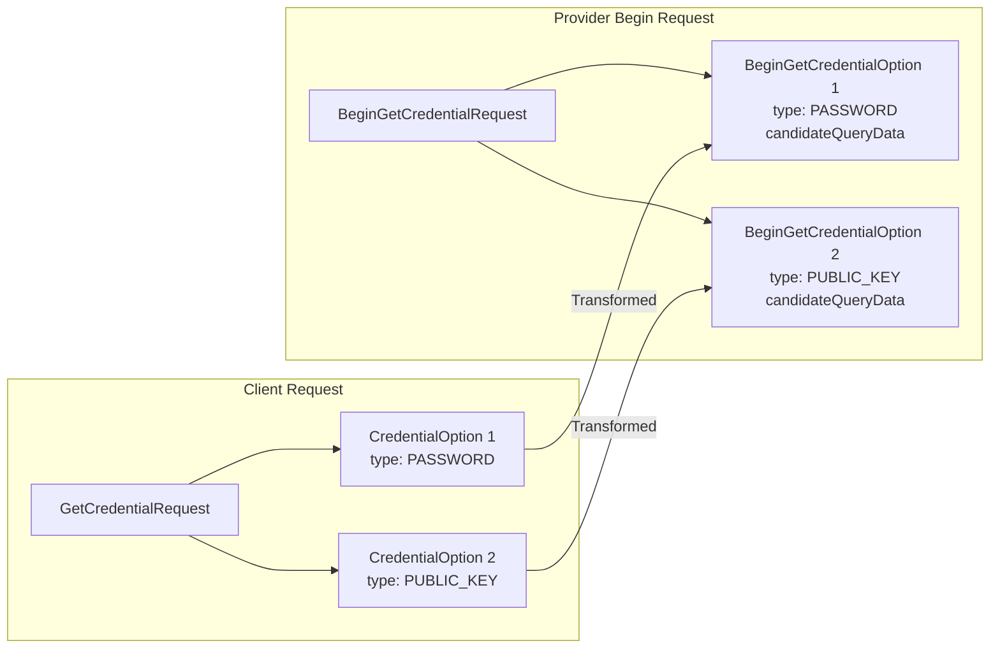
```mermaid
graph LR
    subgraph "Client Request"
        GCR[GetCredentialRequest]
        CO1["CredentialOption 1<br/>type: PASSWORD"]
        CO2["CredentialOption 2<br/>type: PUBLIC_KEY"]
        GCR --> CO1
        GCR --> CO2
    end

    subgraph "Provider Begin Request"
        BGR[BeginGetCredentialRequest]
        BGO1["BeginGetCredentialOption 1<br/>type: PASSWORD<br/>candidateQueryData"]
        BGO2["BeginGetCredentialOption 2<br/>type: PUBLIC_KEY<br/>candidateQueryData"]
        BGR --> BGO1
        BGR --> BGO2
    end

    CO1 -->|Transformed| BGO1
    CO2 -->|Transformed| BGO2
```

Each `CredentialOption` in the client request is transformed into a
`BeginGetCredentialOption` for the provider. The transformation strips out
sensitive retrieval data and sends only the candidate query data -- information
the provider needs to search its store.

### A.3 ProviderCreateSession Details

For credential creation, `ProviderCreateSession` transforms the
`CreateCredentialRequest` into a `BeginCreateCredentialRequest`:

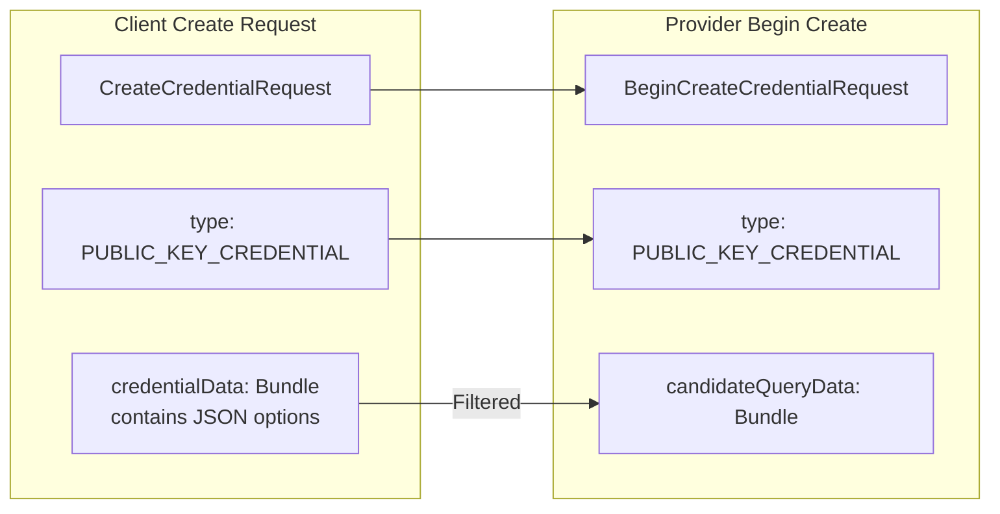
```mermaid
graph LR
    subgraph "Client Create Request"
        CCR[CreateCredentialRequest]
        TYPE[type: PUBLIC_KEY_CREDENTIAL]
        DATA["credentialData: Bundle<br/>contains JSON options"]
    end

    subgraph "Provider Begin Create"
        BCR[BeginCreateCredentialRequest]
        BCTYPE[type: PUBLIC_KEY_CREDENTIAL]
        BCDATA[candidateQueryData: Bundle]
    end

    CCR --> BCR
    TYPE --> BCTYPE
    DATA -->|Filtered| BCDATA
```

The `BeginCreateCredentialResponse` from providers contains `CreateEntry` items.
Each `CreateEntry` has:

- A display title (e.g., "Save to Google Password Manager")
- A `PendingIntent` for the actual save flow
- Optional metadata about the provider

### A.4 ClearRequestSession

The clear credential state flow is simpler -- it asks all providers to clear
any cached state for the calling app:

```java
// From ClearRequestSession.java
// Sends ClearCredentialStateRequest to all providers
// Useful when user signs out of an app
// Providers clear cached tokens, session state, etc.
```

This operation is critical for security hygiene -- when a user logs out of
an app, the app should call `clearCredentialState()` to ensure that credential
providers do not have stale authentication state.

### A.5 Settings Integration

The enabled provider list is stored in Secure Settings, one per user:

```
Settings.Secure.CREDENTIAL_SERVICE = "credential_service"
Settings.Secure.CREDENTIAL_SERVICE_PRIMARY = "credential_service_primary"
```

The format is colon-separated flattened ComponentNames:

```
com.google.android.gms/.auth.credentials.CredentialProviderService:com.example/.MyProvider
```

Primary providers get preferential placement in the creation UI. The system reads
these through:

```java
// From CredentialManagerService.java
static Set<ComponentName> getPrimaryProvidersForUserId(Context context, int userId) {
    SecureSettingsServiceNameResolver resolver = new SecureSettingsServiceNameResolver(
            context, Settings.Secure.CREDENTIAL_SERVICE_PRIMARY,
            /* isMultipleMode= */ true);
    String[] serviceNames = resolver.readServiceNameList(resolvedUserId);
    // Parse into ComponentName set
}
```

### A.6 Error Taxonomy

The Credential Manager defines a structured error taxonomy:

**Get Credential Errors (`GetCredentialException`):**

| Type | Meaning |
|---|---|
| `TYPE_NO_CREDENTIAL` | No matching credentials found anywhere |
| `TYPE_USER_CANCELED` | User dismissed the selector |
| `TYPE_INTERRUPTED` | UI was interrupted (e.g., by another activity) |
| `TYPE_UNKNOWN` | Unclassified error |

**Create Credential Errors (`CreateCredentialException`):**

| Type | Meaning |
|---|---|
| `TYPE_NO_CREATE_OPTIONS` | No provider can create the requested type |
| `TYPE_USER_CANCELED` | User dismissed the creation UI |
| `TYPE_INTERRUPTED` | UI was interrupted |
| `TYPE_UNKNOWN` | Unclassified error |

**Clear Credential State Errors (`ClearCredentialStateException`):**

| Type | Meaning |
|---|---|
| `TYPE_UNKNOWN` | Clear operation failed |

Errors flow through the `respondToClientWithErrorAndFinish()` method in
`RequestSession`:

```java
// From RequestSession.java
protected void respondToClientWithErrorAndFinish(String errorType, String errorMsg) {
    // ... status checks
    try {
        invokeClientCallbackError(errorType, errorMsg);
    } catch (RemoteException e) {
        Slog.e(TAG, "Issue while responding to client with error : " + e);
    }
    boolean isUserCanceled = errorType.contains(MetricUtilities.USER_CANCELED_SUBSTRING);
    if (isUserCanceled) {
        finishSession(false, ApiStatus.USER_CANCELED.getMetricCode());
    } else {
        finishSession(false, ApiStatus.FAILURE.getMetricCode());
    }
}
```

### A.7 Cancellation Architecture

Cancellation flows bidirectionally through the stack:

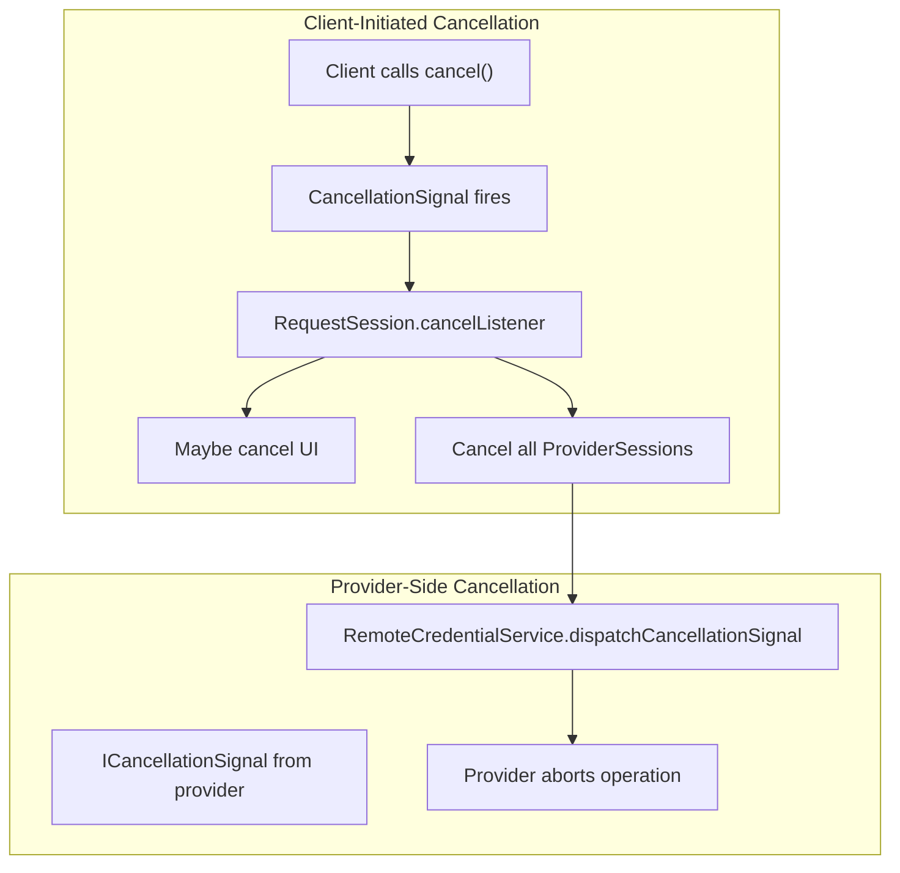
```mermaid
graph TB
    subgraph "Client-Initiated Cancellation"
        CLIENT["Client calls cancel()"]
        CS[CancellationSignal fires]
        RS_CANCEL[RequestSession.cancelListener]
        UI_CANCEL[Maybe cancel UI]
        PROV_CANCEL[Cancel all ProviderSessions]
    end

    CLIENT --> CS --> RS_CANCEL
    RS_CANCEL --> UI_CANCEL
    RS_CANCEL --> PROV_CANCEL

    subgraph "Provider-Side Cancellation"
        PROV_CS[ICancellationSignal from provider]
        RCS_DISPATCH[RemoteCredentialService.dispatchCancellationSignal]
        PROV_ABORT[Provider aborts operation]
    end

    PROV_CANCEL --> RCS_DISPATCH --> PROV_ABORT
```

The client receives an `ICancellationSignal` transport when calling get or create:

```java
// Return type from executeGetCredential()
ICancellationSignal cancelTransport = CancellationSignal.createTransport();
// Client can call cancelTransport.cancel() at any time
```

When cancelled:

1. The `RequestSession`'s cancellation listener fires
2. If the UI is active, a cancel intent is sent to dismiss it
3. All pending `ProviderSession` instances receive cancellation signals
4. The session terminates with `ApiStatus.CLIENT_CANCELED`

### A.8 Thread Model

The Credential Manager operates on multiple threads:

| Component | Thread | Reason |
|---|---|---|
| Binder calls | Binder thread pool | Incoming IPC from client apps |
| Request session | Main handler | UI callbacks and state management |
| Provider communication | `ServiceConnector` thread | Async service binding |
| Result delivery | Main handler | `ResultReceiver` from UI |
| Metrics logging | Calling thread | Synchronous metric collection |

The `RequestSession` uses a main-thread Handler:

```java
// From RequestSession.java
mHandler = new Handler(Looper.getMainLooper(), null, true);
```

Provider responses are dispatched to the main thread via:

```java
// From RemoteCredentialService.java
connectThenExecute.whenComplete((result, error) ->
        Handler.getMain().post(() -> handleExecutionResponse(result, error, cancellationSink)));
```

### A.9 Feature Flags

The Credential Manager uses `android.credentials.flags.Flags` for feature gating:

```java
// Referenced throughout the codebase:
import android.credentials.flags.Flags;

// Examples:
if (Flags.clearSessionEnabled()) {
    // Bind client binder death recipient for session cleanup
}
if (Flags.metricBugfixesContinued()) {
    // Apply continued metric bugfixes
}
```

These flags allow gradual rollout of behavior changes without code branches, following
the AOSP trunk-stable development model.

### A.10 Security Considerations

The Credential Manager enforces several security boundaries:

1. **Package identity verification:** Every request validates the caller's package
   name against the Binder calling UID to prevent spoofing:
   ```java
   enforceCallingPackage(callingPackage, callingUid);
   ```

2. **Signing info for origin binding:** `CallingAppInfo` includes `SigningInfo`
   for asset link verification:
   ```java
   callingAppInfo = new CallingAppInfo(realPackageName, packageInfo.signingInfo, origin);
   ```

3. **Provider binding permission:** Providers require the
   `BIND_CREDENTIAL_PROVIDER_SERVICE` permission, preventing unauthorized service
   binding.

4. **Origin restriction:** Only callers with `CREDENTIAL_MANAGER_SET_ORIGIN` can
   set custom origins, preventing apps from impersonating browsers.

5. **Binder death detection:** Client death is detected and sessions are cleaned up:
   ```java
   private class RequestSessionDeathRecipient implements IBinder.DeathRecipient {
       @Override
       public void binderDied() {
           finishSession(isUiWaitingForData(), ApiStatus.BINDER_DIED.getMetricCode());
       }
   }
   ```

6. **Remote entry restriction:** Only OEM-designated services with the
   `PROVIDE_REMOTE_CREDENTIALS` permission can offer cross-device entries.

7. **Per-user isolation:** Provider lists and request sessions are strictly per-user,
   preventing cross-user credential leakage.

### A.11 Testing Support

The framework includes several testing affordances:

- `getCredentialProviderServicesForTesting()` bypasses system-app verification
- `CredentialDescriptionRegistry.clearAllSessions()` resets state for tests
- `CredentialDescriptionRegistry.setSession()` allows injecting test data
- `isCredentialDescriptionApiEnabled()` can be toggled via DeviceConfig

Provider-side testing:
```kotlin
// Use Jetpack Credential Manager test library
testImplementation("androidx.credentials:credentials-testing:1.x.y")
```

The test library provides fake implementations of the Credential Manager API that
can be configured to return specific responses without needing real providers.

### A.12 Jetpack Credential Manager vs. Framework API

The `androidx.credentials` Jetpack library wraps the framework API with several
additions:

| Feature | Framework API | Jetpack Library |
|---|---|---|
| Availability | Android 14+ | Android 4.4+ (via Play Services) |
| Passkey type | Raw Bundle | `PublicKeyCredential` class |
| Password type | Raw Bundle | `PasswordCredential` class |
| Google Sign-In | Not included | `GoogleIdTokenCredential` |
| Custom types | Supported | Type-safe wrappers |
| Provider API | `CredentialProviderService` | Same |

On Android 14+, the Jetpack library delegates directly to the framework. On older
versions, it uses Google Play Services as the backend. This dual-path approach gives
developers a single API that works across all Android versions.

### A.13 Session Management and Cleanup

The `SessionManager` tracks all active request sessions and ensures cleanup:

```java
// SessionManager implements RequestSession.SessionLifetime
private final SessionManager mSessionManager = new SessionManager();
```

When a session finishes (success, error, or cancellation), it calls back:

```java
// From RequestSession.java
public interface SessionLifetime {
    void onFinishRequestSession(@UserIdInt int userId, IBinder token);
}
```

This triggers removal from the `mRequestSessions` map. Without proper cleanup,
abandoned sessions would leak memory and potentially hold references to provider
bindings.

The death recipient mechanism provides an additional safety net:

```java
// From RequestSession.java
private class RequestSessionDeathRecipient implements IBinder.DeathRecipient {
    @Override
    public void binderDied() {
        Slog.d(TAG, "Client binder died - clearing session");
        finishSession(isUiWaitingForData(), ApiStatus.BINDER_DIED.getMetricCode());
    }
}
```

If the client app crashes or is killed, the binder death triggers session cleanup,
preventing resource leaks and dangling UI states.

### A.14 Provider Response Aggregation Strategy

When multiple providers respond to a get request, the system must aggregate and
present their results coherently. The aggregation follows these rules:

1. **All providers queried in parallel:** All enabled providers with matching
   capabilities receive the `BeginGetCredentialRequest` simultaneously

2. **Wait for all or timeout:** The system waits until all providers respond or
   the 3-second timeout expires. Any provider that times out is marked as failed

3. **Credential entries merged:** All credential entries from all providers are
   combined into a single list for the UI

4. **Authentication entries preserved:** Each provider's authentication action
   (for locked vaults) is shown as a separate entry

5. **Remote entry deduplicated:** Only one remote/hybrid entry is shown (from the
   OEM-configured service)

6. **Primary provider highlighted:** If a create request, primary providers get
   preferential placement

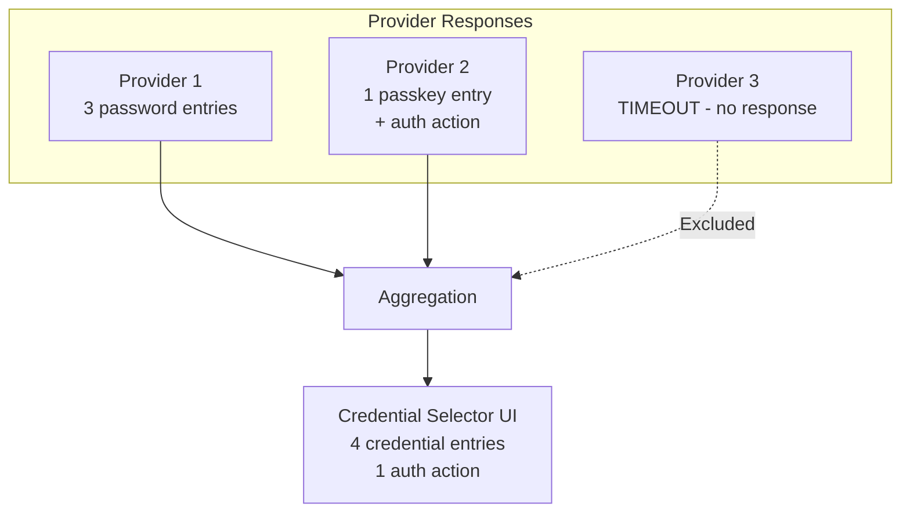
```mermaid
graph TB
    subgraph "Provider Responses"
        P1["Provider 1<br/>3 password entries"]
        P2["Provider 2<br/>1 passkey entry<br/>+ auth action"]
        P3["Provider 3<br/>TIMEOUT - no response"]
    end

    P1 --> AGG[Aggregation]
    P2 --> AGG
    P3 -.->|Excluded| AGG

    AGG --> UI["Credential Selector UI<br/>4 credential entries<br/>1 auth action"]
```

### A.15 The PrepareGetRequestSession

The `PrepareGetRequestSession` supports a two-step retrieval pattern used by the
autofill integration:

1. **Prepare phase:** Query providers and cache the results
2. **Get phase:** Use cached results when the user interacts with a form field

This avoids the latency of querying providers at the moment the user taps a field.
The prepare phase returns a `PrepareGetCredentialResponseInternal` indicating:

- Whether any credential results are available
- Whether authentication results are available
- Whether remote results are available
- A `PendingIntent` to invoke when results are needed

### A.16 Provider Information Factory

`CredentialProviderInfoFactory` is responsible for discovering and constructing
provider metadata:

```java
// From CredentialProviderInfoFactory.java (in service.credentials package)
// Discovers providers by querying PackageManager for:
// 1. Services declaring SERVICE_INTERFACE (user-configurable providers)
// 2. Services declaring SYSTEM_SERVICE_INTERFACE (system providers)
// 3. Parses metadata XML for capability declarations
// 4. Checks signing certificates for system provider validation
```

Factory methods:

- `getAvailableSystemServices()` -- Finds all system providers on the device
- `getCredentialProviderServices()` -- Gets providers filtered by user preferences
- `create()` -- Creates a `CredentialProviderInfo` for a specific component

### A.17 Request Types and RequestInfo

The `RequestInfo` class encapsulates the type and parameters of a credential request.
It serves as a key input to the selector UI:

```java
// From RequestInfo.java
public static final String TYPE_GET = "android.credentials.selection.TYPE_GET";
public static final String TYPE_CREATE = "android.credentials.selection.TYPE_CREATE";
public static final String TYPE_GET_VIA_REGISTRY =
        "android.credentials.selection.TYPE_GET_VIA_REGISTRY";
```

| Request Type | Description | Used By |
|---|---|---|
| `TYPE_GET` | Standard credential retrieval | `executeGetCredential()` |
| `TYPE_CREATE` | Credential creation/saving | `executeCreateCredential()` |
| `TYPE_GET_VIA_REGISTRY` | Registry-based retrieval (digital creds) | `executeGetCredential()` with element keys |

The request type determines:

- Which UI layout the selector uses (credential list vs. save prompt)
- Whether primary provider highlighting is applied
- How entries are sorted and presented

### A.18 Disabled Provider Data

When the selector UI is shown, it may include information about disabled providers:

```java
// From CredentialManagerUi.java
// Disabled providers are shown in the UI to inform users that
// additional credential sources exist but need to be enabled
// The UI may include a "More options" or "Enable provider" action
```

The `DisabledProviderData` class carries:

- Provider package name and display name
- An action intent to navigate to provider settings
- The credential types the provider supports

This helps users discover and enable credential providers they have installed but
not yet activated.

### A.19 Integration with WebView and Browsers

For web-based authentication, the passkey flow has special considerations:

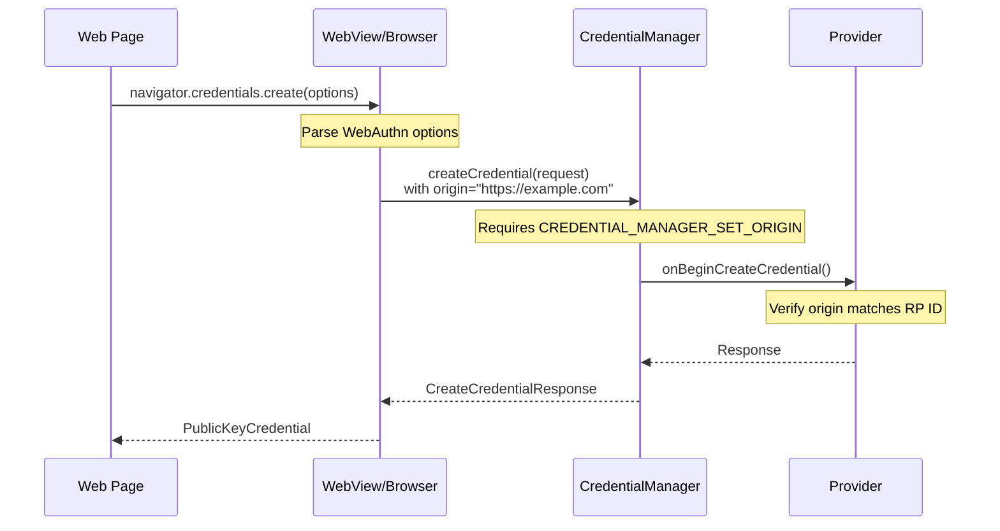
```mermaid
sequenceDiagram
    participant Web as Web Page
    participant WV as WebView/Browser
    participant CM as CredentialManager
    participant Prov as Provider

    Web->>WV: navigator.credentials.create(options)
    Note over WV: Parse WebAuthn options
    WV->>CM: createCredential(request)<br/>with origin="https://example.com"
    Note over CM: Requires CREDENTIAL_MANAGER_SET_ORIGIN
    CM->>Prov: onBeginCreateCredential()
    Note over Prov: Verify origin matches RP ID
    Prov-->>CM: Response
    CM-->>WV: CreateCredentialResponse
    WV-->>Web: PublicKeyCredential
```

The browser (or WebView) is responsible for:

1. Parsing the JavaScript WebAuthn API call
2. Setting the correct origin (requires privileged permission)
3. Mapping between W3C WebAuthn types and Android Credential Manager types
4. Returning the result in W3C-compliant format to JavaScript

The `CallingAppInfo.getOrigin()` method provides the web origin that providers
use for relying party verification.

### A.20 Credential Manager and Lock Screen

The Credential Manager interacts with the lock screen in several ways:

1. **Conditional UI:** On the lock screen, the system can show credential
   suggestions in the autofill IME bar without requiring a full app context

2. **Biometric gating:** Passkey authentication typically requires biometric
   verification, which providers implement through their PendingIntent Activities

3. **Direct boot:** In direct boot mode (before CE storage unlock), only
   DE-stored credentials are accessible. Most credential providers store data
   in CE storage, so they are unavailable until the user unlocks

4. **Credential Manager as keyguard input:** Some OEMs integrate passkey
   authentication directly into the lock screen flow, allowing passkey-based
   device unlock (though this is not part of AOSP)

### A.21 Performance Characteristics

Typical timing for credential operations (measured on mid-range device):

| Phase | Duration | Bottleneck |
|---|---|---|
| Session creation | 1-5 ms | Object allocation, lock acquisition |
| Provider binding | 50-200 ms | Service connection establishment |
| Provider query (begin) | 100-500 ms | Provider's credential search |
| UI display | 50-100 ms | Activity launch, layout inflation |
| User selection | Variable | User interaction time |
| Provider finalization | 100-300 ms | Credential retrieval, biometric |
| Total (best case) | ~500 ms | Dominated by provider response |
| Timeout (worst case) | 3000 ms | Provider timeout enforced |

Optimization strategies:

- Pre-warming provider bindings (done by autofill bridge)
- `PrepareGetRequestSession` for pre-fetching
- `CredentialDescriptionRegistry` for skipping non-matching providers
- Parallel provider queries (all providers queried simultaneously)
