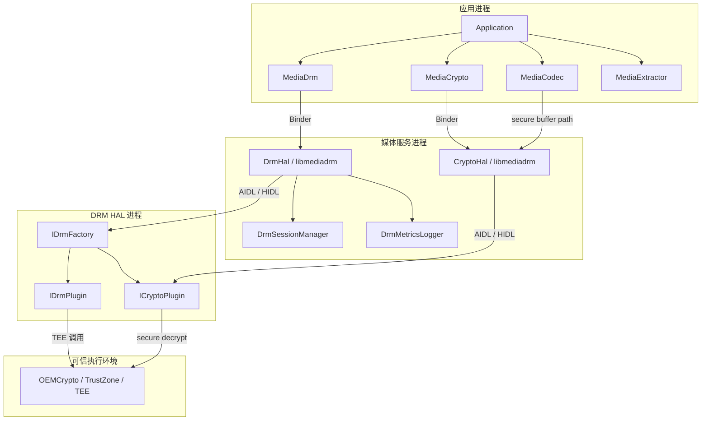
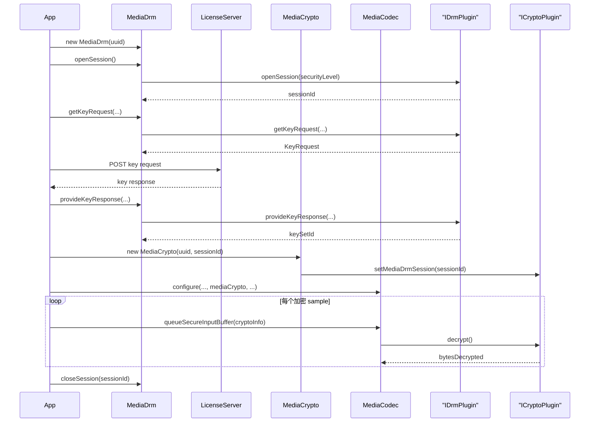

# 第 42 章：DRM 与内容保护

数字版权管理（DRM）是 Android 多媒体体系里商业价值最高、也最容易被忽视的子系统之一。用户在 Netflix 看电影、在 Google Play 租片，或通过体育直播应用观看付费赛事时，系统会在后台完成许可证协商、密钥下发、内容解密和输出保护策略执行，而这些过程通常不会直接暴露给用户。本章从 Java API 出发，沿着 native framework、HAL 边界，再到厂商提供的 DRM 插件实现，梳理 Android DRM 的完整工作链路。

本章先给出高层架构总览（42.1），再分析应用直接接触的 framework 层实现（42.2），随后讨论稳定的 DRM AIDL HAL 契约（42.3）、几乎所有商用设备都具备的 Widevine（42.4）、AOSP 自带的 ClearKey 参考插件（42.5）、受保护的安全解码链路（42.6）以及 DRM 的指标与日志体系（42.7），最后以动手实践收尾（42.8）。

---

## 42.1 DRM 架构总览

### 42.1.1 DRM 解决的问题

内容提供方对流媒体服务通常会提出严格限制：

- 内容在传输和落盘时必须加密。
- 解密密钥不能暴露给普通应用代码。
- 解密后的视频帧不能轻易被截屏或经 HDMI 抓取。
- 播放结束后系统需要向许可证服务器回报状态，例如 secure stop。

Android DRM framework 的目标，就是在满足这些约束的同时，给应用开发者暴露一套与具体 DRM 方案无关的统一 API。

### 42.1.2 核心组件

Android DRM 子系统横跨多个进程和多层抽象，核心可以分成 4 个部分：

1. `MediaDrm`：应用在 Java 层协商许可证、管理 session 的主 API，运行在 app 进程。
2. `MediaCrypto`：把 DRM session 连接到 codec 的桥接 API，也在 app 进程，但实际加密操作通过 Binder 委托出去。
3. DRM Framework（`libmediadrm`）：native C++ 层，负责路由到具体 HAL、做 session 管理和指标收集，位于媒体服务侧。
4. DRM HAL Plugin：厂商实现的 AIDL 或旧 HIDL 服务，真正执行密钥管理、解密与安全策略控制。

关键源码路径：

| 组件 | 路径 |
|---|---|
| Java API | `frameworks/base/media/java/android/media/MediaDrm.java` |
| Native framework | `frameworks/av/drm/` |
| HAL 定义 | `hardware/interfaces/drm/` |
| ClearKey 参考实现 | `frameworks/av/drm/mediadrm/plugins/clearkey/` |

### 42.1.3 端到端架构图

下面的图展示了受 DRM 保护的播放请求如何从应用层一路落到厂商插件与可信执行环境：



### 42.1.4 基于 UUID 的 DRM 方案选择

每种 DRM scheme 都用一个 16 字节 UUID 标识。应用从媒体元数据中拿到 UUID 后，可以通过 `MediaDrm.isCryptoSchemeSupported()` 询问设备是否支持：

```java
// Source: frameworks/base/media/java/android/media/MediaDrm.java
public static final boolean isCryptoSchemeSupported(@NonNull UUID uuid) {
    return isCryptoSchemeSupportedNative(getByteArrayFromUUID(uuid), null,
            SECURITY_LEVEL_UNKNOWN);
}
```

常见 UUID：

| DRM 方案 | UUID |
|---|---|
| Widevine | `edef8ba9-79d6-4ace-a3c8-27dcd51d21ed` |
| Common ClearKey | `1077efec-c0b2-4d02-ace3-3c1e52e2fb4b` |
| ClearKey | `e2719d58-a985-b3c9-781a-b030af78d30e` |
| PlayReady | `9a04f079-9840-4286-ab92-e65be0885f95` |

native 侧 `DrmHal::isCryptoSchemeSupported()` 会优先尝试 AIDL HAL，再回退到 HIDL：

```cpp
// Source: frameworks/av/drm/libmediadrm/DrmHal.cpp
DrmStatus DrmHal::isCryptoSchemeSupported(const uint8_t uuid[16],
        const String8& mimeType,
        DrmPlugin::SecurityLevel securityLevel,
        bool* result) {
    DrmStatus statusResult =
            mDrmHalAidl->isCryptoSchemeSupported(uuid, mimeType,
                    securityLevel, result);
    if (*result) return statusResult;
    return mDrmHalHidl->isCryptoSchemeSupported(uuid, mimeType,
            securityLevel, result);
}
```

这意味着 `DrmHal` 本质上是一个双后端路由层，而不是某一种具体 DRM 的实现本体。

### 42.1.5 播放生命周期

一个典型的 DRM 播放流程如下：



这里最关键的边界是：应用自己不执行解密，它只负责把许可证交给 `MediaDrm`，把 session 交给 `MediaCrypto`，而真正的解密发生在 HAL / TEE 侧。

### 42.1.6 安全等级

DRM HAL 通过 `SecurityLevel` 枚举表达设备的内容保护强度：

```aidl
// Source: hardware/interfaces/drm/aidl/android/hardware/drm/SecurityLevel.aidl
enum SecurityLevel {
    UNKNOWN,
    SW_SECURE_CRYPTO,
    SW_SECURE_DECODE,
    HW_SECURE_CRYPTO,
    HW_SECURE_DECODE,
    HW_SECURE_ALL,
    DEFAULT,
}
```

从低到高大致可理解为：

- `SW_SECURE_CRYPTO`：白盒软件解密。
- `HW_SECURE_CRYPTO`：密钥管理和加解密在 TEE。
- `HW_SECURE_DECODE`：连解码都进入受保护硬件路径。
- `HW_SECURE_ALL`：压缩与非压缩数据路径都在受保护环境。

内容提供方通常会根据安全等级限制清晰度，例如只给 L1 / 硬件安全路径开放 4K HDR。

## 42.2 DRM Framework

### 42.2.1 源码树布局

`frameworks/av/drm/` 下的代码主要分成几块：

```text
frameworks/av/drm/
    drmserver/
    libdrmframework/
    libmediadrm/
    mediacas/
    tests/
    tools/
    mediadrm/plugins/clearkey/
```

其中最关键的是 `libmediadrm/`，里面包含：

- `DrmHal.cpp`：AIDL + HIDL 统一入口。
- `DrmHalAidl.cpp` / `DrmHalHidl.cpp`：两套 HAL 包装层。
- `CryptoHal.cpp`：解密侧路由。
- `DrmSessionManager.cpp`：session 生命周期与资源仲裁。
- `DrmMetrics*.cpp`：指标采集与导出。

### 42.2.2 `MediaDrm` Java API

`MediaDrm` 是应用侧的主入口，核心能力包括：

- 检测 scheme 是否支持。
- 打开 / 关闭 session。
- 构造 key request。
- 提交 license response。
- 查询属性、指标和日志。
- 注册事件监听器。

典型调用顺序是：

1. `new MediaDrm(uuid)`
2. `openSession()`
3. `getKeyRequest()`
4. 把请求发给 license server
5. `provideKeyResponse()`
6. 交给 `MediaCrypto`

它的设计本质上是“许可证与 session 管理 API”，而不是“直接给应用一把密钥”。

### 42.2.3 Key Request / Response 流程

当应用调用 `getKeyRequest()` 时，framework 会把：

- session / scope
- init data
- MIME type
- key type
- optional parameters

打包后交给 HAL 插件。插件返回 `KeyRequest`，里面通常包含：

- `data`：发往 license server 的请求体
- `defaultUrl`：默认许可证服务器地址
- `requestType`：初始、续租、释放等请求类型

随后应用自行与 license server 通信，再把响应通过 `provideKeyResponse()` 喂回 framework。

### 42.2.4 `MediaCrypto`：codec 桥接层

`MediaCrypto` 的作用不是协商许可证，而是把一个已建立好的 DRM session 接到 `MediaCodec` 上。也就是说：

- `MediaDrm` 负责 session 和 key。
- `MediaCrypto` 负责“把这个 session 应用到解码器”。

这个对象的存在，把许可证交互和媒体解码配置解耦开来。

### 42.2.5 `DrmHal`：统一 native 入口

`DrmHal` 为 Java / JNI 层屏蔽了后端差异。它把常见方法统一暴露出来，例如：

- `createPlugin`
- `openSession`
- `getKeyRequest`
- `provideKeyResponse`
- `queryKeyStatus`
- `getProvisionRequest`

内部策略是：

1. 先尝试 AIDL 后端。
2. 如果不可用，再走 HIDL。
3. 统一把错误码映射回 framework 侧的 `DrmStatus`。

这样旧设备仍可兼容 HIDL，而新设备能平滑迁移到 AIDL。

### 42.2.6 `DrmHalAidl`

`DrmHalAidl.cpp` 是 AIDL HAL 的桥接包装层。它负责：

- 查找 `IDrmFactory` 服务实例。
- 根据 UUID 创建 `IDrmPlugin` / `ICryptoPlugin`。
- 把 framework 数据结构转换成 AIDL parcelable。
- 处理 AIDL `ScopedAStatus` 与 framework 错误码映射。

这层代码不做 DRM 业务决策，但它决定了 framework 与 vendor HAL 的连接质量和错误传播方式。

### 42.2.7 `DrmSessionManager`：资源管理

DRM session 是有限资源，尤其在硬件安全路径里更紧张。`DrmSessionManager` 负责：

- 跟踪当前活跃 session。
- 资源紧张时决定是否驱逐旧 session。
- 维护 session 所属 pid / uid 等上下文。
- 帮助 framework 做“谁还能继续打开 session”的仲裁。

如果没有这层统一管理，多应用并发播放会很快把 HAL / TEE 资源耗尽。

### 42.2.8 DRM 事件传播

DRM 不是纯同步接口。HAL 会异步上报很多事件，例如：

- key 过期
- key status 更新
- 需要 provisioning
- session 失效

framework 通过 `DrmHalListener` 把这些事件从 HAL 拉回 native 层，再转成 Java 回调，例如：

- `setOnEventListener`
- `setOnKeyStatusChangeListener`
- `setOnExpirationUpdateListener`

### 42.2.9 Provisioning

某些 DRM 实现第一次使用前需要设备 provision。典型过程是：

1. 插件告诉 framework 当前设备尚未 provision。
2. 应用通过 `getProvisionRequest()` 获取请求体。
3. 向 provisioning server 发起网络请求。
4. 把结果通过 `provideProvisionResponse()` 返回给插件。

这一步通常与设备证书、厂商设备身份和安全等级初始化有关。

### 42.2.10 Secure Stops

secure stop 用于记录“受保护内容曾被播放，并应当上报完成状态”。它服务于商业审计与许可证控制，例如离线租赁内容播放结束后，需要向服务端报告一次安全完成事件。

虽然现代服务未必都依赖它，但 framework 和 HAL 仍保留了这一能力。

### 42.2.11 离线许可证管理

离线许可证需要额外处理：

- license 获取后持久化成 `keySetId`
- 后续离线场景重新恢复
- 到期续租或显式释放

这类场景常见于离线下载的影视内容。Framework 通过 session 与 `keySetId` 的拆分支持这种模式。

### 42.2.12 插件路径解析

对于旧路径或某些兼容实现，framework 需要知道插件二进制、服务实例或 vendor 库在哪里。AOSP 逐步向 binderized HAL 收敛，但源码里仍保留了一些插件发现与路径兼容逻辑。

### 42.2.13 HAL 发现

HAL 发现本质上依赖 binder service manager 和 VINTF 声明。Framework 会：

1. 查找匹配 `IDrmFactory` 的服务。
2. 针对目标实例做连接。
3. 验证其是否支持指定 UUID。

因此“设备装了某个 DRM 插件”不代表应用能直接用，还取决于 HAL 是否成功注册并声明了对应能力。

## 42.3 DRM HAL

### 42.3.1 HAL 演进

Android DRM HAL 走过了从 HIDL 到 AIDL 的迁移过程。AIDL 的优势主要在于：

- 稳定接口版本化更明确。
- 工具链与调试体验更统一。
- 与当前 Android HAL 主流方向一致。

因此新设备以 AIDL 为主，而 framework 保留 HIDL 兼容层只是为了过渡。

### 42.3.2 `IDrmFactory`：入口点

`IDrmFactory` 是所有 DRM 插件的总入口。它至少要能回答两类问题：

1. 是否支持某个 UUID / MIME / 安全等级组合。
2. 如果支持，能否创建对应 `IDrmPlugin` 与 `ICryptoPlugin`。

换句话说，factory 负责“方案选择与实例生成”，而不是“实际许可证处理”。

### 42.3.3 `IDrmPlugin`：session 与密钥管理

`IDrmPlugin` 负责 DRM 绝大部分控制面操作，例如：

- `openSession`
- `closeSession`
- `getKeyRequest`
- `provideKeyResponse`
- `queryKeyStatus`
- `removeKeys`
- `restoreKeys`
- `getProvisionRequest`
- `provideProvisionResponse`

它处理的是“这个播放 session 是否有资格解密、拿到了哪些 key、当前状态如何”，而不是每个 sample 的逐块解密。

### 42.3.4 `ICryptoPlugin`：解密引擎

`ICryptoPlugin` 则站在数据面，主要面对 `MediaCodec` 的 secure path。它负责：

- 接收 subsample / IV / key ID / mode 等参数。
- 执行 AES-CTR、pattern encryption 等具体解密。
- 确保解密输出进入正确的 buffer 类型或安全内存区域。

因此一个 DRM 实现通常同时需要 `IDrmPlugin` 和 `ICryptoPlugin` 两部分。

### 42.3.5 `IDrmPluginListener`：异步事件

HAL 侧事件通过 listener 回传 framework，例如：

- 某些 key 状态改变。
- session 进入 lost state。
- 插件内部要求应用更新许可证。

这使得 DRM 插件不仅是一个命令执行器，也是一个会主动发出状态更新的状态机节点。

### 42.3.6 状态码

DRM HAL 定义了一整套状态码，用于区分：

- 参数错误
- session 不存在
- 资源不足
- 设备未 provision
- 不支持的操作
- 许可证相关失败

Framework 会把这些状态映射为 Java 层异常或错误回调，供应用做重试、降级或失败提示。

### 42.3.7 AIDL 数据类型

DRM AIDL 不只是接口方法，还定义了大量数据结构，例如：

- `KeyRequest`
- `KeyStatus`
- `SubSample`
- `Pattern`
- `SharedBuffer`
- `DestinationBuffer`

这些类型决定了 framework 与 HAL 交换的数据边界，也是 VTS 覆盖重点。

### 42.3.8 VTS 测试

DRM HAL 的兼容性不能只靠业务应用验证。AOSP 提供 VTS 测试来检查：

- 基础接口是否实现完整。
- 常见状态码行为是否符合规范。
- ClearKey 等参考实现能否跑通。

这对厂商实现尤其重要，因为 framework 完全依赖 HAL 合同稳定性。

## 42.4 Widevine DRM

### 42.4.1 概览

Widevine 是 Android 生态里最常见的商用 DRM。绝大多数流媒体应用依赖它提供许可证协商、内容解密和输出保护能力。

它不是 AOSP 开源实现，但 AOSP framework 必须围绕它构建足够通用的抽象。

### 42.4.2 安全等级：L1、L2、L3

Widevine 的 L1 / L2 / L3 可以近似理解为：

| Widevine 级别 | 常见含义 |
|---|---|
| L1 | 密钥、解密、通常连解码都在受保护硬件路径 |
| L2 | 密钥在 TEE，部分处理不一定全硬件 |
| L3 | 完全软件路径 |

虽然 HAL 的通用枚举与 Widevine 自己的 L1/L2/L3 不完全同构，但业务上常被这样对应理解。流媒体平台通常以是否达到 L1 作为高清与 4K 内容分发门槛。

### 42.4.3 与 TEE 集成

Widevine 高安全等级实现通常依赖：

- TrustZone / TEE
- OEMCrypto
- 安全视频路径
- 输出保护检查（例如 HDCP）

也就是说，framework 只是门面，真正的强安全保证来自底层硬件与厂商安全实现。

### 42.4.4 Provisioning 流程

Widevine 设备第一次启用时通常需要 provisioning，用于：

- 注入设备级证书材料
- 初始化设备身份
- 使许可证服务器能够识别这台设备的安全能力

这个流程失败时，应用层看到的往往只是 `NotProvisionedException` 或相关错误回调。

### 42.4.5 License Request 结构

Widevine 的 license request 一般包含：

- 设备与 session 上下文
- 内容标识
- key ID / PSSH 信息
- 安全等级和能力信息

具体格式不是 AOSP 开放规范的一部分，但 framework 会把其当作 opaque blob 处理并透传。

### 42.4.6 HDCP 强制

如果内容方要求外接显示必须满足 HDCP 某一级别，DRM 插件会在播放前或播放中检查当前输出链路是否满足要求；不满足时可能：

- 降低分辨率
- 拒绝播放
- 停止输出受保护内容

这是内容保护从“解密”延伸到“最终显示路径”的关键一环。

### 42.4.7 与 `MediaCodec` 集成

Widevine 的 L1 体验高度依赖 secure codec path，也就是：

- `MediaCodec` 以 secure decoder 方式配置
- 加密输入通过 `queueSecureInputBuffer()`
- 解密与解码在硬件保护内存里完成

这解释了为什么单独有 license 还不够，设备还必须具备完整的安全解码能力。

## 42.5 ClearKey DRM 插件

### 42.5.1 目的与设计

ClearKey 是 AOSP 提供的参考 DRM 插件实现。它的作用不是承担商用强安全 DRM，而是：

- 作为 framework / HAL 的可审计示例。
- 作为 CTS / VTS 与调试的基准实现。
- 展示完整的 DRM 插件结构。

因此它在安全性上远不等同于 Widevine 这类生产级 DRM。

### 42.5.2 源码布局

ClearKey 代码主要位于：

```text
frameworks/av/drm/mediadrm/plugins/clearkey/
    aidl/
    common/
    hidl/
    tests/
```

其中：

- `aidl/`：AIDL 服务入口、`DrmFactory`、`DrmPlugin`、`CryptoPlugin`
- `common/`：会话库、AES-CTR 解密器、JWK 解析、UUID 等公共逻辑
- `hidl/`：旧版兼容实现

### 42.5.3 服务入口

ClearKey 以独立 HAL service 的方式注册，其 service main 会：

- 创建 binder 线程池
- 实例化 `DrmFactory`
- 将服务注册到 service manager

这和大多数现代 binderized HAL 的启动模式一致。

### 42.5.4 `DrmFactory`：插件创建

`DrmFactory::createDrmPlugin()` 负责：

1. 验证 UUID 是否属于 ClearKey。
2. 构造具体 `DrmPlugin` 实例。
3. 把实例通过 AIDL 接口返回给 framework。

如果 UUID 不匹配，它不会假装支持，而是直接返回不支持状态。

### 42.5.5 `DrmPlugin`：session 与密钥管理

ClearKey `DrmPlugin` 完整实现了 session 生命周期：

- 创建 / 关闭 session
- 解析 init data / PSSH
- 生成 key request
- 接收并解析 key response
- 恢复 / 删除 key

它是阅读 DRM 控制面逻辑最合适的 AOSP 入口。

### 42.5.6 `CryptoPlugin`：解密

`CryptoPlugin` 的核心是根据 session 中缓存的 key，对输入 subsample 执行解密，并把结果写入目标缓冲区。它不负责任何商业许可证协议，只负责基于已知 key 做解密。

### 42.5.7 AES-CTR 解密实现

ClearKey 使用 AES-CTR 作为主要演示算法，关键实现在：

- `AesCtrDecryptor.cpp`
- `Session.cpp`
- `CryptoPlugin.cpp`

这部分代码非常适合对照 `MediaCodec.queueSecureInputBuffer()` 的 `CryptoInfo` 参数理解 subsample 解密模型。

### 42.5.8 JSON Web Key（JWK）处理

ClearKey 的 key response 通常以 JWK 集形式出现，因此插件里包含专门的：

- Base64URL 解码
- JWK JSON 解析
- key ID 与 key material 提取

这部分主要落在 `JsonWebKey.cpp`。

### 42.5.9 Session 架构

ClearKey 会为每个会话分配独立 session ID，并把 key material、状态和相关元数据挂到对应 session 上。这使它在结构上和商用 DRM 保持一致，即便安全级别远低得多。

### 42.5.10 构建 ClearKey

构建 ClearKey 服务通常只需要单独编译其 HAL。相关配置可见 `frameworks/av/drm/mediadrm/plugins/clearkey/service.mk`：

```make
PRODUCT_PACKAGES += \
    android.hardware.drm-service.clearkey
```

如果设备配置里引入了该包，编译产物会落到 vendor HAL 服务路径下。

### 42.5.11 ClearKey 与生产级 DRM 的差异

ClearKey 适合教学、兼容性测试和框架验证，但与商用 DRM 相比缺少几个关键能力：

- 没有真正的强安全 TEE 路径。
- 没有商用设备证书体系。
- 不能满足高价值内容分发方的合规要求。
- 通常不具备与 Widevine L1 相当的输出保护与硬件绑定能力。

因此它更像 DRM framework 的“参考驱动”，而不是商用最终方案。

## 42.6 安全解码路径

### 42.6.1 内容保护问题

即使许可证和解密本身是安全的，如果解密后的视频帧进入了普通可读内存，攻击者仍可在 CPU 可见路径中抓取明文。因此 DRM 不只要解决“谁能解密”，还要解决“解密后的内容能否沿着受保护路径流向显示设备”。

### 42.6.2 加密 buffer 流

典型数据流是：

1. `MediaExtractor` 解析出加密 sample 与相关 crypto metadata。
2. 应用调用 `queueSecureInputBuffer()`。
3. codec 把参数交给 `ICryptoPlugin`。
4. 解密结果写入安全目标缓冲区。
5. secure decoder 在受保护路径继续解码与输出。

### 42.6.3 `CryptoInfo` 与 `queueSecureInputBuffer()`

`MediaCodec.CryptoInfo` 描述每个 sample 如何解密，内容通常包括：

- key ID
- IV
- subsample 数量
- 每个 subsample 的 clear / encrypted byte 数
- mode
- pattern

它是应用告诉 codec“这块样本怎么解密”的桥梁。

### 42.6.4 Subsample 结构

subsample 模型允许一个 sample 里一部分明文、一部分密文。例如：

- 前导头部明文
- 主体 payload 加密

这样既能兼顾封装格式要求，也能控制解密粒度。

### 42.6.5 Pattern Encryption（CENC Pattern Mode）

Pattern encryption 允许按“加密 N 个 block，再跳过 M 个 block”的方式处理内容。这在高码率视频里很常见，因为它能在保护主要视觉信息的同时降低计算成本。

### 42.6.6 Shared Buffer 架构

DRM HAL AIDL 里定义了 shared buffer 相关类型，使 framework、codec 与 HAL 能在不复制大量媒体数据的情况下共享输入 / 输出缓冲区描述。这对性能和安全都很关键。

### 42.6.7 目标缓冲区类型

解密目标可能有多种：

- 普通内存缓冲区
- secure memory buffer
- surface / graphic buffer 相关路径

目标类型会直接影响系统是否能满足高等级内容保护要求。

### 42.6.8 Secure Decoder 选择

如果内容要求硬件安全解码，framework 和 codec 选择器就必须找到 secure decoder 变体。找不到时，常见结果是：

- 回退到较低分辨率内容
- 直接播放失败

这就是“设备支持某 DRM”与“设备能播最高等级内容”之间的区别。

### 42.6.9 分辨率通知

某些 DRM 实现会跟踪当前输出分辨率，用于与安全等级、输出保护或许可证约束对齐。这也是为什么插件、codec 与显示链路之间会存在额外状态同步。

### 42.6.10 Key Handle 优化

为了减少每帧调用都传递完整 key material，某些实现会在 session 建立后使用 key handle 或内部引用进行优化。这既降低开销，也避免重复暴露敏感密钥数据。

## 42.7 DRM 指标与日志

### 42.7.1 指标架构

DRM 系统不能随意打印敏感内容，但又必须具备可诊断性，因此 Android 采用分层 metrics 设计：

1. framework 层计数器和时长统计
2. 插件层指标
3. 日志消息与导出接口

### 42.7.2 framework 指标采集

framework 会记录诸如：

- session 打开次数
- key request 次数
- provision 次数
- 错误分布
- 各步骤耗时

这些指标帮助定位“license server 慢”、“HAL 不稳定”还是“应用误用 API”。

### 42.7.3 session 生命周期跟踪

session 是 DRM 问题排查的核心单位，因此 metrics 通常围绕 session 生命周期组织：

- 何时创建
- 持续多久
- 是否成功拿到 key
- 是否正常关闭
- 是否因错误中断

### 42.7.4 指标序列化

metrics 最终需要跨层导出，因此常被序列化为：

- `PersistableBundle`
- mediametrics 结构
- 日志项集合

这让 Java API、shell 调试与系统日志都能访问统一统计结果。

### 42.7.5 `DrmMetricsLogger`：MediaMetrics 集成

`DrmMetricsLogger` 负责把 framework 内部计数与事件写入 `MediaMetrics` 体系，从而让系统级媒体诊断工具能够统一查看 DRM 指标。

### 42.7.6 `DrmMetricsConsumer`：`PersistableBundle` 导出

应用可通过 `MediaDrm.getMetrics()` 获得一个 `PersistableBundle`，里面装的是已筛选、适合导出的统计值，而不是密钥或原始受保护内容。

### 42.7.7 插件级指标

某些插件还会提供更细的内部指标，例如：

- 解密失败原因
- key 状态变化次数
- 安全级别相关统计

framework 会尽量把这些信息汇总上来，但仍保持内容数据本身不外泄。

### 42.7.8 日志消息

`MediaDrm.getLogMessages()` 为调试提供了一条相对结构化的日志读取路径。它比直接 grep logcat 更适合应用侧做有界问题定位。

### 42.7.9 面向应用的错误码

最终暴露给应用的错误需要足够稳定，否则业务方无法区分：

- license 失效
- 网络失败
- device not provisioned
- no secure decoder
- session lost

这也是 framework 要把 HAL 错误码做统一映射的原因。

## 42.8 动手实践：DRM 实验

### 42.8.1 查询设备支持的 DRM 方案

可以写一个最小程序调用 `MediaDrm.isCryptoSchemeSupported()`，测试 Widevine、ClearKey 等 UUID 是否存在：

```java
UUID widevine = UUID.fromString("edef8ba9-79d6-4ace-a3c8-27dcd51d21ed");
UUID clearkey = UUID.fromString("e2719d58-a985-b3c9-781a-b030af78d30e");

System.out.println(MediaDrm.isCryptoSchemeSupported(widevine));
System.out.println(MediaDrm.isCryptoSchemeSupported(clearkey));
```

如果某个 UUID 不支持，问题可能出在 HAL 没注册、vendor 不提供该插件，或当前设备构建裁掉了对应服务。

### 42.8.2 使用 ExoPlayer 体验 ClearKey 播放

可以用支持 ClearKey 的测试流，把 `DrmConfiguration` 配上 ClearKey UUID 和 license URL，观察：

- key request 是否成功生成
- license response 是否被正确提交
- `MediaCodec` 是否进入 secure path

这比直接读代码更容易建立端到端感知。

### 42.8.3 检查 DRM 属性

下面的最小示例可用于查看设备 DRM 属性、session 安全等级和导出指标：

```java
public class DrmPropertyInspector {
    private static final UUID WIDEVINE_UUID =
            new UUID(0xEDEF8BA979D64ACEL, 0xA3C827DCD51D21EDL);

    public void inspectProperties() throws Exception {
        MediaDrm drm = new MediaDrm(WIDEVINE_UUID);

        String vendor = drm.getPropertyString("vendor");
        String version = drm.getPropertyString("version");
        String description = drm.getPropertyString("description");
        byte[] deviceId = drm.getPropertyByteArray("deviceUniqueId");

        System.out.println("Vendor: " + vendor);
        System.out.println("Version: " + version);
        System.out.println("Description: " + description);
        System.out.println("Device ID length: " + deviceId.length);

        byte[] sessionId = drm.openSession();
        int securityLevel = drm.getSecurityLevel(sessionId);
        System.out.println("Security level: " + securityLevel);

        PersistableBundle metrics = drm.getMetrics();
        for (String key : metrics.keySet()) {
            System.out.println("Metric: " + key + " = " + metrics.get(key));
        }

        drm.closeSession(sessionId);
        drm.close();
    }
}
```

### 42.8.4 用 `dumpsys` / `lshal` 检查 HAL 接口

```bash
adb shell service list | grep drm
adb shell dumpsys android.hardware.drm.IDrmFactory/clearkey
adb shell dumpsys media.metrics | grep -i drm
adb shell lshal | grep drm
adb shell cmd drm_manager list
```

这些命令分别可用于：

- 看 service manager 里是否有 DRM 服务
- 检查 ClearKey HAL 是否注册
- 查看媒体指标里是否已有 DRM 相关统计
- 确认 VINTF / HAL 声明是否完整

### 42.8.5 跟踪 DRM 操作

```bash
adb shell atrace --async_start -c drm video
adb shell atrace --async_stop > /tmp/drm_trace.txt
adb logcat -s DrmHal:V DrmHalAidl:V CryptoHalAidl:V \
    clearkey-DrmPlugin:V clearkey-CryptoPlugin:V \
    DrmSessionManager:V DrmMetricsLogger:V
```

播放一次 DRM 内容后查看 trace 和 log，可以直观看到 session 创建、key request、解密和 session 销毁路径。

### 42.8.6 从源码构建 ClearKey

```bash
cd $AOSP_ROOT
m android.hardware.drm-service.clearkey
m VtsHalDrmTargetTest
adb shell /data/nativetest64/VtsHalDrmTargetTest/VtsHalDrmTargetTest \
    --hal_service_instance=android.hardware.drm.IDrmFactory/clearkey
```

如果要验证设备集成是否正确，这是最直接的链路：先编译服务，再跑 VTS。

### 42.8.7 监控 DRM Session 生命周期

可以注册所有关键 listener，观察 key 状态、过期时间和 session lost 事件：

```java
drm.setOnExpirationUpdateListener((md, sessionId, expiryTime) -> {
    System.out.println("Expiration update: " + expiryTime);
}, null);

drm.setOnKeyStatusChangeListener((md, sessionId, keyInfo, hasNewUsableKey) -> {
    System.out.println("Key status changed: " + hasNewUsableKey);
}, null);

drm.setOnSessionLostStateListener((md, sessionId) -> {
    System.out.println("Session lost");
}, null);
```

这类实验最适合用来理解 framework 异步事件模型。

### 42.8.8 阅读 ClearKey 源码链路

建议按下面顺序追代码：

1. `frameworks/av/drm/mediadrm/plugins/clearkey/aidl/DrmFactory.cpp`
2. `frameworks/av/drm/mediadrm/plugins/clearkey/common/SessionLibrary.cpp`
3. `frameworks/av/drm/mediadrm/plugins/clearkey/aidl/DrmPlugin.cpp`
4. `frameworks/av/drm/mediadrm/plugins/clearkey/common/InitDataParser.cpp`
5. `frameworks/av/drm/mediadrm/plugins/clearkey/common/JsonWebKey.cpp`
6. `frameworks/av/drm/mediadrm/plugins/clearkey/aidl/CryptoPlugin.cpp`
7. `frameworks/av/drm/mediadrm/plugins/clearkey/common/AesCtrDecryptor.cpp`

沿这条线读下来，基本就能把 “UUID 校验 -> session 创建 -> key request -> JWK 响应 -> AES-CTR 解密” 整个流程串起来。

## Summary

Android DRM 架构的核心，不是某个单独 API，而是多层隔离后的统一内容保护体系：应用通过 `MediaDrm` 和 `MediaCrypto` 与 framework 交互，framework 再通过 `DrmHal` / `CryptoHal` 把控制面和数据面路由到具体 HAL 插件，最终依赖 vendor DRM 实现和 TEE / 安全解码路径完成真正的密钥保护与内容解密。

本章的关键结论可以归纳为：

- UUID 抽象让应用用统一 API 面对不同 DRM 方案。
- `DrmHal` / `CryptoHal` 通过 AIDL 优先、HIDL 兜底的双后端策略兼容新旧设备。
- `IDrmPlugin` 负责 session、许可证与 key 管理，`ICryptoPlugin` 负责逐块解密与安全 buffer 路径。
- Widevine 是 Android 商用 DRM 的事实标准，而 ClearKey 是理解 framework 与 HAL 结构的最佳开源参考实现。
- 真正决定高价值内容保护能力的，不只是许可证协议，还包括 secure decoder、受保护内存和输出保护链路。
- DRM metrics 和日志体系必须在“可诊断”与“不泄露受保护内容”之间保持严格平衡。

关键源码路径：

| 组件 | 路径 |
|---|---|
| `MediaDrm` Java API | `frameworks/base/media/java/android/media/MediaDrm.java` |
| `MediaCrypto` Java API | `frameworks/base/media/java/android/media/MediaCrypto.java` |
| 统一 HAL 路由 | `frameworks/av/drm/libmediadrm/DrmHal.cpp` |
| AIDL DRM 包装层 | `frameworks/av/drm/libmediadrm/DrmHalAidl.cpp` |
| AIDL Crypto 包装层 | `frameworks/av/drm/libmediadrm/CryptoHalAidl.cpp` |
| Session 管理 | `frameworks/av/drm/libmediadrm/DrmSessionManager.cpp` |
| DRM 指标 | `frameworks/av/drm/libmediadrm/DrmMetrics.cpp` |
| MediaMetrics 日志 | `frameworks/av/drm/libmediadrm/DrmMetricsLogger.cpp` |
| AIDL `IDrmFactory` | `hardware/interfaces/drm/aidl/android/hardware/drm/IDrmFactory.aidl` |
| AIDL `IDrmPlugin` | `hardware/interfaces/drm/aidl/android/hardware/drm/IDrmPlugin.aidl` |
| AIDL `ICryptoPlugin` | `hardware/interfaces/drm/aidl/android/hardware/drm/ICryptoPlugin.aidl` |
| 安全等级定义 | `hardware/interfaces/drm/aidl/android/hardware/drm/SecurityLevel.aidl` |
| 状态码定义 | `hardware/interfaces/drm/aidl/android/hardware/drm/Status.aidl` |
| ClearKey `DrmFactory` | `frameworks/av/drm/mediadrm/plugins/clearkey/aidl/DrmFactory.cpp` |
| ClearKey `DrmPlugin` | `frameworks/av/drm/mediadrm/plugins/clearkey/aidl/DrmPlugin.cpp` |
| ClearKey `CryptoPlugin` | `frameworks/av/drm/mediadrm/plugins/clearkey/aidl/CryptoPlugin.cpp` |
| ClearKey AES-CTR | `frameworks/av/drm/mediadrm/plugins/clearkey/common/AesCtrDecryptor.cpp` |
| DRM HAL VTS | `hardware/interfaces/drm/aidl/vts/drm_hal_test.cpp` |
