# Chapter 42: DRM and Content Protection

Digital Rights Management (DRM) is one of the most commercially critical subsystems in
Android. Every time a user streams a movie from Netflix, rents a film on Google Play, or
watches live sports through a premium app, the DRM framework silently negotiates licenses,
decrypts content, and enforces output-protection policies -- all without the user noticing.
This chapter dissects Android's DRM architecture from the Java API surface down through the
native framework, across the HAL boundary, and into the vendor-supplied plugin
implementations that perform the actual cryptographic operations.

We begin with a high-level architectural overview (Section 47.1), then trace the framework
code that applications interact with (Section 47.2). We next examine the stable AIDL HAL
contracts that vendor plugins must implement (Section 47.3), discuss the Widevine DRM
system that ships on virtually every Android device (Section 47.4), and walk through the
ClearKey reference plugin line by line (Section 47.5). We then cover the secure codec path
that protects decrypted frames from being captured in the clear (Section 47.6), the metrics
and logging infrastructure that enables diagnostics without leaking protected material
(Section 47.7), and finish with hands-on exercises (Section 47.8).

---

## 42.1 DRM Architecture Overview

### 42.1.1 The Problem DRM Solves

Content owners -- movie studios, music labels, sports leagues -- license their material to
streaming services under strict conditions: the content must be encrypted in transit and at
rest; decryption keys must never be exposed to application code; the decrypted frames must
be protected from screen-capture or HDMI ripping; and the system must report back to the
license server when playback completes (secure stops). Android's DRM framework exists to
satisfy these requirements while presenting a clean, DRM-scheme-agnostic API to application
developers.

### 42.1.2 Core Components

The DRM subsystem comprises four principal components that span three process boundaries:

1. **MediaDrm** -- The Java API that applications use to negotiate licenses and manage
   sessions. Lives in the app process.

2. **MediaCrypto** -- A companion Java API that bridges the DRM session to the codec.
   Also lives in the app process but delegates all cryptographic work across Binder.

3. **DRM Framework (libmediadrm)** -- The native C++ layer in `mediaserver` /
   `mediadrmserver` that routes calls to the appropriate HAL backend, manages sessions via
   the `DrmSessionManager`, and collects metrics.

4. **DRM HAL Plugin** -- A vendor-supplied AIDL service (or legacy HIDL service) that
   implements the actual cryptographic operations. Runs in its own process.

```
Source path: frameworks/av/drm/          (native framework)
             frameworks/base/media/java/android/media/MediaDrm.java   (Java API)
             hardware/interfaces/drm/    (HAL definitions)
             frameworks/av/drm/mediadrm/plugins/clearkey/   (reference plugin)
```

### 42.1.3 End-to-End Architecture Diagram

The following diagram shows how a DRM-protected playback session flows from the application
layer down through the framework to the hardware-backed plugin:

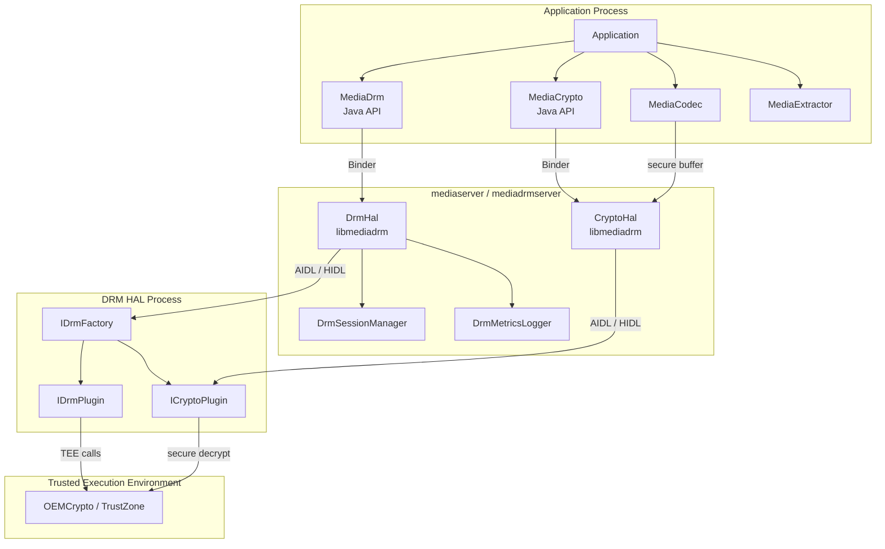

### 42.1.4 UUID-Based Scheme Selection

Every DRM scheme is identified by a 16-byte UUID. When an application encounters
DRM-protected content, it reads the scheme UUID from the content metadata (typically from
PSSH boxes in ISO BMFF containers or ContentProtection elements in DASH manifests) and
queries whether the device supports it:

```java
// Source: frameworks/base/media/java/android/media/MediaDrm.java
public static final boolean isCryptoSchemeSupported(@NonNull UUID uuid) {
    return isCryptoSchemeSupportedNative(getByteArrayFromUUID(uuid), null,
            SECURITY_LEVEL_UNKNOWN);
}
```

The well-known UUIDs include:

| DRM Scheme | UUID |
|-----------|------|
| Widevine | `edef8ba9-79d6-4ace-a3c8-27dcd51d21ed` |
| ClearKey (Common PSSH) | `1077efec-c0b2-4d02-ace3-3c1e52e2fb4b` |
| ClearKey | `e2719d58-a985-b3c9-781a-b030af78d30e` |
| PlayReady | `9a04f079-9840-4286-ab92-e65be0885f95` |

At the native layer, `DrmHal::isCryptoSchemeSupported()` tries the AIDL HAL first, then
falls back to the legacy HIDL HAL:

```cpp
// Source: frameworks/av/drm/libmediadrm/DrmHal.cpp
DrmStatus DrmHal::isCryptoSchemeSupported(const uint8_t uuid[16],
        const String8& mimeType,
        DrmPlugin::SecurityLevel securityLevel,
        bool* result) {
    DrmStatus statusResult =
            mDrmHalAidl->isCryptoSchemeSupported(uuid, mimeType,
                    securityLevel, result);
    if (*result) return statusResult;
    return mDrmHalHidl->isCryptoSchemeSupported(uuid, mimeType,
            securityLevel, result);
}
```

This dual-backend pattern permeates every method in `DrmHal`. The class attempts AIDL
first; if the AIDL HAL is not initialized (`initCheck() != OK`), it falls through to
HIDL.

### 42.1.5 The Playback Lifecycle

A complete DRM playback session follows these steps:

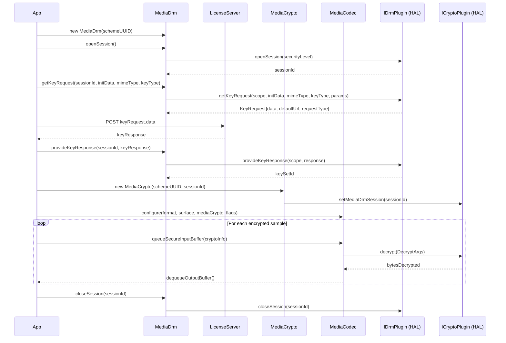

### 42.1.6 Security Levels

The DRM HAL defines a hierarchy of security levels that express the robustness of the
device's DRM implementation. These are defined in the AIDL enum:

```
// Source: hardware/interfaces/drm/aidl/android/hardware/drm/SecurityLevel.aidl
enum SecurityLevel {
    UNKNOWN,            // Unable to determine the security level
    SW_SECURE_CRYPTO,   // Software-based whitebox crypto
    SW_SECURE_DECODE,   // Software-based whitebox crypto + obfuscated decoder
    HW_SECURE_CRYPTO,   // Key management and crypto in TEE
    HW_SECURE_DECODE,   // Key management, crypto, and decode in TEE
    HW_SECURE_ALL,      // All processing in TEE (compressed + uncompressed)
    DEFAULT,            // Highest supported level on the device
}
```

Higher security levels unlock higher-quality content. A device with `HW_SECURE_ALL` can
stream 4K HDR from premium services, while one limited to `SW_SECURE_CRYPTO` may be
restricted to SD resolution. The security level is selected when opening a session:

```java
// Source: frameworks/base/media/java/android/media/MediaDrm.java
public byte[] openSession(@SecurityLevel int level) throws
        NotProvisionedException, ResourceBusyException {
    byte[] sessionId = openSessionNative(level);
    mPlaybackComponentMap.put(ByteBuffer.wrap(sessionId),
            new PlaybackComponent(sessionId));
    return sessionId;
}
```

---

## 42.2 DRM Framework

### 42.2.1 Source Tree Layout

The DRM framework code lives under `frameworks/av/drm/` and splits into several
libraries and directories:

```
frameworks/av/drm/
    drmserver/              Legacy DRM manager service (OMA DRM)
        DrmManager.cpp
        DrmManagerService.cpp
        main_drmserver.cpp
    libdrmframework/        Client library for legacy DRM APIs
    libmediadrm/            Core DRM framework library
        DrmHal.cpp          Unified AIDL+HIDL entry point
        DrmHalAidl.cpp      AIDL HAL wrapper (44 KB)
        DrmHalHidl.cpp      HIDL HAL wrapper (56 KB)
        CryptoHal.cpp       Crypto routing layer
        CryptoHalAidl.cpp   AIDL Crypto wrapper
        CryptoHalHidl.cpp   HIDL Crypto wrapper
        DrmHalListener.cpp  Event dispatch from HAL to framework
        DrmSessionManager.cpp  Session lifecycle & resource management
        DrmMetrics.cpp       Metrics collection (protobuf)
        DrmMetricsLogger.cpp Metrics reporting to MediaMetrics
        DrmMetricsConsumer.cpp  Metrics export to PersistableBundle
        DrmUtils.cpp         HAL discovery and factory creation
        DrmPluginPath.cpp    Plugin shared-library path resolution
        SharedLibrary.cpp    dlopen/dlsym wrapper
        DrmStatus.cpp        Status code translation
        PluginMetricsReporting.cpp
        include/mediadrm/    Public headers
    libmediadrmrkp/          Remote key provisioning support
    mediadrm/
        plugins/
            clearkey/        Reference ClearKey plugin
    mediacas/                Conditional Access System (CAS)
    common/                  Common utilities
```

### 42.2.2 MediaDrm Java API

The `MediaDrm` class (`frameworks/base/media/java/android/media/MediaDrm.java`) is the
primary application-facing API. It is a `final class` implementing `AutoCloseable`, which
means sessions are automatically cleaned up if the developer uses try-with-resources.

Key design characteristics:

- **UUID-based construction**: A `MediaDrm` instance is created for a specific DRM scheme
  UUID. The constructor calls `native_setup()` which connects to the native
  `DrmMetricsLogger` layer, which in turn creates the `DrmHal` object.

- **Session-oriented**: All key operations (getKeyRequest, provideKeyResponse, etc.)
  operate on a session identified by an opaque byte-array session ID.

- **Listener architecture**: The class supports four listener types, all managed through a
  generic `ConcurrentHashMap<Integer, ListenerWithExecutor>` pattern:

```java
// Source: frameworks/base/media/java/android/media/MediaDrm.java
private static final int DRM_EVENT = 200;
private static final int EXPIRATION_UPDATE = 201;
private static final int KEY_STATUS_CHANGE = 202;
private static final int SESSION_LOST_STATE = 203;

private final Map<Integer, ListenerWithExecutor> mListenerMap =
        new ConcurrentHashMap<>();
```

Events originate from the HAL plugin via the `IDrmPluginListener` AIDL interface, propagate
through the `DrmHalListener` native class, and arrive at `MediaDrm.postEventFromNative()`
which dispatches to the registered listener on the appropriate executor.

### 42.2.3 Key Request / Response Flow

The license acquisition process is the heart of DRM operation. The application calls
`getKeyRequest()` to generate an opaque license request, sends it to a license server over
HTTPS, and provides the response back:

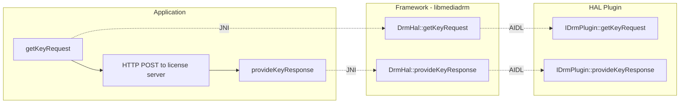

The key type determines the behavior:

| Key Type | Constant | Behavior |
|----------|----------|----------|
| Streaming | `KEY_TYPE_STREAMING` (1) | Keys valid only for current session |
| Offline | `KEY_TYPE_OFFLINE` (2) | Keys persisted, usable without network |
| Release | `KEY_TYPE_RELEASE` (3) | Release previously saved offline keys |

The key request type returned from the plugin tells the application what to do:

| Request Type | Constant | Meaning |
|-------------|----------|---------|
| Initial | `REQUEST_TYPE_INITIAL` (0) | First license request |
| Renewal | `REQUEST_TYPE_RENEWAL` (1) | License renewal before expiry |
| Release | `REQUEST_TYPE_RELEASE` (2) | Key release confirmation |
| None | `REQUEST_TYPE_NONE` (3) | Keys already available, no request needed |
| Update | `REQUEST_TYPE_UPDATE` (4) | Keys loaded but need value update |

### 42.2.4 MediaCrypto -- The Codec Bridge

`MediaCrypto` (`frameworks/base/media/java/android/media/MediaCrypto.java`) is the bridge
between the DRM session and the media codec. It is a simpler class than `MediaDrm`:

```java
// Source: frameworks/base/media/java/android/media/MediaCrypto.java
public final class MediaCrypto {
    public static final boolean isCryptoSchemeSupported(@NonNull UUID uuid);
    public MediaCrypto(@NonNull UUID uuid, @NonNull byte[] sessionId)
            throws MediaCryptoException;
    public final native boolean requiresSecureDecoderComponent(
            @NonNull String mime);
    public final native void setMediaDrmSession(@NonNull byte[] sessionId)
            throws MediaCryptoException;
    public native final void release();
}
```

The `requiresSecureDecoderComponent()` method is critical: it queries the HAL plugin to
determine whether the current security policy requires a secure decoder. If it returns
`true`, the application must configure `MediaCodec` with the `CONFIGURE_FLAG_SECURE` flag,
and all decoded frames stay in secure (protected) memory that cannot be read by the CPU.

### 42.2.5 DrmHal -- The Unified Native Entry Point

The `DrmHal` class (`frameworks/av/drm/libmediadrm/DrmHal.cpp`) is a thin routing layer
that holds both an AIDL backend (`DrmHalAidl`) and a HIDL backend (`DrmHalHidl`):

```cpp
// Source: frameworks/av/drm/libmediadrm/DrmHal.cpp
DrmHal::DrmHal() {
    mDrmHalHidl = sp<DrmHalHidl>::make();
    mDrmHalAidl = sp<DrmHalAidl>::make();
}
```

Every API method follows the same pattern: try AIDL first, fall through to HIDL. This
design maintains backward compatibility with devices shipping HIDL-based DRM HALs while
preferring the newer AIDL interface on modern devices.

The `createPlugin()` method demonstrates this fallthrough:

```cpp
// Source: frameworks/av/drm/libmediadrm/DrmHal.cpp
DrmStatus DrmHal::createPlugin(const uint8_t uuid[16],
        const String8& appPackageName) {
    return mDrmHalAidl->createPlugin(uuid, appPackageName) == OK
                   ? DrmStatus(OK)
                   : mDrmHalHidl->createPlugin(uuid, appPackageName);
}
```

### 42.2.6 DrmHalAidl -- The AIDL Backend

`DrmHalAidl` (`frameworks/av/drm/libmediadrm/DrmHalAidl.cpp`, approximately 900 lines)
contains the full AIDL integration logic. At initialization, it discovers AIDL DRM HAL
services using `AServiceManager`, queries their supported crypto schemes, and instantiates
the appropriate `IDrmPlugin` via the factory:

The class performs extensive type conversion between the framework's legacy types
(`Vector<uint8_t>`, `KeyedVector<String8, String8>`) and the AIDL types
(`std::vector<uint8_t>`, `std::vector<KeyValue>`). The `toKeyValueVector()` and
`toKeyedVector()` helper functions handle this translation:

```cpp
// Source: frameworks/av/drm/libmediadrm/DrmHalAidl.cpp
static std::vector<KeyValue> toKeyValueVector(
        const KeyedVector<String8, String8>& keyedVector) {
    std::vector<KeyValue> stdKeyedVector;
    for (size_t i = 0; i < keyedVector.size(); i++) {
        KeyValue keyValue;
        keyValue.key = toStdString(keyedVector.keyAt(i));
        keyValue.value = toStdString(keyedVector.valueAt(i));
        stdKeyedVector.push_back(keyValue);
    }
    return stdKeyedVector;
}
```

### 42.2.7 DrmSessionManager -- Resource Management

The `DrmSessionManager` (`frameworks/av/drm/libmediadrm/DrmSessionManager.cpp`) manages
DRM session lifecycles and integrates with Android's `ResourceManagerService` to enable
session reclamation under resource pressure.

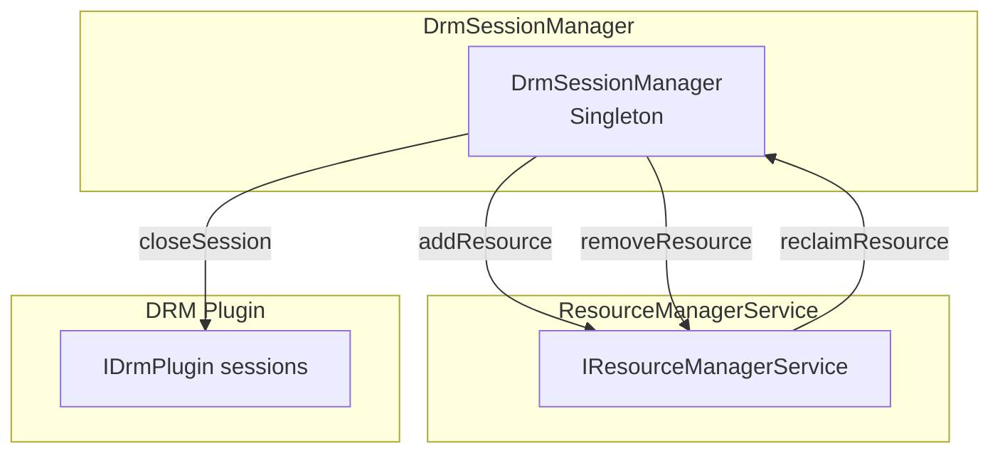

When a session is opened, the manager registers it with the `ResourceManagerService` as a
`kDrmSession` resource:

```cpp
// Source: frameworks/av/drm/libmediadrm/DrmSessionManager.cpp
static std::vector<MediaResourceParcel> toResourceVec(
        const Vector<uint8_t> &sessionId, int64_t value) {
    using Type = aidl::android::media::MediaResourceType;
    using SubType = aidl::android::media::MediaResourceSubType;
    std::vector<MediaResourceParcel> resources;
    MediaResourceParcel resource{
            Type::kDrmSession, SubType::kUnspecifiedSubType,
            toStdVec<>(sessionId), value};
    resources.push_back(resource);
    return resources;
}
```

If the system runs low on DRM session resources (many DRM implementations limit concurrent
sessions), the `ResourceManagerService` can reclaim sessions from lower-priority
applications by calling back into the `DrmSessionManager`, which closes the session and
delivers an `EVENT_SESSION_RECLAIMED` event to the app.

### 42.2.8 DRM Event Propagation

Events flow from the HAL plugin through the framework to the application via the
`IDrmPluginListener` AIDL callback interface and the `DrmHalListener` class:

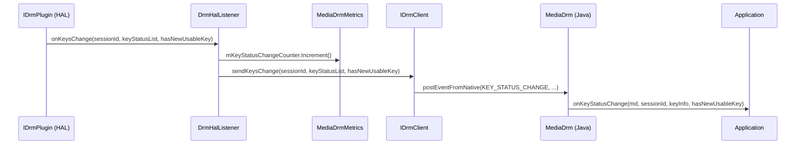

The `DrmHalListener` translates AIDL event types to framework event types and increments
metrics counters for every event:

```cpp
// Source: frameworks/av/drm/libmediadrm/DrmHalListener.cpp
::ndk::ScopedAStatus DrmHalListener::onEvent(
        EventTypeAidl eventTypeAidl,
        const std::vector<uint8_t>& sessionId,
        const std::vector<uint8_t>& data) {
    mMetrics->mEventCounter.Increment((uint32_t)eventTypeAidl);
    // ... dispatch to IDrmClient ...
}
```

### 42.2.9 Provisioning

Some DRM schemes require device provisioning -- a one-time process where the device obtains
unique credentials from a provisioning server. The flow mirrors the key request/response
pattern:

1. The application catches `NotProvisionedException` from `openSession()` or
   `getKeyRequest()`.
2. It calls `getProvisionRequest()` to get an opaque provisioning request.
3. It sends the request to the provisioning server URL.
4. It provides the response via `provideProvisionResponse()`.

The HAL method signature is:

```
// Source: hardware/interfaces/drm/aidl/android/hardware/drm/IDrmPlugin.aidl
ProvisionRequest getProvisionRequest(
        in String certificateType, in String certificateAuthority);
```

### 42.2.10 Secure Stops

Secure stops are a mechanism for enforcing concurrent stream limits. The HAL plugin
persists a signed session record each time a `MediaCrypto` object is created. When playback
completes, the application retrieves and relays these records to the license server, which
verifies that the session is genuinely terminated.

The `IDrmPlugin` interface provides a complete secure stop lifecycle:

| Method | Purpose |
|--------|---------|
| `getSecureStops()` | Get all secure stop records |
| `getSecureStopIds()` | Get all secure stop IDs |
| `getSecureStop(SecureStopId)` | Get a specific secure stop by ID |
| `releaseSecureStops(OpaqueData)` | Release with server confirmation |
| `releaseSecureStop(SecureStopId)` | Release specific stop by ID |
| `releaseAllSecureStops()` | Release all stops |
| `removeSecureStop(SecureStopId)` | Remove without server confirmation |
| `removeAllSecureStops()` | Remove all without confirmation |

### 42.2.11 Offline License Management

Offline licenses allow content to be played without a network connection. The framework
provides methods to manage offline license state:

```java
// Key flow for offline licenses
// 1. Request offline keys
KeyRequest request = mediaDrm.getKeyRequest(
    sessionId, initData, mimeType, MediaDrm.KEY_TYPE_OFFLINE, null);

// 2. After providing response, receive a keySetId
byte[] keySetId = mediaDrm.provideKeyResponse(sessionId, response);

// 3. Later, restore offline keys to a new session
mediaDrm.restoreKeys(newSessionId, keySetId);

// 4. Query offline license state
List<KeySetId> offlineKeys = mediaDrm.getOfflineLicenseKeySetIds();
OfflineLicenseState state = mediaDrm.getOfflineLicenseState(keySetId);
```

The `IDrmPlugin` HAL supports three offline license states:

```
// Source: hardware/interfaces/drm/aidl/android/hardware/drm/OfflineLicenseState.aidl
enum OfflineLicenseState {
    UNKNOWN,   // Unable to determine the state
    USABLE,    // Keys available for decryption
    INACTIVE,  // Marked for release but not yet confirmed
}
```

### 42.2.12 Plugin Path Resolution

Legacy shared-library-based plugins are loaded from a vendor-specific path determined at
runtime:

```cpp
// Source: frameworks/av/drm/libmediadrm/DrmPluginPath.cpp
const char* getDrmPluginPath() {
    char value[PROPERTY_VALUE_MAX];
    if (property_get("drm.64bit.enabled", value, NULL) == 0) {
        return "/vendor/lib/mediadrm";
    } else {
        return "/vendor/lib64/mediadrm";
    }
}
```

The `SharedLibrary` class wraps `dlopen`/`dlsym`:

```cpp
// Source: frameworks/av/drm/libmediadrm/SharedLibrary.cpp
SharedLibrary::SharedLibrary(const String8 &path) {
    mLibHandle = dlopen(path.c_str(), RTLD_NOW);
}

void *SharedLibrary::lookup(const char *symbol) const {
    if (!mLibHandle) return NULL;
    (void)dlerror();
    return dlsym(mLibHandle, symbol);
}
```

### 42.2.13 HAL Discovery

The `DrmUtils` module (`frameworks/av/drm/libmediadrm/DrmUtils.cpp`) is responsible for
discovering available DRM HAL services. It enumerates both AIDL and HIDL service
registrations:

For HIDL, it iterates through all versions (1.0 through 1.4) of the IDrmFactory interface:

```cpp
// Source: frameworks/av/drm/libmediadrm/DrmUtils.cpp
template <typename Hal, typename V, typename M>
void MakeHidlFactories(const uint8_t uuid[16], V& factories,
                       M& instances) {
    sp<HServiceManager> serviceManager =
            HServiceManager::getService();
    serviceManager->listManifestByInterface(
            Hal::descriptor,
            [&](const hidl_vec<hidl_string>& registered) {
                for (const auto& instance : registered) {
                    auto factory = Hal::getService(instance);
                    if (factory != nullptr) {
                        instances[instance.c_str()] = Hal::descriptor;
                        // ... check UUID support ...
                    }
                }
            });
}
```

For AIDL, the discovery uses `AServiceManager` to find registered
`android.hardware.drm.IDrmFactory` services.

---

## 42.3 DRM HAL

### 42.3.1 HAL Evolution

The DRM HAL has gone through significant evolution:

| Version | Interface | Transport | Notes |
|---------|-----------|-----------|-------|
| 1.0 | HIDL | hwbinder | Initial DRM HAL |
| 1.1 | HIDL | hwbinder | Added metrics (DrmMetricGroup) |
| 1.2 | HIDL | hwbinder | Added offline license management |
| 1.3 | HIDL | hwbinder | Added log messages |
| 1.4 | HIDL | hwbinder | Added requiresSecureDecoder with level |
| AIDL v1 | AIDL | binder | Unified interface, Stable AIDL |
| AIDL v2 (current) | AIDL | binder | Added KeyHandleResult, getKeyHandle |

The directory structure reflects this evolution:

```
hardware/interfaces/drm/
    1.0/        HIDL v1.0 interfaces
    1.1/        HIDL v1.1 interfaces (extends 1.0)
    1.2/        HIDL v1.2 interfaces (extends 1.1)
    1.3/        HIDL v1.3 interfaces (extends 1.2)
    1.4/        HIDL v1.4 interfaces (extends 1.3)
    aidl/       Stable AIDL interfaces (current)
        android/hardware/drm/   AIDL source files
        aidl_api/               Frozen API snapshots
        vts/                    Vendor Test Suite
    common/     Shared utilities
```

### 42.3.2 IDrmFactory -- The Entry Point

The `IDrmFactory` is the HAL entry point. A vendor registers one or more factory services;
the framework discovers them and uses the factory to create plugin instances:

```
// Source: hardware/interfaces/drm/aidl/android/hardware/drm/IDrmFactory.aidl
@VintfStability
interface IDrmFactory {
    @nullable IDrmPlugin createDrmPlugin(
            in Uuid uuid, in String appPackageName);

    @nullable ICryptoPlugin createCryptoPlugin(
            in Uuid uuid, in byte[] initData);

    CryptoSchemes getSupportedCryptoSchemes();
}
```

The `CryptoSchemes` return value tells the framework which UUIDs and content types the
factory supports, along with the minimum and maximum security levels for each MIME type:

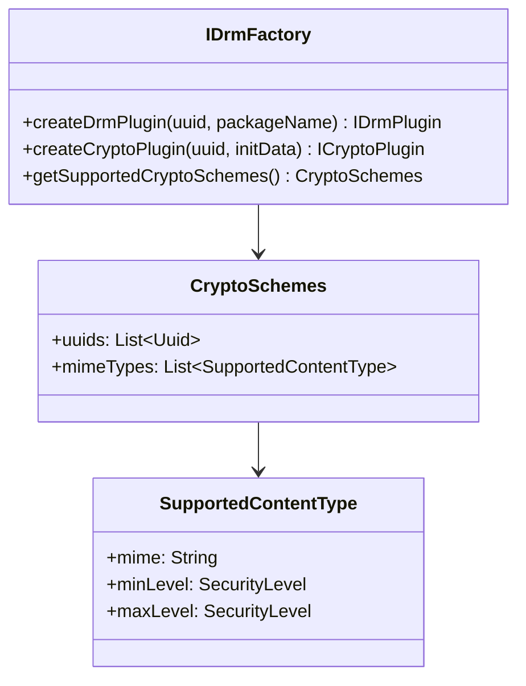

### 42.3.3 IDrmPlugin -- Session and Key Management

The `IDrmPlugin` interface (`hardware/interfaces/drm/aidl/android/hardware/drm/IDrmPlugin.aidl`,
approximately 750 lines) is the largest interface in the DRM HAL. It covers session
management, key acquisition, provisioning, secure stops, property access, crypto
operations, and metrics.

The full method inventory:

**Session Management:**

| Method | Signature |
|--------|-----------|
| `openSession` | `byte[] openSession(in SecurityLevel securityLevel)` |
| `closeSession` | `void closeSession(in byte[] sessionId)` |
| `getNumberOfSessions` | `NumberOfSessions getNumberOfSessions()` |
| `getSecurityLevel` | `SecurityLevel getSecurityLevel(in byte[] sessionId)` |

**Key Management:**

| Method | Signature |
|--------|-----------|
| `getKeyRequest` | `KeyRequest getKeyRequest(in byte[] scope, in byte[] initData, in String mimeType, in KeyType keyType, in KeyValue[] optionalParameters)` |
| `provideKeyResponse` | `KeySetId provideKeyResponse(in byte[] scope, in byte[] response)` |
| `removeKeys` | `void removeKeys(in byte[] sessionId)` |
| `restoreKeys` | `void restoreKeys(in byte[] sessionId, in KeySetId keySetId)` |
| `queryKeyStatus` | `List<KeyValue> queryKeyStatus(in byte[] sessionId)` |

**Provisioning:**

| Method | Signature |
|--------|-----------|
| `getProvisionRequest` | `ProvisionRequest getProvisionRequest(in String certificateType, in String certificateAuthority)` |
| `provideProvisionResponse` | `ProvideProvisionResponseResult provideProvisionResponse(in byte[] response)` |

**Secure Stops:**

| Method | Signature |
|--------|-----------|
| `getSecureStops` | `List<SecureStop> getSecureStops()` |
| `getSecureStopIds` | `List<SecureStopId> getSecureStopIds()` |
| `getSecureStop` | `SecureStop getSecureStop(in SecureStopId secureStopId)` |
| `releaseSecureStops` | `void releaseSecureStops(in OpaqueData ssRelease)` |
| `releaseSecureStop` | `void releaseSecureStop(in SecureStopId secureStopId)` |
| `releaseAllSecureStops` | `void releaseAllSecureStops()` |
| `removeSecureStop` | `void removeSecureStop(in SecureStopId secureStopId)` |
| `removeAllSecureStops` | `void removeAllSecureStops()` |

**Offline License Management:**

| Method | Signature |
|--------|-----------|
| `getOfflineLicenseKeySetIds` | `List<KeySetId> getOfflineLicenseKeySetIds()` |
| `getOfflineLicenseState` | `OfflineLicenseState getOfflineLicenseState(in KeySetId keySetId)` |
| `removeOfflineLicense` | `void removeOfflineLicense(in KeySetId keySetId)` |

**Properties:**

| Method | Signature |
|--------|-----------|
| `getPropertyString` | `String getPropertyString(in String propertyName)` |
| `getPropertyByteArray` | `byte[] getPropertyByteArray(in String propertyName)` |
| `setPropertyString` | `void setPropertyString(in String propertyName, in String value)` |
| `setPropertyByteArray` | `void setPropertyByteArray(in String propertyName, in byte[] value)` |

Standard property names include:

| Property | Type | Description |
|----------|------|-------------|
| `vendor` | String | DRM scheme vendor name |
| `version` | String | DRM scheme version |
| `description` | String | Human-readable description |
| `deviceUniqueId` | byte[] | Device unique identifier |

**Crypto Operations:**

| Method | Signature |
|--------|-----------|
| `encrypt` | `byte[] encrypt(in byte[] sessionId, in byte[] keyId, in byte[] input, in byte[] iv)` |
| `decrypt` | `byte[] decrypt(in byte[] sessionId, in byte[] keyId, in byte[] input, in byte[] iv)` |
| `sign` | `byte[] sign(in byte[] sessionId, in byte[] keyId, in byte[] message)` |
| `verify` | `boolean verify(in byte[] sessionId, in byte[] keyId, in byte[] message, in byte[] signature)` |
| `signRSA` | `byte[] signRSA(...)` |

**Configuration:**

| Method | Signature |
|--------|-----------|
| `setCipherAlgorithm` | `void setCipherAlgorithm(in byte[] sessionId, in String algorithm)` |
| `setMacAlgorithm` | `void setMacAlgorithm(in byte[] sessionId, in String algorithm)` |
| `getHdcpLevels` | `HdcpLevels getHdcpLevels()` |
| `requiresSecureDecoder` | `boolean requiresSecureDecoder(in String mime, in SecurityLevel level)` |

**Metrics and Logging:**

| Method | Signature |
|--------|-----------|
| `getMetrics` | `List<DrmMetricGroup> getMetrics()` |
| `getLogMessages` | `List<LogMessage> getLogMessages()` |

**Listener:**

| Method | Signature |
|--------|-----------|
| `setListener` | `void setListener(in IDrmPluginListener listener)` |

### 42.3.4 ICryptoPlugin -- Decryption Engine

The `ICryptoPlugin` interface (`hardware/interfaces/drm/aidl/android/hardware/drm/ICryptoPlugin.aidl`)
handles the actual decryption of content samples. It is a more focused interface:

```
// Source: hardware/interfaces/drm/aidl/android/hardware/drm/ICryptoPlugin.aidl
@VintfStability
interface ICryptoPlugin {
    int decrypt(in DecryptArgs args);
    List<LogMessage> getLogMessages();
    void notifyResolution(in int width, in int height);
    boolean requiresSecureDecoderComponent(in String mime);
    void setMediaDrmSession(in byte[] sessionId);
    void setSharedBufferBase(in SharedBuffer base);
    KeyHandleResult getKeyHandle(in byte[] keyId, in Mode mode);
}
```

The `decrypt()` method is the performance-critical path -- it is called for every encrypted
media sample during playback. The `DecryptArgs` parcelable bundles all parameters into a
single IPC call:

```
// Source: hardware/interfaces/drm/aidl/android/hardware/drm/DecryptArgs.aidl
parcelable DecryptArgs {
    boolean secure;          // Whether a secure decoder is being used
    byte[] keyId;            // Key ID for decryption
    byte[] iv;               // Initialization vector
    Mode mode;               // UNENCRYPTED, AES_CTR, AES_CBC, AES_CBC_CTS
    Pattern pattern;         // CENC pattern (encrypt/skip block counts)
    SubSample[] subSamples;  // Clear and encrypted byte ranges
    SharedBuffer source;     // Input buffer reference
    long offset;             // Offset into source buffer
    DestinationBuffer destination;  // Output buffer (secure or non-secure)
}
```

The `secure` flag in `DecryptArgs` controls whether the output goes to a normal shared
memory buffer (`nonsecureMemory`) or to a secure buffer handle (`secureMemory`) that only
the hardware compositor and secure video decoder can access.

### 42.3.5 IDrmPluginListener -- Asynchronous Events

The `IDrmPluginListener` interface allows the HAL plugin to notify the framework of
asynchronous events:

```
// Source: hardware/interfaces/drm/aidl/android/hardware/drm/IDrmPluginListener.aidl
@VintfStability
interface IDrmPluginListener {
    oneway void onEvent(in EventType eventType,
            in byte[] sessionId, in byte[] data);
    oneway void onExpirationUpdate(in byte[] sessionId,
            in long expiryTimeInMS);
    oneway void onKeysChange(in byte[] sessionId,
            in KeyStatus[] keyStatusList,
            in boolean hasNewUsableKey);
    oneway void onSessionLostState(in byte[] sessionId);
}
```

All methods are `oneway` (fire-and-forget) to prevent the HAL from blocking on the
framework. The event types are:

```
// Source: hardware/interfaces/drm/aidl/android/hardware/drm/EventType.aidl
enum EventType {
    PROVISION_REQUIRED,  // Device needs provisioning
    KEY_NEEDED,          // App needs to request keys
    KEY_EXPIRED,         // Keys have expired
    VENDOR_DEFINED,      // Vendor-specific event
    SESSION_RECLAIMED,   // Session reclaimed by resource manager
}
```

### 42.3.6 Status Codes

The DRM HAL defines a comprehensive set of status codes that cover every failure mode:

```
// Source: hardware/interfaces/drm/aidl/android/hardware/drm/Status.aidl
enum Status {
    OK,
    ERROR_DRM_NO_LICENSE,
    ERROR_DRM_LICENSE_EXPIRED,
    ERROR_DRM_SESSION_NOT_OPENED,
    ERROR_DRM_CANNOT_HANDLE,
    ERROR_DRM_INVALID_STATE,
    BAD_VALUE,
    ERROR_DRM_NOT_PROVISIONED,
    ERROR_DRM_RESOURCE_BUSY,
    ERROR_DRM_INSUFFICIENT_OUTPUT_PROTECTION,
    ERROR_DRM_DEVICE_REVOKED,
    ERROR_DRM_DECRYPT,
    ERROR_DRM_UNKNOWN,
    ERROR_DRM_INSUFFICIENT_SECURITY,
    ERROR_DRM_FRAME_TOO_LARGE,
    ERROR_DRM_SESSION_LOST_STATE,
    ERROR_DRM_RESOURCE_CONTENTION,
    CANNOT_DECRYPT_ZERO_SUBSAMPLES,
    CRYPTO_LIBRARY_ERROR,
    GENERAL_OEM_ERROR,
    GENERAL_PLUGIN_ERROR,
    INIT_DATA_INVALID,
    KEY_NOT_LOADED,
    LICENSE_PARSE_ERROR,
    LICENSE_POLICY_ERROR,
    LICENSE_RELEASE_ERROR,
    LICENSE_REQUEST_REJECTED,
    LICENSE_RESTORE_ERROR,
    LICENSE_STATE_ERROR,
    MALFORMED_CERTIFICATE,
    MEDIA_FRAMEWORK_ERROR,
    MISSING_CERTIFICATE,
    PROVISIONING_CERTIFICATE_ERROR,
    PROVISIONING_CONFIGURATION_ERROR,
    PROVISIONING_PARSE_ERROR,
    PROVISIONING_REQUEST_REJECTED,
    RETRYABLE_PROVISIONING_ERROR,
    SECURE_STOP_RELEASE_ERROR,
    STORAGE_READ_FAILURE,
    STORAGE_WRITE_FAILURE,
}
```

These status codes map to Java error codes in `MediaDrm.ErrorCodes` and
`MediaCodec.CryptoException` error codes, giving applications granular insight into
failures.

### 42.3.7 AIDL Data Types

The DRM HAL defines numerous AIDL parcelable types. Here is the complete type hierarchy:

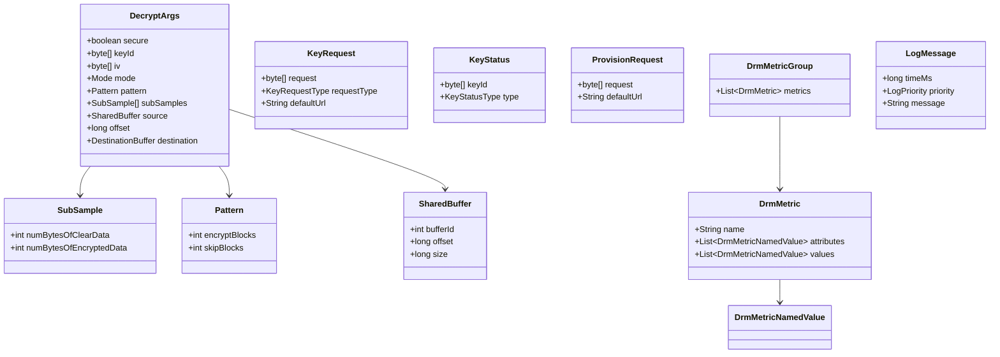

### 42.3.8 VTS Testing

The DRM HAL includes a comprehensive Vendor Test Suite (VTS) that validates HAL
implementations against the interface contracts:

```
hardware/interfaces/drm/aidl/vts/
    drm_hal_common.cpp      Common test infrastructure (22 KB)
    drm_hal_test.cpp         Test cases (19 KB)
    drm_hal_test_main.cpp    Test entry point
    include/
        drm_hal_common.h    Test helper class definitions
```

The VTS tests exercise every method on both `IDrmPlugin` and `ICryptoPlugin`, verifying
correct behavior for both success and error paths.

---

## 42.4 Widevine DRM

### 42.4.1 Overview

Widevine is Google's DRM technology and the most widely deployed content protection system
on Android. It is a proprietary, closed-source implementation, but its architecture is
well-documented through the public DRM HAL interfaces it implements. Widevine is
identified by UUID `edef8ba9-79d6-4ace-a3c8-27dcd51d21ed`.

### 42.4.2 Security Levels: L1, L2, L3

Widevine defines three security levels that map to the HAL's SecurityLevel enum:

| Widevine Level | HAL SecurityLevel | Requirements |
|---------------|------------------|--------------|
| **L1** | `HW_SECURE_ALL` | All crypto operations and content processing in TEE. Keys and decrypted content never leave secure hardware. Required for HD/4K/HDR content. |
| **L2** | `HW_SECURE_CRYPTO` | Crypto operations in TEE, but decoding in software. Keys protected in hardware but decrypted content accessible to CPU. Rarely used in practice. |
| **L3** | `SW_SECURE_CRYPTO` | All operations in software with whitebox crypto obfuscation. No hardware security. Limited to SD resolution by most license policies. |

```mermaid
graph TB
    subgraph "Widevine L1 - HW_SECURE_ALL"
        L1_APP[Application] --> L1_FW[DRM Framework]
        L1_FW --> L1_WV[Widevine HAL]
        L1_WV --> L1_OEM[OEMCrypto in TEE]
        L1_OEM --> L1_DEC[Secure Video Decoder]
        L1_DEC --> L1_DISP[Secure Display Path]
        style L1_OEM fill:#4a9,stroke:#333,color:#fff
        style L1_DEC fill:#4a9,stroke:#333,color:#fff
        style L1_DISP fill:#4a9,stroke:#333,color:#fff
    end

    subgraph "Widevine L3 - SW_SECURE_CRYPTO"
        L3_APP[Application] --> L3_FW[DRM Framework]
        L3_FW --> L3_WV[Widevine HAL]
        L3_WV --> L3_SW["Software Crypto<br/>Whitebox AES"]
        L3_SW --> L3_DEC[Software Decoder]
        L3_DEC --> L3_DISP[Normal Display]
        style L3_SW fill:#d84,stroke:#333,color:#fff
        style L3_DEC fill:#d84,stroke:#333,color:#fff
    end
```

### 42.4.3 TEE Integration

For L1 security, Widevine relies on OEMCrypto, a standardized interface that device
manufacturers implement inside their Trusted Execution Environment (TEE) -- typically
ARM TrustZone or similar hardware-isolated environment.

OEMCrypto provides:

1. **Device key storage**: Unique per-device RSA key pair stored in hardware-protected
   storage during manufacturing.
2. **Session key derivation**: Content keys are encrypted (wrapped) by the license server
   using the device's public key and unwrapped inside the TEE.
3. **Content decryption**: AES-CTR or AES-CBC decryption of media samples happens entirely
   within the secure world.
4. **Output protection enforcement**: The TEE verifies HDCP levels on display outputs
   before allowing decrypted content to be rendered.
5. **Secure buffer management**: Decrypted video frames are written to secure memory
   regions that cannot be read by the normal-world CPU.

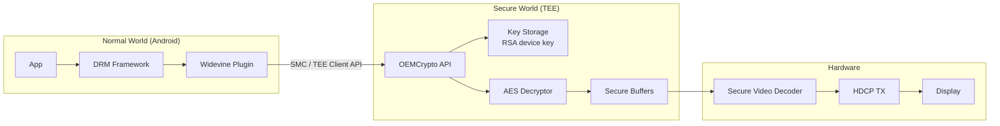

### 42.4.4 Provisioning Flow

Widevine devices are provisioned in two ways:

1. **Factory Provisioning**: During device manufacturing, a unique device certificate
   (containing the device's RSA public key and attestation from Widevine) is burned into
   the TEE's secure storage. This is the standard approach for L1 devices.

2. **Online Provisioning**: If the device certificate is not present (or for L3 devices),
   the device can request provisioning at runtime. The `getProvisionRequest()` /
   `provideProvisionResponse()` HAL methods handle this flow.

### 42.4.5 License Request Structure

Widevine license requests contain:

- Device certificate (proving device identity and security level)
- Content identification (from PSSH data)
- Requested key types (streaming or offline)
- HDCP and output protection capabilities
- Client information (app package name, device model)

The license server evaluates these against the content owner's policy and returns
appropriately scoped content keys encrypted for the device.

### 42.4.6 HDCP Enforcement

Widevine enforces HDCP (High-bandwidth Digital Content Protection) through the
`getHdcpLevels()` method:

```
// Source: hardware/interfaces/drm/aidl/android/hardware/drm/IDrmPlugin.aidl
HdcpLevels getHdcpLevels();
```

This returns both the currently negotiated HDCP level (depends on connected displays) and
the maximum HDCP level the device supports. Content policies may require specific HDCP
levels (e.g., HDCP 2.2 for 4K content), and the DRM plugin must enforce these requirements,
returning `ERROR_DRM_INSUFFICIENT_OUTPUT_PROTECTION` if the requirements are not met.

### 42.4.7 Integration with MediaCodec

When Widevine reports that a secure decoder is required (via
`requiresSecureDecoderComponent()` returning `true`), the `MediaCodec` must be configured
with:

```java
codec.configure(format, surface, mediaCrypto,
        MediaCodec.CONFIGURE_FLAG_SECURE);
```

This triggers the codec to allocate secure input and output buffers. The encrypted input
is decrypted by the `ICryptoPlugin::decrypt()` call with `DecryptArgs.secure = true`, and
the decrypted output goes directly to a secure buffer that only the hardware video decoder
and display compositor can access.

---

## 42.5 ClearKey DRM Plugin

### 42.5.1 Purpose and Design

ClearKey is the reference DRM implementation included in AOSP. It implements the ISO/IEC
23001-7 Common Encryption standard using unencrypted ("clear") keys delivered via JSON Web
Keys (JWK). It serves three purposes:

1. **Testing**: Developers can test DRM playback flows without a commercial DRM server.
2. **Compliance**: It validates that the DRM framework interfaces work correctly.
3. **Reference**: It demonstrates how to implement a DRM HAL plugin.

ClearKey supports two UUIDs:

```cpp
// Source: frameworks/av/drm/mediadrm/plugins/clearkey/common/ClearKeyUUID.cpp
const std::array<uint8_t, 16> kCommonPsshBoxUUID{
    0x10,0x77,0xEF,0xEC,0xC0,0xB2,0x4D,0x02,
    0xAC,0xE3,0x3C,0x1E,0x52,0xE2,0xFB,0x4B
};

const std::array<uint8_t, 16> kClearKeyUUID{
    0xE2,0x71,0x9D,0x58,0xA9,0x85,0xB3,0xC9,
    0x78,0x1A,0xB0,0x30,0xAF,0x78,0xD3,0x0E
};
```

### 42.5.2 Source Layout

```
frameworks/av/drm/mediadrm/plugins/clearkey/
    aidl/                      AIDL HAL implementation (current)
        Service.cpp            Binder service entry point
        DrmFactory.cpp         IDrmFactory implementation
        DrmPlugin.cpp          IDrmPlugin implementation (41 KB)
        CryptoPlugin.cpp       ICryptoPlugin implementation (10 KB)
        CreatePluginFactories.cpp
        include/
            DrmFactory.h
            DrmPlugin.h
            CryptoPlugin.h
            AidlUtils.h
            AidlClearKeryProperties.h
    common/                    Shared code between AIDL and legacy impls
        AesCtrDecryptor.cpp    AES-CTR decryption using OpenSSL
        ClearKeyUUID.cpp       UUID definitions
        InitDataParser.cpp     PSSH/CENC init data parsing
        JsonWebKey.cpp         JWK parsing
        Session.cpp            Session key management
        SessionLibrary.cpp     Session storage
        DeviceFiles.cpp        Offline license persistence
        MemoryFileSystem.cpp   In-memory file system for testing
        Base64.cpp             Base64 encoding/decoding
        Buffer.cpp             Buffer utilities
        Utils.cpp              Miscellaneous helpers
        include/clearkeydrm/
            AesCtrDecryptor.h
            ClearKeyTypes.h
            ClearKeyDrmProperties.h
            Session.h
            SessionLibrary.h
            ...
    default/                   Legacy HIDL implementation
        ...
```

### 42.5.3 Service Entry Point

The ClearKey HAL runs as a standalone binder service:

```cpp
// Source: frameworks/av/drm/mediadrm/plugins/clearkey/aidl/Service.cpp
int main(int /*argc*/, char* argv[]) {
    InitLogging(argv, LogdLogger());
    ABinderProcess_setThreadPoolMaxThreadCount(8);

    std::shared_ptr<DrmFactory> drmFactory = createDrmFactory();
    const std::string drmInstance =
            std::string() + DrmFactory::descriptor + "/clearkey";
    binder_status_t status = AServiceManager_addService(
            drmFactory->asBinder().get(), drmInstance.c_str());
    CHECK(status == STATUS_OK);

    ABinderProcess_joinThreadPool();
    return EXIT_FAILURE;  // should not be reached
}
```

The service registers itself as `android.hardware.drm.IDrmFactory/clearkey` in the
binder service manager.

### 42.5.4 DrmFactory -- Plugin Creation

The ClearKey `DrmFactory` validates the UUID and creates plugin instances:

```cpp
// Source: frameworks/av/drm/mediadrm/plugins/clearkey/aidl/DrmFactory.cpp
::ndk::ScopedAStatus DrmFactory::createDrmPlugin(
        const Uuid& in_uuid, const string& in_appPackageName,
        shared_ptr<IDrmPlugin>* _aidl_return) {
    if (!isClearKeyUUID(in_uuid.uuid.data())) {
        *_aidl_return = nullptr;
        return toNdkScopedAStatus(Status::BAD_VALUE);
    }
    shared_ptr<DrmPlugin> plugin =
            ::ndk::SharedRefBase::make<DrmPlugin>(
                    SessionLibrary::get());
    *_aidl_return = plugin;
    return toNdkScopedAStatus(Status::OK);
}
```

The factory also reports supported MIME types and security levels:

```cpp
// Source: frameworks/av/drm/mediadrm/plugins/clearkey/aidl/DrmFactory.cpp
::ndk::ScopedAStatus DrmFactory::getSupportedCryptoSchemes(
        CryptoSchemes* _aidl_return) {
    CryptoSchemes schemes{};
    for (const auto& uuid : getSupportedCryptoSchemes()) {
        schemes.uuids.push_back({uuid});
    }
    for (auto mime : {kIsoBmffVideoMimeType, kIsoBmffAudioMimeType,
                      kCencInitDataFormat, kWebmVideoMimeType,
                      kWebmAudioMimeType, kWebmInitDataFormat}) {
        const auto minLevel = SecurityLevel::SW_SECURE_CRYPTO;
        const auto maxLevel = SecurityLevel::SW_SECURE_CRYPTO;
        schemes.mimeTypes.push_back({mime, minLevel, maxLevel});
    }
    *_aidl_return = schemes;
    return ndk::ScopedAStatus::ok();
}
```

Note that ClearKey only supports `SW_SECURE_CRYPTO` -- it is a software-only plugin with
no hardware security backing.

### 42.5.5 DrmPlugin -- Session and Key Management

The ClearKey `DrmPlugin` (`frameworks/av/drm/mediadrm/plugins/clearkey/aidl/DrmPlugin.cpp`,
approximately 1100 lines) implements the full `IDrmPlugin` interface. Key aspects:

**Initialization:**

```cpp
// Source: frameworks/av/drm/mediadrm/plugins/clearkey/aidl/DrmPlugin.cpp
DrmPlugin::DrmPlugin(SessionLibrary* sessionLibrary)
    : mSessionLibrary(sessionLibrary),
      mOpenSessionOkCount(0),
      mCloseSessionOkCount(0),
      mCloseSessionNotOpenedCount(0),
      mNextSecureStopId(kSecureStopIdStart),
      mMockError(Status::OK) {
    mPlayPolicy.clear();
    initProperties();
    mSecureStops.clear();
    mReleaseKeysMap.clear();
    std::srand(std::time(nullptr));
}
```

**Properties initialization:**

```cpp
// Source: frameworks/av/drm/mediadrm/plugins/clearkey/aidl/DrmPlugin.cpp
void DrmPlugin::initProperties() {
    mStringProperties.clear();
    mStringProperties[kVendorKey] = kAidlVendorValue;
    mStringProperties[kVersionKey] = kVersionValue;
    mStringProperties[kPluginDescriptionKey] = kAidlPluginDescriptionValue;
    mStringProperties[kAlgorithmsKey] = kAidlAlgorithmsValue;
    // ...
}
```

**Secure stop management:**

ClearKey implements secure stops as a test environment (not a secure implementation):

```cpp
// Source: frameworks/av/drm/mediadrm/plugins/clearkey/aidl/DrmPlugin.cpp
// The secure stop in ClearKey implementation is not installed securely.
// This function merely creates a test environment for testing secure
// stops APIs.
void DrmPlugin::installSecureStop(
        const std::vector<uint8_t>& sessionId) {
    Mutex::Autolock lock(mSecureStopLock);
    ClearkeySecureStop clearkeySecureStop;
    clearkeySecureStop.id = uint32ToVector(++mNextSecureStopId);
    clearkeySecureStop.data.assign(sessionId.begin(),
                                    sessionId.end());
    mSecureStops.insert(std::pair<std::vector<uint8_t>,
            ClearkeySecureStop>(clearkeySecureStop.id,
                                clearkeySecureStop));
}
```

### 42.5.6 CryptoPlugin -- Decryption

The ClearKey `CryptoPlugin` (`frameworks/av/drm/mediadrm/plugins/clearkey/aidl/CryptoPlugin.cpp`)
implements the actual decryption. It supports two modes:

1. **UNENCRYPTED** (`Mode::UNENCRYPTED`): Simply copies clear data bytes.
2. **AES_CTR** (`Mode::AES_CTR`): Decrypts using AES-128-CTR mode.

The decrypt method shows the complete flow:

```cpp
// Source: frameworks/av/drm/mediadrm/plugins/clearkey/aidl/CryptoPlugin.cpp
::ndk::ScopedAStatus CryptoPlugin::decrypt(
        const DecryptArgs& in_args, int32_t* _aidl_return) {
    *_aidl_return = 0;

    // ClearKey does not support secure decryption
    if (in_args.secure) {
        return toNdkScopedAStatus(Status::ERROR_DRM_CANNOT_HANDLE,
                "secure decryption is not supported with ClearKey");
    }

    // Validate source and destination buffers...
    // (buffer bounds checking with overflow protection)

    if (in_args.mode == Mode::UNENCRYPTED) {
        // Copy clear data directly
        size_t offset = 0;
        for (size_t i = 0; i < in_args.subSamples.size(); ++i) {
            const SubSample& subSample = in_args.subSamples[i];
            if (subSample.numBytesOfClearData != 0) {
                memcpy(destPtr + offset, srcPtr + offset,
                       subSample.numBytesOfClearData);
                offset += subSample.numBytesOfClearData;
            }
        }
        *_aidl_return = static_cast<ssize_t>(offset);
        return toNdkScopedAStatus(Status::OK);

    } else if (in_args.mode == Mode::AES_CTR) {
        // Delegate to Session::decrypt which uses AesCtrDecryptor
        auto res = mSession->decrypt(
                in_args.keyId.data(), in_args.iv.data(),
                srcPtr, destPtr,
                clearDataLengths, encryptedDataLengths,
                &bytesDecrypted);
        // ...
    }
}
```

Note the extensive overflow-protection checks using `__builtin_add_overflow`. Each check
references a specific security advisory (e.g., `android_errorWriteLog(0x534e4554,
"176496160")`), showing that these bounds checks were added in response to real
vulnerabilities.

### 42.5.7 AES-CTR Decryption Implementation

The actual AES-CTR decryption uses OpenSSL:

```cpp
// Source: frameworks/av/drm/mediadrm/plugins/clearkey/common/AesCtrDecryptor.cpp
CdmResponseType AesCtrDecryptor::decrypt(
        const std::vector<uint8_t>& key, const Iv iv,
        const uint8_t* source, uint8_t* destination,
        const std::vector<int32_t>& clearDataLengths,
        const std::vector<int32_t>& encryptedDataLengths,
        size_t* bytesDecryptedOut) {

    if (key.size() != kBlockSize ||
        clearDataLengths.size() != encryptedDataLengths.size()) {
        return clearkeydrm::ERROR_DECRYPT;
    }

    uint32_t blockOffset = 0;
    uint8_t previousEncryptedCounter[kBlockSize];
    memset(previousEncryptedCounter, 0, kBlockSize);

    size_t offset = 0;
    AES_KEY opensslKey;
    AES_set_encrypt_key(key.data(), kBlockBitCount, &opensslKey);
    Iv opensslIv;
    memcpy(opensslIv, iv, sizeof(opensslIv));

    for (size_t i = 0; i < clearDataLengths.size(); ++i) {
        int32_t numBytesOfClearData = clearDataLengths[i];
        if (numBytesOfClearData > 0) {
            memcpy(destination + offset, source + offset,
                   numBytesOfClearData);
            offset += numBytesOfClearData;
        }
        int32_t numBytesOfEncryptedData = encryptedDataLengths[i];
        if (numBytesOfEncryptedData > 0) {
            AES_ctr128_encrypt(source + offset,
                               destination + offset,
                               numBytesOfEncryptedData,
                               &opensslKey, opensslIv,
                               previousEncryptedCounter,
                               &blockOffset);
            offset += numBytesOfEncryptedData;
        }
    }

    *bytesDecryptedOut = offset;
    return clearkeydrm::OK;
}
```

The implementation processes subsamples sequentially: clear data is memcpy'd while
encrypted data is decrypted using `AES_ctr128_encrypt()` from OpenSSL. The IV counter
state is maintained across subsamples for correct CTR mode operation.

### 42.5.8 JSON Web Key (JWK) Handling

ClearKey uses JSON Web Keys for key delivery. The key response format is:

```json
{
    "keys": [
        {
            "kty": "oct",
            "kid": "<base64url-encoded key ID>",
            "k": "<base64url-encoded key value>"
        }
    ],
    "type": "temporary"
}
```

The `JsonWebKey` parser (`frameworks/av/drm/mediadrm/plugins/clearkey/common/JsonWebKey.cpp`)
extracts the key ID and key value from this JSON structure.

For offline licenses, the `type` field is `"persistent-license"`:

```cpp
// Source: frameworks/av/drm/mediadrm/plugins/clearkey/aidl/DrmPlugin.cpp
const std::string kOfflineLicense("\"type\":\"persistent-license\"");
```

### 42.5.9 Session Architecture

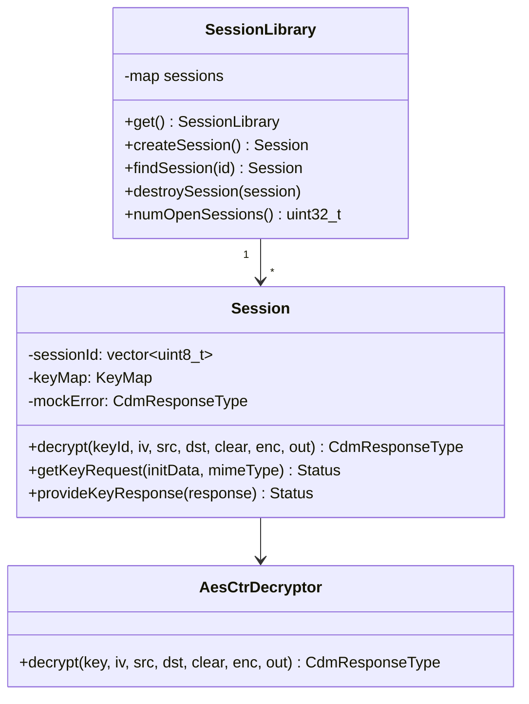

The `SessionLibrary` is a singleton that manages all open sessions. Each `Session` holds
its own key map and delegates decryption to the `AesCtrDecryptor`.

### 42.5.10 Building ClearKey

ClearKey can be built as a persistent service or a lazy (on-demand) service:

```makefile
# Source: frameworks/av/drm/mediadrm/plugins/clearkey/service.mk
# Persistent service configuration
```

The VINTF manifest declaration:

```xml
<!-- Source: frameworks/av/drm/mediadrm/plugins/clearkey/aidl/
     android.hardware.drm-service.clearkey.xml -->
<manifest version="1.0" type="device">
    <hal format="aidl">
        <name>android.hardware.drm</name>
        <fqname>IDrmFactory/clearkey</fqname>
    </hal>
</manifest>
```

### 42.5.11 ClearKey vs. Production DRM

The following table highlights what ClearKey implements vs. what a production DRM system
like Widevine must provide:

| Feature | ClearKey | Widevine (L1) |
|---------|----------|---------------|
| Key transport | Clear JSON | Encrypted (device key) |
| Key storage | In-memory | TEE secure storage |
| Decryption | OpenSSL in normal world | OEMCrypto in TEE |
| Secure buffers | Not supported | Required |
| Security level | SW_SECURE_CRYPTO only | Up to HW_SECURE_ALL |
| HDCP enforcement | None (HDCP_NONE) | Full (HDCP 2.2+) |
| Provisioning | Not needed | Factory + online |
| Output protection | None | HDCP + secure display path |
| Offline licenses | Simulated (memory FS) | Persistent secure storage |
| Secure stops | Test implementation | Cryptographically signed |

---

## 42.6 Secure Codec Path

### 42.6.1 The Content Protection Problem

When DRM-protected content is decrypted for playback, the decrypted frames must not be
accessible to application code or other software running on the device. If an application
could read the raw decoded frames, it could record and redistribute the content, defeating
the purpose of DRM. The secure codec path ensures that decrypted content flows through
hardware-protected memory from decryption to display.

### 42.6.2 Encrypted Buffer Flow

The path from encrypted media to screen involves several transitions:

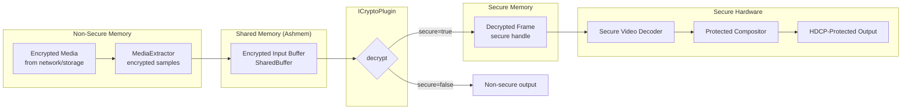

### 42.6.3 CryptoInfo and queueSecureInputBuffer

When an application queues an encrypted buffer to `MediaCodec`, it provides a
`CryptoInfo` object describing the encryption:

```java
MediaCodec.CryptoInfo cryptoInfo = new MediaCodec.CryptoInfo();
cryptoInfo.set(
    numSubSamples,        // number of subsamples
    numBytesOfClearData,  // int[] clear bytes per subsample
    numBytesOfEncryptedData, // int[] encrypted bytes per subsample
    keyId,                // 16-byte key identifier
    iv,                   // 16-byte initialization vector
    MediaCodec.CRYPTO_MODE_AES_CTR  // encryption mode
);

// For pattern encryption (CENC pattern mode)
cryptoInfo.setPattern(new MediaCodec.CryptoInfo.Pattern(
    encryptBlocks,  // number of 16-byte blocks to encrypt
    skipBlocks      // number of 16-byte blocks to skip
));

codec.queueSecureInputBuffer(bufferIndex, 0, cryptoInfo,
        presentationTimeUs, 0);
```

### 42.6.4 Subsample Structure

The Common Encryption (CENC) standard defines a subsample structure where each media
sample consists of alternating clear and encrypted regions:

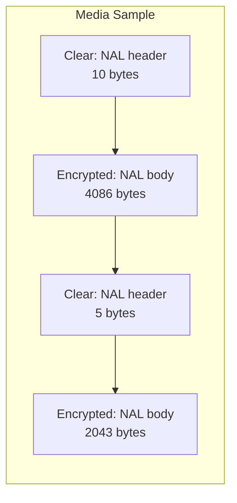

This is represented in the HAL as an array of `SubSample`:

```
// Source: hardware/interfaces/drm/aidl/android/hardware/drm/SubSample.aidl
parcelable SubSample {
    int numBytesOfClearData;
    int numBytesOfEncryptedData;
}
```

The clear portions (typically NAL unit headers in H.264/H.265) remain unencrypted so
the codec can parse the stream structure without decryption.

### 42.6.5 Pattern Encryption (CENC Pattern Mode)

Modern CENC defines a pattern mode where encryption alternates in fixed-size blocks:

```
// Source: hardware/interfaces/drm/aidl/android/hardware/drm/Pattern.aidl
parcelable Pattern {
    int encryptBlocks;  // number of 16-byte blocks to encrypt
    int skipBlocks;     // number of 16-byte blocks to leave clear
}
```

For example, a pattern of `{1, 9}` means encrypt one 16-byte block then skip nine,
repeating across the entire encrypted portion. This reduces computational overhead while
still protecting the content visually (since even partial encryption of video frames
makes them unwatchable).

### 42.6.6 Shared Buffer Architecture

The `ICryptoPlugin` uses shared memory to pass encrypted data from the framework to the
HAL plugin for decryption:

```
// Source: hardware/interfaces/drm/aidl/android/hardware/drm/SharedBuffer.aidl
parcelable SharedBuffer {
    int bufferId;    // Identifies which shared memory region
    long offset;     // Offset within the region
    long size;       // Size of data
}
```

The `setSharedBufferBase()` method establishes the memory mapping:

```
// From ICryptoPlugin.aidl
void setSharedBufferBase(in SharedBuffer base);
```

There can be multiple shared buffers per crypto plugin, distinguished by `bufferId`. The
`CryptoHalAidl` layer validates buffer bounds to prevent out-of-bounds access:

```cpp
// Source: frameworks/av/drm/libmediadrm/CryptoHalAidl.cpp
status_t CryptoHalAidl::checkSharedBuffer(
        const SharedBufferHidl& buffer) {
    int32_t seqNum = static_cast<int32_t>(buffer.bufferId);
    if (mHeapSizes.indexOfKey(seqNum) < 0) {
        return UNKNOWN_ERROR;
    }
    size_t heapSize = mHeapSizes.valueFor(seqNum);
    if (heapSize < buffer.offset + buffer.size ||
        SIZE_MAX - buffer.offset < buffer.size) {
        android_errorWriteLog(0x534e4554, "76221123");
        return UNKNOWN_ERROR;
    }
    return OK;
}
```

### 42.6.7 Destination Buffer Types

The decrypt output can go to two types of destinations:

```
// Source: hardware/interfaces/drm/aidl/android/hardware/drm/DestinationBuffer.aidl
union DestinationBuffer {
    SharedBuffer nonsecureMemory;   // CPU-accessible shared memory
    NativeHandle secureMemory;      // Opaque handle to secure buffer
}
```

For L1 (secure) playback, the destination is a `secureMemory` handle. The CPU cannot read
this memory; only the secure video decoder hardware can access it. For L3 (non-secure)
playback, the destination is `nonsecureMemory`.

### 42.6.8 Secure Decoder Selection

The framework determines whether to use a secure decoder by querying both the DRM plugin
and the crypto plugin:

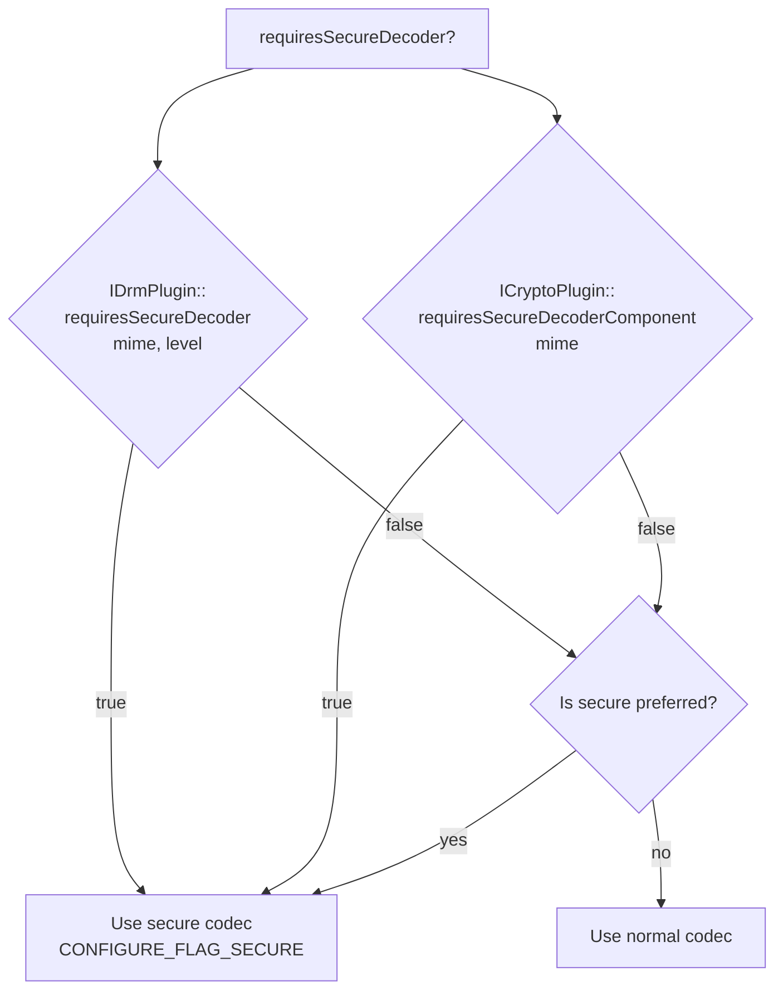

### 42.6.9 Resolution Notification

The `ICryptoPlugin::notifyResolution()` method informs the plugin of the current display
resolution:

```
void notifyResolution(in int width, in int height);
```

This enables the plugin to enforce resolution-based policies. For example, a license might
allow 4K playback only at L1 security but restrict L3 to 480p. The plugin can check the
resolution against the license policy and return
`ERROR_DRM_INSUFFICIENT_OUTPUT_PROTECTION` or `ERROR_DRM_INSUFFICIENT_SECURITY` if the
policy is violated.

### 42.6.10 Key Handle Optimization

The AIDL v2 DRM HAL introduces `getKeyHandle()` as a performance optimization:

```
// Source: hardware/interfaces/drm/aidl/android/hardware/drm/ICryptoPlugin.aidl
KeyHandleResult getKeyHandle(in byte[] keyId, in Mode mode);
```

This allows the crypto plugin to pre-resolve a key ID into an opaque handle, reducing
the per-sample overhead of looking up the key during `decrypt()`. The handle can reference
a pre-loaded key in the TEE, avoiding repeated key-ID-to-key-material resolution.

---

## 42.7 DRM Metrics and Logging

### 42.7.1 Metrics Architecture

Android's DRM framework includes a comprehensive metrics system that tracks the
performance and reliability of DRM operations without exposing any sensitive content or
key material.

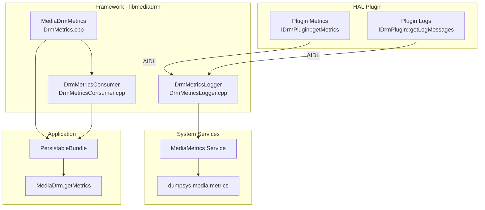

### 42.7.2 Framework Metrics Collection

The `MediaDrmMetrics` class (`frameworks/av/drm/libmediadrm/DrmMetrics.cpp`) collects
operational metrics at the framework level using counter and distribution metric types:

```cpp
// Source: frameworks/av/drm/libmediadrm/DrmMetrics.cpp
MediaDrmMetrics::MediaDrmMetrics()
    : mOpenSessionCounter("drm.mediadrm.open_session", "status"),
      mCloseSessionCounter("drm.mediadrm.close_session", "status"),
      mGetKeyRequestTimeUs("drm.mediadrm.get_key_request", "status"),
      mProvideKeyResponseTimeUs("drm.mediadrm.provide_key_response",
                                "status"),
      mGetProvisionRequestCounter(
              "drm.mediadrm.get_provision_request", "status"),
      mProvideProvisionResponseCounter(
              "drm.mediadrm.provide_provision_response", "status"),
      mKeyStatusChangeCounter("drm.mediadrm.key_status_change",
                              "key_status_type"),
      mEventCounter("drm.mediadrm.event", "event_type"),
      mGetDeviceUniqueIdCounter(
              "drm.mediadrm.get_device_unique_id", "status") {
}
```

The metrics tracked include:

| Metric | Type | Description |
|--------|------|-------------|
| `open_session` | Counter | Session open attempts, by status |
| `close_session` | Counter | Session close attempts, by status |
| `get_key_request` | Distribution | Key request latency (microseconds) |
| `provide_key_response` | Distribution | Key response processing time |
| `get_provision_request` | Counter | Provisioning request count |
| `provide_provision_response` | Counter | Provisioning response count |
| `key_status_change` | Counter | Key status events, by type |
| `event` | Counter | DRM events, by type |
| `get_device_unique_id` | Counter | Device ID requests |

### 42.7.3 Session Lifespan Tracking

The framework tracks the start and end times of each session:

```cpp
// Source: frameworks/av/drm/libmediadrm/DrmMetrics.cpp
void MediaDrmMetrics::SetSessionStart(
        const Vector<uint8_t> &sessionId) {
    std::string sessionIdHex = ToHexString(sessionId);
    mSessionLifespans[sessionIdHex] =
        std::make_pair(GetCurrentTimeMs(), (int64_t)0);
}

void MediaDrmMetrics::SetSessionEnd(
        const Vector<uint8_t> &sessionId) {
    std::string sessionIdHex = ToHexString(sessionId);
    int64_t endTimeMs = GetCurrentTimeMs();
    if (mSessionLifespans.find(sessionIdHex) !=
            mSessionLifespans.end()) {
        mSessionLifespans[sessionIdHex] =
            std::make_pair(
                    mSessionLifespans[sessionIdHex].first,
                    endTimeMs);
    } else {
        mSessionLifespans[sessionIdHex] =
            std::make_pair((int64_t)0, endTimeMs);
    }
}
```

### 42.7.4 Metrics Serialization

Metrics are serialized using Protocol Buffers for efficient storage and transmission:

```cpp
// Source: frameworks/av/drm/libmediadrm/DrmMetrics.cpp
status_t MediaDrmMetrics::GetSerializedMetrics(
        std::string *serializedMetrics) {
    DrmFrameworkMetrics metrics;

    mOpenSessionCounter.ExportValues(
        [&](const status_t status, const int64_t value) {
            auto *counter = metrics.add_open_session_counter();
            counter->set_count(value);
            counter->mutable_attributes()->set_error_code(status);
        });

    // ... export all metric types ...

    mGetKeyRequestTimeUs.ExportValues(
        [&](const status_t status, const EventStatistics &stats) {
            auto *metric = metrics.add_get_key_request_time_us();
            metric->set_min(stats.min);
            metric->set_max(stats.max);
            metric->set_mean(stats.mean);
            metric->set_operation_count(stats.count);
            metric->set_variance(
                    stats.sum_squared_deviation / stats.count);
            metric->mutable_attributes()->set_error_code(status);
        });

    for (const auto &sessionLifespan : mSessionLifespans) {
        auto *map = metrics.mutable_session_lifetimes();
        (*map)[sessionLifespan.first].set_start_time_ms(
            sessionLifespan.second.first);
        (*map)[sessionLifespan.first].set_end_time_ms(
            sessionLifespan.second.second);
    }

    return metrics.SerializeToString(serializedMetrics)
            ? OK : UNKNOWN_ERROR;
}
```

### 42.7.5 DrmMetricsLogger -- MediaMetrics Integration

The `DrmMetricsLogger` class (`frameworks/av/drm/libmediadrm/DrmMetricsLogger.cpp`) is a
wrapper around `DrmHal` that intercepts every API call, captures timing and result codes,
and reports them to the `MediaMetrics` service:

```cpp
// Source: frameworks/av/drm/libmediadrm/DrmMetricsLogger.cpp
DrmMetricsLogger::DrmMetricsLogger(IDrmFrontend frontend)
    : mImpl(sp<DrmHal>::make()),
      mUuid(),
      mObjNonce(),
      mFrontend(frontend) {}
```

The logger converts DRM error codes to enumerated values for consistent reporting:

```cpp
// Source: frameworks/av/drm/libmediadrm/DrmMetricsLogger.cpp
int MediaErrorToEnum(status_t err) {
    switch (err) {
        STATUS_CASE(DRM_UNKNOWN);
        STATUS_CASE(DRM_NO_LICENSE);
        STATUS_CASE(DRM_LICENSE_EXPIRED);
        STATUS_CASE(DRM_RESOURCE_BUSY);
        STATUS_CASE(DRM_INSUFFICIENT_OUTPUT_PROTECTION);
        STATUS_CASE(DRM_SESSION_NOT_OPENED);
        // ... 30+ error code mappings ...
    }
    return ENUM_DRM_UNKNOWN;
}
```

### 42.7.6 DrmMetricsConsumer -- PersistableBundle Export

The `DrmMetricsConsumer` class (`frameworks/av/drm/libmediadrm/DrmMetricsConsumer.cpp`)
converts metrics into `PersistableBundle` objects that are returned to applications through
`MediaDrm.getMetrics()`.

Metrics are organized into success and error counts:

```cpp
// Source: frameworks/av/drm/libmediadrm/DrmMetricsConsumer.cpp
template <typename T>
void ExportCounterMetric(const CounterMetric<T> &counter,
                         PersistableBundle *metrics) {
    std::string success_count_name =
            counter.metric_name() + ".ok.count";
    std::string error_count_name =
            counter.metric_name() + ".error.count";
    counter.ExportValues(
        [&](const status_t status, const int64_t value) {
            if (status == OK) {
                metrics->putLong(
                        String16(success_count_name.c_str()),
                        value);
            } else {
                int64_t total_errors(0);
                metrics->getLong(
                        String16(error_count_name.c_str()),
                        &total_errors);
                metrics->putLong(
                        String16(error_count_name.c_str()),
                        total_errors + value);
            }
        });
}
```

### 42.7.7 Plugin-Level Metrics

The HAL provides plugin-specific metrics through the `getMetrics()` method:

```
// Source: hardware/interfaces/drm/aidl/android/hardware/drm/DrmMetricGroup.aidl
parcelable DrmMetricGroup {
    List<DrmMetric> metrics;
}
```

Each `DrmMetric` consists of a name, a set of attributes (dimensions), and a set of
values (measurements):

```
// Source: hardware/interfaces/drm/aidl/android/hardware/drm/DrmMetric.aidl
parcelable DrmMetric {
    String name;
    List<DrmMetricNamedValue> attributes;
    List<DrmMetricNamedValue> values;
}
```

The AIDL documentation provides a concrete example:

```
DrmMetricGroup {
    metrics[0] {
        name: "buf_copy"
        attributes[0] {
            name: "size"
            type: INT64_TYPE
            int64Value: 1024
        }
        values[0] {
            componentName: "operation_count"
            type: INT64_TYPE
            int64Value: 75
        }
        values[1] {
            component_name: "average_time_seconds"
            type: DOUBLE_TYPE
            doubleValue: 0.00000042
        }
    }
}
```

### 42.7.8 Log Messages

Both `IDrmPlugin` and `ICryptoPlugin` support `getLogMessages()`:

```
// Source: hardware/interfaces/drm/aidl/android/hardware/drm/LogMessage.aidl
parcelable LogMessage {
    long timeMs;             // Timestamp in milliseconds since epoch
    LogPriority priority;    // ERROR, WARNING, INFO, DEBUG, VERBOSE
    String message;          // Human-readable message
}
```

These log messages are designed for debugging DRM issues without exposing sensitive
information. They are accessible to applications through `MediaDrm.getLogMessages()` and
can be included in bug reports.

### 42.7.9 Error Codes for Applications

The Java `MediaDrm.ErrorCodes` class provides applications with structured error
information:

```java
// Source: frameworks/base/media/java/android/media/MediaDrm.java
public final static class ErrorCodes {
    public static final int ERROR_UNKNOWN = 0;
    public static final int ERROR_NO_KEY = 1;
    public static final int ERROR_KEY_EXPIRED = 2;
    public static final int ERROR_RESOURCE_BUSY = 3;
    public static final int ERROR_INSUFFICIENT_OUTPUT_PROTECTION = 4;
    public static final int ERROR_SESSION_NOT_OPENED = 5;
    public static final int ERROR_UNSUPPORTED_OPERATION = 6;
    public static final int ERROR_INSUFFICIENT_SECURITY = 7;
    public static final int ERROR_FRAME_TOO_LARGE = 8;
    public static final int ERROR_LOST_STATE = 9;
    public static final int ERROR_CERTIFICATE_MALFORMED = 10;
    public static final int ERROR_CERTIFICATE_MISSING = 11;
    public static final int ERROR_CRYPTO_LIBRARY = 12;
    public static final int ERROR_GENERIC_OEM = 13;
    public static final int ERROR_GENERIC_PLUGIN = 14;
    public static final int ERROR_INIT_DATA = 15;
    public static final int ERROR_KEY_NOT_LOADED = 16;
    public static final int ERROR_LICENSE_PARSE = 17;
    public static final int ERROR_LICENSE_POLICY = 18;
    // ... more error codes ...
}
```

Each error code includes recovery guidance in its Javadoc. The `MediaDrmStateException`
also carries vendor-specific error codes accessible through the `MediaDrmThrowable`
interface:

```java
// Source: frameworks/base/media/java/android/media/MediaDrm.java
public int getVendorError();    // Vendor-specific error code
public int getOemError();       // OEM-specific error code
public int getErrorContext();   // Additional error context
```

---

## 42.8 Try It: DRM Experimentation Exercises

### 42.8.1 Exercise 1: Query Supported DRM Schemes

Write a simple Android application that queries which DRM schemes are available on the
device:

```java
import android.media.MediaDrm;
import java.util.List;
import java.util.UUID;

public class DrmSchemeQuery {
    // Well-known DRM UUIDs
    private static final UUID WIDEVINE_UUID =
            new UUID(0xEDEF8BA979D64ACEL, 0xA3C827DCD51D21EDL);
    private static final UUID CLEARKEY_UUID =
            new UUID(0xE2719D58A985B3C9L, 0x781AB030AF78D30EL);
    private static final UUID COMMON_PSSH_UUID =
            new UUID(0x1077EFECC0B24D02L, 0xACE33C1E52E2FB4BL);

    public void querySchemes() {
        // Method 1: Check specific UUIDs
        System.out.println("Widevine supported: " +
                MediaDrm.isCryptoSchemeSupported(WIDEVINE_UUID));
        System.out.println("ClearKey supported: " +
                MediaDrm.isCryptoSchemeSupported(CLEARKEY_UUID));

        // Check with MIME type and security level
        System.out.println("Widevine MP4 L1: " +
                MediaDrm.isCryptoSchemeSupported(WIDEVINE_UUID,
                        "video/mp4",
                        MediaDrm.SECURITY_LEVEL_HW_SECURE_ALL));
        System.out.println("Widevine MP4 L3: " +
                MediaDrm.isCryptoSchemeSupported(WIDEVINE_UUID,
                        "video/mp4",
                        MediaDrm.SECURITY_LEVEL_SW_SECURE_CRYPTO));

        // Method 2: Enumerate all supported schemes
        List<UUID> schemes = MediaDrm.getSupportedCryptoSchemes();
        for (UUID uuid : schemes) {
            System.out.println("Supported scheme: " + uuid);
        }
    }
}
```

**What to observe:**

- Most Android devices will report Widevine and ClearKey as supported.
- The security level check reveals whether the device has L1 (hardware TEE) support.
- `getSupportedCryptoSchemes()` returns all registered HAL factory UUIDs.

### 42.8.2 Exercise 2: ClearKey Playback with ExoPlayer

Use ExoPlayer (now part of AndroidX Media3) to play ClearKey-encrypted DASH content:

```java
import androidx.media3.exoplayer.ExoPlayer;
import androidx.media3.exoplayer.drm.DefaultDrmSessionManager;
import androidx.media3.exoplayer.drm.LocalMediaDrmCallback;
import androidx.media3.common.MediaItem;
import androidx.media3.common.C;

public class ClearKeyPlayback {

    // ClearKey license in JWK format (base64url-encoded)
    private static final String CLEARKEY_LICENSE =
        "{\"keys\":[" +
            "{\"kty\":\"oct\"," +
            "\"kid\":\"" + /* base64url key ID */ + "\"," +
            "\"k\":\"" + /* base64url key value */ + "\"}" +
        "],\"type\":\"temporary\"}";

    public void setupPlayer(Context context, SurfaceView surfaceView) {
        // Create DRM session manager for ClearKey
        DefaultDrmSessionManager drmSessionManager =
                new DefaultDrmSessionManager.Builder()
                        .setUuidAndExoMediaDrmProvider(
                                C.CLEARKEY_UUID,
                                FrameworkMediaDrm.DEFAULT_PROVIDER)
                        .build(new LocalMediaDrmCallback(
                                CLEARKEY_LICENSE.getBytes()));

        // Create player with DRM
        ExoPlayer player = new ExoPlayer.Builder(context)
                .build();
        player.setVideoSurfaceView(surfaceView);

        // Set DRM-protected media
        MediaItem mediaItem = new MediaItem.Builder()
                .setUri("https://example.com/content.mpd")
                .setDrmConfiguration(
                        new MediaItem.DrmConfiguration.Builder(
                                C.CLEARKEY_UUID)
                        .build())
                .build();

        player.setMediaItem(mediaItem);
        player.prepare();
        player.play();
    }
}
```

### 42.8.3 Exercise 3: Inspect DRM Properties

Open a DRM session and query plugin properties:

```java
import android.media.MediaDrm;
import android.os.PersistableBundle;

public class DrmPropertyInspector {

    private static final UUID WIDEVINE_UUID =
            new UUID(0xEDEF8BA979D64ACEL, 0xA3C827DCD51D21EDL);

    public void inspectProperties() throws Exception {
        MediaDrm drm = new MediaDrm(WIDEVINE_UUID);

        // Query standard properties
        String vendor = drm.getPropertyString("vendor");
        String version = drm.getPropertyString("version");
        String description = drm.getPropertyString("description");
        byte[] deviceId = drm.getPropertyByteArray("deviceUniqueId");

        System.out.println("Vendor: " + vendor);
        System.out.println("Version: " + version);
        System.out.println("Description: " + description);
        System.out.println("Device ID length: " + deviceId.length);

        // Open session and check security level
        byte[] sessionId = drm.openSession();
        int securityLevel = drm.getSecurityLevel(sessionId);
        System.out.println("Security level: " + securityLevel);

        // Get metrics
        PersistableBundle metrics = drm.getMetrics();
        // Inspect metric keys
        for (String key : metrics.keySet()) {
            System.out.println("Metric: " + key + " = " +
                    metrics.get(key));
        }

        // Get log messages (for debugging)
        java.util.List<MediaDrm.LogMessage> logs =
                drm.getLogMessages();
        for (MediaDrm.LogMessage log : logs) {
            System.out.println("Log [" + log.getTimestampMillis() +
                    "] " + log.getMessage());
        }

        drm.closeSession(sessionId);
        drm.close();
    }
}
```

### 42.8.4 Exercise 4: Examine HAL Interfaces with dumpsys

Use `adb shell` to inspect the running DRM HAL:

```bash
# List registered DRM HAL services
adb shell service list | grep drm

# Check ClearKey service status
adb shell dumpsys android.hardware.drm.IDrmFactory/clearkey

# View media DRM metrics
adb shell dumpsys media.metrics | grep -i drm

# List VINTF HAL declarations
adb shell lshal | grep drm

# Check service manager for DRM services
adb shell cmd drm_manager list
```

### 42.8.5 Exercise 5: Trace DRM Operations

Use `atrace` and `systrace` to observe DRM operations during playback:

```bash
# Enable DRM-related trace tags
adb shell atrace --async_start -c drm video

# Play DRM content, then stop tracing
adb shell atrace --async_stop > /tmp/drm_trace.txt

# View DRM-specific logs
adb logcat -s DrmHal:V DrmHalAidl:V CryptoHalAidl:V \
    clearkey-DrmPlugin:V clearkey-CryptoPlugin:V \
    DrmSessionManager:V DrmMetricsLogger:V
```

### 42.8.6 Exercise 6: Build ClearKey from Source

Build the ClearKey HAL plugin from the AOSP source:

```bash
# Navigate to the AOSP source tree
cd $AOSP_ROOT

# Build just the ClearKey plugin
m android.hardware.drm-service.clearkey

# The output binary will be at:
# out/target/product/*/vendor/bin/hw/
#     android.hardware.drm-service.clearkey

# Build the ClearKey VTS tests
m VtsHalDrmTargetTest

# Run VTS tests against ClearKey
adb shell /data/nativetest64/VtsHalDrmTargetTest/VtsHalDrmTargetTest \
    --hal_service_instance=android.hardware.drm.IDrmFactory/clearkey
```

### 42.8.7 Exercise 7: Monitor DRM Session Lifecycle

Write a listener-based monitor that tracks all DRM events:

```java
import android.media.MediaDrm;
import java.util.List;

public class DrmSessionMonitor {

    private static final UUID WIDEVINE_UUID =
            new UUID(0xEDEF8BA979D64ACEL, 0xA3C827DCD51D21EDL);

    public void monitorSession() throws Exception {
        MediaDrm drm = new MediaDrm(WIDEVINE_UUID);

        // Register all listeners
        drm.setOnExpirationUpdateListener((md, sessionId, expiryTime) -> {
            System.out.println("Expiration update: session=" +
                    bytesToHex(sessionId) +
                    " expiry=" + expiryTime);
        }, null);

        drm.setOnKeyStatusChangeListener(
                (md, sessionId, keyInfo, hasNewUsableKey) -> {
            System.out.println("Key status change: session=" +
                    bytesToHex(sessionId) +
                    " hasUsableKey=" + hasNewUsableKey);
            for (MediaDrm.KeyStatus ks : keyInfo) {
                System.out.println("  Key " +
                        bytesToHex(ks.getKeyId()) +
                        " status=" + ks.getStatusCode());
            }
        }, null);

        drm.setOnSessionLostStateListener(
                (md, sessionId) -> {
            System.out.println("Session lost state: " +
                    bytesToHex(sessionId));
        }, null);

        drm.setOnEventListener((md, sessionId, event, extra, data) -> {
            System.out.println("DRM event: type=" + event +
                    " extra=" + extra);
        });

        // Open session and perform key exchange...
        byte[] sessionId = drm.openSession();
        // ... use session for playback ...

        drm.closeSession(sessionId);
        drm.close();
    }

    private String bytesToHex(byte[] bytes) {
        StringBuilder sb = new StringBuilder();
        for (byte b : bytes) {
            sb.append(String.format("%02x", b));
        }
        return sb.toString();
    }
}
```

### 42.8.8 Exercise 8: Inspect ClearKey Source Code

Trace the complete ClearKey key-request/response flow through the source:

```bash
# Step 1: Start at the factory
# File: frameworks/av/drm/mediadrm/plugins/clearkey/aidl/DrmFactory.cpp
# DrmFactory::createDrmPlugin() validates UUID, creates DrmPlugin

# Step 2: Session creation
# File: frameworks/av/drm/mediadrm/plugins/clearkey/common/SessionLibrary.cpp
# SessionLibrary::createSession() generates session ID

# Step 3: Key request generation
# File: frameworks/av/drm/mediadrm/plugins/clearkey/aidl/DrmPlugin.cpp
# DrmPlugin::getKeyRequest() parses PSSH init data

# Step 4: Init data parsing
# File: frameworks/av/drm/mediadrm/plugins/clearkey/common/InitDataParser.cpp
# InitDataParser::parse() extracts key IDs from PSSH/CENC

# Step 5: Key response processing
# DrmPlugin::provideKeyResponse() parses JWK

# Step 6: JWK parsing
# File: frameworks/av/drm/mediadrm/plugins/clearkey/common/JsonWebKey.cpp
# JsonWebKey::extractKeysFromJsonWebKeySet() decodes keys

# Step 7: Decryption
# File: frameworks/av/drm/mediadrm/plugins/clearkey/aidl/CryptoPlugin.cpp
# CryptoPlugin::decrypt() delegates to Session::decrypt()

# Step 8: AES-CTR decryption
# File: frameworks/av/drm/mediadrm/plugins/clearkey/common/AesCtrDecryptor.cpp
# AesCtrDecryptor::decrypt() uses OpenSSL AES_ctr128_encrypt
```

---

## Summary

Android's DRM architecture is a multi-layered system designed to satisfy the conflicting
demands of content protection, device diversity, and application simplicity.

**Key architectural decisions:**

1. **UUID-based abstraction**: Applications interact with DRM through scheme-agnostic APIs.
   The UUID mechanism allows multiple DRM systems to coexist on a single device.

2. **HAL isolation**: The cryptographic implementation runs in a separate process (and
   potentially in a TEE), isolated from application code. The AIDL HAL provides a stable,
   versioned contract between the framework and vendor plugins.

3. **Dual-backend compatibility**: The `DrmHal` / `CryptoHal` routing layer supports both
   AIDL and HIDL backends, enabling gradual migration from HIDL to AIDL without breaking
   existing vendor implementations.

4. **Secure buffer pipeline**: For L1 security, decrypted content never touches
   CPU-accessible memory. The entire path from decryption through decoding to display
   runs in hardware-protected memory.

5. **Comprehensive metrics**: The three-tier metrics system (framework counters,
   plugin metrics, log messages) provides diagnostic visibility without compromising
   content security.

**Key source files for further exploration:**

| Component | Path |
|-----------|------|
| MediaDrm Java API | `frameworks/base/media/java/android/media/MediaDrm.java` |
| MediaCrypto Java API | `frameworks/base/media/java/android/media/MediaCrypto.java` |
| DrmHal (unified) | `frameworks/av/drm/libmediadrm/DrmHal.cpp` |
| DrmHalAidl | `frameworks/av/drm/libmediadrm/DrmHalAidl.cpp` |
| CryptoHalAidl | `frameworks/av/drm/libmediadrm/CryptoHalAidl.cpp` |
| DrmSessionManager | `frameworks/av/drm/libmediadrm/DrmSessionManager.cpp` |
| DrmMetrics | `frameworks/av/drm/libmediadrm/DrmMetrics.cpp` |
| DrmMetricsLogger | `frameworks/av/drm/libmediadrm/DrmMetricsLogger.cpp` |
| IDrmFactory AIDL | `hardware/interfaces/drm/aidl/android/hardware/drm/IDrmFactory.aidl` |
| IDrmPlugin AIDL | `hardware/interfaces/drm/aidl/android/hardware/drm/IDrmPlugin.aidl` |
| ICryptoPlugin AIDL | `hardware/interfaces/drm/aidl/android/hardware/drm/ICryptoPlugin.aidl` |
| SecurityLevel AIDL | `hardware/interfaces/drm/aidl/android/hardware/drm/SecurityLevel.aidl` |
| Status AIDL | `hardware/interfaces/drm/aidl/android/hardware/drm/Status.aidl` |
| ClearKey Factory | `frameworks/av/drm/mediadrm/plugins/clearkey/aidl/DrmFactory.cpp` |
| ClearKey DrmPlugin | `frameworks/av/drm/mediadrm/plugins/clearkey/aidl/DrmPlugin.cpp` |
| ClearKey CryptoPlugin | `frameworks/av/drm/mediadrm/plugins/clearkey/aidl/CryptoPlugin.cpp` |
| ClearKey AES-CTR | `frameworks/av/drm/mediadrm/plugins/clearkey/common/AesCtrDecryptor.cpp` |
| ClearKey UUID | `frameworks/av/drm/mediadrm/plugins/clearkey/common/ClearKeyUUID.cpp` |
| VTS Tests | `hardware/interfaces/drm/aidl/vts/drm_hal_test.cpp` |
