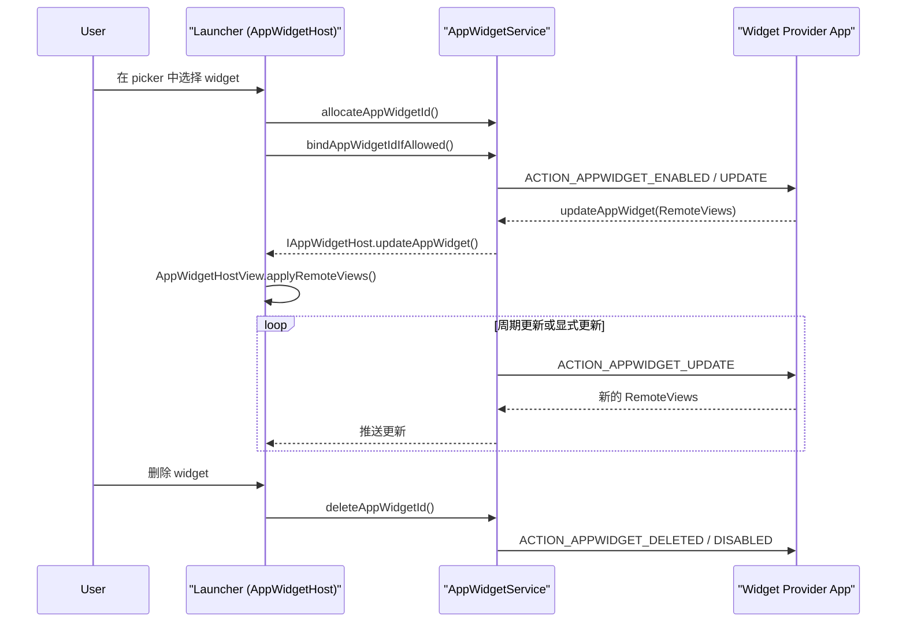
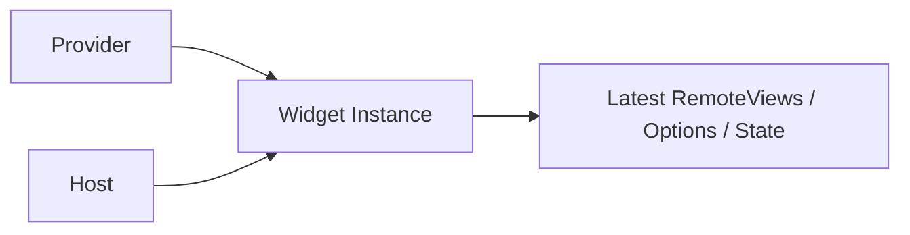
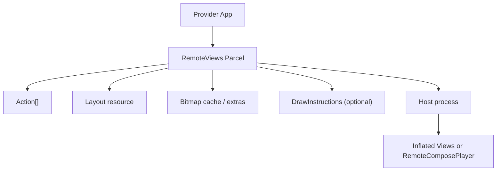
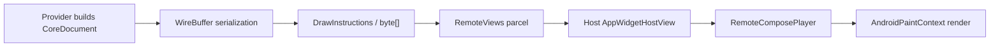
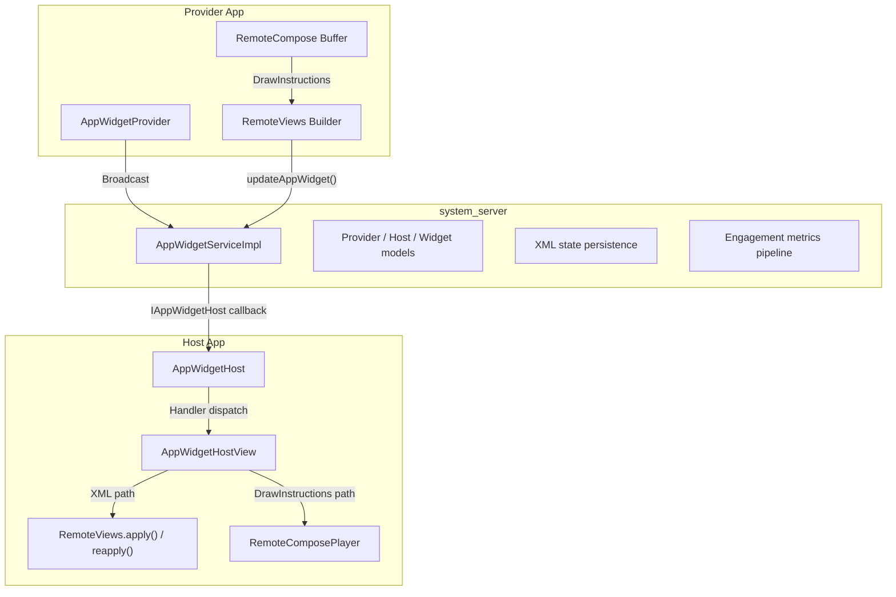

# 第 43 章：Widgets、RemoteViews 与 RemoteCompose

Android 小部件（Widget）是平台最早出现、同时也最具架构特色的 UI 能力之一。和普通应用界面不同，Widget 的视图层级通常并不运行在创建它的进程里，而是运行在宿主进程中，最典型的宿主就是 Launcher。这种“跨进程渲染 UI”的约束，直接塑造了 `RemoteViews`、`AppWidgetService` 以及新一代 `RemoteCompose` 子系统的设计。本章从 provider 侧的 `AppWidgetProvider` 出发，沿着 system_server 中的中介服务、`RemoteViews` 的动作序列化与应用流程，一直追到可能逐步替代 XML 布局方案的 RemoteCompose 引擎。

本章会反复引用以下源码目录：

| 组件 | 路径 |
|---|---|
| AppWidget framework | `frameworks/base/core/java/android/appwidget/` |
| AppWidget service | `frameworks/base/services/appwidget/java/com/android/server/appwidget/` |
| `RemoteViews` | `frameworks/base/core/java/android/widget/RemoteViews.java` |
| `RemoteViewsService` | `frameworks/base/core/java/android/widget/RemoteViewsService.java` |
| `RemoteViewsAdapter` | `frameworks/base/core/java/android/widget/RemoteViewsAdapter.java` |
| RemoteCompose core | `frameworks/base/core/java/com/android/internal/widget/remotecompose/core/` |
| RemoteCompose player | `frameworks/base/core/java/com/android/internal/widget/remotecompose/player/` |
| Launcher3 widgets | `packages/apps/Launcher3/src/com/android/launcher3/widget/` |
| SystemUI notifications | `frameworks/base/packages/SystemUI/src/com/android/systemui/statusbar/notification/row/` |

---

## 43.1 AppWidget Framework

AppWidget 客户端框架位于 `frameworks/base/core/java/android/appwidget/`，定义了 widget provider 和 widget host 之间的公共契约。Provider 是提供小部件内容的一方，Host 是真正把小部件显示出来的一方，例如 Launcher3。

### 43.1.1 核心类

整个框架围绕 5 个最核心的类展开：

| 类 | 角色 |
|---|---|
| `AppWidgetProvider` | provider 侧 `BroadcastReceiver` 便利封装 |
| `AppWidgetHost` | host 侧与系统服务交互的入口 |
| `AppWidgetHostView` | 实际承载 `RemoteViews` 的 View 容器 |
| `AppWidgetManager` | 访问 `IAppWidgetService` 的客户端代理 |
| `AppWidgetProviderInfo` | 描述 widget 元数据的 `Parcelable` |

较新的附加类包括：

| 类 | 作用 |
|---|---|
| `AppWidgetEvent` | widget 交互参与度指标 |
| `PendingHostUpdate` | host 重连期间缓存的更新项 |
| `AppWidgetConfigActivityProxy` | 跨 profile 配置 Activity 代理 |
| `AppWidgetManagerInternal` | system_server 内部 API |

这些类型共同定义了“谁负责发更新、谁负责显示、谁保留状态、谁传递元数据”这几个基本角色。

### 43.1.2 `AppWidgetProvider`：provider 入口

`AppWidgetProvider` 继承自 `BroadcastReceiver`，本质上只是一个便利封装。它的 `onReceive()` 会根据广播 action 分发到一组更易重写的回调：

```java
// Source: frameworks/base/core/java/android/appwidget/AppWidgetProvider.java
public void onReceive(Context context, Intent intent) {
    String action = intent.getAction();
    if (AppWidgetManager.ACTION_APPWIDGET_ENABLE_AND_UPDATE.equals(action)) {
        this.onReceive(context, new Intent(intent)
                .setAction(AppWidgetManager.ACTION_APPWIDGET_ENABLED));
        this.onReceive(context, new Intent(intent)
                .setAction(AppWidgetManager.ACTION_APPWIDGET_UPDATE));
    } else if (AppWidgetManager.ACTION_APPWIDGET_UPDATE.equals(action)) {
        Bundle extras = intent.getExtras();
        if (extras != null) {
            int[] appWidgetIds = extras.getIntArray(
                    AppWidgetManager.EXTRA_APPWIDGET_IDS);
            if (appWidgetIds != null && appWidgetIds.length > 0) {
                this.onUpdate(context,
                        AppWidgetManager.getInstance(context), appWidgetIds);
            }
        }
    }
    // 其余分支省略
}
```

常见回调及其触发时机：

| 回调 | 触发时机 |
|---|---|
| `onUpdate()` | 首次绑定或周期更新触发 |
| `onEnabled()` | 该 provider 第一个实例被放到任意 host 上 |
| `onDisabled()` | 最后一个实例被移除 |
| `onDeleted()` | 某个具体 widget 实例被删除 |
| `onAppWidgetOptionsChanged()` | 尺寸或选项变化 |
| `onRestored()` | 从备份恢复后触发 |

一个值得注意的细节是 `ACTION_APPWIDGET_ENABLE_AND_UPDATE`，它由 DeviceConfig flag 控制，用于把 enable 和首次 update 合并成一次广播，减少初次放置 widget 的启动延迟。

### 43.1.3 `AppWidgetHost`：host 入口

`AppWidgetHost` 是 host 进程与 widget 系统交互的句柄。例如 Launcher3 会以固定 host ID 创建一个 `AppWidgetHost`，再通过它管理所有放置在桌面的 widget。

它有 3 个关键架构点：

1. IPC 回调 stub：通过 `IAppWidgetHost.Stub` 从 system_server 接收更新。
2. Handler 分发：把 Binder 回调统一转成主线程消息。
3. `SparseArray` 监听器表：按 `appWidgetId` 跟踪每个 widget 对应的 host view。

回调 stub 的典型形式如下：

```java
// Source: frameworks/base/core/java/android/appwidget/AppWidgetHost.java
static class Callbacks extends IAppWidgetHost.Stub {
    private final WeakReference<Handler> mWeakHandler;

    public void updateAppWidget(int appWidgetId, RemoteViews views) {
        if (isLocalBinder() && views != null) {
            views = views.clone();
        }
        Handler handler = mWeakHandler.get();
        if (handler == null) return;
        Message msg = handler.obtainMessage(HANDLE_UPDATE,
                appWidgetId, 0, views);
        msg.sendToTarget();
    }
}
```

这里的 `isLocalBinder()` 检查很关键。如果 Binder 调用来自同进程，`RemoteViews` 需要先 clone，否则宿主和服务端可能共享同一可变对象，导致状态污染。

### 43.1.4 `AppWidgetProviderInfo`：widget 元数据

`AppWidgetProviderInfo` 由 provider manifest 中的 `<appwidget-provider>` 元数据填充，描述该 widget 的大小、布局、配置 Activity 和特性。

常见字段包括：

| 字段 | 说明 |
|---|---|
| `provider` | provider `ComponentName` |
| `minWidth` / `minHeight` | 最小尺寸 |
| `minResizeWidth` / `minResizeHeight` | 可缩放最小尺寸 |
| `maxResizeWidth` / `maxResizeHeight` | 可缩放最大尺寸 |
| `targetCellWidth` / `targetCellHeight` | 默认网格占用 |
| `updatePeriodMillis` | 请求更新周期 |
| `initialLayout` | 初始布局资源 |
| `configure` | 配置 Activity |
| `resizeMode` | 横向 / 纵向可缩放能力 |
| `widgetCategory` | 主屏、锁屏、搜索框等类别 |
| `widgetFeatures` | 可重配置、可隐藏等特性位 |

这些元数据最终不仅影响 picker 展示，也影响 host 分配尺寸、是否允许拖拽缩放，以及系统如何恢复 widget 状态。

### 43.1.5 `AppWidgetEvent`：参与度指标

`AppWidgetEvent` 是较新的扩展，用于记录用户与 widget 的交互参与度，例如：

- widget 可见时长
- 点击了哪些 view ID
- 滚动了哪些 collection view
- widget 在屏幕上的位置区间

其内部由 `Builder` 追踪可见窗口的开始与结束，再把结果导出为 `PersistableBundle`，通过 `UsageStatsManager` 上报。这意味着 widget 不再只是“一个静态 UI 片段”，而是开始进入平台统一交互指标体系。

### 43.1.6 Widget 生命周期

下面这张图描述一个桌面 widget 从放置到更新的大致流程：



这个模型的关键点在于：provider 从不直接持有宿主里的真实 View，它只能通过系统服务投递一份 `RemoteViews` 描述。

### 43.1.7 `AppWidgetHostView`：视图容器

`AppWidgetHostView` 是宿主进程中真正承载 widget 的 View 容器。它主要负责：

- 接收新的 `RemoteViews`
- 选择 `apply()` 或 `reapply()`
- 在出错时显示 fallback view
- 维护 widget ID、provider info 和尺寸选项
- 在支持时切换到 RemoteCompose 渲染路径

如果说 `AppWidgetHost` 更像 host 侧的控制器，那么 `AppWidgetHostView` 就是最终完成“把跨进程 UI 描述落到本地 View 树”的执行节点。

## 43.2 AppWidgetService

### 43.2.1 服务架构

系统服务实现位于 `frameworks/base/services/appwidget/java/com/android/server/appwidget/`，核心类是 `AppWidgetServiceImpl`。它位于 `system_server` 中，负责：

- 管理 provider、host 和 widget 实例三类模型
- 分配 widget ID
- 执行 bind / unbind / delete
- 持久化状态
- 向 host 推送 `RemoteViews` 更新

这是一种典型的 broker 模式：provider 和 host 两边都不直接通信，而由 system_server 做统一仲裁。

### 43.2.2 内部数据模型

服务内部通常围绕 3 类对象组织状态：

| 模型 | 含义 |
|---|---|
| `Provider` | 某个 widget provider 的元信息与实例集合 |
| `Host` | 某个宿主应用和其 hostId |
| `Widget` | 某个具体 `appWidgetId` 对应的绑定关系 |

可以把它理解成一个三方关系图：



一个 `Widget` 记录“哪个 host 上的哪个格子，绑定了哪个 provider 的哪个实例，并且当前持有什么状态”。

### 43.2.3 Widget 分配与绑定

放置 widget 时通常经历两步：

1. `allocateAppWidgetId()`
2. `bindAppWidgetIdIfAllowed()`

第一步只是在服务端预留一个逻辑 ID；第二步才真正把这个 ID 绑定到具体 provider 上。这样做的意义是让 host 可以在用户授权、配置 Activity 完成之后，再决定是否完成最终绑定。

### 43.2.4 更新流水线

provider 调用 `AppWidgetManager.updateAppWidget()` 后，系统的更新流水线大致如下：

1. 应用侧把 `RemoteViews` 通过 Binder 发给 `IAppWidgetService`
2. `AppWidgetServiceImpl` 校验调用者是否真的是该 provider
3. 服务保存最新的 `RemoteViews`
4. 找到所有绑定了该 widget 的 host
5. 通过 `IAppWidgetHost` 回调将更新推送到宿主
6. host 侧 `AppWidgetHostView` 执行 `apply` 或 `reapply`

这条链路说明 widget 更新虽然由 provider 发起，但最终渲染权完全在 host 手里。

### 43.2.5 通过 `AlarmManager` 做周期更新

`updatePeriodMillis` 提供了一种声明式周期更新能力，但系统有最小周期限制，生产环境通常不会允许低于 30 分钟的频繁刷新。因此真正需要高频更新的 widget，往往会结合：

- `AlarmManager`
- `WorkManager`
- 前台服务或推送

而不是完全依赖 manifest 里的周期字段。

### 43.2.6 Bitmap 内存限制

`RemoteViews` 允许携带 bitmap，但跨进程序列化位图非常昂贵，因此服务端和 host 侧都会做 bitmap 内存限制。超过阈值时：

- 更新可能失败
- 触发 `ActionException`
- host 可能回退到错误布局或旧布局

这也是为什么 widget 最好避免传输大图，而优先传资源 ID、URI 或更轻量的状态描述。

### 43.2.7 状态持久化

`AppWidgetServiceImpl` 会把 provider、host、widget、options 等状态持久化到 XML。这样在 system_server 重启、设备重启、包更新后，widget 关系仍能恢复。

这种持久化不是“保存 View 树”，而是保存足够重建关系与状态的模型。

### 43.2.8 生成预览图

较新的实现支持 widget generated preview。系统可以针对不同 category 生成预览，用于 picker 展示，而不是完全依赖静态资源图。这为未来更动态的 widget 设计留出了空间。

### 43.2.9 参与度指标上报

Host 收集的 `AppWidgetEvent` 会通过系统服务上报，进入平台指标链路。这意味着：

- host 负责观察用户交互
- system service 负责汇总和转发
- provider 或系统分析端可以据此理解 widget 使用情况

### 43.2.10 安全策略与限制

AppWidgetService 负责的安全边界主要包括：

- 只有合法 provider 才能更新自己的 widget
- host 不能随意绑定未获授权的 provider
- 跨 profile 和跨用户访问要做隔离
- 更新频率、bitmap 大小、集合数据访问都受限制

如果没有这些策略，widget 会变成一条非常危险的跨进程 UI 注入通道。

## 43.3 RemoteViews

### 43.3.1 架构总览

`RemoteViews` 是 widget 体系最核心的技术抽象。它不是一棵真实 View 树，而是一份“可跨进程传输的 UI 描述”，其内容大致包括：

- 要 inflate 的 layout 资源
- 一组有顺序的 `Action`
- bitmap 缓存
- 某些模式下的 `DrawInstructions`

下面这张图概括了其角色：



它的本质不是“把 provider 里的 View 跨进程搬过去”，而是“把一组可安全重放的 UI 操作指令送到宿主重建”。

### 43.3.2 支持的 View 类型

出于安全和兼容性考虑，`RemoteViews` 不能随意 inflate 任意自定义 View。只有被 `@RemoteView` 标记、并经过框架允许的 View 类型才能被使用，例如：

- `TextView`
- `ImageView`
- `ProgressBar`
- `Chronometer`
- `ListView`
- `StackView`
- `GridView`
- 一部分基础布局容器

这保证了宿主不会被 provider 任意塞入不可控的自定义组件。

### 43.3.3 Action 系统

`RemoteViews` 的核心是 Action 列表。典型 Action 包括：

- 设置文本
- 设置图片资源
- 设置点击 `PendingIntent`
- 设置可见性
- 设置远程 adapter
- 设置填充意图

每个 Action 都会在 host 侧按顺序重放，从而把初始布局变成最终可展示的 widget UI。

### 43.3.4 Reflection Action

很多 setter 型能力都通过 Reflection Action 实现，例如按 viewId 找到某个目标 view，再调用限定白名单里的 setter 方法。这种设计既有扩展性，也能保持对可调用方法的严格控制，避免 provider 利用反射做越权操作。

### 43.3.5 布局模式

`RemoteViews` 支持多种布局模式：

- 传统单一 layout
- 按尺寸映射的 sized `RemoteViews`
- 基于 `DrawInstructions` 的绘制指令模式

这意味着同一个 widget 已不再只能绑定一份 XML，而可以根据宿主分配尺寸、渲染能力选择更合适的表现形式。

### 43.3.6 Bitmap 缓存

为减少重复传输，`RemoteViews` 内部维护 bitmap cache。多个 Action 如果引用相同 bitmap，可共享缓存项，而不是重复写入 Parcel。这对频繁更新的图片型 widget 尤其重要。

### 43.3.7 `apply()` 与 `reapply()`

host 侧渲染 `RemoteViews` 有两条主要路径：

- `apply()`：新建整棵视图
- `reapply()`：复用已有 View 树，仅重新应用 Action

`reapply()` 可以减少 layout inflation 成本，但前提是：

- 布局结构没发生根本变化
- 目标 View ID 仍然匹配
- 宿主保留了上一次成功应用的树

这是一条典型的“跨进程 UI 的增量更新优化”。

### 43.3.8 异步 apply

为避免宿主主线程卡顿，`RemoteViews` 还支持异步 apply 路径，把较重的 inflate、bitmap decode 或准备工作提前放到后台，再在主线程完成最终绑定。这对通知与复杂 widget 都很重要。

### 43.3.9 序列化流水线

`RemoteViews` 需要被序列化成 Binder 可传输的数据，因此其流水线大致是：

1. provider 构造 `RemoteViews`
2. Action、bitmap、layout 信息写入 Parcel
3. Binder 跨进程传输
4. host 端反序列化
5. 按模式选择 XML inflate 或 DrawInstructions 路径

这意味着一切可用能力都必须能稳定地被 parcel 化和反序列化。

### 43.3.10 `RemoteViewsAdapter` 与 `RemoteViewsService`

collection widget 例如 `ListView` / `StackView` 无法直接在 provider 进程里持有 adapter，因此 Android 引入：

- `RemoteViewsService`
- `RemoteViewsFactory`
- `RemoteViewsAdapter`

其思路是让宿主通过系统与 provider 侧 service 通信，按需拉取每一项 item 的 `RemoteViews`。这是一种“把 Adapter 也远程化”的方案。

### 43.3.11 `DrawInstructions`：连接到 RemoteCompose 的桥

`DrawInstructions` 是旧 `RemoteViews` 和新 RemoteCompose 之间的桥。它允许 provider 不再提供 XML 布局，而是把一份二进制绘制指令文档塞进 `RemoteViews`，再由 host 端检测并交给 `RemoteComposePlayer` 执行。

这一步非常关键，因为它让 RemoteCompose 能在不推翻整个 AppWidget / Notification / RemoteViews 生态的前提下逐步落地。

## 43.4 通知中的 RemoteViews

### 43.4.1 Notification 模板系统

通知虽然不是桌面 widget，但在跨进程 UI 渲染模型上和 widget 非常相似。应用通过 `Notification.Builder` 提交一份模板与自定义 `RemoteViews`，最终由 SystemUI 在自己的进程里渲染。

因此通知系统同样面临：

- provider 与渲染方不在同一进程
- 必须限制可用 View 类型和动作
- 必须防止应用构造任意恶意 View 树

### 43.4.2 SystemUI 的 `NotifRemoteViewsFactory`

SystemUI 里会有专门的工厂逻辑去为不同时机生成 RemoteViews，例如 contracted、expanded、heads-up 等变体。这样做是为了统一通知模板与宿主显示逻辑。

### 43.4.3 `NotifRemoteViewCache`

通知刷新频繁，因此 SystemUI 会做 RemoteViews 缓存，避免每次都整棵重建。这和 `AppWidgetHostView` 尝试 `reapply()` 的思路是同源的。

### 43.4.4 安全考量

通知里的 `RemoteViews` 同样必须遵守严格限制，否则第三方应用就能借 SystemUI 进程显示任意复杂甚至欺骗性的 UI。也正因为如此，通知模板系统一直在限制自定义程度。

## 43.5 RemoteCompose 架构

### 43.5.1 设计目标

RemoteCompose 的目标不是简单再造一个 XML，而是为“跨进程远程渲染”提供一套更强、更紧凑、更可版本化的二进制表达方式。其设计目标包括：

- 比 `RemoteViews` 表达能力更强
- 更适合动画、表达式和状态
- 更适合直接描述绘制操作而非 View setter
- 可稳定序列化与版本演进

### 43.5.2 架构拆分：`core/` 与 `player/`

RemoteCompose 主要分为两层：

| 目录 | 角色 |
|---|---|
| `core/` | 文档模型、操作定义、序列化格式 |
| `player/` | 在 Android 上解释执行文档并渲染 |

也就是说：

- `core/` 更像“指令集 + 文档格式”
- `player/` 更像“运行时解释器 + 平台适配层”

### 43.5.3 `CoreDocument`

`CoreDocument` 是一份 RemoteCompose 文档的根对象，负责持有：

- 头信息
- 操作序列
- 资源引用
- 状态与变量表
- 版本与兼容性信息

它相当于传统 `RemoteViews` 里 layout + actions + extras 的更通用替代物。

### 43.5.4 `WireBuffer`

`WireBuffer` 负责二进制读写，是 RemoteCompose 指令被编码和解码的基础设施。没有稳定的 wire format，就不可能实现跨进程文档传输和版本兼容。

### 43.5.5 `PaintContext`

`PaintContext` 抽象了绘制上下文，用于提供：

- 文本绘制
- path 绘制
- bitmap 绘制
- clip / transform
- 平台相关画布能力

它让具体 draw operation 不直接依赖 Android 平台类，而是走一层更稳定的绘制语义接口。

### 43.5.6 `RemoteComposeState`

`RemoteComposeState` 负责运行时状态、变量与求值结果管理。相比 `RemoteViews` 主要是静态 setter 序列，RemoteCompose 开始具备“文档内部拥有状态机与表达式”的能力。

## 43.6 RemoteCompose Operations

### 43.6.1 Operation Registry

RemoteCompose 把不同绘制与控制能力拆成一组 operation，由 registry 维护 opcode 到实现类的映射。这种设计类似一个小型字节码虚拟机。

### 43.6.2 典型绘制操作：`DrawText`

`DrawText` 之类操作会记录文本内容、位置、样式与字体参数，并在 player 中通过平台 `PaintContext` 执行。这和 `RemoteViews.setTextViewText()` 已经不是一个抽象层级了，后者仍然是 View setter，而前者更接近直接绘图。

### 43.6.3 Bitmap 操作

RemoteCompose 能直接以操作形式处理 bitmap 资源，而不是只能依赖 `ImageView` + setter。这让它在非 View 树式渲染里更自然。

### 43.6.4 Path 操作

Path 操作让文档可表达复杂矢量形状，而不需要固定在 Android View / Drawable 的组合上。

### 43.6.5 表达式与动画操作

RemoteCompose 的一个显著优势是表达式和动画。相比 `RemoteViews` 基本只能静态设值，RemoteCompose 可以描述：

- 变量引用
- 条件求值
- 时间驱动动画
- 插值

这让它更像一个远程 UI 运行时，而不只是快照描述。

### 43.6.6 触觉反馈

RemoteCompose 还支持 haptic 相关操作，这说明它试图覆盖的不只是像素绘制，还包括更完整的交互体验。

### 43.6.7 粒子系统

粒子系统的存在说明 RemoteCompose 面向的是明显更复杂的表现层需求，而这类能力几乎不可能通过传统 `RemoteViews` setter 模型优雅表达。

### 43.6.8 条件与控制流

RemoteCompose 文档中可包含条件与控制流语义，这代表它不再只是“顺序动作列表”，而是开始具备某种有限程序结构。

## 43.7 RemoteCompose 布局与状态

### 43.7.1 布局系统

除了纯绘制操作，RemoteCompose 还提供自己的布局系统，用于决定元素如何测量、摆放和重排。这是为了替代对 XML layout inflation 的依赖。

### 43.7.2 Layout Manager

类似不同布局容器的管理器会决定：

- 子节点排列方式
- 间距
- 对齐
- 尺寸约束

这说明 RemoteCompose 并不是“只会在一张 Canvas 上随便画”，而是具备结构化布局语义。

### 43.7.3 Modifier 系统

Modifier 系统让样式、布局、点击区域或变换等能力可组合化附着到节点上。这一点在设计方向上和现代声明式 UI 很接近。

### 43.7.4 状态与变量

RemoteCompose 引入变量与状态后，文档可以根据外部输入或内部求值改变渲染结果。例如：

- 数值变量驱动进度条
- 布尔状态控制分支显示
- 动画时钟驱动属性变化

### 43.7.5 序列化

布局、状态、modifier 和操作最终都要落回 wire format 序列化，否则它们无法跨进程传输。因此 RemoteCompose 的所有高层抽象最终都会被压平到 `WireBuffer`。

### 43.7.6 文档流

从生成到渲染的总体文档流可以概括为：



这条链路解释了 RemoteCompose 为什么能和现有 widget 基础设施共存，而不是必须重写整套 AppWidget 协议。

## 43.8 RemoteCompose Player

### 43.8.1 `RemoteComposePlayer`

`RemoteComposePlayer` 是 host 侧真正解释执行 RemoteCompose 文档的入口。它类似一个小型运行时，需要：

- 解析文档头与版本
- 准备资源
- 管理状态
- 驱动绘制与更新
- 在必要时做异步预处理

### 43.8.2 `RemoteComposeDocument`

`RemoteComposeDocument` 是 player 侧持有的运行中文档包装，它连接静态文档结构和实际渲染状态。

### 43.8.3 `PreparedDocument` 与异步加载

为避免主线程阻塞，player 侧会引入 prepare 阶段，把一些较重的解析工作提前做掉。这个模式和 `RemoteViews` 的异步 apply 思路是一致的。

### 43.8.4 `AndroidPaintContext`

`AndroidPaintContext` 是平台适配层，它把 `PaintContext` 的抽象绘制能力映射到真正的 Android 绘图 API。这一层是 RemoteCompose 从平台无关语义落地到 Android Canvas 的关键桥梁。

### 43.8.5 平台支持类

除了核心 player，还需要大量平台支持类处理：

- 字体
- bitmap
- 输入事件
- 资源装载
- 时间驱动更新

这也是 RemoteCompose 代码规模迅速增长的原因。

### 43.8.6 无障碍

如果 RemoteCompose 想成为真正可替代 XML widget 的路径，就不能只会画像素，还必须支持可访问性语义。这也是 player 侧需要把文档结构映射到 accessibility 信息的重要原因。

### 43.8.7 状态管理

运行时状态管理决定了变量更新后，哪些节点需要重算、哪些绘制需要重放。这让 player 不只是一个“解码后直接画”的一次性执行器。

### 43.8.8 渲染流水线

RemoteCompose player 的渲染流水线可概括为：

1. 接收文档字节流
2. 反序列化为文档对象
3. 预处理资源和操作表
4. 建立运行时状态
5. 通过 `AndroidPaintContext` 执行绘制
6. 监听状态变化并触发重绘

## 43.9 Launcher3 Widget 集成

### 43.9.1 关键 widget 类

Launcher3 在 framework 之上叠加了大量 widget 专用逻辑，关键类包括：

- `LauncherWidgetHolder`
- `LauncherAppWidgetHostView`
- widget picker 相关类
- pinning flow 相关控制器

这说明“Android widget 体验”并不是 framework 自己就完整给出的，很大一部分实际体验来自 Launcher 实现。

### 43.9.2 `LauncherWidgetHolder`

`LauncherWidgetHolder` 封装了 Launcher 对 widget host 生命周期、后台线程处理和更新延迟策略的管理。它让 Launcher 可以在动画或滚动过程中更聪明地控制 widget 更新时机。

### 43.9.3 `LauncherAppWidgetHostView`

这是 Launcher 自己定制的 `AppWidgetHostView`，在基础 host view 之上增加了：

- 动画期间延迟更新
- 自动前进（auto-advance）支持
- 触摸与交互适配
- 更贴合桌面场景的错误处理

### 43.9.4 Widget Picker

Widget picker 负责列出所有可用 provider、展示预览和尺寸信息，并把最终选择交给 host 侧进行 ID 分配和绑定。

### 43.9.5 Widget Pinning 流程

某些应用可通过 pinning API 请求把 widget 固定到桌面。其流程通常由应用发起、Launcher 决定是否接受，再通过系统服务完成绑定。这是一条比“用户手动打开 picker”更自动化的放置路径。

### 43.9.6 Widget 缩放

Launcher 在缩放 widget 时会更新 options bundle，例如最小 / 最大尺寸和当前边界信息，再触发 provider 的 `onAppWidgetOptionsChanged()`，从而允许 provider 切换更适合当前尺寸的布局。

### 43.9.7 Widget 工具类

Launcher3 还包含大量 widget 工具类，处理跨度计算、预览图、拖拽和网格尺寸换算。这些实现对理解“同一个 framework 能在不同桌面上呈现不同 widget 体验”非常关键。

## 43.10 动手实践：构建一个自定义 Widget

### 43.10.1 基于 XML 的传统 Widget

最经典的方式仍然是：

1. 定义 `<appwidget-provider>` 元数据 XML
2. 声明 `AppWidgetProvider`
3. 在 `onUpdate()` 中构造 `RemoteViews`
4. 调用 `AppWidgetManager.updateAppWidget()`

这条路径适合最基础的文本、图片和点击场景。

### 43.10.2 使用 `RemoteViewsService` 的集合 Widget

Collection widget 需要：

- 一个 `RemoteViewsService`
- 一个实现 `RemoteViewsFactory` 的数据源类
- provider 侧通过 `setRemoteAdapter()` 连接 collection view

这样 host 才能按需拉取每个 item 的远程 `RemoteViews`。

### 43.10.3 使用 Sized `RemoteViews` 做自适应布局

可按尺寸映射多套布局：

```java
@Override
public void onUpdate(Context context, AppWidgetManager manager,
        int[] appWidgetIds) {
    for (int id : appWidgetIds) {
        Map<SizeF, RemoteViews> viewMapping = new ArrayMap<>();

        RemoteViews small = new RemoteViews(context.getPackageName(),
                R.layout.widget_small);
        small.setTextViewText(R.id.title, "Title");
        viewMapping.put(new SizeF(120f, 40f), small);

        RemoteViews medium = new RemoteViews(context.getPackageName(),
                R.layout.widget_medium);
        medium.setTextViewText(R.id.title, "Title");
        medium.setImageViewResource(R.id.image, R.drawable.preview);
        viewMapping.put(new SizeF(200f, 100f), medium);

        manager.updateAppWidget(id, new RemoteViews(viewMapping));
    }
}
```

这样 provider 可以根据 host 实际分配的尺寸展示不同密度的信息。

### 43.10.4 基于 RemoteCompose 的 Widget

如果走 DrawInstructions 路径，provider 可以先构建一份 RemoteCompose 文档，再把文档字节塞进 `RemoteViews`：

```java
@Override
public void onUpdate(Context context, AppWidgetManager manager,
        int[] appWidgetIds) {
    for (int id : appWidgetIds) {
        RemoteComposeBuffer buffer = new RemoteComposeBuffer();
        byte[] documentBytes = buffer.toByteArray();
        List<byte[]> instructions = new ArrayList<>();
        instructions.add(documentBytes);

        DrawInstructions drawInstructions =
                new DrawInstructions.Builder(instructions).build();

        RemoteViews views = new RemoteViews(drawInstructions);
        manager.updateAppWidget(id, views);
    }
}
```

宿主如果检测到 `mHasDrawInstructions == true`，就不会走 XML inflation，而会创建 `RemoteComposePlayer`。

### 43.10.5 参与度指标

如果启用了相关 feature flag，可以给具体子 view 打 event tag，并在之后查询 `AppWidgetEvent`：

```java
RemoteViews views = new RemoteViews(packageName, R.layout.widget);
views.setAppWidgetEventTag(R.id.button_1, 1001);
views.setAppWidgetEventTag(R.id.scroll_list, 2001);

List<AppWidgetEvent> events =
        AppWidgetManager.getInstance(context)
                .queryAppWidgetEvents(appWidgetId);
```

这让 widget 也具备基础交互分析能力。

### 43.10.6 构建与测试

在 AOSP 树内构建一个 widget 应用的常见命令如下：

```bash
m MyWidgetApp
adb install -r $OUT/system/app/MyWidgetApp/MyWidgetApp.apk
adb shell am broadcast -a android.appwidget.action.APPWIDGET_UPDATE \
    --ei appWidgetIds 42 \
    -n com.example.widget/.MyWidgetProvider
adb shell dumpsys appwidget
adb shell dumpsys meminfo com.example.widget
```

前两条用于编译和安装，后面几条分别适合：

- 强制发送一次 widget 更新广播
- 导出 widget 服务状态
- 查看 provider 进程内存占用

### 43.10.7 调试建议

排查 widget 问题时，最常见的切入点有：

1. Widget 没出现在 picker：检查 manifest 里的 `<receiver>`、`<meta-data>` 与 `dumpsys appwidget`。
2. 更新没到达：检查 `updatePeriodMillis` 限制，并确认是否需要 `AlarmManager` 或 `WorkManager`。
3. `RemoteViews` 崩溃：重点看 `ActionException`、bitmap 限制、嵌套深度和不受支持的 View。
4. RemoteCompose 不显示：检查 host 是否在 `mHasDrawInstructions` 时正确切换到 `RemoteComposePlayer`。
5. 交互指标没采集：检查 feature flag 和 `setAppWidgetEventTag()` 调用时机。

## Summary

Android widget 体系的本质，是一套把 provider 侧 UI 描述安全地投递到 host 进程执行的多层架构。Provider 通过 `AppWidgetProvider` 和 `AppWidgetManager` 生产 `RemoteViews`，system_server 中的 `AppWidgetServiceImpl` 负责调度、持久化与安全仲裁，host 侧的 `AppWidgetHost` / `AppWidgetHostView` 再把这些远程描述落地成实际界面。新出现的 RemoteCompose 则进一步把“跨进程 UI 表达”从 XML + setter 模式推进到二进制文档 + 绘制操作模式。

整体关系可以用下图概括：



本章的关键点可以归纳为：

- `RemoteViews` 通过受控的 Action 列表表达跨进程 UI 更新，而不是直接传递真实 View 树。
- `AppWidgetServiceImpl` 是 provider 与 host 之间的 broker，负责 ID 分配、绑定、更新推送、持久化和安全控制。
- `RemoteViewsAdapter` / `RemoteViewsService` 解决了 collection widget 的“远程 adapter”问题。
- 通知系统也是 `RemoteViews` 的重要宿主之一，因此很多 widget 约束同样适用于通知。
- RemoteCompose 是新一代远程渲染机制，表达能力明显超出传统 XML + setter 模型。
- Launcher3 在 framework 之上叠加了大量 widget 专用逻辑，因此真实用户体验高度依赖宿主实现。

适合继续深入阅读的源码路径：

| 组件 | 路径 |
|---|---|
| `AppWidgetProvider` | `frameworks/base/core/java/android/appwidget/AppWidgetProvider.java` |
| `AppWidgetHost` | `frameworks/base/core/java/android/appwidget/AppWidgetHost.java` |
| `AppWidgetEvent` | `frameworks/base/core/java/android/appwidget/AppWidgetEvent.java` |
| `AppWidgetHostView` | `frameworks/base/core/java/android/appwidget/AppWidgetHostView.java` |
| `AppWidgetManager` | `frameworks/base/core/java/android/appwidget/AppWidgetManager.java` |
| `AppWidgetProviderInfo` | `frameworks/base/core/java/android/appwidget/AppWidgetProviderInfo.java` |
| `AppWidgetServiceImpl` | `frameworks/base/services/appwidget/java/com/android/server/appwidget/AppWidgetServiceImpl.java` |
| `RemoteViews` | `frameworks/base/core/java/android/widget/RemoteViews.java` |
| `RemoteViewsService` | `frameworks/base/core/java/android/widget/RemoteViewsService.java` |
| `RemoteViewsAdapter` | `frameworks/base/core/java/android/widget/RemoteViewsAdapter.java` |
| `CoreDocument` | `frameworks/base/core/java/com/android/internal/widget/remotecompose/core/CoreDocument.java` |
| `Operations` | `frameworks/base/core/java/com/android/internal/widget/remotecompose/core/Operations.java` |
| `WireBuffer` | `frameworks/base/core/java/com/android/internal/widget/remotecompose/core/WireBuffer.java` |
| `PaintContext` | `frameworks/base/core/java/com/android/internal/widget/remotecompose/core/PaintContext.java` |
| `RemoteComposePlayer` | `frameworks/base/core/java/com/android/internal/widget/remotecompose/player/RemoteComposePlayer.java` |
| `RemoteComposeDocument` | `frameworks/base/core/java/com/android/internal/widget/remotecompose/player/RemoteComposeDocument.java` |
| `AndroidPaintContext` | `frameworks/base/core/java/com/android/internal/widget/remotecompose/player/platform/AndroidPaintContext.java` |
| `NotifRemoteViewsFactory` | `frameworks/base/packages/SystemUI/src/com/android/systemui/statusbar/notification/row/NotifRemoteViewsFactory.kt` |
| `LauncherWidgetHolder` | `packages/apps/Launcher3/src/com/android/launcher3/widget/LauncherWidgetHolder.java` |
| `LauncherAppWidgetHostView` | `packages/apps/Launcher3/src/com/android/launcher3/widget/LauncherAppWidgetHostView.java` |
