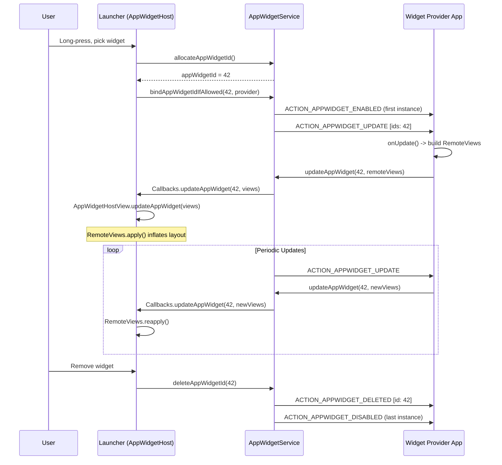
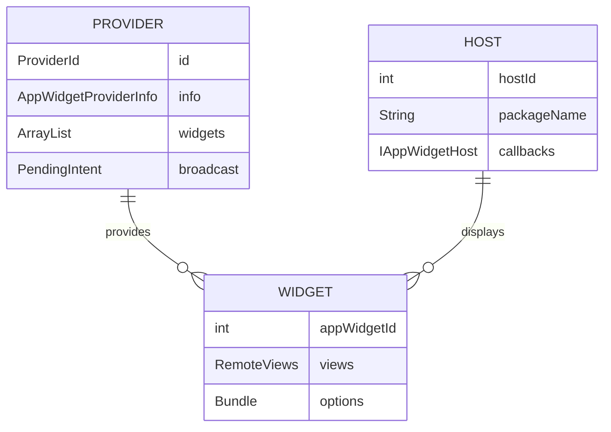
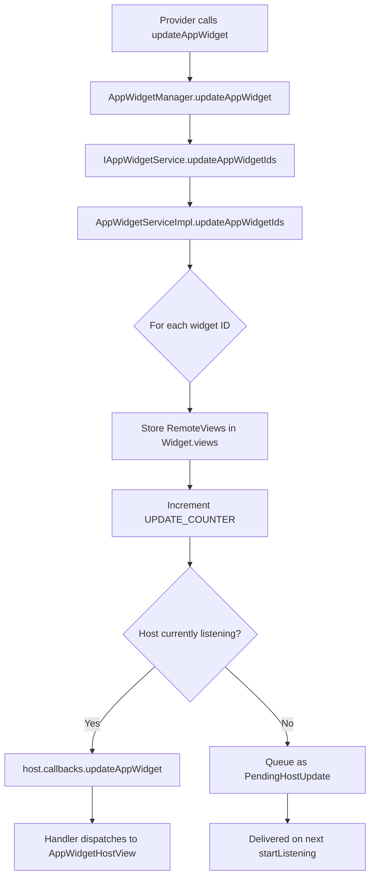
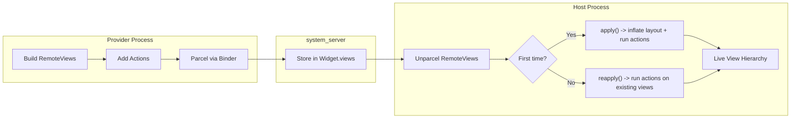
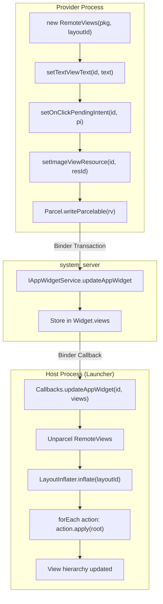
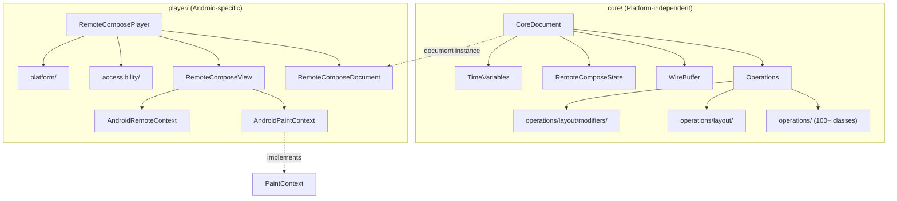
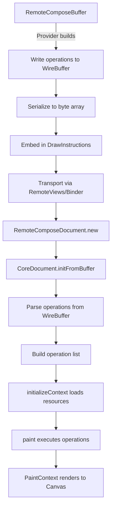
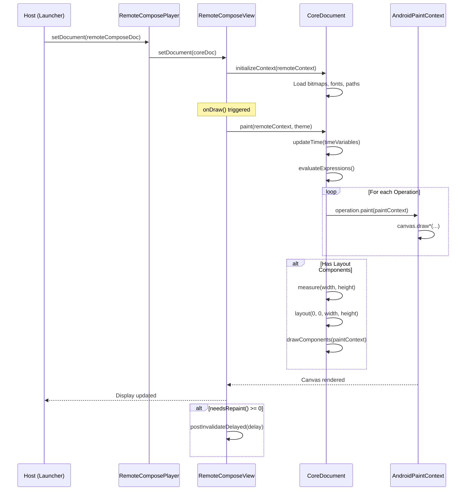
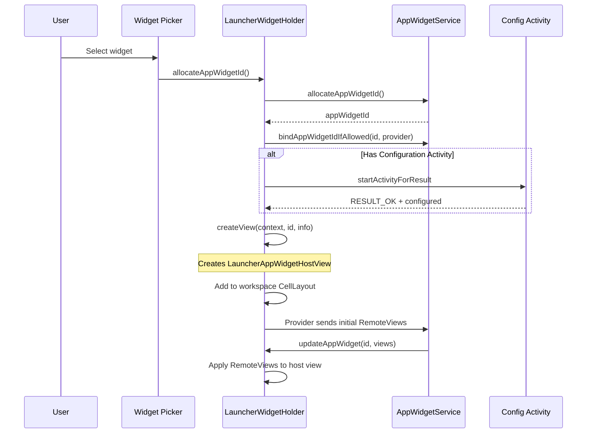
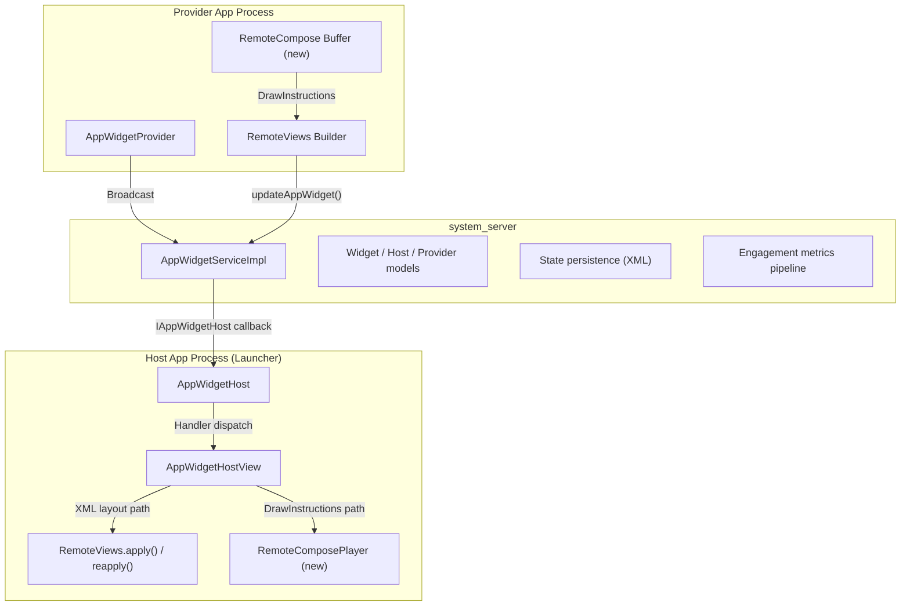

# Chapter 43: Widgets, RemoteViews, and RemoteCompose

Android widgets are one of the platform's oldest and most architecturally distinctive
features. Unlike normal app UI, a widget's view hierarchy lives in a process that did
not create it -- typically the launcher. This cross-process rendering requirement
drives the entire design of `RemoteViews`, `AppWidgetService`, and the new
`RemoteCompose` subsystem. This chapter traces every layer, from the provider-side
`AppWidgetProvider` through the system service that brokers updates, through
`RemoteViews`' action serialization and inflation pipeline, and finally into the
RemoteCompose engine that may eventually replace the XML-layout approach altogether.

Key source paths we will reference throughout:

| Component | Path |
|---|---|
| AppWidget framework | `frameworks/base/core/java/android/appwidget/` |
| AppWidget service | `frameworks/base/services/appwidget/java/com/android/server/appwidget/` |
| RemoteViews | `frameworks/base/core/java/android/widget/RemoteViews.java` (10,874 lines) |
| RemoteViewsService | `frameworks/base/core/java/android/widget/RemoteViewsService.java` (321 lines) |
| RemoteViewsAdapter | `frameworks/base/core/java/android/widget/RemoteViewsAdapter.java` (1,305 lines) |
| RemoteCompose core | `frameworks/base/core/java/com/android/internal/widget/remotecompose/core/` |
| RemoteCompose player | `frameworks/base/core/java/com/android/internal/widget/remotecompose/player/` |
| Launcher3 widgets | `packages/apps/Launcher3/src/com/android/launcher3/widget/` |
| SystemUI notifications | `frameworks/base/packages/SystemUI/src/com/android/systemui/statusbar/notification/row/` |

---

## 43.1 AppWidget Framework

The client-side AppWidget framework is defined in
`frameworks/base/core/java/android/appwidget/`. It consists of 10 public Java files
that together define the contract between widget providers (apps that supply widget
content) and widget hosts (apps that display them).

### 43.1.1 Core Classes

The framework revolves around five central classes:

| Class | Role | Lines |
|---|---|---|
| `AppWidgetProvider` | BroadcastReceiver convenience wrapper for providers | 220 |
| `AppWidgetHost` | Host-side connection to AppWidgetService | 726 |
| `AppWidgetHostView` | The actual View container that renders RemoteViews | ~800 |
| `AppWidgetManager` | System-service client proxy (singleton) | ~1,500 |
| `AppWidgetProviderInfo` | Parcelable metadata describing a widget provider | 647 |

Plus newer additions:

| Class | Role | Lines |
|---|---|---|
| `AppWidgetEvent` | Engagement metrics for widget interactions | 401 |
| `PendingHostUpdate` | Queued update types during host reconnection | ~100 |
| `AppWidgetConfigActivityProxy` | Proxy for cross-profile config activities | ~100 |
| `AppWidgetManagerInternal` | System-server-internal API surface | ~50 |

### 43.1.2 AppWidgetProvider -- The Provider Entry Point

`AppWidgetProvider` (220 lines) extends `BroadcastReceiver`. It is a pure convenience
class: everything it does can be accomplished with a raw receiver. Its `onReceive()`
method dispatches to hook methods based on the received intent action:

```java
// frameworks/base/core/java/android/appwidget/AppWidgetProvider.java
public void onReceive(Context context, Intent intent) {
    String action = intent.getAction();
    if (AppWidgetManager.ACTION_APPWIDGET_ENABLE_AND_UPDATE.equals(action)) {
        this.onReceive(context, new Intent(intent)
                .setAction(AppWidgetManager.ACTION_APPWIDGET_ENABLED));
        this.onReceive(context, new Intent(intent)
                .setAction(AppWidgetManager.ACTION_APPWIDGET_UPDATE));
    } else if (AppWidgetManager.ACTION_APPWIDGET_UPDATE.equals(action)) {
        Bundle extras = intent.getExtras();
        if (extras != null) {
            int[] appWidgetIds = extras.getIntArray(
                    AppWidgetManager.EXTRA_APPWIDGET_IDS);
            if (appWidgetIds != null && appWidgetIds.length > 0) {
                this.onUpdate(context,
                        AppWidgetManager.getInstance(context), appWidgetIds);
            }
        }
    } else if (AppWidgetManager.ACTION_APPWIDGET_DELETED.equals(action)) {
        // ...extract single ID, call onDeleted()
    } else if (AppWidgetManager.ACTION_APPWIDGET_OPTIONS_CHANGED.equals(action)) {
        // ...extract options bundle, call onAppWidgetOptionsChanged()
    } else if (AppWidgetManager.ACTION_APPWIDGET_ENABLED.equals(action)) {
        this.onEnabled(context);
    } else if (AppWidgetManager.ACTION_APPWIDGET_DISABLED.equals(action)) {
        this.onDisabled(context);
    } else if (AppWidgetManager.ACTION_APPWIDGET_RESTORED.equals(action)) {
        // ...call onRestored() then onUpdate()
    }
}
```

The dispatch is straightforward, but notice the combined broadcast action
`ACTION_APPWIDGET_ENABLE_AND_UPDATE`. This is a newer optimization (controlled by
the `COMBINED_BROADCAST_ENABLED` DeviceConfig flag) that merges the enable and
initial update into a single broadcast, reducing widget startup latency.

The hook methods that subclasses override:

| Callback | When Called |
|---|---|
| `onUpdate()` | Periodic update timer fires, or widget first bound |
| `onEnabled()` | First instance of this provider placed on any host |
| `onDisabled()` | Last instance of this provider removed from all hosts |
| `onDeleted()` | A specific widget instance is removed |
| `onAppWidgetOptionsChanged()` | Widget resized or options changed |
| `onRestored()` | Widget instances restored from backup (followed by onUpdate) |

### 43.1.3 AppWidgetHost -- The Host Entry Point

`AppWidgetHost` (726 lines) is the host application's handle to the widget system.
Launcher3, for example, creates an `AppWidgetHost` with a fixed host ID of 1024.

The class has three critical architectural elements:

**1. IPC Callback Stub:**

```java
// frameworks/base/core/java/android/appwidget/AppWidgetHost.java
static class Callbacks extends IAppWidgetHost.Stub {
    private final WeakReference<Handler> mWeakHandler;

    public void updateAppWidget(int appWidgetId, RemoteViews views) {
        if (isLocalBinder() && views != null) {
            views = views.clone();
        }
        Handler handler = mWeakHandler.get();
        if (handler == null) return;
        Message msg = handler.obtainMessage(HANDLE_UPDATE,
                appWidgetId, 0, views);
        msg.sendToTarget();
    }
    // ... providerChanged, appWidgetRemoved, viewDataChanged, etc.
}
```

Note the `isLocalBinder()` check -- when the call originates in the same process
(system_server calling itself), the `RemoteViews` must be cloned to prevent shared
mutable state corruption.

**2. Handler-based message dispatch:**

Six message types flow from the callback stub through the Handler:

| Constant | Value | Meaning |
|---|---|---|
| `HANDLE_UPDATE` | 1 | New RemoteViews available |
| `HANDLE_PROVIDER_CHANGED` | 2 | Provider APK updated |
| `HANDLE_PROVIDERS_CHANGED` | 3 | Available widget list changed |
| `HANDLE_VIEW_DATA_CHANGED` | 4 | Collection data invalidated |
| `HANDLE_APP_WIDGET_REMOVED` | 5 | Widget instance removed server-side |
| `HANDLE_VIEW_UPDATE_DEFERRED` | 6 | Deferred update for lazy inflation |

**3. Listener registry (SparseArray):**

```java
private final SparseArray<AppWidgetHostListener> mListeners = new SparseArray<>();
```

Each widget instance is identified by an integer `appWidgetId`. The listener
interface (`AppWidgetHostListener`) defines:

- `updateAppWidget(RemoteViews views)` -- apply new content
- `onUpdateProviderInfo(AppWidgetProviderInfo)` -- provider changed
- `onViewDataChanged(int viewId)` -- collection data changed
- `updateAppWidgetDeferred(String, int)` -- lazy evaluation path
- `collectWidgetEvent()` -- engagement metrics collection

**Service binding** happens lazily on first construction:

```java
private static void bindService(Context context) {
    synchronized (sServiceLock) {
        if (sServiceInitialized) return;
        sServiceInitialized = true;
        // Check for FEATURE_APP_WIDGETS
        IBinder b = ServiceManager.getService(Context.APPWIDGET_SERVICE);
        sService = IAppWidgetService.Stub.asInterface(b);
    }
}
```

### 43.1.4 AppWidgetProviderInfo -- Widget Metadata

`AppWidgetProviderInfo` (647 lines) is a `Parcelable` that describes a widget's
capabilities. It is populated from the `<appwidget-provider>` XML metadata in the
provider's manifest.

Key fields:

| Field | Type | Description |
|---|---|---|
| `provider` | `ComponentName` | Identity of the BroadcastReceiver |
| `minWidth/minHeight` | `int` | Minimum dimensions in pixels |
| `minResizeWidth/Height` | `int` | Minimum resize dimensions |
| `maxResizeWidth/Height` | `int` | Maximum resize dimensions |
| `targetCellWidth/Height` | `int` | Default size in grid cells |
| `updatePeriodMillis` | `int` | Requested update interval (min 30 minutes) |
| `initialLayout` | `int` | Resource ID of the initial layout |
| `initialKeyguardLayout` | `int` | Layout for keyguard display |
| `configure` | `ComponentName` | Configuration activity |
| `resizeMode` | `int` | Bitmask: RESIZE_HORIZONTAL, RESIZE_VERTICAL |
| `widgetCategory` | `int` | HOME_SCREEN, KEYGUARD, SEARCHBOX, NOT_KEYGUARD |
| `widgetFeatures` | `int` | RECONFIGURABLE, HIDE_FROM_PICKER, CONFIGURATION_OPTIONAL |
| `generatedPreviewCategories` | `int` | Categories with generated previews available |

### 43.1.5 AppWidgetEvent -- Engagement Metrics

`AppWidgetEvent` (401 lines) is a newer addition (Android 16, flagged under
`FLAG_ENGAGEMENT_METRICS`) that tracks user interactions with widgets:

```java
// frameworks/base/core/java/android/appwidget/AppWidgetEvent.java
public final class AppWidgetEvent implements Parcelable {
    public static final int MAX_NUM_ITEMS = 10;

    private final int mAppWidgetId;
    private final Duration mVisibleDuration;
    private final Instant mStart;
    private final Instant mEnd;
    private final Rect mPosition;
    private final int[] mClickedIds;   // max 10 view IDs
    private final int[] mScrolledIds;  // max 10 view IDs
}
```

The `Builder` class tracks visibility windows:

```java
public Builder startVisibility() {
    long now = System.currentTimeMillis();
    if (now < mStart) mStart = now;
    mLastVisibilityChangeMillis = SystemClock.uptimeMillis();
    return this;
}

public Builder endVisibility() {
    long now = System.currentTimeMillis();
    if (now > mEnd) mEnd = now;
    mDurationMillis += SystemClock.uptimeMillis() - mLastVisibilityChangeMillis;
    return this;
}
```

Events are serialized to `PersistableBundle` and reported to `UsageStatsManager` via
`AppWidgetHost.reportAllWidgetEvents()`.

### 43.1.6 Widget Lifecycle



### 43.1.7 AppWidgetHostView -- View Container

`AppWidgetHostView` (in `frameworks/base/core/java/android/appwidget/AppWidgetHostView.java`)
extends `FrameLayout` and implements `AppWidgetHostListener`. It is the actual
`View` placed in the host's layout hierarchy. Key responsibilities:

1. **Inflate or reapply RemoteViews** when `updateAppWidget()` is called
2. **Handle error states** -- display an error layout when the provider crashes
3. **Support engagement metrics** via `AppWidgetEvent.Builder`
4. **Apply color resources** for dynamic theming
5. **Manage keyguard vs. home screen** layout switching based on `OPTION_APPWIDGET_HOST_CATEGORY`

The `updateAppWidget()` method decides between `apply()` (first time) and
`reapply()` (subsequent updates with compatible layouts):

```java
public void updateAppWidget(RemoteViews remoteViews) {
    // ... null checks, error handling ...
    if (mView != null) {
        mView = remoteViews.reapply(/* ... */);
    } else {
        mView = remoteViews.apply(/* ... */);
    }
}
```

---

## 43.2 AppWidgetService

The system-side `AppWidgetService` manages registration, binding, updates, and
security policy for all widgets across all users. The implementation lives in
`frameworks/base/services/appwidget/java/com/android/server/appwidget/`.

### 43.2.1 Service Architecture

The service is split into two classes:

| Class | Role |
|---|---|
| `AppWidgetService.java` | Lifecycle wrapper, registered as `APPWIDGET_SERVICE` |
| `AppWidgetServiceImpl.java` | The actual IPC implementation (~7,500 lines) |

`AppWidgetServiceImpl` extends `IAppWidgetService.Stub` and implements
`WidgetBackupProvider` and `OnCrossProfileWidgetProvidersChangeListener`.

### 43.2.2 Internal Data Model

The service maintains five core data structures, all protected by `mLock`:

```java
// frameworks/base/services/appwidget/java/.../AppWidgetServiceImpl.java
private final ArrayList<Widget> mWidgets = new ArrayList<>();
private final ArrayList<Host> mHosts = new ArrayList<>();
private final ArrayList<Provider> mProviders = new ArrayList<>();
private final ArraySet<Pair<Integer, String>> mPackagesWithBindWidgetPermission
        = new ArraySet<>();
private final SparseBooleanArray mLoadedUserIds = new SparseBooleanArray();
```

The relationships form a many-to-many graph:



### 43.2.3 Widget Allocation and Binding

When a host requests a new widget:

1. **`allocateAppWidgetId()`** assigns a monotonically increasing integer from
   `mNextAppWidgetIds` (per-user). Creates a `Widget` object and associates it
   with the calling `Host`.

2. **`bindAppWidgetIdIfAllowed()`** or **`bindAppWidgetId()`** links the widget
   to a specific `Provider`. This triggers:
   - Security policy check (caller must have `BIND_APPWIDGET` permission or
     per-package allowlist in `mPackagesWithBindWidgetPermission`)
   - Cross-profile checks via `DevicePolicyManagerInternal`
   - Scheduling the initial `ACTION_APPWIDGET_UPDATE` broadcast

### 43.2.4 Update Pipeline

When a provider calls `AppWidgetManager.updateAppWidget()`:



The `PendingHostUpdate` mechanism handles the case when a host calls
`stopListening()` (e.g., activity goes to background). When `startListening()`
is called again, all queued updates are delivered in order:

```java
public void startListening() {
    List<PendingHostUpdate> updates;
    updates = sService.startListening(mCallbacks, mContextOpPackageName,
            mHostId, idsToUpdate).getList();
    for (PendingHostUpdate update : updates) {
        switch (update.type) {
            case TYPE_VIEWS_UPDATE: updateAppWidgetView(/*...*/); break;
            case TYPE_PROVIDER_CHANGED: onProviderChanged(/*...*/); break;
            case TYPE_VIEW_DATA_CHANGED: viewDataChanged(/*...*/); break;
            case TYPE_APP_WIDGET_REMOVED: dispatchOnAppWidgetRemoved(/*...*/); break;
        }
    }
}
```

### 43.2.5 Periodic Updates via AlarmManager

The service schedules periodic updates using `AlarmManager` with a minimum
period of 30 minutes (enforced by `MIN_UPDATE_PERIOD`):

```java
// AppWidgetServiceImpl.java
private static final int MIN_UPDATE_PERIOD = DEBUG ? 0 : 30 * 60 * 1000;
```

### 43.2.6 Bitmap Memory Limits

The service computes a maximum bitmap memory budget based on the display size:

```java
private void computeMaximumWidgetBitmapMemory() {
    Display display = mContext.getDisplayNoVerify();
    Point size = new Point();
    display.getRealSize(size);
    // 1.5 * 4 bytes/pixel * w * h ==> 6 * w * h
    mMaxWidgetBitmapMemory = 6 * size.x * size.y;
}
```

This limit is enforced during `RemoteViews` serialization. On a 1080x2400 display,
the budget is approximately 15.5 MB.

### 43.2.7 State Persistence

Widget state is persisted to XML files at
`/data/system/appwidgets.xml` (per-user variant under `/data/system_ce/<user>/`):

```java
private static final String STATE_FILENAME = "appwidgets.xml";
private static final int CURRENT_VERSION = 1;
```

The `handleSaveMessage()` method converts state to bytes under `mLock`, then
writes to disk outside the lock to minimize contention.

### 43.2.8 Generated Previews

Widget providers can set generated previews (snapshots of widget content for the
picker) via `AppWidgetManager.setWidgetPreview()`. These are stored in
`/data/system_ce/<user>/appwidget/previews/` and are rate-limited:

```java
private static final long DEFAULT_GENERATED_PREVIEW_RESET_INTERVAL_MS =
        Duration.ofHours(1).toMillis();
private static final int DEFAULT_GENERATED_PREVIEW_MAX_CALLS_PER_INTERVAL = 2;
private static final int DEFAULT_GENERATED_PREVIEW_MAX_PROVIDERS = 50;
```

### 43.2.9 Engagement Metrics Reporting

The `reportWidgetEvents()` method accepts `AppWidgetEvent[]` from hosts and
forwards them to `UsageStatsManager` as `USER_INTERACTION` events. A
`ReportWidgetEventsJob` periodically triggers collection:

```java
private static final long DEFAULT_WIDGET_EVENTS_REPORT_INTERVAL_MS =
        Duration.ofHours(1).toMillis();
```

### 43.2.10 Security Policy and Limits

Hard limits prevent abuse:

| Limit | Value |
|---|---|
| Maximum hosts per package | 20 |
| Maximum widgets per host | 200 |
| Minimum update period | 30 minutes |
| Generated preview API calls per hour | 2 |
| Maximum providers with previews | 50 |

---

## 43.3 RemoteViews

`RemoteViews` is the central mechanism for cross-process UI in Android. Defined in
`frameworks/base/core/java/android/widget/RemoteViews.java` (10,874 lines), it
serializes a description of view modifications as `Parcelable` actions that can be
sent over Binder, then applied (inflated) in the receiving process.

### 43.3.1 Architecture Overview



### 43.3.2 Supported Views

`RemoteViews` restricts which `View` classes can be used. Views must be annotated
with `@RemoteView`:

**Layouts (ViewGroups):**

- `AdapterViewFlipper`
- `FrameLayout`
- `GridLayout`
- `GridView`
- `LinearLayout`
- `ListView`
- `RelativeLayout`
- `StackView`
- `ViewFlipper`

**Widgets (Leaf Views):**

- `AnalogClock`, `Button`, `Chronometer`, `ImageButton`, `ImageView`
- `ProgressBar`, `TextClock`, `TextView`

**API 31+ additions:**

- `CheckBox`, `RadioButton`, `RadioGroup`, `Switch`

The filter is enforced at inflation time:

```java
// RemoteViews.java
private static final LayoutInflater.Filter INFLATER_FILTER =
        (clazz) -> clazz.isAnnotationPresent(RemoteViews.RemoteView.class);
```

### 43.3.3 Action System

Every mutation to a `RemoteViews` object creates an `Action` that is appended to
an internal `ArrayList<Action>`:

```java
@UnsupportedAppUsage
private ArrayList<Action> mActions;
```

Each `Action` subclass has a unique tag for parceling. Here are the defined tags:

| Tag Constant | Value | Purpose |
|---|---|---|
| `SET_ON_CLICK_RESPONSE_TAG` | 1 | Click handlers |
| `REFLECTION_ACTION_TAG` | 2 | Generic setter via reflection |
| `SET_DRAWABLE_TINT_TAG` | 3 | Drawable tinting |
| `VIEW_GROUP_ACTION_ADD_TAG` | 4 | Add child RemoteViews |
| `VIEW_CONTENT_NAVIGATION_TAG` | 5 | Content navigation |
| `SET_EMPTY_VIEW_ACTION_TAG` | 6 | Set empty view for adapter |
| `VIEW_GROUP_ACTION_REMOVE_TAG` | 7 | Remove child views |
| `SET_PENDING_INTENT_TEMPLATE_TAG` | 8 | Collection click template |
| `SET_REMOTE_VIEW_ADAPTER_INTENT_TAG` | 10 | Legacy collection adapter |
| `TEXT_VIEW_DRAWABLE_ACTION_TAG` | 11 | Compound drawables |
| `BITMAP_REFLECTION_ACTION_TAG` | 12 | Bitmap via reflection |
| `TEXT_VIEW_SIZE_ACTION_TAG` | 13 | Text size |
| `VIEW_PADDING_ACTION_TAG` | 14 | View padding |
| `SET_REMOTE_INPUTS_ACTION_TAG` | 18 | Remote input for notifications |
| `LAYOUT_PARAM_ACTION_TAG` | 19 | Layout parameters |
| `SET_RIPPLE_DRAWABLE_COLOR_TAG` | 21 | Ripple effect color |
| `SET_INT_TAG_TAG` | 22 | Integer tag on view |
| `REMOVE_FROM_PARENT_ACTION_TAG` | 23 | Remove from parent |
| `RESOURCE_REFLECTION_ACTION_TAG` | 24 | Resource-based reflection |
| `COMPLEX_UNIT_DIMENSION_REFLECTION_ACTION_TAG` | 25 | Dimension units |
| `SET_COMPOUND_BUTTON_CHECKED_TAG` | 26 | CheckBox/Switch checked |
| `SET_RADIO_GROUP_CHECKED` | 27 | RadioGroup selection |
| `SET_VIEW_OUTLINE_RADIUS_TAG` | 28 | View outline radius |
| `SET_ON_CHECKED_CHANGE_RESPONSE_TAG` | 29 | Checked change handler |
| `NIGHT_MODE_REFLECTION_ACTION_TAG` | 30 | Dark mode variant |
| `SET_REMOTE_COLLECTION_ITEMS_ADAPTER_TAG` | 31 | Collection items |
| `ATTRIBUTE_REFLECTION_ACTION_TAG` | 32 | Theme attribute |
| `SET_REMOTE_ADAPTER_TAG` | 33 | New-style adapter |
| `SET_ON_STYLUS_HANDWRITING_RESPONSE_TAG` | 34 | Stylus handwriting |
| `SET_DRAW_INSTRUCTION_TAG` | 35 | RemoteCompose instructions |

The `Action` base class defines the contract:

```java
// RemoteViews.java
private abstract static class Action {
    @IdRes int mViewId;

    public abstract void apply(View root, ViewGroup rootParent,
            ActionApplyParams params) throws ActionException;

    public static final int MERGE_REPLACE = 0;
    public static final int MERGE_APPEND = 1;
    public static final int MERGE_IGNORE = 2;

    public int mergeBehavior() { return MERGE_REPLACE; }
    public abstract int getActionTag();
    public String getUniqueKey() {
        return (getActionTag() + "_" + mViewId);
    }

    // Async variant for background preparation
    public Action initActionAsync(ViewTree root, ViewGroup rootParent,
            ActionApplyParams params) {
        return this;
    }
}
```

### 43.3.4 Reflection Actions

The most general `Action` type is `ReflectionAction`, which invokes arbitrary
setter methods on views. When you call `RemoteViews.setTextViewText()`, it creates
a `ReflectionAction` that calls `setText()`:

```java
public void setTextViewText(@IdRes int viewId, CharSequence text) {
    setCharSequence(viewId, "setText", text);
}
```

The reflection lookup is cached in `sMethods` (an `ArrayMap<MethodKey, MethodArgs>`)
using `MethodHandle` for efficient invocation.

### 43.3.5 Layout Modes

`RemoteViews` supports three modes for responsive layouts:

| Mode | Constant | Description |
|---|---|---|
| Normal | `MODE_NORMAL` | Single layout |
| Landscape/Portrait | `MODE_HAS_LANDSCAPE_AND_PORTRAIT` | Two layouts by orientation |
| Sized | `MODE_HAS_SIZED_REMOTEVIEWS` | Multiple layouts by size (up to 16) |

The sized mode (API 31+) allows providers to supply multiple `RemoteViews` at
different breakpoints:

```java
public RemoteViews(Map<SizeF, RemoteViews> remoteViews) {
    // Creates a sized RemoteViews with up to MAX_INIT_VIEW_COUNT (16) variants
}
```

### 43.3.6 Bitmap Cache

Bitmaps are deduplicated via `BitmapCache`:

```java
@UnsupportedAppUsage
private BitmapCache mBitmapCache = new BitmapCache();
```

Only the root `RemoteViews` in a hierarchy stores the cache. Nested `RemoteViews`
(from `addView` or landscape/portrait) reference the parent's cache via index.
The `reduceImageSizes()` method enforces maximum dimensions:

```java
public void reduceImageSizes(int maxWidth, int maxHeight) {
    ArrayList<Bitmap> cache = mBitmapCache.mBitmaps;
    for (int i = 0; i < cache.size(); i++) {
        Bitmap bitmap = cache.get(i);
        cache.set(i, Icon.scaleDownIfNecessary(bitmap, maxWidth, maxHeight));
    }
}
```

### 43.3.7 Apply vs. Reapply

The two core operations:

**`apply()`** -- Full inflation:

1. Inflates the XML layout resource using `LayoutInflater` with the `INFLATER_FILTER`
2. Walks the action list and applies each action to the inflated view tree
3. Returns the inflated root `View`

**`reapply()`** -- Incremental update:

1. Reuses the existing view hierarchy
2. Only applies the new actions, using merge semantics
3. Actions with `MERGE_REPLACE` overwrite previous actions for the same view/type
4. Actions with `MERGE_APPEND` accumulate (e.g., adding children)

The merge logic in `mergeRemoteViews()`:

```java
public void mergeRemoteViews(RemoteViews newRv) {
    HashMap<String, Action> map = new HashMap<>();
    for (Action a : mActions) {
        map.put(a.getUniqueKey(), a);
    }
    for (Action a : copy.mActions) {
        String key = a.getUniqueKey();
        int mergeBehavior = a.mergeBehavior();
        if (map.containsKey(key) && mergeBehavior == Action.MERGE_REPLACE) {
            mActions.remove(map.get(key));
        }
        if (mergeBehavior == MERGE_REPLACE || mergeBehavior == MERGE_APPEND) {
            mActions.add(a);
        }
    }
    reconstructCaches();
}
```

### 43.3.8 Async Apply

For smoother UI, `RemoteViews` supports async inflation:

```java
public CancellationSignal applyAsync(Context context, ViewGroup parent,
        Executor executor, OnViewAppliedListener listener) {
    // Inflate and apply on executor thread, callback on UI thread
}
```

Actions can override `initActionAsync()` to perform expensive work (like parsing
RemoteCompose documents) off the UI thread, then return a lightweight `RuntimeAction`
that runs on UI.

### 43.3.9 The Serialization Pipeline



The parceling process writes:

1. Mode byte (normal, landscape/portrait, or sized)
2. `BitmapCache` (only at root)
3. `RemoteCollectionCache` (only at root)
4. `ApplicationInfo`
5. Layout ID, View ID, light background layout ID
6. Action count, then each action (tag + data)
7. Apply flags, provider instance ID, hasDrawInstructions flag

### 43.3.10 RemoteViewsAdapter and RemoteViewsService

For collection widgets (ListView, GridView, StackView), a different mechanism
is needed because the adapter data may be large and dynamic.

**`RemoteViewsService`** (321 lines) is an abstract `Service` that hosts
`RemoteViewsFactory` instances:

```java
// frameworks/base/core/java/android/widget/RemoteViewsService.java
public interface RemoteViewsFactory {
    void onCreate();
    void onDataSetChanged();  // Heavy work allowed synchronously
    void onDestroy();
    int getCount();
    RemoteViews getViewAt(int position);
    RemoteViews getLoadingView();
    int getViewTypeCount();
    long getItemId(int position);
    boolean hasStableIds();
}
```

**`RemoteViewsAdapter`** (1,305 lines) is the host-side adapter that connects
to the `RemoteViewsService` via `IRemoteViewsFactory` (AIDL). It manages:

- Service connection lifecycle
- View caching and recycling
- Loading views during async fetch
- Data change notifications via `notifyDataSetChanged()`

The newer `RemoteCollectionItems` API (API 31+) allows inline collection data
without a service, reducing IPC overhead:

```java
new RemoteViews.RemoteCollectionItems.Builder()
    .addItem(id, remoteViewsForItem)
    .setHasStableIds(true)
    .build();
```

### 43.3.11 DrawInstructions -- Bridge to RemoteCompose

The `SET_DRAW_INSTRUCTION_TAG` (35) action connects `RemoteViews` to the new
`RemoteCompose` system:

```java
// RemoteViews.java
@FlaggedApi(FLAG_DRAW_DATA_PARCEL)
public RemoteViews(@NonNull final DrawInstructions drawInstructions) {
    Objects.requireNonNull(drawInstructions);
    mHasDrawInstructions = true;
    addAction(new SetDrawInstructionAction(drawInstructions));
}
```

`SetDrawInstructionAction` applies the draw instructions to a `RemoteComposePlayer`:

```java
private class SetDrawInstructionAction extends Action {
    private final DrawInstructions mInstructions;

    @Override
    public void apply(View root, ViewGroup rootParent, ActionApplyParams params) {
        applyAction(root, (player, doc) -> {
            player.setDocument(doc);
            applyActionListener(player, params);
            return ACTION_NOOP;
        });
    }

    @Override
    public final Action initActionAsync(ViewTree root, ViewGroup rootParent,
            ActionApplyParams params) {
        return applyAction(root.mRoot, (player, doc) -> {
            PreparedDocument preparedDoc = player.prepareDocument(doc);
            return preparedDoc == null ? ACTION_NOOP
                : new RunnableAction(() -> {
                    player.setPreparedDocument(preparedDoc);
                    applyActionListener(player, params);
                });
        });
    }
}
```

The `initActionAsync` variant enables background document parsing, keeping the
UI thread responsive.

---

## 43.4 RemoteViews in Notifications

Notifications are the other major consumer of `RemoteViews`. While most notifications
use the platform's standard templates, custom notifications use `RemoteViews` directly.

### 43.4.1 Notification Template System

The `Notification.Builder` creates `RemoteViews` internally for standard templates:

```java
Notification.Builder builder = new Notification.Builder(context, channelId)
    .setContentTitle("Title")
    .setContentText("Content");
```

Internally, `Notification.Builder.createContentView()` constructs a `RemoteViews`
from system layout resources and populates it with actions for title, text, icon, etc.

Custom notifications provide their own RemoteViews:

```java
RemoteViews customView = new RemoteViews(getPackageName(),
        R.layout.notification_custom);
customView.setTextViewText(R.id.title, "Custom Title");
builder.setCustomContentView(customView);
```

### 43.4.2 SystemUI's NotifRemoteViewsFactory

SystemUI uses `NotifRemoteViewsFactory` (in
`frameworks/base/packages/SystemUI/src/com/android/systemui/statusbar/notification/row/NotifRemoteViewsFactory.kt`)
to intercept view inflation within notification RemoteViews:

```kotlin
// NotifRemoteViewsFactory.kt
interface NotifRemoteViewsFactory {
    fun instantiate(
        row: ExpandableNotificationRow,
        @InflationFlag layoutType: Int,
        parent: View?,
        name: String,
        context: Context,
        attrs: AttributeSet
    ): View?
}
```

This factory pattern allows SystemUI to substitute custom implementations for
standard views within notifications. For example, `RemoteComposePlayer` views
can be injected when the notification uses `DrawInstructions`.

### 43.4.3 NotifRemoteViewCache

The `NotifRemoteViewCacheImpl` caches inflated notification views to avoid
re-inflation when a notification is rebound:

```java
// NotifRemoteViewCacheImpl.java
public interface NotifRemoteViewCache {
    boolean hasCachedView(NotificationEntry entry, @InflationFlag int flag);
    View getCachedView(NotificationEntry entry, @InflationFlag int flag);
    void putCachedView(NotificationEntry entry, @InflationFlag int flag, View v);
    void removeCachedView(NotificationEntry entry, @InflationFlag int flag);
}
```

### 43.4.4 Security Considerations

Notification RemoteViews run in SystemUI's process with elevated privileges.
Several security measures apply:

1. **View filtering**: The `INFLATER_FILTER` ensures only `@RemoteView`-annotated
   classes can be instantiated
2. **Nesting limits**: `MAX_NESTED_VIEWS = 10` prevents stack overflow
3. **Bitmap limits**: `reduceImageSizes()` is called before display
4. **URI grants**: `visitUris()` collects all referenced URIs so appropriate
   permission grants can be issued
5. **PendingIntent validation**: Actions with PendingIntents are validated
   against the calling package

---

## 43.5 RemoteCompose Architecture

RemoteCompose is a new rendering system within AOSP that provides a
programmatic alternative to XML layouts for cross-process rendering. Located in
`frameworks/base/core/java/com/android/internal/widget/remotecompose/`, it
comprises 265 Java files totaling over 60,000 lines of code.

### 43.5.1 Design Goals

RemoteCompose addresses fundamental limitations of the XML-based `RemoteViews`:

1. **Static layout**: XML layouts cannot express animations, data-driven values,
   or conditional rendering without full re-serialization
2. **Limited view set**: Only `@RemoteView`-annotated views are available
3. **Performance**: Each update requires full Parcel serialization over Binder
4. **Expressiveness**: Complex visual designs require many actions

RemoteCompose replaces this with a binary bytecode format (`WireBuffer`) that
encodes draw operations, layout instructions, variables, expressions, and
animations into a compact document that can be rendered by a player.

### 43.5.2 Architecture Split: core/ and player/



The `core/` package is designed to be platform-independent -- it could theoretically
run on non-Android JVMs. The `player/` package binds to Android APIs (`Canvas`,
`Paint`, `View` system, accessibility).

### 43.5.3 CoreDocument

`CoreDocument` (in `core/CoreDocument.java`) is the central data structure. It
contains:

```java
// frameworks/base/.../remotecompose/core/CoreDocument.java
public class CoreDocument implements Serializable {
    public static final int MAJOR_VERSION = 1;
    public static final int MINOR_VERSION = 2;
    public static final int PATCH_VERSION = 0;
    public static final int DOCUMENT_API_LEVEL = 8;

    ArrayList<Operation> mOperations = new ArrayList<>();
    RootLayoutComponent mRootLayoutComponent = null;
    RemoteComposeState mRemoteComposeState = new RemoteComposeState();
    TimeVariables mTimeVariables = new TimeVariables();
    Version mVersion;
    String mContentDescription;
    long mRequiredCapabilities = 0L;
    int mWidth = 0;
    int mHeight = 0;
    int mContentScroll, mContentSizing, mContentMode;
    int mContentAlignment = RootContentBehavior.ALIGNMENT_CENTER;
    RemoteComposeBuffer mBuffer = new RemoteComposeBuffer();
    // ... expression maps, clock, touch operations ...
}
```

The document lifecycle:

1. **Construction**: Created on the provider side, operations are appended
2. **Serialization**: Written to a `RemoteComposeBuffer` (byte stream)
3. **Transport**: Embedded in `RemoteViews` as `DrawInstructions`
4. **Deserialization**: `initFromBuffer()` reconstructs operations
5. **Initialization**: `initializeContext()` loads resources, caches bitmaps
6. **Painting**: `paint()` executes operations via a `PaintContext`

### 43.5.4 WireBuffer

`WireBuffer` (in `core/WireBuffer.java`) is the binary encoding layer:

```java
// frameworks/base/.../remotecompose/core/WireBuffer.java
public class WireBuffer {
    private static final int BUFFER_SIZE = 1024 * 1024; // 1 MB default
    byte[] mBuffer;
    int mIndex = 0;
    int mSize = 0;
    boolean[] mValidOperations = new boolean[256];

    public void start(int type) {
        if (!mValidOperations[type]) {
            throw new RuntimeException(
                    "Operation " + type + " is not supported for this version");
        }
        mStartingIndex = mIndex;
        writeByte(type);
    }
}
```

The buffer supports:

- Primitive types: `writeByte`, `writeInt`, `writeFloat`, `writeLong`
- Strings via length-prefixed encoding
- Auto-resizing when capacity is exceeded
- Version-gated operations via `mValidOperations` array

### 43.5.5 PaintContext

`PaintContext` (in `core/PaintContext.java`) is the abstract rendering interface:

```java
// frameworks/base/.../remotecompose/core/PaintContext.java
public abstract class PaintContext {
    public static final int TEXT_MEASURE_MONOSPACE_WIDTH = 0x01;
    public static final int TEXT_MEASURE_FONT_HEIGHT = 0x02;
    public static final int TEXT_MEASURE_SPACES = 0x04;
    public static final int TEXT_COMPLEX = 0x08;

    protected RemoteContext mContext;

    public abstract void drawBitmap(int imageId,
            int srcLeft, int srcTop, int srcRight, int srcBottom,
            int dstLeft, int dstTop, int dstRight, int dstBottom, int cdId);
    public abstract void scale(float scaleX, float scaleY);
    public abstract void translate(float translateX, float translateY);
    public abstract void drawArc(float left, float top, float right,
            float bottom, float startAngle, float sweepAngle);
    public abstract void drawSector(/*...*/);
    public abstract void drawCircle(float x, float y, float radius);
    public abstract void drawLine(float x1, float y1, float x2, float y2);
    public abstract void drawRect(float l, float t, float r, float b);
    public abstract void drawRoundRect(/*...*/);
    public abstract void drawOval(/*...*/);
    public abstract void drawText(/*...*/);
    public abstract void drawTextOnPath(/*...*/);
    public abstract void drawPath(/*...*/);
    // ... matrix operations, clipping, paint state ...
}
```

This abstraction allows the core to express rendering without depending on
Android's `Canvas` API directly.

### 43.5.6 RemoteComposeState

`RemoteComposeState` (in `core/RemoteComposeState.java`) manages the runtime
state of a document:

```java
// frameworks/base/.../remotecompose/core/RemoteComposeState.java
public class RemoteComposeState implements CollectionsAccess {
    public static final int START_ID = 42;
    public static final int BITMAP_TEXTURE_ID_OFFSET = 2000;

    private final IntMap<Object> mIntDataMap = new IntMap<>();
    private final HashMap<Object, Integer> mDataIntMap = new HashMap<>();
    private final IntFloatMap mFloatMap = new IntFloatMap();
    private final IntIntMap mIntegerMap = new IntIntMap();
    private final IntIntMap mColorMap = new IntIntMap();
    private final IntMap<DataMap> mDataMapMap = new IntMap<>();
    private final IntMap<Object> mPathMap = new IntMap<>();
}
```

This state holds:

- **Named data**: Bitmaps, text strings, paths, shaders -- all indexed by integer ID
- **Variables**: Floats, integers, colors -- with override flags for host-side values
- **Collections**: Lists and maps for data-driven content
- **Path data**: Pre-computed path coordinates and winding rules

---

## 43.6 RemoteCompose Operations

The `operations/` directory under `core/` contains 100+ operation classes. Each
operation has a unique opcode defined in `Operations.java`.

### 43.6.1 Operation Registry

`Operations.java` defines all opcodes and registers their companion
(factory) objects. The opcodes span several categories:

**Protocol operations:**

| Opcode | Value | Class |
|---|---|---|
| `HEADER` | 0 | `Header` |
| `THEME` | 63 | `Theme` |
| `CLICK_AREA` | 64 | `ClickArea` |
| `ROOT_CONTENT_BEHAVIOR` | 65 | `RootContentBehavior` |
| `ROOT_CONTENT_DESCRIPTION` | 103 | `RootContentDescription` |
| `ACCESSIBILITY_SEMANTICS` | 250 | `CoreSemantics` |

**Draw operations:**

| Opcode | Value | Class |
|---|---|---|
| `DRAW_RECT` | 42 | `DrawRect` |
| `DRAW_TEXT_RUN` | 43 | `DrawText` |
| `DRAW_BITMAP` | 44 | `DrawBitmap` |
| `DRAW_CIRCLE` | 46 | `DrawCircle` |
| `DRAW_LINE` | 47 | `DrawLine` |
| `DRAW_ROUND_RECT` | 51 | `DrawRoundRect` |
| `DRAW_SECTOR` | 52 | `DrawSector` |
| `DRAW_TEXT_ON_PATH` | 53 | `DrawTextOnPath` |
| `DRAW_OVAL` | 56 | `DrawOval` |
| `DRAW_ARC` | 152 | `DrawArc` |
| `DRAW_PATH` | 124 | `DrawPath` |
| `DRAW_TWEEN_PATH` | 125 | `DrawTweenPath` |
| `DRAW_TEXT_ANCHOR` | 133 | `DrawTextAnchored` |
| `DRAW_BITMAP_SCALED` | 149 | `DrawBitmapScaled` |
| `DRAW_BITMAP_INT` | 66 | `DrawBitmapInt` |
| `DRAW_CONTENT` | 139 | `DrawContent` |
| `DRAW_TO_BITMAP` | 190 | `DrawToBitmap` |
| `DRAW_BITMAP_TEXT_ANCHORED` | 184 | `DrawBitmapTextAnchored` |

**Data operations:**

| Opcode | Value | Class |
|---|---|---|
| `DATA_TEXT` | 102 | `TextData` |
| `DATA_BITMAP` | 101 | `BitmapData` |
| `DATA_SHADER` | 45 | `ShaderData` |
| `DATA_PATH` | 123 | `PathData` |
| `DATA_FLOAT` | 80 | `FloatConstant` |
| `DATA_INT` | 140 | `IntegerConstant` |
| `DATA_LONG` | 148 | `LongConstant` |
| `DATA_BOOLEAN` | 143 | `BooleanConstant` |
| `DATA_FONT` | 189 | `FontData` |
| `DATA_BITMAP_FONT` | 167 | `BitmapFontData` |

**Matrix operations:**

| Opcode | Value | Class |
|---|---|---|
| `MATRIX_SCALE` | 126 | `MatrixScale` |
| `MATRIX_TRANSLATE` | 127 | `MatrixTranslate` |
| `MATRIX_SKEW` | 128 | `MatrixSkew` |
| `MATRIX_ROTATE` | 129 | `MatrixRotate` |
| `MATRIX_SAVE` | 130 | `MatrixSave` |
| `MATRIX_RESTORE` | 131 | `MatrixRestore` |
| `MATRIX_SET` | 132 | `MatrixConstant` |
| `MATRIX_FROM_PATH` | 181 | `MatrixFromPath` |
| `MATRIX_EXPRESSION` | 187 | `MatrixExpression` |
| `MATRIX_VECTOR_MATH` | 188 | `MatrixVectorMath` |

**Clipping operations:**

| Opcode | Value | Class |
|---|---|---|
| `CLIP_PATH` | 38 | `ClipPath` |
| `CLIP_RECT` | 39 | `ClipRect` |

**Paint operations:**

| Opcode | Value | Class |
|---|---|---|
| `PAINT_VALUES` | 40 | `PaintData` |

### 43.6.2 Draw Operation Detail: DrawText

`DrawText` demonstrates the variable-binding pattern used throughout:

```java
// frameworks/base/.../remotecompose/core/operations/DrawText.java
public class DrawText extends PaintOperation implements VariableSupport {
    int mTextID;
    float mX, mY;       // Source coordinates (may be NaN for variables)
    float mOutX, mOutY; // Resolved coordinates
    boolean mRtl;

    @Override
    public void updateVariables(RemoteContext context) {
        mOutX = Float.isNaN(mX) ? context.getFloat(Utils.idFromNan(mX)) : mX;
        mOutY = Float.isNaN(mY) ? context.getFloat(Utils.idFromNan(mY)) : mY;
    }

    @Override
    public void registerListening(RemoteContext context) {
        if (Float.isNaN(mX)) context.listensTo(Utils.idFromNan(mX), this);
        if (Float.isNaN(mY)) context.listensTo(Utils.idFromNan(mY), this);
    }
}
```

The NaN-encoding trick is clever: coordinate values that are `Float.NaN` with
specific bit patterns encode variable IDs. `Utils.idFromNan()` extracts the ID
from the NaN payload. This allows the same serialization format to hold both
literal values and variable references.

### 43.6.3 Bitmap Operations

`BitmapData` (opcode 101) loads a bitmap into the document state:

```java
public class BitmapData extends Operation {
    int mImageId;
    int mWidth, mHeight;
    byte[] mBitmapData; // Compressed bitmap bytes
}
```

Multiple draw variants exist:

- `DrawBitmap`: Source/destination rect mapping
- `DrawBitmapInt`: Integer coordinates for pixel-perfect rendering
- `DrawBitmapScaled`: Scaled rendering with automatic fitting
- `DrawBitmapTextAnchored`: Text rendered from bitmap font glyphs

### 43.6.4 Path Operations

Paths are first-class objects in RemoteCompose:

| Operation | Description |
|---|---|
| `PathData` | Raw path coordinate data |
| `PathCreate` | Construct path from primitives |
| `PathAppend` | Append segments to existing path |
| `PathCombine` | Boolean operations on paths |
| `PathTween` | Interpolate between two paths |
| `PathExpression` | Dynamic path from expressions |
| `DrawPath` | Render a stored path |
| `DrawTweenPath` | Render an animated path transition |

### 43.6.5 Expression and Animation Operations

RemoteCompose supports data-driven rendering through expression operations:

| Opcode | Value | Description |
|---|---|---|
| `ANIMATED_FLOAT` | 81 | Animated float value |
| `COLOR_EXPRESSIONS` | 134 | Color computed from expressions |
| `FLOAT_LIST` | 147 | List of float values |
| `INTEGER_EXPRESSION` | 144 | Integer computed from expression |
| `TEXT_FROM_FLOAT` | 135 | Text generated from float value |
| `TEXT_MERGE` | 136 | Concatenate text values |
| `TEXT_LOOKUP` | 151 | Look up text by key |
| `TEXT_LOOKUP_INT` | 153 | Look up text by integer key |
| `DATA_MAP_LOOKUP` | 154 | Look up value in data map |
| `TOUCH_EXPRESSION` | 157 | Expression driven by touch input |

### 43.6.6 Haptic Feedback

The `HapticFeedback` operation (opcode 177) triggers device haptics from the
document:

```java
// frameworks/base/.../remotecompose/core/operations/HapticFeedback.java
public class HapticFeedback extends Operation {
    private int mHapticFeedbackType;

    @Override
    public void write(WireBuffer buffer) {
        apply(buffer, mHapticFeedbackType);
    }
}
```

The player-side `HapticSupport` class translates feedback type constants to
Android `HapticFeedbackConstants`.

### 43.6.7 Particle System

RemoteCompose includes a particle system for animated effects:

| Opcode | Value | Description |
|---|---|---|
| `PARTICLE_DEFINE` | 161 | Define particle emitter parameters |
| `PARTICLE_PROCESS` | 162 | Process particle simulation step |
| `PARTICLE_LOOP` | 163 | Loop particle rendering |
| `IMPULSE_START` | 164 | Trigger impulse animation |
| `IMPULSE_PROCESS` | 165 | Process impulse state |

### 43.6.8 Conditional and Control Flow

| Opcode | Value | Description |
|---|---|---|
| `CONDITIONAL_OPERATIONS` | 178 | Execute operations based on condition |
| `FUNCTION_DEFINE` | 168 | Define reusable function |
| `FUNCTION_CALL` | 166 | Call defined function |
| `DEBUG_MESSAGE` | 179 | Emit debug output |
| `WAKE_IN` | 191 | Schedule a repaint after delay |

---

## 43.7 RemoteCompose Layout and State

### 43.7.1 Layout System

RemoteCompose includes a full layout system with opcodes in the 200+ range:

**Layout containers:**

| Opcode | Value | Class | Description |
|---|---|---|---|
| `LAYOUT_ROOT` | 200 | `RootLayoutComponent` | Document root |
| `LAYOUT_CONTENT` | 201 | `LayoutComponentContent` | Content placeholder |
| `LAYOUT_BOX` | 202 | `BoxLayout` | Overlay layout (like FrameLayout) |
| `LAYOUT_FIT_BOX` | 176 | `FitBoxLayout` | Scale-to-fit layout |
| `LAYOUT_ROW` | 203 | `RowLayout` | Horizontal layout |
| `LAYOUT_COLUMN` | 204 | `ColumnLayout` | Vertical layout |
| `LAYOUT_CANVAS` | 205 | `CanvasLayout` | Free-form canvas |
| `LAYOUT_CANVAS_CONTENT` | 207 | `CanvasContent` | Canvas child |
| `LAYOUT_TEXT` | 208 | `TextLayout` | Text component |
| `LAYOUT_STATE` | 217 | `StateLayout` | State-driven layout |
| `LAYOUT_IMAGE` | 234 | `ImageLayout` | Image component |
| `LAYOUT_COLLAPSIBLE_ROW` | 230 | `CollapsibleRowLayout` | Collapsible horizontal |
| `LAYOUT_COLLAPSIBLE_COLUMN` | 233 | `CollapsibleColumnLayout` | Collapsible vertical |

**Structural operations:**

| Opcode | Value | Description |
|---|---|---|
| `COMPONENT_START` | 2 | Begin component definition |
| `CONTAINER_END` | 214 | End container scope |
| `LOOP_START` | 215 | Begin loop iteration |

The layout managers (in `operations/layout/managers/`) implement a measure-layout-draw
cycle similar to Android's `View` system but entirely within RemoteCompose.

### 43.7.2 Layout Managers

Each layout type has a corresponding manager class:

```
core/operations/layout/managers/
    BoxLayout.java
    CanvasLayout.java
    ColumnLayout.java
    CollapsibleColumnLayout.java
    CollapsibleRowLayout.java
    FitBoxLayout.java
    ImageLayout.java
    LayoutManager.java
    RowLayout.java
    StateLayout.java
    TextLayout.java
```

`LayoutManager` is the base class. Each manager implements:

- **Measurement**: Calculate intrinsic and constrained sizes
- **Layout**: Position children within the allocated space
- **Drawing**: Delegate to paint operations

### 43.7.3 Modifier System

Modifiers adjust component behavior without changing the layout type. They
are applied as a chain, similar to Jetpack Compose's modifier pattern:

**Dimension modifiers:**

| Opcode | Value | Class |
|---|---|---|
| `MODIFIER_WIDTH` | 16 | `WidthModifierOperation` |
| `MODIFIER_HEIGHT` | 67 | `HeightModifierOperation` |
| `MODIFIER_WIDTH_IN` | 231 | `WidthInModifierOperation` |
| `MODIFIER_HEIGHT_IN` | 232 | `HeightInModifierOperation` |

**Visual modifiers:**

| Opcode | Value | Class |
|---|---|---|
| `MODIFIER_BACKGROUND` | 55 | `BackgroundModifierOperation` |
| `MODIFIER_BORDER` | 107 | `BorderModifierOperation` |
| `MODIFIER_PADDING` | 58 | `PaddingModifierOperation` |
| `MODIFIER_CLIP_RECT` | 108 | `ClipRectModifierOperation` |
| `MODIFIER_ROUNDED_CLIP_RECT` | 54 | `RoundedClipRectModifierOperation` |
| `MODIFIER_GRAPHICS_LAYER` | 224 | `GraphicsLayerModifierOperation` |
| `MODIFIER_RIPPLE` | 229 | `RippleModifierOperation` |
| `MODIFIER_MARQUEE` | 228 | `MarqueeModifierOperation` |

**Layout modifiers:**

| Opcode | Value | Class |
|---|---|---|
| `MODIFIER_OFFSET` | 221 | `OffsetModifierOperation` |
| `MODIFIER_ZINDEX` | 223 | `ZIndexModifierOperation` |
| `MODIFIER_SCROLL` | 226 | `ScrollModifierOperation` |
| `MODIFIER_VISIBILITY` | 211 | `ComponentVisibilityOperation` |
| `MODIFIER_COLLAPSIBLE_PRIORITY` | 235 | `CollapsiblePriorityModifierOperation` |

**Interaction modifiers:**

| Opcode | Value | Class |
|---|---|---|
| `MODIFIER_CLICK` | 59 | `ClickModifierOperation` |
| `MODIFIER_TOUCH_DOWN` | 219 | `TouchDownModifierOperation` |
| `MODIFIER_TOUCH_UP` | 220 | `TouchUpModifierOperation` |
| `MODIFIER_TOUCH_CANCEL` | 225 | `TouchCancelModifierOperation` |
| `MODIFIER_DRAW_CONTENT` | 174 | `DrawContentOperation` |

**Action modifiers:**

| Opcode | Value | Class |
|---|---|---|
| `HOST_ACTION` | 209 | `HostActionOperation` |
| `HOST_METADATA_ACTION` | 216 | `HostActionMetadataOperation` |
| `HOST_NAMED_ACTION` | 210 | `HostNamedActionOperation` |
| `RUN_ACTION` | 236 | `RunActionOperation` |
| `VALUE_INTEGER_CHANGE_ACTION` | 212 | `ValueIntegerChangeActionOperation` |
| `VALUE_STRING_CHANGE_ACTION` | 213 | `ValueStringChangeActionOperation` |
| `VALUE_FLOAT_CHANGE_ACTION` | 222 | `ValueFloatChangeActionOperation` |

The `ComponentModifiers` class aggregates modifiers into a chain:

```
core/operations/layout/modifiers/ComponentModifiers.java
```

### 43.7.4 State and Variables

**VariableSupport interface:**

```java
// frameworks/base/.../remotecompose/core/VariableSupport.java
public interface VariableSupport {
    void registerListening(RemoteContext context);
    void updateVariables(RemoteContext context);
    void markDirty();
}
```

Operations that depend on runtime values implement `VariableSupport`. They
register interest in specific variable IDs via `context.listensTo(id, this)`.
When the variable changes, `updateVariables()` is called and the operation
recalculates its output values.

**TimeVariables:**

```java
// frameworks/base/.../remotecompose/core/TimeVariables.java
public class TimeVariables {
    public void updateTime(RemoteContext context, ZoneId zoneId,
            LocalDateTime dateTime) {
        context.loadFloat(RemoteContext.ID_CONTINUOUS_SEC, sec);
        context.loadFloat(RemoteContext.ID_TIME_IN_SEC, currentSeconds);
        context.loadFloat(RemoteContext.ID_TIME_IN_MIN, currentMinute);
        context.loadFloat(RemoteContext.ID_TIME_IN_HR, hour);
        context.loadFloat(RemoteContext.ID_CALENDAR_MONTH, month);
        context.loadFloat(RemoteContext.ID_DAY_OF_MONTH, day_of_month);
        context.loadFloat(RemoteContext.ID_WEEK_DAY, day_week);
        context.loadFloat(RemoteContext.ID_DAY_OF_YEAR, day_of_year);
        context.loadFloat(RemoteContext.ID_YEAR, year);
        context.loadFloat(RemoteContext.ID_OFFSET_TO_UTC,
                offset.getTotalSeconds());
        context.loadInteger(RemoteContext.ID_EPOCH_SECOND, (int) epochSec);
        context.loadFloat(RemoteContext.ID_API_LEVEL,
                CoreDocument.getDocumentApiLevel() + CoreDocument.BUILD);
    }
}
```

This enables clock-face widgets and time-dependent animations without any
Binder round-trips -- the player locally updates time variables and repaints.

**Named Variables:**

The `NamedVariable` operation (opcode 137) associates a human-readable name
with a variable ID and type. Types include:

- `COLOR_TYPE`
- `STRING_TYPE`
- `FLOAT_TYPE`
- `INTEGER_TYPE`

This allows hosts to discover and set document variables by name.

**RemoteComposeState data maps:**

The state uses efficient specialized maps:

```java
private final IntFloatMap mFloatMap = new IntFloatMap();
private final IntIntMap mIntegerMap = new IntIntMap();
private final IntIntMap mColorMap = new IntIntMap();
private final IntMap<DataMap> mDataMapMap = new IntMap<>();
```

Override flags (`mColorOverride[]`, `mFloatOverride[]`, etc.) track which values
have been set by the host vs. the document itself.

### 43.7.5 Serialization

**WireBuffer encoding:**

Each operation writes itself to the `WireBuffer`:

1. `buffer.start(opcode)` -- writes the 1-byte opcode
2. Operation-specific data (primitives, strings, byte arrays)
3. No explicit end marker -- the reader knows each operation's exact format

**Serializable interface:**

```java
// frameworks/base/.../remotecompose/core/serialize/Serializable.java
public interface Serializable {
    // serialize to a MapSerializer for JSON/debug output
}
```

**SerializeTags:**

```java
// frameworks/base/.../remotecompose/core/serialize/SerializeTags.java
// Tag constants for map-based serialization format
```

**MapSerializer:**

```java
// frameworks/base/.../remotecompose/core/serialize/MapSerializer.java
public interface MapSerializer {
    MapSerializer addType(String type);
    MapSerializer addFloatExpressionSrc(String key, float[] value);
    MapSerializer addIntExpressionSrc(String key, int[] value, int mask);
    MapSerializer addPath(String key, float[] path);
    // ... other typed add methods
}
```

The `MapSerializer` provides a structured serialization format for debugging,
testing, and potential JSON export of documents.

### 43.7.6 Document Flow



---

## 43.8 RemoteCompose Player

The `player/` directory provides the Android-specific rendering implementation.

### 43.8.1 RemoteComposePlayer

`RemoteComposePlayer` (in `player/RemoteComposePlayer.java`) extends `FrameLayout`
and is the primary widget for rendering RemoteCompose documents:

```java
// frameworks/base/.../remotecompose/player/RemoteComposePlayer.java
public class RemoteComposePlayer extends FrameLayout
        implements RemoteContextActions {

    private RemoteComposeView mInner;
    private StateUpdater mStateUpdater;
    private final ThemeSupport mThemeSupport = new ThemeSupport();
    private final SensorSupport mSensorsSupport = new SensorSupport();
    private final HapticSupport mHapticSupport = new HapticSupport();

    // Version compatibility check
    private static final int MAX_SUPPORTED_MAJOR_VERSION = MAJOR_VERSION;
    private static final int MAX_SUPPORTED_MINOR_VERSION = MINOR_VERSION;

    // Theme constants
    public static final int THEME_UNSPECIFIED = Theme.UNSPECIFIED;
    public static final int THEME_LIGHT = Theme.LIGHT;
    public static final int THEME_DARK = Theme.DARK;
}
```

Key capabilities:

- **Document loading**: `setDocument()` or `setPreparedDocument()` (for async)
- **Theme support**: Light/dark theme switching
- **Sensor integration**: Accelerometer, gyroscope values as variables
- **Haptic feedback**: Translate document haptic requests to device vibrations
- **Touch handling**: Propagate touch events to document components
- **Scroll support**: `showOnScreen()`, `scrollByOffset()`, `scrollDirection()`
- **Click handling**: `performClick()` routes to document click areas

### 43.8.2 RemoteComposeDocument

`RemoteComposeDocument` (in `player/RemoteComposeDocument.java`) is the public
API for loading documents:

```java
// frameworks/base/.../remotecompose/player/RemoteComposeDocument.java
public class RemoteComposeDocument {
    private CoreDocument mDocument;

    public RemoteComposeDocument(byte[] inputStream) {
        this(new ByteArrayInputStream(inputStream), new SystemClock());
    }

    public RemoteComposeDocument(InputStream inputStream, Clock clock) {
        mDocument = new CoreDocument(clock);
        RemoteComposeBuffer buffer = RemoteComposeBuffer.fromInputStream(inputStream);
        mDocument.initFromBuffer(buffer);
    }

    public void paint(RemoteContext context, int theme) {
        mDocument.paint(context, theme);
    }

    public int needsRepaint() {
        return mDocument.needsRepaint(); // -1 = no, 0 = ASAP, >0 = delay ms
    }

    public boolean canBeDisplayed(int majorVersion, int minorVersion,
            long capabilities) {
        return mDocument.canBeDisplayed(majorVersion, minorVersion, capabilities);
    }
}
```

### 43.8.3 PreparedDocument and Async Loading

For smooth UI, documents can be prepared on a background thread:

```java
public class RemoteComposePlayer extends FrameLayout {
    public PreparedDocument prepareDocument(RemoteComposeDocument doc) {
        // Parse and initialize on background thread
        // Returns PreparedDocument that can be set on UI thread
    }

    public void setPreparedDocument(PreparedDocument doc) {
        // Apply pre-initialized document on UI thread (fast)
    }
}
```

This maps to the `SetDrawInstructionAction.initActionAsync()` path in RemoteViews.

### 43.8.4 AndroidPaintContext

`AndroidPaintContext` (in `player/platform/AndroidPaintContext.java`) is the
concrete `PaintContext` implementation for Android:

```java
// frameworks/base/.../player/platform/AndroidPaintContext.java
public class AndroidPaintContext extends PaintContext {
    Paint mPaint = new Paint();
    // Maps to android.graphics.Canvas operations:
    // - drawBitmap -> canvas.drawBitmap()
    // - drawRect -> canvas.drawRect()
    // - drawText -> canvas.drawTextRun()
    // - drawPath -> canvas.drawPath()
    // - clipRect -> canvas.clipRect()
    // - save/restore -> canvas.save()/restore()
    // Supports:
    // - LinearGradient, RadialGradient, SweepGradient, BitmapShader
    // - RuntimeShader (AGSL/SkSL)
    // - Custom fonts via FontFamily/FontVariationAxis
    // - RenderEffect, BlendMode, PorterDuff
}
```

### 43.8.5 Platform Support Classes

The `player/platform/` directory contains Android integration classes:

| Class | Role |
|---|---|
| `RemoteComposeView` | Custom View that draws the CoreDocument |
| `AndroidRemoteContext` | Android implementation of RemoteContext |
| `AndroidPaintContext` | Canvas-based PaintContext implementation |
| `ThemeSupport` | Resolves Android theme attributes to RemoteCompose values |
| `SensorSupport` | Feeds device sensor data into document variables |
| `HapticSupport` | Translates haptic feedback requests |
| `FloatsToPath` | Converts float arrays to android.graphics.Path |
| `ClickAreaView` | Transparent view overlays for click detection |
| `RemotePreparedDocument` | Async-prepared document holder |
| `AndroidPlatformServices` | Platform service resolution |
| `AndroidComputedTextLayout` | Text measurement using Android APIs |
| `SettingsRetriever` | System settings access |

### 43.8.6 Accessibility

The `player/accessibility/` directory implements accessibility support:

| Class | Role |
|---|---|
| `RemoteComposeTouchHelper` | `ExploreByTouchHelper` implementation |
| `PlatformRemoteComposeTouchHelper` | Platform-specific touch accessibility |
| `CoreDocumentAccessibility` | Extract semantic tree from CoreDocument |
| `RemoteComposeDocumentAccessibility` | Public accessibility API |
| `RemoteComposeAccessibilityRegistrar` | Register with accessibility framework |
| `SemanticNodeApplier` | Apply semantics to accessibility nodes |
| `AndroidPlatformSemanticNodeApplier` | Android-specific node population |

The accessibility layer traverses the document's component tree and exposes
semantic information (content descriptions, click actions, scroll state) through
Android's `AccessibilityNodeInfo` framework.

### 43.8.7 State Management

The `player/state/` directory contains:

| Class | Role |
|---|---|
| `StateUpdater` | Interface for external state injection |
| `StateUpdaterImpl` | Default implementation |

State updates allow the host to inject values (e.g., weather data, notification
counts) into document variables without rebuilding the document.

### 43.8.8 Rendering Pipeline



---

## 43.9 Launcher3 Widget Integration

The Launcher3 app (in `packages/apps/Launcher3/`) is the primary widget host on
most Android devices. Its widget integration layer handles discovery, pinning,
resizing, and lifecycle management.

### 43.9.1 Key Widget Classes

| Class | Path | Role |
|---|---|---|
| `LauncherWidgetHolder` | `widget/LauncherWidgetHolder.java` | AppWidgetHost wrapper for background execution |
| `LauncherAppWidgetHostView` | `widget/LauncherAppWidgetHostView.java` | Custom host view with long-press, auto-advance |
| `WidgetManagerHelper` | `widget/WidgetManagerHelper.java` | AppWidgetManager wrapper |
| `PendingAddWidgetInfo` | `widget/PendingAddWidgetInfo.java` | Widget being added (not yet bound) |
| `PendingAppWidgetHostView` | `widget/PendingAppWidgetHostView.java` | Placeholder during widget load |
| `WidgetHostViewLoader` | `widget/WidgetHostViewLoader.java` | Async widget loading |
| `WidgetAddFlowHandler` | `widget/WidgetAddFlowHandler.java` | Widget add/configure flow |
| `LauncherAppWidgetProviderInfo` | `widget/LauncherAppWidgetProviderInfo.java` | Extended provider info |
| `DatabaseWidgetPreviewLoader` | `widget/DatabaseWidgetPreviewLoader.java` | Preview image loading |
| `LocalColorExtractor` | `widget/LocalColorExtractor.java` | Dynamic theme color extraction |

### 43.9.2 LauncherWidgetHolder

`LauncherWidgetHolder` wraps `AppWidgetHost` to run widget operations on a
background thread:

```java
// packages/apps/Launcher3/src/com/android/launcher3/widget/LauncherWidgetHolder.java
public class LauncherWidgetHolder {
    public static final int APPWIDGET_HOST_ID = 1024;

    protected static final int FLAG_LISTENING = 1;
    protected static final int FLAG_STATE_IS_NORMAL = 1 << 1;
    protected static final int FLAG_ACTIVITY_STARTED = 1 << 2;
    protected static final int FLAG_ACTIVITY_RESUMED = 1 << 3;

    private static final int FLAGS_SHOULD_LISTEN =
        FLAG_STATE_IS_NORMAL | FLAG_ACTIVITY_STARTED | FLAG_ACTIVITY_RESUMED;

    protected final ListenableAppWidgetHost mWidgetHost;
    protected final SparseArray<LauncherAppWidgetHostView> mViews = new SparseArray<>();
}
```

The flag system ensures listening only when the launcher is fully visible and
in normal state (not in overview mode or being paused).

### 43.9.3 LauncherAppWidgetHostView

`LauncherAppWidgetHostView` extends the framework's `AppWidgetHostView` with
launcher-specific features:

```java
// packages/apps/Launcher3/.../widget/LauncherAppWidgetHostView.java
public class LauncherAppWidgetHostView extends BaseLauncherAppWidgetHostView
        implements TouchCompleteListener, View.OnLongClickListener,
                   UpdateDeferrableView, Poppable {

    private static final long ADVANCE_INTERVAL = 20000;   // 20 seconds
    private static final long ADVANCE_STAGGER = 250;      // 250ms stagger
    private static final long UPDATE_LOCK_TIMEOUT_MILLIS = 1000;

    private final CheckLongPressHelper mLongPressHelper;
    private boolean mIsScrollable;
    private long mDeferUpdatesUntilMillis = 0;
    private RemoteViews mLastRemoteViews;
}
```

Key features:

- **Long-press handling**: `CheckLongPressHelper` detects long-press for
  widget resizing or removal
- **Auto-advance**: Widgets like `StackView` are auto-advanced every 20 seconds
  with 250ms stagger between widgets
- **Update deferral**: During animations or transitions, updates are deferred
  for up to 1 second to prevent visual glitches
- **Color resources**: `setColorResources()` applies dynamic theme colors
- **Scrollability detection**: Tracks whether the widget contains scrollable content

### 43.9.4 Widget Picker

The picker (in `widget/picker/`) presents available widgets to the user:

| Class | Role |
|---|---|
| `WidgetsListAdapter` | RecyclerView adapter for widget list |
| `WidgetPagedView` | Paged widget carousel |
| `WidgetRecommendationsView` | AI/recommendation-based widget suggestions |
| `WidgetsListHeaderViewHolderBinder` | Bind header entries (app name) |
| `WidgetsListTableViewHolderBinder` | Bind widget preview tables |
| `SimpleWidgetsSearchAlgorithm` | Search filtering |

### 43.9.5 Widget Pinning Flow

When a user adds a widget:



### 43.9.6 Widget Resizing

Widget resizing involves:

1. User enters resize mode (long-press then tap resize handle)
2. `AppWidgetResizeFrame` draws the resize handles
3. User drags to new size
4. Launcher calculates new cell dimensions
5. Calls `AppWidgetManager.updateAppWidgetOptions()` with new size bundle
6. Service sends `ACTION_APPWIDGET_OPTIONS_CHANGED` to provider
7. Provider rebuilds RemoteViews for new size (or uses sized RemoteViews)

### 43.9.7 Widget Utilities

| Class | Purpose |
|---|---|
| `WidgetSizes` | Calculate widget sizes from grid cells |
| `WidgetsTableUtils` | Arrange widgets in preview table grid |
| `WidgetDragScaleUtils` | Scale calculations during drag |

---

## 43.10 Try It: Build a Custom Widget

This section provides a practical exercise demonstrating the concepts covered
in this chapter.

### 43.10.1 XML-Based Widget (Traditional)

**Step 1: Create the AppWidgetProvider**

```java
// src/com/example/widget/MyWidgetProvider.java
public class MyWidgetProvider extends AppWidgetProvider {

    @Override
    public void onUpdate(Context context, AppWidgetManager appWidgetManager,
            int[] appWidgetIds) {
        for (int appWidgetId : appWidgetIds) {
            RemoteViews views = new RemoteViews(
                    context.getPackageName(), R.layout.widget_layout);

            // Set text
            views.setTextViewText(R.id.widget_title, "My Widget");
            views.setTextViewText(R.id.widget_subtitle,
                    new SimpleDateFormat("HH:mm").format(new Date()));

            // Set click handler
            Intent intent = new Intent(context, MainActivity.class);
            PendingIntent pendingIntent = PendingIntent.getActivity(
                    context, 0, intent, PendingIntent.FLAG_IMMUTABLE);
            views.setOnClickPendingIntent(R.id.widget_root, pendingIntent);

            appWidgetManager.updateAppWidget(appWidgetId, views);
        }
    }

    @Override
    public void onEnabled(Context context) {
        // First widget instance placed -- start any background work
    }

    @Override
    public void onDisabled(Context context) {
        // Last widget instance removed -- clean up
    }
}
```

**Step 2: Define the widget layout**

```xml
<!-- res/layout/widget_layout.xml -->
<LinearLayout xmlns:android="http://schemas.android.com/apk/res/android"
    android:id="@+id/widget_root"
    android:layout_width="match_parent"
    android:layout_height="match_parent"
    android:orientation="vertical"
    android:padding="16dp"
    android:background="@drawable/widget_background">

    <TextView
        android:id="@+id/widget_title"
        android:layout_width="wrap_content"
        android:layout_height="wrap_content"
        android:textSize="18sp"
        android:textColor="?android:attr/textColorPrimary" />

    <TextView
        android:id="@+id/widget_subtitle"
        android:layout_width="wrap_content"
        android:layout_height="wrap_content"
        android:textSize="14sp"
        android:textColor="?android:attr/textColorSecondary" />
</LinearLayout>
```

**Step 3: Define widget metadata**

```xml
<!-- res/xml/widget_info.xml -->
<appwidget-provider xmlns:android="http://schemas.android.com/apk/res/android"
    android:minWidth="180dp"
    android:minHeight="60dp"
    android:targetCellWidth="3"
    android:targetCellHeight="1"
    android:updatePeriodMillis="1800000"
    android:initialLayout="@layout/widget_layout"
    android:resizeMode="horizontal|vertical"
    android:widgetCategory="home_screen"
    android:widgetFeatures="reconfigurable|configuration_optional"
    android:previewLayout="@layout/widget_layout"
    android:description="@string/widget_description" />
```

**Step 4: Register in AndroidManifest.xml**

```xml
<receiver android:name=".widget.MyWidgetProvider"
    android:exported="true">
    <intent-filter>
        <action android:name="android.appwidget.action.APPWIDGET_UPDATE" />
    </intent-filter>
    <meta-data
        android:name="android.appwidget.provider"
        android:resource="@xml/widget_info" />
</receiver>
```

### 43.10.2 Collection Widget with RemoteViewsService

**Step 1: Implement the factory**

```java
// src/com/example/widget/MyRemoteViewsFactory.java
public class MyWidgetService extends RemoteViewsService {
    @Override
    public RemoteViewsFactory onGetViewFactory(Intent intent) {
        return new MyRemoteViewsFactory(this, intent);
    }
}

class MyRemoteViewsFactory implements RemoteViewsService.RemoteViewsFactory {
    private List<String> mItems = new ArrayList<>();

    @Override
    public void onDataSetChanged() {
        // Fetch fresh data -- this runs on a binder thread,
        // heavy work is safe here
        mItems.clear();
        mItems.addAll(fetchItems());
    }

    @Override
    public RemoteViews getViewAt(int position) {
        RemoteViews rv = new RemoteViews(mPackageName,
                R.layout.widget_list_item);
        rv.setTextViewText(R.id.item_text, mItems.get(position));

        // Fill-in intent for individual item clicks
        Intent fillInIntent = new Intent();
        fillInIntent.putExtra("item_position", position);
        rv.setOnClickFillInIntent(R.id.item_root, fillInIntent);

        return rv;
    }

    @Override
    public int getCount() { return mItems.size(); }

    @Override
    public RemoteViews getLoadingView() { return null; } // Use default

    @Override
    public int getViewTypeCount() { return 1; }

    @Override
    public long getItemId(int position) { return position; }

    @Override
    public boolean hasStableIds() { return true; }

    @Override
    public void onCreate() { }

    @Override
    public void onDestroy() { mItems.clear(); }
}
```

**Step 2: Set up the adapter in the provider**

```java
@Override
public void onUpdate(Context context, AppWidgetManager manager,
        int[] appWidgetIds) {
    for (int id : appWidgetIds) {
        RemoteViews views = new RemoteViews(context.getPackageName(),
                R.layout.widget_collection);

        // Set up the collection adapter
        Intent serviceIntent = new Intent(context, MyWidgetService.class);
        views.setRemoteAdapter(R.id.widget_list, serviceIntent);
        views.setEmptyView(R.id.widget_list, R.id.widget_empty);

        // Set up click template
        Intent clickIntent = new Intent(context, DetailActivity.class);
        PendingIntent clickPending = PendingIntent.getActivity(
                context, 0, clickIntent,
                PendingIntent.FLAG_UPDATE_CURRENT | PendingIntent.FLAG_MUTABLE);
        views.setPendingIntentTemplate(R.id.widget_list, clickPending);

        manager.updateAppWidget(id, views);
    }
}
```

### 43.10.3 Sized RemoteViews for Responsive Layout

```java
@Override
public void onUpdate(Context context, AppWidgetManager manager,
        int[] appWidgetIds) {
    for (int id : appWidgetIds) {
        Map<SizeF, RemoteViews> viewMapping = new ArrayMap<>();

        // Small: 2x1 cells -- show only title
        RemoteViews small = new RemoteViews(context.getPackageName(),
                R.layout.widget_small);
        small.setTextViewText(R.id.title, "Title");
        viewMapping.put(new SizeF(120f, 40f), small);

        // Medium: 3x2 cells -- show title and image
        RemoteViews medium = new RemoteViews(context.getPackageName(),
                R.layout.widget_medium);
        medium.setTextViewText(R.id.title, "Title");
        medium.setImageViewResource(R.id.image, R.drawable.preview);
        viewMapping.put(new SizeF(200f, 100f), medium);

        // Large: 4x3 cells -- show title, image, and description
        RemoteViews large = new RemoteViews(context.getPackageName(),
                R.layout.widget_large);
        large.setTextViewText(R.id.title, "Title");
        large.setImageViewResource(R.id.image, R.drawable.preview);
        large.setTextViewText(R.id.description, "Full description");
        viewMapping.put(new SizeF(300f, 200f), large);

        manager.updateAppWidget(id, new RemoteViews(viewMapping));
    }
}
```

### 43.10.4 RemoteCompose Widget (DrawInstructions)

```java
@Override
public void onUpdate(Context context, AppWidgetManager manager,
        int[] appWidgetIds) {
    for (int id : appWidgetIds) {
        // Build a RemoteCompose document
        RemoteComposeBuffer buffer = new RemoteComposeBuffer();
        // ... add Header, theme, draw operations to buffer ...

        byte[] documentBytes = buffer.toByteArray();
        List<byte[]> instructions = new ArrayList<>();
        instructions.add(documentBytes);

        DrawInstructions drawInstructions =
                new DrawInstructions.Builder(instructions).build();

        // Create RemoteViews from DrawInstructions
        RemoteViews views = new RemoteViews(drawInstructions);

        manager.updateAppWidget(id, views);
    }
}
```

When the host's `AppWidgetHostView` receives these RemoteViews, it detects
`mHasDrawInstructions == true` and uses a `RemoteComposePlayer` instead of
inflating an XML layout.

### 43.10.5 Engagement Metrics

```java
// In your widget's AppWidgetHostView setup
RemoteViews views = new RemoteViews(packageName, R.layout.widget);

// Tag views for event tracking
views.setAppWidgetEventTag(R.id.button_1, 1001);
views.setAppWidgetEventTag(R.id.scroll_list, 2001);

// Later, query events
List<AppWidgetEvent> events =
        AppWidgetManager.getInstance(context)
                .queryAppWidgetEvents(appWidgetId);
for (AppWidgetEvent event : events) {
    Duration visible = event.getVisibleDuration();
    int[] clicked = event.getClickedIds();
    int[] scrolled = event.getScrolledIds();
    // Analyze engagement...
}
```

### 43.10.6 Build and Test

To build a widget within the AOSP tree:

```bash
# Build the widget app
m MyWidgetApp

# Install on device
adb install -r $OUT/system/app/MyWidgetApp/MyWidgetApp.apk

# Force a widget update (useful for testing)
adb shell am broadcast -a android.appwidget.action.APPWIDGET_UPDATE \
    --ei appWidgetIds 42 \
    -n com.example.widget/.MyWidgetProvider

# Dump widget service state
adb shell dumpsys appwidget

# Check widget memory usage
adb shell dumpsys meminfo com.example.widget
```

### 43.10.7 Debugging Tips

1. **Widget not appearing in picker**: Verify the `<receiver>` has the correct
   intent-filter and `<meta-data>` in the manifest. Check `adb shell dumpsys
   appwidget` for registered providers.

2. **Updates not arriving**: Check `updatePeriodMillis` (minimum 30 minutes in
   production). Use `AlarmManager` or `WorkManager` for more frequent updates.

3. **RemoteViews crash**: The `ActionException` message typically includes the
   method name and parameter type that failed. Common causes:
   - Using a non-`@RemoteView` view class
   - Nesting depth exceeding `MAX_NESTED_VIEWS` (10)
   - Bitmap size exceeding `mMaxWidgetBitmapMemory`

4. **RemoteCompose not rendering**: Ensure the host's `AppWidgetHostView` creates
   a `RemoteComposePlayer` when `mHasDrawInstructions` is true. Check document
   version compatibility with `canBeDisplayed()`.

5. **Engagement metrics not collecting**: Verify the `FLAG_ENGAGEMENT_METRICS`
   feature flag is enabled. Check that `setAppWidgetEventTag()` is called
   before the views are applied.

---

## Summary

The Android widget system is a multi-layer architecture connecting app providers to
host processes through a system service broker:



The key takeaways:

1. **RemoteViews** serializes view mutations as an ordered list of typed `Action`
   objects (35 action types) that are applied to an inflated XML layout.

2. **AppWidgetService** brokers the relationship between providers and hosts,
   enforcing security policy, managing state persistence, and handling periodic
   updates via `AlarmManager`.

3. **RemoteCompose** is a significant new addition (265 files, 60,000+ lines)
   that provides a binary bytecode format for rendering. It supports draw
   operations, layout containers, modifiers, variables, expressions, animations,
   haptics, and accessibility -- far exceeding what `RemoteViews` can express.

4. **The bridge** between old and new is the `DrawInstructions` class and
   `SET_DRAW_INSTRUCTION_TAG` (35), which embeds RemoteCompose documents
   inside traditional `RemoteViews` parcels.

5. **Launcher3** adds substantial widget-specific logic on top of the framework:
   background-thread host operations, update deferral during animations,
   auto-advance for collection widgets, and a full widget picker UI.

Source file reference for further exploration:

- `frameworks/base/core/java/android/appwidget/AppWidgetProvider.java` (220 lines)
- `frameworks/base/core/java/android/appwidget/AppWidgetHost.java` (726 lines)
- `frameworks/base/core/java/android/appwidget/AppWidgetEvent.java` (401 lines)
- `frameworks/base/core/java/android/appwidget/AppWidgetHostView.java`
- `frameworks/base/core/java/android/appwidget/AppWidgetManager.java`
- `frameworks/base/core/java/android/appwidget/AppWidgetProviderInfo.java` (647 lines)
- `frameworks/base/services/appwidget/java/com/android/server/appwidget/AppWidgetServiceImpl.java`
- `frameworks/base/core/java/android/widget/RemoteViews.java` (10,874 lines)
- `frameworks/base/core/java/android/widget/RemoteViewsService.java` (321 lines)
- `frameworks/base/core/java/android/widget/RemoteViewsAdapter.java` (1,305 lines)
- `frameworks/base/core/java/com/android/internal/widget/remotecompose/core/CoreDocument.java`
- `frameworks/base/core/java/com/android/internal/widget/remotecompose/core/Operations.java`
- `frameworks/base/core/java/com/android/internal/widget/remotecompose/core/WireBuffer.java`
- `frameworks/base/core/java/com/android/internal/widget/remotecompose/core/PaintContext.java`
- `frameworks/base/core/java/com/android/internal/widget/remotecompose/player/RemoteComposePlayer.java`
- `frameworks/base/core/java/com/android/internal/widget/remotecompose/player/RemoteComposeDocument.java`
- `frameworks/base/core/java/com/android/internal/widget/remotecompose/player/platform/AndroidPaintContext.java`
- `frameworks/base/packages/SystemUI/src/com/android/systemui/statusbar/notification/row/NotifRemoteViewsFactory.kt`
- `packages/apps/Launcher3/src/com/android/launcher3/widget/LauncherWidgetHolder.java`
- `packages/apps/Launcher3/src/com/android/launcher3/widget/LauncherAppWidgetHostView.java`
