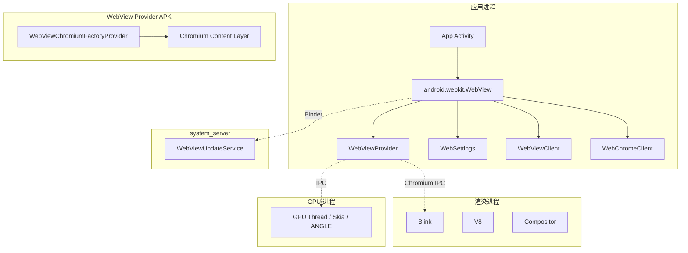
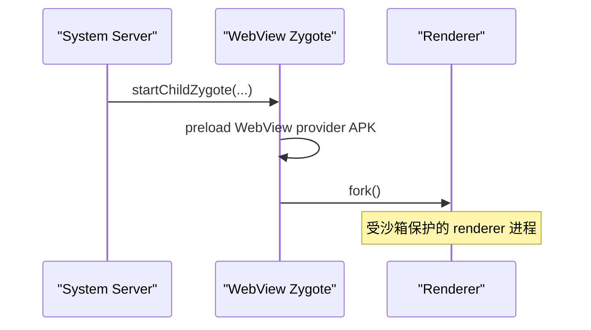

# 第 44 章：WebView

WebView 是 Android 内嵌浏览器组件，允许应用直接在自己的界面中展示网页内容。表面上它只是一个 `android.webkit.WebView` 控件，但底层其实是一个相当复杂的分层系统：framework 层只保留很薄的一层代理，真正的实现位于可独立更新的 Chromium provider 包中，并依赖多进程渲染、独立 zygote、安全沙箱和更新服务协同工作。本章从应用开发者写下的 `<WebView>` 或 `new WebView(...)` 出发，一路追踪到 provider 加载、Chromium 集成、多进程模型、安全机制和更新链路。

---

## 44.1 WebView 架构

### 44.1.1 历史背景

Android WebView 大致经历了 3 个时代：

1. WebKit 时代（Android 1.0 到 4.3）：WebView 是随系统镜像一同发布、运行在应用进程内的单体组件，只能随 OTA 升级。
2. Chromium 迁移期（Android 4.4 到 6.0）：后端引擎切换到 Chromium，但仍主要跟随系统镜像交付。
3. 可更新 WebView（Android 7.0+）：WebView 变成独立可更新 APK，framework 只保留代理与加载逻辑，真正实现来自 provider 包，例如 `com.google.android.webview` 或 `com.android.webview`。

这一步是 Android 平台演进中的关键架构决策之一，因为它把 Web 引擎更新从“升级整机系统”拆成了“单独更新 provider 包”。

### 44.1.2 高层组件图

WebView 涉及的主要组件如下：



### 44.1.3 多进程模型

现代 WebView 基于 Chromium 的多进程模型，通常包括：

- Browser process：就是宿主应用自身进程。Chromium 的浏览器侧逻辑运行在 app 进程中的主线程和若干工作线程里，负责导航、Cookie、权限与 Android framework 协调。
- Renderer process：独立沙箱进程，运行 Blink 和 V8。它通常由专用的 WebView Zygote 派生。
- GPU process：处理硬件加速合成与光栅化。

framework 通过 `WebViewDelegate.isMultiProcessEnabled()` 控制这一模型，当前实现通常直接返回 `true`，说明多进程已是默认路径。

### 44.1.4 进程隔离与 WebView Zygote

WebView renderer 不是从普通 app zygote 直接孵化，而是由专门的 WebView Zygote 派生。这样做有两个目的：

1. 提前预加载 WebView provider APK，缩短 renderer 启动时延。
2. 把 renderer 放进更独立的 UID、SELinux 和 seccomp 沙箱环境里。

其流程可概括为：



当 provider 更新时，旧 zygote 会被杀掉，重新创建新的 zygote 并预加载更新后的 provider。

### 44.1.5 绘制集成

WebView 不走普通 `View.onDraw()` 直接画内容，而是通过 draw functor 接入 Android 硬件加速渲染路径。`WebViewDelegate.drawWebViewFunctor()` 会把 native functor 注册到 `RecordingCanvas` / `RenderThread` 这条链上，从而允许 Web 内容和原生 UI 在同一合成阶段一起渲染。

这使得 WebView 可以在不做昂贵像素拷贝的情况下嵌入原生界面。

### 44.1.6 类层级与包结构

`android.webkit` 包中的主要类及其角色如下：

| 类 | 作用 |
|---|---|
| `WebView` | 主视图控件，实际是对 `WebViewProvider` 的薄代理 |
| `WebSettings` | 每实例配置接口 |
| `WebViewClient` | 导航、加载错误等回调 |
| `WebChromeClient` | 更偏浏览器壳层的回调 |
| `WebViewFactory` | 加载并缓存 provider 的单例工厂 |
| `WebViewFactoryProvider` | 顶层 provider 工厂接口 |
| `WebViewProvider` | 每个 `WebView` 后端实现接口 |
| `WebViewDelegate` | provider 调 framework 内部能力的桥 |
| `WebViewLibraryLoader` | native 库加载与 RELRO 优化 |
| `WebViewZygote` | 管理 child zygote |
| `CookieManager` | Cookie 管理单例 |
| `TracingController` | tracing 接口 |
| `WebViewRenderProcess` | renderer 进程句柄 |
| `WebViewRenderProcessClient` | renderer 响应性回调 |

此外还有与更新服务相关的 AIDL 接口和 `WebViewProviderInfo` / `WebViewProviderResponse` 等 parcelable 类型。

### 44.1.7 配置与 Feature Flag

WebView 的行为受几类开关影响：

- `flags.aconfig`：用于灰度控制 WebKit package 内能力，例如 update service IPC wrapper、File System Access、User-Agent reduction 等。
- `@ChangeId`：按 `targetSdkVersion` 逐步启用兼容性变化。
- Chromium 命令行参数：可通过 `webview-command-line` 做测试。
- 系统属性：例如 tracing 与诊断相关设置。

这说明 WebView 不是一个静态模块，而是一个持续演进且带灰度控制的子系统。

## 44.2 WebViewFactory

### 44.2.1 类概览

`WebViewFactory` 是 framework 侧最关键的入口之一，负责：

- 查询当前激活的 provider 包。
- 验证包是否合法。
- 加载 provider 的类加载器和 native 库。
- 初始化 top-level factory。

从调用关系上看，应用第一次真正使用 `WebView` 时，几乎都会经过它。

### 44.2.2 Chromium Factory 类

加载完成后，framework 最终会拿到 Chromium provider 中导出的工厂实现，例如 `WebViewChromiumFactoryProviderForT` 一类版本相关类。此后：

- `WebView` 对外 API 仍停留在 framework 包里。
- 实际方法分派会落入 Chromium provider。

这是一种典型的“稳定 framework API + 可替换实现包”的设计。

### 44.2.3 Provider 初始化顺序

provider 初始化大致可分成以下阶段：

1. 通过更新服务确定当前选中的 provider 包。
2. 校验包签名、元数据与版本状态。
3. 创建 provider 的 context / classloader。
4. 加载 `WebViewLibrary` 所指向的 native 库。
5. 初始化 top-level factory。
6. 后续 `WebView` 实例都复用已缓存的 provider。

这条路径必须足够严格，因为 WebView provider 实质上是一个高权限、跨应用广泛使用的执行组件。

### 44.2.4 安全护栏：拒绝特权进程

WebView 明确禁止在某些 privileged process 中使用。原因很直接：Web 内容是高风险输入源，如果 system UID 或其他特权进程能任意加载 WebView，将显著扩大攻击面。

因此 `WebViewFactory` 会在初始化时检查调用进程身份，对不允许的进程直接拒绝。

### 44.2.5 包校验

provider 包的校验不仅看包名，还会看：

- 签名
- 是否声明了必要 metadata
- 是否暴露 `WebViewLibrary`
- 是否满足当前系统策略

这保证不是“任意 APK 只要实现几组类名就能伪装成 WebView provider”。

### 44.2.6 启动时间戳

`WebViewFactory` 会记录若干启动时序点，用于诊断 provider 选择、RELRO 创建、类加载和初始化阶段的开销。这些时间戳是排查“首次打开 WebView 为什么慢”的重要依据。

### 44.2.7 RELRO 共享

为减少多进程重复映射大型 WebView native 库的内存开销，Android 使用 RELRO 共享优化。其大致思路是：

1. 预先创建共享 RELRO 文件。
2. 后续进程加载 native 库时复用这部分只读重定位结果。

这对 WebView 这种被大量应用共同依赖、且 native 库体积很大的组件尤为重要。

## 44.3 WebView Provider

### 44.3.1 Provider 抽象

WebView provider 抽象把 framework 层和具体 Chromium 实现解耦。对 framework 来说，只需要知道：

- 如何创建顶层 provider factory
- 如何为具体 `WebView` 提供 backend
- 如何桥接内部能力

而不需要把 Chromium 具体实现细节编死在 framework 里。

### 44.3.2 WebView 中的委托模式

`WebView` 自身的大量公开方法本质上都只是委托：

- framework `WebView` 接到调用
- 转发给 `WebViewProvider`
- provider 再转给 Chromium 实现

这使 `android.webkit.WebView` 看起来像是一个普通 View，实际上却是一个复杂 provider 的代理壳。

### 44.3.3 `WebViewChromium`

`WebViewChromium` 是 Chromium provider 里最具体的 `WebViewProvider` 实现之一，负责把 framework API 调用桥接到 Chromium content 层。

### 44.3.4 预装与可更新 Provider

设备既可能带有预装 provider，也可能通过独立更新渠道获得更新版 provider。framework 的职责是：

- 统一 provider 选择逻辑
- 允许更新版覆盖旧版
- 在 provider 损坏时回退到可用候选

### 44.3.5 `WebViewDelegate`

`WebViewDelegate` 提供 provider 访问 framework 内部服务与能力的桥，例如：

- 绘制 functor
- tracing / 系统属性回调
- 资源与配置协助
- 多进程相关判断

如果没有它，provider 要么拿不到这些内部能力，要么不得不依赖更脆弱的隐藏 API。

## 44.4 WebView 更新机制

### 44.4.1 `WebViewUpdateService`

`WebViewUpdateService` 运行在 `system_server`，负责统一管理 provider 的选择与切换。它是 WebView 可更新模型的核心控制器。

### 44.4.2 Provider 选择算法

provider 选择通常会综合以下因素：

- 当前系统配置允许哪些 provider
- 哪些 provider 已安装
- 是否启用
- 版本和签名是否满足要求
- 是否是当前用户可用的 provider

它不是“简单选包名”，而是一套带容错和策略的选择过程。

### 44.4.3 客户端 IPC 包装层

应用侧并不会直接自己扫包选 provider，而是通过 framework 客户端包装类访问更新服务。这使：

- 选择逻辑集中在 system_server
- 客户端只能拿到受控结果
- 后续实现可演进而不影响应用层 API

### 44.4.4 包变化处理

provider 包被安装、卸载、升级、禁用时，更新服务会重新评估当前 provider；必要时触发：

- provider 切换
- RELRO 重建
- WebView zygote 重启

### 44.4.5 Mainline 模块集成

WebView 的可更新模型与 Android Mainline/模块化演进方向高度一致。即便具体交付形式可能因设备而异，整体目标都是把 Web 渲染能力从整机 OTA 中尽量解耦出来。

### 44.4.6 回退与恢复

如果新 provider 损坏、缺少关键库或验证失败，系统需要有回退策略，避免整机上所有依赖 WebView 的应用一起失效。这是更新服务必须承担的稳定性责任。

## 44.5 WebView APIs

### 44.5.1 `WebView` 类

`WebView` 是应用最直接接触的类，常见能力包括：

- `loadUrl()`
- `loadDataWithBaseURL()`
- `evaluateJavascript()`
- `addJavascriptInterface()`
- `postWebMessage()`
- 生命周期方法如 `onPause()` / `onResume()` / `destroy()`

需要强调的是，`WebView` 自身并不实现浏览器引擎，只是 Java 桥和 View 壳。

### 44.5.2 `WebSettings`

`WebSettings` 控制大量行为：

- JavaScript 是否启用
- 混合内容策略
- 文件访问
- 缓存与存储
- User-Agent
- 缩放与 viewport

这是安全问题最密集的 API 面之一，因为很多高风险能力都通过这里打开。

### 44.5.3 `WebViewClient`

`WebViewClient` 主要负责导航和资源级事件回调，例如：

- `shouldOverrideUrlLoading()`
- `shouldInterceptRequest()`
- `onPageStarted()` / `onPageFinished()`
- `onReceivedError()`
- `onReceivedSslError()`
- `onSafeBrowsingHit()`

其中 `shouldInterceptRequest()` 尤其强大，因为它允许应用在资源级别接管请求或注入响应。

### 44.5.4 `WebChromeClient`

`WebChromeClient` 更偏向“浏览器壳层”行为，例如：

- JavaScript 对话框
- 进度条
- 标题变化
- 文件选择器
- 全屏视频
- 权限提示
- console message

可理解为：`WebViewClient` 面向页面加载与安全，`WebChromeClient` 面向浏览器交互能力。

### 44.5.5 `JavascriptInterface`

`addJavascriptInterface()` 允许把 Java 对象暴露给页面脚本，但这也是 WebView 最经典的安全风险入口之一。现代实现要求显式 `@JavascriptInterface` 注解，避免页面访问对象中不应暴露的方法。

### 44.5.6 Web Messaging API

Web Messaging API 提供基于 `WebMessage` / `WebMessagePort` 的消息通道，语义更接近浏览器端 `postMessage`，比直接暴露 Java 对象更容易建立受控通信边界。

### 44.5.7 `WebResourceRequest` 与 `WebResourceResponse`

这组类型支持：

- 查看请求 URL、方法、是否主框架、是否重定向
- 返回自定义 MIME/type、编码与流
- 拦截广告、跟踪请求或本地资源映射

它们是把 WebView 变成“半浏览器、半应用网关”的重要接口。

### 44.5.8 生命周期最佳实践

WebView 生命周期管理很重要，尤其要注意：

- Activity/Fragment 销毁时及时 `destroy()`
- 避免泄漏 Context
- 处理暂停与恢复
- 注意缓存与进程保留带来的内存影响

管理不好时，WebView 很容易成为应用里的大内存泄漏源。

### 44.5.9 `CookieManager`

`CookieManager` 是全局单例，负责 Cookie 读写、三方 Cookie 策略等。由于它天然跨页面、跨实例共享，安全和隐私策略常集中在这里体现。

### 44.5.10 `WebViewRenderProcess` 与 `WebViewRenderProcessClient`

这组 API 允许应用感知 renderer 是否无响应、是否崩溃，以及在某些情况下决定如何降级处理。它们反映了多进程 WebView 已把“renderer 可能挂掉”作为一等现实。

## 44.6 Chromium 集成

### 44.6.1 Content 层

Android WebView 底层主要基于 Chromium 的 content layer，而不是完整 Chrome 浏览器壳。这样既复用 Blink/V8/网络栈，又避免把整套 Chrome UI 带进来。

### 44.6.2 GPU 进程与硬件加速

WebView 支持 GPU 加速和合成，因此页面绘制并不只是 CPU 软件栅格化。它会与 Android 图形栈协作，把网页内容纳入硬件合成流程。

### 44.6.3 Renderer 进程沙箱

renderer 进程运行在隔离环境中，通常伴随：

- 独立 UID
- seccomp-bpf
- SELinux 限制
- 受限系统调用面

这使 Web 内容被攻破时，不至于直接拿到宿主 app 进程权限。

### 44.6.4 网络栈

WebView 使用 Chromium 网络栈，因此在协议支持、缓存、Cookie、连接管理等方面沿用了 Chromium 的成熟实现。

### 44.6.5 Mojo IPC

Chromium 内部广泛依赖 Mojo IPC 在 browser、renderer、GPU 等进程间通信。对 Android framework 来说，provider 和 Chromium 的这一层大多是黑盒，但理解它有助于定位多进程问题。

### 44.6.6 V8 集成

JavaScript 最终由 V8 执行。`evaluateJavascript()`、页面脚本、worker 等能力，底层都落到 V8 运行时。

### 44.6.7 WebView 模式下的合成器架构

WebView 并不是独立浏览器窗口，而是嵌入原生视图树的一部分，因此其 compositor 模式需要和 Android `RenderThread` / 硬件 UI 管线做额外适配。

### 44.6.8 线程模型

除了 Android 主线程外，WebView/Chromium 还会使用：

- browser 主线程逻辑
- IO 线程
- 合成线程
- renderer 线程
- V8 相关线程

这使“页面卡住”或“调用没返回”问题往往需要线程级视角来分析。

### 44.6.9 Service Worker 支持

现代 WebView 已支持 Service Worker，这让嵌入式 Web 应用也具备离线缓存和后台请求拦截能力，但同时也带来更多持久状态和调试复杂度。

### 44.6.10 WebView 与 Chrome 的差异

WebView 和 Chrome 共用大量底层技术，但它不是完整 Chrome。主要差异在于：

- 没有独立完整浏览器 UI
- 生命周期受宿主应用控制
- 权限与配置由宿主应用决定
- 某些 Chrome 特性未必全部对 WebView 暴露

## 44.7 WebView 与安全

### 44.7.1 同源策略

同源策略仍是 WebView 安全基础。如果开发者通过不当配置放宽来源边界，就容易把嵌入页面变成攻击跳板。

### 44.7.2 混合内容处理

如果 HTTPS 页面中加载 HTTP 资源，就会触发混合内容问题。`WebSettings` 可配置其策略，但默认应尽量收紧。

### 44.7.3 Safe Browsing

WebView 集成 Safe Browsing，能在命中恶意、钓鱼或有害站点时触发 `onSafeBrowsingHit()` 等保护流程。

### 44.7.4 SSL/TLS 安全

`onReceivedSslError()` 等回调给了应用处理证书异常的入口，但错误的处理方式很危险。最常见的反模式就是无条件调用 `proceed()`。

### 44.7.5 JavaScript Bridge 安全

`JavascriptInterface` 是高风险能力。只要页面来源不可信、bridge 暴露过多方法，攻击者就可能把 Web 内容变成调用本地代码的跳板。

### 44.7.6 文件访问控制

文件访问相关设置决定页面是否能访问本地文件、content URI 或文件系统内容。这些配置一旦放宽，配合 XSS 或恶意页面会非常危险。

### 44.7.7 与 CSP 的集成

Content Security Policy 主要是页面侧机制，但在嵌入场景里它仍然是重要防线，可减少脚本注入和资源来源失控。

### 44.7.8 Network Security Config

宿主应用的 Network Security Config 会影响 WebView 行为边界的一部分，尤其在证书信任与明文流量限制方面。

### 44.7.9 数据目录隔离

WebView 支持数据目录隔离，以避免多个进程或实例不安全地共享同一份浏览器状态目录。这在多进程 app 或多 profile 场景下很重要。

### 44.7.10 Renderer 优先级策略

renderer 可以根据前后台状态、可见性等调整优先级策略，以在资源紧张时更合理地回收。这既影响性能，也影响稳定性。

### 44.7.11 禁用 WebView

系统允许在某些场景下禁用 WebView，这通常与企业策略、安全策略或 provider 不可用有关。

### 44.7.12 特性检测

由于 WebView 可独立更新，某些能力不应只按系统 API level 判断，而应通过 feature detection 或 provider 版本能力判断。否则应用很容易在旧 provider 上错误假设新能力可用。

## 44.8 WebView 调试

### 44.8.1 启用远程调试

调用 `WebView.setWebContentsDebuggingEnabled(true)` 后，可让 DevTools 连接应用中的 WebView 页面进行调试。

### 44.8.2 `chrome://inspect`

开发者可以通过桌面 Chrome 的 `chrome://inspect` 查看设备上的 WebView 页面、Console、Network 和 DOM 状态。

### 44.8.3 DevTools 能力

启用后可使用的常见能力包括：

- DOM 树检查
- Network 面板
- Console
- Performance
- JS 调试
- Storage 检查

### 44.8.4 Console Message 转发

`WebChromeClient.onConsoleMessage()` 允许把页面 console 日志转发到 Android 日志系统，是应用侧最直接的页面调试入口之一。

### 44.8.5 `TracingController`

`TracingController` 支持收集 WebView/Chromium tracing 数据，对性能问题排查很有价值。

### 44.8.6 崩溃诊断

renderer 崩溃、provider 初始化失败、RELRO 问题、zygote 异常都可能导致 WebView 表现为“页面白屏”或“实例创建失败”。因此调试时必须区分：

- 渲染进程挂了
- provider 没加载起来
- 网络或页面逻辑问题

## 44.9 动手实践

### 44.9.1 查看当前 WebView Provider

```bash
adb shell cmd webviewupdate list-webview-packages
adb shell cmd webviewupdate get-current-provider
adb shell dumpsys webviewupdate
```

这组命令分别适合：

- 列出系统配置的 provider 候选
- 查看当前激活 provider
- 检查更新服务内部状态

### 44.9.2 切换 WebView Provider

```bash
adb shell cmd webviewupdate list-webview-packages
adb shell cmd webviewupdate set-webview-implementation com.android.chrome
adb shell cmd webviewupdate set-webview-implementation com.android.webview
```

用于观察 provider 切换后的行为变化与恢复逻辑。

### 44.9.3 观察 WebView Zygote

```bash
adb shell ps -A | grep webview_zygote
adb shell ps -A | grep -E "webview|isolated"
adb shell ps -AZ | grep webview
```

适合确认 zygote、renderer 子进程以及对应 SELinux 上下文。

### 44.9.4 监控 RELRO 文件

```bash
adb shell ls -l /data/misc/shared_relro/
adb shell cmd webviewupdate enable-redundant-packages
adb shell ls -l /data/misc/shared_relro/
```

重点是观察 provider 切换或重建后 RELRO 文件是否重新生成。

### 44.9.5 构建一个最小 WebView 应用

最小示例通常包括：

- Activity 中创建 `WebView`
- 启用必要的 `WebSettings`
- 设置 `WebViewClient`
- 加载一个 HTTPS 页面

这是后续调试、拦截请求、观察 renderer 行为的基础载体。

### 44.9.6 使用 DevTools 远程调试

启用 `WebContentsDebuggingEnabled` 后，在设备上打开测试页面，再通过桌面 Chrome 的 `chrome://inspect` 连接，即可实时观察 DOM、Console、Network 与性能数据。

### 44.9.7 测试 Renderer Crash 处理

可以构造一个会导致 renderer 崩溃的测试页面，或用调试手段杀掉 renderer，观察：

- `WebViewRenderProcessClient` 回调
- 页面是否显示 crash 状态
- 宿主 app 是否依然存活

### 44.9.8 跟踪 WebView 性能

通过 tracing 和 logcat 观察：

- provider 初始化耗时
- 首次页面加载耗时
- renderer 创建时延
- 线程与 IPC 活动

这是定位“首次打开 WebView 很慢”的有效路径。

### 44.9.9 查看 WebView 内存占用

```bash
adb shell pidof your.package.name
adb shell cat /proc/<PID>/maps | grep webview
adb shell dumpsys meminfo your.package.name
```

重点是查看：

- app 进程是否映射 WebView 库
- 是否复用了共享内存映射
- 总体内存占用情况

### 44.9.10 检查 Provider 包

```bash
PROVIDER=$(adb shell cmd webviewupdate get-current-provider | awk '{print $NF}')
adb shell dumpsys package $PROVIDER
adb shell pm path $PROVIDER
```

可以进一步检查：

- APK 路径
- 元数据中的 `WebViewLibrary`
- 版本号
- native 库
- 声明权限

### 44.9.11 观察 WebView IPC

```bash
adb shell strace -f -e trace=openat,mmap,connect -p <PID> 2>&1 | \
    grep -E "(shared_relro|webviewchromium|zygote)"
```

需要 root 或 debuggable app。适合直接观察 RELRO 映射、库加载与 zygote 通信。

### 44.9.12 拦截并修改 Web 请求

可以基于 `shouldInterceptRequest()` 做：

- 请求日志记录
- 屏蔽某些跟踪域名
- 将某些 URL 映射到本地 assets

这非常适合调试和构建半离线 Web 应用，但也需要警惕篡改网络边界带来的安全复杂度。

### 44.9.13 Web Messaging 通道

使用 `createWebMessageChannel()`、`WebMessagePort` 和 `postMessageToMainFrame()` 可以建立页面与宿主之间更受控的消息通道，比 `JavascriptInterface` 更容易维护边界。

### 44.9.14 研究 Provider 内部结构

```bash
PROVIDER_PKG=$(adb shell cmd webviewupdate get-current-provider | awk '{print $NF}')
APK_PATH=$(adb shell pm path $PROVIDER_PKG | head -1 | sed 's/package://')
adb shell "unzip -l $APK_PATH | grep libwebviewchromium"
adb shell dumpsys package $PROVIDER_PKG | grep -A2 "com.android.webview.WebViewLibrary"
```

适合查看：

- provider APK 内部 native 库规模
- `WebViewLibrary` 元数据
- provider 包版本信息

### 44.9.15 观察多进程 WebView

```bash
adb shell "while true; do
    echo --- $(date) ---
    ps -A | grep -E '(webview|isolated|your.package)'
    sleep 2
done"
```

在另一终端启动测试 app 并加载页面，通常可以看到：

1. 宿主应用主进程
2. 独立 renderer / isolated 进程
3. `webview_zygote`

### 44.9.16 检查 Cookie

可以通过 `CookieManager` 手动设置、读取 Cookie，并加载测试页面确认它们是否真正随请求发送。适合验证：

- 三方 Cookie 策略
- session 与持久 Cookie 行为
- 多个 WebView 实例之间的共享状态

### 44.9.17 测试 Safe Browsing

实现 `onSafeBrowsingHit()`，再访问 Google 提供的测试 URL，可以观察：

- threat type 回调
- 默认拦截页是否生效
- 自定义处理逻辑是否正确

## Summary

WebView 是一个非常典型的 Android 分层架构案例：framework 暴露稳定 API，真正实现放到独立可更新的 Chromium provider 包里，再通过多进程模型、专用 zygote、更新服务和安全沙箱把渲染引擎安全地嵌入任意应用。

本章的关键点可以总结为：

- `WebViewFactory` 负责 provider 选择、验证、加载和 RELRO 相关初始化，是 framework 侧的核心协调器。
- `WebViewFactoryProvider`、`WebViewProvider` 与 `WebViewDelegate` 构成 framework 和实现包之间的主契约。
- `WebViewUpdateService` 把 provider 选择、包变化处理、回退和恢复集中在 system_server 中完成。
- WebView renderer 依赖独立的 WebView Zygote 与沙箱进程模型，从而把网页内容与宿主进程适度隔离。
- `WebView`、`WebSettings`、`WebViewClient`、`WebChromeClient`、`CookieManager` 等共同构成开发者可见 API 面。
- 安全边界覆盖了特权进程禁用、provider 签名校验、同源策略、Safe Browsing、SSL/TLS、JavaScript bridge 和文件访问控制。
- WebView 独立更新是 Android 在安全性和 Web 兼容性上的关键架构选择之一。

适合继续深入阅读的源码路径：

| 组件 | 路径 |
|---|---|
| `WebViewFactory` | `frameworks/base/core/java/android/webkit/WebViewFactory.java` |
| `WebViewFactoryProvider` | `frameworks/base/core/java/android/webkit/WebViewFactoryProvider.java` |
| `WebViewProvider` | `frameworks/base/core/java/android/webkit/WebViewProvider.java` |
| `WebViewDelegate` | `frameworks/base/core/java/android/webkit/WebViewDelegate.java` |
| `WebViewZygote` | `frameworks/base/core/java/android/webkit/WebViewZygote.java` |
| `WebViewLibraryLoader` | `frameworks/base/core/java/android/webkit/WebViewLibraryLoader.java` |
| `WebViewUpdateServiceImpl2` | `frameworks/base/services/core/java/com/android/server/webkit/WebViewUpdateServiceImpl2.java` |
| `WebView` / `WebSettings` / `WebViewClient` / `WebChromeClient` | `frameworks/base/core/java/android/webkit/` |
| 更新服务 AIDL | `frameworks/base/core/java/android/webkit/IWebViewUpdateService.aidl` |
