# Chapter 44: WebView

WebView is Android's embeddable browser component, allowing applications to display web
content directly within their UI. Under the surface, it is a remarkably complex subsystem:
a thin Android framework facade that delegates every operation to an updatable, Chromium-based
provider package running in its own set of processes. This chapter traces the entire stack --
from the XML `<WebView>` tag an application developer writes, through the factory and provider
abstraction, into the multi-process Chromium engine, its security sandbox, and the update
mechanism that keeps it current without a full OS upgrade.

---

## 44.1 WebView Architecture

### 44.1.1 Historical Context

Android's WebView has undergone three major architectural eras:

1. **WebKit era (Android 1.0 -- 4.3)**: WebView was a monolithic, in-process component built
   on the WebKit rendering engine. It shipped as part of the platform image and could only be
   updated through full OTA system updates.

2. **Chromium migration (Android 4.4 -- 6.0)**: Starting with KitKat (API 19), Android replaced
   the WebKit backend with Chromium's content layer. Initially the Chromium code was still
   compiled into the system image, but the architecture introduced the provider abstraction
   that would enable future decoupling.

3. **Updatable WebView (Android 7.0+)**: From Nougat onward, WebView became a separately
   updatable APK delivered through the Play Store or system updaters. The framework contains
   only thin proxy classes; the actual implementation lives in the WebView provider package
   (typically `com.google.android.webview` or `com.android.webview`).

### 44.1.2 High-Level Component Map

The following diagram shows the major components involved when an application uses WebView:

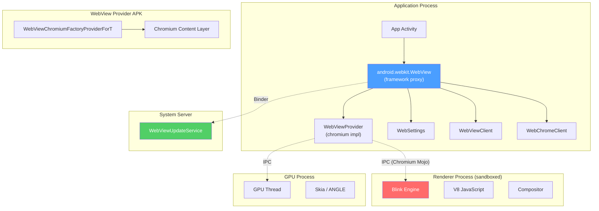

### 44.1.3 Multi-Process Model

Modern Android WebView uses a multi-process architecture derived from Chromium:

- **Browser process**: This is the application's own process. The Chromium "browser" logic
  runs on the app's main thread and a pool of IO/worker threads within the same process. It
  handles navigation decisions, cookie management, permission prompts, and communication with
  the Android framework.

- **Renderer process**: A separate, sandboxed process that runs the Blink rendering engine and
  V8 JavaScript engine. Multiple WebView instances in the same application may share a single
  renderer, but a renderer crash is isolated from the browser process. The renderer is spawned
  from the **WebView Zygote**, a specialized child zygote that pre-loads the WebView provider
  code for fast process creation.

- **GPU process**: Handles GPU-accelerated compositing and rasterization. WebView shares the
  application's GPU thread when hardware-accelerated, drawing through a "functor" mechanism
  that integrates with Android's `RenderThread`.

The multi-process model is controlled by the framework. The `WebViewDelegate.isMultiProcessEnabled()`
method currently returns `true` unconditionally:

```
Source: frameworks/base/core/java/android/webkit/WebViewDelegate.java

    public boolean isMultiProcessEnabled() {
        return true;
    }
```

### 44.1.4 Process Isolation and the WebView Zygote

Renderer processes are created through a dedicated **WebView Zygote** rather than the main
application Zygote. This child zygote is specialized for WebView:

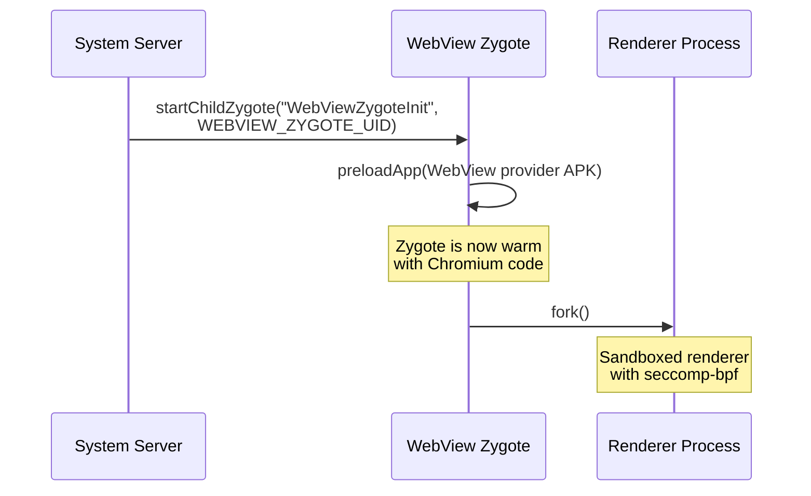

The `WebViewZygote` class manages the lifecycle of this child zygote:

```
Source: frameworks/base/core/java/android/webkit/WebViewZygote.java

    sZygote = Process.ZYGOTE_PROCESS.startChildZygote(
            "com.android.internal.os.WebViewZygoteInit",
            "webview_zygote",
            Process.WEBVIEW_ZYGOTE_UID,
            Process.WEBVIEW_ZYGOTE_UID,
            sharedAppGid,
            runtimeFlags,
            "webview_zygote",  // seInfo
            abi,
            TextUtils.join(",", Build.SUPPORTED_ABIS),
            null,
            Process.FIRST_ISOLATED_UID,
            Integer.MAX_VALUE);
```

Key observations:

- The zygote runs under a dedicated UID (`WEBVIEW_ZYGOTE_UID`).
- It pre-loads the WebView APK so that forked renderer processes start quickly.
- When the WebView provider changes (e.g., an update), the old zygote is killed and a
  new one is started with the updated package.

### 44.1.5 Drawing Integration

WebView integrates with Android's hardware-accelerated rendering pipeline through a
**draw functor** mechanism. Instead of the standard `View.onDraw()` path that records
display list operations, WebView registers a native functor with the `RenderThread`:

```
Source: frameworks/base/core/java/android/webkit/WebViewDelegate.java

    public void drawWebViewFunctor(@NonNull Canvas canvas, int functor) {
        if (!(canvas instanceof RecordingCanvas)) {
            throw new IllegalArgumentException(canvas.getClass().getName()
                    + " is not a RecordingCanvas canvas");
        }
        ((RecordingCanvas) canvas).drawWebViewFunctor(functor);
    }
```

This functor is a native function pointer (created via `AwDrawFn_CreateFunctor` in the
Chromium code) that the `RenderThread` invokes during the GPU composition phase. This
allows WebView content to be composited alongside native Android UI elements without
expensive pixel copies between processes.

### 44.1.6 WebView Class Hierarchy and Package Structure

The `android.webkit` package contains all the public-facing WebView classes. Here is the
complete set of major classes and their roles:

| Class | Role |
|---|---|
| `WebView` | The main view widget; thin proxy to `WebViewProvider` |
| `WebSettings` | Per-instance configuration (abstract, impl in provider) |
| `WebViewClient` | Navigation and error event callbacks |
| `WebChromeClient` | Browser-chrome UI event callbacks |
| `WebViewFactory` | Singleton factory; loads and caches the provider |
| `WebViewFactoryProvider` | Interface for the top-level provider factory |
| `WebViewProvider` | Interface for per-WebView backend |
| `WebViewDelegate` | Bridge granting provider access to framework internals |
| `WebViewLibraryLoader` | Native library loading with RELRO optimization |
| `WebViewZygote` | Manages the child zygote for renderer processes |
| `WebViewUpdateService` | Legacy client for the system update service |
| `WebViewUpdateManager` | Modern client for the system update service |
| `WebViewProviderInfo` | Describes a candidate WebView provider package |
| `WebViewProviderResponse` | Response from the update service with status |
| `WebViewRenderProcess` | Handle to a renderer process |
| `WebViewRenderProcessClient` | Callbacks for renderer responsiveness |
| `CookieManager` | Cookie management singleton |
| `WebStorage` | Web storage (localStorage, sessionStorage) management |
| `GeolocationPermissions` | Geolocation permission management |
| `TracingController` | Performance tracing integration |
| `TracingConfig` | Tracing configuration (categories, modes) |
| `ServiceWorkerController` | Service Worker management |
| `JavascriptInterface` | Annotation for exposed Java methods |
| `SafeBrowsingResponse` | Response actions for Safe Browsing hits |
| `RenderProcessGoneDetail` | Information about renderer crashes |
| `ConsoleMessage` | JavaScript console message representation |
| `ValueCallback<T>` | Generic callback for async operations |
| `WebResourceRequest` | Incoming resource request details |
| `WebResourceResponse` | Custom resource response |
| `WebResourceError` | Resource loading error details |
| `WebMessage` | Message for the Web Messaging API |
| `WebMessagePort` | Port for the Web Messaging API |
| `WebBackForwardList` | Navigation history snapshot |
| `WebHistoryItem` | Single entry in navigation history |

The AIDL interface files define the Binder IPC contract between the client and the
system service:

| AIDL File | Purpose |
|---|---|
| `IWebViewUpdateService.aidl` | Update service Binder interface |
| `WebViewProviderInfo.aidl` | Parcelable provider info |
| `WebViewProviderResponse.aidl` | Parcelable provider response |

### 44.1.7 Configuration and Feature Flags

WebView behavior is influenced by several flag mechanisms:

1. **`flags.aconfig`**: The `android.webkit` package defines aconfig flags for gradual
   feature rollouts. Key flags include:
   - `FLAG_UPDATE_SERVICE_IPC_WRAPPER`: Gates the `WebViewUpdateManager` class
   - `FLAG_FILE_SYSTEM_ACCESS`: Enables File System Access API in WebView
   - `FLAG_USER_AGENT_REDUCTION`: Enables User-Agent string reduction
   - `FLAG_DEPRECATE_START_SAFE_BROWSING`: Deprecates explicit Safe Browsing init

2. **`@ChangeId` annotations**: Compatibility changes gated by `targetSdkVersion`:
   - `ENABLE_SIMPLIFIED_DARK_MODE` (API 33+): Algorithmic dark mode
   - `ENABLE_USER_AGENT_REDUCTION` (post-Baklava): Reduced UA string
   - `ENABLE_FILE_SYSTEM_ACCESS` (post-Baklava): File System Access API

3. **Chromium command-line flags**: The provider can accept Chromium-style flags for
   testing and debugging. These are typically set via developer options or `adb`:
   ```bash
   adb shell "echo 'chrome --enable-features=SomeFeature' > \
       /data/local/tmp/webview-command-line"
   ```

4. **Android system properties**: `WebViewDelegate` monitors system properties for
   tracing enablement via `SystemProperties.addChangeCallback()`.

---

## 44.2 WebViewFactory

The `WebViewFactory` class is the entry point for creating and loading the WebView
implementation. It is a `@SystemApi` class hidden from regular application developers,
but it is the central coordinator that bridges the Android framework and the Chromium
provider.

```
Source: frameworks/base/core/java/android/webkit/WebViewFactory.java
```

### 44.2.1 Class Overview

`WebViewFactory` is a `final` class with entirely static methods. Its key responsibilities:

| Responsibility | Method |
|---|---|
| Get/cache provider singleton | `getProvider()` |
| Load provider class | `getProviderClass()` |
| Load native library | `loadWebViewNativeLibraryFromPackage()` |
| Reserve zygote address space | `prepareWebViewInZygote()` |
| Handle provider changes | `onWebViewProviderChanged()` |
| Check WebView support | `isWebViewSupported()` |
| Access update service | `getUpdateService()` |

### 44.2.2 The Chromium Factory Class

The factory hardcodes the name of the Chromium provider implementation class:

```java
private static final String CHROMIUM_WEBVIEW_FACTORY =
        "com.android.webview.chromium.WebViewChromiumFactoryProviderForT";

private static final String CHROMIUM_WEBVIEW_FACTORY_METHOD = "create";
```

This class name is resolved at runtime from the WebView provider APK's classloader. The
trailing "ForT" indicates the API compatibility level (Tiramisu/API 33+). Different
Android versions may use different suffixed class names.

### 44.2.3 Provider Initialization Sequence

The full initialization sequence when an application first creates a `WebView` involves
multiple coordinated steps:

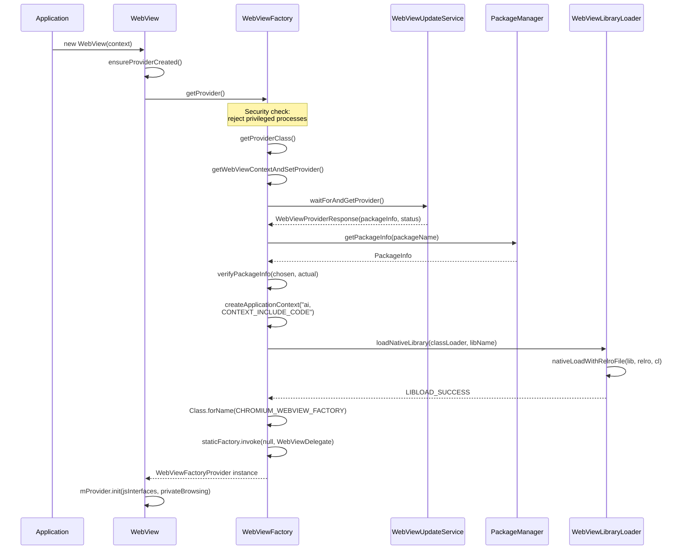

### 44.2.4 Security Guard: Privileged Process Rejection

WebView explicitly refuses to load in privileged system processes. The `getProvider()`
method checks the caller's UID:

```java
final int appId = UserHandle.getAppId(android.os.Process.myUid());
if (appId == android.os.Process.ROOT_UID
        || appId == android.os.Process.SYSTEM_UID
        || appId == android.os.Process.PHONE_UID
        || appId == android.os.Process.NFC_UID
        || appId == android.os.Process.BLUETOOTH_UID) {
    throw new UnsupportedOperationException(
            "For security reasons, WebView is not allowed in privileged processes");
}
```

This is a critical security measure. WebView loads and executes arbitrary web content
including JavaScript. Running it in a privileged process (system_server, telephony,
Bluetooth, NFC) would give web-originating exploits access to system-level capabilities.

### 44.2.5 Package Verification

Before loading the provider, `WebViewFactory` performs rigorous verification of the
WebView package:

1. **Package name match**: The package name returned by the update service must match the
   one fetched from `PackageManager`.

2. **Version code check**: The actual installed version must be at least as high as what
   the update service reported (guards against downgrade attacks).

3. **Signature verification**: The signatures of the installed package must match those
   of the chosen package. This uses `ArraySet`-based comparison for order independence.

4. **Library flag check**: The package must declare a
   `com.android.webview.WebViewLibrary` meta-data entry pointing to the native `.so` file.

```java
private static void verifyPackageInfo(PackageInfo chosen, PackageInfo toUse)
        throws MissingWebViewPackageException {
    if (!chosen.packageName.equals(toUse.packageName)) { ... }
    if (chosen.getLongVersionCode() > toUse.getLongVersionCode()) { ... }
    if (getWebViewLibrary(toUse.applicationInfo) == null) { ... }
    if (!signaturesEquals(chosen.signatures, toUse.signatures)) { ... }
}
```

### 44.2.6 Startup Timestamps

`WebViewFactory` records detailed timing information for each phase of WebView loading
through the `StartupTimestamps` inner class. These timestamps are exposed to the provider
via `WebViewDelegate.getStartupTimestamps()` and are used for performance monitoring:

| Timestamp | Phase |
|---|---|
| `mWebViewLoadStart` | Overall load begins |
| `mCreateContextStart/End` | Creating the WebView APK context |
| `mAddAssetsStart/End` | Registering resource paths |
| `mGetClassLoaderStart/End` | Obtaining the APK classloader |
| `mNativeLoadStart/End` | Loading the native `.so` with RELRO |
| `mProviderClassForNameStart/End` | Resolving the factory class |

### 44.2.7 RELRO Sharing

A key optimization in WebView loading is **RELRO (Relocation Read-Only) sharing**. The
Chromium native library (`libwebviewchromium.so`) is large (typically 50-100 MB). When
this library is loaded, the dynamic linker must process relocations -- fixups to absolute
addresses in the shared library. These relocations produce identical results in every
process because the library is loaded at the same pre-reserved address.

The `WebViewLibraryLoader` class coordinates this optimization:

```
Source: frameworks/base/core/java/android/webkit/WebViewLibraryLoader.java
```

1. **Address space reservation** happens in the Zygote before any app is forked:
   ```java
   static void reserveAddressSpaceInZygote() {
       System.loadLibrary("webviewchromium_loader");
       long addressSpaceToReserve;
       if (VMRuntime.getRuntime().is64Bit()) {
           addressSpaceToReserve = 1 * 1024 * 1024 * 1024; // 1 GB on 64-bit
       } else if (VMRuntime.getRuntime().vmInstructionSet().equals("arm")) {
           addressSpaceToReserve = 130 * 1024 * 1024; // 130 MB on ARM32
       } else {
           addressSpaceToReserve = 190 * 1024 * 1024; // 190 MB on x86 emu
       }
       sAddressSpaceReserved = nativeReserveAddressSpace(addressSpaceToReserve);
   }
   ```

2. **RELRO file creation** happens in an isolated process (`RelroFileCreator`) that loads
   the library, processes relocations, and writes the result to a shared file:
   - 32-bit: `/data/misc/shared_relro/libwebviewchromium32.relro`
   - 64-bit: `/data/misc/shared_relro/libwebviewchromium64.relro`

3. **RELRO file consumption**: When an app loads WebView, it maps the pre-computed RELRO
   file instead of reprocessing relocations, saving both time and memory (the RELRO pages
   are shared read-only across all processes using WebView).

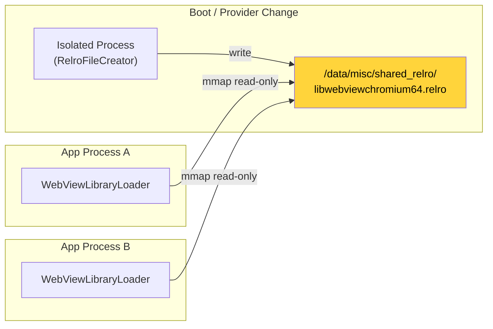

---

## 44.3 WebView Provider

### 44.3.1 The Provider Abstraction

Android's WebView architecture uses a **provider pattern** to decouple the public API
from the implementation. Three interfaces define this contract:

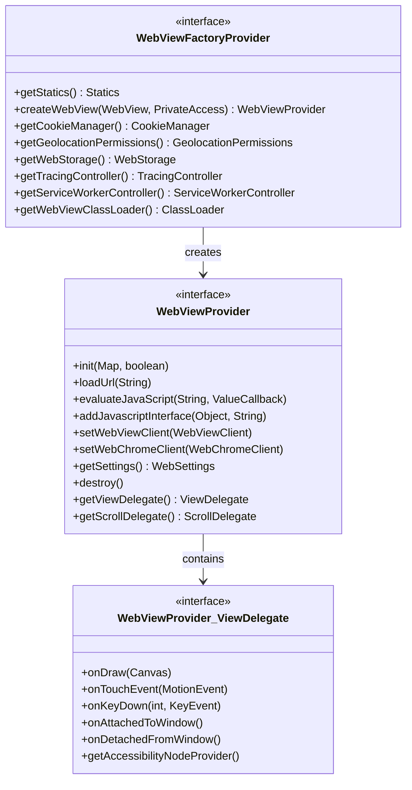

**`WebViewFactoryProvider`** is the top-level factory. It is a singleton per process,
created via reflection from the `WebViewChromiumFactoryProviderForT.create()` static method.
It provides:

- Factory method to create `WebViewProvider` instances (one per `WebView` widget)
- Singleton accessors for `CookieManager`, `WebStorage`, `GeolocationPermissions`, etc.
- A `Statics` sub-interface for static utility methods

**`WebViewProvider`** is the per-instance backend. Every public method on `android.webkit.WebView`
delegates to a corresponding method on this interface. It also contains two sub-interfaces:

- `ViewDelegate`: Handles `View`-level callbacks (draw, touch, key events, accessibility)
- `ScrollDelegate`: Handles scroll computation

### 44.3.2 The Delegation Pattern in WebView

The `android.webkit.WebView` class is a thin proxy. Its constructor calls
`ensureProviderCreated()`, which triggers the entire factory loading sequence described
in Section 55.2:

```java
private void ensureProviderCreated() {
    checkThread();
    if (mProvider == null) {
        mProvider = getFactory().createWebView(this, new PrivateAccess());
    }
}
```

Every public method then delegates directly:

```java
public void loadUrl(@NonNull String url) {
    checkThread();
    mProvider.loadUrl(url);
}

public void evaluateJavascript(@NonNull String script,
        @Nullable ValueCallback<String> resultCallback) {
    checkThread();
    mProvider.evaluateJavaScript(script, resultCallback);
}
```

The `checkThread()` call enforces that WebView is only accessed from the thread on
which it was created (typically the main/UI thread). Starting from API 18 (Jelly Bean MR2),
violations throw an exception rather than silently failing.

### 44.3.3 WebViewChromium: The Concrete Implementation

The concrete provider implementation lives in the WebView APK, not in the framework. The
class `com.android.webview.chromium.WebViewChromiumFactoryProviderForT` (loaded via
reflection) wraps Chromium's content layer. This class:

1. Initializes the Chromium browser process (command-line flags, feature list, field trials)
2. Creates the Chromium `BrowserContext` (profile with cookies, storage, cache)
3. Instantiates `WebViewChromium` (the per-instance `WebViewProvider` implementation)
4. Sets up the GPU process connection
5. Manages the renderer process pool via the WebView Zygote

### 44.3.4 Prebuilt vs. Updatable Provider

The WebView provider can come from two sources:

| Source | Package Name (typical) | Update Channel |
|---|---|---|
| AOSP prebuilt | `com.android.webview` | System image only |
| Google (GMS) | `com.google.android.webview` | Play Store / Mainline |
| Standalone Chrome | `com.android.chrome` | Play Store |

On devices with Google Play Services, the system typically ships with
`com.google.android.webview` as the default provider and `com.android.webview` as the
fallback. The `WebViewProviderInfo` class describes each candidate:

```
Source: frameworks/base/core/java/android/webkit/WebViewProviderInfo.java

    public final String packageName;
    public final String description;
    public final boolean availableByDefault;
    public final boolean isFallback;
    public final Signature[] signatures;
```

The `availableByDefault` flag marks the primary provider. The `isFallback` flag marks
a provider that should only be used when the primary is unavailable (uninstalled, disabled,
or invalid). The `signatures` array ensures that only packages signed with expected keys
can serve as WebView providers.

### 44.3.5 WebViewDelegate: The Bridge to Framework Internals

The `WebViewDelegate` class provides the Chromium implementation with controlled access
to Android framework internals that are not part of the public SDK:

```
Source: frameworks/base/core/java/android/webkit/WebViewDelegate.java
```

Key capabilities exposed through this delegate:

- **Draw functor registration**: `drawWebViewFunctor()` lets WebView hook into the
  hardware-accelerated rendering pipeline
- **Tracing integration**: `isTraceTagEnabled()` and `setOnTraceEnabledChangeListener()`
  connect WebView tracing to Android's systrace infrastructure
- **Resource management**: `getPackageId()` resolves the WebView APK's resource package ID
  so resources from the WebView APK can be correctly addressed
- **Application context**: `getApplication()` provides access to the embedding app
- **Data directory**: `getDataDirectorySuffix()` supports multi-process data isolation
- **Startup metrics**: `getStartupTimestamps()` provides timing data for performance analysis

---

## 44.4 WebView Update Mechanism

### 44.4.1 The WebViewUpdateService

The `WebViewUpdateService` is a system service that manages which WebView provider is
active and coordinates the transition when providers are updated. It runs in `system_server`
and is accessed via Binder IPC.

```
Source: frameworks/base/services/core/java/com/android/server/webkit/WebViewUpdateServiceImpl2.java
```

The service implementation (`WebViewUpdateServiceImpl2`) tracks:

- The list of all configured WebView providers (from device configuration)
- Which provider is currently active
- The RELRO preparation state
- Package installation/removal events that affect provider selection

### 44.4.2 Provider Selection Algorithm

When the system needs to choose a WebView provider (at boot or after a package change),
the `WebViewUpdateServiceImpl2.findPreferredWebViewPackage()` method selects the best
available package:

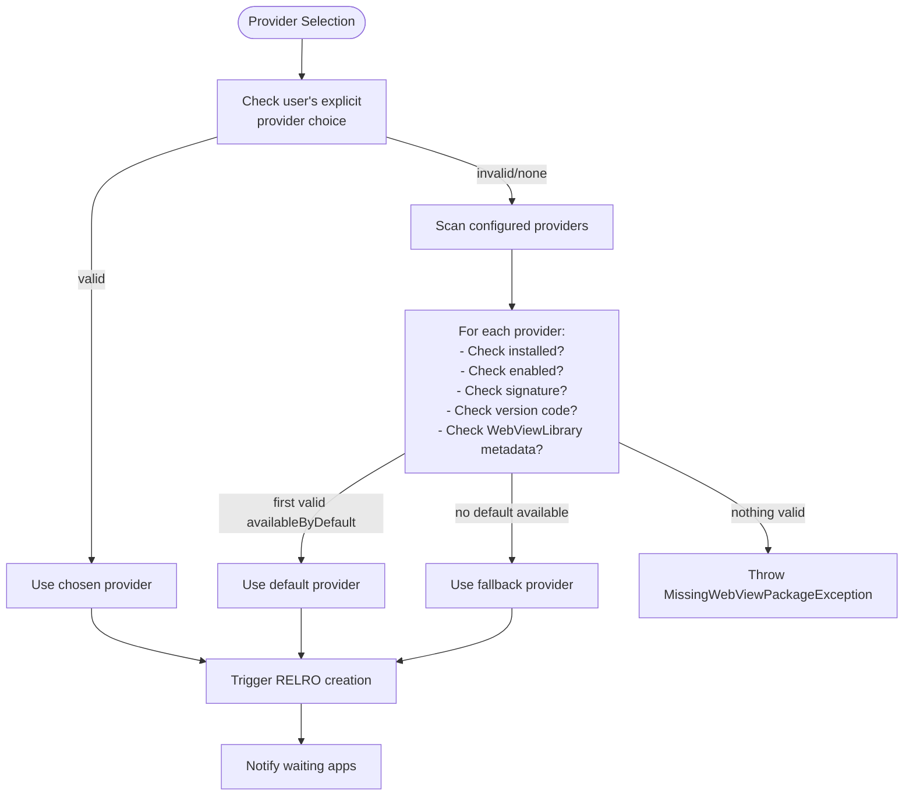

The validation checks include:

| Check | Constant | Description |
|---|---|---|
| SDK version | `VALIDITY_INCORRECT_SDK_VERSION` | Provider targets correct SDK |
| Version code | `VALIDITY_INCORRECT_VERSION_CODE` | Meets minimum version |
| Signature | `VALIDITY_INCORRECT_SIGNATURE` | Matches configured signatures |
| Library flag | `VALIDITY_NO_LIBRARY_FLAG` | Has `WebViewLibrary` metadata |

### 44.4.3 Client-Side IPC Wrapper

Applications interact with the update service through `WebViewUpdateManager`, a modern
wrapper that uses `Context.getSystemService()`:

```
Source: frameworks/base/core/java/android/webkit/WebViewUpdateManager.java
```

Key operations:

```java
// Block until the WebView provider is ready
WebViewProviderResponse waitForAndGetProvider();

// Get the current provider package
PackageInfo getCurrentWebViewPackage();

// List all configured providers
WebViewProviderInfo[] getAllWebViewPackages();

// List currently valid providers
WebViewProviderInfo[] getValidWebViewPackages();

// Switch provider (requires WRITE_SECURE_SETTINGS)
String changeProviderAndSetting(String newProvider);

// Get the default provider
WebViewProviderInfo getDefaultWebViewPackage();
```

The service registration happens in `WebViewBootstrapFrameworkInitializer`:

```java
SystemServiceRegistry.registerForeverStaticService(
        Context.WEBVIEW_UPDATE_SERVICE,
        WebViewUpdateManager.class,
        (b) -> new WebViewUpdateManager(
                IWebViewUpdateService.Stub.asInterface(b)));
```

### 44.4.4 Package Change Handling

When a WebView provider package is installed, updated, or removed, the update service
receives a package broadcast and processes it:

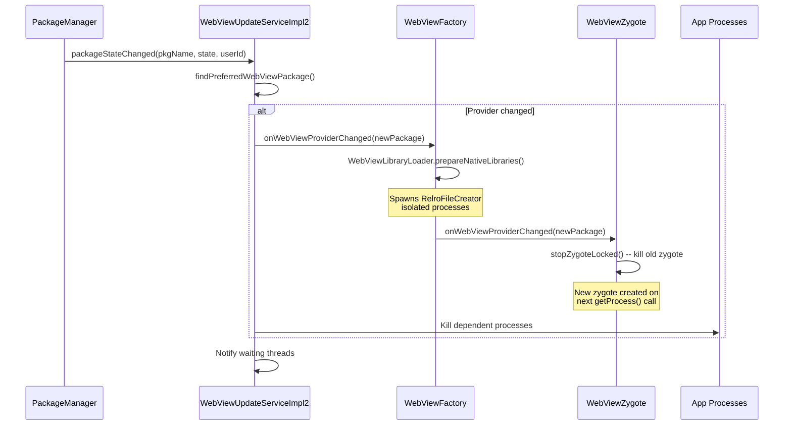

The wait timeout for RELRO preparation is 1000 milliseconds (`WAIT_TIMEOUT_MS`), which is
deliberately shorter than the 5000ms `KEY_DISPATCHING_TIMEOUT` to avoid ANR (Application
Not Responding) dialogs.

### 44.4.5 Mainline Module Integration

Starting with Android 10, WebView can be updated as a **Mainline module** via Google Play
system updates. This uses the same package update mechanism but with Mainline-specific
delivery:

- WebView updates are delivered as APK modules (not APEX)
- Updates can be rolled back if they cause issues
- The update applies to all users on the device
- No reboot is required; apps pick up the new version on next WebView creation

### 44.4.6 Fallback and Recovery

The update service includes a repair mechanism. If the current provider becomes unusable
(e.g., it is uninstalled or disabled), the service attempts to recover:

1. If the current provider is the default and it becomes missing, trigger a repair
2. The repair mechanism re-enables the fallback provider if needed
3. The `mAttemptedToRepairBefore` flag prevents infinite repair loops
4. All processes depending on the old provider are killed so they restart with the new one

---

## 44.5 WebView APIs

### 44.5.1 The WebView Class

`android.webkit.WebView` extends `AbsoluteLayout` (for historical backward-compatibility
reasons) and implements several listener interfaces:

```
Source: frameworks/base/core/java/android/webkit/WebView.java
```

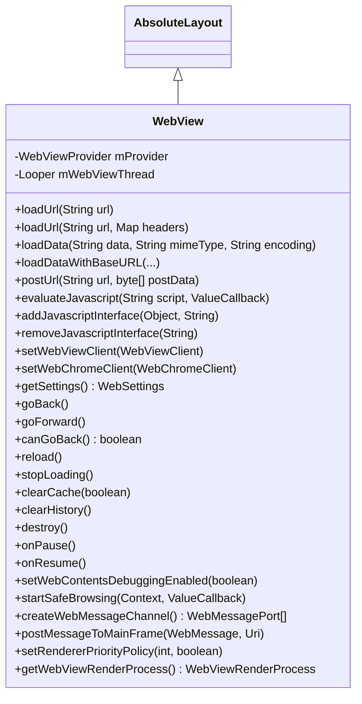

#### Content Loading Methods

WebView provides multiple ways to load content:

| Method | Use Case |
|---|---|
| `loadUrl(String)` | Load a URL (http, https, file, data, javascript) |
| `loadUrl(String, Map)` | Load URL with custom HTTP headers |
| `loadData(String, String, String)` | Load inline HTML via data: URL |
| `loadDataWithBaseURL(...)` | Load inline HTML with a custom base URL |
| `postUrl(String, byte[])` | HTTP POST to a URL |

The `loadDataWithBaseURL` method is particularly important for security: it sets the
**origin** for the loaded content, which governs the same-origin policy for any
JavaScript executing in the page.

#### JavaScript Execution

Two mechanisms exist for JavaScript interaction:

1. **evaluateJavascript()**: Execute arbitrary JavaScript in the current page context
   and optionally receive the result:
   ```java
   webView.evaluateJavascript("document.title", value -> {
       // value is the JSON-encoded result
   });
   ```

2. **addJavascriptInterface()**: Expose a Java object to JavaScript, allowing bidirectional
   communication (see Section 55.5.5).

#### Navigation

WebView maintains a back/forward navigation stack:

- `canGoBack()` / `goBack()` -- navigate backward
- `canGoForward()` / `goForward()` -- navigate forward
- `canGoBackOrForward(int)` / `goBackOrForward(int)` -- navigate by step count
- `copyBackForwardList()` -- snapshot the navigation history

#### Lifecycle Management

WebView follows Android's activity lifecycle:

- `onPause()` -- pause animations, geolocation (but not JavaScript timers)
- `onResume()` -- resume paused WebView
- `pauseTimers()` / `resumeTimers()` -- pause/resume all JavaScript timers globally
- `destroy()` -- release all internal resources; the WebView must be removed from the
  view hierarchy first

### 44.5.2 WebSettings

`WebSettings` controls the behavior of a WebView instance. It is an abstract class whose
concrete implementation is provided by the Chromium backend.

```
Source: frameworks/base/core/java/android/webkit/WebSettings.java
```

Key settings categories:

#### JavaScript and Content

| Setting | Default | Description |
|---|---|---|
| `setJavaScriptEnabled(boolean)` | `false` | Enable/disable JavaScript execution |
| `setDomStorageEnabled(boolean)` | `false` | Enable HTML5 DOM Storage |
| `setDatabaseEnabled(boolean)` | `false` | Enable HTML5 Web SQL Database |
| `setMediaPlaybackRequiresUserGesture(boolean)` | `true` | Require gesture for media |
| `setAllowFileAccess(boolean)` | varies | Allow `file://` URL access |
| `setAllowContentAccess(boolean)` | `true` | Allow `content://` URL access |

#### Display and Layout

| Setting | Default | Description |
|---|---|---|
| `setTextZoom(int)` | `100` | Text size as percentage |
| `setUseWideViewPort(boolean)` | `false` | Enable viewport meta tag support |
| `setLoadWithOverviewMode(boolean)` | `false` | Zoom out to fit content by width |
| `setSupportZoom(boolean)` | `true` | Enable zoom support |
| `setBuiltInZoomControls(boolean)` | `false` | Enable pinch-to-zoom |
| `setDisplayZoomControls(boolean)` | `true` | Show on-screen zoom buttons |

#### Caching

| Mode | Constant | Behavior |
|---|---|---|
| Default | `LOAD_DEFAULT` | Use cache when valid, network otherwise |
| Cache first | `LOAD_CACHE_ELSE_NETWORK` | Use cache even if expired, else network |
| No cache | `LOAD_NO_CACHE` | Always load from network |
| Cache only | `LOAD_CACHE_ONLY` | Never use network |

#### Mixed Content

The `setMixedContentMode()` method controls how HTTPS pages handle HTTP sub-resources:

| Mode | Constant | Security Level |
|---|---|---|
| Always allow | `MIXED_CONTENT_ALWAYS_ALLOW` | Least secure |
| Never allow | `MIXED_CONTENT_NEVER_ALLOW` | Most secure |
| Compatibility | `MIXED_CONTENT_COMPATIBILITY_MODE` | Follows browser defaults |

#### Dark Mode

```java
public static final long ENABLE_SIMPLIFIED_DARK_MODE = 214741472L;
```

Starting from Android 13 (Tiramisu), WebView supports algorithmic darkening of web content
through `setAlgorithmicDarkeningAllowed()`. This enables WebView to automatically apply
dark themes to web pages that do not natively support `prefers-color-scheme`.

#### User-Agent Reduction

```java
@ChangeId
@EnabledAfter(targetSdkVersion = android.os.Build.VERSION_CODES.BAKLAVA)
public static final long ENABLE_USER_AGENT_REDUCTION = 371034303L;
```

For apps targeting post-Baklava, the default User-Agent is reduced to `Linux; Android 10; K`
with version `0.0.0` to reduce fingerprinting surface, following the broader User-Agent
Reduction initiative across Chromium.

### 44.5.3 WebViewClient

`WebViewClient` handles navigation events and errors. An application sets it via
`WebView.setWebViewClient()`. If no client is set, the default behavior delegates URL
handling to the system (via `ActivityManager`).

```
Source: frameworks/base/core/java/android/webkit/WebViewClient.java
```

Key callbacks organized by lifecycle:

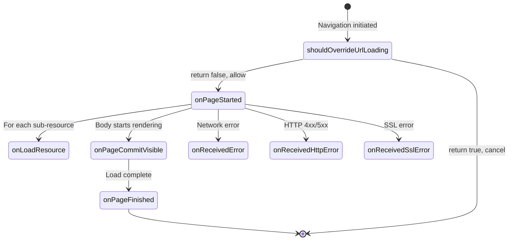

#### Navigation Control

```java
// Modern version (API 24+)
public boolean shouldOverrideUrlLoading(WebView view, WebResourceRequest request) {
    return shouldOverrideUrlLoading(view, request.getUrl().toString());
}
```

Returning `true` cancels the navigation and lets the app handle it (e.g., opening an
external browser). Returning `false` allows WebView to proceed normally.

Important caveats from the source:

- Not called for POST requests
- Not called for navigations initiated by `loadUrl()`
- May be called for subframes and non-HTTP schemes

#### Resource Interception

```java
public WebResourceResponse shouldInterceptRequest(WebView view,
        WebResourceRequest request) {
    return null; // Return null to let WebView load normally
}
```

This powerful callback allows the application to intercept any resource request and return
custom data. Use cases include:

- Serving local assets for offline support
- Injecting custom CSS or JavaScript
- Implementing custom caching strategies
- URL rewriting

**Thread safety note**: This method is called on a background thread, not the UI thread.

#### Error Handling

| Callback | When Called |
|---|---|
| `onReceivedError(WebView, WebResourceRequest, WebResourceError)` | Network/DNS/connection failures |
| `onReceivedHttpError(WebView, WebResourceRequest, WebResourceResponse)` | HTTP status >= 400 |
| `onReceivedSslError(WebView, SslErrorHandler, SslError)` | SSL certificate errors |

The SSL error callback deserves special attention. The default behavior is `handler.cancel()`,
which is the secure choice. The source code explicitly warns:

> Do not prompt the user about SSL errors. Users are unlikely to be able to make an
> informed security decision, and WebView does not provide a UI for showing the details
> of the error in a meaningful way.

#### Render Process Management

```java
public boolean onRenderProcessGone(WebView view, RenderProcessGoneDetail detail) {
    return false;
}
```

When a renderer process crashes or is killed by the system, this callback notifies the
application. Multiple `WebView` instances may share a renderer, so the callback fires for
each affected WebView. Returning `false` (the default) causes the application to crash;
returning `true` indicates the app has handled the situation (e.g., by cleaning up the
WebView and recreating it).

#### Safe Browsing

```java
public void onSafeBrowsingHit(WebView view, WebResourceRequest request,
        @SafeBrowsingThreat int threatType, SafeBrowsingResponse callback) {
    callback.showInterstitial(/* allowReporting */ true);
}
```

When Safe Browsing detects a malicious URL, this callback lets the app decide how to
respond. Threat types include:

| Constant | Value | Description |
|---|---|---|
| `SAFE_BROWSING_THREAT_UNKNOWN` | 0 | Unknown threat |
| `SAFE_BROWSING_THREAT_MALWARE` | 1 | Malware detected |
| `SAFE_BROWSING_THREAT_PHISHING` | 2 | Phishing/deceptive content |
| `SAFE_BROWSING_THREAT_UNWANTED_SOFTWARE` | 3 | Unwanted software |
| `SAFE_BROWSING_THREAT_BILLING` | 4 | Billing fraud (API 29+) |

### 44.5.4 WebChromeClient

`WebChromeClient` handles browser-chrome events -- UI elements and interactions that are
outside the web content area itself.

```
Source: frameworks/base/core/java/android/webkit/WebChromeClient.java
```

Key callback categories:

#### Page Metadata

| Callback | Purpose |
|---|---|
| `onProgressChanged(WebView, int)` | Loading progress (0--100) |
| `onReceivedTitle(WebView, String)` | Document title changed |
| `onReceivedIcon(WebView, Bitmap)` | Favicon received |

#### JavaScript Dialogs

WebChromeClient handles JavaScript's `alert()`, `confirm()`, and `prompt()` dialogs:

```java
public boolean onJsAlert(WebView view, String url, String message, JsResult result) {
    return false; // false = show default dialog
}

public boolean onJsConfirm(WebView view, String url, String message, JsResult result) {
    return false;
}

public boolean onJsPrompt(WebView view, String url, String message,
        String defaultValue, JsPromptResult result) {
    return false;
}
```

Returning `false` shows the default system dialog. Returning `true` suppresses it and
the app must call `result.confirm()` or `result.cancel()` to resume JavaScript execution.

If no `WebChromeClient` is set at all, JavaScript dialogs are silently suppressed.

#### Fullscreen Video

```java
public void onShowCustomView(View view, CustomViewCallback callback) {}
public void onHideCustomView() {}
```

When a video element enters fullscreen (e.g., the user taps a fullscreen button), WebView
creates a separate `View` containing the video and passes it to `onShowCustomView()`. The
application should add this view to a fullscreen window. When fullscreen exits,
`onHideCustomView()` is called.

#### Window Management

```java
public boolean onCreateWindow(WebView view, boolean isDialog,
        boolean isUserGesture, Message resultMsg) {
    return false; // false = don't create window
}
```

When JavaScript calls `window.open()`, this callback asks the app to create a new WebView.
The app should check `isUserGesture` to block popup windows not initiated by user action.

#### Permissions

```java
public void onGeolocationPermissionsShowPrompt(String origin,
        GeolocationPermissions.Callback callback) {}

public void onPermissionRequest(PermissionRequest request) {
    request.deny(); // Default: deny all permissions
}
```

The `onPermissionRequest` callback handles requests for camera, microphone, and other
sensitive capabilities. The default behavior denies all such requests.

#### File Chooser

```java
public boolean onShowFileChooser(WebView webView,
        ValueCallback<Uri[]> filePathCallback,
        FileChooserParams fileChooserParams) {
    return false;
}
```

The `FileChooserParams` class defines modes for file selection:

| Mode | Constant | Description |
|---|---|---|
| Open single | `MODE_OPEN` | Pick one existing file |
| Open multiple | `MODE_OPEN_MULTIPLE` | Pick multiple files |
| Open folder | `MODE_OPEN_FOLDER` | Pick a directory (File System Access API) |
| Save | `MODE_SAVE` | Create/overwrite a file |

The `MODE_OPEN_FOLDER` and `MODE_SAVE` modes are part of the new File System Access API
support, gated behind the `ENABLE_FILE_SYSTEM_ACCESS` change ID for apps targeting
post-Baklava.

#### Console Messages

```java
public boolean onConsoleMessage(ConsoleMessage consoleMessage) {
    onConsoleMessage(consoleMessage.message(), consoleMessage.lineNumber(),
            consoleMessage.sourceId());
    return false;
}
```

JavaScript `console.log()`, `console.warn()`, and `console.error()` calls are forwarded
to this callback, enabling the host application to capture and process web console output.

### 44.5.5 JavascriptInterface

The `@JavascriptInterface` annotation marks Java methods that should be exposed to
JavaScript running in the WebView:

```
Source: frameworks/base/core/java/android/webkit/JavascriptInterface.java

@Retention(RetentionPolicy.RUNTIME)
@Target({ElementType.METHOD})
public @interface JavascriptInterface {
}
```

This annotation is runtime-retained, meaning the WebView implementation can discover
annotated methods via reflection. Starting from API 17, only methods with this annotation
are accessible from JavaScript -- a critical security fix that prevents JavaScript from
calling arbitrary Java methods via reflection.

Usage pattern:

```java
class WebAppInterface {
    @JavascriptInterface
    public void showToast(String message) {
        Toast.makeText(context, message, Toast.LENGTH_SHORT).show();
    }
}

webView.addJavascriptInterface(new WebAppInterface(), "Android");
// JavaScript can now call: Android.showToast("Hello from JS!")
```

Security considerations documented in the `WebView.addJavascriptInterface()` source:

1. The Java object is exposed to **all frames** in the WebView, including third-party
   iframes. There is no way to restrict it to a specific origin.

2. JavaScript calls Java methods on a **private background thread**, not the UI thread.
   Thread safety is the developer's responsibility.

3. For apps targeting API 17+, only `@JavascriptInterface`-annotated methods are accessible.
   For older apps, all public methods (including inherited ones from `Object`) are exposed,
   which allows arbitrary code execution via `getClass().forName(...)`.

4. Java object fields are never accessible from JavaScript (only methods).

### 44.5.6 Web Messaging API

WebView also supports the HTML5 MessageChannel API for structured communication:

```java
// Create a message channel
WebMessagePort[] ports = webView.createWebMessageChannel();

// Send one port to the web page
webView.postMessageToMainFrame(
    new WebMessage("init", new WebMessagePort[]{ports[1]}),
    Uri.parse("https://example.com"));

// Receive messages from the web page
ports[0].setWebMessageCallback(new WebMessagePort.WebMessageCallback() {
    public void onMessage(WebMessagePort port, WebMessage message) {
        // Handle message from JS
    }
});
```

This is a more structured and secure alternative to `addJavascriptInterface` because
messages can be validated and the channel endpoints are explicitly controlled.

### 44.5.7 WebResourceRequest and WebResourceResponse

The `WebResourceRequest` class provides detailed information about incoming resource
requests in `WebViewClient.shouldInterceptRequest()` and
`WebViewClient.shouldOverrideUrlLoading()`:

```java
public interface WebResourceRequest {
    Uri getUrl();                        // The request URL
    boolean isForMainFrame();            // true if this is the main frame
    boolean isRedirect();                // true if this is a redirect
    boolean hasGesture();                // true if initiated by user gesture
    String getMethod();                  // HTTP method (GET, POST, etc.)
    Map<String, String> getRequestHeaders(); // HTTP request headers
}
```

`WebResourceResponse` allows applications to provide custom responses for intercepted
requests:

```java
WebResourceResponse response = new WebResourceResponse(
    "text/html",           // MIME type
    "UTF-8",               // encoding
    new ByteArrayInputStream(htmlBytes)  // data stream
);
response.setStatusCodeAndReasonPhrase(200, "OK");
response.setResponseHeaders(Map.of(
    "Cache-Control", "max-age=3600",
    "Content-Type", "text/html; charset=UTF-8"
));
```

This enables powerful patterns:

1. **Offline-first**: Serve cached content when the network is unavailable
2. **Asset loading**: Serve local assets through HTTP-like URLs for same-origin compliance
3. **Content filtering**: Block or replace specific resources (ads, trackers)
4. **URL rewriting**: Redirect requests to different servers transparently

#### Error Types and Error Codes

`WebViewClient` defines a comprehensive set of error codes for resource loading failures:

| Constant | Value | Description |
|---|---|---|
| `ERROR_UNKNOWN` | -1 | Generic error |
| `ERROR_HOST_LOOKUP` | -2 | DNS resolution failed |
| `ERROR_UNSUPPORTED_AUTH_SCHEME` | -3 | Auth scheme not supported |
| `ERROR_AUTHENTICATION` | -4 | Server authentication failed |
| `ERROR_PROXY_AUTHENTICATION` | -5 | Proxy authentication failed |
| `ERROR_CONNECT` | -6 | Connection to server failed |
| `ERROR_IO` | -7 | Read/write error |
| `ERROR_TIMEOUT` | -8 | Connection timed out |
| `ERROR_REDIRECT_LOOP` | -9 | Too many redirects |
| `ERROR_UNSUPPORTED_SCHEME` | -10 | Unsupported URI scheme |
| `ERROR_FAILED_SSL_HANDSHAKE` | -11 | SSL handshake failed |
| `ERROR_BAD_URL` | -12 | Malformed URL |
| `ERROR_FILE` | -13 | Generic file error |
| `ERROR_FILE_NOT_FOUND` | -14 | File not found |
| `ERROR_TOO_MANY_REQUESTS` | -15 | Too many requests |
| `ERROR_UNSAFE_RESOURCE` | -16 | Blocked by Safe Browsing |

### 44.5.8 WebView Lifecycle Best Practices

Proper lifecycle management is critical for WebView applications. The framework documentation
and source code reveal several patterns:

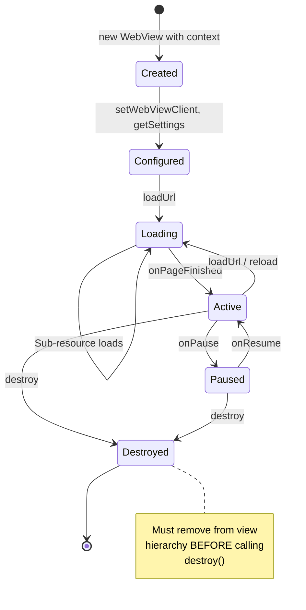

Key lifecycle rules:

1. **Create on UI thread only**: WebView must be created on a thread with a Looper (typically
   the main thread). The constructor stores `Looper.myLooper()` and enforces thread affinity
   for all subsequent calls.

2. **Pause when backgrounded**: Call `onPause()` when the activity goes to background to
   reduce power consumption. This pauses animations and geolocation but does not pause
   JavaScript timers.

3. **Pause timers globally**: Call `pauseTimers()` to stop all JavaScript timers across
   all WebView instances. This is a global operation and should be used when the entire
   application is backgrounded.

4. **Destroy properly**: Before calling `destroy()`, remove the WebView from its parent
   view. After `destroy()`, no other methods may be called on the WebView.

5. **Handle process death**: The renderer process may be killed by the system at any time
   (especially under memory pressure). Applications must handle `onRenderProcessGone()`
   to avoid crashing.

### 44.5.9 CookieManager

The `CookieManager` singleton manages cookies across all `WebView` instances in a process:

```
Source: frameworks/base/core/java/android/webkit/CookieManager.java
```

```java
// Get the singleton
CookieManager cookieManager = CookieManager.getInstance();

// Set a cookie
cookieManager.setCookie("https://example.com", "key=value; Max-Age=3600");

// Get cookies
String cookies = cookieManager.getCookie("https://example.com");

// Third-party cookie control (per WebView)
cookieManager.setAcceptThirdPartyCookies(webView, false);

// Flush to persistent storage
cookieManager.flush();
```

Third-party cookie policy defaults:

- Apps targeting KitKat (API 19) or below: **allow** third-party cookies
- Apps targeting Lollipop (API 21) or later: **block** third-party cookies

### 44.5.10 WebViewRenderProcess and WebViewRenderProcessClient

These classes provide programmatic control over the renderer process:

```
Source: frameworks/base/core/java/android/webkit/WebViewRenderProcess.java
Source: frameworks/base/core/java/android/webkit/WebViewRenderProcessClient.java
```

**WebViewRenderProcess** provides a handle to terminate a renderer:

```java
public abstract boolean terminate();
```

**WebViewRenderProcessClient** receives responsiveness notifications:

```java
public abstract void onRenderProcessUnresponsive(
        @NonNull WebView view, @Nullable WebViewRenderProcess renderer);

public abstract void onRenderProcessResponsive(
        @NonNull WebView view, @Nullable WebViewRenderProcess renderer);
```

The unresponsiveness detector fires if the renderer fails to process an input event or
navigate within a reasonable time. Callbacks repeat at a minimum interval of 5 seconds
while the renderer remains unresponsive.

---

## 44.6 Chromium Integration

### 44.6.1 The Content Layer

WebView uses Chromium's **content layer** -- the public embedding API that sits above
the platform-specific shell but below Chrome's browser UI. The content layer provides:

- Page navigation and loading
- Blink rendering engine (HTML, CSS, layout)
- V8 JavaScript engine
- Network stack (Chromium's own, not Android's `HttpURLConnection`)
- Compositor for GPU-accelerated rendering
- Mojo IPC for inter-process communication

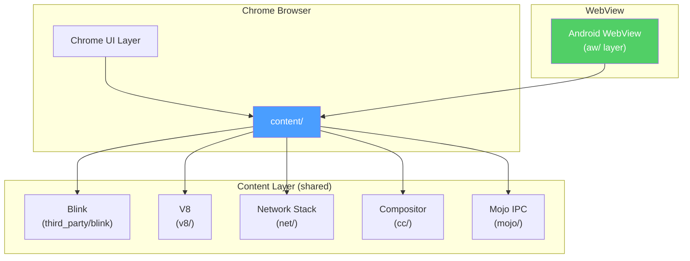

The `aw/` (Android WebView) layer in Chromium's source tree adapts the content API to
Android's WebView contracts. It implements `WebViewProvider`, handles the draw functor
integration, manages the WebView-specific compositor mode, and bridges Android's
`WebSettings` to Chromium's internal content settings.

### 44.6.2 GPU Process and Hardware Acceleration

WebView's GPU integration is unique among Chromium embedders because it must share the
application's GPU context. Unlike Chrome (which has its own GPU process), WebView hooks
into Android's `RenderThread`:

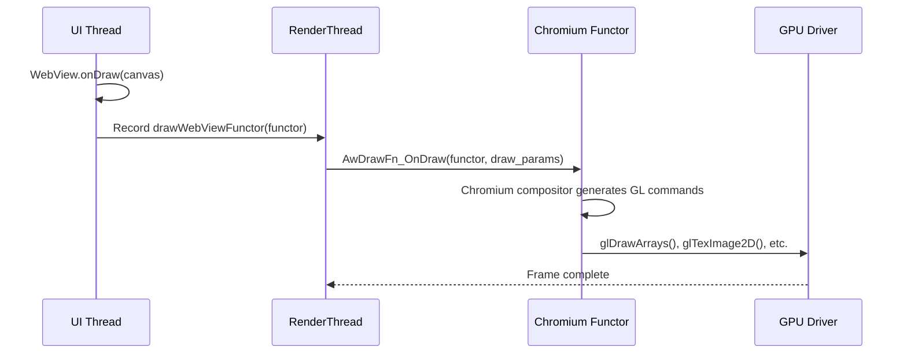

The draw functor (`AwDrawFn_CreateFunctor` / `AwDrawFn_OnDraw`) is a native callback
registered through `WebViewDelegate.drawWebViewFunctor()`. This avoids the overhead of
a separate GPU process and allows WebView content to be composited in the same pass as
native Android views.

### 44.6.3 Renderer Process Sandboxing

The renderer process runs in a restricted sandbox with multiple layers of isolation:

1. **UID isolation**: Each renderer gets an isolated UID from the
   `FIRST_ISOLATED_UID` range, preventing access to other apps' data.

2. **SELinux policy**: The renderer runs under the `webview_zygote` SELinux context,
   which restricts file system access, network operations, and system calls.

3. **seccomp-bpf**: A BPF filter restricts the set of system calls the renderer can
   make, blocking dangerous calls like `mount`, `reboot`, `ptrace`, etc.

4. **Process capabilities**: The renderer drops all Linux capabilities after startup.

5. **Namespace isolation**: The renderer uses separate PID and network namespaces (on
   supported kernels) to further restrict its view of the system.

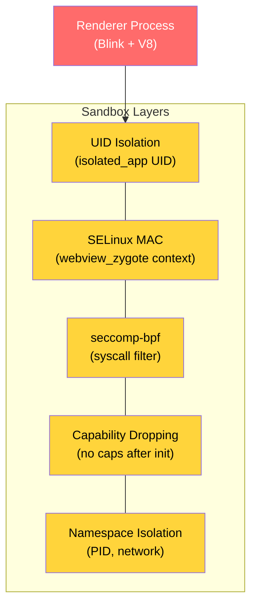

### 44.6.4 Network Stack

WebView uses Chromium's own network stack rather than Android's. This provides:

- HTTP/2 and HTTP/3 (QUIC) support
- Connection pooling and multiplexing
- TLS 1.3 with Chromium's own certificate verification
- Cronet-compatible network API
- Cookie storage in Chromium's cookie database

The network stack runs in the browser (application) process, not the renderer. This means
network requests from web content cross the Mojo IPC boundary from renderer to browser,
are executed in the browser process, and responses are sent back.

### 44.6.5 Mojo IPC

Communication between the browser and renderer processes uses Chromium's **Mojo** IPC
framework. Mojo provides:

- Typed message interfaces (defined in `.mojom` files)
- Shared memory regions for large data transfers
- Data pipes for streaming
- Capability-based security (interface handles cannot be forged)

Key Mojo interfaces used by WebView include:

| Interface | Direction | Purpose |
|---|---|---|
| `blink.mojom.LocalFrame` | Browser -> Renderer | Frame management |
| `blink.mojom.FrameHost` | Renderer -> Browser | Navigation requests |
| `content.mojom.Renderer` | Browser -> Renderer | Process control |
| `network.mojom.URLLoader` | Either direction | Resource loading |

### 44.6.6 V8 JavaScript Engine Integration

WebView uses the V8 JavaScript engine that ships as part of Chromium. V8 runs in the
renderer process and provides:

- **JIT compilation**: V8 compiles JavaScript to optimized machine code at runtime using
  its TurboFan optimizing compiler. In WebView, JIT is enabled by default, but the renderer
  sandbox restricts memory-mapping executable pages to prevent JIT spraying attacks.

- **Garbage collection**: V8's Orinoco garbage collector uses concurrent and parallel
  collection strategies to minimize pause times during web page interaction.

- **WebAssembly support**: V8 includes a WebAssembly (Wasm) engine that can execute
  compiled Wasm modules with near-native performance.

- **Isolate-per-frame**: Each frame (main frame and iframes) gets its own V8 isolate
  when site isolation is active, ensuring that JavaScript from different origins cannot
  share memory.

The JavaScript-to-Java bridge (via `addJavascriptInterface()`) crosses the process boundary
twice: first from V8 in the renderer to the browser process via Mojo IPC, then from the
Chromium browser-side code to the Java bridge object via JNI.

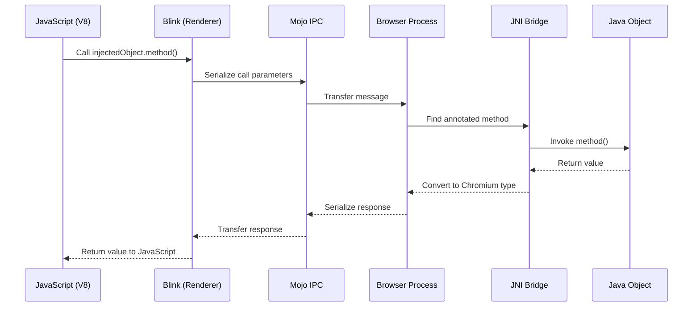

### 44.6.7 Compositor Architecture in WebView Mode

WebView's compositor operates differently from Chrome's. In Chrome, the compositor runs
in a dedicated GPU process and produces frames independently. In WebView, the compositor
must integrate with Android's `RenderThread`:

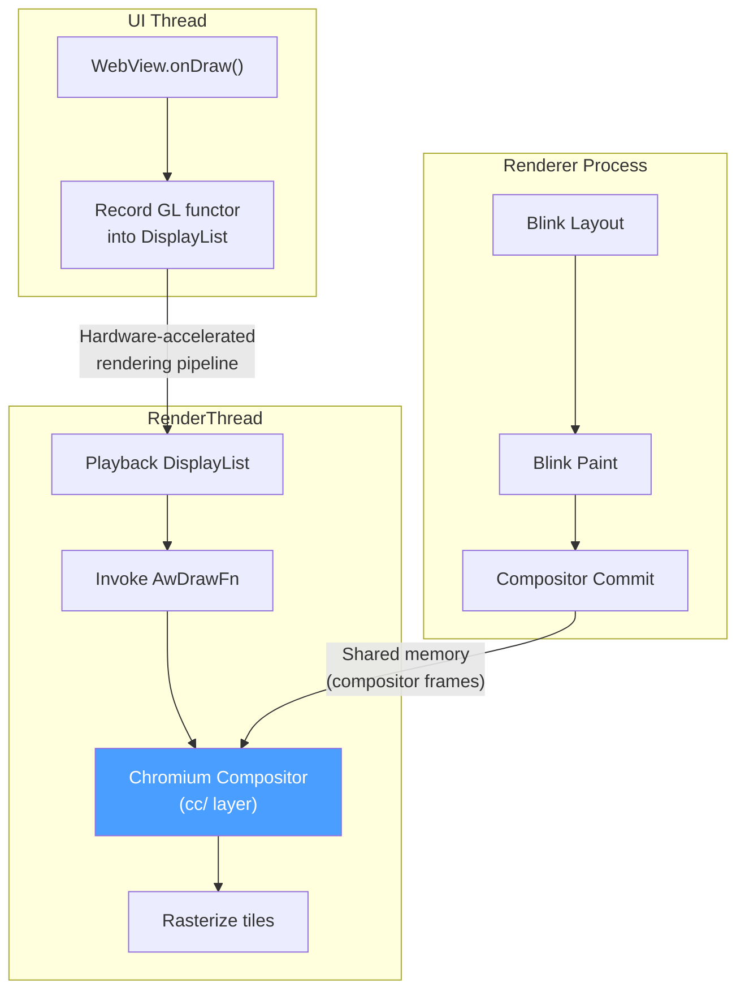

This architecture means:

1. The Blink renderer computes layout and paint operations, producing a compositor frame
   (a tree of layers with their content).

2. The compositor frame is transferred to the browser process via shared memory.

3. On the next `RenderThread` frame, the draw functor is invoked, and the Chromium
   compositor rasterizes the frame's tiles into the application's GPU context.

4. The result is composited alongside other Android views in the same GPU pass.

This is called **"synchronous compositor"** mode in Chromium terminology because the
compositor must synchronize with Android's `RenderThread` cadence rather than running
on its own timeline.

### 44.6.8 Threading Model

WebView uses multiple threads within the application process:

| Thread | Role |
|---|---|
| UI Thread (Main) | Android lifecycle, WebView API calls, Chromium browser main thread |
| IO Thread | Network I/O, IPC message dispatch |
| RenderThread | Hardware-accelerated rendering, compositor |
| ThreadPool workers | Background tasks, DNS prefetch, file I/O |
| Java Bridge Thread | `@JavascriptInterface` method execution |

The UI thread serves dual duty as both the Android main thread and Chromium's browser
main thread. This is a key constraint: long-running Chromium operations on the browser
main thread can cause ANRs in the Android application. The Chromium code is designed to
avoid blocking the main thread, but complex page loads with many frames can still cause
jank.

### 44.6.9 Service Worker Support

WebView supports Service Workers through the `ServiceWorkerController` and
`ServiceWorkerClient` classes:

```java
ServiceWorkerController swController = ServiceWorkerController.getInstance();
swController.setServiceWorkerClient(new ServiceWorkerClient() {
    @Override
    public WebResourceResponse shouldInterceptRequest(WebResourceRequest request) {
        // Intercept service worker requests
        return null; // null = let WebView handle normally
    }
});

ServiceWorkerWebSettings swSettings = swController.getServiceWorkerWebSettings();
swSettings.setAllowContentAccess(true);
swSettings.setCacheMode(WebSettings.LOAD_DEFAULT);
```

Service Workers run in the renderer process and can intercept network requests, enabling
offline support and push notifications for web applications embedded in WebView.

### 44.6.10 WebView vs. Chrome: Key Differences

Although WebView and Chrome share the same Chromium codebase, there are significant
behavioral differences:

| Aspect | Chrome | WebView |
|---|---|---|
| Process model | Separate GPU process | Shared app GPU thread |
| Compositor | Asynchronous | Synchronous (tied to RenderThread) |
| Browser UI | Full Chrome UI | No browser UI (app provides UI) |
| Navigation | Full URL bar, tabs | Controlled by app code |
| Extensions | Supported | Not supported |
| DevTools | Built-in | Requires explicit enablement |
| Safe Browsing | Always on | On by default, can be disabled |
| Cookie storage | Chrome profile | Per-app WebView data directory |
| Autofill | Chrome's autofill | Android platform autofill |
| Download handling | Chrome's download manager | `DownloadListener` callback to app |
| Multi-profile | Supported | Single profile per data directory |

---

## 44.7 WebView and Security

### 44.7.1 Same-Origin Policy

WebView enforces the standard web same-origin policy: scripts from one origin cannot
access resources or DOM from a different origin. The origin is defined by the tuple
(scheme, host, port).

Special considerations for Android WebView:

- Content loaded via `loadData()` has origin `"null"` -- it cannot access any other
  origin's resources. The source documentation explicitly warns:

  > This must not be considered to be a trusted origin by the application or by any
  > JavaScript code running inside the WebView, because malicious content can also
  > create frames with a null origin.

- Content loaded via `loadDataWithBaseURL()` with an HTTP/HTTPS base URL gets that URL's
  origin, enabling meaningful same-origin checks.

- `file://` URLs share a single origin, which is why `setAllowFileAccess(false)` is the
  secure default for apps targeting API 30+.

### 44.7.2 Mixed Content Handling

WebView provides three modes for handling mixed content (HTTP resources loaded from an
HTTPS page):

```java
// Most secure: block all mixed content
webSettings.setMixedContentMode(WebSettings.MIXED_CONTENT_NEVER_ALLOW);

// Least secure: allow all mixed content
webSettings.setMixedContentMode(WebSettings.MIXED_CONTENT_ALWAYS_ALLOW);

// Browser-compatible: block some, allow others
webSettings.setMixedContentMode(WebSettings.MIXED_CONTENT_COMPATIBILITY_MODE);
```

`MIXED_CONTENT_NEVER_ALLOW` is recommended for security-sensitive applications.
`MIXED_CONTENT_COMPATIBILITY_MODE` follows Chromium's evolving policy, which increasingly
blocks mixed content by default.

### 44.7.3 Safe Browsing

WebView integrates Google Safe Browsing to protect users from malicious websites. The
Safe Browsing system checks URLs against a regularly-updated database of known threats.

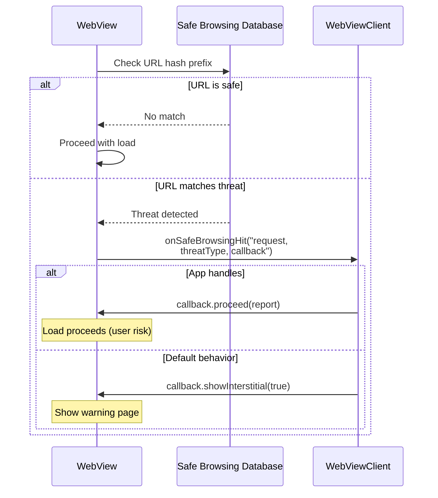

Safe Browsing is enabled by default. Applications can:

- Disable it via `WebSettings.setSafeBrowsingEnabled(false)`
- Allowlist specific hosts via `WebView.setSafeBrowsingWhitelist()`
- Handle threats custom via `WebViewClient.onSafeBrowsingHit()`
- Link to the privacy policy via `WebView.getSafeBrowsingPrivacyPolicyUrl()`

Starting from WebView version 122.0.6174.0, Safe Browsing initialization is automatic.
The previously-required `WebView.startSafeBrowsing()` call is now deprecated and no-ops.

### 44.7.4 SSL/TLS Security

WebView uses Chromium's TLS implementation, which provides:

- TLS 1.2 and 1.3 support
- Certificate Transparency enforcement
- HSTS (HTTP Strict Transport Security) preload list
- OCSP stapling
- Strong cipher suite selection

When an SSL error occurs, the `WebViewClient.onReceivedSslError()` callback is invoked.
The default behavior cancels the load:

```java
public void onReceivedSslError(WebView view, SslErrorHandler handler, SslError error) {
    handler.cancel(); // Secure default: reject
}
```

Client certificate authentication is handled through `onReceivedClientCertRequest()`,
which defaults to canceling (no client certificate sent):

```java
public void onReceivedClientCertRequest(WebView view, ClientCertRequest request) {
    request.cancel(); // Default: no client cert
}
```

### 44.7.5 JavaScript Bridge Security

The `addJavascriptInterface()` mechanism has been a historical source of security
vulnerabilities. Key mitigations:

1. **`@JavascriptInterface` annotation requirement** (API 17+): Only annotated methods
   are exposed, preventing reflection-based attacks.

2. **Privileged process exclusion**: WebView refuses to load in system_server, phone,
   NFC, Bluetooth, or root processes.

3. **Origin blindness warning**: The injected object is accessible from all frames,
   including cross-origin iframes. Applications must not assume the calling frame is
   trusted.

4. **Thread isolation**: JavaScript calls to Java objects execute on a private background
   thread, not the UI thread. This prevents UI-thread blocking but requires thread-safe
   implementations.

### 44.7.6 File Access Controls

WebView provides granular control over local file access:

| Setting | Default (API < 30) | Default (API >= 30) |
|---|---|---|
| `setAllowFileAccess()` | `true` | `false` |
| `setAllowContentAccess()` | `true` | `true` |
| `setAllowFileAccessFromFileURLs()` | `false` (API 16+) | `false` |
| `setAllowUniversalAccessFromFileURLs()` | `false` (API 16+) | `false` |

The recommendation in the source code is clear:

> Apps should not open file:// URLs from any external source in WebView. It's
> recommended to always use `androidx.webkit.WebViewAssetLoader` to access files
> including assets and resources over http(s):// schemes, instead of file:// URLs.

File-scheme cookies are also disabled by default and deprecated:

```java
@Deprecated
public static void setAcceptFileSchemeCookies(boolean accept) {
    getInstance().setAcceptFileSchemeCookiesImpl(accept);
}
```

### 44.7.7 Content Security Policy Integration

WebView respects Content Security Policy (CSP) headers and meta tags set by web pages.
CSP provides an additional layer of defense by specifying which sources of content are
permitted. For example:

```
Content-Security-Policy: default-src 'self'; script-src 'self' https://cdn.example.com
```

This instructs the WebView to only execute scripts from the page's own origin or the
specified CDN. CSP violations are reported through the `onConsoleMessage()` callback
in `WebChromeClient`.

When embedding untrusted web content, applications should verify that the loaded pages
have appropriate CSP headers. However, CSP is enforced by the renderer and controlled
by the web content -- the embedding application cannot inject CSP headers for
third-party content loaded via `loadUrl()`.

### 44.7.8 Network Security Configuration

Android's Network Security Configuration (NSC) applies to WebView's network stack.
Applications can customize trust anchors, certificate pinning, and cleartext traffic
policy through their `network_security_config.xml`:

```xml
<?xml version="1.0" encoding="utf-8"?>
<network-security-config>
    <domain-config>
        <domain includeSubdomains="true">example.com</domain>
        <pin-set expiration="2025-12-31">
            <pin digest="SHA-256">base64_encoded_hash=</pin>
        </pin-set>
    </domain-config>
    <base-config cleartextTrafficPermitted="false" />
</network-security-config>
```

When `cleartextTrafficPermitted` is `false`, WebView blocks all HTTP (non-HTTPS) requests.
Certificate pins declared in NSC are enforced for WebView connections in addition to
Chromium's built-in certificate verification.

### 44.7.9 Data Directory Isolation

WebView supports data directory isolation for multi-process applications. The
`WebViewFactory.setDataDirectorySuffix()` method must be called before any WebView is
created:

```java
// In Application.onCreate(), before any WebView creation
WebView.setDataDirectorySuffix("process_name");
```

This is critical for applications that use WebView in multiple processes. Without
unique suffixes, multiple processes would contend for the same data directory (cookies,
cache, local storage), potentially causing data corruption. The implementation validates
the suffix to prevent path traversal:

```java
static void setDataDirectorySuffix(String suffix) {
    synchronized (sProviderLock) {
        if (sProviderInstance != null) {
            throw new IllegalStateException(
                    "Can't set data directory suffix: WebView already initialized");
        }
        if (suffix.indexOf(File.separatorChar) >= 0) {
            throw new IllegalArgumentException("Suffix " + suffix
                                               + " contains a path separator");
        }
        sDataDirectorySuffix = suffix;
    }
}
```

### 44.7.10 Renderer Priority Policy

Applications can influence how aggressively the system reclaims renderer process
memory:

```java
// Keep the renderer alive even when WebView is not visible
webView.setRendererPriorityPolicy(
    WebView.RENDERER_PRIORITY_IMPORTANT,
    false /* waivedWhenNotVisible */);

// Allow the system to kill the renderer when WebView is not visible
webView.setRendererPriorityPolicy(
    WebView.RENDERER_PRIORITY_BOUND,
    true /* waivedWhenNotVisible */);
```

Priority levels:

| Priority | Constant | Behavior |
|---|---|---|
| Important | `RENDERER_PRIORITY_IMPORTANT` | Renderer treated like a foreground service |
| Bound | `RENDERER_PRIORITY_BOUND` | Renderer treated like a bound service |
| Waived | `RENDERER_PRIORITY_WAIVED` | Renderer has low priority, easily killed |

When `waivedWhenNotVisible` is `true`, the priority drops to `WAIVED` whenever the WebView
is not attached to the window or is not visible, allowing the system to reclaim memory
more aggressively for background WebViews.

### 44.7.11 WebView Disabling

The framework provides a mechanism to completely disable WebView in a process:

```java
static void disableWebView() {
    synchronized (sProviderLock) {
        if (sProviderInstance != null) {
            throw new IllegalStateException(
                    "Can't disable WebView: WebView already initialized");
        }
        sWebViewDisabled = true;
    }
}
```

When disabled, any subsequent attempt to create a WebView throws `IllegalStateException`.
This is used by system components that should never load web content (for security isolation
purposes) to ensure that WebView cannot be triggered by accident.

### 44.7.12 Feature Detection

Before attempting to use WebView, applications should verify that the device supports it:

```java
static boolean isWebViewSupported() {
    if (sWebViewSupported == null) {
        sWebViewSupported = AppGlobals.getInitialApplication().getPackageManager()
                .hasSystemFeature(PackageManager.FEATURE_WEBVIEW);
    }
    return sWebViewSupported;
}
```

Some Android devices (particularly embedded/IoT devices, Android Automotive without browser
support, or Android Things) may not include a WebView implementation. Attempting to create a
WebView on such devices throws `UnsupportedOperationException`.

---

## 44.8 WebView Debugging

### 44.8.1 Enabling Remote Debugging

WebView supports Chrome DevTools remote debugging. This is enabled programmatically:

```java
WebView.setWebContentsDebuggingEnabled(true);
```

This static method delegates to the provider:

```java
public static void setWebContentsDebuggingEnabled(boolean enabled) {
    getFactory().getStatics().setWebContentsDebuggingEnabled(enabled);
}
```

When enabled, the WebView opens a Unix domain socket that Chrome DevTools Protocol (CDP)
clients can connect to.

### 44.8.2 chrome://inspect

The primary debugging workflow:

1. Enable debugging in the app (either via the API call above, or the app's manifest
   declares `android:debuggable="true"`)

2. Connect the device via USB and enable USB debugging

3. Open `chrome://inspect` in Chrome on the development machine

4. The WebView instances appear under the device listing

5. Click "inspect" to open a full DevTools window for the WebView

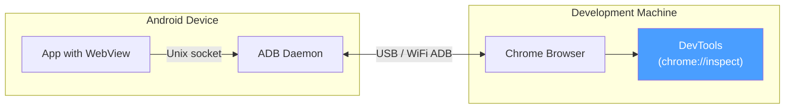

### 44.8.3 DevTools Capabilities

Once connected, the full Chrome DevTools suite is available:

| Panel | Capabilities |
|---|---|
| Elements | Inspect and modify the DOM and CSS |
| Console | Execute JavaScript, view console output |
| Sources | Set breakpoints, step through JavaScript |
| Network | Monitor all network requests/responses |
| Performance | Record and analyze rendering performance |
| Memory | Heap snapshots, allocation profiling |
| Application | Inspect cookies, local storage, IndexedDB |
| Security | View certificate details, mixed content |

### 44.8.4 Console Message Forwarding

Even without DevTools attached, JavaScript console messages can be captured via
`WebChromeClient.onConsoleMessage()`:

```java
webView.setWebChromeClient(new WebChromeClient() {
    @Override
    public boolean onConsoleMessage(ConsoleMessage consoleMessage) {
        Log.d("WebView", consoleMessage.message()
                + " -- From line " + consoleMessage.lineNumber()
                + " of " + consoleMessage.sourceId());
        return true; // Message handled
    }
});
```

`ConsoleMessage` includes:

- Message text
- Source file ID
- Line number
- Message level (DEBUG, ERROR, LOG, TIP, WARNING)

### 44.8.5 TracingController

For performance analysis, WebView provides a `TracingController` API that integrates
with Chromium's tracing infrastructure:

```
Source: frameworks/base/core/java/android/webkit/TracingController.java
```

```java
TracingController tracingController = TracingController.getInstance();

// Start tracing
tracingController.start(new TracingConfig.Builder()
        .addCategories(TracingConfig.CATEGORIES_WEB_DEVELOPER)
        .build());

// ... perform operations ...

// Stop and collect trace data
tracingController.stop(new FileOutputStream("trace.json"),
        Executors.newSingleThreadExecutor());
```

The trace output is in Chromium's JSON trace format, which can be loaded in:

- `chrome://tracing` in Chrome
- Perfetto UI (https://ui.perfetto.dev)
- Android Studio Profiler

`TracingConfig` supports multiple category presets:

- `CATEGORIES_NONE` -- no categories
- `CATEGORIES_ALL` -- all categories
- `CATEGORIES_ANDROID_WEBVIEW` -- WebView-specific categories
- `CATEGORIES_WEB_DEVELOPER` -- categories useful for web developers
- `CATEGORIES_INPUT_LATENCY` -- input event processing categories
- `CATEGORIES_RENDERING` -- rendering pipeline categories
- `CATEGORIES_JAVASCRIPT_AND_RENDERING` -- JS and rendering combined

The tracing system also integrates with Android's systrace via the `WebViewDelegate`:

```java
public boolean isTraceTagEnabled() {
    return Trace.isTagEnabled(Trace.TRACE_TAG_WEBVIEW);
}
```

### 44.8.6 Crash Diagnostics

When a renderer process crashes, the application receives information through
`RenderProcessGoneDetail`:

```
Source: frameworks/base/core/java/android/webkit/RenderProcessGoneDetail.java
```

```java
public abstract boolean didCrash();          // true = crash, false = killed by system
public abstract int rendererPriorityAtExit(); // Priority at time of exit
```

For testing crash handling, the special URL `chrome://crash` triggers an intentional
renderer crash.

---

## 44.9 Try It

This section provides hands-on exercises to explore WebView internals on a real device
or emulator.

### Exercise 55.1: Inspect the Active WebView Provider

Query the system to see which WebView provider is currently active:

```bash
# List all configured WebView providers
adb shell cmd webviewupdate list-providers

# Show the currently active provider
adb shell cmd webviewupdate get-current-provider

# Show detailed dump of WebView update service state
adb shell dumpsys webviewupdate
```

Expected output includes the provider package name, version code, and whether it was
chosen by default or user preference.

### Exercise 55.2: Switch WebView Provider

On devices with multiple providers (e.g., standalone WebView and Chrome):

```bash
# List available providers
adb shell cmd webviewupdate list-providers

# Switch to Chrome as WebView provider (if available)
adb shell cmd webviewupdate set-webview-implementation com.android.chrome

# Switch back to standalone WebView
adb shell cmd webviewupdate set-webview-implementation com.google.android.webview
```

You can also switch providers from Settings > Developer Options > WebView Implementation.

### Exercise 55.3: Observe the WebView Zygote

```bash
# Find the WebView Zygote process
adb shell ps -A | grep webview_zygote

# Look at the zygote's child processes (renderers)
adb shell ps -A | grep isolated

# Check the zygote's SELinux context
adb shell ps -AZ | grep webview_zygote
```

### Exercise 55.4: Monitor RELRO File Creation

```bash
# Watch for RELRO file changes
adb shell ls -la /data/misc/shared_relro/

# Trigger RELRO recreation by force-updating WebView
adb shell cmd webviewupdate set-webview-implementation com.google.android.webview

# Check RELRO files again
adb shell ls -la /data/misc/shared_relro/
```

### Exercise 55.5: Build a Minimal WebView App

Create a minimal application that exercises the key WebView APIs:

```java
public class WebViewExplorerActivity extends Activity {
    private WebView webView;

    @Override
    protected void onCreate(Bundle savedInstanceState) {
        super.onCreate(savedInstanceState);
        webView = new WebView(this);
        setContentView(webView);

        // Enable debugging
        WebView.setWebContentsDebuggingEnabled(true);

        // Configure settings
        WebSettings settings = webView.getSettings();
        settings.setJavaScriptEnabled(true);
        settings.setDomStorageEnabled(true);
        settings.setMixedContentMode(WebSettings.MIXED_CONTENT_NEVER_ALLOW);

        // Set up clients
        webView.setWebViewClient(new WebViewClient() {
            @Override
            public void onPageFinished(WebView view, String url) {
                Log.d("WebViewExplorer", "Page loaded: " + url);
            }

            @Override
            public boolean onRenderProcessGone(WebView view,
                    RenderProcessGoneDetail detail) {
                Log.e("WebViewExplorer", "Renderer gone! Crashed: "
                        + detail.didCrash());
                // Clean up and recreate
                webView.destroy();
                webView = new WebView(WebViewExplorerActivity.this);
                setContentView(webView);
                return true;
            }
        });

        webView.setWebChromeClient(new WebChromeClient() {
            @Override
            public void onProgressChanged(WebView view, int newProgress) {
                Log.d("WebViewExplorer", "Progress: " + newProgress + "%");
            }

            @Override
            public boolean onConsoleMessage(ConsoleMessage consoleMessage) {
                Log.d("WebViewJS", consoleMessage.message());
                return true;
            }
        });

        // Set up render process monitoring
        webView.setWebViewRenderProcessClient(new WebViewRenderProcessClient() {
            @Override
            public void onRenderProcessUnresponsive(
                    WebView view, WebViewRenderProcess renderer) {
                Log.w("WebViewExplorer", "Renderer unresponsive!");
            }

            @Override
            public void onRenderProcessResponsive(
                    WebView view, WebViewRenderProcess renderer) {
                Log.i("WebViewExplorer", "Renderer responsive again.");
            }
        });

        // Add a JavaScript interface
        webView.addJavascriptInterface(new Object() {
            @JavascriptInterface
            public String getDeviceInfo() {
                return Build.MODEL + " / Android " + Build.VERSION.RELEASE;
            }
        }, "AndroidBridge");

        // Load a page
        webView.loadUrl("https://example.com");
    }

    @Override
    protected void onPause() {
        super.onPause();
        webView.onPause();
    }

    @Override
    protected void onResume() {
        super.onResume();
        webView.onResume();
    }

    @Override
    protected void onDestroy() {
        webView.destroy();
        super.onDestroy();
    }
}
```

### Exercise 55.6: Remote Debugging with DevTools

1. Build and install the app from Exercise 55.5.

2. Open Chrome on your development machine and navigate to `chrome://inspect`.

3. The app's WebView should appear under "Remote Target".

4. Click "inspect" to open DevTools.

5. In the DevTools Console, try:
   ```javascript
   // Call the Java bridge
   AndroidBridge.getDeviceInfo()

   // Inspect the page
   document.title

   // Monitor network
   // (Switch to Network tab and reload the page)
   ```

### Exercise 55.7: Test Renderer Crash Handling

With the app from Exercise 55.5 running:

```bash
# Trigger a renderer crash
adb shell "echo 'javascript:void(0)' | am start -a android.intent.action.VIEW -d 'chrome://crash'"
```

Or, in the DevTools console:
```javascript
// This navigates to a special URL that crashes the renderer
location.href = "chrome://crash";
```

Observe the `onRenderProcessGone` callback firing in logcat:
```bash
adb logcat -s WebViewExplorer
```

### Exercise 55.8: Trace WebView Performance

```java
// In your app, add tracing:
TracingController tc = TracingController.getInstance();

// Start tracing
tc.start(new TracingConfig.Builder()
    .addCategories(TracingConfig.CATEGORIES_WEB_DEVELOPER)
    .setTracingMode(TracingConfig.RECORD_UNTIL_FULL)
    .build());

// Perform some WebView operations
webView.loadUrl("https://example.com");

// After a few seconds, stop and save
tc.stop(new FileOutputStream(
    getExternalFilesDir(null) + "/webview_trace.json"),
    Executors.newSingleThreadExecutor());
```

Then pull the trace file and load it in `chrome://tracing`:
```bash
adb pull /sdcard/Android/data/<your.package>/files/webview_trace.json
```

### Exercise 55.9: Examine WebView Memory Usage

```bash
# Find the WebView-using app's PID
adb shell pidof <your.package.name>

# Examine its memory map for the WebView library
adb shell cat /proc/<PID>/maps | grep webviewchromium

# Check for RELRO sharing
adb shell cat /proc/<PID>/maps | grep shared_relro

# Get a full memory report
adb shell dumpsys meminfo <your.package.name>
```

Look for the `libwebviewchromium.so` mapping and verify that the RELRO section is mapped
from the shared file (it should appear as a file-backed mapping to
`/data/misc/shared_relro/libwebviewchromium64.relro`).

### Exercise 55.10: Inspect WebView Provider Package

```bash
# Get the current provider package name
PROVIDER=$(adb shell cmd webviewupdate get-current-provider | \
    grep "Current" | awk '{print $NF}')

# Examine its APK details
adb shell dumpsys package $PROVIDER | head -50

# Check the WebViewLibrary metadata
adb shell dumpsys package $PROVIDER | grep -A5 "meta-data"

# List its native libraries
adb shell pm path $PROVIDER
# Then examine the APK
adb shell "unzip -l $(pm path $PROVIDER | sed 's/package://') | grep .so"
```

### Exercise 55.11: Monitor WebView IPC

Use `strace` to observe the system calls made during WebView initialization:

```bash
# Attach strace to the app process during WebView creation
# (requires root or debuggable app)
adb shell strace -f -e trace=openat,mmap,connect -p <PID> 2>&1 | \
    grep -E "(shared_relro|webviewchromium|zygote)"
```

This reveals the RELRO file mapping, native library loading, and zygote communication.

### Exercise 55.12: Intercept and Modify Web Requests

Build on Exercise 55.5 to intercept and modify resource requests:

```java
webView.setWebViewClient(new WebViewClient() {
    @Override
    public WebResourceResponse shouldInterceptRequest(WebView view,
            WebResourceRequest request) {
        String url = request.getUrl().toString();

        // Log all requests
        Log.d("Intercept", request.getMethod() + " " + url
                + " mainFrame=" + request.isForMainFrame()
                + " redirect=" + request.isRedirect());

        // Block requests to tracking domains
        if (url.contains("analytics.example.com")) {
            return new WebResourceResponse(
                "text/plain", "UTF-8",
                new ByteArrayInputStream(new byte[0]));
        }

        // Serve local assets for a specific path
        if (url.startsWith("https://myapp.local/assets/")) {
            String assetPath = url.replace("https://myapp.local/assets/", "");
            try {
                InputStream is = getAssets().open(assetPath);
                return new WebResourceResponse(
                    "text/html", "UTF-8", is);
            } catch (IOException e) {
                Log.e("Intercept", "Asset not found: " + assetPath);
            }
        }

        return null; // Let WebView handle normally
    }
});
```

Then load a page and observe the intercepted requests in logcat.

### Exercise 55.13: Web Messaging Channel

Demonstrate the HTML5 MessageChannel API:

```java
// In the Activity
WebMessagePort[] channel = webView.createWebMessageChannel();
WebMessagePort appPort = channel[0];
WebMessagePort pagePort = channel[1];

// Listen for messages from the web page
appPort.setWebMessageCallback(new WebMessagePort.WebMessageCallback() {
    @Override
    public void onMessage(WebMessagePort port, WebMessage message) {
        Log.d("WebMessage", "Received from page: " + message.getData());

        // Send a response back
        port.postMessage(new WebMessage("Response from Android!"));
    }
});

// Load a page and send the port to it
webView.loadDataWithBaseURL("https://example.com", """
    <html><body>
    <script>
    window.addEventListener('message', function(event) {
        // Receive the port
        var port = event.ports[0];
        port.onmessage = function(e) {
            document.body.innerHTML += '<p>From Android: ' + e.data + '</p>';
        };
        // Send a message to Android
        port.postMessage('Hello from JavaScript!');
    });
    </script>
    <p>Waiting for messages...</p>
    </body></html>
    """, "text/html", "UTF-8", null);

// Transfer the port to the page
webView.postMessageToMainFrame(
    new WebMessage("init", new WebMessagePort[]{pagePort}),
    Uri.parse("https://example.com"));
```

### Exercise 55.14: Investigate WebView Provider Internals

Explore the internal structure of the WebView provider APK:

```bash
# Find the provider APK path
PROVIDER_PKG=$(adb shell cmd webviewupdate get-current-provider 2>/dev/null | \
    grep "Current" | awk '{print $NF}')
APK_PATH=$(adb shell pm path $PROVIDER_PKG | head -1 | sed 's/package://')

echo "Provider: $PROVIDER_PKG"
echo "APK: $APK_PATH"

# Check the native library size
adb shell "unzip -l $APK_PATH 2>/dev/null | grep libwebviewchromium"

# Check the WebView library metadata
adb shell dumpsys package $PROVIDER_PKG | grep -A2 "com.android.webview.WebViewLibrary"

# Check the provider's declared permissions
adb shell dumpsys package $PROVIDER_PKG | grep "permission"

# Check the provider's version info
adb shell dumpsys package $PROVIDER_PKG | grep -E "(versionCode|versionName)"
```

### Exercise 55.15: Monitor Multi-Process WebView

Observe the multi-process nature of WebView during page loads:

```bash
# Start monitoring processes
adb shell "while true; do
    echo '--- $(date) ---'
    ps -A | grep -E '(webview|isolated|your.package)'
    sleep 2
done"
```

In a second terminal, launch your WebView app and load a page. You should observe:

1. The main app process appears immediately
2. An `isolated` process spawns when the renderer starts
3. The `webview_zygote` process may be visible as the parent of isolated processes

To see the process relationships:
```bash
# Show process tree including WebView processes
adb shell ps -A --format pid,ppid,name | grep -E "(webview|isolated|zygote)"
```

### Exercise 55.16: Cookie Inspection

Examine how cookies are managed across WebView instances:

```java
CookieManager cm = CookieManager.getInstance();

// Set a test cookie
cm.setCookie("https://httpbin.org", "test_key=test_value; Max-Age=3600");

// Load the page
webView.loadUrl("https://httpbin.org/cookies");

// After page loads, read cookies back
String cookies = cm.getCookie("https://httpbin.org");
Log.d("Cookies", "Stored cookies: " + cookies);

// Check if third-party cookies are accepted
boolean thirdParty = cm.acceptThirdPartyCookies(webView);
Log.d("Cookies", "Third-party cookies accepted: " + thirdParty);
```

The httpbin.org `/cookies` endpoint will show which cookies the browser sent, allowing
you to verify that cookies set via `CookieManager` are properly sent with requests.

### Exercise 55.17: Safe Browsing Testing

Test Safe Browsing integration with known test URLs:

```java
webView.setWebViewClient(new WebViewClient() {
    @Override
    public void onSafeBrowsingHit(WebView view, WebResourceRequest request,
            int threatType, SafeBrowsingResponse callback) {
        String threatName;
        switch (threatType) {
            case SAFE_BROWSING_THREAT_MALWARE:
                threatName = "MALWARE";
                break;
            case SAFE_BROWSING_THREAT_PHISHING:
                threatName = "PHISHING";
                break;
            case SAFE_BROWSING_THREAT_UNWANTED_SOFTWARE:
                threatName = "UNWANTED_SOFTWARE";
                break;
            default:
                threatName = "UNKNOWN (" + threatType + ")";
        }

        Log.w("SafeBrowsing", "Threat detected: " + threatName
                + " at " + request.getUrl());

        // Show the default interstitial
        callback.showInterstitial(true);
    }
});

// Google provides test URLs for Safe Browsing:
// https://testsafebrowsing.appspot.com/
webView.loadUrl("https://testsafebrowsing.appspot.com/");
```

---

## Summary

Android's WebView is a study in architectural layering: a thin framework proxy delegates
to an updatable Chromium-based provider that runs web content in sandboxed renderer
processes. The key components are:

- **WebViewFactory**: The coordinator that loads the provider, verifies signatures,
  manages RELRO sharing, and enforces security constraints
  (`frameworks/base/core/java/android/webkit/WebViewFactory.java`).

- **Provider abstraction**: `WebViewFactoryProvider`, `WebViewProvider`, and
  `WebViewDelegate` define the contract between framework and implementation
  (`frameworks/base/core/java/android/webkit/WebViewFactoryProvider.java`,
  `frameworks/base/core/java/android/webkit/WebViewProvider.java`,
  `frameworks/base/core/java/android/webkit/WebViewDelegate.java`).

- **Update mechanism**: `WebViewUpdateServiceImpl2` in system_server manages provider
  selection, RELRO preparation, and failover
  (`frameworks/base/services/core/java/com/android/server/webkit/WebViewUpdateServiceImpl2.java`).

- **WebView Zygote**: A specialized child zygote that pre-loads the provider APK for
  fast renderer process creation
  (`frameworks/base/core/java/android/webkit/WebViewZygote.java`).

- **API surface**: `WebView`, `WebSettings`, `WebViewClient`, `WebChromeClient`,
  `CookieManager`, and `@JavascriptInterface` provide the developer-facing API
  (all in `frameworks/base/core/java/android/webkit/`).

- **Security**: Multi-layered defenses including process sandboxing, privileged-process
  exclusion, signature verification, same-origin policy, Safe Browsing, and SSL/TLS
  enforcement protect both the device and the user.

The updatable nature of WebView -- independent of the platform OS version -- is one of
Android's most significant architectural decisions for security and web compatibility,
ensuring that web rendering stays current even on devices that no longer receive full
OS updates.
