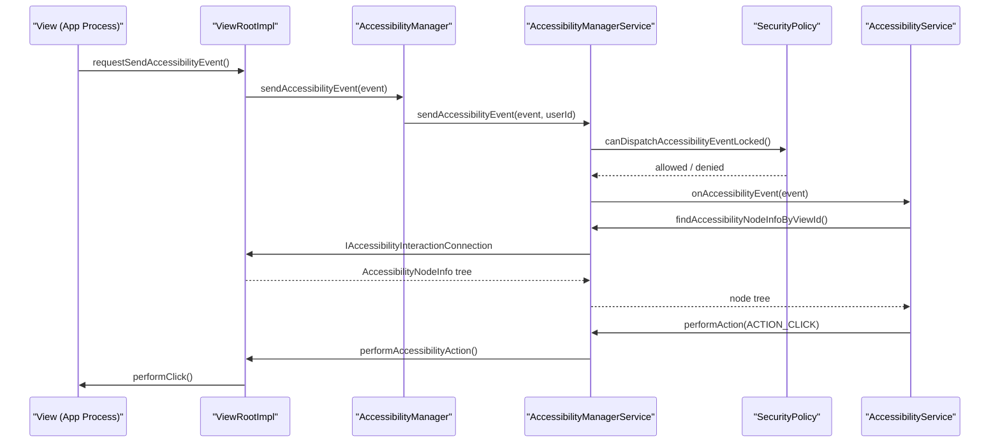
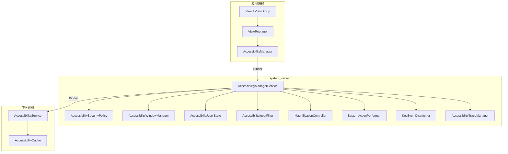

# 第 45 章：无障碍

> *“Web 的力量在于它的普适性。任何人都能访问，不论其是否存在障碍，这是 Web 的本质之一。”*
> -- Tim Berners-Lee

---

## 45.1 无障碍架构

Android 无障碍框架是平台里最复杂的系统之一。它让视障、肢体障碍、听障以及认知障碍用户可以操作几乎所有应用，即便应用开发者没有专门为此编写完整的辅助逻辑。整个架构围绕 3 个核心支柱展开：

- 事件观察
- 内容内省
- 动作注入

参与者主要分成 3 类：

1. 应用侧 `View` / `ViewGroup`，负责发出 `AccessibilityEvent` 并暴露 `AccessibilityNodeInfo` 树。
2. `AccessibilityManagerService`（AMS），位于 `system_server`，负责事件分发、服务绑定和安全策略。
3. `AccessibilityService`，例如 TalkBack、Switch Access、Voice Access，负责消费事件、遍历树并代表用户执行动作。

关键源码目录：

| 层 | 目录 |
|---|---|
| 公共 API | `frameworks/base/core/java/android/view/accessibility/` |
| 服务 API | `frameworks/base/core/java/android/accessibilityservice/` |
| 系统服务 | `frameworks/base/services/accessibility/java/com/android/server/accessibility/` |
| 放大镜相关 | `frameworks/base/services/accessibility/.../magnification/` |
| 手势相关 | `frameworks/base/services/accessibility/.../gestures/` |
| 设置项 | `packages/apps/Settings/src/com/android/settings/accessibility/` |

### 45.1.1 高层数据流

一个 View 状态变化到无障碍服务响应的大致路径如下：



### 45.1.2 三个核心类

无障碍框架里必须理解的 3 个类：

- `AccessibilityManagerService`
  路径：`frameworks/base/services/accessibility/java/com/android/server/accessibility/AccessibilityManagerService.java`
  运行于 `system_server`，实现 `IAccessibilityManager`，是整套系统的协调中枢。

- `AccessibilityService`
  路径：`frameworks/base/core/java/android/accessibilityservice/AccessibilityService.java`
  所有无障碍服务都继承它，通过 Binder 与 AMS 通信。

- `AccessibilityNodeInfo`
  路径：`frameworks/base/core/java/android/view/accessibility/AccessibilityNodeInfo.java`
  表示可跨进程传输的 UI 语义节点，是服务查看和操作界面的主要载体。

### 45.1.3 组件结构图



### 45.1.4 `AccessibilityNodeInfo` 细节

每个 `View` 都可以生成一份 `AccessibilityNodeInfo` 快照，供无障碍服务跨进程查看。它通常包含：

| 类别 | 例子 |
|---|---|
| 身份信息 | `viewIdResourceName`、`className`、`packageName` |
| 文本语义 | `text`、`contentDescription`、`hintText`、`tooltipText` |
| 状态 | `isChecked`、`isEnabled`、`isFocused`、`isSelected` |
| 几何信息 | `boundsInScreen`、`boundsInParent`、`boundsInWindow` |
| 树结构 | `parentNodeId`、`childNodeIds`、`labeledBy` |
| 可执行动作 | 标准与自定义 `AccessibilityAction` |
| 集合语义 | `CollectionInfo`、`CollectionItemInfo` |
| 范围语义 | `RangeInfo` |
| 扩展信息 | `extras` Bundle |

它的 nodeId 实际上把 viewId 和 virtual descendantId 打包成一个 `long`，从而支持 `AccessibilityNodeProvider` 为自定义 View 暴露虚拟子节点。

### 45.1.5 `AccessibilityNodeInfo` 动作

动作系统允许服务代表用户操作界面。常见标准动作包括：

- `ACTION_CLICK`
- `ACTION_LONG_CLICK`
- `ACTION_SCROLL_FORWARD`
- `ACTION_SCROLL_BACKWARD`
- `ACTION_SET_TEXT`
- `ACTION_FOCUS`

除此之外还支持带 label 的自定义动作，使服务能以统一方式呈现“展开”“收藏”“加入购物车”之类业务语义。

### 45.1.6 预取策略

现代 Android 为节点遍历提供了多种 prefetch flag，例如：

- 祖先预取
- 兄弟节点预取
- 后代节点深度优先 / 广度优先 / hybrid 预取

这些策略的目标，是在 Binder 调用次数和节点完整性之间做平衡，减少服务逐个查询节点时的高延迟。

## 45.2 AccessibilityManagerService

`AccessibilityManagerService` 是整个无障碍系统的心脏，位于 `system_server`。它在系统启动时注册为 `Context.ACCESSIBILITY_SERVICE`。

### 45.2.1 职责

AMS 的主要职责可以概括为：

1. 分发 `AccessibilityEvent`
2. 管理无障碍服务的绑定和生命周期
3. 维护每用户无障碍状态
4. 管理窗口与可见内容
5. 处理输入转换管线
6. 协调放大、快捷方式、系统动作等能力
7. 执行安全策略

### 45.2.2 核心内部组件

AMS 内部的重要协作者包括：

| 组件 | 作用 |
|---|---|
| `AccessibilitySecurityPolicy` | 权限与可见性控制 |
| `AccessibilityWindowManager` | 窗口跟踪与可访问窗口管理 |
| `AccessibilityUserState` | 每个用户的状态与已启用服务 |
| `AccessibilityInputFilter` | 输入流改写入口 |
| `MagnificationController` | 放大模式协调 |
| `SystemActionPerformer` | 触发系统级动作 |
| `KeyEventDispatcher` | 键盘事件分发 |
| `AccessibilityTraceManager` | tracing 与诊断 |
| `ProxyManager` | 多用户 / 可见后台用户代理能力 |

### 45.2.3 事件分发流水线

AMS 收到事件后通常会经历：

1. 基本校验
2. 安全策略过滤
3. 按用户和服务能力做匹配
4. 必要时节流或合并
5. 分发到已绑定服务

这不是简单广播。AMS 会基于服务声明的 eventTypes、packageNames、feedbackType 以及安全限制做严格筛选。

### 45.2.4 AMS 初始化

系统启动时，AMS 需要初始化：

- 用户状态
- Settings 观察者
- 输入过滤器
- 窗口追踪
- 快捷方式与系统动作能力

无障碍框架之所以复杂，部分原因就在于它要与 Settings、WindowManager、Input、SystemUI 等多条系统链路协同。

### 45.2.5 `LocalService` 接口

AMS 不仅对外提供 Binder API，也通过 `LocalService` 为 `system_server` 内部其他组件提供更轻量的服务访问入口，避免所有内部调用都走 Binder。

### 45.2.6 `WINDOW_STATE_CHANGED` 延迟投递

某些窗口状态变化事件会被短暂延迟，以避免窗口切换过程中的抖动、重复通知或不稳定中间态直接暴露给服务。这说明无障碍事件流本身也是经过“整形”的，而不是纯原始信号。

### 45.2.7 服务绑定

AMS 会根据设置中启用的服务列表去绑定 `AccessibilityService`。绑定流程通常包括：

1. 读取 XML metadata
2. 检查声明能力
3. 建立 Binder 连接
4. 初始化 service connection
5. 在用户关闭或服务失效时解绑

### 45.2.8 安全模型

无障碍服务能力很强，因此安全模型尤为严格：

- 服务需要显式启用
- 系统会给出高风险提示
- 某些敏感事件字段会被裁剪
- 并非所有窗口和节点都对所有服务可见
- 来源应用与当前用户边界必须被尊重

本质上，AMS 要在“让辅助技术足够强大”和“避免它变成通用监控与注入后门”之间做平衡。

### 45.2.9 锁与线程模型

AMS 使用统一锁保护内部状态，但同时又要和 Handler、Binder 回调、输入管线异步操作配合，因此它非常依赖明确的线程边界。理解这部分对排查死锁、卡顿和事件延迟很重要。

### 45.2.10 AMS Shell 命令

常用调试命令包括：

```bash
adb shell settings get secure enabled_accessibility_services
adb shell settings put secure enabled_accessibility_services \
    com.example/.MyAccessibilityService
adb shell settings get secure touch_exploration_enabled
adb shell dumpsys accessibility
```

这些命令分别可用于：

- 查看已启用服务
- 直接启用测试服务
- 检查触摸探索状态
- 导出 AMS 总体状态

### 45.2.11 闪光通知

AMS 还管理某些辅助提醒能力，例如闪光通知，它会与相机闪光灯、屏幕闪烁提醒以及用户设置协同工作。

### 45.2.12 `FingerprintGestureDispatcher`

某些设备支持通过指纹传感器手势触发无障碍行为，相关事件会通过该组件汇总并分发给服务。

### 45.2.13 `SystemActionPerformer`

无障碍服务可请求执行系统动作，例如返回、主页、最近任务、通知面板等。`SystemActionPerformer` 负责把这些抽象动作安全地映射到系统实际行为。

### 45.2.14 `AccessibilityTraceManager`

Tracing 能力对于定位 AMS 分发、节点查询、服务调用和输入转换的时序问题非常重要。`AccessibilityTraceManager` 就是这条诊断链路的核心。

### 45.2.15 多用户与可见后台用户

Android 近年的多用户支持更复杂，AMS 也必须处理“当前交互用户”和“可见后台用户”之间的边界问题，避免无障碍服务跨用户越权观察。

### 45.2.16 `ProxyManager`

`ProxyManager` 主要用于更复杂的多用户 / 代理场景，是 AMS 在现代多显示与多用户架构下新增的重要辅助组件。

### 45.2.17 输入法集成

无障碍与输入法并非完全独立。AMS 需要与 IME 协作，尤其在焦点变更、文本输入反馈、触摸探索和辅助输入场景下。

## 45.3 TalkBack 与屏幕阅读器

### 45.3.1 屏幕阅读器如何工作

TalkBack 这类屏幕阅读器的基本工作模式是：

1. 监听无障碍事件
2. 按需查询当前窗口节点树
3. 维护本地缓存
4. 基于焦点、遍历顺序与节点语义决定朗读内容
5. 在用户手势驱动下执行动作

它不是“直接读屏幕像素”，而是深度依赖应用暴露出的无障碍语义。

### 45.3.2 `AccessibilityService` 生命周期

服务一般经历：

- 启用
- 绑定
- `onServiceConnected()`
- 接收事件
- 被中断或解绑

服务配置能力强弱很大程度取决于它在 metadata 中声明了哪些 event、feedbackType 和 capability。

### 45.3.3 XML Metadata 配置

`AccessibilityService` 会通过 XML metadata 声明：

- 监听哪些 event type
- 提供哪种 feedback
- 是否可检索窗口内容
- 是否能执行手势
- 是否能过滤 key event

因此服务能力很大程度是声明式而非纯代码式。

### 45.3.4 窗口内容遍历

屏幕阅读器在窗口内容遍历时，既要尽量完整，又不能因为节点树太大造成高延迟，因此常结合预取策略和缓存来减少 Binder 成本。

### 45.3.5 `AccessibilityCache`

`AccessibilityCache` 是服务侧常用缓存，用于减少重复查询节点树带来的 IPC 开销。但缓存也意味着失效一致性问题，因此事件驱动更新很重要。

### 45.3.6 盲文显示支持

无障碍框架也支持盲文显示设备接入。其意义在于：Android 无障碍并不只面向语音输出，还覆盖更广泛的辅助设备生态。

## 45.4 Switch Access

### 45.4.1 工作原理

Switch Access 的核心思想是：用户不直接点按目标控件，而是通过少量开关输入逐步扫描屏幕上的可操作目标，再在合适时机触发选择。

### 45.4.2 实现架构

它通常依赖：

- `AccessibilityService`
- Accessibility overlay
- 节点扫描器
- 键盘 / 开关事件输入

### 45.4.3 `KeyEvent` 过滤

Switch Access 需要对某些按键或开关输入做过滤和重解释，这通常通过 AMS 输入过滤能力实现，而不是在应用层逐个处理。

### 45.4.4 无障碍 Overlay

扫描高亮和辅助提示通常通过 accessibility overlay 实现。它们要足够醒目，同时又不能错误干扰真实交互对象。

### 45.4.5 `AutoclickController`

自动点击功能允许在指针停留一段时间后自动触发点击，这对于某些运动障碍用户非常重要。

### 45.4.6 `MouseKeysInterceptor`

这一类组件负责把某些替代输入设备转为可被无障碍系统理解的交互信号。

## 45.5 放大功能

### 45.5.1 放大架构

Android 放大功能包含两种主要模式：

- 全屏放大
- 窗口放大

AMS 会通过 `MagnificationController` 协调这两种模式。

### 45.5.2 全屏放大

全屏放大会放大整个显示内容，适合需要整体放大的场景。

### 45.5.3 全屏放大手势

常见触发方式是三击或带停留的特定手势。手势检测需要和 Touch Exploration、普通点击等输入含义做细致区分。

### 45.5.4 窗口放大

窗口放大通过一个可移动放大窗显示局部放大区域，能减少对整屏布局的干扰。

### 45.5.5 `MagnificationController`

它负责：

- 模式切换
- 当前 scale / center 管理
- 与输入与窗口系统协作

### 45.5.6 缩放约束

放大不是无限制的。系统会对 scale 范围、最小值、最大值和步进做约束，保证操作性和性能。

### 45.5.7 键盘控制放大

无障碍不只围绕触摸，键盘也可控制放大模式，便于更多输入场景。

### 45.5.8 始终开启放大

Always-on magnification 使某些用户不需要反复通过手势开启放大。

### 45.5.9 与 WindowManager 集成

放大功能必须和 WindowManager 深度协作，否则无法正确处理窗口边界、坐标变换和显示区域变化。

### 45.5.10 光标跟随与输入焦点跟踪

在文本输入或焦点变更场景下，放大视图需要能跟随焦点与光标移动，否则用户容易“失去正在编辑的位置”。

### 45.5.11 缩略图

缩略图用于辅助用户理解当前放大区域相对于整屏的位置。

### 45.5.12 指针运动事件过滤

放大手势和普通指针移动共用输入流，因此需要额外过滤和解释逻辑。

### 45.5.13 震动反馈

在模式切换、阈值触发等关键节点加入触觉反馈，可以提升可理解性和可控性。

## 45.6 无障碍事件

### 45.6.1 事件类型

无障碍事件覆盖范围很广，例如：

- `TYPE_VIEW_CLICKED`
- `TYPE_VIEW_FOCUSED`
- `TYPE_VIEW_TEXT_CHANGED`
- `TYPE_WINDOW_STATE_CHANGED`
- `TYPE_WINDOW_CONTENT_CHANGED`
- `TYPE_ANNOUNCEMENT`

### 45.6.2 按类型携带的属性

不同事件类型会带不同字段，例如文本变更事件带 before/after text，窗口状态变化带窗口信息。服务不能假设所有事件字段都齐全。

### 45.6.3 事件在 View 系统中的产生

事件通常由 View 或 ViewRootImpl 发起，沿着 View 层级向上，到达 `AccessibilityManager` 后再发往 AMS。

### 45.6.4 通过 View 层级传播

和普通输入事件类似，部分无障碍事件也会经过父子层级协商和过滤，只不过最终目标是形成一份适合跨进程传输的辅助语义事件。

### 45.6.5 `WINDOW_STATE_CHANGED` 子类型

窗口状态变化并不只有一种来源。弹窗、Activity 切换、Pane 变化、对话框出现等都可能映射为这一大类事件，因此服务常需要结合上下文进一步判断。

### 45.6.6 节流与合并

为了避免频繁事件把系统淹没，AMS 和 View 层会对某些事件做 throttle / coalescing。

### 45.6.7 敏感事件数据

某些敏感数据不会原样透传给服务，尤其在密码、私密文本或安全相关界面中。

### 45.6.8 `AccessibilityRecord` 基类

许多事件属性来自 `AccessibilityRecord` 基类。理解它有助于把事件和节点快照区分开：事件是变化通知，节点是结构快照。

### 45.6.9 事件回收与对象池

事件对象会复用和回收，以减少 GC 压力。这意味着框架和服务都要注意生命周期，不应在错误时机继续持有旧对象。

### 45.6.10 分发时机

事件并不总是“状态一变化就立刻发出”。很多时候会受异步 UI 更新、窗口稳定性和系统队列调度影响。

### 45.6.11 事件类型字符串表示

调试时把 bitmask 事件类型转成人类可读字符串非常重要，因此框架提供了对应的字符串化能力。

## 45.7 Content Description 与语义

### 45.7.1 `contentDescription`、`text` 与 `labeledBy`

三者作用不同：

- `text`：控件本身显示给用户的文本
- `contentDescription`：辅助技术朗读的补充描述
- `labeledBy`：由其他控件提供标签语义

错误地把所有东西都塞进 `contentDescription`，会破坏真实语义层次。

### 45.7.2 `AccessibilityNodeInfo` 里的语义属性

节点还可承载 className、role-like 语义、可点击性、可编辑性、可滚动性等，这些共同决定了屏幕阅读器如何解释一个控件。

### 45.7.3 `stateDescription`

适合表达“开/关”“已连接”“剩余 20%”这类状态，而不是控件本体名称。

### 45.7.4 `roleDescription`

虽然不应滥用，但在某些自定义控件场景下可帮助服务更准确地理解角色。

### 45.7.5 集合与范围语义

列表、表格、网格、滑条、进度条都需要额外集合或范围语义，才能让服务准确表达“第几项”“当前值多少”。

### 45.7.6 自定义动作

自定义动作是复杂业务控件暴露交互能力的重要手段，可以避免服务只能猜测“点击后会发生什么”。

### 45.7.7 `AccessibilityNodeProvider` 与虚拟 View

对于自己绘制复杂内容的自定义 View，`AccessibilityNodeProvider` 允许其向无障碍系统暴露一棵虚拟节点树，否则辅助技术只能看到一个大而不可分的 View。

### 45.7.8 遍历顺序

遍历顺序直接影响 TalkBack 用户体验。可视顺序、焦点顺序与语义顺序不一致时，会让界面非常难用。

### 45.7.9 `importantForAccessibility`

它控制某个 View 是否应被纳入无障碍树。装饰性元素通常应被排除，而真正可交互元素必须暴露。

### 45.7.10 Live Region

Live Region 允许动态内容在变化时主动通知辅助技术，而不依赖用户再次聚焦。

### 45.7.11 标题导航

Heading 语义有助于屏幕阅读器用户在复杂页面中按标题级别跳转。

### 45.7.12 Pane Title

Pane title 能帮助服务理解“当前进入了哪个逻辑区域”，尤其在多 pane 布局中很重要。

### 45.7.13 `ExtraRenderingInfo`

这是更细粒度的渲染补充信息接口，适用于高级语义或特殊渲染场景。

## 45.8 触摸探索

### 45.8.1 `TouchExplorer`

`TouchExplorer` 是触摸探索模式的核心类。它会把普通触摸流改写成：

- hover 探索
- 辅助焦点移动
- 双击激活

### 45.8.2 触摸状态机

Touch Exploration 不是简单替换手势，而是维护一套内部状态机，用来区分：

- 单指探索
- 双击
- 拖动
- 边缘滑动
- 手势识别中

### 45.8.3 如何转换事件

触摸探索本质上是对输入流的重解释。用户手指划过屏幕时，不再直接产生应用点击，而先转成 hover 与焦点事件；确认激活时再注入点击。

### 45.8.4 Hover 事件与无障碍焦点

Hover 是触摸探索的关键桥梁。它允许用户“摸到”控件并听到朗读，而不是一接触就触发真实点击。

### 45.8.5 `EventStreamTransformation` 管线

无障碍输入处理通过 `EventStreamTransformation` 链式组织。不同转换器可以按顺序改写同一输入流。

### 45.8.6 手势检测

TouchExplorer 需要识别双击、双击并保持、特定滑动等无障碍手势，因此内部手势检测远比普通点击手势复杂。

### 45.8.7 边缘滑动

边缘滑动常被用作特殊导航手势，因此需要与普通探索和系统导航谨慎区分。

### 45.8.8 拖动

拖动场景对触摸探索很特殊，因为无障碍用户也需要完成真实拖动，而不是所有手势都被解释为语义浏览。

### 45.8.9 延迟发送 Hover Enter / Move 模式

`SendHoverEnterAndMoveDelayed` 这类模式用于平衡误触与反馈时机，是触摸探索内部很典型的稳定性技巧。

### 45.8.10 触摸探索过程中的无障碍事件

在探索过程中会产生 hover、焦点、内容变化等多种事件，服务依赖这些事件把“当前摸到哪里了”讲给用户听。

### 45.8.11 手势检测超时

超时是状态机的重要组成部分，用来决定当前输入究竟应被解释为探索、双击还是别的手势。

### 45.8.12 `ReceivedPointerTracker`

它负责跟踪当前收到的 pointer 状态，是输入解释的基础辅助结构。

### 45.8.13 多显示支持

多显示场景下，Touch Exploration 需要正确处理 displayId、坐标和焦点，不然会出现手势作用到错误屏幕的严重问题。

## 45.9 无障碍快捷方式

### 45.9.1 快捷方式类型

Android 支持多种快捷方式入口：

- 音量键硬件快捷方式
- 导航栏无障碍按钮
- 浮动菜单
- 快速设置 tile
- 键盘快捷手势

### 45.9.2 硬件快捷方式

典型就是音量键长按组合，用于快速启停某个无障碍功能或服务。

### 45.9.3 软件快捷方式

最常见的是无障碍按钮与浮动入口，适合触屏用户快速切换功能。

### 45.9.4 Framework 功能快捷方式

不仅是第三方服务，很多系统无障碍功能本身也能成为快捷方式目标，例如放大、颜色反转等。

### 45.9.5 Quick Settings Tile

QS tile 为某些无障碍能力提供了统一、可见的快速入口。

### 45.9.6 键盘手势快捷方式

为使用外接键盘的用户提供高效切换路径，尤其适合生产力设备。

### 45.9.7 快捷方式配置与持久化

快捷方式目标与模式最终都会落到 `Settings.Secure` 中保存，因此系统重启后仍能恢复。

### 45.9.8 快捷方式激活流

激活流通常包括：

1. 识别用户输入
2. 查找当前配置的目标
3. 执行确认逻辑
4. 启停对应功能或服务

### 45.9.9 无障碍按钮选择器

当系统支持多个快捷方式目标时，会出现 chooser，让用户选择当前按钮要控制哪项能力。

### 45.9.10 快捷方式状态日志

AMS 会记录快捷方式启停和切换的状态，便于问题诊断和行为统计。

### 45.9.11 助听设备集成

某些无障碍快捷方式和助听设备场景存在联动，体现了无障碍框架并不只面向视觉辅助。

## 45.10 动手实践

### 45.10.1 查看无障碍树

```bash
adb shell uiautomator dump
adb pull /sdcard/window_dump.xml
adb shell cmd accessibility dump
```

适合先快速理解当前前台窗口暴露了哪些节点和语义。

### 45.10.2 编写最小 `AccessibilityService`

最小服务通常需要：

1. 一个继承 `AccessibilityService` 的类
2. manifest 中声明 service
3. 一份 accessibility-service XML metadata
4. 实现 `onAccessibilityEvent()` 与 `onInterrupt()`

这是理解服务绑定、事件订阅和节点查询的最直接入口。

### 45.10.3 观察 Touch Exploration 状态变化

```bash
adb shell setprop log.tag.TouchExplorer DEBUG
adb logcat -s TouchExplorer TouchState GestureManifold
```

启用后可以观察不同手势如何在内部状态机中流转。

### 45.10.4 测试放大手势

手动开启放大后，重点观察：

- 三击触发
- 拖动放大区域
- 与触摸探索共存时的行为

### 45.10.5 审计 `contentDescription`

```bash
adb shell uiautomator dump
adb pull /sdcard/window_dump.xml
```

导出当前树后重点检查：

- 可点击控件是否缺少标签
- 图片是否缺少描述
- 装饰性元素是否错误暴露

### 45.10.6 监控 AMS 事件分发

```bash
adb shell cmd accessibility tracing start
adb shell dumpsys accessibility
adb shell cmd accessibility tracing stop
```

适合把事件分发、节点请求和服务交互串起来看。

### 45.10.7 实现一个类似 Switch Access 的扫描器

最小实验可以先做：

- 轮询可聚焦节点
- 叠加一个高亮 overlay
- 通过键盘或开关输入切换焦点
- 选中后执行 `performAction(ACTION_CLICK)`

### 45.10.8 端到端跟踪一个 `AccessibilityEvent`

从某个具体操作开始，例如点击按钮或切换页面，然后顺着：

1. 应用发出事件
2. AMS 接收与过滤
3. 服务收到事件
4. 服务查询节点

完整走一遍，这比只看类图更能建立直觉。

### 45.10.9 查看放大内部状态

```bash
adb shell settings get secure accessibility_display_magnification_enabled
adb shell settings put secure accessibility_display_magnification_enabled 1
adb shell settings put secure accessibility_display_magnification_scale 2.0
adb shell settings get secure accessibility_magnification_mode
adb shell dumpsys accessibility | grep -i magnification
```

可用于检查 scale、mode 和 AMS 内部状态是否一致。

### 45.10.10 构建一个无障碍审计工具

可用 BFS 遍历当前节点树，统计：

- 可点击但无标签节点
- 缺少图片描述
- 小于 48dp 的可点击区域
- 缺少集合语义的列表

这是把平台能力转成实际开发质量工具的很好练习。

### 45.10.11 研究无障碍 Settings 数据库

无障碍配置主要存放在 `Settings.Secure`：

```bash
adb shell settings list secure | grep -i access
adb shell settings get secure enabled_accessibility_services
adb shell settings get secure touch_exploration_enabled
adb shell settings get secure accessibility_display_magnification_enabled
adb shell settings get secure accessibility_display_magnification_scale
adb shell settings get secure accessibility_magnification_mode
adb shell settings get secure accessibility_button_targets
adb shell settings get secure accessibility_shortcut_target_service
adb shell settings get secure accessibility_button_mode
adb shell settings get secure high_text_contrast_enabled
adb shell settings get secure accessibility_captioning_enabled
```

直接改这些值非常适合做自动化测试。

### 45.10.12 使用 `UiAutomation` 做测试

`UiAutomation` 为 instrumentation 测试提供了一条特殊入口，让测试代码能像无障碍服务一样查看节点树、执行动作和等待事件。

### 45.10.13 观察 `EventStreamTransformation` 管线

可以通过不同配置建立心智模型：

```text
仅 Touch Exploration:
InputFilter -> TouchExplorer -> output

仅 Magnification:
InputFilter -> MagnificationGestureHandler -> output

两者同时启用:
InputFilter -> MagnificationGestureHandler -> TouchExplorer -> output

再加 Autoclick:
InputFilter -> MagnificationGestureHandler -> TouchExplorer -> AutoclickController -> output
```

顺序不同，最终手势解释就完全不同。

### 45.10.14 性能剖析

```bash
adb shell am profile start <package> /sdcard/a11y-trace.trace
adb shell am profile stop <package>
adb pull /sdcard/a11y-trace.trace
```

重点查看：

- `onInitializeAccessibilityNodeInfo()` 耗时
- `sendAccessibilityEvent()` 开销
- Binder 节点查询成本
- 深层 View 树带来的遍历压力

## Summary

Android 无障碍框架展示了 AOSP 很典型的一种优雅设计：以 `AccessibilityManagerService` 为中心，由系统服务在应用和辅助技术之间做集中协调，再通过丰富的事件协议、节点树协议和输入转换管线，让平台功能与第三方服务都能在统一边界内协作。

本章的关键点可以归纳为：

- `AccessibilityManagerService` 是整套框架的协调中心，负责事件分发、服务绑定、安全策略、窗口管理、输入过滤和放大控制。
- `AccessibilityEvent` 提供被动观察能力，`AccessibilityNodeInfo` 提供跨进程内容内省能力，`performAction()` 提供动作注入能力，这三者构成无障碍的最小闭环。
- Touch Exploration、Magnification、Switch Access 等能力本质上都建立在输入流转换和语义节点树之上。
- `AccessibilityNodeProvider`、集合语义、Live Region、Pane Title 等 API 决定了应用是否真正具备可读、可导航、可操作的语义结构。
- 安全模型必须在“让服务足够强大”和“防止其变成通用监控 / 注入通道”之间保持平衡。
- `Settings.Secure`、shell 命令、tracing 和 `UiAutomation` 为调试和自动化测试提供了非常直接的入口。

### 关键源码路径

| 文件 | 作用 |
|---|---|
| `frameworks/base/services/accessibility/.../AccessibilityManagerService.java` | 中央系统服务 |
| `frameworks/base/core/.../accessibility/AccessibilityEvent.java` | 事件定义 |
| `frameworks/base/core/.../accessibility/AccessibilityNodeInfo.java` | 节点语义数据结构 |
| `frameworks/base/core/.../accessibility/AccessibilityManager.java` | 客户端管理器 |
| `frameworks/base/core/.../accessibilityservice/AccessibilityService.java` | 服务基类 |
| `frameworks/base/services/accessibility/.../AccessibilitySecurityPolicy.java` | 安全策略 |
| `frameworks/base/services/accessibility/.../AccessibilityServiceConnection.java` | 服务绑定 |
| `frameworks/base/services/accessibility/.../AbstractAccessibilityServiceConnection.java` | 连接基类 |
| `frameworks/base/services/accessibility/.../AccessibilityWindowManager.java` | 窗口追踪 |
| `frameworks/base/services/accessibility/.../AccessibilityUserState.java` | 每用户状态 |
| `frameworks/base/services/accessibility/.../AccessibilityInputFilter.java` | 输入管线入口 |
| `frameworks/base/services/accessibility/.../KeyEventDispatcher.java` | 键盘事件路由 |
| `frameworks/base/services/accessibility/.../gestures/TouchExplorer.java` | 触摸探索 |
| `frameworks/base/services/accessibility/.../gestures/TouchState.java` | 触摸状态跟踪 |
| `frameworks/base/services/accessibility/.../gestures/GestureManifold.java` | 手势检测 |
| `frameworks/base/services/accessibility/.../magnification/MagnificationController.java` | 放大协调 |
| `frameworks/base/services/accessibility/.../magnification/FullScreenMagnificationController.java` | 全屏放大 |
| `frameworks/base/services/accessibility/.../magnification/FullScreenMagnificationGestureHandler.java` | 放大手势 |
| `frameworks/base/services/accessibility/.../magnification/WindowMagnificationGestureHandler.java` | 窗口放大 |
| `frameworks/base/services/accessibility/.../magnification/MagnificationKeyHandler.java` | 键盘放大控制 |
| `frameworks/base/services/accessibility/.../autoclick/AutoclickController.java` | 自动点击 |
| `frameworks/base/core/.../internal/accessibility/AccessibilityShortcutController.java` | 快捷方式管理 |
| `frameworks/base/services/accessibility/.../EventStreamTransformation.java` | 输入转换接口 |
| `frameworks/base/services/accessibility/.../SystemActionPerformer.java` | 系统动作执行 |
| `frameworks/base/services/accessibility/.../BrailleDisplayConnection.java` | 盲文显示支持 |
