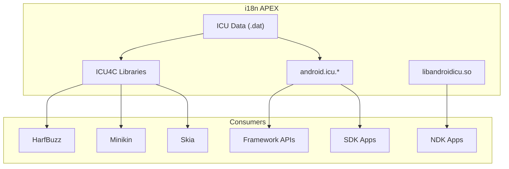

# 第 46 章：国际化

> *“我语言的边界，就是我世界的边界。”*
> -- 路德维希·维特根斯坦

---

Android 运行在全球几乎所有国家和地区的数十亿台设备上。用户会阅读阿拉伯文、中文、天城文、泰文、韩文以及数百种其他文字系统；他们期待日期、数字、货币和排序都符合本地习惯；也会在同一会话中切换多种语言。要在不要求每个应用开发者都成为 Unicode 专家的前提下，把这些事情做对、做快、做稳定，是 Android 平台最具技术挑战的基础能力之一。

本章从 ICU 及其数据文件开始，向上梳理 locale 管理、资源限定符、RTL、文本渲染管线以及字体系统，说明 Android 如何把国际化做成一条完整的系统能力链。

## 46.1 AOSP 中的 ICU

ICU（International Components for Unicode）是 Android 国际化的根基。字符属性、归一化、排序、断句、日期时间格式化、数字格式化、音译等几乎都建立在 ICU 之上。

### 46.1.1 源码布局

ICU 在 AOSP 中主要位于 `external/icu/`，结构大致如下：

```text
external/icu/
    icu4c/
      source/
        common/
        i18n/
        data/
    icu4j/
    android_icu4j/
      src/main/java/android/icu/
    android_icu4c/
    libandroidicu/
    build/
    tools/
```

其中：

- `icu4c/`：C/C++ 实现
- `android_icu4j/`：Android 裁剪和集成后的 Java 实现
- `libandroidicu/`：面向 NDK 的稳定接口层

### 46.1.2 双实现：ICU4C 与 ICU4J

Android 同时携带 ICU4C 和 ICU4J：

| 库 | 语言 | 典型消费者 |
|---|---|---|
| `libicuuc.so` / `libicui18n.so` | C/C++ | Minikin、HarfBuzz、Skia、native 服务 |
| `android.icu.*` | Java | framework 与 SDK 应用 |
| `libandroidicu.so` | C | NDK 应用 |

这意味着 Java 层格式化 API 和 native 文本布局其实都站在同一套 Unicode 规则之上，只是接入层不同。

### 46.1.3 ICU 数据

ICU 的行为高度依赖数据文件，里面保存了：

- locale 规则
- 字符属性表
- 断句规则
- 排序 tailoring
- 格式化模式

这些数据会在构建时编译成 `.dat` 文件，并安装到 i18n APEX 中。自 Android 10 起，ICU 通过 `com.android.i18n` APEX 模块交付，从而可以独立于整机 OTA 更新。

下图概括 i18n APEX 与各层消费者的关系：



### 46.1.4 Unicode 字符属性

最基础的 ICU 服务之一就是字符属性查询。给定一个 code point，ICU 可以回答：

- 它属于哪一类字符
- 它的 bidirectional class 是什么
- 它属于哪个 script
- 是否是 emoji

典型 C API 位于 `uchar.h` / `uscript.h`，Java 对应是 `android.icu.lang.UCharacter`。

这些查询虽然看起来基础，却处于文本渲染关键路径上。例如一段阿拉伯文和拉丁文混排文本，在 bidi 分析和 shaping 阶段会进行大量属性查表，因此 ICU 的 trie 结构和 O(1) 查找非常关键。

### 46.1.5 文本归一化

Unicode 允许视觉相同的文本存在多种编码形式。归一化就是把这些不同编码收束成统一表示，以便比较和处理。

常见 4 种归一化形式：

| 形式 | 说明 |
|---|---|
| NFC | 规范分解后再组合，最常见 |
| NFD | 规范分解 |
| NFKC | 兼容分解后再组合 |
| NFKD | 兼容分解 |

在 Android 文本系统里，归一化不只用于字符串比较，也会影响字体回退和复杂文本处理。

### 46.1.6 排序（Collation）

排序绝不是简单按 Unicode 编码值比较。德语、瑞典语、日语等在本地排序规则上都有明显差异。ICU 的 collation 引擎会根据 locale 应用不同 tailoring，从而让“本地用户认同的排序顺序”成为默认行为。

### 46.1.7 Break Iteration

断字、断词、断句和断行同样是国际化核心能力，尤其对没有空格分词的语言如泰语、老挝语、缅甸语、中文和日文尤为重要。

ICU 提供多种 `BreakIterator`：

- word
- line
- sentence
- grapheme cluster

Android 的文本布局和选择逻辑高度依赖这些能力。

### 46.1.8 日期、时间与数字格式化

日期、时间、数字和货币格式化也是 ICU 的重要职责。Android 框架和应用层常见格式化 API 的底层几乎都要落到这里。

### 46.1.9 ICU 版本管理

Android 需要同时考虑：

- ICU 上游升级
- 平台兼容性
- i18n APEX 可更新
- Java 与 native 两套实现同步

因此 ICU 升级不是简单替换代码，而是一项涉及数据、API、ABI 和兼容性的大工程。

## 46.2 Locale 管理

### 46.2.1 `LocaleList`：有序 Locale 偏好

Android 不再只假设用户只有一个 locale，而是用 `LocaleList` 表示一串按优先级排序的 locale 偏好。例如用户可能首选中文、其次英文、再其次日文。

这使系统和应用在资源、格式化和文本行为上能更合理地回退。

### 46.2.2 系统 Locale 与应用 Locale

现代 Android 同时支持：

- 系统级 locale
- 应用级 locale（per-app locales）

这意味着同一设备上，用户可以把系统保留为中文，而某个特定应用单独运行在英文或日文环境中。

### 46.2.3 `LocaleManager` 与 `LocaleManagerService`

per-app locale 依赖 framework API 与 system_server 中的 `LocaleManagerService` 协同工作。后者负责：

- 保存应用级 locale 偏好
- 做权限与状态管理
- 在配置更新时把 locale 正确传播给目标应用

### 46.2.4 Locale 解析算法

locale 解析不是“完全匹配才算命中”。系统会考虑：

- 语言
- script
- region
- fallback 关系

例如 `zh-Hans-CN` 和 `zh-CN` 的匹配，不能粗暴按字符串比较处理。

### 46.2.5 Configuration 传播

Locale 改变后，最终要通过 `Configuration` 传播到进程和资源系统，触发资源重选、界面重建和格式化行为刷新。

### 46.2.6 BCP-47 语言标签

Android 使用 BCP-47 语言标签来表达 locale，例如：

- `en-US`
- `zh-Hans-CN`
- `ar-EG`

这也是 locale 在 framework、设置、资源限定符和 ICU 之间统一表达的基础。

### 46.2.7 Locale 变化广播

系统 locale 变化后会发送相应广播，使应用和系统组件有机会更新缓存、界面和行为。

## 46.3 资源限定符

### 46.3.1 限定符目录命名

Android 通过资源目录限定符表达 locale 相关资源，例如：

- `values-zh/`
- `values-zh-rCN/`
- `layout-ldrtl/`

命名规则本身就是资源系统语义的一部分。

### 46.3.2 限定符优先级

资源选择算法并不只看 locale，还会综合 density、night mode、layout direction、screen size 等限定符，并按严格优先级裁剪候选。

### 46.3.3 资源解析算法

`ResourcesImpl` 会基于当前 `Configuration` 执行资源匹配与淘汰。国际化问题里，很多“为什么没有命中我以为会命中的字符串资源”最终都要回到这套算法看。

### 46.3.4 字符串资源与复数

复数规则强依赖 locale。英语只有 one/other，而阿拉伯语、俄语等会有更复杂的类别。因此 Android 的 `<plurals>` 背后本质上依赖 ICU plural rules。

### 46.3.5 翻译工作流

资源国际化不只是运行时问题，还依赖构建与翻译工作流，包括：

- 源字符串管理
- 翻译导出导入
- 缺失翻译回退
- 新增 locale 资源验证

### 46.3.6 用于测试的伪 Locale

Android 提供 pseudo-locales，例如：

- `en-XA`
- `ar-XB`

它们用于测试：

- 文本膨胀
- RTL
- 本地化遗漏

这在国际化质量保证里非常重要。

## 46.4 RTL 支持

### 46.4.1 布局方向

RTL 支持首先是 layout direction 问题，而不是简单把文本从右往左画出来。整个 View 层级都需要知道当前是 LTR 还是 RTL。

### 46.4.2 `start` / `end` 与 `left` / `right`

国际化布局里必须优先使用 `start` / `end`，而不是写死 `left` / `right`。否则一旦切换到 RTL，布局就会出现方向错误。

### 46.4.3 View 布局方向解析

View 会根据父级方向、显式属性和 locale 规则解析自己的 layout direction。

### 46.4.4 双向文本（Bidi）

阿拉伯文与英文、数字混排时，文本方向问题会非常复杂。Android 依赖 Unicode Bidirectional Algorithm 处理这些情况。

### 46.4.5 RTL 镜像

很多图标和布局元素在 RTL 下需要镜像，而不仅仅是文字方向反转。例如箭头、返回图标和某些动画方向都需要调整。

### 46.4.6 具备 RTL 感知的布局容器

常见布局容器本身也要支持 RTL 感知，否则 `start` / `end` 语义无法真正生效。

### 46.4.7 `TextDirection` 与 `TextAlignment`

文本方向和文本对齐是两个不同维度。一个控件可以使用 `firstStrong` 推断方向，同时用 `viewStart` 控制对齐策略。

## 46.5 文本渲染管线

### 46.5.1 总览

从 Unicode 字符串到屏幕像素，Android 文本渲染大致要经过：

1. BiDi 分析
2. script itemization
3. font itemization
4. shaping
5. glyph positioning
6. line breaking / hyphenation
7. rasterization

### 46.5.2 第一步：BiDi 分析

首先根据 Unicode bidi 属性把文本分成方向一致的 runs。

### 46.5.3 第二步：Script Itemization

不同 script 往往需要不同 shaping 规则，因此要先把文本按 script 分段。

### 46.5.4 第三步：字体项划分（Minikin）

Minikin 会决定每段文本使用哪个字体族和 fallback 链。

### 46.5.5 第四步：文本整形（HarfBuzz）

HarfBuzz 根据 script、字体和 OpenType 特性把 code points 转成 glyph 序列，这是复杂脚本正确显示的关键步骤。

### 46.5.6 整形示例：阿拉伯文

阿拉伯文中同一个字符在不同上下文会呈现不同字形。没有 shaping，就无法正确连接和显示。

### 46.5.7 第五步：字形定位与布局

完成 shaping 后，还要决定每个 glyph 的精确位置、advance 和聚合方式。

### 46.5.8 断行

断行并非简单按空格切开。CJK、东南亚脚本和混排文本都要求复杂断行逻辑。

### 46.5.9 连字符

Hyphenation 会影响断行质量和段落密度，是高质量排版的一部分。

### 46.5.10 光栅化：FreeType 与 Skia

最后由 FreeType 和 Skia 完成字形轮廓栅格化与绘制。

### 46.5.11 Emoji 渲染

Emoji 本身又是一个特殊子系统，牵涉 Unicode 序列、字体支持和彩色字形渲染。

## 46.6 字体系统

### 46.6.1 系统字体配置

Android 的系统字体配置主要通过 `fonts.xml` 及相关数据目录定义。

### 46.6.2 字体家族架构

字体系统围绕 family 展开，而不是一一硬编码到 API 名称里。

### 46.6.3 Fallback 链

单一字体通常无法覆盖全球所有字符，因此 fallback 链决定了缺字时最终落到哪个字体。

### 46.6.4 Variable Fonts

可变字体允许同一字体文件中承载多个轴（weight、width 等），有助于减小体积并提高表达能力。

### 46.6.5 `Typeface` API

`Typeface` 是应用侧直接接触字体系统的主入口。

### 46.6.6 字体提供者与可下载字体

Downloadable Fonts 让应用不必把所有字体都打包进 APK，而可按需请求字体。

### 46.6.7 系统字体发现

系统需要扫描和构建字体配置，使 Minikin 等组件能快速做 family 和 fallback 查询。

### 46.6.8 CJK 字体处理

CJK 由于字库规模巨大、Han 统一和区域偏好问题，在字体系统中一直是最复杂的一类场景。

### 46.6.9 字体文件格式

Android 字体系统通常涉及：

- TTF
- OTF
- TTC
- variable font 相关格式

## 46.7 动手实践

### 46.7.1 检查设备上的 ICU 数据

```bash
adb shell pm path com.android.i18n
adb shell ls /apex/com.android.i18n/etc/icu/
adb shell getprop | grep -i icu
```

前两条命令可确认 i18n APEX 和 ICU 数据文件位置，最后一条适合辅助查看版本和相关系统属性。

### 46.7.2 研究 Locale 设置

```bash
adb shell cmd locale list
adb shell settings get system system_locales
adb shell cmd locale set-app-locales your.package.name en-US
adb shell cmd locale get-app-locales your.package.name
```

这组命令可用于观察系统 locale 和 per-app locale 的区别。

### 46.7.3 启用伪 Locale

启用 `en-XA` 和 `ar-XB` 后，重点测试：

- 文本是否被充分拉长
- 是否存在硬编码英文
- RTL 是否正确

### 46.7.4 构建一个多 Locale 应用

最小实验应至少包含：

- 多套 `values-*` 资源
- 一组 `<plurals>`
- 一组带日期或数字格式化的 UI
- 能在系统 locale 切换时正确刷新

### 46.7.5 用 Layout Inspector 观察文本渲染

打开一个包含混合方向文本的 `TextView`，观察：

- text direction
- alignment
- 当前 `Configuration`
- locale 与 layout direction

### 46.7.6 研究系统字体

```bash
adb shell ls /system/fonts/
adb shell cat /system/etc/fonts.xml | head -50
adb shell cmd font list-families
adb shell ls -la /system/fonts/NotoSansCJK*
```

这些命令分别适合查看字体文件、字体配置、family 列表和 CJK 字体情况。

### 46.7.7 测试 RTL 布局

测试时至少做 4 件事：

1. 用默认 LTR locale 跑一遍
2. 切到阿拉伯语或希伯来语
3. 打开开发者选项中的 Force RTL
4. 使用 `ar-XB` pseudo-locale

### 46.7.8 直接使用 ICU4J

适合做的小实验包括：

- 用 `BreakIterator` 对泰文分词
- 用 `Collator` 做本地化排序
- 用 `Normalizer2` 测试 NFC / NFD

这能帮助直接感知 ICU 行为，而不是只看 framework 包装 API。

### 46.7.9 跟踪文本渲染管线

```bash
adb shell perfetto -c - --txt -o /data/misc/perfetto-traces/trace.pftrace <<EOF
buffers: { size_kb: 63488 fill_policy: DISCARD }
data_sources: {
  config {
    name: "linux.ftrace"
    ftrace_config {
      ftrace_events: "sched/sched_switch"
      atrace_categories: "view"
      atrace_categories: "gfx"
    }
  }
}
duration_ms: 10000
EOF
adb pull /data/misc/perfetto-traces/trace.pftrace .
```

重点关注 `TextView.onMeasure`、`StaticLayout.generate` 和 `drawTextBlob` 等切片。

### 46.7.10 构建自定义字体配置

对设备厂商来说，可以通过覆盖 `fonts.xml` 和复制字体文件来定制系统字体栈。例如在产品配置里加入自定义 sans-serif family，并把字体拷贝到 `system/fonts/`。

## Summary

Android 国际化体系的核心，在于把 Unicode 规则、locale 偏好、资源选择、布局方向、文本 shaping 和字体回退串成了一条完整的系统级管线。应用开发者表面上只是在调用 `DateFormat`、写 `values-zh/strings.xml` 或给 `TextView` 设置文本，但底层已经经过 ICU、Configuration、Resources、Minikin、HarfBuzz、FreeType 和 Skia 的多层协同。

本章的关键点可以归纳为：

- ICU 是 Android 国际化的根基，字符属性、归一化、排序、断句、格式化几乎都依赖它。
- locale 管理已经从“一个系统语言”演进到 `LocaleList` + per-app locale 的多层模型。
- 资源限定符和 `ResourcesImpl` 决定了 locale 资源最终如何命中。
- RTL 支持不只是文本方向，还要求布局、图标、对齐和 bidirectional text 一起正确处理。
- 文本渲染是一条深管线：BiDi 分析、script 分段、字体选择、HarfBuzz shaping、glyph 定位、断行、栅格化缺一不可。
- 字体系统通过 `fonts.xml`、family、fallback 链、CJK 策略和可下载字体共同保证全球文本可显示。

### 关键源码路径

| 组件 | 路径 |
|---|---|
| ICU4C | `external/icu/icu4c/source/` |
| Android ICU4J | `external/icu/android_icu4j/` |
| ICU NDK 库 | `external/icu/libandroidicu/` |
| HarfBuzz | `external/harfbuzz_ng/src/` |
| FreeType | `external/freetype/` |
| Minikin | `frameworks/minikin/` |
| Minikin headers | `frameworks/minikin/include/minikin/` |
| Minikin source | `frameworks/minikin/libs/minikin/` |
| `LocaleList` | `frameworks/base/core/java/android/os/LocaleList.java` |
| `LocaleManagerService` | `frameworks/base/services/core/java/com/android/server/locales/LocaleManagerService.java` |
| `TextUtils` | `frameworks/base/core/java/android/text/TextUtils.java` |
| `Typeface` | `frameworks/base/graphics/java/android/graphics/Typeface.java` |
| `ResourcesImpl` | `frameworks/base/core/java/android/content/res/ResourcesImpl.java` |
| `fonts.xml` | `frameworks/base/data/fonts/fonts.xml` |
| 字体数据目录 | `frameworks/base/data/fonts/` |
