# Chapter 46: Internationalization

> *"The limits of my language mean the limits of my world."*
> -- Ludwig Wittgenstein

---

Android runs on more than three billion devices across nearly every country on
Earth. Users read text in Arabic, Chinese, Devanagari, Thai, Korean, and
hundreds of other scripts. They expect dates, numbers, currencies, and sort
orders to follow their local conventions. They switch between multiple languages
within a single session. Supporting all of this -- correctly, efficiently, and
without requiring application developers to become Unicode experts -- is one of
the most technically demanding aspects of the platform.

This chapter dives deep into the internationalization (i18n) infrastructure that
makes it all possible. We will trace the path from the ICU libraries that
provide Unicode algorithms, through the locale management system that tracks
user preferences, the resource qualifier mechanism that selects locale-specific
assets, the right-to-left (RTL) layout system, the text rendering pipeline that
shapes and rasterizes glyphs for every script on the planet, and the font system
that supplies the actual glyph outlines.

---

## 46.1 ICU in AOSP

The International Components for Unicode (ICU) library is the foundation of
nearly all internationalization in Android. It provides Unicode character
properties, normalization, collation, date/time formatting, number formatting,
transliteration, break iteration, and regular expression support. Without ICU,
Android could not correctly sort a list of German names, break a Thai sentence
into words, or format a Japanese date.

### 46.1.1 Source Layout

ICU exists in AOSP at `external/icu/`. The directory is substantial:

```
external/icu/
    icu4c/           # C/C++ implementation (libicuuc, libicui18n)
      source/
        common/      # Unicode fundamentals: properties, normalization, break iteration
          unicode/   # Public headers (uchar.h, ustring.h, ubidi.h, unorm2.h, ...)
        i18n/        # Higher-level services: collation, formatting, transliteration
        data/        # Compiled ICU data (.dat files)
        io/          # ICU I/O (rarely used on Android)
    icu4j/           # Java implementation (the upstream ICU4J project)
    android_icu4j/   # Android's forked/curated subset of ICU4J
      src/main/java/android/icu/
        text/        # BreakIterator, Collator, Normalizer2, DateFormat, NumberFormat, ...
        util/        # ULocale, Calendar, TimeZone, ...
        lang/        # UCharacter (character properties)
        number/      # Modern number formatting (NumberFormatter)
        impl/        # Internal implementation classes
    android_icu4c/   # Android-specific ICU4C wrappers
    libandroidicu/   # Shared library exposing stable ICU4C APIs to the NDK
    libicu/          # Thin shim for platform-internal ICU usage
    build/           # Build rules for ICU data subsetting
    tools/           # Scripts for ICU version upgrades
```

**Source path**: `external/icu/`

### 46.1.2 Dual Implementation: ICU4C and ICU4J

Android ships *both* the C/C++ (ICU4C) and Java (ICU4J) implementations:

| Library | Language | AOSP Path | Consumers |
|---------|----------|-----------|-----------|
| `libicuuc.so` | C/C++ | `external/icu/icu4c/source/common/` | Minikin, HarfBuzz, Skia, native services |
| `libicui18n.so` | C/C++ | `external/icu/icu4c/source/i18n/` | Native formatting, collation |
| `android.icu.*` | Java | `external/icu/android_icu4j/` | Framework, apps via SDK |
| `libandroidicu.so` | C (stable) | `external/icu/libandroidicu/` | NDK apps |

The native libraries are critical-path dependencies. Every text layout
operation -- from measuring a `TextView` to breaking a paragraph into lines --
goes through HarfBuzz, which in turn calls ICU4C for Unicode character
properties and bidirectional analysis.

### 46.1.3 ICU Data

ICU's runtime behavior is driven by a compiled data file that contains locale
rules, character property tables, break iterator rules, collation tailorings,
and transliteration transforms. In AOSP, this data lives at:

```
external/icu/icu4c/source/data/
```

At build time, the data is compiled into a `.dat` file and installed on device
at `/apex/com.android.i18n/etc/icu/`. Since Android 10, ICU is delivered as
part of the **i18n APEX module**, which allows ICU data and code to be updated
independently of full platform OTA updates.

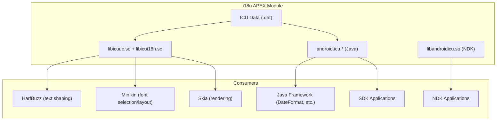

### 46.1.4 Unicode Character Properties

The most fundamental ICU service is character property lookup. Given a Unicode
code point, ICU can tell you its general category (letter, digit, punctuation),
its bidirectional class (left-to-right, right-to-left, Arabic number), its
script (Latin, Han, Devanagari), whether it is an emoji, and dozens of other
properties.

The C API is defined in `external/icu/icu4c/source/common/unicode/uchar.h`.
Key functions include:

```c
// Get the general category of a code point
int8_t u_charType(UChar32 c);

// Check if a code point has a specific binary property
UBool u_hasBinaryProperty(UChar32 c, UProperty which);

// Get the bidirectional class
UCharDirection u_charDirection(UChar32 c);

// Get the script of a code point
UScriptCode uscript_getScript(UChar32 c, UErrorCode *pErrorCode);
```

The Java equivalent is `android.icu.lang.UCharacter`:

```java
// Get the general category
int type = UCharacter.getType(codePoint);

// Check bidirectional class
int dir = UCharacter.getDirection(codePoint);

// Check if a character is a letter
boolean isLetter = UCharacter.isLetter(codePoint);
```

These property lookups are performance-critical. A single paragraph of mixed
Arabic and Latin text may require thousands of property lookups during
bidirectional analysis and shaping. ICU stores the data in compact trie
structures (UTrie2) that provide O(1) lookup time.

### 46.1.5 Text Normalization

Unicode allows the same visual text to be encoded in multiple ways. The letter
"a" (U+00E4) can also be represented as "a" (U+0061) followed by a combining
diaeresis (U+0308). Normalization converts text to a canonical form so that
equivalent sequences compare as equal.

ICU provides four normalization forms:

| Form | Name | Description |
|------|------|-------------|
| NFC | Canonical Decomposition + Composition | Composes characters when possible (most common) |
| NFD | Canonical Decomposition | Decomposes all characters to base + combining marks |
| NFKC | Compatibility Decomposition + Composition | Also decomposes compatibility characters |
| NFKD | Compatibility Decomposition | Full decomposition including compatibility |

The C API is in `external/icu/icu4c/source/common/unicode/unorm2.h`:

```c
const UNormalizer2 *nfc = unorm2_getNFCInstance(&status);
int32_t len = unorm2_normalize(nfc, src, srcLen, dst, dstCap, &status);
UBool isNormalized = unorm2_isNormalized(nfc, src, srcLen, &status);
```

Minikin's `FontCollection` uses normalization when performing font fallback.
When a character is not found in the preferred font, Minikin may decompose it
(using NFD) and try to find the base character and combining marks separately.
This is visible in the include for the FontCollection implementation:

```cpp
// frameworks/minikin/libs/minikin/FontCollection.cpp
#include <unicode/unorm2.h>
```

### 46.1.6 Collation (Sorting)

Sorting text correctly is far more complex than comparing byte values. German
sorts "a" as equivalent to "ae" in phonebook ordering. Swedish sorts "o" after
"z". Japanese has multiple sort orders depending on the reading of kanji.

ICU's collation engine, exposed at `external/icu/icu4c/source/i18n/`, supports
all of these rules through locale-specific tailorings. The Java API is:

```java
import android.icu.text.Collator;

Collator collator = Collator.getInstance(Locale.GERMAN);
int result = collator.compare("Muller", "Mueller"); // locale-aware comparison
```

### 46.1.7 Break Iteration

Break iteration identifies boundaries in text: where characters, words,
sentences, and lines begin and end. This is trivial for space-separated
languages like English but essential for scripts that do not use spaces between
words, such as Thai, Lao, Khmer, Chinese, and Japanese.

ICU provides five types of break iterators:

```java
import android.icu.text.BreakIterator;

// Word boundaries (critical for Thai, Khmer, Lao, Myanmar)
BreakIterator wordIter = BreakIterator.getWordInstance(Locale.THAI);
wordIter.setText(thaiText);

// Line break opportunities (used by Minikin's line breaker)
BreakIterator lineIter = BreakIterator.getLineInstance(locale);

// Sentence boundaries (used for triple-click selection)
BreakIterator sentIter = BreakIterator.getSentenceInstance(locale);

// Character (grapheme cluster) boundaries
BreakIterator charIter = BreakIterator.getCharacterInstance(locale);
```

The `BreakIterator` source lives at:

- Java: `external/icu/android_icu4j/src/main/java/android/icu/text/BreakIterator.java`
- C: `external/icu/icu4c/source/common/unicode/brkiter.h`

The line break iterator is particularly important because Minikin calls it
during paragraph layout to determine where lines can be broken.

### 46.1.8 Date, Time, and Number Formatting

ICU provides locale-aware formatting for dates, times, numbers, and currencies:

```java
import android.icu.text.DateFormat;
import android.icu.text.NumberFormat;
import android.icu.number.NumberFormatter;

// Date formatting
DateFormat df = DateFormat.getDateInstance(DateFormat.LONG, Locale.JAPAN);
String formatted = df.format(new Date()); // "2026年3月18日"

// Number formatting
NumberFormat nf = NumberFormat.getInstance(Locale.GERMANY);
String num = nf.format(1234567.89); // "1.234.567,89"

// Modern number formatter (ICU 60+)
String currency = NumberFormatter.withLocale(Locale.US)
    .unit(Currency.getInstance("USD"))
    .format(42.99)
    .toString(); // "$42.99"
```

These classes live in `external/icu/android_icu4j/src/main/java/android/icu/text/`
and `external/icu/android_icu4j/src/main/java/android/icu/number/`.

### 46.1.9 ICU Version Management

ICU is updated regularly to track new Unicode releases. The upgrade process
is documented in `external/icu/icu_version_upgrade.md` and involves:

1. Importing the new upstream ICU release
2. Regenerating the Android-specific data subsets
3. Updating the `android_icu4j` and `android_icu4c` wrappers
4. Running CTS and ICU conformance tests
5. Updating the i18n APEX module

Because ICU ships as an APEX, updates can reach devices without a full platform
OTA. This is critical for Unicode version upgrades that add new emoji, scripts,
or corrected collation rules.

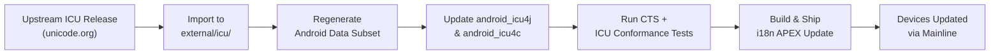

---

## 46.2 Locale Management

A locale is a combination of language, script, region, and variant that
determines how text is processed, formatted, and displayed. Android's locale
management system tracks user preferences, applies them to the framework, and
exposes APIs for applications to query and respond to locale changes.

### 46.2.1 LocaleList: Ordered Locale Preferences

Since Android 7.0 (API 24), the platform supports an *ordered list* of
preferred locales rather than a single locale. A user might prefer French first,
then English, then German. When a resource is not available in French, the
system falls back to English before trying German.

The `LocaleList` class is defined at:

**Source path**: `frameworks/base/core/java/android/os/LocaleList.java`

```java
// frameworks/base/core/java/android/os/LocaleList.java
public final class LocaleList implements Parcelable {
    private final Locale[] mList;
    private final String mStringRepresentation;

    public Locale get(int index) {
        return (0 <= index && index < mList.length) ? mList[index] : null;
    }

    public int size() {
        return mList.length;
    }

    public boolean isEmpty() {
        return mList.length == 0;
    }
    // ...
}
```

The `LocaleList` is an immutable, parcelable list of `java.util.Locale`
objects. Its string representation is a comma-separated list of BCP-47 language
tags (e.g., `"fr-FR,en-US,de-DE"`).

### 46.2.2 System vs. Application Locales

Android distinguishes between two locale scopes:

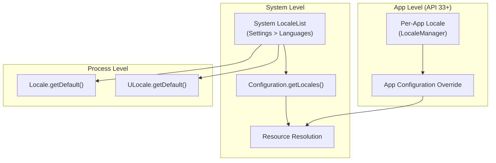

1. **System locale**: Set by the user in Settings. Stored in
   `persist.sys.locale` (legacy) and the system `Configuration`. Applies to all
   apps by default.

2. **Per-app locale**: Introduced in Android 13 (API 33) via `LocaleManager`.
   Allows individual apps to use a different locale than the system default.

### 46.2.3 LocaleManager and LocaleManagerService

The `LocaleManager` API allows apps to query and set per-app locales:

```java
// Setting per-app locales (API 33+)
LocaleManager localeManager = getSystemService(LocaleManager.class);
localeManager.setApplicationLocales(LocaleList.forLanguageTags("ja-JP,en-US"));

// Getting per-app locales
LocaleList appLocales = localeManager.getApplicationLocales();
```

The server-side implementation lives at:

**Source path**: `frameworks/base/services/core/java/com/android/server/locales/LocaleManagerService.java`

```java
// frameworks/base/services/core/java/com/android/server/locales/LocaleManagerService.java
package com.android.server.locales;

/**
 * The implementation of ILocaleManager.aidl.
 *
 * This service is API entry point for storing app-specific UI locales
 * and an override LocaleConfig for a specified app.
 */
public class LocaleManagerService extends SystemService {
    // ...
}
```

The service manages several responsibilities:

| Responsibility | Description |
|---------------|-------------|
| Per-app locale storage | Persists locale preferences to disk |
| Configuration override | Applies locale overrides when apps launch |
| Backup/restore | Backs up locale preferences via `LocaleManagerBackupHelper` |
| Package monitoring | Tracks app install/uninstall via `LocaleManagerServicePackageMonitor` |
| LocaleConfig override | Allows system to override an app's declared supported locales |

Supporting files in the same package:

- `LocaleManagerBackupHelper.java` -- Backup agent integration
- `LocaleManagerServicePackageMonitor.java` -- Tracks package changes
- `LocaleManagerShellCommand.java` -- `cmd locale_manager` shell interface
- `LocaleManagerInternal.java` -- Internal API for system services

### 46.2.4 Locale Resolution Algorithm

When the system needs to select the best locale for a resource or service, it
runs a negotiation algorithm:

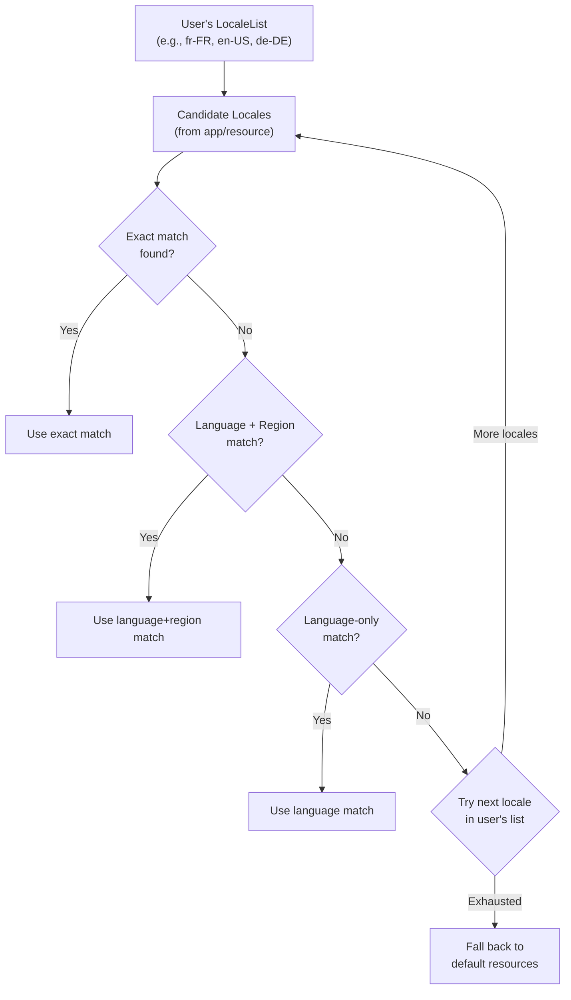

The resolution considers:

1. **Exact match**: Language, script, region all match
2. **Script-aware fallback**: `sr-Latn` (Serbian Latin) will not fall back to
   `sr` (Serbian Cyrillic) because the scripts differ
3. **Region fallback**: `en-AU` falls back to `en-GB` before `en-US` (because
   Australian English is closer to British English)
4. **Macro-region support**: `es-419` (Latin American Spanish) serves as
   fallback for `es-MX`, `es-AR`, etc.

### 46.2.5 Configuration Propagation

When the system locale changes (or a per-app locale is set), the change
propagates through the system:

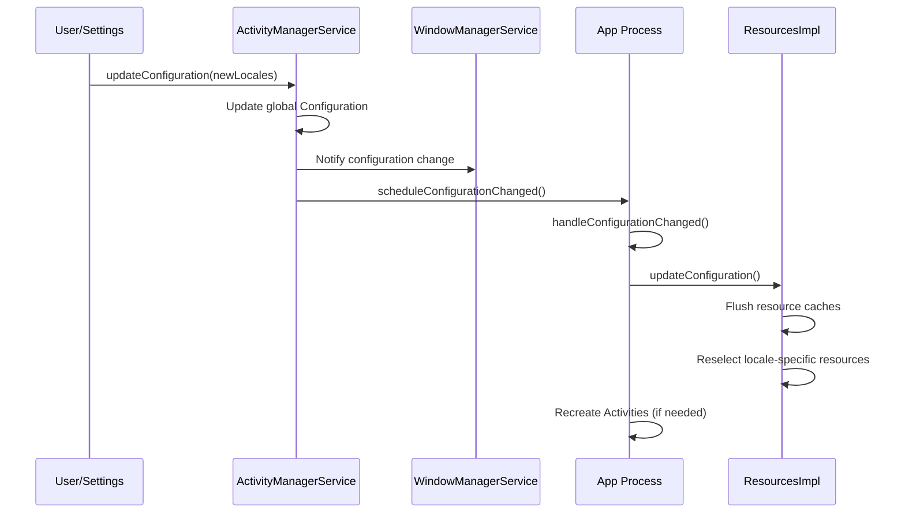

Each activity receives `onConfigurationChanged()` if it declares
`android:configChanges="locale"` in its manifest. Otherwise, the activity is
destroyed and recreated with the new locale.

### 46.2.6 BCP-47 Language Tags

Android uses BCP-47 (IETF Best Current Practice 47) language tags throughout.
These tags have a structured format:

```
language[-script][-region][-variant][-extension]

Examples:
  en              English
  en-US           English (United States)
  zh-Hant-TW      Chinese (Traditional, Taiwan)
  sr-Latn         Serbian (Latin script)
  az-Cyrl-AZ      Azerbaijani (Cyrillic, Azerbaijan)
  en-u-nu-thai    English with Thai numerals (Unicode extension)
```

The `Locale` class in Java parses and generates these tags:

```java
Locale locale = Locale.forLanguageTag("zh-Hant-TW");
String language = locale.getLanguage();  // "zh"
String script   = locale.getScript();    // "Hant"
String region   = locale.getCountry();   // "TW"
String tag      = locale.toLanguageTag(); // "zh-Hant-TW"
```

ICU's `ULocale` extends this with additional Unicode extension keywords for
calendar, collation, number system, and other preferences.

### 46.2.7 Locale Change Broadcast

When the system locale changes, the platform sends a broadcast:

```java
// System broadcast for locale changes
Intent.ACTION_LOCALE_CHANGED  // "android.intent.action.LOCALE_CHANGED"
```

This broadcast is sent to all running and registered receivers. Applications
that cache locale-dependent data (formatted strings, sort keys, etc.) should
listen for this broadcast to invalidate their caches.

---

## 46.3 Resource Qualifiers

Android's resource system allows applications to provide locale-specific
alternatives for any resource: strings, layouts, drawables, dimensions, styles,
and more. The mechanism is based on directory naming conventions and a
compile-time/runtime resolution system.

### 46.3.1 Qualifier Directory Naming

Locale-specific resources are placed in directories with language and region
qualifiers:

```
res/
  values/                   # Default (fallback) resources
    strings.xml
  values-fr/                # French
    strings.xml
  values-fr-rCA/            # French (Canada)
    strings.xml
  values-zh-rCN/            # Chinese (Simplified, China)
    strings.xml
  values-zh-rTW/            # Chinese (Traditional, Taiwan)
    strings.xml
  values-b+sr+Latn/         # Serbian (Latin script) -- BCP-47 format
    strings.xml
  layout/                   # Default layouts
    activity_main.xml
  layout-ar/                # Arabic-specific layout
    activity_main.xml
  layout-land/              # Landscape orientation
    activity_main.xml
  layout-ar-land/           # Arabic + landscape
    activity_main.xml
```

The `b+` prefix is used for BCP-47 tags that include a script subtag, which
the older two-letter qualifier format cannot express.

### 46.3.2 Qualifier Precedence

When multiple qualifier dimensions apply, Android uses a strict elimination
algorithm to select the best match. The locale qualifier has one of the highest
precedences:

| Priority | Qualifier | Example |
|----------|-----------|---------|
| 1 | MCC/MNC | `mcc310-mnc004` |
| 2 | Language/Region | `en-rUS`, `b+zh+Hant` |
| 3 | Layout direction | `ldrtl`, `ldltr` |
| 4 | Smallest width | `sw600dp` |
| 5 | Available width/height | `w720dp`, `h1024dp` |
| 6 | Screen size | `small`, `normal`, `large`, `xlarge` |
| 7 | Screen aspect | `long`, `notlong` |
| 8 | Round screen | `round`, `notround` |
| 9 | Wide color gamut | `widecg`, `nowidecg` |
| 10 | HDR | `highdr`, `lowdr` |
| 11 | Orientation | `port`, `land` |
| 12 | UI mode | `car`, `desk`, `television`, `watch` |
| 13 | Night mode | `night`, `notnight` |
| 14 | DPI | `ldpi`, `mdpi`, `hdpi`, `xhdpi`, `xxhdpi`, `xxxhdpi` |
| 15 | Touchscreen | `notouch`, `finger` |
| 16 | Keyboard | `keysexposed`, `keyshidden`, `keyssoft` |
| 17 | Input method | `nokeys`, `qwerty`, `12key` |
| 18 | Navigation | `nonav`, `dpad`, `trackball`, `wheel` |
| 19 | API level | `v21`, `v26`, `v33` |

### 46.3.3 Resource Resolution Algorithm

The resource selection algorithm is implemented in the native `AssetManager`
and the Java `ResourcesImpl` class.

**Source path**: `frameworks/base/core/java/android/content/res/ResourcesImpl.java`

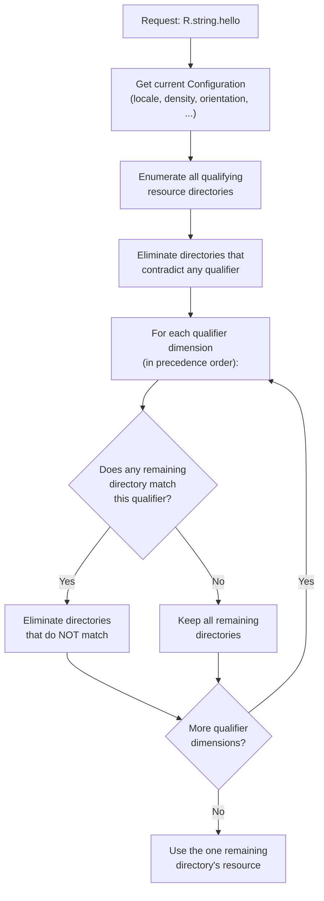

Consider a device with locale `fr-CA`, screen density `xhdpi`, and orientation
`port`. For `R.string.app_name`, the system might have:

```
values/strings.xml            (default)
values-fr/strings.xml         (French)
values-fr-rCA/strings.xml     (French Canada)
values-en/strings.xml         (English)
```

The algorithm:

1. Eliminate `values-en/` (wrong language)
2. Among remaining: `values/`, `values-fr/`, `values-fr-rCA/`
3. `values-fr-rCA/` matches language+region exactly, so eliminate `values/` and
   `values-fr/`
4. Result: use `values-fr-rCA/strings.xml`

### 46.3.4 String Resources and Plurals

String resources are the most common locale-specific resource. Android supports
several types:

```xml
<!-- Simple string -->
<string name="hello">Hello</string>

<!-- String with format arguments -->
<string name="welcome">Welcome, %1$s! You have %2$d messages.</string>

<!-- Plurals (quantity strings) -->
<plurals name="messages">
    <item quantity="zero">No messages</item>
    <item quantity="one">%d message</item>
    <item quantity="two">%d messages</item>   <!-- Arabic, Welsh, etc. -->
    <item quantity="few">%d messages</item>    <!-- Russian, Polish, etc. -->
    <item quantity="many">%d messages</item>   <!-- Arabic, etc. -->
    <item quantity="other">%d messages</item>  <!-- Fallback -->
</plurals>

<!-- String array -->
<string-array name="planets">
    <item>Mercury</item>
    <item>Venus</item>
    <item>Earth</item>
</string-array>
```

The plural categories (`zero`, `one`, `two`, `few`, `many`, `other`) follow
the Unicode CLDR plural rules. English uses only `one` and `other`. Russian
uses `one`, `few`, `many`, and `other`. Arabic uses all six categories.

ICU's `PluralRules` class determines the correct category for a given number
and locale:

```java
import android.icu.text.PluralRules;

PluralRules rules = PluralRules.forLocale(Locale.forLanguageTag("ar"));
String keyword = rules.select(3);  // "few" (Arabic: 3-10 are "few")
String keyword2 = rules.select(100); // "other"
```

### 46.3.5 Translation Workflow

AOSP uses the XLIFF (XML Localisation Interchange File Format) standard for
translations. The workflow:

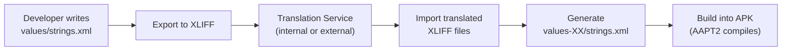

AAPT2 (Android Asset Packaging Tool) compiles all string resources into a
binary format in the `resources.arsc` table, which is packed into the APK.
At runtime, `ResourcesImpl` reads from this table to resolve string resources
based on the current configuration.

### 46.3.6 Pseudo-Locales for Testing

Android provides two pseudo-locales that help developers find i18n issues
without waiting for translations:

| Pseudo-locale | Tag | Effect |
|--------------|-----|--------|
| Accented English | `en-XA` | Adds accents, lengthens text (e.g., "Hello" becomes "[Heeelllloo]") |
| Bidi (RTL) | `ar-XB` | Mirrors text direction, wraps in RTL markers |

These are enabled in Developer Options and work by transforming strings at
resource load time. They are invaluable for catching:

- Hardcoded strings (not extracted to resources)
- Layouts that break with longer text
- RTL layout issues
- Concatenated strings that break in other word orders

---

## 46.4 RTL Support

Right-to-left (RTL) scripts -- Arabic, Hebrew, Farsi, Urdu, and others --
require the entire user interface to be mirrored. Text flows from right to left,
layouts flip horizontally, and many elements that seem directionally neutral
(progress bars, sliders, navigation icons) must be mirrored.

### 46.4.1 Layout Direction

Since Android 4.2 (API 17), the view system supports two layout directions:

```java
// View.java
public static final int LAYOUT_DIRECTION_LTR = 0;
public static final int LAYOUT_DIRECTION_RTL = 1;
public static final int LAYOUT_DIRECTION_INHERIT = 2;  // Inherit from parent
public static final int LAYOUT_DIRECTION_LOCALE = 3;   // Follow locale
```

The direction is set in XML:

```xml
<!-- In the manifest to enable RTL support globally -->
<application android:supportsRtl="true">

<!-- On individual views -->
<LinearLayout
    android:layoutDirection="locale"
    android:textDirection="locale"
    android:textAlignment="viewStart">
```

### 46.4.2 Start/End vs. Left/Right

The critical API change for RTL support was replacing `left`/`right` with
`start`/`end`:

| Old (LTR-only) | New (direction-aware) | RTL behavior |
|----------------|----------------------|-------------|
| `layout_marginLeft` | `layout_marginStart` | Maps to right margin |
| `layout_marginRight` | `layout_marginEnd` | Maps to left margin |
| `paddingLeft` | `paddingStart` | Maps to right padding |
| `paddingRight` | `paddingEnd` | Maps to left padding |
| `layout_alignParentLeft` | `layout_alignParentStart` | Aligns to right |
| `gravity="left"` | `gravity="start"` | Aligns to right |
| `drawableLeft` | `drawableStart` | Appears on right |

The view system resolves `start` and `end` to physical `left` and `right`
based on the resolved layout direction at measure/layout time.

### 46.4.3 View Layout Direction Resolution

The layout direction resolution follows the view hierarchy:

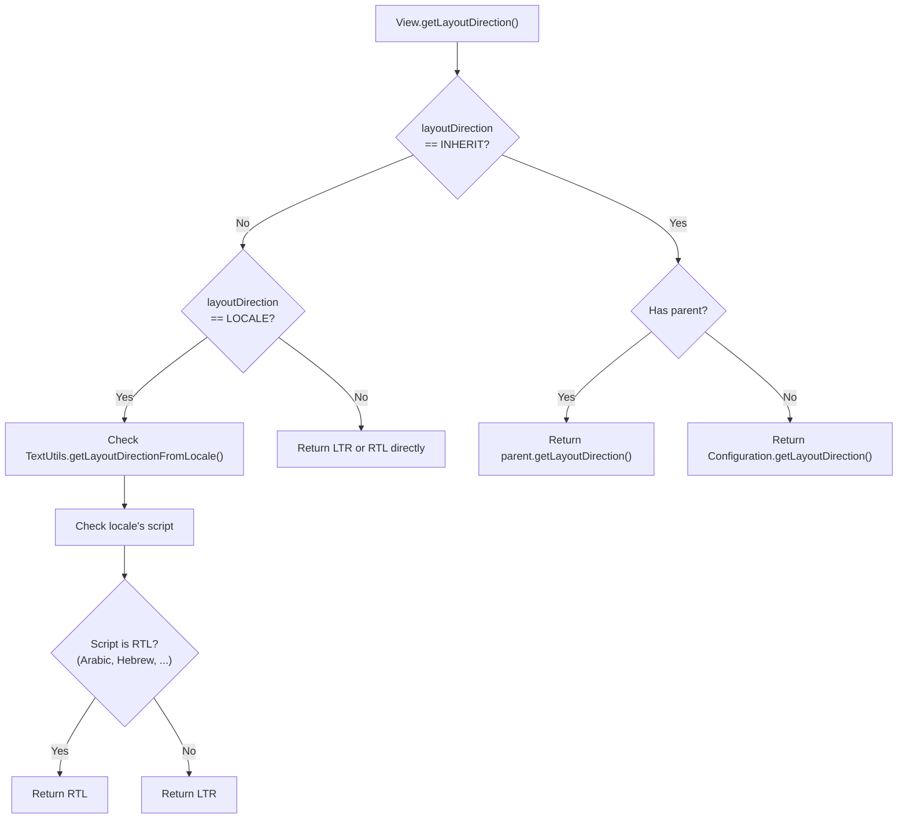

**Source path**: `frameworks/base/core/java/android/text/TextUtils.java`

The `TextUtils.getLayoutDirectionFromLocale()` method checks whether the
locale's script is inherently RTL:

```java
// frameworks/base/core/java/android/text/TextUtils.java
public static int getLayoutDirectionFromLocale(Locale locale) {
    if (locale != null && !locale.equals(Locale.ROOT)) {
        final int directionality = Character.getDirectionality(
            Character.codePointAt(locale.getScript().isEmpty()
                ? locale.getLanguage() : locale.getScript(), 0));
        if (directionality == Character.DIRECTIONALITY_RIGHT_TO_LEFT
                || directionality == Character.DIRECTIONALITY_RIGHT_TO_LEFT_ARABIC) {
            return View.LAYOUT_DIRECTION_RTL;
        }
    }
    return View.LAYOUT_DIRECTION_LTR;
}
```

### 46.4.4 Bidirectional (Bidi) Text

The most complex aspect of RTL support is bidirectional text -- text that
contains both RTL and LTR runs within the same paragraph. For example, an
Arabic sentence that includes an English product name, or a Hebrew paragraph
with numbers.

The Unicode Bidirectional Algorithm (UBA, UAX #9) defines how to reorder
characters for display. The algorithm:

1. Assigns a bidi class to each character (L, R, AL, EN, AN, ES, CS, ...)
2. Resolves explicit embedding levels (from LRE, RLE, LRO, RLO, PDF markers
   and LRI, RLI, FSI, PDI isolates)
3. Resolves implicit levels based on character classes
4. Reorders characters for display based on their resolved levels

ICU implements UBA in `external/icu/icu4c/source/common/ubidi.c`. Minikin uses
this through its `BidiUtils` wrapper:

```cpp
// frameworks/minikin/libs/minikin/BidiUtils.cpp
// Uses ICU's ubidi.h for bidirectional analysis
```

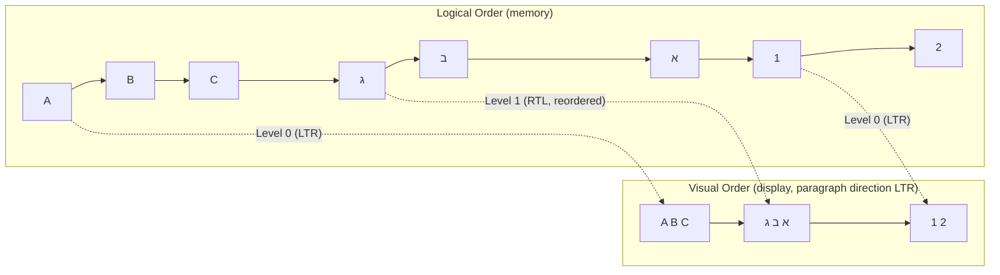

### 46.4.5 RTL Mirroring

Many Unicode characters have mirrored counterparts for RTL context. For
example, parentheses `(` and `)` are swapped in RTL text so that visual nesting
remains correct. ICU provides the mirroring information:

```c
// Get the Bidi mirroring glyph
UChar32 mirrored = u_charMirror(0x0028); // '(' -> ')' in RTL context
```

Beyond character-level mirroring, Android's drawable system supports
auto-mirroring for icons:

```xml
<!-- Drawable that auto-mirrors in RTL -->
<vector
    android:autoMirrored="true"
    android:width="24dp"
    android:height="24dp"
    ...>
```

Navigation icons (back arrows, forward arrows), progress indicators, and
other directional elements should use `autoMirrored="true"`.

### 46.4.6 RTL-Aware Layout Containers

The standard layout containers handle RTL automatically when `start`/`end`
attributes are used:

```java
// LinearLayout resolves gravity
// In RTL mode, Gravity.START resolves to Gravity.RIGHT
int resolvedGravity = Gravity.getAbsoluteGravity(gravity, layoutDirection);

// RelativeLayout resolves START_OF / END_OF
// In RTL mode, START_OF resolves to RIGHT_OF
```

`ConstraintLayout`, `RecyclerView`, and `ViewPager2` are all RTL-aware.
`ViewPager` (deprecated) was not RTL-aware, which was one reason for the
`ViewPager2` replacement.

### 46.4.7 TextDirection and TextAlignment

In addition to layout direction, Android provides separate control over text
direction and text alignment:

```xml
<!-- Text direction options -->
android:textDirection="firstStrong"   <!-- Default: first strong character determines direction -->
android:textDirection="anyRtl"        <!-- RTL if any RTL character is present -->
android:textDirection="ltr"           <!-- Force LTR -->
android:textDirection="rtl"           <!-- Force RTL -->
android:textDirection="locale"        <!-- Follow locale -->
android:textDirection="firstStrongLtr" <!-- First strong, default to LTR -->
android:textDirection="firstStrongRtl" <!-- First strong, default to RTL -->

<!-- Text alignment options -->
android:textAlignment="viewStart"   <!-- Align to start of view -->
android:textAlignment="viewEnd"     <!-- Align to end of view -->
android:textAlignment="textStart"   <!-- Align to start of text direction -->
android:textAlignment="textEnd"     <!-- Align to end of text direction -->
android:textAlignment="center"      <!-- Center -->
android:textAlignment="gravity"     <!-- Follow gravity -->
```

The distinction between `viewStart` and `textStart` matters when the view's
layout direction differs from the text's inherent direction. For example, an
Arabic text in an LTR view would have `viewStart` on the left but `textStart`
on the right.

---

## 46.5 Text Rendering Pipeline

Rendering text correctly for the world's scripts is one of the most complex
subsystems in Android. It involves four major components working in concert:
ICU (Unicode algorithms), HarfBuzz (text shaping), Minikin (font selection and
layout), and FreeType/Skia (rasterization). Each character that appears on
screen has passed through this entire pipeline.

### 46.5.1 Pipeline Overview

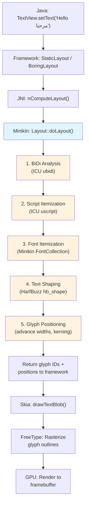

### 46.5.2 Step 1: BiDi Analysis

The first step of layout is bidirectional analysis. The input text is analyzed
using the Unicode Bidirectional Algorithm (via ICU's `ubidi.h`) to determine
the embedding level of each character.

```cpp
// frameworks/minikin/libs/minikin/Layout.cpp
#include <unicode/ubidi.h>

// Layout.cpp uses BidiUtils to split text into runs of uniform direction
```

The result is a sequence of **bidi runs**, each with a uniform direction level.
For text like "Hello مرحبا World", the result might be:

| Run | Text | Level | Direction |
|-----|------|-------|-----------|
| 0 | "Hello " | 0 | LTR |
| 1 | "مرحبا" | 1 | RTL |
| 2 | " World" | 0 | LTR |

### 46.5.3 Step 2: Script Itemization

Within each bidi run, the text is further divided by script. ICU's
`uscript_getScript()` identifies the script of each character. Mixed-script
text like "Tokyo東京" would produce separate runs for Latin and Han characters.

This matters because different scripts require different shaping engines and
font files. Latin text, CJK text, Arabic text, and Devanagari text all use
different shaping rules and different fonts.

### 46.5.4 Step 3: Font Itemization (Minikin)

For each script run, Minikin's `FontCollection` selects the best font. This is
one of Minikin's primary responsibilities.

**Source path**: `frameworks/minikin/libs/minikin/FontCollection.cpp`

The font selection algorithm:

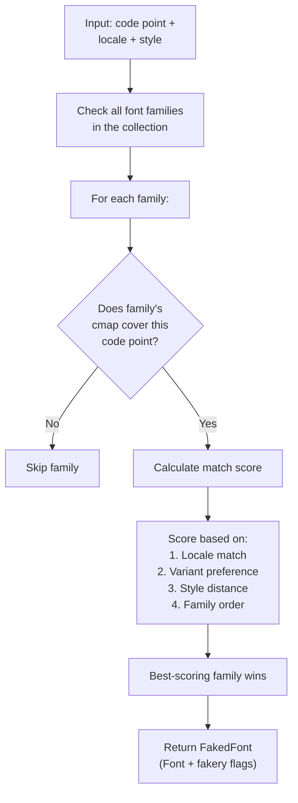

The `FontCollection` class maintains a list of font families ordered by
priority. The first family to cover a given code point wins, but locale
preferences can override this. For example, the CJK character U+8FD4 has
different preferred glyphs in Japanese (ja), Chinese Simplified (zh-Hans), and
Chinese Traditional (zh-Hant). Minikin checks the locale to select the correct
variant.

```cpp
// frameworks/minikin/include/minikin/FontCollection.h
class FontCollection {
public:
    static std::shared_ptr<FontCollection> create(
            const std::vector<std::shared_ptr<FontFamily>>& typefaces);

    // Key method: find the best font for a run of text
    FakedFont baseFontFaked(FontStyle style);
    // ...
};
```

The `FakedFont` struct contains the selected `Font` object plus fakery flags
that indicate whether the font engine should synthesize bold or italic if the
exact style was not found.

### 46.5.5 Step 4: Text Shaping (HarfBuzz)

Text shaping is the process of converting a sequence of Unicode code points into
a sequence of positioned glyphs. For simple scripts like Latin, this is mostly a
1:1 mapping from characters to glyphs. For complex scripts, shaping involves:

- **Ligature formation**: "fi" -> a single "fi" ligature glyph
- **Contextual substitution**: Arabic letters change shape based on their
  position (initial, medial, final, isolated)
- **Mark positioning**: Combining diacritics are positioned relative to their
  base characters
- **Reordering**: Devanagari and other Indic scripts reorder characters during
  shaping (e.g., "ki" in Devanagari is typed vowel-after-consonant but displayed
  vowel-before-consonant)
- **Cluster formation**: Multiple code points that form a single visual unit

HarfBuzz is the industry-standard open-source text shaping engine. It lives at
`external/harfbuzz_ng/` in AOSP.

**Source path**: `external/harfbuzz_ng/src/`

The core shaping call:

```c
// HarfBuzz shaping API (external/harfbuzz_ng/src/hb-buffer.h, hb-shape.h)
hb_buffer_t *buf = hb_buffer_create();
hb_buffer_add_utf16(buf, text, len, 0, len);
hb_buffer_set_direction(buf, HB_DIRECTION_RTL); // or HB_DIRECTION_LTR
hb_buffer_set_script(buf, HB_SCRIPT_ARABIC);
hb_buffer_set_language(buf, hb_language_from_string("ar", -1));

hb_shape(hb_font, buf, features, num_features);

// Extract results
unsigned int glyph_count;
hb_glyph_info_t *glyph_info = hb_buffer_get_glyph_infos(buf, &glyph_count);
hb_glyph_position_t *glyph_pos = hb_buffer_get_glyph_positions(buf, &glyph_count);
```

Each output glyph has:

- **Glyph ID**: The index into the font's glyph table
- **Cluster**: Which input character(s) this glyph corresponds to
- **X advance/Y advance**: How far to move after drawing this glyph
- **X offset/Y offset**: Adjustment to the drawing position (for mark
  positioning)

### 46.5.6 Shaping Example: Arabic Text

Arabic is one of the most complex scripts to shape. Each letter has up to four
forms depending on its position in the word:

| Letter | Isolated | Initial | Medial | Final |
|--------|----------|---------|--------|-------|
| Ba (ب) | ﺏ | ﺑ | ﺒ | ﺐ |
| Seen (س) | ﺱ | ﺳ | ﺴ | ﺲ |
| Lam (ل) | ﻝ | ﻟ | ﻠ | ﻞ |

Additionally, Arabic has mandatory ligatures. The most famous is the Lam-Alef
ligature: ل + ا = لا. HarfBuzz reads the font's OpenType tables (GSUB for
glyph substitution, GPOS for glyph positioning) to apply all of these rules.

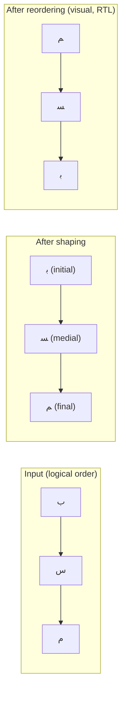

### 46.5.7 Step 5: Glyph Positioning and Layout

After shaping, Minikin accumulates the glyph positions to produce the final
layout. The `Layout` class stores the result:

```cpp
// frameworks/minikin/include/minikin/Layout.h
struct LayoutGlyph {
    LayoutGlyph(FakedFont font, uint32_t glyph_id, uint32_t cluster,
                float x, float y)
            : font(font), glyph_id(glyph_id), cluster(cluster), x(x), y(y) {}
    FakedFont font;
    uint32_t glyph_id;
    uint32_t cluster;
    float x;
    float y;
};
```

The layout also handles:

- **Letter spacing**: Adjusting space between characters. The implementation
  handles edge cases to avoid adding space at the start/end of a line:

```cpp
// frameworks/minikin/libs/minikin/Layout.cpp
void adjustGlyphLetterSpacingEdge(const U16StringPiece& textBuf,
                                   const MinikinPaint& paint,
                                   RunFlag runFlag,
                                   std::vector<LayoutGlyph>* glyphs) {
    const float letterSpacing = paint.letterSpacing * paint.size * paint.scaleX;
    const float letterSpacingHalf = letterSpacing * 0.5f;
    // ... edge adjustments for LEFT_EDGE and RIGHT_EDGE ...
}
```

- **Caching**: Minikin maintains an LRU cache of layout results to avoid
  re-shaping identical text runs. The cache key includes the text, style,
  locale, and font.

### 46.5.8 Line Breaking

Minikin includes a sophisticated line breaker that supports three strategies:

```cpp
// frameworks/minikin/include/minikin/LineBreaker.h
enum class BreakStrategy : uint8_t {
    Greedy = 0,        // Fast, good-enough line breaking
    HighQuality = 1,   // Optimal (Knuth-Plass style) line breaking
    Balanced = 2,      // Minimize raggedness
};

enum class HyphenationFrequency : uint8_t {
    None = 0,          // Never hyphenate
    Normal = 1,        // Hyphenate when it improves layout
    Full = 2,          // Hyphenate aggressively
};
```

The line breaker implementation:

```cpp
// frameworks/minikin/libs/minikin/LineBreaker.cpp
LineBreakResult breakIntoLines(const U16StringPiece& textBuffer,
                                BreakStrategy strategy,
                                HyphenationFrequency frequency,
                                bool justified,
                                const MeasuredText& measuredText,
                                const LineWidth& lineWidth,
                                const TabStops& tabStops,
                                bool useBoundsForWidth) {
    if (strategy == BreakStrategy::Greedy || textBuffer.hasChar(CHAR_TAB)) {
        return breakLineGreedy(textBuffer, measuredText, lineWidth, tabStops,
                               frequency != HyphenationFrequency::None,
                               useBoundsForWidth);
    } else {
        return breakLineOptimal(textBuffer, measuredText, lineWidth,
                                strategy, frequency, justified,
                                useBoundsForWidth);
    }
}
```

The **greedy** strategy breaks at the first opportunity that fits the line
width. The **optimal** strategy (based on the Knuth-Plass algorithm from TeX)
considers all possible break points globally to minimize visual inconsistency
across the entire paragraph. The **balanced** strategy tries to make all lines
approximately the same width.

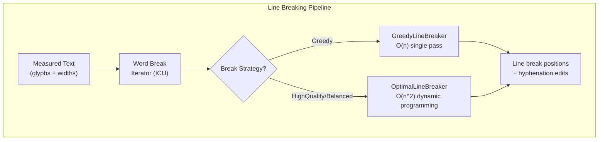

### 46.5.9 Hyphenation

Minikin includes a hyphenation engine that uses pattern files derived from the
TeX hyphenation patterns. The `Hyphenator` class loads language-specific
patterns:

```cpp
// frameworks/minikin/include/minikin/Hyphenator.h
class Hyphenator {
    // ...
};

// frameworks/minikin/libs/minikin/HyphenatorMap.h
// Maps locales to their hyphenation patterns
```

Hyphenation patterns are installed on device at
`/system/usr/hyphen-data/hyph-*.hyb`. Each file contains compiled patterns for
one language. The line breaker consults the hyphenator when a word does not fit
on the current line and hyphenation frequency is not `None`.

### 46.5.10 Rasterization: FreeType and Skia

After Minikin produces glyph IDs and positions, the actual rendering is handled
by Skia (Android's 2D graphics library) and FreeType (the font rasterizer).

**Source path**: `external/freetype/` (FreeType library)

FreeType's role:

1. Parse font files (TrueType, OpenType, WOFF)
2. Load glyph outlines from the `glyf` or `CFF` tables
3. Apply hinting instructions (if present)
4. Rasterize outlines to bitmaps (or provide outlines for GPU rendering)

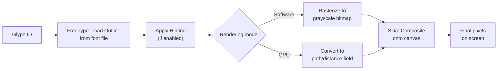

Skia sits between the framework and FreeType/GPU. It manages:

- Glyph caching (avoiding re-rasterization of previously seen glyphs)
- Subpixel positioning (for smooth text scrolling)
- Text blob construction (batching multiple glyph draws for GPU efficiency)
- Color emoji rendering (using CBDT/CBLC or COLRv1 font tables)

### 46.5.11 Emoji Rendering

Emoji present a special case in the text rendering pipeline. Android uses the
Noto Color Emoji font, which contains color bitmap glyphs (CBDT/CBLC format)
or vector color glyphs (COLRv1).

Minikin's `FontCollection` gives special treatment to emoji:

```cpp
// frameworks/minikin/libs/minikin/FontCollection.cpp
const uint32_t EMOJI_STYLE_VS = 0xFE0F;  // Variation Selector 16 (emoji style)
const uint32_t TEXT_STYLE_VS = 0xFE0E;    // Variation Selector 15 (text style)
```

When a character is followed by VS16 (U+FE0F), the system prefers the emoji
font. When followed by VS15 (U+FE0E), it prefers a text-style font. This is
how users can see "heart emoji" vs. "heart text symbol" for the same base code
point.

Emoji sequences (skin tone modifiers, ZWJ sequences for family/profession
emojis, flag sequences from regional indicator pairs) are all handled through
the shaping pipeline:

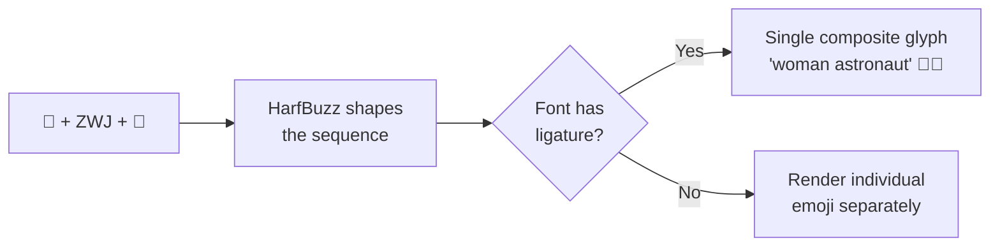

The `Emoji.cpp` module in Minikin identifies emoji-related code points and
ensures they are routed to the emoji font:

**Source path**: `frameworks/minikin/libs/minikin/Emoji.cpp`

---

## 46.6 Font System

Android's font system manages the fonts installed on the device, matches
typeface requests to physical font files, and supports variable fonts that
can interpolate between different weights, widths, and other axes.

### 46.6.1 System Fonts Configuration

The system font configuration is defined in XML. Historically, `fonts.xml` was
the primary configuration file:

**Source path**: `frameworks/base/data/fonts/fonts.xml`

```xml
<!-- frameworks/base/data/fonts/fonts.xml (excerpt) -->
<familyset version="23">
    <!-- Default sans-serif font (Roboto) -->
    <family name="sans-serif">
        <font weight="100" style="normal">Roboto-Regular.ttf
          <axis tag="ital" stylevalue="0" />
          <axis tag="wdth" stylevalue="100" />
          <axis tag="wght" stylevalue="100" />
        </font>
        <font weight="400" style="normal">Roboto-Regular.ttf
          <axis tag="ital" stylevalue="0" />
          <axis tag="wdth" stylevalue="100" />
          <axis tag="wght" stylevalue="400" />
        </font>
        <font weight="700" style="normal">Roboto-Regular.ttf
          <axis tag="ital" stylevalue="0" />
          <axis tag="wdth" stylevalue="100" />
          <axis tag="wght" stylevalue="700" />
        </font>
        <!-- ... more weights and italic variants ... -->
    </family>
</familyset>
```

However, the `fonts.xml` comment in the current AOSP source makes the
evolution clear:

> DEPRECATED: This XML file is no longer a source of the font files installed
> in the system. For the device vendors: please add your font configurations to
> the `platform/frameworks/base/data/font_fallback.xml`.

The modern system uses `font_fallback.xml` and a JSON-based configuration:

```
frameworks/base/data/fonts/
    fonts.xml              # Legacy (deprecated but maintained for compat)
    font_config.json       # Modern configuration
    fallback_order.json    # Fallback chain ordering
    alias.json             # Font family aliases
    fonts.mk               # Build rules for font installation
```

### 46.6.2 Font Family Architecture

Android organizes fonts into **families**. A family contains multiple font files
that vary in weight and style (normal/italic). The system selects the best
match within a family based on the requested style.

```mermaid
graph TD
    subgraph "Font Family: sans-serif (Roboto)"
        R100["Roboto Thin (100)"]
        R300["Roboto Light (300)"]
        R400["Roboto Regular (400)"]
        R500["Roboto Medium (500)"]
        R700["Roboto Bold (700)"]
        R900["Roboto Black (900)"]
        RI400["Roboto Italic (400i)"]
        RI700["Roboto Bold Italic (700i)"]
    end

    subgraph "Font Family: serif (Noto Serif)"
        NS400["Noto Serif Regular (400)"]
        NS700["Noto Serif Bold (700)"]
        NSI400["Noto Serif Italic (400i)"]
        NSI700["Noto Serif Bold Italic (700i)"]
    end

    subgraph "Font Family: monospace (Droid Sans Mono)"
        DSM["DroidSansMono (400)"]
    end

    REQUEST["Request: sans-serif, weight=700, italic"] --> R700
    REQUEST2["Request: serif, weight=400, normal"] --> NS400
```

### 46.6.3 Fallback Chains

When the primary font family does not contain a glyph for a character, the
system walks a **fallback chain** to find a font that does. The fallback chain
is ordered so that script-specific fonts are tried before generic ones:

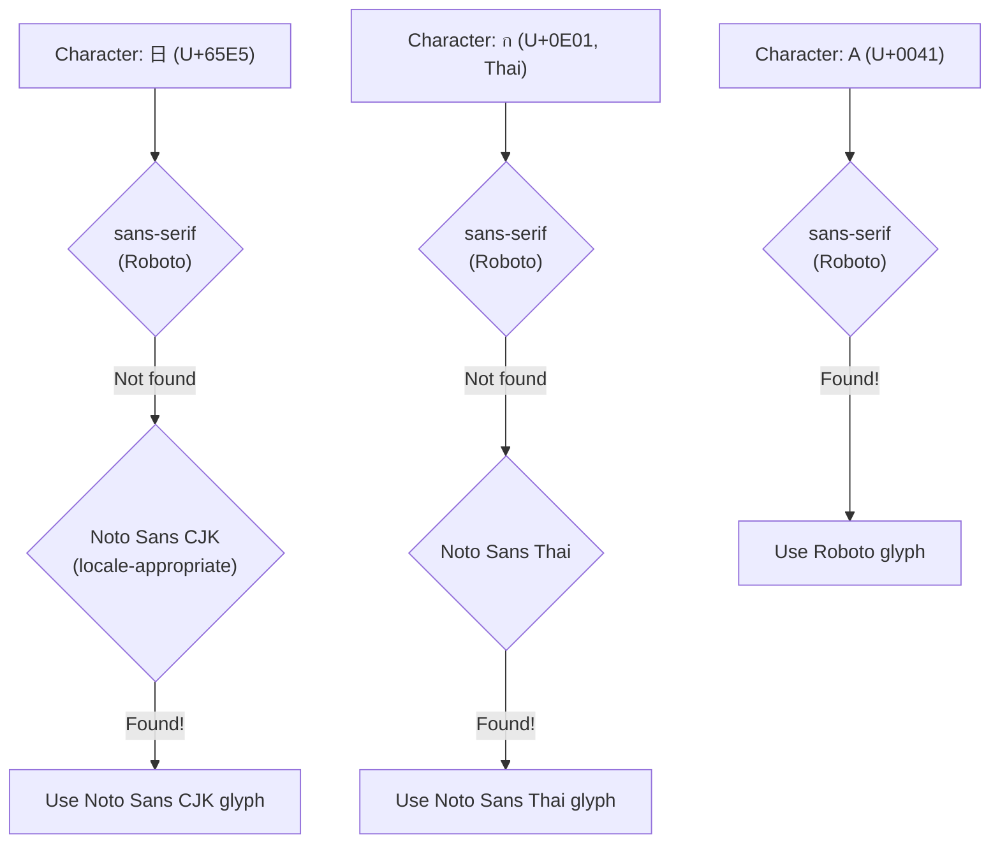

The fallback order is locale-sensitive. For a device set to Japanese, the
Japanese variant of Noto Sans CJK is tried before the Chinese variant. This
ensures that characters shared between CJK languages (Han unification) use the
locale-appropriate glyph form.

### 46.6.4 Variable Fonts

Modern Android (API 26+) supports OpenType variable fonts. Instead of shipping
separate files for each weight, a variable font contains a single outline that
can be interpolated along one or more **axes**:

| Axis Tag | Name | Range | Example |
|----------|------|-------|---------|
| `wght` | Weight | 1-1000 | 100=Thin, 400=Regular, 700=Bold |
| `wdth` | Width | 25-200 | 100=Normal, 75=Condensed, 125=Expanded |
| `ital` | Italic | 0-1 | 0=Upright, 1=Italic |
| `slnt` | Slant | -90-90 | Oblique angle in degrees |
| `opsz` | Optical Size | varies | Adjusts design for text size |

In `fonts.xml`, variable font axes are specified per entry:

```xml
<font weight="400" style="normal">Roboto-Regular.ttf
  <axis tag="ital" stylevalue="0" />
  <axis tag="wdth" stylevalue="100" />
  <axis tag="wght" stylevalue="400" />
</font>
```

Minikin processes variable font axes through the `FontVariation` and
`FVarTable` classes:

```cpp
// frameworks/minikin/include/minikin/FontVariation.h
// Represents a font variation axis setting (tag + value)

// frameworks/minikin/include/minikin/FVarTable.h
// Parses the 'fvar' table from OpenType font files
```

The advantage of variable fonts is significant:

- **Smaller total file size**: One variable font replaces 12-18 static files
- **Arbitrary weight/width**: Not limited to the predefined 9 weight values
- **Smooth animations**: Weight can be animated continuously
- **Optical sizing**: Text automatically adjusts design details at different
  point sizes

### 46.6.5 Typeface API

The Java-side entry point for fonts is the `Typeface` class:

**Source path**: `frameworks/base/graphics/java/android/graphics/Typeface.java`

```java
// frameworks/base/graphics/java/android/graphics/Typeface.java
package android.graphics;

// Creating typefaces
Typeface roboto = Typeface.create("sans-serif", Typeface.NORMAL);
Typeface bold = Typeface.create(roboto, Typeface.BOLD);

// Custom typeface from font family
Typeface custom = new Typeface.Builder(assetManager, "fonts/MyFont.ttf")
    .setWeight(400)
    .setItalic(false)
    .build();

// Variable font with custom axis values
Typeface variable = new Typeface.Builder(assetManager, "fonts/Variable.ttf")
    .setFontVariationSettings("'wght' 600, 'wdth' 75")
    .build();
```

`Typeface` wraps a native pointer to a Minikin `FontCollection`. When you call
`Typeface.create("sans-serif", Typeface.BOLD)`, the framework:

1. Looks up the "sans-serif" `FontFamily` in the system font configuration
2. Creates a `FontCollection` containing all families in the fallback chain
3. Sets the style to bold (weight 700, slant upright)
4. Returns a `Typeface` wrapping the native object

### 46.6.6 Font Providers and Downloadable Fonts

Android 8.0 (API 26) introduced **downloadable fonts** through `FontsContract`
and font providers. This allows apps to request fonts from a provider (such as
Google Fonts) at runtime:

```xml
<!-- In res/font/lobster.xml -->
<font-family xmlns:android="http://schemas.android.com/apk/res/android"
    android:fontProviderAuthority="com.google.android.gms.fonts"
    android:fontProviderPackage="com.google.android.gms"
    android:fontProviderQuery="Lobster"
    android:fontProviderCerts="@array/com_google_android_gms_fonts_certs">
</font-family>
```

The font provider architecture:

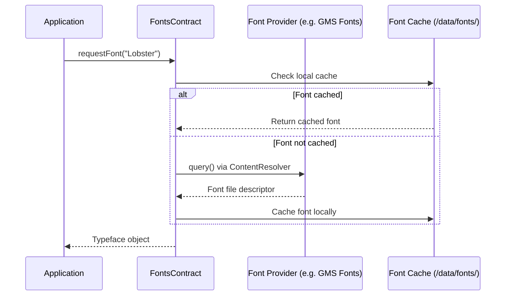

This avoids bundling large font files in every APK and enables font sharing
across applications.

### 46.6.7 System Font Discovery

Apps can enumerate all installed system fonts using the `SystemFonts` API
(API 29+):

```java
import android.graphics.fonts.SystemFonts;

Set<Font> fonts = SystemFonts.getAvailableFonts();
for (Font font : fonts) {
    File file = font.getFile();           // /system/fonts/NotoSansCJK-Regular.ttc
    FontStyle style = font.getStyle();    // weight=400, slant=UPRIGHT
    String psName = font.getPostScriptName(); // "NotoSansCJK-Regular"
    int index = font.getTtcIndex();       // Index in TTC (TrueType Collection)
}
```

On the native side, Minikin's `SystemFonts` class provides the same
functionality:

```cpp
// frameworks/minikin/include/minikin/SystemFonts.h
class SystemFonts {
public:
    static std::shared_ptr<FontCollection> findFontCollection(
            const std::string& familyName);

    static void registerFallback(const std::string& familyName,
                                 const std::shared_ptr<FontCollection>& fc);

    static void registerDefault(const std::shared_ptr<FontCollection>& fc);
    // ...
};
```

### 46.6.8 CJK Font Handling

Chinese, Japanese, and Korean (CJK) fonts are among the largest font files on
the system because they contain tens of thousands of glyphs. AOSP ships the
Noto Sans CJK font, which covers all CJK unified ideographs.

Due to Han unification in Unicode, the same code point may have different
preferred glyph forms in different CJK locales:

| Code Point | Japanese | Chinese (Simplified) | Chinese (Traditional) | Korean |
|-----------|----------|---------------------|---------------------|--------|
| U+9AA8 (bone) | 骨 (different stroke) | 骨 | 骨 | 骨 |
| U+76F4 (straight) | 直 (different stroke) | 直 | 直 | 直 |

Minikin handles this through locale-aware font selection. The font configuration
defines CJK fallback entries with locale restrictions:

```xml
<!-- Noto Sans CJK JP (Japanese variant) -->
<family lang="ja">
    <font weight="400" style="normal">NotoSansCJK-Regular.ttc
        <axis tag="wght" stylevalue="400" />
    </font>
</family>

<!-- Noto Sans CJK SC (Simplified Chinese variant) -->
<family lang="zh-Hans">
    <font weight="400" style="normal">NotoSansCJK-Regular.ttc
        <axis tag="wght" stylevalue="400" />
    </font>
</family>
```

The same physical file (`NotoSansCJK-Regular.ttc`, a TrueType Collection) can
contain multiple font instances, each with CJK glyphs tailored to a specific
locale.

### 46.6.9 Font File Formats

Android supports several font file formats:

| Format | Extension | Description |
|--------|-----------|-------------|
| TrueType | `.ttf` | Single font, TrueType outlines |
| OpenType | `.otf` | Single font, CFF outlines |
| TrueType Collection | `.ttc` | Multiple fonts in one file (CJK) |
| OpenType Collection | `.otc` | Multiple fonts in one file (CFF) |
| Variable Font | `.ttf` (with `fvar`) | Single file, multiple styles |

Minikin's `FontFileParser` class parses font file headers to extract metadata:

```cpp
// frameworks/minikin/include/minikin/FontFileParser.h
class FontFileParser {
    // Parses font tables: name, OS/2, fvar, cmap, etc.
};
```

The `CmapCoverage` class builds a compact representation of which Unicode code
points a font covers:

```cpp
// frameworks/minikin/include/minikin/CmapCoverage.h
// Parses the 'cmap' table to build a SparseBitSet of covered code points
```

---

## 46.7 Try It

This section provides hands-on exercises to explore Android's
internationalization infrastructure.

### 46.7.1 Exercise: Inspect ICU Data on a Device

Connect to a device or emulator and inspect the ICU installation:

```bash
# Check the i18n APEX
adb shell pm list packages | grep i18n
# Should show: package:com.android.i18n

# Inspect ICU data location
adb shell ls -la /apex/com.android.i18n/etc/icu/
# Should show icudt*.dat files

# Check ICU version
adb shell getprop persist.sys.icu.version
```

### 46.7.2 Exercise: Explore Locale Settings

```bash
# List all available locales
adb shell cmd locale_manager get-locales

# Get the system locale list
adb shell settings get system system_locales

# Set per-app locale (requires adb root or shell permissions)
adb shell cmd locale_manager set-app-locales com.example.myapp --locales ja-JP

# Verify per-app locale
adb shell cmd locale_manager get-app-locales com.example.myapp
```

### 46.7.3 Exercise: Enable Pseudo-Locales

1. Enable Developer Options on the device
2. Navigate to **Developer Options > Force RTL layout direction**
   - This globally forces RTL without changing the language
3. Navigate to **Settings > System > Languages & input > Languages**
4. Add "English (XA)" or "Arabic (XB)" as the primary language
5. Observe how text is transformed:
   - `en-XA`: Text becomes "[Heeelllloo Wooorrrlllddd]" style
   - `ar-XB`: Text is reversed and wrapped in RTL markers

### 46.7.4 Exercise: Build a Multi-Locale App

Create a minimal app that demonstrates locale-aware behavior:

```java
public class I18nDemoActivity extends Activity {
    @Override
    protected void onCreate(Bundle savedInstanceState) {
        super.onCreate(savedInstanceState);
        setContentView(R.layout.activity_main);

        // Display current locale information
        LocaleList locales = getResources().getConfiguration().getLocales();
        StringBuilder sb = new StringBuilder();
        sb.append("Locale count: ").append(locales.size()).append("\n");
        for (int i = 0; i < locales.size(); i++) {
            Locale locale = locales.get(i);
            sb.append(String.format("  [%d] %s (%s)\n",
                i, locale.toLanguageTag(), locale.getDisplayName()));
        }

        // Show locale-aware formatting
        Locale primary = locales.get(0);
        sb.append("\nFormatted date: ")
          .append(DateFormat.getDateInstance(DateFormat.FULL, primary)
                  .format(new Date()));
        sb.append("\nFormatted number: ")
          .append(NumberFormat.getInstance(primary).format(1234567.89));

        // Show layout direction
        int layoutDir = getResources().getConfiguration().getLayoutDirection();
        sb.append("\nLayout direction: ")
          .append(layoutDir == View.LAYOUT_DIRECTION_RTL ? "RTL" : "LTR");

        ((TextView) findViewById(R.id.info)).setText(sb.toString());
    }
}
```

Create locale-specific strings:

```xml
<!-- res/values/strings.xml -->
<resources>
    <string name="app_name">I18n Demo</string>
    <string name="greeting">Hello, World!</string>
    <plurals name="items">
        <item quantity="one">%d item</item>
        <item quantity="other">%d items</item>
    </plurals>
</resources>

<!-- res/values-fr/strings.xml -->
<resources>
    <string name="greeting">Bonjour le monde !</string>
    <plurals name="items">
        <item quantity="one">%d article</item>
        <item quantity="other">%d articles</item>
    </plurals>
</resources>

<!-- res/values-ar/strings.xml -->
<resources>
    <string name="greeting">!مرحبا بالعالم</string>
    <plurals name="items">
        <item quantity="zero">لا عناصر</item>
        <item quantity="one">عنصر %d</item>
        <item quantity="two">عنصران %d</item>
        <item quantity="few">%d عناصر</item>
        <item quantity="many">%d عنصرا</item>
        <item quantity="other">%d عنصر</item>
    </plurals>
</resources>

<!-- res/values-ja/strings.xml -->
<resources>
    <string name="greeting">こんにちは世界！</string>
    <plurals name="items">
        <item quantity="other">%d 件</item>
    </plurals>
</resources>
```

### 46.7.5 Exercise: Inspect the Text Rendering Pipeline with Layout Inspector

1. Launch your app on a device or emulator
2. Open Android Studio's Layout Inspector (Tools > Layout Inspector)
3. Select a `TextView` displaying mixed-direction text
4. Observe the text direction, alignment, and bidi properties
5. Use `adb shell dumpsys activity` to see the current `Configuration`
   including locale and layout direction

### 46.7.6 Exercise: Explore System Fonts

```bash
# List all system fonts
adb shell ls /system/fonts/

# Check font configuration
adb shell cat /system/etc/fonts.xml | head -50

# Inspect a specific font's metadata
# (requires a font inspection tool or the following approach)
adb shell cmd font list-families

# Check Noto CJK font
adb shell ls -la /system/fonts/NotoSansCJK*

# Examine fallback chain (device must be rooted or userdebug)
adb shell dumpsys SurfaceFlinger --latency | head
```

### 46.7.7 Exercise: Test RTL Layout

Create a layout that works correctly in both LTR and RTL:

```xml
<?xml version="1.0" encoding="utf-8"?>
<LinearLayout
    xmlns:android="http://schemas.android.com/apk/res/android"
    android:layout_width="match_parent"
    android:layout_height="wrap_content"
    android:orientation="horizontal"
    android:padding="16dp">

    <!-- Icon on the START side (left in LTR, right in RTL) -->
    <ImageView
        android:layout_width="48dp"
        android:layout_height="48dp"
        android:layout_marginEnd="16dp"
        android:src="@drawable/ic_person"
        android:autoMirrored="true" />

    <!-- Text fills remaining space -->
    <LinearLayout
        android:layout_width="0dp"
        android:layout_height="wrap_content"
        android:layout_weight="1"
        android:orientation="vertical">

        <TextView
            android:layout_width="wrap_content"
            android:layout_height="wrap_content"
            android:text="@string/user_name"
            android:textDirection="firstStrong"
            android:textAlignment="viewStart" />

        <TextView
            android:layout_width="wrap_content"
            android:layout_height="wrap_content"
            android:text="@string/user_bio"
            android:textDirection="firstStrong"
            android:textAlignment="viewStart" />
    </LinearLayout>

    <!-- Action button on the END side -->
    <ImageButton
        android:layout_width="48dp"
        android:layout_height="48dp"
        android:layout_marginStart="16dp"
        android:src="@drawable/ic_arrow_forward"
        android:autoMirrored="true"
        android:contentDescription="@string/action_details" />
</LinearLayout>
```

Test by:

1. Running with the default locale (LTR)
2. Switching to an RTL locale (Arabic or Hebrew)
3. Enabling "Force RTL layout direction" in Developer Options
4. Using the `ar-XB` pseudo-locale

### 46.7.8 Exercise: Use ICU4J Directly

```java
import android.icu.text.BreakIterator;
import android.icu.text.Collator;
import android.icu.text.Normalizer2;
import android.icu.text.RuleBasedCollator;

// 1. Word breaking for Thai text
String thai = "สวัสดีครับ ยินดีต้อนรับ";
BreakIterator wordIter = BreakIterator.getWordInstance(
    new Locale("th"));
wordIter.setText(thai);
int start = wordIter.first();
for (int end = wordIter.next();
     end != BreakIterator.DONE;
     start = end, end = wordIter.next()) {
    Log.d("ICU", "Word: " + thai.substring(start, end));
}

// 2. Locale-aware sorting
List<String> names = Arrays.asList("Mueller", "Muller", "Moller");
Collator deCollator = Collator.getInstance(Locale.GERMAN);
names.sort(deCollator);
// German phonebook sort treats "Mueller" and "Muller" as equivalent

// 3. Unicode normalization
Normalizer2 nfc = Normalizer2.getNFCInstance();
String composed = nfc.normalize("a\u0308");  // a + combining umlaut -> a
Log.d("ICU", "NFC: " + composed + " (length=" + composed.length() + ")");
// Output: NFC: a (length=1)

// 4. Check if text is already normalized
boolean isNormalized = nfc.isNormalized("Cafe\u0301");  // false (not NFC)
String normalized = nfc.normalize("Cafe\u0301");         // "Cafe" (NFC)
```

### 46.7.9 Exercise: Trace the Text Rendering Pipeline

Enable systrace/perfetto tracing to observe the text rendering pipeline:

```bash
# Capture a trace with text rendering events
adb shell perfetto \
  -c - --txt \
  -o /data/misc/perfetto-traces/trace.pftrace \
  <<EOF
buffers: {
    size_kb: 63488
    fill_policy: DISCARD
}
data_sources: {
    config {
        name: "linux.ftrace"
        ftrace_config {
            ftrace_events: "sched/sched_switch"
            ftrace_events: "power/suspend_resume"
            atrace_categories: "view"
            atrace_categories: "gfx"
        }
    }
}
duration_ms: 10000
EOF

# Interact with the app (type text, scroll, etc.)
# Pull the trace file
adb pull /data/misc/perfetto-traces/trace.pftrace .
# Open in https://ui.perfetto.dev/
```

In the trace, look for:

- `TextView.onMeasure` and `TextView.onDraw` slices
- `StaticLayout.generate` for text layout computation
- Canvas `drawTextBlob` for the actual rendering

### 46.7.10 Exercise: Build a Custom Font Configuration

For device vendors, create a custom font overlay:

```xml
<!-- vendor/my_device/overlay/fonts/fonts.xml -->
<familyset version="23">
    <!-- Override default sans-serif with a custom font -->
    <family name="sans-serif">
        <font weight="400" style="normal">MyCustomFont-Regular.ttf</font>
        <font weight="700" style="normal">MyCustomFont-Bold.ttf</font>
        <font weight="400" style="italic">MyCustomFont-Italic.ttf</font>
        <font weight="700" style="italic">MyCustomFont-BoldItalic.ttf</font>
    </family>

    <!-- Add a new named family -->
    <family name="my-brand-font">
        <font weight="400" style="normal">MyBrandFont-Regular.ttf</font>
    </family>
</familyset>
```

Install the fonts and configuration:

```makefile
# In device.mk
PRODUCT_COPY_FILES += \
    vendor/my_device/fonts/MyCustomFont-Regular.ttf:system/fonts/MyCustomFont-Regular.ttf \
    vendor/my_device/fonts/MyCustomFont-Bold.ttf:system/fonts/MyCustomFont-Bold.ttf
```

### 46.7.11 Summary of Key Source Paths

| Component | Source Path |
|-----------|------------|
| ICU4C | `external/icu/icu4c/source/` |
| ICU4J (Android) | `external/icu/android_icu4j/` |
| ICU NDK library | `external/icu/libandroidicu/` |
| HarfBuzz | `external/harfbuzz_ng/src/` |
| FreeType | `external/freetype/` |
| Minikin | `frameworks/minikin/` |
| Minikin headers | `frameworks/minikin/include/minikin/` |
| Minikin source | `frameworks/minikin/libs/minikin/` |
| LocaleList | `frameworks/base/core/java/android/os/LocaleList.java` |
| LocaleManagerService | `frameworks/base/services/core/java/com/android/server/locales/LocaleManagerService.java` |
| TextUtils | `frameworks/base/core/java/android/text/TextUtils.java` |
| Typeface | `frameworks/base/graphics/java/android/graphics/Typeface.java` |
| ResourcesImpl | `frameworks/base/core/java/android/content/res/ResourcesImpl.java` |
| fonts.xml | `frameworks/base/data/fonts/fonts.xml` |
| Font data directory | `frameworks/base/data/fonts/` |

---

**Key takeaways from this chapter:**

1. **ICU is the foundation**: Nearly all i18n functionality -- character
   properties, normalization, collation, break iteration, formatting -- flows
   through ICU, delivered as the i18n APEX module.

2. **Locale management is multi-layered**: System locales, per-app locales, and
   configuration propagation work together to deliver locale-appropriate
   behavior across the platform.

3. **Resource qualifiers are powerful but have rules**: The elimination algorithm
   for resource selection follows strict precedence, and locale is near the top.

4. **RTL is not just text direction**: It requires mirroring the entire UI,
   using `start`/`end` instead of `left`/`right`, and handling bidirectional
   text through the Unicode Bidirectional Algorithm.

5. **Text rendering is a deep pipeline**: From Unicode code points to pixels on
   screen, text passes through bidi analysis, script itemization, font
   selection (Minikin), shaping (HarfBuzz), and rasterization
   (FreeType/Skia) -- each step essential for correct rendering of the world's
   scripts.

6. **The font system is locale-aware**: CJK Han unification, variable font axes,
   fallback chains, and downloadable fonts all contribute to correct and
   efficient text display across languages.
