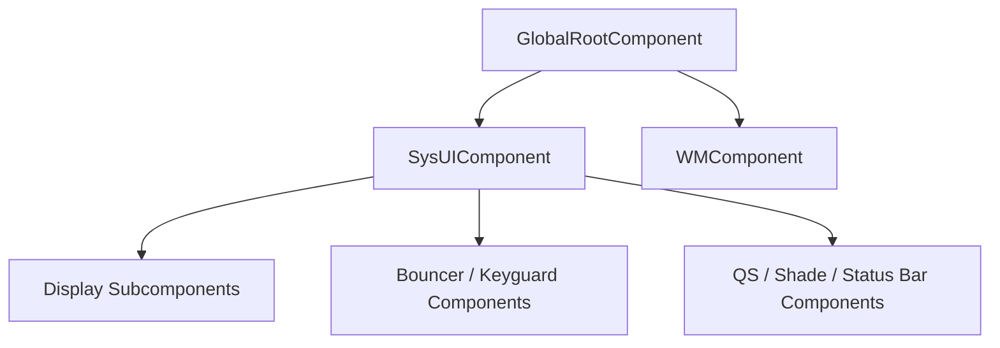

# 第 47 章：SystemUI

SystemUI 是 Android 上几乎所有“当前前台应用之外的系统可见界面”的承载进程。状态栏、通知抽屉、快捷设置、锁屏、导航栏、音量对话框、电源菜单、截图体验、最近任务以及大量系统级浮层，最终都汇聚到这个单独的 APK 中。它以 `android.uid.systemui` 运行，是一个常驻系统进程；如果异常退出，framework 会立刻尝试把它拉起。

SystemUI 也是 AOSP 中体量最大、演进最快的代码库之一。它长期从传统单体控制器架构向更模块化的 Dagger 注入、Kotlin Flow / 协程、MVI 和 Compose 迁移。本章从进程启动开始，沿着状态栏、通知面板、Quick Settings、锁屏、导航栏、截图、Monet 和 Keyguard 深挖 SystemUI 的主要子系统。

---

## 47.1 SystemUI 架构

### 47.1.1 进程启动

SystemUI 在 manifest 中被声明为 `coreApp="true"`，并使用共享 UID：

```xml
<!-- Source: frameworks/base/packages/SystemUI/AndroidManifest.xml -->
<manifest xmlns:android="http://schemas.android.com/apk/res/android"
    package="com.android.systemui"
    android:sharedUserId="android.uid.systemui"
    coreApp="true">
```

进程入口是 `SystemUIService`，而真正的 application 子类是 `SystemUIApplicationImpl`。其职责包括：

- 初始化 Dagger 图
- 注册 BOOT_COMPLETED 等状态
- 调用 `startSystemUserServicesIfNeeded()`
- 启动所有 `CoreStartable`

这意味着 SystemUI 虽然形式上是一个 Android app，但实际更像一个在 app 进程壳里运行的大型系统服务集合。

### 47.1.2 Dagger 依赖注入

SystemUI 采用分层 Dagger 组件：



大致分工是：

- `GlobalRootComponent`：进程级根组件
- `WMComponent`：窗口管理 shell 能力
- `SysUIComponent`：SystemUI 主体依赖图
- 各种 subcomponent：按 display、keyguard、bouncer 等继续分层

这套注入体系的价值在于把原本巨大的单体依赖关系拆成可测试、可替换、可按作用域管理的组件图。

### 47.1.3 `CoreStartable`：服务生命周期

SystemUI 的大部分核心功能最终都以 `CoreStartable` 形式存在。每个 startable 通常具备以下生命周期入口：

- `start()`
- `onBootCompleted()`
- `isDumpCritical()`
- `dump()`

`SystemUIApplicationImpl` 会按依赖拓扑顺序启动它们。如果依赖图不闭合，SystemUI 会直接抛异常而不是带着半初始化状态继续运行。

### 47.1.4 插件系统

SystemUI 还提供一套插件机制，允许在开发和某些定制场景下注入替代实现。例如 QS tile、GlobalActions、VolumeDialogController 等都存在插件接口。插件能力本身并不是主路径，但它暴露出 SystemUI 在若干子系统上的可扩展边界。

### 47.1.5 Feature Flags

SystemUI 广泛使用 feature flags 控制：

- 新旧实现切换
- Compose 迁移灰度
- Scene Container 迁移
- 新的动画和交互实验

对阅读源码来说，理解某个 flag 是否开启，往往直接决定你看到的是旧架构还是新架构。

### 47.1.6 目录结构

主要源码根目录：

```text
frameworks/base/packages/SystemUI/
    src/com/android/systemui/
    plugin/src/com/android/systemui/plugins/
    res/
```

常见重点子目录：

- `statusbar/`
- `shade/`
- `qs/`
- `keyguard/`
- `bouncer/`
- `navigationbar/`
- `screenshot/`
- `volume/`
- `globalactions/`
- `recents/`
- `monet/` 或动态配色相关目录

## 47.2 状态栏

### 47.2.1 `CentralSurfaces`：总协调器

状态栏核心控制器长期由 `CentralSurfaces` / `CentralSurfacesImpl` 承担。它统筹：

- 状态栏窗口
- 通知抽屉展开收起
- 锁屏与 shade 状态切换
- keyguard 交互
- 各种系统栏可见性逻辑

它是典型的 SystemUI “大控制器”之一，也是目前持续被拆分和迁移的重点对象。

### 47.2.2 `StatusBarWindowController`

状态栏本质上不是普通 app 内 view，而是挂在系统窗口层级中的一个专用 window。`StatusBarWindowController` 负责管理这层 window 的参数、可见性和状态。

### 47.2.3 `CollapsedStatusBarFragment`

折叠态状态栏中的图标、时钟、运营商、隐私指示器等内容，很多会经由这个 fragment 组织。它是传统 View/Fragment 时代状态栏内容承载的重要节点。

### 47.2.4 `PhoneStatusBarView`

这是折叠状态栏的实际视图层容器之一，负责与触摸区域、图标槽位、布局方向和动画做交互。

### 47.2.5 状态栏图标管线

状态栏图标并不是简单“某个服务直接 add 一个 icon”，而是经过：

- 图标模型
- icon controller
- slot 管理
- view 绑定

这样才能统一处理 Wi‑Fi、移动网络、闹钟、VPN、隐私点等大量来源不同的状态图标。

### 47.2.6 状态栏状态

状态栏常见状态包括：

- 正常折叠
- 锁屏
- shade 展开
- dozing / AOD 相关状态

不同状态会影响窗口 flag、图标可见性、手势响应与动画逻辑。

## 47.3 通知抽屉

### 47.3.1 窗口配置

通知抽屉依附在专门的状态栏 / shade window 之上，而不是普通 activity。其窗口配置必须兼顾：

- 锁屏上层显示
- 点击穿透控制
- scrim
- insets
- 多 display 行为

### 47.3.2 `NotificationPanelViewController`

它是通知面板手势与展开动画的核心控制器，负责：

- 下拉展开
- fling 动画
- 过渡到 QS
- 锁屏到 shade 的联动

这是另一类典型的大型控制器。

### 47.3.3 `ShadeController`

`ShadeController` 提供更抽象的 shade 控制接口，使其他组件不必直接操作底层 panel view 和 window 细节。

### 47.3.4 `NotificationStackScrollLayout`

通知列表本体由 `NotificationStackScrollLayout` 承载。它不只是一个普通 RecyclerView 替代品，而是为通知卡片堆叠、heads-up、展开、分组和动画专门定制的复杂滚动容器。

### 47.3.5 Scrim 管理

Scrim 负责 shade、锁屏、AOD、bouncer 之间的遮罩与层次过渡，是视觉连贯性的关键组成部分。

### 47.3.6 锁屏到 Shade 过渡

用户在锁屏状态下拉通知时，SystemUI 要决定：

- 是否允许展开
- 是否需要认证
- 如何在 keyguard 与 shade 之间做动画

这条路径直接连接通知系统和 keyguard 状态机。

## 47.4 Quick Settings

### 47.4.1 架构总览

Quick Settings 主要由几层构成：

- `QSHost`：tile 生命周期与列表管理
- `QSTile`：tile 抽象接口
- `QSTileImpl`：内建 tile 的基础实现
- `QSPanel`：tile 网格 UI
- `CustomTile`：第三方 tile 桥接

### 47.4.2 `QSHost`：Tile 管理

`QSHost` 负责：

- 维护当前 tile spec 列表
- 创建与销毁 tile
- 响应设置变更
- 与 auto-add 逻辑协作

它可以看作 QS 的 tile 注册表和生命周期管理器。

### 47.4.3 `QSTile` 接口

`QSTile` 暴露 tile 的基本行为：

- 状态刷新
- 点击 / 长按
- 可用性判断
- 状态回调

不同 tile 虽然业务逻辑不同，但都落在同一套状态机接口上。

### 47.4.4 `QSTileImpl`

这是绝大多数内建 tile 的基类。它处理线程切换、状态缓存、回调和常见模板逻辑，让具体 tile 只关心自身状态来源和点击行为。

### 47.4.5 内建 Tile

常见内建 tile 包括：

- Wi‑Fi
- Bluetooth
- Flashlight
- Airplane mode
- Do Not Disturb
- Battery Saver
- Internet

这些 tile 大多只是 SystemUI 对底层系统服务状态的一层可交互展示。

### 47.4.6 第三方 Custom Tile

第三方应用可通过 `TileService` 暴露自定义 tile，但其能力、生命周期和可见性都受到 SystemUI 和平台限制。

### 47.4.7 Auto-Add Tile

某些系统能力启用后，QS 可以自动将对应 tile 加入列表，例如热点、反色等。这一逻辑由专门的 auto-add 机制负责。

### 47.4.8 `QSPanel` 布局

`QSPanel` 负责 tile 网格布局、分页、展开与收起形态。随着 Compose 迁移，它也是被持续重写和替换的重点区域。

## 47.5 锁屏

### 47.5.1 `KeyguardViewMediator`

`KeyguardViewMediator` 是传统 keyguard 架构中的核心总协调器，负责：

- show / hide keyguard
- 与 PowerManager 协作
- 锁屏可见性判断
- 解锁流程入口

它在 AOSP 中体量很大，也是 keyguard 迁移中最复杂的旧核心。

### 47.5.2 `StatusBarKeyguardViewManager`

它负责把 keyguard 状态与状态栏 / shade / bouncer 的具体视图层组织起来，是 bridge 层角色。

### 47.5.3 Bouncer

Bouncer 是用户输入 PIN / Pattern / Password 的安全挑战 UI。它存在主 bouncer、替代 bouncer（如 UDFPS 指纹覆盖层）等多种形态。

### 47.5.4 AOD 集成

锁屏与 Always-On Display 不可分割。doze、脉冲通知、屏幕亮灭和 keyguard 状态机之间存在大量联动。

### 47.5.5 锁屏定制

锁屏时钟、快捷入口、Smartspace 等内容都在不断演进，既要满足个性化，又不能破坏 keyguard 的安全和状态机稳定性。

## 47.6 最近任务

### 47.6.1 Recents 架构

近年来最近任务更多由 Launcher / Quickstep 承担，SystemUI 自身主要保留桥接与系统侧协作逻辑。

### 47.6.2 `OverviewProxyRecentsImpl`

它是 SystemUI 与 Launcher 侧概览实现之间的代理桥接。

### 47.6.3 `LauncherProxyService`

负责与 launcher 侧服务建立连接，使最近任务、手势导航等体验可以跨进程协作。

### 47.6.4 `RecentsModule`

提供 recents 相关依赖绑定，是这套桥接架构在 Dagger 图中的组织点。

## 47.7 音量对话框

### 47.7.1 `VolumeDialogControllerImpl`

负责收集并维护音量状态，包括：

- 各 stream 当前值
- 静音 / 振动状态
- 设备路由变化

### 47.7.2 `VolumeDialogImpl`

真正的音量 UI 容器，负责：

- 展示 sliders
- 动画
- 扩展更多 stream
- 与 controller 状态同步

### 47.7.3 `VolumeDialogComponent`

作为 SystemUI 中音量子系统的组件化入口，负责把 controller 和 UI 接在一起。

### 47.7.4 音量事件

音量键、音频路由、模式变化、超时隐藏等都会形成事件流，共同驱动对话框状态变化。

## 47.8 电源菜单

### 47.8.1 `GlobalActionsComponent`

电源菜单入口组件，负责向系统注册并响应全局动作请求。

### 47.8.2 `GlobalActionsImpl`

默认实现，决定电源菜单显示哪类动作、如何构造模型以及是否调用替代实现。

### 47.8.3 `GlobalActionsDialogLite`

电源菜单的轻量对话框 UI，实现了关机、重启、紧急、钱包等条目的承载与交互。

### 47.8.4 `ShutdownUi`

处理关机 / 重启过程中的专门界面。

### 47.8.5 电源菜单布局

不同 form factor、主题和厂商定制都会影响电源菜单布局，因此其资源层也相对复杂。

## 47.9 截图

### 47.9.1 `TakeScreenshotService`

这是系统截图请求的服务入口，接收来自按键组合、shell、系统动作或其他系统路径的截图请求。

### 47.9.2 `ScreenshotController`

控制实际截图流程、动画、预览 UI、分享 / 编辑入口和后续清理。

### 47.9.3 截图流程

标准流程通常是：

1. 发起截图请求
2. 捕获图像
3. 显示预览和操作入口
4. 保存、分享或编辑

### 47.9.4 截图组件

实际实现会拆成 image capture、image export、动画和 UI 子组件，而不是一个单类完成。

### 47.9.5 长截图

长截图要求与目标应用内容滚动、拼接与裁剪逻辑配合，因此比普通截图复杂得多。

### 47.9.6 跨 Profile 截图

工作资料等 profile 场景下，截图又涉及额外的权限和数据隔离问题。

## 47.10 多显示 SystemUI

### 47.10.1 `PerDisplayRepository` 模式

多显示支持里，很多状态不能再做成单例，而需要按 display 存储与订阅。`PerDisplayRepository` 就是这种模式的典型。

### 47.10.2 每显示器状态栏

外接显示器可能拥有自己的状态栏能力，因此状态栏控制也在朝 per-display 演进。

### 47.10.3 每显示器导航栏

导航栏同样如此，不同 display 可以拥有各自独立的 navigation surface。

### 47.10.4 Display Subcomponent

Dagger 图也必须支持按 display 建立作用域，避免所有 UI 状态硬绑在主显示上。

### 47.10.5 Connected Displays

随着桌面模式和外接显示需求增长，SystemUI 的多显示架构正在从“附属支持”演变为核心能力。

## 47.11 导航栏

### 47.11.1 `NavigationModeController`

负责导航模式跟踪，例如：

- 三键导航
- 两键导航（历史）
- 手势导航

### 47.11.2 `NavigationBarView`

导航栏实际视图容器，承载按钮布局、状态切换和输入反馈。

### 47.11.3 `NavigationBarInflaterView`

允许导航栏按钮按 spec 动态生成，是传统导航栏布局可配置化的重要基础。

### 47.11.4 手势导航

手势导航将大量传统导航栏逻辑转移到边缘手势检测、动画预览和系统返回语义上。

### 47.11.5 `EdgeBackGestureHandler`

负责 back gesture 检测与触发，是手势导航路径里的关键类。

### 47.11.6 `NavigationBarTransitions`

管理导航栏在不同状态下的视觉过渡，例如透明、半透明、隐藏和 dozing 等。

### 47.11.7 Taskbar 集成

平板和大屏设备上，taskbar 与导航栏能力存在重叠和协同，因此两者需要更深度集成。

## 47.12 动手实践：添加一个自定义 QS Tile

### 47.12.1 创建 Tile 类

自定义一个 SystemUI 内建 tile 的最小实现通常需要：

1. 继承 `QSTileImpl`
2. 定义状态对象
3. 实现点击、长按与状态刷新

### 47.12.2 在 QS Factory 中注册

没有注册，spec 无法解析成 tile 实例，因此 factory 接入是必要步骤。

### 47.12.3 添加图标资源

tile 至少需要对应 drawable / icon 资源，否则状态显示不完整。

### 47.12.4 加入默认 tile 列表（可选）

如果希望首次启动就出现，可把 spec 加入默认 tile 配置；否则只在手动添加时显示。

### 47.12.5 构建与测试

```bash
m SystemUI
adb root
adb remount
adb sync
adb shell stop
adb shell start
```

如果只想更快迭代，也可以考虑只重启 SystemUI 进程，而不是整机 framework。

### 47.12.6 验证功能

```bash
adb shell dumpsys power | grep -i wake
adb logcat -s SystemUI:CaffeineTile
```

切换 tile 后，重点观察状态是否变化、底层行为是否生效，以及日志是否符合预期。

### 47.12.7 一个 QS Tile 的架构总结

一块 tile 通常横跨：

- spec 解析
- factory 创建
- `QSTileImpl` 状态逻辑
- controller / repository 数据源
- 面板 UI 绑定

这很好地体现了 SystemUI 的分层模式。

### 47.12.8 测试 Tile

测试可以包括：

- 状态切换
- 点击和长按
- 配置变化后恢复
- 面板展开 / 收起后的行为一致性

## 47.13 Monet / 动态色 / Material You

### 47.13.1 端到端管线

Monet 的核心目标是把壁纸色彩提取成系统级调色板，并把结果应用到 SystemUI 与其他系统界面。

### 47.13.2 颜色提取

先从壁纸中挑选 seed color，再基于算法生成完整色阶。

### 47.13.3 `ColorScheme`

`ColorScheme` 负责组织种子色和衍生出的多组 tonal palette。

### 47.13.4 `TonalPalette`

通过不同 shade stop 生成一系列深浅层次，为后续 token 映射提供原料。

### 47.13.5 `ThemeOverlayController`

它是动态主题应用的总协调器，负责监听壁纸变化、生成 overlay、延迟应用和同步系统主题状态。

### 47.13.6 颜色事件延迟

Monet 不会在每次变化时立刻粗暴应用，而会做一定的 deferral，以避免解锁、切换和启动过程中的视觉抖动。

### 47.13.7 Overlay 创建与应用

动态色最终会转换成 overlay transaction，再应用到目标包和系统用户空间中。

### 47.13.8 `DynamicColors` Token 映射

调色板不是直接上屏，而要映射为系统 token，供各界面组件引用。

### 47.13.9 `ThemeOverlayApplier`

负责真正提交 overlay 变更事务。

### 47.13.10 设置集成

Monet 行为需要与壁纸、主题、对比度和用户偏好设置协同。

### 47.13.11 硬件默认颜色

没有壁纸或特殊设备场景下，还需要硬件或系统默认颜色兜底。

### 47.13.12 对比度支持

动态色不能只考虑好看，还必须考虑可读性和高对比度需求。

### 47.13.13 Monet 关键源码路径

重点可继续阅读：

- `ThemeOverlayController`
- `ColorScheme`
- `TonalPalette`
- `DynamicColors`
- `ThemeOverlayApplier`

## 47.14 Keyguard 深入分析

### 47.14.1 Keyguard 状态机

现代 keyguard 已经不只是 show / hide，而是一套较细的状态机，包括：

- `LOCKSCREEN`
- `AOD`
- `DOZING`
- `PRIMARY_BOUNCER`
- `ALTERNATE_BOUNCER`
- `GONE`
- `OCCLUDED`

### 47.14.2 醒着与睡眠状态分类

Keyguard 需要和 `Wakefulness`、电源状态、doze 状态协同判断当前到底处于“锁屏可见”“AOD”“正在熄屏”“正在唤醒”中的哪一种。

### 47.14.3 `KeyguardTransitionInteractor`

新架构里越来越多状态流转交给 transition interactor 观察和驱动，而不是全压在单个 mediator 上。

### 47.14.4 Transition Interactor 层级

不同起点 / 终点状态常有专门的 interactor，例如 FromAod、FromLockscreen 等。它们使状态迁移逻辑可组合、可测试。

### 47.14.5 `KeyguardViewMediator` 内部机制

尽管在迁移中，它仍然承担大量关键职责，包括：

- 锁屏显隐
- 睡眠 / 唤醒过渡
- 信任与解锁协调
- 与 bouncer、biometric 协作

### 47.14.6 生物识别解锁模式

不同 biometric 模式会映射成不同解锁路径，例如直接解锁、仅唤醒、进入 bouncer、维持 AOD 等。

### 47.14.7 Bouncer 细节

主 bouncer 与 alternate bouncer（例如 UDFPS 场景）分别服务不同交互形式，但都要对接统一 keyguard 状态机。

### 47.14.8 AOD 过渡管线

从锁屏进入 AOD、从 AOD 被通知脉冲唤醒，又或从 AOD 回到完整锁屏，都涉及多子系统联动：

- PowerManager
- KeyguardViewMediator
- DozeServiceHost
- DozeScrimController
- KeyguardTransitionInteractor

### 47.14.9 `KeyguardRepository`

新的数据层会把关键状态统一集中到 repository，例如：

- 是否显示 keyguard
- 是否被 occlude
- 是否 dozing
- biometric unlock 状态
- wakefulness

### 47.14.10 Scene Container 迁移

Keyguard 正在向 Scene Container 架构迁移。长期目标是用 scene / overlay 模型替代大量旧式 view controller 直接拼接逻辑。

### 47.14.11 Keyguard 关键源码路径

重点可继续阅读：

- `KeyguardViewMediator`
- `KeyguardRepository`
- `KeyguardTransitionInteractor`
- `BiometricUnlockInteractor`
- `PrimaryBouncerInteractor`
- `AlternateBouncerInteractor`

## Summary

SystemUI 是 Android 最复杂、最持续演进的应用级系统组件之一。它并不是单一功能，而是一组围绕系统表面的可见 UI 子系统：状态栏、shade、Quick Settings、锁屏、导航栏、音量、电源菜单、截图、多显示支持，以及日益复杂的动态主题和 keyguard 状态机。

本章的关键点可以概括为：

- 进程启动后，`SystemUIApplicationImpl` 和 `SystemUIService` 会通过 Dagger 组装依赖图，并按 `CoreStartable` 拓扑顺序启动各子系统。
- `CentralSurfaces`、`NotificationPanelViewController`、`QSHost`、`KeyguardViewMediator` 等长期扮演传统大控制器角色，但代码正逐步向更模块化、可观察的架构迁移。
- 状态栏、通知抽屉和锁屏之间共享窗口、scrim、状态机与手势逻辑，因此这些子系统高度耦合。
- Quick Settings、音量、电源菜单和截图都遵循“controller / repository / UI”分层，只是历史阶段不同、现代化程度不同。
- 多显示、Compose 化、Scene Container、动态色和 keyguard state machine 是当前 SystemUI 演进的几条核心主线。
- SystemUI 的大量行为都受 feature flags 和迁移开关控制，读源码时必须先判断当前路径是 legacy 还是 new pipeline。

### 关键源码路径

```text
frameworks/base/packages/SystemUI/
  AndroidManifest.xml
  src/com/android/systemui/
    application/impl/SystemUIApplicationImpl.java
    SystemUIService.java
    SystemUIInitializer.java
    dagger/
      GlobalRootComponent.java
      SysUIComponent.java
      SystemUICoreStartableModule.kt
      SystemUIModule.java
      PerDisplayRepositoriesModule.kt
    statusbar/
    shade/
    qs/
    keyguard/
    bouncer/
    navigationbar/
    volume/
    globalactions/
    screenshot/
    recents/
    display/
  plugin/src/com/android/systemui/plugins/
```

如果要继续深挖，优先建议沿着 4 条线看：

1. 启动链：`SystemUIApplicationImpl` -> `SystemUIInitializer` -> `CoreStartable`
2. 顶部表面：`CentralSurfaces` -> shade -> status bar -> keyguard
3. 面板能力：`QSHost` / `QSTileImpl` / `NotificationPanelViewController`
4. 新架构迁移：Monet、Scene Container、Compose QS、per-display repositories
