# Chapter 47: SystemUI

## Overview

SystemUI is the Android process responsible for nearly everything visible on screen
outside of the currently focused application.  It draws the status bar, the
notification shade, Quick Settings, the lock screen, the navigation bar, the
volume dialog, the power menu, the screenshot experience, and the recent-apps
overlay.  It lives in a single APK that runs as a persistent system service
under the UID `android.uid.systemui` and cannot be killed without the framework
automatically restarting it through `RescueParty`.

```
Source root:
  frameworks/base/packages/SystemUI/
```

SystemUI is one of the largest single packages in AOSP.  Its source directory
contains over 187 sub-packages under
`src/com/android/systemui/`, covering domains from `accessibility` to `wmshell`.
The codebase is undergoing a multi-year migration: legacy single-class
god-objects are being replaced by an MVI architecture (Model-View-Intent) with
Dagger dependency injection, Kotlin coroutines, and Jetpack Compose.

This chapter examines every major subsystem in detail, tracing the code from
process startup through each visible surface.

---

## 47.1  SystemUI Architecture

### 47.1.1  Process Startup

SystemUI is declared in its manifest with `android:sharedUserId="android.uid.systemui"`
and `coreApp="true"`:

```xml
<!-- frameworks/base/packages/SystemUI/AndroidManifest.xml -->
<manifest xmlns:android="http://schemas.android.com/apk/res/android"
    package="com.android.systemui"
    android:sharedUserId="android.uid.systemui"
    coreApp="true">
```

The process starts when `system_server` calls
`IStatusBarService.registerStatusBar()`.  The entry point is
`SystemUIService`, a plain Android `Service`:

```java
// frameworks/base/packages/SystemUI/src/com/android/systemui/SystemUIService.java
public class SystemUIService extends Service {
    @Inject
    public SystemUIService(
            @Main Handler mainHandler,
            DumpHandler dumpHandler,
            BroadcastDispatcher broadcastDispatcher,
            LogBufferEulogizer logBufferEulogizer,
            LogBufferFreezer logBufferFreezer,
            BatteryStateNotifier batteryStateNotifier,
            UncaughtExceptionPreHandlerManager uncaughtExceptionPreHandlerManager) {
        // ...
    }

    @Override
    public void onCreate() {
        super.onCreate();
        // Start all of SystemUI
        ((SystemUIApplication) getApplication()).startSystemUserServicesIfNeeded();
        // ...
    }
}
```

The `Application` subclass is `SystemUIApplicationImpl`.  Its `onCreate`
initialises the Dagger graph and registers for `BOOT_COMPLETED`:

```java
// frameworks/base/packages/SystemUI/src/com/android/systemui/application/impl/
//   SystemUIApplicationImpl.java
public class SystemUIApplicationImpl extends SystemUIApplication
        implements ApplicationContextInitializer, HasWMComponent {

    @Override
    public void onCreate() {
        super.onCreate();
        TimingsTraceLog log = new TimingsTraceLog("SystemUIBootTiming",
                Trace.TRACE_TAG_APP);
        log.traceBegin("DependencyInjection");
        mInitializer = mContextAvailableCallback.onContextAvailable(this);
        mSysUIComponent = mInitializer.getSysUIComponent();
        mBootCompleteCache = mSysUIComponent.provideBootCacheImpl();
        log.traceEnd();
        // ...
    }
}
```

### 47.1.2  Dagger Dependency Injection

SystemUI uses a three-level Dagger component hierarchy:

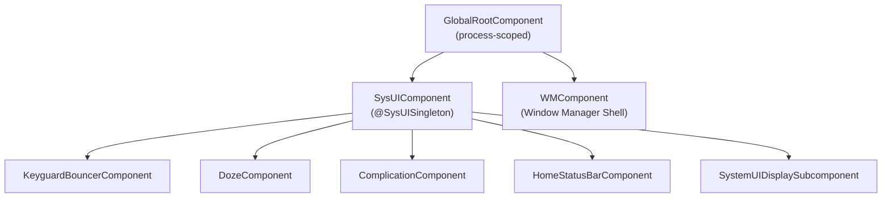

**GlobalRootComponent** is the top-level component.  It is bound to the
`Context` of the application and exposes the `SysUIComponent.Builder`:

```java
// frameworks/base/packages/SystemUI/src/com/android/systemui/dagger/
//   GlobalRootComponent.java
public interface GlobalRootComponent {
    interface Builder {
        @BindsInstance Builder context(Context context);
        @BindsInstance Builder instrumentationTest(@InstrumentationTest boolean test);
        GlobalRootComponent build();
    }

    WMComponent.Builder getWMComponentBuilder();
    SysUIComponent.Builder getSysUIComponent();
    InitializationChecker getInitializationChecker();
    @Main Looper getMainLooper();
}
```

**SysUIComponent** is the main subcomponent where most of SystemUI's singletons
live.  It installs a large number of Dagger modules:

```java
// frameworks/base/packages/SystemUI/src/com/android/systemui/dagger/
//   SysUIComponent.java
@SysUISingleton
@Subcomponent(modules = {
        DefaultComponentBinder.class,
        DependencyProvider.class,
        MultiUserUtilsModule.class,
        NotificationInsetsModule.class,
        QsFrameTranslateModule.class,
        ReferenceSystemUIModule.class,
        StartControlsStartableModule.class,
        StartBinderLoggerModule.class,
        SystemUIModule.class,
        SystemUICoreStartableModule.class,
        WallpaperModule.class})
public interface SysUIComponent {
    // ...
    Map<Class<?>, Provider<CoreStartable>> getStartables();
    @PerUser Map<Class<?>, Provider<CoreStartable>> getPerUserStartables();
}
```

The builder accepts shell interfaces from WMComponent, such as `Pip`,
`SplitScreen`, `Bubbles`, and `ShellTransitions`.  This is how SystemUI
integrates with the window manager shell process.

**SystemUIInitializer** orchestrates the Dagger graph construction:

```java
// frameworks/base/packages/SystemUI/src/com/android/systemui/SystemUIInitializer.java
public abstract class SystemUIInitializer {
    public void init(boolean fromTest) throws ExecutionException, InterruptedException {
        mRootComponent = getGlobalRootComponentBuilder()
                .context(mContext)
                .instrumentationTest(fromTest)
                .build();

        // Stand up WMComponent
        setupWmComponent(mContext);

        // Build SysUI, injecting Shell interfaces
        SysUIComponent.Builder builder = mRootComponent.getSysUIComponent();
        builder = prepareSysUIComponentBuilder(builder, mWMComponent)
                .setShell(mWMComponent.getShell())
                .setPip(mWMComponent.getPip())
                .setSplitScreen(mWMComponent.getSplitScreen())
                // ... more shell bindings
                ;
        mSysUIComponent = builder.build();

        Dependency dependency = mSysUIComponent.createDependency();
        dependency.start();
    }
}
```

### 47.1.3  CoreStartable -- The Service Lifecycle

Every major SystemUI feature is implemented as a `CoreStartable`.  This
interface defines the lifecycle that the application drives:

```
CoreStartable
  +-- start()          // Called once, in topological order
  +-- onBootCompleted()
  +-- isDumpCritical() // Included in bugreport CRITICAL section?
  +-- dump()           // For `adb shell dumpsys`
```

CoreStartables are registered in Dagger modules using multibinding:

```kotlin
// frameworks/base/packages/SystemUI/src/com/android/systemui/dagger/
//   SystemUICoreStartableModule.kt
@Module
abstract class SystemUICoreStartableModule {
    @Binds @IntoMap @ClassKey(KeyguardViewMediator::class)
    abstract fun bindKeyguardViewMediator(sysui: KeyguardViewMediator): CoreStartable

    @Binds @IntoMap @ClassKey(GlobalActionsComponent::class)
    abstract fun bindGlobalActionsComponent(sysui: GlobalActionsComponent): CoreStartable

    @Binds @IntoMap @ClassKey(WMShell::class)
    abstract fun bindWMShell(sysui: WMShell): CoreStartable

    // ... 30+ more bindings
}
```

The application starts them with a topological sort that respects declared
dependencies:

```java
// SystemUIApplicationImpl.java -- topological start loop
boolean startedAny = false;
ArrayDeque<Map.Entry<Class<?>, Provider<CoreStartable>>> queue;
ArrayDeque<Map.Entry<Class<?>, Provider<CoreStartable>>> nextQueue =
        new ArrayDeque<>(startables.entrySet());

do {
    startedAny = false;
    queue = nextQueue;
    nextQueue = new ArrayDeque<>(startables.size());
    while (!queue.isEmpty()) {
        Map.Entry<Class<?>, Provider<CoreStartable>> entry = queue.removeFirst();
        Class<?> cls = entry.getKey();
        Set<Class<? extends CoreStartable>> deps =
                mSysUIComponent.getStartableDependencies().get(cls);
        if (deps == null || startedStartables.containsAll(deps)) {
            mServices[i] = startStartable(clsName, entry.getValue());
            startedStartables.add(cls);
            startedAny = true;
        } else {
            nextQueue.add(entry);
        }
    }
} while (startedAny && !nextQueue.isEmpty());
```

If any startable's dependencies cannot be resolved, the process throws a
`RuntimeException` with details about which dependencies are missing.

### 47.1.4  Plugin System

SystemUI supports runtime extensibility through a plugin architecture.
Plugins are APKs that implement interfaces from the `plugin` source set:

```
frameworks/base/packages/SystemUI/plugin/src/com/android/systemui/plugins/
  qs/QSTile.java
  qs/QSFactory.java
  qs/QS.java
  GlobalActions.java
  VolumeDialogController.java
  ...
```

The `ExtensionController` discovers and loads plugins, with the
`GlobalActionsComponent` being a canonical example:

```java
// frameworks/base/packages/SystemUI/src/com/android/systemui/globalactions/
//   GlobalActionsComponent.java
@Override
public void start() {
    mExtension = mExtensionController.newExtension(GlobalActions.class)
            .withPlugin(GlobalActions.class)
            .withDefault(mGlobalActionsProvider::get)
            .withCallback(this::onExtensionCallback)
            .build();
    mPlugin = mExtension.get();
}
```

This pattern allows OEMs to replace the default power menu, volume dialog, or
QS tiles by shipping a plugin APK signed with the platform key.

### 47.1.5  Feature Flags

SystemUI uses Android's aconfig flag system for feature gating.  Flags are
defined in:

```
frameworks/base/packages/SystemUI/aconfig/
```

Code checks flags via generated accessors:

```java
import com.android.systemui.Flags;

if (Flags.predictiveBackAnimateShade()) {
    // new behavior
}
```

The QS pipeline has its own flag repository:

```kotlin
// frameworks/base/packages/SystemUI/src/com/android/systemui/qs/pipeline/shared/
//   QSPipelineFlagsRepository.kt
@SysUISingleton
class QSPipelineFlagsRepository @Inject constructor() {
    val tilesEnabled: Boolean
        get() = AconfigFlags.qsNewTiles()
}
```

### 47.1.6  Directory Structure

The following is an abbreviated listing of the 187+ sub-packages under
`src/com/android/systemui/`:

```
accessibility/    -- Magnification, floating menu
activity/         -- Activity lifecycle helpers
ambient/          -- Ambient display
authentication/   -- Device authentication domain layer
back/             -- Predictive back gesture
battery/          -- Battery state
biometrics/       -- Fingerprint, face, UDFPS
bluetooth/        -- Bluetooth QS tile data
bouncer/          -- Keyguard bouncer (MVI)
brightness/       -- Brightness slider
camera/           -- Camera access tracking
charging/         -- Charging animation
classifier/       -- Touch classifier (falsing)
clipboardoverlay/ -- Clipboard preview overlay
communal/         -- Communal (glanceable hub) mode
controls/         -- Device controls (home automation)
dagger/           -- DI components and modules
demomode/         -- Demo mode for screenshots
display/          -- Display management
doze/             -- Doze/AOD
dreams/           -- Screen saver (daydream)
flags/            -- Feature flag infrastructure
fragments/        -- Fragment host
globalactions/    -- Power menu
keyguard/         -- Lock screen
media/            -- Media controls, route picker
navigationbar/    -- Navigation bar and gesture nav
notifications/    -- Notification pipeline
plugins/          -- Plugin infrastructure
power/            -- Power domain layer
privacy/          -- Privacy indicators
qs/               -- Quick Settings
recents/          -- Recent apps
scene/            -- Scene container (next-gen UI)
screenshot/       -- Screenshot capture and editing
shade/            -- Notification shade
statusbar/        -- Status bar, icons, policies
volume/           -- Volume dialog
wallpapers/       -- Wallpaper management
wmshell/          -- WM Shell integration
```

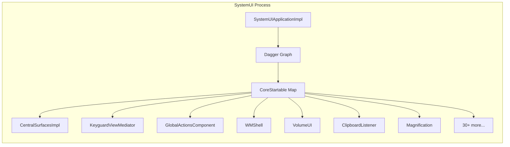

---

## 47.2  Status Bar

The status bar is the narrow strip at the top of the screen that displays the
clock, notification icons, battery level, signal strength, and system status
icons.  It is one of the first visual elements created during SystemUI startup.

### 47.2.1  CentralSurfaces -- The Orchestrator

`CentralSurfaces` is an interface extending both `CoreStartable` and
`LifecycleOwner`.  Its implementation, `CentralSurfacesImpl`, is a 3,291-line
class that historically served as the central coordinator for the status bar,
notification shade, keyguard, and more:

```java
// frameworks/base/packages/SystemUI/src/com/android/systemui/statusbar/phone/
//   CentralSurfaces.java
public interface CentralSurfaces extends Dumpable, LifecycleOwner, CoreStartable {
    String TAG = "CentralSurfaces";
    boolean SHOW_LOCKSCREEN_MEDIA_ARTWORK = true;
    long LAUNCH_TRANSITION_TIMEOUT_MS = 5000;
    // ...
}
```

`CentralSurfacesImpl` is injected with an enormous constructor -- it depends on
virtually every other SystemUI component.  It manages:

- Status bar window creation and positioning
- Notification shade expansion
- Keyguard/bouncer transitions
- Light bar (dark/light icon tinting)
- Biometric unlock animations
- Media artwork on lock screen
- Demo mode

The class is progressively being decomposed.  New code should depend on
narrower interfaces (e.g., `ShadeController`, `ShadeViewController`,
`KeyguardStateController`) rather than `CentralSurfaces` directly.

### 47.2.2  StatusBarWindowController

The status bar occupies a system window of type
`WindowManager.LayoutParams.TYPE_STATUS_BAR`.  Its window management is
encapsulated in `StatusBarWindowControllerImpl`:

```java
// frameworks/base/packages/SystemUI/src/com/android/systemui/statusbar/window/
//   StatusBarWindowControllerImpl.java
public class StatusBarWindowControllerImpl implements StatusBarWindowController {
    // Window type, insets configuration, cutout handling
}
```

Key aspects of the status bar window:

| Property | Value |
|---|---|
| Window type | `TYPE_STATUS_BAR` |
| Pixel format | `PixelFormat.TRANSLUCENT` |
| Cutout mode | `LAYOUT_IN_DISPLAY_CUTOUT_MODE_ALWAYS` |
| Gravity | `Gravity.TOP` |
| Flags | `FLAG_NOT_FOCUSABLE`, `FLAG_TOUCHABLE_WHEN_WAKING` |

The controller handles display cutouts (notches, punch-holes) and configures
`InsetsFrameProvider` so that the status bar participates in the inset system.
Applications receive `statusBars()` insets corresponding to the height of this
window.

### 47.2.3  CollapsedStatusBarFragment

The visible content of the status bar is managed by
`CollapsedStatusBarFragment`, a `Fragment` that inflates the
`R.layout.status_bar` layout:

```java
// frameworks/base/packages/SystemUI/src/com/android/systemui/statusbar/phone/
//   fragment/CollapsedStatusBarFragment.java
public class CollapsedStatusBarFragment extends Fragment
        implements CommandQueue.Callbacks,
                   StatusBarStateController.StateListener,
                   SystemStatusAnimationCallback {
    // Manages icon visibility, system event animations, ongoing call chip
}
```

The fragment listens to several signals:

- **CommandQueue.Callbacks** -- disable flags from `system_server` that hide icons
- **StatusBarStateController** -- state transitions (SHADE, KEYGUARD, SHADE_LOCKED)
- **SystemStatusAnimationCallback** -- animated chips for privacy indicators
- **ShadeExpansionStateManager** -- fading out icons during shade expansion

### 47.2.4  PhoneStatusBarView

`PhoneStatusBarView` is the root `View` of the collapsed status bar:

```java
// frameworks/base/packages/SystemUI/src/com/android/systemui/statusbar/phone/
//   PhoneStatusBarView.java
public class PhoneStatusBarView extends BaseStatusBarFrameLayout
        implements DarkReceiverImpl.DarkReceiver {
    // Touch handling, dark mode tinting
}
```

The view controller (`PhoneStatusBarViewController`) coordinates dark/light
icon tinting based on the underlying content, using region sampling to
determine whether the wallpaper or app content below the status bar is light or
dark.

### 47.2.5  Status Bar Icon Pipeline

Icons in the status bar flow through a multi-stage pipeline:

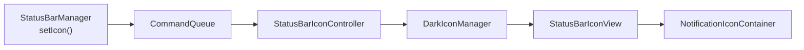

The `StatusBarIconController` maintains the list of icons and their visibility.
`DarkIconManager` applies tinting: white icons over dark backgrounds, dark
icons over light backgrounds.  The tinting boundary is computed by
`LightBarController` using the `Drawable` content of the window behind the
status bar.

### 47.2.6  Status Bar States

The status bar operates in several logical states managed by
`StatusBarStateControllerImpl`:

```java
// frameworks/base/packages/SystemUI/src/com/android/systemui/statusbar/
//   StatusBarState.java
public class StatusBarState {
    public static final int SHADE = 0;          // Normal unlocked
    public static final int KEYGUARD = 1;       // Lock screen
    public static final int SHADE_LOCKED = 2;   // Shade pulled down over keyguard
}
```

Transitions between states drive animations throughout SystemUI.  The state
controller broadcasts changes to all registered `StateListener` instances.

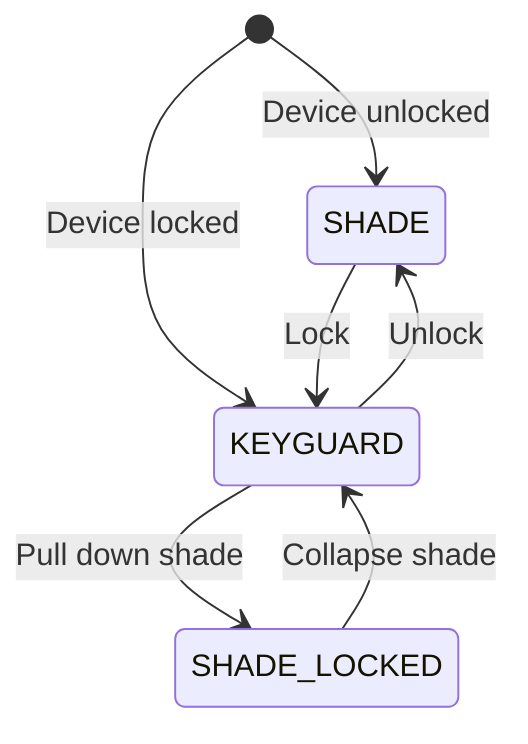

---

## 47.3  Notification Shade

The notification shade is the panel that slides down from the top of the
screen, revealing notifications and Quick Settings.  It is one of the most
complex UI components in Android.

### 47.3.1  Window Configuration

The notification shade occupies a separate window from the status bar.  Its
window type is `TYPE_NOTIFICATION_SHADE` (a special type that allows it to
receive input above other system windows):

```java
// frameworks/base/packages/SystemUI/src/com/android/systemui/shade/
//   NotificationShadeWindowControllerImpl.java
@SysUISingleton
public class NotificationShadeWindowControllerImpl
        implements NotificationShadeWindowController, Dumpable {
    // Manages the notification shade window parameters
    // Adjusts focus, touchability, and dimensions based on state
}
```

The window controller dynamically adjusts the window parameters based on the
current state:

| State | Window Behaviour |
|---|---|
| Shade collapsed | Not focusable, minimal height |
| Shade expanding | Expanding height, receives touch |
| Shade expanded | Full screen, focusable for remote input |
| Keyguard | Full screen, bouncer may be focusable |
| Dozing/AOD | Minimal, low power |

### 47.3.2  NotificationPanelViewController

At 4,329 lines, `NotificationPanelViewController` is the primary controller for
the shade panel.  It manages:

- Touch tracking and velocity-based expansion/collapse
- QS expansion within the shade
- Keyguard-specific behaviour (clock, notifications on lock screen)
- Split shade on large screens (notifications left, QS right)
- Blur effects during expansion

```java
// frameworks/base/packages/SystemUI/src/com/android/systemui/shade/
//   NotificationPanelViewController.java
public class NotificationPanelViewController
        implements Dumpable, ShadeViewController, ShadeSurface {
    // Handles all shade panel touch events and state transitions
}
```

Key touch handling flow:

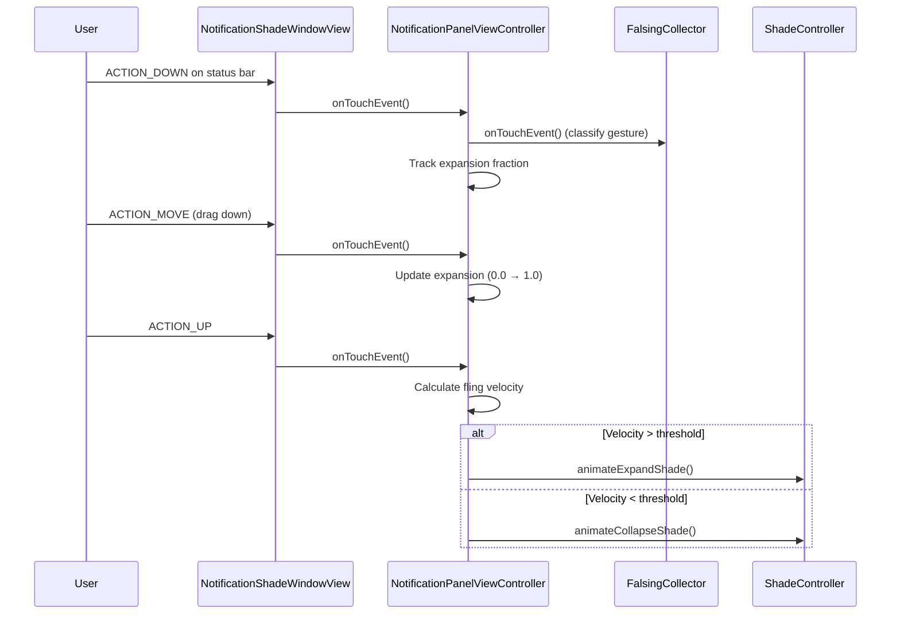

### 47.3.3  ShadeController

`ShadeController` is the interface that abstracts shade operations.  It extends
`CoreStartable`:

```java
// frameworks/base/packages/SystemUI/src/com/android/systemui/shade/
//   ShadeController.java
public interface ShadeController extends CoreStartable {
    boolean isShadeEnabled();
    void instantExpandShade();
    void instantCollapseShade();
    void animateCollapseShade(int flags, boolean force,
                              boolean delayed, float speedUpFactor);
    void animateExpandShade();
    void animateExpandQs();
    void cancelExpansionAndCollapseShade();
    boolean isShadeFullyOpen();
    boolean isExpandingOrCollapsing();
    void collapseShade();
    void collapseShadeForActivityStart();
    // ...
}
```

The default implementation is `ShadeControllerImpl`, while
`ShadeControllerSceneImpl` is the next-generation implementation for the scene
container architecture.

### 47.3.4  NotificationStackScrollLayout

The notification list is rendered by `NotificationStackScrollLayout`, a custom
`ViewGroup` that implements:

- Variable-height child views (notification rows)
- Over-scroll physics
- Dismissal gestures (swipe to dismiss)
- Grouping and section headers
- Heads-up notification insertion
- Shelf for overflow icons

Each notification row is an `ExpandableNotificationRow`, which itself contains
inflated notification views (contracted, expanded, heads-up variants).

### 47.3.5  Scrim Management

The scrim (dimming overlay) behind the shade is managed by `ScrimController`,
which handles multiple scrim layers:

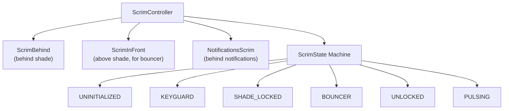

Each `ScrimState` defines alpha values and tint colours for the scrims.
Transitions between states animate these properties smoothly.

### 47.3.6  Lockscreen-to-Shade Transition

The `LockscreenShadeTransitionController` manages the drag-down gesture from
the lock screen into the shade.  It coordinates:

- QS expansion fraction
- Scrim alpha transitions
- Keyguard visibility
- Notification position interpolation

---

## 47.4  Quick Settings

Quick Settings (QS) is the tile grid accessible by pulling down the
notification shade.  The first pull shows a "Quick QS" strip of a few tiles;
a second pull expands to the full QS panel.

### 47.4.1  Architecture Overview

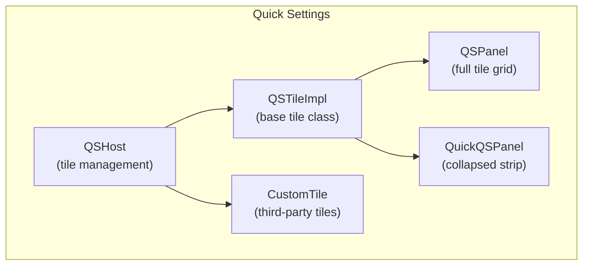

### 47.4.2  QSHost -- Tile Management

`QSHost` is the interface that manages the set of active QS tiles:

```java
// frameworks/base/packages/SystemUI/src/com/android/systemui/qs/QSHost.java
public interface QSHost {
    String TILES_SETTING = Settings.Secure.QS_TILES;

    static List<String> getDefaultSpecs(Resources res) {
        final ArrayList<String> tiles = new ArrayList();
        int resource = QsInCompose.isEnabled()
                ? R.string.quick_settings_tiles_new_default
                : R.string.quick_settings_tiles_default;
        final String defaultTileList = res.getString(resource);
        tiles.addAll(Arrays.asList(defaultTileList.split(",")));
        return tiles;
    }

    Collection<QSTile> getTiles();
    void addTile(String spec);
    void addTile(String spec, int requestPosition);
    void addTile(ComponentName tile);
    void removeTile(String tileSpec);
    QSTile createTile(String tileSpec);
    void changeTilesByUser(List<String> previousTiles, List<String> newTiles);
}
```

The tile configuration is stored in `Settings.Secure.QS_TILES` as a
comma-separated list of tile specs (e.g., `"wifi,bt,flashlight,rotation"`).
The default set is defined in a string resource, which OEMs commonly overlay.

### 47.4.3  QSTile Interface

Every QS tile implements the `QSTile` plugin interface:

```java
// frameworks/base/packages/SystemUI/plugin/src/com/android/systemui/plugins/qs/
//   QSTile.java
@ProvidesInterface(version = QSTile.VERSION)
public interface QSTile {
    int VERSION = 5;

    String getTileSpec();
    boolean isAvailable();
    void refreshState();
    void click(@Nullable Expandable expandable);
    void secondaryClick(@Nullable Expandable expandable);
    void longClick(@Nullable Expandable expandable);
    @NonNull State getState();
    CharSequence getTileLabel();
    void setListening(Object client, boolean listening);
    void destroy();
}
```

The `State` inner class carries all visual state:

| Field | Description |
|---|---|
| `state` | `Tile.STATE_ACTIVE`, `STATE_INACTIVE`, `STATE_UNAVAILABLE` |
| `icon` | Drawable or resource |
| `label` | Primary text |
| `secondaryLabel` | Secondary text (e.g., network name) |
| `contentDescription` | Accessibility |
| `dualTarget` | Whether long press has a separate action |

### 47.4.4  QSTileImpl -- Base Implementation

`QSTileImpl` is the abstract base class for built-in tiles:

```java
// frameworks/base/packages/SystemUI/src/com/android/systemui/qs/tileimpl/
//   QSTileImpl.java
public abstract class QSTileImpl<TState extends State>
        implements QSTile, LifecycleOwner, Dumpable {

    protected final QSHost mHost;
    private static final long DEFAULT_STALE_TIMEOUT = 10 * DateUtils.MINUTE_IN_MILLIS;

    // Subclasses must implement:
    // - newTileState()
    // - handleClick()
    // - handleUpdateState(TState state, Object arg)
    // - getLongClickIntent()
    // - getTileLabel()
}
```

State management runs on a background looper.  The flow is:

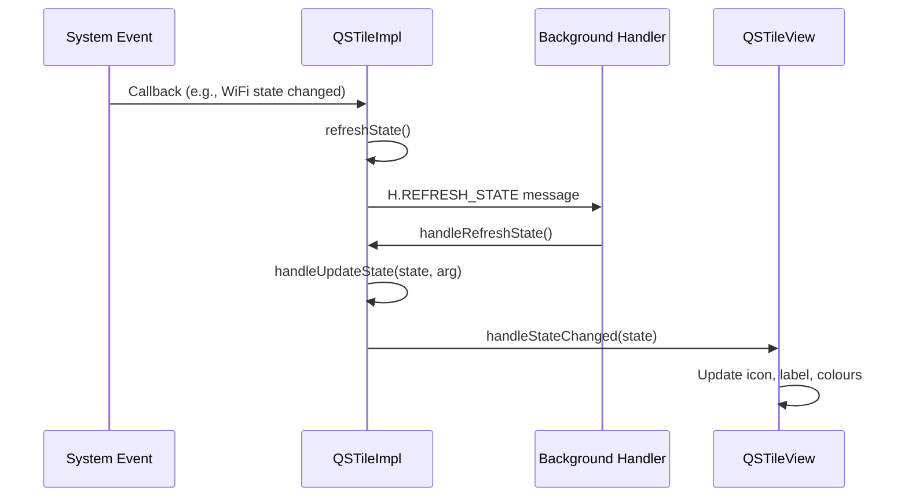

### 47.4.5  Built-in Tiles

AOSP ships approximately 35 built-in QS tiles:

```
frameworks/base/packages/SystemUI/src/com/android/systemui/qs/tiles/
  AirplaneModeTile.java        LocationTile.java
  AlarmTile.kt                 MicrophoneToggleTile.java
  BatterySaverTile.java        MobileDataTile.kt
  BluetoothTile.java           ModesDndTile.kt
  CameraToggleTile.java        NfcTile.java
  CastTile.java                NightDisplayTile.java
  ColorCorrectionTile.java     NotesTile.kt
  ColorInversionTile.java      OneHandedModeTile.java
  DataSaverTile.java           QRCodeScannerTile.java
  DeviceControlsTile.kt        QuickAccessWalletTile.java
  DreamTile.java               ReduceBrightColorsTile.java
  FlashlightTile.java          RotationLockTile.java
  FontScalingTile.kt           ScreenRecordTile.java
  HearingDevicesTile.java      UiModeNightTile.java
  HotspotTile.java             WifiTile.kt
  InternetTileNewImpl.kt       WorkModeTile.java
```

Each tile follows the same pattern.  Here is `FlashlightTile` as a
representative example:

```java
// frameworks/base/packages/SystemUI/src/com/android/systemui/qs/tiles/
//   FlashlightTile.java
public class FlashlightTile extends QSTileImpl<BooleanState>
        implements FlashlightController.FlashlightListener {

    public static final String TILE_SPEC = "flashlight";
    private final FlashlightController mFlashlightController;

    @Inject
    public FlashlightTile(
            QSHost host,
            QsEventLogger uiEventLogger,
            @Background Looper backgroundLooper,
            @Main Handler mainHandler,
            FalsingManager falsingManager,
            MetricsLogger metricsLogger,
            StatusBarStateController statusBarStateController,
            ActivityStarter activityStarter,
            QSLogger qsLogger,
            FlashlightController flashlightController) {
        super(host, uiEventLogger, backgroundLooper, mainHandler,
                falsingManager, metricsLogger, statusBarStateController,
                activityStarter, qsLogger);
        mFlashlightController = flashlightController;
        mFlashlightController.observe(getLifecycle(), this);
    }
}
```

Modern tiles like `WifiTile` use a layered architecture with domain
interactors:

```kotlin
// frameworks/base/packages/SystemUI/src/com/android/systemui/qs/tiles/
//   WifiTile.kt
class WifiTile @Inject constructor(
    private val host: QSHost,
    // ...
    private val dataInteractor: WifiTileDataInteractor,
    private val tileMapper: WifiTileMapper,
    private val userActionInteractor: WifiTileUserActionInteractor,
) : QSTileImpl<QSTile.State?>(/* ... */) {
    // Data flows through interactor -> mapper -> view
}
```

### 47.4.6  Custom Tiles (Third-Party)

Third-party apps can add QS tiles by implementing
`android.service.quicksettings.TileService`.  SystemUI manages these through
`CustomTile`:

```java
// frameworks/base/packages/SystemUI/src/com/android/systemui/qs/external/
//   CustomTile.java
public class CustomTile extends QSTileImpl<State>
        implements TileChangeListener, CustomTileInterface {
    public static final String PREFIX = "custom(";
    // Tile spec format: "custom(com.example.app/.MyTileService)"
}
```

The lifecycle of a custom tile is managed by `TileLifecycleManager`, which
binds to the third-party `TileService` and manages the `IQSTileService`
interface.  `TileServiceManager` throttles bindings to prevent resource
exhaustion.

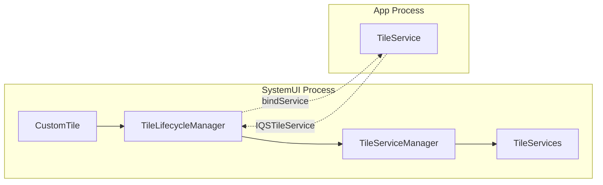

### 47.4.7  Auto-Add Tiles

Some tiles are automatically added when certain conditions are met (e.g., the
Work Profile tile appears when a managed profile is created).  This logic is
implemented in the QS pipeline's data layer:

```
frameworks/base/packages/SystemUI/src/com/android/systemui/qs/pipeline/
  data/    -- Repositories for tile data and auto-add rules
  domain/  -- Interactors for tile lifecycle
  shared/  -- Shared flags and models
```

### 47.4.8  QSPanel Layout

The full QS panel uses `QSPanel` with `TileLayout` (or `PagedTileLayout` for
pagination).  The Quick QS strip uses `QuickQSPanel` with `QuickTileLayout`.
Both are managed by their respective controllers (`QSPanelController`,
`QuickQSPanelController`).

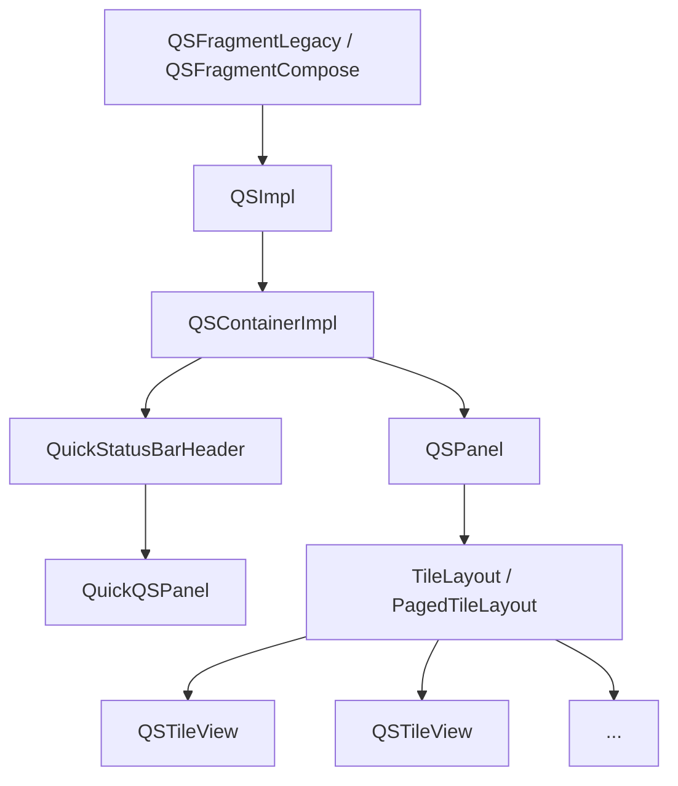

---

## 47.5  Lock Screen

The lock screen (keyguard) is a critical security surface.  It must display
before any user content is visible and must correctly manage authentication
(PIN, pattern, password, biometrics).

### 47.5.1  KeyguardViewMediator

`KeyguardViewMediator` is the largest CoreStartable in SystemUI at 4,573 lines.
It mediates between the `KeyguardService` (which receives lock/unlock commands
from the framework) and the keyguard UI:

```java
// frameworks/base/packages/SystemUI/src/com/android/systemui/keyguard/
//   KeyguardViewMediator.java
public class KeyguardViewMediator implements CoreStartable, Dumpable {
    // Manages keyguard lifecycle: show, hide, dismiss, lock
}
```

Key responsibilities:

| Responsibility | Description |
|---|---|
| Lock timeout | Schedules lock after screen-off timeout |
| Keyguard sounds | Lock/unlock sound effects |
| SIM PIN handling | Prompts for SIM unlock |
| Trust agents | Integrates with Smart Lock |
| Occlusion | Handles activities shown over keyguard |
| Unlock animation | Coordinates the unlock transition |

The mediator receives callbacks from `system_server` through
`ViewMediatorCallback`:

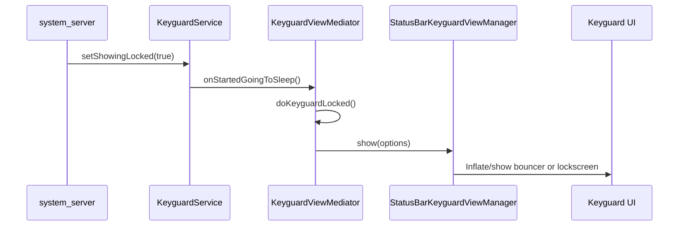

### 47.5.2  StatusBarKeyguardViewManager

`StatusBarKeyguardViewManager` bridges the mediator and the actual keyguard
views.  It manages the primary bouncer (PIN/pattern/password input), the
alternate bouncer (biometric prompt), and the keyguard-to-shade transitions:

```java
// frameworks/base/packages/SystemUI/src/com/android/systemui/statusbar/phone/
//   StatusBarKeyguardViewManager.java
@SysUISingleton
public class StatusBarKeyguardViewManager implements Dumpable {
    // Manages bouncer visibility, predictive back animation,
    // alternate bouncer, global actions visibility
}
```

It interacts with several domain interactors from the new MVI architecture:

- `PrimaryBouncerInteractor` -- shows/hides the PIN/pattern/password bouncer
- `AlternateBouncerInteractor` -- manages the biometric (UDFPS) bouncer
- `KeyguardDismissActionInteractor` -- handles dismiss actions after unlock
- `KeyguardTransitionInteractor` -- tracks keyguard state transitions

### 47.5.3  Bouncer

The bouncer is the security challenge (PIN, pattern, or password).  Its
implementation lives in:

```
frameworks/base/packages/SystemUI/src/com/android/systemui/bouncer/
  data/repository/BouncerRepositoryModule.kt
  domain/interactor/BouncerInteractor.kt
  domain/interactor/PrimaryBouncerInteractor.kt
  domain/interactor/AlternateBouncerInteractor.kt
  domain/startable/BouncerStartable.kt
  ui/BouncerView.kt
```

The bouncer follows the MVI pattern:

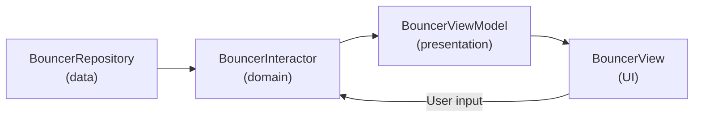

### 47.5.4  AOD (Always-On Display) Integration

When the device is dozing, the lock screen transitions to Always-On Display
mode.  This is coordinated by:

- **DozeServiceHost** -- bridges the `DreamService`-based doze with SystemUI
- **DozeScrimController** -- manages scrim opacity during doze
- **DozeParameters** -- configuration (pulse on notification, tap-to-check)

The keyguard state machine includes AOD-specific transitions:

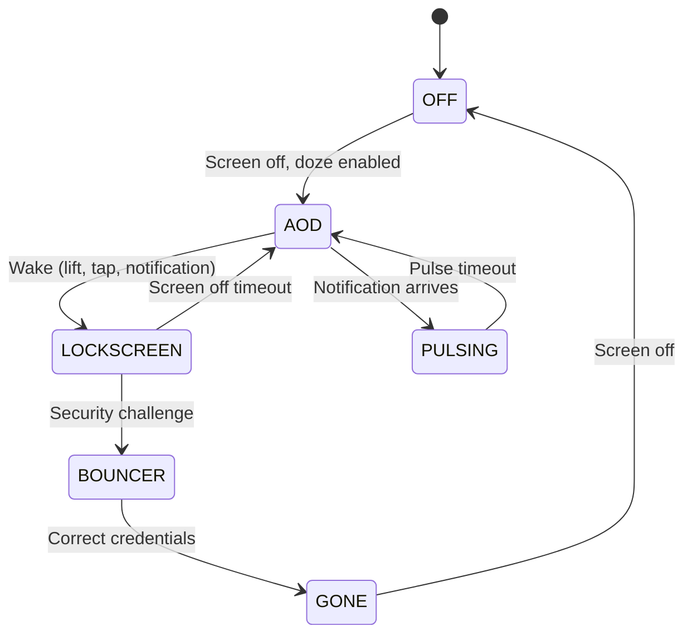

### 47.5.5  Lock Screen Customization

The lock screen supports:

- **Clock customization** -- pluggable clock faces via `ClockRegistryModule`
- **Quick affordances** -- shortcuts on the lock screen corners (camera, wallet)
- **Complication** -- weather, date, battery on AOD
- **Wallpaper** -- distinct lock screen wallpaper
- **Communal (Glanceable Hub)** -- widget surface accessible from lock screen

---

## 47.6  Recent Apps

SystemUI does not implement the Recents UI directly.  Instead, it delegates
to Launcher3 (or a Launcher-based quickstep implementation) through the
`OverviewProxy` pattern.

### 47.6.1  Recents Architecture

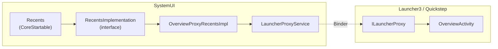

### 47.6.2  OverviewProxyRecentsImpl

The default `RecentsImplementation` proxies all calls to Launcher:

```java
// frameworks/base/packages/SystemUI/src/com/android/systemui/recents/
//   OverviewProxyRecentsImpl.java
@SysUISingleton
public class OverviewProxyRecentsImpl implements RecentsImplementation {

    @Override
    public void showRecentApps(boolean triggeredFromAltTab) {
        ILauncherProxy launcherProxy = mLauncherProxyService.getProxy();
        if (launcherProxy != null) {
            try {
                launcherProxy.onOverviewShown(triggeredFromAltTab);
            } catch (RemoteException e) {
                Log.e(TAG, "Failed to send overview show event to launcher.", e);
            }
        }
    }

    @Override
    public void toggleRecentApps() {
        ILauncherProxy launcherProxy = mLauncherProxyService.getProxy();
        if (launcherProxy != null) {
            final Runnable toggleRecents = () -> {
                try {
                    mLauncherProxyService.getProxy().onOverviewToggle();
                    mLauncherProxyService.notifyToggleRecentApps();
                } catch (RemoteException e) {
                    Log.e(TAG, "Cannot send toggle recents through proxy service.", e);
                }
            };
            if (mKeyguardStateController.isShowing()) {
                mActivityStarter.executeRunnableDismissingKeyguard(
                        () -> mHandler.post(toggleRecents), null, true, false, true);
            } else {
                toggleRecents.run();
            }
        }
    }
}
```

### 47.6.3  LauncherProxyService

The `LauncherProxyService` maintains the binder connection to Launcher's
overview implementation.  When the user swipes up from the navigation bar,
SystemUI routes the gesture to Launcher, which renders the task thumbnails and
handles task switching.

### 47.6.4  RecentsModule

The Dagger module binds the implementation:

```java
// frameworks/base/packages/SystemUI/src/com/android/systemui/recents/
//   RecentsModule.java
@Module
public abstract class RecentsModule {
    @Binds
    abstract RecentsImplementation bindRecentsImplementation(
            OverviewProxyRecentsImpl impl);
}
```

---

## 47.7  Volume Dialog

The volume dialog appears when the user presses hardware volume keys or when
system volume changes programmatically.

### 47.7.1  VolumeDialogControllerImpl

The controller is the source of truth for volume state.  It runs on a dedicated
background thread:

```java
// frameworks/base/packages/SystemUI/src/com/android/systemui/volume/
//   VolumeDialogControllerImpl.java
@SysUISingleton
public class VolumeDialogControllerImpl implements VolumeDialogController, Dumpable {
    // All work done on a dedicated background worker thread
    // Methods ending in "W" must be called on the worker thread
}
```

The controller:

- Registers an `IVolumeController` callback with `AudioManager`
- Tracks state for multiple audio streams (MUSIC, RING, ALARM, VOICE_CALL, ACCESSIBILITY)
- Monitors ringer mode (normal, vibrate, silent)
- Tracks DND (Do Not Disturb) state
- Manages media sessions for per-app volume

### 47.7.2  VolumeDialogImpl

The dialog UI is implemented as a `Dialog` with a custom layout:

```java
// frameworks/base/packages/SystemUI/src/com/android/systemui/volume/
//   VolumeDialogImpl.java  (2,859 lines)
public class VolumeDialogImpl implements VolumeDialog {
    // Window type: TYPE_VOLUME_OVERLAY
    // Displays seekbars for active audio streams
    // Handles ringer mode toggle (ring -> vibrate -> silent)
}
```

The dialog uses a vertical layout with one `SeekBar` per active stream:

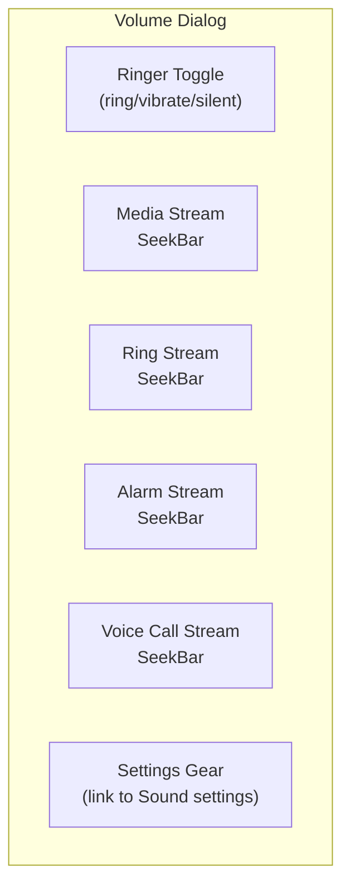

Key features:

| Feature | Implementation |
|---|---|
| Auto-dismiss | Timeout handler (default 3 seconds) |
| Live feedback | Updates as system volume changes |
| CSD warning | `CsdWarningDialog` for hearing safety |
| Safety warning | `SafetyWarningDialog` for media volume |
| Captions toggle | `CaptionsToggleImageButton` |
| Posture-aware | Dismiss on foldable posture change |

### 47.7.3  VolumeDialogComponent

`VolumeDialogComponent` wires the controller and dialog together as a
`CoreStartable`:

```java
// frameworks/base/packages/SystemUI/src/com/android/systemui/volume/
//   VolumeDialogComponent.java
public class VolumeDialogComponent implements VolumeComponent {
    // Integates VolumeDialogControllerImpl with VolumeDialogImpl
}
```

### 47.7.4  Volume Events

The `Events` class defines all volume-related telemetry events:

```java
// frameworks/base/packages/SystemUI/src/com/android/systemui/volume/Events.java
public class Events {
    public static final int EVENT_SHOW_DIALOG = 0;
    public static final int EVENT_DISMISS_DIALOG = 1;
    public static final int EVENT_ACTIVE_STREAM_CHANGED = 2;
    public static final int EVENT_LEVEL_CHANGED = 3;
    public static final int EVENT_RINGER_TOGGLE = 4;
    // ...
    public static final int DISMISS_REASON_SETTINGS_CLICKED = 7;
    public static final int DISMISS_REASON_POSTURE_CHANGED = 12;
}
```

---

## 47.8  Power Menu

The power menu (Global Actions) appears when the user long-presses the power
button.  It provides options to power off, restart, emergency call, and
optionally lockdown.

### 47.8.1  GlobalActionsComponent

`GlobalActionsComponent` is the CoreStartable entry point.  It uses the plugin
extension pattern to allow OEM replacement:

```java
// frameworks/base/packages/SystemUI/src/com/android/systemui/globalactions/
//   GlobalActionsComponent.java
@SysUISingleton
public class GlobalActionsComponent
        implements CoreStartable, Callbacks, GlobalActionsManager {

    @Override
    public void start() {
        mBarService = IStatusBarService.Stub.asInterface(
                ServiceManager.getService(Context.STATUS_BAR_SERVICE));
        mExtension = mExtensionController.newExtension(GlobalActions.class)
                .withPlugin(GlobalActions.class)
                .withDefault(mGlobalActionsProvider::get)
                .withCallback(this::onExtensionCallback)
                .build();
        mPlugin = mExtension.get();
        mCommandQueue.addCallback(this);
    }

    @Override
    public void handleShowGlobalActionsMenu() {
        mStatusBarKeyguardViewManager.setGlobalActionsVisible(true);
        mExtension.get().showGlobalActions(this);
    }

    @Override
    public void shutdown() {
        mBarService.shutdown();
    }

    @Override
    public void reboot(boolean safeMode) {
        mBarService.reboot(safeMode);
    }
}
```

### 47.8.2  GlobalActionsImpl

The default plugin implementation:

```java
// frameworks/base/packages/SystemUI/src/com/android/systemui/globalactions/
//   GlobalActionsImpl.java
public class GlobalActionsImpl implements GlobalActions, CommandQueue.Callbacks {

    @Override
    public void showGlobalActions(GlobalActionsManager manager) {
        if (mDisabled) return;
        mGlobalActionsDialog.showOrHideDialog(
                mKeyguardStateController.isShowing(),
                mDeviceProvisionedController.isDeviceProvisioned(),
                null /* view */,
                mContext.getDisplayId());
    }

    @Override
    public void showShutdownUi(boolean isReboot, String reason) {
        mShutdownUi.showShutdownUi(isReboot, reason);
        mShadeController.instantCollapseShade();
    }

    @Override
    public void disable(int displayId, int state1, int state2, boolean animate) {
        final boolean disabled = (state2 & DISABLE2_GLOBAL_ACTIONS) != 0;
        if (displayId != mContext.getDisplayId() || disabled == mDisabled) return;
        mDisabled = disabled;
        if (disabled) {
            mGlobalActionsDialog.dismissDialog();
        }
    }
}
```

### 47.8.3  GlobalActionsDialogLite

At 3,043 lines, `GlobalActionsDialogLite` implements the actual power menu
dialog:

```java
// frameworks/base/packages/SystemUI/src/com/android/systemui/globalactions/
//   GlobalActionsDialogLite.java
// Window type: TYPE_STATUS_BAR_SUB_PANEL
// Layout mode: LAYOUT_IN_DISPLAY_CUTOUT_MODE_ALWAYS
```

The dialog dynamically builds its action list based on device capabilities:

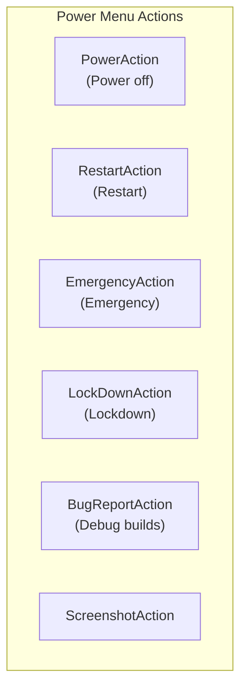

Action availability depends on:

| Condition | Effect |
|---|---|
| Device provisioned | All actions available |
| Keyguard showing | May restrict some actions |
| User lockdown | Changes lockdown button text |
| Airplane mode | Affects emergency dialer |
| Telephony available | Controls emergency action |
| Debug build | Enables bug report action |

### 47.8.4  ShutdownUi

When a shutdown or reboot is initiated, `ShutdownUi` displays a full-screen
progress animation while the system shuts down.  The shade is instantly
collapsed to prevent interaction during the shutdown sequence.

### 47.8.5  Power Menu Layouts

Multiple layout classes support different screen configurations:

```
GlobalActionsColumnLayout.java   -- Vertical column (phones, portrait)
GlobalActionsFlatLayout.java     -- Horizontal row
GlobalActionsGridLayout.java     -- Grid (tablets)
GlobalActionsLayoutLite.java     -- Base layout logic
GlobalActionsPowerDialog.java    -- Power-specific dialog variant
```

---

## 47.9  Screenshots

The screenshot system captures the screen content, displays a preview, and
provides editing/sharing actions.

### 47.9.1  TakeScreenshotService

Screenshot requests arrive from `system_server` via `TakeScreenshotService`,
a bound service:

```java
// frameworks/base/packages/SystemUI/src/com/android/systemui/screenshot/
//   TakeScreenshotService.java
public class TakeScreenshotService extends Service {
    // Receives screenshot requests from PhoneWindowManager
    // Routes to appropriate handler (headless or interactive)
}
```

### 47.9.2  ScreenshotController

`ScreenshotController` (Kotlin, using `@AssistedInject`) manages the entire
screenshot flow:

```kotlin
// frameworks/base/packages/SystemUI/src/com/android/systemui/screenshot/
//   ScreenshotController.kt
class ScreenshotController @AssistedInject internal constructor(
    appContext: Context,
    screenshotWindowFactory: ScreenshotWindow.Factory,
    viewProxyFactory: ScreenshotShelfViewProxy.Factory,
    screenshotNotificationsControllerFactory:
        ScreenshotNotificationsController.Factory,
    screenshotActionsControllerFactory:
        ScreenshotActionsController.Factory,
    actionExecutorFactory: ActionExecutor.Factory,
    private val screenshotSoundController: ScreenshotSoundController,
    private val uiEventLogger: UiEventLogger,
    private val imageExporter: ImageExporter,
    private val imageCapture: ImageCapture,
    private val scrollCaptureExecutor: ScrollCaptureExecutor,
    // ...
    @Assisted private val display: Display,
) : InteractiveScreenshotHandler {
```

### 47.9.3  Screenshot Flow

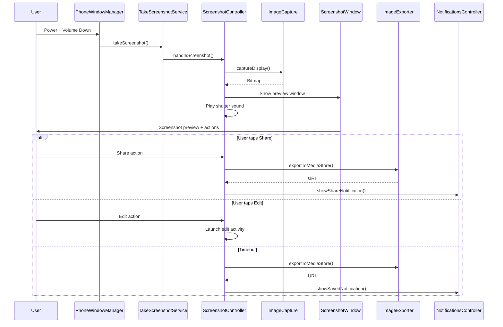

### 47.9.4  Screenshot Components

| Component | Role |
|---|---|
| `ImageCapture` / `ImageCaptureImpl` | Captures screen content as a `Bitmap` |
| `ScreenshotWindow` | Manages the preview overlay window |
| `ScreenshotShelfViewProxy` | Preview shelf UI (thumbnail + actions) |
| `ImageExporter` | Saves to `MediaStore` |
| `ScreenshotNotificationsController` | Shows save/share notifications |
| `ScreenshotSoundController` | Plays camera shutter sound |
| `ScrollCaptureExecutor` | Long/scrolling screenshot capture |
| `ScreenshotDetectionController` | Notifies apps of screenshot capture |
| `MessageContainerController` | Shows work profile messages |
| `TimeoutHandler` | Auto-dismisses after timeout |
| `ScreenshotActionsController` | Manages action buttons (share, edit) |
| `ActionIntentCreator` | Creates intents for share/edit |

### 47.9.5  Long Screenshots

The scroll capture system enables capturing content beyond the visible
viewport.  `ScrollCaptureExecutor` communicates with the app's
`ScrollCaptureCallback` to progressively capture tiles of content, which are
then stitched together into a single image.

### 47.9.6  Cross-Profile Screenshots

`ScreenshotCrossProfileService` handles screenshots that involve managed
profile content, using `ICrossProfileService` to proxy operations across
user boundaries.

---

## 47.10  Multi-Display SystemUI

Modern Android supports multiple displays (external monitors, foldables with
two screens, automotive secondary displays).  SystemUI must render appropriate
UI on each display.

### 47.10.1  PerDisplayRepository Pattern

The `PerDisplayRepository<T>` pattern (from `com.android.app.displaylib`)
maintains per-display instances of components:

```kotlin
// frameworks/base/packages/SystemUI/src/com/android/systemui/dagger/
//   PerDisplayRepositoriesModule.kt
@Module
interface PerDisplayRepositoriesModule {
    companion object {
        @SysUISingleton
        @Provides
        fun provideSysUiStateRepository(
            repositoryFactory: PerDisplayInstanceRepositoryImpl.Factory<SysUiState>,
            instanceProvider: SysUIStateInstanceProvider,
        ): PerDisplayRepository<SysUiState> {
            val debugName = "SysUiStatePerDisplayRepo"
            return if (ShadeWindowGoesAround.isEnabled) {
                repositoryFactory.create(debugName, instanceProvider)
            } else {
                DefaultDisplayOnlyInstanceRepositoryImpl(debugName, instanceProvider)
            }
        }
    }
}
```

When the `ShadeWindowGoesAround` flag is enabled, components like `SysUiState`
are instantiated per-display.  Otherwise, they fall back to default-display-only
behaviour.

### 47.10.2  Per-Display Status Bar

The status bar window controller uses `StatusBarWindowControllerStore` to
manage per-display instances:

```
frameworks/base/packages/SystemUI/src/com/android/systemui/statusbar/window/
  StatusBarWindowControllerStore.kt    -- Store for per-display controllers
  StatusBarWindowControllerImpl.java   -- Per-display window management
  StatusBarWindowStateController.kt    -- Per-display window state tracking
```

Each display gets its own status bar window with appropriate insets and
cutout handling.

### 47.10.3  Per-Display Navigation Bar

`NavigationBarControllerImpl` manages navigation bars on all displays:

```java
// frameworks/base/packages/SystemUI/src/com/android/systemui/navigationbar/
//   NavigationBarControllerImpl.java
@SysUISingleton
public class NavigationBarControllerImpl implements
        ConfigurationController.ConfigurationListener,
        NavigationModeController.ModeChangedListener,
        Dumpable, NavigationBarController {

    private final SparseArray<NavigationBar> mNavigationBars = new SparseArray<>();
    // SparseArray keyed by display ID
}
```

When a new display is added, `createNavigationBar()` is called.  When removed,
`removeNavigationBar()` cleans up.

### 47.10.4  Display Subcomponent

The `SystemUIDisplaySubcomponent` provides display-scoped dependencies:

```
frameworks/base/packages/SystemUI/src/com/android/systemui/display/
  dagger/SystemUIDisplaySubcomponent.java
  data/repository/DisplayComponentRepository.kt
```

Each display gets its own coroutine scope, configuration controller, and
set of display-aware UI components.

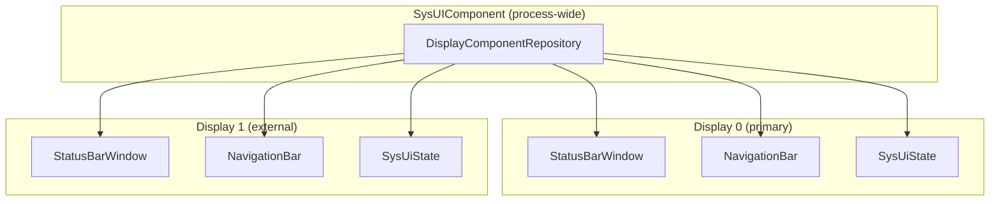

### 47.10.5  Connected Displays

The `StatusBarConnectedDisplays` flag gates the expansion of status bar
functionality to connected displays.  When enabled, `CollapsedStatusBarFragment`
instances are created per-display, each with its own icon pipeline and
visibility management.

---

## 47.11  Navigation Bar

The navigation bar provides the system navigation controls at the bottom (or
side) of the screen.  It supports three modes: 3-button, 2-button, and fully
gestural.

### 47.11.1  Navigation Mode Controller

`NavigationModeController` tracks the current navigation mode, which is
determined by an overlay package:

```java
// frameworks/base/packages/SystemUI/src/com/android/systemui/navigationbar/
//   NavigationModeController.java
@SysUISingleton
public class NavigationModeController implements Dumpable {
    public interface ModeChangedListener {
        void onNavigationModeChanged(int mode);
    }
    // Reads navigation mode from overlay applied to
    // com.android.internal.R.integer.config_navBarInteractionMode
}
```

The three modes are defined in `WindowManagerPolicyConstants`:

| Mode | Constant | Description |
|---|---|---|
| 3-button | `NAV_BAR_MODE_3BUTTON` | Back, Home, Recents buttons |
| 2-button | `NAV_BAR_MODE_2BUTTON` | Back gesture + Home pill |
| Gestural | `NAV_BAR_MODE_GESTURAL` | Full gesture navigation |

### 47.11.2  NavigationBarView

`NavigationBarView` is the root view for the navigation bar:

```java
// frameworks/base/packages/SystemUI/src/com/android/systemui/navigationbar/views/
//   NavigationBarView.java
public class NavigationBarView extends FrameLayout
        implements Gefingerpoken {
    // Contains ButtonDispatchers for Home, Back, Recents
    // Manages rotation, layout direction, and button visibility
}
```

The view uses `ButtonDispatcher` to abstract button behaviour across different
button implementations (physical, software, or gesture targets):

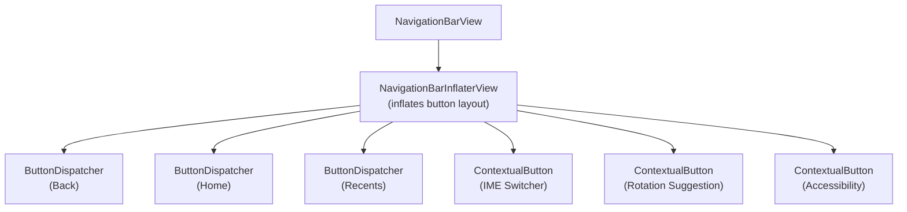

### 47.11.3  NavigationBarInflaterView

The button layout is defined by a string spec that
`NavigationBarInflaterView` parses:

```
// Default 3-button layout spec:
"back[1.0];home;recent[1.0]"

// 2-button layout spec:
"back[1.0];home;contextual[1.0]"

// Gestural layout (minimal):
"home_handle"
```

This allows OEMs to customise button order and sizes through overlays.

### 47.11.4  Gesture Navigation

In gestural mode, the navigation bar is replaced by a thin home indicator
handle.  Navigation gestures are handled by `EdgeBackGestureHandler`:

```java
// frameworks/base/packages/SystemUI/src/com/android/systemui/navigationbar/
//   gestural/EdgeBackGestureHandler.java
public class EdgeBackGestureHandler implements DisplayManager.DisplayListener,
        NavigationModeController.ModeChangedListener {
    // Handles edge swipe gestures for back navigation
    // Manages gesture exclusion zones
    // Integrates with predictive back animation
}
```

The gesture system:

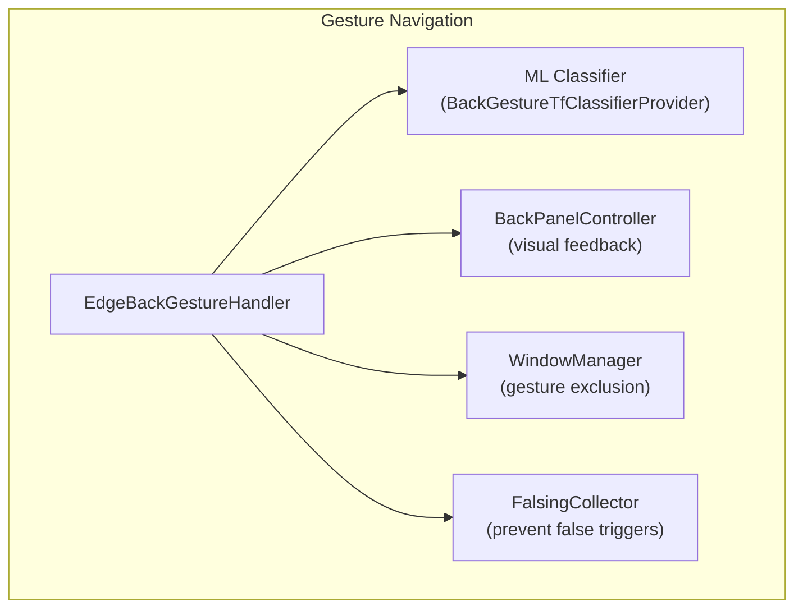

Edge back gesture detection:

1. The handler registers an input monitor for the display edges
2. When a touch starts within the edge zone (typically 24dp), tracking begins
3. A TensorFlow Lite classifier evaluates whether the gesture is a back swipe
   or an app gesture (e.g., drawer open)
4. If classified as back, the `BackPanelController` shows the visual arrow
5. The gesture is dispatched as a `BackEvent` to the focused window
6. If predictive back is enabled, the app can animate in response

### 47.11.5  DisplayBackGestureHandler

For multi-display support, `DisplayBackGestureHandler` wraps the per-display
gesture handling:

```kotlin
// frameworks/base/packages/SystemUI/src/com/android/systemui/navigationbar/
//   gestural/DisplayBackGestureHandler.kt
// Per-display back gesture handling
```

### 47.11.6  NavigationBarTransitions

`NavigationBarTransitions` manages the visual transitions of the navigation
bar between modes:

```
// Transition modes:
MODE_OPAQUE         -- Solid background (default)
MODE_SEMI_TRANSPARENT  -- Partially transparent
MODE_TRANSLUCENT    -- Fully transparent with scrim
MODE_LIGHTS_OUT     -- Dimmed (immersive mode)
MODE_TRANSPARENT    -- Fully transparent
```

### 47.11.7  Taskbar Integration

On large screens (tablets, foldables), the traditional navigation bar may be
replaced by a taskbar provided by Launcher.  `TaskbarDelegate` in SystemUI
coordinates with the Launcher-provided taskbar:

```java
// frameworks/base/packages/SystemUI/src/com/android/systemui/navigationbar/
//   TaskbarDelegate.java
public class TaskbarDelegate implements // ...
    // Routes navigation bar callbacks to the Launcher taskbar
    // Falls back to traditional nav bar when Launcher is unavailable
```

The `enableTaskbarOnPhones` feature flag controls whether the taskbar is also
available on phone form factors.

---

## 47.12  Try It: Add a Custom QS Tile

This hands-on exercise demonstrates how to add a new built-in Quick Settings
tile to SystemUI.  We will create a "Caffeine" tile that keeps the screen awake.

### 47.12.1  Step 1: Create the Tile Class

Create a new file in the tiles directory:

```
frameworks/base/packages/SystemUI/src/com/android/systemui/qs/tiles/
  CaffeineTile.java
```

```java
package com.android.systemui.qs.tiles;

import android.content.Intent;
import android.os.Handler;
import android.os.Looper;
import android.os.PowerManager;
import android.service.quicksettings.Tile;

import androidx.annotation.Nullable;

import com.android.internal.logging.MetricsLogger;
import com.android.systemui.animation.Expandable;
import com.android.systemui.dagger.qualifiers.Background;
import com.android.systemui.dagger.qualifiers.Main;
import com.android.systemui.plugins.ActivityStarter;
import com.android.systemui.plugins.FalsingManager;
import com.android.systemui.plugins.qs.QSTile.BooleanState;
import com.android.systemui.plugins.statusbar.StatusBarStateController;
import com.android.systemui.qs.QSHost;
import com.android.systemui.qs.QsEventLogger;
import com.android.systemui.qs.logging.QSLogger;
import com.android.systemui.qs.tileimpl.QSTileImpl;
import com.android.systemui.res.R;

import javax.inject.Inject;

/**
 * Quick settings tile: Caffeine (keep screen awake).
 *
 * This tile acquires a partial wake lock to prevent the screen from
 * turning off.  The wake lock is released when the tile is toggled
 * off or when SystemUI is destroyed.
 */
public class CaffeineTile extends QSTileImpl<BooleanState> {

    public static final String TILE_SPEC = "caffeine";

    private final PowerManager.WakeLock mWakeLock;
    private boolean mIsActive = false;

    @Inject
    public CaffeineTile(
            QSHost host,
            QsEventLogger uiEventLogger,
            @Background Looper backgroundLooper,
            @Main Handler mainHandler,
            FalsingManager falsingManager,
            MetricsLogger metricsLogger,
            StatusBarStateController statusBarStateController,
            ActivityStarter activityStarter,
            QSLogger qsLogger,
            PowerManager powerManager) {
        super(host, uiEventLogger, backgroundLooper, mainHandler,
                falsingManager, metricsLogger, statusBarStateController,
                activityStarter, qsLogger);
        mWakeLock = powerManager.newWakeLock(
                PowerManager.FULL_WAKE_LOCK, "SystemUI:CaffeineTile");
    }

    @Override
    public BooleanState newTileState() {
        BooleanState state = new BooleanState();
        state.handlesLongClick = false;
        return state;
    }

    @Override
    protected void handleClick(@Nullable Expandable expandable) {
        mIsActive = !mIsActive;
        if (mIsActive) {
            mWakeLock.acquire();
        } else {
            if (mWakeLock.isHeld()) {
                mWakeLock.release();
            }
        }
        refreshState();
    }

    @Override
    protected void handleUpdateState(BooleanState state, Object arg) {
        state.value = mIsActive;
        state.state = mIsActive ? Tile.STATE_ACTIVE : Tile.STATE_INACTIVE;
        state.label = "Caffeine";
        state.contentDescription = "Keep screen awake";
        // Use an appropriate icon resource:
        state.icon = ResourceIcon.get(mIsActive
                ? R.drawable.ic_caffeine_on   // You must add these drawables
                : R.drawable.ic_caffeine_off);
    }

    @Override
    public int getMetricsCategory() {
        return 0; // Custom category or use MetricsEvent.QS_CUSTOM
    }

    @Override
    public Intent getLongClickIntent() {
        return new Intent(android.provider.Settings.ACTION_DISPLAY_SETTINGS);
    }

    @Override
    public CharSequence getTileLabel() {
        return "Caffeine";
    }

    @Override
    protected void handleDestroy() {
        super.handleDestroy();
        if (mWakeLock.isHeld()) {
            mWakeLock.release();
        }
    }
}
```

### 47.12.2  Step 2: Register the Tile in the QS Factory

The tile must be registered so `QSHost` can create it from its tile spec.
Find the tile creation factory (typically in the QS Dagger module or
`QSFactoryImpl`) and add a case for `"caffeine"`:

```java
// In the factory that maps tile specs to tile instances:
case CaffeineTile.TILE_SPEC:
    return mCaffeineTileProvider.get();
```

You also need to add the Dagger provider.  In the relevant Dagger module:

```java
@Binds
@IntoMap
@StringKey(CaffeineTile.TILE_SPEC)
abstract QSTile bindCaffeineTile(CaffeineTile tile);
```

### 47.12.3  Step 3: Add Drawable Resources

Add icon resources to the SystemUI `res/` directory:

```
frameworks/base/packages/SystemUI/res/drawable/
  ic_caffeine_on.xml    -- Filled coffee cup icon (active state)
  ic_caffeine_off.xml   -- Outlined coffee cup icon (inactive state)
```

For vector drawables, use 24x24dp with the appropriate tint.

### 47.12.4  Step 4: Add to Default Tile List (Optional)

To include the tile in the default QS panel, modify the string resource:

```xml
<!-- frameworks/base/packages/SystemUI/res/values/config.xml -->
<string name="quick_settings_tiles_default" translatable="false">
    wifi,cell,battery,flashlight,rotation,caffeine
</string>
```

### 47.12.5  Step 5: Build and Test

```bash
# Build SystemUI
m SystemUI

# Push to device
adb root
adb remount
adb sync system
adb shell stop
adb shell start

# Or for faster iteration, restart just SystemUI:
adb shell killall com.android.systemui
```

Verify the tile appears in the QS editor.  If not in the default list, open
the QS edit mode (pencil icon) and drag the "Caffeine" tile into the active
area.

### 47.12.6  Step 6: Verify Functionality

```bash
# Check wake lock state
adb shell dumpsys power | grep -i "wake lock"

# Toggle the tile and verify the wake lock appears/disappears
# Look for: "SystemUI:CaffeineTile" in the output
```

### 47.12.7  Architecture Summary of a QS Tile

```mermaid
graph TD
    subgraph "Your Tile"
        CT["CaffeineTile"]
        CT -->|"extends"| QTI["QSTileImpl<BooleanState>"]
        QTI -->|"implements"| QST["QSTile (plugin interface)"]
    end
    subgraph "QS Framework"
        QSH["QSHost"]
        QSF["QSFactory"]
        QSP["QSPanel"]
        QTV["QSTileView"]
    end
    subgraph "Dagger"
        MOD["Dagger Module<br/>@IntoMap @StringKey"]
    end
    MOD -->|"provides"| CT
    QSH -->|"creates via"| QSF
    QSF -->|"instantiates"| CT
    CT -->|"state updates"| QTV
    QTV -->|"displayed in"| QSP
```

### 47.12.8  Testing the Tile

For unit testing, follow the existing pattern in the SystemUI test directory:

```
frameworks/base/packages/SystemUI/multivalentTests/
```

Create a test class that:

1. Mocks `PowerManager` and `PowerManager.WakeLock`
2. Calls `handleClick()` and verifies wake lock acquisition
3. Calls `handleClick()` again and verifies wake lock release
4. Calls `handleDestroy()` and verifies cleanup

```java
@SmallTest
@RunWith(AndroidTestingRunner.class)
public class CaffeineTileTest extends SysuiTestCase {
    private CaffeineTile mTile;
    @Mock private PowerManager mPowerManager;
    @Mock private PowerManager.WakeLock mWakeLock;

    @Before
    public void setUp() {
        MockitoAnnotations.initMocks(this);
        when(mPowerManager.newWakeLock(anyInt(), anyString()))
                .thenReturn(mWakeLock);
        // Create tile with mocked dependencies
    }

    @Test
    public void testClick_acquiresWakeLock() {
        mTile.handleClick(null);
        verify(mWakeLock).acquire();
    }

    @Test
    public void testDoubleClick_releasesWakeLock() {
        when(mWakeLock.isHeld()).thenReturn(true);
        mTile.handleClick(null);  // ON
        mTile.handleClick(null);  // OFF
        verify(mWakeLock).release();
    }

    @Test
    public void testDestroy_releasesWakeLock() {
        when(mWakeLock.isHeld()).thenReturn(true);
        mTile.handleClick(null);  // ON
        mTile.handleDestroy();
        verify(mWakeLock).release();
    }
}
```

---

## 47.13  Monet / Dynamic Color / Material You

Android 12 introduced **Material You**, a design language where the entire
system UI derives its colour palette from the user's wallpaper.  The engine
behind this is called **Monet** -- a colour-science pipeline that extracts a
seed colour from `WallpaperColors`, generates tonal palettes through the
Material Color Utilities library, and applies the resulting colours as
fabricated resource overlays across every package.

### 47.13.1  End-to-End Pipeline

```mermaid
graph TB
    subgraph "Wallpaper Stack"
        WP[WallpaperManager]
        WC["WallpaperColors<br/>Primary / Secondary / Tertiary<br/>+ allColors population map"]
    end

    subgraph "SystemUI -- ThemeOverlayController"
        TOC["ThemeOverlayController<br/>CoreStartable"]
        SEED["getSeedColor()<br/>ColorScheme.getSeedColors()"]
        CS_DARK["ColorScheme<br/>(dark)"]
        CS_LIGHT["ColorScheme<br/>(light)"]
        FAB["FabricatedOverlay x3<br/>accent / neutral / dynamic"]
    end

    subgraph "Monet Library"
        HCT["Hct.fromInt(seed)"]
        SCHEME["DynamicScheme<br/>TonalSpot / Vibrant /<br/>Expressive / Neutral / ..."]
        TP["TonalPalette<br/>13 shade stops<br/>0..1000"]
    end

    subgraph "OverlayManager"
        OM["OverlayManagerService"]
        RES["android.R.color.system_*"]
    end

    subgraph "All Apps"
        APPS["Apps read<br/>system_accent1_500,<br/>system_neutral1_100, ..."]
    end

    WP -->|"onColorsChanged"| TOC
    TOC --> SEED
    SEED --> HCT
    HCT --> SCHEME
    SCHEME --> TP
    TP --> CS_DARK
    TP --> CS_LIGHT
    CS_DARK --> FAB
    CS_LIGHT --> FAB
    TOC -->|"applyCurrentUserOverlays()"| OM
    FAB --> OM
    OM -->|"registerFabricatedOverlay"| RES
    RES --> APPS
```

### 47.13.2  Colour Extraction -- Seed Selection

`ColorScheme.getSeedColors()` implements the Monet seed-selection algorithm.
Given `WallpaperColors` (which contains all quantized colours with population
data), it:

1. **Builds a hue histogram** -- 360 slots, each accumulating the proportion
   of colours with that hue.
2. **Scores each colour** by a weighted combination of hue proportion (70%)
   and chroma distance from the 48.0 target (30%).
3. **Filters low-chroma colours** (chroma < 5) which would produce grey
   themes.
4. **Selects hue-distinct seeds** -- iteratively reduces the minimum hue
   distance from 90 degrees down to 15, picking up to 4 seeds.
5. **Falls back to `GOOGLE_BLUE` (0xFF1b6ef3)** if no suitable colour
   exists.

```java
// frameworks/libs/systemui/monet/src/com/android/systemui/monet/ColorScheme.java
public static List<Integer> getSeedColors(WallpaperColors wallpaperColors, boolean filter) {
    // ...
    // Score: 0.7 * hueProportion + 0.3 * (chroma - 48)
    // Iterative hue-distance selection from 90° down to 15°
    // Fallback: GOOGLE_BLUE
}
```

For Live Wallpapers where quantization population is zero, the method trusts
the ordering of the three main colours directly, filtering only by minimum
chroma.

### 47.13.3  The ColorScheme Class

`ColorScheme` wraps the Material Color Utilities `DynamicScheme` and exposes
six `TonalPalette` instances:

```java
// frameworks/libs/systemui/monet/src/com/android/systemui/monet/ColorScheme.java
@Deprecated  // migrating to MaterialDynamicColors
public class ColorScheme {
    private final TonalPalette mAccent1;   // primaryPalette
    private final TonalPalette mAccent2;   // secondaryPalette
    private final TonalPalette mAccent3;   // tertiaryPalette
    private final TonalPalette mNeutral1;  // neutralPalette
    private final TonalPalette mNeutral2;  // neutralVariantPalette
    private final TonalPalette mError;     // errorPalette
}
```

Each palette is constructed from `Hct` (Hue-Chroma-Tone) colour space via
the Material library's `TonalPalette`.  The class delegates to a style-specific
`DynamicScheme` based on `ThemeStyle`:

| ThemeStyle | DynamicScheme | Character |
|---|---|---|
| `TONAL_SPOT` | `SchemeTonalSpot` | Default -- balanced, moderate chroma |
| `VIBRANT` | `SchemeVibrant` | Higher chroma for bolder colours |
| `EXPRESSIVE` | `SchemeExpressive` | Maximum chromatic variety |
| `SPRITZ` | `SchemeNeutral` | Desaturated, subdued |
| `RAINBOW` | `SchemeRainbow` | Full hue rotation |
| `FRUIT_SALAD` | `SchemeFruitSalad` | Playful multi-hue |
| `CONTENT` | `SchemeContent` | Faithful to source image |
| `MONOCHROMATIC` | `SchemeMonochrome` | Single-hue grayscale |
| `CLOCK` | `SchemeClock` | Custom SystemUI scheme for lock screen clocks |
| `CLOCK_VIBRANT` | `SchemeClockVibrant` | High-chroma clock variant |

### 47.13.4  TonalPalette and Shade Stops

Each `TonalPalette` contains 13 tonal stops:

```java
// frameworks/libs/systemui/monet/src/com/android/systemui/monet/TonalPalette.java
public static final List<Integer> SHADE_KEYS =
    Arrays.asList(0, 10, 50, 100, 200, 300, 400, 500, 600, 700, 800, 900, 1000);
```

Shade 0 is white, shade 1000 is black.  The `getAtTone(shade)` method maps
the 0-1000 range to the Material library's 0-100 tone scale via
`(1000 - shade) / 10`.  This produces Android's `system_accent1_0` through
`system_accent1_1000` resource colours.

### 47.13.5  ThemeOverlayController -- The Orchestrator

`ThemeOverlayController` is a `CoreStartable` that wires together wallpaper
change detection, colour scheme generation, and overlay application:

```java
// frameworks/base/packages/SystemUI/src/com/android/systemui/theme/
//   ThemeOverlayController.java
@SysUISingleton
public class ThemeOverlayController implements CoreStartable, Dumpable {
    // Key fields:
    protected ColorScheme mColorScheme;
    protected int mMainWallpaperColor = Color.TRANSPARENT;
    private int mThemeStyle = ThemeStyle.TONAL_SPOT;
    private double mContrast = 0.0;
    private FabricatedOverlay mAccentOverlay;
    private FabricatedOverlay mNeutralOverlay;
    private FabricatedOverlay mDynamicOverlay;
}
```

**Listeners registered on `start()`:**

| Listener | Purpose |
|---|---|
| `WallpaperManager.OnColorsChangedListener` | Detects wallpaper colour changes for all users |
| `SecureSettings` ContentObserver | Detects `THEME_CUSTOMIZATION_OVERLAY_PACKAGES` changes |
| `UserTracker.Callback` | Re-evaluates on user switch |
| `UiModeManager.ContrastChangeListener` | Re-evaluates when contrast level changes |
| `BroadcastReceiver` for `ACTION_PROFILE_ADDED` | Applies overlays to new managed profiles |
| `BroadcastReceiver` for `ACTION_WALLPAPER_CHANGED` | Re-enables colour event acceptance |
| `KeyguardTransitionInteractor` (asleep state) | Defers processing until screen off |

### 47.13.6  Colour Event Deferral

The controller uses a sophisticated deferral mechanism to avoid jarring
mid-use colour changes.  When the user is looking at the screen, colour
events are suppressed until the display goes off:

```mermaid
sequenceDiagram
    participant WM as WallpaperManager
    participant TOC as ThemeOverlayController
    participant KTI as KeyguardTransitionInteractor
    participant OMS as OverlayManagerService

    WM->>TOC: onColorsChanged(colors, userId)
    alt Screen is ON and acceptColorEvents=false
        TOC->>TOC: mDeferredWallpaperColors.put(userId, colors)
        Note over TOC: "Deferred until screen off"
    else acceptColorEvents=true
        TOC->>TOC: mAcceptColorEvents = false
        TOC->>TOC: handleWallpaperColors()
        TOC->>TOC: reevaluateSystemTheme()
    end

    KTI-->>TOC: isFinishedIn(DOZING) = true
    TOC->>TOC: Process deferred colours
    TOC->>TOC: createOverlays(seedColor)
    TOC->>OMS: applyCurrentUserOverlays()
```

The wallpaper picker sets `EXTRA_FROM_FOREGROUND_APP=true` on the
`ACTION_WALLPAPER_CHANGED` broadcast, which resets `mAcceptColorEvents` to
`true` -- so user-initiated changes apply immediately.

### 47.13.7  Overlay Creation and Application

The `createOverlays()` method produces three fabricated overlays:

```java
private void createOverlays(int color) {
    mDarkColorScheme = new ColorScheme(color, true, mThemeStyle, mContrast);
    mLightColorScheme = new ColorScheme(color, false, mThemeStyle, mContrast);

    mAccentOverlay = newFabricatedOverlay("accent");
    assignColorsToOverlay(mAccentOverlay, DynamicColors.getAllAccentPalette(), false);

    mNeutralOverlay = newFabricatedOverlay("neutral");
    assignColorsToOverlay(mNeutralOverlay, DynamicColors.getAllNeutralPalette(), false);

    mDynamicOverlay = newFabricatedOverlay("dynamic");
    assignColorsToOverlay(mDynamicOverlay, DynamicColors.getAllDynamicColorsMapped(), false);
    assignColorsToOverlay(mDynamicOverlay, DynamicColors.getFixedColorsMapped(), true);
    assignColorsToOverlay(mDynamicOverlay, DynamicColors.getCustomColorsMapped(), false);
}
```

For themed (non-fixed) colours, each resource has `_light` and `_dark`
variants:

```java
overlay.setResourceValue(prefix + "_light", TYPE_INT_COLOR_ARGB8,
    p.second.getArgb(mLightColorScheme.getMaterialScheme()), null);
overlay.setResourceValue(prefix + "_dark", TYPE_INT_COLOR_ARGB8,
    p.second.getArgb(mDarkColorScheme.getMaterialScheme()), null);
```

Fixed colours (e.g. `primaryFixed`) are not dark/light variant and use the
light scheme only.

### 47.13.8  DynamicColors Token Mapping

The `DynamicColors` class generates the full set of colour tokens:

```java
// frameworks/libs/systemui/monet/src/com/android/systemui/monet/DynamicColors.java
public class DynamicColors {
    // Palette colours: accent1_0..1000, accent2_*, accent3_*, neutral1_*, neutral2_*
    public static List<Pair<String, DynamicColor>> getAllAccentPalette();
    public static List<Pair<String, DynamicColor>> getAllNeutralPalette();

    // Material Dynamic Colors: primary, onPrimary, primaryContainer, ...
    public static List<Pair<String, DynamicColor>> getAllDynamicColorsMapped();

    // Fixed colours: primaryFixed, secondaryFixed, ...
    public static List<Pair<String, DynamicColor>> getFixedColorsMapped();

    // Custom SystemUI-specific colours
    public static List<Pair<String, DynamicColor>> getCustomColorsMapped();
}
```

The token names are mapped to Android resource names with the prefix
`android:color/system_`.  For example, `accent1_500` becomes
`android:color/system_accent1_500`.

### 47.13.9  ThemeOverlayApplier -- The Transaction

`ThemeOverlayApplier` takes the fabricated overlays and applies them via
`OverlayManager` in a single atomic transaction:

```java
// frameworks/base/packages/SystemUI/src/com/android/systemui/theme/
//   ThemeOverlayApplier.java
@SysUISingleton
public class ThemeOverlayApplier implements Dumpable {
    // Overlay categories applied in order:
    static final List<String> THEME_CATEGORIES = Lists.newArrayList(
        OVERLAY_CATEGORY_SYSTEM_PALETTE,    // Tonal palette
        OVERLAY_CATEGORY_ICON_LAUNCHER,     // Launcher icons
        OVERLAY_CATEGORY_SHAPE,             // Adaptive icon shape
        OVERLAY_CATEGORY_FONT,              // System font
        OVERLAY_CATEGORY_ACCENT_COLOR,      // Accent colour
        OVERLAY_CATEGORY_DYNAMIC_COLOR,     // Dynamic Material colours
        OVERLAY_CATEGORY_ICON_ANDROID,      // Framework icons
        OVERLAY_CATEGORY_ICON_SYSUI,        // SystemUI icons
        OVERLAY_CATEGORY_ICON_SETTINGS,     // Settings icons
        OVERLAY_CATEGORY_ICON_THEME_PICKER  // Theme picker icons
    );
}
```

The applier first disables all currently enabled overlays in the affected
categories, then registers new fabricated overlays, and enables them -- all
in a single `OverlayManagerTransaction` to minimise configuration changes.

Categories in `SYSTEM_USER_CATEGORIES` are applied to both the current user
and user 0 (system user), ensuring SystemUI and framework processes see the
correct colours.

### 47.13.10  Settings Integration

Theme customisation is persisted in
`Settings.Secure.THEME_CUSTOMIZATION_OVERLAY_PACKAGES` as a JSON object:

```json
{
  "android.theme.customization.system_palette": "1b6ef3",
  "android.theme.customization.accent_color": "1b6ef3",
  "android.theme.customization.color_source": "home_wallpaper",
  "android.theme.customization.theme_style": "TONAL_SPOT",
  "android.theme.customization.color_both": "1",
  "_applied_timestamp": 1234567890
}
```

The `ThemeOverlayController` monitors this setting and re-evaluates on every
change.  When the wallpaper changes and no preset colour is selected, it
updates this setting automatically, recording the colour source and timestamp.

### 47.13.11  Hardware Default Colours

Starting with Android 15, the `hardwareColorStyles` flag enables OEMs to
provide device-specific default colour palettes during the Setup Wizard.
Before the device is provisioned, the controller reads hardware defaults
(seed colour + style + source) and persists them as the initial theme
setting.

### 47.13.12  Contrast Support

`ThemeOverlayController` integrates with `UiModeManager.getContrast()` to
apply Material Design contrast levels.  When the user changes the display
contrast in Accessibility settings, the controller receives a callback,
passes the new contrast value to `ColorScheme`, and regenerates overlays:

```java
// In ColorScheme constructor:
new ColorScheme(seed, isDark, mThemeStyle, mContrast)
// mContrast flows through to DynamicScheme's contrastLevel parameter
```

This adjusts the tonal mapping so that foreground/background colour pairs
maintain the selected contrast ratio.

### 47.13.13  Key Source Paths (Monet)

```
frameworks/libs/systemui/monet/
  src/com/android/systemui/monet/
    ColorScheme.java             -- Seed selection, palette generation
    TonalPalette.java            -- 13-stop tonal palette wrapper
    DynamicColors.java           -- Token-to-DynamicColor mapping
    CustomDynamicColors.java     -- SystemUI-specific custom tokens
    Shades.java                  -- Legacy shade generation
    SchemeClock.java             -- Clock face colour scheme
    SchemeClockVibrant.java      -- Vibrant clock variant

frameworks/base/packages/SystemUI/src/com/android/systemui/theme/
  ThemeOverlayController.java    -- Orchestrator (CoreStartable)
  ThemeOverlayApplier.java       -- OverlayManager transaction
  ThemeModule.java               -- Dagger module
```

---

## 47.14  Keyguard Deep Dive

Section 22.5 introduced the lock screen architecture.  This section explores
the internal state machine, biometric unlock modes, bouncer flow, AOD
transitions, and the MVI modernisation in much greater detail, drawing on the
full keyguard source tree.

### 47.14.1  Keyguard State Machine

The keyguard subsystem is fundamentally a state machine.  The
`KeyguardState` enum defines all possible states:

```kotlin
// frameworks/base/packages/SystemUI/src/com/android/systemui/keyguard/shared/model/
//   KeyguardState.kt
enum class KeyguardState {
    OFF,              // Display completely off, sensors disabled
    DOZING,           // Low-power mode, some sensors active
    DREAMING,         // Third-party dream (screensaver) showing
    AOD,              // Always-On Display showing minimal UI
    ALTERNATE_BOUNCER,// Biometric credential prompt (e.g. UDFPS)
    PRIMARY_BOUNCER,  // PIN / Pattern / Password prompt
    LOCKSCREEN,       // Full lock screen UI, device awake
    GLANCEABLE_HUB,   // Widget surface accessible from lock screen
    GONE,             // Keyguard dismissed, user in launcher/app
    UNDEFINED,        // Scene framework: any non-lockscreen scene
    OCCLUDED,         // Activity showing over keyguard
}
```

The full state transition graph:

```mermaid
stateDiagram-v2
    [*] --> OFF

    OFF --> DOZING : Screen off,<br/>sensors enabled
    OFF --> AOD : Screen off,<br/>AOD enabled

    DOZING --> AOD : AOD trigger
    DOZING --> LOCKSCREEN : Wake gesture<br/>(lift/tap/power)
    DOZING --> GONE : Fingerprint<br/>WAKE_AND_UNLOCK

    AOD --> LOCKSCREEN : Wake gesture
    AOD --> DOZING : AOD disabled
    AOD --> GONE : Fingerprint<br/>WAKE_AND_UNLOCK

    LOCKSCREEN --> PRIMARY_BOUNCER : Security challenge
    LOCKSCREEN --> ALTERNATE_BOUNCER : UDFPS prompt
    LOCKSCREEN --> AOD : Screen off timeout
    LOCKSCREEN --> DOZING : Screen off (no AOD)
    LOCKSCREEN --> GONE : Swipe unlock<br/>(no security)
    LOCKSCREEN --> GLANCEABLE_HUB : Right edge swipe
    LOCKSCREEN --> OCCLUDED : showWhenLocked<br/>Activity
    LOCKSCREEN --> DREAMING : Dream starts

    PRIMARY_BOUNCER --> GONE : Correct credentials
    PRIMARY_BOUNCER --> LOCKSCREEN : Back / cancel

    ALTERNATE_BOUNCER --> GONE : Biometric match
    ALTERNATE_BOUNCER --> PRIMARY_BOUNCER : Fallback to PIN

    GLANCEABLE_HUB --> LOCKSCREEN : Left edge swipe
    GLANCEABLE_HUB --> PRIMARY_BOUNCER : Swipe up

    OCCLUDED --> LOCKSCREEN : Activity finishes
    OCCLUDED --> GONE : Unlock while occluded

    DREAMING --> LOCKSCREEN : Wake from dream
    DREAMING --> DOZING : Dream to doze

    GONE --> OFF : Screen off
    GONE --> DOZING : Screen off,<br/>sensors enabled
    GONE --> LOCKSCREEN : Lock timeout
```

States marked `@Deprecated` (`PRIMARY_BOUNCER`, `GLANCEABLE_HUB`, `GONE`,
`OCCLUDED`) are being replaced by the Scene Container framework, which maps
them to `UNDEFINED` and manages transitions through `SceneTransitionLayout`.

### 47.14.2  Awake vs Asleep State Classification

The `KeyguardState` companion object classifies each state for power
management:

| State | Awake | Asleep |
|---|:---:|:---:|
| OFF | | X |
| DOZING | | X |
| DREAMING | | X |
| AOD | | X |
| ALTERNATE_BOUNCER | X | |
| PRIMARY_BOUNCER | X | |
| LOCKSCREEN | X | |
| GLANCEABLE_HUB | X | |
| GONE | X | |
| OCCLUDED | X | |
| UNDEFINED | X | |

This classification drives the `ThemeOverlayController` deferred-colour
logic (section 22.13.6) and various power-dependent behaviours.

### 47.14.3  KeyguardTransitionInteractor

`KeyguardTransitionInteractor` is the primary API for observing and driving
transitions between keyguard states:

```kotlin
// frameworks/base/packages/SystemUI/src/com/android/systemui/keyguard/domain/interactor/
//   KeyguardTransitionInteractor.kt
@SysUISingleton
class KeyguardTransitionInteractor @Inject constructor(
    @Application val scope: CoroutineScope,
    private val repository: KeyguardTransitionRepository,
    private val sceneInteractor: SceneInteractor,
    private val powerInteractor: PowerInteractor,
) {
    // Core observable:
    val transitionState: StateFlow<TransitionStep>

    // Per-state transition value (0.0 to 1.0):
    // Caches a MutableSharedFlow per KeyguardState for efficiency
    private val transitionValueCache = mutableMapOf<KeyguardState, MutableSharedFlow<Float>>()
}
```

Each `TransitionStep` contains:

- `from: KeyguardState` -- source state
- `to: KeyguardState` -- destination state
- `value: Float` -- progress from 0.0 (start) to 1.0 (complete)
- `transitionState: TransitionState` -- STARTED, RUNNING, CANCELED, FINISHED

Per-edge flows allow specific interactors to observe only the transitions
they care about:

```kotlin
// Observe only LOCKSCREEN -> AOD transitions
keyguardTransitionInteractor.transition(Edge.create(from = LOCKSCREEN, to = AOD))
    .collect { step -> /* animate based on step.value */ }
```

### 47.14.4  Transition Interactor Hierarchy

Each state-to-state transition has a dedicated interactor:

```
FromAodTransitionInteractor
FromAlternateBouncerTransitionInteractor
FromDozingTransitionInteractor
FromDreamingTransitionInteractor
FromGlanceableHubTransitionInteractor
FromGoneTransitionInteractor
FromLockscreenTransitionInteractor
FromOccludedTransitionInteractor
FromPrimaryBouncerTransitionInteractor
```

These interactors listen for signals (power state changes, biometric events,
user gestures) and call `startTransition()` on the repository to move the
state machine forward.  The `StartKeyguardTransitionModule` wires them all
into Dagger.

### 47.14.5  KeyguardViewMediator Internals

`KeyguardViewMediator` (4,573 lines) remains the bridge between
`system_server` and SystemUI's keyguard.  Key internal mechanisms:

**Lock Timeout Scheduling:**

When the screen turns off, `onStartedGoingToSleep()` schedules a timeout via
`doKeyguardLocked()`.  The lock delay depends on:

- `Settings.Secure.LOCK_SCREEN_LOCK_AFTER_TIMEOUT` -- user-configured delay
- Trust agent state (Smart Lock may defer locking)
- Whether the device was locked manually (power button = immediate lock)

**SIM PIN Management:**

When the SIM requires a PIN, `KeyguardViewMediator` enters a special flow:

1. `onSimStateChanged()` detects `SIM_LOCKED` state
2. `doKeyguardLocked()` forces keyguard display regardless of other settings
3. The bouncer presents a SIM PIN input (distinct from the device PIN)
4. Upon successful verification, keyguard may dismiss or remain if device
   security is also pending

**Occlusion Handling:**

Activities declaring `showWhenLocked=true` can appear over the keyguard.
The mediator tracks occlusion via `setOccluded(boolean)` and coordinates
with `StatusBarKeyguardViewManager` to hide/show the underlying keyguard
views.

### 47.14.6  Biometric Unlock Modes

The `BiometricUnlockInteractor` translates integer mode constants from
`BiometricUnlockController` into the typed `BiometricUnlockMode` enum:

```kotlin
// frameworks/base/packages/SystemUI/src/com/android/systemui/keyguard/shared/model/
//   BiometricUnlockModel.kt
enum class BiometricUnlockMode {
    NONE,                      // No biometric action
    WAKE_AND_UNLOCK,           // Fingerprint while screen off -> wake + dismiss
    WAKE_AND_UNLOCK_PULSING,   // Fingerprint during AOD pulse -> fade out + dismiss
    SHOW_BOUNCER,              // Biometric failure -> show PIN/pattern
    ONLY_WAKE,                 // Wake device, keyguard stays
    UNLOCK_COLLAPSING,         // Face/fingerprint while keyguard visible
    DISMISS_BOUNCER,           // Biometric while bouncer visible -> dismiss
    WAKE_AND_UNLOCK_FROM_DREAM // Fingerprint while dreaming -> wake + dismiss
}
```

The mode determines the keyguard state transition:

```mermaid
graph TD
    FP["Fingerprint<br/>Acquired"]
    FACE["Face<br/>Acquired"]

    FP --> |"Screen OFF"| WAU["WAKE_AND_UNLOCK<br/>OFF/DOZING -> GONE"]
    FP --> |"AOD Pulsing"| WAUP["WAKE_AND_UNLOCK_PULSING<br/>AOD -> GONE"]
    FP --> |"Screen ON,<br/>Keyguard visible"| UC["UNLOCK_COLLAPSING<br/>LOCKSCREEN -> GONE"]
    FP --> |"Dreaming"| WAUD["WAKE_AND_UNLOCK_FROM_DREAM<br/>DREAMING -> GONE"]
    FP --> |"Bouncer visible"| DB["DISMISS_BOUNCER<br/>PRIMARY_BOUNCER -> GONE"]

    FACE --> |"Bypass enabled"| UC
    FACE --> |"Bypass disabled,<br/>on lockscreen"| OW["ONLY_WAKE<br/>Stay on LOCKSCREEN"]
    FACE --> |"Bouncer visible"| DB
    FACE --> |"Failed"| SB["SHOW_BOUNCER<br/>LOCKSCREEN -> PRIMARY_BOUNCER"]
```

The `BiometricUnlockModel` pairs the mode with a `BiometricUnlockSource`
(FINGERPRINT_SENSOR, FACE_SENSOR, etc.) for audit and animation purposes.

### 47.14.7  Bouncer Flow Detail

The bouncer subsystem uses the MVI pattern with a clear data/domain/UI
separation:

```
frameworks/base/packages/SystemUI/src/com/android/systemui/bouncer/
  data/repository/
    BouncerRepositoryModule.kt        -- Dagger bindings
    KeyguardBouncerRepository.kt      -- State repository
  domain/interactor/
    BouncerInteractor.kt              -- Main interactor
    PrimaryBouncerInteractor.kt       -- PIN/pattern/password
    AlternateBouncerInteractor.kt     -- UDFPS/biometric
  domain/startable/
    BouncerStartable.kt               -- CoreStartable wiring
  ui/
    BouncerView.kt                    -- Compose UI
```

**Primary Bouncer Lifecycle:**

```mermaid
sequenceDiagram
    participant User
    participant KTI as KeyguardTransitionInteractor
    participant PBI as PrimaryBouncerInteractor
    participant KBR as KeyguardBouncerRepository
    participant BV as BouncerView
    participant LPU as LockPatternUtils

    User->>KTI: Swipe up on lockscreen
    KTI->>KTI: startTransition(LOCKSCREEN -> PRIMARY_BOUNCER)
    KTI->>PBI: Transition triggers bouncer show
    PBI->>KBR: setPrimaryShow(true)
    KBR-->>BV: primaryBouncerShow flow emits true
    BV->>BV: Inflate PIN/Pattern/Password input

    User->>BV: Enter PIN "1234"
    BV->>PBI: onAuthenticate(pin)
    PBI->>LPU: checkCredential(pin, userId)

    alt Correct
        LPU-->>PBI: Success
        PBI->>KBR: setPrimaryShow(false)
        PBI->>KTI: startTransition(PRIMARY_BOUNCER -> GONE)
    else Wrong
        LPU-->>PBI: Failure
        PBI->>BV: showError("Wrong PIN")
        Note over BV: Lockout after N failures
    end
```

**Alternate Bouncer (UDFPS):**

When the device has an under-display fingerprint sensor, the alternate
bouncer presents a fingerprint icon overlay:

1. `AlternateBouncerInteractor` detects the device supports UDFPS
2. On lockscreen wake, it triggers `LOCKSCREEN -> ALTERNATE_BOUNCER`
3. The UDFPS overlay shows a fingerprint icon at the sensor location
4. If the user taps the sensor and fingerprint matches -> `GONE`
5. If the user wants PIN instead -> `ALTERNATE_BOUNCER -> PRIMARY_BOUNCER`

### 47.14.8  AOD Transition Pipeline

The Always-On Display transition involves multiple coordinated subsystems:

```mermaid
sequenceDiagram
    participant PM as PowerManager
    participant KVM as KeyguardViewMediator
    participant DSH as DozeServiceHost
    participant DSC as DozeScrimController
    participant KTI as KeyguardTransitionInteractor
    participant FADE as FromAodTransitionInteractor

    PM->>KVM: onStartedGoingToSleep()
    KVM->>KTI: startTransition(LOCKSCREEN -> AOD)
    KTI-->>DSC: transitionValue(AOD): 0.0 -> 1.0
    DSC->>DSC: Animate scrim alpha

    Note over DSH: Doze service starts
    DSH->>DSH: Set pulse parameters

    PM->>KVM: onFinishedGoingToSleep()
    Note over DSC: AOD UI fully visible

    Note over DSH: Notification arrives
    DSH->>KTI: startTransition(AOD -> LOCKSCREEN)
    KTI-->>FADE: FromAodTransitionInteractor triggers
    FADE->>DSC: Animate scrim to transparent
    FADE->>DSC: Wake screen
```

Doze parameters control AOD behaviour:

- **DozeParameters.getAlwaysOn()** -- whether AOD is enabled
- **DozeParameters.shouldControlScreenOff()** -- animation vs immediate off
- **DozeParameters.getPulseVisibleDuration()** -- how long notification
  pulse shows

### 47.14.9  KeyguardRepository -- The Data Layer

The `KeyguardRepository` interface centralises all keyguard state:

```
frameworks/base/packages/SystemUI/src/com/android/systemui/keyguard/data/repository/
  KeyguardRepository.kt               -- Core keyguard state
  BiometricSettingsRepository.kt       -- Biometric configuration
  DevicePostureRepository.kt           -- Fold state
  KeyguardBypassRepository.kt          -- Face bypass settings
  KeyguardClockRepository.kt           -- Clock face selection
  KeyguardOcclusionRepository.kt       -- Activity occlusion
  KeyguardQuickAffordanceRepository.kt -- Bottom shortcuts
  KeyguardSmartspaceRepository.kt      -- Smart suggestions
  KeyguardSurfaceBehindRepository.kt   -- Behind-keyguard surface
  InWindowLauncherUnlockAnimationRepository.kt -- Unlock animation
```

Key flows exposed by `KeyguardRepository`:

- `isKeyguardShowing: StateFlow<Boolean>`
- `isKeyguardOccluded: StateFlow<Boolean>`
- `biometricUnlockState: StateFlow<BiometricUnlockModel>`
- `isDozing: StateFlow<Boolean>`
- `isDreaming: StateFlow<Boolean>`
- `wakefulness: StateFlow<WakefulnessModel>`

### 47.14.10  Scene Container Migration

The keyguard is undergoing a major migration to the Scene Container
architecture.  Under this model:

```mermaid
graph TB
    subgraph "Legacy (being replaced)"
        KVM_L["KeyguardViewMediator<br/>manages show/hide"]
        SBKVM_L["StatusBarKeyguardViewManager<br/>bridges to views"]
        CS_L["CentralSurfacesImpl<br/>owns the window"]
    end

    subgraph "Scene Container (new)"
        STL["SceneTransitionLayout<br/>Compose-based scene manager"]
        LS["Lockscreen Scene"]
        BS["Bouncer Overlay"]
        GS["Gone Scene"]
        OS["Occluded Scene"]
        CHS["Communal Scene"]
    end

    KVM_L -.->|"migrating to"| STL
    SBKVM_L -.->|"migrating to"| LS
    CS_L -.->|"migrating to"| STL
```

`KeyguardState.mapToSceneContainerContent()` maps legacy states to scene
keys:

- `LOCKSCREEN`, `AOD`, `DOZING`, `DREAMING`, `OFF`, `ALTERNATE_BOUNCER`
  all map to `Scenes.Lockscreen`
- `PRIMARY_BOUNCER` maps to `Overlays.Bouncer`
- `GONE` maps to `Scenes.Gone`
- `OCCLUDED` maps to `Scenes.Occluded`
- `GLANCEABLE_HUB` maps to `Scenes.Communal`

The `SceneContainerFlag` controls whether the new path is active, with
`@Deprecated` annotations on states that will not exist post-migration.

### 47.14.11  Key Source Paths (Keyguard)

```
frameworks/base/packages/SystemUI/src/com/android/systemui/keyguard/
  KeyguardViewMediator.java                  -- 4,573-line mediator
  KeyguardService.java                       -- system_server bridge
  KeyguardLifecyclesDispatcher.java          -- Lifecycle events
  KeyguardUnlockAnimationController.kt       -- Unlock animation

  shared/model/
    KeyguardState.kt                         -- State enum (11 states)
    BiometricUnlockModel.kt                  -- Unlock mode enum (8 modes)
    TransitionStep.kt                        -- Transition progress
    TransitionState.kt                       -- STARTED/RUNNING/CANCELED/FINISHED
    DozeStateModel.kt                        -- Doze states
    DozeTransitionModel.kt                   -- Doze transitions

  data/repository/
    KeyguardRepository.kt                    -- Core state repository
    KeyguardTransitionRepository.kt          -- Transition state
    BiometricSettingsRepository.kt           -- Biometric config
    KeyguardOcclusionRepository.kt           -- Occlusion tracking

  domain/interactor/
    KeyguardInteractor.kt                    -- General keyguard logic
    KeyguardTransitionInteractor.kt          -- Transition observation
    BiometricUnlockInteractor.kt             -- Biometric mode mapping
    KeyguardDismissInteractor.kt             -- Dismiss handling
    KeyguardEnabledInteractor.kt             -- Enable/disable
    From*TransitionInteractor.kt             -- Per-state transition drivers
    TrustInteractor.kt                       -- Smart Lock
    DozeInteractor.kt                        -- Doze management

  ui/
    KeyguardViewConfigurator.kt              -- View setup

frameworks/base/packages/SystemUI/src/com/android/systemui/bouncer/
  data/repository/KeyguardBouncerRepository.kt
  domain/interactor/PrimaryBouncerInteractor.kt
  domain/interactor/AlternateBouncerInteractor.kt
  ui/BouncerView.kt
```

---

## Summary

SystemUI is a massive, continuously evolving codebase that implements nearly
every system-level UI surface on Android.  This chapter covered:

| Section | Key Classes | Lines of Code (approx.) |
|---|---|---|
| Architecture | `SystemUIApplicationImpl`, `GlobalRootComponent`, `SysUIComponent`, `CoreStartable` | ~500 |
| Status Bar | `CentralSurfacesImpl`, `StatusBarWindowControllerImpl`, `CollapsedStatusBarFragment` | ~3,300 |
| Notification Shade | `NotificationPanelViewController`, `ShadeController`, `NotificationStackScrollLayout` | ~4,300 |
| Quick Settings | `QSHost`, `QSTileImpl`, `QSPanel`, `CustomTile` | ~2,000 |
| Lock Screen | `KeyguardViewMediator`, `StatusBarKeyguardViewManager`, Bouncer | ~4,600 |
| Recent Apps | `OverviewProxyRecentsImpl`, `LauncherProxyService` | ~110 |
| Volume Dialog | `VolumeDialogControllerImpl`, `VolumeDialogImpl` | ~2,900 |
| Power Menu | `GlobalActionsComponent`, `GlobalActionsDialogLite` | ~3,100 |
| Screenshots | `ScreenshotController`, `ImageCapture`, `ImageExporter` | ~1,200 |
| Multi-Display | `PerDisplayRepository`, `StatusBarWindowControllerStore` | ~300 |
| Navigation Bar | `NavigationBarView`, `EdgeBackGestureHandler`, `NavigationModeController` | ~2,500 |
| Monet / Dynamic Color | `ThemeOverlayController`, `ColorScheme`, `TonalPalette`, `DynamicColors` | ~1,600 |
| Keyguard Deep Dive | `KeyguardState`, `KeyguardTransitionInteractor`, `BiometricUnlockInteractor` | ~4,600 |

The codebase is transitioning from monolithic controllers to an MVI
architecture with Dagger DI, Kotlin coroutines, and Jetpack Compose.  Key
modernisation efforts include:

- **Scene Container** -- replacing `CentralSurfaces` with a scene-based
  architecture
- **QS Compose** -- rewriting Quick Settings in Jetpack Compose
- **ShadeWindowGoesAround** -- per-display shade windows
- **Predictive Back** -- back gesture with animation preview
- **StatusBarConnectedDisplays** -- status bar on external displays

### Key Source Paths

```
frameworks/base/packages/SystemUI/
  AndroidManifest.xml                         -- Process declaration
  src/com/android/systemui/
    application/impl/SystemUIApplicationImpl.java  -- App startup
    SystemUIService.java                      -- Entry service
    SystemUIInitializer.java                  -- Dagger initialisation
    dagger/
      GlobalRootComponent.java                -- Root DI component
      SysUIComponent.java                     -- Main DI subcomponent
      SystemUICoreStartableModule.kt          -- Startable bindings
      SystemUIModule.java                     -- Module aggregator
      PerDisplayRepositoriesModule.kt         -- Multi-display DI
    statusbar/phone/
      CentralSurfaces.java                    -- Status bar interface
      CentralSurfacesImpl.java                -- Status bar implementation
      StatusBarKeyguardViewManager.java       -- Keyguard bridge
    statusbar/window/
      StatusBarWindowControllerImpl.java      -- Status bar window
    statusbar/phone/fragment/
      CollapsedStatusBarFragment.java         -- Status bar content
    shade/
      NotificationPanelViewController.java    -- Shade panel
      ShadeController.java                    -- Shade abstraction
      NotificationShadeWindowControllerImpl.java -- Shade window
    qs/
      QSHost.java                             -- Tile management
      QSPanel.java                            -- Tile grid
      tileimpl/QSTileImpl.java                -- Base tile
      tiles/                                  -- Built-in tiles
      external/CustomTile.java                -- Third-party tiles
      pipeline/                               -- New tile pipeline
    keyguard/
      KeyguardViewMediator.java               -- Lock screen logic
    bouncer/                                  -- Security challenge (MVI)
    navigationbar/
      NavigationBarControllerImpl.java        -- Nav bar controller
      NavigationModeController.java           -- Mode tracking
      views/NavigationBarView.java            -- Nav bar view
      gestural/EdgeBackGestureHandler.java    -- Gesture navigation
    volume/
      VolumeDialogControllerImpl.java         -- Volume state
      VolumeDialogImpl.java                   -- Volume UI
    globalactions/
      GlobalActionsComponent.java             -- Power menu entry
      GlobalActionsImpl.java                  -- Default implementation
      GlobalActionsDialogLite.java            -- Dialog UI
    screenshot/
      ScreenshotController.kt                -- Screenshot flow
      TakeScreenshotService.java             -- Screenshot service
    recents/
      OverviewProxyRecentsImpl.java           -- Recents proxy
    display/
      dagger/SystemUIDisplaySubcomponent.java -- Display-scoped DI
  plugin/src/com/android/systemui/plugins/
    qs/QSTile.java                            -- Tile plugin interface
    GlobalActions.java                        -- Power menu plugin
    VolumeDialogController.java               -- Volume plugin
```
